Alamat: Gedung I BPPT Jl. M.H. Thamrin No.8, Kebon Sirih, Jakarta 10340 Telp/Fax: (021) 3927422 / (021) 3927527 Website: www.bsn.go.id

Nomor

: 4357 /BSN/B2-b2/12/2019

10) Jakarta,

Desember 2019

Lampiran : 3 (tiga) berkas

Hal

: Penyampaian Keputusan

Kepala Badan Standardisasi Nasional

Kepada Yth.

Sekretaris Badan Penelitian dan Pengembangan Kementerian Pekerjaan Umum dan Perumahan Rakyat

di Jakarta

#### Bersama ini kami sampaikan:

- 1. Keputusan Kepala Badan Standardisasi Nasional Nomor 667/KEP/BSN/12/2019 tentang Penetapan Standar Nasional Indonesia International Organization Standardization/Technical Report 24578:2012 Hidrometri - Acoustic Doppler Profiler - Metode dan penerapan pengukuran aliran pada saluran terbuka:
- 2. Keputusan Kepala Badan Standardisasi Nasional Nomor 693/KEP/BSN/12/2019 tentang Penetapan Standar Nasional Indonesia 1726:2019 Tata cara perencanaan ketahanan gempa untuk struktur bangunan gedung dan nongedung sebagai revisi dari Standar Nasional Indonesia 1726:2012 Tata cara perencanaan ketahanan gempa untuk struktur bangunan gedung dan nongedung; dan
- 3. Keputusan Kepala Badan Standardisasi Nasional Nomor 694/KEP/BSN/12/2019 tentang Penetapan Standar Nasional Indonesia 2847:2019 Persyaratan beton struktural untuk bangunan gedung dan penjelasan sebagai revisi dari Standar Nasional Indonesia 2847:2013 Persyaratan beton struktural untuk bangunan gedung;

untuk diketahui dan dipergunakan sebagaimana mestinya.

Atas perhatian dan kerja samanya, kami mengucapkan terima kasih.

Biro Sumber Daya Manusia, dan Hukum,

#### Tembusan:

- 1. Sekretaris Utama, BSN;
- 2. Deputi Bidang Pengembangan Standar, BSN;
- 3. Direktur Akreditasi Lembaga Inspeksi dan Lembaga Sertifikasi, BSN;
- 4. Direktur Pengembangan Infrastruktur, Penilaian Kesesuaian, Personal, dan Ekonomi Kreatif, BSN;
- 5. Direktur Sistem Penerapan Standar dan Penilaian Kesesuaian, BSN;
- 6. Kepala Biro Hubungan Masyarakat, Kerja Sama, dan Layanan Informasi, BSN; dan
- 7. Kepala Pusat Data dan Sistem Informasi, BSN


# KEPUTUSAN KEPALA BADAN STANDARDISASI NASIONAL NOMOR 693/KEP/BSN/12/2019 TENTANG

PENETAPAN STANDAR NASIONAL INDONESIA 1726:2019 TATA CARA PERENCANAAN KETAHANAN GEMPA UNTUK STRUKTUR BANGUNAN GEDUNG DAN NONGEDUNG SEBAGAI REVISI DARI STANDAR NASIONAL INDONESIA 1726:2012 TATA CARA PERENCANAAN KETAHANAN GEMPA UNTUK STRUKTUR BANGUNAN GEDUNG DAN NONGEDUNG

#### KEPALA BADAN STANDARDISASI NASIONAL,

Menimbang:

- a. bahwa untuk menjaga kesesuaian Standar Nasional Indonesia terhadap kebutuhan pasar, perkembangan ilmu pengetahuan dan teknologi, pemeliharaan dan penilaian kelayakan dan kekinian, perlu dilakukan kaji ulang;
- b. bahwa berdasarkan hasil kaji ulang, perlu dilakukan revisi Standar Nasional Indonesia;
- c. bahwa berdasarkan pertimbangan sebagaimana dimaksud dalam huruf a dan huruf b, perlu menetapkan Keputusan Kepala Badan Standardisasi Nasional tentang Penetapan Standar Nasional Indonesia 1726:2019 Tata cara perencanaan ketahanan gempa untuk struktur bangunan gedung dan nongedung sebagai revisi dari Standar Nasional Indonesia 1726:2012 Tata cara perencanaan ketahanan gempa untuk struktur bangunan gedung dan nongedung;

Mengingat

 Undang-Undang Nomor 20 Tahun 2014 tentang Standardisasi dan Penilaian Kesesuaian (Lembaran Negara Republik Indonesia Tahun 2014 Nomor 216, Tambahan Lembaran Negara

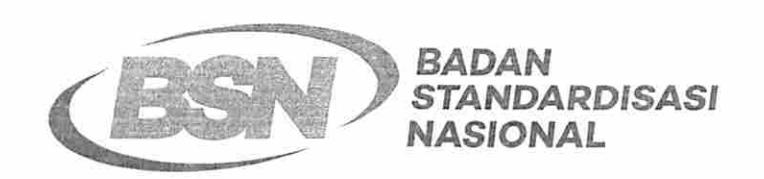

- 2 -

Republik Indonesia Nomor 5584);

- Peraturan Pemerintah Nomor 34 Tahun 2018 tentang Sistem Standardisasi dan Penilaian Kesesuaian Nasional (Lembaran Negara Republik Indonesia Tahun 2018 Nomor 110 Tambahan Lembaran Negara Republik Indonesia Nomor 6225);
- Peraturan Presiden Nomor 4 Tahun 2018 tentang Badan Standardisasi Nasional (Lembaran Negara Republik Indonesia Tahun 2018 Nomor 10);
- Peraturan Badan Standardisasi Nasional Nomor
   Tahun 2018 tentang Pedoman Kaji Ulang Standar Nasional Indonesia (Berita Negara Republik Indonesia Tahun 2018 Nomor 601);
- Peraturan Badan Standardisasi Nasional Nomor 12 Tahun 2018 tentang Perubahan atas Peraturan Badan Standardisasi Nasional Nomor 1 Tahun 2018 tentang Pedoman Tata Cara Penomoran Standar Nasional Indonesia (Berita Negara Republik Indonesia Tahun 2018 Nomor 1762);

Memperhatikan:

Surat Sekretaris Badan Penelitian dan Pengembangan, Badan Penelitian dan Pengembangan, Kementerian Pekerjaan Umum dan Perumahan Rakyat; Nomor: LB 03-07-LS/016 tanggal 8 November 2019 perihal Usulan Penetapan 7 (tujuh) Judul RSNI Hasil Jajak Pendapat;

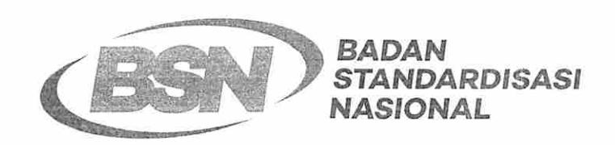

-3-

#### MEMUTUSKAN;

Menetapkan KEPUTUSAN KEPALA BADAN STANDARDISASI

NASIONAL TENTANG PENETAPAN STANDAR

NASIONAL INDONESIA 1726:2019 TATA CARA

PERENCANAAN KETAHANAN GEMPA UNTUK '

STRUKTUR BANGUNAN GEDUNG DAN

NONGEDUNG SEBAGAI REVISI DARI STANDAR

NASIONAL INDONESIA 1726:2012 TATA CARA

PERENCANAAN KETAHANAN GEMPA UNTUK

STRUKTUR BANGUNAN GEDUNG DAN

NONGEDUNG.

KESATU Menetapkan Standar Nasional Indonesia (SNI)

1726:2019 Tata cara perencanaan ketahanan gempa

untuk struktur bangunan gedung dan nongedung

sebagai revisi dari SNI 1726:2012 Tata cara

perencanaan ketahanan gempa untuk struktur

bangunan gedung dan nongedung,

KEDUA SNI yang direvisi masih tetap berlaku sepanjang

belum dicabut dan dinyatakan tidak berlaku.

KETIGA Keputusan Kepala Badan ini mulai berlaku pada

tanggal ditetapkan.

Ditetapkan di Jakarta

pada esember 2019

KEPAL ARDISASI NASIONAL,


**Tata cara perencanaan ketahanan gempa untuk struktur bangunan gedung dan nongedung** 


#### **© BSN 2019**

**Hak cipta dilindungi undang-undang. Dilarang mengumumkan dan memperbanyak sebagian atau seluruh isi dokumen ini dengan cara dan dalam bentuk apapun serta dilarang mendistribusikan dokumen ini baik secara elektronik maupun tercetak tanpa izin tertulis dari BSN**

**BSN** 

**Email: dokinfo@bsn.go.id** 

**www.bsn.go.id** 

**Diterbitkan di Jakarta**

#### **Daftar isi**

<span id="page-6-0"></span>

|      | Daftar isi i                                                                          |     |
|------|---------------------------------------------------------------------------------------|-----|
|      | Daftar gambariii                                                                      |     |
|      | Daftar tabeliv                                                                        |     |
|      | Prakatavi                                                                             |     |
| 1    | Ruang lingkup 1                                                                       |     |
| 1.1  | Umum 1                                                                                |     |
| 1.2  | Prosedur analisis berbasis kinerja 1                                                  |     |
| 2    | Acuan normatif 3                                                                      |     |
| 3    | Istilah, definisi dan notasi 3                                                        |     |
| 4    | Ketentuan umum                                                                        | 23  |
| 4.1  | Gempa rencana, faktor keutamaan gempa dan kategori risiko struktur bangunan           | 23  |
| 4.2  | Kombinasi beban terfaktor dan beban layan                                             | 25  |
| 5    | Prosedur klasifikasi situs untuk desain seismik<br>                                   | 28  |
| 5.1  | Klasifikasi situs                                                                     | 29  |
| 5.2  | Analisis respons situs untuk tanah kelas situs SF<br>                                 | 29  |
| 5.3  | Definisi kelas situs                                                                  | 29  |
| 5.4  | Definisi untuk parameter kelas situs                                                  | 31  |
| 6    | Wilayah gempa dan spektrum respons<br>                                                | 32  |
| 6.1  | Parameter percepatan gempa                                                            | 33  |
| 6.2  | Koefisien-koefisien situs dan paramater-parameter respons spektral percepatan gempa   |     |
|      |                                                                                       |     |
|      | maksimum yang dipertimbangkan risiko-tertarget (MCER)                                 | 34  |
| 6.3  | Parameter percepatan spektral desain                                                  | 35  |
| 6.4  | Spektrum respons desain                                                               | 35  |
| 6.5  | Kategori desain seismik                                                               | 36  |
| 6.6  | Persyaratan desain untuk kategori desain seismik A                                    | 37  |
| 6.7  | Bahaya (hazard) geologi dan investigasi geoteknik                                     | 38  |
| 6.8  | Spektrum respons gempa maksimum yang dipertimbangkan risiko-tertarget (Risk           |     |
|      | Targeted Maximum Considered Earthquake/MCER)                                          | 40  |
| 6.9  | Prosedur gerak tanah pada spesifik-situs                                              | 40  |
| 6.10 | Prosedur gerak tanah spesifik situs untuk desain seismik                              | 40  |
| 6.11 | Gerak tanah vertikal untuk perencanaan gempa                                          | 44  |
| 7    | Persyaratan desain seismik struktur bangunan gedung<br>                               | 45  |
| 7.1  | Struktur atas dan struktur bawah                                                      | 45  |
| 7.2  | Sistem struktur pemikul gaya seismik                                                  | 47  |
| 7.3  | Fleksibilitas diafragma, ketidakberaturan konfigurasi, dan redundansi                 | 56  |
| 7.4  | Kombinasi dan pengaruh beban seismik                                                  | 64  |
| 7.5  | Arah pembebanan                                                                       | 66  |
| 7.6  | Pemilihan prosedur analisis                                                           | 67  |
| 7.7  | Kriteria pemodelan                                                                    | 68  |
| 7.8  | Prosedur gaya lateral ekivalen                                                        | 69  |
| 7.9  | Analisis linear dinamik 77                                                            |     |
| 7.10 | Diafragma, kord dan kolektor                                                          | 81  |
| 7.11 | Dinding struktural dan pengangkurannya                                                | 86  |
| 7.12 | Simpangan antar tingkat dan deformasi                                                 | 88  |
| 7.13 | Desain fondasi                                                                        | 90  |
| 8    | Kriteria desain struktur yang disederhanakan untuk dinding penumpu atau sistem rangka |     |
|      | bangunan sederhana<br>                                                                | 97  |
| 8.1  | Umum                                                                                  | 97  |
| 8.2  | Dasar desain                                                                          | 100 |
| 8.3  | Pengaruh beban seismik dan kombinasi                                                  | 100 |
| 8.4  | Sistem pemikul gaya seismik                                                           | 103 |
|      |                                                                                       |     |

| 8.5  | Fleksibilitas diafragma                                                          | 104 |
|------|----------------------------------------------------------------------------------|-----|
| 8.6  | Penerapan pembebanan                                                             | 104 |
| 8.7  | Persyaratan desain dan pendetailan                                               | 104 |
| 8.8  | Prosedur analisis gaya lateral yang disederhanakan                               | 106 |
| 9    | Persyaratan desain seismik pada elemen nonstruktural                             | 108 |
| 9.1  | Ruang lingkup                                                                    | 108 |
| 9.2  | Perencanaan seismik untuk komponen nonstruktural                                 | 110 |
| 9.3  | Pengangkuran elemen nonstruktural                                                | 114 |
| 9.4  | Elemen arsitektural                                                              | 116 |
| 9.5  | Elemen mekanikal dan elektrikal                                                  | 122 |
| 9.6  | Standar konsensus dan dokumen yang ditinjau lainnya                              | 132 |
| 10   | Persyaratan desain seismik untuk struktur bangunan nongedung                     | 132 |
| 10.1 | Umum                                                                             | 132 |
| 10.2 | Struktur bangunan nongedung yang dipikul oleh struktur lain 134                  |     |
| 10.3 | Persyaratan desain struktur                                                      | 135 |
| 10.4 | Struktur bangunan nongedung menyerupai gedung                                    | 142 |
| 10.5 | Persyaratan umum struktur bangunan nongedung yang tidak menyerupai gedung . 146  |     |
| 10.6 | Tangki dan vessel<br>                                                            | 148 |
| 10.7 | Standar konsensus dan dokumen yang ditinjau lainnya                              | 164 |
| 11   | Analisis riwayat waktu respons nonlinier<br>                                     | 165 |
| 11.1 | Persyaratan umum                                                                 | 165 |
| 11.2 | Gerakan tanah dasar                                                              | 166 |
| 11.3 | Pemodelan dan analisis                                                           | 168 |
| 11.4 | Hasil analisis dan kriteria penerimaan                                           | 169 |
| 11.5 | Kaji ulang desain                                                                | 171 |
| 11.6 | Standar konsensus dan dokumen yang ditinjau lainnya                              | 172 |
| 12   | Struktur dengan isolasi dasar                                                    | 172 |
| 12.1 | Ruang lingkup                                                                    | 172 |
| 12.2 | Persyaratan perencanaan umum                                                     | 172 |
| 12.3 | Kriteria gerak tanah seismik                                                     | 178 |
| 12.4 | Pemilihan prosedur analisis                                                      | 179 |
| 12.5 | Prosedur gaya lateral ekivalen                                                   | 180 |
| 12.6 | Prosedur analisis dinamik                                                        | 185 |
| 12.7 | Pengkajian kembali perencanaan                                                   | 189 |
| 12.8 | Pengujian                                                                        | 189 |
| 13   | Persyaratan desain seismik untuk struktur dengan sistem peredam<br>              | 194 |
| 13.1 | Ruang lingkup                                                                    | 194 |
| 13.2 | Persyaratan desain umum                                                          | 194 |
| 13.3 | Prosedur riwayat<br>respons nonlinear                                            | 199 |
| 13.4 | Kondisi beban seismik dan kriteria penerimaan untuk prosedur respon nonlinear    | 200 |
| 13.5 | Kajian desain                                                                    | 201 |
| 13.6 | Pengujian                                                                        | 201 |
| 13.7 | Prosedur alternatif dan kriteria penerimaannya                                   | 205 |
| 14   | Interaksi tanah-struktur untuk desain bangunan tahan seismik<br>                 | 222 |
| 14.1 | Ruang lingkup                                                                    | 222 |
| 14.2 | Penyesuaian interaksi tanah-struktur/kebutuhan struktural yang disesuaikan untuk |     |
|      | interaksi tanah-struktur                                                         | 222 |
| 14.3 | Efek redaman fondasi                                                             | 225 |
| 14.4 | Efek interaksi tanah-struktur kinematik                                          | 230 |
| 14.5 | Standar konsensus dan dokumen referensi lain                                     | 231 |
| 15   | Peta-peta gerak tanah seismik dan koefisien risiko                               | 231 |
|      | Informasi pendukung terkait perumus standar                                      | 239 |

#### **Daftar gambar**

<span id="page-8-0"></span>

| Gambar 1 – Ilustrasi batang pemisah (stud) pada dinding 7                                                                                                                                |     |
|------------------------------------------------------------------------------------------------------------------------------------------------------------------------------------------|-----|
| Gambar 2 – Jarak patahan untuk berbagai lokasi situs proyek                                                                                                                              | 33  |
| Gambar 3 – Spektrum respons desain                                                                                                                                                       | 36  |
| Gambar 4 – Diafragma fleksibel                                                                                                                                                           | 57  |
| Gambar 5 – Ketidakberaturan horizontal                                                                                                                                                   | 60  |
| Gambar 6 – Ketidakberaturan vertikal                                                                                                                                                     | 62  |
| Gambar 7 – Penentuan rasio tinggi terhadap panjang dinding geser dan pilar dinding                                                                                                       | 64  |
| Gambar 8 – Ilustrasi bidang permukaan tanah (grade plane)                                                                                                                                | 71  |
| Gambar 9 – Faktor pembesaran torsi, Ax<br>                                                                                                                                               | 75  |
| Gambar 10 – Penentuan simpangan antar tingkat                                                                                                                                            | 75  |
| Gambar 11 – Kolektor                                                                                                                                                                     | 83  |
| Gambar 12 – Perhitungan koefisien percepatan desain Cpx<br>pada bangunan dengan N ≤ 2<br>dan pada bangunan dengan N ≥ 3 (N adalah jumlah tingkat)                                        | 84  |
| Gambar 13 – Faktor amplifikasi dinamik untuk komponen                                                                                                                                    | 112 |
| Gambar 14 – Properti nominal untuk isolator model gaya-perpindahan bilinier                                                                                                              | 193 |
| Gambar 15 – Parameter gerak tanah Ss, gempa maksium yang dipertimbangkan risiko<br>tertarget (MCER) wilayah Indonesia untuk spektrum respons 0,2-detik (redaman kritis 5 %)<br>          | 233 |
| Gambar 16 – Parameter gerak tanah, S1, gempa maksimum yang dipertimbangkan risiko<br>tertarget (MCER) wilayah Indonesia untuk spektrum respons 0,2- detik (redaman kritis 5<br>%)<br>234 |     |
| Gambar 17 – PGA. Gempa maksimum yang dipertimbangkan rata-rata geometrik (MCEG)<br>wilayah Indonesia                                                                                     | 235 |
| Gambar 18 –<br>CRS, Koefisien risiko terpetakan, periode spektrum respons 0,2-detik                                                                                                      | 236 |
| Gambar 19 –<br>CR1, Koefisien risiko terpetakan, periode respons spektral 1 detik                                                                                                        | 237 |
| Gambar 20 – Peta transisi periode panjang, TL, wilayah Indonesia                                                                                                                         | 238 |

#### **Daftar tabel**

<span id="page-9-0"></span>

| Tabel 1 – Target keandalan (peluang kegagalan bersyarat/conditional probability of failure)<br>untuk stabilitas struktur akibat beban gempa 1               |  |
|-------------------------------------------------------------------------------------------------------------------------------------------------------------|--|
| Tabel 2 – Target Keandalan (peluang kegagalan bersyarat/conditional probability of failure)<br>untuk komponen struktur biasa nonkritis akibat beban gempa 2 |  |
| Tabel 3 – Kategori risiko bangunan gedung dan nongedung untuk beban gempa24                                                                                 |  |
| Tabel 3 – Kategori risiko bangunan gedung dan nongedung untuk beban gempa (lanjutan) 25                                                                     |  |
| Tabel 4 – Faktor keutamaan gempa25                                                                                                                          |  |
| Tabel 5 – Klasifikasi situs29                                                                                                                               |  |
| Tabel 6 –<br>Koefisien situs, Fa 34                                                                                                                         |  |
| Tabel 7 – Koefisien situs, Fv<br>34                                                                                                                         |  |
| Tabel 8 – Kategori desain seismik berdasarkan parameter respons percepatan pada periode<br>pendek<br>37                                                     |  |
| Tabel 9 – Kategori desain seismik berdasarkan parameter respons percepatan pada periode<br>1 detik37                                                        |  |
| Tabel 10 – Koefisien Situs FPGA<br>39                                                                                                                       |  |
| Tabel 11 – Nilai Koefisien Vertikal Cv<br>45                                                                                                                |  |
| Tabel 12 – Faktor<br>R, Cd, dan untuk sistem pemikul gaya seismik49                                                                                      |  |
| Tabel 13 – Ketidakberaturan horizontal pada struktur59                                                                                                      |  |
| Tabel 14 – Ketidakberaturan vertikal pada struktur61                                                                                                        |  |
| Tabel 15 – Persyaratan untuk masing-masing tingkat yang menahan lebih dari 35 % gaya<br>geser dasar63                                                       |  |
| Tabel 16 – Prosedur analisis yang diizinkan68                                                                                                               |  |
| Tabel 17 – Koefisien untuk batas atas pada periode yang dihitung72                                                                                          |  |
| Tabel 18 – Nilai parameter periode pendekatan<br>Ct<br>dan x72                                                                                              |  |
| Tabel 19 – Faktor reduksi gaya desain diafragma, Rs86                                                                                                       |  |
| a,b<br>Tabel 20 – Simpangan antar tingkat izin, a<br>88                                                                                                    |  |
| Tabel 21 – Batas atas perpindahan tanah horizontal akibat serakan lateral untuk fondasi<br>dangkal95                                                        |  |
| Tabel 22 – Batas beda penurunan95                                                                                                                           |  |
| Tabel 23 – Koefisien dan faktor desain untuk sistem pemikul gaya seismik untuk prosedur<br>desain penyederhanaan99                                          |  |
| Tabel 23 – Koefisien dan faktor desain untuk sistem pemikul gaya seismik untuk prosedur<br>desain penyederhanaan (lanjutan)100                              |  |
| Tabel 24 – Koefisien untuk elemen arsitektural116                                                                                                           |  |
| Tabel 25 – Standar referensi untuk penyegelan (sealant) struktur kaca118                                                                                    |  |
| Tabel 26 – Koefisien seismik untuk elemen mekanikal dan elektrikal 123                                                                                      |  |
| Tabel 27 – Koefisien seismik untuk struktur nongedung serupa gedung138                                                                                      |  |

| Tabel 28 – Koefisien seismik untuk struktur nongedung tidak serupa gedung                 | 139          |
|-------------------------------------------------------------------------------------------|--------------|
| Tabel 29 – Desain lendutan minimum untuk sambungan perpipaan                              | 151          |
| Tabel 30 – Rasio pengangkuran                                                             | 151          |
| Tabel 31 – Tinggi jagaan minimum yang diperlukan                                          | 155          |
| Tabel 32 – Kekuatan material maksimum                                                     | 162          |
| Tabel 33 – Faktor beban untuk perilaku<br>yang dikontrol gaya                             | 171          |
| Tabel 34 – Faktor tahanan seismik untuk aksi yang dikontrol kritis dan biasa              | 171          |
| Tabel 35 – Faktor<br>redaman,<br><br>BM                                                   | 181          |
| Tabel 36 – Koefisien redaman, BV+I, B1D, B1E, BR, B1M, BmD, BmM<br>periode strukutr ≥ T0) | (saat<br>210 |
| Tabel 37 – Koefisien gaya, a,bCmFD<br>                                                    | 221          |
| Tabel 38 – Koefisien gaya, a,bCmFV                                                        | 222          |
| Tabel 39 – Rasio kecepatan gelombang geser efektif (vs/vso)<br>                           | 228          |
| Tabel 40 – Rasio modulus geser efektif (G/G0)<br>                                         | 228          |
| Tabel 41 – Rasio redaman histeretik tanah,<br><br>s                                     | 229          |

#### **Prakata**

<span id="page-11-0"></span>Standar Nasional Indonesia (SNI) 1726:2019 dengan judul *Tata cara perencanaan ketahanan gempa untuk struktur bangunan gedung dan nongedung* adalah revisi dari SNI 1726:2012 *Tata cara perencanaan ketahanan gempa untuk struktur bangunan gedung dan nongedung.* Standar ini didukung dengan pengembangan referensi dan riset oleh perumus standar yang terdiri dari pakar dan praktisi yang tergabung dari berbagai perguruan tinggi, asosiasi, lembaga penelitian, dan instansi pemerintah terkait. Standar ini memberikan persyaratan minimum perencanaan ketahanan gempa untuk struktur bangunan gedung dan nongedung.

Standar Nasional Indonesia (SNI) ini dipersiapkan oleh Komite Teknis 91-01, *Bahan dan Konstruksi Bangunan dan Rekayasa Sipil* melalui Gugus Kerja Bahan Bangunan pada Subkomite 91-01-S4, Teknis *Bahan, Sains, Struktur dan Konstruksi Bangunan*. Tata cara penulisan disusun mengikuti PKBSN Nomor 4 Tahun 2016 tentang Pedoman Penulisan Standar Nasional Indonesia (SNI), yang telah dibahas dalam forum Rapat Konsensus pada tanggal 17 Desember 2018 di Pusat Penelitian dan Pengembangan Perumahan dan Permukiman. Forum rapat konsensus ini dihadiri oleh wakil dari produsen, konsumen, asosiasi, lembaga penelitian, perguruan tinggi dan instansi pemerintah terkait.

Standar ini telah melalui tahap jajak pendapat pada tanggal 30 Agustus 2019 sampai dengan 29 Oktober 2019, dengan hasil akhir disetujui menjadi SNI.

Untuk menghindari kesalahan dalam penggunaan dokumen dimaksud, disarankan bagi pengguna standar untuk menggunakan dokumen SNI yang dicetak dengan tinta berwarna.

Perlu diperhatikan bahwa kemungkinan beberapa unsur dari dokumen standar ini dapat berupa hak paten. Badan Standardisasi Nasional tidak bertanggung jawab untuk pengidentifikasian salah satu atau seluruh hak paten yang ada.

**© BSN 2019 vi**

#### **Tata cara perencanaan ketahanan gempa untuk struktur bangunan gedung dan nongedung**

#### <span id="page-12-0"></span>**1 Ruang lingkup**

#### <span id="page-12-1"></span>**1.1 Umum**

Standar ini memuat persyaratan minimum mengenai beban, tingkat bahaya, kriteria yang terkait, dan sasaran kinerja yang diperkirakan untuk bangunan gedung, struktur lain, dan komponen nonstrukturalnya yang memenuhi persyaratan peraturan bangunan. Beban, kombinasi pembebanan, dan kriteria terkait yang diberikan dalam standar ini harus digunakan untuk perancangan dengan metode kekuatan atau perancangan dengan metode tegangan izin yang terdapat dalam spesifikasi desain untuk material struktural konvensional. Kombinasi pembebanan dan kekuatan desain dianggap mampu memberikan tingkat kinerja yang diharapkan dalam ketentuan standar ini. Prosedur penerapan dengan cara alternatif untuk menunjukkan kinerja yang dapat diterima juga dijelaskan dalam standar ini.

Syarat-syarat perencanaan struktur bangunan gedung dan nongedung tahan gempa yang ditetapkan dalam standar ini tidak berlaku untuk bangunan sebagai berikut:

- a) Struktur bangunan dengan sistem struktur yang tidak umum atau yang masih memerlukan pembuktian tentang kelayakannya;
- b) Struktur jembatan kendaraan lalu lintas (jalan raya dan kereta api), struktur reaktor energi, struktur bangunan keairan dan bendungan, struktur menara transmisi listrik, serta struktur anjungan pelabuhan, anjungan lepas pantai, dan struktur penahan gelombang.

Untuk struktur-struktur bangunan yang disebutkan dalam batasan tersebut di atas, perencanaan harus dilakukan dengan menggunakan standar dan pedoman perencanaan yang terkait, dan melibatkan tenaga-tenaga ahli utama di bidang rekayasa struktur dan geoteknik.

#### <span id="page-12-2"></span>**1.2 Prosedur analisis berbasis kinerja**

Komponen-komponen struktural dan nonstruktural dan sambungannya yang didesain dengan prosedur berbasis kinerja sesuai [0](#page-36-3) atau dengan prosedur analisis yang didukung dengan pengujian untuk memberikan keandalan (*reliability*) yang konsisten dengan target keandalan yang disyaratkan pada pasal ini. Sistem struktural yang terkena beban gempa harus berdasarkan target keandalan sesuai [Tabel 1](#page-12-3) dan [Tabel 2.](#page-13-0) Prosedur analisis yang digunakan harus mempertimbangkan ketidakpastian dalam pembebanan dan tahanan.

Metode pengujian sesuai [0](#page-13-1) hanya diperbolehkan untuk proyek tertentu dan tidak boleh digunakan untuk pengembangan nilai-nilai tahanan material yang digunakan untuk penggunaan pada sistem struktur secara umum.

<span id="page-12-3"></span>**Tabel 1 – Target keandalan (peluang kegagalan bersyarat/***conditional probability of failure***) untuk stabilitas struktur akibat beban gempa**

| Kategori Risiko | Peluang kegagalan bersyarat/conditional<br>probability of failure<br>akibat<br>MCER<br>(%) |
|-----------------|--------------------------------------------------------------------------------------------|
| I & II          | 10                                                                                         |
| III             | 5                                                                                          |
| IV              | 2,5                                                                                        |

**© BSN 2019 1 dari 238**

<span id="page-13-0"></span>**Tabel 2 – Target Keandalan (peluang kegagalan bersyarat/***conditional probability of failure***) untuk komponen struktur biasa nonkritis akibat beban gempa**

| Kategori Risiko | Peluang<br>kegagalan<br>bersyarat/conditional<br>probability of failure<br>akibat MCER<br>(%) |
|-----------------|-----------------------------------------------------------------------------------------------|
| I & II          | 25                                                                                            |
| III             | 15                                                                                            |
| IV              | 9                                                                                             |

#### **1.2.1 Analisis**

Analisis harus menggunakan metode yang rasional yang didasarkan pada prinsip-prinsip mekanika teknik dan harus mempertimbangkan semua sumber deformasi dan tahanan. Asumsi-asumsi mengenai kekakuan, kekuatan, redaman, dan sifat (*properties*) lainnya dari komponen dan sambungan yang dianalisis harus berdasarkan data pengujian yang disetujui atau standar referensi.

#### <span id="page-13-1"></span>**1.2.2 Pengujian**

Pengujian yang dilakukan untuk mendapatkan kemampuan kinerja struktur atau komponen struktur dan sambungannya pada saat terkena beban harus dapat mewakili material, konfigurasi, konstruksi, intensitas pembebanan, dan kondisi batas yang mungkin terjadi pada struktur. Bilamana tersedia, program pengujian dan penentuan nilai-nilai desain dari pengujian tersebut harus sesuai dengan standar atau praktik industri yang telah disetujui. Bilamana tidak tersedia, benda uji harus dibuat dengan skala yang sama dengan aslinya, kecuali dapat ditunjukkan bahwa efek skala tidak dominan terhadap kinerja yang akan ditinjau. Evaluasi terhadap hasil uji harus dilakukan berdasarkan nilai-nilai yang didapatkan tidak kurang dari tiga pengujian, dengan nilai deviasi antara satu hasil pengujian terhadap nilai rata-rata tiga pengujian tidak melebihi 15 % atau apabila terdapat minimum enam hasil pengujian yang telah dilakukan. Semua hasil pengujian harus digunakan, kecuali terdapat alasan yang rasional. Laporan pengujian harus berisi lokasi, waktu, dan tanggal pengujian, karakteristik benda uji, fasilitas laboratorium, konfigurasi pengujian, kurva pembebanan dan deformasi, dan kerusakan-kerusakan yang dialami oleh benda uji bersama dengan tingkat beban dan deformasinya.

#### **1.2.3 Dokumentasi/pelaporan**

Prosedur yang digunakan untuk menunjukkan kesesuaian dengan pasal ini dan hasil analisis dan hasil pengujian harus didokumentasikan dan dilaporkan kepada pihak berwenang dan tim ahli untuk dikaji*.*

#### <span id="page-13-2"></span>**1.2.4 Kajian oleh tim ahli (***peer review)*

Prosedur dan hasil analisis, pengujian, dan perhitungan yang digunakan untuk menunjukkan kesesuaian dengan pasal ini harus dipelajari oleh tim independen yang ditunjuk oleh pihak berwenang. Tim ini harus terdiri atas satu atau lebih pakar yang memiliki pengetahuan untuk mengevaluasi kinerja benda uji, termasuk kinerja yang diperkirakan, perilaku komponen dan struktur, beban-beban tertentu yang dipertimbangkan, analisis struktur dari yang diujikan, material konstruksi, dan pengujian laboratorium pada komponen untuk menentukan tahanan struktur dan karakteristik kinerja. Kajian yang dilakukan harus meliputi asumsi-asumsi yang digunakan, kriteria, prosedur, perhitungan, model analitis, setup pengujian, data pengujian, gambar akhir, dan laporan. Setelah selesai melakukan proses kajian, tim ahli yang mengkaji harus mengirim surat ke pihak berwenang menyebutkan lingkup kajian dan temuannya.

**© BSN 2019 2 dari 238**

#### <span id="page-14-0"></span>**2 Acuan normatif**

Dokumen acuan berikut sangat diperlukan untuk penerapan dokumen ini. Untuk acuan bertanggal, hanya edisi yang disebutkan yang berlaku. Untuk acuan tidak bertanggal, berlaku edisi terakhir dari dokumen acuan tersebut (termasuk seluruh perubahan/amandemennya).

SNI 1727, *Beban desain minimum dan kriteria terkait untuk bangunan gedung dan struktur lain* 

SNI 2847, *Persyaratan beton struktural untuk bangunan gedung* 

SNI 4153, *Cara uji penetrasi lapangan dengan SPT*

ASCE/SEI 7-16, *Minimum design loads and associated criteria for buildings and other structures*

FEMA P-1050-2015, *NEHRP Recommended Seismic Provisions for New Buildings and Other Structures*

IBC 2018, *International Building Code*

ACI 313, *Design Specification for Concrete Silos and Stacking Tubes for Storing Granular Materials*

API 620*, Design and Construction of Large, Welded, Low-Pressure Storage Tanks* 

API 650, *Welded Tanks for Oil Storage* 

API 653 , *Tank Inspection, Repair, Alteration, and Reconstruction* 

AWWA D100, *Welded carbon steel tanks for water storage*

AWWA D103, *Factory-coated bolted carbon steel tanks for water storage*

AWWA D107, *Composite elevated tanks for water storage* 

#### <span id="page-14-1"></span>**3 Istilah, definisi dan notasi**

Kecuali tidak sesuai atau tidak ada hubungannya dengan yang ditetapkan dalam standar ini, maka dalam standar ini berlaku beberapa pengertian sebagai berikut:

#### **3.1**

#### **aksi elemen**

perilaku elemen aksial, geser atau lentur

#### **3.1.1**

#### **aksi kritis**

suatu aksi elemen, yang apabila gagal akan menyebabkan keruntuhan beberapa bentang atau beberapa lantai bangunan atau akan menyebabkan penurunan ketahanan seismik yang signifikan pada struktur

#### **3.1.2**

#### **aksi yang dikontrol deformasi**

aksi-aksi elemen ketika kapasitas deformasi inelastik yang andal dapat dicapai tanpa mengalami penurunan kekuatan kritis

**© BSN 2019 3 dari 238**

#### **3.1.3**

#### **aksi yang dikontrol gaya**

aksi-aksi elemen yang dimodelkan dengan sifat linear dan aksi-aksi elemen yang tidak tergolong sebagai aksi dengan deformasi yang terkontrol

#### **3.1.4**

#### **aksi nonkritis**

suatu aksi elemen, yang apabila gagal tidak akan menyebabkan keruntuhan ataupun penurunan ketahanan seismik yang signifikan pada struktur

#### **3.1.5**

#### **aksi biasa**

suatu aksi elemen, yang apabila gagal hanya akan menyebabkan keruntuhan yang bersifat lokal, yang terdiri atas tidak lebih dari satu bentang dalam satu lantai, dan tidak akan menyebabkan penurunan ketahanan seismik yang signifikan pada struktur

#### **3.2**

**arah**

#### **3.2.1**

#### **arah horizontal ortogonal utama**

arah yang mengendalikan elemen-elemen vertikal pemikul gaya lateral

#### **3.2.2**

#### **arah lateral**

arah yang memotong sumbu longitudinal struktrur global

#### **3.3**

#### **balok kopel**

balok yang difungsikan untuk menghubungkan elemen-elemen dinding struktural beton yang bersebelahan agar keduanya bekerja sebagai satu kesatuan dalam menahan gaya lateral akibat gempa

#### **3.4**

#### **bangunan gedung**

struktur yang umumnya tertutup oleh dinding-dinding dan atap, yang dibangun untuk menyediakan perlindungan bagi jenis-jenis pemanfaatan yang direncanakan

#### **3.5**

#### **beban-beban**

gaya-gaya atau aksi-aksi lainnya yang dihasilkan dari berat seluruh material bangunan, hunian dan pemanfaatannya, pengaruh-pengaruh lingkungan, pergerakan relatif, beda penurunan, dan perubahan-perubahan dimensi yang tertahan

#### **3.5.1**

#### **beban-beban tetap**

beban-beban tetap atau permanen adalah beban-beban yang relatif tidak bervariasi atau yang kecil variasinya terhadap waktu. Beban-beban lainnya merupakan beban-beban yang bervariasi

#### **3.6**

#### **beban layan**

beban-beban yang bekerja pada suatu bangunan gedung atau struktur lainnya akibat (1) berat sendiri dan beban mati tambahan, (2) beban-beban hidup yang diasumsikan ada selama pemanfaatan atau penggunaan normal bangunan gedung atau struktur lainnya, (3) bebanbeban lingkungan yang diperkirakan akan terjadi selama umur layan yang ditetapkan untuk bangunan gedung atau struktur lainnya, dan (4) gaya dan pengaruh regangan sendiri. Bebanbeban hidup layan dan beban-beban lingkungan untuk kondisi batas tertentu diizinkan kurang dari beban-beban desain yang disyaratkan dalam tata cara ini. Beban-beban layan harus diidentifikasi untuk setiap kondisi kemampuan layanan yang sedang diperiksa

#### **3.7**

#### **beton**

#### **3.7.1**

#### **beton polos**

beton tanpa tulangan ataupun beton yang mengandung tulangan kurang dari syarat penulangan minimum untuk beton bertulang (berdasarkan SNI 2847)

#### **3.7.2**

#### **beton bertulang**

beton prategang ataupun nonprategang dengan penggunaan baja tulangan yang memenuhi syarat penulangan minimum (berdasarkan SNI 2847), dan didesain dengan asumsi bahwa kedua material tersebut bekerja sebagai satu kesatuan untuk menahan gaya-gaya yang bekerja

#### **3.8**

#### **bidang permukaan tanah (***grade plane***)**

bidang referensi horizontal yang mewakili rata-rata dari level tanah akhir di sekitar struktur dan dinding eksteriornya

#### **3.9**

#### **dasar**

level dimana gerak tanah seismik horizontal dianggap bekerja pada struktur

#### **3.10**

#### **deformabilitas**

nilai perbandingan (rasio) deformasi ultimit terhadap deformasi batas

#### **3.10.1**

#### **elemen struktur dengan deformabilitas tinggi**

elemen struktur yang deformabilitasnya tidak kurang dari 3,5 saat dikenakan 4 siklus penuh pada deformasi batas

#### **3.10.2**

#### **elemen struktur dengan deformabilitas terbatas**

elemen struktur yang deformabilitasnya berada di antara deformabilitas tinggi dan deformabilitas rendah

#### **3.10.3**

#### **elemen struktur dengan deformabilitas rendah**

elemen struktur yang deformabilitasnya 1,5 atau kurang

#### **3.11**

#### **deformasi**

**© BSN 2019 5 dari 238**

#### **3.11.1**

#### **deformasi batas (***limit deformation***)**

deformasi yang nilainya dua kali nilai deformasi awal. Deformasi awal ditentukan pada pembebanan sebesar 40 % kuat maksimum

#### **3.11.2**

#### **deformasi ultimit (***ultimate deformation***)**

deformasi saat terjadi kegagalan (pada zona pasca puncak), yaitu ketika beban yang dapat dipikul turun menjadi 80 % atau kurang dari kuat maksimumnya

#### **3.12**

#### **diafragma**

sistem atap, lantai, membran, atau bresing yang berfungsi untuk menyalurkan gaya-gaya lateral ke elemen vertikal pemikul beban lateral

#### **3.12.1**

#### **diafragma terkontrol lentur**

diafragma dengan mekanisme leleh lentur, yang membatasi gaya maksimum yang terjadi pada diafragma, dan memiliki kuat geser rencana atau kapasitas geser nominal terfaktor yang lebih besar dari gaya geser yang termobilisir saat tercapainya kuat lentur nominal diafragma

#### **3.12.2**

#### **diafragma terkontrol geser**

diafragma yang tidak memenuhi persyaratan sebagai diafragma terkontrol lentur

#### **3.12.3**

#### **gaya transfer pada diafragma**

gaya yang terjadi pada suatu diafragma yang disebabkan oleh penyaluran gaya seismik dari elemen-elemen vertikal pemikul gaya seismik yang berada di atas diafragma tertinjau ke elemen-elemen vertikal pemikul gaya seismik di bawahnya, karena adanya pergeseran dalam penempatan elemen-elemen vertikal tersebut atau adanya perubahan kekakuan lateral relatif pada elemen-elemen vertikal tersebut

#### **3.12.3**

#### **diafragma vertikal**

lihat definisi mengenai dinding geser

#### **3.13**

#### **dinding**

duatu komponen yang memiliki kemiringan 60 derajat atau lebih dengan bidang horizontal dipakai sebagai penutup atau pembagi ruangan

#### **3.13.1**

#### **dinding penumpu**

sebarang dinding yang memenuhi klasifikasi di bawah ini:

- Suatu dinding logam atau kayu dengan batang pemisah (*stud*) yang memikul beban vertikal lebih dari 1460 N/m, di luar berat sendirinya;
- Suatu dinding beton atau bata yang memikul beban vertikal lebih dari 2920 N/m, di luar berat sendirinya.

**© BSN 2019 6 dari 238**

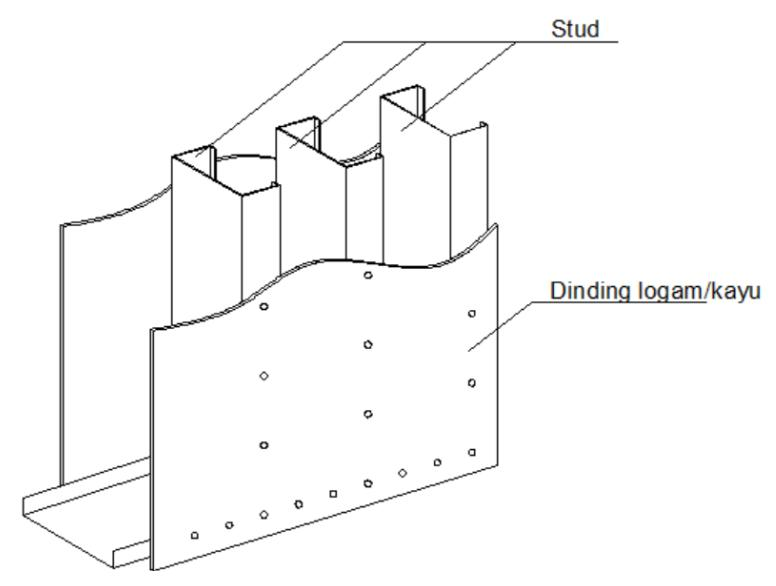

**Gambar 1 – Ilustrasi batang pemisah (***stud***) pada dinding**

#### <span id="page-18-0"></span>**3.13.2**

#### **dinding rangka ringan**

suatu dinding dengan *stud* kayu atau baja

#### **3.13.3**

#### **dinding geser kayu rangka ringan**

suatu dinding yang dikonstruksi dengan *stud* kayu dan dilapisi dengan material yang diuji ketahanannya terhadap geser

#### **3.13.4**

#### **dinding nonpenumpu**

dinding yang bukan merupakan dinding penumpu

#### **3.13.5**

#### **dinding nonstruktural**

dinding yang bukan merupakan dinding penumpu ataupun dinding geser

#### **3.13.6**

#### **dinding geser (diafragma vertikal)**

suatu dinding (penumpu atau nonpenumpu) yang didesain untuk memikul gaya lateral yang bekerja sejajar bidang dinding tersebut

#### **3.13.7**

#### **dinding struktural**

suatu dinding yang memenuhi definisi untuk dinding penumpu atau dinding geser

#### **3.14**

#### **efek P-delta**

efek sekunder berupa geser dan momen pada elemen-elemen struktur, yang disebabkan oleh aksi beban-beban vertikal yang dipicu oleh perpindahan horizontal struktur yang dihasilkan dari berbagai kondisi pembebanan

#### **3.15**

#### **elemen batas**

bagian di sepanjang tepi-tepi dinding dan diafragma untuk menyalurkan atau menahan gayagaya. Elemen-elemen batas diantaranya dapat berupa kord dan kolektor pada perimeter

**© BSN 2019 7 dari 238**

diafragma dan dinding geser, tepi-tepi bukaan, bagian-bagian yang tidak menerus, dan *reentrant corners* (sudut dalam)

#### **3.16**

#### **elemen dengan gaya terkontrol**

aksi-aksi elemen dimana kapasitas deformasi inelastik yang andal tidak akan tercapai tanpa terjadinya penurunan kekuatan kritikal

#### **3.17**

#### **faktor keutamaan**

suatu faktor yang memperhitungkan tingkat risiko terhadap keselamatan jiwa, kesehatan dan kesejahteraan terkait kerusakan properti atau kehilangan fungsi/kegunaan suatu fasilitas

#### **3.18**

#### **fasilitas penting**

bangunan-bangunan gedung atau struktur lainnya yang direncanakan untuk tetap beroperasi bila terjadi beban lingkungan yang ekstrem, seperti gempa

#### **3.19**

#### **fondasi tiang**

elemen fondasi dalam, termasuk di dalamnya fondasi tiang bor, kaison dan tiang pancang

#### **3.20**

#### **gaya geser dasar**

gaya lateral atau geser desain total yang terjadi pada tingkat dasar

#### **3.21**

#### **gaya geser tingkat**

jumlah gaya-gaya seismik lateral desain pada tingkat-tingkat di atas tingkat yang ditinjau

#### **3.22**

#### **gempa desain**

pengaruh suatu gempa yang besarnya dua per tiga dari pengaruh MCE<sup>R</sup> nya

#### **3.23**

#### **gempa karakteristik**

taksiran magnitudo gempa pada suatu sesar aktif sebesar prakiraan gempa maksimum yang mungkin terjadi pada sesar tersebut, tetapi tidak kurang dari magnitudo terbesar yang pernah terjadi dalam rekaman historis sesar tersebut

#### **3.24**

#### **gerak tanah seismik desain**

gerak tanah suatu seismik yang besarnya dua per tiga gerak tanah MCE<sup>R</sup> nya

#### **3.25**

#### **interaksi tanah struktur (ITS)**

definisi-definisi di bawah ini berlaku untuk ketentuan-ketentuan pada pasal [0](#page-233-0)

#### **3.25.1**

#### *base slab averaging*

interaksi tanah-struktur kinematik dari fondasi dangkal (tak tertanam) yang disebabkan oleh ketidakseragaman gelombang pada bagian dasar

**© BSN 2019 8 dari 238**

#### **3.25.2**

#### **gerakan input fondasi**

gerakan yang secara efektif mengeksitasi struktur dan fondasi

#### **3.25.3**

#### **gerakan tanah bebas**

gerakan pada permukaan tanah tanpa adanya bangunan di atasnya

#### **3.25.4**

#### **interaksi tanah-struktural awal/Interaksi tanah-struktur inersia**

interaksi dinamik antara struktur, fondasi, dan tanah di sekitarnya yang disebabkan oleh gerakan input fondasi

#### **3.25.5**

#### **interaksi tanah-struktur kinematik**

modifikasi gerakan tanah bebas dikarenakan gelombang seismik nonvertikal dan ketidakstabilan spasial. Modifikasi ini menghasilkan gerakan input fondasi

#### **3.25.6**

#### **redaman radiasi**

redaman sistem tanah-struktur yang disebabkan oleh pembentukan dan propagasi gelombang menjauhi fondasi, akibat perpindahan dinamik fondasi relatif terhadap perpindahan tanah bebas

#### **3.25.7**

#### **redaman tanah**

redaman histeretik tanah

#### **3.26**

#### **kapasitas fondasi secara geoteknikal**

kapasitas tekan maksimum atau kuat desain suatu fondasi berdasarkan tanah pendukung, batu pendukung, atau material pendukung berkekuatan rendah terkontrol

#### **3.27**

#### **kapasitas fondasi secara struktural**

kuat desain fondasi atau komponen-komponen fondasi sebagaimana ditentukan oleh standar material yang diadopsi dan diubah oleh persyaratan standar ini

#### **3.28**

#### **kategori risiko**

pengelompokan bangunan-bangunan gedung atau struktur-struktur lainnya untuk menentukan besaran beban-beban gempa berdasarkan risiko terjadinya kinerja yang tidak dapat diterima (lihat [Tabel 3\)](#page-35-0)

#### **3.29**

#### **kelas situs**

klasifikasi situs yang dilakukan berdasarkan kondisi tanah di lapangan

#### **3.30**

#### **kolektor (drag strut, tie, diaphragm strut)**

elemen batas suatu diafragma atau dinding geser yang sejajar dengan arah beban yang bekerja yang mengumpulkan serta menyalurkan gaya-gaya geser diafragma ke elemenelemen vertikal pada sistem pemikul gaya seismik atau mendistribusikan gaya-gaya di dalam bidang diafragma atau dinding geser

**© BSN 2019 9 dari 238**

#### **3.31**

#### **komponen**

bagian dari suatu sistem arsitektural, elektrikal, atau mekanikal

#### **3.31.1**

#### **komponen fleksibel**

komponen nonstruktural yang mempunyai periode getar alami lebih besar dari 0,06 detik

#### **3.31.2**

#### **komponen nonstruktural**

bagian dari suatu sistem arsitektural, elektrikal, atau mekanikal yang berada di dalam atau luar struktur bangunan gedung ataupun struktur bangunan nongedung

#### **3.31.3**

#### **komponen kaku**

komponen nonstruktural yang mempunyai periode getar alami kurang dari atau sama dengan 0,06 detik

#### **3.31.4**

#### **komponen kokoh**

komponen kokoh adalah suatu komponen nonstruktural yang telah menunjukkan tetap berfungsi secara konsisten setelah terjadi gempa rencana atau seismik yang lebih besar berdasarkan data pengalaman gempa terdahulu atau pengujian seismik terdahulu bila diangkur dan ditumpu dengan memadai. Pengelompokan ke dalam komponen-komponen nonstruktural yang kokoh harus didasarkan pada suatu perbandingan komponen khusus dengan komponen-komponen yang memiliki kekuatan dan kekakuan yang setara. Contohcontoh komponen-komponen kokoh di antaranya *AC motors*, kompresor*,* dan pompa-pompa horizontal yang diangkur di dasarnya

#### **3.32**

#### **ortogonal**

dalam dua arah horizontal, dan kedua arah tersebut membentuk sudut 90°

#### **3.33**

#### **partisi**

dinding interior nonstruktural yang membentang secara horizontal atau vertikal dari tumpuan yang satu ke tumpuan yang lain

#### **3.34**

#### **pemanas, ventilasi, penyejuk ruangan (AC), dan pendingin ruangan (HVACR)**

peralatan, sistem pendistribusian, dan terminal, kecuali interkoneksi perpipaan dan saluran atau *duct*, yang baik secara kolektif atau individual menyediakan proses pemanasan, ventilasi, penyejukan dan pendinginan ke seluruh atau sebagian bangunan

#### **3.35**

#### **pemanfaatan (***occupancy***)**

maksud penggunaan suatu bangunan gedung atau struktur lainnya atau bagian daripadanya

#### **3.36**

#### **penutup tiang fondasi**

elemen-elemen fondasi dalam dimana fondasi-fondasi tiang, termasuk juga balok-balok pengikat (*sloof*) dan fondasi *slab*, dihubungkan

**© BSN 2019 10 dari 238**

#### **3.37**

#### **percepatan respons gerak tanah gempa maksimum yang dipertimbangkan (MCE)**

pengaruh terbesar gempa yang dipertimbangkan dalam standar ini, secara khusus didefinisikan dalam pengertian-pengertian berikut ini:

#### **3.37.1**

#### **percepatan respons gerak tanah gempa maksimum yang dipertimbangkan dengan risiko tertarget (MCER)**

pengaruh terbesar gempa yang dipertimbangkan dalam standar, ditetapkan dalam arah yang menghasilkan respons gerak tanah horizontal maksimum terbesar, dan disesuaikan dengan risiko yang ditargetkan. Dalam tata cara ini, prosedur umum untuk menetapkan nilai gerak tanah MCE<sup>R</sup> diatur dalam pasal [0,](#page-43-0) dan prosedur spesifik situs diatur dalam [0](#page-51-1)

#### **3.37.2**

#### **percepatan tanah puncak (PGA) gempa maksimum yang dipertimbangkan rata-rata geometrik (MCEG)**

pengaruh terbesar gempa yang dipertimbangkan dalam standar ini ditentukan sebagai nilai rata-rata geometrik percepatan tanah puncak (PGA), tanpa penyesuaian untuk risiko yang ditargetkan. Percepatan tanah puncak MCE<sup>G</sup> yang telah disesuaikan terhadap pengaruh situs (PGAM) digunakan dalam tata cara ini untuk evaluasi likuifaksi, serakan lateral (*lateral spreading),* penurunan seismik, dan masalah geoteknik lainnya. Dalam tata cara ini, prosedur untuk menetapkan PGA<sup>M</sup> diatur dala[m 0,](#page-50-1) dan prosedur spesifik situs (*site specific*) diatur dalam [0](#page-51-1)

#### **3.38**

#### **prosedur berbasis kinerja**

alternatif terhadap prosedur pencegahan yang ditetapkan dalam standar ini, yang dikarakterisasi melalui analisis rekayasa proyek spesifik, dan terkadang dilengkapi dengan pengujian terbatas, untuk menentukan keandalan suatu bangunan gedung atau struktur individual

#### **3.39**

#### **rangka baja, rak penyimpanan**

sebuah kerangka atau rangkaian komponen struktur yang terbuat dari baja canai dingin atau canai panas yang dimaksudkan untuk penyimpanan material, antara lain berupa rak palet penyimpanan, rak pemisah, rak yang bisa dipindah, rak dengan dudukan, sistem rak penyimpanan dan pengambilan otomatis (rak bertumpuk), rak geser, rak berangkai, rak miring, modul penghubung rak, rak beralas platform. Segala jenis rak lainnya, seperti rak *drive in* dan *drive thru*, rak konsol, rak yang mudah dipindahkan atau rak yang terbuat dari material selain baja, tidak termasuk dalam kategori rak penyimpanan baja yang dimaksud dalam tata cara ini

#### **3.40**

#### **rak penyimpanan, konsol baja**

kerangka atau rangkaian komponen struktur yang terbuat dari baja canai dingin atau canai panas, utamanya dalam bentuk kolom vertikal, landasan yang diperpanjang, lengan horizontal yang tersambung dari muka kolom, dan pengaku longitudinal antara kolom. Dimungkinkan juga berupa balok rak antara lengan-lengan, tergantung pada jenis benda atau produk yang disimpan; definisi ini tidak termasuk jenis rak lainnya seperti rak palet penyimpanan, rak *drive in* dan *drive thru*, atau rak yang terbuat dari material selain baja

#### **3.41**

#### **rasio simpangan antar tingkat**

simpangan antar tingkat dibagi dengan tinggi lantai (*hx*) yang ditinjau

**© BSN 2019 11 dari 238**

#### **3.42**

#### **rasio tulangan longitudinal**

luas total penampang tulangan longitudinal dibagi dengan luas penampang betonnya

#### **3.43**

#### **sambungan positif**

sambungan positif digunakan untuk menghubungkan suatu komponen ke komponen pendukungnya seperti lantai, kolom, dinding geser, dan lain-lain, dimana sambungan tersebut tidak mengandalkan tahanan gesek akibat efek gravitasi. Sambungan positif pada umumnya menggunakan sekrup, baut, kabel, rantai, profil siku, dan yang lainnya

#### **3.44**

#### **sesar aktif**

sesar atau patahan yang dinyatakan aktif oleh pihak yang berwenang dalam menangani bidang geologi berdasarkan data yang memadai

#### **3.45**

#### **simpangan antar tingkat**

perpindahan horizontal di bagian atas tingkat yang ditinjau relatif terhadap bagian bawahnya, seperti yang didefinisikan pada [0](#page-86-2)

#### **3.46**

#### **sistem distribusi**

sebuah sistem interkoneksi pipa, tabung, pipa pelindung kabel (*conduit*), *raceway* atau *duct.*  Sistem distribusi mencakup komponen-komponen seperti katup (*valve*), pompa jaringan dan boks pencampuran (*mixing box*)

#### **3.47**

#### **sistem isolasi**

kumpulan elemen-elemen struktural meliputi semua unit isolator tunggal, semua elemenelemen struktural yang menyalurkan gaya antara elemen-elemen sistem isolasi dan semua sambungan ke elemen-elemen struktur lainnya. Sistem isolasi juga termasuk sistem pengekang pengaruh beban angin, perangkat pendisipasi energi, dan/atau sistem pembatas perpindahan jika sistem-sistem dan perangkat tersebut digunakan untuk memenuhi persyaratan desain pasal [0](#page-183-1)

#### **3.47.1**

#### **daerah batas isolasi**

batas antara bagian atas struktur, yang terisolasi, dan bagian bawah struktur, yang bergerak secara kaku bersama-sama tanah

#### **3.47.2**

#### **degradasi (***scragging***)**

reduksi kekakuan pada produk karet, termasuk isolator elastomerik, akibat pembebanan siklik, yang sebagiannya akan pulih kembali seiring dengan berjalannya waktu

#### **3.47.3**

#### **kekakuan efektif**

nilai gaya lateral pada sistem isolasi, atau pada suatu elemen daripadanya, dibagi dengan perpindahan lateral akibat gaya tersebut

#### **3.47.4**

#### **perpindahan maksimum**

perpindahan lateral maksimum, tanpa tambahan perpindahan yang disebabkan oleh torsi aktual dan torsi tak terduga, yang diperlukan untuk mendesain sistem isolasi. Perpindahan

**© BSN 2019 12 dari 238**

maksimum dihitung secara terpisah masing-masing dengan menggunakan parameter batas atas dan batas bawah

#### **3.47.5**

#### **perpindahan maksimum total**

perpindahan lateral maksimum total, termasuk tambahan perpindahan yang disebabkan oleh torsi aktual dan torsi tak terduga, yang diperlukan untuk memverifikasi stabilitas sistem isolasi atau elemen-elemen terkait, desain pemisahan struktur, dan pengujian beban vertikal pada prototipe unit isolator. Perpindahan maksimum total dihitung secara terpisah masing-masing dengan menggunakan parameter batas atas dan batas bawah

#### **3.47.6**

#### **redaman efektif**

nilai redaman viskos ekivalen yang sesuai dengan besarnya energi yang didisipasi selama respons siklik pada sistem isolasi

#### **3.47.7**

#### **sistem pembatas perpindahan**

suatu kumpulan elemen-elemen struktural yang membatasi perpindahan lateral struktur yang terisolasi secara seismik yang disebabkan oleh gempa maksimum yang dipertimbangkan

#### **3.47.8**

#### **sistem pengekang pengaruh beban angin**

kumpulan elemen-elemen struktural yang memberi kekangan pada struktur yang terisolasi secara seismik terhadap beban angin. Sistem pengekang pengaruh beban angin dapat digunakan baik sebagai suatu bagian integral dari unit-unit isolator atau sebagai suatu perangkat yang terpisah

#### **3.47.9**

#### **level dasar**

level pertama struktur yang terisolasi yang berada di atas daerah batas isolasi

#### **3.47.10**

#### **unit isolator**

suatu elemen struktural dari sistem isolasi yang bersifat fleksibel pada arah horizontal dan kaku pada arah vertikal, yang memungkinkan terjadinya deformasi lateral yang besar akibat beban seismik desain. Suatu unit isolator boleh digunakan baik sebagai bagian dari, atau tambahan pada sistem penahan berat struktur

#### **3.48**

#### **sistem mekanikal elektrikal modular pra-fabrikasi**

sebuah rangkaian komponen mekanikal elektrikal pra-fabrikasi, yang tertutup sebagian atau seluruhnya

#### **3.49**

#### **sistem nonstruktural terpilih (***designated***)**

komponen atau sistem nonstruktural yang bersifat penting sesuai dengan fungsi yang diperkirakan pada struktur dengan kategori risiko IV atau yang bersifat penting untuk keselamatan jiwa pada struktur-struktur yang termasuk dalam kategori risiko lainnya. Komponen atau sistem nonstruktural tersebut harus dikenakan faktor keutamaan komponen, *Ip*, sebesar 1,5 sesuai [0](#page-120-0) standar ini

#### **3.50**

#### **sistem rangka**

**© BSN 2019 13 dari 238**

#### **3.50.1**

#### **rangka bresing**

suatu rangka batang vertikal, atau yang setara dengan jenis konsentris, atau eksentris, yang disediakan pada pada sistem rangka bangunan atau sistem ganda untuk menahan gaya lateral gempa

#### **3.50.2**

#### **rangka bresing konsentris (RBK)**

rangka bresing yang elemen-elemen strukturnya difungsikan utamanya untuk menahan gayagaya aksial. Sistem RBK dapat dikategorikan sebagai rangka bresing konsentris biasa (SRBKB) atau sistem rangka bresing konsentris khusus (SRBKK)

#### **3.50.3**

#### **rangka bresing eksentris (RBE)**

suatu sistem rangka yang diberi bresing diagonal dimana minimal salah satu ujung dari masing-masing elemen bresingnya merangka pada balok sejarak tertentu dari lokasi sambungan balok-kolom, atau dari ujung bresing diagonal yang lain

#### **3.50.4**

#### **rangka pemikul momen (RPM)**

sistem struktur rangka yang elemen-elemen struktur dan sambungannya menahan bebanbeban lateral melalui mekanisme lentur. Sistem ini terbagi menjadi 3, yaitu Sistem Rangka Pemikul Momen Biasa (SRPMB), Sistem Rangka Pemikul Momen Menengah (SRPMM), dan Sistem Rangka Pemikul Momen Khusus (SRPMK)

#### **3.51**

#### **sistem struktur bangunan**

#### **3.51.1**

#### **sistem dinding penumpu**

sistem struktur yang tidak memiliki rangka ruang pemikul beban gravitasi secara lengkap, yang sebagian besar atau seluruh beban gravitasinya dipikul oleh dinding-dinding penumpu. Tahanan terhadap gaya gempa disediakan oleh dinding-dinding geser atau rangka bresing

#### **3.51.2**

#### **sistem rangka gedung**

sistem struktur dengan rangka ruang lengkap untuk memikul beban gravitasi, sedangkan tahanan terhadap gempa disediakan oleh dinding geser ataupun oleh rangka bresing

#### **3.51.3**

#### **sistem ganda**

sistem struktur dengan rangka ruang lengkap untuk memikul beban gravitasi, sedangkan tahanan terhadap gempa disediakan oleh kombinasi sistem rangka pemikul momen dan dinding geser atau oleh kombinasi sistem rangka pemikul momen dan rangka bresing sebagaimana dijelaskan pada [0](#page-64-0)

#### **3.51.4**

#### **sistem interaksi dinding geser dan rangka**

sistem struktur yang menggunakan kombinasi dinding geser beton biasa dan sistem rangka beton pemikul momen biasa untuk menahan beban-beban lateral sesuai perbandingan kekakuan yang dimilikinya, dengan memperhatikan interaksi antara dinding geser dan rangka di semua tingkat atau lantai bangunan

**© BSN 2019 14 dari 238**

#### **3.51.5**

#### **sistem rangka ruang**

sistem struktur 3 dimensi yang terdiri atas elemen-elemen struktur rangka (selain dinding penumpu) yang saling terhubung, yang mampu memikul beban gravitasi, dan bilamana didesain secara khusus juga mampu memberikan tahanan terhadap beban gempa

#### **3.51.6**

#### **sistem kolom kantilever**

sistem struktur pemikul gaya seismik, di mana gaya lateral yang terjadi ditahan secara keseluruhan oleh kolom-kolom yang berperilaku sebagai kantilever yang terjepit di bagian dasar bangunan

#### **3.52**

#### **struktur-struktur lainnya**

struktur-struktur selain gedung, dimana beban-beban yang harus diperhitungkan diatur dalam tata cara ini

#### **3.53**

#### **struktur nongedung**

suatu struktur, selain gedung, yang dibangun sesuai jenis yang tercakup dalam pasal [0](#page-143-1) dan masuk dalam batasan-batasan yang diatur dalam butir [0](#page-143-3)

#### **3.54**

#### **struktur nongedung yang menyerupai gedung**

suatu struktur nongedung yang didesain dan dibangun dengan cara-cara yang menyerupai gedung, memiliki respons terhadap gempa dalam pola yang menyerupai gedung dan memiliki sistem dasar pemikul gaya seismik lateral dan vertikal yang memenuhi salah satu tipe yang ditunjukkan dalam [Tabel 12](#page-60-0) atau [Tabel 28](#page-149-0)

#### **3.55**

#### **struktur tipe bandul terbalik**

suatu struktur kantilever langsing yang lebih dari 50 % massa strukturnya terpusat di puncak struktur, dan stabilitas puncak strukturnya ditentukan oleh kekangan rotasi terhadap puncak elemen kantilever

#### **3.56**

#### **tangki bak terbuka**

sebuah tangki tanpa atap atau penutup yang tetap, penutup melayang, penutup gas, atau cangkang

#### **3.57**

#### **tingkat (***story***)**

bagian suatu struktur yang berada di antara dua permukaan atas lantai-lantai yang berurutan, dan untuk tingkat teratas, dihitung dari permukaan atas lantai ke permukaan atas atap.

#### <span id="page-26-0"></span>**3.58**

#### **notasi**

*a0* = frekuensi tak berdimensi

*ai* = percepatan di tingkat *i* yang diperoleh melalui analisis ragam, dijelaskan pada [0](#page-121-1)

*ap* = faktor amplifikasi elemen (lihat [0\)](#page-121-1)

*A<sup>x</sup>* = faktor amplifikasi torsi (lihat [0\)](#page-85-0)

*A<sup>0</sup>* = luas tapak fondasi (m<sup>2</sup> )

*b* = ukuran denah struktur terpendek, dalam mm diukur tegak lurus *d*

| ektif |
|-------|
| Э     |

- *B* = setengah dari dimensi terkecil pada dasar struktur
- $B_D$  = koefisien numerik seperti yang diatur dalam Tabel 36 untuk redaman efektif yang sama dengan  $\beta_D$
- $B_M$  = koefisien numerik seperti yang diatur dalam Tabel 36 untuk redaman efektif yang sama dengan  $\beta_M$
- B<sub>SSI</sub> = faktor untuk menyesuaikan nilai respons spektra desain dan respons spektra MCE<sub>R</sub> sesuai 0 dan 0 atau respons spektra spesifik situs untuk rasio redaman selain 0.05
- c = jarak dari sumbu netral suatu elemen yang mengalami lentur, hingga serat yang mengalami regangan tekan maksimum (mm)
- $C_d$  = faktor pembesaran simpangan lateral, seperti yang diberikan pada Tabel 12
- $C_{dX}$  = faktor pembesaran simpangan lateral pada arah X
- $C_{dY}$  = faktor pembesaran simpangan lateral pada arah Y
- $C_{p\theta}$  = koefisien percepatan desain diafragma pada dasar struktur
- $C_{pi}$  = koefisien percepatan desain diafragma pada 80 % tinggi struktur diatas dasar,  $h_n$
- $C_{pn}$  = koefisien percepatan desain diafragma pada ketinggian struktur  $h_n$
- $C_{px}$  = koefisien percepatan desain diafragma pada level x
- $C_R$  = koefisien risiko spesifik situs pada suatu periode (lihat 0)
- $C_{RS}$  = nilai terpeta koefisien risiko spesifik situs pada periode pendek
- $C_{RI}$  = nilai terpeta koefisien risiko spesifik situs pada periode 1 detik
- $C_S$  = koefisien respons seismik (lihat 0 dan 0)
- $C_s$  = koefien respons seismik yang ditentukan sesuai 0 dengan mengasumsikan dasar struktur fleksibel pada pertemuan tanah-struktur sesuai 0
- $C_u$  = koefisien untuk batasan atas pada periode yang dihitung (lihat pasal 0)
- $C_v$  = koefisien vertikal (lihat pasal 0)
- $C_{Vx}$  = faktor distribusi vertikal (lihat 0)
- d = dimensi denah terpanjang struktur (mm), yang diukur tegak lurus terhadap b
- $d_c$  = tebal total lapisan tanah kohesif di dalam lapisan 30 m paling atas, lihat 0
- $d_i$  = tebal suatu lapisan tanah atau batuan di dalam lapisan 30 m paling atas, lihat 0
- $d_s$  = tebal total lapisan tanah nonkohesif di dalam lapisan 30 m paling atas, lihat 0
- D = pengaruh dari beban mati
- $D_M$  = perpindahan maksimum (mm), di titik pusat kekakuan sistem isolasi di arah yang ditinjau seperti yang ditentukan oleh persamaan (129)
- $D_{TM}$  = total perpindahan maksimum (mm), dari suatu elemen sistem isolasi, termasuk perpindahan translasi di pusat kekakuan dan komponen perpindahan torsional di arah yang ditinjau seperti yang ditentukan dalam persamaan (131)
- $D_s$  = tebal total lapisan tanah pada persamaan (224)
- e = kedalaman penanaman fondasi di dalam tanah
- e eksentrisitas sesungguhnya (mm), diukur dari denah antara titik pusat massa struktur di atas pemisahan isolasi dan titik pusat kekakuan sistem isolasi, ditambah dengan eksentrisitas tak terduga (mm), diambil sebesar 5 % dari ukuran maksimum bangunan tegak lurus dengan arah gaya yang ditinjau
- E = pengaruh beban seismik horizontal dan vertikal (lihat 0)
- $E_{cl}$  = pengaruh beban seismik horizontal pada kapasitas batas, nilainya sama dengan gaya maksimum yang dapat terjadi pada elemen berdasarkan analisis mekanisme plastis yang rasional.
- $E_h$  = pengaruh gaya seismik horizontal seperti ditentukan dalam 0
- $E_{mh}$  = pengaruh gaya seismik horizontal dengan faktor kuat lebih seperti ditentukan dalam pasal 0

© BSN 2019 16 dari 238

 $E_{\nu}$  = pengaruh gaya seismik vertikal seperti ditentukan dalam 0

 $E_{loop}$  = energi yang dipencarkan (kN-mm), di suatu unit isolator selama satu siklus penuh dari beban yang dapat berbalik arah selama suatu tes perpindahan dengan jangkauan dari  $\Delta^+$  ke  $\Delta^-$ , seperti yang diukur berdasarkan luas daerah yang dilingkup oleh *loop* kurva gaya-simpangan (*force-deflection curve*)

 $F_a$  = koefisien situs untuk periode pendek yaitu pada periode 0,2 detik (lihat 0)

 $F_i$ ,  $F_x$  = bagian dari gaya geser dasar, V, pada tingkat-i atau tingkat-x

 $F_p$  = gaya seismik yang bekerja pada elemen atau komponen dari struktur

 $F_{px}$  = gaya seismik desain pada diafragma di level-x

 $F_{PGA}$  = koefisien situs untuk PGA, lihat 0

 $F_{\nu}$  = koefisien situs untuk periode panjang (pada periode 1 detik), lihat 0

 $F_x$  = gaya seismik lateral (kN) di level-x sebagaimana dijelaskan pada persamaan (14)

 $F^-$  = gaya negatif maksimum suatu unit isolator selama satu siklus tunggal pada pengujian prototipe dengan satu amplitudo perpindahan  $\Delta^-$ 

 $F^+$  = gaya positif (kN) suatu unit isolator selama satu siklus tunggal pada pengujian prototipee dengan satu amplitudo perpindahan  $\Delta^+$ 

g = percepatan gravitasi (m/detik<sup>2</sup>)

 $G = \mathcal{W}_s^2/g$ ; modulus geser rata-rata tanah di bawah fondasi untuk regangan besar (Pa)

 $G_o = \mathcal{W}_{so}^2 / g$ ; modulus geser rata-rata tanah di bawah fondasi untuk regangan kecil (Pa)

h = tinggi rata-rata struktur diukur dari dasar hingga level atap, lihat pasal 0  $h^*$  = tinggi efektif dari bangunan (m), seperti ditentukan dalam pasal 0

 $h_i, h_x = \text{tinggi dari dasar sampai tingkat } i \text{ atau }_x(m) \text{ (lihat 0)}$ 

 $h_i$ ,  $h_l$ ,  $h_x = tinggi (m) di atas daerah batas isolasi yang berada pada level-<math>i$ , l atau x

 $h_n$  = batasan tinggi struktur (m)  $h_{sx}$  = tinggi tingkat di bawah level- $_x$ 

H = tebal lapisan tanah (m)

 $I_e$  = faktor keutamaan gempa (lihat 0)  $I_p$  = faktor keutamaan elemen (lihat 0)

*k* = eksponen yang terkait dengan periode struktur (lihat 0)

 $k_M$  = kekakuan efektif (kN/mm) sistem isolasi pada arah horizontal yang ditinjau.

 $\bar{k}$  = kekakuan gedung

 $k_{\text{eff}}$  = kekakuan efektif satu unit isolator, seperti yang ditentukan dalam persamaan (141)

 $K_v$  = kekakuan lateral fondasi (N/m) (lihat pasal 0)

 $K_{xx},K_{rr}$  = kekakuan rotasi fondasi, lihat persamaan (229) dan (239)  $K_y,K_r$  = kekakuan translasi fondasi, lihat persamaan (228) dan (238)

 $K_{\theta}$  = kekakuan rotasional fondasi seperti yang didefinisikan dalam pasal 13 (N-m/radian)

L = pengaruh beban hidup (lihat pasal 0)

 $L_r$  = pengaruh beban hidup di atap (lihat pasal 0)

 $L_0$  = pengaruh beban hidup desain tanpa reduksi (lihat pasal 0)

MCE = gempa maksimum yang dipertimbangkan

MCE<sub>G</sub> = nilai tengah geometrik gempa tertimbang maksimum MCE<sub>R</sub> = gempa maksimum yang dipertimbangkan risiko-tertarget

 $M^*$  = massa modal efektif untuk ragam getar fundamental pada arah tinjauan  $M_t$  = momen torsi yang diakibatkan eksentrisitas antara pusat massa dan pusat kekakuan (lihat 0)

 $M_{ta}$  = momen torsi tak terduga (lihat 7.8.4.2)

N, = tahanan penetrasi standar sesuai SNI 4153:2008

N = jumlah unit isolator

 $\overline{N}$  = tahanan penetrasi standar rata-rata dalam lapisan 30 m paling atas, lihat 0

 $\overline{N}_{ch}$  = tahanan penetrasi standar rata-rata tanah nonkohesif dalam lapisan 30 m paling atas, lihat 5.4.2

PGA = percepatan muka tanah puncak MCE<sub>G</sub> terpeta;

 $PGA_M$  = percepatan muka tanah puncak  $MCE_G$  yang sudah disesuaikan akibat pengaruh kelas situs, lihat 0

PI = indeks plastisitas tanah

 $P_x$  = total beban rencana vertikal tidak terfaktor pada dan di atas tingkat-x, seperti yang digunakan dalam 0

 $P_T$  = rasio periode transisional efektif sistem isolasi terhadap periode torsional efektif sistem isolasi, sebagaimana dihitung dengan analisis dinamik atau sesuai persamaan (132) tapi tidak perlu diambil lebih kecil dari 1.0.

 $Q_E$  = pengaruh gaya seismik horizontal

 $r_f$  = jari-jari fondasi penampang lingkaran

 $r_I$  = radius girasi sistem isolasi (mm)

R = beban air hujan (lihat 0)

R = koefisien modifikasi respons, lihat Tabel 12, Tabel 23, Tabel 28, atau Tabel 29

R<sub>I</sub> = koefisien numerik terkait jenis sistem struktur pemikul gaya seismik yang berada di atas sistem isolasi

 $R_p$  = faktor modifikasi respons elemen

 $R_s$  = faktor reduksi gaya desain diafragma seperti yang didefinisikan pada butir 0

 $RRS_{bsa}$  = faktor modifikasi respons spektra spesifik situs untuk *base slab averaging*, lihat persamaan (245)

RRS<sub>e</sub> = faktor modifikasi respons spektra spesifik situs untuk fondasi tertanam, lihat persamaan (249)

 $R_X$  = koefisien modifikasi respons struktur pada arah X (lihat 0)  $R_Y$  = koefisien modifikasi respons struktur pada arah Y (lihat 0)

 $s_u = \text{kuat geser niralir, lihat 0}$ 

 $\overline{S}_u$  = kuat geser niralir rata-rata di dalam lapisan 30 m paling atas; lihat pasal 0

 $s_{ui}$  = kuat geser niralir suatu lapisan tanah kohesif i di dalam lapisan 30 m paling atas, lihat 0

 $S_a$  = respons spektra percepatan

 $S_a$  = respons spektra percepatan yang memperhitungkan efek interaksi tanahstruktur, lihat persamaan (217) hingga (220)

 $S_{aM}$  = parameter percepatan respons spektral spesifik situs pada periode tertentu;

 $S_{aMv}$  = percepatan spektral respons vertikal

 $S_{av}$  = percepatan spektral respons vertikal desain

 $S_{DS}$  = parameter percepatan respons spektral pada periode pendek, redaman 5 persen, didefinisikan dalam 0

 $S_{DI}$  = parameter percepatan respons spektral pada periode 1 detik, redaman 5 persen, didefinisikan dalam 0

 $S_{MS}$  = parameter percepatan respons spektral MCE pada periode pendek yang sudah disesuaikan terhadap pengaruh kelas situs (lihat 0)

 $S_{MI}$  = percepatan percepatan respons spektral MCE pada periode 1 detik yang sudah disesuaikan terhadap pengaruh kelas situs (lihat 0)

 $S_S$  = parameter percepatan respons spektral MCE dari peta gempa pada periode pendek, redaman 5 persen, didefinisikan dalam 0

 $S_I$  = parameter percepatan respons spektral MCE dari peta gempa pada periode 1 detik, redaman 5 persen; didefinisikan dalam 0

© BSN 2019 18 dari 238

| $\mathcal{T}$ | = efek kumulatif dari gaya regangan sendiri dan efeknya yang timbul dari |
|---------------|--------------------------------------------------------------------------|
|               | kontraksi atau ekspansi akibat perubahan temperatur lingkungan atau      |
|               | operasional, penyusutan, perubahan kelembaban, rangkak pada material     |
|               | komponen, pergerakan yang disebabkan oleh perbedaan penurunan, atau      |
|               | kombinasinya; lihat 0                                                    |

T = periode fundamental bangunan seperti ditentukan dalam 0

 $\tilde{T}$  = periode fundamental struktur yang ditentukan dari model dengan dasar fleksibel sesuai 0. Batas atas periode fundamental ( $C_uT_a$ ), yang ditentukan dari 0 tidak berlaku, dan periode struktur pendekatan,  $T_a$ , tidak boleh digunakan

 $T_a$  = perioda fundamental pendekatan (lihat pasal 0)

 $T_D$  = periode efektif (detik), dari struktur dengan isolasi seismik pada saat perpindahan rencana dalam arah yang ditinjau seperti yang ditentukan dalam persamaan (130)

 $T_{fb}$  = periode fundamental (detik) struktur diatas daerah batas isolasi yang ditentukan dengan menggunakan analisis modal, dengan asumsi kondisi dasar jepit (pasal 0)

 $T_m$  = periode (detik) ragam getar struktur ke M pada arah yang ditinjau, 0

 $T_L$  = peta transisi perioda panjang yang ditunjukkan pada Gambar 3.

= periode efektif (detik), dari struktur dengan isolasi seismik pada saat perpindahan maksimum dalam arah yang ditinjau seperti yang ditentukan dalam persamaan (130)

 $T_{IM}$  = periode efektif (detik), ragam getar struktur fundamental pada lendutan saat MCE<sub>R</sub> pada arah yang ditinjau sebagaimana dijelaskan pada 0 atau 0

$$T_0 = 0.2 \frac{S_{D1}}{S_{DS}}$$

$$T_s = \frac{S_{D1}}{S_{DS}}$$

Tingkat i = tingkat bangunan yang dirujuk dengan subskrip i; i = 1 menunjukkan tingkat pertama di atas dasar

Tingkat n =tingkat yang paling atas pada bagian utama bangunan;

Tingkat x =lihat "Tingkat i"

 $T_{lower}$  = periode getar pada saat 90 % partisipasi massa aktual telah terpenuhi pada masing-masing respons dua arah ortogonal (lihat 0). Model matematika yang digunakan untuk menghitung  $T_{lower}$  tidak boleh memperhitungkan torsi tak terduga dan harus memperhitungkan efek P-delta.

 $T_{upper}$  = nilai yang lebih besar di antara dua nilai periode getar fundamental ortogonal (lihat 0). Model matematika yang digunakan untuk menghitung  $T_{upper}$  tidak boleh memperhitungkan torsi tak terduga dan harus memperhitungkan efek P-delta.

 $T_v$  = periode getar vertikal

 $\left(\frac{T}{T}\right)_{\text{eff}}$  = perpanjangan periode efektif yang bergantung kepada kebutuhan daktilitas

(μ) yang diperkirakan, lihat persamaan (222)

 $T_{xx}$ ,  $T_{rr}$  = periode fundamental arah rotasi dari sistem interaksi tanah-struktur, lihat persamaan (227) dan (237)

 $T_y,T_r$  = periode fundamental arah translasi dari sistem interaksi tanah-struktur, lihat persamaan (226) dan (236)

v = rasio poisson; diizinkan mengambil sebesar 0,3 untuk tanah pasir dan 0,45 untuk tanah lempung

- $v_s$  = kecepatan rambat gelombang geser pada regangan geser yang kecil (m/detik) ( <  $10^{-3}$  persen), (lihat pasal 0)
- $\overline{V}_s$  = kecepatan rambat gelombang geser rata-rata pada regangan geser yang kecil, di dalam lapisan 30 m teratas, (lihat 0)
- $v_{si}$  = kecepatan rambat gelombang geser dalam lapisan tanah atau batuan ke-i, di dalam lapisan 30 m paling atas, (lihat pasal 0)
- $v_{so}$  = kecepatan rambat gelombang geser rata-rata pada regangan geser yang kecil untuk tanah di bawah fondasi, di dalam lapisan 30 m paling atas, lihat pasal 0
- V = geser desain total di dasar struktur dalam arah yang ditinjau, seperti ditentukan menggunakan prosedur dalam 0
- V<sub>b</sub> = total gaya (geser) lateral seismik rencana elemen-elemen sistem isolasi atau elemen-elemen di bawah sistem isolasi seperti yang ditentukan dalam persamaan (133)
- $V_{EX}$  = nilai maksimum mutlak dari ke tiga hasil analisis gaya geser dasar elastik yang dihitung pada arah X (lihat 0)
- $V_{EY}$  = nilai maksimum mutlak dari ke tiga hasil analisis gaya geser dasar elastik yang dihitung pada arah Y (lihat 0)
- $V_m$  = nilai desain gaya geser dasar seismik untuk ragam getar struktur ke m pada arah yang ditinjau, lihat 0
- $V_{IX}$  = Gaya geser dasar inelastik pada arah X (lihat 0)
- $V_{IY}$  = Gaya geser dasar inelastik pada arah Y (lihat 0)
- $V_t$  = nilai desain dari gaya geser dasar akibat seismik, dijelaskan dalam 0
- $V_x$  = geser seismik desain di tingkat  $_x$  (lihat 0 dan 0)
- $V_X$  = ELF gaya geser dasar pada arah X
- $V_Y$  = ELF gaya geser dasar pada arah Y
- $V_s$  = total gaya (geser) lateral seismik rencana elemen-elemen di atas sistem isolasi seperti yang ditentukan dalam persamaan (134)
- $V_{st}$  = gaya (geser) desain seismik total tak tereduksi pada elemen-elemen di atas level dasar seperti yang ditentukan dalam persamaan (136)
- $\tilde{V}$  = gaya geser dasar yang sudah direduksi akibat interaksi tanah struktur, ditentukan dalam pasal 0
- $\tilde{V}_{t}$  = gaya geser dasar yang disesuaikan dengan memperhitungkan interaksi tanah-struktur, ditentukan melalui analisis ragam respons spektra
- $\tilde{V}_1$  = bagian dari  $\tilde{V}$  yang merupakan konstribusi dari ragam fundamental, sesuai dengan pasal 0
- $V_1$  = nilai desain gaya geser dasar seismik untuk ragam fundamental pada arah respons yang ditentukan, sebagaimana ditetapkan pada 0 dan 0
- $\Delta V$  = reduksi V (lihat pasal 0)
- $\Delta V_1$  = reduksi  $\tilde{V}_1$  (lihat pasal 0)
- w = kadar air tanah (persen)
- $w_i$  = tributari berat sampai tingkat-i (lihat 0)
- $w_x$  = bagian dari berat seismik efektif struktur di tingkat x (lihat 0)
- W = beban angin (lihat 0)
- berat seismik efektif bangunan (lihat 0). Dalam perhitungan untuk bangunan dengan isolasi dasar, W, didefinisikan sesuai dengan pasal 0
- $\overline{W}$  = berat seismik efektif struktur sesuai dengan yang didefinisikan dalam pasal 0

 $\overline{W}_1$  = berat seismik ragam fundamental efektif yang ditentukan dari persamaan (151) untuk nilai m=1.

 $W_c$  = beban gravitasi dari komponen bangunan

 $\overline{W}_m$  = berat seismik efektif struktur pada ragam getar struktur kem sesuai dengan 0

 $W_m$  = energi regangan maksimum yang terjadi pada ragam getar struktur ke m dalam arah yang ditinjau saat lendutan modal  $\delta_{im}$ , sesuai 13.7.3.2.2

 $W_{mj}$  = gaya yang dikerjakan oleh alat peredam ke j dalam satu siklus penuh respons dinamik yang bersesuaian dengan ragam getar struktur ke m pada arah yang ditinjau saat lendutan modal,  $\delta_{im}$ , sesuai 13.7.3.2.2

 $W_p$  = berat dinding sesuai luasan tributari angkur (lihat 0)

 $W_p$  = berat operasional elemen (lihat 0)

 $W_s$  = beban seismik efektif (kN) dari struktur di atas permukaan isolasi, sebagaimana dijelaskan pada 0, tidak termasuk beban seismik efektif (kN) pada tingkat dasar.

x = tingkat yang sedang ditinjau, 1 menandakan tingkat pertama setelah lantai dasar

 $x_{i}$ ,  $y_{i}$  = jarak horizontal (mm) dari pusat massa terhadap isolator ke i pada dua sumbu horizontal dari sistem isolasi

y = jarak (mm) antara titik pusat kekakuan sistem isolasi dan elemen yang diinginkan, diukur tegak lurus terhadap arah beban gempa yang ditinjau

 $\alpha$  = koefisien reduksi gaya geser dasar yang disebabkan oleh redaman fondasi akibat ITS

 $\alpha_{xx}, \alpha_{rr}$  = faktor tanpa dimensi, fungsi dari frekuensi tanpa dimensi ( $\alpha_0$ ), lihat persamaan (234) dan (244)

 $\beta$  = rasio redaman viskos efektif dari sistem struktur, diambil sebesar 5 % kecuali ditentukan dengan analisis

 $\beta_{\theta}$  = rasio redaman viskos efektif dari sistem tanah-struktur, berdasarkan 0, lihat persamaan (221)

 $\beta_f$  = rasio redaman viskos efektif dari sistem tanah-struktur yang berhubungan dengan interaksi fondasi-tanah, lihat persamaan (223)

 $\beta_{rd}$  = rasio redaman radiasi yang ditentukan berdasarkan 0 atau 0, lihat persamaan (225) dan (235)

 $\beta_s$ ,  $\beta'_s$  = rasio redaman histeretik tanah yang ditentukan berdasarkan 0

 $\beta_{xx}$ ,  $\beta_{rr}$  = koefisien redaman fondasi arah rotasi, lihat persamaan (232) dan (242)  $\beta_{y}$ ,  $\beta_{r}$  = koefisien redaman fondasi arah translasi, lihat persamaan (230) dan (240)

 $\widetilde{\beta}$  = fraksi dari redaman kritis sesuai dengan pasal 0

 $\beta_{\rm eff}$  = redaman efektif sistem isolasi seperti yang ditentukan dalam persamaan (142)

 $\Delta$  = simpangan antar tingkat desain (lihat 0)

 $\Delta_a$  = simpangan antar tingkat yang dizinkan (lihat 0)

 $\Delta_{\text{fallout}}$  = perpindahan relatif akibat gempa

 $\Delta^+$  = perpindahan positif maksimum suatu unit isolator setiap siklus selama pengujian prototipe;

 $\Delta^{-}$  = perpindahan negatif minimum suatu unit isolator setiap siklus selama pengujian prototipe

© BSN 2019 21 dari 238

| imD  | = lendutan rencana tingkat ke-i |                                                                  |  | dalam ragam | getar ke | m | pada pusat |
|-------|---------------------------------|------------------------------------------------------------------|--|-------------|----------|---|------------|
|       |                                 | kekakuan dari struktur dalam arah yang ditinjau, sesuai dengan 0 |  |             |          |   |            |

max = perpindahan maksimum (mm) di tingkat-*x*, (lihat 7.8.4.3)

*<sup>M</sup>* = perpindahan respons inelastik maksimum (lihat [0\)](#page-100-0)

*MT* = total jarak terpisah antar struktur yang berdampingan (lihat [0\)](#page-100-0)

*avg* = rata-rata perpindahan di titik-titik terjauh struktur di tingkat *x* (lihat [0\)](#page-85-0)

*x* = defleksi pusat massa di tingkat *x* (lihat [0\)](#page-86-2)

*xe* = defleksi pada lokasi yang disyaratkan dalam [0](#page-86-2) yang ditentukan dengan analisis elastik

Γ = faktor partisipasi ragam

 = koefisien stabilitas untuk pengaruh P-Delta seperti yang ditentukan dalam [0](#page-87-0)

 = faktor redundansi struktur, (lihat [0\)](#page-75-2)

*<sup>s</sup>* = rasio tulangan spiral untuk pracetak atau tiang prategang

 = faktor pengaruh waktu

 max = faktor modifikasi properti untuk perhitungan nilai maksimum dari properti isolator yang ditinjau, digunakan untuk memperhitungkan semua data variabilitas properti isolator seperti dijelaskan pada [0](#page-187-0)

 min = faktor modifikasi properti untuk perhitungan nilai minimum dari properti isolator yang ditinjau, digunakan untuk memperhitungkan semua data variabilitas properti isolator seperti dijelaskan pada [0](#page-187-0)

*ae* max),( = faktor modifikasi properti untuk perhitungan nilai maksimum dari properti isolator yang ditinjau, digunakan untuk memperhitungkan efek umur dan kondisi lingkungan dijelaskan pada [0](#page-187-0)

*ae* min),( = faktor modifikasi properti untuk perhitungan nilai minimum dari properti isolator yang ditinjau, digunakan untuk memperhitungkan efek umur dan kondisi lingkungan seperti dijelaskan pada [0](#page-187-0)

*spec* max),( = faktor modifikasi properti untuk perhitungan nilai maksimum dari properti isolator yang ditinjau, digunakan untuk memperhitungkan variasi properti rata-rata fabrikasi yang diizinkan dari kelompok isolator dengan ukuran yang sama seperti dijelaskan pada [0](#page-187-0)

*spec* min),( = faktor modifikasi properti untuk perhitungan nilai minimum dari properti isolator yang ditinjau, digunakan untuk memperhitungkan variasi properti rata-rata fabrikasi yang diizinkan dari kelompok isolator dengan ukuran yang sama seperti dijelaskan pada [0](#page-187-0)

*test* max),( = faktor modifikasi properti untuk perhitungan nilai maksimum dari properti isolator yang ditinjau, digunakan untuk memperhitungkan efek pemanasan, kecepatan pembebanan, dan uji gesek seperti dijelaskan pada [0](#page-187-0)

*test* max),( = faktor modifikasi properti untuk perhitungan nilai minimum dari properti isolator yang ditinjau, digunakan untuk memperhitungkan efek pemanasan, kecepatan pembebanan, dan uji gesek seperti dijelaskan pada [0](#page-187-0)

*im* = amplitudo lendutan tingkat ke *i* dari ragam getar struktur ke *m* dalam arah yang ditinjau, dinormalisasi terhadap satu kesatuan dengan lantai atap, sesuai [0](#page-217-0)

**© BSN 2019 22 dari 238**

 $\nabla_D$  = kecepatan rencana lantai yang diakibatkan oleh ragam getar struktur fundamental dalam arah yang ditinjau, sesuai 0

 $\nabla_{RD}$  = kecepatan rencana lantai yang diakibatkan oleh ragam getar struktur residual dalam arah yang ditinjau, sesuai 0

 $\Omega_0$  = faktor kuat lebih, seperti yang didefinisikan pada Tabel 12

 $\gamma$  = berat jenis rata-rata tanah sepanjang kedalaman B di bawah dasar struktur

 $\mu$  = kebutuhan daktlitas yang diperkirakan

Ψ = faktor tanpa dimensi, fungsi dari angka poisson, persamaan (233) dan (243)

 $\sum E_D$  = total energi disipasi (kN-mm), sistem isolasi selama satu siklus penuh dari respons pada saat perpindahan desain ( $D_D$ )

 $\sum E_M$  = total energi disipasi (kN-mm), sistem isolasi selama satu siklus penuh dari respons pada saat perpindahan maksimum ( $D_M$ )

 $\sum \left|F_D^+\right|_{\max}$  = penjumlahan nilai mutlak gaya maksimum dari semua unit isolator (kN), pada saat perpindahan positif sama dengan  $D_D$ 

 $\sum \left|F_D^+\right|_{\min}$  = penjumlahan nilai mutlak gaya minimum dari semua unit isolator (kN), pada saat perpindahan positif sama dengan  $D_M$ 

 $\sum \left|F_D^-\right|_{\max}$  = penjumlahan nilai mutlak gaya maksimum dari semua unit isolator (kN),pada saat perpindahan negatif sama dengan  $D_D$ 

 $\sum \left|F_D^-\right|_{\min}$  = penjumlahan nilai mutlak gaya minimum dari semua unit isolator (kN), pada saat perpindahan negatif sama dengan  $D_D$ 

 $\sum \left|F_{M}^{+}\right|_{\max}$  = penjumlahan nilai mutlak gaya maksimum dari semua unit isolator (kN), pada saat perpindahan positif sama dengan  $D_{M}$ 

 $\sum \left|F_{M}^{+}\right|_{\min}$  = penjumlahan nilai mutlak gaya minimum dari semua unit isolator (kN), pada saat perpindahan positif sama dengan  $D_{M}$ 

 $\sum \left|F_{M}^{-}\right|_{\max}$  = penjumlahan nilai mutlak gaya maksimum dari semua unit isolator (kN), pada saat perpindahan negatif sama dengan  $D_{M}$ 

 $\sum \left|F_{M}^{-}\right|_{\min}$  = penjumlahan nilai mutlak gaya minimum dari semua unit isolator (kN), pada saat perpindahan negatif sama dengan  $D_{M}$ 

#### <span id="page-34-0"></span>4 Ketentuan umum

#### <span id="page-34-1"></span>4.1 Gempa rencana, faktor keutamaan gempa dan kategori risiko struktur bangunan

#### 4.1.1 Gempa rencana

Tata cara ini menentukan pengaruh gempa rencana yang harus ditinjau dalam perencanaan dan evaluasi struktur bangunan gedung dan nongedung serta berbagai bagian dan peralatannya secara umum. Gempa rencana ditetapkan sebagai gempa dengan kemungkinan terlampaui besarannya selama umur struktur bangunan 50 tahun adalah sebesar 2 %.

#### <span id="page-34-2"></span>4.1.2 Faktor keutamaan gempa dan kategori risiko struktur bangunan

Untuk berbagai kategori risiko struktur bangunan gedung dan nongedung sesuai Tabel 3 pengaruh gempa rencana terhadapnya harus dikalikan dengan suatu faktor keutamaan gempa  $I_e$  menurut Tabel 4. Khusus untuk struktur bangunan dengan kategori risiko IV, bila dibutuhkan

pintu masuk untuk operasional dari struktur bangunan yang bersebelahan, maka struktur bangunan yang bersebelahan tersebut harus didesain sesuai dengan kategori risiko IV.

<span id="page-35-0"></span>**Tabel 3 – Kategori risiko bangunan gedung dan nongedung untuk beban gempa**

| Jenis pemanfaatan                                                                                                                                                                                                                                                                                                                                                                                                                                                                                                                                                                                                                                                                                                                                                                                                                                                                                                                                                                                                                                                           | Kategori<br>risiko |
|-----------------------------------------------------------------------------------------------------------------------------------------------------------------------------------------------------------------------------------------------------------------------------------------------------------------------------------------------------------------------------------------------------------------------------------------------------------------------------------------------------------------------------------------------------------------------------------------------------------------------------------------------------------------------------------------------------------------------------------------------------------------------------------------------------------------------------------------------------------------------------------------------------------------------------------------------------------------------------------------------------------------------------------------------------------------------------|--------------------|
| Gedung dan nongedung yang memiliki risiko rendah terhadap jiwa manusia pada saat terjadi<br>kegagalan, termasuk, tapi tidak dibatasi untuk, antara lain:<br>-<br>Fasilitas pertanian, perkebunan, perternakan, dan perikanan<br>-<br>Fasilitas sementara<br>-<br>Gudang penyimpanan<br>-<br>Rumah jaga dan struktur kecil lainnya                                                                                                                                                                                                                                                                                                                                                                                                                                                                                                                                                                                                                                                                                                                                           | I                  |
| Semua gedung dan struktur lain, kecuali yang termasuk dalam kategori risiko I,III,IV,<br>termasuk, tapi tidak dibatasi untuk:<br>-<br>Perumahan<br>-<br>Rumah toko dan rumah kantor<br>-<br>Pasar<br>-<br>Gedung perkantoran<br>-<br>Gedung apartemen/ rumah susun<br>-<br>Pusat perbelanjaan/ mall<br>-<br>Bangunan industri<br>-<br>Fasilitas manufaktur<br>-<br>Pabrik                                                                                                                                                                                                                                                                                                                                                                                                                                                                                                                                                                                                                                                                                                   | II                 |
| Gedung dan nongedung yang memiliki risiko tinggi terhadap jiwa manusia pada saat terjadi<br>kegagalan, termasuk, tapi tidak dibatasi untuk:<br>-<br>Bioskop<br>-<br>Gedung pertemuan<br>-<br>Stadion<br>-<br>Fasilitas kesehatan yang tidak memiliki unit bedah dan unit gawat darurat<br>-<br>Fasilitas penitipan anak<br>-<br>Penjara<br>-<br>Bangunan untuk orang jompo<br>Gedung dan nongedung, tidak termasuk kedalam kategori risiko IV, yang memiliki potensi<br>untuk menyebabkan dampak ekonomi yang besar dan/atau gangguan massal terhadap<br>kehidupan masyarakat sehari-hari bila terjadi kegagalan, termasuk, tapi tidak dibatasi untuk:<br>-<br>Pusat pembangkit listrik biasa<br>-<br>Fasilitas penanganan air<br>-<br>Fasilitas penanganan limbah<br>-<br>Pusat telekomunikasi<br>Gedung dan nongedung yang tidak termasuk dalam kategori risiko IV, (termasuk, tetapi tidak<br>dibatasi untuk fasilitas manufaktur, proses, penanganan, penyimpanan, penggunaan atau<br>tempat pembuangan bahan bakar berbahaya, bahan kimia berbahaya, limbah berbahaya, | III                |

**© BSN 2019 24 dari 238**

<span id="page-36-1"></span>**Tabel 3 – Kategori risiko bangunan gedung dan nongedung untuk beban gempa (lanjutan)** 

| Jenis pemanfaatan                                                                                                                                                                                                                                                                                                                                                                                                                                                                                                                                                                                                                                                                                                                                                                                                                                                                                                                                                                                                                                                                                                                                                                                                                                                               |              |  |  |  |
|---------------------------------------------------------------------------------------------------------------------------------------------------------------------------------------------------------------------------------------------------------------------------------------------------------------------------------------------------------------------------------------------------------------------------------------------------------------------------------------------------------------------------------------------------------------------------------------------------------------------------------------------------------------------------------------------------------------------------------------------------------------------------------------------------------------------------------------------------------------------------------------------------------------------------------------------------------------------------------------------------------------------------------------------------------------------------------------------------------------------------------------------------------------------------------------------------------------------------------------------------------------------------------|--------------|--|--|--|
| Gedung dan nongedung<br>yang<br>dikategorikan<br>sebagai fasilitas yang penting,<br>termasuk, tetapi tidak dibatasi untuk:<br>-<br>Bangunan-bangunan monumental<br>-<br>Gedung sekolah dan fasilitas pendidikan<br>-<br>Rumah ibadah<br>-<br>Rumah sakit dan fasilitas kesehatan lainnya yang memiliki fasilitas bedah<br>dan unit gawat darurat<br>-<br>Fasilitas pemadam kebakaran, ambulans, dan kantor polisi, serta garasi<br>kendaraan darurat<br>-<br>Tempat perlindungan terhadap gempa bumi, tsunami, angin badai, dan<br>tempat perlindungan darurat lainnya<br>-<br>Fasilitas kesiapan darurat, komunikasi, pusat operasi dan fasilitas lainnya<br>untuk tanggap darurat<br>-<br>Pusat pembangkit energi dan fasilitas publik lainnya yang dibutuhkan pada<br>saat keadaan darurat<br>-<br>Struktur tambahan (termasuk menara telekomunikasi, tangki penyimpanan<br>bahan bakar, menara pendingin, struktur stasiun listrik, tangki air pemadam<br>kebakaran atau struktur rumah atau struktur pendukung air atau material<br>atau peralatan pemadam kebakaran) yang disyaratkan untuk beroperasi<br>pada saat keadaan darurat<br>Gedung dan nongedung yang dibutuhkan untuk mempertahankan fungsi struktur<br>bangunan lain yang masuk ke dalam kategori risiko IV. | risiko<br>IV |  |  |  |

**Tabel 4 – Faktor keutamaan gempa** 

<span id="page-36-2"></span>

| Kategori risiko | Faktor keutamaan gempa, Ie |
|-----------------|----------------------------|
| I atau II       | 1,0                        |
| III             | 1,25                       |
| IV              | 1,50                       |

#### <span id="page-36-0"></span>**4.2 Kombinasi beban terfaktor dan beban layan**

#### **4.2.1 Lingkup penerapan**

Struktur bangunan gedung dan nongedung harus didesain menggunakan kombinasi pembebanan berdasarkan [0](#page-36-3) atau [0.](#page-38-0) Sistem fondasi, baik untuk bangunan gedung dan nongedung, tidak boleh gagal terlebih dahulu daripada struktur yang ditumpunya, sehingga kombinasi pembebanan yang mempertimbangkan faktor kuat lebih harus diaplikasikan dalam desain sistem fondasi.

#### <span id="page-36-3"></span>**4.2.2 Kombinasi beban untuk metode ultimit**

#### **4.2.2.1 Kombinasi pembebanan dasar**

Struktur, komponen-elemen struktur dan elemen-elemen fondasi harus didesain sedemikian hingga kuat rencananya sama atau melebihi pengaruh beban-beban terfaktor dengan kombinasi-kombinasi sebagai di bawah. Pengaruh adanya satu atau lebih beban yang tidak bekerja harus ditinjau. Pengaruh yang paling menentukan dari beban-beban angin dan seismik harus ditinjau, tetapi kedua beban tersebut tidak perlu ditinjau secara simultan. Lihat [0](#page-75-0) untuk definisi khusus mengenai pengaruh beban gempa *E*.

**© BSN 2019 25 dari 238**

- 1. 1,4*D*
- 2. 1,2 1,6 0,5 atau *D L L R <sup>r</sup>*
- 3. 1,2 1,6 atau atau 0,5 *<sup>D</sup> <sup>L</sup> <sup>R</sup> <sup>L</sup> <sup>W</sup> <sup>r</sup>*
- 4. 1,2 1,0 0,5 atau *<sup>D</sup> <sup>W</sup> <sup>L</sup> <sup>L</sup> <sup>R</sup> <sup>r</sup>*
- 5. 0,9 1,0 *D W*

**PENGECUALIAN** Faktor beban untuk *L* pada kombinasi 3 dan 4 diizinkan diambil sama dengan 0,5 untuk semua fungsi ruang apabila beban hidup desain tak tereduksi (*Lo*) dalam SNI 1727, lebih kecil atau sama dengan 4,78 kN/m<sup>2</sup> , kecuali garasi atau ruang pertemuan publik.

Bila beban fluida *F* bekerja pada struktur, maka keberadaannya harus diperhitungkan dengan nilai faktor beban yang sama dengan faktor beban untuk beban mati *D* pada kombinasi 1 hingga 4.

Bila beban tanah *H* bekerja pada struktur, maka keberadaannya harus diperhitungkan sebagai berikut:

- 1. Bila adanya beban *H* memperkuat pengaruh variabel beban utama, maka perhitungkan pengaruh *H* dengan faktor beban = 1,6;
- 2. Bila adanya beban *H* memberi perlawanan terhadap pengaruh variabel beban utama, maka perhitungkan pengaruh *H* dengan faktor beban = 0,9 (jika bebannya bersifat permanen) atau dengan faktor beban = 0 (untuk kondisi lainnya).

#### **4.2.2.2 Kombinasi pembebanan dengan pengaruh regangan sendiri/***self-straining force*

Apabila pengaruh struktural dari *T* (pengaruh regangan sendiri) ternyata dapat merugikan performa atau keselamatan struktur, maka *T* harus diperhitungkan dalam kombinasi beban. Faktor beban untuk *T* harus ditentukan dengan memperhitungkan ketidakpastian terkait kemungkinan besaran pengaruh dan beban struktur, kemungkinan bahwa pengaruh maksimum dari *T* akan muncul bersamaan dengan beban lain yang bekerja, dan potensi konsekwensi yang merugikan apabila pengaruh *T* lebih besar daripada yang telah diasumsikan. Faktor beban untuk *T* tidak boleh kurang dari 1,0.

#### <span id="page-37-0"></span>**4.2.2.3 Kombinasi pembebanan dengan pengaruh beban seismik**

Apabila suatu struktur menerima pengaruh beban seismik, maka kombinasi-kombinasi beban berikut harus diperhitungkan bersama dengan kombinasi beban dasar di atas. Pengaruh beban seismik yang paling menentukan harus ditinjau, tetapi tidak perlu diperhitungkan secara bersamaan dengan beban angin.

Apabila pengaruh beban seismik yang dimaksud, *E = f(Ev,Eh)* (pada [0](#page-75-3) atau [0\)](#page-112-0) dikombinasikan dengan pengaruh beban lainnya, maka kombinasi beban seismik yang harus digunakan adalah:

6. 
$$1,2D+E_v+E_h+L$$

7. 
$$0.9D - E_v + E_h$$

Apabila pengaruh beban seismik dengan kuat lebih yang ditinjau *Em = f(Ev,Emh)* (pada [0](#page-77-1) atau [0\)](#page-112-1) dikombinasikan dengan pengaruh beban lainnya, maka kombinasi beban seismik untuk struktur yang harus digunakan adalah:

6. 
$$1,2D+E_v+E_{mh}+L$$

7. 
$$0.9D - E_v + E_{mh}$$

**© BSN 2019 26 dari 238**

**PENGECUALIAN** Faktor beban untuk *L* pada kombinasi 6 diizinkan diambil sama dengan 0,5 untuk semua fungsi ruang apabila *L<sup>0</sup>* dalam SNI 1727, lebih kecil atau sama dengan 4,78 kN/m<sup>2</sup> , kecuali garasi atau ruang pertemuan publik.

Bila beban fluida *F* bekerja pada struktur, maka keberadaannya harus diperhitungkan dengan nilai faktor beban yang sama dengan faktor beban untuk beban mati *D* pada kombinasi 6 dan 7.

Bila beban tanah *H* bekerja pada struktur, maka keberadaannya harus diperhitungkan sebagai berikut:

- 1. Bila adanya beban *H* memperkuat pengaruh variabel beban utama, maka perhitungkan pengaruh *H* dengan faktor beban = 1,6;
- 2. Bila adanya beban *H* memberi perlawanan terhadap pengaruh variabel beban utama, maka perhitungkan pengaruh *H* dengan faktor beban = 0,9 (jika bebannya bersifat permanen) atau dengan faktor beban = 0 (untuk kondisi lainnya).

#### <span id="page-38-0"></span>**4.2.3 Kombinasi beban untuk metode tegangan izin**

#### **4.2.3.1 Kombinasi pembebanan dasar**

Beban-beban di bawah ini harus ditinjau dengan kombinasi-kombinasi berikut untuk perencanaan struktur, komponen-elemen struktur dan elemen-elemen fondasi. Pengaruh dari satu atau beberapa beban lain yang tidak disebutkan harus ditinjau. Pengaruh beban seismik harus dikombinasikan dengan beban lain seperti dijelaskan pada pasal ini. Beban angin dan beban seismik tidak perlu ditinjau secara bersamaan. Lihat [0](#page-75-0) untuk definisi khusus mengenai pengaruh beban gempa *E*.

Peningkatan tegangan izin tidak boleh diterapkan pada beban atau kombinasi beban yang disampaikan pada tata cara ini, kecuali bila hal tersebut dapat dibuktikan berlaku akibat pengaruh laju atau durasi pembebanan.

```
1.
    D
```

2. *D L*

3. *<sup>D</sup> <sup>L</sup> <sup>R</sup> <sup>r</sup>* atau

4. *D L <sup>L</sup> <sup>R</sup>* 0,75 0,75 atau *<sup>r</sup>*

5. *D W* 0,6

6. *<sup>D</sup> <sup>W</sup> <sup>L</sup> <sup>L</sup> <sup>R</sup>* 0,75 0,6 0,75 0,75 atau *<sup>r</sup>*

7. 0,6 0,6 *D W*

Bila beban fluida *F* bekerja pada struktur, maka keberadaannya harus diperhitungkan dengan nilai faktor beban yang sama dengan faktor beban untuk beban mati *D* pada kombinasi 1 hingga 6.

Bila beban tanah *H* bekerja pada struktur, maka perhitungan dilakukan sebagai berikut:

- 1. Bila adanya beban *H* memperkuat pengaruh variabel beban utama, maka perhitungkan pengaruh *H* dengan faktor beban = 1,0;
- 2. Bila adanya beban *H* memberi perlawanan terhadap pengaruh variabel beban utama, maka perhitungkan pengaruh *H* dengan faktor beban = 0,6 (jika bebannya bersifat permanen) atau dengan faktor beban = 0 (untuk kondisi lainnya).

Pengaruh yang paling menentukan dari beban-beban angin dan seismik harus ditinjau, tetapi kedua beban tersebut tidak perlu ditinjau secara simultan. Lihat [0](#page-75-0) untuk definisi khusus mengenai pengaruh beban gempa *E*.

**© BSN 2019 27 dari 238**

#### **4.2.3.2 Kombinasi pembebanan dengan pengaruh regangan sendiri/***self-straining force*

Apabila pengaruh struktural dari *T* (pengaruh regangan sendiri/*self-straining force*) ternyata dapat merugikan performa atau keselamatan struktur, maka *T* harus diperhitungkan dalam kombinasi beban. Apabila pengaruh maksimum dari *T* akan muncul bersamaan dengan pengaruh maksimum dari beban lain yang bekerja, maka diperbolehkan untuk mengurangi besaran *T* yang ditinjau dalam kombinasi beban. Pengurangan besaran nilai *T* yang ditinjau dalam kombinasi beban tidak boleh kurang dari 0,75.

#### <span id="page-39-1"></span>**4.2.3.3 Kombinasi pembebanan dengan pengaruh beban seismik**

Apabila suatu struktur menerima pengaruh beban seismik, maka kombinasi-kombinasi beban berikut harus diperhitungkan bersama dengan kombinasi beban dasar di atas. Apabila pengaruh beban seismik yang dimaksud, *E = f(Ev,Eh)* (pada [0\)](#page-75-3) dikombinasikan dengan pengaruh beban lainnya, maka kombinasi beban seismik yang harus digunakan adalah:

8. 
$$1,0D+0,7E_{v}+0,7E_{h}$$
  
9.  $1,0D+0,525E_{v}+0,525E_{h}+0,75L$   
10.  $0,6D-0,7E_{v}+0,7E_{h}$ 

Apabila pengaruh beban seismik dengan kuat lebih yang ditinjau *Em = f(Ev,Emh)* (pada [0\)](#page-77-1) dikombinasikan dengan pengaruh beban lainnya, maka kombinasi beban seismik untuk struktur yang harus digunakan adalah:

8. 
$$1,0D+0,7E_{v}+0,7E_{mh}$$
  
9.  $1,0D+0,525E_{v}+0,525E_{mh}+0,75L$   
10.  $0,6D-0,7E_{v}+0,7E_{mh}$ 

Apabila metode tegangan izin digunakan bersamaan dengan pengaruh beban seismik sesuai [0](#page-77-1) dan diaplikasikan pada kombinasi beban 8, 9, atau 10, tegangan izin diperbolehkan untuk ditingkatkan sebesar 1,2 kali. Peningkatan ini tidak boleh dikombinasikan dengan peningkatan pada tegangan izin atau pengurangan kombinasi beban kecuali diizinkan oleh peraturan ini atau dokumen acuan material kecuali untuk peningkatan yang diakibatkan oleh faktor penyesuaian sesuai dengan AWC NDS.

**PENGECUALIAN** Nilai 0,6*D* pada kombinasi 10 diizinkan untuk diubah menjadi 0,9*D* untuk perencanaan dinding geser bata bertulang khusus yang memenuhi TMS 402 dan TMS 602.

Bila beban fluida *F* bekerja pada struktur, maka keberadaannya harus diperhitungkan dengan nilai faktor beban yang sama dengan faktor beban untuk beban mati *D* pada kombinasi 8,9, dan 10.

Bila beban tanah *H* bekerja pada struktur, maka perhitungan dilakukan sebagai berikut:

- 1. Bila adanya beban *H* memperkuat pengaruh variabel beban utama, maka perhitungkan pengaruh *H* dengan faktor beban = 1,0;
- 2. Bila adanya beban *H* memberi perlawanan terhadap pengaruh variabel beban utama, maka perhitungkan pengaruh *H* dengan faktor beban = 0,6 (jika bebannya bersifat permanen) atau dengan faktor beban = 0 (untuk kondisi lainnya).

#### <span id="page-39-0"></span>**5 Prosedur klasifikasi situs untuk desain seismik**

#### <span id="page-40-0"></span>**5.1 Klasifikasi situs**

**Pasal ini memberikan penjelasan mengenai prosedur untuk klasifikasi suatu situs untuk memberikan kriteria desain seismik berupa faktor-faktor amplifikasi pada bangunan. Dalam perumusan kriteria desain seismik suatu bangunan di permukaan tanah atau penentuan amplifikasi besaran percepatan gempa puncak dari batuan dasar ke permukaan tanah untuk suatu situs, maka situs tersebut harus diklasifikasikan terlebih dahulu. Profil tanah di situs harus diklasifikasikan sesuai dengan**

**[Tabel 5](#page-40-4) dan [0,](#page-40-2) berdasarkan profil tanah lapisan 30 m paling atas. Penetapan kelas situs harus melalui penyelidikan tanah di lapangan dan di laboratorium, yang dilakukan oleh otoritas yang berwenang atau ahli desain geoteknik bersertifikat, dengan minimal mengukur secara independen dua dari tiga parameter tanah yang tercantum dalam**

[Tabel 5.](#page-40-4) Dalam hal ini, kelas situs dengan kondisi yang lebih buruk harus diberlakukan. Apabila tidak tersedia data tanah yang spesifik pada situs sampai kedalaman 30 m, maka sifat-sifat tanah harus diestimasi oleh seorang ahli geoteknik yang memiliki sertifikat/izin keahlian dengan menyiapkan laporan penyelidikan tanah berdasarkan kondisi geotekniknya. Jika sifat tanah yang memadai tidak tersedia untuk penentuan kelas situs, maka kelas situs *SE* harus digunakan sesuai dengan persyaratan [0,](#page-45-0) kecuali otoritas yang berwenang atau data geoteknik menunjukkan situs termasuk dalam kelas situs lainnya. Penetapan kelas situs *SA* dan kelas situs *SB* tidak diperkenankan jika terdapat lebih dari 3 m lapisan tanah antara dasar telapak atau rakit fondasi dan permukaan batuan dasar.

#### <span id="page-40-1"></span>**5.2 Analisis respons situs untuk tanah kelas situs** *SF*

Analisis respons situs menurut [0](#page-51-3) harus dilakukan untuk tanah kelas situs *SF*, jika tidak, pengecualian terhadap [0](#page-41-0) terpenuhi.

#### <span id="page-40-2"></span>**5.3 Definisi kelas situs**

<span id="page-40-4"></span>**Tipe kelas situs harus ditetapkan sesuai dengan definisi dari** [Tabel 5](#page-40-4) dan pasal-pasal berikut.

**Tabel 5 – Klasifikasi situs** 

<span id="page-40-3"></span>

| Kelas situs                                                                                                                                       | (m/detik)<br>v<br>s                                                                                                                                                                                                                                                                                          | atau<br>N<br>Nch | (kPa)<br>s<br>u |  |  |
|---------------------------------------------------------------------------------------------------------------------------------------------------|--------------------------------------------------------------------------------------------------------------------------------------------------------------------------------------------------------------------------------------------------------------------------------------------------------------|------------------|-----------------|--|--|
| SA (batuan keras)                                                                                                                                 | >1500                                                                                                                                                                                                                                                                                                        | N/A              | N/A             |  |  |
| SB (batuan)                                                                                                                                       | 750 sampai 1500                                                                                                                                                                                                                                                                                              | N/A              | N/A             |  |  |
| SC (tanah keras, sangat<br>padat dan batuan lunak)                                                                                                | 350 sampai 750                                                                                                                                                                                                                                                                                               | >50              | <br>100        |  |  |
| SD (tanah sedang)                                                                                                                                 | 175 sampai 350                                                                                                                                                                                                                                                                                               | 15 sampai 50     | 50 sampai100    |  |  |
| SE (tanah lunak)<br>< 175<br><15<br>< 50                                                                                                          |                                                                                                                                                                                                                                                                                                              |                  |                 |  |  |
|                                                                                                                                                   | Atau setiap profil tanah yang mengandung lebih dari 3 m tanah dengan<br>karateristik sebagai berikut :<br>1.<br>Indeks plastisitas, PI  20 ,<br>2.<br>Kadar air,<br>w  40% ,<br>3.<br>Kuat geser niralir<br>kPa<br>su  25                                                                                 |                  |                 |  |  |
| SF (tanah khusus,yang<br>membutuhkan<br>investigasi<br>geoteknik<br>spesifik<br>dan<br>analisis<br>respons<br>spesifik-situs<br>yang mengikuti 0) | Setiap profil lapisan tanah yang memiliki salah satu atau lebih dari<br>karakteristik berikut:<br>- Rawan dan berpotensi gagal atau runtuh akibat beban gempa seperti<br>mudah likuifaksi, lempung sangat sensitif, tanah tersementasi lemah<br>- Lempung sangat organik dan/atau gambut (ketebalan H > 3 m) |                  |                 |  |  |

**© BSN 2019 29 dari 238**

- Lempung berplastisitas sangat tinggi (ketebalan *H* > 7,5 m dengan indeks plasitisitas *PI* 75 )

Lapisan lempung lunak/setengah teguh dengan ketebalan *H* > 35 m dengan *<sup>s</sup><sup>u</sup>* 50 kPa

**CATATAN:** N/A = tidak dapat dipakai

#### <span id="page-41-0"></span>**5.3.1 Tanah khusus, kelas situs** *SF*

Jika salah satu dari kondisi berikut ini terpenuhi, maka situs tersebut harus diklasifikasikan sebagai kelas situs *SF*, serta selanjutnya investigasi geoteknik spesifik serta analisis respons spesifik-situs sesuai [0](#page-51-3) harus dilakukan.

1. Tanah yang rawan dan berpotensi gagal atau runtuh akibat seismik seperti mudah likuifaksi, tanah lempung sangat sensitif, dan tanah tersementasi lemah;

**PENGECUALIAN** Untuk struktur bangunan dengan periode getar fundamental 0,5 detik, analisis respons spesifik-situs tidak diperlukan dalam menentukan percepatan spektral untuk tanah yang berpotensi likuifaksi. Sebagai gantinya, klasifikasi situs dapat ditentukan sesuai dengan [0](#page-40-2) dan menggunakan nilai *F<sup>a</sup>* dan *Fv* terbesar untuk situs kelas SD atau SE yang ditentukan dari [Tabel](#page-45-3) 6 dan [Tabel 7](#page-45-2).

- 2. Lempung kadar organik tinggi dan/atau gambut, dengan ketebalan, *H* > 3 m;
- 3. Lempung dengan plastisitas yang sangat tinggi dengan ketebalan, *H* > 7,5 m, dengan indeks plastisitas, *PI* 75 );

**PENGECUALIAN** Analisis respons spesifik-situs tidak diperlukan untuk tanah lempung kategori ini jika kedua persyaratan berikut terpenuhi: (i) nilai *F<sup>a</sup>* dan *F<sup>v</sup>* ditentukan dari [Tabel](#page-45-3) 6 dan [Tabel 7](#page-45-2) untuk kelas situs *SD* atau *SE* dikalikan dengan faktor yang meningkat secara linear dari 1,0 pada PI = 75 sampai dengan 1,3 untuk PI = 125 dan 1,3 untuk PI > 125; dan (ii) Nilai *SDS* dan *SD1* yang didapat dari faktor skala *F<sup>a</sup>* dan *Fv* tidak melebihi nilai batas atas untuk kategori desain seismik B yang ditentukan pada [Tabel 8](#page-48-1) dan [Tabel 9.](#page-48-2)

4. Lempung lunak atau lempung dengan kekuatan sedang yang memiliki ketebalan *H* > 35 m dengan *<sup>s</sup><sup>u</sup>* 50 kPa.

**PENGECUALIAN** Analisis respons spesifik-situs tidak diperlukan untuk lempung kategori ini jika kedua persyaratan berikut terpenuhi: (i) nilai *F<sup>a</sup>* dan *F<sup>v</sup>* ditentukan dari

[Tabel](#page-45-3) 6 dan [Tabel 7](#page-45-2) untuk kelas situs *SE*; dan (ii) Nilai *SDS* dan *SD1* yang didapat dari faktor skala *F<sup>a</sup>* dan *F<sup>v</sup>* tidak melebihi nilai batas atas untuk Desain Seismik Kategori B yang ditentukan pada [Tabel](#page-48-1)  [8](#page-48-1) dan [Tabel 9.](#page-48-2)

#### **5.3.2 Tanah lunak, kelas situs** *SE*

Bila suatu situs tidak termasuk kelas situs *SF* dan di dalamnya terdapat ketebalan total lapisan lempung lunak lebih dari 3 m, dan lempung lunak tersebut memiliki kuat geser niralir *<sup>s</sup><sup>u</sup>* 25 kPa, kadar air *<sup>w</sup>* 40% dan indeks plastisitas, *PI* 20 , maka situs tersebut harus diklasifikasikan sebagai kelas situs *SE.*

#### **5.3.3 Kelas situs** *SC***,** *SD***, dan** *SE*

Penetapan kelas situs *SC*, *SD,* dan *SE* harus dilakukan dengan menggunakan sedikitnya hasil pengukuran dua dari tiga parameter *<sup>v</sup>* , *<sup>N</sup>* , dan *s <sup>u</sup>* , yang dihitung sesuai [0:](#page-42-0)

- 1. *s v* lapisan 30 m paling atas (metode *v* );
- 2. *N* lapisan 30 m paling atas (metode *N* );

3.  $\overline{N}_{Ch}$  untuk lapisan tanah nonkohesif (PI > 20) 30 m paling atas,  $\overline{s}_u$  untuk lapisan tanah kohesif (PI > 20) 30 m paling atas (metode  $\overline{s}_u$ ). Bila  $\overline{N}_{Ch}$  dan  $\overline{s}_u$  menghasilkan kriteria yang berbeda, kelas situs dengan kondisi yang lebih buruk harus diberlakukan.

#### 5.3.4 Kecepatan gelombang geser untuk kelas situs SB

Kecepatan gelombang geser untuk batuan, kelas situs *SB*, yang dalam ketentuan ini dinyatakan juga sebagai rujukan batuan dasar, harus ditentukan dari pengukuran lapangan atau diestimasi oleh seorang ahli geoteknik, ahli geologi teknik atau ahli seismologi yang berkompeten dalam bidangnya, untuk batuan dengan kondisi rekahan *(fracturing)* dan pelapukan sedang. Pengukuran kecepatan gelombang geser di lapangan harus dilakukan untuk batuan yang lebih lunak dengan tingkat rekahan *(fracturing)* atau pelapukan yang lebih lanjut, jika tidak dilakukan pengukuran, maka situs tersebut diklasifikasikan sebagai kelas situs *SC*.

#### 5.3.5 Kecepatan gelombang geser untuk kelas situs SA

Penetapan situs batuan keras, kelas situs SA, harus didukung dengan pengukuran kecepatan gelombang geser yang dilakukan di lapangan atau pada profil batuan yang bertipe sama pada formasi yang sama dengan derajat pelapukan dan retakan yang setara atau lebih. Bila kondisi batuan keras diketahui menerus sampai kedalaman 30 m, maka pengukuran kecepatan gelombang geser permukaan boleh diekstrapolasi untuk mendapatkan  $\overline{V}_{s}$ .

#### <span id="page-42-0"></span>5.4 Definisi untuk parameter kelas situs

Beberapa definisi dalam pasal ini berlaku untuk profil tanah kedalaman 30 m paling atas dari suatu situs. Profil tanah yang mengandung beberapa lapisan tanah dan/atau batuan yang nyata berbeda, harus dibagi menjadi lapisan-lapisan yang diberi nomor ke-1 sampai ke-n dari atas ke bawah, sehingga ada total n-lapisan tanah yang berbeda pada lapisan 30 m paling atas tersebut. Bila sebagian dari lapisan n adalah kohesif dan yang lainnya nonkohesif, maka k adalah jumlah lapisan kohesif dan m adalah jumlah lapisan nonkohesif. Simbol-m0 mengacu kepada lapisan antara 1 dan m1.

#### <span id="page-42-1"></span>5.4.1 Kecepatan rata-rata gelombang geser, $\overline{v}_{s}$

Nilai  $v_{si}$  harus ditentukan sesuai dengan perumusan berikut:

$$\overline{v}_s = \frac{\sum_{i=1}^n d_i}{\sum_{i=1}^n \frac{d_i}{v_{si}}} \tag{1}$$

#### Keterangan:

 $d_i$  = tebal setiap lapisan antara kedalaman 0 sampai 30 meter;

 $v_{si}$  = kecepatan gelombang geser lapisan i (m/detik);

$$\sum_{i=1}^{n} d_i = 30 \text{ meter.}$$

© BSN 2019 31 dari 238

## <span id="page-43-2"></span>5.4.2 Tahanan penetrasi standar lapangan rata-rata, $\overline{N}$ , dan tahanan penetrasi standar rata-rata untuk lapisan tanah nonkohesif, $\overline{N}_{ch}$

Nilai  $\overline{N}$  dan  $\overline{N}_{ch}$  harus ditentukan sesuai dengan perumusan berikut:

<span id="page-43-3"></span>
$$\overline{N} = \frac{\sum_{i=1}^{n} d_i}{\sum_{i=1}^{n} N_i}$$
(2)

dimana  $N_i$  dan  $d_i$  dalam persamaan (2) berlaku untuk tanah nonkohesif, tanah kohesif, dan lapisan batuan.

<span id="page-43-4"></span>
$$\overline{N}_{ch} = \frac{d_s}{\sum_{i=1}^m \frac{d_i}{N_i}} \tag{3}$$

dimana  $N_i$  dan  $d_i$  dalam persamaan (3) berlaku untuk lapisan tanah nonkohesif saja, dan  $\sum_{i=1}^m d_i = d_s$ , di mana  $d_s$  adalah ketebalan total dari lapisan tanah nonkohesif di 30 m lapisan paling atas.  $N_i$  adalah tahanan penetrasi standar sesuai SNI 4153, dengan nilai tidak lebih dari 300 pukulan/m. Jika ditemukan perlawanan lapisan batuan, maka nilai  $N_i$  tidak boleh diambil lebih dari 300 pukulan/m.

#### <span id="page-43-1"></span>5.4.3 Kuat geser niralir rata-rata, $\bar{s}_{\mu}$

Nilai  $\bar{S}_{u}$  harus ditentukan sesuai dengan perumusan berikut:

$$\bar{s}_u = \frac{d_c}{\sum_{i=1}^k \frac{d_i}{s_{ui}}} \tag{4}$$

dimana

$$\sum_{i=1}^{k} d_i = d_c \tag{5}$$

$$\overline{s}_u = \frac{d_c}{\sum_{i=1}^k \frac{d_i}{s_{ui}}} \tag{6}$$

#### Keterangan:

 $d_c$  = ketebalan total dari lapisan-lapisan tanah kohesif di dalam lapisan 30 meter paling atas

PI = indeks plastisitas, berdasarkan tata cara yang berlaku

w = kadar air dalam persen, sesuai tata cara yang berlaku

 $s_{ui}$  = kuat geser niralir (kPa), dengan nilai tidak lebih dari 250 kPa seperti yang ditentukan dan sesuai dengan tata cara yang berlaku.

#### <span id="page-43-0"></span>6 Wilayah gempa dan spektrum respons

© BSN 2019 32 dari 238

#### <span id="page-44-0"></span>**6.1 Parameter percepatan gempa**

#### **6.1.1 Situs dekat sesar**

Situs yang memenuhi salah satu kondisi berikut ini harus dikategorikan dekat sesar:

- 1. Berjarak 15 km dari proyeksi permukaan sesar aktif yang diketahui dan mampu menghasilkan kejadian gempa dengan Mw 7 atau lebih besar, atau
- 2. Berjarak 10 km dari proyeksi permukaan sesar aktif yang diketahui dan mampu menghasilkan kejadian gempa dengan Mw 6 atau lebih besar.

**PENGECUALIAN** Proyeksi permukaan tidak perlu menyertakan bagian dari patahan pada kedalaman 10 km atau lebih besar.

- 1. Sesar-sesar dengan perkiraan *slip-rate* sepanjang sesar kurang dari 1 mm pertahun berdasarkan pengamatan geodesi dan atau geologi tidak perlu dipertimbangkan;
- 2. Proyeksi permukaan tidak boleh mencakup bagian-bagian patahan yang mempunyai kedalaman ≥ 10 km.

Gambar di bawah ini menunjukkan jarak patahan untuk berbagai lokasi situs proyek.

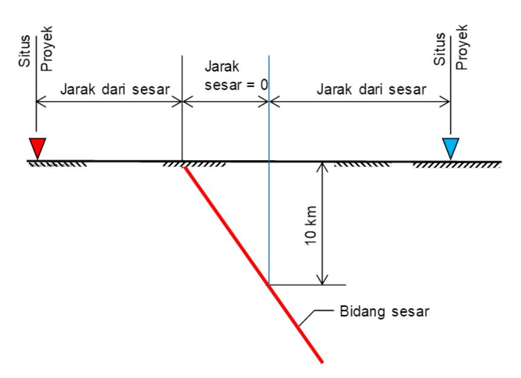

**Gambar 2 – Jarak patahan untuk berbagai lokasi situs proyek**

#### <span id="page-44-2"></span><span id="page-44-1"></span>**6.1.2 Parameter percepatan terpetakan**

Parameter *S<sup>s</sup>* (percepatan batuan dasar pada periode pendek) dan *S<sup>1</sup>* (percepatan batuan dasar pada periode 1 detik) harus ditetapkan masing-masing dari respons spektral percepatan 0,2 detik dan 1 detik dalam peta gerak tanah seismik pada pasal [0](#page-242-1) dengan kemungkinan 2 % terlampaui dalam 50 tahun (MCER, 2 % dalam 50 tahun), dan dinyatakan dalam bilangan desimal terhadap percepatan gravitasi. Bila *S*<sup>1</sup> 0,04 g dan *S<sup>s</sup>* 0,15 g, maka struktur bangunan boleh dimasukkan ke dalam kategori desain seismik A, dan cukup memenuhi persyaratan dalam [0.](#page-48-0)

#### <span id="page-44-3"></span>**6.1.3 Kelas situs**

Berdasarkan sifat-sifat tanah pada situs, maka situs harus diklasifikasi sebagai kelas situs *SA*, *SB*, *SC*, *SD*, *SE*, atau *SF* yang mengikuti [0.](#page-40-2) Bila sifat-sifat tanah tidak teridentifikasi secara

**© BSN 2019 33 dari 238**

jelas sehingga tidak bisa ditentukan kelas situs-nya, maka kelas situs *SE* dapat digunakan kecuali jika pemerintah/dinas yang berwenang memiliki data geoteknik yang dapat menentukan kelas situs lainnya.

Jika penyelidikan tanah yang dilakukan sesuai dengan pasal 0 menunjukkan adanya kondisi batuan yang konsisten dengan kelas situs SB, tetapi tidak dilakukan pengukuran kecepatan gelombang geser situs-spesifik, maka koefisien situs  $F_a$ ,  $F_v$ , dan  $F_{PGA}$  harus diambil sebesar 1.0.

## <span id="page-45-0"></span>6.2 Koefisien-koefisien situs dan paramater-parameter respons spektral percepatan gempa maksimum yang dipertimbangkan risiko-tertarget (MCE<sub>R</sub>)

Untuk penentuan respons spektral percepatan gempa MCE<sub>R</sub> di permukaan tanah, diperlukan suatu faktor amplifikasi seismik pada periode 0,2 detik dan periode 1 detik. Faktor amplifikasi meliputi faktor amplifikasi getaran terkait percepatan pada getaran periode pendek  $(F_a)$  dan faktor amplifikasi terkait percepatan yang mewakili getaran periode 1 detik  $(F_v)$ . Parameter respons spektral percepatan pada periode pendek  $(S_{MS})$  dan periode 1 detik  $(S_{MI})$  yang disesuaikan dengan pengaruh klasifikasi situs, harus ditentukan dengan perumusan berikut ini:

$$S_{MS} = F_a S_s \tag{7}$$

$$S_{M1} = F_{\nu} S_1 \tag{8}$$

#### Keterangan:

- $S_s$  = parameter respons spektral percepatan gempa MCE<sub>R</sub> terpetakan untuk periode pendek;
- $S_I$  = parameter respons spektral percepatan gempa MCE<sub>R</sub> terpetakan untuk periode 1,0 detik.

#### Dengan koefisien situs $F_a$ dan $F_v$ mengikuti

<span id="page-45-3"></span>Tabel 6 dan Tabel 7. Jika kelas situs SE digunakan sebagai kelas situs berdasarkan 0, maka nilai  $F_a$  tidak boleh kurang dari 1,2. Jika digunakan prosedur desain sesuai dengan pasal 0, maka nilai  $F_a$  harus ditentukan sesuai 0 serta nilai  $F_v$ ,  $S_{MS}$ , dan  $S_{MI}$  tidak perlu ditentukan.

Tabel 6 – Koefisien situs,  $F_a$ 

<span id="page-45-1"></span>

| Kelas situs | Parameter respons spektral percepatan gempa maksimum yang dipertimbangkan risiko-tertarget (MCE <sub>R</sub> ) terpetakan pada periode pendek, $T = 0.2$ detik, $S_s$ |             |              |             |              |                             |  |  |
|-------------|-----------------------------------------------------------------------------------------------------------------------------------------------------------------------|-------------|--------------|-------------|--------------|-----------------------------|--|--|
|             | $S_s \le 0.25$                                                                                                                                                        | $S_s = 0.5$ | $S_s = 0.75$ | $S_s = 1,0$ | $S_s = 1,25$ | <i>S</i> <sub>s</sub> ≥ 1,5 |  |  |
| SA          | 0,8                                                                                                                                                                   | 0,8         | 0,8          | 0,8         | 0,8          | 0,8                         |  |  |
| SB          | 0,9                                                                                                                                                                   | 0,9         | 0,9          | 0,9         | 0,9          | 0,9                         |  |  |
| SC          | 1,3                                                                                                                                                                   | 1,3         | 1,2          | 1,2         | 1,2          | 1,2                         |  |  |
| SD          | 1,6                                                                                                                                                                   | 1,4         | 1,2          | 1,1         | 1,0          | 1,0                         |  |  |
| SE          | 2,4 1,7 1,3 1,1 0,9 0,8                                                                                                                                               |             |              |             |              |                             |  |  |
| SF          |                                                                                                                                                                       |             |              |             |              |                             |  |  |

#### **CATATAN:**

<span id="page-45-2"></span>(a) SS= Situs yang memerlukan investigasi geoteknik spesifik dan analisis respons situs-spesifik, lihat

Tabel 7 – Koefisien situs,  $F_{\nu}$ 

| Kelas situs |                     | Parameter respons spektral percepatan gempa maksimum yang dipertimbangkan risiko-tertarget (MCE <sub>R</sub> ) terpetakan pada periode 1 detik, $S_I$ |             |               |             |               |  |  |
|-------------|---------------------|-------------------------------------------------------------------------------------------------------------------------------------------------------|-------------|---------------|-------------|---------------|--|--|
|             | $S_{I} \leq 0,1$    | $S_I = 0,2$                                                                                                                                           | $S_1 = 0,3$ | $S_{I} = 0,4$ | $S_1 = 0,5$ | $S_I \ge 0.6$ |  |  |
| SA          | 0,8 0,8 0,8 0,8 0,8 |                                                                                                                                                       |             |               |             |               |  |  |

© BSN 2019 34 dari 238

| SB | 0,8 | 0,8        | 0,8 | 0,8 | 0,8 | 0,8 |  |  |
|----|-----|------------|-----|-----|-----|-----|--|--|
| SC | 1,5 | 1,5        | 1,5 | 1,5 | 1,5 | 1,4 |  |  |
| SD | 2,4 | 2,2        | 2,0 | 1,9 | 1,8 | 1,7 |  |  |
| SE | 4,2 | 3,3        | 2,8 | 2,4 | 2,2 | 2,0 |  |  |
| SF |     | $SS^{(a)}$ |     |     |     |     |  |  |

#### **CATATAN:**

(a) SS= Situs yang memerlukan investigasi geoteknik spesifik dan analisis respons situs-spesifik, lihat0

#### <span id="page-46-0"></span>6.3 Parameter percepatan spektral desain

Parameter percepatan spektral desain untuk periode pendek,  $S_{DS}$  dan pada periode 1 detik,  $S_{DI}$ , harus ditentukan melalui perumusan berikut ini:

$$S_{DS} = \frac{2}{3} S_{MS} \tag{9}$$

$$S_{D1} = \frac{2}{3} S_{M1} \tag{10}$$

Jika digunakan prosedur desain yang disederhanakan sesuai pasal 8, maka nilai  $S_{DS}$  harus ditentukan sesuai 0 dan nilai  $S_{DI}$  tidak perlu ditentukan.

#### <span id="page-46-1"></span>6.4 Spektrum respons desain

Bila spektrum respons desain diperlukan oleh tata cara ini dan prosedur gerak tanah dari spesifik-situs tidak digunakan, maka kurva spektrum respons desain harus dikembangkan dengan mengacu Gambar 3 dan mengikuti ketentuan di bawah ini :

1. Untuk periode yang lebih kecil dari  $T_0$ , spektrum respons percepatan desain,  $S_a$ , harus diambil dari persamaan;

$$S_a = S_{DS} \left( 0, 4 + 0, 6 \frac{T}{T_0} \right) \tag{11}$$

- 2. Untuk periode lebih besar dari atau sama dengan  $T_{\theta}$  dan lebih kecil dari atau sama dengan  $T_s$ , spektrum respons percepatan desain,  $S_a$ , sama dengan  $S_{DS}$ ;
- 3. Untuk periode lebih besar dari  $T_s$  tetapi lebih kecil dari atau sama dengan  $T_L$ , respons spektral percepatan desain,  $S_a$ , diambil berdasarkan persamaan:

$$S_a = \frac{S_{D1}}{T} \tag{12}$$

4. Untuk periode lebih besar dari  $T_L$ , respons spektral percepatan desain,  $S_a$ , diambil berdasarkan persamaan:

$$S_a = \frac{S_{D1}T_L}{T^2} \tag{13}$$

#### Keterangan:

 $S_{DS}$  = parameter respons spektral percepatan desain pada periode pendek;

 $S_{DI}$  = parameter respons spektral percepatan desain pada periode 1 detik;

T = periode getar fundamental struktur.

© BSN 2019 35 dari 238

$$T_0 = 0, 2\frac{S_{D1}}{S_{DS}}$$

$$T_s = \frac{S_{D1}}{S_{DS}}$$

 $T_L$  = Peta transisi periode panjang yang ditunjukkan pada Gambar 3 yang nilainya diambil dari Gambar 20

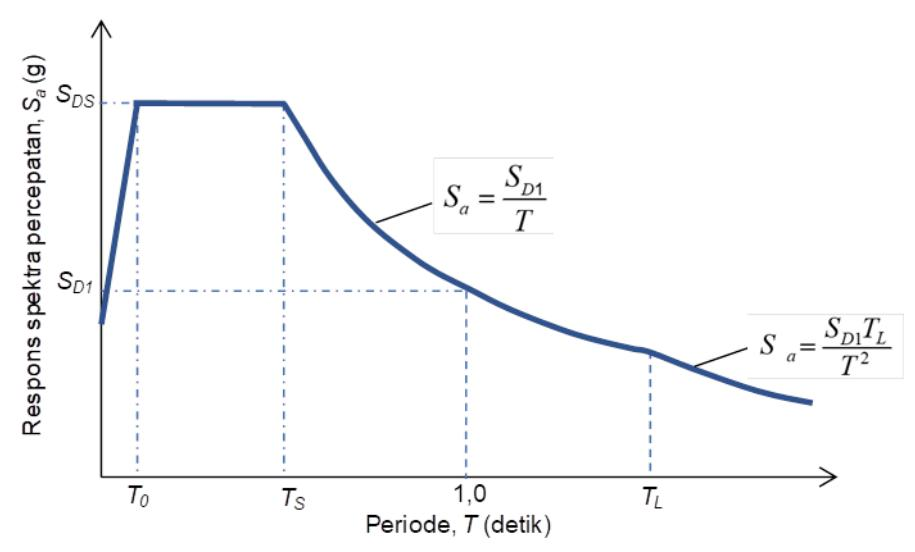

Gambar 3 - Spektrum respons desain

#### <span id="page-47-1"></span><span id="page-47-0"></span>6.5 Kategori desain seismik

Struktur harus ditetapkan memiliki suatu kategori desain seismik yang mengikuti pasal ini. Struktur dengan kategori risiko I, II, atau III yang berlokasi di mana parameter respons spektral percepatan terpetakan pada periode 1 detik,  $S_I$ , lebih besar dari atau sama dengan 0,75 harus ditetapkan sebagai struktur dengan kategori desain seismik E. Struktur yang berkategori risiko IV yang berlokasi di mana parameter respons spektral percepatan terpetakan pada periode 1 detik,  $S_I$ , lebih besar dari atau sama dengan 0,75, harus ditetapkan sebagai struktur dengan kategori desain seismik F. Semua struktur lainnya harus ditetapkan kategori desain seismiknya berdasarkan kategori risikonya dan parameter respons spektral percepatan desainnya,  $S_{DS}$  dan  $S_{DI}$ , sesuai 0. Masing-masing bangunan dan struktur harus ditetapkan ke dalam kategori desain seismik yang lebih parah, dengan mengacu pada Tabel 8 dan Tabel 9, terlepas dari nilai periode fundamental getaran struktur, T.

Apabila  $S_I$  lebih kecil dari 0,75, kategori desain seismik diizinkan untuk ditentukan sesuai Tabel 8 saja, di mana berlaku semua ketentuan di bawah:

- 1. Pada masing-masing dua arah ortogonal, perkiraan periode fundamental struktur,  $T_a$ , yang ditentukan sesuai dengan 0 adalah kurang dari  $0.8T_s$ , di mana  $T_s$  ditentukan sesuai dengan 0:
- 2. Pada masing-masing dua arah ortogonal, periode fundamental struktur yang digunakan untuk menghitung simpangan antar tingkat adalah kurang dari  $T_s$ ;
- 3. Persamaan (31) digunakan untuk menentukan koefisien respons seismik,  $C_s$ ;
- 4. Diafragma struktural adalah kaku sebagaimana disebutkan di 0 atau untuk diafragma yang fleksibel, jarak antara elemen-elemen vertikal pemikul gaya seismik tidak melebihi 12 m.

Apabila digunakan alternatif prosedur penyederhanaan desain pada pasal 0, kategori desain seismik diperbolehkan untuk ditentukan dari Tabel 8, dengan menggunakan nilai  $S_{DS}$  yang ditentukan dalam 0.

<span id="page-48-1"></span>**Tabel 8 – Kategori desain seismik berdasarkan parameter respons percepatan pada periode pendek**

|                             | Kategori risiko    |    |  |  |  |
|-----------------------------|--------------------|----|--|--|--|
| Nilai SDS                   | I atau II atau III | IV |  |  |  |
| SDS<br>0,167               | A                  | A  |  |  |  |
| 0,167<br> SDS<br>0,33<br> | B                  | C  |  |  |  |
| 0,33<br> SDS<br>0,50<br>  | C                  | D  |  |  |  |
| 0,50 SDS                   | D                  | D  |  |  |  |

<span id="page-48-2"></span>**Tabel 9 – Kategori desain seismik berdasarkan parameter respons percepatan pada periode 1 detik** 

|                              | Kategori risiko    |    |
|------------------------------|--------------------|----|
| Nilai SD1                    | I atau II atau III | IV |
| SD1<br>0,067                | A                  | A  |
| 0,067<br> SD1<br>0,133<br> | B                  | C  |
| 0,133<br> SD1<br>0,20<br>  | C                  | D  |
| 0,20 SD1                    | D                  | D  |

#### <span id="page-48-0"></span>**6.6 Persyaratan desain untuk kategori desain seismik A**

Bangunan gedung dan nongedung dengan kategori desain seismik A hanya perlu memenuhi ketentuan-ketentuan di bawah ini. Elemen nonstruktural dalam kategori desain seismik A dibebaskan dari ketentuan-ketentuan desain seismik.

#### **6.6.1 Persyaratan beban seismik**

Beban seismik yang disyaratkan dalam [0](#page-48-3) hingga [0](#page-49-2) di bawah ini harus dikombinasikan dengan beban mati dan beban hidup sesuai [0](#page-36-3) untuk kombinasi beban ultimit dan [0](#page-38-0) untuk kombinasi beban layan.

#### <span id="page-48-3"></span>**6.6.2 Sambungan untuk lintasan beban seismik**

Semua bagian elemen struktur di antara join harus saling disambungkan sehingga membentuk sistem pemikul gaya lateral dengan lintasan beban yang menerus. Sambungan harus mampu menyalurkan gaya-gaya lateral yang terjadi pada bagian-bagian yang disambung. Setiap bagian struktur yang lebih kecil harus disatukan ke bagian struktur sisanya dengan menggunakan elemen-elemen struktur yang memiliki kekuatan untuk menahan gaya minimum sebesar 5 % dari berat bagian struktur yang lebih kecil tersebut.

#### **6.6.3 Gaya lateral**

Setiap struktur harus dianalisis untuk pengaruh gaya lateral statik yang diaplikasikan secara independen di kedua arah ortogonal. Pada setiap arah yang ditinjau, gaya lateral statik harus diaplikasikan secara simultan di tiap lantai. Untuk tujuan analisis, gaya lateral di tiap lantai dihitung sebagai berikut:

**© BSN 2019 37 dari 238**

<span id="page-49-1"></span>
$$F_{x} = 0.01W_{x}$$
 (14)

#### Keterangan:

 $F_x$  = gaya lateral rencana yang diaplikasikan pada lantai-x

 $W_x$  = bagian beban mati total struktur, D, yang bekerja pada lantai-x.

#### 6.6.4 Sambungan pada tumpuan

Sambungan positif untuk menahan gaya horizontal yang bekerja paralel terhadap elemen struktur harus disediakan untuk masing-masing balok, gelagar (*girder*), atau elemen rangka, baik secara langsung ke elemen-elemen penumpunya atau ke pelat lantai yang didesain sebagai diafragma. Bila sambungan dipasang melalui diafragma, maka elemen struktur penumpu juga harus disambungkan ke diafragma. Sambungan harus memiliki kekuatan untuk menahan gaya minimum sebesar 5 % dari reaksi beban mati dan beban hidup tak terfaktor yang ditimbulkan oleh elemen struktur yang ditumpu pada elemen struktur yang menumpu.

#### <span id="page-49-2"></span>6.6.5 Pengangkuran dinding struktural

Dinding struktural yang berfungsi sebagai penumpu beban vertikal atau pemikul geser lateral untuk bagian struktur harus diangkurkan ke pelat atap dan seluruh pelat lantai serta elemenelemen struktur yang memberikan tahanan lateral untuk dinding atau yang ditumpu oleh dinding. Angkur harus memberikan sambungan langsung antara dinding-dinding dan konstruksi pelat atap atau konstruksi pelat lantai. Angkur harus mampu menahan gaya horizontal terfaktor yang tegak lurus bidang dinding sebesar minimum 0,2 kali berat daerah tributari dinding pada sambungan, tapi tidak kurang dari 0,24 kN/m².

#### <span id="page-49-0"></span>6.7 Bahaya (hazard) qeologi dan investigasi qeoteknik

#### 6.7.1 Batasan situs untuk kategori desain seismik E dan F

Struktur yang tergolong dalam kategori desain seismik E atau F tidak boleh berada pada lokasi di mana terdapat patahan/sesar aktif yang telah teridentifikasi dengan jelas, yang berpotensi menyebabkan keretakan tanah pada lokasi struktur bangunan.

### <span id="page-49-3"></span>6.7.2 Ketentuan laporan investigasi geoteknik untuk kategori desain seismik C hingga

Laporan investigasi geoteknik yang sesuai dengan pasal ini, harus dipersiapkan untuk struktur dengan kategori desain seismik C hingga F. Suatu investigasi harus dilakukan dan laporan yang meliputi evaluasi potensi bahaya geologis dan seismik seperti di bawah ini harus dimasukkan:

- a. Ketidakstabilan lereng;
- b. Likuifaksi;
- c. Penurunan total dan beda penurunan;
- d. Perpindahan permukaan akibat sesar/patahan atau serakan lateral (*lateral spread*) atau aliran lateral (*lateral flow*) akibat getaran seismik.

Laporan harus berisi rekomendasi untuk desain fondasi atau langkah-langkah penanggulangan lainnya untuk mitigasi bahaya yang dijelaskan di atas.

**PENGECUALIAN** Apabila disetujui oleh pihak berwenang, laporan geoteknik spesifik situs tidak diperlukan jika telah ada suatu evaluasi yang dilakukan sebelumnya pada situs di sekitarnya dengan

kondisi tanah yang memiliki kemiripan memberikan pedoman atau arahan terhadap konstruksi yang diusulkan.

## <span id="page-50-1"></span>6.7.3 Persyaratan tambahan laporan investigasi geoteknik untuk kategori desain seismik D hingga F

Laporan penyelidikan geoteknik untuk struktur dengan kategori desain seismik D, E, atau F harus mencakup semua hal yang berlaku di bawah ini:

- 1. Penentuan tekanan lateral tanah seismik dinamik pada dinding basemen dan dinding penahan akibat gerak tanah gempa rencana;
- 2. Potensi likuifaksi dan kehilangan kekuatan tanah yang dievaluasi terhadap percepatan tanah puncak pada situs, magnitudo gempa, dan karakteristik sumber yang konsisten dengan percepatan puncak gempa maksimum yang dipertimbangkan (MCE<sub>G</sub>). Percepatan tanah puncak harus ditentukan dengan (1) kajian spesifik-situs dengan mempertimbangkan pengaruh amplifikasi yang secara spesifik, yang dijelaskan dalam 0 atau (2) percepatan tanah puncak PGA<sub>M</sub>, dari persamaan (15).

<span id="page-50-2"></span>
$$PGA_{M} = F_{PGA} \cdot PGA \tag{15}$$

#### Keterangan:

 $PGA_M$  = MCE<sub>G</sub> percepatan tanah puncak yang disesuaikan dengan pengaruh klasifikasi situs PGA = percepatan tanah puncak terpetakan yang ditunjukkan pasal 0 pada Gambar 17  $F_{PGA}$  = koefisien situs dari Tabel 10.

Jika kelas situs SE digunakan sebagai kelas situs berdasarkan 0, maka nilai  $F_{PGA}$  tidak boleh kurang dari 1.2.

- 3. Kajian konsekuensi potensi likuifaksi dan kehilangan kekuatan tanah, termasuk, tetapi tidak terbatas pada, estimasi penurunan total dan beda penurunan, pergerakan lateral tanah, beban lateral tanah pada fondasi, reduksi daya dukung tanah fondasi dan reaksi lateral tanah, friksi negatif (downdrag), reduksi reaksi aksial dan lateral tanah pada fondasi tiang, peningkatan tekanan lateral pada dinding penahan, dan pengapungan (flotation) strukturstruktur tertanam:
- 4. Diskusi mengenai langkah-langkah mitigasi seperti, tetapi tidak terbatas pada, pemilihan tipe dan kedalaman fondasi yang sesuai, pemilihan sistem struktur yang sesuai untuk mengantisipasi perpindahan dan gaya-gaya, stabilitasi tanah, dan kombinasi perhitungan-perhitungan ini dan bagaimana perhitungan tersebut harus dipertimbangkan dalam desain struktur.

Tabel 10 – Koefisien Situs  $F_{PGA}$ 

<span id="page-50-0"></span>

| Kelas Situs | PGA ≤ 0,1 | PGA = 0,2         | PGA = 0,3 | PGA = 0,4 | PGA = 0,5 | PGA ≥ 0,6 |  |  |  |
|-------------|-----------|-------------------|-----------|-----------|-----------|-----------|--|--|--|
| SA          | 0,8       | 0,8               | 0,8       | 0,8       | 0,8       | 0,8       |  |  |  |
| SB          | 0,9       | 0,9               | 0,9       | 0,9       | 0,9       | 0,9       |  |  |  |
| SC          | 1,3       | 1,2               | 1,2       | 1,2       | 1,2       | 1,2       |  |  |  |
| SD          | 1,6       | 1,4               | 1,3       | 1,2       | 1,1       | 1,1       |  |  |  |
| SE          | 2,4       | 1,9               | 1,6       | 1,4       | 1,2       | 1,1       |  |  |  |
| SF          |           | SS <sup>(a)</sup> |           |           |           |           |  |  |  |

#### CATATAN:

(a) SS = situs yang memerlukan investigasi geoteknik spesifik dan analisis respons situs-spesifik, lihat 0

© BSN 2019 39 dari 238

#### <span id="page-51-0"></span>**6.8 Spektrum respons gempa maksimum yang dipertimbangkan risiko-tertarget (***Risk-Targeted Maximum Considered Earthquake***/MCER)**

Jika spektrum respons gempa maksimum yang dipertimbangkan risiko-tertarget (MCER) dibutuhkan, maka spektrum respons desain harus dikalikan dengan angka 1,5.

#### <span id="page-51-1"></span>**6.9 Prosedur gerak tanah pada spesifik-situs**

Analisis respons situs harus dilakukan dengan mengikuti [0](#page-51-3) ini untuk struktur pada kelas situs *SF*, jika tidak ada pengecualian terhadap [0](#page-41-0) yang dapat diberlakukan. Analisis pergerakan tanah harus dilakukan mengikuti [0](#page-52-1) untuk kondisi dimana struktur yang menggunakan isolasi seismik dan untuk struktur dengan sistem redaman pada situs dengan *S<sup>1</sup>* lebih besar dari atau sama dengan 0,6.

**PENGECUALIAN** Analisis pergerakan tanah tidak diperlukan untuk struktur yang tidak menggunakan isolasi seismik dan struktur dengan sistem damping dengan ketentuan mengikuti [Tabel](#page-45-3) 6 dan [Tabel 7.](#page-45-2)

Analisis respons situs harus diizinkan mengikuti [0](#page-51-3) dan/atau analisis pergerakan tanah yang mengikuti [0](#page-52-1) untuk menentukan pergerakan tanah untuk struktur apapun.

Ketika prosedur pada [0](#page-51-3) atau [0](#page-52-1) digunakan, desain respon spektra harus ditentukan sesuai dengan [0,](#page-54-0) sedangkan desain parameter percepatan harus ditentukan sesuai dengan [0,](#page-54-1) dan jika diperlukan, parameter percepatan tanah puncak MCEG harus ditentukan sesuai dengan [0.](#page-54-2)

#### <span id="page-51-2"></span>**6.10 Prosedur gerak tanah spesifik situs untuk desain seismik**

#### <span id="page-51-3"></span>**6.10.1 Analisis respons situs**

Ketentuan-ketentuan pada pasal ini harus dipenuhi di mana analisis respons situs dilakukan atau disyaratkan dalam [0.](#page-51-1) Analisis harus didokumentasi dalam suatu laporan yang memadai.

#### <span id="page-51-4"></span>**6.10.1.1 Gerak batuan dasar**

Untuk suatu analisis spektrum respons spesifik situs, diperlukan spektrum respons gempa MCE<sup>R</sup> pada batuan dasar. Spektrum respons gempa MCE<sup>R</sup> pada batuan dasar ini harus dikembangkan dengan menggunakan prosedur yang ada dalam [0](#page-51-0) atau [0.](#page-52-1) Kecuali telah dilakukan analisis bahaya gerak tanah pada spesifik-situs yang dijelaskan dalam [0,](#page-52-1) maka spektrum respons gempa MCE<sup>R</sup> harus dikembangkan berdasarkan prosedur yang ada dalam [0,](#page-51-0) dengan asumsi kelas situs *SB*. Jika batuan dasarnya merupakan kelas situs *SA*, maka spektrum respons harus disesuaikan menggunakan koefisien situs yang diberikan dalam [0,](#page-45-0) kecuali koefisien-koefisien situs lainnya dapat dijustifikasi. Setidaknya diperlukan 5 (lima) rekaman atau simulasi riwayat waktu percepatan gerak tanah horizontal yang harus dipilih dari beberapa kejadian gempa dengan magnitudo dan jarak sumber gempa (sesar/patahan/subduksi) yang secara konsisten mengontrol gerak tanah gempa MCER. Masing-masing riwayat waktu yang dipilih tersebut harus diskalakan, sehingga spektrum respons-nya secara rata-rata kira-kira dekat dengan level spektrum respons gempa MCE<sup>R</sup> batuan pada rentang periode yang signifikan dari respons struktur bangunan yang akan didesain.

#### **6.10.1.2 Pemodelan kondisi situs**

**© BSN 2019 40 dari 238**

Untuk keperluan analisis respons spesifik-situs, maka suatu model respons situs yang didasarkan pada kecepatan rambat gelombang geser regangan kecil (*vs*), hubungan teganganregangan geser nonlinier atau ekivalen linier, dan berat jenis harus disiapkan. Kecepatan gelombang geser ini harus ditentukan dengan pengukuran langsung di lapangan pada situs yang bersangkutan atau pengukuran pada situs yang berdekatan yang memiliki kemiripan kondisi tanah. Pengukuran *v<sup>s</sup>* di lapangan dapat dilakukan dengan uji *Seismik-Downhole* (SDH), uji *Spectral Analysis of Surface Wave* (SASW),atau uji seismik sejenis. Hubungan tegangan-regangan geser nonlinier atau ekivalen linier dan berat satuan harus dipilih berdasarkan uji laboratorium langsung atau menggunakan korelasi yang sudah terpublikasi dari tanah yang memiliki kesamaan sifat. Ketidakpastian pada sifat tanah harus diestimasi. Dalam hal profil-profil tanah yang ada sangat dalam sehingga menyebabkan pengembangan model tanah ke batuan dasar menjadi sulit dilakukan dan tidak praktis, maka model tanah tersebut diizinkan untuk diberhentikan pada kondisi kekakuan tanah setidaknya sebesar nilai yang mendefinisikan kelas situs *SD*, sesuai pasal [0.](#page-39-0) Dalam hal seperti ini, maka spektrumrespons percepatan riwayat-waktu gempa MCE<sup>R</sup> yang dikembangkan dalam [0](#page-51-4) harus disesuaikan ke atas permukaan tanah menggunakan koefisien-koefisian situs dalam [0](#page-45-0) yang konsisten dengan klasifikasi tanah pada profil dasar.

#### **6.10.1.3 Analisis respons situs dan hasil perhitungan**

Riwayat waktu gerak tanah batuan dasar harus menjadi masukan ke dalam profil tanah sebagai gerak dari referensi batuan dasar. Dengan menggunakan teknik perhitungan yang memperlakukan sifat tanah secara nonlinier ke dalam suatu metode nonlinier atau linier ekivalen, maka respons profil tanah harus ditentukan dan respons riwayat waktu gerak tanah di permukaan harus dihitung. Rasio spektrum respons (dengan redaman 5 %) di permukaan tanah dan di batuan dasar harus dihitung. Nilai spektrum respons gerak tanah MCERyang direkomendasikan tidak boleh lebih rendah dari spektrum respons MCERbatuan dasar dikali dengan rata-rata rasio spektrum respons permukaan-ke-dasar (dihitung periode demi periode) yang didapat dari analisis respons spesifik-situs. Gerak dasar permukaan yang direkomendasikan dari hasil analisis harus menggambarkan pertimbangan atas sensitifitas respons terhadap ketidakpastian sifat-sifat tanah, kedalaman model tanah, dan gerak tanah masukan (*input motion)*.

#### <span id="page-52-1"></span>**6.10.2 Analisis bahaya (***hazard***) gerak tanah untuk gempa maksimum yang dipertimbangkan risiko-tertarget (MCER)**

Persyaratan yang ada dalam [0](#page-52-1) ini harus dipenuhi jika analisis bahaya (*hazard)* gerak tanah dilakukan sesuai [0.](#page-51-1) Analisis bahaya (*hazard)* gerak tanah ini harus memperhitungkan kondisi regional tektonik, geologi, dan seismisitas, perkiraan laju keberulangan (*recurrence rates*) dan magnitudo maksimum sumber-sumber gempa yang teridentifikasi dengan jelas, karakteristik atau model atenuasi gerak tanah, pengaruh sumber gempa terdekat, jika ada, pada gerak dasar, dan pengaruh kondisi situs bawah-permukaan terhadap gerak tanah. Karakteristik kondisi situs bawah-permukaan harus diperhitungkan apakah menggunakan persamaan atenuasi yang dapat mewakili geologi regional atau geoteknik lokalnya, atau dengan mengikuti [0.](#page-51-3) Analisis ini harus memasukkan intrepretasi kegempaan yang terbaru, termasuk ketidakpastian model-model dan nilai parameter-parameter sumber-sumber gempa dan gerak dasar. Analisisnya harus di bawah pengawasan ahli yang kompeten serta hasil analisisnya didokumentasi dalam suatu laporan yang memadai.

#### <span id="page-52-0"></span>**6.10.2.1 Gerak tanah gempa MCE<sup>R</sup> probabilistik**

Percepatan respons spektral probabilistik harus diambil sebagai percepatan respons spektral pada arah horizontal maksimum yang diwakili oleh spektrum respons percepatan (redaman 5 %) dengan level kejadian gempa 1 % kemungkinan keruntuhan bangunan dalam kurun waktu

**© BSN 2019 41 dari 238**

50 tahun. Untuk keperluan standar ini, respons spektra percepatan gerak tanah secara probabilistik ini harus ditentukan berdasarkan ketentuan salah satu dari Metode-1 atau Metode-2 di bawah ini:

#### **Metode – 1:**

Pada setiap periode di mana spektrum respons percepatannya ingin dihitung, maka respons spektra percepatan gerak tanah secara probabilistik ditentukan sebagai hasil perkalian dari koefisien risiko, *CR*, dan spektrum respons percepatan (teredam 5 %) dengan tingkat 2 % kemungkinan terlampaui dalam kurun waktu 50 tahun. Nilai koefisien risiko *CR*, harus ditentukan menggunakan nilai-nilai *CR<sup>S</sup>* dan *CR<sup>1</sup>* yang secara berturut-turut mengacu pada [Gambar 18](#page--1-4) dan [Gambar 19,](#page--1-5) pada pasal [0.](#page-242-1) Pada periode-periode spektrum respons yang lebih kecil atau sama dengan 0,2 detik, maka *C<sup>R</sup>* harus diambil sama dengan nilai *CRS*, sedangkan untuk periode yang lebih besar dari 1 detik, *C<sup>R</sup>* diambil sama dengan nilai *CR1*. Pada periode spektrum respons lebih besar dari 0,2 detik dan lebih kecil dari 1 detik, nilai *C<sup>R</sup>* harus didasarkan pada interpolasi linier nilai *CR<sup>S</sup>* dan *CR1*.

#### **Metode – 2:**

Pada setiap periode spektral respons di mana percepatan akan dihitung, respons spektra percepatan gerak tanah secara probabilistik yang percepatannya akan dihitung, ditentukan dari integrasi iteratif dari kurva bahaya (*hazard*) dari situs-spesifik dengan suatu fungsi kepadatan probabilitas log-normal yang mewakili kemudah-runtuhan (*collapse fragility*), yaitu probabilitas keruntuhan sebagai fungsi dari percepatan spektral respons. Respons spektra percepatan gerak tanah secara probabilistik pada setiap periode harus mencapai 1 % kemungkinan keruntuhan bangunan dalam kurun waktu 50 tahun untuk suatu kemudahruntuhan yang memiliki (i) 10 % kemungkinan keruntuhan pada respons spektra percepatan gerak tanah secara probabilistik yang ditinjau tersebut (ii) nilai standar deviasi logaritmik sebesar 0,65.

#### <span id="page-53-0"></span>**6.10.2.2 Gerak tanah gempa MCE<sup>R</sup> deterministik**

**Percepatan respons spektral deterministik harus dihitung sebagai percepatan respons spektral pada arah horizontal maksimum dengan ketentuan 84***th percentile* **dan redaman 5 % yang dihitung pada periode tersebut. Percepatan dengan nilai yang terbesar harus diambil dari perhitungan semua sumber-sumber gempa karakteristik yang berpengaruh pada situs yang ditinjau, yaitu dari sumber sesar/patahan yang teridentifikasi dengan jelas. Jika percepatan respons spektral terbesar dari gerak tanah gempa deterministik kurang dari 1,5***Fa***, maka respons spektral ini harus diskalakan menggunakan sebuah faktor sehingga percepatan respons spektral terbesar bernilai 1,5***Fa***. Untuk kelas situs** *SA***,** *SB***,** *SC***, dan** *SD***,** *F<sup>a</sup>* **harus ditentukan menggunakan**

[Tabel 6,](#page-45-3) dengan nilai *Ss* diambil sebesar 1,5. Untuk kelas situs *SE*, *F<sup>a</sup>* harus diambil sebesar 1,0.

**PENGECUALIAN** Respons spektral gerak tanah deterministic tidak perlu dihitung saat percepatan respons spektral terbesar dari gerak tanah probabilistic [\(0\)](#page-52-0) kurang dari 1,2*Fa*.

#### **6.10.2.3 Gempa MCE<sup>R</sup> spesifik-situs**

Percepatan respons spektral spesifik-situs gempa MCER pada setiap periode, *SaM*, harus diambil sebagai nilai terkecil dari percepatan respons spektral yang didapatkan secara probabilistik, seperti yang dibahas dalam [0](#page-52-0) dan secara deterministik, seperti PGA*<sup>M</sup>* yang dibahas dalam [0.](#page-53-0)

**© BSN 2019 42 dari 238**

**PENGECUALIAN** Respons spektral gerak tanah spesifik-situs gempa  $MCE_R$  harus diambil sebagai gerak tanah gempa  $MCE_R$  probabilistik sesuai 0 saat percepatan respons spektral terbesar dari gerak tanah gempa  $MCE_R$  probabilistik (0) kurang dari 1,2 $F_a$ . Untuk kelas situs SA, SB, SC, dan SD,  $F_a$  harus ditentukan menggunakan

Tabel 6 dengan nilai  $S_s$  diambil sebesar 1,5; untuk kelas situs SE,  $F_a$  harus diambil sebesar 1,0.

Percepatan respons spektral spesifik-situs gempa MCE<sub>R</sub> pada setiap periode tidak boleh diambil kurang dari 150 % respons spektral desain spesifik-situs yang ditentukan sesuai 0.

#### <span id="page-54-0"></span>6.10.3 Spektrum-respons desain

Percepatan spektral-respons desain pada berbagai periode harus ditentukan dengan persamaan di bawah ini:

$$S_a = \frac{2}{3} S_{aM} {16}$$

dimana  $S_{aM}$  adalah percepatan spektral-respons gempa MCE<sub>R</sub> yang didapatkan dalam 0 atau 0.

Percepatan spektral-respons desain untuk berbagai periode tidak boleh diambil lebih kecil dari 80 % nilai  $S_a$  yang ditentukan dalam 0, dengan  $F_a$  dan  $F_v$  untuk kelas situs SA, SB, SC, SD, dan SE ditentukan menggunakan Tabel 6 dan Tabel 7.

Untuk situs yang dikategorikan sebagai kelas situs SF, yang disyaratkan memerlukan analisis respons spesifik-situs sesuai 0, percepatan spektral-respons desain untuk setiap periode tidak boleh diambil lebih kecil dari 80 % nilai  $S_a$  yang ditentukan untuk kelas situs SE yang mengacu pada 0.

Struktur juga harus didesain untuk menahan pengaruh beban gempa berdasarkan anggapan tidak terjadi likuifaksi sesuai kelas tanah yang ditinjau.

**PENGECUALIAN** Jika kelas situs yang berbeda dapat dijustifikasi dengan menggunakan prosedur klasifikasi spesifik-situs sesuai 5.3.3, batas bawah sebesar 80 % dari  $S_a$  untuk kelas situs yang dijustifikasi dapat diizinkan untuk digunakan.

#### <span id="page-54-1"></span>6.10.4 Parameter-parameter percepatan desain

Jika prosedur spesifik-situs digunakan untuk menentukan gerak tanah seismik desain sesuai 6.10.3, maka parameter  $S_{DS}$  harus diambil sebesar 90 % dari percepatan spektral maksimum,  $S_a$ , yang diperoleh dari spektra spesifik-situs, pada setiap periode dalam rentang 0,2 sampai 5 detik, secara inklusif. Parameter  $S_{DI}$  harus diambil dari nilai terbesar dari perkalian,  $TS_a$ , dalam rentang periode 1 sampai 2 detik untuk situs  $V_{s,30} > 360$  m/s, dan untuk periode dari 1 sampai 5 detik untuk situs dengan  $V_{s,30} \le 360$  m/s. Parameter  $S_{MS}$  dan  $S_{MI}$  diambil 1,5 kali dari masing-masing  $S_{DS}$  dan  $S_{DI}$ . Nilai yang telah didapat, tidak boleh kurang dari 80 % nilai yang ditentukan dalam 0 untuk  $S_{MS}$  dan  $S_{MI}$ , dan dalam 0 untuk  $S_{DS}$  dan  $S_{DI}$ .

Untuk penerapan dalam prosedur gaya lateral ekivalen, maka percepatan spektra spesifiksitus,  $S_a$ , pada periode T tertentu harus diizinkan untuk menggantikan  $S_{DI}/T$  pada persamaan (32) dan  $S_{DI}T_I/T^2$  pada persamaan (33). Parameter  $S_{DS}$  yang dihitung pada pasal ini dibolehkan untuk digunakan pada persamaan (31), (34), (101), dan (103), Nilai  $S_I$  dari peta harus digunakan pada persamaan (35), (102), dan (104).

## <span id="page-54-2"></span>6.10.5 Percepatan tanah puncak gempa maksimum yang dipertimbangkan rata-rata geometrik (MCE<sub>G</sub>)

© BSN 2019 43 dari 238

#### <span id="page-55-1"></span>**6.10.5.1 Percepatan tanah puncak gempa MCE<sup>G</sup> probabilistik**

Percepatan tanah puncak secara probabilistik dengan rata-rata geometrik harus diambil sebagai nilai rata-rata geometrik dari percepatan tanah puncak dengan 2 % kemungkinan terlampaui dalam kurun waktu 50 tahun.

#### <span id="page-55-2"></span>**6.10.5.2 Percepatan tanah puncak gempa MCE<sup>G</sup> deterministik**

Percepatan tanah puncak rata-rata geometrik secara deterministik harus dihitung sebagai nilai terbesar dari 84*th percentile* rata-rata geometrik percepatan tanah puncak dari perhitungan semua sumber-sumber gempa karakteristik yang berpengaruh pada situs yang ditinjau, yaitu dari sumber sesar/patahan yang teridentifikasi dengan jelas secara regional. Nilai deterministik rata-rata geometrik ini tidak boleh diambil lebih kecil dari 0,6*F*PGA, di mana *F*PGA ditentukan pada [Tabel 10](#page-50-0) dengan nilai PGA diambil sebesar 0,6 g.

#### **6.10.5.3 Percepatan tanah puncak gempa MCE<sup>G</sup> spesifik situs**

Nilai percepatan tanah puncak spesifik-situs, PGA*M*, harus diambil sebagai nilai terkecil dari nilai yang didapatkan secara Probabilistik (lihat [0\)](#page-55-1) dan nilai yang didapatkan secara Deterministik (lihat [0\)](#page-55-2). Nilai ini juga tidak boleh lebih kecil dari 80 % nilai PGA*<sup>M</sup>* yang ditentukan dalam persamaan [\(15\).](#page-50-2)

#### <span id="page-55-0"></span>**6.11 Gerak tanah vertikal untuk perencanaan gempa**

#### **6.11.1 Umum**

Jika pilihan untuk menyertakan pengaruh gerak tanah gempa vertikal diterapkan sebagai alternatif dari ketentuan [0,](#page-76-1) ketentuan dalam pasal ini diizinkan untuk digunakan dalam menentukan gerak tanah vertikal gempa desain. Ketentuan dalam [0](#page-55-0) hanya berlaku untuk struktur dalam kategori desain seismik C, D, E, dan F.

#### <span id="page-55-6"></span>**6.11.2 Spektrum respons vertikal MCE<sup>R</sup>**

Jika suatu respons spektrum vertikal diwajibkan oleh standar ini (lihat [0](#page-144-0) dan [0\)](#page-160-0) dan prosedur spesifik situs tidak digunakan, percepatan spektral respons vertikal, *SaMv*, harus ditentukan sebagai berikut:

1. Untuk periode vertikal kurang dari atau sama dengan 0,025 detik, *SaMv* harus ditentukan mengikuti persamaan [\(17\)](#page-55-3) sebagai berikut:

<span id="page-55-3"></span>
$$S_{aMv} = 0.3C_v S_{MS}$$
 (17)

2. Untuk periode vertikal lebih besar dari 0,025 detik dan kurang dari atau sama dengan 0,05 detik, *SaMv* harus ditentukan mengikuti persamaan [\(18\)](#page-55-4) sebagai berikut:

<span id="page-55-4"></span>
$$S_{aMv} = 20C_v S_{MS}(T_v - 0.025) + 0.3C_v S_{MS}$$
(18)

3. Untuk periode vertikal lebih besar dari 0,05 detik dan kurang dari atau sama dengan 0,15 detik, *SaMv* harus ditentukan mengikuti persamaan [\(19\)](#page-55-5) sebagai berikut:

<span id="page-55-5"></span>
$$S_{aMv} = 0.8C_v S_{MS}$$
 (19)

4. Untuk periode vertikal lebih besar dari 0,15 detik dan kurang dari atau sama dengan 2,0 detik, *SaMv* harus ditentukan mengikuti persamaan [\(20\)](#page-56-3) sebagai berikut:

**© BSN 2019 44 dari 238**

$$S_{aMv} = 0.8C_v S_{MS} \left( 0.15 / T_v \right)^{0.75}$$
 (20)

#### Keterangan:

 $C_v$  = didefinisikan berdasarkan nilai  $S_S$  dalam Tabel 11

 $S_{MS}$  = parameter percepatan respons spektral MCE<sub>R</sub> pada periode pendek, dan

<span id="page-56-2"></span> $T_{v}$  = periode getar vertikal

<span id="page-56-3"></span>Tabel 11 - Nilai Koefisien Vertikal C<sub>v</sub>

| Parameter spektral respons<br>MCE <sub>R</sub> terpetakan pada<br>periode pendek | Kelas situs<br>A, B | Kelas situs<br>C | Kelas situs<br>D, E, F |
|----------------------------------------------------------------------------------|---------------------|------------------|------------------------|
| S <sub>S</sub> ≥ 2,0                                                             | 0,9                 | 1,3              | 1,5                    |
| $S_S = 1,0$                                                                      | 0,9                 | 1,1              | 1,3                    |
| $S_S = 0.6$                                                                      | 0,9                 | 1,0              | 1,1                    |
| $S_S = 0,3$                                                                      | 0,8                 | 0,8              | 0,9                    |
| $S_S \leq 0,2$                                                                   | 0,7                 | 0,7              | 0,7                    |

**CATATAN** Gunakan interpolasi linier untuk mendapatkan nilai  $S_s$  antara.

 $S_{aMV}$  harus tidak kurang dari setengah kali nilai  $S_{aM}$  untuk komponen-komponen horizontal yang ditentukan mengikuti prosedur umum dari 0 atau spesifik situs dari 0.

Untuk periode vertikal lebih besar dari 2,0 detik,  $S_{aMv}$  harus ditentukan melalui prosedur spesifik situs; tetapi, nilai  $S_{aMv}$  yang dihasilkan harus tidak kurang dari setengah kali nilai  $S_a$  untuk komponen-komponen horizontal yang ditentukan mengikuti prosedur umum dari 0 atau spesifik situs dari 0.

Sebagai alternatif penggunaan prosedur di atas, penerapan prosedur spesifik situs diizinkan untuk mendapatkan nilai  $S_{aMv}$  pada periode vertikal kurang dari atau sama dengan 2,0 detik, tetapi nilai yang ditentukan melalui cara tersebut harus tidak kurang dari 80 % nilai  $S_{aMv}$  yang ditentukan dari persamaan (17) sampai dengan persamaan (20).

#### <span id="page-56-5"></span>6.11.3 Spektrum respons vertikal desain

Percepatan spektral respons vertikal desain,  $S_{av}$ , harus diambil sebagai 2/3 kali nilai  $S_{aMv}$  yang ditentukan dalam 0.

#### <span id="page-56-0"></span>7 Persyaratan desain seismik struktur bangunan gedung

#### <span id="page-56-1"></span>7.1 Struktur atas dan struktur bawah

Struktur bangunan gedung terdiri dari struktur atas dan bawah. Struktur atas adalah bagian dari struktur bangunan gedung yang berada di atas muka tanah. Struktur bawah adalah bagian dari struktur bangunan gedung yang terletak di bawah muka tanah, yang dapat terdiri dari struktur basemen, dan/atau struktur fondasinya.

#### <span id="page-56-4"></span>7.1.1 Persyaratan dasar

Prosedur analisis dan desain seismik untuk struktur bangunan gedung dan komponennya harus seperti yang ditetapkan dalam pasal ini. Struktur bangunan gedung harus memiliki sistem pemikul gaya lateral dan vertikal yang lengkap, yang mampu memberikan kekuatan,

© BSN 2019 45 dari 238

kekakuan, dan kapasitas disipasi energi yang cukup untuk menahan gerak tanah seismik desain dalam batasan-batasan kebutuhan deformasi dan kekuatan perlu. Gerak tanah seismik desain harus diasumsikan terjadi pada sebarang arah horizontal struktur bangunan gedung. Kecukupan sistem struktur harus ditunjukkan melalui pembuatan model matematik dan pengevaluasian model tersebut untuk pengaruh gerak tanah seismik desain. Gaya seismik desain, dan distribusinya di setinggi struktur bangunan gedung, harus ditetapkan berdasarkan salah satu prosedur yang sesuai dalam [0,](#page-78-0) dan gaya dalam serta deformasi yang terkait pada komponen struktur tersebut harus ditentukan. Prosedur alternatif yang disetujui tidak boleh dipakai untuk menentukan gaya seismik dan distribusinya, kecuali bila gaya-gaya dalam dan deformasi yang terkait pada komponen strukturnya ditentukan menggunakan model yang konsisten dengan prosedur yang diadopsi.

**PENGECUALIAN** Sebagai alternatif, prosedur desain yang disederhanakan pada pasal 8 boleh digunakan sebagai pengganti persyaratan [0 h](#page-56-1)ingga [0,](#page-101-0) yang dikenai semua batasan yang termuat dalam pasal [0.](#page-108-0)

#### **7.1.2 Desain komponen struktur, desain sambungan, dan batasan deformasi**

Komponen struktur individu, termasuk yang bukan merupakan bagian sistem pemikul gaya seismik, harus disediakan dengan kekuatan yang cukup untuk menahan geser, gaya aksial, dan momen yang ditentukan sesuai dengan standar ini, dan sambungan-sambungan harus mampu mengembangkan kekuatan komponen struktur yang disambung atau gaya-gaya sebagaimana yang ditunjukkan [0.](#page-56-4) Deformasi struktur tidak boleh melebihi batasan yang ditetapkan pada saat struktur tersebut dikenai gaya seismik desain.

#### **7.1.3 Lintasan beban dan keterhubungan yang menerus**

Lintasan atau lintasan-lintasan beban yang menerus dengan kekuatan dan kekakuan yang memadai harus disediakan untuk mentransfer semua gaya dari titik pembebanan hingga titik tahanan akhir. Semua bagian struktur antara sambungan pemisah harus terhubung untuk membentuk lintasan menerus ke sistem pemikul gaya seismik, dan sambungan harus mampu menyalurkan gaya seismik (*Fp*) yang ditimbulkan oleh bagian-bagian yang terhubung. Setiap bagian struktur yang lebih kecil harus diikat ke bagian struktur sisanya dengan menggunakan elemen yang mempunyai kuat desain yang mampu menyalurkan gaya seismik yang dihitung sebagai nilai terbesar antara 0,133*SDS* kali berat bagian struktur yang lebih kecil atau 5 % berat bagian tersebut. Gaya sambungan ini tidak berlaku pada desain sistem pemikul gaya seismik secara keseluruhan. Gaya desain sambungan tidak perlu melebihi gaya maksimum yang dapat disalurkan oleh sistem struktur ke sambungan.

#### **7.1.4 Sambungan ke tumpuan**

Sambungan positif untuk menahan gaya horizontal yang bekerja paralel terhadap komponen struktur harus disediakan untuk setiap balok, girder, atau rangka batang, baik secara langsung ke elemen tumpuannya, atau ke pelat yang didesain sebagai diafragma. Bila sambungan tersebut menembus diafragma, maka elemen tumpuan komponen struktur dimaksud harus juga dihubungkan ke diafragma tersebut. Sambungan harus mempunyai kekuatan desain minimum sebesar 5 % dari total reaksi beban mati dan beban hidup.

#### <span id="page-57-0"></span>**7.1.5 Desain fondasi**

Fondasi harus didesain untuk menahan gaya yang dihasilkan dan mengakomodasi pergerakan yang disalurkan ke struktur dan fondasi oleh gerak tanah seismik desain. Sifat dinamik gaya, gerak tanah yang diperkirakan, dasar desain untuk kekuatan dan kapasitas disipasi energi struktur, serta sifat dinamik tanah harus disertakan dalam penentuan kriteria desain fondasi. Desain dan konstruksi fondasi harus sesuai [0.](#page-101-0)

**© BSN 2019 46 dari 238**

Bila menghitung kombinasi beban yang diatur [0,](#page-36-0) berat fondasi harus diperhitungkan sebagai beban mati. Beban mati diizinkan untuk menyertakan material timbunan dan perkerasan di atas fondasi.

Sistem fondasi tidak boleh gagal terlebih dahulu daripada struktur atas. Agar tujuan ini tercapai, maka kombinasi beban dalam [0](#page-39-1) juga harus ditinjau dalam desain fondasi, termasuk faktor kuat lebih sesuai [0.](#page-77-1) Desain detail kekuatan struktur fondasi juga harus memenuhi persyaratan beban gempa rencana berdasarkan [0,](#page-36-3) termasuk faktor kuat lebih sesuai [0.](#page-77-1)

#### **7.1.6 Persyaratan desain dan pendetailan material**

Elemen struktur termasuk elemen fondasi harus memenuhi persyaratan desain dan pendetailan material yang ditetapkan [0.](#page-101-0)

#### <span id="page-58-0"></span>**7.2 Sistem struktur pemikul gaya seismik**

#### <span id="page-58-2"></span>**7.2.1 Pemilihan sistem struktur**

Sistem dasar pemikul gaya seismik lateral dan vertikal harus memenuhi salah satu tipe yang ditunjukkan pada [Tabel 12](#page-60-0) atau kombinasi sistem seperti [0,](#page-59-0) [0](#page-63-0) dan [0,](#page-64-1) kecuali apabila sistem struktur tersebut termasuk dalam [0.](#page-58-1) Masing-masing sistem terbagi berdasarkan tipe elemen vertikal pemikul gaya seismik lateral. Sistem struktur yang digunakan harus sesuai dengan batasan sistem struktur dan batasan ketinggian struktur, *hn*, yang ditunjukkan pada [Tabel 12.](#page-60-0) Koefisien modifikasi respons, *R*, faktor kuat lebih sistem, , dan faktor pembesaran simpangan lateral, *Cd*, yang sesuai sebagaimana ditunjukkan pada [Tabel 12](#page-60-0) harus digunakan dalam penentuan geser dasar, gaya desain elemen, dan simpangan antar tingkat desain.

Setiap sistem pemikul gaya seismik yang dipilih harus didesain dan didetailkan sesuai dengan persyaratan khusus untuk sistem tersebut sebagaimana ditetapkan dalam dokumen acuan yang berlaku seperti terdaftar dalam [Tabel 12.](#page-60-0)

Persyaratan dalam bagian ini mengizinkan penggunaan prosedur alternatif untuk desain struktur individual yang menunjukkan kinerja yang dapat diterima sesuai [0.](#page-12-2)

#### <span id="page-58-1"></span>**7.2.1.1 Sistem struktur alternatif**

Penggunaan sistem pemikul gaya seismik yang tidak termasuk pada [Tabel 12](#page-60-0) dapat diizinkan setelah disetujui oleh pihak berwenang dan kajian independen atas kriteria desain, hasil analisis dan data tes. Kriteria desain harus mensyaratkan batasan-batasan penggunaan sistem struktur tersebut, termasuk kategori desain seismik dan batasan ketinggian bangunan; prosedur yang disyaratkan untuk mendesain komponen sistem dan sambungannya; pendetailan yang diperlukan; dan nilai-nilai koefisien modifikasi respons, *R*; faktor kuat lebih, 0; dan faktor pembesaran simpangan lateral, *Cd*. Data-data yang dilaporkan harus menunjukkan karakteristik dinamik nonlinear struktur dan menunjukkan kriteria desain yang memenuhi probabilitas keruntuhan tidak lebih besar dari 10 % untuk struktur dengan kategori risiko II akibat MCER. Probabilitas bersyarat untuk keruntuhan harus ditentukan berdasarkan analisis nonlinear terhadap struktur dan harus mempertimbangkan sumber ketidakpastian dari kriteria desain, ketelitian pemodelan, data uji laboratorium, dan gerak tanah seismik. Kajian desain struktur harus memenuhi kriteria pada [0.](#page-182-0)

#### **7.2.1.2 Elemen sistem pemikul gaya seismik**

**© BSN 2019 47 dari 238**

Elemen-elemen sistem pemikul gaya seismik, termasuk komponen struktur dan sambungannya, harus memenuhi persyaratan pendetailan pada [Tabel 12](#page-60-0) untuk sistem struktur yang dipilih.

**PENGECUALIAN** Elemen pengganti yang tidak memenuhi persyaratan [Tabel 12](#page-60-0) dapat diizinkan jika hal-hal berikut telah dilaporkan dan disetujui pihak berwenang:

- a) Gambaran detail terhadap metodologi yang digunakan untuk mengevaluasi kesetaraan dari elemen pengganti untuk sistem pemikul gaya seismik yang ditinjau, atau referensi terkait dokumen yang sudah dipublikasikan yang menggambarkan metodologi secara mendalam;
- b) Justifikasi terhadap kesetaraan metodologi yang dapat diaplikasikan termasuk, tetapi tidak terbatas pada pertimbangan akan kemiripan transfer gaya antara elemen-elemen pengganti dan elemen sesuai standar ini serta elemen lainnya dalam sistem pemikul gaya seismik, dan kesamaan antara elemen pengganti dan elemen sesuai standar ini dalam hal distribusi gaya dan perpindahan untuk kesetimbangan struktur;
- c) Prosedur desain untuk elemen pengganti, termasuk prosedur penentuan kekuatan, kekakuan, pendetailan, sambungan, dan batasan penggunaan;
- d) Persyaratan pembuatan, instalasi, dan perawatan elemen-elemen pengganti;
- e) Bukti eksperimen yang menunjukkan bahwa karakteristik histeritik antara elemen pengganti dan elemen sesuai standar ini adalah setara hingga tingkat deformasi yang diantisipasi akibat MCER. Evaluasi bukti eksperimen harus meliputi penilaian terhadap rasio antara kekuatan maksimum terukur terhadap kekuatan desain, rasio kekakuan awal terukur terhadap kekakuan desain, kapasitas deformasi ultimit, dan karakteristik penurunan kekuatan dan kekakuan siklik antara elemen pengganti dan elemen sesuai standar ini;
- f) Bukti kajian independen terhadap desain struktur, sesuai [0 a](#page-182-0)tau hasil kajian oleh pihak ketiga yang dapat diterima oleh pihak berwenang, yang memenuhi persyaratan [0.](#page-58-2)

#### <span id="page-59-0"></span>**7.2.2 Kombinasi sistem struktur dalam arah yang berbeda**

Sistem pemikul gaya seismik yang berbeda diizinkan untuk digunakan menahan gaya seismik di masing-masing arah kedua sumbu ortogonal struktur. Bila sistem yang berbeda digunakan, masing-masing nilai *R*, *Cd*, dan harus diterapkan pada setiap sistem, termasuk batasan sistem struktur yang termuat dalam [Tabel 12.](#page-60-0)

**© BSN 2019 48 dari 238**

**Tabel 12 – Faktor** *R***,** *Cd***, dan untuk sistem pemikul gaya seismik** 

<span id="page-60-0"></span>

|                                                                                                                                                           | Koefisien              | Faktor<br>kuat     | Faktor                  |          |                         | tinggi struktur, hn | d<br>(m)  | Batasan sistem struktur dan batasan |
|-----------------------------------------------------------------------------------------------------------------------------------------------------------|------------------------|--------------------|-------------------------|----------|-------------------------|---------------------|-----------|-------------------------------------|
| Sistem pemikul gaya seismik                                                                                                                               | modifikasi<br>respons, | lebih              | pembesaran<br>defleksi, |          | Kategori desain seismik |                     |           |                                     |
|                                                                                                                                                           | a<br>R                 | sistem,<br>b<br> | c<br>Cd                 | B        | C                       | De                  | e<br>E    | f<br>F                              |
| A. Sistem dinding penumpu                                                                                                                                 |                        |                    |                         |          |                         |                     |           |                                     |
| 1. Dinding geser beton bertulang khususg,h                                                                                                                | 5                      | 2½                 | 5                       | TB       | TB                      | 48                  | 48        | 30                                  |
| 2. Dinding geser beton bertulang biasag                                                                                                                   |                        |                    |                         |          |                         |                     |           |                                     |
| 3. Dinding geser beton polos didetailg                                                                                                                    | 4                      | 2½                 | 4                       | TB       | TB                      | TI                  | TI        | TI                                  |
| 4. Dinding geser beton polos biasag                                                                                                                       | 2                      | 2½                 | 2                       | TB       | TI                      | TI                  | TI        | TI                                  |
| 5. Dinding geser pracetak menengahg                                                                                                                       | 1½                     | 2½                 | 1½                      | TB       | TI                      | TI<br>12i           | TI<br>12i | TI<br>12i                           |
| 6. Dinding geser pracetak biasag                                                                                                                          | 4                      | 2½                 | 4                       | TB       | TB                      |                     |           |                                     |
|                                                                                                                                                           | 3                      | 2½                 | 3                       | TB       | TI                      | TI                  | TI        | TI                                  |
| 7. Dinding geser batu bata bertulang khusus                                                                                                               | 5                      | 2½                 | 3½                      | TB       | TB                      | 48                  | 48        | 30                                  |
| 8. Dinding geser batu bata bertulang menengah                                                                                                             | 3½                     | 2½                 | 2¼                      | TB       | TB                      | TI                  | TI        | TI                                  |
| 9. Dinding geser batu bata bertulang biasa                                                                                                                | 2                      | 2½                 | 1¾                      | TB       | 48                      | TI                  | TI        | TI                                  |
| 10.Dinding geser batu bata polos didetail                                                                                                                 | 2                      | 2½                 | 1¾                      | TB       | TI                      | TI                  | TI        | TI                                  |
| 11.Dinding geser batu bata polos biasa<br>12.Dinding geser batu bata prategang                                                                            | 1½<br>1½               | 2½<br>2½           | 1¼<br>1¾                | TB<br>TB | TI<br>TI                | TI<br>TI            | TI<br>TI  | TI<br>TI                            |
|                                                                                                                                                           |                        |                    |                         |          |                         |                     |           |                                     |
| 13.Dinding geser batu bata ringan (AAC) bertulang<br>biasa                                                                                                | 2                      | 2½                 | 2                       | TB       | 10                      | TI                  | TI        | TI                                  |
| 14.Dinding geser batu bata ringan (AAC) polos biasa                                                                                                       | 1½                     | 2½                 | 1½                      | TB       | TI                      | TI                  | TI        | TI                                  |
| 15.Dinding rangka ringan (kayu) dilapisi dengan panel<br>struktur kayu yang ditujukan untuk tahanan geser,<br>atau dengan lembaran baja                   | 6½                     | 3                  | 4                       | TB       | TB                      | 20                  | 20        | 20                                  |
| 16.Dinding rangka ringan (baja canai dingin) yang<br>dilapisi dengan panel struktur kayu yang ditujukan<br>untuk tahanan geser, atau dengan lembaran baja | 6½                     | 3                  | 4                       | TB       | TB                      | 20                  | 20        | 20                                  |
| 17.Dinding rangka ringan dengan panel geser dari<br>semua material lainnya                                                                                | 2                      | 2½                 | 2                       | TB       | TB                      | 10                  | TI        | TI                                  |
| 18.Sistem dinding rangka ringan (baja canai dingin)<br>menggunakan bresing strip datar                                                                    | 4                      | 2                  | 3½                      | TB       | TB                      | 20                  | 20        | 20                                  |
| B. Sistem rangka bangunan                                                                                                                                 |                        |                    |                         |          |                         |                     |           |                                     |
| 1. Rangka baja dengan bresing eksentris                                                                                                                   | 8                      | 2                  | 4                       | TB       | TB                      | 48                  | 48        | 30                                  |
| 2. Rangka baja dengan bresing konsentris khusus                                                                                                           | 6                      | 2                  | 5                       | TB       | TB                      | 48                  | 48        | 30                                  |
| 3. Rangka baja dengan bresing konsentris biasa                                                                                                            | 3¼                     | 2                  | 3¼                      | TB       | TB                      | 10j                 | 10j       | TIj                                 |
| 4. Dinding geser beton bertulang khususg,h                                                                                                                | 6                      | 2½                 | 5                       | TB       | TB                      | 48                  | 48        | 30                                  |
| 5. Dinding geser beton bertulang biasag                                                                                                                   | 5                      | 2½                 | 4½                      | TB       | TB                      | TI                  | TI        | TI                                  |
| 6. Dinding geser beton polos detailg                                                                                                                      | 2                      | 2½                 | 2                       | TB       | TI                      | TI                  | TI        | TI                                  |
| 7. Dinding geser beton polos biasag                                                                                                                       | 1½                     | 2½                 | 1½                      | TB       | TI                      | TI                  | TI        | TI                                  |
| 8. Dinding geser pracetak menengahg                                                                                                                       | 5                      | 2½                 | 4½                      | TB       | TB                      | 12i                 | 12i       | 12i                                 |
| 9. Dinding geser pracetak biasag                                                                                                                          | 4                      | 2½                 | 4                       | TB       | TI                      | TI                  | TI        | TI                                  |
| 10.Rangka baja dan beton komposit dengan bresing<br>eksentris                                                                                             | 8                      | 2                  | 4                       | TB       | TB                      | 48                  | 48        | 30                                  |
| 11.Rangka baja dan beton komposit dengan bresing<br>konsentris khusus                                                                                     | 5                      | 2                  | 4½                      | TB       | TB                      | 48                  | 48        | 30                                  |
| 12.Rangka baja dan beton komposit dengan bresing<br>biasa                                                                                                 | 3                      | 2                  | 3                       | TB       | TB                      | TI                  | TI        | TI                                  |
| 13.Dinding geser pelat baja dan beton komposit                                                                                                            | 6½                     | 2½                 | 5½                      | TB       | TB                      | 48                  | 48        | 30                                  |
| 14.Dinding geser baja dan beton komposit khusus                                                                                                           | 6                      | 2½                 | 5                       | TB       | TB                      | 48                  | 48        | 30                                  |
| 15.Dinding geser baja dan beton komposit biasa                                                                                                            | 5                      | 2½                 | 4½                      | TB       | TB                      | TI                  | TI        | TI                                  |
| 16.Dinding geser batu bata bertulang khusus                                                                                                               | 5½                     | 2½                 | 4                       | TB       | TB                      | 48                  | 48        | 30                                  |
| 17.Dinding geser batu bata bertulang menengah                                                                                                             | 4                      | 2½                 | 4                       | TB       | TB                      | TI                  | TI        | TI                                  |
| 18.Dinding geser batu bata bertulang biasa                                                                                                                | 2                      | 2½                 | 2                       | TB       | 48                      | TI                  | TI        | TI                                  |

**[Tabel 12](#page-60-0) – Faktor** *R***,** *Cd***, dan untuk sistem pemikul gaya seismik (lanjutan)** 

|                                                                                                                                                                               | Koefisien<br>modifikasi | Faktor<br>kuat   | Faktor<br>pembesaran |    | Batasan sistem struktur dan batasan<br>tinggi struktur, hn |     | d<br>(m) |        |
|-------------------------------------------------------------------------------------------------------------------------------------------------------------------------------|-------------------------|------------------|----------------------|----|------------------------------------------------------------|-----|----------|--------|
| Sistem pemikul gaya seismik                                                                                                                                                   | respons,                | lebih<br>sistem, | defleksi,            |    | Kategori desain seismik                                    |     |          |        |
|                                                                                                                                                                               | a<br>R                  | b<br>          | c<br>Cd              | B  | C                                                          | De  | e<br>E   | f<br>F |
| 19.Dinding geser batu bata polos didetail                                                                                                                                     | 2                       | 2½               | 2                    | TB | TI                                                         | TI  | TI       | TI     |
| 20.Dinding geser batu bata polos biasa                                                                                                                                        | 1½                      | 2½               | 1¼                   | TB | TI                                                         | TI  | TI       | TI     |
| 21.Dinding geser batu bata prategang                                                                                                                                          | 1½                      | 2½               | 1¾                   | TB | TI                                                         | TI  | TI       | TI     |
| 22.Dinding rangka ringan (kayu) yang dilapisi dengan<br>panel struktur kayu yang dimaksudkan untuk<br>tahanan geser                                                           | 7                       | 2½               | 4½                   | TB | TB                                                         | 22  | 22       | 22     |
| 23.Dinding rangka ringan (baja canai dingin) yang<br>dilapisi<br>dengan<br>panel<br>struktur<br>kayu<br>yang<br>dimaksudkan untuk tahanan geser, atau dengan<br>lembaran baja | 7                       | 2½               | 4½                   | TB | TB                                                         | 22  | 22       | 22     |
| 24.Dinding rangka ringan dengan panel geser dari<br>semua material lainnya                                                                                                    | 2½                      | 2½               | 2½                   | TB | TB                                                         | 10  | TB       | TB     |
| 25.Rangka baja dengan bresing terkekang terhadap<br>tekuk                                                                                                                     | 8                       | 2½               | 5                    | TB | TB                                                         | 48  | 48       | 30     |
| 26.Dinding geser pelat baja khusus                                                                                                                                            | 7                       | 2                | 6                    | TB | TB                                                         | 48  | 48       | 30     |
| C. Sistem rangka pemikul momen                                                                                                                                                |                         |                  |                      |    |                                                            |     |          |        |
| 1. Rangka baja pemikul momen khusus                                                                                                                                           | 8                       | 3                | 5½                   | TB | TB                                                         | TB  | TB       | TB     |
| 2. Rangka batang baja pemikul momen khusus                                                                                                                                    | 7                       | 3                | 5½                   | TB | TB                                                         | 48  | 30       | TI     |
| 3. Rangka baja pemikul momen menengah                                                                                                                                         | 4½                      | 3                | 4                    | TB | TB                                                         | 10k | TIk      | TIk    |
| 4. Rangka baja pemikul momen biasa                                                                                                                                            | 3½                      | 3                | 3                    | TB | TB                                                         | TIl | TIl      | TIl    |
| 5. Rangka beton bertulang pemikul momen khususm                                                                                                                               | 8                       | 3                | 5½                   | TB | TB                                                         | TB  | TB       | TB     |
| 6. Rangka<br>beton<br>bertulang<br>pemikul<br>momen<br>menengah                                                                                                               | 5                       | 3                | 4½                   | TB | TB                                                         | TI  | TI       | TI     |
| 7. Rangka beton bertulang pemikul momen biasa                                                                                                                                 | 3                       | 3                | 2½                   | TB | TI                                                         | TI  | TI       | TI     |
| 8. Rangka baja dan beton komposit pemikul momen<br>khusus                                                                                                                     | 8                       | 3                | 5½                   | TB | TB                                                         | TB  | TB       | TB     |
| 9. Rangka baja dan beton komposit pemikul momen<br>menengah                                                                                                                   | 5                       | 3                | 4½                   | TB | TB                                                         | TI  | TI       | TI     |
| 10.Rangka baja dan beton komposit terkekang parsial<br>pemikul momen                                                                                                          | 6                       | 3                | 5½                   | 48 | 48                                                         | 30  | TI       | TI     |
| 11.Rangka baja dan beton komposit pemikul momen<br>biasa                                                                                                                      | 3                       | 3                | 2½                   | TB | TI                                                         | TI  | TI       | TI     |
| 12.Rangka baja canai dingin pemikul momen khusus<br>dengan pembautann                                                                                                         | 3½                      | o<br>3           | 3½                   | 10 | 10                                                         | 10  | 10       | 10     |
| D. Sistem ganda dengan rangka pemikul momen<br>khusus yang mampu menahan paling sedikit<br>25 % gaya seismik yang ditetapkan                                                  |                         |                  |                      |    |                                                            |     |          |        |
| 1. Rangka baja dengan bresing eksentris                                                                                                                                       | 8                       | 2½               | 4                    | TB | TB                                                         | TB  | TB       | TB     |
| 2. Rangka baja dengan bresing konsentris khusus                                                                                                                               | 7                       | 2½               | 5½                   | TB | TB                                                         | TB  | TB       | TB     |
| 3. Dinding geser beton bertulang khususg,h                                                                                                                                    | 7                       | 2½               | 5½                   | TB | TB                                                         | TB  | TB       | TB     |
| 4. Dinding geser beton bertulang biasag                                                                                                                                       | 6                       | 2½               | 5                    | TB | TB                                                         | TI  | TI       | TI     |
| 5. Rangka baja dan beton komposit dengan bresing<br>eksentris                                                                                                                 | 8                       | 2½               | 4                    | TB | TB                                                         | TB  | TB       | TB     |
| 6. Rangka baja dan beton komposit dengan bresing<br>konsentris khusus                                                                                                         | 6                       | 2½               | 5                    | TB | TB                                                         | TB  | TB       | TB     |
| 7. Dinding geser pelat baja dan beton komposit                                                                                                                                | 7½                      | 2½               | 6                    | TB | TB                                                         | TB  | TB       | TB     |
| 8. Dinding geser baja dan beton komposit khusus                                                                                                                               | 7                       | 2½               | 6                    | TB | TB                                                         | TB  | TB       | TB     |
| 9. Dinding geser baja dan beton komposit biasa                                                                                                                                | 6                       | 2½               | 5                    | TB | TB                                                         | TI  | TI       | TI     |
| 10.Dinding geser batu bata bertulang khusus                                                                                                                                   | 5½                      | 3                | 5                    | TB | TB                                                         | TB  | TB       | TB     |
| 11.Dinding geser batu bata bertulang menengah                                                                                                                                 | 4                       | 3                | 3½                   | TB | TB                                                         | TI  | TI       | TI     |
| 12.Rangka baja dengan bresing terkekang terhadap<br>tekuk                                                                                                                     | 8                       | 2½               | 5                    | TB | TB                                                         | TB  | TB       | TB     |
| 13.Dinding geser pelat baja khusus                                                                                                                                            | 8                       | 2½               | 6½                   | TB | TB                                                         | TB  | TB       | TB     |

**© BSN 2019 50 dari 238**

**[Tabel 12](#page-60-0) – Faktor** *R***,** *Cd***, dan untuk sistem pemikul gaya seismik (lanjutan)** 

| Sistem pemikul gaya seismik                                                                                                                   | Faktor<br>Koefisien<br>kuat<br>modifikasi<br>lebih<br>respons, |                    | Faktor<br>pembesaran<br>defleksi, |    | Batasan sistem struktur dan batasan<br>d<br>tinggi struktur, hn<br>(m)<br>Kategori desain seismik |     |        |        |
|-----------------------------------------------------------------------------------------------------------------------------------------------|----------------------------------------------------------------|--------------------|-----------------------------------|----|---------------------------------------------------------------------------------------------------|-----|--------|--------|
|                                                                                                                                               | a<br>R                                                         | sistem,<br>b<br> | c<br>Cd                           | B  | C                                                                                                 | De  | e<br>E | f<br>F |
| E. Sistem<br>ganda<br>dengan<br>rangka<br>pemikul<br>momen menengah mampu menahan paling<br>sedikit 25 % gaya seismik yang ditetapkan         |                                                                |                    |                                   |    |                                                                                                   |     |        |        |
| 1. Rangka baja dengan bresing konsentris khususp                                                                                              | 6                                                              | 2½                 | 5                                 | TB | TB                                                                                                | 10  | TI     | TI     |
| 2. Dinding geser beton bertulang khususg,h                                                                                                    | 6½                                                             | 2½                 | 5                                 | TB | TB                                                                                                | 48  | 30     | 30     |
| 3. Dinding geser batu bata bertulang biasa                                                                                                    | 3                                                              | 3                  | 2½                                | TB | 48                                                                                                | TI  | TI     | TI     |
| 4. Dinding geser batu bata bertulang menengah                                                                                                 | 3½                                                             | 3                  | 3                                 | TB | TB                                                                                                | TI  | TI     | TI     |
| 5. Rangka baja dan beton komposit dengan<br>bresing konsentris khusus                                                                         | 5½                                                             | 2½                 | 4½                                | TB | TB                                                                                                | 48  | 30     | TI     |
| 6. Rangka<br>baja dan beton komposit dengan<br>bresing biasa                                                                                  | 3½                                                             | 2½                 | 3                                 | TB | TB                                                                                                | TI  | TI     | TI     |
| 7. Dinding geser baja dan beton komposit biasa                                                                                                | 5                                                              | 3                  | 4½                                | TB | TB                                                                                                | TI  | TI     | TI     |
| 8. Dinding geser beton bertulang biasag                                                                                                       | 5½                                                             | 2½                 | 4½                                | TB | TB                                                                                                | TI  | TI     | TI     |
| F. Sistem interaktif dinding geser-rangka<br>dengan rangka pemikul momen beton<br>bertulang biasa dan dinding geser beton<br>bertulang biasag | 4½                                                             | 2½                 | 4                                 | TB | TI                                                                                                | TI  | TI     | TI     |
| G. Sistem kolom kantilever didetail untuk<br>memenuhi persyaratan untuk :                                                                     |                                                                |                    |                                   |    |                                                                                                   |     |        |        |
| 1. Sistem kolom baja dengan kantilever khusus                                                                                                 | 2½                                                             | 1¼                 | 2½                                | 10 | 10                                                                                                | 10  | 10     | 10     |
| 2. Sistem kolom baja dengan kantilever biasa                                                                                                  | 1¼                                                             | 1¼                 | 1¼                                | 10 | 10                                                                                                | TIl | TIl    | TIl    |
| 3. Rangka beton bertulang pemikul momen<br>khususm                                                                                            | 2½                                                             | 1¼                 | 2½                                | 10 | 10                                                                                                | 10  | 10     | 10     |
| 4. Rangka beton bertulang pemikul momen<br>menengah                                                                                           | 1½                                                             | 1¼                 | 1½                                | 10 | 10                                                                                                | TI  | TI     | TI     |
| 5. Rangka beton bertulang pemikul momen biasa                                                                                                 | 1                                                              | 1¼                 | 1                                 | 10 | TI                                                                                                | TI  | TI     | TI     |
| 6. Rangka kayu                                                                                                                                | 1½                                                             | 1½                 | 1½                                | 10 | 10                                                                                                | 10  | TI     | TI     |
| H. Sistem baja tidak didetail secara khusus<br>untuk ketahanan seismik, tidak termasuk<br>sistem kolom kantilever                             | 3                                                              | 3                  | 3                                 | TB | TB                                                                                                | TI  | TI     | TI     |

#### **CATATAN**

**© BSN 2019 51 dari 238**

Koefisien modifikasi respons, *R*, untuk penggunaan pada keseluruhan standar. Nilai *R* mereduksi gaya ke level kekuatan bukan pada level tegangan izin.

b Jika nilai pada tabel faktor kuat lebih, lebih besar atau sama dengan 2,5, maka diizinkan untuk direduksi setengah untuk struktur dengan diafragma fleksibel.

<sup>c</sup>Faktor pembesaran simpangan lateral, *Cd*, untuk penggunaan dalam [0,](#page-86-2) [0,](#page-87-0) dan [0](#page-88-1)

*d* TB = Tidak Dibatasi dan TI = Tidak Diizinkan.

Lihat 7.2.5.4 untuk penjelasan sistem pemikul gaya seismik yang dibatasi sampai bangunan dengan ketinggian 72 m atau kurang.

*f* Lihat 7.2.5.4 untuk sistem pemikul gaya seismik yang dibatasi sampai bangunan dengan ketinggian 48 m atau kurang.

Dinding geser didefinisikan sebagai dinding struktural.

*h* Definisi "Dinding Struktural Khusus", termasuk konstruksi pracetak dan cor di tempat.

Penambahan ketinggian sampai 13,7 m diizinkan untuk fasilitas gudang penyimpanan satu tingkat.

*j* Rangka baja dengan bresing konsentrik biasa diizinkan pada bangunan satu tingkat sampai ketinggian 18 m di mana beban mati atap tidak melebihi 0,96 kN/m<sup>2</sup> dan pada struktur griya tawang (*penthouse*).

*k* Lihat [0](#page-66-0) untuk struktur yang dikenai kategori desain seismik D, E, atau F.

Lihat [0](#page-65-0) untuk struktur yang dikenai kategori desain seismik D, E, atau F.

Definisi "Rangka Momen Khusus", termasuk konstruksi pracetak dan cor di tempat.

- *n* Rangka baja canai dingin pemikul momen khusus dengan pembautan harus dibatasi untuk bangunan dengan tinggi satu lantai sesuai dengan standar yang berlaku.
- *o* Sebagai alternatif, efek beban seismik dengan kuat lebih *Emh*, diizinkan berdasarkan perkiraan kekuatan yang ditentukan sesuai dengan standar yang berlaku.
- *p* Rangka pemikul momen biasa diizinkan untuk digunakan sebagai pengganti rangka pemikul momen menengah untuk kategori desain seismik B atau C.

#### <span id="page-63-0"></span>**7.2.3 Kombinasi sistem struktur dalam arah yang sama**

Jika sistem pemikul gaya seismik yang berbeda dikombinasikan untuk menahan gaya seismik dalam arah respons struktur yang sama, selain sistem ganda, persyaratan yang lebih ketat termuat dalam [Tabel 12](#page-60-0) harus diterapkan dan desainnya harus sesuai dengan persyaratan ini.

#### <span id="page-63-1"></span>**7.2.3.1 Nilai-nilai** *R***,** *Cd***, dan untuk kombinasi vertikal**

Jika sistem struktur mempunyai kombinasi vertikal dalam arah yang sama, maka persyaratan di bawah ini harus diikuti:

- 1. Jika struktur bagian bawah memiliki koefisien modifikasi respons *R*, yang lebih kecil, maka koefisien desain (*R*, *Cd*, dan ) untuk struktur bagian atas diizinkan untuk digunakan dalam menghitung gaya dan simpangan antar tingkat. Untuk desain struktur bagian bawah, koefisien desain (*R*, *Cd*, dan ) yang sesuai harus digunakan. Gaya yang ditransfer dari struktur bagian atas harus diperbesar dengan mengalikannya dengan perbandingan nilai koefisien modifikasi respons terbesar terhadap koefisien modifikasi respons terkecil;
- 2. Jika struktur bagian atas memiliki nilai koefisien modifikasi respons yang lebih kecil, maka koefisien desain (*R*, *Cd*, dan ) struktur atas harus digunakan untuk kedua sistem struktur bagian atas maupun struktur bagian bawah.

#### **PENGECUALIAN**

- 1. Struktur atap yang ketinggiannya tidak melebihi dua tingkat dan beratnya tidak melebihi 10 % berat struktur total;
- 2. Sistem struktur lainnya yang ditumpu dengan berat sama atau kurang dari 10 % berat struktur;
- 3. Hunian mandiri satu dan dua keluarga dari konstruksi rangka ringan.

#### **7.2.3.2 Prosedur analisis dua tahap**

Prosedur gaya lateral ekivalen dua tahap diizinkan untuk digunakan pada struktur yang mempunyai bagian atas yang fleksibel dan bagian bawah yang kaku, asalkan desain struktur dilakukan sesuai dengan hal-hal berikut ini:

- a. Kekakuan bagian bawah harus paling sedikit 10 kali kekakuan bagian atas;
- b. Periode struktur keseluruhan tidak boleh melebihi 1,1 kali periode bagian atas yang dianggap sebagai struktur terpisah yang ditumpu pada peralihan antara bagian atas ke bagian bawah;
- c. Bagian atas yang fleksibel harus didesain sebagai struktur terpisah menggunakan nilai *R* dan yang sesuai;
- d. Bagian bawah yang kaku harus didesain sebagai struktur terpisah menggunakan nilai *R* dan yang sesuai. Reaksi dari bagian atas harus ditentukan dari analisis bagian atas yang diperbesar dengan rasio *R*/ bagian atas terhadap *R*/ bagian bawah. Rasio ini tidak boleh kurang dari 1,5;
- e. Bagian atas dianalisis dengan gaya lateral ekivalen atau prosedur analisis respons spektra, dan bagian bawah dianalisis dengan prosedur gaya lateral ekivalen.

#### **7.2.3.3 Nilai-nilai** *R***,** *Cd***, dan untuk kombinasi horizontal**

Jika kombinasi sistem struktur yang berbeda dipergunakan untuk menahan gaya lateral dalam arah yang sama, nilai *R* yang digunakan untuk desain dalam arah itu tidak boleh lebih besar daripada nilai *R* terkecil dari semua sistem yang digunakan dalam arah itu.

Faktor pembesaran simpangan lateral, *Cd*, dan faktor kuat lebih sistem, , dalam arah yang ditinjau harus konsisten dengan *R* yang digunakan.

**PENGECUALIAN** Elemen pemikul diizinkan untuk didesain menggunakan nilai *R* terkecil untuk sistem struktur berbeda pada masing-masing sistem struktur independen jika tiga kondisi berikut dipenuhi: (1) bangunan dengan kategori risiko I atau II, (2) ketinggian dua tingkat atau kurang, dan (3) penggunaan konstruksi rangka ringan atau diafragma fleksibel. Nilai *R* yang digunakan untuk desain diafragma dalam struktur tersebut tidak boleh lebih besar daripada nilai terkecil untuk semua sistem yang dimanfaatkan dalam arah yang sama.

#### <span id="page-64-1"></span>**7.2.4 Persyaratan pendetailan pada kombinasi sistem rangka**

Elemen struktur yang merupakan bagian dari sistem-sistem rangka berbeda yang digunakan untuk menahan gaya seismik dalam sebarang arah harus didesain menggunakan persyaratan pendetailan pada pasal [0](#page-56-0) dengan nilai koefisien modifikasi respons, *R*, tertinggi dari sistemsistem rangka yang terhubung.

#### **7.2.5 Persyaratan sistem spesifik**

Sistem rangka struktur harus juga memenuhi persyaratan sistem spesifik sesuai pasal-pasal berikut ini.

#### <span id="page-64-0"></span>**7.2.5.1 Sistem ganda**

Untuk sistem ganda, rangka pemikul momen harus mampu memikul paling sedikit 25 % gaya seismik desain. Tahanan gaya seismik total harus disediakan oleh kombinasi rangka pemikul momen dan dinding geser atau rangka bresing, dengan distribusi yang proporsional terhadap kekakuannya.

#### **7.2.5.2 Sistem kolom kantilever**

Sistem kolom kantilever diizinkan untuk digunakan seperti ditunjukkan dalam [Tabel 12](#page-60-0) dan bagian berikut ini. Kuat aksial perlu pada elemen-elemen kolom kantilever individu, dengan meninjau hanya kombinasi beban yang menyertakan pengaruh beban seismik saja, tidak boleh melebihi 15 % kuat aksial kolom yang tersedia, termasuk pengaruh kelangsingan.

Fondasi dan elemen lainnya yang digunakan untuk menyediakan tahanan guling di dasar elemen kolom kantilever harus didesain untuk memikul pengaruh beban seismik termasuk faktor kuat lebih sesuai [0.](#page-77-1)

#### <span id="page-64-2"></span>**7.2.5.3 Struktur tipe bandul terbalik**

Tanpa memperhatikan sistem struktur yang dipilih, struktur tipe bandul terbalik yang didefinisikan dalam pasal [0](#page-14-1) harus sesuai dengan pasal ini. Kolom pendukung atau pilar struktur tipe bandul terbalik harus didesain terhadap momen lentur yang dihitung di dasar kolom yang ditentukan dengan menggunakan prosedur [0,](#page-80-0) dan bervariasi secara seragam hingga momen di puncak yang besarnya sama dengan setengah momen lentur yang dihitung di dasar kolom.

**© BSN 2019 53 dari 238**

#### **7.2.5.4 Peningkatan batas ketinggian bangunan untuk rangka bresing baja dan dinding geser beton bertulang khusus**

Batas ketinggian dalam [Tabel 12](#page-60-0) diizinkan untuk ditingkatkan dari 50 m menjadi 75 m untuk struktur yang didesain dengan kategori desain seismik D atau E, dan dari 30 m menjadi 50 m untuk struktur yang didesain untuk kategori desain seismik F, apabila struktur mempunyai sistem pemikul gaya seismik berupa rangka baja dengan bresing eksentrik, rangka baja dengan bresing konsentrik khusus, rangka baja dengan bresing tahan tekuk, dinding geser pelat baja khusus atau dinding geser beton bertulang khusus cor di tempat; dan struktur memenuhi kedua persyaratan berikut:

- 1. Struktur tidak boleh mempunyai ketidakberaturan torsi yang berlebihan seperti didefinisikan dalam [Tabel 13](#page-70-0) (ketidakberaturan struktur horizontal Tipe 1b);
- 2. Rangka baja dengan bresing eksentrik, rangka baja dengan bresing konsentrik khusus, rangka baja dengan bresing tahan tekuk, dinding geser pelat baja khusus, atau dinding geser beton bertulang khusus cor di tempat, pada sebarang bidang harus menahan tidak lebih dari 60 % gaya seismik total dalam setiap arah, dengan mengabaikan pengaruh torsi tak terduga.

#### **7.2.5.5 Rangka pemikul momen khusus pada struktur dengan kategori desain seismik D sampai F**

Untuk struktur yang didesain untuk kategori desain seismik D, E, atau F, yang rangka momen khususnya disyaratkan pada [Tabel 12](#page-60-0) karena batasan sistem struktur, maka rangka harus menerus ke dasar.

Rangka momen khusus yang digunakan tetapi tidak disyaratkan oleh [Tabel 12,](#page-60-0) diizinkan untuk tidak diteruskan (diskontinu) di atas dasar dan didukung oleh sistem yang lebih kaku dengan koefisien modifikasi respons, *R*, lebih kecil, apabila memenuhi [0](#page-63-1) dan [0.](#page-69-0)

#### <span id="page-65-0"></span>**7.2.5.6 Rangka baja pemikul momen biasa**

#### <span id="page-65-1"></span>**7.2.5.6.1 Kategori desain seismik D atau E**

1. Struktur rangka baja pemikul momen biasa satu tingkat yang didesain untuk kategori desain seismik D atau E, diizinkan memiliki tinggi struktur, *hn*, sampai 20 m apabila beban mati yang ditanggungnya dan tributari beban atapnya tidak melebihi 0,96 kN/m<sup>2</sup> . Sebagai tambahan, tributari beban mati pada rangka pemikul momen dari dinding eksterior yang terletak lebih dari 10 m di atas dasar tidak boleh melebihi 0,96 kN/m<sup>2</sup> .

**PENGECUALIAN** Struktur satu tingkat dengan rangka baja momen biasa yang digunakan untuk menaungi peralatan atau mesin dan termasuk yang digunakan untuk melakukan perbaikan, atau memantau peralatan, mesin atau proses yang terkait, diizinkan tidak dibatasi ketinggiannya apabila total beban mati dan beban peralatan yang didukung dan tributari beban atap tidak melebihi 0,96 kN/m<sup>2</sup> . Sebagai tambahan, beban mati dari sistem dinding eksterior, termasuk kolom eksterior yang terletak lebih dari 10 m di atas dasar, tidak boleh melebihi 0,96 kN/m<sup>2</sup> . Untuk memenuhi persyaratan batas beban dinding eksterior atau batas beban atap, berat peralatan atau mesin, termasuk *crane*, yang tidak memiliki sistem pendukung sendiri untuk semua beban, harus diasumsikan tributari penuh terhadap area dinding eksterior yang berdekatan atau atap yang tidak melebihi 55,8 m<sup>2</sup> , tanpa memperhatikan ketinggiannya di atas dasar.

2. Struktur rangka baja pemikul momen biasa yang didesain untuk kategori desain seismik D atau E yang tidak memenuhi batasan [0](#page-65-1) butir 1, diizinkan dalam konstruksi rangka ringan sampai ketinggian, *hn*, 10 m, di mana beban mati atap atau beban mati di semua lantai di atas dasar yang didukung dan tributari pada rangka momen tidak melebihi 1,68 kN/m<sup>2</sup> . Sebagai tambahan, tributari beban mati dinding eksterior pada rangka momen tidak boleh melebihi 0,96 kN/m<sup>2</sup> .

**© BSN 2019 54 dari 238**

#### **7.2.5.6.2 Kategori desain seismik F**

Struktur rangka baja pemikul momen biasa satu lantai yang didesain untuk kategori desain seismik F diizinkan memiliki ketinggian struktur, *hn*, sampai 20 m apabila beban mati yang dipikul atap dan tributari beban atap tidak melebihi 0,96 kN/m<sup>2</sup> . Sebagai tambahan, tributari beban mati dari dinding eksterior pada rangka pemikul momen tidak boleh melebihi 0,96 kN/m<sup>2</sup> .

#### <span id="page-66-0"></span>**7.2.5.7 Rangka baja pemikul momen menengah**

#### <span id="page-66-1"></span>**7.2.5.7.1 Kategori desain seismik D**

1. Struktur rangka baja pemikul momen menengah satu tingkat yang didesain untuk kategori desain seismik D, diizinkan memiliki tinggi struktur, *hn*, sampai 20 m apabila beban mati yang ditanggungnya dan tributari beban atapnya tidak melebihi 0,96 kN/m<sup>2</sup> . Sebagai tambahan, tributari beban mati pada rangka pemikul momen dari dinding eksterior yang terletak lebih dari 10 m di atas dasar tidak boleh melebihi 0,96 kN/m<sup>2</sup> ;

**PENGECUALIAN** Struktur satu tingkat dengan rangka baja momen menengah yang digunakan untuk menaungi peralatan atau mesin dan termasuk yang digunakan untuk melakukan perbaikan, atau memantau peralatan, mesin atau proses yang terkait, diizinkan tidak dibatasi ketinggiannya apabila total beban mati dan beban peralatan yang didukung dan tributari beban atap tidak melebihi 0,96 kN/m<sup>2</sup> . Sebagai tambahan, beban mati dari sistem dinding eksterior, termasuk kolom eksterior yang terletak lebih dari 10 m di atas dasar, tidak boleh melebihi 0,96 kN/m<sup>2</sup> . Untuk memenuhi persyaratan batas beban dinding eksterior atau batas beban atap, berat peralatan atau mesin, termasuk *crane*, yang tidak memiliki sistem pendukung sendiri untuk semua beban, harus diasumsikan tributari penuh terhadap area dinding eksterior yang berdekatan atau atap yang tidak melebihi 55,8 m<sup>2</sup> , tanpa memperhatikan ketinggiannya di atas dasar.

2. Struktur rangka baja pemikul momen menengah yang didesain untuk kategori desain seismik D yang tidak sesuai dengan batasan yang diuraikan dalam [0 b](#page-66-1)utir 1 diizinkan dalam rangka ringan sampai ketinggian *hn*, 10 m.

#### <span id="page-66-2"></span>**7.2.5.7.2 Kategori desain seismik E**

1. Struktur rangka baja pemikul momen menengah satu tingkat yang didesain untuk kategori desain seismik E, diizinkan memiliki tinggi struktur, *hn*, sampai 20 m apabila beban mati yang ditanggungnya dan tributari beban atapnya tidak melebihi 0,96 kN/m<sup>2</sup> . Sebagai tambahan, tributari beban mati pada rangka pemikul momen dari dinding eksterior yang terletak lebih dari 10 m di atas dasar tidak boleh melebihi 0,96 kN/m<sup>2</sup> .

**PENGECUALIAN** Struktur satu tingkat dengan rangka baja momen menengah yang digunakan untuk menaungi peralatan atau mesin dan termasuk yang digunakan untuk melakukan perbaikan, atau memantau peralatan, mesin atau proses yang terkait, diizinkan tidak dibatasi ketinggiannya apabila total beban mati dan beban peralatan yang didukung dan tributari beban atap tidak melebihi 0,96 kN/m<sup>2</sup> . Sebagai tambahan, beban mati dari sistem dinding eksterior, termasuk kolom eksterior yang terletak lebih dari 10 m di atas dasar, tidak boleh melebihi 0,96 kN/m<sup>2</sup> . Untuk memenuhi persyaratan batas beban dinding eksterior atau batas beban atap, berat peralatan atau mesin, termasuk *crane*, yang tidak memiliki sistem pendukung sendiri untuk semua beban, harus diasumsikan tributari penuh terhadap area dinding eksterior yang berdekatan atau atap yang tidak melebihi 55,8 m<sup>2</sup> , tanpa memperhatikan ketinggiannya di atas dasar.

2. Struktur rangka baja pemikul momen menengah yang didesain untuk kategori desain seismik E yang tidak memenuhi batasan [0](#page-66-2) butir 1, diizinkan dalam konstruksi rangka ringan sampai ketinggian, *hn*, 10 m, di mana beban mati atap atau beban mati di semua lantai di atas dasar yang didukung dan tributari pada rangka momen tidak melebihi 1,68 kN/m<sup>2</sup> .

Sebagai tambahan, tributari beban mati dinding eksterior pada rangka momen tidak boleh melebihi 0,96 kN/m<sup>2</sup> .

#### <span id="page-67-2"></span>**7.2.5.7.3 Kategori desain seismik F**

- 1. Struktur rangka baja pemikul momen menengah satu tingkat yang didesain untuk kategori desain seismik F, diizinkan memiliki tinggi struktur, *hn*, sampai 20 m apabila beban mati yang ditanggungnya dan tributari beban atapnya tidak melebihi 0,96 kN/m<sup>2</sup> . Sebagai tambahan, tributari beban mati pada rangka pemikul momen dari dinding eksterior yang terletak lebih dari 10 m di atas dasar tidak boleh melebihi 0,96 kN/m<sup>2</sup> .
- 2. Struktur rangka baja pemikul momen menengah yang didesain untuk kategori desain seismik F yang tidak memenuhi batasan [0](#page-67-2) butir 1, diizinkan dalam konstruksi rangka ringan sampai ketinggian, *hn*, 10 m, di mana beban mati atap atau beban mati di semua tingkat di atas dasar yang didukung dan tributari pada rangka momen tidak melebihi 1,68 kN/m<sup>2</sup> . Sebagai tambahan, tributari beban mati dinding eksterior pada rangka momen tidak boleh melebihi 0,96 kN/m<sup>2</sup> .

#### **7.2.5.8 Sistem interaktif dinding geser-rangka**

Kuat geser dinding geser dari sistem interaktif dinding geser-rangka harus sekurangkurangnya 75 % dari geser tingkat desain pada tiap tingkat. Rangka dari sistem interaktif dinding geser-rangka harus mampu memikul sekurang-kurangnya 25 % dari geser tingkat desain pada tiap tingkat.

#### <span id="page-67-0"></span>**7.3 Fleksibilitas diafragma, ketidakberaturan konfigurasi, dan redundansi**

#### <span id="page-67-1"></span>**7.3.1 Fleksibilitas diafragma**

Analisis struktur harus memperhitungkan kekakuan relatif diafragma dan kekakuan relatif elemen vertikal sistem pemikul gaya seismik. Kecuali jika diafragma dapat diidealisasikan baik fleksibel ataupun kaku sesuai dengan [0,](#page-67-3) [0](#page-67-4) atau [0,](#page-68-1) analisis struktur harus secara eksplisit menyertakan perhitungan kekakuan diafragma (yaitu, asumsi pemodelan semi kaku).

#### <span id="page-67-3"></span>**7.3.1.1 Kondisi diafragma fleksibel**

Diafragma yang terbuat dari dek baja tanpa penutup *(topping)* atau panel struktur kayu dapat diidealisasikan sebagai diafragma fleksibel jika memenuhi satu atau lebih kondisi berikut:

- 1. Struktur dengan elemen vertikal berupa rangka baja dengan bresing, rangka baja dan beton komposit dengan bresing, atau beton, dinding bata, baja, atau dinding geser komposit baja dan beton;
- 2. Bangunan hunian satu atau dua tingkat;
- 3. Stuktur rangka ringan yang memenuhi kondisi berikut:
  - a. Penutup beton atau material serupa tidak ditempatkan di atas panel diafragma kayu kecuali untuk penutup nonstruktural dengan tebal tidak melebihi 38 mm;
  - b. Setiap baris elemen vertikal sistem pemikul gaya seismik memenuhi simpangan antar tingkat izin pada [Tabel 20.](#page-99-3)

#### <span id="page-67-4"></span>**7.3.1.2 Kondisi diafragma kaku**

Diafragma pelat beton atau dek metal yang diberi penutup beton dengan perbandingan *S/D<sup>e</sup>* sebesar 3 atau kurang pada struktur tanpa ketidakberaturan horizontal dapat diidealisasikan sebagai diafragma kaku. Lihat [Gambar 4](#page-68-0) untuk definisi *S* dan *De*.

**© BSN 2019 56 dari 238**

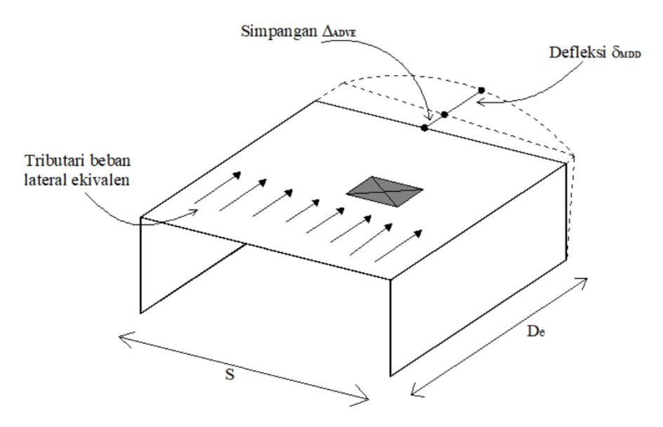

**Gambar 4 – Diafragma fleksibel**

#### <span id="page-68-1"></span><span id="page-68-0"></span>**7.3.1.3 Kondisi diafragma fleksibel yang dihitung**

Diafragma yang tidak memenuhi kondisi [0](#page-67-3) atau [0,](#page-67-4) boleh diidealisasikan sebagai diafragma fleksibel apabila:

$$\frac{\delta_{MDD}}{\Delta_{ADVE}} > 2 \tag{21}$$

dimana *MDD* dan *ADVE* seperti ditunjukkan dalam [Gambar 4.](#page-68-0) Pembebanan yang digunakan untuk perhitungan ini harus sesuai dengan yang ditentukan [0.](#page-80-0)

#### <span id="page-68-2"></span>**7.3.2 Klasifikasi struktur beraturan dan tidak beraturan**

Struktur harus diklasifikasikan beraturan atau tidak beraturan berdasarkan pada kriteria dalam pasal ini. Klasifikasi tersebut harus didasarkan pada konfigurasi horizontal dan vertikal dari struktur.

#### <span id="page-68-3"></span>**7.3.2.1 Ketidakberaturan horizontal**

Struktur yang mempunyai satu atau lebih tipe ketidakberaturan seperti yang terdapat dalam [Tabel 13](#page-70-0) harus dinyatakan mempunyai ketidakberaturan struktur horizontal. Struktur-struktur yang didesain untuk kategori desain seismik sebagaimana yang terdapat dalam [Tabel 13](#page-70-0) harus memenuhi persyaratan dalam pasal-pasal yang dirujuk dalam tabel tersebut.

#### **7.3.2.2 Ketidakberaturan vertikal**

Struktur yang mempunyai satu atau lebih tipe ketidakberaturan seperti yang terdapat dalam [Tabel 14](#page-72-0) harus dinyatakan mempunyai ketidakberaturan vertikal. Struktur-struktur yang didesain untuk kategori desain seismik sebagaimana yang terdapat dalam [Tabel 14](#page-72-0) harus memenuhi persyaratan dalam pasal-pasal yang dirujuk dalam tabel tersebut.

#### **PENGECUALIAN**

1. Ketidakberaturan struktur vertikal Tipe 1a, 1b, atau 2 dalam [Tabel 14](#page-72-0) tidak berlaku jika tidak ada rasio simpangan antar tingkat akibat gaya seismik lateral desain yang nilainya lebih besar dari 130 % rasio simpangan antar tingkat diatasnya. Pengaruh torsi tidak perlu ditinjau pada perhitungan

**© BSN 2019 57 dari 238**

- simpangan antar tingkat. Hubungan rasio simpangan antar tingkat untuk dua tingkat teratas struktur bangunan tidak perlu dievaluasi;
- 2. Ketidakberaturan struktur vertikal Tipe 1a, 1b, dan 2 dalam [Tabel 14](#page-72-0) tidak perlu ditinjau pada bangunan satu tingkat dalam semua kategori desain seismik atau bangunan dua tingkat yang didesain untuk kategori desain seismik B, C, atau D.

#### **7.3.3 Batasan dan persyaratan tambahan untuk sistem dengan ketidakberaturan struktur**

#### <span id="page-69-1"></span>**7.3.3.1 Ketidakberaturan horizontal dan vertikal struktur yang terlarang untuk kategori desain seismik D sampai F**

Struktur dengan kategori desain seismik E atau F dan memiliki ketidakberaturan horizontal Tipe 1b atau ketidakberaturan vertikal Tipe 1b, 5a, atau 5b tidak diizinkan. Struktur yang didesain untuk kategori desain seismik D dan memiliki ketidakberaturan vertikal Tipe 5b tidak diizinkan.

#### <span id="page-69-3"></span>**7.3.3.2 Tingkat lemah berlebihan**

Struktur dengan ketidakberaturan vertikal Tipe 5b dalam [Tabel 14,](#page-72-0) tidak boleh melebihi dua tingkat atau ketinggian struktur, *hn*, 9 m.

**PENGECUALIAN** Batasan ini tidak berlaku jika tingkat lemah tersebut mampu memikul gaya seismik total sebesar kali gaya desain yang ditetapkan dalam 7.8.

#### <span id="page-69-2"></span>**7.3.3.3 Elemen yang mendukung dinding tak menerus atau rangka tak menerus**

Elemen struktur yang mendukung dinding tak menerus atau rangka struktur tak menerus dan mempunyai ketidakberaturan horizontal Tipe 4 pada [Tabel 13](#page-70-0) atau ketidakberaturan vertikal Tipe 4 pada [Tabel 14,](#page-72-0) harus didesain untuk memikul efek gaya seismik termasuk faktor kuat lebih berdasarkan [0.](#page-77-1) Sambungan dinding tak menerus atau rangka tak menerus ke elemen struktur pendukung harus cukup untuk menyalurkan gaya desain dari elemen tak menerus tersebut.

#### <span id="page-69-0"></span>**7.3.3.4 Peningkatan gaya akibat ketidakberaturan untuk kategori desain seismik D hingga F**

Untuk struktur dengan kategori desain seismik D, E, atau F dan mempunyai ketidakberaturan struktur horizontal Tipe 1a, 1b, 2, 3, atau 4 pada [Tabel 13](#page-70-0) atau ketidakberaturan struktur vertikal Tipe 4 pada [Tabel 14,](#page-72-0) gaya desain yang ditentukan berdasarkan [0](#page-92-1) harus ditingkatkan 25 % untuk elemen-elemen sistem pemikul gaya seismik di bawah ini:

- 1. Sambungan antara diafragma dengan elemen-elemen vertikal dan dengan elemen-elemen kolektor;
- 2. Elemen kolektor dan sambungannya, termasuk sambungan-sambungan ke elemen vertikal dari sistem pemikul gaya seismik.

**PENGECUALIAN** Gaya yang dihitung menggunakan efek gaya seismik, termasuk faktor kuat lebih sesuai [0,](#page-77-1) tidak perlu diperbesar.

**Tabel 13 – Ketidakberaturan horizontal pada struktur** 

<span id="page-70-0"></span>

|     | Tipe dan penjelasan ketidakberaturan                                                                                                                                                                                                                                                                                                                                                                                                                                                                                                  | Pasal<br>referensi                          | Penerapan<br>kategori desain<br>seismik                                                                  |
|-----|---------------------------------------------------------------------------------------------------------------------------------------------------------------------------------------------------------------------------------------------------------------------------------------------------------------------------------------------------------------------------------------------------------------------------------------------------------------------------------------------------------------------------------------|---------------------------------------------|----------------------------------------------------------------------------------------------------------|
| 1a. | Ketidakberaturan torsi didefinisikan ada jika simpangan antar<br>tingkat maksimum, yang dihitung termasuk torsi tak terduga dengan<br>Ax<br>= 1,0, di salah satu ujung struktur melintang terhadap suatu<br>sumbu adalah lebih dari 1,2 kali simpangan antar tingkat rata-rata di<br>kedua ujung struktur. Persyaratan ketidakberaturan torsi dalam<br>pasal-pasal referensi berlaku hanya untuk struktur di mana<br>diafragmanya kaku atau setengah kaku.                                                                            | 0<br>0<br>0<br>0<br>Tabel 16<br>0           | D, E, dan F<br>B, C, D, E, dan F<br>C, D, E, dan F<br>C, D, E, dan F<br>D, E, dan F<br>B, C, D, E, dan F |
| 1b. | Ketidakberaturan<br>torsi<br>berlebihan<br>didefinisikan<br>ada<br>jika<br>simpangan antar tingkat maksimum yang dihitung termasuk akibat<br>torsi tak terduga degan Ax<br>= 1,0,<br>di salah satu ujung struktur<br>melintang terhadap suatu sumbu<br>adalah<br>lebih dari 1,4 kali<br>simpangan<br>antar<br>tingkat<br>rata-rata<br>di<br>kedua<br>ujung<br>struktur.<br>Persyaratan ketidakberaturan torsi berlebihan dalam pasal-pasal<br>referensi berlaku hanya untuk struktur di mana diafragmanya kaku<br>atau setengah kaku. | 0<br>0<br>0<br>0<br>0<br>0<br>Tabel 16<br>0 | E dan F<br>D<br>B, C, dan D<br>C dan D<br>C dan D<br>D<br>B, C, dan D                                    |
| 2.  | Ketidakberaturan sudut dalam didefinisikan ada jika kedua<br>dimensi proyeksi denah struktur dari lokasi sudut dalam lebih besar<br>dari 15 % dimensi denah struktur dalam arah yang ditinjau.                                                                                                                                                                                                                                                                                                                                        | 0<br>Tabel 16                               | D, E, dan F<br>D, E, dan F                                                                               |
| 3.  | Ketidakberaturan diskontinuitas diafragma didefinisikan ada jika<br>terdapat suatu diafragma yang memiliki diskontinuitas atau variasi<br>kekakuan mendadak, termasuk yang mempunyai daerah terpotong<br>atau terbuka lebih besar dari 50 % daerah diafragma bruto yang<br>tertutup, atau perubahan kekakuan diafragma efektif lebih dari 50 %<br>dari suatu tingkat ke tingkat selanjutnya.                                                                                                                                          | 0<br>Tabel 16                               | D, E, dan F<br>D, E, dan F                                                                               |
| 4.  | Ketidakberaturan akibat pergeseran tegak turus terhadap<br>bidang didefinisikan ada jika terdapat diskontinuitas dalam lintasan<br>tahanan gaya lateral, seperti pergeseran tegak lurus terhadap<br>bidang pada setidaknya satu elemen vertikal pemikul gaya lateral.                                                                                                                                                                                                                                                                 | 0<br>0<br>0<br>Tabel 16<br>0                | B, C, D,E, dan F<br>D, E, dan F<br>B, C, D, E, dan F<br>D, E, dan F<br>B, C, D, E, dan F                 |
| 5.  | Ketidakberaturan sistem nonparalel didefninisikan ada jika<br>elemen vertikal pemikul gaya lateral tidak paralel terhadap sumbu<br>sumbu ortogonal utama sistem pemikul gaya seismik.                                                                                                                                                                                                                                                                                                                                                 | 0<br>0<br>Tabel 16<br>0                     | C, D, E, dan F<br>B, C, D, E, dan F<br>D, E, dan F<br>B, C, D, E, dan F                                  |

**© BSN 2019 59 dari 238**

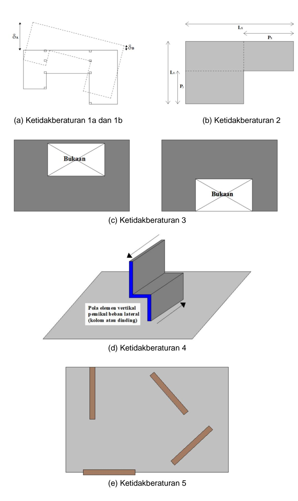

**Gambar 5 – Ketidakberaturan horizontal**

<span id="page-71-0"></span>**© BSN 2019 60 dari 238**

**Tabel 14 – Ketidakberaturan vertikal pada struktur** 

<span id="page-72-0"></span>

|     | Tipe dan penjelasan ketidakberaturan                                                                                                                                                                                                                                                                                                                                 | Pasal<br>referensi | Penerapan<br>kategori desain<br>seismik         |
|-----|----------------------------------------------------------------------------------------------------------------------------------------------------------------------------------------------------------------------------------------------------------------------------------------------------------------------------------------------------------------------|--------------------|-------------------------------------------------|
| 1a. | Ketidakberaturan Kekakuan Tingkat Lunak didefinisikan ada<br>jika terdapat suatu tingkat yang kekakuan lateralnya kurang dari 70<br>% kekakuan lateral tingkat di atasnya atau kurang dari 80 %<br>kekakuan rata-rata tiga tingkat di atasnya.                                                                                                                       | Tabel 16           | D, E, dan F                                     |
| 1b. | Ketidakberaturan<br>Kekakuan<br>Tingkat<br>Lunak<br>Berlebihan<br>didefinisikan ada jika terdapat suatu tingkat yang<br>kekakuan<br>lateralnya kurang dari 60 % kekakuan lateral tingkat di atasnya<br>atau kurang dari 70 % kekakuan rata-rata tiga tingkat di atasnya.                                                                                             | 0<br>Tabel 16      | E dan F<br>D, E, dan F                          |
| 2.  | Ketidakberaturan Berat (Massa) didefinisikan ada jika massa<br>efektif di sebarang tingkat lebih dari 150 % massa efektif tingkat di<br>dekatnya. Atap yang lebih ringan dari lantai di bawahnya tidak<br>perlu ditinjau.                                                                                                                                            | Tabel 16           | D, E, dan F                                     |
| 3.  | Ketidakberaturan Geometri Vertikal didefinisikan ada jika<br>dimensi horizontal sistem pemikul gaya seismik di sebarang tingkat<br>lebih dari 130 % dimensi horizontal sistem pemikul gaya seismik<br>tingkat didekatnya.                                                                                                                                            | Tabel 16           | D, E, dan F                                     |
| 4.  | Ketidakberaturan Akibat Diskontinuitas Bidang pada Elemen<br>Vertikal Pemikul Gaya Lateral didefinisikan ada jika pergeseran<br>arah bidang elemen pemikul gaya lateral lebih besar dari panjang<br>elemen itu atau terdapat reduksi kekakuan elemen pemikul di<br>tingkat di bawahnya.                                                                              | 0<br>0<br>Tabel 16 | B, C, D, E, dan F<br>D, E, dan F<br>D, E, dan F |
| 5a. | Ketidakberaturan Tingkat Lemah Akibat Diskontinuitas pada<br>Kekuatan Lateral Tingkat didefinisikan ada jika kekuatan lateral<br>suatu tingkat kurang dari 80 % kekuatan lateral tingkat di atasnya.<br>Kekuatan lateral tingkat adalah kekuatan total semua elemen<br>pemikul<br>seismik yang berbagi geser tingkat pada<br>arah yang<br>ditinjau.                  | 0<br>Tabel 16      | E dan F<br>D, E, dan F                          |
| 5b. | Ketidakberaturan<br>Tingkat<br>Lemah<br>Berlebihan<br>Akibat<br>Diskontinuitas pada Kekuatan Lateral Tingkat didefinisikan ada<br>jika kekuatan lateral suatu tingkat kurang dari 65 % kekuatan<br>lateral tingkat di atasnya. Kekuatan lateral tingkat adalah kekuatan<br>total semua elemen pemikul seismik yang berbagi geser tingkat<br>pada arah yang ditinjau. | 0<br>0<br>Tabel 16 | D, E, dan F<br>B dan C<br>D, E, dan F           |

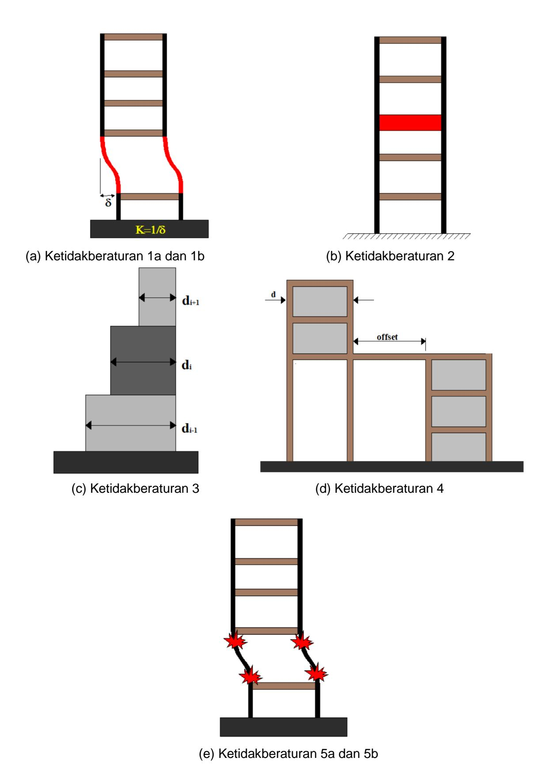

**Gambar 6 – Ketidakberaturan vertikal**

<span id="page-73-0"></span>**© BSN 2019 62 dari 238**

#### <span id="page-74-1"></span>**7.3.4 Redundansi**

Faktor redundansi, , harus diaplikasikan pada masing-masing kedua arah ortogonal untuk semua sistem struktur pemikul gaya seismik, sesuai dalam pasal ini.

#### <span id="page-74-2"></span>**7.3.4.1 Kondisi dimana nilai adalah 1,0**

Nilai diizinkan sama dengan 1,0 untuk hal-hal berikut ini:

- 1. Desain struktur untuk kategori desain seismik B atau C;
- 2. Perhitungan simpangan antar tingkat dan pengaruh P-delta;
- 3. Desain komponen nonstruktural;
- 4. Desain struktur nongedung yang tidak mirip dengan bangunan gedung;
- 5. Desain elemen kolektor, sambungan lewatan, dan sambungan, yang memperhitungkan kombinasi pengaruh beban seismik termasuk faktor kuat lebih berdasarkan [0;](#page-77-1)
- 6. Desain elemen struktur atau sambungan yang memperhitungkan kombinasi pengaruh beban seismik termasuk faktor kuat lebih berdasarkan [0;](#page-77-1)
- 7. Beban diafragma yang ditentukan menggunakan persamaan [\(51\)](#page-92-2), termasuk batasan yang disyaratkan oleh persamaan [\(52\)](#page-93-0) dan persamaan [\(53\)](#page-93-1);
- 8. Desain struktur dengan sistem peredam sesuai pasal [0;](#page-205-0)
- 9. Desain dinding struktural terhadap gaya keluar bidang, termasuk sistem angkurnya.

<span id="page-74-0"></span>**Tabel 15 – Persyaratan untuk masing-masing tingkat yang menahan lebih dari 35 % gaya geser dasar**

| Elemen pemikul<br>gaya lateral                                                                         | Persyaratan                                                                                                                                                                                                                                                                                                                                                                                      |
|--------------------------------------------------------------------------------------------------------|--------------------------------------------------------------------------------------------------------------------------------------------------------------------------------------------------------------------------------------------------------------------------------------------------------------------------------------------------------------------------------------------------|
| Rangka dengan<br>bresing                                                                               | Penghilangan suatu bresing individu, atau sambungan yang terhubung, tidak<br>akan mengakibatkan reduksi kekuatan tingkat lebih dari 33 %, dan tidak akan<br>menghasilkan<br>sistem<br>dengan<br>ketidakberaturan<br>torsi<br>yang<br>berlebihan<br>(ketidakberaturan struktur horizontal Tipe 1b).                                                                                               |
| Rangka pemikul<br>momen                                                                                | Kehilangan tahanan momen di sambungan balok-kolom di kedua ujung suatu<br>balok tunggal tidak akan mengakibatkan reduksi kekuatan tingkat lebih dari 33<br>%, dan tidak akan menghasilkan sistem dengan ketidakberaturan torsi yang<br>berlebihan (ketidakberaturan struktur horizontal Tipe 1b).                                                                                                |
| Dinding geser atau<br>pilar dinding dengan<br>rasio tinggi terhadap<br>panjang lebih besar<br>dari 1,0 | Penghilangan<br>suatu dinding geser atau pilar<br>dinding dengan rasio tinggi<br>terhadap panjang lebih besar dari 1,0 di sebarang tingkat, atau sambungan<br>kolektor yang terhubung, tidak akan mengakibatkan reduksi kekuatan tingkat<br>lebih dari 33 %, dan tidak akan menghasilkan sistem dengan ketidakberaturan<br>torsi yang berlebihan (ketidakberaturan struktur horizontal Tipe 1b). |
| Kolom kantilever                                                                                       | Kehilangan tahanan momen di sambungan dasar<br>pada<br>sebarang<br>kolom<br>kantilever tunggal tidak akan mengakibatkan reduksi kekuatan tingkat lebih dari<br>33 %, dan tidak akan menghasilkan sistem dengan ketidakberaturan torsi yang<br>berlebihan (ketidakberaturan struktur horizontal Tipe 1b).                                                                                         |
| Lainnya                                                                                                | Tidak ada persyaratan                                                                                                                                                                                                                                                                                                                                                                            |

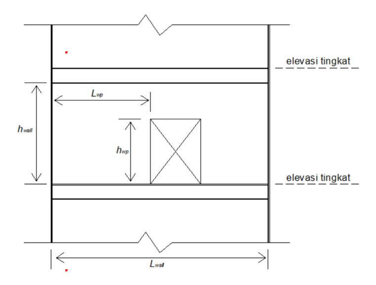

**CATATAN** *hwall* = tinggi dinding geser; *hwp* = tinggi pilar dinding; *Lwall* = panjang dinding geser; *Lwp* = panjang pilar dinding; *hwall*/*Lwall* = rasio tinggi terhadap panjang dinding geser; *hwpl/Lwp* = rasio tinggi terhadap panjang pilar dinding

#### <span id="page-75-1"></span>**Gambar 7 – Penentuan rasio tinggi terhadap panjang dinding geser dan pilar dinding**

#### <span id="page-75-2"></span>**7.3.4.2 Faktor redundansi, , untuk kategori desain seismik D sampai F**

Untuk struktur dengan kategori desain seismik D yang memiliki ketidakberaturan torsi berlebihan sesuai [Tabel 13,](#page-70-0) Tipe 1b, harus sebesar 1,3. Kategori seismik desain E dan F tidak diizinkan memiliki ketidakberaturan torsi berlebihan (lihat [0\)](#page-69-1). Untuk struktur yang tidak memiliki ketidakberaturan torsi berlebihan dengan kategori desain seismik D, E, atau F, harus sebesar 1,3, kecuali jika satu dari dua kondisi berikut dipenuhi, di mana diizinkan diambil sebesar 1,0:

- a. Masing-masing tingkat yang menahan lebih dari 35 % geser dasar dalam arah yang ditinjau harus sesuai dengan [Tabel 15;](#page-74-0)
- b. Struktur dengan denah beraturan di semua tingkat dengan sistem pemikul gaya seismik terdiri dari paling sedikit dua bentang perimeter pemikul gaya seismik yang merangka pada masing-masing sisi struktur dalam masing-masing arah ortogonal di setiap tingkat yang menahan lebih dari 35 % geser dasar. Jumlah bentang untuk dinding geser harus dihitung sebagai panjang dinding geser dibagi dengan tinggi tingkat atau dua kali panjang dinding geser dibagi dengan tinggi tingkat, *hsx*, untuk konstruksi rangka ringan.

#### <span id="page-75-0"></span>**7.4 Kombinasi dan pengaruh beban seismik**

#### **7.4.1 Ruang lingkup**

Semua elemen struktur, termasuk yang bukan bagian sistem pemikul gaya seismik, harus didesain menggunakan pengaruh beban seismik dalam [0](#page-75-0) kecuali jika sebaliknya dibebaskan oleh tata cara ini. Pengaruh beban seismik adalah gaya-gaya elemen aksial, geser dan lentur yang dihasilkan dari penerapan gaya seismik horizontal dan vertikal seperti ditetapkan selanjutnya dalam [0.](#page-75-3) Jika disyaratkan secara spesifik, pengaruh beban seismik harus dimodifikasi untuk memperhitungkan kuat lebih sistem, seperti ditetapkan selanjutnya dalam [0.](#page-77-1)

#### <span id="page-75-3"></span>**7.4.2 Pengaruh beban seismik**

Pengaruh beban seismik, *E*, harus ditentukan sesuai dengan berikut ini:

**© BSN 2019 64 dari 238**

1. Untuk penggunaan dalam kombinasi beban 6 dalam 0 atau kombinasi beban 5 dan 6 dalam 0, *E* harus ditentukan sesuai dengan persamaan (22) berikut:

<span id="page-76-2"></span>
$$E = E_b + E_c \tag{22}$$

2. Untuk penggunaan dalam kombinasi beban 7 dalam 0 atau kombinasi beban 8 dalam 0, *E* harus ditentukan sesuai dengan persamaan (23) berikut:

<span id="page-76-3"></span>
$$E = E_b - E_v \tag{23}$$

#### Keterangan:

E = pengaruh beban seismik;

 $E_h$  = pengaruh beban seismik horizontal seperti didefinisikan dalam 0;

 $E_v$  = pengaruh beban seismik vertikal seperti didefinisikan dalam 0.

#### <span id="page-76-0"></span>7.4.2.1 Pengaruh beban seismik horizontal

Pengaruh beban seismik horizontal,  $E_h$ , harus ditentukan sesuai dengan persamaan (24) sebagai berikut:

<span id="page-76-4"></span>
$$E_b = \rho Q_E \tag{24}$$

#### Keterangan:

- $Q_E$  adalah pengaruh gaya seismik horizontal dari V atau  $F_p$ . Jika disyaratkan dalam 0 dan 0, pengaruh tersebut harus dihasilkan dari penerapan gaya horizontal secara serentak dalam dua arah tegak lurus satu sama lain;
- $\rho$  adalah faktor redundansi, seperti didefinisikan dalam 0.

#### <span id="page-76-1"></span>7.4.2.2 Pengaruh beban seismik vertikal

Pengaruh beban seismik vertikal,  $E_{\nu}$ , harus ditentukan sesuai dengan persamaan (25) berikut:

<span id="page-76-5"></span>
$$E_{v} = 0.2S_{DS}D$$
 (25)

#### Keterangan:

 $S_{DS}$  = parameter percepatan respons spektral desain pada periode pendek yang diperoleh dari 0 D = pengaruh beban mati.

#### **PENGECUALIAN**

1. Ketika pilihan untuk memperhitungkan efek gerak tanah vertikal dengan menggunakan persyaratan di 0 diwajibkan pada standar ini (lihat 0 dan 0), pengaruh beban seismik vertikal,  $E_{\nu}$ , harus ditentukan berdasarkan persamaan berikut:

<span id="page-76-6"></span>
$$E_{y} = 0.3S_{xy}D$$
 (26)

#### Keterangan:

 $S_{av}$  adalah percepatan respons spektral vertikal desain yang didapatkan dari 0, D adalah efek beban mati

- 2. Pengaruh beban seismik vertikal,  $E_{\nu}$ , diizinkan untuk ditetapkan sama dengan nol untuk salah satu kondisi berikut ini:
  - 1. Dalam persamaan (22), (23), (26) dan (27) untuk struktur dengan kategori desain seismik B;
  - 2. Dalam persamaan (23) jika menentukan kebutuhan pada muka-kontak tanah-struktur di fondasi.

© BSN 2019 65 dari 238

#### <span id="page-77-1"></span>**7.4.3 Pengaruh beban seismik termasuk faktor kuat lebih**

Jika disyaratkan secara spesifik, kondisi yang mensyaratkan penerapan faktor kuat lebih harus ditentukan sesuai dengan berikut:

1. Untuk penggunaan dalam kombinasi beban 5 dalam [0](#page-36-3) atau kombinasi beban 5 dan 6 dalam [0,](#page-38-0) *E* harus diambil sama dengan *Emh* seperti ditentukan sesuai dengan persamaan [\(27\)](#page-77-2) sebagai berikut:

<span id="page-77-2"></span>
$$E_m = E_{mh} + E_{v} \tag{27}$$

2. Untuk penggunaan dalam kombinasi beban 7 dalam [0](#page-36-3) atau kombinasi beban 8 dalam [0,](#page-38-0) *E* harus diambil sama dengan *E<sup>m</sup>* seperti ditentukan sesuai dengan persamaan [\(28\)](#page-77-3) sebagai berikut:

<span id="page-77-3"></span>
$$E_m = E_{mh} - E_v \tag{28}$$

#### **Keterangan:**

*E<sup>m</sup>* = pengaruh beban seismik termasuk faktor kuat lebih

*Emh* = pengaruh beban seismik horizontal termasuk kuat lebih struktur seperti didefinisikan dalam [0](#page-77-4)

*E<sup>v</sup>* = pengaruh beban seismik vertikal seperti didefinisikan dalam [0](#page-76-1)

#### <span id="page-77-4"></span>**7.4.3.1 Pengaruh beban seismik horizontal dengan faktor kuat lebih**

Pengaruh beban seismik horizontal dengan faktor kuat lebih, *Emh*, harus ditentukan sesuai dengan persamaan [\(29\)](#page-77-5) sebagai berikut:

<span id="page-77-5"></span>
$$E_{mh} = \Omega_0 Q_E \tag{29}$$

#### **Keterangan:**

*Q<sup>E</sup>* = pengaruh beban seismik horizontal dari *V*, *Fpx*, atau *F<sup>p</sup>* seperti ditetapkan masing-masing dalam [0,](#page-80-2) [0](#page-92-0) dan [0.](#page-121-1) Jika disyaratkan dalam [0](#page-78-1) atau [0,](#page-78-2) pengaruh tersebut harus dihasilkan dari penerapan gaya horizontal secara serentak dalam dua arah tegak lurus satu sama lain;

= faktor kuat lebih.

Nilai *Emh* tidak perlu melebihi *Ecl*, dimana *Ecl* adalah efek gaya seismik horizontal yang dibatasi oleh nilai kapasitasnya seperti yang didefinisikan pada [0.](#page-26-0)

#### **7.4.3.2 Efek gaya seismik lateral yang dibatasi oleh nilai kapasitas**

Apabila desain berdasarkan batasan kapasitas (*capacity-limited design*) disyaratkan oleh dokumen referensi material, efek gaya seismik, termasuk kuat lebih, harus dihitung menggunakan efek gaya seismik lateral yang dibatasi nilai kapasitasnya, *Ecl*, sebagai pengganti *Emh* dalam kombinasi pembebanan di [0](#page-36-3) dan [0.](#page-38-0)

#### **7.4.4 Gaya ke atas minimum untuk kantilever horizontal untuk kategori desain seismik D sampai F**

Dalam struktur yang didesain untuk kategori desain seismik D, E, atau F, elemen struktur kantilever horizontal harus didesain untuk gaya ke atas bersih minimum sebesar 0,2 kali beban mati sebagai tambahan untuk kombinasi beban yang sesuai [0.](#page-75-0)

#### <span id="page-77-0"></span>**7.5 Arah pembebanan**

**© BSN 2019 66 dari 238**

#### **7.5.1 Kriteria arah pembebanan**

Arah penerapan beban seismik yang digunakan dalam desain harus merupakan arah yang akan menghasilkan pengaruh beban paling kritis. Penerapan arah gaya seismik yang memenuhi persyaratan ini, diizinkan menggunakan prosedur [0](#page-78-3) untuk kategori desain seismik B, [0](#page-78-1) untuk kategori desain seismik C, dan [0](#page-78-2) untuk kategori desain seismik D, E, dan F.

#### <span id="page-78-3"></span>**7.5.2 Kategori desain seismik B**

Untuk struktur bangunan yang didesain untuk kategori desain seismik B, gaya seismik desain diizinkan untuk diterapkan secara terpisah dalam masing-masing arah dari dua arah ortogonal dan pengaruh interaksi ortogonal diizinkan untuk diabaikan.

#### <span id="page-78-1"></span>**7.5.3 Kategori desain seismik C**

Pembebanan yang diterapkan pada struktur bangunan yang didesain untuk kategori desain seismik C minimal harus sesuai dengan persyaratan dalam [0](#page-78-3) untuk kategori desain seismik B dan persyaratan pasal ini.

Struktur yang mempunyai ketidakberaturan struktur horizontal Tipe 5 dalam [Tabel 13](#page-70-0) harus menggunakan salah satu dari prosedur berikut:

- a. **Prosedur kombinasi ortogonal.** Struktur harus dianalisis menggunakan prosedur analisis gaya lateral ekivalen dalam [0,](#page-80-0) prosedur analisis ragam respons spektral dalam [0,](#page-88-0) atau prosedur riwayat respons waktu linier dalam [0,](#page-176-1) seperti diizinkan dalam [0,](#page-78-0) dengan pembebanan yang diterapkan secara terpisah dalam sebarang dua arah ortogonal. Pengaruh beban paling kritis akibat arah penerapan gaya seismik pada struktur dianggap terpenuhi jika elemen struktur dan fondasinya didesain untuk memikul kombinasi bebanbeban yang ditetapkan berikut: 100 % gaya untuk satu arah ditambah 30 % gaya untuk arah tegak lurus. Kombinasi yang mensyaratkan kekuatan komponen maksimum harus digunakan.
- b. **Penerapan serentak gerak tanah ortogonal.** Struktur harus dianalisis menggunakan prosedur riwayat respons waktu linier dalam [0](#page-89-0) atau prosedur riwayat respons waktu nonlinier dalam [0,](#page-176-1) seperti diizinkan dalam [0,](#page-78-0) dengan pasangan ortogonal riwayat percepatan gerak tanah yang diterapkan secara bersemaan.

#### <span id="page-78-2"></span>**7.5.4 Kategori desain seismik D sampai F**

Struktur yang didesain untuk kategori desain seismik D, E, atau F minimal harus sesuai dengan persyaratan [0.](#page-78-1) Sebagai tambahan, setiap kolom atau dinding yang membentuk bagian dari dua atau lebih sistem pemikul gaya seismik yang berpotongan dan dikenai beban aksial, akibat gaya seismik yang bekerja sepanjang sumbu denah utama, yang sama dengan atau lebih dari 20 % kuat desain aksial kolom atau dinding harus didesain untuk pengaruh beban paling kritis akibat penerapan gaya seismik dalam semua arah. Baik prosedur [0a](#page-78-1) atau [0b](#page-78-1), diizinkan untuk digunakan untuk memenuhi persyaratan ini. Kecuali seperti disyaratkan dalam [0,](#page-79-3) analisis 2 dimensi diizinkan untuk struktur dengan diafragma fleksibel.

#### <span id="page-78-0"></span>**7.6 Pemilihan prosedur analisis**

**Analisis struktur yang disyaratkan oleh pasal [0](#page-56-0) harus terdiri dari salah satu tipe yang diizinkan dalam**

**[Tabel 16,](#page-79-4) berdasarkan pada kategori desain seismik struktur, sistem struktur, properti dinamik, dan keteraturan, sebuah prosedur alternatif yang diterima secara umum diizinkan untuk digunakan dengan persetujuan pihak berwenang. Prosedur analisis** 

**© BSN 2019 67 dari 238**

#### **yang dipilih harus dilengkapi sesuai dengan persyaratan dari pasal yang terkait yang dirujuk dalam**

[Tabel 16.](#page-79-4)

#### <span id="page-79-0"></span>**7.7 Kriteria pemodelan**

#### **7.7.1 Pemodelan fondasi**

Untuk tujuan penentuan beban seismik, pemodelan fondasi diizinkan dengan menganggap struktur terjepit di dasarnya. Sebagai alternatif, jika fleksibilitas fondasi diperhitungkan, pemodelan fondasi harus sesuai dengan [0](#page-101-1) atau pasal [0.](#page-233-0)

#### <span id="page-79-2"></span>**7.7.2 Berat seismik efektif**

Berat seismik efektif struktur, *W*, harus menyertakan seluruh beban mati dan beban lainnya yang terdaftar di bawah ini:

1. Dalam daerah yang digunakan untuk penyimpanan: minimum sebesar 25 % beban hidup lantai

#### **PENGECUALIAN**

- a. Bila beban penyimpanan tidak lebih dari 5 % terhadap berat seismik efektif pada tingkat tersebut, beban tidak perlu dimasukkan dalam berat seismik efektif.
- b. Beban hidup lantai di tempat parkir umum dan struktur parkir terbuka tidak perlu dimasukkan.
- 2. Jika ketentuan desain beban lantai untuk partisi disyaratkan SNI 1727 pasal 4.3.2, sebesar beban terbesar antara berat partisi aktual atau berat daerah lantai minimum sebesar 0,48 kN/m<sup>2</sup> ;
- 3. Berat operasional total dari peralatan yang permanen;
- <span id="page-79-4"></span><span id="page-79-1"></span>4. Berat lanskap dan beban lainnya pada taman atap dan area sejenis.

**Tabel 16 – Prosedur analisis yang diizinkan** 

| Kategori<br>desain<br>seismik | Karakteristik struktur                                                                                                                                                   | Analisis<br>gaya<br>lateral<br>ekivalen<br>pasal 0 | Analisis<br>spektrum<br>respons<br>ragam<br>pasal 0 | Prosedur<br>respons<br>riwayat<br>waktu<br>seismik<br>pasal 0 |
|-------------------------------|--------------------------------------------------------------------------------------------------------------------------------------------------------------------------|----------------------------------------------------|-----------------------------------------------------|---------------------------------------------------------------|
| B, C                          | Semua struktur                                                                                                                                                           | I                                                  | I                                                   | I                                                             |
| D, E, F                       | Bangunan dengan kategori risiko I atau II yang tidak<br>melebih 2 tingkat diatas dasar                                                                                   | I                                                  | I                                                   | I                                                             |
|                               | Struktur<br>tanpa<br>ketidakberaturan<br>struktural<br>dan<br>ketinggiannya tidak melebihi 48,8 m                                                                        | I                                                  | I                                                   | I                                                             |
|                               | Struktur tanpa ketidakberaturan strukturan dengan<br>ketinggian melebihi 48,8 m dan T < 3,5 Ts                                                                           | I                                                  | I                                                   | I                                                             |
|                               | Struktur dengan ketinggian tidak melebihi 48,8 m dan<br>hanya memiliki ketidakberaturan horizontal tipe 2,3,4<br>atau 5 atau ketidaberaturan vertikal tipe 4, 5a atau 5b | I                                                  | I                                                   | I                                                             |
|                               | Semua struktur lainnya                                                                                                                                                   | TI                                                 | I                                                   | I                                                             |

**CATATAN** I: Diizinkan, TI: Tidak Diizinkan

#### <span id="page-79-3"></span>**7.7.3 Pemodelan struktur**

**© BSN 2019 68 dari 238**

Model matematika struktur harus dibuat untuk tujuan penentuan gaya elemen struktur dan perpindahan struktur yang dihasilkan dari beban yang diterapkan dan semua perpindahan yang dikenakan atau pengaruh P-delta. Model harus menyertakan kekakuan dan kekuatan elemen yang signifikan terhadap distribusi gaya dan deformasi dalam struktur dan merepresentasikan distribusi massa dan kekakuan secara spasial pada seluruh struktur.

Sebagai tambahan, model tersebut harus sesuai dengan hal berikut ini:

- a. Properti kekakuan elemen beton dan batu bata harus memperhitungkan pengaruh penampang retak;
- b. Untuk sistem rangka baja pemikul momen, kontribusi deformasi daerah panel pada simpangan antar tingkat keseluruhan harus disertakan.

Struktur yang mempunyai ketidakberaturan struktur horizontal Tipe 1a, 1b, 4, atau 5 dari [Tabel](#page-70-0)  [13](#page-70-0) harus dianalisis menggunakan penggambaran 3 dimensi. Jika model 3 dimensi digunakan, minimum tiga derajat kebebasan dinamik yang terdiri dari translasi dalam dua arah denah ortogonal dan rotasi torsi terhadap sumbu vertikal harus disertakan di masing-masing tingkat struktur. Jika diafragma belum diklasifikasikan sebagai kaku atau fleksibel sesuai dengan [0,](#page-67-1) model tersebut harus menyertakan representasi karakteristik kekakuan diafragma dan derajat kebebasan dinamik tambahan tersebut diperlukan untuk memperhitungkan partisipasi diafragma dalam respons dinamik struktur. Jika menggunakan analisis riwayat waktu atau ragam respons spektral, minimum tiga derajat kebebasan dinamik yang terdiri dari translasi dalam dua arah denah ortogonal dan rotasi torsi terhadap sumbu vertikal harus disertakan di masing-masing tingkat struktur.

**PENGECUALIAN** Analisis menggunakan representasi 3 dimensi tidak diperlukan untuk struktur dengan diafragma fleksibel yang memiliki ketidakberaturan horizontal struktur Tipe 4.

#### **7.74 Pengaruh interaksi**

Rangka pemikul momen yang dilingkupi atau dihubungkan oleh elemen yang lebih kaku dan tidak dianggap sebagai bagian sistem pemikul gaya seismik harus didesain agar aksi atau kegagalan elemen tersebut tidak akan memperparah beban vertikal dan kemampuan rangka pemikul gaya seismik. Desainnya harus memperhitungkan pengaruh elemen kaku ini pada sistem struktur pada deformasi struktur yang terkait dengan simpangan antar tingkat desain () seperti ditentukan dalam [0.](#page-86-2) Sebagai tambahan, pengaruh elemen ini harus diperhitungkan bila menentukan apakah suatu struktur mempunyai satu atau lebih ketidakberaturan yang didefinisikan dalam [0.](#page-68-2)

#### <span id="page-80-0"></span>**7.8 Prosedur gaya lateral ekivalen**

#### <span id="page-80-2"></span>**7.8.1 Geser dasar seismik**

Gaya geser dasar seismik, *V*, dalam arah yang ditetapkan harus ditentukan sesuai dengan persamaan berikut:

<span id="page-80-3"></span>
$$V = C_{s}W \tag{30}$$

#### **Keterangan:**

 *C<sup>s</sup>* = koefisien respons seismik yang ditentukan sesuai dengan [0](#page-80-1)

 *W* = berat seismik efektif menurut [0](#page-79-2)

#### <span id="page-80-1"></span>**7.8.1.1 Perhitungan koefisien respons seismik**

Koefisien respons seismik, *Cs*, harus ditentukan sesuai dengan persamaan [\(31\).](#page-81-0)

**© BSN 2019 69 dari 238**

<span id="page-81-0"></span>
$$C_{s} = \frac{S_{DS}}{\left(\frac{R}{I_{e}}\right)} \tag{31}$$

#### Keterangan:

 $S_{DS}$  = parameter percepatan respons spektral desain dalam rentang periode pendek seperti ditentukan dalam 0 atau 0

R = koefisien modifikasi respons dalam Tabel 12

 $I_e$  = faktor keutamaan gempa yang ditentukan sesuai dengan 0.

Nilai  $C_s$  yang dihitung sesuai dengan persamaan (31) tidak perlu melebihi berikut ini: Untuk  $T \le T_t$ 

<span id="page-81-1"></span>
$$C_{s} = \frac{S_{D1}}{T\left(\frac{R}{I_{e}}\right)} \tag{32}$$

Untuk  $T > T_T$ 

<span id="page-81-2"></span>
$$C_s = \frac{S_{DI}T_L}{T^2 \left(\frac{R}{I_s}\right)} \tag{33}$$

C<sub>s</sub> harus tidak kurang dari

<span id="page-81-3"></span>
$$C_s = 0.044 S_{DS} I_a \ge 0.01$$
 (34)

Sebagai tambahan, untuk struktur yang berlokasi di daerah di mana  $S_I$  sama dengan atau lebih besar dari 0,6g, maka  $C_s$  harus tidak kurang dari:

<span id="page-81-4"></span>
$$C_s = \frac{0.5S_1}{\left(\frac{R}{I_e}\right)} \tag{35}$$

#### Keterangan:

di mana  $I_e$  dan R sebagaimana didefinisikan dalam 0, dan

 $S_{DI}$  = parameter percepatan respons spektral desain pada periode sebesar 1,0 detik, seperti yang ditentukan dalam 0

T = periode fundamental struktur (detik) yang ditentukan 0

 $S_I$  = parameter percepatan respons spektral maksimum yang dipetakan yang ditentukan sesuai 0

#### 7.8.1.2 Reduksi interaksi tanah struktur

Reduksi interaksi tanah struktur diizinkan bila ditentukan menggunakan pasal 0 atau prosedur yang diterima secara umum lainnya yang disetujui oleh pihak berwenang.

#### <span id="page-81-5"></span>7.8.1.3 Nilai maksimum $S_{DS}$ dalam penentuan $C_s$ dan $E_v$

Nilai  $C_s$  dan  $E_v$  diperkenankan untuk dihitung dengan nilai  $S_{DS}$  = 1,0, tetapi tidak kurang dari 70 % nilai  $S_{DS}$ , sesuai yang didefinisikan pada 0, apabila semua kriteria berikut dipenuhi:

© BSN 2019 70 dari 238

1. Tidak terdapat ketidakberaturan seperti yang didefinisikan pada [0;](#page-68-2)

#### **Tinggi struktur tidak melebihi 5 tingkat di atas level terendah antara dasar atau bidang permukaan tanah (***grade plane***) seperti yang didefinisikan pada pasal [0](#page-14-1) dan diilustrasikan pada**

- 2. [Gambar 8.](#page-82-2) Apabila diperlukan, setiap level mezanin dianggap sebagai satu lantai dalam pertimbangan ini;
- 3. Periode dasar struktur T tidak melebihi 0,5 detik, seperti yang disyaratkan pada [0;](#page-82-1)
- 4. Struktur memenuhi persyaratan yang diperlukan agar faktor redundansi diambil sama dengan 1, sesuai [0;](#page-75-2)
- 5. Sifat tanah di situs tidak termasuk kelas situs E atau F, sesuai [0;](#page-44-2)
- 6. Struktur diklasifikasikan sebagai kategori risiko I atau II, sesuai [0.](#page-34-2)

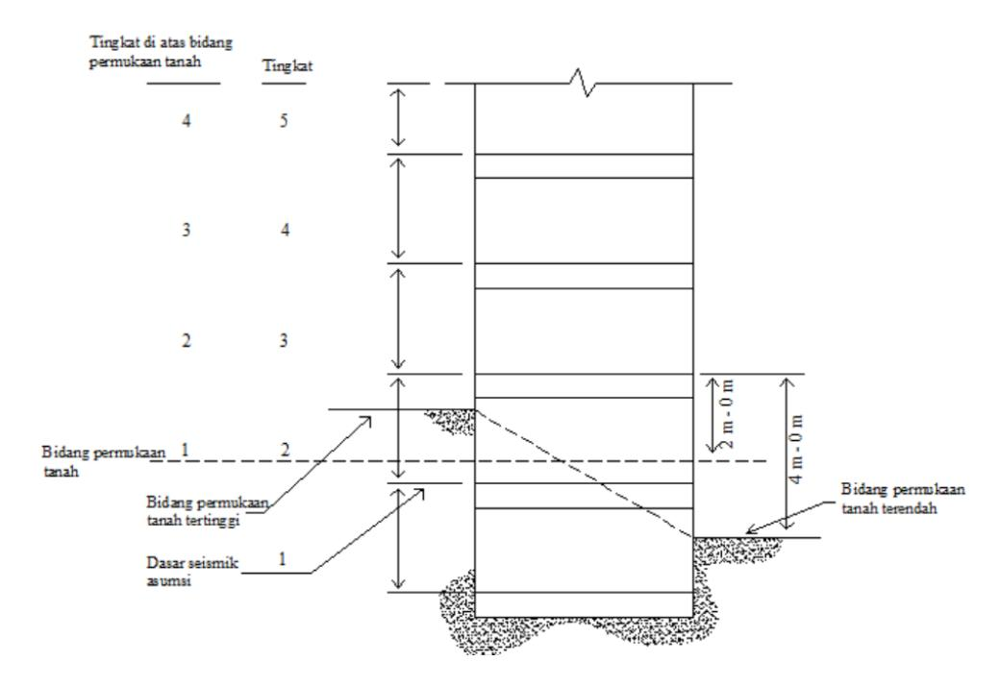

**CATATAN Tingkat 2 adalah tingkat pertama di atas bidang permukaan tanah jika permukaan lantai (atau atap) di atas tingkat adalah:**

- 1. 0m 2m di atas bidang permukaan tanah; atau
- <span id="page-82-2"></span><span id="page-82-0"></span>2. 0m – 4m di atas permukaan tanah akhir pada sebarang titik di sekeliling struktur.

#### **Gambar 8 – Ilustrasi bidang permukaan tanah (***grade plane***)**

#### <span id="page-82-1"></span>**7.8.2 Penentuan periode**

Periode fundamental struktur, *T*, dalam arah yang ditinjau harus diperoleh menggunakan sifat struktur dan karakteristik deformasi elemen pemikul dalam analisis yang teruji. Periode fundamental struktur, *T*, tidak boleh melebihi hasil perkalian koefisien untuk batasan atas pada periode yang dihitung (*Cu*) dari [Tabel 17](#page-83-0) dan periode fundamental pendekatan, *Ta*, yang ditentukan sesuai [0.](#page-83-2) Sebagai alternatif dalam melakukan analisis untuk menentukan periode fundamental struktur, *T*, diizinkan secara langsung menggunakan periode bangunan pendekatan, *Ta*, yang dihitung sesuai [0.](#page-83-2)

**© BSN 2019 71 dari 238**

Tabel 17 - Koefisien untuk batas atas pada periode yang dihitung

<span id="page-83-0"></span>

| Parameter percepatan respons spektral desain pada 1 detik, $S_{DI}$ | Koefisien C <sub>u</sub> |
|---------------------------------------------------------------------|--------------------------|
| ≥ 0,4                                                               | 1,4                      |
| 0,3                                                                 | 1,4                      |
| 0,2                                                                 | 1,5                      |
| 0,15                                                                | 1,6                      |
| ≤ 0,1                                                               | 1,7                      |

#### <span id="page-83-2"></span>7.8.2.1 Periode fundamental pendekatan

Periode fundamental pendekatan  $(T_a)$ , dalam detik, harus ditentukan dari persamaan berikut:

$$T_{a} = C_{t} h_{n}^{x} \tag{36}$$

#### Keterangan:

 $h_n$  adalah ketinggian struktur (m), di atas dasar sampai tingkat tertinggi struktur, dan koefisien  $C_t$ dan x ditentukan dari

<span id="page-83-3"></span>Tabel 18

<span id="page-83-5"></span>Tabel 18 – Nilai parameter periode pendekatan  $C_t$  dan x

<span id="page-83-1"></span>

| Tipe struktur                                                                                                                                                                                                                  | $C_{t}$ | x    |
|--------------------------------------------------------------------------------------------------------------------------------------------------------------------------------------------------------------------------------|---------|------|
| Sistem rangka pemikul momen di mana rangka memikul 100 % gaya seismik yang disyaratkan dan tidak dilingkupi atau dihubungkan dengan komponen yang lebih kaku dan akan mencegah rangka dari defleksi jika dikenai gaya seismik: |         |      |
| Rangka baja pemikul momen                                                                                                                                                                                                      | 0,0724  | 0,8  |
| Rangka beton pemikul momen                                                                                                                                                                                                     | 0,0466  | 0,9  |
| Rangka baja dengan bresing eksentris                                                                                                                                                                                           | 0,0731  | 0,75 |
| Rangka baja dengan bresing terkekang terhadap tekuk                                                                                                                                                                            | 0,0731  | 0,75 |
| Semua sistem struktur lainnya                                                                                                                                                                                                  | 0,0488  | 0,75 |

Sebagai alternatif, diizinkan untuk menentukan periode fundamental pendekatan ( $T_a$ ), dalam detik, dari persamaan berikut untuk struktur dengan ketinggian tidak melebihi 12 tingkat di mana sistem pemikul gaya seismik terdiri dari rangka pemikul momen yang seluruhnya beton atau seluruhnya baja dan rata-rata tinggi tingkat sekurang-kurangnya 3 m:

<span id="page-83-6"></span>
$$T_a = 0.1N \tag{37}$$

#### Keterangan:

N = jumlah tingkat

Untuk struktur dinding geser batu bata atau dinding geser beton dengan tinggi tidak melebihi 36,6 m, perhitungan periode fundamental pendekatan,  $T_a$ , diizinkan menggunakan persamaan (38) sebagai berikut:

<span id="page-83-4"></span>
$$T_a = \frac{0,00058}{\sqrt{C_w}} h_n \tag{38}$$

© BSN 2019 72 dari 238

dimana  $h_n$  didefinisikan di atas dan  $C_w$  dihitung dari persamaan (39) sebagai berikut:

<span id="page-84-2"></span>ana 
$$h_n$$
 didefinisikan di atas dan  $C_w$  dinitung dari persamaan (39) sebagai berikut:
$$C_w = \frac{100}{A_B} \sum_{i=1}^{x} \frac{A_i}{\left[1 + 0.83 \left(\frac{h_n}{D_i}\right)^2\right]}$$
(39)

#### Keterangan:

= luas dasar struktur (m²)  $A_B$ 

= luas badan dinding geser ke-i (m<sup>2</sup>)  $A_i$ 

 $D_i$ = panjang dinding geser ke-i (m)

= jumlah dinding geser dalam bangunan yang efektif memikul gaya lateral dalam arah yang ditinjau.

#### <span id="page-84-0"></span>7.8.3 Distribusi vertikal qaya seismik

Gaya seismik lateral,  $F_x$ , (kN) di sebarang tingkat harus ditentukan dari persamaan berikut :

$$F_{x} = C_{vx}V \tag{40}$$

dan

$$C_{vx} = \frac{w_x h_x^k}{\sum_{i=1}^n w_i h_i^k} \tag{41}$$

#### Keterangan:

 $C_{vx}$ = faktor distribusi vertikal

= gaya lateral desain total atau geser di dasar struktur (kN)

= bagian berat seismik efektif total struktur (W) yang ditempatkan atau dikenakan pada  $w_i \, dan \, w_x$ 

tingkat i atau x

= tinggi dari dasar sampai tingkat i atau x (m)  $h_i$  dan  $h_x$ 

= eksponen yang terkait dengan periode struktur dengan nilai sebagai berikut:

untuk struktur dengan T  $\leq$  0,5 detik, k=1untuk struktur dengan T  $\geq$  2,5 detik, k=2

untuk struktur dengan 0.5 < T < 2.5 detik, k = 2 atau ditentukan dengan interpolasi

<span id="page-84-3"></span>linier antara 1 dan 2

#### <span id="page-84-1"></span>7.8.4 Distribusi horizontal gava seismik

Geser tingkat desain seismik di semua tingkat,  $V_x$  (kN), harus ditentukan dari persamaan berikut:

$$V_{x} = \sum_{i=x}^{n} F_{i} \tag{42}$$

#### Keterangan:

 $F_i$  adalah bagian dari geser dasar seismik (V) pada tingkat ke-i (kN)

Geser tingkat desain seismik,  $V_x$  (kN), harus didistribusikan pada berbagai elemen vertikal sistem pemikul gaya seismik di tingkat yang ditinjau berdasarkan pada kekakuan lateral relatif elemen pemikul vertikal dan diafragma.

© BSN 2019 73 dari 238

#### 7.8.4.1 Torsi bawaan

Untuk diafragma yang tidak fleksibel, distribusi gaya lateral di masing-masing tingkat harus memperhitungkan pengaruh momen torsi bawaan,  $M_t$ , akibat eksentrisitas antara lokasi pusat massa dan pusat kekakuan. Untuk diafragma fleksibel, distribusi gaya ke elemen vertikal harus memperhitungkan posisi dan distribusi massa yang didukungnya.

#### <span id="page-85-1"></span>7.8.4.2 Torsi tak terduga

Jika diafragma tidak fleksibel, desain harus menyertakan momen torsi bawaan  $(M_t)$  yang dihasilkan dari lokasi massa struktur ditambah momen torsi tak terduga  $(M_{ta})$  akibat perpindahan pusat massa dari lokasi aktualnya yang diasumsikan pada masing-masing arah dengan jarak sebesar 5 % dimensi struktur tegak lurus terhadap arah gaya yang diterapkan.

Jika gaya gempa diterapkan secara serentak dalam dua arah ortogonal, perpindahan pusat massa 5 % yang disyaratkan tidak perlu diterapkan dalam kedua arah ortogonal pada saat bersamaan, tetapi harus diterapkan dalam arah yang menghasilkan pengaruh yang lebih besar.

Torsi tak terduga harus diaplikasikan ke semua struktur untuk menentukan keberadaan ketidakberaturan horizontal seperti yang diatur pada Tabel 13. Momen torsi tak terduga ( $M_{ta}$ ) tidak perlu diperhitungkan pada saat menentukan gaya seismik E pada perencanaan struktur dan pada saat menentukan simpangan antar tingkat desain seperti pada 0, 0 atau pasal 0, atau pada saat menentukan batasan-batasan 0, kecuali untuk struktur-struktur berikut:

- Struktur dengan kategori desain seismik B dengan ketidakberaturan struktur horizontal Tipe
   1b:
- Struktur dengan kategori desain seismik C, D, E, dan F dengan ketidakberaturan struktur horizontal Tipe 1a atau Tipe 1b.

#### <span id="page-85-0"></span>7.8.4.3 Pembesaran momen torsi tak terduga

Struktur yang didesain untuk kategori desain seismik C, D, E, atau F, di mana ketidakberaturan torsi tipe 1a atau 1b terjadi seperti didefinisikan dalam Tabel 13 harus mempunyai pengaruh yang diperhitungkan dengan mengalikan  $M_{ta}$  di masing-masing tingkat dengan faktor pembesaran torsi  $(A_x)$  seperti digambarkan dalam Gambar 9 dan ditentukan dari persamaan berikut:

<span id="page-85-2"></span>
$$A_{x} = \left(\frac{\delta_{\text{max}}}{1, 2\delta_{ave}}\right)^{2} \tag{43}$$

#### Keterangan

 $\delta_{\max}$  adalah perpindahan maksimum di tingkat x (mm) yang dihitung dengan mengasumsikan  $A_x=1$  (mm)

 $\delta_{\rm avg}$  adalah rata-rata perpindahan di titik-titik terjauh struktur di tingkat x yang dihitung dengan mengasumsikan  $A_x = 1$  (mm)

Faktor pembesaran torsi  $(A_x)$  tidak boleh kurang dari 1 dan tidak perlu melebihi 3,0. Pembebanan yang lebih parah untuk masing-masing elemen harus ditinjau untuk desain.

© BSN 2019 74 dari 238

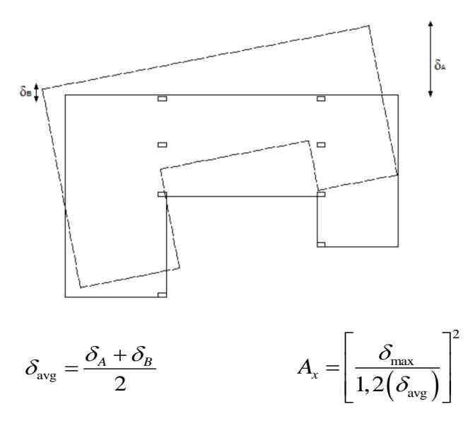

Gambar 9 – Faktor pembesaran torsi,  $A_x$ 

#### <span id="page-86-0"></span>**7.8.5** Guling

Struktur harus didesain untuk menahan pengaruh guling yang diakibatkan oleh gaya seismik yang ditentukan dalam 0.

#### <span id="page-86-2"></span>7.8.6 Penentuan simpangan antar tingkat

Penentuan simpangan antar tingkat desain ( $\Delta$ ) harus dihitung sebagai perbedaan simpangan pada pusat massa di atas dan di bawah tingkat yang ditinjau (lihat Gambar 10). Apabila pusat massa tidak segaris dalam arah vertikal, diizinkan untuk menghitung simpangan di dasar tingkat berdasarkan proyeksi vertikal dari pusat massa tingkat di atasnya. Jika desain tegangan izin digunakan,  $\Delta$  harus dihitung menggunakan gaya seismik desain yang ditetapkan dalam 0 tanpa reduksi untuk desain tegangan izin.

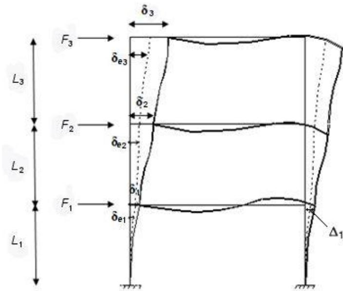

#### Tingkat 3

 F<sub>3</sub> = gaya gempa desain tingkat kekuatan
 δ<sub>e3</sub> = perpindahan elastik yang dihitung akibat gaya gempa desain tingkat kekuatan

 $\delta_3 = C_d \delta_{e3} / I_E = \text{perpindahan yang diperbesar}$ 

 $\Delta_3 = (\delta_{e3} - \delta_{e2})C_d/I_E \le \Delta_a$  (Tabel 20)

#### Tingkat 2

 $F_2$  = gaya gempa desain tingkat kekuatan

 $\delta_{\rm e2}$  = perpindahan elastik yang dihitung akibat gaya gempa desain tingkat kekuatan

 $\delta_2 = C_d \delta_{e2} / I_E =$  perpindahan yang diperbesar

 $\Delta_2 = (\delta_{e2} - \delta_{e1})C_d/I_E \le \Delta_a$  (Tabel 20)

#### Tingkat 1

 $F_1$  = gaya gempa desain tingkat kekuatan

 $\delta_{\rm e1}$  = perpindahan elastik yang dihitung akibat gaya gempa desain tingkat kekuatan

 $\delta_1 = C_d \delta_{e1} / I_E =$  perpindahan yang diperbesar

 $\Delta_1 = \delta_1 \le \Delta_a$  (Tabel 20)

 $\Delta_{l}$  = Simpangan antar tingkat

 $\Delta_i/L_i$  = Rasio simpangan antar tingkat

 $\delta_3$  = Perpindahan total

Gambar 10 - Penentuan simpangan antar tingkat

<span id="page-86-1"></span>© BSN 2019 75 dari 238

Bagi struktur yang didesain untuk kategori desain seismik C, D, E atau F yang memiliki ketidakberaturan horizontal Tipe 1a atau 1b pada Tabel 13, simpangan antar tingkat desain,  $\Delta$ , harus dihitung sebagai selisih terbesar dari simpangan titik-titik yang segaris secara vertikal di sepanjang salah satu bagian tepi strukur, di atas dan di bawah tingkat yang ditinjau.

Simpangan pusat massa di tingkat-x ( $\delta_x$ ) (mm) harus ditentukan sesuai dengan persamaan berikut:

<span id="page-87-1"></span>
$$\delta_{x} = \frac{C_{d}\delta_{xe}}{I_{c}} \tag{44}$$

#### Keterangan:

 $C_d$  = faktor pembesaran simpangan lateral dalam Tabel 12

 $\delta_{xe}$  = simpangan di tingkat-x yang disyaratkan pada pasal ini, yang ditentukan dengan analisis elastik

 $I_e$  = faktor keutamaan gempa yang ditentukan sesuai dengan 0

#### 7.8.6.1 Geser dasar minimum untuk menghitung simpangan antar tingkat

Analisis elastik sistem pemikul gaya seismik untuk perhitungan simpangan antar tingkat harus dilakukan dengan menggunakan gaya seismik desain sesuai 0.

**PENGECUALIAN** Persamaan (44) tidak perlu ditinjau pada perhitungan simpangan antar tingkat.

#### 7.8.6.2 Nilai periode untuk menghitung simpangan antar tingkat

Untuk menentukan kesesuaian dengan batasan simpangan antar tingkat dalam 0, diizinkan untuk menentukan simpangan antar tingkat elastik,  $\delta_{xe}$ , menggunakan gaya desain seismik berdasarkan pada periode fundamental struktur yang dihitung tanpa batasan atas ( $C_uT_a$ ) yang ditetapkan dalam 0.

#### <span id="page-87-0"></span>7.8.7 Pengaruh P-delta

Pengaruh P-delta pada geser tingkat dan momen, gaya dan momen elemen struktur yang dihasilkan, dan simpangan antar tingkat yang diakibatkannya tidak perlu diperhitungkan bila koefisien stabilitas ( $\theta$ ) seperti ditentukan oleh persamaan berikut sama dengan atau kurang dari 0,10:

<span id="page-87-2"></span>
$$\theta = \frac{P_x \Delta I_e}{V_x h_{sr} C_d} \tag{45}$$

#### Keterangan:

 $P_x$  = beban desain vertikal total pada dan di atas tingkat-x, (kN); bila menghitung  $P_x$ , faktor beban individu tidak perlu melebihi 1,0;

 $\Delta = \text{simpangan antar tingkat desain seperti didefinisikan dalam 0, terjadi secara serentak dengan <math>V_x$  (mm)

 $I_e$  = faktor keutamaan gempa yang ditentukan sesuai dengan 4.1.2

 $V_x$  = gaya geser seismik yang bekerja antara tingkat x dan x – 1 (kN)

 $h_{sx}$  = tinggi tingkat di bawah tingkat x, (mm);

 $C_d$  = faktor pembesaran defleksi dalam Tabel 12.

© BSN 2019 76 dari 238

Koefisien stabilitas ( $\theta$ ) tidak boleh melebihi  $\theta_{max}$  yang ditentukan sebagai berikut:

<span id="page-88-2"></span>
$$\theta_{\text{max}} = \frac{0.5}{\beta C_d} \le 0.25 \tag{46}$$

dimana  $\beta$  adalah rasio kebutuhan geser terhadap kapasitas geser untuk tingkat antara tingkat x dan x-1. Rasio ini diizinkan secara konservatif diambil sebesar 1.0.

Jika koefisien stabilitas ( $\theta$ ) lebih besar dari 0,10 tetapi kurang dari atau sama dengan  $\theta_{max}$ , faktor peningkatan terkait dengan pengaruh P-delta pada perpindahan dan gaya komponen struktur harus ditentukan dengan analisis rasional. Sebagai alternatif, diizinkan untuk mengalikan perpindahan dan gaya komponen struktur dengan 1,0/(1 –  $\theta$ ).

Jika  $\theta$  lebih besar dari  $\theta_{max}$ , struktur berpotensi tidak stabil dan harus didesain ulang.

Jika pengaruh P-delta disertakan dalam analisis otomatis, persamaan (46) tetap harus dipenuhi, akan tetapi, nilai  $\theta$  yang dihitung dari persamaan (45) menggunakan hasil analisis P-delta diizinkan dibagi dengan (1 +  $\theta$ ) sebelum diperiksa dengan persamaan (46).

#### <span id="page-88-0"></span>7.9 Analisis linear dinamik

#### <span id="page-88-3"></span>7.9.1 Analisis spektrum respons ragam

#### 7.9.1.1 Jumlah ragam

Analisis harus dilakukan untuk menentukan ragam getar alami untuk struktur. Analisis harus menyertakan jumlah ragam yang cukup untuk mendapatkan partisipasi massa ragam terkombinasi sebesar 100 % dari massa struktur. Untuk mencapai ketentuan ini, untuk ragam satu badan kaku (*single rigid body*) dengan periode 0,05 detik, diizinkan untuk mengambil semua ragam dengan periode di bawah 0,05 detik.

**PENGECUALIAN** Sebagai alternatif, analisis diizinkan untuk memasukkan jumlah ragam yang minimum untuk mencapai massa ragam terkombinasi paling sedikit 90 % dari massa aktual dalam masing-masing arah horizontal ortogonal dari respons yang ditinjau oleh model.

#### <span id="page-88-1"></span>7.9.1.2 Parameter respons ragam

Nilai untuk masing-masing parameter desain terkait gaya yang ditinjau, termasuk simpangan antar tingkat, gaya dukung, dan gaya elemen struktur individu untuk masing-masing ragam respons harus dihitung menggunakan properti masing-masing ragam dan spektrum respons didefinisikan dalam 0 atau 0 dibagi dengan kuantitas ( $R/I_e$ ). Nilai untuk perpindahan dan kuantitas simpangan antar tingkat harus dikalikan dengan kuantitas ( $C_d/I_e$ ).

#### 7.9.1.3 Parameter respons terkombinasi

Nilai untuk masing-masing parameter yang ditinjau, yang dihitung untuk berbagai ragam, harus dikombinasikan menggunakan metode akar kuadrat jumlah kuadrat (SRSS) atau metode kombinasi kuadrat lengkap (CQC), sesuai dengan SNI 1726. Metode CQC harus digunakan untuk masing-masing nilai ragam di mana ragam yang berdekatan mempunyai korelasi silang yang signifikan di antara respons translasi dan torsi.

© BSN 2019 77 dari 238

#### <span id="page-89-1"></span>**7.9.1.4 Skala nilai desain untuk respons terkombinasi**

Geser dasar (*V*) harus dihitung dalam masing-masing dua arah horizontal ortogonal menggunakan periode fundamental struktur yang dihitung *T* dalam masing-masing arah dan prosedur [0.](#page-80-0)

#### **7.9.1.4.1 Penskalaan gaya**

Apabila periode fundamental hasil analisis lebih besar dari *CuT<sup>a</sup>* pada suatu arah tertentu, maka periode struktur *T* harus diambil sebesar *CuTa*. Apabila kombinasi respons untuk gaya geser dasar hasil analisis ragam (*Vt*) kurang dari 100 % dari gaya geser (*V*) yang dihitung melalui metode statik ekivalen, maka gaya tersebut harus dikalikan dengan *V/Vt*, dimana. *V* adalah gaya geser dasar statik ekivalen yang dihitung sesuai pasal ini dan [0,](#page-80-0) dan *Vt* adalah gaya geser dasar yang didapatkan dari hasil analisis kombinasi ragam.

#### **7.9.1.4.1 Penskalaan simpangan**

Apabila kombinasi respons untuk gaya geser dasar hasil analisis ragam (*Vt*) kurang dari *CsW*, dan dimana *Cs* ditentukan berdasarkan persamaan [\(35\),](#page-81-4) maka simpangan harus dikalikan dengan *CsW/Vt*.

#### **7.9.1.5 Distribusi geser horizontal**

Distribusi geser horizontal harus sesuai dengan persyaratan [0,](#page-84-1) kecuali bahwa pembesaran torsi menurut [0,](#page-85-0) tidak disyaratkan bila pengaruh torsi tak terduga disertakan dalam model analisis dinamik.

#### **7.9.1.6 Pengaruh P-delta**

Pengaruh P-delta harus ditentukan sesuai dengan [0.](#page-87-0) Geser dasar yang digunakan untuk menentukan geser tingkat dan simpangan antar tingkat harus ditentukan sesuai dengan [0.](#page-86-2)

#### **7.9.1.7 Reduksi interaksi tanah struktur**

Reduksi interaksi tanah struktur diizinkan bila ditentukan menggunakan pasal [0](#page-205-0) atau prosedur lainnya yang diterima secara umum yang disetujui oleh pihak berwenang.

#### **7.9.1.8 Pemodelan struktur**

Model matermatis dari struktur harus dibuat sesuai dengan [0,](#page-79-3) kecuali semua struktur yang didesain sesuai dengan pasal ini harus dianalisis secara 3 dimensi. Bila diafragma tidak dikategorikan sebagai diafragma kaku sesuai persyaratan [0,](#page-67-1) maka model yang dibangun harus merepresentasikan karakteristik kekakuan diafragma dan derajat kebebasan dinamik tambahan yang diperlukan agar dapat mewakili partisipasi diafragma dalam respons dinamik struktur.

#### <span id="page-89-0"></span>**7.9.2 Analisis riwayat waktu linear**

#### **7.9.2.1 Persyaratan umum**

Analisis riwayat waktu linear harus terdiri dari analisis model matematis linear dari struktur untuk menentukan responsnya melalui metode-metode integrasi numerik, terhadap rangkaian riwayat percepatan yang dicocokkan secara spektral yang kompatibel dengan respons spektra desain di tempat itu. Analisis ini harus dilakukan sesuai dengan persyaratan-persyaratan pada bab berikut.

**© BSN 2019 78 dari 238**

#### **7.9.2.2 Persyaratan umum pemodelan**

Model tiga dimensi struktur harus diperlukan. Pemodelan distribusi kekakuan dan massa sepanjang sistem pemikul gaya lateral struktur dan diafragma harus sesuai [0.](#page-79-3)

#### **7.9.2.2.1 Efek P-delta**

Model matematis harus mengikutsertakan efek P-delta. Batasan mengenai koefisien stabilitas, , harus dipenuhi sesuai [0.](#page-87-0)

#### **7.9.2.2.2 Torsi tak terduga**

Torsi tak terduga, bilamana diperlukan sebagaimana [0,](#page-85-1) harus dimasukkan dengan memindahkan pusat massa (positif dan negatif) dari lokasi aktualnya sejauh 5 % dari dimensi horizontal yang diukur tegak lurus terhadap arah gaya. Pembesaran dari torsi tak terduga yang diatur pada [0](#page-85-0) tidak diwajibkan.

#### **7.9.2.2.3 Pemodelan fondasi**

Bila fleksibilitas fondasi dimasukkan dalam analisis, pemodelan fondasi harus sesuai [0.](#page-101-1)

#### **7.9.2.2.4 Jumlah ragam yang harus diikutsertakan dalam analisis riwayat ragam respons**

Bila prosedur analisis riwayat ragam *response history* dilakukan, jumlah ragam yang harus diikutsertakan dalam analisis harus sesuai dengan [0.](#page-88-3)

#### **7.9.2.2.5 Redaman**

Redaman viskos linear tidak boleh melebihi 5 % redaman kritis untuk sembarang ragam dengan periode getar yang lebih besar atau sama dengan *Tlower*.

#### **7.9.2.3 Pemilihan gerak tanah dan modifikasi**

Riwayat percepatan tanah yang digunakan untuk analisis terdiri tidak kurang dari tiga pasang komponen ortogonal yang telah dicocokkan secara spektral (*spectrally matched*) yang diturunkan dari rekaman gerak tanah atau gerak tanah tiruan. Spektrum respons target untuk tiap set yang sudah dicocokan secara spektral harus dibangun berdasarkan [0](#page-46-1) atau [0.](#page-54-0)

#### **7.9.2.3.1 Prosedur pencocokan secara spektral**

Setiap komponen dari gerak tanah harus dicocokkan secara spektral dalam rentang 0,8 *Tlower* sampai dengan 1,2 *Tupper*. Dalam rentang periode ini dan di tiap arah, nilai rata-rata dari percepatan semu (*pseudo acceleration*) dengan redaman 5 % yang dihitung dengan rekaman yang sudah dicocokan secara spektral tidak boleh kurang atau lebih dari 10 % spektrum target.

#### **7.9.2.4 Aplikasi riwayat percepatan tanah**

Dua arah yang saling tegak lurus, ditandai dengan x dan y, harus dipilih dan digunakan untuk seluruh analisis riwayat respons.

#### <span id="page-90-0"></span>**7.9.2.5 Modifikasi respons untuk desain**

**© BSN 2019 79 dari 238**

#### 7.9.2.5.1 Penentuan gaya geser dasar elastik dan inelastik

Untuk tiap gerak tanah yang dianalisis, gaya geser dasar elastik maksimum,  $V_{EX}$  dan  $V_{EY}$  untuk arah x dan arah y, harus ditentukan. Model matematis yang digunakan untuk menghitung gaya geser dasar elastik maksimum tidak boleh memperhitungkan pengaruh torsi tidak terduga. Untuk tiap gerak tanah yang dianalisis, gaya geser dasar inelastik maksimum,  $V_{IX}$  dan  $V_{IY}$  untuk arah x dan arah y, harus ditentukan berdasarkan:

$$V_{IX} = \frac{V_{EX}I_e}{R_r} \tag{47}$$

$$V_{IY} = \frac{V_{EY}I_e}{R_v} \tag{48}$$

#### Keterangan:

 $I_e$  adalah faktor keutamaan gempa, dan  $R_X$  dan  $R_Y$  adalah koefisien modifikasi respons untuk arah x dan arah y.

#### 7.9.2.5.2 Penentuan faktor skala untuk gaya geser dasar

Gaya geser dasar,  $V_X$  dan  $V_Y$  harus dihitung untuk arah x dan arah y sesuai 0.Untuk tiap gerak tanah yang dianalisis, faktor skala gaya geser dasar untuk tiap arah respons harus ditentukan sebagai berikut:

$$\eta_X = \frac{V_X}{V_{IX}} \ge 1.0 \tag{49}$$

$$\eta_{Y} = \frac{V_{Y}}{V_{IY}} \ge 1.0$$
(50)

#### 7.9.2.5.3 Penentuan respons gaya yang dikombinasi

Untuk tiap arah respons dan tiap gerak tanah yang dianalisis, respons gaya yang dikombinasi harus ditentukan sebagai berikut:

- a. Respons gaya yang dikombinasi dalan arah x harus ditentukan sebagai  $I_e \eta_x / R_X$  dikalikan dengan respons elastik dalam arah x yang dihitung dengan model matematis yang mempertimbangkan pengaruh torsi tidak terduga (jika diperlukan) ditambah  $I_e \eta_y / R_Y$  dikalikan dengan respons elastik dalam arah y yang dihitung dengan model matematis tanpa mempertimbangkan pengaruh torsi tidak terduga.
- b. Respons gaya yang dikombinasi dalam arah y harus ditentukan sebagai  $I_e\eta_Y/R_Y$  dikalikan dengan respons elastik dalam arah y yang dihitung dengan model matematis yang mempertimbangkan pengaruh torsi tidak terduga (jika diperlukan) ditambah  $I_e\eta_X/R_X$  dikalikan dengan respons elastik dalam arah x yang dihitung dengan model matematis tanpa mempertimbangkan pengaruh torsi tidak terduga.

#### <span id="page-91-0"></span>7.9.2.5.4 Penentuan respons perpindahan yang dikombinasi

Faktor pembesaran defleksi,  $C_{dX}$  dan  $C_{dy}$  harus diberikan pada arah x dan arah y. Untuk tiap arah respons dan tiap gerak tanah yang dianalisis, respons defleksi yang dikombinasi harus ditentukan sebagai berikut:

a. Respons perpindahan yang dikombinasi dalam arah x harus ditentukan sebagai  $\eta_X C_{dx}/R_X$  dikalikan dengan respons elastik dalam arah x yang dihitung dengan model matematis

© BSN 2019 80 dari 238

- yang mempertimbangkan pengaruh torsi tidak terduga (jika diperlukan) ditambah  $\eta_X C_{dY}/R_Y$  dikalikan dengan respons elastik dalam arah y yang dihitung dengan model matematis tanpa mempertimbangkan pengaruh torsi tidak terduga.
- b. Respons gaya yang dikombinasi dalam arah y harus ditentukan sebagai  $\eta_X C_{dY}/R_Y$  dikalikan dengan respons elastik dalam arah y yang dihitung dengan model matematis yang mempertimbangkan pengaruh torsi tidak terduga (jika diperlukan) ditambah  $\eta_X C_{dX}/R_X$  dikalikan dengan respons elastik dalam arah x yang dihitung dengan model matematis tanpa mempertimbangkan pengaruh torsi tidak terduga.

**PENGECUALIAN** Apabila gaya geser dasar desain pada satu arah tertentu tidak ditentukan oleh persamaan (34),faktor  $\eta_Y$  dan  $\eta_X$  diperbolehkan diambil sebesar 1.0 untuk menentukan perpindahan yang dikombinasi.

#### 7.9.2.6 Penentuan selubung (envelope) nilai-nilai respons gaya

Nilai respons gaya desain harus diambil dari selubung nilai respons gaya yang dikombinasi yang dihitung untuk dua arah saling tegak lurus dan untuk semua gerak tanah seismik yang digunakan. Apabila efek interaksi gaya dipertimbangkan, selubung diizinkan ditentukan dari rasio kebutuhan (demand) terhadap kapasitas, untuk menggantikan besaran nilai-nilai gaya individu.

#### 7.9.2.7 Penentuan selubung nilai respons perpindahan

Nilai simpangan antar tingkat harus ditentukan untuk tiap gerak tanah yang dianalisis dan di tiap arah respons dengan menggunakan respons perpindahan yang dikombinasi berdasarkan 0. Agar memenuhi batasan simpangan yang diberikan pada 0, selubung dari simpangan antar tingkat yang dihitung untuk tiap arah ortogonal dan semua gerak tanah harus digunakan.

#### <span id="page-92-0"></span>7.10 Diafragma, kord dan kolektor

Diafragma, kord, dan kolektor harus didesain sesuai dengan 0 dan 0.

#### **PENGECUALIAN**

- 1. Diafragma beton pracetak, termasuk di dalamnya kord dan kolektor yang merupakan bagian dari struktur dengan kategori desain seismik C, D, E, atau F harus didesain sesuai 0
- 2. Diafragma beton pracetak dengan kategori desain seismik B, diafragma beton cor-di-tempat, dan diafragma kayu yang ditopang oleh rangka diafragma kayu diizinkan untuk didesain sesuai 0.

#### <span id="page-92-3"></span>7.10.1 Desain diafragma

Diafragma harus didesain untuk tegangan geser dan lentur yang dihasilkan dari gaya desain. Pada diskontinuitas diafragma, seperti bukaan dan sudut dalam, desain harus menjamin bahwa disipasi atau transfer gaya tepi (kord) terkombinasi dengan gaya lainnya dalam diafragma tidak boleh melebihi kapasitas geser dan tarik diafragma.

#### <span id="page-92-1"></span>7.10.1.1 Gaya desain diafragma

Diafragma lantai dan atap harus didesain untuk menahan gaya seismik desain dari analisis struktur, tetapi tidak boleh kurang dari yang ditentukan sesuai dengan persamaan (51) sebagai berikut:

<span id="page-92-2"></span>
$$F_{px} = \frac{\sum_{i=x}^{n} F_i}{\sum_{i=x}^{n} w_i} w_{px}$$
(51)

© BSN 2019 81 dari 238

#### Keterangan:

 $F_{px}$  = gaya desain diafragma di tingkat-x;

 $F_i$  = gaya desain yang diterapkan di tingkat-i

 $W_i$  = tributari berat sampai tingkat-i

 $W_{nx}$  = tributari berat sampai diafragma di tingkat- x.

Gaya yang ditentukan dari persamaan (51) tidak boleh kurang dari:

<span id="page-93-0"></span>
$$F_{nx} = 0.2S_{DS}I_{e}W_{nx} {52}$$

dan tidak boleh melebihi:

<span id="page-93-1"></span>
$$F_{px} = 0.4S_{DS}I_{e}W_{px} {53}$$

Semua diafragma harus didesain untuk gaya inersia yang dihitung dari persamaan (51), (52) dan (53) untuk semua gaya transfer lainnya. Untuk struktur dengan ketidakberaturan horizontal Tipe 4 pada Tabel 13, gaya transfer dari elemen vertikal pemikul gaya seismik di atas diafragma ke elemen vertikal pemikul gaya seismik di bawah diafragma harus diperbesar dengan faktor kuat lebih sesuai 0 sebelum ditambahkan dengan gaya inersia diafragma. Untuk struktur dengan tipe-tipe ketidakberaturan struktur horizontal dan vertikal pada 0, maka persyaratan pada pasal tersebut juga harus dipenuhi.

**PENGECUALIA**N Hunian satu atau dua tingkat dari konstruksi rangka ringan diizinkan untuk menggunakan  $\Omega_0 = 1,0$ .

#### <span id="page-93-2"></span>7.10.2 Elemen kolektor

Elemen kolektor harus disediakan yang mampu menyalurkan gaya seismik yang berasal dari bagian lain struktur ke elemen yang menyediakan tahanan terhadap gaya tersebut.

## 7.10.2.1 Elemen-elemen kolektor yang memerlukan kombinasi beban dengan faktor kuat lebih untuk kategori desain seismik C hingga F

Pada struktur yang didesain untuk kategori desain seismik C, D, E, atau F, elemen-elemen kolektor (lihat Gambar 11) dan sambungan-sambungannya, termasuk sambungan-sambungan ke komponen vertikal harus didesain untuk menahan nilai maksimum diantara nilai-nilai berikut:

- 1. Gaya-gaya yang dihitung menggunakan pengaruh beban seismik, termasuk faktor kuat lebih dalam 0 dengan gaya-gaya seismik ditetapkan berdasarkan prosedur gaya lateral ekivalen dalam 0 atau prosedur analisis ragam respons spektra dalam 0;
- 2. Gaya-gaya yang dihitung menggunakan pengaruh beban seismik, termasuk faktor kuat lebih dalam 0 dengan gaya-gaya seismik ditetapkan berdasarkan persamaan (51);
- 3. Gaya-gaya yang dihitung menggunakan kombinasi beban dalam 0, dengan gaya seismik ditetapkan oleh persamaan (52).

Gaya-gaya transfer, sebagaimana dijelaskan dalam 0, harus ditinjau.

#### **PENGECUALIAN:**

Pada struktur atau bagian struktur yang dibresing sepenuhnya oleh dinding geser yang terbuat dari rangka kayu ringan, elemen-elemen kolektor dan sambungannya, termasuk sambungan ke elemen

© BSN 2019 82 dari 238

vertikal, hanya perlu didesain untuk menahan gaya sesuai kombinasi pembebanan pada 0 dengan gaya seismik yang ditentukan sesuai 0.

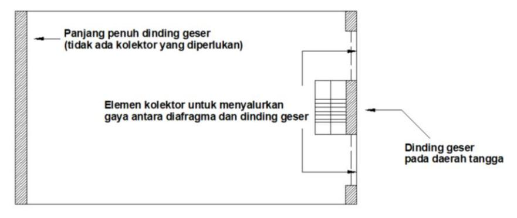

Gambar 11 - Kolektor

#### <span id="page-94-1"></span><span id="page-94-0"></span>7.10.3 Persyaratan desain alternatif untuk diafragma, termasuk kord dan kolektor

Bilamana diperlukan atau diizinkan pada 0, diafragma termasuk kord dan kolektor, harus didesain menggunakan persyaratan pada 0 sampai 0 dan persyaratan-persyaratan berikut:

- 1. Catatan kaki b pada Tabel 12 tidak perlu diterapkan;
- 2. Pasal 0 tidak perlu diterapkan;
- 3. Persyaratan 5 pada 0 harus diganti sebagai berikut: "Desain diafragma, termasuk kord, kolektor, dan sambungannya ke elemen vertikal.";
- 4. Persyaratan 7 pada 0 tidak perlu diterapkan.

#### <span id="page-94-2"></span>7.10.3.1 Desain

Diafragma, termasuk kord, kolektor, dan sambungannya ke elemen vertikal, harus didesain untuk menahan gaya seismik desain dalam arah bidang sesuai 0 dalam dua arah tegak lurus. Kolektor harus didesain agar mampu mentransfer gaya seismik yang terjadi di bagian lain dari struktur ke elemen vertikal yang menahan gaya tersebut. Desain harus menyediakan transfer gaya di daerah diafragma dengan diskontinuitas, seperti bukaan dan sudut dalam (*reentrant corners*).

#### <span id="page-94-3"></span>7.10.3.2 Gaya desain seismik untuk diafragma, termasuk kord dan kolektor

Diafragma, termasuk kord, kolektor, dan sambungan ke elemen vertikal harus didesain untuk menahan gaya desan seismik dalam bidang (*in plane*) yang dihitung dengan persamaan berikut.

<span id="page-94-4"></span>
$$F_{px} = \frac{C_{px}}{R_s} w_{px} \tag{54}$$

Gaya  $F_{nx}$  yang dihitung dari persamaan (54) tidak boleh kurang dari

<span id="page-94-5"></span>
$$F_{px} = 0.2S_{DS}I_{e}w_{px} {(55)}$$

 $C_{px}$  harus ditentukan sesuai ilustrasi pada Gambar 12.

© BSN 2019 83 dari 238

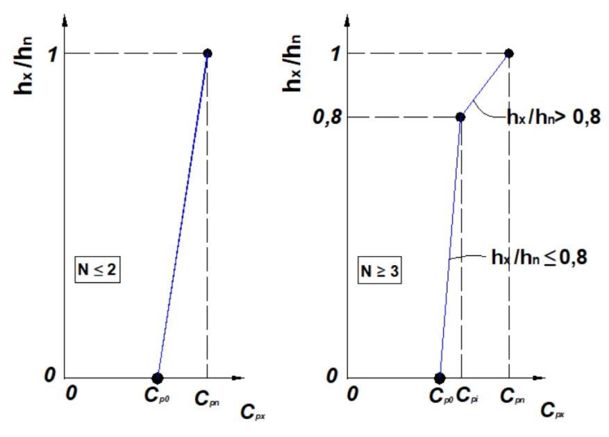

<span id="page-95-0"></span>Gambar 12 – Perhitungan koefisien percepatan desain  $C_{px}$  pada bangunan dengan N ≤ 2 dan pada bangunan dengan N ≥ 3 (N adalah jumlah tingkat)

#### 7.10.3.2.1 Koefisien percepatan desain $C_{p0}$ , $C_{pi}$ , dan $C_{pn}$

Koefisien percepatan desain  $C_{p0}$  dan  $C_{pn}$  harus dihitung dengan persamaan:

$$C_{p0} = 0.4S_{DS}I_e \tag{56}$$

dan

$$C_{pn} = \sqrt{\left(\Gamma_{m1}\Omega_{0}C_{s}\right)^{2} + \left(\Gamma_{m2}C_{s2}\right)^{2}} \ge C_{pi} \operatorname{nnnn} C_{p0} = 0, 4S_{DS}I_{e}$$
(57)

Koefisien percepatan desain  $C_{pi}$  harus diambil nilai terbesar antara persamaan (58) dan (59):

$$C_{pi} = 0.8C_{p0} \tag{58}$$

$$C_{pi} = 0.9\Gamma_{m1}\Omega_0 C_s \tag{59}$$

dengan  $\Omega_0$  adalah faktor kuat lebih yang ditentukan sesuai Tabel 12,  $C_s$  ditentukan sesuai 0 atau 0, dan  $C_{s2}$  adalah nilai terkecil dari persamaan (60) sampai dengan (62):

$$C_{s2} = (0.15N + 0.25)I_e S_{DS}$$
(60)

<span id="page-95-6"></span><span id="page-95-5"></span><span id="page-95-4"></span><span id="page-95-3"></span><span id="page-95-2"></span><span id="page-95-1"></span>(61)

$$C_{s2} = \frac{I_e S_{D1}}{0.03(N-1)}$$
 untuk  $N \ge 2$   
 $C_{s2} = 0$  untuk  $N = 1$  (62)

Faktor kontribusi ragam  $\Gamma_{m1}$  dan  $\Gamma_{m2}$  dalam persamaan (57) harus dihitung dengan persamaan (63) dan (64).

$$\Gamma_{m1} = 1 + \frac{z_s}{2} \left( 1 - \frac{1}{N} \right) \tag{63}$$

© BSN 2019

<span id="page-96-1"></span>
$$\Gamma_{m2} = 0.9z_s \left(1 - \frac{1}{N}\right)^2 \tag{64}$$

Dengan faktor ragam getar  $z_s$  diambil sebesar

- 0,3 untuk gedung yang didesain menggunakan sistem rangka bresing tahan tekuk seperti didefinisikan oleh Tabel 12;
- 0,7 untuk gedung yang didesain menggunakan sistem rangka pemikul momen seperti yang didefinisikan pada Tabel 12;
- 0,85 untuk gedung yang didesain menggunakan sistem ganda seperti yang didefinisikan pada Tabel 12 dengan rangka pemikul momen khusus atau menengah yang mampu menahan paling sedikit 25 % dari gaya seismik yang disyaratkan; atau
- 1,0 untuk gedung yang didesain dengan sistem pemikul gaya seismik lainnya.

#### 7.10.3.3 Gaya transfer di diafragma

Semua diafragma harus didesain untuk gaya inersia yang ditentukan dari persamaan (54) dan (55), dan untuk semua gaya transfer terkait yang diaplikasikan. Untuk struktur yang memiliki ketidakberaturan struktur horizontal Tipe 4 pada Tabel 13, transfer gaya dari elemen vertikal pemikul gaya seismik di atas diafragma ke elemen vertikal pemikul gaya seismik di bawah diafragma harus diperbesar dengan mengalikannya dengan faktor kuat lebih dari 0 sebelum ditambahkan ke gaya inersia diafragma. Untuk struktur yang memiliki ketidakberaturan struktur horizontal atau vertikal tipe lainnya yang diberikan pada 0, maka persyaratan dari pasal tersebut akan mengikat.

**PENGECUALIAN** Rumah hunian dari konstruksi rangka ringan diizinkan menggunakan  $\Omega_0 = 1,0$ .

#### 7.10.3.4 Kolektor kategori desain seismik C hingga F

Pada struktur yang termasuk ke dalam kategori desain seismik C, D, E, atau F, elemen kolektor dan sambungannya, termasuk sambungan kolektor ke elemen vertikal, harus didesain untuk memikul 1,5 kali dari gaya inersia diafragma pada 0 ditambah 1,5 kali gaya transfer desain.

#### **PENGECUALIAN**

- 1. Sebarang gaya transfer yang sudah diperbesar 1,5 kali dari 0 tidak perlu diperbesar 1,5 kali lagi;
- 2. Untuk sistem rangka momen dan rangka bresing, gaya kolektor tidak perlu melebihi kuat lateral dari garis rangka berkaitan di bawah kolektor, dengan hanya mempertimbangkan rangka momen atau rangka bresing. Selain itu, gaya desain diafragma tidak perlu melebihi gaya yang berkaitan dengan gaya kolektor yang akan ditentukan;
- 3. Pada struktur atau bagian struktur yang dibresing seluruhnya oleh dinding geser rangka ringan, elemen kolektor dan sambungannya, termasuk sambungan ke elemen vertikal, hanya perlu didesain untuk menahan gaya desain seismik diafragma tanpa angka pengali 1,5.

#### <span id="page-96-0"></span>7.10.3.5 Faktor reduksi gava desain diafragma

Faktor reduksi gaya desain diafragma, R<sub>s</sub>, harus ditentukan sesuai dengan Tabel 19.

© BSN 2019 85 dari 238

Tabel 19 – Faktor reduksi gaya desain diafragma,  $R_s$ 

<span id="page-97-1"></span>

| Sistem diafragma                                                              |      |     | Terkontrol lentur |
|-------------------------------------------------------------------------------|------|-----|-------------------|
| Beton cor ditempat yang didesain sesuai SNI 2847 dan pasal 14.2 ASCE/SEI 7-16 | -    | 1,5 | 2                 |
| Beton pracetak yang didesain sesuai SNI 2847 dan pasal                        | EDOa | 0,7 | 0,7               |
| 14.2.4 ASCE/SEI 7-16                                                          | BDOb | 1,0 | 1,0               |
|                                                                               | RDOc | 1,4 | 1,4               |
| Kayu yang didesain sesuai dengan AWC SDPWS-15 dan pasal 14.5 ASCE/SEI 7-16    |      | 3,0 | TI                |

#### **CATATAN**

- <sup>a</sup>EDO adalah diafragma beton pracetak dengan pilihan desain elastik (elastic design option)
- <sup>b</sup>BDO adalah diafragma beton pracetak dengan pilihan desain dasar (basic design option)
- °RDO adalah diafragma beton pracetak dengan pilihan desain yang direduksi (reduction design option)

#### <span id="page-97-0"></span>7.11 Dinding struktural dan pengangkurannya

#### 7.11.1 Desain untuk gaya keluar bidang

Dinding struktur dan pengangkurannya harus didesain untuk gaya tegak lurus terhadap permukaan sebesar  $F_p=0.4S_{DS}I_e$  dikalikan dengan berat dinding struktur dengan gaya minimum sebesar 10 % berat dinding struktur.

## <span id="page-97-4"></span>7.11.2 Pengangkuran dinding struktural dan penyaluran gaya desain pada diafragma atau elemen struktur pendukung lainnya

#### <span id="page-97-2"></span>7.11.2.1 Gaya pengangkuran dinding

Pengangkuran dinding struktural pada konstruksi pendukung harus dapat menyediakan suatu sambungan langsung yang mampu menahan gaya sebagai berikut:

<span id="page-97-3"></span>
$$F_p = 0.4S_{DS}k_a I_e W_p \tag{65}$$

 $F_p$  tidak boleh diambil kurang dari  $0.2k_aI_eW_p$ .

$$k_a = 1.0 + \frac{L_f}{30}$$
 (66)

 $k_a$  tidak perlu diambil lebih besar dari 2,0.

 $k_a$  tidak perlu diambil lebih besar dari 1,0 ketika sambungan tidak berada pada difragma yang fleksibel

#### Keterangan:

 $F_n$  = gaya desain pada angkur-angkur individu

 $S_{DS}$  = parameter percepatan respons spektral desain pada periode pendek menurut

 $I_e$  = faktor keutamaan gempa menurut 0;

 $k_a$  = faktor amplifikasi untuk fleksibilitas diafragma;

 $L_f$  = bentang diafragma fleksibel (dalam m) yang memberikan tumpuan lateral pada dinding bentang tersebut diukur antara elemen-elemen vertikal yang menyediakan tumpuan lateral terhadap diafragma tersebut pada arah yang ditinjau. Nilai  $L_f$  adalah 0 untuk diafragma kaku;

 $W_p$  = berat dinding sesuai luasan tributari angkur.

© BSN 2019 86 dari 238

Bila angkur tidak terletak di atap dan seluruh diafragma tidak fleksibel, maka nilai yang diperoleh dari persamaan [\(65\)](#page-97-3) diizinkan untuk dikalikan dengan faktor <sup>1</sup> <sup>2</sup> *<sup>z</sup> <sup>h</sup>*/ 3 , dimana *z* adalah tinggi angkur di atas dasar struktur dan *h* adalah tinggi atap di atas dasar. Akan tetapi *F<sup>p</sup>* harus tidak kurang dari persyaratan pada [0](#page-97-4) dengan gaya angkur minimum *Fp= 0,2 Wp*.

Dinding struktural harus didesain untuk menahan lentur antara angkur-angkur bila spasi angkur melebihi 1200 mm. Interkoneksi dari elemen struktur dinding dan sambungan ke sistem penumpu rangka harus memiliki kekuatan, kapasitas rotasi dan daktilitas yang cukup untuk menahan perubahan suhu dan perbedaan perubahan pondasi ketika dikombinasikan dengan beban seismik.

#### **7.11.2.2 Persyaratan tambahan untuk pengangkuran beton atau dinding bata struktural ke diafragma pada struktur yang didesain untuk kategori desain seismik C sampai F**

#### **7.11.2.2.1 Penyaluran gaya pengangkuran ke diafragma**

Diafragma harus dilengkapi dengan pengikat atau strut menerus antara kord diafragma untuk mendistribusikan gaya pengangkuran ini dalam diafragma. Sambungan diafragma harus positif, mekanis, atau dilas. Kord tambahan diizinkan untuk digunakan untuk membentuk subdiafragma untuk mentransmisikan gaya pengangkuran ke pengikat silang menerus utama. Rasio panjang-terhadap-lebar maksimum subdiafragma struktur harus sebesar 2,5 sampai 1. Sambungan dan pengangkuran yang mampu menahan gaya yang ditetapkan harus disediakan antara diafragma dan komponen yang terhubung. Sambungan harus menerus ke dalam diafragma dengan jarak yang cukup untuk menahan gaya yang disalurkan ke dalam diafragma.

#### **7.11.2.2.2 Elemen baja dari sistem pengangkuran dinding struktur**

Kekuatan gaya desain untuk elemen baja dari sistem pengangkuran dinding struktur harus dikalikan dengan 1,4 jika tidak disyaratkan oleh pasal ini kecuali baut angkur dan baja tulangan.

#### **7.11.2.2.3 Diafragma kayu**

Pengangkur pada beton atau dinding struktur ke diafragma kayu harus dilakukan sesuai dengan AWC SDPWS 4.1.5.1 dan persyaratan pada bab ini. Pada diafragma kayu, pengikat menerus harus diadakan sebagai tambahan pada pelapis diafragma. Pengangkuran tidak boleh dilaksanakan dengan menggunakan paku miring (*toenails*) atau paku yang mudah dicabut baik pada papan kayu atau rangka yang digunakan pada lentur melintang serat atau tarik melintang serat. Pelapis diafragma tidak boleh dianggap efektif sebagai pengikat atau *strut* disyaratkan oleh pasal ini.

#### **7.11.2.2.4 Diafragma dek metal**

Pada diafragma dek metal, dek metal tidak boleh digunakan sebagai pengikat menerus yang disyaratkan oleh pasal ini dalam arah tegak lurus pada bentang dek.

#### **7.11.2.2.5 Pengikat tertanam**

Pengangkuran diafragma ke dinding struktur dengan menggunakan pengikat tertanam harus dihubungkan dengan, atau dikait melingkari, baja tulangan, atau cara lain agar secara efektif dapat menyalurkan gaya ke baja tulangan.

**© BSN 2019 87 dari 238**

#### **7.11.2.2.6 Sistem pengangkuran dibebani eksentris**

Jika elemen sistem pengangkuran dinding dibebani eksentris atau tidak tegak lurus pada dinding, sistem tersebut harus didesain untuk menahan semua komponen gaya yang ditimbulkan oleh eksentrisitas.

#### **7.11.2.2.7 Dinding dengan pilaster**

Jika pilaster ada pada dinding, gaya pengangkuran di pilaster harus dihitung dengan meninjau beban tambahan yang disalurkan dari panel dinding ke pilaster. Tetapi, gaya pengangkuran minimum di lantai atau atap tidak boleh direduksi.

#### <span id="page-99-0"></span>**7.12 Simpangan antar tingkat dan deformasi**

#### <span id="page-99-2"></span>**7.12.1 Batasan simpangan antar tingkat**

Simpangan antar tingkat desain () seperti ditentukan dalam [0,](#page-86-2) atau [0,](#page-88-0) tidak boleh melebihi simpangan antar tingkat izin (a) seperti didapatkan dari [Tabel 20](#page-99-3) untuk semua tingkat.

<span id="page-99-1"></span> **Tabel 20 – Simpangan antar tingkat izin, <sup>a</sup> a,b**

<span id="page-99-3"></span>

|                                                                                                                                                                                                                                                        | Kategori risiko   |          |          |  |
|--------------------------------------------------------------------------------------------------------------------------------------------------------------------------------------------------------------------------------------------------------|-------------------|----------|----------|--|
| Struktur                                                                                                                                                                                                                                               | I atau II         | III      | IV       |  |
| Struktur, selain dari struktur dinding geser batu bata, 4 tingkat<br>atau kurang dengan dinding interior, partisi, langit-langit dan<br>sistem<br>dinding<br>eksterior<br>yang<br>telah<br>didesain<br>untuk<br>mengakomodasi simpangan antar tingkat. | c<br>0,025h<br>sx | 0,020hsx | 0,015hsx |  |
| Struktur dinding geser kantilever batu batad                                                                                                                                                                                                           | 0,010hsx          | 0,010hsx | 0,010hsx |  |
| Struktur dinding geser batu bata lainnya                                                                                                                                                                                                               | 0,007hsx          | 0,007hsx | 0,007hsx |  |
| Semua struktur lainnya                                                                                                                                                                                                                                 | 0,020hsx          | 0,015hsx | 0,010hsx |  |

#### **CATATAN**

#### <span id="page-99-4"></span>**7.12.1.1 Rangka pemikul momen pada struktur yang didesain untuk kategori desain seismik D sampai F**

Untuk sistem pemikul gaya seismik yang terdiri dari hanya rangka momen pada struktur yang didesain untuk kategori desain seismik D, E, atau F, simpangan antar tingkat desain () tidak boleh melebihi a/ntuk semua tingkat. harus ditentukan sesuai dengan [0.](#page-75-2)

#### **7.12.2 Defleksi diafragma**

**© BSN 2019 88 dari 238**

*a hsx* adalah tinggi tingkat di bawah tingkat-x.

*b* Untuk sistem pemikul gaya seismik yang terdiri dari hanya rangka momen dalam kategori desain seismik D, E, dan F, simpangan antar tingkat izin harus sesuai dengan persyaratan [0](#page-99-4)

*c* Tidak boleh ada batasan simpangan antar tingkat untuk struktur satu tingkat dengan dinding interior, partisi, langit-langit, dan sistem dinding eksterior yang telah didesain untuk mengakomodasi simpangan antar tingkat. Persyaratan pemisahan struktur dalam [0](#page-100-0) tidak diabaikan.

*d* Struktur di mana sistem struktur dasar terdiri dari dinding geser batu bata yang didesain sebagai elemen vertikal kantilever dari dasar atau pendukung fondasinya yang dikontruksikan sedemikian agar penyaluran momen di antara dinding geser (kopel) dapat diabaikan.

Defleksi pada bidang diafragma, seperti ditentukan dengan analisis struktur, tidak boleh melebihi defleksi izin elemen yang terhubung. Defleksi izin harus merupakan simpangan yang akan mengizinkan elemen yang terhubung untuk mempertahankan integritas strukturnya akibat pembebanan individu dan terus mendukung beban yang ditetapkan.

#### <span id="page-100-0"></span>7.12.3 Pemisahan struktur

Semua bagian struktur harus didesain dan dibangun untuk bekerja sebagai satu kesatuan yang terintegrasi dalam menahan gaya-gaya seismik kecuali jika dipisahkan secara struktural dengan jarak yang cukup memadai untuk menghindari kerusakan akibat benturan seperti yang dijelaskan lebih lanjut pada bagian ini.

Pemisahan harus dapat mengakomodasi terjadinya perpindahan respons inelastik maksimum ( $\delta_M$ ).  $\delta_M$  harus dihitung pada lokasi kritis dengan mempertimbangkan perpindahan translasi maupun rotasi pada struktur, termasuk pembesaran torsi, dengan menggunakan persamaan dibawah ini:

$$\delta_{M} = \frac{C_{d} \cdot \delta_{\text{max}}}{I_{c}} \tag{67}$$

#### Keterangan:

 $\delta_{\text{max}}$  adalah perpindahan elastik maksimum pada lokasi kritis.

Struktur-struktur bangunan yang bersebelahan harus dipisahkan minimal sebesar  $\delta_{MT}$ , yang dihitung dari persamaan di bawah ini:

$$\delta_{MT} = \sqrt{\left(\delta_{M1}\right)^2 + \left(\delta_{M2}\right)^2} \tag{68}$$

Dimana  $\delta_{MI}$  dan  $\delta_{M2}$  adalah perpindahan respons inelastik maksimum pada struktur-struktur bangunan yang bersebelahan di tepi-tepi yang berdekatan.

Struktur bangunan harus diposisikan berjarak paling tidak sejauh  $\delta_{M}$  dari garis batas kepemilikan tanah.

**PENGECUALIAN** Jarak pemisahan yang lebih kecil diizinkan jika hal ini dapat dibuktikan oleh analisis yang rasional berdasarkan respons inelastik terhadap pergerakan tanah rencana akibat gempa.

#### 7.12.4 Komponen-komponen yang membentang antar struktur

Sambungan gravitasi atau tumpuan untuk komponen-komponen yang membentang antara struktur-struktur bangunan atau antara bagian-bagian struktur yang dipisah secara seismik harus didesain terhadap perpindahan relatif maksimum yang mungkin terjadi. Nilai-nilai perpindahan harus dihitung dengan cara berikut ini, yaitu:

- 1. Menggunakan nilai defleksi yang dihitung di lokasi-lokasi tumpuan, yaitu berdasarkan persamaan (43) yang dikalikan dengan  $1,5R/C_d$ , dan;
- 2. Meninjau defleksi tambahan akibat rotasi diafragma, termasuk faktor pembesaran torsi yang dihitung berdasarkan 0, bila struktur memiliki ketidakberaturan torsi, dan;
- 3. Mempertimbangkan deformasi diafragma, dan;
- 4. Mengasumsikan kedua struktur bangunan bergerak ke arah-arah yang saling berlawanan dan defleksi yang dihasilkan masing-masing struktur bangunan kemudian dijumlahkan secara absolut.

© BSN 2019 89 dari 238

#### <span id="page-101-4"></span>**7.12.5 Kompatibilitas deformasi untuk kategori desain seismik D sampai F**

Untuk struktur yang didesain untuk kategori desain seismik D, E, atau F, setiap elemen struktur yang tidak termasuk dalam sistem pemikul gaya seismik dalam arah yang ditinjau harus didesain agar cukup untuk memikul pengaruh beban gravitasi dan gaya seismik yang dihasilkan dari perpindahan terhadap simpangan antar tingkat desain () seperti yang ditentukan sesuai dengan [0](#page-86-2) (lihat juga [0\)](#page-99-2).

**PENGECUALIAN** Elemen struktur rangka beton bertulang yang tidak didesain sebagai bagian dari sistem pemikul gaya seismik harus sesuai dengan SNI 2847.

Dalam menentukan momen dan geser yang timbul pada komponen yang tidak termasuk dalam sistem pemikul gaya seismik dalam arah yang ditinjau, pengaruh kekakuan elemen struktur dan nonstruktur yang terhubung harus diperhitungkan, dan nilai kekakuan yang rasional dari elemen struktur dan tumpuan harus digunakan.

#### <span id="page-101-0"></span>**7.13 Desain fondasi**

#### **7.13.1 Dasar desain**

Dasar desain untuk fondasi harus seperti yang ditentukan dalam [0.](#page-57-0)

#### <span id="page-101-3"></span>**7.13.2 Material konstruksi**

Material yang digunakan untuk desain dan konstruksi fondasi harus sesuai dengan persyaratan dan tambahan persyaratan untuk fondasi di tanah yang berpotensi terlikuifaksi dalam [0.](#page-105-0) Desain dan pendetailan tiang baja harus sesuai dengan peraturan yang berlaku dan tambahan persyaratan dalam [0](#page-105-0) bila terkait. Desain dan pendetailan tiang beton harus sesuai peraturan yang berlaku dan tambahan persyaratan dalam [0](#page-105-0) bila terkait.

#### <span id="page-101-1"></span>**7.13.3 Karakteristik beban-deformasi fondasi**

Jika fleksibilitas fondasi disertakan dalam prosedur analisis linier dalam pasal [0,](#page-56-0) karakteristik beban-deformasi sistem fondasi-tanah harus dimodelkan sesuai dengan persyaratan pasal ini. Perilaku beban-deformasi linier fondasi harus diwakili oleh kekakuan linier ekivalen menggunakan properti tanah yang kompatibel dengan tingkat regangan tanah yang berkaitan dengan gerakan gempa desain. Modulus geser (*G*) yang kompatibel regangannya, dan kecepatan gelombang geser (*vs*) terkait yang kompatibel regangannya, yang diperlukan untuk evaluasi kekakuan linier ekivalen harus ditentukan menggunakan kriteria dalam pasal [0](#page-233-0) atau didasarkan pada studi yang spesifik terhadap lapangan. Peningkatan dan penurunan kekakuan sebesar 50 % harus dimasukkan dalam analisis dinamik kecuali jika variasi yang lebih kecil didapatkan berdasarkan pada pengukuran lapangan dari properti tanah dinamik atau pengukuran langsung kekakuan fondasi dinamik. Nilai respons terbesar harus digunakan dalam desain.

#### <span id="page-101-2"></span>**7.13.4 Reduksi gaya guling fondasi**

Pengaruh gaya guling di muka-kontak antara tanah dan fondasi diizinkan untuk direduksi sebesar 25 % untuk fondasi struktur yang memenuhi kedua kondisi berikut:

- a. Struktur didesain sesuai dengan analisis gaya lateral ekivalen seperti ditentukan dalam [0,](#page-80-0) dan;
- b. Struktur bukan merupakan pendulum terbalik atau struktur tipe kolom kantilever.

**© BSN 2019 90 dari 238**

Pengaruh gaya guling di muka-kontak tanah-fondasi diizinkan untuk direduksi sebesar 10 % untuk fondasi struktur yang didesain sesuai dengan persyaratan analisis ragam yang dipersyaratkan pada [0.](#page-88-0)

#### **7.13.5 Kapasitas geoteknik fondasi**

Kombinasi beban dalam pasal [0](#page-34-0) yang menyertakan beban gempa, *E*, diizinkan untuk menyertakan reduksi penggulingan fondasi yang diatur dalam [0.](#page-101-2) Daya dukung izin fondasi harus ditentukan berdasarkan tegangan izin material geoteknik yang ditentukan dalam investigasi geoteknik.

#### **7.13.5.1 Daya dukung fondasi**

Daya dukung izin tanah, dimana fondasi tersebut akan dibangun, akibat beban kerja harus diambil yang terkecil dari:

- a. kapasitas ultimit tanah dengan faktor keamanan yang cukup terhadap kemungkinan terjadinya keruntuhan, atau
- b. suatu nilai yang memberikan deformasi fondasi akibat beban yang bekerja masih dalam batas-batas yang diizinkan oleh bangunan tersebut, atau bangunan di sekitarnya.

Untuk struktur yang didukung oleh lebih dari satu fondasi, metode penentuan daya dukung yang digunakan harus sama.

#### **7.13.5.1.1 Parameter kekuatan tanah**

Untuk tanah yang tidak mengalami degradasi kekuatan pada saat pembebanan seismik, parameter kekuatan untuk kondisi pembebanan statik harus digunakan dalam menghitung daya dukung fondasi. Untuk tanah kohesif yang sensitif atau tanah nonkohesif yang jenuh air, potensi degradasi kekuatan tanah akibat seismik harus diperhitungkan. Daya dukung fondasi harus ditentukan menggunakan prosedur yang terdapat dalam SNI Persyaratan Perancangan Geoteknik yang berlaku, dan harus berdasarkan nilai rerata yang representatif.

Tahanan total terhadap beban lateral diperkenankan untuk terdiri dari daya dukung lateral dan tahanan gelincir horizontal (kombinasi dari friksi dan kohesi).

- a. Tahanan gelincir lateral dari friksi hanya diperkenankan untuk tanah pasir, pasir kelanauan, pasir kelempungan, kerikil kelanauan, dan kerikil kelempungan (SW, SP, SM, SC, GM dan GC) dan batuan. Tahanan gelincir lateral dari friksi harus dihitung berdasarkan beban mati yang terkecil, *D*, dikalikan dengan koefisien friksi.
- b. Tahanan gelincir lateral dari kohesi hanya diperkenankan untuk tanah lempung, lempung kepasiran, lanau kelempungan, lanau, dan lanau kepasiran (CL, ML, SC, dan SM). Tahanan gelincir lateral dari kohesi harus dihitung berdasarkan luas bidang kontak dikalikan dengan kohesi.
- c. Tahanan gelincir friksi dan tahanan gelincir kohesi arah horizontal harus dianggap nol untuk fondasi yang didukung fondasi tiang.

#### **7.13.5.2 Kriteria Penerimaan**

Untuk prosedur analisis linier sesuai dengan [0](#page-80-0) dan [0,](#page-88-0) beban-beban termasuk reduksi yang diizinkan dalam [0,](#page-101-2) tidak boleh melebihi daya dukung izin fondasi.

#### <span id="page-102-0"></span>**7.13.6 Persyaratan untuk struktur yang didesain untuk kategori desain seismik C**

Sebagai tambahan pada persyaratan dari [0](#page-49-3) persyaratan desain fondasi berikut harus diterapkan pada struktur yang didesain untuk kategori desain seismik C.

#### **7.13.6.1 Struktur tipe tiang**

**© BSN 2019 91 dari 238**

Jika konstruksi menggunakan tiang sebagai kolom yang ditanamkan dalam tanah atau ditanamkan dalam fondasi telapak beton dalam tanah untuk menahan beban lateral, kedalaman penanaman yang disyaratkan pada tiang untuk menahan gaya gempa harus ditentukan melalui kriteria desain yang disusun dalam laporan investigasi fondasi.

#### **7.13.6.2 Pengikat fondasi**

Penutup tiang fondasi *(pile-cap)* individu, tiang bor, atau kaison harus dihubungkan satu sama lain dengan pengikat. Semua pengikat harus mempunyai kuat tarik atau tekan desain paling sedikit sama dengan gaya sebesar 10 % *SDS* dikali nilai terbesar dari beban mati terfaktor ditambah beban hidup terfaktor pada penutup tiang fondasi atau kolom yang lebih besar kecuali jika ditunjukkan bahwa kekangan ekivalen akan disediakan oleh balok beton bertulang dalam pelat di atas tanah atau pelat beton bertulang pada permukaan tanah atau pengekangan oleh batu yang memenuhi syarat, tanah kohesif yang keras, tanah berbutir yang sangat padat, atau cara lain yang disetujui.

#### <span id="page-103-0"></span>**7.13.6.3 Persyaratan pengangkuran tiang**

Sebagai tambahan pada persyaratan spesifikasi material yang berlaku, pengangkuran tiang harus sesuai dengan pasal ini. Jika disyaratkan untuk tahanan terhadap gaya ke atas, pengangkuran pipa baja (penampang HSS bulat), pipa baja berisi beton atau tiang H pada penutup tiang fondasi harus dibuat dengan cara selain dari lekatan beton pada penampang baja.

**PENGECUALIAN** Pengangkuran tiang pipa baja berisi beton diizinkan dicapai dengan menggunakan batang ulir yang disalurkan ke dalam bagian beton dari tiang.

#### **7.13.7 Persyaratan untuk struktur yang didesain untuk kategori desain seismik D sampai F**

Sebagai tambahan pada persyaratan [0,](#page-49-3) [0](#page-50-1) dan persyaratan desain lainnya, persyaratan desain fondasi berikut harus diterapkan pada struktur yang didesain untuk kategori desain seismik D, E, atau F. Desain dan konstruksi komponen fondasi beton harus memenuhi persyaratan di SNI 2847, kecuali seperti dimodifikasi oleh persyaratan pasal ini.

**PENGECUALIAN** Hunian satu dan dua keluarga terpisah dari konstruksi rangka ringan dengan tinggi tidak melebihi dua tingkat di atas tanah hanya perlu sesuai dengan persyaratan untuk [0,](#page-49-3) [0](#page-50-1) (Butir 2 sampai 4) [0,](#page-101-3) dan [0.](#page-102-0)

#### **7.13.7.1 Struktur tipe tiang**

Jika konstruksi menggunakan tiang sebagai kolom yang dibenamkan dalam tanah atau dibenamkan dalam fondasi telapak beton dalam tanah digunakan untuk menahan beban lateral, kedalaman penanaman yang disyaratkan untuk tiang untuk menahan gaya seismik harus ditentukan melalui kriteria desain yang disusun dalam laporan investigasi fondasi.

#### <span id="page-103-1"></span>**7.13.7.2 Pengikat fondasi**

Penutup tiang fondasi *(pile-cap)* individu, tiang bor, atau kaison harus dihubungkan satu sama lain dengan pengikat. Sebagai tambahan, fondasi dangkal individu yang menyebar yang terletak pada tanah yang didefinisikan dalam pasal [0](#page-39-0) sebagai kelas situs *SE* atau *SF* harus dihubungkan satu sama lain dengan pengikat. Semua pengikat harus mempunyai kuat tarik atau tekan desain paling sedikit sama dengan gaya sebesar 10 % *SDS* dikali beban mati terfaktor ditambah beban hidup terfaktor pada penutup tiang fondasi atau kolom yang lebih besar kecuali jika ditunjukkan bahwa kekangan ekivalen akan disediakan oleh balok beton

**© BSN 2019 92 dari 238**

bertulang dalam pelat di atas tanah atau pelat beton bertulang pada permukaan tanah atau pengekangan oleh batuan yang memenuhi syarat, tanah kohesif yang keras, tanah berbutir yang sangat padat, atau cara lainnya yang disetujui.

#### **7.13.7.3 Persyaratan umum desain tiang**

Tiang harus didesain dan dibangun untuk menahan deformasi dari pengerakan tanah akibat gempa dan respons struktur. Deformasi harus termasuk regangan tanah tanpa struktur (*freefield*) dan deformasi yang ditimbulkan oleh tahanan lateral tiang terhadap gaya gempa struktur. Pengaruh kedua deformasi tersebut sesuai dengan hasil modifikasi dari interaksi tanah-tiang.

#### **7.13.7.4 Tiang miring**

Tiang miring dan sambungannya harus mampu menahan gaya dan momen dari kombinasi beban dengan faktor kuat lebih seperti yang dijelaskan pasal [0](#page-34-0) atau [0.](#page-113-0) Jika tiang vertikal dan miring bekerja sama untuk menahan gaya fondasi sebagai kelompok, gaya ini harus didistribusikan pada tiang individu sesuai dengan kekakuan horizontal dan vertikal relatifnya dan distribusi geometri tiang dalam kelompok.

#### **7.13.7.5 Persyaratan pengangkuran tiang**

Sebagai tambahan pada persyaratan [0,](#page-103-0) pengangkuran tiang harus sesuai dengan pasal ini. Desain pengangkuran tiang ke dalam penutup tiang fondasi *(pile-cap)* tiang harus memperhitungkan pengaruh kombinasi gaya aksial akibat gaya tarik dan momen lentur akibat penjepitan tiang pada penutup tiang fondasi *(pile-cap)*. Untuk tiang yang diperlukan menahan gaya tarik atau menahan rotasi, pengangkuran ke dalam penutup tiang fondasi *(pile-cap)* harus memenuhi hal berikut ini:

- 1. Dalam kasus gaya tarik, pengangkuran harus mampu menahan paling tidak tegangan tarik nominal tulangan longitudinal pada tiang beton, tegangan nominal tiang baja, dan 1,3 kali tahanan cabut tiang, atau pengangkuran harus didesain untuk menahan gaya tarik aksial yang dihasilkan dari pengaruh beban seismik termasuk faktor kuat lebih berdasarkan [0](#page-77-1) atau [0.](#page-112-1) Tahanan cabut tiang harus diambil sebagai gaya friksi atau lekatan ultimit yang dapat disalurkan antara tanah dan tiang ditambah dengan berat tiang;
- 2. Dalam kasus tahanan rotasi, pengangkuran harus didesain untuk menahan gaya aksial dan geser serta momen yang dihasilkan dari pengaruh beban seismik termasuk faktor kuat lebih dari [0](#page-77-1) atau [0,](#page-112-1) atau pengangkuran harus mampu menahan kuat nominal aksial, lentur, dan geser secara penuh dari tiang.

#### **7.13.7.6 Sambungan lewatan bagian tiang**

Sambungan lewatan pada bagian tiang harus mampu mengembangkan kuat nominal penampang tiang.

**PENGECUALIAN** Sambungan yang didesain untuk menahan gaya-gaya aksial dan geser serta momen lentur dari pengaruh beban seismik, termasuk faktor kuat lebih berdasarkan [0](#page-77-1) atau [0.](#page-112-1)

#### **7.13.7.7 Interaksi tiang-tanah**

Momen, geser dan defleksi lateral tiang yang digunakan untuk desain harus ditentukan dengan mempertimbangkan interaksi tiang dan tanah. Jika rasio kedalaman pembenaman tiang terhadap diameter atau lebar tiang kurang dari atau sama dengan 6 (enam), tiang diizinkan untuk diasumsikan kaku secara lentur terhadap tanahnya.

#### **7.13.7.8 Pengaruh kelompok tiang**

**© BSN 2019 93 dari 238**

Pengaruh kelompok tiang dari tanah pada tahanan lateral tiang harus diperhitungkan bila jarak antar pusat-ke-pusat tiang dalam arah gaya lateral kurang dari delapan diameter atau lebar tiang. Pengaruh kelompok tiang terhadap daya dukung vertikal harus disertakan bila jarak antar pusat-ke-pusat tiang kurang dari tiga kali diameter atau lebar tiang.

#### <span id="page-105-0"></span>**7.13.8 Persyaratan untuk fondasi di situs mudah likuifaksi**

Jika laporan investigasi geoteknik yang disyaratkan dalam [0](#page-49-0) mengidentifikasi potensi kehilangan kekuatan tanah yang diakibatkan oleh likuifaksi pada gerak gempa MCEG, struktur harus didesain untuk mengakomodasi pengaruh likuifaksi sesuai dengan [0](#page-105-1) hingga [0.](#page-107-0) Struktur juga harus didesain untuk menahan pengaruh beban gempa dalam [0](#page-75-0) berdasarkan anggapan tidak terjadi likuifaksi.

**PENGECUALIAN** Struktur dengan fondasi dangkal tidak perlu didesain untuk persyaratan dalam pasal ini jika laporan investigasi geoteknik mengindikasikan risiko yang sangat kecil terjadinya serakan lateral (*lateral spreading*), kehilangan daya dukung, dan beda penurunan dari tanah situs atau tanah situs yang diperbaiki tidak melebihi satu-per-empat dari batas beda penurunan yang disyaratkan dalam [Tabel](#page-106-2) 22.

Jika laporan investigasi geoteknik mengindikasikan potensi kegagalan aliran (*flow failure*), maka [0](#page-105-0) tidak berlaku dan kondisi tersebut harus dimitigasi.

#### <span id="page-105-1"></span>**7.13.8.1 Desain fondasi**

Fondasi harus didesain untuk memikul beban-beban gravitasi dan gempa desain berdasarkan kombinasi beban dalam [0,](#page-75-0) menggunakan daya dukung yang direduksi sebagaimana disebutkan dalam laporan investigasi geoteknik yang meninjau pengaruh likuifaksi akibat gerakan gempa MCEG. Serakan lateral, beda penurunan dan desain fondasi diizinkan untuk memasukkan pengaruh mitigasi dari rencana perbaikan tanah situs.

#### <span id="page-105-2"></span>**7.13.8.2 Fondasi dangkal**

Struktur gedung tidak direkomendasikan untuk dipikul fondasi dangkal pada tanah dengan potensi likuifaksi tinggi. Struktur gedung diizinkan untuk dipikul fondasi dangkal jika fondasi didesain dan didetailkan sesuai [0](#page-106-3) dan kondisi dalam butir berikut terpenuhi.

- a. Laporan investigasi geoteknik mengindikasikan bahwa perpindahan tanah horizontal permanen akibat dari serakan lateral dari gerak gempa MCE<sup>G</sup> tidak melebihi nilai dalam [Tabel 21.](#page-106-0)
- b. Fondasi dan struktur atas didesain untuk dapat mengakomodasi beda penurunan yang diakibatkan likuifaksi tanpa kehilangan kemampuan memikul beban-beban gravitasi. Untuk struktur termasuk kategori risiko bangunan II atau III, kekuatan sisa dari semua elemen struktur dan sambungan tidak kurang dari 67 % kekuatan nominal tanpa kerusakan, dengan meninjau perilaku nonlinier struktur, atau sebagai alternatif, kebutuhan pada semua elemen struktur dan sambungan tidak boleh melebihi kekuatan nominal elemen struktur terkena beda penurunan. Untuk struktur termasuk kategiri risiko IV, kebutuhan pada semua elemen struktur dan sambungan tidak boleh melebihi kekuatan nominal elemen struktur terkena beda penurunan.

**PENGECUALIAN** Jika laporan investigasi geoteknik mengindikasikan bahwa beda penurunan untuk panjang, *L*, tidak melampaui batas beda penurunan yang tercantum dalam

[Tabel](#page-106-2) 22, maka desain yang melampaui persyaratan [0](#page-106-3) untuk mengakomodasikan beda penurunan tidak diperlukan.

<span id="page-106-0"></span>Tabel 21 – Batas atas perpindahan tanah horizontal akibat serakan lateral untuk fondasi dangkal

<span id="page-106-2"></span>

| Kategori Risiko Bangunan | l dan II | III | IV  |
|--------------------------|----------|-----|-----|
| Batasan (mm)             | 455      | 305 | 100 |

Tabel 22 – Batas beda penurunan

<span id="page-106-1"></span>

| Tipe Struktur                                                          | Kategori Risiko Bangunan |         |        |  |
|------------------------------------------------------------------------|--------------------------|---------|--------|--|
|                                                                        | l dan II                 | III     | IV     |  |
| Struktur satu tingkat dengan sistem dinding beton atau bata            | 0,0075L                  | 0,005L  | 0,002L |  |
| Struktur satu tingkat lainnya                                          | 0,015L                   | 0,010L  | 0,002L |  |
| Struktur lebih dari satu tingkat dengan sistem dinding beton atau bata | 0,005L                   | 0,003L  | 0,002L |  |
| Struktur lebih dari satu tingkat lainnya                               | 0,010L                   | 0,006 L | 0,002L |  |

#### <span id="page-106-3"></span>7.13.8.2.1 Desain fondasi dangkal

Fondasi dangkal harus memenuhi persyaratan desain dan pendetailan sebagai berikut:

#### a. Pengikat fondasi

Fondasi dangkal individual harus dihubungkan satu sama lain dengan pengikat sesuai pada 0. Pengikat fondasi harus didesain untuk mengakomodasi beda penurunan antar fondasi yang bersebelahan sesuai 0 bagian b. Penampang beton bertulang harus didetailkan mengacu pada SNI 2847. Jika laporan investigasi geoteknik mengindikasikan perpindahan tanah permanen akibat serakan lateral melebihi 75 mm pada saat gerakan gempa MCE<sub>G</sub>, dua persyaratan berikut harus terpenuhi:

1. Pengikat antara fondasi pada garis kolom atau dinding yang sama harus memiliki kuat desain tarik dan tekan sedikitnya sama dengan  $F_{tie}$  yang ditunjukkan pada persamaan (69). Pengaruh ini harus dikombinasikan dengan pengaruh beban lateral seismik desain.

<span id="page-106-4"></span>
$$F_{rio} = 0.5 \mu P_{rio}$$
 (69)

#### Keterangan:

 $F_{tie}$  = Gaya desain pada angkur-angkur individu

- $\mu$  = koefisien friksi antara dasar fondasi dan tanah disampaikan dalam laporan geoteknik atau diambil sebesar 0,5 jika tidak terdapat informasi lain
- $P_u$  = beban gravitasi total yang ditahan oleh semua fondasi sepanjang garis kolom atau dinding yang sama, ditentukan berdasarkan kombinasi beban 5 di pasal 0.
- 2. Fondasi dangkal individual harus terintegrasi atau terhubung dengan *slab* pada permukaan tanah beton bertulang, dengan tebal sedikitnya 125 mm dan bertulang dua arah dengan rasio tulangan minimum 0,0025. Sebagai alternatif, fondasi dangkal individual harus terintegrasi atau terhubung dengan *slab* pada permukaan tanah beton prategang pasca tarik yang didesain berdasarkan PTI DC.10.5 atau dengan tegangan tekan efektif minimum setelah kehilangan prategang sebesar 690 kPa. Untuk situs dengan tanah ekspansif, pergerakan tanah ekspansif tidak perlu diperhitungkan bersamaan dengan pergerakan tanah terlikuifaksi. Untuk keperluan pasal ini, *slab* pada permukaan tanah beton bertulang tidak perlu memenuhi persyaratan di SNI 2847.

**PENGECUALIAN** Sistem pengikat beton bertulang diagonal diizinkan untuk digunakan, jika sistem ini dapat menyediakan kuat geser dan kekakuan lateral ekivalen sebagaimana slab pada permukaan tanah didefinisikan di atas.

© BSN 2019 95 dari 238

#### **b. Fondasi rakit**

Fondasi rakit harus didesain untuk mengakomodasi beda penurunan yang diperkirakan yang ditunjukkan dalam laporan investigasi geoteknik sesuai berdasarkan [0](#page-105-2) butir b dengan meninjau kenaikan beban akibat beda penurunan kolom yang bersebelahan. Kebutuhan lentur akibat likuifaksi tidak perlu diperhitungkan jika fondasi rakit didetailkan berdasarkan SNI 2847. Fondasi rakit harus mempunyai penulangan longitudinal dua arah pada bagian atas dan bawah.

#### <span id="page-107-0"></span>**7.13.8.3 Fondasi tiang**

Fondasi tiang harus didesain untuk memikul beban-beban vertikal berdasarkan kombinasi beban dalam [0,](#page-75-0) dan dikombinasikan dengan momen dan gaya geser akibat deformasi lateral elemen fondasi tiang sebagai respons dari beban-beban inersia lateral. Daya dukung aksial fondasi tiang dan tahan lateral tanah harus direduksi untuk memasukkan pengaruh likuifaksi. Fondasi tiang harus memenuhi persyaratan desain dan pendetailan dalam [0](#page-107-1) hingga [0.](#page-108-2)

Evaluasi perpindahan lateral fondasi tiang akibat gempa ataupun likuifaksi perlu dilakukan untuk memenuhi persyarataran kinerja bangunan yang diharapkan.

#### <span id="page-107-1"></span>**7.13.8.3.1 Downdrag**

Desain fondasi tiang harus memasukkan pengaruh *downdrag* akibat likuifaksi. Untuk desain geoteknik, *downdrag* akibat likuifaksi harus ditentukan berdasarkan tahanan friksi ke arah bawah pada dan di atas daerah terlikuifaksi. Daya dukung ultimit geoteknik dari fondasi tiang adalah daya dukung ultimit di bawah daerah terlikuifaksi dikurangi oleh gaya *downdrag*. Untuk desain struktural, gaya *downdrag* akibat likuifaksi harus diperhitungkan sebagai beban seismik dan menggunakan faktor yang sesuai.

#### **7.13.8.3.2 Tahanan lateral**

Tekanan pasif dan friksi tereduksi oleh pengaruh likuifaksi yang termobilisasi pada dinding, penutup tiang fondasi, dan balok pengikat bersama fondasi tiang diizinkan untuk menahan beban-beban inersia lateral. Tahanan yang tersedia dari kombinasi fondasi tiang, tekanan pasif, dan friksi harus ditentukan berdasarkan kompatibilitas pergerakan lateral.

#### **7.13.8.3.3 Detail fondasi tiang beton**

Fondasi tiang beton termasuk fondasi tiang bor dan tiang pracetak harus didetailkan sesuai dengan pasal 18.7.5 pada SNI 2487 yang berlaku dari bagian atas tiang hingga kedalaman terdalam tanah terlikuifaksi ditambah sedikitnya 7 kali dimensi penampangan elemen fondasi.

#### **7.13.8.3.4 Serakan lateral**

Jika laporan investigasi geoteknik mengindikasikan bahwa pergerakan tanah permanen akibat serakan lateral akan terjadi pada saat gerakan tanah MCEG, desain fondasi tiang harus berdasarkan analisis detail yang memasukkan deformasi lateral yang diperkirakan dan perilaku nonlinier fondasi tiang. Jika perilaku nonlinier fondasi tiang terjadi akibat dari pergerakan tanah permanen dari serakan lateral, deformasi tiang tidak boleh mengakibatkan hilangnya kemampuan fondasi tiang untuk menahan beban-beban gravitasi, atau kekuatan lateral tiang yang rusak tidak boleh kurang dari 67 % kekuatan nominal tanpa kerusakan. Sebagai tambahan, persyaratan berikut harus dipenuhi:

**© BSN 2019 96 dari 238**

- 1. Tiang baja H struktural harus memenuhi batasan lebar-tebal untuk elemen tiang H sangat daktail dalam ANSI/AISC 341.
- 2. Tiang baja pipa tanpa pengisi harus memenuhi batasan lebar-tebal untuk elemen tiang H sangat daktail dalam ANSI/AISC 341.
- 3. Tiang beton harus didetailkan sesuai dengan SNI 2847 yang berlaku dari bagian atas tiang hingga kedalaman terdalam tanah rentan terhadap serakan lateral ditambah sedikitnya 7 kali diameter tiang. Kuat geser nominal harus melebihi gaya-gaya maksimum dihasilkan deformasi tiang yang ditentukan dalam analisis detail.

#### <span id="page-108-2"></span>**7.13.8.3.5 Pengikat fondasi**

Penutup tiang fondasi (*pile cap*) individual harus dihubungkan satu sama lain dengan pengikat sesuai dengan [0.](#page-103-1) Jika laporan investigasi geoteknik mengindikasikan pergerakan tanah permanen akibat serakan lateral, gaya untuk desain pengikat fondasi harus memasukkan tambahan tekanan yang terjadi pada elemen fondasi akibat dari pergerakan tanah sesuai dengan rekomendasi laporan investigasi geoteknik. Pengaruh-pengaruh ini harus dikombinasikan dengan pengaruh-pengaruh beban dari beban desain seismik lateral.

#### <span id="page-108-3"></span><span id="page-108-0"></span>**8 Kriteria desain struktur yang disederhanakan untuk dinding penumpu atau sistem rangka bangunan sederhana**

#### <span id="page-108-1"></span>**8.1 Umum**

#### **8.1.1 Prosedur desain yang disederhanakan**

Prosedur dalam pasal ini boleh digunakan sebagai pengganti dari prosedur analisis dalam pasal [0](#page-56-0) untuk analisis dan desain bangunan sederhana dengan sistem dinding penumpu atau sistem rangka bangunan, dengan memenuhi semua ketentuan yang tertulis dalam pasa[l 0](#page-108-3) ini. Jika prosedur ini digunakan, kategori desain seismik harus ditentukan dari [Tabel 8](#page-48-1) menggunakan nilai *SDS* dari [0,](#page-118-0) kecuali bila nilai *S<sup>1</sup>* lebih besar atau sama dengan 0,75 maka kategori desain seismik harus ditentukan sebagai E.

Prosedur desain yang disederhanakan ini boleh digunakan jika ketentuan berikut dipenuhi:

- 1. Struktur harus memenuhi syarat untuk Kategori Risiko I atau II sesuai dengan [Tabel 3;](#page-35-0)
- 2. Kelas situs tidak termasuk kelas situs *SE* atau *SF*, seperti yang didefinisikan dalam pasal [0.](#page-39-0)
- 3. Struktur tidak boleh lebih dari tiga tingkat di atas tanah;
- 4. Sistem pemikul gaya seismik adalah sistem dinding penumpu atau sistem rangka bangunan, seperti ditunjukkan dalam [Tabel 23;](#page-110-0)
- 5. Struktur harus mempunyai paling sedikit dua baris tahanan lateral pada masing-masing arah sumbu utama. Struktur harus memiliki paling sedikit satu baris tahanan lateral pada setiap sisi pusat massa untuk setiap arah;
- 6. Jarak pusat massa setiap lantai terhadap titik pusat geometri diafragma lantai yang ditinjau tidak boleh melebihi 10 % dari panjang diafragma dalam arah yang sejajar dengan eksentrisitas yang ditinjau;
- 7. Untuk struktur dengan diafragma berupa beton yang dicor di tempat, tonjolan melebihi baris luar dinding geser atau rangka dengan bresing harus memenuhi ketentuan berikut ini:

$$a \le d/3 \tag{70}$$

#### **Keterangan:**

= jarak tegak lurus terhadap gaya yang ditinjau yang dihitung dari tepi terluar diafragma ke baris tahanan vertikal yang terdekat *a*

**© BSN 2019 97 dari 238**

= kedalaman diafragma sejajar terhadap gaya yang ditinjau dari baris tahanan vertikal yang terdekat ke tepi diafragma *d*

Semua tonjolan diafragma lainnya yang melebihi baris luar dinding geser atau *rangka dengan bresing*, harus memenuhi ketentuan berikut:

$$a \le d/5 \tag{71}$$

- 8. Untuk bangunan dengan diafragma yang tidak fleksibel, gaya-gaya harus didistribusikan ke elemen-elemen vertikal dengan menganggap diafragma fleksibel, dan dengan memenuhi ketentuan-ketentuan tambahan sebagai berikut:
  - a. untuk struktur dengan dua baris tahanan gaya lateral dalam arah yang ditinjau, jarak antara kedua baris tahanan tidak boleh kurang dari 50 % dari panjang diafragma dalam arah tegak lurus baris tersebut;
  - b. untuk struktur dengan lebih dari dua baris tahanan gaya lateral dalam arah yang ditinjau, jarak antara baris tahanan yang terbesar dan baris tahanan terkecil dalam arah tersebut paling tidak boleh kurang dari 60 % dari panjang diafragma dalam arah tegak lurus baris-baris tersebut;

Apabila dua atau lebih baris tahanan gaya lateral berjarak kurang dari setengah panjang horizontal dari dinding atau rangka dengan bresing yang terpanjang, maka baris-baris tahanan tersebut dapat diganti dengan satu baris tahanan pada titik berat kelompok baris tahanan untuk distribusi awal gaya-gaya, dan selanjutnya resultan gaya dari kelompok baris tahanan tersebut harus didistribusikan ke elemen-elemen dari kelompok baris tahanan berdasarkan nilai kekakuan relatif dari masing-masing elemen.

- 9. Baris-baris sistem pemikul gaya lateral harus diorientasikan pada sudut yang tidak lebih dari 15 terhadap sumbu horizontal ortogonal utama bangunan;
- 10. Prosedur desain dengan penyederhanaan ini harus digunakan untuk masing-masing arah sumbu horizontal ortogonal utama bangunan;
- 11. Ketidakberaturan sistem yang diakibatkan oleh pergeseran sebidang atau keluar bidang dari elemen pemikul tidak diperbolehkan;

**PENGECUALIAN** Pergeseran sebidang atau keluar bidang dari dinding geser diizinkan pada bangunan dua tingkat dengan konstruksi rangka ringan, asalkan rangka pemikul dinding di atasnya didesain untuk pengaruh gaya seismik dari guling dinding dengan faktor pembesaran 2,5.

12. Tahanan beban lateral di sebarang tingkat tidak boleh kurang dari 80 % dari tahanan beban lateral pada tingkat di atasnya.

**© BSN 2019 98 dari 238**

<span id="page-110-0"></span>**Tabel 23 – Koefisien dan faktor desain untuk sistem pemikul gaya seismik untuk prosedur desain penyederhanaan** 

|                                                                                                                                                            | Koefisien  |          | Batasanb       |      |  |
|------------------------------------------------------------------------------------------------------------------------------------------------------------|------------|----------|----------------|------|--|
|                                                                                                                                                            | modifikasi | Kategori |                |      |  |
| Sistem pemikul gaya seismik                                                                                                                                | respons,   |          | desain seismik |      |  |
|                                                                                                                                                            | a R        | B        | C              | D, E |  |
| A. Sistem dinding penumpu                                                                                                                                  |            |          |                |      |  |
| 1. Dinding geser beton bertulang khusus                                                                                                                    | 5          | I        | I              | I    |  |
| 2. Dinding geser beton bertulang biasa                                                                                                                     | 4          | I        | I              | TI   |  |
| 3. Dinding geser beton polos didetail                                                                                                                      | 2          | I        | TI             | TI   |  |
| 4. Dinding geser beton polos biasa                                                                                                                         | 1½         | I        | TI             | TI   |  |
| 5. Dinding geser pracetak menengah                                                                                                                         | 4          | I        | I              | 12c  |  |
| 6. Dinding geser pracetak biasa                                                                                                                            | 3          | I        | TI             | TI   |  |
| 7. Dinding geser batu bata bertulang khusus                                                                                                                | 5          | I        | I              | I    |  |
| 8. Dinding geser batu bata bertulang menengah                                                                                                              | 3½         | I        | I              | TI   |  |
| 9. Dinding geser batu bata bertulang biasa                                                                                                                 | 2          | I        | TI             | TI   |  |
| 10. Dinding geser batu bata polos didetail                                                                                                                 | 2          | I        | TI             | TI   |  |
| 11. Dinding geser batu bata polos biasa                                                                                                                    | 1½         | I        | TI             | TI   |  |
| 12. Dinding geser batu bata prategang                                                                                                                      | 1½         | I        | TI             | TI   |  |
| 13. Dinding rangka ringan (kayu) dilapisi dengan panel struktur kayu<br>yang ditujukan untuk tahanan geser                                                 | 6½         | I        | I              | I    |  |
| 14. Dinding rangka ringan (baja canai dingin) yang dilapisi dengan<br>panel struktur kayu yang ditujukan untuk tahanan geser, atau<br>dengan lembaran baja | 6½         | I        | I              | I    |  |
| 15. Dinding rangka ringan dengan panel geser dari semua material<br>lainnya                                                                                | 2          | I        | I              | TId  |  |
| 16. Sistem dinding rangka ringan (baja canai dingin) menggunakan<br>bresing strip datar                                                                    | 4          | I        | I              | I    |  |
| B. Sistem rangka bangunan                                                                                                                                  |            |          |                |      |  |
| 1. Rangka baja dengan bresing eksentris                                                                                                                    | 8          | I        | I              | I    |  |
| 2. Rangka baja dengan bresing konsentris khusus                                                                                                            | 6          | I        | I              | I    |  |
| 3. Rangka baja dengan bresing konsentris                                                                                                                   | 3¼         | I        | I              | I    |  |
| 4. Dinding geser beton bertulang khusus                                                                                                                    | 6          | I        | I              | I    |  |
| 5. Dinding geser beton bertulang biasa                                                                                                                     | 5          | I        | I              | TI   |  |
| 6. Dinding geser beton polos didetail                                                                                                                      | 2          | I        | TI             | TI   |  |
| 7. Dinding geser beton polos biasa                                                                                                                         | 1½         | I        | TI             | TI   |  |
| 8. Dinding geser pracetak menengah                                                                                                                         | 5          | I        | I              | 12c  |  |
| 9. Dinding geser pracetak biasa                                                                                                                            | 4          | I        | TI             | TI   |  |
| 10. Rangka baja dan beton komposit dengan pengaku eksentris                                                                                                | 8          | I        | I              | I    |  |
| 11. Rangka baja dan beton komposit dengan bresing konsentris<br>khusus                                                                                     | 5          | I        | I              | I    |  |
| 12. Rangka baja dan beton komposit dengan bresing biasa                                                                                                    | 3          | I        | I              | TI   |  |
| 13. Dinding geser pelat baja dan beton komposit                                                                                                            | 6½         | I        | I              | I    |  |
| 14. Dinding geser baja dan beton komposit khusus                                                                                                           | 6          | I        | I              | I    |  |
| 15. Dinding geser baja dan beton komposit biasa                                                                                                            | 5          | I        | I              | TI   |  |
| 16. Dinding geser batu bata bertulang khusus                                                                                                               | 5½         | I        | I              | I    |  |
| 17. Dinding geser batu bata bertulang menengah                                                                                                             | 4          | I        | I              | TI   |  |

**© BSN 2019 99 dari 238**

<span id="page-111-2"></span>**Tabel 24 – Koefisien dan faktor desain untuk sistem pemikul gaya seismik untuk prosedur desain penyederhanaan (lanjutan)**

| Sistem pemikul gaya seismik                                                                                                                   | Koefisien<br>modifikasi<br>respons, | Batasanb<br>Kategori<br>desain seismik |    |      |
|-----------------------------------------------------------------------------------------------------------------------------------------------|-------------------------------------|----------------------------------------|----|------|
|                                                                                                                                               | a R                                 | B                                      | C  | D, E |
| 18. Dinding geser batu bata bertulang biasa                                                                                                   | 2                                   | I                                      | TI | TI   |
| 19. Dinding geser batu bata polos didetail                                                                                                    | 2                                   | I                                      | TI | TI   |
| 20. Dinding geser batu bata polos biasa                                                                                                       | 1½                                  | I                                      | TI | TI   |
| 21. Dinding geser batu bata prategang                                                                                                         | 1½                                  | I                                      | TI | TI   |
| 22. Dinding rangka ringan (kayu) dilapisi dengan panel struktur kayu<br>yang ditujukan untuk tahanan geser atau lembaran baja                 | 7                                   | I                                      | I  | I    |
| 23. Dinding rangka ringan (baja canai dingin) dilapisi dengan panel<br>struktur kayu yang ditujukan untuk tahanan geser atau lembaran<br>baja | 7                                   | I                                      | I  | I    |
| 24. Dinding rangka ringan dengan panel geser dari semua material<br>lainnya                                                                   | 2½                                  | I                                      | I  | TId  |
| 25. Rangka baja dengan bresing terkekang terhadap tekuk                                                                                       | 8                                   | I                                      | I  | I    |
| 26. Dinding geser pelat baja khusus                                                                                                           | 7                                   | I                                      | I  | I    |

#### **CATATAN**

#### <span id="page-111-0"></span>**8.2 Dasar desain**

Struktur harus memiliki sistem pemikul gaya lateral dan vertikal yang lengkap dengan kekuatan yang cukup untuk menahan gaya seismik desain yang ditetapkan dalam pasal ini, dalam kombinasi dengan beban lainnya. Gaya seismik desain harus didistribusikan ke berbagai elemen struktur dan sambungannya menggunakan analisis elastik linier sesuai dengan prosedur dalam [0.](#page-117-0) Elemen-elemen dari sistem pemikul gaya seismik dan sambungannya harus didetail sesuai dengan persyaratan yang sesuai untuk sistem struktur yang dipilih seperti diberikan dalam [0.](#page-114-1) Lintasan beban yang tidak terputus, dengan kekuatan dan kekakuan yang cukup harus disediakan untuk menyalurkan semua gaya dari titik penerapan beban ke titik akhir tahanan. Fondasi harus didesain untuk mengakomodasi gayagaya yang terjadi.

#### <span id="page-111-1"></span>**8.3 Pengaruh beban seismik dan kombinasi**

Semua elemen struktur, termasuk yang bukan bagian dari sistem pemikul gaya seismik harus didesain menggunakan pengaruh beban seismik dalam [0](#page-111-1) kecuali jika dibebaskan oleh tata cara ini. Pengaruh beban seismik adalah gaya elemen struktur aksial, geser, dan lentur yang dihasilkan dari penerapan gaya seismik horizontal dan vertikal seperti ditetapkan selanjutnya dalam [0.](#page-112-0) Jika secara spesifik disyaratkan, pengaruh beban seismik harus dimodifikasi untuk memperhitungkan kuat lebih sistem, seperti ditetapkan selanjutnya dalam [0.](#page-112-1)

**© BSN 2019 100 dari 238**

Koefisien modifikasi respons, , untuk penggunaan di seluruh isi tata cara ini *<sup>a</sup> R*

I = diizinkan; TI = tidak diizinkan. *b*

Dinding rangka ringan dengan panel geser dari semua material lainnya tidak diizinkan dalam kategori desain seismik E.

Dinding rangka ringan dengan panel geser dari semua material lainnya diizinkan sampai dengan ketinggian 10 m dalam kategori desain seismik D dan tidak diizinkan dalam kategori desain seismik E. *d*

#### <span id="page-112-0"></span>**8.3.1 Pengaruh beban seismik**

Pengaruh beban seismik (*E*) harus ditentukan sesuai dengan ketentuan berikut ini:

1. Untuk penggunaan dalam kombinasi beban 6 dalam [0](#page-36-3) atau kombinasi beban 8 dan 9 dalam [0,](#page-38-0) *E* harus ditentukan sesuai dengan persamaan [\(72\)](#page-112-2) sebagai berikut:

<span id="page-112-2"></span>
$$E = E_h + E_v \tag{72}$$

2. Untuk penggunaan dalam kombinasi beban 7 dalam [0](#page-36-3) atau kombinasi beban 10 dalam [0,](#page-38-0) *E* harus ditentukan sesuai dengan persamaan [\(73\)](#page-112-3) sebagai berikut:

<span id="page-112-3"></span>
$$E = E_h - E_v \tag{73}$$

#### **Keterangan :**

*E* = pengaruh beban seismik

*E<sup>h</sup>* = pengaruh gaya seismik horizontal seperti didefinisikan dalam [0](#page-112-4)

*E<sup>v</sup>* = pengaruh gaya seismik vertikal seperti didefinisikan dalam [0](#page-112-5)

#### <span id="page-112-4"></span>**8.3.1.1 Pengaruh beban seismik horizontal**

Pengaruh beban seismik horizontal (*Eh*) harus ditentukan sesuai dengan persamaan [\(74\)](#page-112-6) sebagai berikut:

<span id="page-112-6"></span>
$$E_h = Q_E \tag{74}$$

#### **Keterangan:**

*Q<sup>e</sup>* = pengaruh gaya seismik horizontal dari *V* atau *Vp*, seperti ditetapkan dalam [0,](#page-116-0) [0,](#page-118-0) dan [0](#page-121-1)

#### <span id="page-112-5"></span>**8.3.1.2 Pengaruh beban seismik vertikal**

Pengaruh beban seismik vertikal (*Ev*), harus ditentukan sesuai dengan persamaan [\(75\)](#page-112-7) sebagai berikut:

<span id="page-112-7"></span>
$$E_{v} = 0.2S_{DS}D$$
 (75)

#### **Keterangan:**

*SDS* =parameter percepatan spektrum respons desain pada periode pendek yang diperoleh dari [0](#page-46-0) *D* = pengaruh beban mati

**PENGECUALIAN** Pengaruh beban seismik vertikal (*Ev*), diizinkan diambil sebesar nol untuk salah satu kondisi berikut ini:

- 1. Dalam persamaan [\(72\)](#page-112-2), [\(73\)](#page-112-3), [\(76\)](#page-112-8) dan [\(77\)](#page-113-1) di mana *SDS* adalah sama dengan atau kurang dari 0,125;
- 2. Dalam persamaan [\(73\)](#page-112-3) untuk menentukan kebutuhan antar-muka tanah-struktur pada fondasi.

#### <span id="page-112-1"></span>**8.3.2 Pengaruh beban seismik termasuk faktor kuat lebih**

Jika disyaratkan secara spesifik, efek beban seismik, termasuk faktor kuat lebih, ditentukan sesuai dengan aturan sebagai berikut:

1. Untuk penggunaan dalam kombinasi beban 6 dalam [0](#page-36-3) atau kombinasi beban 8 dan 9 dalam [0,](#page-38-0) *E* harus diambil sama dengan *E<sup>m</sup>* seperti ditentukan sesuai dengan persamaan [\(76\)](#page-112-8) sebagai berikut:

<span id="page-112-8"></span>
$$E_m = E_{mh} + E_v \tag{76}$$

**© BSN 2019 101 dari 238**

2. Untuk penggunaan dalam kombinasi beban 7 dalam [0](#page-36-3) atau kombinasi beban 10 dalam [0,](#page-38-0) *E* harus diambil sama dengan *E<sup>m</sup>* seperti ditentukan sesuai dengan persamaan [\(77\)](#page-113-1) sebagai berikut:

<span id="page-113-1"></span>
$$E_m = E_{mh} - E_v \tag{77}$$

#### **Keterangan:**

- *E<sup>m</sup>* adalah pengaruh beban seismik termasuk faktor kuat lebih
- *Emh* adalah pengaruh beban seismik horizontal termasuk kuat lebih struktur seperti didefinisikan dalam [0](#page-113-2) atau [0](#page-113-3)
- *E<sup>v</sup>* adalah pengaruh beban seismik vertikal seperti didefinisikan dalam [0](#page-112-5)

#### <span id="page-113-2"></span>**8.3.2.1 Pengaruh beban seismik horizontal dengan faktor kuat lebih 2,5**

Pengaruh beban seismik horizontal dengan faktor kuat lebih, *Emh*, harus ditentukan sesuai dengan persamaan [\(78\)](#page-113-4) sebagai berikut:

<span id="page-113-4"></span>
$$E_{mh} = 2.5Q_E$$
 (78)

#### **Keterangan:**

*Qe* adalah pengaruh gaya seismik horizontal dari *V* atau *Fp*, seperti didefinisikan dalam [0,](#page-118-0) [0](#page-116-0) dan [0](#page-121-1)

*Emh* tidak perlu diambil lebih besar dari *Ecl* ,dimana *Ecl* ialah pengaruh beban seismik horizontal yang dibatasi kapasitas, yang didefinisikan pada [0.](#page-67-0)

#### <span id="page-113-3"></span>**8.3.2.2 Pengaruh beban seismik horizontal yang dibatasi kapasitas**

Apabila desain dengan batas kapasitas disyaratkan oleh dokumen referensi, maka pengaruh beban seismik termasuk kuat lebih harus dihitung dengan pengaruh beban seismik horizontal dengan batas kapasitas, *Ecl* , yang menggantikan *Emh* dalam kombinasi beban pada [0.](#page-113-0)

#### <span id="page-113-0"></span>**8.3.2.3 Kombinasi beban dengan faktor kuat lebih**

Jika pengaruh beban seismik dengan kuat lebih, *Em*, yang didefinisikan dalam [0](#page-112-1) dikombinasikan dengan pengaruh beban lainnya yang ditetapkan dalam pasal [0,](#page-34-0) kombinasi beban seismik berikut untuk struktur yang tidak dikenai beban banjir harus digunakan sebagai pengganti dari kombinasi beban seismik dalam [0](#page-36-3) atau [0.](#page-38-0)

Kombinasi dasar untuk desain kekuatan dengan faktor kuat lebih (lihat [0](#page-36-3) dan pasal [0](#page-14-1) untuk notasi):

5. 
$$(1,2+0,2S_{DS})D + E_{mh} + L$$

7. 
$$(0.9-0.2S_{DS})D + E_{mh}$$

#### **CATATAN:**

- 1. Faktor beban untuk *L* dalam kombinasi 5 diizinkan sama dengan 0,5 untuk semua hunian di mana besarnya beban hidup merata kurang dari atau sama dengan 4,79 kN/m<sup>2</sup> , dengan pengecualian garasi atau ruang pertemuan.
- 2. Faktor beban untuk beban fluida, *F* (jika ada) adalah sama dengan faktor beban untuk dalam kombinasi beban 1 hingga 5 dan 7. Faktor beban untuk (jika ada):
  - a. Jika beban menambah pengaruh beban-beban utama, faktor beban adalah 1,6;
  - b. Jika beban mengurangi pengaruh beban-beban utama, faktor beban adalah 0,9 jika beban tersebut permanen atau 0 untuk kondisi lainnya.

3. Jika tekanan lateral tanah memberikan tahanan pada struktur yang dibebani oleh beban-beban lainnya, maka tekanan lateral tanah tidak diperhitungkan dalam , tapi diperhitungkan sebagai desain tahanan.

Kombinasi dasar untuk desain tegangan izin dengan faktor kuat lebih (lihat [0](#page-36-3) dan pasal [0](#page-14-1) untuk notasi).

5. 
$$(1.0+0.14S_{DS})D+0.7E_{mh}$$

6b. 
$$(1,0+0,105S_{DS})+0,525E_{mh}+0,75L$$

8. 
$$(0.6-0.14S_{DS})D+0.7E_{mh}$$

#### **CATATAN:**

- 1. Faktor beban untuk beban fluida (jika ada) adalah sama dengan faktor beban untuk dalam kombinasi beban 1 hingga 6 dan 8.
- 2. Faktor beban (jika ada):
  - a. Jika beban menambah pengaruh beban-beban utama, faktor beban adalah 1.0;
  - b. Jika beban mengurangi pengaruh beban-beban utama, faktor beban adalah 0.6 jika beban tersebut permanen atau 0 untuk kondisi lainnya.1.

#### <span id="page-114-0"></span>**8.4 Sistem pemikul gaya seismik**

#### <span id="page-114-1"></span>**8.4.1 Pemilihan dan batasan**

Sistem dasar pemikul gaya seismik lateral dan vertikal harus sesuai dengan salah satu tipe yang ditunjukkan dalam [Tabel 23](#page-110-0) dan harus sesuai dengan semua persyaratan pendetailan yang dirujuk dalam tabel tersebut. Koefisien modifikasi respons (*R*) yang sesuai, yang ditunjukkan dalam [Tabel 23](#page-110-0) harus digunakan dalam menentukan gaya geser dasar dan gaya desain elemen seperti ditetapkan selanjutnya dalam persyaratan seismik pada tata cara ini.

Persyaratan khusus rangka dan pendetailan diberikan dalam [0](#page-115-2) untuk struktur yang didesain dengan berbagai kategori desain seismik.

#### **8.4.2 Kombinasi sistem rangka**

#### **8.4.2.1 Kombinasi horizontal**

Sistem pemikul gaya seismik yang berbeda boleh digunakan dalam masing-masing arah ortogonal utama dari bangunan. Jika kombinasi sistem struktur yang berbeda digunakan untuk menahan gaya lateral dalam arah yang sama, nilai *R* yang digunakan untuk desain dalam arah tersebut tidak boleh lebih besar dari nilai *R* terkecil di antara semua sistem yang digunakan dalam arah tersebut.

**PENGECUALIAN** Untuk bangunan dengan konstruksi rangka ringan atau mempunyai diafragma fleksibel dengan ketinggian dua tingkat atau kurang di atas permukaan tanah, elemen pemikul boleh didesain menggunakan nilai yang terkecil dari sistem pemikul gaya seismik yang berbeda yang dijumpai dalam masing-masing baris rangka yang independen. Nilai yang digunakan untuk desain diafragma dalam struktur tersebut tidak boleh lebih besar dari nilai yang terkecil untuk semua sistem yang digunakan dalam arah yang sama.

#### **8.4.2.2 Kombinasi vertikal**

Sistem pemikul gaya seismik yang berbeda boleh digunakan pada tingkat yang berbeda. Nilai *R* yang digunakan dalam suatu arah yang ditetapkan tidak boleh lebih besar dari nilai terkecil dari semua sistem yang digunakan di arah tersebut.

#### **8.4.2.3 Persyaratan pendetailan rangka kombinasi**

Persyaratan pendetailan [0](#page-115-2) yang ditentukan oleh koefisien modifikasi respons, *R*, yang lebih tinggi, harus digunakan untuk elemen-elemen struktur pada sistem yang mempunyai koefisien modifikasi respons yang berbeda.

#### <span id="page-115-0"></span>**8.5 Fleksibilitas diafragma**

Diafragma yang terbuat dari panel struktur kayu, dek baja (tanpa lapisan atas), atau konstruksi berpanel yang serupa boleh dianggap fleksibel.

#### <span id="page-115-1"></span>**8.6 Penerapan pembebanan**

Pengaruh kombinasi beban harus ditinjau seperti ditetapkan dalam [0.](#page-111-1) Gaya seismik desain boleh diterapkan secara terpisah dalam masing-masing arah ortogonal dan kombinasi pengaruh seismik dari dua arah tidak perlu ditinjau. Beban yang berbalik arah harus ditinjau.

#### <span id="page-115-2"></span>**8.7 Persyaratan desain dan pendetailan**

Desain dan pendetailan komponen sistem pemikul gaya seismik harus sesuai dengan persyaratan pasal ini. Fondasi harus didesain untuk menahan gaya yang terjadi dan mengakomodasi pegerakan yang disalurkan ke struktur oleh gerak tanah seismik desain. Sifat dinamik gaya, gerak tanah yang diperkirakan, dasar desain untuk kekuatan dan kapasitas disipasi energi struktur, dan properti dinamik tanah harus disertakan dalam penentuan kriteria desain fondasi. Desain dan konstruksi fondasi harus sesuai dengan [0.](#page-101-0) Elemen struktur termasuk elemen fondasi harus memenuhi persyaratan desain dan pendetailan material.

#### **8.7.1 Sambungan**

Semua bagian struktur antara sambungan pemisah harus dihubungkan satu sama lain, dan sambungan harus mampu menyalurkan gaya seismik, *Fp*, yang ditimbulkan oleh bagian yang dihubungkan. Semua bagian struktur yang lebih kecil harus diikat ke struktur utama dengan elemen yang mempunyai kekuatan sebesar 0,20 kali koefisien percepatan respons spektral desain periode pendek, *SDS*, dikalikan nilai yang lebih besar antara berat bagian yang lebih kecil atau 5 % berat bagian.

Sambungan positif untuk menahan gaya horizontal yang bekerja paralel terhadap elemen struktur harus disediakan untuk masing-masing balok, girder, atau rangka batang baik secara langsung ke elemen pendukungnya, atau ke pelat yang didesain untuk bekerja sebagai diafragma. Jika sambungan melalui diafragma, maka elemen pendukung elemen struktur harus juga dihubungkan pada diafragma. Sambungan harus mempunyai kuat desain minimum sebesar 5 % reaksi beban mati ditambah beban hidup.

#### **8.7.2 Bukaan atau sudut dalam bangunan**

Bukaan pada dinding geser, diafragma, atau elemen tipe pelat lainnya harus dilengkapi dengan tulangan di tepi bukaan atau sudut dalam yang didesain untuk menyalurkan tegangan ke dalam struktur, kecuali bila dijelaskan khusus dalam tata cara ini. Tulangan tepi harus menerus ke dalam badan dinding atau diafragma dengan jarak yang cukup untuk menyalurkan gaya dalam tulangan.

**PENGECUALIAN** Dinding geser berlubang dari panel struktur kayu boleh digunakan bila didesain sesuai dengan tata cara yang berlaku.

#### 8.7.3 Elemen kolektor

Elemen kolektor harus disediakan dengan kekuatan yang cukup untuk menyalurkan gaya seismik yang berasal dari bagian struktur lainnya ke elemen yang menyediakan tahanan terhadap gaya itu (lihat Gambar 11). Elemen kolektor, sambungan lewatan, dan sambungannya ke elemen pemikul harus didesain untuk menahan gaya yang didefinisikan dalam 0.

**PENGECUALIAN** Pada struktur, atau bagiannya, dengan bresing secara keseluruhan oleh dinding geser rangka ringan, elemen kolektor, sambungan lewatan, dan sambungan ke elemen pemikul boleh didesain untuk menahan gaya sesuai dengan 0.

#### <span id="page-116-1"></span>8.7.4 Diafragma

Diafragma lantai dan atap harus didesain untuk menahan gaya seismik desain di masingmasing tingkat,  $F_x$ , yang dihitung sesuai dengan 0. Jika diafragma disyaratkan untuk menyalurkan gaya seismik desain dari elemen pemikul vertikal di atas diafragma ke elemen pemikul vertikal lainnya di bawah diafragma akibat perubahan kekakuan lateral relatif pada elemen vertikal, bagian gaya geser seismik yang disalurkan di tingkat itu,  $V_x$ , harus ditambahkan pada gaya desain diafragma. Diafragma harus dapat memikul tegangan geser dan lentur yang dihasilkan dari gaya-gaya tersebut. Diafragma harus mempunyai pengikat atau strut untuk mendistribusikan gaya pengangkuran dinding ke diafragma. Sambungan diafragma harus berupa sambungan tipe mekanis, tipe las, atau sambungan positif.

#### <span id="page-116-0"></span>8.7.5 Pengangkuran dinding struktural

Dinding struktural harus diangkur ke semua lantai, atap, dan elemen struktur yang menyediakan pendukung lateral keluar bidang untuk dinding atau elemen yang ditumpu oleh dinding. Pengangkuran harus menyediakan sambungan positif langsung antara dinding dan lantai, atap, atau elemen struktur pendukung dengan kekuatan untuk menahan gaya melintang bidang yang diberikan oleh persamaan (79):

<span id="page-116-2"></span>
$$F_{p} = 0.4k_{a}S_{DS}W_{p} \tag{79}$$

 $F_{p}$  tidak boleh diambil kurang dari  $0.2k_{a}S_{DS}W_{p}$ 

$$k_a = 1.0 + \frac{L_f}{100} \tag{80}$$

 $k_a$  tidak perlu lebih besar dari 2,0.

#### Keterangan:

 $F_p$  = gaya desain per angkur

 $k_a$  = faktor amplifikasi untuk fleksibilitas diafragma

 $L_f$  = panjang bentang dari diaframa fleksibel yang menyediakan tahanan lateral pada dinding; panjang bentang diukur dari elemen vertikal yang memberikan tahanan lateral terhadap diafragma dalam arah yang ditinjau

 $S_{DS}$  = percepatan spektrum respons desain pada periode pendek

 $W_p$  = berat tributari dinding ke angkur

© BSN 2019 105 dari 238

#### **8.7.5.1 Penyaluran gaya pengangkuran ke dalam diafragma**

Diafragma harus disediakan dengan pengikat atau *strut* menerus antara kord diafragma untuk mendistribusikan gaya pengangkuran ini ke dalam diafragma. Kord tambahan diizinkan untuk digunakan untuk membentuk subdiafragma yang menyalurkan gaya pengangkuran ke pengikat silang menerus utama. Rasio maksimum panjang-terhadap-lebar subdiafragma struktur adalah sebesar 2,5 sampai 1. Sambungan dan pengangkuran yang mampu menahan gaya yang ditetapkan harus disediakan antara diafragma dan komponen yang terhubung. Sambungan harus menerus ke dalam diafragma dengan jarak yang cukup untuk menghasilkan gaya yang disalurkan ke dalam diafragma.

#### **8.7.5.2 Diafragma kayu**

Pengangkuran dinding struktural beton atau pasangan bata ke diafragma kayu harus sesuai dengan AWC SDPWS 4.1.5.1 dan ketentuan pada pasal ini. Pada diafragma kayu, pengikat menerus harus ditambahkan pada pembungkus diafragma. Pengangkuran tidak boleh menggunakan paku miring (*toenails*) atau paku yang dapat mengalami tarik baik pada papan kayu atau rangka yang digunakan pada lentur melintang serat atau tarik melintang serat. Pembungkus diafragma tidak boleh dianggap efektif sebagai pengikat atau *strut* seperti disyaratkan oleh pasal ini.

#### **8.7.5.3 Diafragma dek metal**

Pada diafragma dek metal, dek metal tidak boleh digunakan sebagai pengikat menerus yang disyaratkan oleh pasal ini dalam arah tegak lurus pada bentang dek.

#### **8.7.5.4 Strip terbenam**

Pengangkuran diafragma ke dinding menggunakan strip terbenam harus dihubungkan dengan atau dikaitkan mengelilingi baja tulangan, atau jika tidak demikian, dihentikan sedemikian sehingga agar dapat secara efektif menyalurkan gaya ke baja tulangan.

#### **8.7.6 Dinding penumpu dan dinding geser**

Dinding penumpu dan dinding geser eksterior dan interior serta pengangkurannya harus didesain untuk gaya sebesar 40 % dari percepatan respons spektral desain periode pendek *SDS* dikalikan berat dinding, *Wc*, tegak lurus pada permukaan, dengan gaya minimum sebesar 10 % berat dinding. Hubungan satu sama lain dari elemen dinding dan sambungan untuk sistem rangka pendukung harus mempunyai daktilitas, kapasitas rotasi, atau kekuatan yang cukup untuk menahan susut, perubahan suhu, dan perbedaan penurunan fondasi bila dikombinasikan dengan gaya seismik.

#### **8.7.7 Pengangkuran sistem nonstruktural**

Jika disyaratkan oleh pasal [0,](#page-119-0) semua bagian atau elemen struktur harus diangkurkan untuk gaya seismik, *Fp*, yang ditetapkan.

#### <span id="page-117-0"></span>**8.8 Prosedur analisis gaya lateral yang disederhanakan**

Analisis gaya lateral ekivalen harus terdiri dari penerapan gaya lateral statis ekivalen pada model matematis linier struktur. Gaya lateral yang diterapkan dalam masing-masing arah harus dijumlah menjadi geser dasar seismik total yang diberikan oleh [0](#page-118-0) dan harus didistribusikan secara vertikal sesuai dengan [0.](#page-118-2) Untuk tujuan analisis, struktur harus dianggap terjepit di dasarnya.

**© BSN 2019 106 dari 238**

#### <span id="page-118-0"></span>8.8.1 Geser dasar seismik

Geser dasar seismik, V, dalam arah yang ditetapkan harus ditentukan sesuai dengan persamaan (81):

<span id="page-118-3"></span>
$$V = \frac{F \cdot S_{DS}}{R} W \tag{81}$$

dengan

$$S_{DS} = \frac{2}{3} F_a S_s \tag{82}$$

Dimana  $F_a$  boleh diambil sebesar 1,0 untuk situs batu, 1,4 untuk situs tanah, atau ditentukan sesuai dengan 0. Untuk tujuan pasal ini, situs boleh dianggap sebagai batu jika terdapat tidak lebih dari 3 m tanah antara permukaan batu dan dasar fondasi telapak atau fondasi tikar. Dalam menghitung  $S_{Ds}$ , nilai  $S_s$  harus sesuai dengan 0, tetapi tidak perlu diambil lebih besar dari 1,5.

F = 1.0 untuk bangunan satu tingkat

F = 1,1 untuk bangunan dua tingkat

F = 1.2 untuk bangunan tiga tingkat

R = koefisien modifikasi respons dari Tabel 23

- W =berat seismik efektif struktur termasuk beban mati total struktur di atas elevasi tanah, dan beban-beban lainnya, yaitu:
  - 1. Pada daerah yang digunakan untuk gudang/tempat penyimpanan, minimum 25 % beban hidup lantai harus disertakan;

#### **PENGECUALIAN:**

- a. Bila beban gudang menambah tidak lebih dari 5 % beban seismik efektif di tingkat yang ditinjau maka beban tersebut tidak perlu disertakan dalam penentuan beban seismik efektif:
- b. Beban hidup lantai pada struktur garasi dan gedung parkir terbuka tidak perlu disertakan.
- 2. Jika ketentuan untuk partisi yang disyaratkan oleh tata cara digunakan dalam desain beban lantai, maka ambil berat yang lebih besar antara berat partisi aktual atau berat minimum sebesar 0,5 kN/m² dari area lantai:
- 3. Berat total peralatan yang bersifat permanen dalam kondisi beroperasi;
- 4. Berat tanaman atau material lainnya pada taman di tingkat atap atau di lokasi-lokasi lainnya yang serupa.

#### <span id="page-118-2"></span>8.8.2 Distribusi vertikal

Gaya di masing-masing tingkat harus dihitung menggunakan persamaan berikut:

$$F_{x} = \frac{w_{x}}{W}V \tag{83}$$

#### Keterangan:

 $w_x$  = bagian dari berat seismik efektif struktur, W, di tingkat x.

#### <span id="page-118-1"></span>8.8.3 Distribusi geser horizontal

© BSN 2019 107 dari 238

Geser tingkat desain seismik di semua tingkat,  $V_x$  (kN), harus ditentukan dari persamaan berikut:

$$V_x = \sum_{i=x}^n F_i \tag{84}$$

#### Keterangan:

 $F_i$  = bagian dari geser dasar seismik, V(kN) pada di tingkat-i.

#### 8.8.3.1 Struktur diafragma fleksibel

Geser tingkat desain seismik di tingkat-tingkat struktur dengan diafragma fleksibel, seperti didefinisikan dalam 0, harus didistribusikan ke elemen vertikal sistem pemikul gaya seismik menggunakan aturan luas tributari. Analisis dua dimensi diizinkan bila diafragma fleksibel.

#### 8.8.3.2 Struktur dengan diafragma yang tidak fleksibel

Untuk struktur dengan diafragma yang tidak fleksibel, seperti didefinisikan dalam 0, geser tingkat desain seismik,  $V_x$  (kN), harus didistribusikan pada berbagai elemen vertikal sistem pemikul gaya seismik di tingkat yang ditinjau berdasarkan pada kekakuan lateral relatif elemen vertikal dan diafragma.

#### 8.8.3.2.1 Torsi

Desain struktur dengan diafragma yang tidak fleksibel harus menyertakan momen torsi,  $M_t$  (kN-m), yang dihasilkan dari eksentrisitas antara lokasi pusat massa dan pusat kekakuan.

#### **8.8.4 Guling**

Struktur harus didesain untuk menahan pengaruh guling yang diakibatkan oleh gaya seismik yang ditentukan dalam 0. Fondasi struktur harus didesain untuk memikul tidak kurang dari 75 % momen desain guling fondasi,  $M_f$  (kN-m) di muka-kontak fondasi-tanah.

#### 8.8.5 Batasan simpangan antar tingkat dan pemisahan bangunan

Simpangan antar tingkat struktur tidak perlu dihitung. Jika nilai simpangan antar tingkat diperlukan untuk penggunaan dalam tata cara material, untuk menentukan pemisahan struktur antara bangunan, untuk desain penutup permukaan bangunan (*cladding*), atau untuk persyaratan desain lainnya, simpangan antar tingkat harus diambil sebesar 1 % ketinggian bangunan kecuali perhitungan menunjukkan kurang. Semua bagian struktur harus didesain untuk bekerja sebagai unit yang terintegrasi dalam menahan gaya seismik kecuali jika dipisahkan secara struktur oleh jarak yang cukup untuk menghindari kontak yang merusak akibat defleksi total.

#### <span id="page-119-0"></span>9 Persyaratan desain seismik pada elemen nonstruktural

#### <span id="page-119-1"></span>9.1 Ruang lingkup

Pasal ini menetapkan kriteria desain minimum untuk elemen-elemen nonstruktural yang secara permanen disatukan pada struktur dan untuk tumpuannya serta untuk tambatannya. Bila berat suatu elemen nonstruktural adalah lebih besar dari atau sama dengan 25 % berat seismik efektif struktur, W, yang didefinisikan dalam 0, maka elemen nonstruktural tersebut harus diklasifikasikan sebagai suatu struktur bangunan nongedung dan harus didesain sesuai

© BSN 2019 108 dari 238

dengan [0.](#page-145-1)

#### <span id="page-120-0"></span>**9.1.1 Kategori desain seismik dan faktor keutamaan elemen**

Elemen nonstruktural harus didesain dengan kategori desain seismik yang sama dengan kategori desain seismik struktur tempat elemen berada atau kategori desain seismik struktur pendukungnya. Semua elemen harus didesain dengan suatu faktor keutamaan elemen yang diberikan pada bagian ini. Faktor keutamaan elemen *I<sup>p</sup>* diambil sebesar 1,5 jika salah satu dari kondisi berikut terpenuhi:

- 1. Elemen nonstruktural diperlukan untuk tujuan keselamatan setelah gempa, termasuk sistem *sprinkler* untuk proteksi kebakaran dan tangga keluar;
- 2. Elemen nonstruktural yang menyalurkan, mendukung, atau mengandung bahan-bahan berbahaya yang dapat mengancam keselamatan umum bila terjadi kebocoran;
- 3. Elemen nonstruktural yang terdapat di dalam atau menumpu pada struktur dengan kategori risiko bangunan IV dan elemen tersebut diperlukan untuk kelanjutan operasional bangunan, atau kerusakannya akan mempengaruhi kelanjutan operasional bangunan.
- 4. Komponen yang menyalurkan, mendukung ataupun mengandung bahan berbahaya dan menempel pada sebuah struktur ataupun bagian dari struktur sehingga diklasifikasikan oleh pihak berwenang sebagai hunian berbahaya.

Elemen-elemen nonstruktural lainnya dapat didesain dengan faktor keutamaan elemen *I<sup>p</sup>* = 1,0.

#### <span id="page-120-1"></span>**9.1.2 Pengecualian-pengecualian**

Elemen-elemen nonstruktural berikut tidak termasuk dalam ketentuan pada pasal ini:

- 1. Perabot (kecuali lemari penyimpanan sebagaimana tercatat dalam [Tabel 25\)](#page-127-1);
- 2. Peralatan yang bersifat sementara atau yang dapat dipindahkan;
- 3. Elemen arsitektural pada kategori desain seismik B selain parapet yang ditumpu oleh dinding penumpu atau dinding geser selama faktor keutamaan elemen *I<sup>p</sup>* adalah 1,0;
- 4. Elemen mekanikal dan elektrikal pada kategori desain seismik B;
- 5. Elemen mekanikal dan elektrikal pada kategori desain seismik C apabila salah satu persyaratan berikut dipenuhi:
  - a. Faktor keutaman komponen *Ip* adalah 1,0 dan disambungkan secara positif ke struktur; atau
  - b. Komponen dengan berat 89 N atau kurang, atau untuk kasus beban merata dengan beban 73 N/m atau kurang.
- 6. Elemen mekanikal dan elektrikal pada kategori desain seismik D, E, atau F yang disambung secara positif ke struktur, apabila salah satu dari persyaratan berikut dipenuhi:
  - a. Berat komponen adalah 1 780 N atau kurang dan pusat massa setinggi 1,22 m atau kurang di atas pelat lantai didekatnya, terdapat sambungan fleksibel antara komponen dan sistem pemipaan, dan faktor keutaman komponen *Ip* = 1,0.
  - b. Elemen memiliki berat 89 N atau kurang atau kasus beban merata dengan beban 73 N/m atau kurang.
- 7. Sistem distribusi pada kategori desain seismik D,E dan F yang tercantum dalam pengecualian pada *conduit, cable tray*, dan *raceway* pada bagian [0,](#page-138-0) sistem saluran [0](#page-138-1) dan perpipaan dan sistem *tubing* di [0.](#page-139-0) Dimana komponen yang sejajar seperti katup, pompa yang bergantung sejajar, dan kotak pencampur yang membutuhkan pendukung mandiri, harus diperlakukan sebagai komponen diskrit dan harus diberi bresing sesuai dengan kontribusi tambahan dari sistem distribusi yang menempel.

#### **9.1.3 Sistem modular mekanikal dan elektrikal praproduksi**

Modul Mekanikal dan Elektrikal Pra Produksi yang lebih tinggi atau sama dengan 1,8 m yang tidak sesuai dengan pasal 0 dan tidak mengandung atau mendukung komponen mekanikal dan elektrikal harus didesain sesuai dengan ketentuan struktur nongedung mirip dengan gedung pada pasal 0. Komponen nonstruktur yang mengandung atau mendukung sistem modular harus didesain sesuai dengan pasal 0.

#### <span id="page-121-3"></span>9.1.4 Penerapan ketentuan elemen nonstruktural pada struktur bangunan nongedung

Struktur bangunan nongedung (termasuk rak penyimpanan dan tangki) yang ditumpu oleh struktur lain harus didesain sesuai dengan pasal 0. Jika 0 mensyaratkan bahwa gaya seismik ditentukan sesuai dengan pasal 0 dan nilai untuk  $R_p$  tidak diberikan pada Tabel 25 atau Tabel 27, maka  $R_p$  harus diambil sama dengan nilai R yang diberikan pada pasal 0. Nilai  $R_p$  diambil sesuai dengan nilai  $R_p$  pada catatan kaki Tabel 25 atau Tabel 27.

#### 9.1.5 Dokumen referensi

Jika dokumen referensi memberikan dasar desain tahan gempa untuk jenis komponen nonstruktural tertentu, dokumen tersebut diizinkan untuk digunakan, tergantung persetujuan pihak berwenang dan kondisi berikut:

- 1. Gaya gempa rencana tidak boleh kurang dari yang ditentukan sesuai 0.
- 2. Setiap interaksi seismik antara komponen nonstruktural dengan komponen penghubung lainnya dan dengan struktur pendukung harus diperhitungkan dalam desain. Komponen harus mengakomodasi simpangan, defleksi, dan perpindahan relatif yang ditentukan sesuai dengan persyaratan seismik yang berlaku pada standar ini.
- 3. Persyaratan pengangkuran komponen nonstruktural tidak boleh kurang dari yang ditentukan pada 0.

#### 9.1.6 Dokumen referensi menggunakan desain tegangan izin

Jika ada dokumen referensi yang memberikan dasar untuk desain struktur tahan gempa untuk sebuah komponen tipe tertentu dan dokumen sama memberikan kriteria desain dalam tegangan izin bukan kekuatan izin, maka dokumen referensi tersebut boleh dipergunakan. Desain tegangan izin tersebut harus mempertimbangkan beban mati, hidup, operasional dan gempa sebagai tambahan dari beban yang sudah diperhitungkan dalam dokumen referensi. Beban gempa yang ditentukan sesuai dengan 9.3.1 harus dikalikan dengan faktor 0,7. Kombinasi beban sesuai bagian 4.2.3 tidak harus dipergunakan. Komponen harus mengakomodasi perpindahan relatif seperti pada 9.3.2.

#### <span id="page-121-0"></span>9.2 Perencanaan seismik untuk komponen nonstruktural

#### <span id="page-121-1"></span>9.2.1 Gaya seismik desain

#### 9.2.1.1 Gaya horizontal

Gaya seismik desain horizontal  $(F_p)$  harus diterapkan pada titik berat elemen dan didistribusikan sesuai dengan distribusi massa elemen dan harus ditentukan sesuai dengan persamaan (85):

<span id="page-121-2"></span>
$$F_{p} = \frac{0.4a_{p}S_{DS}W_{p}}{\left(\frac{R_{p}}{I_{p}}\right)} \left(1 + 2\frac{z}{h}\right) \tag{85}$$

 $F_n$  tidak perlu lebih besar dari

© BSN 2019 110 dari 238

<span id="page-122-0"></span>
$$F_{p} = 1,6S_{DS}I_{p}W_{p} \tag{86}$$

dan  $F_p$  tidak boleh lebih kecil dari

<span id="page-122-1"></span>
$$F_{p} = 0.3S_{DS}I_{p}W_{p} \tag{87}$$

#### Keterangan:

 $F_p$  = gaya seismik rencana

 $S_{DS}$  = percepatan spektra pada periode pendek, seperti yang ditentukan 0

 $a_p$  = faktor amplifikasi elemen, bervariasi dari 1,00 sampai 2,50 (gunakan nilai yang sesuai dari Tabel 25 atau Tabel 27)

 $I_p$  = faktor keutamaan elemen, bervariasi dari 1 sampai 1,5 (Lihat 0);

 $W_p$  = berat operasional elemen

 $R_p$  = faktor modifikasi respons elemen, bervariasi dari 1 sampai 12 (gunakan nilai yang sesuai dari Tabel 25 atau Tabel 27)

z = tinggi struktur di mana elemen ditambatkan, diukur dari dasar. Untuk elemen di lantai dasar atau di bawah lantai dasar, z dapat diambil 0. Nilai untuk z/h tidak perlu lebih dari 1,0

h = tinggi rata- rata struktur diukur dari dasar hingga level atap

Faktor kuat lebih,  $\Omega_0$ , pada Tabel 25 dan Tabel 27 hanya berlaku untuk pengangkuran komponen ke beton dan bata yang disyaratkan pada 0 atau standar rujukan lainnya dan harus diaplikasikan berdasarkan 0. Faktor redundasi,  $\rho$ , diizinkan diambil sebesar 1,0 dan faktor kuat lebih pada Tabel 12 tidak berlaku. Gaya  $F_p$  harus diterapkan secara independen pada sekurangnya dua arah horizontal yang ortogonal dan dikombinasikan dengan beban-beban layan yang bekerja pada elemen. Untuk sistem kantilever vertikal, gaya  $F_p$  harus diasumsikan bekerja di arah horizontal sebarang.

#### 9.2.1.2 Gaya vertikal

Komponen harus didesain untuk suatu gaya seismik vertikal sebesar  $\pm 0.2S_{DS}W_n$ .

**PENGECUALIAN** Gaya seismik vertikal tidak perlu diperhitungkan untuk panel lantai dan plafon yang diletakkan tanpa tambatan.

#### 9.2.1.3 Beban-beban nonseismik

Jika beban-beban nonseismik pada elemen nonstruktural melebihi  $F_p$ , maka beban-beban tersebut akan menentukan perencanaan elemen berbasis kekuatan, tetapi ketentuan dan batasan pendetailan yang diberikan pada pasal ini harus tetap berlaku.

#### 9.2.1.4 Analisis dinamik

Sesuai dengan gaya yang ditentukan dengan persamaan (85), percepatan yang dipergunakan untuk menentukan beban desain untuk komponen nonstruktural diperbolehkan untuk ditentukan melalui satu dari metode análisis berikut:

- 1. Prosedur analisis linear dinamik 0
- 2. Prosedur analisis riwayat waktu nonlinear (pasal 0, 0, dan 0)
- 3. Prosedur respons spektra lantai pada 0 atau 0. Apabila prosedur respons spektra lantai alternatif pada 0 dipergunakan, prosedur dan hasilnya harus dikaji secara independen oleh tim ahli sesuai 0.

Gaya seismik harus sesuai dengan

© BSN 2019 111 dari 238

<span id="page-123-3"></span>
$$F_{p} = \frac{a_{i}a_{p}W_{p}}{\left(\frac{R_{p}}{I_{p}}\right)}A_{x} \tag{88}$$

Penentuan percepatan struktur menggunakan metode ini harus dilakukan dengan R=1,0. Gaya seismik untuk analisis dinamik linear harus diperhitungkan sesuai dengan persamaan (88), dengan  $a_i$  adalah percepatan maksimum pada tingkat-i yang diperoleh dari analisis modal dan  $A_x$  adalah faktor amplifikasi torsi yang ditentukan dengan persamaan (42). Jika analisis respons riwayat waktu seismik dengan setidaknya tujuh gerakan gempa dianalisis,  $a_i$  harus diambil sebagai rata-rata dari percepatan-percepatan maksimum tersebut. Jika kurang dari tujuh gerakan tanah dipergunakan, percepatan maksimum dari pada setiap lantai harus diambil dari percepatan maksimum dari rangkaian pergerakan tanah yang dianalisis. Batas atas dan bawah dari  $F_p$  ditentukan oleh persamaan (86) dan (87).

#### <span id="page-123-1"></span>9.2.1.4.1 Respons spektra lantai

Percepatan lantai pada setiap tingkat diperbolehkan untuk ditentukan dengan menggunakan perhitungan respons spektra lantai. Respons spektra lantai harus didesain untuk desain gempa pada setiap lantai berdasarkan análisis riwayat waktu respons seismik sesuai dengan 0 atau sesuai dengan pasal pasal 0, 0, dan 0. Untuk struktur dengan sistem peredam yang didesain sesuai dengan pasal 0, analisis riwayat respons harus dilakukan pada level desain gempa menggunakan prosedur 0. Respons spektra lantai harus diperhitungkan untuk setiap pergerakan lantai yang dianalisis. Percepatan lantai  $a_i$  diambil sebagai nilai percepatan maksimum dari respons spektra lantai untuk periode komponen, dan nilai  $a_p$  harus diambil sebesar 1.0.

#### <span id="page-123-2"></span>9.2.1.4.2 Respons spektra lantai alternatif

Periode getar dan ragam getar struktur harus diperhitungkan untuk minimal tiga ragam pertama pada setiap arah ortogonal menggunakan prosedur análisis modal dinamik linear pada 0. Faktor partisipasi modal pada setiap tiga ragam pertama harus diperhitungkan untuk setiap arah.

Faktor amplifikasi dinamik komponen,  $D_{AF}$ , yang ditentukan sebagai rasio dari komponen periode  $T_p$ , pada periode ragam gedung,  $T_x$ , harus ditentukan sesuai dengan Gambar 13.

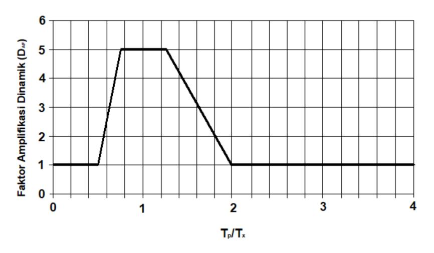

Gambar 13 – Faktor amplifikasi dinamik untuk komponen

<span id="page-123-0"></span>© BSN 2019 112 dari 238

Untuk tiap tiga ragam pertama pada setiap arah, percepatan ragam pada setiap lantai harus diperhitungkan sebagai fungsi dari periode komponen nonstruktural sesuai dengan

$$A_{ix} = p_{ix}S_{ai}D_{AF} \tag{89}$$

Dengan  $A_{ix}$  adalah percepatan lantai untuk ragam x pada tingkat-i,  $p_{ix}$  adalah faktor partisipasi modal untuk ragam x pada tingkat i yang diperoleh dari analisis ragam,  $S_{ai}$  adalah percepatan spektral untuk ragam x, dan  $D_{AF}$  adalah faktor amplifikasi dinamik sebagai fungsi dari rasio periode komponen dengan periode gedung untuk ragam x dengan menggunakan Gambar 13.

Respons spektra lantai harus diambil sebagai maksimum dari percepatan lantai pada tiap periode ragam dari gedung untuk minimal tiga ragam pertama, tetapi tidak kurang dari percepatan spektral pada dasar bangunan.

Gaya desain seismik horizontal pada setiap arah untuk komponen nonstruktural harus ditentukan sesuai dengan persamaan (88), hasil perkalian  $a_ia_p$  digantikan dengan  $A_{ix}$ , yaitu percepatan dari respons spektra lantai untuk periode getar pada komponen nonstruktural pada tingkat-i dimana komponen nonstruktral diangkurkan.

#### <span id="page-124-2"></span>9.2.2 Perpindahan relatif seismik

Pengaruh perpindahan relatif seismik harus diperhitungkan pada kombinasi dengan perpindahan akibat beban-beban lain. Perpindahan relatif seismik  $D_{pl}$  ditentukan sesuai dengan persamaan berikut:

$$D_{pl} = D_p I_e \tag{90}$$

#### Keterangan:

 $I_e$  = faktor keutamaan gempa sesuai 0

 $D_n$  = perpindahan yang ditentukan dalam persamaan 0 dan 0

#### <span id="page-124-0"></span>9.2.2.1 Perpindahan dalam struktur

Untuk dua titik sambungan pada struktur yang sama, satu pada ketinggian  $h_x$  dan yang lainnya pada ketinggian  $h_y$ ,  $D_n$  ditentukan sebagai:

$$D_p = \Delta_{xA} - \Delta_{vA} \tag{91}$$

 $D_p$  dapat juga ditentukan berdasarkan prosedur ragam sesuai dengan 0, dengan menggunakan perbedaan lendutan lantai yang dihitung untuk setiap ragam dan mengkombinasikannya menggunakan prosedur kombinasi ragam yang sesuai.  $D_p$  tidak perlu diambil lebih besar dari:

$$D_p = \frac{\left(h_x - h_y\right)\Delta_{aA}}{h_{...}} \tag{92}$$

#### <span id="page-124-1"></span>9.2.2.2 Perpindahan antara struktur

Untuk dua titik sambungan pada struktur A dan B yang terpisah, satu pada ketinggian  $h_x$  dan yang lainnya pada ketinggian  $h_y$ ,  $D_p$  ditentukan sebagai:

$$D_{p} = \left| \delta_{xA} \right| + \left| \delta_{yB} \right| \tag{93}$$

© BSN 2019 113 dari 238

 $D_p$  tidak perlu lebih besar dari:

$$D_p = \frac{h_x \Delta_{aA}}{h_{ev}} + \frac{h_y \Delta_{aB}}{h_{ev}} \tag{94}$$

#### Keterangan:

 $D_p = \bar{p}$ erpindahan relatif seismik, di mana elemen harus didesain untuk mengakomodasinya

 $\delta_{xA}$  = perpindahan bangunan di tingkat-x pada Struktur A, ditentukan berdasarkan persamaan (43)

 $\delta_{xB}$  = perpindahan bangunan di tingkat-y pada Struktur A, ditentukan berdasarkan persamaan (43)

 $\delta_{vB}$  = perpindahan bangunan di tingkat-y pada Struktur B, ditentukan berdasarkan persamaan (43)

 $h_x$  = tinggi tingkat-x di mana titik sambungan atas diletakkan

 $h_y$  = tinggi tingkat-y di mana titik sambungan bawah diletakkan

 $\Delta_{aA}$  = simpangan antar tingkat yang diizinkan untuk struktur A seperti yang didefinisikan pada Tabel 20

 $\Delta_{aB}$  = simpangan antar tingkat yang diizinkan untuk struktur B seperti yang didefinisikan pada Tabel 20

 $h_{sx}$  = tinggi antar lantai yang digunakan dalam pendefinisian simpangan yang diizinkan  $\Delta_a$  pada Tabel 20

**CATATAN**  $\Delta_a/h_{sx}$  = indeks simpangan antar tingkat.

Pengaruh perpindahan relatif seismik harus diperhitungkan pada kombinasi dengan perpindahan akibat beban-beban lainnya.

#### 9.2.3 Periode komponen

Periode dasar dari komponen nonstruktural (termasuk pendukung dan tambahannya),  $T_p$ , harus ditentukan sesuai dengan persamaan berikut jika komponen, pendukung dan tambahannya dapat diwakili dengan sistem pegas sederhana dan sistem massa berderajat tunggal

$$T_p = 2\pi \sqrt{\frac{w_p}{K_p g}} \tag{95}$$

#### Keterangan:

 $T_p$  = komponen periode fundamental

 $w_p$  = komponen berat operasional

g = percepatan gravitasi

 $K_p$  = kombinasi kekakuan dan komponen, pendukung dan tambahannya, ditentukan sebagai beban per unit lendutan pada pusat gravitasi dari komponen

Atau, periode dasar dari komponen,  $T_p$  (detik), dapat ditentukan dengan data pengujian atau dengan analisis yang memiliki bukti yang kuat.

#### <span id="page-125-0"></span>9.3 Pengangkuran elemen nonstruktural

Elemen-elemen nonstruktural, arsitektural, mekanikal dan elektrikal serta pendukungnya harus ditambatkan atau diangkurkan pada struktur bangunan sesuai dengan ketentuan pada bagian ini dan tambatan harus memenuhi ketentuan untuk material induk yang telah ditetapkan pada bagian lain dari peraturan ini. Tambatan elemen harus dilas, dibaut,atau

© BSN 2019 114 dari 238

dikencangkan secara positif tanpa memperhitungkan tahanan friksi yang dihasilkan oleh pengaruh gravitasi. Suatu lintasan beban yang menerus dengan kekuatan dan kekakuan yang memadai antara elemen dan struktur pendukungnya harus disediakan. Elemen lokal struktur termasuk sambungan harus didesain dan dibuat untuk gaya-gaya elemen yang menentukan desain elemen atau sambungannya. Gaya-gaya elemen harus sebagaimana ditentukan sesuai [0,](#page-121-1) kecuali bahwa modifikasi untuk *F<sup>p</sup>* dan *Rp*, akibat kondisi pengangkuran tidak perlu diperhitungkan. Dokumen desain harus mencakup informasi yang memadai mengenai tambatan yang digunakan untuk menentukan kesesuaiannya dengan ketentuan pada bagian ini.

#### **9.3.1 Gaya desain**

Gaya pada tambatan harus ditentukan berdasarkan gaya dan perpindahan elemen yang diberikan dalam [0](#page-121-1) dan [0,](#page-124-2) kecuali bahwa *R<sup>p</sup>* tidak boleh diambil melebihi 6.

#### <span id="page-126-0"></span>**9.3.2 Angkur pada beton atau bata**

#### **9.3.2.1 Angkur pada beton**

Angkur yang tertanam pada beton harus didesain sesuai dengan SNI 2847.

#### **9.3.2.2 Angkur pada bata**

Angkur yang tertanam pada bata harus didesain sesuai dengan SNI 2847, dan angkur tersebut harus didesain sedemikian sehingga kekuatannya ditentukan oleh kuat tarik atau geser dari elemen baja yang daktail.

**PENGECUALIAN** Angkur harus dihubungkan ke struktur utama bangunan dan didesain mengalami leleh daktail di level pembebanan dengan ketentuan bahwa gaya yang bekerja pada angkur tidak melebihi dari kekuatan rencana, atau angkur didesain untuk menahan kombinasi pembebanan sesuai [0](#page-77-1) termasuk seperti yang diberikan pada [Tabel 25](#page-127-1) atau [Tabel 27.](#page-134-0)

#### **9.3.2.3 Angkur pasca-instalasi pada beton dan bata**

Angkur pasca-instalasi pada beton harus memenuhi persyaratan (prakualifikasi) untuk penerapan seismik sesuai dengan ACI 355.2 atau prosedur kualifikasi lain yang telah terbukti. Angkur pasca-instalasi pada bata harus memenuhi persyaratan (prakualifikasi) untuk penerapan seismik sesuai dengan prosedur klasifikasi yang telah disahkan/ditentukan.

#### **9.3.3 Kondisi pemasangan**

Penentuan gaya pada tambatan harus memperhitungkan kondisi yang mungkin terjadi pada saat pemasangan, termasuk eksentrisitas dan pengaruh berkurangnya bidang kontak (*prying effect*).

#### **9.3.4 Tambatan majemuk**

Penentuan distribusi gaya pada tambatan majemuk pada satu lokasi harus memperhitungkan kekakuan dan daktilitas elemen, pendukung, tambatan, dan struktur bangunan dan kemampuan untuk meredistribusi beban ke tambatan lainnya pada kelompok tambatan. Desain pengangkuran pada beton, sesuai dengan SNI 2847 harus memenuhi persyaratan pasal ini.

#### **9.3.5 Baut dengan pengencang mesin**

Baut yang dikencangkan dengan menggunakan mesin, yang ditanamkan pada beton atau baja, tidak boleh digunakan pada kondisi beban tarik yang menerus/berkelanjutan atau pada bresing di daerah yang didesain dengan kategori desain seismik D, E, atau F kecuali telah ditetapkan untuk pembebanan seismik. Penggunaan baut dengan pengencang mesin pada bata tidak diizinkan kecuali telah ditetapkan untuk pembebanan seismik.

**PENGECUALIAN** Baut dengan pengencang mesin yang ditanamkan pada beton dan difungsikan untuk menopang lantai akustik atau panel plafon dan sistem yang telah terdistribusi di mana beban layan pada satu baut tidak melebihi 0,4 kN. Baut dengan pengencang mesin yang ditanamkan pada baja di mana beban layan pada satu baut tidak melebihi 1112 kN.

#### **9.3.6 Klip friksi**

Klip friksi pada kategori desain seismik D, E atau F tidak boleh digunakan untuk menopang beban menerus/berkelanjutan atau sebagai pemikul beban seismik. Balok tipe C dan klem dengan flens lebar diizinkan sebagai penggantung dan dilengkapi dengan tali pengikat seperti yang didefinisikan pada peraturan. Pengunci baut (*lock nuts*) atau sejenisnya harus disediakan untuk mencegah kelonggaran baut.

#### <span id="page-127-0"></span>**9.4 Elemen arsitektural**

#### **9.4.1 Umum**

Elemen arsitektural, pendukung, dan tambatannya harus memenuhi persyaratan pada bagian ini. Koefisien yang sesuai dipilih menurut [Tabel 25.](#page-127-1)

**PENGECUALIAN** Elemen yang didukung dengan rantai atau digantung pada struktur tidak perlu memenuhi persyaratan gaya dan perpindahan relatif seismik selama elemen tersebut memenuhi seluruh kriteria berikut:

- 1. Beban desain untuk elemen tersebut harus sama dengan 1,4 kali berat operasional yang bekerja ke bawah, simultan dengan beban horizontal yang sama dengan 1,4 kali berat operasional. Beban horizontal harus bekerja pada arah yang memberikan pembebanan paling kritis untuk desain;
- 2. Pengaruh interaksi seismik harus diperhitungkan;
- 3. Sambungan ke struktur harus memperbolehkan rentang gerakan 360<sup>o</sup> pada bidang horizontal.

#### <span id="page-127-2"></span>**9.4.2 Gaya dan perpindahan**

Semua elemen arsitektural serta pendukung dan tambatannya, harus didesain terhadap gaya seismik dalam [0.](#page-121-1) Elemen arsitektural yang dapat menimbulkan bahaya terhadap keselamatan jiwa harus didesain untuk mengakomodasi ketentuan perpindahan relatif seismik sesuai [0.](#page-124-2) Elemen arsitektural harus didesain dengan mempertimbangkan lendutan vertikal akibat rotasi join pada elemen struktur kantilever.

**Tabel 25 – Koefisien untuk elemen arsitektural** 

<span id="page-127-1"></span>

| Elemen arsitektural                                                | 𝒂<br>𝐚𝒑 | 𝐑𝒑  | 𝒃<br>𝛀𝟎 |
|--------------------------------------------------------------------|---------|-----|---------|
| Dinding nonstruktural interior dan partisic                        |         |     |         |
| Dinding bata biasa (tanpa perkuatan)                               | 1,0     | 1,5 | 1,5     |
| Dinding dan partisi lainnya                                        | 1,0     | 2,5 | 2       |
| Elemen kantilever (tidak terikat atau terikat ke rangka struktural |         |     |         |
| di bawah pusat massanya)                                           |         |     |         |
| Sandaran (parapet) dan dinding kantilever nonstruktural interior   | 2,5     | 2,5 | 2       |
| Cerobong dan rak-<br>rak yang terikat dan disokong oleh rangka     |         |     |         |
| struktural                                                         | 2,5     | 2,5 | 2       |
| Elemen kantilever (Terikat ke rangka struktural di atas pusat      |         |     |         |
| massa)                                                             |         |     |         |
| Sandaran (parapet)                                                 | 1,0     | 2,5 | 2       |

**© BSN 2019 116 dari 238**

|                                                                       | 𝒂        |     | 𝒃   |
|-----------------------------------------------------------------------|----------|-----|-----|
| Elemen arsitektural                                                   | 𝐚𝒑       | 𝐑𝒑  | 𝛀𝟎  |
| Cerobong                                                              | 1,0<br>b | 2,5 | 2   |
| Dinding nonstruktural eksteriorc                                      | 1,0      | 2,5 | 2   |
| Elemen dinding nonstruktural eksterior dan sambunganb                 |          |     |     |
| Elemen dinding                                                        | 1,0      | 2,5 | -   |
| Kumpulan sambungan dinding panel                                      | 1,0      | 2,5 | -   |
| Pengencang (sambungan) dalam sistem sambungan                         | 1,25     | 1,0 | 1   |
| Veneer (lapisan kayu halus pada perabotan)                            |          |     |     |
| Elemen dan alat Pelengkap yang terbatas tingkat deformasinya          | 1,0      | 2,5 | 2   |
| Elemen dan alat pelengkap yang rendah tingkat deformasinya            |          |     |     |
|                                                                       | 1,0      | 1,5 | 2   |
| Kamar di atap (kecuali jika dirangkakan dengan perpanjangan           |          |     |     |
| dari rangka gedung)                                                   | 2,5      | 3,5 | 2   |
| Langit-langit                                                         |          |     |     |
| Semua jenis                                                           | 1,0      | 2,5 | 2   |
| Filing cabinet                                                        |          |     |     |
| Kabinet penyimpanan permanen yang didukung oleh lantai dan            | 1,0      | 2,5 | 2   |
| memiliki ketinggian lebih dari 1829 mm, termasuk isinya               |          |     |     |
| Rak perpustakaan permanen yang didukung oleh lantai, tumpukan         |          |     |     |
| buku, dan rak buku yang tingginya lebih dari 1829 mm, termasuk        | 1,0      | 2,5 | 2   |
| isinya.                                                               |          |     |     |
| Peralatan Laboratorium                                                | 1,0      | 2,5 | 2   |
| Lantai Akses                                                          |          |     |     |
| Lantai akses khusus (Didesain Sesuai dengan 6.5.7.2)                  | 1,0      | 2,5 | 2   |
| Lainnya                                                               | 1,0      | 1,5 | 1,5 |
| Gantungan dan ornamen                                                 | 2,5      | 2,5 | 2   |
| Rambu dan papan reklame                                               | 2,5      | 3   | 2   |
| Elemen kaku lainnya                                                   |          |     |     |
| Elemen dan alat pelengkap yang tinggi tingkat deformasinya            | 1,0      | 3,5 | 2   |
| Elemen dan alat pelengkap yang terbatas tingkat deformasinya          | 1,0      | 2,5 | 2   |
| Elemen dan alat pelengkap yang rendah tingkat deformasinya            | 1,0      | 1,5 | 1,5 |
|                                                                       |          |     |     |
| Elemen fleksibel lainnya                                              |          |     |     |
| Elemen dan alat pelengkap yang tinggi tingkat deformasinya            | 2,5      | 3,5 | 2,5 |
| Elemen dan alat pelengkap yang terbatas tingkat deformasinya          | 2,5      | 2,5 | 2,5 |
| Elemen dan alat pelengkap yang rendah tingkat deformasinya            | 2,5      | 1,5 | 1,5 |
| Tangga<br>keluar<br>(yang<br>bukan<br>merupakan<br>bagian<br>struktur | 1,0      | 2,5 | 2   |
| bangunan)                                                             |          |     |     |
| Tangga keluar dan ramp fasteners serta tambahannya                    | 2,5      | 2,5 | 2,5 |

#### **CATATAN**

#### **9.4.3 Elemen eksterior dinding nonstruktural dan sambungannya**

Panel ataupun elemen dinding eksterior nonstruktural yang menempel atau melingkungi struktur harus didesain untuk mengakomodasi perpindahan relatif akibat seismik yang didefinisikan oleh [0](#page-124-2) dan pergerakan yang disebabkan oleh perubahan suhu.

**© BSN 2019 117 dari 238**

Nilai yang rendah untuk *a<sup>p</sup>* sebaiknya tidak digunakan kecuali jika telah dibuktikan melalui analisis dinamik. Nilai *a<sup>p</sup>* tidak boleh lebih kecil dari 1,00. Nilai *a<sup>p</sup>* = 1 untuk elemen yang kaku dan elemen yang tertambat kaku. Nilai *a<sup>p</sup>* = 2,5 untuk elemen yang fleksibel dan elemen yang tertambat fleksibel.

<sup>b</sup> Faktor kuat lebih (*overstrength*) jika diperlukan untuk angkur yang tidak elastik pada beton dan bata. Lihat bagian 7.4.3 untuk melihat akibat beban seismik termasuk faktor kuat lebih.

<sup>c</sup>Jika diafragma yang fleksibel memberikan pengaku lateral untuk dinding beton atau bata dan partisi, gaya desain untuk pengangkuran ke diafragma harus sesuai dengan ketentuan di dalam 7.11.2.

Elemen seperti itu harus didukung dengan sambungan positif dan langsung atau sambungan mekanis dan *fastener* yang sesuai dengan ketentuan berikut.

- 1. Sambungan dan join panel harus dapat mengakomodasi pergerakan simpangan antar tingkat yang disebabkan oleh perpindahan relatif seismik *Dpl* yang nilainya ditentukan terbesar dari [0](#page-124-2) atau 13 mm.
- 2. Sambungan yang mengakomodasi simpangan antar tingkat melalui mekanisme geser (*sliding*) atau lentur dari batang baja berulir harus memenuhi ketentuan berikut:
  - a. Batang berulir atau baut harus diproduksi dari baja dengan karbon rendah atau stainless steel. Jika batang berulir menggunakan baja canai dingin (*cold-worked carbon steel*), batang yang diproduksi harus memenuhi atau melebihi ketentuan area yang berkurang, perpanjangan dan kekuatan tarik dari ASTM F1554, grade 36. Batang dengan grade 55 juga diperbolehkan asalkan memenuhi ketentuan dari Suplemen 1;
  - b. Jika batang berulir digunakan untuk menyambungkan panel dan pendukung digunakan pada sambungan dengan celah atau lubang yang terlalu besar, maka batang harus memiliki rasio panjang terhadap diameter 4 kali atau kurang, dimana panjang adalah jarak bersih antara *nuts* (baut/paku) dan pelat berulir. Celah ataupun lubang yang terlalu besar harus dibuat untuk mengakomodasi simpangan antar tingkat desain penuh dalam bidang pada setiap arah, *nuts* (baut/paku) harus dipasang sangat ketat, dan cara untuk mencegah *nuts* (baut/paku) dari lepas harus dipergunakan;
  - c. Sambungan yang mengakomodasi simpangan antar tingkat dengan mekanisme lentur dari batang berulir harus memenuhi persamaan berikut:

$$(L/d)/D_{pl} \ge 0.24 \quad [1/\text{mm}]$$
 (96)

#### **Keterangan:**

*L* = panjang bersih dari batang dengan nuts atau pelat berulir (mm)

*d* = diameter batang (mm)

*Dpl* = perpindahan relatif akibat seismik yang harus diakomodasi dan menjadi patokan desain sambungan (mm)

- 3. Elemen yang disambung harus memiliki daktilitas yang cukup dan kapasitas rotasi untuk menghalangi retakan dari beton atau kegagalan akibat kerapuhan pada area yang dilas.
- 4. Semua pengencang (*fastener*) pada sambungan seperti baut, *inserts*, las dan *dowel*, serta sambungan badan harus didesain untuk gaya *Fp* sesuai [0](#page-121-1) dengan nilai *Rp*, *ap*, dan Ω0 yang diambil dari [Tabel 25](#page-127-1) yang diaplikasikan pada pusat massa dari panel. Sistem sambungan harus memiliki sambungan antara dinding panel atau elemen dengan struktur dan keterkaitan antara dinding panel atau elemen.
- 5. Jika angkur memiliki *flat strap* tertanam di dalam beton ataupun bata, *strap* tersebut harus menempel atau terkait kepada penguat baja atau dibuat sedemikian rupa sehingga transfer gaya terhadap pengait baja terhenti atau untuk memastikan bahwa penarikan angkur tidak menjadi mekanisme awal kegagalan.

#### **9.4.4 Kaca**

Kaca yang melingkupi dinding atau etalase harus didesain atau dipasang untuk mengakomodasi kebutuhan perpindahan relatif tanpa mengalami pecah atau pindah, sesuai [0.](#page-132-0)

Jika kaca disegel pada sistem bingkai jendela dengan menggunakan penyegelan (*sealant*) struktur, ketentuan yang terdapat pada standar referensi [Tabel 26](#page-129-0) dapat dipergunakan.

**Tabel 26 – Standar referensi untuk penyegelan (***sealant***) struktur kaca** 

<span id="page-129-0"></span>

| ASTM |  |  |  |  |
|------|--|--|--|--|
|      |  |  |  |  |

**© BSN 2019 118 dari 238**

| C1087-00 | Test Method for Determining Compatibility of Liquid-Applied Sealants with<br>Accessories Used in Structural Glazing Systems |
|----------|-----------------------------------------------------------------------------------------------------------------------------|
| C1135-00 | Test Method for Determining Tensile Adhersion Properties of Structural Sealants                                             |
| C1184-14 | Specifications for Structural Silicone Sealants                                                                             |
| C1265-94 | Test Method for Determining the Tensile Properties of an Insulating Glass Edge                                              |
|          | Seal for Structural Glazing Applications                                                                                    |
| C1294-07 | Test Method for Compatibility of Insulating Glass Edge Sealants with Liquid                                                 |
|          | Applied Glazing Materials                                                                                                   |
| C1369-07 | Specification for Secondary Edge Sealants for Structurally Glazed Insulating                                                |
|          | Glass Units                                                                                                                 |

#### **9.4.5 Lentur keluar bidang (***out of plane bending***)**

Lentur transversal atau lentur keluar bidang atau deformasi dari komponen atau sistem yang terkena gaya seperti yang ditentukan pada [0](#page-127-2) tidak boleh melebihi kapasitas defleksi dari komponen atau sistem.

#### <span id="page-130-1"></span>**9.4.6 Plafon tergantung (***suspended ceiling***)**

Plafon tergantung harus sesuai dengan bagian ini.

#### **PENGECUALIAN**

- 1. Plafon dengan luas area sama dengan atau kurang dari 13,4 m<sup>2</sup> yang dikelilingi oleh dinding atau *soffits* yang dikekang secara lateral pada struktur atas tidak harus mengikuti ketentuan bagian ini
- 2. Plafon tergantung yang dibangun dengan sekrup atau paku yang menempel pada papan gipsum pada satu tingkat yang dikelilingi oleh dan disambungkan ke dinding atau *soffits* yang dikekang secara lateral pada struktur atasnya tidak harus mengikuti ketentuan bagian ini.

#### **9.4.6.1 Gaya seismik**

Beban dari plafon *Wp*, harus termasuk grid plafon, ubin plafon atau panel, lampu yang secara permanen tertempel atau dikaitkan pada atau secara lateral didukung oleh grid plafon, dan komponen yang secara lateral didukung oleh plafon. *Wp* harus diambil sebesar tidak kurang dari 192 N/m<sup>2</sup> .

Gaya seismik *Fp*, harus disalurkan dari plafon ke elemen struktural gedung atau elemen pembatas antara plafon dan struktur.

#### **9.4.6.2 Standar konstruksi industri untuk ubin akustik atau panel plafon berbaring**

Kecuali jika didesain sesuai [0](#page-131-0) atau terkualifikasi secara seismik sesuai peraturan yang berlaku, ubin akustik atau panel plafon terbaring harus didesain dan dibangun sesuai ketentuan pada bagian ini.

#### **9.4.6.2.1 Kategori desain seismik C**

Ubin akustik atau panel plafon berbaring yang termasuk dalam kategori desain seismik C harus didesain sesuai ASTM C635, ASTM C636 dan ASTM E580, bagian 4- Kategori desain seismik C

#### <span id="page-130-0"></span>**9.4.6.2.2 Kategori desain seismik D sampai F**

Ubin akustik atau panel plafon yang termasuk dalam kategori desain seismik D, E dan F harus didesain sesuai ASTM C635, ASTM C636 dan ASTM E580, bagian 5- kategori desain seismik D, E dan F, sesuai modifikasi pada bagian ini.

Ubin akustik atau panel plafon harus mengikuti ketentuan berikut:

- a. Lebar dari profil siku atau kanal pendukung di perimeter tidak boleh kurang dari 50 mm kecuali jika klip pendukung perimeter yang sesuai dipergunakan. Profil siku dan kanal penutup harus disekrup atau secara positif tertempel pada papan dinding atau struktur pendukung lainnya. Klip pendukung perimeter harus sesuai dengan ketentuan yang disetujui pada kriteria pengujian yang berlaku. Klip pendukung perimeter harus tertempel pada sudut penutup pendukung atau saluran dengan minimal dua sekrup per klip dan harua diinstal di sekitar seluruh perimeter plafon. Pada setiap arah horizontal ortogonal, salah satu sisi dari grid plafon harus tertempel pada sudut penutup, saluran atau klip pendukung perimeter. Sisi lain dari grid plafon pada setiap arah horizontal harus memiliki jarak bersih minimal 19 mm dari dinding dan harus bersandar dan bebas untuk bergeser pada sudut penutup, saluran atau klip pendukung perimeter;
- b. Untuk area plafon yang melebihi 232 m<sup>2</sup> , sebuah sambungan pemisah seismik atau partisi dengan ketinggian penuh yang memisahkan plafon menjadi area yang tidak melebihi 232 m<sup>2</sup> , masing-masing dengan rasio panjang terhadap pendek kurang atau sama dengan 4, harus disediakan kecuali jika analisis dilakukan pada sistem bresing plafon untuk gaya seismik yang dibutuhkan yang menunjukkan bahwa penetrasi plafon dan sudut penutup atau saluran dapat menyediakan jarak cukup untuk mengakomodasi perpindahan lateral yang diantisipasi. Setiap area harus disediakan dengan sudut penutup atau saluran yang sesuai dengan [0.](#page-130-0)a dan penahan horizontal atau bresing.

#### <span id="page-131-0"></span>**9.4.6.3 Konstruksi integral**

Sebagai alternatif untuk memberikan jarak bersih di sekitar sistem penetrasi alat penyiram melalui plafon, sistem alat penyiram dan grid plafon diperbolehkan untuk didesain dan dikaitkan bersama sebagai satu kesatuan. Desain ini harus mempertimbangkan massa dan fleksibilitas dari semua elemen yang terlibat, termasuk plafon, sistem alat penyiram, lampu dan kebutuhan mekanikal. Desain tersebut harus dilakukan oleh desainer profesional yang terdaftar.

#### **9.4.7 Lantai akses**

#### **9.4.7.1 Umum**

Beban dari lantai akses *Wp*, harus termasuk beban dari sistem lantai, 100 % dari beban semua peralatan yang terikat pada lantai dan 25 % beban dari semua peralatan yang didukung tetapi tidak terikat dengan lantai. Gaya seismik *F<sup>p</sup>* harus disalurkan dari permukaan lantai akses ke struktur pendukung.

Efek guling dari perlatan yang tertempel pada panel lantai akses juga harus dipertimbangkan. Kemampuan untuk menggeser kepada dengan alas harus dievaluasi kesesuaiannya untuk transfer efek guling pada peralatan.

Jika ada peninjauan secara individual pada alas untuk efek guling, maka beban aksial maksimum yang muncul secara bersamaan tidak boleh melebihi porsi *Wp* yang ditentukan pada alas yang berada dalam masa pembangunan.

#### **9.4.7.2 Lantai akses spesial**

Lantai akses harus dianggap sebagai "lantai akses spesial" jika didesain mengikuti ketentuan sebagai berikut:

1. Sambungan yang menyalurkan beban seismik termasuk dalam kategori *fastener* mekanis, angkur yang mengikuti ketentuan pasal 17 SNI 2847, las, atau *bearing*. Kapasitas desain

**© BSN 2019 120 dari 238**

- beban harus mengikuti peraturan desain dan/atau hasil pengujian yang bersertifikasi.
- 2. Beban seismik tidak disalurkan oleh gesekan, *fastener* yang digerakkan oleh daya, lem, atau gesekan yang dihasilkan oleh gravitasi.
- 3. Analisis desain dari sistem bresing memperhitungkan efek yang dapat menyebabkan ketidakstabilan dari setiap komponen individual yang mengalami tekuk pada beban tekan.
- 4. Bresing dan alas (*pedestal*) merupakan bentuk struktural atau mekanikal yang diproduksi sesuai ketentuan ASTM yang mensyaratkan propertis mekanis (*mechanical properties*) minimum. Tabung elektris tidak boleh dipergunakan.
- 5. Balok lantai yang didesain untuk memikul beban seismik aksial dan dilekatkan secara mekanis pada alas pendukung dipergunakan.

#### **9.4.8 Partisi**

#### **9.4.8.1 Umum**

Partisi yang terikat pada plafon dan semua partisi yang lebih tingggi dari 1,8 m harus dibresing secara lateral pada struktur gedung. Bresing tersebut harus mandiri dari semua bresing gaya lateral pada plafon. Bresing harus diberikan jarak untuk mengurangi defleksi horizontal pada kepala partisi yang kompatibel dengan ketentuan defleksi plafon sesuai kebutuhan [0](#page-130-1) untuk plafon bergantung dan untuk sistem lain yang tertulis pada bagian ini.

**PENGECUALIAN** Partisi yang memenuhi semua kondisi di bawah ini:

- 1. Tinggi partisi tidak melebihi 2 740 mm
- 2. Beban linear dari partisi tidak melebihi hasil perkalian 0,479 kN dengan tinggi dari partisi (dalam m)
- 3. Beban seismik horizontal dari partisi tidak melebihi 0,24 kN/m2

#### **9.4.8.2 Kaca**

Kaca yang melingkupi partisi harus didesain dan diinstal sesuai ketentuan [0.](#page-132-0)

#### <span id="page-132-0"></span>**9.4.9 Kaca dalam lingkupan dinding, etalase dan partisi**

#### **9.4.9.1 Umum**

Kaca yang melingkupi dinding, etalase dan partisi harus memenuhi standar perpindahan relatif sesuai persamaan

$$\Delta_{\text{fallout}} \ge 1,25D_{pl} \tag{97}$$

atau 13 mm, diambil yang lebih besar dari kedua nilai, dimana

fallout = Perpindahan relatif akibat seismik (*drift*) dimana pelepasan kaca dari dinding, etalase atau partisi dapat terjadi (lihat [0\)](#page-133-1)

*Dpl* = Perpindahan relatif akibat seismik yang harus diakomodasi oleh komponen (*Dpl* harus diaplikasikan di atas dari ketinggian komponen kaca yang sedang ditinjau)

= Faktor keutamaan gempa yang ditentukan sesuai dengan [0.](#page-34-2)

#### **PENGECUALIAN**

1. Kaca dengan jarak cukup dari bingkai sehingga kontak fisik antara kaca dan bingkai tidak terjadi pada drift desain, seperti yang ditunjukkan pada persamaan [\(98\),](#page-132-1) tidak harus mengikuti aturan ini

<span id="page-132-1"></span>
$$D_{clear} \ge 1,25D_{pl} \tag{98}$$

dimana adalah perpindahan relatif pada arah horizontal (*drift*) yang diukur pada ketinggian panel kaca yang ditinjau, yang menyebabkan kontak inisial antara kaca dan bingkai. Untuk panel kaca kotak yang berada dalam bingkai dinding,

**© BSN 2019 121 dari 238**

$$D_{clear} = 2c_1 \left( 1 + \frac{h_p c_2}{b_p c_1} \right) \tag{99}$$

#### Keterangan:

 $h_n$  = ketinggian persegi dari panel kaca

 $b_p$  = lebar persegi dari panel kaca

 $c_1$  = rata-rata dari jarak (*gap*) pada kedua sisi antara tepi kaca vertikal dan bingkai

 $c_2$  = rata-rata dari jarak (*gap*) pada atas dan bawah antara tepi kaca horizontal dan bingkai

- 2. Kaca monolitik *tempered* (*fully tempered*) penuh pada kategori risiko I, II, dan III yang berlokasi tidak lebih dari 3 m diatas permukaan jalan tidak harus memenuhi ketentuan ini
- 3. Kaca yang diperkuat atau kaca laminasi yang diperkuat dengan panas (annealed or heat-strengthened laminated glass) pada satu ketebalan saja dengan lapisan antar permukaan tidak kurang dari 0,76 mm yang diambil secara mekanis pada sistem penyegelan kantung dinding, yang perimeternya dikunci pada bingkai dengan segel basah (wet-glazed), gunable, penyegel perimeter bead dengan curing elastomerik yang memiliki minimal 13 mm kontal dengan kaca, atau sistem angkur lain yang andal tidak harus memenuhi ketentuan bagian ini.

#### <span id="page-133-1"></span>9.4.9.2 Batasan drift akibat seismik untuk komponen kaca

Drift yang menyebabkan pelepasan kaca dari dinding atau  $\Delta_{fallout}$ , etalase atau partisi harus ditentukan sesuai dengan AAMA 501.6 atau dengan analisis teknis.

#### 9.4.10 Tangga darurat dan lerengan (ramps)

Tangga darurat dan lerengan (ramps) yang bukan merupakan bagian dari sistem pemikul gaya seismik struktur dimana mereka menempel harus didetailkan untuk mengakomodasi perpindahan relatif akibat seismik  $D_{pl}$  sesuai 0 yang termasuk deformasi diafragma. Perpindahan relatif bersih harus diasumsikan untuk terjadi pada semua arah horizontal. Dan elemen tersebut harus didukung dengan dukungan struktural positif dan langsung atau dengan sambungan mekanis dan fastener yang sesuai dengan ketentuan berikut:

- a. Sambungan geser (*sliding*) dengan lubang oval atau lubang berukuran lebih (*slotted or oversize hole*), pendukung tumpu geser (*sliding bearing supports*) dengan penahan akhir, dan sambungan yang mengizinkan pergerakan akibat deformasi dari tempelan metal, harus mengakomodasi perpindahan dari  $D_{pl}$  tetapi tidak kurang dari 13 mm, dimana kehilangan pendukung vertikal atau dorongan yang terkait pepindahan dengan gaya tekan pada anak tangga;
- b. Pendukung geser tumpuan (*sliding bearing supports*) tanpa penahan akhir harus didesain untuk mengakomodasi perpindahan 1,5  $D_{pl}$ , tetapi tidak boleh kurang dari 25 mm tanpa kehilangan tahanan vertikal. Penahan geser diperbolehkan jika kegagalannya tidak menghilangkan tahanan vertikal;
- c. Pendukung metal harus didesain dengan kapasitas rotasi yang mengakomodasi perpindahan relatif akibat gaya seismik seperti yang didefinisikan poin b. Kekuatan dari pendukung metal tersebut tidak boleh dibatasi oleh baut geser, fraktur las, atau moda rapuh lainnya;
- d. Semua *fastener* seperti baut, *insert*, las, paku dinding dan angkur harus didesain untuk desain seismik yang ditentukan sesuai dengan ketentuan 0 dengan  $R_p$ ,  $a_p$  dan  $\Omega_0$  sesuai Tabel 25.

**PENGECUALIAN** Jika sambungan geser atau daktil tidak disediakan untuk mengakomodasi perpindahan relatif, maka kekakuan dan kekuatan dari anak tangga atau lerengan harus diikutkan kepada model struktur gedung dari 0 dan anak tangga harus didesain dengan  $\Omega_0$  mengikuti sistem pemikul gaya tidak kurang dari 2,5.

#### <span id="page-133-0"></span>9.5 Elemen mekanikal dan elektrikal

© BSN 2019 122 dari 238

#### **9.5.1 Umum**

Elemen mekanikal dan elektrikal serta pendukung dan tambatannya harus memenuhi persyaratan dalam [0.](#page-125-0) Koefisien yang sesuai harus dipilih dari [Tabel 27.](#page-134-0)

**PENGECUALIAN** Perangkat lampu dan kipas angin di plafon yang tidak dihubungkan ke sistem perpipaan dan ducting, yang disokong dengan rantai atau digantung pada struktur, tidak perlu memenuhi persyaratan gaya dan perpindahan relatif seismik selama elemen tersebut memenuhi seluruh kriteria berikut:

- 1. Beban desain untuk elemen tersebut haruslah sama dengan 1,4 kali berat operasional yang bekerja ke bawah, simultan dengan beban horizontal yang sama dengan 1,4 kali berat operasional. Beban horizontal tersebut harus bekerja pada arah yang memberikan pembebanan paling kritis untuk desain;
- 2. Pengaruh interaksi seismik harus diperhitungkan;
- 3. Sambungan ke struktur harus memperbolehkan rentang gerakan 360<sup>o</sup> pada bidang horizontal.

Jika desain elemen mekanikal dan elektrikal terhadap pengaruh seismik perlu dilakukan, maka harus diperhitungkan adanya pengaruh dinamik elemen, muatannya, dan jika perlu, pendukungnya. Pada kasus tersebut, interaksi antara elemen dan struktur pendukung, termasuk elemen mekanikal dan elektrikal lainnya, harus diperhitungkan.

**Tabel 27 – Koefisien seismik untuk elemen mekanikal dan elektrikal** 

<span id="page-134-0"></span>

| Komponen                                                                                                                                                                                                                                                                          | 𝒂<br>𝐚𝒑 | 𝒃<br>𝐑𝒑 | 𝒄<br>𝛀𝟎 |
|-----------------------------------------------------------------------------------------------------------------------------------------------------------------------------------------------------------------------------------------------------------------------------------|---------|---------|---------|
| Elemen mekanikal dan elektrikal                                                                                                                                                                                                                                                   |         |         |         |
| HVAC sisi udara, kipas, pengontrol udara (air handler), unit pendingin<br>ruangan, pemanas rak, kotak pendistribusi udara, dan elemen<br>mekanikal lain yang terbuat dari rangka baja.                                                                                            | 2,5     | 6,0     | 2       |
| HVAC sisi basah, ketel (boiler), tungku, tangki dan bin atmosfer, chiller,<br>pemanas air, penukar panas (heat exchanger), penguap, pemisah<br>udara, peralatan manufaktur atau proses, dan elemen mekanikal lain<br>yang terbuat dari material yang tinggi tingkat deformasinya. | 1,0     | 2,5     | 2       |
| AC, unit condenser, dry coolers, radiator jarak jauh dan komponen<br>mekanis lainya yang ditinggikan pada struktur integral baja atau pelat<br>metal pendukung                                                                                                                    | 2,5     | 3       | 1,5     |
| Motor bakar, turbin, pompa, kompresor, tangki bertekanan yang tidak<br>tersokong dan tidak tercakup dalam pasal 10                                                                                                                                                                | 1,0     | 2,5     | 2       |

**[Tabel 27](#page-134-0) – Koefisien seismik untuk elemen mekanikal dan elektrikal (lanjutan)** 

| Komponen                                                                | 𝒂<br>𝐚𝒑 | 𝒃<br>𝐑𝒑 | 𝒄<br>𝛀𝟎 |
|-------------------------------------------------------------------------|---------|---------|---------|
| Tangki bertekanan yang tersokong yang tidak tercakup dalam pasal        | 2,5     | 2,5     | 2       |
| 10                                                                      |         |         |         |
| Elemen elevator/lift dan eskalator                                      | 1,0     | 2,5     | 2       |
| Generator, baterai, inverter, motor, transformer, dan elemen elektrikal | 1,0     | 2,5     | 2       |
| lainnya yang terbuat dari material yang tinggi deformasinya             |         |         |         |
| Pusat Pengendali Motor (Motor Control Center), papan panel, switch      | 2,5     | 6,0     | 2       |
| gear, rak instrumentasi, dan elemen lain yang terbuat dari rangka baja  |         |         |         |
| Peralatan komunikasi, komputer, instrumentasi dan kontrol               | 1,0     | 2,5     | 2       |
| Cerobong yang terpasang pada atap, rak, menara pendingin dan            | 2,5     | 3,0     | 2       |
| menara listrik yang terikat secara lateral di bawah pusat massanya.     |         |         |         |
| Cerobong yang terpasang pada atap, rak, menara pendingin dan            | 1,0     | 2,5     | 2       |
| menara listrik yang terikat secara lateral di atas pusat massanya.      |         |         |         |

**© BSN 2019 123 dari 238**

| Pengikat lampu                                                                                                                                                                                                                                                          | 1,0 | 1,5  | 2 |
|-------------------------------------------------------------------------------------------------------------------------------------------------------------------------------------------------------------------------------------------------------------------------|-----|------|---|
| b<br>Elemen dan sistem yang terisolasi terhadap getaran                                                                                                                                                                                                                 |     |      |   |
| Sistem dan elemen yang terisolasi dengan menggunakan elemen<br>neoprene<br>dan lantai yang terisolasi dengan neoprene<br>dengan<br>peralatan elastomerik atau penghenti berpegas yang terpasang atau<br>terpisah                                                        | 2,5 | 2,5  | 2 |
| Elemen dan sistem yang terisolasi dengan pegas, dan lantai yang<br>terisolasi dari getaran yang terkekang rapat dengan peralatan<br>elastomer atau penghenti berpegas yang terpasang atau terpisah                                                                      | 2,5 | 2,0  | 2 |
| Elemen dan sistem yang terisolasi secara internal                                                                                                                                                                                                                       | 2,5 | 2,0  | 2 |
| Perlengkapan tergantung yang terisolasi getaran, termasuk peralatan<br>di dalam saluran dan elemen yang terisolasi secara internal                                                                                                                                      | 2,5 | 2,5  | 2 |
| Sistem Distribusi                                                                                                                                                                                                                                                       |     |      |   |
| Pemipaan sesuai tata cara<br>yang berlaku, termasuk elemen di<br>dalamnya, dengan sambungan yang terbuat dengan pengelasan.                                                                                                                                             | 2,5 | 12,0 | 2 |
| Pemipaan sesuai tata cara<br>yang berlaku, termasuk elemen di<br>dalamnya yang terbuat dari material dengan deformabilitas tinggi atau<br>deformabilitas terbatas, dengan sambungan yang terbuat dengan ulir,<br>lem, kopling atau patri kompresi atau kopling beralur. | 2,5 | 6,0  | 2 |
| Pemipaan yang tidak sesuai dengan tata cara yang berlaku, termasuk<br>elemen di dalamnya yang terkonstruksi dengan material yang tinggi<br>deformasinya, dengan sambungan yang terbuat dengan pengelasan                                                                | 2,5 | 9,0  | 2 |
| Pemipaan tidak sesuai dengan ASME B31, termasuk elemen di<br>dalamnya yang terbuat dari material dengan deformabilitas tinggi atau<br>deformabilitas terbatas, dengan sambungan yang terbuat dengan ulir,<br>lem, kopling atau patri kompresi atau kopling beralur.     | 2,5 | 4,5  | 2 |
| Pemipaan<br>yang<br>terbuat<br>dari<br>material<br>yang<br>rendah<br>tingkat<br>deformasinya seperti besi tuang, kaca dan plastik yang tidak lentur                                                                                                                     | 2,5 | 3,0  | 2 |
| Pekerjaan saluran udara (ductwork) termasuk elemen di dalamnya<br>yang terbuat dari material berdeformabilitas tinggi dengan sambungan<br>terbuat dengan pengelasan atau patri                                                                                          | 2,5 | 9,0  | 2 |
| Pekerjaan saluran udara (ductwork) termasuk elemen di dalamnya<br>yang<br>terbuat<br>dari<br>material<br>dengan<br>deformabilitas<br>tinggi<br>atau<br>deformabilitas terbatas<br>dan<br>sambungannya<br>terbuat dengan<br>cara<br>selain pengelasan atau patri         | 2,5 | 6,0  | 2 |
| Pekerjaan saluran udara (ductwork) termasuk elemen di dalamnya<br>yang terbuat material dengan deformabilitas rendah seperti besi<br>tuang, kaca dan plastik nondaktil.                                                                                                 | 2,5 | 3,0  | 2 |
| Saluran elektrikal dan tempat kabel yang tergantung                                                                                                                                                                                                                     | 2,5 | 6,0  | 2 |
| Bus duct                                                                                                                                                                                                                                                                | 1,0 | 2,5  | 2 |
| Pipa air kotor (plumbing)                                                                                                                                                                                                                                               | 1,0 | 2,5  | 2 |
| Ban berjalan untuk manufaktur dan proses                                                                                                                                                                                                                                | 2,5 | 6,0  | 2 |

#### **CATATAN**

#### <span id="page-135-0"></span>**9.5.2 Komponen mekanikal**

**© BSN 2019 124 dari 238**

Nilai yang lebih rendah untuk *a<sup>p</sup>* diizinkan jika dibuktikan dari analisis dinamik yang detail. Nilai *a<sup>p</sup>* tidak boleh kurang dari 1. Nilai 1 digunakan untuk elemen yang kaku dan elemen yang tertambat kaku. Nilai *a<sup>p</sup>* = 2,5 untuk elemen yang fleksibel dan elemen yang tertambat dengan fleksibel. *a*

Elemen yang terpasang pada peredam getaran harus memiliki pengekang benturan atau *snubber* di setiap arah horizontal. Gaya desain dapat diambil sebesar 2*F<sup>p</sup>* jika terdapat celah nominal bersih antara rangka pendukung elemen dan pengekang lebih besar dari 5 mm. Jika celah nominal bersih yang dispesifikasikan pada dokumen konstruksi kurang dari 5 mm, gaya desain yang diizinkan adalah *F<sup>p</sup> b*

*<sup>c</sup>*Kuat lebih *(overstrength*) seperti yang diharuskan untuk angkur pada beton dan bata. Lihat 12.4.3 untuk efek beban seismik yang termasuk overstrength.

Pekerjaan saluran HVACR harus memenuhi ketentuan [0.](#page-138-1) Sistem pipa harus mengikuti ketentuan [0.](#page-139-0) Pemanas dan wadah harus mengikuti ketentuan [0.](#page-141-0) Lift harus mengikuti ketentuan [0.](#page-141-1) Semua komponen elektronik lainnya harus memenuhi [0.](#page-143-4) Komponen mekanikal dengan *I<sup>p</sup>* lebih besar dari 1,0 harus didesain untuk gaya seismik dan perpindahan relatif sesuai [0](#page-121-1) dan [0](#page-124-2) harus memenuhi ketentutan tambahan sebagai berikut:

- 1. Ketentuan harus dibuat untuk menghilangkan dampak seismik pada komponen yang rentan terhadap benturan, untuk komponen yang dibangun menggunakan material tidak daktil, dan pada kasus dimana material daktil dikurangi karena kondisi layan (seperti adanya aplikasi suhu rendah);
- 2. Kemungkinan dari beban yang terkena pada komponen dari alat yang menempel atau garis layan, yang diakibatkan oleh pergerakan differensial atau poin pendukung pada struktur terpisah, harus dievaluasi;
- 3. Dimana pipa atau komponen pekerjaan saluran HVACR ditempelkan pada struktur yang mungkin bergeser relatif terhadap satu sama lain dan untuk struktur yang terisolasi dimana komponen tersebut menyilangi permukaan interface, maka komponen harus didesain untuk mengakomodasi perpindahan relatif sesuai [0.](#page-124-2)

#### **9.5.2.1 Peralatan HVACR**

Peralatan HVACR yang telah memenuhi ketentuan Bab 1-10 dari ANSI/AHRI 1270 (I-P) atau ANSI/AHRI Standard 1271 (SI) harus terbukti memenuhi kebutuhan dari [0](#page-120-1) asalkan semua ketentuan dibawah ini terpenuhi:

- a. Komponen aktif atau komponen yang memerlukan catu daya harus disertifikasi secara eksklusif untuk gempa melalui pengujian meja getar atau data eksperimen;
- b. Kebutuhan seismik (*seismic demand*) yang dipertimbangkan dalam sertifikasi dari komponen nonaktif melalui analisis harus didasarkan pada sama dengan 1;
- c. Kapasitas dari komponen nonaktif yang dipergunakan untuk sertifikasi gempa melalui analisis yang didasarkan pada ketentuan dari ASCE/SEI 7-16;
- d. *Rugged components* harus mengikuti definisi pada pasal [0.](#page-43-0)

#### <span id="page-136-0"></span>**9.5.3 Komponen elektrikal**

Saluran, *cable tray* dan *raceways* harus memenuhi kebutuha[n 0.](#page-138-0) Jalur utilitas dan servis harus memenuhi ketentuan [0.](#page-141-2) Komponen elektrikal lainnya harus memenuhi persyaratan pada [0.](#page-143-4) Semua komponen elektronik dengan nilai *I<sup>p</sup>* lebih besar dari 1.0 harus didesain untuk gaya seismik dan perpindahan relatif sesuai definisi [0](#page-121-1) dan [0](#page-124-2) dan harus memenuhi ketentuan tambahan sebagai berikut:

- 1. Persyaratan harus dibuat untuk menghilangkan benturan akibat seismik antar komponen
- 2. Beban pada komponen yang diakibatkan jalur utilitas yang menempel atau jalur servis yang menempel pada struktur terpisah harus dievaluasi
- 3. Baterai pada rak harus dibungkus dengan penahan untuk memastikan bahwa baterai tidak jatuh dari rak. Pemisah jarak harus dipergunakan antara penahan dan sel untuk mencegah kerusakan pada pelapisnya. Rak harus dievaluasi untuk kapasitas beban yang cukup.
- 4. Gulungan internal dari transformer tipe kering harus ditempelkan secara positif pada substruktur pendukungnya dalam lingkupan transformer
- 5. Kontrol panel elektrik, peralatan komputer, dan benda lain dengan komponen yang dapat menggeser keluar harus memiliki mekanisme menempel untuk menahan komponen pada tempatnya
- 6. Desain kabinet elektronik harus memenuhi standar *National Electrical Manufacturers Association* (NEMA). Coakan pada panel geser bagian bawah yang belum dibuat oleh pabrik dan yang dapat mengurangi secara signifikan kekuatan dari kabinet harus dievaluasi.
- 7. Tambahan benda eksternal dengan berat lebih dari 445 N harus dievaluasi secara spesifik

- jika tidak diberikan oleh pabrik.
- 8. Jika *conduit*, *cable trays*, atau komponen distribusi elektronik lainnya menempel pada struktur yang mungkin bergerak secara relatif satu sama lain dan untuk struktur dengan sistem isolasi dasar dimana komponen tersebut melewati tingkat struktur isolasi, maka komponen tersebut harus didesain untuk mengakomodasi perpindahan relatif akibat seismik sesuai [0.](#page-124-2)

#### <span id="page-137-0"></span>**9.5.4 Pendukung komponen**

Pendukung pada komponen mekanikal dan elektrikal (termasuk yang memiliki *Ip* = 1,0) dan juga mekanisme bagaimana komponen tersebut menempel harus didesain untuk gaya dan perpindahan yang ditentukan pada [0](#page-121-1) dan [0.](#page-124-2) Pendukung seperti itu termasuk komponen struktural, bresing, bingkai, *skirts*, kaki, *saddles*, *pedestals*, *kebl*, *guys*, *stays*, *snubbers*, *tethers* dan elemen yang dibentuk sebagai bagian dari komponen mekanikal atau elektrikal.

#### **9.5.4.1 Basis desain**

Jika pendukung standar, misalnya ASME B31, NFPA 13, atau MSS SP-58 atau pendukung yang dipatenkan digunakan, maka mereka harus didesain dengan taraf beban (misalnya, dengan pengujian) atau untuk gaya seismik yang dihitung. Sebagai tambahan, kekakuan pada pendukung, jika memungkinkan, harus didesain agar halur beban seismik untuk komponen terjadi seperti fungsi yang diperkirakan.

#### **9.5.4.2 Desain untuk perpindahan relatif**

Pendukung komponen harus didesain untuk mengakomodasi perpindahan relatif akibat seismik sesuai dengan [0.](#page-124-2)

#### **9.5.4.3 Sambungan pendukung ke komponen**

Sambungan pendukung ke komponen, kecuali jika keduanya menyatu (misalnya jika dicetak atau dibentuk), harus didesain untuk mengakomodasi gaya dan perpindahan yang ditentukan sesuai dengan [0](#page-121-1) dan [0.](#page-124-2) Jika nilai *I<sup>p</sup>* =1,5 untuk komponen, maka area di sekitar pendukung ke komponen harus dievaluasi terhadap transfer beban pada komponen dinding.

#### **9.5.4.4 Kebutuhan pendetailan material**

Material untuk pendukung dan material untuk sambungan ke komponen harus terdiri dari material yang cocok, termasuk memperhitungkan kondisi layan, misalnya aplikasi pada suhu rendah. Material harus sesuai dengan standar nasional yang diakui.

#### **9.5.4.5 Ketentuan tambahan**

Ketentuan tambahan berikut ini harus diaplikasikan untuk pendukung komponen mekanikal dan elektrikal:

- 1. Pendukung untuk seismik harus dibangun agar keterikatan dari pendukung dapat dipertahankan
- 2. Pendukung (misalnya, pengaku atau *belleville washers*) harus disediakan pada sambungan baut melalui papan peralatan metal seperti yang ditentukan untuk mentransfer beban seismik dari peralatan yang ditentukan oleh bagian ini dari peralatan ke struktur. Jika peralatan telah disertifikasi sesuai dengan [0,](#page-120-1) atau peraturan lainnya yang berlaku, baut angkur atau *fastener* lain dan perangkat keras terkait yang tercantum dalam sertifikasi harus diinstalasi sesuai dengan instruksi dari manufakturer. Pada kasus dimana sertifikasi tidak ada atau dimana instruksi untuk penguatan (*reinforcement*) tidak diberikan, metode

- penguatan (*reinforcement*) harus didesain oleh praktisi ahli yang bersertifikat atau yang disetujui oleh pihak berwenang.
- 3. Dimana lentur pada sumbu lemah dari pendukung baja dengan canai dingin dibutuhkan untuk jalur beban seismik, maka pendukung seperti itu harus dievaluasi secara spesifik.
- 4. Komponen yang diletakkan pada isolator getaran harus memiliki *bumper* penahan atau *snubber* pada setiap arah horizontal, dan penahan vertikal harus disediakan jika dibutuhkan untuk melawan guling. Kotak isolator dan penahan harus dibangun dengan menggunakan material yang daktil (lihat ketentuan desain gaya tambahan pada catatan kaki b pada [Tabel](#page-134-0)  [27\)](#page-134-0). Sebuah pad viskoelastik atau material serupa dengan ketebalan yang cukup harus digunakan antara *bumper* dan komponen untuk membatasi beban impact.

#### <span id="page-138-0"></span>**9.5.5 Sistem distribusi: pipa pelindung kabel (***conduit***),** *cable tray* **dan** *raceways*

*Cable tray dan raceways* harus didesain untuk gaya seismik dan perpindahan sesuai dengan [0.](#page-121-0) Pipa pelindung kabel (*conduit*) yang ukuran *trade* lebih besar dari 64 mm dan menempel ke panel, kabinet atau peralatan lain yang mengalami perpindahan relatif akibat seismik *D<sup>p</sup>* harus diberikan sambungan yang fleksibel atau didesain untuk gaya [0.](#page-121-0)

#### **PENGECUALIAN**

- 1. Desain untuk gaya seismik dan perpindahan relatif dengan [0](#page-121-0) tidak diperlukan untuk *Ip* = 1,0 dimana fleksibilitas sambungan dan pemasangan disediakan antara *cable tray* dan *raceway* dan komponen yang terasosiasi dengannya untuk mengakomodasi perpindahan relatif, dan *cable tray* atau *raceway* benar-benar menempel pada struktur, dan jika hal-hal berikut terpenuhi:
  - a. Peralatan trapesium yang menggunakan batang gantungan dengan diameter 10mm dan panjangnya tidak melebihi 305 mm dari titik dukung saluran, *cable tray* atau *raceway* dan total berat yang harus ditanggung oleh sebuah trapesium sama dengan atau kurang dari 445 N.
  - b. Peralatan trapesium yang menggunakan batang gantungan dengan diameter 13mm dan panjangnya tidak melebihi 305 mm dari titik dukung saluran, *cable tray* atau *raceway* dan total berat yang harus ditanggung oleh sebuah trapesium sama dengan atau kurang dari 890 N.
  - c. Peralatan trapesium yang menggunakan batang gantungan dengan diameter 13mm dan panjangnya tidak melebihi 610 mm dari titik dukung saluran, *cable tray* atau *raceway* dan total berat yang harus ditanggung oleh sebuah trapesium sama dengan atau kurang dari 445 N.
  - d. Saluran, *cable tray*, atau *raceway* didukung oleh batang gantungan individual dengan diameter 10 mm atau 13 mm, dan setiap gantungan pada *raceway* jaraknya 305 mm atau kurang dari titik dukung sambungan saluran, *cable tray* atau *raceway* tersebut, dan berat total dari setiap batang sama dengan 220 N atau kurang.
- 2. Desain untuk gaya seismik dan perpindahan relatif sesuai [0](#page-121-0) tidak siperlukan untuk pipa pelindung kabel (*conduit*), berapapun nilai *Ip*, jika ukuran *trade* kurang dari 64 mm.

Desain untuk perpindahan pada join diperlukan untuk saluran, *cable tray*, dan *raceway* dengan *I<sup>p</sup>* = 1,5 terlepas dari ukuran saluran.

#### <span id="page-138-1"></span>**9.5.6 Sistem distribusi: sistem saluran (***duct system***)**

HVACR dan ssstem saluran lain harus didesain untuk gaya seismik dan perpindahan relatif seperti yang diatur dalam [0.](#page-121-0)

**PENGECUALIAN** Pengecualian berikut berlaku untuk saluran yang tidak dipergunakan untuk membawa bahan berbahaya, beracun, atau gas yang mudah terbakar atau tidak dipergunakan untuk pengaturan asap:

- 1. Desain untuk gaya seismik dan perpindahan relatif sesuai [0](#page-121-0) tidak diharuskan untuk sistem saluran dengan *I<sup>p</sup>* = 1,0 dimana disediakan sambungan yang fleksibel atau peralatan lain yang mengakomodasi perpindahan relatif antara sistem saluran dan komponen terkait, saluran juga menempel secara positif pada struktur dan salah satu dari poin-poin ini berlaku:
  - a. Peralatan Trapesium yang menggunakan batang penggantung dengan diameter 10mm dan panjangnya tidak melebihi 305 mm dari titik dukung saluran dan total berat yang harus dipikul oleh sebuah trapesium sama dengan atau kurang dari 146 N/m atau

- b. Peralatan Trapesium yang menggunakan batang penggantung dengan diameter 13mm dan panjangnya tidak melebihi 610 mm dari titik dukung saluran dan total berat yang harus dipikul oleh sebuah trapesium sama dengan atau kurang dari 890 N
- c. Peralatan Trapesium yang menggunakan batang gantungan dengan diameter 13mm dan panjangnya tidak melebihi 610 mm dari titik dukung saluran dan total berat yang harus dipikul oleh sebuah trapesium sama dengan atau kurang dari 445 N
- d. Saluran didukung oleh batang gantungan individual dengan diameter 10 atau 13 mm, dan setiap penggantung dalam saluran panjangnya 305 mm atau kurang dari titik dukung saluran ke sambungan pada struktur dukungnya, dan berat total yang dipikul oleh satu batang kurang atau sama dengan 220 N.
- 2. Desain untuk gaya seismik dan perpindahan relatif sesua[i 0](#page-121-0) tidak diperlukan jika ada ketentuan untuk menghindari benturan dengan saluran atau komponen mekanis lain atau untuk melindungi saluran dari benturan seperti itu, sistem distribusi ditempelkan secara betul-betul dan saluran HVACR memiliki luas penampang kurang atau sama dengan 0,577 m2 dan berat kurang atau sama dengan 292 N/m.

Komponen yang dipasang dengan sistem saluran dan mempunyai berat saat operasi lebih besar dari 334 N, seperti kipas, unit terminal, penukar panas, dan *humidifiers*, harus didukung dan dibresing secara lateral independen dari sistem saluran, dan bresing harus memenuhi persyaratan gaya [0.](#page-121-1) Komponen yang dipasang sesuai dengan sistem saluran yang mempunyai berat operasi 334 N atau kurang, seperti unit terminal, peredam, *louvers*, dan *diffuser*, dan yang juga tidak memiliki bresing independen harus diikat dengan pengikat mekanis ke saluran kaku pada kedua sisinya. Pipa dan saluran yang terikat ke peralatan yang berjajar dengannya harus diberikan fleksibilitas yang sesuai untuk mengakomodasi perpindahan relatif akibat gaya seismik sesuai [0.](#page-124-2)

#### <span id="page-139-0"></span>**9.5.7 Sistem distribusi pipa dan sistem tabung**

Kecuali jika disebutkan berbeda di pasal ini, pipa dan sistem tabung harus didesain sesuai dengan gaya seismik dan perpindahan relatif akibat seismik sesuai [0.](#page-121-0) Sistem pipa bertekanan ASME harus memenuhi persyaratan [0.](#page-140-0) Pipa penyiram air untuk perlindungan dari api harus memenuhi persyaratan [0.](#page-140-1) Sistem pipa lift harus memenuhi persyaratan [0.](#page-141-1)

Jika standar material lain atau basis desain yang diakui tidak dipergunakan, desain pipa yang termasuk pertimbangan dari beban layan (*service load*), harus disesuaikan dengan tegangan izin berikut:

- 1. 90 % dari kekuatan kuat leleh minimum spesifikasi untuk pipa yang dikonstruksi dengan menggunakan material yang daktil (seperti baja, alumunium ataupun tembaga);
- 2. 70 % dari kuat leleh minimum spesifikasi untuk sambungan berulir (*threaded connection*) dalam pipa yang dikonstruksi dengan material daktil;
- 3. 10 % dari kuat tarik minimum spesifikasi untuk pipa yang dikonstruksi dengan material tidak daktail;
- 4. 8 % dari kuat tarik minimum spesifikasi untuk untuk sambungan berulir dalam dalam pipa yang dikonstruksi dengan material tidak daktil.

Pipa yang tidak didetailkan untuk mengakomodasi perpindahan relatif akibat gaya seismik pada sambungannya dengan komponen lain harus menyediakan sambungan yang mempunyai fleksibilitas yang cukup untuk menghindari kegagalan pada sambungan antar komponen.

Komponen yang bergantung dan dipasang sejajar dan mempunyai sambungan kaku kepada dan disuport oleh sistem pipa, seperti katup, saringan, perangkap, pompa, pemisah udara dan tanki, diperbolehkan untuk dianggap sebagai bagian dari sistem pipa untuk menentukan kebutuhan dan ukuran dari bresing lateral. Jika komponen dibresing secara independen karena beratnya tetapi pipa yang berkaitan dengannya tidak dibresing, fleksibilitas harus disediakan sesuai kebutuhan untuk mengakomodasi pergerakan relatif antar komponen.

#### <span id="page-140-0"></span>**9.5.7.1 Sistem pipa ASME bertekanan**

Sistem pipa ASME bertekanan, termasuk sistem pendukungnya, yang didesain dan dibangun sesuai ASME B31 harus memenuhikebutuhan gaya, perpindahan dan persyaratan lain dari bagian ini. Sesuai dengan gaya spesifik dan persyaratan perpindahan dari ASME B31, persyaratan gaya dan perpindahan dari [0](#page-121-0) harus dipergunakan. Material yang memenuhi persyaratan kekerasan ASME B31 harus dianggap sebagai material dengan kemampuan deformasi tinggi.

#### <span id="page-140-1"></span>**9.5.7.2 Sistem pipa** *sprinkler* **untuk proteksi terhadap api**

Sistem pipa *sprinkler* untuk perlindungan terhadap api, pipa gantung dan bresing yang didesain sesuai dengan NPFA 13 harus memenuhi persyaratan gaya dan perpindahan pada pasal ini. Jarak ruang untuk alat penyiram dan *sprigs* serta peralatan lain harus memenuhi [0.](#page-121-3) Pengecualian yang tertera pada pengecualian di [0](#page-140-1) tidak berlaku.

#### **PENGECUALIAN**

Desain untuk gaya seismik [0](#page-121-0) tidak harus dipenuhi untuk sistem pipa dimana sambungannya fleksibel, *expansion loop*, atau asembli lainnya dipenuhi untuk mengakomodasi perpindahan relatif antara komponen dan pipa, dimana sistem pipa secara positif terikat pada struktur dan dimana hal-hal berikut terpenuhi:

- 1. *Trapeze assembly* digunakan sebagai pendukung pipa dimana tidak ada satupun dari pipa melewati batasan yang diberikan oleh 5a, 5b, atau 5c dibawah ini dan total berat dari pipa yang diemban *trapeze assembly* kurang dari 146 N/m;
- 2. *Trapeze assembly* yang dipikul oleh batang gantungan (*rod*) dengan diameter 10 mm yang tidak melewati panjang 305 mm dari titik penggantung pipa ke sambungan pada struktur yang memikulnya, tidak memikul pipa dengan *Ip* lebih besar dari 1,0 dan tidak ada satupun dari pipa yang melewati batas yang ditentukan oleh 5a, 5b, atau 5c di bawah ini dan berat total yang dipikul oleh satu trapeze 445 N atau kurang;
- 3. *Trapeze assembly* yang dipikul oleh batang gantungan (*rod*) berdiameter 13 mm dan panjangnya tidak melebihi 305 mm dari titik penggantung pipa ke sambungan struktur yang memikulnya, tidak memikul pipa dengan *Ip* lebih dari 1,0 dan tidak ada satupun dari pipa yang melebihi diameter batas yang ditentukan oleh 5a, 5b, atau 5c di bawah ini dan berat total yang dipikul oleh satu trapeze sama dengan atau lebih kecil dari 890 N;
- 4. *Trapeze assembly* yang dipikul oleh batang gantungan (*rod*) berdiameter 13 mm dan panjangnya tidak melebihi 610 mm dari titik penggantung pipa ke sambungan struktur yang memikulnya, tidak memikul pipa dengan *Ip* lebih dari 1,0 dan tidak ada satupun dari pipa yang melebihi diameter batas yang ditentukan oleh 5a, 5b, atau 5c di bawah ini dan berat total yang dipikul oleh satu trapeze sama dengan atau lebih kecil dari 445 N;
- 5. Pipa yang memiliki *Rp* di [Tabel 27](#page-134-0) lebih besar dari 4,5 harus digantung oleh batang gantungan (*rod*) atau ketentuan dibuat untuk menghindari benturan dengan komponen struktur atau nonstruktur lain atau untuk melindungi pipa pada peristiwa dimana terjadi benturan, atau pipa dengan *Ip* = 1,0 yang dipikul oleh batang gantungan (*rod*) individual dengan diameter 10 atau 13 mm; dimana setiap gantungan di dalam pipa memiliki panjang 305 mm atau kurang dari itu dari titik tumpuan pipa ke sambungan pada struktur penumpunya; dan total berat yang ditumpu oleh setiap gantungan sama dengan atau kurang dari 220 N. Sebagai tambahan batasan berikut pada ukuran pipa harus ada.
  - a. Pada struktur yang didesain untuk kategori seismik C dimana *Ip* lebih dari 1,0, ukuran nominal pipa harus sama dengan atau kurang dari 50 mm;
  - b. Pada struktur yang didesain untuk kategori seismik D, E atau F dimana *Ip* lebih dari 1,0, ukuran nominal pipa harus sama dengan atau kurang dari 25 mm;
  - c. Pada struktur yang didesain untuk kategori seismik D, E atau F dimana *Ip* lebih dari 1,0, ukuran nominal pipa harus sama dengan atau kurang dari 80 mm.
- 6. Sistem tabung pneumatis yang ditumbu oleh *trapeze assembly* menggunakan diameter batang gantungan (*rod*) 10 mm yang tidak melebihi panjang 305 mm dari titik tumpu tabung ke sambungan struktur yang mengembannya dan berat total dari trapeze manapun sama dengan atau kurang dari 445 N;
- 7. Sistem tabung pneumatis yang ditumpu oleh *trapeze assembly* menggunakan diameter batang gantungan (*rod*) 13 mm yang tidak melebihi panjang 305 mm dari titik tumpu tabung ke sambungan

struktur yang menumpunya dan berat total dari trapeze manapun sama dengan atau kurang dari 220 N.

#### <span id="page-141-3"></span>**9.5.8 Sistem distribusi: trapeze dengan sistem kombinasi**

Trapeze yang mengemban sistem beberapa kombinasi sistem distribusi (saluran elektrik, *raceway*, saluran, pipa, dsb) harus didesain dengan menggunakan persyaratan yang paling membatasi untuk sistem distribusi yang diembannya dari [0](#page-138-0) sampai [0](#page-141-3) untuk berat agregat dari sistem tumpu. Jika salah satu dari sisten distribusi pada trapez tidak dibebaskan, trapez harus dibresing.

#### <span id="page-141-2"></span>**9.5.9 Jalur utilitas dan jalur servis**

Pada pertemuan struktur yang berdekatan atau bagian dari struktur yang sama yang mungkin mempuyai pergerakan yang saling independen, jalur utiilitas harus disediakan dengan fleksibilitas cukup untuk mengakomodasi pergerakan diferensial yang mungkin terjadi antar bagian yang bergerak secara independen. Perhitungan perbedaan perpindahan harus ditentukan sesuai dengan [0.](#page-124-2)

Kemungkinan gangguan terhadap jalur utilitas harus dipertimbangkan dalam hubungannya dengan sistem seismik yang ditentukan dalam kategori risiko IV seperti digambarkan dalam [Tabel 3.](#page-35-0) Perhatian detail harus diberikan untuk kerentanan dari utilitas bawah tanah dan pertemuan utilitas dengan struktur dan permukaan tanah dimana tanah kelas sItus E dan F ada, dan dimana koefisien seismik *SDS* pada utilitas bawah tanah dan dasar dari struktur sama dengan atau lebih besar dari 0,33.

#### <span id="page-141-0"></span>**9.5.10 Pemanas dan bejana bertekanan**

Pemanas atau bejana bertekanan yang didesain untuk dikonstruksi sesuai dengan ASME BPVC harus betul-betul memenuhi kebutuhan gaya, perpindahan dan persyaratan lainnya dari bagian ini. Sesuai dengan gaya spesifik dan persyaratan perpindahan dari [0](#page-121-1) dan [0](#page-124-2) harus dipergunakan. Material yang memenuhi persyaratan kekerasan dari ASME BPVC harus dianggap material dengan kemampuan deformasi tinggi. Pemanas dan bejana bertekanan lainnya yang ditentukan untuk memiliki *I<sup>p</sup>* = 1,5 tapi tidak didesain untuk dikonstruksi sesuai dengan kebutuhan ASME BPVC, harus memenuhi persyaratan [0.](#page-143-4)

#### <span id="page-141-1"></span>**9.5.11 Persyaratan desain lift dan tangga jalan**

Lift dan tangga jalan yang didesain dengan persyaratan seismik ASME A17.1 harus memenuhi persyaratan gaya seismik dari pasal ini, kecuali yang dimodifikasi pada teks berikut. Pengecualian pada [0](#page-140-1) tidak berlaku untuk pipa lift.

#### **9.5.11.1 Tangga berjalan, lift, dan sistem struktural untuk** *hoistway*

Tangga berjalan, lift, dan sistem struktural untuk *hoistway* harus didesain untuk memenuhi persyaratan gaya dan perpindahan dari [0](#page-121-1) dan [0.](#page-124-2)

#### **9.5.11.2 Peralatan lift, pendukung alat kontrol dan pelengkapnya**

Peralatan lift, pendukung alat kontrol dan pelengkapnya harus didesain untuk memenuhi persyaratan gaya dan perpindahan dari [0](#page-121-1) dan [0.](#page-124-2)

#### **9.5.11.3 Kontrol seismik untuk lift**

Lift yang beroperasi dengan kecepatan sama dengan atau lebih dari 46 m/menit harus menyediakan saklar seismik. Saklar seismik memberikan sinyal elektrik yang menunjukkan bahwa besar pergerakan struktur sedemikian sehingga operasional lift mungkin terganggu. Saklar seismik yang sesuai dengan bagian 8.4.10.12 dari ASME A17.1 harus memenuhi persyaratan dari pasal ini.

**PENGECUALIAN** Untuk kasus dimana saklar seismik tidak bisa diletakkan dekat dengan kolom sesuai dengan ASME A17.1, saklar harus memiliki dua sumbu sensitif horizontal dan harus memiliki tingkat pemicu 20 % dari akselerasi gravitasi jika berlokasi dekat dengan dasar struktur dan 50 % dari akselerasi gravitasi jika berlokasi selain dari itu.

Saat pengaktifan dari saklar seismik, operasional lift harus memenuhi persyaratan ASME A17.1, kecuali jika disebutkan lain berikut ini. Pada fasilitas dimana penggunaan lift merupakan isu keselamatan, lift hanya boleh dipergunakan setelah tombil gempa terpicu, jika:

- 1. Lift beroperasi tidak lebih cepat dari kecepatan layan;
- 2. Sebelum lift diisi, lift harus diverifikasi kemampuan operasinya dari atas ke bawah dan kembali ke atas.

#### **9.5.11.4 Pelat penahan**

Pelat penahan dibutuhkan untuk di atas dan bawah dari *box lift* dan berat penyeimbangnya.

#### **9.5.12 Panel surya pada atap**

Panel surya pada atap dan pelengkapnya harus didesain untuk memenuhi persyaratan gaya dan perpindahan dari [0.](#page-121-0)

#### **PENGECUALIAN**

Panel surya yang memiliki pemberat tanpa alat tambahan langsung pada struktur atapnya diperbolehkan pada struktur kategori risiko I, II, dan III yang memiliki ketinggian struktur 6 tingkat atau kurang dan memiliki kemiringan atap maksimum sama dengan atau kurang dari 1/20, jika mengikuti kondisi berikut:

- 1. Ketinggian dari pusat massa panel manapun di atas permukaan atap kurang dari setengah jarak terkecil pada perencanaan pendukung panel, tapi tidak lebih besar dari 0.9 m;
- 2. Setiap panel didesain untuk mengakomodasi tanpa benturan, ketidakseimbangan atau kehilangan dukungan, sebuah perpindahan relatif, *mpv*, akibat seismik terhadap tepi atau *offset* dan batasan atau penghalang apapun dari pergeseran pada atap dari panel, dimana *mpv* ditentukan dengan menggunakan persamaan [\(100\),](#page-142-0) tetapi tidak diambil kurang dari 1,2 m

<span id="page-142-0"></span>
$$\delta_{mpv} = 5I_e (S_{DS} - 0.4)^2$$
 [m] (100)

jarak minimum antara panel terpisah yang berdekatan harus diambil 0,5*mpv*. Penanda atap (garis kuning) harus diberikan untuk menunjukkan area di sekitar panel yang harus dijaga dari halangan. Atau, *mpv* dapat ditentukan dengan menggunakan pengujian menggunakan meja getar (*shaking table*) atau analisis riwayat waktu respon nonlinear, dimana besar*mpv* diambil 80 % dari angka yang diberikan persamaan [\(100\)](#page-142-0) kecuali jika kajian tim ahli independen dilakukan sesuai dengan [0;](#page-13-2)

- 3. Setiap panel bersambung untuk menahan gaya horizontal 0,2*SDSWpi* pada semua bagian yang dipotong oleh panel arah vertikal, dimana adalah berat dari segmen yang lebih kecil;
- 4. Pembingkaian panel dan pendukungnya didesain agar jalur gaya seismik dari pusat massa setiap komponen ke lokasi pemikul gesekan sama dengan atau kurang dari *Fp* dari [0](#page-121-1) dan *0,6Wp* dimana *Wp* adalah berat masing-masing komponen;
- 5. Semua kabel listrik dari satu panel ke panel lain atau atap didesain untuk mengakomodasi, tanpa menyebabkan pecah ataupun tertekan, perbedaan pergerakan antar titik sambungan kabel dari 1,0*mpv*, dengan mempertimbangkan pergerakan torsi yang diberikan oleh panel dan kemungkinan tubrukan dari kabel elektronik;
- 6. Semua tepi dan offset dari permukaan atap dimana panel diletakkan yang dibatasi oleh pengekang ataupun parapet yang tingginya tidak kurang dari 0.3 m dan didesain untuk menahan beban

terkonsentrasi pada titik yang mungkin mengalami benturan antara pengekang ataupun parapet dan panel dengan berat yang tidak kurang dari 0,2*SD* berat panel. Sebagai alternatif, sebuah panel mungkin diletakkan sehingga semua bagian dari panel minimal 2,0*mpv*, tapi tidak kurang dari 1,22 m, dari semua tepi ataupun offset dari atap;

7. Jika dijustifikasi oleh pengujian dan analisis, kemiringan atap maksimum dari struktur yang diberikan untuk SDC C dan D harus diperbolehkan untuk 1/12 asalkan kajian tim ahli independen dilakukan sesuai [0.](#page-13-2)

#### <span id="page-143-4"></span>**9.5.13 Komponen mekanikal dan elektrikal lainnya**

Komponen mekanikal dan elektrikal, termasuk sistem konveyor, yang tidak didesain dan dikonstruksi sesuai dengan dokumen referensi pada ASCE/SEI 7-16 Bab 23 harus memenuhi:

- 1. Komponen dan struktur pendukung serta struktur yang terkait padanya harus memenuhi persyaratan [0,](#page-125-0) [0,](#page-135-0) [0,](#page-136-0) dan [0.](#page-137-0)
- 2. Komponen mekanikal dengan zat berbahaya dan memiliki faktor keutamaan *Ip* sebesar 1,5 sesuai dengan [0,](#page-120-0) dan juga untuk pemanas dan juga ruang bertekanan (*pressure vessels*) yang tidak di desain sesuai dengan ASME BPVC, maka desain kekuatan terhadap pembebanan seismik yang dikombinasikan dengan beban layan lain beserta efek lingkungan sesuai dengan properti material sebagai berikut:
  - a. Untuk komponen mekanikal yang dibangun dengan material daktil (seperti baja, aluminium atau tembaga), ambil 90 % dari nilai leleh minimum material yang dispesifikasi;
  - b. Untuk sambungan pada komponen dengan material yang daktil, ambil 70 % dari nilai leleh minimum material yang dispesifikasi;
  - c. Untuk komponen mekanikal yang dibangun dengan material tidak daktil (seperti plastik, besi cor atau keramik), ambil 10 % dari nilai tarik minimum material yang dispesifikasi;
  - d. Untuk sambungan pada komponen dengan material tidak daktil, ambil 8 % dari nilai tarik minimum material yang dispesifikasi.

#### <span id="page-143-0"></span>**9.6 Standar konsensus dan dokumen yang ditinjau lainnya**

Lihat ASCE/SEI 7-16 Bab 23 untuk daftar standar konsensus dan dokumen lainnya yang harus dianggap sebagai bagian dari standar ini sejauh yang dirujuk dalam pasal ini.

#### <span id="page-143-1"></span>**10 Persyaratan desain seismik untuk struktur bangunan nongedung**

#### <span id="page-143-2"></span>**10.1 Umum**

#### <span id="page-143-3"></span>**10.1.1 Struktur bangunan nongedung**

Struktur bangunan nongedung mencakup seluruh struktur mandiri yang memikul beban gravitasi dan disyaratkan untuk menahan gaya seismik, kecuali struktur bangunan yang secara khusus dikecualikan pada pasal [0](#page-43-0) dan struktur bangunan nongedung lain yang ketentuan seismiknya belum dikembangkan sehingga tidak diatur dalam pasal [0](#page-143-1) ini. Seluruh struktur bangunan nongedung, baik yang langsung berdiri di atas tanah maupun yang dipikul oleh struktur lain, harus didesain dan didetail untuk menahan gaya lateral minimum yang ditetapkan dalam pasal ini. Desain harus memenuhi persyaratan yang berlaku pada pasalpasal lain seperti yang dimodifikasi oleh pasal ini. Desain fondasi harus sesuai dengan persyaratan [0,](#page-57-0) dan [0.](#page-101-0)

#### **10.1.2 Desain**

Desain struktur bangunan nongedung harus memenuhi persyaratan kekakuan, kekuatan, dan daktilitas yang konsisten dengan persyaratan yang ditentukan disini untuk bangunan yang menahan efek pergerakan tanah akibat seismik yang dinyatakan oleh gaya-gaya desain ini:

- a. Kekuatan yang dapat diterapkan dan kriteria desain lainnya harus didapatkan dari bagian lain dari persyaratan seismik dalam standar ini atau dokumen acuannya;
- b. Bila kekuatan yang dapat diterapkan dan kriteria desain lainnya tidak ada atau tidak dirujuk oleh persyaratan seismik dalam standar ini, kriteria tersebut harus diambil dari dokumen acuan. Bila dokumen acuan menentukan kriteria penerimaan dalam bentuk tegangan izin bukan dalam bentuk kekuatan, gaya seismik desain harus diambil dari pasal ini dan digunakan dalam kombinasi dengan beban lain seperti yang ditentukan dalam [0](#page-38-0) dari standar ini dan digunakan langsung dengan tegangan izin menurut dokumen acuan. Pendetailan harus sesuai dengan dokumen acuan.

#### <span id="page-144-1"></span>**10.1.3 Pemilihan prosedur analisis struktur**

Prosedur analisis struktur bangunan nongedung yang menyerupai gedung harus dipilih sesuai dengan [0.](#page-78-0) Struktur bangunan nongedung yang tidak menyerupai gedung harus didesain dengan menggunakan prosedur gaya lateral ekivalen sesuai dengan [0,](#page-80-0) prosedur analisis dinamik linier sesuai dengan [0,](#page-88-0) prosedur analisis respons riwayat waktu nonlinier sesuai dengan pasal [0,](#page-176-0) atau prosedur yang ditentukan dalam dokumen acuan yang spesifik.

#### **PENGECUALIAN**

- 1. Untuk struktur kantilever dengan massa terdistribusi seperti yang tercantum dalam [Tabel 29,](#page-150-0) termasuk cerobong (*stacks*) baja dan beton bertulang, cerobong asap (*chimneys*), silo, *vessel* vertikal yang ditumpu kolom di sekelilingnya, dan struktur pemikul tubular baja untuk sistem generator turbin angin di darat, yang menggunakan prosedur analisis ragam pada [0](#page-88-3) dan respon gabungan untuk geser dasar ragam (*Vt*) yang kurang dari 85 % dari geser dasar yang dihitung (*V*) dengan menggunakan prosedur gaya lateral ekivalen, diizinkan untuk mengalikan gaya tersebut dengan 0,85*V/V<sup>t</sup>* sebagai pengganti ketentuan [0.](#page-88-3)
- 2. Untuk struktur kantilever dengan massa terdistribusi seperti yang tercantum dalam [Tabel 29,](#page-150-0) termasuk cerobong (*stacks*) baja dan beton bertulang, cerobong asap (*chimneys*), silo, *vessel* vertikal yang ditumpu kolom di sekelilingnya, dan struktur pemikul tubular baja untuk sistem generator turbin angin di darat, yang menggunakan prosedur analisis ragam pada [0](#page-88-3) dan respon gabungan untuk geser dasar ragam (*Vt*) yang kurang dari 0,85*CsW*, dan *Cs* ditentukan menurut persamaan [\(35\),](#page-81-4) simpangan antar tingkat harus dikalikan dengan 0,85*CsW/Vt* sebagai pengganti ketentuan [0.](#page-88-0)

#### <span id="page-144-0"></span>**10.1.4 Struktur nongedung yang sensitif terhadap pergerakan tanah vertikal**

Tangki, *vessel*, struktur yang menggantung, dan struktur bangunan nongedung dengan kantilever horizontal harus menggunakan [0](#page-55-0) untuk menentukan gaya desain seismik vertikal yang diterapkan pada desain struktur bangunan nongedung. Untuk struktur-struktur ini, gaya desain pada elemen-elemen struktur dan sambungan-sambungannya harus ditentukan dengan analisis ragam yang dilakukan menurut [0](#page-88-0) atau analisis respons riwayat waktu yang dilakukan menurut pasal [0](#page-56-0) atau pasal [0,](#page-205-0) kecuali komponen gerak tanah vertikal tersebut disertakan dalam analisis yang menggunakan spektrum yang ditetapkan pada [0.](#page-55-0) Sebagai alternatif, prosedur statik ekivalen pada [0](#page-80-0) dan [0](#page-146-0) diizinkan untuk digunakan dalam menentukan gaya desain seismik dengan komponen pergerakan vertikal. Untuk tangki dan *vessel*, gaya akibat pergerakan tanah vertikal harus diterapkan sesuai dengan persyaratan [0c](#page-160-0). Untuk struktur yang menggantung dan struktur bangunan nongedung dengan kantilever horizontal, percepatan spektral respons vertikal desain, *Sav*, harus diambil dari nilai puncak spektrum respons pada [0.](#page-55-0) Sebagai alternatif, percepatan spektral respons vertikal desain, *Sav*, diizinkan untuk ditentukan dengan menggunakan ketentuan [0](#page-55-0) dengan menggunakan periode vertikal struktur yang diperoleh dari analisis yang rasional. Gaya seismik horizontal harus dikombinasikan dengan gaya seismik vertikal dengan menggunakan arah kriteria pembebanan yang ditentukan dalam [0](#page-145-2) untuk struktur yang menggantung dan struktur bangunan nongedung dengan kantilever horizontal. Koefisien modifikasi respons, *R*, yang digunakan untuk gaya desain seismik vertikal harus diambil sebesar 1,0 kecuali untuk penentuan gaya melingkar hidrodinamik pada dinding tangki silinder. Penentuan gaya

melingkar hidrodinamik yang disebabkan oleh gaya desain seismik vertikal pada dinding tangki silinder harus sesuai dengan persyaratan [0c](#page-160-0)(2).

#### <span id="page-145-2"></span>**10.1.4.1 Arah kriteria pembebanan untuk struktur bangunan nongedung yang sensitif terhadap pergerakan tanah vertikal**

Kombinasi beban ortogonal akibat gaya seismik horizontal dan vertikal berikut ini harus diterapkan pada struktur yang menggantung dan struktur bangunan nongedung dengan kantilever horizontal.

#### **10.1.4.1.1 Kekuatan**

Arah penerapan gaya seismik yang digunakan dalam desain kekuatan elemen struktur haruslah yang menghasilkan efek beban yang paling kritis. Persyaratan ini dianggap terpenuhi jika elemen struktur didesain dengan lebih ketat daripada pembebanan dengan arah sebagai berikut:

- 1. 100 % gaya pada suatu arah horizontal ditambah 30 % gaya pada arah horizontal tegak lurusnya ditambah 30 % gaya pada arah vertikal. Kombinasi yang menghasilkan kebutuhan kekuatan komponen yang maksimum harus digunakan;
- 2. 100 % gaya pada arah vertikal ditambah 30 % gaya pada arah horizontal ditambah 30 % gaya pada arah horizontal tegak lurusnya. Kombinasi yang menghasilkan kebutuhan kekuatan komponen yang maksimum harus digunakan.

#### **10.1.4.1.2 Guling dan stabilitas**

Arah penerapan gaya seismik yang digunakan dalam evaluasi stabilitas guling dan gelincir (*sliding*) struktur haruslah yang menghasilkan efek beban yang paling kritis. Persyaratan ini dianggap terpenuhi jika struktur dan fondasinya dievaluasi terhadap stabilitas guling (*sliding*) dan gelincir dengan menggunakan pembebanan dengan arah sebagai berikut:

1. 100 % gaya pada suatu arah horizontal ditambah 30 % gaya pada arah horizontal tegak lurusnya ditambah 30 % gaya pada arah vertikal. Kombinasi yang memerlukan kekuatan komponen maksimum harus digunakan.

#### <span id="page-145-0"></span>**10.2 Struktur bangunan nongedung yang dipikul oleh struktur lain**

Bila struktur bangunan nongedung yang tercantum dalam [Tabel 29](#page-150-0) dipikul oleh struktur lainnya dan struktur bangunan nongedung tersebut bukan merupakan bagian dari sistem pemikul gaya seismik utama, maka salah satu metode berikut ini harus digunakan.

#### **10.2.1 Kondisi kurang dari 25 % berat gabungan**

Untuk kondisi berat struktur bangunan nongedung kurang dari 25 % berat seismik efektif gabungan dari struktur bangunan nongedung dan struktur pemikulnya, gaya seismik desain struktur bangunan nongedung harus ditentukan sesuai dengan pasal [0](#page-119-0) dengan nilai *R<sup>p</sup>* dan *a<sup>p</sup>* yang ditentukan sesuai dengan [0.](#page-121-3) Struktur pemikulnya harus didesain menurut persyaratan pasal [0](#page-56-0) atau [0,](#page-153-0) dengan berat struktur bangunan nongedung diperhitungkan dalam penentuan berat seismik efektif, *W*.

#### <span id="page-145-1"></span>**10.2.2 Kondisi lebih besar atau sama dengan 25 % berat gabungan**

Untuk kondisi berat struktur bangunan nongedung sama dengan atau lebih besar dari 25 % berat seismik efektif gabungan dari struktur bangunan nongedung dan struktur pemikulnya, analisis yang menggabungkan karakteristik struktural dari struktur bangunan nongedung dan struktur pemikulnya harus dilakukan untuk menentukan gaya seismik desain sebagai berikut:

- 1. Bila waktu getar alami, *T*, struktur bangunan nongedung kurang dari 0,06 detik, struktur bangunan nongedung harus dianggap sebagai elemen kaku dengan distribusi berat seismik efektif yang sesuai. Struktur pemikulnya harus didesain sesuai dengan persyaratan pasal [0](#page-56-0) atau [0,](#page-153-0) dan nilai *R* dari sistem gabungan diizinkan diambil dari nilai *R* sistem struktur pemikul. Struktur bangunan nongedung dan struktur yang menempel padanya harus didesain terhadap gaya-gaya dengan menggunakan prosedur pasal [0](#page-119-0) dengan nilai *Rp* harus diambil sama dengan nilai *R* dari struktur bangunan nongedung seperti yang tercantum dalam [Tabel 29,](#page-150-0) dan *ap* harus diambil sebesar 1,0.
- 2. Bila waktu getar alami, *T*, struktur bangunan nongedung sama dengan 0,06 detik atau lebih, struktur bangunan nongedung dan struktur pemikulnya harus dimodelkan dalam suatu model gabungan dengan kekakuan dan distribusi berat seismik efektif yang sesuai. Struktur gabungan harus didesain sesuai dengan [0](#page-153-0) dengan nilai *R* dari sistem gabungan diambil dari nilai *R* yang terkecil dari struktur bangunan nongedung atau struktur pemikulnya. Struktur bangunan nongedung dan struktur yang menempel padanya harus didesain terhadap gaya-gaya yang bekerja pada struktur bangunan nongedung dalam analisis gabungan.

#### **10.2.3 Komponen arsitektural, mekanikal, dan elektrikal**

Komponen arsitektural, mekanikal, dan elektrikal yang dipikul oleh struktur bangunan nongedung harus didesain sesuai dengan pasal [0](#page-119-0) dari standar ini.

#### <span id="page-146-0"></span>**10.3 Persyaratan desain struktur**

#### <span id="page-146-1"></span>**10.3.1 Dasar desain**

Struktur bangunan nongedung yang memiliki kriteria desain seismik khusus yang ditetapkan dalam dokumen acuan harus didesain dengan menggunakan standar sebagaimana yang ditetapkan disini. Apabila dokumen acuan tidak disebutkan disini, struktur bangunan nongedung harus didesain sesuai dengan [0](#page-153-0) dan [0](#page-157-0) untuk menahan gaya seismik lateral minimum yang tidak kurang dari persyaratan [0,](#page-80-0) dengan penambahan dan pengecualian sebagai berikut:

- 1. Sistem pemikul gaya seismik harus dipilih sebagai berikut:
  - a. Untuk struktur bangunan nongedung yang menyerupai gedung, sistem struktur harus dipilih dari [Tabel 12](#page-60-0) atau [Tabel 28](#page-149-0) dengan memperhatikan batasan sistem dan ketinggian struktur, *hn*, berdasarkan kategori desain seismik yang ditunjukkan dalam tabel. Nilai yang sesuai dari *R*, *Ω*0, dan *Cd* yang ditunjukkan dalam tabel harus digunakan untuk menentukan gaya geser dasar, gaya desain elemen, dan simpangan antar tingkat desain seperti yang ditunjukkan dalam standar ini. Persyaratan desain dan pendetailan harus sesuai dengan pasal yang diacu dalam tabel.
  - b. Untuk struktur bangunan nongedung yang tidak menyerupai gedung, sistem struktur harus dipilih dari [Tabel 29](#page-150-0) dengan memperhatikan batasan sistem dan ketinggian struktur, *hn*, berdasarkan kategori desain seismik yang ditunjukkan dalam tabel. Nilai yang sesuai dari *R*, *Ω*0, dan *Cd* yang ditunjukkan pada [Tabel 29](#page-150-0) harus digunakan untuk menentukan gaya geser dasar, gaya desain elemen, dan simpangan antar tingkat desain seperti yang ditunjukkan dalam standar ini. Persyaratan desain dan pendetailan harus sesuai dengan pasal yang diacu dalam [Tabel 29.](#page-150-0)
  - c. Jika [Tabel 28](#page-149-0) atau [Tabel 29](#page-150-0) tidak memuat kriteria yang sesuai, kekuatan yang berlaku dan kriteria desain lainnya harus diperoleh dari dokumen acuan yang sesuai dengan tipe struktur bangunan nongedung tipe khusus. Persyaratan desain dan pendetailan harus sesuai dengan dokumen acuan.
- 2. Untuk sistem bangunan nongedung yang memiliki nilai *R* yang diberikan pada [Tabel 29,](#page-150-0) nilai minimum yang ditentukan dari persamaan [\(34\)](#page-81-3) diganti dengan

<span id="page-147-0"></span>
$$C_{s} = 0.044S_{DS}I_{e} \tag{101}$$

Nilai C<sub>s</sub> diambil tidak kurang dari 0,03.

Dan untuk struktur bangunan nongedung yang terletak di lokasi dimana  $S_1 \ge 0.6g$ , nilai minimum yang ditentukan dari persamaan (35) diganti dengan

<span id="page-147-2"></span>
$$C_s = 0.8S_{S1} / (R/I_e)$$
 (102)

**PENGECUALIAN** Tangki dan *vessel* yang didesain mengikuti AWWA D100; AWWA D103; API 650, Lampiran E; dan API 620, Lampiran L, sebagaimana dimodifikasi oleh standar ini, dan cerobong (*stacks*) dan cerobong asap (*chimneys*) yang didesain mengikuti ACI 307 yang dimodifikasi oleh standar ini, harus didesain berdasarkan nilai gaya geser dasar minimum yang lebih besar dari yang ditentukan oleh dokumen acuan atau dari yang nilainya ditentukan dengan mengganti persamaan (34) dengan persamaan berikut ini:

<span id="page-147-1"></span>
$$C_{s} = 0.044 S_{DS} I_{e} \tag{103}$$

Nilai  $C_s$  diambil tidak kurang dari 0,01. Untuk struktur bangunan nongedung yang terletak di lokasi dimana  $S_1 \ge 0,6g$ , nilai minimum yang ditentukan dalam persamaan (35) diganti dengan

<span id="page-147-3"></span>
$$C_s = 0.5S_{s1}/(R/I_e)$$
 (104)

Persyaratan gaya geser dasar minimum tidak perlu diterapkan pada komponen konveksi cairan (guncangan) dalam tangki.

- 3. Faktor keutamaan gempa,  $I_e$ , sebagaimana ditetapkan dalam 0.
- 4. Distribusi vertikal gaya seismik lateral pada struktur bangunan yang tercakup dalam bagian ini harus ditentukan:
  - a. Menggunakan persyaratan dari 0, atau
  - b. Menggunakan prosedur pada 0, atau
  - c. Sesuai dengan dokumen acuan yang berlaku untuk struktur bangunan nongedung khusus.
- 5. Apabila lokasi massa, isi yang dikandung, dan elemen struktural atau nonstruktural yang dipikul (termasuk tetapi tidak terbatas pada sistem perpipaan dan tangga) yang dapat memberikan kontribusi pada massa atau kekakuan struktur sudah dimasukkan dan diperhitungkan dalam analisis, persyaratan torsi tak terduga pada 0 tidak perlu disertakan untuk:
  - a. Struktur bangunan nongedung yang kaku, atau
  - b. Struktur bangunan nongedung yang tidak menyerupai gedung yang didesain dengan nilai *R* kurang dari atau sama dengan 3,5, atau
  - c. Struktur bangunan nongedung yang menyerupai gedung dengan nilai *R* kurang dari atau sama dengan 3,5, apabila salah satu dari kondisi berikut terpenuhi:
    - i. Pusat kekakuan yang dihitung pada masing-masing diafragma lebih besar dari 5 % dimensi denah pada setiap arah dari pusat massa diafragma yang dihitung, atau
    - ii. Struktur tidak memiliki ketidakberaturan torsi horizontal tipe 1A atau 1B dan strukturnya memiliki paling sedikit dua baris pemikul lateral pada setiap arah di dua sumbu utama. Sedikitnya satu baris pemikul lateral harus berada pada jarak yang tidak kurang dari 20 % dari dimensi denah struktur dari pusat massa pada setiap sisi pusat massa.

Selain itu, struktur yang didesain sesuai pasal ini harus dianalisis dengan menggunakan representasi 3D menurut 0.

- 6. Untuk sistem struktur bangunan nongedung yang mengandung cairan, gas, dan granular padat yang menumpu pada dasar sesuai definisikan pad[a 0,](#page-160-1) gaya seismik desain minimum tidak boleh kurang dari yang disyaratkan oleh dokumen acuan untuk sistem khusus,
- 7. Apabila dokumen acuan memberikan dasar untuk desain tahan gempa dari struktur bangunan nongedung khusus yang tercakup dalam pasal [0,](#page-143-1) standar tersebut tidak boleh digunakan kecuali batasan berikut terpenuhi:
  - a. Percepatan tanah seismik dan koefisien seismik harus sesuai dengan persyaratan pasal [0.](#page-43-0)
  - b. Nilai untuk gaya lateral total dan momen guling dasar total yang digunakan dalam desain tidak boleh kurang dari 80 % nilai gaya geser dasar dan momen guling, yang masing-masing disesuaikan dengan pengaruh interaksi tanah-struktur yang diperoleh dengan menggunakan standar ini.
- 8. Gaya geser dasar diizinkan untuk dikurangi sesuai dengan pasal [0](#page-205-0) untuk memperhitungkan pengaruh redaman fondasi dari interaksi tanah-struktur. Gaya geser dasar yang dikurangi tidak boleh diambil kurang dari 0,7*V*.
- 9. Kecuali diatur dalam pasal [0,](#page-143-1) pengaruh pada struktur bangunan nongedung yang disebabkan oleh beban gravitasi dan gaya seismik harus dikombinasikan sesuai dengan kombinasi beban terfaktor seperti yang disajikan pada [0.](#page-36-3)
- 10. Bila secara khusus disyaratkan oleh pasal [0,](#page-143-1) gaya seismik desain pada struktur bangunan nongedung harus seperti yang didefinisikan dalam [0.](#page-77-1)

#### <span id="page-148-0"></span>**10.3.1.1 Faktor keutamaan gempa**

Faktor keutamaan gempa, *Ie*, dan kategori risiko untuk struktur bangunan nongedung berdasarkan pada tingkat bahaya (*hazard*) dari isi dan fungsinya. Nilai *I<sup>e</sup>* adalah nilai terbesar dari yang ditentukan berikut ini:

- a. Dokumen acuan yang berlaku yang tercantum dalam ASCE/SEI 7-16 Bab 23,
- b. Nilai terbesar yang dipilih dari [Tabel 4,](#page-36-2) atau
- c. Seperti yang disebutkan di pasal lain dalam pasal [0.](#page-143-1)

**Tabel 28 – Koefisien seismik untuk struktur nongedung serupa gedung**

<span id="page-149-0"></span>

|                                                                |                                     |      |    |      |                        |    | Batasan Sistem Struktur dan |       |       |
|----------------------------------------------------------------|-------------------------------------|------|----|------|------------------------|----|-----------------------------|-------|-------|
|                                                                |                                     |      | Ω0 |      | Batasan Tinggi         |    |                             |       |       |
| Jenis struktur bangunan nongedung                              | Persyaratan Pendetailan             | R    |    | Cd   | a<br>Bangunan, hn, (m) |    |                             |       |       |
|                                                                |                                     |      |    |      |                        |    | Kategori Desain Seismik     |       |       |
|                                                                |                                     |      |    |      | B                      | C  | Db                          | Eb    | Fc    |
| Rak baja untuk penyimpanan                                     | 0                                   | 4    | 2  | 3,5  | TB                     | TB | TB                          | TB    | TB    |
| Rak penyimpanan kantilever dari baja canai                     |                                     |      |    |      |                        |    |                             |       |       |
| panas                                                          |                                     |      |    |      |                        |    |                             |       |       |
|  Rangka<br>pemikul<br>momen<br>biasa<br>(arah<br>melintang)   | 0 dan AISC 360                      | 3    | 3  | 3    | TB                     | TB | TI                          | TI    | TI    |
|  Rangka<br>pemikul<br>momen<br>biasa<br>(arah<br>melintang)d  | 0 dan AISC 341                      | 2,5  | 2  | 2,5  | TB                     | TB | TB                          | TB    | TB    |
|  Rangka<br>dengan<br>bresing<br>biasa<br>(arah<br>melintang)  | 0 dan AISC 360                      | 3    | 3  | 3    | TB                     | TB | TI                          | TI    | TI    |
|  Rangka<br>dengan<br>bresing<br>biasa<br>(arah<br>melintang)d | 0 dan AISC 341                      | 3,25 | 2  | 3,25 | TB                     | TB | TB                          | TB    | TB    |
| Rak penyimpanan kantilever dari baja canai                     |                                     |      |    |      |                        |    |                             |       |       |
| dingine                                                        |                                     |      |    |      |                        |    |                             |       |       |
|  Rangka<br>pemikul<br>momen<br>biasa<br>(arah<br>melintang)   | 0 dan AISI S100                     | 3    | 3  | 3    | TB                     | TB | TI                          | TI    | TI    |
|  Rangka<br>pemikul<br>momen<br>biasa<br>(arah<br>melintang)   | 0 dan AISI S100                     | 1    | 1  | 1    | TB                     | TB | TB                          | TB    | TB    |
|  Rangka<br>dengan<br>bresing<br>biasa<br>(arah<br>melintang)  | 0 dan AISI S100                     | 3    | 3  | 3    | TB                     | TB | TI                          | TI    | TI    |
| Sistem rangka gedung:                                          |                                     |      |    |      |                        |    |                             |       |       |
|  Rangka<br>baja dengan bresing konsentris                     | AISC 341                            | 6    | 2  | 5    | TB                     | TB | 48                          | 48    | 30    |
| khusus                                                         |                                     |      |    |      |                        |    |                             |       |       |
|  Rangka baja dengan bresing konsentris biasa                  | AISC 341                            | 3¼   | 2  | 3¼   | TB                     | TB | 10f                         | 10f   | TIf   |
|  Dengan tambahan ketinggian yang diizinkan                    | AISC 341                            | 2½   | 2  | 2½   | TB                     | TB | 48                          | 48    | 30    |
|  Tanpa batasan ketinggian                                     | AISC 360                            | 1,5  | 1  | 1,5  | TB                     | TB | TB                          | TB    | TB    |
| Sistem rangka pemikul momen:                                   |                                     |      |    |      |                        |    |                             |       |       |
|  Rangka baja pemikul momen khusus                             | AISC 341                            | 8    | 3  | 5,5  | TB                     | TB | TB                          | TB    | TB    |
|  Rangka beton bertulang pemikul momen<br>khususg              | SNI 2847, termasuk pasal 0          | 8    | 3  | 5,5  | TB                     | TB | TB                          | TB    | TB    |
|  Rangka baja pemikul momen menengah                           | AISC 341                            | 4,5  | 3  | 4    | TB                     | TB | 10h,i                       | TIh,i | TIh,i |
|  Dengan tambahan ketinggian yang diizinkan                    | AISC 341                            | 2,5  | 2  | 2,5  | TB                     | TB | 48                          | 48    | 30    |
|  Tanpa batasan ketinggian                                     | AISC 341                            | 1,5  | 1  | 1,5  | TB                     | TB | TB                          | TB    | TB    |
| Rangka<br>beton<br>bertulang<br>pemikul<br>momen               | SNI 2847, termasuk pasal 0          |      |    |      |                        |    |                             |       |       |
| menengah                                                       |                                     | 5    | 3  | 4,5  | TB                     | TB | TI                          | TI    | TI    |
|  Dengan tambahan ketinggian yang diizinkan                    | SNI 2847, termasuk pasal 0          | 3    | 2  | 2,5  | TB                     | TB | 15                          | 15    | 15    |
|  Tanpa batasan ketinggian                                     | SNI 2847, termasuk pasal 0          | 0,8  | 1  | 1    | TB                     | TB | TB                          | TB    | TB    |
| Rangka baja pemikul momen biasa                                | AISC 341                            | 3,5  | 3  | 3    | TB                     | TB | TIh,i                       | TIh,i | TIh,i |
|  Dengan tambahan ketinggian yang diizinkan                    | AISC 341                            | 2,5  | 2  | 2,5  | TB                     | TB | 30                          | 30    | TIh,i |
|  Tanpa batasan ketinggian                                     | AISC 360                            | 1    | 1  | 1    | TB                     | TB | TB                          | TB    | TB    |
| Rangka beton bertulang pemikul momen biasa                     | SNI 2847, tidak termasuk<br>pasal 0 | 3    | 3  | 2,5  | TB                     | TI | TI                          | TI    | TI    |
|  Dengan tambahan ketinggian yang diizinkan                    | SNI 2847, tidak termasuk<br>pasal 0 | 0,8  | 1  | 1    | TB                     | TB | 15                          | 15    | 15    |
|                                                                |                                     |      |    |      |                        |    |                             |       |       |

#### **CATATAN**

- <sup>a</sup>TB = tidak ada batasan (*no limit*) dan TI = tidak diizinkan (*not permitted*).
- <sup>b</sup>Lihat 12.2.5.4 untuk deskripsi sistem struktur pemikul gaya seismik yang dibatasi sampai ketinggian 73,2 m.
- <sup>c</sup>Lihat 12.2.5.4 untuk sistem struktur pemikul gaya seismik yang dibatasi sampai ketinggian 48,8 m.
- <sup>d</sup>Sambungan kolom ke tumpuan harus didesain berdasarkan yang lebih kecil dari *Mn* kolom atau momen yang diperhitungkan di tumpuan kolom untuk beban seismik yang menggunakan faktor kuat lebih.
- <sup>e</sup>Profil canai dingin yang memenuhi persyaratan AISC 341, Tabel D1.1, diizinkan untuk didesain sesuai dengan AISC 341.
- <sup>f</sup>Rangka palang baja biasa diizinkan penggunaannya untuk rak pipa sampai ketinggian 20 m.
- <sup>g</sup>Pada pasal 2.3 SNI 2847, definisi rangka momen khusus mencakup konstruksi pracetak dan dicetak di lapangan.
- <sup>h</sup>Rangka pemikul momen baja biasa dan menengah diizinkan penggunaannya untuk rak pipa sampai ketinggian 20 m, dengan sambungan pemikul momen pada sambungan di lapangan terbuat dari *end plates* yang dibaut.
- <sup>i</sup>Rangka pemikul momen baja biasa dan menengah diizinkan penggunaannya untuk rak pipa sampai ketinggian 10 m.

<span id="page-150-0"></span>

| Tabel 29                                                                                       | – Koefisien seismik untuk struktur nongedung tidak serupa gedung |          |            |          |                                                  |          |          |          |          |
|------------------------------------------------------------------------------------------------|------------------------------------------------------------------|----------|------------|----------|--------------------------------------------------|----------|----------|----------|----------|
|                                                                                                |                                                                  |          |            |          | Sistem Struktur dan Batasan<br>Ketinggian (m)a,b |          |          |          |          |
| Jenis Struktur bangunan nongedung                                                              | Persyaratan Pendetailanc                                         | R        | Ω0         | Cd       | Kategori Desain Seismik                          |          |          |          |          |
|                                                                                                |                                                                  |          |            |          | B                                                | C        | D        | E        | F        |
| Tangki, vessel, bak atau hopper yang berada di<br>ketinggian:                                  |                                                                  |          |            |          |                                                  |          |          |          |          |
|  Kaki dengan bresing simetris (tidak serupa<br>gedung)                                        | 0                                                                | 3        | d<br>2     | 2,5      | TB                                               | TB       | 48       | 30       | 30       |
|  Kaki tidak berbresing atau dengan bresing<br>tidak simetris (tidak serupa gedung)            | 0                                                                | 2        | d<br>2     | 2,5      | TB                                               | TB       | 30       | 18       | 18       |
| Vessel baja horizontal yang dilas yang dipikul                                                 | 0                                                                | 3        | 2d         | 2,5      | TB                                               | TB       | TB       | TB       | TB       |
| dengan kuda-kuda<br>Tangki yang rata pada sisi bawah dan menumpu                               | 0                                                                |          |            |          |                                                  |          |          |          |          |
| langsung di tanah:<br> Baja atau plastik dengan penguat serat:                                |                                                                  |          |            |          |                                                  |          |          |          |          |
|  Diangkur secara mekanis                                                                      |                                                                  | 3        | 2d         | 2,5      | TB                                               | TB       | TB       | TB       | TB       |
|  Diangkur sendiri                                                                             |                                                                  | 2,5      | 2d         | 2        | TB                                               | TB       | TB       | TB       | TB       |
|  Beton bertulang atau prategang:                                                              |                                                                  |          |            |          |                                                  |          |          |          |          |
|  Dasar tidak bergeser yang diperkuat                                                          |                                                                  | 2        | 2d         | 2        | TB                                               | TB       | TB       | TB       | TB       |
|  Dasar fleksibel yang diangkur                                                                |                                                                  | 3,25     | 2d         | 2        | TB                                               | TB       | TB       | TB       | TB       |
|  Dasar fleksibel yang tidak diangkur dan<br>dikekang                                          |                                                                  | 1,5      | 1,5d       | 1,5      | TB                                               | TB       | TB       | TB       | TB       |
|  Jenis lainnya                                                                                |                                                                  | 1,5      | 1,5d       | 1,5      | TB                                               | TB       | TB       | TB       | TB       |
| Silo beton yang dicetak di lapangan yang                                                       | 0                                                                | 3        | 1,75       | 3        | TB                                               | TB       | TB       | TB       | TB       |
| memiliki dinding yang menerus ke fondasi<br>Seluruh struktur pasangan bata yang diperkuat      | Pasal 14.4.1e ASCE/SEI 7-                                        |          |            |          |                                                  |          |          |          |          |
| yang tidak serupa gedung dengan pendetailan                                                    | 16                                                               |          |            |          |                                                  |          |          |          |          |
| sebagai dinding geser pasangan bata menengah                                                   |                                                                  | 3        | 2          | 2,5      | TB                                               | TB       | 15       | 15       | 15       |
| yang diperkuat<br>Seluruh struktur pasangan bata yang diperkuat                                | Pasal 14.4.1 ASCE/SEI 7-16                                       |          |            |          |                                                  |          |          |          |          |
| yang tidak serupa gedung dengan pendetailan                                                    |                                                                  |          |            |          |                                                  |          |          |          |          |
| sebagai dinding geser pasangan bata biasa                                                      |                                                                  | 2        | 2,5        | 1,75     | TB                                               | 48       | TI       | TI       | TI       |
| yang diperkuat                                                                                 |                                                                  |          |            |          |                                                  |          |          |          |          |
| Seluruh struktur dinding bata tak diperkuat yang<br>tidak serupa gedung                        | Pasal 14.4.1 ASCE/SEI 7-16                                       | 1,25     | 2          | 1,5      | TB                                               | TI       | 15       | 15       | 15       |
| Cerobong dan stacks beton                                                                      | 0 dan ACI 307                                                    | 2        | 1,5        | 2        | TB                                               | TB       | TB       | TB       | TB       |
| Cerobong dan stacks baja                                                                       | 0 dan ASME STS-1                                                 | 2        | 2          | 2        | TB                                               | TB       | TB       | TB       | TB       |
| Seluruh struktur kantilever baja dan beton                                                     | 0                                                                |          |            |          |                                                  |          |          |          |          |
| bertulang dengan massa yang terdistribusi yang<br>bila tidak tercakup disini, termasuk stacks, |                                                                  |          |            |          |                                                  |          |          |          |          |
| cerobong, silo, vessel dengan pedestal tunggal                                                 |                                                                  |          |            |          |                                                  |          |          |          |          |
| atau kolom sekeliling (skirt-supported)                                                        |                                                                  |          |            |          |                                                  |          |          |          |          |
|  Baja yang dilas                                                                              | 0                                                                | 2        | 2d         | 2        | TB                                               | TB       | TB       | TB       | TB       |
|  Baja yang dilas dengan pendetailan khususf                                                   | 0, dan 0 a dan b                                                 | 3        | 2d         | 2        | TB                                               | TB       | TB       | TB       | TB       |
|  Beton prategang atau bertulang                                                               | 0                                                                | 2        | 2d         | 2        | TB                                               | TB       | TB       | TB       | TB       |
|  Beton prategang atau beton bertulang dengan<br>pendetailan khusus                            | 0 dan SNI 2847, pasal 0, dan<br>0                                | 3        | 2d         | 2        | TB                                               | TB       | TB       | TB       | TB       |
| Menara rangka batang (berdiri bebas atau diikat                                                | 0                                                                |          |            |          |                                                  |          |          |          |          |
| kabel/guyed), stacks yang diikat kabel/guyed,                                                  |                                                                  | 3        | 2          | 2,5      | TB                                               | TB       | TB       | TB       | TB       |
| dan cerobong                                                                                   |                                                                  |          |            |          |                                                  |          |          |          |          |
| Struktur pemikul tubular baja untuk sistem<br>onshore wind turbine generator                   | 0                                                                | 1,5      | 1,5        | 1,5      | TB                                               | TB       | TB       | TB       | TB       |
| Menara pendingin:                                                                              |                                                                  |          |            |          |                                                  |          |          |          |          |
|  Beton atau baja                                                                              |                                                                  | 3,5      | 1,75       | 3        | TB                                               | TB       | TB       | TB       | TB       |
|  Rangka kayu                                                                                  |                                                                  | 3,5      | 3          | 3        | TB                                               | TB       | TB       | 15       | 15       |
| Menara telekomunikasi                                                                          | 0                                                                |          |            |          |                                                  |          |          |          |          |
|  Rangka batang : baja<br> Tiang : baja                                                       |                                                                  | 3<br>1,5 | 1,5<br>1,5 | 3<br>1,5 | TB<br>TB                                         | TB<br>TB | TB<br>TB | TB<br>TB | TB<br>TB |
|  Kayu                                                                                         |                                                                  | 1,5      | 1,5        | 1,5      | TB                                               | TB       | TB       | TB       | TB       |
|  Beton                                                                                        |                                                                  | 1,5      | 1,5        | 1,5      | TB                                               | TB       | TB       | TB       | TB       |
|  Rangka : baja                                                                                |                                                                  | 3        | 1,5        | 1,5      | TB                                               | TB       | TB       | TB       | TB       |
|  Kayu                                                                                         |                                                                  | 1,5      | 1,5        | 1,5      | TB                                               | TB       | TB       | TB       | TB       |
|  Beton                                                                                        |                                                                  | 2        | 1,5        | 1,5      | TB                                               | TB       | TB       | TB       | TB       |
| Struktur sarana rekreasi/hiburan dan monumen<br>Struktur bertipe pendulum terbalik (kecuali    | 0<br>0                                                           | 2        | 2          | 2        | TB                                               | TB       | TB       | TB       | TB       |
| tangki, vessel, bak, hopper yang berada di                                                     |                                                                  | 2        | 2          | 2        | TB                                               | TB       | TB       | TB       | TB       |
| ketinggian)                                                                                    |                                                                  |          |            |          |                                                  |          |          |          |          |
| Dinding kantilever atau pagar yang menumpu<br>langsung di tanah                                | 0                                                                | 1,25     | 2          | 2,5      | TB                                               | TB       | TB       | TB       | TB       |
| Rambu-rambu dan papan reklame                                                                  |                                                                  | 3        | 1,75       | 3        | TB                                               | TB       | TB       | TB       | TB       |
| Seluruh struktur lainnya yang berdiri sendiri,                                                 |                                                                  |          |            |          |                                                  |          |          |          |          |
| tangki, atau vessel yang tidak tercakup diatas<br>atau pada peraturan yang tidak serupa gedung |                                                                  | 1,25     | 2          | 2,5      | TB                                               | TB       | 15       | 15       | 15       |
|                                                                                                |                                                                  |          |            |          |                                                  |          |          |          |          |

#### **CATATAN**

<sup>a</sup>TB = tidak ada batasan (*no limit*) dan TI = tidak diizinkan (*not permitted*).

<sup>b</sup>Untuk keperluan penentuan batasan ketinggian, tinggi struktur dapat diambil sebagai tinggi yang diukur sampai sisi atas rangka struktural yang merupakan sistem pemikul beban seismik utama.

cJika tidak ada pasal yang dicantumkan pada kolom persyaratan pendetailan, maka tidak diperlukan persyaratan pendetailan khusus.

dLihat 15.7.3a untuk penggunaan faktor kuat lebih,  $\Omega_0$ , untuk tangki dan vessel.

<sup>e</sup>Pendetailan dengan rangka pemikul beban vertikal yang lengkap.

Pasal 15.7.10.5.a dan 15.7.10.5.b harus diterapkan untuk semua kategori risiko.

#### <span id="page-151-0"></span>10.3.2 Struktur bangunan nongedung kaku

Struktur bangunan nongedung yang memiliki periode fundamental, *T*, kurang dari 0,06 detik, termasuk pengangkurannya, harus didesain untuk gaya lateral yang diperoleh dari persamaan berikut ini:

$$V = 0.30 S_{DS} W I_{a}$$
 (105)

#### Keterangan:

V = total gaya geser dasar lateral desain yang diterapkan pada struktur bangunan nongedung;

 $S_{DS}$  = akselerasi respons desain situs sebagaimana ditentukan dari 0;

W = berat operasional struktur bangunan nongedung; dan

 $I_e$  = Faktor keutamaan gempa yang ditentukan sesuai dengan 0.

Gaya tersebut didistribusikan sepanjang tinggi bangunan sesuai dengan 0.

#### 10.3.3 Beban

Berat seismik efektif, W, untuk struktur bangunan nongedung harus mencakup beban mati dan beban lainnya seperti yang didefinisikan pada 0. Untuk menghitung gaya seismik desain dalam struktur bangunan nongedung, W, juga harus mencakup semua isi operasional normal untuk struktur seperti tangki, vessel, bak, hopper, dan isi pipa. W harus mencakup beban salju dan es apabila berkontribusi 25 % atau lebih dari W atau yang ditentukan oleh pihak berwenang berdasarkan karakteristik lingkungan setempat.

#### 10.3.4 Periode fundamental

Periode fundamental struktur bangunan nongedung harus ditentukan menggunakan sifat struktural dan karakteristik deformasi dari elemen pemikul dalam analisis yang dapat dipertanggungjawabkan sebagaimana ditunjukkan dalam 0. Sebagai alternatif, periode fundamental T diizinkan untuk dihitung dengan persamaan berikut:

$$T = 2\pi \sqrt{\frac{\sum_{i=1}^{n} f_i \delta_i^2}{g \sum_{i=1}^{n} f_i \delta_i}}$$
(106)

Nilai  $f_i$  mewakili distribusi gaya lateral sesuai dengan prinsip mekanika struktur. Defleksi elastik,  $\delta_i$ , harus dihitung dengan menggunakan gaya lateral yang dipakai,  $f_i$ . Persamaan (36), (37), (38) dan (39) tidak digunakan untuk menentukan periode struktur bangunan nongedung.

#### 10.3.5 Batas simpangan antar tingkat

Batas simpangan antar tingkat pada 0 tidak perlu digunakan pada struktur bangunan nongedung jika analisis rasional menunjukkan bahwa batas tersebut dapat terlampaui tanpa mempengaruhi stabilitas struktural atau komponen dan elemen terkait seperti jalur pejalan kaki dan perpipaan. Pengaruh P-delta harus diperhitungkan apabila berpengaruh kritis terhadap

© BSN 2019 140 dari 238

fungsi atau stabilitas struktur. Pengaruh P-delta, bila diperhitungkan, harus didasarkan pada nilai perpindahan yang ditentukan oleh analisis elastik dikalikan dengan *Cd/ Ie* menggunakan nilai *Cd* yang sesuai dari [Tabel 12,](#page-60-0) [Tabel 28,](#page-149-0) atau [Tabel 29.](#page-150-0)

#### **10.3.6 Kebutuhan material**

Persyaratan mengenai material khusus yang berlaku kecuali secara khusus disyaratkan di pasal [0.](#page-143-1)

#### **10.3.7 Simpangan antar tingkat, defleksi dan pemisahan struktur**

Perhitungan simpangan antarlantai, defleksi, dan pemisahan struktur dengan menggunakan gaya seismik pada tingkat kekuatan harus ditentukan menurut standar ini kecuali jika diubah secara khusus pada pasal [0.](#page-143-1)

#### **10.3.8 Spektrum respons spesifik-situs**

Jika disyaratkan oleh dokumen acuan atau pihak berwenang, maka jenis struktur bangunan nongedung tertentu harus didesain untuk kriteria spesifik-situs yang memperhitungkan kejadian seismik dan geologi lokal, periode ulang, dan magnituda dari gempa yang diketahui (lihat [0\)](#page-51-1). Jika periode ulang yang lebih lama didefinisikan dalam dokumen acuan untuk struktur bangunan nongedung, seperti tangki *liquefied natural gas* (LNG) (NFPA 59A), periode ulang yang didapatkan dalam dokumen acuan harus digunakan.

#### <span id="page-152-0"></span>**10.3.9 Angkur di beton atau dinding pasangan bata**

#### **10.3.9.1 Angkur di beton**

Angkur di beton yang digunakan untuk pengangkuran struktur bangunan nongedung harus didesain sesuai dengan SNI 2847.

#### **10.3.9.2 Angkur di dinding pasangan bata**

Angkur di dinding pasangan bata yang digunakan untuk pengangkuran struktur bangunan nongedung harus didesain sesuai dengan TMS 402. Angkur harus didesain berdasarkan kekuatan tarik atau geser dari elemen baja daktail.

#### **PENGECUALIAN**

Angkur diizinkan untuk didesain sedemikian rupa sehingga:

- a. benda yang dihubungkan oleh angkur ke struktur mengalami leleh daktail di level pembebanan dengan ketentuan bahwa gaya yang bekerja pada angkur tidak melebihi dari kekuatan rencana, atau
- b. angkur harus didesain berdasarkan kombinasi beban menuru[t 0](#page-77-1) termasuk Ω0 seperti yang diberikan pada [Tabel 28,](#page-149-0) atau [Tabel 29.](#page-150-0)

#### <span id="page-152-1"></span>**10.3.9.3 Angkur pasca-instalasi di beton dan dinding pasangan bata**

Angkur pasca-instalasi di beton harus memenuhi persyaratan (prakualifikasi) untuk penerapan seismik sesuai dengan ACI 355.2 atau prosedur kualifikasi lainnya yang disetujui. Angkur pasca-instalasi di dinding pasangan bata harus memenuhi persyaratan (prakualifikasi) untuk penerapan seismik sesuai dengan prosedur kualifikasi yang disetujui.

**© BSN 2019 141 dari 238**

#### 10.3.9.4 Angkur ASTM F1554

Bila angkur ASTM F1554 Grade 36 ditentukan dan didesain sebagai angkur daktail sesuai SNI 2847, atau dimana desain harus memenuhi persyaratan pada 0 atau 0b, substitusi dari angkur ASTM F1554 Grade 55 yang dilas (dengan persyaratan tambahan S1) dilarang.

## 10.3.10 Persyaratan fondasi struktur bangunan nongedung di situs yang dapat terlikuifikasi

Fondasi struktur bangunan nongedung di situs yang dapat terlikuifaksi harus sesuai dengan 0 dan persyaratan 0.

#### <span id="page-153-1"></span>10.3.10.1 Struktur bangunan nongedung dengan fondasi dangkal

Struktur bangunan nongedung tidak diizinkan untuk dipikul oleh fondasi dangkal di situs yang dapat terlikuifaksi kecuali jika dapat menunjukkan fondasi dari struktur, superstruktur, dan sistem penghubung struktur didesain untuk mengakomodasi kekuatan tanah yang hilang, penyebaran lateral, dan penurunan total dan beda penurunan yang dihasilkan oleh gerakan gempa MCE<sub>G</sub> yang ditunjukkan dalam laporan investigasi geoteknik.

#### <span id="page-153-0"></span>10.4 Struktur bangunan nongedung menyerupai gedung

#### <span id="page-153-2"></span>10.4.1 Ruang lingkup

Struktur bangunan nongedung yang menyerupai gedung sebagaimana didefinisikan dalam pasal 0 harus didesain sesuai dengan standar ini yang dimodifikasi oleh pasal ini dan dokumen acuan khusus. Kategori umum struktur bangunan nongedung ini harus didesain sesuai dengan persyaratan seismik standar ini dan pasal-pasal yang berlaku pada 0. Kombinasi pengaruh beban, E, harus ditentukan sesuai dengan 0.

#### 10.4.2 Rak pipa

#### 10.4.2.1 Dasar desain

Selain persyaratan 0, rak pipa yang dipikul di dasar struktur harus didesain untuk memenuhi persyaratan gaya pada 0 atau 0. Perpindahan rak pipa dan potensi pengaruh interaksi (benturan sistem perpipaan) harus dipertimbangkan dengan menggunakan defleksi yang diperbesar yang diperoleh dari persamaan berikut:

$$\delta_{x} = \frac{C_{d}\delta_{xe}}{I} \tag{107}$$

#### Keterangan:

 $C_d$  = faktor pembesaran simpangan lateral pada Tabel 28

 $\delta_{xe}$  = defleksi yang ditentukan dengan menggunakan gaya seismik desain yang ditentukan dari standar ini; dan

 $I_e$  = Faktor keutamaan gempa yang ditentukan menurut 0.

Lihat 0 untuk desain sistem perpipaan dan perlengkapannya. Gesekan akibat beban gravitasi tidak diperhitungkan memberikan ketahanan terhadap gaya seismik.

#### 10.4.3 Rak penyimpanan

© BSN 2019 142 dari 238

Rak penyimpanan yang terbuat dari baja yang menumpu langsung di tanah atau di bawah tanah harus didesain sesuai dengan [0](#page-154-0) atau [0,](#page-154-1) dan persyaratan di [0.](#page-155-0)

#### <span id="page-154-0"></span>**10.4.3.1 Rak penyimpanan baja**

Rak penyimpanan baja yang menumpu langsung di tanah atau di bawah tanah harus didesain sesuai dengan ANSI / RMI MH 16.1 dan persyaratan gaya dan perpindahannya, kecuali sebagai berikut.

#### **10.4.3.1.1 Mengubah pasal 7.1.2 dari ANSI / RMI MH 16.1 sebagai berikut:**

#### *7.1.2 Desain pelat dasar*

*Setelah daerah tumpuan yang dibutuhkan ditentukan dari tegangan tumpuan yang diizinkan, F'p, ketebalan minimum pelat dasar ditentukan oleh analisis rasional atau diuji dengan tes yang sesuai menggunakan beban uji 1,5 kali beban desain ASD atau beban terfaktor LRFD. Gaya desain yang mencakup beban seismik untuk pengangkuran rak penyimpanan baja ke beton atau pasangan bata harus ditentukan dengan menggunakan kombinasi beban dengan faktor kuat lebih yang ditentukan dalam pasal 12.4.3.1 dari ASCE/SEI 7. Faktor kuat lebih harus diambil sebagai 2.0.*

*Pengangkuran dari rak penyimpanan baja ke beton harus sesuai dengan persyaratan pasal 15.4.9 dari ASCE/SEI 7. Atas permintaan, informasi harus diberikan kepada pemilik atau wakil pemilik di lokasi, ukuran, dan tekanan di bawah pelat dasar kolom dari setiap jenis rangka tegak saat instalasi. Bila analisis rasional digunakan untuk menentukan ketebalan pelat dasar, dan standar lain yang berlaku tidak bisa dipakai, pelat dasar diizinkan untuk didesain untuk kondisi pembebanan berikut, bila dapat diterapkan: (penampang tidak berubah)* 

#### **10.4.3.1.2 Mengubah pasal 7.1.4 dari ANSI / RMI MH 16.1 sebagai berikut:**

#### *7.1.4 Pelat sisip (shim plate)*

*Pelat sisip dapat digunakan di bawah pelat dasar untuk menjaga ketegakan dan / atau kehorizontalan dari rak penyimpanan. Baji harus terbuat dari bahan yang memenuhi atau melebihi kekuatan tumpuan desain (LRFD) atau kekuatan tumpuan izin (ASD) dari lantai dibawahnya. Ukuran dan lokasi baji di bawah pelat dasar harus sama dengan atau lebih besar dari ukuran dan lokasi pelat dasar yang diperlukan.*

*Stacks baji harus saling bertautan atau dilas bersama dengan cara yang mampu mentransfer semua kekuatan geser di dasarnya.*

*Pembengkokan pada angkur yang terkait dengan baji atau grout di bawah pelat dasar harus diperhitungkan dalam desain baut angkur.*

#### <span id="page-154-1"></span>**10.4.3.2 Rak penyimpanan kantilever baja**

Rak penyimpanan kantilever baja yang menumpu langsung di tanah atau di bawah tanah harus didesain menurut ANSI / RMIMH 16.3, persyaratan gaya dan perpindahannya, dan nilai gerakan tanah seismik ditentukan sesuai dengan pasal [0,](#page-43-0) kecuali sebagai berikut:

#### **10.4.3.2.1 Mengubah pasal 8.5.1 dari ANSI / RMI MH 16.3 sebagai berikut:**

*8.5.1 Desain baut angkur* 

*Pengangkuran dari rak penyimpanan kantilever baja ke beton harus sesuai dengan persyaratan pasal 15.4.9 dari ASCE/SEI 7. Faktor redundansi pada kombinasi beban pada pasal 2.1 dan 2.2 adalah 1.0. Gaya desain yang mencakup beban seismik untuk pengangkuran rak penyimpanan kantilever baja ke beton atau pasangan bata harus ditentukan dengan menggunakan kombinasi beban dengan faktor kuat lebih yang diberikan pada pasal 2.3.6 atau 2.4.5 ASCE/SEI 7.* 

*Jika baji digunakan di bawah pelat dasar untuk menjaga ketegakan dan / atau kehorizontalan rak penyimpanan kantilever baja, stacks baji harus saling bertautan atau dilas bersama dengan cara yang mampu mentransfer semua kekuatan geser di dasarnya. Pembengkokan pada angkur yang terkait dengan baji atau grout di bawah pelat dasar harus diperhitungkan dalam desain baut angkur.*

#### <span id="page-155-0"></span>**10.4.3.3 Alternatif**

Sebagai alternatif ANSI / RMI MH 16.1 atau 16.3, seperti yang dimodifikasi diatas, rak penyimpanan diizinkan didesain sesuai dengan persyaratan pada [0,](#page-143-2) [0,](#page-145-0) [0](#page-153-2) dan [0](#page-155-1) hingga [0](#page-155-2) dari standar ini.

#### <span id="page-155-1"></span>**10.4.3.3.1 Persyaratan umum**

Rak penyimpanan harus memenuhi persyaratan gaya dari pasal ini. Faktor keutamaan gempa, *Ie*, untuk rak penyimpanan pada struktur yang terbuka untuk umum, seperti toko ritel gudang, harus diambil sama dengan 1,5.

**PENGECUALIAN** Rak penyimpanan baja yang menumpu di dasar diizinkan untuk didesain sebagai struktur dengan *R* sama dengan 4, asalkan persyaratan seismik standar ini terpenuhi. Nilai *R* yang lebih tinggi diizinkan untuk digunakan asalkan persyaratan pendetailan dari dokumen acuan terpenuhi. Faktor keutamaan gempa, *Ie*, untuk rak penyimpanan baja pada struktur yang terbuka untuk umum, seperti toko ritel gudang, harus diambil sama dengan 1,5.

#### **10.4.3.3.2 Berat operasional**

Rak penyimpanan harus didesain untuk masing-masing kondisi dari berat operasional, *W* atau *Wp*, berikut:

- a. Berat rak ditambah setiap tingkat rak yang dibebani sampai 67 % dari nilai kapasitasnya.
- b. Berat rak ditambah hanya tingkat rak tertinggi dibebani sampai 100 % dari nilai kapasitasnya.

Desain harus mempertimbangkan ketinggian sebenarnya dari pusat massa dari setiap komponen beban.

#### **10.4.3.3.3 Distribusi vertikal gaya seismik**

Untuk semua rak penyimpanan, distribusi vertikal gaya seismik harus sesuai dengan yang ditentukan dalam [0](#page-84-0) dan sesuai dengan ketentuan berikut ini:

- a. Gaya geser dasar, *V*, dari struktur tipikal adalah gaya geser dasar rak penyimpanan baja yang dibebani sesuai dengan [0.](#page-154-1)
- b. Bagian dasar struktur adalah lantai yang menopang rak penyimpanan baja. Setiap tingkat rak penyimpanan baja harus diperlakukan sebagai tingkat struktur dengan tinggi *h<sup>i</sup>* dan *h<sup>x</sup>* diukur dari dasar struktur.
- c. Faktor *k* diizinkan diambil sebagai 1,0

#### <span id="page-155-2"></span>**10.4.3.3.4 Perpindahan seismik**

Instalasi rak penyimpanan harus mengakomodasi perpindahan seismik relatif rak penyimpanan baja beserta isinya terhadap semua komponen dan elemen yang berdekatan atau terkait. Perpindahan relatif total yang diasumsikan untuk rak penyimpanan baja diambil tidak kurang dari 5 % dari tinggi struktural di atas dasar, *hn*, kecuali nilai yang lebih kecil dihasilkan dengan data uji atau analisis sesuai dengan pasal [0.](#page-43-0)

#### **10.4.4 Fasilitas pembangkit tenaga listrik**

#### **10.4.4.1 Ruang lingkup**

Fasilitas pembangkit tenaga listrik adalah pembangkit listrik yang menghasilkan listrik dengan turbin uap, turbin pembakaran, generator diesel, atau mesin turbo serupa.

#### **10.4.4.2 Dasar desain**

Selain persyaratan [0,](#page-153-2) fasilitas pembangkit tenaga listrik harus didesain menggunakan standar ini dan faktor-faktor yang sesuai yang terdapat dalam [0.](#page-146-0)

#### **10.4.5 Menara struktural untuk tangki dan** *vessel*

#### **10.4.5.1 Ruang lingkup**

Selain persyaratan pada [0,](#page-153-2) menara struktural yang memikul tangki dan *vessel* dan tidak menyatu dengan tangki harus didesain untuk memenuhi persyaratan pada [0.](#page-145-0) Selain itu, pertimbangan khusus berikut harus disertakan:

- a. Distribusi gaya geser dasar lateral dari tangki atau *vessel* ke struktur pemikul harus memperhitungkan kekakuan relatif tangki dan struktur pemikul.
- b. Distribusi reaksi vertikal dari tangki atau *vessel* ke struktur pemikul harus memperhitungkan kekakuan relatif tangki dan struktur pemikul. Bila tangki atau *vessel* dipikul oleh balok bersusun, reaksi vertikal yang dihitung yang disebabkan oleh berat dan guling harus ditingkatkan setidaknya 20 % untuk memperhitungkan tumpuan yang tidak seragam. Balok bersusun dan dudukan *vessel* harus didesain dengan nilai desain yang ditingkatkan ini.
- c. Perpindahan seismik tangki dan *vessel* harus mempertimbangkan deformasi struktur pemikul dimana menentukan pengaruh P-delta atau mengevaluasi ruang bebas yang diperlukan untuk mencegah tabrakan tangki pada struktur. Pengaruh P-delta harus didasarkan pada perpindahan yang ditentukan oleh analisis elastik dikalikan dengan *C<sup>d</sup> / I<sup>e</sup>* dengan menggunakan nilai *Cd* yang sesuai dari [Tabel 29.](#page-150-0)

Tangki dan *vessel* yang dipikul oleh menara struktural yang menyatu dengan tangki atau *vessel* harus didesain sesuai dengan [0.](#page-170-1)

#### **10.4.6 Dermaga (***piers and wharves***)**

#### **10.4.6.1 Ruang lingkup**

Dermaga adalah struktur yang terletak di daerah tepi laut yang tegak lurus atau sejajar dengan garis pantai.

#### **10.4.6.2 Dasar desain**

Selain persyaratan [0,](#page-153-2) dermaga yang dapat diakses oleh masyarakat umum, seperti terminal kapal pesiar dan dermaga dengan ritel atau kantor komersial atau restoran, harus didesain untuk mematuhi standar ini. Dermaga yang tidak dapat diakses oleh masyarakat umum berada di luar jangkauan pasal ini.

**© BSN 2019 145 dari 238**

Desain harus memperhitungkan pengaruh dari likuifaksi dan mekanisme kegagalan tanah serta harus mempertimbangkan semua kombinasi pembebanan laut yang berlaku, seperti tambatan, berlabuh, gelombang, dan arus pada dermaga. Pendetailan struktur harus mempertimbangkan dampak lingkungan laut.

#### <span id="page-157-0"></span>**10.5 Persyaratan umum struktur bangunan nongedung yang tidak menyerupai gedung**

Struktur bangunan nongedung yang tidak memiliki sistem pemikul gaya seismik lateral dan vertikal yang menyerupai gedung harus didesain sesuai dengan standar ini yang dimodifikasi oleh pasal ini dan dokumen acuan spesifik. Beban dan distribusi beban tidak boleh kurang daripada yang ditentukan dalam standar ini. Kombinasi efek beban gempa, *E*, harus ditentukan sesuai dengan [0.](#page-75-3)

**PENGECUALIAN** Faktor redundansi, *ρ*, dalam [0](#page-74-1) harus diambil sebesar 1,0.

#### <span id="page-157-2"></span>**10.5.1 Struktur penahan tanah**

Pasal ini berlaku untuk semua struktur penahan tanah yang ditetapkan untuk kategori desain seismik D, E, atau F. Tekanan tanah lateral yang disebabkan oleh gerakan tanah seismik harus ditentukan sesuai dengan [0.](#page-50-1) Kategori risiko harus ditentukan oleh jarak struktur penahan tanah dengan bangunan dan struktur lainnya. Jika kegagalan struktur penahan tanah akan mempengaruhi bangunan atau struktur yang berdekatan, kategori risiko tidak boleh kurang dari bangunan atau struktur yang berdekatan.

Dinding penahan tanah diizinkan didesain untuk beban seismik baik sebagai dinding yang leleh atau tidak leleh. Dinding penahan beton bertulang atau dinding pasangan bata kantilever diasumsikan dinding yang leleh dan harus didesain sebagai elemen dinding lentur sederhana.

#### <span id="page-157-1"></span>**10.5.2 Cerobong dan** *stacks*

#### **10.5.2.1 Ruang lingkup**

Cerobong dan *stacks* diizinkan untuk dilapisi atau tidak dilapisi dengan elemen pelindung (*liners*) dan harus dikonstruksi dari beton, baja, atau pasangan bata. *Stacks* baja, *stacks* beton, cerobong baja, cerobong beton, dan *liners* harus didesain untuk menahan gaya lateral seismik yang ditentukan dari analisis yang dibuktikan dengan menggunakan dokumen acuan. Interaksi *stacks* atau cerobong dengan *liners* harus dipertimbangkan. Pemisahan minimum harus disediakan antara *liners* dan cerobong sebesar *C<sup>d</sup>* dikali dengan perbedaan simpangan antarlantai lateral yang dihitung.

#### **10.5.2.2 Cerobong dan** *stacks* **beton**

Cerobong dan *stacks* beton harus didesain sesuai dengan persyaratan ACI 307 kecuali bahwa (1) desain gaya geser dasar harus ditentukan berdasarkan [0](#page-146-1) dari standar ini, (2) koefisien seismik harus didasarkan pada nilai yang diberikan pada [Tabel 29,](#page-150-0) dan (3) bukaan harus didetail seperti yang disyaratkan di bawah ini. Ketika analisis ragam spektrum respons digunakan untuk desain, prosedur pada [0](#page-88-0) diizinkan untuk digunakan.

Untuk cerobong dan *stacks* beton yang termasuk dalam kategori desain seismik D, E, dan F, sambungan lewatan untuk tulangan vertikal harus *staggered* sedemikian rupa sehingga tidak lebih dari 50 % batang disambung pada bagian manapun dan sambungan lewatan alternatif *staggered* oleh panjang penyaluran. Selain itu, bila kehilangan luas penampang lebih besar dari 10 %, penampang melintang di daerah bukaan harus didesain dan didetail untuk gaya vertikal, gaya geser, dan momen lentur sepanjang arah vertikal, yang ditentukan untuk daerah

penampang yang terpengaruh menggunakan faktor kuat lebih sama dengan 1,5. Daerah dimana faktor kuat lebih berlaku harus diperpanjang ke atas dan ke bawah bukaan dengan jarak sama dengan setengah dari lebar bukaan terbesar di daerah yang terpengaruh. Panjang penyaluran tulangan yang sesuai harus disediakan melewati daerah kuat lebih yang dibutuhkan. Daerah ambang pintu (*jamb*) di sekitar setiap bukaan harus didetail dengan menggunakan persyaratan pengikat kolom pada SNI 2847. Pendetailan semacam itu harus diperpanjang untuk lebar ambang pintu (*jamb*) minimal dua kali ketebalan dinding dan untuk ketinggian tinggi bukaan ditambah dua kali ketebalan dinding di atas dan di bawah bukaan tapi tidak kurang dari panjang penyaluran tulangan longitudinal. Apabila keberadaan *footing* atau *base mat* menghalangi kemampuan untuk mencapai panjang penyaluran di bawah lubang dan di dalam *stacks*, perkuatan ambang harus diperpanjang dan disalurkan ke *footing* atau *base mat*. Persentase tulangan longitudinal di daerah ambang pintu (*jamb*) harus memenuhi persyaratan pada SNI 2847.

#### **10.5.2.3 Cerobong dan** *stacks* **baja**

Cerobong dan *stacks* baja harus didesain sesuai dengan persyaratan ASME STS-1 kecuali bahwa (1) desain gaya geser dasar harus ditentukan berdasarkan [0](#page-146-1) dari standar ini, (2) koefisien seismik harus didasarkan pada nilai yang diberikan pada Tabel 15.4-2, dan (3) ASME STS-1, pasal 4.3.5, dan Lampiran tidak wajib (*Nonmandatory*) D Tabel D-1, Tabel D-2, Gambar D-2, dan Gambar D-2a tidak boleh digunakan. Ketika analisis modal spektrum respons digunakan untuk desain, prosedur pada [0](#page-88-0) diizinkan untuk digunakan.

#### <span id="page-158-0"></span>**10.5.3 Struktur sarana hiburan**

Struktur sarana hiburan adalah bangunan permanen yang dibangun terutama untuk sarana pengangkut dan hiburan orang. Struktur sarana hiburan harus didesain untuk menahan gaya lateral seismik yang ditentukan sesuai dengan [0.](#page-146-0)

#### **10.5.4 Struktur hidraulik khusus**

Struktur hidraulik khusus adalah struktur yang terdapat di dalam struktur yang menampung cairan. Struktur ini terkena cairan pada kedua permukaan dinding pada elevasi permukaan (*head elevation*) yang sama pada kondisi operasional normal. Struktur hidraulik khusus diberikan gaya di luar bidang hanya selama gempa terjadi dimana strukturnya mengalami diferensial gaya hidrodinamik. Contoh struktur hidraulik khusus meliputi dinding pemisah, dinding penyekat, bendung, dan struktur serupa lainnya.

#### **10.5.4.1 Dasar desain**

Struktur hidraulik khusus harus didesain untuk pergerakan yang tidak beraturan (*out-of-phase*) dari cairan. Gaya yang tidak seimbang dari gerak cairan harus diterapkan secara bersamaan "di depan" dan "di belakang" elemen-elemen ini.

Struktur yang dikenai tekanan hidrodinamik yang disebabkan oleh gempa harus didesain untuk *rigid body* dan gaya guncangan cairan dan gaya inersianya sendiri. Ketinggian guncangan harus ditentukan dan dibandingkan dengan tinggi jagaan struktur. Elemen interior, seperti dinding penyekat atau penopang atap, juga harus didesain untuk efek gaya yang tidak seimbang dan guncangan.

#### **10.5.5 Sistem penahan sekunder**

Sistem penahan sekunder, seperti tanggul (*impoundment dike*) dan dinding, harus memenuhi persyaratan standar yang berlaku untuk tangki dan *vessel* dan pihak yang berwenang.

**© BSN 2019 147 dari 238**

Sistem penahan sekunder harus didesain untuk menahan dampak gerakan tanah akibat gempa maksimum ketika kosong dan dua per tiga gempa maksimum yang dipertimbangkan di kondisi penuh termasuk semua gaya hidrodinamik sebagaimana ditentukan sesuai dengan prosedur pada pasal [0.](#page-43-0) Jika ditentukan oleh penilaian risiko yang disyaratkan oleh pihak yang berwenang bahwa situs tersebut dapat mengalami gempa susulan dengan skala yang sama dengan gempa maksimum, sistem penahan sekunder harus didesain untuk menahan dampak dari gempa maksimum ketika penuh termasuk semua gaya hidrodinamik sebagaimana ditentukan sesuai dengan prosedur pada pasal [0.](#page-43-0)

#### **10.5.5.1 Tinggi jagaan**

Guncangan cairan di dalam area penahan sekunder harus dipertimbangkan dalam menentukan ketinggian pembatas (*impoundment*). Jika penahan utama belum didesain dengan reduksi di dalam kategori struktur (tidak ada reduksi faktor keutamaan gempa *Ie*) sebagaimana diizinkan oleh ASCE/SEI 7-16 pasal 1.5.3, maka tidak diperlukan ketentuan tinggi jagaan. Bila penahan utama telah didesain dengan reduksi di kategori struktur (faktor keutamaan gempa *I<sup>e</sup>* yang direduksi) sebagaimana diizinkan oleh ASCE/SEI 7-16 pasal 1.5.3, tinggi jagaan minimum, *δ<sup>s</sup>* harus disediakan dimana

$$\delta_s = 0.42DS_{ac} \tag{108}$$

dengan *Sac* adalah percepatan spektral komponen konvektif dan ditentukan sesuai prosedur pad[a 0](#page-163-1) dengan menggunakan redaman 0,5 %. Untuk tanggul melingkar (*circular impoundment dike*), *D* harus diambil sebagai diameter tanggul (*impoundment dike*). Untuk tanggul persegi panjang (*rectangular impoundment dike*), *D* harus diambil sebagai dimensi sisi tanggul (*impoundment dike*), *L*, untuk arah yang sedang dipertimbangkan.

#### <span id="page-159-2"></span>**10.5.6 Menara telekomunikasi**

Menara telekomunikasi mandiri dan yang diikat kabel (*guyed*) didesain untuk menahan gaya lateral seismik yang ditentukan sesuai dengan [0.](#page-146-0)

#### <span id="page-159-1"></span>**10.5.7 Struktur pemikul turbular baja untuk sistem** *onshore wind turbine generator*

Struktur pemikul tubular baja untuk sistem *onshore wind turbine generator* harus didesain untuk menahan gaya lateral seismik yang ditentukan sesuai dengan [0.](#page-146-0)

#### <span id="page-159-3"></span>**10.5.8 Dinding atau pagar kantilever yang menumpu langsung di tanah**

#### **10.5.8.1 Ruang lingkup**

Dinding atau pagar kantilever yang menumpu langsung di tanah setinggi 6 kaki (1,83 m) atau lebih tinggi harus memenuhi persyaratan pasal ini. Struktur penahan tanah harus sesuai dengan [0.](#page-157-2)

#### **10.5.8.2 Dasar desain**

Dinding atau pagar harus didesain untuk menahan gempa sesuai dengan [0.](#page-146-0) Dinding atau pagar pasangan bata atau beton tak bertulang yang didetail maupun yang biasa dan dinding atau pagar *autoclaved aerated concrete* (AAC) biasa yang tak bertulang tidak diizinkan dalam kategori desain seismik C, D, E, dan F.

#### <span id="page-159-0"></span>**10.6 Tangki dan** *vessel*

**© BSN 2019 148 dari 238**

#### <span id="page-160-1"></span>10.6.1 Umum

Pasal ini berlaku untuk semua tangki, *vessel*, bak, silo, dan wadah serupa yang menyimpan cairan, gas, dan padatan granular yang menumpu langsung di dasar (selanjutnya disebut secara umum sebagai "tangki dan *vessel*"). Tangki dan *vessel* yang tercakup di sini meliputi beton bertulang, beton prategang, baja, aluminium, dan bahan plastik yang diperkuat dengan serat. Tangki yang ditopang dan yang berada di ketinggian yang berada di dalam bangunan harus didesain sesuai dengan 0.

#### <span id="page-160-0"></span>10.6.2 Dasar desain

Tangki dan *vessel* yang menyimpan cairan, gas, dan padatan granular harus didesain sesuai dengan standar ini dan memenuhi persyaratan dari dokumen acuan yang berlaku yang tercantum dalam ASCE/SEI 7-16 Bab 23. Ketahanan terhadap gaya seismik harus ditentukan dari analisis yang dapat dipertanggungjawabkan berdasarkan dokumen acuan yang berlaku yang tercantum dalam ASCE/SEI 7-16 Bab 23.

- a. Redaman untuk komponen gaya konveksi (guncangan) harus diambil sebagai 0,5 %.
- b. Komponen impulsif dan konvektif harus dikombinasikan dengan metode penjumlahan langsung atau akar kuadrat dari jumlah kuadrat (SRSS) dimana periode ragam dipisahkan. Jika ragam yang berdekatan secara signifikan terjadi, maka kombinasi kuadratik lengkap (CQC) harus digunakan.
- c. Gaya seismik vertikal harus diperhitungkan sesuai dengan dokumen acuan yang berlaku. Jika dokumen acuan mengizinkan pengguna untuk memasukkan atau meniadakan gaya seismik vertikal untuk mematuhi standar ini, maka dokumen tersebut harus disertakan. Untuk tangki dan *vessel* yang tidak tercakup dalam dokumen acuan, gaya yang diakibatkan oleh percepatan vertikal harus didefinisikan sebagai berikut:
  - 1. Gaya hidrodinamika vertikal dan lateral di dinding tangki nonsilinder: Peningkatan tekanan hidrostatik yang disebabkan oleh eksitasi vertikal cairan yang terkandung harus sesuai dengan peningkatan efektif dalam satuan berat,  $\gamma_L$ , dengan cairan yang tersimpan sebesar  $0.4S_{av}\gamma_L$ , dimana  $S_{av}$  diambil sebagai puncak spektrum respons vertikal yang didefinisikan pada 0.
  - 2. Gaya melingkar hidrodinamik di dinding tangki silinder: Pada dinding tangki silinder, gaya melingkar per satuan tinggi,  $N_h$ , pada ketinggian y dari dasar, yang terkait dengan eksitasi vertikal cairan yang terkandung, harus dihitung sesuai dengan persamaan (109). Gaya melingkar yang terkait dengan eksitasi vertikal cairan harus dikombinasikan dengan komponen impulsif dan konvektif dengan metode penjumlahan langsung atau SRSS:

$$N_h = \frac{S_{av}}{R} y_L (H_L - y) \left(\frac{D_i}{2}\right) \tag{109}$$

#### <span id="page-160-2"></span>Keterangan:

 $D_i$  = Diameter dalam tangki:

 $H_L$  = Tinggi cairan di dalam tangki;

y = Jarak dari dasar tangki sampai ketinggian yang diinvestigasi;

 $\gamma_L$  = Satuan berat cairan yang tersimpan;

 $S_{av}$  = parameter seismik vertikal dari 0, menentukan periode getaran getaran vertikal alami.

3. Gaya inersia vertikal pada dinding tangki silinder dan persegi panjang. Gaya inersia vertikal yang terkait dengan percepatan vertikal struktur itu sendiri harus sama dengan  $0,4S_{av}W$  dimana  $S_{av}$  diambil sebagai puncak spektrum respons vertikal yang didefinisikan dalam 0.

© BSN 2019 149 dari 238

#### **10.6.3 Kekuatan dan daktilitas**

Elemen struktural yang merupakan bagian dari sistem pemikul gaya seismik harus didesain untuk memenuhi ketentuan yang berikut ini:

- a. Sambungan ke elemen pemikul gaya seismik, tidak termasuk angkur (baut atau batang) yang ditanamkan pada beton, harus didesain untuk Ω0 kali gaya desain sambungan yang dihitung. Untuk angkur (baut atau batang) yang ditanamkan di beton, desain penanaman angkur harus memenuhi persyaratan pada [0.](#page-163-0) Selain itu, sambungan angkur ke tangki atau *vessel* harus didesain untuk kuat tarik angkur yang lebih rendah seperti yang ditentukan oleh dokumen acuan atau Ω0 kali gaya desain angkur yang dihitung. Persyaratan faktor kuat lebih dari [0](#page-77-1) dan nilai Ω0 yang ditunjukkan pada [Tabel 29](#page-150-0) tidak berlaku untuk desain dinding, termasuk dinding dalam, tangki atau *vessel*.
- b. Penetrasi, lubang akses, dan bukaan pada elemen cangkang harus didesain untuk menjaga kekuatan dan stabilitas cangkang untuk memikul gaya tarik dan tekan membran cangkang.
- c. Menara pemikul untuk tangki dan *vessel* yang menyatu dengan tangki atau *vessel*, dengan palang tidak beraturan, panel yang tidak memiliki bresing, dengan bresing asimetris, atau massa terkonsentrasi harus didesain dengan menggunakan persyaratan pada [0](#page-68-2) untuk struktur tidak beraturan. Menara pemikul yang menggunakan palang eksentris harus sesuai dengan persyaratan seismik standar ini. Menara pemikul yang menggunakan palang yang hanya bersifat tarik harus didesain agar penampang melintang dari elemen tarik dapat leleh selama kondisi beban berlebih.
- d. Menara pemikul untuk tangki dan *vessel* yang menyatu dengan tangki atau *vessel*, strut bersifat tekan yang menahan gaya reaksi dari palang yang hanya bersifat tarik harus didesain untuk menahan beban leleh yang lebih rendah, *AgFy*, atau Ω0 kali gaya tarik pada palang.
- e. Kekakuan relatif *vessel* terhadap sistem pemikul (fondasi, menara pemikul, struktur kolom sekeliling (*skirt-supported*), dll.) harus dipertimbangkan dalam menentukan gaya pada *vessel*, elemen penahan, dan sambungan.
- f. Untuk struktur beton yang menampung cairan, daktilitas dan disipasi energi sistem akibat beban tak terfaktor tidak boleh dicapai dengan deformasi inelastik sampai tingkat tertentu yang membahayakan kemampuan layan struktur. Degradasi kekakuan dan disipasi energi diizinkan diperoleh melalui retak mikro yang dibatasi, atau dengan mekanisme ketahanan lateral yang menghilangkan energi tanpa merusak struktur.

#### <span id="page-161-0"></span>**10.6.4 Fleksibilitas sambungan perpipaan**

Desain sistem perpipaan yang terhubung ke tangki dan *vessel* harus mempertimbangkan pergerakan potensial titik-titik sambungan selama gempa dan memberikan fleksibilitas yang cukup untuk menghindari kebocoran isi tangki atau *vessel* karena kegagalan sistem perpipaan. Sistem perpipaan dan pemikulnya harus didesain agar tidak memberikan pembebanan mekanis yang signifikan pada sambungan cangkang tangki atau *vessel*. Peralatan mekanis yang menambahkan fleksibilitas, seperti *bellow*, sambungan pemisah, dan peralatan fleksibel lainnya, diizinkan untuk digunakan apabila didesain dengan mempertimbangkan perpindahan akibat seismik dan tekanan operasi yang ditentukan.

Kecuali diperhitungkan, perpindahan minimum pada [Tabel 30](#page-162-0) harus diasumsikan. Untuk titiktitik sambungan yang berada diatas elevasi tumpuan atau fondasi, perpindahan pada [Tabel](#page-162-0)  [30](#page-162-0) harus diperbesar untuk memperhitungkan simpangan antarlantai relatif tangki atau *vessel* terhadap dasar tumpuan. Sistem perpipaan dan sambungan tangki juga harus didesain untuk mentolerir *Cd* dikali perpindahan yang diberikan pada [Tabel 30](#page-162-0) tanpa mengalami kegagalan, meskipun deformasi permanen dan perilaku inelastik pada tumpuan pipa dan cangkang tangki diizinkan. Untuk titik-titik sambungan yang berada di atas elevasi tumpuan atau fondasi, perpindahan pada [Tabel 30](#page-162-0) harus ditingkatkan untuk memperhitungkan simpangan antarlantai

**© BSN 2019 150 dari 238**

tangki atau *vessel*. Nilai yang diberikan padaTabel 30 tidak mencakup pengaruh pergerakan relatif titik angkur fondasi dan perpipaan yang disebabkan oleh pergerakan fondasi (mis., penurunan atau perpindahan seismik). Pengaruh pergerakan fondasi harus disertakan dalam desain sistem perpipaan, termasuk penentuan pembebanan mekanis pada tangki atau *vessel*, dan kapasitas perpindahan total dari peralatan mekanis yang dimaksudkan untuk menambah fleksibilitas.

Rasio pengangkuran, *J*, untuk tangki yang diangkur sendiri harus sesuai dengan kriteria yang ditunjukkan pada Tabel 31 dan didefinisikan sebagai

$$J = \frac{M_{rw}}{D^2 \left( w_t + w_a \right)} \tag{110}$$

dengan

$$w_t = \frac{W_s}{\pi D} + w_r \tag{111}$$

#### Keterangan:

- w<sub>r</sub> = beban atap yang bekerja pada sekeliling cangkang (N/m).
   Hanya beban atap permanen yang disertakan. Beban hidup atap tidak boleh disertakan.
- w<sub>a</sub> = berat maksimum dari isi tangki yang dapat digunakan untuk menahan momen guling pada sekeliling cangkang; Biasanya terdiri dari anulus cairan yang dibatasi oleh kekuatan lentur dari dasar tangki atau pelat melingkar.
- $M_{rw}$  = momen guling yang diaplikasikan di bagian bawah cangkang yang disebabkan oleh beban seismik desain (N-m) (juga dikenal sebagai "momen *ringwall*").
- D = Diameter tangki (m).
- $W_s$  = Berat total cangkang tangki (N).

Tabel 30 – Desain lendutan minimum untuk sambungan perpipaan

<span id="page-162-0"></span>

| Kondisi                                                                                     | Lendutan (mm) |
|---------------------------------------------------------------------------------------------|---------------|
| Tangki dan Vessel yang Diangkur Mekanis                                                     |               |
| Perpindahan vertikal relatif ke atas terhadap tumpuan atau fondasi                          | 25,4          |
| Perpindahan vertikal relatif ke bawah terhadap tumpuan atau fondasi                         | 12,7          |
| Rentang perpindahan horizontal (radial dan tangesial) relatif terhadap tumpuan atau fondasi | 12,7          |
| Tangki atau Vessel yang Diangkur Sendiri (Di tanah)                                         |               |
| Perpindahan vertikal relatif ke atas terhadap tumpuan atau fondasi:                         |               |
| Apabila didesain sesuai dengan dokumen acuan yang dimodifikasi oleh standar ini:            |               |
| Rasio pengangkuran kurang dari atau sama dengan 0,785 (indikasi tidak ada <i>uplift</i> )   | 25,4          |
| Rasio pengangkuran lebih dari 0,785 (indikasi ada <i>uplift</i> )                           | 101,1         |
| Apabila didesain terhadap beban seismik sesuai dengan standar ini tetapi tidak tercakup di  |               |
| dalam dokumen                                                                               |               |
| referensi:                                                                                  |               |
| Untuk tangki dan <i>vessel</i> dengan diameter kurang dari 12,2 m                           | 202,2         |
| Untuk tangki dan <i>vessel</i> dengan diameter sama dengan atau lebih dari 12,2 m           | 304,8         |
| Perpindahan vertikal relatif ke bawah terhadap tumpuan atau fondasi:                        |               |
| Untuk tangki dengan dinding melingkar (ringwall) atau mat foundation                        | 12,7          |
| Untuk tangki dengan fondasi panggung                                                        | 25,4          |
| Rentang perpindahan horizontal (radial dan tangesial) relatif terhadap tumpuan atau fondasi | 50,8          |

Tabel 31 – Rasio pengangkuran

<span id="page-162-1"></span>

| Rasio Pengangkuran <i>J</i> | Kriteria |
|-----------------------------|----------|
| ·                           |          |

© BSN 2019 151 dari 238

| J < 0,785        | Tidak mengalami uplift akibat momen guling<br>seismik desain. Tangki diangkur sendiri.                                                                   |
|------------------|----------------------------------------------------------------------------------------------------------------------------------------------------------|
| 0,785 < J < 1,54 | Tangki mengalami uplift, tapi tangki stabil untuk<br>beban<br>desain,<br>asalkan<br>persyaratan<br>tekan<br>cangkang terpenuhi. Tangki diangkur sendiri. |
| J > 1,54         | Tangki tidak stabil dan harus diangkur mekanis<br>untuk beban desain.                                                                                    |

#### <span id="page-163-0"></span>**10.6.5 Pengangkuran**

Tangki dan *vessel* yang menumpu langsung di tanah diizinkan untuk didesain tanpa pengangkuran apabila memenuhi persyaratan untuk tangki yang diangkur sendiri dalam dokumen acuan. Tangki dan *vessel* yang dipikul diatas tanah pada menara struktural atau struktur gedung harus diangkur ke struktur pemikul.

Persyaratan pendetailan khusus berikut ini berlaku untuk baut angkur tangki dan *vessel* baja di kategori desain seismik C, D, E, dan F. Pengangkuran harus sesuai dengan [0,](#page-152-0) dimana penanaman angkur ke beton harus didesain untuk kekuatan tarik baja angkur. Kekuatan tarik baja angkur harus ditentukan sesuai dengan SNI 2847. Angkur harus memiliki panjang minimum delapan kali diameter. Angkur pasca-instalasi diizinkan untuk digunakan sesuai dengan [0](#page-152-1) asalkan penanaman angkur ke beton didesain untuk kekuatan tarik baja angkur. Dalam kedua kasus, kombinasi beban termasuk faktor kuat lebih dari [0](#page-77-1) tidak digunakan untuk menentukan ukuran baut angkur untuk tangki dan *vessel* horizontal dan vertikal.

#### <span id="page-163-2"></span>**10.6.6 Tangki penyimpanan cairan yang menumpu langsung di tanah**

#### <span id="page-163-1"></span>**10.6.6.1 Umum**

Tangki yang menumpu langsung di tanah, tangki yang rata pada sisi bawah yang menyimpan cairan harus didesain untuk menahan gaya seismik yang dihitung dengan menggunakan salah satu dari prosedur berikut:

- a. Gaya geser dasar dan momen guling dihitung seolah-olah tangki dan keseluruhan isinya adalah sistem massa yang kaku sesuai [0](#page-151-0) dari standar ini.
- b. Tangki atau *vessel* yang menyimpan cairan di kategori risiko IV, atau dengan diameter lebih besar dari 20 kaki (6,1 m), harus didesain untuk mempertimbangkan tekanan hidrodinamika cairan dalam menentukan gaya lateral ekivalen dan distribusi gaya lateral sesuai dengan dokumen acuan yang berlaku dalam ASCE/SEI 7-16 Bab 23 dan persyaratan [0.](#page-159-0)
- c. Persyaratan gaya dan perpindahan dari [0](#page-146-0) digunakan.

Desain tangki yang menyimpan cairan harus mempertimbangkan pengaruh impulsif dan konvektif (guncangan) dan konsekuensinya pada tangki, fondasi, dan elemen terkait. Komponen impulsif berhubungan dengan respons yang diperkuat yang berfrekuensi tinggi terhadap gerakan tanah lateral dari atap tangki, cangkang, dan bagian isi yang bergerak bersamaan dengan cangkangnya. Komponen konvektif berhubungan dengan respons yang diperkuat yang berfrekuensi rendah dari isi di dalam ragam dasar guncangan. Peredaman untuk komponen konvektif harus 0,5 % untuk cairan yang berguncang kecuali ditentukan lain oleh dokumen acuan. Definisi berikut harus berlaku:

- *D<sup>i</sup>* = diameter dalam tangki atau *vessel*;
- *H<sup>L</sup>* = tinggi cairan desain di dalam tangki atau *vessel*;
- *L* = Panjang dalam tangki persegi panjang, sejajar dengan arah gaya seismik yang sedang diselidiki;
- *N<sup>h</sup>* = gaya melingkar hidrodinamik per satuan tinggi di dinding tangki atau *vessel* silinder;
- *T<sup>c</sup>* = periode alami dari modal pertama (konvektif) dari guncangan;
- *T<sup>i</sup>* = periode dasar struktur tangki dan komponen impulsif dari isi tangki atau *vessel*;

 $V_i$  = gaya geser dasar yang disebabkan oleh komponen impulsif dari berat tangki dan isinya;

 $V_c$  = gaya geser dasar yang disebabkan oleh komponen konvektif dari massa efektif yang berguncang;

y = jarak dari dasar tangki ke ketinggian yang sedang diselidiki;

 $\gamma_L$  = satuan berat cairan yang tersimpan.

Geser dasar seismik adalah kombinasi dari komponen impulsif dan konvektif.

$$V = V_i + V_c \tag{112}$$

dengan

$$V_{i} = \frac{S_{ai}W_{i}}{\left(\frac{R}{I_{e}}\right)} \tag{113}$$

$$V_c = \frac{S_{ac}I_e}{1.5}W_c \tag{114}$$

#### Keterangan:

 $S_{ai}$  = percepatan spektral sebagai pengali gravitasi termasuk komponen impulsif situs pada periode  $T_i$  dan 5 % redaman.

 $W_i$  = berat impulsif (komponen impulsif dari cairan, atap dan peralatan, cangkang, bagian bawah, dan elemen internal); dan

 $W_c$  = bagian dari berat cairan yang berguncang.

Untuk.  $T_i \leq T_s$ 

$$S_{ai} = S_{DS} \tag{115}$$

Untuk,  $T_s < T_i \le T_L$ 

<span id="page-164-0"></span>
$$S_{ai} = \frac{S_{DI}}{T}.$$

Untuk,  $T_i > T_L$ 

<span id="page-164-1"></span>
$$S_{ai} = \frac{S_{Dl}T_L}{T_i^2} \tag{117}$$

#### **CATATAN:**

- a. Bila dokumen acuan digunakan dimana percepatan spektral untuk cangkang tangki dan komponen impulsif cairan tidak bergantung dari  $T_i$ , maka  $S_{ai} = S_{DS}$ .
- b. Persamaan (116) dan (117) tidak boleh kurang dari nilai minimum yang dipersyaratkan dalam 0, butir 2, dikalikan dengan  $R/I_e$ .
- c. Gaya seismik impulsif dan konvektif untuk tangki diizinkan digabungkan dengan menggunakan metode akar kuadrat dari jumlah kuadrat (SRSS) sebagai pengganti metode penjumlahan langsung yang ditunjukkan pada 0 dan pasal terkaitnya.

Untuk  $T_c \leq T_L$ :

<span id="page-165-1"></span>
$$S_{ac} = \frac{1,5S_{D1}}{T_c^2} \le S_{DS} \tag{118}$$

Untuk  $T_c > T_L$ :

<span id="page-165-0"></span>
$$S_{ac} = \frac{1,5S_{D1}T_L}{T_c^2} \tag{119}$$

#### Keterangan:

 $S_{ac}$  = percepatan spektral cairan yang berguncang (komponen konvektif) berdasarkan periode guncangan  $T_c$  dan 0,5 % redaman.

#### **PENGECUALIAN:**

Untuk  $T_c > 4$  detik,  $S_{ac}$  diizinkan untuk ditentukan oleh studi situs khusus dengan menggunakan satu atau lebih dari metode berikut: (1) prosedur di 0, dengan ketentuan bahwa prosedur tersebut, yang bergantung pada persamaan atenuasi gerak tanah untuk menghitung spektrum respons, mencakup natural period band yang mengandung  $T_c$ ; (2) metode simulasi gerak tanah yang menggunakan model seismologi kegagalan patahan dan perambatan gelombang; dan (3) analisis data akselerogram strongmotion yang representatif dengan long-period content yang dapat dipercaya sampai ke periode yang lebih besar dari  $T_c$ . Nilai spesifik-situs dari  $S_{ac}$  ditetapkan berdasarkan satu standar penyimpangan deviasi. Tetapi, dalam hal apapun, nilai  $S_{ac}$  diambil tidak kurang dari nilai yang ditentukan sesuai dengan persamaan (119) menggunakan 50 % nilai  $T_c$  yang terpetakan dari pasal 0.

Batas 80 % pada  $S_a$  yang dipersyaratkan oleh 0 dan 0 tidak berlaku untuk penentuan nilai situs khusus dari  $S_{ac}$ , yang memenuhi persyaratan pengecualian ini. Dalam menentukan nilai  $S_{ac}$ , nilai  $T_L$  tidak boleh kurang dari 4 detik dimana

$$T_c = 2\pi \sqrt{\frac{D}{3,68g \tanh\left(\frac{3,68H}{D}\right)}} \tag{120}$$

#### Keterangan:

D = diameter tangki (m) H = tinggi cairan (m)

g = percepatan yang disebabkan oleh gravitasi pada unit yang konsisten.

#### 10.6.6.1.1 Distribusi gaya hidrodinamika dan inersia

Kecuali diatur oleh dokumen acuan yang sesuai dalam ASCE/SEI 7-16 Bab 23, metode yang diberikan dalam ACI 350.3 diizinkan untuk digunakan dalam menentukan distribusi vertikal dan horizontal dari gaya hidrodinamika dan inersia pada tangki dinding melingkar dan persegi panjang.

#### 10.6.6.1.2 Guncangan

Guncangan dari cairan yang tersimpan harus diperhitungkan dalam perancangan seismik tangki dan *vessel* sesuai dengan persyaratan sebagai berikut:

a. Ketinggian cairan yang berguncang,  $\delta_s$ , diatas tinggi desain dari produk harus dihitung dengan persamaan berikut.

$$\delta_{\rm s} = 0.42 D_{\rm i} I_{\rm e} S_{\rm ac} \tag{121}$$

Untuk tangki silinder,  $D_i$  adalah diameter dalam tangki; untuk tangki segi empat, istilah  $D_i$  adalah dimensi longitudinal tangki, L, untuk arah yang sedang diselidiki.

© BSN 2019 154 dari 238

- b. Untuk tangki di kategori risiko IV, nilai faktor keutamaan gempa, *Ie*, yang digunakan hanya untuk penentuan tinggi jagaan harus diambil sama dengan 1,0.
- c. Untuk tangki di kategori risiko I, II, dan III, nilai *TL* yang digunakan untuk penentuan tinggi jagaan diizinkan untuk diambil sama dengan 4 detik. Nilai faktor keutamaan gempa, *Ie*, yang digunakan untuk penentuan tinggi jagaan untuk tangki di kategori risiko I, II, dan III adalah diambil dari [Tabel 3.](#page-35-0)
- d. Pengaruh dari guncangan harus diakomodasi dengan salah satu ketentuan berikut ini:
  - 1. Tinggi jagaan minimum sesuai dengan [Tabel 32.](#page-166-0)
  - 2. Atap dan struktur pemikulnya didesain untuk menampung cairan yang berguncang sesuai dengan subpasal e di bawah ini.
  - 3. Penahan sekunder disediakan untuk mengendalikan tumpahan isi tangki atau *vessel*.
  - 4. Hanya untuk tangki atau *vessel* terbuka, limpahan luapan berada di sekitar perimeter tangki atau *vessel*.

#### **PENGECUALIAN:**

Tinggi jagaan minimum untuk tangki yang terbuka tidak diperlukan apabila kondisi berikut terpenuhi:

- 1. Cairan yang dikandung tidak beracun, mudah meledak, atau sangat beracun dan dapat diterima oleh pihak berwenang apabila terjadi tumpahan isi tangki.
- 2. Pencegahan, pengendalian, dan rencana penanggulangan tumpahan isi tangki atau *vessel* situs khusus (SPCC) telah dikembangkan dan disetujui oleh pihak berwenang untuk menangani tumpahan yang terjadi dengan benar. SPCC harus memperhitungkan drainase, infiltrasi, pemeriksaan fondasi yang tepat, dan perlindungan fasilitas yang berdekatan dari tumpahan.
- e. Jika guncangan terbatas karena tinggi jagaan kurang dari tinggi guncangan yang direncanakan, maka atap dan struktur pemikulnya harus didesain sama dengan dengan *hydrostatic head* yang setara dengan tinggi guncangan yang dihitung tidak melampaui tinggi jagaan. Selain itu, desain tangki harus menggunakan bagian yang terkekang dari massa konvektif (guncangan) sebagai massa impulsif tambahan.

**Tabel 32 – Tinggi jagaan minimum yang diperlukan** 

<span id="page-166-0"></span>

| Nilai SDS      | Kategori Risiko  |                  |    |  |  |
|----------------|------------------|------------------|----|--|--|
|                | I atau II<br>III |                  |    |  |  |
| SDS<br>< 0,33g | Tidak Diperlukan | Tidak Diperlukan | δs |  |  |
| SDS<br>≥ 0,33g | Tidak Diperlukan | 0,7δs            | δs |  |  |

#### **10.6.6.1.3 Peralatan dan pipa terpasang**

Peralatan, perpipaan, jalan setapak (*walkways*) atau peralatan lain yang terpasang pada struktur harus didesain untuk mengakomodasi perpindahan yang disebabkan oleh gaya seismik. Untuk sambungan perpipaan, lihat [0.](#page-161-0)

#### **10.6.6.1.4 Elemen internal**

Sambungan peralatan dan aksesoris internal yang terpasang pada cangkang atau bagian bawah penahan cairan atau tekanan yang utama atau yang memberikan pemikul struktural untuk elemen utama (misalnya kolom yang memikul *rafter* atap) harus didesain untuk beban lateral yang disebabkan oleh cairan yang berguncang selain gaya inersia dengan metode analisis yang dapat dipertanggungjawabkan.

#### **10.6.6.1.5 Tahanan gelincir**

Penyaluran gaya geser lateral total antara tangki atau vessel dan tanah dasar harus dipertimbangkan:

a. Untuk tangki baja yang rata pada sisi bawah, gaya geser seismik horizontal total diizinkan untuk ditahan oleh gesekan antara dasar tangki dan fondasi atau tanah dasar. Tangki penyimpanan harus didesain sedemikian rupa sehingga gelincir tidak terjadi saat tangki terisi penuh. Gaya geser dasar maksimum yang dihitung, *V*, tidak boleh melebihi

$$V < W \tan 30^{\circ} \tag{122}$$

*W* harus ditentukan dengan menggunakan berat seismik efektif tangki, atap, dan isinya setelah reduksi untuk seismik vertikal yang bertepatan. Nilai faktor gesek yang lebih rendah harus digunakan jika desain dasar tangki ke fondasi yang memikul tidak membenarkan nilai gesekan di atas (misalnya, membran pendeteksi kebocoran di bawah dasar dengan faktor gesekan lebih rendah, dasar yang halus, dll.). Sebagai alternatif, faktor gesekan diperbolehkan ditentukan dengan pengujian sesuai dengan pasal [0.](#page-43-0)

- b. Tidak ada tambahan pengangkuran lateral yang diperlukan untuk tangki baja yang didesain sesuai dengan dokumen acuan.
- c. Perilaku penyaluran geser lateral untuk konfigurasi tangki khusus (misalnya, *shovel bottoms*, *highly crowned tank bottoms*, atau tangki diatas balok bersusun) dapat menjadi berbeda dan berada di luar cakupan standar ini.

#### **10.6.6.1.6 Penyaluran geser lokal**

Penyaluran geser lokal dari atap ke dinding dan dinding tangki ke dasar harus dipertimbangkan. Untuk tangki dan *vessel* silinder, puncak geser tangensial lokal per satuan panjang harus dihitung dengan

$$v_{\text{max}} = \frac{2V}{\pi D} \tag{123}$$

- a. Geser tangensial pada tangki baja yang rata pada sisi bawah harus disalurkan melalui sambungan las ke bagian dasar baja. Mekanisme penyaluran ini dianggap dapat diterima untuk tangki baja yang didesain sesuai dengan dokumen acuan dimana *SDS* < 1,0*g*.
- b. Untuk tangki beton dengan dasar yang bergeser dimana geser lateral ditahan oleh gesekan antara dinding tangki dan tumpuan dasarnya, nilai koefisien gesekan yang digunakan untuk desain tidak boleh melebihi tan 30°.
- c. Tangki beton dengan tumpuan jepit atau sendi menyalurkan gaya geser dasar seismik horizontal yang terdiri dari membran geser (tangensial) dan geser radial ke dalam fondasi. Untuk tangki beton yang mempunyai tumpuan fleksibel yang diangkur, sebagian besar gaya geser dasar ditahan dengan membran geser (tangensial) melalui sistem pengangkuran dengan lentur vertikal yang tidak signifikan di dinding. Sambungan antara dinding dan lantai harus didesain untuk menahan geser tangensial maksimum.

#### **10.6.6.1.7 Stabilitas tekanan**

Untuk tangki baja, tekanan internal dari isi yang tersimpan memperkaku elemen struktur cangkang silinder tipis yang mengalami gaya tekan membran. Pengaruh pengakuan (*stiffening*) ini diizinkan untuk diperhitungkan dalam menahan gaya tekan yang diakibatkan gaya seismik jika diizinkan oleh dokumen acuan atau pihak berwenang.

#### **10.6.6.1.8 Tumpuan cangkang**

Tangki baja yang dipikul oleh dinding melingkar (*ringwall*) atau pelat beton harus memiliki tumpuan berbentuk cincin yang seragam di bawah cangkangnya. Tumpuan seragam harus diberikan oleh salah satu metode berikut:

- a. Memberi baji dan *grouting* pada tumpuan berbentuk cincin,
- b. Menggunakan papan *fiber* atau lapisan lain yang sesuai,
- c. Menggunakan bagian dasar yang dilas tumpul atau pelat berbentuk cincin yang menumpu langsung di fondasi, dan
- d. Menggunakan baji dengan spasi rapat (tanpa *grout* struktural), asalkan beban tumpuan yang dilokalisir diperhitungkan di dinding tangki dan fondasi untuk mencegah *crippling* dan *spalling* lokal.

Tangki yang diangkur secara mekanis harus diberi baji dan *grout*. Tekuk lokal dari cangkang baja untuk gaya tekan maksimum yang disebabkan oleh beban operasional dan guling akibat seismik harus dipertimbangkan.

#### **10.6.6.1.9 Perbaikan, modifikasi, atau rekonstruksi**

Perbaikan, modifikasi, atau rekonstruksi (yaitu, membongkar dan mendirikan kembali) tangki atau *vessel* harus sesuai dengan praktik standar industri dan standar ini. Untuk tangki baja yang dilas yang menyimpan cairan, lihat API 653 dan dokumen acuan yang berlaku yang tercantum dalam ASCE/SEI 7-16 Bab 23. Tangki yang direlokasi harus dievaluasi ulang untuk beban seismik di situs yang baru dan persyaratan konstruksi baru sesuai dengan dokumen acuan yang sesuai dengan standar ini.

#### **10.6.7 Tangki dan** *vessel* **penyimpanan dan pengolahan air**

#### **10.6.7.1 Baja yang dilas**

Tangki dan *vessel* penyimpanan air menggunakan baja yang dilas harus didesain sesuai dengan persyaratan seismik AWWA D100 dengan pengecualian sebagai berikut:

a. Nilai desain gerak dasar seismik harus ditentukan sesuai dengan pasal 11.4.b. Mengubah AWWA D100, pasal 13.5.4.4 sebagai berikut:

#### *13.5.4.4 Tinggi Jagaan*

*Guncangan harus dipertimbangkan dalam menentukan tinggi jagaan diatas MOL. Tinggi jagaan didefinisikan sebagai jarak dari MOL ke tingkat rangka atap yang paling rendah. Tinggi jagaan yang disediakan harus memenuhi persyaratan Tabel 29. Tinggi gelombang yang berguncang...* 

#### **10.6.7.2 Baja yang dibaut**

Struktur penyimpanan air yang menggunakan baja yang dibaut harus didesain sesuai dengan persyaratan seismik AWWA D103, dengan pengecualian sebagai berikut.

- a. Nilai desain gerak dasar seismik harus ditentukan sesuai dengan 11.4.
- b. Untuk tangki Tipe 6, rasio guling, *J*, seperti yang ditentukan oleh AWWA D103 dalam persamaan (14-32) tidak boleh melebihi 0,785.

#### <span id="page-168-0"></span>**10.6.7.3 Beton bertulang dan beton prategang**

Tangki beton bertulang dan beton prategang harus didesain sesuai dengan persyaratan seismik AWWA D110, AWWA D115, atau ACI 350.3, kecuali bahwa faktor keutamaan gempa, *Ie*, harus ditentukan sesuai dengan [0;](#page-148-0) koefisien modifikasi respons, *R*, harus diambil dari [Tabel](#page-150-0)  [29;](#page-150-0) Nilai desain gerak dasar seismik harus ditentukan sesuai dengan pasal [0;](#page-43-0) dan nilai gaya

yang digunakan untuk desain kekuatan harus berdasarkan prosedur ACI 350.3, kecuali bahwa *Sac* dapat diganti dengan *Cc* di ACI 350.3, 9.4.2, menggunakan persamaan [\(118\)](#page-165-1) untuk *Tc ≤ T<sup>L</sup>* dan [\(119\)](#page-165-0) untuk *T<sup>c</sup> > TL* dari [0.](#page-163-1)

#### <span id="page-169-0"></span>**10.6.8 Tangki dan** *vessel* **petrokimia dan industri yang menyimpan cairan**

#### **10.6.8.1 Baja yang dilas**

Tangki baja yang dilas yang rata pada sisi bawah, tangki petrokimia yang menumpu langsung ke tanah, tangki industri, dan vessel yang menyimpan cairan memiliki tekanan internal kurang dari atau sama dengan 2,5 psig (17,2 kPa g) harus didesain menurut persyaratan seismik API 650. Tangki baja yang dilas yang rata pada sisi bawah, tangki petrokimia yang menumpu langsung ke tanah, tangki industri, dan *vessel* yang menyimpan cairan memiliki tekanan internal lebih besar dari 2,5 psig (17,2 kPa g) dan kurang dari atau sama dengan 15 psig (104,4 kPa g) harus didesain sesuai dengan persyaratan seismik API 620.

#### **10.6.8.2 Baja yang dibaut**

Tangki baja yang dibaut digunakan untuk penyimpanan cairan produksi. API 12B mencakup persyaratan material, desain, dan pemasangan untuk tangki vertikal, silinder, dan yang berada di ketinggian yang dibaut dengan kapasitas 100 sampai 10.000 barel untuk produksi. Kecuali diwajibkan oleh pihak berwenang, struktur sementara ini tidak perlu didesain untuk beban seismik. Jika desain untuk beban seismik diperlukan, beban diizinkan untuk disesuaikan dengan sifat sementara dari masa layan yang diantisipasi.

#### **10.6.8.3 Beton bertulang dan beton prategang**

Tangki beton bertulang untuk penyimpanan cairan petrokimia dan industri harus didesain sesuai dengan persyaratan gaya pada [0.](#page-168-0)

#### **10.6.9 Tangki penyimpanan material granular yang menumpu langsung di tanah**

#### **10.6.9.1 Ruang lingkup**

Perilaku intergranular dari material harus dipertimbangkan dalam menentukan massa efektif dan jalur beban, termasuk perilaku berikut:

- a. Tekanan lateral yang diperbesar (dan tegangan melingkar yang dihasilkan) disebabkan oleh hilangnya gesekan material intergranular selama getaran seismik;
- b. Tegangan melingkar yang diperbesar dihasilkan dari perubahan suhu pada cangkang setelah material dipadatkan; dan
- c. Gesekan intergranular, yang bisa menyalurkan geser seismik langsung ke fondasi.

#### **10.6.9.2 Penentuan gaya lateral**

Gaya lateral untuk tangki dan *vessel* yang menyimpan material granular yang menumpu langsung di tanah harus ditentukan oleh persyaratan dan percepatan untuk struktur yang memiliki periode pendek (*SDS*).

#### **10.6.9.3 Distribusi gaya ke cangkang dan fondasi**

#### **10.6.9.3.1 Tekanan lateral yang diperbesar**

Pembesaran tekanan lateral pada dinding tangki harus diperhitungkan pada perancangan tekanan lateral statik tetapi tidak boleh digunakan dalam penentuan pengaruh stabilitas tekanan pada kekuatan tekuk aksial dari cangkang tangki.

#### **10.6.9.3.2 Massa efektif**

Sebagian dari massa granular yang tersimpan bekerja dengan cangkang (massa efektif). Massa efektif terkait dengan karakteristik fisik dari material granular, rasio tinggi terhadap diameter tangki (*H / D*), dan intensitas peristiwa seismik. Massa efektif harus digunakan untuk menentukan beban geser dan guling yang ditahan oleh tangki.

#### **10.6.9.3.3 Massa jenis efektif**

Faktor massa jenis efektif (bagian dari total massa yang tersimpan yang mengalami percepatan akibat seismik) harus ditentukan sesuai dengan ACI 313.

#### **10.6.9.3.4 Gelincir lateral**

Untuk tangki penyimpanan material granular yang memiliki bagian bawah dari baja dan dipikul sedemikian rupa sehingga gesekan di bagian dasar ke permukaan fondasi dapat menahan beban geser lateral, tidak perlu ada tambahan pengangkuran untuk mencegah gelincir. Untuk tangki yang tidak memiliki bagian bawah dari baja (material langsung dipikul oleh fondasi), harus ada pengangkuran geser untuk mencegah gelincir.

#### **10.6.9.4 Struktur baja yang dilas**

Struktur penyimpanan material granular yang menggunakan baja yang dilas harus didesain sesuai dengan persyaratan seismik standar ini. Tegangan izin dan material komponen harus sesuai dengan AWWA D100, kecuali bahwa tegangan keliling membran izin dan persyaratan material berdasarkan API 650 digunakan.

#### **10.6.9.5 Struktur baja yang dibaut**

Struktur penyimpanan material granular yang menggunakan baja yang dibaut harus didesain sesuai dengan persyaratan seismik pasal ini. Tegangan izin dan material komponen harus sesuai dengan AWWA D103.

#### **10.6.9.6 Struktur beton bertulang**

Struktur beton bertulang untuk penyimpanan material granular harus didesain sesuai dengan persyaratan gaya seismik standar ini dan persyaratan ACI 313.

#### **10.6.9.7 Struktur beton prategang**

Struktur beton prategang untuk penyimpanan bahan granular harus didesain sesuai dengan persyaratan gaya seismik standar ini dan persyaratan ACI 313.

#### <span id="page-170-0"></span>**10.6.10 Tangki dan** *vessel* **yang berada di ketinggian untuk cairan dan material granular**

#### <span id="page-170-1"></span>**10.6.10.1 Ruang lingkup**

Pasal ini berlaku untuk tangki, *vessel*, bak, dan *hopper* yang berada di ketinggian yang menyatu dengan struktur menara pemikulnya. Tangki dan *vessel* yang dipikul oleh struktur lain dianggap peralatan mekanis dan harus didesain sesuai dengan [0.](#page-145-0)

Tangki yang berada di ketinggian harus didesain sesuai persyaratan gaya dan perpindahan berdasarkan dokumen acuan yang berlaku atau [0.](#page-146-0)

#### **10.6.10.2 Massa efektif**

Desain menara pemikul atau pedestal, pengangkuran, dan fondasi untuk guling akibat seismik dapat diasumsikan bahwa material yang tersimpan adalah massa yang kaku yang bekerja di pusat gravitasi volumetrik. Pengaruh dari interaksi cairan-struktur diizinkan untuk dipertimbangkan dalam menentukan gaya, periode efektif, dan pusat massa sistem apabila persyaratan berikut terpenuhi:

- a. Periode guncangan, *Tc*, lebih besar dari 3*T* dimana *T* adalah periode alami tangki dengan cairan yang dikekang (massa kaku) dan struktur pemikul, dan
- b. Mekanisme guncangan (misal: persentase massa konvektif dan titik pusat massa) ditentukan untuk konfigurasi spesifik wadah dengan analisis atau pengujian interaksi cairan-struktur secara rinci.

Interaksi tanah-struktur diizinkan untuk dimasukkan dalam penentuan *T*, apabila persyaratan pasal [0](#page-205-0) terpenuhi.

#### **10.6.10.3 Pengaruh P-delta**

Simpangan lateral tangki yang berada di ketinggian harus dipertimbangkan sebagai berikut:

- a. Simpangan desain seperti yang ditentukan oleh analisis elastik, harus dinaikkan oleh faktor *C<sup>d</sup> / Ie* untuk mengevaluasi beban tambahan pada struktur pemikul.
- b. Dasar tangki harus diasumsikan terjepit terhadap rotasi dan lateral.
- c. Lendutan yang disebabkan oleh lentur, tarik aksial, atau tekan harus dipertimbangkan. Untuk tangki berpedestal dengan rasio tinggi terhadap diameter kurang dari 5, deformasi geser pedestal harus dipertimbangkan.
- d. Pengaruh beban mati dari peralatan atau *platform* yang dipasang di atap harus disertakan dalam analisis.
- e. Jika dibangun dalam toleransi ketegakan yang ditentukan oleh dokumen acuan, kemiringan awal tidak perlu dipertimbangkan dalam analisis P-delta.

#### <span id="page-171-1"></span>**10.6.10.4 Penyaluran Gaya lateral ke menara penopang**

Untuk tangki dan *vessel* yang ditopang batang tumpuan yang menggunakan palang silang:

- a. Palang harus dipasang sedemikian rupa untuk memberikan tahanan seragam pada beban lateral (*pretensioning* atau penyetelan untuk mencapai kelengkungan yang sama).
- b. Beban tambahan di palang yang disebabkan oleh eksentrisitas antara sambungan batang tumpuan ke tangki dan garis aksi palang harus disertakan.
- c. Eksentrisitas garis aksi strut tekan (elemen yang menahan tarik dari palang pada sistem pemikul gaya seismik) dengan titik sambungan harus dipertimbangkan.
- d. Sambungan batang tumpuan dengan fondasi harus didesain untuk menahan resultan vertikal maupun lateral dari beban leleh pada palang, dengan asumsi bahwa arah beban lateral berorientasi untuk menghasilkan gaya geser lateral maksimum pada sambungan batang tumpuan ke fondasi. Jika beberapa batang dihubungkan ke lokasi yang sama maka pengangkuran harus didesain untuk menahan beban tarik yang terjadi bersamaan pada palang.

#### <span id="page-171-0"></span>**10.6.10.5 Evaluasi struktur yang sensitif terhadap kegagalan tekuk**

Struktur cangkang yang memikul beban besar mempunyai ragam kegagalan utama dari tekuk lokal atau tekuk global pada tumpuan pedestal atau kolom sekeliling (*skirt-supported*) yang disebabkan oleh beban seismik. Struktur demikian mencakup menara air yang dipikul pedestal tunggal, *vessel* proses yang dipikul kolom sekeliling (*skirt-supported*), dan menara dengan komponen tunggal serupa. Bila penilaian struktural menyimpulkan bahwa tekuk pada pemikul adalah ragam kegagalan utama yang menentukan, struktur yang ditentukan dalam standar ini didesain untuk subpasal a dan b di bawah dan yang dikategorikan sebagai kategori risiko IV harus didesain untuk menahan gaya seismik sebagai berikut:

- a. Koefisien respons seismik untuk evaluasi ini harus sesuai dengan [0](#page-80-1) dari standar ini dengan *Ie / R* yang ditetapkan sama dengan 1,0. Interaksi tanah-struktur dan cairan-struktur diizinkan untuk digunakan dalam menentukan respons struktural. Kombinasi vertikal atau ortogonal tidak perlu dipertimbangkan.
- b. Ketahanan struktur harus didefinisikan sebagai ketahanan tekuk kritis elemen, yaitu faktor keamanan ditentukan sama dengan 1,0.

#### **10.6.10.6 Struktur penyimpanan air menggunakan baja yang dilas**

Struktur penyimpanan air yang berada di ketinggian yang menggunakan baja yang dilas harus didesain dan dilakukan pendetailan sesuai dengan persyaratan seismik AWWA D100 dengan batas ketinggian struktural yang ditetapkan [Tabel 29.](#page-150-0)

#### **10.6.10.7 Tangki pedestal beton (komposit)**

Pedestal beton (komposit) struktur penyimpanan air yang berada di ketinggian harus didesain sesuai dengan persyaratan AWWA D107, kecuali jika nilai gerak tanah seismik desain harus ditentukan sesuai dengan pasal [0.](#page-43-0)

#### **10.6.11 Ketel (***boiler***) dan** *vessel* **bertekanan**

#### **10.6.11.1 Ruang lingkup**

Sambungan pada peralatan yang mengandung tekanan (*pressure boundary*), tumpuan, dan sistem pengangkuran pemikul gaya seismik untuk ketel (*boiler*) dan *vessel* bertekanan harus didesain sesuai persyaratan gaya dan perpindahan dari [0](#page-145-0) atau [0](#page-146-0) dan persyaratan tambahan dari pasal ini. Ketel (*boiler*) dan *vessel* bertekanan yang dikategorikan sebagai kategori risiko III atau IV harus didesain sesuai persyaratan gaya dan perpindahan dari pasal [0](#page-145-0) atau [0.](#page-146-0)

#### **10.6.11.2 Ketel (***boiler***) dan** *vessel* **bertekanan ASME**

Ketel (*boiler*) atau *vessel* bertekanan yang didesain dan dibangun sesuai dengan ASME BPVC dianggap memenuhi persyaratan pasal ini asalkan persyaratan gaya dan perpindahan dari [0](#page-145-0) atau [0](#page-146-0) digunakan dengan penskalaan persyaratan gaya dan perpindahan yang sesuai dengan perencanaan dasar tegangan kerja.

#### **10.6.11.3 Sambungan peralatan internal dan refraktori**

Sambungan pada peralatan yang mengandung tekanan (*pressure boundary*) untuk komponen tambahan internal dan eksternal (refraktori, siklon, nampan, dll.) harus didesain untuk menahan gaya seismik yang ditentukan dalam standar ini untuk mencegah gagalnya peralatan yang mengandung tekanan (*pressure boundary*). Sebagai alternatif, elemen yang menempel diizinkan didesain untuk gagal sebelum merusak peralatan yang mengandung tekanan (*pressure boundary*) asalkan konsekuensi dari kegagalan tersebut tidak membahayakan peralatan yang mengandung tekanan (*pressure boundary*). Untuk ketel (*boiler*) atau *vessel* yang mengandung cairan, pengaruh guncangan pada peralatan internal harus diperhitungkan jika dapat merusak peralatan yang mengandung tekanan (*pressure boundary*).

**© BSN 2019 161 dari 238**

#### **10.6.11.4 Sambungan** *vessel* **dan struktur pemikul**

Jika massa *vessel* yang beroperasi atau *vessel* yang dipikul lebih besar dari 25 % dari total massa struktur gabungan, desain struktur dan *vessel* harus mempertimbangkan pengaruh kopel dinamik satu sama lain. Sambungan dengan struktur yang berdekatan dan terhubung seperti *multiple towers* harus dipertimbangkan jika strukturnya saling berhubungan dengan elemen yang menyalurkan muatan dari satu struktur ke struktur lainnya.

#### **10.6.11.5 Massa efektif**

Interaksi cairan-struktur (guncangan) harus dipertimbangkan dalam menentukan massa efektif dari bahan yang tersimpan, apabila cairan yang ada memungkinkan terjadinya guncangan dan bahwa *T<sup>c</sup>* lebih besar dari 3*T*. Perubahan atau variasi kerapatan material dengan tekanan dan suhu harus dipertimbangkan.

#### **10.6.11.6 Ketel (***boiler***) dan** *vessel* **bertekanan lainnya**

Ketel (*boiler*) dan *vessel* bertekanan yang termasuk kategori risiko IV, tetapi tidak didesain dan dibangun sesuai dengan persyaratan ASME BPVC, harus memenuhi persyaratan berikut.

**Beban seismik yang dikombinasikan dengan beban kerja lainnya dan dampak lingkungan yang cocok tidak boleh melebihi kekuatan material yang ditunjukkan pada** [Tabel 33.](#page-173-2)

Pertimbangan harus dilakukan untuk mengurangi pengaruh beban impak seismik untuk elemen pada ketel (*boiler*) atau *vessel* yang terbuat dari bahan nondaktail atau *vessel* yang dioperasikan sedemikian rupa sehingga daktilitas material berkurang (misal: peralatan dengan suhu rendah).

<span id="page-173-2"></span><span id="page-173-0"></span>

| Material                                          | Rasio minimum,<br>Fu<br>/ Fy | Kekuatan material<br>maksimum dari<br>material vessel (%) | Kekuatan material<br>maksimum dari<br>material berulir (%)a |
|---------------------------------------------------|------------------------------|-----------------------------------------------------------|-------------------------------------------------------------|
| Daktil<br>(misal<br>baja,<br>alumunium, tembaga)  | 1,33b                        | 90c                                                       | 70c                                                         |
| Semi daktil                                       | 1,2d                         | 70c                                                       | 50c                                                         |
| Nondaktil (misal<br>besi,<br>keramik, fiberglass) | NA                           | 25e                                                       | 20e                                                         |

**Tabel 33 – Kekuatan material maksimum** 

#### **CATATAN**

- <sup>a</sup>Sambungan berulir ke *vessel* atau sistem pemikul.
- <sup>b</sup>Pemanjangan minimum 20 % per spesifikasi material ASTM.
- <sup>c</sup>Berdasarkan kekuatan leleh minimum material yang ditentukan.
- <sup>d</sup>Pemanjangan minimum 15 % per spesifikasi material ASTM.
- <sup>e</sup>Berdasarkan kekuatan tarik minimum yang ditentukan.

#### <span id="page-173-1"></span>**10.6.11.7 Tumpuan dan sambungan untuk ketel (***boiler***) dan** *vessel* **bertekanan**

Sambungan pada peralatan yang mengandung tekanan (*pressure boundary*) dan tumpuan untuk ketel (*boiler*) dan *vessel* bertekanan harus memenuhi persyaratan sebagai berikut:

- a. Sambungan dan tumpuan yang menyalurkan beban seismik harus dibuat dari bahan daktail yang sesuai untuk pengaplikasian yang diinginkan dan kondisi lingkungan.
- b. Pengangkuran harus sesuai dengan [0,](#page-152-0) apabila angkur yang tertanam ke dalam beton

**© BSN 2019 162 dari 238**

- didesain untuk menghasilkan kekuatan tarik angkur baja. Kekuatan tarik angkur baja harus ditentukan sesuai dengan SNI 2847. Angkur harus memiliki panjang minimum delapan kali diameter. Kombinasi beban termasuk kuat lebih dari [0](#page-77-1) tidak digunakan untuk menentukan ukuran baut angkur untuk tangki dan *vessel* horizontal dan vertikal.
- c. Tumpuan dan sambungan penahan seismik pada struktur harus didesain dan dibangun sehingga tumpuan atau sambungan tetap daktail sepanjang rentang pembalikan beban lateral seismik dan perpindahan.
- d. Sambungan *vessel* harus mempertimbangkan pengaruh potensial pada *vessel* dan tumpuannya untuk reaksi vertikal yang tidak merata berdasarkan variasi kekakuan relatif tumpuan, pendetailan yang berbeda, pengganjalan yang tidak seragam, atau tumpuan yang tidak teratur. Distribusi kekuatan lateral yang tidak merata harus mempertimbangkan distribusi relatif elemen pemikul, perilaku detail sambungan, dan distribusi geser *vessel*.

Persyaratan [0](#page-146-0) dan [0](#page-171-0) juga berlaku untuk pasal ini.

#### **10.6.12 Struktur berbentuk bola yang menampung cairan dan gas**

#### **10.6.12.1 Ruang lingkup**

Sambungan pada peralatan yang mengandung tekanan atau cairan (*pressure or liquid boundary*), tumpuan, dan sistem pengangkuran pemikul gaya seismik untuk struktur berbentuk bola yang menampung cairan dan gas harus didesain untuk memenuhi persyaratan gaya dan perpindahan dari [0](#page-145-0) atau [0](#page-146-0) dan persyaratan tambahan dari bagian ini. Struktur berbentuk bola yang dikategorikan sebagai kategori risiko III atau IV harus didesain untuk memenuhi persyaratan gaya dan perpindahan dari [0](#page-145-0) atau [0.](#page-146-0)

#### **10.6.12.2 Struktur berbentuk bola ASME**

Struktur berbentuk bola yang didesain dan dibangun sesuai dengan Pasal VIII ASME BPVC dianggap memenuhi persyaratan pasal ini, asalkan persyaratan gaya dan perpindahan dari [0](#page-145-0) atau [0](#page-146-0) digunakan dengan penskalaan persyaratan gaya dan perpindahan yang sesuai dengan perencanaan dasar tegangan kerja.

#### **10.6.12.3 Sambungan peralatan internal dan refraktori**

Sambungan pada peralatan yang mengandung tekanan atau cairan (*pressure or liquid boundary*) untuk komponen tambahan internal dan eksternal (refraktori, siklon, nampan, dll.) harus didesain untuk menahan gaya seismik yang ditentukan dalam standar ini untuk mencegah gagalnya peralatan yang mengandung tekanan (*pressure boundary*). Sebagai alternatif, elemen yang menempel pada struktur berbentuk bola dapat didesain untuk gagal sebelum merusak peralatan yang mengandung tekanan atau cairan (*pressure or liquid boundary*), asalkan konsekuensi kegagalan tidak membahayakan peralatan yang mengandung tekanan (*pressure boundary*). Untuk struktur berbentuk bola yang mengandung cairan, pengaruh guncangan pada peralatan internal harus dipertimbangkan jika dapat merusak peralatan yang mengandung tekanan (*pressure boundary*).

#### **10.6.12.4 Massa efektif**

Interaksi cairan-struktur (guncangan) harus dipertimbangkan dalam menentukan massa efektif bahan yang tersimpan, asalkan cairan yang ada memungkinkan terjadinya guncangan dan bahwa *T<sup>c</sup>* lebih besar dari 3*T*. Perubahan atau variasi kerapatan cairan harus dipertimbangkan.

#### **10.6.12.5 Struktur berbentuk bola yang dipikul batang tumpuan (***Post-and-Rod-Supported Spheres***)**

Untuk struktur berbentuk bola yang dipikul batang tumpuan yang diberi palang silang:

- a. Persyaratan [0](#page-171-1) juga berlaku untuk pasal ini.
- b. Pengaruh pengakuan (*stiffening*) (pengurangan simpangan antarlantai lateral) dari *pretensioning* palang harus dipertimbangkan dalam menentukan periode alami.
- c. Kelangsingan dan tekuk lokal batang tumpuan harus dipertimbangkan.
- d. Tekuk lokal dari cangkang bola pada sambungan ke batang tumpuan harus dipertimbangkan.
- e. Untuk struktur berbentuk bola yang menyimpan cairan, sambungan palang harus didesain dan dibangun untuk menghasilkan kekuatan minimum dari palang. Untuk struktur berbentuk bola yang hanya menyimpan uap gas, sambungan palang harus didesain untuk *Ω*0 kali beban desain maksimum pada palang. Sambungan palang lateral yang langsung menempel pada peralatan yang mengandung tekanan atau cairan (*pressure or liquid boundary*) tidak diperbolehkan.

#### **10.6.13 Tangki dan** *vessel* **penyimpanan gas cair berpendingin**

#### **10.6.13.1 Ruang lingkup**

Tangki dan fasilitas untuk penyimpanan hidrokarbon cair dan cairan berpendingin harus memenuhi persyaratan standar ini. Tangki penyimpanan yang rata pada sisi bawah yang bertekanan rendah yang dilas yang menumpu langsung di tanah untuk gas hidrokarbon cair (misalnya, gas petroleum cair atau butana) dan cairan berpendingin (misalnya amonia) harus didesain sesuai dengan persyaratan [0](#page-169-0) dan API 620.

#### <span id="page-175-1"></span>**10.6.14** *Vessel* **horizontal yang dipikul kuda-kuda untuk penyimpanan cairan atau uap**

#### **10.6.14.1 Ruang lingkup**

*Vessel* horizontal yang dipikul kuda-kuda (kadang-kadang disebut "*blimps*") harus didesain untuk memenuhi persyaratan gaya dan perpindahan dari [0](#page-145-0) atau [0.](#page-146-0)

#### **10.6.14.2 Massa efektif**

Perubahan atau variasi kerapatan material harus dipertimbangkan. Desain tumpuan, kudakuda, pengangkuran, dan fondasi untuk guling akibat seismik harus mengasumsikan bahwa material yang tersimpan adalah massa yang kaku yang bekerja di pusat gravitasi volumetrik.

#### **10.6.14.3 Desain** *vessel*

Kecuali analisis yang lebih ketat dilakukan,

- a. *Vessel* horizontal dengan rasio panjang terhadap diameter sama dengan 6 atau lebih diizinkan untuk diasumsikan sebagai balok tumpuan sederhana yang membentang antara kuda-kuda untuk menentukan periode getaran alami dan momen lentur global.
- b. Untuk *vessel* horizontal dengan rasio panjang terhadap diameter kurang dari 6, efek "geser balok tinggi" harus dipertimbangkan saat menentukan periode fundamental dan distribusi tegangan.
- c. Lentur dan tekuk lokal dari cangkang *vessel* pada tumpuan kuda-kuda yang disebabkan oleh beban seismik harus dipertimbangkan. Pengaruh stabilisasi tekanan internal tidak boleh diperhitungkan untuk memperbesar ketahanan tekuk pada cangkang *vessel*.
- d. Jika *vessel* adalah kombinasi dari tempat penyimpanan cairan dan gas, maka *vessel* dan tumpuannya harus didesain baik dengan dan tanpa tekanan gas yang bekerja (diasumsikan perpipaan telah gagal dan tidak ada tekanan).

#### <span id="page-175-0"></span>**10.7 Standar konsensus dan dokumen yang ditinjau lainnya**

Lihat ASCE/SEI 7-16 Bab 23 untuk daftar standar konsensus dan dokumen lainnya yang harus

**© BSN 2019 164 dari 238**

dianggap sebagai bagian dari standar ini sejauh yang dirujuk dalam pasal ini.

#### <span id="page-176-0"></span>**11 Analisis riwayat waktu respons nonlinier**

#### <span id="page-176-1"></span>**11.1 Persyaratan umum**

#### **11.1.1 Ruang lingkup**

Analisis riwayat waktu respons nonlinier dapat digunakan sesuai dengan persyaratan yang ada di pasal ini untuk menunjukkan kekuatan, kekakuan, dan daktilitas dalam menahan guncangan gempa maksimum (MCER) dengan kinerja yang dapat diterima. Ketika analisis riwayat respons nonlinier dilakukan, desain harus memenuhi persyaratan [0.](#page-176-2) Analisis riwayat respons nonlinier harus mencakup efek gerakan horizontal, dan bila diperlukan pada [0](#page-176-3) untuk gerakan vertikal. Dokumentasi desain dan analisis harus disiapkan sesuai dengan [0.](#page-176-4) Riwayat percepatan gerakan tanah dasar harus dipilih dan dimodifikasi sesuai dengan prosedur pada [0.](#page-177-0) Struktur harus dimodelkan dan dianalisis sesuai dengan kriteria di [0.](#page-179-0) Hasil analisis harus memenuhi kriteria penerimaan [0.](#page-180-0) Kajian desain struktur independen harus dilakukan sesuai dengan persyaratan [0.](#page-182-0)

#### <span id="page-176-2"></span>**11.1.2 Analisis linier**

Sebagai tambahan dari analisis riwayat respons nonlinier, analisis linier yang sesuai dengan salah satu prosedur yang berlaku pada pasal [0](#page-56-0) juga harus dilakukan. Desain struktur harus memenuhi semua kriteria yang berlaku pada pasal [0.](#page-56-0) Jika interaksi tanah-struktur yang digunakan dalam analisis nonlinier sesuai dengan pasal [0,](#page-233-0) maka diperbolehkan untuk menggunakan spektral tersesuaikan (*spectrally matched*) yang berkaitan dalam analisis linier.

#### **PENGECUALIAN:**

- 1. Untuk struktur kategori risiko I, II, dan III, [0](#page-99-2) dan [0](#page-101-4) tidak berlaku untuk analisis linier. Apabila ratarata simpangan yang dihitung dari analisis nonlinier melebihi 150 % dari tingkat simpangan yang diizinkan pada [0,](#page-99-2) komponen deformasi nonstruktural yang sensitif harus didesain untuk 2/3 dari rata-rata simpangan ini.
- 2. Faktor kuat lebih, Ω0, diizinkan diambil sebesar 1,0 untuk efek beban seismik dari [0](#page-77-1)
- 3. Faktor redundansi, , diizinkan diambil sebesar 1,0.
- 4. Bila torsi tak terduga secara eksplisit dimodelkan dalam analisis nonlinier, maka diperbolehkan untuk mengambil nilai *Ax* sebagai satu kesatuan dalam analisis pasal [0.](#page-56-0)

#### <span id="page-176-3"></span>**11.1.3 Analisis respons vertikal**

Analisis riwayat respons nonlinier secara eksplisit harus menyertakan efek respons vertikal jika terdapat hal-hal berikut:

- 1. Diskontinuitas elemen vertikal dari sistem gaya yang menahan gravitasi.
- 2. Untuk struktur nonbangunan, apabila pada pasal [0](#page-143-1) mensyaratkan pertimbangan dari efek gempa vertikal.

#### <span id="page-176-4"></span>**11.1.4 Dokumentasi**

Sebelum melakukan analisis nonlinier, kriteria desain spesifik proyek harus disetujui oleh pengkaji desain struktur independen dan pihak berwenang. Kriteria khusus proyek harus mengidentifikasikan hal-hal berikut:

1. Sistem pemikul gaya seismik dan gravitasi yang dipilih, serta prosedur yang digunakan dalam desain struktur terkait.

**© BSN 2019 165 dari 238**

- 2. Parameter geoteknik termasuk karakteristik tanah, tipe fondasi yang direkomendasikan, parameter-parameter perencanaan, evaluasi bahaya seismik, spektrum target, serta pemilihan dan penskalaan riwayat percepatan.
- 3. Beban desain, termasuk beban gravitasi dan lingkungan.
- 4. Pendekatan dan asumsi pemodelan analitis, termasuk perangkat lunak yang akan digunakan, definisi massa, identifikasi perilaku elemen yang dikontrol gaya dan dikontrol deformasi, deskripsi tentang aksi komponen mana yang dimodelkan secara elastik dan inelastik, sifat material yang diperkirakan, dasar pemodelan histeretik komponen, asumsi kekakuan awal komponen, asumsi kekakuan sambungan, pemodelan diafragma, redaman, dan prosedur pemodelan interaksi fondasi-tanah.
- 5. Ringkasan data uji laboratorium dan data terkait lainnya yang digunakan untuk justifikasi pemodelan histeretik komponen atau digunakan untuk menjustifikasi kinerja struktur yang dapat diterima.
- 6. Nilai-nilai kriteria penerimaan yang digunakan untuk mengevaluasi kinerja elemen sistem pemikul gaya seismik. Dokumentasi terkait juga harus mencakup identifikasi ragam kegagalan komponen yang mengindikasikan keruntuhan.
- 7. Kriteria yang digunakan untuk menunjukkan kompatibilitas deformasi komponen yang dapat diterima dari sistem pemikul gaya gravitasi, bila simpangan antar tingkat melebihi 150 % terhadap nilai yang diizinkan pada [0.](#page-99-0)

Setelah fase analisis selesai, dokumentasi berikut harus disiapkan dan dipresentasikan kepada pengkaji desain struktur independen dan pihak berwenang:

- 1. Laporan akhir geoteknik, termasuk kekuatan geser, kekakuan, dan karakteristik redaman tanah; tipe dan parameter desain fondasi yang direkomendasikan; dan evaluasi bahaya seismik, termasuk spektrum target dan pemilihan dan penskalaan gerakan tanah seismik.
- 2. Perilaku dinamik keseluruhan bangunan, termasuk frekuensi alami, ragam getar, dan partisipasi massa ragam.
- 3. Parameter penting yang merupakan hasil analisis respons struktur dan perbandingannya terhadap kriteria penerimaan pada [0.](#page-180-0)
- 4. Pendetailan elemen-elemen kritis.

#### <span id="page-177-0"></span>**11.2 Gerakan tanah dasar**

#### **11.2.1 Target respons spektra**

Target respons spektra MCER dengan redaman 5 %, harus dikembangkan dengan menggunakan prosedur pada [0](#page-177-1) atau [0.](#page-177-2) Dalam pengembangan ini, diizinkan untuk mempertimbangkan pengaruh *base slab averaging* dan penanaman fondasi sesuai dengan pasal [0.](#page-233-0) Apabila efek guncangan gempa vertikal disertakan dalam analisis, target spektrum MCERdalam arah vertikal juga harus dibuat.

#### <span id="page-177-1"></span>**11.2.1.1 Metode 1**

Respons spektra tunggal harus dikembangkan berdasarkan persyaratan [0](#page-51-0) atau [0.](#page-51-1)

#### <span id="page-177-2"></span>**11.2.1.2 Metode 2**

Dua atau lebih target respons spektra spesifik situs harus dikembangkan. Bila metode ini digunakan, sebagai tambahan persyaratan lain di pasal [0,](#page-176-0) persyaratan berikut harus dipenuhi:

- 1. Dua atau lebih periode harus dipilih, sesuai dengan periode getar yang secara signifikan berkontribusi terhadap respons dinamik inelastik bangunan dalam dua arah ortogonal. Dalam pemilihan periode, perpanjangan periode elastik model harus dipertimbangkan.
- 2. Untuk setiap periode yang dipilih, target respons spektra harus dibuat yang sesuai atau melebihi nilai MCE<sup>R</sup> pada periode tersebut. Saat mengembangkan target spektra (1)

deagregasi spesifik situs harus dilakukan untuk mengidentifikasi kejadian gempa yang berkontribusi paling besar pada gerakan tanah dasar MCE<sup>R</sup> pada periode yang dipilih dan (2) target spektra harus dikembangkan untuk menggambarkan satu atau lebih bentuk spektral untuk kombinasi nilai magnitudo dan jarak dominan yang ditunjukkan oleh hasil deagregasi.

- 3. Selubung *(envelop)* dari target spektra tidak boleh kurang dari 75 % dari nilai spektral yang dihitung dengan menggunakan Metode 1 pad[a 0,](#page-177-1) untuk semua periode dalam rentang yang ditentukan dalam [0.](#page-178-0)
- 4. Untuk setiap target respons spektra, rangkaian rekaman gerakan tanah untuk analisis riwayat waktu respons harus dikembangkan dan digunakan sesuai dengan [0](#page-178-1) sampai [0.](#page-179-1) Persyaratan kriteria penerimaan pada [0](#page-180-0) harus dievaluasi secara independen untuk serangkaian gerakan tanah.

Variasi pada prosedur yang dijelaskan dalam metode ini diizinkan untuk digunakan bila disetujui saat kajian desain.

#### **11.2.2 Pemilihan gerakan tanah dasar**

Serangkaian gerakan tanah yang tidak kurang dari 11 pasang harus dipilih untuk setiap target spektra. Gerakan tanah dasar harus terdiri dari sepasang komponen gerak tanah horizontal dalam arah yang saling tegak lurus dan, bila efek gempa vertikal diperhitungkan, satu komponen gerak tanah vertikal. Gerakan tanah dasar harus dipilih dari kejadian dalam rezim tektonik umum yang sama serta memiliki nilai magnitudo dan jarak sesar/patahan yang konsisten karena hal-hal tersebut mengendalikan target respons spektra dan harus memiliki bentuk spektral yang serupa dengan target spektra. Untuk lokasi *near-fault*, seperti yang didefinisikan dalam pasal [0,](#page-43-0) dan tempat-tempat lain dimana guncangan MCE<sup>R</sup> dapat menunjukkan sifat *directionality* dan impulsif, proporsi gerakan dasar dengan efek *near-fault* dan *rupture directivity* harus mewakili probabilitas bahwa guncangan MCE<sup>R</sup> akan menunjukkan hal-hal tersebut. Bila jumlah gerakan tanah dasar terekam yang disyaratkan tidak tersedia, maka diperbolehkan untuk melengkapi rekaman yang ada dengan simulasi gerakan tanah. Simulasi gerakan tanah dasar harus konsisten dengan nilai magnitudo, karakteristik sumber, jarak kegagalan, dan kondisi lokasi yang mengendalikan target spektra.

#### <span id="page-178-1"></span>**11.2.3 Modifikasi gerakan tanah dasar**

Gerakan tanah dasar harus diskalakan amplitudonya (*amplitude-scaled*) sesuai dengan persyaratan pada [0](#page-179-2) atau dicocokkan secara spektral (*spectral matching*) sesuai dengan persyaratan pada [0.](#page-179-3) Pencocokan spektral tidak boleh digunakan untuk lokasi *near-fault* kecuali karakteristik denyut gerakan tanah dasar dipertahankan setelah proses pencocokan selesai dilakukan.

#### <span id="page-178-0"></span>**11.2.3.1 Rentang periode untuk penskalaan atau pencocokan**

Rentang periode harus ditentukan, sesuai dengan periode getaran yang secara signifikan berkontribusi terhadap respons dinamik lateral bangunan. Rentang periode ini harus memiliki batas atas yang lebih besar dari atau sama dengan dua kali periode ragam-pertama terbesar pada arah-arah utama dalam arah horizontal, kecuali jika nilai yang lebih rendah, tidak kurang dari 1,5 kali periode ragam pertama terbesar, dibenarkan oleh analisis dinamik dengan menggunakan gerakan tanah dasar MCER. Periode batas bawah harus ditetapkan sedemikian rupa sehingga rentang periode mencakup setidaknya jumlah ragam elastik yang diperlukan untuk mencapai partisipasi massa 90 % di setiap arah horizontal utama. Periode batas bawah tidak boleh melebihi 20 % dari periode ragam-pertama terkecil untuk dua arah respon horizontal utama. Apabila respon vertikal dipertimbangkan dalam analisis, periode batas bawah yang digunakan untuk modifikasi komponen vertikal dari gerakan tanah dasar tidak

boleh dianggap kurang dari 0,1 detik, atau periode terendah dimana partisipasi massa vertikal signifikan terjadi.

#### <span id="page-179-2"></span>**11.2.3.2 Penskalaan amplitudo**

Untuk setiap pasang gerak horizontal, spektrum arah-maksimum harus dibentuk dari dua komponen gerak horizontal. Setiap gerakan tanah harus diskalakan, dengan faktor skala yang sama yang diterapkan pada kedua komponen horizontal, sehingga rata-rata spektrum arah maksimum dari semua gerakan dasar umumnya sesuai atau melebihi target respons spektra pada rentang waktu yang ditentukan dalam [0](#page-178-0)**.** Rata-rata spektra arah-maksimum dari semua gerakan tanah dasar tidak boleh berada di bawah 90 % target respons spektra untuk seluruh periode dalam rentang periode yang sama. Bila respon vertikal dipertimbangkan dalam analisis, maka komponen vertikal setiap gerakan tanah harus diskalakan sedemikian rupa sehingga rata-rata respons spektra vertikal menyelubungi target respon spektra vertikal selama rentang waktu yang ditentukan dalam [0.](#page-178-0)

#### <span id="page-179-3"></span>**11.2.3.3 Pencocokan spektral**

Setiap pasang gerakan tanah dasar harus dimodifikasi sedemikian rupa sehingga rata-rata spektra arah maksimum untuk pasangan gerak tanah bernilai sama atau melebihi 110 % target spektra pada rentang waktu yang ditentukan dalam [0.](#page-178-0) Bila respons vertikal dipertimbangkan dalam analisis, komponen vertikal setiap gerakan tanah dasar harus disesuaikan secara spektral dengan target respons spektra vertikal, sehingga rata-rata spektra yang disesuaikan tidak berada di bawah target respons spektra vertikal pada rentang penskalaan pada [0.](#page-178-0)

#### <span id="page-179-1"></span>**11.2.4 Penerapan gerakan tanah dasar ke model struktural**

Gerakan tanah dasar harus diterapkan untuk mendukung pemodelan struktur. Untuk lokasi *near-fault*, seperti yang didefinisikan pada [0,](#page-180-2) setiap pasang komponen gerak horizontal harus diputar ke arah sejajar patahan dan tegak lurus patahan yang terkait dan diterapkan pada bangunan sesuai orientasi tersebut. Di semua lokasi yang lain, setiap pasang komponen gerak horizontal harus diterapkan pada bangunan pada orientasi ortogonal sehingga nilai rata-rata dari komponen respons spektra untuk rekaman gerak tanah yang diterapkan di setiap arah tidak berbeda lebih dari ±10 % dari rata-rata komponen respons spektra dari semua rekaman gerak tanah yang diterapkan untuk rentang waktu yang ditentukan dalam [0.](#page-178-0)

#### <span id="page-179-0"></span>**11.3 Pemodelan dan analisis**

#### **11.3.1 Pemodelan**

Model matematika harus tiga dimensi dan harus sesuai dengan persyaratan [0](#page-79-0) dan pasal ini. Untuk struktur yang memiliki tingkat di bawah tanah, model struktur harus mencakup ke tingkat pondasi dan gerakan tanah dasar harus dimasukkan pada tingkat pondasi. Semua elemenelemen yang secara signifikan mempengaruhi respon seismik saat mengalami gerakan tanah dasar MCER, harus disertakan. Pemodelan elemen berperilaku nonlinier histeretik harus konsisten dengan ASCE 41 atau data uji laboratorium yang berlaku. Data pengujian tidak boleh diekstrapolasi melebihi tingkat deformasi yang diujikan. Degradasi kekakuan dan kekuatan elemen harus disertakan dalam model histeretik kecuali jika dapat ditunjukkan bahwa respons struktur tidak cukup untuk menyebabkan efek ini.

Model analisis harus mampu mewakili fleksibilitas diafragma lantai apabila pengaruhnya penting terhadap respons struktur. Diafragma pada diskontinuitas horizontal dan vertikal dalam menahan gaya lateral harus dimodelkan secara eksplisit agar transfer gaya dan deformasi yang terjadi dapat diketahui.

#### **11.3.2 Beban gravitasi**

Pemodelan dan gaya dalam yang terjadi pada elemen dalam model analisis harus mempertimbangkan efek gempa yang bekerja dalam kombinasi dengan beban gravitasi yang diperkirakan, baik dengan dan tanpa beban hidup. Beban gravitasi yang diperkirakan dengan beban hidup harus diambil sebesar 1,0*D* + 0,5*L*, dimana *L* harus diambil 80 % dari beban hidup total yang melebihi 4,79 kN/m<sup>2</sup> dan 40 % dari semua beban hidup total lainnya. Beban gravitasi yang diperkirakan tanpa beban hidup harus diambil sebesar 1,0*D*.

**PENGECUALIAN** Jika total beban hidup pada keseluruhan struktur yang diperkirakan (0,5*L*) seperti yang didefinisikan di atas tidak melebihi 25 % beban mati total, *D* dan intensitas beban hidup *L<sup>0</sup>* pada paling tidak 75 % struktur adalah 4,79 kN/m<sup>2</sup> , maka kasus tanpa beban hidup tidak perlu dipertimbangkan.

#### **11.3.3 Efek P-delta**

Efek P-Delta yang mempertimbangkan distribusi ruang dari beban gravitasi harus dimasukkan dalam analisis.

#### <span id="page-180-1"></span>**11.3.4 Torsi**

Eksentrisitas bawaan yang diakibatkan oleh *offset* di pusat massa dan kekakuan pada setiap tingkat harus dipertimbangkan dalam analisis. Selain itu, untuk struktur dengan ketidakberaturan horizontal Tipe 1a atau Tipe 1b seperti yang didefinisikan dalam [0,](#page-68-3) maka eksentrisitas tak terduga yang terdiri dari perpindahan yang diasumsikan dari pusat massa masing-masing dari lokasi sebenarnya dengan jarak sama dengan 5 % dimensi diafragma dari struktur yang sejajar dengan arah pergeseran massa harus dipertimbangkan. Perpindahan wajib 5 % dari pusat massa tidak perlu dilakukan pada kedua arah ortogonal secara bersamaan.

#### **11.3.5 Redaman**

Disipasi energi histeretik dari struktur harus dimodelkan secara langsung. Redaman tambahan yang tidak terkait dengan perilaku inelastik dari elemen harus dimodelkan sesuai dengan tipe struktur dan tidak boleh melebihi 2,5 % redaman viskos ekivalen dalam ragam respons yang signifikan.

#### **11.3.6 Pemodelan fondasi yang eksplisit**

Bila elemen pegas tanah dan/atau *dashpot* dimasukkan ke dalam model struktural, input gerakan tanah dasar horizontal harus diterapkan ke elemen-elemen tanah horizontal, tidak diterapkan ke pondasi secara langsung.

#### <span id="page-180-0"></span>**11.4 Hasil analisis dan kriteria penerimaan**

Struktur harus dibuktikan untuk memenuhi kriteria penerimaan pada tingkat global sesuai [0](#page-180-2) dan kriteria penerimaan pada tingkat elemen sesuai [0.](#page-181-0) Nilai rata-rata simpangan lantai, dan *element demand*, *Qu*, harus digunakan untuk mengevaluasi penerimaan.

**PENGECUALIAN** Bila gerakan tanah menghasilkan respons yang tidak dapat diterima sebagaimana diizinkan dalam [0,](#page-180-3) maka 120 % dari nilai tengah harus digunakan, tetapi tidak kurang dari nilai rata-rata yang diperoleh dari rangkaian analisis yang menghasilkan respons yang dapat diterima.

#### <span id="page-180-2"></span>**11.4.1 Kriteria penerimaan global**

#### <span id="page-180-3"></span>**11.4.1.1 Respons yang tidak bisa diterima**

**© BSN 2019 169 dari 238**

Respons yang tidak dapat diterima terhadap gerakan tanah terdiri dari beberapa hal berikut:

- 1. Solusi analitis tidak konvergen,
- 2. Prediksi deformasi yang bekerja pada elemen yang dikontrol deformasi (*deformationcontrolled*) melebihi rentang pemodelan yang valid,
- 3. Prediksi gaya yang bekerja pada elemen yang dikontrol gaya (*force-controlled*) kritis atau biasa, seperti yang didefinisikan dalam [0](#page-181-0) melebihi kapasitas elemen, atau
- 4. Prediksi kebutuhan deformasi pada elemen yang tidak dimodelkan secara eksplisit melebihi batas deformasi dimana elemen tersebut tidak mampu mendukung beban gravitasi sendiri.

Respons yang tidak dapat diterima terhadap gerakan tanah harus tidak diizinkan.

**PENGECUALIAN** Untuk struktur dengan kategori risiko I dan II, apabila pencocokan spektral dari gerakan tanah dasar tidak digunakan, maka tidak lebih dari satu gerakan dapat diizinkan untuk menghasilkan respons yang tidak dapat diterima.

#### **11.4.1.2 Simpangan antar tingkat**

Rasio rata-rata dari simpangan antar tingkat harus tidak melebihi dua kali batas pada [Tabel 20.](#page-99-3) Rasio dari simpangan lantai harus dihitung sebagai interval defleksi terbesar dari titik sejajar vertikal di atas dan bawah lantai yang dipertimbangkan sepanjang tepi struktur. Untuk struktur dinding geser pasangan bata, batasan [Tabel 20](#page-99-3) yang berlaku untuk struktur pasangan bata tidak boleh diterapkan dan struktur ini harus sesuai dengan batasan untuk struktur lainnya.

#### <span id="page-181-0"></span>**11.4.2 Kriteria penerimaan pada tingkat elemen**

Semua aksi pada elemen harus dievaluasi baik sebagai elemen yang dikontrol deformasi atau elemen yang dikontrol gaya.

Untuk setiap aksi pada elemen, nilai *Q<sup>u</sup>* harus dihitung. *Q<sup>u</sup>* harus diambil sebagai nilai rata-rata dari parameter respons yang ditinjau yang diperoleh dari serangkaian analisis.

Parameter respons dari elemen yang dikontrol gaya harus dievaluasi untuk penerimaan sesuai dengan [0.](#page-181-1) Parameter respons dari elemen yang dikontrol deformasi harus dievaluasi untuk penerimaan sesuai dengan [0.](#page-182-3) Jika diperlukan oleh [0](#page-181-1) atau [0,](#page-182-3) aksi dari elemen bisa dikategorikan sebagai Kritis, Biasa, atau Nonkritis.

#### <span id="page-181-1"></span>**11.4.2.1 Aksi yang dikontrol gaya**

Aksi yang dikontrol gaya harus memenuhi persamaan [\(124\):](#page-181-2)

<span id="page-181-2"></span>
$$yI_e(Q_u - Q_{ns}) \le Q_e \tag{124}$$

Dimana *e* adalah faktor keutamaan gempa ditetapkan di [0;](#page-34-2) *Qns* adalah kebutuhan (*demand*) yang disebabkan oleh beban selain daripada seismik; *Q<sup>e</sup>* adalah kekuatan elemen yang diperkirakan; dan adalah faktor beban yang didapatkan dari [Tabel 34.](#page-182-1) Bilamana referensi standar industri mendefinisikan kekuatan yang diperkirakan, maka nilai tersebut harus dipakai. Bila hal ini tidak terdefinisi, maka diizinkan untuk menghitung kekuatan yang diperkirakan sebagai kekuatan nominal sesuai definisi dalam standar industri, dengan sifat-sifat material yang diperkirakan sebagaimana terdefinisi dalam ASCE 41 harus digunakan sebagai pengganti nilai yang ditentukan (*specified value*).

**© BSN 2019 170 dari 238**

<span id="page-182-1"></span>**Tabel 34 – Faktor beban untuk perilaku yang dikontrol gaya** 

| Tipe Aksi     | 𝜸   |
|---------------|-----|
| Penting       | 2,0 |
| Biasa         | 1,5 |
| Tidak Penting | 1,0 |

#### **PENGECUALIAN:**

- 1. Aksi yang dikontrol gaya nonkritis, termasuk pertimbangan efek kehilangan kekuatan (*strength loss*), tidak perlu memenuhi persamaan [\(124\).](#page-181-2)
- 2. Untuk aksi-aksi selain geser pada dinding struktural dan kolom, kekuatan elemen nominal tidak perlu melebihi pengaruh beban gravitasi ditambah dengan gaya yang didapatkan dari analisis mekanisme plastis, dimana analisisnya didasarkan pada sifat material yang diperkirakan.

#### <span id="page-182-3"></span>**11.4.2.2 Aksi yang dikontrol deformasi**

Aksi elemen yang dikontrol deformasi tidak boleh melebihi kriteria penerimaan yang diizinkan untuk tingkat kinerja struktur *Collapse Prevention*, sebagaimana terdefinisikan dalam ASCE 41, dibagi dengan faktor keutamaan gempa, *e*, sesuai dalam [0](#page-34-2) .

Sebagai alternatif, untuk aksi yang dikontrol deformasi kritis dan biasa, deformasi inelastik rata-rata, *Qu*, tidak boleh melebihi *SQne*, dimana *S*didapat dari [Tabel 35](#page-182-2) dan *Qne* adalah nilai deformasi inelastik rata-rata dimana hilangnya kapasitas penahan gaya gravitasi diperkirakan terjadi, berdasarkan data pengujian di laboratorium. Untuk aksi yang dikontrol deformasi (*deformation-controlled*) nonkritis, deformasi inelastik tidak boleh melebihi rentang pemodelan yang valid.

#### **11.4.2.3 Elemen-elemen dari sistem pemikul gaya gravitasi**

Elemen-elemen yang bukan merupakan dari sistem pemikul gaya gravitasi harus dibuktikan untuk dapat menahan beban gravitasi menggunakan nilai perpindahan bangunan rata-rata dari rangkaian analisa riwayat respons nonlinier.

<span id="page-182-2"></span>**Tabel 35 – Faktor tahanan seismik untuk aksi yang dikontrol kritis dan biasa** 

| Tipe Aksi | 𝝓𝒔     |
|-----------|--------|
| Penting   | 0,3/Ie |
| Biasa     | 0,5/Ie |

#### <span id="page-182-0"></span>**11.5 Kaji ulang desain**

Kaji ulang desain struktur secara independen harus dilakukan sesuai dengan persyaratan pada pasal ini. Setelah selesainya pengkajian, pengkaji harus memberikan laporan tertulis kepada pihak berwenang dan perencana profesional terkait yang menyatakan:

- 1. Ruang lingkup dari pengkajian yang dilakukan
- 2. Apakah pengkaji sependapat dengan analisis dan penerapannya terhadap desain
- 3. Kesesuaian desain dengan persyaratan standar yang berlaku, dan
- 4. Setiap hal yang berkaitan dengan desain atau analisis yang memerlukan pernyataan tertulis lebih lanjut oleh pihak berwenang.

#### **11.5.1 Kualifikasi pengkaji**

**© BSN 2019 171 dari 238**

Pengkaji selayaknya terdiri dari satu atau lebih individu yang disetujui oleh pihak berwenang dan memiliki kompetensi tentang hal-hal berikut:

- 1. Persyaratan-persyaratan dalam standar ini dan standar yang dirujuk di sini, karena berkaitan dengan desain jenis struktur yang sedang dipertimbangkan.
- 2. Pemilihan dan penskalaan gerakan tanah seismik untuk digunakan dalam analisis riwayat waktu respons nonlinier.
- 3. Pemodelan struktural analitis untuk digunakan dalam analisis riwayat waktu respons nonlinier, termasuk penggunaan uji laboratorium dalam pembuatan dan kalibrasi model analisis struktural, dan termasuk pengetahuan interaksi tanah-struktur jika digunakan dalam analisis atau perlakuan gerakan tanah dasar.
- 4. Perilaku sistem struktur untuk tipe yang dikaji saat mengalami pembebanan gempa.

Setidaknya satu pengkaji harus seorang perencana profesional bersertifikat.

#### **11.5.2 Ruang lingkup pengkajian**

Ruang lingkup pengkajian harus termasuk hal-hal yang teridentifikasi pada [0](#page-176-4)**,** serta dokumentasi proyek terkait yang menunjukkan kesesuaian dengan kriteria desain.

#### <span id="page-183-0"></span>**11.6 Standar konsensus dan dokumen yang ditinjau lainnya**

Lihat ASCE/SEI 7-16 Bab 23 untuk daftar standar konsensus dan dokumen lainnya yang harus dianggap sebagai bagian dari standar ini sejauh yang dirujuk dalam pasal ini.

#### <span id="page-183-1"></span>**12 Struktur dengan isolasi dasar**

#### <span id="page-183-2"></span>**12.1 Ruang lingkup**

Setiap struktur dengan isolasi seismik dan setiap bagiannya harus didesain dan dibangun sesuai dengan persyaratan-persyaratan di pasal ini dan ketentuan yang berlaku dalam tata cara ini.

#### <span id="page-183-3"></span>**12.2 Persyaratan perencanaan umum**

#### **12.2.1 Faktor keutamaan gempa**

Semua bagian struktur, termasuk struktur di atas sistem isolasi, harus didesain dengan kategori risiko sesuai dengan [Tabel 2.](#page-13-0) Faktor keutamaan gempa, *I<sup>e</sup>* harus diambil sebesar 1,0 untuk struktur dengan isolasi seismik, tanpa membedakan kategori risiko yang diterapkan.

#### <span id="page-183-4"></span>**12.2.2 Konfigurasi**

Setiap struktur dengan isolasi harus ditetapkan memiliki ketidakberaturan struktur jika konfigurasi struktur di atas sistem isolasi memiliki ketidakberaturan horizontal Tipe 1b seperti dijelaskan pada [Tabel 13,](#page-70-0) atau ketidakberaturan vertikal Tipe 1a, 1b, 5a, 5b seperti dijelaskan pada [Tabel 14.](#page-72-0)

#### **12.2.3 Redundansi**

Suatu faktor redundansi, ρ, harus diberikan pada struktur di atas sistem isolasi berdasarkan persyaratan pada [0.](#page-74-1) Nilai faktor redundansi, ρ, diperbolehkan sama dengan 1,0 untuk struktur dengan isolasi yang tidak memiliki ketidakberaturan struktur, seperti ditetapkan pada [0.](#page-183-4)

#### **12.2.4 Sistem isolasi**

**© BSN 2019 172 dari 238**

#### **12.2.4.1 Kondisi lingkungan**

Selain persyaratan-persyaratan untuk beban-beban vertikal dan lateral akibat angin dan gempa, sistem isolasi harus memperhitungkan keadaan lingkungan lainnya, termasuk pengaruh usia, rangkak, lelah (*fatigue*), suhu operasional, dan pengaruh dari kelembaban atau bahan-bahan lain yang merusak.

#### **12.2.4.2 Beban angin**

Struktur yang diisolasi harus menahan beban angin rencana di semua tingkat di atas batas pemisahan isolasi. Di batas pemisahan isolasi, suatu sistem pengekang angin harus disediakan untuk membatasi perpindahan lateral sistem isolasi, agar nilainya sama dengan yang disyaratkan antara tingkat-tingkat struktur di atas pemisahan isolasi, seperti yang disyaratkan dalam [0.](#page-196-1)

#### **12.2.4.3 Ketahanan kebakaran**

Ketahanan sistem isolasi terhadap kebakaran harus dapat memberikan tingkat perlindungan yang sama dengan ketahanan terhadap kebakaran untuk kolom-kolom, dinding-dinding, dan elemen-elemen penahan beban gravitasi lainnya di daerah yang sama pada struktur.

#### <span id="page-184-0"></span>**12.2.4.4 Gaya pemulih lateral**

Sistem isolasi harus dikonfigurasikan, untuk batas atas dan batas bawah properti sistem isolasi, menghasilkan suatu gaya pemulih sedemikian sehingga gaya lateral pada saat perpindahan maksimum terkait adalah sekurang-kurangnya 0,025*W* lebih besar dari gaya lateral yang terjadi pada 50 % dari perpindahan maksimum terkait.

#### **12.2.4.5 Pengekangan perpindahan**

Sistem isolasi tidak boleh dikonfigurasikan untuk mencakup suatu pengekangan perpindahan yang membatasi perpindahan lateral akibat gempa maksimum yang dipertimbangkan risikotertarget (MCER) yang lebih kecil daripada perpindahan maksimum total (*DTM*), kecuali jika struktur dengan isolasi seismik direncanakan sesuai dengan seluruh kriteria berikut ini:

- 1. Respons MCER dihitung menurut persyaratan analisis dinamik dalam [0,](#page-196-0) secara khusus mempertimbangkan karakteristik-karakteristik nonlinier dari sistem isolasi dan struktur di atas sistem isolasi;
- 2. Kapasitas ultimit sistem isolasi dan elemen-elemen struktural yang berada di bawah sistem isolasi harus melampaui kebutuhan kekuatan dan perpindahan dari respons MCER;
- 3. Struktur di atas sistem isolasi ditinjau stabilitas dan kebutuhan daktilitas dari respons MCER;
- 4. Pengekangan perpindahan menjadi tidak efektif pada suatu perpindahan yang lebih kecil dari 0,6 kali perpindahan maksimum total.

#### **12.2.4.6 Stabilitas beban vertikal**

Setiap elemen sistem isolasi harus direncanakan agar stabil akibat beban vertikal rencana yang mengalami suatu perpindahan horizontal sama dengan perpindahan maksimum total. Beban vertikal rencana harus dihitung dengan menggunakan kombinasi pembebanan 2 dari [0](#page-187-1) untuk beban vertikal maksimum dan kombinasi pembebanan 3 dari [0](#page-187-1) untuk beban vertikal minimum.

#### **12.2.4.7 Guling**

Faktor keamanan terhadap guling struktur secara keseluruhan di batas pemisahan isolasi tidak boleh kurang dari 1,0 untuk kombinasi pembebanan yang disyaratkan. Semua kondisi pembebanan gravitasi dan seismik harus ditinjau. Gaya-gaya seismik untuk perhitungan guling harus berdasarkan gerak tanah MCER, dan *W* harus digunakan untuk gaya pemulih vertikal.

Terangkatnya elemen-elemen secara individu tidak diperbolehkan, kecuali jika lendutan yang dihasilkan tidak menyebabkan tegangan berlebih atau ketidak-stabilan unit isolator atau elemen struktur lainnya.

#### **12.2.4.8 Pemeriksaan dan penggantian**

Semua ketentuan berikut harus dianggap sebagai bagian dari program pemeriksaan dan penggantian jangka panjang:

- a. Jalan/akses untuk pemeriksaan dan penggantian semua komponen-komponen sistem isolasi harus disediakan;
- b. Seorang praktisi ahli bersertifikat harus menyelesaikan suatu rangkaian pengamatan di daerah-daerah pemisahan struktur dan komponen-komponen yang melintasi batas pemisahan isolasi sebelum mengeluarkan sertifikat layak huni untuk struktur dengan isolasi seismik. Pengamatan tersebut harus memberikan verifikasi bahwa keadaan memungkinkan struktur untuk berpindah bebas dan tanpa rintangan hingga perpindahan maksimum total, dan komponen-komponen yang melintas di batas pemisahan isolasi telah dikonstruksi untuk mengakomodasi perpindahan maksimum total;
- c. Struktur dengan isolasi seismik harus mempunyai suatu rencana pengawasan, pemeriksaan dan perawatan secara berkala terhadap sistem isolasi yang dilakukan oleh praktisi ahli bersertifikat yang bertanggung jawab terhadap perencanaan sistem isolasi;
- d. Pemodelan kembali, perbaikan, atau perkuatan di batas pemisahan sistem isolasi, termasuk komponen-komponen yang melintasi batas pemisahan isolasi, harus dilakukan di bawah pengarahan seorang perencana profesional terdaftar.

#### <span id="page-185-0"></span>**12.2.4.9 Kendali mutu**

Suatu program pengujian kendali mutu unit isolator harus dilakukan oleh praktisi ahli bersertifikatyang bertanggung jawab untuk perencanaan struktural, dengan memasukkan persyaratan pengujian produksi pada [0.](#page-204-1)

#### **12.2.5 Sistem struktural**

#### **12.2.5.1 Distribusi gaya horizontal**

Suatu diafragma horizontal atau elemen-elemen struktural lainnya harus memberikan kontinuitas di atas pemisahan isolasi dan harus mempunyai kekuatan dan daktilitas yang cukup untuk meneruskan gaya-gaya dari satu bagian struktur ke bagian lainnya.

#### **12.2.5.2 Pemisahan bangunan minimum**

Jarak pemisahan minimum antara struktur dengan isolasi seismik dengan dinding penahan di sekeliling bangunan atau penghalang tetap lainnya tidak boleh kurang dari perpindahan maksimum total.

#### **12.2.5.3 Struktur bangunan nongedung**

Struktur bangunan nongedung harus direncanakan dan dibangun sesuai dengan persyaratan di pasal [0](#page-143-1) dengan menggunakan perpindahan dan gaya rencana yang dihitung menuru[t 0](#page-191-0) atau [0.](#page-196-0)

#### **12.2.5.4 Rangka baja dengan bresing konsentris biasa**

Struktur rangka baja dengan bresing konsentris biasa diizinkan sebagai sistem pemikul beban seismik pada struktur dengan isolasi seismik yang ditetapkan untuk kategori desain seismik D, E, dan F, dan diizinkan hingga ketinggian 48 m atau kurang jika semua persyaratan perencanaan berikut terpenuhi:

- a. Nilai *R<sup>I</sup>* pada [0](#page-194-2) adalah 1,0;
- b. Perpindahan maksimum total (*DTM*) pada persamaan [\(131\)](#page-193-0) harus dinaikkan dengan faktor 1,2.

#### **12.2.5.5 Sambungan sistem isolasi**

Sambungan-sambungan pemikul momen pada elemen baja struktural dari sistem isolasi seismik di bawah taraf dasar diizinkan untuk mengikuti persyaratan rangka baja pemikul momen biasa.

#### **12.2.6 Elemen-elemen struktural dan nonstruktural**

Bagian-bagian dari suatu struktur dengan isolasi, komponen-komponen nonstruktural yang permanen dan bagian yang tersambung dengannya, dan penyambung peralatan permanen yang ditumpu oleh suatu struktur, harus direncanakan untuk menahan gaya-gaya dan perpindahan-perpindahan seismik seperti yang ditentukan dalam bagian ini dan persyaratanpersyaratan yang ada dalam pasal [0.](#page-119-0)

#### **12.2.6.1 Komponen-komponen di batas atau di atas pemisah isolasi**

Elemen-elemen suatu struktur yang menggunakan sistem isolasi dan komponen nonstruktural, atau bagiannya yang berada di batas atau di atas pemisah isolasi, harus direncanakan untuk menahan gaya lateral seismik total setara dengan respons dinamik maksimum dari elemen atau komponen yang ditinjau yang ditentukan menggunakan suatu analisis riwayat respons.

**PENGECUALIAN** Elemen-elemen struktur yang menggunakan isolasi seismik dan komponen nonstruktural atau bagian-bagiannya yang direncanakan untuk menahan gaya dan perpindahan seperti disyaratkan di pasal [0](#page-56-0) atau [0](#page-119-0) tidak disyaratkan untuk memenuhi ketentuan ini.

#### **12.2.6.2 Komponen-komponen yang melintasi batas pemisah isolasi**

Elemen-elemen stuktur yang menggunakan isolasi seismik dan komponen nonstruktural atau bagian-bagiannya yang melintasi batas pemisah isolasi harus direncanakan untuk dapat menahan perpindahan maksimum total dan mengakomodasi setiap residu perpindahan permanen untuk jangka panjang.

#### **12.2.6.3 Komponen-komponen di bawah pemisah isolasi**

Elemen-elemen struktur yang menggunakan isolasi seismik dan komponen nonstruktural atau bagian-bagiannya yang terletak di bawah pemisah isolasi, harus direncanakan dan dibangun menurut persyaratan-persyaratan [0](#page-56-1) dan pasal [0.](#page-119-0)

#### **12.2.7 Pengaruh beban seismik dan kombinasi beban**

Semua elemen struktur dengan isolasi, termasuk yang bukan bagian dari sistem pemikul gaya seismik, harus direncanakan menggunakan pengaruh beban seismik dari [0](#page-75-0) dan kombinasi beban tambahan dar[i 0](#page-187-1) untuk perencanaan sistem isolasi dan pengujian unit isolasi prototipee.

#### <span id="page-187-1"></span>**12.2.7.1 Kombinasi beban vertikal unit isolasi**

Beban vertikal rata-rata, minimum, dan maksimum pada setiap tipe unit isolasi harus dihitung dengan menggunakan gaya seismik horisonal, *QE*, akibat gerak tanah MCER dan kombinasi beban vertikal berikut:

- a. Beban vertikal rata-rata: beban terkait dengan 1,0 beban mati dan 0,5 beban hidup;
- b. Beban vertikal maksimum: kombinasi beban 6 di [0,](#page-36-3) dimana *E* diberikan oleh persamaan [\(22\)](#page-76-2) dan *SDS* digantikan dengan *SMS* di persamaan [\(25\);](#page-76-5)
- c. Beban vertikal minimum: kombinasi beban 7 d[i 0,](#page-36-3) dimana *E* diberikan oleh persamaa[n \(23\)](#page-76-3) dan *SDS* digantikan dengan *SMS* di persamaan [\(25\).](#page-76-5)

#### <span id="page-187-2"></span>**12.2.8 Properti sistem isolasi**

#### **12.2.8.1 Tipe komponen sistem isolasi**

Semua komponen sistem isolasi dapat dikategorikan dan dikelompokkan berdasarkan tipe dan ukuran umum dari unit isolasi dan alat peredam tambahan, jika alat tersebut adalah komponen dari sistem isolasi.

#### **12.2.8.2 Properti nominal unit isolasi**

Properti rencana nominal unit isolasi harus didasarkan pada properti rata-rata dari tiga siklus pengujian prototipee sesuai ketentuan 2 di [0.](#page-201-0) Variasi properti unit isolasi dengan beban vertikal diizinkan untuk ditetapkan berdasarkan suatu perwakilan siklus deformasi tungal dengan mengambil rata-rata properti dari tiga kombinasi beban vertikal sesuai [0,](#page-187-1) pada setiap taraf perpindahan yang ditentukan oleh [0.](#page-201-0)

**PENGECUALIAN** Jika nilai kekakuan dan redaman efektif untuk kombinasi beban dari [0](#page-187-1) berbeda kurang dari 15 % dari nilai yang didasarkan pada rata-rata untuk tiga kombinasi beban vertikal dari [0,](#page-187-1) maka properti rencana nominal diizinkan untuk dihitung hanya untuk kombinasi beban 1 dari [0.](#page-187-1)

#### **12.2.8.3 Properti pembatas dari komponen sistema isolasi**

Properti pembatas dari komponen sistem isolasi harus dibuat untuk setiap tipe komponen sistem isolasi. Properti pembatas harus memasukkan variasi dari semua properti komponen berikut:

- a. Pengukuran pengujian prototipe, ketentuan 2 di [0,](#page-201-0) memperhitungkan variasi pada properti dari prototipe unit isolasi akibat variasi dari beban pengujian vertikal, laju pembebanan atau pengaruh kecepatan, pengaruh pemanasan selama gerak siklus, *scragging* (degradasi sementara dari properti mekanis karena siklus yang berulang), dan sumber variasi potensial lain pada pengukuran pengujian prototipee.
- b. Toleransi spesifikasi manufaktur yang diizinkan untuk menentukan penerimaan produksi unit isolasi, yang disyaratkan oleh [0,](#page-204-1) dan
- c. Karena pengaruh usia dan lingkungan, termasuk rangkak, kelelahan, kontaminasi, suhu operasi dan durasi terpapar pada suhu tersebut, dan aus selama umur struktur.

#### <span id="page-187-0"></span>**12.2.8.4 Faktor-faktor modifikasi properti**

Faktor-faktor modifikasi properti (λ) maksimum dan minimum harus digunakan untuk memperhitungkan variasi dari parameter-parameter rencana nominal dari setiap tipe unit

isolator terhadap pengaruh pemanasan akibat gerak dinamik siklus, laju pembebanan, *scragging* dan pemulihannya, variasi produksi, suhu, usia, terpapar lingkungan, dan kontaminasi. Jika data pengujian kualifikasi spesifik manufaktur sesuai [0](#page-200-1) telah disetujui oleh perencana profesional terdaftar, data ini diizinkan untuk dipakai mendapatkan faktor-faktor modifikasi properti, dan nilai-nilai batas maksimum dan minimum pada persamaan [\(125\)](#page-188-0) dan [\(126\)](#page-188-1) tidak berlaku. Jika data pengujian kualifikasi spesifik manufaktur sesua[i 0](#page-200-1) belum disetujui oleh perencana profesional terdaftar, nilai-nilai batas maksimum dan minimum pada persamaan [\(125\)](#page-188-0) dan [\(126\)](#page-188-1) harus digunakan.

Faktor-faktor modifikasi properti (λ) harus dbuat untuk setiap tipe unit isolasi dan jika digunakan untuk parameter rencana nominal harus mencakup respons histeresis untuk rentang kebutuhan mulai +0,5 *DM* hingga perpindahan maksimum + *DM*. Faktor-faktor modifikasi properti untuk kondisi lingkungan diizinkan untuk dibuat dari data yang tidak perlu memenuhi persyaratan serupa [0.](#page-202-0)

Untuk setiap unit isolasi, faktor modifikasi properti maksimum, λmax, dan faktor modifikasi properti minimum, λmin, harus ditentukan dari faktor-faktor modifikasi properti sesuai persamaan [\(125\)](#page-188-0) dan [\(126\)](#page-188-1) berikut:

<span id="page-188-0"></span>
$$\lambda_{\max} = \left(1 + \left(0,75 \times \left(\lambda_{(ae,\max)} - 1\right)\right)\right) \times \lambda_{(test,\max)} \times \lambda_{(spec,\max)} \ge 1,8$$
(125)

<span id="page-188-1"></span>
$$\lambda_{\text{max}} = \left(1 - \left(0,75 \times \left(1 - \lambda_{(ae,\text{min})}\right)\right)\right) \times \lambda_{(test,\text{min})} \times \lambda_{(spec,\text{min})} \le 0,60$$
(126)

#### Dimana

*λ(ae, max)* = faktor modifikasi properti untuk perhitungan nilai maksimum dari properti isolasi yang diinginkan, digunakan untuk memperhitungkan pengaruh usia dan kondisi lingkungan

*λ(ae, min)* = faktor modifikasi properti untuk perhitungan nilai minimum dari properti isolasi yang

diinginkan, digunakan untuk memperhitungkan pengaruh usia dan kondisi lingkungan

*λ(test, max)* = faktor modifikasi properti untuk perhitungan nilai maksimum dari properti isolasi yang diinginkan, digunakan untuk memperhitungkan pengaruh pemanasan, laju pembebanan dan *scragging*.

*λ(spec, max)* = faktor modifikasi properti untuk perhitungan nilai maksimum dari properti isolasi yang diinginkan, digunakan untuk memperhitungkan variasi manufaktur dari properti ratarata suatu kelompok isolasi dengan ukuran yang sama

*λ(spec, min)* = faktor modifikasi properti untuk perhitungan nilai minimum dari properti isolasi yang diinginkan, digunakan untuk memperhitungkan variasi manufaktur dari properti rata-

rata suatu kelompok isolasi dengan ukuran yang sama

**PENGECUALIAN** Jika pengujian isolasi prototipe dilakukan untuk spesimen skala penuh yang memenuhi data pengujian dinamik dari [0,](#page-201-1) maka nilai-nilai faktor modifikasi properti harus didasarkan pada data pengujian, dan batas atas serta batas bawah dari persamaan [\(125\)](#page-188-0) dan [\(126\)](#page-188-1) tidak berlaku.

#### <span id="page-188-2"></span>**12.2.8.5 Batas atas dan batas bawah perilaku gaya-perpindahan dari komponen sistem isolasi**

Model matematis dari batas atas perilaku gaya-perpindahan (*loop*) dari setiap tipe komponen sistem isolasi harus dibuat. Batas atas perilaku gaya-perpindahan dari komponen sistem isolasi yang terutama perangkat histeresis (misal, unit isolasi) harus dimodelkan menggunakan nilai maksimum dari properti isolasi yang dihitung dengan faktor modifikasi properti pada [0.](#page-187-0) Batas atas perilaku gaya-perpindahan dari komponen sistem isolasi yang terutama perangkat viskos (misal, peredam viskos tambahan) harus diragamkan sesuai dengan persyaratan pasal [0](#page-205-0) untuk perangkat tersebut.

**© BSN 2019 177 dari 238**

Model matematis dari batas bawah perilaku gaya-perpindahan (*loop*) dari setiap tipe komponen sistem isolasi harus dibuat. Batas bawah perilaku gaya-perpindahan dari komponen sistem isolasi yang terutama perangkat histeresis (misal, unit isolasi) harus dimodelkan menggunakan nilai maksimum dari properti isolasi yang dihitung dengan faktor modifikasi properti pada 0. Batas bawah perilaku gaya-perpindahan dari komponen sistem isolasi yang terutama perangkat viskos (misal, peredam viskos tambahan) harus dimodelkan sesuai dengan persyaratan pasal 0 untuk perangkat tersebut.

#### <span id="page-189-3"></span>12.2.8.6 Properti sistem isolasi pada perpindahan maksimum

Kekakuan efektif,  $k_M$ , dari sistem isolasi pada perpindahan maksimum,  $D_M$ , harus dihitung menggunakan batas atas dan batas bawah perilaku gaya-perpindahan dari unit-unit isolasi individual, sesuai persamaan (127)

<span id="page-189-1"></span>
$$k_{M} = \frac{\sum |F_{M}^{+}| + \sum |F_{M}^{-}|}{2D_{M}} \tag{127}$$

Redaman efektif,  $\beta_M$ , dari sistem isolasi pada perpindahan maksimum,  $D_M$ , dalam mm harus dihitung menggunakan batas atas dan batas bawah perilaku gaya-perpindahan dari unit-unit isolasi individual, sesuai persamaan (128)

<span id="page-189-2"></span>
$$\beta_M = \frac{\sum E_M}{2\pi k_M D_M^2} \tag{128}$$

#### Dimana

 $\Sigma E_M$  = energi terdisipasi total (kN-mm) pada sistem isolasi selama respons satu siklus penuh pada perpindahan  $D_M$ 

 $\Sigma F_M^+$  = jumlah, untuk semua unit isolasi, dari nilai absolut gaya (kN) pada perpindahan positif sama dengan  $D_M$ 

 $\Sigma F_{M}$  = jumlah, untuk semua unit isolasi, dari nilai absolut gaya (kN) pada perpindahan negatif sama dengan  $D_{M}$ 

## 12.2.8.7 Batas atas dan batas bawah properti sistem isolasi pada perpindahan maksimum

Analisis sistem isolasi dan struktur harus dilakukan terpisah untuk properti batas atas dan batas bawah, dan kasus yang menentukan untuk setiap parameter respons terkait harus digunakan untuk perencanaan. Selain itu, analisis harus memenuhi semua ketentuan berikut:

- a. Untuk prosedur gaya lateral ekivalen, dan untuk tujuan menetapkan gaya dan perpindahan minimum untuk analisis dinamik, variabel-variabel berikut harus dihitung terpisah untuk batas atas dan batas bawah properti sistem isolasi:  $k_M$  dan  $\beta_M$  pada 0 (persamaan (127) dan (128)),  $D_M$  pada 0,  $T_M$  pada 0 (persamaan (130)),  $D_{TM}$  pada 0 (persamaan (131)),  $V_b$  pada 0 (persamaan (133)), dan  $V_s$  dan  $V_s$  pada 0 (persamaan (134) dan (135)).
- b. Batasan  $V_s$  yang ditetapkan pada 0 harus dievaluasi terpisah untuk batas atas dan batas bawah properti sistem isolasi, dan persyaratan yang paling ketat yang menentukan.
- c. Untuk prosedur gaya lateral ekivalen dan untuk tujuan menetapkan gaya geser lantai minimum pada analisis respons spektra, distribusi gaya vertikal dari 0 harus ditentukan terpisah untuk batas atas dan batas bawah properti sistem isolasi. Penentuan ini memerlukan perhitungan independen dari  $F_1$ ,  $F_s$ ,  $C_{vx}$ , dan k, sesuai persamaan (136) hingga (139).

#### <span id="page-189-0"></span>12.3 Kriteria gerak tanah seismik

© BSN 2019 178 dari 238

#### **12.3.1 Bencana seismik spesifik situs**

Persyaratan respons spektra MCE<sup>R</sup> pada [0](#page-46-0) da[n 0](#page-46-1) boleh digunakan untuk menentukan respons spektra MCER untuk situs terkait. Tata cara penentuan gerak tanah spesifik-situs yang ditetapkan dalam pasal [0,](#page-43-0) boleh digunakan untuk menentukan gerak tanah untuk semua jenis struktur. Untuk struktur dengan kelas situs *SF*, analisis respons situs harus dilakukan sesuai dengan [0.](#page-51-3)

#### **12.3.2 Respons spektra dan parameter percepatan respons spektral MCE<sup>R</sup>**

Respons spektra MCER adalah respons spektra MCE<sup>R</sup> pada [0](#page-46-1) dan [0.](#page-51-0) Parameter percepatan respons spektral *SMS* dan *SM1* harus ditentukan sesuai [0](#page-45-0) atau [0.](#page-51-1)

#### <span id="page-190-1"></span>**12.3.3 Rekaman gerak tanah MCE<sup>R</sup>**

Jika prosedur analisis riwayat respons digunakan, gerak tanah MCE<sup>R</sup> harus terdiri dari tidak kurang dari tujuh pasang komponen percepatan horizontal yang dipilih dan diskalakan dari rekaman kejadian individual yang memiliki magnitude, jarak sesar/patahan, dan mekanisme sumber yang sesuai dengan gerak tanah yang menentukan MCER. Penyamaan amplitude atau spektral diizinkan untuk menskalakan gerak tanah. Jika jumlah rekaman pasangan gerak tanah yang dibutuhkan tidak tersedia, simulasi pasangan gerak tanah boleh digunakan untuk memenuhi jumlah tersebut.

Untuk setiap pasang komponen gerak tanah horizontal, spektra SRSS dapat dibuat dengan mengambil SRSS dari respons spektra dengan redaman 5 % untuk komponen terskala (jika penskalaan amplitude digunakan, faktor skala yang identik dipakai untuk kedua komponen pasangan). Setiap pasangan gerak diskalakan sedemikian sehingga pada rentang periode 0,75*TM*, ditentukan dengan batas atas properti sistem isolasi, hingga 1,25*TM*, ditentukan dengan batas bawah properti sistem isolasi, rata-rata spektra SRSS dari semua komponen horizontal tidak kurang dari nilai terkait pada respons spektra untuk desain (MCER), sesuai [0](#page-46-1) atau [0.](#page-51-0)

Untuk rekaman yang disamakan spektral, setiap pasangan gerak harus diskalakan sedemikian sehingga pada rentang periode dari 0,2*TM*, ditentukan menggunakan properti batas atas, hingga 1,2*TM*, ditentukan menggunakan properti batas bawah, respons spektra dari satu komponen pada pasangan tersebut adalah tidak kurang dari 90 % dari nilai terkait pada respons spektra untuk desain (MCER), sesuai [0](#page-46-1) atau [0.](#page-51-0)

Untuk situs berjarak hingga 5 km dari sesar/patahan aktif yang menentukan bencana, penyamaan spektra tidak digunakan kecuali karakteristik pulsa dari gerak tanah dekat (*near field*) termasuk dalam respons spektra spesifik situs, dan karakteristik pulsa, jika ada pada gerak tanah individual, terjaga setelah penyamaan spektra dilakukan.

Pada situs berjarak hingga 5 km dari patahan aktif yang menentukan bencana, setiap pasang dari komponen-komponen percepatan gerak tanah harus diputar menjadi sejajar dan tegak lurus arah patahan dan diskalakan sehingga spektrum rata-rata dari komponen tegak lurus patahan tidak kurang dari spektra MCE<sup>R</sup> dan spektrum rata-rata dari komponen sejajar patahan tidak kurang dari 50 % spektra MCE<sup>R</sup> untuk rentang periode 0,2*TM*, ditentukan menggunakan properti batas atas, hingga 1,25*TM*, ditentukan menggunakan properti batas bawah.

#### <span id="page-190-0"></span>**12.4 Pemilihan prosedur analisis**

Struktur dengan isolasi seismik, kecuali yang ditentukan di [0,](#page-191-1) harus direncanakan dengan menggunakan prosedur dinamik sesuai [0.](#page-196-0) Jika peredam viskos tambahan digunakan, prosedur analisis riwayat respons waktu pada [0](#page-191-2) harus digunakan.

#### <span id="page-191-1"></span>**12.4.1 Prosedur gaya lateral ekivalen**

Prosedur gaya lateral ekivalen di [0](#page-191-0) boleh digunakan untuk perencanaan struktur dengan isolasi seismik jika semua ketentuan berikut terpenuhi. Ketentuan ini harus dievaluasi terpisah untuk batas atas dan batas bawah properti sistem isolasi, dan ketentuan yang lebih ketat yang menentukan:

- 1. Struktur terletak pada kelas situs *SA*, *SB*, *SC*, atau *SD*.
- 2. Periode efektif struktur dengan isolasi pada perpindahan maksimum, *DM*, kurang atau sama dengan 5,0 detik.
- 3. Tinggi struktur di atas pemisah isolasi kurang atau sama dengan 4 lantai, atau 19,8 m dari tinggi struktur, *hn*, diukur dari dasar

**PENGECUALIAN** Batasan-batasan ini boleh dilampaui jika tidak terjadi cabut atau angkat pada isolasi.

- 4. Redaman efektif dari sistem isolasi pada perpindahan maksimum, *DM*, adalah kurang atau sama dengan 30 %.
- 5. Periode efektif struktur dengan isolasi, *TM*, lebih besar dari 3 kali periode elastik struktur terjepit dari struktur di atas sistem isolasi, ditentukan menggunakan analisis ragam rasional.
- 6. Struktur di atas sistem isolasi tidak memiliki ketidakberaturan struktur seperti pada [0](#page-183-4)
- 7. Sistem isolasi harus memenuhi semua kriteria sebagai berikut:
  - a. Kekakuan efektif sistem isolasi pada perpindahan maksimum lebih besar dari 1/3 kekakuan efektif pada saat 20 % perpindahan maksimum.
  - b. Sistem isolasi mampu menghasilkan suatu gaya pemulih seperti disebutkan dalam [0.](#page-184-0)
  - c. Sistem isolasi tidak membatasi perpindahan gempa maksimum yang dipertimbangkan lebih kecil dari perpindahan maksimum total, *DTM*.

#### **12.4.2 Prosedur dinamik**

Prosedur dinamik di [0](#page-196-0) dapat digunakan sesuai dengan yang dijelaskan dalam bagian ini.

#### <span id="page-191-3"></span>**12.4.2.1 Prosedur spektrum respons**

Prosedur analisis spektrum respons tidak boleh digunakan untuk merencanakan struktur dengan isolasi seismik kecuali struktur, situs, dan sistem isolasi memenuhi kriteria [0,](#page-191-1) ketentuan 1, 2, 3, 4, dan 6.

#### <span id="page-191-2"></span>**12.4.2.2 Prosedur riwayat respons**

Prosedur riwayat respons boleh digunakan untuk perencanaan semua struktur dengan isolasi seismik dan harus digunakan untuk perencanaan semua struktur dengan isolasi seismik yang tidak memenuhi kriteria di [0.](#page-191-3)

#### <span id="page-191-0"></span>**12.5 Prosedur gaya lateral ekivalen**

#### **12.5.1 Umum**

Jika prosedur gaya lateral ekivalen digunakan untuk merencanakan struktur dengan isolasi seismik, persyaratan-persyaratan dalam bagian ini harus diterapkan.

**© BSN 2019 180 dari 238**

#### 12.5.2 Karakteristik deformasi sistem isolasi

Perpindahan dan gaya lateral gempa rencana minimum untuk struktur dengan isolasi seismik harus berdasarkan karakteristik-karakteristik deformasi sistem isolasi. Karakteristik-karakteristik deformasi sistem isolasi harus memasukkan pengaruh sistem pengekang angin jika sistem tersebut digunakan untuk memenuhi persyaratan-persyaratan perencanaan yang tercantum dalam peraturan ini. Karakteristik-karakteristik deformasi sistem isolasi harus didukung dengan pengujian yang dilakukan sesuai dengan 0 dan harus menggunakan faktor modifikasi properti sesuai 0.

Analisis sistem isolasi dan struktur harus dilakukan terpisah untuk properti batas atas dan batas bawah, dan setiap parameter respon terkait yang menentukan harus digunakan pada perencanaan.

#### <span id="page-192-3"></span>12.5.3 Perpindahan lateral minimum yang diperlukan untuk perencanaan

#### <span id="page-192-2"></span>12.5.3.1 Perpindahan Maksimum

Sistem isolasi harus direncanakan dan dibangun untuk sekurang-kurangnya menahan perpindahan maksimum,  $D_M$ , yang ditentukan menggunakan properti batas atas dan batas bawah, bekerja pada arah yang paling menentukan dari respons horizontal, harus dihitung sesuai dengan persamaan (129) berikut:

$$D_{M} = \frac{gS_{M1}T_{M}}{4\pi^{2}B_{M}} \tag{129}$$

#### Keterangan:

g = percepatan gravitasi

 $S_{MI}$  = parameter percepatan spektral gempa maksimum yang dipertimbangkan dengan redaman 5 % pada periode 1 detik dengan satuan g seperti yang ditentukan dalam 0 atau 0

 $T_M$  = periode efektif struktur dengan isolasi seismik, dalam detik, pada perpindahan maksimum dalam arah yang ditinjau seperti yang ditentukan dalam persamaan (130)

<span id="page-192-0"></span> $B_M$  = koefisien numerik terkait dengan redaman efektif sistem isolasi pada perpindahan maksimum,  $\beta_M$ , seperti yang diatur dalam Tabel 36

<span id="page-192-1"></span>Tabel 36 – Faktor redaman,  $B_{M}$ 

| Redaman efektif, $\boldsymbol{\beta_{\!M}}$ (persentase dari redaman kritis) $^{a,b}$ | Faktor $B_{\!\scriptscriptstyle M}$ |
|---------------------------------------------------------------------------------------|-------------------------------------|
| ≤ 2                                                                                   | 0,8                                 |
| 5                                                                                     | 1,0                                 |
| 10                                                                                    | 1,2                                 |
| 20                                                                                    | 1,5                                 |
| 30                                                                                    | 1,7                                 |
| 40                                                                                    | 1,9                                 |
| ≥ 50                                                                                  | 2,0                                 |

#### **CATATAN**

<sup>a</sup> Faktor redaman harus berdasarkan redaman efektif sistem isolasi yang ditentukan menurut persyaratan-persyaratan di 0.

© BSN 2019 181 dari 238

Faktor redaman harus berdasarkan interpolasi linier untuk nilai redaman efektif di antara nilainilai yang diberikan di atas.

#### <span id="page-193-3"></span>12.5.3.2 Periode efektif pada saat perpindahan maksimum

Periode efektif struktur yang diisolasi pada perpindahan maksimum,  $T_M$ , harus ditentukan dengan menggunakan karakteristik deformasi batas atas dan batas bawah sistem isolasi dan sesuai dengan persamaan persamaan (130) berikut:

<span id="page-193-2"></span>
$$T_{M}=2\pi\sqrt{\frac{W}{k_{M \min} g}}$$
 (130)

#### Keterangan:

W = berat seismik efektif struktur di atas pemisah isolasi seperti ditentukan di dalam 0

 $k_{M}$  = kekakuan efektif minimum sistem isolasi, dalam kN/mm, pada perpindahan rencana di arah horizontal yang ditinjau seperti yang ditentukan dalam persamaan (127)

g = percepatan gravitasi

#### <span id="page-193-4"></span>12.5.3.3 Perpindahan maksimum total

Perpindahan maksimum total,  $D_{TM}$ , dari elemen-elemen sistem isolasi harus menyertakan perpindahan tambahan akibat torsi sesungguhnya dan torsi tak terduga, dihitung dari distribusi spasial kekakuan lateral sistem isolasi dan lokasi massa eksentrik yang paling tidak menguntungkan.

Perpindahan maksimum total,  $D_{TM}$ , dari elemen-elemen sistem isolasi tidak boleh diambil kurang dari nilai yang ditentukan oleh persamaan-persamaan berikut:

<span id="page-193-0"></span>
$$D_{TM} = D_M \left( 1 + \left( \frac{y}{P_T^2} \right) \frac{12e}{b^2 + d^2} \right) \tag{131}$$

#### Keterangan:

 $D_{M}$  = perpindahan maksimum di titik pusat kekakuan sistem isolasi di arah yang ditinjau seperti yang ditentukan oleh persamaan (129)

y = jarak antara titik pusat kekakuan sistem isolasi dan elemen yang diinginkan, diukur tegak
 lurus terhadap arah beban seismik yang ditinjau

e = eksentrisitas sesungguhnya diukur dari denah antara titik pusat massa struktur di atas batas pemisahan isolasi dan titik pusat kekakuan sistem isolasi, ditambah dengan eksentrisitas tak terduga, dalam mm, diambil sebesar 5 % dari ukuran maksimum bangunan tegak lurus untuk arah gaya yang ditinjau

b = ukuran denah struktur terpendek diukur tegak lurus terhadap d

d = ukuran terpanjang denah struktur

 $P_T$  = rasio dari periode translasi efektif sistem isolasi terhadap periode torsional efektif sistem isolasi, yang dihitung dengan analisis dinamik atau sesuai Persamaan (132) tetapi tidak perlu kurang dari 1,0.

<span id="page-193-1"></span>
$$P_{T} = \frac{1}{r_{1}} \sqrt{\frac{\sum_{i=1}^{N} \left(x_{i}^{2} + y_{i}^{2}\right)}{N}}$$
(132)

#### Keterangan:

 $x_i, y_j$  = jarak horizontal, dalam mm, antara pusat massa terhadap unit isolasi ke-l dalam dua sumbu horizontal sistem isolasi

N = jumlah unit isolasi

 $r_l$  = jari-jari girasi dari sistem isolasi, dalam mm, yang sama dengan  $\left(\left(b^2+d^2\right)/12\right)^{1/2}$  untuk sistem isolasi dengan ukuran denah persegi  $b \times d$ 

Perpindahan maksimum total,  $D_{TM}$ , tidak boleh diambil kurang dari 1,15 kali  $D_{M}$ .

#### <span id="page-194-2"></span>12.5.4 Gaya lateral minimum yang diperlukan untuk desain

#### <span id="page-194-3"></span>12.5.4.1 Sistem isolasi dan elemen-elemen struktural di bawah tingkat dasar

Sistem isolasi, fondasi, dan semua elemen-elemen struktural di bawah tingkat dasar harus direncanakan dan dibangun untuk menahan gaya seismik lateral minimum,  $V_b$ , dengan menggunakan semua persyaratan yang berlaku untuk struktur tanpa isolasi sesuai dengan persamaan (133), ditentukan menggunakan batas atas dan batas bawah dari properti sistem isolasi:

<span id="page-194-0"></span>
$$V_b = k_M D_M \tag{133}$$

#### Keterangan:

 $k_M$  = kekakuan efektif, dalam kN/mm, dari sistem isolasi pada perpindahan maksimum  $D_M$  seperti ditentukan Persamaan (127)

 $D_M$  = perpindahan maksimum, dalam mm, di titik pusat kekakuan sistem isolasi di arah yang ditinjau seperti yang ditentukan oleh persamaan (129)

 $V_b$  tidak boleh diambil kurang dari gaya maksimum di sistem isolasi untuk perpindahan sembarang sampai dengan dan termasuk perpindahan maksimum  $D_M$ , seperti ditentukan pada 0.

Beban guling pada elemen-elemen sistem isolasi, fondasi, dan elemen struktur di bawah tingkat dasar yang disebabkan gaya seismik lateral  $V_b$  harus didasarkan pada distribusi vertikal gaya dari 0, kecuali gaya rencana seismik lateral tak tereduksi,  $V_{st}$ , harus digunakan selain  $V_s$  pada persamaan (137).

#### <span id="page-194-4"></span>12.5.4.2 Elemen struktural di atas tingkat dasar

Struktur di atas tingkat dasar harus direncanakan dan dibangun untuk menahan gaya geser minimum,  $V_s$ , menggunakan semua persyaratan yang berlaku untuk struktur tanpa isolasi, ditentukan menggunakan batas atas dan batas bawah dari properti sistem isolasi sesuai persamaan berikut:

<span id="page-194-1"></span>
$$V_{s} = \frac{V_{st}}{R_{t}} \tag{134}$$

#### Keterangan:

 $R_I$  = koefisien numerik yang berhubungan dengan tipe sistem pemikul gaya seismik di atas sistem isolasi

 $V_{st}$  = gaya rencana seismik lateral tak tereduksi atau geser pada elemen-elemen di atas tingkat dasar, seperti yang ditentukan oleh Persamaan (135)

Koefisien  $R_I$  harus berdasarkan pada tipe sistem pemikul gaya seismik yang digunakan untuk struktur di atas tingkat dasar pada arah yang ditinjau dan harus bernilai 3/8 dari nilai R yang diberikan oleh Tabel 9, dengan nilai maksimum tidak lebih besar dari 2,0 dan nilai minimum tidak kurang dari 1,0.

© BSN 2019 183 dari 238

**PENGECUALIAN** Nilai  $R_I$  diperbolehkan diambil lebih besar dari 2,0, jika kekuatan struktur di atas tingkat dasar di arah yang ditinjau, seperti ditentukan oleh analisis statik nonlinier pada suatu perpindahan atap yang berhubungan dengan suatu simpangan antar lantai maksimum nilai yang lebih kecil dari simpangan MCE<sub>R</sub> atau 0,015  $h_{sx}$ , tidak kurang dari 1,1 kali  $V_b$ .

Total gaya seismik lateral tak tereduksi atau geser pada elemen-elemen di atas tingkat dasar harus ditentukan menggunakan batas atas dan batas bawah dari properti sistem isolasi, seperti berikut:

<span id="page-195-1"></span>
$$V_{st} = V_b \left(\frac{W_s}{W}\right)^{(1-2.5\beta m)} \tag{135}$$

#### Keterangan:

 $W = \text{berat seismik efektif, kN, dari struktur di atas pemisah isolasi seperti ditentukan pada 0, dan$ 

 $W_s$  = berat seismik efektif, kN, dari struktur di atas pemisah isolasi seperti ditentukan pada 0, tidak termasuk berat seismik efektif pada tingkat dasar

Berat seismik efektif  $W_s$  pada persamaan (135) harus diambil sama dengan W jika jarak ratarata dari puncak isolasi hingga sisi bawah tingkat dasar rangka lantai di atas isolator melebihi 0.9 m.

**PENGECUALIAN** Untuk sistem isolasi yang perilaku histeresisnya ditandai dengan perpindahan mendadak dari perilaku pra leleh ke pasca leleh atau pra slip, komponen eksponensial  $(1-2,5 \beta_m)$  pada persamaan (135) harus diganti dengan  $(1-3,5 \beta_m)$ .

#### <span id="page-195-2"></span>12.5.4.3 Batas V<sub>s</sub>

Nilai  $V_s$  tidak boleh diambil kurang dari batasan berikut ini:

- 1. Gaya seismik lateral yang disyaratkan dalam 0 untuk struktur yang terjepit di dasar dengan berat seismik efektif, W, yang sama, dan periodenya sama dengan periode struktur dengan isolasi seismik menggunakan properti batas atas,  $T_M$ .
- 2. Gaya geser dasar untuk beban angin rencana terfaktor.
- 3. Gaya seismik lateral,  $V_{st}$ , dihitung menggunakan persamaan (135), dan dengan  $V_b$  ditetapkan sama dengan gaya yang dibutuhkan untuk mengaktifkan sistem isolasi secara penuh menggunakan yang terbesar dari properti batas atas, atau
  - a. Properti nominal untuk tingkat leleh dari suatu sistem yang melunak (*softening system*), dikalikan dengan faktor 1.5.
  - b. Kapasitas ultimit suatu sistem pengekang angin,
  - c. Tingkat friksi lepas dari suatu sistem gelincir (the break-away friction level of a sliding system)
  - d. Gaya pada perpindahan nol dari suatu sistem gelincir setelah satu siklus gerakan dinamik penuh pada  $D_M$ .

#### <span id="page-195-3"></span>12.5.5 Distribusi vertikal gaya

Gaya geser  $V_s$  harus didistribusikan ke seluruh tinggi struktur di atas tingkat dasar, menggunakan batas atas dan batas bawah properti sistem isolasi sesuai dengan persamaan berikut:

<span id="page-195-0"></span>
$$F_1 = \frac{\left(V_b - V_s\right)}{R_I} \tag{136}$$

© BSN 2019 184 dari 238

dan

<span id="page-196-3"></span>
$$F_{x} = C_{yx}V_{s} \tag{137}$$

dan

$$C_{vs} = \frac{w_x h_x^k}{\sum_{i=1}^{n} w_i h_i^k}$$
 (138)

dan

<span id="page-196-2"></span>
$$k = 14\beta_{\rm M}T_{\rm fb} \tag{139}$$

#### Keterangan:

 $F_1$  = gaya seismik lateral yang bekerja di tingkat 1

 $F_x$  = gaya seismik lateral yang bekerja di tingkat x, x > 1

 $C_{vx}$  = faktor distribusi vertikal

 $V_s$  = gaya seismik lateral rencana total atau geser dari elemen-elemen di atas tingkat dasar seperti yang ditentukan Persamaan (134) dan batas-batas 0

 $w_i, w_x$  = bagian dari  $W_s$ yang ditempatkan/dipasang di tingkat-i atau x

 $h_i, h_x$  = tinggi tingkat-i atau x dari pemisah isolasi.

 $T_{fb}$  = periode utama struktur di atas pemisah isolasi, dalam det, ditentukan menggunakan analisis ragam yang rasional dengan asumsi kondisi terjepit pada dasar

**PENGECUALIAN** Sebagai pengganti persamaan (134) dan (137), gaya seismik lateral  $F_x$  boleh dihitung sebagai nilai rata-rata dari gaya pada tingkat-x di arah yang ditinjau menggunakan hasil dari model sederhana bangunan menggunakan gabungan sistem isolasi menggunakan analisis riwayat respon terskala untuk  $V_b/R_l$  pada tingkat dasar.

#### <span id="page-196-1"></span>12.5.6 Batas simpangan antar tingkat

Simpangan antar tingkat maksimum struktur di atas sistem isolasi tidak boleh melebihi  $0.015h_{sx}$ . Simpangan antar tingkat harus dihitung berdasarkan Persamaan (44) dengan faktor  $C_d$  dari sistem isolasi sama dengan faktor  $R_I$  yang ditentukan di 0.

#### <span id="page-196-0"></span>12.6 Prosedur analisis dinamik

#### 12.6.1 Umum

Jika analisis dinamik digunakan untuk merencanakan struktur dengan isolasi seismik, persyaratan-persyaratan dalam bagian ini berlaku.

#### 12.6.2 Pemodelan

Model matematis struktur dengan isolasi, termasuk sistem isolasi, sistem pemikul gaya seismik, dan elemen-elemen struktural lainnya harus memenuhi 0 dan persyaratan-persyaratan di 0 dan 0.

#### <span id="page-196-4"></span>12.6.2.1 Sistem isolasi

Sistem isolasi harus dimodelkan menggunakan karakteristik deformasi yang dikembangkan sesuai dengan [0.](#page-187-2) Perpindahan dan gaya lateral harus dihitung terpisah untuk batas atas dan batas bawah dari properti sistem isolasi seperti ditentukan dalam [0.](#page-188-2) Sistem isolasi harus dimodelkan dengan detail yang memadai untuk mancakup semua hal berikut:

- a. Distribusi spasial unit-unit isolator;
- b. Translasi di kedua arah horizontal, dan torsi struktur di atas pemisah isolasi dengan mempertimbangkan lokasi massa eksentris yang paling tidak menguntungkan;
- c. Gaya guling dan gaya angkat pada masing-masing unit isolator;
- d. Pengaruh beban vertikal, beban bilateral, dan/atau laju pembebanan jika properti gayalendutan sistem isolasi tergantung dari satu atau lebih dari karakteristik-karakteristik ini.

Perpindahan maksimum total, *DTM*, di seluruh sistem isolasi harus dihitung dengan menggunakan suatu model struktur dengan isolasi yang memasukkan karakteristikkarakteristik gaya-lendutan elemen-elemen nonlinier dari sistem isolasi dan sistem pemikul gaya seismik.

#### <span id="page-197-0"></span>**12.6.2.2 Struktur dengan isolasi**

Perpindahan maksimum di setiap lantai, dan gaya dan perpindahan rencana di elemenelemen sistem pemikul gaya seismik boleh dihitung menggunakan model elastik-linier struktur dengan isolasi jika semua elemen-elemen sistem pemikul gaya seismik dari struktur di atas sistem isolasi tetap elastik.

Sistem pemikul gaya seismik dengan elemen-elemen elastik meliputi, tetapi tidak terbatas pada, sistem struktur yang tidak beraturan yang direncanakan untuk gaya lateral tidak kurang dari 100 % *Vs*, ditentukan sesuai dengan [0](#page-194-4) dan [0.](#page-195-2)

Analisis sistem isolasi dan struktur harus dilakukan terpisah untuk properti batas atas dan batas bawah, dan kasus yang menentukan untuk setiap parameter respons yang ditinjau harus digunakan pada perencanaan.

#### **12.6.3 Penjelasan prosedur**

#### **12.6.3.1 Umum**

Analisis spektrum respons harus dilakukan sesuai [0,](#page-88-0) dan persyaratan [0.](#page-197-1) Analisis riwayat respons harus dilakukan sesuai dengan persyaratan [0.](#page-198-0)

#### **12.6.3.2 Gerak tanah MCE<sup>R</sup>**

Gerak tanah gempa MCE<sup>R</sup> pada [0](#page-189-0) harus digunakan untuk menghitung gaya-gaya lateral serta perpindahan-perpindahan pada struktur dengan isolasi, perpindahan maksimum total dari sistem isolasi, dan gaya pada unit isolator, sambungan unit isolator, dan rangka pendukung langsung di atas dan di bawah isolator yang digunakan untuk menahan kebutuhan P-delta isolator.

#### <span id="page-197-1"></span>**12.6.3.3 Prosedur spektrum respons**

Analisis spektrum respons harus dilakukan dengan menggunakan suatu nilai redaman ragam untuk ragam fundamental di arah yang ditinjau tidak lebih besar dari nilai yang terkecil dari redaman efektif sistem isolasi atau 30 % redaman kritis. Nilai redaman ragam untuk ragamragam yang lebih tinggi harus dipilih konsisten dengan redaman yang sesuai untuk analisis spektrum respons struktur di atas sistem isolasi yang diasumsikan terjepit di dasarnya.

**© BSN 2019 186 dari 238**

Analisis spektrum respons yang digunakan untuk menentukan perpindahan maksimum total harus menyertakan model yang digetarkan bersamaan (simultan) oleh 100 % gerak tanah di arah kritis dan 30 % gerak tanah di arah tegak lurusnya, di arah horizontal. Perpindahan maksimum sistem isolasi harus dihitung sebagai penjumlahan vektor perpindahan ortogonal dari dua arah tersebut.

#### <span id="page-198-0"></span>**12.6.3.4 Prosedur riwayat respons**

Analisis riwayat respons harus dilakukan untuk satu set dari pasangan-pasangan gerak tanah yang dipilih dan di skala sesuai [0.](#page-190-1) Setiap pasang komponen gerak tanah harus diterapkan secara bersamaan (simultan) pada model dengan mempertimbangkan lokasi massa yang dengan eksentrisitas yang paling tidak menguntungkan. Perpindahan maksimum sistem isolasi harus dihitung dari penjumlahan vektor perpindahan-perpindahan ortogonal dari dua arah pada setiap tahapan waktu.

Parameter-parameter terkait harus dihitung untuk setiap gerak tanah yang digunakan untuk analisis riwayat respons dan nilai rata-rata respons parameter yang terkait harus digunakan untuk desain.

Untuk situs yang dekat dengan patahan (*near fault*), setiap pasang komponen gerak tanah horizontal harus diputar menjadi arah tegak lurus patahan dan sejajar patahan sesuai dengan patahan penyebabnya dan dikerjakan pada bangunan sesuai arah tersebut.

Untuk situs-situs lain, pasangan-pasangan individu dari komponen gerak tanah horizontal tidak perlu dikerjakan pada berbagai orientasi.

#### **12.6.3.4.1 Eksentrisitas massa tak terduga**

Respons torsi yang disebabkan massa atau kekakuan yang kurang simetri harus diperhitungkan dalam analisis. Selain itu, eksentrisitas tak terduga yang terdiri dari perpindahan pusat massa dari lokasi hasil perhitungan dengan nilai 5% dari ukuran diafragma, terpisah di masing-masing dari dua arah yang tegak lurus (ortogonal) pada tingkat yang ditinjau.

Efek dari eksentrisitas tak terduga diizinkan untuk diperhitungkan dengan memperbesar gaya, simpangan, dan perpindahan yang ditentukan dari suatu analisis menggunakan hanya pusat massa hasil perhitungan, jika faktor-faktor yang digunakan untuk memperbesar gaya, simpangan, dan perpindaan dari analisis berdasarkan pusat massa hasil perhitungan terlihat memberikan hasil yang mengikat semua kasus massa eksentris.

#### **12.6.4 Perpindahan dan gaya lateral minimum**

#### <span id="page-198-1"></span>**12.6.4.1 Sistem isolasi dan elemen-elemen struktural di bawah sistem isolasi**

Sistem isolasi, fondasi, dan semua elemen-elemen struktural di bawah tingkat dasar harus direncanakan dengan menggunakan semua persyaratan yang berlaku untuk struktur tanpa isolasi dan gaya-gaya diperoleh dari analisis dinamik tanpa pengurangan (reduksi), tetapi gaya lateral rencana harus diambil tidak kurang dari 90 % *V<sup>b</sup>* yang ditentukan sesuai dengan persamaan [\(133\).](#page-194-0)

Perpindahan maksimum total dari sistem isolasi tidak boleh diambil kurang dari 80 % *DTM* seperti yang ditentukan dalam [0](#page-193-4) kecuali jika *D'<sup>M</sup>* diizinkan untuk digunakan sebagai pengganti *D<sup>M</sup>* seperti ditentukan berikut:

**© BSN 2019 187 dari 238**

$$D_{M}^{'} = \frac{D_{M}}{\sqrt{1 + \left(\frac{T}{T_{M}}\right)^{2}}} \tag{140}$$

#### Keterangan:

 $D_{M}$  = perpindahan maksimum, dalam mm, di titik pusat kekakuan sistem isolasi di arah yang ditinjau seperti yang ditentukan oleh persamaan (129)

T = periode elastik struktur terjepit di dasarnya, di atas sistem isolasi seperti yang ditentukan di 0

 $T_M$  = periode efektif, dalam detik, dari struktur dengan isolasi seismik pada perpindahan maksimum dalam arah yang ditinjau seperti yang ditentukan dalam persamaan (130).

#### <span id="page-199-0"></span>12.6.4.2 Elemen-elemen struktural di atas tingkat dasar

Sesuai dengan batasan khusus prosedur di bagian ini, elemen-elemen struktur di atas tingkat dasar harus direncanakan dengan menggunakan persyaratan-persyaratan yang berlaku untuk struktur tanpa isolasi dan gaya-gaya yang diperoleh dari analisis dinamik dibagi dengan faktor  $R_I$  seperti yang ditentukan sesuai 0.

Untuk analisis spektrum respons, geser rencana pada setiap tingkat tidak boleh kurang dari geser lantai yang dihasilkan dari penerapan gaya-gaya yang dihitung menggunakan persamaan (137) dan suatu nilai  $V_b$  yang sama dengan geser dasar yang didapat dari analisis spektrum respons di arah yang ditinjau.

Untuk analisis riwayat respons dari struktur beraturan, nilai  $V_b$  tidak boleh diambil kurang dari 80 % dari yang ditetapkan menurut 0 dan nilai  $V_s$  tidak boleh diambil kurang dari 100 % batasan yang ditetapkan dalam 0.

Untuk analisis riwayat respons dari struktur tidak beraturan, nilai  $V_b$  tidak boleh diambil kurang dari 100 % dari yang ditetapkan 0, dan nilai  $V_s$  tidak boleh diambil kurang dari 100 % batasbatas yang ditetapkan dalam 0.

#### 12.6.4.3 Penskalaan hasil

Jika gaya geser lateral terfaktor di elemen-elemen struktural yang ditentukan dengan menggunakan prosedur spektrum respons atau riwayat respons lebih kecil dari pada nilai-nilai minimum yang ditetapkan di 0 dan 0, semua parameter-parameter rencana harus diskalakan ke atas secara proporsional.

#### 12.6.4.4 Batasan simpangan antar tingkat

Simpangan antar tingkat maksimum yang berkaitan dengan gaya lateral rencana termasuk perpindahan akibat deformasi vertikal dari sistem isolasi harus memenuhi batasan-batasan berikut ini:

- 1. Jika analisis spektrum respons yang digunakan, simpangan antar tingkat maksimum dari struktur di atas sistem isolasi tidak boleh melebihi  $0.015h_{sx}$ .
- 2. Jika analisis riwayat waktu berdasarkan karakteristik gaya-lendutan dari elemen-elemen nonlinier pada sistem pemikul gaya seismik yang digunakan, simpangan antar tingkat maksimum struktur di atas sistem isolasi tidak boleh melebihi  $0.020h_{xx}$ .

Simpangan antar tingkat harus dihitung dengan menggunakan persamaan (44) dengan faktor  $C_d$  dari struktur dengan isolasi sama dengan faktor  $R_I$  yang ditetapkan di dalam 0.

Pengaruh sekunder perpindahan lateral maksimum dari struktur di atas sistem isolasi dikombinasikan dengan gaya-gaya gravitasi harus ditinjau jika simpangan antar tingkat melebihi 0,010/*R<sup>I</sup>* .

#### <span id="page-200-0"></span>**12.7 Pengkajian kembali perencanaan**

Suatu pengkajian kembali perencanaan sistem isolasi dan program-program pengujian yang terkait harus dilakukan oleh suatu tim ahli yang independen, berlisensi yang sesuai dengan bidang ilmu, dan berpengalaman dalam metode-metode analisis gempa, dan teori dan penerapan sistem isolasi. Pengkajian kembali perencanaan sistem isolasi harus termasuk, tetapi tidak dibatasi, berikut ini:

- 1. Kriteria perencanaan proyek, termasuk spektrum spesifik-situs dan riwayat gerak tanah.
- 2. Perencanaan awal, termasuk pemilihan alat, penentuan perpindahan maksimum, perpindahan maksimum total, dan tingkat gaya lateral.
- 3. Pengkajian kembali data kualifikasi dan faktor modifikasi properti yang sesuai untuk pembuat dan alat yang dipilih
- 4. Program pengujian prototipe (lihat [0\)](#page-200-2).
- 5. Perencanaan akhir dari seluruh sistem struktural dan semua analisis-analisis pendukung, termasuk pemodelan isolator untuk analisis riwayat respons jika dilakukan.
- 6. Program pengujian produksi isolator (lihat [0\)](#page-185-0).

#### <span id="page-200-1"></span>**12.8 Pengujian**

#### **12.8.1 Umum**

Karakteristik deformasi dan nilai redaman sistem isolasi yang digunakan dalam perencanaan dan analisis struktur yang diisolasi secara seismik harus didasarkan pada pengujian dari contoh komponen-komponen yang dipilih sebelum pembangunan seperti yang diuraikan dalam bagian ini. Komponen-komponen sistem isolasi yang akan diuji harus menyertakan sistem pengekang angin jika sistem tersebut digunakan dalam perencanaan.

Pengujian yang diuraikan dalam bagian ini digunakan untuk menetapkan dan mengesahkan properti rencana dari unit isolator dan sistem isolasi yang digunakan untuk menentukan properti rencana dari sistem isolasi seperti yang dimuat dalam [0.](#page-187-2)

#### <span id="page-200-2"></span>**12.8.1.1 Pengujian kualifikasi**

Pembuat alat isolasi harus mengajukan hasil pengujian kualifikasi, analisis data pengujian dan studi-studi pendukung untuk disetujui ahli perencanaan profesional terdaftar, yang dapat menentukan pengaruh pemanasan yang disebabkan gerak dinamik siklik, laju pembebanan, *scragging*, variasi, dan ketidapastian dalam properti produksi *bearing*, suhu, usia, paparan lingkungan dan kontaminasi. Pengujian kualifikasi harus berlaku pada tipe, model, material, dan ukuran komponen yang digunakan pada konstruksi. Pengujian kualifikasi harus dilakukan pada komponen yang dibuat oleh produsen yang sama dengan yang digunakan di konstruksi. Jika benda uji terskala digunakan pada pengujian kualifikasi, prinsip penskalaan dan kesamaan harus digunakan untuk menerjemahkan data.

#### <span id="page-200-3"></span>**12.8.2 Pengujian prototipe**

Pengujian prototipe harus dilakukan terpisah pada dua benda uji (atau rangkaian benda uji yang sesuai) dengan ukuran sesungguhnya dari setiap jenis dan ukuran unit isolator utama dari sistem isolasi. Benda uji harus termasuk sistem pengekang angin jika sistem tersebut digunakan dalam perencanaan. Benda uji yang digunakan dalam pengujian tidak boleh

digunakan untuk pembangunan, kecuali diizinkan oleh ahli perencanaan profesional terdaftar yang bertanggung jawab atas perencanaan struktur.

#### **12.8.2.1 Rekaman**

Untuk setiap siklus dari setiap pengujian, perilaku gaya-lendutan benda uji harus direkam.

#### <span id="page-201-0"></span>**12.8.2.2 Urutan dan siklus**

Setiap urutan pengujian berikut ini harus dilakukan untuk jumlah siklus yang ditetapkan pada suatu beban vertikal yang sama dengan beban mati rata-rata ditambah 0,5 kali pengaruh beban hidup di semua unit isolator dengan jenis dan ukuran yang sama. Sebelum pengujian ini, pengujian produksi seperti pada [0](#page-204-1) harus dilakukan untuk setiap isolator:

- 1. 20 siklus pembebanan bolak balik secara penuh pada gaya lateral yang sama dengan gaya angin rencana
- 2. Urutan dari bagian (a) atau bagian (b) berikut harus dilakukan:
  - a. 3 siklus pembebanan bolak balik secara penuh di setiap pertambahan perpindahan berikut ini, 0,25 *DM*, 0,5 *DM*, 0,67 *DM*, dan 1,0 *DM*, di mana *D<sup>M</sup>* masing-masing ditentukan dalam [0](#page-192-2) atau [0](#page-196-0) yang sesuai.
  - b. Urutan berikut, dilakukan secara dinamik pada periode efektif *TM*: pembebanan menerus untuk satu siklus pembebanan bolak balik secara penuh untuk setiap pertambahan perpindahan maksimum berikut ini, 1,0 *DM*, 0,67 *DM*, 0,5 *DM*, dan 0,25 *DM*, diikuti oleh pembebanan menerus untuk satu siklus pembebanan bolak balik secara penuh untuk 0,25 *DM*, 0,5 *DM*, 0,67 *DM*, dan 1,0 *DM*. Jeda diizinkan di antara dua urutan ini.
- 3. Tiga siklus pembebanan bolak balik secara penuh pada perpindahan maksimum, 1,0*DM*.
- 4. Urutan dari bagian (a) atau bagian (b) berikut harus dilakukan:
  - a. 30*SD1*/*SDSBD*, tetapi tidak kurang dari 10, siklus pembebanan bolak balik secara penuh menerus pada saat 0,75 kali perpindahan maksimum, 0,75 *DM*.
  - b. Pengujian bagian (a), dilakukan secara dinamik pada periode efektif *TM*. Pengujian ini dapat terdiri dari beberapa set pembebanan multi siklus, dimana masing-masing terdiri dari tidak kurang dari 5 siklus pembebanan bolak balik.

Jika suatu unit isolator juga sebagai suatu elemen pemikul beban vertikal, maka butir 2 dari urutan pengujian siklik seperti yang ditentukan di atas harus dilakukan untuk dua kombinasi pembebanan vertikal tambahan seperti yang ditentukan dalam [0.](#page-187-1) Penambahan beban untuk guling akibat gempa, *QE*, harus sama dengan atau lebih besar dari respons gaya vertikal gempa puncak yang terkait dengan perpindahan yang dievaluasi pada pengujian. Dalam pengujian ini, beban vertikal yang dikombinasikan harus diambil sebagai gaya ke arah bawah tipikal atau rata-rata dari semua unit isolator dengan jenis dan ukuran yang sama. Nilai beban aksial dan perpindahan untuk setiap pengujian harus lebih besar dari nilai yang didapat dari analisis menggunakan batas atas dan batas bawah dari properti sistem isolasi yang ditentukan berdasarkan [0.](#page-188-2) Nilai periode efektif *TM* harus lebih kecil dari nilai yang didapat dari analisis menggunakan batas atas dan batas bawah.

#### <span id="page-201-1"></span>**12.8.2.3 Pengujian dinamik**

Pengujian yang disebutkan pada [0](#page-201-0) harus dilakukan secara dinamik pada periode efektif *T<sup>M</sup>* yang lebih rendah yang ditentukan berdasarkan properti batas atas dan batas bawah.

Pengujian dinamik tidak diperlukan jika pengujian prototipe telah dilakukan secara dinamik pada isolator berukuran sama yang memenuhi persyaratan [0,](#page-202-0) dan pengujian telah dilakukan dengan beban yang sama dan memperhitungkan pengaruh kecepatan, amplitudo perpindahan, dan pengaruh pemanasan. Data pengujian prototipe dinamik yang sebelumnya harus digunakan untuk mendapatkan faktor-faktor untuk menyesuaikan nilai rata-rata tiga

**© BSN 2019 190 dari 238**

siklus *k<sup>d</sup>* dan *Eloop* untuk memperhitungkan perbedaan pada kecepatan pengujian dan efek pemanasan dan untuk menentukan *λ(test,min)* dan *λ(test,max)*.

Hanya jika pengujian skala penuh tidak mungkin dilakukan, benda uji prototipe skala yang lebih kecil dapat digunakan untuk menentukan properti isolator yang tergantung laju pembebanan. Benda uji prototipe dengan skala yang lebih kecil harus dari tipe dan material yang sama dan harus dibuat dengan proses dan kualitas yang sama seperti prototipe skala penuh dan harus diuji pada suatu frekuensi yang mewakili laju pembebanan prototipe skala penuh.

#### **12.8.2.4 Isolator yang bergantung pada beban bilateral**

Jika properti gaya-lendutan unit isolator bergantung pada beban bilateral, pengujian yang ditetapkan dalam [0](#page-201-0) da[n 0](#page-201-1) harus ditambah untuk mencakup beban bilateral pada penambahan perpindahan maksimum, *D<sup>M</sup>* berikut ini: 0,25 dan 1,0; 0,5 dan 1,0; 0,67 dan 1,0; serta 1,0 dan 1,0.

Jika prototipe benda uji dengan skala yang lebih kecil digunakan untuk mengukur properti isolator yang bergantung pada beban bilateral, prototipe benda uji dengan skala yang lebih kecil harus memenuhi [0;](#page-202-0) harus mempunyai jenis dan bahan serta diproduksi dengan proses dan mutu yang sama dengan prototipe skala penuh.

Properti gaya-lendutan suatu unit isolator harus dianggap bergantung pada beban bilateral jika kekakuan efektif akibat pembebanan bilateral berbeda lebih dari 15 % dengan kekakuan efektif akibat pembebanan unilateral.

#### <span id="page-202-1"></span>**12.8.2.5 Beban vertikal maksimum dan minimum**

Unit isolator yang memikul beban vertikal harus dibebani satu siklus pembebanan bolak balik penuh pada perpindahan maksimum total, *DTM*, dan pada setiap beban vertikal sesuai dengan beban vertikal ke bawah maksimum dan minimum seperti ditetapkan [0](#page-187-1) pada setiap unit isolator dari tipe dan ukuran umum. Nilai beban dan perpindahan pada setiap pengujian harus yang terbesar dari yang ditentukan berdasarkan analisis menggunakan properti batas atas dan batas bawah dari sistem isolasi ditentukan sesuai [0.](#page-188-2)

**PENGECUALIAN** Selain nilai selubung (*envelope*) dari pengujian tunggal, dua pengujian dapat diterima, satu untuk setiap kombinasi beban vertikal dan perpindahan horizontal didapat dari analisis menggunakan properti batas atas dan batas bawah dari sistem isolasi ditentukan sesuai [0.](#page-188-2)

#### **12.8.2.6 Sistem penahan angin**

Jika suatu sistem penahan angin akan digunakan, kapasitas ultimit harus ditetapkan dari pengujian.

#### <span id="page-202-0"></span>**12.8.2.7 Pengujian unit yang sejenis**

Pengujian prototipe tidak diperlukan jika unit isolator, jika dibandingkan terhadap unit lain yang sebelumnya pernah diuji, memenuhi kriteria berikut:

- 1. Rancangan isolator mempunyai ukuran tidak melebihi 15 % lebih besar atau 30 % lebih kecil dari prototipe unit isolator yang sebelumnya pernah diuji
- 2. Rancangan isolator memiliki jenis dan bahan yang sama
- 3. Rancangan isolator mempunyai energi disipasi per siklus, *Eloop*, tidak kurang dari 85 % dari unit yang sebelumnya diuji
- 4. Rancangan isolator dibuat oleh pembuat yang sama dengan prosedur kontrol mutu dan produksi yang terdokumentasi lebih ketat.

- 5. Untuk isolator tipe elastomer, rancangan tidak dikenai regangan geser atau tegangan vertikal yang lebih besar dari prototipe unit isolator yang sebelumnya pernah diuji
- 6. Untuk isolator tipe gelincir, rancangan tidak dikenai tegangan vertikal atau kecepatan gelincir yang lebih besar dari prototipe unit isolator yang sebelumnya pernah diuji dengan material yang sama.

Pengecualian pengujian prototipe di atas harus disetujui dengan pengkajian ulang perencana independen, seperti pada 0.

Jika hasil pengujian unit-unit isolator sejenis digunakan untuk menentukan properti dinamik sesuai 0, selain bagian 2 sampai 4 di atas, kriteria berikut harus dipenuhi:

- 7. Unit sejenis harus diuji pada frekuensi yang mewakili laju pembebanan skala penuh rencana sesuai prinsip penskalaan dan kesetaraan.
- 8. Skala panjang dari benda uji dengan skala yang lebih kecil tidak boleh lebih dari dua.

#### 12.8.3 Penentuan karakteristik gaya-lendutan

Karakteristik gaya-lendutan sistem isolasi harus didasarkan pada pengujian pembebanan siklik dari prototipee isolator yang ditentukan dalam 0.

Kekakuan efektif dari suatu unit isolator,  $k_{\text{eff}}$ , harus dihitung untuk setiap siklus pembebanan dengan menggunakan persamaan berikut:

<span id="page-203-0"></span>
$$k_{\text{eff}} = \frac{\left|F^{+}\right| + \left|F^{-}\right|}{\left|\Delta^{+}\right| + \left|\Delta^{-}\right|} \tag{141}$$

Dimana  $F^+$  dan  $F^-$  adalah gaya-gaya positif dan negatif masing-masing pada  $\Delta^+$  dan  $\Delta^-$ .

Redaman efektif,  $\beta_{\text{eff}}$ , dari suatu unit isolator harus dihitung untuk setiap siklus pembebanan dengan menggunakan persamaan berikut:

<span id="page-203-1"></span>
$$\beta_{\text{eff}} = \frac{2}{\pi} \frac{E_{\text{loop}}}{k_{\text{eff}} \left( \left| \Delta^{+} \right| + \left| \Delta^{-} \right| \right)^{2}}$$
 (142)

dimana energi disipasi di setiap siklus pembebanan,  $E_{\text{loop}}$ , dan kekakuan efektif,  $k_{\text{eff}}$ , harus didasarkan pada perpindahan pengujian puncak  $\Delta^+$  dan  $\Delta^-$ .

Kekakuan pasca leleh,  $k_d$ , dari setiap unit isolator harus dihitung untuk setiap siklus pembebanan menggunakan asumsi berikut:

- 1. Satu siklus tertutup pengujian diasumsikan mempunyai karakteritik hysteresis bilinier dengan nilai  $k_I$ ,  $k_d$ ,  $f_o$ ,  $f_v$ ,  $k_{eff}$ , dan  $E_{loop}$  seperti pada Gambar 14.
- 2. Siklus tertutup yang dihitung harus memiliki nilai kekakuan efektif,  $k_{eff}$ , dan energi terdisipasi setiap siklus pembebanan,  $E_{loop}$ , yang sama dengan siklus tertutup pengujian.
- 3. Nilai  $k_I$  yang diasumsikan harus secara visual sesuai dengan kekakuan elastik dari unit isolator pada waktu beban dihilangkan segera setelah  $D_M$ .

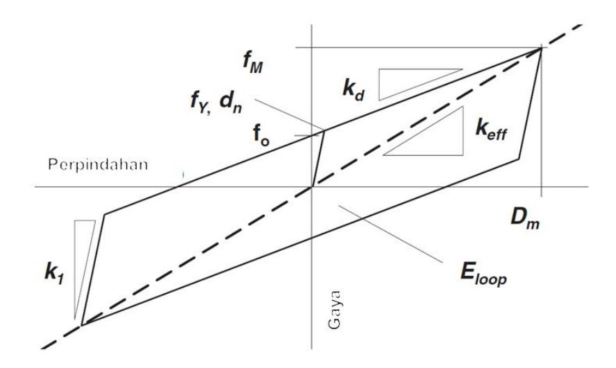

**Gambar 14 – Properti nominal untuk isolator model gaya-perpindahan bilinier** 

<span id="page-204-0"></span>Penggunaan metode lain untuk menyesuaikan kurva, seperti menarik garis lurus untuk *k<sup>d</sup>* langsung pada kurva histeresis sampai pada *D<sup>M</sup>* dan kemudian menentukan *k<sup>1</sup>* untuk mendapatkan *Eloop* yang sama.

#### **12.8.4 Kelayakan benda uji**

Kinerja benda uji dianggap memadai jika semua kondisi berikut ini terpenuhi:

- 1. Pemetaan gaya-lendutan untuk semua pengujian yang ditetapkan dalam [0](#page-200-3) mempunyai peningkatan kapasitas pemikul gaya yang positif;
- 2. Kekakuan pasca leleh rata-rata, *kd*, dan energi terdisipasi per siklus untuk tiga sikulus pengujian seperti pada [0.](#page-201-0) bagian 3, untuk gaya vertikal sama dengan beban mati rata-rata ditambah 0,5 kali pengaruh beban hidup, termasuk pengaruh pemanasan, dan laju pembebanan, sesua[i 0,](#page-201-1) harus berada dalam rentang nilai rencana nominal yang ditentukan oleh rentang isolator individu yang tersedia, umumnya +/- 5 % lebih besar dari rentang λ(spec,min) dan λ(spec,max) untuk rata-rata dari semua isolator.
- 3. Untup setiap penambahan dari perpindahan 0.67 *DM* dan 1,0 *DM* seperti pada butir 2 dan 3 dari [0](#page-201-0) dan untuk setiap kasus beban vertikal pada [0,](#page-201-0) nilai kekakuan pasca lleleh, kd, pada setiap siklus pengujian untuk suatu perpindahan yang umum, harus berada dalam rentang λ(test,min) dan λ(test,max) dikalikan dengan nilai nominal dari kekakuan pasca leleh.
- 4. Untuk setiap benda uji, perubahan kekakuan efektif selama siklus pengujian yang ditetapkan di butir 4 pada [0](#page-201-0) tidak lebih besar dari 20 % dari kekakuan efektif awal;
- 5. Untuk setiap benda uji, nilai kekakuan pasca leleh, *kd*, dan energi terdisipasi persiklus, *Eloop*, untuk setiap siklus pada pengujian sesuai [0,](#page-201-0) butir 4a, harus berada dalam rentang nilai rencana nominal ditentukan λ(test,min) dan λ(test,max)
- 6. Untuk setiap benda uji, pengurangan redaman efektif selama siklus pengujian yang ditetapkan di butir 4 pada [0](#page-201-0) tidak lebih besar dari 20 % dari redaman efektif awal;
- 7. Semua benda uji elemen-elemen pemikul beban vertikal dari sistem isolasi tetap stabil pada waktu diuji sesuai dengan [0.](#page-202-1)

**PENGECUALIAN** Tenaga ahli praktisi ahli bersertifikatdiperbolehkan menyesuaikan batasan dari butir 3,4, dan 6 untuk memperhitungkan faktor variasi properti dari [0](#page-187-0) yang digunakan untuk perencanaan sistem isolasi.

#### <span id="page-204-1"></span>**12.8.5 Pengujian produksi**

Suatu program pengujian untuk unit isolator yang digunakan pada konstruksi harus dibuat oleh tenaga ahli profesional perencana terdaftar. Program pengujian harus meninjau konsistensi

dari nilai-nilai properti unit isolator nominal yang terukur dengan menguji 100 % dari isolator terhadap kombinasi tekan dan geser pada tidak kurang dari 2/3 dari perpindahan maksimum *DM*, ditentukan menggunakan properti batas bawah.

Nilai rata-rata dari semua pengujian harus berada pada rentang yang ditentukan oleh λ(spec,min) dan λ(spec,max) sesuai [0.](#page-187-0) Suatu rentang nilai yang berbeda boleh digunakan untuk unit isolator individu dan untuk nilai rata-rata dari semua isolator untuk suatu tipe unit tertentu, jika perbedaan rentang nilai telah diperhitungkan untuk perencanaan setiap elemen sitem isolasi, seperti pada [0.](#page-187-0)

#### <span id="page-205-0"></span>**13 Persyaratan desain seismik untuk struktur dengan sistem peredam**

#### <span id="page-205-1"></span>**13.1 Ruang lingkup**

Setiap struktur dengan sistem peredam dan setiap bagiannya harus didesain dan dibangun sesuai dengan persyaratan yang tertuang pada standar ini sebagaimana dimodifikasi oleh pasal ini. Bila perangkat peredam digunakan di seluruh batas pemisahan isolasi pada struktur dengan isolasi seismik, perpindahan, kecepatan, dan akselerasi harus ditentukan berdasarkan pasal [0.](#page-183-1)

#### <span id="page-205-2"></span>**13.2 Persyaratan desain umum**

#### **13.2.1 Persyaratan sistem**

Desain struktur harus mempertimbangkan ketentuan-ketentuan umum dari sistem pemikul beban seismik dan sistem peredam sesuai deskripsi yang diberikan pada pasal berikut. Sistem pemikul beban seismik harus memiliki kekuatan yang memadai untuk memikul beban seismik sesuai denga[n 0.](#page-205-3) Kombinasi dari sistem pemikul beban seismik dan sistem peredam diizinkan pemakaiannya guna memenuhi persyaratan simpangan antar lantai.

#### <span id="page-205-3"></span>**13.2.1.1 Sistem pemikul beban seismik**

Struktur dengan sistem peredam harus memiliki sistem pemikul beban seismik yang, pada setiap arah lateralnya, memenuhi salah satu tipe seperti yang diterangkan pada [Tabel 12.](#page-60-0)

Desain dari sistem pemikul beban seismik di setiap arah harus memenuhi persyaratan gaya geser dasar minimum berdasarkan persyaratan yang diberikan pada bagian ini dan [0](#page-211-0) jika menggunakan prosedur respons riwayat waktu nonlinier seperti yang tertuang pada [0,](#page-210-0) atau [0](#page-230-0) jika menggunakan salah satu prosedur spektrum respons sesuai dengan [0](#page-217-1) atau prosedur gaya lateral ekivalen sesuai dengan [0.](#page-221-1)

Gaya geser dasar seismik yang digunakan untuk desain sistem pemikul beban seismik tidak boleh kurang dari *Vmin*, di mana *Vmin* adalah nilai terbesar yang diperoleh dari persamaan [\(143\)](#page-205-4) dan [\(144\):](#page-205-5)

<span id="page-205-4"></span>
$$V_{\min} = \frac{V}{B_{V+1}} \tag{143}$$

<span id="page-205-5"></span>
$$V_{\min} = 0.75V \tag{144}$$

#### **Keterangan:**

*V* = gaya geser dasar seismik pada arah tinjauan sesuai dengan [0,](#page-80-0) dan

**© BSN 2019 194 dari 238**

*BV+1* = koefisien numerik seperti yang tercantum pada [Tabel 37](#page-221-0) untuk redaman efektif sama dengan jumlah redaman viskos pada ragam dasar getaran dari struktur pada arah tinjauan, *βVm* (m = 1), ditambah redaman bawaan, *βI*, dan periode struktur sama dengan *T1.*

**PENGECUALIAN** Gaya geser dasar seismik yang digunakan untuk desain sistem pemikul beban seismik tidak boleh kurang dari 1,0*V* jika salah satu dari kondisi berikut berlaku:

- 1. Pada arah yang ditinjau, sistem peredam berjumlah kurang dari dua perangkat peredam pada setiap lantainya yang dikonfigurasikan untuk menahan torsi.
- 2. Sistem pemikul beban seismik memiliki ketidakberaturan horizontal Tipe 1b [\(Tabel 13\)](#page-70-0) atau ketidakberaturan vertikal Tipe 1b [\(Tabel 14\)](#page-72-0).

#### **13.2.1.2 Sistem peredam (***damping***)**

Perangkat peredam dan semua komponen lain yang diperlukan untuk menghubungkan perangkat peredam ke elemen struktur lainnya harus didesain pada kondisi elastik untuk beban seismik maksimum yang diperhitungkan (MCER). Elemen lain dari sistem peredam diizinkan untuk memiliki respons inelastik pada MCE<sup>R</sup> jika dapat ditunjukkan dengan analisis atau pengujian bahwa respons inelastik elemen-elemen ini tidak mempunyai pengaruh yang berlawanan dengan sistem peredam. Jika prosedur spektrum respons pada [0](#page-217-1) atau prosedur gaya lateral ekivalen dari [0](#page-221-1) diaplikasikan, respons inelastik harus dibatasi sesuai dengan persyaratan [0.](#page-233-4)

Elemen yang dikendalikan oleh gaya dari sistem peredam harus didesain untuk gaya seismik yang lebih besar 20 % dari respons MCER rata-rata.

#### **13.2.2 Kriteria pergerakan tanah seismik**

#### <span id="page-206-0"></span>**13.2.2.1 Desain gempa dan spektrum respon maksimum yang diperhitungkan (RMD)**

Persyaratan spektrum respon pada [0](#page-46-0) dan [0](#page-46-1) diizinkan pemakaiannya dalam penentuan desain gempa dan spektrum respons MCE<sup>R</sup> pada lokasi tinjauan. Prosedur gerak tanah berdasarkan lokasi spesifik yang ditetapkan dalam [0](#page-51-2) juga diizinkan pemakaiannya untuk menentukan gerak tanah dasar pada setiap struktur dengan sistem peredam.

Pada setiap struktur dengan sistem peredam yang terletak di kelas situs SF, analisis respons situs harus dilakukan sesuai dengan [0](#page-40-1) dan [0.](#page-51-3)

#### **13.2.2.2 Desain gempa dan rekaman gerak tanah MCE<sup>R</sup>**

Pada penggunaan prosedur respons riwayat waktu nonlinier, desain gempa dan gerak tanah MCER yang bersesuaian harus masing-masing terdiri dari tidak kurang dari tujuh pasang komponen percepatan horizontal terpilih yang diskalakan dari rekaman kejadian gempa yang memiliki besaran, jarak patahan, dan mekanisme sumber yang konsisten terhadap gempa desain dan MCER. Amplitudo atau pencocokan spektral diizinkan untuk skala gerakan tanah. Bila jumlah pasangan gerak tanah yang terekam tidak tersedia, pasangan gerak tanah simulasi diizinkan untuk membuat jumlah total yang diperlukan.

Setiap pasang komponen gerak tanah horizontal, akar kuadrat dari jumlah spektrum SRSS harus didesain dengan menggunakan SRSS dari 5 % spektrum respons yang teredam untuk komponen yang diskala (bila dilakukan penyekalaan amplitudo, faktor skala yang identik diterapkan pada kedua komponen yang berpasangan). Untuk pasangan desain gempa dan MCER, masing-masing gerak tanah harus diskalakan sedemikian rupa sehingga dalam rentang waktu dari 0,2*T1D* sampai 1,25*T1M*, rata-rata spektrum SRSS dari semua komponen horizontal tidak berada di bawah respon spektra percepatan yang digunakan dalam desain, sesuai dengan [0.](#page-206-0)

Pada kondisi spektral yang bersesuaian, pasangan desain gempa dan MCER harus diskalakan sedemikian rupa sehingga dalam rentang waktu dari 0,2*T1D* sampai 1,25*T1M*, spektrum respons dari salah satu komponen pasangan paling sedikit 90 % dari koordinat spektrum respons desain, yang ditentukan sesuai dengan [0.](#page-206-0)

Untuk lokasi yang berjarak 5 km dari patahan aktif yang memegang kendali bahaya, pencocokan spektral tidak boleh digunakan kecuali karakteristik pulsa gempa dari gerak tanah lokasi sekitar termasuk dalam spektrum respons spesifik dari lokasi tersebut, dan karakteristik pulsa gempa, jika ada pada gerak tanah individu, tetap dipertahankan setelah proses pencocokan selesai dilakukan.

Pada lokasi yang berjarak 5 km dari patahan aktif yang memegang kendali bahaya, baik untuk gempa desain dan MCER pasangannya, masing-masing komponen harus diputar ke arah patahan normal dan patahan paralel dari patahan penyebabnya dan harus diskalakan sehingga spektrum rata-rata dari komponen normal patahan tidak kurang dari desain atau MCE<sup>R</sup> spektrum respons, jika sesuai, dan spektrum rata-rata komponen paralel-kesalahan tidak kurang dari 50 % dari respons desain atau MCE<sup>R</sup> spektrum, sesuai dengan kebutuhan, untuk periode antara 0.2*T1D* hingga 1,25*T1M*.

#### **13.2.3 Prosedur pemilihan**

Struktur dengan sistem peredam untuk pemikul seismik harus dianalisis dan didesain dengan menggunakan prosedur respon riwayat waktu nonlinier berdasarkan [0.](#page-210-0)

**PENGECUALIAN** Diizinkan untuk menganalisis dan mendesain struktur dengan menggunakan prosedur spektrum respons pada [0](#page-217-1) sesuai dengan batas-batas pada [0](#page-207-0) atau prosedur kekuatan lateral ekivalen pada [0](#page-221-1) sesuai dengan batas-batas pada [0.](#page-207-1)

#### <span id="page-207-0"></span>**13.2.3.1 Prosedur spektrum respons**

Prosedur spektrum respons pada [0](#page-217-1) diizinkan untuk digunakan dalam analisis dan desain, dengan syarat semua ketentuan di bawah ini berlaku:

- 1. Pada masing-masing arah utama, sistem peredam setidaknya memiliki dua perangkat peredam di setiap lantai, yang dikonfigurasikan untuk menahan torsi.
- 2. Total dari redaman efektif total pada ragam fundamental, *βmD* (m = 1), dari struktur pada arah tinjauan tidak lebih besar dari 35 % dari nilai kritis.
- 3. Nilai *S<sup>1</sup>* pada lokasi tinjauan kurang dari 0,6.

#### <span id="page-207-1"></span>**13.2.3.2 Prosedur gaya lateral ekivalen**

Prosedur gaya lateral ekivalen pada [0](#page-221-1) diizinkan untuk digunakan dalam analisis dan desain dengan syarat semua ketentuan di bawah ini berlaku:

- 1. Pada setiap arah utama, sistem peredam setidaknya memiliki dua perangkat peredam di setiap lantai, yang dikonfigurasikan untuk menahan torsi.
- 2. Total dari redaman efektif pada ragam fundamental struktur, *βmD* (m = 1), pada arah tinjauan tidak lebih besar dari 35 % nilai kritis.
- 3. Sistem pemikul beban seismik tidak memiliki ketidakberaturan horizontal Tipe 1a atau 1b [\(Tabel 13\)](#page-70-0) atau ketidakberaturan vertikal Tipe 1a, 1b, 2, atau 3 [\(Tabel 14\)](#page-72-0).
- 4. Diafragma lantai harus kaku sesuai definisi [0.](#page-67-1)
- 5. Tinggi struktur diukur dari atas tanah tidak melebihi 30 m.
- 6. Nilai *S<sup>1</sup>* untuk lokasi ini kurang dari 0,6.

#### **13.2.4 Sistem peredam**

**© BSN 2019 196 dari 238**

#### **13.2.4.1 Desain perangkat**

Desain, konstruksi, dan pemasangan perangkat peredam harus berdasarkan respons terhadap gerakan tanah MCER dan pertimbangan dari hal-hal berikut:

- 1. Degradasi siklus rendah dengan perpindahan besar yang disebabkan oleh beban seismik.
- 2. Degradasi siklus tinggi dengan perpindahan kecil yang disebabkan oleh angin, panas, atau beban siklik lainnya.
- 3. Gaya atau perpindahan yang disebabkan oleh beban gravitasi.
- 4. Adhesi bagian-bagian perangkat yang disebabkan oleh korosi atau abrasi, biodegradasi, kelembaban, atau paparan bahan kimia.
- 5. Paparan kondisi lingkungan, meliputi, tetapi tidak terbatas pada, suhu, kelembaban, kandungan air, radiasi (contoh: sinar ultraviolet), dan zat reaktif atau korosif (contoh: air asin).

Perangkat yang menggunakan penghubung bimetalik pada pengelasan dingin penghubung geser tidak diperkenankan untuk digunakan dalam sistem peredam.

Perangkat peredam yang mengalami kegagalan karena fatik pada siklus rendah harus menahan kekuatan angin tanpa tergelincir, bergerak, maupun yang mengalami putaran siklus inelastik.

Desain perangkat peredam harus memperhitungkan kisaran kondisi termal, keausan perangkat, toleransi manufaktur, dan efek lainnya yang menyebabkan sifat perangkat bervariasi selama masa layan perangkat sesuai dengan [0.](#page-208-0) Suhu sekitar adalah suhu layanan normal pada perangkat peredam. Rentang suhu desain harus mencakup suhu minimum dan maksimum pelayanan perangkat peredam.

#### **13.2.4.2 Gerakan sumbu majemuk (***multiaxis***)**

Titik-titik koneksi dari perangkat peredam harus memberikan artikulasi yang memadai untuk mengakomodasi perpindahan simultan longitudinal, lateral, dan vertikal dari sistem peredam secara simultan.

#### **13.2.4.3 Pemeriksaan dan pengujian berkala**

Sarana akses untuk pemeriksaan dan penggantian semua perangkat peredam harus disediakan.

Praktisi ahli bersertifikat yang bertanggung jawab atas desain struktur harus menetapkan jadwal inspeksi, perawatan, dan pengujian untuk setiap jenis perangkat peredam untuk memastikan bahwa perangkat merespons dengan cara yang semestinya sepanjang masa layannya. Tingkat inspeksi dan pengujian harus mencerminkan respons riwayat waktu yang berlaku dari perangkat peredam dan kemungkinan perubahan properti peredam selama masa layan perangkat.

#### <span id="page-208-0"></span>**13.2.4.4 Properti desain nominal**

Properti desain nominal untuk perangkat yang mendisipasi energi harus dibuat berdasarkan data uji prototipe spesifik proyek atau tes prototipe sebelumnya pada perangkat dengan tipe dan ukuran yang sama. Properti desain nominal harus berdasarkan pada data dari uji prototipe yang ditentukan berdasarkan [0](#page-213-0) (2) dan ditetapkan berdasarkan [0](#page-214-0) (2). Properti desain nominal ini harus dimodifikasi dengan menggunakan variasi properti atau faktor lambda (λ) seperti yang ditentukan pada [0.](#page-209-0)

#### <span id="page-209-0"></span>13.2.4.5 Properti peredam maksimum dan minimum

Faktor modifikasi properti maksimum dan minimum ( $\lambda$ ) harus ditetapkan berdasarkan persamaan (145) dan (146) untuk setiap perangkat oleh praktisi ahli bersertifikat dan digunakan dalam analisis dan desain untuk memperhitungkan variasi dari sifat nominal perangkat.

<span id="page-209-1"></span>
$$\lambda_{\max} = \left[ \left( 1 + \left( 0,75 \times \left( \lambda_{(ae,\max)} - 1 \right) \right) \right) \times \lambda_{(test,\max)} \times \lambda_{(spec,\max)} \right] \ge 1,2$$
(145)

<span id="page-209-2"></span>
$$\lambda_{\min} = \left[ \left( 1 - \left( 0,75 \times \left( 1 - \lambda_{(ae,\min)} \right) \right) \right) \times \lambda_{(test,\min)} \times \lambda_{(spec,\min)} \right] \le 0,85$$
(146)

#### Keterangan:

 $\lambda_{(ae,maks)}$  = faktor yang mewakili kemungkinan variasi properti peredam yang lebih besar dari nilai nominal akibat usia dan dampak lingkungan; faktor ini adalah perkalian dari efek penuaan dan efek lingkungan

 $\lambda_{(ae,min)}$  = faktor yang mewakili kemungkinan variasi properti peredam yang lebih kecil dari nilai nominal akibat usia dan dampak lingkungan; faktor ini adalah perkalian dari efek penuaan dan efek lingkungan

 $\lambda_{(uji,maks)}$  = faktor yang mewakili kemungkinan variasi properti peredam yang lebih besar dari nilai nominal yang diperoleh dari uji prototipe; ini adalah perkalian dari semua efek pengujian

 $\lambda_{(uji,min)}$  = faktor yang mewakili kemungkinan variasi properti peredam yang lebih kecil dari nilai nominal yang diperoleh dari uji prototipe; ini adalah perkalian dari semua efek pengujian

 $\lambda_{(spek,maks)}$  = faktor yang ditetapkan berdasarkan praktisi ahli bersertifikat untuk mewakili variasi yang diizinkan terhadap sifat peredam yang diproduksi yang lebih besar dari nilai nominal

 $\lambda_{(spek,min)}$  = faktor yang ditetapkan berdasarkan praktisi ahli bersertifikat untuk mewakili variasi yang diizinkan terhadap sifat peredam yang diproduksi yang lebih kecil dari nilai nominal

**PENGECUALIAN** Dengan data uji yang diperiksa oleh praktisi ahli bersertifikat dan diterima oleh tim pengawas, diperbolehkan untuk menggunakan  $\lambda_{maks}$  kurang dari 1,2 dan  $\lambda_{min}$  lebih besar dari 0,85.

Properti analisis dan desain maksimum dan minimum dari setiap perangkat harus ditentukan berdasarkan persamaan (147) dan (148) untuk setiap parameter pemodelan sebagai berikut:

<span id="page-209-3"></span>Properti desain maksimum = Properti desain nominal 
$$\times \lambda_{maks}$$
 (147)

<span id="page-209-4"></span>Properti desain minimum = Properti desain nominal 
$$\times \lambda_{min}$$
 (148)

Properti analisis dan desain maksimum dan minimum harus ditetapkan untuk setiap parameter pemodelan untuk metode analisis terpilih. Koefisien kecepatan maksimum, kekakuan, kekuatan, dan disipasi energi harus dipertimbangkan bersamaan sebagai analisis maksimum dan kasus perancangan, dan koefisien kecepatan minimum, kekuatan, kekakuan, dan disipasi energi harus dipertimbangkan sebagai analisis dan desain minimum.

Properti maksimum dan minimum harus ditetapkan terpisah untuk beban dan perpindahan yang bersesuaian berdasarkan kondisi tingkat disain dan kondisi MCE<sub>R</sub>.

#### 13.2.4.6 Redundansi sistem peredam

Jika kurang dari empat perangkat disipasi energi yang tersedia pada tiap lantai bangunan pada salah satu arah utama, atau kurang dari dua perangkat dipasang pada setiap sisi dari pusat kekakuan pada tiap lantai pada salah satu arah utama, semua perangkat disipasi energi

© BSN 2019 198 dari 238

tersebut harus mampu menanggung perpindahan sebesar 130 % dari perpindahan maksimum yang dihitung pada perangkat berdasarkan MCER. Alat yang bergantung pada kecepatan harus mampu menanggung gaya dan perpindahan yang terkait dengan kecepatan sebesar 130 % dari kecepatan maksimum perangkat yang dihitung berdasarkan MCER.

#### <span id="page-210-0"></span>**13.3 Prosedur riwayat respons nonlinear**

Properti kekakuan dan peredam dari perangkat peredam yang digunakan dalam model harus didasarkan pada atau diverifikasi dengan pengujian perangkat peredam seperti yang ditentukan oleh [0.](#page-212-1) Karakteristik gaya-kecepatan-perpindahan nonlinear dari perangkat peredam harus dimodelkan, seperti yang disyaratkan, untuk secara eksplisit memperhitungkan ketergantungan perangkat pada frekuensi, amplitudo, dan durasi pembebanan seismik.

Analisis respons riwayat waktu nonlinier harus menggunakan model matematis dari sistem pemikul beban seismik dan sistem peredam sebagaimana ditentukan pada pasal ini. Model ini harus secara langsung memperhitungkan perilaku histeretik nonlinier dari semua elemen dan sambungan yang berperilaku inelastik, dengan cara yang konsisten sesuai dengan data uji laboratorium yang berlaku. Data pengujian tidak boleh diekstrapolasi melebihi deformasi maksimum pada saat pengujian. Jika hasil analisis mengindikasikan kemungkinan adanya penurunan kekuatan elemen, model histeretik harus memperhitungkan efek ini.

**PENGECUALIAN** Jika gaya yang dihitung pada elemen sistem pemikul beban seismik atau sistem peredam tidak melebihi 1,5 kali kekuatan yang diperkirakan dengan menggunakan faktor reduksi kekuatan ϕ= 1, elemen tersebut diizinkan untuk dimodelkan sebagai elemen linear.

Untuk lokasi yang diidentifikasi dekat dengan patahan, masing-masing pasangan komponen gerak horizontal harus diputar ke arah normal patahan dan paralel patahan dari patahan penyebab dan diaplikasikan pada model matematis dalam arah-arah tersebut. Untuk lokasilokasi lainnya, pasangan individu dari komponen gerak horizontal tidak perlu diaplikasikan pada model matematis dalam beberapa orientasi.

Redaman bawaan dari struktur tidak boleh lebih besar dari 3 % nilai kritis kecuali data uji konsisten dengan tingkat deformasi yang sama dengan atau kurang dari perpindahan leleh efektif dari sistem pemikul beban seismik yang mendukung nilai yang lebih tinggi.

Analisis harus dilakukan pada kedua desain gempa dan pada tingkat gempa MCER. Analisis desain gempa tidak harus mencakup efek dari eksentrisitas tak terduga. Hasil dari analisis desain gempa harus digunakan untuk mendesain sistem pemikul beban seismik. Hasil dari analisis MCE<sup>R</sup> harus digunakan untuk mendesain sistem peredam.

#### **13.3.1 Pemodelan perangkat peredam**

Model matematis perangkat peredam yang bergantung pada fungsi perpindahan harus mencakup perilaku histeretik perangkat yang konsisten dengan data uji dan memperhitungkan semua perubahan signifikan pada kekuatan, kekakuan, dan bentuk loop histeretik. Model matematis perangkat peredam yang bergantung pada kecepatan harus mencakup koefisien kecepatan yang sesuai dengan data uji. Jika properti perangkat peredam berubah terhadap waktu dan/atau suhu, perilaku tersebut harus dimodelkan secara eksplisit. Elemen fleksibel dari perangkat peredam yang menghubungkan unit peredam ke struktur harus disertakan dalam model.

**PENGECUALIAN** Jika properti perangkat peredam diperkirakan akan berubah selama durasi analisis respons riwayat waktu, respons dinamik diizinkan dibatasi oleh nilai properti maksimum dan minimum perangkat peredam berdasarkan [0.](#page-209-0) Semua kasus batas maksimum dan minimum untuk properti

variabel dari perangkat harus memenuhi persyaratan yang sama seperti jika perilaku yang bergantung waktu pada perangkat secara eksplisit dimodelkan.

#### **13.3.2 Eksentrisitas massa tak terduga**

Eksentrisitas bawaan akibat ketidaksimetrian dalam massa dan kekakuan harus diperhitungkan dalam analisis MCER. Selain itu, eksentrisitas tak terduga yang terdiri dari perpindahan pusat massa dari lokasi yang dihitung dengan jumlah yang sama dengan 5 % dari dimensi diafragma secara terpisah pada kedua arah ortogonal pada setiap tingkat diafragma harus diperhitungkan dalam analisis.

**PENGECUALIAN** Diizinkan untuk memperhitungkan efek eksentrisitas tak terduga melalui pembentukan faktor amplifikasi pada gaya, simpangan, dan deformasi yang memungkinkan hasil yang ditentukan dari analisis dengan hanya menggunakan konfigurasi pusat massa hasil perhitungan yang diskalakan agar hasilnya sesuai dengan semua kasus massa eksentrik.

#### **13.3.3 Parameter respons**

Nilai maksimum setiap parameter respons tinjauan harus dihitung untuk setiap gerak tanah yang digunakan dalam analisis respons riwayat waktu.

Parameter respon harus mencakup gaya, perpindahan, dan kecepatan (dalam kasus perangkat yang bergantung pada kecepatan) di setiap perangkat peredam diskrit. Nilai ratarata parameter respons tinjauan pada rangkaian desain gempa atau gerakan MCE<sup>R</sup> diizinkan untuk digunakan dalam desain.

#### <span id="page-211-0"></span>**13.4 Kondisi beban seismik dan kriteria penerimaan untuk prosedur respon nonlinear**

Untuk prosedur respon riwayat waktu nonlinier pada [0,](#page-210-0) sistem pemikul beban seismik, sistem peredam, kondisi pembebanan, dan kriteria penerimaan untuk parameter respons tinjauan harus sesuai dengan persyaratan pasal berikut.

#### **13.4.1 Sistem pemikul beban seismik**

Sistem pemikul beban seismik harus memenuhi persyaratan kekuatan berdasarkan [0](#page-58-2) dengan menggunakan kedua persyaratan berikut:

- 1. Gaya geser dasar seismik, *Vmin*, seperti yang tertuang pada [0,](#page-205-3) dan
- 2. Permintaan dari desain analisis respons riwayat waktu nonlinier.

Simpangan antar tingkat harus ditentukan dengan menggunakan gerak tanah MCE<sup>R</sup> dengan model gabungan dari sistem pemikul beban seismik dan sistem peredam. Eksentrisitas tak terduga harus diperhitungkan.

Simpangan maksimum pada MCE<sup>R</sup> tidak boleh melebihi 3 %, atau simpangan batas yang ditentukan pada [Tabel 20](#page-99-3) yang dikalikan dengan nilai terendah antara 1,5*R/C<sup>d</sup>* dan 1,9. *C<sup>d</sup>* dan *R* harus berdasarkan [Tabel 12](#page-60-0) untuk sistem pemikul beban seismik tinjauan.

#### **13.4.2 Sistem peredam**

Perangkat peredam dan koneksinya harus sesuai untuk menahan gaya, perpindahan, dan kecepatan dari gerakan tanah MCER. Elemen yang dikendalikan oleh kekuatan dari sistem peredam harus didesain untuk gaya seismik yang lebih besar 20 % dari respons MCE<sup>R</sup> ratarata yang bersesuaian.

**© BSN 2019 200 dari 238**

#### **13.4.3 Kombinasi efek beban**

Efek pada sistem peredam yang disebabkan oleh beban gravitasi dan gaya seismik harus dikombinasikan sesuai dengan [0](#page-75-0) dengan memperhitungkan efek gaya seismik horizontal, *QE*, kecuali jika *QE* harus ditentukan berdasarkan analisis MCER. Bila kombinasi beban yang digunakan mencakup beban hidup, diperkenankan untuk menggunakan faktor beban 25 % pada beban hidup untuk analisis respon riwayat waktu nonlinier. Faktor redundansi, *ρ*, harus diperhitungkan sama dengan 1,0 dalam semua kasus, dan efek beban seismik termasuk kuat lebih pada [0](#page-77-1) tidak perlu diterapkan pada desain sistem peredam.

#### **13.4.4 Kriteria penerimaan untuk parameter respon terkait**

Komponen sistem peredam harus dievaluasi menggunakan kriteria disain kekuatan pada peraturan ini dengan menggunakan gaya seismik dan kondisi pembebanan seismik yang ditentukan dari analisis respons riwayat waktu nonlinear MCER dan faktor reduksi kekuatan ϕ= 1,0.

#### <span id="page-212-0"></span>**13.5 Kajian desain**

Kajian desain independen terhadap sistem peredam dan program pengujian terkait harus dilakukan oleh satu atau lebih individu yang memiliki pengetahuan tentang hal berikut; minimal satu pengkaji harus seorang praktisi ahli bersertifikasi. Kajian desain sistem peredam harus mencakup, tetapi tidak terbatas, semua hal berikut:

- 1. Kriteria desain proyek termasuk spektrum spesifik lokasi dan gerak tanah dasar;
- 2. Desain awal dari sistem pemikul beban seismik dan sistem peredam, termasuk pemilihan perangkat dan parameter desainnya;
- 3. Kajian data uji pabrikan dan faktor modifikasi properti untuk pabrikan dan perangkat yang dipilih;
- 4. Program pengujian prototipe (lihat [0\)](#page-213-1)
- 5. Desain akhir keseluruhan sistem struktural dan analisis pendukungnya, termasuk pemodelan perangkat peredam untuk analisis respons riwayat waktu jika dilakukan; dan
- 6. Program pengujian perangkat peredam yang diproduksi (lihat [0\)](#page-216-1).

#### <span id="page-212-1"></span>**13.6 Pengujian**

Hubungan gaya-kecepatan-perpindahan dan properti peredam yang diasumsikan sebagai properti desain nominal dari perangkat peredam di [0](#page-208-0) harus dikonfirmasi dengan pengujian yang dilakukan sesuai dengan [0](#page-213-1) atau harus berdasarkan pada pengujian perangkat terlebih dahulu yang memenuhi persyaratan kesamaan pada [0.](#page-214-1)

Tes prototipe yang ditentukan pada [0](#page-213-1) harus dilakukan untuk mengkonfirmasi sifat gayakecepatan-perpindahan dari perangkat peredam yang diasumsikan untuk analisis dan desain dan untuk menunjukkan ketahanan perangkat individual di bawah eksitasi seismik. Pengujian ini harus dilakukan terlebih dahulu sebelum produksi perangkat peredam untuk konstruksi. Persyaratan pengujian produksi ditentukan dalam [0](#page-216-1)

Properti nominal perangkat yang ditentukan berdasarkan pengujian prototipe harus memenuhi kriteria penerimaan yang dibuat dengan menggunakan λ(spec,max) dan λ(spec,min) dari [0](#page-209-0) Kriteria ini harus memperhitungkan kemungkinan variasi properti material.

Properti nominal perangkat yang ditentukan dari pengujian produksi [0 h](#page-216-1)arus memenuhi kriteria penerimaan yang ditetapkan dengan menggunakan λ(spec,max) dan λ(spec,min) dari [0.](#page-209-0)

**© BSN 2019 201 dari 238**

Prosedur fabrikasi dan pengendalian mutu yang digunakan untuk semua prototipe dan perangkat produksi harus sama. Prosedur ini harus disetujui oleh praktisi ahli bersertifikat sebelum pembuatan perangkat prototipe.

#### <span id="page-213-1"></span>**13.6.1 Uji prototipe**

Pengujian berikut harus dilakukan secara terpisah pada dua perangkat peredam berskala penuh dari setiap tipe dan ukuran yang digunakan dalam desain, sesuai urutan yang tercantum sebagai berikut.

Ukuran representatif dari setiap jenis perangkat diizinkan untuk digunakan dalam pengujian prototipe, dengan syarat bahwa kedua persyaratan berikut terpenuhi:

- 1. Prosedur fabrikasi dan pengendalian mutu identik untuk setiap tipe dan ukuran perangkat yang digunakan pada struktur.
- 2. Pengujian prototipe dari ukuran yang mewakili disetujui oleh praktisi ahli bersertifikat yang bertanggung jawab untuk mendesain struktur.

Spesimen uji tidak boleh digunakan dalam konstruksi, kecuali jika disetujui oleh praktisi ahli bersertifikat yang bertanggung jawab untuk mendesain struktur dan memenuhi persyaratan untuk uji prototipe dan produksi.

#### **13.6.1.1 Perekaman data**

Hubungan gaya-lendutan untuk setiap siklus pengujian harus dicatat secara elektronik.

#### <span id="page-213-0"></span>**13.6.1.2 Urutan dan siklus pengujian**

Untuk semua urutan pengujian berikut, masing-masing perangkat peredam harus dikenai efek beban gravitasi dan beban termal lingkungan yang mewakili kondisi terpasang. Untuk pengujian seismik, perpindahan pada perangkat yang dihitung untuk gerakan tanah MCER, yang disini disebut sebagai perpindahan perangkat maksimum, harus digunakan.

Sebelum pelaksanaan rangkaian uji prototipe yang didefinisikan pada pasal ini, uji produksi sesuai dengan [0](#page-216-1) harus dilakukan, dan data dari pengujian ini harus digunakan sebagai dasar acuan untuk perbandingan dengan pengujian selanjutnya pada produksi peredam:

1. Setiap perangkat peredam harus dibebani sejumlah siklus sesuai dengan yang diperkirakan pada angin badai desain, tapi juga tidak kurang dari 2.000 siklus beban angin bolak balik yang terus menerus. Beban angin harus pada amplitudo yang diperkirakan pada angin badai desain dan harus diterapkan pada frekuensi yang sama dengan kebalikan dari periode dasar struktur, 1/*T1*.

Diizinkan untuk menggunakan protokol pembebanan alternatif, yang mewakili angin badai desain, yang membagi total perpindahan angin ke komponen statis, pseudostatik, dan dinamik yang diperkirakan.

**PENGECUALIAN** Perangkat peredam tidak perlu dilakukan rangkaian pengujian ini jika tidak dibebani oleh kekuatan atau perpindahan yang disebabkan angin atau jika gaya angin desain kurang dari kekuatan leleh atau atau kekuatan selip dari perangkat.

- 2. Setiap perangkat peredam harus dibawa ke suhu sekitar dan dibebani dengan rangkaian siklus sinusoidal bolak balik berikut dengan frekuensi yang sama dengan 1/(1.5*T1*).
  - a. Sepuluh siklus bolak balik pada perpindahan pada perangkat disipasi energi yang sesuai dengan 0,33 kali perpindahan perangkat MCER;

- b. Lima siklus bolak balik pada perpindahan pada perangkat disipasi energi yang sesuai dengan 0,67 kali perpindahan perangkat MCER;
- c. Tiga siklus bolak balik pada perpindahan pada perangkat disipasi energi yang sesuai dengan 1,0 kali perpindahan perangkat MCER; dan
- d. Jika uji (c) menghasilkan gaya dalam perangkat disipasi energi yang kurang dari gaya MCER pada perangkat berdasarkan hasil analisis, uji (c) harus diulang pada frekuensi yang menghasilkan gaya sama dengan atau lebih besar daripada gaya MCER hasil analisis.
- 3. Apabila karakteristik perangkat peredam berbeda dengan suhu operasional, pengujian pada [0,](#page-213-0) 2(a) sampai 2(d) harus dilakukan pada setidaknya satu perangkat, minimal pada dua temperatur tambahan (minimum dan maksimum), yang merupakan kisaran suhu desain.

**PENGECUALIAN** Perangkat peredam diizinkan diuji dengan metode alternatif dengan syarat bahwa semua kondisi berikut terpenuhi:

- a. Metode pengujian alternatif setara dengan persyaratan pengujian siklik pada bagian ini.
- b. Metode alternatif menangkap ketergantungan respon perangkat peredam pada temperatur *ambien*, frekuensi pembebanan, dan kenaikan temperatur selama pengujian.
- c. Metode alternatif disetujui oleh praktisi ahli bersertifikat yang bertanggung jawab atas desain struktur.
- 4. Jika properti gaya-deformasi dari perangkat peredam pada setiap perpindahan kurang dari atau sama dengan perubahan perpindahan maksimum dari perangkat lebih dari 15 % untuk perubahan frekuensi pengujian dari 1/(1.5*T1*) menjadi 2,5 / *T1*, maka yang pengujian terdahulu (2(a) sampai 2(c)) juga harus dilakukan pada frekuensi yang sama dengan 1/*T<sup>1</sup>* dan 2.5/*T1*.

**PENGECUALIAN** Bila pengujian dinamik dengan skala penuh tidak dimungkinkan karena keterbatasan mesin uji, diperbolehkan untuk menggunakan prototipe dengan skala yang lebih kecil untuk memenuhi syarat properti yang merupakan fungsi dari kecepatan pembebanan dari perangkat peredam, asalkan prinsip penskalaan dan kesamaan digunakan dalam desain perangkat berskala kecil dan protokol pengujian.

#### <span id="page-214-1"></span>**13.6.1.3 Pengujian perangkat peredam**

Uji prototipe tidak perlu dilakukan pada perangkat peredam tertentu jika ada unit yang sebelumnya telah diuji prototipe yang memenuhi semua kondisi berikut:

- 1. Karakteristik dimensi yang serupa, konstruksi internal, dan tekanan internal statis dan dinamik (jika ada) pada subjek perangkat peredam; dan
- 2. Memiliki jenis dan bahan yang sama dengan subjek perangkat peredam; dan
- 3. Dibuat dengan menggunakan prosedur manufaktur terdokumentasi dan prosedur pengendalian mutu yang identik yang menentukan subjek perangkat peredam; dan
- 4. Diuji dengan pergerakan dan kekuatan maksimum yang sama dengan yang dibutuhkan pada subjek perangkat peredam.

#### <span id="page-214-0"></span>**13.6.1.4 Penentuan karakteristik gaya-kecepatan-perpindahan**

Karakteristik gaya-kecepatan-perpindahan dari prototipe sebuah perangkat peredam harus berdasarkan uji perpindahan siklik yang ditentukan pada [0](#page-213-0) dan semua persyaratan berikut:

**© BSN 2019 203 dari 238**

- 1. Gaya maksimum dan gaya minimum pada perpindahan nol, gaya maksimum dan gaya minimum pada perpindahan perangkat maksimum, dan area kurva histeretik (*Eloop*) harus dihitung untuk setiap siklus deformasi. Bila diperlukan, kekakuan efektif dari perangkat peredam harus dihitung untuk setiap siklus deformasi menggunakan persamaan [\(141\).](#page-203-0)
- 2. Properti pengujian nominal perangkat peredam untuk analisis dan desain harus didasarkan pada nilai rata-rata untuk tiga siklus pertama pengujian pada perpindahan terkait. Untuk setiap siklus setiap pengujian, faktor lambda yang bersesuaian (λtest) untuk efek siklik harus ditetapkan dengan perbandingan properti nominal dan properti per siklus.
- 3. Faktor lambda (λ) untuk kecepatan dan temperatur harus ditentukan bersamaan dengan efek siklik dimana data pengujian prototipe skala penuh tersedia. Apabila hal ini atau efek serupa ditentukan dari pengujian terpisah, faktor lambda harus ditetapkan dengan membandingkan properti yang ditentukan berdasarkan kondisi uji prototipe dengan properti yang bersesuaian yang ditentukan berdasarkan kisaran kondisi pengujian yang berlaku untuk parameter variasi properti.

#### **13.6.1.5 Kecukupan perangkat**

Kinerja dari perangkat peredam prototipe harus dianggap memadai jika semua kondisi yang tercantum di bawah ini terpenuhi. Batas 15 % yang ditentukan dalam teks berikut diizinkan untuk ditingkatkan oleh praktisi ahli bersertifikat yang bertanggung jawab atas desain struktur dengan ketentuan bahwa peningkatan batas telah dibuktikan dengan analisis bahwa tidak memiliki efek buruk pada respon struktur.

#### **13.6.1.5.1 Perangkat peredam fungsi perpindahan**

Kinerja prototipe perangkat peredam fungsi perpindahan harus dianggap memadai jika semua kondisi berikut, berdasarkan pengujian yang ditentukan dalam [0,](#page-213-0) terpenuhi:

- 1. Untuk Pengujian 1, tidak ada tanda-tanda kerusakan termasuk kebocoran, leleh, atau kerusakan.
- 2. Untuk Pengujian 2, 3, dan 4, gaya maksimum dan gaya minimum pada perpindahan nol untuk perangkat peredam untuk sembarang siklus tidak berbeda lebih dari 15 % dari gaya maksimum dan minimum rata-rata pada perpindahan nol yang dihitung dari semua siklus pada pengujian tersebut pada frekuensi dan temperatur tertentu.
- 3. Untuk Pengujian 2, 3, dan 4, gaya maksimum dan gaya minimum pada perpindahan perangkat maksimum untuk perangkat peredam untuk satu siklus tidak berbeda lebih dari 15 % dari gaya maksimum dan minimum rata-rata pada perpindahan perangkat maksimum yang dihitung dari semua siklus dalam pengujian tersebut pada frekuensi dan temperatur tertentu.
- 4. Untuk Pengujian 2, 3, dan 4, luas kurva histeretik (*Eloop*) dari perangkat peredam untuk satu siklus tidak berbeda lebih dari 15 % dari luas rata-rata putaran histeresis yang dihitung dari semua siklus dalam pengujian pada frekuensi dan temperatur tertentu.
- 5. Kekuatan maksimum dan minimum rata-rata pada perpindahan nol dan perpindahan maksimum, dan rata-rata luas kurva histeretik (*Eloop*), yang dihitung untuk setiap pengujian dalam urutan Pengujian 2, 3, dan 4, tidak boleh berbeda lebih dari 15 % dari nilai target yang ditentukan oleh praktisi ahli bersertifikat yang bertanggung jawab atas desain struktur.
- 6. Kekuatan maksimum dan minimum rata-rata pada perpindahan nol dan perpindahan maksimum, dan luas rata-rata kurva histeretik (*Eloop*), yang dihitung untuk Pengujian 2(c) harus berada dalam batas yang ditentukan oleh praktisi ahli bersertifikat, seperti yang dijelaskan oleh properti nominal dan faktor lambda untuk toleransi spesifikasi (*λ(spec,max)* dan *λ(spec,min)*) dari [0.](#page-209-0)

7. Faktor uji lambda untuk unit peredam, ditentukan sesuai dengan [0,](#page-214-0) tidak boleh melebihi nilai yang ditentukan oleh praktisi ahli bersertifikat sesuai dengan [0.](#page-209-0)

#### **13.6.1.5.2 Perangkat peredam fungsi kecepatan**

Kinerja prototipe perangkat peredam yang merupakan fungsi kecepatan harus dianggap memadai jika semua kondisi berikut, berdasarkan pengujian yang ditentukan dalam [0,](#page-213-0) terpenuhi:

- 1. Untuk Pengujian 1, tidak ada tanda-tanda kerusakan termasuk kebocoran, leleh, atau kerusakan.
- 2. Untuk perangkat peredam yang merupakan fungsi kecepatan dengan kekakuan, kekakuan efektif dari perangkat peredam dalam satu siklus Pengujian 2, 3, dan 4 tidak berbeda lebih dari 15 % dari kekakuan efektif rata-rata yang dihitung dari semua siklus pada pengujian tersebut pada frekuensi dan temperatur tertentu.
- 3. Untuk Pengujian 2, 3, dan 4, gaya maksimum dan gaya minimum pada perpindahan nol untuk perangkat peredam untuk sembarang siklus tidak berbeda lebih dari 15 % dari gaya maksimum dan minimum rata-rata pada perpindahan nol yang dihitung dari semua siklus pada pengujian tersebut pada frekuensi dan temperatur tertentu.
- 4. Untuk Pengujian 2, 3, dan 4, luas kurva histeretik (*Eloop*) dari perangkat peredam untuk satu siklus tidak berbeda lebih dari 15 % dari luas rata-rata putaran histeresis yang dihitung dari semua siklus dalam pengujian pada frekuensi dan temperatur tertentu.
- 5. Kekuatan maksimum dan minimum rata-rata pada perpindahan nol, kekakuan efektif (hanya untuk perangkat peredam dengan kekakuan), dan luas rata-rata kurva histeretik (*Eloop*), yang dihitung untuk Pengujian 2(c), harus berada dalam batas yang ditentukan oleh praktisi ahli bersertifikat, seperti yang dijelaskan oleh properti nominal dan faktor lambda untuk toleransi spesifikasi (*λ(spec,max)* dan *λ(spec,min)*) pada [0.](#page-209-0)
- 6. Faktor uji lambda untuk unit peredam yang ditentukan sesuai dengan [0](#page-214-0) tidak boleh melebihi nilai yang ditentukan oleh praktisi ahli bersertifikatsesuai dengan [0.](#page-209-0)

#### <span id="page-216-1"></span>**13.6.2 Tes produksi**

Sebelum pemasangan pada gedung, perangkat peredam harus diuji sesuai dengan persyaratan bagian ini.

Sebuah program pengujian untuk perangkat peredam produksi harus ditetapkan oleh praktisi ahli bersertifikat. Program pengujian harus memvalidasi properti nominal dengan menguji 100 % perangkat peredam selama tiga siklus pada 0,67 kali pergerakan tanah MCE<sup>R</sup> pada frekuensi sama dengan 1/(1.5*T1*). Nilai yang diukur dari properti nominal harus berada dalam batas yang ditentukan dalam spesifikasi proyek. Batasan ini harus sesuai dengan toleransi spesifikasi pada properti desain nominal yang ditetapkan pada [0.](#page-209-0)

**PENGECUALIAN** Perangkat peredam produksi tidak perlu diuji dengan menggunakan cara ini jika dapat ditunjukkan dengan cara lain bahwa propertinya memenuhi persyaratan spesifikasi proyek. Dalam kasus tersebut, praktisi ahli bersertifikat harus membuat program alternatif untuk memastikan kualitas perangkat peredam yang terpasang. Program alternatif ini harus mencakup pengujian produksi sekurang-kurangnya satu perangkat dari setiap tipe dan ukuran, kecuali uji prototipe spesifik proyek telah dilakukan pada tipe dan ukuran perangkat yang identik. Perangkat yang mengalami kondisi inelastik ataupun rusak selama pengujian ini tidak boleh digunakan dalam konstruksi.

#### <span id="page-216-0"></span>**13.7 Prosedur alternatif dan kriteria penerimaannya**

Struktur yang dianalisis dengan prosedur spektrum respons harus memenuhi persyaratan dalam [0,](#page-217-1) [0,](#page-227-0) dan [0.](#page-230-0) Struktur yang dianalisis dengan prosedur gaya lateral ekivalen harus memenuhi persyaratan dalam [0,](#page-221-1) [0,](#page-227-0) dan [0.](#page-230-0)

#### <span id="page-217-1"></span>13.7.1 Prosedur spektrum respons

Jika prosedur spektrum respons digunakan untuk menganalisis struktur dengan sistem peredam, persyaratan-persyaratan dalam pasal ini harus berlaku.

#### 13.7.1.1 Pemodelan

Model matematis sistem pemikul gaya seismik dan sistem peredam harus dibuat sedemikian sehingga menggambarkan distribusi spasial massa, kekakuan, dan redaman seluruh struktur. Model dan analisis harus memenuhi persyaratan-persyaratan dalam 0 untuk sistem pemikul gaya seismik dan persyaratan pada pasal ini untuk sistem peredam. Parameter kekakuan dan redaman dari perangkat peredam yang digunakan dalam model harus didasarkan pada atau terverifikasi melalui pengujian perangkat peredam yang ditentukan dalam 0.

Kekakuan elastik dari elemen-elemen sistem peredam selain dari perangkat peredam harus dimodelkan secara eksplisit. Kekakuan dari perangkat peredam harus dimodelkan tergantung pada tipe perangkat peredam sebagai berikut:

- 1. Untuk perangkat peredam yang tergantung perpindahan: Perangkat peredam yang tergantung pada perpindahan harus dimodelkan dengan kekakuan efektif yang menggambarkan gaya perangkat peredam terhadap respons perpindahan tinjauan (misalnya, simpangan antar tingkat desain). Sebagai alternatif, kekakuan histeretis dan friksi perangkat peredam dapat dikeluarkan dari analisis spektrum respons dengan ketentuan bahwa gaya desain di perangkat peredam fungsi perpindahan,  $Q_{DSD}$ , diterapkan dalam model sebagai beban eksternal (0).
- 2. Untuk perangkat peredam fungsi kecepatan: perangkat peredam yang bergantung pada kecepatan yang memiliki komponen kekakuan (misalnya, perangkat peredam viskoelastik) harus dimodelkan dengan kekakuan efektif sesuai dengan amplitudo dan frekuensi tinjauan.

#### <span id="page-217-4"></span>13.7.1.2 Sistem pemikul beban seismik

#### 13.7.1.2.1 Gaya geser dasar seismik

Gaya geser dasar seismik, V, dari struktur dalam arah yang ditinjau harus ditentukan sebagai kombinasi komponen-komponen ragam,  $V_m$ , sesuai batasan oleh persamaan (149):

<span id="page-217-2"></span>
$$V \ge V_{\min}$$
 (149)

Gaya geser dasar seismik, V, dari struktur harus ditentukan oleh metode akar kuadrat jumlah kuadrat (SRSS) atau kombinasi kuadrat lengkap (CQC) dari komponen-komponen gaya geser dasar ragam,  $V_m$ .

#### <span id="page-217-0"></span>13.7.1.2.2 Gaya geser dasar ragam

Gaya geser dasar dari ragam getar ke-m struktur,  $V_m$ , pada arah tinjauan ditentukan sesuai dengan persamaan (150) dan (151):

<span id="page-217-3"></span>
$$V_m = C_{Sm} \overline{W_m} \tag{150}$$

© BSN 2019 206 dari 238

<span id="page-218-2"></span>
$$\overline{W}_{m} = \frac{\left(\sum_{i=1}^{n} w_{i} \phi_{im}\right)^{2}}{\sum_{i=1}^{n} w_{i} \phi_{im}^{2}}$$
(151)

#### Keterangan:

 $C_{Sm}$  = koefisien respon seismik dari ragam getar ke-m struktur pada arah tinjauan yang ditentukan dalam 0 (m=1) atau 0 (m>1)

 $W_m$  = berat efektif seismik dari ragam getar ke-m struktur

 $\phi_{im}$  = amplitudo perpindahan pada tingkat ke-i struktur dari ragam getar ke-m struktur pada arah tinjauan dinormalisasi ke satu di tingkat atap.

#### <span id="page-218-9"></span>13.7.1.2.3 Faktor partisipasi modal

Faktor partisipasi ragam untuk m ragam getar,  $\Gamma_m$ , dari struktur di arah tinjauan harus ditentukan sesuai dengan persamaan (152):

<span id="page-218-4"></span>
$$\Gamma_m = \frac{\overline{W}_m}{\sum_{i=1}^n w_i \phi_{im}} \tag{152}$$

#### <span id="page-218-3"></span>13.7.1.2.4 Koefisien respons seismik ragam fundamental

Koefisien respon seismik ragam fundamental (m = 1),  $C_{SI}$ , dalam arah tinjauan harus ditentukan sesuai dengan persamaan (153) dan (154):

Untuk  $T_{ID} < T_s$ 

<span id="page-218-5"></span>
$$C_{SI} = \left(\frac{R}{C_d}\right) \left(\frac{S_{DS}}{\Omega_0 B_{1D}}\right) \tag{153}$$

Untuk  $T_{1D} \ge T_{s}$ 

<span id="page-218-6"></span>
$$C_{S1} = \left(\frac{R}{C_d}\right) \frac{S_{D1}}{T_{1D}(\Omega_0 B_{1D})} \tag{154}$$

#### <span id="page-218-1"></span>13.7.1.2.5 Penentuan periode efektif ragam fundamental

Periode efektif ragam fundamental (m = 1) untuk gerak tanah gempa desain,  $T_{ID}$ , dan gerak tanah MCE<sub>R</sub>,  $T_{IM}$ , harus didasarkan pada pertimbangan eksplisit dari karakteristik defleksi gaya pasca leleh dari struktur atau ditentukan sesuai dengan persamaan (155) dan (156):

<span id="page-218-7"></span>
$$T_{1D} = T_1 \sqrt{\mu_D} \tag{155}$$

<span id="page-218-8"></span>
$$T_{1M} = T_1 \sqrt{\mu_M} \tag{156}$$

#### <span id="page-218-0"></span>13.7.1.2.6 Koefisien respons seismik ragam tinggi

© BSN 2019 207 dari 238

Koefisien respons seismik ragam tinggi (m > 1),  $C_{Sm}$ , dari ragam getar ke-m (m > 1) struktur pada arah tinjauan harus ditentukan sesuai dengan persamaan (157) dan (158):

Untuk  $T_m < T_s$ 

<span id="page-219-1"></span>
$$C_{Sm} = \left(\frac{R}{C_d}\right) \left(\frac{S_{DS}}{\Omega_0 B_{mD}}\right) \tag{157}$$

Untuk  $T_m \ge T_s$ 

<span id="page-219-2"></span>
$$C_{SI} = \left(\frac{R}{C_d}\right) \frac{S_{DI}}{T_m \left(\Omega_0 B_{mD}\right)} \tag{158}$$

#### Keterangan:

 $T_m$  = periode, dalam detik, dari ragam getar ke- m struktur pada arah tinjauan

 $B_{mD}$  = koefisien numerik sebagaimana diatur dalam Tabel 37 untuk redaman efektif sama dengan  $\beta_{mD}$  dan periode struktur sama dengan  $T_m$ .

#### 13.7.1.2.7 Desain gaya lateral

Desain gaya lateral pada level-i disebabkan oleh m ragam getar,  $F_{im}$ , dari struktur pada arah tinjauan harus ditentukan sesuai dengan persamaan (159):

<span id="page-219-3"></span>
$$F_{im} = w_i \phi_{im} \frac{\Gamma_m}{\overline{W}_m} V_m \tag{159}$$

Gaya desain elemen-elemen sistem pemikul beban seismik harus ditentukan oleh SRSS atau kombinasi kuadrat lengkap dari gaya desain modal.

#### <span id="page-219-5"></span>13.7.1.3 Sistem peredam

Gaya-gaya desain pada perangkat peredam dan elemen-elemen lainnya dari sistem peredam harus ditentukan berdasarkan defleksi tingkat, simpangan antar tingkat, dan parameter-parameter respons kecepatan tingkat yang dijelaskan pada pasal berikut.

Perpindahan dan kecepatan yang digunakan untuk menentukan gaya maksimum di perangkat peredam pada setiap tingkat harus memperhitungkan sudut orientasi tiap perangkat terhadap arah horizontal dan mempertimbangkan efek peningkatan respons yang disebabkan oleh torsi yang diperlukan dalam desain sistem pemikul beban seismik.

Defleksi tingkat pada tingkat-i,  $\delta_{iD}$  dan  $\delta_{iM}$ , simpangan antar tingkat,  $\Delta_D$  dan  $\Delta_M$ , dan kecepatan lantai,  $\nabla_D$  dan  $\nabla_M$ , harus dihitung untuk gerak tanah gempa desain dan gerak tanah MCE<sub>R</sub>, sesuai ketentuan pasal ini.

#### <span id="page-219-0"></span>13.7.1.3.1 Defleksi tingkat gempa desain

Defleksi struktur yang disebabkan oleh gerak tanah gempa desain di tingkat-i dalam m ragam getar,  $\delta_{imD}$ , dari struktur di arah tinjauan harus ditentukan sesuai dengan persamaan (160):

<span id="page-219-4"></span>
$$\delta_{imD} = D_{mD} \phi_{im} \tag{160}$$

© BSN 2019 208 dari 238

Defleksi desain total pada setiap tingkat struktur harus dihitung dengan SRSS atau kombinasi kuadrat lengkap dari modal defleksi gempa desain.

#### <span id="page-220-4"></span>13.7.1.3.2 Perpindahan atap gempa desain

Perpindahan atap ragam fundamental (m = 1) dan ragam tinggi (m > 1) disebabkan oleh gerak tanah gempa desain,  $D_{ID}$  dan  $D_{mD}$ , dari struktur dalam arah tinjauan harus sesuai dengan persamaan (161), (162) dan (163):

Untuk m=1

<span id="page-220-1"></span>
$$D_{1D} = \left(\frac{g}{4\pi^2}\right) \Gamma_1 \frac{S_{DS} T_{1D}^2}{B_{1D}} \ge \left(\frac{g}{4\pi^2}\right) \Gamma_1 \frac{S_{DS} T_1^2}{B_{1E}}, T_{1D} < T_s$$
(161)

<span id="page-220-2"></span>
$$D_{1D} = \left(\frac{g}{4\pi^2}\right) \Gamma_1 \frac{S_{D1} T_{1D}}{B_{1D}} \ge \left(\frac{g}{4\pi^2}\right) \Gamma_1 \frac{S_{D1} T_1}{B_{1D}}, T_{1D} \ge T_s$$
(162)

Untuk m > 1

<span id="page-220-3"></span>
$$D_{mD} = \left(\frac{g}{4\pi^2}\right) \Gamma_m \frac{S_{D1} T_m}{B_{mD}} \le \left(\frac{g}{4\pi^2}\right) \Gamma_m \frac{S_{DS} T_m^2}{B_{mD}}$$
(163)

#### <span id="page-220-7"></span>13.7.1.3.3 Simpangan antar tingkat gempa desain

Simpangan antar tingkat desain pada ragam fundamental,  $\Delta_{\rm 1D}$ , dan ragam tinggi,  $\Delta_{\rm mD}$  (m> 1), dari struktur dalam arah tinjauan dihitung sesuai dengan 7.8.6 menggunakan perpindahan atap modal dalam 0.

Desain simpangan antar tingkat total,  $\nabla_D$ , harus ditentukan oleh SRSS atau kombinasi kuadrat lengkap dari simpangan modal gempa desain.

#### <span id="page-220-0"></span>13.7.1.3.4 Kecepatan tingkat gempa desain

Desain kecepatan tingkat dalam ragam fundamental,  $\nabla_{1D}$ , dan ragam tinggi,  $\nabla_{mD}$  (m > 1), dari struktur dalam arah tinjauan harus dihitung sesuai dengan persamaan (164) dan (165):

Untuk m = 1,

<span id="page-220-5"></span>
$$\nabla_{1D} = 2\pi \frac{\Delta_{1D}}{T_{1D}} \tag{164}$$

Untuk m > 1,

<span id="page-220-6"></span>
$$\nabla_{mD} = 2\pi \frac{\Delta_{mD}}{T_m} \tag{165}$$

Kecepatan lantai desain total,  $\nabla_D$ , harus ditentukan dengan SRSS atau kombinasi kuadrat lengkap dari ragam kecepatan desain.

#### <span id="page-220-8"></span>13.7.1.3.5 Respons MCE<sub>R</sub>

© BSN 2019 209 dari 238

Defleksi tingkat maksimum ragam total pada tingkat-*i*, nilai simpangan antar tingkat MCE<sub>R</sub>, dan kecepatan tingkat MCE<sub>R</sub> harus didasarkan pada 0, 0, dan 0, kecuali perpindahan atap disain harus diganti dengan perpindahan atap MCE<sub>R</sub>. Perpindahan atap MCE<sub>R</sub> struktur pada arah tinjauan harus dihitung sesuai dengan persamaan (166) sampai (168)

Untuk m=1

<span id="page-221-2"></span>
$$D_{1M} = \left(\frac{g}{4\pi^2}\right) \Gamma_1 \frac{S_{MS} T_{1M}^2}{B_{1M}} \ge \left(\frac{g}{4\pi^2}\right) \Gamma_1 \frac{S_{MS} T_1^2}{B_{1F}}, T_{1M} < T_s$$
(166)

$$D_{1M} = \left(\frac{g}{4\pi^2}\right) \Gamma_1 \frac{S_{M1} T_{1M}}{B_{1M}} \ge \left(\frac{g}{4\pi^2}\right) \Gamma_1 \frac{S_{M1} T_1}{B_{1E}}, T_{1M} \ge T_s$$
(167)

Untuk m > 1

$$D_{mM} = \left(\frac{g}{4\pi^2}\right) \Gamma_m \frac{S_{M1} T_m}{B_{mM}} \le \left(\frac{g}{4\pi^2}\right) \Gamma_1 \frac{S_{MS} T_m^2}{B_{mM}}$$
(168)

<span id="page-221-0"></span>Dimana  $B_{mM}$  adalah koefisien seperti pada Tabel 37 untuk redaman efektif sama dengan  $\beta_{mM}$  dan periode struktur sama dengan  $T_m$ .

<span id="page-221-3"></span>Tabel 37 – Koefisien redaman,  $B_{V+I}$ ,  $B_{ID}$ ,  $B_{IE}$ ,  $B_R$ ,  $B_{IM}$ ,  $B_{mD}$ ,  $B_{mM}$  (saat periode strukutr  $\geq T_0$ )

| Redaman efektif, $\beta$ (persentase dari redaman kritis) | $B_{V+I},B_{ID},B_{IE},B_R,B_{IM},B_{mD},B_{mM}$ (untuk periode struktur $\geq T_0$ ) |
|-----------------------------------------------------------|---------------------------------------------------------------------------------------|
| ≤ 2                                                       | 0,8                                                                                   |
| 5                                                         | 1,0                                                                                   |
| 10                                                        | 1,2                                                                                   |
| 20                                                        | 1,5                                                                                   |
| 30                                                        | 1,8                                                                                   |
| 40                                                        | 2,1                                                                                   |
| 50                                                        | 2,4                                                                                   |
| 60                                                        | 2,7                                                                                   |
| 70                                                        | 3,0                                                                                   |
| 80                                                        | 3,3                                                                                   |
| 90                                                        | 3,6                                                                                   |
| ≥100                                                      | 4,0                                                                                   |

#### <span id="page-221-1"></span>13.7.2 Prosedur gaya lateral ekivalen

Jika prosedur gaya lateral ekivalen digunakan untuk mendesain struktur dengan sistem peredam, persyaratan dalam pasal ini harus digunakan.

#### 13.7.2.1 Pemodelan

Elemen-elemen sistem pemikul beban seismik harus dimodelkan dengan cara yang konsisten dengan persyaratan-persyaratan dalam 0. Untuk keperluan analisis, struktur harus dianggap terjepit pada tumpuannya.

Elemen-elemen dari sistem peredam harus dimodelkan sesuai kebutuhan untuk menentukan gaya desain yang ditransfer dari perangkat peredam ke tanah dasar dan sistem pemikul beban seismik. Kekakuan efektif dari perangkat redaman fungsi kecepatan harus dimodelkan.

Perangkat peredam tidak perlu dimodelkan secara eksplisit asalkan redaman efektif dihitung sesuai dengan prosedur dalam 0 dan digunakan untuk memodifikasi respons yang dibutuhkan dalam 0 dan 0.

Propertis kekakuan dan redaman dari perangkat peredam yang digunakan dalam model harus didasarkan pada atau diverifikasi oleh pengujian perangkat redaman seperti yang ditentukan oleh 0.

#### <span id="page-222-2"></span>13.7.2.2 Sistem pemikul beban seismik

#### <span id="page-222-0"></span>13.7.2.2.1 Gaya geser dasar seismik

Gaya geser dasar seismik, V, dari sistem pemikul beban seismik dalam arah yang diberikan harus ditentukan sebagai kombinasi dari dua komponen ragam,  $V_I$  dan  $V_R$ , sesuai dengan persamaan (169):

<span id="page-222-3"></span>
$$V = \sqrt{V_1^2 + V_R^2} \ge V_{\min}$$
 (169)

#### Keterangan:

 $V_I$  = nilai desain gaya geser dasar seismik dari ragam fundamental dalam arah yang diberikan yang ditentukan oleh 0

 $V_R$  = nilai desain gaya geser dasar seismik dari ragam sisa dalam arah yang diberikan yang ditentukan oleh 0

 $V_{min}$  = nilai izin minimum yang gaya geser dasar yang diizinkan untuk struktur sistem pemikul beban seismik pada arah tinjauan yang ditentukan oleh 0.

#### <span id="page-222-1"></span>13.7.2.2.2 Gaya geser dasar ragam fundamental

Gaya geser dasar ragam fundamental,  $V_I$ , harus ditentukan sesuai dengan persamaan (170):

<span id="page-222-4"></span>
$$V_1 = C_{s1} \overline{W}_1 \tag{170}$$

#### Keterangan:

 $C_{SI}$  = koefisien respons seismik ragam fundamental seperti ditentukan dalam 0

 $\overline{W}_{I}$  = berat efektif seismik ragam fundamental termasuk sebagian dari beban hidup seperti didefinisakan dengan persamaan (151) untuk m =1.

#### <span id="page-222-7"></span>13.7.2.2.3 Propertis ragam fundamental

Bentuk ragam fundamental,  $\phi_1$ , dan faktor partisipasi,  $\Gamma_1$ , harus ditentukan oleh analisis dinamik dengan menggunakan propertis elastik struktural dan karakteristik deformasi dari elemen-elemen pemikul atau menggunakan persamaan (171) dan (172):

<span id="page-222-5"></span>
$$\phi_{i1} = \frac{h_i}{h_n} \tag{171}$$

<span id="page-222-6"></span>
$$\Gamma_{1} = \frac{\overline{W}_{1}}{\sum_{i=1}^{n} W_{i} \phi_{i1}}$$

$$(172)$$

#### **Keterangan:**

 $h_i$  = tinggi di atas dasar ke tingkai i

 $h_n$  = tinggi struktur

© BSN 2019 211 dari 238

 $w_i$  = bagian dari berat seismik total efektif, W, di lokasi atau ditetapkan di tingkat-i

Periode dasar,  $T_I$ , harus ditentukan dengan analisis dinamik menggunakan propertis elastik struktur dan karakteristik deformasi dari elemen-elemen pemikul, atau dengan menggunakan persamaan (173) sebagai berikut:

<span id="page-223-3"></span>
$$T_{1} = 2\pi \sqrt{\frac{\sum_{i=1}^{n} w_{i} \delta_{i}^{2}}{g \sum_{i=1}^{n} f_{i} \delta_{i}}}$$

$$(173)$$

#### Keterangan:

 $f_i$  = gaya lateral pada tingkat i dari struktur terdistribusi sesuai 0

 $\delta_i$  = lendutan elastik di tingkat i dari struktur akibat penerapan gaya lataral  $f_i$ 

#### <span id="page-223-2"></span>13.7.2.2.4 Koefisien respons seismik ragam fundamental

Koefisien respons seismik ragam fundamental,  $C_{SI}$ , harus ditentukan dengan menggunakan persamaan (174) atau (175):

Untuk  $T_{ID} < T_S$ 

<span id="page-223-4"></span>
$$C_{SI} = \left(\frac{R}{C_d}\right) \frac{S_{DS}}{\Omega_0 B_{ID}} \tag{174}$$

Untuk  $T_{ID} > T_S$ 

<span id="page-223-5"></span>
$$C_{SI} = \left(\frac{R}{C_d}\right) \frac{S_{DI}}{T_{ID}\left(\Omega_0 B_{ID}\right)} \tag{175}$$

#### Keterangan:

 $S_{DS}$  = Parameter percepatan spektrum respons desain dalam periode pendek

 $S_{DI}$  = Parameter percepatan spektrum respons desain dalam periode 1 detik

 $B_{1D}$  = Koefisien numerik seperti yang ditunjukkan pada Tabel 37 untuk redaman efektif sama dengan  $\beta_{mD}$  (m=1) dan periode struktur sama dengan  $T_{1D}$ .

#### <span id="page-223-0"></span>13.7.2.2.5 Penentuan periode ragam fundamental efektif

Periode ragam fundamental efektif pada gempa desain,  $T_{ID}$ , dan MCE<sub>R</sub>,  $T_{IM}$ , harus didasarkan pada pertimbangan secara eksplisit untuk karakteristik defleksi gaya pasca-leleh struktur atau harus dihitung dengan menggunakan persamaan (176) dan (177):

<span id="page-223-6"></span>
$$T_{1D} = T_1 \sqrt{\mu_D} \tag{176}$$

<span id="page-223-7"></span>
$$T_{1M} = T_1 \sqrt{\mu_M}$$
 (177)

#### <span id="page-223-1"></span>13.7.2.2.6 Gaya geser dasar ragam sisa

Gaya geser dasar ragam sisa,  $V_R$ , harus ditentukan sesuai dengan persamaan (178):

<span id="page-224-1"></span>
$$V_{R} = C_{SR} \overline{W}_{R} \tag{178}$$

#### Keterangan:

C<sub>SR</sub> = koefisien respons seismik ragam sisa seperti yang ditentukan pada 0

 $W_R$  = berat efektif ragam sisa sesuai persamaan (181)

#### 13.7.2.2.7 Propertis ragam sisa

Bentuk ragam sisa,  $\phi_R$ , faktor partisipasi,  $\Gamma_R$ , berat efektif seismik ragam sisa dari struktur,  $W_R$ , dan periode efektif,  $T_R$ , harus ditentukan dengan menggunakan persamaan (179) sampai (182):

<span id="page-224-4"></span>
$$\phi_{iR} = \frac{1 - \Gamma_1 \phi_{i1}}{1 - \Gamma_1} \tag{179}$$

$$\Gamma_R = 1 - \Gamma_1 \tag{180}$$

<span id="page-224-3"></span>
$$\overline{W}_R = W - \overline{W}_1 \tag{181}$$

<span id="page-224-5"></span>
$$T_R = 0.4T_1$$
 (182)

#### <span id="page-224-2"></span>13.7.2.2.8 Koefisien respons seismik ragam sisa

Koefisien respons seismik ragam sisa,  $C_{SR}$ , harus ditentukan sesuai dengan persamaan (183):

<span id="page-224-6"></span>
$$C_{SR} = \left(\frac{R}{C_d}\right) \frac{S_{DS}}{\Omega_0 B_R} \tag{183}$$

Dengan  $B_R$  adalah koefisien numerik seperti yang ditunjukkan pada Tabel 37 untuk redaman efektif sebesar  $\beta_R$  dan periode struktur sama dengan  $T_R$ .

#### 13.7.2.2.9 Gaya lateral rencana

Gaya lateral rencana pada elemen-elemen sistem pemikul beban seismik pada tingkat i disebabkan oleh respons ragam fundamental,  $F_{il}$ , dan respons ragam sisa,  $F_{iR}$ , struktur ke arah tinjauan harus ditentukan sesuai dengan persamaan (184) dan (185)

<span id="page-224-7"></span>
$$F_{i1} = w_i \phi_{i1} \frac{\Gamma_1}{\overline{W}_1} V_1 \tag{184}$$

<span id="page-224-8"></span>
$$F_{iR} = w_i \phi_{iR} \frac{\Gamma_R}{\overline{W}_R} V_R \tag{185}$$

Gaya-gaya rencana pada elemen-elemen sistem pemikul beban seismik harus ditentukan dengan mengambil SRSS dari gaya-gaya yang disebabkan oleh ragam fundamental dan ragam sisa.

#### <span id="page-224-0"></span>13.7.2.3 Sistem peredam

© BSN 2019 213 dari 238

Gaya rencana perangkat peredam dan elemen-elemen lainnya dari sistem peredam harus ditentukan berdasarkan defleksi tingkat, simpangan antar tingkat, dan parameter respons kecepatan tingkat yang dijelaskan pada pasal selanjutnya.

Perpindahan dan kecepatan yang digunakan untuk menentukan gaya-gaya maksimum pada perangkat peredam pada setiap tingkat harus memperhitungkan orientasi sudut masing-masing perangkat terhadap arah horizontal dan mempertimbangkan pengaruh peningkatan respons yang disebabkan oleh torsi yang diperlukan untuk desain sistem pemikul beban seismik.

Defleksi lantai pada tingkat i,  $\delta_{iD}$  dan  $\delta_{iM}$ , simpangan antar tingkat,  $\Delta_D$  dan  $\Delta_M$ , dan kecepatan tingkat,  $\nabla_D$  dan  $\nabla_M$  harus dihitung untuk gerak tanah gempa desain dan gerak tanah MCE<sub>R</sub> sesuai dengan ketentuan pasal berikut.

#### <span id="page-225-5"></span>13.7.2.3.1 Defleksi tingkat gempa desain

Defleksi desain total pada setiap tingkat struktur dalam arah tinjauan harus dihitung dengan SRSS dari ragam fundamental dan ragam sisa defleksi tingkat. Defleksi ragam fundamental dan ragam sisa disebabkan oleh gempa desain,  $\delta_{iID}$  dan  $\delta_{iRD}$ , di pusat kekakuan tingkat i dari struktur ke arah tinjauan harus ditentukan dengan menggunakan persamaan (186) dan (187):

<span id="page-225-0"></span>
$$\delta_{iD} = D_{iD}\phi_{i} \tag{186}$$

<span id="page-225-1"></span>
$$\delta_{iRD} = D_{RD}\phi_{iR} \tag{187}$$

#### Keterangan:

 $D_{ID}$  = perpindahan desain ragam fundamental pada pusat kekakuan tingkat atap struktur pada arah tinjauan, dalam 0

 $D_{RD}$  = perpindahan desain ragam sisa pada pusat kekakuan tingkat atap struktur pada arah tinjauan, dalam 0.

#### <span id="page-225-2"></span>13.7.2.3.2 Perpindahan atap gempa desain

Perpindahan ragam fundamental dan sisa akibat gerak tanah gempa desain,  $D_{ID}$  dan  $D_{IR}$ , di pusat kekakuan tingkat atap struktur dalam arah tinjauan harus ditentukan dengan menggunakan persamaan (188) sampai (190):

<span id="page-225-3"></span>
$$D_{1D} = \left(\frac{g}{4\pi^2}\right) \Gamma_1 \frac{S_{DS} T_{1D}^2}{B_{1D}} \ge \left(\frac{g}{4\pi^2}\right) \Gamma_1 \frac{S_{DS} T_1^2}{B_{1E}}, T_{1D} < T_s$$
 (188)

$$D_{1D} = \left(\frac{g}{4\pi^2}\right) \Gamma_1 \frac{S_{D1} T_{1D}}{B_{1D}} \ge \left(\frac{g}{4\pi^2}\right) \Gamma_1 \frac{S_{D1} T_1}{B_{1E}}, T_{1D} \ge T_s$$
(189)

<span id="page-225-4"></span>
$$D_{RD} = \left(\frac{g}{4\pi^2}\right) \Gamma_R \frac{S_{DI} T_R}{B_R} \le \left(\frac{g}{4\pi^2}\right) \Gamma_R \frac{S_{DS} T_R^2}{B_R},\tag{190}$$

#### <span id="page-225-6"></span>13.7.2.3.3 Simpangan antar tingkat gempa desain

Simpangan antar tingkat desain,  $\Delta_D$ , pada arah tinjauan harus dihitung dengan menggunakan persamaan (191):

<span id="page-226-1"></span>
$$\Delta_D = \sqrt{\Delta_{1D}^2 + \Delta_{RD}^2} \tag{191}$$

#### Keterangan:

 $\Delta_{\mathrm{1D}}=$  simpangan antar tingkat desain akibat getaran ragam fundamental struktur dalam arah tinjauan

 $\Delta_{\text{RD}}$   $\,=\,$  simpangan antar tingkat desain akibat getaran ragam sisa struktur dalam arah tinjauan

Simpangan antar tingkat ragam desain,  $\Delta_{ID}$  dan  $\Delta_{RD}$ , harus ditentukan sebagai perbedaan defleksi di atas dan bawah lantai yang ditinjau dengan menggunakan defleksi lantai di 0.

#### <span id="page-226-0"></span>13.7.2.3.4 Kecepatan tingkat gempa desain

Kecepatan tingkat desain, ∇<sub>D</sub>, dalam arah tinjauan harus dihitung dengan persamaan (192) sampai (194):

<span id="page-226-2"></span>
$$\nabla_D = \sqrt{\nabla_{1D}^2 + \nabla_{RD}^2} \tag{192}$$

$$\nabla_{1D} = 2\pi \frac{\Delta_{1D}}{T_{1D}} \tag{193}$$

<span id="page-226-3"></span>
$$\nabla_{RD} = 2\pi \frac{\Delta_{RD}}{T_R} \tag{194}$$

#### Keterangan:

 $\nabla_{\text{ID}}$  = kecepatan tingkat desain akibat getaran ragam fundamental struktur dalam arah tinjauan  $\nabla_{\text{RD}}$  = kecepatan tingkat desain akibat getaran ragam sisa struktur dalam arah tinjauan

#### <span id="page-226-6"></span>13.7.2.3.5 Respons MCE<sub>R</sub>

Defleksi tingkat  $MCE_R$  ragam total di tingkat i, simpangan antar tingkat maksimum, dan kecepatan tingkat maksimum harus didasarkan pada persamaan-persamaan dalam 0, 0, dan 0, kecuali bahwa perpindahan atap desain harus diganti dengan perpindahan atap  $MCE_R$ . Perpindahan atap  $MCE_R$  harus dihitung sesuai dengan persamaan (195) sampai (197):

<span id="page-226-4"></span>
$$D_{1M} = \left(\frac{g}{4\pi^2}\right) \Gamma_1 \frac{S_{MS} T_{1M}^2}{B_{1M}} \ge \left(\frac{g}{4\pi^2}\right) \Gamma_1 \frac{S_{MS} T_1^2}{B_{1E}}, T_{1M} < T_s$$
(195)

$$D_{1M} = \left(\frac{g}{4\pi^2}\right) \Gamma_1 \frac{S_{M1} T_{1M}}{B_{1M}} \ge \left(\frac{g}{4\pi^2}\right) \Gamma_1 \frac{S_{M1} T_1}{B_{1E}}, \quad T_{1M} \ge T_s$$
 (196)

<span id="page-226-5"></span>
$$D_{RM} = \left(\frac{g}{4\pi^2}\right) \Gamma_R \frac{S_{M1} T_R}{B_R} \le \left(\frac{g}{4\pi^2}\right) \Gamma_R \frac{S_{MS} T_R^2}{B_R},\tag{197}$$

#### Keterangan:

 $S_{MI}$  = parameter spektrum respons percepatan MCE<sub>R</sub>, 5 % redaman, pada periode 1 detik disesuaikan pengaruh kelas situs yang didefinisikan di 0

 $S_{MS}$  = parameter spektrum respons percepatan MCE<sub>R</sub>, 5 % redaman, pada periode pendek disesuaikan pengaruh kelas situs yang didefinisikan di 0

© BSN 2019 215 dari 238

*B1M* = koefisien numerik seperti yang ditunjukkan pada [Tabel 37](#page-221-0) untuk redaman efektif sama dengan *βmM* (m=1) dan periode struktur sama dengan *T1M*.

#### <span id="page-227-0"></span>**13.7.3 Modifikasi respons redaman**

Seperti yang dipersyaratkan dalam [0](#page-217-1) dan [0,](#page-221-1) respons struktur harus dimodifikasi akibat pengaruh sistem peredam.

#### **13.7.3.1 Koefisien redaman**

Jika periode struktur lebih besar atau sama dengan *T0*, koefisien redaman harus seperti yang ditentukan dalam [Tabel 37.](#page-221-0) Jika periode strukturnya kurang dari *T0*, koefisien redaman harus diinterpolasi secara linier antara nilai 1,0 pada periode 0 detik untuk semua nilai redaman efektif dan nilai pada periode *T<sup>0</sup>* seperti ditunjukkan pada [Tabel 37.](#page-221-0)

#### **13.7.3.2 Redaman efektif**

Redaman efektif pada perpindahan desain, *βmD*, dan perpindahan MCER, *βmM*, m ragam getar struktur pada arah tinjauan harus dihitung dengan menggunakan persamaan [\(198\)](#page-227-1) dan [\(199\):](#page-227-2)

<span id="page-227-1"></span>
$$\beta_{mD} = \beta_1 + \beta_{Vm} \sqrt{\mu_D} + \beta_{HD} \tag{198}$$

<span id="page-227-2"></span>
$$\beta_{mM} = \beta_1 + \beta_{Vm} \sqrt{\mu_M} + \beta_{HM} \tag{199}$$

#### **Keterangan:**

- *βHD* = komponen redaman efektif struktur pada arah tinjauan akibat perilaku histeretik pasca-leleh dari sistem pemikul beban seismik dan elemen-elemen sistem peredam pada daktilitas efektif perlu *μD*.
- *βHM* = komponen redaman efektif struktur pada arah tinjauan akibat perilaku histeretik pasca-leleh dari sistem pemikul beban seismik dan elemen-elemen sistem peredam pada daktilitas efektif perlu *μM*.
- *βI* = komponen redaman efektif struktur pada arah tinjauan akibat disipasi energi inheren dari elemen-elemen struktur di atau sedikit di bawah perpindahan leleh sistem pemikul beban seismik.
- *μVm* = komponen redaman efektif m ragam getar struktur pada arah tinjauan akibat disipasi energi viskos dari sistem peredam di atau sedikit di bawah perpindahan leleh sistem pemikul beban seismik.
- *μD* = daktilitas efektif perlu pada sistem pemikul beban seismik pada arah tinjauan akibat gerak tanah gempa desain
- *μM* = daktilitas efektif perlu pada sistem pemikul beban seismik pada arah tinjauan akibat gerak tanah MCER.

Kecuali analisis atau data uji menunjukkan nilai lain, daktilitas efektif perlu dari ragam getar yang lebih tinggi dalam arah tinjauan harus diambil sebesar 1,0.

#### **13.7.3.2.1 Redaman** *inherent*

Redaman *inherent*, *βI*, harus didasarkan pada jenis material, konfigurasi, dan perilaku struktur dan komponen nonstruktural yang merespons secara dinamik pada atau di bawah leleh dari sistem pemikul beban seismik. Kecuali analisis atau uji data menunjukkan nilai lain, redaman *inherent* harus dianggap tidak lebih dari 3 % nilai kritis untuk semua ragam getar.

#### **13.7.3.2.2 Redaman histeretik**

Redaman histeretik dari sistem pemikul beban seismik dan elemen-elemen sistem peredam harus didasarkan pada pengujian atau analisis, atau harus dihitung dengan menggunakan persamaan (200) dan (201):

<span id="page-228-0"></span>
$$\beta_{HD} = q_H \left( 0,64 - \beta_1 \right) \left( 1 - \frac{1}{\mu_D} \right) \tag{200}$$

<span id="page-228-1"></span>
$$\beta_{HM} = q_H \left( 0.64 - \beta_1 \right) \left( 1 - \frac{1}{\mu_M} \right) \tag{201}$$

Kecuali analisis atau data uji menunjukkan nilai lain, redaman histeretik untuk ragam tinggi ke arah tinjauan harus diambil sebesar nol.

#### Faktor penyesuaian kurva histeretik

Perhitungan redaman histeretik dari sistem pemikul beban seismik dan elemen-elemen sistem redaman harus mempertimbangkan pengaruh *pinching* dan pengaruh lainnya yang mengurangi luasan kurva histeretik selama siklus gempa perlu yang berulang. Terkecuali analisis atau data uji menunjukkan nilai lain, bagian luasan kurva histeretik penuh dari sistem pemikul beban seismik yang digunakan untuk desain harus sama dengan faktor,  $q_H$ , dihitung dengan persamaan (202):

<span id="page-228-2"></span>
$$q_{H} = 0.67 \frac{T_{s}}{T_{i}} \tag{202}$$

#### Keterangan:

 $T_S$  = periode ditetapkan dengan rasio  $S_{DI}/S_{DS}$ 

 $T_1$  = periode ragam fundamental getaran struktur pada arah tinjauan

Nilai  $q_H$  tidak boleh diambil lebih besar dari 1,0 dan tidak perlu diambil kurang dari 0,5.

#### 13.7.3.2.3 Redaman viskos

Redaman viskos dari ragam getar ke-m struktur,  $\beta_{Vm}$ , harus dihitung dengan menggunakan persamaan (203) dan (204):

<span id="page-228-3"></span>
$$\beta_{Vm} = \frac{\sum_{j} W_{mj}}{4\pi W_{m}} \tag{203}$$

<span id="page-228-4"></span>
$$W_{m} = \frac{1}{2} \sum_{j} F_{im} \delta_{im} \tag{204}$$

#### Keterangan:

 $W_{mj}$  = kerja dilakukan oleh perangkat peredam ke-j dalam satu siklus penuh respons dinamik bersesuaian dengan ragam getar ke-m struktur dalam arah tinjauan pada perpindahan ragam  $\delta_{im}$ 

 $W_m$  = energi regangan maksimum pada ragam ke-m getar strktur dalam arah tinjauan pada perpindahan ragam  $\delta_{im}$ 

 $F_{im}$  = gaya inersia ragam ke-m pada tingkat i

 $\delta_{\it im}$  = defleksi tingkat i dalam ragam ke-m di pusat kekakuan struktur dalam arah tinjauan.

© BSN 2019 217 dari 238

Ragam redaman viskos dari perangkat peredam fungsi perpindahan harus didasarkan amplitudo respons yang sama dengan perpindahan leleh efektif dari struktur.

Perhitungan yang dilakukan oleh perangkat peredam individual harus mempertimbangkan arah dan partisipasi masing-masing perangkat sesuai dengan ragam getar tinjauan. Kerja yang dilakukan oleh perangkat peredam individual harus dikurangi sesuai kebutuhan untuk memperhitungkan fleksibilitas elemen, termasuk sendi, baut, pelat buhul, bresing, dan komponen lainnya yang menghubungkan perangkat peredam ke elemen struktur lainnya.

#### 13.7.3.3 Daktilitas efektif perlu

Daktilitas efektif perlu pada sistem pemikul beban seismik yang disebabkan oleh gempa desain,  $\mu_D$ , dan yang disebabkan oleh gempa MCE<sub>R</sub>,  $\mu_M$ , harus dihitung dengan menggunakan persamaan (205) sampai (207):

<span id="page-229-0"></span>
$$\mu_D = \frac{D_{1M}}{D_Y} \ge 1.0$$
 (205)

<span id="page-229-3"></span>
$$\mu_{M} = \frac{D_{1M}}{D_{Y}} \ge 1.0 \tag{206}$$

<span id="page-229-1"></span>
$$D_{Y} = \left(\frac{g}{4\pi^{2}}\right) \left(\frac{\Omega_{0}C_{d}}{R}\right) \Gamma_{1}C_{S1}T_{1}^{2} \tag{207}$$

#### Keterangan:

 $D_{ID}$  = perpindahan desain ragam fundamental pada pusat kekakuan tingkat atap struktur pada arah tinjauan, dalam 0 atau 0

 $D_{IM}$  = perpindahan desain ragam maksimum pada pusat kekakuan tingkat atap struktur pada arah tinjauan, dalam 0 atau 0

 $D_Y$  = perpindahan pada pusat kekakuan tingkat atap struktur pada titik leleh efektif dari sistem pemikul beban seismik

R = koefisien modifikasi respons dari Tabel 12

 $C_d$  = faktor pembesaran simpangan lateral dari Tabel 12

 $\Omega_0$  = faktor kuat lebih dari Tabel 12

 $\Gamma_1$  = faktor partisipasi ragam fundamental getaran struktur pada arah tinjauan dalam 0 atau 0 (m = 1)

 $C_{SI}$  = koefisien respons seismik ragam fundamental getaran struktur pada arah tinjauan dalam 0 atau 0 (m = 1)

 $T_1$  = periode ragam fundamental getaran struktur pada arah tinjauan

Daktilitas desain perlu,  $\mu_D$ , tidak boleh melebihi nilai maksimum daktilitas efektif perlu,  $\mu_{max}$ , diberikan dalam 0.

**PENGECUALIAN** Pemodelan nonlinier yang dijelaskan dalam 0 diizinkan untuk digunakan untuk mengembangkan kurva gaya-perpindahan (*pushover*) dari sistem pemikul beban seismik. Diizinkan untuk menggunakan kurva ini sebagai pengganti perpindahan leleh efektif,  $D_Y$ , dari persamaan (207) untuk menghitung daktilitas efektif perlu akibat gerak tanah gempa desain,  $\mu_D$ , dan gerak tanah MCE<sub>R</sub>,  $\mu_M$ , dalam persamaan (205) dan (206) berturut-turut. Dalam hal ini, nilai ( $R/C_d$ ) harus diambil sebesar 1,0 dalam persamaan (153), (154), (157), dan (158).

#### <span id="page-229-2"></span>13.7.3.4 Daktilitas efektif perlu maksimum

Untuk penentuan faktor kurva histeretik, redaman histeretis, dan parameter lainnya, nilai maksimum daktilitas efektif perlu,  $\mu_{max}$ , harus dihitung dengan menggunakan persamaan (208) dan (209):

Untuk  $T_{1D} \leq T_S$ ,

<span id="page-230-1"></span>
$$\mu_{\text{max}} = 0.5 \left[ \left( R / \left( \Omega_0 I_e \right) \right)^2 + 1 \right]$$
 (208)

Untuk  $T_1 > T_S$ ,

<span id="page-230-2"></span>
$$\mu_{\text{max}} = R / \left(\Omega_0 I_e\right) \tag{209}$$

#### Keterangan:

 $I_e$  = faktor keutamaan gempa ditentukan pada 0

 $T_{ID}$  = periode efektif ragam fundamental getaran struktur pada perpindahan desain di arah tinjauan

Untuk  $T_1 < T_S < T_{1D}$ ,  $\mu_{max}$  harus ditentukan oleh interpolasi linier antara nilai persamaan (208) dan (209).

#### <span id="page-230-0"></span>13.7.4 Kondisi beban seismik dan kriteria penerimaan prosedur RSA dan ELF

Gaya dan perpindahan desain yang ditentukan dengan prosedur spektrum respons (RSA) dalam 0 atau prosedur gaya lateral ekivalen (ELF) dalam 0 harus diperiksa dengan menggunakan kriteria desain kekuatan dari standar ini dan kondisi pembebanan seismik dalam 0.

Sistem pemikul beban seismik, sistem peredam, kondisi pembebanan seismik, dan kriteria penerimaan harus sesuai dengan pasal berikut.

#### 13.7.4.1 Sistem pemikul beban seismik

Sistem pemikul beban seismik harus memenuhi persyaratan dalam 0 dengan menggunakan gaya geser dasar seismik dan gaya-gaya desain yang ditentukan sesuai dengan 0 atau 0.

Simpangan antar tingkat desain,  $\Delta_D$ , sebagaimana ditentukan dalam 0 atau 0 tidak boleh melebihi  $(R/C_d)$  dikalikan simpangan antar tingkat izin, seperti diperoleh dari Tabel 20, mempertimbangkan pengaruh torsi seperti yang dipersyaratkan dalam 0.

#### 13.7.4.2 Sistem peredam

Sistem peredam harus memenuhi persyaratan dalam 0 untuk gaya desain seismik dan kondisi pembebanan seismik yang ditentukan sesuai dengan 0. Elemen-elemen yang dikontrol oleh gaya dalam sistem peredam harus didesain untuk gaya seismik yang dinaikkan sebesar 20 % dari yang diperoleh dengan respons  $MCE_R$  rata-rata.

#### <span id="page-230-3"></span>13.7.4.3 Pengaruh kombinasi beban

Pengaruh pada sistem peredam dan komponennya akibat beban gravitasi dan gaya seismik harus dikombinasikan sesuai dengan 7.4 dengan menggunakan efek gaya seismik horizontal,  $Q_E$ , ditentukan sesuai dengan 0. Faktor redundansi,  $\rho$ , harus diambil sama dengan 1,0 untuk semua kasus, dan efek beban seismik termasuk kuat lebih dalam 0 tidak perlu diterapkan pada desain sistem peredam.

#### 13.7.4.4 Gaya desain ragam sistem redaman

© BSN 2019 219 dari 238

Gaya desain ragam sistem harus dihitung berdasarkan jenis perangkat peredam dan desain ragam perpindahan lantai yang ditentukan oleh 0 atau 0.

Desain ragam perpindahan dan kecepatan tingkat harus ditingkatkan sesuai kebutuhan untuk melingkupi total perpindahan dan kecepatan tingkat desain yang ditentukan sesuai dengan 0 dimana respons puncak perlu dikonfirmasi dengan respons analisis riwayat waktu.

Untuk perangkat peredam fungsi perpindahan: Gaya seismik desain pada perangkat peredam fungsi perpindahan harus didasarkan pada gaya maksimum pada perangkat pada perpindahan sampai dan termasuk desain simpangan antar tingkat,  $\Delta_D$ .

Untuk perangkat peredam fungsi kecepatan: Perancangan gaya seismik pada setiap ragam getar pada perangkat peredam fungsi kecepatan harus didasarkan pada gaya maksimum pada perangkat pada kecepatan sampai dan termasuk kecepatan tingkat desain untuk ragam tinjauan.

Perpindahan dan kecepatan yang digunakan untuk menentukan gaya disain dalam perangkat peredam pada setiap lantai harus memperhitungkan sudut orientasi perangkat peredam terhadap arah horizontal dan mempertimbangkan pengaruh peningkatan respon tingkat akibat gerakan torsi.

#### <span id="page-231-0"></span>13.7.4.5 Kondisi beban seismik dan kombinasi respons modal

Gaya seismik desain,  $Q_E$ , pada setiap elemen sistem peredam harus dianggap sebagai gaya maksimum dari tiga kondisi pembebanan berikut ini:

1. Tahap perpindahan maksimum: gaya seismik desain pada tahap perpindahan maksimum harus dihitung sesuai dengan persamaan (210):

$$Q_E = \Omega_0 \sqrt{\sum_m (Q_{mSFRS})^2} \pm Q_{DSD}$$
 (210)

#### <span id="page-231-1"></span>Keterangan:

 $Q_{mSFRS}$  = gaya pada sebuah elemen sistem peredam sama dengan gaya desain seismik ragam getar ke-m struktur dalam arah tinjauan

 $Q_{SDS}$  = gaya pada sebuah elemen sistem peredam dibutuhkan untuk memikul gaya desain seismik perangkat peredam fungsi perpindahan

Gaya seismik pada elemen sistem peredam,  $Q_{DSD}$ , harus dihitung dengan memberikan gaya desain dari perangkat peredam fungsi perpindahan pada sistem peredam sebagai gaya pseudostatik. Desain gaya seismik perangkat peredam fungsi perpindahan harus diterapkan pada arah positif dan negatif pada perpindahan puncak struktur.

2. Tahap kecepatan maksimum: Gaya seismik desain pada tahap kecepatan maksimum harus dihitung dengan persamaan (211):

$$Q_E = \sqrt{\sum_m (Q_{mDSV})^2} \tag{211}$$

#### <span id="page-231-2"></span>Keterangan:

 $Q_{mDSV}$  = gaya pada sebuah elemen sistem peredam yang dibutuhkan untuk memikul gaya seismik desain dari perangkat peredam fungsi kecepatan akibat getaran ragam ke-m struktur dalam arah tinjauan

© BSN 2019 220 dari 238

Gaya desain seismik ragam dalam elemen sistem peredam,  $Q_{mDSV}$ , harus dihitung dengan memberikan gaya desain ragam pada perangkat fungsi kecepatan pada sistem peredam nondeformasi sebagai gaya pseudostatik. Gaya seismik ragam desain harus diterapkan pada arah yang konsisten dengan bentuk deformasinya pada ragam tinjauan. Gaya kekangan horizontal harus diterapkan pada setiap tingkat-i dari sistem peredam nondeformasi dengan gaya desain pada perangkat peredam fungsi kecepatan sehingga perpindahan horizontal pada setiap tingkat dari struktur adalah nol. Pada setiap tingkat ke-i, gaya kekangan harus proporsional dan diterapkan di lokasi setiap titik massa.

3. Tahap percepatan maksimum: Gaya seismik desain pada tahap percepatan maksimum harus dihitung sesuai dengan persamaan (212):

$$Q_E = \sqrt{\sum_{m} \left( C_{mFD} \Omega_0 Q_{mSFRS} + C_{mFV} Q_{mDSV} \right)^2 \pm Q_{DSD}}$$
(212)

Koefisien gaya,  $C_{mFD}$  dan  $C_{mFV}$ , harus ditentukan dari Tabel 38 dan Tabel 39, dengan menggunakan nilai damping efektif yang ditentukan sesuai dengan persyaratan berikut:

Untuk respon ragam fundamental (m = 1) pada arah tinjauan, koefisien,  $C_{IFD}$  dan  $C_{IFV}$ , harus didasarkan pada eksponen kecepatan,  $\alpha$ , yang menghubungkan gaya dengan perangkat peredam kecepatan. Redaman efektif ragam fundamental harus dianggap sama dengan redaman efektif total dari ragam fundamental dikurangi komponen redaman histeretik ( $\beta_{ID}$  -  $\beta_{HD}$ ) atau  $\beta_{IM}$  -  $\beta_{HM}$ ) pada respons tingkat tinjauan ( $\mu = \mu_D$ ) atau  $\mu = \mu_M$ ).

Untuk respons ragam tinggi (m> 1) atau ragam sisa pada arah tinjauan, koefisien,  $C_{mFD}$  dan  $C_{mFV}$ , harus didasarkan pada nilai  $\alpha$  yang sama dengan 1,0. Redaman efektif ragam harus diambil sama dengan redaman efektif total untuk ragam tinjauan ( $\beta_{mD}$  atau  $\beta_{mM}$ ). Untuk penentuan koefisien  $C_{mFD}$ , daktilitas perlu harus diambil sama dengan ragam fundamental ( $\mu = \mu_D$  atau  $\mu = \mu_M$ ).

<span id="page-232-0"></span> $C_{mFD} = 1.0^{\circ}$  $\mu \leq 1,0$ Redaman efektif  $\alpha \leq 0.25$  $\alpha = 0.5$  $\alpha = 0.75$  $\alpha \ge 1.0$ ≤ 0.05 1.00 1.00 1.00  $\mu \geq 1.0$ 1.00 1,00  $\mu \geq 1.0$ 0.1 1.00 1.00 1.00 1.00  $\mu \geq 1,1$ 0.2 0,95 0.94 0,93 1.00  $\mu \geq 1.2$ 0,3 0,92 0,88 0,86 1.00  $\mu \geq 1.3$ 0.4 0.88 0.81 0.78 1,00 0.5 0.84 0,73 0,71  $\mu \geq 1.4$ 1.00  $\mu \geq 1.6$ 0,79 0,64 0,6 0,64 1,00  $\mu \geq 1.7$ 0,7 0,75 0,55 0,58 1.00  $\mu \ge 1.9$ 0.8 0.70 0.50 0.53 1.00  $\mu \geq 2,1$ 0,9 0,66 0.50 0,50 1,00 0.62  $\mu \geq 2.2$ ≥ 1.0 0.50 0.50

<span id="page-232-1"></span>Tabel 38 – Koefisien gaya, a,b  $C_{mFD}$ 

#### **CATATAN**

© BSN 2019 221 dari 238

 $<sup>^{\</sup>rm a}$ Koefisien gaya  $C_{\it mFD}$  untuk sistem viskoelastik harus diambil sama dengan 1,0 kecuali apabila analisis atau data tes menyebutkan angka lain

<sup>&</sup>lt;sup>b</sup>Interpolasi digunakan untuk nilai-nilai antara dari eksponen kecepatan,  $\alpha$ , dan kebutuhan daktilitas,  $\mu$ . <sup>c</sup>  $C_{mFD}$  diambil sama dengan 1,0 untuk nilai-nilai kebutuhan daktilitas,  $\mu$ , yang lebih besar atau sama dengan nilai-nilai yang tertera.

**Tabel 39 – Koefisien gaya, a,b***CmFV*

<span id="page-233-3"></span>

| Redaman<br>efektif |  ≤<br>0,25 |  = 0,5 |  = 0,75 |  ≥<br>1,0 |
|--------------------|-------------|---------|----------|------------|
| ≤ 0,05             | 1,00        | 0,35    | 0,20     | 0,10       |
| 0,1                | 1,00        | 0,44    | 0,31     | 0,20       |
| 0,2                | 1,00        | 0,56    | 0,46     | 0,37       |
| 0,3                | 1,00        | 0,64    | 0,58     | 0,51       |
| 0,4                | 1,00        | 0,70    | 0,69     | 0,62       |
| 0,5                | 1,00        | 0,75    | 0,77     | 0,71       |
| 0,6                | 1,00        | 0,80    | 0,84     | 0,77       |
| 0,7                | 1,00        | 0,83    | 0,90     | 0,81       |
| 0,8                | 1,00        | 0,90    | 0,94     | 0,90       |
| 0,9                | 1,00        | 1,00    | 1,00     | 1,00       |
| ≥1,0               | 1,00        | 1,00    | 1,00     | 1,00       |

#### **CATATAN**

#### <span id="page-233-4"></span>**13.7.4.6 Batas respons inelastik**

Elemen-elemen dari sistem peredam diperbolehkan untuk melebihi kuat batas untuk beban desain yang diberikan hal ini ditunjukkan dengan analisis atau pengujian sehingga setiap kondisi berikut terpenuhi:

- 1. Respons inelastik tidak mempengaruhi fungsi sistem peredam.
- 2. Gaya-gaya elemen yang dihitung sesuai dengan [0,](#page-231-0) menggunakan nilai Ω0 yang diambil sama dengan 1,0, tidak melebihi kekuatan yang dibutuhkan untuk memenuhi kombinasi beban dalam [0.](#page-75-0)

#### <span id="page-233-0"></span>**14 Interaksi tanah-struktur untuk desain bangunan tahan seismik**

#### <span id="page-233-1"></span>**14.1 Ruang lingkup**

Penentuan gaya-gaya gempa desain dan perpindahan yang terjadi akibat gaya-gaya yang bekerja pada struktur tahan gempa diizinkan untuk mempertimbangkan pengaruh interaksi tanah struktur (ITS) sesuai pasal ini. Interaksi tanah struktur dapat diperhitungkan pada analisis gaya lateral ekivalen, analisis linear dinamik, atau analisis riwayat respons gempa ketika struktur berada pada kelas situs C, D, E, atau F. Ketika efek dari interaksi tanah dan struktur diperhitungkan, maka model harus dapat memperhitungkan fleksibilitas dari fondasi dan tanah untuk arah horizontal, vertikal, dan rotasi. Pada pasal ini, estimasi kekakuan pondasi dan kekakuan tanah, baik batas bawah dan batas atas harus diperhitungkan sesuai [0.](#page-101-1) Kondisi yang menghasilkan parameter respons dengan reduksi yang lebih kecil atau amplifikasi yang lebih besar, harus digunakan dalam desain.

Apabila ketentuan dari pasal ini digunakan, maka ketentuan pada [0](#page-81-5) tidak berlaku.

#### <span id="page-233-2"></span>**14.2 Penyesuaian interaksi tanah-struktur/kebutuhan struktural yang disesuaikan untuk interaksi tanah-struktur**

<sup>a</sup>Koefisien gaya *CmFV* untuk sistem viskoelastik harus diambil sama dengan 1,0 kecuali apabila analisis atau data tes menyebutkan angka lain

b Interpolasi digunakan untuk nilai-nilai antara dari eksponen kecepatan, , dan kebutuhan daktilitas, .

#### 14.2.1 Prosedur gaya lateral ekivalen

Untuk memperhitungkan efek dari ITS menggunakan prosedur linear statik, gaya geser dasar, V, yang ditentukan dari persamaan (30) diizinkan untuk diubah menjadi:

$$^{\sim}V = V - \Delta V \ge \alpha V \tag{213}$$

<span id="page-234-0"></span>
$$\Delta V = \left(C_s - \frac{C_s}{B_{SSI}}\right)\overline{W} \tag{214}$$

<span id="page-234-1"></span>
$$\alpha = \begin{cases} 0.7 & \text{untuk } R \le 3\\ 0.5 + (R/15) & \text{untuk } 3 < R < 6\\ 0.9 & \text{untuk } R \ge 6 \end{cases}$$
 (215)

<span id="page-234-3"></span>
$$B_{SSI} = \frac{4}{\left[5,6 - \ln(100\beta_0)\right]} \tag{216}$$

#### Keterangan:

 $\tilde{\mathcal{V}} = \mathsf{gaya}$  geser dasar yang disesuaikan untuk ITS

V = gaya geser dasar dalam kondisi jepit sempurna sesuai 0

R = koefisien modifikasi respons pada Tabel 12

 $C_s$  = koefisien respons seismik yang ditentukan berdasarkan 0 dengan mengasumsikan dasar struktur pada pertemuan antara fondasi dan tanah berada dalam kondisi terjepit

 $\widetilde{C}_s$  = koefisien respons seismik yang ditentukan berdasarkan 0 dengan mengasumsikan fleksibilitas dasar struktur pada pertemuan antara fondasi dan tanah sesuai 0 menggunakan  $\widetilde{T}$  sebagai periode fundamental struktur sebagai pengganti T, yang ditentukan oleh 0

 $\overline{W}$  = berat yang disebabkan oleh massa moda pada modal efektif pada ragam getar fundamental, atau dapat juga dianggap sebagai berat seismik efektif sesuai pada 0

 $\alpha$  = koefisien reduksi gaya geser dasar yang disebabkan oleh redaman fondasi akibat ITS

 $\beta_{\theta}$  = rasio redaman viskos efektif dari sistem tanah-struktur, berdasarkan 0

Efek interaksi kinematik sesuai dengan 0 atau metode lainnya tidak boleh diperhitungkan dalam prosedur gaya lateral ekivalen.

#### <span id="page-234-2"></span>14.2.2 Analisis dinamik linier

Untuk memperhitungkan efek dari ITS, analisis dinamik linear diizinkan untuk dilakukan sesuai 0, baik menggunakan respons spektra yang dimodifikasi dengan ITS dan respons spektra MCE<sub>R</sub> sesuai 0 dan 0 atau, respons spektra spesifik situs yang dimodifikasi dengan ITS sesuai 0, atau respons spektra spesifik situs yang dimodifikasi dengan ITS sesuai 0 untuk respons spektra percepatan,  $S_a$ , terhadap periode struktur, T. Respons spektra percepatan yang didapatkan harus dibagi oleh faktor  $R/I_e$ , dimana  $I_e$  diatur pada 0. Model matematis yang digunakan untuk analisis dinamik linear harus memperhitungkan fleksibilitas fondasi dan tanah dibawahnya sesuai 0.

Efek interaksi kinematik sesuai dengan 0 atau metode lainnya tidak diizinkan untuk diperhitungkan dalam prosedur analisis linear dinamik.

Penskalaan gaya lateral dari analisis modal harus dilakukan sesuai 0, dimana gaya geser dasar, V, digantikan oleh gaya geser dasar yang memperhitungkan ITS,  $\tilde{V}$ , yang ditentukan

© BSN 2019 223 dari 238

sesuai persamaan (213) dan gaya geser dasar dari analisis modal,  $V_t$ , digantikan oleh gaya geser dasar dari analisis modal yang memperhitungkan ITS,  $\tilde{V}_t$ .

Gaya geser dasar yang memperhitungkan efek interaksi tanah-struktur yang didapatkan dari analisis modal,  $\tilde{V}_t$ , tidak boleh lebih kecil dari  $\alpha V_t$ , dimana  $\alpha$  ditentukan oleh persamaan (215).

#### <span id="page-235-2"></span>Respons spektra desain termodifikasi dengan interaksi tanah-struktur

Respons spektra desain, yang memperhitungkan efek interaksi tanah-struktur yang akan digunakan dalam analisis ragam pada 0 harus ditentukan sebagai berikut:

$$S_a = \left[ \left( \frac{5}{B_{SSI}} - 2 \right) \times \frac{T}{T_s} + 0, 4 \right] \times S_{DS}, \quad \text{untuk } 0 < T < T_0$$
 (217)

<span id="page-235-1"></span><span id="page-235-0"></span>
$$S_a = S_{DS} / B_{SSI}$$
, untuk  $T_0 \le T \le T_s$  (218)

$$S_a = S_{D1} / B_{SSI} T$$
, untuk  $T_S < T < T_L$  (219)

$$S_a = S_{D1} T_L / \left( B_{SSI} T^2 \right), \qquad \text{untuk } T > T_L$$
(220)

Dimana  $S_{DS}$  dan  $S_{DI}$  ditentukan sesuai 0;  $T_s$ ,  $T_\theta$ , dan  $T_L$  adalah periode yang didapatkan sesuai 0;  $T_s$  adalah periode struktur; dan  $T_L$  ditentukan dari persamaan (216).

#### <span id="page-235-3"></span>14.2.2.1 Respons spektra spesifik situs dengan ITS

Respons spektra spesifik situs yang memperhitungkan interaksi tanah-struktur diizinkan untuk digunakan sesuai 0. Spektra diizinkan untuk disesuaikan dengan rasio redaman viskos dari sistem tanah-struktur,  $\beta_0$ , sebagaimana dijelaskan pada 0, dalam perhitungan spektra spesifik situs.

#### <span id="page-235-4"></span>14.2.2.2 Prosedur analisis nonlinier riwayat respons gempa

Efek dari ITS dapat diperhitungkan menggunakan analisis nonlinear riwayat waktu respons gempa dilakukan sesuai pasal 0 menggunakan riwayat percepatan yang diskalakan memenuhi respons spektra spesifik situs termodifikasi untuk interaksi kinematik sesuai 0 atau metode lain yang diperbolehkan. Model matematik yang digunakan dalam analisis harus mencakup fleksibilitas fondasi dan tanah sesuai 0 dan harus secara eksplisit mengikutsertakan efek dari redaman fondasi sesuai 0 atau metode lain yang diperbolehkan. Efek interaksi kinematik sesuai 0 diizinkan untuk diperhitungkan pada saat menentukan respons spektra spesifik situs.

Respons spektra spesifik situs harus dihitung sesuai 0 dengan beberapa syarat tambahan berikut:

- 1. Respons spektra diizinkan untuk disesuaikan dengan efek kinematik ITS dengan mengalikan nilai spektra percepatan pada setiap periode dengan rasio respons spektra masing-masing untuk salah satu efek *base slab averaging* maupun efek penanaman atau efek keduanya  $(RRS_{bsa} \times RRS_e)$  sesuai 0, atau dengan secara langsung menggabungkan satu atau kedua efek ini pada saat menghitung respons spektra;
- 2. Untuk struktur yang tertanam dalam tanah, respons spektra spesifik situs diizinkan untuk dihitung pada kedalaman dasar yang tertanam. Pada kasus ini rasio respons spektra akibat efek dari penanaman  $(RRS_e)$  harus diambil sebesar 1.0;

© BSN 2019 224 dari 238

- 3. Respons spektra spesifik situs termodifikasi untuk interaksi kinematik tidak boleh diambil kurang dari 80 % dari  $S_a$  sebagaimana ditentukan dari respons spektra spesifik situs sesuai 0;
- 4. Respons spektra spesifik situs termodifikasi untuk interaksi kinematic tidak boleh diambil kurang dari 70 % dari  $S_a$  sebagaimana ditentukan dari respons spektra desain dan respons spektra MCE<sub>R</sub> sesuai 0 dan 0.

#### <span id="page-236-0"></span>14.3 Efek redaman fondasi

#### 14.3.1 Persyaratan redaman fondasi

Efek redaman fondasi diizinkan untuk diperhitungkan melalui model matematis struktur yang secara langsung mengikutsertakan redaman histeretik tanah dan redaman radiasi tanah.

Prosedur pada bagian ini tidak diperbolehkan untuk digunakan untuk kasus-kasus berikut:

- 1. Sistem fondasi yang terdiri atas fondasi telapak terpisah yang tidak saling berhubungan dan berjarak lebih kecil dari dimensi terbesar dari elemen pemikul gaya lateral yang ditumpunya pada arah yang sedang diperhitungkan
- 2. Sistem fondasi yang terdiri dari, atau pada sistem tersebut terdapat fondasi dalam misalnya fondasi tiang.
- 3. Sistem fondasi yang terdiri dari struktur mat yang saling terhubung melalui pelat beton yang memiliki sifat fleksibel menurut 0 atau tidak terhubung secara menerus dengan *grade beam* atau elemen fondasi lain.

#### <span id="page-236-2"></span>14.3.2 Rasio redaman efektif

Efek dari redaman fondasi harus diwakili oleh rasio redaman efektif dari sistem tanahstruktur,  $\beta_0$ , yang ditentukan sesuai persamaan (221):

<span id="page-236-3"></span>
$$\beta_0 = \beta_f + \frac{\beta}{\left(\overline{T}/T\right)_{eff}^2} \le 0,20 \tag{221}$$

#### Keterangan:

β<sub>f</sub> = rasio redaman viskos efektif berkaitan dengan interaksi fondasi-tanah

 $\beta$  = rasio redaman viskos efektif dari sistem struktur, diambil sebesar 5 % kecuali ditentukan dengan analisis

 $\left(\frac{\tilde{T}}{T}\right)_{eff}$  = rasio perpanjangan periode efektif yang harus ditentukan berdasarkan persamaan (222)

Perpanjangan periode efektif yang ditentukan berdasarkan persamaan (222) berikut:

<span id="page-236-1"></span>
$$\left(\frac{T}{T}\right)_{eff} = \left\{1 + \frac{1}{\mu} \left[\left(\frac{T}{T}\right)^2 - 1\right]\right\}^{0.5}$$
 (222)

#### Keterangan:

 $\mu$  = kebutuhan daktilitas yang diperkirakan. Untuk gaya lateral ekivalen atau prosedur analisis ragam respons spektra,  $\mu$  adalah gaya geser dasar maksimum dibagi dengan kapasitas geser dasar elastik; secara praktis  $\mu$  boleh diambil sebesar  $R/\Omega_0$ , dimana R dan  $\Omega_0$  sesuai Tabel 12. Untuk prosedur analisis riwayat respons gempa,  $\mu$  adalah perpindahan maksimum dibagi dengan perpindahan saat leleh dari struktur yang diukur pada titik tertinggi di atas permukaan tanah.

© BSN 2019 225 dari 238

Rasio redaman fondasi yang diakibatkan oleh redaman histeretik tanah dan redaman radiasi,  $\beta_i$ , diizinkan untuk ditentukan berdasarkan persamaan (223) atau metode lain yang diizinkan.

<span id="page-237-5"></span>
$$\beta_f = \left\lceil \frac{(T/T)^2 - 1}{(T/T)^2} \right\rceil \beta_s + \beta_{rd} \tag{223}$$

#### Keterangan:

 $\beta_s$  = rasio redaman histeretik tanah yang ditentukan berdasarkan 0  $\beta_{rd}$  = rasio redaman radiasi yang ditentukan berdasarkan 0 atau 0

Apabila terdapat suatu lokasi pada kedalaman melebihi B atau R dihitung dari dasar gedung dan terdiri atas lapisan yang relatif seragam dengan ketebalan  $D_s$ , berada di atas suatu lapisan yang sangat keras dengan kecepatan gelombang geser lebih dari dua kali dari kecepatan di lapisan permukaan dan  $\frac{4D_s}{v_s T} < 1$ , maka nilai redaman,  $\beta_s$  pada persamaan (223) harus diganti dengan  $\beta_s'$  sesuai persamaan (224) berikut:

<span id="page-237-0"></span>
$$\beta'_{s} = \left(\frac{4D_{s}}{v_{s}T}\right)^{4} \beta_{s} \tag{224}$$

#### <span id="page-237-6"></span>14.3.3 Redaman radiasi untuk fondasi persegi

Efek dari redaman radiasi untuk struktur dengan fondasi persegi harus diwakili oleh rasio redaman efektif dari sistem tanah-struktur,  $\beta_{rd}$ , yang ditentukan berdasarkan persamaan (225):

<span id="page-237-7"></span>
$$\beta_{rd} = \frac{1}{\left(\tilde{T}/T_{y}\right)^{2}} \beta_{y} + \frac{1}{\left(\tilde{T}/T_{xx}\right)^{2}} \beta_{xx}$$
(225)

<span id="page-237-4"></span>
$$T_{y} = 2\pi \sqrt{\frac{M^{*}}{K_{y}}} \tag{226}$$

<span id="page-237-3"></span>
$$T_{xx} = 2\pi \sqrt{\frac{M^* (h^*)^2}{\alpha_{xx} K_{xx}}}$$
 (227)

<span id="page-237-2"></span>
$$K_{y} = \frac{GB}{2 - v} \left[ 6.8 \left( \frac{L}{B} \right)^{0.65} + 0.8 \left( \frac{L}{B} \right) + 1.6 \right]$$
 (228)

<span id="page-237-1"></span>
$$K_{xx} = \frac{GB^3}{1 - v} \left[ 3, 2 \left( \frac{L}{B} \right) + 0, 8 \right]$$
 (229)

<span id="page-237-8"></span>
$$\beta_{y} = \left[ \frac{4(L/B)}{(K_{y}/GB)} \right] \left[ \frac{a_{0}}{2} \right]$$
 (230)

$$a_0 = \frac{2\pi B}{\tilde{T}v_s} \tag{231}$$

© BSN 2019 226 dari 238

<span id="page-238-1"></span>
$$\beta_{xx} = \left[ \frac{4\psi/3(L/B)a_0^2}{\left(K_{xx}/GB^3\right) \left[ \left(2, 2 - 0, 4/(LB)^3\right) + a_0^2 \right]} \right] \left[ \frac{a_0}{2\alpha_{xx}} \right]$$
 (232)

<span id="page-238-2"></span>
$$\psi = \sqrt{\frac{2(1-\nu)}{(1-2\nu)}} \le 2.5 \tag{233}$$

<span id="page-238-0"></span>
$$\alpha_{xx} = 1.0 - \left[ \frac{a_0^2 \left( 0.55 + 0.01 \sqrt{(L/B) - 1} \right)}{\left( 2.4 - \frac{0.4}{(L/B)^3} \right) + a_0^2} \right]$$
 (234)

#### Keterangan:

 $M^*$  = massa modal efektif untuk ragam getar fundamental pada arah yang ditinjau

 $h^*$  = tinggi efektif struktur yang diambil sebagai jarak vertikal dari fondasi ke pusat massa dari ragam ragam pertama untuk struktur bertingkat. Secara praktis, diizinkan untuk mengambil kira-kira 70 % dari ketinggian struktur total untuk struktur bertingkat atau ketinggian total untuk struktur satu lantai.

L = setengah dari dimensi terbesar dasar struktur

B = setengah dari dimensi terkecil dasar struktur

 $v_s$  = kecepatan gelombang geser rata-rata sepanjang kedalaman B dari dasar struktur yang ditentukan menggunakan  $v_{so}$  dan Tabel 40 atau studi spesifik situs

 $v_{so}$  = kecepatan gelombang geser rata-rata pada tingkat regangan kecil sepanjang kedalaman B di bawah dasar struktur.

G = modulus geser efektif yang ditentukan dan diperkirakan berdasarkan  $G_0$  pada

#### Tabel 41

 $G_0 = \gamma v_{so}^2/g$ , modulus geser rata-rata untuk tanah di bawah fondasi pada tingkat regangan kecil

 $\gamma$  = berat jenis rata-rata tanah sepanjang kedalaman B di bawah dasar struktur

v = angka Poisson; diizinkan mengambil sebesar 0,3 untuk tanah pasir dan 0,45 untuk tanah lempung

© BSN 2019 227 dari 238

Tabel 40 – Rasio kecepatan gelombang geser efektif ( $v_s/v_{so}$ )

<span id="page-239-0"></span>

| Kelas |                 | Percepatan puncak efektif, $S_{DS}/2, 5^a$ |                  |                         |  |  |  |
|-------|-----------------|--------------------------------------------|------------------|-------------------------|--|--|--|
| situs | $S_{DS}/2, 5=0$ | $S_{DS}/2, 5=0,1$                          | $S_{DS}/2,5=0,4$ | $S_{DS}/2, 5 \geq 0, 8$ |  |  |  |
| Α     | 1,00            | 1,00                                       | 1,00             | 1,00                    |  |  |  |
| В     | 1,00            | 1,00                                       | 0,97             | 0,95                    |  |  |  |
| С     | 1,00            | 0,97                                       | 0,87             | 0,77                    |  |  |  |
| D     | 1,00            | 0,95                                       | 0,71             | 0,32                    |  |  |  |
| Е     | 1,00            | 0,77                                       | 0,22             | b                       |  |  |  |
| F     | b               | b                                          | b                | b                       |  |  |  |

#### CATATAN

- <sup>a</sup> Gunakan interpolasi linear untuk nilai S<sub>DS</sub>/2,5 diantara nilai S<sub>DS</sub>/2,5 pada tabel
- b Harus dilakukan investigasi geoteknik spesifik situs dan analisis respons dinamik situs lebih lanjut

Tabel 41 – Rasio modulus geser efektif ( $G/G_{\theta}$ )

<span id="page-239-7"></span><span id="page-239-1"></span>

| Kelas | Percepatan puncak efektif, $S_{DS}/2$ , $5^a$ |                  |                  |                         |
|-------|-----------------------------------------------|------------------|------------------|-------------------------|
| situs | $S_{DS}/2, 5=0$                               | $S_{DS}/2,5=0,1$ | $S_{DS}/2,5=0,4$ | $S_{DS}/2, 5 \geq 0, 8$ |
| Α     | 1,00                                          | 1,00             | 1,00             | 1,00                    |
| В     | 1,00                                          | 1,00             | 0,95             | 0,9                     |
| С     | 1,00                                          | 0,95             | 0,75             | 0,60                    |
| D     | 1,00                                          | 0,90             | 0,50             | 0,10                    |
| Е     | 1,00                                          | 0,60             | 0,05             | b                       |
| F     | b                                             | b                | b                | b                       |

a Gunakan interpolasi linear untuk nilai S<sub>DS</sub>/2.5 diantara nilai S<sub>DS</sub>/2.5 pada tabel

#### <span id="page-239-5"></span>14.3.4 Redaman radiasi untuk fondasi lingkaran

Efek dari redaman radiasi untuk struktur dengan fondasi lingkaran harus diwakili oleh rasio redaman efektif dari sistem tanah-struktur,  $\beta_{rd}$ , yang ditentukan berdasarkan persamaan (235):

$$\beta_{rd} = \frac{1}{(T/T_r)^2} \beta_r + \frac{1}{(T/T_{rr})^2} \beta_{rr}$$
 (235)

<span id="page-239-4"></span>
$$T_r = 2\pi \sqrt{\frac{M^*}{K_r}} \tag{236}$$

$$T_{rr} = 2\pi \sqrt{\frac{M^* \left(h^*\right)^2}{\alpha_{rr} K_{rr}}} \tag{237}$$

<span id="page-239-3"></span><span id="page-239-2"></span>
$$K_r = \frac{8Gr_f}{2 - v} \tag{238}$$

© BSN 2019 228 dari 238

<span id="page-239-6"></span>b Harus dilakukan investigasi geoteknik spesifik situs dan analisis respons dinamik situs lebih lanjut

<span id="page-240-1"></span>
$$K_{rr} = \frac{8Gr_f^3}{3(1-v)} \tag{239}$$

<span id="page-240-5"></span>
$$\beta_r = \left[\frac{\pi}{\left(K_r/Gr_f\right)}\right] \left[\frac{a_0}{2}\right] \tag{240}$$

$$a_0 = \left\lceil \frac{2\pi r_f}{T v_s} \right\rceil \tag{241}$$

<span id="page-240-4"></span>
$$\beta_{rr} = \left[ \frac{(\pi \psi/4) a_0^2}{(K_{rr}/Gr_f^3) [2 + a_0^2]} \right] \left[ \frac{a_0}{2\alpha_{rr}} \right]$$
 (242)

<span id="page-240-6"></span>
$$\psi = \sqrt{\frac{2(1-\nu)}{(1-2\nu)}} \le 2.5 \tag{243}$$

$$\alpha_{rr} = 1,0 - \left[ \frac{0.35a_0^2}{1.0 + a_0^2} \right] \tag{244}$$

#### Keterangan:

 $r_f$  = jari-jari fondasi lingkaran

 $v_s$  = kecepatan gelombang geser rata-rata sepanjang kedalaman  $r_f$  di bawah dasar struktur yang ditentukan menggunakan  $v_{so}$  dan Tabel 40 atau studi spesifik situs

 $v_{so}$  = kecepatan gelombang geser rata-rata pada tingkat regangan kecil sepanjang kedalaman  $r_f$  dibawah dasar struktur

 $\gamma$  = berat jenis rata-rata tanah sepanjang kedalaman  $r_f$  di bawah dasar struktur

#### <span id="page-240-3"></span>14.3.5 Redaman tanah

Efek dari redaman histeretik tanah harus diwakili oleh rasio redaman histeretik tanah efektif,  $\beta_s$ , ditentukan berdasarkan penyelidikan spesifik situs. Secara praktis, diizinkan untuk mengambil nilai  $\beta_s$  sesuai Tabel 42.

<span id="page-240-2"></span>Tabel 42 – Rasio redaman histeretik tanah,  $\beta_s$ 

<span id="page-240-0"></span>

| Kelas situs | Percepatan puncak efektif, $S_{DS}/2, 5^a$ |                   |                   |                         |
|-------------|--------------------------------------------|-------------------|-------------------|-------------------------|
|             | $S_{DS}/2, 5=0$                            | $S_{DS}/2, 5=0,1$ | $S_{DS}/2, 5=0,4$ | $S_{DS}/2, 5 \geq 0, 8$ |
| С           | 0,01                                       | 0,01              | 0,03              | 0,05                    |
| D           | 0,01                                       | 0,02              | 0,07              | 0,15                    |
| E           | 0,01                                       | 0,05              | 0,20              | b                       |
| F           | b                                          | b                 | b                 | b                       |

#### **CATATAN**

- <sup>a</sup> Gunakan interpolasi linear untuk nilai S<sub>DS</sub>/2,5 di antara nilai S<sub>DS</sub>/2,5 pada tabel
- b Harus dilakukan investigasi geoteknik spesifik situs dan analisis respons dinamik situs lebih lanjut

© BSN 2019 229 dari 238

#### <span id="page-241-0"></span>14.4 Efek interaksi tanah-struktur kinematik

Efek dari ITS kinematik diizinkan untuk diwaliki oleh faktor modifikasi respons spektra,  $RRS_{bsa}$  untuk base slab averaging dan  $RRS_e$  untuk penanaman, yang dikalikan dengan nilai percepatan spektra pada setiap periode. Faktor modifikasi ini dihitung berdasarkan 0 dan 0. Modifikasi dari respons spektra untuk efek ITS kinematik hanya diizinkan untuk digunakan pada analisis nonlinear riwayat respons gempa sesuai ketentuan pasal 0 menggunakan respons spektra spesifik situs yang dihitung sesuai 0 dan dibatasi oleh 0, 0, dan 0.

Hasil perkalian  $RRS_{bsa} \times RRS_e$  tidak boleh lebih kecil dari 0,7.

#### <span id="page-241-2"></span>14.4.1 Base slab averaging

Efek dari *base slab averaging* melalui pembuatan fungsi transfer spesifik situs yang mewakili ITS kinematik yang diperkirakan pada situs untuk konfigurasi fondasi tertentu, diizinkan untuk dipertimbangkan. Secara praktis, modifikasi *base slab averaging* menggunakan prosedur pada pasal ini diizinkan untuk kasus-kasus berikut:

- 1. Semua struktur yang berada pada kelas situs C, D, atau E
- 2. Struktur dengan sistem fondasi yang terdiri dari struktur mat atau elemen fondasi yang saling terhubung dengan pelat beton atau yang secara menerus terhubung dengan *grade beam* atau elemen fondasi lain yang memiliki kekakuan lateral yang cukup sehingga tidak dikategorikan memiliki sifat fleksibel menurut 0.

Faktor modifikasi untuk *base slab averaging* ( $RRS_{bsa}$ ) harus ditentukan menggunakan persamaan (245) untuk setiap periode yang dibutuhkan dalam analisis.

<span id="page-241-1"></span>
$$RRS_{bsa} = 0.25 + 0.75 \times \left\{ \frac{1}{b_0^2} \left[ 1 - \left( \exp\left( -2b_0^2 \right) \right) \times B_{bsa} \right] \right\}^{1/2}$$
 (245)

Dimana:

$$B_{bsa} = \begin{cases} 1 + b_0^2 + b_0^4 + \frac{b_0^6}{2} + \frac{b_0^8}{4} + \frac{b_0^{10}}{12} & b_0 \le 1\\ \left[ \exp\left(2b_0^2\right) \right] \times \left[ \frac{1}{\sqrt{\pi}b_0} \left(1 - \frac{1}{16b_0^2}\right) \right] & b_0 > 1 \end{cases}$$
(246)

<span id="page-241-4"></span>
$$b_0 = 0.0023 \times \left(\frac{b_e}{T}\right) \tag{247}$$

#### Keterangan:

b<sub>a</sub> adalah ukuran fondasi efektif

$$b_e = \sqrt{A_{base}} \le 80 \text{ m} \tag{248}$$

 $200 \le v_s \le 500 \text{ (m/s)}$ 

 = periode untuk menghitung respons spektra, yang tidak boleh diambil kurang dari 0.2 detik ketika digunakan pada persamaan (247)

 $A_{base}$  = luas dari dasar struktur  $(m^2)$ 

#### <span id="page-241-3"></span>14.4.2 Penanaman

© BSN 2019 230 dari 238

Respons spektra harus dihitung berdasarkan penelitian spesifik situs pada kedalaman dimana dasar struktur berada. Secara praktis, modifikasi akibat penanaman diizinkan dengan menggunakan prosedur pada pasal ini.

Faktor modifikasi untuk penanaman,  $RRS_e$ , harus ditentukan menggunakan persamaan (249) untuk setiap periode yang dibutuhkan dalam analisis.

<span id="page-242-2"></span>
$$RRS_e = 0,25 + 0,75 \times \cos\left(\frac{2\pi e}{Tv_s}\right) \tag{249}$$

#### Keterangan:

- e = kedalaman penanaman fondasi, tidak lebih besar dari 6,1 meter. Sedikitnya 75 % dari tapak fondasi harus mencapai kedalaman penanaman. Fondasi untuk struktur yang berada pada daerah lereng harus diambil dari kedalaman penanaman terkecil
- $v_s$  = kecepatan gelombang geser efektif rata-rata pada tanah, diambil sebagai rata-rata dari nilai kecepatan sepanjang kedalaman penanaman dari fondasi yang ditentukan berdasarkan  $v_{so}$  dan Tabel 40 atau berdasarkan penyelidikan tanah spesifik situs dan tidak boleh lebih kecil dari 200 m/s
- $v_{so}=$  kecepatan gelombang geser rata-rata fondasi pada tingkat regangan kecil sepanjang kedalaman penanaman fondasi
- periode untuk menghitung nilai respons spektra, tidak boleh diambil lebih kecil dari 0,2 detik apabila digunakan padapersamaan (249)

#### <span id="page-242-0"></span>14.5 Standar konsensus dan dokumen referensi lain

Lihat ASCE/SEI 7-16 Bab 23 untuk daftar standar konsensus dan dokumen lainnya yang harus dianggap sebagai bagian dari standar ini sejauh yang dirujuk dalam pasal ini. Persyaratan dan dokumen referensi lainnya dapat digunakan untuk desain jika memenuhi proses kajian tim ahli sesuai 0.

#### <span id="page-242-1"></span>15 Peta-peta gerak tanah seismik dan koefisien risiko

Pasal ini memberikan peta-peta gerak tanah seismik dan koefisien risiko dari gempa maksimum yang dipertimbangkan (Maximum Considered Earthquake, MCE) yang ditunjukkan pada Gambar 15 sampai Gambar 19, yang diperlukan untuk menerapkan ketentuan-ketentuan beban gempa dalam standar ini. Gambar 20 menunjukkan peta transisi periode panjang  $T_L$  yang dapat digunakan dalam aturan seismik terkait.

Gambar 15 dan Gambar 16 menunjukkan peta gempa maksimum yang dipertimbangkan risiko-tertarget (MCE<sub>R</sub>) parameter-parameter gerak tanah  $S_s$  dan  $S_l$ .  $S_s$  adalah parameter nilai percepatan respons spektral gempa MCE<sub>R</sub> risiko-tertarget pada periode pendek, teredam 5 %, sebagaimana yang dijelaskan dalam 0 adalah parameter nilai percepatan respons spektral gempa MCE<sub>R</sub> risiko-tertarget pada periode 1 detik, teredam 5 %, sebagaimana yang dijelaskan dalam 0.

Gambar 18 dan Gambar 19 menunjukkan nilai-nilai  $C_{RS}$  dan  $C_{RI}$ .  $C_{RS}$  adalah koefisien risiko terpetakan untuk spektrum respons periode pendek yang digunakan dalam 0.  $C_{RI}$  adalah koefisien risiko terpetakan untuk spektrum respons periode 1 detik yang digunakan dalam 0.

Pada pasal ini juga diberikan Gambar 17, yang menyajikan gempa maksimum yang dipertimbangkan rata-rata geometrik ( $MCE_G$ ), percepatan tanah puncak, dalam g.

Nilai-nilai kontur percepatan puncak dijelaskan sebagai berikut:

© BSN 2019 231 dari 238

- a. Target risiko pada struktur saat mengalami keruntuhan didefinisikan sebanding dengan 1 % kemungkinan keruntuhan bangunan dalam 50 tahun, berdasarkan kekuatan umum struktur. Dalam kaitan ini, MCE<sup>R</sup> risiko-tertarget didefinisikan sebagai nilai spektral *S<sup>s</sup>* dan *S<sup>1</sup>* MCE 2 % kemungkinan terlampaui dalam 50 tahun dikalikan dengan koefisien risiko, masing-masing *CRS* dan *CR1* (sesuai [Gambar 18](#page--1-4) dan [Gambar 19,](#page--1-5) yang dalam ketentuan tata cara ini nilai-nilai tersebut bervariasi antara 0,85 sampai 1,15)
- b. Faktor pengali 1,1 pada periode 0,2 detik dan faktor pengali 1,3 pada periode 1 detik diterapkan terhadap nilai rata-rata geometrik hasil analisis bahaya (*hazard*) gempa untuk memperhitungkan arah percepatan maksimum;
- c. Batas atas deterministik digunakan pada daerah dekat sesar aktif dengan mengambil faktor pengali 1,8 kali dari nilai tengah percepatan puncak hasil analisis bahaya gempa deterministik (faktor 1,8 kali nilai median digunakan untuk merepresentasikan respons 84th *percentile*), dan nilai spektral tidak kurang 1,5*g* untuk periode 0,2 detik dan tidak kurang dari 0,6*g* untuk periode 1 detik.

**© BSN 2019 232 dari 238**

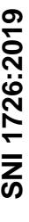

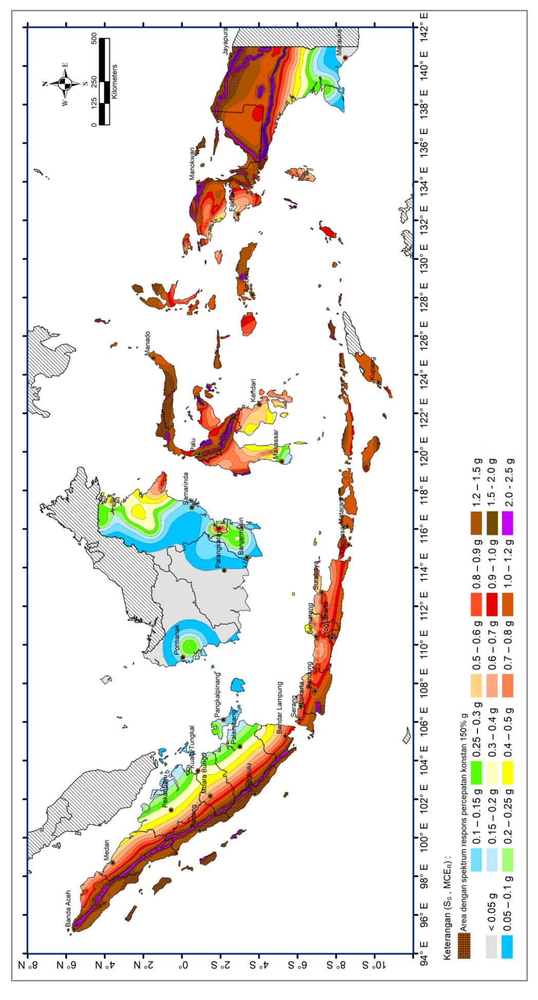

**Gambar 15 – Parameter gerak tanah** *Ss***, gempa maksium yang dipertimbangkan risiko-tertarget (MCER) wilayah Indonesia untuk spektrum respons 0,2-detik (redaman kritis 5 %)**

**© BSN 2019 233 dari 238**

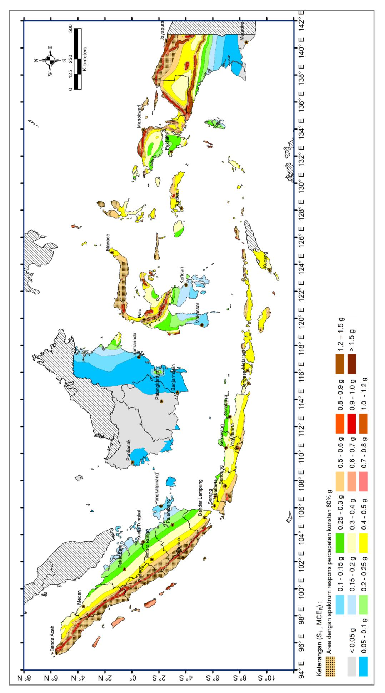

**Gambar 16 – Parameter gerak tanah,** *S1***, gempa maksimum yang dipertimbangkan risiko-tertarget (MCER) wilayah Indonesia untuk spektrum respons 0,2- detik (redaman kritis 5 %)**

**© BSN 2019 234 dari 238**


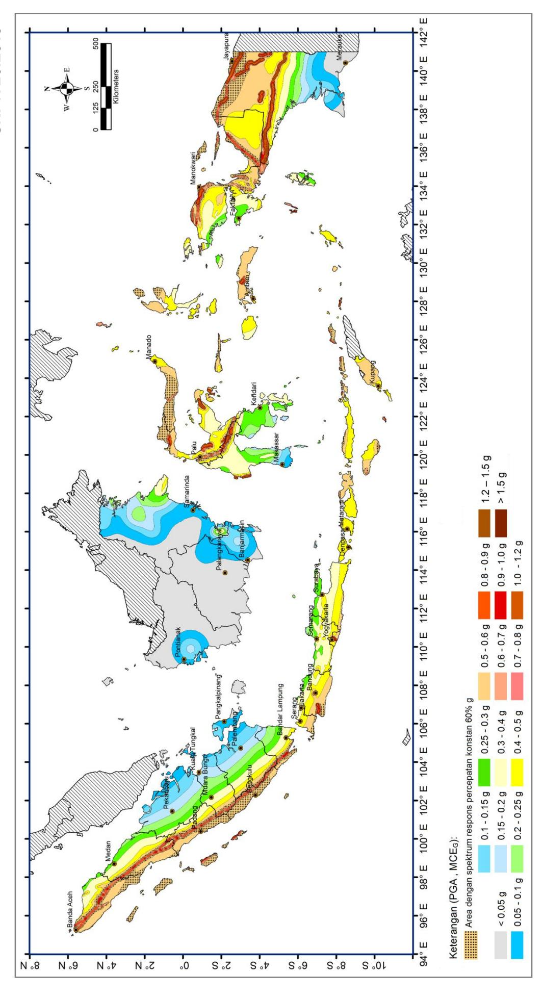

**Gambar 17 – PGA. Gempa maksimum yang dipertimbangkan rata-rata geometrik (MCEG) wilayah Indonesia**

**© BSN 2019 235 dari 238**

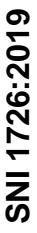

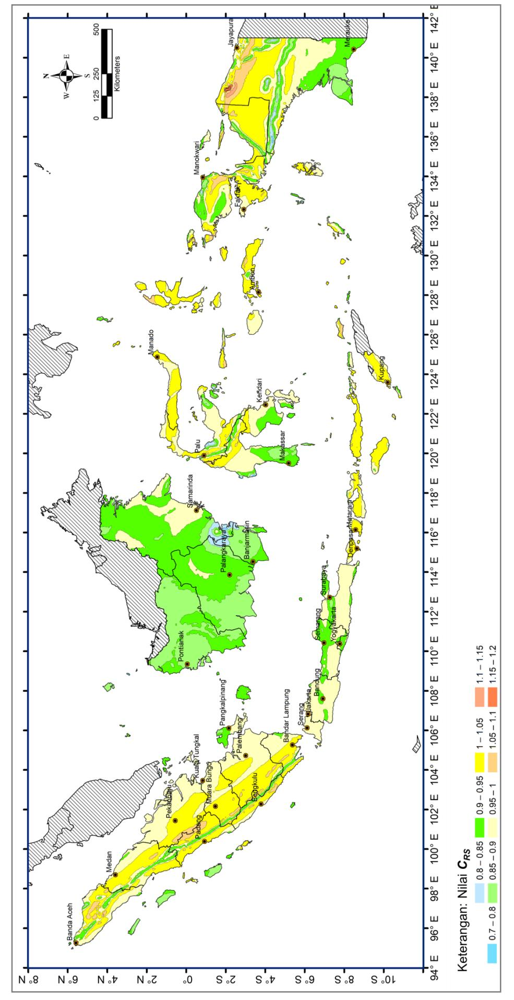

**Gambar 18 –** *CRS***, Koefisien risiko terpetakan, periode spektrum respons 0,2-detik**

**© BSN 2019 236 dari 238**

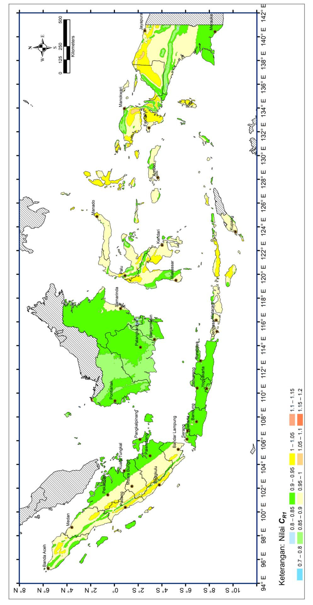

**Gambar 19 –** *CR1***, Koefisien risiko terpetakan, periode respons spektral 1 detik**

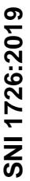

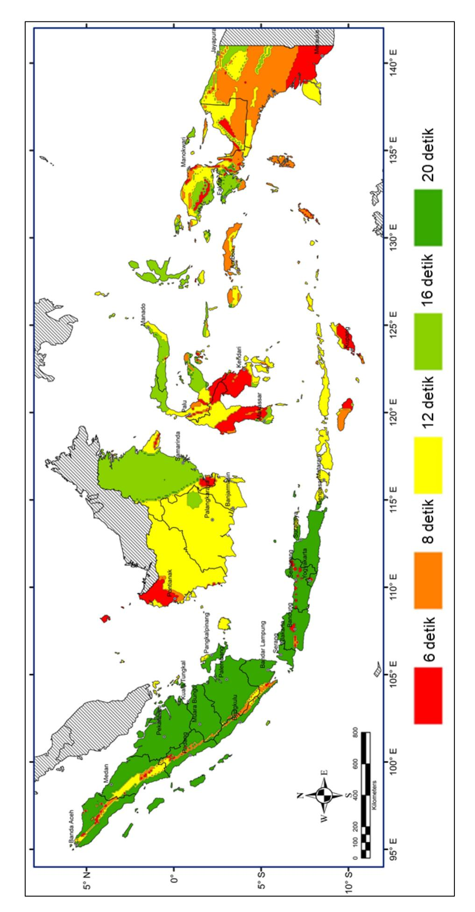

**Gambar 20 – Peta transisi periode panjang,** *TL***, wilayah Indonesia** 

#### **Informasi pendukung terkait perumus standar**

#### **[1] Komite Teknis/Subkomite Teknis perumus SNI**

Subkomite Teknis 91-01-S4 Bahan, Sains, Struktur dan Konstruksi Bangunan.

#### **[2] Susunan keanggotaan Komite Teknis/Subkomite Teknis perumus SNI**

Ketua : Prof. Dr. Ir. Arief Sabaruddin, CES

Wakil Ketua : Ir. Lutfi Faizal

Sekretaris : Dany Cahyadi, S.T., M.T.

Anggota : 1. Ir. RG Eko Djuli Sasongko, M.M.

2. Prof. Dr. Ir. Suprapto, M.Sc., FPE., IPM. 3. Dr. Ir. Johannes Adhijoso Tjondro, M.Eng

4. Ir. Asriwiyanti Desiani, M.T.

5. Ir. Felisia Simarmata

6. Ir. Suradjin Sutjipto, MS

7. Dr. Ir. Hari Nugraha Nurjaman

8. Prof. Bambang Suryoatmono

#### **[3] Konseptor rancangan SNI**

#### **Koordinator Konseptor** *Sub-Structure* **dan** *Upper-Structure* **SNI 1726:2019**

| NO. | NAMA               | INSTANSI                              | POSISI          |
|-----|--------------------|---------------------------------------|-----------------|
| 1   | Prof. Dr. Ir. Gde  | Fakultas Teknik Sipil dan Lingkungan, | Koordinator Tim |
|     | Widiadnyana Merati | Institut Teknologi Bandung (ITB)      |                 |

#### **Konseptor** *Upper-Structure* **SNI 1726:2019**

| NO. | NAMA                                      | INSTANSI                                                                  | POSISI         |
|-----|-------------------------------------------|---------------------------------------------------------------------------|----------------|
| 1   | Prof. Ir. Iswandi Imran,<br>MA.Sc., Ph.D. | Fakultas Teknik Sipil dan Lingkungan,<br>Institut Teknologi Bandung (ITB) | Ketua Tim      |
| 2   | Erwin Lim, S.T., M.S.,<br>Ph.D            | Fakultas Teknik Sipil dan Lingkungan,<br>Institut Teknologi Bandung (ITB) | Sekretaris Tim |
| 3   | Ir. Steffie Tumilar,<br>M.Eng., MBA. IP-U | Himpunan Ahli Konstruksi Indonesia (HAKI)                                 | Anggota        |
| 4   | Ir. Sjahril Abdul<br>Rahim, M.Eng.        | Departemen Teknik Sipil, Fakultas Teknik,<br>Universitas Indonesia (UI)   | Anggota        |
| 5   | Ir. Indra Djati Sidi,<br>M.S., Ph.D.      | Fakultas Teknik Sipil dan Lingkungan,<br>Institut Teknologi Bandung (ITB) | Anggota        |
| 6   | Dr. Ir. Hanafiah, M.S.                    | Program Studi Teknik Sipil, Fakultas<br>Teknik, Universitas Sriwijaya     | Anggota        |
| 7   | Ir. Suradjin Sutjipto,<br>M.S.            | Fakultas Teknik Sipil dan Perencanaan,<br>Universitas Trisakti            | Anggota        |
| 8   | Ir. Made Suarjana,<br>M.Sc., Ph.D.        | Asosiasi Ahli Rekayasa Gempa Indonesia<br>(AARGI)                         | Anggota        |
| 9   | Ir. Sutadji Yuwasdiki,<br>Dipl E.Eng      | Puslitbang Perumahan dan Permukiman,<br>Kem. PUPR                         | Anggota        |
| 10  | Dr. Ing. Ir. Andreas<br>Triwiyono         | Universitas Gadjah Mada (UGM)                                             | Anggota        |

| NO. | NAMA                                           | INSTANSI                                                                           | POSISI  |
|-----|------------------------------------------------|------------------------------------------------------------------------------------|---------|
| 11  | Ir. R. Muslinang<br>Moestopo, MSEM,<br>Ph.D.   | Fakultas Teknik Sipil dan Lingkungan,<br>Institut Teknologi Bandung (ITB)          | Anggota |
| 12  | Ir. Faimun, M.Sc,<br>Ph.D.                     | Fakultas Teknik Sipil dan Lingkungan,<br>Institut Teknologi Sepuluh Nopember (ITS) | Anggota |
| 13  | Prof. Dr. Ir. Antonius,<br>M.T.                | Universitas Islam Sultan Agung Semarang                                            | Anggota |
| 14  | Ir. I Ketut Sudarsana,<br>Ph.D.                | Program Studi Teknik Sipil, Fakultas<br>Teknik, Universitas Udayana                | Anggota |
| 15  | Dr. –Ing Ediansjah<br>Zulkifli, S.T., M.T.     | Fakultas Teknik Sipil dan Lingkungan,<br>Institut Teknologi Bandung (ITB)          | Anggota |
| 16  | Ir. Rildova, M.T., Ph.D.                       | Asosiasi Ahli Rekayasa Gempa Indonesia<br>(AARGI)                                  | Anggota |
| 17  | Ir. Dyah Kusumastuti,<br>M.T., Ph.D.           | Asosiasi Ahli Rekayasa Gempa Indonesia<br>(AARGI)                                  | Anggota |
| 18  | Muhammad Rusli,<br>S.T., M.D.M.                | Puslitbang Perumahan dan Permukiman,<br>Kem.PUPR                                   | Anggota |
| 19  | Muhammad<br>Riyansyah, S.T., Ph.D.             | Fakultas Teknik Sipil dan Lingkungan,<br>Institut Teknologi Bandung (ITB)          | Anggota |
| 20  | Dr. Eng. Aris Aryanto,<br>S.T., M.T.           | Fakultas Teknik Sipil dan Lingkungan,<br>Institut Teknologi Bandung (ITB)          | Anggota |
| 21  | Ajun Hariono, S.T.,<br>MSc.Eng                 | Puslitbang Perumahan dan Permukiman,<br>Kem.PUPR                                   | Anggota |
| 22  | Ferri Eka Putra, S.T.,<br>M.D.M                | Puslitbang Perumahan dan Permukiman,<br>Kem.PUPR                                   | Anggota |
| 23  | Nick Alexander, M.Sc.                          | Himpunan Ahli Konstruksi Indonesia (HAKI)                                          | Anggota |
| 24  | Patria<br>Kusumaningrum, S.T.,<br>Ph.D.        | Fakultas Teknik Sipil dan Lingkungan,<br>Institut Teknologi Bandung (ITB)          | Anggota |
| 25  | Azhar Pangarso<br>Laksono, S.T.,<br>M.Eng.Sc   | Puslitbang Perumahan dan Permukiman,<br>Kem.PUPR                                   | Anggota |
| 26  | Prasanti Widyasih<br>Sarli, S.T., M.T., Ph.D.  | Fakultas Teknik Sipil dan Lingkungan,<br>Institut Teknologi Bandung (ITB)          | Anggota |
| 27  | Kurniawan Setiadi<br>Kamaruddin, S.T.,<br>M.T. | Fakultas Teknik Sipil dan Lingkungan,<br>Institut Teknologi Bandung (ITB)          | Anggota |

#### **Konseptor** *Sub-Structure* **SNI 1726:2019**

| NO. | NAMA                                     | INSTANSI                                                                  | POSISI         |
|-----|------------------------------------------|---------------------------------------------------------------------------|----------------|
| 1   | Prof. Ir. Masyhur<br>Irsyam, MSE., Ph.D. | Fakultas Teknik Sipil dan Lingkungan,<br>Institut Teknologi Bandung (ITB) | Ketua Tim      |
| 2   | Andhika Sahadewa,<br>S.T., MSE., Ph.D.   | Fakultas Teknik Sipil dan Lingkungan,<br>Institut Teknologi Bandung (ITB) | Sekretaris Tim |
| 3   | Dr. Ir. Windu Partono,<br>M.Sc.          | Jurusan Teknik Sipil, Universitas<br>Diponegoro                           | Anggota        |
| 4   | Ir. Bigman M.<br>Hutapea, M.Sc. Ph.D.    | Fakultas Teknik Sipil dan Lingkungan,<br>Institut Teknologi Bandung (ITB) | Anggota        |
| 5   | Ir. Sindhu Rudianto,<br>MSCE.            | Himpunan Ahli Teknik Tanah Indonesia<br>(HATTI)                           | Anggota        |
| 6   | Dr. Ir. Agus<br>Darmawan Adi             | Departemen Teknik Sipil, Fakultas Tekik,<br>Universitas Gadjah Mada (UGM) | Anggota        |

| NO. | NAMA                                           | INSTANSI                                                                                     | POSISI  |
|-----|------------------------------------------------|----------------------------------------------------------------------------------------------|---------|
| 7   | Prof. Dr. Ir. I Wayan<br>Sengara               | Asosiasi Ahli Rekayasa Gempa Indonesia<br>(AARGI)                                            | Anggota |
| 8   | Ir. Wahyu Wuryanti,<br>M.Sc.                   | Puslitbang Perumahan dan Permukiman,<br>Kem. PUPR                                            | Anggota |
| 9   | Dr. Ir. M. Asrurifak,<br>M.T.                  | Fakultas Teknik Sipil dan Lingkungan,<br>Institut Teknologi Bandung (ITB)                    | Anggota |
| 10  | Dr. Ir. Mohamad<br>Ridwan                      | Puslitbang Perumahan dan Permukiman,<br>Kem.PUPR                                             | Anggota |
| 11  | Ir. Simon Derta<br>Tarigan, M.T.               | Jurusan Teknik Sipil, Fakultas Teknik,<br>Universitas Katolik Santo Thomas<br>Sumatera Utara | Anggota |
| 12  | Prof. Ir. Widjojo Adi<br>Prakoso, M.Sc., Ph.D. | Departemen Teknik Sipil, Fakultas Teknik,<br>Universitas Indonesia (UI)                      | Anggota |
| 13  | Ir. Endra Susila,<br>M.Sc., Ph.D .             | Fakultas Teknik Sipil dan Lingkungan,<br>Institut Teknologi Bandung (ITB)                    | Anggota |
| 14  | Hendriyawan, S.T.,<br>M.T., Ph.D.              | Fakultas Teknik Sipil dan Lingkungan,<br>Institut Teknologi Bandung (ITB)                    | Anggota |
| 15  | Andri Mulia, S.T.,<br>M.Sc.                    | Himpunan Ahli Teknik Tanah Indonesia<br>(HATTI)                                              | Anggota |
| 16  | Daniel Hutabarat,<br>S.T., MSCE.               | UC Berkeley College Of Engineering<br>California                                             | Anggota |
| 17  | Reguel Mikhail, S.T.,<br>M.T.                  | Fakultas Teknik Sipil dan Lingkungan,<br>Institut Teknologi Bandung (ITB)                    | Anggota |

#### **Tim Kebijakan Revisi SNI 1726:2012**

| NO. | NAMA                                                     | INSTANSI                                                                                  | POSISI                                    |
|-----|----------------------------------------------------------|-------------------------------------------------------------------------------------------|-------------------------------------------|
| 1   | Prof. Ir. Bambang<br>Budiono, ME., Ph.D.                 | Fakultas Teknik Sipil dan Lingkungan,<br>Institut Teknologi Bandung (ITB)                 | Ketua Tim<br>Kebijakan Upper<br>Structure |
| 2   | Ir. F. X. Toha, MSCE.,<br>MSEM., Ph.D.                   | Fakultas Teknik Sipil dan Lingkungan,<br>Institut Teknologi Bandung (ITB)                 | Ketua Tim<br>Kebijakan Lower<br>Structure |
| 3   | Dr. Ir. Dradjat<br>Hoedajanto, M.Eng.,<br>IP-U           | Himpunan Ahli Konstruksi Indonesia (HAKI)                                                 | Anggota                                   |
| 4   | Prof. Ir. Benjamin<br>Lumantarna, M.Eng.,<br>Ph.D., IP-U | Fakultas Teknik Sipil dan Perencanaan,<br>Universitas Kristen Petra                       | Anggota                                   |
| 5   | Prof. Ir. Roesdiman<br>Soegiarso, M.Sc.,<br>Ph.D.        | Universitas Tarumanegara                                                                  | Anggota                                   |
| 6   | Prof. DrIng Harianto<br>Hardjasaputra                    | Jurusan Teknik Sipil, Fakultas Teknik,<br>Universitas Pelita Harapan                      | Anggota                                   |
| 7   | Prof. Ir. Widodo,<br>MSCE., Ph.D.                        | Fakultas Teknik Sipil dan Perencanaan,<br>Universitas Islam Indonesia (UII)<br>Yogyakarta | Anggota                                   |
| 8   | Prof. Paulus Pramono<br>Rahardjo, Ph.D.                  | Program Studi Teknik Sipil, Fakultas<br>Teknik, Universitas Katolik Parahyangan           | Anggota                                   |
| 9   | Prof. Ir. Adang<br>Surahman, M.Sc.,<br>Ph.D.             | Fakultas Teknik Sipil dan Lingkungan,<br>Institut Teknologi Bandung (ITB)                 | Anggota                                   |
| 10  | Prof. Ir. Bambang<br>Suhendro, M.Sc., Ph.D.              | Departemen Teknik Sipil, Fakultas Tekik,<br>Universitas Gadjah Mada (UGM)                 | Anggota                                   |
| 11  | Ir. Davy Sukamta, IP-U                                   | Himpunan Ahli Konstruksi Indonesia (HAKI)                                                 | Anggota                                   |

| NO. | NAMA                                    | INSTANSI                                                                           | POSISI  |
|-----|-----------------------------------------|------------------------------------------------------------------------------------|---------|
| 12  | Prof. Ir. Priyo Suprobo,<br>M.S., Ph.D. | Fakultas Teknik Sipil dan Lingkungan,<br>Institut Teknologi Sepuluh Nopember (ITS) | Anggota |
| 13  | Prof. Dr. Ir. I Wayan<br>Redana, MA.Sc. | Program Studi Teknik Sipil, Fakultas<br>Teknik, Universitas Udayana                | Anggota |
| 14  | Dr. Eng Ir. Febrin Anas<br>Ismail, M.T. | Jurusan Teknik Sipil, Fakultas Teknik,<br>Universitas Andalas                      | Anggota |
| 15  | Ir. Dayu Apoji, M.Sc.                   | Fakultas Teknik Sipil dan Lingkungan,<br>Institut Teknologi Bandung (ITB)          | Anggota |

#### **[4] Sekretariat pengelola Komite Teknis/Subkomite Teknis perumus SNI**

Pusat Penelitian dan Pengembangan Perumahan dan Permukiman, Badan Penelitian dan Pengembangan, Kementerian Pekerjaan Umum dan Perumahan Rakyat.