**Persyaratan perancangan geoteknik** 

#### **© BSN 2017**

**Hak cipta dilindungi undang-undang. Dilarang mengumumkan dan memperbanyak sebagian atau seluruh isi dokumen ini dengan cara dan dalam bentuk apapun serta dilarang mendistribusikan dokumen ini baik secara elektronik maupun tercetak tanpa izin tertulis dari BSN** 

**BSN** 

**Email: dokinfo@bsn.go.id**

**www.bsn.go.id**

**Diterbitkan di Jakarta**

# Daftar isi

| Daft  | ar isi                                                        | i           |
|-------|---------------------------------------------------------------|-------------|
| Prak  | kata                                                          | xv          |
| Pen   | dahuluan                                                      | <b>xv</b> i |
| 1     | Ruang lingkup                                                 | 1           |
| 2     | Acuan normatif                                                | 1           |
| 3     | Istilah dan definisi                                          | 5           |
| 4     | Persyaratan umum                                              | 13          |
| 4.1 F | Persyaratan umum perancangan                                  | 13          |
| 4.2 F | Persyaratan umum durabilitas material                         | 16          |
| 4.3 I | Persyaratan umum perhitungan dalam perancangan                | 16          |
| 4.3.  | 1 Persyaratan umum gaya-gaya yang bekerja                     | 16          |
| 4.3.2 | 2 Persyaratan umum sifat-sifat tanah                          | 17          |
| 4.3.3 | 3 Persyaratan umum data geometrik                             | 18          |
| 4.4   | Persyaratan umum laporan perancangan geoteknik                | 18          |
| 5     | Data geoteknik                                                | 19          |
| 5.1 I | Ruang lingkup data geoteknik                                  | 19          |
| 5.2 I | Perancangan penyelidikan geoteknik                            | 19          |
| 5.2.  | 1 Informasi geoteknik                                         | 19          |
| 5.2.2 | 2 Penyelidikan tanah                                          | 20          |
| 5.2.3 | 3 Penyelidikan awal                                           | 21          |
| 5.2.4 | 4 Penyelidikan tahap perancangan                              | 21          |
| 5.2.  | 5 Pemeriksaan kesesuaian hasil penyelidikan selama konstruksi | 36          |
| 5.3 I | Pengambilan contoh tanah, batuan dan air tanah                | 36          |
| 5.3.  | 1 Umum                                                        | 36          |
| 5.3.2 | Pengambilan contoh tanah atau batuan dengan pengeboran        | 36          |
| 5.3.3 | 3 Pengambilan contoh tanah atau batuan dengan galian          | 36          |
| 5.3.4 | 4 Pengambilan contoh tanah                                    | 37          |
| 5.3.  | 5 Pengambilan contoh batuan                                   | 38          |
| 5.3.  | 1 Perancangan dan pelaksanaan pengukuran                      | 40          |
| 5.3.2 | 2 Evaluasi hasil pengukuran muka air tanah                    | 41          |
| 5.4 l | Uji lapangan pada tanah dan batuan                            | 41          |
| 5.4.  | 1 Umum                                                        | 41          |
| 5.4.2 | 2 Uji penetrasi standar (Standard Penetration Test, SPT)      | 43          |
| 5.4.3 | 3 Uji sondir (CPT, CPTU, CPTM)                                | 43          |
| 5.4.4 | 4 Uji Pressuremeter (PMT)                                     | 43          |
| 5.4.  | 5 Uji dilatometer datar ( <i>Flat Dilatometer Test</i> , DMT) | 44          |

| 5.4.6      | Uji geser baling lapangan (Field Vane shear Test, FVT) 44             |  |
|------------|-----------------------------------------------------------------------|--|
| 5.4.7      | Uji pembebanan pelat (Plate Loading Test, PLT) 44                     |  |
| 5.4.8      | Uji pendugaan dinamis (Dynamic Probing Test, DP) 44                   |  |
| 5.5        | Uji laboratorium pada tanah 44                                        |  |
| 5.5.1      | Umum 44                                                               |  |
| 5.5.2      | Persiapan contoh uji tanah 45                                         |  |
| 5.5.3      | Uji klasifikasi, identifikasi dan deskripsi tanah 46                  |  |
| 5.5.4      | Uji kimia dan kandungan organik tanah dan air tanah 48                |  |
| 5.5.5      | Uji indeks kekuatan tanah 50                                          |  |
| 5.5.6      | Uji kompresibilitas dan deformasi tanah 51                            |  |
| 5.5.7      | Uji pemadatan tanah 53                                                |  |
| 5.5.8      | Uji permeabilitas tanah 53                                            |  |
| 5.6        | Uji laboratorium pada batuan 54                                       |  |
| 5.6.1      | Persiapan contoh uji batuan 54                                        |  |
| 5.6.2      | Uji klasifikasi batuan 55                                             |  |
| 5.6.3      | Uji pengembangan (swelling test) material batuan 57                   |  |
| 5.6.4      | Pengujian kekuatan material batuan 58                                 |  |
| 5.7        | Laporan penyelidikan tanah 62                                         |  |
| 5.7.1      | Umum 62                                                               |  |
| 5.7.2      | Penyampaian informasi geoteknik 62                                    |  |
| 5.7.3      | Evaluasi informasi geoteknik 63                                       |  |
| 5.7.4      | Penentuan nilai parameter 64                                          |  |
| 6          | Perbaikan tanah 64                                                    |  |
| 6.1        | Ruang lingkup perbaikan tanah 64                                      |  |
| 6.2        | Kriteria kebutuhan perancangan perbaikan tanah 64                     |  |
| 6.3        | Penyelidikan geoteknik pendahuluan untuk pekerjaan perbaikan tanah 65 |  |
| 6.4        | Kriteria penentuan jenis perbaikan tanah 66                           |  |
| 6.5        | Penyuntikan semen (grouting) 67                                       |  |
| 6.5.1      | Ruang lingkup pekerjaan penyuntikan semen 67                          |  |
| 6.5.2      | Persyaratan teknis 67                                                 |  |
| 6.5.3      | Penyelidikan lapangan khusus untuk pekerjaan penyuntikan semen 69     |  |
| 6.5.4      | Persyaratan material dan produk 70                                    |  |
| 6.5.5      | Pengambilan contoh dan pengujian 71                                   |  |
| 6.5.6      | Pertimbangan lain dalam perancangan 71                                |  |
| 6.6 Jet | grouting 74                                                           |  |
| 6.6.1      | Ruang lingkup pekerjaan jet grouting 74                               |  |
| 6.6.2      | Metode jet grouting 74                                                |  |

| 6.6.3               | Struktur hasil jet grouting 76                                                   |  |
|---------------------|----------------------------------------------------------------------------------|--|
| 6.6.4               | Parameter jet grouting 77                                                        |  |
| 6.6.5               | Data khusus 77                                                                   |  |
| 6.6.6               | Perancangan 78                                                                   |  |
| 6.6.7               | Penyelidikan geoteknik untuk pekerjaan jet grouting 78                           |  |
| 6.6.8               | Persyaratan material dan produk 79                                               |  |
| 6.6.9               | Pertimbangan lain dalam perancangan 80                                           |  |
| 6.7                 | Deep mixing 84                                                                   |  |
| 6.7.1               | Ruang lingkup pekerjaan deep mixing 84                                           |  |
| 6.7.2               | Informasi yang diperlukan untuk pelaksanaan pekerjaan 85                         |  |
| 6.7.3               | Penyelidikan geoteknik 86                                                        |  |
| 6.7.4               | Persyaratan material dan produk 87                                               |  |
| 6.7.5               | Pertimbangan lain dalam perancangan 87                                           |  |
| 6.8                 | Pemadatan dalam (deep compaction) 95                                             |  |
| 6.8.1               | Ruang lingkup pekerjaan pemadatan dalam 95                                       |  |
| 6.8.2               | Informasi yang diperlukan untuk perancangan dan pelaksanaan pekerjaan 95         |  |
| 6.8.3               | Penyelidikan geoteknik untuk pekerjaan pemadatan dalam 96                        |  |
| 6.8.4               | Persyaratan material dan produk 97                                               |  |
| 6.8.5               | Pertimbangan lain dalam perancangan 98                                           |  |
| 6.9                 | Prefabricated Vertical Drain (PVD) 104                                           |  |
| 6.9.1               | Ruang lingkup pekerjaan Prefabricated Vertical Drain (PVD) 104                   |  |
| 6.9.2               | Informasi yang diperlukan untuk perancangan dan pelaksanaan pekerjaan 104        |  |
| 6.9.3               | Penyelidikan geoteknik untuk pekerjaan PVD 106                                   |  |
| 6.9.4               | Persyaratan material 107                                                         |  |
| 6.9.5               | Kriteria perancangan 112                                                         |  |
| 6.9.6               | Pertimbangan lain dalam perancangan 112                                          |  |
| 6.10 115         | Prefabricated Vertical Drain (PVD) dengan metode hampa udara (vacuum preloading) |  |
| 6.10.1 udara 115 | Ruang lingkup pekerjaan Prefabricated Vertical Drain (PVD) dengan metode hampa   |  |
| 6.10.2              | Aplikasi 116                                                                     |  |
| 6.10.3              | Material dan peralatan 116                                                       |  |
| 6.10.4              | Proses pekerjaan 116                                                             |  |
| 6.10.5              | Kriteria perancangan 118                                                         |  |
| 6.10.6              | Informasi yang diperlukan untuk perancangan pekerjaan 118                        |  |
| 6.10.7              | Hasil perancangan 118                                                            |  |
| 6.10.8              | Penyelidikan geoteknik untuk pekerjaan PVD dengan vakum 120                      |  |
| 6.10.9              | Persyaratan material dan pemasangan 121                                          |  |

| 6.10.10 | Pertimbangan lain dalam perancangan 125                                      |  |
|---------|------------------------------------------------------------------------------|--|
| 7       | Stabilitas lereng galian dan timbunan 126                                    |  |
| 7.1     | Ruang lingkup stabilitas lereng galian dan timbunan 126                      |  |
| 7.2     | Deskripsi 126                                                                |  |
| 7.3     | Aplikasi 126                                                                 |  |
| 7.3.1   | Lereng alam 126                                                              |  |
| 7.3.2   | Lereng buatan manusia 127                                                    |  |
| 7.4     | Data yang diperlukan untuk perancangan lereng 128                            |  |
| 7.4.1   | Data topografi 128                                                           |  |
| 7.4.2   | Data geologi teknik 128                                                      |  |
| 7.4.3   | Data penyelidikan tanah dan batuan untuk stabilitas lereng 129               |  |
| 7.5     | Kriteria perancangan lereng 132                                              |  |
| 7.5.1   | Kriteria pembebanan 132                                                      |  |
| 7.5.2   | Kriteria loading dan unloading (stress history) 133                       |  |
| 7.5.3   | Kriteria umur rencana 133                                                    |  |
| 7.5.4   | Kriteria deformasi 133                                                       |  |
| 7.5.5   | Kriteria faktor keamanan 134                                                 |  |
| 7.6     | Analisis lereng tanah 134                                                    |  |
| 7.6.1   | Metode empirik dan grafis 135                                                |  |
| 7.6.2   | Metode analitis/numerik 135                                                  |  |
| 7.6.3   | Analisis lereng yang berpotensi mengalami likuifaksi 136                     |  |
| 7.6.4   | Analisis aliran debris 136                                                   |  |
| 7.6.5   | Analisis penurunan dan deformasi lereng timbunan 136                         |  |
| 7.7     | Analisis stabilitas lereng batuan 136                                        |  |
| 7.7.1   | Penentuan parameter untuk analisis lereng batuan 137                         |  |
| 7.7.2   | Analisis stabilitas lereng batuan 137                                        |  |
| 7.8     | Perancangan instrumentasi untuk keamanan lereng 138                          |  |
| 7.8.1   | Jenis-jenis instrumentasi monitoring lereng 138                              |  |
| 7.8.2   | Pemilihan jenis instrumentasi 139                                            |  |
| 7.8.3   | Persyaratan minimum instrumentasi geoteknik untuk keamanan lereng 139        |  |
| 7.8.4   | Monitoring dan pelaporan (termasuk interpretasi, analisis, dan evaluasi) 139 |  |
| 8       | Terowongan 139                                                               |  |
| 8.1     | Ruang lingkup pekerjaan terowongan 139                                       |  |
| 8.2     | Persyaratan perancangan terowongan pegunungan/batuan 141                     |  |
| 8.2.1   | Persyaratan perancangan 141                                                  |  |
| 8.2.2   | Prosedur perancangan 141                                                     |  |
| 8.2.3   | Kondisi perancangan 142                                                      |  |

| 8.2.4  | Metode perancangan 143                                                      |  |
|--------|-----------------------------------------------------------------------------|--|
| 8.2.5  | Penyelidikan batuan 143                                                     |  |
| 8.2.6  | Persyaratan area portal dan portal 144                                      |  |
| 8.2.7  | Persyaratan penggalian 145                                                  |  |
| 8.2.8  | Persyaratan perkuatan 146                                                   |  |
| 8.2.9  | Persyaratan dinding terowongan 152                                          |  |
| 8.2.10 | Persyaratan sistem kedap air (water proofing) dan drainase 152              |  |
| 8.2.11 | Pengaruh konstruksi struktur yang berdekatan 154                            |  |
| 8.3    | Persyaratan perancangan terowongan perisai 154                              |  |
| 8.3.1  | Persyaratan perancangan 154                                                 |  |
| 8.3.2  | Kondisi perancangan 155                                                     |  |
| 8.3.3  | Fasilitas tambahan pada terowongan perisai 160                              |  |
| 8.3.4  | Metode-metode tambahan lainnya 160                                          |  |
| 8.3.5  | Perlindungan lingkungan 161                                                 |  |
| 8.3.6  | Pengamatan, pengukuran, dan pencatatan pekerjaan 161                        |  |
| 8.4    | Persyaratan perancangan terowongan lintas bawah (metode gali-dan-tutup) 161 |  |
| 8.4.1  | Penyelidikan 161                                                            |  |
| 8.4.2  | Dasar-dasar perancangan 164                                                 |  |
| 8.4.3  | Prosedur perancangan 167                                                    |  |
| 8.5    | Pertimbangan lain dalam perancangan 169                                     |  |
| 8.5.1  | Perancangan pemantauan dan pengukuran 170                                   |  |
| 8.5.2  | Jenis-jenis pemantauan dan pengukuran 171                                   |  |
| 8.5.3  | Posisi pemantauan dan pengukuran 172                                        |  |
| 8.5.4  | Frekuensi pemantauan dan pengukuran 174                                     |  |
| 8.5.5  | Pelaksanaan pemantauan dan pengukuran 175                                   |  |
| 8.5.6  | Evaluasi hasil pemantauan dan pengukuran 175                                |  |
| 9      | Fondasi 175                                                                 |  |
| 9.1    | Ruang lingkup pekerjaan fondasi 175                                         |  |
| 9.2    | Persyaratan perancangan fondasi 175                                         |  |
| 9.2.1  | Persyaratan dasar 175                                                       |  |
| 9.2.2  | Karakteristik tanah 175                                                     |  |
| 9.2.3  | Daya dukung izin 175                                                        |  |
| 9.2.4  | Penurunan 177                                                               |  |
| 9.3    | Persyaratan struktur 178                                                    |  |
| 9.3.1  | Beban pada fondasi 178                                                      |  |
| 9.3.2  | Kekuatan struktur dan kemampulayanan 178                                    |  |
| 9.3.3  | Ketahanan terhadap geser, pengangkatan, dan guling 179                      |  |

| 9.3.4  | Ketahanan terhadap buoyancy 179                                                              |  |
|--------|----------------------------------------------------------------------------------------------|--|
| 9.4    | Kriteria laporan perancangan fondasi 179                                                     |  |
| 9.4.1  | Laporan analisis perancangan fondasi 179                                                     |  |
| 9.4.2  | Laporan perancangan fondasi dangkal 180                                                      |  |
| 9.4.3  | Laporan perancangan fondasi rakit 180                                                        |  |
| 9.4.4  | Laporan perancangan fondasi tiang 180                                                        |  |
| 9.4.5  | Laporan perancangan sistem fondasi yang merupakan gabungan antara fondasi tiang-rakit 181 |  |
| 9.4.6  | Laporan penyelidikan lapangan 181                                                            |  |
| 9.5    | Survei lapangan 182                                                                          |  |
| 9.5.1  | Umum 182                                                                                     |  |
| 9.5.2  | Survei lapangan 182                                                                          |  |
| 9.5.3  | Penyelidikan tanah 182                                                                       |  |
| 9.6    | Fondasi dangkal 183                                                                          |  |
| 9.7    | Fondasi tiang 184                                                                            |  |
| 9.7.1  | Umum 184                                                                                     |  |
| 9.7.2  | Daya dukung tiang tunggal 186                                                                |  |
| 9.7.3  | Beban lateral 187                                                                            |  |
| 9.7.4  | Tipe tiang 187                                                                               |  |
| 9.8    | Uji fondasi tiang (pembebanan dan integritas) 187                                            |  |
| 9.8.1  | Uji pembebanan aksial tekan pada fondasi tiang 188                                           |  |
| 9.8.2  | Uji pembebanan aksial tarik pada fondasi tiang 189                                           |  |
| 9.8.3  | Uji pembebanan horizontal/lateral pada fondasi tiang 189                                     |  |
| 9.8.4  | Uji pembebanan dinamik (Pile Driving Analyzer, PDA) pada fondasi tiang 190                   |  |
| 9.8.5  | Uji integritas tiang pada fondasi tiang 190                                                  |  |
| 9.8.6  | Uji integritas metode Sonic Echo (Pile Integrity Test, PIT) pada fondasi tiang 191           |  |
| 10     | Struktur penahan tanah 191                                                                   |  |
| 10.1   | Ruang lingkup pekerjaan struktur penahan tanah 191                                           |  |
| 10.2   | Dinding penahan tanah 191                                                                    |  |
| 10.2.1 | Ruang lingkup pekerjaan dinding penahan tanah 191                                            |  |
| 10.2.2 | Deskripsi 191                                                                                |  |
| 10.2.3 | Aplikasi 191                                                                                 |  |
| 10.2.4 | Tipe dinding penahan tanah 192                                                               |  |
| 10.2.5 | Persyaratan teknis dinding penahan 193                                                       |  |
| 10.2.6 | Sistem drainase 194                                                                          |  |
| 10.2.7 | Sambungan lepas (expansion joint) dan sambungan kontraksi (contraction joint) 195            |  |
| 10.2.8 | Verifikasi perancangan melalui monitoring defleksi/pergerakan dinding 196                    |  |
| 10.3   | Embedded walls 197                                                                           |  |

| 10.3.1 | Ruang lingkup pekerjaan embedded walls                                                                 | 197 |
|--------|--------------------------------------------------------------------------------------------------------|-----|
| 10.3.2 | Deskripsi                                                                                              | 197 |
| 10.3.3 | Jenis embedded walls                                                                                   | 198 |
| 10.3.4 | Aplikasi                                                                                               | 200 |
| 10.3.5 | Persyaratan teknis <i>embedded walls</i>                                                               | 201 |
| 10.3.6 | Dasar analisis dan perancangan                                                                         | 205 |
| 10.3.7 | Berbagai moda keruntuhan/kegagalan dinding                                                             | 211 |
| 10.3.8 | Toleransi penurunan muka air tanah dan toleransi defleksi dinding                                      | 213 |
|        | Verifikasi perancangan: monitoring pergerakan dinding, tanah di sekitar galian, ınan muka air tanah |     |
| 10.4   | Soil nailing                                                                                           | 215 |
| 10.4.1 | Ruang lingkup pekerjaan soil nailing                                                                   | 215 |
| 10.4.2 | Deskripsi                                                                                              | 215 |
| 10.4.3 | Pertimbangan lain dalam perancangan                                                                    | 215 |
| 10.4.4 | Persyaratan teknis soil nailing                                                                        | 217 |
| 10.4.5 | Analisis dan perancangan dinding soil nailing                                                          | 221 |
| 10.4.6 | Verifikasi perancangan                                                                                 | 229 |
| 10.5   | Dinding MSE (MSE walls)                                                                                | 232 |
| 10.5.1 | Ruang lingkup pekerjaan dinding MSE                                                                    | 232 |
| 10.5.2 | Deskripsi                                                                                              | 232 |
| 10.5.3 | Aplikasi                                                                                               | 233 |
| 10.5.4 | Persyaratan teknis                                                                                     | 233 |
| 10.5.5 | Dasar perancangan                                                                                      | 237 |
| 10.5.6 | Sistem drainase                                                                                        | 244 |
| 10.5.7 | Kriteria penerimaan dinding MSE                                                                        | 244 |
| 10.5.8 | Verifikasi perancangan                                                                                 | 245 |
| 10.6   | Angkur tanah <i>(ground anchors)</i>                                                                   | 246 |
| 10.6.1 | Ruang lingkup pekerjaan angkur tanah                                                                   | 246 |
| 10.6.2 | Deskripsi                                                                                              | 246 |
| 10.6.3 | Persyaratan teknis                                                                                     | 247 |
| 10.6.4 | Perancangan angkur tanah                                                                               | 249 |
| 10.6.5 | Kriteria penerimaan                                                                                    | 254 |
| 10.6.6 | Verifikasi perancangan                                                                                 | 256 |
| 10.6.7 | Uji kesesuaian dan uji penerimaan pada angkur produksi                                                 | 257 |
| 11 Ga  | alian Dalam                                                                                            | 259 |
| 11.1   | Ruang lingkup pekerjaan Galian Dalam                                                                   | 259 |
| 11.2   | Persyaratan teknis perancangan Galian Dalam                                                            | 259 |
| 11.3   | Kontruksi galian terbuka                                                                               | 260 |

| 11.4        | Kontruksi dinding penahan tanah 260                                                               |  |
|-------------|---------------------------------------------------------------------------------------------------|--|
| 11.4.1      | Tekanan tanah kondisi statik 261                                                                  |  |
| 11.4.2      | Tekanan tanah kondisi dinamik 262                                                                 |  |
| 11.5        | Penurunan permukaan tanah di sekitar galian 262                                                   |  |
| 11.6        | Instrumentasi dan monitoring 263                                                                  |  |
| 12          | Kegempaan 263                                                                                     |  |
| 12.1        | Ruang lingkup kegempaan 263                                                                       |  |
| 12.2        | Persyaratan teknis perancangan kegempaan 263                                                      |  |
| 12.2.1      | Persyaratan ketahanan gempa 263                                                                   |  |
| 12.2.2      | Persyaratan spektrum respons desain 266                                                           |  |
| 12.2.3      | Persyaratan spektrum respons desain berdasarkan evaluasi spesifik-situs 273                       |  |
| 12.2.4      | Persyaratan desain gempa pada fondasi 275                                                         |  |
| 12.2.5      | Persyaratan gempa untuk dinding penahan 277                                                       |  |
| 12.2.6      | Persyaratan gempa untuk bendungan 278                                                             |  |
| 12.2.7      | Persyaratan gempa untuk lereng 278                                                                |  |
| 12.2.8      | Persyaratan gempa untuk struktur tertanam (buried structure) 279                                  |  |
| 13          | Keruntuhan hidraulik 279                                                                          |  |
| 13.1        | Ruang lingkup keruntuhan hidraulik 279                                                            |  |
| 13.2        | Keruntuhan akibat gaya uplift 280                                                                 |  |
| 13.3        | Keruntuhan dasar galian akibat boiling 282                                                        |  |
| 13.4        | Erosi tubuh 283                                                                                   |  |
| 13.4.1      | Erosi hilir (backward erosion) 283                                                                |  |
| 13.4.2      | Sufosi (suffosion) 284                                                                            |  |
| 13.4.3      | Keruntuhan hidraulik akibat tanah dispersif (dispersive soils) 285                                |  |
| 13.5        | Keruntuhan hidraulik oleh erosi pada fondasi bangunan 285                                         |  |
| 13.5.1      | Keruntuhan hidraulik pada fondasi bendungan urugan tanah dan tanggul 285                          |  |
| 13.5.2      | Keruntuhan hidraulik pada bendungan beton 286                                                     |  |
| 13.6 288 | Erosi pada antarmuka timbunan dengan saluran tertutup yang melintang bendungan                    |  |
| 13.7        | Keruntuhan bendungan urugan batu (rock fill) akibat retak hidraulik (hydraulic fracturing) 289 |  |
| 13.7.1      | Faktor yang memengaruhi terjadinya retak hidraulik (hydraulic fracturing) 289                     |  |
| 13.7.2      | Perancangan bendungan urugan batu bebas retak hidraulik (hydraulic fracturing) . 290              |  |
| 13.8        | Desain bendungan urugan tanah dan tanggul untuk menghindarkan keruntuhan hidraulik 290         |  |
| 13.8.1      | Pemasangan filter dan drainase internal di dalam bendungan urugan tanah dan tanggul 290        |  |
| 13.8.2      | Batasan tinggi bendungan urugan tanah dan tanggul dan bentuk internal filter 290                  |  |

**© BSN 2017 viii** 

| 13.8.3 Penggunaan filter diafragma pada konstruksi saluran tertutup melintang bendungan 293                 |  |
|-------------------------------------------------------------------------------------------------------------------|--|
| 13.8.4 Desain filter 294                                                                                       |  |
| Bibliografi 297                                                                                                   |  |
|                                                                                                                   |  |
| Tabel 1 - Ringkasan untuk penerapan metode penyelidikan lapangan 24                                               |  |
| Tabel 2 – Jumlah minimum penyelidikan tanah 25                                                                    |  |
| Tabel 3 – Kelas kualitas contoh tanah untuk uji laboratorium dan kategori pengambilan contoh tanah 30          |  |
| Tabel 4 – Persyaratan jumlah minimum benda uji yang disarankan 33                                                 |  |
| Tabel 5 – Uji klasifikasi tanah 34                                                                                |  |
| Tabel 6 – Uji laboratorium untuk penentuan parameter geoteknik 35                                                 |  |
| Tabel 7 – Pengujian klasifikasi, rekomendasi jumlah minimum contoh yang akan diuji dalam satu lapisan tanah 46 |  |
| Tabel 8 – Jumlah minimum pengujian untuk satu lapisan tanah pada uji oedometer dengan penambahan beban 52      |  |
| Tabel 9 – Jumlah minimum benda uji untuk uji permeabilitas pada satu lapisan tanah 54                             |  |
| Tabel 10 – Uji lapangan pendahuluan untuk pekerjaan perbaikan tanah 66                                            |  |
| Tabel 11 – Uji laboratorium pendahuluan untuk pekerjaan perbaikan tanah 66                                        |  |
| Tabel 12 - Rekomendasi daftar aktivitas perancangan jet grouting 78                                               |  |
| Tabel 13 – Bahan pengikat dan pengisi yang umum digunakan dalam deep mixing (BS EN 14679:2005) 93           |  |
| Tabel 14 – Parameter konstruksi (BS EN 14679:2005) 94                                                             |  |
| Tabel 15 - Gradasi bahan pengisi tipikal 98                                                                       |  |
| Tabel 16 - Kapasitas aliran minimum (BS EN 15237:2007) 109                                                        |  |
| Tabel 17 – Frekuensi pengujian untuk kontrol kualitas (BS EN 15237:2007) 110                                      |  |
| Tabel 18 – Kelas geotekstil untuk separator (AASHTO M-228-96) 122                                                 |  |
| Tabel 19 – Kelas geotekstil untuk separator (AASHTO M-228-96) 122                                                 |  |
| Tabel 20 – Sifat sifat, persyaratan dan metode pengujian 123                                                      |  |
| Tabel 21 – Uji lapangan untuk penyelidikan stabilitas lereng 129                                                  |  |
| Tabel 22 – Uji laboratorium untuk penyelidikan stabilitas lereng tanah 130                                        |  |
| Tabel 23 – Uji laboratorium untuk penyelidikan stabilitas lereng batuan 130                                       |  |
| Tabel 24 – Beban lalu lintas untuk analisis stabilitas (DPU, 2001) dan beban di luar jalan . 133                  |  |
| Tabel 25 - Nilai faktor keamanan untuk lereng tanah 134                                                           |  |
| Tabel 26 – Rekomendasi nilai faktor keamanan untuk lereng batuan 134                                              |  |
| Tabel 27 – Perbandingan tipe terowongan (JSCE, 2007) 140                                                          |  |
| Tabel 28 – Kriteria pemilihan jenis perkuatan terowongan 146                                                      |  |
| Tabel 29 – Jenis pola perkuatan terowongan berdasarkan klasifikasi batuan RMR (Bieniawski, 1989) 147           |  |

| Tabel 30 – Persyaratan minimum pola perkuatan untuk terowongan jalan (JSCE, 2007) 147                                        |    |
|------------------------------------------------------------------------------------------------------------------------------|----|
| Tabel 31 – Tipikal perubahan perkuatan selama tahap konstruksi (JSCE, 2007) 147                                              |    |
| Tabel 32 – Persyaratan kuat tekan minimum beton semprot untuk terowongan jalan 148                                           |    |
| Tabel 33 – Klasifikasi tipikal kerusakan berdasarkan kemiringan dan penurunan bangunan maksimum (CIRIA PR30, 1996) 159    |    |
| Tabel 34 – Konsep yang diterapkan ketika menggabungkan beban desain (JSCE, 2008) . 168                                       |    |
| Tabel 35 – Beban yang harus dievaluasi 168                                                                                   |    |
| Tabel 36 – Standar untuk material 169                                                                                        |    |
| Tabel 37 – Tipikal interval pengukuran penurunan mahkota dan konvergensi 173                                                 |    |
| Tabel 38 – Pedoman untuk pengukuran pergerakan permukaan dan tanah/batuan 174                                                |    |
| Tabel 39 – Variabel (ܐ		ࡴ(i dan C sebagai fungsi kondisi tanah (FHWA-NHI-14-007) 228                                     |    |
| Tabel 40 – Jadwal pembebanan dan pembacaan dial gauge 230                                                                    |    |
| Tabel 41 – Pergerakan nail izin pada uji creep 231                                                                           |    |
| Tabel 42 – Persyaratan terbenamnya penutup muka (FHWA, 2009) 234                                                             |    |
| Tabel 43 – Persyaratan material timbunan pada zona dengan perkuatan 237                                                      |    |
| Tabel 44 – Rangkuman faktor keamanan minimum untuk empat potensi kegagalan eksternal (diekstrak dari FHWA NHI 00 043) 238 |    |
| Tabel 45 – Batas perbedaan penurunan sebagai fungsi lebar celah sambungan 245                                                |    |
| Tabel 46 – Batas perbedaan penurunan untuk beberapa tipe penutup muka 245                                                    |    |
| Tabel 47 – Parameter monitoring dan instrumentasi yang dapat digunakan 246                                                   |    |
| Tabel 48 – Koefisien angkur, Ks (Canadian Foundation Engineering Manual) 253                                                 |    |
| Tabel 49 – Rekomendasi faktor keamanan minimum (BS 8081) 254                                                                 |    |
| Tabel 50 – Kriteria penerimaan untuk hubungan beban residual vs waktu (BS 8081) 256                                          |    |
| Tabel 51 – Batas maksimum deformasi lateral dinding 262                                                                      |    |
| Tabel 52 – Kriteria perancangan gempa berdasarkan peruntukan infrastuktur 264                                                |    |
| Tabel 53 - Klasifikasi situs (AASHTO, 2012) 267                                                                              |    |
| Tabel 54 - Parameter dan metode pengujian yang digunakan untuk mendapatkan parameter kelas situs 267                      |    |
| Tabel 55 - Faktor amplifikasi untuk PGA dan periode 0,2 detik (Fpga dan Fa) (AASHTO, 2012)269                                |    |
| Tabel 56 - Besarnya nilai faktor amplifikasi untuk periode 1 detik (Fv) (AASHTO, 2012) 269                                   |    |
| Tabel 57 – Prediksi sistem retakan (joint) pada batuan dari nilai Lugeon 288                                                 |    |
| Tabel 60 – Kriteria filter dari USBR (2011) dan FEMA (2011) 296                                                              |    |
| Tabel 61 – Batas gradasi filter untuk mencegah segregasi filter 296                                                          |    |
| Gambar 1 – Petunjuk dalamnya penyelidikan tanah                                                                              | 27 |
| Gambar 2 – Jenis-jenis metode perbaikan tanah                                                                                | 67 |
| Gambar 3 – Pipa penyuntikan semen dan packer                                                                              | 68 |
| Gambar 4 - Sistem pengaliran jet grouting (BS EN 12716:2001)                                                                 | 76 |

**© BSN 2017 x**

| Gambar 5 – Struktur hasil jet grouting (BS EN 12716:2001) 77                                                         |
|----------------------------------------------------------------------------------------------------------------------|
| Gambar 6 – Beberapa aplikasi jet grouting (BS EN 12716:2001 dan lainnya) 81                                          |
| Gambar 7 – Pola dan konfigurasi kolom-kolom deep mixing (BS-EN 1479:2005): 84                                        |
| Gambar 8 – Klasifikasi umum metode deep mixing (BS EN 14679-2005) 85                                                 |
| Gambar 9 – Beberapa aplikasi metode deep mixing (BS EN 14679:2005) 88                                                |
| Gambar 10 – Diagram alir proses perancangan dan pelaksanaan pekerjaan deep mixing (BS EN 14679-2005) 90           |
| Gambar 11 – Diagram alir proses detail iteratif perancangan deep mixing (BS EN 14679- 2005) 91                    |
| Gambar 12 – Skema perbaikan dengan PVD 113                                                                           |
| Gambar 13 – Diagram proses perancangan pekerjaan PVD 113                                                             |
| Gambar 14 – Skematik instrumentasi untuk monitoring kinerja PVD (dimodifikasi dari FHWA, 1986) 115                |
| Gambar 15 – Posisi titik bor untuk lereng dengan lebar daerah runtuh yang kecil 131                                  |
| Gambar 16 - Potongan A-A pada Gambar 15 131                                                                          |
| Gambar 17 – Posisi titik bor untuk lereng dengan lebar daerah runtuh yang besar 132                                  |
| Gambar 18 –Pola keruntuhan dan penetapan kuat batuan dalam analisis stabilitas lereng 137                            |
| Gambar 19 - Prosedur perancangan terowongan pegunungan/batuan 142                                                    |
| Gambar 20 - Tipikal area portal terowongan (JSCE, 2007) 145                                                          |
| Gambar 21 – Klasifikasi sistem pengunci untuk baut batuan (JSCE, 2007) 149                                           |
| Gambar 22 – Distribusi baut batuan pada profil melintang (JSCE, 2007) 150                                            |
| Gambar 23 – Distribusi baut batuan pada profil memanjang (JSCE, 2007) 150                                            |
| Gambar 24 - Variasi bentuk sistem penyangga baja (JSCE, 2007) 151                                                    |
| Gambar 25 - Bentuk dinding terowongan (JSCE, 2007) 152                                                               |
| Gambar 26 - Sistem kedap air dan drainase untuk terowongan jalan (JSCE, 2007) 153                                    |
| Gambar 27 - Sistem drainase terowongan jalan 154                                                                     |
| Gambar 28 - Penampang melintang prediksi penurunan di atas terowongan (FHWA-IF-05- 023) 160                       |
| Gambar 29 – Dasar penentuan ukuran penampang dalam 165                                                               |
| Gambar 30 - Tujuan dan peran pemantauan dan pengukuran 170                                                           |
| Gambar 31 – Susunan garis pengukuran penurunan mahkota/konvergensi (untuk lebar penggalian D sekitar 10 m)173     |
| Gambar 32 - Susunan berbagai instrumen (untuk lebar penggalian D = +10m) 173                                         |
| Gambar 33 – Pengukuran pergerakan permukaan dan contoh susunan titik-titik pengukuran pergerakan tanah/batuan 174 |
| Gambar 34 - Kurva penurunan-pembebanan untuk fondasi dangkal 177                                                     |
| Gambar 35 – Dimensi tipikal dinding penahan tanah 193                                                                |
| Gambar 36 – Sistem drainase pada dinding penahan tanah 195                                                           |
| Gambar 37 – Sambungan pada dinding penahan tanah: (a) sambungan lepas (b) sambungan kontraksi 196                 |

| Gambar 38 – Beberapa moda kegagalan dinding penahan tanah 197                                                                                                                                                                                                                                    |     |
|--------------------------------------------------------------------------------------------------------------------------------------------------------------------------------------------------------------------------------------------------------------------------------------------------|-----|
| Gambar 39 – Berbagai tipe embedded walls 199                                                                                                                                                                                                                                                     |     |
| Gambar 40 – Berbagai tipe sistem penunjang 200                                                                                                                                                                                                                                                   |     |
| Gambar 41 - Diagram alir perancangan embedded walls 206                                                                                                                                                                                                                                          |     |
| Gambar 42 – Diagram tekanan untuk free earth support dan fixed earth support 207                                                                                                                                                                                                                 |     |
| Gambar 43 - Ilustrasi beam column model 209                                                                                                                                                                                                                                                      |     |
| Gambar 44 – Berbagai moda kegagalan embedded walls 212                                                                                                                                                                                                                                           |     |
| Gambar 45 – Potongan tipikal dinding soil nailing dan detail sekitar kepala nail (FHWA0-IF 03-017) 215                                                                                                                                                                                        |     |
| Gambar 46 – Tipikal tahapan pelaksanaan dinding soil nailing (drilled and grouted soil nailing) (FHWA-NHI-14-007)                                                                                                                                                                             | 217 |
| Gambar 47 – Pola pemasangan nail bar : a) pola segi empat, b) pola segitiga (FHWA-NHI 14-007)                                                                                                                                                                                                 | 218 |
| Gambar 48 – Material pelengkap: a) centralizer (FHWA-NHI-14-007), b) nail bar dibungkus corrugated sheath pada soil nailing permanen (FHWA0-IF-03-017), c) corrugated sheath (BS 8006-2, 2011)                                                                                          | 219 |
| Gambar 49 – a) Stabilitas internal, b) Stabilitas global (FHWA-NHI-14-007)                                                                                                                                                                                                                       | 222 |
| Gambar 50 – a) Lokasi gaya tarik maksimum pada nail bar; b) Bidang gelincir potensial dan perubahan gaya tarik pada nail bar seiring dengan tahapan penggalian; c) Kondisi kritis saat galian di tengah, beton semprot dan nail bar belum terpasang, dan ada rembesan (FHWA NHI-14-007) | 223 |
| Gambar 51 – Pemeriksaaan pons pada dinding muka                                                                                                                                                                                                                                                  | 226 |
| Gambar 52 – Sistem drainase dan detail saluran tepi pembuang (FHWA-NHI-14-007)                                                                                                                                                                                                                   | 227 |
| Gambar 53 – Ilustrasi deformasi dinding soil nailing (FHWA-NHI-14-007)                                                                                                                                                                                                                           | 229 |
| Gambar 54 – Set up peralatan uji tarik pada nail bar (FHWA0-IF-03-017)                                                                                                                                                                                                                        | 230 |
| Gambar 55 – Lokasi pemasangan instrumentasi minimum                                                                                                                                                                                                                                              | 231 |
| Gambar 56 – Potongan tipikal dinding MSE (FHWA NHI-10-024)                                                                                                                                                                                                                                       | 232 |
| Gambar 57 – Ilustrasi persyaratan terbenamnya penutup muka (GEO Hongkong, 2002)                                                                                                                                                                                                                  | 234 |
| Gambar 58 – Pergerakan dinding MSE akibat penurunan konsolidasi tanah fondasi (GEO Hongkong, 2002)                                                                                                                                                                                            | 236 |
| Gambar 59 – Diagram alir perhitungan stabilitas eksternal 239                                                                                                                                                                                                                                    |     |
| Gambar 60 – Tekanan tanah untuk analisis stabilitas eksternal 240                                                                                                                                                                                                                                |     |
| Gambar 61 – Diagram alir perhitungan stabilitas internal 243                                                                                                                                                                                                                                     |     |
| Gambar 62 – Salah satu alternatif sistem drainase permukaan dan bawah permukaan (GEO Hongkong, 2002) 244                                                                                                                                                                                      |     |
| Gambar 63 – Sistem pengangkuran dan kepala angkur 247                                                                                                                                                                                                                                            |     |
| Gambar 64 - Salah satu contoh angkur tanah permanen dengan single corrugated sheet 249                                                                                                                                                                                                           |     |
| Gambar 65 – Persyaratan posisi fixed length (BS 8081) 250                                                                                                                                                                                                                                        |     |
| Gambar 66 – Diagram alir perancangan dan pelaksanaan angkur tanah 251                                                                                                                                                                                                                            |     |
| Gambar 67 – Kriteria perpanjangan elastik tendon (BS 8081) 255                                                                                                                                                                                                                                   |     |
| Gambar 68 – Prosedur pembebanan uji investigasi (BS 8081) 257                                                                                                                                                                                                                                    |     |

| Gambar 69 – Prosedur pembebanan uji kesesuaian (a) angkur permanen (b) angkur sementara (BS 8081) 258   |
|------------------------------------------------------------------------------------------------------------|
| Gambar 70 – Prosedur pembebanan uji penerimaan (a) angkur permanen (b) angkur sementara (BS 8081) 258   |
| Gambar 71 – Spektrum respons desain (SNI 1726:2012) 271                                                    |
| Gambar 72 - Spektrum respons desain, dibentuk menggunakan metode tiga titik (AASHTO, 2012) 271          |
| Gambar 73 – Diagram gaya metode Mononobe-Okabe (AASHTO, 2012) 277                                          |
| Gambar 74 – Contoh bangunan dengan uplift yang perlu diperiksa 281                                         |
| Gambar 75 – Keruntuhan pada fondasi bendungan beton oleh karena gaya apung 281                             |
| Gambar 76 – Contoh kondisi kemungkinan terjadinya boiling 282                                              |
| Gambar 77 – Ilustrasi keruntuhan hidraulik oleh erosi hilir 284                                            |
| Gambar 78 – Ilustrasi keruntuhan hidraulik oleh sufosi 284                                                 |
| Gambar 79 – Ilustrasi keruntuhan hidraulik oleh bahan timbunan yang dispersif 285                          |
| Gambar 80 – Ilustrasi keruntuhan hidraulik pada fondasi bendungan urugan batu dan tanggul 286           |
| Gambar 81 – Ilustrasi keruntuhan hidraulik pada fondasi bendungan yang dimulai dari tubuh bendungan 286 |
| Gambar 82 – Keruntuhan pada fondasi bandungan beton oleh karena erosi 287                                  |
| Gambar 83 – Ilustrasi curtain grouting dan blanket grouting 287                                            |
| Gambar 84 – Ilustrasi keruntuhan hidraulik pada interaksi timbunan dengan struktur saluran tertutup 288 |
| Gambar 85 – Sketsa retak hidraulik pada bendungan urugan batu 289                                          |
| Gambar 86 – Potongan melintang tipikal bendungan tanah homogen 291                                         |
| Gambar 87 – Potongan melintang tipikal bendungan tanah dengan toe drain 292                                |
| Gambar 88 – Potongan melintang tipikal bendungan tanah dengan drainase horizontal 292                      |
| Gambar 89 – Potongan melintang tipikal bendungan tanah dengan drainase vertikal dan horizontal 293      |
| Gambar 90 – Sketsa filter diafragma pada saluran tertutup melintang bendungan (Cooper, 2007) 294        |
| Gambar 91 – Dimensi filter diafragma pada saluran tertutup melintang bendungan 294                         |
| Gambar 92 – Zona filter bendungan urugan batu (Foster dan Fell, 2001) 295                                  |

**© BSN 2017 xiii** 

# **Prakata**

Standar Nasional Indonesia (SNI) Persyaratan perancangan geoteknik ini disusun melalui kerjasama penelitian dan pengembangan antara Badan Penelitian dan Pengembangan (Balitbang) Kementerian Pekerjaan Umum dan Perumahan Rakyat dan Himpunan Ahli Teknik Tanah Indonesia (HATTI).

Standar ini menetapkan persyaratan-persyaratan yang terkait langsung dengan perancangan geoteknik dan kegempaan suatu konstruksi. SNI ini merupakan acuan untuk para praktisi dalam perancangan geoteknik dan kegempaan untuk jalan, jembatan, bangunan air dan bangunan gedung.

Standar ini dipersiapkan oleh Komite Teknis 91-01 Bahan Konstruksi Bangunan dan Rekayasa Sipil pada Subkomite Teknis 91-01-S2 Rekayasa Jalan dan Jembatan melalui Gugus Kerja Geoteknik Jalan Pusat Litbang Jalan dan Jembatan, Kementerian Pekerjaan Umum dan Perumahan Rakyat.

Tata cara penulisan mengikuti Peraturan Kepala Badan Standardisasi Nasional No. 4 tahun 2016 dan dibahas dalam forum rapat konsensus yang diselenggarakan pada tanggal 6 Desember 2016 di Bandung oleh Subkomite Teknis, yang melibatkan para narasumber, pakar dan lembaga terkait.

Standar ini telah melalui tahap jajak pendapat pada tanggal 20 September 2017 sampai dengan 20 November 2017, , dengan hasil akhir disetujui menjadi SNI.

Untuk menghindari kesalahan dalam penggunaan dokumen dimaksud, disarankan bagi pengguna standar untuk menggunakan dokumen SNI yang dicetak dengan tinta berwarna.

Perlu diperhatikan bahwa kemungkinan beberapa unsur dari dokumen Standar ini dapat berupa hak paten. Badan Standardisasi Nasional tidak bertanggung jawab untuk pengidentifikasian salah satu atau seluruh hak paten yang ada.

**© BSN 2017 xv** 

# **Pendahuluan**

Persyaratan perancangan dibutuhkan pada setiap pekerjaan geoteknik dan kegempaan. Standar Nasional Indonesia (SNI) ini merupakan standar yang akan digunakan di Indonesia untuk menetapkan persyaratan-persyaratan perancangan untuk bidang geoteknik dan kegempaan pada bangunan gedung, bangunan air serta jalan dan jembatan.

Teknologi-teknologi yang diulas di dalam SNI ini adalah teknologi yang berkaitan dengan 9 bidang geoteknik dan kegempaan, yaitu stabilitas lereng dan timbunan, fondasi, terowongan, kegempaan, penyelidikan geoteknik, struktur penahan, perbaikan tanah dan keruntuhan hidraulik.

**© BSN 2017 xvi** 

# **Persyaratan Perancangan Geoteknik**

# **1 Ruang lingkup**

Standar ini menetapkan persyaratan perancangan geoteknik dan kegempaan untuk diaplikasikan pada pekerjaan-pekerjaan geoteknik di Indonesia. Persyaratan perancangan yang dimaksud dalam standar ini disusun untuk pekerjaan perbaikan tanah, stabilitas lereng galian dan timbunan, keruntuhan hidraulik, terowongan, fondasi, struktur penahan, galian dalam dan kegempaan. Standar ini juga menetapkan persyaratan data geoteknik yang digunakan di dalam perancangan.

Hal-hal yang terkait dengan pelaksanaan tidak termasuk ke dalam lingkup standar ini. Namun demikian pertimbangan konstruksi, monitoring dan supervisi yang berkaitan dengan perancangan dan perlu ditetapkan persyaratannya diatur di dalam standar ini.

Satuan yang digunakan di dalam standar ini dinyatakan dalam S.I.

# **2 Acuan normatif**

Dokumen referensi di bawah ini harus digunakan dan tidak dapat ditinggalkan untuk melaksanakan standar ini.

SNI 8064:2016. *Metode Analisis Stabilitas Statik Bendungan Tipe Urugan.*

SNI 8072:2016*, Cara Uji Pengukuran Potensi Keruntuhan Tanah di Laboratorium.* 

SNI 2455:2015, *Cara Uji Triaksial untuk Tanah dalam Keadaan Terkonsolidasi Tidak Terdrainase (Consolidated Undrainated/CU) dan Terkonsolidasi Terdrainase (Consolidated Drainated/CD).* 

SNI 4813:2015, *Cara Uji Triaksial untuk Tanah Kohesif dalam Keadaan Tidak Terkonsolidasi dan Tidak Terdrainase (UU).* 

SNI 4141:2015, *Metode uji gumpalan lempung dan butiran mudah pecah dalam agregat (ASTM C 142-04, IDT).* 

SNI 6371: 2015, *Tata Cara Pengklasifikasian Tanah untuk Keperluan Teknik dengan Sistem Klasifikasi Unifikasi Tanah* (ASTM D 2487-06, MOD).

SNI 1727:2013, *Beban Minimum untuk Perancangan Bangunan Gedung dan Stuktur Lain.*

SNI 1726:2012, *Standar Tata Cara Perencanaan Ketahanan Gempa untuk Struktur Bangunan Gedung dan Non Gendung.* 

SNI 1744:2012, *Panduan Pengujian CBR Laboratorium.*

SNI 2528:2012, *Tata Cara Pengukuran Geolistrik Wenner untuk Eksplorasi Air Tanah.* 

SNI 3638:2012, *Metode Uji Kuat Tekan Bebas Tanah Kohesif.* 

SNI 6874:2012, *Cara Uji Sifat Dispersif Tanah Lempung dengan Hidrometer Ganda*.

SNI 1971:2011, *Cara Uji Kadar Air Total Agregat dengan Pengeringan.*

SNI 2812:2011, *Cara Uji Konsolidasi Tanah Satu Dimensi.* 

SNI 2815-2011, *Cara Uji Tekan Triaksial Pada Batu di Laboratorium.*

SNI 1742:2008, *Cara Uji Kepadatan Ringan untuk Tanah.*

SNI 1743:2008, *Cara uji Kepadatan Berat untuk Tanah.*

**© BSN 2017 1 dari 303** 

SNI 1965:2008, *Cara Uji Penentuan Kadar Air untuk Tanah dan Batuan.*

SNI 1966:2008, *Cara Uji Penentuan Batas Plastis dan Indeks Plastisitas Tanah.* 

SNI 1967:2008, *Cara Uji Penentuan Batas Cair Tanah.* 

SNI 1970:2008, *Cara Uji Berat Jenis dan Penyerapan Air Agregat Halus.* 

SNI 2411:2008, *Cara Uji Kelulusan Air Bertekanan di Lapangan.* 

SNI 2417:2008, *Metode Pengujian Keausan Agregat dengan Mesin Los Angeles.* 

SNI 2436:2008, *Tata Cara Pencatatan dan Identifikasi Hasil Pengeboran Inti.* 

SNI 2813:2008, *Cara Uji Kuat Geser Langsung Tanah Terkonsolidasi dan Terdrainase.* 

SNI 2825-2008, *Cara Uji Kuat Tekan Batu Uniaksial.*

SNI 2827:2008, *Cara Uji Penetrasi Lapangan dengan Alat Sondir.* 

SNI 2833:2008, *Standar Perancangan Jembatan Terhadap Beban Gempa.* 

SNI 2848:2008, *Tata Cara Pembuatan Benda Uji di Laboratorium Mekanika Batuan.* 

SNI 3407:2008, *Metode Pengujian Sifat Kekekalan Bentuk Agregat terhadap Larutan Natrium Sulfat dan Magnesium Sulfat.* 

SNI 3422-2008,*Cara Uji Penentuan Batas Susut Tanah.*

SNI 3423:2008, *Cara Uji Analisis Ukuran Butir Tanah.* 

SNI 4153:2008, *Standar Cara Uji Penetrasi Lapangan dengan SPT.* 

SNI 15-0129-2004, *Semen Portland Putih.*

SNI 0302:2014,*Semen Portland Pozolan.*

SNI 2049-2015, *Semen Portland.* 

SNI 15-3500-2004, *Semen Portland Campur.*

SNI 15-3758-2004, *Semen Masonry.*

SNI 7064:2014,*Semen Portland Komposit.*

SNI 07-2052-2002, *Baja Tulangan Beton.* 

SNI 03-6802-2002, *Tata Cara Penyelidikan dan Pengambilan Contoh Uji Tanah dan Batuan untuk Keperluan Teknik.* 

SNI 07-6764-2002, *Spesifikasi Baja Struktural.* 

SNI 03-6787-2002, *Metode Pengujian pH Tanah dengan Alat pH Meter.*

SNI 03-6793-2002, *Metode Pengujian Kadar Air, Kadar Abu, dan Bahan Organik dari Tanah Gambut dan Tanah Organik Lainnya.* 

SNI 03-6797-2002, *Tata Cara Klasifikasi Tanah dan Campuran Tanah Agregat untuk Konstruksi Jalan.* 

SNI 03-6817-2002, *Metode Pengujian Mutu Air untuk Digunakan dalam Beton.* 

SNI 03-6870-2002, *Cara Uji Kelulusan Air di Laboratorium untuk Tanah Berbutir Halus dengan Tinggi Tekan Menurun.* 

SNI 03-6871-2002, *Cara Uji Kelulusan Air untuk Tanah Berbutir Kasar dengan Tinggi Tekan Tetap.*

SNI 03-4148.1-2000, *Tata Cara Pengambilan Contoh Tanah dengan Tabung Dinding Tipis.*

SNI 03-4148-1996, *Spesifikasi Tabung Dinding Tipis untuk Pengambilan Contoh Tanah Berkohesi Tidak Terganggu.* 

SNI 03-4169-1996, *Metode Pengujian Modulus Elastisitas Statis dan Rasio Poisson Beton dengan Kompresometer.* 

**© BSN 2017 2 dari 303**

SNI 03-3420-1994, *Standar Cara Uji Kuat Geser Langsung Tidak Terkonsolidasi Tanpa Terdrainase.* 

SNI 03-2814-1992, *Metode Pengujian Indeks Kekuatan Batu dengan Beban Titik.* 

SNI 2816:2014, *Metode uji bahan organik dalam agregat halus untuk beton (ASTM C40/C40M-11, IDT)* 

SNI 03-2824-1992, *Metode Pengujian Geser Langsung Batu.* 

SNI 03-2495-1991, *Spesifikasi Bahan Tambahan untuk Beton.* 

SNI 07-2529-1991, *Metode Pengujian Kuat Tarik Baja Beton.*

SNI 03-2487-1991, *Cara Uji Kuat Geser Baling pada Tanah Kohesif di Lapangan.* 

SNI 03-1725-1989, *Tata Cara Perencanaan Pembebanan Jembatan Jalan Raya.*

AASHTO *Guide Specifications for LRFD Seismic Bridge Design,* 2nd Edition, 2012.

ASTM D 4644 – 16, *Standard Test Method for Slake Durability of Shales and Other Similar Weak Rocks.* 

ASTM D5882 – 16, *Standard Test Method for Low Strain Impact Integrity Testing of Deep Foundations.* 

ASTM D 6635-15, *Standard Test Method for Performing the Flat Plate Dilatometer.*

ASTM D 2573 / D2573M – 15, *Standard Test Method for Field Vane Shear Test in Saturated Fine-Grained Soils.* 

ASTM D 2974 – 14, *Standard Test Methods for Moisture, Ash, and Organic Matter of Peat and Other Organic Soils.* 

ASTM D 4428/D 4428M-14, *Standard Test Methods for Crosshole Seismic Testing* 

ASTM D 4373 – 14, *Standard Test Method for Rapid Determination of Carbonate Content of Soils.* 

ASTM D7012 – 14, *Standard Test Methods for Compressive Strength and Elastic Moduli of Intact Rock Core Specimens under Varying States of Stress and Temperatures.* 

ASTM D 512 – 12, *Standard Test Methods for Chloride Ion In Water.* 

ASTM D 516 – 11, *Standard Test Method for Sulfate Ion in Water.* 

ASTM D 5731 – 08, *Standard Test Method for Determination of the Point Load Strength Index of Rock and Application to Rock Strength Classifications.* 

ASTM D 5607 – 08, *Standard Test Method for Performing Laboratory Direct Shear Strength Tests of Rock Specimens Under Constant Normal Force.* 

ASTM A36 / A36M, *Standard Specification for Carbon Structural Steel.* 

ASTM D 5777, *Standard Guide for Using The Seismic Refraction Method for Subsurface Investigation.* 

ASTM D 4428/D4428M-14, *Standard Test Methods for Crosshole Seismic Testing.*

ASTM D 7400, *Standard Test Methods for Downhole Seismic Testing.* 

ASTM STP740 (1981), *Borehole Shear Test* 

BS 5930:2015 *Code of Practice for Ground Investigations* 

BS 8006-2 : 2011, *Code of Practice for Strengthened / Reinforced Soil, Part 2 : Soil Nail Design* 

BS EN 1997-1:2004 *Eurocode 7: Geotechnical design Part 1 General Rules.* 

BS EN 1997-2:2004 *Eurocode 7: Geotechnical design Part 2 Ground Investigation and testing.* 

**© BSN 2017 3 dari 303**

BS EN 12715-2000 *Execution Of Special Geotechnical Work. Grouting.* 

BS 604, *British Standard Code of Practice, Excavation Works*, 1989.

BS 8081 : 1989 *Code of Practice for Ground Anchorages.* 

BS 8002 : 1994 *Code of Practice for Earth Retaining Structures.* 

EN 13252:2000, *Geotextiles and Geotextile-Related Products – Characteristics Required for Use in Drainage Systems.* 

ENV 10080, *Steel for Reinforcement of Concrete, Weldable Ribbed Reinforcing Steel B 500 — Technical Delivery Conditions for Bars, Coils and Welded Fabric.* 

ENV 1991*, Eurocode 1: Actions on Structures.* 

EN 1990, *Eurocode: Basis of Structural Design.* 

EN 12716, *Execution of Special Geotechnical Works — Jet grouting.*

EN ISO 14688-1, *Geotechnical Investigation and Testing — Identification and Classification Of Soil — Part 1: Identification and Description (ISO 14688-1:2002).* 

EN ISO 14688-2, *Geotechnical Investigation and Testing — Identification and Classification of Soil — Part 2: Principles for a Classification (ISO 14688-2:2004).* 

EN ISO 14689-1, *Geotechnical Investigation and Testing — Identification and Classification of Rock — Part 1: Identification and Description (ISO 14689-1:2003).* 

EN ISO 9862, *Geosynthetics – Sampling and Preparation of Test Specimens (ISO 9862:2005).* 

EN ISO 10319, *Geotextiles – Wide-Width Tensile Test (ISO 10319:1993).* 

EN ISO 10320, *Geotextiles and Geotextile-Related Products – Identification on Site (ISO 10320:1999).* 

EN ISO 10321, *Geotextiles – Tensile Test for Joints/Seams by Wide-Width Method (ISO 10321:1992).* 

EN ISO 11058, *Geotextiles and Geotextile-Related Products – Determination of Water Permeability Characteristics Normal to The Plane, Without Load (ISO 11058:1999).* 

EN ISO 12956, *Geotextiles and Geotextile-Related Products – Determination of The Characteristic Opening Size (ISO 12956:1999).* 

EN ISO 12958:1999, *Geotextiles and Geotextile-Related Products – Determination of Water Flow Capacity in Their Plane (ISO 12958:1999).* 

EN ISO 14689-1:2003, *Geotechnical Investigation and Testing -- Identification and Classification of Rock -- Part 1: Identification and Description.*

EN ISO 22475-1, *Geotechnical investigation and testing -- Sampling methods and groundwater measurements -- Part 1: Technical principles for execution* 

EN ISO 22476-2, *Geotechnical Investigation and Testing — Field Testing — Part 2: Dynamic Probing.* 

EN ISO 22476-4:2012*, Geotechnical Investigation and Testing -- Field Testing -- Part 4: Ménard Pressuremeter Test.* 

EN ISO 22476-5, *Geotechnical Investigation and Testing — Field Testing — Part 5: Flexible Dilatometer Test.* 

EN ISO 22476-6, *Geotechnical Investigation and Testing — Field Testing — Part 6: Self Boring Pressuremeter Test.* 

EN ISO 22476-8, *Geotechnical Investigation and Testing — Field Testing — Part 8: Full* 

**© BSN 2017 4 dari 303**

*Displacement Pressuremeter Test.* 

EN ISO 22476-13, *Geotechnical Investigation and Testing — Field Testing — Part 13: Plate Loading Test.* 

ISRM1. *SM for Determining Water Content, Porosity, Density, Absorption and Related Properties and Swelling and Slake-Durability Index Properties - 1977 [EUR 4] Part 2*, *International Society for Rock Mechanics, SM for Determining Swelling and Slake-Durability Index Properties.* 

ISRM2. *SM for Determining Tensile Strength of Rock Materials - 1978 [EUR 4] Part 2 - SM for Determining Indirect Tensile Strength by the Brazil Test, International Society for Rock Mechanics.* 

ISRM3. *SM for Determining the Uniaxial Compressive Strength and Deformability of Rock Materials - 1979 [EUR 4], Part 1 - SM for Determination of the Uniaxial Compressive Strength of Rock Materials.* 

JIS G 3101, *Rolled Steels for General Structure.*

JIS G 3106, *Rolled Steels for Welded Structure.*

JIS G 3444, *Carbon Steel Tubes for General Structural Purposes.*

JIS G 5101, *Carbon Steel Castings.*

JIS G 5102, *Steel Castings for Welded Structure.*

JIS G 5201, *Centrifugally Cast Steel Pipes for Welded Structure.*

Rancangan Peraturan Gubernur Provinsi Daerah Khusus Ibukota Jakarta tentang Pedoman Perencanaan Geoteknik dan Struktur Bangunan di Provinsi Daerah Khusus Ibukota Jakarta.

DPU, *Spesifikasi Umum Bina Marga, Departemen Pekerjaan Umum Tahun 2010.*

SE Menteri PUPR No.07/SE/M/2015 *Pedoman Persyaratan Umum Perencanaan Jembatan.* 

# **3 Istilah dan definisi**

Untuk tujuan penggunaan dalam standar ini, istilah dan definisi berikut ini digunakan.

# **3.1**

## **angkur**

angkur dipasang di ujung *band drain* untuk menjangkarkan PVD di kedalaman rencana

#### **3.2**

#### **atenuasi**

penurunan amplitudo dan perubahan frekuensi gelombang seismik sesuai dengan jaraknya yang disebabkan oleh penyebaran geometri dan penyerapan energi

# **3.3**

#### **batuan dasar**

lapisan batuan di bawah permukaan tanah yang memiliki kecepatan rambat gelombang geser (*Vs*) ≥ 750 m/detik dan tidak ada lapisan batuan lain di bawahnya yang memiliki nilai kecepatan rambat gelombang geser < 750 m/detik

# **3.4**

# **bahan tambah** *(admixture)*

bahan pencampur material grout, dapat berupa pengencer, memperlambat pengerasan *(retarder)*, pemercepat pengerasan *(accelerator)* 

**© BSN 2017 5 dari 303**

#### **3.5**

#### **beban tetap**

beban yang bekerja secara terus-menerus, dengan variasi yang sangat kecil sehingga dapat diabaikan

#### **3.6**

#### **beton semprot**

material perkuatan berupa beton yang disemprotkan dengan peralatan bertekanan tinggi untuk melekat pada permukaan dinding terowongan

#### **3.7**

#### *bulk filling*

penyuntikan bahan grout dengan partikulat tinggi untuk mengisi rongga-rongga besar

# **3.8**

#### *compaction grouting*

metode *displacement grouting* dengan memompakan bahan grout yang memiliki tingkat kekentalan dan kuat geser yang cukup untuk mendesak dan memadatkan tanah tanpa mengakibatkan keretakan tanah

# **3.9**

#### *compaction probe*

batang penggetar yang dimasukkan ke dalam tanah untuk menyalurkan atau membeikan getaran ke dalam tanah dengan tujuan pemadatan tanah

# **3.10**

#### *deep vibratory compaction*

teknik pemadatan tanah dengan menggunakan batang getar yang dimasukkan ke dalam tanah

# **3.11**

#### *depth vibrator*

komponen dasar dari peralatan perbaikan tanah yang digunakan dalam pemasangan *stone columns* dan dalam *vibro compaction*, yang bergetar secara horizontal dengan cara berat eksentrik berputar di sekitar sumbu longitudinal, dan menembus ke dalam tanah.

#### **3.12**

#### **drain vertikal pabrikan (***prefabricated vertical drain***, PVD)**

bahan drainase buatan, empat persegi panjang pipih, umumnya terdiri atas inti di bagian tengah yang diselubungi oleh geotekstil

# **3.13**

#### **drain pabrikan silindris**

drain yang terdiri atas inti terbuka berlubang kecil-kecil dan bergelombang menyerupai ring *(annular)* dari bahan polimer*,* dikelilingi filter *(sock)* dari bahan geotekstil

# **3.14**

# **drain pasir**

drain dengan bentuk penampang lingkaran/bulat, dibuat dari material berbutir kasar (pasir, kerikil) dengan permeabilitas tinggi

**© BSN 2017 6 dari 303**

# **3.15**

#### *dry top-feed process*

metode pemasangan *vibrated stone columns* saat material pengisi diisikan ke dalam tanah langsung ke lubang yang terbentuk oleh batang penggetar tanpa menggunakan batang penghantar dan tanpa menggunakan air

#### **3.16**

# *dry bottom-feed process*

metode pemasangan *vibrated stone columns* saat material pengisi disalurkan langsung ke ujung vibrator melalui pipa penghantar yang melekat pada vibrator

#### **3.17**

# *effective pressure*

tekanan grout yang sebenarnya bekerja di tanah

# **3.18**

#### **episentrum**

titik pada permukaan bumi tepat di atas titik fokus (hiposentrum) suatu gempabumi

# **3.19**

## **evaluasi spesifik-situs**

penentuan spektrum respons desain di permukaan tanah untuk kondisi lokasi di dekat patahan aktif (kurang dari 10 km) dan kategori kelas situs tanah khusus (SF) dengan menggunakan analisis bahaya seismik probabilistik dan deterministik

# **3.20**

#### **faktor modifikasi respons (***R***)**

faktor yang digunakan untuk menghitung kekuatan yang dibutuhkan (*strength demand*) atau kuat rencana elemen struktur berdasarkan analisis elastis akibat perilaku daktail

#### **3.21**

#### **faktor pengikat** *(binder factor)*

rasio berat bahan pengikat kering ditetapkan dengan berat kering tanah yang diolah

# **3.22**

# *fissure grouting*

penyuntikan grout ke dalam celah-celah, sambungan, retakan dan patahan, umumnya pada batuan

#### **3.23**

#### **gerakan tanah**

suatu proses perpindahan massa tanah/batuan dengan arah tegak, mendatar atau miring dari kedudukan semula, karena pengaruh gravitasi, arus air dan beban luar. Dalam pengertian ini tidak termasuk erosi, aliran lahar, amblasan, penurunan tanah karena konsolidasi dan pengembangan

# **3.24**

#### *gravity grouting*

grouting tanpa pemberian tekanan selain memanfaatkan gaya gravitasi yang timbul dari selisih ketinggian muka cairan grouting dengan elevasi tanah yang digrout. Kadang disebut juga sebagai tremie grouting

**© BSN 2017 7 dari 303**

#### **3.25**

#### *grout*

material yang dapat dipompa (suspensi, larutan, emulsi atau mortar), disuntikkan ke dalam tanah atau batuan, yang dapat mengeras dan kaku bersama berlalunya waktu

# **3.26**

#### *grouting pressure*

tekanan yang diberikan selama proses grouting dan diukur pada lokasi yang ditentukan (biasanya pada pompa atau leher lubang bor)

#### **3.27**

# *hydraulic fracturing (hydraulic fracture, claquage grouting)*

penyuntikan bahan grout dengan tekanan tinggi melebihi kuat geser tanah hingga menimbulkan rekahan/retakan dalam tanah dan bahan grout mengisi rekahan tersebut; Kadang disebut juga sebagai *hydrofracturing, hydrosplitting, hydrojacking* atau *claquage*

#### **3.28**

# **jembatan konvensional**

Jembatan dengan bangunan atas berupa sistem pelat, balok, gelagar boks, dan rangka, kemudian memiliki bangunan bawah yang berupa pilar dan menumpu pada fondasi dangkal atau fondasi tiang; jembatan konvensional berdasarkan kriteria operasional terbagi menjadi jembatan penting, sangat penting, dan lainnya

#### **3.29**

# **jet grouting**

proses grouting dengan menggunakan sistem *jetting* yaitu penyemprotan air, udara dan/atau bahan grout dengan tekanan sangat tinggi yang bersifat memotong dan mengganti sebagian atau seluruh tanah asli yang terpotong dengan bahan grout. Pada umumnya digunakan semen sebagai komponen utama bahan grout.

# **3.30**

# **kelas situs**

Klasifikasi situs yang dilakukan berdasarkan kondisi tanah di lapangan hingga kedalaman 30 m

# **3.31**

#### **ketidakpastian** *aleatory*

ketidakpastian yang timbul karena proses/kejadian alamiah yang variasinya tidak bisa diprediksi

# **3.32**

# **keruntuhan lereng** *(slope failure)*

suatu proses pergerakan dan perpindahan massa tanah atau batuan yang dapat terjadi dengan variasi kecepatan dari sangat lambat sampai sangat cepat dan tidak terkait banyak dengan kondisi geologi lokal. Keruntuhan bersifat lokal atau skala kecil dan umumnya terjadi pada lereng galian atau timbunan yang dibuat manusia

# **3.33**

#### l**ikuifaksi**

kondisi tanah yang kehilangan kuat geser akibat gempa sehingga daya dukung tanah turun secara mendadak

**© BSN 2017 8 dari 303**

# **3.34**

# **lintas bawah (***underpass***)**

jalan melintang di bawah jalan lain pada level yang berbeda (persimpangan jalan tidak sebidang)

# **3.35**

# **kelongsoran (***landslide***)**

suatu proses perpindahan atau pergerakan massa batuan, debris (campuran tanah dan butiran batu), dan tanah ke arah lereng bawah. Perpindahan ini dapat disebabkan oleh kondisi geologi yang kurang menguntungkan, fenomena geomorfologi gaya-gaya fisik alamiah atau akibat ulah manusia *(man-made),* dan umumnya terjadi pada daerah yang cukup luas, berukuran skala besar

# **3.36**

# **longsor**

suatu proses perpindahan massa tanah atau batuan dengan arah miring dari kedudukan semula, sehingga terpisah dari massa yang mantap, karena pengaruh gravitasi; dengan jenis gerakan berbentuk rotasi dan translasi

#### **3.37**

## **landasan kerja**

landasan yang dibuat untuk jalan masuk dari mesin pemasang drain ke posisi pemasangan drain vertikal

# **3.38**

#### **magnitudo**

besaran gempa yang tidak bergantung pada posisi pengamatan. Besaran ini dihitung berdasarkan hasil pengukuran pada seismograf dan dinyatakan dalam bentuk bilangan ordinat dan desimal yang didasarkan pada suatu skala logaritma

#### **3.39**

# **MCEG**

nilai tengah geometrik gempa tertimbang maksimum (*geometrix mean Maximum Credible Earthquake*)

# **3.40**

## **metode pemasangan dinamik**

metode pemasangan drain menggunakan gaya dinamik (tumbukan atau *hammer* getar)

# **3.41**

#### **metode pemasangan pemindahan** *(displacement)*

metode pemasangan drain dengan alat/bantuan tabung/batang (mandrel) baja ujung tertutup

#### **3.42**

#### **metode pemasangan/instalasi jet (pancaran)**

metode pemasangan dari drain pasir dengan alat pancaran dalam atau pancaran berputar

# **3.43**

# **metode pemasangan statik**

metode pemasangan drain dengan cara beban statik (didorong/ditekan)

**© BSN 2017 9 dari 303**

#### **3.44**

#### **metode pemasangan getar (vibro)**

metode pemasangan dari drain pasir dengan alat penggetar (vibrator) di atas tabung/batang berlubang atau dengan penggetar dalam

#### **3.45**

# **metode gali-dan-tutup (***cut-and-cover method***)**

metode pembangunan lintas bawah yang digunakan untuk membangun struktur dengan penggalian dari permukaan hingga lokasi yang ditentukan sambil memasang sistem penahan tanah dan selanjutnya ditutup

#### **3.46**

# **metode penerowongan (***tunnel driving method***)**

suatu metode yang digunakan untuk menggali terowongan seperti dengan peledakan, peralatan mekanis (ekskavator, *breaker*, *road header*), mesin ataupun tenaga manusia dengan pertimbangan utama efisiensi kerja

#### **3.47**

## **metode penggalian**

suatu metode yang digunakan untuk membagi segmen muka bidang galian terowongan pada saat penggalian dengan pertimbangan utama adalah stabilitas muka bidang galian (*face*)

#### **3.48**

#### **metode tambahan**

metode yang digunakan untuk mengamankan bagian muka kerja penggalian dan stabilitas bagian atap terowongan (*crown*), kontrol air masuk atau kontrol penurunan permukaan, ditambahkan pada metode penerowongan pada umumnya

# **3.49**

#### **monitor**

alat yang dipasang pada belakang senar jet grouting, untuk memungkinkan pengaliran cairan ke dalam tanah

# **3.50**

# **muka bidang galian**

bagian permukaan media yang akan digali

#### **3.51**

#### **patahan aktif**

suatu patahan, yang telah teridentifikasi dengan jelas, diketahui mempunyai gempa historis atau menunjukan bukti pergerakan yang terjadi pada jaman Holosen (yakni 11.000 tahun yang lampau), patahan-patahan besar yang bergerak pada jaman Pleistosen Akhir (antara 11.000 hingga 35.000 tahun yang lampau) dan patahan utama yang sudah berulangkali bergerak pada jaman Kuartier (1,8 juta tahun yang lampau)

#### **3.52**

# **percepatan tanah puncak (PGA) gempa maksimum yang dipertimbangkan rata-rata geometrik (MCEG)**

nilai percepatan tanah puncak (PGA), didapatkan tanpa penyesuaian untuk risiko yang ditargetkan. Percepatan puncak MCEG yang telah disesuaikan terhadap pengaruh situs (*site effect*, PGAM) digunakan untuk evaluasi likuifaksi, serakan lateral (*lateral spreading*), penurunan seismik, dan masalah geoteknik lainnya

**© BSN 2017 10 dari 303**

# **3.53**

# **percepatan respons gerak tanah gempa maksimum yang dipertimbangkan dengan risiko tertarget (MCER)**

gempa terparah dalam standar ini, ditetapkan dalam arah/orientasi yang menghasilkan respons gerak tanah horizontal maksimum terbesar, dan disesuaikan dengan risiko yang ditargetkan

# **3.54**

#### *penetration grouting/permeation grouting*

penyuntikan grout pada sambungan atau patahan pada batuan, atau ruang pori pada tanah, tanpa menyebabkan penurunan muka tanah dan tanpa mendesak ataupun menimbulkan rekahan/retakan dalam tanah. Terminologi ini melingkupi permeation (impregnation), fissure dan contac grouting

#### **3.55**

#### **perisai (***shield***)**

peralatan untuk menggali sebuah terowongan terutama pada tanah, yang terdiri atas tudung (*hood*), gelagar cincin (*ring girder*), dan ekor perisai (*shield tail*). Disebut juga mesin gali perisai (*shield machine*)

#### **3.56**

#### **perkuatan**

suatu cara yang memasang suatu struktur baik sebelum maupun setelah kegiatan penggalian, untuk menjaga stabilitas batuan/tanah di sekitar terowongan dan untuk mencegah terjadinya deformasi

# **3.57**

#### **pengikat (binder)**

bahan kimia reaktif (kapur, semen, gipsum, *blast furnace slag,* abu terbanng dan lainnya)

#### **3.58**

#### **pengisi** *(filler)*

bahan non reaktif (pasir, bubuk kapur, dan lainnya)

# **3.59**

# *perbaikan tanah*

proses perbaikan karakteristik kompresibilitas, daya dukung, permeabilitas dan/atau ketahanan likuifaksi tanah insitu ditempat fondasi bangunan atau infrastruktur akan didirikan, sehingga karakteristik tanah tersebut berubah secara permanen dan memiliki kompresibilitas, daya dukung, permeabilitas, dan/atau ketahanan likuifaksi yang memadai dan mencapai tingkat aman.

# **3.60**

#### **pencampuran basah**

proses terdiri atas pemilahan mekanik tanah di lapangan dan dicampurkan dengan *slurry* yang terdiri atas air, pengikat dengan atau tanpa bahan pengisi dan campuran tambahan.

# **3.61**

# **perkuatan (penulangan)** *jet grouting*

kolom jet grouting diperkuat oleh baja atau material berkekuatan tinggi lainnya

#### **3.62**

#### **potensi longsor**

suatu kondisi lereng yang mengindikasikan kemungkinan terjadinya longsor pada bidang gelincirnya, yang dipresentasikan dnegan suatu angka keamanan minimal

**© BSN 2017 11 dari 303**

#### **3.63**

# *prejetting*

metode dimana *jet grouting* dari elemen difasilitasi oleh fase pemilahan awal, dengan jet air dan/atau cairan lainnya

**CATATAN** – *Prejetting* dikenal sebagai *Pre-Washing* atau *Pre-cutting* 

#### **3.64**

#### **proses pencampuran**

melibatkan pemilahan mekanik struktur tanah, dispersi pengikat dan pengisi dalam tanah

## **3.65**

#### **rasio air/pengikat** *(water/binder ratio)*

berat air ditambahkan kedalam pengikat kering dibagi dengan berat pengikat kering

#### **3.66**

#### **selimut drainase**

lapisan drainase permeabilitas tinggi bagian atas yang mempunyai kontak baik dengan drain dan mencegah terjadinya tekanan balik dalam drain

# **3.67**

#### **spektrum respons**

nilai yang menggambarkan respons maksimum dari sistem berderajat-kebebasan-tunggal pada berbagai periode alami yang mengalami redaman akibat suatu goyangan tanah

#### **3.68**

# *spoil return*

campuran surplus dari partikel tanah dan cairan yang diperkenalkan yang timbul dari proses jet grouting, biasanya mengalir ke permukaan tanah melalui lubang anulus dari lubang bor jet.

# **3.69**

#### **segmen**

material dinding untuk terowongan perisai. Segmen umumnya dibuat dari beton bertulang atau dari baja. Beberapa potong semen dipasang untuj membuat lingkaran, banyak lingkaran, atau bentuk-bentuk lainnya

#### **3.70**

#### **survei penghambat**

survei yang bertujuan untuk mengidentifikasi potensi dampak penggalian terowongan pada bangunan-bangunan di dekat terowongan perisai dan untuk keamanan kostruksi terowongan perisai

#### **3.71**

#### **terowongan jalan**

terowongan yang dibuat untuk kepentingan lalu lintas

# **3.72**

# **terowongan perisai**

suatu terowongan yang dibangun dengan menggunakan metode terowongan perisai

#### **3.73**

#### **terowongan vertikal (***vertical shaft***)**

suatu lubang kerja yang vertical sebagai bagian dari pelaksanaan terowongan perisai. Terowongan vertikal ini adalah suatu fasilitas untuk membawa kedalam dan keluar, berbalik/berputar, pemasangan dan pembongkaran/pencabutan suatu mesin perisai. Juga

**© BSN 2017 12 dari 303**

digunakan untuk membawa keluar tanah galian, membawa keluar masuk material, pintu keluar-masuk pekerja, sarana tenaga listrik dan penyedia air, ventilasi dan lain-lain. Terowongan-terowongan vertikal dibagi atas terowongan vertikal keberangkatan, antara, putar dan kedatangan

# **3.74**

#### *vibrated stone columns*

dikenal juga sebagai *vibro stone columns,* merupakan jenis perbaikan tanah dengan *deep vibration* dimana *depth vibrator* digunakan untuk membentuk kolom batu secara menerus dari kedalaman maksimum penetrasi sampai ke permukaan tanah, dan karenanya untuk membentuk struktur kolom batu/tanah yang harus memiliki kekuatan dan kekakuan meningkat dibandingkan dengan tanah yang tidak diperbaiki

# **3.75**

# *vibrating tool*

peralatan yang dimasukkan ke dalam tanah untuk menghasilkan getaran pada kedalaman tertentu; umumnya *depth vibrator* mengandung *oscillating weight* atau *compaction probe* yang dimasukkan ke dalam tanah dengan menggunakan *top vibrator* yang tetap berada di permukaan tanah

#### **3.76**

# *wet process*

metode pemasangan *vibrated stone columns* dimana pembilasan air menghilangkan material yang lunak, menstabilkan lubang dan memungkinkan material berbutir tertentu untuk mencapai ujung *depth vibrator* tempatnya dipadatkan

# **3.77**

#### **wilayah tektonik**

suatu wilayah geologis yang dicirikan oleh kesamaan struktur geologis dan karakteristik gempa

# **4 Persyaratan umum**

# **4.1 Persyaratan umum perancangan**

Persyaratan yang berlaku umum untuk seluruh pasal di dalam SNI ini adalah berdasarkan asumsi-asumsi berikut:

- a) Data yang dibutuhkan dikumpulkan, dicatat, dan diinterpretasi oleh Ahli Geoteknik yang disertifikasi oleh lembaga yang diakui.
- b) Struktur direncanakan oleh personel dengan tingkat kualifikasi yang sesuai dan berpengalaman;
- c) Kontinuitas dan komunikasi yang efektif antara personel yang terlibat dalam pengumpulan data, perencanaan dan konstruksi;
- d) Supervisi dan kontrol kualitas yang memadai diperlukan di dalam pekerjaan;
- e) Pelaksanaan pekerjaan berdasarkan standar dan spesifikasi yang relevan, oleh personel yang memiliki kemampuan dan pengalaman yang sesuai;
- f) Material konstruksi dan produk digunakan sesuai persyaratan yang diberikan di dalam SNI ini atau spesifikasi lain yang relevan;
- g) Struktur akan cukup dipelihara untuk memastikan keamanan dan kemampulayanannya selama umur rencana;

**© BSN 2017 13 dari 303**

h) Struktur akan digunakan sesuai dengan tujuan perancangannya.

Saat menentukan kondisi perancangan dan kondisi batasnya, faktor-faktor berikut harus dipertimbangkan:

- a) Kondisi lapangan yang mempertimbangkan stabilitas global dan pergerakan tanah.
- b) Sifat dan ukuran struktur serta elemen-elemennya, termasuk persyaratan khusus seperti umur rencana.
- c) Kondisi yang berkaitan dengan sekitar (misalnya: struktur yang berdekatan, lalu-lintas, utilitas, vegetasi, zat kimia berbahaya).
- d) Kondisi tanah.
- e) Kondisi muka air tanah.
- f) Kegempaan regional.
- g) Pengaruh lingkungan (hidrologi, air permukaan, penurunan/*subsidence*, perubahan musim dari temperatur dan kelembapan).

**CATATAN –** Pada prakteknya, pengalaman akan memperlihatan jenis kondis batas yang tepat untuk perancangan serta keterbatasan kondisi batas yang lain.

Bangunan umumnya harus dilindungi dari masuknya air tanah atau transmisi cairan atau gas ke dalamnya.

Jika dapat diterapkan, hasil perancangan harus diperiksa terhadap pengalaman lain yang sebanding.

Untuk memperoleh persyaratan minimum lingkup penyelidikan geoteknik, pengecekan perhitungan dan kontrol konstruksi, kompleksitas setiap perancangan geoteknik harus diidentifikasi dengan mempertimbangkan risiko yang mungkin dihadapi. Secara khusus perlu dibedakan, antara:

- a) Struktur yang ringan dan sederhana serta pekerjaan tanah yang kecil, sehingga persyaratan minimum dapat dipenuhi melalui penyelidikan geoteknik kualitatif dan berdasarkan pengalaman, dengan risiko yang dapat diabaikan,
- b) Struktur geoteknik lainnya.

Untuk struktur dan pekerjaan tanah dengan tingkat kompleksitas dan risiko rendah, seperti yang dijelaskan di atas, prosedur perancangan yang sederhana dapat digunakan.

Untuk memenuhi persyaratan perancangan geoteknik, dapat digunakan pengelompokan Kategori Geoteknik 1, 2 dan 3, yang dijelaskan sebagai berikut.

- a) Kategori Geoteknik 1 berlaku untuk struktur kecil dan relatif sederhana, yang memungkinkan persyaratan mendasar dapat dipenuhi melalui penyelidikan geoteknik kualitatif dan berdasarkan pengalaman, dengan risiko yang dapat diabaikan.
  - Prosedur pada Kategori Geoteknik 1 harus digunakan hanya jika ada risiko yang dapat diabaikan berkaitan dengan stabilitas global
- b) Kategori Geoteknik 2 berlaku untuk semua tipe struktur dan fondasi konvensional (tanpa risiko besar, kondisi tanah yang sulit dan pembebanan).
  - Struktur atau bagian dari struktur konvensional yang sesuai dengan Kategori Geoteknik 2, adalah: fondasi telapak, fondasi rakit, fondasi tiang, dinding dan struktur penahan tanah atau air, penggalian, pilar dan abutmen jembatan, timbunan dan pekerjaan tanah, angkur tanah dan sistem tie-back, terowongan.

**© BSN 2017 14 dari 303**

Perancangan struktur di Kategori Geoteknik 2 harus melibatkan data geoteknik kuantitatif dan analisis untuk memastikan bahwa persyaratan dasarnya terpenuhi.

Prosedur rutin untuk pengujian laboratorium dan lapangan untuk perancangan dan konstruksi dapat digunakan untuk perancangan Kategori Geoteknik 2.

c) Kategori Geoteknik 3 berlaku untuk struktur atau bagian dari struktur yang tidak dapat dipenuhi dengan Kategori Geoteknik 1 dan 2.

Kategori Geoteknik 3 berlaku untuk: struktur yang tidak biasa atau struktur sangat besar, struktur yang memiliki risiko tidak umum, berada pada tanah dan kondisi pembebanan yang sulit, struktur yang berada di zona gempa tinggi, serta struktur yang berada pada area tidak stabil yang memerlukan penyelidikan dan penanganan khusus.

Kondisi umum perancangan dijelaskan sebagai berikut:

- a) kondisi perancangan jangka pendek dan jangka panjang harus dipertimbangkan;
- b) pada perancangan geoteknik, spesifikasi rinci dari suatu kondisi perancangan harus mencakup hal-hal di bawah ini.
  - 1) gaya-gaya yang bekerja, kombinasinya serta kondisi pembebanannya,
  - 2) kesesuaian tanah secara umum untuk penempatan suatu struktur, berkenaan dengan stabilitas global dan pergerakan tanah,
  - 3) pengaturan dan pengklasifikasian berbagai zona tanah, batuan dan elemen-elemen konstruksi, yang digunakan dalam model perhitungan,
  - 4) *dipping bedding planes*,
  - 5) pekerjaan tambang, penggalian atau struktur bawah tanah lainnya,
  - 6) kondisi struktur yang berada di atas atau berdekatan dengan batuan:
    - i. berada di antara lapisan tanah keras dan lunak,
    - ii. sesar, kekar dan rekahan,
    - iii. ketidakstabilan blok-blok batuan yang mungkin terjadi,
    - iv. terdapatnya rongga, lubang atau rekahan yang terisi material lunak dan proses tersebut berkelanjutan,
  - 7) lingkungan tempat struktur berada, termasuk
    - i. efek gerusan, erosi dan penggalian, yang mengakibatkan perubahan geometri permukaan tanah,
    - ii. efek korosi kimiawi,
    - iii. efek pelapukan,
    - iv. efek musim kering yang berkepanjangan,
    - v. variasi tinggi muka air, termasuk misalnya efek *dewatering*, kemungkinan terjadinya banjir, kerusakan sistem drainase, dan eksploitasi air,
    - vi. munculnya gas dari dalam tanah,
    - vii. efek-efek waktu dan lingkungan lainnya terhadap kekuatan dan sifat material lainnya, misalnya efek lubang yang diakibatkan oleh aktivitas hewan.
  - 8) gempa,

**© BSN 2017 15 dari 303**

- 9) pergerakan tanah yang diakibatkan oleh penurunan/*subsidence* karena penggalian atau aktivitas lainnya,
- 10) sensitivitas struktur terhadap deformasi,
- 11) efek struktur baru terhadap struktur eksisting, pelayanan dan lingkungan sekitar.

# **4.2 Persyaratan umum durabilitas material**

Dalam perancangan durabilitas material yang digunakan di dalam tanah, faktor-faktor berikut harus dipertimbangkan.

- a) untuk beton: bahan aktif di dalam air tanah maupun di dalam tanah atau material timbunan, seperti asam atau garam sulfat,
- b) untuk baja:
  - 1) pengaruh bahan kimia terhadap elemen fondasi yang tertanam di dalam tanah yang cukup permeabel untuk memungkinkan terjadinya perembesan air tanah dan oksigen,
  - 2) korosi pada permukaan dinding sheet pile yang terekspos air bebas, terutama pada zona ketinggian air rata-rata,
  - 3) korosi sumuran pada baja yang tertanam di dalam beton poros bercelah.
- c) untuk kayu: fungi dan bakteri aerob,
- d) untuk material sintetik: efek penuaan akibat terpapar sinar ultraviolet atau degradasi ozon, ataupun kombinasi efek temperatur dan tegangan, dan efek lainnya akibat degradasi kimiawi.

Persyaratan durabilitas material selengkapnya harus merujuk pada standar tata cara pengujian durabilitas material yang berlaku.

## **4.3 Persyaratan umum perhitungan dalam perancangan**

Persyaratan umum untuk perhitungan dalam perancangan termasuk hal-hal berikut:

- a) gaya-gaya, yang dapat berupa beban yang bekerja atau perpindahan (pergerakan) yang bekerja, misalnya dari pergerakan tanah,
- b) sifat tanah, batuan dan material lainnya,
- c) data geometrik,
- d) besar deformasi, lebar retakan, getaran, dan lainnya,
- e) model perhitungan, dapat dilakukan dengan: model analitikal, model semi-empiris, model numerik.

Model perhitungan dapat disederhanakan. Jika diperlukan, modifikasi dapat dilakukan untuk memastikan bahwa perhitungan tersebut akurat atau keliru dipandang dari sisi keamanan struktur yang dihitung.

Jika menggunakan model numerik, maka model ini akan sesuai jika regangan atau interaksi antara tanah dan struktur pada kondisi batas dipertimbangkan dalam pemodelan.

#### **4.3.1 Persyaratan umum gaya-gaya yang bekerja**

Di dalam perancangan geoteknik, faktor-faktor berikut ini harus dipertimbangkan sebagai gaya.

**© BSN 2017 16 dari 303**

- a) Berat tanah, batuan dan air.
- b) Tegangan di dalam tanah.
- c) Tekanan tanah.
- d) Tekanan air bebas, termasuk tekanan gelombang.
- e) Tekanan air tanah.
- f) Gaya rembesan.
- g) Beban mati dan beban bekerja *(imposed load)* dari struktur.
- h) Beban tambahan *(surcharge load)*.
- i) Gaya tambatan *(mooring forces)*.
- j) Pengangkatan beban atau penggalian tanah.
- k) Beban kendaraan.
- l) Pergerakan akibat penambangan atau penggalian lain, atau aktivitas pembuatan terowongan.
- m) Pengembangan dan penyusutan akibat vegetasi, iklim, atau perubahan kelembapan.
- n) Pergerakan akibat rangkak atau gelincir, ataupun turunnya massa tanah.
- o) Pergerakan akibat degradasi, dispersi, dekomposisi, pemadatan sendiri dan penurunan.
- p) Pergerakan dan percepatan akibat gempa bumi, peledakan, getaran, dan beban dinamik.
- q) Efek temperatur.
- r) Prategang yang bekerja di dalam angkur tanah atau *strut.*
- s) *Downdrag.*

Persyaratan-persyaratan umum untuk gaya-gaya yang bekerja dijelaskan sebagai berikut:

- a) Gaya-gaya yang harus dipertimbangkan adalah gaya-gaya yang muncul bersamaan maupun tersendiri. Durasi gaya yang bekerja harus dipertimbangkan dengan merujuk pada efek waktu terhadap sifat material tanah, terutama sifat drainase dan kompresibilitas tanah berbutir halus.
- b) Gaya-gaya yang digunakan berulang kali, dan gaya dengan intensitas berbeda harus diidentifikasi serta dipertimbangkan secara khusus, terkait dengan misalnya pergerakan yang bersifat menerus, likuifaksi tanah, perubahan kekakuan dan kekuatan tanah.
- c) Gaya-gaya yang menghasilkan respon dinamik terhadap struktur dan tanah harus diidentifikasi serta dipertimbangkan secara khusus.
- d) Gaya-gaya yang didominasi oleh air dan tanah harus diidentifikasi dan dipertimbangkan secara khusus, terkait dengan deformasi, rekahan, permeabilitas yang bervariasi dan erosi.

#### **4.3.2 Persyaratan umum sifat-sifat tanah**

Sifat massa tanah dan batuan, yang diperhitungkan sebagai parameter perancangan, harus diperoleh dari hasil pengujian maupun melalui korelasi, teori atau secara empirik, dan dari data relevan lainnya.

Hal yang perlu dipertimbangkan adalah perbedaan antara sifat tanah dan parameter geoteknik yang diperoleh dari hasil pengujian, serta yang menentukan perilaku struktur. Perbedaan tersebut dapat terjadi akibat faktor-faktor berikut:

**© BSN 2017 17 dari 303**

- a) Banyak parameter geoteknik yang tidak konstan namun tergantung kepada besaranya regangan dan bentuk deformasi.
- b) Struktur air dan tanah (misalnya rekahan, laminasi, atau butiran besar) yang memiliki peran berbeda dalam pengujian serta dalam struktur geoteknik.
- c) Pengaruh waktu.
- d) Pengaruh pelunakan *(softening)* rembesan air terhadap kekuatan tanah atau batuan.
- e) Pengaruh pelunakan gaya-gaya dinamik.
- f) Kerapuhan atau daktilitas tanah dan batuan yang diuji.
- g) Metode instalasi struktur-struktur geoteknik.
- h) Pengaruh pelaksanaan pekerjaan terhadap tanah yang diperbaiki.
- i) Pengaruh aktivitas konstruksi terhadap sifat tanah.

Pada saat menentukan nilai-nilai parameter geoteknik, faktor-faktor berikut harus dipertimbangkan.

- a) Standar tata cara pengujian yang berlaku umum dan relevan penggunaannya untuk masing-masing pengujian dan pada kondisi tanah yang sesuai.
- b) Nilai masing-masing parameter geoteknik dibandingkan dengan data yang telah dipublikasikan serta pengalaman lokal maupun pengalaman secara umum.
- c) Variasi parameter geoteknik yang relevan dengan perancangan.
- d) Hasil percobaan lapangan *(field trials)* skala besar serta hasil pengukuran dari konstruksi yang berdekatan.
- e) Korelasi hasil uji dari beberapa jenis pengujian.
- f) Penurunan mutu (deteriorasi) sifat material tanah selama umur rencana struktur.

#### **4.3.3 Persyaratan umum data geometrik**

Ketinggian dan kemiringan permukaan tanah, ketinggian air, ketinggian antarmuka lapisan, ketinggian penggalian dan dimensi struktur geoteknik harus diperlakukan sebagai data geometrik.

#### **4.4 Persyaratan umum laporan perancangan geoteknik**

Asumsi yang digunakan, data, metode perhitungan dan hasil verifikasi keamanan dan kemampulayanan *(serviceability)* harus dimasukkan ke dalam Laporan Perancangan Geoteknik.

Tingkat kerincian laporan tersebut dapat sangat bervariasi, tergantung pada tipe perancangan. Untuk perancangan yang sederhana, cukup laporan yang singkat *(single sheet).* 

Laporan Perancangan Geoteknik umumnya terdiri atas hal-hal berikut ini, dan direferensi silang dengan Laporan Penyelidikan Geoteknik serta dokumen-dokumen lainnya.

- a) deskripsi lapangan dan sekitarnya,
- b) deskripsi kondisi tanah,
- c) deskripsi konstruksi yang direncanakan, termasuk gaya-gaya yang bekerja,
- d) parameter perancangan tanah dan batuan, termasuk hasil justifikasi, jika sesuai,

**© BSN 2017 18 dari 303**

- e) pernyataan standar dan pedoman yang digunakan,
- f) pernyataan kesesuain lokasi dengan mempertimbangkan konstruksi yang direncanakan serta besaran risiko yang dapat diterima,
- g) perhitungan perancangan dan gambar rencana,
- h) rekomendasi perancangan fondasi,
- i) hal-hal yang perlu diperiksa selama konstruksi maupun kebutuhan pemeliharaan atau monitoring.

Laporan Perancangan Geoteknik harus meliputi rencana supervisi dan monitoring, sesuai kebutuhan. Hal-hal yang membutuhkan pemeriksaan selama konstruksi, atau yang membutuhkan pemeliharaan setelah konstruksi harus jelas diidentifikasi. Saat pemeriksaan yang dibutuhkan sudah dilakukan selama konstruksi, hasilnya harus dicatat di dalam adendum laporan.

Berkaitan dengan supervisi dan monitoring, Laporan Perancangan Geoteknik harus menyatakan

- a) tujuan setiap pengamatan dan pengukuran,
- b) bagian dari struktur yang harus dipantau serta lokasi pengamatan,
- c) cara evaluasi hasil yang diperoleh,
- d) rentang nilai hasil yang diharapkan,
- e) periode waktu monitoring setelah konstruksi selesai,
- f) pihak-pihak yang bertanggungjawab dalam melakukan pengukuran dan pengamatan, interpretasi hasil dan memelihara instrumentasi.

Kutipan dari Laporan Perancangan Geoteknik yang berisi persyaratan supervisi, monitoring dan pemeliharaan untuk struktur yang telah selesai, harus diberikan kepada pemilik pekerjaan.

# **5 Data geoteknik**

#### **5.1 Ruang lingkup data geoteknik**

Pasal ini dimaksudkan untuk digunakan bersama dengan pasal-pasal lainnya dan memberikan aturan tambahan untuk pasal-pasal lainnya terkait dengan:

- a) Perencanaan dan pelaporan penyelidikan tanah;
- b) Persyaratan umum untuk jumlah pengujian laboratorium dan lapangan yang umum digunakan;
- c) Evaluasi dan penggunaan hasil pengujian;
- d) Nilai-nilai parameter yang diperoleh dan koefisien geoteknik.

# **5.2 Perancangan penyelidikan geoteknik**

#### **5.2.1 Informasi geoteknik**

Penyelidikan geoteknik harus terdiri atas penyelidikan tanah dan penyelidikan lain untuk lokasi pembangunan seperti:

a) penilaian dari pembangunan yang sudah ada, seperti gedung-gedung, jembatan, terowongan, tanggul dan lereng;

**© BSN 2017 19 dari 303**

b) sejarah pembangunan pada dan sekitar lokasi.

**CATATAN –** Sebelum merancang program penyelidikan, informasi dan dokumen yang tersedia dievaluasi dalam tahap studi meja yaitu:

- a) Peta topografi;
- b) Peta perencanaan kota yang menggambarkan penggunaan lokasi sebelumnya;
- c) Peta geologi dan deskripsinya;
- d) Peta geologi teknik;
- e) Peta hidrogeologi dan deskripsinya;
- f) Peta geoteknik;
- g) Foto udara dan interpretasi foto sebelumnya;
- h) Penyelidikan geofisika;
- i) Penyelidikan sebelumnya di lokasi tersebut dan di sekitarnya;
- j) Pengalaman sebelumnya dari lokasi yang dikaji;
- k) Kondisi iklim setempat.

# **5.2.2 Penyelidikan tanah**

Penyelidikan tanah harus memberikan deskripsi kondisi tanah yang relevan dengan pekerjaan yang akan dilaksanakan dan menetapkan dasar untuk penilaian parameter geoteknik yang relevan untuk semua tahap konstruksi.

Informasi yang diperoleh harus memungkinkan penilaian terhadap aspek-aspek berikut:

- a) kesesuaian lokasi sehubungan dengan pembangunan yang diusulkan dan tingkat risiko yang dapat diterima;
- b) deformasi tanah yang disebabkan oleh bangunan atau yang dihasilkan dari pekerjaan pembangunan, distribusi spasial dan perilaku terhadap waktu;
- c) keamanan sehubungan dengan Kondisi Batas (misalnya penurunan, penggelembungan tanah, terangkat, pergeseran massa tanah dengan batuan, dan tekuknya tiang pancang);
- d) beban yang tersalur dari tanah ke struktur (misalnya tekanan lateral pada tiang pancang) dan batas sebaran yang tergantung dari perancangan dan pembangunan;
- e) metode fondasi (misalnya perbaikan tanah, kemungkinan untuk menggali, kemampuan penetrasi pemancangan, drainase);
- f) urutan pekerjaan fondasi;
- g) pengaruh dari bangunan serta penggunaannya terhadap lingkungan sekitarnya;
- h) langkah-langkah struktural tambahan yang diperlukan (misalnya penyangga dari penggalian, pemasangan angkur, penyelimutan tiang bor, pengangkatan penghalangpenghalang dalam tanah);
- i) pengaruh-pengaruh pembangunan terhadap lingkungan sekitar;
- j) jenis dan tingkat kontaminasi tanah pada, dan di sekitar, lokasi pembangunan;
- k) efektivitas kebijakan yang diambil untuk membendung atau memperbaiki kontaminasi.

Komposisi dan lingkup penyelidikan tanah harus didasarkan pada jenis dan perancangan konstruksi, misalnya jenis fondasi, metode perbaikan atau struktur penahan tanah, lokasi dan kedalaman konstruksi;

**© BSN 2017 20 dari 303**

Hasil studi literatur dan inspeksi lapangan harus dipertimbangkan ketika memilih metode dan penentuan titik-titik penyelidikan. Titik-titik penyelidikan harus dapat mencerminkan variasi pada kondisi tanah, batuan dan air tanah.

Apabila tersedia waktu dan budget yang cukup, penyelidikan tanah harus dilakukan secara bertahap seperti dibawah untuk memperoleh informasi yang komprehensif sepanjang perancangan awal, perancangan, dan pembangunan proyek:

- a) penyelidikan awal untuk penentuan posisi dan perancangan awal dari bangunan
- b) penyelidikan tahap perenc perancangan anaan
- c) Pemeriksaan kesesuaian hasil penyelidikan selama konstruksi

Dalam kasus dimana semua penyelidikan dilakukan pada saat yang sama, penyelidikan awal dan dan penyelidikan tahap perancangan serta tambahan harus dipertimbangkan secara bersamaan.

## **5.2.3 Penyelidikan awal**

Penyelidikan awal harus direncanakan sedemikian rupa sehingga data yang diperoleh memadai untuk hal-hal yang relevan di bawah ini:

- a) Menilai stabilitas global dan kesesuaian umum lapangan;
- b) Menilai kesesuaian lokasi proyek dibandingkan dengan lokasi alternatif lainnya;
- c) Menilai kesesuaian posisi bangunan;
- d) Mengevaluasi efek yang mungkin ditimbulkan dari pembangunan terhadap lingkungan, seperti bangunan tetangga, struktur dan lokasi bangunan;
- e) Mengidentifikasi daerah sumber material konstruksi;
- f) Mempertimbangkan kemungkinan metode fondasi dan perbaikan tanah;
- g) Merencanakan penyelidikan utama tahap perancangan dan penyelidikan tambahan, termasuk identifikasi zona tanah yang mungkin dapat memberi pengaruh yang signifikan terhadap perilaku struktur.

Penyelidikan tanah awal harus menyediakan perkiraan data tanah, bila relevan, mengenai:

- a) jenis tanah atau batuan dan stratifikasinya;
- b) muka air tanah atau profil tekanan air pori;
- c) informasi awal tentang kekuatan dan sifat deformasi tanah dan batuan;
- d) potensi terjadinya kontaminasi pada tanah atau air tanah yang mungkin dapat merusak daya tahan bahan konstruksi.

# **5.2.4 Penyelidikan tahap perancangan**

#### **5.2.4.1 Penyelidikan lapangan**

# **5.2.4.1.1 Umum**

Apabila penyelidikan awal tidak memberikan informasi yang diperlukan untuk menilai aspek yang disebutkan di 5.2.3, penyelidikan tambahan harus dilakukan pada tahap perancangan.

Apabila relevan, penyelidikan lapangan dalam tahap perancangan harus terdiri atas:

a) Pengeboran dan/atau galian untuk pengambilan contoh tanah;

**© BSN 2017 21 dari 303**

- b) Pengukuran muka air tanah;
- c) Uji lapangan;
- d) Penutupan kembali lubang bor diwajibkan untuk dilakukan oleh kontraktor dengan metode *grouting*.

Berbagai jenis penyelidikan lapangan di antaranya:

- a) uji lapangan (misalkan CPT, SPT, uji penetrasi dinamis*, WST*, uji pressuremeter, uji dilatometer, uji pembebanan pelat, uji geser baling lapangan, dan uji permeabilitas);
- b) pengambilan contoh tanah dan batuan untuk deskripsi serta uji laboratorium;
- c) pengukuran air tanah untuk menentukan muka air tanah atau profil tekanan air pori serta fluktuasinya;
- d) penyelidikan geofisika (seperti uji seismik, uji radar, pengukuran tahanan tanah, dan pengukuran kecepatan rambat gelombang pada tanah);
- e) uji skala besar, seperti menentukan daya dukung atau perilaku langsung pada elemen struktur tertentu, misalnya angkur.

Untuk mengembangkan strategi rencana penyelidikan lapangan, Tabel 1 dapat digunakan sebagai panduan penerapan penyelidikan lapangan.

Apabila terdapat indikasi potensi kontaminasi tanah atau gas tanah, informasi harus dikumpulkan dari sumber-sumber yang relevan. Informasi ini harus diperhitungkan ketika merencanakan.

Jika kontaminasi tanah atau gas terdeteksi dalam rangka penyelidikan tanah, harus dilaporkan kepada klien dan pihak yang berwenang.

#### **5.2.4.1.2 Program penyelidikan lapangan**

Program penyelidikan lapangan harus meliputi:

- a) Rencana lokasi titik penyelidikan termasuk jenis penyelidikan;
- b) Kedalaman penyelidikan;
- c) Jenis contoh tanah (kategori, dan lainnya) yang akan diambil termasuk spesifikasi untuk jumlah dan kedalaman pada lokasi contoh tanah harus diambil;
- d) Spesifikasi pengukuran air tanah;
- e) Jenis peralatan yang akan digunakan;
- f) Standar yang akan diterapkan.

#### **5.2.4.1.3 Lokasi dan kedalaman titik penyelidikan lapangan**

Lokasi dan kedalaman titik penyelidikan harus dipilih berdasarkan kondisi geologi dari informasi yang terhimpun pada studi meja atau dari hasil penyelidikan awal, bila dilakukan, serta dimensi struktur dan masalah teknis yang akan dihadapi.

Ketika memilih lokasi titik penyelidikan, hal-hal berikut harus diperhatikan:

- a) titik penyelidikan harus diatur dalam pola sedemikian rupa sehingga stratifikasi tanah yang melintasi lokasi pembangunan dapat diperoleh;
- b) titik penyelidikan untuk bangunan atau struktur harus ditempatkan pada titik-titik kritis tergantung dari bentuk, perilaku struktural dan distribusi beban yang diharapkan (misalnya pada sudut-sudut area fondasi);

**© BSN 2017 22 dari 303**

- c) untuk struktur linear, titik penyelidikan harus diatur pada jarak yang cukup terhadap sumbu bangunan, tergantung pada lebar keseluruhan struktur, seperti tapak timbunan atau galian;
- d) untuk struktur pada atau dekat lereng dan pada medan bertangga (termasuk galian), titik penyelidikan juga harus dirancang sampai di luar area proyek, sehingga stabilitas lereng atau galian dapat dievaluasi. Apabila dipasang angkur, pertimbangan harus diberikan juga pada tegangan yang akan terjadi pada zona transfer beban;
- e) titik penyelidikan harus diatur sedemikian rupa sehingga tidak menimbulkan bahaya bagi struktur, pekerjaan konstruksi, atau lingkungan (misalnya sebagai akibat dari perubahan kondisi tanah dan air tanah);
- f) area penyelidikan tanah harus meliputi daerah yang berdekatan sampai pada jarak dimana tidak ada pengaruh bahaya pada struktur yang berdekatan.
- g) untuk titik pengukuran air tanah, penggunaan alat yang dapat memantau secara kontinu selama penyelidikan tanah sampai pasca masa konstruksi perlu dipertimbangkan.

Faktor-faktor berikut harus diperhatikan dalam menentukan jarak titik penyelidikan.

- a) Apabila kondisi tanah relatif seragam atau tanah memiliki kekuatan dan kekakuan yang cukup, jarak titik penyelidikan yang lebih jauh atau jumlah titik penyelidikan yang lebih sedikit dapat diterapkan. Keputusan tersebut perlu dijustifikasi berdasarkan pengalaman setempat.
- b) Apabila lebih dari satu jenis penyelidikan direncanakan di lokasi tertentu (misalnya CPT dan pengambilan contoh dengan tabung piston), jarak titik penyelidikan tersebut harus cukup jauh.
- c) Apabila penyelidikan tanah kombinasi dilakukan, misalnya, CPTs dan pengeboran, maka CPTs harus dilakukan sebelum pengeboran. Jarak dari CPT dan pengeboran harus cukup jauh sehingga lubang bor tidak akan memotong lubang CPT. Jika pengeboran dilakukan sebelum CPT, CPT harus dilakukan pada jarak minimal 2 m dari lubang bor.

Kedalaman penyelidikan harus meliputi ke semua lapisan yang akan memengaruhi proyek atau terpengaruhi oleh konstruksi. Untuk bendungan, tanggul dan galian di bawah muka air tanah, dan terdapat pekerjaan penurunan muka air tanah (*dewatering)*, kedalaman penyelidikan harus ditentukan berdasarkan kondisi hidrogeologi. Lereng dan medan bertangga harus dieksplorasi sampai kedalaman di bawah bidang gelincir yang potensial.

Jumlah penyelidikan tanah harus mengacu pada Tabel 2, sedangkan kedalaman penyelidikan tanah mengacu pada Gambar 1.

**© BSN 2017 23 dari 303**

SNI 8460:2017

Tabel 1 - Ringkasan untuk penerapan metode penyelidikan lapangan

| Fundamental content   Fundamental content   Fundamental content   Fundamental content   Fundamental content   Fundamental content   Fundamental content   Fundamental content   Fundamental content   Fundamental content   Fundamental content   Fundamental content   Fundamental content   Fundamental content   Fundamental content   Fundamental content   Fundamental content   Fundamental content   Fundamental content   Fundamental content   Fundamental content   Fundamental content   Fundamental content   Fundamental content   Fundamental content   Fundamental content   Fundamental content   Fundamental content   Fundamental content   Fundamental content   Fundamental content   Fundamental content   Fundamental content   Fundamental content   Fundamental content   Fundamental content   Fundamental content   Fundamental content   Fundamental content   Fundamental content   Fundamental content   Fundamental content   Fundamental content   Fundamental content   Fundamental content   Fundamental content   Fundamental content   Fundamental content   Fundamental content   Fundamental content   Fundamental content   Fundamental content   Fundamental content   Fundamental content   Fundamental content   Fundamental content   Fundamental content   Fundamental content   Fundamental content   Fundamental content   Fundamental content   Fundamental content   Fundamental content   Fundamental content   Fundamental content   Fundamental content   Fundamental content   Fundamental content   Fundamental content   Fundamental content   Fundamental content   Fundamental content   Fundamental content   Fundamental content   Fundamental content   Fundamental content   Fundamental content   Fundamental content   Fundamental content   Fundamental content   Fundamental content   Fundamental content   Fundamental content   Fundamental content   Fundamental content   Fundamental content   Fundamental content   Fundamental content   Fundamental content   Fundamental content   Fundamental content   Fundamental content   Fundamental content |                                                            |                                                  |                 |        |             |            |               |                  |                        |                                                                                   |                             |                                      |                                      |      |            |                                           |             |                              |
|-----------------------------------------------------------------------------------------------------------------------------------------------------------------------------------------------------------------------------------------------------------------------------------------------------------------------------------------------------------------------------------------------------------------------------------------------------------------------------------------------------------------------------------------------------------------------------------------------------------------------------------------------------------------------------------------------------------------------------------------------------------------------------------------------------------------------------------------------------------------------------------------------------------------------------------------------------------------------------------------------------------------------------------------------------------------------------------------------------------------------------------------------------------------------------------------------------------------------------------------------------------------------------------------------------------------------------------------------------------------------------------------------------------------------------------------------------------------------------------------------------------------------------------------------------------------------------------------------------------------------------------------------------------------------------------------------------------------------------------------------------------------------------------------------------------------------------------------------------------------------------------------------------------------------------------------------------------------------------------------------------------------------------------------------------------------------------------------------------------------------------|------------------------------------------------------------|--------------------------------------------------|-----------------|--------|-------------|------------|---------------|------------------|------------------------|-----------------------------------------------------------------------------------|-----------------------------|--------------------------------------|--------------------------------------|------|------------|-------------------------------------------|-------------|------------------------------|
| Tanah   Pengambilan Contoh   Baran                                                                                                                                                                                                                                                                                                                                                                                                                                                                                                                                                                                                                                                                                                                                                                                                                                                                                                                                                                                                                                                                                                                                                                                                                                                                                                                                                                                                                                                                                                                                                                                                                                                                                                                                                                                                                                                                                                                                                                                                                                                                                          |                                                            | Metode Penyelidikan Lapangan a) |                 |        |             |            |               | Keses            | suaian Penerapa        | Kesesuaian Penerapannya dan Kemungkinan Hasil yang Dapat Diperoleh                | ungkinan Hasil ) | ang Dapat D                          | iperoleh                             |      |            |                                           |             |                              |
| Saar   A   A   A   A   A   A   A   A   A                                                                                                                                                                                                                                                                                                                                                                                                                                                                                                                                                                                                                                                                                                                                                                                                                                                                                                                                                                                                                                                                                                                                                                                                                                                                                                                                                                                                                                                                                                                                                                                                                                                                                                                                                                                                                                                                                                                                                                                                                                                                                    | _                                                          |                                                  |                 |        | Pengambilan |            | Batuan        |                  |                        |                                                                                   | Pen                         | Pengujian Lapangan                   | ıgan                                 |      |            |                                           | Penguk      | Pengukuran Muka Air Tanah |
| K1H1 K1H2 B1                                                                                                                                                                                                                                                                                                                                                                                                                                                                                                                                                                                                                                                                                                                                                                                                                                                                                                                                                                                                                                                                                                                                                                                                                                                                                                                                                                                                                                                                                                                                                                                                                                                                                                                                                                                                                                                                                                                                                                                                                                                                                                                | Informasi dan Sifat Geoteknik yang akan dicari |                                                  | A inopets       |        |             | A inopetsX |               | O inogetsX       | UT43.& T43             | (-) ressuremeter                                                       | Dilatometer                 | (p LdS                               | dO                                   | TVŦ  | TMQ        | ΣΠd                                       |             | Sistem Tertutup              |
| K1 H1                                                                                                                                                                                                                                                                                                                                                                                                                                                                                                                                                                                                                                                                                                                                                                                                                                                                                                                                                                                                                                                                                                                                                                                                                                                                                                                                                                                                                                                                                                                                                                                                                                                                                                                                                                                                                                                                                                                                                                                                                                                                                                                       | Informasi Dasar                                            |                                                  |                 |        |             |            |               |                  |                        |                                                                                   |                             |                                      |                                      |      |            |                                           |             |                              |
| Isan b)         K1 H1         K1 H1         K3 H3         B1           Fanah         -         -         -         -           K1 H1         K1 H1         -         B1         B1           K1 H1         K2 H1         -         B1         B1           K2 H1         K2 H1         -         B1         B1           K2 H1         K2 H1         -         B1         B1           K2 H1         -         -         B1         B1           K2 H1         -         -         B1         B1           K2 H1         -         -         B1         B1           K2 H1         -         -         B1         B1           K2 H1         -         -         B1         B1           Lihat Bab 5.3 dan 5.4 untuk istilah         -         -         B1         B1 Sangat           Dalam arah horizontal dan vertikal         K1 Sangat         H1 Sangat         -         -         H1 Sangat           Diasumsikan sampel tertahan         -         -         -         -         -         -         B1         Sangat           Hanya batuan lunak         -         -         -         -                                                                                                                                                                                                                                                                                                                                                                                                                                                                                                                                                                                                                                                                                                                                                                                                                                                                                                                                                                                                                       | Jenis Batu                                                 |                                                  | K1 H1           | K1 H1  | K1 H2       | - B1    | - B1          | - B2          | K2 H2 B3 e)         | K3 H3 B3                                                                       | K3 H3                       | K2 H1                                | K3 H3                                |      | K3 H2 - |                                           |             |                              |
| Fanah         -         -         -         -         -         -         -         -         -         -         -         -         -         -         -         -         -         -         -         -         -         -         -         -         -         -         -         -         -         -         -         -         -         -         -         -         -         -         -         -         -         -         -         -         -         -         -         -         -         -         -         -         -         -         -         -         -         -         -         -         -         -         -         -         -         -         -         -         -         -         -         -         -         -         -         -         -         -         -         -         -         -         -         -         -         -         -         -         -         -         -         -         -         -         -         -         -         -         -         -         -         -         -         -         -         - <th>Penyebaran Lat</th> <td>oisan b)</td> <td>K1 H1</td> <td>7 H</td> <td>K3 H3</td> <td>B 18</td> <td>B 1</td> <td>B2</td> <td>K1 H1</td> <td>B3 K3 H3</td> <td>K3 H3</td> <td>K2 H2</td> <td>K1 H2</td> <td></td> <td>K2 H1</td> <td>,</td> <td>-</td> <td></td>                                                                                                                                                                                                                                                                                                                                                                                                                                                                                                                                                                                                                                                                                                                                 | Penyebaran Lat                                             | oisan b)                              | K1 H1           | 7 H | K3 H3       | B 18       | B 1           | B2               | K1 H1                  | B3 K3 H3                                                                          | K3 H3                       | K2 H2                                | K1 H2                                |      | K2 H1      | ,                                         | -           |                              |
| F1H1   K1H1   - B1   B1   K1H1   K2 H1   K3 H1   B1   B1   K2 H1   K3 H1   B1   B1   K2 H1   K3 H3   - B1   B1   B1   K2 H1   C   B1   B1   B1   B1   B1   B1   B1                                                                                                                                                                                                                                                                                                                                                                                                                                                                                                                                                                                                                                                                                                                                                                                                                                                                                                                                                                                                                                                                                                                                                                                                                                                                                                                                                                                                                                                                                                                                                                                                                                                                                                                                                                                                                                                                                                                                                          | Tinggi Muka Air                                            | Tanah                                            |                 |        |             |            |               |                  | K2                     |                                                                                   |                             |                                      | ,                                    |      | -          | ,                                         | B2 K1 H2 | B1 K1 H1                     |
| K1H1 K2 H1                                                                                                                                                                                                                                                                                                                                                                                                                                                                                                                                                                                                                                                                                                                                                                                                                                                                                                                                                                                                                                                                                                                                                                                                                                                                                                                                                                                                                                                                                                                                                                                                                                                                                                                                                                                                                                                                                                                                                                                                                                                                                                                  | Tekanan Air Po                                             |                                               |                 |        |             |            |               | ٠                | K2 H2                  | H3                                                                                | -                           | 1                                    | 1                                    | -    | -          | ,                                         | B2 K1 H2 | B1 K1 H1                     |
| K1H1 K1H1                                                                                                                                                                                                                                                                                                                                                                                                                                                                                                                                                                                                                                                                                                                                                                                                                                                                                                                                                                                                                                                                                                                                                                                                                                                                                                                                                                                                                                                                                                                                                                                                                                                                                                                                                                                                                                                                                                                                                                                                                                                                                                                   | Sifat Geoteknik                                            |                                                  |                 |        |             |            |               |                  |                        |                                                                                   |                             |                                      |                                      |      |            |                                           |             |                              |
| erg         K1 H1         K2 H1         K3 H1         B1           ser         K2 H1         -         -         B1           ser         K2 H1         -         -         B1           s         K2 H1         -         -         B1           s         K2 H1         -         -         B1           s         K2 H1         -         -         B1           Lihat Bab 5.3 dan 5.4 untuk istilah         -         K1 Sangat           Dalam arah horizontal dan vertikal         K1 Sangat           Tergantung jenis pressuremeter         H1 Sangat           Diasumsikan sampel tertahan         -         Tidak be           Hanya batuan lunak         *) Kelomp           Hanya batuan lunak         *) Kelomp                                                                                                                                                                                                                                                                                                                                                                                                                                                                                                                                                                                                                                                                                                                                                                                                                                                                                                                                                                                                                                                                                                                                                                                                                                                                                                                                                                                                | Besaran Butir                                              |                                                  | K1 H1           | K1 H1  |             | B1         | B1            | B2               |                        | -                                                                                 |                             | K2 H1                                |                                      |      |            |                                           | ,           |                              |
| erg         H1         H1         -         -         -         -         -         -         -         -         -         -         -         -         -         -         -         -         -         -         -         -         -         -         -         -         -         -         -         -         -         -         -         -         -         -         -         -         -         -         -         -         -         -         -         -         -         -         -         -         -         -         -         -         -         -         -         -         -         -         -         -         -         -         -         -         -         -         -         -         -         -         -         -         -         -         -         -         -         -         -         -         -         -         -         -         -         -         -         -         -         -         -         -         -         -         -         -         -         -         -         -         -         -         -         - <th>Kadar Air</th> <td></td> <td>K1 H1</td> <td>K2 H1</td> <td>K3 H1</td> <td>B1</td> <td>B1</td> <td>1</td> <td>-</td> <td>-</td> <td>-</td> <td>K2 H2</td> <td></td> <td>-</td> <td>-</td> <td>٠</td> <td>-</td> <td>-</td>                                                                                                                                                                                                                                                                                                                                                                                                                                                                                                                                                                                                                                                                                                                                                                                     | Kadar Air                                                  |                                                  | K1 H1           | K2 H1  | K3 H1       | B1         | B1            | 1                | -                      | -                                                                                 | -                           | K2 H2                                |                                      | -    | -          | ٠                                         | -           | -                            |
| K2 H1 K3 H3 - B1                                                                                                                                                                                                                                                                                                                                                                                                                                                                                                                                                                                                                                                                                                                                                                                                                                                                                                                                                                                                                                                                                                                                                                                                                                                                                                                                                                                                                                                                                                                                                                                                                                                                                                                                                                                                                                                                                                                                                                                                                                                                                                            | Batas Atterberg                                            |                                                  | Ħ               | Ξ      |             |            |               |                  |                        | -                                                                                 |                             | H2                                   |                                      | -    | -          |                                           |             |                              |
| seer         K2 H1         -         -         B1           s         K2 H1         -         -         B1           s         K2 H1         -         -         B1           K1 H1         K1 H1         -         B1           Lihat Bab 5.3 dan 5.4 untuk istilah         B1 Sangat           Dalam arah horizontal dan vertikal         K1 Sangat           Tergantung jenis pressuremeter         H1 Sangat           Diasumsikan sampel tertahan         -         Tidak be           Hanya batuan lunak         *) Kelomp           Hanya batuan lunak         *) Kelomp                                                                                                                                                                                                                                                                                                                                                                                                                                                                                                                                                                                                                                                                                                                                                                                                                                                                                                                                                                                                                                                                                                                                                                                                                                                                                                                                                                                                                                                                                                                                             | Kepadatan                                                  |                                                  | K2 H1           | K3 H3  |             | B1         | B1            |                  | K2 H2                  | -                                                                                 |                             | K2 H2                                | 2                                    | -    | K2 H2      | ٠                                         | -           | •                            |
| K2 H1                                                                                                                                                                                                                                                                                                                                                                                                                                                                                                                                                                                                                                                                                                                                                                                                                                                                                                                                                                                                                                                                                                                                                                                                                                                                                                                                                                                                                                                                                                                                                                                                                                                                                                                                                                                                                                                                                                                                                                                                                                                                                                                       | Kekuatan Gesel                                             | _                                                | K2 H1           |        |             | B1         |               |                  | K2 H1                  | K1 H1                                                                             |                             | K2 H3                                | K2 H3                                | H1   | K2 H1      | B2 K1 H1                                  | -           |                              |
| K2 H1                                                                                                                                                                                                                                                                                                                                                                                                                                                                                                                                                                                                                                                                                                                                                                                                                                                                                                                                                                                                                                                                                                                                                                                                                                                                                                                                                                                                                                                                                                                                                                                                                                                                                                                                                                                                                                                                                                                                                                                                                                                                                                                       | Pemampatan                                                 |                                                  | K2 H1           |        |             | B1         |               |                  | K1 H2                  | K1 H1                                                                             | Ŧ                           | K2 H2                                | K2 H2                                |      | K2 H1      | K1 H1                                     | -           |                              |
| K1 H1                                                                                                                                                                                                                                                                                                                                                                                                                                                                                                                                                                                                                                                                                                                                                                                                                                                                                                                                                                                                                                                                                                                                                                                                                                                                                                                                                                                                                                                                                                                                                                                                                                                                                                                                                                                                                                                                                                                                                                                                                                                                                                                       | Permeabilitas                                              |                                                  | K2 H1           |        |             | B1         |               | ,                | K3 H2                  | Н3                                                                                | -                           |                                      | ,                                    | -    |            |                                           | K2 H3       | K2 H2                        |
| Lihat Bab 5.3 dan 5.4 untuk istilah   B1 Sangat                                                                                                                                                                                                                                                                                                                                                                                                                                                                                                                                                                                                                                                                                                                                                                                                                                                                                                                                                                                                                                                                                                                                                                                                                                                                                                                                                                                                                                                                                                                                                                                                                                                                                                                                                                                                                                                                                                                                                                                                                                                                             | Test Kimiawi                                               |                                                  | K1 H1           | K1 H1  | -           | B1         | B1            | 1                | -                      | -                                                                                 | -                           | K2 H2                                | ,                                    | -    | -          | •                                         | -           | -                            |
| Lihat Bab 5.3 dan 5.4 untuk istilah  Dalam arah horizontal dan vertikal  Tergantung jenis pressuremeter  Diasumsikan sampel tertahan  Hanya batuan lunak  Hanya batuan lunak  Catatan:                                                                                                                                                                                                                                                                                                                                                                                                                                                                                                                                                                                                                                                                                                                                                                                                                                                                                                                                                                                                                                                                                                                                                                                                                                                                                                                                                                                                                                                                                                                                                                                                                                                                                                                                                                                                                                                                                                                                      | Catatan:                                                   |                                                  |                 |        |             | Kesesuaian | Penerapan     | ınya:            |                        |                                                                                   |                             |                                      |                                      |      |            |                                           |             |                              |
| Dalam arah horizontal dan vertikal K1 Sangat Tergantung jenis pressuremeter H1 Sangat Diasumsikan sampel tertahan - Tidak be Hanya batuan lunak *) Kelomp                                                                                                                                                                                                                                                                                                                                                                                                                                                                                                                                                                                                                                                                                                                                                                                                                                                                                                                                                                                                                                                                                                                                                                                                                                                                                                                                                                                                                                                                                                                                                                                                                                                                                                                                                                                                                                                                                                                                                                   | a)                                                         | Lihat Bab 5.3 dar                                | า 5.4 untuk isเ | tilah  |             | B1 Sanga   | it baik untul | k <b>B</b> atuan |                        |                                                                                   | B2 Agak baik                | Agak baik untuk Batuan               | _                                    |      | B3 Kurang  | Kurang baik untuk Batuan                  | atuan       |                              |
| Tergantung jenis pressuremeter H1 Sangat Diasumsikan sampel tertahan - Tidak be Hanya batuan lunak *) Kelomp Catatan:                                                                                                                                                                                                                                                                                                                                                                                                                                                                                                                                                                                                                                                                                                                                                                                                                                                                                                                                                                                                                                                                                                                                                                                                                                                                                                                                                                                                                                                                                                                                                                                                                                                                                                                                                                                                                                                                                                                                                                                                       | (q                                                         | Dalam arah horiz                                 | ontal dan ver   | rtikal |             |            | t baik untul  | k tanah bert     | outir <b>K</b> asar *) |                                                                                   | K2 Agak baik                | Agak baik untuk tanah berbutir Kasar | perbutir Kasar                       |      | K3 Kurang  | Kurang baik untuk tanah berbutir Kasar    | nah berbuti | r <b>K</b> asar              |
| Diasumsikan sampel tertahan - Tidak be Hanya batuan lunak *) Kelomp (Satana)                                                                                                                                                                                                                                                                                                                                                                                                                                                                                                                                                                                                                                                                                                                                                                                                                                                                                                                                                                                                                                                                                                                                                                                                                                                                                                                                                                                                                                                                                                                                                                                                                                                                                                                                                                                                                                                                                                                                                                                                                                                | с)                                                         | Tergantung jenis                                 | pressuremet     | er     |             | H1 Sanga   | t baik untul  | k tanah berl     | outir <b>H</b> alus *) |                                                                                   | H2 Agak baik                | untuk tanah k                        | Agak baik untuk tanah berbutir Halus |      | H3 Kurang  | H3 Kurang baik untuk tanah berbutir Halus | nah berbuti | r <b>H</b> alus              |
| Hanya batuan lunak *) Kelomp *) Kelomp Catatan:                                                                                                                                                                                                                                                                                                                                                                                                                                                                                                                                                                                                                                                                                                                                                                                                                                                                                                                                                                                                                                                                                                                                                                                                                                                                                                                                                                                                                                                                                                                                                                                                                                                                                                                                                                                                                                                                                                                                                                                                                                                                             | (p                                                         | Diasumsikan san                                  | npel tertahan   |        |             | - Tidak b  | verlaku       |                  |                        |                                                                                   |                             |                                      |                                      |      |            |                                           |             |                              |
| <del>2</del>                                                                                                                                                                                                                                                                                                                                                                                                                                                                                                                                                                                                                                                                                                                                                                                                                                                                                                                                                                                                                                                                                                                                                                                                                                                                                                                                                                                                                                                                                                                                                                                                                                                                                                                                                                                                                                                                                                                                                                                                                                                                                                                | (ө                                                         | Hanya batuan lur                                 | ıak             |        |             |            |               |                  |                        |                                                                                   |                             |                                      |                                      |      |            |                                           |             |                              |
| -                                                                                                                                                                                                                                                                                                                                                                                                                                                                                                                                                                                                                                                                                                                                                                                                                                                                                                                                                                                                                                                                                                                                                                                                                                                                                                                                                                                                                                                                                                                                                                                                                                                                                                                                                                                                                                                                                                                                                                                                                                                                                                                           |                                                            |                                                  |                 |        |             | *) Kelon   | pok tanah     | utama "butii     | an kasar" dan "t       | outiran halus" ses                                                                | uai dengan ISO              | 14688-1                              | :                                    |      |            |                                           |             |                              |
| otion document                                                                                                                                                                                                                                                                                                                                                                                                                                                                                                                                                                                                                                                                                                                                                                                                                                                                                                                                                                                                                                                                                                                                                                                                                                                                                                                                                                                                                                                                                                                                                                                                                                                                                                                                                                                                                                                                                                                                                                                                                                                                                                              |                                                            |                                                  |                 |        |             | Catatan :  | Tergantu      | ing kondisi t    | anah (seperti jer      | is tanah, kondisi المعادمة الم                                                    | muka air tanah)             | dan desain ya                        | ang direncanal i :::i             | kan, |            |                                           |             |                              |
| Periminan meta-                                                                                                                                                                                                                                                                                                                                                                                                                                                                                                                                                                                                                                                                                                                                                                                                                                                                                                                                                                                                                                                                                                                                                                                                                                                                                                                                                                                                                                                                                                                                                                                                                                                                                                                                                                                                                                                                                                                                                                                                                                                                                                             |                                                            |                                                  |                 |        |             |            | מווווווווו    | II IIIEIONE M    | eliyelidikalı dapa     | perninian metode penyendikan dapat berbeda dan menyimpang 7 berbeda dan taberini. | enymipang / per             | eda uali tabe                        |                                      |      |            |                                           |             |                              |

| Tabel 2 – Jumlah minimum penyelidikan tanah             |                                                                                                                                                                       |  |  |  |
|---------------------------------------------------------|-----------------------------------------------------------------------------------------------------------------------------------------------------------------------|--|--|--|
| Jenis struktur                                          | Jumlah minimum penyelidikan tanah                                                                                                                                     |  |  |  |
|                                                         | <ul> <li>Satu titik setiap 300m² dalam pola grid dengan jarak 10 m sampai 30 m dengan minimum 3 titik per blok menara.</li> </ul>                                 |  |  |  |
| Gedung tinggi 8 lantai ke atas                          | <ul> <li>Dalam hal beberapa menara terletak berdekatan, dijadikan satu kesatuan dan digunakan kaidah yang sama.</li> </ul>                                        |  |  |  |
|                                                         | - Tambah titik apabila hasil investigasi menunjukkan anomali lapisan tanah                                                                                            |  |  |  |
|                                                         | <ul> <li>Satu titik setiap 400m² dalam pola grid dengan jarak 15 m sampai 40 m dengan minimum 2 titik per gedung.</li> </ul>                                      |  |  |  |
| Gedung dengan 4 sampai                                  | - Dalam hal beberapa gedung terletak berdekatan, dijadikan satu kesatuan                                                                                              |  |  |  |
| dengan 7 lantai                                         | - dan digunakan kaidah yang sama.                                                                                                                                     |  |  |  |
|                                                         | - Tambah titik apabila hasil investigasi menunjukkan anomali lapisan tanah                                                                                            |  |  |  |
| Gedung kurang dari 4 lantai                             | <ul> <li>Satu titik setiap 600m² dalam pola grid dengan jarak 25 m sampai 50 m dengan minimum 1 titik per gedung.</li> </ul>                                      |  |  |  |
| atau bangunan pabrik (di luar rumah tinggal)         | <ul> <li>Dalam hal beberapa gedung terletak berdekatan, dijadikan satu kesatuan dan digunakan kaidah yang sama.</li> </ul>                                        |  |  |  |
|                                                         | - Tambah titik apabila hasil investigasi menunjukkan anomali lapisan tanah.                                                                                           |  |  |  |
| Bangunan kurang dari 4 lantai                           | - Satu titik setiap 2500m² dalam pola grid dengan jarak 50 m sampai 100 m.                                                                                            |  |  |  |
| dengan tapak sangat luas > 25,000m 2         | - Tambah titik untuk dapat menhasilkan potongan tanah pada orientasi.                                                                                                 |  |  |  |
|                                                         | - Satu titik per 50 sampai 200m, kecuali runway/taxiway jarak maksimum                                                                                                |  |  |  |
| Struktur memanjang (jalan raya,                         | - dibatasi 100m. Jarak yang besar dapat dipakai pada investigasi awal.                                                                                                |  |  |  |
| rel kereta, kanal, tanggul, runway dan taxiway)         | - Tambah titik di antaranya apabila hasil investigasi awal menunjukkan                                                                                                |  |  |  |
| •                                                       | - adanya variasi tanah yang perlu diinvestigasi lebih detail.                                                                                                         |  |  |  |
|                                                         | - Satu titik setiap 10 sampai 75m pada daerah pemukiman dan 20 sampai                                                                                                 |  |  |  |
|                                                         | - 200m pada daerah terbuka. Jarak yang besar dapat dipakai pada                                                                                                       |  |  |  |
| T                                                       | - investigasi awal.                                                                                                                                                   |  |  |  |
| Terowongan transportasi                                 | - Tambah titik di antaranya apabila hasil investigasi awal menunjukkan                                                                                                |  |  |  |
|                                                         | - adanya variasi tanah yang perlu diinvestigasi lebih detail.                                                                                                         |  |  |  |
|                                                         | - Pada setiap portal minimum 1 titik.                                                                                                                                 |  |  |  |
| Besmen dan/atau dinding penahan tanah                   |                                                                                                                                                                       |  |  |  |
| - Tinggi < 6m                                           | 1 titik setiap 15 sampai 40m                                                                                                                                          |  |  |  |
| - Tinggi ≥ 6m                                           | 1 titik setiap 10 sampai 30m                                                                                                                                          |  |  |  |
| Jembatan                                                | <ul> <li>Untuk jembatan konvensional dengan bentang &lt; 50 m: minimum 1 titik pada tiap abutmen dan pilar per 2 lajur lalu lintas</li> </ul>                     |  |  |  |
|                                                         | <ul> <li>Untuk jembatan khusus dengan bentang ≥ 50 m atau jembatan di laut: ditentukan oleh tenaga ahli geoteknik</li> </ul>                                      |  |  |  |
| Konstruksi Khusus (menara, fondasi mesin berat, tangki) | 1 per 300m² tapak konstruksi, dengan minimum 1 titik.                                                                                                                 |  |  |  |
| Bendungan besar                                         | - Pada tahap perencanaan awal, minimum 5 titik, 3 pada sumbu bendungan dan 2 titik, masing-masing di hulu dan hilir                                                   |  |  |  |
|                                                         | <ul> <li>Pada tahap perencanaan detail, penambahan titik bor disesuaikan kondisi geologi yang ditemukan pada penyelidikan tahap perencanaan. Minimum 1</li> </ul> |  |  |  |

© BSN 2017 25 dari 303

| Jenis struktur                                                                                                                                  | Jumlah minimum penyelidikan tanah                                                                                                                                                                                                                               |
|-------------------------------------------------------------------------------------------------------------------------------------------------|-----------------------------------------------------------------------------------------------------------------------------------------------------------------------------------------------------------------------------------------------------------------|
|                                                                                                                                                 | titik setiap 50 m sepanjang sumbu dam - Tambahkan titik pada pintu air, terowongan pengelak, spillway, outlet, power house dll.                                                                                                                        |
| Sabilitas lereng, galian dalam, dan timbunan tinggi dengan ketinggian > 6m untuk tanah normal dan > 3m pada tanah lunak | - 3 – 5 titik pada potongan kritis untuk menghasilkan model untuk dilakukan analisis. Jumlah potongan kritis tergantung tingkat masalah stabilitas. - Untuk kelongsoran yang masih aktif, minimum satu titik pada sisi atas lereng yang longsor. |
| Reklamasi                                                                                                                                       | 1 per 1000 m2 luas timbunan                                                                                                                                                                                                                                     |

**CATATAN** – Untuk jumlah titik bor: Konsultan Perencana diwajibkan menjamin jumlah ketercukupan dan keakuratan data tanah yang digunakan dalam perancangan.

**© BSN 2017 26 dari 303**

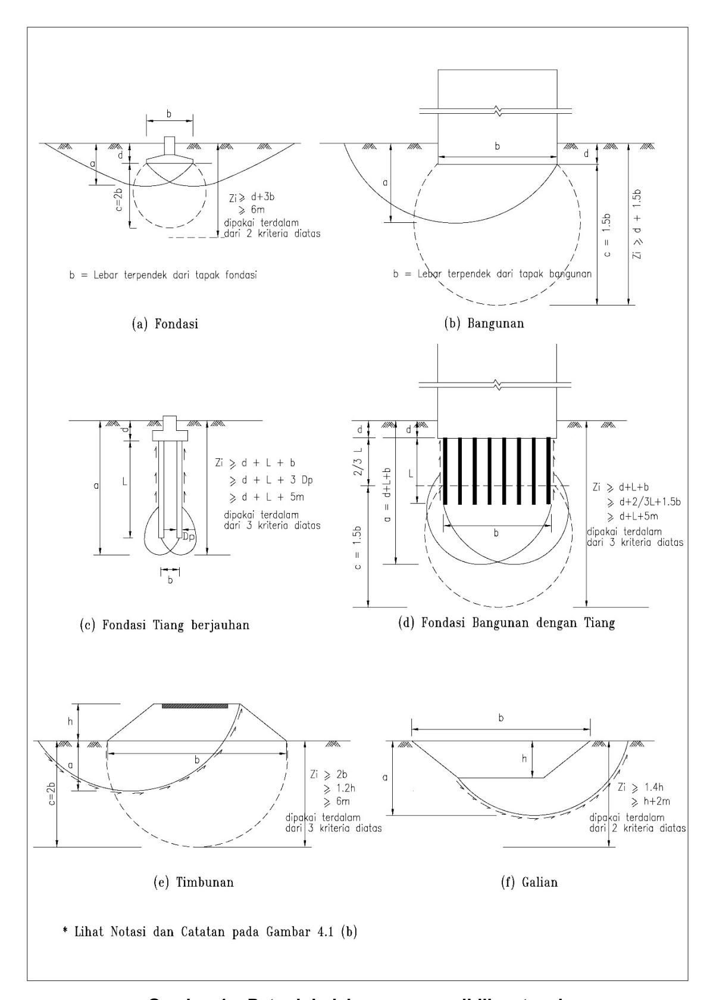

**Gambar 1 – Petunjuk dalamnya penyelidikan tanah** 

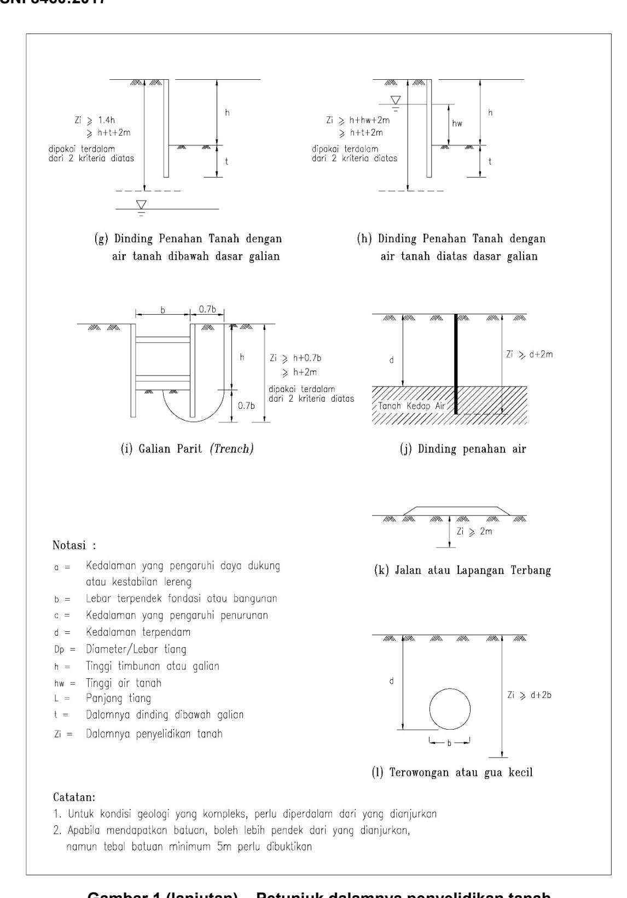

**Gambar 1 (lanjutan) – Petunjuk dalamnya penyelidikan tanah** 

#### **5.2.4.2 Pengambilan contoh tanah**

Kategori pengambilan contoh (lihat Tabel 1) dan jumlah contoh yang akan diambil harus didasarkan pada:

- a) tujuan penyelidikan tanah;
- b) geologi lapangan;
- c) kompleksitas struktur geoteknik.

Untuk identifikasi dan klasifikasi tanah, setidaknya satu lubang bor atau galian uji *(test pit)* dengan pengambilan contoh tanah harus tersedia. Contoh tanah harus diperoleh dari setiap lapisan tanah yang dapat memengaruhi perilaku struktur.

Pengambilan contoh tanah dapat diganti dengan uji lapangan jika terdapat pengalaman setempat yang cukup tentang korelasi uji lapangan dengan kondisi tanah untuk memastikan interpretasi yang tidak ambigu terhadap hasilnya.

# **5.2.4.3 Pengujian laboratorium**

#### **5.2.4.3.1 Umum**

Sebelum menyiapkan program uji laboratorium, stratigrafi setempat yang diantisipasi harus ditetapkan dan lapisan yang relevan untuk desain dipilih untuk menentukan spesifikasi dari pada jenis dan jumlah uji pada di setiap lapisan. Identifikasi lapisan harus berdasarkan pada masalah geoteknik, kompleksitas, geologi setempat, dan parameter yang diperlukan untuk perencanaan.

#### **5.2.4.3.2 Inspeksi visual dan profil tanah awal**

Contoh tanah dan galian uji *(test pit)* harus diinspeksi secara visual dan dibandingkan dengan data bor sehingga profil tanah awal dapat diperoleh. Untuk contoh tanah, inspeksi visual harus didukung oleh uji manual sederhana untuk identifikasi tanah dan memberi informasi awal tentang konsistensi dan sifat mekanik.

Jika terdapat perbedaan yang jelas dan signifikan pada sifat antara bagian yang berbeda dari satu strata, profil tanah awal harus dibagi lagi menjadi dua lapisan.

Bila memungkinkan, kualitas contoh tanah harus dinilai sebelum uji laboratorium dilaksanakan. Kelas tentang kualitas contoh tanah didefinisikan dalam Tabel 3.

**© BSN 2017 29 dari 303** 

**Tabel 3 – Kelas kualitas contoh tanah untuk uji laboratorium dan kategori pengambilan contoh tanah**

| Sifat Tanah / Kelas Kualitas         | 1 | 2 | 3 | 4 | 5 |
|--------------------------------------|---|---|---|---|---|
| Sifat tanah yang tidak dapat berubah |   |   |   |   |   |
| Ukuran butiran                       | * | * | * | * |   |
| Kadar air                            | * | * | * |   |   |
| Kepadatan, indeks kepadatan,         |   |   |   |   |   |
| permeabilitas                        | * | * |   |   |   |
| Kompresibilitas, kuat geser          | * |   |   |   |   |
| Sifat tanah yang dapat ditentukan    |   |   |   |   |   |
| Urutan lapisan                       | * | * | * | * | * |
| Batasan lapisan tanah – yang         | * | * | * | * |   |
| kasar                                |   |   |   |   |   |
| Batasan lapisan tanah – yang         | * | * |   |   |   |
| halus                                |   |   |   |   |   |
| Batas Atterberg, kepadatan butir,    | * | * |   | * |   |
| kandungan organik                    |   |   | * |   |   |
| Kandungan air                        | * | * | * |   |   |
| Kepadatan, indeks kepadatan,         | * | * |   |   |   |
| porositas, permeabilitas             |   |   |   |   |   |
| Kompresibilitas, kuat geser          | * |   |   |   |   |
|                                      | A |   |   |   |   |
| Kategori pengambilan contoh tanah    |   |   | B |   |   |
|                                      |   |   |   |   | C |

# **5.2.4.3.3 Program pengujian laboratorium**

Tipe konstruksi, jenis tanah dan stratigrafi serta parameter geoteknik yang diperlukan untuk perhitungan perancangan harus dipertimbangkan pada saat membuat program uji laboratorium.

Program uji laboratorium tergantung pada ada tidaknya dan cakupan serta kualitas pengalaman yang lalu. Pengamatan lapangan pada struktur yang berdekatan perlu dipertimbangkan.

Pengujian harus dilakukan terhadap benda uji yang mewakili tiap lapisan tanah. Uji klasifikasi pada contoh tanah atau benda uji harus dilakukan untuk memastikan keterwakilannya.

**CATATAN –** Pengujian ini dapat dilakukan dengan melakukan uji klasifikasi dan indeks kekuatan pada contoh tanah sebanyak mungkin pada langkah awal untuk menentukan rentang variasi sifat indeks dari sebuah lapisan. Pada tahap berikutnya, bandingkan hasil uji kekuatan dan kompresibilitas contoh tanah yang didapat dengan rentang variasi untuk menentukan representasi lapisan tanah tertentu.)

Perlu dipertimbangkan melakukan uji yang lebih mutakhir atau tambahan penyelidikan lapangan tergantung dari aspek geoteknik suatu proyek, jenis tanah, variasi tanah dan model perhitungan.

#### **5.2.4.3.4 Jumlah pengujian laboratorium**

Jumlah pengujian laboratorium harus mengikuti persyaratan berikut:

- a) Jumlah benda uji harus ditetapkan berdasarkan homogenitas tanah, kualitas dan jumlah pengalaman pada tanah tersebut dan kategori permasalahan geoteknik.
- b) Benda uji tambahan harus disediakan, bila memungkinkan, untuk mengakomodir tanah bermasalah, benda uji yang rusak dan faktor-faktor lain.

**© BSN 2017 30 dari 303**

- c) Jumlah minimum benda uji harus diselidiki tergantung pada jenis ujinya seperti yang direkomendasikan pada Tabel 4.
- d) Jumlah minimum uji laboratorium dapat dikurangi jika perancangan geoteknik tidak butuh optimisasi dan menggunakan parameter tanah yang konservatif, atau jika sudah memiliki pengalaman atau informasi setempat yang cukup.

#### **5.2.4.3.5 Pengujian klasifikasi**

Pengujian klasifikasi harus mengikuti persyaratan berikut:

- a) Uji klasifikasi tanah dan batuan harus dilakukan untuk menentukan komposisi dan sifat indeks dari setiap lapisan tanah. Contoh tanah untuk uji klasifikasi harus dipilih sedemikian rupa sehingga terdistribusi merata di seluruh area dan semua kedalaman lapisan yang relevan dengan desainnya. Hasil yang diperoleh harus dapat menggambarkan rentang sifat indeks dari lapisan-lapisan tanah yang terkait.
- b) Hasil uji klasifikasi harus digunakan untuk memeriksa sejauh mana kecukupan penyelidikannya, atau menentukan perlunya penyelidikan tahap kedua.
- c) Uji klasifikasi rutin yang cocok untuk contoh tanah dengan berbagai tingkat gangguan disajikan pada Tabel 5. Pengujian rutin umumnya dilakukan dalam semua tahap penyelidikan tanah (lihat 5.2.5).

#### **5.2.4.3.6 Uji pada contoh tanah**

Persyaratan uji pada contoh tanah adalah sebagai berikut:

- a) Contoh tanah untuk pengujian harus dipilih sedemikian rupa sehingga dapat mencakup rentang sifat indeks setiap lapisan yang relevan.
- b) Untuk timbunan atau lapisan pasir atau kerikil, dapat menggunakan benda uji yang dibentuk ulang *(reconstituted specimens)*. Benda uji yang dibentuk harus memiliki komposisi, kepadatan dan kadar air yang kurang lebih sama dengan material asli di lapangan.
- c) Uji laboratorium untuk menentukan parameter untuk perhitungan geoteknik diberikan dalam Tabel 6.

# **5.2.4.3.7 Uji pada contoh batuan**

Uji laboratorium rutin contoh batuan yang diperlukan untuk deskripsi material batuan adalah sebagai berikut:

- a) klasifikasi geologi;
- b) kepadatan atau berat volume (ρ);
- c) kadar air (w);
- d) porositas (n);
- e) kuat kompresi uniaksial (σc);
- f) modulus elastisitas young (e) dan rasio poisson ();
- g) uj indeks kekuatan pembebanan titik (is, 50).

Klasifikasi contoh batuan biasanya terdiri atas deskripsi geologi, perolehan inti *(core recovery)*, Penetapan Kualitas Batuan atau *Rock Quality Designation* (RQD), derajat indurasi, *fracture log*, pelapukan dan pencelahan *(fissuring)*. Selain uji rutin yang disebutkan di atas, untuk batuan, pengujian lainnya dapat dipilih untuk tujuan yang

**© BSN 2017 31 dari 303** 

berbeda, misalnya menentukan kepadatan butir, kecepatan gelombang, uji *Brazilian*, penentuan kuat geser batuan dan retakan-retakan, uji *slake durabilty*, uji pengembangan atau *swelling,* dan uji abrasi.

Sifat-sifat massa batuan termasuk lapisannya dan pencelahan atau diskontinuitas dapat diselidiki secara tidak langsung dengan kompresi dan uji kuat geser sepanjang retakanretakan. Pada batuan lemah, uji pelengkap di lapangan atau uji laboratorium skala besar pada contoh bongkah batuan (*block sample)* dapat dilakukan.

**© BSN 2017 32 dari 303**

**Tabel 4 – Persyaratan jumlah minimum benda uji yang disarankan** 

|   |   |                                                                             |                   |                                                              |                            | Pengalaman Sejenis                        |              |
|---|---|-----------------------------------------------------------------------------|-------------------|--------------------------------------------------------------|----------------------------|-------------------------------------------|--------------|
|   |   | Deskripsi                                                                   | Satuan            | Tidak Ada                                                    | Ada                        | Sangat Banyak                             |              |
| A |   | Sifat Indeks atau Klasifikasi                                               |                   |                                                              |                            |                                           |              |
|   | 1 | Distribusi ukuran butir                                                     | tes               | 4-6                                                          | 3-5                        | 2-4                                       |              |
|   | 2 | Kadar air                                                                   | tes               |                                                              |                            | Semua contoh tanah kualitas kelas 1 s.d 3 |              |
|   | 3 | Indeks kekuatan (engineering properties)                                    | tes               | Semua contoh tanah kualitas kelas 1                          |                            |                                           |              |
|   | 4 | Batas Atterberg                                                             | tes               | 3-5                                                          | 2-4                        | 1-3                                       |              |
|   | 5 | Kandungan Organik                                                           | tes               | 3-5                                                          | 2-4                        | 1-3                                       |              |
|   | 6 | Berat Volume                                                                |                   |                                                              |                            |                                           |              |
|   |   | - untuk nilai ≥ 20 kN/m3                                                 | tes               | 4                                                            | 3                          | 2                                         |              |
|   |   | - untuk nilai ≤ 20 kN/m3                                                 | tes               | 3                                                            | 2                          | 1                                         |              |
|   | 7 | Index kepadatan (kepadatan relatif)                                         |                   | Secukupnya Geoteknik yang bertanggungjawab)               | (ditentukan                | oleh                                      | Ahli         |
|   | 8 | Berat jenis                                                                 | tes               | 2                                                            | 1                          | 1                                         |              |
| B |   | Sifat Mekanikal                                                             |                   |                                                              |                            |                                           |              |
|   | 1 | Uji Triaksial untuk kuat geser effektif                                     |                   |                                                              |                            |                                           |              |
|   |   | Untuk variasi amplop kekuatan dengan koefisien regresi "r"               |                   |                                                              |                            |                                           |              |
|   |   | - r ≤ 0.95                                                               | set               | 4                                                            | 3                          | 2                                         |              |
|   |   | - 0.95 < r < 0.98                                                        | (3 benda uji pada | 3                                                            | 2                          | 1                                         |              |
|   |   | - r ≥ 0.98                                                               | tekanan berbeda)  | 2                                                            | 1                          | 1                                         |              |
|   | 2 | Uji Triaksial untuk kuat geser tak alir                                     |                   |                                                              |                            |                                           |              |
|   |   | Untuk variasi kuat geser tak alir pada teganagan konsolidasi yang sama   |                   |                                                              |                            |                                           |              |
|   |   | - Rasio nilai maks / min > 2                                             | set               | 6                                                            | 4                          | 3                                         |              |
|   |   | - 1.25 < Rasio nilai maks / min ≤ 2                                      | (3 benda uji pada | 4                                                            | 3                          | 2                                         |              |
|   |   | - Rasio nilai maks / min ≤ 1.25                                          | tekanan berbeda)  | 3                                                            | 2                          | 1                                         |              |
|   | 3 | Uji Geser langsung                                                          |                   |                                                              |                            |                                           |              |
|   |   | Untuk variasi amplop kekuatan dengan koefisien regresi "r"               |                   |                                                              |                            |                                           |              |
|   |   | - r ≤ 0.95                                                               | set               | 4                                                            | 3                          | 2                                         |              |
|   |   | - 0.95 < r < 0.98                                                        | (3 benda uji pada | 3                                                            | 2                          | 1                                         |              |
|   |   | - r ≥ 0.98                                                               | tekanan berbeda)  | 2                                                            | 2                          | 1                                         |              |
|   | 4 | Uji Konsolidasi                                                             |                   |                                                              |                            |                                           |              |
|   |   | Untuk variasi Modulus Oedometer (Eoed) pada rentang tekanan yang relevan |                   |                                                              |                            |                                           |              |
|   |   | - Rentang nilai Eoed ≥ 50%                                               | tes               | 4                                                            | 3                          | 2                                         |              |
|   |   | - ≈20% < Rentang nilai Eoed < ≈50%                                       | tes               | 3                                                            | 2                          | 2                                         |              |
|   |   | - Rentang nilai Eoed < ≈20%                                              | tes               | 2                                                            | 2                          | 1                                         |              |
| C |   | Sifat Hidrolis                                                              |                   |                                                              |                            |                                           |              |
|   | 1 | Uji Permeabilitas                                                           |                   |                                                              |                            |                                           |              |
|   |   | Untuk variasi koefisien permeabilitas (k)                                   |                   |                                                              |                            |                                           |              |
|   |   | - Rasio nilai maks / min > 100                                           | tes               | 5                                                            | 4                          | 3                                         |              |
|   |   | - 10 < Rasio nilai maks / min ≤ 100                                      | tes               | 5                                                            | 3                          | 2                                         |              |
|   |   | - Rasio nilai maks / min ≤ 10                                            | tes               | 3                                                            | 2                          | 1                                         |              |
| D |   | Sifat Kimia                                                                 |                   |                                                              |                            |                                           |              |
|   | 1 | Kandungan Karbonat                                                          | tes               | Secukupnya Geoteknik yang bertanggungjawab)               | (ditentukan                | oleh                                      | Ahli         |
|   | 2 | Kandungan Sulfat                                                            | tes               | Secukupnya Geoteknik yang bertanggungjawab) Secukupnya | (ditentukan (ditentukan | oleh oleh                              | Ahli Ahli |
|   | 3 | pH                                                                          | tes               | Geoteknik yang bertanggungjawab)                             |                            |                                           |              |
|   | 4 | Kandungan Klorit                                                            | tes               | Secukupnya Geoteknik yang bertanggungjawab)               | (ditentukan                | oleh                                      | Ahli         |
| E |   | Lain-lain                                                                   |                   |                                                              |                            |                                           |              |
|   | 1 | Dispersibilitas tanah                                                       | tes               | Secukupnya Geoteknik yang bertanggungjawab)               | (ditentukan                | oleh                                      | Ahli         |
|   | 2 | Uji kembang tanah                                                           | tes               | Secukupnya Geoteknik yang bertanggungjawab)               | (ditentukan                | oleh                                      | Ahli         |

**Tabel 5 – Uji klasifikasi tanah** 

|                                                  | Jenis Tanah                      |               |                     |                   |               |                     |                 |                              |  |
|--------------------------------------------------|----------------------------------|---------------|---------------------|-------------------|---------------|---------------------|-----------------|------------------------------|--|
| Parameter                                        | Tanah Lempung Jenis benda uji |               |                     |                   | Tanah Lanau   |                     |                 | Tanah Pasiran, Berkerikil |  |
|                                                  |                                  |               |                     | Jenis benda uji   |               |                     | Jenis benda uji |                              |  |
|                                                  | Tak Ter ganggu                | Ter ganggu | Dibentuk Kembali | Tak Ter ganggu | Ter ganggu | Dibentuk Kembali | Ter ganggu   | Dibentuk Kembali          |  |
| Deskripsi geologi dan klasifikasi tanah | X                                | X             | X                   | X                 | X             | X                   | X               | X                            |  |
| Kadar air                                        | X                                | (X)           | (X)                 | X                 | (X)           | (X)                 | (X)             | (X)                          |  |
| Berat isi curah (bulk density)       | X                                | (X)           | -                   | X                 | (X)           | -                   | -               | -                            |  |
| Kepadatan minimum dan maksimum                | -                                | -             | -                   | (X)               | (X)           | (X)                 | X               | X                            |  |
| Batas Atterberg                                  | X                                | X             | X                   | X                 | X             | X                   | -               | -                            |  |
| Distribusi ukuran partikel                       | X                                | X             | X                   | X                 | X             | X                   | X               | X                            |  |
| Kuat geser tak alir                              | X                                | -             | -                   | (X)               | -             | -                   | -               | -                            |  |
| Permeabilitas                                    | X                                | -             | -                   | X                 | (X)           | (X)                 | (X)             | (X)                          |  |
| Sensitifitas                                     | X                                | -             | -                   | -                 | -             | -                   | -               | -                            |  |

X = normal untuk ditentukan

**CATATAN** – Untuk beberapa jenis tanah, pengujian lebih lanjut perlu dipertimbangkan, misalnya penentuan kadar organik, kepadatan partikel, dan keaktifan.

**© BSN 2017 34 dari 303**

(X) = mungkin untuk ditentukan, tidak selalu mewakili

- = tidak tersedia

Tabel 6 – Uji laboratorium untuk penentuan parameter geoteknik

|                                                                                | Jenis Tanah   |               |                      |                                                  |                                                    |                              |  |  |
|--------------------------------------------------------------------------------|---------------|---------------|----------------------|--------------------------------------------------|----------------------------------------------------|------------------------------|--|--|
| Parameter Geoteknik                                                            | Kerikil       | Pasir         | Lanau                | Lempung terkonsolidasi normal (NC clay) | Lempung terkonsolidasi berlebih (OC clay) | Lempung gambut organik |  |  |
| Modulus Oedometer (Eoed); indeks kompresi (Cc); [kompresibilitas satu dimensi] | (OED) (TX) | (OED) (TX) | (OED) (TX)        | (OED) (TX)                                    | (OED) (TX)                                      | (OED) (TX)                |  |  |
| Modulus Young's (E); modulus Geser (G)                                      | TX            | TX            | TX                   | TX                                               | TX                                                 | TX                           |  |  |
| Kuat geser terdrainase (effective) (c'), (ø)                                   | TX (SB)    | TX (SB)    | TX (SB)           | TX (SB)                                          | TX (SB)                                         | TX (SB)                   |  |  |
| Kuat geser residual (c' R ), (Ø R )                      | RS (SB)    | RS (SB)    | RS (SB)           | RS (SB)                                       | RS (SB)                                         | RS (SB)                   |  |  |
| Kuat geser tak terdrainase (c u )                                | -             | -             | TX DSS SIT     | TX DSS (SB) SIT                               | TX DSS (SB) SIT                                 | TX DSS (SB) SIT           |  |  |
| Kepadatan curah, <i>bulk</i> density (ρ)                                       | BDD           | BDD           | BDD                  | BDD                                              | BDD                                                | BDD                          |  |  |
| Koefisien konsolidasi (c v )                                        |               |               | OED TX            | OED TX                                           | OED TX                                             | OED TX                       |  |  |
| Permeabilitas(k)                                                               | TXCH PSA   | TXCH PSA   | PTC TXCH (PTF) | TXCH (PTF) (OED)                           | TXCH (PTF) (OED)                             | TXCH (PTF) (OED)       |  |  |

- = Tidak Tersedia

Singkatan pengujian laboratorium:

- BDD Penentuan kepadatan curah (bulk density)
- DSS Pengujian geser langsung sederhana
- OED Pengujian oedometer
- PTF Pengujian permeabilitas untuk the Parameter Tekanan dari atas
- PTC Pengujian permeabilitas untuk the Parameter Tekanan tetap
- RS Cincin Geser(ring shear)
- SB Pengujian kotak geser translasional
- SIT Pengujian indeks kekuatan(biasanya dilakukan pada fase pendahuluan
- PSA Analisis ukuran partikel
- TX Pengujian triaksial

© BSN 2017 35 dari 303

( ) = Hanya tersedia sebagian; untuk detail, lihat 5.6.

# **5.2.5 Pemeriksaan kesesuaian hasil penyelidikan selama konstruksi**

Sejumlah pemeriksaan dan uji tambahan perlu dilakukan selama konstruksi untuk memeriksa apakah kondisi tanah sesuai dengan hasil penyelidikan tahap perancangan, dan sifat-sifat material konstruksi serta pekerjaan konstruksi sesuai dengan yang diantisipasi berdasarkan hasil penyelidikan sebelumnya.

Pemeriksaan kesusuaian hasil penyelidikan sebelumnya dapat dilakukan melalui langkahlangkah di bawah ini:

- a) Periksa profil tanah pada saat menggali;
- b) Inspeksi dasar galian.
- c) Pengukuran tinggi muka air tanah atau tekanan air pori dan fluktuasinya;
- d) Pengukuran perilaku bangunan atau fasilitas sipil sekitar pembangunan;
- e) Pengukuran perilaku kegiatan konstruksi yang sedang dilakukan.

Hasil pemeriksaan diatas harus diperiksa terhadap perancangan yang telah disusun berdasarkan penyelidikan sebelumnya. Bila diperlukan, lakukan perubahan perancangan berdasarkan temuan-temuan dari pemeriksaan di atas.

# **5.3 Pengambilan contoh tanah, batuan dan air tanah**

#### **5.3.1 Umum**

Pengambilan contoh tanah dan batuan dengan pengeboran dan galian serta pengukuran air tanah harus dilakukan secara komprehensif sehingga data desain geoteknik yang diperlukan dapat diperoleh Pengambilan contoh tanah.

# **5.3.2 Pengambilan contoh tanah atau batuan dengan pengeboran**

Alat pengeboran harus dipilih berdasarkan:

- a) Kategori contoh tanah atau batuan yang diperlukan, seperti yang didefinisikan dalam 5.3.4.1 dan 5.3.5.1;
- b) Kedalaman dan diameter contoh tanah atau batuan yang diperlukan;

Persyaratan SNI 03-6802-2002 harus diikuti.

## **5.3.3 Pengambilan contoh tanah atau batuan dengan galian**

Jika contoh tanah atau batuan diperoleh dari sumur uji, *headings* atau *shaft*, persyaratan SNI 03-6802-2002 harus diikuti.

**© BSN 2017 36 dari 303**

# **5.3.4 Pengambilan contoh tanah**

#### **5.3.4.1 Kategori kelas pengambilan contoh tanah**

Contoh tanah harus mencakup seluruh kandungan materi dari lapisan tanah yang diambil. Contoh tersebut tidak boleh terkontaminasi oleh material dari lapisan lain atau dari bahan tambah (aditif) yang digunakan dalam prosedur pengambilan contoh tanah.

Metode pengambilan contoh tanah dibagi dalam tiga kategori seperti dibawah tergantung dari kelas kualitas yang diinginkan (lihat Tabel 3 untuk kualitas contoh tanah):

- a) Kategori A: untuk memperoleh contoh tanah kualitas kelas 1 sampai 5;
- b) Kategori B: untuk memperoleh contoh tanah kualitas kelas 3 sampai 5;
- c) Kategori C: hanya untuk memperoleh contoh tanah kualitas kelas 5.

Metode pengambilan Kategori A harus digunakan untuk memperoleh contoh tanah berkualitas kelas 1 atau 2, di mana tidak ada atau hanya sedikit gangguan struktur tanah dalam prosedur pengambilan contoh atau dalam penanganan *(handling)* contoh tanah. Kadar air dan angka pori tanah masih sesuai dengan yang ada di lapangan. Tidak terjadi perubahan dalam konstituen material atau komposisi kimia dari tanah.

Metode pengambilan Kategori B boleh digunakan untuk memperoleh contoh tanah berkualitas kelas 3 sampai 5, yang masih mengandung semua konstituen material dari tanah di lapangan dalam proporsi asli dan masih mengandung kadar air alami. Susunan umum atau komponen dari lapisan tanah yang berbeda masih dapat diidentifikasi walaupun struktur tanah telah terganggu.

Metode pengambilan Kategori C hanya digunakan untuk memperoleh contoh tanah berkualitas kelas 5, dimana struktur tanah telah berubah secara keseluruhan. Gambaran umum atau komponen telah beubah sehingga lapisan tanah di lapangan tidak dapat diidentifikasi secara akurat. Kadar air sudah tidak mewakili kadar air alami dari lapisan tanah yang diambil contohnya.

Contoh tanah untuk pengujian laboratorium dibagi dalam lima kelas kualitas berkaitan dengan sifat-sifat tanah yang diasumsikan tetap dan tidak berubah selama pengambilan contoh, transportasi dan penyimpanan. Tabel 3 merangkum Kelas kualitas dan kategori metode pengambilan contoh tanah yang digunakan.

#### **5.3.4.2 Identifikasi tanah**

Identifikasi pada pemeriksaan contoh tanah harus mengikuti SNI 03-6797-2002.

#### **5.3.4.3 Perencanaan pengambilan contoh tanah**

Perencanaan pengambilan contoh tanah harus mengikuti persyaratan-persyaratan berikut:

- a) Kelas kualitas dan jumlah contoh tanah yang akan diambil harus didasarkan pada tujuan penyelidikan tanah, geologi setempat, dan kompleksitas struktur geoteknik dan konstruksi yang akan dirancang.
- b) Dua strategi yang berbeda dapat diikuti untuk pengambilan contoh tanah pada pengeboran.
  - Pengeboran yang bertujuan memperoleh contoh tanah secara lengkap sampai dasar lubang bor dengan menggunakan alat pengambil (*sampler*) khusus.

- Pengeboran yang dirancang untuk memperoleh contoh tanah hanya pada beberapa kedalaman yang telah ditentukan, misalnya diseling dengan melakukan uji penetrasi secara bergantian.
- c) Kategori metode pengambilan contoh tanah harus dipilih berdasarkan kelas kualitas uji laboratorium yang diinginkan (lihat Tabel 3), jenis tanah yang diharapkan, dan kondisi air tanah.
- d) Persyaratan SNI 03-4148.1-2000 harus diikuti, untuk pemilihan metode pengeboran atau penggalian dan peralatan yang memadai untuk kategori metode pengambilan contoh tanah yang ditetapkan.
- e) Untuk proyek tertentu, alat pengambilan contoh tanah dan metode yang khusus mungkin diperlukan dalam kategori metode pengambilan contoh tanah yang didefinisikan dalam 5.3.4.1. Misalnya, apabila modulus deformasi (kekakuan) pada regangan kecil harus ditentukan pada contoh tanah tidak terganggu.
- f) Ukuran contoh tanah yang diperoleh harus sesuai dengan jenis tanah serta jenis dan jumlah uji yang akan dilakukan (lihat 5.5).
- g) Contoh tanah harus diambil pada setiap perubahan lapisan dan pada interval tidak lebih dari 3 m. Pada tanah yang tidak homogen, atau jika data yang sangat rinci dari kondisi tanah diperlukan, pengambilan contoh tanah secara menerus harus dilakukan atau melakukan pengambilan contoh tanah dengan interval yang sangat dekat.

# **5.3.4.4 Penanganan, pengiriman dan penyimpanan contoh tanah**

Penanganan, transportasi dan penyimpanan contoh harus dilakukan sesuai dengan SNI 03- 4148.1-2000.

# **5.3.5 Pengambilan contoh batuan**

#### **5.3.5.1 Kategori kelas pengambilan contoh batuan**

Pengambilan contoh batuan harus mengikuti persyaratan-persyaratan berikut:

- a) Contoh batuan harus mencakup seluruh unsur mineral dari lapisan batuan yang diambil. Contoh tersebut tidak boleh terkontaminasi oleh material dari lapisan lain atau dari bahan tambah yang digunakan dalam prosedur pengambilan contoh batuan.
- b) Diskontinuitas dan material pengisi *(infilling)* yang terdapat di massa batuan seringkali mengontrol karakteristik kekuatan dan deformasi material secara keseluruhan. Oleh karena itu, informasi tersebut harus didefinisikan secara rinci selama pengambilannya.
- c) Metode pengambilan contoh batuan dibagi dalam tiga kategori seperti di bawah tergantung dari kualitas yang diinginkan:
  - 1) Kategori A;
  - 2) Kategori B;
  - 3) Kategori C.
  - d) Metode pengambilan Kategori A harus digunakan untuk memperoleh contoh batuan, saat tidak ada atau hanya sedikit gangguan struktur batuan terjadi dalam prosedur pengambilan atau penanganan contoh batuan. Kekuatan batuan, sifat deformasi,

**© BSN 2017 38 dari 303**

kadar air, kepadatan, porositas dan permeabilitas masih sesuai dengan yang asli di lapangan. Tidak terjadi perubahan kandungan material atau komposisi kimia dari massa batuan.

- e) Metode pengambilan Kategori B digunakan untuk memperoleh contoh batuan yang masih mengandung semua kandungan material dari massa batuan di lapangan dalam proporsi asli, yaitu batuannya masih mempertahankan kekuatan, sifat deformasi, kadar air, kepadatan, dan porositas. Susunan umum dari diskontinuitas pada massa batuan masih dapat diidentifikasi. Struktur massa batuan dan juga kekuatan dan sifat deformasi, kadar air, kepadatan, porositas dan permeabilitas untuk massa batuan itu sendiri telah terganggu.
- f) Metode pengambilan Kategori C hanya digunakan untuk memperoleh contoh batuan, saat struktur dari massa batuan dan kontinuitas telah berubah secara keseluruhan. Material batuan telah hancur. Perubahan kandungan atau komposisi kimia dari material batuan dapat terjadi. Jenis batuan serta matriks, tekstur dan struktur masih dapat diidentifikasi.

# **5.3.5.2 Identifikasi batuan**

Identifikasi batuan secara visual harus didasarkan pada pemeriksaan massa batuan dan contoh batuan termasuk semua pengamatan terhadap dekomposisi dan diskontinuitas. Identifikasi harus sesuai dengan EN ISO 14689-1.

Klasifikasi pelapukan harus dikaitkan dengan proses geologi dan harus mencakup peringkat *(grade)* antara batuan segar dan batuan yang telah lapuk dan terurai menjadi tanah. Klasifikasi harus sesuai dengan SNI 2436:2008 (EN ISO 14689-1).

Diskontinuitas seperti bidang pelapisan *(bedding planes)*, retakan *(joint)*, rekahan *(fissures)*, celah *(cleavages)* dan patahan/sesar *(faults)* harus dikuantifikasi terhadap pola, jarak dan kemiringan menggunakan istilah yang tidak ambigu. Kuantifikasi harus sesuai dengan SNI 2436:2008 (EN ISO 14689-1).

Tingkat kualitas batuan *(Rock Quality Designation - RQD)*, perolehan inti batuan keseluruhan *(total core recovery* - *TCR)*, dan perolehan inti batuan yang utuh (*solid core recovery* - SCR), harus ditentukan sesuai SNI 2436:2008 (EN ISO 22475-1).

#### **5.3.5.3 Perencanaan pengambilan contoh batuan**

Karakteristik dan jumlah contoh batuan yang akan diambil harus didasarkan pada tujuan penyelidikan lapangan, geologi setempat, dan kompleksitas struktur geoteknik dan konstruksi yang akan dirancang.

Kategori metode pengambilan contoh batuan harus dipilih sesuai dengan karakteristik batuan yang harus dipertahankan, seperti yang dijelaskan dalam 5.3.5.2, serta kondisi batuan dan air tanah yang diharapkan.

Pemilihan metode pengeboran atau galian dan alat pengambilan contoh batuan harus mengikuti SNI 03-6802-2002.

Untuk proyek tertentu, alat pengambilan contoh batuan dan metode tertentu mungkin diperlukan sesuai kategori metode pengambilan contoh batuan yang didefinisikan dalam 5.3.5.1.

**© BSN 2017 39 dari 303** 

# **5.3.5.4 Penanganan, pengiriman dan penyimpanan contoh batuan**

Untuk proyek tertentu, alat pengambilan contoh batuan dan metode tertentu mungkin diperlukan sesuai kategori metode pengambilan contoh batuan yang didefinisikan dalam SNI 03-6802-2002 (EN ISO 22475-1).

#### **5.3.1 Perancangan dan pelaksanaan pengukuran**

Pengukuran muka air tanah dan pengambilan contoh air tanah harus dilakukan sesuai dengan SNI 03-6802-2002 (EN ISO 22475-1).

Perancangan pengukuran muka air tanah harus mengikuti persyaratan-persyaratan berikut:

- a) Jenis peralatan yang akan digunakan untuk pengukuran air tanah harus dipilih sesuai dengan jenis dan permeabilitas tanah, tujuan pengukuran, waktu pengamatan yang diperlukan, fluktuasi air tanah yang diharapkan dan waktu respon peralatan dan tanah.
- b) Terdapat dua sistem pengukuran tekanan air tanah: sistem terbuka dan sistem tertutup. Dalam sistem terbuka, tekanan air tanah *(piezometric head)* diukur dengan sumur pengamatan, biasanya menggunakan dengan pipa terbuka. Dalam sistem tertutup, tekanan air tanah pada titik yang dipilih diukur secara langsung dengan alat pembaca tekanan *(pressure transducer)*.
- c) Sistem terbuka hanya boleh digunakan untuk tanah dan batuan dengan permeabilitas relatif tinggi (akuifer dan akuitar), misalnya pasir, kerikil atau batuan bercelah tinggi *(highly fissured rock)*. Sistem terbuka dapat memberikan interpretasi yang keliru untuk tanah dan batuan dengan permeabilitas rendah disebabkan oleh jeda waktu dalam mengisi dan mengosongkan pipa terbuka. Penggunaan saringan *(filter)* yang terhubung dengan pipa berdiameter kecil dalam sistem terbuka dapat mengurangi jeda waktu.
- d) Sistem tertutup boleh digunakan pada semua jenis tanah atau batuan. Sistem ini harus digunakan pada tanah dan batuan dengan permeabilitas sangat rendah (*aquicludes)*, misalnya lempung atau batuan bercelah rendah *(low fissured rock)*. Sistem tertutup juga harus digunakan ketika berhadapan dengan artesis bertekanan air tinggi.
- e) Apabila akan memantau air pori yang bervariasi dengan durasi sangat pendek atau berfluktuasi cepat, rekam data secara menerus harus dilakukan dengan mengunakan pembaca tekanan dan alat pencatat data *(data logger)* untuk berbagai jenis tanah dan batuan.
- f) Apabila terdapat air terbuka pada atau dekat dengan daerah pengukuran air tanah, ketinggian air terbuka tersebut harus dipertimbangkan dalam interpretasi pengukuran air tanah. Ketinggian air di sumur, munculnya mata air dan air artesis juga harus dicatat.
- g) Jumlah, lokasi dan kedalaman titik pengukuran harus dipilih berdasarkan tujuan dari pengukuran, topografi, stratigrafi dan kondisi tanah, terutama permeabilitas tanah atau akuifer yang diidentifikasi.
- h) Untuk pemantauan pada proyek, misalkan menurunkan air tanah, galian, timbunan dan terowongan, lokasi pemantauan harus dipilih terhadap ekspektasi perubahan yang akan dimonitor.
- i) Untuk referensi, pengukuran fluktuasi alamiah pada air tanah harus dilakukan, di luar daerah yang terkena dampak pekerjaan yang sebenarnya.
- j) Untuk mendapatkan pengukuran yang mencerminkan tekanan pori pada titik yang dimaksudkan di dalam lapisan tanah atau batuan, perlu diperhatikan untuk memastikan bahwa titik pengukuran tertutup *(sealed)* secara memadai terhadap lapisan atau akuifer lainnya.

**© BSN 2017 40 dari 303**

- k) Jumlah dan frekuensi pembacaan dan durasi pengukuran untuk proyek tertentu harus direncanakan berdasarkan tujuan dari pengukuran dan durasi untuk mencapai kestabilan.
- l) Kriteria yang dipakai harus diatur kembali setelah pengukuran awal, sesuai dengan variasi yang terpantau dari bacaan yang diamati.
- m) Jika tujuannya pengukuran dimaksudkan untuk mencari fluktuasi air tanah, pembacaan data harus dilakukan pada interval yang lebih kecil dari pada fluktuasi alami yang akan dicari dalam jangka waktu yang cukup panjang.
- n) Selama proses pengeboran, pengamatan muka air yang dilakukan pada akhir hari dan awal hari berikutnya (sebelum pengeboran dilanjutkan) merupakan indikasi yang baik dari kondisi air tanah dan harus dicatat. Setiap rembesan air mendadak *(sudden inflow)*  atau kehilangan air *(loss of water)* selama pengeboran harus dicatat, karena dapat memberikan informasi tambahan yang berguna.
- o) Pada fase pertama penyelidikan tanah, dapat dipasang pipa perforasi terbuka yang dilindungi dengan filter pada beberapa lubang bor. Pembacaan muka air yang diperoleh pada hari-hari berikutnya dapat memberi indikasi awal kondisi air tanah, namun harus memperhatikan batasan pada persyaratan di butir c. Masalah bahaya kontaminasi yang terkait dengan terhubungnya akuifer yang lain dan peraturan lingkungan yang relevan harus diperhitungkan.

#### **5.3.2 Evaluasi hasil pengukuran muka air tanah**

Evaluasi hasil pengukuran air tanah harus memperhitungkan persyaratan-persyaratan berikut ini:

- a) Kondisi geologi dan geoteknik lapangan, keakuratan setiap pengukuran, fluktuasi tekanan air pori terhadap waktu, durasi periode observasi, musim pengukuran dan kondisi iklim selama dan sebelum periode tersebut.
- b) Hasil evaluasi pengukuran air tanah harus mencakup ketinggian maksimum dan minimum muka air yang diamati, atau tekanan air pori, serta periode pengukurannya.
- c) Batas atas dan bawah dari kondisi ekstrim dan normal harus diperoleh dari data yang terukur, dengan menambah atau mengurangi fluktuasi yang diharapkan atau bagian dari fluktuasi, terhadap kondisi ekstrim atau normal yang bersangkutan. Kurangnya data yang dapat dipercaya untuk selang waktu setelah pengukuran mengharuskan kehati-hatian dalam penggunaan data pengukuran yang diperoleh dari informasi tersedia yang terbatas.
- d) Kebutuhan untuk membuat pengukuran lebih lanjut atau memasang stasiun pengukuran tambahan harus dipertimbangkan selama penyelidikan lapangan dan dituangkan dalam laporan penyelidikan tanah.

# **5.4 Uji lapangan pada tanah dan batuan**

# **5.4.1 Umum**

Uji lapangan harus dikaitkan dengan pengambilan contoh tanah untuk memperoleh informasi tentang stratifikasi tanah dan parameter geoteknik atau masukan langsung untuk metode perancangan (lihat 5.3.3).

Uji lapangan harus dirancang dengan mempertimbangkan faktor-faktor umum berikut:

geologi/stratifikasi tanah;

- jenis struktur, fondasi yang mungkin dan pekerjaan yang diantisipasi selama konstruksi;
- jenis parameter geoteknik yang diperlukan;
- metode perancangan yang diadopsi.

Uji lapangan dipilih dari jenis di bawah baik secara tunggal atau kombinasi yang tertera juga pada Tabel 1 untuk bermacam kondisi tanah:

- pengujian sondir atau uji CPT;
- pengujian pressuremeter (PMT) dan dilatometer (DMT);
- pengujian penetrasi standar atau uji SPT;
- penduga dinamis atau uji DP
- pengujian pendugaan berat *(weight sounding test)*;
- pengujian geser baling lapangan atau uji VST;
- pengujian dilatometer datar atau uji FDT
- pengujian pembebanan pelat atau uji PLT.

Uji jenis lain yang diakui secara internasional, misalkan uji geofisika, dapat digunakan.

# **5.4.1.1 Perencanaan program uji lapangan**

Selain rekomendasi dan syarat yang diberikan pada 5.2.4 dan 5.4.1.2, informasi berikut harus ditentukan terlebih dahulu:

- a) Profil tanah yang diperkirakan;
- b) Kedalaman penyelidikan yang diinginkan;
- c) Elevasi permukaan tanah dan kedalaman air tanah jika ada.

Saat merancang program penyelidikan tanah, pemilihan jenis uji lapangan dan peralatan uji harus bertujuan memperoleh solusi teknis dan ekonomis terbaik untuk tujuan yang ingin dicapai (lihat Tabel 1).

#### **5.4.1.2 Pelaksanaan uji lapangan**

Jika hasil yang diperoleh selama penyelidikan tidak sesuai dengan informasi awal tentang lokasi penelitian dan/atau tujuan penyelidikan, langkah-langkah tambahan harus dipertimbangkan seperti:

- pengujian tambahan;
- perubahan metode pengujian.

Jika penyelidikan detail yang diinginkan tidak tercapai, klien harus segera diberitahu.

#### **5.4.1.3 Evaluasi hasil uji lapangan**

Dalam evaluasi hasil uji lapangan, terutama dalam konteks mejabarkan parameter geoteknik, setiap informasi tambahan tentang kondisi tanah harus dipertimbangkan.

Hasil pengambilan contoh tanah atau batuan dengan cara pengeboran dan galian sesuai 5.3 harus digunakan dalam evaluasi hasil uji.

Dalam evaluasi hasil uji, kemungkinan pengaruh peralatan terhadap parameter geoteknik harus dipertimbangkan. Ketika formasi tanah atau batuan menunjukkan sifat anisotropi, perlu memperhatikan sumbu beban terhadap sifat anisotropi.

**© BSN 2017 42 dari 303**

Jika korelasi digunakan untuk menjabarkan parameter geoteknik, ketepatannya harus dipertimbangkan terhadap jenis pekerjaan.

Jika menggunakan korelasi-korelasi hasil pengujian lapangan, harus dipastikan bahwa kondisi tanah di lapangan (jenis tanah, koefisien keseragaman, indeks konsistensi dan lainnya.) sesuai dengan kondisi batas yang dibutuhkan untuk penggunaan korelasi tersebut. Pengalaman lokal, bila ada, harus dipertimbangkan.

# **5.4.2 Uji penetrasi standar (***Standard Penetration Test,* **SPT)**

Uji penetrasi standar, selanjutnya disebut sebagai uji SPT bertujuan untuk menentukan tahanan tanah pada dasar lubang bor terhadap penetrasi dinamis dari *split barrel sampler* (atau konus padat) dan memperoleh contoh tanah terganggu untuk tujuan identifikasi tanah.

Uji SPT digunakan terutama untuk penentuan kekuatan dan sifat deformasi tanah berbutir kasar. Uji SPT juga dapat digunakan memperoleh informasi bernilai untuk jenis tanah lainnya.

Uji SPT harus dilakukan dan dilaporkan sesuai dengan SNI 4153-2008. Setiap penyimpangan dari persyaratan dalam SNI 4153-2008 harus dijustifikasi, khususnya pengaruhnya terhadap hasil pengujian harus dikomentari.

# **5.4.3 Uji sondir (CPT, CPTU, CPTM)**

Uji penetrasi konus (CPT) atau umumnya dikenal sebagai uji sondir harus dilakukan dengan mengikuti persyaratan-persyaratan yang diberikan di dalam SNI 2827-2008 untuk CPT elektrikal dan CPTU, atau EN ISO 22476-12 untuk CPTM.

# **5.4.4 Uji Pressuremeter (PMT)**

Uji Pressuremeter (PMT) harus dilakukan dengan mengikuti persyaratan-persyaratan yang diberikan di dalam EN-ISO 22476 . Ketika merancang sebuah program pengujian untuk suatu pekerjaan, jenis *pressuremeter* yang akan digunakan harus ditentukan. Ada empat jenis alat umumnya tersedia, dengan mengacu pada EN-ISO 22476:

- a) *Pre-bored pressuremeter* (PBP), misalnya tes dilatometer fleksibel (FDT), mengacu pada EN ISO 22476-5;
- b) *Ménard pressuremeter* (MPM), bentuk spesifik dari PBP, mengacu pada EN ISO 22476- 4;
- c) *Self-boring pressuremeter* (SBP), mengacu pada EN ISO 22476-6;
- d) *Full-displacement pressuremeter* (FDP), mengacu pada EN ISO 22476-8.

**CATATAN –** PBP dan MPM yang dimasukkan ke dalam lubang uji dibuat khusus untuk uji *pressuremeter*. SBP dibor ke dalam tanah dengan menggunakan pemotongan integral di ujung bawahnya sehingga penduga *(probe)* membuang material sehingga membuat lubang uji sendiri. FDP biasanya ditekan ke dalam tanah dengan konus integral di ujung bawah, sehingga membuat lubang uji sendiri. MPM mungkin dalam beberapa kondisi ditekan atau dipancang ke dalam tanah. Penduga PBP, SBP dan FDP dapat terdiri atas beberapa bentuk, sesuai dengan jenis instalasi dan sistem pengukurannya.

**© BSN 2017 43 dari 303** 

# **5.4.5 Uji dilatometer datar (***Flat Dilatometer Test***, DMT)**

Uji dilatometer datar (Uji DMT) dilakukan untuk menentukan kekuatan dan deformasi sifat tanah lapangan dengan memperluas membran baja tipis melingkar dipasang penyemprot di salah satu wajah penduga baja pisau berbentuk dimasukkan secara vertikal ke dalam tanah. Pengujian ini harus dilakukan dengan mengikuti persyaratan-persyaratan yang diberikan di dalam ASTM D6635-15.

Hasil uji DMT dapat digunakan untuk mendapatkan informasi tentang stratigrafi tanah, keadaan tegangan lapangan, sifat deformasi dan kekuatan geser.

Uji DMT harus terutama digunakan dalam tanah lempung, lanau dan pasir di mana butiranbutiran kecil dibandingkan dengan ukuran membran.

#### **5.4.6 Uji geser baling lapangan (***Field Vane shear Test***, FVT)**

Uji geser baling lapangan dilakukan untuk mengukur tahanan terhadap rotasi lapangan dari baling-baling yang dipasang di tanah lunak berbutir halus untuk menentukan kuat geser tak terdrainase dan sensitivitas. Pengujian ini harus dilakukan dengan mengikuti persyaratanpersyaratan yang diberikan di dalam SNI 03-2487-1991 (ASTM D2573/D2573M-15).

# **5.4.7 Uji pembebanan pelat (***Plate Loading Test***, PLT)**

Uji pembebanan pelat dilakukan untuk menentukan deformasi vertikal dan kekuatan dari suatu massa tanah dan batuan lapangan melalui pencatatan beban dan penurunan saat pelat kaku yang dimodelkan sebagai fondasi membebani tanah. Pengujian ini harus dilakukan dengan mengikuti persyaratan yang diberikan di dalam EN ISO 22476-13.

## **5.4.8 Uji pendugaan dinamis (***Dynamic Probing Test***, DP)**

Uji pendugaan dinamis dilakukan untuk menentukan tahanan tanah dan batuan lunak di lapangan akibat penetrasi dinamis konus. Pengujian ini harus dilakukan dengan mengikuti persyaratan yang diberikan di dalam EN ISO 22476-2.

Hasil uji harus digunakan terutama untuk penentuan profil tanah bersama-sama dengan hasil dari pengambilan contoh menggunakan pengeboran dan penggalian atau sebagai perbandingan relatif pengujian lapangan lainnya. Hasil uji juga dapat pula digunakan untuk penentuan kekuatan dan deformasi sifat tanah, umumnya dari jenis tanah berbutir kasar tetapi juga mungkin di tanah berbutir halus, melalui korelasi yang sesuai.

Selain itu juga dapat digunakan untuk menentukan kedalaman lapisan tanah yang sangat padat yang menunjukkan, misalnya panjang tahanan ujung tiang.

# **5.5 Uji laboratorium pada tanah**

# **5.5.1 Umum**

Program pengujian laboratorium harus disusun dengan memperhatikan korelasinya dengan program penyelidikan lainnya. Informasi yang diperoleh dari pengujian lapangan dan pendugaan harus digunakan untuk memilih contoh uji.

Persyaratan yang diberikan dalam subpasal ini harus dipertimbangkan sebagai persyaratan minimum.

**© BSN 2017 44 dari 303**

Spesifikasi tambahan, persyaratan penyajian tambahan atau interpretasi tambahan yang sesuai untuk kondisi tanah, atau aspek geoteknik yang diinginkan kemungkinan juga akan dibutuhkan.

Rincian pengujian yang diperlukan untuk menentukan parameter perancangan harus ditentukan.

#### **5.5.1.1 Prosedur, alat dan penyampaian hasil**

Prosedur, alat dan penyampaian hasil pengujian laboratorium harus memenuhi persyaratanpersyaratan berikut:

- a) Pengujian harus dilakukan dan dilaporkan sesuai dengan standar yang berlaku secara nasional (SNI, ASTM, EN ISO atau lainnya). Dengan anggapan bahwa persyaratan standar ini telah terpenuhi, dapat dipilih metode uji dan prosedur alternatif.
- b) Perlu dilakukan pengecekan bahwa peralatan laboratorium yang digunakan memadai, sesuai untuk tujuannya dan dikalibrasi sesuai persyaratan kalibrasi.
- c) Kehandalan peralatan dan prosedur harus diperiksa dengan membandingkan hasil pengujian dengan data dari jenis tanah atau batuan yang sebanding.
- d) Metode uji dan prosedur yang digunakan harus dilaporkan bersama-sama dengan hasil pengujian. Setiap penyimpangan dari prosedur uji standar harus dilaporkan dan dijustifikasi.
- e) Jika sesuai, hasil pengujian klasifikasi tanah di laboratorium harus disampaikan bersamasama dengan profil tanah di ringkasan deskripsi tanah dan semua hasil klasifikasi.
- f) Jika diperlukan, lokasi pengujian laboratorium lainnya (seperti uji oedometer dan triaksial) harus ditunjukkan pada plot yang sama.

#### **5.5.1.2 Evaluasi hasil uji laboratorium**

Hasil pengujian tersendiri harus dibandingkan dengan hasil pengujian lainnya untuk memeriksa tidak terdapatnya kontradiksi di antara data yang tersedia.

Hasil pengujian harus diperiksa dengan nilai-nilai yang diperoleh dari literatur, korelasi dengan sifat indeks dan pengalaman yang sebanding.

#### **5.5.2 Persiapan contoh uji tanah**

Persiapan contoh uji tanah harus mengikuti persyaratan-persyaratan berikut:

- a) Persiapan tanah untuk pengujian laboratorium dilakukan untuk memperoleh benda uji yang paling mewakili tanah tempat contoh tersebut diambil. Untuk kebutuhan persiapan, dapat dibedakan lima tipe benda uji, yaitu: a) terganggu, b) tidak terganggu, c) dipadatkan kembali *(recompacted)*, d) remasan *(remoulded)* dan d) dibentuk ulang *(reconstituted)*.
- b) Benda uji tanah yang digunakan untuk pengujian harus cukup banyak jumlahnya dengan mempertimbangkan hal-hal berikut:
  - ukuran terbesar butiran ada dalam jumlah yang signifikan;
  - fitur alami seperti struktur dan fabrikasi (misalnya diskontinuitas).
- c) Penanganan dan pengolahan contoh uji tanah harus mengikuti persyaratan di dalam SNI 03-4148.1-2000 (EN-ISO 22475-1).

# **5.5.3 Uji klasifikasi, identifikasi dan deskripsi tanah**

#### **5.5.3.1 Umum**

Klasifikasi, identifikasi dan deskripsi tanah harus dilakukan sesuai dengan SNI 03-6797-2002 dan SNI 6371: 2015 (EN ISO 14688-1 dan EN ISO 14688-2).

Jumlah benda uji yang akan diuji tergantung pada variabilitas tanah dan jumlah pengalaman dengan tanah tersebut. Tabel 7 memberikan jumlah minimum contoh uji pada satu lapisan tanah.

**Tabel 7 – Pengujian klasifikasi, rekomendasi jumlah minimum contoh yang akan diuji dalam satu lapisan tanah** 

|                                            | Pengalaman pembanding         |                                  |  |
|--------------------------------------------|-------------------------------|----------------------------------|--|
| Pengujian Klasifikasi                      | Tidak                         | Ya                               |  |
| Distribusi ukuran butiran                  | 4-6                           | 2-4                              |  |
| Kadar air                                  |                               | Semua contoh kualitas kelas 1- 3 |  |
| Pengujian indeks kekuatan            | Semua contoh kualitas kelas 1 |                                  |  |
| Batas Atterberg                            | 3-5                           | 1-3                              |  |
| Hilar pijar (Loss on Ignition) | 3-5                           | 1-3                              |  |
| Kepadatan curah                            | Tiap elemen pengujian   |                                  |  |
| Indeks kepadatan                           | Disesuaikan                   |                                  |  |
| Kepadatan butiran                          | 2                             | 1                                |  |
| Kadar karbonat                             | Disesuaikan                   |                                  |  |
| Kadar sulfat                               | Disesuaikan                   |                                  |  |
| pH                                         | Disesuaikan                   |                                  |  |
| Kadar Klorida                              | Disesuaikan                   |                                  |  |
| Soil dispersibility                        | Disesuaikan                   |                                  |  |

# **5.5.3.2 Persyaratan untuk semua pengujian klasifikasi**

Untuk semua pengujian klasifikasi, harus diberikan perhatian khusus ketika memilih temperatur oven untuk pengeringan, karena temperatur terlalu tinggi dapat memiliki efek yang tidak baik pada nilai yang diperoleh.

#### **5.5.3.3 Pengujian kadar air**

Pengujian ini dilakukan untuk menentukan kadar air material tanah. Kadar air didefinisikan sebagai perbandingan massa air bebas dengan massa tanah kering.Tata cara pengujian kadar air harus mengacu pada SNI 1965:2008. Benda uji tanah untuk mengukur kadar air harus setidaknya berasal dari Kualitas Kelas 3, menurut Tabel 3 Jika contoh terdiri atas lebih dari satu jenis tanah, kadar air harus ditentukan dari benda uji yang mewakili jenis tanah yang berbeda.

**© BSN 2017 46 dari 303**

# *5.5.3.4* **Penentuan berat volume atau berat isi** *(bulk density)*

Penentuan berat volume dilakukan untuk menentukan berat volume total massa tanah, termasuk kandungan cairan atau gas di dalamnya. Benda uji harus minimum berasal dari Kualitas Kelas 2, menurut Tabel 3. Evaluasi hasil penentuan berat volume harus mempertimbangkan hal-hal berikut:

- a) kemungkinan adanya gangguan contoh tanah
- b) kecuali dalam kasus pengambilan contoh tanah dengan metode khusus, uji laboratorium untuk berat volume tanah berbutir kasar umumnya hanya berupa perkiraan.
- c) Berat volume dapat digunakan dalam menentukan gaya-gaya desain yang diperoleh dari tanah dan hasil pengolahan dari uji laboratorium lainnya.
- d) Berat volume juga dapat digunakan untuk mengevaluasi karakteristik tanah lainnya. Misalnya, dalam hubungannya dengan kadar air, dan perhitungan kepadatan tanah kering.

#### **5.5.3.5 Penentuan kepadatan butiran**

Pengujian ini dilakukan untuk menentukan kepadatan butiran tanah padat dengan menggunakan metode konvensional. Pemilihan metode pengujian yang akan digunakan harus mempertimbangkan jenis tanah. Tata cara pengujian kepadatan butiran harus mengikuti persyaratan di dalam SNI 1976:2008.

Jika untuk lapisan tertentu, nilai-nilai yang diukur dari kepadatan butiran tidak berada dalam kisaran normal yaitu pada rentang (2500-2800) kg/m3, maka mineralogi tanah, bahan organik dan geologi asalnya harus diperiksa.

# **5.5.3.6 Analisis ukuran butiran**

Analisis ukuran butiran dilakukan untuk menentukan persentase massa rentang ukuran butiran yang terpisah yang ditemukan di dalam tanah. Tata cara anallisis ukuran butiran harus mengacu pada SNI 3423:2008.

#### **5.5.3.7 Penentuan batas konsistensi (batas Atterberg)**

Batas-batas konsistensi (batas Atterberg) terdiri atas batas cair, batas plastis dan batas susut. Tata cara pengujiannya harus mengacu pada:

- a) SNI 1967:2008 untuk batas cair;
- b) SNI 1966:2008 untuk batas plastis dan indeks plastisitas tanah;
- c) SNI 3422:2008 untuk batas susut.

Batas-batas konsistensi digunakan untuk mengkarakterisasi perilaku tanah lempung dan lanau ketika kadar air berubah. Klasifikasi lempung dan lanau terutama berdasarkan pada batas konsistensi.

Benda uji setidaknya harus berasal dari Kualitas Kelas 4, menurut 5.3.4.1, jika hasil uji diharapkan dapat mengkarakterisasi tanah di lapangan.

**© BSN 2017 47 dari 303** 

# **5.5.3.8 Penentuan indeks kepadatan tanah berbutir**

Indeks kepadatan berkaitan angka pori contoh tanah untuk nilai referensi yang ditentukan oleh prosedur laboratorium standar. Ini memberikan indikasi kondisi pemadatan dari *free draining granular soil*. Tata cara penentuan indeks kepadatan tanah berbutir harus merujuk pada SNI 1976-2008.Kondisi-kondisi berikut harus ditentukan atau diperiksa:

- a) kuantitas dan kualitas contoh;
- b) jenis prosedur pengujian yang akan diterapkan;
- c) metode persiapan masing-masing benda uji.

Tanah yang diuji harus mengandung kurang dari 10% dari tanah berbutir halus (butiran lolos saringan 0,063 mm) dan lebih kecil 10% daripada kerikil (butiran tertahan saringan 2 mm).

Hasil uji indeks kepadatan harus dilaporkan bersama-sama dengan hasil analisis ukuran butiran yang tersedia, kandungan air alami, kepadatan butiran dan persentase fraksi ukuran berlebih (pilih yang disebutkan terakhir, apabila bisa). Setiap penyimpangan sehubungan dengan persentase butiran tanah harus dilaporkan.

Evaluasi dan penggunaan hasil penentuan indeks kepadatan tanah berbutir harus mengikuti persyaratan-persyaratan berikut:

- a) harus diperhitungkan bahwa kepadatan maksimum dan minimum yang diperoleh di laboratorium tidak selamanya mewakili kepadatan yang dibatasi. Selain itu diketahui pula bahwa pengujian ini memberikan kepadatan dengan keberagaman yang tinggi.
- b) indeks kepadatan dapat digunakan untuk mengkarakterisasi kekuatan geser dan kompresibilitas tanah berbutir kasar.

#### **5.5.3.9 Penentuan penghancuran tanah** *(dispersibility)*

Penentuan penghancuran tanah dilakukan untuk mengidentifikasi karakteristik dispersif tanah lempung. Pengujian standar untuk mengklasifikasikan tanah guna tujuan rekayasa tidak mengidentifikasi karakteristik dispersif tanah.

Pengujian penghancuran tanah dilakukan pada tanah lempung, terutama yang terkait dengan timbunan, *mineral sealings* dan struktur geoteknik lainnya yang kontak dengan air.

Penentuan penghancuran tanah dengan pengujian hidrometer ganda harus mengacu pada SNI 6874:2012. Hasil pengujian dispersibilitas harus terkait dengan distribusi ukuran butir dan batas-batas konsistensi contoh tanah.

# **5.5.4 Uji kimia dan kandungan organik tanah dan air tanah**

#### **5.5.4.1 Umum**

Pengujian kimia rutin di laboratorium tanah umumnya terbatas pada kadar organik (kehilangan pemijaran/*loss of ignition*, kadar organik total, bahan organik), kadar karbonat, kadar sulfat, nilai pH (keasaman atau alkalinitas) dan kadar klorida.

Pengujian kimia yang dijelaskan di sini bertujuan untuk klasifikasi tanah dan untuk menilai efek merugikan tanah dan air tanah terhadap beton, baja dan tanah itu sendiri. Pengujian tersebut tidak dimaksudkan untuk tujuan yang terkait lingkungan.

Contoh tanah terganggu dapat digunakan untuk pengujian kimia, namun ukuran butiran dan kadar air harus mewakili kondisi lapangan (Kelas Kualitas 1-3).

**© BSN 2017 48 dari 303**

Evaluasi hasil pengujian harus ditinjau bersama-sama dengan deskripsi geologi dan lingkungan yang berlaku.

Apabila sesuai, maka perlu memperhitungkan klasifikasi yang sudah diakui untuk menentukan parameter yang diukur.

# **5.5.4.2 Penentuan kadar organik**

Uji kadar organik digunakan untuk mengklasifikasikan tanah. Pada tanah dengan butiran lempung dan kandungan karbonat sedikit atau tidak ada, kadar organik seringkali ditentukan dari kehilangan pemijaran pada suhu terkontrol. Pengujian lain yang sesuai juga dapat digunakan. Misalnya, kadar organik dari hilangnya massa pada perlakuan dengan hidrogen peroksida (H2O2), yang memberikan pengukuran organik yang lebih spesifik. Penentuan kadar organik mengacu pada SNI 03-6793-2002.

#### **5.5.4.3 Penentuan kadar karbonat**

Uji kadar karbonat digunakan sebagai penunjuk untuk mengklasifikasikan kandungan karbonat alami dari tanah dan batuan atau sebagai penunjuk untuk menunjukkan tingkat sementasi. Penentuan kadar karbonat mengacu pada ASTM D4373 – 14. Kadar karbonat harus dilaporkan sebagai persentase dari material kering asli.

# **5.5.4.4 Penentuan kadar sulfat**

Pengujian ini digunakan untuk menentukan kadar sulfat sebagai penunjuk adanya efek merugikan tanah yang mungkin terjadi terhadap baja dan beton. Semua sulfat alami, dengan sedikit pengecualian, larut di dalam asam klorida, dan ada pula yang larut di dalam air.

Penentuan kadar sulfat mengacu pada ASTM D516 – 11. Di dalam evaluasi hasil pengujian, kandungan sulfat harus dilaporkan sebagai persentase bahan kering atau dalam gram per liter, yang berkaitan dengan asam- atau sulfat yang larut dalam air.

#### **5.5.4.5 Penentuan nilai pH (keasaman dan alkalinitas)**

Nilai pH tanah atau larutan tanah dalam air digunakan untuk menilai kemungkinan keasaman berlebihan atau alkalinitas. Penentuan nilai pH mengacu pada SNI 03-6787-2002. Evaluasi hasil penentuan nilai pH harus mempertimbangkan bahwa, dalam beberapa tanah, nilai yang terukur dapat dipengaruhi oleh oksidasi.

# **5.5.4.6 Penentuan kadar klorida**

Pengujian ini dilakukan untuk menentukan kadar klorida yang larut dalam air atau asam sehingga salinitas air pori atau tanah dapat dinilai. Hasil yang diperoleh menunjukkan kemungkinan efek air tanah terhadap beton, baja, material lain dan tanah. Penentuan kadar klorida mengacu pada ASTM D512 – 12. Kadar klorida dalam gram per liter atau sebagai persentase massa kering tanah harus dilaporkan. Prosedur pengujian yang digunakan harus menyatakan apakah klorida yang larut dalam air atau asam telah ditentukan.

**© BSN 2017 49 dari 303** 

# **5.5.5 Uji indeks kekuatan tanah**

#### **5.5.5.1 Umum**

Uji indeks kekuatan tanah bertujuan untuk menentukan parameter kuat geser terdrainase dan/atau tak terdrainase.

Uji kekuatan yang dilakukan adalah sebagai berikut:

- uji kuat tekan bebas;
- uji triaksial tak terkonsolidasi tak terdrainase (triaksial UU);
- uji triaksial terkonsolidasi;
- uji kotak geser translasi *(translational shear box test)* dan uji kotak geser torsional (cincin geser) *(shear box test)*.

Uji kotak geser translasi dan kotak geser cincin harus digunakan untuk pengujian tanah pada kondisi terdrainase.

Pada subpasal ini, hanya pengujian kekuatan di tanah yang jenuh sepenuhnya *(fully saturated)* atau kering yang dibahas.

Persyaratan-persyaratan berikut harus diikuti untuk uji indeks kekuatan tanah:

- a) Untuk penentuan kuat geser dari tanah lempung, lumpur dan tanah organik, harus digunakan contoh terganggu (Kualitas Kelas 1). Untuk beberapa jenis tanah dengan tujuan tertentu, pengujian dapat dilakukan pada benda uji dilarutkan atau remasan.
- b) Untuk lanau kasar dan pasir, benda uji dapat dipadatkan kembali atau dilarutkan. Perlu hati-Metode persiapan perlu dipilih dengan cermat untuk menghasilkan struktur dan kepadatan tanah yang sedekat mungkin dengan perancangannya.
- c) Untuk benda uji yang dipadatkan kembali atau dilarutkan, komposisi, kepadatan dan kadar air benda uji yang relevan dengan kondisi lapangan serta metode persiapan benda uji harus ditentukan.
- d) Hal-hal berikut harus dievaluasi untuk uji kekuatan:
  - jumlah pengujian yang diperlukan;
  - pemilihan lokasi contoh pada benda uji dipulihkan.
  - kualitas contoh yang diperlukan;
  - metode persiapan benda uji;
  - orientasi (arah) benda uji;
  - jenis pengujian;
  - pengujian klasifikasi yang perlu dilakukan;
  - tekanan konsolidasi (jika ada);
  - waktu peningkatan konsolidasi (jika ada);
  - kecepatan geser;
  - kriteria keruntuhan;
  - kriteria untuk mengakhiri pengujian (misalnya, pada regangan berapa pengujian harus berhenti);
  - kriteria penerimaan (misalnya kejenuhan, sebaran);
  - akurasi pengukuran;
  - format penyampaian hasil pengujian;
  - prosedur lain yang digunakan selain yang disebutkan dalam standar yang disetujui.

**© BSN 2017 50 dari 303**

- e) Jika contoh tanah dari Kualitas Kelas 2 diuji, efek dari gangguan contoh harus dipertimbangkan dalam interpretasi hasil.
- f) Harus dipertimbangkan bahwa uji kuat tekan bebas tak terkonsolidasi, uji tekan tak terdrainase tidak mewakili kekuatan tanah tak terdrainase di lapangan.

# **5.5.5.2 Uji kuat tekan bebas (***Unconfined Compression Test,* **UCS Test)**

Uji kuat tekan bebas harus dilakukan terhadap benda uji tanah dengan permeabilitas yang cukup rendah untuk mempertahankan kondisi tak terdrainase selama pengujian. Pengujian kuat tekan bebas harus mengacu pada SNI 3638:2012.

# *5.5.5.3* **Uji triaksial tak terkonsolidasi-tak terdrainase, Triaksial UU** *(Unconsolidated-Undrained Triaxial Compression Test)*

Pengujian Triaksial UU harus merujuk pada SNI 4813:2015.

# **5.5.5.4 Uji triaksial terkonsolidasi**

Pengujian triaksial terkonsolidasi harus merujuk pada SNI 2455:2015. Pengujian harus dilakukan pada benda uji terganggu dari kelas Kualitas 1.

Evaluasi dan penggunaan hasil pengujian harus memperhitungkan hal-hal berikut:

- a) Kuat geser tak terdrainase, parameter tekanan air pori dan hubungan teganganregangan dipengaruhi oleh gangguan contoh tanah yang lebih besar daripada parameter kekuatan terdrainase.
- b) Tergantung pada jenis pengujiannya, dapat diperoleh kuat geser terdrainase atau tak terdrainase dari tanah. Dengan demikian, nilai-nilainya adalah sudut geser dalam efektif (') dan kohesi efektif (c'), atau kekuatan geser tak terdrainase (cu). Nilai-nilai tersebut dapat digunakan pada analisis stabilitas terdrainase maupun tak terdrainase.

#### *5.5.5.5* **Uji geser langsung terkonsolidasi** *(Consolidated Direct Shear Box Test)*

Pengujian geser langsung terkonsolidasi harus merujuk pada SNI 2813:2008. Pengujian harus dilakukan pada benda uji terganggu dari Kelas Kualitas 1.

Hasil uji geser langsung dapat merepresentasikan kekuatan tanah dalam kondisi terdrainase. Nilai yang diperoleh dari hasil pengujian sudut geser dalam efektif dan kohesi efektif dan nilai-nilai tersebut dapat digunakan di dalam analisis stabilitas.

#### **5.5.6 Uji kompresibilitas dan deformasi tanah**

# **5.5.6.1 Umum**

Pada subpasal ini dibahas mengenai persyaratan untuk pengukuran karakteristik deformasi tanah dengan alat triaksial dan oedometer.

**© BSN 2017 51 dari 303** 

# **5.5.6.2 Uji kompresibilitas oedometer (uji konsolidasi)**

Pengujian ini mencakup uji oedometer (uji konsolidasi) dan pengembangan serta evaluasi potensi keruntuhan *(collapse potential).* Selain itu dapat dilakukan pula pengujian dengan pembebanan kontinu (laju regangan konstan, *constant rate of strain*).

Pengujian ini dilakukan untuk menentukan kompresi, konsolidasi dan karakteristik pengembangan tanah, sedangkan pengujian potensi keruntuhan dilakukan untuk menetapkan parameter kompresibilitas tanah dalam keadaan jenuh, serta mengevaluasi penambahan tekanan selama penggenangan (pemberian air) akibat runtuhnya struktur tanah.

Pengujian kompresibilitas oedometer (uji konsolidasi) harus merujuk pada SNI 2812:2011.

Untuk penentuan kompresibilitas lapisan tanah lempung, lanau atau tanah organik, harus digunakan pengujian tanah terganggu (Kelas Kualitas 1).

Saat menguji potensi keruntuhan, benda uji harus dipilih dengan mempertimbangkan informasi perilaku tanah ketika mengalami penggenangan. Tegangan benda uji pada saat dilakukan penggenangan harus dikorelasikan dengan berbagai tekanan vertikal yang mungkin terjadi di lapangan. Cara uji pengukuran potensi keruntuhan tanah di laboratorium mengacu pada SNI 8072:2016.

Jumlah minimum contoh tanah dan pengujian oedometer untuk satu lapisan tanah dapat dilihat pada Tabel 8 Tabel ini berlaku untuk lapisan tanah yang memberikan kontribusi signifikan terhadap penurunan struktur. Jumlah minimum pegujian dikorelasikan dengan keragaman jenis tanah dan pengalaman sebanding yang dimiliki untuk jenis tanah yang sama.

Pada struktur yang sangat sensitif terhadap permukiman, jumlah benda uji yang diuji harus diperbanyak. Tabel 8, memberikan satu pengujian saja dan merupakan verifikasi dari informasi yang dimiliki. Jika hasil pengujian baru tidak sesuai dengan data yang ada, pengujian tambahan harus dijalankan.

**Tabel 8 – Jumlah minimum pengujian untuk satu lapisan tanah pada uji oedometer dengan penambahan beban** 

| Variasi modulus oedometer Eoed (dalam                                               | Pengalaman sebanding |       |        |  |
|-------------------------------------------------------------------------------------|----------------------|-------|--------|--|
| kisaran tegangan yang relevan)                                                      | Tidak ada         | Cukup | Banyak |  |
| Rentang nilai Eoed ≥ 50%                                                            | 4                    | 3     | 2      |  |
| ≈20% <rentang eoed<≈50%<="" nilai="" td=""><td>3</td><td>2</td><td>2</td></rentang> | 3                    | 2     | 2      |  |
| Rentang nilai Eoed<≈20%                                                             | 2                    | 2     | 1a     |  |

a Satu pengujian dan klasifikasi tes oedometer untuk memverifikasi kompatibilitas dengan pengetahuan yang sama yang dimiliki (lihat butir j).

# **5.5.6.3 Uji sifat deformasi triaksial**

Pengujian ini dilakukan untuk menentukan modulus deformasi (parameter kekakuan). Berbagai variasi kekakuan dapat diukur tergantung dari lintasan pembebanannya *(loading path),* demikian halnya modulus E 'atau Eu terdrainase atau tak terdrainase.

Karena non-linearitas dari perilaku tanah, berbagai modulus, misalnya tangen dan/atau modulus sekan, dapat ditentukan pada tingkat tegangan atau regangan yang berbeda.

**© BSN 2017 52 dari 303**

Persyaratan-persyaratan berikut harus diikuti untuk uji sifat deformasi triaksial:

a) Untuk penentuan kekakuan lapisan tanah, contoh tidak terganggu (Kelas Kualitas 1) harus digunakan.

**CATATAN** – Modulus regangan tanah yang kecil (misalnya kurang dari 1% regangan) sangat sensitif terhadap semua gangguan selama pengambilan contoh tanah. Peralatan pengambilan contoh tanah dan metode tertentu dapat digunakan, misalnya pengambilan contoh blok atau *stationary piston sampling* atau metode lain yang diketahui dapat memberikan hasil yang terbaik untuk tanah yang akan diuji.

- a) Ketika menentukan karakteristik kekakuan lapisan tanah, hal-hal berikut harus dipertimbangkan:
  - kualitas contoh;
  - sensitivitas, kejenuhan, keadaan konsolidasi dan sementasi tanah;
  - persiapan benda uji;
  - arah (orientasi) benda uji.
- b) Evaluasi dan penggunaan hasil pengujian sifat deformasi triaksial harus memperhatikan hal-hal berikut ini:
  - Kekakuan dapat diperoleh dari kurva lengkap, atau dari nilai-nilai konvensional, misalnya, modulus elastisitas Young awal (E0), atau oleh E50 pada kondisi 50% tegangan geser maksimum.
  - Modulus Young dan kurva tegangan-regangan tanah lunak, tanah terkonsolidasi normal mungkin pada beberapa kasus ditentukan dari uji kekuatan triaksial standar.

#### **5.5.7 Uji pemadatan tanah**

Subpasal ini membahas pengujian pemadatan (tes Proctor) dan California Bearing Ratio (CBR).

# **5.5.7.1 Uji pemadatan tanah (uji Proctor)**

Pengujian pemadatan tanah (uji Proctor) digunakan untuk menentukan hubungan antara kepadatan kering dan kadar air ketika sejumlah upaya pemadatan diberikan serta harus memenuhi persyaratan-persyaratan yang diberikan di dalam SNI 1742:2008 untuk cara uji kepadatan ringan tanah dan SNI 1743:2008 untuk cara uji kepadatan berat tanah.

#### **5.5.7.2 Uji California Bearing Ratio (CBR)**

Pengujian ini dilakukan untuk menentukan nilai CBR) contoh tanah yang dipadatkan atau contoh tanah terganggu. Pengujian CBR harus merujuk pada SNI 1744:2012.

#### **5.5.8 Uji permeabilitas tanah**

Pengujian ini dilakukan untuk menetapkan koefisien permeabilitas (konduktivitas hidraulik) untuk aliran air melalui tanah jenuh air. Pengujian permeabilitas harus merujuk pada SNI 03- 6870-2002 dan SNI 03-6871-2002.

**© BSN 2017 53 dari 303** 

Untuk pengujian permeabilitas di tanah lempung, lanau atau tanah organik, hanya benda uji tanah dengan Kelas Kualitas 1 atau 2 yang sebaiknya digunakan.

Untuk material pasir dan kerikil, benda uji dengan Kelas Kualitas 3 dan remasan atau contoh tanah dipadatkan kembali dapat digunakan.

Tabel 9 memberikan jumlah minimum pengujian yang diperlukan dengan mempertimbangkan variasi jenis tanah dan pengalaman sebanding yang dimiliki dengan jenis tanah tersebut.

**Tabel 9 – Jumlah minimum benda uji untuk uji permeabilitas pada satu lapisan tanah** 

| Variasi dalam pengukuran koefisien                                | Pengalaman sebanding |       |        |  |
|-------------------------------------------------------------------|----------------------|-------|--------|--|
| permeabilitas (k)                                                 | Tidak ada         | Cukup | Banyak |  |
| Kmax / kmin> 100                                                  | 5                    | 4     | 3      |  |
| 10 <kmax kmin<100<="" td=""><td>5</td><td>3</td><td>2</td></kmax> | 5                    | 3     | 2      |  |
| Kmax / kmin<10                                                    | 3                    | 2     | 1a     |  |

a pengujian tunggal dan uji klasifikasi untuk memverifikasi kesesuaian dengan informasi yang sudah dimiliki.

# **5.6 Uji laboratorium pada batuan**

#### **5.6.1 Persiapan contoh uji batuan**

Persiapan contoh uji batuan harus mengikuti persyaratan-persyaratan berikut:

- a) Persiapan benda uji untuk pengujian batu dilakukan untuk memperoleh benda uji yang paling mewakili dari formasi batuannya.
- b) Persiapan contoh uji batuan merujuk kepada SNI 2848-2008 (ASTM D2113 08).
- c) Perlu ditentukan bagaimana benda uji batuan disiapkan. Jika spesifikasi ini tidak dapat dipenuhi, persiapan benda uji harus dibuat sedekat mungkin dengan spesifikasi dan cara persiapannya harus dilaporkan.
- d) Semua instrumen dan komponen untuk menentukan tingkat kelurusan, kerataan dan tegak lurus dari ujung permukaan harus dikontrol dalam waktu tertentu dengan sekurangkurangnya memenuhi persyaratan uji batuan.
- e) Kondisi-kondisi berikut harus ditentukan:
  - Kondisi penyimpanan untuk contoh batuan (penyimpanan dalam jangka pendek dan/atau jangka panjang);
  - Kondisi kelembapan benda uji pada saat pengujian;
  - Metode persiapan inti benda uji batuan;
  - Metode penentuan toleransi dimensi dan bentuk.
- f) Setiap perubahan kadar air harus dihindari. Jika terjadi perubahan kadar air alami, pengaruhnya harus diatasi sebagai bagian dari persiapan pengujian, jika berkaitan.
- g) Penyebab dan pengaruh adanya setiap perubahan pada kadar air harus dilaporkan.

**© BSN 2017 54 dari 303**

- h) Kebutuhan pengintian ulang *(re-coring)* ke dimensi tertentu harus dilakukan dengan mengacu pada metode pengintian laboratorium, penggunaan pendingin dan kebutuhan untuk penjenuhan ulang *(re-saturation)* benda uji.
- i) Hal-hal berikut ini harus dicatat dan dilaporkan bersama dengan data dan hasil pengujian tertentu:
  - sumber benda uji, termasuk kedalaman/ketinggian dan orientasi dalam ruang;
  - tanggal persiapan benda uji dan pengujian;
  - catatan pada keterwakilan benda uji;
  - semua dimensi dan bentuk pengukuran, termasuk kesesuaian dengan persyaratan;
  - kadar air contoh/benda uji (kadar air saat diterima, selama persiapan, dan penjenuhan);
  - kondisi untuk pengeringan (pengeringan udara atau oven, bertekanan atau vakum parsial).
- j) Informasi contoh uji berikut harus diberikan untuk kebutuhan interpretasi hasil uji:
  - deskripsi fisik dari benda uji termasuk jenis batuan (seperti batu pasir, batu kapur, granit, dll), lokasi dan orientasi fitur batu yang melekat struktural dan setiap diskontinuitas, dan inklusi atau non-homgenitas;
  - sketsa contoh atau foto berwarna selain untuk jenis batuan homogen monoton;
  - perolehan inti dan penetapan kualitas batuan (RQD);
  - data untuk mendukung pemeriksaan toleransi terhadap penyimpangan dari bentuk silinder yang benar pada benda uji, dari kerataan akhir permukaan tahanan ujung *(end bearing)* dan tegak lurus terhadap ujung permukaan dengan memperhatikan sumbu inti benda uji.

#### **5.6.2 Uji klasifikasi batuan**

#### **5.6.2.1 Umum**

Pengujian yang termasuk ke dalam uji klasifikasi batuan adalah:

- identifikasi dan deskripsi batuan;
- kadar air;
- kepadatan dan porositas.

Klasifikasi berkaitan dengan pembagian batuan ke dalam jenis tertentu yang ditetapkan untuk tujuan teknik sipil tertentu. Klasifikasi ini berkaitan dengan komponen mineralogi, struktur, *induration*, kepadatan batu, kadar air, porositas dan kekuatan batuan.

Persyaratan untuk semua pengujian klasifikasi adalah sebagai berikut:

- a) Hasil pengujian klasifikasi harus dikaji bersama-sama, dibandingkan dengan catatan pengeboran, log geofisika yang sesuai, foto inti dan pengalaman yang sebanding.
- b) Tanah dan klasifikasi batuan harus dibandingkan dengan informasi latar belakang geologi yang tersedia untuk memberikan model geologi rekayasa.
- c) Apabila tersedia, peta geologi harus digunakan sebagai panduan untuk klasifikasi batuan dan massa batuan.

d) Evaluasi rencana cadangan dan penggunaan contoh yang khas dengan perbandingan batuan mungkin diperlukan untuk mencapai gambaran yang konsisten.

#### **5.6.2.2 Identifikasi dan deskripsi batuan**

Identifikasi dan deskripsi batuan harus memenuhi persyaratan-persyaratan berikut:

- a) Identifikasi dan deskripsi material dan massa batuan dilakukan atas dasar komposisi mineralogi, ukuran butir dominan, kelompok genetik, struktur, pelapukan dan komponen lainnya. Deskripsi dapat dilakukan pada inti dan contoh lain dari batuan alam dan massa batuan lapangan.
- b) Prosedur identifikasi dan deskripsi batuan di laboratorium harus mengacu pada ISO 14689-1:2003
- c) Sistem klasifikasi batuan dan kebutuhan untuk analisis geologi tingkat lanjut harus ditentukan pada saat identifikasi.
- d) Identifikasi dan deskripsi batuan juga harus dilakukan pada semua contoh yang diterima di laboratorium, terlepas dari homogenitas batuan, karena identifikasi dan deskripsi merupakan kerangka untuk semua pengujian dan evaluasi.
- e) Evaluasi hasil identifiksi harus memenuhi dua persyaratan berikut:
  - klasifikasi massa batuan menggunakan inti harus didasarkan pada kemungkinan perolehan inti tertinggi untuk mengidentifikasi diskontinuitas dan kemungkinan adanya rongga *(cavities).*
  - gangguan inti dari proses pengeboran harus dievaluasi karena sebagian penetapan kualitas massa batuan berhubungan dengan patahan yang ditemukan di dalam inti dan kualitasnya.

# **5.6.2.3 Penentuan kadar air batuan**

Penentuan kadar air batuan harus memenuhi persyaratan-persyaratan berikut:

- a) Prosedur penentuan kadar air batuan di laboratorium harus mengacu pada SNI 7750- 2012.
- b) Dengan pengecualian batuan yang disebutkan dalam e)(2), kadar air batuan ditentukan oleh oven pengeringan pada (105 ± 5) ºC.
- c) Langkah-langkah harus ditentukan untuk mempertahankan air selama pengambilan contoh dan penyimpanan, jika relevan.
- d) Persyaratan-persyaratan di bawah ini harus ditentukan:
  - pemilihan contoh batuan;
  - penyimpanan di laboratorium sebelum pengujian;
  - kemungkinan saturasi kembali dari contoh yang telah dikeringkan dengan menggunakan teknik saturasi vakum;
  - jumlah pengujian per lapisan;
  - jumlah pengujian yang akan dijalankan secara paralel dengan pengujian lain dari formasi yang sama;
  - jumlah pemeriksaan akurasi yang akan dijalankan.
- e) Evaluasi hasil pengujian harus memenuhi persyaratan-persyaratan berikut ini:

**© BSN 2017 56 dari 303**

- Hasil penentuan kadar air harus dibandingkan dengan kadar air jenuh sepenuhnya sebagai fungsi dari kepadatan (atau porositas) contoh batuan. Hasil anomali harus diselidiki dengan pengujian ulangan.
- Jenis batuan dengan jumlah gipsum signifikan harus diuji pada temperatur 50°C, dimana air pengikatnya telah sebagian terdehidrasi pada temperatur105 °C.
- Untuk jenis batuan dimana air pori mengandung garam terlarut atau jenis batuan dengan pori-pori tertutup, kadar air yang dilaporkan harus dievaluasi.
- Kadar air harus digunakan untuk mengkorelasikan kekuatan dan karakteristik deformasi jenis batuan di lubang bor dan di lokasi uji.
- Perbandingan dengan korelasi kadar air dan jenis batuan yang tersedia dari harus dilakukan.

#### **5.6.2.4 Penentuan kepadatan dan porositas batuan**

Prosedur penentuan kepadatan dan porositas batuan harus mengacu pada SNI 03-2437- 1991. Pengujian ini dilakukan untuk menentukan berat volume dan kepadatan kering untuk mendapatkan porositas dan sifat terkait dari contoh batuan. Berat volume dan kepadatan kering diperoleh berdasarkan analisis berat volume contoh batuan yang tersedia.

Contoh batuan dengan berat minimum 50 gr dan dimensi minimum 10 kali ukuran butiran maksimum komponen mineral adalah contoh yang harus diuji.

Evaluasi hasil pengujian harus memperhatikan hal-hal berikut:

- a) Kepadatan dan porositas harus dimasukkan ke dalam pelaporan deskripsi batuan dan kekuatan serta karakteristik deformasi jenis batuan di lubang bor juga di lokasi uji.
- b) Kepadatan dan porositas harus digunakan untuk membandingkan kekuatan dan sifat deformasi batuan juga untuk membuat korelasi untuk jenis batuan yang berbeda.
- c) Adanya pori-pori tertutup dapat memengaruhi porositas. Penentuan volume pori total harus didasarkan pada kepadatan solid dari contoh yang berbentuk serbuk.

#### **5.6.3 Uji pengembangan** *(swelling test)* **material batuan**

Pengujian ini dilakukan untuk menentukan pengembangan potensial yang terkena pembasahan dan pengeringan atau pelepasan beban pada lingkungan berair *(aqueous environment)* dengan mempertimbangkan tiga hal berikut:

- indeks tekanan mengembang pada kondisi tidak ada perubahan volume *(zero volume change)*;
- indeks pengembangan regangan untuk benda uji radial-terkekang dengan beban aksial tambahan;
- regangan pengembangan yang terjadi pada contoh batuan tak terkekang.

**CATATAN** – Beberapa material batuan, terutama dengan kandungan lempung tinggi, rentan terhadap pengembangan, melemahnya dan disintegrasi akibat pembasahan dan pengeringan atau pelepasan beban di lingkungan berair. Pengujian indeks memberikan indikasi untuk memperkirakan sifat pengembangan pada kondisi yang terkendali dengan baik. Pengujian biasanya dilakukan pada bahan batuan lunak seperti batu lempung dan serpih. Pengujian dapat digunakan untuk karakterisasi batuan keras yang mengalami pelapukan.

Batuan yang hancur selama pengujian harus lebih lanjut diklasifikasikan menggunakan uji klasifikasi tanah yang relevan seperti batas susut, batas cair dan batas plastis, distribusi ukuran butiran dan jenis serta kandungan mineral lempung (lihat subpasal 5.5.3.7).

Prosedur pengujian pengembangan batuan harus mengikuti ISRM Part 2.

Benda uji harus sesuai dengan yang direkomendasikan, yaitu silinder yang sesuai atau prisma empat persegi panjang. Ukuran contoh batuan harus memungkinkan persiapan contoh dengan pengintian ulang dan/atau mesin di mesin bubut, dengan sumbu untuk satu arah dari pengukuran pengembangan tegak lurus ke pelapisan atau foliasi *(foliation).*

Hasil pengujian harus dikaji terkait deskripsi, dan parameter klasifikasi harus ditentukan.

Nilai yang digunakan dalam perancangan diperoleh dari pengujian laboratorium dan harus dibandingkan dengan pengalaman lapangan untuk jenis batuan yang sama dalam hal cuaca, pembebanan dan kondisi pembasahan.

# *5.6.3.1* **Indeks tekanan pengembangan pada perubahan volume nol** *(zero volume change)*

Pengujian ini dilakukan untuk mengukur tekanan yang diperlukan untuk menekan benda uji batuan terganggu pada volume konstan ketika direndam di dalam air. Pengujian dapat digunakan untuk memperkirakan tekanan pengembangan lapangan dengan pengalaman yang sama yang didokumentasikan untuk lapisan batuan. Benda uji harus diintikan *(cored)*  dengan menggunakan metode pengambilan contoh Kategori A.

# **5.6.3.2 Indeks regangan pengembangan untuk benda uji radial-terkekang dengan beban tambahan aksial**

Pengujian ini dimaksudkan untuk mengukur pengembangan regangan aksial terhadap beban aksial tambahan konstan, saat terkekang secara radial, benda uji batuan tak terganggu yang direndam di dalam air.

Benda uji harus diintikan dengan menggunakan metode pengambilan contoh Kategori A.

# **5.6.3.3 Regangan pengembangan yang terjadi di dalam benda uji batu tak terkekang**

Pengujian ini dilakukan untuk mengukur regangan pengmbangan yang terjadi ketika benda uji batuan tak terkekang-tak terganggu direndam dalam air.

Pengujian hanya dapat diterapkan untuk benda uji yang disiapkan setidaknya dari metode pengambilan contoh Kategori B dimana geometri tidak berubah selama pengujian.

Batuan yang mengalami penyerpihan *(slaking)* dan berkurangnya daya tahan harus diuji dengan menggunakan uji pengembangan terkekang.

Laporan harus secara jelas menunjukkan bahwa benda uji tidak terkekang secara radial selama uji pengembangan.

#### **5.6.4 Pengujian kekuatan material batuan**

#### **5.6.4.1 Umum**

Persyaratan berikut harus dipenuhi untuk semua pengujian kekuatan:

**© BSN 2017 58 dari 303**

- contoh yang akan diuji;
- persiapan benda uji;
- jumlah pengujian per formasi;
- parameter tambahan yang diperlukan;
- metode pengujian.

Evaluasi hasil pengujian harus mencakup perbandingan dengan basis data untuk membantu menyaring data untuk hasil anomali, pada saat melakukan perhitungan untuk rentang alami kekuatan tekan dan deformasi parameter batuan, dan korelasi dengan hasil pengujian klasifikasi.

Semua hasil pengujian harus dikelompokkan dan dianalisis dengan mempertimbangkan deskripsi geologi dan sifat klasifikasi dengan menggunakan metode statistik apabila diperlukan.

Nilai-nilai hasil pengujian dapat digunakan untuk mengevaluasi kekuatan dan sifat deformasi lapangan dan mengklasifikasikan elemen batuan dan properti massa batuan.

# **5.6.4.2 Uji sifat deformasi dan kompresi uniaksial batuan**

Uji kompresi uniaksial dilakukan untuk mengukur kuat tekan, modulus elastisitas Young dan rasio Poisson contoh silinder batu juga untuk klasifikasi dan karakterisasi batuan intak *(intact rock)*. Prosedur pengujian harus mengacu pada ISRM3 Part 1.

Benda uji harus disiapkan dari inti dengan Kategori A.

Hasil pengujian harus dievaluasi dengan mempertimbangkan sifat klasifikasi batuan dan pola keruntuhan *(rupture pattern)* yang digambarkan oleh sketsa benda uji batuan yang diuji.

Kekuatan tekan bebas (c) dapat digunakan sebagai parameter klasifikasi untuk kualitas batu utuh dan dapat digunakan dalam kombinasi dengan hasil uji triaksial kompresi dalam diagram Mohr untuk menentukan parameter keruntuhan Mohr-Coulomb, yaitu sudut geser () dan kohesi (c).

#### *5.6.4.3* **Uji pembebanan titik** *(point load test)*

Prosedur pengujian pembebanan titik pada batuan harus mengacu pada SNI 03-2814-1992.

Uji pembebanan titik dimaksudkan sebagai uji indeks kekuatan untuk klasifikasi material batuan. Hasil pengujian juga dapat digunakan untuk memperkirakan kekuatan kelompok batuan dari kisaran kompetensi yang sama.

Benda uji harus disiapkan dari inti yang diambil dengan Kategori A.

Benda uji blok dan bongkahan tak beraturan yang diambil di sumur uji dapat digunakan dengan catatan bahwa benda uji ini sesuai dan contoh batuan juga diambil dengan menggunakan metode pengambilan contoh Kategori B.

Evaluasi hasil pengujian pembebanan titik harus memperhatikan hal-hal berikut:

a) Karena sangat bervariasi, evaluasi karakterisasi batuan dan prediksi parameter kekuatan lainnya harus didasarkan pada pendekatan statistik. Dari data uji yang terdiri atas setidaknya 10 uji tunggal, dua nilai tertinggi dan dua nilai terendah akan dihapus sebelum menghitung rata-rata dari sisanya.

- b) Dalam rangka mengklasifikasikan contoh atau lapisan menggunakan nilai rata-rata Indeks Kekuatan pembebanan titik, jumlah minimum pengujian yang diharuskan adalah lima buah.
- c) Pengujian pengukuran Indeks Kekuatan pembebanan titik benda uji batuan, dan Kekuatan indeks anisotropi, yang merupakan rasio kekuatan pembebanan titik pada arah yang memberikan nilai-nilai paling besar dan paling sedikit.

## **5.6.4.4 Uji geser langsung batuan**

Prosedur pengujian geser langsung pada batuan harus mengacu pada SNI 03-2824-1992/ ASTM D5731 – 08.

Pengujian geser langsung mengukur puncak dan kekuatan geser langsung residual sebagai fungsi dari tegangan normal terhadap bidang geser dan berkaitan dengan pengujian laboratorium untuk penentuan parameter kekuatan geser dasar dan karakteristik permukaan dari diskontinuitas yang mengontrol kekuatan geser.

Jika karakteristik permukaan dari diskontinuitas yang mengontrol kekuatan geser ditentukan, harus dibuat deskripsi akurat, termasuk jenis dan kekasaran dari sendi, jenis dan ketebalan material timbunan, dan keberadaan air di sambungan.

Persyaratan-persyaratan berikut ini harus ditentukan di samping persyaratan di dalam 5.6.4.1:

- a) arah (orientasi) dan dimensi benda uji;
- b) spesifikasi mesin pengujian;
- c) kecepatan perpindahan geser selama pengujian;
- d) pemilihan tegangan normal selama pengujian geser tunggal.

Benda uji untuk pengujian harus disiapkan dari inti sesuai dengan kategori A atau dari blok yang diambil dalam sumur uji setidaknya menggunakan pengambilan contoh Kategori B.

Evaluasi hasil pengujian harus memperhatikan hal-hal berikut:

- a) Hasil pengujian kekuatan geser terhadap tegangan yang tegak lurus bidang keruntuhan harus mencakup pengkajian bidang geser untuk memperhitungkan pelapisan dan *schistosity*, pembelahan benda uji batuan, sifat antarmuka antara batuan dan beton, atau apa yang diujikan.
- b) Parameter kekuatan geser dari sudut geser () dan kohesi (c) dapat diperoleh dengan menggunakan sejumlah pengujian geser pada benda uji yang berbeda yang diambil dari lapisan batuan menggunakan kriteria keruntuhan Mohr-Coulomb. Sebagai alternatif, parameter residual dapat diketahui dengan menggunakan beberapa pengujian dengan berbagai tekanan normal pada bidang keruntuhan.
- c) Pengujian ini dimaksudkan untuk klasifikasi kekuatan dan karakterisasi batuan intak dan tidak dapat digunakan tanpa korelasi geologi dan klasifikasi batuan untuk kondisi lapangan.

# **5.6.4.5 Brazil test**

Prosedur pengujian geser langsung pada batuan mengacu pada metode ISRM2 Part 2 sebagai contoh untuk Uji *Brazilian* (Brazil test). *Brazil test* dilakukan untuk mengukur secara tidak langsung kekuatan tarik uniaksial benda uji batu silinder.

**© BSN 2017 60 dari 303**

Benda uji harus disiapkan dari inti dengan metode pengambilan contoh Kategori A.

Evaluasi hasil pengujian harus memperhatikan hal-hal berikut:

- a) Evaluasi kekuatan tarik harus mempertimbangkan bahwa adanya bidang lemah tersembunyi pada benda uji dapat memengaruhi hasil uji sehingga perlu dibuat sketsa bidang keruntuhan setelah diuji dan dievaluasi.
- b) Pengujian memberikan nilai kuat tarik (t) tidak langsung pada bidang keruntuhannya yang dapat digunakan sebagai parameter klasifikasi untuk kualitas batu intak. Selain itu juga dapat digunakan dalam diagram Mohr pada tegangan maksimum σ1 bersama dengan lingkaran Mohr dari uji kompresi uniaksial atau triaksial, yaitu untuk menentukan parameter sudut geser () dan kohesi (c) Mohr-Coulomb.
- c) Pengujian ini dimaksudkan untuk klasifikasi kekuatan dan karakterisasi batuan intak dan hasil pengujian tidak boleh digunakan tanpa korelasi geologi dan klasifikasi batuan untuk kondisi lapangan.

#### **5.6.4.6 Uji kompresi triaksial batuan**

Prosedur pengujian harus mengacu pada SNI 2815-2011. Uji kompresi triaksial batuan harus memenuhi persyaratan-persyaratan berikut:

a) Uji kompresi triaksial batuan dilakukan untuk mengukur kekuatan benda uji batuan silinder dalam kompresi triaksial. Pengujian ini memberikan nilai yang diperlukan untuk menentukan selubung kekuatan dalam diagram Mohr-Coulomb. Dari selubung ini, sudut tahanan geser dan kohesi *intercept* dapat ditentukan.

**CATATAN** – Tidak ada persyaratan untuk drainase air pori, juga untuk pengukuran tekanan air pori. Dalam jenis batuan tertentu (misalnya serpih dan batu kapur berpori dan kapur) dan dalam kondisi tertentu, tekanan air pori dapat memengaruhi hasil. Untuk jenis batuan tersebut, diperlukan sistem uji triaksial canggih yang memungkinkan untuk mengukur tekanan air pori dan regangan volumetrik.

- b) Selain persyaratan dalam 5.6.4.1, arah (orientasi) dan dimensi benda uji, mencerminkan metode pengujian harus ditetapkan.
- c) Benda uji uji harus disiapkan dari inti yang diambil dengan metode pengambilan contoh Kategori A.
- d) Evaluasi hasil uji kompresi triaksial batuan harus memperhatikan hal-hal berikut:
  - Parameter yang dihasilkan dari pengujian adalah sudut geser () dan kohesi (c) Mohr-Coulomb.
  - Homogenitas serangkaian contoh untuk menetapkan parameter uji harus dievaluasi berdasarkan deskripsi geologi dan parameter klasifikasi batuan.
  - Parameter kekuatan yang ditentukan berhubungan dengan batuan utuh. Sifat di lapangan hanya dapat diperhitungkan dengan mempertimbangkan *upscaling* dari pengujian unsur batuan utuh terhadap sifat massa batuan di lapangan.

# **5.7 Laporan penyelidikan tanah**

#### **5.7.1 Umum**

Hasil penyelidikan geoteknik harus disusun di dalam Laporan Penyelidikan Tanah yang merupakan bagian dari Laporan Perancangan Geoteknik

Laporan Penyelidikan Tanah terdiri atas:

- Penyampaian semua informasi geoteknik terkait termasuk fitur geologi dan data yang relevan
- Evaluasi geoteknik terhadap informasi yang disampaikan termasuk penjelasan mengenai asumsi-asumsi yang digunakan di dalam interpretasi hasil pengujian

Informasi yang dapat disajikan di dalam satu laporan atau beberapa laporan yang terpisah.

Laporan Penyelidikan Tanah dapat juga menyampaikan nilai dari parameter-parameter tanah yang diturunkan dari data hasil pengujian.

Laporan Penyelidikan Tanah harus menyatakan keterbatasan dari hasil-hasil yang diperoleh dari pengujian.

Laporan Penyelidikan Tanah harus mengusulkan penyelidikan lapangan dan laboratorium lanjutan atau tambahan yang diperlukan. Usulan tersebut harus disertai penjelasan mengenai kebutuhan dari pekerjaan lanjutan tersebut termasuk penjelasan secara rinci mengenai program penyelidikan lanjutan yang akan dilakukan tersebut.

# **5.7.2 Penyampaian informasi geoteknik**

Penyampaian informasi geoteknik harus mencakup hasil faktual penyelidikan lapangan dan laboratorium

Laporan faktual harus mencakup informasi yang relevan seperti berikut:

- a) Tujuan dan ruang lingkup penyelidikan geoteknik termasuk penyampaian deskripsi kondisi lapangan dan topografi, struktur bangunan yang direncanakan dan tahapan perencanaan dari laporan faktual tersebut
- b) Klasifikasi struktur ke dalam kategori geoteknik
- c) Nama semua konsultan dan sub kontraktor
- d) Tanggal yang menunjukkan dimulainya penyelidikan tanah sampai dengan pelaksanaan pekerjaan laboratorium
- e) Hasil pengamatan lapangan lokasi proyek dan daerah sekitarnya terutama yang terkait dengan:
  - bukti adanya air tanah;
  - perilaku struktur bangunan sekitar;
  - penampakan kondisi tanah di lokasi kuari atau daerah galian bahan timbunan;
  - daerah-daerah yang tidak stabil;
  - aktivitas penambangan di lokasi dan di lingkungan sekitar;
  - kendala yang ditemukan pada kegiatan penggalian;
  - penjelasan mengenai riwayat dari lokasi pekerjaan;
  - geologi di lokasi pekerjaan, termasuk patahan;
  - survei data dengan peta-peta yang memperlihatkan denah struktur bangunan dan lokasi semua titik penyelidikan;

**© BSN 2017 62 dari 303**

- informasi dari hasil foto udara
- pengalaman lokal di lokasi penyelidikan
- informasi tentang kegempaan di lokasi penyelidikan

Isi dari presentasi informasi geoteknik mencakup dokumentasi metode, prosedur dan hasil termasuk semua laporan yang relevan dari hasil:

- a) Studi meja;
- b) Penyelidikan lapangan, seperti pengambilan sample, uji lapangan dan pengukuran air tanah;
- c) Pengujian laboratorium.

Hasil penyelidikan lapangan dan laboratorium harus disampaikan dan dilaporkan sesuai dengan persyaratan yang ditetapkan dalam standar SNI dan/atau standar-standar lainnya yang digunakan dalam penyelidikan.

#### **5.7.3 Evaluasi informasi geoteknik**

Hasil evaluasi dari informasi geoteknik harus didokumentasikan dan mencakup hal-hal berikut sesuai dengan kebutuhan:

- a) Hasil penyelidikan lapangan dan uji laboratorium yang dievaluasi sesuai dengan 5.4, 5.5 dan 5.6;
- b) Review hasil hasil pengujian laboratorium dan lapangan serta semua informasi lain yang tercantum di dalam 5.4, 5.5 dan 5.6;
- c) Deskripsi geometri lapisan-lapisan tanah/batuan;
- d) Deskripsi yang detail dari semua lapisan termasuk sifat-sifat fisik dan karakteristik deformasi serta kekuatan, berdasarkan hasil penyelidikan;
- e) Ulasan mengenai kondisi yang tidak lazim seperti adanya rongga dan zona-zona ditemukannya material yang tidak menerus (terputus).

Hal-hal berikut harus didokumentasikan, jika sesuai, bahwa:

- interpretasi sudah dilakukan dengan mempertimbangkan pengaruh level muka air tanah, jenis tanah, metode pengeboran, metode pengambilan contoh, pengiriman, penanganan dan persiapan benda uji;
- Pembagian lapisan yang diasumsikan berdasarkan hasil studi meja dan inspeksi lapangan sudah disesuaikan kembali berdasarkan hasil-hasil yang ditemukan.

Pembuatan dokumentasi dari hasil evaluasi informasi geoteknik harus mencakup hal-hal berikut sesuai kebutuhan:

- Tabulasi dan presentasi grafis dari hasil penyelidikan lapangan dan pengujian laboratorium pada potongan melintang tanah yang memperlihatkan lapisan-lapisan yang relevan beserta batas-batasnya termasuk lokasi permukaan air tanah sesuai dengan persyaratan proyek
- Nilai-nilai parameter geoteknik untuk setiap lapisan;
- Pembahasan mengenai nilai-nilai yang diturunkan untuk parameter-parameter geoteknik.

Melakukan perhitungan nilai rata-rata dapat menyembunyikan keberadaan zona lemah dan harus digunakan secara hati-hati. Zona lemah penting untuk diidentifikasi. Variasi-variasi dari parameter dan koefisien geoteknik dapat menunjukkan variasi yang signifikan dalam kondisi lapangannya.

Dokumentasi harus mencakup perbandingan-perbandingan antara hasil-hasil yang spesifik, dari setiap parameter geoteknik, dengan pengalaman, memberikan pertimbangan khusus untuk hasil-hasil yang anomali dari lapisan tertentu jika dibandingkan dengan hasil yang diperoleh dengan cara pengujian laboratorium dan lapangan yang berbeda yang juga mampu mengukur parameter geoteknik yang sama.

Dokumentasi evaluasi harus berisi juga mengenai hal berikut: lapisan-lapisan yang memiliki parameter tanah dengan nilai-nilai hanya berbeda sedikit dapat dianggap sebagai satu lapisan.

Beberapa lapisan berbutir halus yang beurutan dengan komposisi dan/atau sifat mekanik sangat berbeda dapat dianggap sebagai satu lapisan jika perilaku keseluruhan lapisan tersebut saling berhubungan, dan perilakunya dapat diwakili oleh parameter tanah yang dipilih untuk lapisan-lapisan tersebut.

Menentukan batas-batas antara lapisan tanah yang berbeda dan posisi permukaan air tanah dapat dibuat dengan cara interpolasi linier antara titik-titik penyelidikan dengan syarat jarak antara titik-titik penyelidikan cukup rapat serta kondisi geologi yang cukup homogen. Penggunaan cara seperti interpolasi linear tersebut dan alasan dibalik pemilihan cara tersebut harus dijelaskan di dalam laporan.

# **5.7.4 Penentuan nilai parameter**

Jika korelasi-korelasi telah digunakan untuk menentukan parameter atau koefisien geoteknik, metode korelasi-korelasi tersebut dan cara penerapannya harus didokumentasikan.

# **6 Perbaikan tanah**

#### **6.1 Ruang lingkup perbaikan tanah**

Pasal ini membahas mengenai persyaratan umum dan teknis perancangan, pertimbangan lain dalam perancangan serta persyaratan supervisi dan monitoring sistem perbaikan tanah. Di dalam pasal ini juga dibahas mengenai penyelidikan geoteknik khusus yang dibutuhkan dalam perancangan. Sistem perbaikan tanah yang tercakup dalam pasal ini meliputi penyuntukan semen *(grouting), deep mixing,* pemadatan dalam, teknik prakompresi dengan Prefabricated Vertical Drain PVD), dan metode hampa udara *(vacuum preloading)*.

Tujuan utama perbaikan tanah adalah untuk meningkatkan kepadatan, kuat geser tanah, dan/atau ketahanan likuifaksi; serta untuk mengurangi: kompresibilitas, permeabilitas, dan penurunan tanah.

#### **6.2 Kriteria kebutuhan perancangan perbaikan tanah**

Perbaikan tanah dilakukan sedemikian hingga karakteristik tanah setempat tersebut berubah secara permanen dan memiliki karakteristik kompresibilitas, daya dukung, permeabilitas, dan/atau ketahanan likuifaksi yang memadai dan mencapai tingkat aman yang diharapkan.

Perancangan perbaikan tanah diperlukan, apabila ditemui kondisi-kondisi berikut:

**© BSN 2017 64 dari 303**

- a) tanah berpotensi likuifaksi yang dapat membahayakan keselamatan struktur dan fasilitas di sekitar lokasi pekerjaan;
- b) tanah berpotensi mengalami penyebaran lateral *(lateral spreading)* yang membahayakan keselamatan struktur dan fasilitas di sekitar lokasi pekerjaan;
- c) terdapat potensi perbedaan penurunan yang sangat besar antara struktur yang berdiri di atas pondasi dalam dan tanah di sekitar lokasi pekerjaan;
- d) terdapat potensi penurunan total yang tidak dapat ditoleransi.

Perbaikan tanah tidak diperlukan apabila keselamatan struktur dapat diatasi dengan sistem struktur lain.

# **6.3 Penyelidikan geoteknik pendahuluan untuk pekerjaan perbaikan tanah**

Sebelum memutuskan jenis dan sistem perbaikan tanah yang cocok untuk diterapkan di suatu lokasi perlu dilakukan penyelidikan geoteknik pendahuluan yang meliputi penyelidikan lapangan dan pemeriksaan tanah di laboratorium.

Jumlah titik penyelidikan tanah yang direkomendasikan untuk pekerjaan perbaikan tanah adalah sebagai berikut:

 setiap area seluas 100 m x 100 m, minimal dilakukan satu titik uji SPT dan satu titik uji sondir, diikuti dengan pengambilan contoh tanah tak terganggu. Kedalaman uji harus mencapai kedalaman dimana tingkat tegangan yang bekerja akibat beban masih dipandang cukup menentukan.

Konsultan perencana memiliki wewenang penuh untuk meminta pengurangan atau penambahan jumlah titik-titik penyelidikan tanah daripada yang diatur di atas atau yang tercakup di bawah ini.

Jenis uji lapangan pendahuluanuntuk pekerjaan perbaikan tanah minimum diberikan di dalam Tabel 10, sedangkan jenis uji laboratorium pendahuluan untuk pekerjaan perbaikan tanah diberikan di dalam Tabel 11.

**© BSN 2017 65 dari 303** 

**Tabel 10 – Uji lapangan pendahuluan untuk pekerjaan perbaikan tanah** 

| No. | Jenis uji                                                                | Standar uji                                | Keterangan                                                                                            |
|-----|--------------------------------------------------------------------------|--------------------------------------------|-------------------------------------------------------------------------------------------------------|
| 1.  | Pengeboran dan pencatatan (logging) jenis tanah                 | SNI 03-4148-1996 (EN ISO 22475-1) | Setelah selesai pengeboran lubang bor harus ditutup/diisi kembali dengan mortar semen) |
| 2.  | Penetrasi standar atau uji SPT (Standard Penetration Test, SPT) | SNI 4153-2008                              | Dilakukan setiap interval 2 m                                                                      |
| 3.  | Sondir atau uji CPT (Cone Penetration Test, CPT)          | SNI 2827-2008                              | -                                                                                                     |
| 4.  | Geser baling (Vane Shear Test atau VST)                         | SNI 03-2487-1991(ASTM D2573/D2573M-15)  | Uji tambahan untuk tanah lempung lunak                                                             |
| 5.  | Sondir elektrik dengan pengukuran tegangan air pori (CPTu)   | SNI 2827-2008                              | Uji tambahan untuk tanah lempung lunak                                                             |
| 6.  | Pressuremeter Test (PMT)                                           | EN ISO 22476                               | Uji tambahan untuk tanah lempung lunak                                                             |
| 7.  | Dilatometer Test (DMT)                                                   | ASTM D 6635-15                             | Uji tambahan untuk tanah lempung lunak                                                             |
| 8.  | Seismic Refraction Test                                                  | ASTM D4428 / D4428M 14 ASTM D 7400   | Uji tambahan untuk areal yang luas                                                                 |
| 9.  | Geolistrik                                                               | SNI 2528:2012                              | Uji tambahan untuk areal yang luas                                                                 |

**Tabel 11 – Uji laboratorium pendahuluan untuk pekerjaan perbaikan tanah** 

| No. | Jenis uji                   | Standar uji    | Keterangan                |
|-----|-----------------------------|----------------|---------------------------|
| 1.  | Sifat indeks tanah          | SNI 1966:2008  | -                         |
|     |                             | SNI 1967:2008  |                           |
|     |                             | SNI 1976:2008  |                           |
|     |                             | SNI 3422: 2008 |                           |
|     |                             | SNI 3423:2008  |                           |
| 2.  | Triaksial UU dan/atau | SNI 4813:2015  | Untuk tanah lempung lunak |
|     | triaksial CU dan/atau | SNI 2455:2015  |                           |
|     | triaksial CD                |                |                           |
| 3.  | Geser langsung              | SNI 2813:2008  | Untuk tanah pasiran       |
| 4.  | Konsolidasi                 | SNI 2812:2012  | -                         |

#### **6.4 Kriteria penentuan jenis perbaikan tanah**

Berdasarkan hasil penyelidikan tanah pendahuluan yang dijelaskan pada 6.3, secara garis besar jenis perbaikan tanah yang tepat untuk bangunan atau infrastruktur yang akan didirikan dapat ditentukan berdasarkan Gambar 2.

**© BSN 2017 66 dari 303**

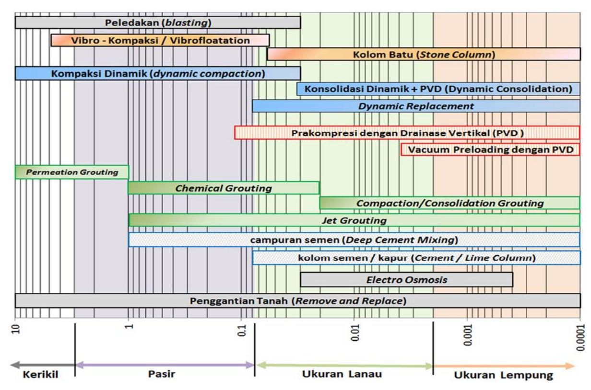

**Gambar 2 – Jenis-jenis metode perbaikan tanah** 

Setelah jenis perbaikan tanah dipilih, maka perlu dilakukan area percobaan (*trial area*) untuk melakukan uji coba sistem perbaikan tanah tersebut. Area percobaan ini dapat ditiadakan bilamana konsultan perencana sudah yakin bahwa perancangan dan sistem pelaksanaan yang dipilihnya sudah tepat.

# **6.5 Penyuntikan semen** *(grouting)*

#### **6.5.1 Ruang lingkup pekerjaan penyuntikan semen**

Subpasal ini menetapkan prinsip-prinsip perancangan pekerjaan penyuntikan semen yang meliputi pekerjaan *permeation grouting, compaction grouting, hydro-fracturing*, dan *fissure grouting.*

#### **6.5.2 Persyaratan teknis**

Persyaratan-persyaratan teknis berikut harus tersedia di lokasi sebelum pekerjaan penyuntikan semen dimulai.

- a) Kondisi lokasi dan keterbatasannya, misalnya: luasan, kemiringan, akses.
- b) Batasan pekerjaan, termasuk semua batasan mengenai lingkungan, hukum, atau perundang-undangan.
- c) Keberadaan, lokasi, dan kondisi dari struktur terdekat, misalnya: bangunan, jalan, fasilitas atau layanan publik, struktur bawah tanah dan fondasinya.
- d) Semua pencemar bawah tanah atau bahaya yang dapat memengaruhi metode pelaksanaan atau keselamatan di lingkungan pekerjaan.

**© BSN 2017 67 dari 303** 

- e) Kondisi geologi, geoteknik, dan muka air tanah.
- f) Antisipasi semua aktivitas lain yang sedang berlangsung atau yang akan dikerjakan yang dapat memengaruhi pekerjaan (misal: pengisian ulang air tanah, pembangunan terowongan, galian dalam).
- g) Semua informasi yang terkait dengan pembuatan gambar perancangan dan metodologi penyuntikan semen (Gambar 3).
- h) Semua informasi yang diperlukan untuk pengawasan, pengamatan, atau pengujian terhadap pekerjaan tersebut.

Aspek-aspek berikut harus disiapkan secara tertulis sebelum pelaksanaan pekerjaan.

- a) Kebutuhan dan penugasan untuk semua survei terhadap kondisi struktur yang berdekatan, jalan, fasilitas layanan publik, dan lainnya, yang akan dilakukan sebelum, selama, maupun setelah pekerjaan.
- b) Prosedur spesifik dan kriteria untuk verifikasi, pengawasan, dan persetujuan pekerjaan penyuntikan semen.
- c) Pemisahan yang jelas terhadap tugas-tugas yang berhubungan dengan perancangan, pelaksanaan, interpretasi hasil, dan persetujuan pekerjaan.

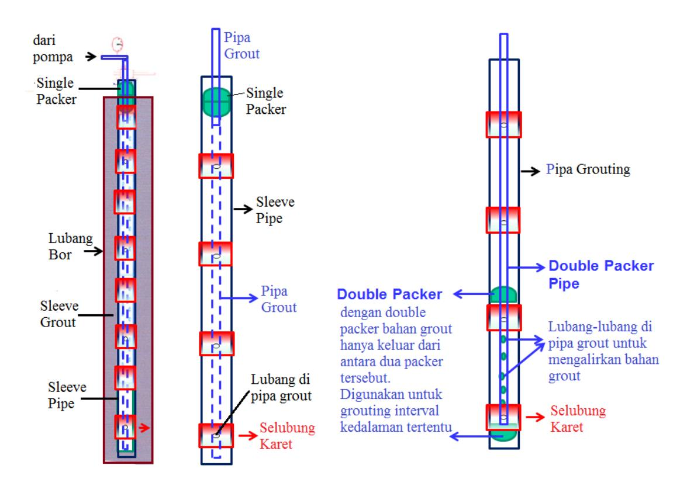

**Gambar 3 – Pipa penyuntikan semen dan** *packer*

**© BSN 2017 68 dari 303**

# **6.5.3 Penyelidikan lapangan khusus untuk pekerjaan penyuntikan semen**

#### **6.5.3.1 Umum**

Untuk tujuan perancangan pekerjaan penyuntikan semen, penyelidikan lapangan harus:

- menyediakan laporan kondisi geoteknik yang komprehensif;
- menunjukkan jika ada kerentanan tanah terhadap penyuntikan semen;
- menyediakan informasi untuk pemilihan tipe *grout*.

Untuk pelaksanaan pekerjaan penyuntikan semen, laporan penyelidikan lapangan harus memuat informasi spesifik berikut.

- a) Karakteristik fisik dan kimiawi tanah yang relevan.
- b) Lokasi dan elevasi permukaan tanah saat pengujian relatif terhadap sebuah datum.
- c) Lokasi, penetapan ketinggian, dan kondisi dari struktur yang akan dibangun.
- d) Kondisi anisotropi maupun batas-batas permeabilitas tanah yang dapat memengaruhi pekerjaan penyuntikan semen.
- e) Orientasi, frekuensi, dan lebar dari rekahan batuan serta komposisi dan asal dari semua material pengisinya.
- f) Keberadaan dan lokasi rongga di dalam tanah.
- g) Keberadaan halangan yang membutuhkan pengeboran khusus dan metode atau peralatan penyuntikan semen khusus.
- h) Keberadaan dan karakteristik tanah yang memiliki kemungkinan lepas, melunak atau menjadi tidak stabil, larut, runtuh atau mengembang sebagai hasil dari pengeboran dan penyuntikan semen.
- i) Muka air tanah, kemiringan, dan variasinya seiring waktu.
- j) Lapisan dengan permeabilitas dan kecepatan rembesan air tanah yang tinggi.
- k) Suhu, komposisi kimia, kandungan organik, dan bakteri air tanah atau tanah tersebut, bila diperkirakan akan menyebabkan masalah.

Model geologi dan geometri, dan struktur pori serta antisipasi perkembangannya harus dijelaskan dalam laporan penyelidikan. Ketepatan dan batas-batas model harus diperhatikan.

Bila memungkinkan, informasi spesifik mengenai pengeboran berikut harus direkam.

- a) Lokasi dan penyebab dari kehilangan contoh inti atau *core sample* (bila ada).
- b) Zona tidak stabil dan usaha stabilisasi yang diterapkan.
- c) Muka air pada awal dan akhir pemeriksaan tanah, zona-zona yang (dapat) mengalami kehilangan dan penambahan air, warna dan perubahan warna air.
- d) Pergerakan alat pengeboran atau *drill rig* (kasar, halus atau mulus, atau terperosok).
- e) Laju kemajuan pengeboran.

Perlu diberikan perhatian khusus untuk penyelidikan lebih lanjut bila penyuntikan semen dilakukan pada daerah bertekanan tinggi dan tanah yang tercemar oleh kontaminan.

- a) Untuk injeksi pada tanah bertekanan tinggi, kondisi tekanan lapangan harus diselidiki sebelum merancang pekerjaan penyuntikan semen.
- b) Untuk injeksi gel organik pada tanah yang tercemar oleh kontaminan, penyelidikan pengaruh bakteri terhadap air tanah dan tanah tersebut harus dilakukan.

Lubang bor bekas penyelidikan lapangan harus ditutup kembali dengan penyuntikan semen baik apabila tidak dipergunakan lagi.

## **6.5.3.2 Uji permeabilitas**

Persyaratan berikut harus diikuti untuk uji permeabilitas pekerjaan penyuntikan semen.

- a) Harus dilakukan uji permeabilitas atau konduktivitas hidraulik tanah dengan metode berikut:
  - uji permeabilitas lapangan berupa uji pemompaan (*pumping test*);
  - uji laboratorium untuk contoh tanah tak terganggu; dan perkiraan distribusi ukuran butiran tanah, dan/atau kepadatannya;
  - uji *lugeon* (*lugeon test*) pada batuan.
- b) Setiap lubang bor penyelidikan tanah di batuan harus diuji untuk mengidentifikasi keberadaan zona terbuka di dalam lubang tersebut. Pengamatan dilakukan terhadap ketinggian muka air saat pengeboran dilakukan dan dilakukan dengan menggunakan *packer test* setelah pengeboran selesai. Harus ada antisipasi untuk mengisolasi keberadaan tekanan air artesis sebelum pengeboran dilakukan.

# **6.5.3.3 Uji coba penyuntikan semen lapangan dan pengujian penyuntikan semen untuk verifikasi perancangan**

Persyaratan berikut harus diikuti dalam uji coba penyuntikan semen lapangan dan pengujian penyuntikan semen.

- a) Untuk memverifikasi keandalan teknik penyuntikan semen yang direncanakan, harus dilakukan uji coba lapangan. Uji coba tersebut sebaiknya dilaksanakan saat tahap penyelesaian perancangan final, atau pada tahap awal konstruksi. Uji coba ini dilakukan untuk mendapatkan umpan balik tentang jarak lubang bor, tekanan penyuntikan semen, volume bahan *grout*, dan efektivitas bahan *grout*.
- b) Sesuai dengan tujuan dan target proses *grouting*, harus dilakukan uji lapangan sebelum dan sesudah penyuntikan semen dilakukan.
- c) Setiap langkah dan detail pelaksanaan uji coba lapangan harus dicatat secara teliti.
- d) Uji coba dilakukan dengan keterlibatan konsultan perencana sistem penyuntikan semen.
- e) Berdasarkan informasi yang didapatkan dari uji coba lapangan di atas, harus dilakukan kaji ulang dan penentuan kriteria bahan *grout*, kecepatan dan tekanan pemompaan serta volume yang perlu diinjeksikan ke dalam tanah.

#### **6.5.4 Persyaratan material dan produk**

Semua komponen dan bahan *grout* harus sesuai dengan spesifikasi pekerjaan serta SNI yang berlaku. Kecocokan semua unsur *grout* harus dievaluasi. Selain itu, harus dilakukan

**© BSN 2017 70 dari 303**

kajian interaksi antara bahan *grout* dengan tanah. Setelah dipastikan, sumber dan komposisi material *grout* tidak boleh diubah tanpa didahului oleh uji verifikasi kecocokan. Material yang tidak memenuhi standar kualitas harus secepatnya dipindahkan dari lokasi pekerjaan.

Material dasar bahan *grout* yang disyaratkan adalah sebagai berikut:

- bahan pengikat hidraulik *(hydraulic binders)* dan semen, yang mengacu pada persyaratan di dalam SNI 15-7064-2004 (Semen Portland Komposit) dan SNI 0302-2014 (Semen Portland Pozzolan);
- material lempung, lempung asli atau bentonit dengan persyaratan yang mengacu pada SNI 03-6820-2002, SNI 4141:2015, SNI 03-4142-1996;
- pasir, kerikil, dan bahan pengisi *(fillers),* dengan gradasi dan spesifikasi yang mengacu pada SNI 2816:2014, SNI 2417:2008, SNI 3407:2008;
- air, umumnya diuji terhadap klorida, sulfat, dan material organik dengan mengacu pada persyaratan di dalam SNI 03-6817-2002;
- produk kimia dan bahan tambah *(admixture),* mengacu pada persyaratan yang diberikan di dalam SNI 03-2495-1991.

#### **6.5.5 Pengambilan contoh dan pengujian**

Prinsip-prinsip berikut harus digunakan untuk pengambilan contoh dan pengujian.

- a) Tiap-tiap komponen penyusun campuran material *grout* dan bahan *grout* yang siap diinjeksikan ke dalam tanah harus diuji secara berkala untuk verifikasi kecocokan dengan persyaratan pada saat perancangan.
- b) Metode pengujian standar (peralatan, kondisi batas, analisis) harus dilakukan untuk menunjukkan perbandingan sifat produk yang disediakan oleh pemasok yang berbeda.
- c) Apabila kondisi lapangan berbeda secara substansial dengan kondisi laboratorium (terutama temperatur), pengujian harus dilakukan sesuai dengan temperatur di lapangan. Perkembangan temperatur selama pengujian harus diperhatikan.

#### **6.5.6 Pertimbangan lain dalam perancangan**

#### **6.5.6.1 Umum**

Perancangan dan penerapan penyuntikan semen harus dibuat sefleksibel mungkin agar dapat disesuaikan dengan kondisi tanah setempat yang tidak teridentifikasi sebelumnya.

Tujuan utama dari teknik penyuntikan semen adalah:

- modifikasi karakteristik hidraulik/hidrogeologi tanah;
- modifikasi sifat-sifat mekanik tanah;
- pengisian celah alami, pekerjaan tambang, rongga yang terhubung dengan struktur;
- mendorong pergerakan tanah untuk kompensasi kehilangan tanah atau untuk stabilisasi dan pengangkatan fondasi telapak, pelat beton, dan perkerasan jalan.

Perancangan teknik penyuntikan semen memerlukan informasi sebagai berikut:

- tujuan penyuntikan semen dan kriteria perancangan;

**© BSN 2017 71 dari 303** 

- informasi tanah yang memadai, terutama aspek geologi, geoteknik, dan data hidrogeologi (termasuk kimia air) yang relevan dengan pekerjaan *grouting*;
- batasan akibat pertimbangan lingkungan, pengaruh dari dan terhadap struktur yang terhubung (gedung dan fondasi) atau parameter lain yang dapat memengaruhi pemilihan campuran *grout* dan teknik pelaksanaan;
- referensi dari proyek penyuntikan semen lain yang dilakukan di area yang sama atau pada kondisi yang sama.

Berdasarkan data penyelidikan tanah, perancangan dan uji coba penyuntikan semen, aspekaspek berikut harus dipertimbangkan dan disebutkan di dalam dokumen pekerjaan.

- a) Bentuk dan volume tanah yang akan diperbaiki.
- b) Target yang akan dicapai dan dapat diukur.
- c) Metode dan pola pengeboran titik-titik penyuntikan semen.
- d) Jenis dan teknik pelaksanaan penyuntikan semen yang akan diterapkan.
- e) Titik-titik dan jarak antartitik injeksi.
- f) Urutan titik injeksi terhadap waktu dan komposisi bahan *grout*.
- g) Batasan tekanan injeksi, debit injeksi per satuan waktu, dan total volume bahan *grout* yang akan diinjeksikan per titik injeksi.
- h) Komposisi campuran bahan *grout*.
- i) Pengujian yang diperlukan dan kontrol lapangan yang harus dilakukan sebelum, selama, dan sesudah penyuntikan semen.
- j) Instrumentasi geoteknik yang diperlukan untuk pengawasan dan pencatatan data.

Aspek-aspek berikut harus dipertimbangkan selama pekerjaan penyuntikan semen.

- a) Keterkaitan dan kelengkapan data tanah yang tersedia.
- b) Kinerja bahan *grout* yang diperlukan.
- c) Letak dan kondisi dari struktur yang ada di sekitar areal proyek penyuntikan semen.
- d) Perubahan tegangan tanah dan tegangan air pori tanah yang diakibatkan oleh pekerjaan penyuntikan semen, kondisi air tanah yang ada, dan target kondisi akhir setelah penyuntikan semen.
- e) Ada tidaknya kadar racun dari bahan *grout* yang dapat mengganggu lingkungan.
- f) Lingkungan pekerjaan dimana bahan *grout* disimpan, dicampur, dan diinjeksikan.
- g) Ketersediaan dan kesesuaian persediaan bahan *grout*.
- h) Batasan kriteria keselamatan dan lingkungan.

# **6.5.6.2 Supervisi dan monitoring**

#### **6.5.6.2.1 Umum**

Supervisi proses penyuntikan semen harus didasarkan pada spesifikasi desain. Supervisi harus mendokumentasikan semua pekerjaan dan kejadian di lapangan berdasarkan

**© BSN 2017 72 dari 303**

observasi terperinci atas setiap tahapan pelaksanaan. Dokumentasi ini harus digunakan sebagai dasar setiap modifikasi dari spesifikasi desain.

Selama masa konstruksi, asumsi desain harus diverifikasi berdasarkan data yang diperoleh dan bila perlu, dimodifikasi.

# **6.5.6.2.2 Supervisi**

Seluruh pekerjaan penyuntikan semen harus disupervisi oleh personel yang berpengalaman cukup dari semua pihak terkait. Semua personel inti harus sudah memilki pengalaman *grouting* sebelumnya.

Supervisi harus berlangsung terus menerus dan semua pengamatan harus dibandingkan dengan parameter dan asumsi perancangan. Bilamana pengamatan berbeda cukup besar dengan perancangan, harus dicari penyebab perbedaan tersebut, dan parameter pelaksanaan harus disesuaikan berdasarkan kondisi baru yang dihadapi.

Para perencana harus diinformasikan bilamana terjadi penyimpanan dan disertakan dalam proses penyesuaian spesifikasi perancangan juga pelaksanaan.

#### **6.5.6.3 Monitoring pergerakan**

Instrumentasi yang tepat harus dipasang agar pergerakan tanah dan/atau bangunan yang berada dalam zona dampak penyuntikan semen dapat dipantau dengan ketelitian yang memadai. Hal ini harus dilakukan untuk memastikan bahwa pergerakan yang terjadi masih berada dalam batas-batas toleransi yang ditetapkan.

Instrumentasi untuk monitoring pergerakan harus dipasang sebelum pekerjaan dimulai untuk mengidentifikasi apakah ada pengaruh latar belakang (*background influences*), misalnya variasi suhu dan fluktuasi air tanah. Dengan demikian pengaruh dari hal-hal di atas (bila ada) dapat diketahui sebelumnya dan dapat dikompensasikan terhadap pembacaan saat pekerjaan penyuntikan semen berlangsung.

Pemasangan instrumentasi yang diperlukan dalam pekerjaan penyuntikan semen harus mempertimbangkan kondisi-kondisi sebagai berikut.

- a) Apabila penyuntikan semen dilakukan untuk stabilisasi bangunan atau terdapat bangunan/fasilitas yang diperkirakan dapat terganggu oleh proses penyuntikan semen, maka perlu dipasang *tilt meter* dan/atau *beam sensor* pada bangunan tersebut. Selain itu juga harus dipasang inklinometer pada tanah yang berada di dekat bangunan tersebut yang berfungsi untuk mengukur besar pergerakan tanah lateral.
- b) Untuk memonitor terjadinya proses pengangkatan tanah *(heave)* atau naiknya permukaan tanah, perlu dipasang *surface settlement plate* yang dipasang tertanam paling tidak 80 cm ke dalam tanah; bilamana perlu konsultan perencana/pengawas ahli dapat meminta dipasang ekstensometer atau *deep settlement probe*.
- c) Di dalam proses *compaction grouting* di tanah lempung, harus dipasang beberapa *vibrating wire piezometer* untuk memonitor tegangan air pori berlebih yang timbul dan untuk mengukur disipasi tegangan air pori.
- d) Apabila penyuntikan semen digunakan untuk membuat lapisan kedap air, maka perlu dipasang beberapa sumur pengamat secara terencana untuk dilakukan pengujian pemompaan dan melihat tingkat kekedapan yang dicapai.
- e) Harus dipasang beberapa pipa-pipa monitor untuk mendeteksi dan membatasi aliran bahan *grout.*

**© BSN 2017 73 dari 303** 

Semua letak titik-titik instrumentasi harus mendapat persetujuan konsultan perencana dan/atau pengawas ahli.

#### **6.6** *Jet grouting*

# **6.6.1 Ruang lingkup pekerjaan** *jet grouting*

Subpasal ini menetapkan prinsip-prinsip perancangan pekerjaan *jet grouting*. Proses *jet grouting* harus dibedakan dari proses *grouting* lainnya yang tercantum dalam 6.5.

#### **6.6.2 Metode** *jet grouting*

*Jet grouting* merupakan metode *grouting* saat bahan *grout* diinjeksikan dengan tekanan tinggi (300--600 bar atau 30.000--60.000 kPa) melalui mata jet dengan kecepatan semprot yang tinggi (180--300 m/detik). Dengan demikian bahan *grout* yang disemprotkan akan memotong dan mengerosi tanah asli, lalu mengakibatkan tanah asli tersebut bercampur dan/atau tergantikan dengan bahan *grout* sehingga terbentuklah kolom-kolom tanah-semen yang relatif seragam juga berkekuatan tinggi.

*Jet grouting* dapat pula dikategorikan sebagai salah satu bentuk perbaikan tanah dengan sistem pencampuran dalam (*deep mixing method*). Pelaksanaannya dilakukan dengan melakukan pengeboran hingga mencapai kedalaman rencana, lalu diikuti dengan injeksi *grout* (terkadang dicampur dengan cairan lain, dan/atau udara) yang dipompakan sambil memutar setang bor dengan kecepatan 10--20 rpm, dan secara bersamaaan setang bor ditarik secara perlahan-lahan ke atas untuk membentuk kolom tanah-semen yang relatif seragam.

Mata bor *jet grouting* biasa berukuran lebih besar daripada batang tempat mata *jetting (jet nozzle)* terletak. Batang alat jet dipasang di atas mata bor. Mata bor juga lebih besar dari setang bor yang digunakan sehingga di dalam lubang bor akan terbentuk anulus (ruang antara lubang bor dengan setang bor) tempat kotoran bor tanah dapat keluar ke permukaan.

Setang bor *jet grouting* dapat berupa:

- pipa tunggal untuk mengalirkan atau memompakan air dan bahan *grout* saja;
- pipa ganda konsentrik, dapat mengalirkan dua jenis material berbeda pada saat bersamaan; dan
- pipa rangkap tiga konsentrik, dapat mengalirkan tiga jenis material berbeda pada saat bersamaan.

Sesuai dengan setang dan mata jet yang digunakan, ada tiga sistem pengaliran *jet grouting* yang dapat digunakan, yang dijelaskan sebagai berikut.

#### **6.6.2.1 Sistem jet tunggal**

Mata jet dipasang di atas mata bor (Gambar 4a) dan memiliki pipa semprot *(nozzle)* tunggal. Pengaliran dilakukan hanya dengan memompakan satu jenis material, yaitu bahan *grout*. Tergantung jenis dan keteguhan tanah yang diperbaiki, biasanya menghasilkan kolom semen berukuran hingga 50 cm untuk tanah lempung dan hingga 75 cm untuk tanah pasiran.

**© BSN 2017 74 dari 303**

# **6.6.2.2 Sistem jet ganda**

Mata jet ganda (Gambar 4b), memiliki satu pipa semprot yang dikelilingi oleh lubang pipa semprot lain. Pipa semprot terdalam memompakan semen cair, dan pipa semprot keliling memompakan udara. Sistem ini menghasilkan kolom tanah semen yang berdiameter lebih besar.

# **6.6.2.3 Sistem jet rangkap tiga**

Mata jet rangkap tiga (Gambar 4c), memiliki tiga pipa semprot, yang terdalam menyemprotkan bahan *grout*, dan dua yang mengelilingi mata jet terdalam menyemprotkan air dan udara. Sistem ini menghasilkan diameter kolom yang lebih besar lagi.

**© BSN 2017 75 dari 303** 

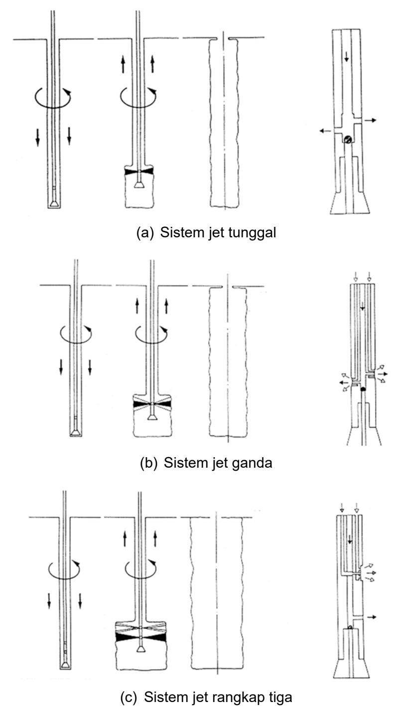

**Gambar 4 - Sistem pengaliran** *jet grouting* **(BS EN 12716:2001)** 

#### **6.6.3 Struktur hasil** *jet grouting*

Tergantung pada cara pelaksanaan *jet grouting*, akan dapat dihasilkan struktur kolom-kolom semen sebagai berikut (Gambar 5).

- a) Kolom semen tunggal (Gambar 5a).
- b) Barisan kolom-kolom semen yang saling bertampalan *(overlapped)* hingga membentuk dinding sebidang (Gambar 5b dan c).

**© BSN 2017 76 dari 303**

- c) Blok kolom-kolom semen yang saling bertampalan membentuk struktur blok tiga dimensi (Gambar 5d).
- d) Kanopi *jet grouting*, yaitu struktur yang dibentuk oleh *jet grouting* horizontal atau subhorizontal dengan sudut ± 20° dari bidang horizontal. (Gambar 5e).

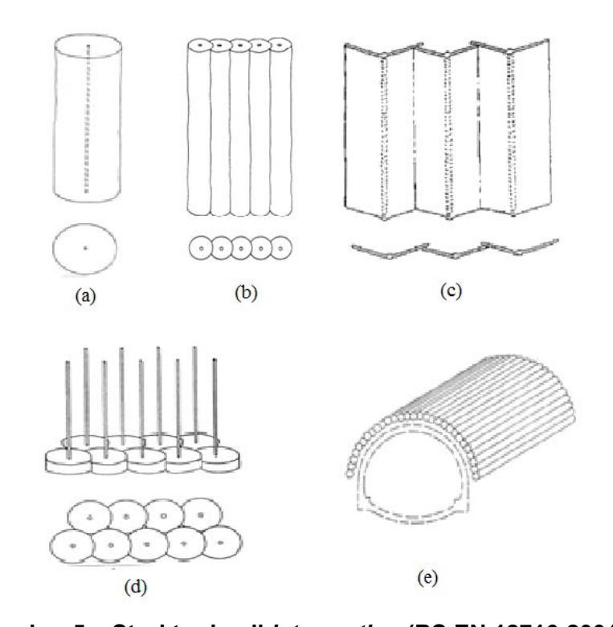

**Gambar 5 – Struktur hasil** *jet grouting* **(BS EN 12716:2001)** 

#### **6.6.4 Parameter** *jet grouting*

Parameter *jet grouting* yang perlu dinyatakan di dalam perancangan dan pelaksanaan adalah sebagai berikut.

- tekanan cairan *grout* di dalam pipa atau setang bor *jet grouting*;
- laju aliran fluida dalam setang bor jet *grouting*;
- komposisi bahan *grout*;
- kecepatan rotasi setang bor *jet grouting;*
- kecepatan penetrasi dan kecepatan penarikan setang bor *jet grouting.*

#### **6.6.5 Data khusus**

Data berikut harus diselidiki dan diketahui sebelum merancang pelaksanaan pekerjaan *jet grouting*:

- penyelidikan tanah: perincian profil tanah dan sifat-sifat geoteknik tanah asli tempat akan dilakukan perbaikan tanah;
- kondisi geologi;
- kondisi air tanah;

- kondisi lingkungan sekitar, di antaranya: keberadaaan dan kondisi struktur yang berdekatan, struktur dan fasilitas yang tertanam dalam tanah, tiang listrik, dan kemungkinan rintangan-rintangan yang ada, juga rintangan jalan kerja;
- persyaratan lingkungan, khususnya dampak lingkungan, misalnya pembuangan material *grout* yang berlebih;
- deformasi yang dapat diterima dari struktur yang akan disangga atau struktur yang berdekatan.

## **6.6.6 Perancangan**

Karena sifat pekerjaan *jet grouting* yang memerlukan spesialisasi, maka perancangan pekerjaan *jet grouting* harus dilakukan oleh konsultan dan/atau kontraktor spesialis yang berpengalaman dalam pekerjaan tersebut. Alokasi perancangan, pelaksanaan, dan pengawasan serta tanggung jawab dari semua pihak yang terkait harus secara jelas ditentukan di dalam dokumen kontrak.

Perancangan harus mencakup hal-hal yang ditabulasikan dalam Tabel 12 (tidak perlu berurutan).

**Tabel 12 - Rekomendasi daftar aktivitas perancangan** *jet grouting* 

| No. | Kegiatan                                                                                                                                                  |  |  |  |
|-----|-----------------------------------------------------------------------------------------------------------------------------------------------------------|--|--|--|
| 1   | Penyediaan data penyelidikan tanah, kondisi lapangan dan kondisi sekitar, untuk pelaksanaan pekerjaan jet grouting.                                    |  |  |  |
| 2   | Dasar keputusan untuk menggunakan jet grouting dan spesifikasi yang akan dicapai.                                                                      |  |  |  |
| 3   | Perancangan menyeluruh struktur jet grouting dan penentuan target geoteknik yang akan dicapai.                                                         |  |  |  |
| 4   | Evaluasi kelayakan konstruksi dari perancangan.                                                                                                           |  |  |  |
| 5   | Pemilihan sistem jet grouting.                                                                                                                            |  |  |  |
| 6   | Penentuan dimensi, lokasi, dan orientasi elemen jet grouting.                                                                                             |  |  |  |
| 7   | Melakukan uji coba lapangan.                                                                                                                              |  |  |  |
| 8   | Evaluasi sistem jet grouting dan pembuatan prosedur kerja.                                                                                                |  |  |  |
| 9   | Evaluasi hasil uji coba awal dan pengujian yang dilakukan.                                                                                                |  |  |  |
| 10  | Penentuan kriteria perancangan dan pengujian yang harus diberikan perhatian khusus.                                                                    |  |  |  |
| 11  | Spesifikasi instrumentasi yang diperlukan untuk memantau dampak jet grouting pada struktur yang berdekatan (jenis, akurasi, dan frekuensi pengukuran). |  |  |  |
| 12  | Interpretasi instrumentasi yang dipasang.                                                                                                                 |  |  |  |
| 13  | Penentuan batas toleransi dampak jet grouting terhadap struktur yang berdekatan.                                                                          |  |  |  |
| 14  | Hal-hal lain yang dirasa perlu mendapatkan pertimbangan.                                                                                                  |  |  |  |

Penyelidikan geoteknik untuk pekerjaan *jet grouting* 

#### **6.6.7 Penyelidikan geoteknik untuk pekerjaan** *jet grouting*

Kesuksesan *jet grouting* sangat tergantung dari keakuratan data penyelidikan tanah, karena itu sangat penting dilakukan penyelidikan geoteknik yang akurat. Semua penyelidikan geoteknik harus dilakukan sesuai dengan persyaratan penyelidikan tanah dalam Pasal 5.

Apabila memungkinkan, penyelidikan geoteknik harus menjangkau batas-batas daerah yang akan diperbaiki sehingga profil tanah dapat diinterpretasikan dengan cara interpolasi dari titik-titik yang diselidiki dan bukan berdasarkan ekstrapolasi.

**© BSN 2017 78 dari 303**

Penyelidikan secara khusus harus dapat mengidentifikasi keberadaan kondisi-kondisi geoteknik berikut.

- a) Lapisan tanah kohesif lunak atau kaku atau keberadaan lensa tanah lempung.
- b) Kandungan organik.
- c) Potensi kembang susut tanah.
- d) Lempung sensitif.
- e) Lapisan lensa tersementasi (*cemented layers*).
- f) Posisi muka air tanah.
- g) Tekanan artesis atau kondisi akuifer terkekang (*confined aquifer*).
- h) Gradien hidraulik.
- i) Sifat kimia tanah dan air.
- j) Kepadatan lapisan berbutir.
- k) Keberadaan kerakal dan batu bongkah.
- l) Keberadaan rongga atau tanah/area yang memiliki permeabilitas tinggi.
- m) Limbah kimiawi.

Parameter-parameter berikut juga harus diteliti, baik melalui uji laboratorium dan/atau dari uji lapangan.

- a) Ukuran butiran tanah (gradasi butiran tanah), kadar air, batas-batas Atterberg.
- b) Kepadatan, dengan pengukuran langsung atau tidak langsung.
- c) Kuat geser.
- d) Uji lapangan (CPT, SPT, atau lainnya) untuk mengindentifikasi variasi tingkat kepadatan tanah.
- e) Standar tata cara pengujian lapangan dan laboratorium seperti ditentukan dalam 5.6 dan 5.7.

#### **6.6.8 Persyaratan material dan produk**

Kecuali ditentukan lain, sifat-sifat bahan yang digunakan harus memenuhi SNI untuk material konstruksi. Berikut adalah persyaratan-persyaratan untuk material dan produk untuk *grouting*.

- a) Bahan dasar *jet grouting* merupakan campuran semen dengan air, namun dapat pula digunakan bahan pengikat hidraulik selain semen. Rasio perbandingan berat air terhadap berat semen yang digunakan berkisar antara 0,5 dan 1,5, tergantung dari kuat tekan yang ingin dicapai.
- b) Bahan tambah untuk pengurang air, penstabil, pemlastis atau pelunak *(plasticizer)*, anti air *(waterproofing)* atau *antiwashing* dapat ditambahkan ke dalam campuran air/semen.
- c) Bahan lain, seperti bentonit, bahan pengisi, abu terbang *(fly-ash),* juga dapat ditambahkan ke dalam campuran.
- d) Ketika bentonit yang digunakan dalam campuran, campuran air bentonit harus dipersiapkan terlebih dahulu sebelum pencampuran dengan semen dilakukan.
- e) Semua air tawar yang dapat diminum dapat digunakan untuk campuran bahan *jet grouting*.

- f) Air dari sumber selain pemasok air minum yang diakui harus dianalisis untuk memastikan bahwa air tersebut tidak memiliki efek negatif pada waktu *setting*, pengerasan, dan daya tahan campuran. Juga tidak akan mengakibatkan korosi pada tulangan (bila ada).
- g) Jika semen yang digunakan tidak sesuai SNI, harus dilakukan uji material semen untuk memastikan bahwa waktu *setting*, pengerasan, kekuatan, dan daya tahan yang disyaratkan dalam spesifikasi perancangan terpenuhi.
- h) Harus dipastikan bahwa tidak ada butiran berukuran relatif besar yang masuk ke dalam material *jet grouting* yang dapat memblokir pipa semprot *jet grouting*.
- i) Bilamana digunakan baja sebagai penulangan, maka material baja harus memenuhi SNI material konstruksi.

#### **6.6.9 Pertimbangan lain dalam perancangan**

#### **6.6.9.1 Aplikasi**

*Jet grouting* dapat diterapkan baik dalam konstruksi yang bersifat sementara ataupun bersifat permanen, di antaranya:

- untuk fondasi struktur yang akan dibangun (Gambar 6a),
- penyokong fondasi eksisting atau penopang *(underpinning)* (Gambar 6b),
- membangun penghalang berpermeabilitas rendah (Gambar 6c),
- dinding penahan tanah (Gambar 6d),
- pelindung erosi (Gambar 6e), dan
- memperkuat massa tanah (Gambar 6f).

**© BSN 2017 80 dari 303**

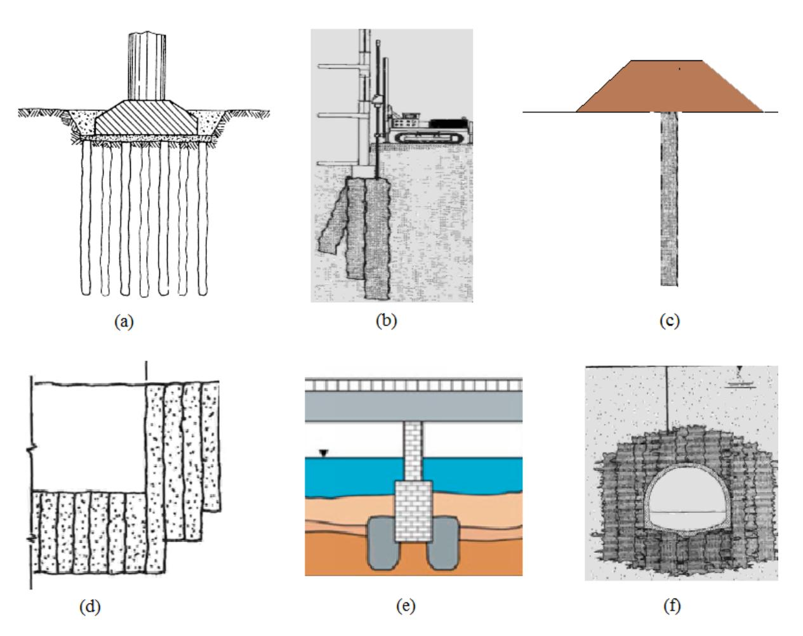

**Gambar 6 – Beberapa aplikasi** *jet grouting* **(BS EN 12716:2001 dan lainnya)** 

Perancangan pekerjaan *jet grouting* perlu memperhatikan persyaratan-persyaratan berikut.

- a) Mulut (ujung atas) lubang bor harus terletak di atas permukaan air. Bilamana mulut lubang bor di bawah permukaan air, maka harus digunakan penutup atau selubung *(casing)* dan bibir penutup berada di atas permukaan air. Bilamana ada tekanan air artesis, maka harus diambil langkah-langkah pencegahan agar tidak terjadi efek tererosinya tanah dasar (*piping*) akibat tekanan air artesis.
- b) Tujuan pekerjaan *jet grouting* harus secara jelas dinyatakan dalam perancangan. Formasi titik-titik *jet grouting* yang direncanakan harus sesuai dengan tujuan yang akan dicapai.
- c) Urutan pengerjaan titik-titik *jet grouting* harus ditentukan dalam perancangan. Perincian urutan pelaksanaan sebaiknya ditampilkan pada gambar pelaksanaan pekerjaan.
- d) Jika data penyelidikan tanah kurang memadai, dan/atau tidak ada pengalaman pekerjaan *jet grouting* dalam kondisi tanah yang serupa, perancangan pekerjaan *jet grouting* harus ditentukan melalui uji coba pekerjaan secara langsung di lapangan.
- e) Untuk memastikan hasil yang konsisten, prosedur yang ditetapkan dalam perancangan harus dilakukan dan diuji dengan baik. Dalam kondisi tanah yang beragam, maka perlu dilakukan beberapa titik percobaan pelaksanaan *jet grouting*.
- f) Dalam hal bahan *jet grouting* akan mengalami kondisi berat, seperti tekanan tinggi atau ketahanan terhadap lingkungan agresif, uji coba lapangan sebaiknya didahului dengan pengujian laboratorium pada contoh campuran tanah asli dengan bahan *grout* dengan

- perbagai komposisi campuran untuk mengantisipasi kondisi pelaksanaan yang akan dihadapi.
- g) Kriteria uji contoh *jet grout* dan kriteria kualitas yang dapat diterima harus ditentukan dalam perancangan.
- h) Toleransi parameter kinerja yang ditetapkan harus memperhitungkan akurasi metode pengujian yang diusulkan.
- i) Bila kriteria penerimaan didasarkan atas contoh bahan *jet grout* yang didapatkan dari uji bor inti dari kolom semen *jet grout* yang sudah jadi, waktu dan posisi pengambilan contoh inti harus ditentukan dalam perancangan.
- j) Parameter perancangan sebaiknya mempertimbangkan kesulitan konstruksi yang mungkin terjadi dan yang dapat mengurangi efektivitas *jet grouting*.
- k) Urutan, kecepatan pelaksanaan, waktu *setting*, waktu pengerasan, dan diameter kolom harus dipertimbangkan untuk menghindari kelongsoran, atau penurunan, atau daya angkat ke atas *(uplift)* yang tidak dapat diterima.
- l) Rancangan harus menentukan batasan penurunan, pengangkatan *(heave)*, distorsi struktur, dan utilitas yang cenderung terpengaruh oleh pekerjaan *jet grouting*.

# **6.6.9.2 Geometri**

Diameter kolom semen *jet grouting* yang dihasilkan tidak hanya tergantung pada sistem pengaliran pada pompa semprot *jet grouting* terpilih, tetapi juga tergantung dari jenis dan heterogenitas tanah.

Hal-hal berikut ini harus dengan jelas ditampilkan pada gambar perancangan.

- a) Dimensi minimum penampang elemen (satu semen kolom) *jet grouting* yang akan dicapai dalam lapisan tanah yang berbeda yang mungkin ditemui.
- b) Toleransi titik posisi *jet grouting* (kecuali disebutkan lain, harus kurang dari 50 mm).
- c) Toleransi kemiringan sumbu elemen (kecuali disebutkan lain, harus lebih kecil dari 2% untuk kedalaman hingga 20 m).

Terkait dengan jarak antar-kolom-semen yang akan terbentuk, diameter maksimum kolom semen yang dapat terbentuk juga harus dipertimbangkan.

Jika di area tertentu teridentifikasi akan ada gangguan (batu, bekas struktur atau lainnya) di bawah tanah yang tidak dapat atau tidak boleh diangkat, area tersebut harus ditandai dalam gambar perancangan, untuk menghindari kerusakan yang tidak diinginkan.

# **6.6.9.3 Kekuatan dan karakteristik deformasi**

Kekuatan kolom semen *jet grouting* tergantung pada sistem *jet grouting* dan komposisi campuran *grout* yang digunakan, dan juga tergantung pada jenis dan heterogenitas tanah.

Saat memasang penyangga*,* perlu diperhitungkan deformasi dan stabilitas struktur yang akan dipikul pada saat kolom semen *jet grouting* belum mengeras.

Bila deformasi kolom semen *jet grout* merupakan faktor penting dalam perancangan, maka perlu dinyatakan metode pengujian kekuatan dan kekakukan kolom *jet grout* yang dihasilkan, nilai maksimum dan minimum yang diizinkan dari parameter yang diuji, serta kriteria penerimaan dari pengujian yang dilakukan.

Dengan mempertimbangkan variasi tanah, kekuatan minimum kolom semen yang dapat diterima harus ditentukan dalam tahap perancangan. Dalam hal karena ketiadaan pengalaman, kekuatan minimum kolom semen yang akan dihasilkan sulit diperkirakan di awal, perlu dilakukan pengujian di lapangan.

**© BSN 2017 82 dari 303**

Setiap pengujian yang disyaratkan harus mencantumkan secara jelas parameter yang diukur dan batas-batas nilai yang dapat diterima.

Bilamana diperlukan, kolom semen *jet grouting* dapat diberikan penulangan berupa besi beton, pipa atau baja profil yang dimasukkan sesaat setelah *jet grouting* dilakukan, sebelum kolom semen yang dihasilkan sempat mengeras.

# **6.6.9.4 Permeabilitas**

Apabila pekerjaan *jet grouting* digunakan untuk mengontrol air tanah, maka akurasi geometri rencana posisi titik-titik *jet grouting* yang direncanakan dan permeabilitas material bahan *jet grouting* merupakan hal penting yang harus mendapat perhatian utama.

Syarat batas nilai permeabilitas harus dinyatakan dalam perancangan dan metode pengukuran yang dapat diterima juga harus dinyatakan.

Permeabilitas keseluruhan struktur *jet grouting* harus dievaluasi dengan mempertimbangkan efek deformasi akibat penggalian dan/atau kondisi pembebanan pada skala penuh.

# **6.6.9.5 Supervisi, pengujian dan monitoring**

# **6.6.9.5.1 Umum**

Untuk menjamin kualitas yang dihasilkan, hal-hal berikut ini harus diamati:

geometri,

dan, bila diperlukan lakukan uji:

kekuatan, kemampuan berdeformasi, permeabilitas atau kepadatan bahan *jet grouting.*

Kontrol kualitas minimum *jet grouting* terdiri atas pelaporan parameter *jet grouting* dan pengamatan ampas bor *(spoil return*).

Dalam kondisi tanah yang relatif sama, parameter *jet grouting* yang sama akan menghasilkan elemen dimensi, sifat dan ampas bor yang sama.

Dalam pekerjaan *jet grouting*, setelah beberapa kolom terbentuk, sangat dianjurkan untuk mengevaluasi hasil kolom-kolom yang terbentuk dan membandingkan parameter *jet grouting* yang digunakan, dengan demikian dapat ditentukan prosedur yang terbaik.

Bilamana telah terdapat pengalaman yang cukup pada kondisi pelaksanaan *jet grouting* yang sama dan pada tanah yang relatif seragam, juga didapati bahwa kualitas kolom yang dihasilkan memenuhi syarat, maka pengujian selanjutnya dapat dikurangi.

# **6.6.9.5.2 Uji coba tahap awal** *(preliminary tests)*

Apabila pengalaman yang sebanding tidak ada, maka perlu dilakukan uji coba awal di lapangan. Uji coba awal harus dirancang sedemikian sehingga:

- memungkinkan pemilihan sistem dan parameter *jet grouting* yang paling efektif;
- memverifikasi bahwa sistem dan parameter *jet grouting* yang dipilih dapat memberikan hasil yang sesuai dengan persyaratan perancangan.

Dalam pengujian awal ini, sedapat mungkin kolom-kolom *jet grouting* diperiksa secara visual. Jika hal ini tidak mungkin dilakukan dalam arti kolom *jet grouting* tidak terlihat secara visual, perlu dilakukan *coring* untuk mendapatkan contoh *jet grout* yang dihasilkan, atau dilakukan uji tak langsung, misalnya uji beban.

**© BSN 2017 83 dari 303** 

# *6.7 Deep mixing*

#### **6.7.1 Ruang lingkup pekerjaan** *deep mixing*

Subpasal ini menetapkan prinsip-prinsip perancangan pekerjaan *deep mixing* yang dilakukan dengan dua metode berbeda, yaitu metode pencampuran kering atau *dry method* dan metode pencampuran basah atau *wet method*.

Metode *deep mixing* yang tercakup dalam subpasal ini dibatasi pada:

- teknik pencampuran dengan putaran alat pencampur mekanis di dalam tanah dan tanah di sekeliling titik pencampuran tidak dibuang (Gambar 8);
- aplikasi pencampuran dengan kedalaman minimal 3 m;
- berbagai bentuk dan konfigurasi yang terdiri atas: kolom tunggal, panel, *grid*, blok, dinding, atau kombinasi lebih dari satu kolom, baik dengan penampalan ataupun tidak (Gambar 7);
- perbaikan tanah alami, tanah timbunan, penampungan limbah dan lumpur, dan lain lain.

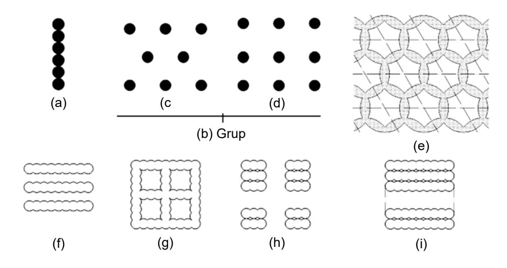

**Gambar 7 – Pola dan konfigurasi kolom-kolom** *deep mixing* **(BS-EN 1479:2005):** 

**(a) garis (strip) (b) grup (c) pola segitiga sama sisi (d) pola bujur sangkar (e) blok dengan kolom-kolom bertampalan (f) pola dinding (g) pola kisi (grid) (h) pola blok (i) pola area** 

**© BSN 2017 84 dari 303**

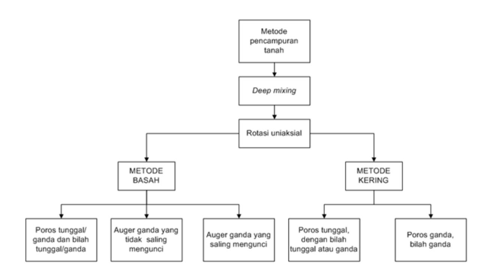

**Gambar 8 – Klasifikasi umum metode** *deep mixing* **(BS EN 14679-2005)** 

#### **6.7.2 Informasi yang diperlukan untuk pelaksanaan pekerjaan**

Sebelum pelaksanaan pekerjaan, informasi berikut harus tersedia:

- batasan hukum;
- acuan tetap *(benchmark)* untuk penentuan titik-titik perbaikan tanah;
- kondisi struktur, jalan, sarana utilitas (pipa air bersih, pipa gas, kabel), dan lain-lain yang berdekatan dengan lokasi pekerjaan;
- sistem manajemen mutu, termasuk pengawasan, pemantauan dan pengujian.

Informasi mengenai kondisi lapangan harus meliputi:

- geometri lapangan (batas lahan, topografi, akses, lereng, batas tinggi ruang kerja, dan lain-lain);
- struktur bawah tanah yang ada, sarana utilitas, kontaminasi yang timbul, kendala arkeologi, dan lain-lain;
- keterbatasan lingkungan, di antaranya: tingkat kebisingan, getaran, polusi;
- kegiatan di sekitar lokasi, baik saat pelaksanaan berlangsung ataupun di masa depan, misalnya pemompaan air tanah, *dewatering*, pembangunan terowongan, penggalian dalam.

Informasi khusus yang diperlukan adalah:

- pengalaman *deep mixing* atau pekerjaan geoteknik khusus yang berdekatan dengan lokasi, termasuk hasil uji lapangan untuk konfirmasi perancangan;

- pencemaran bawah tanah atau risiko yang dapat memengaruhi metode pelaksanaan, keselamatan kerja dan lokasi pembuangan material galian.

Instruksi tertulis yang harus disediakan kepada kontraktor, adalah:

- prosedur pelaporan untuk keadaan yang tidak terduga, atau kondisi yang didapati berbeda dengan yang diasumsikan dalam perancangan;
- prosedur pelaporan, jika perancangan didasarkan atas metode pengamatan;
- pemberitahuan keterbatasan yang dijumpai, misalnya tahapan konstruksi yang disyaratkan dalam perancangan tidak dapat dipenuhi/dilaksanakan;
- jadwal dan prosedur pengujian bahan untuk kriteria penerimaan.

Persyaratan tambahan atau penyimpangan dari syarat-syarat yang termuat dalam dokumen ini harus dibuat dan disetujui sebelum pekerjaan dimulai.

# **6.7.3 Penyelidikan geoteknik**

Laporan penyelidikan geoteknik dan data-data yang terkait dengan pemilihan metode perbaikan tanah yang akan dipilih harus tersedia lengkap.

Jumlah dan jenis penyelidikan tanah yang dikerjakan harus memadai untuk menentukan keadaan tanah. Penyelidikan tanah harus memenuhi kriteria SNI untuk penyelidikan tanah.

Pengalaman pelaksanaan *deep mixing* yang sebanding dengan kondisi dan lokasi serupa harus dipertimbangkan saat menentukan jumlah dan jenis penyelidikan tanah yang diperlukan.

Semua lubang bor atau sumur uji harus ditutup kembali dengan baik agar tidak memengaruhi pergerakan air tanah dan/atau pelaksanaan pekerjaan *deep mixing*.

Kecuali deskripsi geologi/geoteknik umum, untuk pelaksanaan pekerjaan *deep mixing*, laporan penyelidikan tanah harus memuat informasi berikut.

- a) Komposisi, sebaran arah lateral, ketebalan dan konsistensi lapisan permukaan, keberadaan dan kondisi akar-akar pohon, kondisi tanah timbunan, dan lain-lain.
- b) Ada tidaknya bongkahan batu, lapisan tanah tersementasi, atau batuan yang dapat menyebabkan kesulitan pelaksanaan.
- c) Keberadaan tanah lempung kembang-susut (*montmorillonite*).
- d) Keberadaan lubang, rongga atau celah.
- e) Letak muka air tanah, variasinya, dan kemungkinan keberadaan tekanan artesis.
- f) Parameter tanah berikut ini harus tersedia:
  - klasifikasi tanah;
  - distribusi ukuran butiran;
  - mineralogi;
  - kadar air alami;
  - batas-batas Atterberg;
  - berat isi;
  - kadar organik;

**© BSN 2017 86 dari 303**

- parameter kekakukan tanah/konsolidasi;
- kekuatan tanah (geser, tekan, tarik);
- permeabilitas.
- g) Faktor lingkungan, kimiawi dan karakteristik biologi, meliputi:
  - kualitas air tanah (kontaminasi, agresivitas, kimiawi, nilai pH, jenis serta konsentrasi ion dan logam);
  - data uji tingkat kontaminasi (bila ada).

Koordinat dan elevasi tanah di setiap titik penyelidikan harus diukur dan dicatat berdasarkan datum nasional atau satu titik acuan tetap yang diakui.

#### **6.7.4 Persyaratan material dan produk**

Konstruksi *deep mixing* terdiri atas penambahan suatu bahan pengikat ke dalam tanah. Jika diperlukan dapat ditambahkan komponen bahan sebagai berikut:

- bahan tambah;
- air;
- bahan pengisi;
- pembesian.

Seluruh material dan produk yang digunakan di dalam *deep mixing* harus sesuai dengan SNI yang sudah baku. Apabila standar yang dirujuk tidak tersedia, maka penggunaan material dan produk harus sesuai dengan standar dan/atau pedoman lain yang disetujui oleh konsultan perencana.

Seluruh material dan produk yang digunakan harus sesuai dengan spesifikasi perancangan dan harus memenuhi peraturan lingkungan setempat.

Untuk material yang belum diatur di dalam SNI atau standar lain yang disetujui oleh konsultan perencana, harus dilakukan uji yang sesuai untuk memastikan spesifikasi perancangan terpenuhi.

Sumber pasokan material harus didokumentasikan dan tidak diperbolehkan untuk diubah tanpa pemberitahuan terlebih dahulu.

Air dari sumber selain sumber air minum yang diakui harus diuji untuk menentukan kococokan air dengan tujuan *deep mixing*.

Keberadaan zat kimia yang signifikan di dalam material dan produk yang memungkinkan terjadinya kontaminasi lingkungan harus mendapat perhatian khusus dan dievaluasi.

#### **6.7.5 Pertimbangan lain dalam perancangan**

# **6.7.5.1 Umum**

Tujuan *deep mixing* adalah memperbaiki karakteristik tanah, yaitu: meningkatkan kuat geser, menurunkan kompresibilitas, dan/atau membuat penghalang kedap air. Tujuan ini dicapai dengan mencampur tanah dengan bahan pengikat yang dapat berupa: semen, kapur, serta bahan pengisi seperti gips (*gypsum*) dan abu terbang.

**© BSN 2017 87 dari 303** 

Teknik *deep mixing* ini dapat diaplikasikan untuk memperkuat bangunan sementara atau bangunan permanen seperti disajikan di dalam Gambar 9. Aplikasi tersebut umumnya bertujuan untuk:

- meningkatkan kestabilan struktur, galian, dan lereng;
- meningkatkan daya dukung fondasi dan mengurangi penurunan tanah;
- meningkatkan ketahan tanah terhadap penyebaran ke arah lateral (*lateral spreading*) saat gempa;
- pembatasan *(confinement)* kontaminasi tanah/limbah;
- mengurangi dampak vibrasi.

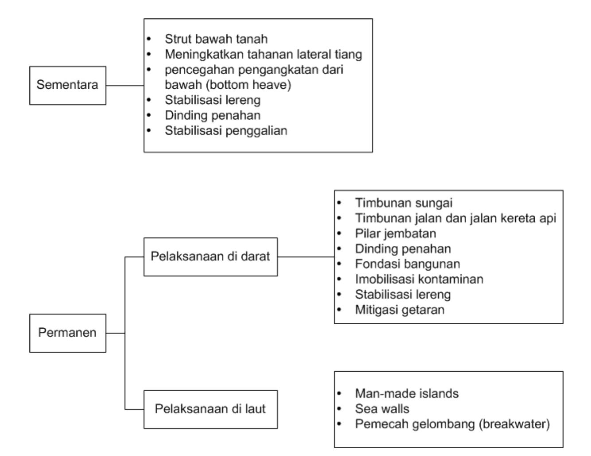

**Gambar 9 – Beberapa aplikasi metode** *deep mixing* **(BS EN 14679:2005)** 

Kekuatan kolom *deep mixing* dipengaruhi oleh beberapa faktor, seperti sifat-sifat tanah yang akan diperbaiki, kondisi pencampuran, alat pencampur dan proses pencampuran, kondisi pemeraman *(curing)*, jenis dan jumlah bahan pengikat; akibatnya sulit untuk memperkirakan kekuatan kolom *deep mixing* pada tahap perancangan. Oleh karena itu sangat penting untuk memperkirakan dan memverifikasi kekuatan kolom dalam beberapa tahap dengan tes pencampuran di laboratorium, uji coba lapangan dan uji verifikasi. Perancangan harus dimodifikasi jika persyaratan kekuatan tidak dapat dipenuhi.

Pelaksanaan *deep mixing* memerlukan beberapa tahapan perancangan geoteknik dan dapat merupakan proses yang iteratif. Tujuan perancangan adalah menghasilkan dokumen teknis,

**© BSN 2017 88 dari 303**

yang memungkinkan pekerjaan perbaikan tanah mencapai tingkat keamanan, kemampuan layanan, dan durabilitas yang diinginkan dan juga ekonomis, dengan mempertimbangkan target umur rencana. Semua pihak yang bertanggung jawab atas perancangan dianjurkan untuk dilibatkan juga selama masa pelaksanaan.

Perancangan geoteknik *deep mixing* harus didasarkan atas kriteria stabilitas global dan penurunan tanah yang diperbaiki.

Referensi dari pengalaman diperbolehkan apabila pengalaman tersebut telah diverifikasi melalui uji yang sesuai (misalnya dengan uji sondir atau uji *pressuremeter*).

Pernyataan metode *(method statement),* yang menjelaskan secara detail prosedur pekerjaan *deep mixing* harus dipersiapkan. Detail lokasi, tujuan pekerjaan, umur rencana, kemungkinan keterbatasan selama tahap konstruksi, dan setiap bahaya yang terkait dengan pelaksanaan pekerjaan harus tercantum dalam pernyataan metode. Pernyataan metode juga harus menekankan sejumlah persyaratan yang dapat memengaruhi pemilihan alat dan material *deep mixing.*

Perancangan awal dapat didasarkan pada pengujian pencampuran contoh di laboratorium dan pengalaman lain yang dapat dibandingkan. Kemungkinan adanya perbedaan karakteristik antara contoh yang dicampur di laboratorium dengan contoh yang dicampur di lapangan juga harus mendapat perhatian.

Agar pelaksanaan dapat mencapai target perancangan, maka perlu dilakukan pengawasan, pemantauan, pencatatan proses pekerjaan, dan pengujian di lapangan. Metode pengamatan untuk menyempurnakan perancangan sangat penting untuk dilakukan.

Kondisi pembebanan, efek iklim (bila ada), air tanah, batas toleransi penurunan dan pengangkatan tanah, batas distorsi struktur dan sarana utilitas, yang mungkin terpengaruh oleh pekerjaan *deep mixing* harus diperhitungkan.

Kemungkinan gangguan terhadap lingkungan, seperti kebisingan, getaran, polusi udara, dan air yang berdampak pada struktur yang berdekatan harus diminimalkan dan bila memungkinkan harus ditiadakan.

Pada kondisi dimana tahanan ujung *(base resistance)* kolom diperlukan, kemungkinan terganggunya tanah di ujung kolom harus dihindari dengan memilih peralatan dan metode pencampuran yang tepat.

Toleransi posisi dan kemiringan kolom atau dinding yang direncanakan harus memperhitungkan keterbatasan peralatan pencampuran yang digunakan. Untuk kolom *deep mixing* yang diatur dalam formasi rangka *(grid),* blok atau bertampalan, jarak antarkolom perlu memperhitungkan penyimpangan posisi dan kelurusan kolom.

Ketidaksesuaian keadaaan tanah atau sifat-sifat air tanah dengan laporan penyelidikan tanah harus segera dilaporkan kepada perencana dan pihak-pihak yang terlibat.

Konsekuensi akibat efek kimia dan fisik harus dipertimbangkan dalam perancangan. Perlu pertimbangan khusus terkait kestabilan jangka panjang, terutama di daerah laut atau tanah yang terkontaminasi.

Gambar 10 menunjukkan diagram alir proses perancangan dan pelaksanaan pekerjaan *deep mixing*, sedangkan Gambar 11 menunjukkan diagram alir proses perancangan iteratif yang diperlukan untuk pekerjaan *deep mixing*.

**© BSN 2017 89 dari 303** 

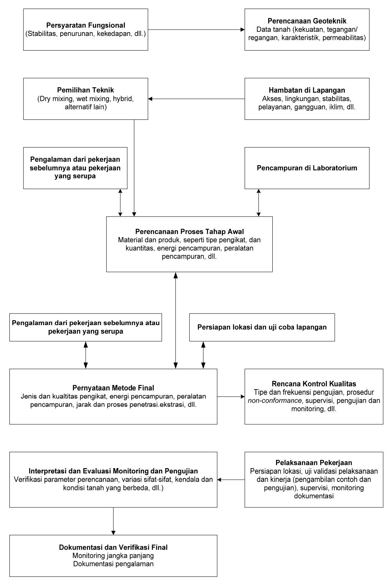

**Gambar 10 – Diagram alir proses perancangan dan pelaksanaan pekerjaan** *deep mixing* **(BS EN 14679-2005)** 

**© BSN 2017 90 dari 303**

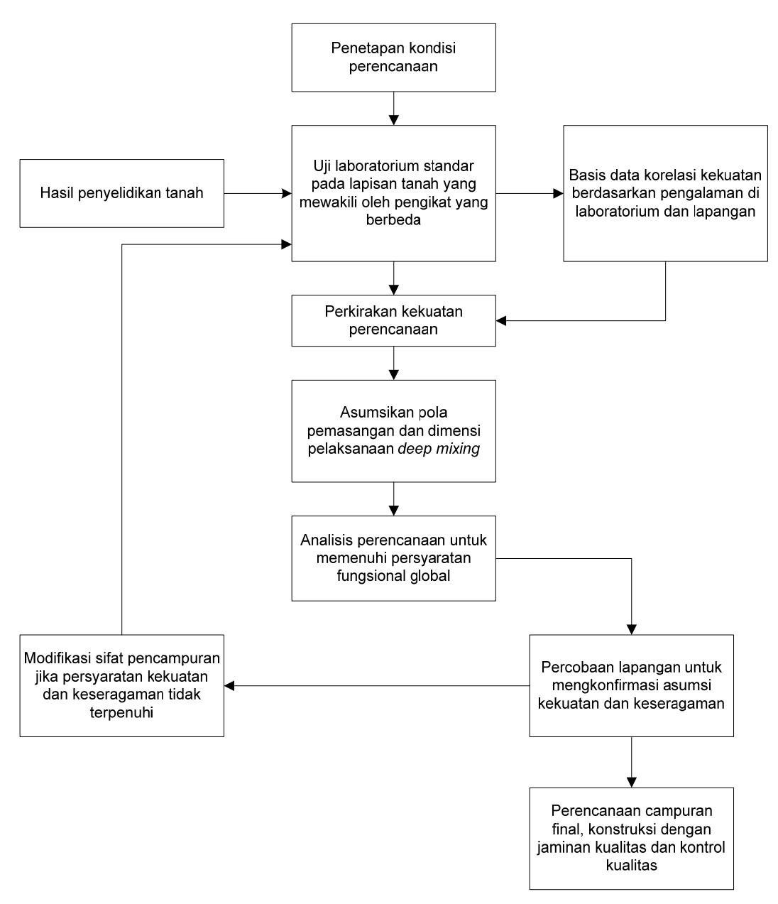

**Gambar 11 – Diagram alir proses detail iteratif perancangan** *deep mixing* **(BS EN 14679-2005)** 

#### **6.7.5.2 Dokumen perancangan**

Dokumen perancangan harus menyatakan target kinerja dan tujuan perbaikan tanah, pola geometri titik-titik perbaikan, spesifikasi material atau produk yang diasumsikan dalam perancangan, tahapan kerja, dan informasi lain yang relevan, dan juga harus mencantumkan informasi sebagai berikut.

- *a)* Spesifikasi pekerjaan *deep mixing*.
- b) Target kekuatan, karakteristik deformasi, dan permeabilitas.
- c) Lebar bagian yang bertampalan antarkolom.
- d) Toleransi yang diizinkan dalam hal panjang, diameter, kemiringan, dan posisi kolom.

- e) Batas-batas dan geometri titik-titik perbaikan, serta gambar posisi.
- f) Program pelaksanaan, termasuk jadwal pembebanan dan kemungkinan adanya pra pembebanan, batasan tahap-tahap konstruksi yang disyaratkan.
- g) Jadwal pengujian dan prosedur penerimaan untuk material yang digunakan dalam pekerjaan dan pengujian yang diperlukan serta prosedur pemantauan selama pelaksanaan.
- h) Persyaratan kemungkinan pemasangan tulangan struktural (kelas material yang digunakan dan prosedur pemasangan) dan jadwal pelaksanaan instalasi.
- i) Persyaratan panjang penetrasi kolom ke dalam lapisan tanah dasar atau lapisan kedap air.
- j) Prosedur pelaporan untuk keadaan tidak terduga, atau kondisi yang berbeda dari yang diasumsikan dalam perancangan, atau jika digunakan prosedur pengamatan untuk memperbaiki perancangan.

Bila penerimaan pekerjaan disyaratkan berdasarkan uji contoh inti, perancangan harus menunjukkan lokasi, umur kolom saat pengujian dilakukan, peralatan dan prosedur pengambilan contoh inti.

Untuk uji kualitas lapangan berdasarkan uji lapangan seperti uji sondir, uji *pressuremeter* dan lain-lain, kondisi pengujian dan kriteria penerimaan harus ditetapkan.

Batasan nilai-nilai kritis parameter perancangan geoteknik harus dinyatakan, juga langkahlangkah yang harus diambil jika nilai-nilai yang disyaratkan tidak tercapai.

Setiap persyaratan tambahan atau penyimpangan harus mendpat persetujuan pihak yang berwenang sebelum pelaksanaan pekerjaan dilaksanakan.

#### **6.7.5.3 Pemilihan bahan pengikat dan bahan tambah**

Pemilihan bahan pengikat merupakan aspek yang sangat penting untuk kesuksesan pelaksanaan *deep mixing*. Kondisi lapangan, tanah dan lingkungan, serta sifat-sifat tanah yang akan diperbaiki merupakan hal esensial yang harus dipertimbangkan dalam pemilihan bahan pengikat. Efisiensi bahan pengikat dan bahan tambah yang digunakan harus dikaji melalui pengujian di laboratorium dan/atau lapangan. Tabel 13 menunjukkan bahan-bahan pengikat yang umum digunakan dalam proses pekerjaan *deep mixing* dengan proses kering (bahan pengikat pada umumnya dicampurkan ke dalam tanah dalam bentuk serbuk).

**© BSN 2017 92 dari 303**

**Tabel 13 – Bahan pengikat dan pengisi yang umum digunakan dalam** *deep mixing* **(BS EN 14679:2005)** 

| Jenis Tanah                             | Bahan Pengikat                                      |
|-----------------------------------------|-----------------------------------------------------|
| Lempung                                 | Kapur (quick lime) / campuran kapur dan semen       |
| Lempung sangat sensitif (quick clay) | Kapur / campuran kapur dan semen                    |
| Lempung organik                         | Kapur dan semen / semen dan slag / Kapur dan gypsum |
| Gambut                                  | Semen / semen dan slag / kapur, gypsum, semen       |
| Tanah yang mengandung sulfat            | Semen / sement dan slag                             |
| Lanau                                   | Kapur dan semen / semen                             |

*Bahan pengikat di atas umumnya digunakan dalam pekerjaan deep mixing dengan proses kering (tanpa menambahkan air/cairan). Untuk proses basah pada umumnya bahan yang digunakan adalah adukan semen (semen + air), terkadang ditambahkan abu terbang, gypsum atau bahan lain sebagai bahan pengisi. Bentonit juga sering digunakan untuk memperbaiki kestabilan campuran.* 

#### **6.7.5.4 Pengujian pencampuran di laboratorium dan di lapangan**

Ketika mengkaji perbaikan tanah, perlu diketahui bahwa hasil uji pencampuran di laboratorium biasanya lebih baik daripada hasil yang dicapai di lapangan. Hal ini dapat terjadi karena kondisi pencampuran di laboratorium jauh lebih terkontrol.

Ketika mengevaluasi perilaku tanah yang diperbaiki, perlu dipertimbangkan efek semakin membaiknya tanah seiring dengan berlalunya waktu. Kecepatan perbaikan tergantung pada tipe dan jumlah bahan pengikat yang digunakan serta kondisi pemeraman. Saat mempelajari pengaruh waktu terhadap benda uji campuran, perlu dipertimbangkan efek kondisi pemeraman (temperatur, pemeraman di dalam air, prapembebanan, dan sebagainya)

Pada saat *deep mixing* digunakan untuk menghentikan kontaminan atau untuk menstabilkan deposit limbah, terdapat kemungkinan interaksi antara bahan pengikat dengan material di lapangan yang sulit diprediksi, dalam hal ini mutlak diperlukan uji coba di lapangan.

#### **6.7.5.5 Supervisi, pengujian, dan monitoring**

Jenis, jumlah, sistem pengujian dan pemantauan harus diberikan di dalam spesifikasi perancangan.

Lingkup, jumlah dan prosedur pengujian kolom *deep mixing* untuk verifikasi, kontrol, dan penerimaan harus ditentukan sebelum pekerjaan dimulai. Lingkup pengujian dan metode pengujian harus ditetapkan berdasarkan tujuan dan target fungsional pekerjaan *deep mixing* yang dilakukan.

Supervisi dilakukan untuk memastikan kesesuaian konstruksi dengan syarat-syarat yang ditetapkan dalam perancangan dan dokumen kontrak lainnya. Supervisi harus dilakukan oleh teknisi yang berpengalaman dalam pekerjaan *deep mixing*.

Jika terjadi kondisi tak terduga atau diperoleh informasi baru tentang kondisi tanah yang berbeda dengan yang diasumsikan dalam perancangan, kontraktor wajib segera melaporkan hal tersebut kepada perencana sesuai dengan prosedur yang ditentukan.

**© BSN 2017 93 dari 303** 

Pemenuhan kriteria perancangan dalam pelaksanaan harus diverifikasi dengan uji kekuatan, deformasi dan homogenitas kolom, dan jika relevan, juga dalam hal panjang dan diameter, permeabilitas, inklinasi dan dimensi penampalan kolom-kolom. Semua pengujian tersebut harus dilakukan terhadap kolom-kolom *deep mixing* yang sudah selesai dibangun. Tergantung dari parameter geoteknik yang perlu untuk diverifikasi, jenis pengujian yang dapat dilakukan antara lain: uji tekan bebas, uji triaksial, uji konsolidasi atau oedometer, uji sondir, *pressuremeter*, geofisik, dan uji beban.

Jumlah dan frekuensi pengujian harus merata untuk semua hasil pekerjaan *deep mixing*. Jumlah kolom yang diuji harus cukup representatif, dengan mempertimbangkan fungsi masing-masing kolom.

Apabila tujuan pekerjaan *deep mixing* adalah untuk pencegahan penyebaran kontaminasi limbah/air atau lainnya, maka harus dilakukan uji kimiawi yang terkait (misalnya penentuan kadar zat kimia aktif, nilai pH, kadar karbonat, kadar sulfat).

Bila penampalan merupakan bagian yang penting dari perancangan, lebar bagian yang bertampalan antara kolom yang berdekatan harus diperiksa. Lebar tampalan dapat diverifikasi dengan pengeboran inti terhadap kolom-kolom yang sudah selesai dibangun. Kolom yang berfungsi sebagai dinding penahan harus diperiksa secara visual untuk memastikan tingkat homogenitas yang tercapai.

Parameter konstruksi dan informasi yang disajikan di dalam Tabel 14 harus dipantau secara terus menerus selama pelaksanaan, atau setidaknya pada setiap interval kedalaman 0,5 m.

| Percampuran kering                                                                       | Percampuran basah                                                             |  |
|------------------------------------------------------------------------------------------|-------------------------------------------------------------------------------|--|
| Tekanan tangki udara                                                                     | Tekanan campuran, tekanan udara (bila ada)                                    |  |
| Kecepatan penetrasi dan penarikan                                                        | Kecepatan penetrasi dan penarikan                                             |  |
| Kecepatan putaran (putaran/menit selama penetrasi dan penarikan)                      | Kecepatan putaran (putaran/menit selama penetrasi dan gaya balik) |  |
| Banyaknya bahan pengikat per meter kedalaman saat penetrasi dan penarikan | Banyaknya adukan per meter kedalaman saat penetrasi dan penarikan          |  |

**Tabel 14 – Parameter konstruksi (BS EN 14679:2005)** 

Pada beberapa aplikasi, terutama saat kontinuitas dinding sangat penting, perlu dilakukan pemantauan (monitoring) posisi dan kelurusan alat pencampur.

Indikasi mengenai jenis tanah dan kondisi muka air tanah dapat diperoleh melalui hasil pemantauan parameter operasi mesin (misalnya konsumsi tenaga dan tahanan penetrasi alat pencampur) dan ampas pengeboran.

Sedapat mungkin proses pelaksanaan dimonitor secara otomatis dengan menggunakan teknologi komputer. Dalam sistem yang terkomputerisasi, tekanan pompa/kompresor, kecepatan penyaluran bahan pengikat, faktor pengikat, kadar pengikat, rasio air/pengikat dapat tercatat secara lengkap, hal ini memudahkan untuk mengetahui perlu tidaknya dilakukan penyesuaian ulang di setiap titik perbaikan tanah, dan perlunya penambahan kolom ekstra.

Pergerakan tanah, baik vertikal atau lateral, harus selalu dipantau dengan metode dan peralatan yang tepat. Untuk aplikasi terkait permeabilitas tanah, perlu dilakukan pemantauan tekanan air pori. Deviasi (penyimpangan) dari kriteria perancangan harus dilaporkan.

Instrumen untuk monitoring harus dipasang cukup dini untuk mendapatkan nilai awal *(reference values)* yang stabil sebelum pekerjaan dimulai.

**© BSN 2017 94 dari 303**

# **6.8 Pemadatan dalam** *(deep compaction)*

#### **6.8.1 Ruang lingkup pekerjaan pemadatan dalam**

Subpasal ini menetapkan prinsip-prinsip perancangan pekerjaan pemadatan dalam (*deep compaction).* Jenis-jenis pemadatan dalam yang dibahas di dalam subpasal ini mencakup:

- *deep vibratory compaction*;
- *stone columns*;
- pemadatan dinamik *(dynamic compaction).*

Metode-metode pemadatan dalam yang dibahas di dalam standar ini meliputi:

- metode pemadatan dengan menggunakan vibrator dengan arah getaran horizontal, pada kondisi vibrator tersebut masuk ke dalam tanah. Teknik ini dikenal dengan nama *vibroflotation*;
- metode pemadatan dengan memasukkan batang penggetar ke dalam tanah, dengan vibrator yang bergetar dalam arah vertikal dan vibrator tersebut tetap berada di atas permukaan tanah. Teknik ini umumnya dikenal dengan nama *vibrocompaction*;
- metode pemadatan dengan menumbuk permukaan tanah dengan menggunakan beban (umumnya berupa blok susunan pelat-pelat besi) seberat 5 - 200 ton. Teknik ini dikenal dengan nama kompaksi dinamik.

# **6.8.2 Informasi yang diperlukan untuk perancangan dan pelaksanaan pekerjaan**

Sebelum pelaksanaan pekerjaan, informasi berikut harus tersedia.

- a) Batasan hukum.
- b) Acuan tetap untuk penentuan titik-titik perbaikan tanah.
- c) Kondisi struktur, jalan, sarana utilitas (pipa air bersih, pipa gas, kabel), dan lain-lain yang berdekatan dengan lokasi pekerjaan.
- d) Sistem manajemen mutu, termasuk pengawasan, pemantauan dan pengujian.

Informasi yang berkaitan dengan kondisi di lapangan harus mencakup:

- geometri lokasi termasuk batas lahan, topografi, akses, lereng dan keterbatasan tinggi ruang kerja;
- struktur bawah tanah eksisting, (fasilitas) sarana publik, kontaminan yang sudah dikenal dan kendala-kendala arkeologi (bila ada);
- pembatasan lingkungan termasuk kebisingan, getaran, perpindahan, polusi dan efek variasi musiman dalam cuaca termasuk lapisan permukaan yang membeku;
- aktivitas di masa yang akan datang atau yang sedang berlangsung seperti *dewatering*, pembuatan terowongan, penggalian dalam dan peningkatan tingkat situs (peningkatan status lokasi tersebut).

Informasi khusus dalam kaitan dengan aspek perancangan dan pelaksanaan pemadatan dalam adalah sebagai berikut.

a) Tujuan perbaikan tanah dengan pemadatan dalam.

b) Persyaratan pasokan air dan pembuangan lumpur untuk proses basah saat pemasangan *vibrated stone columns*.

Instruksi tertulis yang harus disediakan kepada kontraktor, adalah:

- prosedur pelaporan untuk keadaan yang tidak terduga, atau kondisi yang didapati berbeda dengan yang diasumsikan dalam perancangan;
- prosedur pelaporan, jika perancangan didasarkan atas metode pengamatan;
- pemberitahuan keterbatasan yang dijumpai, misalnya tahapan konstruksi yang disyaratkan dalam perancangan tidak dapat dipenuhi/dilaksanakan;
- jadwal dan prosedur pengujian bahan untuk kriteria penerimaan.

Persyaratan tambahan atau penyimpangan dari syarat-syarat yang termuat dalam dokumen ini harus dibuat dan disetujui sebelum pekerjaan dimulai.

# **6.8.3 Penyelidikan geoteknik untuk pekerjaan pemadatan dalam**

Jumlah dan jenis penyelidikan tanah yang dikerjakan harus memadai untuk menentukan jenis dan karakteristik tanah setempat. Semua proses penyelidikan tanah harus memenuhi kriteria SNI untuk penyelidikan tanah dan mengacu pada penjelasan di Pasal 5.

Bila ada tanah timbunan yang heterogen, maka perlu dilakukan pemeriksaan melalui sumur uji.

Kemungkinan terdapatnya tanah keras dan batu-batu di dalam tanah yang dapat menghambat masuknya batang penggetar harus diselidiki.

Untuk pekerjaan pemadatan dalam, laporan penyelidikan tanah harus memuat informasi berikut.

- a) Komposisi, sebaran arah lateral, ketebalan dan konsistensi lapisan permukaan, keberadaan dan kondisi akar-akar pohon, kondisi tanah timbunan, dan lain-lain.
- b) Ada tidaknya bongkahan batu, lapisan tanah tersementasi, atau batuan yang dapat menyebabkan kesulitan pelaksanaan.
- c) Keberadaan tanah lempung kembang-susut (montmorillonite).
- d) Letak muka air tanah, variasinya dan kemungkinan keberadaan tekanan artesis.
- e) Parameter-parameter tanah sebagai berikut:
  - klasifikasi tanah;
  - distribusi ukuran butiran;
  - kadar air alami;
  - batas-batas Atterberg;
  - berat isi;
  - kadar organik;
  - parameter kekakuan tanah atau parameter konsolidasi;
  - kekuatan tanah (geser, tekan, tarik);
  - permeabilitas.

**© BSN 2017 96 dari 303**

- f) Lapisan tanah yang berpotensi likuifaksi.
- g) Keberadaan tanah timbunan yang masih mengalami penurunan akibat berat sendiri.
- h) Ada tidaknya kontaminasi tanah dan air tanah di sekitar proyek.

Untuk pekerjaan pemadatan dalam, juga diperlukan beberapa data sebagai berikut:

- keberadaaan lapisan tanah yang dapat membatasi efisiensi getaran yang diberikan, di antaranya keberadaan tanah lempung, lanau dan lapisan-lapisan yang kedap air;
- daya tahan hancurnya butiran tanah (*crushability of particles*);
- ikatan antar butiran akibat sementasi, hisapan (*suction*) dan kohesi.

Untuk pekerjaan *vibrated stone columns* diperlukan informasi tambahan sebagai berikut:

- kompresibilitas;
- batas konsistensi;
- kuat geser tak terdrainase;
- sensitivitas*.*

Pengujian laboratorium dan lapangan selengkapnya dapat dilihat pada Pasal 5.

#### **6.8.4 Persyaratan material dan produk**

Material yang digunakan sebagai bahan pengisi untuk pemadatan dalam dapat berupa pasir dan kerikil alam, batu pecah atau material daur ulang, seperti hancuran batu bata atau beton. Material pengisi ini harus memiliki gradasi yang baik dan dapat dipadatkan dengan efek getaran atau tumbukan. Juga harus memenuhi kriteria drainase, dalam arti dapat relatif cepat mengalirkan air.

Material yang ditambahkan harus cukup keras dan tahan terhadap efek kimiawi sehingga tetap stabil selama proses perbaikan tanah berlangsung, dan sepanjang umur rencana pada kondisi tanah dan muka air tanah yang sudah diantisipasi.

Material yang digunakan untuk membentuk *stone columns,* harus cocok dengan peralatan yang digunakan dan dapat disalurkan ke dalam tanah dengan lancar, baik dengan metode penghubung bawah *(bottom feed)* ataupun penghubung atas *(top feed)*.

Gradasi tanah pengisi tipikal yang umum digunakan pada proses-proses pemadatan dalam yang berbeda disajikan pada Tabel 15.

**© BSN 2017 97 dari 303** 

**Tabel 15 - Gradasi bahan pengisi tipikal** 

| Proses                                                               | Gradasi (mm) |
|----------------------------------------------------------------------|--------------|
| Proses kering (dengan) penghubung atas (dry top-feed process)     | 40 – 75      |
| Proses basah (wet process)                                           | 25 – 75      |
| Proses kering (dengan) penghubung bawah (dry bottom-feed process) | 8 – 50       |

Distribusi gradasi ukuran material pengisi harus diperiksa apakah sesuai spesifikasi perencana. Jika diperlukan, kekerasan *(hardness)* material berbutir yang digunakan untuk membuat *stone columns* dapat diperiksa dengan mengacu pada prosedur pengujian sifat mekanik dan fisik agregat yang diatur di dalam SNI terkait.

#### **6.8.5 Pertimbangan lain dalam perancangan**

# **6.8.5.1 Umum**

Data penyelidikan tanah harus digunakan untuk menentukan apakah tanah yang diselidiki dapat diperbaiki dengan menggunakan metode pemadatan dalam.

Hal-hal berikut harus ditentukan dalam perancangan pemadatan dalam.

- a) Tujuan perbaikan (misalnya meningkatkan daya dukung, mengurangi penurunan, mengurangi potensi likuifaksi).
- b) Target pencapaian parameter geoteknik yang diperlukan setelah perbaikan tanah (misalnya kuat geser, kekakuan, atau permeabilitas).
- c) Kriteria kedalaman, jarak dan area titik-titik perbaikan yang direncanakan.
- d) Kriteria kinerja yang ditargetkan dan jenis pengukuran parameter tanah yang disyaratkan (setelah proses perbaikan selesai) untuk menilai apakah target perbaikan telah tercapai.
- e) Rencana pemadatan ulang (bila perlu), jika akan ada penggalian tanah yang telah diperbaiki.
- f) Akibat sifat alami tanah yang tidak seragam, bahkan setelah proses perbaikan selesai dipastikan parameter tanah juga akan bervariasi. Karena itu variasi parameter tanah harus dipertimbangkan dengan jalan memberikan batas atas dan batas bawah yang diizinkan dari suatu parameter tertentu.
- g) Besarnya penurunan tanah dan pengangkatan tanah (bila ada) selama proses perbaikan tanah harus diantisipasi. Dampak besaran pengangkatan dan penurunan yang diperbolehkan terhadap bangunan sekitar (bila ada) harus diperhitungkan.

Beberapa proses pemadatan dalam membutuhkan air dalam jumlah besar. Jika dilakukan pengambilan air tanah pada proses pelaksanaan, perlu diperhitungkan volume air yang diperlukan dan dampak lingkungan yang mungkin terjadi.

Kemungkinan gangguan terhadap lingkungan, seperti kebisingan, getaran, polusi udara dan air yang berdampak pada struktur yang berdekatan harus diminimalkan dan bila memungkinkan harus ditiadakan.

**© BSN 2017 98 dari 303**

Jika *stone columns* dibutuhkan untuk bekerja sebagai drainase, diperlukan perancangan drainase permukaan dengan jalan membuat selimut drainase atau sistem drainase horizontal.

Jika pemadatan getar pada kedalaman tertentu atau *deep vibratory compaction* tidak ditujukan untuk memadatkan lapis permukaan, *roller* atau *stamper* harus digunakan untuk memadatkan lapisan tersebut.

## **6.8.5.2 Pemilihan metode perbaikan**

Metode yang dipilih untuk melaksanakan perbaikan tanah harus memenuhi persyaratan dalam perancangan. Bila tidak terdapat pengalaman yang meyakinkan dalam metode perbaikan tanah yang akan diterapkan, maka harus dilakukan uji coba *(preliminary trials)*  untuk membuktikan kelayakan metode tersebut dan/atau untuk mengoptimalkan perancangan perbaikan tanah tersebut.

**Pemadatan getar pada kedalaman tertentu** *(deep vibratory compaction)* umumnya diaplikasikan pada tanah berbutir kasar. Kandungan tanah berbutir halus mengurangi efisiensi pemadatan, pada umumnya pemadatan tidak akan berhasil baik bila kandungan tanah berbutir halus melebihi 10%. Tanah-tanah yang tersementasi atau memiliki hisapan yang tinggi tidak cocok untuk diperbaiki dengan sistem pemadatan getar pada kedalaman tertentu. Proses perbaikan ini dapat dilakukan dengan menggunakan *top mounted vibrator* yang dipasangkan di ujung atas batang penggetar atau *depth vibrator* yang umumnya dikenal dengan nama *vibroflot*. Proses pemadatan akan berlangsung lebih efisien bila getaran yang ditimbulkan batang penggetar atau *vibrofloat* menimbulkan resonansi getaran pada tanah.

*Vibrated stone columns* umumnya diaplikasikan untuk memperbaiki tanah lempung lunak yang memiliki kuat geser tak terdrainase minimum 20 kPa, namun dapat juga diaplikasikan pada tanah pasir lepas. Formasi *stone columns* bekerja sama dengan tanah di sekitarnya membentuk suatu struktur tanah komposit yang dapat difungsikan untuk meningkatkan daya dukung, mempercepat disipasi tegangan air pori, mengurangi penurunan, dan/atau meningkatkan stabilitas lereng. Stone columns ini dapat dibentuk melalui tiga cara sebagai berikut.

- a) Proses kering (dengan) penghubung atas atau *dry top-feed process*: Pada tanah berbutir kasar pada umumnya metode ini hanya dapat diterapkan untuk tanah yang berada di atas muka air tanah. Metode ini umumnya diaplikasikan dengan menggunakan *vibroflot*. *Vibroflot* dan batang penyambungnya dimasukkan ke dalam tanah melalui getaran dan berat sendiri vibroflot yang dibantu dengan semprotan udara bertekanan yang dipompakan ke ujung vibroflot dengan menggunakan kompresor. Setelah kedalaman rencana tercapai, vibroflot dipertahankan beberapa lama untuk memastikan kestabilan lubang.
  - Selanjutnya *vibroflot* diangkat keluar lubang yang terbentuk, lubang segera diisi dengan material pengisi berbutir kasar (lihat Tabel 15) sejumlah tertentu, lalu *vibroflot* diturunkan kembali untuk memadatkan tanah berbutir tersebut. Proses mengangkat *vibroflot*, mengisi lubang, menurunkan *vibroflot* untuk pemadatan dilakukan berulang-ulang hingga material terisi penuh di dalam lubang dan terbentuk *stone column* yang "terkunci" dengan tanah di sekitarnya.
- **b)** Proses basah atau *wet process:* Proses basah ini digunakan apabila lubang yang terbentuk dengan proses kering (dengan) penghubung atas tidak stabil. Alat pemadat yang digunakan sama seperti sebelumnya, yaitu *vibroflot*, hanya saja disini air yang dipompakan dan bukan udara. Lubang dibentuk dengan bantuan semprotan air *(water*

*jetting),* getaran dan berat sendiri *vibroflot*. Setelah mencapai kedalaman rencana, *vibroflot* dapat digerakkan naik turun beberapa kali sambil air tetap dipompakan, hal ini dimaksudkan untuk mengeluarkan lumpur dari dalam lubang. Kemudian, dengan *vibroflot* tetap menggantung dalam lubang dan aliran air tetap mengalir (aliran air dalam jumlah yang cukup dan kontinu menjamin kestabilan lubang yang terbentuk), material pengisi diisikan dari atas melalui lubang yang terbentuk. *Vibroflot* di tarik secara perlahan-lahan, getaran *vibroflot* akan memadatkan tanah berbutir yang diisikan dan membentuk *stone column*. Bilamana perlu *vibroflot* dapat didorong turun kembali untuk lebih memadatkan *stone column* yang dihasilkan. Proses ini memerlukan aliran air yang banyak, dan juga perlu disediakan parit untuk mengalirkan lumpur ke tempat penampung sementara.

*c)* Proses kering (dengan) penghubung bawah atau *dry bottom-feed process*: Proses kering (dengan) penghubung bawah ini dilakukan dengan menggunakan pipa penggetar yang dimasukkan ke dalam tanah dengan menggunakan *top mounted vibrator*. Ujung bawah pipa penggetar dilengkapi dengan sepatu yang dapat membuka secara otomatis saat pipa ditarik ke atas dan menutup saat pipa didorong ke bawah. Saat ujung pipa penggetar mencapai kedalaman rencana, material pengisi sejumlah volume tertentu (tidak sekaligus sebesar volume lubang yang dihasilkan) diisikan ke dalam pipa penggetar, kemudian pipa diangkat setinggi 2-3 m, saat ini material pengisi akan turun ke dalam lubang (saat ini udara bertekanan dipompakan ke ujung pipa penggetar melalui pipa kecil yang terpasang untuk menghilangkan dampak vakum dan membantu proses turunnya material)

Selanjutnya pipa penggetar didorong ke bawah setinggi 1-2 m untuk memadatkan material pengisi dan membentuk *stone column*. Sepanjang proses vibrator tetap bergetar. Proses pengisian pipa, mengangkat pipa dan mendorong kembali sambil tetap bergetar dilakukan berulang-ulang ke arah atas lubang hingga proses pembentukan *stone column* selesai. Karena sepanjang proses batang penggetar selalu berada di dalam tanah, maka kestabilan lubang tidak menjadi masalah.

Pola titik-titik pemadatan dengan pemadatan getar pada kedalaman tertentu dapat berupa pola segitiga sama sisi atau pola segi empat, sedangkan pola titik-titik *stone column* disesuaikan dengan tipe fondasi yang akan ditempatkan di atas *stone column*.

**Kompaksi dinamik** umumnya sangat efektif untuk diaplikasikan pada tanah berbutir kasar, dan tidak efektif untuk diaplikasikan pada tanah kohesif tanpa modifikasi. Teknik ini dilaksanakan dengan menjatuhkan penumbuk (*tamper*) seberat 10 – 200 ton dari ketinggian 10 – 40 m dengan pola tumbukan teratur. Pada tanah kohesif, teknik ini dapat dikombinasikan dengan Prefabricated Vertical Drain (PVD). Tumbukan pada tanah kohesif menghasilkan tegangan air pori berlebih yang kemudian terdisipasi melalui penyalir vertikal.

Modifikasi lain adalah dengan menghamparkan material berbutir kasar (kerikil atau sirtu) setebal 50 cm – 80 cm di atas lapisan tanah lempung, lalu ditumbuk dengan tamper berulang-ulang sehingga material kerikil/sirtu masuk ke dalam tanah lunak dan terbentuk pilar-pilar batu.

## **6.8.5.3 Verifikasi perancangan**

Ketercapaian sasaran atau target perancangan harus diverifikasi. Metode vertifikasi yang perlu dilakukan harus ditentukan sebelum proses pelaksanaan pemadatan dalam dimulai.

**© BSN 2017 100 dari 303**

Tipe dan frekuensi pengujian yang diperlukan harus ditentukan. Pelaksanaan dan interpretasi hasil pengujian geoteknik di laboratorium dan lapangan harus memenuhi persyaratan SNI penyelidikan geoteknik yang berlaku.

Meskipun dilakukan pengujian untuk kontrol kualitas, tetap diperlukan supervisi, monitoring dan pencatatan di lapangan.

Pengamatan dan evaluasi terhadap perancangan awal dengan jalan melalukan pengamatan di lapangan harus selalu dilakukan.

# **6.8.5.4 Area dan rencana titik-titik perbaikan**

Perancangan harus mencantumkan area yang akan diperbaiki dan titik-titik pemadatan yang akan dilakukan.

Setiap titik pemadatan harus diberi nomor referensi dan lokasinya harus ditentukan berdasarkan suatu titik acuan tetap.

Kemungkinan adanya hambatan-hambatan dalam pelaksanaan harus diperhitungkan dalam perancangan.

Deviasi horizontal sampai dengan 150 mm dari titik rencana masih dapat diterima.

Area perbaikan harus mencakup area di luar tapak fondasi, terutama sekali bila perbaikan ditujukan untuk meningkatkan ketahanan potensi likuifaksi. Sebagai patokan, panjang dan lebar area perbaikan ditambahkan sebesar minimal setengah dari kedalaman perbaikan yang akan dilakukan.

Bila perbaikan ditujukan untuk meningkatkan daya dukung dan mengurangi penurunan tanah maka kedalaman pemadatan tanah harus mencapai tanah keras atau hingga kedalaman dimana tegangan tanah yang timbul akibat beban sudah relatif kecil dan tidak lagi menimbulkan perbedaan penurunan yang tidak dapat diterima di kemudian hari. Ini berarti kedalaman yang diperbaiki adalah:

- bila diperlukan perbaikan pada seluruh kedalaman tanah lunak, maka *depth vibrator* atau batang pemadat *(compaction probe)* harus masuk sampai kedalaman tanah keras yang diidentifikasi melalui penyelidikan lapangan;
- bila hanya diperlukan perbaikan di sebagian kedalaman *(partial-depth)*, *depth vibrator*  atau batang pemadat hanya masuk sampai kedalaman pada kondisi tegangan yang timbul akibat beban bangunan sudah relatif kecil dan dapat diabaikan.

#### **6.8.5.5 Urutan perbaikan**

Urutan pelaksanaan titik-titik pemadatan di lapangan ditentukan berdasarkan pertimbangan keefektifan proses pemadatan dan pengaruhnya terhadap struktur dan sarana sekitar.

# **6.8.5.6 Supervisi**

Sebelum pekerjaan pemadatan dalam dimulai, harus sudah tersedia prosedur supervisi, monitoring dan pengujian yang perlu dilakukan untuk kontrol kualitas. Prosedur harus tersedia secara tertulis dan harus mencantumkan hal-hal sebagai berikut:

- daftar parameter yang perlu dikontrol dan nilai-nilai batas yang perlu dicapai;
- kondisi lokasi dan kondisi tanah, serta prosedur yang harus dilakukan bila dijumpai penyimpangan signifikan dari perancangan;

- prosedur penanganan bila dijumpai gangguan di dalam tanah yang menghambat atau mencegah penetrasi tanah dengan alat penggetar*.*

Supervisi harus dilaksanakan oleh personel yang memenuhi syarat dan berpengalaman.

Setiap perubahan kondisi tanah yang dapat berpengaruh pada target pemadatan harus dievaluasi dan dilakukan perubahan cara-cara perbaikan. Perubahan yang dilakukan harus mendapatkan persetujuan perencana.

Pencatatan berkala dan sistematis harus dilakukan. Parameter kontrol yang kritis harus dimonitor dan dicatat selama proses pelaksanaan.

Bila proses pemadatan menggunakan material pengisi, maka:

- jika material pengisi didatangkan dari luar lokasi proyek, volume, asal, jenis dan gradasi material perlu dicatat,
- jika material pengisi merupakan material setempat, penurunan permukaan tanah yang diperbaiki perlu dimonitor dan dicatat.

Untuk pembuatan *stone columns*, harus dilakukan pencatatan volume material kerikil yang dihabiskan untuk membuat setiap kolom. Bila terdapat perbedaan penggunaan kerikil dalam volume yang besar untuk membuat satu kolom, maka perlu dilakukan evaluasi pengaruhnya terhadap target perancangan.

## **6.8.5.7 Pengujian**

Kinerja perbaikan tanah yang dikerjakan perlu dinilai dengan melakukan pengujian di lapangan. Pilihan metode pengujian harus berdasarkan tujuan perbaikan tanah yang direncanakan.

Tipe pengujian tanah yang dilakukan harus sesuai dengan SNI penyelidikan tanah. Bilamana tipe pengujian yang akan dilaksanakan belum diatur dalam SNI, maka metode pengujian yang dilakukan harus didasarkan atas standar uji internasional yang disetujui oleh perencana.

Tipe pengujian, parameter-parameter yang harus diuji, lokasi uji, frekuensi uji dan kriteria penerimaan harus ditentukan sebelum pelaksanaan dimulai.

Jumlah pengujian harus cukup representatif dengan: luas area perbaikan tanah, variasi kondisi tanah, tipe fondasi struktur yang akan didukung, kedalaman pengaruh beban fondasi serta faktor-faktor terkait lainnya.

Bila faktor waktu merupakan parameter yang berpengaruh terhadap kekuatan tanah (adanya faktor rheologi), maka tenggang waktu antara selesainya perbaikan tanah terhadap waktu pengujian harus ditentukan sebelum pelaksanaan dimulai.

Untuk pekerjaan pemadatan dalam, perlu dilakukan uji lapangan untuk mengukur dan membuktikan tingkat perbaikan yang tercapai. Satu atau lebih uji lapangan di bawah ini dapat dilakukan.

- a) Uji sondir (CPT) untuk mendapatkan nilai perlawanan konus dan *friction ratio* tanah secara menerus di sepanjang kedalaman tanah.
- b) Uji CPTu, untuk mendapatkan nilai perlawanan konus dan *friction ratio* tanah, serta tegangan air pori tanah (*induced pore pressure*).
- c) Dilatometer tests (DMT) untuk mendapatkan modulus deformasi.
- *d)* Dynamic probing (DP) untuk mendapatkan tahanan penetrasi *(penetration resistance).*

**© BSN 2017 102 dari 303**

- e) Pressuremeter tests (PMT) untuk memperoleh modulus deformasi dan/atau tegangan batas (*limit pressures*).
- f) Uji SPT mendapatkan tahanan penetrasi.
- g) Tipe pengujian lain yang dapat juga diterapkan adalah: uji geofisika dimana tingkat keseragaman pemadatan yang dicapai dapat dinilai melalui cepat rambat gelombang seismik yang diukur di lapangan; pengambilan contoh dan pengujian laboratorium serta pengujian permeabilitas lubang bor.

Parameter-parameter yang diperoleh dari uji lapangan dapat dikorelasikan secara empiris dengan parameter yang mengontrol perilaku massa tanah.

Perbandingan antara uji lapangan yang dilaksanakan sebelum dan setelah perbaikan tanah dapat menjadi indikator tingkat perbaikan tanah yang dicapai.

Bilamana diperlukan, dapat dilakukan uji pembebanan untuk memeriksa daya dukung dan tingkat penurunan yang tercapai.

Untuk pekerjaan *vibrated stone column*, bila stone column dipasang pada tanah berbutir kasar, maka pengujian yang tercantum di atas bisa digunakan. Bilamana pekerjaan dilakukan pada tanah berbutir halus (tanah lempung dan lanau), kecuali pengujian di atas, perlu juga dilakukan uji beban sebagai berikut.

- a) Uji beban pelat besar (*large plate load tests)*: uji beban dilakukan melalui pelat baja kaku yang dipasang di atas satu atau lebih *stone column* termasuk tanah di sekelilingnya.
- b) *Zone tests*: uji beban diakukan di atas area perbaikan yang luas, umumnya dilakukan dengan membangun konstruksi fondasi dalam skala penuh, lalu dibebani dengan memberikan beban berupa tumpukan tanah yang ekivalen dengan beban struktur yang sesungguhnya.

Lokasi, parameter yang diukur, prosedur pembebanan, penambahan beban, durasi pengujian, dan siklus pemberian/pengangkatan beban harus ditentukan sebelum pengujian.

Uji beban pada satu *stone column* dilakukan dengan uji beban pelat*.* Pelat baja yang digunakan harus ditempatkan secara konsentrik diatas *stone column* yang akan diuji. Peningkatan beban yang diberikan dan penurunan yang diakibatkannya harus selalu dimonitor.

#### **6.8.5.8 Monitoring**

Monitoring instrumentasi pada pekerjaan pemadatan dalam harus mempertimbangkan dua kondisi berikut.

- a) Apabila berdasarkan keputusan konsultan perencana dipandang terdapat bangunan gedung/fasilitas sekitar yang peka terhadap getaran, maka sebelum pekerjaan dimulai harus dilakukan percobaan pemadatan. Getaran yang timbul pada bangunan tersebut dipantau dengan menggunakan alat monitor getaran, dan pada tanah yang berbatasan dengan lokasi bangunan gedung/fasilitas sekitar tersebut harus dipasang Inklinometer.
- b) Apabila proses perbaikan tanah dilakukan pada tanah lempung, maka harus dipasang beberapa Vibrating Wire Piezometer untuk memonitor tegangan air pori berlebih yang timbul dan untuk mengukur disipasi tegangan air pori.

Semua letak titik-titik instrumentasi harus mendapat persetujuan konsultan perencana dan/atau pengawas ahli.

# *6.9* **Prefabricated Vertical Drain (PVD)**

# **6.9.1 Ruang lingkup pekerjaan Prefabricated Vertical Drain (PVD)**

Subpasal ini menetapkan prinsip-prinsip perancangan perbaikan tanah lunak berpermeabilitas rendah, berkompresibilitas tinggi dengan menggunakan Prefabricated Vertical Drain (PVD) yang dikombinasikan dengan prapembebanan (*preloading*) berupa tanah timbunan.

PVD dapat digunakan pada pembangunan/pekerjaan di darat dan/atau di laut untuk tujuan sebagai berikut:

- mengurangi besaran penurunan setelah pembangunan;
- mempercepat proses konsolidasi dengan mengurangi panjang lintasan disipasi tegangan air pori berlebih;
- meningkatkan stabilitas (dengan menaikkan tegangan efektif dalam tanah);
- mengurangi/mitigasi efek likuifaksi.

Setiap tujuan di atas akan memperbaiki kondisi tanah secara keseluruhan. Beberapa contoh aplikasi teknik ini adalah:

- timbunan jalan dan jalan kereta api;
- pembangunan dan perkuatan tanggul-tanggul;
- prepembebanan untuk area penimbunan/tempat pembuangan;
- konstruksi lepas pantai dan dekat pantai;
- reklamasi;
- pelabuhan dan lapangan terbang.

PVD ini dapat dikombinasikan dengan metode perbaikan tanah lain, yaitu: elektro osmosis, kolom pasir (*compacted sand piles*), kompaksi dinamik (*dynamic compaction*) dan *deep mixing*.

Subpasal ini tidak membahas mengenai drainase dengan menggunakan *sand drains*, sumursumur, *stone columns*, dan kolom-kolom pasir yang dibungkus dengan geotekstil.

# **6.9.2 Informasi yang diperlukan untuk perancangan dan pelaksanaan pekerjaan**

Sebelum pelaksanaan pekerjaan, semua informasi yang diperlukan harus tersedia.

- a) Informasi yang terkait dengan kondisi lapangan.
- b) Titik referensi untuk penentuan titik.
- c) Gambar dengan posisi dan panjang PVD.
- d) Aspek legal.
- e) Metode pemasangan PVD.
- f) Karakteristik hidraulik dan fisik PVD yang akan digunakan.
- g) Spesifikasi PVD dan material lain yang akan digunakan.
- h) Prosedur pengujian dan penerimaan material yang dipakai di proyek.

i) Uraian sistem kontrol kualitas, termasuk supervisi dan monitoring.

Informasi kondisi lapangan harus meliputi hal-hal berikut.

- a) Geometri lapangan, di antaranya: batas lahan, topografi, jalan masuk, lereng, keterbatasan tinggi ruang kerja (*headroom*), dan lain-lain.
- b) Kondisi tanah yang bisa memengaruhi pelaksanaan PVD:
  - deskripsi tanah (jenis, lapisan, keberadaan lapisan pasir dan lanau, dan lapisan keras);
  - tahanan penetrasi (berupa hasil uji SPT);
  - komposisi, luas/sebaran lateral, ketebalan dan kepadatan lapisan permukaan, keberadaan akar-akar pohon, urugan, dan lain-lain;
  - keberadaan kerakal atau batu-batu besar atau lapisan tersementasi yang dapat menimbulkan kesulitan pemasangan penyalir vertikal atau yang akan memerlukan alat pemasangan khusus.
- c) Informasi cuaca dan lingkungan sebagai berikut:
  - informasi cuaca di daerah dengan kondisi iklim ekstrim;
  - kondisi laut (arus, gerakan pasang-surut, tinggi gelombang dan lain lain);
  - risiko lingkungan (pencemaran air dan tanah bawah permukaan, yang dapat memengaruhi metode pelaksanaan, keselamatan kerja, pembuangan material galian dari lokasi proyek, keberadaan gas / pipa gas) harus didokumentasikan.
- d) Keberadaan struktur bawah tanah, sarana bawah tanah, pencemaran yang diketahui dan/atau kendala arkeologi.
- e) Keterbatasan lingkungan, termasuk efek kebisingan, getaran dan polusi.
- f) Aktivitas pembangunan yang direncanakan dan/atau sedang berjalan, seperti: dewatering, penerowongan dan penggalian.
- g) Pengalaman sebelumnya pekerjaan pemasangan drain di dekat lokasi proyek.
- h) Karakteristik lantai kerja dan selimut drainase (sifat fisik dan hidraulik).
- i) Kondisi-kondisi bangunan/struktur, jalan, fasilitas layanan/penunjang dan lain-lain dekat lokasi pekerjaan/proyek.

Untuk pelaksanaan pembebanan, harus tersedia informasi sebagai berikut.

- a) Program pelaksanaan pembebanan.
- b) Prapembebanan (beban permanen dan sementara).
- c) Jadwal pembebanan.
- d) Berat volume urugan yang digunakan untuk pra pembebanan.
- e) Pemberitahuan/peringatan tentang kendala-kendala dalam tahapan pembangunan yang diperlukan dalam perancangan.
- f) Program pemantauan/monitoring.

Instruksi berikut juga harus diberikan.

- a) Prosedur pelaporan untuk keadaan yang tak terduga atau kondisi yang muncul yang tampak berbeda dari yang diasumsikan dalam perancangan.
- b) Prosedur pelaporan bila perancangan menggunakan metode pengamatan.

Setiap persyaratan tambahan atau penyimpangan dari standar ini perlu mendapatkan persetujuan perencana atau pihak yang berwenang sebelum pekerjaan dimulai.

# **6.9.3 Penyelidikan geoteknik untuk pekerjaan PVD**

Jumlah dan jenis penyelidikan tanah yang dikerjakan harus memadai untuk menentukan jenis dan karakteristik tanah setempat. Semua proses penyelidikan tanah harus memenuhi kriteria SNI untuk penyelidikan tanah.

Untuk pekerjaan PVD, laporan penyelidikan tanah harus memuat informasi berikut.

- a) Komposisi, sebaran arah lateral, ketebalan dan konsistensi lapisan permukaan, keberadaan dan kondisi akar-akar pohon, kondisi tanah timbunan, ada tidaknya bongkahan batu, lapisan tanah tersementasi, atau batuan dan lain-lain yang dapat menghambat masuknya mandrel untuk pemasangan PVD.
- b) Letak muka air tanah, variasinya dan kemungkinan keberadaan tekanan artesis.
- c) Ketebalan tanah lunak dan parameter-parameter tanah sebagai berikut:
  - klasifikasi tanah;
  - distribusi ukuran butiran;
  - kadar air alami;
  - batas-batas Atterberg;
  - berat isi;
  - kadar organik;
  - parameter kekakuan tanah (modulus elastisitas), E;
  - parameter konsolidasi, yaitu: tekanan pra-konsolidasi, p'c, index kompresi, cc, indeks re-kompresi *(swelling),* cs, void ratio, e, koefisien konsolidasi vertikal, cv, koefisien konsolidasi horizontal, ch;
  - kekuatan geser tanah (tak terdrainase dan terdrainase);
  - permeabilitas.
- d) Keberadaan tanah timbunan yang masih mengalami penurunan akibat berat sendiri.
- e) Ada tidaknya kontaminasi tanah dan air tanah di sekitar proyek.

Selain hal-hal di atas, disyaratkan juga untuk melakukan beberapa uji CPTu, yang disertai dengan uji disipasi untuk mendapatkan parameter koefisien konsolidasi horizontal, ch, dan permeabilitas pada tanah lempung lunak yang akan diperbaiki.

Level pisometrik muka air tanah dan variasinya serta kemungkinan penyimpangan dari kondisi tekanan hidrostatis, perlu pula mendapat perhatian.

Uji kuat geser sebaiknya dilakukan dengan triaksial CU dengan pengukuran tegangan air pori.

**© BSN 2017 106 dari 303**

Khusus kuat geser tak terdrainase, perlu dilakukan juga uji lapangan, yaitu dengan uji geser baling.

Elevasi muka tanah dan lokasi pada setiap titik penyelidikan atau pengujian harus ditetapkan relatif terhadap datum nasional yang dikenal atau terhadap suatu titik referensi tetap yang disepakati.

# **6.9.4 Persyaratan material**

#### **6.9.4.1 Umum**

Spesifikasi material PVD yang akan digunakan harus mencantumkan hal-hal sebagai berikut.

- a) Kuat tarik, dalam kN.
- b) Perpanjangan (*elongation*) pada gaya tarik maksimum, dalam %.
- c) Kuat tarik filter, dalam kN/m.
- d) Kuat tarik dari sambungan, dalam kN/m (bila ada sambungan).
- e) Indeks kecepatan filter (vh50), dalam mm/detik.
- f) Ukuran bukaan karakteristik filter (O90), dalam m.
- g) Kapasitas alir (*discharge capacity*), dalam m3/tahun.
- h) Daya tahan (keawetan, *durability*) dalam tahun.

# **6.9.4.2 Bahan mentah PVD**

PVD umumnya terbuat dari geotekstil atau turunan produk geotekstil. Material PVD sendiri tidak berfungsi untuk perkuatan tanah, karena itu kuat tarik jangka panjang bukan merupakan parameter penting. Persyaratan yang diperlukan cukup bila material yang digunakan tahan selama 5 tahun untuk aplikasi di dalam tanah dengan nilai pH antara 4 dan 9 serta pada temperatur tanah kurang dari 25 C, dengan kuat tarik jangka pendek yang cukup untuk menahan gaya-gaya tarik yang timbul saat pemasangan.

Bahan mentah yang digunakan untuk pembuatan PVD tidak boleh menyebabkan polusi tanah dan air tanah. Penggunaan material daur ulang untuk membuat PVD hanya diizinkan bila dapat diverifikasi bahwa material ulang itu tidak akan menyebabkan polusi tanah dan/atau air tanah.

PVD yang dapat hancur secara biologis (*biodegradable*) bisa digunakan jika memenuhi persyaratan drainase selama umur efektif PVD.

# **6.9.4.2.1 Band drain**

*Band drain* atau *strip drain* adalah PVD yang berpenampang empat persegi panjang, biasanya terdiri atas bagian tengah (inti) yang berfungsi utuk mengalirkan air, dan bagian luar yang membungkus inti yang berfungsi sebagai filter. Lebar *band drain* umumnya adalah 100 mm dengan ketebalan bervariasi antara 2 mm hingga 10 mm. Bagian inti biasanya merupakan strip berprofil, dengan atau tanpa lubang-lubang *(perforation),* atau berbentuk jaring-jaring. Bagian inti ini harus mempunyai struktur yang memungkinkan kapasitas aliran hidraulik.

**© BSN 2017 107 dari 303** 

# A. Ketahanan/keawetan

*Band drain* harus memenuhi persyaratan ketahanan/keawatean terhadap pelapukan, dan umur layanan yang diperlukan sampai 5 tahun. Jika *band drain* dipasang untuk mitigasi likuifaksi, ketahanan material harus selama umur rencana bangunan. Selama penyimpanan di lapangan PVD harus dilindungi terhadap sinar matahari dan bahan kimia yang dapat merusaknya. Penyimpanan harus memenuhi kriteria yang diberikan oleh pabrik pembuat.

#### B. Kuat tarik dan perpanjangan (elongasi)

Kuat tarik *band drain* yang diperlukan sangat tergantung pada mesin dan teknik pemasangan serta kedalaman *band drain*. Kuat tarik *band drain* dalam arah memanjang harus cukup tinggi untuk mencegah putus selama dan setelah pemasangan. Pengujian kuat tarik dan perpanjangan (elongasi) *band drain* harus dilakukan sesuai dengan standar yang berlaku. *Band drain* harus memenuhi persyaratan perpanjangan dan kuat tarik minimum sebagai berikut:

- perpanjangan ≥ 2% pada kuat putus elemen terlemah;
- perpanjangan ≤ 10% pada gaya tarik 0,5 kN;
- kuat tarik minimum > 1,5 kN pada elemen terlemah. sambungan (bila ada) tidak boleh gagal selama pengujian;
- tergantung alat pasang yang digunakan nilai-nilai di atas dapat disesuaikan;
- kuat tarik sambungan dalam rentang temperatur di proyek, harus sekurangkurangnya (minimum) 1 kN/m.

#### C. Kapasitas aliran

Kapasitas aliran dan karakteristik filtrasi merupakan karakteristik yang paling penting dari PVD. Faktor-faktor yang memengaruhi kapasitas aliran *band drain* diuraikan sebagai berikut.

- a) Tekanan efektif lateral selama proses konsolidasi, filter *band drain* terhimpit ke arah dalam inti dari dua sisi dengan akibat luas penampang aliran berkurang.
- b) Penurunan tanah selama proses konsolidasi dapat mengakibatkan *band drain* tertekuk yang mengurangi luas penampang alirnya.
- c) Butiran halus tanah bisa menembus filter ke dalam inti dan menyebabkan alur aliran air di inti *band drain* menjadi buntu.
- d) Temperatur tanah dapat memengaruhi ketahanan kompresi PVD dan dapat mengakibatkan terjadinya rangkak pada *band drain*, dengan akibat berkurangnya luas penampang alir.
- e) Kapasitas aliran yang diperlukan sangat tergantung dari peruntukan *band drain*, parameter konsolidasi, jarak dan kedalaman *band drain*.
  - Kapasitas aliran harus cukup tinggi untuk memenuhi persyaratan perancangan.
  - Nilai kapasitas aliran yang direkomendasikan disajikan Tabel 16.

**© BSN 2017 108 dari 303**

Tabel 16 - Kapasitas aliran minimum (BS EN 15237:2007)

| Nilai kapasitas aliran air, qw, dalam m³/tahun untuk penundaan waktu konsolidasi pada kedalaman z = I dari ∆t = 10% |                  |                  |                  |                    |                  |                  |                         |                  |                    |
|---------------------------------------------------------------------------------------------------------------------|------------------|------------------|------------------|--------------------|------------------|------------------|-------------------------|------------------|--------------------|
| Permeabilitas                                                                                                       | D/d w | = 10 (band       | drains)          | D/d w : | = 15 (band o     | lrains)          | D/d w = 5 (b | and drains)      | Stan               |
| tanah                                                                                                               | I = 10 m         | I = 20 m         | I = 30 m         | I = 10 m           | I = 20 m         | I = 30 m         | I = 10 m                | I = 20 m         | I = 30 n           |
| k s = k h = 0,315 m/tahun                                                               | 630 m³/tahun  | 2525 m³/tahun | 5690 m³/tahun | 505 m³/tahun    | 2010 m³/tahun | 4530 m³/tahun | 1105 m³/tahun        | 4420 m³/tahun | 9950 gr m³/tahu |
| k s = k h = 0,0315 m/tahun                                                              | 63 m³/tahun   | 253 m³/tahun  | 569 m³/tahun  | 50 m³/tahun     | 201 m³/tahun  | 453 m³/tahun  | 110 m³/tahun         | 442 m³/tahun  | 995 8 m³/tahuga |

Pengujian kapasitas aliran harus mengikuti standar yang berlaku. Pengujian kapasitas aliran harus dilakukan pada temperatur laboratorium dan dilaporkan berdasarkan pada temperatur 20°C. Untuk pemakaian di lingkungan tropis, pengujian kapasitas aliran harus dilakukan pada temperatur sesuai temperatur tanah di tempat pemasangan *band drain* dan laporan pengujian didasarkan pada temperatur tersebut.

Waktu pengujian harus cukup lama (sekurang-kurangnya dua hari) hingga kapasitas aliran memberikan volume aliran air yang konstan, pada tekanan lateral yang diberikan.

#### F. Filter

Filter harus terbuat dari material nir-tenun dimana serat-serat geotekstil disatukan secara mekanis, kimiawi atau pemanasan membentuk struktur yang teratur.

Kerut, sobek, berlubang atau cacat lain tidak diperbolehkan terjadi. Sambungan filter harus dibuat sedemikian sehingga butiran halus tanah tidak dapat menyusup masuk ke dalam inti band drain.

Pemeriksaan visual untuk kerusakan harus dilakukan secara periodik selama proses produksi.

#### G. Kuat tarik filter (per satuan lebar)

Filter harus mempunyai kuat tarik yang cukup untuk mencegah *band drain* terputus selama dan setelah proses pemasangan. Kuat tarik arah memanjang harus tidak boleh lebih rendah dari 3 kN/m. Untuk pemasangan lebih dalam dari 25 m atau pada kondisi tanah yang sulit, kuat tarik minimum yang diperlukan adalah 6 kN/m. Pengujian harus dilaksanakan sesuai dengan standar yang berlaku.

#### H. Indek kecepatan filter

Pengujian harus dilaksanakan sesuai dengan standar yang berlaku. Nilai rata-rata hasil pengujian indek kecepatan (vh50) harus lebih tinggi dari 1 mm/det. Jika pemasangan band drain untuk mengatasi masalah likuifaksi, ukuran pori filter harus disesuaikan untuk menjamin permeabilitas yang memadai dari filter untuk pemakaian ini.

# I. Ukuran pori filter

Ukuran pori filter harus sedemikian sehingga menjamin kapasitas aliran yang cukup dan mencegah kehilangan kapasitas aliran akibat tersumbatnya filter dan/atau inti oleh butiran tanah halus. Sambungan filter tidak boleh mempunyai ukuran bukaan yang lebih besar dari ukuran bukaan filter geosintetik.

Persyaratan ukuran pori filter harus dipertimbangkan berdasarkan sifat-sifat tanah dan kondisi pemasangan di lapangan.

Nilai ukuran bukaan karakteristik O90 yang diukur sesuai standar yang berlaku tidak boleh lebih tinggi dari 80 m.

Dalam tanah kelanauan dan lanau ukuran bukaan karakteristik O90 filter harus disesuaikan terhadap kondisi tanah berdasarkan kriteria berikut:

- < d85,tanah untuk tanah lanauan;
- < 1.5 d50, tanah hingga 2.8 d50, tanah, dalam tanah-tanah lanau kasar dan sedang.

#### J. Kontrol kualitas

*Band drain* harus memenuhi semua persyaratan SNI dan kesesuaian prosedur penilaian yang berlaku untuk itu sebagaimana yang tercantum di dalam Tabel 17 (bilamana belum ada SNI terkait maka dapat digunakan standar nasional negara lain yang disetujui oleh perencana).

**Tabel 17 – Frekuensi pengujian untuk kontrol kualitas (BS EN 15237:2007)** 

| Sifat                                          | Anjuran kekerapan tes | Standar uji      |
|------------------------------------------------|--------------------------|------------------|
| Filter:                                        |                          |                  |
| Ketebalan                                      | 25.000 m2                | EN 9863-1        |
| Massa per satuan luas                          | 25.000 m2                | EN 9864          |
| Ukuran pori                                    | 200.000 m2               | EN 12956         |
| Indeks kecepatan                               | 200.000 m2               | EN 11058         |
| Kuat tarik arah memanjang (longitudinal)       | 200.000 m2               | EN 10319         |
| Kuat tarik arah melintang                      | 200.000 m2               | EN 10319         |
| PVD komposit:                                  |                          |                  |
| Lebar dan ketebalan                            | 25.000 m                 | EN 9863-1        |
| Massa per satuan panjang                       | 25.000 m                 | EN 9864          |
| Kuat tarik arah memanjang (longitudinal)       | 100.000 m                | EN 10319         |
| Perpanjangan/elongasi pada gaya tarik maksimum | 100.000 m                | EN 10319         |
| Kapasitas aliran saat lurus                    | 500.000 m                | BS EN 15237:2007 |
| Kapasitas aliran saat tertekuk                 | 500.000 m                | BS EN 15237:2007 |
| Kuat tarik dari pelepet/sambungan filter       | 100.000 m                | EN 10321         |
| Daya tahan/keawetan                            | 500.000 m                | EN 13252         |

## **6.9.4.2.2 PVD berpenampang silinder (silindris)**

PVD silindris terdiri atas pipa fleksibel berbentuk bulat bergelombang dan berlubang-lubang yang diselubungi oleh selubung filter. Diameter luar tipikal adalah 50 mm dan diameter dalam 45 mm. Sobek dan/atau cacat lain tidak dapat diizinkan. Pemeriksaan visual untuk kerusakan harus dilakukan secara teratur sebagai bagian dari kontrol kualitas produksi. Diameter dan tebal inti harus harus sesuai dengan spesifikasi yang dikeluarkan oleh pabrik pembuat dan dalam batas-batas toleransi yang diizinkan.

# A. Ketahanan/keawetan

PVD silindris harus memenuhi persyaratan ketahanan/keawatean terhadap pelapukan, dan umur layanan yang diperlukan sampai 5 tahun. Jika PVD silindris dipasang untuk mitigasi likuifaksi, ketahanan material harus selama minimal 50 tahun atau selama umur

**© BSN 2017 110 dari 303**

rencana bangunan). Selama penyimpanan di lapangan PVD silindris harus dilindungi terhadap sinar matahari dan bahan kimia yang dapat merusak PVD. Penyimpanan harus memenuhi kriteria yang diberikan oleh pabrik pembuat.

# B. Kuat tarik dan perpanjangan

Kuat tarik PVD silindris yang diperlukan sangat tergantung pada tipe mesin pemasang, teknik pemasangan, dan kedalaman dari PVD silindris. Kuat tarik PVD silindris dalam arah memanjang harus cukup tinggi untuk mencegah putusnya drain selama dan sesudah pemasangan.

Pengujian dari kuat tarik dan perpanjangan yang terjadi harus dilakukan sesuai dengan uji tarik standar yang berlaku.

Kuat tarik sambungan dalam suatu rentang temperatur yang berlaku di lapangan harus sekurang-kurangan 1 kN/m.

# D. Kapasitas aliran

Kapasitas aliran PVD silindris pada umumnya jauh lebih besar dibandingkan dengan yang diperlukan untuk konsolidasi tanah, namun kapasitas aliran ini dapat turun jika inti silindris hancur akibat kenaikan tekanan efektif lateral selama proses konsolidasi dan/atau bila tertekuk akibat penurunan yang terjadi.

Perforasi atau lubang-lubang dari pipa (inti) harus tidak boleh tertutup akibat tekanan selubung filter.

Pipa dan filter PVD silindris yang digunakan untuk mitigasi likuifaksi harus tahan terhadap kerusakan selama umur rencana bangunan/struktur.

# E. Filter PVD silindris

Selubung filter harus terbuat dari rangkaian serat yang diikat secara mekanis, kimiawi, atau pemanasan membentuk struktur yang teratur.

Kejadian terlipat, sobek, berlubang, dan/atau cacat yang lain harus tidak diizinkan. Sambungan selubung filter harus dibuat sedemikian rupa sehingga butiran halus tanah tidak dapat menyusup masuk ke dalam inti PVD silindris.

Pemeriksaan visual untuk kerusakan harus dilakukan secara teratur selama proses produksi sesuai dengan rencana kontrol produksi pabrik.

# F. Kuat tarik filter per satuan lebar

Persyaratan kuat tarik filter sama dengan persayaratan pada *band drain*.

# G. Indek kecepatan filter

Persyaratan indek kecepatan filter sama dengan persayaratan pada *band drain.*

#### H. Ukuran pori filter

Persyaratan ukuran pori filter sama dengan persyaratan pada *band drain*.

**© BSN 2017 111 dari 303** 

# **6.9.4.3 Kontrol kualitas**

Produk PVD harus memenuhi semua persyaratan yang tercantum dalam SNI terkait (atau menggunakan standar internasional yang diakui apabila belum ada SNI terkait). Karakteristik PVD yang dipakai harus berada dalam spesifikasi proyek atau lembaga pengujian yang terakreditasi.

# **6.9.5 Kriteria perancangan**

Pekerjaan PVD dengan prapembebanan secara umum dimaksudkan untuk mencapai kriteria stabilisasi tanah sebagai berikut:

- a) Faktor keamanan minimum sesuai persyaratan di bawah ini atau sesuai persyaratan yang diberikan oleh perencana.
  - Untuk daya dukung tanah minimum 1,5;
  - Konstruksi landas pacu minimum 1,5;
  - Konstruksi jalan tol minimum 1,35;
  - Konstruksi jalan biasa minimum 1,30;
  - Untuk hal lain sesuai persyaratan perancangan.

Perhitungan dilakukan pada kondisi jangka pendek (perhitungan tidak terdrainase untuk kondisi saat akhir konstruksi).

- b) Batas-batas penurunan timbunan (konsolidasi): minimum mencapai 90% derajat konsolidasi atau sesuai persyaratan perancangan.
- c) Beban total prapembebanan (berupa tanah timbunan) yang diaplikasikan ke tanah asli harus memenuhi kondisi berikut.
  - lebih besar atau sama dengan 1,3 kali beban yang direncanakan pada kondisi layan bila efek gaya angkat (*buoyancy* effect) yang diterima beban timbunan pada saat proses prapembebanan berlangsung tidak diperhitungkan.
  - lebih besar atau sama dengan 1,2 kali beban yang direncanakan pada kondisi layan bila efek gaya angkat (*buoyancy* effect) yang diterima beban timbunan pada saat proses prapembebanan berlangsung diperhitungkan.
- d) Kedalaman PVD dipasang hingga:
  - tanah keras atau tanah lempung teguh yang tidak lagi menimbulkan penurunan yang tidak dapat ditoleransi oleh struktur atau
  - kedalaman tanah lunak dimana tegangan pada level tersebut lebih kecil daripada 10% tegangan akibat beban.

#### **6.9.6 Pertimbangan lain dalam perancangan**

#### **6.9.6.1 Perancangan**

Prosedur perancangan PVD dapat merujuk pada Pd T-13-2004-A. Gambar 12 menunjukkan skema perbaikan tanah dengan PVD. Gambar 13 menunjukkan diagram proses perancangan perbaikan tanah dengan PVD.

**© BSN 2017 112 dari 303**

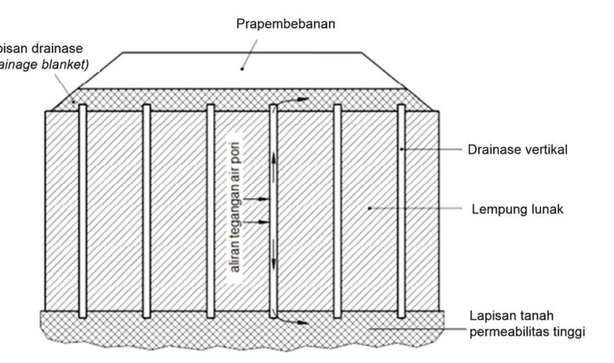

**Gambar 12 – Skema perbaikan dengan PVD** 

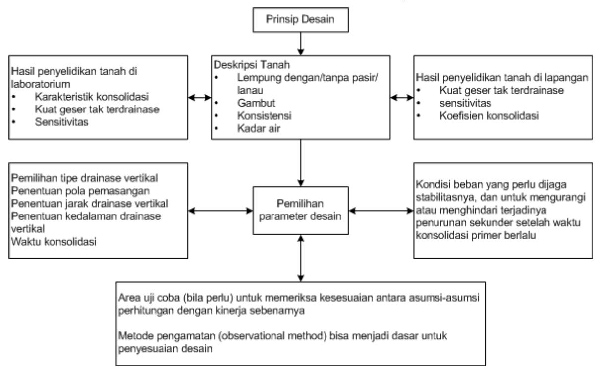

**Gambar 13 – Diagram proses perancangan pekerjaan PVD** 

Perhitungan perancangan dapat dilakukan dengan menggunakan persamaan Hansbo (1979) yang disampaikan di dalam Pd T-13-2004-A. Faktor tahanan alir dan faktor gangguan tidak perlu diperhitungkan apabila panjang PVD tidak lebih dari 25 m.

#### **6.9.6.2 Percobaan lapangan** *(field trials)*

Bilamana diperlukan perencana dapat meminta untuk dilakukan percobaan di lapangan dengan memvariasikan jarak PVD atau tipe PVD untuk penentuan perancangan akhir.

Proses konsolidasi dalam area percobaan harus dimonitor dengan pengukuran penurunan dan pengukuran tegangan air pori. Penurunan penurunan harus dilakukan dengan menggunakan pelat penurunan (dan pada tanah berlapis gunakan juga *deep settlement probe*). Tegangan air pori diukur dengan memasang pisometer di berbagai kedalaman.

Kenaikan kuat geser tak terdrainase akibat konsolidasi dapat diperiksa dengan uji laboratorium dan/atau uji lapangan.

Jika relevan, pergeseran horizontal sepanjang batas pinggir area pengujian dapat diukur dengan memasang inklinometer.

Dalam kondisi dimana PVD dipasang tidak pada seluruh kedalaman yang berkonsolidasi, maka proses konsolidasi dari lapisan tanah yang tidak diperbaiki harus tetap diperhitungkan.

# **6.9.6.3 Supervisi**

Untuk pemeriksaan bahwa pelaksanaan sesuai dengan perancangan dan sesuai dengan dokumen kontrak, supervisi harus dilakukan oleh personel yang bersertifikat keahlian geoteknik bidang pengawasan dan berpengalaman dalam pelaksanaan PVD.

Apabila dijumpai kondisi tak terduga atau didapatkan informasi baru tentang kondisi tanah yang berbeda dengan data yang dipergunakan dalam perancangan, pengawas harus segera melaporkan kepada pihak konsultan perencana.

Metode atau prosedur untuk verifikasi, kontrol, pengujian, frekuensi pengujian, dan kriteria penerimaan pekerjaan harus ditentukan sebelum dimulainya pekerjaan.

# **6.9.6.4 Monitoring**

Ruang lingkup dan prosedur monitoring harus ditetapkan oleh perencana.

Sistem monitoring harus dipersiapkan berdasarkan cara pembebanan, misalnya tahapan pembebanan, dan/atau penurunan air tanah. Pengalaman sebelumnya di lokasi yang mirip dengan lokasi yang dihadapi dapat dijadikan masukan untuk menentukan sistem monitoring yang akan diterapkan.

Gambar 14 menunjukkan skematik instrumentasi yang diperlukan untuk monitoring kinerja PVD.

**© BSN 2017 114 dari 303**

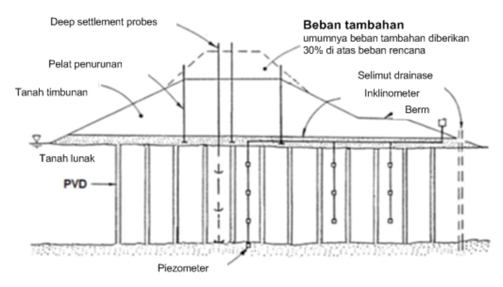

**Gambar 14 – Skematik instrumentasi untuk monitoring kinerja PVD (dimodifikasi dari FHWA, 1986)** 

Proses pelaksanaan harus dikontrol. Informasi terkait kondisi tanah dan toleransi pemasangan harus dimonitor selama pelaksanaan berlangsung.

Proses konsolidasi harus dimonitor dengan sistem dan instrumen pengamatan yang tepat. Akhir penurunan konsolidasi primer dapat diperkirakan dengan ketelitian yang baik dari hasil pengukuran penurunan terhadap waktu (Metode Asaoka).

Kecuali berdasarkan pengamatan data penurunan, proses konsolidasi dapat juga diverifikasi melalui pengamatan tegangan air pori.

Bila relevan, pergerakan lateral tanah seiring berlalunya waktu di sepanjang batas-batas luar area yang dibebani dapat dimonitor dengan memasang inklinometer.

Frekuensi/kekerapan pengamatan penurunan dan tegangan air pori harus diatur untuk menghasilkan interpretasi yang masuk akal.

Instrumentasi untuk monitoring harus dipasang sedini mungkin untuk mendapatkan nilai referensi yang stabil sebelum dimulainya proses pembebanan.

Bila relevan, kenaikan kuat geser tak terdrainase dari tanah harus dikonfirmasi dengan bantuan uji laboratorium pada benda uji yang diambil atau dengan melakukan pengujian lapangan.

# *6.10* **Prefabricated Vertical Drain (PVD) dengan metode hampa udara** *(vacuum preloading)*

Subpasal ini menjelaskan perancangan menggunakan Prefabricated Vertical Drain (PVD) dengan vakum. Persyaratan PVD dapat dilihat pada subpasal 6.8.

# **6.10.1 Ruang lingkup pekerjaan Prefabricated Vertical Drain (PVD) dengan metode hampa udara**

Subpasal ini menetapkan prinsip-prinsip perancangan perbaikan tanah lunak yang berpermeabilitas rendah dan berkompresibilitas tinggi dengan menggunakan Prefabricated

**© BSN 2017 115 dari 303** 

Vertical Drain (PVD) yang dikombinasikan dengan prapembebanan (*preloading*) melalui tekanan hampa udara (*vacuum preloading*).

#### **6.10.2 Aplikasi**

PVD dengan prapembebanan hampa udara dapat digunakan pada perbaikan tanah untuk tujuan berikut.

- a) Mengurangi besar penurunan (*settlement*) setelah pembangunan.
- b) Mempercepat penurunan (konsolidasi) dan meningkatkan daya dukung tanah.
- c) Mempercepat waktu penurunan (konsolidasi).
- d) Mensubstitusi sebagian atau seluruh material tanah timbunan yang digunakan dalam metode prabembebanan konvensional dengan tekanan atmosfir yang timbul dari proses prapembebanan hampa udara.
- e) Meniadakan material timbunan untuk beban kontra (penstabil terhadap kelongsoran di tepi-tepi area perbaikan.
- f) Menaikkan stabilitas timbunan.

Beberapa contoh aplikasi teknik ini adalah sebagai berikut.

- a) Prapembebanan untuk jalan, baik lalu lintas kendaraan bermotor ataupun jalan kereta api.
- b) Pembangunan dan perkuatan tanggul.
- c) Prapembebanan pada daerah timbunan.
- d) Prapembebanan tanah reklamasi.
- e) Perbaikan tanah tanah untuk pelabuhan dan lapangan terbang.
- f) Perbaikan tanah untuk fondasi bangunan/tangki dan lainnya.

#### **6.10.3 Material dan peralatan**

Material dan peralatan utama yang diperlukan dijelaskan sebagai berikut.

- a) Sistem pengalir air berupa: PVD, drainase horizontal dan pipa buangan.
- b) Sistem penjamin kedap udara: geotekstil, geomembran dan bila diperlukan sistem pembuat dinding lumpur kedap udara *(sealing wall)* di sekeliling daerah perbaikan bila terdapat lensa pasir yang dapat mengurangi efektifitas kerja pompa hampa udara.
- c) Sistem pompa vakum.

#### **6.10.4 Proses pekerjaan**

Pekerjaan PVD dengan metode prabeban hampa udara meliputi:

a) Pembersihan lahan.

Lahan yang akan diperbaiki harus bersih dari batu, kayu, bahan organik atau bendabenda lain yang menonjol ke permukaan tanah, khususnya jika benda itu tajam dan akar pohon serta material organik lainnya harus dikeluarkan dari lahan. Hal ini dikerjakan agar

**© BSN 2017 116 dari 303**

material yang akan digelar di atas lahan tidak merusak geotekstil separator dan geomembran yang akan mengakibatkan kebocoran sewaktu proses vakum berlangsung serta tidak ada lapisan yang akan mengalami pelapukan sehingga memengaruhi proses perbaikan tanah.

b) Penghamparan geotekstil sebagai lapisan separator (apabila dibutuhkan).

Pada area kerja yang mempunyai CBR ≤ 3 (tiga) persen dan dalam kondisi jenuh maka sebelum dilakukan penimbunan area tersebut perlu dipasang geotekstil sebagai lapisan separator terlebih dahulu. Lapisan ini berfungsi sebagai pencegah terjadinya pencampuran antara tanah dasar dengan material di atasnya serta dapat meningkatkan stabilitas lahan kerja untuk tahapan pekerjaan berikutnya. Geotekstil sebagai lapisan separator juga dapat diterapkan pada perbatasan antara material pengisi dan urugan pasir sebagai selimut drainase horizontal.

c) Penghamparan material timbunan sebagai material pengisi (apabila dibutuhkan).

Untuk area dengan elevasi final yang jauh di atas elevasi tanah asli, maka diperlukan penimbunan tanah yang signifikan. Peninggian elevasi muka tanah dapat dilakukan dengan cara penimbunan tanah dengan material pengisi di atas geotekstil separator. Tinggi timbunan material pengisi ini perlu mempertimbangkan faktor kestabilan sebab dilakukan di atas tanah asli yang belum mengalami perkuatan.

d) Hamparan pasir sebagai selimut drainase horizontal.

Hamparan pasir sebagai selimut drainase horizontal yang harus dihampar secara merata. Lapisan ini berfungsi sebagai sistem drainase untuk mengalirkan air dan udara yang keluar dari PVD menuju area yang diperbaiki. Ketebalan dan permeabilitas hamparan pasir ini harus dihitung agar mencukupi untuk mengalirkan air yang keluar dari PVD menuju area perbaikan.

e) Pemasangan PVD diikuti dengan pemasangan sistem drainase horizontal.

Pemancangan PVD dapat dilaksanakan setelah hamparan selimut drainase horizontal selesai dilaksanakan. Pemasangan sistem drainase horizontal dapat dilaksanakan sesudah PVD selesai dilaksanakan. Sistem drainase horizontal harus tertanam di dalam lapisan pasir. Sistem drainase horizintal yang dimaksud adalah sistem drainase horizontal buatan dari bahan geosintetik atau yang sejenis.Kapasitas drainase horizontal harus dirancang atau dihitung untuk melengkapi atau mengganti lapisan pasir dalam butir d).

Persyaratan butir d) dan e) ini juga berlaku untuk PVD dengan sistem prapembebanan konvensional (lihat 6.9).

- f) Pemasangan sistem kedap udara berupa penggelaran geotekstil (dimaksudkan untuk membantu ketahanan geomembran terhadap material yang dapat merusak kekedapan geomembran), diikuti dengan penggelaran geomembran. Di sekeliling daerah yang diperbaiki geomembran harus dijangkarkan ke dalam tanah yang kedap terhadap udara sedalam 0,5 m atau lebih untuk menjamin kekedapan terhadap udara.
  - Bilamana terdapat lensa pasir, lanau atau material tidak kedap lainnya di antara lapisan tanah lunak yang dapat mengurangi efektifitas pompa hampa udara dan mengakibatkan tekanan vakum tidak optimal baik di permukaan maupun di kedalaman tanah, perlu dipasang dinding lumpur kedap udara (*sealing wall*) yang memotong lensa pasir tidak kurang dari 1 m ke dalam lapisan tanah tidak kedap di bawahnya, atau hingga kedalaman dimana kondisi kedap dapat dicapai. Dengan demikian seluruh area yang diperbaiki menjadi suatu sistem yang tertutup dari aliran air dan udara dari luar.
- g) Pemasangan instrumentasi monitoring lapangan untuk memantau dan menvalidasi kinerja pekerjaan, berupa: pengukur tekanan hampa udara, pelat penurunan*, deep settlement probe*, pisometer, dan inklinometer (bila diperlukan).

- h) Pemasangan sistem pengaliran air hasil pemompaan hampa udara berupa pemipaan hingga tempat pembuangan.
- i) Setelah proses perbaikan selesai, dilakukan perataan lahan sesuai persyaratan perancangan.

#### **6.10.5 Kriteria perancangan**

Pekerjaan PVD dengan hampa udara secara umum dimaksudkan untuk mencapai kriteria stabilisasi tanah sebagai berikut:

- a) Faktor keamanan minimum sesuai dengan persyaratan di bawah ini atau sesuai persyaratan perencana.
  - Untuk daya dukung tanah minimum 1,5;
  - Konstruksi landas pacu minimum 1,5;
  - Konstruksi jalan tol minimum 1,35;
  - Konstruksi jalan biasa minimum 1,30;
  - Untuk hal lain sesuai persyaratan perancangan.
- b) Perhitungan dilakukan pada kondisi jangka pendek (perhitungan tidak terdrainase untuk kondisi saat akhir konstruksi).
- c) Batas-batas penurunan timbunan (konsolidasi): minimum mencapai 90% derajat konsolidasi atau sesuai persyaratan perancangan.
- d) Beban total ekivalen dari sistem pembebanan hampa udara (dengan tambahan beban timbunan atau tidak) yang diaplikasikan selama ke tanah asli harus memenuhi kondisi berikut.
  - lebih besar atau sama dengan 1,3 kali beban yang direncanakan pada kondisi layan bila efek gaya angkat (*buoyancy* effect) yang diterima beban timbunan (bila ada) pada saat proses prapembebanan berlangsung tidak diperhitungkan.
  - lebih besar atau sama dengan 1,2 kali beban yang direncanakan pada kondisi layan bila efek gaya angkat (*buoyancy* effect) yang diterima beban timbunan (bila ada) pada saat proses prapembebanan berlangsung diperhitungkan.

#### **6.10.6 Informasi yang diperlukan untuk perancangan pekerjaan**

Sebelum pelaksanaan perancangan, semua informasi berikut harus tersedia.

- a) Informasi yang terkait dengan kondisi lapangan.
- b) Data penyelidikan tanah yang cukup minimum berupa *index properties*, kuat geser tak terdrainase, uji konsolidasi, uji sondir, uji CPTu (lihat Pasal 5 untuk persyaratan penyelidikan tanah).
- c) Data konstruksi yang akan didirikan.
- d) Tujuan perbaikan tanah dan target yang akan dicapai.

#### **6.10.7 Hasil perancangan**

Perancangan harus memuat hal berikut.

a) Gambar posisi dan panjang PVD.

- b) Gambar posisi drainase horizontal dan pemipaan.
- c) Gambar sistem kedap udara yang akan dipasang.
- d) Metode pemasangan PVD.
- e) Spesifikasi semua material yang akan digunakan.
- f) Prosedur pengujian dan penerimaan material yang dipakai di proyek.
- g) Jumlah dan sistem monitoring/instrumentasi yang akan dipasang.
- h) Uraian sistem kontrol kualitas, termasuk supervisi dan monitoring.
- i) Kriteria penerimaan apakah perbaikan sudah mencapai target yang direncanakan.

Disamping itu perancangan juga harus mencakup:

- a) Kondisi tanah yang bisa memengaruhi pelaksanaan PVD dengan metode hampa udara:
  - deskripsi tanah (jenis, lapisan, keberadaan lapisan pasir dan lanau, dan lapisan keras);
  - tahanan penetrasi (berupa hasil sondir);
  - komposisi, luas/sebaran lateral, ketebalan dan kepadatan lapisan permukaan, keberadaan akar-akar pohon, urugan, dan lain-lain;
  - keberadaan kerakal atau batu-batu besar atau lapisan tersementasi yang dapat menimbulkan kesulitan pemasangan PVD atau yang akan memerlukan alat pemasangan khusus.
  - hal lain yang dipandang dapat memengaruhi proses pekerjaan, misalnya kondisi pembuangan air hasil pompa hampa udara.
- b) Keberadaan struktur bawah tanah, sarana bawah tanah, pencemaran yang diketahui/ atau kendala arkeologi;
- c) Keterbatasan lingkungan, termasuk efek kebisingan, getaran, dan polusi;
- d) Aktivitas pembangunan yang direncanakan dan/atau sedang berjalan, seperti: *dewatering*, penerowongan dan penggalian;
- e) Pengalaman sebelumnya pekerjaan pemasangan PVD dengan vakum di dekat lokasi proyek;
- f) Karakteristik lantai kerja dan selimut drainase (sifat fisik dan hidraulik);
- g) Kondisi-kondisi bangunan/struktur, jalan, fasilitas layanan/penunjang dan lain-lain yang berdekatan dengan lokasi pekerjaan/proyek.

Untuk pelaksanaan pembebanan dengan vakum, harus tersedia informasi sebagai berikut:

- a) Program pelaksanaan pembebanan.
- b) Prapembebanan.
- c) Jadwal pembebanan.
- d) Tekanan vakum yang akan digunakan untuk prapembebanan.
- e) Program pemantauan/ *monitoring*.

Harus pula diatur hal-hal sebagai berikut:

- a) Prosedur pelaporan untuk keadaan yang tak terduga atau kondisi yang muncul yang tampak berbeda dari yang diasumsikan dalam perancangan.
- b) Prosedur perlaporan bila perancangan menggunakan metode pengamatan (*obeservational method*).

Setiap persyaratan tambahan atau penyimpangan dari standar ini perlu mendapatkan persetujuan perencana atau pihak yang berwenang sebelum pekerjaan dimulai.

## **6.10.8 Penyelidikan geoteknik untuk pekerjaan PVD dengan vakum**

Jumlah dan jenis penyelidikan tanah yang dikerjakan harus memadai untuk menentukan jenis dan karakteristik tanah setempat. Semua proses penyelidikan tanah harus memenuhi kriteria pada Pasal 5.

Laporan penyelidikan tanah harus memuat informasi berikut:

- i) Komposisi, sebaran arah lateral, ketebalan dan konsistensi lapisan permukaan, keberadaan dan kondisi akar-akar pohon, kondisi tanah timbunan, ada tidaknya bongkahan batu, lapisan tanah tersementasi, atau batuan dan lain-lain yang dapat menghambat masuknya mandrel untuk pemasangan PVD;
- j) Letak muka air tanah, variasinya dan kemungkinan keberadaan tekanan artesis.
- k) Ketebalan tanah lunak dan parameter-parameter tanah sebagai berikut:
  - o Klasifikasi tanah;
  - o Distribusi ukuran butiran;
  - o Kadar air alami;
  - o Batas-batas Atterberg;
  - o Berat isi;
  - o Kadar organik;
  - o Parameter kekakuan (modulus elastisitas) tanah, E;
  - o Parameter konsolidasi, yaitu: tekanan pra-konsolidasi, P'c, indeks kompresi, cc, indeks re-kompresi *(load-unload),* cs, angka pori, e, koefisien konsolidasi vertikal, cv, koefisien konsolidasi horizontal, ch;
  - o Kekuatan geser tanah (tak terdrainase dan terdrainase);
  - o Permeabilitas.
- l) Keberadaan tanah timbunan yang masih mengalami penurunan akibat berat sendiri.
- m) Ada tidaknya kontaminasi tanah dan air tanah di sekitar proyek.

Selain hal di atas, disyaratkan juga untuk melakukan beberapa uji CPTu, yang disertai dengan uji disipasi untuk mendapatkan parameter koefisien konsolidasi horizontal, ch, dan permeabilitas pada tanah lempung lunak yang akan diperbaiki.

Level pisometrik muka air tanah dan variasinya serta kemungkinan penyimpangan dari kondisi tekanan hidrostatis, perlu pula mendapat perhatian.

Uji kuat geser sebaiknya dilakukan dengan triaksial CU dengan pengukuran tegangan air pori.

Khusus kuat geser tak terdrainase, perlu dilakukan juga dilakukan uji lapangan, yaitu dengan uji geser baling.

Elevasi muka tanah dan lokasi pada setiap titik penyelidikan atau pengujian harus ditetapkan relatif terhadap datum nasional yang dikenal atau terhadap suatu titik referensi tetap yang disepakati.

#### **6.10.9 Persyaratan material dan pemasangan**

Pada subpasal ini akan dijelaskan material yang digunakan dalam PVD dengan vakum.

# **6.10.9.1 Umum**

Spesifikasi material PVD yang akan digunakan harus mencantumkan hal – hal berikut:

- a) Kuat tarik, dalam kN.
- b) Perpanjangan (*elongation*) pada gaya tarik maksimum, dalam %.
- c) Kuat tarik filter, dalam kN/m.
- d) Kuat tarik dari sambungan, dalam kN/m (bila ada sambungan).
- e) Indeks kecepatan filter (vh50), dalam mm/ detik.
- f) Ukuran bukaan karakteristik filter (O90), dalam μm.
- g) Kapasitas alir, dalam m3/ tahun.
- h) Durabilitas, dalam tahun

Disamping itu juga harus mencantumkan spesifikasi pompa vakum sbb:

- i) Daya pompa vakum
- j) Tekanan vakum atmosfer, dalam kPa

Bahan untuk PVD dapat juga dilihat pada subpasal 6.8.4.2.

#### **6.10.9.1.1 Geotekstil untuk separator**

Geotekstil digunakan sebagai lapis separasi yang harus dapat berfungsi sebagai pencegah terjadinya pencampuran antara tanah dasar dengan agregat penutupnya (lapis fondasi bawah, lapis fondasi, timbunan pilihan dan sebagainya). Geotekstil separator yang digunakan adalah geotekstil nir-tenun (*nonwoven*) yang terdiri atas serabut dengan bahan polimer yang telah distabilkan terhadap sinar UV dan dibuat dengan proses *needle punched*. Geotekstil yang terbuat dari material daur ulang tidak dapat diterima.

Geotekstil yang digunakan harus memenuhi syarat yang tercantum pada Tabel 18 dan Tabel 19 sesuai kondisi yang dibutuhkan. Seluruh nilai pada Tabel 18 kecuali ukuran pori-pori geotekstil (*Apparent Opening Size*, AOS) menunjukkan nilai gulungan rata-rata minimum pada arah utama terlemah.

Tabel 18 – Kelas geotekstil untuk separator (AASHTO M-228-96)

| Sifat                                                           | Metode uji                                 | Satuan              | Persyaratan                                 |  |  |  |
|-----------------------------------------------------------------|--------------------------------------------|---------------------|---------------------------------------------|--|--|--|
|                                                                 | Kelas Geotekstil                           |                     |                                             |  |  |  |
| Permivitas (permittivity)                                    | SNI 08-6511-2001 dan/atau ASTM D4491    | detik -1 | 0,021                                       |  |  |  |
| Ukuran pori- pori geotekstil (Apparent Opening Size, AOS) | SNI 08-4418-1997 dan/atau ASTM D4751 | mm                  | 0,60 (nilai gulungan rata- rata maks) |  |  |  |
| Stabilitas Ultraviolet (kekuatan sisa)                          | ASTM D4355                                 | %                   | 50% setelah terekpos 500 jam             |  |  |  |

**CATATAN** – 1) Nilai baku (default) permitivitas geotekstil harus lebih besar dari tanah (ψq> ψs)

Tabel 19 - Kelas geotekstil untuk separator (AASHTO M-228-96)

|                                                                       |                                             |        |                                                                                                                                            |          | Kelas Ge | otekstil |          |                   |
|-----------------------------------------------------------------------|---------------------------------------------|--------|--------------------------------------------------------------------------------------------------------------------------------------------|----------|----------|----------|----------|-------------------|
|                                                                       |                                             |        | Kelas 1                                                                                                                                    |          | Kelas 2  |          | Kelas 3  |                   |
| ifat                                                                  | Metode uji                                  | Satuan | Elongasi                                                                                                                                   | Elongasi | Elongasi | Elongasi | Elongasi | Elongasi          |
|                                                                       |                                             |        | < 50%*3                                                                                                                                    | ≥ 50%*³  | < 50%*3  | ≥ 50%*³  | < 50%*3  | <u>≥</u> 50%*³ |
| Kuat grab <i>(grab</i> strength)                                   | ASTM D 4632                                 | N      | 1400                                                                                                                                       | 900      | 1100     | 700      | 900      | 500               |
| Kuat sambungan keliman 4 (sewn seam strength)                   | ASTM D 4632                                 | N      | 1260                                                                                                                                       | 810      | 990      | 630      | 720      | 450               |
| Kuat sobek (tear strength)                                         | SNI 08-4644- 1998 dan/atau ASTM D4533 | N      | 500                                                                                                                                        | 350      | 400³     | 250      | 300      | 180               |
| Kuat tusuk (Puncture Strength)                                     | ASTM D 6241                                 | N      | 1750                                                                                                                                       | 1925     | 2200     | 1375     | 1650     | 990               |
| Permitivitas (permittivity)                                           |                                             | detik' |                                                                                                                                            |          |          |          |          |                   |
| Ukuran pori pori geotekstil (³') (Apparent Opening Size,AOS) | SNI 08-4418- 1997 dan/atau ASTM D4751 | mm     | Nilai sifat minimum untuk permitivitas, ukuran pori pori geotekstil <i>(apparent opening Size, AOS),</i> dan stabilitas Ultraviolet. |          |          |          |          |                   |
| Stabilitas Ultraviolet (kekuatan sisa)                                | ASTM D 4355                                 | %      |                                                                                                                                            |          |          |          |          |                   |

#### **CATATAN**

- Kelas geotekstil yang dibutuhkan mengacu pada Spesifikasi Umum Jalan Tol dan Tabel 18 sesuai dengan penggunaannya. Kondisi pemasangan umumnya menentukan kelas geotekstil yang dibutuhkan. Kelas I dikhususkan untuk kondisi yang parah dimana pol terjadinya kerusakan geotekstil lebih tinggi. Sedangkan Kelas 2 dan Kelas 3 adalah untuk kondisi yang tidak parah.
- 2. Semua nilai syarat kekuatan menunjukkan Nilai Gulungan Rata-Rata minimum dalam arah utama terlemah.
- 3. Nilai Gulungan Rata-Rata minimum kuat sobek yang dibutuhkan untuk geotekstil filamen tunggal teranyam/tenun (*woven monofilamen geotextile*) adalah 250 N.
- 4. Ditentukan berdasarkan ASTM D4632.

# 6.10.9.1.2 Material pasir sebagai selimut drainase horizontal

Hamparan pasir untuk drainase horizontal harus memiliki gradasi yang memenuhi syarat untuk dapat mengalirkan air.

© BSN 2017 122 dari 303

# **6.10.9.1.3 Pipa drainase horizontal**

Pipa drainase horizontal harus direncanakan dengan jarak dan diameter tertentu agar dapat menyebarkan tekanan vakum dari luasan tertentu secara merata. Pipa tersebut harus tahan terhadap tekanan merata dari arah luar minimum sebesar 80 kPa.

Pipa drainase horizontal harus dipasang di dalam lapisan pasir dan dilaksanakan setelah PVD selesai dipasang. Bila dibutuhkan penyambung maka panjang koneksi tidak boleh kurang dari 100 mm.

Fungsi pipa drainase horizontal adalah untuk menyalurkan tekanan vakum dari pompa ke seluruh selimut drainase horizontal yang kemudian menyebarkan ke seluruh massa tanah melalui PVD. Pipa drainase horizontal ini juga berfungsi untuk menyalurkan air dan udara yang keluar dari PVD ke pompa vakum.

#### **6.10.9.1.4 Geotekstil untuk lapis proteksi geomembran**

Geotekstil yang dipakai harus memiliki daya tahan terhadap pengaruh kontak langsung dengan efek mikrobiologis dan zat kimia yang umumnya ada di dalam tanah dan air limbah Material yang dipakai harus mempunyai jaringan serabut yang stabil sehingga mempunyai daya tahan terhadap kerusakan.

Nilai-nilai yang terdapat dalam spesifikasi material yang digunakan harus berdasarkan hasil tes yang dilakukan dan dikeluarkan oleh laboratorium pengujian nasional yang kompeten.

Geotekstil yang dikirim ke lapangan perlu dilapisi dengan pembungkus untuk melindungi material terutama dari sinar matahari. Penyimpanan dan pemasangan tidak boleh mengakibatkan kerusakan fisik. Geotekstil harus dipasangan sesuai dengan petunjuk yang dikeluarkan pabrik dan dipasang pada lokasi yang ditandai pada gambar rencana.

Penyambungan geotekstil harus dilakukan dengan cara dijahit dengan mesin jahit portabel.

Persyaratan minimum material geotekstil untuk proteksi geomembran mengacu pada Tabel 20.

**Tabel 20 – Sifat sifat, persyaratan dan metode pengujian**

| Sifat                                                                          | Metode pengujian        | Satuan       | Persyaratan                        |
|--------------------------------------------------------------------------------|----------------------------|--------------|------------------------------------|
| Jenis produk : nir tenun needle punched:                                    |                            |              |                                    |
| Gramatur (mass)                                                                | ASTM D 5261                | gr/M²        | > 200                              |
| Ketebalan                                                                      | ASTM D 5199                | mm           | 1,60-1,85                          |
| Ukuran Pori (AOS)                                                              | ASTM D 4751                | µm           | 125 µm <aos<150< td=""></aos<150<> |
| Kuat Tarik (tensile strength) Arah panjang  Arah melintang       | ASTM D 4595 ASTM D 4595 | kN/M kN/M | > 7,00 k/N/M > 5,00 k/N/M       |
| Regang Putus (elongation at break) Arah panjang  Arah melintang  | ASTM D 4595 ASTM D 4595 | % %       | 65% 60%                         |
| Indeks ketahanan penetrasi                                                     | ASTM D 4833                | N            | >170 N                             |

**© BSN 2017 123 dari 303** 

# **6.10.9.1.5 Geomembran**

Geomembran sebagai lapis kedap harus terbuat dari bahan *polyethylene* atau *polyvinyl chloride* atau bahan lainnya yang menjamin kekedapan lapisan. Sistem geomembran sebagai lapis kedap yang digunakan harus direncanakan dengan mempertimbangkan risiko kegagalan sistem vakum apabila terjadi kerusakan saat proses vakum. Geomembran harus mempunyai kualitas karakteristik dan sifat-sifat kekedapan yang tinggi.

Geomembran yang digunakan harus memiliki daya tahan terhadap pengaruh bahan- bahan kimia dan mikrobiologis lainnya yang ada di lingkungan kerja. Geomembran yang dikirim ke lapangan harus disimpan dan dilindungi dari hal-hal yang merusak dan dari pengaruh sinar matahari langsung. Pemasangan geomembran harus mengikuti gambar rencana

Ukuran panjang atau lebar dari geomembran minimum 4 m lebih panjang dibandingkan dengan panjang dan lebar dari area yang akan diperbaiki. Apabila kondisi geologi cukup kompleks, maka lapis kedap harus lebih panjang dan lebar sehingga dapat diletakkan secara longgar.

Permukaan tanah yang akan digelar geomembran harus bersih dari material perusak seperti akar pohon dan bahan lain yang dapat menimbulkan kerusakan pada geomembran. Tanah di bawah geomembran diusahakan kepadatannya seragam. Penyambungan antar geomembran dianjurkan untuk dilakukan di pabrik untuk mengantisipasi potensi kebocoran akibat ketidaksempurnaan sambungan. Namun apabila diperlukan maka penyambungan geomembran di lapangan dapat dilakukan dilakukan dengan metode yang sesuai dan terbukti menjamin kekedapan sambungan.

Kondisi geomembran harus selalu diperiksa selama periode konsolidasi berlangsung. Apabila ada kebocoran atau kerusakan maka perbaikan harus dilakukan sesegera mungkin.

#### **6.10.9.1.6 Penggalian untuk angkur geomembran**

Penggalian untuk angkur geomembran bisa dilaksanakan setelah geomembran terpasang. Sisi dalam dan luar galian untuk angkur harus rata dan tidak boleh ada benda berbentuk tajam. Penggalian angkur untuk mengunci geomembran harus mencapai minimum 0,5 m ke dalam lapisan tanah kedap di bawahnya. Setelah angkur digali maka tahap berikutnya adalah menggelarkan geotekstil separator dan geomembran hingga dasar galian angkur lalu ditimbun lagi hingga elevasi awal. Tanah timbun yang dipakai harus bebas dari sampah atau material lain. Bila galian angkur terletak pada dua area yang besebelahan maka geotekstil separator dan geomembran dari kedua area tersebut harus tertanam pada galian angkur yang sama.

# **6.10.9.1.7 Dinding kedap (***sealing wall***)**

Bilamana terdapat lensa pasir, lanau atau material tidak kedap lainnya di antara lapisan tanah lunak yang dapat mengurangi efektifitas pompa hampa udara dan mengakibatkan tekanan vakum tidak optimal baik di permukaan maupun di kedalaman tanah, perlu dipasang dinding lumpur kedap udara (*sealing wall*). Dinding kedap harus dibuat dan menembus tidak kurang dari 1 m ke dalam lapisan tidak kedap di bawahnya atau hingga kedalaman dimana kondisi kedap dapat dicapai.

Dinding kedap terdiri atas campuran tanah setempat dengan material campuran yang diaduk dengan tambahan air di dalam drum pengaduk lalu dimasukkan dan dicampurkan ke dalam tanah pada posisi yang ditentukan dengan ketebalan dinding tidak kurang dari 1 m. Kadar material harus mampu membuat campuran tersebut mencapai permeabilitas tidak lebih dari 1 x 10-5 cm/ detik. Bilamana diperlukan harus digunakan campuran lumpur bentonit-semen.

**© BSN 2017 124 dari 303**

Pengujian laboratorium dapat dilaksanakan untuk memastikan kadar pencampuran yang sesuai.

#### **6.10.9.1.8 Material beban tambahan**

Bila diperlukan, timbunan tanah sebagai tambahan terhadap beban vakum dapat, dihampar di atas sistem vakum. Timbunan tanah yang digunakan tidak boleh merusak sistem kekedapan udara yang dipasang dan harus terdiri atas bahan galian tanah yang memenuhi syarat. Tanah yang bersifat ekspansif, mengandung bahan organik, berkadar air tinggi, tidak boleh digunakan.

# **6.10.9.1.9 Pemasangan pompa vakum dan generator**

Jumlah dan lokasi penempatan pompa vakum harus mengikuti rencana yang telah dibuat dan disetujui oleh pengawas pekerjaan dan pemilik pekerjaan. Pemasangan pompa vakum dilakukan setelah geomembran selesai dilaksanakan serta setelah seluruh sistem dalam lahan terpasang. Pompa vakum dan generator diletakkan pada posisi yang lebih tinggi dari lahan agar tidak tergenang air.

#### **6.10.10 Pertimbangan lain dalam perancangan**

#### **6.10.10.1 Supervisi**

Untuk pemeriksaan bahwa pelaksanaan sesuai dengan perancangan dan sesuai dengan dokumen kontrak, supervisi harus dilakukan oleh personel yang bersertifikat keahlian geoteknik bidang pengawasan dan berpengalaman dalam pelaksanaan PVD dengan vakum.

Apabila dijumpai kondisi tak terduga atau didapatkan informasi baru tentang kondisi tanah yang berbeda dengan data yang dipergunakan dalam perancangan, pengawas harus segera melaporkan kepada pihak perencana.

Metode atau prosedur untuk verifikasi, kontrol, pengujian, frekuensi pengujian, dan kriteria penerimaan pekerjaan harus ditentukan sebelum dimulainya pekerjaan.

#### **6.10.10.2 Monitoring**

Ruang lingkup dan prosedur monitoring harus ditetapkan oleh perencana.

Sistem monitoring harus dipersiapkan berdasarkan cara pembebanan, misalnya tahapan pembebanan, dan/ atau penurunan muka tanah. Pengalaman sebelumnya di lokasi yang mirip dengan lokasi yang dihadapi dapat dijadikan masukan untuk menentukan sistem monitoring yang akan diterapkan.

Proses pelaksanaan harus dikontrol. Informasi terkait kondisi tanah dan toleransi pemasangan harus dimonitor selama pelaksanaan berlangsung.

Proses konsolidasi harus dimonitor dengan sistem dan instrumen pengamatan yang tepat. Akhir penurunan konsolidasi primer dapat diperkirakan dengan ketelitian yang baik dari hasil pengukuran penurunan terhadap waktu (Metode Asaoka).

Kecuali berdasarkan pengamatan data penurunan, proses konsolidasi dapat juga diverifikasi melalui pengamatan tegangan air pori.

Proses monitoring tekanan vakum diukur menggunakan *vacuum gauge* yang memiliki skala sampai dengan -100 kPa. *Vacuum gauge* dipasang pada pompa vakum pada titik – titik tertentu dalam area vakum yaitu 1 *vacuum gauge* tiap 2500 – 4500 m2 atau berdasarkan perancangan. Pemantauan dilaksanakan 1 hari sekali pada waktu yang sama sampai proses vakum selesai.

**© BSN 2017 125 dari 303** 

Bila relevan, pergerakan lateral tanah seiring berlalunya waktu di sepanjang batas-batas luar area yang dibebani dapat dimonitor dengan memasang inklinometer.

Frekuensi/ kekerapan pengamatan penurunan dan tegangan air pori harus diatur untuk menghasilkan interpretasi yang masuk akal.

Instrumentasi untuk monitoring harus dipasang sedini mungkin untuk mendapatkan nilai referensi yang stabil sebelum dimulainya proses pembebanan.

Bila relevan, kenaikan kuat geser tak terdrainase dari tanah harus dikonfirmasi dengan bantuan uji laboratorium pada benda uji tidak terganggu yang diambil atau dengan melakukan pengujian lapangan.

# **7 Stabilitas lereng galian dan timbunan**

# **7.1 Ruang lingkup stabilitas lereng galian dan timbunan**

Subpasal ini meliputi persyaratan-persyaratan umum dan teknis perancangan lereng buatan yang meliputi lereng galian dan timbunan. Stabilitas lereng alam perlu ditinjau apabila terdapat pembangunan yang didirikan di atas lereng, tubuh lereng, dan kaki lereng.

Subpasal ini bertujuan untuk memberikan suatu tinjauan dan perancangan lereng yang aman dan ekonomis. Metode analisis untuk stabilitas lereng tidak terlepas dari pengetahuan mengenai mekanisme keruntuhan lereng, jenis material dan asal usulnya, topografi dan kondisi geologi setempat. Kondisi tersebut menentukan batasan-batasan dari penerapan metode yang dipilih.

#### **7.2 Deskripsi**

Analisis stabilitas lereng ini di antaranya digunakan untuk:

- a) memberikan tinjauan kestabilan lereng buatan,
- b) memberikan evaluasi terhadap potensi kelongsoran dari lereng yang ada,
- c) menganalisis kelongsoran yang telah terjadi,
- d) memberikan kemungkinan perancangan ulang terhadap lereng yang telah longsor dan merencanakan langkah-langkah preventif jika diperlukan,
- e) mengkaji pengaruh beban yang tak terduga seperti gempa dan beban lalu lintas.

#### **7.3 Aplikasi**

Subpasal ini ditujukan untuk lereng alam dan lereng buatan.

#### **7.3.1 Lereng alam**

Lereng alam terbentuk akibat kegiatan alam (erosi, gerakan tektonik, dan sebagainya). Material yang membentuk lereng memiliki kecenderungan tergelincir akibat beratnya sendiri dan gaya-gaya luar yang ditahan oleh kuat geser tanah dari material tersebut. Gangguan terhadap kestabilan terjadi bilamana tahanan geser tanah tidak dapat mengimbangi gayagaya yang menyebabkan gelincir pada bidang longsor.

Lereng alam yang telah stabil selama bertahun-tahun dapat saja mengalami longsor akibat hal-hal berikut:

**© BSN 2017 126 dari 303**

- a) kenaikan tekanan air pori (akibat naiknya muka air tanah) karena hujan yang berkepanjangan, pembangunan dan pengisian waduk, gangguan pada sistem drainase, dan lain-lain;
- b) penurunan kuat geser tanah secara progresif akibat deformasi sepanjang bidang yang berpotensi longsor;
- c) proses pelapukan; akibat pelapukan batuan dapat mengalami mengalami degradasi;
- d) gempa; efek gempa menyebabkan inersia dalam arah getaran gempa menyebabkan lereng tidak stabil;
- e) gangguan luar akibat pemotongan atau timbunan baru.

Aspek penting dari stabilitas lereng alam, yaitu:

- a) kondisi geologi;
- b) kondisi topografi;
- c) kemiringan lereng;
- d) jenis lapisan tanah;
- e) kuat geser;
- f) aliran air bawah permukaan;
- g) kecepatan pelapukan;
- h) gangguan lalu lintas.

Faktor-faktor yang menyebabkan ketidakstabilan lereng alam, yaitu:

- a) perubahan profil kemiringan lereng akibat beban tambahan di bagian atas lereng atau berkurangnya kekuatan di bagian dasar lereng;
- b) peningkatan tekanan air tanah yang mengakibatkan penurunan tahanan geser pada tanah nonkohesif atau terjadinya pengembangan pada tanah kohesif. Tekanan air tanah dapat meningkat ketika tanah mengalami penjenuhan akibat air hujan, rembesan, atau munculnya air permukaaan;
- c) penurunan kuat geser tanah atau batuan yang disebabkan oleh pelapukan, pencucian, perubahan mineralogi, dan adanya rekahan;
- d) getaran yang disebabkan oleh gempa bumi, peledakan, atau pemancangan tiang.

#### **7.3.2 Lereng buatan manusia**

#### **7.3.2.1 Lereng galian**

Lereng galian terbentuk akibat kegiatan penggalian atau pemotongan pada tanah asli. Perancangan pemotongan lereng galian yang dimaksud adalah usaha untuk membuat suatu lereng dengan kemiringan tertentu yang cukup aman dan ekonomis. Stabilitas pemotongan ditentukan oleh kondisi geologi, sifat teknis tanah, tekanan air akibat rembesan, dan cara pemotongan.

Aspek penting dari stabilitas lereng galian, yaitu:

- a) kuat geser pada bagian galian;
- b) berat isi tanah;

- c) tinggi lereng;
- d) kemiringan lereng;
- e) tekanan air pori.

#### *7.3.2.2* **Lereng timbunan** *(embankment)*

Lereng timbunan umumnya digunakan untuk badan jalan raya, jalan kereta api, dan bendungan tanah. Sifat teknis lereng timbunan dipengaruhi oleh jenis tanah, cara penimbunan dan derajat kepadatan tanah. Analisis secara terpisah harus dilakukan pada lereng timbunan, yaitu pada kondisi jangka pendek (saat penimbunan selesai), kondisi jangka panjang, kondisi penurunan muka air seketika *(sudden draw-down)*, dan gangguan gempa.

Faktor-faktor yang menyebabkan ketidakstabilan lereng timbunan, yaitu:

- a) terjadinya *overstressing* pada fondasi timbunan tanah kohesif setelah masa konstruksi. Biasanya pada lereng timbunan, stabilitas jangka pendek pada tanah kohesif lunak lebih penting daripada stabilitas jangka panjang, karena fondasi timbunan mendapatkan kekuatan yang merupakan hasil disipasi air pori. Perlu pemeriksaan stabilitas pada beberapa kondisi tekanan air pori;
- b) penurunan muka air cepat dan erosi buluh. Pada timbunan bendungan, penurunan muka air cepat menyebabkan meningkatnya beban efektif timbunan tanah yang dapat menyebabkan ketidakstabilan. Penyebab lain dari ketidakstabilan lereng timbunan adalah erosi bawah permukaan atau erosi buluh (lihat Pasal 13 untuk panduan pencegahan erosi buluh);
- c) gaya-gaya dinamis. Getaran dapat dipicu oleh gempa bumi, peledakan, pemancangan tiang, dan lainnya.

## **7.4 Data yang diperlukan untuk perancangan lereng**

#### **7.4.1 Data topografi**

Peta topografi memberikan gambaran mengenai kemiringan lereng, perbedaan ketinggian, kerapatan sungai, pola aliran, ketinggian, dan bentuk morfologi. Dari peta topografi juga dapat ditafsirkan tingkat erosi suatu daerah. Hal-hal yang dapat mengakibatkan keruntuhan lereng pada tebing jalan raya, jalan kereta api, tebing penggalian batu, dan tebing saluran perlu didata karena kemungkinan tidak akan terlihat di dalam peta geologi skala kecil. Gabungan antara kerapatan sungai dan kemiringan lereng pada peta topografi akan memberikan data yang lebih baik. Umumnya daerah yang berkerapatan sungai tinggi mempunyai kecenderungan longsor lebih besar.

#### **7.4.2 Data geologi teknik**

Geologi teknik (skala dan kedalaman kajian geologi, pemetaan geologi permukaan dan struktur geologi, stratigrafi, dan satuan batuan); Pemetaan geologi teknik dibutuhkan untuk mengetahui jenis dan sebaran batuan dan struktur geologi, juga mencakup proses geologi yang berkaitan dengan keruntuhan lereng dan prakiraan tata air tanah di daerah penyelidikan.

Pemetaan geologi teknik (skala dan kedalaman kajian geologi, pemetaan geologi permukaan dan struktur geologi, stratigrafi, dan satuan batuan) dibutuhkan untuk mengetahui jenis dan sebaran batuan dan struktur geologi, juga mencakup proses geologi yang berkaitan dengan keruntuhan lereng dan prakiraan tata air tanah di daerah penyelidikan.

**© BSN 2017 128 dari 303**

# **7.4.3 Data penyelidikan tanah dan batuan untuk stabilitas lereng**

#### **7.4.3.1 Data uji lapangan**

Uji lapangan yang dilakukan untuk penyelidikan stabilitas lereng dapat dilakukan di dalam lubang hasil pengeboran geoteknik maupun tidak, dan dapat terdiri atas salah satu atau kombinasi dari jenis-jenis pengujian pada Tabel 21.

**Tabel 21 – Uji lapangan untuk penyelidikan stabilitas lereng** 

| No. | Jenis uji                    | Standar uji              |
|-----|------------------------------|--------------------------|
| 1.  | Penetrasi standar atau uji   | SNI 4153-2008            |
|     | SPT (Standard             |                          |
|     | Penetration Test, SPT)       |                          |
| 2.  | Sondir atau uji CPT | SNI 2827-2008            |
|     | (Cone Penetration Test,      |                          |
|     | CPT)                         |                          |
| 3.  | Geser baling (Vane     | SNI 03-2487-1991         |
|     | Shear Test atau VST)         | (ASTM D2573/D2573M-15)   |
| 4.  | Borehole Shear Test    | ASTM STP740 (1981)       |
|     | (BST)                        |                          |
| 5.  | Pressuremeter Test        | EN ISO 22476             |
|     | (PMT)                        |                          |
| 6.  | Dilatometer Test (DMT)       | ASTM D 6635-15           |
| 7.  | Seismic Refraction Test      | ASTM D 4428 / D 4428M-14 |
|     |                              | ASTM D 7400              |
| 8.  | Geolistrik                   | SNI 2528:2012            |

Sementara itu, uji lapangan untuk lereng batuan, contoh batuan utuh sebaiknya diambil dengan cara *coring*. Batuan yang berlapis-lapis maupun yang memiliki kekar (*joint*) seringkali memiliki bidang-bidang atau zona lemah seperti lapisan bidang gelincir, zona batuan yang hancur di tempat terjadinya pergeseran di antara dua lapisan batuan, sisipan lapisan lempung dan lain-lain yang menentukan kekuatan massa batuan yang akhirnya menentukan kestabilan lereng secara keseluruhan.

Pengambilan contoh batuan harus dilakukan secara seksama dan hati-hati supaya lapisan tipis yang merupakan bagian yang lemah tidak terlewatkan. Cara pengambilan contoh batuan dapat merujuk pada SNI 03-6802-2002 (ISO 22475-1 EN).

#### **7.4.3.2 Data uji laboratorium**

Uji laboratorium yang dilakukan untuk penyelidikan stabilitas lereng tanah diperlihatkan di dalam Tabel 22.

**Tabel 22 – Uji laboratorium untuk penyelidikan stabilitas lereng tanah** 

| No. | Jenis uji                   | Standar uji    | Keterangan                  |
|-----|-----------------------------|----------------|-----------------------------|
| 1.  | Sifat indeks tanah          | SNI 1966:2008  | -                           |
|     |                             | SNI 1967:2008  |                             |
|     |                             | SNI 1976:2008  |                             |
|     |                             | SNI 3422: 2008 |                             |
|     |                             | SNI 3423:2008  |                             |
| 2.  | Triaksial UU dan/atau | SNI 4813:2015  | -                           |
|     | triaksial CU dan/atau | SNI 2455:2015  |                             |
|     | triaksial CD                |                |                             |
| 3.  | Kuat tekan bebas (UCS       | SNI 3638:2012  | -                           |
|     | test)                       |                |                             |
| 4.  | Geser langsung              | SNI 2813:2008  | -                           |
| 5.  | Konsolidasi                 | SNI 2812:2011  | Uji konsolidasi belum tentu |
|     |                             |                | dibutuhkan, tergantung   |
|     |                             |                | permasalahannya             |

Sementara itu, uji laboratorium untuk lereng batuan diperlihatkan di dalam Tabel 23.

**Tabel 23 – Uji laboratorium untuk penyelidikan stabilitas lereng batuan** 

| No. | Jenis uji               | Standar uji               |
|-----|-------------------------|---------------------------|
| 1.  | Sifat fisik batuan      |                           |
| 2.  | Kuat tekan bebas batuan | SNI 2815-2011/ ASTM |
|     |                         | D7012 – 14                |
| 3.  | Point load index        | SNI 03-2814-1992          |
| 4.  | Slack durability        | ASTM D4644 - 16           |
| 5.  | Kuat geser batuan intak | SNI 03-2824-1992/ASTM     |
|     |                         | D5731 – 08                |
| 6.  | Kuat geser batuan pada  | ASTM D5607 – 08           |
|     | bidang perlemahan       |                           |

#### **7.4.3.3 Kecukupan penyelidikan tanah dan batuan**

Jumlah dan penentuan titik pengujian perlu direncanakan dengan saksama agar diperoleh gambaran yang akurat mengenai mekanisme kelongsoran yang mungkin atau sudah terjadi. Kedalaman pengujian harus lebih dari kedalaman perkiraan bidang gelincir dan bilamana mungkin mencapai lapisan tanah keras atau batuan. Contoh tanah tak terganggu diambil pada kedalaman tertentu agar mendapatkan informasi yang mewakili kondisi tanah bawah permukaan di lapangan. Pengamatan muka air tanah perlu direncanakan dengan baik sehingga diperoleh profil muka air tanah yang akurat.

#### **7.4.3.4 Persyaratan penyelidikan tanah dan batuan**

Jika lebar di kaki lereng yang runtuh kurang dari 150 meter, satu baris titik pengeboran yang terletak pada satu garis memotong bidang runtuh dapat ditentukan seperti terlihat pada Gambar 15 dan Gambar 16.

**© BSN 2017 130 dari 303**

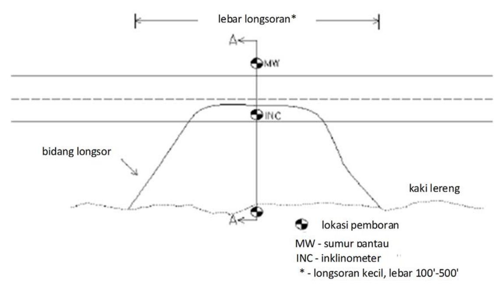

**Gambar 15 – Posisi titik bor untuk lereng dengan lebar daerah runtuh yang kecil** 

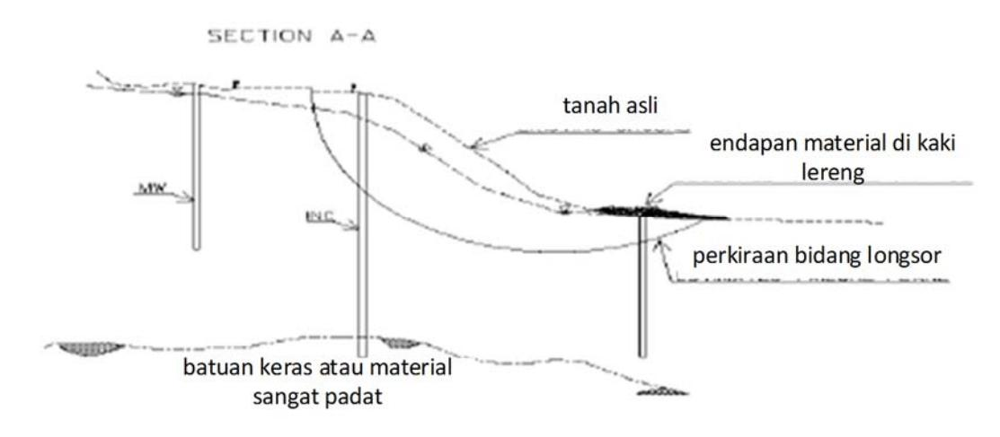

**Gambar 16 - Potongan A-A pada Gambar 15** 

Biasanya satu titik pengeboran berada di bagian puncak lereng di luar bidang runtuh, satu berada di puncak lereng, dan satu berada di kaki lereng. Jika diperlukan pengamatan, satu lubang di bagian atas lereng di luar daerah runtuh digunakan sebagai sumur pengamatan dan satu lagi di puncak lereng di daerah runtuh digunakan sebagai tempat pemasangan inklinometer.

Jika panjang lereng yang runtuh lebih dari 150 meter, jumlah titik pengeboran termasuk inklinometer dan sumur pengamatan harus ditambah.

Jika lebar bidang runtuh di kaki lereng lebih dari 150 meter, posisi dan jumlah titik pengeboran dapat mengikuti seperti terlihat pada Gambar 17. Titik-titik pengeboran tambahan ini dapat diletakkan setiap jarak interval sekitar 50 sampai 100 meter. Tujuan dari penempatan titik-titik pengeboran ini adalah untuk mendapatkan gambaran kondisi tanah bawah permukaan yang akurat untuk keperluan analisis stabilitas.

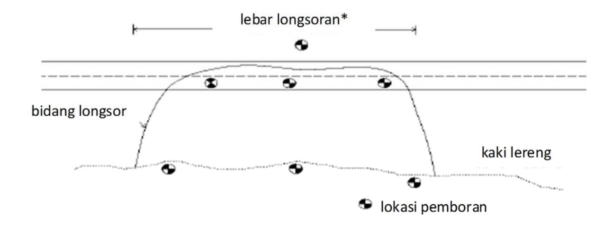

**Gambar 17 – Posisi titik bor untuk lereng dengan lebar daerah runtuh yang besar** 

Penempatan titik-titik pengeboran dibuat sedemikian rupa sehingga proses penentuan lapisan tanah bawah permukaan ke arah memanjang dan melintang bidang runtuh dapat dilakukan dengan baik dan mengurangi kesalahan akibat proses ekstrapolasi.

Untuk lereng timbunan kedalaman pengeboran harus dilakukan sampai sekitar minimum tiga kali (pada tanah sedang/keras) hingga lima kali (pada tanah lunak) tinggi timbunan/galian diukur dari dasar lereng atau hingga ditemukan lapisan tanah keras.

#### **7.4.3.5 Muka air pada tanah dan massa batuan**

Pengamatan muka air tanah perlu direncanakan dengan baik sehingga diperoleh profil muka air tanah yang akurat. Banyak kasus kelongsoran lereng tanah dan batuan disebabkan oleh faktor air, baik air di permukaan maupun aliran air di dalam tanah. Adanya air di dalam lereng menyebabkan menurunnya tegangan efektif akibat tekanan air pori yang meningkat sehingga menyebabkan turunnya kekuatan geser tanah atau massa batuan. Adanya air tanah dapat juga menambah gaya-gaya yang menyebabkan ketidakstabilan karena bertambahnya berat tanah atau massa batuan maupun timbulnya gaya yang diakibatkan oleh aliran air di dalam lereng.

Kondisi permukaan air tanah sangat tergantung pada faktor geoteknik, hidrologi, dan hidrogeologi termasuk kondisi permeabilitas tanah, geologi, profil asli permukaan air tanah, intensitas dan durasi hujan, kecepatan masuknya air permukaan, kecepatan evapotranspirasi, kecepatan pembuangan air limbah maupun aliran air dari daerah sekitarnya.

#### **7.5 Kriteria perancangan lereng**

#### **7.5.1 Kriteria pembebanan**

Analisis stabilitas lereng harus mempertimbangkan beban hidup (*live load*), mati (*dead load*) dan gempa sesuai peruntukan lereng galian dan timbunan. Beban tambahan *(surcharge load)* 10 kN/m2 harus diterapkan untuk memperhitungkan beban yang bekerja pada permukaan atas lereng kecuali ada persyaratan lain sesuai peruntukannya.

**© BSN 2017 132 dari 303**

Untuk analisis pseudo-statik dari lereng galian, maupun timbunan, beban gempa yang lebih spesifik disarankan sesuai dengan kondisi geologi dan area kegempaan serta kepentingan lereng.

#### **7.5.1.1 Beban gempa**

Pengaruh beban gempa diperhitungkan jika lereng galian atau timbunan direncanakan dibangun di dekat area pemukiman atau dibangun dengan kriteria kepentingan strategis yaitu dengan kondisi tidak boleh mengalami keruntuhan atau terputusnya lajur transportasi setelah terjadi gempa rencana. Gempa rencana untuk lereng galian dan timbunan ditetapkan dengan kemungkinan terlewati besarannya selama umur rencana 50 tahun adalah 2% atau setara dengan periode ulang 500 tahun dengan mengacu pada peta gempa yang terdapat pada surat edaran Menteri Pekerjaan Umum No. 12/SE/M/2010.

Faktor keamanan minimum yang disyaratkan untuk analisis menggunakan model pseudostatik adalah lebih besar dari 1,1 (FK>1,1) dengan menggunakan koefisien seismik yang didapatkan dari percepatan puncak di permukaan (PGA) dengan penentuan kelas situs dan faktor amplifikasi mengacu pada 12.3.2.

## **7.5.1.2 Beban lalu lintas**

Beban lalu lintas ditambahkan pada seluruh lebar permukaan jalan dan besarnya ditentukan berdasarkan kelas jalan yang diberikan pada Tabel 24.

**Tabel 24 – Beban lalu lintas untuk analisis stabilitas (DPU, 2001) dan beban di luar jalan** 

| Kelas Jalan | Beban lalu lintas | Beban di luar jalan (*) |
|-------------|-------------------|-------------------------|
|             | (kPa)             | (kPa)                   |
| I           | 15                | 10                      |
| II          | 12                | 10                      |
| III         | 12                | 10                      |

Keterangan: (\*) Beban dari bangunan rumah-rumah sekitar lereng

# **7.5.2 Kriteria** *loading* **dan** *unloading (stress history)*

Perancangan lereng timbunan harus memperhitungkan tegangan vertikal sebagai *major principal stress* pada saat kondisi pemberian beban *(loading)*, sedangkan pada lereng galian harus memperhitungkan tegangan horizontal sebagai *major principal stress* pada saat kondisi pelepasan beban *(unloading)*. Pada kondisi jangka panjang sebagai respon pengurangan tekanan pori dan menurunnya kekuatan geser tanah, menjadikan kondisi ini kritis untuk dianalisis.

# **7.5.3 Kriteria umur rencana**

Umur rencana lereng tergantung dari kepentingan struktur yang dibangun. Umumnya peninjauan meliputi kondisi jangka pendek dan jangka panjang.

# **7.5.4 Kriteria deformasi**

Kriteria deformasi yang diberikan di dalam subpasal ini meliputi deformasi vertikal, deformasi horizontal, penurunan jangka pendek, penurunan jangka panjang dan dampaknya terhadap bangunan sekitarnya.

#### **7.5.5 Kriteria faktor keamanan**

Faktor keamanan lereng yang disyaratkan untuk analisis kestabilan lereng tanah diperlihatkan pada Tabel 25 dengan didasarkan pada pertimbangan biaya dan konsekuensi kegagalan lereng terhadap tingkat ketidakpastian kondisi analisis. Sedangkan untuk lereng batuan, faktor keamanan yang disyaratkan diperlihatkan pada Tabel 26 dengan mempertimbangkan kondisi permanen atau sementara lereng batuan yang akan direncanakan.

Pada lereng batuan, pengaruh air perlu diperhitungkan. Apabila muka air tanah tinggi dan diperlukan usaha penurunan muka air tanah di dalam massa batuan untuk meningkatkan faktor keamanan, maka dapat dilakukan penurunan muka air tanah dengan bor horizontal yang berfungsi sebagai drainase untuk mengalirkan air keluar dari massa batuan. Tabel 26 memberikan rekomendasi nilai faktor keamanan untuk lereng batuan.

**Tabel 25 - Nilai faktor keamanan untuk lereng tanah** 

| Biaya dan konsekuensi dari kegagalan lereng                                                      |         | Tingkat ketidakpastian kondisi analisis |
|--------------------------------------------------------------------------------------------------|---------|--------------------------------------------|
|                                                                                                  | Rendaha | Tinggib                                    |
| Biaya perbaikan sebanding dengan biaya tambahan untuk merancang lereng yang lebih konservatif | 1,25    | 1,5                                        |
| Biaya perbaikan lebih besar dari biaya tambahan untuk merancang lereng yang lebih konservatif | 1,5     | 2,0 atau lebih                             |

aTingkat ketidakpastian kondisi analisis dikategorikan rendah, jika kondisi geologi dapat dipahami, kondisi tanah seragam, penyelidikan tanah konsisten, lengkap dan logis terhadap kondisi di lapangan.

**Tabel 26 – Rekomendasi nilai faktor keamanan untuk lereng batuan** 

| Kondisi lereng batuan | Rekomendasi nilai faktor keamanan |
|--------------------------|--------------------------------------|
| Kondisi permanen         | 1,5                                  |
| Kondisi sementara        | 1,3                                  |

Pada lereng tambang, meskipun dapat dianggap sebagai lereng yang bersifat sementara, faktor lamanya proses penambangan, proses penambangan yang umumnya dengan peledakan *(blasting),* serta laju proses pelapukan baik oleh cuaca maupun air di dalam massa batuan, terutama pada batuan lempung serpih *(clayshale)* harus mendapatkan perhatian yang seksama di dalam perancangan.

#### **7.6 Analisis lereng tanah**

Analisis stabilitas lereng tanah pada umumnya dilakukan berdasarkan pendekatan kesetimbangan batas *(limit equilibrium),* teori batas plastis, dan metode numerikal seperti metode elemen hingga. Pada pendekatan kesetimbangan batas, biasanya hanya dimodelkan pelapisan tanah yang sederhana dan tidak dapat menampilkan tahapan

**© BSN 2017 134 dari 303**

bTingkat ketidakpastian kondisi analisis dikategorikan tinggi, jika kondisi geologi sangat kompleks, kondisi tanah bervariasi, dan penyelidikan tanah tidak konsisten dan tidak dapat diandalkan.

konstruksi, sedangkan pada metode numerik seperti elemen hingga yang dibantu dengan menggunakan program, pemodelan dapat dilakukan secara kompleks serta dapat menampilkan tahapan konstruksi. Faktor keamanan dari kedua metode ini dapat memberikan hasil yang berbeda karena perbedaan metode pendekatan yang digunakan.

Pada umumnya, metode elemen hingga menggunakan pengurangan kuat geser, sedangkan metode kesetimbangan batas menggunakan perbandingan antara gaya-gaya yang menahan lereng terhadap gaya-gaya yang bekerja.

Stabilitas lereng dapat dievaluasi dengan 4 (empat) kondisi perancangan atau kondisi pembebanan disesuaikan dengan kondisi yang dapat terjadi di lapangan, yaitu:

- a) kondisi pada saat konstruksi dan pada akhir konstruksi;
- b) kondisi *steady state seepage;*
- c) kondisi *sudden drawdown;*
- d) kondisi gempa (*earthquake*).

**CATATAN** – Kondisi a) sampai dengan c) merupakan kondisi pembebanan statis, sedangkan kondisi d) merupakan kondisi pembebanan dinamik.

#### **7.6.1 Metode empirik dan grafis**

Metode empiris dan grafis dapat dilakukan untuk analisis kestabilan lereng untuk kondisi jangka pendek dan jangka panjang. Metode empiris sangat tergantung pada pengalaman dan keputusan dari perencana. Metode grafis dapat menggunakan grafik Taylor (1937), Bishop dan Morgenstern (1960), Janbu (1968) Hoek & Bray (1981), Duncan (1987).

#### **7.6.2 Metode analitis/numerik**

#### **7.6.2.1 Analisis berdasarkan konsep keseimbangan batas**

Metode keseimbangan batas umumnya memperhitungkan keseimbangan gaya dan keseimbangan momen dengan berbagai asumsi yang harus dibuat seperti bentuk dan lokasi keruntuhan, arah dan gaya antaririsan. Analisis stabilitas dengan cara keseimbangan batas dapat dilakukan dengan beberapa metode, antara lain: Bishop termodifikasi (1955), Force Equilibrium (Lowe dan Karafiat, 1960 dan USCE, 1970), Janbu (1968), Morgenstern dan Price (1965) dan Spencer (1967).

#### **7.6.2.2 Analisis dengan Metode Elemen Hingga**

Metode elemen hingga digunakan untuk masalah stabilitas lereng yang lebih kompleks, yaitu dengan memodelkan kondisi statik, pseudo-statik dan dinamik pada sistem pembebanan total. Hasil analisis dengan cara elemen hingga, dapat berupa perubahan tegangan dan regangan untuk berbagai sifat elatisitas material, heterogenitas massa tanah dan bentuk geometri.

Pada analisis dengan metode pseudostatik, pengaruh gempa digambarkan dengan percepatan horizontal dan atau vertikal. Analisis ini menunjukkan pengaruh seismik dengan percepatan pseudostatik yang menghasilkan gaya inersia, Fh dan Fv yang bekerja pada pusat massa keruntuhan. Penentuan nilai koefisien seismik horizontal kh mengacu pada pasal 12.3.7.

Analisis menggunakan metode dinamik diterapkan dengan menganalisis stabilitas lereng menggunakan gerak tanah desain yang didasarkan pada prosedur spesifik situs mengacu pada pasal 12.3.3.

#### **7.6.3 Analisis lereng yang berpotensi mengalami likuifaksi**

Lereng yang berpotensi mengalami likuifaksi terjadi apabila tegangan geser inisial lebih besar dari kuat geser tanah residualnya dan terjadi peregangan *(straining)* hingga besaran yang disyaratkan.

#### **7.6.4 Analisis aliran debris**

Potensi aliran debris perlu dipertimbangkan dalam kestabilan lereng, terutama pada lereng yang tinggi dan terdapat lapisan tanah lempung lunak, serta peningkatan tegangan pori.

## **7.6.5 Analisis penurunan dan deformasi lereng timbunan**

Penurunan dan deformasi pada timbunan dapat mempertimbangkan penurunan statik seketika pada saat pembebanan, penurunan konsolidasi primer, dan penurunan konsolidasi sekunder.

#### **7.7 Analisis stabilitas lereng batuan**

Analisis stabilitas lereng batuan harus dilakukan berdasarkan prediksi pola keruntuhan yang mungkin terjadi pada massa batuan, yaitu longsor sepanjang bidang perlemahan, longsor pada bidang berbentuk baji, longsor busur *(circular sliding),* ataupun pola longsor guling *(toppling slide).* Parameter kuat geser massa batuan dalam analisis stabilitas lereng batuan dapat ditetapkan dengan cara seperti ditunjukkan dalam Gambar 18. Apabila bidang longsor akan melewati bidang perlemahan dalam massa batuan, maka parameter kuat geser pada bidang perlemahan tersebut yang akan menjadi nilai masukan (*input*) di dalam analisis stabilitas lereng batuan, sedangkan apabila bidang longsor tidak pada bidang perlemahan, maka parameter kuat geser massa batuan akan menjadi nilai masukan (*input*) di dalam analisis stabilitas lereng.

**© BSN 2017 136 dari 303**

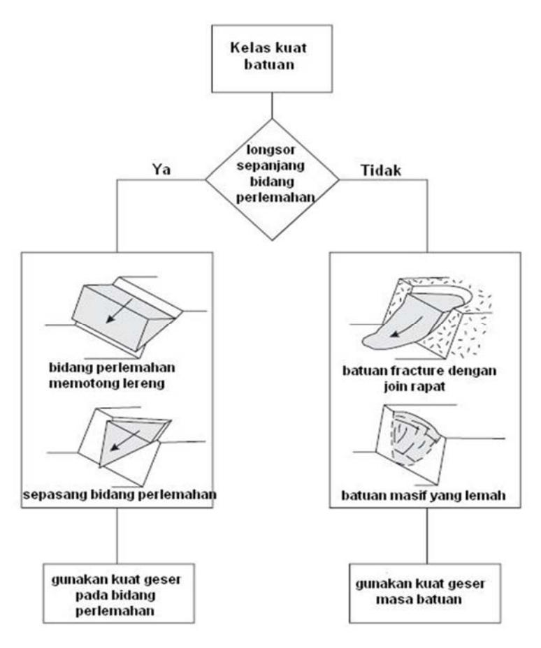

**Gambar 18 –Pola keruntuhan dan penetapan kuat batuan dalam analisis stabilitas lereng** 

# **7.7.1 Penentuan parameter untuk analisis lereng batuan**

Hoek & Brown (1997) menyampaikan cara memperoleh parameter kuat geser, baik dengan cara grafis maupun analitis. Hoek & Brown (1997) menyampaikan parameter yang diperlukan untuk memperoleh parameter kuat geser batuan ( dan c) adalah:

- a) kuat tekan (ci) batuan intak yang diperoleh dari hasil uji kuat tekan contoh batuan intak dari jenis batuan yang sama;
- b) mi konstanta Hoek-Brown untuk batuan intak yang dapat diperoleh dari tabel yang disampaikan oleh Hoek-Brown (1995);
- c) GSI *(Geological Strengt Index)* yang disampaikan oleh Hoek (1994), dan Hoek et al. (1995) adalah suatu cara untuk melakukan estimasi reduksi kekuatan massa batuan pada kondisi geologi yang berbeda. Marinos & Hoek (2000) menyampaikan grafik GSI untuk bermacam jenis batuan;
- d) Berat satuan batuan (b) dari batuan.

#### **7.7.2 Analisis stabilitas lereng batuan**

Analisis stabilitas lereng batuan dapat dilakukan dengan beberapa cara seperti

- a) analisis grafis (Hoek & Bray, 1981),
- b) analisis keseimbangan batas,

- 1) modus longsor bidang *(planar sliding),*
- 2) modus longsor lingkaran *(circular sliding),*
- *3)* modus longsor baji *(wedge sliding),*
- 4) modus longsor roboh *(toppling sliding),*
- c) analisis sensitivitas untuk mengetahui rentang faktor aman lereng batuan pada batas bawah *(lower bound)* dan batas atas *(upper bound),* sehingga dapat diketahui apakah suatu lereng batuan akan aman, atau perlu dilakukan perkuatan tertentu.

Meskipun hasil analisis stabilitas lereng batuan menunjukkan nilai faktor keamanan yang cukup, analisis deformasi lereng batuan perlu dilakukan untuk mengetahui prediksi besaran deformasi lereng yang akan terjadi. Analisis deformasi lereng batuan biasa dilakukan dengan metoda elemen hingga baik dalam domain 2 dimensi (2D) maupun tiga dimansi (3D), dengan menggunakan modul *"stress and deformation"*.

Hal yang penting di dalam melakukan analisis deformasi adalah bahwa sifat teganganregangan batuan adalah nir-linear, meskipun terdapat jenis batuan tertentu yang bersifat getas mempunyai kurva tegangan-regangan yang bersifat linier elastis sampai tingkat beban yang besar. Model batuan yang digunakan di dalam analisis sebaiknya adalah model nirlinear elastik. Apabila tingkat beban masih kecil dan dalam kurva tegangan-regangan masih dalam tingkat linier elastik, maka model batuan dapat digunakan linier elastik.

Hasil yang diperoleh dari analisis deformasi lereng batuan antara lain

- a) deformasi arah horizontal dari suatu titik nodal pada suatu elemen,
- b) deformasi arah vertikal dari suatu titk nodal pada suatu elemen,
- c) vektor dan besaran deformasi pada titik nodal,
- d) tegangan pada titik nodal,
- e) kondisi elemen atau zona yaitu dalam keadaan plastis atau elastis.

#### **7.8 Perancangan instrumentasi untuk keamanan lereng**

# **7.8.1 Jenis-jenis instrumentasi monitoring lereng**

Pengukuran yang diperlukan pada studi longsoran meliputi:

- a) daerah pergerakan tanah,
- b) besar dan arah pergerakan,
- c) kecepatan pergerakan,
- d) distribusi dari pergerakan,
- e) tekanan air pori.

Bila kedalaman bidang gelincir sudah diketahui oleh observasi visual, pengukuran di permukaan mungkin sudah mencukupi untuk mendapatkan informasi kecepatan pergerakan massa tanah. Pengukuran pergerakan vertikal dan horizontal dari lereng yang longsor harus diperoleh.

Kedalaman lereng yang curam, lebarnya retakan, dan tonjolan di kaki lereng harus diperhatikan. Arah pergerakan tanah sering dapat disimpulkan dari pola retakan. Tekanan air pori di sekitar daerah bidang gelincir harus diukur untuk memungkinkan analisis dengan tegangan efektif.

**© BSN 2017 138 dari 303**

# **7.8.2 Pemilihan jenis instrumentasi**

Jenis instrumentasi yang dipilih harus disesuaikan kebutuhannya, seperti berikut.

#### **7.8.2.1 Pengukuran tekanan air pori**

Untuk mengukur tekanan air pori diperlukan *piezometer* yang jenisnya dapat bervariasi, di antaranya adalah:

- *a)* pisometer pipa terbuka (*open-stand pipe piezometer),*
- *b)* pisometer pneumatik,
- *c)* pisometer *vibrating wire*.

# **7.8.2.2 Pengukuran gerakan tanah**

Pengukuran gerakan tanah dapat dilakukan di permukaan atau di dalam massa tanah. Beberapa jenis alat yang sering digunakan untuk memonitor gerakan tanah di antaranya:

- *a) Tiltmeter* (pengukuran kemiringan di permukaan),
- *b)* Inklinometer,
- *c)* Ekstensometer.

#### **7.8.3 Persyaratan minimum instrumentasi geoteknik untuk keamanan lereng**

Langkah-langkah untuk merencanakan instrumentasi sebagai berikut:

- a) menentukan parameter yang hendak diukur;
- b) menentukan jenis alat yang diperlukan;
- c) memilih jenis instrumen yang paling sesuai;
- d) menentukan jumlah, lokasi, dan kedalaman instrumen;
- e) menggunakan teknik pencatatan.

Proses perancangan instrumentasi memerlukan pengembangan ide dari sebab-sebab kelongsoran dan batas yang mungkin dari kedalaman dan batas-batas pergerakan dari bidang gelincir, pengenalan kondisi lapangan, mempelajari geologi lokal, peninjauan catatan hujan, dan observasi dari topografi.

#### **7.8.4 Monitoring dan pelaporan (termasuk interpretasi, analisis, dan evaluasi)**

Pelaporan hasil pemantauan instrumentasi diberikan secara berkala sesuai dengan kesepakatan yang disetujui. Laporan yang terdiri atas hasil interpretasi, analisis dan evaluasi harus dikaji ulang dan disetujui.

# **8 Terowongan**

#### **8.1 Ruang lingkup pekerjaan terowongan**

Pasal ini menetapkan persyaratan terowongan pegunungan/batuan, terowongan perisai, terowongan gali dan tutup,serta persyaratan pemantauan dan pengukuran untuk pekerjaan terowongan. Cakupan bahasan dalam pasal ini meliputi persyaratan perancangan yang terdiri atas bentuk dan ukuran penampang terowongan, alinemen terowongan, kedalaman posisi terowongan, kemiringan terowongan, pemilihan metode konstruksi, dinding

**© BSN 2017 139 dari 303** 

terowongan, beban rencana, fasilitas tambahan, metode-metode tambahan lainnya, terowongan vertikal, perlindungan lingkungan, pengamatan, pengukuran, dan pencatatan pekerjaan.

Secara garis besar pada Tabel 27 ditunjukkan perbandingan tipe-tipe terowongan yang dibahas dalam pasal ini.

**Tabel 27 – Perbandingan tipe terowongan (JSCE, 2007)** 

|                                  | Terowongan gali-dan tutup                                                                                                                                                                                   | Terowongan pegunungan                                                                                                                                                                                                                                                                                                                                                                                                                                                              | Terowongan perisai                                                                                                                                                                                                                                                                                                                                                                                                                        |
|----------------------------------|----------------------------------------------------------------------------------------------------------------------------------------------------------------------------------------------------------------|---------------------------------------------------------------------------------------------------------------------------------------------------------------------------------------------------------------------------------------------------------------------------------------------------------------------------------------------------------------------------------------------------------------------------------------------------------------------------------------|-------------------------------------------------------------------------------------------------------------------------------------------------------------------------------------------------------------------------------------------------------------------------------------------------------------------------------------------------------------------------------------------------------------------------------------------|
| Ringkasan                        | Tanah digali dari permukaan menggunakan sistem penahan tanah untuk membangun terowongan di kedalaman yang diinginkan. Kemudian material galian dibawa kembali untuk mengembalikan permukaan. | Terowongan dibangun dengan mengoptimalkan fungsi kemampuan dukungan alami batuan sekitarnya. Batuan distabilkan selama penggalian dengan beton semprot, baut batuan, penyangga baja, dll. Kondisi yang perlu sebagai syarat "ground arch" terbentuk dan muka bidang galian tetap berdiri ketika digali. Jika tidak, diperlukan tindakan pengendalian.                                                                                             | Sebuah perisai didorong dalam tanah untuk membuat terowongan. Lapisan luar dari perisai dan segmen mendukung dinding terowongan. Jenis perisai tertutup menstabilkan muka bidang galian menggunakan tanah atau bubur/slurry untuk menahan tekanan tanah dan hidraulik. Jenis perisai terbuka hanya dapat digunakan muka bidang galian tetap berdiri. Jika tidak, diperlukan tindakan pengendalian. |
| Aplikasi geologi              | Pada dasarnya tidak ada kondisi tanah dimana metode ini tidak dapat digunakan. Sebuah sistem penahan tanah yang tepat atau metode tambahan dapat dipilih sesuai dengan kondisi tanah.           | Umumnya dari batuan keras hingga batuan lunak Tersier. Metode ini juga dapat diterapkan untuk lapisan diluvium tergantung pada kondisi. Bisa juga digunakan pada tanah tidak terkonsolidasi dengan kekuatan terkekang 0,1 MN/m2 dan modulus deformasi lebih besar dari 10 MN/m2 , termasuk tanah yang lebih lunak. Kekakuan penyangga baja, metode penggalian, dan tindakan pengendalian dapat berubah sesuai dengan variasi geologi. | Umumnya adalah berlaku untuk lapisan berumur Holosen, Pleistosen, dan lapisan Neosen sangat lunak. Memiliki fleksibilitas untuk mengakomodasi variasi kondisi tanah. Baru-baru ini ada beberapa kasus, metode ini dapat diaplikasikan pada batuan keras.                                                                                                                                                             |
| Pengukuran ulang air tanah | Langkah-langkah tambahan, seperti perlekatan dalam, pengeringan, dan perbaikan tanah, seringkali diperlukan untuk mencegah boiling dan heaving.                                                    | Ketika aliran air memengaruhi kemampuan bertahan muka bidang galian atau stabilitas batuan selama penggalian, maka diperlukan metode penyegelan air seperti sumur dalam, sumur titik, atau drainase terowongan.                                                                                                                                                                                                                                                     | Jenis perisai tertutup biasanya tidak memerlukan tindakan tambahan, kecuali untuk bagian permulaan dan kedatangan.                                                                                                                                                                                                                                                                                                               |
| Kedalaman terowongan          | Biasanya tidak ada pembatasan minimum overburden dalam konstruksi. Kedalaman maksimum terowongan sebelumnya adalah sekitar 40 meter.                                                            | Ketika rasio overburden terhadap diameter terowongan kurang dari 2 pada tanah tidak terkonsolidasi, diperlukan tindakan pengendalian untuk menahan penurunan mahkota.                                                                                                                                                                                                                                                                                                  | Overburden minimal adalah setengah diameter perisai. Penentuan tekanan muka bidang galian (face pressure, jacking pressure dan grouting pressure) harus didasarkan pada kondisi tanah. Kedalaman maksimum biasanya ditentukan oleh tekanan air.                                                                                                                                                                   |
| Bentuk potongan melintang  | Pada dasarnya bentuk bagian adalah persegi panjang. Bentuk yang lebih kompleks juga bisa dibuat.                                                                                                      | Pada dasarnya bagian dari penggalian memiliki bentuk melengkung di mahkota. Bentuk bagian dapat berubah selama konstruksi.                                                                                                                                                                                                                                                                                                                                                | Pada dasarnya bentuk bagian melingkar. Sebuah setengah lingkaran, lingkaran, oval, dll, juga dapat digali menggunakan mesin perisai khusus. Mengubah bentuk biasanya sulit selama konstruksi.                                                                                                                                                                                                                              |

**© BSN 2017 140 dari 303**

|                                             | Terowongan gali-dan tutup                                                                                                                                                                                                                                                                                                                              | Terowongan pegunungan                                                                                                                                                                                                                                                                                                             | Terowongan perisai                                                                                                                                                                                                                                                                                                                                                                                        |
|---------------------------------------------|-----------------------------------------------------------------------------------------------------------------------------------------------------------------------------------------------------------------------------------------------------------------------------------------------------------------------------------------------------------|--------------------------------------------------------------------------------------------------------------------------------------------------------------------------------------------------------------------------------------------------------------------------------------------------------------------------------------|-----------------------------------------------------------------------------------------------------------------------------------------------------------------------------------------------------------------------------------------------------------------------------------------------------------------------------------------------------------------------------------------------------------|
| Ukuran potongan melintang             | Tidak ada batasan pada ukuran penampang ketika menggunakan metode ini.                                                                                                                                                                                                                                                                              | Umumnya ukuran penampang adalah sebesar 150 m2 , yang terbesar adalah lebih 200 m2                                                                                                                                                                                                                                          | Ukuran terbesar dari penampang sekitar 14 m diameter perisai.                                                                                                                                                                                                                                                                                                                                          |
| Alinemen                                    | Tidak ada batasan ketika menggunakan metode ini.                                                                                                                                                                                                                                                                                                       | Hampir tidak ada batasan ketika menggunakan metode ini.                                                                                                                                                                                                                                                                           | Rasio minimum radius kelengkungan untuk diameter perisai adalah 3-5.                                                                                                                                                                                                                                                                                                                                |
| Dampak terhadap lingkungan sekitar | Konstruksi berdekatan dengan struktur yang ada membutuhkan perkuatan tambahan sistem dinding penahan tanah dan/atau tindakan tambahan. Lalu lintas permukaan sangat terhambat karena daerah konstruksi harus diblokir selama masa konstruksi. Penanggulangan kebisingan dan getaran diperlukan pada semua tahap konstruksi. | Tindakan pengendalian diperlukan untuk konstruksi berdekatan. Ada dampak dengan tingkat yang terbatas pada lalu lintas permukaan kecuali pada shaft. Kebisingan dan getaran terbatas pada daerah sekitar portal dan dapat ditangani dengan menggunakan dinding kedap suara atau perumahan kedap suara. | Dalam beberapa kasus, pelaksanaan berdekatan dengan struktur yang ada, langkah langkah tambahan untuk memperkuat struktur yang berdekatan diperlukan. Ada dampak dengan tingkat yang terbatas pada lalu lintas permukaan. Kebisingan dan getaran terbatas pada daerah sekitar shaft. Shaft dapat dilindungi oleh dinding kedap suara, housing atau metode lainnya. |

## **8.2 Persyaratan perancangan terowongan pegunungan/batuan**

# **8.2.1 Persyaratan perancangan**

Terowongan harus dirancang dengan mempertimbangkan berbagai kondisi dan hal-hal yang diperlukan sesuai dengan fungsi dari terowongan, lokasi, dan kondisi lingkungan. Selain itu juga evaluasi menyeluruh terhadap kondisi keselamatan, efisiensi ekonomi, kemudahan konstruksi, ketahanan, dan pemeliharaan dalam masa layannya.

#### **8.2.2 Prosedur perancangan**

Terowongan harus dirancang menggunakan prosedur yang sesuai berdasarkan kondisi desain yang telah ditentukan. Langkah-langkah prosedur perancangan ditunjukkan pada Gambar 19 berikut ini.

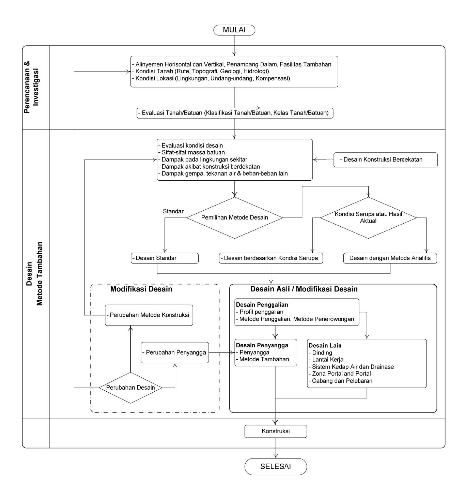

**Gambar 19 - Prosedur perancangan terowongan pegunungan/batuan** 

#### **8.2.3 Kondisi perancangan**

Kondisi-kondisi perancangan yang harus dipertimbangkan adalah:

- a) Sifat-sifat media yang dilewati terowongan, yang meliputi kekuatan, karakteristik deformasi, stabilitas muka bidang terowongan (*face stability*), dan aliran air.
- b) Dampak pada lingkungan sekitarnya, seperti suara bising dan getaran, gangguan lalu lintas, penurunan muka air di sungai dan air tanah, perubahan dan polusi pada kualitas air, penurunan permukaan tanah, pengaruh pada flora dan fauna, serta pengaruh lainnya.

**© BSN 2017 142 dari 303**

- c) Efek akibat konstruksi struktur berdekatan setelah terowongan dibangun, area dan tingkat dampak harus dikaji dan dipertimbangkan dalam desain perkuatan dan dinding terowongan. Semua perubahan meliputi tekanan dan sifat-sifat massa batuan, pergerakan dan deformasi pada terowongan, dan dampak dari getaran akibat peledakan.
- d) Dampak dari gempa, tekanan tanah, tekanan air dan faktor-faktor lain. Hal-hal utama yang perlu dipertimbangkan di antaranya tebal lapisan penutup (*overburden*), topografi, geologi, kondisi lokasi, lingkungan sekitar, dan tujuan penggunaan terowongan.

Selain itu *item-item* perancangan yang diperlukan adalah:

- a) Alinemen horizontal;
- b) Profil memanjang;
- c) Penampang melintang;
- d) Fasilitas tambahan;
- e) Klasifikasi massa batuan;
- f) Geometri penampang penggalian;
- g) Metode penggalian;
- h) Metode penerowongan;
- i) Perkuatan (beton semprot, baut batuan, penyangga baja, dll.);
- j) Dinding terowongan;
- k) Lantai kerja (*invert*);
- l) Drainase dan kedap air;
- m) Daerah portal dan portal;
- n) Metode tambahan;
- o) Pengukuran.

#### **8.2.4 Metode perancangan**

Metode perancangan harus dipilih dengan mempertimbangkan kebutuhan dan persyaratan kondisi desain juga *item-item* desain. Perancangan terowongan umumnya menggunakan teknik spesifik yang berfokus pada desain terdahulu dan pengalaman konstruksi. Namun metode lain seperti metode empiris dan analitis juga dapat digunakan.

#### **8.2.5 Penyelidikan batuan**

Untuk mendesain terowongan pada batuan, perlu diketahui sifat-sifat fisik dan mekanika dari batuan itu sendiri. Oleh karena itu diperlukan penyelidikan batuan baik berdasarkan uji lapangan maupun uji laboratorium. Data-data yang diperoleh dari penyelidikan ini digunakan untuk menganalisis dan memahami perilaku batuan sebagai basis dalam desain. Karakteristik lokasi dan penyediaan parameter-parameter yang diperlukan dalam tahap desain dan konstruksi terowongan sangat diperlukan.

Penyelidikan batuan harus mempertimbangkan pemilihan alinemen, penampang, dan metode konstruksi terowongan.

# **8.2.5.1 Jenis-jenis Penyelidikan**

1. Kajian awal

Tahap awal dalam kegiatan penyelidikan adalah mengumpulkan dan mengkaji informasi yang telah tersedia.

2. Survei dan penyelidikan pendahuluan lokasi

Survei awal diperlukan untuk pengembangan konsep dan desain awal konstruksi terowongan. Adapun kegiatan survei dan penyelidikan pendahuluan lokasi adalah:

- a) Penyelidikan pendahuluan lokasi,
- b) Pemetaan topografi,
- c) Pemetaan hidrografi,
- d) Pemetaan utilitas.
- 3. Pemetaan geologi

Pemetaaan geologi dilakukan untuk mendapatkan litologi (deskripsi, ketebalan, dan orientasi) dan diskontinuitas batuan (tipe, orientasi, material pengisi, spasi, dan tingkat pelapukan).

4. Penyelidikan bawah permukaan

Kondisi geologi, geoteknik, dan hidrologi batuan memberikan dampak yang besar terhadap perencanaan, perancangan, dan konstruksi terowongan. Untuk mendapatkan parameter tersebut dilakukan penyelidikan bawah permukaan yang terdiri atas pengeboran (*boring*), pengambilan contoh (*sampling*), pengujian lapangan, penyelidikan geofisika, dan pengujian laboratorium, sesuai dengan persyaratan pada 5.4.

5. Isu lingkungan

Kegiatan penyelidikan terowongan harus memerhatikan dampak terowongan pada ekosistem, batuan/air yang akan dikontaminasi, tata guna lahan, pengaruh jangka panjang pada air tanah, aspek legal, dan kendala lingkungan.

6. Gempa bumi

Aspek-aspek yang harus ditinjau yang berkaitan dengan gempa bumi adalah jarak pusat gempa terhadap terowongan, skala gempa, durasi gempa, profil bawah tanah, dan karakteristik dinamik.

#### **8.2.5.2 Analisis tanah/batuan**

Analisis tanah/batuan harus mempertimbangkan adanya rentang karakter tanah/batuan yang memberikan perilaku berbeda bila dilakukan konstruksi terowongan. Oleh karena itu, *engineer* harus menyiapkan desain yang mengantisipasi perubahan dan hal-hal yang dibutuhkan (meliputi sarana-prasarana, metode, dan peralatan).

Hal-hal yang harus dipertimbangkan sebagai komponen desain adalah**:** 

- 1) Mekanisme runtuhan tanah/batuan,
- 2) Klasifikasi massa batuan, dapat menggunakan klasifikasi Terzaghi, RQD/*Rock Quality Designation* (ASTM D6032-02), Q *System* (Barton, et al., 1993, dan Grimstad et al., 2002), RMR/*Rock Mass Rating* (Bieniawski, Z.T., 1989) atau standar klasifikasi lain yang baku digunakan.

#### **8.2.6 Persyaratan area portal dan portal**

Area portal adalah area pada jalan masuk dan keluar terowongan, yang mana lapisan penutupnya (*overburden*) adalah 1 hingga 2 kali dari diameter penggalian dan efek busur batuan tidak terbentuk dengan mudah, seperti ditunjukkan pada Gambar 20.

**© BSN 2017 144 dari 303**

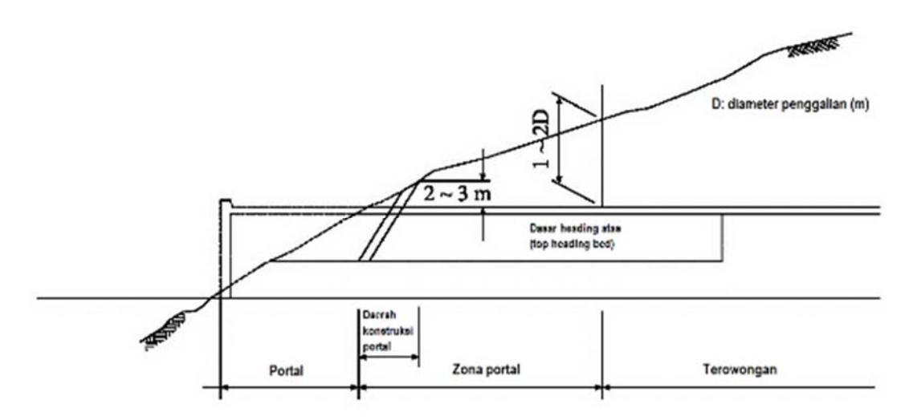

**Gambar 20 - Tipikal area portal terowongan (JSCE, 2007)** 

Area portal dan portal terowongan harus didesain dengan mempertimbangkan faktor-faktor seperti kondisi massa batuan, dimensi area (*section size*), kondisi lokasi, dampak pada lingkungan sekitar, bentuk (*appearance*), dan metode konstruksi.

# **8.2.7 Persyaratan penggalian**

Terdapat 3 hal utama yang harus ditentukan dalam desain penggalian terowongan, yaitu:

- a) Penampang penggalian;
- b) Metode penggalian;
- c) Metode penerowongan.

#### **8.2.7.1 Penentuan penampang penggalian**

Penampang penggalian harus ditentukan berdasarkan berbagai kondisi meliputi penampang dalam galian yang diperlukan, perkuatan, dinding terowongan, drainase, konvergensi setelah penggalian, juga stabilitas terowongan dalam jangka panjang. Pada kondisi batuan dengan konvergensi yang besar, maka penampang penggalian harus ditentukan dengan mempertimbangkan deformasi izin.

#### **8.2.7.2 Pemilihan metode penggalian**

Metode penggalian yang sesuai harus dipilih dengan mempertimbangkan kondisi batuan, bentuk dan ukuran penampang penggalian, metode penerowongan, dan dampak pada struktur berdekatan dan lingkungan sekitar.

#### **8.2.7.3 Pemilihan metode penerowongan**

Pemilihan metode penerowongan harus berdasarkan panjang terowongan, kondisi batuan, penampang penggalian, metode penggalian, kondisi lokasi dan dampak pada struktur berdekatan serta lingkungan sekitar.

Metode penerowongan meliputi metode pengeboran dan peledakan, penggalian mekanis (dapat menggunakan ekskavator atau *road header*), atau kombinasi dari kedua metode tersebut, serta *tunnel boring machine* (TBM). Fokus dan pertimbangan utama dalam pemilihan metode penerowongan adalah kondisi tanah atau batuannya.

**© BSN 2017 145 dari 303** 

Metode pengeboran dan peledakan umumnya diaplikasikan pada kondisi batuan yang keras hingga sedang. Adapun untuk metode mekanis biasanya diaplikasikan untuk kondisi batuan sedang hingga lunak.

#### 8.2.8 Persyaratan perkuatan

Sistem perkuatan terowongan harus dirancang untuk membuat struktur yang stabil dan menyatu dengan kondisi tanah/batuan setelah dilakukan penggalian. Sistem perkuatan yang tepat dan tidak menimbulkan efek yang merugikan harus digunakan, karena perilaku tanah/batuan akan memengaruhi permukaan tanah/batuan atau struktur yang ada di sekitarnya.

Perkuatan terowongan harus dirancang untuk menjamin semua aktivitas di dalam terowongan dapat berjalan dengan aman dan efisien.

Secara umum, sistem perkuatan pada terowongan terdiri atas beton semprot (*shotcrete*), baut batuan (*rock bolt*), dan penyangga baja (*steel support*). Untuk perancangan perkuatan yang efektif, karakteristik dari setiap perkuatan harus dianalisis, agar dapat ditentukan salah satu jenis perkuatan atau melakukan kombinasi di antaranya. Pada kasus-kasus tertentu yang mana kondisi tanah/batuan sangat jelek, dinding terowongan dapat dipertimbangkan sebagai bagian dari sistem perkuatan terowongan.

#### 8.2.8.1 Konsep perancangan perkuatan terowongan

Perancangan perkuatan terowongan dilakukan dengan mempertimbangkan karakteristik setiap perkuatan, kondisi tanah/batuan, dan metode konstruksi yang digunakan. Jenis perkuatan dipilih berdasarkan pada klasifikasi batuan, dan pola perkuatan harus ditentukan dengan melakukan kombinasi dari jenis perkuatan yang telah dipilih.

Kriteria pemilihan jenis perkuatan dapat dilihat pada Tabel 28 dan contoh tipikal pola perkuatan untuk terowongan jalan dapat dilihat pada Tabel 29 dan Tabel 30.

Jenis-jenis Perkuatan Catatan Kategori Tanah/Batuan Beton enyangga Semprot Batuan Keria Beto Baia Sedikit rekahan Δ Batuan Keras (Kelas B. C) Banvak rekahan  $\bigcirc$ 0 Δ 0 Untuk memastikan kondisi lapisan Faktor Kompetensi pondasi (base course) yang baik pada Tanah Besar 0 0 × Λ masa layan, diperlukan lantai kerja beton (Kelas DI) jika jenis batuannya adalah batu lempung Batuan Lunak (Kelas D) Harus dipertimbangkan mengenai Faktor Komnetensi penempatan awal lantai kerja beton atau Tanah Kecil  $\bigcirc$  $\bigcirc$  $\bigcirc$ 0 penutupan awal penampang melintang (Kelas DII) penggalian Media Tanah Dinding dapat dianggap sebagai bagian (Overburden Kecil)  $\bigcirc$  $\bigcirc$  $\bigcirc$ (Kelas E) penyangga Harus dipertimbangkan mengenai penutupan awal penampang melintang Zona Patahan (Overburden Besar)  $\bigcirc$  $\bigcirc$  $\bigcirc$  $\bigcirc$ penggalian dan besarnya deformasi yang diizinkan Harus dipertimbangkan mengenai penutupan awal penampang melintang Tanah/batuan Squeezing  $\bigcirc$  $\cap$  $\bigcirc$  $\bigcirc$ penggalian, fungsi penyanggaan dari dinding dan besarnya deformasi yang diizinkan

Tabel 28 - Kriteria pemilihan jenis perkuatan terowongan

© BSN 2017 146 dari 303

Tabel 29 – Jenis pola perkuatan terowongan berdasarkan klasifikasi batuan RMR (Bieniawski, 1989)

| Kelompok Massa Batuan          | Penggalian                                                                                                                                                    | Baut Batuan (diameter 20 mm, fully grouted)                                                                                                                        | Beton Semprot                                                                             | Penyangga Baja                                                                                                           |
|-----------------------------------|---------------------------------------------------------------------------------------------------------------------------------------------------------------|-----------------------------------------------------------------------------------------------------------------------------------------------------------------------|-------------------------------------------------------------------------------------------|--------------------------------------------------------------------------------------------------------------------------|
| I - Sangat Bagus RMR: 81 - 100 | Seluruh permukaan, tebal 3 m                                                                                                                                  | Tidak dip                                                                                                                                                             | erlukan, kecuali pembautan setempat (sp                                                   | ot bolting)                                                                                                              |
| II - Bagus RMR: 61 - 80        | Seluruh permukaan, tebal 1 - 1.5 m Penyangga penuh 20 m dari permukaan.                                                                                    | Setempat, baut dipasang pada puncak dengan panjang 3 m, jarak 2.5 m dengan jaring kawat (occasional wire mesh)                                               | Jika diperlukan, 50 mm pada bagian puncak.                                                | Tidak diperlukan                                                                                                         |
| III - Cukup RMR: 41 - 60       | Bagian atas dan bench tebal 1.5 - 3 m pada bagian atas. Penyangga dipasang setelah peledakan. Penyangga penuh 10 m dari permukaan.                   | Baut dipasang secara sistematis dengan panjang 4 m, jarak 1.5 - 2 m pada puncak dan dinding dengan jaring kawat pada bagian puncak.                          | 50 - 100 mm pada bagian puncak dan 30 mm di bagian tepi.                               | Tidak diperlukan                                                                                                         |
| IV - Buruk RMR: 21 - 40        | Bagian atas dan <i>bench</i> tebal 1.0 - 1.5 m pada bagian atas. Pasang penyangga bersamaan dengan penggalian, 10 m dari permukaan.                  |                                                                                                                                                                       | 100 - 150 mm pada bagian puncak dan 100 mm di bagian tepi.                             | Tulangan ringan sampai sedang berjarak 1.5 m jika diperlukan.                                                         |
|                                   | Banyak arah tebal 0.5 - 1.5 m pada bagian atas. Pasang penyangga bersamaan dengan peggalian. Beton semprot dipasang secepatnya setelah peledakan. | Baut dipasang secara sistematis dengan panjang 5 - 6 m, jarak 1 - 1.5 m pada puncak dan dinding dengan jaring kawat pada bagian puncak. <i>Bolt invert</i> . | 150 - 200 mm pada bagian puncak dan 100 mm di bagian tepi dan 50 mm pada permukaan. | Tulangan sedang sampai berat berjarak 0.75 m dengan steel lagging dan forepoling jika diperlukan. Close invert. |

Tabel 30 – Persyaratan minimum pola perkuatan untuk terowongan jalan (JSCE, 2007)

|                  | (Terowongan berpenampang besar, lebar bagian dalam: sekitar 12,5 m hingga 14,0 m |                            |                |                           |                          |                        |                 |           |                    |                          |                                                      |                                     |                           |                                                             |
|------------------|----------------------------------------------------------------------------------|----------------------------|----------------|---------------------------|--------------------------|------------------------|-----------------|-----------|--------------------|--------------------------|------------------------------------------------------|-------------------------------------|---------------------------|-------------------------------------------------------------|
|                  |                                                                                  |                            |                | Bau                       | t batuan                 |                        | Per             | nyangga l | baja               |                          | Ketebala                                             | n dinding                           |                           |                                                             |
| Kategori         |                                                                                  | Panjang                    |                | Jai                       | rak                      |                        |                 |           |                    | Ketebalan                | Lengkung                                             |                                     | Besarnya deformasi     |                                                             |
| Tanah/B atuan | Pola perkuatan                                                                | lengkung standar (m) | Panjang (m) | Arah melengkung (m) | Arah memanjang (m) | Area pemasangan     | Heading atas | Bench     | Jarak (m)       | beton semprot (cm) | (arch), dinding samping (side wall) (cm) | Lantai kerja (invert) (cm) | yang diizinkan (cm) | Metode penggalian                                           |
| В                | В                                                                                | 2,0                        | 4,0            | 1,5                       | 2,0                      | Heading atas           | -               | -         | -                  | 10                       | 40                                                   | -                                   | 0                         | Matada namusian                                             |
| СІ               | СІ                                                                               | 1,5                        | 4,0            | 1,2                       | 1,5                      | Heading atas, bench | -               | -         | -                  | 15                       | 40                                                   | (45)                                | 0                         | Metode penggalian seluruh muka dengan bench tambahan, |
| СП               | СП                                                                               | 1,2                        | 4,0            | 1,2                       | 1,2                      | Heading atas, bench | H-150           | -         | 1,2                | 15                       | 40                                                   | (45)                                |                           | metode penggalian bench, metode diafragma tengah,     |
| DI               | DI                                                                               | 1,0                        | 6,0            | 1,0                       | 1,0                      | Heading atas, bench | H-150           | H-150     | 1,0                | 20                       | 40                                                   | 50                                  | 0                         | diafragma tengah, metode penggalian samping tengah    |
| DII              | DII                                                                              | 1,0 atau kurang         | 6              | 1,0                       | 1,0 atau kurang       | Heading atas, bench | H-200           | H-200     | 1,0 atau kurang | 25                       | 40                                                   | 50                                  | 10                        | cumping tongun                                              |

#### 8.2.8.2 Perubahan sistem perkuatan terowongan

Jika sistem perkuatan yang ditentukan tidak memadai dengan kondisi aktual lapangan, yang diketahui dari hasil pengamatan, pengukuran, dan penyelidikan geologi selama konstruksi terowongan, maka perubahan sistem perkuatan harus cepat dilakukan.

Tipikal perubahan sistem perkuatan pada saat konstruksi terowongan, ditunjukkan pada Tabel 31.

Tabel 31 – Tipikal perubahan perkuatan selama tahap konstruksi (JSCE, 2007)

| Item                           | Tipikal Perubahan                                                           |
|--------------------------------|-----------------------------------------------------------------------------|
| Beton semprot (shotcrete)      | Perubahan pada ketebalan, material, dll.                                    |
| Baut batuan (rock bolt)        | Perubahan panjang, jumlah, kekuatan, material pengikat, tipe pengikat, dll. |
| Penyangga baja (steel support) | Mengadopsi atau meniadakan penyangga baja                                   |
|                                | Perubahan bentuk, spasi, material, dll.                                     |
| Lantai beton (invert concrete) | Mengadopsi atau meniadakan lantai beton                                     |
|                                | Perubahan bentuk, waktu pemasangan, material, dll.                          |
| Faktor lain                    | Perubahan siklus penggalian                                                 |
|                                | Aplikasi metode tambahan                                                    |
|                                | Melakukan evaluasi terhadap struktur dinding beton                          |

© BSN 2017 147 dari 303

# **8.2.8.3 Beton semprot (***shotcrete***)**

Pertimbangan terhadap karakteristik perkuatan terowongan, kondisi batuan dasar, kendala dalam konstruksi, dan lain-lain harus dilakukan dalam perancangan beton semprot agar dapat berfungsi dengan efektif.

#### **8.2.8.3.1 Karakteristik mekanis dari beton semprot**

Karakteristik mekanis dari beton semprot harus diperhitungkan dengan mempertimbangkan fungsi dan efek yang diharapkan, serta kondisi batuan dasar.

Umumnya, pada konstruksi terowongan dibutuhkan kuat tekan yang tinggi sesaat setelah beton semprot diterapkan. Tipikal kuat tekan minimum untuk terowongan jalan ditunjukkan pada Tabel 32.

**Tabel 32 – Persyaratan kuat tekan minimum beton semprot untuk terowongan jalan** 

|                         | Kuat Tekan Uniaksial                 |                                      |
|-------------------------|--------------------------------------|--------------------------------------|
| Penampang Terowongan | Tahap Pertama/Initial (hari ke-1) | Tahap Jangka Panjang (hari ke-28) |
| 2 lajur                 | 5 N/mm2                              | 18 N/mm2                             |
| > 2 lajur               | 10 N/mm2                             | 36 N/mm2                             |

# **8.2.8.3.2 Campuran beton semprot**

Campuran dari beton semprot harus mempertimbangkan kualitas seperti kekuatan yang diperlukan dan kendala saat pelaksanaan.

Kekuatan campuran beton semprot harus ditentukan dengan mempertimbangkan desain kekuatan standar dan kekuatan terkait, begitu juga variasi kekuatan beton yang terjadi di lapangan.

Hal utama yang harus dipertimbangkan dalam campuran beton semprot adalah:

- a) Kekuatan (kekuatan pertama/*initial*, kekuatan awal, dan kekuatan jangka panjang);
- b) Kelekatan;
- c) Kepadatan (kelembapan yang terserap, volume rongga, permeabilitas, dll.);
- d) Daya tahan (ketahanan terhadap pembekuan/pencairan, ketahanan terhadap bahan kimia, ketahanan terhadap proses karbonasi);
- e) Rasio pantulan;
- f) Volume debu yang dihasilkan.

#### **8.2.8.3.3 Perancangan ketebalan beton semprot**

Ketebalan beton semprot harus ditentukan dengan mempertimbangkan kondisi batuan dasar, ukuran penampang, dan kendala konstruksi.

Perancangan ketebalan beton semprot dapat ditentukan dengan mengikuti standar pola perkuatan dari pengalaman penerapan pada proyek-proyek sebelumnya. Namun, jika standar pola perkuatan tidak dapat diterapkan karena kondisi perancangan khusus, perancangan ketebalan beton semprot dilakukan berdasarkan teknik analitis. Perhatian khusus harus diberikan pada stabilitas batuan dasar di sekitar terowongan, pergerakan yang diizinkan, kondisi tegangan dari material perkuatan, dan lain-lain.

#### **8.2.8.3.4 Perkuatan pada beton semprot**

Jika perkuatan diperlukan pada beton semprot, material perkuatan, metode perkuatan dan kendala dalam konstruksi harus dipertimbangkan untuk mencapai tujuan tersebut.

**© BSN 2017 148 dari 303**

Karakteristik kekuatan material beton semprot dapat ditingkatkan dengan penggunaan jaring kawat atau serat (*fiber*), untuk meningkatkan kuat geser, kuat tarik dan kekuatannya, selain menambah kekuatan kompaksinya.

#### **8.2.8.4 Baut batuan**

Baut batuan harus dirancang agar dapat menjadi material perkuatan yang efektif dengan mempertimbangkan kondisi batuan dasar, dan karakteristik sistem perkuatan, dan kendalakendala pada saat konstruksi.

Fungsi perkuatan dari baut batuan terutama adalah untuk menekan pergerakan relatif yang paralel terhadap atau tegak lurus bidang rekahan pada kondisi batuan sedang dan keras yang mempunyai rekahan. Selain itu juga untuk menekan pergerakan relatif dalam arah radial terhadap terowongan antara permukaan dinding terowongan dan batuan dasar pada kondisi batuan lunak dan batuan sedimen.

## **8.2.8.4.1 Sistem pengunci baut batuan**

Sistem pengunci baut batuan diplih berdasarkan tujuan dari pengunaan, kondisi batuan dasar, kendala dalam konstruksi. Umumnya, terdapat dua tipe sistem pengunci berdasarkan pada metode dalam mengunci baut batuan, yaitu tipe material pengunci dan tipe friksi. kedua tipe ini dijelaskan pada Gambar 21.

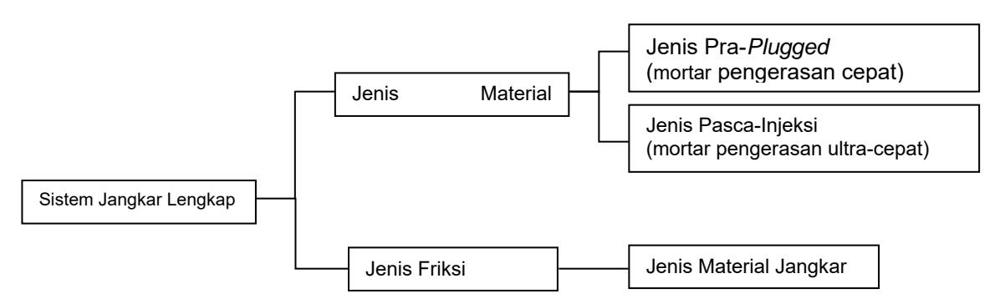

**Gambar 21 – Klasifikasi sistem pengunci untuk baut batuan (JSCE, 2007)**

#### **8.2.8.4.2 Material pengunci baut batuan**

Material pengunci pada baut batuan harus memberikan gaya pengunci yang memadai. Baut batuan efektif untuk menahan gaya tekan dan geser pada sudut siku sumbu. Oleh karena itu, kekuatan antara material baut batuan, material pengunci, dan batuan dasar harus dipastikan sudah cukup memadai agar diperoleh perkuatan yang efektif.

Material pengunci yang dipilih harus mempunyai kekuatan pengunci sepanjang baut batuan, dengan mempertimbangkan kondisi batuan dasar dan kendala-kendala konstruksi. Pada tahap awal diperlukan kondisi material pengunci dengan gaya pengunci yang besar, sedangkan untuk jangka panjang diperlukan durabilitas dan pengisian (*plugging*) yang bagus.

# **8.2.8.4.3 Distribusi dan dimensi dari baut batuan**

Distribusi dari baut batuan harus ditentukan berdasarkan kondisi batuan dasar, ukuran penampang terowongan, bentuk, metode penggalian, dan pelaksanaaan konstruksi.

Pada prinsipnya, distribusi baut batuan adalah pada area yang terpengaruh akibat penggalian terowongan untuk memberikan perkuatan yang efisien.

**© BSN 2017 149 dari 303** 

Selanjutnya penentuan distribusi baut batuan dilakukan dengan mempertimbangkan interval posisi yang memungkinkan baut batuan yang berdekatan dapat saling memperkuat.

Berbagai distribusi baut batuan dapat digunakan tergantung kepada kondisi batuan dasar dan ukuran penampang terowongan. Contoh distribusi baut batuan berdasarkan kondisi batuan dasarnya ditunjukkan pada Gambar 22 dan Gambar 23.

Dimensi baut batuan, panjang baut batuan pada prinsipnya harus dapat memperkuat daerah yang terpengaruh oleh penggalian, namun hal ini bisa berubah tergantung pada efek yang diperkirakan.

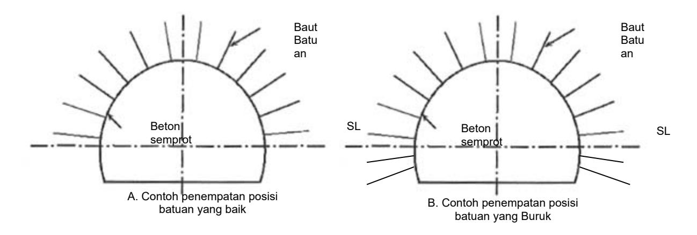

Gambar 22 - Distribusi baut batuan pada profil melintang (JSCE, 2007)

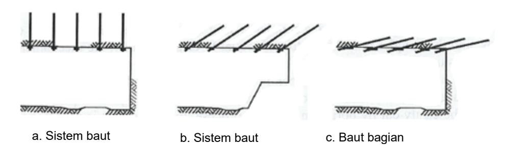

Gambar 23 — Distribusi baut batuan pada profil memanjang (JSCE, 2007)

# 8.2.8.4.4 Material dan bentuk baut batuan

Baut batuan harus memiliki kekuatan yang diperlukan dan karakteristik diperpanjang dan bentuk yang sesuai, dengan mempertimbangkan kondisi batuan dasar dan pelaksanaan konstruksi. Karakteristik diperpanjang yang dimaksud adalah potensi untuk deformasi saat menahan beban.

Selain itu, pelat bantalan dan mur baut batuan harus memiliki kekuatan yang cukup dan bentuk yang tepat.

Baut batuan dapat berbentuk batang torsi, batang bergelombang (deformed bar), threaded deformed bar, atau tipe pipa baja ekspansi.

#### 8.2.8.5 Penyangga baja

Penyangga baja harus digunakan berdasarkan kondisi batuan dengan mempertimbangkan tujuan, efek yang diperkirakan, efisiensi kerja, efisiensi ekonomi, dan faktor lainnya.

© BSN 2017 150 dari 303

Penyangga baja berbentuk lengkungan berfungsi sebagai perkuatan saat penggalian permukaan terowongan, untuk menstabilkan muka bidang galian terowongan sampai kekuatan beton semprot terbangun sempurna. Penyangga baja juga berfungsi untuk memudahkan stabilisasi terowongan saat dilakukan kombinasi dengan beton semprot.

Perancangan penyangga baja, harus mempertimbangkan bentuk dan ukuran dari penampang melintang terowongan, metode penggalian, stabilitas muka bidang galian terowongan, beban yang bekerja di sekitar terowongan, dan penurunan izin pada permukaan. Semua faktor tersebut harus dianalisis secara detail untuk menentukan dimensi, material, bentuk, dan spasi penyangga baja agar dapat menjamin terowongan dalam keaadaan stabil. Penyangga baja umumnya dikombinasikan dengan beton semprot dan baut batuan. Estimasi kemampuan penyangga harus dihitung secara keseluruhan untuk desain yang efektif.

#### **8.2.8.5.1 Bentuk penyangga baja**

Bentuk penyangga baja harus ditentukan dengan pertimbangan untuk mengakomodasi bentuk penampang melintang terowongan, kemampuan untuk diterapkan berdasarkan kondisi batuan, beban aktif, dan kondisi yang lain, juga memastikan dapat bekerja dengan efisien. Bentuk penyangga baja seperti penyangga baja pada bagian atas, bagian atas dan bawah, dan secara keseluruhan, ditunjukkan pada Gambar 24.

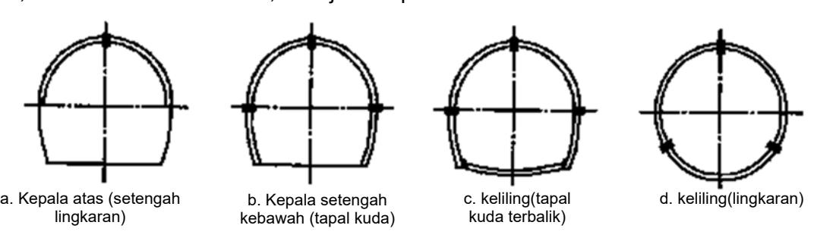

**Gambar 24 - Variasi bentuk sistem penyangga baja (JSCE, 2007)** 

# **8.2.8.5.2 Penampang melintang dan material penyangga baja**

Bentuk dan dimensi penyangga baja harus ditentukan dengan mempertimbangkan tidak hanya beban aktif tetapi juga ketebalan dan metode aplikasi beton semprot.

Material penyangga baja harus dipilih dari material yang mempunyai sifat daktilitas tinggi, dan dapat diproses untuk tekuk dan pengelasan. Baja yang biasanya digunakan adalah H*beams*, U-*beams*, pipa bulat, dan *lattice girders*.

#### **8.2.8.5.3 Jarak dari penyangga baja**

Jarak antara penyangga baja ditentukan dengan mempertimbangkan kondisi tanah/batuan, fungsi, stabilitas muka bidang galian terowongan, dimensi penampang terowongan, metode konstruksi, metode penerowongan, dan faktor-faktor lain.

#### **8.2.8.5.4 Sambungan dan pelat dasar untuk penyangga baja**

Posisi dan struktur dari sambungan desain penyangga baja harus ditentukan dengan mempertimbangkan bentuk penampang melintang, metode konstruksi, dan besaran serta distribusi tegangan yang dihasilkan.

# **8.2.8.5.5** *Collar braces* **untuk penyangga baja**

Penyangga baja selanjutnya harus diikat dengan *collar braces*. *Collar braces* harus dipasang dengan baik pada penyangga baja yang baru terpasang untuk mencegah terjadi keruntuhan sampai penyangga terpasang secara tetap oleh beton semprot.

# **8.2.9 Persyaratan dinding terowongan**

Dinding harus dirancang untuk memenuhi fungsi terowongan, dan menjamin keselamatan dan daya tahan jangka panjang. Desain dinding terowongan harus memperhitungkan kondisi tanah/batuan, kondisi beban, fasilitas penting, dan kondisi lainnya.

Dinding harus dirancang untuk mencapai fungsi dan kualitas yang diperlukan untuk memenuhi tujuan dan penggunaan yang diharapkan dari terowongan.

Berikut adalah hal-hal yang harus dipertimbangkan dalam merancang dinding terowongan.

a. Bentuk dinding harus ditentukan sehingga diperoleh penampang dalam yang sesuai, gaya aksial ditransmisikan dengan baik, dan tekuk diminimalkan. Pada Gambar 25 dapat dilihat beberapa bentuk dari dinding terowongan, yang dapat dipilih tergantung pada kondisi dan karakteristik batuannya.

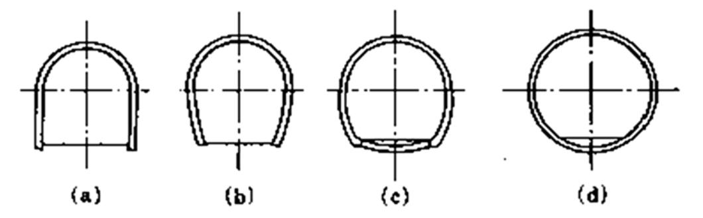

 **Gambar 25 - Bentuk dinding terowongan (JSCE, 2007)** 

- b. Tebal dinding terowongan harus dirancang berdasarkan:
  - i) Fungsi dinding, metode konstruksi, dan faktor lain. Ketebalan dinding terowongan biasanya ditunjukkan oleh garis tebal desain.
  - ii) Tujuan dari penggunaan terowongan dengan mempertimbangkan kondisi batuan, ukuran penampang dan bentuknya, beban aktif, material dinding, efisiensi kerja, serta faktor lainnya.
- c. Campuran beton yang digunakan untuk dinding harus mempunyai kekuatan yang diinginkan, daya tahan yang cukup, dan efisiensi kerja yang sangat baik.
- d. Langkah penanggulangan harus direncanakan terhadap pembentukan retakan-retakan yang membahayakan pada dinding beton.

#### **8.2.10 Persyaratan sistem kedap air (***water proofing***) dan drainase**

Sistem kedap air dan drainase yang sesuai berdasarkan dari penggunaan terowongannya harus dirancang untuk mempertahankan fungsi terowongan dan mencegah kerusakan pada dinding terowongan serta fasilitas lainnya.

Selama penggalian, air tanah di sekitar terowongan biasanya dikeringkan agar tidak ada sedikitpun air yang tertinggal di belakang dinding terowongan, untuk mengendalikan tekanan

**© BSN 2017 152 dari 303**

air tanah yang sangat tinggi atau mencegah kebocoran/rembesan air melalui dinding terowongan.

#### **8.2.10.1 Sistem kedap air**

Sistem kedap air yang tepat harus dirancang berdasarkan kondisi batuan dan penggunaan terowongan (Gambar 26). Material yang digunakan untuk sistem kedap air harus yang tahan lama, mudah untuk dipasang, dan tidak mudah rusak selama konstruksi. Terdapat 3 tipikal metode kedap air dalam terowongan pegunungan/batuan, yaitu:

- a) Membran kedap air;
- b) Penyemprotan kedap air (*spraying waterproofing*);
- c) Pelapisan dengan selaput tipis kedap air (*waterproofing film*).

Metode membran kedap air lebih sering digunakan karena akan menghasilkan lapisan kedap air dengan kualitas yang sangat andal dan seragam. Kedua metode yang lain dapat diaplikasikan dengan lebih mudah, namun ketebalan lapisan yang diperoleh tidak akan konsisten sama.

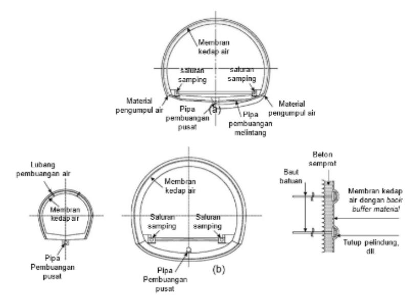

**Gambar 26 - Sistem kedap air dan drainase untuk terowongan jalan (JSCE, 2007)** 

#### **8.2.10.2 Sistem drainase**

Sistem drainase yang sesuai harus dirancang agar dapat membawa dan mengalirkan air dengan lancar. Saat merancang sistem drainase, posisi instalasi, bentuk struktural, bagianbagian, dan aspek-aspek lain harus ditentukan dengan mempertimbangkan penggunaannya, lokasi, jumlah aliran air, gradien memanjang dan melintang terowongan, kebutuhan lantai kerja (*invert*), jalur struktur, dan faktor lain.

Sistem drainase harus mempunyai gradien yang sama dengan dasar jalan (*roadbed*), dan mempunyai suatu struktur yang mampu menangkap dan mengalirkan aliran air yang mengumpul di bawah dasar jalan. Pada terowongan jalan, gradien untuk aliran air dari pencucian, air pemadam kebakaran, dan kontrol air ke pipa pembuangan pusat dan saluran samping harus termasuk di dalam desain, agar air tidak terkumpul dan menggenang. Pada Gambar 27 dapat dilihat contoh dari drainase sistem untuk terowongan jalan.

**© BSN 2017 153 dari 303** 

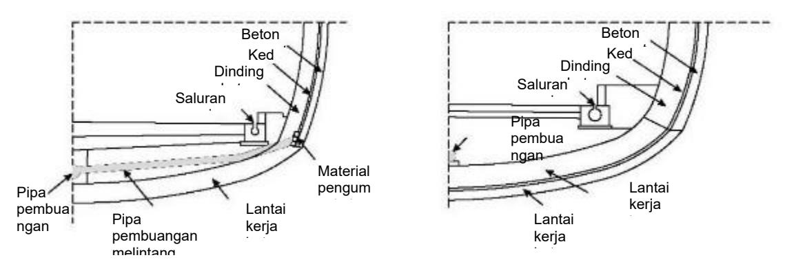

**Gambar 27 - Sistem drainase terowongan jalan** 

#### **8.2.11 Pengaruh konstruksi struktur yang berdekatan**

Dampak dari keterdapatan struktur di sekitar lokasi pembangunan terowongan harus dipertimbangkan dalam desain terowongan. Berdasarkan kondisi desain, perkuatan yang memadai, dan dinding harus didesain setelah melakukan kajian terhadap:

- a) Dampak pembangunan terowongan pada struktur yang berdekatan.
- b) Dampak timbal balik pembangunan dua atau lebih terowongan secara simultan atau bertahap.
- c) Ketika merancang terowongan yang saling berdekatan satu sama lain, efek pada masing-masing terowongan harus diprediksi sebelumnya, dan perkuatan serta dinding harus dirancang dengan tepat berdasarkan hasil prediksi.
- d) Dampak pembangunan konstruksi berdekatan terhadap terowongan.
- e) Jika terdapat rencana pembangunan di dekat konstruksi terowongan, baik sebelum atau setelahnya, dampak pada terowongan eksisting harus diprediksi dan harus tercermin di dalam desain.

#### **8.3 Persyaratan perancangan terowongan perisai**

#### **8.3.1 Persyaratan perancangan**

Terowongan perisai (*shield tunneling*) dikategorikan sebagai metode penerowongan muka tertutup (*closed face tunneling method*) yang berarti pada tahapan perancangan penggaliannya dilakukan penyanggaan pada muka bidang galian secara terus menerus.

Terowongan perisai umumnya dapat digunakan pada tanah alluvial, diluvial, dan tanah sangat lunak hingga kuat tekan bebas (qu) mencapai rentang antara 200 - 300 kN/m2. Selain itu, metode ini dapat pula diterapkan pada batuan dengan rentang qu antara 20.000 - 30.000 kN/m2. Penentuan penggunaan terowongan perisai pada tahap perancangan harus mempertimbangkan kondisi tanah atau batuan yang akan dilewati agar tidak terjadi kegagalan konstruksi.

Bila pekerjaan terowongan dekat dengan struktur/bangunan yang telah ada, maka pada beberapa kondisi dibutuhkan perancangan struktur tambahan/pengaman untuk menjamin tidak terjadi gangguan atau kerusakan pada struktur/bangunan yang berdekatan tersebut. Untuk kondisi tanah jenuh atau penggalian terowongan berada di bawah elevasi muka air tanah, maka penentuan tipe perisai, tahanan terhadap tekanan air hidrostatik, dan sistem kedap air harus diperhitungkan pada perancangan.

**© BSN 2017 154 dari 303**

# **8.3.2 Kondisi perancangan**

# **8.3.2.1 Survei dan penyelidikan**

- a. Survei dan penyelidikan meliputi survei kondisi lapangan, survei penghambat, penyelidikan tanah dan topografi serta survei perlindungan lingkungan.
- b. Survei dan penyelidikan hendaknya dilakukan untuk mendapatkan data dasar untuk perencanaan, perancangan, pelaksanaan konstruksi, dan pemeliharaan.
- c. Hasil survei dipakai untuk memilih jalur terowongan, alinemen, dan penetapan untuk kelayakan penggunaan metode terowongan perisai, metode perlindungan lingkungan, skala suatu proyek dan perinciannya, serta data untuk memelihara terowongan setelah tahap penyelesaiannya.
- d. Survei kondisi lapangan hendaknya meliputi kondisi setempat sepanjang alinemen terowongan yang berhubungan dengan hal-hal yang disebutkan di atas. Hasil survei kondisi dilakukan terutama untuk memilih jalur terowongan dan menetapkan kesesuaian metode terowongan perisai, ukuran terowongan dan perinciannya.
- e. Survei kondisi lapangan meliputi:
  - i) Penggunaan lahan dan hak milik yang terkait,
  - ii) Perencanaan masa depan,
  - iii) Klasifikasi jalan raya dan kondisi lalu lintas,
  - iv) Kesulitan penggunaan lahan untuk pekerjaan konstruksi,
  - v) Kondisi sungai, danau, laut,
  - vi) Penyediaan tenaga listrik, air dan pembuangan limbah untuk tahap konstruksi.
- f. Survei penghambat dilakukan sebagai dasar perkiraan deformasi struktur, pengeringan, dan polusi suatu sumur, letupan udara tertekan dan semburan *slurry*, rembesan udara dan *slurry*, tekanan tanah pada suatu terowongan, beban lapis tanah penutup di atas terowongan, dan kondisi pembebanan lainnya. Survei penghambat dilakukan pula untuk mengidentifikasi hal-hal berikut ini:
  - 1) Struktur di atas dan di bawah permukaan tanah,
  - 2) Utilitas di bawah tanah,
  - 3) Sumur-sumur yang masih dipakai dan ditelantarkan,
  - 4) Lapangan untuk struktur yang dapat dipindah dan pekerjaan sementara,
  - 5) Lain-lain.
- g. Penyelidikan lapangan, penyelidikan laboratorium dan penyelidikan lainnya dilakukan oleh tenaga ahli bersertifikat dan meliputi pengukuran topografi, penyelidikan geologi lokal, penyelidikan kondisi hidrogeologi, penyelidikan kondisi tanah dan perlapisan tanah, elevasi muka air tanah dan keberadaan udara dengan kadar oksigen rendah, gas berbahaya, dll.
- h. Selama konstruksi dan setelah pekerjaan konstruksi terowongan dilakukan, perlu dilakukan survei dan pengukuran kebisingan dan getaran, pergerakan tanah, perubahan muka dan kondisi air tanah, pengukuran kondisi udara (kadar oksigen rendah dan gas berbahaya, seperti gas metana), pengaruh injeksi mortar kimia dan hasil samping konstruksi.

#### **8.3.2.2 Bentuk dan ukuran penampang bagian dalam terowongan**

a) Bentuk dan ukuran suatu penampang bagian dalam terowongan hendaknya cukup untuk penggunaan terowongan dan hendaknya ditentukan juga dengan mempertimbangkan kebutuhan konstruksi.

b) Penampang galian terowongan perisai sebaiknya berbentuk lingkaran. Bentuk lain dapat juga dibuat dengan mesin-mesin khusus dengan mempertimbangkan kestabilan dan keamanan konstruksi.

#### **8.3.2.3 Alinemen terowongan**

- a) Alinemen sebuah terowongan ditentukan dengan mempertimbangkan tujuan dan kondisi penggunaannya. Jalur lurus atau belokan dengan peralihan dapat digunakan dengan mempertimbangkan lokasi, halangan, kondisi tanah, dan berbagai persyaratan konstruksi lainnya.
- b) Pemakaian pada kondisi berbelok dengan jari-jari kecil membutuhkan suatu pengetahuan yang menyeluruh pada perancangan dan pekerjaan konstruksi.
- c) Bila dua atau lebih terowongan dibangun pada posisi paralel, atau suatu terowongan dibangun dekat dengan struktur/bangunan lain yang telah lebih dulu dibangun, alinemen harus direncanakan dengan memberi perhatian khusus pada terjadinya kondisi yang saling memengaruhi.

# **8.3.2.4 Kedalaman posisi terowongan perisai**

Kedalaman posisi terowongan perisai ditentukan dengan mempertimbangkan kondisi permukaan dan bangunan bawah tanah, kondisi tanah yang asli, volume penggalian, dan metode pembangunannya.

# **8.3.2.5 Kemiringan terowongan perisai**

Kemiringan terowongan perisai ditentukan dengan mempertimbangkan tujuan penggunaannya, pemeliharaan, manajemen, dll.

# **8.3.2.6 Pemilihan metode perisai**

- a) Untuk membangun terowongan yang aman dan ekonomis, kondisi dasar pemilihan metode perisai harus juga mempertimbangkan cara menggali, sistem dinding, dll. selain kondisi tanah, kondisi permukaan tanah, dimensi penampang melintang, panjang terowongan, alinemen terowongan, dan periode pelaksanaan konstruksi.
- b) Mesin perisai harus didesain untuk mengebor suatu terowongan dengan aman dan ekonomis dimana pada saat yang sama dapat menerima beban yang ditimbulkankan oleh tanah di sekitarnya.

#### **8.3.2.7 Dinding terowongan perisai**

- a) Dinding terowongan perisai harus aman dan kuat secara struktural untuk menahan tekanan tanah dan tekanan hidrostatik serta beban-beban lainnya dari tanah sekeliling, untuk menjaga perancangan bagian dalam terowongan, dan untuk menjaga beberapa fungsi untuk kegunaan dari terowongan dan kondisi konstruksi.
- b) Pemilihan kekuatan, struktur, dan tipe dinding harus disesuaikan dengan fungsi terowongan, metode pembangunannya, dan kondisi tanah.

**© BSN 2017 156 dari 303**

# **8.3.2.8 Beban rencana**

Beban-beban yang harus dipertimbangkan saat merancang dinding terowongan perisai adalah sebagai berikut:

- a) Tekanan tanah vertikal dan horizontal,
- b) Tekanan air,
- c) Beban mati,
- d) Pengaruh muatan tambahan,
- e) Reaksi tanah,
- f) Beban dalam,
- g) Beban-beban konstruksi,
- h) Pengaruh gempa,
- i) Pengaruh pembangunan dua atau lebih terowongan perisai,
- j) Pengaruh pekerjaan terhadap lingkungan sekitar,
- k) Pengaruh penurunan tanah,
- l) Lain-lain.

# **8.3.2.9 Tekanan tanah vertikal dan horizontal**

- a. Tergantung pada kondisi tanah, tekanan air tanah dapat diberlakukan menurut satu dari dua kondisi di bawah ini:
  - i) Tekanan air tanah bekerja terpisah dengan tekanan tanah (metode tekanan efektif),
  - ii) Tekanan air tanah termasuk di dalam tekanan tanah (metode tekanan total).
- b. Tekanan tanah vertikal harus bekerja sebagai tekanan seragam yang menekan bagian atap terowongan. Besarnya harus ditentukan berdasarkan tebal lapis tanah penutup, penampang melintang, dan diameter luar terowongan, serta kondisi tanah.
- c. Tekanan tanah horizontal adalah kombinasi dari beberapa beban yang bekerja seragam menekan sentroid dinding dari bagian atap sampai ke bawah. Besarnya harus dihitung dengan mengalikan tekanan tanah vertikal dengan koefisien tekanan tanah lateral.

#### **8.3.2.10 Tekanan air**

- a) Tinggi muka air tanah hendaknya ditentukan dengan memerhatikan bahwa desain selalu mencapai suatu keamanan walaupun dengan adanya perubahan tinggi muka air tanah selama dan setelah pelaksanaan konstruksi.
- b) Tekanan air vertikal hendaknya didistribusikan sebagai beban merata dan besarnya adalah tekanan hidrostatis yang bekerja pada titik tertinggi di atap terowongan dan tekanan hidrostatis pada titik terendah di bagian bawah terowongan.
- c) Tekanan air horizontal hendaknya didistribusikan sebagai beban merata dan besarnya adalah sama dengan tekanan hidrostatis.
- d) Sebelum metode *dewatering* dilaksanakan, pemeriksaan kondisi geologi dan lokasi pekerjaan harus diperiksa dan karakteristik metode tersebut harus diperiksa.

# **8.3.2.11 Beban mati**

- a) Bobot mati yang direncanakan berupa beban pada arah vertikal, yang terdistribusi sepanjang sentroid dinding.
- b) Jika distribusi bobot mati tidak seragam sepanjang garis sentroid, bobot mati rata-rata dapat digunakan.
- c) Bobot mati beton yang digunakan untuk dinding cor setempat harus ditentukan sesuai perancangan.
- d) Jika diasumsikan bahwa dinding sekunder membawa beban yang juga berasal dari dinding primer, bobot mati dinding sekunder harus dihitung dengan mempertimbangkan waktu pembuatannya

#### **8.3.2.12 Muatan tambahan**

Pengaruh muatan tambahan harus ditentukan dengan mempertimbangkan perpindahan tegangan di dalam tanah.

#### **8.3.2.13 Reaksi tanah**

Tingkat, bentuk distribusi, dan intensitas reaksi tanah harus ditentukan dengan memerhatikan metode perhitungan yang digunakan.

#### **8.3.2.14 Beban konstruksi**

Beban-beban konstruksi yang harus diperhatikan untuk perancangan dinding adalah sebagai berikut:

- a) Gaya dorong dongkrak perisai,
- b) Tekanan injeksi pengisi ruang hasil galian,
- c) Beban operasional alat pemasang,
- d) Lain-lain.

# **8.3.2.15 Beban dalam**

Yang dimaksud dengan beban dalam adalah beban yang bekerja dari arah dalam dinding setelah penyelesaian terowongan dan ditentukan sesuai dengan fungsi terowongan.

#### **8.3.2.16 Pengaruh gempa**

Bila gempa diperkirakan akan berpengaruh terhadap terowongan, penyelidikan harus dibuat sesuai dengan kepentingan terowongan dan mempertimbangkan kondisi lokasi terowongan tersebut, kondisi tanah di sekeliling terowongan, gerakan gempa pada daerah yang diselidiki, detail terowongan secara struktural, dan kondisi-kondisi lainnya yang dianggap perlu.

Hal-hal yang perlu dievaluasi sehubungan dengan perancangan seismik adalah:

- a) Evaluasi stabilitas terowongan dan tanah di sekitarnya akibat beban seismik,
- b) Evaluasi deformasi dan gaya yang bekerja pada arah melintang terowongan,

**© BSN 2017 158 dari 303**

c) Evaluasi deformasi dan gaya yang bekerja pada arah longitudinal terowongan.

#### **8.3.2.17 Pengaruh dua atau lebih pembangunan terowongan**

Jika pembangunan sebuah terowongan pararel terhadap terowongan yang telah ada, kondisi tanah di sekitarnya, posisi terowongan sehubungan dengan satu dengan yang lainnya, diameter luar terowongan, dan metode pembangunannya harus dievaluasi. Selain itu harus juga dipertimbangkan bagaimana terowongan berpengaruh satu sama lainnya dan bagaimana saling pengaruh tersebut terjadi saat pembangunannya.

#### **8.3.2.18 Pengaruh sekitar daerah konstruksi**

- a) Apabila diperkirakan bahwa bangunan lain akan dibangun dekat dengan terowongan, selama atau sesudah terowongan tersebut dibangun, penaksiran harus dilakukan terhadap dampak yang mungkin terjadi.
- b) Apabila penggalian terowongan perisai direncanakan di dekat bangunan-bangunan atau struktur-struktur yang telah ada, maka perlu dilakukan tindakan-tindakan perlindungan. Bangunan-bangunan yang telah ada tersebut harus terus dipantau selama pembangunan terowongan, dan pengaruh yang terjadi harus terus diamati dengan hatihati.
- c) Penilaian risiko harus dilakukan pada tahap perancangan dengan persyaratan pengaruh pada bangunan sekitar yang terdiri atas kemiringan bangunan maksimum dan penurunan bangunan maksimum mengacu pada Tabel 33. Untuk kategori risiko 3 dan 4, maka perlu dilakukan metode tambahan untuk mengurangi dampak yang mungkin terjadi pada bangunan sekitar.

**Tabel 33 – Klasifikasi tipikal kerusakan berdasarkan kemiringan dan penurunan bangunan maksimum (CIRIA PR30, 1996)** 

| Kategori Risiko | Kemiringan Bangunan Maksimum | Penurunan Bangunan Maksimum (mm) | Deskripsi Risiko                                                                                                                                   |
|--------------------|---------------------------------|-------------------------------------|----------------------------------------------------------------------------------------------------------------------------------------------------|
| 1                  | < 1/500                         | <10                                 | Diabaikan: kerusakan dangkal tidak mungkin terjadi                                                                                              |
| 2                  | 1/500 hingga 1/200              | 10 hingga 50                        | Kecil: kerusakan dangkal dapat terjadi namun bukan kerusakan struktural yang signifikan                                                      |
| 3                  | 1/200 hingga 1/50               | 50 hingga 75                        | Sedang: kerusakan dangkal dengan kerusakan struktural pada bangunan diperkirakan terjadi, kemungkinan kerusakan pipa yang relatif kaku |
| 4                  | > 1/50                          | > 75                                | Tinggi: kerusakan stuktural bangunan dan pipa kaku atau pipa lainnya                                                                         |

# **8.3.2.19 Penurunan tanah**

- a) Pengaruh akibat penurunan tanah harus dievaluasi terutama saat membangun terowongan di tanah lunak.
- b) Pergerakan tanah dipengaruhi oleh perancangan dan perencanaan terowongan perisai, kondisi geologi dan kondisi konstruksi. Pergerakan tanah harus dikurangi dengan melaksanakan metode konstruksi yang sesuai dan pengawasan pekerjaan konstruksi yang sesuai dengan persyaratan yang berlaku.

c) *Ground loss* yang diakibatkan oleh proses penggalian terowongan harus diperhitungkan dengan memperkirakan besarnya penurunan tanah di permukaan tanah dan pengaruhnya pada bangunan sekitar menggunakan konsep pada Gambar 28.

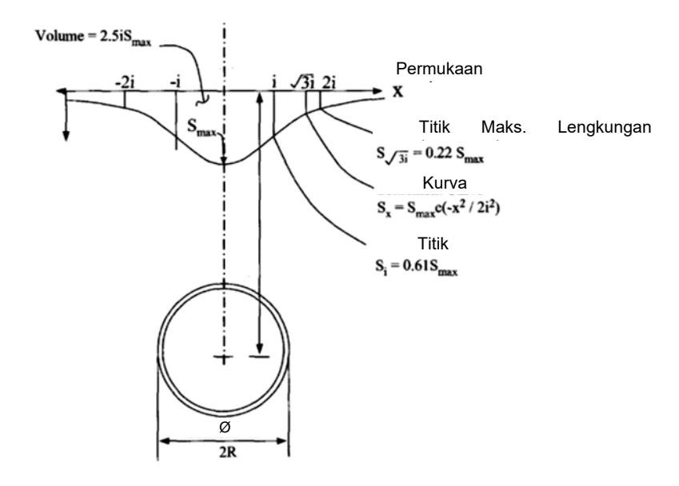

**Gambar 28 - Penampang melintang prediksi penurunan di atas terowongan (FHWA-IF-05-023)** 

# **8.3.2.20 Beban-beban lain**

Pengujian terhadap kemungkinan beban-beban lainnya yang mungkin bekerja pada dinding terowongan harus dilakukan di tahap awal.

# **8.3.3 Fasilitas tambahan pada terowongan perisai**

Terowongan perisai harus direncanakan dengan drainase, ventilasi, pencegahan bencana, dan berbagai fasilitas, lubang kontrol, dll., sesuai dengan tujuan penggunaan terowongan dan sesuai dengan kebutuhan untuk pemeliharaan dan pengaturan terowongan. Setiap fasilitas harus didesain sebaik mungkin sesuai dengan fungsinya.

#### **8.3.4 Metode-metode tambahan lainnya**

- a) Kondisi tanah yang akan dilewati terowongan perisai, kondisi konstruksi dan kondisikondisi lain harus diselidiki dan dievaluasi dengan tujuan untuk memastikan kestabilan permukaan-kerja galian dan dinding pada saat keberangkatan, kedatangan mesin, dan pada bagian tikungan tajam. Pertimbangan penggunaan perkuatan awal perlu dilakukan bila terdapat perkiraan adanya masalah kestabilan pada tahapan kegiatan tesebut.
- b) Bilamana konstruksi terowongan berdampak menimbulkan penurunan, kerusakan atau deformasi pada struktur/bangunan lainnya di sekitar alinemen terowongan, maka diperlukan usah-usaha untuk mencegah hal-hal tersebut.
- c) Dinding didesain berdasarkan faktor keamanan, tujuan penggunaan terowongan, menggunakan metode tegangan izin rencana pada kondisi yang memadai dan sesuai dengan pekerjaan konstruksi yang layak dilaksanakan dengan menggunakan material berkualitas baik.

**© BSN 2017 160 dari 303**

# **8.3.5 Perlindungan lingkungan**

- a) Bilamana lingkungan sekitarnya akan terpengaruh oleh pekerjaan konstruksi terowongan, maka dibutuhkan perlakuan khusus untuk melindungi lingkungan tersebut.
- b) Untuk pelestarian lingkungan di area pekerjaan terowongan, penyelidikan untuk kebutuhan identifikasi dan mitigasi terhadap faktor-faktor perusak lingkungan harus dilakukan.
- c) Untuk perlindungan terhadap kebisingan, perlu untuk memerhatikan peraturan-peraturan dan hukum-hukum terkait, serta mengambil tindakan-tindakan relevan sesuai dengan hasil survei kebisingan untuk mengendalikan getaran yang terjadi.
- d) Bila air terkontaminasi selama pekerjaan, usaha-usaha penanggulangan yang efektif harus dilaksanakan sesuai dengan undang-undang dan peraturan-peraturan untuk mencegah polusi terhadap sistem pengairan umum.
- e) Material hasil galian yang dihasilkan dari pembuatan terowongan harus ditangani dan dibuang sesuai persyaratan yang berlaku.

#### **8.3.6 Pengamatan, pengukuran, dan pencatatan pekerjaan**

Kondisi pekerjaan selama pergerakan mesin perisai harus diamati atau diukur untuk menjamin keselamatan konstruksi. Pencatatan berkala setiap laju penggalian yang dihasilkan dapat digunakan sebagai landasan untuk pekerjaan berikutnya.

# **8.4 Persyaratan perancangan terowongan lintas bawah (metode gali-dan-tutup)**

Perancangan lintas bawah dengan metode gali-dan-tutup harus mempertimbangkan kondisi topografi, geologi, geoteknik, alinemen, gradien/kemiringan, pengaturan lalu lintas, penampang dalam lintas bawah, sistem struktur, teknik pelaksanaan konstruksi, konservasi lingkungan, dan fasilitas pelengkap/tambahan. Penyelidikan dan evaluasi menyeluruh mengenai kondisi topografi dan geologi harus dilakukan dalam proses perancangan demi keamanan dan tercapainya fungsi lintas bawah selama pelaksanaan konstruksi berlangsung dan setelah pekerjaan konstruksi selesai. Hal ini perlu dilakukan karena pengaruh gaya-gaya luar yang disebabkan oleh kondisi geografis dan geologi serta pergerakan tanah/batuan terhadap tegangan, deformasi, dan stabilitas lintas bawah jauh lebih besar daripada bebanbeban yang bekerja.

#### **8.4.1 Penyelidikan**

Penyelidikan harus dilakukan untuk memastikan perancangan dan pelaksanaan konstruksi lintas bawah yang tepat dan pemeliharaan kelestarian lingkungan di sekitarnya. Penyelidikan yang diperlukan adalah penyelidikan yang lengkap dan menyeluruh. Penyelidikan harus meliputi hal-hal berikut.

- a) Penyelidikan kondisi lokasi proyek;
- b) Penyelidikan terhadap hambatan;
- c) Kajian kondisi bawah permukaan;
- d) Kajian proteksi lingkungan di sekitar lokasi kajian;
- e) Penyelidikan tentang hukum dan peraturan terkait.

# **8.4.1.1 Penyelidikan kondisi lokasi proyek**

Penyelidikan ini dilakukan untuk mendapatkan gambaran mengenai kondisi di sekitar rute lintas bawah. Data yang dikumpulkan akan digunakan dalam menentukan alinemen, kedalaman, bentuk dan struktur lintas bawah, menentukan apakah metode gali-dan-tutup akan digunakan, dan memilih metode konstruksi.

#### **8.4.1.2 Penyelidikan terhadap hambatan**

Penyelidikan ini dilakukan untuk mengetahui hal-hal apa saja yang akan menjadi kendala atau yang memengaruhi lintas bawah. Kajian dasar mengenai kendala-kendala ini dilakukan pada tahap prakelayakan dan kelayakan. Penyelidikan yang lebih detail dilakukan pada tahap perancangan dan pelaksanaan konstruksi. Hal-hal yang harus dikaji mencakup:

- a) Bangunan di atas dan bawah permukaan,
- b) Utilitas bawah permukaan,
- c) Sisa-sisa bangunan dan pekerjaan sementara,
- d) Aset budaya yang terkubur/tertimbun,
- e) Kendala-kendala potensial lainnya.

#### **8.4.1.3 Penyelidikan bangunan di atas dan bawah permukaan**

Penyelidikan harus dilakukan terkait sistem struktur, kondisi fondasi, penggunaan fasilitas, dan sebagainya, berdasarkan perhitungan desain dan gambar bangunan, jembatan, fasilitas permukaan, dan bangunan permukaan lainnya serta ruang parkir bawah tanah, mal, kereta bawah tanah, dan struktur bawah tanah lainnya.

## **8.4.1.4 Penyelidikan utilitas bawah permukaan**

Penyelidikan untuk mengetahui skala, posisi, kedalaman, dan kualitas bahan dari kabel bawah tanah, dan lainnya, dan umurnya perlu dilakukan. Terutama, utilitas bawah tanah skala besar akan sangat memengaruhi perancangan terowongan. Utilitas bawah tanah lainnya dapat menghalangi pekerjaan seperti tiang pancang dan penggalian. Untuk mencegah kecelakaan dan untuk menghindari pekerjaan konstruksi tambahan karena kejadian tak terduga, penyelidikan ini harus dapat menjelaskan keadaan utilitas secara aktual.

Pada tahap konstruksi, perlu untuk mengonfirmasikan secara pasti melalui pengujian parit atau uji lainnya di lokasi untuk mengetahui apakah ada hambatan yang akan memengaruhi pekerjaan terowongan dengan metode konstruksi yang dipilih.

#### **8.4.1.5 Penyelidikan sisa-sisa bangunan dan pekerjaan sementara**

Keterdapatan sisa-sisa bangunan yang tidak terpakai seperti fondasi atau tiang-tiang sementara di lokasi bangunan telah dipindahkan atau dihancurkan kemungkinan dapat ditemui. Sisa-sisa pekerjaan sementara bangunan bawah tanah atau utilitas merupakan kendala potensial lain. Oleh karena itu, penyelidikan harus dilakukan pada setiap sisa-sisa dan penimbunan di atau dekat lokasi proyek.

#### **8.4.1.6 Penyelidikan aset budaya**

Sebuah penyelidikan harus dilakukan, setelah diskusi tertutup dengan pihak terkait, untuk belajar tentang aset budaya terkubur, jika aset tersebut diperkirakan akan ditemukan.

**© BSN 2017 162 dari 303**

# **8.4.1.7 Penyelidikan kondisi bawah permukaan**

Kajian mengenai kondisi bawah permukaan harus dilakukan untuk memahami hal-hal berikut.

- a. Lapisan geologi dan strukturnya
  - i) kondisi stratigrafi, ketebalan, dan stratifikasi sepanjang rute lintas bawah berdasarkan hasil penyelidikan terdahulu, survei lapangan, pengeboran, dan lain-lain,
  - ii) kondisi morfologi berdasarkan data topografi,
  - iii) kondisi topografi-mikro (pada dataran aluvial rendah, untuk memperkirakan stratigrafi dan struktur geologi),
  - iv) kondisi lingkungan topografi,
  - v) tata guna lahan, dan
  - vi) apabila tanah/batuan kemungkinan besar akan dipengaruhi oleh gempa, lingkup kajian perlu diperluas dengan melakukan penyelidikan kondisi tanah/batuan hingga kedalaman yang lebih berdasarkan persyaratan teknis spesifik situs.
- b. Sifat geoteknik
  - i) Kondisi tanah/batuan eksisting,
  - ii) Stratifikasi dan kekuatan.
- c. Air tanah
  - i) Fluktuasi tinggi muka air tanah,
  - ii) Koefisien permeabilitas tanah,
  - iii) Keberadaan air tanah yang terkontaminasi, kondisi kontaminasi, zat kontaminan, sumber dan penyebab kontaminasi,
  - iv) Keberadaan bahan polutan (bagaimana dan di mana digunakan, disimpan, dan dibuang),
  - v) Kontaminasi tanah/batuan.
- d. Kondisi lainnya.

Kondisi udara yang mengandung gas beracun (komposisi udara, sifat gas, dan lain-lain).

Kajian harus dilakukan secara menyeluruh karena karakteristik tanah/batuan dapat berubah dari satu tempat ke tempat berikutnya. Secara garis besar, kajian dapat dibagi ke dalam tahap penyelidikan pendahuluan dan tahap kajian utama. Penyelidikan tambahan dapat dilakukan untuk memperoleh data aktual yang diperlukan. Penyelidikan harus dilakukan dengan menggunakan metode-metode yang sesuai dengan persyaratan teknis.

#### **8.4.1.8 Penyelidikan untuk perlindungan lingkungan**

Faktor-faktor yang harus dikaji untuk meminimalkan dampak dari pekerjaan terowongan pada lingkungan sekitar, di antaranya:

- a) Kebisingan dan getaran;
- b) Deformasi tanah;
- c) Perubahan kondisi air tanah;
- d) Produk konstruksi;
- e) Lainnya (misalnya, survei volume lalu lintas).

Kajian untuk perlindungan lingkungan harus dilakukan sebelum, selama, dan setelah konstruksi. Hasilnya akan digunakan sebagai bahan untuk desain dan manajemen konstruksi.

# **8.4.2 Dasar-dasar perancangan**

Pada perancangan terowongan gali-dan-tutup, pertimbangan penuh harus diberikan pada lingkungan sekitarnya dan upaya-upaya harus dilakukan agar konstruksi aman dan ekonomis sesuai dengan tujuan proyek.

Pertimbangan-pertimbangan awal dalam perancangan mencakup hal-hal berikut.

- a) penentuan bagian-bagian metode gali-dan-tutup yang dapat digunakan apabila dibandingkan dengan metode pembangunan lintas bawah lainnya,
- b) alinemen, kemiringan, kedalaman, bentuk, dan struktur lintas bawah,
- c) pertimbangan struktural yang berhubungan dengan kebutuhan dalam menanggapi keadaan darurat, seperti kebakaran,
- d) metode konstruksi, khususnya untuk metode perkuatan dengan dinding-penahan, metode penggalian, dan metode yang digunakan untuk membangun struktur lintas bawah,
- e) tindakan proteksi lingkungan, khususnya bagaimana memanfaatkan lahan permukaan, pengaturan jam kerja, kebisingan, getaran dan lalu lintas kendaraan proyek,
- f) tindakan keamanan saat pelaksanaan konstruksi,
- g) jadwal dan biaya kerja.

# **8.4.2.1 Persyaratan minimum dimensi bagian dalam dan bentuk terowongan**

Terkait dengan bagian dalam terowongan, persyaratan minimum harus merujuk pada persyaratan teknis di dalam Permen PU No. 19/PRT/M/2011 Pasal 20, yaitu bahwa:

- Lebar badan jalan di dalam terowongan sekurang-kurangnya 8 (delapan ) meter.
- Tinggi ruang bebas vertikal di dalam terowongan paling rendah 5,1 (lima koma satu) meter dari permukaan perkerasan jalan.

Ukuran penampang bagian dalam terowongan gali dan tutup harus dirancang agar konstruksi dan pemeliharaan dapat dengan mudah dilakukan, dan ekonomis. Tata ruang yang efisien untuk berbagai aksesoris dan fasilitas yang diperlukan di terowongan dengan keterbatasan konstruksi juga menjadi dasar dalam penentuan ukuran penampang dalam, seperti ditunjukkan pada Gambar 29.

Elemen-elemen utama dalam menentukan penampang melintang lintas bawah adalah sebagai berikut.

- a) peralatan penunjang konstruksi,
- b) jarak pandang,
- c) struktur perkerasan,
- d) pencahayaan, pencegahan bencana, ventilasi, drainase, perlengkapan tambahan lainnya,
- e) pemeliharaan,
- f) fasilitas pejalan kaki, dan
- g) sampit.

**© BSN 2017 164 dari 303**

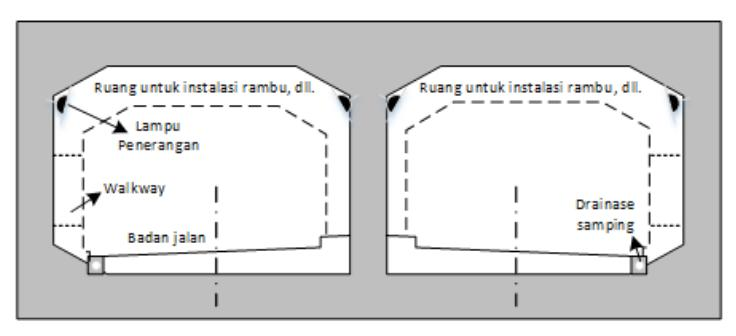

**Gambar 29 – Dasar penentuan ukuran penampang dalam** 

Struktur dan bentuk dari terowongan harus ditentukan dengan mempertimbangkan tujuannya, topografi dan geologi, metode konstruksi, dan kondisi beban.

# **8.4.2.1.1 Penempatan dan kelurusan terowongan**

Posisi terowongan vertikal dan horizontal harus ditentukan dengan mempertimbangkan kondisi lokasi, hambatan, kondisi lingkungan, kondisi media terowongan (*ground*), kondisi konstruksi dan sebagainya, termasuk rancangan saat ini dan masa mendatang. Dalam menentukan kedalaman dan lokasi horizontal terowongan gali-dan-tutup, hal-hal berikut ini harus dipertimbangkan bersama dengan kajian ekonomi, yaitu:

- a) Kondisi lokasi: tata guna lahan, kondisi jalan dan lalu lintas, tipe pembagian zona, sungai, danau dan sebagainya, termasuk rancangan saat ini dan masa mendatang.
- b) Hambatan (struktur bawah-tanah, utilitas, bangunan di permukaan, dll.). Pertimbangan menyeluruh harus diberikan tidak hanya pada fasilitas eksisting, tetapi juga pada rancangan fasilitas untuk masa mendatang. Hubungan timbal baliknya dengan terowongan harus dipertimbangkan bersama dengan metode konstruksi. Selain itu, jarak ruang dan metode proteksi struktur bawah-tanah/utilitas/bangunan di permukaan dan terowongan harus ditentukan dengan mempertimbangkan kondisi media terowongan, metode konstruksi, dan sebagainya.
- c) Lingkungan: dampak pekerjaan terowongan terhadap lingkungan sekitarnya harus dikaji untuk menghindari masalah seperti fluktuasi muka air tanah, penurunan tanah, kebisingan, getaran dan polusi udara.
- d) Kondisi media terowongan: terowongan sebaiknya dibangun di media yang stabil. Perancangan, penyelidikan, dan kajian topografi serta geologi yang memadai harus dilakukan untuk memastikan keamanan dan fungsi terowongan selama konstruksi dan setelah penyelesaian.
- e) Kondisi konstruksi: pengaruh lalu lintas dan tepi jalan apabila beberapa bagian dari permukaan digunakan untuk konstruksi dan pengaruhnya pada jadwal konstruksi harus diminimalisir.
- f) Pemeliharaan dan manajemen: inspeksi kenyamanan terowongan dan pemeliharaan sesuai dengan tujuannya.

Alinemen horizontal dan memanjang terowongan harus ditentukan dengan mempertimbangkan tujuan, kondisi lokasi, dan hambatan-hambatan. Pertimbangan dalam menentukan alinemen horizontal dan memanjang terowongan adalah sebagai berikut.

- a) Alinemen horizontal dan memanjang terowongan harus selurus mungkin, dan lengkungan harus memiliki radius sebesar mungkin.
- b) Gradien alinemen horizontal terutama ditentukan sesuai dengan tujuan terowongan dan harus semoderat mungkin. Apabila dibutuhkan adanya drainase, diperlukan kemiringan yang sangat moderat (sekitar 0,2%) untuk memungkinkan aliran gravitasi.
- c) Apabila ada kemungkinan gradien berubah di masa mendatang karena adanya deformasi, dan sebagainya, maka perubahan tersebut harus didasarkan pada perubahan

yang telah diperkirakan dan pertimbangan diperlukan sehingga perubahan gradien seperti itu tidak akan mengganggu fungsi terowongan.

#### **8.4.2.2 Pemilihan metode konstruksi**

Elemen-elemen utama konstruksi gali-dan-tutup merupakan pekerjaan penahan sementara, penggalian, dan membangun struktur terowongan. Tiap elemen ini dapat dikerjakan oleh berbagai metode konstruksi. Metode gali-dan-tutup dapat digunakan untuk mengoptimalkan kombinasi dari berbagai metode kerja bersama dengan metode tambahan yang sesuai dengan kondisi tanah, lingkungan konstruksi, ukuran pekerjaan, dan sebagainya. Metode kerja yang paling menguntungkan harus dipilih dengan mempertimbangkan dan membandingkan fitur-fitur dari setiap metode.

Penentuan sistem penahan tanah, metode penggalian dan pembangunan struktur lintas bawah dilakukan berdasarkan pertimbangan menyeluruh yang berkaitan dengan keamanan, ekonomi, dan proteksi lingkungan.

a. Jenis sistem penahan tanah

Pemilihan sistem penahan tanah harus dilakukan dengan pertimbangan yang menyeluruh terhadap ukuran penggalian, geologi, utilitas bawah tanah, lingkungan lokasi, biaya konstruksi, dan periode konstruksi serta stabilitas struktur.

#### b. Metode penggalian

Secara garis besar, metode penggalian dapat dibagi ke dalam penggalian keseluruhan dan penggalian parsial/sebagian.

#### c. Jenis metode pembangunan lintas bawah

Struktur beton lintas bawah biasanya dibangun dari bawah, menggunakan metode *bottom-up*. Metode *trench cut* digunakan untuk pemasangan dinding samping dan dinding sekunder ketika dilakukan penggalian segera di bawah struktur eksisting. Metode *top-down* digunakan dengan cara membangun pelat atas sebagai perkuatan sebelum dilakukan penggalian.

Apabila dinding diafragma difungsikan sebagai dinding penahan tanah, bersamaan dengan kegunaan mereka sebagai struktur sementara, peningkatan ketelitian dalam konstruksi dan keandalan dalam metode kerja memungkinkan penggunaan dindingdinding ini sebagai bagian permanen dari struktur utama. Diperlukan perhatian khusus ketika menyambungkan dinding diafragma pada dinding bagian dalam atau *slab*.

# d. Metodologi konstruksi lintas bawah

Terdapat dua jenis metode konstruksi yang digunakan dalam membangun lintas bawah dengan metode gali-dan-tutup, yaitu *bottom-up* dan *top-down*.

#### e. Jenis metode tambahan

Metode tambahan sering digunakan dalam konstruksi gali-dan-tutup untuk meningkatkan keamanan dan efisiensi kerja. Metode ini terutama digunakan untuk memperbaiki kondisi tanah/batuan (*ground*).

Metode tambahan di antaranya adalah *dewatering*, kolom tiang kapur (*quicklime pile*), pencampuran dalam (*deep mixing*), pengisian dengan campuran kimia (*chemical grouting*), dan pembekuan tanah/batuan (*ground freezing*). Metode yang optimal harus digunakan dengan pemahaman menyeluruh mengenai fungsi dan kegunaan dari setiap metode.

**© BSN 2017 166 dari 303**

# **8.4.2.3 Dinding penahan tanah**

Jenis dan metode perancangan struktur penahan tanah mengacu pada Bab 10 Struktur Penahan Tanah.

#### **8.4.3 Prosedur perancangan**

#### **8.4.3.1 Kriteria perancangan**

Perancangan terowongan gali-dan-tutup harus mempertimbangkan topografi, geologi, alinemen, kemiringan, pengaturan lokasi, bagian dalam, sistem struktur, teknik konstruksi, konservasi lingkungan, dan fasilitas-fasilitas tambahan. Pada prinsipnya perancangan harus dibuat sesuai dengan metode perancangan kondisi batas.

#### **8.4.3.1.1 Umur rencana**

- a) Umur rencana lintas bawah harus ditentukan dengan mempertimbangkan masa layan yang diperlukan, metode pemeliharaan, kondisi lingkungan, kinerja daya tahan (*durability*), dan efisiensi ekonomi yang diperlukan.
- b) Umur rencana untuk lintas bawah yang diatur pada pedoman ini adalah 75 tahun.
- c) Apabila umur rencana yang berbeda akan ditetapkan, penetapan tersebut harus berdasarkan evaluasi terhadap rasio air-semen, dan nilai batas lebar retakan untuk daya tahan/durabilitas, yang telah ditentukan secara memadai dengan mempertimbangkan kondisi tanah/batuan dan struktur.
- d) Ketika umur rencana ditetapkan, sangat perlu dipertimbangkan jenis pekerjaan konstruksi kedap air yang digunakan dan material yang digunakan serta teknik pelaksanaan yang digunakan untuk mencegah kebocoran air ke dalam konstruksi lintas bawah.

#### **8.4.3.1.2 Kondisi batas yang dipertimbangkan dalam verifikasi kinerja**

Kondisi batas yang dipertimbangkan dalam verifikasi kinerja lintas bawah dengan metode gali-dan-tutup adalah sebagai berikut.

- a. Kondisi batas layan (*service limit state*) Keadaan batas daya layan disyaratkan dalam desain dengan melakukan pembatasan pada tegangan, deformasi, dan lebar retak pada kondisi pembebanan layan agar lintas bawah mempunyai kinerja yang baik selama umur rencana.
- b. Kondisi batas kekuatan (*strength limit state*) Keadaan batas kekuatan disyaratkan dalam perancangan untuk memastikan adanya kekuatan dan kestabilan yang memadai, baik yang sifatnya lokal maupun global, untuk memikul kombinasi pembebanan yang secara statistik mempunyai kemungkinan cukup besar untuk terjadi selama masa layan lintas bawah. Pada keadaan batas ini, dapat terjadi kelebihan tegangan ataupun kerusakan struktural, tetapi integritas struktur secara keseluruhan masih terjaga.
- c. Keadaan batas ekstrem Keadaan batas ekstrem diperhitungkan untuk memastikan struktur lintas bawah dapat bertahan akibat gempa rencana.

# **8.4.3.1.3 Beban**

Beban rencana pada prinsipnya harus ditentukan dengan mengalikan nilai karakteristik beban dengan faktor beban, dengan mempertimbangkan beban-beban (tipe dan klasifikasi beban).

Untuk mengombinasikan beban rencana, beban tetap, variabel dan beban tambahan (*accidental)*, yang bekerja selama pelaksanaan konstruksi berlangsung dan selama umur rencananya, harus dikombinasikan berdasarkan konsep yang ditunjukkan pada Tabel 34 dan sesuai dengan kondisi batas yang relevan.

**Tabel 34 – Konsep yang diterapkan ketika menggabungkan beban desain (JSCE, 2008)** 

| Penentuan batas              | Kombinasi yang disarankan                                                 |
|------------------------------|---------------------------------------------------------------------------|
| Penentuan batas              | Beban permanen + beban variabel utama + beban variabel tambahan        |
| ultimit                      | Beban permanen + beban tambahan (accidental) + beban variabel tambahan |
| Penentuan batas pelayanan | Beban permanen + beban variabel                                           |
| Penentuan batas fatigue   | Beban permanen + beban variabel                                           |

Beban yang ditunjukkan pada Tabel 35 harus dipertimbangkan untuk desain terowongan gali-dan-tutup. Beban-beban ini harus ditetapkan dan dikombinasikan untuk mengetahui tegangan maksimum yang terjadi pada tiap-tiap komponen struktural.

**Tabel 35 – Beban yang harus dievaluasi** 

| (1) | Tekanan tanah vertikal (EVP)                                                                               |
|-----|------------------------------------------------------------------------------------------------------------|
| (2) | Tekanan lateral                                                                                            |
|     | ・ Tekanan tanah lateral (EHP)                                                                              |
|     | ・ Tekanan air lateral (WHP)                                                                                |
| (3) | Tekanan pengangkatan (WVP)                                                                                 |
| (4) | Beban mati                                                                                                 |
|     | ・ Beban mati tetap (D1)                                                                                    |
|     | ・ Beban mati tambahan (D2)                                                                                 |
| (5) | Beban hidup dan Impact                                                                                     |
|     | ・ Beban lalu lintas (diberikan sebagai fluktuasi tekanan tanah vertikal (1))                               |
|     | ・ Beban kendaraan (L)                                                                                      |
|     | ・ Impact (I)                                                                                               |
| (6) | Pengaruh perubahan temperatur dan susut kering (dry shrinkage)                                             |
|     | ・ Perubahan temperatur (T)                                                                                 |
|     | ・ Dry shrinkage (SH)                                                                                       |
| (7) | Efek gempa bumi (EQ)                                                                                       |
| (8) | Beban konstruksi (ER)                                                                                      |
| (9) | Beban lain                                                                                                 |
|     | ・ Pengaruh perubahan lingkungan (contoh: perubahan tinggi muka air)                                        |
|     | ・ Pengaruh pada konstruksi yang berdekatan (contoh: penggalian, tanggul, dan perubahan tinggi muka air) |

**© BSN 2017 168 dari 303**

# **8.4.3.1.4 Material**

Kualitas material yang akan digunakan untuk badan terowongan gali-dan-tutup harus sesuai dengan persyaratan perancangan.

Berdasarkan asumsi bahwa nilai uji bervariasi, nilai karakteristik kekuatan material tidak boleh berada di bawah nilai rata-rata uji.

Kekuatan rencana material harus merupakan nilai yang ditentukan dengan membagi nilai karakteristik kekuatan material dengan faktor material.

Apabila nilai tertentu kekuatan material telah ditentukan terpisah dari nilai karakteristiknya, nilai karakteristik kekuatan material harus merupakan nilai yang diperoleh dengan mengalikan nilai tertentu kekuatan material dengan faktor modifikasi material.

Standar untuk material yang umumnya digunakan untuk badan terowongan gali dan tutup ditunjukkan pada Tabel 36.

| Material      |               | Spesifikasi                                                                                                                                                                                                 | Kategori                                 |
|---------------|---------------|-------------------------------------------------------------------------------------------------------------------------------------------------------------------------------------------------------------|------------------------------------------|
| Semen         |               | SNI 15-2049-2004 SNI 15-7064-2004 SNI 15-0302-2004 SNI 15-0129-2004 SNI 15-3500-2004 SNI 15-3758-2004                                                                                        |                                          |
| Baja tulangan |               | SNI 07-2052-2002                                                                                                                                                                                            | BjTP 24, BjTP 30, BjTP 35, BjTP 40    |
|               |               | SNI 07-0329-2005; JIS G 3101; ASTM A36/A36M - 14                                                                                                                                                         | SS400                                    |
|               | Baja struktur | JIS G 3106                                                                                                                                                                                                  | SM400, SM490, SM490Y, SM520, SM570 |
| Baja          | Pipa baja     | JIS G 3444  BS EN 10296-1:2003, BS EN 10297-1:2003, BS EN 10305-5:2003, BS EN 10305-1:2002, BS EN 10305-2:2002, BS EN 10305-3:2002, BS EN 10305-4:2003, BS EN 10305-6:2005, BS EN 10296-2:2005 | STK 490                                  |
|               |               | JIS G 5101  ASTM A27/A27M - 13(2016)                                                                                                                                                                       | SC480  70-36                            |
|               | Baja tuang    | JIS G 5102  ASTM A216/A216M - 16                                                                                                                                                                           | SCW480  WCA                             |
|               |               | JIS G 5201                                                                                                                                                                                                  | SCW-490-CF                               |

 **Tabel 36 – Standar untuk material** 

# **8.5 Pertimbangan lain dalam perancangan**

Pemantauan dan pengukuran harus dilakukan dengan tujuan untuk meninjau kesesuaian dari desain, dan untuk menjamin keselamatan dan efisiensi biaya konstruksi dengan memahami kondisi-kondisi muka bidang galian, perilaku tanah/batuan di sekitarnya dan efek dari setiap perkuatan yang akan bervariasi dengan kemajuan penggalian.

Pengamatan dan pengawasan pada pembuatan terowongan harus dilaksanakan untuk memastikan stabilitas struktur terowongan itu sendiri pada semua tahapan pekerjaan dan juga stabiltas struktur yang berada pada perimeternya yang jaraknya diperhitungkan sesuai secara teoritis. Program pengukuran harus dibuat sedemikian agar asumsi teoritis yang dibuat dapat diperiksa dan dibandingkan terhadap kondisi aslinya.

Pelaksanaan pembuatan terowongan perlu dilindungi terhadap longsor, penurunan muka tanah, dan pergerakan bangunan sekitar. Perancangan program pengamatan harus mempertimbangkan hasil penyelidikan awal dan perhitungan desain. Pengamatan harus

dilakukan sedini mungkin agar memungkinkan dilakukannya pengamatan maupun evaluasi jika terjadi pergerakan sejak awal agar tidak terjadi interpretasi yang keliru terhadap perilaku konstruksi.

Pemantauan dan pengukuran juga bertujuan untuk membantu mengidentifikasi faktor-faktor yang tidak diperkirakan sehingga dapat dilakukan modifikasi desain berdasarkan kondisi aktual area pembangunan terowongan dengan biaya minimal.

Tujuan dan peran dari pemantauan dan pengukuran ditunjukkan pada Gambar 30.

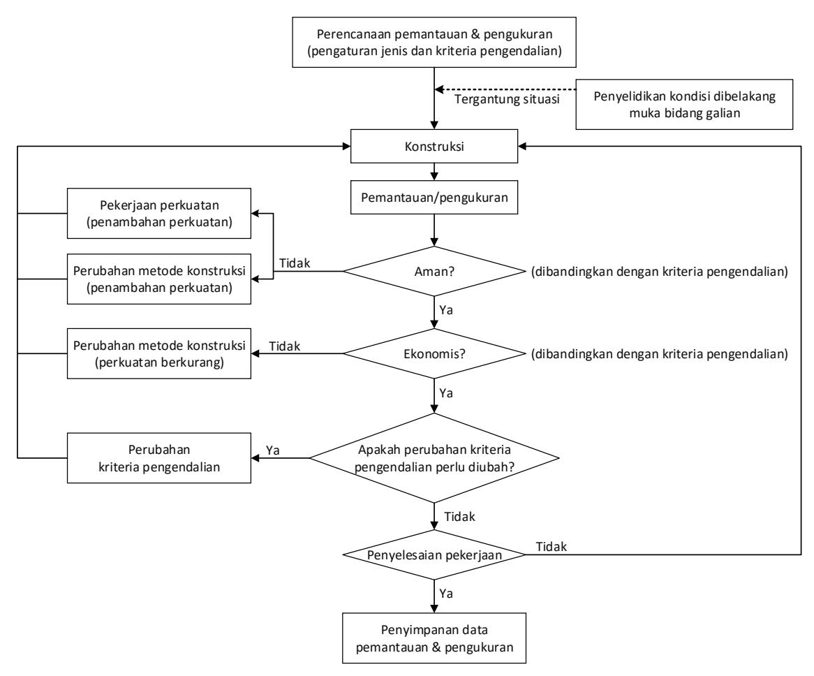

**Gambar 30 - Tujuan dan peran pemantauan dan pengukuran** 

#### **8.5.1 Perancangan pemantauan dan pengukuran**

Pemantauan dan pengukuran harus ditetapkan dengan pertimbangan yang tepat terhadap tujuan, ukuran terowongan, kondisi tanah/batuan, kondisi lokasi, desain terowongan dan metodologi konstruksi, serta metode dengan memanfaatkan temuan-temuan dalam desain dan konstruksi.

Beberapa hal-hal yang harus diperhatikan dalam menyusun rencana pemantauan serta pengukuran adalah:

- a. Dasar pertimbangan:
  - 1) Pemahaman terhadap permasalahan seperti perilaku tanah yang bervariasi dengan kemajuan penggalian (klarifikasi tujuan dari pemantauan dan pengukuran);

**© BSN 2017 170 dari 303**

- 2) Menentukan hal-hal yang akan dipantau (klarifikasi objek pemantauan dan pengukuran);
- 3) Menentukan kriteria manajemen dan tindakan pencegahan yang harus dilakukan (evaluasi hasil pemantauan dan pengukuran).

#### b. Perancangan:

- 1) Memilih *item*, posisi, dan frekuensi pemantauan dan pengukuran;
- 2) Memilih peralatan dan instrumen yang akan digunakan;
- 3) Menetapkan metode pemantauan dan pengukuran;
- 4) Menetapkan kriteria manajemen;
- 5) Memilih metode evaluasi untuk hasil pemantauan dan pengukuran;
- 6) Memilih metode untuk memanfaatkan temuan dalam desain dan konstruksi;
- 7) Menentukan format pencatatan;
- 8) Membuat suatu organisasi untuk pertukaran informasi.

Instrumen-instrumen pengukuran yang dipilih harus berfungsi dan mempunyai presisi yang akurat untuk tujuan pemantauan/pengukuran, serta harus mudah dipasang, digunakan, dan perawatannya mudah.

# **8.5.2 Jenis-jenis pemantauan dan pengukuran**

Hal-hal yang harus dipertimbangkan ketika memilih jenis-jenis pemantauan dan pengukuran, meliputi: perkiraan perilaku tanah/batuan, fungsi-fungsi perkuatan, kondisi lokasi, dan peran dari setiap pengukuran.

Pemantauan dan pengukuran harus dilakukan di dalam dan di luar terowongan selama konstruksi, dan pengukuran harus dilakukan terhadap terowongan, tanah/batuan sekitar terowongan, anggota-anggota perkuatan serta perilaku permukaan tanah dan strukturstruktur di sekitarnya. Secara umum instrumen yang digunakan dalam pemantauan dan pengukuran terkait dengan pengamatan terhadap hal-hal berikut:

- a) Pergerakan tanah,
- b) Struktur sekitar,
- c) Deformasi terowongan, dan
- d) Perilaku air tanah.

#### **8.5.2.1 Pergerakan tanah**

Pengamatan pergerakan tanah bertujuan untuk melihat kemungkinan kemungkinan pergerakan sejak dini yang dapat memengaruhi struktur sekitar ataupun proses pelaksanaan pekerjaan konstruksi. Beberapa instrumentasi yang digunakan untuk mengamati pergerakan ini antara lain (Dunnicliff, 1988, 1993):

- a) Patok geser dangkal dan dalam,
- b) Ekstensometer,
- c) Inklinometer.

#### **8.5.2.2 Pergerakan struktur sekitar**

Pengamatan struktur sekitar bertujuan untuk memastikan tidak terjadinya distorsi atau penurunan diferensial yang dapat mengakibatkan kerusakan. Penurunan, kemiringan, dan keretakan pada struktur adalah indikator awal yang sebaiknya dapat dideteksi sejak awal sebelum terjadi kerusakan yang lebih serius. Beberapa instrumentasi yang yang digunakan, antara lain (Dunnicliff, 1988, 1993):

a) *Total station*,

- b) *Tiltmeter*,
- c) *Tiltbeam*,
- d) *Crack gages*.

#### **8.5.2.3 Pengamatan deformasi terowongan**

Pengamatan deformasi terowongan bertujuan untuk memastikan struktur terowongan (permanen maupun sementara) mempunyai perilaku yang menyerupai desain. Jika terjadi penyimpangan, kegagalan dapat dihindari. Penguji spesialis dan berpengalaman harus dapat melakukan interpretasi data pengamatan untuk memastikan keselamatan pekerjaan selama proses konstruksi hingga selesainya. Peralatan instrumentasi yang digunakan antara lain:

- a) Titik monitoring, kombinasi dengan total station;
- b) Inklinometer;
- c) *Strain gages* dan *load cell* (pada terowongan tipe *cut-and-cover*);
- d) *Pressure cell* dan NATM *cell* (pada terowongan tipe perisai);
- e) *Tape extensometer*;
- f) *Convergence meter*.

# **8.5.2.4 Pengamatan perilaku air tanah**

Pengamatan perilaku air tanah bertujuan untuk memeriksa tegangan efektif dan perubahan perilaku tanah akibat perubahan elevasi muka air tanah. Instrumentasi yang digunakan antara lain:

- a) Sumur pengamatan;
- b) *Piezometer*.

# **8.5.3 Posisi pemantauan dan pengukuran**

Posisi pemantauan dan pengukuran harus dipilih dengan tepat sehingga interelasi antara hasil pemantauan dan *item-item* pengukuran yang berbeda dapat dipahami.

Beberapa hal yang penting dalam pemilihan posisi pemantauan dan pengukuran, meliputi:

- a) Pemantauan/penyelidikan, harus dilakukan pada muka bidang galian, daerah portal jika terdapat permasalahan kelongsoran atau lapisan penutup kurang dari 2D (D = lebar penggalian terowongan), dampak pada struktur di permukaan.
- b) Pengukuran konvergensi dan penurunan mahkota terowongan. Tipikal interval pengukuran konvergensi dan penurunan mahkota terowongan pada terowongan jalan dapat dilihat pada Tabel 37. Tata letak garis pengukuran harus ditetapkan dengan pertimbangan terhadap metode penggalian dan perilaku tanah yang diperkirakan, contohnya dapat dilihat pada Gambar 31.

**© BSN 2017 172 dari 303**

| Tabel 37 – Tipikal interval pengukuran penurunan mahkota dan konvergensi |
|--------------------------------------------------------------------------|
|--------------------------------------------------------------------------|

| Kondisi Kelas material | Dekat portal (50 m dari portal) | Lapisan penutup < 2D (D=lebar penggalian terowongan) | Tahap permulaan konstruksi (fase sampai sekitar 200 m kemajuan penerowongan) | Langkah-langkah setelah beberapa kemajuan (standar)                                 |
|---------------------------|---------------------------------------------|------------------------------------------------------------------|---------------------------------------------------------------------------------------------|----------------------------------------------------------------------------------------------|
| B, C                      | 10 m                                        | 10 m                                                             | 20 m                                                                                        | 30 m (dapat diperpanjang sampai sekitar 50 m, jika perilaku tanah/batuan stabil) |
| D                         | 10 m                                        | 10 m                                                             | 20 m                                                                                        | 20 m (dapat diperpanjang sampai sekitar 30 m, jika perilaku tanah/batuan stabil) |
| E                         | 10 m                                        | 10 m                                                             | 10 m                                                                                        | 10 m                                                                                         |

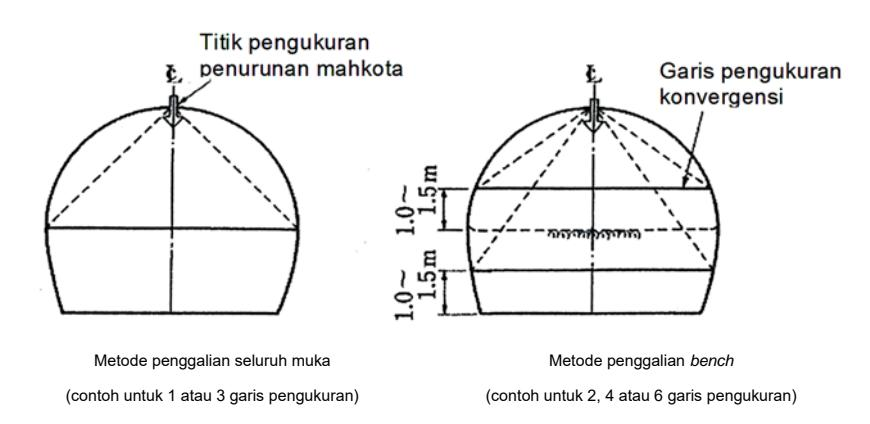

**Gambar 31 – Susunan garis pengukuran penurunan mahkota/konvergensi (untuk lebar penggalian D sekitar 10 m)** 

c) Pemantauan tambahan (pemantauan B) di dalam terowongan.

Tujuan utama dari pengukuran ini adalah untuk memberikan referensi data bagi desain dan konstruksi. Pengukuran-pengukuran harus dilakukan pada tahap permulaan konstruksi, pada kondisi tanah/batuan yang paling representatif. *Item-item* yang harus diukur adalah pergerakan tanah/batuan, gaya aksial dari baut batuan, tekanan pada baja perkuatan, tekanan pada beton semprot dan tekanan pada dinding terowongan. Contoh susunan dari instrumen-instrumen pengukuran utama ditunjukkan pada Gambar 32.

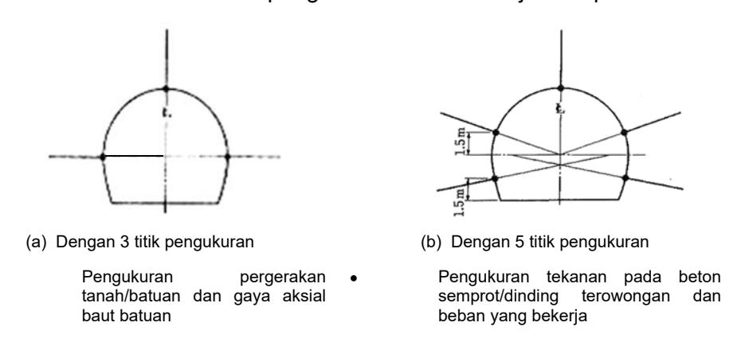

**Gambar 32 - Susunan berbagai instrumen (untuk lebar penggalian D = +10m)** 

**© BSN 2017 173 dari 303** 

d) Pengukuran pergerakan permukaan dan tanah/batuan dari permukaan. Sebagai aturan umum, pengukuran pergerakan permukaan dapat dilakukan dengan mengacu panduan seperti diperlihatkan pada Tabel 38, berdasarkan pada tebal lapisan penutupnya.

**Tabel 38 – Pedoman untuk pengukuran pergerakan permukaan dan tanah/batuan** 

| Lapisan Penutup | Pentingnya pengukuran | Perlunya pengukuran |
|-----------------|-----------------------|------------------------|
| h < D           | Sangat penting        | Perlu                  |
| D < h < 2D      | Penting               | Sebaiknya diukur       |
| h > 2D          | Tidak begitu penting  | Diukur jika diperlukan |

Keterangan: D: lebar penggalian terowongan, h: lapisan penutup

Interval untuk pengukuran penurunan permukaan direkomendasikan antara 5 m hingga 10 m pada penampang memanjang, dan 3 m hingga 5 m pada penampang melintang. Rentang pengukuran pada penampang melintang ditunjukkan pada Gambar 33, yang sesuai dengan rentang daerah yang dipengaruhi oleh penggalian.

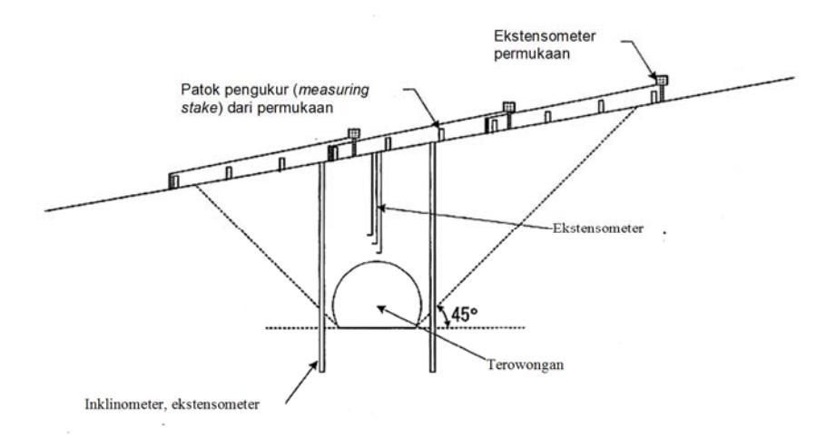

**Gambar 33 – Pengukuran pergerakan permukaan dan contoh susunan titik-titik pengukuran pergerakan tanah/batuan** 

a. Pengukuran muka air tanah Pengukuran muka air tanah dapat dilakukan dari sumur-sumur air yang telah ada.

# **8.5.4 Frekuensi pemantauan dan pengukuran**

Frekuensi pemantauan dan pengukuran harus ditentukan dengan tepat berdasarkan kemajuan penggalian muka bidang galian sehingga perubahan dari waktu ke waktu dari kondisi tanah/batuan dan perilaku perkuatan dapat dimonitor.

Frekuensi pengukuran harus lebih sering di belakang dan di depan muka bidang galian, dan berkurang saat muka bidang galian menjadi semakin jauh. Selain itu, perlu untuk mengukur nilai awal (*initial value*) di dekat muka bidang galian saat setelah penggalian.

**© BSN 2017 174 dari 303**

# **8.5.5 Pelaksanaan pemantauan dan pengukuran**

Pemantauan dan pengukuran dilaksanakan dengan memantau dan mengukur dengan cermat kondisi tanah/batuan pada muka bidang galian, juga kondisi serta perubahan kondisi perkuatan dan dinding terowongan yang dipasang. Pemantauan dan pengukuran ini harus dilakukan selama konstruksi terowongan berlangsung. Pada daerah portal atau bagian terowongan dengan ketebalan lapisan penutup (*overburden*) tipis, perubahan yang disebabkan oleh penggalian terowongan harus dievaluasi dengan melakukan pemantauan baik dari dalam maupun dari luar terowongan.

# **8.5.6 Evaluasi hasil pemantauan dan pengukuran**

Semua hasil pemantauan dan pengukuran harus diproses dan dievaluasi secepatnya untuk menentukan kondisi terowongan saat ini, yaitu sebagai alat untuk mengkonfirmasi stabilitas tanah/batuan di sekitar terowongan, validasi perkuatan terowongan, pengaruh pada lingkungan sekitar juga untuk memilih perkuatan yang akan diterapkan pada bagian terowongan berikut yang belum digali.

# **9 Fondasi**

#### **9.1 Ruang lingkup pekerjaan fondasi**

Pasal ini menetapkan persyaratan pekerjaan fondasi yang meiputi persyaratan perancangan fondasi dan persyaratan struktur fondasi. Pada pasal ini juga diberikan kriteria laporan perancangan fondasi serta kriteria untuk melaksanakan survei lapangan. Fondasi dangkal dan fondasi tiang serta pengujian fondasi tiang juga diulas kriterianya di dalam pasal ini.

## **9.2 Persyaratan perancangan fondasi**

#### **9.2.1 Persyaratan dasar**

Fondasi dari suatu gedung/struktur harus direncanakan dan dibangun agar aman dalam memikul beban-beban yang bekerja padanya tanpa mengurangi kestabilan ataupun menyebabkan deformasi yang besar pada bangunan tersebut, atau bangunan lain di sekitarnya, jalan, ataupun lereng yang ada.

Untuk mengatasi kedua hal tersebut, maka perancangan fondasi harus:

- *a)* Memenuhi persyaratan kekuatan, baik untuk struktur fondasinya maupun untuk lapisan tanah pendukung fondasi tersebut *(strength requirement)*;
- *b)* Memenuhi peryaratan penurunan yang ditentukan *(serviceability requirement)*.

#### **9.2.2 Karakteristik tanah**

Perancangan fondasi membutuhkan pengetahuan mengenai perilaku teknis lapisan tanah di bawahnya, kondisi air tanah, kondisi geologi, dan sejarah terbentuknya tanah pada lokasi. Karakteristik tanah yang digunakan merujuk ke Pasal 5 dari SNI ini.

#### **9.2.3 Daya dukung izin**

Daya dukung izin tanah, dimana fondasi tersebut akan dibangun, akibat beban kerja harus diambil yang terkecil dari:

**© BSN 2017 175 dari 303** 

- a) kapasitas ultimit tanah dengan faktor keamanan yang cukup terhadap kemungkinan terjadinya keruntuhan, atau
- b) suatu nilai yang memberikan deformasi fondasi akibat beban yang bekerja masih dalam batas-batas yang diizinkan oleh bangunan tersebut, atau bangunan di sekitarnya.

Metode untuk mendapatkan daya dukung izin lapisan tanah fondasi dapat dilihat pada 9.2.3.1 dan 9.2.3.2.

# **9.2.3.1 Metode rasional**

Metode rasional yang digunakan untuk menghitung kapasitas ultimit fondasi harus dilakukan berdasarkan data-data tanah yang diperoleh dari penyelidikan lapangan maupun laboratorium pada lokasi pekerjaan menggunakan:

- a) Metode analitik yang sudah baku (misalnya Terzaghi, Meyerhoff, Hansen, Vesic, Reese) yang memperhitungkan kondisi lapisan tanah yang ada serta geometri dari fondasi,
- b) Metode empiris yang sudah baku (terbukti).

Daya dukung izin fondasi diperoleh dari daya dukung ultimit fondasi tersebut dibagi dengan suatu faktor keamanan yang besarnya minimum 3 untuk fondasi dangkal atau minimum 2,5 untuk fondasi dalam.

# **9.2.3.2 Metode pengujian pembebanan**

Daya dukung izin fondasi dapat juga diperoleh dari hasil uji pembebanan fondasi pada lokasi pekerjaan. Beberapa hal yang harus diperhatikan dalam menggunakan metode ini adalah sebagai berikut:

- a) efek penskalaan dari uji pembebanan terhadap dimensi fondasi yang sebenarnya;
- b) variasi lapisan tanah tempat dilakukannya uji pembebanan terhadap lokasi fondasi yang sebenarnya;
- c) durasi pembebanan pada uji pembebanan dibandingkan dengan umur fondasi.

Uji pembebanan yang dilaksanakan pada suatu pelat uji *(individual test plate)* ataupun tiang tunggal hanya akan memberikan gambaran mengenai daya dukung ultimit *(ultimate bearing capacity)* tanah pada lokasi pengujian tersebut akibat beban uji yang diberikan. Dengan demikian hasil yang diperoleh dari uji pembebanan ini belum tentu menggambarkan karakteristik daya dukung *(bearing capacity)* fondasi yang sebenarnya atau kondisi daya dukung di lapangan secara keseluruhan.

Penambahan penurunan ataupun kemungkinan terjadi keruntuhan geser sebagai akibat kombinasi pembebanan pada fondasi mungkin saja akan terjadi, dan hal ini harus dicek. Uji beban langsung pada pelat berukuran kecil umumnya hanya akan memberikan informasi tentang tanah sampai kedalaman 2 kali lebar/diameter pelat uji. Oleh karena itu, jika hasil uji beban akan digunakan sebagai dasar perancangan fondasi dangkal, perlu dilakukan konversi terlebih dahulu sesuai ukuran fondasinya.

# **9.2.3.3 Kriteria penurunan**

Harus diingat bahwa walaupun telah digunakan faktor keamanan yang cukup terhadap kemungkinan terjadinya keruntuhan geser, namun hal ini tidak otomatis menjamin bahwa penurunan fondasi akan menjadi kecil atau memenuhi syarat deformasi yang ditentukan. (lihat Gambar 34). Pada Gambar 34 terlihat bahwa kalau berdasarkan keruntuhan geser

**© BSN 2017 176 dari 303**

maka daya dukung izin fondasi adalah sebesar qu/SF; namun mengingat besarnya penurunan yang terjadi S' lebih besar dari penurunan yang diizinkan, Sall, maka untuk kondisi ini daya dukung izin fondasi yang betul adalah sebesar qall(s). Dengan kata lain daya dukung izin ditentukan berdasarkan kriteria penurunan yang diizinkan. Metode untuk menentukan besarnya penurunan fondasi dapat dilihat pada 9.2.4**.** 

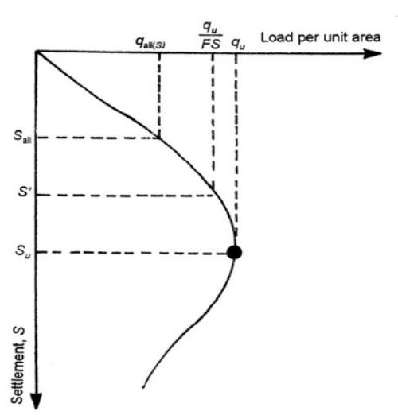

**Gambar 34 - Kurva penurunan-pembebanan untuk fondasi dangkal** 

# **9.2.4 Penurunan**

Perkiraan besarnya penurunan total maupun beda penurunan merupakan hal yang penting dalam perancangan fondasi untuk menjamin stabilitas dan kemampulayanan dari bangunan di atasnya.

#### **9.2.4.1 Penurunan total**

Penurunan total terdiri atas penurunan langsung (seketika) dan penurunan konsolidasi. Penurunan langsung *(immediated settlement)* akan terjadi saat beban diberikan; dan penurunan jangka panjang *(long-term settlement)* mulai terjadi beberapa saat setelah pemberian beban.

Penurunan terjadi antara lain akibat:

- a) Pemberian beban pada fondasi;
- b) Berubahnya elevasi muka air tanah;
- c) Getaran akibat beban mesin, kereta api, termasuk akibat gempa; dan
- d) Perubahan tegangan yang bekerja pada lapisan tanah fondasi sebagai akbat antara lain adanya galian atau pekerjaan konstruksi di sekitarnya.

# *9.2.4.2* **Perkiraan penurunan**

Besar dan kecepatan penurunan fondasi dapat diperkirakan antara lain:

- a) Berdasarkan data pengukuran penurunan (*settlement record*) dari struktur dan fondasi sejenis yang ada di lokasi sekitarnya;
- b) Berdasarkan metode analitis penurunan yang sudah baku yang dilakukan berdasarkan data tanah yang diperoleh dari uji lapangan dan uji laboratorium dan muka air tanah yang ada dan beban yang bekerja pada fondasi;

c) Berdasarkan metode empiris yang sudah baku dan sesuai dengan kondisi tanah di Indonesia serta sesuai dengan kasus-kasus yang telah dilakukan di Indonesia.

#### **9.2.4.3 Penurunan izin**

Besarnya penurunan total dan beda penurunan yang diizinkan ditentukan berdasarkan toleransi struktur atas dan bangunan sekitar yang harus ditinjau berdasarkan masing-masing kasus tersendiri dengan mengacu pada integritas, stabilitas dan fungsi dari struktur di atasnya.

Penurunan izin < 15 cm + b/600 (b dalam satuan cm) untuk bangunan tinggi dan bisa dibuktikan struktur atas masih aman.

Beda penurunan *(differential settlement)* yang diperkirakan akan terjadi harus ditentukan secara saksama dan konservatif, serta pengaruhnya terhadap bangunan gedung tinggi di atasnya harus dicek untuk menjamin bahwa beda penurunan tersebut masih memenuhi kriteria kekuatan dan kemampulayanan sebesar 1/300.

# **9.3 Persyaratan struktur**

Perancangan kekuatan struktur dari fondasi serta persyaratan material fondasi harus mengacu pada SNI 1726:2012 untuk bangunan gedung dan SNI 2833:2008 untuk jembatan konvensional.

# **9.3.1 Beban pada fondasi**

Beban maksimum yang bekerja pada fondasi akan merupakan penjumlahan dari beban mati, beban hidup, beban angin, dan beban gempa serta imposed load yang disebabkan antara lain oleh gaya *buoyancy* dan tekanan tanah. Beban yang bekerja dapat bersifat permanen ataupun sementara. Seluruh beban yang disebutkan di atas harus ditransfer ke tanah melalui fondasi.

Persyaratan mengenai masing-masing beban ini dapat dijumpai pada SNI 1727:2013 yang mengatur mengenai beban minimum untuk bangunan gedung dan struktur lain, dan SNI 03- 1725-1989 yang mengatur pembebanan untuk jembatan jalan raya. Khusus untuk beban gempa pada bangunan gedung dapat merujuk pada SNI 1726:2012, sedangkan untuk jembatan konvensional dapat merujuk SNI 2833:2008. Gaya *bouyancy* harus ditentukan berdasarkan 9.3.4, sementara tekanan tanah harus diperoleh dari metode geoteknik yang sudah baku.

#### *9.3.2* **Kekuatan struktur dan kemampulayanan**

Pada bagian sebelumnya telah disampaikan persyaratan fondasi dari segi geoteknik yang antara lain menyebutkan bahwa daya dukung izin fondasi diambil dari daya dukung ultimit dibagi dengan faktor keamanan. Di samping persyaratan geoteknik, fondasi juga harus memenuhi persyaratan kekuatan dari struktur fondasi tersebut.

Dua buah persyaratan kekuatan struktur fondasi yang harus dipenuhi adalah:

- a) Persyaratan kekuatan struktural: Fondasi harus kuat menerima beban yang bekerja padanya. Fondasi yang dibebani melebihi kapasitas strukturnya secara prinsip akan mengalami keruntuhan katastropik.
- b) Persyaratan kemampulayanan: Di samping harus kuat memikul beban di atasnya, fondasi juga harus dapat berfungsi dengan baik akibat beban layan *(service loads)* yang bekerja padanya. Persyaratan yang harus dipenuhi mencakup antara lain: penurunan (total dan diferensial), *heave*, *tilt*, pergerakan lateral, getaran, dan durabilitas.

**© BSN 2017 178 dari 303**

# *9.3.3* **Ketahanan terhadap geser, pengangkatan, dan guling**

Perancangan suatu fondasi juga harus memenuhi persyaratan berikut ini.

- a) Ketahanan terhadap geser *(sliding resistance)* harus minimum 1,5 kali lebih besar (statik) dan 1,1 (seismik) akibat gaya geser yang disebabkan oleh beban rencana. Tahanan geser yang diperhitungkan adalah *base shear* dan tahanan pasif. Namun, tahanan pasif harus diabaikan kecuali dapat dipastikan bahwa tekanan pasif dapat dipastikan tetap ada selama umur rencana;
- b) Ketahanan terhadap pengangkatan *(uplift resistance)* harus minimum 1,5 kali lebih besar dari gaya angkat akibat beban. Ketahanan ini sedapat mungkin diatasi dengan beban mati. dalam situasi khusus dapat menggunakan sistem angkur yang diatur pada pasal 10;
- c) Ketahanan akibat guling *(overturning resistance)* harus minimum 2 kali lebih besar dari momen guling*.* Momen guling besarnya sama dengan jumlah dari momen *stabilizing* akibat beban mati minimum ditambah dengan akibat tahanan pengangkuran yang diizinkan.

#### **9.3.4 Ketahanan terhadap** *buoyancy*

Suatu struktur fondasi harus dapat menahan *buoyancy* dengan memenuhi persyaratan berikut ini.

- a) Faktor keamanan minimum 1,5 terhadap bahaya *floatation* yang disebabkan oleh elevasi muka air tanah tertinggi. Besarnya ketahanan merupakan penjumlahan dari beban mati dan tahanan izin pengangkuran (*permitted anchoring resistance)* dengan mengacu pada kriteria pada pasal 10;
- b) Faktor keamanan minimum 1,1 terhadap bahaya *floatation* dimana *buoyancy* disebabkan oleh elevasi tertinggi dari muka air tanah, dan ketahanan diambil sebesar beban mati minimum saja.

Elevasi muka air tertinggi harus ditentukan berdasarkan pada semua kasus ekstrem yang mungkin terjadi seperti curah hujan yang besar, banjir dan lainnya. Apabila tidak ada data mengenai hal ini, maka muka air tanah tertinggi harus diambil di permukaan tanah. Akan tetapi, pada area reklamasi, muka air tanah tertinggi dapat lebih tinggi dari permukaan tanah.

#### **9.4 Kriteria laporan perancangan fondasi**

Perancangan fondasi harus memberikan semua informasi yang cukup yang menggambarkan konsep perancangan secara menyeluruh. Suatu perancangan fondasi harus mencakup hal-hal yang disampaikan pada subpasal-subpasal berikut.

#### **9.4.1 Laporan analisis perancangan fondasi**

Hasil analisis perancangan fondasi yang harus dilakukan sekurang-kurangnya meliputi:

- a) *Block plan* yang menggambarkan lokasi dari pekerjaan;
- b) Detail yang menunjukkan kondisi lokasi pekerjaan, yang meliputi antara lain: titik-titik penyelidikan tanah, fondasi eksisting, lereng, dan dinding penahan;
- c) Penetapan parameter tanah untuk perancangan fondasi termasuk untuk menentukan beban gempa;

- d) Analisis untuk tanah yang mempunyai sifat khusus, seperti tanah lunak (Su < 25 kPa, PI >20, wn ≥ 40%), tanah ekpansif, tanah urugan tinggi;
- e) Dalam hal tanah memiliki potensi likuifaksi, maka analisis daya dukung fondasi harus mempertimbangkan pengaruh likuifaksi;
- f) Dalam hal fondasi direncanakan berada pada daerah yang terpengaruh tekanan tanah lateral, maka analisis tekanan lateral harus diperhitungkan.
- g) Pengaturan layout yang menunjukkan dimensi dan kedalaman fondasi, detail struktur fondasi dan spesifikasi material fondasi.

# **9.4.2 Laporan perancangan fondasi dangkal**

Perancangan fondasi dangkal (fondasi telapak) sekurang-kurangnya harus meliputi analisis sebagai berikut:

- a) Pasal 9.4.1,
- b) Daya dukung fondasi,
- c) Tegangan kerja (normal dan geser) pada bidang kontak dasar fondasi dengan tanah di bawahnya akibat pengaruh kombinasi beban,
- d) Penurunan total dan beda penurunan,
- e) Perhitungan balok penghubung (*sloof/tie beam)* dan pengaruh beda penurunan, dan
- f) Pengaruh pengangkatan *(uplift).*

# **9.4.3 Laporan perancangan fondasi rakit**

Perancangan fondasi rakit sekurang-kurangnya harus meliputi analisis sebagai berikut:

- a) Pasal 9.4.1,
- b) Kelayakan pemodelan struktur rakit,
- c) Daya dukung fondasi,
- d) Tegangan kerja (normal dan geser) yang timbul pada bidang kontak dasar fondasi dengan tanah di bawahnya akibat pengaruh kombinasi beban,
- e) Penurunan total dan beda penurunan dan
- f) Perhitungan pengangkatan *(uplift).*

## **9.4.4 Laporan perancangan fondasi tiang**

Perancangan fondasi tiang sekurang-kurangnya harus meliputi analisis sebagai berikut:

- a) Pasal 9.4.1,
- b) Daya dukung tiang fondasi tunggal dan kelompok tiang,
- c) Efek kelompok tiang fondasi,
- d) Pengaruh *negative skin friction*,
- e) Distribusi beban pada masing-masing tiang fondasi,
- f) Pengaruh beban lateral pada kepala tiang fondasi,

**© BSN 2017 180 dari 303**

- g) Analisis detail kelompok tiang terhadap kombinasi beban aksial, lateral, dan momen dengan kombinasi statik dan dinamik,
- h) Penurunan total dan beda penurunan,
- i) Penetapan konstanta pegas aksial sistem fondasi rencana,
- j) Analisis kepala tiang *(pile cap)*,
- k) Perhitungan balok penghubung *(sloof/tie beam)* dan khususnya kekuatan *tie beam* terhadap beda penurunan,
- l) Pengaruh pengangkatan oleh tekanan hidrostatik atau gaya cabut oleh pengaruh gempa,
- m) Rencana uji pembebanan yang akan dilakukan,
- n) Sambungan tiang fondasi kecuali dengan sistem yang telah melalui serangkaian pengujian,
- o) Kapasitas fondasi yang harus dibuat lebih kuat dari kolom dasar dan atau dinding geser, dan
- p) Langkah-langkah pengaman tiang fondasi pada keadaaan "satu kolom satu tiang fondasi" dan "satu kolom dua tiang fondasi".

# **9.4.5 Laporan perancangan sistem fondasi yang merupakan gabungan antara fondasi tiang-rakit**

Perancangan sistem fondasi yang merupakan gabungan antara fondasi tiang dan fondasi rakit diperkenankan dengan memerhatikan beberapa kondisi sebagai berikut:

- a) Tiang fondasi yang digunakan bersifat tiang friksi *(friction pile),*
- b) Dalam mendesain penulangan fondasi tiang-rakit kondisi terkritis antara kombinasi 75% beban diterima fondasi rakit dan 25% diterima oleh fondasi tiang dan kombinasi 25% beban diterima fondasi rakit dan 75% diterima oleh fondasi tiang,
- c) Distribusi gaya-gaya yang masuk ke sistem fondasi tiang dan fondasi rakit harus dilakukan dengan metode numerik yang rasional,
- d) Pada penggunaan tiang fondasi yang tidak berfungsi sebagai fondasi tiang permanen, maka perencana harus bisa menunjukkan bahwa pada saat tiang tidak dibutuhkan, tiang tersebut harus sudah gagal terlebih dahulu,
- e) Penurunan bangunan yang menggunakan sistem fondasi tiang-rakit tidak boleh lebih dari 15 cm, kecuali dapat dibuktikan atau ditunjukkan bahwa struktur bangunan mampu mendukung penurunan maksimum yang terjadi dan tidak akan menimbulkan pengaruh pada lingkungan. Besaran ini bisa dilampaui apabila dapat dibuktikan tidak akan terjadi hal-hal negatif pada bangunan tersebut sendiri maupun terhadap lingkungan sekitarnya.

#### **9.4.6 Laporan penyelidikan lapangan**

Suatu perancangan fondasi harus dilengkapi juga dengan suatu laporan penyelidikan lapangan yang mencakup penyelidikan tanah, uji lapangan, uji laboratorium, dan foto-foto dari contoh tanah yang diambil merujuk ke Pasal 5.

# *9.5* **Survei lapangan**

#### **9.5.1 Umum**

Sebelum membangun suatu fondasi, maka suatu survei lapangan harus dilakukan terlebih dahulu untuk mendapatkan informasi-informasi yang diperlukan untuk perancangan dan pembangunan fondasi.

Untuk tujuan ini, harus disiapkan sebuah laporan penyelidikan lapangan yang berisi hasil survei lapangan dan penyelidikan tanah dan juga kondisi permukaan tanah dan kondisi bawah permukaan tanah pada lokasi.

#### **9.5.2 Survei lapangan**

Survei lapangan yang perlu dilakukan paling sedikit mencakup: survei topografi, survei geologi, survei struktur, dan survei struktur bawah tanah.

Survei geologi harus mencakup semua informasi mengenai kondisi geologi di lokasi termasuk di antaranya fitur-fitur geologi, kelongsoran terdahulu dan *site formation works*. Struktur geologi dari lokasi dapat dipelajari dari informasi yang sudah ada. Pemahaman pemakaian lokasi sebelumnya perlu dipelajari, apakah pernah mengalami kelongsoran. Demikian juga elevasi air tanah perlu dikumpulkan serta observasi dari bangunan di sekitarnya, apakah pernah mengalami penurunan perlu dipelajari.

Stabilitas dari bangunan di sekitarnya yang akan terpengaruh oleh pekerjaan fondasi yang baru harus dilaporkan.

Survei struktur harus mengidentifikasi dua hal berikut:

- a) Bangunan, struktur dan fondasi eksisting di sekitar lokasi pekerjaan;
- b) Struktur penahan eksisting pada atau di sekitar lokasi pekerjaan.

# **9.5.3 Penyelidikan tanah**

Sebelum dimulainya perancangan fondasi dan menentukan metode konstruksinya, harus dilaksanakan terlebih dahulu penyelidikan tanah pada lokasi untuk mendapatkan karakteristik dari tanah fondasi yang akan memengaruhi kinerja dari fondasi tersebut dan juga memengaruhi pemilihan tipe dan metode pelaksanaan fondasi tersebut.

Penyelidikan tanah yang dilakukan harus menjamin diperolehnya informasi yang cukup mengenai kondisi lapisan tanah pada lokasi dan di sekitar lokasi pekerjaan.

# **9.5.3.1 Jenis penyelidikan**

Penyelidikan tanah yang perlu dilakukan mencakup pengeboran, pengambilan contoh (terganggu dan tak terganggu), serta pengujian lapangan dan laboratorium.

Pada daerah dimana sudah ada struktur yang sama dengan yang direncanakan dan apabila sudah ada data dari penyelidikan tanah sebelumnya dan dirasakan cukup untuk perancangan, maka penyelidikan tanah yang dilakukan terbatas untuk mengetahui apakah kondisinya sama dengan kondisi tanah di sekitarnya. Jenis-jenis penyelidikan tanah selengkapnya merujuk ke Pasal 5.

**© BSN 2017 182 dari 303**

# **9.5.3.2 Jumlah titik penyelidikan**

Jarak antara titik bor dan sumur uji harus sedemikian rupa sehingga diperoleh informasi antara lain mengenai jenis tanah dan ketebalannya, serta sifat-sifat tanah tersebut. Sementara jumlah titik bor dan sumur uji yang harus dilakukan akan sangat tergantung kepada tipe struktur yang akan dibangun, kondisi lapangan, dan kelengkapan data yang sudah ada. Jumlah titik penyelidikan selengkapnya merujuk ke Pasal 5.

# **9.5.3.3 Kedalaman penyelidikan**

Pengeboran harus dilakukan sampai dengan kedalaman dimana semua lapisan tanah yang akan dipengaruhi oleh beban struktur dan pada saat konstruksi dapat diperoleh. Kedalaman pengeboran akan tergantung antara lain kepada tipe dari stuktur, ukuran dan bentuk daerah yang akan dibebani, dan kondisi lapisan tanah yang ada. Kedalaman penyelidikan selengkapnya merujuk ke Pasal 5.

# **9.5.3.4 Air tanah**

Informasi mengenai air tanah sangat penting dalam perancangan maupun pembangunan suatu fondasi, terlebih lagi apabila perlu dilakukan *dewatering*. Pelaksanaan dewatering memerlukan informasi yang cukup mengenai air tanah dan karakteristik lapisan tanah yang mencakup antara lain permeabilitas, kompresibilitas, ukuran butiran dan lainnya agar penurunan yang terjadi akibat *dewatering* dapat diperkirakan.

Mengingat beberapa jenis tanah mempunyai koefisien permeabilitas yang kecil, maka permukaan air yang ada di dalam lubang bor ataupun sumur uji akan memakan waktu yang cukup lama sebelum mencapai kondisi kesetimbangan *(equilibrium*). Dengan demikian hasil yang diperoleh belum tentu menggambarkan elevasi muka air tanah yang sesungguhnya. Pengukuran elevasi muka air tanah seharusnya dilakukan menggunakan piezometer atau *standpipes* untuk waktu yang cukup lama.

Apabila air tanah ataupun lapisan tanah mengandung mineral atau unsur yang dapat menyebabkan kerusakan pada fondasi, maka analisis kimiawi harus dilakukan terhadap contoh air tanah dan tanah tersebut. Bila diperlukan, fondasi tersebut harus dilindungi terhadap kerusakan yang mungkin ditimbulkan oleh mineral atau unsur ini. Lebih lengkap mengenai pengukuran muka air tanah dapat merujuk pada Pasal 5.

#### **9.6 Fondasi dangkal**

Suatu fondasi dangkal harus cukup kuat memikul seluruh beban yang bekerja padanya dan mampu mentransfer beban-beban tersebut ke lapisan tanah di bawahnya dengan tanpa menyebabkan penurunan yang berlebihan.

Fondasi dangkal umumnya terbuat dari beton bertulang dan terletak di atas batuan atau lapisan tanah yang mempunyai daya dukung yang cukup pada kedalaman yang dangkal dari permukaan tanah.

Fondasi dangkal tidak boleh menyebabkan pertambahan beban yang berlebihan pada fondasi atau bangunan di sekitarnya ataupun pada lapisan tanah pendukung bangunan tersebut ataupun menyebabkan ketidakstabilan pada lereng yang ada.

Fondasi dangkal tanpa proteksi tidak diperbolehkan digunakan pada struktur yang memiliki kemungkinan mengalami erosi.

Daya dukung izin dari batuan atau lapisan tanah yang mendukung suatu fondasi dangkal harus ditentukan sesuai dengan 9.2.3.

Penurunan izin dari fondasi dangkal harus diperkirakan dan dicek dengan persyaratan pada 9.2.4.3.

#### **9.7 Fondasi tiang**

#### **9.7.1 Umum**

Fungsi utama dari fondasi tiang adalah untuk mentransfer beban ke lapisan tanah yang lebih dalam yang dapat memikul beban kerja dengan faktor keamanan yang cukup agar tidak terjadi keruntuhan dan tanpa menyebabkan penurunan yang dapat mengurangi fungsi struktur yang dipikulnya. Pelaksanaan pekerjaan fondasi tiang harus direncanakan sedemikian rupa sehingga tidak mengganggu keamanan dan stabilitas bangunan di sekitarnya. Dengan demikian perancangan fondasi tiang harus memenuhi 3 kondisi berikut ini:

- a) Faktor keamanan terhadap keruntuhan, baik untuk tiangnya maupun untuk tanah pendukungnya,
- b) Penurunan total dan beda penurunan dari fondasi akibat beban kerja,
- c) Keamanan dan stabilitas dari bangunan di sekitarnya.

Dalam analisis rakit bertiang, dalam hal kepentingan fondasi tiang, beban yang dipikulkan pada rakit harus dihitung dengan saksama dan tidak boleh lebih besar dari 25% dari beban total yang ada, kecuali dapat didukung atau dibuktikan dengan suatu analisis detail interaksi tanah-tiang-rakit yang rasional.

Besarnya beban ultimit yang bekerja pada tiang tunggal harus ditentukan berdasarkan:

- a) Metode yang berlaku pada teknik fondasi, dan
- b) Uji pembebanan.

Besarnya beban izin yang dapat dipikul tiang tunggal diperoleh dari beban ultimit dibagi dengan satu angka keamanan dengan memperhitungkan kondisi lapisan tanah, metode instalasi, pengaruh kelompok tiang, dan kriteria deformasi yang diizinkan.

Daya dukung tiang dihasilkan dari kombinasi gesekan yang terjadi di selimut tiang serta tahanan ujungnya di ujung bawah tiang. Tahanan gesek pada selimut umumnya dominan pada tiang yang ditanam pada tanah lempung dan lanau, sementara tahanan ujung umumnya dominan pada lapisan pasir/kerikil yang padat serta tanah lempung keras.

#### **9.7.1.1 Pengaruh kelompok tiang**

Kelompok tiang terjadi bila jarak antara tiang sedemikian rupa sehingga daya dukung dan perilaku penurunan tiang tunggal akan dipengaruhi oleh tiang-tiang yang lainnya. Pengaruh kelompok tiang harus diperhitungkan dalam merencanakan daya dukung kelompok tiang dan penurunan kelompok tiang sebagai berikut:

a) Daya dukung kelompok tiang diperoleh dari total daya dukung tiang tunggal dikalikan jumlah tiang dan dikalikan dengan suatu *group reduction factor* yang dihitung oleh metode yang sudah baku (misalnya *Block Failure*, faktor efisiensi dari *Converse Labara*).

**© BSN 2017 184 dari 303**

- b) *Group reduction factor* umumnya tidak perlu diberlakukan apabila:
  - 1) Jarak as ke as lebih dari 8 kali diameter tiang, atau
  - 2) Kapasitas dari tiang ditentukan oleh tahanan ujung tiang.

Penurunan kelompok tiang harus dihitung untuk mengetahui besar penurunan total yang terjadi akibat beban yang bekerja di atasnya.

#### **9.7.1.2 Jarak antara tiang**

Jarak antara tiang harus mempertimbangkan antara lain *heave* dan pemadatan yang akan terjadi, dan harus cukup jauh untuk memungkinkan pemancangan terhadap sejumlah tiang dengan tidak merusak tiang itu sendiri ataupun bangunan di sekelilingnya.

Jarak antara tiang umumnya ditentukan oleh:

- a) Metode pemasangan; dipancang atau melalui pengeboran,
- b) Daya dukung kelompok tiang.

Untuk fondasi tiang jarak antara as ke as tiang tidak boleh kurang dari keliling tiang atau untuk tiang berbentuk lingkaran tidak boleh kurang dari 2,5 kali diameter tiang.

# **9.7.1.3 Kekuatan tiang**

Perancangan tiang harus memperhitungkan tegangan yang timbul pada tiang, baik pada saat transportasi maupun pada saat instalasi. Hal ini lebih kritis pada tiang pancang terutama yang terbuat dari beton bertulang atau beton prategang *(pre-stressed concrete).* Kekuatan suatu tiang harus didesain sedemikian rupa sehingga tidak mengalami kerusakan pada saat transportasi maupun pemancangan. Apapun tipe dari tiang harus mempunyai kekuatan yang cukup pada saat dipancang untuk dapat mentransfer beban ke lapisan tanah di bawahnya dengan tanpa terjadi keruntuhan.

#### **9.7.1.4 Kekuatan tiang terhadap geser**

Bila tiang didesain untuk memberikan tahanan lateral terhadap bahaya gelincir, maka harus dibuktikan bahwa tiang dan lapisan tanah pendukungnya mempunyai kapasitas yang cukup seperti yang disyaratkan pada 9.3.3.

#### **9.7.1.5 Kekuatan tiang terhadap pengangkatan, guling dan** *buoyancy*

Bila tiang didesain untuk memberikan tahanan terhadap pengangkatan, guling dan/atau *buoyancy*, maka harus dibuktikan bahwa tiang dan lapisan tanah pendukungnya mempunyai kapasitas yang cukup seperti yang disyaratkan pada 9.3.4.

# **9.7.1.6 Kepala tiang**

Kepala tiang umumnya terbuat dari beton bertulang. Kepala tiang harus cukup tebal untuk menahan gaya-gaya geser.

## *9.7.1.7 Negative skin friction*

Bila suatu tiang dipasang melewati lapisan tanah yang akan mengalami konsolidasi setelah tiang dipasang, penurunan dari lapisan tanah ini akan menyebabkan gaya tarik ke bawah yang bekerja pada selimut tiang. Gaya tarik ke bawah ini disebut *"negative skin friction*" dan akan menyebabkan beban tambahan yang harus dipikul oleh tiang.

**© BSN 2017 185 dari 303** 

Penurunan tanah tersebut dapat diakibatkan oleh berat sendiri tanah, beban tambahan misalnya timbunan, gangguan akibat getaran maupun akibat pemasangan tiang.

*Negative skin friction* pada tiang dapat dikurangi dengan memberikan lapisan luar *(coating)* yang berupa bitumen atau aspal pada permukaan tiang. Pemberian lapisan luar harus dilakukan secara hati-hati agar tidak rusak akibat pemancangan tiang. Bila memungkinkan hal ini harus diuji di lapangan.

# **9.7.2 Daya dukung tiang tunggal**

Kapasitas ultimit tiang diperoleh dari tahanan gesek sepanjang selimut tiang ditambah dengan tahanan ujung tiang. Kontribusi dari masing-masing terhadap kapasitas total tiang tergantung antara lain kepada kepadatan, kuat geser tanah dan karakteristik dari tiang. Kapasitas ultimit tiang dimana tahanan tanah sudah termobilisasi sepenuhnya. Pada beban yang lebih besar dari kapasitas ultimitnya akan terjadi keruntuhan.

Kapasitas ultimit tiang tunggal untuk beban vertikal dapat diperkirakan dari formula yang diberikan pada penjelasan berikut ini.

# **9.7.2.1 Formula statik berdasarkan hasil penyelidikan tanah**

Kapasitas ultimit dari tiang tunggal akibat beban vertikal diperoleh dari penjumlahan kuat geser sepanjang selimut tiang ditambah dengan tahanan ujung tiang dengan Persamaan (1).

$$Q = Q_s + Q_e = \sum_{z=0}^{L} f A_s + q A_b \tag{1}$$

# **Keterangan**:

ܳ = kapasitas ultimit tiang tunggal;

ܳ௦ = kapasitas tahanan friksi ultimit (*ultimate skin resistance*);

ܳ = kapasitas tahanan ujung ultimit (*ultimate end bearing resistance*).

Nilai kapasitas tahanan friksi ultimit, *f*, dan kapasitas tahanan ujung ultimit, *q*, tergantung pada jenis tanah dan karakteristik tiang dan dapat ditentukan dari pengujian skala penuh *(full scale tests)* atau dapat diperkirakan dari pengujian tanah di laboratorium atau di lapangan. Mobilisasi dari *f* dan *q* akan disertai dengan deformasi tiang. Besaran deformasi yang diperlukan untuk memobilisasi tahan selimut ultimit jauh lebih kecil dibandingkan dengan untuk memobilisasi tahanan ujung ultimit.

*Negative skin friction* akan memberikan nilai negatif pada komponen *f As*, sehingga harus diperhitungkan sebagai desain beban dan tidak dibagi dengan faktor keamanan.

Untuk *open ended driven tube* atau tiang berbentuk kotak dimana *soil plug* tidak terjadi pada saat pemancangan, maka nilai *Ab* harus direduksi.

#### **9.7.2.2 Berdasarkan hasil uji pembebanan**

Kapasitas daya dukung ultimit tiang dapat juga diperoleh dengan melakukan uji beban sampai terjadi keruntuhan. Penjelasan mengenai uji pembebanan dapat dilihat pada 9.7.

**© BSN 2017 186 dari 303**

# **9.7.2.3 Formula statik berdasarkan formula dinamik**

Ketepatan menggunakan perhitungan daya dukung berdasarkan formula dinamik sangat tergantung dari formula serta data catatan pemancangan yang digunakan. Kecuali tersedia korelasi empiris yang memadai pada kondisi fisik dan geologi tertentu, maka formula dinamik tidak diperbolehkan digunakan dalam perancangan daya dukung tiang. Rumus-rumus dinamik Hiley dan turunannya dapat memberikan rentang nilai daya dukung yang sangat bervariasi sehingga tidak diperbolehkan digunakan dalam perancangan daya dukung tiang.

#### **9.7.3 Beban lateral**

Perancangan tiang yang akan menerima beban lateral harus mempertimbangkan hal-hal berikut ini:

- a) Kuat geser tanah;
- b) Kapasitas struktur tiang;
- c) Deformasi yang diizinkan, dan
- *d) Group effect*.

Kapasitas lateral tiang harus diperkirakan berdasarkan metode yang umum digunakan, misalnya metode *p-y curves* dengan memerhatikan karakteristik tanah, karakteristik tiang tunggal maunpun kelompok tiang, interaksi tanah dengan tiang maupun kelompok tiang.

Tiang dan *pile-cap* sebaiknya tidak digunakan bersamaan untuk memikul gaya-gaya lateral kecuali distribusi gaya-gaya tersebut di antara tiang dan kepala tiang dapat ditentukan. Demikian juga tahanan gesek yang ada pada keliling dan dasar tiang, tiang *besmen* ataupun substruktur lainnya jangan diperhitungkan dalam menentukan tahanan lateral dari fondasi kecuali dapat dibuktikan bahwa komponen tersebut sesuai dan dapat dimobilisasi bersamaan dengan tanpa menyebabkan kerusakan pada lapisan tanah ataupun bangunan di sekitarnya.

#### **9.7.3.1 Kapasitas lateral izin tiang**

Estimasi kapasitas lateral tiang sesuai dengan besar deformasi lateral izin kepala tiang. Besar deformasi lateral izin tiang adalah 12 mm untuk gempa rencana dan 25 mm untuk gempa kuat dalam kondisi tiang tunggal dan *free-head*.

# **9.7.4 Tipe tiang**

Berdasarkan metode pelaksanaannya, tiang yang ada di Indonesia dibedakan atas tiang panjang dan tiang bor. Saat ini mulai dikenal juga *pushed-in* atau *jack-in pile*; namun jenis tiang ini tidak dibahas dalam SNI ini.

Material tiang pancang dapat berupa tiang panjang baja atau *precast reinforced concrete piles*, *precast prestressed spun concrete piles*, *driven cast-in-place concrete piles*.

Material tiang bor berupa beton bertulang dan dapat dibedakan antara tiang bor berdiameter kecil dan tiang bor berdiameter besar. Pelaksanaan tiang bor dengan menggunakan pengeboran bilas tidak diizinkan.

#### **9.8 Uji fondasi tiang (pembebanan dan integritas)**

Hasil uji pembebanan harus dibuat dan ditandatangani oleh tenaga ahli geoteknik tersertifikasi.

Hal-hal yang perlu diperhatikan pada uji fondasi tiang adalah sebagai berikut.

- a) Uji pembebanan dilakukan untuk memenuhi persyaratan berikut:
  - 1) Memastikan kapasitas tiang terhadap beban,
  - 2) Menentukan dan memastikan parameter desain yang digunakan,
  - 3) Melakukan verifikasi integritas tiang.
- b) Uji pembebanan yang perlu dilakukan:
  - 1) Tahap pendahuluan atau sebelum pelaksanaan, sebagai dasar perancangan untuk penentuan daya dukung fondasi yang dilakukan pada saat sebelum perancangan dilaksanakan atau sebagai konfirmasi kebenaran dasar perancangan. Lokasinya dipilih sedemikian rupa pada kondisi tanah yang relatif terburuk dilapangan.
  - 2) Tahap pelaksanaan, sebagai pembuktian besarnya daya dukung rencana pada system fondasi, struktur penahanan tanah dan bagian struktur bangunan terpenuhi. Lokasinya dipilih pada lokasi yang paling krusial dan pelaksanaan yang relatif paling mencurigakan/nilai pelaksanaan terburuk.
- c) Apabila hasil uji pembebanan tidak memenuhi daya dukung dalam perancangan, maka perlu diadakan peninjauan kembali perancangan berdasarkan hasil uji pembebanan tersebut.
- d) Prosedur uji pembebanan harus dilaksanakan berdasarkan ASTM edisi terakhir.
- e) Besarnya beban pada uji pembebanan minimum 200% dari beban rencana untuk *proof test*.

# **9.8.1 Uji pembebanan aksial tekan pada fondasi tiang**

Uji pembebanan fondasi tiang dilaksanakan pada seluruh struktur dengan menggunakan standar ASTM D1143.

Metode pembebanan dapat dilakukan dengan 3 cara yaitu: metode tiang reaksi, metode beban mati *(kentledge),* dan metode beban dengan cell 2 arah.

Uji pembebanan dilakukan pada posisi *cut-off-level* (COL) dimana beban ujinya harus terukur dengan alat pengukur beban terkalibrasi (load cell) dan juga alat ukur tekanan pada sistem hidraulik yang terkalibrasi *(pressure gauge).* Jika pembebanan dilakukan di muka tanah eksisting, perlu dilakukan perlakuan khusus agar dapat dipastikan beban bekerja pada panjang efektif tiang dan koreksi terhadap friksi di atas COL.

Jumlah tiang percobaan beban aksial tekan untuk *proof test* sebagai berikut:

- a) Untuk fondasi tiang bor (*bored pile*), minimum satu tiang percobaan untuk setiap 75 tiang yang ukuran penampangnya sama.
- b) Untuk fondasi tiang pancang (*driven pile*), minimum satu tiang percobaan untuk setiap 100 tiang yang ukuran penampangnya sama.
- c) Untuk fondasi tiang bor yang jumlahnya kurang dari 75 dan atau fondasi tiang pancang yang jumlahnya kurang dari 100, maka minimum satu tiang percobaan dilakukan setiap ukuran penampang yang sama.

Tambahan dari persyaratan tersebut adalah:

- a) N ≤ 1000; Nuji = 1,0% \*N
- b) 1000 < N ≤ 3000; Nuji = item a) + {0,8% \* (1000 < N ≤ 3000)}
- c) 3000 < N ≤ 6000; Nuji = item b) + {0,5% \* (3000 < N ≤ 6000
- d) 6000 < N ≤ 8000; Nuji = item c) + {0,4% \* (6000 < N ≤ 8000)}

dengan N adalah jumlah tiang, dan minimal 40% uji dilakukan pada tahap konstruksi serta 60% dapat dilakukan sebelum tahap konstruksi.

Besar beban percobaan pada pelaksanaan uji pembebanan tiang yang bersifat "*used pile*" (*used pile* = tiang yang akan menjadi bagian dari fondasi bangunan) adalah 200% kali daya dukung rencana untuk memikul daya beban gravitasi untuk uji beban aksial, dan 200% kali daya dukung rencana untuk memikul beban lateral akibat gravitasi dan akibat beban gempa rencana.

Batasan deformasi pada 200% pembebanan rencana:

- a) 25 mm untuk tiang dengan diameter maksimum 80cm,
- b) 4 % diameter untuk tiang > 80cm.

Deformasi permanen yang terjadi setelah dilakukan pelepasan beban dan pembebanan 200% tidak boleh melewati suatu nilai (12 mm).

Untuk kondisi-kondisi khusus, misalnya pada tiang bor diameter besar dengan panjang > 30 m, dimana penggunaan daya dukung ujung bawah tiang diterapkan dengan FK yang tinggi atau ada provisi penurunan tambahan, maka pelaksanaan uji pembebanan terinstrumentasi sangat dianjurkan untuk kondisi ini.

Evaluasi hasil pelaksanaan uji pembebanan dalam kondisi *failure* harus dilakukan dengan minimum tiga cara yang rasional dan umum digunakan, dimana hasil yang digunakan tidak boleh diambil dari hasil yang maksimum. Jika hasil uji pembebanan masih dalam kondisi elastik, tidak diperlukan interpretasi dan hasil uji dapat diterima dengan batas penurunan sesuai butir g.

# **9.8.2 Uji pembebanan aksial tarik pada fondasi tiang**

Uji pembebanan aksial tarik pada fondasi tiang dilaksanakan jika dianggap perlu pada seluruh struktur dengan menggunakan standar ASTM D3689. Metode pengujian dapat dilakukan dengan 2 cara, yaitu tiang reaksi dan beban mati (*kentledge*).

Percobaan beban aksial tarik perlu dilakukan untuk tiang fondasi yang direncanakan terhadap beban tarik. Untuk tiang tarik, minimum satu tiang percobaan untuk setiap 100 tiang yang ukuran penampangannya sama dengan minimum satu tiang percobaan. Uji pembebanan tarik ini merupakan bagian dari persyaratan jumlah uji pembebanan yang ditetapkan pada persyaratan jumlah uji pembebanan aksial tiang.

Batasan deformasi pada 200% pembebanan rencana adalah sebesar deformasi elastik PL/EA + 4mm atau maksimum 25 mm.

#### **9.8.3 Uji pembebanan horizontal/lateral pada fondasi tiang**

Uji pembebanan arah horizontal dilakukan dalam kondisi *free-head* pada elevasi *cut-offlevel* (COL) dengan menggunakan standar ASTM D3966 edisi terbaru. Metode pengujian dapat dilakukan dengan 3 cara, yaitu: *pile-to-pile*, *pile-to-group*, dan beban mati (*kentledge*).

Uji pembebanan arah horizontal dilakukan pada struktur fondasi minimum satu tiang percobaan untuk setiap tiang yang ukuran penampangnya sama, dengan persyaratan sebagai berikut:

- a) Semua bangunan yang tidak menggunakan besmen.
- b) Pada bangunan yang menggunakan besmen dan menggunakan fondasi tiang, dimana tiang-tiang fondasi digunakan untuk menahan gaya lateral.

- c) Pada bangunan dengan tiang fondasi yang mempunyai beban horizontal rencana > v (=c\*i/r) \* beban aksial rencana pada fondasi yang bersangkutan. Dimana V,C,I,R adalah faktor koefisien penentuan besar gaya geser rencana sesuai persyaratan SNI-03-1726- 2002 (atau yang terbaru).
- d) Bila terdapat besmen lebih dari 2 lapis, dan hasil analisis menunjukkan bahwa daya dukung lateral keseluruhan sistem fondasi dibagi faktor keamanan masih melebihi beban lateral yang bekerja, maka tidak diperlukan uji pembebanan lateral.
- e) Dalam hal jumlah tiang percobaan beban aksial lebih besar dari 6 tiang percobaan maka maksimal 2 dari jumlah tersebut dapat dipakai kembali untuk percobaan beban horizontal.

Batasan pergeseran di kepala tiang saat pelaksanaan uji (kondisi *free-head*):

- a) 10 mm pada beban 100% beban rencana,
- b) 25 mm pada beban 200% beban rencana,
- c) Pada tanah lunak, deformasi lebih menentukan dan pada tanah keras momen kapasitas lebih dominan, dengan catatan tidak terjadi plastifikasi pada fondasi tiang. Pada peninjauan ini perlu dilakukan analisis detail tiang lateral dengan saksama dengan memasukkan pengaruh-pengaruh kondisi reduksi kelompok tiang dan kondisi pengekangan (*fixity*) sebenarnya. Analisis lateral tiang kelompok ini dilakukan menggunakan peranti lunak yang memperhitungkan sifat nonlinear tanah.

# **9.8.4 Uji pembebanan dinamik (***Pile Driving Analyzer***, PDA) pada fondasi tiang**

Uji pembebanan dinamik dilakukan pada elevasi cut-off-level (COL) atau di atas muka tanah namun dengan perlakuan khusus yang memastikan gaya yang bekerja pada panjang efektif tiang dapat terukur dengan merujuk pada ASTM D4945 (ASTM D4945-12).

Uji pembebanan dinamik hanya digunakan sebagai pembanding dari percobaan beban aksial tekan, dimana harus terdapat minimal 1 tiang yang sama untuk setiap penampang tiang yang diuji statik dan dinamik untuk kemudian hasilnya dikorelasikan.

Jumlah uji pembebanan dinamik pada struktur gedung hanya dibenarkan sebanyak 4x dari 40% dari yang disyaratkan dan 60% tetap harus menggunakan sistem pembebanan statik.

Jumlah uji pembebanan dinamik pada struktur jalan dan jembatan atau struktur memanjang lainnya dapat lebih banyak, yaitu pada setiap pilar, abutmen, pile slab, dengan catatan uji pembebanan statik tetap dilakukan pada area tertentu yang krusial untuk melihat korelasi parameter yang digunakan dalam analisis.

Pada saat pengujian, hammer seberat 1% - 2% dari beban ultimit rencana yang diharapkan akan digunakan untuk dapat memobilisasi kapasitas ultimit tiang dengan kondisi kepala tiang rata dan berupa material uji yang padat.

#### **9.8.5 Uji integritas tiang pada fondasi tiang**

Uji integritas tiang dengan metode Crosshole Sonic Loggingg (CSL) adalah uji yang paling umum dilakukan pada tiang bor, dan barettes piles yang dilakukan dengan merujuk pada ASTM D6760.

Jumlah tiang percobaan adalah minimum satu tiang untuk setiap 20 tiang dengan penampang yang sama.

Uji CSL menggunakan pipa akses dan dua hydrophone berfungsi sebagai pengirim dan penerima sinyal ultrasonik yang dapat digunakan untuk memeriksa kepadatan beton dan mendeteksi kerusakan berupa segregasi, honeycomb, necking namun tidak dapat digunakan

**© BSN 2017 190 dari 303**

untuk menentukan penyebab kerusakannya. Uji ini juga akan memberi data yang kurang baik jika ikatan antara pipa akses dan beton buruk.

#### **9.8.6 Uji integritas metode** *Sonic Echo* **(***Pile Integrity Test,* **PIT) pada fondasi tiang**

Uji integritas metode *Sonic Echo* atau *Pile Integrity Test* (uji PIT) adalah uji yang dapat dilakukan pada seluruh jenis fondasi dalam dengan menggunakan standar ASTM D5882 edisi terbaru.

Jumlah tiang percobaan adalah minimal 1 tiang untuk setiap 5 tiang dengan penampang yang sama, namun untuk struktur jalan, jembatan dan struktur memanjang lainnya sebaiknya dilakukan pada setiap pier, abutment dan pile slab.

Uji PIT dilakukan dengan memberikan gaya kecil pada kepala tiang yang kemudian mengirimkan sinyal dari kepala tiang hingga ke ujung bawah tiang dan kemudian direkam oleh accelerometer. Uji ini dapat memeriksa kepadatan beton dan mendeteksi kerusakan berupa segregasi, *honeycomb*, *necking* namun tidak dapat digunakan untuk menentukan penyebab kerusakannya. Pengujian wajib dilakukan pada kepala tiang dalam kondisi berupa beton bersih dan bebas dari gangguan. Data yang diperoleh harus mempunyai pantulan ujung dengan magnitudo yang sama dengan gelombang awalnya.

# **10 Struktur penahan tanah**

# **10.1 Ruang lingkup pekerjaan struktur penahan tanah**

Persyaratan perancangan pada pasal ini berlaku untuk struktur-struktur penahan tanah pada pekerjaan galian maupun timbunan pada material tanah. Struktur penahan tanah dan sistem penunjangnya yang dibahas meliputi dinding penahan, *embedded wall*, *soil nailing*, dinding MSE *(MSE wall)* dan angkur tanah.

#### *10.2* **Dinding penahan tanah**

# **10.2.1 Ruang lingkup pekerjaan dinding penahan tanah**

Subpasal ini menyajikan persyaratan-persyaratan dan tata cara perancangan dinding penahan tanah tipe gravitasi dan semi gravitasi, termasuk dinding penahan tanah tipe kantilever, dinding penahan tanah tipe kantilever dengan pengaku.

#### **10.2.2 Deskripsi**

Dinding penahan tanah tipe gravitasi dan semi gravitasi adalah dinding penahan tanah yang terbuat dari pasangan batu kali atau beton, dimana stabilitasnya tergantung pada berat dinding itu sendiri dan tanah yang duduk di atas bagian dari dinding itu.

Termasuk dalam subpasal ini adalah dinding penahan tanah kantilever, dan dinding penahan tanah kantilever dengan pengaku di muka dinding vertikal *(buttress)* dan di belakang dinding vertikal *(counterfort*). Juga termasuk disini dinding penahan tanah khusus, yaitu dinding krib *(crib wall)* dan beronjong, karena stabilitas keduanya mengandalkan berat sendiri dinding tersebut.

#### **10.2.3 Aplikasi**

Dinding penahan tanah ini hanya bisa digunakan untuk menahan tanah asli bila dapat dibuat galian di mukanya sampai kedalaman rencana dasar dinding, sebelum dinding tersebut

**© BSN 2017 191 dari 303** 

selesai dibangun. Dengan demikian dinding penahan tanah ini tidak bisa digunakan untuk menahan galian besmen, misalnya, karena tidak memungkinkan melakukan penggalian sebelum dinding penahan tanah selesai dibangun. Aplikasi lain dari dinding penahan tanah ini adalah untuk menahan tanah timbunan.

#### **10.2.4 Tipe dinding penahan tanah**

# **10.2.4.1 Dinding penahan tanah tipe gravitasi dan semi gravitasi**

Dinding penahan tanah gravitasi terbuat dari pasangan batu kali atau beton tidak bertulang, yang mengandalkan bobotnya sendiri untuk menjaga stabilitasnya. Dinding penahan tanah tipe gravitasi ini tidak ekonomis untuk menahan tanah yang tinggi.

Pada banyak kasus, sejumlah kecil pembesian diberikan untuk meminimalkan ukuran dari dinding penahan tanah ini. Dinding penahan tanah dengan dimensi yang lebih kecil, dan dengan sedikit pembesian ini lazim disebut dinding penahan tanah semi gravitasi.

#### **10.2.4.2 Dinding penahan tanah tipe kantilever**

Dinding penahan tanah kantilever dibuat dari beton bertulang, karena itu dimensi *stem* dan *base slab* menjadi relatif tipis. Selain bobotnya sendiri, dinding penahan tanah kantilever ini mengandalkan pada bobot masa tanah yang berada di atas *base slab*, untuk menjaga stabilitasnya. Dinding penahan tanah ini cocok untuk menahan tanah yang tinggi, hingga 8 m.

Seringkali kaki dinding penahan tanah ini masih duduk di atas tanah yang jelek, karena itu terkadang diperlukan perkuatan/perbaikan tanah untuk memperbaiki daya dukungnya. Perkuatan tanah yang sering digunakan adalah dengan memancang tiang-tiang pendek, khususnya di bagian mukanya, tanpa disambung dengan *base slab*-nya, agar tiang tidak mengalami kegagalan geser.

#### **10.2.4.3 Dinding penahan tanah tipe kantilever dengan pengaku** *(counterfort/buttress)*

Untuk menahan tanah yang tinggi dengan tetap menjaga dinding vertikal yang tipis, maka *stem* dinding penahan tanah kantilever perlu diperkuat dengan *rib-rib* beton yang dipasang pada jarak-jarak tertentu. Bila *rib-rib* tersebut berada di belakang dinding (akan tertutup tanah) maka pengaku tersebut dinamakan *counterfort*, sedangkan bila berada di muka dinding, dinamakan *buttress*.

#### **10.2.4.4 Dinding penahan tanah khusus**

Dinding penahan tanah khusus mempunyai mekanisme kerja seperti dinding penahan tanah tipe gravitasi dan semi gravitasi.

Jenis dinding penahan tanah khusus diuraikan sebagai berikut:

- a) *Crib wall*, terbuat dari susunan beton pracetak dengan dimensi tipikal a = 2 m dan b = 1,5 m - 2 m. Ruang di tengah diisi dengan kerikil, batu pecah atau material berbutir lainnya*. Crib wall* umumnya digunakan menahan tanah setinggi 2 m - 7 m.
- b) *Gabion* atau beronjong, terbuat dari dari tumpukan anyaman kawat berbentuk persegi panjang dan diisi dengan batu bongkah *(boulder)*. Dimensi beronjong kurang lebih sama seperti dinding penahan tanah tipe gravitasi, dengan lebar dasar kurang lebih 0,5H - 0,7H.

**© BSN 2017 192 dari 303**

#### 10.2.5 Persyaratan teknis dinding penahan

#### 10.2.5.1 Dimensi tipikal dinding penahan tanah

Dimensi tipikal dinding penahan tanah merupakan langkah awal perancangan, dimana selanjutnya dilakukan analisis stabilitas dinding penahan tanah, dan dilakukan penyesuaian dimensi dinding dimana perlu, sehingga tercapai dimensi dinding yang optimal.

**CATATAN** – Gambar 35 merangkum perkiraan awal dimensi dinding penahan tanah baik untuk tipe gravitasi, tipe kantilever, maupun tipe kantilever dengan pengaku, yang dinyatakan sebagai fungsi dari tinggi tanah H.

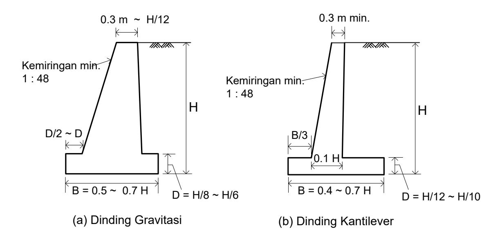

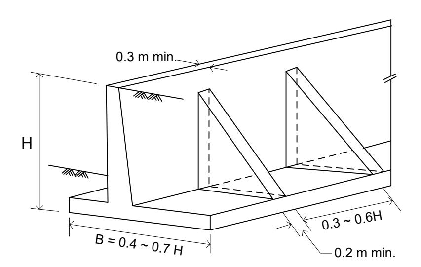

Gambar 35 - Dimensi tipikal dinding penahan tanah

# 10.2.5.2 Faktor-faktor yang perlu diperhatikan dalam perancangan

(c) Dinding Counterfort

Dinding penahan tanah harus dirancang untuk tetap aman terhadap:

- a) Stabilitas guling,
- b) Stabilitas geser lateral,
- c) Daya dukung tanah.

Faktor-faktor lain yang harus diperhatikan di antaranya adalah sebagai berikut.

- a) Kondisi tanah pada lokasi dinding, apakah ada potensi dimana dinding penahan tanah secara keseluruhan ikut mengalami gelincir rotasi/translasi (*global stability*);
- b) Apakah ada lapisan tanah lunak di bawah lapisan tanah yang langsung mendukung dinding penahan tanah, yang dapat menyebabkan dinding mengalami penurunan (jangka panjang), dan mengakibatkan dinding berputar ke belakang.

# **10.2.5.3 Pemeriksaan stabilitas dinding dan faktor keamanan minimum**

Setiap dinding penahan tanah harus diperiksa stabilitasnya terhadap guling*,* geser lateral, dan daya dukung*.*

Faktor keamanan yang disyaratkan adalah sebagai berikut:

- a) Faktor keamanan terhadap guling minimum 2;
- b) Faktor keamanan terhadap geser lateral minimum 1,5;
- c) Faktor keamanan terhadap daya dukung minimum 3;
- d) Faktor keamanan terhadap stabilitas global minimum 1,5;
- e) Faktor keamanan terhadap gempa minimum 1,1.

#### **10.2.6 Sistem drainase**

Untuk meminimalkan tekanan air pada dinding penahan harus diberikan sistem drainase di belakang dinding. Sistem drainase harus memenuhi persyaratan-persyaratan berikut.

- a) Sistem drainase harus terdiri atas material yang mudah mengalirkan air, yang diletakkan dibelakang dinding untuk menangkap air tanah di belakang dinding. Air yang sudah tertangkap oleh material yang mudah mengalirkan air tersebut dibuang keluar dinding melalui *weep hole* dan pipa drainase longitudinal.
- b) *Weep hole* terbuat dari pipa PVC diameter 50 mm disebar pada dinding vertikal dengan kerapatan 1 *weep hole* per 3 m2 luas dinding. Pipa drainase longitudinal terbuat dari PVC berdiameter 150 mm yang diletakkan di ujung bawah belakang dinding vertikal, untuk menangkap air tanah dan membuangnya pada ujung-ujung dinding.
- c) Geotekstil *wick drain* seperti dipakai pada dinding *soil nailing*, dapat menggantikan material yang mudah mengalirkan air.

Gambar 36 memperlihatkan sistem drainase pada dinding penahan tanah.

**© BSN 2017 194 dari 303**

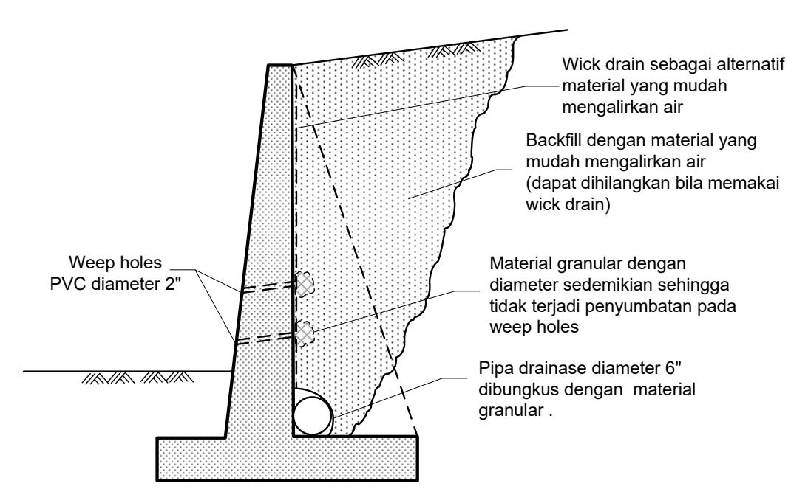

Jika weep holes digunakan pada dinding counterfort paling tidak 1 weep hole harus berada diantara counterforts

**Gambar 36 – Sistem drainase pada dinding penahan tanah** 

# **10.2.7 Sambungan lepas** *(expansion joint)* **dan sambungan kontraksi** *(contraction joint)*

#### **10.2.7.1 Persyaratan perancangan sambungan lepas**

Sambungan lepas *(expansion joint*) adalah sambungan di antara dinding-dinding yang benar-benar terputus, termasuk pembesiannya.

Sambungan ini diberikan pada dinding yang sangat panjang dengan interval 16 m – 25 m. Celah antar sambungan diisi dengan *flexible joint filler/asphaltic spacer/dowel* yang diberi gemuk *(grease)* pada satu sisi. Sambungan ini untuk mengantisipasi ekspansi dinding karena perubahan temperatur yang signifikan.

Praktik sekarang tidak menganjurkan digunakannya sambungan lepas, jika hanya untuk mengatasi perubahan temperatur/ beton *setting* atau mengering.

Sambungan ekspansi disarankan digunakan pada dinding yang sangat panjang dan melewati daerah-daerah dengan kondisi tanah dasar yang berbeda. Sekalipun bisa digunakan dimensi dinding yang sama tetapi dapat diprediksi bahwa perilaku dinding akan berbeda antara sisi sebelah kiri dan sisi sebelah kanan. Pada titik itulah perlu diberikan sambungan lepas.

#### **10.2.7.2 Persyaratan perancangan sambungan kontraksi**

Sambungan kontraksi harus memenuhi persyaratan sebagai berikut:

a) Dinding hanya diberi coakan pada bagian muka dinding selebar 6 mm - 8 mm, dengan dalam 12 mm - 16 mm, dengan maksud agar retakan dinding akibat perubahan

temperatur dan/atau beton *setting*, hanya terjadi sepanjang coakan yang telah dipersiapkan itu.

- b) Pada sambungan kontraksi ini, baik beton maupun pembesiannya tidak terputus.
- c) Sambungan kontraksi ini diberikan dengan interval 8 m 12 m.

Gambar 37 memperlihatkan ilustrasi sambungan lepas dan sambungan kontraksi.

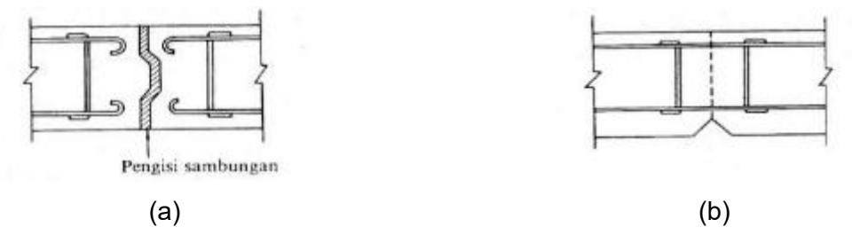

**Gambar 37 – Sambungan pada dinding penahan tanah: (a) sambungan lepas (b) sambungan kontraksi** 

# **10.2.8 Verifikasi perancangan melalui monitoring defleksi/pergerakan dinding**

Dinding penahan tanah tipe gravitasi, semigravitasi dan tipe lain yang termasuk dalam kelompok ini, umumnya dirancang secara konservatif. Umumnya digunakan untuk menahan timbunan tanah untuk badan jalan atau untuk kawasan perumahan. Keruntuhan dinding penahan tanah ini relatif jarang terjadi, dan kalaupun terjadi, didahului dengan deformasi dinding dan tanah di belakangnya, yang besar, yang mudah dideteksi secara visual. Oleh karena itu, standar dan pedoman yang ada pada umumnya tidak membahas mengenai verifikasi perancangan atau program monitoring dinding penahan tanah ini.

Gambar 38 mengilustrasikan beberapa tipe kegagalan dinding penahan tanah yang umum terjadi. Pada kasus (a), dinding penahan tanah seolah-olah berputar; sedangkan pada (b), terjadi pergeseran lateral dinding penahan tanah. Keduanya menyebabkan turunnya tanah di belakang dinding. Pada kasus (c) dan (d), tekanan tanah di belakang dinding menyebabkan deformasi dinding. Jika pada (c) dinding melengkung dengan retakan-retakan kecil, pada (d), dinding mengalami retakan besar atau patah.

Kegagalan-kegagalan seperti pada Gambar 38 adalah sesuatu yang mudah dideteksi secara visual, oleh karena itu monitoring yang dapat dilakukan adalah inspeksi visual, untuk mengetahui ada tidaknya gejala-gejala kegagalan dinding. Jika dikehendaki, karena konsekuensi yang besar jika terjadi kegagalan, maka inspeksi visual ini bisa dilengkapi dengan survei pergerakan dinding dan penurunan tanah menggunakan *total station*.

Frekuensi inspeksi visual dan survei dengan alat *total station* yang dapat dijadikan referensi adalah sebagai berikut:

- a) Setengah tahun ke-1 : 1 kali per 2 minggu;
- b) Setengah tahun ke-2 : 1 kali per bulan;
- c) Tahun ke-3 : 1 kali per 2 bulan bila dirasa masih diperlukan.

**© BSN 2017 196 dari 303**

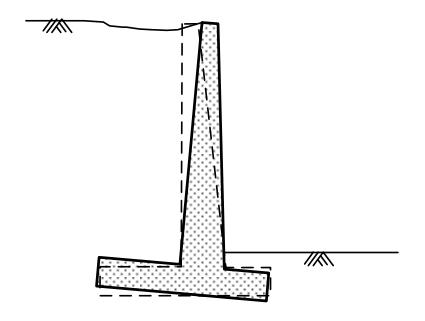

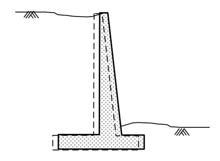

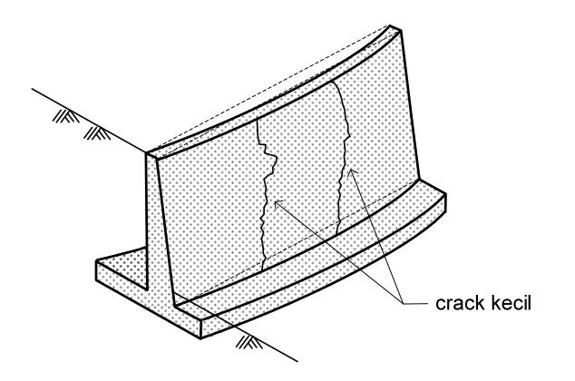

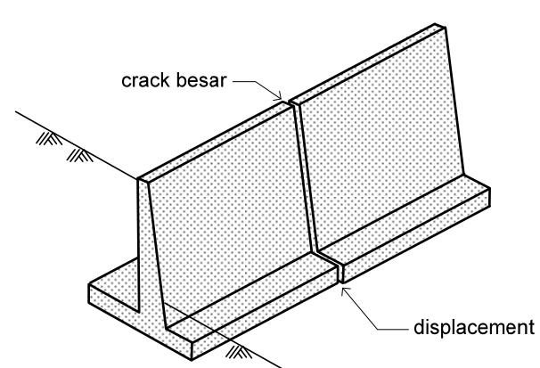

**Gambar 38 – Beberapa moda kegagalan dinding penahan tanah** 

#### *10.3 Embedded walls*

#### **10.3.1 Ruang lingkup pekerjaan** *embedded walls*

Subpasal ini menyajikan persyaratan-persyaratan, nilai-nilai tipikal, dan tata cara perancangan *embedded walls* sebagai struktur penahan tanah, baik yang bersifat sementara maupun permanen. Sekalipun pembahasan lebih banyak mengenai galian, pasal ini berlaku juga untuk *embedded walls* yang menahan tanah timbunan.

#### **10.3.2 Deskripsi**

*Embedded walls* adalah struktur penahan tanah dimana stabilitasnya sebagian atau seluruhnya diperoleh dari tahanan pasif tanah yang terletak di bawah dasar galian. *Embedded walls* ini bisa berbentuk barisan tiang pancang/tiang bor tunggal, baik yang tidak saling bersinggungan, maupun yang saling bersinggungan, bahkan saling berpotongan.

Bentuk lain dari *embedded walls* adalah berupa rangkaian panel/*sheet* yang disusun saling mengunci sehingga membentuk dinding. *Embedded walls* hampir selalu dibuat vertikal,

karena itu adalah salah satu kelebihan sistem struktur penahan tanah ini, yaitu penghematan ruang.

#### **10.3.3 Jenis embedded walls**

Beberapa tipe *embedded walls* yang dibahas pada subpasal ini adalah sebagai berikut:

- a) Dinding *sheetpile* baja,
- b) Dinding *sheetpile* beton, *corrugated* dan *flat*,
- c) Dinding *soldier pile*,
- d) Dinding *contiguous bored pile*,
- e) Dinding *secant pile*,
- f) Dinding diafragma.

Tergantung kedalaman galian, *embedded walls* ini dapat berbentuk kantilever, atau ditunjang oleh satu atau beberapa baris sistem penunjang. Beberapa alternatif sistem penunjang adalah sebagai berikut:

- *a)* Angkur tanah *(ground anchor)*,
- *b) Strutting* baja:
  - 1) *Wall to wall strut (horizontal strut)*,
  - 2) *Rakers* (inclined strut),
- c) Lantai *besmen* terpilih *(selected)*,
- d) Tiang pancang miring dimana tiang menahan gaya aksial tekan (aplikasi terbatas),
- e) *Berm* sementara.

Berbagai tipe *embedded walls* diperlihatkan pada Gambar 39, sedangkan sistem penunjangnya diperlihatkan pada Gambar 40. Pada kasus galian, *embedded walls* dibuat sebelum dilakukan penggalian. Pemasangan sistem penunjang dan penggalian tanah dilakukan secara bergantian sampai penggalian mencapai rencana kedalaman galian.

**© BSN 2017 198 dari 303**

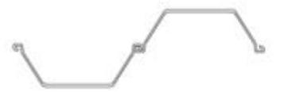

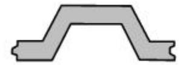

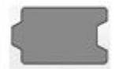

- **a)** *Steel sheetpile* **b)** *Corrugated concrete sheetpile* **c)** *Flat concrete sheetpile*

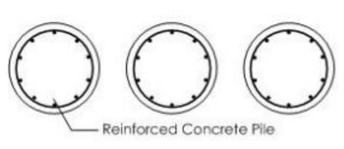

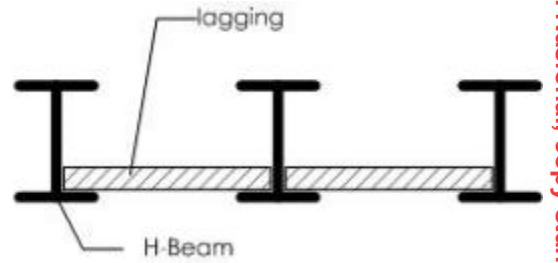

**d)** *Soldier piles*

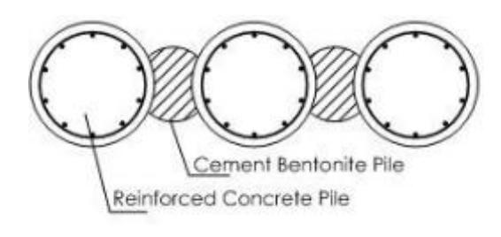

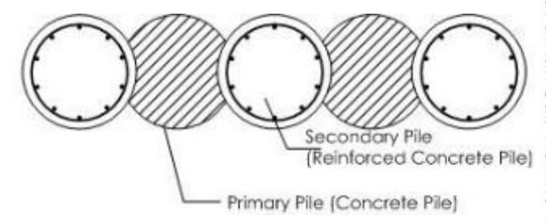

**e) Dinding** *contiguous bored pile* **f) Dinding** *secant pile*

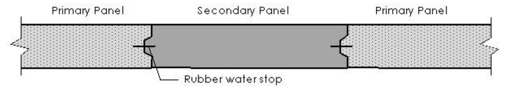

**g) Dinding diafragma**

**Gambar 39 – Berbagai tipe** *embedded walls*

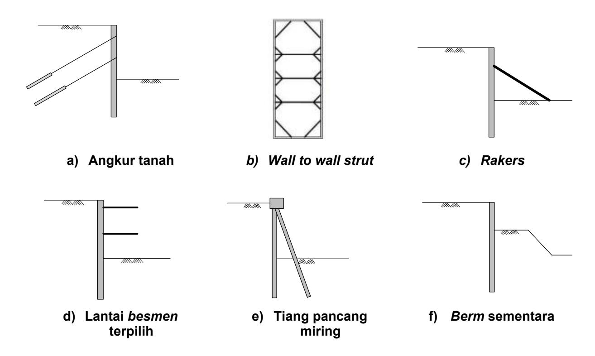

**Gambar 40 – Berbagai tipe sistem penunjang** 

#### **10.3.4 Aplikasi**

*Embedded walls* banyak digunakan untuk mengamankan penggalian besmen dalam, khususnya pada daerah yang padat, karena kelebihannya dalam menghemat ruang dan kecocokannya untuk aplikasi dengan kontrol deformasi yang ketat. Artinya diperlukan *embedded walls* dengan kekakuan yang tinggi. Untuk aplikasi ini karena dituntut dinding yang relatif kedap air, maka pemilihan tipe *embedded walls* ditentukan oleh kemampuan alat pembuat untuk menjaga vertikalitas dinding.

Berdasarkan kemampuannya menjaga vertikalitas, maka di antara *embedded walls* dengan kekakuan yang tinggi, dinding *contiguous bored pile* berada pada urutan paling rendah, disusul oleh dinding *secant pile* pada urutan kedua, dan yang paling baik adalah dinding diafragma. Jadi dinding *contiguous bored pile* hanya disarankan untuk digunakan pada 3 lapis besmen atau kurang, dinding *secant pile* untuk 4 lapis besmen dan dinding diafragma untuk 5 lapis besmen atau lebih.

Aplikasi lainnya dari *embedded walls* adalah untuk pembuatan dinding dermaga *(quay wall).* Umumnya digunakan *sheet pile* baja atau pipa baja dengan kupingan hingga saling mengait antara satu pipa dengan lainnya membentuk dinding yang menerus. Umumnya *quay wall* ini ditunjang oleh 1 baris angkur yang diikat pada *dead man* atau tiang fondasi untuk menahan gaya lateral pada dinding. Aplikasi yang hampir sama adalah digunakannya *sheet pile* baja sebagai dinding perimeter daerah yang akan direklamasi untuk menstabilkan tanah reklamasi.

*Embedded walls* kadang-kadang digunakan untuk menahan timbunan badan jalan dengan prioritas tinggi seperti jalan tol, pada daerah yang sempit dimana tidak memungkinkan menggunakan lereng.

*Embedded walls* seringkali dipakai untuk menstabilkan tanah yang bergerak, misalnya pada daerah yang berbukit. Satu atau beberapa baris dinding *soldier pile* biasa digunakan untuk keperluan ini.

# **10.3.5 Persyaratan teknis** *embedded walls*

# **10.3.5.1 Batasan** *embedded walls* **tipe kantilever**

Aplikasi *embedded walls* kantilever dibatasi hanya untuk kedalaman galian ≤ 6 m, kecuali dilakukan oleh seorang ahli geoteknik yang bekerja dengan penuh kehati-hatian dan penuh tanggung jawab, dimana hasil analisis yang dilakukannya menunjukkan defleksi dinding dalam batas yang aman.

Defleksi yang besar dari *embedded walls* kantilever akan menyebabkan *ground loss* dan penurunan tanah di belakang dinding. Defleksi yang besar dari *embedded walls* kantilever juga dapat menyebabkan kebocoran dinding.

#### **10.3.5.2 Persyaratan sistem penunjang** *(support system)* **dan aplikasinya**

#### **10.3.5.2.1 Angkur tanah**

Selama tidak terhambat oleh masalah izin dari struktur yang berdekatan, angkur tanah selalu merupakan pilihan pertama dibandingkan dengan sistem penunjang lainnya karena alasan biaya dan kelapangan kerja. Selama dilakukan mengikuti standar yang telah baku seperti BS 8081, angkur tanah adalah sistem penunjang yang andal. Angkur tanah memberikan persyaratan perancangan sebagai berikut.

- a) Tipikal spasi horizontal adalah 2 m, sedangkan tipikal spasi vertikal adalah 3 m 5 m. Penentuan level angkur tanah dilakukan sedemikian sehingga tidak bertabrakan dengan level lantai besmen, dan gaya-gaya angkur yang dihasilkan dari analisis dinding, kurang lebih sama antara tiap-tiap baris angkur tanah. Artinya jarak angkur tanah semakin ke bawah semakin kecil, mengantisipasi tekanan tanah yang mendekati bentuk segitiga yang besar di bawah.
- b) Aplikasi *sheet pile* baja dengan sistem penunjang angkur tanah perlu memerhatikan kesetimbangan vertikal dari dinding karena adanya komponen vertikal dari gaya angkur ke arah bawah yang akan menekan dinding ke bawah. Mengingat luas potongan *sheet pile* baja yang kecil, praktis tahanan ujung tidak ada dan tahanan vertikal dinding hanya terbentuk dari friksi pada sisi-sisi dinding.
- c) Gaya prategang sebesar 75 % 100 % gaya angkur hasil analisis pada prinsipnya harus diberikan agar tidak terjadi defleksi yang berlebihan.

Detail mengenai angkur tanah seperti faktor keamanan minimum untuk *tendon*, *groud/grout interface*, *proof test*, dan lainnya dapat dilihat pada 10.6.

#### **10.3.5.2.2** *Strutting* **baja**

Di antara dua pilihan tipe *strutting* baja, *rakers* lebih disukai dibandingkan dengan *wall to wall strut*, mengingat kelapangan ruang kerja yang dihasilkan, namun harus mempertimbangkan alasan-alasan perancangan berikut.

- a) Pemasangan rakers harus didahului dengan penggunaan *berm* sementara agar dapat dilakukan penggalian di tengah sampai rencana dasar galian. Sebagian atau seluruh *ground slab* perlu dicor terlebih dahulu untuk mendukung ujung bawah *rakers*.
- b) Apabila galian cukup dalam maka ruang yang cukup besar sementara tidak bisa digunakan, karena *rakers* membutukan kemiringan ≤ 450 terhadap bidang horizontal agar efektif menahan gaya lateral tekanan tanah.

c) *Wall to wall strut* memiliki bentang yang besar sehingga mengundang bahaya tekuk. Tekuk ke arah horizontal bisa diatasi dengan menggunakan profil baja ganda yang disatukan dengan batang penghubung diagonal. Pada jarak-jarak tertentu, *wall to wall strut* ini didukung oleh *kingpost* baja yang dihubungkan dengan *strut* horizontal menggunakan sambungan sederhana berupa *tack weld* atau diikat dengan menggunakan *rebar* kecil, sehingga bobot *strut* bisa didukung dan *strut* bisa berputar. Dengan demikian seperti perletakan sendi, maka panjang tekuk menjadi pendek dan profil baja yang digunakan sebagai strut bisa menjadi lebih kecil secara signifikan.

Persyaratan-persyaratan lain yang harus dipenuhi pada saat perancangan, adalah:

- a) Spasi horizontal pada *strut* horizontal adalah kurang lebih sama dengan jarak kolom (1 *bay*), sedangkan spasi vertikalnya antara 1- 1,5 kali jarak lantai *besmen*.
- b) Jika dianggap perlu karena menimbulkan gaya *strut* tambahan, perubahan temperatur dapat diperhitungkan.
- c) Gaya prategang sebesar 10% 25% gaya *strut* dan > 20 ton harus diberikan pada *strut* untuk menjamin kontak yang baik antara dinding/waler beam dan *strut*.

# **10.3.5.2.3 Lantai** *besmen* **terpilih**

Lantai *besmen* terpilih digunakan untuk menunjang *embedded walls* selama proses penggalian, dimana digunakan *top-down construction method*. Persyaratan yang harus dipenuhi adalah sebagai berikut.

- a) Jarak vertikal antara 2 lantai *besmen* terpilih yang berurutan adalah 2 lapis *besmen* atau sekitar 7 m. Berarti ada satu lantai *besmen* di antara 2 lantai *besmen* terpilih yang tidak dicor selama penggalian. Ini memberikan ruang kerja bagi alat-alat penggali, seperti *backhoe*.
- b) Pemilihan lantai *besmen* yang dicor dilakukan sedemikian sehingga bidang momen maksimum atau minimum sepanjang dinding kurang lebih sama, tidak ada yang mencolok besar.
- c) Lantai *besmen* terpilih yang terletak paling atas harus tidak terlalu jauh dari permukaan tanah agar defleksi awal tidak terlalu besar, dan *ramp* sementara untuk manuver truk masuk atau keluar daerah galian mudah dibuat.
- d) Karena *ground slab* yang tebal dapat mencapai sekitar 3 m, kadang-kadang perlu diberikan *berm* sementara pada bagian bawah untuk memungkinkan penggalian sampai kedalaman galian rencana, agar defleksi dinding pada level rencana galian tidak terlalu besar.

#### **10.3.5.2.4 Tiang pancang miring di muka dinding**

Persyaratan perancangan berikut berlaku untuk tiang pancang miring di muka dinding.

- a) Prinsipnya sama dengan angkur tanah. Jika angkur tanah menahan gaya tarik akibat tekanan tanah pada dinding, tiang pancang miring menahan gaya tekan. Jika angkur tanah diletakkan di belakang dinding, tiang pancang miring diletakkan di muka dinding.
- b) Tiang pancang miring di muka dinding menyebabkan terbatasnya penggunaan area di muka dinding. Karena itu penggunaan tiang pancang miring ini kurang disukai.
- c) Karena kekakuannya yang relatif besar, maka spasi horizontal tiang pancang miring ini sama atau lebih besar dari angkur tanah.

**© BSN 2017 202 dari 303**

d) Pemakaian tiang pancang miring ini juga dibatasi oleh panjang tiang pancang yang tersedia, sedangkan kemiringan tiang dibatasi oleh kemampuan alat pancang memancang miring.

#### **10.3.5.2.5** *Berm* **sementara**

*Berm* sementara adalah penahan dinding sementara terbuat dari tanah setempat, agar bisa menggali sampai kedalaman galian rencana, tanpa defleksi dinding yang berlebihan. Maksud dari digunakannya *berm* sementara pada dinding tipe kantilever adalah untuk memperpendek bagian dinding yang merupakan *free cantilever*. Persyaratan untuk perancangan *berm* sementara adalah sebagai berikut.

- a) Berm sementara hanya bisa digunakan kalau tanah pada level rencana *berm* sementara cukup kuat untuk menjaga stabilitas dirinya sendiri.
- b) Level atas dari *berm* sementara ditentukan sedemikian sehingga panjang *free cantilever* di atas *berm* sementara maksimum 6 m, sedangkan dimensinya ditentukan sedemikian sehingga *berm* sementara bisa memberikan tahanan tanah pasif, artinya batas atas dari *berm* sementara berada di luar dari *passive rupture line* pada ketinggian tersebut. Lebar batas bawah dari *berm* ditentukan sedemikian sehingga kemiringan lereng yang menghubungkan batas atas dan batas bawah dapat menjaga stabilitas *berm* itu, sesuai dengan kuat geser tanah pada level tersebut.
- c) Untuk penggunaan *berm* sementara yang lain seperti diuraikan pada 10.3.5.2.3, dimensi *berm* sementara ditentukan sama seperti diuraikan di atas.
- d) Permukaan *berm* perlu dilindungi dari pengaruh cuaca dengan cara menutupinya memakai beton semprot atau lembaran plastik.

#### **10.3.5.3 Faktor-faktor yang perlu diperhatikan dalam perancangan dan konstruksi**

#### **10.3.5.3.1 Profil tanah desain**

Untuk menjamin analisis yang akurat, maka harus diperoleh profil tanah yang akurat sepanjang perimeter galian, mencakup lapisan-lapisan tanah yang terpengaruh oleh rencana *embedded walls*. Untuk itu, posisi titik bor harus ditempatkan sepanjang perimeter galian dalam jumlah yang cukup dengan memerhatikan variasi tanah tanah pada lokasi proyek, sehingga dapat diperoleh profil tanah yang akurat sepanjang perimeter galian.

Kedalaman titik-titik bor harus ditentukan sedemikian rupa sehingga mencakup lapisanlapisan tanah yang terpengaruh oleh rencana *embedded walls*.

#### **10.3.5.3.2 Kedalaman galian desain**

Analisis *embedded wall* harus memperhitungkankan kedalaman galian di luar rencana, sehingga analisis harus dilakukan untuk kedalaman rencana ditambah kedalaman galian di luar rencana. Adapun kedalaman galian di luar rencana adalah sebagai berikut:

- a) Dinding kantilever: 10% H ≤ 0,5 m, dimana H adalah kedalaman galian rencana,
- b) Dinding dengan sistem penunjang: 10% jarak penunjang terbawah ke dasar galian rencana ≤ 0,5 m,
- c) Parit drainase atau parit untuk kegunaan lainnya di depan dinding harus diperhitungkan sebagai bagian dari kedalaman galian rencana (BS 8002).

# **10.3.5.3.3 Perubahan lingkungan sekitar**

Untuk *embedded walls* yang bersifat permanen, perubahan lingkungan sekitar yang bisa diketahui, harus diperhitungkan, misalnya kemungkinan adanya penggerusan di depan *embedded walls*, atau penggalian maupun penimbunan di sekitar lokasi proyek yang dapat berakibat pada rencana *embedded walls*.

# **10.3.5.4 Gaya-gaya yang bekerja**

#### **10.3.5.4.1 Beban tambahan**

Kecuali ditentukan lain, beban tambahan minimum 1 t/m2 harus dianggap bekerja di atas permukaan tanah, merepresentasikan beban alat gali, tanah galian sebelum diangkut, dan lainnya.

# **10.3.5.4.2 Tekanan tanah aktif/pasif**

Tekanan tanah aktif bekerja pada dinding akibat tanah di belakang dinding dengan beban tambahan, sedangkan tahanan pasif tanah bekerja pada bagian muka dinding, pada daerah galian. Tekanan tanah ini dapat dihitung dengan menggunakan metode Rankine/Coulomb, atau metode lainnya, seperti *log spiral method*.

#### **10.3.5.4.3 Tekanan air**

Tekanan air setinggi muka air tanah desain bekerja pada bagian belakang dinding, sedangkan tekanan air setinggi 1m di bawah dasar galian bekerja pada bagian muka dinding, pada daerah galian. Tekanan air ini dapat dihitung seolah-olah air diam tidak mengalir (tekanan air hidrostatik), dan tekanan air ini berada pada sisi konservatif.

Alternatifnya, air dianggap mengalir dari muka air tanah yang tinggi menuju muka air tanah yang rendah *(steady state flow),* sehingga tekanan air lebih kecil dari tekanan air hidrostatik. Untuk galian yang dalam, tekanan air hidrostatik memberikan hasil perancangan yang sangat konservatif.

#### **10.3.5.4.4 Gaya prategang**

Gaya prategang sebesar 75 % – 100 % gaya angkur harus diberikan pada setiap angkur tanah produksi.

Gaya prategang sebesar 10 % – 25 % gaya strut dan > 20 ton harus diberikan pada setiap *strut*, baik yang miring maupun yang horizontal, untuk menjamin kontak yang baik antara dinding atau *waller beam* dengan *struts*.

# **10.3.5.4.5 Gaya-gaya khusus**

Gaya khusus adalah gaya yang bekerja sebagai konsekuensi dari aplikasi *embedded walls* yang khusus. Gaya-gaya tersebut harus dimasukkan dalam analisis *embedded wall* sesuai dengan spesifikasinya. Sebagai contoh gaya-gaya khusus ini adalah gaya *bollard* pada *quay wall,* karena biasanya *bollard-bolard* kecil untuk menambat kapal diletakkan di atas *capping beam* dari *quay wall*.

**© BSN 2017 204 dari 303**

# **10.3.6 Dasar analisis dan perancangan**

#### **10.3.6.1 Diagram alir perancangan**

Diagram alir perancangan *embedded walls* diperlihatkan pada Gambar 41. Prinsipnya proses perancangan dimulai dengan menentukan prakiraan awal dimensi dinding, sistem penunjang, parameter tanah dan muka air tanah, dan lainnya. Selanjutnya dilakukan analisis dan hasil analisis dibandingkan dengan kriteria-kriteria seperti stabilitas dinding, stabilitas dasar galian, defleksi maksimum, kecukupan dimensi dinding, dan sebagainya. Bila ada kekurangan, lakukan perubahan dan lakukan kembali analisis dinding. Proses ini terus berlangsung sehingga seluruh kriteria terpenuhi.

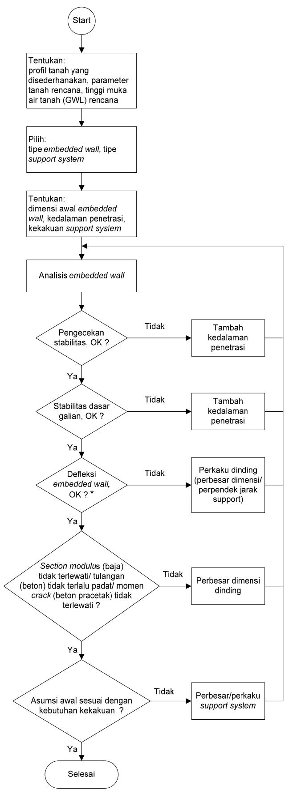

Catatan: \*) Langkah ini tidak dapat dilakukan jika analisis dilakukan secara manual

**Gambar 41 - Diagram alir perancangan** *embedded walls*

**© BSN 2017 206 dari 303**

# **10.3.6.2 Metode analisis kesetimbangan batas**

Metode analisis kesetimbangan batas dapat digunakan untuk menganalisis *embedded walls* dengan beberapa keterbatasan, yaitu:

- a) Tidak bisa mendapatkan defleksi dinding,
- b) Hanya bisa digunakan untuk menganalisis dinding kantilever dan dinding dengan satu baris penunjang.

Memerhatikan keterbatasan tersebut, metode analisis kesetimbangan batas ini hanya boleh digunakan pada *embedded walls* dengan lingkungan sekitar yang tidak padat dan/atau tidak sensitif terhadap defleksi *embedded walls*.

Di dalam kelompok analisis dan desain ini dikenal beberapa metode, di antaranya adalah:

- a) *Free earth support method*,
- b) *Fixed earth support method (equivalent beam method)*,
- c) *Rowe's moment reduction method*.

#### *a. Free earth support method*

*Free earth support method* berdasarkan asumsi bahwa tanah di bagian bawah dinding tidak mampu untuk memproduksi tahanan pasif sebesar yang dibutuhkan untuk menimbulkan momen negatif. Dinding dianggap cukup kaku sehingga tidak terbentuk *pivot point* di bawah dasar galian/*dredged line*, artinya tidak terbentuk tahanan pasif di belakang dinding. Jadi metode ini digunakan untuk memodelkan *embedded walls* dengan satu baris sistem penunjang. Bentuk tekanan diagram tipikal untuk tanah berbutir adalah seperti Gambar 42.

Dengan asumsi kesetimbangan gaya horizontal dan kesetimbangan momen pada level penunjang, dapat dihitung gaya lateral pada sistem penunjang, kedalaman penetrasi, dan gaya-gaya dalam maksimum.

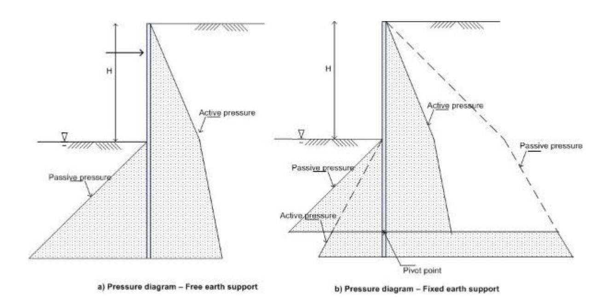

**Gambar 42 – Diagram tekanan untuk** *free earth support* **dan** *fixed earth support* 

**© BSN 2017 207 dari 303** 

# *b. Fixed earth support method*

*Fixed earth support method* dipakai untuk memodel dinding kantilever, dimana terbentuk pivot point di bawah dasar galian / *dredged line*. Tahanan pasif terbentuk di belakang dinding. Diagram tekanan untuk *fixed earth support-*tanah *granular* disajikan pada Gambar 42b.

# **c.** *Rowe's moment reduction method*

*Steel sheetpile* relatif fleksibel, sehingga tekanan tanah berbeda dengan distribusi hidrostatik. Telah ditemukan bahwa momen pada *sheetpile* berkurang dengan bertambahnya fleksibilitas *sheetpile*. Rowe mengembangkan untuk tanah *granular* hubungan antara derajat fleksibilitas *anchored wall* ρ = (H + D)4 / EI dengan rasio momen desain/ momen maksimum untuk mengoreksi momen maksimum yang dihasilkan dari *free earth support method*. H adalah kedalaman galian, D adalah kedalaman penetrasi (*penetration depth*), E adalah modulus elastisitas *sheetpile* dan I adalah momen inersia *sheetpile*.

Dengan cara yang sama, Rowe mengembangkan untuk tanah kohesif hubungan antara *stability number*, S, dengan rasio momen desain / momen maksimum untuk mengoreksi momen makasimum yang dihasilkan dari *free earth support method*.

Dengan berkurangnya momen, maka diperoleh profil *sheetpile* yang lebih kecil.

#### **10.3.6.3 Metode analisis** *beam column*

Metode analisis *beam column* pada prinsipnya adalah analisis *beam on elastic foundation*. Dalam analisis ini dinding dianggap sebagai balok linear elastik dengan kekakuan EI yang menahan tekanan aktif tanah dan air. Balok tersebut didukung oleh tahanan pasif tanah di bawah dasar galian yang dimodelkan sebagai pegas *(spring)* linear atau nonlinear terhadap defleksi dinding, dan pegas linear dari sistem penunjang.

Dengan menggunakan metode beda hingga, analisis dilakukan untuk mendapatkan defleksi dinding, gaya-gaya dalam dinding, dan reaksi sistem penunjang (Gambar 43).

**© BSN 2017 208 dari 303**

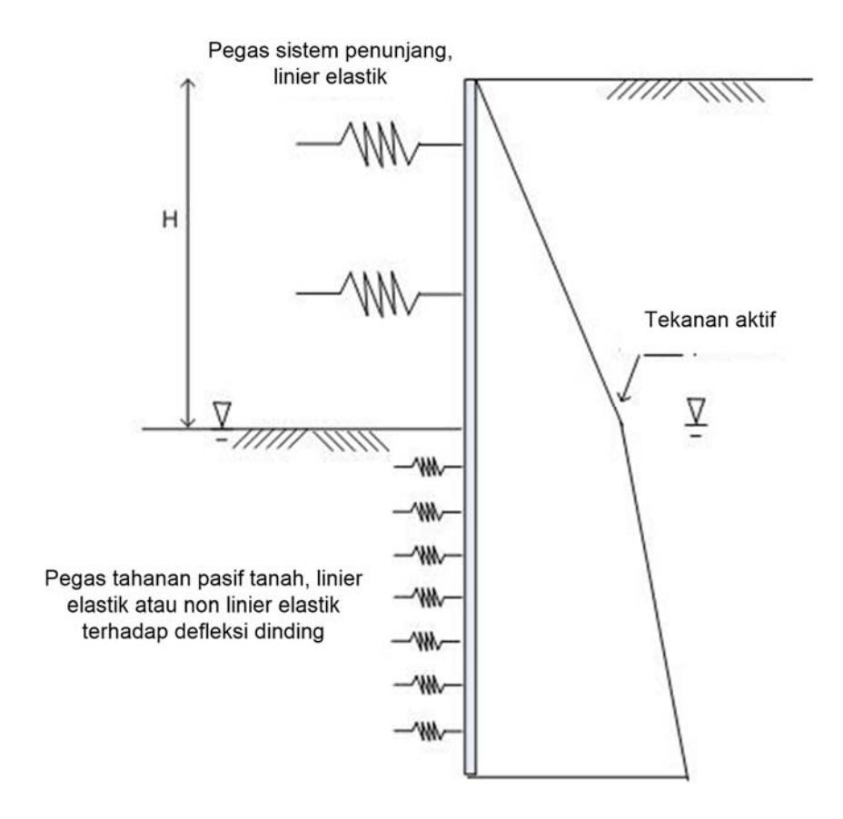

**Gambar 43 - Ilustrasi** *beam column model*

#### **10.3.6.4 Metode analisis elemen hingga**

Pada analisis dengan metode elemen hingga, tanah dimodelkan sebagai *continuum mass* dengan parameter tertentu. Penggalian dimodelkan sebagai pengurangan massa, sedangkan *embedded wall* dimodelkan dengan memasukkan elemen pelat dengan parameter EI dan EA. Sistem penunjang *(support system)* dimodelkan sebagai pegas dengan parameter E, A dan L yang diberi gaya prategang 75% – 100% gaya angkur.

Ketidaksetimbangan tanah akibat penggalian menyebabkan pergerakan massa tanah, defleksi dinding, timbulnya gaya-gaya dalam pada dinding, dan timbulnya reaksi sistem penunjang. Analisis dilakukan akibat penggalian untuk mendapatkan nilai defleksi dinding, gaya-gaya dalam dan reaksi penunjang tersebut. Bersamaan dengan penggalian, muka air tanah di dalam galian akan turun. Aliran air dapat dimodelkan sebagai garis freatik *(phreatic line)* atau *steady state flow*. Untuk galian yang dalam, *steady state flow* harus digunakan agar tidak terlalu konservatif.

Telah tersedia beberapa model tanah dari yang paling sederhana, yaitu model Mohr-Coulomb, sampai dengan yang kompleks, yaitu *hardening soil model with small strain*. Jika menggunakan model Mohr-Coulomb harus hati-hati karena model ini hanya memberikan nilai E yang tetap, sedangkan nilai E yang sebenarnya tergantung dari besar tegangan. Jadi pada model Mohr-Coulomb tidak terjadi peningkatan nilai E pada tanah di bawah dasar galian. Beberapa ahli merekomendasikan penggunaan E yang lebih tinggi pada tanah di

bawah dasar galian, yaitu menggunakan nilai Eur (E *unloading-reloading*). Korelasi antara Eur dan E50 *(secant stiffness in standard triaxial test)* adalah Eur = (2--10) E50 tergantung pada nilai OCR (*overconsolidation ratio*). Aliran air dimodelkan sebagai *steady state flow*. Beban tambahan sebesar 1 t/m2 selebar 10 m diberikan di luar galian.

# **10.3.6.5 Kuat geser terdrainase dan tak terdrainase**

Pada prinsipnya analisis *embedded wall* harus dilakukan dengan menggunakan parameter tanah yang menghasilkan kondisi yang paling kritis. Jika tidak diketahui pasti kuat geser mana, apakah kondisi tak terdrainase atau terdrainase yang akan menghasilkan kondisi kritis, analisis harus dilakukan untuk kedua kuat geser tersebut, artinya analisis dilakukan baik untuk kondisi jangka panjang maupun jangka pendek.

Pada analisis jangka panjang (*drained, long term condition*), selain kuat geser tanah, kondisi pengaliran air tanah sangat berpengaruh terhadap hasil analisis dinding. Aliran air tanah yang dimodelkan sebagai garis freatik akan memberikan hasil analisis yang lebih kritis dibandingkan dengan aliran air tanah yang dimodel sebagai *steady state flow*.

#### **10.3.6.6 Penentuan muka air tanah desain**

# **10.3.6.6.1 Untuk dinding permanen/pada umur layan**

Muka air tanah berfluktuasi mengikuti musim, dan berbentuk kurva sinus, jadi ada puncak tertinggi dan ada titik terendah. Muka air tanah rencana adalah muka air tanah tertinggi, oleh karena itu perlu diperhatikan kapan penyelidikan tanah dilakukan, agar tidak mendapatkan data yang salah. Sebagai referensi, fluktuasi muka air tanah musiman, antara level tertinggi dengan level terendah di Jakarta Selatan mencapai sekitar 5 m.

Idealnya untuk mendapatkan muka air tanah rencana harus dilakukan pengamatan muka air tanah selama satu siklus musim hujan dan musim kering. Jika tidak ada data tersebut, perlu dilakukan survei muka air tanah sumur-sumur sekitar lokasi proyek. Ini berlaku untuk daerah yang tidak mengalami kebanjiran. Jika lokasi proyek sering mengalami banjir, muka air tanah rencana harus diambil rata dengan permukaan jalan.

#### **10.3.6.6.2 Untuk dinding sementara / pada masa konstruksi**

Jika pengamatan muka air tanah dilakukan pada musim yang sama dengan musim saat konstruksi, muka air tanah tertinggi saat pengamatan dapat diambil sebagai muka air tanah desain. Jika pengamatan muka air tanah dilakukan pada musim yang berbeda dengan musim saat konstruksi, maka muka air tanah desain sama dengan muka air tanah tertinggi selama pengamatan ditambah perkiraan penambahan tinggi muka air tanah berdasarkan data-data sumur setempat.

#### **10.3.6.7 Pemeriksanaan stabilitas dasar galian (pada kasus galian)**

Selain memenuhi persyaratan stabilitas dinding, perancangan *embedded walls* harus memenuhi persyaratan stabilitas dasar galian dari bahaya *basal heave, blow in,* dan *piping*.

#### *10.3.6.7.1 Basal heave*

*Basal heave* adalah mengalirnya tanah ke dalam galian sebagai akibat terganggunya kesetimbangan daya dukung tanah pada level ujung bawah *embedded wall*. Dalam

**© BSN 2017 210 dari 303**

melakukan pemeriksaan tehadap bahaya *basal heave* perlu diperhitungkan adanya beban tambahan.

Dasar galian dinyatakan aman terhadap *heave* bila FK *heave* ≥ 1,25.

# *10.3.6.7.2 Blow-in*

Blow-in dapat terjadi bila tanah pada dasar galian merupakan lapisan lempung (kedap air) yang relatif tipis dan di bawahnya terdapat lapisan berbutir (pasir, kerikil) yang merupakan *confined aquifer.* Berat lapisan kedap air tersebut tidak dapat mengimbangi tekanan air ke atas pada lapisan berbutir di bawahnya, sehingga pecah dan terdorong ke atas.

Dasar galian dinyatakan aman terhadap *blow-in* bila FK *blow-in* ≥ 1,25.

# *10.3.6.7.3 Piping (quick condition, sand boiling***)**

Potensi *piping* ada bila jenis tanah pada dasar galian adalah pasir. *Piping* terjadi bila *exit gradient* melebihi *critical hydraulic gradient*. Keadaan ini menyebabkan rusaknya dasar galian seperti mendidih.

Dasar galian aman terhadap *piping* bila FK *piping* ≥ 1,5.

# **10.3.7 Berbagai moda keruntuhan/kegagalan dinding**

*Embedded walls* harus dirancang sehingga tidak terjadi keruntuhan/kegagalan dinding seperti diilustrasikan pada Gambar 44, yaitu berupa defleksi berlebih pada puncak dinding kantilever, *toe kick-off* pada dinding berangkur, kegagalan dinding akibat ketidakseimbangan gaya vertikal, *deep seated failure*, dan kegagalan-kegagalan yang bersifat struktural, baik pada dindingnya sendiri maupun pada *tie rod.* 

**© BSN 2017 211 dari 303** 

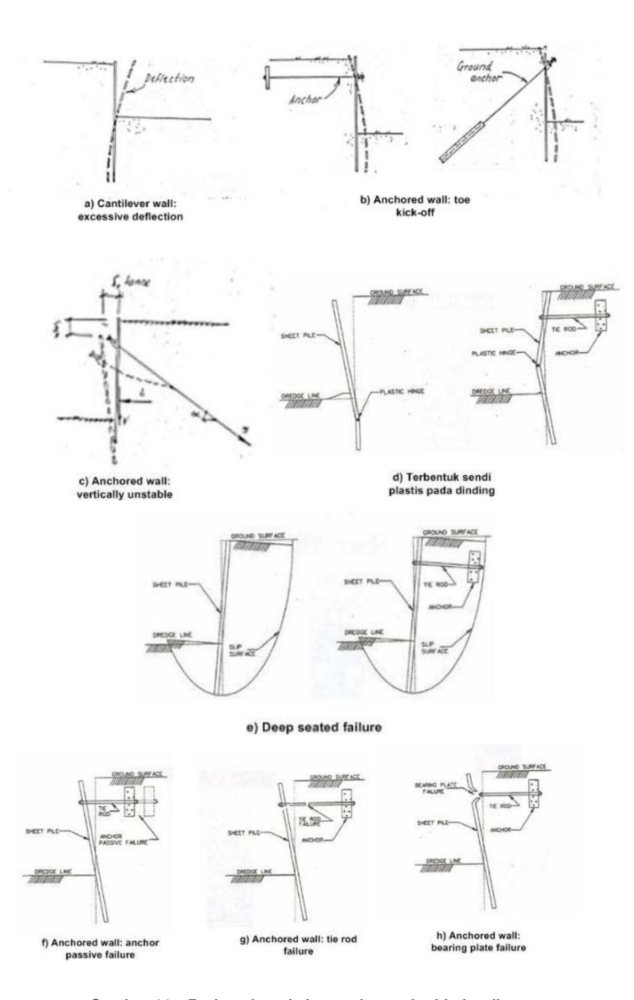

**Gambar 44 – Berbagai moda kegagalan** *embedded walls*

**© BSN 2017 212 dari 303**

# **10.3.8 Toleransi penurunan muka air tanah dan toleransi defleksi dinding**

#### **10.3.8.1 Toleransi penurunan muka air tanah**

Penurunan muka air tanah di sekitar lokasi proyek akibat penggalian tidak akan berpengaruh terhadap bangunan di sekitar proyek selama fluktuasi muka air tanah akibat penggalian berada di dalam rentang (*range*) fluktuasi musiman, artinya elevasi muka air tanah tidak lebih rendah dari muka air tanah musiman terendah. Ini terjadi karena penurunan air tanah di dalam rentang fluktuasi musiman tidak akan menyebabkan penurunan tanah.

Sebagai informasi, fluktuasi muka air tanah musiman, antara level tertinggi dengan level terendah berdasarkan hasil monitoring selama 1,5 tahun di Jakarta Selatan, mencapai sekitar 5 m.

Jika tidak ada data fluktuasi musiman, harus dianggap bahwa toleransi penurunan muka air tanah adalah 2 m dari permukaan awal. Penurunan muka air tanah lebih besar dari 2 m akan menyebabkan terjadinya penurunan tanah. Perencana harus membuktikan bahwa penurunan tanah akibat penurunan muka air tanah tersebut tidak mengganggu bangunan sekitar.

# **10.3.8.2 Toleransi defleksi dinding**

Toleransi defleksi dinding sangat tergantung pada kepadatan lingkungan sekitar. Dengan demikian tidak ada suatu nilai defleksi maksimum yang berlaku secara umum.

Jika lingkungan sekitar tidak mensyaratkan defleksi maksimum yang lebih ketat, defleksi maksimum 0,5% H harus dianggap sebagai batas toleransi defleksi dinding.

# **10.3.9 Verifikasi perancangan: monitoring pergerakan dinding, tanah di sekitar galian, dan penurunan muka air tanah.**

# **10.3.9.1 Umum**

Monitoring pergerakan dinding dan tanah di sekitar galian, penurunan muka air tanah di sekitar, pergerakan bangunan terdekat, dll. dilakukan sebagai *early warning system*, agar tidak terjadi kegagalan tiba-tiba. Hasil monitoring dibandingkan dengan batas maksimum *(threshold limit)* yang ditetapkan perencana berdasarkan hasil analisis dan pengamatan kondisi sekitar. Selain nilai mutlak pergerakan, kecepatan pergerakan juga menjadi dasar penentu apakah perlu diambil tindakan atau tidak. Jumlah dan jenis instrumentasi yang dipakai monitoring sangat menentukan sukses tidaknya suatu program monitoring. Persyaratan untuk menentukan jumlah dan jenis instrumentasi harus memenuhi persyaratan berikut:

- a) Jumlahnya ditentukan sedemikian sehingga kerusakan satu alat tidak menyebabkan hilangnya kesempatan mendapatkan data;
- b) Jenis instrumentasi ditentukan sedemikian sehingga memungkinkan dilakukannya cek silang pembacaan suatu instrumentasi dengan pembacaan instrumentasi lainnya.

#### **10.3.9.2 Tipikal instrumentasi**

Tipikal instrumentasi untuk pekerjaan galian adalah sebagai berikut.

a) Inklinometer untuk memonitor pergerakan *embedded wall* sepanjang kedalamannya. Inklinometer ini dipasang pada dinding tersebut. Paling tidak inklinometer dipasang di tengah-tengah sisi panjang, atau pada sisi yang dekat dengan bangunan eksisting.

Tentatif, inklinometer juga dipasang pada tanah di belakang dinding untuk memonitor pergerakan tanah di belakang dinding. *Ground inclinometer* ini dipasang pada daerah yang berpotensi mengalami pergerakan/penurunan akibat *ground loss*.

- b) *Water standpipe*, untuk mengukur penurunan muka air tanah di luar galian. Paling tidak *water standpipe* ini dipasang untuk mengetahui garis freatik di luar galian, pada dua sisi galian yang saling tegak lurus. Karena itu dua seri *water standpipe* dipasang satu pada tiap-tiap sisi. Jika kondisi lapangan memungkinkan, satu seri *water standpipe* terdiri atas tiga *water standpipe* yang dipasang pada satu garis yang tegak lurus sisi galian, pada jarak yang berbeda dari tepi galian.
- c) Pengukuran defleksi pada puncak dinding dengan menggunakan teodolit dan *deflection markers*, dimana *deflection marker* dipasang pada jarak-jarak tertentu sepanjang puncak *capping beam*.
- d) Pengukuran pergerakan tanah di sekitar galian dan di sekitar bangunan terdekat menggunakan teodolit dan *settlement markers*.
- e) Tentatif bisa juga ditambahkan pengukuran pergerakan kolom bangunan terdekat dengan menggunakan *tilt meter*.
- f) Untuk kedalaman galian lebih dari tiga lapis *besmen*, pengukuran fluktuasi gaya angkur/*strut* harus dilakukan dengan memasang *load cell* pada kepala angkur/*strut*. Pengukuran fluktuasi gaya angkur/*strut* ini harus dilakukan pada 5% jumlah angkur/*strut* produksi.
- g) Tentatif dapat dipasang ekstensometer untuk mengukur naiknya dasar galian. Tetapi sangat jarang monitoring berjalan baik karena gangguan alat-alat berat yang hilir mudik di area galian.

#### **10.3.9.3 Frekuensi monitoring**

Frekuensi monitoring mengikuti aktivitas penggalian, artinya semakin padat aktivitas penggalian, semakin rapat frekuensi monitoring. Sebaliknya, semakin longgar aktivitas penggalian, semakin jarang frekuensi monitoring.

Frekuensi monitoring minimal 2 kali per minggu pada saat penggalian intensif. Frekuensi monitoring dapat dikurangi sesuai dengan kepadatan aktivitas penggalian. Frekuensi monitoring tersebut berlaku untuk semua jenis instrumentasi.

**© BSN 2017 214 dari 303**

# *10.4 Soil nailing*

#### **10.4.1 Ruang lingkup pekerjaan** *soil nailing*

Subpasal ini menyajikan persyaratan material, nilai-nilai tipikal, dan tata cara perancangan sistem *soil nailing* sebagai perkuatan lereng, baik yang bersifat sementara maupun permanen. Sekalipun pembahasan lebih banyak mengenai lereng galian, tetapi subpasal ini berlaku juga untuk lereng timbunan.

#### **10.4.2 Deskripsi**

*Soil nailing* adalah sistem perkuatan lereng yang bersifat pasif, artinya tanpa gaya prategang. Sistem perkuatan ini utamanya terdiri atas sejumlah *nail bar* yang dipasang di dalam tanah dengan cara dibor atau dipancang/ditekan, dan dinding muka berupa beton semprot yang diperkuat *(reinforced shotcrete)* sebagai komponen dasar dinding muka.

*Nail bar* tersebut dipasang dengan sudut kemiringan mendekati horizontal. Kepala *nail* tersambung dengan dinding muka dengan perantara *bearing plate* yang diletakkan di atas dinding muka dan baut pengikat, sehingga tekanan tanah pada dinding muka dapat diteruskan ke *nail bar*. Gambar 45 menyajikan potongan tipikal dinding *soil nailing* dan detail di sekitar kepala *nail*.

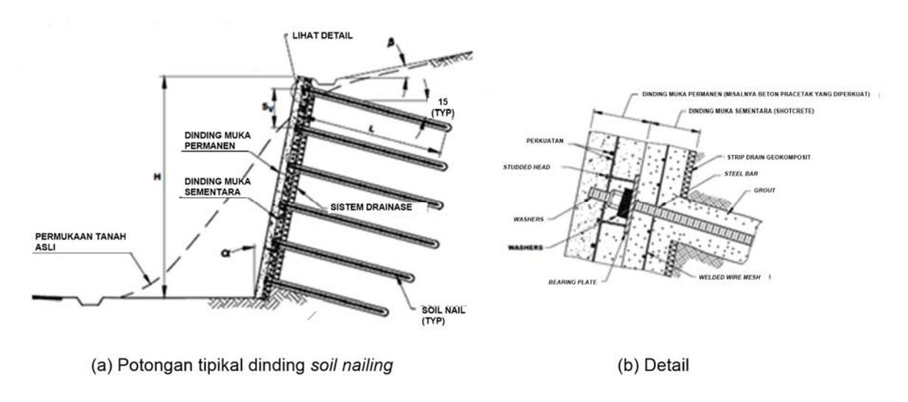

**Gambar 45 – Potongan tipikal dinding** *soil nailing* **dan detail sekitar kepala** *nail* **(FHWA0-IF-03-017)**

#### **10.4.3 Pertimbangan lain dalam perancangan**

Di samping kelebihannya dalam hal biaya konstruksi dan kemudahan pelaksanaan dibandingkan dengan sistem dinding penahan tanah lainnya, dinding *soil nailing* juga mempunyai kekurangn, yaitu tidak cocok untuk aplikasi dengan kontrol deformasi yang ketat. Karena sesuai dengan sifatnya yang merupakan perkuatan tanah pasif, dinding *soil nailing* ini membutuhkan deformasi untuk memobilisasi tahanan tanah sepanjang *nail*.

*Soil nailing* dapat digunakan untuk stabilisasi lereng galian, baik yang bersifat sementara maupun permanen. *Soil nailing* juga biasa digunakan untuk stabilisasi lereng timbunan, baik untuk badan jalan raya, jalan kereta api, maupun aplikasi lainnya. Aplikasi lainnya dari *soil nailing* adalah memperkuat dinding penahan tanah eksisting.

"*Drilled and grouted soil nailing*" dapat digunakan sebagai struktur sementara maupun struktur permanen, setelah dilengkapi dengan antikorosi. Di lain pihak, "*driven/pushed soil nailing"* hanya dapat digunakan sebagai struktur sementara karena sifatnya yang mudah

kena korosi, dan hanya cocok untuk perkuatan lereng yang reatif rendah, karena *nail bar* pada *soil nailing* tipe ini relatif pendek. Oleh karena itu, *"drilled and grouted soil nailing"* lebih sering diaplikasikan di lapangan. Gambar 46 menyajikan tipikal tahapan pelaksanaan "*drilled and grouted soil nailing".* 

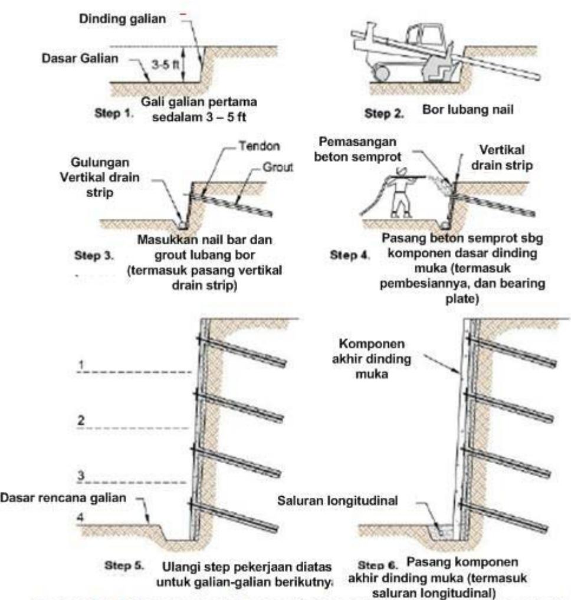

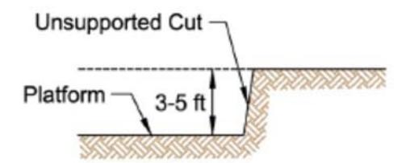

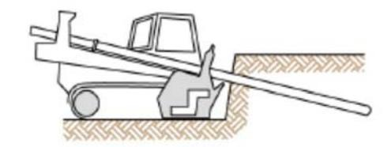

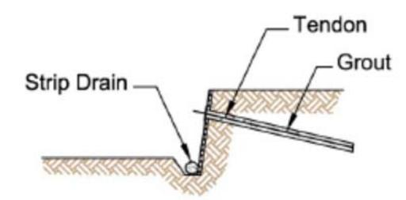

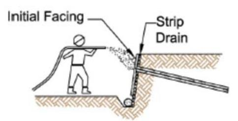

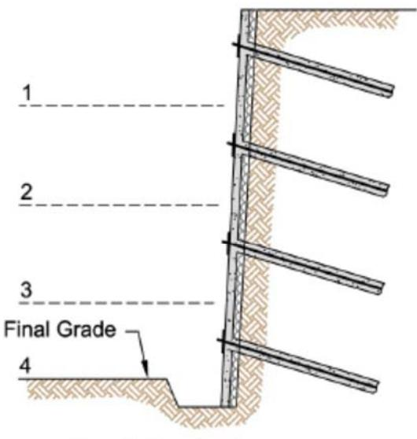

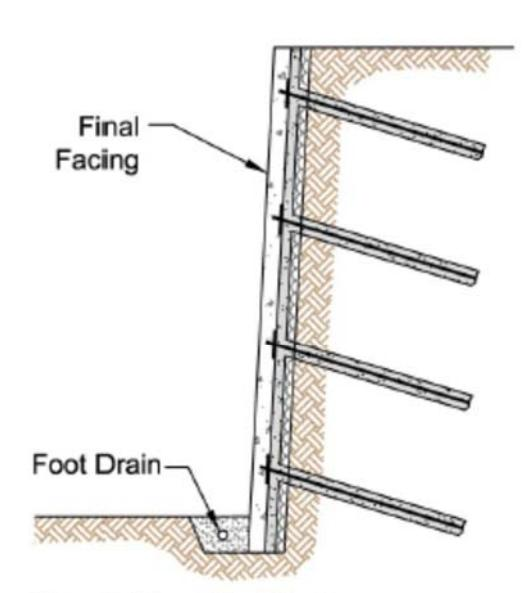

**Gambar 46 – Tipikal tahapan pelaksanaan dinding** *soil nailing* **(***drilled and grouted soil nailing)* **(FHWA-NHI-14-007)** 

#### *10.4.4* **Persyaratan teknis** *soil nailing*

## **10.4.4.1 Nilai-nilai tipikal komponen dinding** *soil nailing*

#### **10.4.4.1.1 Kemiringan dinding**

Kemiringan dinding akan sedikit memperpendek kebutuhan panjang *nail bar.* Kemiringan 10% dari vertikal (~800 terhadap bidang horizontal) mengurangi kebutuhan panjang *nail bar* 10% sampai dengan 15% dibandingkan dengan dinding yang tegak. Kemiringan tipikal dinding *soil nailing* berkisar antara 800 sampai dengan 900 terhadap bidang horizontal.

#### **10.4.4.1.2 Kemiringan** *nail*

Kemiringan tipikal *nail bar* berkisar antara 100 sampai dengan 200 di bawah bidang horizontal. Kemiringan *nail bar* < 100 harus dihindari karena akan menyebabkan terbentuknya pori (*void*) di dalam *grout*, yang akan mengurangi kapasitas tarik *nail* dan menurunkan proteksi terhadap korosi. Sebaliknya, kemiringan *nail bar* yang besar menyebabkan *nail* tidak efektif menahan gaya lateral.

# *10.4.4.1.3* **Panjang** *nail bar*

Panjang tipikal *nail bar* berkisar antara 0,6H sampai dengan 1,2H, dimana H adalah kedalaman galian atau tinggi timbunan. Jarang dijumpai panjang *nail bar* < 0,6H karena biasanya tidak memenuhi stabilitas terhadap *sliding*. Sebaliknya, hasil analisis yang memberikan hasil panjang *nail bar* > 1,2H menunjukkan bahwa tanah pada lokasi *site* tidak cocok atau terlalu lunak untuk *soil nailing*.

# **10.4.4.1.4 Jarak antar (spasi)** *nail*

*Nail bar* biasanya dipasang mengikuti pola *grid*. Spasi horizontal dan vertikal biasanya sama. Tipikal spasi *nail* adalah 1,5 m untuk "*drilled and grouted soil nailing*" dan 1 m sampai dengan 1,2 m untuk *"driven soil nailing*".

*Nail bar* baris pertama harus dipasang tidak lebih dalam dari 1,1 m di bawah puncak dinding, untuk mengurangi potensi longsor pada bagian awal tahapan galian dan mengurangi efek kantilever pada dinding.

# **10.4.4.1.5 Diameter lubang bor**

Untuk "*drilled and grout soil nailing*", tipikal diameter lubang bor bervariasi dari 100 mm sampai dengan 200 mm.

# **10.4.4.2 Persyaratan material komponen dinding** *soil nailing*

#### *10.4.4.2.1 Nail bar*

*Nail bar* menggunakan *deformed bar* BJTD 40 (*yield strength* 400 MPa) dengan diameter 25 mm. *Nail bar* dapat dipasang mengikuti pola segi empat atau pola segitiga seperti Gambar 47.

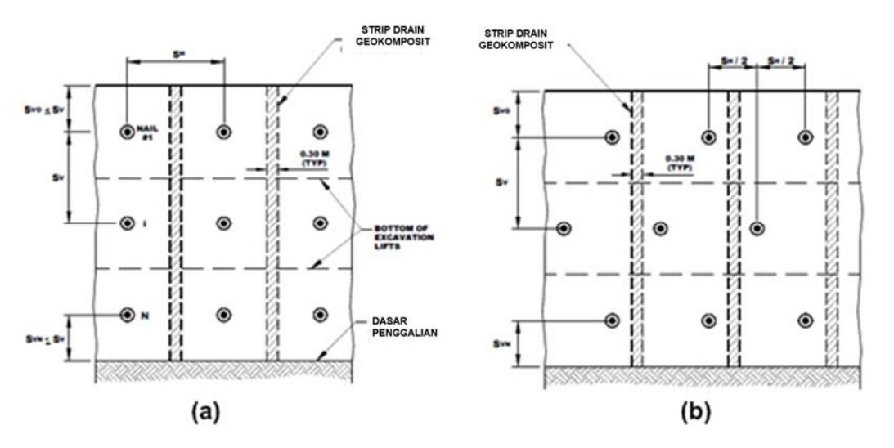

**Gambar 47 – Pola pemasangan** *nail bar* **: a) pola segi empat, b) pola segitiga (FHWA-NHI-14-007)** 

Sekalipun jarang digunakan di Indonesia, kadang-kadang digunakan *coated nail bar* untuk memberikan proteksi tingkat rendah terhadap korosi. Tingkat proteksi yang lebih tinggi adalah dengan membungkus nail bar dengan *corrugated sheath*.

**© BSN 2017 218 dari 303**

# *10.4.4.2.2 Bearing plate*

*Bearing plate* terbuat dari pelat baja berukuran tipikal 200 mm x 200 mm sampai dengan 250 mm x 250 mm, dengan tebal 19 mm.

#### *10.4.4.2.3 Grout*

Material *grout* dibuat dari semen tipe 1, dengan tipikal rasio air/semen (*w/c ratio*) 0,4 – 0,5. Persyaratan kuat tekan *grout* dalam 28 hari adalah 21 MPa. Bahan tambah umumnya tidak digunakan kecuali *plasticizer* untuk memperbaiki *workability*.

## **10.4.4.2.4 Beton semprot dinding muka**

Beton semprot atau *shotcrete* dinding muka mempunyai tebal tipikal 75 mm – 100 mm, dilengkapi dengan 1 lapis *wiremesh* M6 (ukuran 6 mm). Beton semprot disyaratkan mempunyai kuat tekan fc' 18 MPa. Beton semprot yang diperkuat ini merupakan komponen dasar dinding muka. Komponen akhir dinding muka dipasang di atas beton semprot, berupa panel beton pracetak, beton *cast in place*, dan beton semprot yang diperkuat. Komponen akhir dinding muka ini memberikan aspek keindahan bagi tampak muka dinding *soil nailing*.

# **10.4.4.2.5 Material pelengkap**

#### a) *Centralizer*

*Centralizer* dipasang secara beraturan sepanjang *nail bar* dengan interval 2,5 m, dan berjarak 0,5 m dari kedua ujung *nail bar*, untuk menjamin minimum *grout cover* terpenuhi. *Centralizer* terbuat dari PVC atau material sintetik lainnya.

#### b) Proteksi korosi

Jika dibutuhkan proteksi korosi tingkat tinggi, misalnya pada *soil nailing* permanen, ditambahkan *corrugated sheath* dari material sintetik (HDPE atau PVC) yang menyelimuti *nail bar*. Anulus spasi antara *corrugated sheath* dan *nail bar*, terlebih dulu diisi dengan *grout* sebelum *nail bar* dimasukkan ke dalam lubang bor.

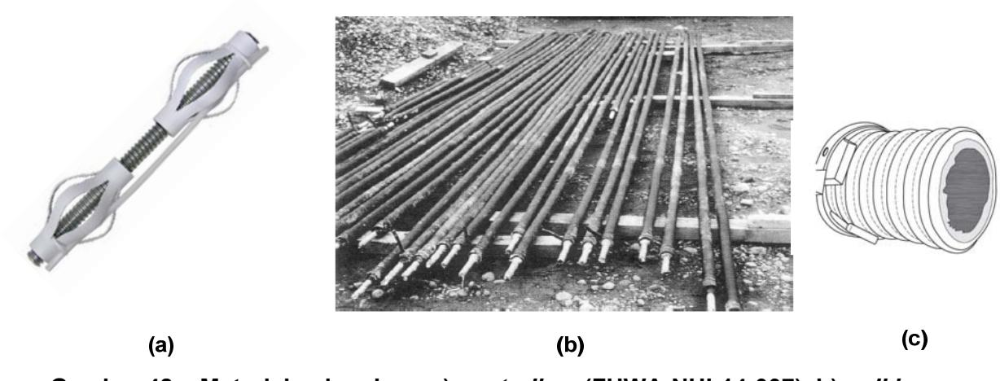

**Gambar 48 – Material pelengkap: a)** *centralizer* **(FHWA-NHI-14-007), b)** *nail bar* **dibungkus** *corrugated sheath* **pada** *soil nailing* **permanen (FHWA0-IF-03-017), c)**  *corrugated sheath* **(BS 8006-2, 2011)** 

**© BSN 2017 219 dari 303** 

# *c) Vertical drain strip*

*Vertical drain strip* dengan lebar 300 mm - 400 mm dipasang di belakang dinding muka dan menempel pada permukaan tanah. *Vertical drain strip* yang digunakan adalah *vertical drain* dengan satu muka terbuka dan muka yang lain tertutup plastik. Bagian yang terbuka menempel pada tanah, sedangkan bagian yang tertutup plastik menempel pada beton semprot. Spasi horizontal dari *strip* sama dengan spasi horizontal dari *nail*.

*Vertical drain strip* ini dipasang dari level muka air tanah sampai dasar dinding, dengan maksud menangkap air tanah dan menyalurkannya ke saluran tepi pada dasar galian, sehingga air tanah praktis tidak menekan dinding.

# **10.4.4.3 Persyaratan tanah untuk** *soil nailing*

# **10.4.4.3.1 Persyaratan umum**

Tanah untuk *soil nailing* harus dapat berdiri vertikal tanpa penyangga setinggi 1 m - 2 m, selama 1 hari - 2 hari untuk memberikan kesempatan pemasangan *nails* dan penyemprotan beton semprot.

#### **10.4.4.3.2 Persyaratan untuk tanah kohesif**

Tanah kohesif dengan konsistensi *medium stiff*, dengan NSPT 5, umumnya memenuhi persyaratan yang disebutkan pada 10.4.2.3.1.

# **10.4.4.3.3 Persyaratan untuk tanah pasir**

Tanah pasir yang cocok adalah pasir dengan kepadatan *medium dense*, dengan N SPT 10, yang menunjukkan adanya kohesi *apparent* atau sementasi natural.

#### *10.4.4.3.4* **Tanah yang tidak cocok untuk** *soil nailing*

Tanah yang tidak cocok untuk *soil nailing* adalah tanah-tanah dengan kondisi sebagai berikut:

- a) Tanah-tanah yang tidak memenuhi persyaratan yang disebutkan pada 10.4.2.3.2 dan 10.4.2.3.3;
- b) Tanah organik;
- c) Tanah yang mengandung batu bongkah dan batu bulat *(cobbles)*;
- d) Tanah dengan air tanah yang sangat korosif.

## **10.4.4.3.5 Pengaruh tinggi muka air tanah**

Semakin tinggi permukaan air tanah semakin sulit pengerjaan *soil nailing*. Karena itu daerah dengan muka air tanah yang tinggi kurang cocok untuk dinding *soil nailing*.

Selain itu, pada masa umur layan dinding muka tidak boleh menerima tekanan air tanah, karena pada umumnya dinding ini tidak dirancang untuk menahan tekanan air tanah. Jika dipaksakan, harus disediakannya sistem drainase yang komprehensif.

#### **10.4.4.4 Faktor-faktor yang perlu diperhatikan dalam perancangan dan konstruksi**

#### **10.4.4.4.1 Kondisi geologi setempat**

**© BSN 2017 220 dari 303**

Pemahaman mengenai kondisi tanah tidak hanya terbatas sampai dasar galian saja, tetapi juga lapisan tanah di bawahnya yang dapat memengaruhi stabilitas global dan deformasi sistem *soil nailing.* Riwayat kelongsoran pada lokasi *site* perlu diketahui karena bekas bidang gelincir dapat membahayakan stabilitas dinding *soil nailing*. Struktur geologi tanah setempat apakah mengandung *fissures, fractures, bedding plane*, dan hal-hal lain yang memengaruhi stabilitas dinding *soil nailing*, perlu diperhatikan.

# **10.4.4.4.2 Teknik pengeboran**

Agar tidak merusak dinding lubang bor dan memperlunak tanah, jika melakukan pengeboran di tanah kohesif dilarang menggunakan *water flush. Water flush* akan menurunkan tahanan friksi antara *grout* dan tanah.

#### **10.4.4.4.3 Kembang susut tanah**

Tanah lempung dengan plastisitas yang tinggi mempunyai potensi kembang susut yang besar seiring dengan perubahan kadar air. Potensi deformasi ini perlu diperhatikan bila *soil nailing* akan digunakan pada daerah ini.

#### **10.4.5 Analisis dan perancangan dinding** *soil nailing*

#### **10.4.5.1 Umum**

Perancangan dinding *soil nailing* ditentukan secara *trial and error*. Nilai-nilai tipikal seperti diuraikan pada subpasal 10.4.4.1 dan 10.4.4.2 dapat digunakan sebagai perancangan awal dalam proses *trial and error* ini. Misalnya sebagai perancangan awal, panjang *nail bar* untuk setengah kedalaman galian bagian atas dapat diambil sama dengan 0,8H, dimana H adalah kedalaman galian. Sedangkan untuk setengah kedalaman galian bagian bawah, panjang *nail bar* dapat diambil lebih pendek dari 0,8H.

Sebagai catatan, panjang *nail bar* harus ditentukan sedemikian sehingga meminimalkan *waste*, dengan memerhatikan bahwa panjang *rebar* yang digunakan sebagai *nail bar* adalah 12 m. Secara bertahap dimensi dinding *soil nailing* dikoreksi dan disesuaikan dengan hasil analisis.

Dinding *soil nailing* harus dicek terhadap stabilitas global dan stabilitas internal (Gambar 49). Jika analisis stabilitas global bertujuan memeriksa stabilitas dinding *soil nailing* secara keseluruhan terhadap bahaya longsor, analisis stabilitas internal bertujuan mendapatkan gaya-gaya *nail* yang selanjutnya digunakan untuk memeriksa keamanan komponenkomponen dinding *soil nailing,* seperti *nail bar* dan dinding muka.

Jika kondisi tanah relatif lunak, dinding *soil nailing* juga harus dicek terhadap stabilitas *basal heave*, dan stabilitas gelincir arah lateral karena kondisi tanah yang lunak memungkinkan kedua hal tersebut terjadi. Pemeriksaaan terhadap *basal heave* dilakukan seperti umumnya dilakukan pada galian dalam, sedangkan pemeriksaan terhadap gelincir arah lateral dilakukan seperti pada dinding gravitasi.

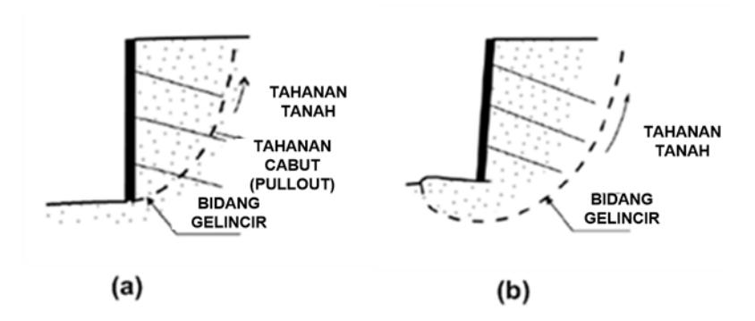

**Gambar 49 – a) Stabilitas internal, b) Stabilitas global (FHWA-NHI-14-007)** 

Subpasal berikut menguraikan mengenai hal-hal tersebut dan kelanjutan dari pemeriksaan stabilitas internal berupa pemeriksaan *nail bar* dan dinding muka. Terakhir karena dinding *soil nailing* lemah terhadap air, maka akan diuraikan mengenai sistem drainase secara khusus.

# **10.4.5.2 Analisis stabilitas global**

Analisis stabilitas global dinding *soil nailing* adalah analisis stabilitas lereng yang dilakukan terhadap sejumlah bidang gelincir yang tidak memotong satupun *nail bar* (lihat Gambar 49b). Berarti tidak ada kontribusi *nail bar* dalam tahanan terhadap longsor. Analisis stabilitas global ini dilakukan untuk menjamin bahwa dinding *soil nailing* secara keseluruhan aman terhadap bahaya longsor.

Analisis stabilitas global disarankan untuk menggunakan program kesetimbangan batas *(limit equilibrium)* yang umum digunakan untuk analisis stabilitas lereng. Dinding *soil nailing* dinyatakan aman terhadap stabilitas global bila faktor keamanan minimum terhadap stabilitas global, FKgs min, yang dihasilkan dari analisis global ini 1,5 pada kondisi jangka panjang dan 1,3 pada kondisi jangka pendek, selama masa penggalian.

Untuk dinding *soil nailing* permanen, perlu juga dilakukan analisis stabilitas global dengan beban gempa dan dinding dinyatakan stabil bila kondisi global FKgs 1,1.

# **10.4.5.3 Analisis stabilitas internal**

Analisis stabilitas internal dinding *soil nailing* adalah analisis stabilitas terhadap sejumlah bidang gelincir yang memotong beberapa atau seluruh *nail bar* (lihat Gambar 49.a). Ketika suatu bidang gelincir memotong *nail bar,* maka akan termobilisasi tahanan nail terhadap cabut *(pullout)* pada bagian *nail* yang terletak di belakang bidang gelincir, sehingga *nail bar* memberikan kontribusi terhadap stabilitas.

Sekalipun analisis stabilitas internal menghasilkan nilai faktor keamanan minimum dan bidang gelincir kritis, tetapi tujuan utama analisis stabilitas internal adalah menghasilkan gaya tarik maksimum pada setiap *nail bar,* yang selanjutnya akan digunakan untuk evaluasi komponen-komponen dinding *soil nailing*. *Nail bar* diperiksa terhadap bahaya cabut dan kapasitas tarik material *nail bar*. Dinding muka diperiksa terhadap *pons*.

Untuk dinding *soil nailing* permanen, dinding muka perlu diperiksa struktural lebih lanjut, seperti momen lentur yang bekerja pada dinding dan koneksi antara dua lapis dinding muka, yaitu komponen dasar dan komponen akhir melalui *headed stud* yang dilas pada *bearing plate*. Pengecekan struktural tidak dibahas di dalam subpasal ini.

Gambar 50a menggambarkan kontribusi gaya tarik pada *nail bar* terhadap stabilitas dinding *soil nailing.* Besarnya gaya tarik maksimum berbeda dari satu *nail* ke *nail* lainnya, begitu juga lokasi dari gaya tarik maksimum berbeda-beda dari satu *nail* dengan *nail* lainnya.

**© BSN 2017 222 dari 303**

Perpotongan *nail bar* dengan bidang gelincir menentukan panjang *nail bar* (Lp) dimana tahanan cabut terbentuk.

Gambar 50b menggambarkan bahwa gaya tarik maksimum pada *nail bar* membesar seiring dengan tahapan galian, oleh karena itu situasi kritis biasanya dijumpai pada tahap akhir penggalian. Akan tetapi kondisi kritis bisa juga dijumpai pada tahap penggalian di tengah dimana penggalian pada tahap tersebut selesai, tetapi *nail bar* dan beton semprot belum terpasang. Kondisi menjadi lebih kritis ketika terjadi rembesan pada bagian yang terbuka (lihat Gambar 50c).

Analisis stabilitas internal ini disarankan untuk menggunakan program stabilitas lereng yang dibuat khusus untuk analisis dinding *soil nailing*, karena akan menghilangkan keruwetankeruwetan. Program stabilitas lereng untuk desain dinding *soil nailing* ini umumnya menggunakan salah satu dari 2 macam bidang gelincir, yaitu bilinear dan lingkaran. Untuk bidang gelincir bilinear, faktor keamanan terhadap gelincir biasanya dihitung menggunakan metode baji *(wedge method)* sedangkan untuk bidang gelincir lingkaran dihitung menggunakan metode *simplified* Bishop.

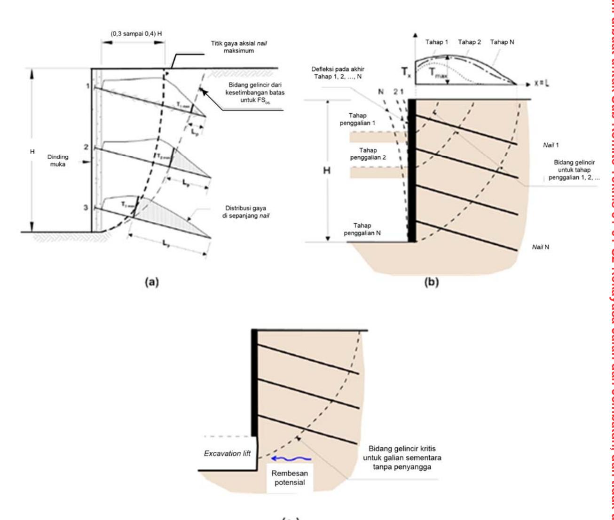

**Gambar 50 – a) Lokasi gaya tarik maksimum pada** *nail bar***; b) Bidang gelincir potensial dan perubahan gaya tarik pada** *nail bar* **seiring dengan tahapan penggalian; c) Kondisi kritis saat galian di tengah, beton semprot dan** *nail bar* **belum terpasang, dan ada rembesan (FHWA-NHI-14-007)** 

# **10.4.5.4 Analisis stabilitas terhadap** *basal heave*

Potensi *basal heave* harus dievaluasi bila tanah kohesif lunak dijumpai di bawah dasar galian. Karena dinding *soil nailing* tidak cocok dibangun pada tanah lempung lunak, maka pada umumnya dinding *soil nailing* bebas dari bahaya *basal heave*. Akan tetapi jika evaluasi *basal heave* harus dilakukan, evaluasi *basal heave* dilakukan seperti umumnya pada kasus galian.

Dinding *soil nailing* dinyatakan aman terhadap bahaya *basal heave* bila FKheave 2 untuk kondisi jangka pendek dan 2,5 untuk kondisi jangka panjang.

# **10.4.5.5 Analisis stabilitas terhadap gelincir arah lateral**

Evaluasi stabilitas terhadap gelincir arah lateral dilakukan seperti pada dinding penahan tanah gravitasi pada umumnya, dimana dibandingkan tahanan terhadap gelincir dengan gaya dorong lateral akibat tekanan tanah dan beban tambahan.

Dinding *soil nailing* dikatakan aman terhadap geser arah lateral jika FKsliding 1,5 pada kondisi normal dan 1,1 pada kondisi gempa.

#### **10.4.5.6 Pemeriksaan** *nail* **terhadap cabut** *(pullout)*

Tahanan cabut terbentuk pada bagian *nail* yang terletak di belakang bidang gelincir, Lp (lihat Gambar 50a). Panjang Lp dapat ditentukan dari grafik *output* program perancangan *soil nailing*. Tahanan cabut dapat dihitung dengan Persamaan (2).

$$R_{po} = \pi \text{ Ca D Lp}$$
 (2)

#### **Keterangan**:

Rpo = tahanan cabut;

Ca = tahanan friksi (bond) pada antarmuka *grout* –tanah;

= adalah 0,5 Cu (pada tanah kohesif);

= 'v Ks tan a (pada tanah pasir / non kohesif);

Cu = kohesi tak terdrainase;

'v = tekanan *overburden* efektif pada level *nail*;

Ks = koefisien tekanan tanah = 0,7;

a = sudut geser tanah-grout = 0,8 ';

' = sudut geser dalam efektif tanah;

D = diameter lubang bor;

Lp = panjang *nail* di belakang bidang gelincir yang memberikan tahanan cabut.

Pemeriksaaan terhadap cabut dilakukan untuk setiap baris *nail*, dimana faktor keamanan terhadap cabut, FKpo, dihitung dengan membandingkan tahanan terhadap cabut dengan gaya tarik *nail* maksimum dengan menggunakan Persamaan (3).

$$FK_{po} = R_{po} / Tmax$$
 (3)

#### **Keterangan**:

FKpo = faktor keamanan terhadap cabut;

**© BSN 2017 224 dari 303**

Tmax = gaya tarik *nail* maksimum.

*Nail bar* dinyatakan aman terhadap bahaya cabut bila FKpo 2,0. Pengecekan cabut pada dinding *soil nailing* permanen dengan beban gempa mengharuskan FKpo 1,5, agar dinding *soil nailing* dinyatakan aman terhadap bahaya cabut.

#### **10.4.5.7 Pemeriksaan kapasitas tarik material** *nail*

Pemeriksaan kapasitas tarik material *nail* dilakukan dengan membandingkan gaya tarik *nail* maksimum, Tmax, dengan *yield strength* dari *nail bar* (fy). Material *nail* disyaratkan memakai BJTD 40, berarti fy = 400 MPa = 4000 kg/cm2. Faktor keamanan terhadap kuat tarik material nail dihitung dengan Persamaan (4):

$$FK_{ts} = \frac{T_{max}/A_{n}}{fy}$$
 (4)

#### **Keterangan**:

FKt s = faktor keamanan terhadap kuat tarik material *nail*;

Tmax = gaya tarik *nail* maksimum;

An = luas penampang *nail bar*;

fy = *yield strength* dari *nail bar*.

Faktor keamanan terhadap kuat tarik material *nail* dihitung untuk setiap baris *nail*. *Nail bar* dinyatakan aman terhadap kuat tarik material *nail* bila FKts 1,8.

Pemeriksaan kuat tarik *nail bar* pada dinding *soil nailing* permanen dengan beban gempa mengharuskan FKts 1,3, agar dinding *soil nailing* dinyatakan aman terhadap bahaya kuat tarik material *nail bar*.

#### **10.4.5.8 Pemeriksaaan pons pada beton semprot dinding muka**

Pemeriksaaan pons pada dinding muka dilakukan terhadap komponen dasar dinding muka berupa beton semprot yang diperkuat, karena *bearing plate* yang memegang kepala *nail* duduk di atas lapisan beton semprot ini (Gambar 51). Gaya tarik pada *nail* ini berubah-ubah sepanjang *nail*, dan gaya tarik *nail* yang digunakan untuk memeriksa pons pada lapisan beton semprot ini adalah T0, yaitu gaya tarik naik pada kepala *nail*. Nilai tipikal T0 0,7 Tmax.

Dinding *soil nailing* dinyatakan aman terhadap pons bila FKp 1,5 pada kondisi normal dan 1,1 pada kondisi gempa, dengan catatan bahwa kondisi gempa dicek hanya pada dinding *soil nailing* permanen.

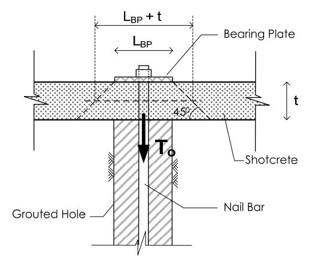

**Gambar 51 – Pemeriksaaan pons pada dinding muka** 

**CATATAN** – untuk dinding *soil nailing* permanen, bahwa pemeriksaan lebih lanjut struktural dinding muka seperti pengecekan momen tekuk dan pemeriksaan koneksi antara lapisan beton semprot sebagai komponen dasar dinding muka dan lapisan akhir dinding muka, perlu dilakukan. Koneksi antara kedua lapisan dinding muka itu dilakukan melalui *headed stud* yang dilas pada *bearing plate*.

## **10.4.5.9 Perancangan sistem drainase**

Sistem drainase pada prinsipnya terdiri atas saluran terbuka di atas dinding *soil nailing* dengan tujuan memotong aliran permukaan agar tidak masuk ke dalam galian.

Dalam perancangan pada umumnya dinding muka dianggap tidak menahan tekanan air, karena itu dipasang *vertical drain strip* selebar 300 mm – 400 mm, di belakang dinding muka, sejarak spasi horizontal *nail bar* (SH), dari level permukaan air tanah tertinggi sampai dasar dinding muka. Tipikal spasi horizontal *nail* adalah 1,50 m, jadi tipikal spasi horizontal dari *vertical drain strip* adalah 1,50 m.

Air tanah yang tertangkap oleh *vertical drain strip* ini harus langsung dapat disalurkan secara menerus ke saluran tepi galian, dan selanjutnya dibuang keluar galian. Kegagalan memenuhi persyaratan tersebut akan berakibat pada longsornya dinding *soil nailing*. Program komputer yang khusus untuk perancangan *soil nailing* pada umumnya tidak memperhitungkan adanya tekanan air tanah pada dinding. Sistem drainase dan detail saluran pembuang diperlihatkan pada Gambar 52.

**© BSN 2017 226 dari 303**

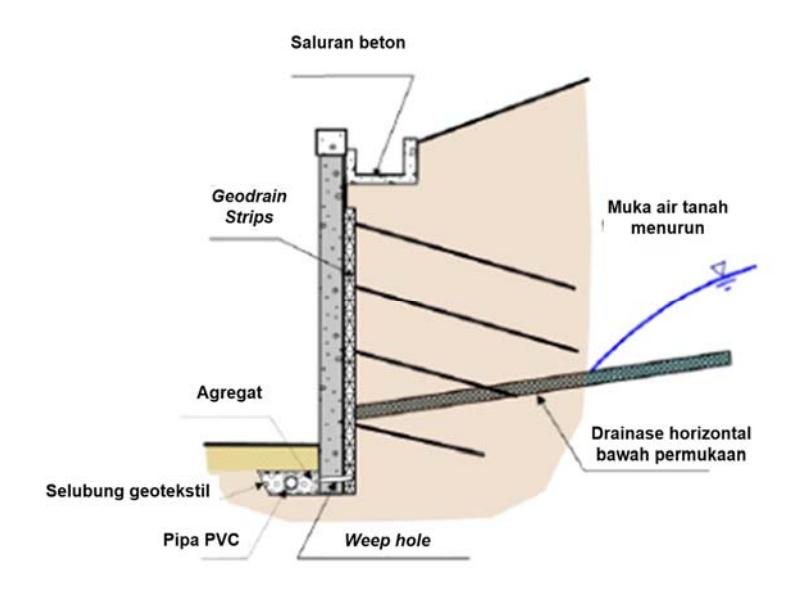

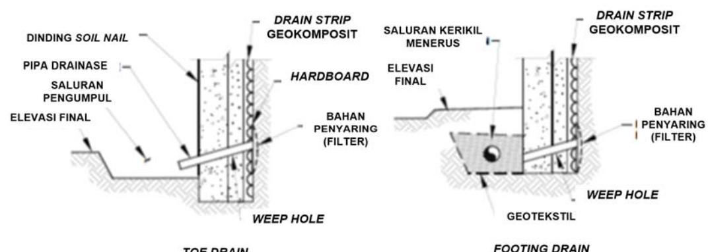

**Gambar 52 – Sistem drainase dan detail saluran tepi pembuang (FHWA-NHI-14-007)** 

Sistem drainase seperti diuraikan di atas adalah tipikal desain. Jika air tanah tinggi, dapat ditambahkan *subhorizontal drain* yang terdiri atas *slotted PVC pipe* diameter 2", yang dipasang dengan kemiringan 50 - 100 terhadap bidang horizontal, dengan kerapatan 1 buah per 10 m2 bidang vertikal. Panjangnya tergantung kondisi tanah dan air tanah di lapangan.

Pekerjaan perancangan rutin dinding *soil nailing*, umumnya tidak memerlukan analisis rembesan. Untuk pekerjaan khusus, spasi *vertical drain strip*, *subhorizontal drain*, dan lainnya disesuaikan dengan hasil analisis rembesan.

Opsional, untuk membantu melepaskan tekanan air tanah secepat mungkin, dapat ditambahkan 1 atau 2 baris *weep hole* pada daerah bawah dinding muka. Tipikal *weep hole* menggunakan pipa PVC diameter 2" (50 mm), dengan jarak horizontal kurang lebih sama dengan 2 kali spasi *horizontal nail bar* (SH).

#### **10.4.5.10 Deformasi dinding** *soil nailing*

Dinding *soil nailing* adalah sistem perkuatan lereng pasif, artinya diperlukan deformasi tertentu agar tahanan *nail* terbentuk. Dinding *soil nailing* dan tanah yang ditahannya sampai suatu jarak tertentu ke belakang akan bergerak ke arah galian, selama penggalian dan setelahnya. Pergerakan akan segera selesai bila tanah didominasi tanah berbutir. Kondisi sebaliknya akan terjadi bila tanah didominasi tanah kohesif, hingga meningkatkan gaya tarik *nail* dan defleksi dinding setelah konstruksi selesai.

Defleksi lateral maksimum terjadi pada puncak dinding. Defleksi lateral semakin besar dengan bertambah tingginya dinding, semakin besarnya spasi *nail bar*, semakin tegaknya dinding, dan semakin besarnya beban tambahan. Pergerakan vertikal lebih kecil dari pergerakan lateral, dan dipengaruhi hal-hal yang sama seperti pergerakan lateral.

Defleksi lateral maksimum pada puncak dinding dapat diprediksi dengan rumus empiris pada Persamaan (5).

$$\delta_{\mathsf{h}} = \left(\frac{\delta_{\mathsf{h}}}{H}\right)_{\mathsf{i}} \times \mathsf{H} \tag{5}$$

# **Keterangan**:

( ୦ ு )i = rasio yang tergantung kondisi tanah (Tabel 39);

H = kedalaman galian.

Dengan catatan bahwa persamaan di atas berlaku untuk kondisi berikut:

- a) L/H 0,7 dimana L adalah panjang nail dan H adalah kedalaman galian;
- b) Faktor keamanan untuk stabilitas global FKgs 1,5;
- c) Beban tambahan kecil dan dapat diabaikan.

**Tabel 39 – Variabel (**ܐ ࡴ**( i dan C sebagai fungsi kondisi tanah (FHWA-NHI-14-007)** 

| Variabel        | Batuan lapuk dan tanah keras | Tanah pasiran | Tanah butir halus |
|-----------------|---------------------------------|---------------|-------------------|
| ୦ ( ு )i | 1/1000                          | 1/500         | 1/333             |
| C               | 0,8                             | 1,25          | 1,50              |

Deformasi tanah terjadi sejauh DDEF di belakang dinding yang dapat dihitung dengan Persamaan (6).

$$D_{DEF} = C(1 - \tan \alpha) H$$
 (6)

#### **Keterangan**:

= kemiringan dinding;

C = koefisien yang tergantung kondisi tanah (Tabel 39).

Ilustrasi deformasi dinding *soil nailing* diberikan pada Gambar 53.

**© BSN 2017 228 dari 303**

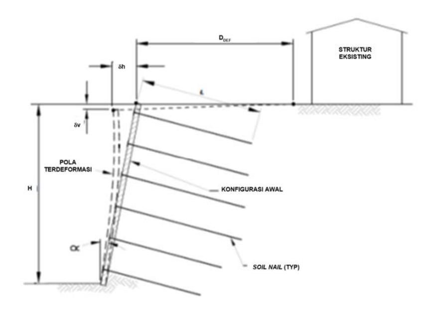

**Gambar 53 – Ilustrasi deformasi dinding** *soil nailing* **(FHWA-NHI-14-007)** 

Jika struktur yang kritis atau sensitif berada dekat dinding *soil nailing*, dampak potensial dari pergerakan dinding terhadap struktur tersebut harus dipelajari lebih lanjut dengan metode numerik seperti metode elemen hingga, atau dengan membandingkan dengan data proyek dinding yang sama pada tanah yang sama, atau keduanya.

Defleksi horizontal izin h izin = 0,005H merepresentasikan batas atas dari kinerja dinding yang baik. Data monitoring setelah selesainya konstruksi menunjukkan bahwa pergerakan terus bertambah, kadang-kadang sampai 6 bulan setelah selesainya konstruksi. Deformasi pascakonstruksi dapat bertambah hingga 15% dari nilai defleksi segera setelah selesainya konstruksi.

## **10.4.6 Verifikasi perancangan**

#### **10.4.6.1 Umum**

Verifikasi perancangan terdiri atas pengujian pada *nail bar* dan kegiatan monitoring dan inspeksi visual untuk mendapatkan data mengenai kinerja dinding *soil nailing* dan komponen-komponennya.

Pengujian pada *nail bar* untuk memverifikasi bahwa gaya *nail* maksimum (Tmax) dapat ditahan tanpa terjadi pergerakan yang berlebihan pada *nail bar*, dengan faktor keamanan yang cukup.

Pemasangan instrumentasi dan kegiatan monitoring sedapat mungkin dilakukan sebelum dimulainya penggalian, untuk mendapatkan datum bagi pembacaan-pembacaan berikutnya, kecuali untuk pemasangan instrumentasi yang tidak bisa dilakukan sebelum dinding muka selesai. Subpasal berikut menguraikan mengenai uji pada *nail* dan kegiatan monitoring serta inspeksi visual.

#### **10.4.6.2 Uji tarik** *nail*

Uji tarik pada *nail* dilakukan untuk verifikasi bahwa gaya *nail* maksimum (Tmax) dapat ditahan tanpa terjadi pergerakan yang berlebihan, dengan faktor keamanan yang cukup. Gaya tarik

diberikan oleh *hydraulic jack* yang dilengkapi dengan *load cell* untuk mengukur gaya tarik dengan *pressure gauge* sebagai alat ukur gaya kedua. Untuk mengukur pergerakan *nail*, digunakan paling tidak 2 buah *dial gauge*. Gambar 54 menyajikan ilustrasi pemasangan *hydraulic jack* dan alat-alat pengukur gaya dan pergerakan *nail*.

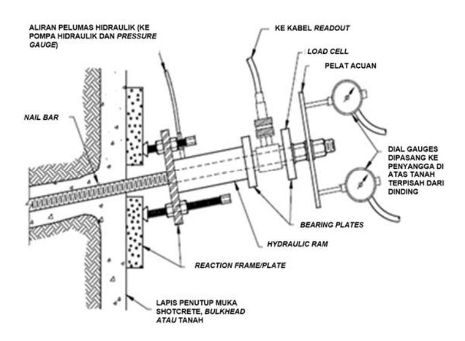

**Gambar 54 –** *Set up* **peralatan uji tarik pada** *nail bar* **(FHWA0-IF-03-017)** 

Uji tarik pada *nail* ini harus dilakukan pada 5% dari *nail* produksi. Beban uji diberikan bertahap hingga mencapai beban maksimum sebesar 150% Tmax. Setiap tahap pembebanan ditahan selama 10 menit, sedangkan beban maksimum ditahan selama 60 menit dengan jadwal pembebanan dan pembacaan *dial gauge* seperti pada Tabel 40.

**Tabel 40 – Jadwal pembebanan dan pembacaan** *dial gauge*

| Beban (% Tw) | Lama beban ditahan (menit) | Pembacaan dial gauge (menit) |
|-----------------|-------------------------------|---------------------------------|
| 25              | 10                            | 1,2,3,4,5,10                    |
| 50              | 10                            | 1,2,3,4,5,10                    |
| 75              | 10                            | 1,2,3,4,5,10                    |
| 100             | 10                            | 1,2,3,4,5,10                    |
| 125             | 10                            | 1,2,3,4,5,10                    |
| 150             | 60                            | 1,2,3,4,5,6, 10,20,30, 50, 60   |

Uji tarik ini pada prinsipnya adalah uji rangkak atau *creep*, dimana *nail* dinyatakan lolos uji bila pergerakan *nail* di antara interval waktu 1 menit – 10 menit tidak melebihi 1 mm. Bila kriteria ini tidak terpenuhi maka diperiksa untuk interval waktu 6 menit – 60 menit, pergerakan *nail* tidak boleh lebih dari 2 mm.

Kriteria pergerakan *nail* tersebut dirangkumkan pada Tabel 41.

**© BSN 2017 230 dari 303**

**Tabel 41 – Pergerakan** *nail* **izin pada uji** *creep* 

| Interval pembacaan dial gauge (menit) | Pergerakan nail izin (mm) |
|------------------------------------------|------------------------------|
| 1 - 10                                   | 1                            |
| 6 - 60                                   | 2                            |

# **10.4.6.3 Monitoring dan inspeksi visual**

Kegiatan monitoring baik untuk jangka pendek maupun jangka panjang paling tidak mencakup hal-hal berikut:

- a) Monitoring pergerakan puncak dinding muka dan tanah di belakang dinding muka dengan teodolit dan *settlement marker*;
- b) Monitoring pergerakan tanah 1 m di belakang dinding muka dengan inklinometer. Karena jaraknya yang dekat dengan dinding muka, pembacaan inklinometer ini juga mewakili pergerakan dinding muka;
- c) Monitoring muka air tanah di belakang dinding muka dengan *water standpipe* pada 2 tempat dalam satu sisi galian, untuk memastikan tidak ada tekanan air tanah pada dinding muka.

Gambar 55 menyajikan denah dan potongan dinding *soil nailing* untuk menunjukkan lokasi instrumentasi untuk program monitoring minimum seperti diuraikan di atas.

Selain monitoring tersebut, harus juga dilakukan inspeksi visual untuk mendeteksi adanya retakan-retakan tanah, kerusakan dinding muka, kemacetan titik-titik *outflow* dari sistem drainase.

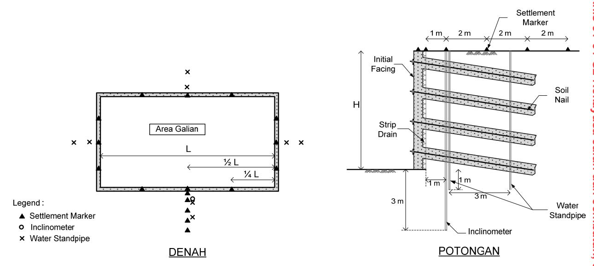

**Gambar 55 – Lokasi pemasangan instrumentasi minimum** 

Monitoring seperti diuraikan di atas adalah monitoring minimum. Jika dikehendaki atau karena proyek yang bersifat khusus, dapat ditambahkan pemasangan *load cell* pada kepala *nail* untuk mengetahui gaya tarik pada kepala *nail* (T0) dan *strain gauges* pada jarak-jarak tertentu sepanjang *nail* untuk mengetahui distribusi gaya tarik sepanjang *nail*. *Tiltmeter* juga dapat dipasang pada kolom bangunan terdekat untuk mendeteksi kemiringan kolom, jika dianggap galian dapat membahayakan bangunan tersebut.

Monitoring dan inspeksi visual dilakukan dengan frekuensi 2 kali per minggu pada awal-awal monitoring, dan berangsur-angsur menjadi lebih jarang, sesuai dengan melambatnya perubahan data-data monitoring. Hasil monitoring pergerakan dan muka air tanah dibandingkan dengan *threshold limit y*ang ditentukan berdasarkan hasil analisis dan pertimbangan-pertimbangan lain, dan dapat berbeda antara satu proyek dengan proyek lainnya.

#### **10.5 Dinding MSE** *(MSE walls)*

#### **10.5.1 Ruang lingkup pekerjaan dinding MSE**

Subpasal ini menyajikan persyaratan-persyaratan dan tata cara perancangan dinding MSE, baik untuk perkuatan yang dapat memanjang maupun perkuatan yang tidak dapat memanjang, termasuk perancangan sistem drainase, pembahasan mengenai batasan penurunan dan pergerakan lateral, dan sistem monitoring sebagai verifikasi perancangan.

# **10.5.2 Deskripsi**

Dinding MSE terdiri atas dinding muka/penutup muka dan perkuatan baja atau geosintetik yang diikatkan pada dinding muka/penutup muka dan dipasang secara berlapis di dalam timbunan tanah berbutir yang mudah mengalirkan air *(free draining material)*. Kombinasi perkuatan dan timbunan tanah berbutir menghasilkan struktur komposit yang secara internal stabil. Potongan tipikal dinding MSE adalah seperti Gambar 56.

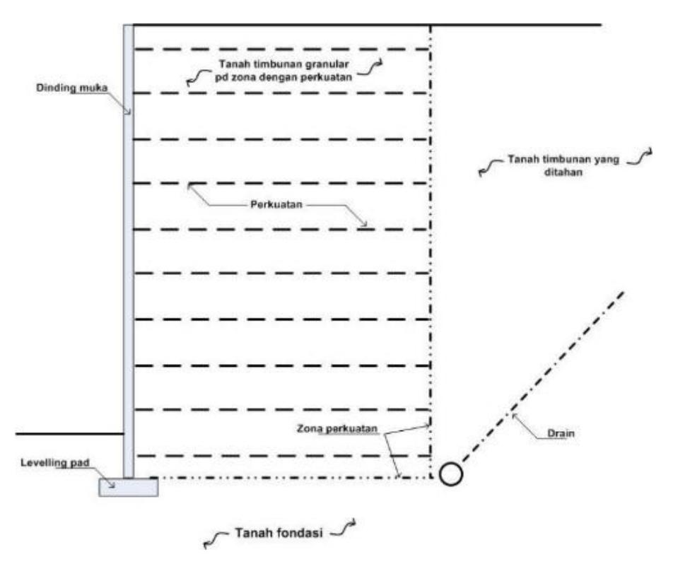

**Gambar 56 – Potongan tipikal dinding MSE (FHWA NHI-10-024)**

**© BSN 2017 232 dari 303**

# **10.5.3 Aplikasi**

Dinding MSE merupakan alternatif untuk menggantikan dinding penahan tanah konvensional, seperti dinding penahan tanah tipe gravitasi dan dinding kantilever, yang banyak digunakan pada konstruksi jalan. Dinding MSE di antaranya digunakan pada abutmen jembatan dan dinding sayap *(wing wall),* dan digunakan juga untuk menstabilkan lereng yang berpotensi longsor serta menahan tanah pada lereng yang mendekati vertikal, hingga meminimalkan lebar Daerah Milik Jalan (DMJ) timbunan jalan, khususnya pada timbunan yang tinggi.

Kelebihan utama dari dinding MSE dibandingkan dengan dinding penahan tanah konvensional adalah ekonomis, mudah, dan cepat pelaksanaannya. Struktur ini fleksibel, dapat menahan perbedaan penurunan yang lebih besar dari dinding penahan tanah konvensional.

#### **10.5.4 Persyaratan teknis**

#### **10.5.4.1 Tipikal dimensi dinding MSE**

#### **10.5.4.1.1 Panjang perkuatan dan jarak antar perkuatan**

Persyaratan panjang perkuatan dan jarak antar-perkuatan diberikan sebagai berikut.

- a) Panjang perkuatan yang disyaratkan adalah L ≥ 0,7 He, dengan He adalah tinggi efektif dinding MSE dihitung dari permukaan atas alas perata *(levelling pad).* Berapapun tinggi He, L harus ≥ 2,5 m *)* (lihat Gambar 57 untuk ilustrasi L dan He).
- b) Panjang perkuatan harus sama untuk keseluruhan tinggi dinding. Pengecualian dapat dilakukan antara lain untuk hal-hal berikut:
  - 1) penambahan panjang perkuatan baris bawah hingga > 0,7He untuk memenuhi persyaratan stabilitas global;
  - 2) pengurangan panjang perkuatan baris bawah hingga < 0,7He karena dinding MSE duduk di lapisan batu atau tanah keras dengan N SPT > 50.
- c) Panjang minimum perkuatan bertambah dengan bekerjanya beban-beban luar.
- d) Panjang minimum perkuatan juga bertambah dengan semakin lunaknya tanah fondasi.
- e) Spasi tipikal untuk pita metalik, diberikan sebagai berikut:
  - 1) spasi vertikal, Sv: 0,2 m 1,25 m;
  - 2) spasi horizontal, Sh: 0,8 m 1,5 m.
- f) Spasi vertikal dapat berubah seiring dengan kedalaman.

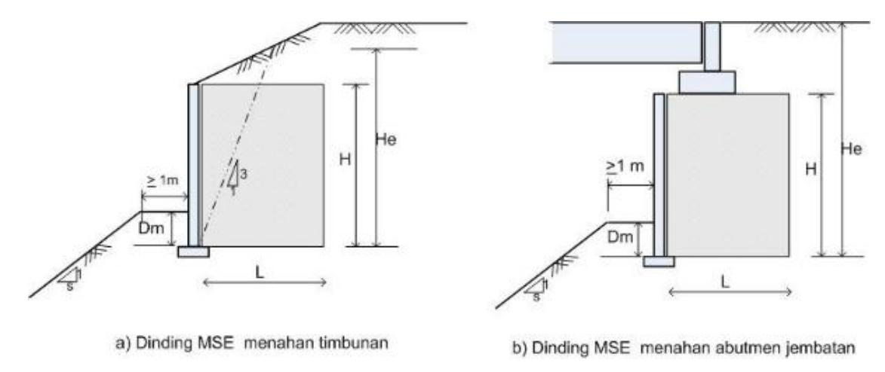

**Gambar 57 – Ilustrasi persyaratan terbenamnya penutup muka (GEO Hongkong, 2002)**

#### **10.5.4.1.2 Minimum terbenamnya penutup muka**

Kecuali untuk dinding MSE yang dibangun di atas batuan, terbenamnya penutup muka harus memenuhi persyaratan seperti yang dirangkumkan pada Tabel 42.

**Tabel 42 – Persyaratan terbenamnya penutup muka (FHWA, 2009)**

| No | Kemiringan lereng dimuka dinding MSE | Aplikasi                            | Minimum terbenamnya penutup muka (Dm)                              |
|----|-----------------------------------------|-------------------------------------|-----------------------------------------------------------------------|
| 1  | Horizontal                              | Dinding menahan timbunan            | He/20 > 0.35 m                                                        |
| 2  | Horizontal                              | Dinding menahan abutmen jembatan | He/10 > 0.7 m dibawah permukaan tanah akibat penggerusan, jika ada |
| 3  | Miring 3H :1V (s = 3)                   | Dinding menahan timbunan            | He/10 > 0.7 m                                                         |
| 4  | Miring 2H :1V (s = 2)                   | Dinding menahan timbunan            | He/7 > 0.7 m                                                          |
| 5  | Miring 1.5H :1V (s = 1.5)               | Dinding menahan timbunan            | He/5 > 0.7 m                                                          |

**CATATAN –** He adalah tinggi efektif dinding dihitung dari permukaan alas perata (lihat Gambar 57)

#### **10.5.4.2 Penutup muka**

Penutup muka dapat dibedakan menjadi dua kelompok besar, yaitu penutup muka kaku dan penutup muka fleksibel. Berbagai tipe penutup muka utama dijelaskan sebagai berikut.

#### **10.5.4.2.1 Panel beton pracetak segmental**

Panel beton pracetak segmental memiliki berbagai bentuk dan ukuran, dengan ukuran tipikal tinggi 150 cm lebar 150 cm – 300 cm, serta ketebalan minimum 140 cm.

Bentuk yang umum dijumpai adalah bujur sangkar, persegi empat, persegi lima, persegi enam, dan tanda tambah.

**© BSN 2017 234 dari 303**

# **10.5.4.2.2 Unit dinding blok modular cetak kering**

Unit dinding blok modular cetak kering berukuran relatif kecil dengan berat per unit 15 kg – 50 kg. Tinggi per unit 10 cm – 20 cm, lebar 20 cm – 40 cm, dan tebal 20 cm – 60 cm.

Unit dinding blok modular dipasang tanpa mortar, dimana unit-unit yang berdekatan dihubungkan dengan paku geser. Penutup muka tipe ini biasanya dipasangkan dengan perkuatan geosintetik, sebagian besar menggunakan geogrid.

# **10.5.4.2.3 Penutup muka dari logam**

Penutup muka ini terbuat dari baja berbentuk setengah silider. Ringan, sehingga cocok untuk daerah yang sulit pencapaiannya.

#### **10.5.4.2.4 Beronjong**

Beronjong dapat digunakan sebagai penutup muka dimana sebagai perkuatan biasanya digunakan anyaman kawat yang dilas *(welded wire mesh),* rangka baja yang dilas, geogrid, dan geotekstil.

#### **10.5.4.2.5 Penutup muka geosintetik**

Penutup muka geosintetik dipasang dengan cara menekuk geosintetik 1800 dan mengembalikannya ke arah belakang hingga membentuk permukaan lereng. Cara pemasangan yang sama juga digunakan untuk penutup muka menggunakan anyaman kawat yang dilas, geogrid, dan lainnya. Sebagai pelindung dari sinar ultraviolet, dapat digunakan beton semprot, atau penanaman vegetasi. Dalam hal digunakan secara permanen maka durabilitas atau ketahanan geotekstil untuk konstruksi MSE wall harus diperhitungkan

# **10.5.4.3 Perkuatan**

#### **10.5.4.3.1 Geometri perkuatan**

Persyaratan untuk geometri perkuatan diberikan sebagai berikut:

- a) Linear satu arah: contohnya pita baja polos maupun berulir, pita geosintetik;
- b) Komposit satu arah: contohnya anyaman kawat;
- c) Bidang datar dua arah: contohnya geosintetik lembaran menerus (geotekstil atau geogrid)

### **10.5.4.3.2 Material perkuatan**

Persyaratan untuk material perkuatan diberikan sebagai berikut:

- a) Perkuatan metalik: baja lunak yang digalvanis;
- b) Perkuatan nonmetalik: polimer terdiri atas poliester atau polietilena. bahan geosintetik

#### **10.5.4.3.3 Kemampuan memanjang perkuatan**

Persyaratan untuk kemampuan memanjang perkuatan diberikan sebagai berikut.

- a) Perkuatan yang tidak dapat memanjang *(inextensible):* Deformasi perkuatan saat keruntuhan jauh lebih kecil dari deformasi tanah. Contohnya pita baja.
- b) Perkuatan yang dapat memanjang *(extensible*): Deformasi perkuatan saat keruntuhan sama atau lebih besar dari deformasi tanah. Contoh: geogrid, geotekstil, anyaman kawat yang dilas.

# **10.5.4.4 Tanah fondasi**

Dinding MSE dapat dibangun di atas tanah fondasi yang relatif lunak karena struktur yang fleksibel dan toleransi yang besar terhadap penurunan atau perbedaan penurunan. Sekalipun demikian, tetap harus memerhatikan daya dukung tanah fondasi dan potensi penurunan konsolidasi akibat beban tanah timbunan.

Penurunan akibat konsolidasi tanah fondasi yang lunak seringkali menyebabkan dinding MSE secara keseluruhan berputar ke belakang sebagaimana diilustrasikan di dalam Gambar 58.

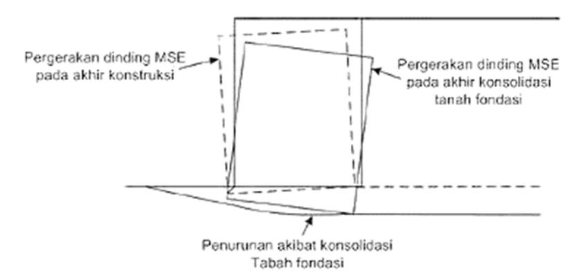

**Gambar 58 – Pergerakan dinding MSE akibat penurunan konsolidasi tanah fondasi (GEO Hongkong, 2002)**

#### **10.5.4.5 Material timbunan pada zona dengan perkuatan**

Material timbunan harus bebas dari bahan organik atau material perusak lainnya. Material timbunan tanah berbutir (granular) harus bergradasi baik. Persyaratan-persyaratan lainnya dirangkum dalam Tabel 43. Material timbunan ini harus dipadatkan pada kadar air optimum 2%.

**© BSN 2017 236 dari 303**

**Tabel 43 – Persyaratan material timbunan pada zona dengan perkuatan**

| Ukuran saringan                | Persen Iolos a |
|--------------------------------|---------------------------|
| 102 mm (4 inci) a,b | 100                       |
| No. 40 (0,425 mm)              | 0 – 60                    |
| No. 200 (0,075 mm)             | 0 – 15                    |

**CATATAN –** Tanah merah (kohesif) dengan plastisitas rendah telah berhasil digunakan sebagai material timbunan dengan sistem drainase yang memadai dan lapisan penutup di atas untuk mencegah penjenuhan lapisan tanah timbunan tersebut. Akan tetapi tidak ada Standar Internasional yang mendukung pemakaian tanah merah (kohesif) tersebut.

Untuk daerah dengan jarak 1,5 m – 2,0 m dari penutup muka, pemadatan material timbunan dapat menimbulkan tekanan lateral yang tinggi pada penutup muka. Karena itu pemadatan harus dilakukan dengan menggunakan alat pemadat yang lebih ringan, dan harus digunakan material timbunan yang lebih baik, misalnya batu pecah.

Untuk mencegah terjadinya retak tarik *(tension crack*) tepat di belakang zona perkuatan, panjang 2 baris perkuatan teratas harus lebih panjang 1 m – 1,5 m dari baris-baris perkuatan di bawahnya.

# **10.5.4.6 Material timbunan di belakang zona dengan perkuatan**

Material timbunan di belakang zona dengan perkuatan adalah material timbunan yang terletak di antara timbunan dengan perkuatan dan lereng galian tanah asli. Persyaratan material timbunan ini adalah sebagai berikut.

- a) Lolos saringan No. 200 (0,075 mm) < 50%;
- b) Batas cair, LL < 40;
- c) Indeks Plastisitas, PI < 20.

#### **10.5.5 Dasar perancangan**

# **10.5.5.1 Stabilitas eksternal**

Seperti dinding penahan tanah konvensional gravitasi dan semigravitasi, empat potensi kegagalan ekternal digunakan untuk menentukan dimensi dinding MSE. Potensi kegagalan tersebut adalah sebagai berikut.

- a) Pergerakan lateral pada dasar;
- b) Pembatasan eksentrisitas resultan gaya-gaya (pembatasan momen guling);
- c) Daya dukung;
- d) Stabilitas global.

Karena fleksibilitas dinding MSE, faktor keamanan untuk empat potensi kegagalan eksternal tersebut umumnya lebih kecil daripada faktor keamanan pada dinding kantilever beton dan dinding tipe gravitasi. Karena fleksibilitasnya juga maka kegagalan guling *(overturning)* struktur dinding secara keseluruhan tidak akan terjadi, tetapi pembatasan eksentrisitas resultan gaya-gaya perlu dilakukan untuk membatasi deformasi lateral.

**Tabel 44 – Rangkuman faktor keamanan minimum untuk empat potensi kegagalan eksternal (diekstrak dari FHWA NHI 00 043)** 

| No. | Potensi kegagalan eksternal                        | Faktor Keamanan (FK) minimum | Persyaratan lain | Langkah perbaikan jika FK tidak terpenuhi |
|-----|-------------------------------------------------------|------------------------------------|---------------------|-------------------------------------------------|
| 1.  | Geser lateral pada dasar                           | 1,5                                | -                   | Perpanjang L                                    |
| 2.  | Eksentrisitas resultan gaya-gaya (momen guling) | 2 (guling)                         | e ≤ L/6             | Perpanjang L                                    |
| 3.  | Daya dukung                                           | 2,5                                | -                   | Perbaiki tanah fondasi atau perdalam Dm      |
| 4.  | Stabilitas global                                     | 1,3                                |                     | Perpanjang L atau perbaiki tanah fondasi     |

Keterangan:

Perhitungan stabilitas eksternal secara skematik disajikan di dalam diagram alir pada Gambar 59.

**© BSN 2017 238 dari 303**

L adalah panjang perkuatan

e adalah eksentrisitas resultan gaya-gaya

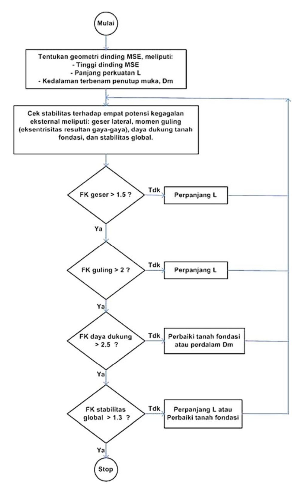

**Gambar 59 – Diagram alir perhitungan stabilitas eksternal** 

#### **Tekanan tanah untuk stabilitas eksternal**

Perhitungan stabilitas dinding MSE dengan muka vertikal dilakukan dengan menganggap masa dinding MSE sebagai *rigid body*. Tekanan tanah terjadi pada bidang vertikal di belakang zona perkuatan seperti diilustrasikan pada Gambar 60.

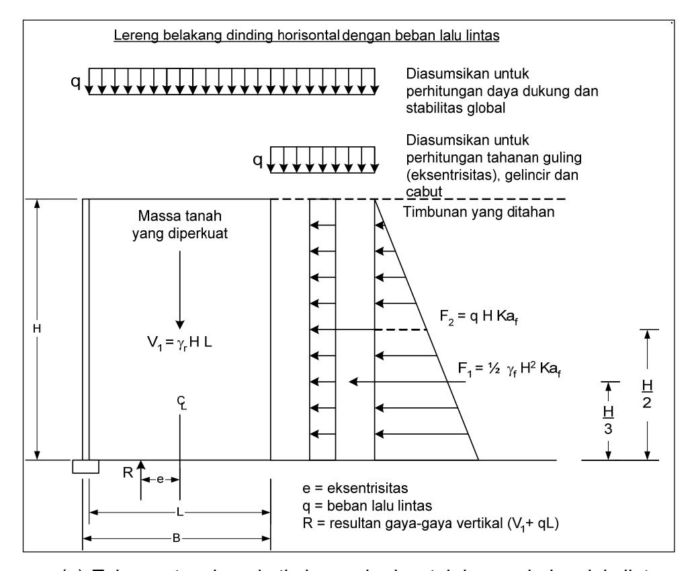

(a) Tekanan tanah pada timbunan horizontal dengan beban lalu lintas

**Gambar 60 – Tekanan tanah untuk analisis stabilitas eksternal** 

**© BSN 2017 240 dari 303**

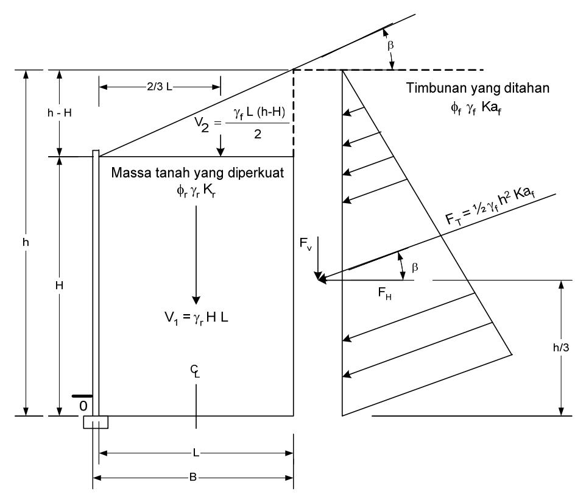

(b) Tekanan tanah pada timbunan miring

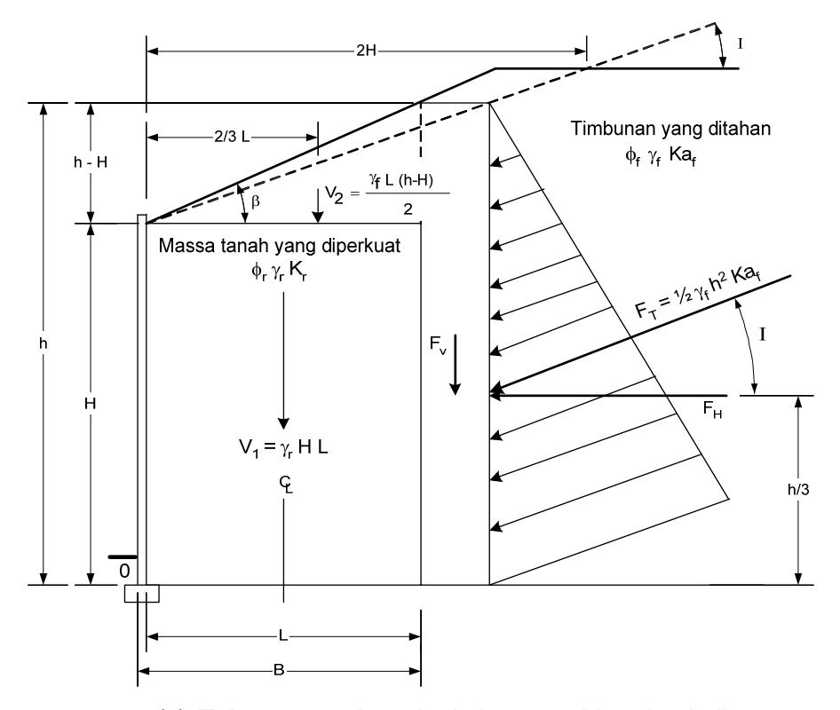

(c) Tekanan tanah pada timbunan miring dua kali

**Gambar 83 (lanjutan) – Tekanan tanah untuk analisis stabilitas eksternal** 

#### **10.5.5.2 Stabilitas internal**

Kegagalan internal dinding MSE dapat terjadi dalam dua moda kegagalan yang berbeda, tetapi keduanya menyebabkan pergerakan yang besar pada struktur dinding MSE, hingga terjadinya keruntuhan pada struktur dinding. Kedua moda kegagalan internal tersebut adalah sebagai berikut:

- a) kegagalan pada material perkuatan, yaitu perpanjangan yang berlebihan atau putusnya perkuatan, karena tingginya gaya tarik pada perkuatan;
- b) kegagalan karena tercabutnya perkuatan dari massa tanah timbunan karena tingginya gaya tarik pada perkuatan.

Adapun faktor keamanan minimum untuk stabilitas internal adalah sebagai berikut:

- a) faktor keamanan minimum (FKmin) untuk kegagalan tercabutnya perkuatan adalah 1,5;
- b) tegangan izin untuk mencegah perpanjangan yang berlebihan atau putusnya perkuatan adalah 0,55 dikalikan dengan tegangan leleh.

Langkah demi langkah proses desain internal dijelaskan sebagai berikut.

- a) Pilih tipe perkuatan (yang dapat memanjang atau tidak dapat memanjang),
- b) Tentukan lokasi bidang gelincir kritis,
- c) Tentukan spasi perkuatan yang sesuai dengan penutup muka terpilih,
- d) Hitung gaya tarik maksimum pada setiap level perkuatan,
- e) Hitung kapasitas *pullout* pada setiap level perkuatan,
- f) Bandingkan gaya tarik maksimum dengan kapasitas cabut,
- g) Bandingkan tegangan tarik maksimum dengan tegangan izin.

Diagram alir analisis stabilitas internal adalah dijelaskan pada Gambar 61.

**© BSN 2017 242 dari 303**

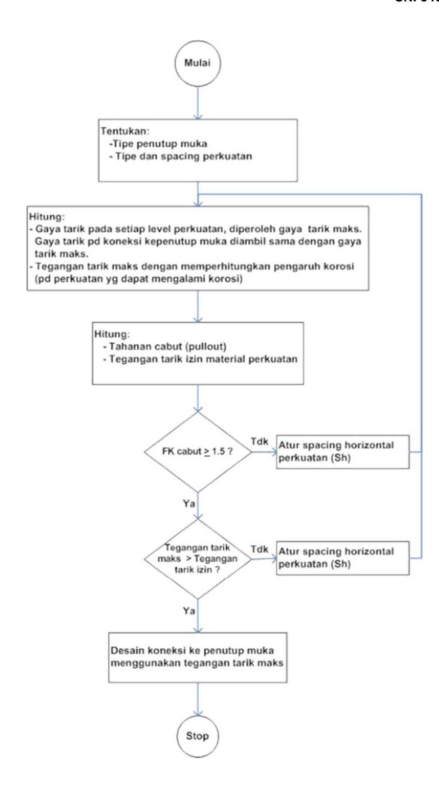

**Gambar 61 – Diagram alir perhitungan stabilitas internal** 

# **10.5.6 Sistem drainase**

Stabilitas struktur timbunan dengan perkuatan tergantung pada baik tidaknya sistem drainase. Kenaikan tegangan pori pada timbunan dengan perkuatan akan mengurangi tekanan *overburden* pada level perkuatan, sehingga mengurangi kapasitas cabut dan tahanan terhadap geser lateral.

Sistem drainase permukaan dan bawah permukaan harus diberikan pada struktur dinding MSE, sesuai dengan aliran air yang diperkirakan. Disarankan untuk menempatkan pipa drainase di luar badan timbunan (di muka penutup muka). Sistem drainase harus diberikan titik-titik pembuangan yang cukup, yang terhubung dengan saluran pembuangan. Gambar 62 menyajikan salah satu alternatif sistem drainase permukaan dan bawah permukaan.

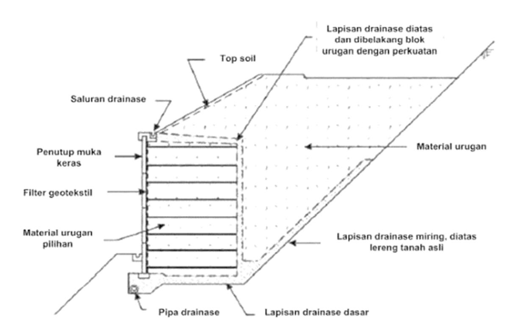

**Gambar 62 – Salah satu alternatif sistem drainase permukaan dan bawah permukaan (GEO Hongkong, 2002)** 

#### **10.5.7 Kriteria penerimaan dinding MSE**

# **10.5.7.1 Batasan perbedaan penurunan**

#### **10.5.7.1.1 Perbedaan penurunan penutup muka**

Struktur dinding MSE mempunyai toleransi yang besar terhadap deformasi baik pada arah penutup muka maupun pada arah tegak lurus penutup muka. Karena itu kondisi tanah fondasi yang buruk jarang menyebabkan tidak dapat digunakannya dinding MSE. Akan tetapi jika perbedaan penurunan yang besar ( > 1/100) diperkirakan akan terjadi, celah sambungan yang cukup lebar perlu diberikan untuk mencegah retaknya panel penutup muka. Faktor perbedaan penurunan menentukan tipe dan perancangan penutup muka.

**© BSN 2017 244 dari 303**

Panel penutup muka berbentuk bujur sangkar dapat lebih menerima perbedaan penurunan dibandingkan dengan panel persegi panjang dengan luas permukaan yang sama. Batas perbedaan penurunan yang dapat ditoleransi sebagai fungsi lebar celah sambungan dirangkumkan pada Tabel 45. Tabel 46 merangkumkan batas perbedaan penurunan untuk beberapa tipe penutup muka.

**Tabel 45 – Batas perbedaan penurunan sebagai fungsi lebar celah sambungan** 

| Lebar celah sambungan                                  | Batas perbedaan penurunan |  |  |  |
|--------------------------------------------------------|---------------------------|--|--|--|
| (mm)                                                   |                           |  |  |  |
| 20                                                     | 1/100                     |  |  |  |
| 13                                                     | 1/200                     |  |  |  |
| 6                                                      | 1/300                     |  |  |  |
| Keterangan: Untuk panel dengan luas permukaan < 4,5 m2 |                           |  |  |  |

**Tabel 46 – Batas perbedaan penurunan untuk beberapa tipe penutup muka** 

| Panel penutup muka                     | Batas perbedaan penurunan |
|----------------------------------------|---------------------------|
| Panel setinggi dinding                 | 1/500                     |
| Unit dinding blok modular cetak kering | 1/200                     |
| Anyaman kawat yang dilas               | 1/50                      |

#### **10.5.7.1.2 Perbedaan penurunan arah longitudinal**

Jika diperkirakan akan terjadi perbedaan penurunan yang signifikan dalam arah longitudinal (tegak lurus penutup muka), koneksi perkuatan ke penutup muka akan menderita *overstress*. Jika bagian belakang timbunan dengan perkuatan akan turun lebih besar daripada bagian muka, perkuatan diletakkan pada posisi miring dengan bagian belakang lebih tinggi dari bagian muka untuk mengantisipasi perbedaan penurunan.

#### **10.5.8 Verifikasi perancangan**

# **10.5.8.1 Monitoring pergerakan vertikal dan horizontal penutup muka**

Pergerakan horizontal dan vertikal penutup muka dapat dimonitor dengan survei dengan alat *total station* (TS) pada sejumlah target titik yang terletak pada penutup muka atau pada perkerasan jalan atau pada tanah yang ditahan. Untuk kontrol vertikal dan horizontal, satu atau beberapa titik ikat *(benchmark)* diperlukan.

Maksimum pergerakan horizontal selama konstruksi sekitar H/250 untuk perkuatan kaku dan H/75 untuk perkuatan fleksibel. Kemiringan akibat perbedaan pergerakan horizontal dari bawah ke atas dinding diperkirakan < 4 mm/m tinggi dinding. Pergerakan horizontal pascakonstruksi akan sangat kecil.

Pergerakan vertikal pascakonstruksi dapat diperkirakan dari analisis penurunan fondasi. Pengukuran penurunan aktual fondasi selama dan setelah konstruksi, harus dilakukan. Parameter monitoring dan instrumentasi yang dapat digunakan dalam monitoring pergerakan vertikal dan horizontal penutup muka diperlihatkan pada Tabel 47.

**Tabel 47 – Parameter monitoring dan instrumentasi yang dapat digunakan** 

| No. | Parameter objek monitoring         | Instrumentasi yang digunakan      |
|-----|------------------------------------|-----------------------------------|
| 1.  | Pergerakan horizontal penutup      | Observasi visual                  |
|     | muka                               | Survei menggunakan total station  |
|     |                                    | Tiltmeter                         |
| 2.  | Pergerakan lokal atau kerusakan    | Observasi visual                  |
|     | elemen penutup muka                | Crack gauges                      |
| 3.  | Kinerja drainase material timbunan | Observasi visual pada titik-titik |
|     |                                    | pembuangan                        |
|     |                                    | Standpipe piezometer              |

# **10.5.8.2 Monitoring pergerakan vertikal keseluruhan struktur dinding MSE**

Parameter yang menjadi objek monitoring adalah pergerakan vertikal keseluruhan struktur dinding MSE. Untuk objek monitoring tersebut, beberapa instrumen atau monitoring yang layak dilakukan adalah:

- a) Observasi visual,
- b) Survei menggunakan *total station*,
- c) *Tiltmeter*.

#### **10.5.8.3 Monitoring kinerja struktur yang didukung oleh dinding MSE**

Parameter yang menjadi objek monitoring adalah kinerja dari struktur yang didukung oleh dinding MSE. Tergantung detail dari struktur, terdapat sejumlah instrumen yang layak dipasang.

#### *10.6* **Angkur tanah** *(ground anchors)*

# **10.6.1 Ruang lingkup pekerjaan angkur tanah**

Subpasal ini menyajikan persyaratan-persyaratan untuk perancangan sistem pengangkuran pada tanah dan batuan, baik yang bersifat sementara maupun yang permanen. Sekalipun subpasal ini lebih menekankan pada sistem pengangkuran dengan *grouting*, persyaratanpersyaratan ini berlaku juga untuk sistem pengangkuran mekanikal.

#### **10.6.2 Deskripsi**

Sistem pengangkuran adalah suatu sistem untuk menyalurkan gaya tarik yang bekerja ke lapisan tanah/batuan pendukung. Sistem pengangkuran ini utamanya terdiri atas *fixed length, free length*, dan kepala angkur *(anchor head).* 

Sistem pengangkuran ini dapat dibedakan atas angkur sementara dengan umur layan 2 tahun dan angkur permanen dengan umur layan > 2 tahun.

Gambar 63 memperlihatkan sistem pengangkuran dan kepala angkur.

**© BSN 2017 246 dari 303**

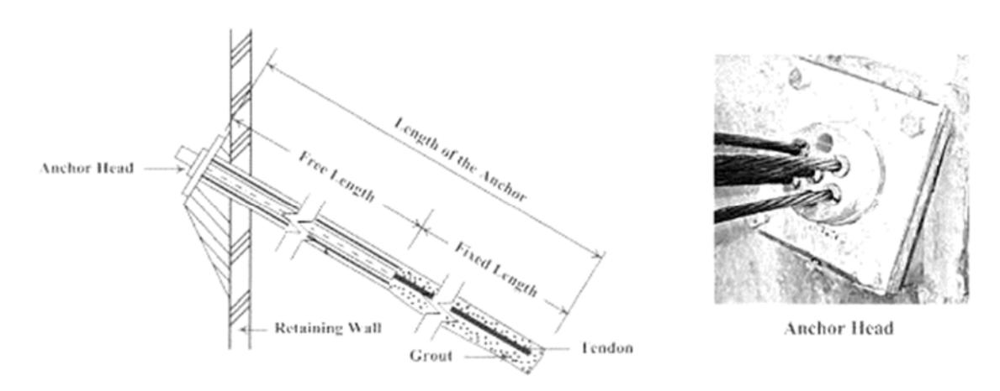

**Gambar 63 – Sistem pengangkuran dan kepala angkur** 

## **10.6.3 Persyaratan teknis**

#### *10.6.3.1* **Persyaratan tanah tempat terbenamnya** *fixed length*

*Fixed length* harus terbenam di dalam lapisan tanah yang keras sehingga dapat memberikan tahanan friksi yang besar. Jika terbenam pada tanah pasir/pasiran dan tanah nonkohesif lainnya, disyaratkan tanah tersebut mempunyai nilai N SPT 25, sedangkan jika terbenam pada tanah kohesif, disyaratkan tanah tersebut mempunyai nilai N SPT 20.

Khusus untuk angkur permanen pada tanah kohesif, perlu diperhatikan masalah rangkak atau hilangnya gaya prategang terhadap waktu.

#### **10.6.3.2 Persyaratan** *grout*

*Grout* angkur dibuat dari campuran semen *(Ordinary Portland cement)* dan air dengan rasio air/semen (*w/c ratio*) berkisar antara 0,35 – 0,60. Untuk sistem pengangkuran pada batuan atau lempung dengan permebilitas rendah umumnya rasio air/semen (*w/c ratio*) 0,45.

Kuat tekan *grout* pada umur 28 hari, adalah:

- a) kubus 10 cm x 10 cm x 10 cm, kuat tekan 40 N/mm2 ;
- b) silinder 10 cm x 20 cm, kuat tekan 33 N/mm2.

Uji angkur dapat dilakukan sebelum kuat tekan *grout* mencapai nilai kuat tekan beton seperti tersebut. Untuk keperluan uji kuat tekan *grout* yang disyaratkan adalah 30 N/mm2 untuk contoh kubus, dan 25 N/mm2 untuk contoh silinder.

Bahan tambah hanya boleh digunakan bila hasil uji menunjukkan bahwa penggunaan bahan tambah tersebut memperbaiki sifat *grout*, misalnya meningkatkan *workability* atau ketahanan, mempercepat pengerasan *grout*, mengurangi *bleed* atau penyusutan.

#### **10.6.3.3 Persyaratan** *tendon*

*Tendon* dapat dibuat dari baja batangan *(steel bar)*, kawat *(wire)*, dan *strand*. Di antara ketiga jenis material *tendon*, *strand* paling banyak digunakan, khususnya "*low relaxation 7 wire strand*" dengan diameter 1,27 cm (0,5 inci).

Material *tendon* harus dibuat oleh pabrikan yang sudah biasa membuat material tersebut dengan sertifikat pabrik yang mencantumkan karakteristik dari material tersebut, dan memenuhi persyaratan-persyaratan dari SNI terkait.

#### *10.6.3.4* **Persyaratan kepala angkur**

Kepala angkur umumnya terdiri atas *stressing head* dimana *tendon* dibaji dan *bearing plate* yang meneruskan gaya *tendon* ke struktur. *Stressing head* harus mampu memegang/membaji *tendon* yang ditarik hingga 80% kuat tarik karakteristik *tendon*, tanpa merusak *tendon* tersebut, dan memungkinkan dilakukannya penambahan dan pengurangan gaya *tendon* pada fase awal penarikan.

#### **10.6.3.5 Persyaratan material pendukung**

#### **10.6.3.5.1 Penutup kepala angkur**

Penutup kepala angkur digunakan untuk melindingi kepala angkur (pada angkur permanen) dari karat, terbuat dari material polietilena atau polipropilena, atau *aluminium alloys*, atau baja.

Penutup kepala angkur harus tahan pukulan/tumbukan, tahan karat akibat asam, dan tahan sinar ultraviolet. Penutup kepala angkur ini harus dibuat dengan lubang *inlet* dan *outlet*, untuk pengisian gemuk *(grease),* sehingga dapat dihindari terjadinya rongga dan tidak bocor.

Untuk perawatan kepala angkur, penutup kepala angkur ini juga harus dapat dilepas.

#### **10.6.3.5.2** *Spacer***/***centralizer*

*Spacer*/*centralizer* dipasang pada bagian *fixed length* dengan tujuan:

- *a)* Menjamin separasi antara *individual strand* pada *multi strand anchor*;
- b) Menjamin bahwa *tendon* berada di tengah-tengah kolom *grout* dengan penutup *grout* minimum 10 mm.

*Spacer*/*centralizer* harus terbuat dari bahan yang tidak memberikan efek buruk bagi *tendon*.

#### **10.6.3.5.3 Pipa HDPE**

Pipa HDPE melindungi tiap-tiap *strand* pada bagian *free length*, yang telah dilapisi dengan gemuk, sehingga *strand* pada bagian *free length* ini bebas untuk memanjang/memendek. Pipa HDPE tersebut harus memenuhi persyaratan seperti pada *corrugated sheath* yang dijelaskan berikut ini.

# *10.6.3.5.4 Corrugated sheath*

Terbuat dari *polypropylene* yang berfungsi melindungi bagian *fixed length* pada angkur permanen dari karat. *Corrugated sheath* harus memenuhi persyaratan berikut:

- a) Mampu bertahan sepanjang umur angkur;
- b) Tidak menimbulkan efek merugikan bagi lingkungan;
- c) Dapat menahan gaya selama *handling*, pengangkutan, dan instalasi angkur;
- d) Tidak gagal akibat pengujian, pemberian tegangan *(stressing)* dan penguncian *(locking).*

**© BSN 2017 248 dari 303**

Salah satu contoh angkur tanah permanen dengan *single corrugated sheet* diberikan di dalam Gambar 64.

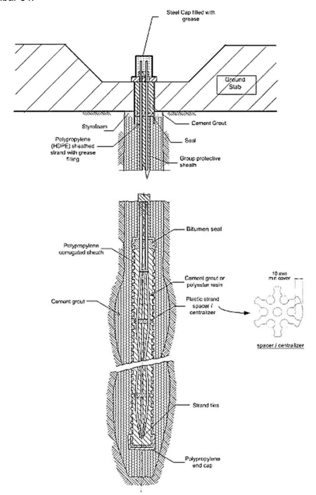

**Gambar 64 - Salah satu contoh angkur tanah permanen dengan** *single corrugated sheet*

# **10.6.4 Perancangan angkur tanah**

#### **10.6.4.1 Diagram alir perancangan dan pelaksanaan**

Di dalam pekerjaan angkur tanah sangat sulit dipisahkan antara fase perancangan dan pelaksanaan karena di dalam fase pelaksanaan masih dibutuhkan keterlibatan perancang. Diagram alir seperti disajikan pada Gambar 66 merangkumkan tahapan-tahapan pekerjaan mulai dari fase perancangan, fase prakonstruksi, dan fase konstruksi.

**© BSN 2017 249 dari 303** 

Pekerjaan pada fase prakonstruksi pada pokoknya adalah memverifikasi panjang *fixed length* yang ditentukan berdasarkan data tanah pada fase perancangan. Pada fase ini kontraktor sudah terpilih, sehingga dapat dilakukan uji investigasi pada angkur tidak terpakai.

Verifikasi perancangan pada fase konstruksi adalah verifikasi kapasitas tarik angkur pada angkur produksi dengan melakukan uji kesesuaian dan penerimaan.

# **10.6.4.2 Persyaratan** *layout* **angkur tanah**

*Layout* angkur tanah harus ditentukan dengan mempertimbangkan stabilitas global, efek negatif pada lingkungan dan struktur sekitarnya, termasuk struktur dan utilitas bawah tanah. *Layout* angkur tanah juga harus memenuhi persyaratan-persyaratan berikut:

- a) *Fixed length* harus terbenam minimum 5 m dari permukaan tanah;
- b) *Fixed length* harus berada di luar bidang gelincir kritis saat meninjau stabilitas global;
- c) Spasi horizontal minimum 1,5 m untuk angkur dengan diameter 0,2 m agar efek grup tidak perlu diperhitungkan;
- d) Agar efektif dalam menahan gaya yang bekerja, maka sudut kemiringan angkur terhadap arah bekerjanya gaya umumnya berkisar antara 300 - 45 0;
- e) Posisi *fixed length* harus berada di luar area berarsir pada Gambar 65.

Diagram alir perancangan dan pelaksanaan angkur tanah diperlihatkan pada Gambar 66.

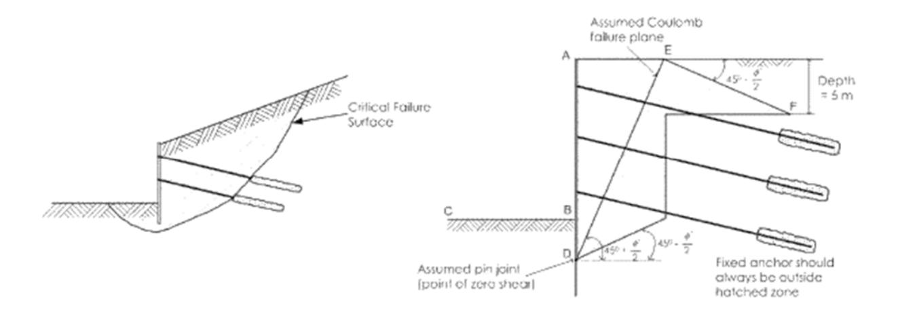

- a) *Fixed length* harus berada di luar bidang b) *Fixed length* harus berada di luar bidang gelincir kritis berarsir

**Gambar 65 – Persyaratan posisi** *fixed length* **(BS 8081)** 

**© BSN 2017 250 dari 303**

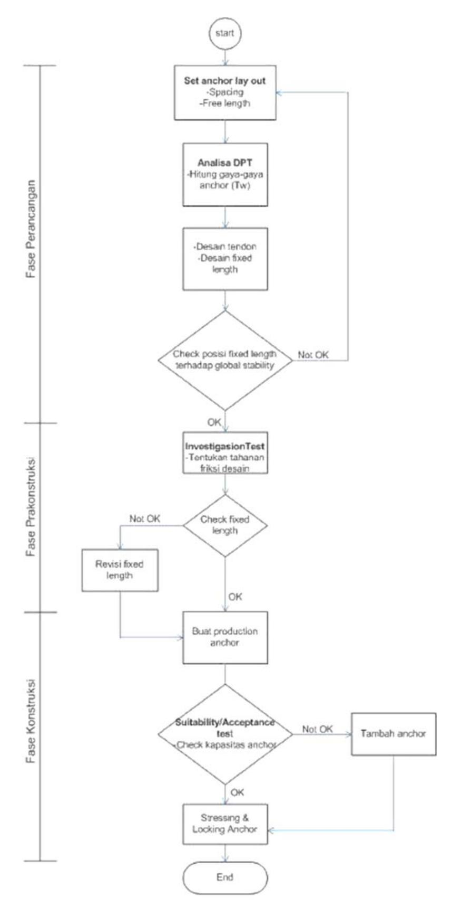

**Gambar 66 – Diagram alir perancangan dan pelaksanaan angkur tanah** 

(Diagram alir ini disusun berdasarkan praktik terkini pekerjaan angkur tanah)

# **10.6.4.3 Panjang** *free length* **dan** *fixed length*

Panjang minimum *free length* adalah 3 m untuk *bar tendon* dan 4,5 m untuk *strand tendon* (FHWA-IF-99-015). Panjang *free length* aktual ditentukan dengan mempertimbangkan kedalaman minimum *fixed length* dari permukaan tanah dan stabilitas keseluruhan sistem struktur seperti diilustrasikan pada Gambar 65.

Panjang minimum *fixed length* adalah 3 m. Panjang maksimum *fixed length* adalah 13 m. Untuk panjang > 13 m dapat digunakan, dengan syarat dapat dibuktikan dengan uji tarik *(pullout test)* dimana kapasitas dapat termobilisasi lebih panjang.

**CATATAN –** Pengalaman menunjukkan bahwa untuk tipikal angkur tanah, memperpanjang *fixed length* tidak meningkatkan tahanan tarik secara signifikan. Observasi menunjukkan bahwa beban yang telah ditransfer pada jarak tertentu dari zona *bonding*, deformasi yang terjadi di antara tanah dan muka tanah menjadi signifikan sehingga menurunkan sampai nilai residualnya (JGS 4101-2012).

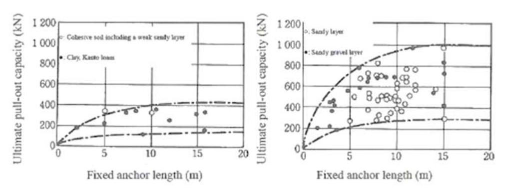

#### **10.6.4.4 Penentuan kapasitas tarik angkur**

Kapasitas tarik angkur pada fase perancangan ditentukan dengan menggunakan data tanah dan formula berikut (Canadian Foundation Engineering Manual):

*Fixed length* terbenam pada tanah kohesif ditentukan dengan Persamaan (7).

$$Rult = \alpha A_s L_s S_{u(ave)}$$
 (7)

#### **Keterangan:**

Rult = kapasitas batas angkur tanah;

As = luas selimut *fixed length*;

Ls = panjang *fixed length*;

Su (ave) = kuat geser tak terdrainase tanah rata-rata sepanjang *fixed length*;

α = faktor adhesi tergantung pada kuat geser tak terdrainase tanah.

**CATATAN** – Faktor α ini pada umumnya lebih besar dari faktor α pada fondasi tiang karena digunakannya pompa *grouting* dan bahan tambah pada *grout* untuk menghilangkan penyusutan.

*Fixed length* terbenam pada tanah non kohesif ditentukan dengan Persamaan (8).

$$Rult = \sigma_{v}' A_{s} L_{s} K_{s}$$
 (8)

**© BSN 2017 252 dari 303**

# **Keterangan**:

Rult = kapasitas batas angkur tanah;

**v'** = tegangan vertikal efektif pada tengah-tengah *fixed length*;

As = luas selimut *fixed length*;

Ls = panjang *fixed length*;

Ks = koefisien angkur yang tergantung pada tipe dan kepadatan tanah seperti pada Tabel 48.

**Tabel 48 – Koefisien angkur, Ks (Canadian Foundation Engineering Manual)** 

| Tipe tanah           | Kepadatan tanah |                     |               |  |  |
|----------------------|-----------------|---------------------|---------------|--|--|
|                      | Lepas (loose)   | Kompak (compact) | Padat (dense) |  |  |
| Lanau nonplastis     | 0,1             | 0,4                 | 1             |  |  |
| Pasir halus          | 0,2             | 0,6                 | 1,5           |  |  |
| Medium sand          | 0,5             | 1,2                 | 2             |  |  |
| Pasir kasar, kerikil | 1               | 2                   | 3             |  |  |

Faktor keamanan *ground/grout interface* seperti pada 10.6.4.5 harus dipakai untuk menghitung kapasitas izin angkur tanah.

Kapasitas angkur tanah sangat dipengaruhi oleh *workmanship* kontraktor, peralatan khususnya pompa *grout* yang dipakai, dan lainnya, sehingga predikasi kapasitas angkur tanah berdasarkan data tanah dapat menyimpang jauh dari nilai sebenarnya, dan perlu dikonfirmasi dengan melakukan uji tarik (uji investigasi) pada fase prakonstruksi.

# **10.6.4.5 Faktor keamanan minimum**

Faktor keamanan minimum untuk *tendon*, *ground*/*grout interface*, *grout*/*tendon interface* atau *grout*/*encapsulation interface*, dan faktor beban minimum untuk uji-uji angkur tanah seperti diuraikan pada Pasal 10.6.5.2, adalah seperti pada Tabel 49.

**Tabel 49 – Rekomendasi faktor keamanan minimum (BS 8081)**  ( )

|                                                                                                                                                                                                                                                       |        | Faktor Keamanan Minimum   |                                                       | Faktor                       |
|-------------------------------------------------------------------------------------------------------------------------------------------------------------------------------------------------------------------------------------------------------|--------|---------------------------|-------------------------------------------------------|------------------------------|
| Katagori Angkur Tanah                                                                                                                                                                                                                                 | Tendon | Ground/grout interface | Grout/tendon atau grout/encapsulation interface | Beban untuk Proof test |
| Angkur sementara dengan umur layan kurang dari 6 bulan dan keruntuhan tidak mengakibatkan konsekwensi serius dan tidak membahayakan keselamatan umum. Misalnya test tiang memakai angkur tanah sebagai sistem reaksi.                     | 1.40   | 2.0                       | 2.0                                                   | 1.10                         |
| Ankur sementara dengan umur layan tidak lebih dari 2 tahun , dimana walaupun konsekwensi keruntuhan cukup serius, tetapi tidak membahayakan keselamatan umum tanpa cukup peringatan. Misalnya angkur tanah pada dinding penahan tanah. | 1.60   | 2.5 *                     | 2.5 *                                                 | 1.25                         |
| Angkur permanen dan angkur sementara dimana resiko korosi tinggi dan/atau konsekwensi keruntuhan serius. Misalnya kabel utama pada jembatan gantung atau kabel sebagai reaksi untuk mengangkat struktur berat.                            | 2.00   | 3.0 +                     | 3.0 *                                                 | 1.50                         |

 \* FK minimum 2.0 dapat digunakan bila tersedia test lapanagan skala penuh.

#### **CATATAN**

- a) Kuat tarik izin *tendon* adalah kuat tarik karakteristik *tendon* dibagi dengan faktor keamanan untuk *tendon*.
- b) Faktor keamanan untuk *ground/grout interface* ini digunakan pada waktu menghitung kapasitas izin angkur berdasarkan data-data tanah.
- c) Umumnya persyaratan *bond* antara *tendon* dengan *grout* ini dengan sendirinya terpenuhi selama:
  - 1) Kuat tekan *grout* memenuhi persyaratan pada 10.6.2.2.
  - 2) Jumlah *strand* dari *tendon* memenuhi persyaratan faktor keamanan minimum *tendon* seperti pada Tabel 49.

#### **10.6.5 Kriteria penerimaan**

# **10.6.5.1 Kriteria perpanjangan elastik dari** *tendon*

Suatu angkur yang diuji pada beban tertentu dinyatakan lolos uji pada beban tersebut bila perpanjangan elastik *tendon* hasil pembacaan berada dalam batasan berikut:

- a) Lebih besar dari perpanjangan elastik untuk 90% *free length*;
- b) Lebih kecil dari perpanjangan elastik untuk 110% *free length*.

Grafik kriteria perpanjangan elastik *tendon* diperlihatkan pada Gambar 67.

**© BSN 2017 254 dari 303**

+ FK mungkin perlu dinaikkan menjadi 4 untuk membatasi creep

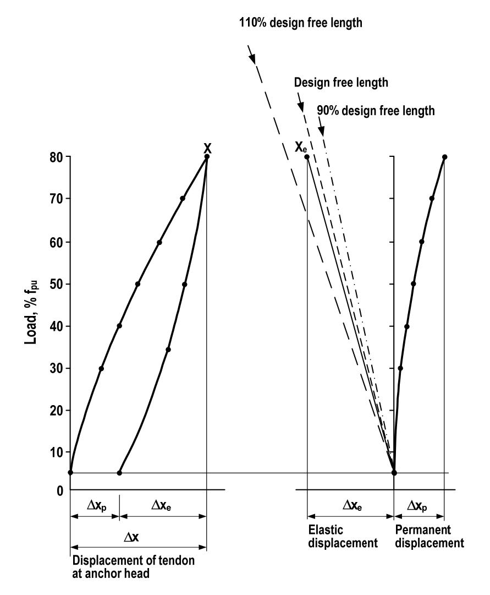

**Gambar 67 – Kriteria perpanjangan elastik** *tendon* **(BS 8081)** 

Pengukuran *displacement*/*extension* harus menggunakan *dial gauge*. *Dial gauge* harus mempunyai *travel* yang sesuai dengan perkiraan pertambahan panjang *strand* dengan ketelitian 0,1 mm. *Dial gauge* harus dikalibrasi tidak lebih dari 6 bulan sebelum pengujian dilakukan.

#### **10.6.5.2 Kriteria kehilangan gaya tarik maksimum**

Untuk setiap uji angkur, beban puncak ditahan selama 15 menit. Selama waktu tersebut, kehilangan gaya tarik dimonitor pada waktu 5 menit dan 15 menit. Untuk dinyatakan lolos uji pada beban tersebut, kehilangan gaya tarik harus memenuhi kriteria pada Tabel 50.

**Tabel 50 – Kriteria penerimaan untuk hubungan beban residual vs waktu (BS 8081)** 

| Periode obsevasi (menit)                                | Kehilangan gaya yang diizinkan (% gaya residual) |
|------------------------------------------------------------|--------------------------------------------------------|
| 5                                                          | 1                                                      |
| 15                                                         | 2                                                      |
| 50                                                         | 3                                                      |
| 150                                                        | 4                                                      |
| 500*                                                       | 5                                                      |
| 1500 (kira-kira 1 hari)                                    | 6                                                      |
| 5000 (kira-kira 3 hari)                                    | 7                                                      |
| 15000 (kira-kira 10 hari)                                  | 8                                                      |
| * pembacaan 500 menit tidak dilakukan pada pekerjaan rutin |                                                        |

Pengukuran beban harus menggunakan *load cell* dengan kapasitas 125% - 150% dikalikan dengan beban maksimum.

# **10.6.6 Verifikasi perancangan**

.

#### **10.6.6.1 Uji investigasi pada angkur tidak terpakai**

Maksud uji investigasi adalah verifikasi tahanan friksi desain yang ditentukan pada fase perancangan menggunakan data-data tanah. Tujuan akhirnya adalah verifikasi *panjang fixed length.* 

Beban uji maksimum adalah 80% kuat tarik karakteristik dari *tendon* dengan mengikuti prosedur uji seperti pada Gambar 68. Jumlah *strand* dari *tendon* pada saat pengujian ditentukan sedemikian sehingga kegagalan tidak terjadi pada *tendon*, tetapi pada *ground/grout interface*.

Uji investigasi harus dilakukan pada setiap perubahan kondisi pelapisan tanah dimana *fixed length* terbenam dengan jumlah uji minimum 2 buah.

Uji investigasi dapat dilakukan baik pada angkur vertikal maupun angkur miring sesuai kemiringan angkur produksi, dengan persyaratan bahwa *fixed length* pada uji angkur terbenam pada lapisan tanah yang sama dengan angkur produksi. Pemilihan apakah uji angkur vertikal atau miring, ditentukan oleh pertimbangan kepraktisan dan bahwa hasil uji merepresentasikan kondisi terburuk.

Dari gaya maksimum yang dapat ditahan angkur dimana pepanjangan *elastic tendon* masih memenuhi persyaratan pada 10.6.4.1, dapat dihitung tahanan friksi pada *ground/grout interface*, dimana berdasarkan tahanan tersebut dapat ditentukan panjang *fixed length* yang dibutuhkan dengan akurat, setelah memperhitungkan faktor beban seperti pada 10.6.3.5.

**© BSN 2017 256 dari 303**

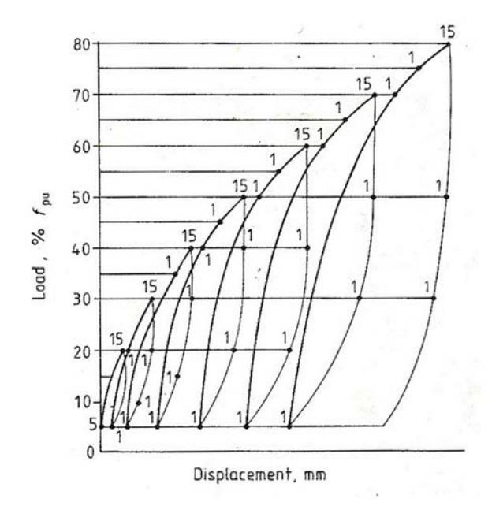

**Gambar 68 – Prosedur pembebanan uji investigasi (BS 8081)** 

#### **10.6.7 Uji kesesuaian dan uji penerimaan pada angkur produksi**

Verifikasi perancangan angkur tanah dilakukan dengan melakukan uji kesesuaian pada angkur produksi terpilih, sedangkan sisa angkur produksi harus menjalani uji penerimaan. Dengan demikian seluruh angkur produksi harus menjalani uji kesesuaian atau uji penerimaan dan harus lolos dari uji tersebut sebelum dilakukan pembajian.

Lolos uji artinya angkur memenuhi kriteria penerimaan seperti pada 10.6.4.1 dan 10.6.4.2 setelah dibebani dengan beban maksimum sebesar Faktor Beban x Gaya Angkur mengikuti prosedur pembebanan seperti pada Gambar 69 dan Gambar 70. Faktor beban untuk tiaptiap kategori angkur tanah disajikan pada Tabel 49, pada 10.6.3.5.

Uji kesesuaian harus dilakukan pada 3 buah angkur produksi yang pertama dipasang ditambah 1 uji pada setiap tipe angkur produksi. Uji penerimaan harus dilakukan pada seluruh angkur produksi yang tidak menjalani uji kesesuaian. Uji kesesuaian dilakukan sampai beban maksimum dalam 3 siklus *loading-unloading*, sedangkan uji penerimaan dalam 2 siklus *loading-unloading*.

Setiap hasil *test suitability* maupun *acceptance* harus diplot hingga mendapatkan kurva *load vs displacement / extension* seperti pada Gambar 69 atau Gambar 70. Bentuk kurva *load vs displacement / extension* yang menyimpang dari gambar tersebut dapat ditolak oleh perencana jika dikhawatirkan akan terjadinya rangkak atau anomali-anomali lainnya.

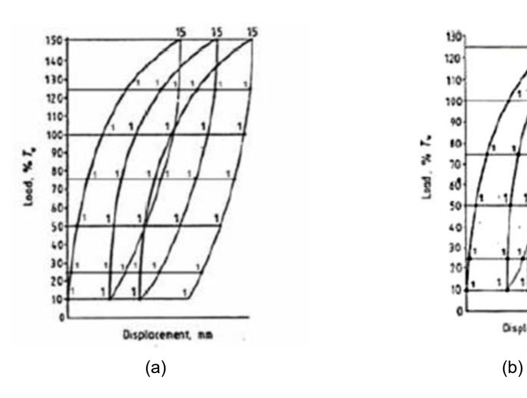

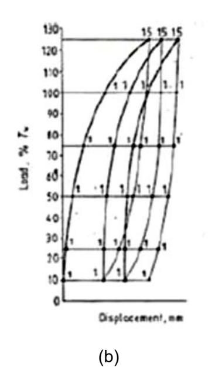

**Gambar 69 – Prosedur pembebanan uji kesesuaian (a) angkur permanen (b) angkur sementara (BS 8081)** 

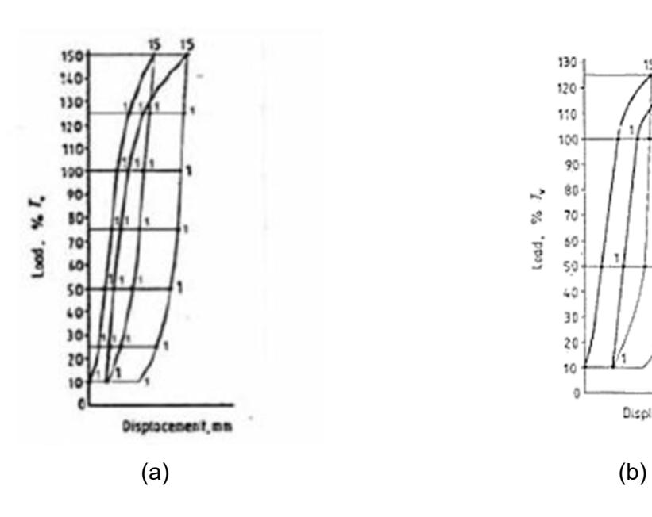

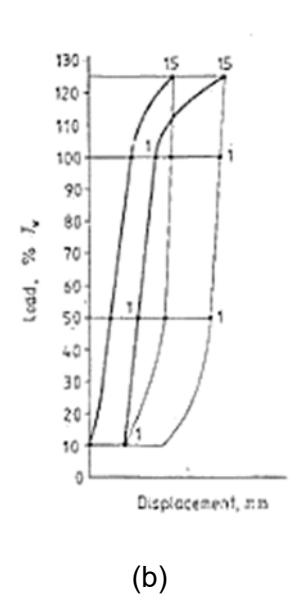

**Gambar 70 – Prosedur pembebanan uji penerimaan (a) angkur permanen (b) angkur sementara (BS 8081)** 

**© BSN 2017 258 dari 303**

# **11 Galian Dalam**

# **11.1 Ruang lingkup pekerjaan Galian Dalam**

Pasal ini membahas Galian Dalam yang mencakup galian tanah dan/atau batuan dengan kedalaman 3 meter atau lebih. Galian Dalam bisa berupa galian terbuka dengan kemiringan lereng yang aman dan/atau galian yang harus diamankan oleh konstruksi pengaman seperti dinding penahan tanah atau *embedded wall* dengan/tanpa angker atau *strut*.

Faktor terpenting dari Galian Dalam (*deep excavation*) adalah desain dan proses konstruksi yang menjamin keselamatan pekerja dan menjamin keamanan terhadap dampak deformasi terhadap bangunan di sekitarnya. Karenanya, kriteria kondisi batas terhadap stabilitas konstruksi Galian Dalam harus dipenuhi dan dipersiapkan secara bersamaan.

Analisis Galian Dalam harus meninjau kemungkinan terjadinya keruntuhan (*failure*) yang bersifat lokal dan global serta tegangan dan deformasi yang diakibatkannya, termasuk dampak gangguan lingkungan akibat pekerjaan *dewatering* serta implikasinya terhadap fondasi eksisting di dekatnya, jika ada. Karenanya, semua gaya yang bekerja dalam perancangan Galian Dalam seperti tekanan tanah, hidrostatik air tanah, beban tambahan, dan gempa harus diperhitungkan. Selain itu, kinerja dari Galian Dalam harus diverifikasi oleh monitoring instrumentasi guna memastikan tidak terjadi dampak negatif terhadap keselamatan pekerja dan/atau gangguan terhadap bangunan di sekitarnya termasuk penurunan (*settlement*), *ground loss*, dan deformasi lateral yang bisa disebabkan oleh pekerjaan *dewatering* dan stabilitas dinding penahan itu sendiri.

Galian Dalam dapat diterapkan pada pekerjaan yang bersifat sementara dan/atau permanen dengan mempertimbangkan stabilitas yang dipengaruhi oleh sifat tanah/batuan. Aplikasi dari pekerjaan Galian Dalam terdiri atas bangunan *besmen* dan lintas bawah (*underpass*), bangunan air, bangunan bawah tanah, galian tambang atau galian untuk peruntukan lainnya.

#### **11.2 Persyaratan teknis perancangan Galian Dalam**

Perancangan Galian Dalam harus mempertimbangkan faktor-faktor berikut:

- a) stabilitas lokal dan global (lihat Pasal 10);
- b) stabilitas struktur perkuatan (konstruksi penahan dan angkur atau *strut*) (Lihat Pasal 10);
- c) stabilitas struktur (tegangan) dari konstruksi penahan sendiri (lihat Pasal 10);
- d) stabilitas terhadap pengangkatan tanah dasar/*basal heave failure* (lihat Pasal 10);
- e) stabilitas terhadap perubahan tekanan air tanah/*hydraulic failure* (lihat Pasal 12);
- f) gangguan gerakan tanah akibat galian *(ground movement);*
- g) gangguan akibat penurunan muka air tanah *(dewatering);*
- h) beban yang harus ditinjau pengaruhnya pada stabilitas galian dan penahan lateral adalah beban yang berjarak minimal sama dengan kedalaman galian dihitung dari tepi galian.
- i) bila galian dilakukan pada lokasi yang sudah ada fondasi eksisting (tiang bor, pancang, fondasi dangkal atau *raft*), maka stabilitas fondasi tersebut harus ditinjau terhadap potensi beban tarik yang bisa terjadi akibat berkurangnya tekanan vertikal efektif tanah dan potensi pengurangan tekanan lateral tanah pada kondisi jangka pendek dan jangka panjang.

Persyaratan perancangan Galian Dalam harus mencakup hal-hal berikut:

- a) penyelidikan geoteknik yang memadai dengan merujuk ke Pasal 5;
- b) untuk perancangan bangunan yang besar/kompleks dan asing bagi Perencana, maka informasi geologi berupa pemetaan topografi, geologi regional dan lokal, serta pemetaan geohidrologi guna mengetahui pola penyebaran aliran air di permukaan dan di bawah tanah perlu dilakukan;
- c) pengamatan kondisi lapangan dan pemilihan konstruksi penahan galian yang sesuai dengan kondisi lapangan;
- d) pengujian kekuatan dan sifat deformasi tanah/batuan serta pengamatan terhadap perilaku air tanah dan air permukaan yang bisa berdampak terhadap lingkungan;
- e) penentuan parameter tanah yang dapat merujuk ke Pasal 5, meliputi:
  - 1) kuat geser tanah pada kondisi tak terdrainase (Su atau tegangan total, c dan Ø) dan terdrainase (tegangan efektif, c' dan ');
  - 2) kekakuan (*stiffness*) tanah (E);
  - 3) permeabilitas tanah (k); dan
  - 4) muka air tanah;
- f) stabilitas lereng yang dapat disokong oleh galian terbuka (*open-cut slope*) (merujuk ke Pasal 7);
- g) analisis daya dukung tanah termasuk tipe bangunan dinding penahan dan/atau *embedded walls* dengan angkur atau *strut* (merujuk ke Pasal 10).

Diperlukan penerapan sistem monitoring instrumentasi yang memadai dengan memerhatikan kondisi lingkungan guna menghindari terjadinya keruntuhan secara mendadak maupun deformasi berlebih yang dapat membahayakan lingkungan, seperti:

- a) keruntuhan hidraulik akibat muka air yang tinggi;
- b) kondisi batuan dengan pola "*dip/direction*" yang berpotensi menjadi bidang longsor terkritis saat galian berlangsung;
- c) galian batuan dengan sistem peledakan yang tidak terkontrol;
- d) kondisi tanah pasir lepas jenuh air yang berpotensi mengalami likuifaksi saat terguncang vibrasi dari gempa atau sumber getaran lainnya; dan
- e) adanya beban permukaan dari *stock piled* atau alat berat yang lokasinya sangat dekat dari tepi muka galian.

#### **11.3 Kontruksi galian terbuka**

Jika lahan bebas yang tersedia cukup, konstruksi Galian Dalam diizinkan mempertimbangkan galian terbuka (*open cut slope*) dengan syarat terjaminnya keamanan galian dan tidak ada potensi gangguan terhadap sekitarnya. Sistem galian terbuka ini tidak diperbolehkan bilamana di dalam radius 10 kali kedalaman galian padat pemukiman untuk diterapkan di daerah perkotaan dan daerah lain yang memiliki muka air tanah tinggi serta padat bangunan. Prosedur analisis galian terbuka harus mempertimbangkan aspek subpasal 11.4 dan dapat merujuk ke Pasal 7 termasuk prosedur analisis stabilitas galian terbuka.

#### **11.4 Kontruksi dinding penahan tanah**

Jika galian terbuka tidak mungkin dikerjakan karena lahan yang terbatas, diperlukan konstruksi dinding penahan tanah dan/atau *embedded walls* untuk menyokong Galian Dalam selama masa konstruksi (penyokong sementara) dengan merujuk ke Pasal 10. Jika

**© BSN 2017 260 dari 303**

*embedded wall* akan digunakan sebagai dinding penahan permanen, analisisnya harus mencakup hal-hal sebagai berikut:

- a) dinding penahan harus direncanakan untuk menahan tekanan lateral statik dan seismik;
- b) sistem pemikul dinding dan lantai *besmen* harus didesain terhadap tekanan lateral dan tekanan ke atas *(uplift)* pada muka air desain dan banjir;
- c) kemantapan *besmen* secara keseluruhan harus dievaluasi secara cermat, termasuk apakah diperlukan bobot pengimbang *(counterweight),* jangkar tanah atau tiang tarik untuk mengimbangi *uplift* dan/atau momen guling akibat gempa;
- d) jika ditemukan muka air tanah tinggi saat kontruksi dan pekerjaan *dewatering* yang dapat membahayakan lingkungan, dinding penahan dan/atau *embedded walls* harus berfungsi sebagai *cut-off-wall*;
- e) tekanan tanah yang bekerja pada dinding penahan tanah, meliputi tanah kondisi statik dan dinamik.

# **11.4.1 Tekanan tanah kondisi statik**

- a) Tekanan tanah pada dinding penahan harus memperhitungkan keadaan terburuk selama masa layan bangunan dan kondisi jepitan dinding penahan tanah. Untuk dinding penahan tanah terjepit lantai seperti *besmen*, tekanan tanah harus memakai tekanan tanah diam/*at-rest* K0.
- b) Tekanan tanah diam (*at-rest*) harus dihitung berdasarkan parameter tanah kondisi *drained* untuk tanah lempung jenuh, dimana nilai kohesi harus dipilih secara konservatif atau sering diabaikan.
- c) Besarnya koefisien tekanan tanah diam/*at rest* (K0) dapat ditentukan berdasarkan rujukan literatur yang umum dipakai.
- d) Beban tambahan merata harus diambil minimal 10 kPa, bekerja dari tepi muka galian.
- e) Tahanan tanah boleh dimodelkan sebagai tahanan pasif yang sudah direduksi oleh faktor keamanan dalam perhitungan stabilitas memakai metode keseimbangan batas. Sebagai alternatif, tahanan tanah boleh juga dimodelkan sebagai pegas (*spring*) dalam perhitungan stabilitias memakai metode *subgrade modulus*.
- f) Analisis stabilitas memakai metode elemen hingga boleh dipakai asal penentuan perameter tanah harus dilakukan berdasarkan kondisi terjelek dan pemodelan rumusan yang sesuai.
- g) Tekanan air pada dinding dan dasar dinding penahan harus ditetapkan berdasarkan tinggi muka air maksimum yang mungkin terjadi selama masa layanan bangunan yang akan dibuat. Dalam menetapkan tinggi muka air maksimum untuk masa kontruksi, harus dipertimbangkan muka air tertinggi yang pernah terjadi akibat fluktuasi musiman, serta pengaruh adanya air permukaan dari aliran air hujan, jenis lapisan tanah serta kondisi bangunan serta pelaksanaan bangunan. Untuk kondisi permanen, bilamana tidak dapat ditunjukkan dengan data yang akurat dan analisis yang lengkap, maka muka air tanah desain harus ditentukan pada elevasi banjir di lokasi proyek, dengan catatan bahwa elevasi tersebut tidak boleh lebih rendah dari pemukaan tanah sebelum bangunan dibuat.

# **11.4.2 Tekanan tanah kondisi dinamik**

- 1) Pengaruh gempa pada dinding *besmen* harus diperhitungkan dengan menggunakan tekanan tanah menurut beban gempa sesuai klasifikasi SNI 1726:2012. Beban gempa yang digunakan adalah beban yang telah memperhitungkan adanya amplifikasi seismik dari batuan dasar (*bedrock*) ke level dinding *besmen*. Tekanan ini tidak melebihi tekanan pasif tanah pada kondisi gempa. Metode analisis yang digunakan harus rasional dan mempunyai rujukan yang layak, seperti rumusan Seed-Whitman (1970) untuk dinding penahan kantilever dan Wood (1973) untuk dinding *besmen* yang terjepit oleh lantai atau melakukan analisis interaksi tanah-struktur untuk kondisi gempa. Selain itu, rujukan dari Sitar (2013) atau rujukan lain yang telah terbukti keandalannya dapat dipakai untuk menghitung tekanan dinamik tanah pada dinding penahan kantilever dan *besmen*.
- 2) Distribusi beban lateral akibat gempa umumnya lebih besar pada level atas *besmen* dan menurun sebagai fungsi kedalaman *besmen* perlu diterapkan untuk perhitungan struktur dinding *besmen* ini. Untuk dinding penahan kantilever, Sitar (2013) merujuk bahwa distribusi beban lateral gempa kondisi tanah aktif sama dengan distribusi tekanan hidrostatik yang meningkat sebagai fungsi kedalaman.
- 3) Tekanan tanah total saat terjadi gempa yang bekerja adalah penjumlahan dari tekanan tanah statik ditambah dengan tekanan tanah dinamik untuk dinding penahan kantilever (Ka) atau dinding penahan terjepit/*besmen* (K0).
- 4) Untuk struktur bangunan yang dibangun di atas tanah yang memiliki sifat khusus (SF) menurut SNI 1726:2012 seperti tanah lempung sangat lunak yang relatif tebal, tanah organik dan lapisan tanah yang berpotensi likuifaksi seperti tanah reklamasi (pasir halus jenuh air), maka perencana harus menyampaikan analisis tanah khusus dan analisis potensi likuifaksi serta teknik perbaikan tanah atau teknik penanggulangannya. Beban lateral gempa yang bekerja pada dinding *besmen* harus mencakup tekanan diam saat pasir terlikuifaksi ditambah tekanan hidro-dinamik tanah berdasarkan rujukan literatur yang rasional.

## **11.5 Penurunan permukaan tanah di sekitar galian**

Batasan deformasi lateral izin dinding penahan tanah dan/atau *embedded walls* ditentukan oleh kondisi tanah, kedalaman galian serta jarak dan kondisi gedung terdekat yang besarnya ditentukan dalam rumusan seperti yang tercantum dalam Tabel 51.

Batas maksimum deformasi lateral pada dinding Keterangan: x = jarak dari batas galian, H = Kedalaman galian, δw = defleksi dinding **Lokasi gedung dan infrastruktur eksisting terdekat**  Zona 1 (x/H < 1) Zona 2 (1≤ x/H ≤ 2) Zona 3(x/H > 2) Tanah Tipe A Tanah Tipe B Batas izin maksimum deformasi (δw/H) 0,5% 0,7% 0,7% 1,0%

**Tabel 51 – Batas maksimum deformasi lateral dinding** 

Keterangan:

- a) Tanah Tipe A meliputi: tanah lempung dan lanau *overconsolidated* (*over-consolidated stiff clays dan silts*), tanah residual (*residual soils*), dan tanah pasir dengan kepadatan sedang sampai dengan padat (*medium to dense sands*).
- b) Tipe Tanah B meliputi: tanah lempung dan lanau lunak (*soft clays, silts*), tanah organik (*organic soils*) dan tanah timbunan tidak terpadatkan (*loose fills*).

**© BSN 2017 262 dari 303**

# **11.6 Instrumentasi dan monitoring**

Instrumentasi yang direkomendasikan untuk dipasang dan disyaratkan dalam perancangan Galian Dalam guna memantau kinerja stabilitas adalah sebagai berikut:

- a) Inklinometer untuk memantau pergerakan lateral tanah atau dinding penahan (SNI 3404:2008);
- b) *Piezometer* untuk mengetahui kenaikan tekanan air pori (SNI 8134:2015 dan SNI 03- 3453-1994;
- c) *Settlement marker* untuk memantau pergerakan vertikal tanah;
- d) Ekstensometer untuk mengetahui deformasi dan pengangkatan tanah (SNI 3454-2008);
- e) *Load cell* untuk mengetahui perubahan beban penahan selama konstruksi galian;
- f) *Tiltmeter* untuk memonitor perubahan inklinasi vertikal bangunan penahan galian dalam.

Monitoring dan supervisi konstruksi galian selama tahap pelaksanaan dan setelah selesai galian harus dilakukan agar dapat diambil tindakan pencegahan kerusakan konstruksi. Penjelasan detail instrumentasi bisa merujuk ke pasal 10.

# **12 Kegempaan**

# **12.1 Ruang lingkup kegempaan**

Pasal ini dimaksudkan sebagai pelengkap untuk perancangan beban gempa untuk struktur bangunan gedung dan non-gedung yang tercantum dalam SNI 1726:2012, perancangan beban gempa untuk jembatan konvensional yang tercantum dalam SNI 2833:2008, serta petunjuk umum untuk pemilihan parameter evaluasi seismik untuk bangunan-bangunan air, terowongan, fondasi, dinding penahan tanah, analisis stabilitas lereng, dan analisis likuifaksi.

Syarat-syarat perancangan yang ditetapkan dalam pasal ini berlaku untuk bangunan sebagai berikut:

- a) bangunan gedung dan non-gedung, sebagaimana yang tercantum dalam SNI 1726:2012;
- b) jembatan konvensional, sebagaimana yang tercantum dalam SNI 2833:2008;
- c) bangunan-bangunan air, seperti dam serta bangunan-bangunan pelengkapnya;
- d) terowongan;
- e) dinding penahan tanah;
- f) stabilitas lereng;
- g) fondasi;
- h) likuifaksi.

#### **12.2 Persyaratan teknis perancangan kegempaan**

#### **12.2.1 Persyaratan ketahanan gempa**

Kriteria perancangan gempa rencana untuk tiap-tiap infrastruktur diperlihatkan pada Tabel 52. Struktur dan komponennya harus memiliki sistem penahan gaya lateral dan vertikal yang mampu memberikan kekuatan, kekakuan, dan kapasitas disipasi energi yang cukup untuk menahan beban gempa rencana sesuai dengan kriteria batas deformasi dan kekuatan yang disyaratkan.

**Tabel 52 – Kriteria perancangan gempa berdasarkan peruntukan infrastuktur** 

| Peruntukan                             | Umur rencana (tahun) | Probabilitas terlampaui (%) | Periode ulang (tahun)                         | Kriteria keamanan                                                                                                                                                                                                                              | Referensi                         |
|----------------------------------------|----------------------------|-----------------------------------|--------------------------------------------------|------------------------------------------------------------------------------------------------------------------------------------------------------------------------------------------------------------------------------------------------|-----------------------------------|
| Bangunan gedung dan non-gedung      | 50                         | 2                                 | 2.500                                            | -                                                                                                                                                                                                                                              | SNI 1726:2012                     |
| Jembatan konvensional               | 75                         | 7                                 | 1.000                                            | -                                                                                                                                                                                                                                              | SNI 2833:201x AASHTO (2012) |
| Dinding penahan Abutmen Jembatan | 75                         | 7                                 | 1.000                                            | FK>1,5 (terhadap geser saat mengalami beban statik) FK>2 (terhadap guling saat mengalami beban statik) FK>1,1 (terhadap beban pseudostatik)                                                                                     | WSDOT, FHWA-NJ 2005-002     |
| Timbunan oprit                         |                            |                                   |                                                  | FK>1,1                                                                                                                                                                                                                                         |                                   |
| Bendungan                              | 100                        | 1                                 | 10.000, Safety Evaluation Earthquake (SEE) |  Tidak terjadi aliran air yang tidak terkendali  Deformasi tidak melebihi 0,5 dari tinggi jagaan  Deformasi pada filter tidak boleh melebihi 0,5 tebal filter  Spillway tetap berfungsi setelah terjadi gempa rencana | ICOLD No 148, 2016,            |
|                                        | 100                        | 50                                | 145 Operating Basis Earthquake (OBE)          | Kerusakan minor setelah terjadi gempa rencana                                                                                                                                                                                               |                                   |
| Bangunan pelengkap bendungan     | 50                         | 2                                 | 2500                                             | -                                                                                                                                                                                                                                              |                                   |
| Terowongan                             | 100                        | 10                                | 1.000 tahun                                      |                                                                                                                                                                                                                                                |                                   |

## **12.2.1.1 Gempa rencana untuk bangunan gedung dan non-gedung**

Gempa rencana untuk struktur bangunan gedung dan non-gedung ditetapkan dengan kemungkinan terlewati besarannya selama umur rencana struktur bangunan 50 tahun adalah sebesar 2%. Untuk berbagai kategori risiko struktur bangunan gedung dan non-gedung, pengaruh gempa rencana harus dikalikan dengan suatu faktor keutamaan sesuai SNI 1726:2012.

Respons spektral percepatan gempa maksimum yang dipertimbangkan risiko-tertarget (MCER) untuk bangunan atas harus memenuhi kriteria sebagai berikut.

- a) Parameter percepatan terpetakan yang terdiri atas parameter *Ss* (percepatan batuan dasar pada periode pendek) dan *S1* (percepatan batuan dasar pada periode 1 detik) harus ditetapkan masing-masing dari respons spektral percepatan 0,2 detik dan 1 detik dalam peta gerak tanah seismik dengan kemungkinan 2% terlampaui dalam 50 tahun dan dinyatakan dalam bilangan desimal terhadap percepatan gravitasi mengacu pada pasal 6.1.1 SNI 1726:2012.
- b) Penentuan respons spektal percepatan gempa MCER di permukaan tanah ditentukan berdasarkan faktor amplifikasi seismik pada periode 0,2 detik dan 1,0 detik mengacu pada pasal 6.2 SNI 1726:2012.
- c) Percepatan respons spektral probabilistik harus diambil sebagai percepatan respons spektral pada arah horizontal maksimum yang diwakili oleh spektrum respons percepatan (redaman 5%) dengan level kejadian gempa **1 persen kemungkinan keruntuhan bangunan dalam kurun waktu 50 tahun**.

**© BSN 2017 264 dari 303**

- d) Percepatan respons spektral deterministik harus dihitung sebagai percepatan respons spektral pada arah horizontal maksimum dengan persyaratan *84th percentile* dan redaman 5 persen yang dihitung pada periode tersebut. Percepatan dengan nilai yang terbesar harus diambil dari perhitungan semua sumber-sumber gempa karakteristik yang berpengaruh pada situs yang ditinjau, yaitu dari sumber patahan yang teridentifikasi dengan jelas.
- e) Percepatan respons spektral spesifik-situs gempa MCER pada setiap periode harus diambil sebagai nilai terkecil dari percepatan respons spektral yang didapatkan secara probabilistik dan deterministik sesuai pasal 6.10.2 SNI 1726:2012.

Percepatan tanah puncak gempa maksimum yang dipertimbangkan rata-rata geometrik (MCEG) untuk bangunan bawah harus memenuhi kriteria sebagai berikut.

- a) Percepatan tanah puncak secara probabilistik dengan rata-rata geometrik harus diambil sebagai nilai rata-rata geometrik dari percepatan tanah puncak dengan 2% kemungkinan terlampaui dalam kurun waktu 50 tahun sesuai pasal 6.10.5 SNI 1726:2012.
- b) Percepatan tanah puncak rata-rata geometrik secara deterministik harus dihitung sebagai nilai terbesar dari *84th percentile* rata-rata geometrik percepatan tanah puncak dari perhitungan semua sumber gempa karakteristik yang berpengaruh pada situs yang ditinjau sesuai pasal 6.10.5 SNI 1726:2012.
- c) Nilai percepatan tanah puncak spesifik-situs, PGAM, harus diambil sebagai nilai terkecil dari nilai yang didapatkan secara probabilistik dan nilai yang didapatkan secara deterministik. Nilai ini juga tidak boleh lebih kecil dari 80 persen nilai PGAM sesuai pasal 6.10.5 SNI 1726:2012.

# **12.2.1.2 Gempa rencana untuk jembatan**

- a) Jembatan konvensional harus direncanakan agar memiliki kemungkinan kecil untuk runtuh tetapi dapat mengalami kerusakan yang signifikan dan gangguan terhadap pelayanan akibat gempa dengan kemungkinan terlampaui 7% dalam 75 tahun atau setara dengan periode ulang 1.000 tahun.
- b) Bahaya gempa (*seismic hazard*) pada jembatan konvensional harus dikarakterisasi menggunakan spektrum respons percepatan dan faktor situs untuk kelas situs yang sesuai.
- c) Gaya gempa harus diasumsikan untuk dapat bekerja dari semua arah lateral.
- d) Faktor modifikasi respons (*R*) yang sesuai harus digunakan di kedua arah sumbu ortogonal bangunan bawah.
- e) Apabila digunakan analisis dinamik riwayat waktu, maka faktor modifikasi respons (*R*) diambil sebesar 1 untuk seluruh jenis bangunan bawah dan hubungan antarelemen struktur.
- f) Beban gempa diambil sebagai gaya horizontal yang ditentukan berdasarkan perkalian antara koefisien respons elastik (*Csm*) dan berat struktur ekuivalen yang kemudian dimodifikasi dengan faktor modifikasi respons (*R*).

# **12.2.1.3 Gempa rencana untuk bendungan**

a) Evaluasi gempa untuk bendungan harus memenuhi 2 (dua) kondisi, yaitu evaluasi keamanan gempa (*Safety Evaluation Earthquake*, SEE) dan evaluasi keamanan pengoperasian (*Operating Basis Earthquake*, OBE). Pada kondisi SEE tidak diperbolehkan terjadinya pelepasan air secara tidak terkontrol dari waduk dan kerusakan yang terjadi masih dapat diterima akibat gempa rencana pada kondisi SEE dan tidak

- terjadi kerusakan signifikan pada bendungan dan bangunan-bangunan pelengkapnya akibat gempa rencana pada kondisi OBE.
- b) Gempa maksimum yang mungkin terjadi (*Maximum Credible Earthquake*, MCE) untuk evaluasi keamanan gempa (SEE) ditentukan menggunakan pendekatan deterministik untuk tiap-tiap patahan aktif dan wilayah tektonik yang teridentifikasi. Jika tidak ada skenario gempa yang pasti (misalnya, tidak ditemukan patahan aktif), gerakan tanah pada lokasi bendungan ditentukan dengan menggunakan pendekatan probabilistik.
- c) Untuk bendungan dengan konsekuensi yang ekstrem atau tinggi, parameter gerakan tanah SEE harus diperkirakan pada level 84 persentil jika dilakukan dengan pendekatan deterministik, dan perlu tidak mempunyai probabilitas keterlampauan tahunan (*annual exceedance probability*, AEP) rata-rata lebih kecil dari 1/10.000 jika menggunakan pendekatan probabilistik.
- d) Untuk bendungan dengan konsekuensi moderat, parameter gerakan tanah SEE harus dihitung pada level 50 hingga 84 persentil jika dikembangkan dengan pendekatan deterministik, dan perlu tidak mempunyai AEP rata-rata lebih kecil dari 1/3.000 jika dikembangkan dengan pendekatan probabilistik.
- e) Gerakan tanah untuk OBE biasanya mempunyai AEP rata-rata sekitar 1/145.
- f) Untuk bendungan dengan tinggi lebih dari 100 meter atau tampungan besar (yang kapasitasnya lebih besar dari sekitar 500 m3) dan pada bendungan-bendungan baru berukuran lebih kecil yang terletak di wilayah tektonik aktif, maka evaluasi kondisi gempa akibat pembangunan waduk (*Reservoir-Triggered Earthquake*, RTE) dengan level maksimum gerakan tanah yang dapat dipicu oleh pengisian (*filling*), penurunan (*drawdown*), atau kehadiran waduk harus dilakukan pada perancangan.
- g) Untuk tahap konstruksi yang kritis dan bangunan-bangunan sementara, seperti *cofferdam* dan struktur penahan, perlu juga diperiksa keamanan gempanya. Periode ulang gempanya bergantung pada tipe bangunan, durasi pemakaian atau durasi dan kerentanan seismik bangunan selama tahap kritis konstruksi dan konsekuensi kegagalannya.
- h) Bangunan pelengkap (*penstock*, *powerhouse*, bangunan masukan (*intake*), *rock cavern*, dan lain-lain) harus didesain sesuai dengan standar yang berlaku untuk gedung dan bangunan lainnya atau mengacu pada SNI 1726:2012.
- i) Untuk bangunan yang kritis untuk keamanan bendungan, seperti *bottom outlet*, pintu *spillway*, *unit control* dan *power supply*, desainnya harus berdasarkan evaluasi keamanan gempa (SEE).

# **12.2.2 Persyaratan spektrum respons desain**

# **12.2.2.1 Klasifikasi situs**

a. Penentuan spektrum respons desain harus ditentukan berdasarkan klasifikasi situs proyek dengan menggunakan kriteria pada Tabel 53.

**© BSN 2017 266 dari 303**

**Tabel 53 - Klasifikasi situs (AASHTO, 2012)** 

| Klasifikasi Situs                                                                                                   | v s (m/detik)                                                                                                                                                                                                                                                                                                                                                                                                                                                                                             | atau NSPTch N SPT | s u (kPa)                                                      |  |
|---------------------------------------------------------------------------------------------------------------------|-----------------------------------------------------------------------------------------------------------------------------------------------------------------------------------------------------------------------------------------------------------------------------------------------------------------------------------------------------------------------------------------------------------------------------------------------------------------------------------------------------------|----------------------|----------------------------------------------------------------|--|
| SA (batuan keras)                                                                                                   | >1.500                                                                                                                                                                                                                                                                                                                                                                                                                                                                                                    | N/A                  | N/A                                                            |  |
| SB (batuan dasar)                                                                                                   | 750 sampai 1.500                                                                                                                                                                                                                                                                                                                                                                                                                                                                                          | N/A                  | N/A                                                            |  |
| SC (tanah keras, sangat padat, dan batuan lunak)                                                              | 350 sampai 750                                                                                                                                                                                                                                                                                                                                                                                                                                                                                            | >50                  | ≥100                                                           |  |
| SD (tanah sedang)                                                                                                   | 175 sampai 350                                                                                                                                                                                                                                                                                                                                                                                                                                                                                            | 15 sampai 50         | 50 sampai 100                                                  |  |
| SE (tanah lunak)                                                                                                    | <175                                                                                                                                                                                                                                                                                                                                                                                                                                                                                                      | <15                  | <50                                                            |  |
|                                                                                                                     | karateristik sebagai berikut: 1. Indeks Plastisitas, PI > 20, 2. Kadar air, (w) ≥ 40%, dan 3. Kuat geser niralir, s u                                                                                                                                                                                                                                                                                                                                                                   | < 25 kPa             | Atau setiap profil tanah yang mengandung lebih dari 3 m dengan |  |
| SF (tanah khusus, yang membutuhkan penyelidikan geoteknik spesifik dan analisis respons spesifik-situs) | Setiap profil lapisan tanah yang memiliki salah satu atau lebih dari karakteristik seperti: - Rawan dan berpotensi gagal atau runtuh akibat beban gempa seperti mudah likuifaksi, lempung sangat sensitif, tanah tersementasi lemah - Lempung sangat organik dan/atau gambut (ketebalan, H > 3 m) - Lempung berplastisitas tinggi (ketebalan, H > 7,5 m dengan Indeks Plasitisitas, PI > 75) - Lapisan lempung lunak/setengah teguh dengan ketebalan H > 35 m dengan s u < 50 kPa |                      |                                                                |  |

**Keterangan:** N/A = tidak dapat dipakai

# **Keterangan:**

*N SPT* = nilai rata rata tahanan penetrasi standar lapangan rata-rata;

*NSPTch* = nilai rata rata tahanan penetrasi standar untuk lapisan tanah non kohesif;

*v s* = nilai rata rata kecepatan gelombang geser (m/detik);

*s u* = nilai rata rata kuat geser niralir lapisan (kPa).

b. Parameter kelas situs, yaitu nilai penetrasi standar (*NSPT*), nilai kecepatan rambat gelombang regangan geser kecil (*vs*) dan nilai kuat geser niralir (*su*) didapatkan berdasarkan tata cara pengujian yang berlaku seperti diperlihatkan pada Tabel 54.

**Tabel 54 - Parameter dan metode pengujian yang digunakan untuk mendapatkan parameter kelas situs** 

| No. | Parameter yang didapatkan                                        | Metode pengujian                                 |
|-----|------------------------------------------------------------------|--------------------------------------------------|
| 1   | Nilai penetrasi standar (NSPT)                                   | SNI 4153:2008                                    |
| 2   | Nilai kecepatan rambat gelombang regangan geser kecil (vs) | ASTM D 5777 atau ASTM D 4428 atau ASTM D 7400 |
| 3   | Nilai kuat geser niralir (su)                                    | SNI 03-3420-1994 atau SNI 03-2487-1991           |

c. Penetapan kelas situs tanah keras (SC), tanah sedang (SD), dan tanah lunak (SE) harus melalui penyelidikan tanah di lapangan dan di laboratorium, yang dilakukan oleh

- otoritas yang berwenang atau ahli desain geoteknik bersertifikat dengan minimal mengukur secara independen dua dari tiga parameter tanah.
- d. Penetapan kelas situs batuan keras (SA) harus didukung dengan pengukuran kecepatan gelombang geser yang dilakukan di lapangan atau pada profil batuan yang bertipe sama pada formasi yang sama dengan derajat pelapukan dan retakan yang setara atau lebih. Bila kondisi batuan keras diketahui menerus sampai kedalaman 30 m, maka pengukuran kecepatan gelombang geser permukaan boleh diekstrapolasi untuk mendapatkan *v s* .
- e. Penetapan kelas situs batuan dasar (SB) harus ditentukan dari pengukuran lapangan atau diestimasi oleh seorah ahli geoteknik atau ahli seismologi yang berkompeten dalam bidangnya, untuk batuan dengan kondisi rekahan dan pelapukan sedang. Pengukuran kecepatan gelombang geser di lapangan harus dilakukan untuk batuan yang lebih lunak dengan tingkat rekahan atau pelapukan yang lebih lanjut, jika tidak dilakukan pengukuran, situs tersebut diklasifikasikan sebagai kelas situs tanah keras (SC).
- f. Apabila salah satu dari dua parameter menunjukkan kelas situs dengan kondisi yang lebih buruk, maka kondisi tersebut harus diberlakukan.
- g. Untuk setiap situs yang tergolong Jenis Tanah Khusus (*site* dengan kondisi tanah pasir lepas jenuh yang berpotensi mengalami likuifaksi, tanah sangat lunak yang tebal, dsb.), maka harus dilakukan tes *seismic downhole* atau tes seismik sejenis.
- h. Tes seismik *downhole* atau tes seismik sejenis ini harus dilakukan sampai kedalaman minimal 30 meter dari permukaan tanah asli untuk mendapatkan informasi profil kecepatan rambat gelombang geser (Vs).
- i. Tes seismik yang dimaksudkan pada butir b) harus dilakukan minimum pada 2 (dua) titik pengujian yang berbeda, dengan kedalaman minimum masing-masing titik 30 meter.
- j. Perencana harus menyampaikan perhitungan secara jelas mengenai tipe kelas situs sesuai SNI yang berlaku.
- k. Perencana harus menyampaikan profil lapisan-lapisan tanah sampai kedalaman minimum 30 meter, dimulai dari permukaan tanah asli.
- l. Apabila pengeboran yang dilakukan melebihi 30 meter atau sampai kedalaman maksimum pengeboran maka perencana harus menunjukkan bahwa tidak ada kondisi lapisan tanah di kedalaman lebih dari 30 meter yang dapat menyebabkan kelas situs memiliki kondisi yang lebih buruk.
- m. Untuk suatu lokasi pekerjaan yang dipertimbangkan terklasifikasi antara lunak dan sedang, harus mengikuti kelas situs tanah lunak (SE).

#### **12.2.2.2 Faktor amplifikasi**

a. Faktor amplifikasi *PGA* dan periode 0,2 detik berdasarkan kelas situsnya ditentukan berdasarkan Tabel 55.

**© BSN 2017 268 dari 303**

**Tabel 55 - Faktor amplifikasi untuk** *PGA* **dan periode 0,2 detik (***Fpga* **dan** *Fa***) (AASHTO, 2012)** 

| Kelas situs       | PGA ≤ 0,1    | PGA = 0,2   | PGA = 0,3    | PGA = 0,4   | PGA ≥ 0,5    |
|-------------------|--------------|-------------|--------------|-------------|--------------|
|                   | Ss ≤ 0,25 | Ss = 0,5 | Ss = 0,75 | Ss = 1,0 | Ss ≥ 1,25 |
| Batuan keras (SA) | 0,8          | 0,8         | 0,8          | 0,8         | 0,8          |
| Batuan (SB)       | 1,0          | 1,0         | 1,0          | 1,0         | 1,0          |
| Tanah keras (SC)  | 1,2          | 1,2         | 1,1          | 1,0         | 1,0          |
| Tanah sedang (SD) | 1,6          | 1,4         | 1,2          | 1,1         | 1,0          |
| Tanah lunak (SE)  | 2,5          | 1,7         | 1,2          | 0,9         | 0,9          |
| Tanah khusus (SF) | SS           | SS          | SS           | SS          | SS           |

Keterangan: Untuk nilai-nilai antara dapat dilakukan interpolasi linear

# **Keterangan:**

- *PGA* adalah percepatan puncak batuan dasar (SB) mengacu pada peta gempa dengan periode ulang rencana sesuai persyaratan infrastruktur yang digunakan;
- *Ss* adalah percepatan spektral respons horizontal di batuan dasar (SB) pada periode 0,2 detik dengan periode ulang rencana sesuai persyaratan infrastruktur yang digunakan;
- SF adalah lokasi yang memerlukan investigasi geoteknik dan analisis respons spesifik-situs.
- b. Faktor amplifikasi seismik pada periode 1,0 detik berdasarkan kelas situsnya ditentukan berdasarkan Tabel 56.

**Tabel 56 - Besarnya nilai faktor amplifikasi untuk periode 1 detik (***Fv***) (AASHTO, 2012)** 

| Kelas situs       | S1 ≤ 0,1 | S1 = 0,2 | S1 = 0,3 | S1 =0,4 | S1≥ 0,5 |
|-------------------|-------------|-------------|-------------|------------|---------|
| Batuan keras (SA) | 0,8         | 0,8         | 0,8         | 0,8        | 0,8     |
| Batuan (SB)       | 1,0         | 1,0         | 1,0         | 1,0        | 1,0     |
| Tanah keras (SC)  | 1,7         | 1,6         | 1,5         | 1,4        | 1,3     |
| Tanah sedang (SD) | 2,4         | 2,0         | 1,8         | 1,6        | 1,5     |
| Tanah lunak (SE)  | 3,5         | 3,2         | 2,8         | 2,4        | 2,4     |
| Tanah khusus (SF) | SS          | SS          | SS          | SS         | SS      |

**CATATAN -** Untuk nilai-nilai antara dapat dilakukan interpolasi linear

# **Keterangan:**

- *S1* adalah percepatan spektral respons horizontal di batuan dasar (SB) pada periode 1,0 detik dengan periode ulang rencana sesuai persyaratan infrastruktur yang digunakan;
- SF adalah lokasi yang memerlukan investigasi geoteknik dan analisis respons spesifik-situs.

#### **12.2.2.3 Penentuan spektrum respons desain**

# **12.2.2.3.1 Gedung dan non-gedung**

a. Parameter spektrum respons percepatan pada periode pendek (*SMS*) dan periode 1 detik (*SM1*) yang disesuaikan dengan pengaruh klasifikasi situs, harus ditentukan dengan Persamaan (9)**Error! Reference source not found.** dan (10).

$$S_{MS} = F_a S_S \tag{9}$$

$$S_{M1} = F_v S_1$$
 (10)

# **Keterangan:**

- *Ss* = parameter spektral respons percepatan gempa *MCER* terpetakan untuk periode pendek (SNI 1726-2012);
- *S1* = parameter spektral respons percepatan gempa *MCER* terpetakan untuk periode 1,0 detik (SNI 1726-2012).
- b. Parameter percepatan spektral desain untuk periode pendek, ܵௌ, dan pada periode 1 detik, ܵଵ, harus ditentukan melalui Persamaan (11) dan (12).

$$S_{DS} = \frac{2}{3} S_{MS}$$
 .....(11)

$$S_{D1} = \frac{2}{3}S_{M1} \tag{12}$$

Jika digunakan prosedur desain yang disederhanakan sesuai SNI 1726:2012 Pasal 8, nilai ܵௌ harus ditentukan sesuai 8.8.1 pada SNI 1726:2012 dan nilai ܵଵ tidak perlu ditentukan.

- c. Bila spektrum respons desain diperlukan oleh standar ini dan prosedur gerak tanah dari spesifik-situs tidak digunakan, maka kurva spektrum respons desain harus dikembangkan dengan mengacu pada Gambar 71 dan mengikuti persyaratan di bawah ini.
  - 1) Untuk periode yang lebih kecil dari ܶ, spektrum respons percepatan desain, ܵ, harus diambil dari Persamaan (13).

$$S_a = S_{DS} \left( 0.4 + 0.6 \frac{T}{T_0} \right) \tag{13}$$

- 2) Untuk periode lebih besar dari atau sama dengan ܶ dan lebih kecil dari atau sama dengan ܶ௦, spektrum respons percepatan desain, ܵ, sama dengan ܵௌ.
- 3) Untuk periode lebih besar dari ܶ௦, spektrum respons percepatan desain, ܵ, diambil berdasarkan Persamaan (14)

$$S_a = \frac{S_{D1}}{T} \tag{14}$$

#### **Keterangan:**

ܵௌ = parameter respons spektral percepatan desain pada periode pendek;

ܵଵ = parameter respons spektral percepatan desain pada periode 1 detik;

ܶ = periode getar fundamental struktur

$$T_0 = 0.2 \frac{S_{D1}}{S_{DS}}$$

$$T_S = \frac{S_{D1}}{S_{DS}}$$

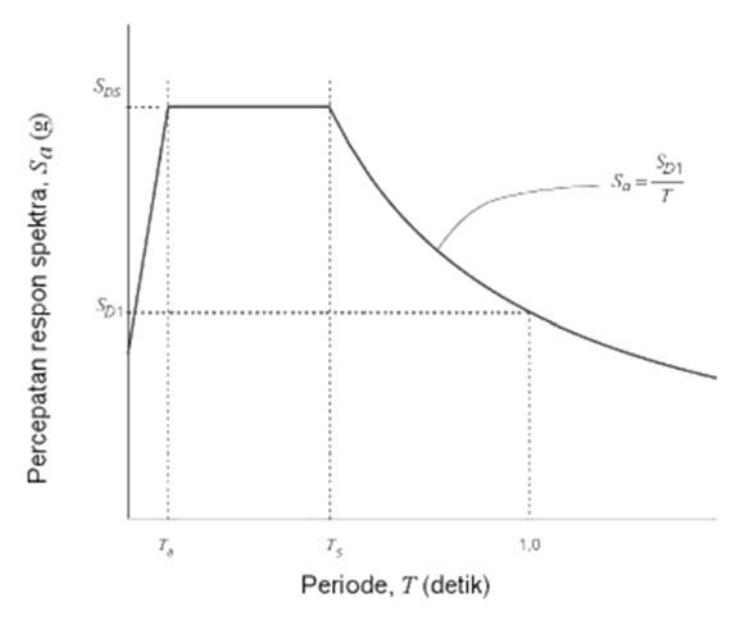

**Gambar 71 – Spektrum respons desain (SNI 1726:2012)** 

# **12.2.2.3.2 Jembatan dan bangunan pelengkapnya serta terowongan**

a. Spektrum respons yang dibangun adalah untuk rasio redaman 5% dan tidak memasukkan penyesuaian goyangan tanah (*ground motion*) di dekatnya. Penentuan kurva spektrum respons desain di permukaan tanah mengacu pada Gambar 72 dan mengikuti persyaratan-persyaratan berikut ini.

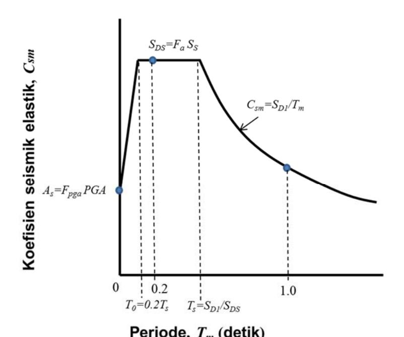

**Gambar 72 - Spektrum respons desain, dibentuk menggunakan metode tiga titik (AASHTO, 2012)** 

Dengan:

As adalah Fpga PGA SDS adalah FaSs

SD1 adalah FvS1

# Keterangan:

- $F_{pga}$  = koefisien situs untuk percepatan puncak di batuan dasar mengacu klasifikasi situs seperti diperlihatkan pada Tabel 55;
- *PGA* = percepatan puncak horizontal di batuan dasar (SB);
- $F_a$  = koefisien situs untuk percepatan spektral periode 0,2 detik seperti diperlihatkan pada Tabel 55;
- Ss = percepatan spektral respons horizontal di batuan dasar (SB) pada periode 0,2 detik:
- $F_{\nu}$  = koefisien situs untuk percepatan spektral periode 1,0 detik seperti diperlihatkan pada Tabel 56;
- $S_I$  = percepatan spektral respons horizontal di batuan dasar (SB) pada periode 1,0 detik.
- b. Untuk periode kurang atau sama dengan  $T_0$ , koefisien seismik elastik,  $C_{sm}$  ditentukan menggunakan Persamaan (15), (16) dan (17):

$$C_{sm} = A_s + (S_{DS} - A_s) \frac{T_m}{T_0}$$

$$T = 0.2T$$
(15)

$$T_0 = 0.2T_s$$
 (16)

$$T_{s} = \frac{S_{D1}}{S_{DG}}$$
 (17)

# Keterangan:

- $A_s$  = koefisien percepatan puncak gempa rencana:
- $S_{DS}$  = koefisien percepatan respons spektral rencana periode 0.2 detik;
- $S_{DI}$  = koefisien percepatan periode 1 detik;
- $T_m$  = periode getar fundamental struktur (detik);
- $T_0$  = periode referensi yang digunakan untuk menentukan bentuk spektral (detik).
- c. Untuk periode lebih besar atau sama dengan  $T_0$  dan kurang dari atau sama dengan  $T_s$ , koefisien seismik elastik,  $C_{sm}$ , ditentukan dengan Persamaan (18).

$$C_{sm} = S_{DS}...$$
(18)

d. Untuk periode lebih besar dari  $T_s$ , koefisien seismik elastik,  $C_{sm}$ , didefinisikan dengan Persamaan (19).

$$C_{sm} = \frac{S_{D1}}{T_m} \tag{19}$$

# **12.2.3 Persyaratan spektrum respons desain berdasarkan evaluasi spesifik-situs**

- a) Apabila lokasi bangunan yang termasuk pada klasifikasi Jenis Tanah Khusus sesuai SNI gempa yang berlaku, maka harus dilakukan tes *seismic downhole* atau tes seismik sejenis dan analisis *spesifik-situs* dengan hasil berupa spektrum respons desain.
- b) Spektrum respons desain di permukaan tanah pada prosedur ini harus didapatkan menggunakan analisis perambatan gelombang dari batuan dasar ke permukaan tanah menggunakan metode probabilitas total.
- c) Analisis probabilitas gerak tanah spesifik-situs harus menghasilkan spektrum respons desain yang memperhitungkan periode ulang rencana sesuai persyaratan infrastruktur yang digunakan pada nilai spektral dalam rentang periode yang ditentukan.
- d) Riwayat waktu gerak tanah batuan dasar harus menjadi masukan ke dalam profil tanah sebagai gerak dari referensi batuan dasar.
- e) Dengan menggunakan teknik perhitungan yang memberlakukan sifat tanah secara nonlinear ke dalam suatu metode nonlinear atau linear ekuivalen, maka respons profil tanah harus ditentukan dan respons riwayat waktu gerak tanah di permukaan harus dihitung.
- f) Gerak dasar permukaan yang direkomendasikan dari hasil analisis harus menggambarkan pertimbangan atas sensitivitas respons terhadap ketidakpastian sifatsifat tanah, kedalaman model tanah dan gerak tanah masukan (*input motion*).
- g) Sekurang-kurangnya disyaratkan 5 (lima) rekaman atau simulasi riwayat waktu percepatan gerak tanah horizontal yang harus dipilih dari beberapa kejadian gempa dengan mempertimbangkan berbagai kemungkinan karakteristik gerakan tanah dengan kandungan frekuensi yang berbeda-beda yang dapat datang dari suatu sumber gempa jauh (*far field*) ataupun gempa dekat (*near field* dari *strike slips/shallow crustals*). Setiap riwayat waktu yang dipilih tersebut harus diskalakan, sehingga spektrum responsnya secara rata-rata dekat dengan level spektrum respons gempa batuan dasar (SB) pada rentang periode yang signifikan dari respons struktur yang direncanakan.
- h) Respons spektra desain harus direkomendasikan dari hasil analisis *site-specific response* untuk analisis struktur bangunan akibat gaya-gaya gempa.
- i) Rasio spektrum respons (dengan redaman 5%) di permukaan tanah dan di batuan dasar harus dihitung. Nilai spektrum respons gerak tanah MCE yang direkomendasikan tidak boleh lebih rendah dari spektrum respons MCE batuan dasar dikali dengan rata-rata rasio spektrum respons permukaan-ke-dasar (dihitung periode demi periode) yang didapat dari analisis respons spesifik-situs.
- j) Jika prosedur spesifik-situs digunakan untuk menentukan gerak tanah desain, parameter ܵௌ harus diambil sebagai percepatan spektral, ܵ, yang diperoleh dari spektra spesifiksitus pada periode 0,2 detik, dan tidak boleh diambil lebih kecil dari 90% percepatan spektral puncak (ܵ) pada setiap periode yang lebih besar dari 0,2 detik. Parameter ܵଵ harus diambil dari nilai terbesar antara percepatan spektral, ܵ, pada periode 1 detik atau dua kali nilai percepatan spektral pada periode 2 detik. Parameter ܵெௌ dan ܵெଵ diambil 1,5 kali dari tiap-tiap ܵ௦ dan ܵଵ. Nilai yang telah didapat, tidak boleh kurang dari 80% nilai yang ditentukan untuk ܵெௌ dan ܵெଵ, dan ܵௌ.

### **12.2.3.1 Identifikasi sumber gempa**

- a) Ketidakpastian dalam pemodelan sumber gempa dan parameter harus diperhitungkan dalam analisis.
- b) Dokumen analisis bahaya gempa harus ditelaah oleh tenaga ahli yang terkait.

- c) Identifikasi semua sumber gempa didasarkan pada kondisi tektonik di sekitar lokasi proyek. Bila terdapat sumber gempa aktif lainnya yang telah dipublikasikan secara ilmiah, maka sumber gempa tersebut dapat digunakan.
- d) Data-data kejadian gempa dikumpulkan dalam suatu katalog gempa yang meliputi dan tidak terbatas pada katalog gempa yang disusun oleh lembaga-lembaga nasional maupun internasional. Selanjutnya katalog gempa yang digunakan adalah gempa utama dengan menggunakan kriteria pemilahan yang digunakan secara internasional dan terpublikasi secara ilmiah.

# **12.2.3.2 Pemilihan fungsi atenuasi**

- a) Penentuan besarnya percepatan maksimum dan spektrum respons di batuan dasar dengan metode probabilistik harus mempertimbangkan ketidakpastian *aleatory* (lokasi gempa, magnitudo, dan karakteristiknya serta proses pecahnya patahan) dan *epistemic*  (lokasi dan batas/luasan sumber gempa, distribusi gempa dan magnitudo maksimum, seismisitas (*activity rate*) dan variasi karakteristik *ground motion* dalam rumus atenuasi dengan menggunakan *expert judgment* dalam bentuk *logic-tree*.
- b) Pemilihan fungsi atenuasi harus didasarkan pada kesamaan kondisi geologi dan tektonik dari wilayah ketika fungsi atenuasi itu dibuat. Fungsi atenuasi yang digunakan disarankan untuk menggunakan *Next Generation Attenuation* (NGA), yang dalam pembuatannya sudah menggunakan data gempa *global (worldwide data)*.

# **12.2.3.3 Analisis probabilistik spektrum respons desain di batuan dasar (SB)**

- a) Kurva bahaya seismik (*seismic hazard curve*) bisa didapatkan berdasarkan sumber gempa dan kombinasi sumber gempa untuk menggambarkan kumpulan bahaya gempa pada situs tertentu dengan menggunakan teori probabilitas total.
- b) Luaran dari hasil analisis probabilistik adalah spektrum respons desain di batuan dasar (SB) beserta spektrum respons target untuk tiap-tiap sumber gempa dan periode ulang desain untuk kebutuhan pencocokan spektral (*spectral matching*).

#### **12.2.3.4 Simulasi riwayat waktu percepatan gerak tanah horizontal**

- a) Riwayat percepatan gerak tanah horizontal, didapatkan dengan melakukan pemilihan catatan gerakan tanah (*ground motion records*) dengan keserupaan magnitudo, jarak, dan karakteristik sumber gempa yang didapatkan dari proses deagregasi (*deaggregation analysis*).
- b) Periode deagregasi yang ditinjau adalah PGA, 0,2 detik dan 1,0 detik, dan sumber gempa yang ditinjau adalah keseluruhan sumber gempa (subduksi *interface* (*megathrust*)), sesar dangkal (*shallow crustal fault*) dan subduksi *intraslab (benioff*) dan tiap-tiap sumber gempa secara terpisah berdasarkan mekanismenya.
- c) Hasil luaran proses deagregasi berupa *probability density* jarak, magnitudo, dan sumber gempa yang mengontrol suatu lokasi proyek yang digunakan sebagai dasar dalam menentukan catatan gerakan tanah.
- d) Setelah diketahui tipe sumber gempa, jarak, dan magnitudo yang mengontrol pada suatu lokasi situs, catatan gerakan tanah yang digunakan harus memiliki keserupaan karakteristik dengan jumlah catatan mengacu pada persyaratan butir b).

**© BSN 2017 274 dari 303**

# **12.2.3.5 Perambatan gelombang ke permukaan**

- a. Spektrum respons desain di permukaan dilakukan dengan memperhitungkan klasifikasi situs dan kedalaman batuan dasar (SB) di lokasi proyek berdasarkan pengujian lapangan atau laboratorium.
- b. Perambatan gelombang dilakukan untuk setiap gerakan tanah sintetis yang merepresentasikan tiap-tiap karakteristik sumber gempa (subduksi, patahan dan *gridded seismicity*) hingga menghasilkan *spectral acceleration, velocity* dan *displacement* setiap sumber gempa di permukaan.
- c. Spektrum respons desain di permukaan dibentuk berdasarkan nilai rata-rata *spectral velocity* ditambah 1 standar deviasi pada kurva *tripartite*.

#### **12.2.4 Persyaratan desain gempa pada fondasi**

#### *12.2.4.1* **Deskripsi**

Kasus-kasus kerusakan tiang, baik berupa tiang beton bertulang atau tiang *prestressed* akibat beban gempa terjadi akibat kehilangan kekuatan dan kekakuan akibat beban berulang (*cyclic loading*) dibandingkan dengan tiang baja. Berdasarkan Matsui dan Kazuhiro (1996) dan Okahara et al. (1996), kerusakan tiang dapat dikategorikan berdasarkan tingkat kerusakan sebagai berikut:

- a) Kerusakan sangat berat (*severe*): terjadi banyak retakan di seluruh tiang, terjadi perpisahan beton, tekuk pada tulangan, *discontinuity of pile shaft*, yang disertai dengan perpindahan horizontal residual atau penurunan struktur atas;
- b) Kerusakan berat (*heavy*): terjadi banyak retakan dan terjadi perpisahan beton di dekat kepala tiang dan terjadi beberapa retak tekuk pada beberapa lokasi kedalaman tiang lainnya yang disebabkan oleh perpindahan horizontal residual pada kepala tiang;
- c) Kerusakan ringan (*light*): terjadi beberapa retak tekuk di dekat kepala tiang dan kemungkinan pada lokasi lainnya;
- d) Tidak terjadi kerusakan: tidak terjadi kerusakan atau terjadi sedikit retak tekuk;

Penyebab kerusakan tiang akibat gempa (*earthquake-induced damage*) dapat dikategorikan sebagai berikut:

- a) Tanggapan tanah (*ground response*), yaitu berupa gerakan yang diterima oleh tiang akibat respons terhadap tanah sekitar yang mengakibatkan terjadinya tegangan tekuk dan geser pada tiang;
- b) Gaya-gaya inersia, yaitu berupa beban aksial dan horizontal yang besar akibat respons struktur atas sebagai beban tambahan pada beban akibat tanah sekitar tiang;
- c) Likuifaksi/goyangan tanah (*ground motion*), yaitu berupa pengurangan kekakuan tanah pada lapisan tanah yang berpotensi likuifaksi (*liquifiable*) tanpa terjadinya perpindahan permanen arah lateral yang signifikan disertai dengan pengurangan kekuatan penahan lateral secara signifikan;
- d) Likuifaksi/*lateral spreading*, yaitu berupa tegangan residual signifikan akibat perpindahan permanen pada kepala tiang.

# **12.2.4.2 Evaluasi** *lateral spreading displacements* **(PEER Report 2011/04)**

Evaluasi deformasi tanah akibat potensi likuifaksi (*potential liquefaction-induced ground deformation*) meliputi tahapan-tahapan sebagai berikut.

a. Karakterisasi situs dan evaluasi potensi likuifaksi

Karakterisasi situs meliputi interpretasi kondisi geologi lokal, evaluasi foto udara, dan catatan kejadian di masa lampau. Penyelidikan lapangan harus meliputi kombinasi antara uji penetrasi standar, uji penetrasi konus, dan uji laboratorium. Uji penetrasi standar yang digunakan untuk evaluasi likuifaksi harus memenuhi kriteria yang dinyatakan pada ASTM D-6066 (ASTM 2008). Analisis potensi likuifaksi harus dilakukan oleh ahli bidang geoteknik tersertifikasi yang telah memiliki pengalaman di bidang tersebut.

b. Pemicu likuifaksi (*triggering of liquefaction*)

Potensi likuifaksi pada tanah tidak kohesif (*cohesionless soils*) dapat dilakukan menggunakan pendekatan Seed-Idriss (1971) atau Idriss and Boulanger (2004, 2010), yaitu melakukan prosedur pendugaan rasio tegangan *cyclic* akibat gempa (*earthquakeinduced Cyclic Stress Ratio*, SCR) dan korelasi potensi likuifaksi berdasarkan hasil uji lapangan (*Standard Penertation Test, SPT* dan *Cone Penetration Test, CPT*) untuk memperkirakan *Cyclic Resistance Ratio,* (*CRR*)

# **12.2.4.3 Efek likuifaksi pada perancangan fondasi**

Untuk kebutuhan perancangan, likuifaksi diperkirakan untuk terjadi bersamaan dengan beban puncak pada struktur (tidak dilakukan pengurangan perpindahan energi seismik akibat likuifaksi dan pelunakan tanah). Efek likuifaksi pada fondasi meliputi:

- a) Pengurangan kapasitas lateral dan aksial serta kekakuan fondasi dalam;
- *b) Lateral spreading*;
- c) Penurunan tanah dan kemungkinan efek *downdrag*.

Hal-hal yang perlu diperhatikan pada perancangan fondasi adalah sebagai berikut.

- a) Penggunaan fondasi dangkal/fondasi telapak tidak direkomendasikan pada tanah dengan potensi likuifaksi tinggi, kecuali dilakukan metode perbaikan tanah untuk menghilangkan kondisi likuifaksi tersebut.
- b) Untuk fondasi tiang, tahanan friksi pada lapisan tanah dengan potensi likuifaksi harus diabaikan atau tidak diperhitungkan dalam perhitungan daya dukung aksial ataupun *uplift*.
- c) Penggunaan pengurangan kekuatan geser (kondisi residual) digunakan untuk mengevaluasi kapasitas lateral fondasi menggunakan metode *liquified p-y curve* dengan kriteria mengacu pada R Seed & L Harded (1990).
- d) Gunakan modifikasi PL/AE pada kurva T-Z dengan pertimbangan, bila zona likuifaksi mereduksi tahanan friksi hingga kurang dari 50% daya dukung ultimitnya, maka gunakan kondisi daya dukung ujung pada evaluasi perhitungan daya dukung tiang. Jika sebaliknya, gunakan evaluasi daya dukung dengan memperhitungkan daya dukung friksi tiang.
- e) Penggunaan tiang miring (*battered piles*) dan tiang beton prategang tidak direkomendasikan pada tanah dengan potensi likuifaksi tinggi. Penggunaan tiang baja direkomendasikan dengan mempertimbangkan kelenturan dan daktiltas sistem fondasi.

**© BSN 2017 276 dari 303**

Penurunan tanah akibat densifikasi tanah tanah yang mengalami likuifaksi dapat mengakibatkan *down drag* pada tiang, oleh karenanya maka penurunan fondasi harus dievaluasi dan analisis *down drag* harus dilakukan. Faktor keamanan (FK > 1,1) harus dipenuhi daya dukung tiang pada kondisi *down drag* tersebut.

#### **12.2.5 Persyaratan gempa untuk dinding penahan**

Persyaratan gempa untuk dinding penahan mengacu pada AASHTO Bridge Design Specification (2012). Evaluasi gaya gempa pada dinding penahan harus dilakukan menggunakan pendekatan yang sesuai dengan kondisi dan batasan yang disyaratkan oleh masing-masing persamaan sebagai berikut:

- a. Pendekatan pseudostatik menggunakan pendekatan Mononobe (1929) dan Okabe (1926) dengan diagram gaya pada Gambar 73 dapat dilakukan dengan asumsi:
  - 1) Abutmen bebas berdeformasi sedemikian sehingga memberikan kondisi tekanan aktif. Bila abutmen kaku terkekang dan tidak dapat bergerak, maka tekanan tanah yang diperoleh akan lebih besar dibandingkan dengan hasil analisis Mononobe-Okabe.
  - 2) Timbunan di belakang abutmen bersifat nonkohesif dengan sudut geser dalam ().
  - 3) Timbunan tidak jenuh sehingga tidak ada pengaruh likuifaksi.

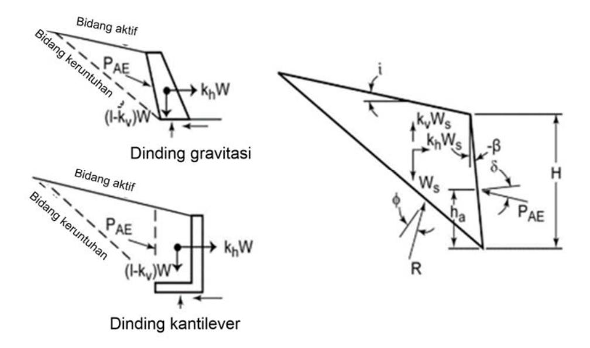

**Gambar 73 – Diagram gaya metode Mononobe-Okabe (AASHTO, 2012)** 

- b. Pendekatan modifikasi Mononabe-Okabe dengan mempertimbangkan kohesi tanah Pendekatan ini menggunakan persamaan Anderson et al. (2008). Pada metode ini diasumsikan:
  - 1) Koefisien seismik vertikal (*kv*) = 0,
  - 2) Koefisien seismik horizontal (*kh*) = PGA yang telah disesuaikan dengan kondisi situs,

- 3) Bila deformasi tanah permanen sebesar 1-2 inci diizinkan pada saat desain kejadian seismik, maka reduksi 50% dari koefisien seismik horizontal dapat diberlakukan.
- c. *Generalized Limit Equilibrium (GLE) Method*

Metode GLE dengan menggunakan peranti lunak dapat digunakan untuk model yang kompleks dengan kriteria *capacity-to-demand ratio* = 1,0 atau faktor keamanan = 1,0.

#### **12.2.6 Persyaratan gempa untuk bendungan**

Persyaratan gempa untuk bendungan dapat dilhat di dalam SNI 8064:2016.

Modus keruntuhan yang harus diperiksa pada bendungan urugan akibat gempa meliputi:

- 1) Desain fondasi bendungan harus memastikan tidak terjadi likuifaksi.
- 2) Penurunan berlebih akibat deformasi volumetrik plastik atau deformasi geser plastik yang disebabkan oleh peningkatan tegangan geser akibat beban gempa.
- 3) Kelongsoran tebing waduk akibat gempa masuk ke dalam waduk sehingga memicu gelombang tinggi yang dapat menyebabkan terjadinya pelimpahan melewati tubuh bendungan.
- 4) Kondisi lainnya yang spesifik dengan kondisi setempat yang dapat menjadi modus keruntuhan akibat gempa.
- 5) Analisis dinamik *equivalent linear* atau *nonlinear* dengan riwayat waktu dapat dilakukan dengan prosedur *finite element* atau *finite difference*. Beban gempa yang digunakan dalam analisis dinamik harus mempertimbangkan parameter gerak tanah seperti periode natural struktur yang dianalisis. Pemodelan analisis respons dinamik dilakukan dengan memenuhi persyaratan berikut.
  - a) Topografi di sekitar bendungan dapat memberikan pengaruh yang besar. Oleh karena itu, penting untuk memodelkan topografi ebatmen (sandaran atau tumpuan) dan tapak fondasi secara akurat. Apabila dalam tubuh bendungan terdapat struktur seperti menara *intake* atau menara *morning glory* maka perlu dievaluasi interaksi antara struktur dengan tubuh timbunan.
  - b) Penentuan *input motion* yang digunakan harus berdasarkan hasil *seismic hazard analysis* pada pasal 12.3.3. *Ground motion* yang digunakan sebagai *input motion* selain menggunakan hasil *seismic hazard* juga menggunakan *ground motion* hasil *seimic hazard analysis* yang arah gempanya dibalik atau dengan cara mengalikan dengan -1 (minus 1), hal ini untuk mendapatkan respons dinamik yang paling signifikan. Untuk lokasi bendungan yang dekat dengan sumber gempa nilai gempa vertikal sama dengan nilai gempa horizontal. Sedangkan untuk lokasi bendungan yang jauh nilainya 2/3 dari gempa horizontal.

# **12.2.7 Persyaratan gempa untuk lereng**

Percepatan puncak di permukaan tanah dapat mengakibatkan gaya-gaya inersia signifikan pada lereng atau timbunan dan gaya tersebut dapat mengakibatkan ketidakstabilan atau deformasi permanen. Analisis performa lereng dan timbunan terhadap beban seismik dapat dilakukan menggunakan 2 (dua) pendekatan:

a) Metode kesetimbangan batas (*limit equilibrium methods*) menggunakan gaya seismik yang direpresentasikan dalam model pseudostatik. Koefisien seismik yang digunakan adalah percepatan puncak di permukaan (PGA) dengan faktor keamanan minimum

**© BSN 2017 278 dari 303**

terhadap gempa (FK > 1,0). Koefisien seismik horizontal, kh, ditentukan sebesar 0,5 dari percepatan puncak horizontal dengan penentuan kelas situs dan faktor amplifikasi.

b) Analisis berbasis perpindahan (*displacement-based*) menggunakan konsep blok keruntuhan Newmark (*Newmark sliding block*) atau metode pemodelan numerik.

Persyaratan gempa untuk lereng merujuk pula pada penjelasan yang diberikan di dalam 7.5.1.1.

## **12.2.8 Persyaratan gempa untuk struktur tertanam (***buried structure***)**

Ketika tanah yang stabil mengalami deformasi akibat gelombang gempa, gorong-gorong, pipa, atau terowongan yang berada di bawah tanah akan mengalami deformasi. Perilaku struktur tertanam harus dievaluasi terhadap kemungkinan mengalami deformasi aksial, deformasi berbentuk kurva dan perubahan bentuk menjadi oval.

# **13 Keruntuhan hidraulik**

# **13.1 Ruang lingkup keruntuhan hidraulik**

Pasal ini menetapkan persyaratan untuk perancangan bangunan dan struktur lainnya, seperti gedung, fondasi, galian dalam, turap, bendungan beton, bendungan urugan tanah, bendungan urugan batu, dan tanggul, yang terkait dengan keruntuhan tanah akibat tekanan air pori dan/atau rembesan (aliran) air tanah.

Penentuan gradien hidraulik, tekanan air pori, atau gaya-gaya yang diakibatkan oleh aliran air harus mempertimbangkan hal-hal berikut:

- a) Perubahan permeabilitas tanah terhadap ruang dan waktu;
- b) Perubahan elevasi muka air dan tekanan air pori terhadap waktu;
- c) Perubahan lingkungan sekitar (misalnya, penggalian di daerah hilir).

Jenis keruntuhan yang terjadi tergantung pada kondisi perlapisan tanah. Kondisi perlapisan tanah yang dapat menyebabkan suatu jenis keruntuhan tertentu belum tentu dapat menyebabkan jenis keruntuhan lainnya.

Persyaratan-persyaratan yang berlaku di dalam pasal ini adalah untuk lima jenis keruntuhan tanah yang disebabkan oleh adanya tekanan air pori atau rembesan (aliran) air pori dan satu jenis keruntuhan akibat retak hidraulik *(hydraulic fracturing)* sebagai berikut:

- a) Keruntuhan akibat gaya uplift *(heave),*
- b) Keruntuhan akibat *boiling*,
- c) Keruntuhan akibat erosi tubuh *(internal erosion),*
- d) Keruntuhan akibat erosi pada tanah/batuan fondasi bendungan,
- e) Keruntuhan akibat erosi antarmuka antara material bendungan dan struktur saluran,
- *f)* Keruntuhan akibat retak hidraulik (*hydraulic fracturing)*

Persyaratan perancangan yang ditetapkan di dalam pasal ini berlaku untuk bangunan gedung dan non-gedung sebagaimana yang tercantum di dalam SNI 1726-2012 ditambah dengan struktur keairan dan bendungan.

**© BSN 2017 279 dari 303** 

# **13.2 Keruntuhan akibat gaya** *uplift*

Gaya *uplift* terjadi ketika tekanan air pori di bawah struktur atau di bawah lapisan tanah yang memiliki permeabilitas rendah meningkat sehingga lebih besar dari tekanan rata-rata berat struktur dan/atau lapisan tanah di atasnya.

Pemeriksaan yang terkait dengan keruntuhan akibat gaya *uplift* dilakukan untuk kondisi dimana hanya tekanan air pori hidrostatik yang bekerja atau jika gradien hidraulik sangat kecil. Kestabilan struktur atau lapisan tanah dengan permeabilitas rendah terhadap gaya *uplift* harus diperiksa dengan membandingkan berat tetap yang melawan (misalnya, berat sendiri dan hambatan samping seperti yang terjadi pada dinding struktur bawah tanah) dengan gaya-gaya *uplift* akibat air dan sumber lainnya.

Keruntuhan lapisan kedap air di dasar galian akibat *uplift* dikenal juga dengan istilah *heaving* atau *blow-in* dan seringkali terkait dengan kestabilan dasar galian. Gambar 74 memperlihatkan contoh bangunan yang harus diperiksa terhadap gaya *uplift*.

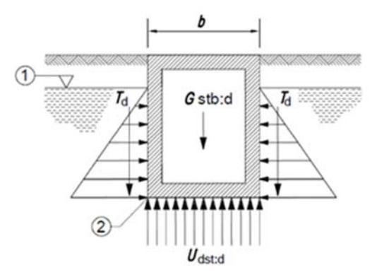

(a) Uplift pada bangunan berongga di dalam tanah

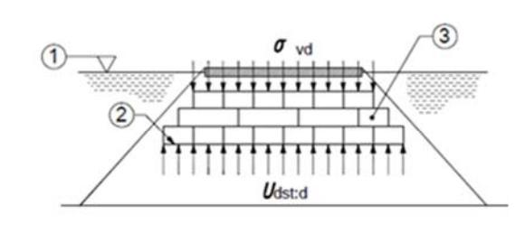

(b) Uplift pada tanggul dari bahan ringan pada saat banjir

## Keterangan:

- 1. Muka air tanah
- 2. Permukaan kedap air

## Keterangan:

- 1. Muka air tanah
- 2. Permukaan kedap air timbunan ringan
- 3. Bahan ringan timbunan

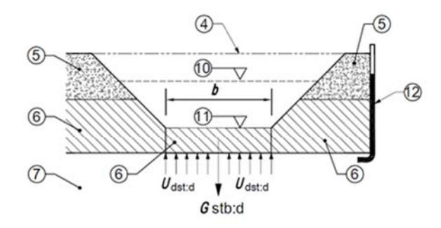

(c) Gaya tekan ke atas yang dapat menyebabkan *blow in* pada lapisan kedap air di dasar galian

(d) *Uplift* pada slab yang dibuat/dipasang di bawah permukaan air

#### Keterangan:

- 4. Permukaan tanah sebelum digali
- 5. Pasir
- 6. Lempung
- 7. Kerikil
- 10. Muka air tanah sebelum penggalian
- 11. Muka air tanah di dalam galian
- 12. Level piezometric di dasar lapisan lempung

# Keterangan:

- 1. Muka air tanah
- 2. Permukaan kedap air
- 5. Pasir
- 8. Pasir yang disuntik
- 11. Muka air tanah di dalam galian

**© BSN 2017 280 dari 303**

**Gambar 74 – Contoh bangunan dengan** *uplift* **yang perlu diperiksa** 

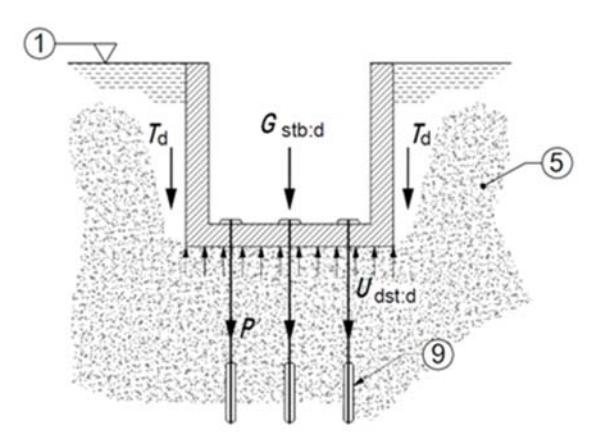

(e) Angkur pada struktur bawah tanah untuk melawan *uplift*

Keterangan: Muka air tanah 5. Pasir

9. Angkur

**Gambar 74 (lanjutan) - Contoh bangunan dengan** *uplift* **yang perlu diperiksa** 

Keruntuhan hidraulik pada bendungan beton oleh karena gaya *uplift* pada fondasi batuan dapat terjadi apabila batuan mempunyai kekar terbuka yang rapat, sehingga tekanan air pada fondasi oleh karena adanya bendungan beton menjadi besar setara dengan tinggi tekanan air di dalam waduk.

Apabila tidak dilakukan perbaikan, gaya *uplift* akan mendorong bendungan beton ke atas. Akibat gaya *uplift* yang besar dan tidak merata di seluruh fondasi bendungan beton tersebut, maka bendungan dapat mengalami ketidakstabilan. Gambar 75 menunjukkan ilustrasi gaya apung yang terjadi pada fondasi bendungan beton.

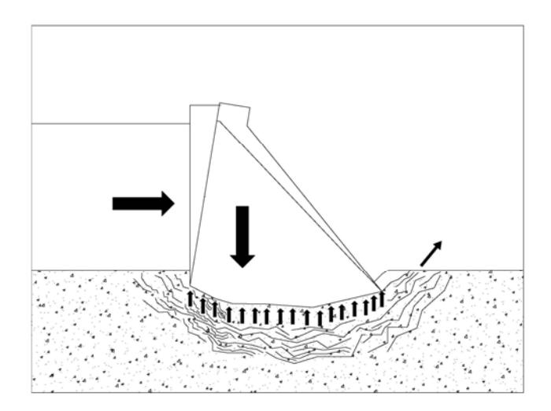

**Gambar 75 – Keruntuhan pada fondasi bendungan beton oleh karena gaya apung** 

**© BSN 2017 281 dari 303** 

Tindakan-tindakan yang umumnya dapat dilakukan untuk melawan gaya *uplift*, agar bendungan dapat berfungsi dalam kondisi stabil, antara lain:

- a) menambah berat bangunan,
- b) menurunkan tekanan air di bawah bangunan dengan membuat sistem drainase,
- c) melakukan compaction grouting pada fondasi bendungan,
- d) memasang angkur pada bangunan ke lapisan fondasi di bawahnya.

# 13.3 Keruntuhan dasar galian akibat boiling

Keruntuhan akibat *boiling* terjadi pada dasar galian yang terdiri atas lapisan tanah nonkohesif ketika gaya ke atas dari rembesan aliran air mengakibatkan berkurangnya tegangan efektif vertikal tanah. Selanjutnya, butiran tanah terangkat dan terbawa oleh aliran air ke atas menyebabkan terjadinya keruntuhan. Peristiwa ini biasanya ditandai dengan timbulnya gelembung air yang bermunculan di permukaan dasar galian.

*Piping* dan *boiling* terjadi jika gradien hidraulik exit lebih besar daripada gradien hidraulik kritis (iexit > ikritis) pada dasar galian tanah nonkohesif. Gradien hidraulik kritis adalah gradien hidraulik yang terjadi pada saat tegangan efektif berkurang menjadi nol. Gradien hidraulik kritis ini dapat ditentukan menggunakan Persamaan (20).

$$i_{kritis} = \frac{\gamma'}{\gamma_w} = \frac{G_s - 1}{1 + e} \tag{20}$$

Faktor keamanan terhadap keruntuhan akibat *boiling* harus lebih besar atau sama dengan 1,5 yang merupakan perbandingan antara gradien hidraulik kritis dan gradien hidraulik exit.

Terdapat beberapa metode yang dapat digunakan untuk menghitung faktor keamanan ini di antaranya adalah metode yang direkomendasikan oleh Harza, Terzaghi, Marsland, atau dengan cara penggunaan teori aliran air satu dimensi. Perbedaan tiap-tiap metode terletak pada asumsi penentuan gradien hidaulik eksit. Metode-metode ini menghasilkan angka faktor keamanan yang berbeda sehingga disarankan untuk menggunakan beberapa metode dan dipilih yang paling konservatif. Contoh kondisi kemungkinan terjadinya *boiling* diberikan pada Gambar 76.

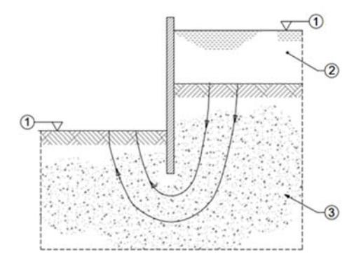

#### Keterangan:

- 1. Permukaan galian (kiri); permukaan air bebas (kanan)
- 2. Air
- 3. Pasir

Gambar 76 – Contoh kondisi kemungkinan terjadinya boiling

© BSN 2017 282 dari 303

Bila tanah memiliki tahanan geser kohesi yang cukup besar, tipe keruntuhan yang mungkin terjadi dapat berubah dari tipe keruntuhan boiling menjadi tipe keruntuhan *uplift*. Suatu bangunan yang stabil terhadap *boiling* di dasar galian belum tentu stabil terhadap erosi tubuh. Kestabilan terhadap erosi tubuh harus diperiksa juga jika perlu.

Tindakan-tindakan yang umumnya dilakukan untuk melawan keruntuhan *boiling* di dasar galian adalah:

- a) Menurunkan tekanan air di bawah lapisan tanah yang mengalami *boiling*;
- b) Menambah pasir atau kerikil di atas dasar galian;
- c) Menginjeksi lapisan pasir yang ditemukan di dasar galian.

#### **13.4 Erosi tubuh**

Erosi tubuh yang dibahas di dalam subpasal ini terkait dengan bendungan urugan tanah dan tanggul. Keruntuhan hidraulik pada bendungan urugan tanah atau tanggul biasanya terjadi oleh karena rembesan air di fondasi dan/atau di dalam bendungan urugan tanah atau tanggul, oleh karena berbagai sebab faktor, menyebabkan terjadinya erosi.

Erosi di dalam tubuh bendungan urugan tanah atau tanggul harus ditanggulangi dengan filter dan drainase internal. Konsep penggunaan filter pada bendungan urugan tanah atau tanggul adalah meloloskan air rembesan secara terkontrol dan menghambat terbawanya partikel tanah oleh aliran air. Dengan demikian rembesan air tetap terjadi dalam besaran yang terkontrol tetapi erosi tidak terjadi di dalam tubuh bendungan urugan tanah atau tanggul.

Persyaratan material filter, baik filter berbutir dari pasir dan kerikil atau filter geotekstil harus direncanakan sesuai dengan kaidah-kaidah desain filter. Tidak jarang bahwa lebih dari satu lapisan filter mungkin diperlukan untuk menjamin perlindungan yang menyeluruh terhadap erosi tubuh pada material yang harus dilindungi yang terdiri atas bermacam ukuran butir.Jika persyaratan lapisan filter tidak dipenuhi, harus dapat dibuktikan bahwa gradien hidraulik yang terjadi lebih kecil daripada gradien hidraulik kritis yang menyebabkan butiran tanah mulai tergerus.

Gradien hidraulik kritis untuk erosi tubuh harus ditentukan dengan mempertimbangkan paling sedikit hal-hal berikut:

- a) arah aliran,
- b) distribusi ukuran butir dan bentuk butiran,
- c) pelapisan tanah.

Jenis keruntuhan hidraulik akibat erosi tubuh pada bendungan urugan tanah dapat dibagi dalam beberapa kategori seperti:

- a) erosi hilir (*backward erosion*),
- b) sufosi (*suffosion*), dan
- c) tanah dispersif.

#### **13.4.1 Erosi hilir** *(backward erosion)*

Erosi hilir adalah modus keruntuhan hidraulik yang umumnya terjadi karena terlalu besarnya perbandingan antara koefisien permeabilitas horizontal, kh, dengan vertikal, kv, sehingga garis aliran air memotong permukaan lereng hilir bendungan urugan tanah atau tanggul seperti ditunjukkan pada Gambar 77.

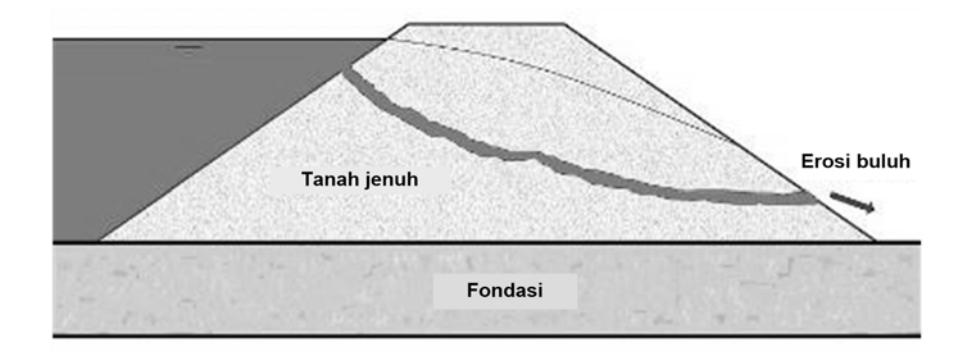

**Gambar 77 – Ilustrasi keruntuhan hidraulik oleh erosi hilir**

Untuk mencegah terjadinya erosi hilir, maka rasio antara koefisien permeabilitas horizontal dan vertikal harus memenuhi Persamaan (21).

$$\frac{k_h}{k_v} < 5 \tag{21}$$

#### **Keterangan:**

kh = koefisien permeabilitas arah horizontal (cm/detik);

kv = koefisien permeabilitas arah vertikal (cm/detik).

#### **13.4.2 Sufosi (***suffosion***)**

Rembesan aliran air *(seepage)* di dalam tubuh bendungan urugan tanah atau tanggul dapat membawa fraksi butiran halus tanah sehingga menyebabkan erosi yang dikenal dengan istilah sufosi. Sufosi ini biasanya terjadi pada bahan timbunan bendungan urugan tanah atau tanggul dari jenis material nonkohesif yang memiliki gradasi buruk *(gap-graded).* Pada saat terjadi rembesan partikel berbutir halus dapat terbawa oleh aliran air dan tidak tertahan oleh matriks tanah karena material bergradasi buruk cenderung memiliki pori yang besar. Gambar 78 menunjukkan ilustrasi keruntuhan hidraulik oleh karena terjadinya sufosi pada bahan timbunan.

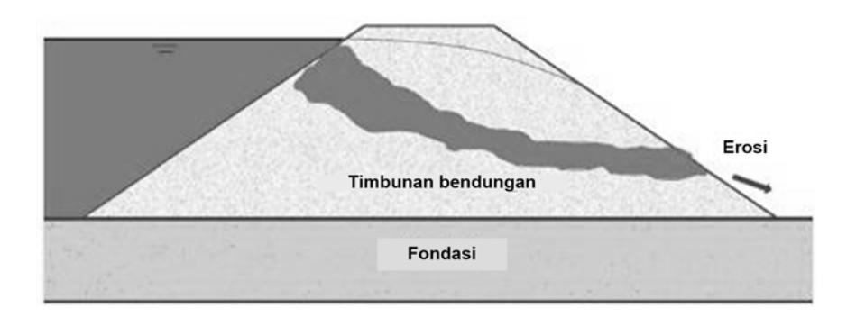

**Gambar 78 – Ilustrasi keruntuhan hidraulik oleh sufosi**

**© BSN 2017 284 dari 303**

# **13.4.3 Keruntuhan hidraulik akibat tanah dispersif** *(dispersive soils)*

Keruntuhan hidraulik pada bendungan urugan tanah dan tanggul yang mengandung tanah dispersif dapat terjadi karena tanah yang bersifat dispersif mengandung larutan sodium yang tinggi di dalam air porinya. Dengan tingginya kandungan sodium di dalam air porinya, maka mineral lempung di dalamnya akan memiliki kemampuan untuk menyerap air lebih banyak daripada mineral lempung dengan kandungan sodium yang lebih kecil. Kondisi ini menyebabkan terjadinya gaya tolak menolak antarpartikel lempung dan mengurangi ikatan antarpartikel sehingga apabila terendam air, partikel lempung tersebut akan mudah larut di dalam air. Pada saat terjadi rembesan air di dalam bendungan urugan tanah dan tanggul, maka partikel-partikel lempung tersebut terbawa aliran air sehingga menyebabkan erosi di dalam bendungan urugan tanah dan tanggul. Gambar 79 menunjukkan ilustrasi keruntuhan hidraulik oleh bahan timbunan yang bersifat dispersif.

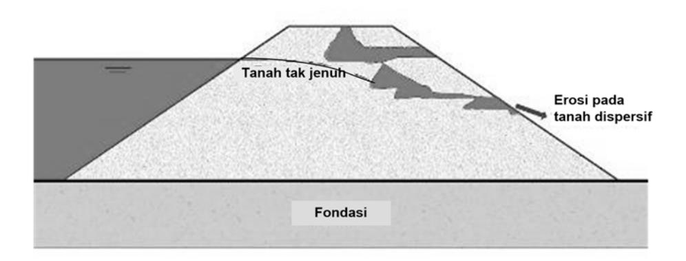

**Gambar 79 – Ilustrasi keruntuhan hidraulik oleh bahan timbunan yang dispersif**

Sifat *dispersif* suatu tanah dapat diketahui dengan 4 jenis uji yang telah mempunyai standar pelaksanaan ujinya, yaitu:

- a) uji *pinhole (pinhole test)* dengan cara pelaksanaan seperti dalam standar ASTM D 4647- 93 atau USBR 5410-89;
- b) uji *crumb (crumb test)* dengan cara pelaksanaan seperti dalam standar ASTM D 6572-00 atau USBR 5400-89;
- c) uji hidrometer ganda *(double hydrometer test)* dengan cara pelaksanaan seperti dalam standar ASTM D 4221-99 atau USBR 5405-89;
- d) uji kimiawi *(chemical test)* dengan cara pelaksanaan seperti dalam Handbook 60 dari USDA (Richard, 1954).

#### **13.5 Keruntuhan hidraulik oleh erosi pada fondasi bangunan**

Selain harus memenuhi persyaratan daya dukung fondasi bendungan juga harus memenuhi persyaratan kelulusan air. Persyaratan ini bertujuan supaya tidak terjadi erosi pada fondasi bendungan yang dapat mengakibatkan keruntuhan pada bendungan. Apabila syarat kelulusan air fondasi bendungan tidak terpenuhi, dapat dilakukan perbaikan fondasi dengan cara sementasi (*grouting*), baik sementasi tirai (*curtain grouting*) maupun *blanket grouting.*

#### **13.5.1 Keruntuhan hidraulik pada fondasi bendungan urugan tanah dan tanggul**

Erosi pada fondasi bendungan urugan tanah dan tanggul dapat terjadi pada fondasi bendungan urugan tanah dan tanggul berupa tanah yang nonkohesif atau batuan dengan

kekar rapat. Erosi dapat terjadi dari bagian hulu langsung menembus fondasi bendungan dan muncul di hilir sebagai mata air seperti disampaikan dalam Gambar 80. Erosi dapat juga dimulai dari dalam tubuh bendungan urugan tanah, dan oleh karena koefisien permeabilitas fondasi lebih besar dari badan bendungan urugan tanah atau tanggul, jalur erosi dapat berbelok melalui fondasi. Gambar 81 menunjukkan ilustrasi erosi yang bermula dari tubuh bendungan dan menenbus fondasinya.

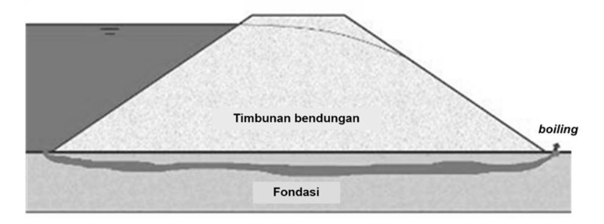

**Gambar 80 – Ilustrasi keruntuhan hidraulik pada fondasi bendungan urugan batu dan tanggul**

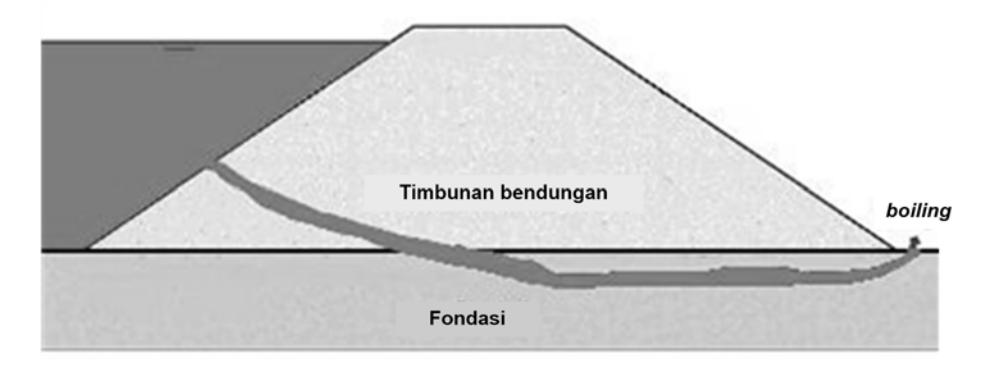

**Gambar 81 – Ilustrasi keruntuhan hidraulik pada fondasi bendungan yang dimulai dari tubuh bendungan**

Erosi pada fondasi, baik yang terjadi dari bagian hulu fondasi maupun dari dalam badan bendungan, dipicu oleh fondasi tanah yang relatif mudah meluluskan air seperti lapisan pasir padat maupun batuan yang lapuk atau mempunyai kekar yang rapat. Jika fondasi tanah bersifat mudah meluluskan air maka perlu dilakukan penggalian untuk mendapatkan formasi tanah yang relatif kedap air, yaitu setidaknya mempunyai koefisien permeabilitas 1 x 10-5 cm/detik atau lebih kecil. Fondasi dengan formasi batuan lapuk juga harus memiliki persyaratan kelulusan air yang sama, yaitu memiliki koefisien permeabilitas 1 x 10-5 cm/detik atau lebih kecil. Apabila nilai tersebut tidak dapat dipenuhi, harus dilakukan pemotongan elevasi fondasi sampai dengan formasi batuan yang relatif kedap air, atau melakukan perbaikan fondasi dengan cara *grouting*, baik *curtain grouting* atau *blanket grouting* agar koefisien permeabilitas fondasi mencapai 1 x 10-5 cm/detik atau lebih kecil.

#### **13.5.2 Keruntuhan hidraulik pada bendungan beton**

Keruntuhan hidraulik pada bendungan beton yang diakibatkan oleh erosi pada fondasi batuan di bawah bendungan beton dapat terjadi apabila batuan fondasi mempunyai derajat pelapukan yang tinggi atau mempunyai kekar terbuka yang rapat, sehingga air mudah mengalir melalui kekar tersebut. Apabila tidak dilakukan perbaikan, erosi dalam jangka waktu yang lama dapat mempercepat laju pelapukan batuan, dan batuan lapuk akan mudah tererosi. Erosi yang berkelanjutan dan/atau semakin besar dapat membuat rongga pada

**© BSN 2017 286 dari 303**

fondasi dan jika dibiarkan semakin besar dapat menyebabkan keruntuhan bendungan. Gambar 82 menunjukkan ilustrasi erosi yang terjadi pada fondasi bendungan beton.

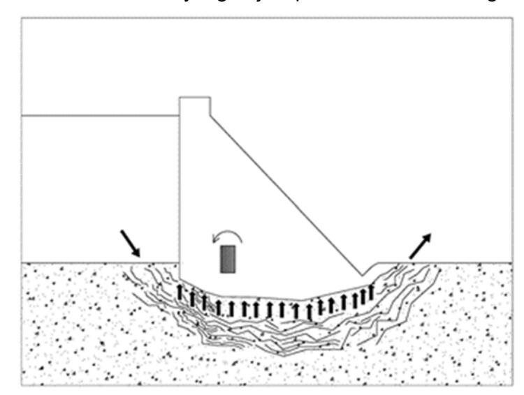

**Gambar 82 – Keruntuhan pada fondasi bandungan beton oleh karena erosi Notasi di dalam gambar, disesuaikan dengan di SNI pembebanan** 

Untuk mengatasi keruntuhan hidraulik pada bendungan beton, perlu dilakukan perbaikan fondasi dengan cara sementasi *(grouting).* Sementasi pada fondasi bendungan beton dengan tujuan untuk memperpanjang garis aliran air adalah *curtain grouting,* sedangkan sementasi untuk meningkatkan daya dukung fondasi sekaligus mengurangi tingkat permeabilitasnya adalah *blanket grouting* atau *compaction grouting.* Gambar 83 menunjukkan ilustrasi *curtain grouting* dan *blanket grouting.* 

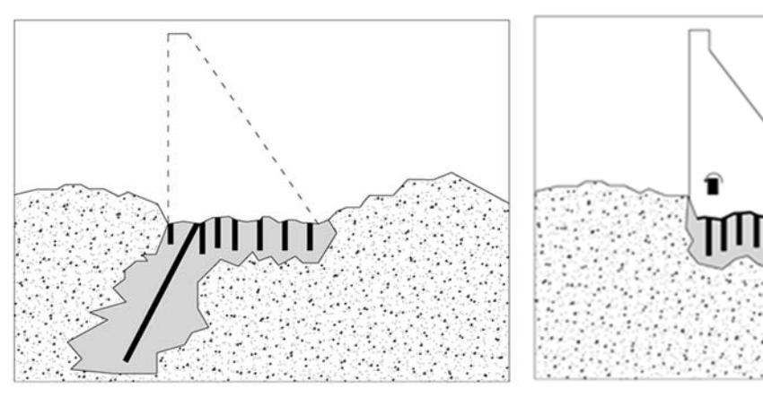

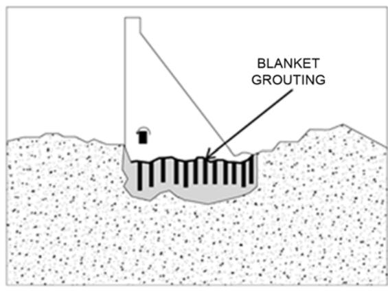

(a) *Curtain grouting (b) Blanket grouting* 

**Gambar 83 – Ilustrasi** *curtain grouting* **dan** *blanket grouting*

Kedalaman *curtain grouting* harus direncanakan dengan mengacu pada kriteria desain termasuk bahwa perancangan *grouting* harus didasarkan pada hasil uji permeabilitas pada formasi batuan untuk mengetahui tingkat kelulusan air fondasi bendungan. Pengujian permeabilitas pada fondasi batuan umumnya menggunakan metode yang dikenal dengan *packer test*. Hasil pengukuran koefisien permeabilitas dengan *packer test* umumnya

disampaikan dalam satuan Lugeon dimana 1 Lugeon setara dengan koefisien permeabilitas 110-5 cm/detik. Nilai koefisien permeabilitas fondasi bendungan beton disyaratkan kurang dari 1 x 10-5 cm/detik atau 1 Lugeon. Nilai Lugeon selain menunjukkan tingkat permeabilitas lapisan fondasi, juga dapat digunakan untuk memperkirakan sistem retakan *(joint)* lapisan batuan seperti dapat dilihat dalam Tabel 57.

| Nilai Lugeon | Klasifikasi     | Kondisi retakan                   |
|--------------|-----------------|-----------------------------------|
| < 1          | Rendah          | Retakan tertutup                  |
| 1 – 5        | Rendah – sedang | Retakan kecil terbuka             |
| 5 – 50       | Sedang – tinggi | Sebagian kecil retakan terbuka |
| > 50         | Tinggi          | Sebagian besar retakan terbuka |

**Tabel 57 – Prediksi sistem retakan** *(joint)* **pada batuan dari nilai Lugeon** 

# **13.6 Erosi pada antarmuka timbunan dengan saluran tertutup yang melintang bendungan**

Saluran tertutup dengan berbagai bentuk seperti lingkaran, tapal kuda, bujur sangkar atau segi empat, dengan berbagai dimensi serta bahan seperti pipa besi, pipa gelombang *(corrugated pipe)* maupun beton, yang berfungsi sebagai saluran pengambilan, atau saluran pembuang sering dibuat melintang bendungan. Akibat dari tidak sempurnanya pemadatan dan terjadinya efek busur *(arching effect)* di sekitar bangunan saluran tersebut, maka sangat rawan terjadi erosi.

Beberapa bendungan telah mengalami keruntuhan akibat erosi yang terjadi pada antarmuka timbunan bendungan dengan saluran tertutup yang melintang bendungan. Gambar 84 menunjukkan ilustrasi erosi yang terjadi pada antarmuka timbunan dengan saluran tertutup yang melintang bendungan.

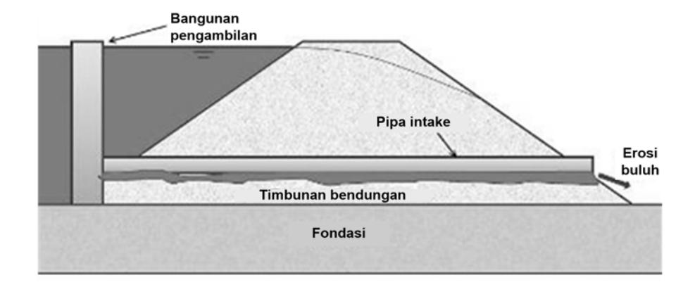

**Gambar 84 – Ilustrasi keruntuhan hidraulik pada interaksi timbunan dengan struktur saluran tertutup**

Cara mencegah terjadinya erosi pada antarmuka bahan timbunan bendungan urugan tanah atau tanggul dengan struktur saluran tertutup yang melintang bendungan adalah dengan

**© BSN 2017 288 dari 303**

membuat filter diafragma. Filter diafragma dibuat berdasarkan konsep menangkap rembesan dengan material filter yang tidak meloloskan partikel tanah tetapi dapat meloloskan air, sehingga tidak terjadi erosi pada tubuh bendungan urugan tanah atau tanggul.

# **13.7 Keruntuhan bendungan urugan batu** *(rock fill)* **akibat retak hidraulik** *(hydraulic fracturing)*

Retak hidraulik yang hanya terjadi pada bendungan urugan batu *(rock fill dam)* adalah suatu fenomena retaknya permukaan hulu inti kedap air *(core)* akibat tekanan hidraulik air waduk. Retak hidraulik dipicu oleh fenomena busur *(arching effect)* yang menyebabkan tekanan total arah vertikal yang terjadi kurang dari beban aktual di atasnya. Penggenangan waduk menyebabkan naiknya tegangan air pori di dalam inti kedap air sehingga mengurangi tegangan efektif vertikal sampai pada suatu kondisi dimana tekanan hidraulik air waduk meretakkan permukaan inti kedap air.

Retaknya permukaan inti kedap air dapat memicu terjadinya rembesan yang besar *(excessive seepage)*, yang dapat berkembang menjadi erosi buluh *(piping)* pada inti kedap air bendungan urugan batu. Gambar 85 menunjukkan ilustrasi retak hidraulik pada bendungan urugan batu.

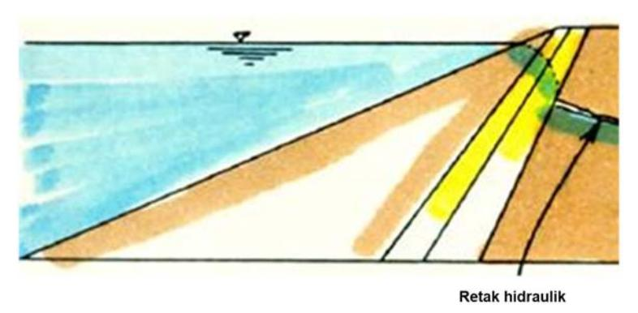

**Gambar 85 – Sketsa retak hidraulik pada bendungan urugan batu** 

# **13.7.1 Faktor yang memengaruhi terjadinya retak hidraulik** *(hydraulic fracturing)*

Faktor yang memengaruhi terjadinya retak hidraulik pada bendungan urugan batu *(rock fill dam)* adalah sebagai berikut:

- a) kemiringan galian bukit sandaran *(abutment)* bendungan;
- b) konfigurasi bentuk inti kedap air;
- c) tebal dasar filter hulu *(upstream filter);*
- d) zona transisi di bagian hulu bendungan sebagai bagian dari timbunan batu *(rockfill);*
- e) bahan timbunan inti kedap air.

Kemiringan galian bukit sandaran *(abutment)* bendungan urugan batu akan memberikan pengaruh terjadinya fenomena busur *(arching effect)* dimana semakin curam lereng galian bukit sandaran akan memberikan fenomena busur *(arching effect)* yang besar pula. Pola galian bukit sandaran harus dipertimbangkan dengan saksama guna mengurangi pengaruh fenomena busur terhadap timbunan bendungan urugan batu.

Fell dkk. (2004) menemukan bahwa bendungan yang memiliki perbandingan antara tinggi bendungan urugan batu (H) dan lebar dasar inti bendungan (W) lebih besar dari dua, H/W >

2, adalah bendungan yang sangat-sangat mungkin mengalami retak hidraulik *(much more likely experiencing with hydraulic fracturing),* sedangkan bendungan dengan perbandingan 1<H/W<2 sangat mungkin mengalami retak hidraulik *(more likely experiencing with hydraulic fracturing).* 

Lebar dasar filter hulu penting direncanakan dengan saksama dalam rangka mengurangi fenomena busur pada inti kedap air. Semakin lebar dasar filter hulu, akan mengurangi fenomena busur pada lereng hulu inti kedap air.

Untuk mengurangi fenomena busur antarzona timbunan pada bendungan urugan batu maka zona timbunan transisi yang terdiri atas batuan dengan gradasi yang lebih kecil dari pada gradasi material zona timbunan batuan harus direncanakan di antara zona timbunan batuan dengan zona timbunan filter hulu. Tebal dan gradasi zona timbunan transisi harus direncanakan untuk berfungsi sebagai penghubung *(bridging)* untuk mengurangi perbedaan modulus elastisitas yang besar antara zona timbunan batuan dengan zona timbunan filter hulu dan inti kedap air.

Bahan inti kedap air harus menggunakan material yang berfungsi untuk mengurangi risiko terjadinya retak hidraulik *(hydraulic fracturing).* Keruntuhan yang disebabkan oleh retak hidraulik pada inti kedap air adalah keruntuhan akibat timbulnya tegangan tarik maka harus dipilih material inti kedap air yang mempunyai kuat tarik yang besar.

# **13.7.2 Perancangan bendungan urugan batu bebas retak hidraulik** *(hydraulic fracturing)*

Perancangan bendungan urugan batu yang bebas retak hidraulik dapat dilakukan dengan analisis numerik dengan menggunakan metode elemen hingga, dengan analisis kopling antara analisis tegangan dan deformasi dengan analisis rembesan*.*

Tinggi bendungan maksimum tidak boleh mengalami retak hidraulik. Untuk itu harus mempertimbangkan tiga faktor berikut:

- a) kemiringan bentuk inti kedap air yang dinyatakan dalam bentuk perbandingan antara tinggi, H, dengan lebar dasar, W, inti kedap air,
- b) lebar dasar filter hulu,
- c) kandungan material halus (lolos saringan No. 200) dari bahan inti kedap air.

# **13.8 Desain bendungan urugan tanah dan tanggul untuk menghindarkan keruntuhan hidraulik**

# **13.8.1 Pemasangan filter dan drainase internal di dalam bendungan urugan tanah dan tanggul**

Pemasangan filter dan drainase internal di dalam bendungan urugan tanah dan tanggul harus dirancang, jika diperlukan, untuk mengendalikan rembesan agar tidak berkembang menjadi erosi buluh. Supaya fungsi dari filter dan drainase internal berfungsi efektif maka ada batasan untuk tinggi bendungan urugan tanah atau tanggul yang besarnya dipengaruhi oleh bentuk filter dan drainase internal yang akan digunakan.

#### **13.8.2 Batasan tinggi bendungan urugan tanah dan tanggul dan bentuk internal filter**

Batasan tinggi bendungan urugan tanah dan tanggul dan bentuk internal filter adalah cara untuk memastikan bahwa aliran air di dalam tubuh bendungan urugan tanah dan tanggul

**© BSN 2017 290 dari 303**

tidak memotong lereng hilir bendungan urugan tanah dan tanggul, serta mengarahkan aliran air di dalam tubuh bendungan urugan tanah dan tanggul untuk melewati internal filter dan drainase.

Batasan tinggi bendungan urugan tanah dan tanggul dengan jenis dan bentuk filter dan drainase internal dimaksudkan untuk meningkatkan dan menghindarkan terjadinya keruntuhan hidraulik. Hal yang perlu diperhatikan di dalam pemilihan bentuk filter dan internal drainase adalah:

- a) perbandingan antara koefisien permeabilitas arah horizontal dan arah vertikal (kh/kv),
- b) tingkat risiko di bagian hilir akibat dari runtuhnya bendungan.

Pada bendungan dengan risiko kerusakan yang besar di bagian hilir oleh runtuhnya bendungan, maka filter dan drainase internal di dalam tubuh bendungan mutlak harus dilaksanakan dengan mengikuti kaidah desain filter yang berlaku.

Bendungan urugan tanah dan tanggul homogen tanpa internal filter merupakan struktur penahan air yang paling sederhana. Bendungan urugan tanah dan tanggul homogen terbuat dari bahan tanah lempung, lanau, lempung pasiran dan beberapa jenis tanah lainnya asalkan dari perancangan dan analisa rembesan, garis aliran air tidak memotong lereng hilir. Bendungan urugan tanah tanah dan tanggul dari bahan timbunan yang homogen tanpa internal filter disyaratkan dilaksanakan dengan tinggi tidak lebih dari 5 meter di lokasi dimana risiko akibat runtuhnya bendungan urugan tanah pada daerah hilir kecil. Potongan melintang tipikal bendungan urugan tanah dan tanggul homogen tanpa internal filter disampaikan pada Gambar 86.

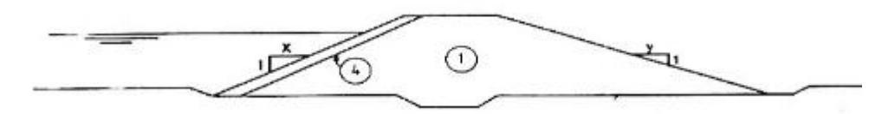

Keterangan

- 1. timbunan tanah homogen
- 4. *rip-rap*

**Gambar 86 – Potongan melintang tipikal bendungan tanah homogen**

Bendungan urugan tanah dan tanggul homogen dengan *toe drain* sama dengan varian bendungan tanah homogen, hanya dilengkapai dengan drainase timbunan batu atau *gravel* yang dilengkapi dengan filter pada dasar lereng hilir bendungan. Bendungan jenis ini sesuai apabila rasio antara kH/kV (permeabilitas arah horizontal/arah vertikal) antara 1 sampai 5. Apabila rasio tersebut lebih besar, *toe drain* tidak akan efektif berfungsi sebab rembesan akan keluar dari lereng hilir bendungan di atas *toe drain*. Bendungan jenis ini disarankan dilaksanakan dengan tinggi tidak lebih dari 10,00 meter, pada lokasi dengan risiko akibat runtuhnya bendungan jenis ini pada daerah hilir kecil. Potongan melintang tipikal bendungan urugan tanah dan tanggul dengan *toe drain* disampaikan pada Gambar 87.

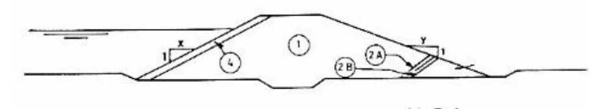

Keterangan

- 1. timbunan tanah homogen
- 2A. filter halus
- 2B. filter kasar
- 4. *rip-rap*

**Gambar 87 – Potongan melintang tipikal bendungan tanah dengan** *toe drain*

Bendungan urugan tanah homogen dengan drainase horizontal dilengkapi dengan filter dan drainase horizontal pada dasar bendungan bagian hilir. Bendungan jenis ini sesuai apabila rasio antara kH/kV (permeabilitas arah horizontal/arah vertikal) antara 1 sampai 5. Bendungan urugan jenis ini disyaratkan dilaksanakan dengan tinggi tidak lebih dari 20,00 meter, pada lokasi dengan risiko akibat keruntuhan bendungan jenis ini pada daerah hilir kecil sampai sedang. Potongan melintang tipikal bendungan tanah dengan drainase horizontal dan filter disampaikan pada Gambar 88.

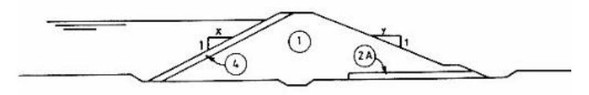

Keterangan

- 1. timbunan tanah homogen
- 2A. filter halus
- 4. *rip-rap*

# **Gambar 88 – Potongan melintang tipikal bendungan tanah dengan drainase horizontal**

Bendungan urugan tanah dengan menggunakan bahan timbunan tanah homogen dan dilengkapi dengan filter tegak dan drainase horizontal dapat direncanakan tanpa mempertimbangkan rasio kH/kV dari timbunan karena aliran rembesan akan terpotong oleh filter dan dan dialirkan keluar dari tubuh bendungan melalui drainase horizontal. Desain filter tegak dan drainase horizontal pada bendungan urugan tanah dan tanggul wajib dilaksanakan pada lokasi dengan risiko akibat keruntuhan bendungan pada daerah hilir besar, dan tidak tergantung pada tinggi bendungan. Bendungan urugan tanah jenis ini tidak ada batasan tinggi, asal seluruh aspek perancangan bendungan urugan tanah dapat dipenuhi. Potongan melintang tipikal bendungan urugan tanah dengan drainase vertikal dan horizontal serta filter disampaikan pada Gambar 89.

**© BSN 2017 292 dari 303**

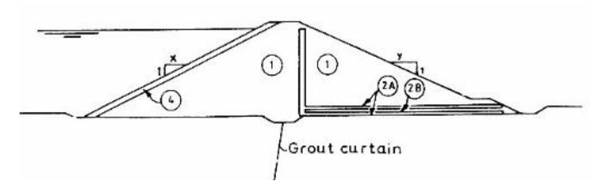

Keterangan

- 1. timbunan tanah homogen
- 2A. filter halus
- 2B. filter kasar
- 4. *rip-rap*

**Gambar 89 – Potongan melintang tipikal bendungan tanah dengan drainase vertikal dan horizontal** 

# **13.8.3 Penggunaan filter diafragma pada konstruksi saluran tertutup melintang bendungan**

Filter diafragma digunakan sebagai sarana untuk mengendalikan rembesan yang terjadi di luar saluran tertutup melintang bendungan urugan tanah*.* Desain filter diafragma (Cooper, 2007) dapat dilakukan dengan berpedoman pada sketsa yang disampaikan pada Gambar 90, sedangkan dimensi dari filter diafragma dapat mengacu pada Gambar 91.

Filter diafragma dapat berfungsi untuk menghindarkan terjadinya erosi pada tanah di sekitar saluran tertutup yang dibangun melintang bendungan. Fungsi filter adalah menghambat partikel tanah yang migrasi oleh karena erosi, tetapi tetap dapat mengalirkan air agar tegangan air pori berlebih *(excess pore water pressure)* dapat terdisipasi. Dengan dimensi filter diafragma seperti terlihat pada Gambar 90 dan persyaratan puncak filter diafragma seperti dalam Gambar 91, antara lain puncak filter diafragma harus sama dengan elevasi muka air waduk normal, dan jaraknya ke lereng hilir harus lebih dari 50 cm, maka filter diafragma hanya dapat digunakan pada bendungan urugan tanah atau tanggul yang tidak tinggi.

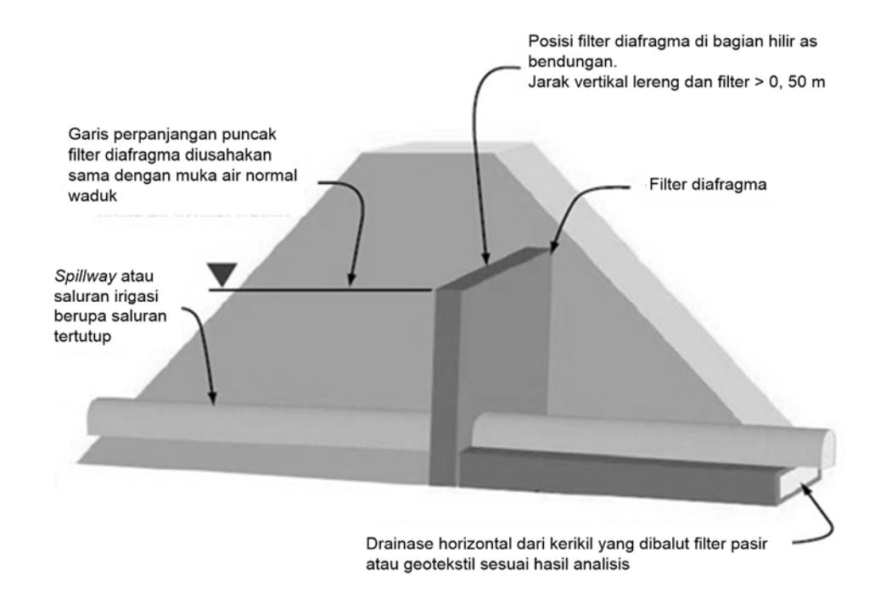

**Gambar 90 – Sketsa filter diafragma pada saluran tertutup melintang bendungan (Cooper, 2007)**

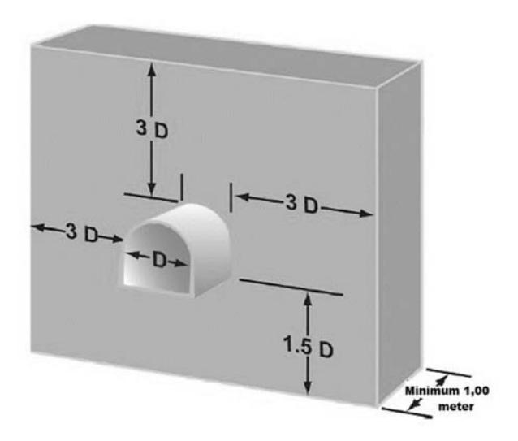

**Gambar 91 – Dimensi filter diafragma pada saluran tertutup melintang bendungan**

# **13.8.4 Desain filter**

Desain gradasi filter tergantung dari gradasi bahan tanah yang dilindungi. Secara tradisional fungsi tersebut adalah hubungan antara D85B (diameter butiran tanah yang dilindungi yang sama dengan ukuran saringan dimana material yang lolos sebesar 85%) dengan D15F (diameter butiran filter yang besarnya sama dengan ukuran saringan di mana material yang lolos sebesar 15%). Dari hubungan antara D85B dengan D15F, terdapat 4 zona filter, yaitu zona tak erosi, zona erosi ringan, zona erosi lanjut, dan erosi menerus (Foster dan Fell, 2001), seperti ditunjukkan alam Gambar 92.

**© BSN 2017 294 dari 303**

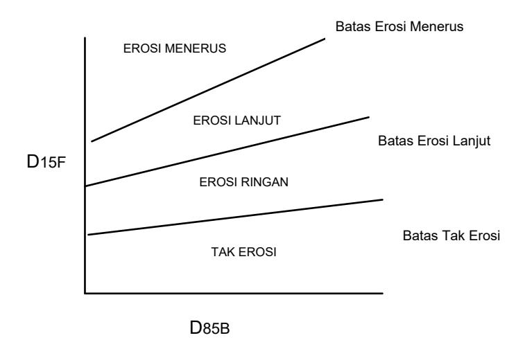

**Gambar 92 – Zona filter bendungan urugan batu (Foster dan Fell, 2001)**

Pada bendungan urugan tanah, desain filter dibuat berdasarkan konsep *no erosion filter (NEF)* dan inti kedap air (Sherard dan Dunnigan, 1985) dibagi menjadi 4 golongan berdasarkan persentase butiran yang lolos saringan No. 200 (diameter partikel<0,075mm), seperti disampaikan berikut ini:

- a) Tanah lempung atau lanau halus dengan persentase butiran yang lolos saringan No. 200 lebih besar dari 85%,
- b) Tanah lempung kepasiran dan lanau kepasiran dengan persentase butiran yang lolos saringan No. 200 antara 40% sampai dengan 85%,
- c) Tanah pasir kelempungan, dan pasir kelanauan dengan persentase butiran yang lolos saringan No. 200 antara 15% sampai dengan 39%, dan
- d) Tanah kerikil kepasiran dan kerikil kelempungan dengan persentase butiran yang lolos saringan No. 200 kurang dari 15%.

Secara umum, filter pada bendungan urugan tanah harus mempunyai 2 fungsi utama, yaitu:

- a) filter harus dapat mencegah migrasi bahan inti kedap air yang tererosi dalam proses erosi buluh,
- b) filter harus bersifat lolos air, agar aliran rembesan dapat mengalir di dalamnya dengan lancar dan tidak menimbulkan kelebihan tegangan air pori dalam inti bendungan.

Desain filter bendungan urugan tanah dan tanggul dilaksanakan berdasarkan kriteria Sherard dan Dunnigan (1985) yang disempurnakan USBR (2011) dan FEMA (2011), seperti disampaikan dalam Tabel 58 dan Tabel 59. Dengan mengacu pada teori *multiple line of defence* pada bendungan tipe urugan, filter dapat dibagi menjadi 2 bagian, yaitu filter kasar dan filter halus. Gradasi filter halus merupakan fungsi dari gradasi tanah timbunan bendungan, sedangkan gradasi filter kasar merupakan fungsi dari gradasi filter halus.

Tabel 58 – Kriteria filter dari USBR (2011) dan FEMA (2011)

|                      | Jenis tanah                               |                                                  |                                                                                                                                                               |  |
|----------------------|-------------------------------------------|--------------------------------------------------|---------------------------------------------------------------------------------------------------------------------------------------------------------------|--|
| Menurut              | Persentase lolos saringan No.200 | Deskripsi tanah                                  | Kriteria filter                                                                                                                                               |  |
|                      | > 85%                                     | Lanau halus dan lempung                          | $D_{15F} \le 9.D_{85B}$                                                                                                                                       |  |
|                      | 40% - 85%                                 | Lempung kepasiran, dan Lanau kepasiran     | $D_{15F} \le 0,7mm$                                                                                                                                           |  |
| USBR, USDA (1994) | 15% - 39%                                 | Pasir kelempungan dan Pasir kelanauan   | $D_{15F} \leq \left(\frac{40-A}{40-15}\right) \left[\left(4xD_{85B}\right)-0,7mm\right]+0,7mm$ Keterangan: A adalah persentase butiran lolos saringan No. 200 |  |
|                      | <15%                                      | Pasir dan Kerikil berlempung atau berlanau | $D_{15F} \le 4.D_{85B}$                                                                                                                                       |  |

Tabel 59 - Batas gradasi filter untuk mencegah segregasi filter

| Diameter minimum D 10F (mm) | Diameter maksimum D 90F (mm) |
|----------------------------------------|-----------------------------------------|
| <0,5                                   | 20                                      |
| 0,51,0                                 | 25                                      |
| 1,02,0                                 | 30                                      |
| 2,05,0                                 | 40                                      |
| 5,010,0                                | 50                                      |
| 10,020,0                               | 60                                      |

© BSN 2017 296 dari 303

# **Bibliografi**

AASHTO. 2012. *American Association of State Highway and Transportation Officials, AASHTO Guide Specifications for LRFD Seismic Bridge Design, 2nd Edition*.

AASHTO. 1996. *Standard Specification for Geotextile Specification for Highway Application. AASHTO Designation: M 288-96.*

B. Maidl, et.al. 2014. *Handbook of Tunnel Engineering II: Basics and Additional Services for Design and Construction. Wilhelm Ernst & Sohn, Germany*.

Benght B. Broms. 1994, *Design and Construction of Strutted and Anchored Sheet Pile Walls in Soft Clay, Seminar on Deep Excavation and Substructure Construction, The Institution of Engineers, Singapore.* 

Bjerrum, L. and Eide, O. 1956. *"Stability of Strutted Excavations in Clay", Geotechnique 6, 32-47.* 

BSN. *Peraturan Kepala Badan Standardisasi Nasional No. 4 tahun 2016 tentan Pedoman Penulisan Standar Nasioal Indonesia.* Badan Stardasisasi Nasional. 2016.

Canadian Geotechnical Society. 1992. *Canadian Foundation Engineering Manual 3rd Edition.* 

CIRIA. 1996. *Prediction and effects of ground movements caused by tunnelling in soft ground beneath urban areas. Construction Industry Research and Information Association, Project Report 30.* 

Clough, G.W. and O Rourke, T.D. 1990. *Construction Induced Movements of In-situ Walls, New York, Proc., ASCE Conf. on Des. and Perf. of Earth Retaining Struct., Geotech. Spec. Publ. no. 25, ASCE, 439-470.* 

Cooper, C. R., 2007. *Identifying and Solving Problems with Embankment Dam Conduits: Best Practices. Water Operation and Maintenance Bulletin no. 219. 2007. pp 1-10.* 

Department of the Navy. 1982. *Design Manual 7*, NAVFAC DM, USA.

Djarwadi, D. 2010. *Analisis Retak Hidrolis Inti Bendungan Urugan Batu pada Variasi Kadar Butiran Halus.* Disertasi. Universitas Gadjah Mada.

Duncan, J.M., et.al. 1987. *An Engineering Manual for Slope Stability Studies. Department of Civil and Environmental Engineering, Center for Geotechnical Practice and Research.* Virginia Tech.Maret 1987.

Dunnicliff, J. 1993. *Geotechnical Instrumentation for Monitoring Field Performance.* John Wiley & Sons, New York, 577.

FEMA. 2011. Filter for Embankment Dams. Best Practices for Design and Construction

FHWA. 2004. *Road Tunnel Design Guidelines. FHWA-IF-05-023,* July. US Department of Transportation. Washington, D.C.

FHWA. 2005. *Road Tunnel Design Guidelines.* Federal Highway Administration. US Department of Transportation. US Department of Transportation. Washington DC.

FHWA. 2009. *Technical Manual for Design and Construction of Road Tunnels.* Federal Highway Administration. US Department of Transportation. Washington DC.

FHWA. 2003. *FHWA0-IF-03-017, 2003, Soil Nail Walls.* Federal Highway Administration. US Department of Transportation. Washington DC.

FHWA. 2003. *FHWA-NHI-14-007, 2003, Soil Nail Walls-Reference Manual*. Federal Highway Administration, US Department of Transportation. Washington DC.

FHWA. 2001. FHWA-NHI-00-043, 2001, *Mechanically Stabilized Earth Walls and Reinforced Soil Slopes, Design & Construction Guidelines* Federal Highway Administration, US Department of Transportation. Washington DC.

Fell, R., Wan, C.F. and Foster, M. 2004, *Methods for Estimating the Probability of Failure of Embankment Dams by Internal Erosion and Piping through the Embankment*, Univ Report R-428, May 2004, University of New South Wales, Australia, ISBN: 85841 395 7.

FHWA. 2009. *FHWA-NHI-10-024, 2009*, *Design and Construction of Mechanically Stabilized Earth Walls and Reinforced Soil Slopes – Volume I* Federal Highway Administration, US Department of Transportation. Washington DC.

FIP. *State of the Art Report, "Corrosion and Corrosion Protection of Prestressed Ground".* 

GEOGUIDE 6, 2002, *Guide To Reinforced Fill Structure and Slope Design.*

Geosoft, 1988, *BMCOLPY/G Beam Column Analysis with Non Linear Support.*

Gue S.S and Y.C. Tan: *Design and Construction Consideration for Deep Excavation*, SSP Geotechnics Sdn Bhn Kualalumpur, 1998.

ICOLD: Bulletin 72, 2010 Revision, *Selecting Seismic Parameters For Large Dams Guidelines* (B148)

JSCE. 2007, *Standard Specifications for Tunneling-2006: Mountain Tunnels.* Tokyo: Japan Society of Civil Engineers.

JGS. *JGS 4101-2012, Ground Anchor Design and Construction Standard, and Explanation.*  Japanese Geotechnical Society.

Jooste, M. A., and Cawood, F. T,2004. Survey slope stability monitoring. Lesson from Venetia Diamond Mine. Proc Intl Symposium on Slope Stability of Rock Slope in Open Pit Mining and Civil Engineering

Kementerian Pekerjaan Umum. 2013. *Manual Perencanaan Pekerjaan Underpass.* 

Kementerian Pekerjaan Umum. 2004. *Pedoman Analisis stabilitas bendungan tipe urugan akibat beban gempa Pd T-14-2004-A* 

Kementerian Pekerjaan Umum. 2004. *Pedoman perencanaan pembebanan gempa untuk Jembatan (PDT-04-2004-B)* 

Katsura, Y., Kohsaka, N., Ishizuka, K. 1995., *External Forces Acting on Walls during Deep Excavations - A Survey on Japanese Codes, Underground Construction in Soft Ground,*  Proc. Of the Inter. Symposium on Underground Construction in Soft Ground.

Long, M. 2001. *Database for Retaining Wall and Ground Movements due to DeepExcavations*, Journal of Geotechnical and Geoenvironmental Engineering, ASCE.

Malcolm Puller. 1996. *Deep Excavations : A Pratical Manual, Thomas Telford* 

Mikola, R.G, Sitar, N. 2013. *Seismic Earth Pressures on Retaining Structures in Cohesionless Soils.* Report No. UCB GT 13-01. Universitas of California, Berkeley. Maret 2013.

NAVFAC. 1982. *Foundations and Earth Structures, Design Manual 7.2,* Department of the Navy Naval Facilities Engineering Command.

NSW. 2014. Government Western Australia, Safe Work Australia, *Code of Practice of Excavation*.

Padfield, C.J and Mair, *R.J., Design of Retaining Walls Embedded in Stiff Clay.* 

Pd- T-04-2004-B, *Pedoman Perencanaan Pembebanan Gempa untuk Jembatan* 

Peck, R.B., 1969. *Deep Excavations and Tunneling in Soft Ground,* Proc., 7th Int. Conf. Soil Mech. Found. Eng., 225-281.

Plaxis bv 2014. *Manual PLAXIS-2D Anniversary Edition 0.1.* 

Power, J.P. 1992, *Construction Dewatering, New Methods and Applications.* John Wiley & Sons, Inc. The German Society for Geotechnics, Recommendations on Excavations, 2003, Ernst and Sohn.

Pt T-8-2002-B, *Panduan Geoteknik 1, Timbunan Jalan pada Tanah Lunak: Proses Pembentukan dan Sifat-Sifat Dasar Tanah Lunak* 

Pt T-09-2002-B, *Panduan Geoteknik 2, Timbunan Jalan pada Tanah Lunak: Penyelidikan Tanah Lunak, Perencanaan dan Pekerjaan Lapangan* 

Pt M-01-2002-B, *Panduan Geoteknik 3, Timbunan Jalan pada Tanah Lunak: Penyelidikan Tanah Lunak, Pengujian Laboratorium* 

Pt T-10-2002-B, *Panduan Geoteknik 4, Timbunan Jalan pada Tanah Lunak: Perencanaan dan Konstruksi.* 

Pt T-11-2003, *Pedoman Perencanaan Timbunan Jalan Pendekat Jembatan.* 

Seed, H.B., and Whitman, R.V. 1970. *Design of Earth Retaining Structures For Dynamic Loads*. In Proceedings of the ASCE Special Conference on Lateral Stresses, Ground Displacement and Earth Retaining Structure, Ithaca, N.Y., pp. 103–147.

Somerville, S.H. 1986. "*Control of Groundwater for Temporary Works",* CIRIA, report no. 113.

Tan Y.C and CM Chhow: Design of Retaining Wall and Support System for Deep Besmen Construction, Kualalumpur, www.gnpgeo.com.my/download/publication/2008\_02.pdf

Terzaghi, K. and Peck, R.B. (1967), *Soil Mechanics in Engineering Practice.* Wiley, New York, 2nd edn.

Terzaghi, K. 1943, *Theoretical Soil Mechanics*, New York, John Wiley and Sons.

Thomas Telford.1986. *Anchorages*.

Twine, D. And Roscoe, H.Ç. 1999, *Temporary Propping of Deep Excavations-Guidance on Design*, CIRIA, C517.

United States Steel, 1984, *Steel Sheet Piling Design Manual.* 

USBR. 2011. Design Standard No. 13 Embankment Dams. Chapter 5: Protective Filters.

Williams, B.P and Waite, D. (1993*), The Design and Construction of Sheet-Piled Cofferdams,* CIRIA, special pub. no. 95

Wood, J.H. 1973. *Earthquake-induced soil pressures on structures.* Ph.D. thesis, the California Institute of Technology, Pasadena, California.

Wyllie, D.C., Mah, C.W. 2004. *Rock Slope Engineering Civil and Mining 4th Edition.* Spon Press Taylor and Francis Group. London.

# **Daftar istilah**

| Inggris Indonesia       |                                                 |  |
|----------------------------|-------------------------------------------------|--|
| Accelerator                | Pemercepat pengerasan                           |  |
| Admixtures                 | Bahan tambah                                    |  |
| Anchor head                | Kepala angkur                                   |  |
| Base resistance            | Tahanan ujung                                   |  |
| Base rock                  | Batuan dasar                                    |  |
| Bearing capacity           | Data dukung                                     |  |
| Bedding planes             | Bidang pelapisan                                |  |
| Benchmark                  | Acuan/titik referensi tetap                     |  |
| Blasting                   | Peledakan                                       |  |
| Bored pile                 | Tiang bor                                       |  |
| Bottom heave               | Pengangkatan dari bawah                         |  |
| Boulder                    | Batu bongkah                                    |  |
| Boulders                   | Batu bongkah                                    |  |
| Breakwater                 | Pemecah gelombang                               |  |
| Buttress                   | Pengaku di depan dinding vertikal               |  |
| Casing                     | Penutup/selubung                                |  |
| Circular sliding           | Kelongsoran busur                               |  |
| Cleavages                  | Celah                                           |  |
| Cobbles                    | Batu bulat                                      |  |
| Compaction probe           | Batang pemadat                                  |  |
| Cone resistance            | Perlawanan konus                                |  |
| Confined aquifer           | Kondisi akuifer terkekang                       |  |
| Core sample                | Contoh inti                                     |  |
| Counterfort                | Pengaku di belakang dinding            |  |
|                            | vertikal                                        |  |
| Counter-weight             | Bobot pengimbang                                |  |
| Crib wall                  | Dinding krib                                    |  |
| Crushability of particles  | Kehancuran butiran tanah                        |  |
| Curing                     | Pemeraman                                       |  |
| Data logger                | Alat pencatat data                              |  |
| Deep compaction            | Pemadatan dalam                                 |  |
| Deep mixing                | Pencampuran tanah di                      |  |
|                            | kedalaman tertentu                              |  |
| Deep vibratory compaction  | Pemadatan getar pada                      |  |
|                            | kedalaman tertentu                              |  |
| Depth vibrator (vibroflot) | Pemadat getar pada kedalaman                    |  |
|                            | tertentu                                        |  |
| Differential settlement    | Beda penurunan                                  |  |
| Dilatometer Test (DMT)     | Uji Dilatometer                                 |  |
| Discharge capacity         | Kapasitas alir                                  |  |
| Dispersibility             | Penghancuran tanah                              |  |
| Double packer pipe         | Pipa paker ganda                                |  |
| Drainage blanket           | Selimut drainase                                |  |
| Driven pile                | Tiang pancang                                   |  |
| Driving hammer             | Pemukul/pemancang                               |  |
| Dry top-feed process       | proses kering (dengan) penghubung atas |  |
| Dry bottom-feed process    | proses kering (dengan)                    |  |
|                            | penghubung bawah                                |  |

**© BSN 2017 300 dari 303**

| Inggris                         | Indonesia                         |  |  |
|---------------------------------|-----------------------------------|--|--|
| Drill rig                       | Alat pengeboran                   |  |  |
| Durability                      | Daya tahan                        |  |  |
| Effective overburden         | Tekanan overburden efektif        |  |  |
| pressure                        |                                   |  |  |
| Elongation                      | Perpanjangan                      |  |  |
| Embankment                      | Timbunan                          |  |  |
| Faults                          | Patahan/sesar                     |  |  |
| Field trials                    | Percobaan lapangan                |  |  |
| Fillers                         | Bahan pengisi                     |  |  |
| Fissures                        | Rekahan                           |  |  |
| Fly-ash                         | Abu terbang                       |  |  |
| Friction pile                   | Tiang friksi                      |  |  |
| Fully saturated                 | Jenuh sepenuhnya                  |  |  |
| Granular                        | Berbutir                          |  |  |
| Grease                          | Gemuk                             |  |  |
| Grid                            | Rangka                            |  |  |
| Ground anchors                  | Angkur tanah                      |  |  |
| Ground water level              | Muka air tanah                    |  |  |
| Handling                        | Penanganan                        |  |  |
| Hardening                       | Pengerasan                        |  |  |
| Headroom                        | Ruang kerja                       |  |  |
| Heave                           | Pengangkatan                      |  |  |
| Heave                           | Naiknya dasar galian              |  |  |
| Highly fissured rock            | Batuan bercelah tinggi            |  |  |
| Hydraulic binders               | Bahan pengikat hidraulik          |  |  |
| Infilling                       | Material pengisi                  |  |  |
| Intact rock                     | Batuan intak                      |  |  |
| Interface                       | Antarmuka                         |  |  |
| Jet grouting                    | Jet graut                         |  |  |
| Joint                           | Kekar/retakan                     |  |  |
| Large plate load test           | Uji beban pelat besar             |  |  |
| Lateral sliding                 | Gelincir arah lateral             |  |  |
| Lateral spreading               | Penyebaran ke arah          |  |  |
|                                 | lateral/serakan lateral           |  |  |
| Lime                            | Kapur                             |  |  |
| Limit equilibrium               | Kesetimbangan batas               |  |  |
| Limit state acceptable criteria | Kriteria penerimaan kondisi batas |  |  |
| Logging                         | Pencatatan                        |  |  |
| Long term                       | Jangka panjang                    |  |  |
| Lost of ignition                | Kehilangan pemijaran              |  |  |
| Low fissured rock               | Batuan bercelah rendah            |  |  |
| Lower bound                     | Batas bawah                       |  |  |
| Maximum Credible             | Gempa tertimbang maksimum         |  |  |
| Earthquake (MCE)                |                                   |  |  |
| Non woven                       | Nir-tenun                         |  |  |
| Nozzle                          | Pipa semprot                      |  |  |
| Open-cut slope                  | Galian terbuka                    |  |  |
| Open-stand pipe piezometer      | Pisometer pipa terbuka            |  |  |
| Operating Basis Earthquake      |                                   |  |  |
| (OBE)                           |                                   |  |  |
| Overlapped                      | Bertampalan                       |  |  |
| Overturning resistance          | Tahanan akibat guling             |  |  |
|                                 |                                   |  |  |

| Inggris                        | Indonesia                   |  |
|--------------------------------|-----------------------------|--|
| Peak Ground Acceleration | Percepatan gempa puncak     |  |
| (PGA)                          |                             |  |
| Penetration resistance         | Tahanan tusuk               |  |
| Permitted anchoring         | Tahanan izin pengangkuran   |  |
| resistance                     |                             |  |
| Phreatic line                  | Garis freatik               |  |
| Piezometric head               | Tekanan air tanah           |  |
| Pile cap                       | Kepala tiang                |  |
| Piping                         | Erosi buluh                 |  |
| Planar sliding                 | Longsor bidang              |  |
| Plasticizer                    | Pemlastis/pelunak           |  |
| Precast                        | Pracetak                    |  |
| Prefabricated Vertical Drain   | Drainase vertikal buatan    |  |
| (PVD)                          |                             |  |
| Preliminary                    | Awal                        |  |
| Preloading                     | Pra pembebanan              |  |
| Pressuremeter Test (PMT)       | Uji Tekanan sistem Menard   |  |
| Prestressed concrete           | Beton prategang             |  |
| Probe                          | Penduga                     |  |
| Pullout                        | Cabut                       |  |
| Pumping test                   | Uji pemompaan               |  |
| Reference values               | Nilai awal                  |  |
| Sample                         | Contoh                      |  |
| Seepage                        | Rembesan                    |  |
| Seismic Refraction Test        | Uji Pembiasan Seismik       |  |
| Serviceability                 | Kemampulayanan              |  |
| Service load                   | Beban layan                 |  |
| Shaft                          | Poros                       |  |
| Short term                     | Jangka pendek               |  |
| Shotcrete                      | Beton semprot               |  |
| Single packer                  | Paker tunggal               |  |
| Sleeve pipe                    | Pipa selongsong             |  |
| Sliding resistance             | Ketahanan terhadap geser    |  |
| Sleeve grout                   | Selongsong graut            |  |
| Softening                      | Pelunakan                   |  |
| Specimen                       | Benda uji                   |  |
| Spoil return                   | Ampas bor                   |  |
| Standar Penetration Test       | Uji Penetrasi Standar       |  |
| Suction                        | Hisapan                     |  |
| Sudden draw-down               | Penurunan muka air seketika |  |
| Support system                 | Sistem penunjang            |  |
| Surcharge load                 | Beban tambahan              |  |
| Tamper                         | Penumbuk                    |  |
| Toppling slide                 | Longsor guling              |  |
| Trial area                     | Area percobaan              |  |
| Ultimate resistance         | Tahanan ultimit penetrasi   |  |
| penetration                    |                             |  |
| Ultimate skin resistance       | Tahanan friksi ultimit      |  |
| Ultimate end bearing     | Tahanan ujung ultimit       |  |
| resistance                     |                             |  |
| Unconfined Compression      | Uji kuat tekan bebas        |  |
| Test                           |                             |  |

**© BSN 2017 302 dari 303**

| Inggris                   | Indonesia                                               |  |  |
|---------------------------|---------------------------------------------------------|--|--|
| Ultimate bearing capacity | Kapasitas daya dukung ultimit                           |  |  |
| Underpass                 | Lintas bawah                                            |  |  |
| Underpinning              | Penopang                                                |  |  |
| Undisturbed               | Tak terganggu                                           |  |  |
| Undrained shear strength  | Kuat geser tak terdrainase                              |  |  |
| Unloading                 | Pelepasan beban                                         |  |  |
| Uplift                    | Daya angkat/gaya tekan ke atas/pengangkatan |  |  |
| Uplift resistance         | Ketahanan terhadap pengangkatan                   |  |  |
| Upper bound               | Batas atas                                              |  |  |
| Vacuum preloading         | Pra pembebanan dengan vakum                             |  |  |
| Vane shear test           | Uji geser baling                                        |  |  |
| Vertical drain            | Drainase vertikal                                       |  |  |
| Void                      | Rongga kosong                                           |  |  |
| Water jetting             | Semprotan air                                           |  |  |
| Waterproofing             | Anti air                                                |  |  |
| Wedge method              | Metode baji                                             |  |  |
| Wedge sliding             | Longsoran baji                                          |  |  |
| Welded wire mesh          | Kawat yang dilas                                        |  |  |
| Well-graded               | Bergradasi baik                                         |  |  |
| Wet pocess                | Proses basah                                            |  |  |

# Informasi pendukung terkait perumus standar

# [1] Komtek/SubKomtek perumus SNI

Sub Komite Teknis 91-01-S2, Subkomite Teknis Rekayasa Jalan dan Jembatan,

# [2] Susunan keanggotaan Komtek perumus SNI

| No | Nama                                           | Instansi                                        | Kedudukan   | Wakil dari 🖁                     |
|----|------------------------------------------------|-------------------------------------------------|-------------|----------------------------------|
| 1  | Dr. Deded Permadi Sjamsudin, M.Eng.Sc       | Pusat Litbang Jalan dan Jembatan             | Ketua       | Pemerintah                       |
| 2  | Prof. Dr.Ir. M. Sjahdanulirwan, M.Sc        | Universitas Tama Jagakarsa                   | Wakil Ketua | Pakar stand                      |
| 3  | Prof. Dr. Ir. H. Raden Anwar Yamin, MT, M.E | Pusat Litbang Jalan dan Jembatan             | Sekretaris  | Pemerintah <mark>a</mark> 5   |
| 4  | Dr. Ir. Siegfried, M.Sc                        | Pusat Litbang Jalan dan Jembatan             | Anggota     | Pemerintah Pemerintah Pemerintah |
| 5  | Dr. Ir. Dwi Prasetyanto, MT                    | Institut Teknologi Nasional (ITENAS)         | Anggota     | Pakar untuk                      |
| 6  | Dr.Ir. Samun Haris, MT                         | Himpunan Pengembangan Jalan Indonesia (HPJI) | Anggota     | Konsumen &                       |
| 7  | Dr. Ir. Imam Aschuri, MT                       | Himpunan Ahli Teknik Tanah Indonesia (HATTI) | Anggota     | Konsumen on te                   |
| 8  | Ir. GJW Fernandez                              | PT. Belaputra Intinad                           | Anggota     | Produsen                         |
| 9  | Dr. Ir. Hindra Mulya, MM                       | PT. MBT                                         | Anggota     | Produsen 🗒                       |

#### [3] Konseptor rancangan SNI

Badan Penelitian dan Pengembangan Kementerian Pekerjaan Umum dan Perumahan Rakvat dan Himpunan Ahli Teknik Tanah Indonesia (HATTI).

Ucapan terimakasih sebesar-besarnya disampaikan kepada seluruh anggota tim yang tergabung di dalam SK Kepala Balitbang No. 07/KPTS/KL/2015 tentang Pembentukan Tim Penyusun Standar Nasional Indonesia (SNI) Kriteria Perencanaan Geoteknik dan Kegempaan (Amandemen).

| No. | Nama                                   | Lembaga  | Ke         | dudukan |        |
|-----|----------------------------------------|----------|------------|---------|--------|
|     |                                        |          | Konseptor  | untuk   | Bidang |
| 1.  | Prof. Masyhur Irsyam, M.SE., Ph.D.     | HATTI    | Kegempaan  |         |        |
|     |                                        |          | Konseptor  | untuk   | Bidang |
| 2.  | Dr. Ir. Maryoko Hadi, MT.              | Puskim   | Kegempaan  |         |        |
|     |                                        |          | Konseptor  | untuk   | Bidang |
| 3.  | Ir. Pintor Tua Simatupang, MT, Dr.Eng. | HATTI    | Terowongan |         |        |
|     |                                        |          | Konseptor  | untuk   | Bidang |
| 4.  | Fahmi Aldiamar, MT.                    | Pusjatan | Terowongan |         |        |

| No. | Nama                                  | Lembaga   | Kedudukan                                                       |
|-----|---------------------------------------|-----------|-----------------------------------------------------------------|
| 5.  | Ir. Bigman M. Hutapea M.Sc. Ph.D.     | HATTI     | Konseptor untuk Bidang Fondasi                                  |
| 6.  | Ir. Sutadji Yuwasdiki, Dipl. E. Eng.  | Puskim    | Konseptor untuk Bidang Fondasi                                  |
| 7.  | Ir. Irawan Firmansyah, MSCE.          | HATTI     | Konseptor untuk Bidang Struktur Penahan Tanah                |
| 8.  | Dea Pertiwi, MT.                      | Pusjatan  | Konseptor untuk Bidang Struktur Penahan Tanah                |
| 9.  | Prof. Paulus P. Rahardjo, MSCE, Ph.D. | HATTI     | Konseptor untuk Bidang Stabilitas Lereng Galian dan Timbunan |
| 10. | Dery Indrawan, ST., MT.               | Pusair    | Konseptor untuk Bidang Stabilitas Lereng Galian dan Timbunan |
| 11. | Ir. Sindhu Rudianto, M.Sc.            | HATTI     | Konseptor untuk Bidang Galian Dalam                 |
| 12. | Dr. Ir. M. Eddie Sunaryo, M.Sc.       | Pusjatan  | Konseptor untuk Bidang Galian Dalam                 |
| 13. | Ir. YP Chandra, M.Eng.                | HATTI     | Konseptor untuk Bidang Penyelidikan Geoteknik          |
| 14. | Ir. Sri Hetty Susantin, M.Eng.        | Pusair    | Konseptor untuk Bidang Penyelidikan Geoteknik          |
| 15. | Ir. Gouw Tjie Liong, M.Eng.           | HATTI     | Konseptor untuk Bidang Perbaikan Tanah                       |
| 16. | Ir. Johnny Rakhman, Dip. E. Eng.      | Puskim    | Konseptor untuk Bidang Perbaikan Tanah                       |
| 17. | Ir. Erza Rismantojo, MSCE, Ph.D.      | HATTI     | Konseptor untuk Bidang Keruntuhan Hidraulik            |
| 18. | Dian Asri Moelyani, M.Sc.             | Balitbang | Konseptor untuk Bidang Keruntuhan Hidraulik            |
| 19. | Dr. Ir. Didiek Djarwadi, MT.          | HATTI     | Konseptor untuk Bidang Keruntuhan Hidraulik            |
| 20. | Dr. Ir. M. Asrurifak, MT.             | HATTI     | Konseptor untuk Bidang Kegempaan                       |
| 21. | Ir. Endra Susila, MT., Ph.D.          | HATTI     | Konseptor untuk Bidang Galian Dalam                 |
| 22. | Ir. Aksan Kawanda, MT.                | HATTI     | Konseptor untuk Bidang Fondasi                                  |
| 23  | Dr. Nurlia Sadikin, ST., MT.          | Pusair    | Konseptor untuk Bidang Kegempaan                       |
| 24. | Desyanti, MT.                         | Pusjatan  | Konseptor untuk Bidang Kegempaan                       |
| 25. | Susy Kartikasari A., M.Sc.            | Pusjatan  | Konseptor untuk Bidang Terowongan                      |
| 26. | Dinny Kus Andiany, MT.                | Pusjatan  | Konseptor untuk Bidang Stabilitas Lereng Galian dan Timbunan |

#### **[4] Sekretariat pengelola Komtek perumus SNI**

Pusat Penelitian dan Pengembangan Jalan dan Jembatan, Badan Penelitian dan Pengembangan Kementerian Pekerjaan Umum dan Perumahan Rakyat.