# **Standar Nasional Indonesia**

# **Spesifikasi desain untuk konstruksi kayu**

#### **© BSN 2013**

**Hak cipta dilindungi undang-undang. Dilarang mengumumkan dan memperbanyak sebagian atau seluruh isi dokumen ini dengan cara dan dalam bentuk apapun serta dilarang mendistribusikan dokumen ini baik secara elektronik maupun tercetak tanpa izin tertulis dari BSN** 

**BSN Gd. Manggala Wanabakti Blok IV, Lt. 3,4,7,10. Telp. +6221-5747043 Fax. +6221-5747045 Email: dokinfo@bsn.go.id** 

**www.bsn.go.id** 

**Diterbitkan di Jakarta**

# Daftar isi

| Daftar isi                                                                 | i    |
|----------------------------------------------------------------------------|------|
| Daftar Gambar                                                              | xxiv |
| Daftar Tabel                                                               | xxvi |
| Prakata                                                                    | xxix |
| 1 Persyaratan Umum untuk Desain Struktural                                 | 1    |
| 1.1 Lingkup                                                                | 1    |
| 1.1.1 Praktik yang didefinisikan                                           | 1    |
| 1.1.2 Supervisi yang Kompeten                                              | 1    |
| 1.2 Persyaratan Umum                                                       | 1    |
| 1.2.1 Pemenuhan Standar                                                    | 1    |
| 1.2.2 Perangkaian dan Pembreisingan                                        | 1    |
| 1.3 Standar Sebagai Satu Kesatuan                                          | 2    |
| 1.4 Prosedur Desain                                                        | 2    |
| 1.4.1 Asumsi Pembebanan                                                    | 2    |
| 1.4.2 Ditentukan di Peraturan                                              | 2    |
| 1.4.3 Beban yang Dimasukkan                                                |      |
| 1.4.4 Kombinasi Beban                                                      | 2    |
| 1.5 Spesifikasi dan Gambar Rencana                                         | 2    |
| 1.5.1 Ukuran                                                               | 2    |
| 1.6 Notasi                                                                 | 3    |
| 2 Nilai Desain untuk Komponen Struktur                                     | 9    |
| 2.1 Umum                                                                   | 9    |
| 2.1.1 Persyaratan Umum                                                     | 9    |
| 2.1.2 Tanggungjawab Perencana untuk Mengoreksi terhadap Kondisi Penggunaan | 9    |
| 2.2 Nilai Desain Acuan                                                     | 9    |
| 2.3 Koreksi terhadap Nilai Desain Acuan                                    |      |
| 2.3.1 Keberlakuan Faktor Koreksi                                           |      |
| 2.3.2 Faktor Durasi Beban, C D (hanya DTI)                      |      |
| 2.3.3 Faktor Temperatur, C t                                    |      |
| 2.3.4 Perlakuan Hambat Api                                                 | 11   |
| 2.3.5 Faktor Konversi Format, K F (hanya DFBK)                  |      |
| 2.3.6 Faktor Ketahanan, φ (hanya DFBK)                                     | 11   |
| 2.3.7 Faktor Efek Waktu, λ (hanya DFBK)                                    |      |
| 3 Ketentuan dan Persamaan Desain                                           | 12   |
| 3.1 Umum                                                                   | 12   |
| © BSN 2013 i                                                               |      |

| 3.1.2 Luas Penampang Neto               |                                         | 12 |
|-----------------------------------------|-----------------------------------------|----|
| 3.1.3 Sambungan                         |                                         | 13 |
| 3.1.4 Deformasi yang Bergantung pada    | Waktu                                   | 13 |
| 3.1.5 Konstruksi Komposit               |                                         | 13 |
| 3.2 Komponen Struktur Lentur            |                                         | 13 |
| 3.2.1 Bentang Komponen Struktur Lent    | ur                                      | 13 |
| 3.2.2 Distribusi Lateral Beban Terpusat |                                         | 13 |
| 3.2.3 Takikan                           |                                         | 14 |
| 3.3 Komponen Struktur Lentur – Lentur   |                                         | 14 |
| 3.3.1 Kekuatan Lentur                   |                                         | 14 |
| 3.3.2 Persamaan Desain Lentur           |                                         | 14 |
| 3.3.3 Faktor Stabilitas Balok, $C_L$    |                                         | 14 |
| 3.4 Komponen Struktur Lentur – Geser    |                                         | 16 |
| 3.4.1 Kekuatan Geser Sejajar Serat (Ges | ser Horizontal)                         | 16 |
| 3.4.2 Persamaan Desain Geser            |                                         | 16 |
| 3.4.3 Desain Geser                      |                                         | 16 |
|                                         | si                                      |    |
| 3.5.1 Perhitungan Defleksi              |                                         | 19 |
| 3.5.2 Pembebanan Jangka Panjang         |                                         | 19 |
|                                         |                                         |    |
| 3.6.1 Terminologi                       |                                         | 20 |
| 3.6.2 Klasifikasi Kolom                 |                                         | 20 |
| 3.6.3 Kekuatan Tekan Sejajar Serat      |                                         | 20 |
| 3.6.4 Tumpu Komponen struktur Tekan     | Ujung ke Ujung                          | 20 |
| 3.6.5 Pembebanan Eksentris atau Tega    | angan Kombinasi                         | 21 |
| 3.6.6 Breising Kolom                    |                                         | 21 |
| 3.6.7 Tumpuan Lateral Pelengkung, Sta   | ad, dan Batang Tekan pada Rangka Batang | 21 |
| 3.7 Kolom Masif                         |                                         | 21 |
| 3.7.1 Faktor Stabilitas Kolom, $C_P$    |                                         | 21 |
| 3.7.2 Kolom Tirus                       |                                         | 22 |
| 3.7.3 Kolom Bundar                      |                                         | 22 |
| 3.8 Komponen struktur Tarik             |                                         | 22 |
| 3.8.1 Tarik Sejajar Serat               |                                         | 22 |
| 3.8.2 Tarik Tegak Lurus Serat           |                                         | 22 |
| 3.9 Kombinasi Pembebanan Lentur da      | n Aksial                                | 23 |
| 3.9.1 Lentur dan Tarik Aksial           |                                         | 23 |
| 3.9.2 Lentur dan Tekan Aksial           |                                         | 23 |
| © BSN 2013                              | ii                                      |    |

| 3.9.3 Pembebanan Tekan Eksentris                           | 24 |
|------------------------------------------------------------|----|
| 3.10 Desain Tumpu                                          | 24 |
| 3.10.1 Tumpu Sejajar Serat                                 | 24 |
| 3.10.2 Tumpu Tegak Lurus Serat                             | 25 |
| 3.10.3 Tumpu Bersudut Terhadap Serat                       | 25 |
| 3.10.4 Faktor Luas Tumpu, C b                   | 25 |
| 4 Kayu Gergajian                                           | 26 |
| 4.1 Umum                                                   | 26 |
| 4.1.1 Ruang Lingkup                                        | 26 |
| 4.1.2 Identifikasi Kayu                                    | 26 |
| 4.1.3 Definisi                                             | 26 |
| 4.1.4 Kondisi Layan Kadar Air Kayu                         | 27 |
| 4.1.5 Ukuran Kayu                                          | 27 |
| 4.1.6 Kayu yang Disambung di Ujung atau Dilem Di tepi      | 27 |
| 4.1.7 Kayu Gergaji Ulang atau Produk Ulang                 | 27 |
| 4.2 Desain Acuan                                           | 28 |
| 4.2.1 Nilai Desain Acuan                                   | 28 |
| 4.2.2 Species dan Mutu lain                                | 29 |
| 4.2.3 Basis untuk Nilai Desain Acuan                       | 29 |
| 4.2.4 Modulus elastisitas, E                               | 29 |
| 4.2.5 Lentur, F b                               |    |
| 4.2.6 Tekan Tegak Lurus Serat, F c⊥             | 30 |
| 4.3 Koreksi pada Nilai Desain Acuan                        | 30 |
| 4.3.1 Umum                                                 | 30 |
| 4.3.2 Faktor Durasi Beban, C D (DTI)            | 31 |
| 4.3.3 Faktor Layan Basah, C M                   | 31 |
| 4.3.4 Faktor Temperatur, Ct                                | 31 |
| 4.3.5 Faktor Stabilitas Balok, C L              | 32 |
| 4.3.6 Faktor Ukuran, C F                        | 32 |
| 4.3.7 Faktor Penggunaan Rebah, C fu             | 32 |
| 4.3.8 Faktor Tusukan, C i                       | 32 |
| 4.3.9 Faktor Komponen Struktur Berulang, C r    | 33 |
| 4.3.10 Faktor Stabilitas Kolom, C P             | 33 |
| 4.3.11 Faktor Kekakuan Tekuk, C T               | 33 |
| 4.3.12 Faktor Luas Tumpu, C b                   | 33 |
| 4.3.13 Perlakuan Pengawetan dengan Vakum Tekan             | 33 |
| 4.3.14 Faktor Konversi Format, K F (hanya DFBK) | 33 |
|                                                            |    |

| 4.3.15   | Faktor Ketahanan, φ (hanya DFBK)                                                               | 34 |
|----------|------------------------------------------------------------------------------------------------|----|
| 4.3.16   | Faktor Efek Waktu, λ (hanya DFBK)                                                              | 34 |
| 4.4 Tin  | jauan Desain Khusus                                                                            | 34 |
| 4.4.1 S  | Stabilitas Komponen Struktur Lentur                                                            | 34 |
| 4.4.2 R  | Rangka Batang Kayu                                                                             | 34 |
| 4.4.3 Ta | akikan                                                                                         | 35 |
| 5 Kayu   | ı Glulam Struktural                                                                            | 36 |
| 5.1 Um   | num                                                                                            | 36 |
| 5.1.1 L  | ingkup                                                                                         | 36 |
| 5.1.2 D  | Definisi                                                                                       | 36 |
| 5.1.3 D  | Dimensi Standar                                                                                | 37 |
| 5.1.4 K  | Condisi Layan                                                                                  | 37 |
| 5.2 Nila | ai Desain Acuan                                                                                | 37 |
| 5.2.1 N  | lilai Desain Acuan                                                                             | 37 |
| 5.2.2 C  | Orientasi Komponen Struktur                                                                    | 40 |
| 5.2.3 S  | Susunan Lapisan Seimbang dan Tidak Seimbang                                                    | 40 |
| 5.2.4 L  | entur, $F_{bx}^+$ , $F_{bx}^-$ , $F_{by}$                                                      | 40 |
|          | ekan Tegak Lurus Serat, F c⊥x , F c⊥y                                    |    |
| 5.2.6 G  | Seser Sejajar Serat, F vx , F vy                                         | 41 |
| 5.2.7 N  | Modulus Elastisitas, E x , E x min , E y , E y min | 41 |
| 5.2.8 T  | arik Radial, F rt                                                                   | 41 |
| 5.2.9 T  | ekan Radial, F rc                                                                   | 41 |
| 5.2.10   | Jenis dan Kelas Kayu lainnya                                                                   | 42 |
| 5.3 Nila | ai Desain Acuan Terkoreksi                                                                     | 42 |
| 5.3.1 U  | Jmum                                                                                           | 42 |
| 5.3.2 F  | aktor Durasi Beban, C D (hanya untuk DTI)                                           | 42 |
| 5.3.3 Fa | aktor Layan Basah, C M                                                              | 42 |
| 5.3.4 F  | aktor Temperatur, C t                                                               | 43 |
| 5.3.5 F  | aktor Stabilitas Balok, C L                                                         | 43 |
| 5.3.6 F  | aktor Volume, C v                                                                   | 43 |
| 5.3.7 F  | aktor penggunaan rebah, C fu                                                        | 44 |
| 5.3.8 F  | aktor Kelengkungan, C c                                                             | 44 |
| 5.3.9 F  | aktor Interaksi Tegangan, C I                                                       | 44 |
| 5.3.10   | Faktor Reduksi Geser, C vr                                                          | 45 |
| 5.3.11   | Faktor Stabilitas Kolom, C p                                                        | 45 |
| 5.3.12   | Faktor Bidang Tumpu, C b                                                            | 45 |
| 5.3.13   | Pengawetan Dengan Tekanan                                                                      | 45 |
| © BSN 2  | 013 iv                                                                                         |    |

| 5.3.14         | Faktor Konversi Format , K F (hanya untuk DFBK)       | 45 |
|----------------|------------------------------------------------------------------|----|
| 5.3.15         | 5 Faktor Ketahanan, φ (hanya untuk DFBK)                         | 45 |
| 5.3.16         | δ Faktor Efek Waktu, λ, (hanya untuk DFBK)                       | 45 |
| 5.4 T          | Finjauan Desain Khusus                                           | 46 |
| 5.4.2          | Komponen Struktur Lentur Lengkung Tirus-Ganda                    | 46 |
| 5.4.3          | Stabilitas Lateral untuk Pelengkung Tudor                        | 48 |
| 5.4.4          | Komponen Struktur Lentur Lurus Tirus                             | 48 |
| 5.4.5          | Takikan                                                          | 50 |
| 6 Tia          | ang dan Pancang Kayu Bundar                                      | 50 |
| 6.1 L          | Jmum                                                             | 50 |
| 6.1.1          | Lingkup                                                          | 50 |
| 6.1.2          | Spesifikasi                                                      | 50 |
| 6.1.3          | Ukuran standar                                                   | 50 |
| 6.1.4 I        | Perawatan dengan Pengawetan                                      | 51 |
| 6.2 N          | Nilai Desain Acuan                                               | 51 |
| 6.2.1          | Nilai Desain Acuan                                               | 51 |
|                | Kelas Mutu atau Jenis kayu lainnya                               |    |
| 6.3 N          | Nilai Desain Acuan Terkoreksi                                    | 52 |
| 6.3.1          | Umum                                                             | 52 |
| 6.3.2          | Faktor Durasi Beban, C D (hanya DTI)                  | 52 |
| 6.3.3          | Faktor Layan Basah, C M                               | 52 |
| 6.3.4          | Faktor Temperatur, C t                                | 52 |
| 6.3.5          | Faktor Kondisi Perlakuan C ct                         | 53 |
| 6.3.6          | Faktor Stabilitas Balok, C L                          | 53 |
| 6.3.7          | Faktor Ukuran, C F                                    | 53 |
| 6.3.8          | Faktor Stabilitas Kolom, C p                          | 53 |
| 6.3.9          | Faktor Penampang Kritis, C cs                         | 53 |
| 6.3.10         | ) Faktor Luas Tumpu, C b                              | 53 |
| 6.3.11         | Faktor Berbagi Beban ( Faktor Kelompok Pancang), C ls | 54 |
| 6.3.12         | Paktor Konversi Format, K f , (hanya DFBK)            | 54 |
| 6.3.13         | B Faktor Ketahanan, φ (hanya DFBK)                               | 54 |
| 6.3.14         | Faktor Efek Waktu, λ (hanya DFBK)                                | 54 |
| 7 <i>I-J</i> e | oist Kayu Prapabrikasi                                           | 54 |
| 7.1 L          | Jmum                                                             | 54 |
| 7.1.1          | Ruang Lingkup                                                    | 54 |
| 7.1.2          | Definisi                                                         | 54 |
| 7.1.3          | Identifikasi                                                     | 55 |

| 7.1.4  | Kondisi Layan                                         | 55 |
|--------|-------------------------------------------------------|----|
| 7.2 N  | Nilai Desain Acuan                                    | 55 |
| 7.3 N  | Nilai Desain Acuan Terkoreksi                         | 55 |
| 7.3.1  | Umum                                                  | 55 |
| 7.3.2  | Faktor Durasi Beban, C D (hanya DTI)       | 55 |
| 7.3.3  | Faktor Layan Basah, C M                    | 55 |
| 7.3.4  | Faktor Temperatur, Ct                                 | 55 |
| 7.3.5  | Faktor Stabilitas Balok, C L               | 56 |
| 7.3.6  | Faktor komponen struktur berulang, C r     | 56 |
| 7.3.7  | Perlakuan pengawetan dengan vakum tekan               | 56 |
| 7.3.8  | Faktor Konversi Format, K F (hanya DFBK)   | 56 |
| 7.3.9  | Faktor Ketahanan,                                     | 57 |
| 7.3.10 | ) Faktor Efek waktu, λ (hanya untuk DFBK)             | 57 |
| 7.4 K  | Ketentuan Desain Khusus                               | 57 |
| 7.4.1  | Tumpu                                                 | 57 |
| 7.4.2  | Aplikasi Beban                                        | 57 |
| 7.4.3  | Lubang pada Badan                                     | 57 |
| 7.4.4  | Takikan                                               | 57 |
| 7.4.5  | Defleksi                                              | 57 |
| 7.4.6  | Transfer Beban Vertikal                               | 58 |
| 7.4.7  | Geser                                                 | 58 |
| 8 Ka   | yu Komposit Struktural                                | 58 |
| 8.1 L  | Jmum                                                  | 58 |
| 8.1.1  | Ruang Lingkup                                         | 58 |
| 8.1.2  | Definisi                                              | 58 |
| 8.1.3  | Identifikasi                                          | 58 |
| 8.1.4  | Kondisi Layan                                         | 58 |
| 8.2 N  | Nilai Desain Acuan                                    | 58 |
| 8.3 K  | Koreksi dari Nilai Desain Acuan                       | 59 |
| 8.3.1  | Umum                                                  | 59 |
| 8.3.2  | Faktor Durasi Beban, C D (hanya untuk DTI) | 59 |
| 8.3.3  | Faktor Layan Basah, C M                    | 59 |
| 8.3.4  | Faktor Temperatur, C t                     | 60 |
| 8.3.5  | Faktor Stabilitas Balok, C L               | 60 |
| 8.3.6  | Volume Factor, C ∨                         | 60 |
| 8.3.7  | Faktor Komponen Struktur Berulang, C r     | 60 |
|        | Faktor Stabilitas Kolom, C p               | 60 |
| © BSN  | l 2013 vi                                             |    |

| 8.3.9 Faktor Luas Tumpu, C b                                        | 60 |
|--------------------------------------------------------------------------------|----|
| 8.3.10 Perlakuan Pengawetan Dengan Vakum Tekan                                 | 60 |
| 8.3.11 Faktor Konversi Format (hanya DFBK)                                     | 61 |
| 8.3.12 Faktor Ketahanan, φ (hanya DFBK)                                        | 61 |
| 8.3.13 Faktor Efek waktu, λ(hanya DFBK)                                        | 61 |
| 8.4 Pertimbangan Desain Khusus                                                 | 61 |
| 9 Panel Kayu Struktural                                                        | 61 |
| 9.1 Umum                                                                       | 61 |
| 9.1.1 Lingkup                                                                  | 61 |
| 9.1.2 Identifikasi                                                             | 61 |
| 9.1.3 Definisi                                                                 | 61 |
| 9.1.4 Kondisi Layan                                                            | 62 |
| 9.2 Nilai Desain Acuan                                                         | 62 |
| 9.2.1 Kekakuan dan Kekuatan Panel                                              | 62 |
| 9.2.2 Properti Kekuatan dan Elastis                                            | 62 |
| 9.2.3 Desain Ketebalan                                                         | 62 |
| 9.2.4 Properti Desain Penampang                                                |    |
| 9.3 Koreksi pada Nilai Desain Acuan                                            | 63 |
| 9.3.1 Umum                                                                     | 63 |
| 9.3.2 Faktor Durasi Beban, C D (hanya untuk DTI)                    | 63 |
| 9.3.3 Faktor Layan Basah, $C_{\text{M}}$ dan Faktor Temperatur, $C_{\text{t}}$ | 63 |
| 9.3.4 Faktor Ukuran Panel, C S                                      | 63 |
| 9.3.5 Faktor Konversi Format, K F (hanya DFBK)                      | 64 |
| 9.3.6 Faktor Ketahanan, φ (hanya DFBK)                                         | 64 |
| 9.3.7 Faktor Efek waktu, $\lambda$ (hanya DFBK)                                | 64 |
| 9.4 Tinjauan Desain                                                            | 64 |
| 9.4.1 Lentur Rebah                                                             | 64 |
| 9.4.2 Tarik pada Bidang Panel                                                  | 64 |
| 9.4.3 Tekan pada Bidang Panel                                                  | 64 |
| 9.4.4 Geser Planar (Gelinding)                                                 | 64 |
| 9.4.5 Geser pada sisi tebal                                                    | 65 |
| 9.4.6 Tumpu                                                                    | 65 |
| 10 Sambungan Mekanik                                                           | 65 |
| 10.1 Umum                                                                      | 65 |
| 10.1.1 Lingkup                                                                 | 65 |
| 10.1.2 Tegangan pada komponen sambungan                                        | 65 |
| 10.1.3 Sambungan eksentris                                                     | 65 |

| 10.1.4 | Sambungan dengan pengencang campuran                                      | 66 |
|--------|---------------------------------------------------------------------------|----|
| 10.1.5 | Pembuatan Sambungan                                                       | 66 |
| 10.2 N | Nilai Desain Acuan                                                        | 66 |
| 10.2.1 | Sambungan Pengencang Tunggal                                              | 66 |
| 10.2.2 | Sambungan Pengencang Banyak                                               | 67 |
| 10.2.3 | Desain bagian metal                                                       | 67 |
| 10.2.4 | Desain bagian beton atau pasangan bata                                    | 67 |
| 10.3 k | Koreksi pada Nilai Desain Acuan                                           | 67 |
| 10.3.1 | Keberlakuan Faktor Koreksi                                                | 67 |
| 10.3.2 | Faktor Durasi Beban, C D (hanya untuk DTI)                     | 68 |
| 10.3.3 | Faktor Layan Basah, C M                                        | 68 |
| 10.3.4 | Faktor Temperatur, C t                                         | 69 |
| 10.3.5 | Perlakuan Tahan Api                                                       | 70 |
| 10.3.6 | Faktor Aksi Kelompok, C g                                      | 70 |
| 10.3.7 | Faktor Konversi Format, K F (hanya untuk DFBK)                 | 72 |
| 10.3.8 | Faktor Ketahanan, φ(hanya DFBK)                                           | 72 |
| 10.3.9 | Faktor Efek waktu, λ (hanya DFBK)                                         | 72 |
|        | ngencang Tipe-Pasak (Baut, Sekrup kunci, Sekrup kayu, Paku/Pantek, Baut o | _  |
|        | n dorong)                                                                 |    |
|        | Jmum                                                                      |    |
|        | Lingkup                                                                   |    |
| 11.1.2 | Istilah                                                                   |    |
|        | Baut                                                                      |    |
|        | Sekrup Kunci                                                              |    |
|        | Sekrup kayu                                                               | 76 |
|        | Paku dan Pantek                                                           |    |
|        | Baut Dorong dan Pin Dorong                                                |    |
|        | Pengencang tipe-pasak lainnya                                             |    |
|        | Nilai Desain Cabut Acuan                                                  |    |
|        | Sekrup Kunci                                                              |    |
| 11.2.2 | Sekrup Kayu                                                               | 79 |
| 11.2.3 | Paku dan Pantek                                                           | 80 |
|        | Baut Dorong dan Pin Dorong                                                |    |
| 11.3 N | Nilai desain lateral acuan                                                | 83 |
| 4404   |                                                                           | 02 |
| 11.3.1 | Persamaan Batas Leleh                                                     | 03 |
|        | Persamaan Batas Leleh  Kondisi Umum Sambungan                             |    |
| 11.3.2 |                                                                           | 84 |

| 11.3.4 Kuat tumpu pasak dengan sudut pada serat 90                                        |  |
|----------------------------------------------------------------------------------------------|--|
| 11.3.5 Panjang tumpu pasak 90                                                             |  |
| 11.3.6 Kuat lentur leleh pasak 90                                                         |  |
| 11.3.7 Diameter Pasak 91                                                                     |  |
| 11.3.8 Sambungan tiga komponen struktur tidak simetrik, geser ganda 91                    |  |
| 11.3.9 Sambungan bidang geser banyak 91                                                   |  |
| 11.3.10 Beban dengan sudut pada sumbu pengencang 91                                       |  |
| 11.3.11 Baut dorong dan Pin dorong 92                                                     |  |
| 11.4 Kombinasi beban lateral dan cabut 92                                                 |  |
| 11.4.1 Sekrup kunci dan sekrup kayu 92                                                    |  |
| 11.4.2 Paku dan pantek 92                                                                 |  |
| 11.5 Koreksi terhadap nilai desain acuan 93                                               |  |
| 11.5.1 Faktor geometrik, C∆ 93                                                            |  |
| 11.5.2 Faktor serat ujung, Ceg 96                                                         |  |
| 11.5.3 Faktor diafragma, Cdi 96                                                           |  |
| 11.5.4 Faktor paku-miring, Ctn 96                                                         |  |
| 11.6 Pengencang Majemuk 97                                                                |  |
| 11.6.1 Pengencang zig-zag simetrik 97                                                     |  |
| 11.6.2 Alat pengencang yang dibebani dengan sudut terhadap arah serat 97                  |  |
| 11.6.3 Tegangan lokal pada sambungan 97                                                   |  |
| 12 Konektor Cincin Belah Dan Pelat Geser 98                                               |  |
| 12.1 Umum 98                                                                              |  |
| 12.1.1 Ruang lingkup 98                                                                   |  |
| 12.1.2 Istilah 98                                                                         |  |
| 12.1.3 Kualitas Konektor Cincin Belah dan Pelat Geser 98                                  |  |
| 12.1.4 Pabrikasi dan Perakitan 99                                                         |  |
| 12.2 Nilai Desain Acuan 100                                                               |  |
| 12.2.1 Nilai Desain Acuan 100                                                             |  |
| 12.2.2 Ketebalan dari Komponen Struktur Kayu 103                                          |  |
| 12.2.3 Faktor Kedalaman Penetrasi, Cd 103                                                 |  |
| 12.2.4 Faktor Pelat Sisi Metal, Cst 103                                                   |  |
| 12.2.5 Beban Bersudut terhadap Serat 104                                                  |  |
| 12.2.6 Konektor Cincin Belah dan Pelat Geser pada Ujung Serat 104                         |  |
| 12.3 Penempatan Konektor Cincin Belah dan Pelat Geser 107                                 |  |
| 12.3.1 Istilah 107                                                                        |  |
| 12.3.2 Faktor Geometri, C∆ untuk Konektor Cincin Belah dan Pelat Geser pada Serat Sisi109 |  |
| 12.3.3 Faktor Geometri, C∆, untuk Konektor Cincin Belah dan Pelat Geser pada Serat        |  |
| Ujung 110 © BSN 2013 ix                                                                |  |

| 12.3.4 Konektor Majemuk Cincin Belah dan Pelat Geser | . 113 |
|------------------------------------------------------|-------|
| 13 Paku Keling Kayu                                  | . 115 |
| 13.1 Umum                                            | . 115 |
| 13.1.1 Ruang lingkup                                 | . 115 |
| 13.1.2 Kualitas Paku Keling dan Pelat Sisi Baja      | . 115 |
| 13.1.3 Pabrikasi dan Perakitan                       | . 115 |
| 13.2 Nilai Desain Acuan                              | . 116 |
| 13.2.1 Pembebanan Sejajar Serat                      | . 116 |
| 13.2.2 Pembebanan Tegak lurus Serat                  | . 116 |
| 13.2.3 Faktor Pelat Sisi Logam, C st      | . 117 |
| 13.2.4 Beban Bersudut Terhadap Serat                 | . 117 |
| 13.2.5 Paku Keling Kayu pada Serat Ujung             | . 117 |
| 13.2.6 Desain Bagian Logam                           | . 117 |
| 13.3 Penempatan Paku Keling kayu                     | . 117 |
| 13.3.1 Spasi Antar Paku Keling                       |       |
| 13.3.2 Jarak Ujung dan Tepi                          | . 117 |
| 14 Dinding Geser dan Diafragma                       | . 126 |
| 14.1 Umum                                            | . 126 |
| 14.1.1 Penggunaan                                    | . 126 |
| 14.1.2 Definisi                                      |       |
| 14.1.3 Komponen struktur rangka                      | . 126 |
| 14.1.4 Pengencang                                    | . 126 |
| 14.1.5 Penutup                                       | . 126 |
| 14.2 Prinsip Desain                                  | . 127 |
| 14.3 Dinding Geser                                   | . 127 |
| 14.3.1 Definisi                                      | . 127 |
| 14.3.2 Pengangkuran Dinding Geser                    | . 127 |
| 14.3.3 Gaya geser                                    | . 127 |
| 14.3.4 Ketahanan Geser                               | . 127 |
| 14.3.5 Defleksi Dinding Geser                        | . 127 |
| 14.4 Diafragma                                       | . 128 |
| 14.4.1 Definisi                                      | . 128 |
| 14.4.2 Gaya Geser                                    | . 128 |
| 14.4.3 Ketahanan Geser                               | . 128 |
| 14.4.4 Defleksi Diafragma                            | . 128 |
| 15 Kondisi Pembebanan Khusus                         | . 129 |
| 15.1 Distribusi Lateral Akibat Beban Terpusat        | . 129 |
| © BSN 2013 x                                         |       |

| 15.1.1 Distribusi Lateral Beban Terpusat untuk Momen                             | .129 |
|----------------------------------------------------------------------------------|------|
| 15.1.2 Distribusi Lateral Beban Terpusat untuk Geser                             | .130 |
| 15.2 Kolom Berspasi                                                              | .130 |
| 15.2.1 Umum                                                                      | .130 |
| 15.2.2 Ketentuan kelos dan kelos ujung                                           | .131 |
| 15.2.3 Faktor Stabilitas Kolom, C p                                   | .132 |
| 15.3 Kolom Tersusun                                                              | .133 |
| 15.3.1 Umum                                                                      | .133 |
| 15.3.2 Faktor Stabilitas Kolom, C p                                   | .133 |
| 15.3.3 Kolom Tersusun Berpaku                                                    | .135 |
| 15.3.4 Kolom Tersusun Berbaut                                                    | .136 |
| 15.4 Kolom Kayu dengan Beban Samping dan Eksentrisitas                           | .136 |
| 15.4.1 Persamaan Umum                                                            | .136 |
| 15.4.2 Kolom dengan Braket Sisi                                                  | .138 |
| 16 Desain Ketahanan Api Komponen Struktur Kayu                                   | .139 |
| 16.1 Umum                                                                        | .139 |
| 16.2 Prosedur Desain untuk Komponen Struktur Kayu yang Diekspose                 | .139 |
| 16.2.1 Laju Pembentukan Arang                                                    | .139 |
| 16.2.2 Kekuatan Komponen Struktur                                                | .140 |
| 16.2.3 Desain Komponen Struktur                                                  | .140 |
| 16.2.4 Ketentuan Khusus untuk Balok Kayu Glulam Struktural                       | .140 |
| 16.2.5 Ketentuan Untuk Dek kayu                                                  | .141 |
| 16.3 Sambungan Kayu                                                              | .141 |
| Lampiran A Praktik Desain dan Pelaksanaan                                        | .143 |
| A.1 Penanganan Material                                                          | .143 |
| A.2 Pondasi                                                                      | .143 |
| A.3 Desain Struktural                                                            | .143 |
| A.4 Drainase                                                                     | .143 |
| A.5 Lawan Lendut                                                                 | .143 |
| A.6 Ereksi                                                                       | .143 |
| A.7 Inspeksi                                                                     | .144 |
| A.8 Perawatan                                                                    | .144 |
| A.9 Breising Kolom Kayu                                                          | .144 |
| A.10 Breising Rangka Batang                                                      | .144 |
| A.11 Tumpuan Lateral pada Pelengkung, Batang Tekan pada Rangka Batang, dan Stud. | .144 |
| Lampiran B (Informatif) Durasi Beban (Hanya DTI)                                 | .146 |
| B.1 Koreksi Pada Nilai Desain Acuan Untuk Durasi Beban                           | .146 |

| B.2 | Kombinasi Beban-beban dengan Durasi Berbeda                          | 146 |
|-----|----------------------------------------------------------------------|-----|
| B.3 | Sambungan Mekanis                                                    | 148 |
| B.4 | Faktor Reduksi Kombinasi Beban                                       | 148 |
| Lam | piran C (Informatif) Efek Temperatur                                 | 149 |
| C.1 |                                                                      | 149 |
| C.2 |                                                                      | 149 |
| Lam | ıpiran D (Informatif) Stabilitas Lateral Balok                       | 150 |
| D.1 |                                                                      | 150 |
| D.2 |                                                                      | 150 |
| D.3 |                                                                      | 150 |
| D.4 |                                                                      | 150 |
| D.5 |                                                                      | 151 |
| Lam | ıpiran E (Informatif) Tegangan Lokal pada Kelompok Pengencang        | 152 |
| E.1 | Umum                                                                 | 152 |
| E.2 | Kapasitas Tarik Penampang Neto                                       | 152 |
| E.3 | Kapasitas Sobek Baris                                                | 152 |
| E.4 | Kapasitas Sobek Kelompok                                             | 153 |
| E.5 | Efek Penempatan Pengencang                                           | 153 |
| E.6 | Solusi Contoh Baut Berseling                                         | 154 |
| E.7 | Solusi Contoh Baris Baut                                             | 155 |
| Lam | piran F Desain terhadap Aplikasi Defleksi Kritis dan Rangkak         | 159 |
| F.1 | Rangkak                                                              | 159 |
| Lam | piran G (informatif) Panjang Kolom Efektif                           | 161 |
| G.1 |                                                                      | 161 |
| G.2 |                                                                      | 161 |
| G.3 |                                                                      | 161 |
| G.4 |                                                                      | 161 |
| Lam | piran H (Informatif) Stabilitas Lateral Kolom                        | 163 |
| H.1 |                                                                      | 163 |
| H-2 |                                                                      | 163 |
| H-3 |                                                                      | 163 |
| H-4 |                                                                      | 163 |
| H.5 |                                                                      | 163 |
| H.6 |                                                                      | 164 |
| Lam | piran I (Informatif) Persamaan-persamaan Batas Leleh untuk Sambungan | 165 |
|     | Ragam-ragam Leleh                                                    |     |
|     | Kekuatan Tumpu Pasak untuk Komponen struktur Baja                    |     |
|     | SN 2013 xii                                                          |     |

| I.3 Kekuatan Tumpu Pasak untuk Komponen Struktur Kayu                                                           | 165 |
|-----------------------------------------------------------------------------------------------------------------|-----|
| I.4 Kekuatan Leleh Lentur Pengencang, F yb                                                           | 165 |
| I.5 Pengencang Berulir                                                                                          | 167 |
| Lampiran J (Informatif) Solusi Rumus Hankinson                                                                  | 169 |
| J.1                                                                                                             | 169 |
| J.2                                                                                                             | 169 |
| J.3                                                                                                             | 169 |
| J.4                                                                                                             | 169 |
| J.5                                                                                                             | 169 |
| Lampiran L (Informatif) Dimensi tipikal untuk Pengencang Tipe Pasak 1                                | 173 |
| Lampiran M (Informatif) Toleransi pembuatan untuk Paku Keling dan Pelat Sampir untuk Sambungan Paku Keling Kayu |     |
| Lampiran N (Wajib) Desain Faktor Beban dan Ketahanan (DFBK)                                                     | 180 |
| N.1 Umum                                                                                                        | 180 |
| N.1.1 Aplikasi                                                                                                  | 180 |
| N.1.2 Beban dan Kombinasi Beban                                                                                 |     |
| N.2 Nilai Desain                                                                                                | 180 |
| N.2.1 Nilai Desain                                                                                              | 180 |
| N.2.2 Nilai Desain Komponen struktur                                                                            | 180 |
| N.2.3 Nilai Desain Sambungan                                                                                    | 180 |
| N.3 Koreksi Terhadap Nilai Desain Acuan                                                                         | 181 |
| N.3.1 Faktor Konversi Format, K r (Hanya DFBK)                                                       | 181 |
| N.3.2 Faktor Ketahanan, φ (Hanya DFBK)                                                                          | 181 |
| Referensi                                                                                                       | 181 |
| C1 Persyaratan Umum untuk Desain Struktural                                                                     | 186 |
| C1.1 Lingkup                                                                                                    | 186 |
| C1.1.1 Praktik yang Didefinisikan                                                                               | 186 |
| C1.1.2 Supervisi Kompeten                                                                                       | 186 |
| C1.2 Persyaratan Umum                                                                                           | 186 |
| C1.2.1 Kesesuaian dengan Standar                                                                                | 186 |
| C1.2.2 Perangkaian dan Penopangan                                                                               | 186 |
| C.1.3 Standar Sebagai Satu Kesatuan                                                                             | 187 |
| C.1.4 Prosedur Desain                                                                                           | 187 |
| C1.4.1 Asumsi Pembebanan                                                                                        | 187 |
| C1.4.2 Ditentukan oleh Peraturan                                                                                | 187 |
| C1.4.3 Beban-beban Yang Dimasukkan                                                                              | 187 |
| C1.5 Spesifikasi dan Gambar                                                                                     | 187 |
| C1.6 Notasi                                                                                                     | 188 |

| C2 Niiai Desain untuk Komponen Struktur                                   | 188 |
|---------------------------------------------------------------------------|-----|
| C2.1 Umum                                                                 | 189 |
| C2.1.2 Tanggung Jawab Desainer untuk Mengoreksi sesuai Kondisi Penggunaan | 189 |
| C2.2 Nilai Desain Acuan                                                   | 189 |
| C2.3 Koreksi pada Nilai Desain Acuan                                      | 189 |
| C2.3.1 Keberlakuan Faktor Koreksi                                         | 189 |
| C2.3.2 Faktor Durasi Beban, C D (DTI saja)                     | 189 |
| C2.3.3 Faktor Temperatur, C t                                  | 191 |
| C2.3.4 Perlakuan Tahan Api                                                | 192 |
| C2.3.5 Faktor Konversi Format, K F (hanya DFBK)                | 192 |
| C2.3.6 Faktor ketahanan,                                                  | 192 |
| C2.3.7 Faktor Efek Waktu, λ (hanya DFBK)                                  | 193 |
| C3 Persamaan dan Ketentuan Desain                                         | 193 |
| C3.1 Umum                                                                 | 193 |
| C3.1.1 Lingkup                                                            |     |
| C3.1.2 Luas Penampang Neto                                                |     |
| C3.1.3 Sambungan                                                          | 194 |
| C3.1.4 Deformasi yang Bergantung pada Waktu                               | 194 |
| C3.1.5 Struktur Komposit                                                  | 194 |
| C3.2 Komponen Struktur Lentur – Umum                                      | 195 |
| C3.2.1 Bentang Komponen Struktur Lentur                                   | 195 |
| C3.2.2 Distribusi Lateral Beban Terpusat                                  | 195 |
| C3.3 Komponen Struktur Lentur – Lentur                                    | 195 |
| C3.3.3 Faktor Stabilitas Balok, C L                            | 195 |
| C3.4 Komponen Struktur Lentur – Geser                                     | 196 |
| C3.4.1 Kekuatan Sejajar Serat (Geser Horizontal)                          | 197 |
| C3.4.2 Persamaan Desain Geser                                             | 197 |
| C3.4.3 Desain Geser                                                       | 197 |
| C3.5 Komponen Struktur Lentur – Defleksi                                  | 198 |
| C3.5.1 Perhitungan Defleksi                                               | 198 |
| C3.5.2 Pembebanan Jangka Panjang                                          | 199 |
| C3.6 Komponen struktur Tekan – Umum                                       | 199 |
| C3.6.2 Klasifikasi Kolom                                                  | 199 |
| C3.6.3 Kekuatan Tekan Sejajar Serat                                       | 200 |
| C3.6.4 Tumpu Komponen struktur Tekan Ujung ke Ujung                       | 200 |
| C3.6.5 Pembebanan Eksentrisitas atau Tegangan Gabungan                    | 200 |
| C3.6.6 Pengaku Kolom                                                      |     |
| © BSN 2013 xiv                                                            |     |

| C3.6.7 Tumpuan Lateral Pelengkung, Penopang, dan Batang Tekan di Rangka Batang                     | 201  |
|----------------------------------------------------------------------------------------------------|------|
| C3.7 Kolom Masif                                                                                   | 201  |
| C3.7.1 Faktor Stabilitas Kolom, C P                                                     | .201 |
| C3.7.2 Kolom Tirus                                                                                 | 202  |
| C3.7.3 Kolom Bundar                                                                                | .203 |
| C3.8 Komponen struktur Tarik                                                                       | 203  |
| C3.8.2 Tarik Tegak Lurus Serat                                                                     | .203 |
| C3.9 Gabungan Pembebanan Aksial dan Lentur                                                         | 204  |
| C3.9.1 Lentur dan Tarik Aksial                                                                     | 204  |
| C3.9.2 Lentur dan Tekan Aksial                                                                     | 204  |
| C3.10 Desain untuk Tumpu                                                                           | .204 |
| C3.10.1 Tumpu Sejajar Serat                                                                        | .204 |
| C3.10.2 Tumpu Tegak lurus serat                                                                    | .205 |
| C3.10.3 Tumpu Bersudut Terhadap Serat                                                              | 205  |
| C3.10.4 Faktor Luas Tumpu, C b                                                          | 205  |
| C4 Kayu Gergajian                                                                                  | 206  |
| C4.1 Umum                                                                                          | 206  |
| C4.1.1 Penggunaan                                                                                  | 206  |
| C4.1.2 Identifikasi Kayu                                                                           | 206  |
| C4.1.3 Definisi                                                                                    | 206  |
| C4.1.4 Kondisi Layan Basah Kayu                                                                    | 207  |
| C4.1.5 Ukuran Kayu                                                                                 | 207  |
| C4.1.6 Kayu yang Disambung di Ujung atau Dilem di Tepi                                             |      |
| C4.1.7 Kayu yang Digergaji Ulang dan Dimanufaktor Ulang                                            | 208  |
| C4.2 Nilai Desain Acuan                                                                            | 208  |
| C4.2.1 Nilai Desain Acuan                                                                          | 208  |
| C4.2.2 Mutu dan Spesies Lain                                                                       | 208  |
| C4.2.3 Basis untuk Nilai Desain Acuan                                                              | 209  |
| C4.2.3.2 Kayu yang Dipilah Secara Visual                                                           | 209  |
| C4.2.3.3 Kayu yang Dinilai Tegangan dengan Mesin (DTM) dan Kayu yang Dievaluasi dengan Mesin (KDM) | .209 |
| C4.2.4 Modulus elastisitas, E                                                                      |      |
| C4.2.5 Lentur, F b                                                                      | .210 |
| C4.2.6 Tekan Tegak Lurus Serat, F c⊥                                                    | .210 |
| C4.3 Koreksi Nilai Desain Acuan                                                                    |      |
| C4.3.1 Umum                                                                                        | .212 |
| C4.3.2 Faktor Durasi Beban, C D (hanya DTI)                                             |      |

| C4.3.3 Faktor Layan Basah, C M                   | 212 |
|-------------------------------------------------------------|-----|
| C4.3.4 Faktor Temperatur, C t                    | 212 |
| C4.3.5 Faktor Stabilitas Balok, C L              | 212 |
| C4.3.6 Faktor Ukuran, C F                        | 212 |
| C4.3.7 Faktor Penggunaan Rebah, C fu             | 213 |
| C4.3.8 Faktor Tusukan, C i                       | 213 |
| C4.3.9 Faktor Komponen Struktur Berulang, C r    | 213 |
| C4.3.10 Faktor Stabilitas Kolom, C P             | 214 |
| C4.3.11 Faktor Kekakuan Tekuk, C T               | 214 |
| C4.3.12 Faktor Luas Tumpu, C b                   | 214 |
| C4.3.13 Perlakuan Pengawetan Bertekanan                     | 215 |
| C4.3.14 Faktor Konversi Format, K F (hanya DFBK) | 215 |
| C4.3.15 Faktor ketahanan,                                   | 215 |
| C4.4 Tinjauan Desain Khusus                                 | 215 |
| C4.4.2 Rangka Batang Kayu                                   |     |
| C4.4.3 Takikan                                              | 216 |
| C5 Kayu Glulam Struktural                                   | 218 |
| C5.1 Umum                                                   |     |
| C5.1.1 Ruang Lingkup                                        | 219 |
| C5.1.2 Definisi                                             | 219 |
| C5.1.3 Ukuran Standar                                       | 220 |
| C5.1.4 Spesifikasi                                          | 220 |
| C5.1.5 Kondisi Layan                                        | 221 |
| C5.2. Nilai Desain Acuan                                    | 221 |
| C5.2.1 Nilai Desain Acuan                                   | 221 |
| C5.2.2 Tarik Radial,F rt                         | 221 |
| C5.2.3 Jenis Kayu dan Kelas Kuat Kayu lainnya               | 222 |
| C5.3 Koreksi dari Nilai Desain Acuan                        | 222 |
| C5.3.1 Umum                                                 | 222 |
| C5.3.2 Faktor Durasi Beban, C D ( hanya DTI )    | 222 |
| C5.3.3 Faktor Masa Layan Basah, C M              | 222 |
| C5.3.4 Faktor Suhu, C t                          | 222 |
| C5.3.5 Faktor Stabilitas Balok, C L              | 222 |
| C5.3.6 Faktor Volume, C v                        |     |
| C5.3.7 Faktor Penggunaan Rebah, C fu             |     |
| C5.3.8 Faktor Kelengkungan, C c                  | 223 |
| C5.3.9 Faktor Stabilitas Kolom, C P              | 224 |
| © BSN 2013 xvi                                              |     |

| C5.3.10 Faktor Luas Tumpuan, C b                   | 224 |
|---------------------------------------------------------------|-----|
| C5.3.11 Pengawetan Dengan Vakum Tekan                         | 224 |
| C5.3.12 Faktor Terkoreksi Format, K F (hanya DFBK) | 224 |
| C5.3.13 Faktor Ketahanan, φ (hanya DFBK)                      | 224 |
| C5.3.14 Faktor Pengaruh Waktu, λ (hanya DFBK)                 | 224 |
| C5.4 Pertimbangan Desain Khusus                               | 224 |
| C5.4.1 Tegangan Radial                                        | 224 |
| C5.4.2 Stabilitas Lateral untuk Kayu glulam Struktural        | 225 |
| C5.4.3 Defleksi                                               | 225 |
| C5.4.4 Takikan                                                | 225 |
| C6 Tiang dan Pancang Kayu Bundar                              | 225 |
| C6.1 Umum                                                     | 226 |
| C6.1.1 Lingkup                                                | 227 |
| C6.1.2 Spesifikasi                                            | 227 |
| C6.1.3 Ukuran Standar                                         | 228 |
| C6.1.4 Pengawetan                                             | 228 |
| C6.2 Nilai Desain Acuan                                       |     |
| C6.2.1 Nilai Desain Acuan                                     | 229 |
| C6.2.2 Jenis Kayu dan Kelas Kuat Lainnya                      | 230 |
| C6.3 Koreksi dari Nilai Desain Acuan                          | 230 |
| C6.3.1 Aplikasi Faktor koreksi                                | 230 |
| C6.3.2 Faktor Durasi Beban, C D (hanya DTI)        | 230 |
| C6.3.4 Faktor Suhu, C t                            | 230 |
| C6.3.5 Faktor Tanpa Perlakuan, C u                 | 230 |
| C6.3.6 Faktor Stabilitas Balok, C L                | 231 |
| C6.3.7 Faktor Ukuran , C F                         | 231 |
| C6.3.8 Faktor Stabilitas Kolom                                | 231 |
| C6.3.9 Faktor Penampang Kritis, C cs               | 231 |
| C6.3.10 Faktor Luas Tumpuan, C b                   | 231 |
| C6.3.11 Faktor Pancang Tunggal, C sp               | 231 |
| C6.3.12 Faktor Konversi Format, K f (hanya DFBK)   | 232 |
| C6.3.13 Faktor Ketahanan , ф ( hanya DFBK)                    | 232 |
| C6.3.14 Faktor Pengaruh Waktu , $\lambda$ (hanya DFBK )       |     |
| C7 I-joist Kayu Prapabrikasi                                  | 233 |
| C7.1 Umum                                                     | 233 |
| C7.1.1 Penggunaan                                             | 233 |
| C7.1.2 Definisi                                               | 233 |
|                                                               |     |

| C7.1.3 Identifikasi                                        | 233 |
|------------------------------------------------------------|-----|
| C7.1.4 Kondisi Layan                                       | 233 |
| C7.2 Nilai Desain Acuan                                    | 233 |
| C7.3 Koreksi Nilai Desain Acuan                            | 234 |
| C7.3.1 Umum                                                | 234 |
| C7.3.2 Faktor Durasi Beban, C D (hanya DTI)     | 234 |
| C7.3.3 Faktor Layan Basah, C M                  | 234 |
| C7.3.4 Faktor Temperatur, C t                   | 234 |
| C7.3.5 Faktor stabilitas balok, C L             | 234 |
| C7.3.6. Faktor komponen struktur berulang, C r  | 234 |
| C7.3.7 Perlakuan pengawetan dengan vakum tekan             | 235 |
| C7.3.8 Faktor Konversi Format, K F (hanya DFBK) | 235 |
| C7.3.9 Faktor Kekuatan, φ (hanya DFBK)                     | 235 |
| C7.3.10 Faktor Efek waktu, λ (hanya untuk DFBK)            | 235 |
| C7.4 Ketentuan Desain Khusus                               |     |
| C7.4.1 Tumpu                                               |     |
| C7.4.2 Aplikasi Beban                                      | 235 |
| C7.4.3 Lubang pada Badan                                   | 236 |
| C7.4.4 Takikan                                             | 236 |
| C7.4.5 defleksi                                            | 236 |
| C7.4.6 Transfer Beban Vertikal                             | 236 |
| C7.4.7 Geser                                               | 236 |
| C8 Kayu Komposit Struktural                                | 236 |
| C8.1 Umum                                                  | 236 |
| C8.1.1 Ruang Lingkup                                       | 237 |
| C8.1.2 Definisi                                            | 237 |
| C8.1.3 Identifikasi                                        | 237 |
| C8.1.4 Kondisi Layan                                       | 237 |
| C8.2 Nilai Desain Acuan                                    | 237 |
| C8.3 Koreksi dari Nilai Desain Acuan                       | 237 |
| C8.3.1 Umum                                                | 237 |
| C8.3.2 Faktor Durasi Beban, C D (hanya DTI)     | 238 |
| C8.3.3 Faktor Layan Basah, C M                  | 238 |
| C8.3.4 Faktor Temperatur, C t                   | 238 |
| C8.3.5 Stabilitas Balok, C L                    | 238 |
| C8.3.6 Faktor Volume, C v                       | 238 |
| C8.3.7 Faktor Komponen Struktur Berulang, C r   | 238 |

| C8.3.8 Faktor Stabilitas Kolom, C P                                              | 238 |
|---------------------------------------------------------------------------------------------|-----|
| C8.3.9 Faktor Luas Tumpuan, C b                                                  | 238 |
| C8.3.10 Pengawetan dengan Vakum Tekan                                                       | 239 |
| C8.3.11 Faktor Konversi Format, K F (hanya DFBK)                                 | 239 |
| C8.3.12 Faktor Ketahanan, φ (hanya DFBK)                                                    | 239 |
| C8.3.13 Faktor Pengaruh waku, $\lambda$ (hanya DFBK)                                        | 239 |
| C8.4 Pertimbangan Desain Khusus                                                             | 239 |
| C8.4.1 Takikan                                                                              | 239 |
| C9 Panel Kayu Struktural                                                                    | 240 |
| C9.1 Umum                                                                                   | 240 |
| C9.1.1 Aplikasi                                                                             | 240 |
| C9.1.2 Identifikasi                                                                         | 240 |
| C9.1.3 Definisi                                                                             | 241 |
| C9.1.4 Kondisi Layan                                                                        | 242 |
| C9.2 Nilai Desain Acuan                                                                     | 242 |
| C9.2.1 Kekakuan dan Kekuatan Panel                                                          | 242 |
| C9.2.2 Sifat Kekuatan dan Elastis                                                           | 242 |
| C9.2.3 Desain Ketebalan                                                                     | 242 |
| C9.2.4 Sifat Desain Penampang                                                               | 243 |
| C9.3 Koreksi pada Nilai Desain Acuan                                                        |     |
| C9.3.1 Umum                                                                                 | 244 |
| C9.3.2 Faktor Durasi Beban, C D (hanya untuk DTI)                                | 244 |
| C9.3.3 Faktor Layan Basah, C M dan Faktor Temperatur, C t             | 244 |
| C9.3.4 Faktor Mutu dan Konstruksi, C G , dan Faktor Ukuran Panel, C S | 245 |
| C9.3.5 Faktor Konversi Format, K F (hanya DFBK)                                  | 245 |
| C9.3.6 Faktor Tahanan,   (hanya DFBK)                                                       | 246 |
| C9.3.7 Faktor Efek Waktu, $\lambda$ (hanya DFBK)                                            | 246 |
| C9.4 Tinjauan Desain                                                                        | 246 |
| C9.4.1 Lentur rebah                                                                         | 246 |
| C9.4.2 Tarik pada Bidang Panel                                                              | 246 |
| C9.4.3 Tekan pada Bidang Panel                                                              | 246 |
| C9.4.4 Geser Gelinding                                                                      | 247 |
| C9.4.5 Geser pada sisi tebal                                                                | 247 |
| C9.4.6 Tumpu                                                                                | 247 |
| C10 Sambungan Mekanis                                                                       | 247 |
| C10.1 Umum                                                                                  | 248 |
| C10.1.1 Lingkup                                                                             | 248 |

| C10.1.1.2                                                     | 248 |
|---------------------------------------------------------------|-----|
| C10.1.2 Tegangan di Komponen Struktur pada Sambungan          | 248 |
| C10.1.3 Sambungan Eksentris                                   | 248 |
| C10.1.4 Sambungan dengan Pengencang Campuran                  | 249 |
| C10.1.5 Pabrikasi Sambungan                                   | 249 |
| C10.2 Nilai Desain Acuan                                      | 249 |
| C10.2.1 Sambungan Pengencang Tunggal                          | 249 |
| C10.2.2 Sambungan Pengencang Majemuk                          | 250 |
| C10.2.3 Desain Bagian Metal                                   | 250 |
| C10.2.4 Desain Bagian Beton atau Dinding Bata                 | 251 |
| C10.3 Koreksi pada Nilai Desain Acuan                         | 251 |
| C10.3.1 Keberlakuan Faktor Koreksi                            | 251 |
| C10.3.2 Faktor Durasi Beban, C D (hanya untuk DTI) | 251 |
| C10.3.3 Faktor Layan Basah, C M                    |     |
| C10.3.4 Faktor Tempetatur, C t                     | 251 |
| C10.3.5 Perlakuan Penghambat Api                              | 251 |
| C10.3.6 Faktor Aksi Kelompok, C g                  |     |
| C11 Pengencang Tipe Pasak                                     | 253 |
| C11.1 Umum                                                    | 253 |
| C11.1.2 Baut                                                  | 254 |
| C11.1.3 Sekrup kunci                                          | 254 |
| C11.1.4 Sekrup kayu                                           | 255 |
| C11.1.5 Paku dan Pantek                                       | 256 |
| C11.1.6 Baut Dorong dan Pin Dorong                            | 258 |
| C11.1.7 Pengencang Tipe-Pasak Lain                            | 259 |
| C11.2 Nilai Desain Acuan Cabut                                | 259 |
| C11.2.1 Sekrup kunci                                          | 259 |
| C11.2.2 Sekrup Kayu                                           | 260 |
| C.11.2.3 Paku dan Pantek                                      | 261 |
| C11.2.4 Baut Desak dan Pin Desak                              | 262 |
| C11.3 Nilai Desain Lateral Acuan                              | 262 |
| C11.3.1 Persamaan Batas Leleh                                 | 263 |
| C11.3.2 Kekuatan Tumpu Pasak                                  | 263 |
| C11.3.3 Kekuatan Tumpu Pasak pada suatu Sudut terhadap Serat  | 264 |
| C11.3.4 Panjang Tumpu Pasak                                   | 264 |
| C11.3.5 Kekuatan Lentur Leleh Pasak                           | 265 |
| C11.3.6 Diameter Pasak                                        | 265 |
|                                                               |     |

| C11.3.7 Sambungan Tiga Komponen struktur yang Tidak Simetrik, Geser Ganda | 265 |
|---------------------------------------------------------------------------|-----|
| C11.3.8 Sambungan Geser Banyak                                            | 265 |
| C11.3.9 Pembebanan pada Suatu Sudut terhadap Sumbu Pengencang             | 265 |
| C11.3.10 Baut Desak dan Pin Desak                                         | 266 |
| C11.4 Kombinasi Pembebanan Lateral dan Cabut                              | 266 |
| C11.4.1 Sekrup Kunci dan Sekrup Kayu                                      | 266 |
| C11.4.2 Paku dan Pantek                                                   | 266 |
| C11.5 Koreksi terhadap Nilai Desain Acuan                                 | 267 |
| C11.5.1 Faktor Geometrik, C \Delta                             | 267 |
| C11.5.2 Faktor Serat Ujung, C eg                               | 269 |
| C11.5.3 Faktor Diafragma, C di                                 | 270 |
| C11.5.4 Faktor Paku Miring, C tn                               | 270 |
| C11.6 Pengencang Ganda                                                    | 271 |
| C11.6.1 Pengencang Berseling secara Simetrik                              | 271 |
| C11.6.2 Pengencang yang Dibebani Bersudut terhadap Serat                  | 271 |
| C11.6.3 Tegangan Lokal pada Sambungan                                     | 272 |
| C12 Konektor Cincin Belah dan Pelat Geser                                 | 273 |
| C12.1 Umum                                                                | 273 |
| C12.1.1 Latar belakang                                                    | 273 |
| C12.1.1 Istilah                                                           | 273 |
| C12.1.3 Kualitas Konektor Cincin Belah dan Pelat Geser                    | 273 |
| C12.2 Nilai Desain Acuan                                                  | 275 |
| C12.2.1 Nilai Desain Acuan                                                | 275 |
| C12.2.3 Faktor Kedalaman Penetrasi, C d                        | 276 |
| C12.2.4 Faktor Pelat Sisi Metal, C st                          | 276 |
| C12.2.5 Beban Bersudut terhadap Serat                                     | 276 |
| C12.2.6 Konektor Cincin Belah dan Pelat Geser pada Serat Ujung            | 276 |
| C12.3 Penempatan Konektor Cincin Belah dan Pelat Geser                    | 277 |
| C12.3.1 Istilah                                                           | 277 |
| C12.3.2 Faktor Geometri, $C_{\Delta}$                                     | 277 |
| C12.3.3 Jarak Tepi                                                        | 277 |
| C12.3.4 Jarak Ujung                                                       | 277 |
| C12.3.5 Spasi                                                             | 277 |
| C12.3.3 Konektor Cincin Belah dan Pelat Geser pada Serat Ujung            | 278 |
| C12.3.4 Konektor Majemuk Cincin Belah dan Pelat Geser                     | 279 |
| C13 Paku Keling Kayu                                                      | 280 |
| C13.1 Umum                                                                | 280 |

| C13.1.1 Ruang Lingkup                                      | . 280 |
|------------------------------------------------------------|-------|
| C13.1.2 Kualitas Paku Keling dan Pelat Sisi Baja           | . 280 |
| C13.1.3 Fabrikasi dan Perakitan                            | . 280 |
| C13.2 Nilai Desain Acuan                                   | . 281 |
| C13.2.1 Pembebanan Sejajar Serat                           | . 281 |
| C13.2.2 Pembebanan Tegaklurus Serat                        | . 283 |
| C13.2.3 Faktor Pelat Sisi Logam, C st           | . 284 |
| C13.2.4 Beban Bersudut Terhadap Serat                      | . 284 |
| C13.2.5 Paku Keling Kayu pada Serat Ujung                  | . 284 |
| C13.2.6 Desain Bagian Logam                                | . 285 |
| C13.3 Penempatan Paku Keling Kayu                          | . 285 |
| C13.3.1 Spasi Antar Paku Keling                            | . 285 |
| C13.3.2 Jarak Ujung dan Tepi                               | . 285 |
| C14 Dinding Geser dan Diafragma                            | . 286 |
| C14.1 Umum                                                 | . 286 |
| C15 Kondisi Pembebanan Khusus                              | . 287 |
| C15.1 Umum                                                 | . 287 |
| C15.1.1 Distribusi Lateral Beban Terpusat untuk Momen      | . 287 |
| C15.1.2 Distribusi lateral dari beban terpusat untuk geser | . 288 |
| C15.2 Kolom berspasi                                       |       |
| C15.2.1 Umum                                               | . 288 |
| C15.2.2 Ketentuan Kelos Ujung dan Kelos Antara             | . 289 |
| C15.2.3 Faktor Stabilitas Kolom, Cp                        | . 290 |
| C15.3 Kolom Tersusun                                       | . 291 |
| C15.3.1 Umum                                               | . 292 |
| C15.3.2 Faktor Stabilitas Kolom, Cp                        | . 292 |
| C15.3.3 Kolom Tersusun dengan Paku                         | . 293 |
| C15.3.4 Kolom Tersusun dengan Baut                         | . 293 |
| C15.4 Kolom Kayu dengan Beban Samping dan Eksentrisitas    | . 294 |
| C15.4.1 Persamaan umum                                     | . 294 |
| C15.4.2 Kolom dengan Breket Samping                        | . 294 |
| C16 Desain Ketahanan Api Komponen Struktur Kayu            | . 295 |
| C16.1. Umum                                                | . 295 |
| Pendahuluan Desain Ketahanan Api                           | . 295 |
| C16.2 Prosedur Desain untuk Komponen Kayu Terpapar         |       |
| C16.2.1 Laju Pembentukan Arang                             | . 298 |
| C16.2.2 Kekuatan Komponen                                  |       |
| © BSN 2013 xxii                                            |       |

| C16.2.3 Desain Komponen 300                                           |  |
|-----------------------------------------------------------------------|--|
| C16.2.4 Ketentuan Khusus untuk Balok Kayu Laminasi Lem Struktural 300 |  |
| C16.2.5 Ketentuan untuk Dek Kayu 300                                  |  |
| Reference (untuk penjelasan)300                                       |  |

**© BSN 2013 xxiii**

## **Daftar Gambar**

| Gambar 3A Spasi Pengencang Berselang-seling 12                                    |  |
|-----------------------------------------------------------------------------------|--|
| Gambar 3B Penampang Neto di Sambungan Cincin Belah atau Pelat Geser 13            |  |
| Gambar 3C Geser di Tumpuan 17                                                     |  |
| Gambar 3D Ujung Komponen struktur Lentur – Ditakik di Muka Tekan 18               |  |
| Gambar 3E Tinggi Efektif, de, komponen struktur di sambungan 19                   |  |
| Gambar 3F Kolom Masif Sederhana 20                                                |  |
| Gambar 3G Kombinasi Lentur dan Tarik Aksial 23                                    |  |
| Gambar 3H Kombinasi Lentur dan Tekan Aksial 24                                    |  |
| Gambar 3I Tumpu Bersudut Terhadap Serat 26                                        |  |
| Gambar 4A Pembatasan Takikan untuk Balok Kayu Gergajian 36                        |  |
| Gambar 5A Orientasi Sumbu 40                                                      |  |
| Gambar 5B Tinggi, dy, untuk faktor penggunaan rebah 44                            |  |
| Gambar 5C Komponen struktur lentur lengkung tirus-ganda 48                        |  |
| Gambar 5D Pelengkung Tudor 48                                                     |  |
| Gambar 5E Komponen Struktur Lentur Lurus Tirus 49                                 |  |
| Gambar 10A Sambungan eksentris 66                                                 |  |
| Gambar 10B Aksi kelompok untuk pengencang zig-zag 71                              |  |
| Gambar 11A Sambungan Paku Miring 77                                               |  |
| Gambar 11B Sambungan Baut Geser Tunggal 90                                        |  |
| Gambar 11C Sambungan Baut Geser Ganda 90                                          |  |
| Gambar 11D Sambungan Baut Banyak Bidang Geser 91                                  |  |
| Gambar 11E Luas Geser untuk Sambungan Baut 92                                     |  |
| Gambar 11F Kombinasi Pembebanan Lateral dan cabut 93                              |  |
| Gambar 11G Geometrik Sambungan Baut 94                                            |  |
| Gambar 11H Jarak antara baris baut terluar 97                                     |  |
| Gambar 12A Konektor cincin belah 98                                            |  |
| Gambar 12B Konektor pelat geser baja dengan tekanan 98                         |  |
| Gambar 12C Konektor pelat geser besi malleable 98                              |  |
| Gambar 12D Sumbu Irisan untuk Irisan Ujung Miring Simetris 105                 |  |
| Gambar 12E Sumbu Irisan untuk Irisan Ujung Miring Asimetris 105                |  |
| Gambar 12F Irisan Ujung Persegi 106                                               |  |
| Gambar 12G Irisan Ujung Miring dengan Beban Sejajar Terhadap Sumbu Irisan 106     |  |
| (φ = 0°) 106                                                                      |  |
| Gambar 12H Irisan Ujung Miring dengan Beban Tegak lurus Terhadap Sumbu Irisan 107 |  |
| © BSN 2013 xxiv                                                                |  |

| (φ = 90°) 107                                                                                                                   |  |
|---------------------------------------------------------------------------------------------------------------------------------|--|
| Gambar 12I Irisan Ujung Miring dengan Beban Bersudut φ Terhadap Sumbu Irisan 107                                             |  |
| Gambar 12J Geometri Sambungan Cincin Belah dan Pelat Geser 108                                                                  |  |
| Gambar 12K Jarak Ujung untuk Komponen Struktur dengan Irisan Ujung Miring 108                                                |  |
| Gambar 12L Sumbu Konektor dan Sudut Beban 109                                                                                |  |
| Gambar 13A Syarat Jarak Ujung dan Tepi untuk Sambungan Paku Keling Kayu 118                                                  |  |
| Gambar 14A. Panjang dan Lebar Diafragma 129                                                                                     |  |
| Gambar 15A Kolom berspasi tergabung dengan konektor cincin belah atau pelat geser 130                                           |  |
| Gambar 15B. Kolom Tersusun Laminasi Mekanis 134                                                                                 |  |
| Gambar 15C Pemakuan Tipikal untuk Kolom Tersusun 135                                                                            |  |
| Gambar 15D. Skema pemasangan baut tipikal untuk kolom tersusun 136                                                              |  |
| Gambar 15E. Kolom yang dibebani eksentris 139                                                                                   |  |
| Gambar B1 Faktor Durasi Beban, CD, untuk Berbagai Durasi Beban 148                                                              |  |
| Gambar E1 Baris-baris Baut Berseling 154                                                                                        |  |
| Gambar E2 Satu Baris Baut 156                                                                                                   |  |
| Gambar E3 Satu baris Konektor Cincin Belah 157                                                                                  |  |
| Gambar E4 Acritical untuk Sambungan Cincin Belah 158                                                                            |  |
| Gambar E5 Acritical untuk Sambungan Cincin Belah (berdasarkan atas jarak antara cincin belah pertama dan ke dua) 158         |  |
| Gambar I1 (Informatif) Ragam-ragam Leleh Sambungan 166                                                                          |  |
| Gambar J1 Solusi Rumus Hankinson 171                                                                                            |  |
| Gambar J2 Sambungan yang dibebani pada Sudut terhadap Serat 171                                                                 |  |
| Gambar 9.4.1 Contoh panel struktural terlentur 246                                                                              |  |
| Gambar C9.4.3 Contoh panel struktural dengan beban tekan aksial pada bidang panel 246                                           |  |
| Gambar C9.4.4 Geser gelinding atau geser pada bidang panel kayu struktural 247                                                  |  |
| Gambar C9.4.5 Geser pada sisi tebal untuk panel kayu struktural 247                                                             |  |
| Gambar C11.5.4-1 Penetrasi Efektif dan Ketebalan Komponen Struktur Sisi untuk Sambungan Paku Miring dengan Beban Lateral 271 |  |

**© BSN 2013 xxv**

# **Daftar Tabel**

| Tabel 2.3.2 Faktor Durasi Beban yang Sering Digunakan, C D 1                                                                               | . 10        |
|-------------------------------------------------------------------------------------------------------------------------------------------------------|-------------|
| Tabel 2.3.3 Faktor Temperatur, C t                                                                                                         |             |
| Tabel 2.3.5 Faktor Konversi format, K F (hanya DFBK)                                                                                       | . 11        |
| Tabel 2.3.6 Faktor Ketahanan, φ (Hanya DFBK)                                                                                                          | . 11        |
| Tabel 3.3.3 Panjang Efektif, $\ell_{\sf e}$ , untuk komponen struktur lentur, mm                                                                      | . 15        |
| Tabel 3.10.4 Faktor Luas Tumpu, C b                                                                                                        | . 25        |
| Tabel 4.2.1 Nilai Desain dan Modulus Elastisitas Lentur Acuan                                                                                         | . 28        |
| Tabel 4.3.1 Keberlakuan faktor-faktor koreksi untuk kayu gergajian                                                                                    | . 31        |
| Tabel 4.3.8 Faktor Tusukan, C i                                                                                                            | . 33        |
| Tabel 5.1.3 Lebar Akhir Neto Kayu Glulam Struktural, mm                                                                                               | . 37        |
| Tabel 5A Nilai Desain Acuan Untuk Glulam Struktural Kayu Berdaun Jarum                                                                                | . 38        |
| Tabel 5B Nilai Desain Acuan Untuk Glulam Struktural Kayu Berdaun Lebar                                                                                | . 39        |
| Tabel 5.2.8  Nilai Desain Tarik Radial F rt untuk Komponen Stru <mark>ktur</mark> Lengkung                                                 | . 41        |
| Tabel 5.3.1 Penggunaan Faktor Koreksi dari Kayu Glulam Stru <mark>ktura</mark> l                                                                      | . 43        |
| Tabel 6A Nilai Disain Acuan untuk Pancang Kayu Bundar dengan Pengawetan dan dipila dengan ASTM D 2899                                              |             |
| Tabel 6B Nilai Disain Acuan untuk Konstruksi dengan Tiang Kayu Bundar dan dipilah dengan ASTM D 3200                                               | . 51        |
| Tabel 6.3.1 Penggunaan Faktor Koreksi untuk Tiang dan Pancang Kayu Bundar                                                                             | . 52        |
| Tabel 6.3.11 Faktor Berbagi Beban, C ls , berdasarkan ASTM D 2899                                                                          | . 54        |
| Tabel 7.3.1 Penggunaan Faktor koreksi untuk <i>I-joist</i> Kayu Prapabrikasi                                                                          | . 56        |
| Tabel 8.3.1 Kegunaan dari Faktor Koreksi untuk Kayu Komposit Struktural                                                                               | . 59        |
| Tabel 9.3.1 Keberlakuan Faktor Koreksi pada Panel Kayu Struktural                                                                                     | . 63        |
| Tabel 9.3.4 Faktor Ukuran Panel, C s                                                                                                       | . 64        |
| Tabel 10.3.1 Keberlakuan Faktor Koreksi Pada Sambungan                                                                                                | . 68        |
| Tabel 10.3.3 Faktor Layan Basah, C M , untuk Sambungan                                                                                     | . 69        |
| Tabel 10.3.4 Faktor Temperatur, C t , untuk Sambungan                                                                                      | . 69        |
| Tabel 10.3.6A   Faktor Aksi Kelompok, C g , untuk sambungan baut dan sekrup kunci deng komponen samping kayu 2               | jan . 72 |
| Tabel 10.3.6B  Faktor Aksi Kelompok, C g , untuk Sambungan Cincin Belah atau Pelat Ge 101,6 mm dengan komponen samping kayu             |             |
| Tabel 10.3.6C Faktor Aksi Kelompok, $C_{\rm g}$ , untuk Sambungan Baut atau Sekrup dengan komponen samping besi                                       | . 73        |
| Tabel 10.3.6D Faktor Aksi Kelompok, C g , untuk Sambungan Cincin Belah atau Pelat Ge 101,6 mm dengan Komponen Samping Besi 1 | ser . 74 |
| Tabel 11.2A Nilai Desain Cabut Acuan Sekrup kunci (W) 1                                                                                    |             |

| Tabel 11.2B Nilai Desain Cabut Acuan Sekrup Kayu (W)1 81                                                                        |
|------------------------------------------------------------------------------------------------------------------------------------|
| Nilai Desain Cabut Acuan Paku dan Pantek (W)1 Tabel 11.2C 82                                                                 |
| Nilai Desain Cabut Acuan Paku post-frame ring shank (W)1 Tabel 11.2D 83                                                      |
| Tabel 11.3.1A Persamaan Batas Leleh 85                                                                                          |
| Tabel 11.3.1B Istilah Reduksi, Rd 87                                                                                            |
| Tabel 11.3.3 Kuat Tumpu Pasak (MPa) 88                                                                                          |
| Tabel 11.5.1A 94                                                                                                                   |
| Tabel 11.5.1B 95                                                                                                                   |
| Tabel 11.5.1C 95                                                                                                                   |
| Tabel 11.5.1.D 96                                                                                                                  |
| Tabel 11.5.1.E Syarat Jarak Tepi dan Ujung Minimum untuk Beban Cabut Sekrup Kunci dan tidak dibebani lateral 96                 |
| Tabel 11.5.1F 97                                                                                                                   |
| Tabel 12A Kelompok Jenis Kayu untuk Konektor Cincin Belah dan Pelat Geser 100                                                   |
| Tabel 12.2A Nilai Desain Acuan per Unit untuk Konektor Cincin Belah 101                                                         |
| Tabel 12.2B Nilai Desain Acuan per Unit untuk Konektor Pelat Geser 102                                                          |
| Tabel 12.2.3 Faktor Kedalaman Penetrasi, Cd, untuk Konektor Cincin Belah dan Pelat Geser yang Digunakan dengan Sekrup kunci 103 |
| Tabel 12.2.4 Faktor Pelat Sisi Metal, Cst, untuk Konektor Pelat Geser 100 mm yang Dibebani Sejajar Serat 104                 |
| Tabel 12.3.2.2 Faktor untuk Menentukan Spasi Minimum Sepanjang Sumbu Konektor untuk C∆ = 1.0 110                          |
| Tabel 12.3.3.1-1 Faktor untuk Menentukan Spasi Minimum Sepanjang Sumbu Irisan dari Permukaan Miring 111                         |
| Tabel 12.3.3.1-2 Faktor untuk Menentukan Jarak Tepi Minimum Terbebani untuk Konektor pada Serat Ujung 112                    |
| Tabel 12.3.3.1-3 Faktor untuk Menentukan Jarak Tepi Minimum Tak Terbebani Sejajar Sumbu Irisan 112                           |
| Tabel 12.3.3.1-4 Faktor untuk Menentukan Jarak Ujung Minimum Sejajar Sumbu Irisan . 113                                         |
| Tabel 12.3 Faktor Geometri, C∆, untuk Konektor Cincin Belah dan Pelat 114                                                       |
| Tabel 13.2.3 Faktor Pelat Sisi Logam, Cst, untuk Sambungan Kayu dengan Paku Keling 117                                          |
| Tabel 13.3.2 Jarak Ujung dan Tepi Minimum untuk Sambungan Paku Keling Kayu 118                                                  |
| Tabel 13.2.1A Referensi untuk Nilai Disain Kapasitas Sejajar Serat, Pw untuk Paku Keling Kayu 119                            |
| Tabel 13.2.1B Nilai Disain Kapasitas Acuan Sejajar Serat, Pw untuk Paku Keling Kayu 120                                            |
| Tabel 13.2.1C Nilai Desain Kapasitas Acuan Sejajar Serat, Pw untuk Paku Keling Kayu 121                                            |
| Tabel 13.2.1D Nilai Disain Kapasitas Acuan Sejajar Serat, Pw untuk Paku Keling Kayu 122                                            |
| Tabel 13.2.1E Nilai Disain Kapasitas Acuan Sejajar Serat, Pw untuk Paku Keling Kayu 123                                            |
| Tabel 13.2.1F Nilai Disain Kapasitas Acuan Sejajar Serat, Pw untuk Paku Keling Kayu 124                                         |
| Tabel 13.2.2A Nilai qw (kN) Tegak lurus Serat untuk Paku Keling Kayu 125                                                           |
| © BSN 2013 xxvii                                                                                                                |

| Tabel 13.2.2B Faktor Geometri, CΔ untuk Sambungan Paku Keling Kayu Dibebani Tegak lurus Serat 126  |  |
|-------------------------------------------------------------------------------------------------------|--|
| Tabel 15.1.1 Faktor Distribusi Lateral untuk Momen 129                                             |  |
| Tabel 15.1.2 Distribusi lateral dalam Ketentuan Proporsi beban total 130                           |  |
| Tabel 16.2.1 Laju Efektif Pembentukan Arang dan Ketebalan Lapisan Arang (untuk βn = 38 mm/jam) 140 |  |
| Tabel 16.2.2 Faktor Koreksi untuk Desain Ketahanan Api1 142                                        |  |
| Tabel F1 Koefisien Variasi pada Modulus Elastisitas (COVE) untuk glulam dan Kayu gergajian 160     |  |
| Tabel G1 Koefisien Panjang Tekuk, Ke, 162                                                             |  |
| Tabel I1 Kekuatan Leleh Lentur Pengencang, Fyb 167                                                    |  |
| Tabel I1 Kekuatan Leleh Lentur Pengencang, Fyb (lanjutan) 167                                         |  |
| Tabel L1 Baut Segi 6 Standar 173                                                                      |  |
| Tabel L2 Sekrup Kunci Segi 6 Standar1 174                                                          |  |
| Tabel L3 Sekrup Kayu Standar1 176                                                                  |  |
| Tabel L4 Paku Biasa, Boks, dan Sinker standar1 176                                                 |  |
| Tabel L5 Paku Post-Frame Ring Shank 177                                                               |  |
| Tabel L6 Cincin Potong Standar 177                                                                    |  |
| Tabel N1 Faktor Konversi Format, KF (Hanya DFBK) 181                                                  |  |
| Tabel N2 Faktor Ketahanan, ϕ (Hanya DFBK) 181                                                         |  |
| Tabel N3 Faktor Efek Waktu, λ (Hanya DFBK) 181                                                        |  |
| Tabel 2.3.2 Faktor Durasi Beban yang Sering Digunakan: 189                                            |  |
| Tabel C7.3-1 Faktor Temperatur, Ct, untuk I-joist Kayu Prapabrikasi 234                               |  |
| Tabel C9.2.3 243                                                                                      |  |
| Tabel C9.2.4 243                                                                                      |  |
| Tabel C9.3.3. Faktor Layan Basah, CM 244                                                              |  |
| Tabel C9.3.4 Faktor Ukuran Panel, Cs 245                                                              |  |
| Tabel C11.1.4.7 Spasi Minimum Sekrup Kunci 256                                                        |  |
| Tabel C11.1.5.6 Spasi Minimum Paku 257                                                                |  |
| Tabel C16.2-1 Sifat penampang melintang untuk paparan 4-sisi 299                                      |  |
| Tabel C16.2-2 Desain Tegangan Ijin Terhadap Faktor Koreksi Kekuatan Batas Rata 300                    |  |

**© BSN 2013 xxviii**

## **Prakata**

Standar Nasional Indonesia (SNI) ini dipersiapkan oleh Panitia Teknik Bahan Konstruksi Bangunan dan Rekayasa Sipil melalui Gugus Kerja Bahan Bangunan pada Subpanitia Teknis Bahan, Sains, Struktur dan Konstruksi Bangunan.

Spesifikasi desain untuk konstruksi kayu ini adalah adopsi dengan modifikasi dari *National Design Specification for Wood Construction, 2012 Edition* yang akan digunakan dalam mendisain konstruksi kayu untuk menggantikan PERATURAN KONSTRUKSI KAYU INDONESIA, NI-5 PKKI 1961 sebagai peraturan perencanaan untuk konstruksi kayu di Indonesia.

Tata cara penulisan disusun mengikuti Pedoman BSN Nomor 8 Tahun 2007 dan telah dibahas dalam forum rapat konsensus tanggal 14 Maret 2013 di Bandung. Forum rapat konsensus ini dihadiri oleh wakil dari produsen, konsumen, asosiasi, lembaga penelitian, perguruan tinggi dan instansi pemerintah terkait.

**© BSN 2013 xxix**

## **Pendahuluan**

Semenjak diterbitkannya PERATURAN KONSTRUKSI KAYU INDONESIA, NI-5 PKKI 1961 sebagai peraturan perencanaan untuk konstruksi kayu di Indonesia, telah banyak perkembangan baru muncul seperti teknologi, pemahaman, dan pengetahuan yang berkembang dalam bidang rekayasa bangunan kayu. Saat ini PKKI 1961 yang sah berlaku sudah sangat dirasa perlu dilakukan pengkiniannya, dengan membuat Spesifikasi desain untuk konstruksi kayu bagi perencanaan yang lebih rasional dan lebih akurat.

Ruang lingkup spesifikasi desain untuk konstruksi kayu ini juga lebih luas, mengingat kebutuhan akan hal-hal baru yang sangat pesat berkembang, atau yang sebelumnya belum diatur di dunia konstruksi bangunan kayu di Indonesia, untuk menjadikan spesifikasi desain untuk konstruksi kayu ini lebih lengkap.

Untuk tetap berada pada perkembangan terkini dari kemajuan dunia di bidang rekayasa konstruksi kayu, dikombinasikan dengan penyesuaian-penyesuaian dengan kondisi di Indonesia, Spesifikasi desain untuk konstruksi kayu menjadi cita-cita bagi perencanaan bangunan kayu yang baru. Usaha-usaha telah dilakukan untuk mendukung hal tersebut, sehingga apa yang telah dicapai dalam penulisan spesifikasi desain untuk konstruksi kayu ini, merupakan usaha yang terbaik yang telah dilakukan oleh tim penyusun sampai saat ini. Namun demikian mengingat penelitian, ilmu pengetahuan dan teknologi akan terus berkembang, diharapkan spesifikasi desain untuk konstruksi kayu ini dapat dikaji ulang dan direvisi secara berkala.

Kami mengucapkan terimakasih kepada semua pihak yang telah memberi dukungan dan bantuan dalam penyusunan spesifikasi desain untuk konstruksi kayu ini.

**© BSN 2013 xxx**

## **1 Persyaratan Umum untuk Desain Struktural**

## **1.1 Lingkup**

# **1.1.1 Praktik yang didefinisikan**

- **1.1.1.1** Spesifikasi ini mendefinisikan metode yang harus diikuti di dalam desain struktural dengan produk-produk kayu sebagai berikut:
- ‐ kayu yang dipilah secara visual
- ‐ kayu yang dipilah secara mekanis
- ‐ kayu glulam struktural
- ‐ pancang kayu
- ‐ tiang kayu
- ‐ *I-joist* kayu prapabrikasi
- ‐ kayu komposit struktural
- ‐ panel kayu struktural

Spesifikasi ini juga mendefinisikan praktik yang harus diikuti didalam desain dan pabrikasi sambungan pengencang tunggal dan majemuk dengan menggunakan pengencang yang didefinisikan di sini.

- **1.1.1.2** Rakitan struktural yang menggunakan produk panel harus didesain dengan mengikuti prinsip mekanika rekayasa (lihat Referensi 32, 33, 34, dan 53 untuk ketentuan desain untuk produk panel yang umum digunakan).
- **1.1.1.3** Rakitan struktural yang menggunakan pelat konektor metal harus didesain sesuai dengan praktik rekayasa yang dapat diterima (lihat Referensi 9).
- **1.1.1.4** Spesifikasi ini tidak ditujukan untuk menghalangi penggunaan material, perakitan, struktur, atau desain yang tidak memenuhi kriteria di sini, dengan syarat ditunjukkan dengan analisis yang didasarkan pada teori yang dikenal, uji pembebanan prototipe atau skala penuh, studi analogi model atau pengalaman yang menunjukkan bahwa material, rakitan, struktur, atau desain akan memenuhi peruntukannya.

## **1.1.2 Supervisi yang Kompeten**

Nilai desain acuan, koreksi nilai desain, dan persyaratan desain struktural di dalam Spesifikasi ini adalah untuk desain yang dibuat dan dilaksanakan dengan supervisi yang kompeten.

## **1.2 Persyaratan Umum**

# **1.2.1 Pemenuhan Standar**

Kualitas produk kayu dan pengencang, dan desain sambungan dan komponen struktur pemikul beban harus memenuhi standar yang ditetapkan di sini.

## **1.2.2 Perangkaian dan Pembreisingan**

Semua komponen struktur harus dirangkai, diangker, dikencangkan, dan dibreising sedemikian rupa sehingga komponen struktur tersebut mempunyai kekuatan dan rigiditas yang dibutuhkan. Breising dan perangkai yang memadai untuk menahan angin dan gayagaya lateral lain harus digunakan.

**© BSN 2013 1 dari 318**

## **1.3 Standar Sebagai Satu Kesatuan**

Seluruh Pasal, Bagian, Subbagian dan Bagian lain di dalam Spesifikasi ini saling terkait dan persyaratan yang berlaku pada masing-masing Pasal, Bagian, Subbagian, dan Artikel juga berlaku pada seluruh Pasal, Bagian, Subbagian, dan Artikel lainnya, kecuali apabila dinyatakan tidak demikian.

## **1.4 Prosedur Desain**

Spesifikasi ini memberikan persyaratan untuk desain produk kayu yang disebutkan di sini dengan menggunakan metode sebagai berikut:

- (a) Desain Tegangan Izin (DTI)
- (b) Desain Faktor Beban Ketahanan (DFBK)

Desain harus dibuat dengan mengikuti persyaratan untuk Desain Tegangan Izin (DTI) atau Desain Faktor Beban Ketahanan (DFBK)

# **1.4.1 Asumsi Pembebanan**

Bangunan gedung kayu atau struktur kayu lainnya, dan komponen strukturnya, harus didesain dan dilaksanakan agar dengan aman dapat memikul semua beban yang diantisipasi. Spesifikasi ini didasarkan pada prinsip bahwa pembebanan yang diasumsikan di dalam desain merepresentasikan kondisi aktual.

## **1.4.2 Ditentukan di Peraturan**

Beban desain minimum harus memenuhi peraturan bangunan gedung di mana struktur tersebut didesain, atau apabila berlaku, standar beban desain minimum lain yang dikenal.

## **1.4.3 Beban yang Diperhitungkan**

Beban desain harus meliputi sebagian atau seluruh beban atau gaya berikut: mati, hidup, angin, gempa bumi, pelaksanaan, dan gaya dinamik dan statik lain.

# **1.4.4 Kombinasi Beban**

Kombinasi gaya dan beban desain, dan faktor kombinasi beban, harus mengikuti peraturan gedung di mana struktur tersebut didesain, atau apabila berlaku, standar beban minimum yang dikenal (lihat Referensi 5 untuk informasi tambahan). Peraturan bangunan gedung yang menentukan harus dirujuk di dalam menggunakan faktor kombinasi beban. Kombinasi beban beserta faktor efek waktu, , untuk dipakai di dalam DFBK diberikan di dalam Lampiran N.

## **1.5 Spesifikasi dan Gambar Rencana**

## **1.5.1 Ukuran**

Gambar rencana, Spesifikasi, atau keduanya, harus menunjukkan apakah ukuran produk kayu dinyatakan di dalam nominal standar, neto standar, atau ukuran khusus, sebagaimana ditetapkan untuk masing-masing produk kayu di dalam Pasal 4, 5, 6, 7, 8, dan 9.

**© BSN 2013 2 dari 312**

#### 1.6 Notasi

Kecuali apabila dinyatakan lain, simbol yang digunakan di dalam Spesifikasi ini mempunyai arti sebagai berikut:

A = luas penampang, mm2

Acritical = luas geser minimum untuk pengencang di dalam satu baris, mm2 = luas penampang kelompok kritis antara baris pertama dan terakhir

dari pengencang, mm2

Am = luas penampang bruto komponen struktur kayu utama, mm2 An = luas potongan melintang komponen struktur yang ditakik, mm2

Anet = luas penampang neto, mm2

As = jumlah luas penampang bruto komponen struktur sisi, mm2

CD = faktor durasi beban

CF = faktor ukuran untuk kayu gergajian CI = faktor interaksi tegangan untuk glulam

 $C_L$  = faktor stabilitas balok  $C_M$  = faktor layan basah  $C_P$  = faktor stabilitas kolom

CT = faktor kekakuan tekuk untuk kayu dimensi

CV = faktor volume untuk glulam struktural atau kayu komposit struktural

Cb = faktor luas tumpu

Cc = faktor kelengkungan untuk glulam struktural
Ccs = faktor penampang kritis untuk tiang kayu bundar

Cct = faktor perlakuan kondisi untuk tiang kay<mark>u dan</mark> pancang kayu

Cd = faktor kedalaman penetrasi untuk sambungan Cdi = faktor diafragma untuk sambungan dengan paku

Cdt = konstanta empirik yang diturunkan dari hubungan persamaan untuk defleksi

balok tirus dan balok prismatis

Ceg = faktor serat ujung untuk sambungan

Cfu = faktor penggunaan rebah

Cq = faktor aksi kelompok untuk sambungan

 $C_i$  = faktor tusuk untuk kayu dimensi  $C_{ls}$  = faktor berbagi beban untuk tiang kayu

Cr = faktor komponen struktur berulang untuk kayu dimensi, balok I kayu

prapabrikasi, dan kayu komposit struktural

Crs = faktor reduksi tegangan radial bentuk beban empirik untuk komponen

struktural lentur glulam struktural lengkung tirus ganda

Cs = faktor ukuran panel struktural kayu

Cst = faktor pelat sisi metal untuk sambungan pelat geser 100 mm

Ct = faktor temperatur

 $C_{tn}$  = faktor paku miring untuk sambungan berpaku  $C_{y}$  = faktor defleksi balok glulam struktural tirus  $C_{vr}$  = faktor reduksi geser untuk glulam struktural

 $C_{\Lambda}$  = faktor geometri untuk sambungan

COVE = koefisien variasi untuk modulus elastisitas

D = diameter, mm  $D_r$  = diameter inti, mm

 $\begin{array}{ll} \mathsf{E} & = \mathsf{panjang} \; \mathsf{ujung} \; \mathsf{tirus} \; \mathsf{pengencang} \; \mathsf{yang} \; \mathsf{didorong} \\ \mathsf{E}, \; \mathsf{E'} & = \mathsf{modulus} \; \mathsf{elastisitas} \; \mathsf{acuan} \; \mathsf{dan} \; \mathsf{terkoreksi}, \; \mathsf{MPa} \\ \mathsf{E}_{\mathsf{aksia}} & = \mathsf{MOE} \; \mathsf{glulam} \; \mathsf{untuk} \; \mathsf{deformasi} \; \mathsf{memanjang}, \; \mathsf{MPa} \end{array}$ 

Emin, Emin' = modulus elastisitas acuan dan terkoreksi untuk perhitungan stabilitas balok

dan kolom, MPa

 $(EI)_{min}$ ,  $(EI)_{min}$ ' = EI acuan dan terkoreksi untuk perhitungan stabilitas balok dan kolom, MPa

Em = modulus elastisitas komponen struktur utama, MPa

© BSN 2013 3 dari 318

| $E_s$                                              | = modulus elastisitas komponen struktur sisi, MPa                                 |
|----------------------------------------------------|-----------------------------------------------------------------------------------|
| $E_x$                                              | = modulus elastisitas glulam untuk defleksi akibat lentur terhadap sumbu x-x,     |
|                                                    | MPa                                                                               |
| $E_{x\;min}$                                       | = modulus elastisitas glulam untuk perhitungan stabilitas balok dan kolom         |
|                                                    | untuk tekuk terhadap sumbu x-x, MPa                                               |
| $E_v$                                              | = modulus elastisitas glulam untuk defleksi akibat lentur terhadap sumbu y-y,     |
| ,                                                  | MPa                                                                               |
| E y min                                 | = modulus elastisitas glulam untuk perhitungan stabilitas balok dan kolom         |
| y 1111111                                          | untuk tekuk terhadap sumbu y-y, MPa                                               |
| F b F b '                    | = nilai desain acuan dan terkoreksi, MPa                                          |
| $F_b, F_b'$ $F_b^*$                                | = nilai desain lentur acuan dikalikan dengan semua faktor koreksi yang            |
| · b                                                | berlaku kecuali C L , MPa                                              |
| F b **                                  | = nilai desain lentur acuan dikalikan dengan semua faktor koreksi yang            |
| • 0                                                | berlaku kecuali C V , MPa                                              |
| F b1 '                                  | = nilai desain lentur terhadap sumbu kuat terkoreksi, MPa                         |
| F b2 '                                  | = nilai desain lentur terhadap sumbu lemah terkoreksi, MPa                        |
| F. –                                               | = nilai desain tekuk kritis untuk komponen struktur lentur, MPa                   |
| F bE F bx +    | = nilai desain lentur acuan untuk lentur positif glulam struktural, MPa           |
| F bx                                    | = nilai desain lentur acuan untuk lentur negatif glulam struktural, MPa           |
| F by                                    | = nilai desain lentur acuan glulam struktural yang melentur terhadap sumbu        |
| I by                                               | y-y, MPa                                                                          |
| Б Б,                                               | = nilai desain tekan sejajar serat acuan dan terkoreksi, MPa                      |
| F c , F c ' F c * | = nilai desain tekan acuan sejajar serat dikalikan dengan semua faktor koreksi    |
| I C                                                | kecuali C P , MPa                                                      |
| F cE                                    | = nilai desain tekuk kritis untuk komponen struktur tekan, MPa                    |
|                                                    |                                                                                   |
| F cE1 , F cE2                | = nilai desain tekuk kritis untuk komponen struktur tekan di bidang tumpuan       |
| (                                                  | lateral, MPa                                                                      |
| F c⊥ , F c⊥ '                | = nilai desain tekan tegak lurus serat acuan dan terkoreksi, MPa                  |
| F c⊥x                                   | = nilai desain tekan acuan untuk beban tumpu di muka lebar glulam struktural,     |
| _                                                  | MPa                                                                               |
| F c⊥y                                   | = nilai desain tekan acuan untuk beban tumpu di muka sempit glulam                |
| _                                                  | struktural, MPa                                                                   |
| F e                                     | = kuat tumpu pasak, MPa                                                           |
| F em                                    | = kuat tumpu pasak komponen struktur utama, MPa                                   |
| F es                                    | = kuat tumpu pasak komponen struktur sisi, MPa                                    |
| F ell                                   | = kuat tumpu pasak sejajar serat, MPa                                             |
| $F_{e\perp}$                                       | = kuat tumpu pasak tegak lurus serat, MPa                                         |
| $F_{e_{\theta}}$                                   | = kuat tumpu pasak bersudut terhadap serat, MPa                                   |
| $F_{rc}$                                           | = nilai desain tekan radial acuan untuk komponen struktur glulam struktural,      |
|                                                    | MPa                                                                               |
| $F_{rt}$ , $F_{rt}$                                | = nilai desain tarik radial acuan dan terkoreksi tegak lurus serat untuk glulam   |
|                                                    | struktural, MPa                                                                   |
| $F_s, F_s'$                                        | = nilai desain geser pada bidang (geser gulung) acuan dan terkoreksi, MPa         |
| $F_t, F_t$                                         | = nilai desain tarik sejajar serat acuan dan terkoreksi, MPa                      |
| $F_v, F_v'$                                        | = nilai desain geser acuan dan terkoreksi tarik sejajar serat (geser horizontal), |
|                                                    | MPa                                                                               |
| $F_{vx}$                                           | = nilai desain geser acuan untuk komponen struktur glulam dengan beban            |
|                                                    | yang menyebabkan lentur terhadap sumbu x-x, MPa                                   |
| $F_{vy}$                                           | = nilai desain geser acuan untuk komponen struktur glulam dengan beban            |
| _                                                  | yang menyebabkan lentur terhadap sumbu y-y, MPa                                   |
| $F_{yb}$                                           | = kuat leleh lentur pengencang, MPa                                               |
| $F_{\theta}$                                       | = nilai desain tumpu bersudut terhadap serat terkoreksi, MPa                      |
| G                                                  | = berat jenis                                                                     |
| $G_v$                                              | = modulus rigiditas acuan untuk panel kayu struktural                             |
| © BSN 2013                                         | 4 dari 312                                                                        |
|                                                    |                                                                                   |

| I                                | = momen inersia, mm 4                                                                            |
|----------------------------------|-------------------------------------------------------------------------------------------------------------|
| K, K'                            | = koefisien kekakuan geser acuan dan terkoreksi untuk balok kayu l                                          |
|                                  | prapabrikasi                                                                                                |
| $K_D$                            | = koefisien diameter untuk sambungan pengencang tipe pasak dengan                                           |
|                                  | D <6,35 mm                                                                                                  |
| $K_{F}$                          | = faktor konversi format                                                                                    |
| K M                   | = koefisien kadar air untuk batang tekan kayu gergajian pada rangka batang                                  |
| K T                   | = koefisien batang tekan pada rangka batang untuk kayu gergajian                                            |
| K bE                  | = koefisien tekuk Euler untuk balok                                                                         |
| K cE                  | = koefisien tekuk Euler untuk kolom                                                                         |
| K cr                  | = faktor deformasi yang bergantung pada waktu (rangkak)                                                     |
| K e                   | = koefisien panjang tekuk untuk komponen struktur tekan                                                     |
| K f                   | = koefisien stabilitas kolom untuk kolom tersusun berpaku dan berbaut                                       |
| K r                   | = koefisien tegangan radial                                                                                 |
|                                  | = faktor tegangan radial empirik untuk komponen lentur glulam struktural                                    |
| $K_{rs}$                         |                                                                                                             |
| V                                | lengkung tirus                                                                                              |
| K t                   | = koefisien temperatur                                                                                      |
| K x                   | = koefisien penjepitan kolom berspasi                                                                       |
| $K_{\scriptscriptstyle{\theta}}$ | = koefisien sudut terhadap serat untuk sambungan pengenang tipe pasak                                       |
| 1.7                              | dengan D <6,35 mm                                                                                           |
| $K_{\phi}$                       | = faktor bentuk tegangan lentur empirik untuk glulam struktural lengkung tirus                              |
| L                                | = panjang bentang untuk komponen struktur lentur, m                                                         |
| L                                | = jarak antara titik-titik tumpuan lateral komponen struktur tekan, m                                       |
| L c                   | = panjang dari ujung tiang ke penampang kritis, m                                                           |
| M                                | = momen lentur maksimum, Nmm                                                                                |
| $M_r, M_r$                       | = momen desain acuan dan terkoreksi, Nmm                                                                    |
| N, N'                            | = nilai desain acuan dan terkoreksi bersudut terhadap serat untuk unit                                      |
|                                  | konektor cincin belah tunggal atau unit konektor pelat geser, N                                             |
| Р                                | = beban terpusat total atau beban aksial total, N                                                           |
| P, P'                            | = nilai desain lateral acuan dan terkoreksi sejajar serat untuk unit konektor                               |
|                                  | cincin belah tunggal atau unit konektor pelat geser, N                                                      |
| $P_r$                            | = kapasitas keling acuan sejajar serat, N                                                                   |
| $P_{w}$                          | = kapasitas kayu acuan sejajar serat, N                                                                     |
| Q                                | = momen statis suatu area terhadap sumbu netral, mm 3                                            |
| Q, Q'                            | = nilai desain lateral acuan dan terkoreksi tegak lurus serat untuk unit                                    |
|                                  | konektor cincin belah tunggal atau unit konektor pelat geser, N                                             |
| $Q_r$                            | = kapasitas paku keling acuan tegak lurus serat, N                                                          |
| $Q_{w}$                          | = kapasitas kayu acuan tegak lurus serat untuk paku keling kayu, N                                          |
| R                                | = radius kelengkungan, mm                                                                                   |
| $R_B$                            | = rasio kelangsingan komponen struktur lentur                                                               |
| $R_d$                            | = suku reduksi untuk sambungan pengencang tipe pasak                                                        |
| $R_{m}$                          | = radius kelengkungan di garis pusat komponen struktur glulam, mm                                           |
| $R_r$ , $R_r$                    | = reaksi desain acuan dan terkoreksi, N                                                                     |
| S                                | = modulus penampang, mm 3                                                                        |
| T                                | = temperatur, °C                                                                                            |
| V                                | = gaya geser, N                                                                                             |
| $V_r, V_r$                       | = geser desain acuan dan terkoreksi, N                                                                      |
| W, W                             | = nilai desain cabut acuan dan terkoreksi untuk pengencang, N per mm                                        |
| <b>, · ·</b>                     | penetrasi                                                                                                   |
| Z, Z'                            | = nilai desain lateral acuan dan terkoreksi untuk sebuah pengencang pada                                    |
| _, _                             | sambungan, N                                                                                                |
| Z GT '                | = kapasitas sobek kelompok terkoreksi kelompok pengencang, N                                                |
| Z NT '                | = kapasitas sobek kelompok terkoreksi kelompok pengencang, N = kapasitas tarik terkoreksi penampang neto, N |
| Z RT '                | = kapasitas tahk terkoreksi penampang neto, N = kapasitas sobek terkoreksi baris berganda pengencang, N  |
| Z RT ,                | = kapasitas sobek terkoreksi baris berganda pengencang, N                                                   |
| © <b>BSN 2013</b>                | 5 dari 318                                                                                                  |
| © DON 2013                       | J uaii J iu                                                                                                 |

| Z      | = nilai desain lateral acuan untuk sebuah pengencang tipe pasak pada       |
|--------|----------------------------------------------------------------------------|
|        | sambungan dengan semua komponen struktur kayu sejajar serat, N             |
|        | = nilai desain lateral acuan untuk sebuah pengencang tipe pasak pada       |
| Zm    |                                                                            |
|        | sambungan kayu ke kayu dengan komponen struktur utama dibebani tegak       |
|        | lurus serat dan komponen struktur sisi dibebani sejajar serat, N           |
| Zs    | = nilai desain lateral acuan untuk sebuah pengencang tipe pasak pada       |
|        | sambungan kayu ke kayu dengan komponen struktur utama dibebani sejajar     |
|        | serat dan komponen struktur sisi dibebani tegak lurus serat, N             |
| Z     | = nilai desain lateral acuan untuk sebuah pengencang tipe pasak pada       |
|        | sambungan kayu ke kayu, kayu ke metal, atau kayu ke beton dengan           |
|        | komponen struktur kayu dibebani tegak lurus serat, N                       |
|        |                                                                            |
| Z'    | = nilai desain acuan untuk pengencang tipe pasak yang mengalami kombinasi  |
|        | pembebanan lateral dan cabut, N                                            |
| a      | = faktor kondisi tumpuan untuk kolom tirus                                 |
| ap     | = jarak ujung minimum untuk beban sejajar serat untuk sambungan paku       |
|        | keling kayu, mm                                                            |
| aq     | = jarak ujung minimum untuk beban tegak lurus serat untuk sambungan paku   |
|        | keling kayu, mm                                                            |
| b      | = lebar komponen struktur lentur persegi panjang, mm                       |
| c      | = jarak dari sumbu netral ke serat terluar, mm                             |
| d      | = tinggi komponen struktur lentur, mm                                      |
|        |                                                                            |
| d      | = dimensi terkecil komponen struktur tekan persegi panjang, mm             |
| d      | = kode (penny weight) paku atau pantek                                     |
| d      | = dimensi yang mewakili untuk kolom tirus, mm                              |
| dc     | = tinggi penampang terbesar untuk komponen struktur lentur glulam lengkung |
|        | tirus ganda, mm                                                            |
| de     | = tinggi efektif komponen struktur di suatu sambungan, mm                  |
| de     | = tinggi komponen struktur lentur glulam lengkung tirus ganda, mm          |
| de     | = tinggi di ujung kecil komponen struktur lentur glulam tirus lurus, mm    |
| dequiv | = tinggi komponen struktur glulam prismatis ekivalen, mm                   |
| dmax   | = dimensi maksimum untuk muka kolom tirus, mm                              |
| dmin   | = dimensi minimum untuk muka kolom tirus, mm                               |
| dn     | = tinggi yang tersisa pada komponen struktur bertakik tegak lurus panjang  |
|        | komponen struktur, mm                                                      |
| dy     | = tinggi glulam struktural yang sejajar dengan muka lebar laminasi apabila |
|        | dibebani sehingga mengalami lentur terhadap sumbu y-y, mm                  |
|        | = dimensi penampang komponen struktur tekan persegi panjang di bidang      |
| d1, d2 |                                                                            |
|        | tumpuan lateral, mm                                                        |
| e      | = eksentrisitas, mm                                                        |
| e      | = jarak takikan dari tepi dalam tumpuan, mm                                |
| ep     | = jarak tepi minimum pada tepi yang tidak dibebani untuk sambungan paku    |
|        | keling kayu, mm                                                            |
| eq     | = jarak tepi minimum tepi yang dibebani untuk sambungan paku keling kayu,  |
|        | mm                                                                         |
| fb     | = tegangan lentur aktual, MPa                                              |
| fb1    | = tegangan lentur aktual terhadap sumbu kuat, MPa                          |
| fb2    | = tegangan lentur aktual terhadap sumbu lemah, MPa                         |
| fc     | = tegangan tekan aktual sejajar serat, MPa                                 |
| fc'    | = kekuatan tekan beton, MPa                                                |
|        | = tegangan tekan aktual tegak lurus serat, MPa                             |
| fc    |                                                                            |
| fr     | = tegangan radial aktual pada komponen struktur lentur lengkung, MPa       |
| ft     | = tegangan tarik aktual sejajar serat, MPa                                 |
| fv     | = tegangan geser aktual sejajar serat, MPa                                 |
| g      | = ukuran sekrup                                                            |
|        |                                                                            |

**© BSN 2013 6 dari 312**

| h        | = jarak vertikal dari ujung balok glulam struktur lengkung tirus ganda ke      |
|----------|--------------------------------------------------------------------------------|
|          | tengah bentang, mm                                                             |
|          | = jarak vertikal dari ujung balok glulam struktur lengkung tirus ganda ke      |
| ha       |                                                                                |
|          | puncak balok , mm                                                              |
| ℓ        | = panjang bentang komponen struktur lentur, mm                                 |
| ℓ        | = jarak antara titik-titik tumpuan lateral komponen struktur tekan, mm         |
| ℓb       | = panjang tumpu, mm                                                            |
| ℓc       | = bentang bersih, mm                                                           |
| ℓc       | = panjang antara titik-titik tangen untuk komponen struktur glulam lengkung    |
|          | tirus ganda, mm                                                                |
| ℓe       | = panjang efektif komponen struktur tekan, mm                                  |
| ℓe1, ℓe2 | = panjang efektif komponen struktur tekan di bidang tumpuan lateral, mm        |
| ℓe/d     | = rasio kelangsingan komponen struktur tekan                                   |
| ℓm       | = panjang tumpu pasak di komponen struktur utama kayu, mm                      |
|          | = panjang takikan, mm                                                          |
| ℓn       |                                                                                |
| ℓs       | = panjang tumpu pasak di komponen struktur sisi kayu, mm                       |
| ℓu       | = panjang bentang tak tertumpu lateral komponen struktur lentur, mm            |
| ℓ1, ℓ2   | = jarak antara titik-titik tumpuan lateral komponen struktur tekan di bidang 1 |
|          | dan 2, mm                                                                      |
| ℓ3       | = jarak dari pusat kelos ke pusat berat kelompok konektor cincin belah atau    |
|          | pelat geser di kelos ujung kolom berspasi, mm                                  |
| m.c.     | = kadar air berdasarkan berat kering oven kayu, %                              |
| n        | = banyaknya pengencang di satu baris                                           |
| nR       | = banyaknya baris paku keling                                                  |
| nc       | = banyaknya paku keling per baris                                              |
| ni       | = banyaknya pengencang di satu baris                                           |
| nrow     | = banyaknya baris pengencang                                                   |
| p        | = panjang penetrasi pengencang ke dalam komponen struktur kayu, mm             |
| pmin     | = panjang minimum penetrasi pengencang ke dalam komponen struktur kayu,        |
|          | mm                                                                             |
| pt       | = panjang penetrasi pengencang ke dalam komponen struktur kayu untuk           |
|          |                                                                                |
|          | perhitungan cabut, mm                                                          |
| r        | = radius girasi, mm                                                            |
| s        | = spasi as ke as antara pengencang yang bersebelahan di dalam satu baris,      |
|          | mm                                                                             |
| skritis  | = jarak minimum yang diambil dari yang terkecil di antara jarak ujung dan      |
|          | jarak antara pengencang di dalam satu baris, mm                                |
| sp       | = spasi antara paku keling sejajar serat, mm                                   |
| sq       | = spasi antara paku keling tegak lurus serat, mm                               |
| t        | = tebal, mm                                                                    |
| t        | = waktu paparan, jam                                                           |
| tm       | = tebal komponen struktur utama, mm                                            |
| ts       | = tebal komponen struktur sisi, mm                                             |
| x        | = jarak antara muka tumpuan ke beban, mm                                       |
|          |                                                                                |
| ∆H       | = defleksi horizontal di tumpuan komponen struktur glulam struktural lengkung  |
|          | tirus ganda simetris                                                           |
|          |                                                                                |
| ∆LT      | = defleksi sesaat akibat komponen jangka panjang beban desain, mm              |
| ∆ST      | = defleksi akibat komponen normal atau jangka pendek dari beban desain,        |
|          | mm                                                                             |
| ∆T       | = defleksi total akibat pembebanan jangka panjang dan jangka pendek, mm        |
| ∆c       | = defleksi vertikal di tengah bentang komponen struktur glulam struktur        |
|          | lengkung tirus ganda                                                           |
|         | = sudut antara permukaan kayu dan arah beban untuk pengencang tipe             |
|          | pasak yang mengalami kombinasi pembebanan lateral dan cabut, derajat           |
|          |                                                                                |

**© BSN 2013 7 dari 318**

| eff | = laju bakar efektif (mm/jam) terkoreksi untuk waktu pengeksposan, t                                                                            |
|------|-------------------------------------------------------------------------------------------------------------------------------------------------|
| n   | = laju bakar nominal (mm/jam), laju bakar linear berdasarkan pengeksposan 1 jam                                                              |
|     | = modulus beban/gelincir untuk suatu sambungan, N/mm                                                                                            |
|     | = faktor efek waktu                                                                                                                             |
|     | = sudut antara tirus pada muka tekan atau tarik komponen struktur glulam struktural, derajat                                                 |
|     | = sudut antara arah beban dan arah serat (sumbu longitudinal komponen struktur) untuk desain konektor pelat geser atau cincin belah, derajat |
|     | = faktor ketahanan                                                                                                                              |
| ϕB   | = sudut kemiringan tepi bawah di ujung komponen struktur glulam struktural lengkung tirus ganda, derajat                                     |
| ϕT   | = sudut kemiringan tepi atas komponen struktur glulam struktural lengkung tirus ganda, derajat                                               |
|     | = beban terbagi rata, kN/m                                                                                                                      |

## **2 Nilai Desain untuk Komponen Struktur**

## **2.1 Umum**

## **2.1.1 Persyaratan Umum**

Setiap komponen struktur atau sambungan kayu harus mempunyai ukuran dan kapasitas cukup untuk memikul beban tanpa melampaui nilai desain terkoreksi yang ditetapkan di sini.

- **2.1.1.1** Untuk DTI, perhitungan nilai desain terkoreksi harus ditentukan dengan menggunakan faktor-faktor koreksi DTI yang ditetapkan di sini.
- **2.1.1.2** Untuk DFBK, perhitungan nilai desain terkoreksi harus ditentukan dengan menggunakan faktor-faktor koreksi DFBK yang ditetapkan di sini.

## **2.1.2 Tanggungjawab Perencana untuk Mengoreksi terhadap Kondisi Penggunaan**

Nilai desain terkoreksi untuk komponen struktur dan sambungan kayu pada penggunaan akhir khusus harus sesuai dengan kondisi dimana kayu tersebut digunakan, dengan memperhitungkan perbedaan kekuatan kayu akibat perbedaan kadar air, durasi beban, dan jenis perlakuan. Kondisi penggunaan yang dimaksud di dalam Spesifikasi di sini adalah kondisi umum. Desainer bertanggungjawab untuk mengaitkan asumsi desain dan nilai desain acuan, dan melakukan penyesuaian nilai desain yang sesuai dengan penggunaan akhir.

## **2.2 Nilai Desain Acuan**

Nilai desain acuan dan koreksi nilai desain untuk produk kayu di 1.1.1.1 didasarkan atas metode yang disebutkan di dalam masing-masing Pasal produk kayu. Pasal 4 sampai 9 berisi persyaratan desain untuk berturut-turut: kayu gergajian, glulam struktural, tiang dan tiang pancang, balok kayu I prapabrikasi, kayu komposit struktural, dan panel kayu struktural. Pasal 10 sampai 13 berisi persyaratan desain untuk sambungan. Nilai desain acuan adalah untuk durasi beban normal pada kondisi kadar air yang ditetapkan.

## **2.3 Koreksi terhadap Nilai Desain Acuan**

# **2.3.1 Keberlakuan Faktor Koreksi**

Nilai desain acuan harus dikalikan dengan semua faktor koreksi yang berlaku untuk menentukan nilai desain terkoreksi. Keberlakuan faktor koreksi pada nilai desain untuk kayu gergajian, glulam struktural, tiang dan tiang pancang, balok kayu I prapabrikasi, kayu komposit struktural, panel kayu struktural, dan sambungan berturut-turut didefinisikan di 4.3, 5.3, 6.3, 7.3, 8.3, 9.3, dan 10.3.

## **2.3.2 Faktor Durasi Beban, CD (hanya DTI)**

**© BSN 2013 9 dari 318 2.3.2.1** Kayu mempunyai sifat mampu memikul beban maksimum jauh lebih besar untuk durasi pembebanan singkat dibandingkan dengan durasi pembebanan lama. Nilai desain acuan berlaku untuk durasi beban normal. Durasi beban normal merepresentasikan beban yang secara penuh menimbulkan tegangan di suatu komponen struktur hingga mencapai nilai desain izin dengan pemberian beban desain untuk durasi kumulatif kurang lebih sepuluh tahun. Apabila durasi kumulatif beban maksimum penuh tidak melebihi periode waktu yang ditentukan, maka semua nilai desain acuan kecuali modulus elastisitas, E, modulus elastisitas untuk stabilitas balok dan kolom,  $E_{min}$ , dan tekan tegak lurus serat,  $F_{c\perp}$ , yang didasarkan atas limit deformasi (lihat 4.2.6) harus dikalikan dengan faktor durasi beban yang sesuai,  $C_D$ , dari Tabel 2.3.2 atau Gambar B1 (lihat Lampiran B) untuk memperhitungkan perubahan kekuatan kayu terhadap durasi beban.

- **2.3.2.2** Faktor durasi beban, CD, untuk beban durasi tersingkat di dalam kombinasi beban harus berlaku untuk kombinasi beban tersebut. Semua kombinasi beban yang berlaku harus dievaluasi untuk menentukan kombinasi beban kritis. Desain komponen struktur dan sambungan harus didasarkan atas kombinasi beban kritis (lihat Lampiran B.2).
- **2.3.2.3** Faktor durasi beban,  $C_D$ , di dalam Tabel 2.3.2 dan Lampiran B tidak bergantung pada faktor kombinasi beban, dan keduanya harus digunakan di dalam perhitungan desain (lihat 1.4.4 dan Lampiran B.4).

Tabel 2.3.2 Faktor Durasi Beban yang Sering Digunakan, CD1

| Durasi Beban       | C D | Beban Desain Tipikal |
|--------------------|----------------|----------------------|
| Permanen           | 0,9            | Beban Mati           |
| Sepuluh Tahun      | 1,0            | Beban Hidup Hunian   |
| Tujuh Hari         | 1,25           | Beban Pelaksanaan    |
| Sepuluh Menit      | 1,6            | Beban Gempa/Angin    |
| Impak 2 | 2,0            | Beban Impak          |

 $^1$ Faktor durasi beban tidak berlaku pada modulus elastisitas acuan, E, modulus elastisitas untuk stabilitas balok dan kolom,  $E_{min}$ , dan nilai desain tekan acuan tegak lurus serat,  $F_{c\perp}$ , yang didasarkan atas limit deformasi.

## 2.3.3 Faktor Temperatur, Ct

Nilai desain acuan harus dikalikan dengan faktor temperatur, Ct, di dalam Tabel 2.3.3 untuk komponen struktural yang akan mengalami pengeksposan tetap pada temperatur tinggi sampai 65°C (lihat Lampiran C).

Tabel 2.3.3 Faktor Temperatur, Ct

| Nilai Desain                                       | Kondisi                                                 | C t     |                          |                          |  |  |  |  |
|----------------------------------------------------|---------------------------------------------------------|--------------------|--------------------------|--------------------------|--|--|--|--|
| Acuan                                              | Kondisi Kadar Air Layan¹ Basah atau Kering Kering Basah | T <u>&lt;</u> 38°C | 38°C <t<u>&lt;52°C</t<u> | 52°C <t<u>&lt;65°C</t<u> |  |  |  |  |
| F t , E, E min               |                                                         | 1,0                | 0,9                      | 0,9                      |  |  |  |  |
| F b , F v , F c , | Kering                                                  | 1,0                | 0,8                      | 0,7                      |  |  |  |  |
| dan F c⊥                                | Basah                                                   | 1,0                | 0,7                      | 0,5                      |  |  |  |  |

&lt;sup>1Kondisi basah dan kering untuk kayu gergajian, glulam struktural, balok kayu l prapabrikasi, kayu komposit struktural, dan panel kayu struktural ditetapkan berturut-turut di 4.1.4, 5.1.5, 7.1.4, 8.1.4, dan 9.3.3.

&lt;sup>2Faktor durasi beban yang lebih besar daripada 1,6 tidak berlaku pada komponen struktur yang diawetkan dengan proses tekanan menggunakan bahan pengawet larut air (lihat Referensi 30), atau bahan kimiawi hambat api. Faktor durasi beban impak tidak berlaku pada sambungan.

## **2.3.4 Perlakuan Hambat Api**

Efek perlakuan kimiawi tahan api terhadap kekuatan harus diperhitungkan di dalam desain. Nilai desain terkoreksi, termasuk nilai desain sambungan terkoreksi, untuk kayu dan glulam struktural yang diberi tekanan dengan bahan kimiawi tahan api, harus diperoleh dari perusahaan yang memberikan perlakuan dan pelayanan pengeringan. Faktor durasi beban yang lebih besar daripada 1,6 tidak berlaku untuk komponen struktur yang diberi tekanan dengan bahan kimiawi hambat api (lihat Tabel 2.3.2).

## **2.3.5 Faktor Konversi Format, KF (hanya DFBK)**

Untuk DFBK, nilai desain acuan harus dikalikan dengan faktor konversi format, KF, yang ditetapkan di dalam Tabel 2.3.5. Faktor konversi format, KF, tidak berlaku untuk desain yang menggunakan metode DTI yang ditetapkan di sini.

**Tabel 2.3.5 Faktor Konversi format, KF (hanya DFBK)** 

| Aplikasi          | Properti             | KF   |
|-------------------|----------------------|------|
| Komponen struktur | Fb                   | 2,54 |
|                   | Ft                   | 2,70 |
|                   | Fv, Frt, Fs          | 2,88 |
|                   | Fc                   | 2,40 |
|                   | Fc┴                  | 1,67 |
|                   | Emin                 | 1,76 |
| Semua sambungan   | (semua nilai desain) | 3,32 |

#### **2.3.6 Faktor Ketahanan, (hanya DFBK)**

Untuk DFBK, nilai desain acuan harus dikalikan dengan faktor ketahanan, , yang ditetapkan di dalam Tabel 2.3.6. Faktor ketahanan, , tidak berlaku untuk desain yang menggunakan metode DTI yang ditetapkan di sini.

**Tabel 2.3.6 Faktor Ketahanan, ϕ (Hanya DFBK)** 

| Aplikasi          | Properti                                   | Simbol                          | Nilai                                |
|-------------------|--------------------------------------------|---------------------------------|--------------------------------------|
| Komponen struktur | Fb Ft Fv, Frt, Fs Fc, Fc┴ Emin |  b  t  v  c  s | 0,85 0,80 0,75 0,90 0,85 |
| Sambungan         | (semua nilai desain)                       |  z                             | 0,65                                 |

# **2.3.7 Faktor Efek Waktu, λ (hanya DFBK)**

Untuk DFBK, nilai desain acuan harus dikalikan dengan faktor efek waktu, λ, yang ditetapkan di Lampiran N.3.3. Faktor efek waktu, λ, tidak berlaku untuk desain yang menggunakan DTI yang ditetapkan di sini.

**© BSN 2013 11 dari 318**

#### 3 Ketentuan dan Persamaan Desain

#### 3.1 Umum

Pasal 3 menetapkan ketentuan desain umum yang berlaku pada semua komponen struktur kayu dan sambungan yang dicakup di dalam Spesifikasi ini. Setiap komponen struktur kayu atau sambungan harus mempunyai ukuran dan kapasitas cukup untuk memikul beban yang bekerja tanpa melampaui nilai desain terkoreksi yang ditetapkan di sini. Nilai desain acuan dan persyaratan desain khusus yang berlaku pada produk kayu tertentu diberikan di Pasal-Pasal lain Spesifikasi ini.

## 3.1.2 Luas Penampang Neto

- **3.1.2.1** Luas penampang neto diperoleh dengan mengurangi luas penampang bruto dengan luas terproyeksi semua material yang dihilangkan dengan cara mengebor, mengalur, memahat, menakik, atau cara lain. Luas penampang neto harus digunakan di dalam menghitung kapasitas pikul beban komponen struktur, kecuali untuk kolom sebagaimana ditetapkan di dalam 3.6.3. Efek eksentrisitas beban pada komponen struktur di penampang neto harus diperhitungkan.
- **3.1.2.2** Untuk pembebanan sejajar serat dengan pengencang berseling berupa baut, baut dorong, pin dorong atau sekrup kunci, pengencang yang bersebelahan harus dianggap terletak pada penampang kritis yang sama apabila spasi sejajar serat antara pengencang pada baris-baris yang bersebelahan kurang dari empat ka<mark>li dia</mark>meter pengencang (lihat Gambar 3A).

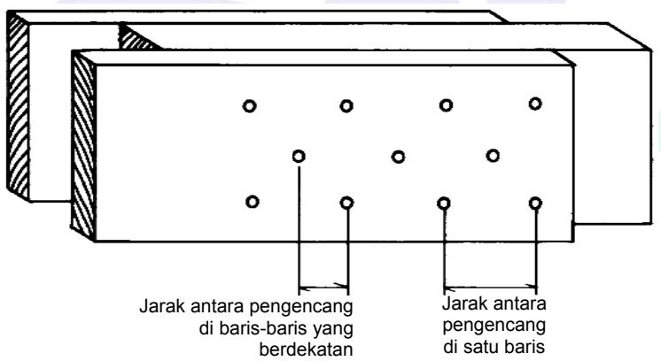

Gambar 3A Spasi Pengencang Berselang-seling

3.1.2.3 Luas penampang neto pada sambungan cincin belah atau pelat geser harus ditentukan dengan mengurangi luas penampang bruto dengan luas terproyeksi dari lubang baut dan alur cincin belah atau pelat geser di dalam komponen struktur (lihat Gambar 3B dan Lampiran K). Apabila konektor cincin belah atau pelat geser berselang-seling, maka konektor yang bersebelahan harus dipandang terjadi di penampang kritis yang sama apabila spasi sejajar serat antara baris-baris yang bersebelahan kurang dari atau sama dengan satu diameter konektor (lihat Gambar 3A).

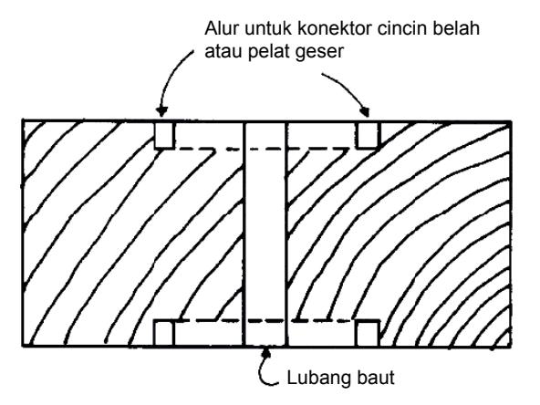

Gambar 3B Penampang Neto di Sambungan Cincin Belah atau Pelat Geser

## 3.1.3 Sambungan

Komponen struktur dan pengencang harus disusun secara simetris di sambungan, kecuali apabila momen lentur yang ditimbulkan pada susunan asimetris (seperti pada sambungan lewatan) telah diperhitungkan di dalam desain. Sambungan harus didesain dan dipabrikasi untuk menjamin bahwa setiap komponen struktur memikul tegangan proporsionalnya.

## 3.1.4 Deformasi yang Bergantung pada Waktu

Apabila komponen struktur dari rangka struktural terdiri atas satu atau lebih lapisan atau bagian, maka efek deformasi yang bergantung pada waktu harus diperhitungkan di dalam desain (lihat 3.5.2 dan Lampiran F).

## 3.1.5 Konstruksi Komposit

Konstruksi komposit, seperti komposit kayu-beton, kayu-baja, dan kayu-kayu, harus didesain sesuai prinsip-prinsip mekanika teknik dengan menggunakan nilai desain terkoreksi untuk komponen struktur dan sambungan yang ditetapkan di sini.

## 3.2 Komponen Struktur Lentur

#### 3.2.1 Bentang Komponen Struktur Lentur

Untuk komponen struktur lentur sederhana, menerus, dan kantilever, bentangnya harus diambil sama dengan jarak dari muka ke muka tumpuan, ditambah setengah panjang tumpu di masing-masing ujung.

#### 3.2.2 Distribusi Lateral Beban Terpusat

Distribusi lateral beban terpusat dari komponen struktur yang dibebani kritis ke komponen struktur yang sejajar di sebelahnya dengan menggunakan lantai atau komponen struktur melintang lainnya, harus dihitung di dalam menentukan momen lentur dan gaya geser vertikal desain (lihat 15.1).

© BSN 2013 13 dari 318

#### 3.2.3 Takikan

- **3.2.3.1** Komponen struktur lentur tidak boleh ditakik melebihi ketentuan di 4.4.3, 5.4.4, 7.4.4, dan 8.4.1. Potongan gradual dari tinggi tereduksi suatu komponen struktur ke tinggi penuh komponen struktur tersebut. bukan takik siku, mengurangi konsentrasi tegangan.
- **3.2.3.2** Kekakuan komponen struktur lentur, sebagaimana ditentukan dari penampangnya, tidak dipengaruhi oleh adanya takikan dengan dimensi sebagai berikut:

tinggi takikan  $\leq$  (1/6) (tinggi balok) panjang takikan  $\leq$  (1/3) (tinggi balok)

**3.2.3.3** Lihat 3.4.3 untuk efek takikan terhadap kekuatan geser.

## 3.3 Komponen Struktur Lentur – Lentur

#### 3.3.1 Kekuatan Lentur

Momen atau tegangan lentur aktual tidak boleh melebihi nilai desain lentur terkoreksi.

#### 3.3.2 Persamaan Desain Lentur

**3.3.2.1** Tegangan lentur aktual akibat momen lentur, M, dihitung sebagai berikut:

$$f_b = \frac{Mc}{I} = \frac{M}{S}$$
 (3.3-1)

Untuk komponen struktur lentur persegi panjang dengan lebar, b, dan tinggi, d, persamaan di atas menjadi:

$$f_b = \frac{M}{S} = \frac{6M}{bd^2} \tag{3.3-2}$$

**3.3.2.2** Untuk komponen struktur persegi panjang solid dengan sumbu netral tegak lurus tinggi penampang:

$$I = \frac{bd^3}{12} = \text{ momen inersia, mm}^4$$
 (3.3-3)

$$S = \frac{I}{c} = \frac{bd^2}{6} = \text{modulus penampang, mm}^3$$
 (3.3-4)

## 3.3.3 Faktor Stabilitas Balok, C

- **3.3.3.1** Apabila tinggi komponen struktur lentur tidak melebihi lebarnya, d  $\leq$  b, tumpuan lateral tidak diperlukan dan  $C_L = 1,0$ .
- **3.3.3.2** Apabila komponen struktur lentur kayu gergajian persegi panjang ditumpu lateral dengan mengikuti ketentuan 4.4.1, maka  $C_L$  = 1,0.
- **3.3.3.3** Apabila tepi tekan komponen struktur lentur ditumpu di seluruh panjangnya untuk mencegah peralihan lateral, dan ujung-ujung tumpu mempunyai tumpuan lateral untuk mencegah rotasi, maka  $C_L = 1,0$ .
- **3.3.3.4** Apabila tinggi komponen struktur lentur melebihi lebarnya, d > b, maka tumpuan lateral harus diberikan di titik-titik tumpu untuk mencegah rotasi dan/atau peralihan lateral di titik-titik tersebut. Apabila tumpuan lateral tersebut diberikan di titik-titik tumpu, tetapi tidak ada tumpuan lateral tambahan di sepanjang komponen struktur tersebut, maka panjang tak

tertumpu,  $\ell_u$ , adalah jarak antara titik-titik tumpu ujung tersebut, atau panjang kantilever. Apabila suatu komponen struktur lentur diberi tumpuan lateral untuk mencegah rotasi dan/atau peralihan lateral di titik-titik antara dan di kedua ujung, maka panjang tak tertumpu. ℓu, adalah jarak antara titik-titik tumpuan lateral antara tersebut.

Panjang bentang efektif, le, untuk komponen struktur bentang tunggal atau kantilever harus ditentukan sesuai Tabel 3.3.3.

Tabel 3.3.3 Panjang Efektif,  $\ell_e$ , untuk komponen struktur lentur, mm

| Kantilever 1                                                                                | apabila ℓ u /d <7         | apabila ℓ u /d <u>&gt;</u> 7      |
|--------------------------------------------------------------------------------------------------------|--------------------------------------|----------------------------------------------|
| Beban terbagi rata                                                                                     | $\ell_{\rm e}$ = 1,33 $\ell_{\rm u}$ | $\ell_{\rm e} = 0.90 \ \ell_{\rm u} + 3d$    |
| Beban terpusat di ujung bebas                                                                          | $\ell_{\rm e}$ = 1,87 $\ell_{\rm u}$ | $\ell_{\rm e}$ = 1,44 $\ell_{\rm u}$ + 3d    |
| Balok Bentang Tunggal 1,2                                                                   | apabila ℓ u /d <7         | apabila ℓ u /d <u>&gt;</u> 7      |
| Beban terbagi rata                                                                                     | $\ell_{\rm e}$ = 2,06 $\ell_{\rm u}$ | $\ell_{\rm e}$ = 1,63 $\ell_{\rm u}$ + 3d    |
| Beban terpusat di pusat tanpa tumpuan lateral antara                                                   | ℓ e = 1,80 ℓ u | $\ell_{\rm e} = 1,37\ell_{\rm u} + 3{\rm d}$ |
| Beban terpusat di pusat dengan tumpuan lateral di pusat                                                | ℓ e =                     | 1,11                                         |
| Dua beban terpusat sama di titik-titik 1/3 dengan tumpuan lateral di titik-titik 1/3                   | $\ell_{\rm e}$ =                     | 1,68 l u                          |
| Tiga beban terpusat sama di titik-titik 1/4 dengan tumpuan lateral di titik-titik 1/4                  | ℓ e =                     | 1,54 l u                          |
| Empat beban terpusat sama di titik-titik 1/5 dengan tumpuan lateral di titik-titik 1/5                 | ℓ e =                     | 1,68 ℓ u                          |
| Lima beban terpusat sama di titik-titik 1/6 dengan tumpuan lateral di titik-titik 1/6                  | ℓ e =                     | 1,73 ℓ u                          |
| Enam beban terpusat sama di titik-titik 1/7 dengan tumpuan lateral di titik-titik 1/7                  | ℓ e =                     | 1,78 ℓ u                          |
| Tujuh atau lebih beban terpusat sama, berjarak sama, dengan tumpuan lateral di titik-titik beban | $\ell_{\rm e}$ =                     | 1,84 ℓ u                          |
| Momen ujung sama                                                                                       | ℓ e =                     | 1,84 l u                          |

1Untuk balok bentang tunggal atau kantilever dengan kondisi beban tidak tercantum di dalam Tabel 3.3:

 $\ell_e = 1,63 \, \ell_u + 3d$  apabila  $7 < \ell_u/d < 14.3$ 

3.3.3.6 Rasio kelangsingan, RB, untuk komponen struktur lentur harus dihitung sebagai berikut:

$$R_{\rm B} = \sqrt{\frac{\ell_{\rm e}d}{h^2}} \tag{3.3-5}$$

- **3.3.3.7** Rasio kelangsingan untuk komponen struktur lentur, RB, tidak boleh melebihi 50.
- **3.3.3.8** Faktor stabilitas balok harus dihitung sebagai berikut:

 $\ell_{\rm p}$  = 2.06  $\ell_{\rm H}$  apabila  $\ell_{\rm H}/{\rm d}$  <7

 $\ell_{\rm e} = 1.84 \ell_{\rm u}$  apabila  $\ell_{\rm u}/{\rm d} > 14.3$  2Penggunaan bentang panjang harus didasarkan atas nilai tabel atau analisis teknik.

$$C_{L} = \frac{1 + (F_{bE} / F_{b}^{*})}{1.9} - \sqrt{\frac{1 + (F_{bE} / F_{b}^{*})}{1.9}} - \frac{F_{bE} / F_{b}^{*}}{0.95}$$
(3.3-6)

## Keterangan:

 $F_{h}^{*}$  = nilai desain lentur acuan dikalikan dengan semua faktor koreksi kecuali  $C_{fu}$ ,  $C_{V}$ , dan  $C_{L}$  (lihat 2.3)

$$F_{bE} = \frac{1,20E_{min}}{R_{B}^{2}}$$

- **3.3.3.9** Lihat Lampiran D untuk informasi latar belakang tentang perhitungan stabilitas balok dan Lampiran F untuk informasi tentang koefisien variasi modulus elastisitas (COVE).
- **3.3.3.10** Komponen struktur yang mengalami lentur terhadap kedua sumbu utama (lentur biaksial) harus didesain sesuai dengan 3.9.2.

## 3.4 Komponen Struktur Lentur - Geser

## 3.4.1 Kekuatan Geser Sejajar Serat (Geser Horizontal)

- **3.4.1.1** Tegangan geser aktual sejajar serat atau gaya geser di setiap penampang komponen struktur lentur tidak boleh melebihi nilai desain geser terkoreksi. Pengecekan kekuatan geser tegak lurus serat komponen struktur lentur kayu tidak disyaratkan.
- **3.4.1.2** Prosedur desain geser yang ditetapkan di sini untuk menghitung  $f_v$  di atau dekat titik-titik tumpuan vertikal hanya berlaku pada komponen struktur lentur solid seperti kayu gergajian, Glulam struktural, kayu komposit struktural, atau balok kayu laminasi mekanis. Desain geser di tumpuan untuk komponen tersusun yang mempunyai sambungan pemikul beban di atau dekat titik-titik tumpuan, seperti di antara batang-batang pada rangka batang harus didasarkan atas hasil uji atau cara-cara lain.

#### 3.4.2 Persamaan Desain Geser

Tegangan geser aktual sejajar serat yang terjadi pada komponen struktur lentur kayu gergajian, glulam struktural, kayu komposit struktural, atau tiang dan pancang kayu harus dihitung sebagai berikut:

$$f_{v} = \frac{VQ}{Ib} \tag{3.4-1}$$

Untuk komponen struktur lentur persegi panjang dengan lebar, b, dan tinggi, d, persamaan di atas menjadi:

$$f_v = \frac{3V}{2bd} \tag{3.4-2}$$

#### 3.4.3 Desain Geser

- **3.4.3.1** Di dalam menghitung gaya geser, V, di komponen struktur lentur:
- (a) Untuk balok yang ditumpu dengan cara tumpu penuh di satu permukaan dan beban bekerja di permukaan lainnya, beban terbagi rata di dalam jarak dari tumpuan sama © BSN 2013 16 dari 312

dengan tinggi komponen struktur lentur, d, dapat diabaikan. Untuk balok yang ditumpu dengan tumpu penuh di satu permukaan dan beban bekerja di permukaan lainnya, beban terpusat di dalam jarak, d, dari tumpuan dapat dikalikan dengan x/d dengan x adalah jarak dari muka tumpuan balok ke beban tersebut (lihat Gambar 3C).

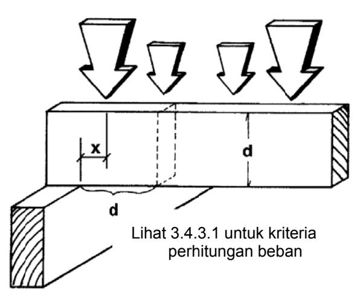

Gambar 3C Geser di Tumpuan

- (b) Beban bergerak tunggal terbesar harus diletakkan pada jarak dari tumpuan sama dengan tinggi komponen struktur lentur, dengan beban-beban lain tetap berhubungan normal dan mengabaikan semua beban di dalam jarak dari tumpuan sama dengan tinggi komponen struktur lentur. Kondisi ini harus dicek di setiap tumpuan.
- (c) Dengan dua atau lebih beban bergerak yang hampir sama besarnya, beban-beban tersebut harus diletakkan di posisi yang menghasilkan gaya geser, V, terbesar, dengan mengabaikan semua beban di dalam jarak dari tumpuan sama dengan tinggi komponen struktur lentur.
- **3.4.3.2** Untuk komponen struktur lentur bertakik, gaya geser, V, harus didasarkan atas prinsip-prinsip mekanika teknik (kecuali yang dinyatakan di dalam 3.4.3.1).
- (a) Untuk komponen struktur lentur dengan penampang persegi panjang dan bertakik di muka tarik (lihat 3.2.3), geser desain rencana, Vr, harus dihitung sebagai berikut:

$$V_{r}' = \left[\frac{2}{3}F_{v}'bd_{n}\right]\left[\frac{d_{n}}{d}\right]^{2}$$
 (3.4-3)

#### Keterangan:

d = tinggi komponen struktur tanpa takik, mm

dn = tinggi komponen struktur sisa di bagian bertakik, mm

Fv' = nilai desain geser sejajar serat terkoreksi, MPa

(b) Untuk komponen struktur lentur dengan penampang lingkaran dan bertakik di muka tarik (lihat 3.2.3), geser desain terkoreksi, Vr', harus dihitung sebagai berikut:

$$V_r' = \left[\frac{2}{3}F_v'A_n\right] \left[\frac{d_n}{d}\right]^2$$
 (3.4-4)

#### Keterangan:

An = luas penampang komponen struktur bertakik, mm2

- (c) Untuk komponen struktur lentur bertakik di muka tarik dengan penampang bukan lingkaran dan bukan persegi panjang (lihat 3.2.3), geser desain terkoreksi, Vr', harus didasarkan atas analisis teknik konvensional dengan memperhitungkan konsentrasi tegangan di takikan.
- (d) Perubahan gradual pada penampang dibandingkan dengan takik siku, mengurangi tegangan geser aktual sejajar serat mendekati yang dihitung dengan komponen struktur lentur tanpa takikan dengan tinggi  $d_n$ .
- (e) Apabila suatu komponen struktur lentur ditakik di muka tekan di ujung seperti terlihat dalam Gambar 3D, geser desain terkoreksi, Vr', harus dihitung sebagai berikut:

$$V_{r}' = \frac{2}{3}F_{v}'b \left[d - \left(\frac{d - d_{n}}{d_{n}}\right)e\right]$$
 (3.4-5)

## Keterangan:

- e = jarak takikan ke dalam dari tepi dalam tumpuan dan harus lebih kecil atau sama dengan tinggi sisa di takikan,  $e \le d_n$ . Apabila  $e > d_n$ , maka  $d_n$  harus digunakan di dalam menghitung  $f_v$  dengan menggunakan Persamaan 3.4-2.
- dn = tinggi komponen struktur sisa di takikan yang memenuhi ketentuan 3.2.3. Apabila ujung balok dipotong miring, seperti ditunjukkan dengan garis putus dalam Gambar 3D, dn diukur dari tepi dalam tumpuan.

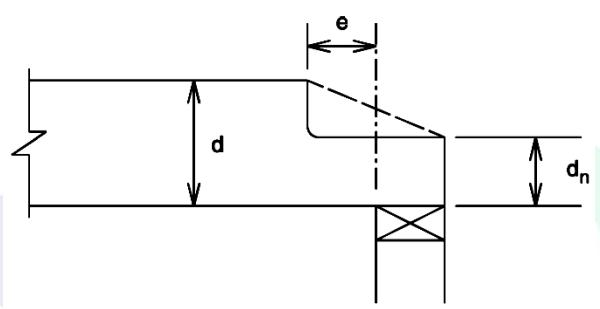

Gambar 3D - Ujung Komponen struktur Lentur - Ditakik di Muka Tekan

- **3.4.3.3** Apabila sambungan di komponen struktur lentur dikencangkan dengan konektor cincin belah, konektor pelat geser, baut, atau sekrup kunci (termasuk balok yang ditumpu oleh jenis pengencang tersebut atau kasus-kasus yang ditunjukkan dalam Gambar 3E dan 3I), maka gaya geser, V, harus ditentukan dengan prinsip-prinsip mekanika teknik (kecuali yang ditetapkan di 3.4.3.1).
- (a) Apabila sambungan kurang dari lima kali tinggi, 5d, komponen struktur dari ujungnya, maka geser desain terkoreksi, Vr', harus dihitung sebagai berikut:

$$V_{r}' = \left[\frac{2}{3}F_{v}'bd_{e}\right] \left[\frac{d_{e}}{d}\right]^{2}$$
 (3.4-6)

## Keterangan:

untuk sambungan cincin belah atau pelat geser:

de = tinggi komponen struktur, dikurangi jarak dari tepi komponen struktur yang tidak dibebani ke tepi terdekat sambungan cincin belah atau pelat geser (lihat Gambar 3E), mm

untuk sambungan sekrup kunci:

- de = tinggi komponen struktur, dikurangi jarak dari tepi komponen struktur yang tidak dibebani tersebut ke pusat baut atau sekrup kunci terdekat (lihat Gambar 3E), mm
- (b) Apabila sambungan sekurangnya lima kali tinggi, 5d, komponen struktur dari ujungnya, maka geser desain terkoreksi, Vr', harus dihitung sebagai berikut:

$$V_{r}' = \frac{2}{3}F_{v}'bd_{e}$$
 (3.4-7)

© BSN 2013

(c) Apabila penggantung tersembunyi digunakan, geser desain terkoreksi, Vr', harus dihitung berdasarkan atas ketentuan pada 3.4.3.2 untuk komponen struktur lentur bertakik.

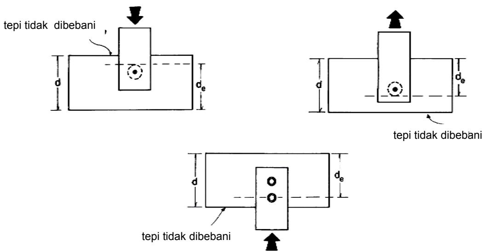

Gambar 3E - Tinggi Efektif, de, komponen struktur di sambungan

## 3.5 Komponen Struktur Lentur - Defleksi

## 3.5.1 Perhitungan Defleksi

Apabila defleksi merupakan faktor di dalam desain, maka defleksi harus dihitung dengan menggunakan metode-metode standar mekanika teknik dengan meninjau defleksi lentur dan, apabila berlaku, defleksi geser. Peninjauan defleksi geser diperlukan apabila modulus elastisitas acuan belum dikoreksi untuk memasukkan efek defleksi geser (lihat Lampiran F).

## 3.5.2 Pembebanan Jangka Panjang

Apabila defleksi total pada pembebanan jangka lama harus dibatasi, maka memperbesar ukuran komponen struktur adalah salah satu cara untuk menambah kekakuan untuk mengatasi masalah deformasi yang bergantung pada waktu tersebut (lihat Lampiran F). Defleksi total,  $\Delta_T$ , harus dihitung sebagai berikut:

$$\Delta_{\mathsf{T}} = \mathsf{K}_{\mathsf{cr}} \Delta_{\mathsf{LT}} + \Delta_{\mathsf{ST}} \tag{3.5-1}$$

#### Keterangan:

 $K_{cr}$ 

- = faktor deformasi (rangkak) yang bergantung pada waktu
- = 1,5 untuk kayu yang dikeringkan, glulam struktural, balok I kayu prapabrikasi, atau kayu komposit struktural yang digunakan pada kondisi layan kering sebagaimana didefinisikan masing-masing di 4.1.4, 5.1.5, 7.1.4, dan 8.1.4.
- = 2,0 untuk glulam struktural yang digunakan dalam kondisi basah sebagaimana didefinisikan di 5.1.4.
- = 2,0 untuk panel struktural kayu yang digunakan dalam kondisi kering sebagaimana didefinisikan di 9.1.4.
- = 2,0 untuk kayu yang tidak dikeringkan atau kayu yang dikeringkan, yang digunakan dalam kondisi basah sebagaimana didefinisikan di 4.1.4.
- $\Delta_{LT}$  = defleksi sesaat akibat komponen jangka panjang dari beban desain, mm
- $\Delta_{ST}$  = defleksi akibat komponen jangka pendek atau normal dari beban desain, mm

© BSN 2013

## 3.6 Komponen Struktur Tekan - Umum

#### 3.6.1 Terminologi

Di dalam Spesifikasi ini, sebutan "kolom" merujuk pada semua tipe komponen struktur tekan, termasuk komponen struktur yang merupakan bagian dari rangka batang atau komponen struktural lain

#### 3.6.2 Klasifikasi Kolom

- **3.6.2.1** Kolom Kayu Masif Sederhana. Kolom sederhana terdiri atas satu bagian atau beberapa bagian yang dilem dengan benar untuk membentuk satu komponen struktur (lihat Gambar 3F).
- **3.6.2.2** Kolom Berspasi, Dihubungkan dengan Konektor. Kolom berspasi terdiri atas dua atau lebih komponen struktur individual dengan sumbu longitudinal sejajar, dihubungkan di kedua ujung dan titik-titik tengah dari panjangnya dengan menggunakan kelos dan dihubungkan di ujung-ujungnya dengan menggunakan konektor cincin belah atau pelat geser yang mampu mengembangkan ketahanan geser yang diperlukan (lihat 15.2).
- **3.6.2.3** Kolom Tersusun. Kolom tersusun laminasi mekanis harus didesain sesuai 3.6.3 dan 3.7, kecuali kolom tersusun dengan baut atau paku harus didesain sesuai 15.3.

## 3.6.3 Kekuatan Tekan Sejajar Serat

Gaya atau tegangan tekan sejajar serat aktual tidak boleh melebihi nilai desain tekan terkoreksi. Perhitungan  $f_c$  harus didasarkan atas luas penampang neto (lihat 3.1.2) apabila penampang tereduksi terjadi di bagian kritis dari panjang kolom yang paling berpotensi mengalami tekuk. Apabila penampang tereduksi tidak terjadi di bagian kritis dari panjang kolom yang paling berpotensi mengalami tekuk, maka perhitungan  $f_c$  harus didasarkan atas luas penampang bruto. Selain itu,  $f_c$  yang didasarkan atas luas penampang neto tidak boleh melebihi nilai desain tekan acuan sejajar serat dikalikan dengan semua faktor koreksi kecuali faktor stabilitas kolom,  $C_P$ .

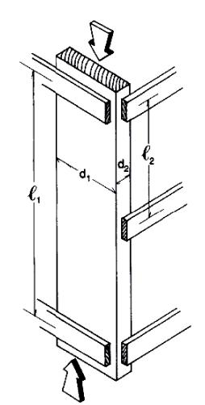

Gambar 3F - Kolom Masif Sederhana

## 3.6.4 Tumpu Komponen struktur Tekan Ujung ke Ujung

Untuk tumpu serat ujung kayu ke kayu, dan kayu ke pelat atau setrip metal, lihat 3.10.

## 3.6.5 Pembebanan Eksentris atau Tegangan Kombinasi

Untuk komponen struktur tekan yang mengalami pembebanan eksentris atau kombinasi pembebanan lentur dan aksial, lihat 3.9 dan 15.4.

## 3.6.6 Breising Kolom

Breising kolom harus digunakan apabila dibutuhkan untuk menahan angin atau gaya lateral lain (lihat Lampiran A).

## 3.6.7 Tumpuan Lateral Pelengkung, Stad, dan Batang Tekan pada Rangka Batang

Petunjuk untuk memberikan tumpuan lateral dan menentukan  $\ell_e$ /d pada pelengkung, stad, dan batang tekan pada rangka batang terdapat di Lampiran A.11.

#### 3.7 Kolom Masif

#### 3.7.1 Faktor Stabilitas Kolom, CP

- **3.7.1.1** Apabila komponen struktur tekan ditumpu di seluruh panjangnya untuk mencegah peralihan lateral di semua arah, maka  $C_P = 1,0$ .
- **3.7.1.2** Panjang kolom efektif,  $\ell_e$ , untuk kolom solid ha<mark>rus d</mark>itentukan sesuai prinsip-prinsip mekanika teknik. Salah satu metode untuk menentukan panjang kolom efektif, apabila kondisi penjepitan ujung diketahui, adalah dengan mengalikan panjang kolom aktual dengan faktor panjang efektif yang ditetapkan di Lampiran G,  $\ell_e = (K_e)\ell$ .
- **3.7.1.3** Untuk kolom solid dengan penampang persegi panjang, rasio kelangsingan,  $\ell_e/d$  harus diambil dari yang terbesar di antara  $\ell_{e1}/d_1$  dan  $\ell_{e2}/d_2$  (lihat Gambar 3F) dengan setiap rasio telah dikoreksi menggunakan koefisien panjang tekuk,  $K_e$ , dari Lampiran G.
- **3.7.1.4** Rasio kelangsingan untuk kolom solid,  $\ell_e$ /d tidak boleh melebihi 50, kecuali selama pelaksanaan  $\ell_e$ /d tidak boleh melebihi 75.
- **3.7.1.5** Faktor stabilitas kolom harus dihitung sebagai berikut:

$$C_{p} = \frac{1 + (F_{cE} / F_{c}^{*})}{2c} - \sqrt{\frac{1 + (F_{cE} / F_{c}^{*})}{2c}}^{2} - \frac{F_{cE} / F_{c}^{*}}{c}$$
(3.7-1)

#### Keterangan:

Fc = nilai desain tekan acuan sejajar serat dikalikan dengan semua faktor koreksi kecuali CP (lihat 2.3)

$$F_{cE} = \frac{0.822E_{min}'}{\left(\ell_e / d\right)^2}$$

- c = 0,8 untuk kayu gergajian
- c = 0,85 untuk pancang dan tiang kayu bundar
- c = 0,9 untuk glulam struktural atau kayu komposit struktural
- **3.7.1.6** Untuk kondisi layan yang parah dan/atau sangat berbahaya, nilai desain terkoreksi yang lebih rendah mungkin diperlukan. Lihat Lampiran H untuk informasi latar belakang tentang perhitungan stabilitas kolom dan Lampiran F untuk informasi tentang koefisien variasi modulus elastisitas ( $COV_E$ ).

© BSN 2013 21 dari 318

#### 3.7.2 Kolom Tirus

Untuk desain kolom dengan penampang persegi panjang, tirus di satu atau kedua ujung, dimensi pengganti, d, untuk masing-masing muka kolom harus dihitung sebagai berikut:

$$d = d_{min} + (d_{max} - d_{min}) \left[ a - 0.15 \left( 1 - \frac{d_{min}}{d_{max}} \right) \right]$$
 (3.7-2)

Keterangan:

 $\begin{array}{ll} d & = \text{dimensi yang mewakili untuk kolom tirus, mm} \\ d_{\text{min}} & = \text{dimensi minimum untuk muka kolom tersebut} \\ d_{\text{maks}} & = \text{dimensi maksimum untuk muka kolom tersebut} \end{array}$ 

Kondisi tumpuan

Ujung besar terjepit, ujung kecil tidak a = 0,7

ditumpu atau ditumpu sederhana

Ujung kecil terjepit, ujung besar tidak a = 0,3

ditumpu atau ditumpu sederhana

Kedua ujung ditumpu sederhana:

Tirus ke satu ujung a = 0,50
 Tirus ke kedua ujung a = 0,70

Untuk semua kondisi tumpuan lain:

$$d = d_{\min} + (d_{\max} - d_{\min})(1/3)$$
(3.7-3)

Perhitungan fc dan CP harus didasarkan atas dimensi pengganti, d. Selain itu, fc di semua penampang pada kolom tirus tidak boleh melebihi nilai desain tekan acuan sejajar serat dikalikan dengan semua faktor koreksi yang berlaku kecuali faktor stabilitas kolom, CP.

#### 3.7.3 Kolom Bundar

Desain kolom bundar harus didasarkan atas perhitungan desain untuk penampang kolom bujur sangkar yang mempunyai luas penampang sama dan mempunyai derajat tirus sama. Nilai desain acuan dan persyaratan desain khusus untuk tiang dan pancang bundar diberikan di Pasal 6.

#### 3.8 Komponen struktur Tarik

#### 3.8.1 Tarik Sejajar Serat

Gaya atau tegangan tarik sejajar serat aktual harus didasarkan atas luas penampang neto (lihat 3.1.2) dan tidak boleh melebihi nilai desain tarik terkoreksi.

#### 3.8.2 Tarik Tegak Lurus Serat

Desain yang menimbulkan tarik tegak lurus serat sedapat mungkin dihindari (lihat Referensi 16 dan 19). Apabila tarik tegak lurus serat tidak dapat dihindari, maka perkuatan mekanis yang mampu menahan semua tegangan tersebut harus digunakan (lihat Referensi 52 dan 53 untuk informasi tambahan).

#### 3.9 Kombinasi Pembebanan Lentur dan Aksial

#### 3.9.1 Lentur dan Tarik Aksial

Komponen struktur yang mengalami kombinasi lentur dan tarik aksial (lihat Gambar 3G) harus diproporsikan agar:

$$\frac{f_{t}}{F_{t}'} + \frac{f_{b}}{F_{b}^{*}} \le 1,0 \tag{3.9-1}$$

dan

$$\frac{f_b - f_t}{F_b^{**}} \le 1,0 \tag{3.9-2}$$

#### Keterangan:

 $F_b$  = nilai desain lentur acuan dikalikan dengan semua faktor koreksi kecuali  $C_L$   $F_b$  = nilai desain lentur acuan dikalikan dengan semua faktor koreksi kecuali  $C_V$ 

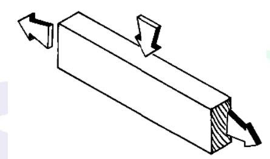

Gambar 3G Kombinasi Lentur dan Tarik Aksial

#### 3.9.2 Lentur dan Tekan Aksial

Komponen struktur yang mengalami kombinasi lentur terhadap satu atau kedua sumbu utama dan tekan aksial (lihat Gambar 3H) harus diproporsikan agar:

$$\left[\frac{f_{c}}{F_{c}'}\right]^{2} + \frac{f_{b1}}{F_{b1}'\left[1 - \left(f_{c} / F_{cE1}\right)\right]} + \frac{f_{b2}}{F_{b2}'\left[1 - \left(f_{c} / F_{cE2}\right) - \left(f_{b1} / F_{bE}\right)^{2}\right]} \le 1,0$$
(3.9-3)

dan

$$\frac{f_{c}}{F_{cE2}} + \left(\frac{f_{b1}}{F_{bE}}\right)^{2} < 1.0$$
(3.9-4)

dengan

$$f_c < F_{cE1} = \frac{0.822E_{min}^{'}}{(\ell_{e1}/d_1)^2}$$

untuk lentur uniaksial terhadap sumbu kuat atau lentur biaksial

dan

$$f_c < F_{cE2} = \frac{0.822 E_{min}^{\phantom{min}\prime}}{\left(\,\ell_{\,e2} \, / \, d_2^{\phantom{min}}\right)^2}$$

untuk lentur uniaksial terhadap sumbu lemah atau lentur biaksial serta

$$f_{b1} < F_{bE} = \frac{1,20E_{min}'}{(R_B)^2}$$
 untuk lentur biaksial

## Keterangan:

fb1 = tegangan akibat lentur terhadap sumbu kuat (beban lentur bekerja di muka sempit komponen struktur), MPa

fb2 = tegangan akibat lentur terhadap sumbu lemah (beban lentur bekerja di muka lebar komponen struktur), MPa

d1 = dimensi muka lebar (lihat Gambar 3H), mm

d2 = dimensi muka sempit (lihat Gambar 3H), mm

Panjang kolom efektif,  $\ell_{e1}$  dan  $\ell_{e2}$ , harus ditentukan sesuai 3.7.1.2.  $F_c$ ',  $F_{cE1}$ , dan  $F_{cE2}$  harus ditentukan sesuai 2.3 dan 3.7.  $F_{b1}$ ',  $F_{b2}$ ', dan  $F_{bE}$  harus ditentukan sesuai 2.3 dan 3.3.3.

#### 3.9.3 Pembebanan Tekan Eksentris

Lihat 15.4 untuk komponen struktur yang mengalami kombinasi lentur dan tekan aksial akibat pembebanan eksentris, atau kombinasi pembebanan eksentris dengan pembebanan lain

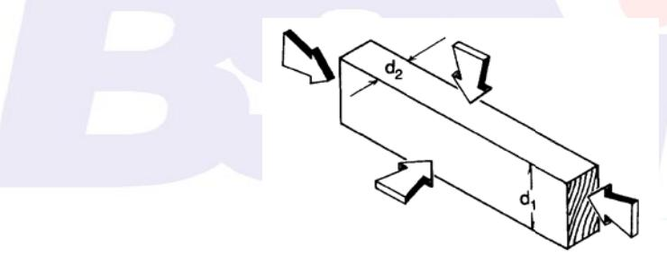

Gambar 3H Kombinasi Lentur dan Tekan Aksial

#### 3.10 Desain Tumpu

## 3.10.1 Tumpu Sejajar Serat

- **3.10.1.1** Tegangan tumpu tekan aktual sejajar serat harus didasarkan atas luas tumpu neto dan tidak boleh melebihi tegangan tekan acuan sejajar serat dikalikan dengan semua faktor koreksi kecuali faktor stabilitas kolom, CP.
- **3.10.1.2**  $F_c^*$ , nilai desain tekan acuan sejajar serat dikalikan semua faktor koreksi yang berlaku kecuali faktor stabilitas kolom, berlaku pada tumpu ujung ke ujung komponen struktur tekan apabila ada tumpuan lateral yang memadai dan potongan di ujung benarbenar siku dan sejajar.
- **3.10.1.3** Apabila  $f_c > (0,75)(F_c^*)$ , maka tumpu harus ada di pelat atau pengencang metal, atau material lain yang tahan lama, tegar, serta homogen, dengan kekakuan memadai untuk mendistribusi beban. Apabila sisipan tegar dibutuhkan untuk tumpu ujung ke ujung suatu komponen struktur tekan, maka ukurannya harus ekuivalen dengan pelat metal ukuran 20-gage atau lebih baik, yang disisipkan dengan pas di antara ujung-ujung yang bertemu.

## 3.10.2 Tumpu Tegak Lurus Serat

Tegangan tekan tegak lurus serat aktual harus didasarkan atas luas tumpu neto dan tidak boleh melebihi nilai desain tekan tegak lurus serat terkoreksi,  $f_{c\perp} \le F_{c\perp}$ . Dalam menghitung luas tumpu di ujung-ujung komponen struktur lentur, perlu diperhatikan bahwa pada saat komponen struktur tersebut melentur, tekanan terhadap tepi tumpu bagian dalam akan lebih besar daripada di ujung komponen struktur.

## 3.10.3 Tumpu Bersudut Terhadap Serat

Nilai desain tumpu bersudut terhadap serat terkoreksi (lihat Gambar 3I dan Lampiran J) harus dihitung sebagai berikut:

$$F_{\theta}' = \frac{F_{c}^{*}F_{c\perp}'}{F_{c}^{*}\sin^{2}\theta + F_{c\perp}'\cos^{2}\theta}$$
(3.10-1)

#### dengan:

 $\theta$  = sudut antara arah beban dan arah serat (sumbu longitudinal komponen struktur), derajat

## 3.10.4 Faktor Luas Tumpu, Cb

Nilai desain tekan tegak lurus serat acuan,  $F_{c\perp}$ , berlaku untuk tumpu yang panjangnya berapapun di ujung-ujung komponen struktur, dan tump<mark>u den</mark>gan panjang 152 mm atau lebih di lokasi lain. Untuk tumpu yang panjangnya kurang dari 152 mm dan tidak lebih dekat dari 76 mm ke ujung komponen struktur, nilai desain tekan tegak lurus serat acuan,  $F_{c\perp}$ , harus dikalikan dengan faktor luas tumpu,  $C_b$ , sebagai berikut:

$$C_{b} = \frac{\ell_{b} + 9,53}{\ell_{b}} \tag{3.10-2}$$

dengan:

*l*b = panjang tumpu diukur sejajar serat, mm

Persamaan 3.10-2 memberikan faktor luas tumpu, Cb, untuk panjang tumpu yang ditunjukkan pada luas kecil seperti pelat dan cincin penutup:

Tabel 3.10.4 - Faktor Luas Tumpu, Ch

| I b (mm) | 13   | 25   | 38   | 51   | 76   | 102  | 152 atau lebih |
|---------------------|------|------|------|------|------|------|----------------|
| $C_{b}$             | 1,75 | 1,38 | 1,25 | 1,19 | 1,13 | 1,10 | 1,00           |

Untuk luas tumpu bundar seperti cincin penutup, panjang tumpu,  $\ell_{\text{b}}$ , sama dengan diameternya.

© BSN 2013 25 dari 318

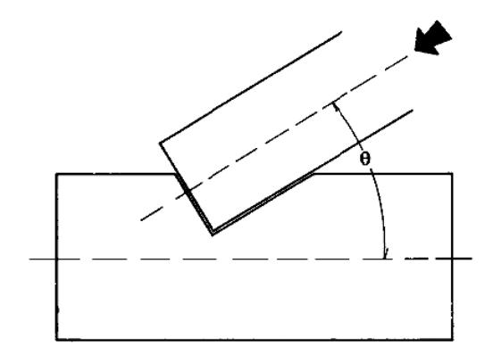

Gambar 3I - Tumpu Bersudut Terhadap Serat

## 4 Kayu Gergajian

#### **4.1 Umum**

## 4.1.1 Ruang Lingkup

Pasal 4 berlaku untuk desain rekayasa dengan kayu gergajian. Prosedur desain, nilai desain acuan, dan informasi lain di sini hanya berlaku pada kayu yang memenuhi persyaratan yang ditetapkan di bawah ini.

## 4.1.2 Identifikasi Kayu

- **4.1.2.1** Apabila nilai desain acuan yang ditetapkan di sini digunakan, maka kayu, termasuk pula kayu yang tepinya dilem atau ujungnya disambung, harus diidentifikasi dengan tanda mutu, atau sertifikat pemeriksaan yang dikeluarkan oleh lembaga pemeriksaan atau pemilahan yang dikenal berkompeten (lihat Referensi 31). Tanda mutu yang jelas dari lembaga pemeriksaan atau pemilahan yang dikenal mengindikasikan bahwa keutuhan sambungan kayu telah melalui kontrol kualitas dan kualifikasi, harus berlaku pada produk kayu berlem.
- **4.1.2.2** Kayu harus diSpesifikasikan dengan nama mutu dan spesies komersial, atau dengan level nilai desain yang diperlukan sebagaimana tercantum di dalam Tabel 4.2.1.

#### 4.1.3 Definisi

- **4.1.3.1** Kayu gergajian struktural terdiri atas klasifikasi kayu yang dikenal dengan "Dimensi", "Balok dan Balok Memanjang", "Tonggak dan *Timbers*" dan "Papan", dengan nilai desain yang ditetapkan untuk masing-masing mutu.
- **4.1.3.2** "Dimensi" merujuk pada kayu dengan tebal nominal 50,8 mm sampai 101,6 mm, dan lebar nominal 50,8 mm atau lebih. Kayu dimensi lebih lanjut dikelompokkan menjadi Rangka Ringan Struktural, Rangka Ringan, Penopang, serta Balok Anak dan Papan (lihat Referensi 42, 43, 44, 45, 46, 47, dan 49 untuk informasi tambahan).
- **4.1.3.3** "Balok dan Balok Memanjang" merujuk pada kayu dengan penampang persegi panjang dengan tebal nominal 127 mm atau lebih, dengan lebar 50,8 mm atau lebih, lebih besar daripada tebalnya, dan dipilah terhadap kekuatan lentur apabila dibebani di muka sempit.

- **4.1.3.4** "Tonggak dan *Timbers*" merujuk pada kayu dengan penampang persegi atau hampir persegi dengan ukuran nominal 127 mm x 127 mm atau lebih besar, dengan lebar tidak lebih dari 50,8 mm lebih besar daripada tebalnya, yang dipilah terutama untuk digunakan sebagai tiang atau kolom yang memikul beban longitudinal.
- **4.1.3.5** "Dek" merujuk pada kayu dengan tebal nominal 50,8 mm sampai 101,6 mm, berlidah dan bertakikan untuk sambungan di muka sempit, dan ditujukan untuk dipakai sebagai atap, lantai, atau membran dinding. Dek dipilah untuk penggunaan dalam arah sumbu lemah, dengan muka lebar dek mengalami kontak dengan komponen struktur pemikulnya, sebagaimana biasanya dipasang.

## **4.1.4 Kondisi Layan Kadar Air Kayu**

Nilai desain acuan kayu yang ditetapkan di sini berlaku pada kayu yang akan digunakan pada kondisi layan kering seperti pada struktur tertutup, di mana kadar air tidak melebihi 19%, bagaimanapun kadar air pada saat dilaksanakan. Untuk kayu yang digunakan pada kondisi di mana kadar air kayu melebihi 19%, untuk periode waktu lama, nilai desain harus dikalikan dengan faktor layan basah, CM, yang ditetapkan di dalam Tabel 4.2.2.

## **4.1.5 Ukuran Kayu**

- **4.1.5.1** Ukuran-ukuran kayu yang disebutkan di dalam Spesifikasi ini adalah ukuran nominal. Perhitungan untuk menentukan ukuran komponen struktur yang dibutuhkan harus didasarkan atas dimensi neto (ukuran aktual) dan bukan ukuran nominal. Ukuran bersih yang disebutkan di dalam Referensi 31 harus diterima sebagai ukuran neto minimum untuk dimensi nominal yang berkaitan (lihat Tabel 1A di dalam Suplemen untuk Spesifikasi ini).
- **4.1.5.2** Untuk kayu dengan ukuran nominal 101,6 mm atau lebih kecil, ukuran neto kering harus digunakan di dalam semua perhitungan kapasitas struktural, bagaimanapun kadar air pada saat dilaksanakan atau digunakan.
- **4.1.5.3** Untuk kayu berukuran 127 mm dan lebih besar, ukuran neto basah harus digunakan di dalam perhitungan kapasitas struktural, tanpa memperhatikan kadar air pada saat dilaksanakan atau digunakan.
- **4.1.5.4** Apabila desain didasarkan atas ukuran kasar atau ukuran khusus, kadar air dan ukuran yang digunakan dalam desain harus secara jelas ditunjukkan di dalam gambar atau Spesifikasi.

## **4.1.6 Kayu yang Disambung di Ujung atau Dilem Di tepi**

Nilai desain acuan untuk kayu gergajian berlaku pada kayu yang disambung di ujung atau dilem di tepi dari kayu dengan mutu dan species yang sama. Penggunaannya meliputi, tetapi tidak terbatas pada rangka ringan, stad, balok anak, dek, dan lantai. Apabila kayu tersebut bertanda "Hanya Digunakan Stad" atau "Hanya Digunakan Vertikal", maka kayu tersebut hanya dapat digunakan untuk tegangan tarik atau lentur dengan durasi pendek.

## **4.1.7 Kayu Gergaji Ulang atau Produk Ulang**

- **4.1.7.1** Apabila kayu struktural digergaji ulang atau diproduksi ulang, kayu tersebut harus dipilah ulang, dan nilai desain acuan untuk material yang dipilah ulang berlaku (lihat Referensi 16,42, 43, 44, 45, 46, 47, dan 49).
- **4.1.7.2** Apabila kayu gergajian dipotong melintang menjadi lebih pendek, persyaratan 4.1.7.1 tidak berlaku, kecuali untuk nilai desain lentur acuan balok dan balok memanjang di

**© BSN 2013 27 dari 318**

mana persyaratan pemilahan untuk 1/3 panjang bagian berbeda dengan persyaratan di luar bagian tersebut.

## **4.2 Desain Acuan**

# **4.2.1 Nilai Desain Acuan**

Nilai desain acuan untuk kayu yang dipilah secara visual dan kayu dimensi yang dipilah secara mekanis dicantumkan di dalam Tabel 4.2.1. Nilai desain rencana di dalam Tabel 4.2.1 diambil dari aturan pemilahan lembaga-lembaga yang disebutkan di dalam Referensi 42, 43, 44, 45, 46, 47, dan 49.

**Tabel 4.2.1 - Nilai Desain dan Modulus Elastisitas Lentur Acuan** 

| Kode Mutu |      | Modulus Elastisitas Acuan (MPa) |      |      |      |       |       |  |  |  |  |  |
|-----------|------|---------------------------------------|------|------|------|-------|-------|--|--|--|--|--|
|           | Fb   | Ft                                    | Fc   | Fv   | Fc  | E     | Emin  |  |  |  |  |  |
| E25       | 26.0 | 22.9                                  | 22.9 | 3.06 | 6.11 | 25000 | 12500 |  |  |  |  |  |
| E24       | 24.4 | 21.5                                  | 21.5 | 2.87 | 5.74 | 24000 | 12000 |  |  |  |  |  |
| E23       | 23.2 | 20.5                                  | 20.5 | 2.73 | 5.46 | 23000 | 11500 |  |  |  |  |  |
| E22       | 22.0 | 19.4                                  | 19.4 | 2.59 | 5.19 | 22000 | 11000 |  |  |  |  |  |
| E21       | 21.3 | 18.8                                  | 18.8 | 2.50 | 5.00 | 21000 | 10500 |  |  |  |  |  |
| E20       | 19.7 | 17.4                                  | 17.4 | 2.31 | 4.63 | 20000 | 10000 |  |  |  |  |  |
| E19       | 18.5 | 16.3                                  | 16.3 | 2.18 | 4.35 | 19000 | 9500  |  |  |  |  |  |
| E18       | 17.3 | 15.3                                  | 15.3 | 2.04 | 4.07 | 18000 | 9000  |  |  |  |  |  |
| E17       | 16.5 | 14.6                                  | 14.6 | 1.94 | 3.89 | 17000 | 8500  |  |  |  |  |  |
| E16       | 15.0 | 13.2                                  | 13.2 | 1.76 | 3.52 | 16000 | 8000  |  |  |  |  |  |
| E15       | 13.8 | 12.2                                  | 12.2 | 1.62 | 3.24 | 15000 | 7500  |  |  |  |  |  |
| E14       | 12.6 | 11.1                                  | 11.1 | 1.48 | 2.96 | 14000 | 7000  |  |  |  |  |  |
| E13       | 11.8 | 10.4                                  | 10.4 | 1.39 | 2.78 | 13000 | 6500  |  |  |  |  |  |
| E12       | 10.6 | 9.4                                   | 9.4  | 1.25 | 2.50 | 12000 | 6000  |  |  |  |  |  |
| E11       | 9.1  | 8.0                                   | 8.0  | 1.06 | 2.13 | 11000 | 5500  |  |  |  |  |  |
| E10       | 7.9  | 6.9                                   | 6.9  | 0.93 | 1.85 | 10000 | 5000  |  |  |  |  |  |
| E9        | 7.1  | 6.3                                   | 6.3  | 0.83 | 1.67 | 9000  | 4500  |  |  |  |  |  |
| E8        | 5.5  | 4.9                                   | 4.9  | 0.65 | 1.30 | 8000  | 4000  |  |  |  |  |  |
| E7        | 4.3  | 3.8                                   | 3.8  | 0.51 | 1.02 | 7000  | 3500  |  |  |  |  |  |
| E6        | 3.1  | 2.8                                   | 2.8  | 0.37 | 0.74 | 6000  | 3000  |  |  |  |  |  |
| E5        | 2.0  | 1.7                                   | 1.7  | 0.23 | 0.46 | 5000  | 2500  |  |  |  |  |  |

**Tabel 4.2.2 - Faktor Layan Basah, CM**

| Fb    | Ft  | Fv   | Fc  | Fc    | E dan Emin |  |
|-------|-----|------|------|-------|------------|--|
| 0,85* | 1,0 | 0,97 | 0,67 | 0,8** | 0,9        |  |

\*apabila Fb < 8 MPa, CM = 1,0

# **4.2.2 Species dan Mutu lain**

Nilai desain acuan untuk species dan mutu kayu yang tidak tercantum di sini harus ditetapkan sesuai standar ASTM dan kriteria lain yang secara teknis benar (lihat Referensi 16, 18, 19, dan 31).

## **4.2.3 Basis untuk Nilai Desain Acuan**

- **4.2.3.1** Nilai desain acuan di dalam Tabel 4.2.1 adalah untuk desain struktur di mana komponen struktur individual, seperti balok, girder, tonggak, atau komponen struktur lain, memikul beban desain penuh. Untuk komponen struktur yang berulang, lihat 4.3.9.
- **4.2.3.2** Kayu yang Dipilah Secara Visual. Nilai desain acuan untuk kayu yang dipilah secara visual di dalam Tabel 4.2.1 didasarkan atas persyaratan Standar ASTM D 245 dan D1990.
- **4.2.3.3** Kayu yang Dipilah Tegangannya dengan Mesin (DTM) dan Kayu yang Dievaluasi Mesin (KDM). Nilai desain acuan untuk DTM dan KDM di dalam Tabel 4C ditentukan dengan pemilahan visual dan prauji non destruktif pada setiap kayu.

# **4.2.4 Modulus elastisitas, E**

- **4.2.4.1** Nilai Rata-rata. Nilai desain acuan modulus elastisitas untuk kayu dengan mutu dan species yang terdapat di dalam Tabel 4.2.1 adalah nilai rata-rata yang sesuai dengan Standar ASTM D 245 dan D1990. Koreksi pada modulus elastisitas telah dilakukan untuk memperhitungkan pertambahan karena pengeringan, pertambahan untuk densitas apabila berlaku, dan, apabila diperlukan, reduksi telah dilakukan untuk memperhitungkan pengaruh mutu terhadap kekakuan. Nilai desain acuan modulus elastisitas didasarkan atas rata-rata species atau kelompok species sesuai dengan Standar ASTM D 1990 dan D 2555.
- **4.2.4.2** Penggunaan Khusus. Nilai desain acuan modulus elastisitas rata-rata yang tercantum di dalam Tabel 4.2.1 dipakai di dalam desain sistem komponen struktur berulang dan di dalam menghitung defleksi sesaat komponen struktur tunggal yang memikul beban desain penuh. Di dalam kasus khusus di mana defleksi merupakan faktor kritis, atau di mana besar deformasi akibat beban jangka panjang harus dibatasi, nilai desain modulus elastisitas tereduksi harus digunakan. Lihat Lampiran F untuk persyaratan koreksi nilai desain pada kasus khusus.

## **4.2.5 Lentur, Fb**

- **4.2.5.1** Mutu Dimensi. Nilai desain lentur terkoreksi untuk kayu Dimensi berlaku pada komponen struktur dengan beban bekerja di muka sempit atau lebar.
- **4.2.5.2** Mutu Papan. Nilai desain lentur terkoreksi untuk mutu Papan berlaku hanya apabila beban bekerja di muka lebar.
- **4.2.5.3** Mutu Tonggak dan *Timbers*. Nilai desain lentur terkoreksi untuk mutu Tonggak dan *Timbers* berlaku pada komponen struktur yang dibebani di muka sempit atau lebar.

**© BSN 2013 29 dari 318**

\*\*apabila Fc < 5,2 MPa, CM = 1,0

- **4.2.5.4** Mutu Balok dan Balok Memanjang. Nilai desain lentur terkoreksi untuk mutu Balok dan Balok Memanjang berlaku untuk beban yang bekerja di muka sempit. Apabila ukuran kayu Tonggak dan *Timbers* dipilah hingga memenuhi persyaratan mutu Balok dan Balok Memanjang, maka nilai desain untuk mutu Balok dan Balok Memanjang tersebut harus digunakan. Kayu tersebut harus diidentifikasi sesuai 4.1.2.1 sebagai mutu Balok dan Balok Memanjang.
- **4.2.5.5** Balok Menerus atau Kantilever. Apabila Balok dan Balok Memanjang digunakan sebagai balok menerus atau kantilever, maka desainnya harus memenuhi persyaratan bahwa persyaratan pemilahan yang berlaku pada 1/3 panjang di bagian tengah (lihat Referensi 42, 43, 44, 45, 46, 47, dan 49) harus diterapkan pada sekurangnya 2/3 panjang di bagian tengah yang akan digunakan sebagai balok menerus dua bentang, dan pada seluruh panjang balok yang digunakan pada tiga atau lebih bentang, atau sebagai balok kantilever.

# **4.2.6 Tekan Tegak Lurus Serat, Fc**

Untuk kayu gergajian, nilai desain tekan acuan tegak lurus serat didasarkan atas limit deformasi yang telah dibuktikan berdasarkan pengalaman memberikan layan yang memadai pada konstruksi rangka kayu tipikal. Nilai desain tekan acuan tegak lurus serat yang ditetapkan di dalam Tabel 4.2.1 adalah rata-rata kelompok species yang terkait dengan level deformasi sebesar 1,016 mm untuk kondisi pembebanan pelat baja pada komponen struktur kayu. Salah satu metode untuk membatasi deformasi pada kasus khusus di mana hal ini kritis, adalah dengan menggunakan nilai desain tekan tereduksi tegak lurus serat. Persamaan berikut harus digunakan untuk menghitung nilai desain tekan tegak lurus serat untuk level deformasi sebesar 0,508 mm:

$$F_{c \perp 0,02} = 0.73F_{c \perp}$$
 (4.2-1)

dengan:

Fc0,02 = nilai desain tekan tegak lurus serat pada limit deformasi 0,02 in. (0,508 mm), MPa Fc = nilai desain tekan tegak lurus serat acuan pada limit deformasi 1,0 mm (dalam Tabel 4.2.1), MPa

## **4.3 Koreksi pada Nilai Desain Acuan**

## **4.3.1 Umum**

Nilai desain acuan (Fb, Ft, Fv, Fc, Fc, E, Emin) dari Tabel 4 harus dikalikan dengan faktorfaktor koreksi yang ditetapkan di Tabel 4.3.1 untuk menentukan nilai desain terkoreksi (Fb', Ft', Fv', Fc', Fc', E', Emin')

**Tabel 4.3.1 - Keberlakuan faktor-faktor koreksi untuk kayu gergajian** 

|            | Hanya DTI        |                    | DTI dan DFBK      |                         |               |                            |                |                                      |                         |                       |                       | Hanya DFBK            |                     |                      |
|------------|---------------------|--------------------|-------------------|-------------------------|---------------|----------------------------|----------------|--------------------------------------|-------------------------|-----------------------|-----------------------|-----------------------|---------------------|----------------------|
|            | Faktor Durasi Beban | Faktor Layan Basah | Faktor Temperatur | Faktor Stabilitas Balok | Faktor Ukuran | Faktor Penggunaan rebah | Faktor Tusukan | Faktor Komponen struktur Berulang | Faktor Stabilitas Kolom | Faktor Kekakuan Tekuk | mpu Faktor Luas Tu | Faktor Koversi Format | Ketahanan Faktor | Waktu Faktor Efek |
| Fb'= Fb    | x CD             | CM                 | Ct                | CL                      | CF            | Cfu                        | Ci             | Cr                                   | -                       | -                     | -                     | 2,54                  | 0,85                |                     |
| Ft' = Ft   | x CD             | CM                 | Ct                | -                       | CF            | -                          | Ci             | -                                    | -                       | -                     | -                     | 2,70                  | 0,80                |                     |
| Fv' = Fv   | x CD             | CM                 | Ct                | -                       | -             | -                          | Ci             | -                                    | -                       | -                     | -                     | 2,88                  | 0,75                |                     |
| Fc = Fc  | x -              | CM                 | Ct                | -                       | -             | -                          | Ci             | -                                    | -                       | -                     | Cb                    | 1,67                  | 0,90                | -                    |
| Fc' = Fc   | x CD             | CM                 | Ct                | -                       | CF            | -                          | Ci             | -                                    | CP                      | -                     | -                     | 2,40                  | 0,90                |                     |
| E' = E     | x -              | CM                 | Ct                | -                       | -             | -                          | Ci             | -                                    | -                       | -                     | -                     | -                     | -                   | -                    |
| Emin'=Emin | x -              | CM                 | Ct                | -                       | -             | -                          | Ci             | -                                    | -                       | C T                | -                     | 1,76                  | 0,85                | -                    |

## **4.3.2 Faktor Durasi Beban, CD (DTI)**

Semua nilai desain acuan kecuali modulus elastisitas, E, modulus elastisitas untuk stabilitas balok dan kolom, Emin, dan tekan tegak lurus serat, Fc, harus dikalikan dengan faktor durasi beban, CD, sebagaimana ditetapkan di 2.3.2.

# **4.3.3 Faktor Layan Basah, CM**

Nilai desain acuan untuk kayu gergajian struktural didasarkan pada kondisi layan kadar air yang ditetapkan di 4.1.4. Apabila kadar air komponen struktur berbeda dengan kondisi layan tersebut, maka nilai desain acuan harus dikalikan dengan faktor layan basah, CM, yang ditetapkan di dalam Tabel 4.

## **4.3.4 Faktor Temperatur, Ct**

Apabila komponen struktur akan mengalami pengeksposan tetap hingga temperatur 65,5o C (lihat Lampiran C), nilai desain acuan harus dikalikan dengan faktor temperatur, Ct, yang ditetapkan di 2.3.3.

**© BSN 2013 31 dari 318**

## **4.3.5 Faktor Stabilitas Balok, CL**

Nilai desain lentur acuan, Fb, harus dikalikan dengan faktor stabilitas balok, CL, yang ditetapkan di 3.3.3.

# **4.3.6 Faktor Ukuran, CF**

- **4.3.6.1** Nilai desain lentur, tarik, dan tekan sejajar serat acuan untuk kayu dimensi yang tebalnya 50,8 mm sampai 101,6 mm yang dipilah secara visual harus dikalikan dengan faktor koreksi yang ditetapkan yaitu 1,0
- **4.3.6.2** Apabila tinggi komponen struktur lentur kayu gergajian yang tebalnya 127 mm atau lebih besar melebihi 305 mm dan dipilah secara visual, maka nilai desain lentur acuan, Fb, di dalam Tabel 4.2.1 harus dikalikan dengan faktor ukuran berikut:

$$C_F = (305 / d)^{1/9} \le 1,0$$
 (4.3-1)

- **4.3.6.3** Untuk balok dengan penampang lingkaran dan diameter lebih besar daripada 343 mm, atau untuk balok persegi 305 mm atau lebih besar yang dibebani di bidang diagonal, faktor ukuran harus ditentukan sesuai 4.3.6.2 berdasarkan balok persegi yang dibebani ekuivalen secara konvensional yang mempunyai luas penampang sama.
- **4.3.6.4** Nilai desain acuan untuk Dek dari semua species yang tebalnya 50,8 mm atau 76,2 mm, kecuali *Redwood*, harus dikalikan dengan faktor ukuran yang ditetapkan dalam Tabel 4E.

## **4.3.7 Faktor Penggunaan Rebah, Cfu**

Apabila kayu yang tebalnya 50,8 sampai 101,6 mm dibebani di muka lebar, nilai desain lentur acuan, Fb, harus dikalikan dengan faktor penggunaan rebah, Cfu yang ditetapkan di Tabel 4.3.7.

**Lebar (tinggi) (mm) Tebal (mm) 50 dan 75 100**  50 dan 75 1,0 - 100 1,1 1,0 125 1,1 1,05 150 1,15 1,05 200 1,15 1,05 250 dan lebih besar 1,2 1,1

**Tabel 4.3.7 - Faktor Penggunaan Rebah** 

## **4.3.8 Faktor Tusukan, Ci**

Nilai desain acuan harus dikalikan dengan faktor tusukan, Ci berikut, apabila kayu dimensi dipotong sejajar serat pada tinggi maksimum 10,16 mm, panjang maksimum 9,53 mm, dan densitas tusukan sampai 11840/m2 . Faktor tusukan harus ditentukan dengan pengujian atau dengan perhitungan menggunakan penampang tereduksi untuk pola tusukan yang melebihi batas-batas tersebut.

**Tabel 4.3.8 - Faktor Tusukan, Ci** 

| Nilai desain   | Ci   |
|----------------|------|
| E, Emin        | 0,95 |
| Fb, Ft, Fc, Fv | 0,80 |
| Fc            | 1,00 |

# **4.3.9 Faktor Komponen Struktur Berulang, Cr**

Nilai desain lentur acuan, Fb, di dalam Tabel 4A, 4B, 4C, dan 4F untuk kayu dimensi yang tebalnya 50,8 mm sampai 101,6 mm harus dikalikan dengan faktor komponen struktur berulang, Cr = 1,15 apabila komponen struktur tersebut digunakan sebagai *joist*, batang pada rangka batang, gording, dek, balok lantai, atau komponen struktur serupa yang satu sama lain berkontak atau berjarak tidak lebih dari 610 mm as ke as, banyaknya tidak kurang dari tiga, dan dihubungkan satu sama lain dengan lantai, atap, atau elemen-elemen pendistribusi beban lain yang memadai untuk memikul beban desain. (Elemen pendistribusi beban adalah sistem yang didesain atau berdasarkan pengalaman terbukti mampu menyalurkan beban desain ke komponen struktur di dekatnya, berjarak satu sama lain seperti telah disebutkan di atas, tanpa terjadinya kelemahan struktural atau defleksi berlebihan. Elemen penutup lantai dengan penggunaan sambungan lidah-dan-alur, dan penggunaan paku pada umumnya memenuhi kriteria ini.) Nilai desain lentur di dalam Tabel 4E untuk Dek yang dipilah secara visual telah dikalikan dengan faktor Cr = 1,15.

# **4.3.10 Faktor Stabilitas Kolom, CP**

Nilai desain tekan sejajar serat, Fc, harus dikalikan dengan faktor stabilitas kolom, CP, yang ditetapkan di 3.7.

# **4.3.11 Faktor Kekakuan Tekuk, CT**

Modulus elastisitas acuan untuk stabilitas balok dan kolom, Emin, harus dikalikan dengan faktor kekakuan tekuk, CT, yang ditetapkan di 4.4.2

## **4.3.12 Faktor Luas Tumpu, Cb**

Nilai desain tekan acuan tegak lurus serat, Fc, harus dikalikan dengan faktor luas tumpu, Cb, yang ditetapkan di 3.10.4.

## **4.3.13 Perlakuan Pengawetan dengan Vakum Tekan**

Nilai desain acuan berlaku pada kayu gergajian yang diberi tekanan dengan proses dan pengawetan yang disetujui (lihat Referensi 30). Faktor durasi beban yang lebih besar daripada 1,6 tidak berlaku pada komponen struktur yang diberi perlakuan tekanan dengan pengawet larut air.

## **4.3.14 Faktor Konversi Format, KF (hanya DFBK)**

Untuk DFBK, nilai desain acuan harus dikalikan dengan faktor konversi format, KF, yang ditetapkan di Tabel 4.3.1.

**© BSN 2013 33 dari 318**

# **4.3.15 Faktor Ketahanan, (hanya DFBK)**

Untuk DFBK, nilai desain acuan harus dikalikan dengan faktor ketahanan, , yang ditetapkan di Tabel 4.3.1.

## **4.3.16 Faktor Efek Waktu, (hanya DFBK)**

Untuk DFBK, nilai desain acuan harus dikalikan dengan faktor efek waktu, , yang ditetapkan di Lampiran N.3.3.

## **4.4 Tinjauan Desain Khusus**

## **4.4.1 Stabilitas Komponen Struktur Lentur**

- **4.4.1.1** Komponen struktur lentur kayu gergajian harus didesain sesuai dengan perhitungan stabilitas lateral di 3.3.3 atau harus memenuhi persyaratan tumpuan lateral di 4.4.1.2 dan 4.4.1.3.
- **4.4.1.2** Sebagai alternatif dari 4.4.1.1, balok kayu gergajian berpenampang persegi panjang yang digunakan sebagai balok, gording, *joist*, atau komponen struktur lentur lainnya, harus didesain sesuai dengan persyaratan berikut agar terdapat kekangan terhadap rotasi atau peralihan lateral. Apabila rasio tinggi per lebar, d/b, yang didasarkan pada dimensi nominal adalah:
- (a) d/b < 2; tumpuan lateral tidak diperlukan.
- (b) 2 < d/b < 4; kedua ujung harus ditahan pada posisinya, dengan menggunakan kayu solid tinggi penuh, atau dengan memaku atau membaut ke komponen struktur lain, atau dengan cara-cara lain yang dapat diterima.
- (c) 4 < d/b < 5; tepi tekan dari komponen struktur lentur harus ditahan di seluruh panjangnya untuk mencegah terjadinya peralihan lateral, misalnya dengan penutup lantai, dan di ujung-ujung di titik-titik tumpu harus ditahan posisinya untuk mencegah rotasi dan/atau peralihan lateral.
- (d) 5 < d/b < 6; penahan berupa blok solid tinggi penuh atau batang pengaku diagonal harus dipasang pada interval tidak lebih dari 2438 mm, tepi tekan komponen struktur tersebut harus ditahan dengan penutup lantai, dan di ujung-ujung di titik-titik tumpu harus ditahan posisinya untuk mencegah rotasi dan/atau peralihan lateral.
- (e) 6 < d/b < 7; kedua tepi komponen struktur harus ditahan di seluruh panjangnya dan di ujung-ujung di titik-titik tumpu harus ditahan posisinya untuk mencegah rotasi dan/atau peralihan lateral.
- **4.4.1.3** Apabila suatu komponen struktur mengalami lentur dan tekan aksial, maka rasio tinggi dan lebar tidak boleh lebih dari 5 banding 1 apabila satu tepi ditahan secara kaku pada posisinya. Apabila pada semua kombinasi beban tepi komponen struktur yang tidak ditahan mengalami tarik, maka rasio tinggi dan lebar tidak boleh melebihi 6 banding 1.

## **4.4.2 Rangka Batang Kayu**

**4.4.2.1** Peningkatan kekakuan batang relatif terhadap beban aksial apabila batang tekan kayu gergajian berukuran 50,8 mm x 101,6 mm atau lebih kecil mengalami gabungan lentur dan tekan aksial pada kondisi layan kering dan mempunyai penutup berupa kayu lapis dengan tebal 9,53 mm atau lebih yang dipaku ke muka sempit batang tersebut sesuai dengan persyaratan penutup dengan alat pengencang (lihat Referensi 32, 33, dan 34), harus diperhitungkan dengan mengalikan nilai desain modulus elastisitas acuan untuk stabilitas balok dan kolom, Emin, dengan faktor kekakuan tekuk, CT, di dalam perhitungan stabilitas kolom (lihat 3.7 dan Lampiran H). Apabila  $\ell_e$ < 2438 mm, maka  $C_T$  harus dihitung sebagai berikut:

$$CT = 1 + \frac{K_M \ell_e}{K_T E}$$
 (4.4-1)

## Keterangan:

le = panjang kolom efektif batang tekan pada rangka batang (lihat 3.7), mm

KM = 8473105 untuk kayu yang dikeringkan hingga kadar air 19% atau kurang pada saat kayu lapis dipasang

= 4420750 untuk kayu yang tidak dikeringkan atau dikeringkan parsial pada saat pemasangan kayu lapis

 $K_T = 1 - 1,645 (COV_E)$ 

= 0,59 untuk kayu yang dipilah secara visual

= 0,75 untuk kayu yang dievaluasi dengan mesin

= 0,82 untuk produk-produk dengan COVE< 0,11 (lihat Lampiran F.2)

Apabila  $\ell_e$ > 2438 mm, maka  $C_T$  harus dihitung berdasarkan  $\ell_e$  = 2438 mm.

**4.4.2.2** Untuk informasi tambahan tentang rangka batang kayu yang disambung dengan pelat metal lihat Referensi 9.

#### 4.4.3 Takikan

- **4.4.3.1** Takikan ujung, terletak di ujung-ujung komp<mark>onen</mark> struktur lentur kayu gergajian untuk diletakkan di atas tumpuan, diperkenankan, dan tidak boleh melebihi ¼ tinggi balok (lihat Gambar 4A).
- **4.4.3.2** Takikan interior, terletak di sepertiga luar dari bentang komponen struktur lentur kayu gergajian bentang tunggal, diperbolehkan dan tidak boleh melebihi 1/6 tinggi komponen struktur tersebut. Takikan interior di sisi tarik komponen struktur lentur kayu gergajian yang tebalnya 89 mm (tebal nominal 101,6 mm) atau lebih besar tidak diperkenankan (lihat Gambar 4A).
- **4.4.3.3** Lihat 3.1.2 dan 3.4.3 untuk efek takikan terhadap kekuatan.

© BSN 2013 35 dari 318

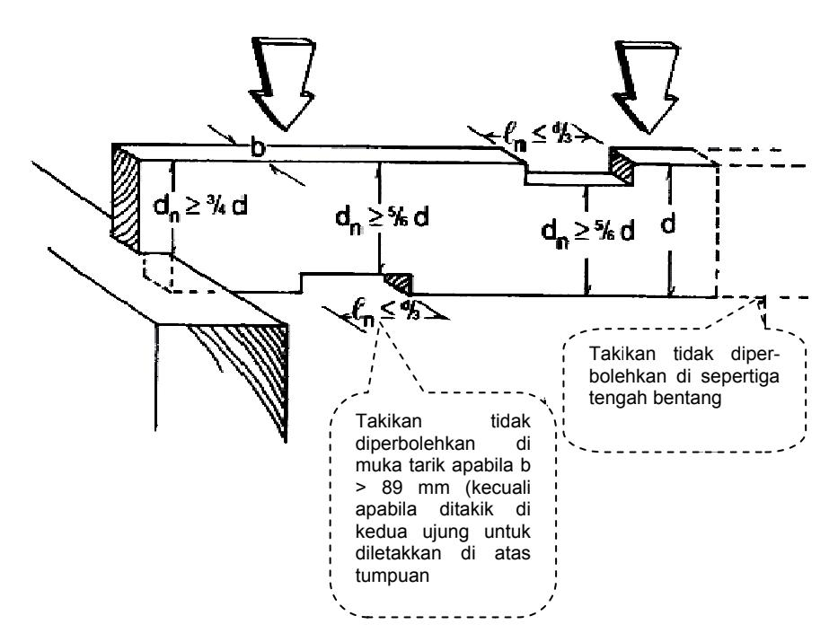

Gambar 4A - Pembatasan Takikan untuk Balok Kayu Gergajian

# 5 Kayu Glulam Struktural

#### 5.1 Umum

#### 5.1.1 Lingkup

- **5.1.1.1** Pasal 5 digunakan untuk desain rekayasa pada kayu glulam struktural (*glued laminated timber*). Ketentuan dasar disediakan pada Spesifikasi ini; untuk tambahan detail dapat dilihat pada Referensi 52.
- **5.1.1.2** Prosedur desain, nilai desain acuan, dan informasi lain yang disediakan disini digunakan hanya untuk kayu glulam struktural yang sesuai dengan semua ketentuan terkait dari Spesifikasi yang dirujuk dalam catatan kaki pada Tabel 5A dan 5B, dan dibuat menurut ANSI/AITC A190.1.

#### 5.1.2 Definisi

Terminologi "kayu glulam struktural" mengacu pada rekayasa teknik, produk pemilahan tegangan dari kilang laminasi kayu, meliputi perakitan dari kayu laminasi yang dipilih dan dipersiapkan secara khusus dan digabung menggunakan perekat. Serat seluruh laminasi kira-kira sejajar dalam arah longitudinal. Ketebalan bersih masing-masing lamina tidak melampaui 50 mm dan terdiri dari:

- satu lamina
- lamina-lamina yang disatukan ujung-ke-ujung membentuk panjang tertentu
- lamina-lamina diletakkan atau direkatkan tepi-ke-tepi untuk membentuk lebar tertentu
- lamina-lamina dibengkokkan selama proses perekatan untuk mendapatkan bentuk lengkung.

## **5.1.3 Dimensi Standar**

- **5.1.3.1** Standar normal lebar bersih komponen glulam struktural ditunjukkan pada Tabel 5.1.3. Spesifikasi ini tidak dimaksudkan untuk melarang lebar bersih lainnya bila diperlukan untuk memenuhi persyaratan desain atau khusus lainnya.
- **5.1.3.2** Panjang dan dimensi neto dari seluruh komponen struktur harus ditentukan. Tambahan dimensi yang diperlukan untuk komponen non-prismatik harus ditentukan.

**Tabel 5.1.3 - Lebar Akhir Neto Kayu Glulam Struktural, mm** 

| Lebar nominal lamina, mm | 76 | 101 | 152 | 203 | 254 | 305 | 356 | 406 |
|-----------------------------|----|-----|-----|-----|-----|-----|-----|-----|
| Lebar akhir neto, mm     | 63 | 76  | 127 | 171 | 216 | 267 | 305 | 356 |

## **5.1.4 Kondisi Layan**

- **5.1.4.1** Nilai desain acuan untuk kondisi layan kering berlaku apabila kadar air dalam masa layan kurang dari 16%, seperti umumnya pada struktur terlindung.
- **5.1.4.2** Nilai desain acuan untuk kayu glulam harus dikalikan dengan faktor layan basah, CM, seperti yang ditentukan pada Tabel 5A dan 5B apabila kadar air pada masa layan adalah lebih besar dari 16%, seperti yang mungkin terjadi pada konstruksi eksterior atau terendam, atau lingkungan yang lembab.

## **5.2 Nilai Desain Acuan**

## **5.2.1 Nilai Desain Acuan**

Nilai desain acuan untuk glulam struktural dari kayu berdaun jarum dan kayu berdaun lebar ditentukan pada Tabel 5A dan 5B. Nilai desain acuan pada Tabel 5A dan 5B merupakan kompilasi nilai desain acuan yang diperlukan pada acuan Spesifikasi pada catatan kaki tabel.

**© BSN 2013 37 dari 318**

# Badan Standardisasi N

## Tabel 5A - Nilai Desain Acuan Untuk Glulam Struktural Kayu Berdaun Jarum

|             |                  | Lent             | ur terhadap sı | ımbu X-X     |             |             |        | Lentu       | ır terhadap sı     | umbu Y-Y    |             | Dibeba  | ani Aksial | Pengencang (3)    |
|-------------|------------------|------------------|----------------|--------------|-------------|-------------|--------|-------------|--------------------|-------------|-------------|---------|------------|-------------------|
|             |                  | Di               | bebani Tegak   | Lurus        |             |             |        |             | Dibebani Sej       | ajar        |             | Tarik   | Tekan      | Berat Jenis       |
|             |                  | M                | luka Lebar La  | minasi       |             |             |        | M           | uka Lebar Lai      | minasi      |             | Sejajar | Sejajar    | untuk             |
|             | Lent             | tur              | Tekan          | Geser        | Mod         | lulus       |        | Tekan       | Geser              | Mod         | lulus       | Serat   | Serat      | Desain Pengencang |
|             | Tepi bawah balok | Tepi atas balok  | Tegak Lurus    | Sejajar      | Elast       | isitas      |        | Tegak Lurus | Sejajar            | Elast       | isitas      |         |            |                   |
|             | yang dibebani    | yang dibebani    | Serat          | Serat        |             |             | Lentur | Serat       | Serat              |             |             |         |            |                   |
|             | tarik            | tarik            |                | (Horisontal) | untuk       | untuk       | Lentur |             | (Horisontal)       | untuk       | untuk       |         |            |                   |
|             | (Lentur positif) | (Lentur negatif) |                |              | Perhitungan | Perhitungan |        |             |                    | Perhitungan | Perhitungan |         |            |                   |
|             |                  |                  |                |              | Defleksi    | Stabilitas  |        |             |                    | Defleksi    | Stabilitas  |         |            |                   |
| Kombinasi   | Fbx⁺             | Fbx-             | Fc⊥x           | Fvx          | Ex          | Ex min      | Fby    | Fc⊥y        | Fvy (2) | Ey          | Ey min      | Ft      | Fc         | G                 |
| Simbol      | (MPa)            | (MPa)            | (MPa)          | (MPa)        | (106MPa)    | (106MPa)    | (MPa)  | (MPa)       | (MPa)              | (106MPa)    | (106MPa)    | (MPa)   | (MPa)      | G                 |
| E-Kayu bero | daun Lebar Terp  | ilah             |                |              |             |             |        |             |                    |             |             |         |            |                   |
| E10         | 11.1             | 5.6              | 3.1            | 0.9          | 9722        | 5139        | 8.7    | 2.0         | 8.0                | 8333        | 4375        | 5.7     | 6.8        | 0.4               |
| E10         | 11.1             | 11.1             | 3.1            | 0.9          | 9722        | 5139        | 9.7    | 2.0         | 8.0                | 8333        | 4375        | 6.3     | 6.9        | 0.4               |
| E12         | 13.9             | 6.9              | 4.1            | 1.1          | 11111       | 5903        | 9.4    | 2.8         | 0.9                | 9028        | 4792        | 6.6     | 7.3        | 0.5               |
| E12         | 13.9             | 13.9             | 4.1            | 1.1          | 11111       | 5903        | 11.1   | 2.8         | 0.9                | 9028        | 4792        | 7.3     | 7.6        | 0.5               |
| E13         | 16.7             | 8.3              | 5.3            | 1.3          | 12500       | 6597        | 10.8   | 4.0         | 1.1                | 10417       | 5486        | 7.3     | 9.7        | 0.5               |
| E13         | 16.7             | 16.7             | 5.3            | 1.3          | 12500       | 6597        | 11.5   | 4.1         | 1.1                | 10417       | 5486        | 7.3     | 9.7        | 0.5               |
| E13         | 16.7             | 8.3              | 4.1            | 1.1          | 12500       | 6597        | 10.1   | 2.8         | 0.9                | 10417       | 5486        | 6.8     | 8.3        | 0.5               |
| E13         | 16.7             | 8.3              | 6.2            | 1.5          | 12500       | 6597        | 11.5   | 4.9         | 1.4                | 11111       | 5903        | 7.3     | 9.4        | 0.5               |
| E13         | 16.7             | 8.3              | 7.5            | 1.6          | 12500       | 6597        | 11.8   | 6.3         | 1.4                | 10417       | 5486        | 7.6     | 10.1       | 0.6               |

- 1. Kombinasi pada tabel ini digunakan untuk komponen struktur terdiri dari 4 atau lebih laminasi dan dimaksudkan terutama untuk komponen yang mengalami tegangan lentur akibat beban yang bekerja tegak lurus muka lebar laminasi. Namun, nilai desain acuan ditabelkan untuk pembebanan keduanya tegak lurus dan sejajar muka lebar laminasi. Untuk kombinasi dan nilai desain acuan untuk komponen struktur dibebani terutama secara aksial atau paralel muka lebar laminasi, lihat Tabel 5B. Untuk komponen struktur dengan 2 atau 3 laminasi, lihat Tabel 5D.
- 2. Nilai desain acuan untuk kayu dengan laminasi yang dibuat dari lapisan tunggal kayu seluruh lebarnya atau lapisan banyak yang tepinya direkat. Untuk kayu-kayu yang diproduksi dari lapisan laminasi majemuk. (seluruh lebarnya) yang tidak direkat tepinya, nilai harus dikalikan dengan 0.4 untuk komponen struktur dengan 5,7 atau 9 laminasi atau dengan 0.5 untuk seluruh komponen struktur lainnya.
- 3. Nilai pengencang untuk kelompok jenis kayu berdaun lebar diizinkan pada masing-masing kombinasi. Bilamana jenis kayu aktual diketahui, nilai untuk jenis kayu tersebut diizinkan untuk digunakan.

© BSN 2013 38 dari 312

**Tabel 5B - Nilai Desain Acuan Untuk Glulam Struktural Kayu Berdaun Lebar** 

|  | Ta be l | 5 B N i la - | i De in sa | Ac ua n | Un tu k G | lu la S m | tr k tu u ra | l Ka Be y u | da Le ba r un r | "Hak Cipta Badan Standardisasi Nasional, Copy standar ini dibuat untuk penayangan di www.bsn.go.id | S N I 7 9 7 3: 2 0 1 3 |
|--|---------------|-----------------------------|---------------------|---------------|--------------------|--------------------|--------------------------|-------------------------|--------------------------------|----------------------------------------------------------------------------------------------------|------------------------------------------------------|
|  |               |                             |                     |               |                    |                    |                          |                         |                                |                                                                                                    |                                                      |
|  |               |                             |                     |               |                    |                    |                          |                         |                                |                                                                                                    |                                                      |
|  |               |                             |                     |               |                    |                    |                          |                         |                                |                                                                                                    |                                                      |
|  |               |                             |                     |               |                    |                    |                          |                         |                                |                                                                                                    |                                                      |
|  |               |                             |                     |               |                    |                    |                          |                         |                                |                                                                                                    |                                                      |
|  |               |                             |                     |               |                    |                    |                          |                         |                                |                                                                                                    |                                                      |
|  |               |                             |                     |               |                    |                    |                          |                         |                                |                                                                                                    |                                                      |
|  |               |                             |                     |               |                    |                    |                          |                         |                                |                                                                                                    |                                                      |
|  |               |                             |                     |               |                    |                    |                          |                         |                                |                                                                                                    |                                                      |
|  |               |                             |                     |               |                    |                    |                          |                         |                                |                                                                                                    |                                                      |
|  |               |                             |                     |               |                    |                    |                          |                         |                                |                                                                                                    |                                                      |
|  |               |                             |                     |               |                    |                    |                          |                         |                                |                                                                                                    |                                                      |
|  |               |                             |                     |               |                    |                    |                          |                         |                                |                                                                                                    |                                                      |
|  |               |                             |                     |               |                    |                    |                          |                         |                                |                                                                                                    |                                                      |
|  |               |                             |                     |               |                    |                    |                          |                         |                                |                                                                                                    |                                                      |
|  |               |                             |                     |               |                    |                    |                          |                         |                                |                                                                                                    |                                                      |
|  |               |                             |                     |               |                    |                    |                          |                         |                                |                                                                                                    |                                                      |
|  |               |                             |                     |               |                    |                    |                          |                         |                                |                                                                                                    |                                                      |
|  |               |                             |                     |               |                    |                    |                          |                         |                                |                                                                                                    |                                                      |
|  |               |                             |                     |               |                    |                    |                          |                         |                                |                                                                                                    |                                                      |
|  |               |                             |                     |               |                    |                    |                          |                         |                                |                                                                                                    |                                                      |
|  |               |                             |                     |               |                    |                    |                          |                         |                                |                                                                                                    |                                                      |
|  |               |                             |                     |               |                    |                    |                          |                         |                                |                                                                                                    |                                                      |
|  |               |                             |                     |               |                    |                    |                          |                         |                                |                                                                                                    |                                                      |
|  |               |                             |                     |               |                    |                    |                          |                         |                                |                                                                                                    |                                                      |
|  |               |                             |                     |               |                    |                    |                          |                         |                                |                                                                                                    |                                                      |
|  |               |                             |                     |               |                    |                    |                          |                         |                                |                                                                                                    |                                                      |
|  |               |                             |                     |               |                    |                    |                          |                         |                                |                                                                                                    |                                                      |
|  |               |                             |                     |               |                    |                    |                          |                         |                                |                                                                                                    |                                                      |
|  |               |                             |                     |               |                    |                    |                          |                         |                                |                                                                                                    |                                                      |

dan tidak untuk di komersialkan"

## 5.2.2 Orientasi Komponen Struktur

Nilai desain acuan untuk kayu glulam struktural tergantung pada orientasi laminasi relatif terhadap beban yang bekerja. Subskrip digunakan untuk mengindikasikan nilai desain sesuai orientasi yang diberikan. Orientasi sumbu penampang kayu glulam ditunjukkan pada Gambar 5A. Sumbu x-x pada arah sejajar muka lebar dari laminasi. Sumbu y-y pada arah tegak lurus muka lebar dari laminasi.

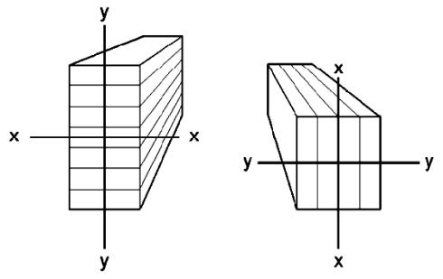

Gambar 5A - Orientasi Sumbu

## 5.2.3 Susunan Lapisan Seimbang dan Tidak Seimbang

Kayu glulam struktural diizinkan dirakit dengan lamina-lamina kayu yang mempunyai kelas sama, diletakkan secara simetris atau tidak simetris terhadap sumbu netral komponen struktur. Susunan lapisan simetris disebut "seimbang" dan mempunyai nilai desain sama untuk lentur positif dan negatif. Susunan lapisan tidak simetris disebut "tidak seimbang" dan mempunyai nilai desain lebih kecil untuk lentur negatif daripada lentur positif. Sisi atas dari komponen struktur tidak seimbang harus diberi tanda "ATAS" oleh produsen.

# 5.2.4 Lentur, Fbx+, Fbx, Fby

Nilai desain lentur acuan,  $F_{bx}^{+}$  dan  $F_{by}$  berlaku untuk komponen struktur dengan beban-beban yang menyebabkan lentur terhadap sumbu x-x. Nilai desain lentur acuan untuk lentur positif,  $F_{bx}^{+}$  berlaku untuk tegangan lentur yang menyebabkan tarik pada sisi bawah balok, nilai desain lentur acuan untuk lentur negatif,  $F_{bx}^{-}$  berlaku untuk tegangan lentur yang menyebabkan tarik pada sisi atas balok.

Nilai desain lentur acuan, Fby, berlaku untuk komponen struktur dengan beban-beban yang menyebabkan lentur terhadap sumbu y-y.

## 5.2.5 Tekan Tegak Lurus Serat, Fcix, Fciv

Nilai desain tekan acuan tegak lurus serat,  $F_{clx}$  berlaku untuk komponen struktur dengan beban tumpu yang bekerja pada muka lebar laminasi.

Nilai desain tekan acuan tegak lurus serat,  $F_{c\perp y}$  berlaku untuk komponen struktur dengan beban tumpu yang bekerja pada tepi sempit laminasi.

Nilai desain tekan acuan tegak lurus serat didasarkan pada batas deformasi sebesar 1 mm sesuai pengujian berdasarkan ASTM D143. Tekan tegak lurus serat terkait tegangan serat pada batas deformasi 0,5 mm harus dihitung sebagai 73% dari nilai acuan (Lihat juga 4.2.6).

# **5.2.6 Geser Sejajar Serat, Fvx, Fvy**

Nilai desain geser acuan sejajar serat Fvx berlaku untuk komponen dengan beban geser yang menyebabkan lentur terhadap sumbu x-x. Nilai desain geser acuan sejajar serat Fvy berlaku untuk komponen dengan beban geser yang menyebabkan lentur terhadap sumbu yy.

Nilai desain geser acuan sejajar serat berlaku untuk komponen prismatik kecuali yang mengalami beban siklik berulang atau impak. Untuk komponen struktur non prismatik dan seluruh komponen struktur yang mengalami impak atau beban siklik berulang, nilai desain geser acuan sejajar serat harus dikalikan dengan faktor reduksi geser seperti yang ditentukan pada 5.3.10. Pengurangan ini juga berlaku untuk desain sambungan yang mentransfer beban melalui pengencang mekanis (lihat 3.4.3.3, 10.1.2, dan 10.2.2).

Komponen struktur prismatik harus ditentukan sebagai komponen struktur lurus atau melengkung dengan penampang konstan. Termasuk komponen struktur non prismatik, tetapi tidak dibatasi komponen struktur: busur, balok tirus, balok lengkung, dan bertakik.

Nilai desain geser acuan sejajar serat, Fvy**,** ditabelkan untuk komponen struktur dengan jumlah lamina empat atau lebih. Untuk komponen struktur dengan dua atau tiga lamina, nilai desain geser acuan masing-masing harus dikalikan dengan 0,84 atau 0,95.

# **5.2.7 Modulus Elastisitas, Ex, Ex min, Ey, Ey min**

Modulus elastisitas acuan, Ex, digunakan untuk penentuan defleksi akibat lentur terhadap sumbu x-x.

Modulus elastisitas acuan, Ex min, digunakan untuk perhitungan stabilitas balok dan kolom komponen struktur yang mengalami tekuk terhadap sumbu x-x.

Modulus elastisitas acuan, Ey, digunakan untuk penentuan defleksi akibat lentur terhadap sumbu y-y.

Modulus elastisitas acuan, Ey min, digunakan untuk perhitungan stabilitas balok dan kolom komponen struktur yang mengalami tekuk terhadap sumbu y-y.

Untuk perhitungan deformasi aksial, modulus elastisitas aksial diizinkan untuk diestimasikan sebagai Eaksial =1,05 Ey.

## **5.2.8 Tarik Radial, Frt**

Untuk komponen struktur lentur lengkung, nilai desain tarik radial acuan tegak lurus serat, Frtuntuk semua jenis kayu sebagai berikut:

**Tabel 5.2.8 - Nilai Desain Tarik Radial Frt untuk Komponen Struktur Lengkung** 

| Beban angin atau gempa  | Frt=ሺ1/3ሻFvxC୴୰ |
|-------------------------|-----------------|
| Tipe pembebanan lainnya | Frt=0,1 MPa     |

## **5.2.9 Tekan Radial, Frc**

Untuk komponen struktur lentur lengkung, nilai desain tekan radial acuan, Frc, harus diambil sebagai nilai desain tekan tegak lurus serat acuan pada muka sisi, Fcy.

**© BSN 2013 41 dari 318**

## **5.2.10 Jenis dan Kelas Kayu lainnya**

Nilai desain acuan untuk jenis dan kelas kayu dari kayu glulam struktural yang tidak ditetapkan disini harus ditentukan menurut prinsip pada Referensi 22, atau didasarkan informasi utama lainnya dari sumber yang disetujui.

## **5.3 Nilai Desain Acuan Terkoreksi**

# **5.3.1 Umum**

Nilai desain acuan (Fb, Ft, Fv, Fc, Fc, Frt, E, Emin) disediakan pada 5.2 dan Tabel 5A dan 5B harus dikalikan dengan faktor koreksi yang ditetapkan pada Tabel 5.3.1 untuk menentukan nilai desain terkoreksi (Fb', Ft',Fv',Fc,Fc',Frt',E',Emin').

## **5.3.2 Faktor Durasi Beban, CD (hanya untuk DTI)**

Seluruh nilai desain acuan kecuali modulus elastisitas, E, modulus elastisitas untuk stabilitas balok dan kolom, Emin, dan tekan tegak lurus serat, Fc, harus dikalikan dengan faktor durasi beban, CD, seperti ditentukan pada 2.3.2.

## **5.3.3 Faktor Layan Basah, CM**

Nilai desain acuan untuk kayu glulam struktural didasarkan atas kadar air pada kondisi layan yang ditentukan pada 5.1.4. Bila kadar air komponen struktur saat digunakan berbeda dari kadar air pada kondisi layan tersebut, maka nilai desain acuan harus dikalikan dengan faktor layan basah, CM, ditentukan pada Tabel 5B.

1.76

0.85

|                                        |                     |                    | • • • • • • • • • • • • • • • • • • • • |                           |                 |                         |                     |                           | <b>,</b>             |                         |                     |                        |                            |                   |
|----------------------------------------|---------------------|--------------------|-----------------------------------------|---------------------------|-----------------|-------------------------|---------------------|---------------------------|----------------------|-------------------------|---------------------|------------------------|----------------------------|-------------------|
|                                        | Ha nya DTI    |                    |                                         |                           |                 |                         | DTI da              | n DFE                     | 3K                   |                         |                     | На                     | nya DFB                    | sK                |
|                                        | Faktor Durasi Beban | Faktor Layan Basah | Faktor temperatur                       | Faktor Stabilitas Balok ' | Faktor Volume ' | Faktor Penggunaan Rebah | Faktor Kelengkungan | Faktor Interaksi Tegangan | Faktor Reduksi Geser | Faktor Stabilitas Kolom | Faktor Bidang tumpu | Faktor Konversi Format | ج ج Faktor Ketahanan | Faktor Efek waktu |
| $F_b' = F_b x$                         | C D      | См                 | Ct                                      | $C_L$                     | C V  | $C_{fu}$                | Cc                  | Cı                        | =                    | -                       | -                   | 2,54                   | 0,85                       | λ                 |
| $F'_t = F_t x$                         | C D      | См                 | C t                          | -                         | =               | -                       | -                   | -                         | =                    | -                       | -                   | 2,70                   | 0,80                       | λ                 |
| $F'_v = F_v x$                         | $C_D$               | $C_{M}$            | $C_t$                                   | -                         | -               | -                       | -                   | -                         | $C_{vt}$             | -                       | -                   | 2,88                   | 0,75                       | λ                 |
| $F'_{rt} = F_{rt} x$                   | $C_D$               | См                 | $C_t$                                   | -                         | _               | -                       | -                   | -                         | -                    | -                       | -                   | 2,88                   | 0,75                       | λ                 |
| $F'_c = F_c x$                         | $C_D$               | $C_{M}$            | $C_t$                                   | -                         | -               | _                       | -                   | -                         | -                    | $C_{P}$                 | -                   | 2,40                   | 0,90                       | λ                 |
| $F'_{c\perp} = F'_{c\perp} x$          | -                   | $C_{M}$            | $C_t$                                   | -                         | -               | -                       | _                   | -                         | -                    | -                       | $C_b$               | 1,67                   | 0,90                       | λ                 |
| $\mathbf{F}' - \mathbf{F}  \mathbf{v}$ | _                   | C.,                | C.                                      | _                         | _               | _                       | _                   | _                         | _                    | _                       | _                   | _                      | _                          | _                 |

Tabel 5.3.1 - Penggunaan Faktor Koreksi dari Kayu Glulam Struktural

## 5.3.4 Faktor Temperatur, Ct

 $C_{M}$ 

Ct

E'min

Apabila komponen struktural merupakan struktur yang terekspos terus-menerus hingga temperatur sampai 65  $^{\circ}$ C (lihat Lampiran C) nilai desain acuan harus dikalikan dengan faktor temperatur,  $C_t$ , seperti ditentukan pada 2.3.3.

#### 5.3.5 Faktor Stabilitas Balok, CL

Nilai desain lentur acuan,  $F_b$ , harus dikalikan dengan faktor stabilitas balok,  $C_L$ , yang ditentukan pada 3.3.3. Untuk komponen lentur kayu glulam struktural, faktor stabilitas,  $C_L$ , tidak digunakan secara simultan dengan faktor volume,  $C_v$ , (lihat 5.3.6). Oleh karena itu digunakan nilai faktor koreksi yang lebih rendah.

#### 5.3.6 Faktor Volume, Cv

Apabila kayu glulam struktural dibebani lentur terhadap sumbu x-x nilai desain lentur acuan  $F_{bx}^+$ , dan  $F_{bx}^-$ , harus dikalikan faktor volume sebagai berikut:

$$C_{V} = \left(\frac{6400}{L}\right)^{1/10} \left(\frac{305}{d}\right)^{1/10} \left(\frac{130}{b}\right)^{1/10} \le 1,0$$
 (5.3-1)

#### Keterangan:

- L = panjang komponen yang mengalami lentur antara titik momen nol, mm
- d = tinggi komponen lentur, mm.
- b = lebar komponen lentur Untuk lapisan majemuk, b = lebar dari lapisan terbesar yang digunakan pada

Eminx
 Faktor stabilitas balok, CL, tidak digunakan secara simultan dengan faktor volume, CV, untuk komponen lentur kayu glulam (lihat 5.3.6). Nilai yang terkecil dari faktor koreksi ini yang digunakan.

susunan lapisan. Maka, b ≤ 270 mm.

Volume faktor, Cv, tidak digunakan secara simultan dengan faktor stabilitas balok, CL, (lihat 3.3.3. Oleh karena itu digunakan nilai faktor koreksi yang lebih rendah.

## 5.3.7 Faktor penggunaan rebah, Cfu

Bila kayu glulam struktural dibebani lentur terhadap sumbu y-y dan dimensi komponen struktur sejajar muka lebar laminasi,  $d_y$  (lihat Gambar 5B), adalah kurang dari 305 mm, nilai desain lentur acuan  $F_{by}$  boleh dikalikan dengan faktor penggunaan rebah,  $C_{fu}$ , pada Tabel 5A dan 5B, atau dihitung dengan persamaan berikut:

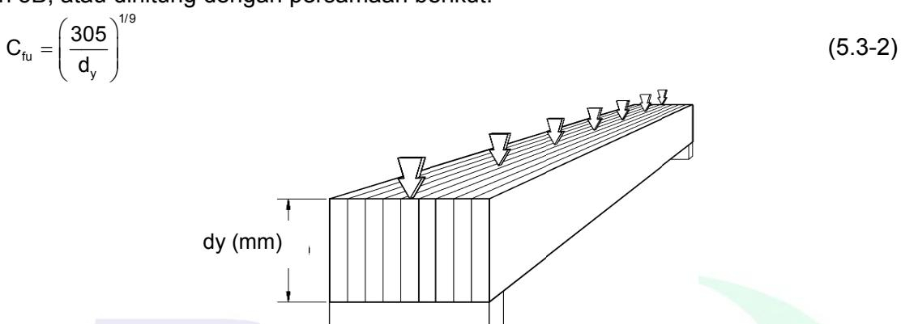

Gambar 5B - Tinggi, dv, untuk faktor penggunaan rebah

## 5.3.8 Faktor Kelengkungan, Cc

Untuk bagian lengkung pada komponen struktur lentur, nilai desain acuan lentur harus dikalikan dengan faktor kelengkungan sebagai berikut:

$$C_c = 1 - (2000)(t/R)^2$$
 (5.3-3)

#### Keterangan:

t = tebal laminasi, mm

R = radius kelengkungan dari muka dalam komponen struktur, mm

t/R ≤ 1/100 untuk kayu berdaun lebar

t/R ≤ 1/125 untuk kayu berdaun jarum

Faktor kelengkungan tidak digunakan untuk nilai desain acuan pada komponen struktur bagian yang lurus, dengan tidak memperhatikan kelengkungan di bagian lain.

# 5.3.9 Faktor Interaksi Tegangan, C1

Untuk bagian tirus komponen struktur lentur yang ditirus pada muka tekan, nilai desain lentur acuan, Fbx, harus dikalikan faktor interaksi tegangan sebagai berikut:

$$C_{1} = \frac{1}{\sqrt{1 + (F_{b} \tan \theta / F_{v})^{2} + (F_{b} \tan^{2} / F_{c\perp})^{2}}}$$
 (5.3-4)

#### Keterangan:

 $\theta$  = sudut tirus, derajat

Untuk komponen struktur yang ditirus pada muka tekan, faktor interaksi tegangan,  $C_I$ , tidak digunakan secara simultan dengan faktor volume,  $C_v$ , maka nilai terkecil dari kedua faktor koreksi tersebut yang digunakan.

Untuk bagian tirus komponen struktur lentur yang ditirus pada muka tarik, nilai desain lentur acuan, Fbx, harus dikalikan faktor interaksi tegangan sebagai berikut:

$$C_{I} = \frac{1}{\sqrt{1 + \left(F_{b} \tan \theta / F_{v}\right)^{2} + \left(F_{b} \tan^{2} / F_{rt}\right)^{2}}}$$
 (5.3-5)

#### Keterangan:

 $\theta$  = sudut tirus, derajat

Untuk komponen struktur yang ditirus pada muka tarik, faktor interaksi tegangan,  $C_l$ , tidak digunakan secara simultan dengan faktor stabilitas balok,  $C_L$ , maka nilai terkecil dari kedua faktor koreksi tersebut yang digunakan.

Potongan tirus pada muka tarik dari balok kayu glulam struktural tidak direkomendasikan.

## 5.3.10 Faktor Reduksi Geser, Cvr

Nilai desain geser acuan,  $F_{vx}$  dan  $F_{vy}$ , harus dikalikan dengan faktor reduksi geser,  $C_{vr}$  = 0,72, dimana salah satu kondisi berikut berlaku:

- 1. Desain komponen struktur non prismatik
- 2. Desain komponen struktur yang mengalami impak atau pembebanan siklik berulang.
- 3. Desain komponen struktur pada takikan (3.4.3.2)
- 4. Desain komponen struktur pada sambungan (3.4.3.3, 10.1.2, 10.2.2)

## 5.3.11 Faktor Stabilitas Kolom, Cp

Nilai desain tekan sejajar serat acuan, Fc, harus dikalikan dengan faktor stabilitas kolom, yang ditentukan pada 3.7.

#### 5.3.12 Faktor Bidang Tumpu, Cb

Nilai desain tekan tegak lurus serat acuan,  $F_{c\perp}$ , boleh dikalikan dengan faktor bidang tumpu,  $C_b$ , yang ditentukan pada 3.10.4.

## 5.3.13 Pengawetan Dengan Tekanan

Nilai desain acuan yang digunakan untuk kayu glulam struktural yang diberi perlakuan dengan proses dan bahan pengawet yang disetujui (lihat Referensi 30). Faktor durasi beban yang lebih besar dari 1,6 tidak digunakan untuk komponen struktur yang diberi perlakuan tekanan dengan bahan pengawet larut air.

#### 5.3.14 Faktor Konversi Format, KF (hanya untuk DFBK)

Untuk DFBK, nilai desain acuan harus dikalikan dengan faktor konversi format,  $K_{F,}$  yang ditetapkan pada Tabel 5.3.1.

## 5.3.15 Faktor Ketahanan, ♦ (hanya untuk DFBK)

Untuk DFBK, nilai desain acuan harus dikalikan dengan faktor ketahanan,  $\phi$ , yang ditetapkan pada Tabel 5.3.1.

## 5.3.16 Faktor Efek Waktu, λ, (hanya untuk DFBK)

Untuk DFBK, nilai desain acuan harus dikalikan dengan faktor efek waktu,  $\lambda$ , yang ditetapkan pada Lampiran N.3.3.

© BSN 2013

## 5.4 Tinjauan Desain Khusus

## 5.4.1 Komponen Struktur Lentur Lengkung dengan Penampang Konstan

- **5.4.1.1** Komponen struktur lentur lengkung dengan penampang persegi panjang konstan harus didesain untuk kekuatan lentur menurut 3.3.
- **5.4.1.2** Komponen struktur lentur lengkung dengan penampang persegi panjang konstan harus didesain terhadap kekuatan geser berdasarkan 3.4, kecuali ketentuan 3.4.3.1 tidak berlaku. Faktor reduksi geser dari 5.3.10 harus digunakan.
- **5.4.1.3** Tegangan radial akibat momen lentur pada komponen struktur lentur lengkung dengan penampang persegi panjang konstan adalah:

$$fr = \frac{3M}{2Rbd}$$
 (5.4-1)

Keterangan:

M = momen lentur, dalam Nmm

R = jari-jari kelengkungan pada garis pusat dari komponen struktur, mm

Bila momen lentur terjadi pada arah yang menyebabkan berkurangnya kelengkungan (memperbesar jari-jarinya), maka tegangan radial tidak boleh melebihi nilai desain tarik radial terkoreksi tegak lurus serat,  $f_r \leq F_{rt}$ , kecuali digunakan perkuatan mekanis yang cukup untuk menahan seluruh tegangan radial (lihat Referensi 52). Nilai  $f_r$  sama sekali tidak boleh melampaui  $(1/3)F_v$ .

Bila momen lentur terjadi pada arah yang menyebabkan bertambahnya kelengkungan (memperkecil jari-jarinya), maka tegangan radial tidak boleh melebihi niilai desain tekan radial terkoreksi,  $f_r \le F_{rc}$ .

**5.4.1.4** Defleksi dari komponen struktur lentur lengkung dengan penampang konstan harus ditentukan berdasarkan 3.5. Peralihan horizontal pada semua tumpuan juga harus ditinjau.

## 5.4.2 Komponen Struktur Lentur Lengkung Tirus-Ganda

**5.4.2.1** Tegangan lentur yang diakibatkan oleh momen lentur, M, pada penampang puncak dari komponen struktur lentur lengkung tirus-ganda (lihat Gambar 5C) harus dihitung sebagai berikut:

$$fb = K_{\phi} \frac{6M}{bd_{\phi}^2}$$
 (5.4-2)

#### Keterangan:

Kφ = faktor bentuk tegangan lentur empiris

 $= 1 + 2.7 \tan \phi_{x}$ 

 $\phi_{T}$  = sudut kemiringan atap, derajat

M = momen lentur, Nmm

Ic = tinggi penampang puncak komponen struktur, mm

Faktor interaksi tegangan dari 5.3.9 harus digunakan untuk desain lentur pada bagian tirus-lurus dari komponen struktur lentur lengkung tirus-ganda.

- **5.4.2.2** Komponen struktur lentur lengkung tirus-ganda harus didesain untuk kekuatan geser berdasarkan 3.4, kecuali ketentuan 3.4.3.1 tidak digunakan. Faktor reduksi geser dari 5.3.10 harus digunakan.
- **5.4.2.3** Tegangan radial yang diakibatkan oleh momen lentur pada komponen struktur lentur lengkung tirus-ganda harus dihitung sebagai berikut:

© BSN 2013 46 dari 312

$$f_r = K_{rs}C_{rs} \frac{6M}{bd_c^2} \tag{5.4-3}$$

Keterangan:

 $K_{rs}$  = faktor tegangan radial empiris = 0,29(da / Rm) + 0,32 tan1,2  $\phi_{T}$ 

Crs = faktor reduksi tegangan radial bentuk-beban empiris

=  $0.27 \ln(\tan \phi_T) + 0.28 \ln(\ell / \ell_c) - 0.8 d_c / R_m + 1 \le 1.0 \text{ untuk komponen struktur}$ 

yang dibebani merata, dengan  $\,d_{_{\scriptscriptstyle C}}\,/\,R_{_{\scriptscriptstyle m}} \le 0,3$ 

= 1,0 untuk komponen struktur yang mengalami momen konstan

l = panjang bentang, mm

 $l_c$  = panjang diantara titik-titik tangen, mm

M = momen lentur, Nmm

dc = tinggi pada penampang puncak komponen struktur, mm

Rm = jari-jari kelengkungan pada garis pusat dari komponen struktur, mm

 $= R + d_c / 2$ 

R = jari-jari kelengkungan muka dalam dari komponen struktur, mm

Bila momen lentur terjadi pada arah yang menyebabkan berkurangnya kelengkungan (memperbesar jari-jarinya), maka tegangan radial tidak boleh melebihi nilai desain tarik radial acuan tegak lurus serat,  $f_r \le F_{rt}$ , kecuali digunakan perkuatan mekanis yang cukup untuk menahan seluruh tegangan radial (lihat Referensi 52). Nilai  $f_r$  sama sekali tidak boleh melampaui  $(1/3)F_{vx}$ .

Bila momen lentur terjadi pada arah yang menyebabkan bertambahnya kelengkungan (memperkecil jari-jarinya), tegangan radial tidak boleh melampaui nilai desain tekan radial terkoreksi,  $f_r \leq F_{rc}$ .

**5.4.2.4** Defleksi komponen struktur lengkung tirus-ganda harus ditentukan menurut 3.5, kecuali bahwa defleksi tengah bentang dari balok lengkung tirus-ganda simetris yang mengalami beban merata dapat dihitung dengan persamaan empiris sebagai berikut:

$$\Delta_{c} = \frac{5\omega\ell^{4}}{32E_{x}b(d_{equiv})^{3}}$$
 (5.4-4)

Keterangan:

 $\Delta_c$  = defleksi vertikal pada tengah bentang, mm

 $\omega$  = beban terbagi rata N/mm

 $\begin{array}{ll} d_{\text{equiv}} &= (d_{\text{e}} + d_{\text{c}}) \big( 0.5 + 0.735 \tan \phi_{\text{T}} \big) - 1.41 d_{\text{c}} tan \phi_{\text{B}} \\ d_{\text{e}} &= \text{tinggi pada ujung komponen struktur, mm} \\ d_{\text{c}} &= \text{tinggi bagian puncak komponen struktur, mm} \end{array}$ 

 $\phi_{\rm T}$  = sudut kemiringan atap, derajat

 $\phi_{\rm p}$  = kemiringan *soffit* pada ujung komponen struktur, derajat

Defleksi horizontal pada tumpuan balok melengkung tirus-ganda yang simetris harus diestimasi sebagai:

$$\Delta_{\rm H} = \frac{2h\Delta_{\rm c}}{\ell} \tag{5.4-5}$$

Keterangan:

 $\Delta_{ij}$  = defleksi horisontal pada salah satu tumpuan, mm

 $\begin{array}{ll} h & = h_a - d_c / 2 - d_e / 2 \\ h_a & = {\ell \choose 2} \tan \phi_T + d_e \end{array}$ 

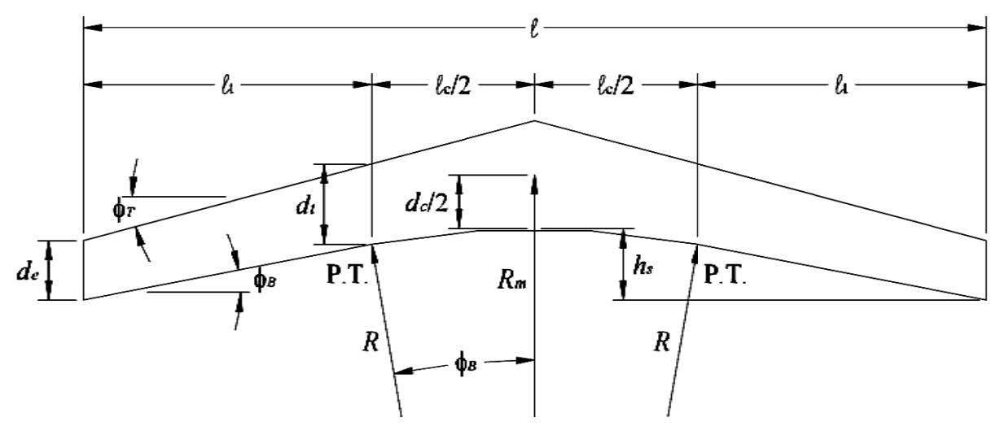

Gambar 5C - Komponen struktur lentur lengkung tirus-ganda

# 5.4.3 Stabilitas Lateral untuk Pelengkung Tudor

Rasio tinggi titik tangen terhadap lebar (d/b) dari pelengkung Tudor (lihat Gambar 5D) tidak boleh melebihi 6, berdasarkan dimensi aktual, apabila satu tepi dari lengkungan yang dibreising dengan dek yang dikencangkan secara langsung pada pelengkung, atau dibreising pada interval tertentu seperti pada *girt* atau gording atap. Apabila tidak terdapat breising lateral, d/b tidak boleh melampaui 5. Pelengkung harus didesain untuk stabilitas lateral menurut ketentuan 3.7 dan 3.9.2.

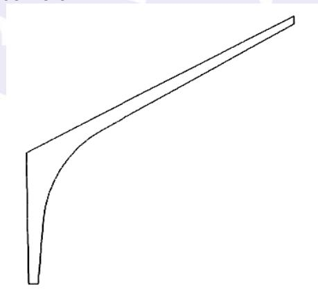

Gambar 5D - Pelengkung Tudor

## 5.4.4 Komponen Struktur Lentur Lurus Tirus

- **5.4.4.1** Balok lurus tirus (lihat Gambar 5E) harus didesain untuk kekuatan lentur menurut 3.3. Faktor interaksi tegangan dari 5.3.9 harus digunakan. Untuk komponen yang ditirus di lapangan, nilai desain lentur acuan,  $F_{bx}$ , dan modulus elastisitas acuan,  $E_x$ , harus direduksi berdasarkan rekomendasi produsen untuk memperhitungkan hilangnya material dengan mutu tinggi di dekat permukaan komponen struktur.
- **5.4.4.2** Balok lurus tirus harus didesain untuk kekuatan geser menurut 3.4, kecuali ketentuan 3.4.3.1 tidak berlaku. Faktor reduksi geser dari 5.3.10 harus digunakan.

**5.4.4.3** Defleksi balok lurus tirus harus ditentukan menurut 3.5, kecuali defleksi maksimum dari balok lurus tirus yang mengalami beban terbagi rata dapat dihitung sebagai tinggi ekivalen, dequiv, dari komponen struktur prismatis ekivalen dengan lebar sama dimana:

$$d_{\text{equiv}} = C_{\text{dt}} d_{\text{e}} \tag{5.4-6}$$

Keterangan:

de = tinggi pada ujung kecil dari komponen struktur, mm

Cdt = konstanta empiris yang berasal dari hubungan persamaan defleksi balok lurus tirus dan balok prismatis

Untuk balok tirus-ganda simetris:

$$C_{dt}$$
 = 1 + 0,66 $C_y$ , apabila 0 <  $C_y \le$  1  
 $C_{dt}$  = 1 + 0,62 $C_y$ , apabila 1 <  $C_y \le$  3

Untuk balok tirus-tunggal simetris:

$$C_{dt} = 1 + 0.46C_y$$
, apabila  $0 < C_y \le 1.1$   
 $C_{dt} = 1 + 0.43C_y$ , apabila  $1.1 < C_y \le 2$ 

Untuk balok tirus-tunggal dan tirus-ganda:

$$C_y = \frac{d_c - d_e}{d_c}$$

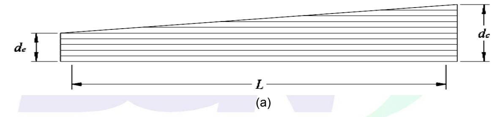

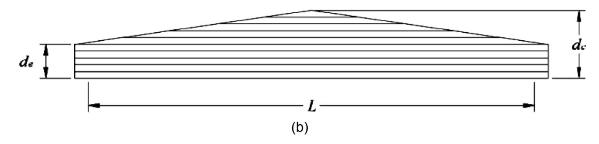

Gambar 5E - Komponen Struktur Lentur Lurus Tirus

# **5.4.5 Takikan**

- **5.4.5.1** Sisi tarik dari komponen lentur kayu glulam struktural tidak boleh ditakik, kecuali pada ujung komponen struktur untuk tumpuan di atas perletakan, dan kedalaman takikan tidak boleh melampaui nilai terkecil dari 1/10 tinggi komponen struktur atau 76 mm.
- **5.4.5.2** Sisi tekan dari komponen lentur kayu glulam struktural tidak boleh ditakik, kecuali pada ujung-ujung komponen struktur, dan tinggi takikan pada sisi tekan tidak melebihi 2/5 dari tinggi komponen struktur. Pada sisi tekan ujung-takikan tidak boleh melampaui 1/3 bentang ke arah tengah.

**Pengecualian:** Potongan tirus pada sisi tekan pada ujung komponen lentur kayu glulam struktural tidak boleh melampaui 2/3 tinggi komponen struktur dan panjangnya tidak boleh melampaui tiga kali tinggi dari komponen struktur, 3d. Untuk balok tirus dimana tirusan sampai 1/3 bentang ke arah tengah, desain harus berdasarkan 5.4.4.

- **5.4.5.3** Takikan tidak boleh pada muka tarik dan tekan pada penampang yang sama.
- **5.4.5.4** Lihat 3.1.2 dan 3.4.3 untuk pengaruh dari takikan terhadap kekuatan. Faktor reduksi geser dari 5.3.10 harus digunakan untuk mengevaluasi komponen struktur pada daerah takikan.

## **6 Tiang dan Pancang Kayu Bundar**

## **6.1 Umum**

## **6.1.1 Lingkup**

- **6.1.1.1** Pasal 6 berlaku untuk desain rekayasa tiang dan pancang kayu bundar. Tata cara desain dan nilai desain acuan disini berkenaan dengan daya dukung tiang dan pancang sebagai komponen kayu struktural.
- **6.1.1.2** Spesifikasi ini tidak mencakup perhitungan untuk kapasitas daya dukung dari tanah.

## **6.1.2 Spesifikasi**

- **6.1.2.1** Tata cara dan nilai desain acuan disini berlaku hanya untuk pancang kayu sesuai dengan ketentuan yang berlaku pada Standar ASTM D 25 dan hanya untuk tiang yang sesuai dengan ketentuan yang berlaku pada Standar ASTM D 3200.
- **6.1.2.2** Spesifikasi untuk tiang dan pancang kayu bundar harus termasuk standar untuk pemeliharaan keawetan, panjang pancang, dan ujung lingkaran nominal atau lingkaran nominal 900 mm dari ujung. Spesifikasi untuk pancang harus menyatakan apakah pancang digunakan sebagai pancang fondasi, pancang di tanah dengan air tawar, atau pancang di laut.

# **6.1.3 Ukuran standar**

- **6.1.3.1** Ukuran standar untuk pancang diberikan dalam Standar ASTM D 25.
- **6.1.3.2** Ukuran standar untuk tiang kayu bundar diberikan dalam Standar ASTM D 3200.

## **6.1.4 Perawatan dengan Pengawetan**

- **6.1.4.1** Nilai Desain acuan berlaku untuk tiang dan pancang kayu tanpa pengawetan dengan proses pengeringan udara, dan harus dikoreksi sesuai dengan 6.3.5 bila kondisi dan diawetkan dengan proses yang disetujui (lihat Referensi 30). Faktor durasi beban lebih besar dari 1,6 tidak boleh diterapkan untuk komponen struktur yang diawetkan dengan tekanan menggunakan bahan pengawet larut air.
- **6.1.4.2** Tiang dan pancang kayu yang tidak diawetkan tidak boleh digunakan kecuali jika berada di bawah muka air tanah terendah yang diharapkan selama umur struktur, tetapi harus tidak kurang dari 900 mm di bawah muka air tanah eksisting kecuali telah disetujui oleh pihak yang berwenang.

## **6.2 Nilai Desain Acuan**

## **6.2.1 Nilai Desain Acuan**

**6.2.1.1** Nilai desain acuan untuk pancang kayu bundar ditetapkan pada Tabel 6A. Nilai Desain acuan pada Tabel 6A didasarkan pada ketentuan Standar ASTM D 2899.

**Tabel 6A - Nilai Disain Acuan untuk Pancang Kayu Bundar dengan Pengawetan dan dipilah dengan ASTM D 2899** 

| Berat |    | Nilai Disain dalam MPa |     |    |       |      |  |  |  |  |  |  |  |
|-------|----|------------------------|-----|----|-------|------|--|--|--|--|--|--|--|
| Jenis | Fb | Fv                     | FcL | Fc | E     | Emin |  |  |  |  |  |  |  |
| 0,42  | 9  | 1                      | 2   | 6  | 9000  | 3600 |  |  |  |  |  |  |  |
| 0,55  | 14 | 1                      | 3   | 9  | 11800 | 4800 |  |  |  |  |  |  |  |

**6.2.1.2** Nilai desain acuan untuk tiang kayu bundar ditetapkan pada Tabel 6B. Nilai desain acuan pada Tabel 6B didasarkan pada ketentuan standar ASTM D 3200.

**Tabel 6B - Nilai Disain Acuan untuk Konstruksi dengan Tiang Kayu Bundar dan dipilah dengan ASTM D 3200** 

| Berat |    |    |     | Nilai Disain dalam MPa |       |      |  |  |
|-------|----|----|-----|------------------------|-------|------|--|--|
| Jenis | Fb | Fv | FcL | Fc                     | E     | Emin |  |  |
| 0,42  | 9  | 1  | 2   | 6                      | 7600  | 3000 |  |  |
| 0,47  | 11 | 1  | 2   | 7                      | 9000  | 3900 |  |  |
| 0,55  | 14 | 1  | 3   | 9                      | 10400 | 4200 |  |  |

## **6.2.2 Kelas Mutu atau Jenis kayu lainnya**

Nilai desain acuan untuk pancang dari kelas mutu atau jenis kayu lainnya harus ditentukan berdasarkan standar ASTM D 2899.

**© BSN 2013 51 dari 318**

#### 6.3 Nilai Desain Acuan Terkoreksi

## 6.3.1 Umum

Nilai desain acuan ( $F_c$ ,  $F_b$ ,  $F_v$ ,  $F_c\bot$ , E,  $E_{min}$ ) dari Tabel 6A dan 6B harus dikalikan dengan faktor koreksi yang ditetapkan dalam Tabel 6.3.1 untuk menentukan nilai desain terkoreksi ( $F_c'$ ,  $F_b'$ ,  $F_v'$ ,  $F_c'$ , E,  $E_{min}$ ).

# 6.3.2 Faktor Durasi Beban, CD (hanya DTI)

Seluruh nilai desain acuan kecuali modulus elastisitas, E, dan modulus elastisitas untuk stabilitas kolom,  $E_{min}$  dan tekan tegak lurus serat  $F_{c\perp}$ , harus dikalikan dengan faktor durasi beban,  $C_D$ , seperti yang ditetapkan pada 2.3.2. Faktor durasi beban lebih besar dari 1.6 tidak digunakan untuk tiang dan pancang kayu yang diawetkan dengan tekanan dengan bahan pengawet larut air, (lihat referensi 30), tidak juga untuk komponen struktural dengan perlakuan tekan dengan bahan kimia hambat api (lihat Tabel 2.3.2).

## 6.3.3 Faktor Layan Basah, CM

Nilai desain acuan digunakan untuk kondisi layan basah dan kering ( $C_M = 1,0$ ).

## 6.3.4 Faktor Temperatur, Ct

Nilai desain acuan harus dikalikan dengan faktor temperatur, Ct, seperti ,ditetapkan pada 2.3.3.

Tabel 6.3.1 - Penggunaan Faktor Koreksi untuk Tiang dan Pancang Kayu Bundar

|                                       | 0.0.1 1 011         | -                 |                          |               |                         | Jang Raya Banaa         |                     |                      |                        |                  |                   |
|---------------------------------------|---------------------|-------------------|--------------------------|---------------|-------------------------|-------------------------|---------------------|----------------------|------------------------|------------------|-------------------|
|                                       | Hanya DTI           |                   |                          | DTI           | l dan DFE               | ВK                      |                     |                      | Hanya                  | a DFBK           |                   |
|                                       | Faktor Durasi Beban | Faktor Temperatur | Faktor Kondisi Perlakuan | Faktor Ukuran | Faktor Stabilitas Kolom | Faktor Penampang Kritis | Faktor Bidang Tumpu | Faktor Berbagi Beban | Faktor Konversi Format | Faktor Ketahanan | Faktor Efek Waktu |
|                                       |                     |                   |                          |               |                         |                         |                     |                      | K F         | ф                |                   |
| $F_c' = F_c x$                        | C D      | $C_{t}$           | $C_{ct}$                 | -             | $C_P$                   | $C_{cs}$                | -                   | C Is      | 2.40                   | 0,90             | λ                 |
| $F_b' = F_b x$                        | $C_D$               | $C_{t}$           | $C_{ct}$                 | $C_F$         | -                       | -                       | -                   | $C_{ls}$             | 2,54                   | 0,85             | λ                 |
| F v ' =F v x    | $C_D$               | $C_{t}$           | $C_{ct}$                 | -             | -                       | -                       | -                   | ı                    | 2,88                   | 0,75             | λ                 |
| F cL '=F c⊥ x   | •                   | $C_{t}$           | $C_{ct}$                 | -             | -                       | 1                       | Cp                  | -                    | 1,67                   | 0,90             | -                 |
| E' =E x                               | -                   | C t    | -                        | -             | -                       | -                       | -                   | -                    | -                      | -                | -                 |
| E min '=E min x | -                   | $C_{t}$           | -                        | -             | -                       | -                       | -                   | -                    | 1,76                   | 0,85             | -                 |

## **6.3.5 Faktor Kondisi Perlakuan Cct**

Nilai desain acuan didasarkan pada kondisi kering udara. Apabila pengeringan kilang, kondisi pengukusan, atau digunakan *boultonizing* sebelum diberikan perlakuan (lihat referensi 20) maka nilai desain acuan harus dikalikan dengan faktor kondisi perlakuan, Cct, seperti pada Tabel 6.3.5.

**Tabel 6.3.5 - Faktor Kondisi Perlakuan, Cct** 

| Kering | Kering | Kering  | Pengukusan | Pengukusan |
|--------|--------|---------|------------|------------|
| Udara  | Kilang | Boulton | (normal)   | (Marine)   |
| 1,0    | 0,90   | 0,95    | 0,80       |            |

# **6.3.6 Faktor Stabilitas Balok, CL**

Nilai desain lentur acuan, Fb, untuk tiang dan pancang kayu bundar tidak disesuaikan untuk stabilitas balok.

## **6.3.7 Faktor Ukuran, CF**

Apabila lingkaran tiang atau pancang melampaui 1092 mm (diameter melampaui 343 mm) pada potongan kritis lentur, nilai desain lentur acuan, Fb, harus dikalikan dengan faktor dimensi, CF, seperti ditetapkan pada 4.3.6.2 dan 4.3.6.3.

## **6.3.8 Faktor Stabilitas Kolom, Cp**

Nilai desain tekan acuan sejajar serat, Fc, harus dikalikan dengan faktor stabilitas kolom, Cp, seperti yang ditetapkan pada 3.7 untuk bagian tiang atau pancang yang berdiri tidak dibreising di udara, air, atau material yang tidak mampu memberikan dukungan lateral.

## **6.3.9 Faktor Penampang Kritis, Ccs**

Nilai desain tekan acuan sejajar serat, Fc, untuk tiang dan pancang kayu bundar didasarkan pada kekuatan ujung pancang. Nilai desain tekan acuan sejajar serat, Fc, pada Tabel 6A dan Tabel 6B harus dikalikan dengan faktor penampang kritis. Faktor penampang kritis, Ccs, harus ditentukan sebagai berikut:

$$C_{CS} = 1.0 + 0.013L_{C}$$
 (6.3-1)

dimana: Lc = panjang dari ujung pancang terhadap penampang kritis, m

Peningkatan lokasi penampang kritis tidak boleh melampaui 10% untuk setiap pancang dan tiang (Ccs ≤ 1,10). Faktor penampang kritis, Ccs tidak tergantung ketentuan terhadap kolom tirus pada 3.7.2 dan keduanya diizinkan dipergunakan untuk perhitungan desain.

# **6.3.10 Faktor Luas Tumpu, Cb**

Nilai desain tekan acuan tegak lurus serat, Fୡୄ, untuk tiang dan pancang kayu harus dikalikan dengan faktor luas tumpu, Cb , seperti ditetapkan pada 3.10.4.

**© BSN 2013 53 dari 318**

# **6.3.11 Faktor Berbagi Beban ( Faktor Kelompok Pancang), Cls**

Untuk pancang, nilai desain acuan didasarkan pada pancang tunggal. Apabila berupa pancang majemuk yang dihubungkan dengan kepala pancang dari beton atau gaya ekuivalen terdistribusi pada elemen-elemen sehingga kelompok pancang berdeformasi sebagai elemen tunggal ketika mengalami beban yang dikenakan pada elemen, nilai desain lentur acuan, Fb, dan nilai desain tekan acuan sejajar serat, Fc, harus dikalikan dengan faktor berbagi beban, Cls, seperti dalam Tabel 6.3.11.

**Tabel 6.3.11 - Faktor Berbagi Beban, Cls, berdasarkan ASTM D 2899** 

| Nilai Desain Acuan | Jumlah Kelompok Tiang Pancang | Cls  |
|--------------------|-------------------------------|------|
|                    | 2                             | 1,06 |
| Fc                 | 3                             | 1,09 |
|                    | 4 atau lebih                  | 1,11 |
|                    | 2                             | 1,05 |
| Fb                 | 3                             | 1,07 |
|                    | 4 atau lebih                  | 1,08 |

# **6.3.12 Faktor Konversi Format, Kf, (hanya DFBK)**

Untuk DFBK, nilai desain acuan harus dikalikan dengan faktor konversi format, KF, seperti ditetapkan pada Tabel 6.3.1.

## **6.3.13 Faktor Ketahanan, (hanya DFBK)**

Untuk DFBK, nilai desain acuan harus dikalikan dengan faktor ketahanan, , seperti ditetapkan pada Tabel 6.3.1.

## **6.3.14 Faktor Efek Waktu, λ (hanya DFBK)**

Untuk DFBK, nilai desain acuan harus dikalikan dengan faktor efek waktu, λ, seperti ditetapkan pada Lampiran N.3.3.

## **7** *I-Joist* **Kayu Prapabrikasi**

# **7.1 Umum**

# **7.1.1 Ruang Lingkup**

Pasal 7 diterapkan untuk desain teknik dengan *I-joist* kayu prapabrikasi. Persyaratanpersyaratan dasar diberikan dalam Spesifikasi ini. Prosedur desain dan informasi lain yang ada dalam Pasal ini hanya berlaku untuk *I-joist* kayu prapabrikasi yang memenuhi persyaratan ASTM D 5055.

## **7.1.2 Definisi**

Kata "*I-joist* kayu prapabrikasi" mengacu pada komponen struktur yang dibuat dengan sayap balok kayu gergajian atau komposit dengan badan panel struktural yang dihubungkan dengan perekat yang tahan diekspos terhadap cuaca, menjadi suatu penampang berbentuk I.

## **7.1.3 Identifikasi**

Jika prosedur desain dan informasi lainnya yang diberikan dalam Spesifikasi ini digunakan, *Ijoist* kayu prapabrikasi harus dapat diidentifikasi dari nama pabrik pembuat dan nama lembaga penjamin kualitasnya.

## **7.1.4 Kondisi Layan**

Nilai desain acuan menggambarkan kondisi layan kering, dengan kadar air layan lebih kecil dari 16%, seperti dalam lingkup struktur pada umumnya. *I-joist* tidak boleh digunakan pada kondisi layan dengan kelembaban yang lebih tinggi, kecuali secara khusus diijinkan oleh pabrik pembuat *I-joist*.

## **7.2 Nilai Desain Acuan**

Nilai desain acuan untuk *I-joist* kayu prapabrikasi harus diambil dari literatur pabrik pembuat *I-joist* kayu prapabrikasinya atau laporan evaluasi berdasarkan peraturan.

## **7.3 Nilai Desain Acuan Terkoreksi**

## **7.3.1 Umum**

Nilai desain acuan (Mr, Vr, Rf, EI, (EI)min, K) harus dikalikan dengan faktor-faktor koreksi dalam Tabel 7.3.1 untuk menentukan nilai desain terkoreksi (Mr', Vr', Rf', EI', (EI)min', K').

# **7.3.2 Faktor Durasi Beban, CD (hanya DTI)**

Semua nilai desain acuan kecuali kekakuan, EI, (EI)min dan K, harus dikalikan dengan faktor durasi beban, CD, seperti tercantum dalam pasal 2.3.2.

## **7.3.3 Faktor Layan Basah, CM**

Nilai desain acuan untuk *I-joist* kayu prapabrikasi dapat diterapkan untuk kondisi layan kering seperti ditentukan dalam pasal 7.1.4 dengan CM = 1,0. Ketika kondisi layan berbeda dengan kondisi yang telah disebutkan, koreksi-koreksi untuk kelembaban tinggi harus mengikuti informasi atau petunjuk yang diberikan oleh pabrik pembuat *I-joist* kayu prapabrikasi.

## **7.3.4 Faktor Temperatur, Ct**

Ketika komponen struktur akan terekspos terhadap temperatur lebih dari 650 C (lihat Lampiran C), kuat desain acuan harus dikalikan dengan faktor temperatur Ct, yang ditentukan dalam pasal 2.3.3. Untuk Mr, Vr, Rf, EI, (EI)min, dan K gunakan nilai Ct untuk masing-masing Fb, Fv, Fv, E, Emin dan Fv.

**© BSN 2013 55 dari 318**

**DTI DTI dan DFBK DFBK** Faktor Durasi Beban Faktor Layan Basah Faktor Temperatur Faktor Stabilitas Balok Faktor komponen struktur berulang Faktor Konversi Format KF Faktor Ketahanan ɸFaktor Efek Waktu Mr = Mr' x CD CM Ct CL Cr KF 0,85 λ Vr = Vr' x CD CM Ct - - KF 0,75 λ Rr = Rr' x CD CM Ct - - KF 0,75 λ EI = EI' x - CM Ct - - - - - (EI)min= (EI)min' x - CM Ct - - KF 0,85 -

**Tabel 7.3.1 - Penggunaan Faktor koreksi untuk** *I-joist* **Kayu Prapabrikasi** 

## **7.3.5 Faktor Stabilitas Balok, CL**

- **7.3.5.1** Kestabilan lateral dari *I-joist* kayu prapabrikasi harus diperhitungkan.
- **7.3.5.2** Jika sayap tertekan *I-joist* kayu prapabrikasi tertahan menerus pada seluruh panjangnya untuk mencegah peralihan lateral, dan ujung dari titik tumpu mempunyai ketahanan lateral untuk mencegah rotasi, CL = 0

K = K' x - CM Ct - - - - -

**7.3.5.3** Jika sayap tertekan *I-joist* kayu prapabrikasi tidak tertahan menerus pada seluruh panjangnya untuk mencegah peralihan lateral, salah satu metode yang dapat dipakai adalah mendesain sayap tertekan *I-joist* kayu prapabrikasi dihitung sebagai kolom seperti prosedur pada pasal 3.7.1, dengan menggunakan properti penampang dari sayap tertekan saja. Sayap tertekan harus dihitung sebagai kolom yang tertahan menerus terhadap tekuk dalam bidang badan. CP dari sayap tertekan dapat digunakan sebagai CL dari *I-joist* kayu prapabrikasi. *I-joist* kayu prapabrikasi harus diberi ketahanan lateral pada titik tumpu untuk mencegah rotasi

## **7.3.6 Faktor komponen struktur berulang, Cr**

Untuk *I-joist* kayu prapabrikasi dengan sayap balok kayu komposit atau balok kayu gergajian, kekuatan momen desain acuannya harus dikalikan dengan faktor komponen struktur berulang, Cr = 1,0.

## **7.3.7 Perlakuan pengawetan dengan vakum tekan**

Koreksi terhadap kuat desain acuan untuk memperhitungkan pengaruh dari perlakuan pengawetan dengan vakum tekan harus sesuai dengan informasi atau petunjuk yang diberikan oleh pabrik pembuat *I-joist* kayu prapabrikasi.

## **7.3.8 Faktor Konversi Format, KF (hanya DFBK)**

Untuk DFBK nilai kuat acuan harus dikalikan dengan suatu faktor konversi format, KF yang diberikan oleh pabrik pembuat *I-joist* kayu.

## **7.3.9 Faktor Ketahanan, (hanya DFBK)**

Untuk DFBK nilai kuat desain acuan harus dikalikan dengan suatu faktor ketahanan, yang diberikan dalam Tabel 7.3.1

## **7.3.10 Faktor Efek waktu, (hanya untuk DFBK)**

Untuk DFBK nilai kuat desain acuan harus dikalikan dengan suatu faktor efek waktu, yang diberikan dalam Lampiran N.3.3.

# **7.4 Ketentuan Desain Khusus**

## **7.4.1 Tumpu**

Nilai desain acuan tumpu, merupakan suatu fungsi dari panjang tumpu, untuk *I-joist* kayu prapabrikasi dengan dan tanpa pengaku badan harus diperoleh dari literatur pabrik pembuat *I-joist* kayu prapabrikasi atau laporan evaluasi berdasarkan peraturan.

## **7.4.2 Aplikasi Beban**

*I-joist* kayu prapabrikasi fungsi utamanya adalah untuk menerima beban yang bekerja pada sayap bagian atas. Pengaku badan jika disyaratkan, diberikan pada daerah beban terpusat pada sayap bagian atas, dan nilai desain untuk menahan beban terpusat yang bekerja pada bagian badan atau sayap bagian bawah harus diperoleh dari literatur pabrik pembuat *I-joist* kayu prapabrikasi atau laporan evaluasi berdasarkan peraturan.

## **7.4.3 Lubang pada Badan**

Pengaruh adanya lubang pada badan terhadap kekuatan harus diperhitungkan dalam desain. Penentuan besarnya geser kritis pada lubang badan harus memperhitungkan kombinasi pembebanan pada pasal 1.4.4 dan beban parsial pada bentang seperti beban hidup yang bekerja dari masing-masing tumpuan terdekat ke ujung sisi lainnya dari lubang segi empat (garis pusat dari sebuah lubang bulat). Pengaruh dari adanya lubang pada badan pada defleksi adalah kecil jika jumlah lubang dibatasi 3 buah atau kurang pada setiap bentangnya. Nilai desain acuan untuk *I-joist* kayu prapabrikasi dengan lubang bulat atau segi empat harus diperoleh dari literatur pabrik pembuat *I-joist* kayu prapabrikasi atau laporan evaluasi berdasarkan peraturan.

# **7.4.4 Takikan**

Takikan pada sayap atau antara tumpuan-tumpuan sangat mereduksi kapasitas *I-joist* kayu prapabrikasi dan di luar ruang lingkup dokumen ini. Hubungi pabrik pembuat *I-joist* kayu prapabrikasi untuk informasi lebih lanjut.

# **7.4.5 Defleksi**

Defleksi akibat lentur dan geser keduanya tidak boleh diabaikan dalam perhitungan defleksi, sesuai dengan literatur pabrik pembuat *I-joist* kayu prapabrikasi atau laporan evaluasi berdasarkan peraturan.

**© BSN 2013 57 dari 318**

# **7.4.6 Transfer Beban Vertikal**

*I-joist* yang menyangga dinding penumpu yang berada tepat di atas perletakan *I-joist* memerlukan *rim joists, blocking panel* atau yang lainnya untuk dapat mentransfer langsung beban vertikal dari dinding penumpu ke struktur penyangga di bawahnya.

## **7.4.7 Geser**

Ketentuan pada pasal 3.4.3.1 untuk perhitungan gaya geser, V, tidak boleh digunakan untuk desain pada balok lentur *I-joist* prapabrikasi.

## **8 Kayu Komposit Struktural**

## **8.1 Umum**

## **8.1.1 Ruang Lingkup**

Pasal 8 digunakan untuk desain teknik dengan kayu komposit struktural. Persyaratan dasar diberikan pada ketentuan ini. Prosedur desain dan informasi lainnya yang diberikan disini digunakan hanya untuk kayu komposit struktural sesuai dengan seluruh ketentuan terkait dari ASTM D5456.

## **8.1.2 Definisi**

- **8.1.2.1** Istilah "kayu venir laminasi" mengacu pada suatu komposit dari elemen lembar venir kayu dengan serat kayu terutama mempunyai orientasi memanjang pada panjang komponen struktur. Ketebalan venir tidak boleh melampaui 6,4 mm.
- **8.1.2.2** Istilah "kayu selumbar sejajar" mengacu pada suatu komposit dari elemen selumbar kayu dengan serat kayu terutama mempunyai orientasi memanjang pada panjang komponen struktur. Setidaknya dimensi selumbar tidak boleh melampaui 6,4 mm dan dimensi panjang rata-rata minimum harus 150 kali.
- **8.1.2.3** Istilah "kayu komposit struktural" mengacu pada masing-masing kayu venir laminasi atau kayu selumbar paralel. Material-material ini adalah komponen struktural yang dilem dengan lem eksterior.

## **8.1.3 Identifikasi**

Apabila prosedur desain dan informasi lainnya yang diberikan disini digunakan, kayu komposit struktural harus diidentifikasi dengan nama produsen dan nama agen penjamin mutu.

## **8.1.4 Kondisi Layan**

Nilai desain acuan yang mencerminkan kondisi kadar air, dimana kadar air pada masa layan adalah kurang dari 16%, seperti kebanyakan pada struktur tertutup. Kayu komposit struktural tidak boleh digunakan pada kondisi layan kadar air lebih tinggi kecuali secara khusus diizinkan oleh produsen kayu komposit struktural.

## **8.2 Nilai Desain Acuan**

**© BSN 2013 58 dari 312** Nilai desain acuan untuk kayu komposit struktural harus diperoleh dari pustaka produsen kayu komposit struktural atau peraturan laporan evaluasi. Pada penggunaan khusus dimana defleksi merupakan faktor kritis, atau dimana deformasi akibat pembebanan jangka panjang harus dibatasi, kebutuhan kegunaan pengurangan modulus elastisitas harus ditentukan. Lihat Lampiran F untuk ketentuan nilai terfaktor pada persyaratan penggunaan akhir khusus.

#### 8.3 Koreksi dari Nilai Desain Acuan

#### 8.3.1 Umum

Nilai desain acuan ( $F_b$ ,  $F_t$ ,  $F_v$ ,  $F_{c\perp}$ ,  $F_c$ , E,  $E_{min}$ ) harus dikalikan dengan faktor koreksi yang telah ditetapkan pada Tabel 8.3.1 untuk menentukan nilai desain terfaktor ( $F_b$ ',  $F_t$ ',  $F_v$ ',  $F_{c\perp}$ ',  $F_c$ ', E',  $E_{min}$ ').

Tabel 8.3.1 - Kegunaan dari Faktor Koreksi untuk Kayu Komposit Struktural

|                               | DTI                 |                    |                   | DTI                                  | dan D                      | FBK                                  |                         |                   | D                                        | FBK                |                   |
|-------------------------------|---------------------|--------------------|-------------------|--------------------------------------|----------------------------|--------------------------------------|-------------------------|-------------------|------------------------------------------|--------------------|-------------------|
|                               | Faktor Durasi Beban | Faktor Layan Basah | Faktor Temperatur | Faktor Stabilitas Balok 1 | Faktor Volume 1 | Faktor Komponen Struktur Berulang | Faktor Stabilitas Kolom | Faktor Luas Tumpu | Faktor Konversi Format K F | Faktor Ketahanan ф | Faktor Efek Waktu |
| $F_b'=F_b$ x                  | C D      | См                 | Ct                | $C_L$                                | C V             | C r                       | -                       | -                 | 2,54                                     | 0,85               | λ                 |
| $F_t'=F_t$                    | C D      | См                 | Ct                | -\                                   | -                          | 7-                                   | -                       | /-                | 2,70                                     | 0,80               | λ                 |
| $F'_{v}=F_{v}$                | C D      | См                 | Ct                | - ^                                  | -                          | <b>y</b> -                           | -                       | -                 | 2,88                                     | 0,75               | λ                 |
| $F_c'=F_c$ x                  | C D      | См                 | Ct                | -                                    | -                          | -                                    | C P          | -                 | 2,40                                     | 0,90               | λ                 |
| $F'_{c\perp} = F'_{c\perp}$ x | -                   | См                 | Ct                | -                                    | -                          | -                                    | -                       | C b    | 1,67                                     | 0,90               |                   |
| E'=E x                        | -                   | См                 | Ct                | -                                    | -                          | -                                    | -                       | -                 | -                                        | -                  | -                 |
| $E'_{min}=E_{min}$ X          | -                   | См                 | C t    | -                                    | -                          | -                                    | -                       | -                 | 1,76                                     | 0,85               | -                 |

Lihat 8.3.6 untuk informasi pada penggunaan secara bersamaan dari faktor volume, CV, dan faktor stabilitas balok , CL.

## 8.3.2 Faktor Durasi Beban, CD (hanya untuk DTI)

Seluruh nilai desain acuan kecuali modulus elastisitas, E, modulus elastisitas untuk stabilitas kolom dan balok,  $E_{min}$  dan tekan tegak lurus serat.  $F_{c\perp}$ , harus dikalikan dengan faktor durasi beban,  $C_D$ , seperti yang ditentukan pada 2.3.2.

## 8.3.3 Faktor Layan Basah, CM

Nilai desain acuan untuk kayu komposit struktural digunakan pada kondisi layan kering seperti ditentukan pada 8.1.4, dimana  $C_M = 1,0$ . Apabila kondisi layan berbeda dengan kondisi yang ditetapkan, koreksi untuk kadar air tinggi harus sesuai dengan informasi yang diberikan oleh produsen kayu komposit struktural.

© BSN 2013 59 dari 318

# **8.3.4 Faktor Temperatur, Ct**

Apabila komponen struktural merupakan struktur berkelanjutan dengan peningkatan temperatur sampai 65o C, nilai desain acuan harus dikalikan dengan faktor temperatur, Ct, seperti ditentukan pada 2.3.3.

# **8.3.5 Faktor Stabilitas Balok, CL**

Komponen struktur lentur kayu komposit struktural harus didukung secara lateral sesuai dengan 3.3.3.

# **8.3.6** *Volume Factor***, Cv**

Nilai desain lentur acuan, Fb, untuk kayu komposit struktural harus dikalikan dengan faktor volume, CV, dan harus diperoleh dari pustaka produsen kayu komposit atau peraturan laporan evaluasi. Apabila CV ≤ 1,0, faktor volume tidak boleh digunakan secara bersamaan dengan faktor stabilitas balok, CL (lihat 3.3.3) dan oleh karena itu, setidaknya faktor koreksi ini harus digunakan. Apabila CV 1,0, faktor volume, CV, harus digunakan secara bersamaan dengan faktor stabilitas balok, CL (lihat 3.3.3).

## **8.3.7 Faktor Komponen Struktur Berulang, Cr**

Nilai desain lentur acuan, Fb, harus dikalikan dengan faktor komponen struktur berulang, Cr = 1,04, apabila komponen struktur tersebut digunakan sebagai kasau, stad, atau komponen struktur yang sama dimana bidang kontak atau ruang tidak lebih dari 610 mm pada pusat, jumlahnya tidak kurang dari 76 mm dan diikat dengan lantai, atap, atau elemen pembagi beban lainnya cukup untuk menunjang beban desain. (Elemen distribusi beban adalah suatu sistim yang sesuai didesain atau dijamin berdasarkan pengalaman meneruskan beban desain ke komponen struktur yang berdekatan, ruangan seperti dijelaskan di atas, tanpa menampilkan kelemahan struktural, atau defleksi yang tidak diterima. Elemen penutup lantai atau sambungan lidah dan alur, dan melalui pemakuan secara umum ditemui pada kriteria ini).

# **8.3.8 Faktor Stabilitas Kolom, Cp**

Nilai desain tekan sejajar serat acuan, Fc, harus dikalikan dengan faktor stabilitas kolom, Cp, seperti ditetapkan pada 3.7.

# **8.3.9 Faktor Luas Tumpu, Cb**

Nilai desain tekan tegak lurus serat acuan, Fୡୄ, harus dikalikan dengan faktor luas tumpu, Cb, seperti ditetapkan pada 3.10.4.

## **8.3.10 Perlakuan Pengawetan Dengan Vakum Tekan**

Koreksi terhadap nilai desain acuan untuk memperhitungkan pengaruh perlakuan pengawetan dengan vakum tekan harus berdasarkan informasi yang diberikan oleh produsen kayu komposit struktural.

## **8.3.11 Faktor Konversi Format (hanya DFBK)**

Untuk DFBK, nilai desain acuan harus dikalikan dengan faktor konversi format, KF, seperti ditetapkan pada Tabel 8.3.1.

## **8.3.12 Faktor Ketahanan, (hanya DFBK)**

Untuk DFBK, nilai desain acuan harus dikalikan dengan faktor tahanan, , seperti ditetapkan pada Tabel 8.3.1.

## **8.3.13 Faktor Efek waktu, (hanya DFBK)**

Untuk DFBK, nilai desain acuan harus dikalikan dengan faktor efek waktu, seperti ditetapkan pada Lampiran N.3.3 .

## **8.4 Pertimbangan Desain Khusus**

- **8.4.1.1** Sisi tarik dari komponen struktur lentur komposit struktural harus ditakik, kecuali pada akhir komponen struktur untuk tumpuan di atas pendukung, dan kedalaman takikan tidak boleh melampaui 1/10 ketinggian komponen struktur. Sisi tekan dari komponen struktur lentur komposit struktural tidak boleh ditakik, kecuali pada akhir komponen struktur, dan kedalaman takikan pada sisi tekan tidak boleh melampaui 2/5 ketinggian komponen struktur. Takikan akhir pada sisi tekan tidak boleh memanjang mencapai sepertiga bentang.
- **8.4.1.2** Lihat 3.1.2 dan 3.4.3 untuk pengaruh takikan terhadap kekuatan.

## **9 Panel Kayu Struktural**

# **9.1 Umum**

## **9.1.1 Lingkup**

Pasal 9 berlaku untuk desain teknis panel kayu struktural meliputi: kayu lapis, papan selumbar terorientasi, panel kayu komposit. Persyaratan dasar disediakan pada Spesifikasi ini. Prosedur desain dan informasi lainnya yang disediakan di sini hanya berlaku untuk panel kayu struktural yang memenuhi persyaratan yang ditetapkan dalam Pasal ini.

## **9.1.2 Identifikasi**

- **9.1.2.1** Ketika prosedur desain dan informasi lainnya pada Spesifikasi ini digunakan, panel kayu struktural harus diidentifikasi untuk mutu dan jenis perekat menurut merk dagang dari agen yang telah lulus uji dan mutu.
- **9.1.2.2** Panel kayu struktural harus ditentukan menurut kelas bentang, ketebalan nominal, tingkat paparan, dan mutu.

# **9.1.3 Definisi**

**9.1.3.1** Istilah "panel kayu struktural" mengacu pada panel dari kayu dengan perekat lem tahan air. Yang termasuk pada istilah ini adalah, kayu lapis, papan selumbar terorientasi, panel komposit. Produk panel ini harus memenuhi persyaratan USDOC PS 1 atau PS 2 dan ditujukan untuk keperluan struktur pada aplikasi rumah tinggal, bangunan komersial, dan industri.

**© BSN 2013 61 dari 318**

- **9.1.3.2** Istilah "panel komposit" mengacu pada panel kayu struktural yang tersusun dari venir kayu yang dibentuk kembali menjadi material berbasis kayu dan dilapisi perekat tahan air.
- **9.1.3.3** Istilah "papan selumbar terorientasi" mengacu pada lembaran panel kayu struktural yang tersusun dari untaian tipis persegi panjang yang disusun bersilangan dengan lapisan permukaan biasanya disusun pada arah memanjang dan terekat dengan perekat anti air.
- **9.1.3.4** Istilah "kayu lapis" mengacu pada panel kayu struktural yang tersusun dari lapisan venir kayu yang disusun bersilangan. Lapisan tersebut direkatkan dengan perekat yang mengering dengan aplikasi panas dan tekanan.

# **9.1.4 Kondisi Layan**

**9.1.4.1** Nilai desain acuan mencerminkan kondisi layan kering, dimana kadar air dalam kondisi layan kurang dari 16% sebagaimana pada kebanyakan struktur terlindung.

## **9.2 Nilai Desain Acuan**

## **9.2.1 Kekakuan dan Kekuatan Panel**

- **9.2.1.1** Nilai desain acuan kekakuan dan kekuatan panel (bahan dan sifat penampang produk) harus diperoleh dari sumber yang telah disetujui.
- **9.2.1.2** Karena sifat ortotropik panel, nilai desain acuan harus disediakan untuk sumbu kekuatan primer dan sekunder. Nilai desain acuan yang sesuai harus diberlakukan bila mendesain untuk masing-masing orientasi panel. Bila gaya bekerja pada sudut tertentu terhadap sumbu utama panel, kapasitas panel pada sudut tertentu harus dihitung dengan menyesuaikan nilai desain acuan untuk sumbu utama dengan menggunakan prinsip-prinsip mekanika teknik.

## **9.2.2 Properti Kekuatan dan Elastis**

Bila diperlukan, parameter kekuatan dan elastis harus dihitung dari nilai desain acuan kekuatan dan kekakuan, berturut-turut, atas dasar penampang desain penampang yang ditabelkan.

## **9.2.3 Desain Ketebalan**

Ketebalan nominal harus digunakan dalam perhitungan desain. Hubungan antara kelas bentang dan ketebalan nominal disediakan dengan nilai desain acuan yang terkait.

## **9.2.4 Properti Desain Penampang**

Properti desain penampang harus ditetapkan atas dasar kelas bentang atau desain ketebalan dan disediakan dalam satuan per-305 mm-dari-lebar-panel.

## **9.3 Koreksi pada Nilai Desain Acuan**

## **9.3.1 Umum**

Nilai desain acuan harus dikalikan dengan faktor koreksi pada tabel 9.3.1 untuk menentukan nilai desain terkoreksi.

# **9.3.2 Faktor Durasi Beban, CD (hanya untuk DTI)**

Semua nilai desain acuan kekuatan (FbS, FtA, Fvtv, Fs(lb/Q), FcA) harus dikalikan dengan faktor durasi beban, CD, seperti ditetapkan pada 2.3.2

## **9.3.3 Faktor Layan Basah, CM dan Faktor Temperatur, Ct**

Nilai desain acuan untuk panel kayu struktural berlaku untuk kondisi kering seperti ditetapkan pada 9.1.4 dimana CM=1,00 dan Ct=1,00. Bila kondisi layanan berbeda dengan kondisi yang ditetapkan, koreksi untuk kadar air tinggi dan/atau temperatur tinggi harus didasarkan pada informasi dari sumber yang disetujui.

**hanya DTI DTI dan DFBK hanya DFBK** Faktor Durasi Beban Faktor Layan Basah Faktor Temperatur Faktor Ukuran Panel Faktor Konversi Format Faktor Ketahanan Faktor Pengaruh Waktu KF ϕ FbS'=FbS x CD CM Ct Cs 2,54 0,85 FtA'=FtA x CD CM Ct Cs 2,70 0,80 Fvtv'= Fvtv x CD CM Ct - 2,88 0,75 Fs(Ib/Q)'= Fs(Ib/Q)' x CD CM Ct - 2,88 0,75 FcA'=FcA x CD CM Ct - 2,40 0,90 Fc90' =Fc90 x - CM Ct - 1,67 0,90 - EI'=EI x - CM Ct - - - - EA'=EA x - CM Ct - - - - Gvtv'= Gvtv x - CM Ct - - - -

**Tabel 9.3.1 - Keberlakuan Faktor Koreksi pada Panel Kayu Struktural** 

## **9.3.4 Faktor Ukuran Panel, CS**

Nilai desain acuan lentur dan tarik (FbS dan FtA) untuk panel kayu struktural berlaku pada panel dengan lebar (ukuran tegak lurus terhadap tegangan yang diterapkan) 610 mm atau lebih. Untuk panel dengan lebar kurang dari 610 mm, nilai desain acuan lentur dan tarik harus dikalikan faktor ukuran panel, Cs, yang ditetapkan pada Tabel 9.3.4.

**© BSN 2013 63 dari 318**

**Tabel 9.3.4 - Faktor Ukuran Panel, Cs** 

| Lebar setrip panel, w | Cs            |
|-----------------------|---------------|
| w ൑ 203 mm            | 0,5           |
| 203 mm < w < 610 mm   | (203 + w)/812 |
| w ൒ 610 mm            | 1,0           |

## **9.3.5 Faktor Konversi Format, KF (hanya DFBK)**

Untuk DFBK, nilai desain acuan harus dikalikan dengan faktor konversi format, KF, ditetapkan pada Tabel 9.3.1.

## **9.3.6 Faktor Ketahanan, (hanya DFBK)**

Untuk DFBK, nilai desain acuan harus dikalikan dengan faktor ketahanan, , ditetapkan pada Tabel 9.3.1.

## **9.3.7 Faktor Efek waktu, (hanya DFBK)**

Untuk DFBK, nilai desain acuan harus dikalikan dengan faktor efek waktu, , ditetapkan pada Lampiran N.3.3.

## **9.4 Tinjauan Desain**

## **9.4.1 Lentur Rebah**

Panel kayu struktural harus didesain untuk lentur dengan memeriksa momen lentur, geser, dan defleksi. Geser gelinding terkoreksi harus digunakan sebagai ketahanan geser untuk memeriksa geser pada panel akibat lentur rebah. Persamaan balok yang sesuai harus digunakan dengan bentang desain didefinisikan sebagai berikut.

- (a) Jarak momen lentur diantara garis pusat tumpuan
- (b) Bentang bersih geser
- (c) Bentang bersih defleksi ditambah faktor lebar tumpuan. Untuk rangka ukuran nominal 51 mm dan 102 mm, faktor lebar tumpuan masing-masing sama dengan 6,4mm dan 15,9mm.

## **9.4.2 Tarik pada Bidang Panel**

Bila panel kayu struktural dibebani tarik aksial, orientasi sumbu utama kekuatan panel terhadap arah pembebanan, harus ditinjau dalam penentuan kapasitas tarik terkoreksi.

## **9.4.3 Tekan pada Bidang Panel**

Bila panel kayu struktural dibebani tekan aksial, orientasi sumbu utama kekuatan panel terhadap arah pembebanan, harus diperhitungkan dalam penentuan kapasitas tekan terkoreksi. Sebagai tambahan, panel harus didesain untuk mencegah tekuk.

## **9.4.4 Geser Planar (Gelinding)**

Geser gelinding terkoreksi harus digunakan dalam desain bila gaya geser bekerja pada bidang panel kayu struktural.

## **9.4.5 Geser pada sisi tebal**

Geser pada sisi tebal terkoreksi harus digunakan dalam desain bila gaya geser bekerja pada sisi tebal dari panel kayu struktural.

## **9.4.6 Tumpu**

Nilai desain tumpu terkoreksi dari panel kayu struktural harus digunakan dalam desain bila beban bekerja tegak lurus terhadap muka panel.

## **10 Sambungan Mekanik**

## **10.1 Umum**

## **10.1.1 Lingkup**

- **10.1.1.1** Pasal 10 berlaku untuk desain teknis sambungan menggunakan baut, sekrup kunci, cincin belah, pelat geser, baut dorong, pin dorong, sekrup kayu, paku, pantek, paku keling kayu, grid pantek atau pengencang lain pada kayu olahan, struktur kayu laminasi, tiang kayu, pancang kayu, struktur kayu komposit, kayu *I-joist* pra-pabrikasi, dan panel kayu struktural. Kecuali jika terbatas secara khusus di tempat lain, ketentuan pada Pasal 10 harus dipakai untuk semua jenis pengencang pada Pasal 11, 12, dan 13.
- **10.1.1.2** Persyaratan dari 3.1.3, 3.1.4, dan 3.1.5 harus diperhitungkan untuk desain sambungan.
- **10.1.1.3** ketentuan desain sambungan pada Pasal 10, 11, 12, dan 13 harus tidak menghalangi penggunaan sambungan dimana hal ini ditunjukkan oleh analisis berdasarkan teori yang diakui secara umum, pembebanan skala prototipe atau skala penuh, studi model analog atau pengalaman luas dalam penggunaan sambungan sehingga akan menghasilkan penggunaan akhir yang memuaskan (lihat 1.1.1.3).

## **10.1.2 Tegangan pada komponen sambungan**

Komponen struktural harus dicek untuk kapasitas dukung beban pada sambungan sesuai dengan semua ketentuan berlaku dari Spesifikasi ini termasuk 3.1.2, 3.1.3, dan 3.4.3.3. Tegangan lokal pada sambungan menggunakan pengencang ganda harus dicek sesuai dengan prinsip mekanika teknik. Satu metode untuk menentukan tegangan ini, disajikan pada Lampiran E.

## **10.1.3 Sambungan eksentris**

Sambungan eksentris yang menimbulkan tegangan tarik tegak lurus serat pada kayu harus tidak digunakan kecuali prosedur teknik yang sesuai atau pengujian dilakukan pada desain sambungan tersebut untuk menjamin bahwa semua beban yang bekerja akan aman didukung oleh komponen sambungan. Sambungan serupa dengan Gambar 10A adalah contoh sambungan yang memerlukan prosedur teknis yang sesuai atau pengujian.

**© BSN 2013 65 dari 318**

## 10.1.4 Sambungan dengan pengencang campuran

Metode analisis dan data pengujian untuk menyusun nilai desain acuan untuk sambungan dibuat dengan lebih dari satu jenis pengencang belum dikembangkan. Nilai desain acuan dan koreksi nilai desain untuk sambungan dengan pengencang campuran harus didasarkan pada pengujian atau analisis lain (lihat 1.1.1.3)

### 10.1.5 Pembuatan Sambungan

Nilai desain lateral acuan untuk sambungan pada Pasal 11, 12, dan 13 adalah berdasarkan pada:

- a. asumsi bahwa muka komponen menjadi terkontak jika pengencang dipasang, dan
- b. diijinkan penyusutan komponen dikarenakan variasi musim dalam kandungan air (lihat 10.3.3)

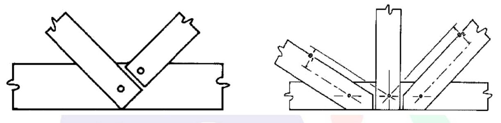

Gambar 10A - Sambungan eksentris

 $e_1,e_2$  = eksentrisitas

#### 10.2 Nilai Desain Acuan

## 10.2.1 Sambungan Pengencang Tunggal

- **10.2.1.1** Pasal 11, 12, dan 13 berisi tabulasi nilai desain acuan dan ketentuan desain untuk perhitungan nilai desain acuan untuk berbagai tipe sambungan pengencang tunggal. Nilai desain acuan sambungan untuk satu jenis kayu berlaku untuk seluruh mutu dari jenis tersebut kecuali jika dinyatakan lain. Nilai desain acuan sambungan pengencang tipe pasak untuk satu jenis kayu juga dipakai untuk jenis lain yang memiliki kuat tumpu,  $F_e$ , yang sama atau lebih tinggi.
- **10.2.1.2** Ketentuan desain dan nilai desain acuan untuk sambungan pengencang tipe pasak seperti baut, sekrup kunci, sekrup kayu, paku, pantek, baut dorong, dan pin dorong ada pada Pasal 11.
- **10.2.1.3** Ketentuan desain dan nilai desain acuan untuk cincin belah dan sambungan pelat geser ada pada Pasal 12.
- **10.2.1.4** Ketentuan desain dan nilai desain acuan untuk sambungan paku keling kayu ada pada Pasal 13.
- **10.2.1.5** Sambungan kayu ke kayu melibatkan grid pantek untuk transfer beban harus didesain sesuai prinsip mekanika teknik (lihat referensi 50 untuk informasi tambahan)

## **10.2.2 Sambungan Pengencang Banyak**

Ketika sambungan terdiri dari dua atau lebih pengencang dengan tipe sama dan ukuran sama, masing-masing menunjukkan mode kelelehan yang sama (lihat Lampiran I), total nilai desain terkoreksi harus merupakan jumlah dari nilai desain yang disesuaikan dari masingmasing pengencang. Tegangan lokal pada sambungan dengan pengencang ganda harus dievaluasi sesuai dengan prinsip mekanika teknik (lihat 10.1.2)

## **10.2.3 Desain bagian metal**

Pelat metal, penggantung, pengencang, dan bagian metal lainnya harus didesain sesuai dengan prosedur desain metal yang berlaku untuk menahan kegagalan tarik, geser, tumpu (metal di atas metal), lentur, dan tekuk (lihat referensi 39, 40, dan 41). Ketika kapasitas sambungan dikontrol oleh kekuatan metal dari pada oleh kekuatan kayu, kekuatan metal tidak harus dikalikan dengan faktor koreksi pada Spesifikasi ini. Ditambah lagi, kekuatan metal tidak boleh tingkatkan dengan faktor angin dan gempa jika desain beban sudah dikurangi faktor kombinasi beban. (lihat referensi 5 untuk informasi tambahan)

# **10.2.4 Desain bagian beton atau pasangan bata**

Dukungan beton, dinding, dan bagian beton atau pasangan bata lainnya harus didesain sesuai dengan kebiasaan yang diterima (lihat referensi 1 dan 2). Ketika kapasitas sambungan lebih ditentukan oleh kekuatan beton atau pasangan bata daripada kekuatan kayu, kekuatan beton atau pasangan bata tidak boleh dikalikan dengan faktor koreksi dalam Spesifikasi ini. Ditambah lagi, kekuatan beton atau pasangan bata tidak boleh ditingkatkan dengan faktor angin dan gempa jika desain beban sudah dikurangi oleh faktor kombinasi beban (lihat referensi 5 untuk informasi tambahan).

## **10.3 Koreksi pada Nilai Desain Acuan**

## **10.3.1 Keberlakuan Faktor Koreksi**

Nilai desain acuan (Z, W) harus dikalikan dengan semua faktor koreksi yang berlaku untuk menentukan nilai desain terkoreksi (Z', W'). Tabel 10.3.1 menentukan faktor koreksi yang berlaku untuk desain lateral acuan (Z) dan nilai desain cabut acuan (W) untuk masingmasing tipe pengencang. Beban sesungguhnya yang bekerja pada sambungan tidak boleh melampaui nilai desain terkoreksi (Z', W') untuk sambungan.

**© BSN 2013 67 dari 318**

**Tabel 10.3.1 - Keberlakuan Faktor Koreksi Pada Sambungan** 

|                                                                                                                                                  | DTI                   |                    |                   |                      | DTI dan DFBK      |                                 |                         |                              |                    |                     |                        | DFBK           |                      |
|--------------------------------------------------------------------------------------------------------------------------------------------------|-----------------------|--------------------|-------------------|----------------------|-------------------|---------------------------------|-------------------------|------------------------------|--------------------|---------------------|------------------------|----------------|----------------------|
|                                                                                                                                                  | Faktor Durasi Beban 1 | Faktor Layan Basah | Faktor Temperatur | Faktor Aksi Kelompok | Faktor Geometri 3 | 3 Faktor Kedalaman Penetrasi | Ujung 3 Faktor Serat | Faktor Pelat Logam Samping 3 | Faktor Diafragma 3 | Faktor Ujung Paku 3 | Faktor Konversi Format | Faktor Tahanan | Waktu Faktor Efek |
|                                                                                                                                                  |                       |                    |                   |                      |                   |                                 |                         |                              |                    |                     | KF                     | Φ              |                      |
|                                                                                                                                                  |                       |                    |                   | Beban Lateral        |                   |                                 |                         |                              |                    |                     |                        |                |                      |
| Pasak                                            Z' = Z   x (contoh : baut,sekrup kunci, sekrup kay paku, pantek, baut dorong, pin dorong) | CD                    | CM                 | Ct                | Cg                   | C∆                | ‐                               | Ceg                     | ‐                            | Cdi                | Ctn                 | 3,32                   | 0,65           | λ                    |
| Pelat Geser                                  Q' =Q  x                                                                                            | CD                    | CM                 | Ct                | Cg                   | C∆                | Cd                              | ‐                       | ‐                            | ‐                  | ‐                   | 3,32                   | 0,65           | λ                    |
| Keling Kayu                                 P' = P  x                                                                                            | CD                    | CM                 | Ct                | ‐                    | ‐                 | ‐                               | ‐                       | 4 Cst                     | ‐                  | ‐                   | 3,32                   | 0,65           | λ                    |
| Q' =Q  x                                                                                                                                         | CD                    | CM                 | Ct                | ‐                    | 5 C∆           | ‐                               | ‐                       | 4 Cst                     | ‐                  | ‐                   | 3,32                   | 0,65           | λ                    |
| Grid Pantek                                  Z' = Z   x                                                                                          | CD                    | CM                 | Ct                | ‐                    | C∆                | ‐                               | ‐                       | ‐                            | ‐                  | ‐                   | 3,32                   | 0,65           | λ                    |
|                                                                                                                                                  |                       |                    |                   | Beban Cabut          |                   |                                 |                         |                              |                    |                     |                        |                |                      |
| Paku, Pantek, Sekrup Kunci,   W' = W  x Sekrup Kayu, dan Pin Dorong                                                                           | CD                    | 2 CM            | Ct                | ‐                    | ‐                 | ‐                               | Ceg                     | ‐                            | ‐                  | CM                  | 3,32                   | 0,65           | λ                    |

- 1. Faktor Durasi Beban, CD, tidak boleh lebih dari 1,6 untuk sambungan (lihat 10.3.2.)
- 2. Faktor Layan Basah, CM, tidak boleh dipakai pada kaki paku yang dibebani cabut (lihat 11.5.4.1.)
- 3. Informasi spesifik faktor geometri, C∆, Faktor kedalaman penetrasi Cd, Faktor ujung serat Ceg, faktor pelat metal samping Cst, faktor diafragma Cdi, dan faktor ujung paku Ctn disediakan pada Pasal 11,12, dan 13.
- 4. Faktor pelat metal samping, Cst, hanya digunakan ketika kapasitas keling (Pr, Qr) menentukan (lihat Pasal 13)
- 5. Faktor geometri, C∆, hanya digunakan ketika kapasitas kayu, Qw, menentukan (lihat Pasal 13)

# **10.3.2 Faktor Durasi Beban, CD (hanya untuk DTI)**

Nilai desain acuan harus dikalikan faktor durasi beban, CD 1,6, ditentukan pada 2.3.2 dan Lampiran B, kecuali ketika kapasitas sambungan ditentukan oleh kekuatan besi atau kekuatan beton/pasangan bata (lihat 10.2.3, 10.2.4, dan Lampiran B.3). Pengaruh faktor durasi beban tidak berlaku pada sambungan.

# **10.3.3 Faktor Layan Basah, CM**

Nilai desain acuan adalah untuk sambungan kayu yang dijaga hingga kadar air 19% atau kurang dan digunakan terus pada keadaan kering, sebagaimana dalam kebanyakan struktur terlindung. Untuk sambungan kayu yang tidak dijaga atau dijaga sebagian, atau ketika sambungan diekspos pada kondisi layan basah, nilai desain acuan harus dikalikan Faktor Layan basah, CM, ditentukan pada Tabel 10.3.3.

**Tabel 10.3.3 - Faktor Layan Basah, CM, untuk Sambungan** 

| Tipe Pengencang                           | Kadar Air      |            | CM   |
|-------------------------------------------|----------------|------------|------|
|                                           | Saat Fabrikasi | Saat Layan |      |
|                                           | Beban Lateral  |            |      |
|                                           | < 19%          | < 19%      | 1,0  |
| Konektor Cincin Belah dan Pelat Geser1 | > 19%          | < 19%      | 0,8  |
|                                           | berapapun      | > 19%      | 0,7  |
| Pasak (contoh : baut, sekrup kunci,       | < 19%          | < 19%      | 1,0  |
| sekrup kayu, paku, pantek, baut           | > 19%          | < 19%      | 0,43 |
| dorong, pin dorong)                       | berapapun      | > 19%      | 0,7  |
|                                           | < 19%          | < 19%      | 1,0  |
| Paku Keling Kayu                          | < 19%          | > 19%      | 0,8  |
|                                           | Beban Cabut    |            |      |
| Sekrup Kunci & Sekrup Kayu                | berapapun      | < 19%      | 1,0  |
|                                           | berapapun      | > 19%      | 0,7  |
|                                           | < 19%          | < 19%      | 1,0  |
| Paku & Pantek                             | > 19%          | < 19%      | 0,25 |
|                                           | < 19%          | > 19%      | 0,25 |
|                                           | > 19%          | > 19%      | 1,0  |
| Paku ulir yang diperkeras                 | berapapun      | berapapun  | 1,0  |

1. Untuk cincin belah atau pelat geser, batas kelembaban digunakan pada kedalaman 19,05 mm di bawah permukaan kayu

- 2) dua atau lebih pengencang yang ditempatkan pada satu baris paralel serat, atau
- 3) pengencang ditempatkan pada dua atau lebih baris paralel serat dengan pelat sambungan pemisah tiap baris.

## **10.3.4 Faktor Temperatur, Ct**

Nilai desain acuan harus dikalikan faktor temperatur, Ct, pada Tabel 10.3.4 untuk sambungan yang akan terekspos temperatur tinggi terus menerus hingga mencapai 65o C. (lihat Lampiran C)

**Tabel 10.3.4 - Faktor Temperatur, Ct, untuk Sambungan** 

| Pada Kondisi         |              | Ct                      |                         |
|----------------------|--------------|-------------------------|-------------------------|
| Kelembaban Layan1 | T < 38o C | 38o C < T < 52o C | 52o C < T < 65o C |
| Kering               | 1            | 0,8                     | 0,7                     |
| Basah                | 1            | 0,7                     | 0,5                     |

1. Kondisi layan basah dan kering untuk sambungan ditetapkan pada 10.3.3.

**© BSN 2013 69 dari 318**

2. CM = 0,7 untuk pasak dengan diameter, D, kurang dari 6,35 mm

CM = 1,0 untuk pasak dengan :

 1) hanya satu pengencang, atau

## 10.3.5 Perlakuan Tahan Api

Nilai desain acuan terkoreksi untuk sambungan kayu dan laminasi lem struktural yang diberi perlakuan tekan dengan bahan kimia tahan api harus diperoleh dari perusahaan penyedia jasa pengawetan dan pengeringan (lihat 2.3.4). Pengaruh faktor durasi beban tidak berlaku pada sambungan yang diberi perlakuan tekan dengan bahan kimia tahan api (lihat Tabel 2.3.2).

## 10.3.6 Faktor Aksi Kelompok, Cq

**10.3.6.1** Nilai desain lateral acuan untuk sambungan cincin belah, sambungan pelat geser, atau pengencang tipe-pasak dengan  $D \le 25,4$  mm dalam satu baris harus dikalikan dengan faktor aksi kelompok berikut,  $C_\alpha$ :

$$C_{g} = \left[ \frac{m(1-m^{2n})}{n(1+R_{EA}m^{n})(1+m)-1+m^{2n}} \right] \left[ \frac{1+R_{EA}}{1-m} \right]$$
 (10.3-1)

#### Keterangan:

 $C_g$  = 1.0 untuk pengencang tipe pasak dengan D < 6,35 mm.

n = jumlah pengencang dalam satu baris

$$R_{EA}$$
 = yang terendah dari  $\frac{E_s A_s}{E_m A_m}$  atau  $\frac{E_m A_m}{E_s A_s}$ 

Em = modulus elastisitas komponen struktur utama, N/mm2

Es = modulus elastisitas komponen struktur samping, N/mm²

Am = luas bruto penampang komponen struktur utama, mm2

As = jumlah luas bruto penampang komponen struktur samping, mm2

$$m = u - \sqrt{u^2 - 1}$$

$$u = 1 + \gamma \frac{s}{2} \left[ \frac{1}{E_m A_m} + \frac{1}{E_s A_s} \right]$$

s = jarak pusat ke pusat antara pengencang yang berdekatan dalam satu baris

γ = modulus beban/slip untuk sambungan, N/mm

= 87 500 N/mm untuk cincin belah atau pelat geser 101,6 mm

= 70 000 N/mm untuk cincin belah 63,5 mm atau pelat geser 66,675 mm

= (246) (D1,5) N/mm untuk pengencang tipe pasak pada sambungan kayu-ke-kayu

= (369) (D1,5) N/mm untuk pegencang tipe pasak untuk sambungan kayu-ke-besi

D = diameter baut atau sekrup kunci, mm

Faktor aksi kelompok untuk bermacam-macam geometri sambungan ada pada Tabel 10.36A, 10.3.6B, 10.3.6C dan 10.3.6D.

- **10.3.6.2** Untuk menentukan faktor aksi kelompok, satu baris pengencang didefinisikan sebagai berikut :
- a. Dua atau lebih unit cincin belah atau pelat geser, sebagaimana didefinisikan dalam 12.1.1, lurus dengan arah beban
- b. Dua atau lebih pengencang tipe pasak dengan diameter sama dibebani dalam satu atau lebih bidang geser lurus dengan arah beban

Ketika pengencang pada baris yang berdekatan adalah zig-zag dan jarak antara baris yang berdekatan kurang dari 1/4 jarak antara pengencang terdekat di baris yang berdekatan diukur paralel dengan baris, baris yang berdekatan harus diperhitungkan sebagai satu baris dengan tujuan penentuan faktor aksi kelompok. Untuk kelompok pengencang yang mempunyai nomor baris genap, prinsip ini harus dipakai untuk masing-masing sepasang baris. Untuk grup pengencang yang mempunyai nomor baris ganjil, interpretasi yang paling konservatif harus dipakai (lihat Gambar 10B).

**10.3.6.3** luas kotor penampang harus digunakan, dengan tanpa pengurangan untuk luas bersih, ketika menghitung  $A_m$  dan  $A_s$ , untuk penentuan faktor aksi kelompok. Ketika sebuah komponen dibebani tegak lurus serat, luas penampang ekivalen adalah hasil perkalian dari tebal komponen dengan lebar keseluruhan dari kelompok pengencang (lihat Gambar 10B). Ketika hanya satu baris pengencang yang digunakan, lebar kelompok pengencang harus yang terkecil sejajar dengan spasi serat pengencang.

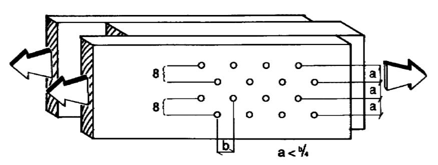

Dianggap sebagai 2 baris dari 8 pengencang

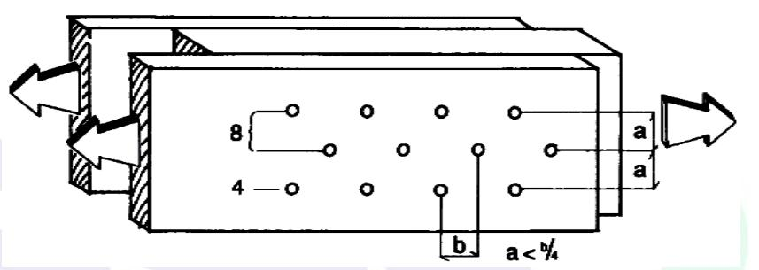

Dianggap sebagai 1 baris dari 8 pengencang dan 1 baris dari 4 pengencang

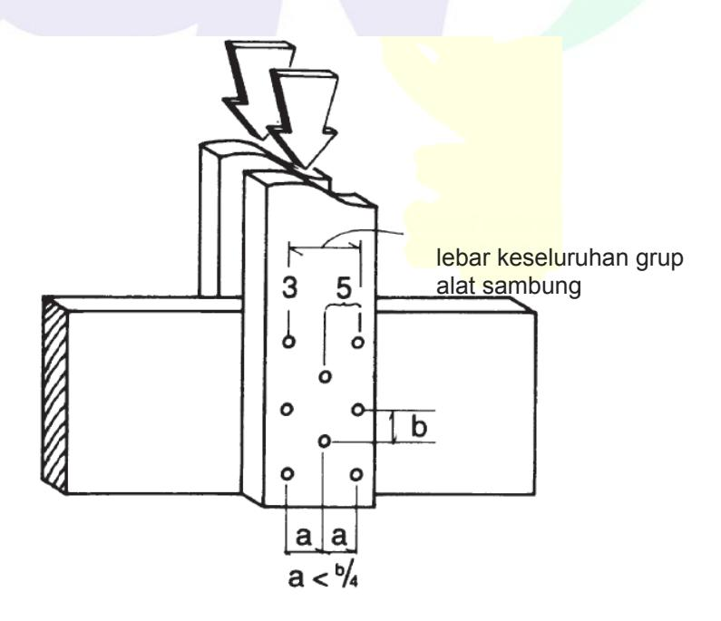

Dianggap sebagai 1 baris dari 5 pengencang dan 1 baris dari 3 pengencang

Gambar 10B - Aksi kelompok untuk pengencang zig-zag

© BSN 2013 71 dari 318

# **10.3.7 Faktor Konversi Format, KF (hanya untuk DFBK)**

Untuk DFBK, nilai desain acuan harus dikalikan dengan faktor konversi format, KF, ditentukan pada Tabel 10.3.1.

## **10.3.8 Faktor Ketahanan, (hanya DFBK)**

Untuk DFBK, nilai desain acuan harus dikalikan dengan faktor ketahanan, Φ, ditentukan pada Tabel 10.3.1.

## **10.3.9 Faktor Efek waktu,** ૃ **(hanya DFBK)**

Untuk DFBK, nilai desain acuan harus dikalikan dengan faktor efek waktu, λ, ditentukan pada Lampiran N.3.3

**Tabel 10.3.6A - Faktor Aksi Kelompok, Cg, untuk sambungan baut dan sekrup kunci dengan komponen samping kayu2** 

Untuk D = 25,4 mm, s = 101,6 mm, E = 9653 MPa

| As/Am1 | As1   |      |      |      |      |      |      | Jumlah Pengencang dalam satu baris |      |      |      |      |
|--------|-------|------|------|------|------|------|------|------------------------------------|------|------|------|------|
|        | mm2   | 2    | 3    | 4    | 5    | 6    | 7    | 8                                  | 9    | 10   | 11   | 12   |
| 0,5    | 3226  | 0,98 | 0,92 | 0,84 | 0,75 | 0,68 | 0,61 | 0,55                               | 0,50 | 0,45 | 0,41 | 0,38 |
|        | 7742  | 0,99 | 0,96 | 0,92 | 0,87 | 0,81 | 0,76 | 0,70                               | 0,65 | 0,61 | 0,57 | 0,53 |
|        | 12903 | 0,99 | 0,98 | 0,95 | 0,91 | 0,87 | 0,83 | 0,78                               | 0,74 | 0,70 | 0,66 | 0,62 |
|        | 18064 | 1,00 | 0,98 | 0,96 | 0,93 | 0,90 | 0,87 | 0,83                               | 0,79 | 0,76 | 0,72 | 0,69 |
|        | 25806 | 1,00 | 0,99 | 0,97 | 0,95 | 0,93 | 0,90 | 0,87                               | 0,84 | 0,81 | 0,78 | 0,75 |
|        | 41290 | 1,00 | 0,99 | 0,98 | 0,97 | 0,95 | 0,93 | 0,91                               | 0,89 | 0,87 | 0,84 | 0,82 |
| 1      | 3226  | 1,00 | 0,97 | 0,91 | 0,85 | 0,78 | 0,71 | 0,64                               | 0,59 | 0,54 | 0,49 | 0,45 |
|        | 7742  | 1,00 | 0,99 | 0,96 | 0,93 | 0,88 | 0,84 | 0,79                               | 0,74 | 0,70 | 0,65 | 0,61 |
|        | 12903 | 1,00 | 0,99 | 0,98 | 0,95 | 0,92 | 0,89 | 0,86                               | 0,82 | 0,78 | 0,75 | 0,71 |
|        | 18064 | 1,00 | 0,99 | 0,98 | 0,97 | 0,94 | 0,92 | 0,89                               | 0,86 | 0,83 | 0,80 | 0,77 |
|        | 25806 | 1,00 | 1,00 | 0,99 | 0,98 | 0,96 | 0,94 | 0,92                               | 0,90 | 0,87 | 0,85 | 0,82 |
|        | 41290 | 1,00 | 1,00 | 0,99 | 0,98 | 0,97 | 0,96 | 0,95                               | 0,93 | 0,91 | 0,90 | 0,88 |

1. Ketika As/Am> 1,0 , digunakan Am/As dan gunakan Am daripada As.

**Tabel 10.3.6B - Faktor Aksi Kelompok, Cg, untuk Sambungan Cincin Belah atau Pelat Geser 101,6 mm dengan komponen samping kayu** 

s = 228,6 mm, E = 9653 MPa

| As/Am1 | As1   |      |      |      |      |      |      | Jumlah Pengencang dalam satu baris |      |      |      |      |
|--------|-------|------|------|------|------|------|------|------------------------------------|------|------|------|------|
|        | mm2   | 2    | 3    | 4    | 5    | 6    | 7    | 8                                  | 9    | 10   | 11   | 12   |
| 0,5    | 3226  | 0,90 | 0,73 | 0,59 | 0,48 | 0,41 | 0,35 | 0,31                               | 0,27 | 0,25 | 0,22 | 0,20 |
|        | 7742  | 0,95 | 0,83 | 0,71 | 0,60 | 0,52 | 0,45 | 0,40                               | 0,36 | 0,32 | 0,29 | 0,27 |
|        | 12903 | 0,97 | 0,88 | 0,78 | 0,69 | 0,60 | 0,53 | 0,47                               | 0,43 | 0,39 | 0,35 | 0,32 |
|        | 18064 | 0,97 | 0,91 | 0,82 | 0,74 | 0,66 | 0,59 | 0,53                               | 0,48 | 0,44 | 0,40 | 0,37 |
|        | 25806 | 0,98 | 0,93 | 0,86 | 0,79 | 0,72 | 0,65 | 0,59                               | 0,54 | 0,49 | 0,45 | 0,42 |
|        | 41290 | 0,99 | 0,95 | 0,91 | 0,85 | 0,79 | 0,73 | 0,67                               | 0,62 | 0,58 | 0,54 | 0,50 |
| 1      | 3226  | 1,00 | 0,87 | 0,72 | 0,59 | 0,50 | 0,43 | 0,38                               | 0,34 | 0,30 | 0,28 | 0,25 |
|        | 7742  | 1,00 | 0,93 | 0,83 | 0,72 | 0,63 | 0,55 | 0,48                               | 0,43 | 0,39 | 0,36 | 0,33 |
|        | 12903 | 1,00 | 0,95 | 0,88 | 0,79 | 0,71 | 0,63 | 0,57                               | 0,51 | 0,46 | 0,42 | 0,39 |
|        | 18064 | 1,00 | 0,97 | 0,91 | 0,83 | 0,76 | 0,69 | 0,62                               | 0,57 | 0,52 | 0,47 | 0,44 |
|        | 25806 | 1,00 | 0,98 | 0,93 | 0,87 | 0,81 | 0,75 | 0,69                               | 0,63 | 0,58 | 0,54 | 0,50 |
|        | 41290 | 1,00 | 0,98 | 0,95 | 0,91 | 0,87 | 0,82 | 0,77                               | 0,72 | 0,67 | 0,62 | 0,58 |

**© BSN 2013 72 dari 312**

2. Tabulasi Faktor Aksi Kelompok (Cg) adalah konservatif untuk D < 25,4 mm, s = 101,6 mm, E = 9653 MPa.

- 1. Ketika As/Am> 1,0 , digunakan Am/As dan gunakan Am daripada As.
- 2. Tabulasi Faktor Aksi Kelompok (Cg) adalah konservatif untuk sambungan cincin belah 63,5 mm, konektor pelat geser 66,675 mm, s <228,6 mm, atau E > 9653 MPa.

**Tabel 10.3.6C - Faktor Aksi Kelompok, Cg, untuk Sambungan Baut atau Sekrup dengan komponen samping besi** 

Untuk D = 25,4 mm, s = 101,6 mm, Ekayu = 9653 MPa, Ebaja = 206843 MPa

|        |        |      | Jumlah Pengencang dalam satu baris |      |      |      |      |      |      |      |      |      |  |
|--------|--------|------|------------------------------------|------|------|------|------|------|------|------|------|------|--|
| As/Am1 | As1    |      |                                    |      |      |      |      |      |      |      |      |      |  |
|        | mm2    | 2    | 3                                  | 4    | 5    | 6    | 7    | 8    | 9    | 10   | 11   | 12   |  |
| 12     | 3226   | 0,97 | 0,89                               | 0,80 | 0,70 | 0,62 | 0,55 | 0,49 | 0,44 | 0,40 | 0,37 | 0,34 |  |
|        | 5161   | 0,98 | 0,93                               | 0,85 | 0,77 | 0,70 | 0,63 | 0,57 | 0,52 | 0,47 | 0,43 | 0,40 |  |
|        | 10323  | 0,99 | 0,96                               | 0,92 | 0,86 | 0,80 | 0,75 | 0,69 | 0,64 | 0,60 | 0,55 | 0,52 |  |
|        | 15484  | 1,00 | 0,97                               | 0,94 | 0,90 | 0,85 | 0,81 | 0,76 | 0,71 | 0,67 | 0,63 | 0,59 |  |
|        | 25806  | 1,00 | 0,98                               | 0,96 | 0,94 | 0,90 | 0,87 | 0,83 | 0,79 | 0,76 | 0,72 | 0,69 |  |
|        | 41290  | 1,00 | 0,99                               | 0,98 | 0,96 | 0,94 | 0,91 | 0,88 | 0,86 | 0,83 | 0,80 | 0,77 |  |
|        | 77419  | 1,00 | 0,99                               | 0,99 | 0,98 | 0,96 | 0,95 | 0,93 | 0,91 | 0,90 | 0,87 | 0,85 |  |
|        | 129032 | 1,00 | 1,00                               | 0,99 | 0,99 | 0,98 | 0,97 | 0,96 | 0,95 | 0,93 | 0,92 | 0,90 |  |
| 18     | 3226   | 0,99 | 0,93                               | 0,85 | 0,76 | 0,68 | 0,61 | 0,54 | 0,49 | 0,44 | 0,41 | 0,37 |  |
|        | 5161   | 0,99 | 0,95                               | 0,90 | 0,83 | 0,75 | 0,69 | 0,62 | 0,57 | 0,52 | 0,48 | 0,44 |  |
|        | 10323  | 1,00 | 0,98                               | 0,94 | 0,90 | 0,85 | 0,79 | 0,74 | 0,69 | 0,65 | 0,60 | 0,56 |  |
|        | 15484  | 1,00 | 0,98                               | 0,96 | 0,93 | 0,89 | 0,85 | 0,80 | 0,76 | 0,72 | 0,68 | 0,64 |  |
|        | 25806  | 1,00 | 0,99                               | 0,97 | 0,95 | 0,93 | 0,90 | 0,87 | 0,83 | 0,80 | 0,77 | 0,73 |  |
|        | 41290  | 1,00 | 0,99                               | 0,98 | 0,97 | 0,95 | 0,93 | 0,81 | 0,89 | 0,86 | 0,83 | 0,81 |  |
|        | 77419  | 1,00 | 1,00                               | 0,99 | 0,98 | 0,97 | 0,96 | 0,95 | 0,93 | 0,92 | 0,90 | 0,88 |  |
|        | 129032 | 1,00 | 1,00                               | 0,99 | 0,99 | 0,98 | 0,98 | 0,97 | 0,96 | 0,95 | 0,94 | 0,92 |  |
| 24     | 25806  | 1,00 | 0,99                               | 0,97 | 0,95 | 0,93 | 0,89 | 0,86 | 0,83 | 0,79 | 0,76 | 0,72 |  |
|        | 41290  | 1,00 | 0,99                               | 0,98 | 0,97 | 0,95 | 0,93 | 0,91 | 0,88 | 0,85 | 0,83 | 0,80 |  |
|        | 77419  | 1,00 | 1,00                               | 0,99 | 0,98 | 0,97 | 0,96 | 0,95 | 0,93 | 0,91 | 0,90 | 0,88 |  |
|        | 129032 | 1,00 | 1,00                               | 0,99 | 0,99 | 0,98 | 0,98 | 0,97 | 0,96 | 0,95 | 0,93 | 0,92 |  |
| 30     | 25806  | 1,00 | 0,98                               | 0,96 | 0,93 | 0,89 | 0,85 | 0,81 | 0,77 | 0,73 | 0,69 | 0,65 |  |
|        | 41290  | 1,00 | 0,99                               | 0,97 | 0,95 | 0,93 | 0,90 | 0,87 | 0,83 | 0,80 | 0,77 | 0,73 |  |
|        | 77419  | 1,00 | 0,99                               | 0,99 | 0,97 | 0,96 | 0,94 | 0,92 | 0,90 | 0,88 | 0,85 | 0,83 |  |
|        | 129032 | 1,00 | 1,00                               | 0,99 | 0,98 | 0,97 | 0,96 | 0,95 | 0,94 | 0,92 | 0,90 | 0,89 |  |
| 35     | 25806  | 0,90 | 0,97                               | 0,94 | 0,91 | 0,86 | 0,82 | 0,77 | 0,73 | 0,68 | 0,64 | 0,60 |  |
|        | 41290  | 1,00 | 0,98                               | 0,96 | 0,94 | 0,91 | 0,87 | 0,84 | 0,80 | 0,76 | 0,73 | 0,69 |  |
|        | 77419  | 1,00 | 0,99                               | 0,98 | 0,97 | 0,95 | 0,92 | 0,90 | 0,88 | 0,85 | 0,82 | 0,79 |  |
|        | 129032 | 1,00 | 0,99                               | 0,99 | 0,98 | 0,97 | 0,95 | 0,94 | 0,92 | 0,90 | 0,88 | 0,86 |  |
| 42     | 25806  | 0,99 | 0,97                               | 0,93 | 0,88 | 0,83 | 0,78 | 0,73 | 0,68 | 0,63 | 0,59 | 0,55 |  |
|        | 41290  | 0,99 | 0,98                               | 0,95 | 0,92 | 0,88 | 0,84 | 0,80 | 0,76 | 0,72 | 0,68 | 0,64 |  |
|        | 77419  | 1,00 | 0,99                               | 0,97 | 0,95 | 0,93 | 0,90 | 0,88 | 0,85 | 0,81 | 0,78 | 0,75 |  |
|        | 129032 | 1,00 | 0,99                               | 0,98 | 0,97 | 0,96 | 0,94 | 0,92 | 0,90 | 0,88 | 0,85 | 0,83 |  |
| 50     | 25806  | 0,99 | 0,96                               | 0,91 | 0,85 | 0,79 | 0,74 | 0,68 | 0,63 | 0,58 | 0,54 | 0,51 |  |
|        | 41290  | 0,99 | 0,97                               | 0,94 | 0,90 | 0,85 | 0,81 | 0,76 | 0,72 | 0,67 | 0,63 | 0,59 |  |
|        | 77419  | 1,00 | 0,98                               | 0,97 | 0,94 | 0,91 | 0,88 | 0,85 | 0,81 | 0,78 | 0,74 | 0,71 |  |
|        | 129032 | 1,00 | 0,99                               | 0,98 | 0,96 | 0,95 | 0,92 | 0,90 | 0,87 | 0,85 | 0,82 | 0,79 |  |

1. Tabulasi Faktor Aksi Kelompok (Cg) adalah konservatif untuk D < 25,4 mm, atau s = 101,6 mm

**© BSN 2013 73 dari 318**

**Tabel 10.3.6D - Faktor Aksi Kelompok, Cg, untuk Sambungan Cincin Belah atau Pelat Geser 101,6 mm dengan Komponen Samping Besi1**

s = 228,6 mm, Ekayu = 9653 MPa, Ebaja = 206843 MPa

| As/Am1 | As1      |      |      |      |      |      |      | Jumlah Pengencang dalam satu baris |       |      |      |      |
|--------|----------|------|------|------|------|------|------|------------------------------------|-------|------|------|------|
|        | mm2      | 2    | 3    | 4    | 5    | 6    | 7    | 8                                  | 9     | 10   | 11   | 12   |
| 12     | 3225,8   | 0,91 | 0,75 | 0,60 | 0,50 | 0,42 | 0,36 | 0,31                               | 0,28  | 0,25 | 0,23 | 0,21 |
|        | 5161,3   | 0,94 | 0,80 | 0,67 | 0,56 | 0,47 | 0,41 | 0,36                               | 0,32  | 0,29 | 0,26 | 0,24 |
|        | 10322,6  | 0,96 | 0,87 | 0,76 | 0,66 | 0,58 | 0,51 | 0,45                               | 0,40  | 0,37 | 0,33 | 0,31 |
|        | 15483,8  | 0,97 | 0,90 | 0,82 | 0,73 | 0,64 | 0,57 | 0,51                               | 0,46  | 0,42 | 0,39 | 0,35 |
|        | 25806,4  | 0,98 | 0,94 | 0,87 | 0,80 | 0,73 | 0,66 | 0,60                               | 0,55  | 0,50 | 0,46 | 0,43 |
|        | 41290,2  | 0,99 | 0,96 | 0,91 | 0,86 | 0,80 | 0,74 | 0,69                               | 0,63  | 0,59 | 0,55 | 0,51 |
|        | 77419,2  | 0,99 | 0,98 | 0,95 | 0,91 | 0,87 | 0,83 | 0,79                               | 0,74  | 0,70 | 0,66 | 0,63 |
|        | 129032,0 | 1,00 | 0,99 | 0,97 | 0,95 | 0,92 | 0,89 | 0,85                               | 0,82  | 0,79 | 0,75 | 0,72 |
| 18     | 3225,8   | 0,97 | 0,83 | 0,68 | 0,56 | 0,47 | 0,41 | 0,36                               | 0,32  | 0,28 | 0,26 | 0,24 |
|        | 5161,3   | 0,98 | 0,87 | 0,74 | 0,62 | 0,53 | 0,46 | 0,40                               | 0,36  | 0,32 | 0,30 | 0,27 |
|        | 10322,6  | 0,99 | 0,92 | 0,82 | 0,73 | 0,64 | 0,56 | 0,50                               | 0,45  | 0,41 | 0,37 | 0,34 |
|        | 15483,8  | 0,99 | 0,94 | 0,87 | 0,78 | 0,70 | 0,63 | 0,57                               | 0,51  | 0,47 | 0,43 | 0,39 |
|        | 25806,4  | 0,99 | 0,96 | 0,91 | 0,85 | 0,78 | 0,72 | 0,66                               | 0,60  | 0,55 | 0,51 | 0,47 |
|        | 41290,2  | 1,00 | 0,97 | 0,94 | 0,89 | 0,84 | 0,79 | 0,74                               | 0,69  | 0,64 | 0,60 | 0,56 |
|        | 77419,2  | 1,00 | 0,99 | 0,97 | 0,94 | 0,90 | 0,87 | 0,83                               | 79,00 | 0,75 | 0,71 | 0,67 |
|        | 129032,0 | 1,00 | 0,99 | 0,98 | 0,96 | 0,94 | 0,91 | 0,89                               | 0,86  | 0,82 | 0,79 | 0,76 |
| 24     | 25806,4  | 1,00 | 0,96 | 0,91 | 0,84 | 0,77 | 0,71 | 0,65                               | 0,59  | 0,54 | 0,50 | 0,46 |
|        | 41290,2  | 1,00 | 0,98 | 0,94 | 0,89 | 0,84 | 0,84 | 0,73                               | 0,68  | 0,63 | 0,58 | 0,54 |
|        | 77419,2  | 1,00 | 0,99 | 0,96 | 0,94 | 0,90 | 0,86 | 0,82                               | 0,78  | 0,74 | 0,70 | 0,66 |
|        | 129032,0 | 1,00 | 0,99 | 0,98 | 0,96 | 0,94 | 0,91 | 0,88                               | 0,85  | 0,82 | 0,78 | 0,75 |
| 30     | 25806,4  | 0,99 | 0,93 | 0,86 | 0,78 | 0,70 | 0,63 | 0,57                               | 0,52  | 0,47 | 0,43 | 0,40 |
|        | 41290,2  | 0,99 | 0,96 | 0,90 | 0,84 | 0,78 | 0,71 | 0,66                               | 0,60  | 0,56 | 0,51 | 0,48 |
|        | 77419,2  | 0,99 | 0,98 | 0,94 | 0,90 | 0,86 | 0,81 | 0,76                               | 0,71  | 0,67 | 0,63 | 0,59 |
|        | 129032,0 | 1,00 | 0,98 | 0,96 | 0,94 | 0,91 | 0,87 | 0,83                               | 0,79  | 0,76 | 0,72 | 0,68 |
| 35     | 25806,4  | 0,98 | 0,91 | 0,83 | 0,74 | 0,66 | 0,59 | 0,53                               | 0,48  | 0,43 | 0,40 | 0,36 |
|        | 41290,2  | 0,99 | 0,94 | 0,88 | 0,81 | 0,73 | 0,67 | 0,61                               | 0,56  | 0,51 | 0,47 | 0,43 |
|        | 77419,2  | 0,99 | 0,97 | 0,93 | 0,88 | 0,82 | 0,77 | 0,72                               | 0,67  | 0,62 | 0,58 | 0,54 |
|        | 129032,0 | 1,00 | 0,98 | 0,95 | 0,92 | 0,88 | 0,84 | 0,80                               | 0,76  | 0,71 | 0,68 | 0,64 |
| 42     | 25806,4  | 0,97 | 0,88 | 0,79 | 0,69 | 0,61 | 0,54 | 0,48                               | 0,43  | 0,39 | 0,36 | 0,33 |
|        | 41290,2  | 0,98 | 0,92 | 0,84 | 0,76 | 0,69 | 0,62 | 0,56                               | 0,51  | 0,46 | 0,42 | 0,39 |
|        | 77419,2  | 0,99 | 0,95 | 0,90 | 0,85 | 0,78 | 0,72 | 0,67                               | 0,62  | 0,57 | 0,53 | 0,49 |
|        | 129032,0 | 0,99 | 0,97 | 0,94 | 0,90 | 0,85 | 0,80 | 0,76                               | 0,71  | 0,67 | 0,62 | 0,59 |
| 50     | 25806,4  | 0,85 | 0,86 | 0,75 | 0,65 | 0,56 | 0,49 | 0,44                               | 0,39  | 0,35 | 0,32 | 0,30 |
|        | 41290,2  | 0,97 | 0,90 | 0,81 | 0,72 | 0,64 | 0,57 | 0,51                               | 0,46  | 0,42 | 0,38 | 0,35 |
|        | 77419,2  | 0,98 | 0,94 | 0,88 | 0,81 | 0,74 | 0,68 | 0,62                               | 0,57  | 0,52 | 0,48 | 0,45 |
|        | 129032,0 | 0,99 | 0,96 | 0,92 | 0,87 | 0,82 | 0,77 | 0,71                               | 0,66  | 0,62 | 0,56 | 0,54 |

1. Tabulasi Faktor Aksi Kelompok (Cg) adalah konservatif untuk pelat geser 63,5 mm atau s <228,6 mm

# **11 Pengencang Tipe-Pasak (Baut, Sekrup kunci, Sekrup kayu, Paku/Pantek, Baut dorong, dan Pin dorong)**

# **11.1 Umum**

## **11.1.1 Lingkup**

Pasal 11 berlaku pada desain teknik dari sambungan menggunakan baut, sekrup kunci, sekrup kayu, paku, pantek, baut dorong, pin dorong, atau pengencang tipe pasak yang lain pada kayu gergajian, kayu laminasi struktural, tiang kayu, pancang kayu, kayu komposit struktural, *I-joist* kayu prafabrikasi, dan panel kayu struktural.

## **11.1.2 Istilah**

- **11.1.2.1** "Jarak tepi" adalah jarak dari tepi sebuah komponen struktur ke pusat pengencang terdekat, diukur tegak lurus serat. Ketika sebuah komponen struktur dibebani tegak lurus serat, tepi terbebani harus ditentukan sebagai tepi pada arah menuju dimana beban bekerja. Tepi tak terbebani harus didefinisikan sebagai tepi yang berlawanan dengan tepi yang terbebani (lihat Gambar 11G).
- **11.1.2.2** "Jarak ujung" adalah jarak yang diukur sejajar serat dari ujung terpotong-persegi komponen struktur ke pusat baut yang terdekat (lihat Gambar 11G).
- **11.1.2.3** "Spasi" adalah jarak antar pusat pengencang yang diukur sepanjang garis yang menghubungkan pusat-ke-pusat alat pengencang (lihat Gambar 11G).
- **11.1.2.4** "Baris pengencang" didefinisikan sebagai dua atau lebih pengencang yang terletak segaris dengan arah beban (lihat Gambar 11G).
- **11.1.2.5** Persyaratan jarak ujung, jarak tepi dan spasi disini didasarkan pada sifat kayu. Sambungan kayu-ke-besi dan kayu-ke-beton dikenakan ketentuan penempatan sebagaimana ditunjukkan pada 11.5.1, tetapi, persyaratan jarak ujung, jarak tepi dan spasi yang berlaku pada besi dan beton, juga berlaku (lihat 10.2.3 dan 10.2.4).

## **11.1.3 Baut**

- **11.1.3.1** Persyaratan pemasangan berlaku pada baut yang memenuhi persyaratan standar ANSI/ASME B18.2.1.
- **11.1.3.2** Lubang seharusnya tidak kurang dari 0,79 mm dan tidak lebih dari 1,59 mm dari diameter baut. Lubang harus secara akurat lurus pada komponen struktur utama dan pelat sisi. Baut tidak boleh dimasukan dengan cara dipaksa.
- **11.1.3.3** Sebuah potongan cincin standar (Lampiran Tabel L6), atau pelat besi, atau *strap* besi pada ukuran yang sama atau lebih besar harus tersedia ada diantara kayu dan kepala baut atau diantara kayu dengan mur.
- **11.1.3.4** Jarak tepi, jarak ujung dan spasi pengencang tidak boleh kurang dari persyaratan pada Tabel 11.5.1 A sampai D.

## **11.1.4 Sekrup Kunci**

- **11.1.4.1** Persyaratan pemasangan berlaku pada sekrup kunci yang harus memenuhi persyaratan standar ANSI/ASME B18.2.1. Lihat Lampiran Tabel L2 untuk ukuran standar sekrup kunci.
- **11.1.4.2** Lubang penuntun untuk sekrup kunci dibebani lateral dan cabut harus dibor sebagai berikut untuk menghindari belah pada komponen struktur kayu saat pabrikasi sambungan.
- (a) Lubang penuntun untuk bagian polos harus memiliki diameter yang sama dan kedalaman yang sama dengan bagian yang polos.
- (b) Lubang penuntun untuk bagian berulir harus memiliki diameter sama dengan 65% sampai 85% diameter bagian ulir pada kayu dengan G > 0,6, 60% sampai 75% diameter bagian ulir pada kayu dengan 0,5 < G 0,6, dan 40% sampai 70% diameter bagian ulir pada kayu dengan G 0,5 (lihat Tabel 11.3.3A) dan panjang setidaknya sama dengan

**© BSN 2013 75 dari 318**

- panjang bagian ulir. Persentil yang lebih besar pada masing-masing interval harus diberlakukan pada sekrup kunci dengan diameter yang lebih besar.
- **11.1.4.3** Lubang penuntun atau kelonggaran lubang tidak diperlukan untuk sekrup kunci diameter 9,53 mm atau lebih kecil yang utamanya dibebani cabut pada kayu dengan G 0,5 (lihat Tabel 11.3.3A), jika jarak tepi, jarak ujung dan spasi disediakan cukup untuk mencegah belah tidak biasa.
- **11.1.4.4** Bagian ulir dari sekrup kunci harus dimasukkan ke dalam lubang penuntun dengan memutar kunci pas, bukan dengan pukulan palu.
- **11.1.4.5** Tidak ada pengurangan pada nilai desain acuan dapat disediakan bila sabun atau minyak pelumas digunakan pada sekrup kunci atau di lubang penuntun untuk mempermudah pemasangan dan mencegah kerusakan pada sekrup kunci.
- **11.1.4.6** Minimum penetrasi (tidak termasuk panjang bagian ujung yang ditiruskan) dari sekrup kunci ke dalam komponen struktur utama untuk sambungan satu bidang geser atau komponen struktur samping untuk sambungan dua bidang geser harus empat kali diameter, pmin = 4D.
- **11.1.4.7** Jarak tepi, jarak ujung dan spasi harus tidak kurang dari persyaratan pada Tabel 11.5.1 A sampai E.

## **11.1.5 Sekrup kayu**

- **11.1.5.1** Persyaratan pemasangan berlaku pada sekrup kayu yang memenuhi persyaratan standar ANSI/ASME B18.6.1. Lihat Lampiran Tabel L3 untuk standar ukuran sekrup kayu.
- **11.1.5.2** Lubang penuntun untuk sekrup kayu dibebani cabut harus memiliki kira-kira sama dengan 90% diameter akar sekrup kayu pada kayu dengan G > 0,6, dan kira-kira sama dengan 70% diameter akar sekrup kayu pada kayu dengan 0,5 < G 0,6. Kayu dengan G 0,5 (Lihat Tabel 11.3.3A) tidak perlu memiliki lubang penuntun untuk memasukkan sekrup kayu.
- **11.1.5.3** Lubang penuntun untuk sekrup kayu dibebani lateral harus dilubang sebagai berikut:
- (a) Untuk kayu dengan G > 0,6 (lihat Tabel 11.3.3A), bagian lubang penuntun yang menerima bagian polos harus memiliki diameter sama dengan diameter bagian polos, dan yang menerima bagian ulir harus memiliki diameter sama dengan diameter akar dari bagian ulir sekrup kayu.
- (b) Untuk kayu dengan G 0,6 (lihat Tabel 11.3.3A), bagian lubang penuntun yang menerima bagian polos harus kira-kira 7/8 diameter bagian polos, dan yang menerima bagian ulir harus kira-kira 7/8 diameter akar dari bagian ulir sekrup kayu (lihat Referensi 8).
- **11.1.5.4** Sekrup kayu harus dimasukkan ke dalam lubang penuntun dengan pengerak sekrup atau alat lainnya, tapi tidak memasukkannya dengan cara dipalu.
- **11.1.5.5** Tidak ada pengurangan pada nilai desain acuan dapat disediakan bila sabun atau minyak pelumas digunakan pada sekrup kunci atau di lubang penuntun untuk mempermudah pemasukkan dan mencegah kerusakan pada sekrup kunci .
- **11.1.5.6** Minimum penetrasi (tidak termasuk panjang bagian ujung yang ditiruskan) dari sekrup kunci ke dalam komponen struktur utama untuk sambungan satu bidang geser atau

komponen struktur samping untuk sambungan dua bidang geser harus empat kali diameter,  $p_{min} = 4D$ .

**11.1.5.7** Jarak tepi, jarak ujung dan spasi harus cukup untuk mencegah belah pada kayu.

#### 11.1.6 Paku dan Pantek

- **11.1.6.1** Persyaratan pemasangan berlaku untuk paku kawat besi dan pantek biasa, paku kotak, dan paku ulir diperkeras baja yang memenuhi ASTM F1667. Standar paku untuk konstruksi teknik harus memenuhi panjang minimum dan diameter untuk paku dan pantek yang akan digunakan.
- **11.1.6.2** Paku ulir diperkeras baja dan pantek harus dibuat dari kawat baja karbon tinggi, berkepala, berujung tirus, berulir spiral atau ulir biasa, dan menerima perawatan panas dan pendinginan untuk menghasilkan kuat leleh paku kawat umumnya sesuai dengan ukurannya.
- **11.1.6.3** Nilai desain acuan disini berlaku untuk sambungan paku atau pantek dengan dan tanpa lubang bor. Ketika sebuah lubang diinginkan untuk mencegah belah kayu, diameter lubang bor harus tidak lebih besar dari 90% diameter paku atau pantek untuk kayu dengan G > 0.6 dan juga tidak lebih besar dari 75% diameter paku atau pantek untuk kayu dengan  $G \le 0.6$ . (lihat Tabel 11.3.3A)
- **11.1.6.4** Pemakuan miring harus dilakukan pada sudut kira-kira 30° terhadap komponen struktur dan dimulai kira-kira 1/3 panjang paku dari ujung komponen struktur (lihat Gambar 11A).

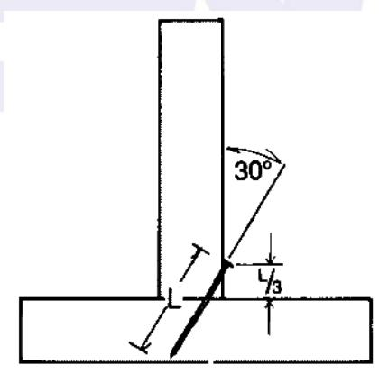

Gambar 11A - Sambungan Paku Miring

**11.1.6.5** Minimum penetrasi paku atau pantek,  $p_{min}$ , termasuk ujung yang runcing dimana bagian dari penetrasi masuk ke dalam komponen struktur utama dari sambungan satu bidang geser atau komponen struktur samping dari sambungan dua bidang geser harus enam kali diameter  $p_{min}$  = 6D.

#### Perkecualian

Minimum panjang penetrasi,  $p_{min}$  tidak perlu 6D untuk sambungan dua bidang geser simetris ketika paku dengan diameter 3,8 mm atau lebih kecil diperpanjang setidaknya tiga kali diameter di luar komponen struktur samping, dan komponen struktur samping memiliki tebal sekurang-kurangnya 9,5 mm.

**11.1.6.6** Jarak tepi, jarak ujung dan spasi harus cukup untuk mencegah belah pada kayu.

© BSN 2013 77 dari 318

## **11.1.7 Baut Dorong dan Pin Dorong**

- **11.1.7.1** Lubang penuntun harus dibor 0 mm hingga 0,8 mm lebih kecil dari diameter aktual pin.
- **11.1.7.2** Penetrasi tambahan pin ke dalam komponen struktur harus disediakan sebagai pengganti cincin, kepala, dan mur pada baut umumnya (lihat referensi 53 untuk informasi tambahan)
- **11.1.7.3** Jarak tepi, jarak ujung dan spasi harus tidak kurang dari persyaratan pada Tabel 11.5.1 A sampai D.

## **11.1.8 Pengencang tipe-pasak lainnya**

Ketika persyaratan pemasangan atau pabrikasi sambungan dan tipe pengencang berbeda dengan yang dispesifikasikan pada 11.1.3, 11.1.4,, 11.1.5, 11.1.6 dan 11.1.7 ketentuan pada 11.2 dan 11.3 diperbolehkan untuk digunakan dalam perhitungan nilai desain kuat cabut dan kuat lateral acuan , dibuat untuk memperhitungkan variasi tersebut. Jarak tepi, jarak ujung dan spasi harus cukup untuk mencegah belah pada kayu.

# **11.2 Nilai Desain Cabut Acuan**

# **11.2.1 Sekrup Kunci**

**11.2.1.1** Nilai desain cabut acuan, dalam N/mm penetrasi ulir, untuk sekrup kunci tunggal dimasukkan ke dalam serat sisi dari komponen struktur kayu , dengan sumbu sekrup kunci tegak lurus serat kayu, harus ditentukan dari Tabel 11.2A atau persamaan 11.2-1, dengan interval berat jenis, G dan diameter sekrup diberikan pada Tabel 11.2A. Nilai desain cabut acuan, W, harus dikalikan dengan semua faktor koreksi yang berlaku (lihat Tabel 10.3.1) untuk memperoleh nilai desain acuan terkoreksi, W'.

$$W = 27,86G^{3/2}D^{3/4}$$
 (11.2-1)

- **11.2.1.2** Untuk hitungan nilai desain cabut acuan pengencang dalam N*,* satuan nilai desain cabut acuan dalam N/mm pada penetrasi dari 11.2.1.1 harus dikalikan dengan panjang penetrasi, pt, pada komponen struktur kayu.
- **11.2.1.3** Ketika sekrup kunci dibebani cabut pada serat ujung, nilai desain cabut acuan, W, harus dikalikan dengan faktor serat ujung, Ceg = 0,75.
- **11.2.1.4** Ketika sekrup kunci dibebani cabut, kuat tarik sekrup kunci pada bagian penampang neto (akar) tidak boleh terlampaui (lihat 10.2.3 dan Lampiran L2).

# **Tabel 11.2A - Nilai Desain Cabut Acuan Sekrup kunci (W)1**

Tabel nilai desain cabut (W) dalam N/mm penetrasi bagian ulir ke serat luar komponen struktur utama. Panjang penetrasi bagian ulir pada komponen struktur utama harus tidak memasukkan bagian ujung yang ditirus (lihat 11.2.1.1)

| Berat jenis |      |    |    |     |                       | Diameter sekrup kunci (D) |       |       |       |       |       |      |
|-------------|------|----|----|-----|-----------------------|---------------------------|-------|-------|-------|-------|-------|------|
| G2          | 6,35 |    |    |     | 7,94 9,53 11,11 12,70 | 15,88                     | 19,05 | 22,23 | 25,40 | 28,58 | 31,75 |      |
| 0,73        | 70   | 82 | 94 | 106 | 117                   | 138                       | 158   | 178   | 197   | 215   | 232   |      |
| 0,71        | 67   | 79 | 90 | 101 | 112                   | 133                       | 152   | 171   | 189   | 206   | 223   |      |
| 0,68        | 62   | 74 | 85 | 95  | 105                   | 124                       | 142   | 160   | 177   | 193   | 209   |      |
| 0,67        | 61   | 72 | 83 | 93  | 103                   | 122                       | 139   | 156   | 173   | 189   | 204   |      |
| 0,58        | 49   | 58 | 67 | 75  | 83                    | 98                        | 112   | 126   | 139   | 152   | 165   |      |
| 0,55        | 45   | 54 | 62 | 69  | 76                    | 90                        | 104   | 116   | 129   | 140   | 152   |      |
| 0,51        | 41   | 48 | 55 | 62  | 68                    | 81                        | 93    | 104   | 115   | 125   | 136   |      |
| 0,50        | 39   | 47 | 53 | 60  | 66                    | 78                        | 90    | 101   | 111   | 122   | 132   |      |
| 0,49        | 38   | 45 | 52 | 58  | 64                    | 76                        | 87    | 98    | 108   | 118   | 128   |      |
| 0,47        | 36   | 42 | 49 | 55  | 60                    | 71                        | 82    | 92    | 102   | 111   | 120   |      |
| 0,46        | 35   | 41 | 47 | 53  | 58                    | 69                        | 79    | 89    | 98    | 107   | 116   |      |
| 0,44        | 33   | 38 | 44 | 49  | 55                    | 65                        | 74    | 83    | 92    | 100   | 109   |      |
| 0,43        | 31   | 37 | 43 | 48  | 53                    | 62                        | 72    | 80    | 89    | 97    | 105   | N/mm |
| 0,42        | 30   | 36 | 41 | 46  | 51                    | 60                        | 69    | 78    | 86    | 94    | 101   |      |
| 0,41        | 29   | 35 | 40 | 45  | 49                    | 58                        | 67    | 75    | 83    | 90    | 98    |      |
| 0,40        | 28   | 33 | 38 | 43  | 47                    | 56                        | 64    | 72    | 80    | 87    | 94    |      |
| 0,39        | 27   | 32 | 37 | 41  | 46                    | 54                        | 62    | 69    | 77    | 84    | 91    |      |
| 0,38        | 26   | 31 | 35 | 40  | 44                    | 52                        | 60    | 67    | 74    | 81    | 87    |      |
| 0,37        | 25   | 30 | 34 | 38  | 42                    | 50                        | 57    | 64    | 71    | 77    | 84    |      |
| 0,36        | 24   | 28 | 33 | 37  | 40                    | 48                        | 55    | 62    | 68    | 74    | 80    |      |
| 0,35        | 23   | 27 | 31 | 35  | 39                    | 46                        | 53    | 59    | 65    | 71    | 77    |      |
| 0,31        | 19   | 23 | 26 | 29  | 32                    | 38                        | 44    | 49    | 54    | 59    | 64    |      |

- 1. Nilai desain cabut acuan yang ditabelkan,W, untuk sambungan sekrup kunci harus dikalikan dengan semua faktor penyesuaian yang dapat dipakai (Lihat Tabel 10.3.1).
- 2. Berat jenis, G, harus ditetapkan sesuai dengan Tabel 11.3.3A

# **11.2.2 Sekrup Kayu**

**11.2.2.1** Nilai desain cabut acuan, dalam N/mm penetrasi, untuk satu sekrup kayu dimasukkan ke serat samping, dengan sumbu sekrup kayu tegak lurus serat kayu, harus ditentukan dari Tabel 11.2B atau persamaan 11.2-2, dalam interval berat jenis dan diameter sekrup pada Tabel 11.2B. Nilai desain cabut acuan, W, harus dikalikan dengan semua faktor koreksi yang berlaku (lihat Tabel 10.3.1) untuk memperoleh nilai desain acuan terkoreksi, W'.

$$W = 19,65G^2D (11.2-2)$$

- **11.2.2.2** Untuk hitungan nilai desain cabut acuan pada pengencang dalam N*,* satuan nilai desain cabut acuan dalam N/mm pada penetrasi dari 11.2.2.1 harus dikalikan dengan panjang penetrasi, pt, dalam komponen struktur kayu.
- **11.2.2.3** Sekrup kayu harus tidak dibebani cabut dari serat ujung kayu
- **11.2.2.4** Ketika sekrup kayu dibebani cabut, kuat tarik terkoreksi dari sekrup kayu pada bagian penampang neto (diameter akar, D) tidak boleh terlampaui (lihat 10.2.3).

**© BSN 2013 79 dari 318**

# **11.2.3 Paku dan Pantek**

**11.2.3.1** Nilai desain cabut acuan, dalam N/mm penetrasi, untuk satu paku atau pantek yang dimasukkan ke dalam serat sisi dari komponen struktur utama, dengan sumbu paku atau pantek tegak lurus serat kayu, harus ditentukan dari Tabel 11.2C atau persamaan 11.2- 3, dalam interval berat jenis dan diameter sekrup pada Tabel 11.2C. Nilai desain cabut acuan, W, harus dikalikan dengan semua faktor koreksi yang berlaku (lihat Tabel 10.3.1) untuk memperoleh nilai desain acuan terkoreksi, W'.

$$W = 9.51G^{5/2}D \tag{11.2-3}$$

- **11.2.3.2** Untuk hitungan nilai desain cabut acuan pada pengencang dalam N*,* satuan nilai desain cabut acuan dalam N/mm pada penetrasi dari 11.2.3.1 harus dikalikan dengan panjang penetrasi, pt, dalam komponen struktur kayu.
- **11.2.3.3** Nilai desain cabut acuan, dalam N/mm penetrasi, untuk sebuah paku p*ost-frame ring shank* yang digerakan ke dalam serat samping dari komponen struktur utama, dengan sumbu paku tegak lurus serat kayu, harus ditentukan dari Tabel 11.2D atau persamaan 11.2- 4, dalam interval berat jenis dan diameter sekrup pada Tabel 11.2D. Nilai desain cabut acuan, W, harus dikalikan dengan semua faktor koreksi yang berlaku (lihat Tabel 10.3.1) untuk memperoleh nilai desain acuan terkoreksi, W'.

$$W = 70,86G^2D (11.2-4)$$

- **11.2.2.4** Untuk hitungan nilai desain cabut acuan pada pengencang dalam N*,* satuan nilai desain cabut acuan dalam N/mm pada penetrasi dari 11.2.3.3 harus dikalikan dengan panjang penetrasi, pt, pada komponen struktur kayu.
- **11.2.3.4** Paku dan pantek tidak boleh dibebani cabut dari serat ujung kayu

# **11.2.4 Baut Dorong dan Pin Dorong**

Nilai desain cabut acuan, W, untuk sambungan baut dorong dan pin dorong harus ditentukan sesuai dengan 10.1.1.3.

Tabel 11.2B - Nilai Desain Cabut Acuan Sekrup Kayu (W)1

Tabel nilai desain cabut (W) dalam N/mm penetrasi bagian ulir ke serat luar komponen struktur utama. (lihat 11.2.2.1)

| Berat jenis | Diameter ulir sekrup kayu |      |      |      |      |      |      |      |      |      |      |      |
|----------------|---------------------------|------|------|------|------|------|------|------|------|------|------|------|
| G 2 | 3,51                      | 3,83 | 4,16 | 4,50 | 4,80 | 5,49 | 6,15 | 6,81 | 7,47 | 8,13 | 9,45 | mm   |
| 0,73           | 37                        | 40   | 44   | 47   | 50   | 57   | 64   | 71   | 78   | 85   | 99   |      |
| 0,71           | 35                        | 38   | 41   | 45   | 48   | 54   | 61   | 67   | 74   | 81   | 94   |      |
| 0,68           | 32                        | 35   | 38   | 41   | 44   | 50   | 56   | 62   | 68   | 74   | 86   |      |
| 0,67           | 31                        | 34   | 37   | 40   | 42   | 48   | 54   | 60   | 66   | 72   | 83   |      |
| 0,58           | 23                        | 25   | 27   | 30   | 32   | 36   | 41   | 45   | 49   | 54   | 62   |      |
| 0,55           | 21                        | 23   | 25   | 27   | 29   | 33   | 37   | 40   | 44   | 48   | 56   |      |
| 0,51           | 18                        | 20   | 21   | 23   | 25   | 28   | 31   | 35   | 38   | 42   | 48   |      |
| 0,50           | 17                        | 19   | 20   | 22   | 24   | 27   | 30   | 33   | 37   | 40   | 46   |      |
| 0,49           | 17                        | 18   | 20   | 21   | 23   | 26   | 29   | 32   | 35   | 38   | 45   |      |
| 0,47           | 15                        | 17   | 18   | 20   | 21   | 24   | 27   | 30   | 32   | 35   | 41   |      |
| 0,46           | 15                        | 16   | 17   | 19   | 20   | 23   | 26   | 28   | 31   | 34   | 39   | N/mm |
| 0,44           | 13                        | 15   | 16   | 17   | 18   | 21   | 23   | 26   | 28   | 31   | 36   |      |
| 0,43           | 13                        | 14   | 15   | 16   | 17   | 20   | 22   | 25   | 27   | 30   | 34   |      |
| 0,42           | 12                        | 13   | 14   | 16   | 17   | 19   | 21   | 24   | 26   | 28   | 33   |      |
| 0,41           | 12                        | 13   | 14   | 15   | 16   | 18   | 20   | 22   | 25   | 27   | 31   |      |
| 0,40           | 11                        | 12   | 13   | 14   | 15   | 17   | 19   | 21   | 23   | 26   | 30   |      |
| 0,39           | 10                        | 11   | 12   | 13   | 14   | 16   | 18   | 20   | 22   | 24   | 28   |      |
| 0,38           | 10                        | 11   | 12   | 13   | 14   | 16   | 17   | 19   | 21   | 23   | 27   |      |
| 0,37           | 9                         | 10   | 11   | 12   | 13   | 15   | 17   | 18   | 20   | 22   | 25   |      |
| 0,36           | 9                         | 10   | 11   | 11   | 12   | 14   | 16   | 17   | 19   | 21   | 24   |      |
| 0,35           | 8                         | 9    | 10   | 11   | 12   | 13   | 15   | 16   | 18   | 20   | 23   |      |
| 0,31           | 7                         | 7    | 8    | 8    | 9    | 10   | 12   | 13   | 14   | 15   | 18   |      |

1. Nilai desain cabut acuan yang ditabelkan,W, untuk sambungan sekrup kunci darus dikalikan dengan semua faktor penyesuaian yang dapat dipakai (Lihat Tabel 10.3.1).

© BSN 2013 81 dari 318

2. Berat jenis, G, harus ditetapkan sesuai dengan Tabel 11.3.3A

Tabel 11.2C - Nilai Desain Cabut Acuan Paku dan Pantek (W)1

Tabel nilai desain cabut (W) dalam N/mm penetrasi bagian ulir ke serat luar komponen struktur utama (lihat Lampiran L)

| 1 4 5 5 1 111  | Da Da |            |            |              | dan pantek |            |        | an am R | C ociui | Paku ka  |          | on on a  | ttai ate | arria (iii | at Lain  | pirari | -/    |       |       |       |       |
|----------------|-------|------------|------------|--------------|------------|------------|--------|---------|---------|----------|----------|----------|----------|------------|----------|--------|-------|-------|-------|-------|-------|
| Dorot          | I a   | Ku Kawai L | лаза, раки | i persegi, c | Тап рапск  | Kawat bias | sa     |         |         | i aku ka | wat uiii |          |          |            |          |        |       |       |       |       |       |
| Berat jenis | 0,099 | 0,113      | 0,128      | 0,131        | 0,135      | 0,148      | 0,162  | 0,192   | 0,207   | 0,225    | 0,244    | 0,263    | 0,283    | 0,312      | 0,375    | 0,12   | 0,135 | 0,148 | 0,177 | 0,207 | in    |
| G 2 | 2,5   | 2,9        | 3,3        | 3,3          | 3,4        | 3,8        | 4,1    | 4,9     | 5,3     | 5,7      | 6,2      | 6,7      | 7,2      | 7,9        | 9,5      | 3,0    | 3,4   | 3,8   | 4,5   | 5,3   | mm    |
| 0,73           | 11    | 15         | 16         | 17           | 17         | 19         | 21     | 25      | 27      | 29       | 31       | 34       | 36       | 40         | 48       | 14     | 16    | 18    | 21    | 25    |       |
| 0,71           | 10    | 14         | 16         | 16           | 16         | 18         | 20     | 23      | 25      | 27       | 30       | 32       | 34       | 38         | 46       | 13     | 15    | 17    | 20    | 23    |       |
| 0,68           | 9     | 13         | 14         | 15           | 15         | 17         | 18     | 21      | 23      | 25       | 27       | 29       | 32       | 35         | 42       | 12     | 14    | 15    | 18    | 21    |       |
| 0,67           | 9     | 12         | 14         | 14           | 15         | 16         | 18     | 21      | 22      | 24       | 26       | 29       | 31       | 34         | 41       | 12     | 13    | 14    | 17    | 20    |       |
| 0,58           | 6     | 9          | 10         | 11           | 11         | 12         | 13     | 16      | 17      | 18       | 20       | 21       | 23       | 25         | 30       | 8      | 9     | 10    | 12    | 14    |       |
| 0,55           | 5     | 8          | 9          | 10           | 10         | 11         | 12     | 14      | 15      | 16       | 18       | 19       | 21       | 23         | 27       | 7      | 8     | 9     | 10    | 12    |       |
| 0,51           | 4     | /          | 8          | 8            | 8          | 9          | 10     | 12      | 13      | 14       | 15       | 17       | 18       | 20         | 24       | 6      | /     | /     | 9     | 10    | N.1./ |
| 0,50           | 4     | /          | 8          | 8            | 8          | 9          | 10     | 12      | 13      | 14       | 15       | 16       | 17       | 19         | 23       | 6      | 6     | /     | 8     | 10    | N/mm  |
| 0,49           | 4     | /          | 7          | 8            | 8          | 9          | 9      | 11      | 12      | 13       | 14       | 15       | 16       | 18         | 22       | 5      | 6     | /     | 8     | 9     |       |
| 0,47           | 4     | 6          | /          | /            | /          | 8          | 9      | 10      | 11      | 12       | 13       | 14       | 15       | 17         | 20       | 5      | 5     | 6     | /     | 8     |       |
| 0,46           | 3     | 6          | /          | /            | /          | 8          | 8      | 10      | 11      | 12       | 12       | 13       | 14       | 16         | 19       | 5      | 5     | 0     | /     | 8     |       |
| 0,44 0,43   | 3     | 5          | 0          | 0            | 0          | 7          | 8 7 | 9       | 10 9 | 11 10 | 11 11 | 12 12 | 13 13 | 15 14   | 18 17 | 4      | 5     | 5     | 0     | 7     |       |
| 0,43           | 2     | 5          | 6          | 6            | 6          | 6          | 7      | 9       | 9       | 10       | 10       | 12       | 12       | 13         | 16       | 4      | 4     | 5     | 5     | 6     |       |
| 0,42           | 3     | 5          | 5          | 5            | 5          | 6          | 7      | Q       | 8       | 0        | 10       | 11       | 12       | 13         | 15       | 4 2    | 4     | 3     | 5     | 6     |       |
| 0,41           | 2     | 4          | 5          | 5            | 5          | 6          | 6      | 7       | 8       | 9        | 9        | 10       | 11       | 12         | 14       | 3      | 4     | 4     | 5     | 5     |       |
| 0,39           | 2     | 4          | 5          | 5            | 5          | 5          | 6      | 7       | 8       | 8        | 9        | 10       | 10       | 11         | 14       | 3      | 3     | 4     | 4     | 5     |       |
| 0,38           | 2     | 4          | 4          | 5            | 5          | 5          | 6      | 7       | 7       | 8        | 9        | 9        | 10       | 11         | 13       | 3      | 3     | 4     | 4     | 5     |       |
| 0,37           | 2     | 4          | 4          | 4            | 4          | 5          | 5      | 6       | 7       | 7        | 8        | 9        | 9        | 10         | 12       | 3      | 3     | 3     | 4     | 5     |       |
| 0,36           | 2     | 4          | 4          | 4            | 4          | 5          | 5      | 6       | 6       | 7        | 8        | 8        | 9        | 10         | 12       | 2      | 3     | 3     | 4     | 4     |       |
| 0,35           | 2     | 3          | 4          | 4            | 4          | 4          | 5      | 6       | 6       | 7        | 7        | 8        | 8        | 9          | 11       | 2      | 3     | 3     | 3     | 4     |       |
| 0,31           | 1     | 3          | 3          | 3            | 3          | 3          | 4      | 4       | 5       | 5        | 6        | 6        | 7        | 7          | 9        | 2      | 2     | 2     | 2     | 3     |       |

1. Nilai desain cabut acuan yang ditabelkan,W, untuk sambungan sekrup kunci darus dikalikan dengan semua faktor penyesuaian yang dapat dipakai (Lihat Tabel 10.3.1).

© BSN 2013 82 dari 312

2. Berat jenis, G, harus ditetapkan sesuai dengan Tabel 11.3.3A

**Tabel 11.2D - Nilai Desain Cabut Acuan Paku** *post-frame ring shank* **(W)1**

Tabel nilai desain cabut (W) dalam N/mm penetrasi bagian ulir ke serat luar komponen struktur utama (lihat Lampiran Tabel L5)

|             |       | Diameter, D |       |       |       |      |  |  |  |  |  |  |
|-------------|-------|-------------|-------|-------|-------|------|--|--|--|--|--|--|
| Berat jenis | 0,135 | 0,148       | 0,177 | 0,200 | 0,207 | (in) |  |  |  |  |  |  |
| G2          | 3,4   | 3,8         | 4,5   | 5,1   | 5,3   | (mm) |  |  |  |  |  |  |
| 0,73        | 15    | 19          | 23    | 26    | 27    |      |  |  |  |  |  |  |
| 0,71        | 14    | 18          | 22    | 24    | 25    |      |  |  |  |  |  |  |
| 0,68        | 12    | 17          | 20    | 22    | 23    |      |  |  |  |  |  |  |
| 0,67        | 12    | 16          | 19    | 22    | 22    |      |  |  |  |  |  |  |
| 0,58        | 8     | 12          | 14    | 16    | 17    |      |  |  |  |  |  |  |
| 0,55        | 7     | 11          | 13    | 15    | 15    |      |  |  |  |  |  |  |
| 0,51        | 6     | 9           | 11    | 13    | 13    |      |  |  |  |  |  |  |
| 0,50        | 6     | 9           | 11    | 12    | 13    |      |  |  |  |  |  |  |
| 0,49        | 5     | 9           | 10    | 12    | 12    |      |  |  |  |  |  |  |
| 0,47        | 5     | 8           | 9     | 11    | 11    | N/mm |  |  |  |  |  |  |
| 0,46        | 5     | 8           | 9     | 10    | 11    |      |  |  |  |  |  |  |
| 0,44        | 4     | 7           | 8     | 9     | 10    |      |  |  |  |  |  |  |
| 0,43        | 4     | 7           | 8     | 9     | 9     |      |  |  |  |  |  |  |
| 0,42        | 4     | 6           | 8     | 9     | 9     |      |  |  |  |  |  |  |
| 0,41        | 4     | 6           | 7     | 8     | 8     |      |  |  |  |  |  |  |
| 0,40        | 3     | 6           | 7     | 8     | 8     |      |  |  |  |  |  |  |
| 0,39        | 3     | 5           | 7     | 7     | 8     |      |  |  |  |  |  |  |
| 0,38        | 3     | 5           | 6     | 7     | 7     |      |  |  |  |  |  |  |
| 0,37        | 3     | 5           | 6     | 7     | 7     |      |  |  |  |  |  |  |
| 0,36        | 3     | 5           | 6     | 6     | 6     |      |  |  |  |  |  |  |
| 0,35        | 2     | 4           | 5     | 6     | 6     |      |  |  |  |  |  |  |
| 0,31        | 2     | 3           | 4     | 5     | 5     |      |  |  |  |  |  |  |

- 1. Nilai desain cabut acuan yang ditabelkan,W, untuk sambungan sekrup kunci darus dikalikan dengan semua faktor penyesuaian yang dapat dipakai (Lihat Tabel 10.3.1).
- 2. Berat jenis, G, harus ditetapkan sesuai dengan Tabel 11.3.3A

## **11.3 Nilai desain lateral acuan**

## **11.3.1 Persamaan Batas Leleh**

Nilai desain lateral acuan, Z, untuk sambungan satu bidang geser dan dua bidang geser simetri menggunakan pengencang tipe-pasak harus diambil yang terkecil dari perhitungan nilai ragam kelelehan menggunakan persamaan pada Tabel 11.3.1A dan 11.3.1B (lihat Gambar 11B, 11C, dan Lampiran I,) dimana:

- (a) muka komponen struktur yang disambungkan saling bersentuhan
- (b) beban bekerja tegak lurus terhadap sumbu pasak
- (c) jarak tepi, jarak ujung dan spasi tidak lebih kecil dari persyaratan pada 11.5, dan
- (d) kedalaman penetrasi pengencang pada komponen struktur utama untuk sambungan satu bidang geser atau komponen struktur samping pemegang pada sambungan dengan dua bidang geser lebih besar atau sama dengan minimum penetrasi yang disyaratkan (lihat 11.1)

**© BSN 2013 83 dari 318**

## **11.3.2 Kondisi Umum Sambungan**

Nilai desain lateral acuan, Z, untuk sambungan menggunakan baut (Lihat Tabel 11A sampai I), sekrup kunci (lihat Tabel 11J dan K), sekrup kayu (lihat Tabel 11L dan M), paku dan pantek (lihat Tabel 11N dan R), dan paku *post-frame ring shank* (lihat Tabel 11S dan T), dihitung untuk kondisi sambungan pada umumnya yang disesuaikan dengan persamaan mode kelelehan pada Tabel 11.3.1A dan 11.3.1B. Nilai desain lateral acuan yang ditabelkan, Z, harus dikalikan dengan Tabel catatan kaki yang dapat digunakan sehingga dapat ditentukan nilai desain lateral acuan, Z'.

.

Tabel 11.3.1A - Persamaan Batas Leleh

| Mode Kelelehan  | Geser Tunggal                                                           |                                                | G  | Seser Ganda                                                                |            |
|--------------------|-------------------------------------------------------------------------|------------------------------------------------|----|----------------------------------------------------------------------------|------------|
| I m     | Z= D l m F em                                     | — (11.3-1)                                     | Z= | D ℓ m F em                                           | - (11.3-7) |
| I s     | $Z = \frac{D \ell_s F_{es}}{R_d}$                                       | (11.3-2)                                       | Z= | 2D $\ell_s$ $F_{es}$                                                       | - (11.3-8) |
| II                 | $Z = \frac{k_1 D \ell_s F_{es}}{R_d}$                                   | (11.3-3)                                       |    |                                                                            |            |
| $III_{m}$          | $Z = \frac{k_2 D \ell_s F_{em}}{(1+2R_e)R_d}$                           | (11.3-4)                                       |    |                                                                            |            |
| $III_{s}$          | $Z=\frac{k_3 D \ell_s F_{em}}{(2+R_e)R_d}$                              | (11.3-5)                                       | Z= | $2k_3 D \ell_s F_{em}$ (2+R e )R d                   | - (11.3-9) |
| IV                 | $Z = \frac{D^2}{Rd} \sqrt{\frac{2 \text{ Fem Fyb}}{3(1 + \text{Re})}}$  | (11.3-6)                                       | Z= | $\frac{2D^2}{\text{Rd}} \sqrt{\frac{2 \text{ Fem Fyb}}{3(1 + \text{Re})}}$ | (11.3-10)  |
| Catatan:           | •                                                                       |                                                | 1  | •                                                                          |            |
| k 1 = — | $\sqrt{Re + 2Re^2(1 + Rt + Rt^2) + Rt^2}$ (1+R e )           | $Rt^2Re^3$ -R e (1+R t ) |    |                                                                            |            |
| k 2 =   | $-1+\sqrt{2(1+Re)+\frac{2Fyb(1+2Re)D^2}{3Fem \ell m^2}}$                |                                                |    |                                                                            |            |
| k 3 =   | $-1 + \sqrt{\frac{2(1+Re)}{Re} + \frac{2Fyb(2+Re)D^2}{3Fem  \ell s^2}}$ |                                                |    |                                                                            |            |
| D =                | diameter, mm (lihat 11.3.6)                                             |                                                |    |                                                                            |            |

© BSN 2013

85 dari 318

Fyb = kekuatan leleh lentur pasak, MPa Rd = syarat reduksi (lihat Tabel 11.3.1B) Re = Fem/Fes Rt = ℓm/ℓsℓm= panjang tumpu pasak pada komponen struktur utama, mm

Fem= kekuatan tumpu pasak pada komponen struktur utama, MPa (lihat Tabel 11.3.2)

= panjang tumpu pasak pada komponen struktur samping, mm

ℓs

Fes= kekuatan tumpu pasak pada komponen struktur samping, MPa (lihat Tabel 11.3.2)

**© BSN 201386 dari 312**

**Tabel 11.3.1B - Istilah Reduksi, Rd** 

|                                              | Ukuran Pengencang                                                                                         | Ragam Kelelehan        | Nilai Reduksi, Rd |  |  |  |
|----------------------------------------------|-----------------------------------------------------------------------------------------------------------|------------------------|-------------------|--|--|--|
|                                              | 6,35mm < D< 25,4mm                                                                                        | Im,Is                  | 4 Kθ              |  |  |  |
|                                              |                                                                                                           | II                     | 3,6 Kθ            |  |  |  |
|                                              |                                                                                                           | IIIm,IIIs,IV           | 3,2 Kθ            |  |  |  |
| D< 6,35mm                                    |                                                                                                           | Im,Is, II,IIIm,IIIs,IV | 1 KD           |  |  |  |
| Catatan:                                     |                                                                                                           |                        |                   |  |  |  |
| Kθ= θ=                                    | sudut pembebanan maksimum terhadap serat (0<θ<90) untuk seluruh komponen struktur dalam satu sambungan |                        |                   |  |  |  |
| diameter, mm (lihat 11.3.6) D=            |                                                                                                           |                        |                   |  |  |  |
| KD=                                          | 2,2                                                                                                       | untuk D < 4,318 mm     |                   |  |  |  |
| KD= 10D+0,5 untuk 4,318mm < D < 5,35mm |                                                                                                           |                        |                   |  |  |  |

1 . Untuk pengencang berulir dimana diameter nominal (Lihat Lampiran L) lebih dari atau sama dengan 6,35 mm dan diameter ujung kurang dari 6,35 mm, Rd=KD KΘ

## **11.3.3 Kuat tumpu pasak**

- **11.3.3.1** Kuat tumpu pasak, Fe, untuk komponen struktur kayu selain panel kayu struktural dan kayu komposit struktural harus ditetapkan berdasarkan pada Tabel 11.3.3.
- **11.3.3.2** Kuat tumpu pasak, Fe, untuk pengencang tipe pasak dengan D < 6,35 mm pada panel kayu struktural harus ditetapkan berdasarkan pada Tabel 11.3.3B.
- **11.3.3.3** Kuat tumpu pasak, Fe, untuk kayu komposit struktural harus diperoleh dari literatur atau laporan evaluasi standar pembuat.
- **11.3.3.4** Ketika pengencang tipe pasak dengan D 6,35 mm dimasukkan ke dalam serat ujung dari komponen utama dengan sumbu pengencang sejajar serat kayu, Fe90 harus digunakan pada penentuan kuat tumpu pasak kayu utama, Fem.

**© BSN 2013 87 dari 318**

**Tabel 11.3.3 - Kuat Tumpu Pasak (MPa)** 

| Berat        | Fe       | Fe‖      |          | Fe┴      |          |                  |          |          |          |          |          |  |  |
|--------------|----------|----------|----------|----------|----------|------------------|----------|----------|----------|----------|----------|--|--|
| jenis1       |          |          |          |          |          | Diameter, D (mm) |          |          |          |          |          |  |  |
| G            | <6,35    | >6,35    | 6,35     | 7,94     | 9,53     | 11,11            | 12,70    | 15,88    | 19,05    | 22,22    | 25,40    |  |  |
| 0.73         | 56       | 51       | 47       | 42       | 38       | 35               | 33       | 29       | 27       | 25       | 23       |  |  |
| 0,72         | 55       | 50       | 46       | 41       | 37       | 34               | 32       | 29       | 26       | 24       | 23       |  |  |
| 0,71         | 53       | 50       | 45       | 40       | 36       | 34               | 32       | 28       | 26       | 24       | 22       |  |  |
| 0,70         | 52       | 49       | 44       | 39       | 36       | 33               | 31       | 28       | 25       | 23       | 22       |  |  |
| 0,69         | 51       | 48       | 43       | 38       | 35       | 32               | 30       | 27       | 25       | 23       | 21       |  |  |
| 0,68         | 49       | 48       | 42       | 38       | 34       | 32               | 30       | 27       | 24       | 22       | 21       |  |  |
| 0,67         | 48       | 47       | 41       | 37       | 34       | 31               | 29       | 26       | 24       | 22       | 21       |  |  |
| 0,66         | 47       | 46       | 40       | 36       | 33       | 30               | 28       | 25       | 23       | 21       | 20       |  |  |
| 0,65         | 45       | 46       | 39       | 35       | 32       | 30               | 28       | 25       | 23       | 21       | 20       |  |  |
| 0,64         | 44       | 45       | 38       | 34       | 31       | 29               | 27       | 24       | 22       | 21       | 19       |  |  |
| 0,63         | 43       | 44       | 38       | 34       | 31       | 28               | 27       | 24       | 22       | 20       | 19       |  |  |
| 0,62         | 41       | 43       | 37       | 33       | 30       | 28               | 26       | 23       | 21       | 20       | 18       |  |  |
| 0,61         | 40       | 43       | 36       | 32       | 29       | 27               | 25       | 23       | 21       | 19       | 18       |  |  |
| 0,60         | 39       | 42       | 35       | 31       | 29       | 26               | 25       | 22       | 20       | 19       | 18       |  |  |
| 0,59         | 38       | 41       | 34       | 31       | 28       | 26               | 24       | 22       | 20       | 18       | 17       |  |  |
| 0,58         | 37       | 41       | 33       | 30       | 27       | 25               | 24       | 21       | 19       | 18       | 17       |  |  |
| 0,57         | 36       | 40       | 32       | 29       | 27       | 25               | 23       | 21       | 19       | 17       | 16       |  |  |
| 0,56         | 34       | 39       | 32       | 28       | 26       | 24               | 22       | 20       | 18       | 17       | 16       |  |  |
| 0,55         | 33       | 39       | 31       | 28       | 25       | 23               | 22       | 20       | 18       | 16       | 15       |  |  |
| 0,54         | 32       | 38       | 30       | 27       | 25       | 23               | 21       | 19       | 17       | 16       | 15       |  |  |
| 0,53         | 31       | 37       | 29       | 26       | 24       | 22               | 21       | 18       | 17       | 16       | 15       |  |  |
| 0,52         | 30       | 36       | 28       | 25       | 23       | 22               | 20       | 18       | 16       | 15       | 14       |  |  |
| 0,51         | 29       | 36       | 28       | 25       | 23       | 21               | 20       | 17       | 16       | 15       | 14       |  |  |
| 0,50         | 28       | 35       | 27       | 24       | 22       | 20               | 19       | 17       | 16       | 14       | 13       |  |  |
| 0,49         | 27       | 34       | 26       | 23       | 21       | 20               | 18       | 17       | 15       | 14       | 13       |  |  |
| 0,48         | 26       | 34       | 25       | 23       | 21       | 19               | 18       | 16       | 15       | 14       | 13       |  |  |
| 0,47         | 25       | 33       | 25       | 22       | 20       | 19               | 17       | 16       | 14       | 13       | 12       |  |  |
| 0,46 0,45 | 24 23 | 32 32 | 24 23 | 21 21 | 19 19 | 18 17         | 17 16 | 15 15 | 14 13 | 13 12 | 12 12 |  |  |
| 0,44         | 22       | 31       | 22       | 20       | 18       | 17               | 16       | 14       | 13       | 12       | 11       |  |  |
| 0,43         | 21       | 30       | 22       | 19       | 18       | 16               | 15       | 14       | 12       | 12       | 11       |  |  |
| 0,42         | 20       | 29       | 21       | 19       | 17       | 16               | 15       | 13       | 12       | 11       | 10       |  |  |
| 0,41         | 19       | 29       | 20       | 18       | 16       | 15               | 14       | 13       | 12       | 11       | 10       |  |  |
| 0,40         | 19       | 28       | 19       | 17       | 16       | 15               | 14       | 12       | 11       | 10       | 10       |  |  |
| 0,39         | 18       | 27       | 19       | 17       | 15       | 14               | 13       | 12       | 11       | 10       | 9        |  |  |
| 0,38         | 17       | 27       | 18       | 16       | 15       | 14               | 13       | 11       | 10       | 10       | 9        |  |  |
| 0,37         | 16       | 26       | 17       | 16       | 14       | 13               | 12       | 11       | 10       | 9        | 9        |  |  |
| 0,36         | 15       | 25       | 17       | 15       | 14       | 13               | 12       | 11       | 10       | 9        | 8        |  |  |
| 0,35         | 14       | 25       | 16       | 14       | 13       | 12               | 11       | 10       | 9        | 9        | 8        |  |  |
| 0,34         | 14       | 24       | 15       | 14       | 13       | 12               | 11       | 10       | 9        | 8        | 8        |  |  |
| 0,33         | 13       | 23       | 15       | 13       | 12       | 11               | 10       | 9        | 8        | 8        | 7        |  |  |
| 0,32         | 12       | 22       | 14       | 13       | 11       | 11               | 10       | 9        | 8        | 8        | 7        |  |  |
| 0,31         | 12       | 22       | 13       | 12       | 11       | 10               | 10       | 8        | 8        | 7        | 7        |  |  |

1 Berat jenis dihitung berdasarkan berat dan volume kering oven

**© BSN 2013 88 dari 312**

2 Fe‖ = 70G, Fe┴ = 185G1,45 /√D; Fe untuk D < 6,35 mm = 100G1,84

**Tabel 11.3.3.A - Berat Jenis Beberapa Kayu Indonesia** 

| No. | Nama perdagangan | Nama botanis              | Berat Jenis Kayu |
|-----|------------------|---------------------------|------------------|
| 1.  | Akasia           | Acacia mangium            | 0.52 (0.47-0.58) |
| 2.  | Bungur           | Lagerstroemia speciosa    | 0.69 (0.58-0.81) |
| 3.  | Damar            | Agathis alba              | 0.48 (0.43-0.54) |
| 4.  | Durian           | Durio zibethinus          | 0.57 (0.42-0.69) |
| 5.  | Jabon            | Anthocephalus cadamba     | 0.42 (0.29-0.56) |
| 6.  | Jati             | Tectona grandis           | 0.67 (0.62-0.75) |
| 7.  | Karet            | Hevea brasiliensis        | 0.59 (0.47-0.73) |
| 8.  | Kayu afrika      | Maesopsis eminii          | 0.41 (0.34-0.48) |
| 9.  | Kayu manis       | Cinnamomum purrectum      | 0.63 (0.40-0.86) |
| 10. | Laban            | Vitex pubescens           | 0.81 (0.72-0.87) |
| 11. | Mahoni           | Swietenia macrophylla     | 0.61 (0.53-0.67) |
| 12. | Matoa            | Pometia pinnata           | 0.77 (0.50-0.99) |
| 13. | Meranti          | Shorea sp                 | 0.63 (0.47-0.83) |
| 14. | Mindi            | Melia excelsa             | 0.53 (0.48-0.57) |
| 15. | Pasang           | Quercus lineata           | 0.96 (0.90-1.10) |
| 16. | Balobo           | Diplodiscus sp            | 0.73 (0.67-0.73) |
| 17. | Puspa            | Schima wallichii          | 0.62 (0.45-0.72) |
| 18. | Rasamala         | Altingia excelsa          | 0.81 (0.61-0.90) |
| 19. | Saninten         | Catanopsis argentea       | 0.73 (0.55-0.85) |
| 20. | Sengon           | Paraserianthes falcataria | 0.33 (0.24-0.49) |
| 21. | Sengon buto      | Enterolobium cyclocarpum  | 0.49 (0.39-0.57) |
| 22. | Sonokeling       | Dalbergia latifolia       | 0.83 (0.77-0.86) |
| 23. | Sonokembang      | Pterocarpus indicus       | 0.65 (0.49-0.84) |
| 24. | Sukun            | Artocarpus altilis        | 0.33 (0.24-0.54) |
| 25. | Sungkai          | Peronema canescens        | 0.63 (0.52-0.73) |
| 26. | Suren            | Toona sureni              | 0.39 (0.27-0.67) |
| 27. | Tusam            | Pinus merkusii            | 0.55 (0.40-0.75) |
| 28. | Waru             | Hibiscus tiliaceus        | 0.54 (0.36-0.64) |
| 29. | Waru gunung      | Hibiscus macrophyllus     | 0.40 (0.36-0.56) |
| 30. | Nyamplung        | Calophyllum inophyllum    | 0.69 (0.56-0.79) |
|     |                  |                           |                  |

**Tabel 11.3.3B - Kuat Tumpu Pasak untuk Panel Kayu Struktural**

| Panel Kayu Struktural       | Berat Jenis, G | Kuat Tumpu Pasak, Fe, dalam N/mm2 untuk D < 6 mm |
|-----------------------------|----------------------|-----------------------------------------------------------|
| Kayu Lapis                  |                      |                                                           |
| Struktural 1 , Marine    | 0,50                 | 32                                                        |
| Kelas Lain1                 | 0,42                 | 23                                                        |
| Papan selumbar terorientasi |                      |                                                           |
| Semua Kelas                 | 0,50                 | 32                                                        |
| 1                           |                      |                                                           |

Gunakan G= 0,42 ketika jenis lapisan tidak diketahui. Ketika jenis lapisan diketahui, berat jenis didaftar untuk jenis sebenarnya dan kuat tumpu pasak yang sesuai dapat digunakan, atau berat rerata dapat digunakan untuk campuran jenis

**© BSN 2013 89 dari 318**

## 11.3.4 Kuat tumpu pasak dengan sudut pada serat

Ketika sebuah komponen struktur pada sambungan dibebani dengan sebuah sudut pada serat, kuat tumpu pasak,  $F_{e\theta}$ , untuk komponen struktur tersebut harus ditentukan sebagai berikut (lihat Lampiran J):

$$F_{e\theta} = \frac{F_{e\Box}F_{e\bot}}{F_{e\Box}\sin^2\theta + F_{e\bot}\cos^2\theta}$$
 (11.3-11)

#### Keterangan:

 $\theta$  = sudut antara arah beban dan arah serat (sumbu longitudinal dari komponen struktur)

## 11.3.5 Panjang tumpu pasak

- **11.3.5.1** Panjang tumpu pasak pada komponen struktur samping dan utama,  $\ell_s$  dan  $\ell_m$ , ditentukan berdasarkan panjang tumpuan pasak tegak lurus terhadap bekerjanya beban.
- **11.3.5.2** Untuk sekrup kunci, sekrup kayu, paku, pantek, dan pengencang tipe pasak sejenis, panjang tumpu pasak,  $\ell_s$  atau  $\ell_m$ , tidak boleh melebihi penetrasi panjang pengencang, p, dalam komponen struktur kayu. Dengan p termasuk panjang ujung tirus, E,  $\ell_s$  atau  $\ell_m$ , tidak boleh melebihi p-E/2.
  - a. Untuk sekrup kunci, E, diizinkan untuk diambil dari Lampiran L, Tabel L2.
  - b. Untuk sekrup kayu, paku, dan pantek, E, diijinkan untuk diambil seperti 2D.

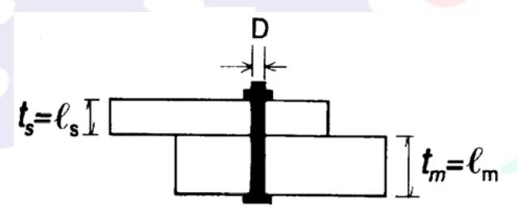

Gambar 11B -Sambungan Baut Geser Tunggal

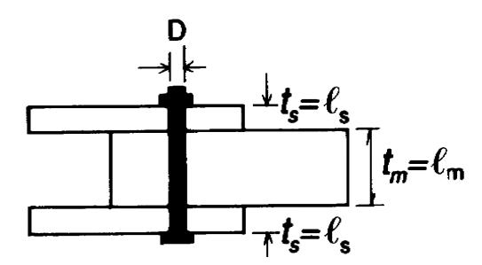

Gambar 11C - Sambungan Baut Geser Ganda

#### 11.3.6 Kuat lentur leleh pasak

- **11.3.6.1** Nilai desain acuan, Z untuk baut, sekrup kunci, sekrup kayu, paku, dan pantek didasarkan pada kuat lentur leleh, Fvb, disajikan pada Tabel 11A sampai 11T.
- **11.3.5.2** Kuat lentur leleh pasak,  $F_{yb}$ , digunakan dalam perhitungan nilai desain acuan, Z, harus didasarkan pada kuat leleh yang diperoleh menggunakan metode yang disediakan pada ASTM F 1575 atau kuat tarik leleh yang diperoleh menurut prosedur ASTM F 606.

#### 11.3.7 Diameter Pasak

- **11.3.7.1** Ketika menggunakan Tabel 11.3-1A dan 11.3-1B, diameter pengencang harus ditentukan sebagai D untuk diameter pengencang tanpa ulir sepenuhnya dan  $D_r$  untuk diameter pengencang tereduksi atau pengencang berulir kecuali yang disediakan pada 11.3.7.2.
- **11.3.7.2** Untuk pengencang berulir penuh (lihat Lampiran L), D boleh dipergunakan sebagai pengganti  $D_r$  jika panjang tumpu yang berulir tidak melebihi 1/4 dari panjang tumpu penuh pada komponen struktur yang memegang bagian ulir. Sebagi alternatif, analisis lebih detil memperhitungkan ketahanan lentur dan tumpu pengencang pada bagian yang berulir diperbolehkan.

# 11.3.8 Sambungan tiga komponen struktur tidak simetrik, geser ganda

Nilai desain acuan, Z, untuk sambungan tiga komponen struktur tidak simetrik harus diambil dari perhitungan ragam kelelehan untuk nilai yang minimum sambungan dua bidang geser simetrik menggunakan panjang tumpu pasak terkecil pada kayu samping sebagai  $\ell_s$  dan diameter minimum pasak, D, terjadi pada bidang geser sambungan

## 11.3.9 Sambungan bidang geser banyak

Untuk sambungan dengan empat komponen struktur atau lebih (lihat Gambar 11D), masingmasing bidang geser harus dievaluasi sebagai sebuah sambungan satu bidang geser. Nilai desain acuan untuk sambungan adalah nilai desain acuan terkecil untuk setiap bidang geser, dikalikan dengan jumlah bidang geser.

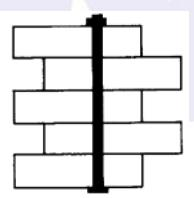

Gambar 11D - Sambungan Baut Banyak Bidang Geser

#### 11.3.10 Beban dengan sudut pada sumbu pengencang

- **11.3.10.1** Ketika beban pada sambungan satu bidang geser (dua komponen struktur) bekerja dengan sudut (selain 90°) terhadap sumbu pengencang, panjang pengencang pada kedua komponen struktur harus ditunjuk sebagai  $\ell_s$  dan  $\ell_m$  (lihat Gambar 11E). Komponen struktur beban yang bekerja pada 90° terhadap sumbu pengencang harus tidak melebihi nilai desain terkoreksi, Z', untuk sambungan dengan dua komponen struktur pada 90° terhadap sumbu pengencang memiliki ketebalan  $t_s = \ell_s$  dan  $t_m = \ell_m$ . Luas tumpu yang cukup harus disediakan untuk menahan beban yang bekerja sejajar sumbu pengencang.
- **11.3.10.2** Untuk sambungan miring, gunakan nilai minimum dari  $t_s$  atau L/3 untuk  $\ell_s$  (lihat Gambar 11A).

© BSN 2013 91 dari 318

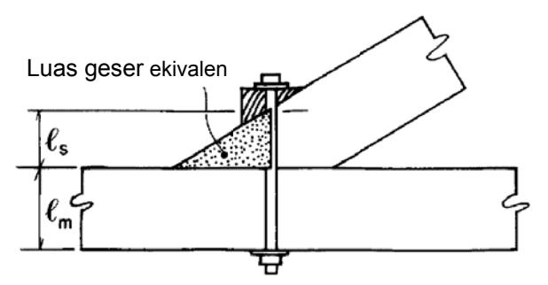

Sambungan komponen struktur bersudut

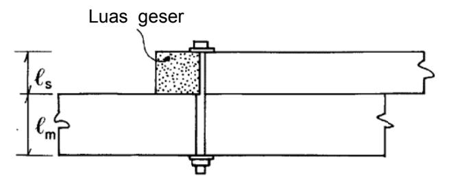

Sambungan komponen struktur sejajar

## Gambar 11E - Luas Geser untuk Sambungan Baut

## 11.3.11 Baut dorong dan Pin dorong

Nilai desain acuan terkoreksi untuk baut dorong dan pin dorong yang masuk ke serat sisi kayu tidak boleh melebihi 75% dari nilai desain lateral terkoreksi untuk baut biasa dengan diameter sama dan panjang pada komponen struktur utama.

## 11.4 Kombinasi beban lateral dan cabut

#### 11.4.1 Sekrup kunci dan sekrup kayu

Ketika sebuah sekrup kunci atau sekrup kayu mengalami kombinasi beban lateral dan cabut, seperti ketika pengencang dimasukan tegak lurus terhadap serat dan beban bekerja pada sudut, α, pada muka kayu (lihat Gambar 11F), nilai desain terkoreksi harus ditentukan sebagai berikut (lihat Lampiran J):

$$Z_{\alpha}' = \frac{(W'p)Z'}{(W'p)\cos^2\alpha + Z'\sin^2\alpha}$$
(11.4-1)

dengan

α = sudut antara muka kayu dengan arah beban kerja

p = panjang penetrasi ulir dalam kayu utama, mm

## 11.4.2 Paku dan pantek

Ketika paku atau pantek menerima kombinasi beban cabut dan lateral, sebagaimana ketika paku atau pantek dimasukkan tegak lurus terhadap serat dan beban bekerja dengan sudut, α, terhadap muka kayu, nilai desain terkoreksi harus ditentukan sebagai berikut:

$$Z_{\alpha}' = \frac{(W'p)Z'}{(W'p)\cos\alpha + Z'\sin\alpha}$$
 (11.4-2)

#### dimana

α = sudut antara muka kayu dengan arah beban kerja

p = panjang penetrasi dalam komponen struktur utama, mm

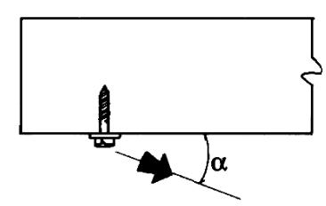

Gambar 11F - Kombinasi Pembebanan Lateral dan cabut

#### 11.5 Koreksi terhadap nilai desain acuan

## 11.5.1 Faktor geometrik, $C_{\Delta}$

**11.5.1.1** Untuk pengencang tipe pasak, ketika D < 6,35 mm,  $C_{\Delta}$  =1,0

**11.5.1.2** Ketika D  $\geq$  6,35 mm dan jarak ujung atau spasi yang disediakan untuk pengencang tipe pasak kurang dari persyaratan minimum untuk  $C_{\Delta}$  = 1,0 untuk semua kondisi (a), (b) atau (c) nilai desain acuan harus dikalikan dengan faktor geometrik berlaku yang terkecil,  $C_{\Delta}$ , ditentukan pada (a), (b) atau (c). Faktor geometrik terkecil untuk semua pengencang dalam satu grup harus berlaku pada semua pengencang dalam satu grup.

Untuk sambungan dengan bidang geser banyak atau sambungan tiga komponen struktur tidak simetri, faktor geometrik terkecil,  $C_{\Delta}$ , untuk setiap bidang geser harus berlaku pada semua pengencang di sambungan.

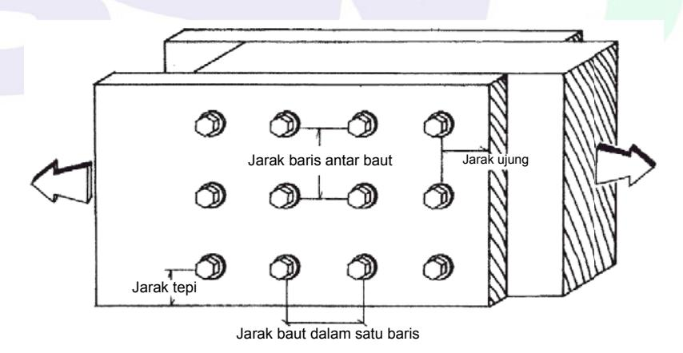

Pembebanan sejajar serat pada seluruh komponen struktur kayu (ZII)

© BSN 2013 93 dari 318

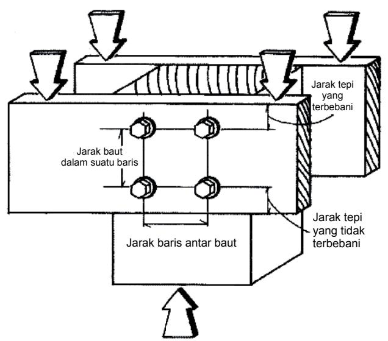

Pembebanan tegak lurus serat pada komponen struktur sisi dan pembebanan sejajar serat pada komponen struktur utama ( $Z_{\perp}$ )

## Gambar 11G - Geometrik Sambungan Baut

(a) ketika pengencang tipe pasak digunakan dan jarak ujung aktual untuk pembebanan sejajar atau tegak lurus serat lebih besar atau sama dengan jarak ujung minimum (lihat Tabel 11.5.1B) untuk  $C_{\Delta}$  = 0,5, tetapi kurang dari jarak ujung minimum untuk  $C_{\Delta}$  = 1,0, faktor geometrik harus ditentukan sebagai berikut:

$$C\Delta = \frac{\text{Jarak ujung aktual}}{\text{Jarak ujung minimum untuk } C\Delta = 1,0}$$

Tabel 11.5.1A - Syarat Jarak Tepi

|                                                                                | Jarak                       | Тері                           |
|--------------------------------------------------------------------------------|-----------------------------|--------------------------------|
| Arah Pembebanan                                                                | Jarak tepi minimum untuk | Jarak tepi minimum untuk |
|                                                                                | $C_{\Delta} = 0.5$          | $C_{\Delta} = 1,0$             |
| Tegak Lurus Serat                                                              | 2D                          | 4D                             |
| Tekan Sejajar Serat: (tumpuan pengencang jauh dari komponen struktur ujung)    | 2D                          | 4D                             |
| Tarik Sejajar Serat: (tumpuan pengencang dekat dengan komponen struktur ujung) |                             |                                |
| - untuk kayu berdaun jarum                                                     | 3,5D                        | 7D                             |
| - untuk kayu berdaun lebar                                                     | 2,5D                        | 5D                             |

(b) Untuk beban dengan sudut pada pengencang, ketika pengencang tipe pasak digunakan, luas geser minimum untuk  $C_\Delta$  = 1,0 harus ekivalen dengan luas geser untuk komponen struktur sambungan sejajar dengan jarak ujung minimum untuk  $C_\Delta$  = 1,0 (lihat Tabel 11.5.1B dan Gambar 11E). Luas geser minimum untuk  $C_\Delta$  = 0,5 harus ekivalen dengan 1/2 luas geser minimum untuk  $C_\Delta$  = 1,0. Ketika luas geser aktual lebih besar atau sama

dengan luas geser minimum untuk  $C_{\Delta}$  = 0,5, tetapi lebih kecil dari luas geser minimum untuk  $C_{\Delta}$  = 1,0, faktor geometrik harus ditentukan sebagai berikut:

- (c)  $C_{\Delta} = \frac{\text{Luas geser aktual}}{\text{Luas geser minimum untuk } C_{\Delta} = 1,0}$
- (d) Ketika spasi aktual diantara baris pengencang tipe pasak untuk pembebanan searah atau tegak lurus serat lebih besar atau sama dengan spasi minimum (lihat Tabel 11.5.1C), tetapi kurang dari spasi minimum untuk  $C_{\Delta}$  = 1,0, faktor geometrik,  $C_{\Delta}$ , harus ditentukan sebagai berikut:

$$C_{_{\Delta}} = \frac{\text{Spasi Aktual}}{\text{Spasi minimum untuk } C_{_{\Delta}} = \text{1,0}}$$

**11.5.1.3** Ketika D  $\geq$  6,35 mm dan jarak ujung atau spasi antar pengencang adalah sesuai dengan Tabel 11.5.1A dan 11.5.1D dan persyaratan berlaku pada 11.1. Jarak tegak lurus serat antar pengencang terluar tidak boleh melebihi 127 mm (lihat Gambar 11H) kecuali tersedia detail khusus untuk mengakomodasi penyusutan serat silang (*cross grain*) pada komponen struktur kayu. Untuk komponen struktur kayu laminasi struktural, jarak tegak lurus serat antar pengencang terluar tidak boleh melebihi batas pada tabel 11.5.1F, kecuali tersedia detil khusus untuk mengakomodasi penyusutan serat silang pada komponen struktur kayu.

Tabel 11.5.1B - Syarat Jarak untuk Pengencang dalam Satu Baris

|                   | Jarak            |                                                         |  |  |  |
|-------------------|------------------|---------------------------------------------------------|--|--|--|
| Arah Pembebanan   | Jarak minimum | Jarak minimum untuk $C_{\Delta}$ = 1,0                  |  |  |  |
| Sejajar Serat     | 3D               | 4D                                                      |  |  |  |
| Tegak Lurus Serat | 3D               | Kebutuhan jarak untuk komponen struktur yang tersambung |  |  |  |

Tabel 11.5.1C- Syarat Jarak Tepi1,2

| Arah Pembebanan                 | Jarak Tepi Minimum                                      |
|---------------------------------|---------------------------------------------------------|
| Sejajar Serat:                  |                                                         |
| ketika ℓ/D <u>&lt;</u> 6        | 1,5 D                                                   |
| ketika ℓ/D >6                   | 1,5 D atau 1/2 spasi antar baris, dipilih yang terbesar |
| Tegak Lurus Serat: 2 |                                                         |
| pembebanan tepi                 | 4 D                                                     |
| tanpa pembebanan tepi           | 1,5 D                                                   |

Rasio  $\ell/D$  digunakan untuk menetapkan jarak tepi minimum yang sebaiknya kurang dari:

- (a) panjang pengencang pada komponen struktur utama kayu/D =  $\ell_m/D$
- (b) Panjang total pengencang pada komponen struktur samping/D = \( \extstyle \rightarrow D \)

Pembebanan dengan konsentrasi berat atau sedang tidak dapat digantungkan di bawah

© BSN 2013 95 dari 318

garis netral pada kayu tunggal atau balok kayu laminasi struktural kecuali perkuatan mekanik atau sama tersedia untuk menahan tegangan tarik tegak lurus serat (lihat 3.8.2 dan 10.1.3)

**Tabel 11.5.1.D - Syarat spasi minimum antar baris** 

| Arah Pembebanan            | Spasi Minimum |
|----------------------------|---------------|
| Paralel Terhadap Serat     | 1,5D          |
| Tegak Lurus Terhadap Serat |               |
| Ketika ℓ/D < 2             | 2,5D          |
| Ketika 2 < ℓ/D <6          | (5ℓ + 10D)/8  |
| Ketika ℓ/D ≥ 6             | 5D            |

1. Rasio ℓ/D digunakan untuk menentukan jarak tepi minimum harus kurang dari

## **11.5.2 Faktor serat ujung, Ceg**

- **11.5.2.1** Ketika sekrup kunci dibebani cabut dari serat ujung, nilai desain cabut acuan, W, harus dikalikan dengan faktor serat ujung, Ceg = 0,75.
- **11.5.2.2** Ketika pengencang tipe-pasak dimasukkan pada serat ujung dari komponen struktur utama, dengan sumbu pengencang sejajar serat kayu, nilai desain lateral acuan, Z, harus dikalikan dengan faktor serat ujung, Ceg = 0,67.

# **11.5.3 Faktor diafragma, Cdi**

Ketika paku atau spikes digunakan pada konstruksi diafragma, nilai desain lateral acuan, Z, harus dikalikan dengan faktor diafragma, Cdi = 1,1.

## **11.5.4 Faktor paku-miring, Ctn**

- **11.5.4.1** Nilai desain cabut acuan, W, untuk sambungan paku-miring harus dikalikan dengan faktor paku-miring, Ctn = 0,67. Faktor Layan basah, CM, tidak boleh digunakan.
- **11.5.4.2** Nilai desain lateral acuan, Z, untuk sambungan paku-miring harus dikalikan dengan faktor paku-miring, Ctn = 0,83.

**Tabel 11.5.1.E - Syarat Jarak Tepi dan Ujung Minimum untuk Beban Cabut Sekrup Kunci dan tidak dibebani lateral** 

| Orientasi   | Jarak/Spasi |  |  |
|-------------|-------------|--|--|
|             | Minimum     |  |  |
| Jarak Tepi  | 1,5D        |  |  |
| Jarak Ujung | 4D          |  |  |
| Spasi       | 4D          |  |  |

a) panjang pengencang dalam balok kayu utama/D= ℓm/D

b) panjang total pengencang dalam balok kayu samping/D= ℓs/D

Tabel 11.5.1F - Syarat Jarak Tegak Lurus Serat untuk Pengencang Terluar pada Komponen Struktur Kayu Glulam Struktural

| Tino Dongonoong  | Kada           | r Air          | Jarak Maksimum antar Baris |
|------------------|----------------|----------------|----------------------------|
| Tipe Pengencang  | saat fabrikasi | saat pelayanan | Terluar (mm)               |
| Samua Danganaana | >16%           | <16%           | 127                        |
| Semua Pengencang | Lain           | >16%           | 127                        |
| Baut             | <16%           | <16%           | 254                        |
| Sekrup Kunci     | <16%           | <16%           | 152                        |
| Pin Desak        | <16%           | <16%           | 152                        |

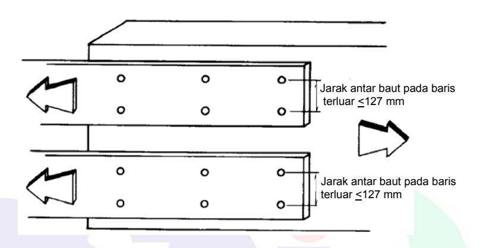

Gambar 11H - Jarak antara baris baut terluar

## 11.6 Pengencang Majemuk

## 11.6.1 Pengencang zig-zag simetrik

Ketika sebuah sambungan memiliki pengencang ganda, alat pengencang sedapat mungkin harus *zig-zag* secara simetrik pada komponen struktur yang dibebani tegak lurus serat (lihat 10.3.6.2 untuk persyaratan desain khusus ketika baut, sekrup kunci atau pin dorong dipasang *zig-zag*)

#### 11.6.2 Alat pengencang yang dibebani dengan sudut terhadap arah serat

Ketika sambungan dengan pengencang majemuk dibebani dengan sudut terhadap arah serat, sumbu titik berat dari masing-masing komponen struktur harus melewati pusat tahanan kelompok pengencang untuk memastikan tegangan yang seragam pada komponen struktur utama dan distribusi beban yang seragam ke semua alat pengencang.

## 11.6.3 Tegangan lokal pada sambungan

Tegangan lokal pada sambungan yang menggunakan alat pengencang majemuk harus dievaluasi sesuai dengan prinsip-prinsip mekanika teknik (lihat 10.1.2).

© BSN 2013 97 dari 318

#### 12 Konektor Cincin Belah Dan Pelat Geser

#### 12.1 Umum

## 12.1.1 Ruang lingkup

Pasal 12 diterapkan untuk desain teknik sambungan menggunakan konektor cincin belah dan pelat geser pada kayu gergajian, kayu glulam struktural dan kayu komposit struktural

#### 12.1.2 Istilah

Sebuah unit konektor harus didefinisikan sebagai salah satu dari hal sebagai berikut:

- (a) Sebuah cincin belah dengan bautnya atau sekrup kunci dengan geser tunggal (lihat Gambar 12A)
- (b) Dua buah pelat geser yang digunakan berpunggungan pada permukaan kontak dari sebuah sambungan kayu ke kayu dengan baut atau sekrup kunci dengan geser tunggal (lihat Gambar 12B dan 12C)
- (c) Sebuah pelat geser dengan baut atau sekrup kunci pada geser tunggal digunakan berhubungan dengan sebuah *strap* baja atau *shape* pada sebuah sambungan kayu ke metal (lihat Gambar 12B dan 12C)

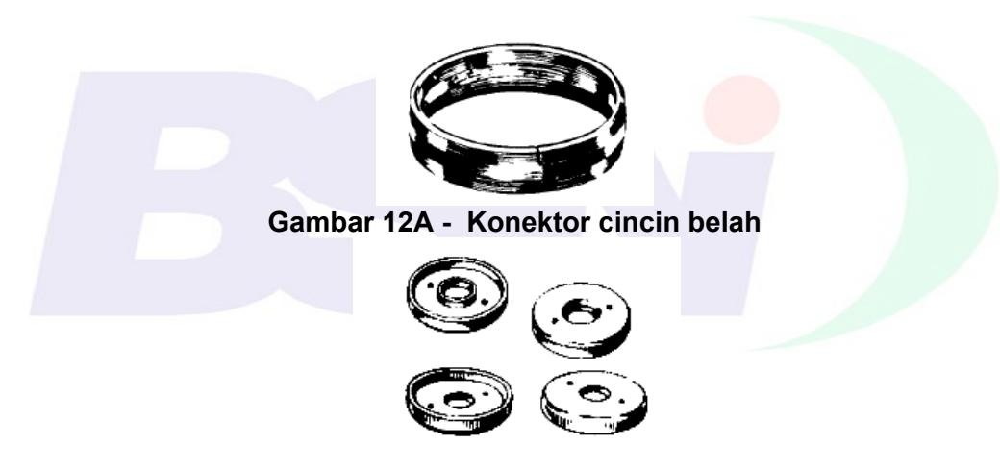

Gambar 12B - Konektor pelat geser baja dengan tekanan

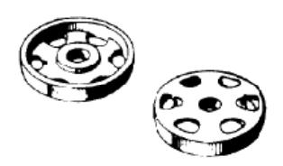

Gambar 12C - Konektor pelat geser besi malleable

#### 12.1.3 Kualitas Konektor Cincin Belah dan Pelat Geser

- **12.1.3.1** Ketentuan desain dan nilai desain acuan yang diberikan dalam Spesifikasi ini berlaku untuk konektor cincin belah dan pelat geser dengan kualitas sebagai berikut:
- (a) Cincin belah dibuat sesuai SNI 07-0722-1989 Baja Canai Panas Untuk Konstruksi Umum atau SAE 1010 baja karbon canai panas (Referensi 37). Setiap cincin harus membentuk lingkaran yang benar-benar tertutup dengan sumbu utama dari penampang metal cincin sejajar terhadap sumbu geometri dari cincin. Cincin harus kencang pas dalam alur takikan awal. Dalam hal ini harus menyatu dengan sebuah cincin, penampang dari metal yang dibevel dari bagian tengah sampai ke tepi, dengan ketebalan tepi yang lebih kecil

- dari bagian tengah, atau dengan metode lain yang menghasilkan kinerja yang sama. Metal tersebut harus dipotong melalui satu tempat dalam kelilingnya untuk membentuk lidah dan selot (lihat Gambar 12A).
- (b) Konektor pelat geser:
  - 1) Tipe Baja Tekan 67 mm– Pelat geser baja tekan dibuat sesuai dengan SNI 07-0722- 1989 Baja Canai Panas Untuk Konstruksi Umum atau SAE 1010 baja karbon canai panas. Setiap pelat harus benar-benar merupakan lingkaran dengan sebuah sayap di sekeliling tepinya, berkembang dari sudut tegak lurus terhadap permukaan dari pelat dan dari satu permukaan saja, bagian dari pelat mempunyai pusat lubang baut dengan *hub* integral yang konsentris terhadap lubang atau tanpa *hub* integral, dan dua buah lubang kecil pada sisi yang berlawanan dari lubang dan tengah dari pusat dan keliling (lihat Gambar 12B).
  - 2) Tipe Besi *Malleable* 100 mm– Pelat geser besi *malleable* dibuat berdasarkan Grade 32510 dari standar ASTM A47 (Referensi 11). Setiap cetakan harus terdiri dari pelat bulat berlubang dengan sebuah sayap di sekeliling tepi ke arah tegak lurus terhadap permukaan dari pelat dan terproyeksi dari satu permukaan saja, bagian dari pelat yang mempunyai pusat lubang baut dengan *hub* integral yang berkembang dari permukaan yang sama seperti sayap (lihat Gambar 12C).
- **12.1.3.2** Dimensi tipikal dari konektor cincin belah atau pelat geser diberikan dalam Lampiran K. Toleransi dimensi dari konektor cincin belah atau pelat geser tidak boleh lebih besar dari yang seharusnya memenuhi praktik standar untuk mesin yang dioperasikan dan digunakan dalam membuat sambungan.
- **12.1.3.3** Baut yang digunakan dengan konektor cincin belah atau pelat geser harus sesuai dengan 11.1.3. Baut harus mempunyai diameter *shank* (badan) nominal yang tak tereduksi sesuai dengan standar ANSI/ASME B18.2.1.(Referensi 7)
- **12.1.3.4** Jika sekrup kunci digunakan menggantikan tempat baut, maka sekrup kunci harus sesuai dengan 11.1.3 dan *shank* dari sekrup kunci harus mempunyai diameter yang sama seperti baut seperti yang ditentukan untuk konektor cincin belah atau pelat geser (lihat Tabel 12.2A dan 12.2B). Sekrup kunci harus mempunyai diameter *shank* (badan) nominal yang tak tereduksi sesuai dengan standar ANSI/ASME B18.2.1. (referensi 7)

## **12.1.4 Pabrikasi dan Perakitan**

- **12.1.4.1** Alur, *daps* dan lubang baut yang disebutkan dalam Lampiran K harus dipotong atau dibor dengan akurat, dan harus dalam orientasi muka kontak. Karena konektor cincin belah dan pelat geser dari pabrik yang berlainan sedikit berbeda dalam bentuk dan penampang, maka kepala pemotong harus didesain untuk menghasilkan *daps* dan alur yang tepat dan sesuai dengan dimensi dan penampang cincin belah tertentu atau pelat geser yang digunakan.
- **12.1.4.2** Jika sekrup kunci digunakan menggantikan baut, maka lubang untuk bagian *shank* tidak berulir harus sama dengan diameter *shank*. Diameter dari lubang untuk bagian berulir dari sekrup kunci harus sekitar 70% dari diameter *shank*, atau seperti ditentukan dalam 11.1.4.2.
- **© BSN 2013 99 dari 318 12.1.4.3** Dalam pemasangan konektor cincin belah atau pelat geser dan baut atau sekrup kunci, sebuah mur harus ditempatkan di setiap baut, dan juga *washers*, tidak lebih kecil dari ukuran yang ditentukan dalam Lampiran K, harus diletakan diantara komponen struktur kayu luar dan kepala baut atau sekrup kunci dan diantara komponen struktur kayu luar dan mur. Jika suatu komponen struktur luar dari sebuah sambungan pelat geser adalah suatu *strap*

baja atau *shape, washer* tidak disyaratkan, kecuali ketika baut atau sekrup kunci yang lebih panjang digunakan, dalam kasus ini *washer* mencegah pelat metal atau *shape* menerima tumpu pada bagian ulir dari baut atau sekrup kunci .

**12.1.4.4** Nilai desain acuan untuk konektor cincin belah dan pelat geser adalah berdasarkan asumsi bahwa terjadi kontak dari permukaan komponen-komponen struktur ketika konektor dipasang, dan diijinkan untuk berbagai variasi kondisi cuaca setelah kayu mencapai kondisi kadar air normal pada kondisi layan. Jika konektor cincin belah dan pelat geser dipasang dalam kayu yang belum mencapai kadar air normal pada kondisi layan, sambungan harus dikencangkan dengan memutar turun mur secara berkala sampai kondisi keseimbangan kadar air tercapai.

## **12.2 Nilai Desain Acuan**

## **12.2.1 Nilai Desain Acuan**

- **12.2.1.1** Tabel 12.2A dan 12.2B berisi nilai desain acuan untuk satu unit konektor cincin belah tunggal atau pelat geser dengan baut untuk irisan tunggal, dipasang pada sisi serat dari dua komponen struktur kayu (Tabel 12A) dengan ketebalan komponen struktur, jarak tepi, jarak ujung dan spasi yang cukup untuk mengembangkan nilai desain acuan. Nilai desain acuan (P, Q) harus dikalikan dengan semua faktor koreksi yang harus diaplikasikan (lihat Tabel 10.3.1) untuk mendapatkan nilai desain terkoreksi (P', Q').
- **12.2.1.2** Nilai desain terkoreksi (P', Q') untuk konektor pelat geser tidak boleh lebih dari batas nilai desain acuan yang ditentukan dalam catatan kaki 2 dari Tabel 12.2B. Batas acuan nilai desain yang ditentukan dalam catatan kaki 2 dari Tabel 12.2B tidak perlu dikalikan dengan faktor koreksi dalam Spesifikasi ini ketika besarnya nilai tersebut berdasarkan pada kekuatan metal daripada kekuatan kayu (lihat 10.2.3).

**Tabel 12A - Kelompok Jenis Kayu untuk Konektor Cincin Belah dan Pelat Geser** 

| Kelompok Jenis | Berat Jenis, G  |
|----------------|-----------------|
| Kayu           |                 |
| A              | G > 0,60        |
| B              | 0,49 < G < 0,60 |
| C              | 0,42 < G < 0,49 |
| D              | 0,42 < G        |

Tabel 12.2A - Nilai Desain Acuan per Unit untuk Konektor Cincin Belah

|                   |                                                        | Jumlah                                                              |                              |                                                |                 | jajar serat (0° |                 | Di                                             | ibebani tegak   | lurus serat (   | 90°)  |      |
|-------------------|--------------------------------------------------------|---------------------------------------------------------------------|------------------------------|------------------------------------------------|-----------------|-----------------|-----------------|------------------------------------------------|-----------------|-----------------|-------|------|
| Diameter          | muka Diameter S. , komponen Tebal neto                 |                                                                     |                              | Nilai desain, P, per unit konektor dan baut, N |                 |                 | an baut, N      | Nilai desain, Q, per unit konektor dan baut, N |                 |                 |       |      |
| cincin belah (mm) | struktur dengan konektor pada baut yg sama | struktur komponen dengan struktur konektor (mm) da baut yg | Jenis Grup A              | Jenis Grup B                                | Jenis Grup C | Jenis Grup D | Jenis Grup A | Jenis Grup B                                | Jenis Grup C | Jenis Grup D |       |      |
|                   |                                                        |                                                                     | 25 mm minimum             | 14119                                          | 12122           | 10079           | 9125            | 9852                                           | 8444            | 7037            | 6038  |      |
| 38                | 12,7                                                   | 1                                                                   | 38 mm atau lebih tebal | 10987                                          | 9443            | 7854            | 6810            | 7673                                           | 6583            | 5493            | 4722  |      |
|                   |                                                        | 2                                                                   | 38 mm minimum             | 14483                                          | 12394           | 10306           | 8898            | 10079                                          | 8671            | 7173            | 6220  |      |
|                   |                                                        | 2                                                                   | 25 mm minimum             | 15118                                          | 12984           | 10805           | 9352            | 10533                                          | 9035            | 7491            | 6538  |      |
|                   |                                                        |                                                                     | 38 mm                        | 19840                                          | 17025           | 14210           | 12258           | 13802                                          | 11895           | 9852            | 8444  |      |
|                   | 100 19                                                 | 1                                                                   | 67 mm atau lebih tebal | 23109                                          | 19794           | 16526           | 14256           | 16072                                          | 13802           | 11486           | 9988  |      |
| 100               |                                                        |                                                                     | 42 mm atau lebih tebal | 15391                                          | 13211           | 10987           | 9489            | 10714                                          | 9171            | 7627            | 6401  |      |
| 100               |                                                        | 30 111                                                              | 38 mm minimum             | 17207                                          | 14710           | 12258           | 10578           | 11986                                          | 10260           | 8535            | 7400  |      |
|                   |                                                        |                                                                     | 50 mm                        | 19567                                          | 16753           | 13983           | 12076           | 13620                                          | 11577           | 9716            | 8399  |      |
|                   |                                                        | 2                                                                   | 63 mm                        | 21928                                          | 18796           | 15663           | 13529           | 15254                                          | 13075           | 10896           | 9352  |      |
|                   |                                                        |                                                                     |                              | 76 mm atau lebih tebal                   | 22836           | 19613           | 16344           | 14119                                          | 15890           | 13620           | 11395 | 9806 |

© BSN 2013 101 dari 318

Tabel 12.2B - Nilai Desain Acuan per Unit untuk Konektor Pelat Geser

|                                     |                           | Jumlah                                                  |                                        |                 | Dibebani se     | jajar serat (0° | )               | D                                              | ibebani tegal   | k lurus serat ( | 90°)            |
|-------------------------------------|---------------------------|---------------------------------------------------------|----------------------------------------|-----------------|-----------------|-----------------|-----------------|------------------------------------------------|-----------------|-----------------|-----------------|
|                                     |                           | muka                                                    |                                        | Nilai de        | sain, P, per ui | nit konektor d  | an baut, N      | Nilai desain, Q, per unit konektor dan baut, N |                 | an baut, N      |                 |
| Diamet er pelat geser (mm) | Diamet er baut (mm) | komponen struktur dengan konektor pada baut | Tebal neto kompone n struktur | Jenis Grup A | Jenis Grup B | Jenis Grup C | Jenis Grup D | Jenis Grup A                                | Jenis Grup B | Jenis Grup C | Jenis Grup D |
|                                     |                           | yg sama 1                                            | 38 mm minimum                       | 14119           | 12122           | 10079           | 9125            | 9852                                           | 8444            | 7037            | 6038            |
|                                     |                           |                                                         | 38 mm minimum                       | 10987           | 9443            | 7854            | 6810            | 7673                                           | 6583            | 5493            | 4722            |
| 67                                  | 19                        |                                                         | 50 mm                                  | 14483           | 12394           | 10306           | 8898            | 10079                                          | 8671            | 7173            | 6220            |
|                                     |                           | 2                                                       | 63 mm atau lebih tebal        | 15118           | 12984           | 10805           | 9352            | 10533                                          | 9035            | 7491            | 6538            |
|                                     |                           |                                                         | 38 mm minimum                       | 19840           | 17025           | 14210           | 12258           | 13802                                          | 11895           | 9852            | 8444            |
|                                     |                           | 1                                                       | 44 mm atau lebih tebal        | 23109           | 19794           | 16526           | 14256           | 16072                                          | 13802           | 11486           | 9988            |
| 100                                 | 19 atau                |                                                         | 44 mm minimum                       | 15391           | 13211           | 10987           | 9489            | 10714                                          | 9171            | 7627            | 6401            |
|                                     | 22                        | Ì                                                       | 50 mm                                  | 17207           | 14710           | 12258           | 10578           | 11986                                          | 10260           | 8535            | 7400            |
|                                     |                           |                                                         | 38 mm                                  | 19567           | 16753           | 13983           | 12076           | 13620                                          | 11577           | 9716            | 8399            |
|                                     |                           | 2                                                       | 76 mm                                  | 21928           | 18796           | 15663           | 13529           | 15254                                          | 13075           | 10896           | 9352            |
|                                     |                           |                                                         | 89 mm atau lebih tebal        | 22836           | 19613           | 16344           | 14119           | 15890                                          | 13620           | 11395           | 9806            |

© BSN 2013 102 dari 312

## 12.2.2 Ketebalan dari Komponen Struktur Kayu

**12.2.2.1** Nilai desain acuan tidak boleh dipergunakan untuk konektor cincin belah dan pelat geser yang dipasang pada bagian kayu yang mempunyai ketebalan neto lebih kecil dari harga minimum yang ditentukan dalam Tabel 12.2A dan 12.2B.

**12.2.2.2** Nilai desain acuan untuk konektor cincin belah dan pelat geser yang dipasang pada bagian kayu yang mempunyai ketebalan neto antara ketebalan minimum dan nilai desain acuan maksimum yang disyaratkan, seperti ditentukan dalam Tabel 12.2A dan 12.2B, dapat diperoleh dengan interpolasi linier.

# 12.2.3 Faktor Kedalaman Penetrasi, Cd

Jika sekrup kunci selain baut juga digunakan dengan konektor cincin belah atau pelat geser, maka nilai desain acuan harus dikalikan dengan faktor kedalaman penetrasi yang sesuai,  $C_d$ , yang ditentukan dalam Tabel 12.2.3. Penetrasi sekrup kunci ke dalam komponen struktur pada titik tersebut tidak boleh kurang dari minimum penetrasi yang ditentukan dalam Tabel 12.2.3. Jikapenetrasi aktual sekrup kunci ke dalam komponen struktur pada titik tersebut lebih besar dari penetrasi minimum, tetapi lebih kecil dari penetrasi minimum untuk  $C_d = 1$ , faktor kedalaman penetrasi,  $C_d$ , harus ditentukan dengan interpolasi linier. Faktor kedalaman penetrasi tidak boleh lebih dari satu,  $C_d \leq 1,0$ .

Tabel 12.2.3 - Faktor Kedalaman Penetrasi, Cd, untuk Konektor Cincin Belah dan Pelat Geser yang Digunakan dengan <mark>Sekru</mark>p kunci.

|                                       | Komponen                          | Penetrasi                         | Penetrasi Penetrasi Penetrasi Penetrasi Penetrasi Penetrasi Penetrasi Penetrasi Penetrasi Penetrasi Penetrasi Penetrasi Penetrasi Penetrasi Penetrasi Penetrasi Penetrasi Penetrasi Penetrasi Penetrasi Penetrasi Penetrasi Penetrasi Penetrasi Penetrasi Penetrasi Penetrasi Penetrasi Penetrasi Penetrasi Penetrasi Penetrasi Penetrasi Penetrasi Penetrasi Penetrasi Penetrasi Penetrasi Penetrasi Penetrasi Penetrasi Penetrasi Penetrasi Penetrasi Penetrasi Penetrasi Penetrasi Penetrasi Penetrasi Penetrasi Penetrasi Penetrasi Penetrasi Penetrasi Penetrasi Penetrasi Penetrasi Penetrasi Penetrasi Penetrasi Penetrasi Penetrasi Penetrasi Penetrasi Penetrasi Penetrasi Penetrasi Penetrasi Penetrasi Penetrasi Penetrasi Penetrasi Penetrasi Penetrasi Penetrasi Penetrasi Penetrasi Penetrasi Penetrasi Penetrasi Penetrasi Penetrasi Penetrasi Penetrasi Penetrasi Penetrasi Penetrasi Penetrasi Penetrasi Penetrasi Penetrasi Penetrasi Penetrasi Penetrasi Penetrasi Penetrasi Penetrasi Penetrasi Penetrasi Penetrasi Penetrasi Penetrasi Penetrasi Penetrasi Penetrasi Penetrasi Penetrasi Penetrasi Penetrasi Penetrasi Penetrasi Penetrasi Penetrasi Penetrasi Penetrasi Penetrasi Penetrasi Penetrasi Penetrasi Penetrasi Penetrasi Penetrasi Penetrasi Penetrasi Penetrasi Penetrasi Penetrasi Penetrasi Penetrasi Penetrasi Penetrasi Penetrasi Penetrasi Penetrasi Penetrasi Penetrasi Penetrasi Penetrasi Penetrasi Penetrasi Penetrasi Penetrasi Penetrasi Penetrasi Penetrasi Penetrasi Penetrasi Penetrasi Penetrasi Penetrasi Penetrasi Penetrasi Penetrasi Penetrasi Penetrasi Penetrasi Penetrasi Penetrasi Penetrasi Penetrasi Penetrasi Penetrasi Penetrasi Penetrasi Penetrasi Penetrasi Penetrasi Penetrasi Penetrasi Penetrasi Penetrasi Penetrasi Penetrasi Penetrasi Penetrasi Penetrasi Penetrasi Penetrasi Penetrasi Penetrasi Penetrasi Penetrasi Penetrasi Penetrasi Penetrasi Penetrasi Penetrasi Penetrasi Penetrasi Penetrasi Penetrasi Penetrasi Penetrasi Penetrasi Penetrasi Penetrasi Penetrasi Penetrasi Penetrasi Penetrasi Penetrasi Penetrasi Penetrasi Penetrasi Penetr |        |               |        |                            |
|---------------------------------------|-----------------------------------|-----------------------------------|--------------------------------------------------------------------------------------------------------------------------------------------------------------------------------------------------------------------------------------------------------------------------------------------------------------------------------------------------------------------------------------------------------------------------------------------------------------------------------------------------------------------------------------------------------------------------------------------------------------------------------------------------------------------------------------------------------------------------------------------------------------------------------------------------------------------------------------------------------------------------------------------------------------------------------------------------------------------------------------------------------------------------------------------------------------------------------------------------------------------------------------------------------------------------------------------------------------------------------------------------------------------------------------------------------------------------------------------------------------------------------------------------------------------------------------------------------------------------------------------------------------------------------------------------------------------------------------------------------------------------------------------------------------------------------------------------------------------------------------------------------------------------------------------------------------------------------------------------------------------------------------------------------------------------------------------------------------------------------------------------------------------------------------------------------------------------------------------------------------------------------|--------|---------------|--------|----------------------------|
|                                       | struktur sisi                     | 1 Grioti doi                      |                                                                                                                                                                                                                                                                                                                                                                                                                                                                                                                                                                                                                                                                                                                                                                                                                                                                                                                                                                                                                                                                                                                                                                                                                                                                                                                                                                                                                                                                                                                                                                                                                                                                                                                                                                                                                                                                                                                                                                                                                                                                                                                                |        | hat Tabel 12A |        | Kedalaman Penetrasi, C₀ |
|                                       |                                   |                                   | Grup A                                                                                                                                                                                                                                                                                                                                                                                                                                                                                                                                                                                                                                                                                                                                                                                                                                                                                                                                                                                                                                                                                                                                                                                                                                                                                                                                                                                                                                                                                                                                                                                                                                                                                                                                                                                                                                                                                                                                                                                                                                                                                                                         | Grup B | Grup C        | Grup D | , - <b>u</b>               |
| Cincin belah 38 mm Cincin belah | Kayu atau                         | Min untuk C d = 1,0 | 178                                                                                                                                                                                                                                                                                                                                                                                                                                                                                                                                                                                                                                                                                                                                                                                                                                                                                                                                                                                                                                                                                                                                                                                                                                                                                                                                                                                                                                                                                                                                                                                                                                                                                                                                                                                                                                                                                                                                                                                                                                                                                                                            | 203    | 254           | 279    | 1,0                        |
| 100 mm logam Pelat Geser 100 mm | Min untuk C d = 1,0 | 76                                | 89                                                                                                                                                                                                                                                                                                                                                                                                                                                                                                                                                                                                                                                                                                                                                                                                                                                                                                                                                                                                                                                                                                                                                                                                                                                                                                                                                                                                                                                                                                                                                                                                                                                                                                                                                                                                                                                                                                                                                                                                                                                                                                                             | 102    | 114           | 0,75   |                            |
|                                       | Kayu                              | Min untuk $C_d = 1,0$             | 102                                                                                                                                                                                                                                                                                                                                                                                                                                                                                                                                                                                                                                                                                                                                                                                                                                                                                                                                                                                                                                                                                                                                                                                                                                                                                                                                                                                                                                                                                                                                                                                                                                                                                                                                                                                                                                                                                                                                                                                                                                                                                                                            | 127    | 178           | 203    | 1,0                        |
| Pelat Geser 67 mm                  | Nayu                              | Min untuk $C_d = 1,0$             | 76                                                                                                                                                                                                                                                                                                                                                                                                                                                                                                                                                                                                                                                                                                                                                                                                                                                                                                                                                                                                                                                                                                                                                                                                                                                                                                                                                                                                                                                                                                                                                                                                                                                                                                                                                                                                                                                                                                                                                                                                                                                                                                                             | 89     | 102           | 114    | 0,75                       |
|                                       | Logam                             | Min untuk $C_d = 1,0$             | 76                                                                                                                                                                                                                                                                                                                                                                                                                                                                                                                                                                                                                                                                                                                                                                                                                                                                                                                                                                                                                                                                                                                                                                                                                                                                                                                                                                                                                                                                                                                                                                                                                                                                                                                                                                                                                                                                                                                                                                                                                                                                                                                             | 89     | 102           | 114    | 1.0                        |

## 12.2.4 Faktor Pelat Sisi Metal. Cst

Jika metal digunakan sebagai komponen struktur pelat sisi menggantikan komponen struktur pelat sisi dari kayu, nilai desain acuan sejajar serat P, untuk konektor pelat geser 100 mm harus dikalikan dengan suatu faktor pelat sisi metal yang terdapat dalam Tabel 12.2.4.

Tabel 12.2.4 - Faktor Pelat Sisi Metal, Cst, untuk Konektor Pelat Geser 100 mm yang Dibebani Sejajar Serat.

| Jenis Kayu | C st |
|------------|-----------------|
| A          | 1,18            |
| В          | 1,11            |
| С          | 1,05            |
| D          | 1,00            |

Nilai desain terkoreksi sejajar dengan serat P', tidak boleh lebih besar dari batas nilai desain acuan yang diberikan dalam catatan kaki 2 dari Tabel 12.2B (lihat 12.2.1.2)

## 12.2.5 Beban Bersudut terhadap Serat

**12.2.5.1** Jika sebuah beban bekerja dalam bidang permukaan kayu dengan suatu sudut selain 0° atau 90°, faktor koreksi nilai desain, N', untuk sebuah unit konektor cincin belah atau pelat geser harus ditentukan sebagai berikut (lihat lampiran J):

$$N' = \frac{P'Q'}{P'\sin^2\theta + Q'\cos^2\theta}$$
 (12.2-1)

#### Keterangan:

 $\theta$  = sudut antara arah beban dan arah serat (sumbu longitudinal dari komponen struktur), derajat

12.2.5.2 Nilai desain terkoreksi bersudut terhadap arah serat, N', untuk konektor pelat geser tidak boleh lebih besar dari batas nilai desain acuan yang ditentukan dalam catatan kaki 2 dari Tabel 12.2.B (lihat 12.2.1.2).

#### 12.2.6 Konektor Cincin Belah dan Pelat Geser pada Ujung Serat

- **12.2.6.1** Jika konektor cincin belah atau pelat geser dipasang pada suatu permukaan yang tidak sejajar terhadap arah dari serat dari komponen struktur secara umum, seperti ujung dari irisan persegi komponen struktur, atau permukaan miring dari sebuah irisan bersudut terhadap sumbu, atau permukaan dari kayu glulam struktural dengan irisan bersudut terhadap arah dari laminasi, istilah-istilah berikut harus dipakai:
  - "Permukaan serat sisi" berarti sebuah permukaan sejajar terhadap arah umum dari serat kayu ( $\alpha = 0^{\circ}$ ), seperti bagian atas, bawah, dan sisi-sisi dari balok lurus.
  - "Permukaan miring" berarti sebuah permukaan dengan irisan bersudut,  $\alpha$ , selain 0° atau 90° terhadap arah umum dari serat kayu.
  - "Permukaan irisan persegi" berarti sebuah permukaan yang tegak lurus terhadap arah umum dari serat kayu ( $\alpha$  = 90°).
  - "Sumbu irisan" mendefinisikan arah sebuah permukaan miring relatif terhadap arah umum dari serat kayu. Untuk irisan miring simetris terhadap sebuah sumbu utama dari komponen struktur, seperti Gambar 12D, 12G, 12H, dan 12I, sumbu irisan adalah sejajar terhadap sumbu utama. Untuk permukaan irisan miring asimetris (misalnya, sebuah kemiringan relatif terhadap kedua sumbu utama komponen struktur), sumbu dari irisan adalah arah dari garis yang membuat perpotongan dari permukaan miring dengan sebuah bidang yang keduanya adalah normal terhadap permukaan miring dan juga segaris dengan arah umum dari serat kayu (lihat Gambar 12E).

- α = sudut terkecil yang terbentuk antara permukaan miring dan arah umum dari serat kayu (misalnya, sudut kritis antara sumbu irisan dan arah umum dari serat. Disebut juga kemiringan dari irisan. Lihat Gambar 12D sampai dengan 12I).
- φ = sudut antara arah beban yang bekerja dan sumbu dari irisan dari sebuah permukaan miring, diukur dalam bidang dari permukaan miring (lihat Gambar 12I).
- P' = nilai desain terkoreksi untuk sebuah unit konektor cincin belah atau pelat geser pada permukaan serat sisi, terbebani sejajar serat ( $\alpha = 0^{\circ}$ ,  $\phi = 0^{\circ}$ ).
- Q' = nilai desain terkoreksi untuk sebuah unit konektor cincin belah atau pelat geser pada permukaan serat sisi, terbebani tegak lurus serat ( $\alpha = 0^{\circ}$ ,  $\phi = 90^{\circ}$ ).
- $Q'_{90}$  = nilai desain terkoreksi untuk sebuah unit konektor cincin belah atau pelat geser pada permukaan irisan persegi, terbebani pada arah sembarang dalam bidang permukaan ( $\alpha = 90^{\circ}$ ).
- $P'_{\alpha}$  = nilai desain terkoreksi untuk sebuah unit konektor cincin belah atau pelat geser pada permukaan miring, terbebani pada arah sejajar sumbu irisan (0° <  $\alpha$  < 90°,  $\phi$  = 0°).
- $Q'_{\alpha}$  = nilai desain terkoreksi untuk sebuah unit konektor cincin belah atau pelat geser pada permukaan miring, terbebani pada arah tegak lurus sumbu irisan (0° <  $\alpha$  < 90°,  $\phi$  = 90°).
- $N'_{\alpha}$  = nilai desain terkoreksi untuk sebuah unit konektor cincin belah atau pelat geser pada permukaan miring, dengan arah beban bersudut  $\phi$  terhadap sumbu irisan.

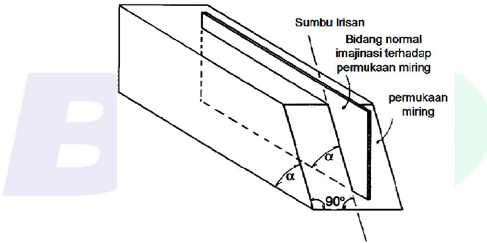

Gambar 12D - Sumbu Irisan untuk Irisan Ujung Miring Simetris

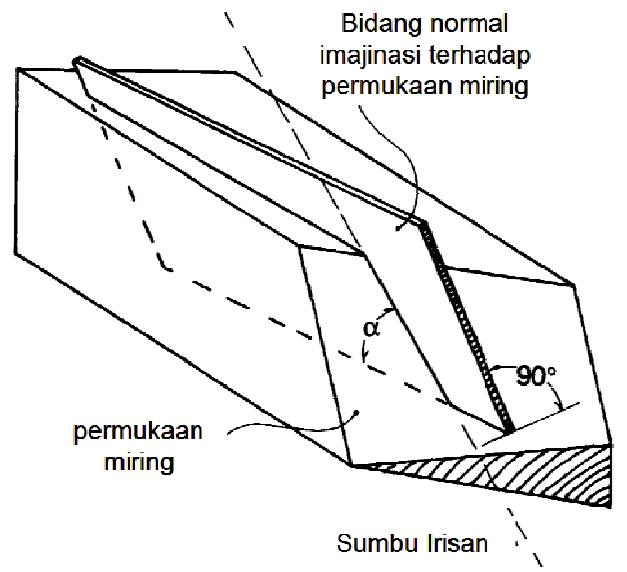

Gambar 12E - Sumbu Irisan untuk Irisan Ujung Miring Asimetris

© BSN 2013 105 dari 318

- **12.2.6.2** Jika konektor cincin belah atau pelat geser dipasang pada suatu irisan ujung persegi atau permukaan miring, faktor koreksi nilai desain harus ditentukan sebagai berikut (lihat 10.2.2):
- (a) permukaan irisan persegi; terbebani dalam arah sembarang ( $\alpha = 90^{\circ}$ , lihat Gambar 12F)

$$Q_{90}' = 0,60 Q'$$
 (12.2-2)

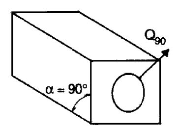

Gambar 12F - Irisan Ujung Persegi

(b) Permukaan miring; terbebani parallel terhadap sumbu irisan (0° <  $\alpha$  < 90°,  $\phi$  = 0°, lihat Gambar 12G)

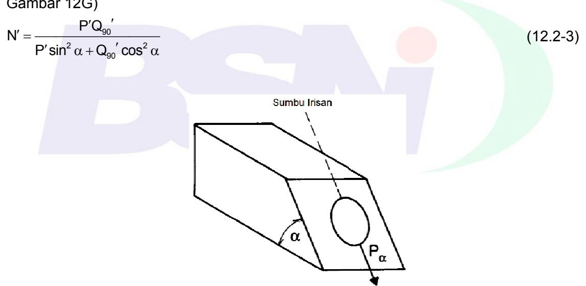

Gambar 12G - Irisan Ujung Miring dengan Beban Sejajar Terhadap Sumbu Irisan ( $\phi = 0^{\circ}$ )

(c) Permukaan miring: terbebani tegak lurus terhadap sumbu irisan (0° <  $\alpha$  < 90°,  $\phi$  = 90°, lihat Gambar 12H)

$$N' = \frac{Q'Q_{90}'}{Q'\sin^2\alpha + Q_{90}'\cos^2\alpha}$$
 (12.2-4)

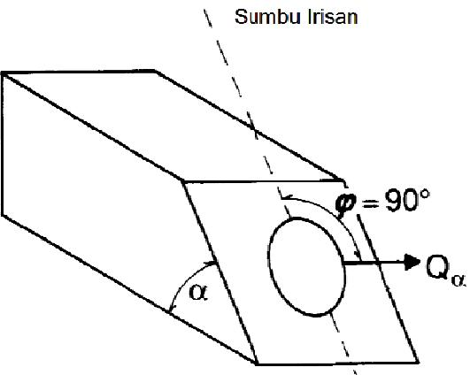

Gambar 12H - Irisan Ujung Miring dengan Beban Tegak lurus Terhadap Sumbu Irisan (φ = 90°)

(d) Permukaan miring: terbebani dengan sudut  $\phi$  terhadap sumbu irisan (0° <  $\alpha$  < 90°, 0° <  $\phi$  < 90°, lihat Gambar 12I)

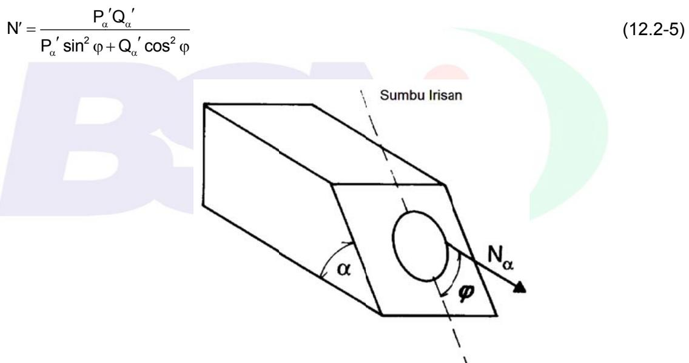

Gambar 12I - Irisan Ujung Miring dengan Beban Bersudut φ Terhadap Sumbu Irisan

# 12.3 Penempatan Konektor Cincin Belah dan Pelat Geser

#### 12.3.1 Istilah

- **12.3.1.1** "Jarak tepi" adalah jarak dari tepi komponen struktur ke pusat dari konektor cincin belah atau pelat geser terdekat, diukur tegak lurus terhadap serat. Jika komponen struktur dibebani tegak lurus serat, tepi terbebani harus didefinisikan sebagai tepi terhadap beban yang bekerja. Bagian tepi tak terbebani harus didefinisikan sebagai tepi yang berlawanan dari tepi yang terbebani (lihat Gambar 12J).
- 12.3.1.2 "Jarak ujung" adalah jarak yang diukur sejajar dengan serat dari irisan ujung persegi dari sebuah komponen struktur ke pusat dari konektor cincin belah atau pelat geser terdekat (lihat Gambar 12J). Jika ujung dari komponen struktur tidak dipotong tegak lurus terhadap sumbu longitudinal, maka jarak ujung, yang diukur sejajar sumbu longitudinal dari titik pada setengah pusat diameter konektor transversal, tidak boleh kurang dari jarak ujung © BSN 2013

yang disyaratkan untuk irisan ujung persegi komponen struktur. Jarak tegak lurus dari pusat konektor ke ujung irisan miring dari komponen struktur, tidak boleh kurang dari syarat jarak tepi (lihat Gambar 12K).

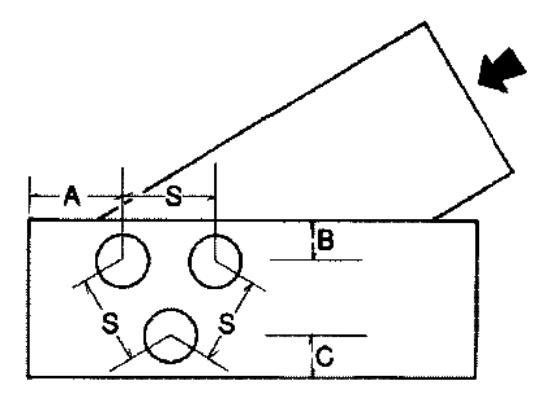

A = jarak ujung

B = jarak tepi tak terbebani

C = jarak tepi terbebani

S = spasi

Gambar 12J - Geometri Sambungan Cincin Belah dan Pelat Geser

- **12.3.1.3** "Sumbu konektor" adalah sebuah garis yang menghubungkan pusat-pusat dari dua konektor yang berdekatan yang berada pada bidang yan<mark>g sam</mark>a dari komponen struktur (lihat Gambar 12L)
- **12.3.1.4** "Spasi" adalah jarak antara pusat ke pusat dari konektor cincin belah atau pelat geser diukur sepanjang sumbu konektor (lihat Gambar 12J).

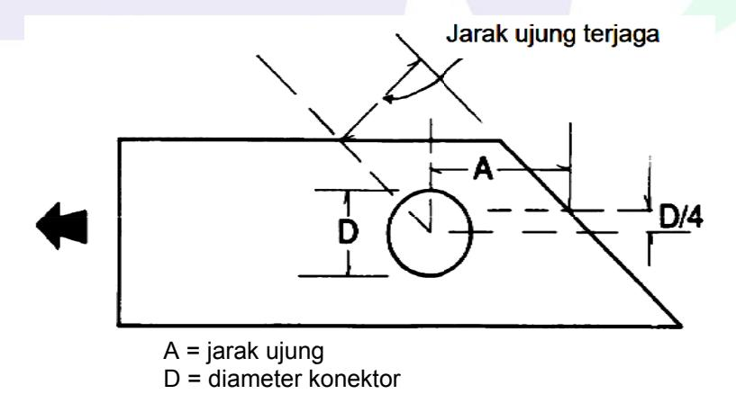

Gambar 12K - Jarak Ujung untuk Komponen Struktur dengan Irisan Ujung Miring

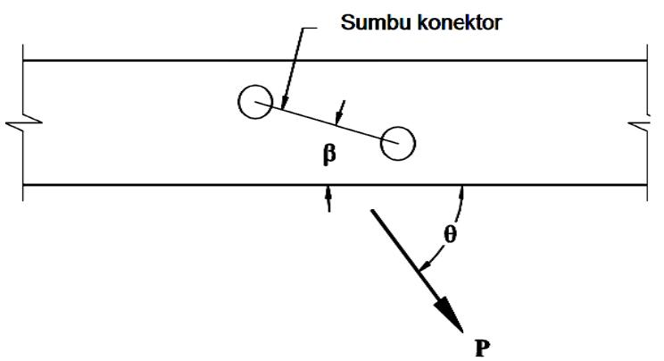

Gambar 12L - Sumbu Konektor dan Sudut Beban

# 12.3.2 Faktor Geometri, $C_{\Delta}$ untuk Konektor Cincin Belah dan Pelat Geser pada Serat Sisi

Nilai desain acuan untuk konektor cincin belah atau pelat geser yang terpasang pada serat sisi dengan jarak tepi, jarak ujung, dan spasi harus lebih besar atau sama dengan yang disyaratkan untuk nilai minimum  $C_{\Delta}=1,0$ . Jika jarak tepi, jarak ujung atau spasi kurang dari yang disyaratkan untuk nilai minimum  $C_{\Delta}=1,0$ , nilai desain acuan harus dikalikan dengan faktor terkecil geometri,  $C_{\Delta}$ , yang ditentukan dari persyaratan jarak tepi, jarak ujung, dan spasi untuk konektor cincin belah atau pelat geser. Faktor geometri terkecil untuk konektor cincin belah atau pelat geser dalam kelompok harus diterapkan untuk konektor cincin belah atau pelat geser dalam kelompok. Jarak tepi, jarak ujung, dan spasi tidak boleh kurang dari nilai minimum yang disyaratkan dalam 12.3.2.1 dan 12.3.2.2.

- **12.3.2.1** Konektor yang terbebani sejajar atau tegak lurus serat. Untuk konektor cincin belah atau pelat geser yang terbebani sejajar atau tegak lurus serat, nilai minimum jarak tepi, jarak ujung, dan spasi diberikan dalam Tabel 12.3. dengan faktor geometri,  $C_{\Delta}$  yang sesuai. Jika nilai aktual lebih besar atau sama dengan nilai minimum terbebani, tetapi kurang dari nilai minimum untuk  $C_{\Delta}$  = 1,0, faktor geometri,  $C_{\Delta}$ , harus ditentukan dengn interpolasi linier.
- **12.3.2.2** Konektor terbebani bersudut terhadap serat. Untuk konektor cincin belah atau pelat geser dengan sudut antara beban dan arah serat,  $\theta$ , selain  $0^{\circ}$  atau  $90^{\circ}$ , faktor geometri yang terpisah untuk jarak tepi dan jarak ujung harus ditentukan untuk komponen sejajar dan tegak lurus serat dari ketahanan.

Untuk konektor cincin belah atau pelat geser terbebani dengan sudut antara beban dan arah serat,  $\theta$ , selain  $0^{\circ}$  atau  $90^{\circ}$ , minimum spasi untuk  $C_{\Delta}$  = 1,0, harus ditentukan sesuai dengan persamaan 12.3-1

$$S_{\beta} = \frac{S_{A}S_{B}}{S_{A}^{2}\sin^{2}\beta + S_{B}^{2}\cos^{2}\beta}$$
 (12.3-1)

#### Keterangan:

 $S_{\beta}$  = jarak minimum sepanjang sumbu konektor, mm

SA = faktor dari Tabel 12.3.2.2

SB = faktor dari Tabel 12.3.2.2

 $\beta$  = sudut sumbu konektor terhadap serat, derajat

© BSN 2013

**Tabel 12.3.2.2 - Faktor untuk Menentukan Spasi Minimum Sepanjang Sumbu Konektor untuk C∆ = 1.0** 

| Konektor           | Sudut Beban Terhadap | SA  | SB  |
|--------------------|----------------------|-----|-----|
|                    | Serat1) (derajat)    | mm  | mm  |
|                    | 0                    | 171 | 89  |
| Cincin Belah 38 mm | 15                   | 152 | 95  |
| atau               | 30                   | 130 | 99  |
| Pelat Geser 67 mm  | 45                   | 108 | 105 |
|                    | 60-90                | 89  | 108 |
|                    | 0                    | 229 | 127 |
| Cincin belah 100   | 15                   | 203 | 133 |
| mm                 | 30                   | 178 | 140 |
| Pelat Geser 100 mm | 45                   | 152 | 146 |
|                    | 60-90                | 127 | 152 |

1) interpolasi diijinkan untuk sudut-sudut antara dari beban terhadap serat

Spasi minimum adalah 89 mm untuk cincin belah 38 mm dan pelat geser 67 mm dan 125 mm untuk konektor cincin belah 100 mm atau pelat geser. Untuk spasi minimum ini, C∆ = 0,5.

Jika spasi aktual antara konektor cincin belah atau pelat geser lebih besar dari spasi minimum tetapi kurang dari spasi minimum untuk C∆ = 1,0, C∆, harus ditentukan dengan interpolasi linier. Faktor geometri untuk menghitung spasi harus diterapkan terhadap nilai desain acuan untuk sejajar dan tegak lurus serat dari komponen ketahanan.

# **12.3.3 Faktor Geometri, C∆, untuk Konektor Cincin Belah dan Pelat Geser pada Serat Ujung**

Untuk konektor cincin belah atau pelat geser yang terpasang pada serat ujung, faktor geometri tunggal harus ditentukan dan diterapkan terhadap nilai desain acuan untuk sejajar dan tegak lurus serat dari komponen ketahanan. Jarak tepi, jarak ujung, dan spasi tidak boleh kurang dari nilai minimum yang disyaratkan dalam 12.3.3.1 dan 12.3.3.2.

- **12.3.3.1** Ketentuan untuk faktor geometri, C∆, untuk konektor cincin belah atau pelat geser yang terpasang pada permukaan irisan persegi dan permukaan miring adalah sebagai berikut (lihat 12.2.6 untuk definisi dan istilah)
- (a) Permukaan irisan persegi, terbebani pada arah sembarang (lihat Gambar 12F) berlaku ketentuan untuk beban tegak lurus serat untuk konektor yang terpasang pada serat sisi harus diterapkan kecuali untuk ketentuan jarak ujung
- (b) permukaan miring terbebani sejajar sumbu irisan (lihat Gambar 12G)
- (b.1) Spasi. Spasi minimum sejajar sumbu irisan untuk C∆ = 1,0, harus ditentukan dengan persamaan 12.3-2

Spasi minimum sejajar sumbu irisan adalah 89 mm untuk cincin belah 38 mm dan pelat geser 67 mm dan 125 mm untuk konektor cincin belah 100 mm atau pelat geser. Untuk spasi minimum ini, C∆ = 0,5.

Jika spasi aktual sejajar sumbu irisan antara konektor cincin belah atau pelat geser lebih besar dari spasi minimum untuk C∆ = 0,5, tetapi kurang dari spasi minimum untuk C∆ = 1,0, faktor geometri C∆, harus ditentukan dengan interpolasi linier.

$$S_{\alpha} = \frac{S_{\alpha}S_{\perp}}{S_{\alpha}^2 \sin^2 \alpha + S_{\perp}^2 \cos^2 \alpha}$$
 (12.3-2)

#### Keterangan:

Sα = jarak minimum sejajar sumbu irisan

 $S_{\parallel}$  = faktor dari tabel 12.3.3.1-1

 $S_{\perp}$  = faktor dari tabel 12.3.3.1-1

 $\alpha$  = sudut kemiringan irisan (lihat Gambar 12G)

Tabel 12.3.3.1-1 - Faktor untuk Menentukan Spasi Minimum Sepanjang Sumbu Irisan dari Permukaan Miring

| Konektor                                        | Faktor Geometri   | S ∥ mm | S⊥ mm |
|-------------------------------------------------|----------------------|----------------------|----------|
| Cincin Belah 38 mm atau Pelat Geser 67 mm | C ∆ = 1,0 | 171                  | 108      |
| Cincin Belah 100 mm Pelat Geser 100 mm       | $C_{\Delta} = 1,0$   | 229                  | 152      |

(b.2) Jarak tepi terbebani. Jarak tepi minimum terbebani sejajar dengan sumbu irisan untuk  $C_{\Lambda} = 1,0$  harus ditentukan sesuai dengan persamaan 12.3-3.

Untuk cincin belah, jarak tepi minimum terbebani sejajar dengan sumbu irisan untuk  $C_{\Delta}$  = 0,70 harus ditentukan sesuai dengan persamaan 12.3-3. Untuk pelat geser, jarak tepi minimum terbebani sejajar dengan sumbu irisan untuk  $C_{\Delta}$  = 0,83 harus ditentukan sesuai dengan persamaan 12.3-3.

Jika jarak aktual tepi terbebani sejajar dengan sumbu irisan lebih besar dari jarak tepi minimum terbebani sejajar dengan sumbu irisan untuk  $C_{\Delta}$  = 0,70, untuk cincin belah atau untuk  $C_{\Delta}$  = 0,83 untuk pelat geser, tetapi kurang dari jarak tepi minimum terbebani sejajar dengan sumbu irisan untuk  $C_{\Delta}$  = 1,0, faktor geometri  $C_{\Delta}$ , harus ditentukan dengan interpolasi linier.

$$\mathsf{E}_{\alpha} = \frac{\mathsf{E}_{\square}\mathsf{E}_{\perp}}{\mathsf{E}_{\square}^2 \sin^2 \alpha + \mathsf{E}_{\perp}^2 \cos^2 \alpha} \tag{12.3-3}$$

## Keterangan:

 $E_{\alpha}$  = jarak tepi minimum terbebani sejajar dengan sumbu irisan

 $E_{\parallel}$  = faktor dari tabel 12.3.3.1-2

 $E_{\perp}$  = faktor dari tabel 12.3.3.1-2

 $\alpha$  = sudut kemiringan irisan (lihat Gambar 12G)

| Tabel 12.3.3.1-2 - Faktor untuk Menentukan Jarak Tepi Minimum |
|---------------------------------------------------------------|
| Terbebani untuk Konektor pada Serat Ujung                     |

| Konektor              | Faktor Geometri  | S ∥ mm | S⊥ mm |
|-----------------------|---------------------|----------------------|----------|
| Cincin Belah 38 mm    | $C_{\Delta} = 1,00$ | 140                  | 70       |
| Ciricin Belan 36 min  | $C_{\Delta} = 0.70$ | 84                   | 38       |
| Pelat Geser 67 mm     | $C_{\Delta} = 1,00$ | 140                  | 70       |
| Pelat Gesel 07 IIIII  | $C_{\Delta} = 0.83$ | 108                  | 38       |
| Cincin Belah 100 mm   | $C_{\Delta} = 1,00$ | 178                  | 95       |
| Ciricin Belan 100 min | $C_{\Delta} = 0.70$ | 107                  | 64       |
| Pelat Geser 100 mm    | $C_{\Delta} = 1,00$ | 178                  | 95       |
| Felat Gesel 100 IIIII | $C_{\Delta} = 0.83$ | 137                  | 64       |

(b.3) Jarak tepi tidak terbebani. Jarak tepi minimum tidak terbebani sejajar dengan sumbu irisan untuk  $C_{\Delta}$  = 1,0 harus ditentukan sesuai dengan persamaan 12.3-4.

Jarak tepi minimum tidak terbebani sejajar dengan sumbu irisan untuk  $C_{\Delta}$  = 0,63 harus ditentukan sesuai dengan persamaan 12.3-4.

Jika jarak aktual tepi tidak terbebani sejajar dengan sumbu irisan lebih besar dari jarak tepi minimum tidak terbebani sejajar dengan sumbu irisan untuk  $C_{\Delta}$  = 0,63, tetapi kurang dari jarak tepi minimum tidak terbebani sejajar dengan sumbu irisan untuk  $C_{\Delta}$  = 1,0, faktor geometri  $C_{\Delta}$ , harus ditentukan dengan interpolasi linier.

$$U_{\alpha} = \frac{U_{\alpha}U_{\perp}}{U_{\alpha}^{2}\sin^{2}\alpha + U_{\perp}^{2}\cos^{2}\alpha}$$
 (12.3-4)

#### Keterangan:

Uα = jarak tepi minimum tak terbebani sejajar dengan sumbu irisan

U∥ = faktor dari tabel 12.3.3.1-3

 $U_{\perp}$  = faktor dari tabel 12.3.3.1-3

α = sudut kemiringan irisan (lihat Gambar 12G)

Tabel 12.3.3.1-3 Faktor untuk Menentukan Jarak Tepi Minimum Tak Terbebani Sejajar Sumbu Irisan

| Konektor                   | Faktor Geometri     | U II mm | U⊥ mm |
|----------------------------|---------------------|-----------------------|----------|
| Cincin Belah 38 mm         | $C_{\Delta} = 1,00$ | 102                   | 44       |
| atau Pelat Geser 67 mm  | $C_{\Delta} = 0,63$ | 64                    | 38       |
| Cincin Belah 100 mm        | $C_{\Delta} = 1,00$ | 140                   | 70       |
| atau Pelat Geser 100 mm | $C_{\Delta} = 0,63$ | 83                    | 64       |

(b.4) Faktor geometri untuk jarak ujung tidak terbebani tegak lurus dengan sumbu irisan dan untuk spasi tegak lurus terhadap sumbu irisan harus ditentukan berdasarkan peraturan untuk jarak ujung tidak terbebani dan spasi tegak lurus serat untuk konektor yang terpasang pada sisi serat dan terbebani sejajar dengan serat.

- (c) Permukaan miring terbebani tegak lurus sumbu irisan (lihat Gambar 12H) peraturan untuk beban tegak lurus serat untuk konektor yang terpasang pada ujung serat dapat diterapkan, kecuali hal tersebut:
- (1) Jarak ujung minimum sejajar sumbu irisan untuk  $C_{\Delta}$  = 1,0, harus ditentukan dengan persamaan 12.3-5.
- (2) Jarak ujung minimum sejajar sumbu irisan untuk  $C_{\Lambda}$  = 0,63, harus ditentukan dengan persamaan 12.3-5.
- (3) Jika jarak aktual ujung sejajar dengan sumbu irisan lebih besar dari jarak ujung minimum untuk  $C_{\Lambda} = 0.63$ , tetapi kurang dari jarak ujung minimum untuk  $C_{\Lambda} = 1.0$ , faktor geometri  $C_{\Lambda}$ , harus ditentukan dengan interpolasi linier.

$$e_{\alpha} = \frac{E_{\square}U_{\perp}}{E_{\square}^2 \sin^2 \alpha + U_{\perp}^2 \cos^2 \alpha}$$
 (12.3-5)

## Keterangan:

eα = jarak ujung minimum sejajar dengan sumbu irisan, mm

 $E_{\parallel}$  = faktor dari tabel 12.3.3.1-4, mm  $U_{\perp}$  = faktor dari tabel 12.3.3.1-4, mm

= sudut kemiringan irisan (lihat Gambar 12G)

Tabel 12.3.3.1-4 - Faktor untuk Menentukan Jarak Ujung Minimum Sejajar Sumbu Irisan

| Konektor                    | Faktor Geometri     | E II | U⊥ mm |
|-----------------------------|---------------------|-----------------|----------|
| Cincin Belah 38 mm atau  | $C_{\Delta} = 1,00$ | 140             | 44       |
| Pelat Geser 67 mm           | $C_{\Delta} = 0.63$ | 70              | 38       |
| Cincin Belah 100 mm atau | $C_{\Delta} = 1,00$ | 178             | 70       |
| Pelat Geser 100 mm          | $C_{\Delta} = 0,63$ | 89              | 64       |

- (d) Permukaan miring terbebani dengan sudut φ terhadap sumbu irisan (lihat Gambar 12I) faktor geometri terpisah,  $C_{\Delta}$ , harus ditentukan untuk komponen-komponen dari tahanan paralel dan tegak lurus terhadap sumbu irisan untuk penggunaan persamaan 12.2-5
- 12.3.3.2 Jika konektor cincin belah atau pelat geser terpasang pada serat ujung, komponen struktur harus didesain untuk geser sejajar serat sesuai dengan 3.4.3.3.

#### 12.3.4 Konektor Majemuk Cincin Belah dan Pelat Geser

- 12.3.4.1 Jika sambungan terdiri dari dua unit atau lebih konektor cincin belah atau pelat geser yang terdapat dalam bidang geser yang sama, segaris dengan arah beban, dan pada baut atau sekrup kunci yang terpisah, faktor aksi kelompok, Ca, harus diambil sesuai dengan 10.3.6 dan nilai desain terkoreksi total untuk sambungan harus sesuai dengan yang diberikan dalam 10.2.2.
- 12.3.4.2 Jika alur untuk dua ukuran cincin belah dipotong konsentris pada permukaan kayu yang sama, maka konektor cincin belah harus dipasang pada kedua alur dan nilai desain acuan harus diambil sebagai nilai desain acuan untuk konektor cincin belah terbesar.
- 12.3.4.3 Tegangan lokal dalam sambungan dengan pengencang majemuk harus dievaluasi berdasarkan prinsip-prinsip mekanika teknik. (lihat 10.1.2).

Tabel 12.3 Faktor Geometri, CΔ, untuk Konektor Cincin Belah dan Pelat

|             |                                      |                  | Konektor Cincir                  | n Belah 38 mm    |                                  |                  | Konektor Cincin                  | Belah 100 mm     |                                  |
|-------------|--------------------------------------|------------------|----------------------------------|------------------|----------------------------------|------------------|----------------------------------|------------------|----------------------------------|
|             |                                      |                  | da                               |                  |                                  |                  | da                               |                  |                                  |
|             |                                      |                  | Konektor Pelat                   |                  |                                  |                  | Konektor Pelat                   |                  |                                  |
|             |                                      | Beban sej        | ajar serat                       | Beban tegal      | lurus serat                      | Beban sej        | ajar serat                       | Beban tegal      | lurus serat                      |
|             |                                      | Harga minimum | Minimum untuk $C_{\Delta} = 1,0$ | Harga minimum | Minimum untuk $C_{\Delta} = 1,0$ | Harga minimum | Minimum untuk $C_{\Delta} = 1,0$ | Harga minimum | Minimum untuk $C_{\Delta} = 1,0$ |
|             | Tepi tak terbebani                | 38               | 44                               | 38               | 44                               | 64               | 70                               | 64               | 70                               |
| ebi         | $C_{\Delta}$                         | 0,88             | 1,0                              | 0,88             | 1,0                              | 0,93             | 1,0                              | 0,93             | 1,0                              |
|             | Tepi terbebani                       | =                | -                                | 38               | 70                               | -                | -                                | 64               | 95                               |
| Jarak Tepi  | C ∆ untuk cincin belah | -                | -                                | 0,70             | 1,0                              | -                | -                                | 0,70             | 1,0                              |
|             | C ∆ untuk pelat geser  | -                | -                                | 0,83             | 1,0                              | -                | -                                | 0,83             | 1,0                              |
| bun         | Komponen struktur tarik           | 70               | 140                              | 70               | 140                              | 89               | 178                              | 89               | 178                              |
| ij          | $C_{\Delta}$                         | 0,63             | 1,0                              | 0,63             | 1,0                              | 0,63             | 1,0                              | 0,63             | 1,0                              |
| Jarak Ujung | Komponen struktur tekan           | 64               | 102                              | 70               | 140                              | 83               | 140                              | 89               | 178                              |
|             | $C_{\Delta}$                         | 0,63             | 1,0                              | 0,63             | 1,0                              | 0,63             | 1,0                              | 0,63             | 1,0                              |
|             | Spasi sejajar serat               | 89               | 171                              | 89               | 89                               | 127              | 229                              | 127              | 127                              |
| Spasi       | $C_{\Delta}$                         | 0,5              | 1,0                              | 1,0              | 1,0                              | 0,5              | 1,0                              | 1,0              | 1,0                              |
| ds          | Spasi tegak lurus serat              | 89               | 171                              | 89               | 89                               | 127              | 229                              | 127              | 127                              |
|             | $C_{\scriptscriptstyle\Delta}$       | 1,0              | 1,0                              | 0,5              | 1,0                              | 1,0              | 1,0                              | 0,5              | 1,0                              |

© BSN 2013 114 dari 312

## **13 Paku Keling Kayu**

## **13.1 Umum**

## **13.1.1 Ruang lingkup**

Pasal 13 ini berlaku untuk desain teknik sambungan dengan paku keling dengan pelat sisi baja pada kayu glulam struktural yang sesuai dengan Pasal 5 dan dibebani geser tunggal.

## **13.1.2 Kualitas Paku Keling dan Pelat Sisi Baja**

**13.1.2.1** Ketentuan desain dan nilai desain acuan dalam Spesifikasi ini diberlakukan untuk paku keling kayu yang digalvanis dengan cara rendam panas (*hot-dip)* yang sesuai dengan ASTM A 153 dan dibuat dari baja AISI 1035 untuk mendapatkan hasil uji properti bahan yang sesuai dengan ASTM A 370.

| Kekerasan       | Kuat Tarik Batas, Fu |
|-----------------|----------------------|
| Rockwell C32-39 | 1.000 MPa, minimum   |

Lihat Lampiran M untuk dimensi paku keling.

- **13.1.2.2** Pelat sisi baja harus memenuhi standar ASTM A 36 dengan tebal minimum 3,2 mm. Lihat Lampiran M untuk dimensi pelat sisi baja.
- **13.1.2.3** Untuk kondisi layan basah, pelat sisi baja harus di*galvanized* dengan cara *hot-dip* yang sesuai dengan ASTM A 153.

## **13.1.3 Pabrikasi dan Perakitan**

- **13.1.3.1** Setiap paku keling, dalam semua kasus, harus ditempatkan pada dimensi penampang utama segaris sejajar dengan serat. Kriteria desain berdasarkan pada pengencangan paku keling melalui lubang bulat pada pelat sisi sampai kepala konikal kencang pas pada tempatnya, tetapi paku keling tidak boleh terbenam. (Paku keling kayu pada sekeliling kelompok harus dipasang terlebih dahulu. Paku keling kayu harus dipasang dalam urutan pola spiral dari luar ke arah pusat kelompok).
- **13.1.3.2** Maksimum penetrasi dari paku keling adalah 70% dari ketebalan komponen struktur kayu. Kecuali seperti diijinkan oleh pasal 13.1.3.3, untuk sambungan dengan pengencangan paku keling dari sisi permukaan komponen struktur kayu yang berlawanan, panjang paku keling pada satu titik tidak boleh overlap.
- **13.1.3.3** Untuk sambungan dengan pemasangan paku keling dari sisi permukaan komponen struktur kayu yang berlawanan, panjang paku keling pada satu titik yang overlap, syarat jarak spasi minimum pada pasal 13.3.1 harus diterapkan pada jarak antara titik-titik paku keling, dan syarat penetrasi maksimum dari pasal 13.1.3.2 harus diterapkan. Nilai lateral desain acuan dari sambungan harus dihitung sesuai dengan pasal 13.2, dengan memperhatikan bahwa sambungan adalah sambungan paku keling satu sisi, dengan:
- (a) jumlah paku keling yang berhubungan dengan sebuah pelat adalah sama dengan jumlah total paku keling pada sambungan, dan
- (b) sp dan sq ditentukan sebagai jarak antara titik-titik paku keling.

# **13.2 Nilai Desain Acuan**

## **13.2.1 Pembebanan Sejajar Serat**

Untuk sambungan paku keling kayu (sebuah pelat dan paku keling yang berhubungan) dengan:

- (a) Beban bekerja tegaklurus terhadap sumbu paku keling kayu
- (b) Tebal komponen struktur, jarak tepi, jarak ujung dan spasi adalah cukup untuk mengembangkan nilai desain terkoreksi sepenuhnya (lihat pasal 13.3)
- (c) Paku keling kayu dipasang pada serat sisi dari komponen struktur kayu, nilai desain acuan per sambungan paku keling sejajar serat, P, harus dihitung sebagai yang terendah dari kapasitas paku keling, Pr, dan kapasitas kayu acuan, Pw:

$$P_r = 303 p^{0.32} n_R n_C$$
 (N) (13.2-1)

Pw = nilai desain kapasitas kayu acuan sejajar serat (Tabel 13.2.1A sampai dengan 13.2.1F) menggunakan tebal komponen struktur untuk dimensi komponen struktur dalam Tabel 13.2.1A sampai dengan 13.2.1F untuk sambungan dengan pelat baja pada sisi berlawanan; dan dua kali ketebalan komponen struktur untuk dimensi komponen struktur dalam Tabel 13.2.1A sampai dengan 13.2.1F untuk sambungan yang mempunyai hanya satu pelat, N.

## **Keterangan:**

- p = kedalaman penetrasi paku keling dalam komponen struktur kayu (Lampiran M), mm
- = panjang paku keling ketebalan pelat 3,2 mm
- nR = jumlah baris dari paku keling sejajar arah beban
- nC = jumlah paku keling dalam satu baris

Nilai desain acuan, P, untuk sambungan paku keling kayu sejajar serat harus dikalikan dengan semua faktor koreksi yang dapat terjadi (lihat Tabel 10.3.1) untuk mendapatkan nilai desain acuan terkoreksi, P'.

## **13.2.2 Pembebanan Tegak lurus Serat**

Untuk sambungan paku keling kayu (sebuah pelat dan paku keling yang berhubungan) dengan:

- (a) Beban bekerja tegaklurus terhadap sumbu paku keling kayu
- (b) Tebal komponen struktur, jarak tepi, jarak ujung dan spasi adalah cukup untuk mengembangkan nilai desain terkoreksi sepenuhnya (lihat pasal 13.3)
- (c) Paku keling kayu dipasang pada serat sisi dari komponen struktur kayu, nilai desain acuan per sambungan paku keling tegaklurus serat, Q, harus dihitung sebagai yang terendah dari kapasitas paku keling acuan, Qr, dan kapasitas kayu acuan, Qw.

$$Q_r = 174 p^{0.32} n_R n_C$$
 (N) (13.2-2)

$$Q_r = 0.075185 q_w p^{0.8} C_\Delta$$
 (N) (13.2-3)

## **Keterangan:**

- p = kedalaman penetrasi paku keling dalam komponen struktur kayu (lihat lampiran M), mm
- = panjang paku keling ketebalan pelat 3,2 mm
- nR = jumlah baris dari paku keling sejajar arah beban
- nC = jumlah paku keling dalam satu baris
- qw = nilai yang ditentukan dari Tabel 13.2.2A, (N)
- C∆ = faktor geometri ditentukan dari Tabel 13.2.2B

Nilai desain acuan, Q, untuk sambungan paku keling kayu tegaklurus serat harus dikalikan dengan semua faktor koreksi yang dapat terjadi (lihat Tabel 10.3.1) untuk mendapatkan nilai desain acuan terkoreksi, Q'.

#### 13.2.3 Faktor Pelat Sisi Logam, Cst

Nilai desain acuan sejajar serat, P, atau tegaklurus serat, Q, untuk sambungan paku keling kayu, jika kapasitas paku keling acuan (Pr, Qr) menentukan, harus dikalikan dengan faktor koreksi pelat sisi logam, Cst yang ditentukan dalam Tabel 13.2.3:

Tabel 13.2.3 Faktor Pelat Sisi Logam, Cst, untuk Sambungan Kayu dengan Paku Keling

| Ketebalan Pelat Sisi Logam, t s | C st |
|--------------------------------------------|-----------------|
| t s ≥ 6,4 mm                    | 1,00            |
| 4,8 <u>&lt;</u> t s < 6,4 mm    | 0,90            |
| $3,2 \text{ mm} \leq t_s < 4,8 \text{ mm}$ | 0,80            |

# 13.2.4 Beban Bersudut Terhadap Serat

Jika beban bekerja dalam bidang permukaan kayu dengan suatu sudut,  $\theta$ , terhadap serat selain 0° atau 90°, faktor koreksi nilai desain, N', untuk sambungan paku keling kayu harus ditentukan sebagai berikut (lihat Lampiran J):

$$N' = \frac{P'Q'}{P'\sin^2\theta + Q'\cos^2\theta}$$
 (13.2-4)

#### 13.2.5 Paku Keling Kayu pada Serat Ujung

Jika paku keling kayu digunakan pada serat ujung, ketahanan lateral terfaktor dari sambungan harus diambil sebesar 50% dari tegaklurus terhadap serat sisi ketika kemiringan dari irisan 90° terhadap serat sisi. Untuk kemiringan irisan ujung, nilainya dapat bertambah linier sampai dengan 100% dari sejajar atau tegaklurus nilai serat sisi.

#### 13.2.6 Desain Bagian Logam

Bagian logam harus didesain sesuai dengan prosedur desain untuk logam (lihat pasal 10.2.3).

#### 13.3 Penempatan Paku Keling kayu

#### 13.3.1 Spasi Antar Paku Keling

Jarak spasi minimum dari paku keling adalah 12,7 mm untuk arah tegaklurus serat,  $s_{\rm q}$  dan 25,4 mm untuk sejajar serat,  $s_{\rm p}$ . Jarak maksimum tegaklurus serat antara baris-baris sisi terluar dari paku keling adalah 305 mm.

#### 13.3.2 Jarak Ujung dan Tepi

Nilai minimum untuk jarak ujung  $(a_p, a_q)$  dan jarak tepi,  $(e_p, e_q)$  seperti terlihat dan tercantum pada Gambar 13A, diberikan dalam Tabel 13.3.2.

© BSN 2013

Tabel 13.3.2 - Jarak Ujung dan Tepi Minimum untuk Sambungan Paku Keling Kayu

| Jumlah baris                  | Jarak ujung a, n                   |                                             | Jarak tepi minimum e, mm |                |  |  |  |
|-------------------------------|---------------------------------------|---------------------------------------------|-----------------------------|----------------|--|--|--|
| paku keling n R | Beban sejajar serat a P | Beban tegaklurus serat a P | Tepi tak terbebani       | Tepi terbebani |  |  |  |
| 1, 2                          | 76,2                                  | 50,8                                        | 25,4                        | 50,8           |  |  |  |
| 3 - 8                         | 76,2                                  | 76,2                                        | 25,4                        | 50,8           |  |  |  |
| 9, 10                         | 101,6                                 | 79,375                                      | 25,4                        | 50,8           |  |  |  |
| 11, 12                        | 127                                   | 101,6                                       | 25,4                        | 50,8           |  |  |  |
| 13, 14                        | 152,4                                 | 120,65                                      | 25,4                        | 50,8           |  |  |  |
| 15, 16                        | 177,8                                 | 139,7                                       | 25,4                        | 50,8           |  |  |  |
| <u>&gt;</u> 17                | 203,2                                 | 158,75                                      | 25,4                        | 50,8           |  |  |  |

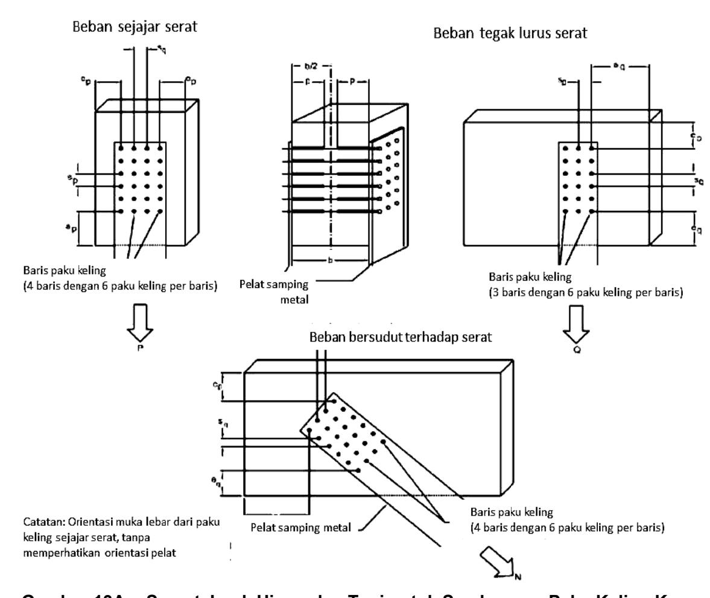

Gambar 13A - Syarat Jarak Ujung dan Tepi untuk Sambungan Paku Keling Kayu.

**Tabel 13.2.1A - Referensi untuk Nilai Disain Kapasitas Sejajar Serat, Pw untuk Paku Keling Kayu** 

| Panjang Paku Keling = 38 mm Sp = 25 mm Sq = 25 mm |             |                                  |      |       |       |       |       |       |       |       |       |  |  |  |
|------------------------------------------------------|-------------|----------------------------------|------|-------|-------|-------|-------|-------|-------|-------|-------|--|--|--|
|                                                      |             | Pw (kN) Jumlah baris per sisi |      |       |       |       |       |       |       |       |       |  |  |  |
| komponen                                             | Paku keling |                                  |      |       |       |       |       |       |       |       |       |  |  |  |
| Tebal struktur 76 127 172 216         | per baris   | 2                                | 4    | 6     | 8     | 10    | 12    | 14    | 16    | 18    | 20    |  |  |  |
|                                                      | 2           | 9,1                              | 21,8 | 34,0  | 47,9  | 62,7  | 75,8  | 87,9  | 100,8 | 114,3 | 129,0 |  |  |  |
|                                                      | 4           | 13,4                             | 28,7 | 43,1  | 60,2  | 77,6  | 92,7  | 106,2 | 120,2 | 135,8 | 153,3 |  |  |  |
|                                                      | 6           | 18,0                             | 35,6 | 52,4  | 72,6  | 92,8  | 110,2 | 124,3 | 139,9 | 158,8 | 179,3 |  |  |  |
|                                                      | 8           | 22,7                             | 42,2 | 62,1  | 83,8  | 106,4 | 125,6 | 142,3 | 159,1 | 178,5 | 201,5 |  |  |  |
|                                                      | 10          | 26,2                             | 48,6 | 70,6  | 95,1  | 119,8 | 142,4 | 158,6 | 178,3 | 199,4 | 225,0 |  |  |  |
|                                                      | 12          | 29,7                             | 53,8 | 79,0  | 106,7 | 133,4 | 155,7 | 177,0 | 197,9 | 220,5 | 248,8 |  |  |  |
|                                                      | 14          | 32,5                             | 60,2 | 86,3  | 117,3 | 145,6 | 171,7 | 191,7 | 216,4 | 243,4 | 274,7 |  |  |  |
|                                                      | 16          | 34,1                             | 66,5 | 95,1  | 125,7 | 157,8 | 185,4 | 206,0 | 235,2 | 264,0 | 297,9 |  |  |  |
|                                                      | 18          | 37,9                             | 72,3 | 103,6 | 135,4 | 169,1 | 197,9 | 222,6 | 249,6 | 284,0 | 315,7 |  |  |  |
|                                                      | 20          | 40,2                             | 79,0 | 111,0 | 143,7 | 178,6 | 208,5 | 233,9 | 266,0 | 297,5 | 330,5 |  |  |  |
|                                                      | 2           | 11,9                             | 23,0 | 26,6  | 32,2  | 41,3  | 48,3  | 55,5  | 67,4  | 86,3  | 107,9 |  |  |  |
|                                                      | 4           | 17,5                             | 29,4 | 33,9  | 40,3  | 51,0  | 59,6  | 67,2  | 79,6  | 98,3  | 116,9 |  |  |  |
|                                                      | 6           | 23,5                             | 36,4 | 41,3  | 48,4  | 61,3  | 70,6  | 80,4  | 93,9  | 114,1 | 132,9 |  |  |  |
|                                                      | 8           | 29,8                             | 43,1 | 48,7  | 56,7  | 70,9  | 58,8  | 91,5  | 105,8 | 126,6 | 144,9 |  |  |  |
|                                                      | 10          | 34,3                             | 49,6 | 55,8  | 64,7  | 80,6  | 91,6  | 102,9 | 118,1 | 140,1 | 163,9 |  |  |  |
|                                                      | 12          | 38,8                             | 56,4 | 63,0  | 72,2  | 89,4  | 102,8 | 113,0 | 131,7 | 155,7 | 181,2 |  |  |  |
|                                                      | 14          | 42,5                             | 63,0 | 69,9  | 80,0  | 98,8  | 113,3 | 124,3 | 144,3 | 170,0 | 196,8 |  |  |  |
|                                                      | 16          | 44,6                             | 69,4 | 77,1  | 87,4  | 107,6 | 123,1 | 134,9 | 156,1 | 187,8 | 217,6 |  |  |  |
|                                                      | 18          | 49,6                             | 75,7 | 83,5  | 95,4  | 116,1 | 132,5 | 147,4 | 170,7 | 205,3 | 230,9 |  |  |  |
|                                                      | 20          | 52,5                             | 81,9 | 90,3  | 102,3 | 125,8 | 143,5 | 159,7 | 184,9 | 222,5 | 250,3 |  |  |  |
|                                                      | 2           | 13,0                             | 21,4 | 24,7  | 30,0  | 38,4  | 45,0  | 51,6  | 62,8  | 80,4  | 100,7 |  |  |  |
|                                                      | 4           | 19,1                             | 27,4 | 31,5  | 37,5  | 47,5  | 55,6  | 62,7  | 74,3  | 91,8  | 109,3 |  |  |  |
|                                                      | 6           | 25,7                             | 34,0 | 38,4  | 45,1  | 57,1  | 65,9  | 75,1  | 87,8  | 106,7 | 124,4 |  |  |  |
|                                                      | 8           | 32,6                             | 40,3 | 45,3  | 52,8  | 66,2  | 75,8  | 85,6  | 98,9  | 118,5 | 135,7 |  |  |  |
|                                                      | 10          | 37,5                             | 46,4 | 52,0  | 60,4  | 75,3  | 85,7  | 96,3  | 110,5 | 131,2 | 153,6 |  |  |  |
|                                                      | 12          | 42,4                             | 52,7 | 58,8  | 67,4  | 83,5  | 96,1  | 105,8 | 123,3 | 145,9 | 169,9 |  |  |  |
|                                                      | 14          | 46,5                             | 58,8 | 65,2  | 74,7  | 92,3  | 106,0 | 116,4 | 135,3 | 159,4 | 184,7 |  |  |  |
|                                                      | 16          | 48,8                             | 64,9 | 71,9  | 81,6  | 100,7 | 115,3 | 126,4 | 146,3 | 176,2 | 204,2 |  |  |  |
|                                                      | 18          | 54,2                             | 70,8 | 77,9  | 89,1  | 108,6 | 124,1 | 138,1 | 160,0 | 192,7 | 216,8 |  |  |  |
|                                                      | 20          | 57,4                             | 76,6 | 84,3  | 95,6  | 117,7 | 134,4 | 149,7 | 173,4 | 208,8 | 235,1 |  |  |  |
|                                                      | 2           | 13,0                             | 21,1 | 24,3  | 29,5  | 37,8  | 44,3  | 50,9  | 61,8  | 79,2  | 99,2  |  |  |  |
|                                                      | 4           | 19,1                             | 27,0 | 31,0  | 36,9  | 46,8  | 54,7  | 61,8  | 73,2  | 90,4  | 107,7 |  |  |  |
|                                                      | 6           | 25,7                             | 33,5 | 37,9  | 44,5  | 56,3  | 64,9  | 74,0  | 86,6  | 105,1 | 122,6 |  |  |  |
|                                                      | 8           | 32,6                             | 39,7 | 44,6  | 52,0  | 65,3  | 74,7  | 84,4  | 97,5  | 116,8 | 133,8 |  |  |  |
| dan lebih                                            | 10          | 37,5                             | 45,7 | 51,2  | 59,5  | 74,2  | 84,4  | 94,9  | 109,0 | 129,4 | 151,5 |  |  |  |
| besar                                                | 12          | 42,4                             | 51,9 | 57,9  | 66,4  | 82,3  | 94,7  | 104,3 | 121,6 | 143,9 | 167,6 |  |  |  |
|                                                      | 14          | 46,5                             | 58,0 | 64,2  | 73,6  | 91,0  | 104,4 | 114,8 | 133,4 | 157,2 | 182,2 |  |  |  |
|                                                      | 16          | 48,8                             | 63,9 | 70,8  | 80,4  | 99,2  | 113,6 | 124,6 | 144,3 | 173,7 | 201,5 |  |  |  |
|                                                      | 18          | 54,2                             | 69,7 | 76,7  | 87,9  | 107,1 | 122,3 | 136,2 | 157,8 | 190,0 | 213,9 |  |  |  |
|                                                      | 20          | 57,4                             | 75,4 | 83,0  | 94,2  | 116,0 | 132,5 | 147,6 | 171,1 | 206,0 | 232,0 |  |  |  |

**© BSN 2013 119 dari 318**

**Tabel 13.2.1B - Nilai Disain Kapasitas Acuan Sejajar Serat, Pw untuk Paku Keling Kayu** 

| Panjang Paku Keling = 38 mm Sp = 38 mm Sq = 25 mm Pw (kN) Tebal Paku Jumlah baris per sisi komponen keling per struktur baris 2 4 6 8 10 12 14 16 18 20 2 10,3 25,1 39,1 54,6 71,2 88,1 103,2 116,1 130,6 147,6 4 15,2 33,1 49,6 68,6 88,1 107,6 124,6 138,5 155,2 175,4 6 20,4 41,1 60,2 82,7 105,4 127,9 145,9 161,2 181,5 205,2 8 25,8 48,6 71,4 95,5 120,8 145,8 167,0 183,3 204,0 230,6 10 29,8 56,0 81,2 108,4 136,1 165,4 186,2 205,4 227,9 257,5 76 12 33,7 62,0 90,8 121,6 151,4 180,8 207,7 228,0 252,0 284,8 14 36,9 69,4 99,2 133,8 165,4 199,5 225,0 249,3 278,2 314,4 16 38,7 76,7 109,3 143,3 179,2 215,3 241,8 270,9 301,7 341,0 18 43,1 83,3 119,1 154,4 191,9 229,9 261,3 287,6 324,5 361,3 20 45,6 91,1 127,6 163,8 202,8 242,2 274,6 306,5 340,0 378,2 2 13,5 23,8 30,0 38,3 53,1 66,1 81,4 104,3 142,8 190,6 4 19,9 34,1 42,5 53,2 73,1 91,0 110,0 137,3 181,2 229,4 6 26,6 44,1 54,2 66,9 91,2 112,6 137,5 169,3 219,7 268,3 8 33,8 53,4 65,3 80,2 108,7 132,4 160,2 195,1 249,6 301,5 10 39,0 62,3 76,0 92,9 125,3 151,8 182,7 221,1 280,4 336,8 127 12 44,0 71,5 86,7 104,7 140,4 171,9 202,7 249,1 314,7 372,5 14 48,3 80,4 96,8 116,7 156,2 190,8 224,5 274,9 346,2 411,2 16 50,7 89,1 107,4 128,2 171,2 208,6 245,0 299,1 384,5 445,9 18 56,3 97,6 116,8 140,7 185,4 225,4 268,9 328,3 422,2 472,5 20 59,6 105,9 126,8 151,3 201,5 245,1 292,3 357,0 444,7 494,7 2 14,8 22,2 27,8 35,6 49,4 61,6 75,9 97,3 133,2 177,9 4 21,8 31,8 39,6 49,6 68,2 84,9 102,8 128,3 169,4 215,5 6 29,2 41,1 50,4 62,5 85,6 105,2 128,6 158,4 205,7 256,1 8 37,0 49,9 60,9 74,8 101,6 123,8 149,9 182,7 233,8 286,1 10 42,6 58,2 70,9 86,7 117,1 142,0 171,1 207,2 262,9 328,7 172 12 48,2 66,8 80,8 97,8 131,3 160,9 189,9 233,5 295,2 367,2 14 52,8 75,2 90,3 109,1 146,2 178,7 210,5 257,9 324,9 402,1 16 55,4 83,3 100,2 119,9 160,3 195,5 229,8 280,6 361,1 447,1 |    |      |      |       |       |       |       |       |       |       |       |
|---------------------------------------------------------------------------------------------------------------------------------------------------------------------------------------------------------------------------------------------------------------------------------------------------------------------------------------------------------------------------------------------------------------------------------------------------------------------------------------------------------------------------------------------------------------------------------------------------------------------------------------------------------------------------------------------------------------------------------------------------------------------------------------------------------------------------------------------------------------------------------------------------------------------------------------------------------------------------------------------------------------------------------------------------------------------------------------------------------------------------------------------------------------------------------------------------------------------------------------------------------------------------------------------------------------------------------------------------------------------------------------------------------------------------------------------------------------------------------------------------------------------------------------------------------------------------------------------------------------------------------------------------------------------------------------------------------------------------------------------------------------------------------------------------------------------------------------------------------------------------------------------------------------------------------------------------------------------------------------------------------------------------------------------------------------------------------------------------------------------------------------------------------------------------------------------------------------------------------------------------------------------------------------------------------------------------------------------------------------------------------------------------------------------------------------------------------------------------------------------------------------------------------------------------------------------------------------------------------------------------------------------------------------------------------------------------------------------------------------------------------------------------------------------------------------------------------------------------------------------------------------------------------------|----|------|------|-------|-------|-------|-------|-------|-------|-------|-------|
|                                                                                                                                                                                                                                                                                                                                                                                                                                                                                                                                                                                                                                                                                                                                                                                                                                                                                                                                                                                                                                                                                                                                                                                                                                                                                                                                                                                                                                                                                                                                                                                                                                                                                                                                                                                                                                                                                                                                                                                                                                                                                                                                                                                                                                                                                                                                                                                                                                                                                                                                                                                                                                                                                                                                                                                                                                                                                                               |    |      |      |       |       |       |       |       |       |       |       |
|                                                                                                                                                                                                                                                                                                                                                                                                                                                                                                                                                                                                                                                                                                                                                                                                                                                                                                                                                                                                                                                                                                                                                                                                                                                                                                                                                                                                                                                                                                                                                                                                                                                                                                                                                                                                                                                                                                                                                                                                                                                                                                                                                                                                                                                                                                                                                                                                                                                                                                                                                                                                                                                                                                                                                                                                                                                                                                               |    |      |      |       |       |       |       |       |       |       |       |
|                                                                                                                                                                                                                                                                                                                                                                                                                                                                                                                                                                                                                                                                                                                                                                                                                                                                                                                                                                                                                                                                                                                                                                                                                                                                                                                                                                                                                                                                                                                                                                                                                                                                                                                                                                                                                                                                                                                                                                                                                                                                                                                                                                                                                                                                                                                                                                                                                                                                                                                                                                                                                                                                                                                                                                                                                                                                                                               |    |      |      |       |       |       |       |       |       |       |       |
|                                                                                                                                                                                                                                                                                                                                                                                                                                                                                                                                                                                                                                                                                                                                                                                                                                                                                                                                                                                                                                                                                                                                                                                                                                                                                                                                                                                                                                                                                                                                                                                                                                                                                                                                                                                                                                                                                                                                                                                                                                                                                                                                                                                                                                                                                                                                                                                                                                                                                                                                                                                                                                                                                                                                                                                                                                                                                                               |    |      |      |       |       |       |       |       |       |       |       |
|                                                                                                                                                                                                                                                                                                                                                                                                                                                                                                                                                                                                                                                                                                                                                                                                                                                                                                                                                                                                                                                                                                                                                                                                                                                                                                                                                                                                                                                                                                                                                                                                                                                                                                                                                                                                                                                                                                                                                                                                                                                                                                                                                                                                                                                                                                                                                                                                                                                                                                                                                                                                                                                                                                                                                                                                                                                                                                               |    |      |      |       |       |       |       |       |       |       |       |
|                                                                                                                                                                                                                                                                                                                                                                                                                                                                                                                                                                                                                                                                                                                                                                                                                                                                                                                                                                                                                                                                                                                                                                                                                                                                                                                                                                                                                                                                                                                                                                                                                                                                                                                                                                                                                                                                                                                                                                                                                                                                                                                                                                                                                                                                                                                                                                                                                                                                                                                                                                                                                                                                                                                                                                                                                                                                                                               |    |      |      |       |       |       |       |       |       |       |       |
|                                                                                                                                                                                                                                                                                                                                                                                                                                                                                                                                                                                                                                                                                                                                                                                                                                                                                                                                                                                                                                                                                                                                                                                                                                                                                                                                                                                                                                                                                                                                                                                                                                                                                                                                                                                                                                                                                                                                                                                                                                                                                                                                                                                                                                                                                                                                                                                                                                                                                                                                                                                                                                                                                                                                                                                                                                                                                                               |    |      |      |       |       |       |       |       |       |       |       |
|                                                                                                                                                                                                                                                                                                                                                                                                                                                                                                                                                                                                                                                                                                                                                                                                                                                                                                                                                                                                                                                                                                                                                                                                                                                                                                                                                                                                                                                                                                                                                                                                                                                                                                                                                                                                                                                                                                                                                                                                                                                                                                                                                                                                                                                                                                                                                                                                                                                                                                                                                                                                                                                                                                                                                                                                                                                                                                               |    |      |      |       |       |       |       |       |       |       |       |
|                                                                                                                                                                                                                                                                                                                                                                                                                                                                                                                                                                                                                                                                                                                                                                                                                                                                                                                                                                                                                                                                                                                                                                                                                                                                                                                                                                                                                                                                                                                                                                                                                                                                                                                                                                                                                                                                                                                                                                                                                                                                                                                                                                                                                                                                                                                                                                                                                                                                                                                                                                                                                                                                                                                                                                                                                                                                                                               |    |      |      |       |       |       |       |       |       |       |       |
|                                                                                                                                                                                                                                                                                                                                                                                                                                                                                                                                                                                                                                                                                                                                                                                                                                                                                                                                                                                                                                                                                                                                                                                                                                                                                                                                                                                                                                                                                                                                                                                                                                                                                                                                                                                                                                                                                                                                                                                                                                                                                                                                                                                                                                                                                                                                                                                                                                                                                                                                                                                                                                                                                                                                                                                                                                                                                                               |    |      |      |       |       |       |       |       |       |       |       |
|                                                                                                                                                                                                                                                                                                                                                                                                                                                                                                                                                                                                                                                                                                                                                                                                                                                                                                                                                                                                                                                                                                                                                                                                                                                                                                                                                                                                                                                                                                                                                                                                                                                                                                                                                                                                                                                                                                                                                                                                                                                                                                                                                                                                                                                                                                                                                                                                                                                                                                                                                                                                                                                                                                                                                                                                                                                                                                               |    |      |      |       |       |       |       |       |       |       |       |
|                                                                                                                                                                                                                                                                                                                                                                                                                                                                                                                                                                                                                                                                                                                                                                                                                                                                                                                                                                                                                                                                                                                                                                                                                                                                                                                                                                                                                                                                                                                                                                                                                                                                                                                                                                                                                                                                                                                                                                                                                                                                                                                                                                                                                                                                                                                                                                                                                                                                                                                                                                                                                                                                                                                                                                                                                                                                                                               |    |      |      |       |       |       |       |       |       |       |       |
|                                                                                                                                                                                                                                                                                                                                                                                                                                                                                                                                                                                                                                                                                                                                                                                                                                                                                                                                                                                                                                                                                                                                                                                                                                                                                                                                                                                                                                                                                                                                                                                                                                                                                                                                                                                                                                                                                                                                                                                                                                                                                                                                                                                                                                                                                                                                                                                                                                                                                                                                                                                                                                                                                                                                                                                                                                                                                                               |    |      |      |       |       |       |       |       |       |       |       |
|                                                                                                                                                                                                                                                                                                                                                                                                                                                                                                                                                                                                                                                                                                                                                                                                                                                                                                                                                                                                                                                                                                                                                                                                                                                                                                                                                                                                                                                                                                                                                                                                                                                                                                                                                                                                                                                                                                                                                                                                                                                                                                                                                                                                                                                                                                                                                                                                                                                                                                                                                                                                                                                                                                                                                                                                                                                                                                               |    |      |      |       |       |       |       |       |       |       |       |
|                                                                                                                                                                                                                                                                                                                                                                                                                                                                                                                                                                                                                                                                                                                                                                                                                                                                                                                                                                                                                                                                                                                                                                                                                                                                                                                                                                                                                                                                                                                                                                                                                                                                                                                                                                                                                                                                                                                                                                                                                                                                                                                                                                                                                                                                                                                                                                                                                                                                                                                                                                                                                                                                                                                                                                                                                                                                                                               |    |      |      |       |       |       |       |       |       |       |       |
|                                                                                                                                                                                                                                                                                                                                                                                                                                                                                                                                                                                                                                                                                                                                                                                                                                                                                                                                                                                                                                                                                                                                                                                                                                                                                                                                                                                                                                                                                                                                                                                                                                                                                                                                                                                                                                                                                                                                                                                                                                                                                                                                                                                                                                                                                                                                                                                                                                                                                                                                                                                                                                                                                                                                                                                                                                                                                                               |    |      |      |       |       |       |       |       |       |       |       |
|                                                                                                                                                                                                                                                                                                                                                                                                                                                                                                                                                                                                                                                                                                                                                                                                                                                                                                                                                                                                                                                                                                                                                                                                                                                                                                                                                                                                                                                                                                                                                                                                                                                                                                                                                                                                                                                                                                                                                                                                                                                                                                                                                                                                                                                                                                                                                                                                                                                                                                                                                                                                                                                                                                                                                                                                                                                                                                               |    |      |      |       |       |       |       |       |       |       |       |
|                                                                                                                                                                                                                                                                                                                                                                                                                                                                                                                                                                                                                                                                                                                                                                                                                                                                                                                                                                                                                                                                                                                                                                                                                                                                                                                                                                                                                                                                                                                                                                                                                                                                                                                                                                                                                                                                                                                                                                                                                                                                                                                                                                                                                                                                                                                                                                                                                                                                                                                                                                                                                                                                                                                                                                                                                                                                                                               |    |      |      |       |       |       |       |       |       |       |       |
|                                                                                                                                                                                                                                                                                                                                                                                                                                                                                                                                                                                                                                                                                                                                                                                                                                                                                                                                                                                                                                                                                                                                                                                                                                                                                                                                                                                                                                                                                                                                                                                                                                                                                                                                                                                                                                                                                                                                                                                                                                                                                                                                                                                                                                                                                                                                                                                                                                                                                                                                                                                                                                                                                                                                                                                                                                                                                                               |    |      |      |       |       |       |       |       |       |       |       |
|                                                                                                                                                                                                                                                                                                                                                                                                                                                                                                                                                                                                                                                                                                                                                                                                                                                                                                                                                                                                                                                                                                                                                                                                                                                                                                                                                                                                                                                                                                                                                                                                                                                                                                                                                                                                                                                                                                                                                                                                                                                                                                                                                                                                                                                                                                                                                                                                                                                                                                                                                                                                                                                                                                                                                                                                                                                                                                               |    |      |      |       |       |       |       |       |       |       |       |
|                                                                                                                                                                                                                                                                                                                                                                                                                                                                                                                                                                                                                                                                                                                                                                                                                                                                                                                                                                                                                                                                                                                                                                                                                                                                                                                                                                                                                                                                                                                                                                                                                                                                                                                                                                                                                                                                                                                                                                                                                                                                                                                                                                                                                                                                                                                                                                                                                                                                                                                                                                                                                                                                                                                                                                                                                                                                                                               |    |      |      |       |       |       |       |       |       |       |       |
|                                                                                                                                                                                                                                                                                                                                                                                                                                                                                                                                                                                                                                                                                                                                                                                                                                                                                                                                                                                                                                                                                                                                                                                                                                                                                                                                                                                                                                                                                                                                                                                                                                                                                                                                                                                                                                                                                                                                                                                                                                                                                                                                                                                                                                                                                                                                                                                                                                                                                                                                                                                                                                                                                                                                                                                                                                                                                                               |    |      |      |       |       |       |       |       |       |       |       |
|                                                                                                                                                                                                                                                                                                                                                                                                                                                                                                                                                                                                                                                                                                                                                                                                                                                                                                                                                                                                                                                                                                                                                                                                                                                                                                                                                                                                                                                                                                                                                                                                                                                                                                                                                                                                                                                                                                                                                                                                                                                                                                                                                                                                                                                                                                                                                                                                                                                                                                                                                                                                                                                                                                                                                                                                                                                                                                               |    |      |      |       |       |       |       |       |       |       |       |
|                                                                                                                                                                                                                                                                                                                                                                                                                                                                                                                                                                                                                                                                                                                                                                                                                                                                                                                                                                                                                                                                                                                                                                                                                                                                                                                                                                                                                                                                                                                                                                                                                                                                                                                                                                                                                                                                                                                                                                                                                                                                                                                                                                                                                                                                                                                                                                                                                                                                                                                                                                                                                                                                                                                                                                                                                                                                                                               |    |      |      |       |       |       |       |       |       |       |       |
|                                                                                                                                                                                                                                                                                                                                                                                                                                                                                                                                                                                                                                                                                                                                                                                                                                                                                                                                                                                                                                                                                                                                                                                                                                                                                                                                                                                                                                                                                                                                                                                                                                                                                                                                                                                                                                                                                                                                                                                                                                                                                                                                                                                                                                                                                                                                                                                                                                                                                                                                                                                                                                                                                                                                                                                                                                                                                                               |    |      |      |       |       |       |       |       |       |       |       |
|                                                                                                                                                                                                                                                                                                                                                                                                                                                                                                                                                                                                                                                                                                                                                                                                                                                                                                                                                                                                                                                                                                                                                                                                                                                                                                                                                                                                                                                                                                                                                                                                                                                                                                                                                                                                                                                                                                                                                                                                                                                                                                                                                                                                                                                                                                                                                                                                                                                                                                                                                                                                                                                                                                                                                                                                                                                                                                               |    |      |      |       |       |       |       |       |       |       |       |
|                                                                                                                                                                                                                                                                                                                                                                                                                                                                                                                                                                                                                                                                                                                                                                                                                                                                                                                                                                                                                                                                                                                                                                                                                                                                                                                                                                                                                                                                                                                                                                                                                                                                                                                                                                                                                                                                                                                                                                                                                                                                                                                                                                                                                                                                                                                                                                                                                                                                                                                                                                                                                                                                                                                                                                                                                                                                                                               |    |      |      |       |       |       |       |       |       |       |       |
|                                                                                                                                                                                                                                                                                                                                                                                                                                                                                                                                                                                                                                                                                                                                                                                                                                                                                                                                                                                                                                                                                                                                                                                                                                                                                                                                                                                                                                                                                                                                                                                                                                                                                                                                                                                                                                                                                                                                                                                                                                                                                                                                                                                                                                                                                                                                                                                                                                                                                                                                                                                                                                                                                                                                                                                                                                                                                                               |    |      |      |       |       |       |       |       |       |       |       |
|                                                                                                                                                                                                                                                                                                                                                                                                                                                                                                                                                                                                                                                                                                                                                                                                                                                                                                                                                                                                                                                                                                                                                                                                                                                                                                                                                                                                                                                                                                                                                                                                                                                                                                                                                                                                                                                                                                                                                                                                                                                                                                                                                                                                                                                                                                                                                                                                                                                                                                                                                                                                                                                                                                                                                                                                                                                                                                               |    |      |      |       |       |       |       |       |       |       |       |
|                                                                                                                                                                                                                                                                                                                                                                                                                                                                                                                                                                                                                                                                                                                                                                                                                                                                                                                                                                                                                                                                                                                                                                                                                                                                                                                                                                                                                                                                                                                                                                                                                                                                                                                                                                                                                                                                                                                                                                                                                                                                                                                                                                                                                                                                                                                                                                                                                                                                                                                                                                                                                                                                                                                                                                                                                                                                                                               |    |      |      |       |       |       |       |       |       |       |       |
|                                                                                                                                                                                                                                                                                                                                                                                                                                                                                                                                                                                                                                                                                                                                                                                                                                                                                                                                                                                                                                                                                                                                                                                                                                                                                                                                                                                                                                                                                                                                                                                                                                                                                                                                                                                                                                                                                                                                                                                                                                                                                                                                                                                                                                                                                                                                                                                                                                                                                                                                                                                                                                                                                                                                                                                                                                                                                                               |    |      |      |       |       |       |       |       |       |       |       |
|                                                                                                                                                                                                                                                                                                                                                                                                                                                                                                                                                                                                                                                                                                                                                                                                                                                                                                                                                                                                                                                                                                                                                                                                                                                                                                                                                                                                                                                                                                                                                                                                                                                                                                                                                                                                                                                                                                                                                                                                                                                                                                                                                                                                                                                                                                                                                                                                                                                                                                                                                                                                                                                                                                                                                                                                                                                                                                               | 18 | 61,6 | 91,3 | 109,0 | 131,5 | 173,7 | 211,3 | 252,3 | 308,2 | 396,6 | 476,8 |
|                                                                                                                                                                                                                                                                                                                                                                                                                                                                                                                                                                                                                                                                                                                                                                                                                                                                                                                                                                                                                                                                                                                                                                                                                                                                                                                                                                                                                                                                                                                                                                                                                                                                                                                                                                                                                                                                                                                                                                                                                                                                                                                                                                                                                                                                                                                                                                                                                                                                                                                                                                                                                                                                                                                                                                                                                                                                                                               | 20 | 65,2 | 99,1 | 118,4 | 141,5 | 188,8 | 229,8 | 274,4 | 335,2 | 431,4 | 518,8 |
|                                                                                                                                                                                                                                                                                                                                                                                                                                                                                                                                                                                                                                                                                                                                                                                                                                                                                                                                                                                                                                                                                                                                                                                                                                                                                                                                                                                                                                                                                                                                                                                                                                                                                                                                                                                                                                                                                                                                                                                                                                                                                                                                                                                                                                                                                                                                                                                                                                                                                                                                                                                                                                                                                                                                                                                                                                                                                                               | 2  | 14,8 | 21,9 | 27,4  | 35,1  | 48,6  | 60,7  | 74,8  | 95,8  | 131,2 | 175,3 |
|                                                                                                                                                                                                                                                                                                                                                                                                                                                                                                                                                                                                                                                                                                                                                                                                                                                                                                                                                                                                                                                                                                                                                                                                                                                                                                                                                                                                                                                                                                                                                                                                                                                                                                                                                                                                                                                                                                                                                                                                                                                                                                                                                                                                                                                                                                                                                                                                                                                                                                                                                                                                                                                                                                                                                                                                                                                                                                               | 4  | 21,8 | 31,4 | 39,0  | 48,9  | 67,2  | 83,6  | 101,3 | 126,5 | 167,0 | 212,4 |
|                                                                                                                                                                                                                                                                                                                                                                                                                                                                                                                                                                                                                                                                                                                                                                                                                                                                                                                                                                                                                                                                                                                                                                                                                                                                                                                                                                                                                                                                                                                                                                                                                                                                                                                                                                                                                                                                                                                                                                                                                                                                                                                                                                                                                                                                                                                                                                                                                                                                                                                                                                                                                                                                                                                                                                                                                                                                                                               | 6  | 29,2 | 40,5 | 49,7  | 61,5  | 84,3  | 103,7 | 126,7 | 156,2 | 202,8 | 252,5 |
| 216                                                                                                                                                                                                                                                                                                                                                                                                                                                                                                                                                                                                                                                                                                                                                                                                                                                                                                                                                                                                                                                                                                                                                                                                                                                                                                                                                                                                                                                                                                                                                                                                                                                                                                                                                                                                                                                                                                                                                                                                                                                                                                                                                                                                                                                                                                                                                                                                                                                                                                                                                                                                                                                                                                                                                                                                                                                                                                           | 8  | 37,0 | 49,1 | 60,0  | 73,7  | 100,1 | 122,1 | 147,8 | 180,2 | 230,6 | 277,7 |
| dan lebih                                                                                                                                                                                                                                                                                                                                                                                                                                                                                                                                                                                                                                                                                                                                                                                                                                                                                                                                                                                                                                                                                                                                                                                                                                                                                                                                                                                                                                                                                                                                                                                                                                                                                                                                                                                                                                                                                                                                                                                                                                                                                                                                                                                                                                                                                                                                                                                                                                                                                                                                                                                                                                                                                                                                                                                                                                                                                                     | 10 | 42,6 | 57,3 | 69,8  | 85,5  | 115,5 | 140,0 | 168,7 | 204,3 | 259,2 | 324,3 |
| besar                                                                                                                                                                                                                                                                                                                                                                                                                                                                                                                                                                                                                                                                                                                                                                                                                                                                                                                                                                                                                                                                                                                                                                                                                                                                                                                                                                                                                                                                                                                                                                                                                                                                                                                                                                                                                                                                                                                                                                                                                                                                                                                                                                                                                                                                                                                                                                                                                                                                                                                                                                                                                                                                                                                                                                                                                                                                                                         | 12 | 48,2 | 65,8 | 79,6  | 96,3  | 129,4 | 158,7 | 187,3 | 230,3 | 291,1 | 362,3 |
|                                                                                                                                                                                                                                                                                                                                                                                                                                                                                                                                                                                                                                                                                                                                                                                                                                                                                                                                                                                                                                                                                                                                                                                                                                                                                                                                                                                                                                                                                                                                                                                                                                                                                                                                                                                                                                                                                                                                                                                                                                                                                                                                                                                                                                                                                                                                                                                                                                                                                                                                                                                                                                                                                                                                                                                                                                                                                                               | 14 | 52,8 | 74,1 | 89,0  | 107,5 | 144,1 | 176,2 | 207,6 | 254,4 | 320,4 | 396,7 |
|                                                                                                                                                                                                                                                                                                                                                                                                                                                                                                                                                                                                                                                                                                                                                                                                                                                                                                                                                                                                                                                                                                                                                                                                                                                                                                                                                                                                                                                                                                                                                                                                                                                                                                                                                                                                                                                                                                                                                                                                                                                                                                                                                                                                                                                                                                                                                                                                                                                                                                                                                                                                                                                                                                                                                                                                                                                                                                               | 16 | 55,4 | 82,1 | 98,7  | 118,1 | 158,0 | 192,7 | 226,6 | 276,9 | 356,2 | 441,2 |
|                                                                                                                                                                                                                                                                                                                                                                                                                                                                                                                                                                                                                                                                                                                                                                                                                                                                                                                                                                                                                                                                                                                                                                                                                                                                                                                                                                                                                                                                                                                                                                                                                                                                                                                                                                                                                                                                                                                                                                                                                                                                                                                                                                                                                                                                                                                                                                                                                                                                                                                                                                                                                                                                                                                                                                                                                                                                                                               | 18 | 61,6 | 89,9 | 107,4 | 129,6 | 171,2 | 208,4 | 248,8 | 304,0 | 391,3 | 470,5 |
|                                                                                                                                                                                                                                                                                                                                                                                                                                                                                                                                                                                                                                                                                                                                                                                                                                                                                                                                                                                                                                                                                                                                                                                                                                                                                                                                                                                                                                                                                                                                                                                                                                                                                                                                                                                                                                                                                                                                                                                                                                                                                                                                                                                                                                                                                                                                                                                                                                                                                                                                                                                                                                                                                                                                                                                                                                                                                                               | 20 | 65,2 | 97,6 | 116,6 | 139,5 | 186,1 | 226,6 | 270,6 | 330,7 | 425,6 | 512,1 |

**Tabel 13.2.1C - Nilai Desain Kapasitas Acuan Sejajar Serat, Pw untuk Paku Keling Kayu** 

|                          |            |      |                                  |       |       | Panjang Paku Keling = 64 mm Sp = 25 mm Sq = 25 mm |       |       |       |       |       |  |  |  |
|--------------------------|------------|------|----------------------------------|-------|-------|---------------------------------------------------|-------|-------|-------|-------|-------|--|--|--|
| Tebal                    | Paku       |      | Pw (kN) Jumlah baris per sisi |       |       |                                                   |       |       |       |       |       |  |  |  |
| komponen                 | keling per |      |                                  |       |       |                                                   |       |       |       |       |       |  |  |  |
| struktur                 | baris      | 2    | 4                                | 6     | 8     | 10                                                | 12    | 14    | 16    | 18    | 20    |  |  |  |
|                          | 2          | 10,4 | 25,0                             | 38,9  | 54,8  | 71,7                                              | 86,7  | 100,5 | 115,3 | 130,7 | 147,5 |  |  |  |
|                          | 4          | 15,3 | 32,9                             | 49,4  | 68,8  | 88,7                                              | 106,0 | 121,4 | 137,4 | 155,3 | 175,3 |  |  |  |
|                          | 6          | 20,6 | 40,7                             | 59,9  | 83,0  | 106,1                                             | 126,0 | 142,2 | 160,0 | 181,6 | 205,0 |  |  |  |
| 127 172 216 267 | 8          | 26,0 | 48,2                             | 71,1  | 95,9  | 121,7                                             | 143,6 | 162,7 | 181,9 | 204,1 | 230,4 |  |  |  |
|                          | 10         | 30,0 | 55,6                             | 80,8  | 108,8 | 137,0                                             | 162,8 | 181,4 | 203,9 | 228,0 | 257,3 |  |  |  |
|                          | 12         | 33,9 | 61,5                             | 90,3  | 122,0 | 152,5                                             | 178,1 | 202,3 | 226,3 | 252,2 | 284,6 |  |  |  |
|                          | 14         | 37,2 | 68,9                             | 98,7  | 134,2 | 166,6                                             | 196,4 | 219,2 | 247,4 | 278,4 | 314,1 |  |  |  |
|                          | 16         | 39,0 | 76,1                             | 108,8 | 143,8 | 180,5                                             | 212,0 | 235,6 | 268,9 | 301,9 | 340,7 |  |  |  |
|                          | 18         | 43,4 | 82,6                             | 118,5 | 154,8 | 193,3                                             | 226,4 | 254,6 | 285,4 | 324,8 | 361,0 |  |  |  |
|                          | 20         | 45,9 | 90,4                             | 126,9 | 164,3 | 204,3                                             | 238,5 | 267,5 | 304,2 | 340,2 | 377,9 |  |  |  |
|                          | 2          | 12,1 | 28,9                             | 45,1  | 63,4  | 83,0                                              | 100,4 | 116,4 | 133,4 | 151,3 | 170,8 |  |  |  |
|                          | 4          | 17,7 | 38,0                             | 57,2  | 79,7  | 100,4                                             | 116,2 | 129,8 | 152,2 | 179,8 | 202,9 |  |  |  |
|                          | 6          | 23,8 | 47,2                             | 69,3  | 90,7  | 113,5                                             | 129,1 | 145,3 | 168,0 | 20,0  | 232,8 |  |  |  |
|                          | 8          | 30,1 | 55,8                             | 82,3  | 101,8 | 125,7                                             | 141,6 | 157,8 | 180,2 | 213,4 | 241,6 |  |  |  |
|                          | 10         | 34,7 | 64,4                             | 93,5  | 112,5 | 137,8                                             | 154,3 | 170,8 | 193,7 | 227,4 | 263,1 |  |  |  |
|                          | 12         | 39,3 | 71,3                             | 104,6 | 122,0 | 148,4                                             | 167,8 | 181,9 | 209,4 | 244,9 | 281,7 |  |  |  |
|                          | 14         | 43,0 | 79,7                             | 114,3 | 131,8 | 159,8                                             | 180,2 | 194,9 | 223,5 | 260,4 | 298,0 |  |  |  |
|                          | 16         | 45,2 | 88,1                             | 125,9 | 141,0 | 170,4                                             | 191,5 | 206,7 | 236,2 | 281,1 | 321,9 |  |  |  |
|                          | 18         | 50,2 | 95,7                             | 134,2 | 151,0 | 180,1                                             | 201,9 | 221,3 | 253,0 | 301,0 | 334,7 |  |  |  |
|                          | 20         | 53,2 | 104,7                            | 143,0 | 159,1 | 191,6                                             | 214,8 | 235,4 | 269,1 | 320,3 | 356,2 |  |  |  |
|                          | 2          | 13,7 | 32,7                             | 47,1  | 58,1  | 73,9                                              | 85,9  | 97,8  | 118,0 | 150,2 | 186,4 |  |  |  |
|                          | 4          | 20,1 | 43,1                             | 55,2  | 65,4  | 81,9                                              | 94,5  | 105,5 | 123,7 | 151,5 | 178,7 |  |  |  |
|                          | 6          | 27,0 | 53,4                             | 64,0  | 74,3  | 92,5                                              | 105,2 | 118,4 | 136,9 | 164,8 | 190,2 |  |  |  |
|                          | 8          | 34,1 | 61,9                             | 72,6  | 83,3  | 102,5                                             | 115,5 | 128,8 | 147,2 | 174,6 | 198,0 |  |  |  |
|                          | 10         | 39,4 | 70,0                             | 80,7  | 92,0  | 112,5                                             | 126,0 | 139,8 | 158,6 | 186,5 | 216,2 |  |  |  |
|                          | 12         | 44,5 | 78,2                             | 88,8  | 99,8  | 121,3                                             | 137,3 | 149,1 | 171,8 | 201,2 | 232,1 |  |  |  |
|                          | 14         | 48,8 | 86,1                             | 96,3  | 107,9 | 130,8                                             | 147,6 | 160,0 | 183,8 | 214,4 | 246,1 |  |  |  |
|                          | 16         | 51,2 | 93,6                             | 104,1 | 115,4 | 139,5                                             | 157,1 | 169,9 | 194,6 | 231,9 | 266,3 |  |  |  |
|                          | 18         | 56,9 | 100,8                            | 110,8 | 123,7 | 147,7                                             | 165,9 | 182,2 | 208,7 | 248,7 | 277,3 |  |  |  |
|                          | 20         | 60,2 | 107,7                            | 117,9 | 130,4 | 157,2                                             | 176,7 | 194,1 | 222,4 | 265,0 | 295,7 |  |  |  |
|                          | 2          | 15,1 | 34,4                             | 43,7  | 53,3  | 67,7                                              | 78,5  | 89,5  | 107,9 | 137,3 | 170,5 |  |  |  |
|                          | 4          | 22,2 | 42,2                             | 51,0  | 60,0  | 75,0                                              | 86,6  | 96,7  | 113,4 | 138,9 | 164,1 |  |  |  |
|                          | 6          | 29,8 | 50,7                             | 58,9  | 68,1  | 84,8                                              | 96,5  | 108,7 | 125,8 | 151,4 | 174,9 |  |  |  |
|                          | 8          | 37,8 | 58,5                             | 66,8  | 76,4  | 94,1                                              | 106,1 | 118,4 | 135,4 | 160,6 | 182,4 |  |  |  |
|                          | 10         | 43,6 | 65,9                             | 74,3  | 84,4  | 103,3                                             | 115,8 | 128,6 | 146,1 | 171,8 | 199,4 |  |  |  |
|                          | 12         | 49,3 | 73,5                             | 81,7  | 91,6  | 111,5                                             | 126,3 | 137,3 | 158,4 | 185,6 | 214,4 |  |  |  |
|                          | 14         | 54,0 | 80,7                             | 88,6  | 99,1  | 120,3                                             | 135,9 | 147,5 | 169,5 | 197,9 | 227,5 |  |  |  |
|                          | 16         | 56,7 | 87,5                             | 95,7  | 106,1 | 128,4                                             | 144,8 | 156,8 | 179,7 | 214,3 | 246,4 |  |  |  |
|                          | 18         | 63,0 | 94,1                             | 101,9 | 113,7 | 136,0                                             | 153,0 | 168,2 | 192,8 | 230,0 | 256,9 |  |  |  |
|                          | 20         | 66,7 | 100,4                            | 108,4 | 120,0 | 144,9                                             | 163,0 | 179,3 | 205,6 | 245,3 | 274,1 |  |  |  |
|                          | 2          | 15,7 | 33,9                             | 42,4  | 51,6  | 65,4                                              | 75,9  | 86,5  | 104,3 | 132,7 | 164,9 |  |  |  |
|                          | 4          | 23,2 | 41,4                             | 49,4  | 58,0  | 72,5                                              | 83,7  | 93,5  | 109,7 | 134,5 | 158,8 |  |  |  |
|                          | 6          | 31,1 | 49,6                             | 57,1  | 65,9  | 82,0                                              | 93,4  | 105,2 | 121,7 | 146,6 | 169,5 |  |  |  |
|                          | 8          | 39,4 | 57,1                             | 64,7  | 73,9  | 91,1                                              | 102,7 | 114,7 | 131,2 | 155,7 | 176,8 |  |  |  |
| 318 dan lebih         | 10         | 45,5 | 64,2                             | 71,9  | 81,7  | 100,0                                             | 112,2 | 124,6 | 141,6 | 166,6 | 193,5 |  |  |  |
| besar                    | 12         | 51,4 | 71,6                             | 79,0  | 88,7  | 108,0                                             | 122,4 | 133,1 | 153,6 | 180,0 | 208,0 |  |  |  |
|                          | 14         | 56,3 | 78,5                             | 85,7  | 96,0  | 116,5                                             | 131,8 | 143,0 | 164,5 | 192,1 | 220,9 |  |  |  |
|                          | 16         | 59,1 | 85,1                             | 92,7  | 102,8 | 124,4                                             | 140,4 | 152,0 | 174,3 | 208,0 | 239,3 |  |  |  |
|                          | 18         | 65,7 | 91,5                             | 98,6  | 110,2 | 131,8                                             | 148,3 | 163,2 | 187,2 | 223,3 | 249,6 |  |  |  |
|                          | 20         | 69,5 | 97,6                             | 105,0 | 116,2 | 140,4                                             | 158,1 | 174,0 | 199,6 | 238,2 | 266,4 |  |  |  |

**© BSN 2013 121 dari 318**

**Tabel 13.2.1D - Nilai Disain Kapasitas Acuan Sejajar Serat, Pw untuk Paku Keling Kayu**

|           |            |      |       |       |       |         | Panjang Paku Keling = 64 mm Sp = 38 mm Sq = 25 mm |       |       |       |       |
|-----------|------------|------|-------|-------|-------|---------|---------------------------------------------------|-------|-------|-------|-------|
| Tebal     | Paku       |      |       |       |       | Pw (kN) |                                                   |       |       |       |       |
| komponen  | keling per |      |       |       |       |         | Jumlah baris per sisi                             |       |       |       |       |
| struktur  | baris      | 2    | 4     | 6     | 8     | 10      | 12                                                | 14    | 16    | 18    | 20    |
|           | 2          | 11,8 | 28,7  | 44,7  | 62,5  | 81,4    | 100,7                                             | 118,0 | 132,8 | 150,6 | 168,8 |
|           | 4          | 17,4 | 37,9  | 56,7  | 78,5  | 100,8   | 123,1                                             | 142,5 | 158,4 | 177,5 | 200,6 |
|           | 6          | 23,3 | 47,0  | 68,9  | 94,6  | 120,5   | 146,3                                             | 166,9 | 184,3 | 207,6 | 234,6 |
|           | 8          | 29,5 | 55,6  | 81,7  | 109,2 | 138,1   | 166,8                                             | 191,0 | 209,6 | 233,3 | 263,6 |
| 127       | 10         | 34,1 | 64,1  | 92,8  | 124,0 | 155,6   | 189,1                                             | 213,0 | 234,9 | 260,6 | 294,5 |
|           | 12         | 38,5 | 70,9  | 103,9 | 139,1 | 173,1   | 206,8                                             | 237,5 | 260,7 | 288,2 | 325,7 |
|           | 14         | 42,2 | 79,4  | 113,5 | 153,0 | 189,1   | 228,1                                             | 257,3 | 285,0 | 318,1 | 359,5 |
|           | 16         | 44,3 | 87,7  | 125,0 | 163,9 | 204,9   | 246,2                                             | 276,5 | 309,8 | 345,0 | 389,9 |
|           | 18         | 49,2 | 95,2  | 136,2 | 176,5 | 219,5   | 262,8                                             | 298,8 | 328,9 | 371,2 | 413,2 |
|           | 20         | 52,1 | 104,2 | 145,9 | 187,3 | 231,9   | 276,9                                             | 314,0 | 350,5 | 388,8 | 432,5 |
|           | 2          | 13,7 | 33,3  | 51,8  | 72,3  | 94,3    | 116,6                                             | 136,6 | 153,7 | 172,9 | 195,4 |
|           | 4          | 20,1 | 43,9  | 65,7  | 90,8  | 116,7   | 142,5                                             | 165,0 | 183,4 | 205,5 | 232,2 |
|           | 6          | 27,0 | 54,4  | 79,7  | 109,6 | 139,5   | 169,4                                             | 193,3 | 213,4 | 240,3 | 271,6 |
|           | 8          | 34,2 | 64,3  | 94,6  | 126,5 | 159,9   | 193,1                                             | 221,2 | 242,7 | 270,1 | 305,2 |
| 172       | 10         | 39,5 | 74,2  | 107,5 | 143,6 | 180,2   | 219,0                                             | 246,6 | 272,0 | 301,7 | 341,0 |
|           | 12         | 44,6 | 82,1  | 120,2 | 161,0 | 200,4   | 239,4                                             | 275,0 | 301,9 | 333,7 | 377,0 |
|           | 14         | 48,8 | 91,9  | 131,4 | 177,1 | 218,9   | 264,0                                             | 297,9 | 330,0 | 368,3 | 416,2 |
|           | 16         | 51,3 | 101,6 | 144,8 | 189,8 | 237,2   | 285,0                                             | 320,2 | 358,7 | 399,4 | 451,4 |
|           | 18         | 57,0 | 110,3 | 157,6 | 204,4 | 254,1   | 304,3                                             | 346,0 | 380,8 | 429,7 | 478,3 |
|           | 20         | 60,3 | 120,6 | 168,9 | 216,9 | 268,5   | 320,6                                             | 363,6 | 405,8 | 450,2 | 500,7 |
|           | 2          | 15,5 | 36,6  | 51,6  | 66,7  | 91,6    | 113,2                                             | 138,0 | 174,2 | 196,0 | 221,5 |
|           | 4          | 22,8 | 49,7  | 66,6  | 82,7  | 111,8   | 137,3                                             | 164,2 | 202,9 | 232,9 | 263,2 |
|           | 6          | 30,6 | 61,6  | 80,2  | 97,5  | 131,2   | 158,8                                             | 191,5 | 233,5 | 272,4 | 307,8 |
|           | 8          | 38,7 | 72,9  | 92,6  | 111,5 | 148,5   | 178,1                                             | 212,8 | 256,4 | 306,1 | 345,9 |
| 216       | 10         | 44,7 | 84,1  | 104,2 | 124,6 | 164,9   | 196,7                                             | 233,8 | 279,8 | 341,9 | 386,4 |
|           | 12         | 50,5 | 93,1  | 115,5 | 136,3 | 179,4   | 216,2                                             | 251,7 | 305,9 | 378,1 | 427,3 |
|           | 14         | 55,3 | 104,1 | 125,9 | 148,2 | 194,6   | 234,0                                             | 271,8 | 329,3 | 410,7 | 471,7 |
|           | 16         | 58,1 | 115,0 | 136,6 | 159,3 | 208,5   | 250,2                                             | 290,2 | 350,4 | 446,4 | 511,5 |
|           | 18         | 64,6 | 124,1 | 145,8 | 171,3 | 221,6   | 265,2                                             | 312,4 | 377,4 | 480,9 | 542,1 |
|           | 20         | 68,4 | 132,8 | 155,6 | 181,0 | 236,6   | 283,3                                             | 333,9 | 403,4 | 510,2 | 567,5 |
|           | 2          | 17,2 | 35,3  | 47,9  | 61,1  | 83,9    | 103,6                                             | 126,3 | 160,5 | 216,9 | 245,1 |
|           | 4          | 25,2 | 47,8  | 61,4  | 75,8  | 102,5   | 125,9                                             | 150,7 | 186,2 | 243,8 | 291,3 |
|           | 6          | 33,9 | 59,4  | 73,8  | 89,5  | 120,5   | 145,9                                             | 176,1 | 214,8 | 276,3 | 340,7 |
|           | 8          | 42,9 | 69,8  | 85,1  | 102,4 | 136,4   | 163,8                                             | 195,9 | 236,2 | 299,5 | 363,3 |
| 267       | 10         | 49,5 | 79,5  | 95,8  | 114,5 | 151,7   | 181,2                                             | 215,6 | 258,3 | 324,7 | 402,7 |
|           | 12         | 56,0 | 89,2  | 106,1 | 125,3 | 165,2   | 199,4                                             | 232,3 | 282,6 | 354,0 | 436,9 |
|           | 14         | 61,3 | 98,4  | 115,7 | 136,4 | 179,3   | 215,9                                             | 251,1 | 304,6 | 380,1 | 467,0 |
|           | 16         | 64,3 | 107,0 | 125,6 | 146,7 | 192,3   | 231,1                                             | 268,4 | 324,4 | 413,6 | 508,5 |
|           | 18         | 71,5 | 115,3 | 134,1 | 157,8 | 204,4   | 245,1                                             | 289,2 | 349,7 | 446,0 | 532,5 |
|           | 20         | 75,7 | 123,3 | 143,1 | 166,9 | 218,5   | 262,1                                             | 309,3 | 374,1 | 480,1 | 570,3 |
|           | 2          | 17,9 | 34,7  | 46,4  | 59,1  | 81,1    | 100,1                                             | 122,1 | 155,2 | 211,0 | 255,6 |
|           | 4          | 26,3 | 46,7  | 59,5  | 73,4  | 99,2    | 121,8                                             | 145,9 | 180,3 | 236,0 | 297,7 |
|           | 6          | 35,3 | 58,0  | 71,4  | 86,6  | 116,6   | 141,3                                             | 170,6 | 208,1 | 267,8 | 330,6 |
| 318       | 8          | 44,7 | 68,1  | 82,4  | 99,1  | 132,2   | 158,7                                             | 189,9 | 229,1 | 290,5 | 352,6 |
| dan lebih | 10         | 51,6 | 77,4  | 92,7  | 110,9 | 147,0   | 175,7                                             | 209,1 | 250,5 | 315,1 | 391,0 |
| besar     | 12         | 58,4 | 86,7  | 102,8 | 121,4 | 160,0   | 193,3                                             | 225,4 | 274,3 | 343,7 | 424,4 |
|           | 14         | 63,9 | 95,5  | 112,1 | 132,1 | 173,8   | 209,5                                             | 243,8 | 295,7 | 369,2 | 453,9 |
|           | 16         | 67,1 | 104,0 | 121,7 | 142,1 | 186,5   | 224,3                                             | 260,6 | 315,2 | 401,9 | 494,5 |
|           | 18         | 74,6 | 112,0 | 129,9 | 152,9 | 198,3   | 238,0                                             | 280,9 | 339,8 | 433,5 | 518,0 |
|           | 20         | 79,0 | 119,7 | 138,7 | 161,8 | 212,0   | 254,5                                             | 300,5 | 363,7 | 464,1 | 554,9 |
|           |            |      |       |       |       |         |                                                   |       |       |       |       |

**Tabel 13.2.1E - Nilai Disain Kapasitas Acuan Sejajar Serat, Pw untuk Paku Keling Kayu**

| Tebal                                                                                            | Paku       | Panjang Paku Keling = 89 mm Sp = 25 mm Sq = 25 mm Pw (kN) Jumlah baris per sisi |       |       |       |       |       |       |       |       |       |  |  |  |
|--------------------------------------------------------------------------------------------------|------------|---------------------------------------------------------------------------------------|-------|-------|-------|-------|-------|-------|-------|-------|-------|--|--|--|
| komponen                                                                                         | keling per |                                                                                       |       |       |       |       |       |       |       |       |       |  |  |  |
| struktur                                                                                         | baris      | 2                                                                                     | 4     | 6     | 8     | 10    | 12    | 14    | 16    | 18    | 20    |  |  |  |
|                                                                                                  | 2          | 10,9                                                                                  | 26,0  | 40,6  | 57,2  | 74,8  | 90,5  | 104,9 | 120,3 | 136,4 | 154,0 |  |  |  |
|                                                                                                  | 4          | 16,0                                                                                  | 34,3  | 51,5  | 71,8  | 92,6  | 110,6 | 126,7 | 143,5 | 162,1 | 183,0 |  |  |  |
|                                                                                                  | 6          | 21,4                                                                                  | 42,5  | 62,5  | 86,7  | 110,8 | 131,5 | 148,4 | 167,0 | 189,6 | 214,0 |  |  |  |
|                                                                                                  | 8          | 27,1                                                                                  | 50,3  | 74,2  | 100,0 | 127,0 | 149,9 | 169,8 | 189,9 | 213,1 | 240,5 |  |  |  |
|                                                                                                  | 10         | 31,3                                                                                  | 58,0  | 84,3  | 113,6 | 143,1 | 170,0 | 189,4 | 212,8 | 238,0 | 268,6 |  |  |  |
|                                                                                                  | 12         | 35,4                                                                                  | 64,2  | 94,3  | 127,4 | 159,2 | 185,8 | 211,2 | 236,2 | 263,2 | 297,0 |  |  |  |
|                                                                                                  | 14         | 38,8                                                                                  | 7,2   | 103,0 | 140,1 | 173,9 | 205,0 | 228,8 | 258,2 | 290,6 | 327,9 |  |  |  |
|                                                                                                  | 16         | 40,7                                                                                  | 79,4  | 113,6 | 150,1 | 188,3 | 221,3 | 245,9 | 280,7 | 315,1 | 355,6 |  |  |  |
|                                                                                                  | 18         | 47,6                                                                                  | 86,3  | 123,6 | 161,6 | 201,8 | 236,3 | 265,7 | 298,0 | 339,0 | 376,8 |  |  |  |
| 172 216 267                                                                                | 20         | 314,8                                                                                 | 94,3  | 132,5 | 171,5 | 213,2 | 248,9 | 279,2 | 317,5 | 355,1 | 394,5 |  |  |  |
|                                                                                                  | 2          | 12,1                                                                                  | 28,9  | 45,1  | 63,4  | 83,0  | 100,4 | 116,4 | 133,4 | 151,3 | 170,7 |  |  |  |
|                                                                                                  | 4          | 17,7                                                                                  | 38,0  | 57,1  | 79,7  | 102,7 | 122,7 | 140,6 | 159,1 | 179,8 | 202,9 |  |  |  |
|                                                                                                  | 6          | 23,8                                                                                  | 47,2  | 69,3  | 96,1  | 122,9 | 145,9 | 164,6 | 185,2 | 210,3 | 237,3 |  |  |  |
|                                                                                                  | 8          | 30,1                                                                                  | 55,8  | 82,3  | 110,9 | 140,8 | 166,2 | 188,4 | 210,6 | 236,3 | 266,7 |  |  |  |
|                                                                                                  | 10         | 34,7                                                                                  | 64,4  | 93,5  | 126,0 | 158,7 | 188,6 | 210,0 | 236,0 | 264,0 | 297,9 |  |  |  |
|                                                                                                  | 12         | 39,3                                                                                  | 71,3  | 104,6 | 141,2 | 176,5 | 206,1 | 234,2 | 262,0 | 291,9 | 329,4 |  |  |  |
|                                                                                                  | 14         | 43,0                                                                                  | 79,7  | 114,3 | 155,3 | 192,8 | 227,3 | 253,8 | 286,4 | 322,2 | 363,6 |  |  |  |
|                                                                                                  | 16         | 45,2                                                                                  | 88,1  | 125,9 | 166,5 | 208,9 | 245,4 | 272,7 | 311,3 | 349,5 | 394,4 |  |  |  |
|                                                                                                  | 18         | 50,2                                                                                  | 95,7  | 137,1 | 179,3 | 223,8 | 262,0 | 294,7 | 330,5 | 375,9 | 417,9 |  |  |  |
|                                                                                                  | 20         | 53,2                                                                                  | 104,6 | 146,9 | 190,2 | 236,5 | 276,1 | 296,3 | 352,1 | 393,8 | 437,5 |  |  |  |
|                                                                                                  | 2          | 13,4                                                                                  | 32,2  | 50,3  | 70,7  | 92,6  | 112,0 | 129,8 | 148,8 | 168,8 | 190,5 |  |  |  |
|                                                                                                  | 4          | 19,8                                                                                  | 42,4  | 63,7  | 88,9  | 114,6 | 136,9 | 156,8 | 177,5 | 200,6 | 226,4 |  |  |  |
|                                                                                                  | 6          | 26,5                                                                                  | 52,6  | 77,4  | 107,2 | 137,1 | 162,7 | 183,6 | 206,6 | 234,6 | 264,7 |  |  |  |
|                                                                                                  | 8          | 33,6                                                                                  | 62,3  | 91,8  | 123,8 | 157,1 | 180,5 | 197,8 | 222,3 | 259,6 | 290,2 |  |  |  |
|                                                                                                  | 10         | 38,8                                                                                  | 71,8  | 104,3 | 139,8 | 169,0 | 185,8 | 202,2 | 225,7 | 261,4 | 298,7 |  |  |  |
|                                                                                                  | 12         | 42,6                                                                                  | 79,5  | 116,7 | 146,1 | 174,5 | 193,4 | 206,1 | 233,7 | 269,8 | 306,9 |  |  |  |
|                                                                                                  | 14         | 48,0                                                                                  | 88,9  | 127,5 | 152,9 | 181,4 | 200,4 | 213,2 | 241,0 | 277,4 | 314,3 |  |  |  |
|                                                                                                  | 16         | 50,4                                                                                  | 98,3  | 140,5 | 158,9 | 187,7 | 206,9 | 219,7 | 247,8 | 291,5 | 330,6 |  |  |  |
|                                                                                                  | 18         | 56,0                                                                                  | 106,7 | 150,1 | 166,1 | 193,5 | 212,8 | 229,8 | 259,3 | 305,3 | 336,5 |  |  |  |
|                                                                                                  | 20         | 59,3                                                                                  | 116,7 | 157,2 | 171,2 | 201,5 | 221,7 | 239,5 | 270,6 | 318,7 | 351,6 |  |  |  |
|                                                                                                  | 2          | 14,8                                                                                  | 35,4  | 55,2  | 77,8  | 101,8 | 123,2 | 142,7 | 163,6 | 185,6 | 209,5 |  |  |  |
|                                                                                                  | 4          | 21,8                                                                                  | 46,7  | 70,1  | 97,7  | 126,0 | 150,5 | 172,4 | 195,2 | 220,6 | 248,9 |  |  |  |
|                                                                                                  | 6          | 29,2                                                                                  | 57,9  | 85,0  | 112,2 | 139,5 | 156,1 | 172,5 | 196,0 | 232,1 | 264,0 |  |  |  |
|                                                                                                  | 8          | 37,0                                                                                  | 68,5  | 99,4  | 118,2 | 143,1 | 157,8 | 172,5 | 193,8 | 226,3 | 253,0 |  |  |  |
|                                                                                                  | 10         | 42,6                                                                                  | 79,0  | 107,9 | 123,9 | 148,0 | 162,1 | 176,3 | 196,9 | 228,2 | 261,1 |  |  |  |
| 318                                                                                              | 12         | 48,2                                                                                  | 87,4  | 115,4 | 128,6 | 152,5 | 168,8 | 179,9 | 204,1 | 235,9 | 268,8 |  |  |  |
|                                                                                                  | 14         | 52,8                                                                                  | 97,8  | 121,9 | 134,1 | 158,4 | 175,0 | 186,3 | 210,9 | 243,1 | 275,9 |  |  |  |
|                                                                                                  | 16         | 55,4                                                                                  | 108,1 | 128,5 | 139,2 | 164,0 | 180,9 | 192,3 | 217,3 | 255,9 | 290,8 |  |  |  |
|                                                                                                  | 18         | 61,6                                                                                  | 117,3 | 133,6 | 145,3 | 169,2 | 186,3 | 201,4 | 227,7 | 268,4 | 296,5 |  |  |  |
|                                                                                                  | 20         | 65,2                                                                                  | 124,6 | 139,3 | 149,8 | 176,2 | 194,3 | 210,3 | 237,9 | 280,7 | 310,4 |  |  |  |
|                                                                                                  | 2          | 15,9                                                                                  | 38,2  | 59,6  | 83,8  | 109,7 | 132,7 | 153,9 | 176,4 | 200,0 | 225,7 |  |  |  |
|                                                                                                  | 4          | 23,4                                                                                  | 49,0  | 75,4  | 101,6 | 130,3 | 149,6 | 164,8 | 190,1 | 229,1 | 266,3 |  |  |  |
|                                                                                                  | 6          | 31,4                                                                                  | 60,5  | 86,9  | 106,7 | 131,3 | 146,3 | 161,4 | 183,3 | 217,1 | 246,8 |  |  |  |
|                                                                                                  | 8          | 39,8                                                                                  | 70,9  | 95,8  | 111,5 | 134,2 | 147,7 | 161,4 | 181,3 | 211,8 | 236,9 |  |  |  |
| 368                                                                                              | 10         | 46,0                                                                                  | 80,5  | 103,0 | 116,3 | 138,6 | 151,7 | 165,1 | 184,4 | 213,8 | 244,8 |  |  |  |
| dan lebih                                                                                        | 12         | 52,0                                                                                  | 90,0  | 109,5 | 120,6 | 142,7 | 158,0 | 168,5 | 191,4 | 221,3 | 252,4 |  |  |  |
| besar                                                                                            | 14         | 56,9                                                                                  | 98,6  | 115,2 | 125,7 | 148,3 | 164,0 | 174,7 | 197,9 | 228,2 | 259,3 |  |  |  |
|                                                                                                  | 16         | 59,7                                                                                  | 106,5 | 121,1 | 130,4 | 153,6 | 169,6 | 180,5 | 204,0 | 240,5 | 273,7 |  |  |  |
|                                                                                                  | 18         | 66,4                                                                                  | 113,8 | 125,7 | 136,2 | 158,6 | 174,8 | 189,2 | 214,0 | 252,5 | 279,3 |  |  |  |
|                                                                                                  | 20         | 70,3                                                                                  | 120,4 | 130,9 | 140,3 | 165,3 | 182,5 | 197,7 | 223,9 | 264,3 | 292,7 |  |  |  |
| Catatan: dimensi komponen struktur diidentifikasi sebagai "b" dalam Gambar 13A dengan pelat sisi |            |                                                                                       |       |       |       |       |       |       |       |       |       |  |  |  |

**© BSN 2013 123 dari 318**

**Tabel 13.2.1F - Nilai Disain Kapasitas Acuan Sejajar Serat, Pw untuk Paku Keling Kayu** 

| Tebal           | Paku       |              | Panjang Paku Keling = 89 mm Sp = 38 mm Sq = 25 mm Pw (kN) |               |                       |                |                |                |                |                |                |  |  |
|-----------------|------------|--------------|-----------------------------------------------------------------|---------------|-----------------------|----------------|----------------|----------------|----------------|----------------|----------------|--|--|
| komponen        | keling per |              |                                                                 |               | Jumlah baris per sisi |                |                |                |                |                |                |  |  |
| struktur        | baris      | 2            | 4                                                               | 6             | 8                     | 10             | 12             | 14             | 16             | 18             | 20             |  |  |
|                 | 2          | 12,3         | 30,0                                                            | 46,7          | 65,2                  | 85,0           | 105,1          | 123,2          | 138,6          | 155,9          | 176,2          |  |  |
|                 | 4          | 18,1         | 39,5                                                            | 59,2          | 81,9                  | 105,2          | 128,5          | 148,7          | 165,3          | 185,3          | 209,4          |  |  |
|                 | 6          | 24,3         | 49,0                                                            | 71,9          | 9,9                   | 125,8          | 152,7          | 174,2          | 192,4          | 216,7          | 244,9          |  |  |
|                 | 8          | 30,8         | 58,0                                                            | 85,3          | 114,1                 | 144,2          | 174,1          | 199,4          | 218,8          | 243,5          | 275,2          |  |  |
|                 | 10         | 35,6         | 66,9                                                            | 96,9          | 129,5                 | 162,4          | 197,4          | 222,3          | 245,2          | 272,0          | 307,4          |  |  |
| 172             | 12         | 40,2         | 74,0                                                            | 108,4         | 145,1                 | 180,7          | 215,8          | 247,9          | 272,1          | 300,8          | 339,9          |  |  |
|                 | 14         | 44,0         | 82,9                                                            | 118,5         | 159,7                 | 197,4          | 238,1          | 268,6          | 297,5          | 332,1          | 375,3          |  |  |
|                 | 16         | 46,2         | 91,6                                                            | 130,5         | 171,1                 | 213,9          | 257,0          | 288,6          | 323,4          | 360,1          | 407,0          |  |  |
|                 | 18         | 51,4         | 99,4                                                            | 142,1         | 184,2                 | 229,1          | 274,4          | 312,0          | 343,3          | 387,4          | 431,3          |  |  |
|                 | 20         | 54,4         | 108,8                                                           | 152,3         | 195,5                 | 242,1          | 289,1          | 327,8          | 365,8          | 405,9          | 451,4          |  |  |
|                 | 2          | 13,7         | 33,3                                                            | 51,8          | 72,3                  | 94,3           | 116,6          | 136,6          | 109,2          | 172,9          | 195,4          |  |  |
|                 | 4          | 20,1         | 43,9                                                            | 65,7          | 90,8                  | 116,6          | 142,5          | 165,0          | 183,3          | 205,5          | 232,2          |  |  |
|                 | 6          | 27,0         | 54,4                                                            | 79,7          | 109,6                 | 139,5          | 169,4          | 193,2          | 213,3          | 240,3          | 271,6          |  |  |
|                 | 8          | 34,2         | 64,3                                                            | 94,6          | 126,5                 | 159,9          | 193,1          | 221,1          | 242,7          | 270,1          | 305,2          |  |  |
| 216             | 10         | 39,5         | 74,2                                                            | 107,5         | 143,6                 | 180,2          | 218,9          | 246,5          | 272,0          | 301,7          | 340,9          |  |  |
|                 | 12         | 44,6         | 82,1                                                            | 120,2         | 161,0                 | 200,4          | 239,4          | 275,0          | 301,8          | 333,6          | 377,0          |  |  |
|                 | 14         | 48,8         | 91,9                                                            | 131,4         | 177,1                 | 218,9          | 264,0          | 297,9          | 330,0          | 368,3          | 416,2          |  |  |
|                 | 16         | 51,3         | 101,6                                                           | 144,7         | 189,8                 | 237,2          | 285,0          | 320,1          | 358,7          | 399,4          | 451,3          |  |  |
|                 | 18         | 57,0         | 110,3                                                           | 157,6         | 204,4                 | 254,1          | 304,3          | 345,9          | 380,8          | 429,7          | 478,3          |  |  |
|                 | 20         | 60,3         | 120,6                                                           | 168,9         | 216,9                 | 268,5          | 320,6          | 363,6          | 405,7          | 450,1          | 500,7          |  |  |
|                 | 2          | 15,3         | 37,1                                                            | 57,7          | 80,6                  | 105,2          | 130,1          | 152,4          | 171,5          | 192,9          | 218,0          |  |  |
|                 | 4          | 22,4         | 48,9                                                            | 73,3          | 101,3                 | 130,1          | 159,0          | 184,1          | 204,5          | 229,2          | 259,1          |  |  |
|                 | 6          | 30,1         | 60,6                                                            | 88,9          | 122,2                 | 155,6          | 189,0          | 215,6          | 238,0          | 268,1          | 303,0          |  |  |
|                 | 8          | 38,1         | 71,7                                                            | 105,5         | 141,1                 | 178,4          | 215,4          | 246,7          | 270,7          | 301,3          | 340,5          |  |  |
| 267             | 10         | 44,0         | 82,8                                                            | 119,9         | 160,2                 | 201,0          | 244,3          | 275,0          | 303,4          | 336,6          | 380,3          |  |  |
|                 | 12         | 49,7         | 91,6                                                            | 134,1         | 179,6                 | 223,6          | 267,1          | 306,8          | 336,7          | 372,2          | 420,6          |  |  |
|                 | 14         | 54,5         | 102,5                                                           | 146,5         | 193,6                 | 244,3          | 292,2          | 332,3          | 368,1          | 410,8          | 464,3          |  |  |
|                 | 16         | 57,2         | 113,3                                                           | 161,5         | 202,3                 | 258,5          | 304,1          | 347,1          | 400,1          | 445,6          | 503,5          |  |  |
|                 | 18         | 63,6         | 123,0                                                           | 175,8         | 212,4                 | 268,3          | 315,1          | 365,6          | 424,8          | 479,3          | 533,6          |  |  |
|                 | 20 2    | 67,3 16,8 | 134,6 39,8                                                   | 188,4 63,5 | 220,0 88,7         | 280,8 115,6 | 330,2 143,0 | 383,6 167,6 | 452,6 188,6 | 502,1 212,1 | 558,6 239,7 |  |  |
|                 | 4          | 24,7         | 53,8                                                            | 80,6          | 111,4                 | 143,1          | 174,8          | 202,4          | 224,9          | 252,1          | 284,9          |  |  |
|                 | 6          | 33,1         | 66,7                                                            | 97,8          | 134,4                 | 171,2          | 207,8          | 237,0          | 261,7          | 294,8          | 333,1          |  |  |
|                 | 8          | 41,9         | 78,9                                                            | 116,0         | 145,2                 | 188,6          | 221,2          | 259,3          | 297,6          | 331,3          | 374,4          |  |  |
|                 | 10         | 48,4         | 91,1                                                            | 131,0         | 153,7                 | 198,2          | 231,4          | 270,3          | 318,8          | 370,0          | 418,2          |  |  |
| 318             | 12         | 54,7         | 100,7                                                           | 140,0         | 161,1                 | 206,7          | 244,3          | 279,8          | 335,6          | 409,2          | 462,5          |  |  |
|                 | 14         | 59,9         | 112,7                                                           | 148,0         | 169,4                 | 217,0          | 256,1          | 293,1          | 350,8          | 433,0          | 510,5          |  |  |
|                 | 16         | 62,9         | 124,6                                                           | 156,4         | 177,0                 | 226,5          | 267,0          | 305,4          | 364,7          | 460,3          | 553,7          |  |  |
|                 | 18         | 69,9         | 135,3                                                           | 163,0         | 186,0                 | 235,4          | 277,2          | 322,3          | 385,3          | 486,7          | 576,4          |  |  |
|                 | 20         | 74,0         | 147,9                                                           | 170,4         | 192,7                 | 246,7          | 290,9          | 338,7          | 405,4          | 512,5          | 607,8          |  |  |
|                 | 2          | 18,1         | 39,8                                                            | 68,4          | 95,5                  | 124,6          | 154,1          | 180,6          | 203,2          | 228,6          | 258,4          |  |  |
|                 | 4          | 26,6         | 56,6                                                            | 86,8          | 120,1                 | 154,2          | 188,4          | 218,1          | 242,4          | 271,7          | 307,0          |  |  |
|                 | 6          | 35,7         | 71,9                                                            | 104,9         | 128,5                 | 168,9          | 199,7          | 236,0          | 282,1          | 317,7          | 359,1          |  |  |
|                 | 8          | 45,2         | 85,0                                                            | 115,1         | 136,2                 | 176,5          | 207,1          | 242,9          | 288,2          | 357,1          | 403,5          |  |  |
| 368             | 10         | 52,1         | 97,1                                                            | 123,7         | 144,0                 | 185,7          | 216,9          | 253,5          | 299,3          | 371,6          | 450,7          |  |  |
| dan lebih besar | 12         | 58,9         | 108,0                                                           | 131,8         | 150,9                 | 193,8          | 229,2          | 262,8          | 315,4          | 390,6          | 477,5          |  |  |
|                 | 14         | 64,6         | 117,7                                                           | 139,0         | 158,7                 | 203,6          | 240,5          | 275,6          | 330,1          | 407,9          | 496,7          |  |  |
|                 | 16         | 67,8         | 126,3                                                           | 146,7         | 166,0                 | 212,6          | 251,0          | 287,5          | 343,6          | 434,0          | 529,6          |  |  |
|                 | 18         | 75,4         | 134,2                                                           | 152,9         | 174,5                 | 221,1          | 260,8          | 303,7          | 363,4          | 459,5          | 545,0          |  |  |
|                 | 20         | 79,8         | 141,3                                                           | 159,8         | 180,9                 | 231,9          | 274,0          | 319,5          | 382,7          | 484,3          | 575,2          |  |  |

**Tabel 13.2.2A - Nilai qw (kN) Tegak lurus Serat untuk Paku Keling Kayu** 

|    | Sp = 25 mm  |      |              |      |      |      |  |  |
|----|-------------|------|--------------|------|------|------|--|--|
| Sq | Paku keling |      | Jumlah baris |      |      |      |  |  |
| mm | per baris   | 2    | 4            | 6    | 8    | 10   |  |  |
|    | 2           | 3,5  | 3,6          | 4,1  | 4,8  | 5,6  |  |  |
|    | 3           | 3,4  | 3,6          | 4,0  | 4,7  | 5,3  |  |  |
|    | 4           | 3,7  | 3,9          | 4,3  | 4,9  | 5,5  |  |  |
|    | 5           | 3,9  | 4,1          | 4,5  | 5,1  | 5,7  |  |  |
|    | 6           | 4,3  | 4,5          | 4,9  | 5,5  | 6,1  |  |  |
|    | 7           | 4,7  | 4,8          | 5,2  | 5,8  | 6,4  |  |  |
|    | 8           | 5,2  | 5,3          | 5,6  | 6,2  | 6,8  |  |  |
|    | 9           | 5,7  | 5,7          | 6,0  | 6,5  | 7,2  |  |  |
|    | 10          | 5,9  | 6,2          | 6,5  | 7,0  | 7,8  |  |  |
| 25 | 11          | 6,3  | 6,6          | 6,8  | 7,4  | 8,2  |  |  |
|    | 12          | 6,9  | 7,1          | 7,2  | 7,9  | 8,8  |  |  |
|    | 13          | 7,6  | 7,5          | 7,7  | 8,4  | 9,2  |  |  |
|    | 14          | 8,6  | 8,0          | 8,4  | 8,9  | 9,7  |  |  |
|    | 15          | 9,1  | 8,6          | 8,7  | 9,3  | 10,2 |  |  |
|    | 16          | 9,7  | 9,4          | 9,2  | 9,9  | 10,9 |  |  |
|    | 17          | 10,5 | 9,9          | 9,7  | 10,3 | 11,3 |  |  |
|    | 18          | 11,4 | 10,5         | 10,3 | 10,8 | 11,8 |  |  |
|    | 19          | 11,2 | 10,8         | 10,7 | 11,3 | 12,3 |  |  |
|    | 20          | 11,1 | 11,1         | 11,2 | 12,0 | 12,9 |  |  |
|    | 2           | 5,1  | 4,9          | 5,4  | 6,3  | 7,3  |  |  |
|    | 3           | 5,0  | 4,9          | 5,3  | 6,1  | 6,9  |  |  |
|    | 4           | 5,3  | 5,2          | 5,6  | 6,3  | 7,1  |  |  |
|    | 5           | 5,7  | 5,6          | 5,9  | 6,6  | 7,4  |  |  |
|    | 6           | 6,2  | 6,1          | 6,4  | 7,1  | 7,9  |  |  |
|    | 7           | 6,8  | 6,5          | 6,8  | 7,5  | 8,3  |  |  |
|    | 8           | 7,6  | 7,1          | 7,4  | 8,0  | 8,8  |  |  |
|    | 9           | 8,1  | 7,7          | 7,9  | 8,5  | 9,4  |  |  |
|    | 10          | 8,6  | 8,4          | 8,6  | 9,0  | 10,1 |  |  |
| 38 | 11          | 9,2  | 9,0          | 9,0  | 9,6  | 10,7 |  |  |
|    | 12          | 10,1 | 9,6          | 9,5  | 10,3 | 11,4 |  |  |
|    | 13          | 11,1 | 10,2         | 10,2 | 10,9 | 11,9 |  |  |
|    | 14          | 12,5 | 10,9         | 11,0 | 11,5 | 12,5 |  |  |
|    | 15          | 13,3 | 11,7         | 11,5 | 12,1 | 13,3 |  |  |
|    | 16          | 14,2 | 12,7         | 12,1 | 12,8 | 14,1 |  |  |
|    | 17          | 15,3 | 13,4         | 12,8 | 13,4 | 14,7 |  |  |
|    | 18          | 16,6 | 14,3         | 13,4 | 14,0 | 15,3 |  |  |
|    | 19          | 16,4 | 14,7         | 14,1 | 14,7 | 16,0 |  |  |
|    | 20          | 16,3 | 15,1         | 14,7 | 15,6 | 16,7 |  |  |

**© BSN 2013 125 dari 318**

**Tabel 13.2.2B - Faktor Geometri, CΔ untuk Sambungan Paku Keling Kayu Dibebani Tegak lurus Serat** 

| Ep/[(nc - 1)Sq] | CΔ   | Ep/[(nc - 1)Sq] | CΔ   |
|-----------------|------|-----------------|------|
| 0,1             | 5,76 | 3,2             | 0,79 |
| 0,2             | 3,19 | 3,6             | 0,77 |
| 0,3             | 2,36 | 4,0             | 0,76 |
| 0,4             | 2,00 | 5,0             | 0,72 |
| 0,5             | 1,77 | 6,0             | 0,70 |
| 0,6             | 1,61 | 7,0             | 0,68 |
| 0,7             | 1,47 | 8,0             | 0,66 |
| 0,8             | 1,36 | 9,0             | 0,64 |
| 0,9             | 1,28 | 10,0            | 0,63 |
| 1,0             | 1,20 | 12,0            | 0,61 |
| 1,2             | 1,10 | 14,0            | 0,59 |
| 1,4             | 1,02 | 16,0            | 0,57 |
| 1,6             | 0,96 | 18,0            | 0,56 |
| 1,8             | 0,92 | 20,0            | 0,55 |
| 2,0             | 0,89 | 25,0            | 0,53 |
| 2,4             | 0,85 | 30,0            | 0,51 |
| 2,8             | 0,81 |                 |      |

# **14 Dinding Geser dan Diafragma**

## **14.1 Umum**

# **14.1.1 Penggunaan**

Pasal 14 berlaku untuk desain panel kayu dan struktur dinding geser kayu berpenutup dan diafragma yang berfungsi sebagai komponen dari sistem penahan gaya lateral.

## **14.1.2 Definisi**

- **14.1.2.1** Istilah "Diafragma" adalah komponen berupa atap, lantai, membran atau sistem breising lainnya yang berfungsi untuk mentransfer gaya-gaya lateral ke komponen penahan vertikal.
- **14.1.2.2** Istilah "Dinding geser" adalah elemen dinding yang didesain untuk menahan gayagaya lateral sejajar dengan bidang dinding (dapat disebut juga sebagai diafragma vertikal).

## **14.1.3 Komponen struktur rangka**

Semua rangka termasuk batang-batang tepi yang disediakan pada dinding geser dan diafragma, bukaan, diskontinuitas dan komponen rangka harus proporsional untuk menahan gaya yang bekerja

## **14.1.4 Pengencang**

Nilai kekuatan pengencang harus ditentukan sesuai dengan ketentuan Spesifikasi ini.

## **14.1.5 Penutup**

Penutup harus proporsional untuk menahan gaya bekerja. Ketahanan dari panel kayu struktural dan kayu penutup harus di investigasi sesuai dengan ketentuan Spesifikasi ini.

## **14.2 Prinsip Desain**

Dinding geser dan diafragma harus didesain sesuai dengan analogi balok berpenutup yang menahan gaya dalam bidang geser dan gaya aksial pada komponen rangka atau metode alternatif berdasarkan analisis yang rasional. Desain harus mencakup pertimbangan dari penutup, rangka, pengikat, batas komponen dan semua sambungan yang disyaratkan.

## **14.3 Dinding Geser**

## **14.3.1 Definisi**

- **14.3.1.1** Istilah "Tinggi Dinding Geser" merujuk kepada:
- (1) Ketinggian maksimum dari bagian atas fondasi sampai pada bagian bawah rangka diafragma di atasnya atau,
- (2) Ketinggian maksimum diukur dari bagian atas diafragma sampai pada bagian bawah rangka diafragma di atasnya. Ketika rangka diafragma miring, ketinggian rata-rata ke rangka diafragma di atasnya dapat digunakan.
- **14.3.1.2** Istilah "Lebar dinding geser" merujuk pada dimensi dinding geser dalam arah bekerjanya gaya dan diukur sebagai dimensi antara komponen-komponen tepi dinding geser (dalam banyak kasus, ini akan cocok dengan dimensi penutup).
- **14.3.1.3** Istilah "Rasio dimensi dinding geser" merujuk pada rasio dari tinggi terhadap lebar dinding geser.

## **14.3.2 Pengangkuran Dinding Geser**

Sambungan harus disediakan antara dinding geser dan komponen terpasang untuk menyalurkan gaya yang bekerja.

## **14.3.3 Gaya geser**

Desain gaya geser per satuan panjang tidak boleh melebihi ketahanan geser terkoreksi dinding geser per satuan panjang, D< D '.

## **14.3.4 Ketahanan Geser**

Ketahanan geser terkoreksi D', harus ditentukan dengan menggunakan prinsip-prinsip mekanika teknik dengan menggunakan nilai-nilai kekuatan pengencang dan ketahanan geser pada sisi tebal penutup atau, dengan menggunakan tabel yang disetujui.

## **14.3.5 Defleksi Dinding Geser**

Ketika diperlukan dalam desain, defleksi dinding geser harus dihitung sesuai dengan prinsipprinsip mekanika teknik atau dengan metode lain yang disetujui.

## **14.4 Diafragma**

## **14.4.1 Definisi**

- **14.4.1.1** Istilah "kolektor" mengacu pada elemen diafragma yang paralel dan searah dengan gaya yang bekerja yang mengumpulkan dan menyalurkan gaya geser diafragma ke elemen-elemen vertikal dari sistem penahan gaya lateral dan/atau mendistribusikan gaya di dalam diafragma.
- **14.4.1.2** Istilah "kord diafragma" mengacu pada elemen diafragma yang tegak lurus arah beban yang bekerja, diasumsikan untuk menerima tegangan aksial akibat adanya momen dari diafragma.
- **14.4.1.3** Istilah "panjang diafragma" (lihat Gambar l4A) mengacu pada dimensi dari sebuah diafragma dalam arah tegak lurus gaya yang bekerja dan diukur sebagai jarak antara komponen-komponen vertikal dari sistem penahan gaya lateral (dalam banyak kasus, sama dengan dimensi penutup).
- **14.4.1.4** Istilah "lebar diafragma" merujuk pada dimensi diafragma dalam arah bekerjanya gaya dan diukur sebagai jarak antara kord-kord diafragma (dalam banyak kasus, sama dengan dimensi penutup).
- **14.4.1.5** Istilah "Rasio dimensi diafragma" mengacu pada rasio panjang terhadap lebar diafragma.

# **14.4.2 Gaya Geser**

Gaya geser desain per satuan panjang tidak boleh melebihi ketahanan geser terkoreksi diafragma per satuan panjang, D < D '.

# **14.4.3 Ketahanan Geser**

Ketahanan geser yang disesuaikan, D', harus ditentukan dengan menggunakan prinsipprinsip mekanika teknik dengan menggunakan nilai-nilai kekuatan pengencang dan melalui ketahanan geser pada sisi tebal penutup atau, dengan menggunakan tabel yang disetujui.

# **14.4.4 Defleksi Diafragma**

Ketika diperlukan dalam desain, defleksi diafragma harus dihitung sesuai dengan prinsipprinsip mekanika teknik atau dengan metode lain yang disetujui.

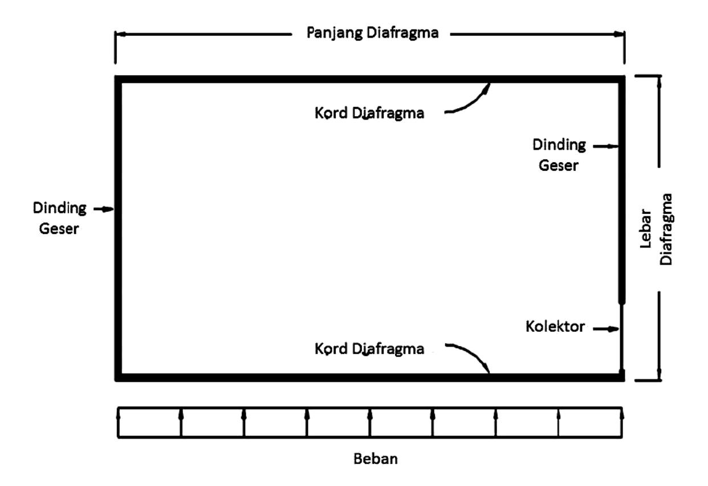

Gambar 14A - Panjang dan Lebar Diafragma

## 15 Kondisi Pembebanan Khusus

## 15.1 Distribusi Lateral Akibat Beban Terpusat

#### 15.1.1 Distribusi Lateral Beban Terpusat untuk Momen

Ketika beban terpusat di tengah bentang balok didistribusikan pada balok kayu atau pelat lantai beton parallel yang berdekatan, beban pada balok yang terdekat dengan titik tangkap harus ditentukan dengan mengalikan beban tersebut dengan faktor-faktor berikut:

Tabel 15.1.1 - Faktor Distribusi Lateral untuk Momen

| Tipe lantai                    | Beban pada balok kritis (untuk satu lajur) |
|--------------------------------|--------------------------------------------|
| papan 50 mm                    | S/1,22 1                        |
| terlaminasi dengan paku 100 mm | S/1,37 1                        |
| terlaminasi dengan paku 150 mm | S/1,53 1                        |
| Beton dengan desain struktur   | S/1,83 1                        |

&lt;sup>1S = spasi rata-rata balok. m. Jika S melebihi faktor penyebut, maka beban pada dua balok yang berdekatan akan menjadi reaksi beban, dengan asumsi bahwa pelat lantai antara balok berlaku sebagai balok sederhana.

© BSN 2013

&lt;sup>2Lihat Referensi 48 untuk informasi tambahan tentang dua atau lebih lajur lintasan

# **15.1.2 Distribusi Lateral Beban Terpusat untuk Geser**

**Tabel 15.1.2 - Distribusi lateral dalam Ketentuan Proporsi beban total** 

|             | Beban pada pusat bentang       | Beban pada ¼ bentang |                                |  |
|-------------|--------------------------------|----------------------|--------------------------------|--|
| Pusat Balok | Distribusi ke balok samping | Tengah bentang       | Distribusi ke balok samping |  |
| 1,00        | 0,00                           | 1,00                 | 0,00                           |  |
| 0,90        | 0,10                           | 0,94                 | 0,06                           |  |
| 0,80        | 0,20                           | 0,87                 | 0,13                           |  |
| 0,70        | 0,30                           | 0,79                 | 0,21                           |  |
| 0,60        | 0,40                           | 0,69                 | 0,31                           |  |
| 0,50        | 0,50                           | 0,58                 | 0,42                           |  |
| 0,40        | 0,60                           | 0,44                 | 0,56                           |  |
| 0,33        | 0,67                           | 0,33                 | 0,67                           |  |

Apabila distribusi beban untuk momen di tengah balok diketahui atau diasumsikan sesuai dengan nilai-nilai tertentu dalam dua kolom pertama pada Tabel 15.1.2, maka distribusi untuk balok sejajar yang berdekatan ketika dibebani pada atau dekat titik seperempat bentang (titik perkiraan geser maksimum) harus diasumsikan sama dengan nilai-nilai yang sesuai dalam dua kolom terakhir dari Tabel 15.1.2.

## **15.2 Kolom Berspasi**

## **15.2.1 Umum**

**15.2.1.1** Beban desain untuk kolom berspasi harus merupakan jumlah beban desain dari masing-masing komponen struktur individual.

**15.2.1.2** Peningkatan kapasitas beban kolom berspasi karena ujung-jepit yang dikembangkan oleh konektor cincin belah atau pelat geser dan blok ujung, hanya efektif dalam arah tegak lurus muka lebar dari kolom (arah sejajar dengan dimensi d1, pada Gambar 15A). Kapasitas kolom berspasi dalam arah sejajar dengan muka lebar dari kolom (arah sejajar dengan dimensi d2 dalam Gambar 15A) harus mengikuti ketentuan untuk kolom solid sederhana, sebagaimana diatur dalam 15.2.3.

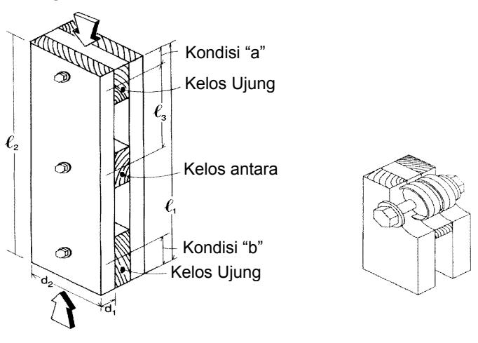

Kolom berspasi

Pelat geser sambungan pada kelos akhir

**Gambar 15A - Kolom berspasi tergabung dengan konektor cincin belah atau pelat geser** 

## **Kondisi "a"**: jarak ujung < ℓ1/20

ℓ1 dan ℓ2 = jarak antara titik tumpuan lateral pada bidang 1 dan 2,diukur dari jarak pusat titik tumpuan lateral untuk kolom berspasi menerus, dan diukur dari ujung ke ujung untuk kolom berspasi sederhana, mm.

ℓ3 = Jarak dari pusat kelos ke pusat berat konektor cincin belah atau pelat geser di kelos ujung, mm.

d1 dan d2, = dimensi melintang komponen struktur tekan persegi panjang individual di bidang tumpuan lateral, mm.

**Kondisi "b"**: ℓ1/20 < jarak ujung < ℓ1 / 10

## **15.2.2 Ketentuan kelos dan kelos ujung**

- **15. 2.2.1** Kolom berspasi harus diklasifikasikan sebagai kondisi "a" atau kondisi "b" (lihat Gambar 15A) untuk kondisi jepit ujung, sebagai berikut:
- (a) Untuk kondisi "a", pusat berat dari konektor cincin belah atau pelat geser, atau kelompok konektor, di kelos akhir harus berada di dalam ℓ1/20 dari ujung kolom.
- (b) Untuk kondisi "b", pusat berat dari konektor cincin belah atau pelat geser, atau kelompok konektor, di kelos akhir harus berada di antara ℓ1/20 dan ℓ1/10 dari ujung kolom.
- **15.2.2.2** Apabila sebuah kelos tunggal terletak di dalam 1/10 tengah panjang kolom, ℓ1, maka konektor pelat geser atau cincin belah tidak diperlukan untuk kelos ini. Jika ada dua atau lebih kelos, maka konektor cincin belah atau pelat geser harus ada dan jarak antara dua kelos yang berdekatan tidak boleh melebihi 1/2 jarak antara pusat konektor cincin belah atau pelat geser dalam kelos akhir.
- **15.2.2.3** Untuk kolom berspasi yang digunakan sebagai batang tekan pada rangka batang, titik panel yang berada pada arah lateral harus dianggap sebagai akhir dari kolom berspasi, dan bagian dari batang vertikal dan diagonal, antara batang-batang individual yang membentuk kolom berspasi, dapat dianggap sebagai kelos akhir.
- **15.2.2.4** Tebal kelos dan kelos ujung tidak boleh kurang dari komponen individual kolom berspasi dan juga tebal, lebar, dan panjang kelos dan kelos ujung tidak boleh kurang dari persyaratan untuk konektor cincin belah atau plat geser yang ukuran dan banyaknya mampu memikul beban yang dihitung dengan 15.2.2.5.
- **15.2.2.5** Untuk mendapatkan aksi kolom berspasi, konektor cincin belah atau pelat geser di masing-masing permukaan yang terhubung pada kelos ujung dan komponen individual pada setiap akhir kolom berspasi harus mempunyai ukuran dan jumlah yang mencukupi kapasitas beban dalam N sama dengan luas potongan yang disyaratkan dalam satuan mm2 dari salah satu batang individu dikali dengan konstanta kelos akhir yang sesuai, Ks, yang ditentukan dari persamaan berikut:

| Kelompok Spesies | Konstanta kelos ujung Ks    |
|---------------------|--------------------------------|
| A                   | Ks= 0,066 (ℓ1/d1 - 11)< 2 082  |
| B                   | Ks= 0,056 ( ℓ1/d1 - 11)< 1 775 |
| C                   | Ks= 0,046 ( ℓ1/d1 - 11)< 1 468 |
| D                   | Ks= 0,037 ( ℓ1/d1 - 11)< 1 161 |

**© BSN 2013 131 dari 318** Jika kolom berspasi adalah bagian dari sistem rangka batang atau rangka serupa lainnya, maka konektor cincin belah atau pelat geser yang disyaratkan oleh ketentuan sambungan dalam Pasal 12 dari Spesifikasi ini harus diperiksa terhadap konstanta kelos akhir, Ks, yang ditentukan di atas.

## 15.2.3 Faktor Stabilitas Kolom, Cp

- **15.2.3.1** Panjang kolom efektif,  $\ell_c$ , untuk kolom berspasi harus ditentukan sesuai dengan mengacu pada prinsip-prinsip mekanika teknik. Salah satu metode untuk menentukan panjang efektif kolom, apabila kondisi perletakan ujung diketahui, maka panjang kolom yang sebenarnya dikalikan dengan faktor panjang efektif yang ditentukan dalam Lampiran G,  $\ell_c$  = ( $K_e$ ) ( $\ell$ ), kecuali bahwa panjang efektif kolom,  $\ell_c$ , tidak kurang dari panjang kolom yang sebenarnya,  $\ell$ .
- **15.2.3.2** Untuk batang individual dari kolom berspasi (lihat Gambar 15A):
- (a)  $\ell_1$  /  $d_1$  tidak boleh lebih dari 80, dengan  $\ell_1$  adalah jarak antara tumpuan lateral yang menahan dalam arah tegak lurus terhadap muka lebar dari batang individual.
- (b)  $\ell_2$  /  $d_2$  tidak boleh lebih dari 50, dengan  $\ell_2$  adalah jarak antara perletakan lateral yang menahan dalam arah sejajar dengan muka lebar dari batang individual.
- (c)  $\ell_3$  /  $d_3$  tidak boleh lebih dari 40, dengan  $\ell_3$  adalah jarak antara pusat kelos dan pusat berat dari kelompok konektor cincin belah atau pelat geser dalam kelos ujung.
- **15.2.3.3** Faktor stabilitas kolom harus dihitung sebagai berikut:

$$C_{p} = \frac{1 + (F_{cE} / F_{c}^{*})}{2c} - \sqrt{\frac{1 + (F_{cE} / F_{c}^{*})}{2c}^{2} - \frac{F_{cE} / F_{c}^{*}}{c}}$$
(15.2-1)

#### Keterangan:

 $F_c'$  = nilai desain acuan tekan sejajar serat dikalikan dengan semua faktor koreksi yang berlaku kecuali  $C_p$  (lihat 2.3)

$$F_{cE} = \frac{0.822K_{x}E_{min}'}{\ell_{e} / d}$$
(15.2-2)

Kx = 2,5 untuk kondisi penjepitan "a"

- = 3,0 untuk kondisi penjepitan "b"
- c = 0,8 untuk kayu gergajian
  - = 0.9 untuk glulam struktural atau kavu komposit struktural
- **15.2.3.4** Apabila batang individual dari kolom berspasi terdiri dari spesies, mutu, atau ketebalan yang berbeda, maka nilai desain tekan sejajar serat terkoreksi, Fc', untuk batang yang lebih lemah berlaku untuk semua batang.
- **15.2.3.5** Nilai desain tekan sejajar serat terkoreksi dengan desain,  $F_c$ , untuk kolom berspasi tidak boleh melebihi nilai desain tekan sejajar serat terkoreksi,  $F_c$ , bagi batang individual yang dihitung sebagai kolom solid tanpa memperhatikan tingkat penjepitan sesuai dengan 3.7, dengan menggunakan rasio kelangsingan kolom  $\ell_2/d_2$  (lihat Gambar 15A).
- **15.2.3.6** Untuk kondisi layanan yang buruk dan/atau bahaya luar biasa, penggunaan nilai desain terkoreksi yang lebih rendah, mungkin diperlukan. Lihat Lampiran H untuk informasi

mengenai perhitungan stabilitas kolom dan Lampiran F untuk informasi mengenai koefisien variasi modulus elastisitas (COVF).

**15.2.3.7** Persamaan dalam 3.9 untuk kombinasi lentur dan pembebanan aksial yang dipikul kolom berspasi hanya untuk lentur uniaksial pada arah sejajar dengan muka terlebar batang individual (dimensi  $d_2$  dalam Gambar 15A).

#### 15.3 Kolom Tersusun

#### 15.3.1 Umum

Ketentuan berikut berlaku untuk kolom tersusun yang dipaku atau dibaut dengan 2 sampai 5 laminasi dengan:

- (a) setiap laminasi memiliki penampang persegi panjang dan setidaknya tebal 38 mm, t, ≥ 38 mm
- (b) semua laminasi memiliki tinggi yang sama (muka lebar), d
- (c) muka laminasi yang berdekatan saling bersentuhan.
- (d) semua laminasi mempunyai panjang sama dengan panjang kolom.
- (e) persyaratan sambungan dalam 15.3.3 atau 15.3.4 dipenuhi.

Kolom tersusun yang dipaku atau dibaut yang tidak memenuhi persyaratan di atas harus memiliki laminasi individual yang didesain sesuai dengan 3.6.3 dan 3.7. Apabila laminasi individual mempunyai spesies, mutu, ketebalan yang berbeda, maka kuat tekan sejajar serat yang nilai desain tekan sejajar serat terkoreksi  $F_c$ ', terkecil dan modulus elastisitas stabilitas balok dan kolom,  $E_{min}$ ', untuk laminasi terlemah berlaku.

# 15.3.2 Faktor Stabilitas Kolom, Cp

- **15.3.2.1** Panjang kolom efektif,  $\ell_e$ , untuk kolom tersusun harus ditentukan sesuai dengan prinsip-prinsip mekanika teknik. Salah satu metode untuk menentukan panjang efektif kolom, apabila kondisi penjepitan ujung diketahui, adalah dengan mengalikan panjang kolom yang sebenarnya dengan faktor panjang efektif yang ditentukan dalam Lampiran G,  $\ell_e$  = ( $K_e$ ) ( $\ell$ ).
- **15.3.2.2** Rasio kelangsingan  $\ell_{e1}/d_1$  dan  $\ell_{e2}/d_2$  (lihat Gambar 15B) dengan masing-masing rasio telah dikoreksi dengan koefisien panjang tekuk yang sesuai,  $K_e$ , dari Lampiran G, harus ditentukan. Setiap rasio harus digunakan untuk menghitung faktor stabilitas kolom,  $C_p$ , menurut 15.3.2.4 dan  $C_p$  yang lebih kecil harus digunakan dalam menentukan nilai desain tekan sejajar serat terkoreksi,  $F_c$ , untuk kolom tersebut. Nilai  $F_c$  untuk kolom tersusun tidak perlu kurang dari  $F_c$  untuk laminasi individual yang didesain sebagai kolom solid individual menurut 3.7.
- **15.3.2.3** Rasio kelangsingan,  $\ell_e/d$ , untuk kolom tersusun tidak melebihi 50, kecuali bahwa selama konstruksi  $\ell_e/d$  tidak melebihi 75.
- **15.3.2.4** Faktor stabilitas kolom harus dihitung sebagai berikut:

$$C_{p} = K_{f} \left[ \frac{1 + \left( F_{cE} / F_{c}^{*} \right)}{2c} - \sqrt{\left[ \frac{1 + \left( F_{cE} / F_{c}^{*} \right)}{2c} \right]^{2} - \frac{F_{cE} / F_{c}^{*}}{c}} \right]$$
 (15.3-1)

133 dari 318

#### Keterangan:

 $F_c^*$  = nilai desain tekan acuan sejajar serat dikalikan dengan seluruh faktor modifikasi yang berlaku kecuali  $C_p$  (lihat 2.3)

© BSN 2013

$$F_{cE} = \frac{0.822 K_s E_{min}'}{(\ell_e / d)^2}$$
(15.3-2)

- $K_f$  = 0,6 untuk kolom tersusun, dengan  $\ell_{e2}/d_2$  digunakan untuk menghitung  $F_{cE}$  dan kolom tersusun tersebut dipaku sesuai dengan 15.3.3
- $K_f = 0.75$  untuk kolom tersusun, dengan  $\ell_{e2}/d_2$  digunakan untuk menghitung  $F_{cE}$  dan kolom tersusun tersebut dibaut sesuai dengan 15.3.4
- $K_f$  = 1,0 untuk kolom tersusun, dengan  $\ell_{e1}/d_1$  digunakan untuk menghitung  $F_{cE}$  dan kolom tersusun tersebut dipaku atau dibaut sesuai dengan masing-masing 15.3.3 atau 15.3.4.
- c = 0,8 untuk kayu gergajian
- c = 0,9 untuk glulam atau kayu komposit struktural

**15.3.2.5** Untuk kondisi khusus layanan yang buruk dan/atau sangat berbahaya, penggunaan nilai desain terkoreksi yang lebih rendah mungkin diperlukan. Lihat Lampiran H untuk latar belakang informasi mengenai perhitungan stabilitas kolom dan Lampiran F untuk informasi mengenai koefisien variasi pada modulus elastisitas (COVE).

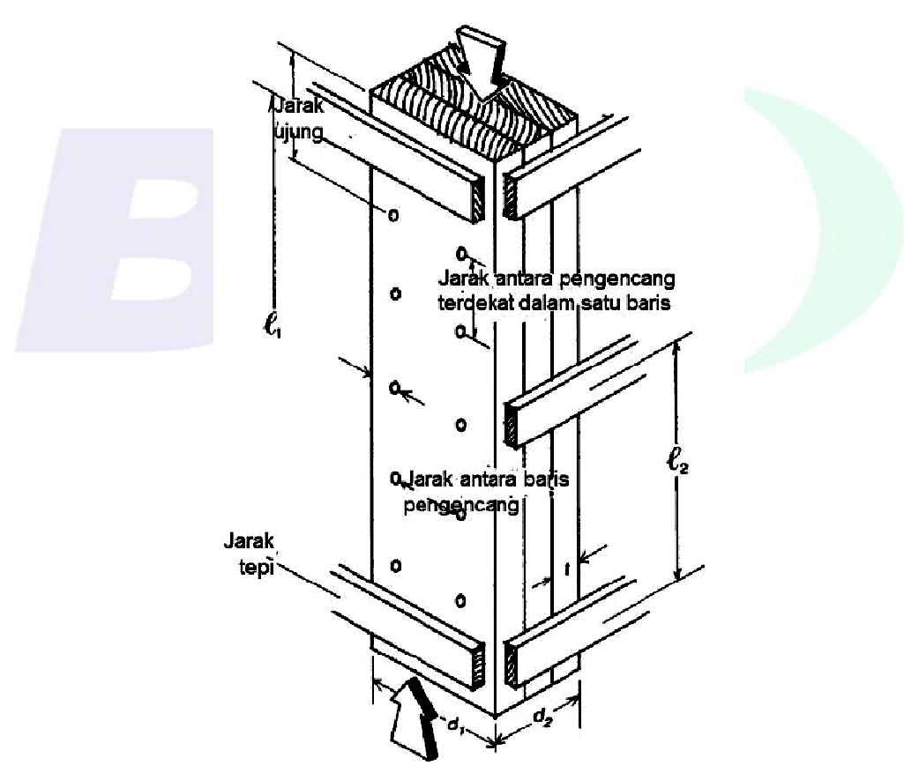

Gambar 15B - Kolom Tersusun Laminasi Mekanis

## 15.3.3 Kolom Tersusun Berpaku

**15.3.3.1** Ketentuan dalam 15.3.1 dan 15.3.2 berlaku untuk kolom tersusun berpaku (lihat Gambar 15C) dengan:

- (a) paku yang berdekatan ditanam dari sisi yang berlawanan dari kolom
- (b) semua paku menembus setidaknya 3/4 dari ketebalan lamina terluar
- (c)  $15D \le jarak ujung \le 18D$
- (d) 20D < spasi antara paku yang terdekat dalam suatu baris < 6tmin
- (e) 10D ≤ spasi antara baris paku ≤ 20D
- (f) 5D ≤ jarak ujung ≤ 20D
- (g) 2 atau lebih baris longitudinal dari paku disediakan apabila d > 3tmin

## Keterangan:

- D = diameter paku
- d = tinggi (lebar muka) dari setiap laminasi
- tmin = ketebalan dari laminasi tertipis

Apabila hanya diperlukan satu baris longitudinal paku, maka paku yang berdekatan harus berselang-seling (lihat Gambar 15C). Apabila tiga atau lebih baris longitudinal paku digunakan, maka paku dalam baris yang berdekatan harus berselang-seling.

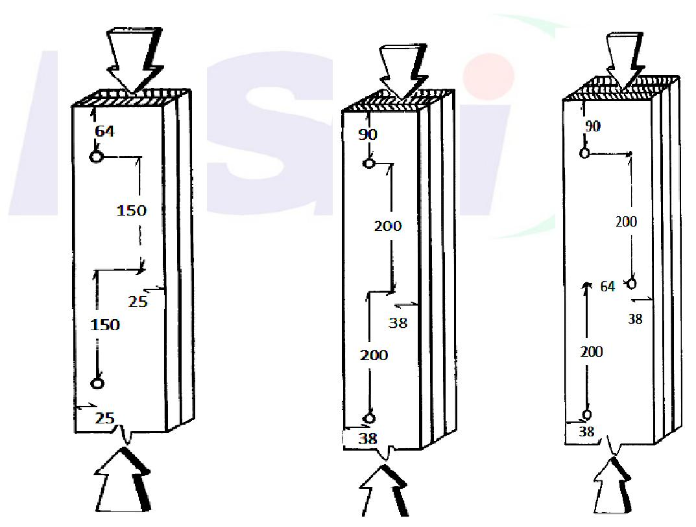

Dua laminasi 50 mm x 100 mm dengan satu baris paku biasa berukuran 10d (D = 3,76 mm, L = 75 mm) Tiga laminasi 50 mm x 100 mm dengan satu baris paku biasa berukuran 30d (D = 5,26 mm , L = 114 mm) Tiga laminasi 50 mm x 150 mm dengan dua baris paku biasa berukuran 30d (D = 5,26 mm, L = 114 mm)

Gambar 15C - Pemakuan Tipikal untuk Kolom Tersusun

© BSN 2013 135 dari 318

#### 15.3.4 Kolom Tersusun Berbaut

- **15.3.4.1** Ketentuan pada 15.3.1 and 15.3.2 diaplikasikan untuk kolom tersusun dengan baut, yaitu:
  - (a) pelat logam atau pelat ring disediakan diantara kayu dan kepala baut, dan di antara kayu dan mur
  - (b) mur dikencangkan untuk memastikan bahwa muka laminasi yang berdekatan saling bersentuhan
  - (c) untuk kayu berdaun jarum: 7D  $\leq$  jarak akhir  $\leq$  8,4D , untuk kayu berdaun lebar: 5D  $\leq$  jarak akhir  $\leq$  6D
  - (d) 4D ≤ jarak antara baut yang berdekatan dalam baris yang sama ≤ 6 tmin
  - (e) 1.5D < spasi antara baris baut < 10D
  - (f) 1.5D < jarak tepi < 10D
  - (g) 2 atau lebih baris baut longitudinal diperbolehkan dengan d > 3tmin

#### Keterangan:

D = diameter baut

d = tinggi (muka lebar) dari laminasi individual

tmin = ketebalan laminasi tertipis

**15.3.4.2** Gambar 15D memberikan contoh skema pemasangan baut yang memenuhi persyaratan sambungan yang telah disebutkan di atas.

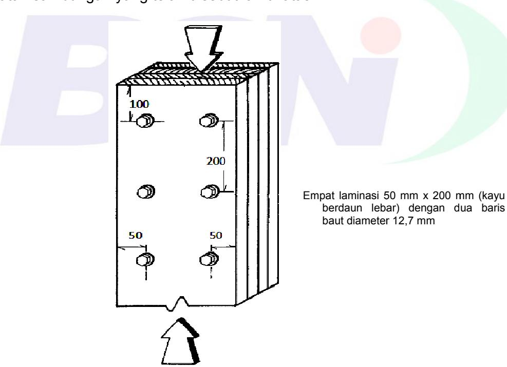

Gambar 15D - Skema pemasangan baut tipikal untuk kolom tersusun

# 15.4 Kolom Kayu dengan Beban Samping dan Eksentrisitas

#### 15.4.1 Persamaan Umum

Salah satu metode desain yang memungkinkan perhitungan beban tekan langsung yang dapat dipikul oleh kolom yang dibebani eksentris, atau kolom dengan beban samping, adalah sebagai berikut:

(a) Komponen struktur yang mengalami kombinasi beban lentur yang ditimbulkan oleh © BSN 2013 136 dari 312

eksentrisitas dan/atau beban samping terhadap salah satu atau kedua sumbu utama, dan tekan aksial, harus didesain sehingga:

$$\begin{split} &\left(\frac{f_{c}}{F_{c}'}\right)^{2} + \frac{f_{b1} + f_{c}\left(6e_{1} / d_{1}\right)\left[1 + 0.234\left(f_{c} / F_{cE1}\right)\right]}{F_{b1}'\left[1 - \left(f_{c} / F_{cE1}\right)\right]} + \\ &\frac{f_{b2} + f_{c}\left(6e_{2} / d_{2}\right)\left\{1 + 0.234\left(f_{c} / F_{cE2}\right) + 0.234\left[\frac{f_{b1} + f_{c}\left(6e_{1} / d_{1}\right)}{F_{bE}}\right]^{2}\right\}}{F_{b2}'\left\{1 - \left(f_{c} / F_{cE2}\right) - \left[\frac{f_{b1} + f_{c}\left(6e_{1} / d_{1}\right)}{F_{bE}}\right]^{2}\right\}} \le 1.0 \end{split}$$

dan

$$\frac{f_c}{F_{cE2}} + \left(\frac{f_{b1} + f_c \left(6e_1 / d_1\right)}{F_{bE}}\right)^2 < 1,0$$
 (15.4-2)

(b) Komponen struktur yang mengalami kombinasi beban lentur dan tekan dari sebuah beban aksial eksentris terhadap salah satu atau kedua sumbu utama, harus didesain sehingga:

$$\begin{split} &\left(\frac{f_{c}}{F_{c}'}\right)^{2} + \frac{f_{c}\left(6e_{1}/d_{1}\right)\left[1 + 0.234\left(f_{c}/F_{cE1}\right)\right]}{F_{b1}'\left[1 - \left(f_{c}/F_{cE1}\right)\right]} - \\ &\frac{f_{c}\left(6e_{2}/d_{2}\right)\left\{1 - 0.234\left(f_{c}/F_{cE2}\right) + 0.234\left[\frac{f_{b1} + f_{c}\left(6e_{1}/d_{1}\right)}{F_{bE}}\right]^{2}\right\}}{F_{b2}'\left\{1 - \left(f_{c}/F_{cE2}\right) - \left[\frac{f_{c}\left(6e_{1}/d_{1}\right)}{F_{bE}}\right]^{2}\right\}} \leq 1,0 \end{split} \tag{15.4-3}$$

dan

$$\frac{f_c}{F_{cE2}} + \left(\frac{f_c \left(6e_1 / d_1\right)}{F_{bE}}\right)^2 < 1,0 \tag{15.4-4}$$

dengan:

 $\text{fc} < \text{F}_{\text{CE1}} = \frac{0.822 \text{K}_{\text{s}} \text{E}_{\text{min}}^{\ \ \prime}}{\left(\ell_{\text{e1}} \ / \ d_{\text{1}}\right)^2} \quad \text{untuk lentur uniaksial terhadap sumbu kuat atau lentur biaksial}$ 

dan

 $fc < F_{CE2} = \frac{0.822 K_s E_{min}'}{(\ell_{a2} / d_2)^2}$  untuk lentur uniaksial terhadap sumbu lemah atau lentur biaksial

#### Keterangan:

fc = tegangan tekan sejajar serat karena beban aksial

fb1 = tegangan lentur terhadap sumbu kuat akibat beban samping hanya pada muka sempit

fb2 = tegangan lentur akibat beban samping hanya pada muka lebar

Fc '= nilai desain tekan sejajar serat terkoreksi yang diperkenankan seandainya hanya ada tegangan tekan aksial, ditentukan sesuai dengan 2.3 dan 3.7

Fb1' = nilai desain lentur terhadap sumbu kuat terkoreksi yang diperkenankan seandainya hanya ada tegangan lentur terhadap sumbu kuat, ditetapkan sesuai dengan 2.3 dan 3.3.3

Fb2' = nilai desain lentur terhadap sumbu lemah terkoreksi yang diperkenankan seandainya

hanya ada tegangan lentur terhadap sumbu kuat, ditetapkan sesuai dengan 2.3 dan 3.3.3

RB = rasio kelangsingan komponen struktur lentur (lihat 3.3.3)

d1 = dimensi muka lebar

d2 = dimensi muka sempit

e1 = eksentrisitas, diukur sejajar muka lebar dari sumbu tengah kolom ke sumbu tengah beban aksial

e2 = eksentrisitas diukur sejajar muka sempit dari sumbu tengah kolom ke sumbu tengah beban aksial

Panjang kolom efektif,  $\ell_{e1}$  dan  $\ell_{e2}$ , harus ditentukan sesuai dengan 3.7.1.2.  $F_{cE1}$ ,  $F_{cE2}$  ditetapkan sesuai dengan 3.7.  $F_{bE}$  harus ditentukan sesuai dengan 3.3.3.

## 15.4.2 Kolom dengan Braket Sisi

- **15.4.2.1** Rumus-rumus di 15.4.1 mengasumsikan bahwa beban eksentris diterapkan pada ujung kolom. Salah satu metode desain yang memungkinkan perhitungan tegangan lentur aktual yang sebenarnya, fb, jika beban eksentris diterapkan melalui braket pada seperempat panjang kolom bagian atas adalah sebagai berikut.
- **5.4.2.2** Asumsikan bahwa beban braket, P, pada jarak, a, dari pusat kolom (Gambar 15E), diganti dengan beban yang sama, P, diterapkan di pusat pad<mark>a bag</mark>ian atas kolom, ditambah beban samping,  $P_s$  diterapkan pada tengah tinggi kolom. Hitung  $P_s$  dengan rumus di bawah ini:

$$P_{s} = \frac{3Pa\ell_{p}}{\ell^{2}} \tag{15.4-5}$$

#### Keterangan:

P = beban aktual pada braket, N.

Ps = beban samping horisontal yang diasumsikan yang bekerja di tengah tinggi kolom, N.

a = jarak horizontal dari beban pada braket ke pusat kolom, mm.

 $\ell$  = paniang total kolom. mm.

 $\ell_c$  = jarak yang diukur secara vertikal dari titik tangkap beban pada braket ke ujung jauh kolom, mm.

Beban P harus ditambahkan pada beban kolom konsentris lainnya, dan perhitungan beban samping  $P_s$  harus digunakan untuk menentukan tegangan lentur aktual,  $f_b$ , untuk digunakan dalam rumus pada pembebanan sisi dan ujung konsentris.

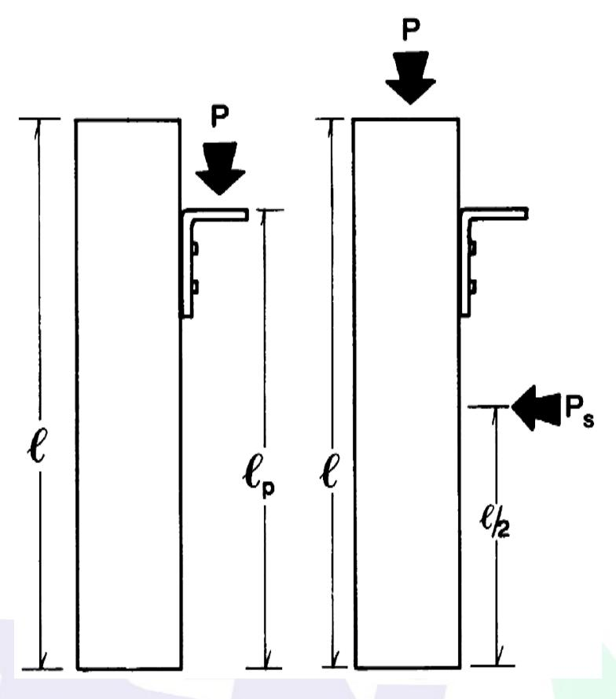

Gambar 15E - Kolom yang dibebani eksentris.

## 16 Desain Ketahanan Api Komponen Struktur Kayu

#### 16.1 Umum

Pasal 16 menetapkan ketentuan-ketentuan umum desain ketahanan api yang berlaku untuk seluruh komponen struktural kayu dan sambungan tercakup dalam Spesifikasi ini, kecuali bila dinyatakan lain. Setiap komponen kayu atau sambungan harus memiliki kapasitas dan ukuran yang cukup untuk memikul beban-beban kerja tanpa melebihi ketentuan-ketentuan desain pada Spesifikasi ini. Nilai desain acuan dan ketentuan-ketentuan desain khusus yang berlaku pada sambungan atau produk kayu tertentu yang digunakan dengan ketentuan pada Pasal ini ditetapkan pada Pasal-Pasal lain dari Spesifikasi ini.

## 16.2 Prosedur Desain untuk Komponen Struktur Kayu yang Diekspose

Tegangan yang muncul tidak boleh melebihi kekuatan tahanan yang telah dikoreksi untuk paparan api. Ketentuan-ketentuan desain komponen struktur kayu disini terbatas pada perhitungan ketahanan api yang tidak lebih dari 2 jam.

## 16.2.1 Laju Pembentukan Arang

Laju efektif pembentukan arang yang digunakan dalam prosedur ini dapat diperkirakan dari data laju nominal pembentukan arang 1 jam yang dipublikasikan menggunakan rumus berikut:

$$\beta_{\text{eff}} = \frac{1,2\beta_{\text{n}}}{_{\text{t}_{0},187}} \tag{16.2-1}$$

## **Keterangan:**

βeff = laju efektif pembentukan arang (mm/jam), disesuaikan dengan waktu paparan, t

βn = laju nominal pembentukan arang (mm/jam), laju linier pembentukan arang

berdasarkan paparan selama 1 jam

t = waktu paparan (jam)

Laju nominal pembentukan arang, βn, sebesar 38 mm/jam adalah umum diasumsikan untuk kayu gergajian solid dan kayu Glulam. Untuk βn = 38 mm/jam, laju efektif pembentukan arang, βeff, dan ketebalan lapisan arang efektif, achar, untuk setiap permukaan yang terpapar dapat dilihat pada Tabel 16.2.1.

**Tabel 16.2.1 - Laju Efektif Pembentukan Arang dan Ketebalan Lapisan Arang (untuk βn = 38 mm/jam)** 

| Ketahanan api    | Laju Efektif Pembentukan | Ketebalan Efektif Lapisan |
|------------------|--------------------------|---------------------------|
| yang disyaratkan | Arang, βeff              | Arang, achar              |
| (jam)            | (mm/jam)                 | (mm)                      |
| 1 Jam            | 46                       | 46                        |
| 1 ½ Jam          | 42                       | 64                        |
| 2 Jam            | 40                       | 81                        |

Properti penampang harus dihitung menggunakan rumus-rumus standar untuk luas, modulus penampang, dan momen inersia menggunakan dimensi penampang yang direduksi. Dimensi tersebut direduksi oleh ketebalan lapisan arang efektif, achar, untuk setiap permukaan yang terpapar api.

# **16.2.2 Kekuatan Komponen Struktur**

Untuk kayu gergajian solid, kayu glulam struktural, dan komponen kayu komposit struktural, kekuatan rata-rata komponen struktur dapat diperkirakan dengan mengalikan nilai desain acuan (Fb, Ft, Fc, FbE, FcE) dengan faktor-faktor koreksi yang ada pada Tabel 16.2.2. Nilai Fb, Fc, FbE, dan FcE serta properti penampang harus dikoreksi sebelum digunakan persamaan 3.3-6, 3.7-1, 3.9-1, 3.9-2, 3.9-3, 3.9-4, 15.2-1, 15.3-1, 15.4-1, 15.4-2, 15.4-3, atau 15.4-4.

## **16.2.3 Desain Komponen Struktur**

Tegangan yang muncul dihitung menggunakan properti penampang terreduksi ditentukan pada 16.2.1 tidak boleh melebihi kekuatan komponen struktur yang ditentukan pada 16.2.2.

## **16.2.4 Ketentuan Khusus untuk Balok Kayu Glulam Struktural**

Untuk komponen lentur kayu glulam struktural yang tertera pada Tabel 5A dan dinilai untuk laju ketahanan api 1 jam, laminasi terluar bagian tarik harus digantikan dengan laminasi inti pada bagian sisi tarik untuk balok yang tidak seimbang dan pada kedua sisi untuk balok yang seimbang. Untuk komponen lentur kayu glulam struktral yang tertera pada Tabel 5A dan dinilai untuk ketahanan api 1 ½ atau 2 jam, 2 laminasi terluar bagian tarik harus diganti dengan 2 laminasi inti bagian tarik untuk balok yang tidak seimbang dan kedua sisi untuk balok yang seimbang.

## **16.2.5 Ketentuan Untuk Dek kayu**

Dek kayu terdiri atas papan-papan dengan ketebalan (aktual) sedikitnya 50 mm. Papanpapan tersebut harus membentang diantara balok-balok tumpuan. Dek dengan satu atau dua sambungan lidah-dan-alur harus didesain sebagai balok kayu rakitan yang terpapar penuh di satu sisi. Dek dengan sambungan ujung harus didesain sebagai balok kayu rakitan yang terpapar sebagian pada sisinya dan terpapar seluruhnya pada satu muka. Untuk menghitung pengaruh dari paparan sebagian pada sisi dek, laju pembentukan arang untuk paparan terbatas tersebut harus dikurangi hingga 33% dari laju efektif pembentukan arang. Prosedur perhitungan ini tidak terkait pemisahan termal.

## **16.3 Sambungan Kayu**

Jika ketahanan api diperlukan, konektor dan pengencang harus dilindungi dari paparan api dengan kayu, papan gipsum tahan api, atau bahan pelapis lain dengan waktu ketahanan api yang telah teruji.

Tabel 16.2.2 - Faktor Koreksi untuk Desain Ketahanan Api1

|                         |                |   |                                                                           | DTI               |                   |                                             |                                            |                                         |
|-------------------------|----------------|---|---------------------------------------------------------------------------|-------------------|-------------------|---------------------------------------------|--------------------------------------------|-----------------------------------------|
|                         |                |   | Faktor tegangan desain terhadap kekuatan komponen struktur | Faktor ukuran² | Faktor volume² | Faktor pengguna an rebah 3 | Faktor stabilitas balok 3 | Faktor stabilitas kolom 3 |
| Kekuatan Lentur         | F b | Х | 2,85                                                                      | $C_F$             | C V    | $C_fu$                                      | $C_L$                                      | - <u>‡</u>                              |
| Kekuatan Tekuk Balok | $F_{bE}$       | Х | 2,05                                                                      | -                 | -                 | -                                           | -                                          | ak Ci                                   |
| Kekuatan Tarik          | Ft             | Х | 2,85                                                                      | C F    | -                 | -                                           | -                                          | ote ote                              |
| Kekuatan Tekan          | Fc             | Х | 2,53                                                                      | C F    | -                 | 1                                           | -                                          | C                                       |
| Kekuatan Tekuk Kolom | $F_cE$         | Х | 2,03                                                                      | -                 | -                 | -                                           | -                                          | adan                                    |

&lt;sup>1Lihat 4.3, 5.3 dan 8.3 untuk keberlakuan faktor koreksi pada produk tertentu 2Faktor harus dirdasarkan pada dimensi penampang awal 3Faktor harus didasarkan pada dimensi penampang terreduksi

© BSN 2013 142 dari 312

## Lampiran A (Informatif) Praktik Desain dan Pelaksanaan

## A.1 Penanganan Material

Kayu harus ditangani dan dilindungi untuk mencegah kerusakan dan penyerapan air hujan.

#### A.2 Pondasi

**A.2.1** Pondasi harus memadai untuk memikul gedung atau struktur dan beban perlu apapun, tanpa mengalami penurunan tak seragam atau berlebihan atau terangkat.

**A.2.2** Praktik pelaksanaan yang baik pada umumnya dapat mencegah kayu dari termakan rayap atau lapuk. Praktik tersebut didesain untuk mencegah kondisi-kondisi yang kondusif untuk pelapukan dan serangan serangga. Lokasi gedung harus dipilah agar air dapat mengalir jauh dari struktur. Semua sisa kayu harus dibuang jauh dari sekitar gedung sebelum penimbunan.

#### A.3 Desain Struktural

Di dalam desain harus ditinjau kemungkinan efek perubahan dimensi serat miring yang mungkin terjadi di kayu yang dipabrikasi atau diereksi pada kondisi basah (perlu ada syarat di dalam desain agar apabila perubahan dimensi yang diakibatkan pengeringan atau keseimbangan kadar air, struktur akan bergerak sebagai satu kesatuan dan pergerakan diferensial dari bagian-bagian yang serupa dan komponen struktur di sambungan akan minimum).

## A.4 Drainase

Di struktur eksterior, desainnya harus sedemikian rupa sehingga meminimumkan penggenangan air, atau drainase yang memadai harus digunakan.

#### A.5 Lawan Lendut

Lawan lendut yang memadai di rangka batang agar penampilan yang layak dan untuk melawan defleksi akibat beban, harus diberikan. Untuk konstruksi konektor kayu, lawan lendut tersebut dapat diestimasi dari rumus:

$$\Delta = \frac{\mathsf{K}_1 \mathsf{L}^3 + \mathsf{K}_2 \mathsf{L}^2}{\mathsf{H}} \tag{A.1}$$

#### Keterangan:

 $\Delta$  = lawan lendut di tengah rangka batang, mm

L = bentang rangka batang, m

H = tinggi rangka batang di tengah, m

K1 = 0,0087374 untuk semua jenis rangka batang K2 = 0,23318 untuk rangka batang datar dan bersudut

K2 = 0,05247 untuk rangka batang berbusur (yaitu rangka batang tanpa sambungan di batang tepi atas)

#### A.6 Ereksi

© BSN 2013

- **A.6.1** Persyaratan harus diberikan untuk mencegah keadaan tegangan berlebih pada komponen struktur atau sambungan selama ereksi.
- **A.6.2** Sambungan dengan baut harus dikencangkan secara pas namun tidak berlebih hingga merusak kayu di dekat mur.
- **A.6.3** Breising yang memadai harus digunakan sampai breising permanen dan/atau diafragma dipasang.

## **A.7 Inspeksi**

Persyaratan harus dibuat agar ada inspeksi yang kompeten pada material dan pekerjaan.

## **A.8 Perawatan**

Harus ada inspeksi yang kompeten dan pengencangan baut pada sambungan rangka batang dan rangka struktural.

## **A.9 Breising Kolom Kayu**

Di gedung, agar gaya-gaya bekerja dalam arah sejajar rangka batang atau balok, pengekang kolom harus diberikan dengan breising kolom harus diberikan dengan menggunakan breising diagonal atau, dalam hal rangka batang dengan meneruskan kolom ke batang tepi atas rangka batang dimana batang-batang tepi bawah dan atas secara cukup dipisahkan untuk memberikan aksi pengekangan yang memadai. Di dalam arah tegak lurus rangka batang atau balok, breising harus digunakan dengan konstruksi dinding, breising diagonal, atau breising antara kolomkolom. Breising di antara kolom-kolom harus dipasang pada bentang-bentang yang sama dengan breising di antara rangka batang.

## **A.10 Breising Rangka Batang**

Di gedung, breising rangka batang untuk menahan gaya-gaya lateral harus digunakan sebagai berikut:

- a. Breising lateral diagonal antara batang-batang tepi atas boleh ditiadakan apabila ketentuan pada Lampiran A.11 diikuti atau apabila balok-balok atap terletak dan dikencangkan dengan aman di batang tepi atas rangka batang dan ditutupi dengan papan kayu. Apabila penutup atap selain kayu digunakan, maka breising lateral diagonal harus digunakan.
- b. Dalam segala hal, breising goyangan vertikal harus dipasang di setiap bentang ke tiga atau ke empat pada interval kira-kira 10,7 m yang diukur sejajar dengan rangka batang. Juga, breising lateral batang tepi bawah harus dipasang pada bentang-bentang yang sama, sejauh memungkinkan, dan harus diteruskan dari dinding samping ke dinding samping. Selain itu, batang tekan harus dipasang di antara batang-batang tepi bawah pada panel rangka batang yang sama sebagai breising goyangan vertikal dan harus diteruskan secara menerus dari dinding ujung ke dinding ujung. Apabila konstruksi atap tidak memberikan aksi *strut* pada batang tepi atas secara memadai, maka komponen struktur tambahan terpisah harus digunakan.

**A.11 Tumpuan Lateral pada Pelengkung, Batang Tekan pada Rangka Batang, dan** *Stud*

**© BSN 2013 144 dari 312**

**A.11.1** Apabila balok-balok atap atau gording digunakan di antara pelengkung atau batangbatang tekan, atau apabila balok-balok atap atau gording diletakkan di atas sebuah pelengkung atau batang tepi atas, dan dikencangkan secara aman ke pelengkung atau batang tekan, maka nilai terbesar dari ℓe/d, yang dihitung dengan menggunakan tinggi pelengkung atau batang tekan atau dihitung dengan menggunakan dimensi terkecil pelengkung atau batang tepi tekan di antara titik-titik tumpuan lateral yang berseling, harus digunakan. Balok-balok atap atau gording harus digunakan untuk memperhitungkan susut (sebagai contoh dengan meletakkan tepi atas dari titik hubung yang tak dikeringkan kira-kira 5% dari tinggi balok di atas puncak pelengkung atau batang tepi, tetapi juga diletakkan cukup rendah untuk memberikan tumpuan lateral.

**A.11.2** Apabila papan-papan diletakkan di atas suatu pelengkung atau batang tepi tekan, dan dikencangkan dengan aman ke pelengkung atau batang tepi tekan, atau apabila penutup atap dipaku dengan memadai ke batang tepi atas rangka batang atap, maka tinggi, bukan lebar, pelengkung, batang tepi tekan, atau batang tepi atas rangka batang atap harus digunakan sebagai dimensi trekecil dalam menentukan ℓe/d.

**A.11.3** Apabila tiang dinding penahan pada konstruksi rangka ringan ditutupi memadai sedikitnya pada satu sisi, maka tinggi, bukan lebar tiang, harus diambil sebagai dimensi terkecil di dalam menghitung rasio ℓe/d. Penutup harus ditunjukkan berdasarkan pengalaman memberikan tumpuan lateral dan harus secara memadai dikencangkan.

## **Lampiran B (Informatif) Durasi Beban (Hanya DTI)**

#### **B.1 Koreksi Pada Nilai Desain Acuan Untuk Durasi Beban**

- **B.1.1** Durasi Beban Normal. Nilai desain acuan di dalam Spesifikasi ini adalah untuk durasi beban normal. Durasi beban normal ini dianggap mnimbulkan tegangan penuh pada suatu komponen struktur hingga mencapai nilai desain izin akibat beban desain penuh untuk durasi kumulatif kira-kira sepuluh tahun dan/atau aplikasi 90% beban desain penuh terus menerus selama hidup struktur tersebut, tanpa melampaui faktor keamanan.
- **B.1.2** Durasi Beban Lain. Karena tes telah membuktikan bahwa kayu mempunyai kemampuan pikul beban maksimum lebih besar untuk durasi pendek dibandingkan dengan durasi beban panjang, maka nilai desain acuan untuk durasi beban normal harus dikalikan dengan faktor durasi beban, CD, untuk durasi beban lain (lihat Gambar B1). Faktor durasi beban tidak berlaku untuk nilai desain modulus elastisitas acuan, E, maupun nilai desain tekan tegak lurus serat acuan, Fc, yang didasarkan atas limit deformasi.
- (a) Apabila komponen struktur mengalami tegangan penuh hingga mencapai nilai desain terkoreksi akibat pembebanan desain penuh secara permanen, atau untuk total kumulatif hingga melebihi sepuluh tahun, maka nilai desain acuan untuk durasi beban normal (kecuali E dan Fc yang didasarkan atas limit deformasi) harus dikalikan dengan faktor durasi beban, CD = 0,90.
- (b) Begitu pula, apabila durasi beban dari beban desain penuh tidak melebihi durasi-durasi beban berikut ini, maka nilai desain acuan untuk durasi beban normal (kecuali E dan Fc yang didasarkan atas limit deformasi) harus dikalikan dengan faktor durasi beban sebagai berikut:

| CD   | Durasi Beban         |
|------|----------------------|
| 1,15 | Durasi dua bulan     |
| 1,25 | Durasi tujuh hari    |
| 1,6  | Durasi sepuluh menit |
| 2,0  | Impak                |

- (c) Faktor durasi beban dua bulan, CD = 1,15, berlaku untuk beban salju desain berdasarkan ASCE 7.
- (d) Faktor durasi beban sepuluh menit, CD = 1,6, berlaku untuk beban gempa desain dan beban angin desain berdasarkan ASCE 7.
- (e) Faktor durasi beban yang melebihi 1,6 tidak berlaku untuk komponen struktur yang diawetkan dengan vakum tekan dengan menggunakan pengawet larut air (lihat Referensi 30), atau kimiawi penghambat api. Faktor durasi beban impak tidak berlaku untuk sambungan.

#### **B.2 Kombinasi Beban-beban dengan Durasi Berbeda**

Apabila beban-beban dengan durasi berbeda bekerja secara simultan pada komponen struktur yang mempunyai tumpuan lateral penuh untuk mencegah tekuk, maka desain komponen

**© BSN 2013 146 dari 312**

struktur dan sambungannya harus didasarkan atas kombinasi beban kritis yang ditentukan dari prosedur sebagai berikut:

- (a) Tentukan besar setiap beban yang akan terjadi pada komponen struktur dan jumlahkan subtotal dari kombinasi beban-beban tersebut. Beban desain yang ditetapkan oleh standar dan peraturan gedung yang berlaku dapat meliputi faktor-faktor kombinasi beban untuk menyesuaikan dengan probabilitas terjadinya secara simultan berbagai beban (lihat Lampiran B.4). Faktor kombinasi beban tersebut harus dimasukkan di dalam subtotal kombinasi beban.
- (b) Bagilah setiap subtotal dengan faktor durasi beban, CD, untuk beban berdurasi terpendek di dalam kombinasi beban yang sedang ditinjau.

| Durasi Beban Terpendek di | Faktor Durasi |
|------------------------------------|------------------|
| dalam Kombinasi Beban              | Beban, CD        |
| Permanen                           | 0,9              |
| Normal                             | 1,0              |
| Dua bulan                          | 1,15             |
| Tujuh hari                         | 1,25             |
| Sepuluh menit                      | 1,6              |
| Kejut                              | 2,0              |

(c) Nilai terbesar yang diperoleh menunjukkan kombinasi beban kritis yang harus digunakan di dalam mendesain komponen struktur atau sambungan.

**CONTOH:** Tentukan kombinasi beban kritis untuk suatu komponen struktur yang mengalami bebanbeban sebagai berikut:

D = beban mati yang ditetapkan berdasarkan standar atau peraturan gedung yang berlaku

L = beban hidup yang ditetapkan berdasarkan standar atau peraturan gedung yang berlaku W = beban angin yang ditetapkan berdasarkan standar atau peraturan gedung yang berlaku

Tegangan aktual akibat masing-masing kombinasi dari beban-beban di atas harus lebih kecil dari pada atau sama dengan nilai desain terkoreksi yang dimodifikasi dengan faktor durasi beban, CD, untuk beban berdurasi terpendek di dalam kombinasi beban tersebut:

| Tegangan aktual akibat | (CD)    | x (Nilai desain) |
|---------------------------|---------|------------------|
| D                         | < (0,9) | x (Nilai desain) |
| D+L                       | < (1,0) | x (Nilai desain) |
| D+W                       | < (1,6) | x (Nilai desain) |
| D+L+W                     | < (1,6) | x (Nilai desain) |

Persamaan-persamaan di atas dapat ditetapkan oleh peraturan gedung yang berlaku dan dapat dicek apabila diperlukan. Faktor kombinasi beban yang ditetapkan dalam standar atau peraturan gedung yang berlaku harus dimasukkan di dalam persamaan-persamaan di atas, sebagaimana ditetapkan di dalam B.2(a).

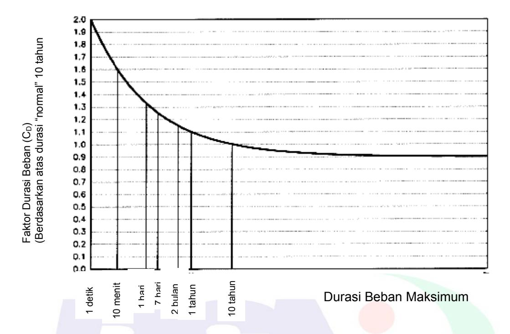

Gambar B1 - Faktor Durasi Beban, CD, untuk Berbagai Durasi Beban

# **B.3 Sambungan Mekanis**

Faktor durasi beban,  $C_D \le 1,6$  berlaku pada nilai desain acuan untuk sambungan, kecuali apabila kapasitas sambungan didasarkan atas desain bagian-bagian metal (lihat 10.2.3).

#### B.4 Faktor Reduksi Kombinasi Beban

Reduksi pada beban desain total untuk kombinasi beban tertentu memperhitungkan berkurangnya probabilitas terjadinya berbagai beban desain secara simultan. Faktor durasi beban,  $C_D$ , memperhitungkan hubungan antara kekuatan kayu dan lama pembebanan. Faktor durasi beban,  $C_D$ , tidak bergantung pada faktor reduksi kombinasi beban, dan keduanya dapat digunakan di dalam perhitungan desain (lihat 1.4.4).

# Lampiran C (Informatif) Efek Temperatur

## C.1

Apabila kayu didinginkan di bawah temperatur normal, kekuatannya akan bertambah. Apabila dipanaskan, kekuatan berkurang. Efek temperatur ini berlangsung sesaat dan besarnya bergantung pada kadar air kayu. Hingga 65°C, efek sesaat dapat pulih. Komponen struktur tersebut pada dasarnya akan kembali ke kekuatan ketika temperatur dikembalikan ke normal. Pemanasan dalam waktu lama pada temperatur di atas 65°C dapat menyebabkan kehilangan kekuatan secara permanen.

#### **C.2**

Di sejumlah daerah, komponen struktur secara periodik terekspos ke temperatur yang cukup tinggi. Sekalipun demikian, kelembaban relatif biasanya sangat rendah, sehingga kadar air kayu juga rendah. Efek sesaat dari pengeksposan periodik pada temperatur tinggi menjadi kurang nyata karena pengeringan tersebut. Juga, terlepas dari perubahan temperatur, kekuatan kayu pada umumnya bertambah dengan berkurangnya kadar air. Dengan memperhatikan faktorfaktor yang saling berlawanan tersebut, di dalam praktik biasa digunakan nilai desain acuan dari Spesifikasi ini untuk fluktuasi temperatur biasa dan pemanasan tak lama pada temperatur hingga 65°C.

© BSN 2013

## Lampiran D (Informatif) Stabilitas Lateral Balok

#### **D.1**

Rasio kelangsingan dan persamaan yang terkait dengan koreksi nilai desain lentur acuan untuk tekuk lateral di 3.3.3 didasarkan atas analisis teoritis dan tes verifikasi balok.

#### **D.2**

Perlakuan tekuk lateral pada balok sejajar dengan kolom yang diberikan pada 3.7.1 dan Lampiran H. Perhitungan stabilitas balok didasarkan atas rasio kelangsingan, RB, yang didefinisikan sebagai:

$$R_{\rm B} = \sqrt{\frac{\ell_{\rm e}d}{b^2}} \tag{D-1}$$

dengan le ditetapkan di 3.3.3.

#### **D.3**

Untuk balok dengan penampang persegi panjang dengan  $R_B$  tidak melampaui 50, nilai desain terkoreksi diperoleh dengan persamaan (dengan  $C_L \le C_V$ ):

$$F_{b}' = F_{b}^{\cdot} \left[ \frac{1 + \left( F_{bE} / F_{b}^{\cdot} \right)}{1,9} - \sqrt{\left[ \frac{1 + F_{bE} / F_{b}^{\cdot}}{1,9} \right] - \frac{F_{bE} / F_{b}^{\cdot}}{0,95}} \right]$$
 (D-2)

dengan

$$F_{bE} = \frac{1,20E_{min}'}{R_{p}^{2}}$$
 (D-3)

 $F_b^*$  = nilai desain lentur acuan dikalikan semua faktor koreksi yang berlaku kecuali  $C_{fu}$ ,  $C_V$ , dan  $C_L$  (lihat 2.3)

#### **D.4**

Modulus elastisitas acuan untuk stabilitas balok dan kolom, Emin, di Persamaan D-3 didasarkan atas persamaan berikut:

$$E_{min} = E[1-1,64 \text{ 5COV}_E](1,03)/1,66$$
 (D-4) dengan:

E = modulus elastisitas acuan

1,03 = faktor koreksi untuk mengkonversi nilai E ke basis lentur murni; gunakan 1,05 untuk glulam struktural

1,66 = faktor keamanan

COVF = koefisien variasi modulus elastisitas (lihat Lampiran F)

 $E_{min}$  merepresentasikan kira-kira nilai eksklusi bawah 5% pada modulus elastisitas lentur, ditambah faktor keamanan 1,66.

#### **D.5**

Untuk produk-produk dengan variabilitas E kurang dari pada kayu gergajian yang dipilah secara visual, nilai desain tekuk kritis yang (FbE) lebih tinggi dapat dihitung. Untuk produk yang mempunyai koefisien variasi modulus elastisitas lebih rendah, penggunaan Persamaan D-3 dan D-4 akan menghasilkan faktor keamanan 1,66 pada nilai eksklusi bawah 5%.

## Lampiran E (Informatif) Tegangan Lokal pada Kelompok Pengencang

#### E.1 Umum

Apabila kelompok pengencang terdiri atas pengencang-pengencang yang berjarak dekat yang dibebani sejajar serat, maka kapasitas kelompok pengencang mungkin dibatasi oleh kegagalan kayu di penampang neto atau sobek di sekitar pengencang yang disebabkan oleh tegangan lokal. Salah satu metode untuk mengevaluasi kekuatan komponen struktur terhadap tegangan lokal di sekitar kelompok pengencang dirangkum di dalam prosedur berikut.

- **E.1.1** Nilai desain acuan untuk sambungan keling kayu di Pasal 13 memperhitungkan efek tegangan lokal dan tidak membutuhkan modifikasi lebih lanjut menggunakan prosedur yang dirangkum di dalam Lampiran ini.
- **E.1.2** Kapasitas sambungan dengan baut besar yang berjarak dekat telah dibuktikan dibatasi oleh kapasitas kayu di sekitar sambungan. Sambungan dengan kelompok pengencang lebih kecil, seperti sambungan dengan paku pada konstruksi rangka kayu, mungkin tidak dibatasi oleh kapasitas kayu.

## **E.2 Kapasitas Tarik Penampang Neto**

Kapasitas tarik terkoreksi dihitung sesuai dengan ketentuan 3.1.2 dan 3.8.1 sebagai berikut:

$$Z_{NT}' = F_t' A_{neto}$$
 (E.2-1)

dengan:

 $Z_{NT}$ ' = kapasitas tarik terkoreksi luas penampang neto

Ft' = nilai desain tarik terkoreksi sejajar serat

Aneto = luas penampang neto menurut 3.1.2

#### E.3 Kapasitas Sobek Baris

Kapasitas sobek terkoreksi satu baris pengencang dapat diestimasi dengan menggunakan:

$$Z_{RTi}' = n_i \frac{F_v' A_{critical}}{2}$$
 (E.3-1)

dengan:

ZRti' = kapasitas sobek terkoreksi baris i

FV' = nilai desain geser terkoreksi sejajar serat

Acritical = luas geser minimum setiap pengencang pada baris i

ni = banyak pengencang di baris i

**E.3.1** Dengan mengasumsikan satu garis geser di setiap sisi balok pada sebuah baris (sebagaimana diamati pada uji sambungan baut), Persamaan E.3-1 menjadi:

$$Z_{RTi}' = \frac{F_v't}{2} [n_i S_{critical}] (2 \text{ garis geser})$$

$$= n_i F_v't S_{critical}$$
(E.3-2)

dengan:

scritical = jarak minimum di baris I yang diambil dari yang terkecil di antara jarak ujung

atau jarak antara pengencang di baris i

t = ketebalan komponen struktur

Kapasitas sobek terkoreksi total seluruh baris pengencang dapat diestimasi dari:

$$Z_{RT}' = \sum_{i=1}^{n_{row}} Z_{RTi}'$$
 (E.3-3)

dengan:

 $Z_{RT}$  = kapasitas sobek baris terkoreksi seluruh baris

 $n_{row}$  = banyak baris

- **E.3.2** Di dalam Persamaan E.3-1, diasumsikan bahwa tegangan geser yang terjadi bervariasi dari nilai maksimum  $f_V = F_V$  ke nilai minimum  $f_V = 0$  di sepanjang setiap garis geser di antara pengencang di dalam satu baris dan bahwa perubahan regangan/tegangan geser adalah linear di sepanjang geser geser. Distribusi tegangan berbentuk segitiga yang dihasilkan di setiap garis geser antara pengencang di satu baris memberikan tegangan geser sama dengan setengah dari tegangan geser desain terkoreksi,  $F_V$ /2, sebagaimana ditunjukkan di dalam Persamaan E.3-1. Asumsi ini digabungkan dengan konsep luas kritis untuk mengevaluasi tegangan di kelompok pengencang dan sangat cocok dengan hasil-hasil dari tes pada sambungan dengan baut.
- **E3.3** Penggunaan luas geser minimum setiap pengencang di dalam suatu baris untuk perhitungan kapasitas sobek baris didasarkan atas asumsi bahwa luas geser terkecil antara pengencang di dalam satu baris akan membatasi kapasitas baris pengencang. Verifikasi terbatas pada pendekatan ini diberikan dari hasil uji sambungan dengan baut.

## E.4 Kapasitas Sobek Kelompok

Kapasitas sobek terkoreksi satu kelompok "n" baris pengencang dapat diestimasi dari

$$Z_{GT}' = \frac{Z_{RT-1}'}{2} + \frac{Z_{RT-n}'}{2} + F_t' A_{group-neto}$$
 (E.4-1)

dengan:

ZGT' = kapasitas sobek kelompok terkoreksi

ZRT-1' = kapasitas sobek terkoreksi baris 1 dari pengencang yang membatasi luas kelompok kritis

ZRT-n' – kapasitas sobek terkoreksi baris n dari pengencang yang membatasi luas kelompok kritis

Agrouppeto = luas penampang kelompok kritis antara baris 1 dan baris n

**E.4.1** Untuk kelompok pengencang dengan jarak tak seragam antara baris-baris pengencang berbagai definisi luas kelompok kritis harus dicek terhadap gabungan antara sobek kelompok dan sobek baris untuk menentukan kapasitas terkoreksi penampang kritis.

**E.5.1** Modifikasi penempatan pengencang di dalam kelompok pengencang dapat digunakan untuk meningkatkan kapasitas sobek baris dan sobek kelompok yang dibatasi oleh tegangan lokal di sekitar kelompok pengencang. Jarak yang bertambah antara pengencang di dalam satu baris adalah salah satu cara untuk meningkatkan kapasitas sobek baris. Jarak yang bertambah antara baris-baris pengencang adalah salah satu cara untuk meningkatkan kapasitas sobek kelompok.

**E.5.2** Catatan kaki 2 di Tabel 11.5.1D membatasi jarak antara baris-baris terluar pengencang yang sejajar dengan komponen struktur pada pelat sambungan tunggal hingga 127 mm. Persyaratan ini diterapkan untuk membatasi tegangan lokal yang berasal dari susut pada komponen struktur kayu. Apabila pendetailan khusus digunakan untuk mengatasi susut, seperti penggunaan lubang berslot, maka batas 127 mm dapat dikoreksi.

## E.6 Solusi Contoh Baut Berseling

Hitunglah kapasitas desain terkoreksi DTI sobek kelompok, sobek baris, dan tarik luas penampang neto untuk sambungan baut geser ganda di dalam Gambar E1.

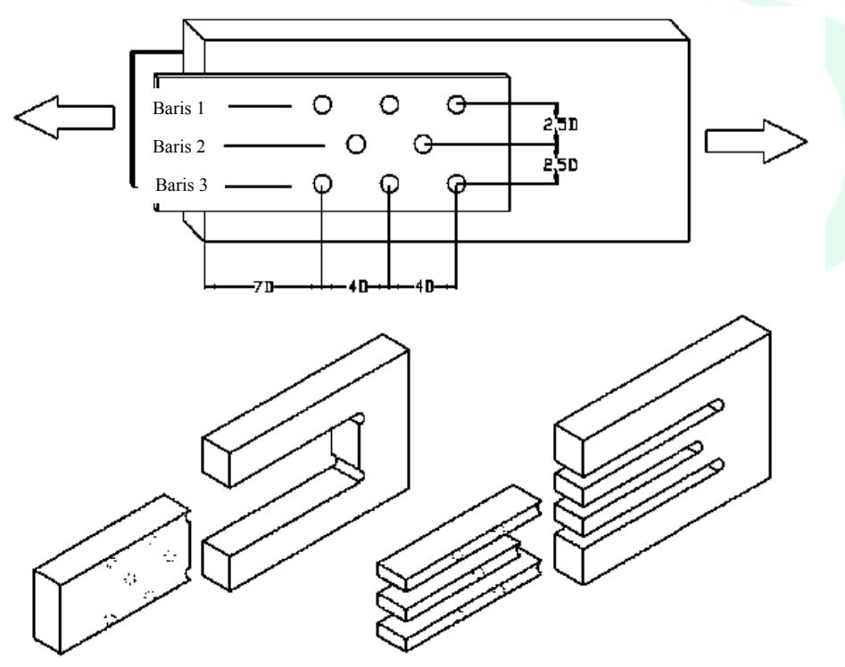

Gambar E1- Baris-baris Baut Berseling

Komponen struktur Utama:

Glulam yang merupakan gabungan 3 Douglas fir 3-1/8 x 12 (79,4 mm x 305 mm).

 $F_{t'} = 10 \text{ MPa}$  $F_{v'} = 1.65 \text{ MPa}$ 

Tebal komponen struktur utama,  $t_m = 79.4 \text{ mm}$ 

© BSN 2013

Lebar komponen struktur utama, w = 305 mm

Komponen struktur Sisi: Pelat baja A36 di masing-masing sisi Tebal pelat sisi, ts = 6,35 mm

Detail Sambungan:

Diameter baut, D: 25,4 mm

Diameter lubang baut, Dh = 26,99 mm

Nilai desain baut DTI terkoreksi,  $Z_{\parallel}$ ' = 19,5 kN (lihat Tabel 11I). Untuk desain coba-coba ini, faktor aksi kelompok,  $C_g$ , diambil sebesar 1,0).

Jarak antara baris: srow = 2,5D

Kapasitas sambungan DTI terkoreksi,  $nZ_{\parallel}$ ':

$$nZ_{\parallel}$$
' = (8 baut)(19,5 kN) = 15,87 kN

Kapasitas tarik luas penampang neto DTI terkoreksi, ZNT':

$$Z_{NT}' = F_t't[w - n_{row}D_n]$$
  
= (10 MPa)(79,4 mm)(305 mm - 3(26,99 mm)]  
= 177,62 kN

Kapasitas sobek baris DTI terkoreksi, ZRT':

$$Z_{RT-1}$$
' =  $n_i F_V$ 'tscritical  
 $Z_{RT-1}$ ' =  $3(1,65 \text{ MPa})(79,4 \text{ mm})(101,6 \text{ mm})$  =  $40 \text{ kN}$   
 $Z_{RT-2}$ ' =  $2(1,65 \text{ MPa})(79,4 \text{ mm})(101,6 \text{ mm})$  =  $26,7 \text{ kN}$   
 $Z_{RT-3}$ ' =  $3(1,65 \text{ MPa})(79,4 \text{ mm})(101,6 \text{ mm})$  =  $40 \text{ kN}$ 

$$Z_{RT}' = \sum_{i=1}^{n_{row}} Z_{RTi} = 40 + 26,7 + 40 = 106,7 \text{ kN}$$

Kapasitas sobek kelompok DTI terkoreksi, ZGT':

$${Z_{\text{GT}}}' = \frac{{Z_{\text{RT}-1}}'}{2} + \frac{{Z_{\text{RT}-3}}'}{2} + F_t't \Big[ \Big( n_{\text{row}} - 1 \Big) \Big( S_{\text{row}} - D_h \Big) \Big]$$

$$Z_{GT}$$
' = (40000 N)/2 + (40000 N)/2 + (10 MPa)(79,4 mm)[3-1)(63,5 mm - 26,99 mm)]  
= 97.99 kN

Di dalam perhitungan contoh ini, kapasitas DTI terkoreksi dibatasi pada 97,99 kN oleh sobek kelompok,  $Z_{\rm GT}$ .

#### E.7 Solusi Contoh Baris Baut

Hitunglah kapasitas desain DTI terkoreksi sobek baris dan tarik luas penampang neto untuk sambungan dengan baut satu baris geser tunggal seperti terlihat dalam Gambar E2.

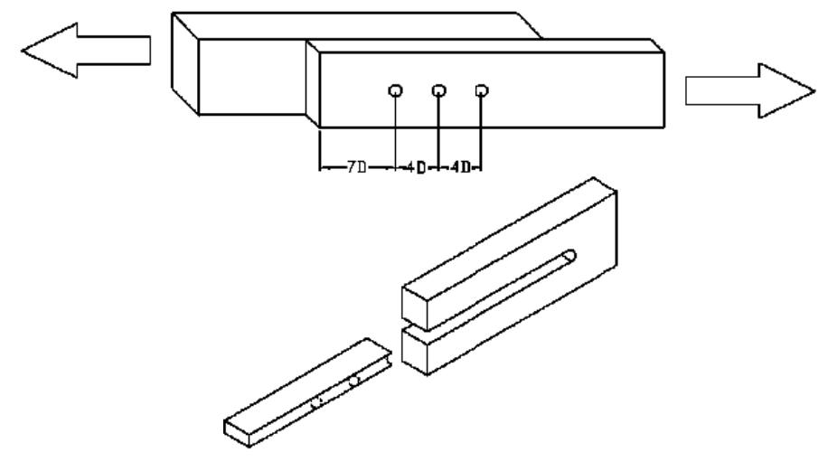

Gambar E2 - Satu Baris Baut

Komponen struktur Utama dan Sisi:

Kayu Hem-Fir 2x4 (50,8 mm x 101,6 mm)

 $F_{t'} = 5,43 \text{ MPa}$  $F_{v'} = 1 \text{ MPa}$ 

Tebal komponen struktur utama,  $t_m$  = 88,9 mm Tebal komponen struktur sisi,  $t_s$  = 38,1 mm

## Detail sambungan:

Diameter baut, D = 12,7 mm (0,5 in)Diameter lubang baut, Dh = 14,29 mm (0,5625 in)

Nilai desain baut terkoreksi DTI,  $Z_{\parallel}$ ' = 2446,5 N (Lihat Tabel 11A. Untuk desain coba-coba ini, faktor aksi kelompok,  $C_g$ , diambil sebesar 1,0).

Kapasitas Sambungan DTI terkoreksi, nZ||':

 $nZ_{\parallel}$ ' = (3 baut)(2446,5 N) = 7339,5 N

Kapasitas Tarik Luas Penampang Neto DTI terkoreksi, ZNT':

 $Z_{NT}$ ' =  $F_t$ ' $t[w - n_{row}D_h]$ 

 $Z_{NT}$ ' = (5,43 MPa)(38,1 mm)(88,9 mm – 1(14,29 mm)] = 15435 N

Kapasitas sobek baris DTI terkoreksi, ZRT':

 $Z_{RTi}$ ' =  $n_i F_v$ 'tscritical

 $Z_{RT1}$ ' = 3(1 MPa)(38.1 mm)(50.8 mm) = 5827 N

Di dalam perhitungan contoh ini, kapasitas sambungan DTI terkoreksi dibatasi pada 5827 N oleh sobek baris,  $Z_{RT}$ .

#### E.8 Solusi Contoh Baris Cincin Belah

Hitunglah kapasitas desain DTI terkoreksi sobek baris dan tarik luas penampang neto untuk sambungan cincin belah satu baris geser tunggal seperti terlihat dalam Gambar E3.

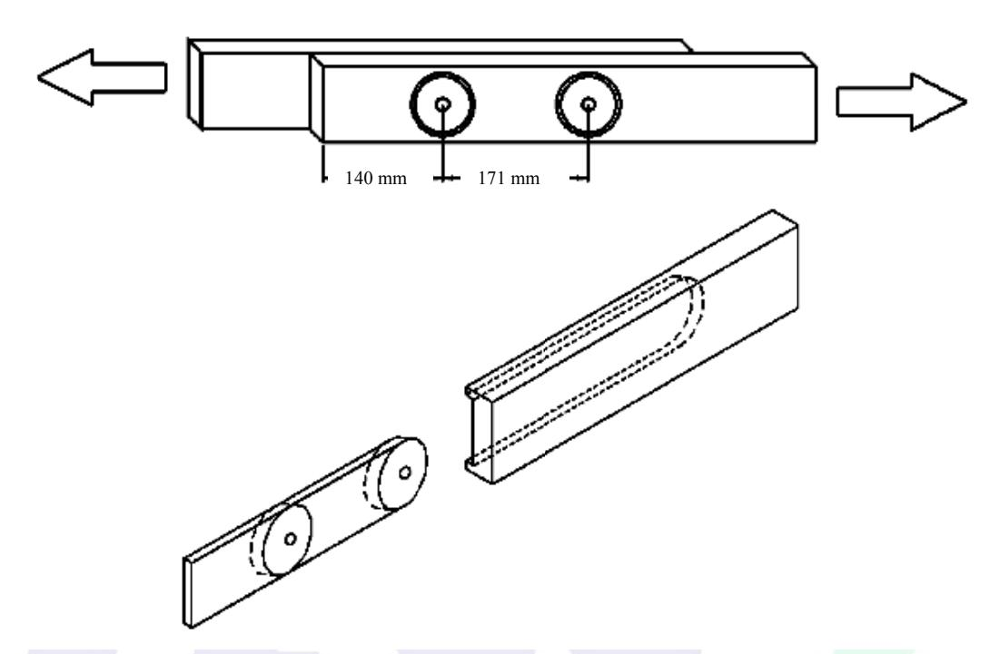

Gambar E3 - Satu baris Konektor Cincin Belah

Komponen struktur Utama dan Sisi:

Kayu Southern Pine 2x4 (50,8 mm x 101,6 mm) mutu #2

 $F_{t}$  = 5,69 MPa  $F_{v}$  = 1,21 MPa

Tebal komponen struktur utama, tm = 38,1 mmTebal komponen struktur sisi, ts  $= 38.1 \, \text{mm}$ Lebar komponen struktur utama dan sisi, w = 88,9 mm

#### Detail Sambungan:

Diameter cincin belah, D: 63,5 mm (lihat Lampiran K untuk dimensi konektor)

Nilai desain cincin belah DTI terkoreksi, P': 12,14 kN (lihat Tabel 12.2A. Untuk desain coba-coba ini, faktor aksi kelompok, Cg, diambil sebesar 1,0).

Kapasitas Sambungan DTI terkoreksi, nP':

nP' = (2 cincin belah)(12,14 kN) = 24,28 kN

Kapasitas Tarik luas Penampang Neto DTI terkoreksi, ZNT':

 $Z_{NT}' = F_t' A_{neto}$ 

 $Z_{NT}$ ' =  $F_t$ '[ $A_{2x4} - A_{lubang\ baut} - A_{luas\ proyeksi\ cincin\ belah}$ )  $Z_{NT}$ ' = (5,69 MPa)(3387 mm2 - 38,1 mm (14,29 mm) - 709,7 mm2] = 12134 N

Kapasitas Sobek Baris DTI Terkoreksi. ZRT':

© BSN 2013 157 dari 312

$$Z_{RTi}' = n_i \frac{F_v' A_{critical}}{2}$$
 $Z_{RT1}' = [(2 \text{ konektor})(1,21 \text{ MPa})/2]14023 \text{ mm}^2)$ 
 $= 16921 \text{ N}$ 

dengan:

 $A_{critical}$  = 14023 mm2 (Lihat Gambar E4)

Di dalam perhitungan contoh ini, kapasitas sambungan DTI terkoreksi dibatasi pada 12134 N oleh kapasitas tarik luas penampang neto, ZNT'.

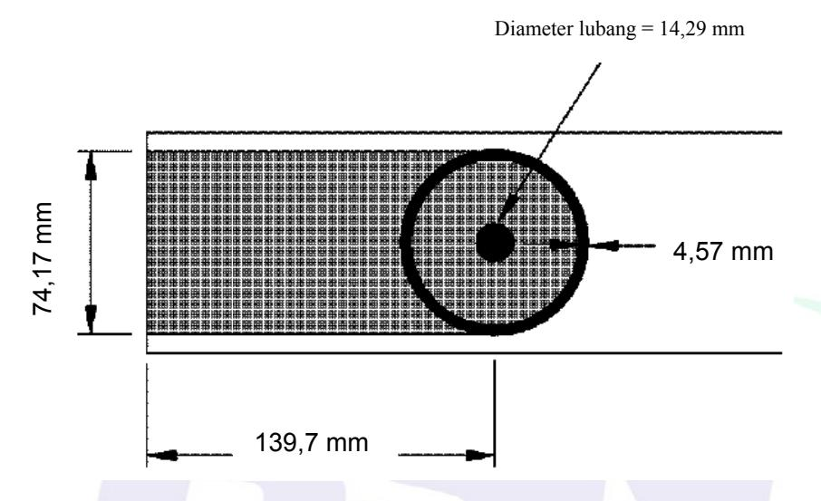

Gambar E4 - Acritical untuk Sambungan Cincin Belah

 $A_{critical}$  =  $A_{bidang tepi} + A_{bidang bawah neto} - 14023 mm2$ 

 $A_{bidang tepi}$  = (2 garis geser)(tinggi alur)(skritis)

 $= (2 \text{ garis geser})(9.53 \text{ mm})(139.7 \text{ mm}) = 2661 \text{ mm}^2.$ 

 $A_{bidang\ bawah\ neto} = (A_{bidang\ bawah}) - (A_{alur\ cincin\ belah}) - (A_{lubang\ baut})$ 

=  $[(139,7)(74,17) + (\pi)(74,17)^2/8] - (\pi/4)(74,17)^2 - 4,57 - 4,57)^2] - (\pi/4)(14,29)^2$ 

 $= 11361 \text{ mm}^2$ 

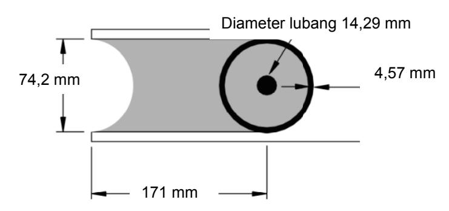

Gambar E5 - Acritical untuk Sambungan Cincin Belah (berdasarkan atas jarak antara cincin belah pertama dan ke dua)

# **Lampiran F (Informatif) Desain terhadap Aplikasi Defleksi Kritis dan Rangkak**

#### **F.1 Rangkak**

- **F.1.1** Nilai desain modulus elastisitas acuan, E, di dalam Spesifikasi ini ditujukan untuk perhitungan deformasi sesaat akibat beban. Akibat pembebanan tetap, komponen struktur kayu menunjukkan deformasi tambahan yang bergantung pada waktu (rangkak) yang biasanya dengan kecepatan lambat tetapi tetap untuk jangka waktu lama. Laju rangkak lebih besar untuk komponen struktur pada kondisi mengering pada saat dibebani atau diekspos pada temperatur yang bervariasi dan kelembaban relatif dibandingkan dengan komponen struktur pada lingkungan stabil dan kadar air konstan.
- **F.1.2** Pada aplikasi lentur tertentu, mungkin diperlukan untuk membatasi defleksi pada pembebanan jangka panjang pada level yang ditetapkan. Hal ini dapat dilakukan dengan menerapkan faktor pembesaran pada defleksi akibat beban jangka panjang. Dengan demikian, defleksi total dapat dihitung sebagai defleksi sesaat akibat komponen jangka panjang pada beban desain dikalikan dengan faktor pembesaran yang sesuai, ditambah dengan defleksi akibat komponen normal atau jangka pendek dari beban desain.

# **F.2 Variasi Modulus Elastisitas**

- **F.2.1** Nilai desain modulus elastisitas acuan, E, yang tercantum dalam Tabel 4, 5A dan 5B, (diterbitkan di Suplemen dari Spesifikasi ini) adalah nilai rata-rata dan setiap kayu yang mempunyai nilai lebih tinggi dan lebih rendah dari pada rata-rata akan terjadi di semua mutu. Penggunaan nilai modulus elastisitas rata-rata merupakan praktik lazim untuk desain komponen struktur dan rakitan kayu normal. Pengalaman lapangan dan pengujian telah menunjukkan bahwa nilai rata-rata memberikan ukuran memadai untuk deformasi atau defleksi sesaat elemen-elemen kayu tersebut.
- **F.2.2** Di dalam aplikasi tertentu dimana defleksi mungkin kritis, seperti yang mungkin terjadi pada sistem atau komponen struktur inovatif dan terekayasa dengan cermat, penggunaan nilai modulus elastisitas tereduksi mungkin dikehendaki oleh desainer. Koefisien variasi di dalam Tabel F1 dapat digunakan sebagai dasar untuk memodifikasi nilai modulus elastisitas acuan yang tercantum di dalam Tabel 4A, 4B, 4C, 4D, 4E, 4F, 5A, 5B, 5C, dan 5D untuk memenuhi kondisi penggunaan akhir tertentu.
- **F.2.3** Mengecilkan nilai desain modulus elastisitas rata-rata acuan di dalam Spesifikasi ini dengan hasil kali antara nilai rata-rata dan 1,0 dan 1,645 kali koefisien variasi yang sesuai di dalam Tabel F1 menghasilkan estimasi level modulus elastisitas terlampaui dengan masingmasing 84% dan 95%, dari setiap batang individual, sebagaimana ditetapkan di rumus berikut:

$$E_{0,16} = E(1 - 1,0 \text{ COV}_E)$$
 (F-1)  
 $E_{0,05} = E(1 - 1,645 \text{ COV}_E)$  (F-2)

**© BSN 2013 159 dari 312**

**Tabel F1 - Koefisien Variasi pada Modulus Elastisitas (COVE) untuk glulam dan Kayu gergajian** 

|                                                                          | COVE |
|--------------------------------------------------------------------------|------|
| Kayu gergajian yang dipilah secara visual (Tabel 4A, 4B, 4D, 4E, dan 4F) | 0,25 |
| Kayu yang dievaluasi secara mekanis (MEL) (Tabel 4C)                     | 0,15 |
| Kayu yang dipilah tegangannya secara mekanis (MSR)                       | 0,11 |
| Kayu glulam struktural                                                   | 0,10 |

- 1. Koefisien variasi COVE untuk kayu glulam struktural berkurang apabila banyak laminasi bertambah, dan bertambah apabila banyak laminasi berkurang. COVE = 0,10 merupakan nilai pendekatan untuk enam atau lebih laminasi.
- **F.3.1** Nilai desain modulus elastisitas acuan, E, yang tercantum di dalam Tabel 4.2.1 5A dan 5B adalah nilai modulus elastisitas semu dan meliputi komponen defleksi geser. untuk kayu gergajian, rasio antara E bebas geser dan E acuan adalah 1,03. Untuk glulam, rasio antara E bebas geser dan E acuan adalah 1,05.
- **F.3.2** Di dalam hal tertentu, penggunaan modulus elastisitas terkoreksi yang memperhitungkan secara lebih akurat untuk memperhitungkan komponen geser dari defleksi total mungkin dikehendaki oleh desainer. Metode-metode standar untuk menyesuaikan modulus elastisitas terhadap kondisi beban dan bentang-tinggi lain sudah tersedia (lihat Ref. 54). Apabila nilai modulus elastisitas acuan belum dikoreksi untuk memasukkan pengaruh deformasi geser, seperti balok kayu I prapabrikasi, tinjauan komponen geser pada defleksi total diperlukan.
- **F.3.3** Komponen geser dari defleksi total balok merupakan fungsi dari geometri balok, modulus elastisitas, modulus geser, kondisi tumpuan dan beban yang bekerja. Rasio antara modulus elastisitas bebas geser terhadap E semu adalah 1,03 untuk kondisi balok berpenampang persegi panjang dengan beban terbagi rata, rasio bentang terhadap tinggi 21:1, dan rasio modulus elastisitas bentang dan tinggi 21:1, dan rasio modulus elastisitas dan modulus geser 16:1. Rasio E bebas geser terhadap E semu adalah 1,05 untuk balok serupa dengan rasio bentang dan tinggi 17:1. Lihat Referensi 53 untuk informasi mengenai perhitungan defleksi balok untuk kondisi beban dan rasio bentang-tinggi lainnya.

## **Lampiran G (Informatif) Panjang Kolom Efektif**

## **G.1**

Panjang kolom efektif komponen struktur tekan adalah jarak antara dua titik di sepanjang komponen struktur tekan yang diasumsikan tertekuk dalam bentuk gelombang sinus.

## **G.2**

Panjang kolom efektif bergantung pada nilai translasi (defleksi) lateral dan penjepitan ujung yang terkait dengan ujung-ujung kolom dan titik-titik tumpuan lateral di antara kedua ujung kolom. Disarankan bahwa panjang efektif kolom ditentukan sesuai dengan praktik rekayasa yang baik. Nilai panjang efektif yang lebih rendah terkait dengan penjepitan ujung yang lebih besar dan translasi lateral yang lebih kecil, sedangkan nilai yang lebih tinggi akan terkait dengan penjepitan yang lebih kecil dan translasi lateral yang lebih besar.

## **G.3**

Apabila panjang kolom efektif dari metodologi dan pengalaman rekayasa tidak ada, maka koefisien panjang tekuk, Ke, yang diberikan dalam Tabel G1 dapat dikalikan dengan panjang kolom aktual, *ℓ*, atau dengan panjang kolom antara tumpuan-tumpuan lateral untuk menghitung panjang kolom efektif, *ℓe*.

## **G.4**

Apabila kekakuan lentur rangka dapat memberikan tumpuan terhadap tekuk, maka koefisien panjang tekuk, Ke, untuk panjang kolom bergoyang, *ℓ*, bergantung pada besarnya kekakuan lentur yang diberikan oleh komponen struktur sebidang lainnya, yang terhubung dengan setiap ujung segmen yang bergoyang. Apabila kekakuan gabungan dari komponen struktur tersebut cukup kecil relatif terhadap segmen kolom bergoyang, maka Ke dapat melebihi nilai yang diberikan dalam Tabel G1.

**© BSN 2013 161 dari 312**

**Tabel G1 - Koefisien Panjang Tekuk, Ke,** 

| Ragam Tekuk                                                                      |      |                                                |     |     |      |     |
|----------------------------------------------------------------------------------|------|------------------------------------------------|-----|-----|------|-----|
| Nilai Ke teoritis                                                                | 0,5  | 0,7                                            | 1,0 | 1,0 | 2,0  | 2,0 |
| Nilai Ke desain yang disarankan apabila kondisi ideal merupakan pendekatan | 0,65 | 0,80                                           | 1,2 | 1,0 | 2,10 | 2,4 |
| Kode kondisi ujung                                                               |      | Tidak dapat berotasi, tidak dapat bertranslasi |     |     |      |     |
|                                                                                  |      | Dapat berotasi, tidak dapat bertranslasi       |     |     |      |     |
|                                                                                  |      | Tidak dapat berotasi, dapat bertranslasi       |     |     |      |     |
|                                                                                  |      | Dapat berotasi, dapat bertranslasi             |     |     |      |     |

**Lampiran H (Informatif)** 

#### Stabilitas Lateral Kolom

#### **H.1**

Kolom kayu solid (solid) dapat dikelompokkan menjadi tiga kelas panjang, yang dicirikan dengan ragam kegagalan pada beban ultimit. Untuk kolom pendek berpenampang persegi panjang dengan rasio antara panjang dan dimensi melintang terkecil,  $\ell_e/d$ , kecil, kegagalan adalah secara hancur. Untuk rasio  $\ell_e/d$  sedang, kegagalan pada umumnya merupakan kombinasi antara hancur dan tekuk. Pada rasio  $\ell_e/d$  besar, kolom kayu panjang akan berperilaku pada dasarnya sebagai kolom Euler dan gagal akibat tekuk atau defleksi lateral. Desain ketiga kelas panjang ini disajikan dengan satu persamaan kolom, yaitu Persamaan H-1.

#### H-2

Untuk kolom solid berpenampang persegi panjang dengan rasio kelangsingan,  $\ell_e/d$ , tidak melampaui 50, nilai desain tekan terkoreksi sejajar serat diperoleh dari persamaan:

$$F_{c}' = F_{c}^{*} \left[ \frac{1 + F_{cE} / F_{c}^{*}}{2c} - \sqrt{\left[ \frac{1 + F_{cE} / F_{c}^{*}}{2c} \right]^{2} - \frac{F_{cE} / F_{c}^{*}}{c}} \right]$$
 (H-1)

#### Keterangan:

$$F_{cE} = \frac{0.822E_{min}'}{(\ell_{o}/d)^{2}}$$
 (H-2)

Fc\* = nilai desain tekan acuan sejajar serat dikalikan dengan semua faktor koreksi yang berlaku kecuali CP (lihat 2.3)

- c = 0,80 untuk kayu gergajian
- c = 0,85 untuk tiang dan pancang kayu bundar
- c = 0,90 untuk glulam atau kayu tekan struktural

Persamaan H-2 diturunkan dari persamaan Euler standar, dengan radius girasi, r, dikonversi ke dimensi penampang terkecil yang lebih mudah, d, dari kolom berpenampang persegi panjang.

## H-3

Persamaan untuk nilai desain tekan terkoreksi, Fc', di dalam Spesifikasi ini adalah untuk kolom yang mempunyai penampang persegi panjang. Persamaan tersebut dapat digunakan untuk bentuk penampang lain dengan mensubstitusikan r√12 untuk d di dalam persamaan-persamaan, dengan r adalah radius girasi yang berlaku untuk penampang kolom tersebut.

## H-4

Faktor 0,822 di dalam Persamaan H-2 merepresentasikan koefisien tekuk Euler untuk penampang persegi panjang yang dihitung sebesar  $\pi^2/12$ . Modulus elastisitas untuk stabilitas balok dan kolom,  $E_{\text{min}}$ , di dalam Persamaan H-2 merepresentasikan pendekatan nilai pengeluaran bawah 5% pada modulus elastisitas lentur murni, ditambah faktor keamanan 1,66 (lihat Lampiran D.4).

#### H.5

© BSN 2013

Nilai desain terkoreksi yang didasarkan atas Persamaan H-1 dan H-2 biasanya digunakan untuk hampir semua desain kolom kayu gergajian. Apabila ada bahaya luar biasa, faktor reduksi yang lebih besar mungkin digunakan. Alternatif lain, untuk penggunaan akhir yang kurang kritis, desainer dapat memilih untuk menggunakan faktor keamanan yang lebih kecil.

#### **H.6**

Untuk produk-produk dengan variabilitas E lebih kecil dari pada kayu gergajian yang dipilah secara visual, nilai desain tekuk kritis yang lebih tinggi dapat dihitung. Untuk produk yang mempunyai koefisien variasi (COVE) lebih rendah, penggunaan Persamaan H-2 akan menghasilkan faktor keamanan 1,66 pada nilai eksklusi bawah 5%.

# **Lampiran I (Informatif) Persamaan-persamaan Batas Leleh untuk Sambungan**

## **I.1 Ragam-ragam Leleh**

Persamaan-persamaan limit leleh yang ditetapkan di dalam 11.3.1 untuk pengencang tipe pasak seperti baut, sekrup kunci, sekrup kayu, paku, dan pantek merepresentasikan empat ragam leleh sambungan utama (lihat Gambar I1). Ragam Im dan Is merepresentasikan leleh yang didominasi tumpu pada serat kayu yang kontak dengan pengencang pada komponen struktur berturut-turut utama (*main*) atau samping (*side*). Ragam II merepresentasikan berputarnya pengencang dengan pusat putaran di bidang geser pada sambungan geser tunggal dengan kehancuran lokal serat kayu di dekat muka komponen struktur kayu. Ragam IIIm dan IIIs merepresentasikan leleh pengencang akibat lentur di satu titik sendi plastis per bidang geser, dan leleh yang didominasi tumpu pada serat kayu yang kontak dengan pengencang di berturutturut komponen struktur utama dan samping. Ragam IV merepresentasikan leleh pengencang karena lentur di dua titik sendi plastis per bidang geser, dengan kehancuran lokal serat kayu terbatas di dekat bidang geser.

## **I.2 Kekuatan Tumpu Pasak untuk Komponen struktur Baja**

Kekuatan tumpu pasak, Fe, untuk komponen struktur baja harus didasarkan atas praktik desain baja yang dapat diterima (lihat Referensi 39, 40, dan 41). Nilai desain di dalam Tabel 11B, 11D, 11G, 11I, 11J, 11M, dan 11N adalah untuk pelat baja ASTM A36 dengan tebal 6,35 mm, ASTM A653 Mutu 33 nomor 3 dan lebih tipis, dengan kekuatan tumpu pasak sebanding dengan kekuatan tarik ultimit. Kekuatan tumpu yang digunakan untuk menghitung beban leleh sambungan merepresentasikan masing-masing 2,4 Fu dan 2,2 Fu yang didasarkan atas ketentuan di Referensi 39, 40, dan 41 untuk kekuatan tumpu komponen struktur baja di sambungan). Untuk memperhitungkan faktor durasi beban pada sambungan tersebut, kekuatan tumpu telah dibagi dengan 1,6.

## **I.3 Kekuatan Tumpu Pasak untuk Komponen Struktur Kayu**

Kekuatan tumpu pasak, Fe, untuk komponen struktur kayu dapat ditentukan sesuai dengan ASTM D 5764.

# **I.4 Kekuatan Leleh Lentur Pengencang, Fyb**

Apabila standar terpublikasi mengenai properti kekuatan pengencang belum tersedia, desainer harus menghubungi pabrik pengencang terkait untuk menentukan kekuatan leleh lentur untuk desain sambungan. ASTM F 1575 memberikan metode standar untuk menguji kekuatan leleh lentur paku.

Kekuatan leleh lentur pengencang, Fyb, harus ditentukan dengan metode ofset 5% diameter (0,05 D) dari kurva beban – peralihan yang diperoleh dari uji lentur pengencang. Sekalipun demikian, untuk pengencang pendek dengan diameter besar, dimana uji lentur langsung tidak praktis, data uji dari tarik tes sebagaimana ditetapkan di dalam ASTM F 606 dapat dievaluasi untuk mengestimasi Fyb.

Penelitian menunjukkan bahwa  $F_{yb}$  untuk baut kira-kira ekuivalen dengan rata-rata kekuatan tarik dan kekuatan ultimit tarik,  $F_{yb} = F_y/2 + F_u/2$ . Berdasarkan atas pendekatan ini, 331 MPa  $\leq$   $F_{yb} \leq$  965 MPa untuk baut berbagai mutu SAR J429. Jadi, riset-riset tersebut mengindikasikan bahwa  $F_{yb} = 310$  MPa masuk akal untuk banyak baut yang tersedia. Uji pada sejumlah terbatas benda uji sekrup kunci mengindikasikan bahwa  $F_{yb} = 310$  MPa juga masuk akal untuk sekrup kunci yang banyak tersedia dengan D > 9,52 mm.

Pengujian pada sejumlah terbatas benda uji paku boks dan paku biasa dari 12 pabrik paku USA mengindikasikan bahwa  $F_{yb}$  meningkat dengan bertambahnya diameter paku, dan dapat melebihi 690 MPa untuk diameter paku sangat kecil. Uji tersebut mengindikasikan bahwa nilai  $F_{yb}$  yang digunakan di dalam Tabel 11N sampai 11R adalah masuk akal untuk banyak paku boks dan paku biasa berdiameter kecil yang tersedia (D < 5,08 mm). Nilai desain untuk paku biasa berdiameter besar (D > 5,08 mm) didasarkan atas pendekatan ekstrapolasi  $F_{yb}$  dari studi terbatas tersebut di atas. Untuk paku baja yang diperkeras,  $F_{yb}$  diasumsikan kira-kira 30% lebih tinggi dari pada paku biasa yang berdiameter sama. Nilai desain di dalam Tabel 11J sampai 11M untuk sekrup kayu dan sekrup kunci dengan diameter kecil (D < 0,525 mm) didasarkan atas estimasi  $F_{yb}$  untuk paku biasa dengan diameter sama. Tabel I1 memberikan nilai  $F_{yb}$  yang didasarkan atas jenis pengencang dan diameter.

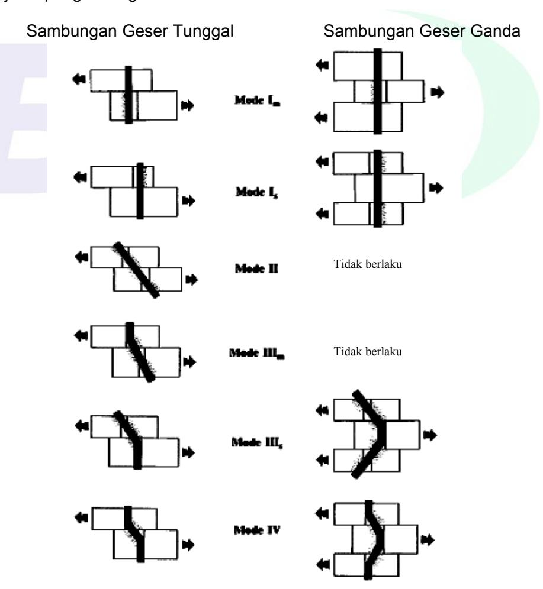

Gambar I1 - (Informatif) Ragam-ragam Leleh Sambungan

© BSN 2013 166 dari 312

## **I.5 Pengencang Berulir**

Ketahanan momen tereduksi pada bagian berulir dari pengencang tipe pasak dapat diperhitungkan dengan menggunakan diameter inti, Dr, di dalam perhitungan nilai desain lateral acuan. Penggunaan diameter, D, diperbolehkan apabila bagian ulir dari pengencang cukup jauh dari bidang geser sambungan. Sebagai contoh, diameter D dapat digunakan apabila panjang bagian ulir bertumpu pada komponen struktur utama dari sambungan dua komponen struktur tidak lebih dari ¼ panjang tumpu total di komponen struktur utama (komponen struktur yang memegang ulir). Untuk komponen struktur dengan tiga atau lebih komponen struktur, diameter D dapat digunakan apabila panjang ulir yang menumpu di komponen struktur terluar tidak melebihi ¼ dari panjang tumpu total komponen struktur terluar (komponen struktur yang memegang ulir). Penggunaan diameter D diperkenankan apabila diameter badan baut penuh yang didefinisikan di 11.1.2 digunakan karena panjang tumpu ulir pada umumnya kecil di komponen struktur yang memegang ulir. Untuk panjang ulir lebih besar dari pada ¼ panjang tumpu total di komponen struktur yang memegang ulir, efek ketahanan momen tereduksi pada baut yang didefinisikan dalam 11.1.2 kecil apabila dievaluasi dengan menggunakan analisis yang lebih rinci.

Nilai desain lateral acuan untuk sambungan dengan diameter badan tereduksi sekrup kunci dan sekrup kayu ulir gilas didasarkan atas diameter inti, Dr, untuk memperhitungkan diameter yang berkurang pada pengencang-pengencang tersebut. Nilai desain tersebut juga dapat berlaku pada sekrup kunci dengan diameter badan penuh dan sekrup kayu ulir potong karena panjang ulir untuk pengencang-pengencang ini pada umumnya tidak diketahui dan/atau panjang tumpu ulir yang didasarkan atas dimensi tipikal melebihi ¼ panjang tumpu total di komponen struktur yang memegang ulir. Untuk sambungan baut, nilai desan lateral acuan didasarkan atas diameter D.

Salah satu metode alternatif untuk memperhitungkan ketahanan momen dan lentur bagian berulir dari pengencang dan momen yang bekerja di seluruh panjang pengencang, terdapat di publikasi dari AF&PA yaitu *Technical Report 12-General Dowel Equations for Calculating Lateral Connection Values* (lihat Referensi 51). Adanya sekumpulan persamaan memungkinkan penggunaan berbagai diameter pengencang untuk ketahanan tumpu dan ketahanan momen di setiap komponen struktur.

**Tabel I1 - Kekuatan Leleh Lentur Pengencang, Fyb**

| Jenis Pengencang                                                                      |     |  |  |  |
|---------------------------------------------------------------------------------------|-----|--|--|--|
| Baut, sekrup kunci (dengan D> 9,53 mm, pin dorong (SAE J429 Mutu 1 – Fy = 248 MPa) | 310 |  |  |  |
| Paku biasa, boks, atau sinker, pantek, sekrup kunci, sekrup kayu (baja                |     |  |  |  |
| karbon rendah sampai sedang)                                                          |     |  |  |  |
| 2,52 mm < D < 3,61 mm                                                                 | 690 |  |  |  |
| 3,61 mm < D < 4,50 mm                                                                 | 620 |  |  |  |
| 4,50 mm < D < 5.99 mm                                                                 | 551 |  |  |  |
| 5.99 mm < D < 6.93 mm                                                                 | 483 |  |  |  |
| 6.93 mm < D < 8,74 mm                                                                 | 414 |  |  |  |
| 8,74 mm < D < 9,53 mm                                                                 | 310 |  |  |  |

**Tabel I1 - Kekuatan Leleh Lentur Pengencang, Fyb (lanjutan)** 

**© BSN 2013 167 dari 312**

| Jenis Pengencang                               | Fyb (MPa) |
|------------------------------------------------|-----------|
| Paku baja yang diperkeras (baja karbon sedang) |           |
| 3,05 mm < D < 3,61 mm                          | 896       |
| 3,61 mm < D < 4,88 mm                          | 793       |
| 4,88 mm < D < 5.26 mm                          | 689       |

**Lampiran J (Informatif)** 

#### Solusi Rumus Hankinson

#### **J.1**

Apabila komponen struktur dibebani lentur pada sudut terhadap serat antara  $0^{\circ}$  dan  $90^{\circ}$ , atau apabila konektor cincin belah atau pelat geser, baut, atau sekrup kunci dibebani pada sudut terhadap serat  $0^{\circ}$  dan  $90^{\circ}$ , maka nilai desain pada sudut terhadap serat harus ditentukan dengan menggunakan rumus Hankinson.

#### **J.2**

Rumus Hankinson digunakan untuk kondisi dimana permukaan yang dibebani tegak lurus arah beban yang bekerja.

#### **J.3**

Apabila gaya resultan tidak tegak lurus permukaan yang sedang ditinjau, maka sudut  $\theta$  adalah sudut antara arah serat dan arah komponen gaya yang tegak lurus permukaan.

#### **J.4**

Permukaan tumpu untuk konektor cincin belah atau pelat geser, baut atau sekrup kunci diasumsikan tegak lurus beban lateral yang bekerja.

#### **J.5**

Kekuatan tumpu kayu bergantung pada arah serat terhadap arah beban yang bekerja. Kayu lebih kuat menahan tekan sejajar serat dibandingkan tekan tegak lurus serat. Variasi kekuatan pada berbagai sudut terhadap serat antara 0° dan 90° dapat dihitung dengan menggunakan rumus Hankinson sebagai berikut:

$$F_{\theta}' = \frac{F_{c}^{*}F_{c\perp}'}{F_{c}^{*}\sin^{2}\theta + F_{c\perp}'\cos^{2}\theta}$$
 (J-1)

dengan:

Fc = nilai desain tekan terkoreksi sejajar serat dikalikan dengan semua faktor koreksi yang berlaku kecuali faktor stabilitas kolom

Fc⊥' = nilai desain tekan terkd tegak lurus serat

Fθ' = nilai desain tumpu terkoreksi pada sudut terhadap serat

= sudut antara arah beban dan arah serat (sumbu longitudinal komponen struktur)

Di dalam menentukan nilai desain tumpu pasak pada sudut terhadap serat untuk sambungan baut atau sekrup kunci, rumus Hankinson mempunyai bentuk sebagai berikut:

$$F_{e\theta}{'} = \frac{F_{e\Box}{}^*F_{e\bot}{'}}{F_{e\Box}\sin^2\theta + F_{e\bot}\cos^2\theta} \tag{J-2}$$

dengan:

Fe∥ = kekuatan tumpu pasak sejajar serat

Fe = kekuatan tumpu pasak tegak lurus serat

Fe0 = kekuatan tumpu pasak pada sudut terhadap serat

Di dalam menentukan nilai desain terkoreksi untuk baut atau sekrup kunci pada sambungan kayu ke metal atau sambungan kayu ke kayu, dengan komponen struktur utama atau samping dibebani sejajar serat, bentuk rumus Hankinson berikut ini memberikan solusi alternatif:

$$Z_{\theta}' = \frac{Z_{\theta}' Z_{\perp}'}{Z_{\theta}' \sin^2 \theta + Z_{\perp}' \cos^2 \theta}$$
 (J-3)

Untuk sambungan kayu ke kayu dengan komponen struktur samping dibebani sejajar serat,

- $Z_{\parallel}$  = nilai desain lateral terkoreksi untuk sambungan sekrup kunci atau baut tunggal dengan komponen struktur kayu utama atau samping dibebani sejajar serat,  $Z_{\parallel}$
- $Z_{\perp}$  = nilai desain lateral terkoreksi untuk sambungan sekrup kunci atau baut tunggal dengan komponen struktur samping dibebani sejajar serat dan komponen struktur utama dibebani tegak lurus serat,  $Z_{m^{\perp}}$

Untuk sambungan kayu ke kayu dengan komponen struktur utama dibebani sejajar serat,

- $Z_{\parallel}$  = nilai desain lateral terkoreksi untuk sambungan sekrup kunci atau baut tunggal dengan komponen struktur utama atau samping kayu dibebani sejajar serat,  $Z_{\parallel}$
- Z⊥' = nilai desain lateral terkoreksi untuk sambungan sekrup kunci atau baut tunggal dengan komponen struktur utama dibebani sejajar serat dan komponen struktur samping dibebani tegak lurus serat, Zs⊥

Untuk sambungan kayu ke metal,

- $Z_{\parallel}$ ' = nilai desain lateral terkoreksi untuk sambungan sekrup kunci atau baut tunggal dengan komponen struktur kayu dibebani sejajar serat,  $Z_{\parallel}$
- Z⊥' = nilai desain lateral terkoreksi untuk sambungan sekrup kunci atau baut tunggal dengan komponen struktur kayu dibebani tegak lurus serat, Z⊥

Di dalam menentukan nilai desain terkoreksi untuk konektor cincin belah atau pelat geser atau paku keling kayu, rumus Hankinson mempunyai bentuk sebagai berikut:

$$N' = \frac{P'Q'}{P'\sin^2\theta + Q'\cos^2\theta}$$
 (J-4)

dengan:

- P' = nilai desain lateral terkoreksi sejajar serat untuk unit konektor cincin belah tunggal atau unit konektor pelat geser
- Q' = nilai desain lateral terkoreksi tegak lurus serat untuk unit konektor cincin belah tunggal atau unit konektor pelat geser
- N' = nilai desain lateral terkoreksi pada sudut terhadap serat untuk unit konektor cincin belah atau unit konektor pelat geser

Nomograf yang disajikan di dalam Gambar J1 memberikan solusi grafis untuk rumus Hankinson.

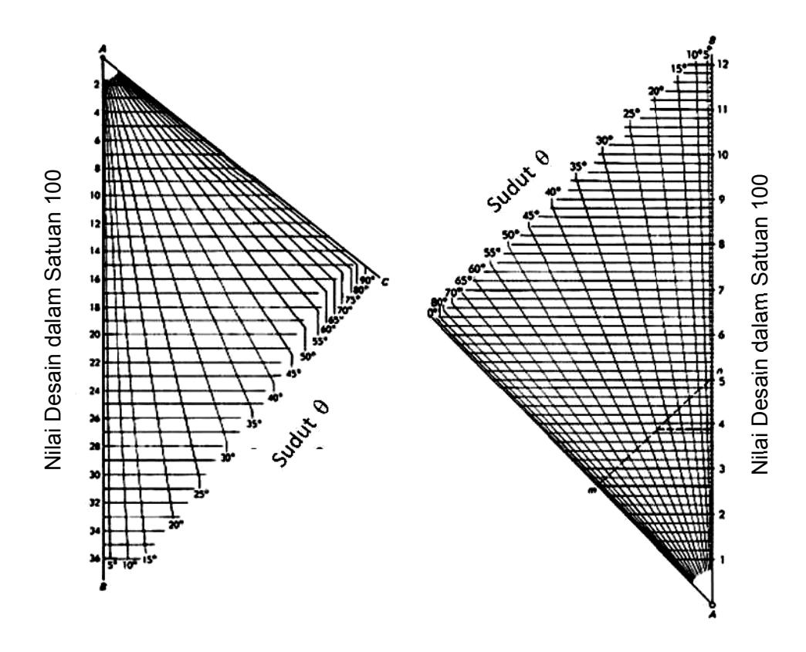

Gambar J1 - Solusi Rumus Hankinson

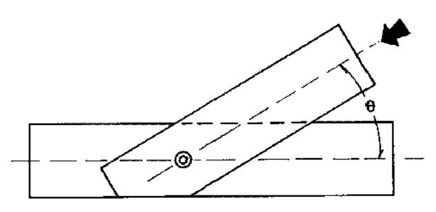

Gambar J2 - Sambungan yang dibebani pada Sudut terhadap Serat

Solusi Contoh untuk Sambungan Cincin Belah atau Pelat Geser

Asumsikan bahwa P' = 22374 N, Q' = 11654 N, dan  $\theta$  = 35 $^{\circ}$  di dalam Gambar J2. Pada garis A-B di dalam Gambar J1, dapatkan lokasi 22374 N di titik n. Di garis A-B yang sama, dapatkan lokasi 11654 N, dan proyeksikan ke titik m di garis A-C. Pada perpotongan antara garis m-n dan garis radial 35 $^{\circ}$ , proyeksikan A-B dan baca nilai desain terkoreksi ASD, N' = 17215 N.

Lampiran K (Informatif) Dimensi tipikal untuk konektor cincin belah dan pelat geser

| CINCIN BELAH 1                                          | 63,5 mm               | 101,6 mm               |
|--------------------------------------------------------------------|-----------------------|------------------------|
| Cincin belah                                                       |                       |                        |
| Diameter dalam di pusat apabila tertutup                           | 63,50 mm              | 101,6 mm               |
| Tebal metal di pusat                                               | 4,14 mm               | 4,90 mm                |
| Tinggi metal (lebar cinci)                                         | 19,05 mm              | 2,54 mm                |
| Alur                                                               |                       |                        |
| Diameter dalam                                                     | 65.02 mm              | 103,63 mm              |
| Lebar                                                              | 4,57 mm               | 5,33 mm                |
| Tinggi                                                             | 9,53 mm               | 12,70 mm               |
| Diameter lubang baut di komponen struktur kayu                     | 14,29 mm              | 20,64 mm               |
| Cincin, standar                                                    |                       |                        |
| Besi bulat, besi lunak atau cor, diameter                          | 53,98 mm              | 76,2 mm                |
| Besi bulat, besi tempa (minimum)                                   |                       |                        |
| Diameter                                                           | 34,93 mm              | 50.8 mm                |
| Tebal                                                              | 2,38 mm               | 3,97 mm                |
| Pelat bujur sangkar                                                |                       |                        |
| Panjang sisi                                                       | 50,8 mm               | 76,2 mm                |
| Tebal                                                              | 3,18 mm               | 4,76 mm                |
| Luas Proyeksi: bagian satu cincin belah di dalam komponen struktur | 709,7 mm 2 | 1445,1 mm 2 |

1Atas izin Cleveland Steel Specialty Co.

| DEL AT 05050                     | 22.22               | 00.00               | 1010                 | 101.0                |
|----------------------------------|---------------------|---------------------|----------------------|----------------------|
| PELAT GESER                      | 66,63 mm            | 66,63 mm            | 101,6 mm             | 101,6 mm             |
| Pelat geser 1         | 2                   |                     | And the second       |                      |
| Material                         | Baja yang           | Besi cor            | Besi cor             | Besi cor             |
|                                  | dipres              | lunak               | lunak                | lunak                |
| Diameter pelat                   | 66,55 mm            | 66,55 mm            | 102,1 mm             | 102,1 mm             |
| Diameter lubang baut             | 20,57 mm            | 20,57 mm            | 20,57 mm             | 23,62 mm             |
|                                  | ,                   |                     |                      |                      |
| Tebal pelat                      | 4,37 mm             | 4,37 mm             | 5,08 mm              | 5,08 mm              |
| Tinggi pelat                     | 10,67 mm            | 10,67 mm            | 15,75 mm             | 15,75 mm             |
| Diameter lubang baut di komponen |                     |                     |                      |                      |
| struktur kayu dan pelat samping  | 20,64 mm            | 20,64 mm            | 20,64 mm             | 23,81 mm             |
| metal 2               | ·                   |                     | •                    | •                    |
| Cincin, standar                  |                     |                     |                      |                      |
| Bulat, besi lunak atau cor,      |                     |                     |                      |                      |
| diameter                         | 76,20 mm            | 76,20 mm            | 76,20 mm             | 88,90 mm             |
| diameter                         | 70,20 111111        | 70,2011111          | 70,20 111111         | 00,90 11111          |
|                                  |                     |                     |                      |                      |
| Bulat, besi tempa (minimum)      |                     |                     |                      |                      |
| Diameter                         | 50,80 mm            | 50,80 mm            | 50,80 mm             | 57,15 mm             |
| Tebal                            | 3,97 mm             | 3,97 mm             | 3,97 mm              | 4,37 mm              |
| Pelat bujur sangkar              |                     |                     |                      |                      |
| Panjang sisi                     | 76,20 mm            | 76,20 mm            | 76,20 mm             | 76,20 mm             |
| Tebal                            | 6,35 mm             | 6,35 mm             | 6,35 mm              | 6,35 mm              |
|                                  | ŕ                   |                     | · ·                  | 0,00 111111          |
| Luas proyeksi: bagian satu pelat | 761 mm 2 | 645 mm 2 | 1665 mm 2 | 1665 mm 2 |
| geser di dalam komponen struktur |                     |                     |                      |                      |

1ASTM D 5933

© BSN 2013 172 dari 312

&lt;sup>2Pita baja pengikat yang digunakan sebagai pelat samping metal harus didesain sesuai praktik metal yang dapat diterima (lihat 10.2.3)

# Lampiran L (Informatif) Dimensi tipikal untuk Pengencang Tipe Pasak1

# Tabel L1 Baut Segi 6 Standar

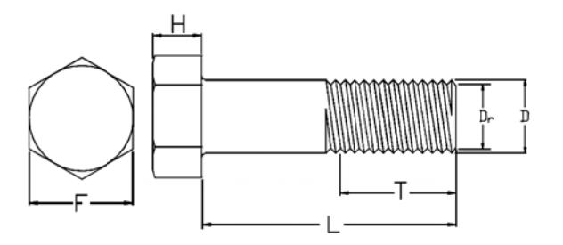

D = diameter

 $D_r$  = diameter inti

T = panjang ulir

L = panjang baut

F = lebar kepala lintas datar

H = tinggi kepala

|                    |                         |       | Diameter, D (mm) |       |       |       |       |       |       |  |  |
|--------------------|-------------------------|-------|------------------|-------|-------|-------|-------|-------|-------|--|--|
|                    |                         | 6,35  | 7,94             | 9,53  | 12,70 | 15,88 | 19,05 | 22,22 | 25,40 |  |  |
| D r (mm | 1)                      | 4,80  | 6,22             | 7,57  | 10,31 | 13,06 | 15,93 | 18,77 | 21,51 |  |  |
| F (mm)             | )                       | 11,11 | 12,70            | 14,29 | 19,05 | 23,81 | 28,58 | 33,34 | 38,10 |  |  |
| H (mm              | )                       | 4,37  | 5,56             | 6,35  | 8,73  | 10,72 | 12,70 | 14,68 | 17,07 |  |  |
| T (mm)          | L <u>&lt;</u> 152 mm | 19,05 | 22,23            | 25,40 | 31,75 | 38,10 | 14,45 | 50,80 | 57,15 |  |  |
|                    | L>152 mm             | 25,40 | 28,58            | 31,75 | 38,10 | 44,45 | 50,80 | 57,15 | 63,5  |  |  |

1. Toleransi ditetapkan di ANSI B 18.2.1. Diameter baut batang penuh ditunjukkan. Diameter inti didasarkan atas seri ulir UNC (kasar) (lihat ANSI B1.1).

© BSN 2013

Tabel L2 - Sekrup Kunci Segi 6 Standar1

D = diameter

Dr= diameter inti

S = panjang batang tanpa ulir

T = panjang ulir minimum2

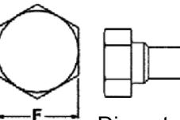

Diameter batang tereduksi

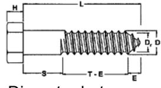

Diameter batang penuh

E = panjang ujung tirus N = banyak ulir/inci

F = lebar kepala lewat datar

H = tinggi kepala

|                     |          |       |       |       |       | Dia   | meter, D |       |       |       |            |        |
|---------------------|----------|-------|-------|-------|-------|-------|----------|-------|-------|-------|------------|--------|
| Panjang , L (mm) |          | 1/4"  | 5/16" | 3/8"  | 7/16" | 1/2"  | 5/8"     | 3/4"  | 7/8"  | 1"    | 1- 1/8" | 1-1/4" |
| , L (IIIII)         |          | 6,35  | 7,94  | 9,53  | 11,11 | 12,70 | 15,88    | 19,05 | 22,23 | 25,40 | 28,58      | 31,75  |
|                     |          | mm    | mm    | mm    | mm    | mm    | mm       | mm    | mm    | mm    | mm         | mm     |
|                     | D        | 4,4   | 5,8   | 6,7   | 8,3   | 9,4   | 12,0     | 14,7  | 17,3  | 19,8  | 28,6       | 31,8   |
|                     | E        | 4,0   | 4,8   | 5,6   | 7,1   | 7,9   | 10,3     | 12,7  | 15,1  | 17,5  | 19,8       | 22,2   |
|                     | Н        | 4,4   | 5,6   | 6,4   | 7,5   | 8,7   | 10,7     | 12,7  | 14,7  | 17,1  | 19,1       | 21,4   |
|                     | F        | 11,1  | 12,7  | 14,3  | 15,9  | 19,1  | 23,8     | 28,6  | 25,7  | 38,1  | 42,9       | 47,6   |
|                     | N        | 254,0 | 228,6 | 177,8 | 177,8 | 152,4 | 127,0    | 114,3 | 101,6 | 88,9  | 82,6       | 82,6   |
|                     | S        | 6,4   | 6,4   | 6,4   | 6,4   | 6,4   |          |       |       |       |            |        |
| 25,4                | Т        | 19,1  | 19,1  | 19,1  | 19,1  | 19,1  |          |       |       |       |            |        |
|                     | T-E      | 15,1  | 14,3  | 13,5  | 11,9  | 11,1  |          |       |       |       |            |        |
|                     | S        | 6,4   | 6,4   | 6,4   | 6,4   | 6,4   |          |       |       |       |            |        |
| 38,1                | Т        | 31,7  | 31,7  | 31,7  | 31,7  | 31,7  | <u> </u> |       |       |       |            |        |
|                     | T-E      | 27,8  | 27,0  | 26,2  | 24,6  | 23,8  |          |       |       |       |            |        |
|                     | S        | 12,7  | 12,7  | 12,7  | 12,7  | 12,7  | 12,7     |       |       |       |            |        |
| 50,8                | T        | 38,1  | 38,1  | 38,1  | 38,1  | 38,1  | 38,1     | 1     |       |       |            |        |
|                     | T-E      | 34,1  | 27,0  | 45,7  | 31,0  | 30,2  | 27,8     |       |       |       |            |        |
|                     | S        | 19,1  | 19,1  | 19,1  | 19,1  | 19,1  | 19,1     | 1/2   |       | /     |            |        |
| 63,5                | T        | 44,5  | 44,5  | 44,5  | 44,5  | 44,5  | 44,5     |       | //    |       |            |        |
|                     | T-E      | 40,5  | 39,7  | 38,9  | 37,3  | 36,5  | 34,1     |       |       |       |            |        |
|                     | S        | 25,4  | 25,4  | 25,4  | 25,4  | 25,4  | 25,4     | 25,4  | 25,4  | 25,4  |            |        |
| 76,2                | T        | 50,8  | 50,8  | 50,8  | 50,8  | 50,8  | 50,8     | 50,8  | 50,8  | 50,8  |            |        |
|                     | T-E      | 46,8  | 46,0  | 45,2  | 43,7  | 42,9  | 40,5     | 38,1  | 35,7  | 33,3  |            |        |
|                     | S        | 38,1  | 38,1  | 38,1  | 38,1  | 38,1  | 38,1     | 38,1  | 38,1  | 38,1  | 38,1       | 38,1   |
| 101,6               | Т        | 63,5  | 63,5  | 63,5  | 63,5  | 63,5  | 63,5     | 63,5  | 63,5  | 63,5  | 63,5       | 63,5   |
|                     | T-E      | 59,5  | 58,7  | 57,9  | 56,4  | 55,6  | 53,2     | 50,8  | 73,8  | 71,4  | 69,1       | 66,7   |
|                     | S        | 50,8  | 50,8  | 50,8  | 50,8  | 50,8  | 50,8     | 50,8  | 50,8  | 50,8  | 50,8       | 50,8   |
| 127,0               | T        | 76,2  | 76,2  | 76,2  | 76,2  | 76,2  | 76,2     | 76,2  | 76,2  | 76,2  | 76,2       | 76,2   |
|                     | T-E      | 72,2  | 71,4  | 70,6  | 69,1  | 68,3  | 65,9     | 63,5  | 61,1  | 58,7  | 56,4       | 54,0   |
|                     | S        | 63,5  | 63,5  | 63,5  | 63,5  | 63,5  | 63,5     | 63,5  | 63,5  | 63,5  | 63,5       | 63,5   |
| 152,4               | Т        | 88,9  | 88,9  | 88,9  | 88,9  | 88,9  | 88,9     | 88,9  | 88,9  | 88,9  | 88,9       | 88,9   |
|                     | T-E      | 84,9  | 84,1  | 83,3  | 81,8  | 81,0  | 78,6     | 76,2  | 99,2  | 96,8  | 94,5       | 92,1   |
|                     | S        | 76,2  | 76,2  | 76,2  | 76,2  | 76,2  | 76,2     | 76,2  | 76,2  | 76,2  | 76,2       | 76,2   |
| 177,8               | T        | 101,6 | 101,6 | 101,6 | 101,6 | 101,6 | 101,6    | 101,6 | 101,6 | 101,6 | 101,6      | 101,6  |
|                     | T-E      | 123,0 | 122,2 | 121,4 | 119,9 | 119,1 | 116,7    | 114,3 | 111,9 | 109,5 | 107,2      | 104,8  |
|                     | S        | 88,9  | 88,9  | 88,9  | 88,9  | 88,9  | 88,9     | 88,9  | 88,9  | 88,9  | 88,9       | 88,9   |
| 203,2               | Т        | 114,3 | 114,3 | 114,3 | 114,3 | 114,3 | 114,3    | 114,3 | 114,3 | 114,3 | 114,3      | 114,3  |
|                     | T-E      | 110,3 | 109,5 | 108,7 | 107,2 | 106,4 | 104,0    | 101,6 | 124,6 | 122,2 | 119,9      | 117,5  |
|                     | S        | 101,6 | 101,6 | 101,6 | 101,6 | 101,6 | 101,6    | 101,6 | 101,6 | 101,6 | 101,6      | 101,6  |
| 228,6               | Т        | 127,0 | 127,0 | 127,0 | 127,0 | 127,0 | 127,0    | 127,0 | 127,0 | 127,0 | 127,0      | 127,0  |
|                     | T-E      | 148,4 | 147,6 | 146,8 | 145,3 | 144,5 | 142,1    | 139,7 | 137,3 | 134,9 | 132,6      | 130,2  |
|                     | S        | 114,3 | 114,3 | 114,3 | 114,3 | 114,3 | 114,3    | 114,3 | 114,3 | 114,3 | 114,3      | 114,3  |
| 254,0               | Т        | 139,7 | 139,7 | 139,7 | 139,7 | 139,7 | 139,7    | 139,7 | 139,7 | 139,7 | 139,7      | 139,7  |
|                     | T-E      | 135,7 | 134,9 | 134,1 | 132,6 | 131,8 | 129,4    | 127,0 | 150,0 | 147,6 | 145,3      | 142,9  |
|                     | S        | 127,0 | 127,0 | 127,0 | 127,0 | 127,0 | 127,0    | 127,0 | 127,0 | 127,0 | 127,0      | 127,0  |
| 279,4               | Т        | 152,4 | 152,4 | 152,4 | 152,4 | 152,4 | 152,4    | 152,4 | 152,4 | 152,4 | 152,4      | 152,4  |
|                     | T-E      | 148,4 | 147,6 | 146,8 | 145,3 | 144,5 | 142,1    | 139,7 | 137,3 | 134,9 | 132,6      | 130,2  |
|                     | S        | 152,4 | 152,4 | 152,4 | 152,4 | 152,4 | 152,4    | 152,4 | 152,4 | 152,4 | 152,4      | 152,4  |
| 304,8               | T T-E | 152,4 | 152,4 | 152,4 | 152,4 | 152,4 | 152,4    | 152,4 | 152,4 | 152,4 | 152,4      | 152,4  |
|                     |          | 148,4 | 147,6 | 146,8 | 145,3 | 144,5 | 142,1    | 139,7 | 137,3 | 134,9 | 132,6      | 130,2  |

© BSN 2013 174 dari 312

1 Toleransi ditetapkan di ANSI B18.2.1. Diameter batang penuh dan diameter batang penuh sekrup kunci ditunjukkan. Untuk diameter batang tereduksi sekrup kunci, diameter batang tanpa ulir dapat direduksi untuk mendekati diameter inti Dr. 2

Panjang ulir minimum (T) untuk panjang sekrup kunci (L) adalah 152,4 mm atau ½ panjang sekrup kunci ditambah 12,7 mm, manapun yang lebih kecil. Panjang ulir dapat melebihi batas tersebut sampai sepanjang sekrup kunci penuh (L).

Tabel L3 - Sekrup Kayu Standar1

|                                     | Ulir Potong 2 |      |      |          | Ulir Gilas 3 |          |      |          | D = diameter D r = diameter inti L = panjang sekrup T = panjang ulir |          |          |
|-------------------------------------|--------------------------|------|------|----------|-------------------------|----------|------|----------|---------------------------------------------------------------------------------|----------|----------|
|                                     |                          |      |      | •        | Nomor                   | Sekrup K | Cayu |          |                                                                                 |          |          |
|                                     | 6                        | 7    | 8    | 9        | 10                      | 12       | 14   | 16       | 18                                                                              | 20       | 24       |
| D (mm)                           | 3,50                     | 3,83 | 4,17 | 4,5 0 | 4,83                    | 5,49     | 6,15 | 6,8 1 | 7,4 7                                                                        | 8,1 3 | 9,4 5 |
| D r 4 (mm) | 2,87                     | 3,10 | 3,33 | 3,6 1 | 3,86                    | 4,34     | 4,98 | 5,3 1 | 5,8 9                                                                        | 6,4 8 | 7,5 7 |

&lt;sup>1Toleransi ditetapkan di ANSI B18.6.1

Tabel L4 - Paku Biasa, Boks, dan Sinker standar1

| Paku biasa atau boks |             |                                  |                       | T T                   | Paku <i>Sinker</i>    |                       |                      |                        | D = diameter L = panjang H = diameter kepala |                        |                       |                        |
|----------------------|-------------|----------------------------------|-----------------------|-----------------------|-----------------------|-----------------------|----------------------|------------------------|----------------------------------------------|------------------------|-----------------------|------------------------|
| Tipe                 |             | Kode paku ( <i>pennyweight</i> ) |                       |                       |                       |                       |                      |                        |                                              |                        |                       |                        |
| Tipe                 |             | 6d                               | 7d                    | 8d                    | 10d                   | 12d                   | 16d                  | 20d                    | 30d                                          | 40d                    | 50d                   | 60d                    |
| Biasa                | L D H | 50,8 2,87 6,76             | 57,15 2,87 6,76 | 63,5 3,33 7,14  | 76,2 3,76 7,93  | 82,5 3,76 7,93  | 88,9 4,11 8,74 | 101,6 4,88 10,31 | 114,3 5,26 11,12                       | 127 5,71 11,91   | 139,7 6,20 12,7 | 152,4 6,68 13,45 |
| Boks                 | L D H | 50,8 2,52 6,76             | 57,15 2,52 6,76 | 63,5 2,87 7,54  | 76,2 3,25 7,92  | 82,5 3,43 7,92  | 88,9 3,43 8,74 | 101,6 3,76 9,53  | 114,3 3,76 9,53                        | 127 4,11 10,31   |                       |                        |
| Sinker               | L D H | 47,63 2,34 5,94            | 53,97 2,51 6,35 | 60,32 2,87 6,76 | 73,02 3,05 7,14 | 79,37 3,43 7,93 | 82,5 3,76 8,74 | 95,25 4,50 9,53  | 107,9 4,88 10,31                       | 120,6 5,26 11,12 |                       | 146,0 6,20 12,7  |

&lt;sup>1Toleransi ditetapkan di ASTM F 1667. Bentuk tipikal paku biasa, boks, dan *sinker* ditunjukkan. Lihat ASTM F 1667 untuk jenis-jenis paku lainnya

© BSN 2013 176 dari 312

&lt;sup>2Panjang ulir pada sekrup kayu sekitar 2/3 panjang sekrup

&lt;sup>3Sekrup berpenuntun tunggal ditunjukkan. Panjang ulir sekurangnya empat kali diameter sekrup atau 2/3 kali panjang sekrup. Sekrup yang terlalu pendek untuk mengakomodasi panjang ulir minimum, mempunyai ulir yang sepraktis mungkin melebihi sisi bawah kepala.

&lt;sup>4Diambil sebagai rata-rata dari limit maksimum dan minimum yang ditetapkan untuk diameter batang sekrup kayu ulir gilas.

&lt;sup>5Diijinkan untuk mengasumsikan ujung *tip* tirus 2D

Tabel L5 - Paku Post-Frame Ring Shank

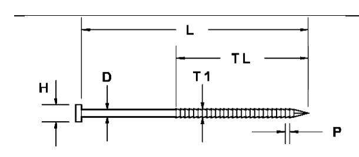

D = diameter

L = panjang

H = diameter kepala

TL = panjang minimum bagian berulir

T1 = diameter puncak ulir

 $D + 0.127 \text{ mm} \le T1 \le D + 0.254 \text{ mm}$ 

P = jarak atsau spasi ulir

 $1,27 \text{ mm} \le P \le 1,956 \text{ mm}$ 

| D, mm | L, mm                    | TL, mm | H, mm | Diameter inti 2 , D r , mm |
|-------|--------------------------|--------|-------|-----------------------------------------------------|
| 3,43  | 76,2; 88,9               | 57,15  | 7,94  | 3,25                                                |
| 3,76  | 76,2; 88,9; 101,6        | 57,15  | 7.04  | 2.56                                                |
|       | 114,3                    | 76,2   | 7,94  | 3,56                                                |
| 4,50  | 76,2; 88,9; 101,6        | 57,15  | 9,52  | 4,29                                                |
|       | 114,3; 127; 152,4; 203,2 | 76,2   | 9,52  | 4,29                                                |
| 5,08  | 88,9; 101,6              | 57,15  | 11,91 | 4,90                                                |
|       | 114,3; 127; 152,4; 203,2 | 76,    | 11,91 | 4,90                                                |
| 5,26  | 101,6                    | 57,15  | 11,91 | 5,05                                                |
|       | 114,3; 127; 152,4; 203,2 | 76,2   | 11,91 | 5,05                                                |

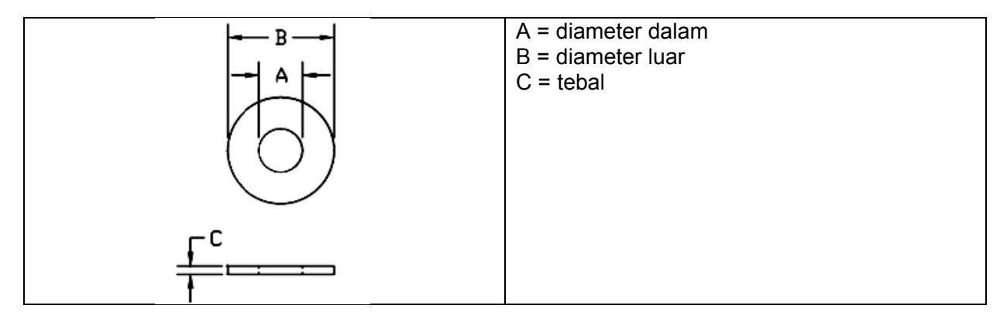

| I II a man Cinnin | 1 ^            | l D           |       |
|-------------------|----------------|---------------|-------|
| Ukuran Cincin     | A              | В             |       |
| Nominal           | Diameter dalam | Diameter luar | Tebal |
|                   | Dasar          | Dasar         | Dasar |
| 9,52              | 11,12          | 25,4          | 2,11  |
| 12,7              | 14,27          | 34,92         | 2,77  |
| 15,87             | 17,47          | 44,45         | 3,40  |
| 19,05             | 20,62          | 50,8          | 3,76  |
| 22,22             | 23,82          | 57,15         | 4,19  |
| 25,4              | 26,97          | 63,5          | 4,19  |

&lt;sup>1Toleransi diberikan di dalam ANSI/ASME B18.22.1. Untuk cincin potong standar lain, lihat ANSI/ASME N18.22.1.

# Lampiran M (Informatif) Toleransi pembuatan untuk Paku Keling dan Pelat Samping Baja untuk Sambungan Paku Keling Kayu

Dimensi paku keling diambil dari ASTM F 1667 Dimensi Paku Keling

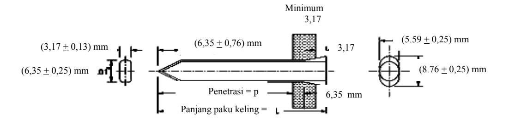

# Dimensi plat samping baja

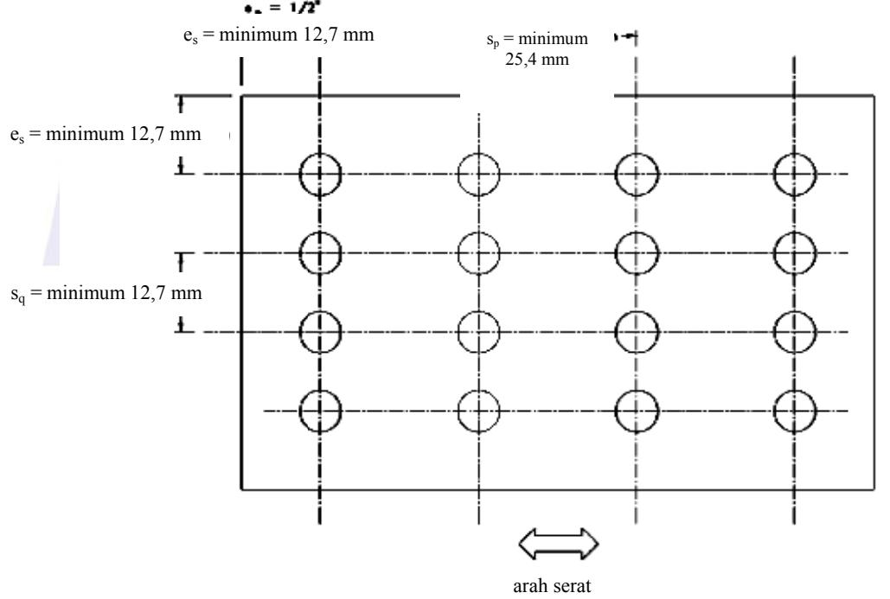

#### Catatan:

- 1. Diameter lubang minimum 6,75 mm dan maksimum 7,14 mm.
- 2. Toleransi di lokasi lubang: maksimum 3,17 mm di semua arah.
- 3. Semua dimensi adalah dalam mm sebelum galvanisasi.
- 4. so dan sd didefinisikan di 13.3.
- 5. es adalah jarak ujung dan tepi sebagaimana ditentukan oleh baja.
- 6. Orientasikan muka lebar paku keling sejajar dengan arah serat, bagaimanapun orientasi pelat.

© BSN 2013

## **Lampiran N (Normatif) Desain Faktor Beban dan Ketahanan (DFBK)**

#### **N.1 Umum**

#### **N.1.1 Aplikasi**

Desain dengan DFBK harus dilakukan sesuai dengan Lampiran N dan semua ketentuan yang berlaku di dalam Spesifikasi ini. Beban dan kombinasi beban yang berlaku, dan penyesuaian nilai desain yang khusus untuk DFBK ditetapkan di sini.

#### **N.1.2 Beban dan Kombinasi Beban**

Beban nominal dan kombinasi beban adalah yang ditetapkan di dalam peraturan bangunan yang berlaku. Apabila tidak ada peraturan bangunan yang berlaku, beban nominal dan kombinasi beban yang terkait harus diambil dari ASCE 7.

## **N.2 Nilai Desain**

## **N.2.1 Nilai Desain**

Nilai desain DFBK untuk komponen struktur dan sambungan harus ditentukan sesuai dengan Standar ASTM D 5457 dan ketentuan desain di dalam Spesifikasi ini, atau sesuai dengan N.2.2 dan N.2.3. Apabila nilai desain DFBK ditentukan dengan menggunakan metode faktor normalisasi reliabilitas di dalam ASTM D 5457, maka faktor konversi format tidak berlaku (lihat N.3.1).

## **N.2.2 Nilai Desain Komponen struktur**

Nilai desain komponen struktur acuan di dalam Spesifikasi ini harus dikoreksi sesuai dengan 4.3, 5.3, 6.3, 7.3, 8.3, dan 9.3 untuk berturut-turut kayu gergajian, glulam, tiang dan tiang pancang, I-*joist* kayu, kayu komposit struktural, dan produk panel, untuk menentukan nilai desain LRFD terkoreksi.

#### **N.2.3 Nilai Desain Sambungan**

Nilai desain sambungan acuan di dalam Spesifikasi ini harus dikoreksi sesuai Tabel 10.3 untuk menentukan nilai desain DFBK terkoreksi.

**© BSN 2013 180 dari 312**

## **N.3 Koreksi Terhadap Nilai Desain Acuan**

# **N.3.1 Faktor Konversi Format, Kr (Hanya DFBK)**

Nilai desain acuan harus dikalikan dengan faktor konversi format, Kr, sebagaimana ditetapkan di dalam Tabel N1. Faktor konversi format di dalam Tabel N1 mengoreksi nilai desain acuan ASD (berdasarkan durasi normal) ke ketahanan DFBK (lihat Referensi 55). Faktor konversi format tidak berlaku apabila ketahanan acuan DFBK ditentukan sesuai dengan metode faktor normalisasi reliabilitas di dalam ASTM D 5457.

**Tabel N1 - Faktor Konversi Format, KF (Hanya DFBK)** 

| Aplikasi             | Properti                                     | KF                                           |
|----------------------|----------------------------------------------|----------------------------------------------|
| Komponen struktur | Fb Ft Fv, Frt, Fs Fc Fc┴ Emin | 2,54 2,70 2,88 2,40 1,67 1,76 |
| Semua Sambungan   | (semua nilai desain)                         | 3,32                                         |

## **N.3.2 Faktor Ketahanan, ϕ (Hanya DFBK)**

Nilai desain acuan harus dikalikan dengan faktor ketahanan, ϕ, sebagaimana ditetapkan di dalam Tabel N2 (lihat Referensi 55).

**Tabel N2 - Faktor Ketahanan, ϕ (Hanya DFBK)** 

| Aplikasi          | Properti                                   | Simbol                     | Nilai                                |
|-------------------|--------------------------------------------|----------------------------|--------------------------------------|
| Komponen struktur | Fb Ft Fv, Frt, Fs Fc, Fc┴ Emin | ϕb ϕt ϕv ϕc ϕs | 0,85 0,80 0,75 0,90 0,85 |
| Sambungan         | (semua)                                    | ϕz                         | 0,65                                 |

**Tabel N3 - Faktor Efek Waktu, λ (Hanya DFBK)** 

**© BSN 2013 181 dari 312**

| Kombinasi Beban2                         | λ                           |
|------------------------------------------|-----------------------------|
| 1,4(D+F)                                 | 0,6                         |
| 1,2(D+F) + 1,6(H) + 0,5(Lr atau R)       | 0,6                         |
| 1,2(D+F) + 1,6(L+H) + 0,5(Lr atau R)     | 0,7 apabila L adalah gudang |
|                                          | 0,8 apabila L adalah hunian |
|                                          | 1,25 apabila L adalah impak |
| 1,2D + 1,6(Lr atau R) atau (L atau 0,8W) | 0,8                         |
| 1,2D + 1,6W + L + 0,5(Lr atau R)         | 1,0                         |
| 1,2D + 1,0E + L                          | 1,0                         |
| 0,9D + 1,6W + 1,6H                       | 1,0                         |
| 0,9D + 1,0E + 1,6H                       | 1,0                         |
|                                          |                             |

- 1. Faktor efek waktu, λ, lebih besar dari pada 1,0 tidak berlaku pada sambungan atau komponen struktur yang diberi perlakuan dengan vakum tekan dengan bahan pengawet larut air (lihat Referensi 30) atau kimiawi penghambat api.
- 2. Kombinasi beban dan faktor beban yang konsisten dengan ASCE 7 dicantumkan di sini untuk memudahkan. Beban nominal harus sesuai dengan N.1.2.

- 1. ACI 318-02 Building Code Requirements for Structural Concrete, American Concrete Institute, Farmington Hills, MI, 2002.
- 2. ACI 530-99/ASCE 5-99/TMS 402-99 Building Code Requirements for Masonry Structures, American Concrete Institute, Farmington Hills, MI, 1999.
- 3. AISI 1035 Standard Steels, American Iron and Steel Institute, Washington, DC, 1985.
- 4. ANSI/AITC Standard A190.1-2002, Structural Glued Laminated Timber, American Institute of Timber Construction, Vancouver, WA, 1992.
- 5. ANSI/ASCE Standard 7-02, Minimum Design Loads for Buildings and Other Structures, American Society of Civil Engineers, Reston, VA, 2003.
- 6. ANSI/ASME Standard B1.1-1989, Unified Inch Screw Threads UN and UNR Thread Form, American Society of Mechanical Engineers, New York, NY, 1989.
- 7. ANSI/ASME Standard B18.2.1-1996, Square and Hex Bolts and Screws (Inch Series), American Society of Mechanical Engineers, New York, NY, 1997.
- 8. ANSI/ASME Standard B18.6.1-1981 (Reaffirmed 1997), Wood Screws (Inch Series), American Society of Mechanical Engineers, New York, NY, 1982.
- 9. ANSI/TPI 1-2002 National Design Standard for Metal Plate Connected Wood Trusses, Truss Plate Institute, 2002.
- 10. ASTM Standard A 36-04, Specification for Standard Structural Steel, ASTM, West Conshohocken, PA, 2004.
- 11. ASTM Standard A 47-99, Specification for Ferritic Malleable Iron Castings, ASTM, West Conshohocken, PA, 1999.
- 12. ASTM A 153-03, Specification for Zinc Coating (Hot-Dip) on Iron and Steel Hardware, ASTM, West Conshohocken, PA, 2003.
- 13. ASTM A 370-03a, Standard Test Methods and Definitions for Mechanical Testing of Steel Products, ASTM, West Conshohocken, PA, 2003.
- 14. ASTM Standard A 653-03, Specification for Steel Sheet, Zinc-Coated (Galvanized) or Zinc-Iron Alloy-Coated (Galvannealed) by the Hot-Dip Process, 2003.
- 15. ASTM Standard D 25-91, Round Timber Piles, ASTM, West Conshohocken, PA, 1991.
- 16. ASTM Standard D 245-00E1 (2002), Establishing Structural Grades and Related Allowable Properties for Visually Graded Lumber, ASTM, West Conshohocken, PA, 2002.
- 17. ASTM Standard D 1760-01, Pressure Treatment of Timber Products, ASTM, West Conshohocken, PA, 2001.
- 18. ASTM Standard D 1990-00E1 (2002), Establishing Allowable Properties for Visually Graded Dimension Lumber from In-Grade Tests of Full-Size Specimens, ASTM, West Conshohocken, PA, 2002.
- 19. ASTM Standard D 2555-98£1, Establishing Clear Wood Strength Values, ASTM, West Conshohocken, PA, 1998.
- 20. ASTM Standard D 2899-95, Establishing Design Stresses for Round Timber Piles, ASTM, West Conshohocken, PA, 1995.
- 21. ASTM Standard D 3200-74(2000), Establishing Recommended Design Stresses for Round Timber Construction Poles, ASTM, West Conshohocken, PA, 2000.
- 22. ASTM Standard D 3737-03, Establishing Stresses for Structural Glued Laminated Timber (Glulam), ASTM, West Conshohocken, PA, 2003.
- 23. ASTM Standard D 5055-04, Establishing and Monitoring Structural Capacities of Prefabricated Wood I-Joists, ASTM, West Conshohocken, PA, 2004.
- 24. ASTM Standard D 5456-03, Evaluation of Structural Composite Lumber Products, ASTM, West Conshohocken, PA, 2003.
- 25. ASTM Standard D 5764-97a (2002), Test Method for Evaluating Dowel Bearing Strength of Wood and Wood-Base Products, ASTM, West Conshohocken, PA, 2002.

- 26. ASTM Standard D 5933-96 (2001), Standard Specification for 2-5/8 in. and 4 in. Diameter Metal Shear Plates for Use in Wood Construction, ASTM, West Conshohocken, PA, 2001.
- 27. ASTM Standard F 606-02 '1 , Determining the Mechanical Properties of Externally and Internally Threaded Fasteners, Washers, and Rivets, ASTM, West Conshohocken, PA, 2002.
- 28. ASTM Standard F 1575-03, Standard Test Method for Determining Bending Yield Moment of Nails, ASTM, West Conshohocken, PA, 2003.
- 29. ASTM Standard F 1667-03, Standard for Driven Fasteners: Nails, Spikes, and Staples, ASTM, West Conshohocken, PA, 2003.
- 30. AWPA Book of Standards, American Wood Preservers' Association, Selma, AL, 2003.
- 31. American Softwood Lumber Standard, Voluntary Product Standard PS 20-99, National Institute of Standards and Technology, U.S. Department of Commerce, 1999.
- 32. Design/Construction Guide-Diaphragms and Shear Walls, Form L350, APA-The Engineered Wood Association, Tacoma, WA, 2001.
- 33. Engineered Wood Construction Guide, Form E30, APA-The Engineered Wood Association, Tacoma, WA, 2001.
- 34. Plywood Design Specification and Supplements, Form Y510, APA-The Engineered Wood Association, Tacoma, WA, 1997.
- 35. PS1-95, Construction and Industrial Plywood, United States Department of Commerce, National Institute of Standards and Technology, Gaithersburg, MD, 1995.
- 36. PS2-92, Performance Standard for Wood-Based Structural-Use Panels, United States Department of Commerce, National Institute of Standards and Technology, Gaithersburg, MD, 1992.
- 37. SAE J412, General Characteristics and Heat Treatment of Steels, Society of Automotive Engineers, Warrendale, PA, 1995.
- 38. SAE J429, Mechanical and Material Requirements for Externally Threaded Fasteners, Society of Automotive Engineers, Warrendale, PA, 1999.
- 39. Specification for Structural Joints Using ASTM A325 or A490 Bolts, American Institute of Steel Construction (AISC), Chicago, IL, 1985.
- 40. Specification for Structural Steel Buildings-Allowable Stress Design and Plastic Design, American Institute of Steel Construction (AISC), Chicago, IL, 1989.
- 41. Specification for the Design of Cold-Formed Steel Structural Members, American Iron and Steel Institute (AISI), Washington, DC, 1996.
- 42. Standard Grading Rules for Canadian Lumber, National Lumber Grades Authority (NLGA), New Westminster, BC, Canada, 2003.
- 43. Standard Grading Rules for Northeastern Lumber, Northeastern Lumber Manufacturers Association (NELMA), Cumberland Center, ME, 2003.
- 44. Standard Grading Rules for Northern and Eastern Lumber, Northern Softwood Lumber Bureau (NSLB), Cumberland Center, ME, 1993.
- 45. Standard Grading Rules for Southern Pine Lumber, Southern Pine Inspection Bureau (SPIB), Pensacola, FL, 2002.
- 46. Standard Grading Rules for West Coast Lumber, West Coast Lumber Inspection Bureau (WCLIB), Portland, OR, 2004.
- 47. Standard Specifications for Grades of California Redwood Lumber, Redwood Inspection Service (RIS), Novato, CA, 2000.
- 48. Standard Specifications for Highway Bridges, American Association of State Highway and Transportation Officials (AASHTO), Washington, DC, 1987.
- 49. Western Lumber Grading Rules, Western Wood Products Association (WWPA), Portland, OR, 2005.

- 50. Design Manual for TECO Timber Connectors Construction, TECO/Lumberlok, Colliers, WV, 1973.
- 51. Technical Report 12 General Dowel Equations for Calculating Lateral Connection Values, American Forest & Paper Association (AF&PA), Washington, DC, 1999.
- 52. Timber Construction Manual, American Institute of Timber Construction (AITC), John Wiley & Sons, 2004.
- 53. Wood Handbook: Wood as an Engineering Material, General Technical Report 113, Forest Products Laboratory, U.S. Department of Agriculture, 1999.
- 54. ASTM Standard D 2915-03, Standard Practice for Evaluating Allowable Properties for Grades of Structural Lumber, ASTM West Conshohocken, PA, 2003.
- 55. ASTM Standard D 5457-04, Standard Specification for Computing the Reference Resistance of Wood-Based Materials and Structural Connections for Load and Resistance Factor Design, ASTM, West Conshohocken, PA, 2004.
- 56. ANSI/AWC Standard SDPW-08 (approved as ANSI/AF&PA SDPWS-08), Special Design Provisions for Wind and Seismic, American Wood Council, Leesburg, VA,2008.

# **Penjelasan: Spesifikasi desain untuk konstruksi kayu**

# **C1 Persyaratan Umum untuk Desain Struktural**

## **C1.1 Lingkup**

## **C1.1.1 Praktik yang Didefinisikan**

- **C1.1.1.1** Spesifikasi ini mendefinisikan standar nasional praktik untuk desain struktural elemen kayu dan sambungan-sambungannya.
- **C1.1.1.2** Apabila kinerja struktural rakitan yang menggunakan produk panel bergantung pada kapasitas sambungan antara material, seperti pada dinding geser atau diafragma, maka persyaratan desain untuk sambungan mekanis di dalam Spesifikasi ini dapat digunakan untuk rakitan tersebut apabila penggunaan tersebut didasarkan atas praktik rekayasa yang dapat diterima atau apabila pengalaman membuktikan bahwa penggunaan tersebut memberikan kinerja memadai pada masa layan.
- **C1.1.1.3** Data dan pertimbangan rekayasa yang mendasari Spesifikasi ini didasarkan atas prinsip-prinsip mekanika dan kinerja memadai pada masa layan. Sekalipun demikian, hal ini tidak dimaksudkan untuk melarang penggunaan produk atau prosedur desain lain di mana dapat ditunjukkan bahwa produk atau prosedur desain tersebut memberikan kinerja memadai sesuai peruntukan. Kriteria lain untuk membuktikan kinerja memadai dapat berupa standar desain khusus atau khas yang berlaku pada jenis komponen tertentu. Kelayakan dan dapat diterimanya kriteria lain ditentukan oleh desainer dan otoritas di wilayah terkait.

#### **C1.1.2 Supervisi Kompeten**

Ada beberapa area di mana supervisi kompeten diperlukan seperti detail sambungan dan peletakan pengencang. Perhatian khusus harus diberikan pada detail ujung kolom dan balokkolom untuk menjamin bahwa asumsi desain terkait dengan eksentrisitas beban dipenuhi.

# **C1.2 Persyaratan Umum**

#### **C1.2.1 Kesesuaian dengan Standar**

Persyaratan di dalam Spesifikasi ini mengasumsikan kesesuaian dengan standar yang ditetapkan.

## **C1.2.2 Perangkaian dan Penopangan**

**© BSN 2013 186 dari 312** Apabila tidak ditetapkan sebaliknya di dalam Spesifikasi ini, semua nilai desain acuan berasumsi bahwa semua komponen struktur secara memadai dirangkai, dijangkar, diikat, dan dibreising. Pembresingan dan penjangkaran rangka batang dan komponen struktur pada rangka batang harus memadai untuk menjamin adanya ketahanan yang cukup terhadap beban lateral. Rekomendasi praktik baik (142) untuk pemasangan antara rangka batang dari breising (silang)

goyangan vertikal, batang bawah horizontal menerus dan breising silang bawah diberikan di Spesifikasi Lampiran A.10.

Selain memberikan breising permanen memadai di dalam struktur untuk menahan angin dan gaya-gaya lain, breising sementara berupa komponen struktur yang memadai untuk memikul beban harus digunakan selama pelaksanaan untuk menjamin agar komponen struktur tersebut dapat menahan beban angin dan pelaksanaan sementara sebelum komponen struktur didekatnya dan material-material lain yang diperlukan dalam desain dipasang.

# **C.1.3 Standar Sebagai Satu Kesatuan**

Seluruh persyaratan di dalam Spesifikasi ini dimaksudkan untuk digunakan bersama. Apabila tidak dinyatakan sebaliknya, persyaratan pada satu bab berlaku pula pada seluruh bab lain.

#### **C.1.4 Prosedur Desain**

Spesifikasi ini menunjuk format desain tegangan izin (DTI) dan desain faktor beban dan ketahanan (DFBK) untuk desain dengan komponen struktur kayu dan sambungansambungannya. Pada umumnya, desain elemen di seluruh struktur akan menggunakan salah satu dari DTI atau DFBK; namun, persamaan khusus untuk menggunakan format desain tunggal untuk semua elemen di dalam suatu struktur tidak termasuk di dalam Spesifikasi ini. Kecocokan mencampur format di dalam sebuah struktur merupakan tanggung jawab desainer. Batasan peraturan bangunan gedung harus ditinjau, apabila berlaku. ASCE7 – Beban Desain Minimum untuk Gedung dan Struktur Lain (3), yang diacu di peraturan-peraturan bangunan gedung, membatasi pencampuran format desain pada kasus-kasus di mana ada perubahan material.

## **C1.4.1 Asumsi Pembebanan**

Persyaratan desain di dalam Spesifikasi ini mengasumsikan kecukupan beban desain yang ditetapkan.

#### **C1.4.2 Ditentukan oleh Peraturan**

Beban desain harus didasarkan atas peraturan gedung atau beban desain minimum lain yang dikenal misalnya ASCE 7 - Beban Desain Minimum untuk Gedung dan Struktur Lain (3).

#### **C1.4.3 Beban-beban Yang Dimasukkan**

Bagian ini mengidentifikasi tipe beban yang perlu ditinjau dalam desain tetapi tidak ditujukan untuk memberikan daftar komprehensif tinjauan pembebanan yang diperlukan.

## **C1.5 Spesifikasi dan Gambar**

Untuk menjamin bahwa bangunan gedung dibangun dari komponen struktur dengan kapasitas dan kekakuan yang dimaksudkan oleh desainer, maka ukuran produk kayu yang diberikan di dalam semua gambar dan Spesifikasi harus dengan jelas disebutkan di dalam dokumendokumen tersebut. Penggunaan dimensi nominal di dalam distribusi dan penjualan produk panel dan batang kayu telah merupakan sumber kebingungan pada sejumlah desainer, khususnya yang tidak mengenal baik praktik desain struktural kayu. Ukuran nominal standar dan ukuran neto standar untuk kayu gergajian ditetapkan untuk setiap produk di dalam standar produk nasional. Untuk produk khusus, maka ukuran khusus harus dengan jelas disebutkan.

**© BSN 2013 187 dari 312**

## **C1.6 Notasi**

Sistem notasi yang digunakan di dalam Spesifikasi ini membantu mengidentifikasi arti dari simbol tertentu yang sering digunakan. Faktor koreksi, yang dicirikan dengan simbol "C", memodifikasi nilai desain acuan untuk kondisi penggunaan, geometri, atau stabilitas. Subskrip "D", "F", "L", dan sebagainya, digunakan untuk membedakan antara faktor-faktor koreksi yang berbeda. Pada kasus tertentu, subskrip dengan huruf besar dan kecil dari huruf yang sama (misalnya "D" dan "d") digunakan untuk menunjukkan dua faktor koreksi yang berbeda (dalam hal ini masing-masing adalah faktor durasi beban dan faktor kedalaman penetrasi untuk cincin belah dan pelat geser). Tidak ada kepentingan tertentu untuk menggunakan huruf sama dengan kasus berbeda untuk faktor koreksi berbeda. Simbol "F" dan "F'" masing-masing menunjukkan nilai desain acuan dan terkoreksi, dengan nilai desain terkoreksi merupakan nilai desain acuan dikalikan semua faktor koreksi yang berlaku. Simbol "f" menunjukkan tegangan aktual atau yang timbul akibat dibebani. Subskrip "b", "t", "c", "v", dan "c" masing-masing menujukkan tegangan lentur, tarik sejajar serat, tekan sejajar serat, geser, dan tekan tegak lurus serat.

#### **C2.1 Umum**

Spesifikasi ini menunjuk format DTI dan DFBK untuk desain struktural dengan produk-produk kayu (lihat 1.4).

#### **C2.1.2 Tanggung Jawab Desainer untuk Mengoreksi sesuai Kondisi Penggunaan**

Spesifikasi ini mengidentifikasi koreksi terhadap nilai desain acuan untuk kondisi layan yang umumnya dijumpai di dalam konstruksi kayu. Namun, Spesifikasi ini tidak menunjuk semua kondisi penggunaan atau aplikasi desain yang mungkin.

Desainer mempunyai tanggung jawab akhir untuk menentukan koreksi yang layak terhadap nilai desain acuan untuk kondisi pengeksposan dan pembebanan spesifik. Perhatian khusus harus diberikan untuk kasus di mana dua atau lebih kondisi bertemu. Contoh kasus seperti ini adalah kasus di mana beban desain penuh akan bekerja terus menerus, komponen struktur tersebut akan terekspos terhadap air pada temperatur tinggi, dan sambungan-sambungannya mengalami momen dan gaya biaksial. Asesmen pada akibat kegagalan komponen struktur individual di dalam suatu struktur merupakan bagian integral tanggung jawab desainer di dalam menghubungkan asumsi desain dan nilai desain.

## **C2.2 Nilai Desain Acuan**

Nilai desain acuan yang digunakan di dalam Spesifikasi ini dan yang ditabelkan di dalam Suplemen standar adalah nilai DTI yang didasarkan atas durasi beban normal dan kondisi kadar air yang ditetapkan.

## **C2.3 Koreksi pada Nilai Desain Acuan**

# **C2.3.1 Keberlakuan Faktor Koreksi**

Spesifikasi ini mengharuskan koreksi terhadap nilai desain acuan untuk kondisi khusus pada penggunaan, geometri, dan stabilitas. Modifikasi tersebut dilakukan dengan menggunakan faktor-faktor koreksi. Faktor-faktor koreksi adalah kumulatif kecuali apabila dinyatakan tidak demikian. Selain faktor koreksi yang diberikan di dalam bagian ini, koreksi terhadap nilai desain acuan untuk kondisi khusus penggunaan mungkin dibutuhkan. Koreksi tambahan seperti ini dapat meliputi modifikasi untuk efek rangkak, variabilitas modulus elastisitas, dan perlakuan hambat api.

# **C2.3.2 Faktor Durasi Beban, CD (DTI saja)**

**C2.3.2.1** Faktor durasi beban, CD, berlaku untuk semua nilai desain acuan kecuali modulus elastisitas dan tekan tegak lurus serat. Tidak dimasukkannya modulus elastisitas di dalam koreksi durasi beban telah terjadi sejak edisi pertama Spesifikasi. Faktor durasi beban didasarkan atas efek waktu pada saat dibebani terhadap kapasitas pikul beban. Bertambahnya defleksi atau deformasi merupakan tinjauan khusus, yang tidak bergantung pada kekuatan batas. Dahulu nilai desain acuan tekan tegak lurus serat perlu dikoreksi terhadap durasi beban pada saat nilai tersebut didasarkan atas nilai uji limit proporsional. Untuk nilai desain tekan tegak lurus serat yang didasarkan atas limit deformasi, faktor durasi beban tidak berlaku.

#### **Tabel 2.3.2 Faktor Durasi Beban yang Sering Digunakan:**

**© BSN 2013 189 dari 312 Beban Permanen.** Selain beban mati pelaksanaan akibat material, beban tanah pondasi dan beban terpusat dari peralatan yang didesain sebagai bagian dari struktur harus dipandang

sebagai beban jangka panjang yang akan bekerja secara terus menerus atau secara kumulatif untuk lebih dari 10 tahun. Pembebanan terus menerus khusus yang terkait dengan penggunaan tertentu pada struktur, seperti beban air di menara pendingin atau mesin berat pada gedung industri, juga dapat merupakan beban dengan durasi melebihi 10 tahun.

**Pembebanan Normal atau Sepuluh Tahun.** Beban-beban yang secara tradisional dicirikan sebagai normal adalah beban lantai yang ditetapkan peraturan, baik berupa beban hidup terbagi rata atau terpusat, yang meliputi mebel, perabotan, peralatan yang dapat dipindah-pindah, semua jenis beban gudang, dan semua beban manusia. Meskipun beban lalu lintas manusia mungkin saja jarang dan berdurasi pendek, seperti beban yang terjadi di balkon, tangga dan selasar luar, jenis pembebanan ini dipandang sebagai beban normal.

**Beban Tujuh Hari.** Apabila beban terbagi rata atap minimum yang ditetapkan dalam peraturan gedung yang berlaku melebihi beban salju desain untuk area tersebut dan untuk desain gedung spesifik tersebut, maka di dalam praktik beban tersebut dapat dipandang sebagai beban tipe pelaksanaan dengan berdurasi 7 hari atau faktor durasi beban 1,25. Apabila beban salju atap kurang dari 92 persen dari beban atap minimum yang ditetapkan, maka yang disebut terakhir ini merupakan batas dari kedua kondisi pembebanan.

**Beban Satu Hari.** Sebelum tahun 1987, faktor 1,33 atau 1 hari telah digunakan sebagai koreksi durasi beban untuk beban angin dan gempa. Di dalam Spesifikasi sekarang, faktor durasi beban untuk beban-beban tersebut telah didasarkan atas durasi beban 10 menit.

**Beban Sepuluh Menit.** Faktor durasi beban 1,6 atau 10 menit harus digunakan untuk beban angin dan gempa di dalam Spesifikasi ini. Beban angin di dalam berbagai peraturan gedung dan ASCE 7 adalah beban maksimum yang diduga terjadi kurang dari sekali di dalam 50 tahun dan mempunyai durasi dari 1 sampai 10 detik. Beban gempa puncak diketahui mempunyai durasi kumulatif kurang dari 5 menit, bukan durasi 1 hari sebagaimana secara tradisional dipakai. Faktor durasi beban 10 menit secara konservatif diestimasi sebagai koreksi untuk efek kumulatif dari kedua kondisi pembebanan tersebut.

**Beban Impak**. Beban di dalam kategori ini dipandang sebagai beban dengan durasi beban 1 detik atau kurang. Durasi ini terkait dengan faktor koreksi sebesar 2,0 yang didasarkan atas hubungan umum antara kekuatan dan durasi beban lihat Spesifikasi Lampiran B). Perlakuan tekanan pada kayu dengan kimiawi hambat api atau pengawetan dapat mengurangi kapasitas penyerapan energi sebagaimana diukur dengan kerja-pada-beban-maksimum pada saat melentur; dengan demikian, penggunaan faktor durasi beban 2,0 di dalam hal ini tidak diperkenankan. Sambungan juga tidak dapat menggunakan faktor durasi beban 2,0 (173).

- **C2.3.2.2** Desain komponen struktur didasarkan atas kombinasi kritis beban-beban yang merepresentasikan berbagai durasi dan tahanan yang dikoreksi untuk berbagai durasi yang berbeda. Perhatikan bahwa koreksi durasi beban tidak berlaku pada modulus elastisitas (lihat C2.3.2.1), jadi, sebuah komponen struktur yang mengalami tekuk harus dianalisis terhadap kombinasi beban kritis sesudah nilai desain tekuk kritisnya dihitung.
- **C2.3.2.3** Reduksi pada beban desain untuk memperhitungkan probabilitas terjadinya beban secara simultan dan koreksi tahanan kayu untuk memperhitungkan efek durasi beban yang bekerja tidak saling mempengaruhi dan kedua koreksi tersebut berlaku di dalam perhitungan desain (C1.4.4).

## C2.3.3 Faktor Temperatur, Ct

Koreksi temperatur di dalam Spesifikasi ini berlaku apabila komponen struktur diekspos terhadap temperatur di antara 38°C dan 65°C untuk waktu lama, seperti pada gedung industri di mana komponen strukturnya sangat dekat atau kontak dengan fluida panas yang digunakan di dalam proses manufaktor. Pada umumnya, koreksi terhadap nilai desain acuan di dalam Spesifikasi ini untuk temperatur harus ditinjau untuk kondisi yang melibatkan beban peralatan atau mati yang berat dan tetap, atau terdapat di dalam air, atau kondisi layan berkadar air tinggi atau basah, di mana pengeksposan sering atau terus menerus terhadap temperatur tinggi hingga 65,5°C terjadi.

Penggunaan glulam struktural di dalam kondisi pengeksposan temperatur hingga melebihi 65°C harus dihindari. Apabila pengeksposan seperti itu terjadi, koreksi untuk reduksi kekuatan sesaat dan permanen harus dilakukan. Efek permanen harus didasarkan atas waktu kumulatif komponen struktur tersebut akan diekspos ke temperatur yang melebihi 65°C selama umur struktur dan kehilangan kekuatan yang terkait dengan level temperatur tersebut (183). Sistem atap dan sistem lain yang mengalami fluktuasi temperatur siang hari dari radiasi matahari adalah kasus yang biasanya tidak memerlukan koreksi nilai desain acuan untuk temperatur.

Efek Dapat Balik pada atau di Bawah 65°C. Pertambahan sifat kekuatan kayu apabila didinginkan di bawah mpt normal dan pengurangan sifat ini apabila dipanaskan sampai 65°C adalah sesaat dan pada umumnya dapat balik. Apabila temperatur kayu kembali ke level temperatur normal, maka sifat-sifat kayu akan kembali ke sifat-sifat semula. Pada umumnya, efek dapat balik seperti ini linear terhadap temperatur untuk suatu kadar air tertentu (51). Besarnya pertambahan atau pengurangan, bervariasi terhadap kadar air. Semakin tinggi kadar air, akan semakin besar pertambahan kekuatan kayu yang diakibatkan pengurangan temperatur dan semakin besar pengurangan kekuatan kayu akibat peningkatan temperatur.

**Efek Permanen Melebihi 65°C.** Pengeksposan pada temperatur melebihi 65°C dalam waktu lama dapat menyebabkan kehilangan kekuatan secara permanen apabila didinginkan dan diuji pada temperatur normal. Efek permanen ini adalah tambahan dari efek dapat balik atau sesaat yang terjadi pada temperatur pengeksposan. Kehilangan permanen pada kekuatan yang berasal dari pengeksposan di atas 100°C dapat lebih besar untuk pemanasan di air dibandingkan dengan di udara kering.

Penggunaan temperatur 65°C sebagai batas normal untuk mulainya kehilangan kekuatan permanen didukung dengan data uji yang ada yang membuktikan bahwa sekitar 10 persen kehilangan pada kuat lentur (modulus runtuh) untuk material yang diekspos selama 300 hari di air pada temperatur 65°F dan kemudian diuji pada temperatur kamar (183). Pengeksposan di udara pada temperatur yang sama akan menyebabkan kehilangan kekuatan permanen yang lebih kecil.

**Temperatur Dingin**. Koreksi untuk nilai desain acuan yang meningkat untuk pendinginan di bawah temperatur normal sulit dilakukan di dalam desain gedung karena sifat variabel pada lingkungan temperatur rendah. Komponen struktur yang mungkin terekspos pada temperatur di bawah titik beku secara kontinu selama beberapa bulan juga terekspos pada temperatur normal selama periode tertentu di dalam tahun tersebut pada saat beban desain penuh mungkin harus dipikul. Untuk kondisi khusus seperti konstruksi arktika atau transportasi material kriogenik di mana beban desain selalu terkait dengan lingkungan temperatur rendah, data dari sumbersumber lain dapat digunakan untuk mendapatkan koreksi nilai desain yang sesuai (183, 51).

Temperatur Tinggi yang terjadi pada Layan Normal. Temperatur yang lebih tinggi daripada temperatur di sekitar dapat terjadi di sistem atap sebagai akibat dari radiasi matahari. © BSN 2013 191 dari 312

Temperatur tersebut merupakan fungsi dari banyak variabel, termasuk jam di dalam hari, musim di dalam tahun, awan, kecepatan angin, warna atap, orientasi, laju ventilasi, adanya isolasi, dan ketebalan penutup atap. Pengukuran temperatur sistem atap di gedung aktual (64) menunjukkan bahwa komponen struktur jarang mencapai temperatur 65°C, dan apabila level temperatur seperti itu dicapai, durasinya sangat pendek dan hanya terjadi di muka komponen struktur di mana penutup atap dipasang. Bahkan pada kondisi desain dan radiasi yang paling parah, temperatur balok struktural, kasau, dan batang pada rangka batang atap pada umumnya tidak mencapai 60°C. Temperatur normal akan kembali apabila matahari terbenam.

Tinjauan seperti di atas dan pengalaman lapangan yang sukses merupakan dasar untuk praktik di dalam menerapkan nilai desain acuan yang ditabelkan di dalam Spesifikasi tanpa koreksi untuk temperatur pada komponen struktur atap kayu di dalam sistem yang didesain dengan memenuhi persyaratan ventilasi peraturan gedung. Nilai desain acuan juga cocok untuk digunakan pada komponen struktur kayu yang secara langsung terekspos pada radiasi matahari seperti komponen struktur yang digunakan di jembatan, tangga dan balkon eksterior, dan komponen struktur vertikal dan horizontal eksterior.

## C2.3.4 Perlakuan Tahan Api

Perlakuan tahan api sangat khas dan formulasi kimiawinya bervariasi antara satu produk dengan produk lain. Pembuat perlakuan tahan api telah menetapkan nilai desain untuk produk kayu yang diperlakukan dengan formulasi komersial mereka. Perlu diperhatikan bahwa penggunaan rekomendasi nilai desain pabrik individual untuk produk kayu yang diperlakukan tahan api harus mendapat persetujuan dari otoritas daerah setempat.

## C2.3.5 Faktor Konversi Format, KF (hanya DFBK)

Faktor konversi format mengkonversi nilai desain acuan (nilai desain tegangan izin yang didasarkan atas durasi beban normal) ke ketahanan acuan DFBK sebagaimana didefinisikan di dalam ASTM D5457 (17). Faktor konversi format yang ditetapkan,  $K_F$ , di dalam Spesifikasi Tabel N1 didasarkan atas faktor serupa yang terdapat di dalam ASTM D5457.

Ketahanan acuan DFBK adalah nilai desain level kekuatan untuk kondisi pembebanan jangka pendek. Dengan demikian, faktor konversi meliputi: 1) faktor koreksi untuk mengoreksi nilai desain izin ke nilai desain level kekuatan yang lebih tinggi, 2) faktor koreksi untuk mengoreksi dari basis 10 tahun ke 10 menit (jangka pendek), dan 3) faktor koreksi untuk mengoreksi faktor ketahanan yang ditetapkan, φ.

Ketahanan acuan DFBK tidak secara spesifik didefinisikan atau dihitung di dalam Spesifikasi melainkan termasuk sebagai bagian dari nilai desain terkoreksi DFBK yang meliputi seluruh koreksi yang berlaku pada nilai desain acuan. Karena faktor konversi format didasarkan atas kalibrasi format ASD dan DFBK untuk kondisi acuan tertentu, maka faktor tersebut hanya berlaku pada nilai desain acuan yang terdapat di dalam Spesifikasi ini dan tidak berlaku untuk ketahanan acuan DFBK yang ditentukan sesuai dengan metode faktor normalisasi reliabilitas di dalam ASTM D 5457.

#### C2.3.6 Faktor ketahanan, $\phi$ (hanya DFBK)

Faktor ketahanan,  $\phi$ , yang ditetapkan di dalam Spesifikasi Tabel N2 didasarkan atas faktor ketahanan yang didefinisikan di dalam ASTM D5457 (17). Faktor ketahanan diberikan untuk berbagai sifat kayu dengan hanya satu faktor untuk setiap ragam tegangan (yaitu lentur, geser, tekan, tarik, dan stabilitas). Pada umumnya, besar faktor ketahanan antara lain merefleksikan

© BSN 2013

variablitas sifat produk kayu. Perbedaan aktual pada variabilitas produk diperhitungkan di dalam penurunan nilai desain acuan.

## **C2.3.7 Faktor Efek Waktu, (hanya DFBK)**

Faktor efek waktu, (padanan DFBK untuk faktor durasi beban, CD, yang ada di DTI) bervariasi terhadap kombinasi beban dan ditujukan untuk mendapatkan indeks reliabilitas target yang konsisten untuk skenario beban yang direpresentasikan dengan kombinasi beban yang berlaku. Dengan kekecualian kombinasi beban mati saja, setiap kombinasi beban dapat dipandang sebagai mennunjuk skenario beban yang meliputi nilai puncak dari satu atau lebih beban "utama" yang dikombinasi dengan beban tambahan lain. Faktor efek waktu spesifik untuk berbagai kombinasi beban ASCE 7 (3) sangat bergantung pada besar, durasi, dan variasi beban utama di dalam masing-masing kombinasi. Sebagai contoh, faktor efek waktu sebesar 0,8 terkait dengan kombinasi beban 1,2D + 1,6(Latap atau R) + (L atau 0,8W) untuk memperhitungkan durasi dan variasi beban utama di dalam kombinasi tersebut (beban hidup atap, salju, atau air hujan, atau es). Efek beban tambahan pada kombinasi beban tertentu atau bahkan perubahan pada faktor beban di dalam kombinasi yang diketahui dipandang kecil relatif terhadap efek beban utama terhadap respons durasi beban pada kayu. Dengan demikian, faktor efek waktu spesifik tidak perlu berubah untuk memperhitungkan perubahan kombinasi beban atau faktor beban terhadap waktu. Catatan kaki 2 di dalam Spesifikasi Tabel N3 memberikan klarifikasi bahwa faktor beban spesifik yang ditunjukkan adalah hanya untuk acuan dan tidak dimaksudkan untuk memberikan fleksibilitas di dalam menentukan faktor efek waktu apabila terjadi perubahan pada faktor beban.

# **C3 Persamaan dan Ketentuan Desain**

# **C3.1 Umum**

## **C3.1.1 Lingkup**

**© BSN 2013 193 dari 312** Bab ini memberikan persyaratan desain umum untuk komponen struktur dan sambungan kayu. Koreksi yang khas untuk berbagai produk kayu diberikan di Bab 4 sampai 9 Spesifikasi ini. Persyaratan desain sambungan spesifik terdapat di dalam Spesifikasi Bab 10 sampai 13.

## **C3.1.2 Luas Penampang Neto**

- **C3.1.2.1** Ketentuan ini mengharuskan desainer memperhitungkan efek dari berkurangnya maerial pada luas penampang. Ketentuan khusus terkait takikan pada komponen struktur lentur terdapat di 3.2.3. Ketentuan untuk menghitung kuat geser pada komponen struktur lentur bertakik diberikan di 3.4.3. Untuk tekan sejajar serat, C3.6.3 menentukan penggunaan luas penampang bruto apabila penampang kolom tereduksi tidak terjadi di bagian kritis dari panjang yang paling berpotensi mengalami tekuk.
- **C3.1.2.2** Untuk menghindari kemungkinan salah meletakkan apabila pola tak seragam digunakan, ketentuan ini mengharuskan pengencang tak segaris atau berseling pada baris-baris yang berdekatan ditinjau di penampang kritis yang sama apabila jarak serat yang sejajar kurang dari empat diameter.
- **C3.1.2.3** Apabila jarak sejajar serat antara cincin belah atau pelat geser yang berseling kurang dari atau sama dengan satu diameter, maka alat sambung tersebut harus dipandang terjadi pada penampang kritis yang sama dan digunakan untuk menentukan luas neto. Batasan ini berlaku pada pelat geser atau cincin belah yang berseling pada baris-baris yang berdekatan.

## **C3.1.3 Sambungan**

Perhatian khusus harus diberikan pada desain sambungan yang meliputi banyak pengencang dan yang mengalami momen. Hanya tipe pengencang yang mempunyai karakteristik kekakuan atau beban gelincir yang sama yang dapat digunakan pada sambungan yang sama (lihat C10.1.4).

Ketentuan ini ditujukan untuk menjamin bahwa setiap komponen struktur di dalam titik hubung memikul porsi dari beban desain dan bahwa pengencang dan komponen struktur simetris digunakan, kecuali apabila momen yang timbul diperhitungkan. Sambungan lewatan merupakan contoh sambungan tak simetris di mana momen lentur yang timbul harus diperhitungkan.

#### **C3.1.4 Deformasi yang Bergantung pada Waktu**

Tinjauan deformasi yang bergantung pada waktu pada komponen struktur tersusun harus menghasilkan deformasi inelastis yang sama pada komponen-komponennya. Aplikasi yang ditunjuk di dalam bagian ini adalah penggunaan komponen struktur flens untuk memperkuat atau memperkaku satu komponen struktur tunggal di dalam suatu rangka batang tanpa menambah ukuran komponen struktur lain di dalam bidang yang sama (142). Karena sambungan komponen di dalam sistem tersusun ini tidak menghasilkan aksi komposit penuh, maka pertimbangan harus digunakan untuk menetapkan level kontribusi komponen-komponen tersebut dan efek yang bergantung pada waktu pada sambungan tersebut. Efek rangkak komponen struktur juga harus ditinjau di dalam melakukan penilaian.

#### **C3.1.5 Struktur Komposit**

Komposit struktur antara kayu dan material lain menggunakan sifat masing-masing untuk mendapatkan efisiensi struktur dan/atau masa layan lebih panjang. Dek jembatan kayu-beton, balok kayu-baja, dan balok boks dan panel kulit tegangan kayu-kayu lapis adalah contoh-contoh komposit. Prosedur desain yang telah dibuktikan untuk balok kayu-beton dan komponen

struktur kayu-baja telah tersedia di berbagai buku pegangan rekayasa kayu dan buku teks (58, 142). Informasi pabrikasi dan desain rinci untuk komponen kayu lapis – kayu tersedia dari APA – *The Engineered Wood Association* (106). *The American Institute of Timber Construction* memberikan informasi desain untuk komposit yang meliputi glulam struktural (140).

## **C3.2 Komponen Struktur Lentur – Umum**

## **C3.2.1 Bentang Komponen Struktur Lentur**

Panjang bentang desain untuk komponen struktur lentur sederhana, menerus, dan kantilever didefinisikan sebagai panjang bentang bersih ditambah dengan ½ panjang tumpu yang dibutuhkan di masing-masing reaksi untuk menghindari penentuan momen yang tidak realistis di mana tumpuan lebih lebar daripada tumpu yang dibutuhkan.

## **C3.2.2 Distribusi Lateral Beban Terpusat**

Distribusi lateral beban terpusat ke komponen struktur sejajar di dekatnya dapat diestimasi dengan menggunakan praktik rekayasa yang dapat diterima (Lihat C15.1).

## **C3.3 Komponen Struktur Lentur – Lentur**

## **C3.3.3 Faktor Stabilitas Balok, CL**

Faktor stabilitas balok, CL, mengoreksi nilai desain lentur acuan untuk efek tekuk torsi lateral. Tekuk torsi lateral merupakan kondisi limit di mana deformasi balok meliputi deformasi di bidang, deformasi ke luar bidang, dan puntir. Beban yang menyebabkan ketidakstabilan disebut beban tekuk torsi lateral elastis dan dipengaruhi oleh banyak faktor seperti pembebanan dan kondisi tumpuan, penampang komponen struktur, dan panjang tak tertumpu. Di dalam Spesifikasi edisi 2005 dan sebelumnya, kondisi limit tekuk torsi lateral diatasi dengan menggunakan format panjang efektif di mana panjang tak tertumpu dikoreksi untuk memperhitungkan kondisi beban dan tumpuan yang mempengaruhi beban tekuk torsi lateral. Format lain adalah dengan menggunakan faktor momen ekuivalen untuk memperhitungkan kondisi-kondisi tersebut. *AF&PA Technical Report* 14 (138) menguraikan dasar-dasar pendekatan panjang efektif yang saat ini digunakan di Spesifikasi dan merangkum pendekatan faktor momen ekuivalen serta memberikan perbandingan antara kedua pendekatan tersebut.

Adalah hal biasa untuk mengasumsikan tekuk bukanlah merupakan masalah di dalam mendesain balok pemikul beban yang digunakan sebagai balok di atas bukaan. Sekalipun demikian, balok di atas bukaan dengan bentang panjang serta berpenampang langsing membutuhkan perhatian khusus tentang masalah stabilitas. Contoh kasus seperti ini adalah balok di atas pintu garasi di mana beban disalurkan ke balok melalui dinding yang tidak dapat memberikan tumpuan lateral ke balok. Dalam situasi seperti ini, meninggikan balok di dalam dinding dan menyambungnya secara langsung ke pelat atas yang diperkaku dengan lantai horizontal atau diafragma plafon dapat diasumsikan memberikan tumpuan lateral efektif. Alternatif lain, balok tersebut dapat dibreising di titik-titik tumpu dan didesain sebagai komponen struktur tak dibreising sesuai Spesifikasi 3.3.3.

**C3.3.3.1** Untuk komponen struktur persegi panjang, tekuk torsi lateral tidak terjadi apabila lebar komponen struktur lentur sama atau lebih besar daripada tingginya, dan beban bekerja di bidang tinggi komponen struktur tersebut (184, 60). Perhatikan bahwa tekuk torsi lateral tidak terjadi di komponen struktur dengan penampang lingkaran.

**© BSN 2013 195 dari 312**

- **C3.3.3.2** Aturan untuk menentukan persyaratan tumpuan lateral yang didasarkan atas rasio tinggi banding lebar untuk komponen struktur lantur kayu gergajian yang diberikan di dalam Spesifikasi 4.4.1 adalah ketentuan alternatif dari Spesifikasi 3.3.3. Kondisi bentang dan pembebanan spesifik dapat dicek untuk membandingkan keterbatasan pada masing-masing ketentuan.
- **C3.3.3.3** Apabila tepi tekan komponen struktur lentur secara menerus ditumpu di seluruh panjangnya dan titik-titik tumpu dikekang terhadap rotasi dan peralihan lateral, maka tekuk torsi lateral akibat beban yang menimbulkan tegangan tekan di tepi yang ditumpu pada umumnya tidak merupakan masalah. Sekalipun demikian, kemungkinan terjadinya pembalikan tegangan, seperti yang biasa terjadi akibat beban angin, harus ditinjau untuk menjamin bahwa sisi tarik dari komponen struktur lentur akibat kasus pembebanan yang dominan, secara memadai ditumpu untuk memikul gaya-gaya tekan tak terduga. Juga, komponen struktur lentur dengan rasio tinggi banding lebar besar harus dibresing di tepi tarik.
- **C3.3.3.4** Apabila beban bekerja di tepi tekan pada komponen struktur lentur dengan menggunakan gording yang berjarak seragam yang secara memadai terpasang di tepi tekan, maka panjang tak tertumpu, ℓu, komponen struktur lentur tersebut adalah jarak antara gording (61). Komponen struktur tersebut juga harus dibresing di titik-titik tumpu.
- **C3.3.3.5** Rumus-rumus diberikan untuk menentukan panjang bentang efektif, ℓe, dari panjang tak tertumpu, ℓu, untuk berbagai kondisi tumpuan dan pembebanan (138). Nilai ℓu untuk rasio bentang terhadap panjang kecil, ℓu/d < 7, dibatasi untuk mengatasi nilai ℓe yang besar dan tidak realistis yang untuk komponen struktur lentur tinggi dan pendek (60).

Konstanta-konstanta di dalam panjang efektif di dalam Spesifikasi Tabel 3.3.3 meliputi pertambahan 15 persen pada ℓu/d untuk memperhitungkan kemungkinan kekangan torsional yang tak sempurna di tumpuan lateral. Rumus-rumus yang diberikan di dalam tabel tersebut berlaku apabila beban bekerja di tepi tekan komponen struktur lentur, yang merupakan kasus pembebanan paling konservatif. Rumus-rumus yang diberikan di catatan kaki adalah untuk kondisi beban yang tidak tercantum di dalam tabel, yang merupakan rumus yang paling membatasi untuk ℓu/d di dalam rentang yang diberikan untuk kondisi beban yang ditetapkan. Untuk informasi lebih lanjut tentang penurunan rumus-rumus tersebut, lihat TR14 (138).

- **C3.3.3.6** Rasio kelangsingan balok, RB, sebanding dengan rasio kelangsingan untuk kolom solid, ℓe/d, dalam arti efeknya terhadap kekuatan desain komponen struktur lentur.
- **C3.3.3.7** Membatasi rasio kelangsingan balok, RB, pada nilai maksimum 50 merupakan praktik baik yang direkomendasikan untuk menghindari desain komponen struktur lentur dengan potensial tekuk tinggi. Limit ini sejajar dengan limit pada rasio kelangsingan kolom, ℓe/d (60).
- **C3.3.3.8** Persamaan faktor stabilitas balok berlaku untuk semua rasio kelangsingan balok, RB. Persamaan ini memberikan cara untuk menggabungkan tegangan desain lentur, Fb \* , dengan tegangan desain tekuk kritis, FbE, untuk mengestimasi nilai desain lentur "efektif".
- **C3.3.3.10** Lihat C3.9.2 tentang lentur biaksial.
- **C3.4 Komponen Struktur Lentur Geser**

## C3.4.1 Kekuatan Sejajar Serat (Geser Horizontal)

**C3.4.1.1** Kekuatan geser tegak lurus serat, disebut juga geser vertikal atau serat silang, merujuk pada tegangan geser di bidang radial-tangensial yang cenderung memotong serat kayu tegak lurus sumbu memanjangnya. Kekuatan kayu di bidang ini sangat tinggi relatif terhadap kekuatan geser sejajar serat, atau geser horizontal, yang merujuk pada tegangan geser di bidang longitudinal-radial atau longitudinal-tangensial yang cenderung menggeser satu serat dengan serat lainnya di sepanjang sumbu memanjang. Karena geser sejajar serat dan tegak lurus serat terjadi secara simultan, maka kekuatan geser sejajar serat selalu merupakan kekuatan yang membatasi. Dengan demikian, nilai desain geser acuan,  $F_{\nu}$ , adalah tegangan geser horizontal atau sejajar serat.

Geser di bidang tangensial-longitudinal atau radial-longitudinal yang cenderung menggulung satu serat di atas serat lain tegak lurus sumbu memanjang, disebut geser gulung. Geser gulung, yang terjadi di kayu lapis struktural sebagai geser di bidang lapisan, bukan merupakan tinjauan desain pada hampir semua produk kayu.

C3.4.1.2 Ketentuan desain geser di Spesifikasi 3.4 dibatasi pada komponen struktur lentur solid seperti kayu gergajian, glulam struktural, kayu komposit struktural, dan kayu laminasi mekanis. Komponen-komponen tersusun, seperti pada rangka batang, secara khusus dikeluarkan karena berdasarkan pengalaman terbukti bahwa prosedur-prosedur tersebut dapat tidak memadai untuk desain geser batang tepi sejajar dan komponen-komponen seperti itu yang mengandung web pemikul beban dan sambungan batang tepi atas di dekat tumpuan. Desain geser pada komponen tersusun harus didasarkan atas hasil uji, analisis teoritis, dan/atau pengalaman terdokumentasi karena rumitnya menentukan efek konsentrasi tegangan, pengaruh konektor metal yang tertanam, dan adanya pertanyaan terkait keberlakuan praktik umum dari pengabaian beban di dekat tumpuan.

#### C3.4.2 Persamaan Desain Geser

Tegangan geser aktual sejajar serat,  $f_{\nu}$ , pada komponen struktur lentur berpenampang lingkaran dapat dihitung dengan:

$$F_{v} = \frac{4V}{3A}$$
 (C3.4.2-1)

dengan:

V = gaya geser

A = luas penampang melintang komponen struktur lingkaran

## C3.4.3 Desain Geser

C3.4.3.1 (a) Untuk tujuan menghitung gaya geser, pengabaian beban terbagi rata di dalam jarak sama dengan tinggi komponen struktur lentur, "d", dari muka tumpuan mengandung asumsi bahwa beban tersebut dipikul langsung oleh tumpuan dengan tekan diagonal di seluruh tinggi komponen struktur. Beban terpusat di dalam jarak "d" dapat dikurangi secaa proporsional sampai jarak tersebut dari muka tumpuan. Apabila sebuah komponen struktur dibebani dengan sekumpulan komponen struktur yang berjarak dekat (seperti balok induk yang dibebani oleh jois pada sistem lantai), kondisi beban terbagi rata dapat diasumsikan meskipun komponen struktur yang membebani tersebut dapat dipandang sebagai beban-beban terpusat individual.

© BSN 2013

- C3.4.3.1 (b) Beban bergerak kritis diasumsikan terletak di dalam satu tinggi balok dari tumpuan. Beban-beban lain di dalam jarak, d, dari tumpuan dapat diabaikan, serupa dengan persyaratan Spesifikasi 3.4.3.1(a).
- C3.4.3.1 (c) Dua atau lebih beban bergerak harus diletakkan di lokasi yang menghasilkan tegangan geser maksimum. Beban-beban lain di dalam jarak, d, dari tumpuan dapat diabaikan, serupa dengan persyaratan Spesifikasi 3.4.3.1(a).
- C3.4.3.2 (a) Persamaan untuk menentukan geser desain terkoreksi di sisi tarik komponen struktur yang bertakikan mengurangi kapasitas geser efektif secara kuadrat dari rasio antara tinggi sisa komponen struktur, dn, dan tinggi komponen struktur tanpa takikan, d. Hubungan ini telah diverifikasi dengan banyak pengujian pada komponen struktur dengan berbagai tinggi (115) dan terkait dengan pemusatan tegangan tarik dan geser yang terjadi di pojok takikan.
- C3.4.3.2 (b) Persamaan untuk menghitung geser terkoreksi pada komponen struktur dengan penampang lingkaran dan bertakik di ujung di sisi tarik, serupa dengan komponen struktur lentur persegi panjang yang bertakikan di ujung. Luas penampang lingkaran di takikan, An, menggantikan lebar, b, dan tinggi di takikan, dn, di dalam persamaan untuk balok persegi panjang. Telah dibuktikan bahwa tegangan geser maksimum di dekat sumbu netral komponen struktur lingkaran tak bertakikan yang dihitung dengan menggunakan (VQ)/(Ib), atau (4V)/(3A), ada di dalam 5 persen dari tegangan aktual (108). Dengan demikian, geser desain terkoreksi komponen struktur lingkaran bertakikan di sisi tarik secara konservatif diestimasi dengan menggunakan faktor 2/3, bukan ¾, di dalam persamaan tersebut.
- C3.4.3.2 (c) Prosedur yang digunakan untuk menghitung geser terkoreksi di komponen struktur lentur penampang selain persegi panjang atau lingkaran yang mengandung takik di ujung di muka tarik, harus memperhitungkan setiap efek konsentrasi tegangan yang mungkin terjadi di pojok-pojok yang ada.
- C3.4.3.2 (d) Penggunaan takikan dengan potongan miring secara gradual, bukan sudut siku, telah terbukti dari pengujian akan jauh mengurangi konsentrasi tegangan di pojok-pojok (lihat C3.2.3.1).
- C3.4.3.2 (e) Kekuatan geser komponen struktur lentur kurang dipengaruhi oleh takikan ujung di muka tekan dibandingkan dengan di muka tarik (181).
- C3.4.3.3 (a) Persamaan untuk menghitung tahanan geser di sambungan yang terletak kurang dari lima kali tinggi komponen struktur dari ujungnya, sama dengan komponen struktur persegi panjang bertakikan di ujung, di mana rasio de/d sebanding dengan faktor dn/d.
- C3.4.3.3 (b) Untuk sambungan yang sedikitnya lima kali tinggi komponen struktur dari ujung, penampang neto dapat digunakan untuk menghitung tahanan geser.
- C3.4.3.3 (c) Komponen struktur lentur yang ditumpu oleh penggantung yang sebagian atau seluruhnya tertutup, yang pemasangannya memakai takikan pada komponen struktur, harus didesain terhadap geser dengan menggunakan persyaratan komponen struktur lentur bertakik pada 3.4.3.2.

#### **C3.5 Komponen Struktur Lentur – Defleksi**

## **C3.5.1 Perhitungan Defleksi**

Nilai desain modulus elastisitas acuan, E, di dalam Spesifikasi untuk komponen struktur lentur adalah nilai rata-rata. Setiap batang kayu dapat mempunyai modulus elastisitas di atas atau di bawah nilai desain acuan tersebut .

Untuk komponen struktur lentur lingkaran dan persegi panjang, nilai modulus elastisitas acuannya dipandang mengandung komponen defleksi geser yang ekuivalen dengan yang terjadi di komponen struktur lentur persegi panjang dengan rasio bentang terhadap tinggi di antaa 17 sampai 21 pada kondisi beban terbagi rata. Dengan mengasumsikan rasio modulus elastisitas terhadap modulus geser (E/G) sebesar 16, maka modulus elastisitas bebas geser dapat diambil sebesar masing-masing 1,03 dan 1,05 dikalikan nilai acuan untuk kayu gergajian dan glulam struktural. Ada metode-metode standar untuk mengoreksi modulus elastisitas untuk kondisi beban dan rasio bentang terhadap tinggi lain (4).

Pengalaman menunjukkan bahwa penggunaan nilai modulus elastisitas rata-rata memberikan ukuran memadai untuk defleksi sesaat komponen struktur lentur yang digunakan pada kondisi normal kayu struktural. Perlu diperhatikan bahwa nilai modulus elastisitas tereduksi, Emin, digunakan pada analisis stabilitas balok dan mengandung reduksi level keamanan dan statistikal.

## **C3.5.2 Pembebanan Jangka Panjang**

Nilai modulus elastisitas desain acuan memberikan ukuran untuk defleksi sesaat komponen struktur yang terjadi apabila beban bekerja. Apabila beban tersebut merupakan beban tetap, maka komponen struktur tersebut akan menunjukkan pertambahan perlahan-lahan tetapi kontinu pada defleksi selama waktu berjalan, yang dikenal dengan istilah rangkak. Pada level tegangan tetap sedang sampai rendah dan pada kondisi lingkungan stabil, laju rangkak akan berkurang terhadap waktu (52, 62).

Apabila rangkak berkurang terhadap waktu, maka rangkak total yang terjadi pada selang waktu tertentu kira-kira proporsional dengan level tegangan (123, 185). Rangkak lentur total bertambah dengan pertambahan kadar air (34, 139) dan temperatur (112) dan lebih besar pada kondisi kelembaban relatif variabel dibandingkan dengan konstan (112). Defleksi rangkak yang bertambah pada laju konstan harus dipandang sebagai tanda berbahaya; dan apabila defleksi rangkak bertambah dengan laju yang bertambah, maka kegagalan yang berbahaya dapat terjadi (8, 139, 185).

Beban hidup dan angin maksimum yang ditetapkan dalam peraturan adalah pembebananpembebanan tipe pulsa dengan frekuensi terjadi rendah. Jadi defleksi rangkak tidak merupakan faktor signifikan pada sebagian besar situasi. Apabila beban mati atau beban hidup tetap merepresentasikan persentase relatif tinggi dari beban desain total, maka rangkak dapat merupakan tinjauan desain. Pada situasi seperti ini, defleksi total dari pembebanan jangka panjang, ∆T, diestimasi dengan memperbesar defleksi sesaat, ∆LT, yang terkait dengan komponen beban jangka panjang dengan faktor deformasi yang bergantung pada waktu, Kcr, yang diberikan di dalam Spesifikasi.

## **C3.6 Komponen struktur Tekan – Umum**

# **C3.6.2 Klasifikasi Kolom**

**© BSN 2013 199 dari 312 C3.6.2.1** Kolom solid sederhana didefinisikan sebagai komponen struktur satu batang atau yang terdiri atas beberapa bagian yang dilem bersama membentuk komponen struktur tunggal.

Komponen struktur yang dilem tersebut dipandang mempunyai serat masing-masing bagian yang berorientasi pada arah sama dan terbuat dari perekat kaku seperti fenolik, atau *resorcinol*. Kinerja kolom yang dibuat dengan perekat elastomerik tidak tercakup di dalam persyaratan Spesifikasi ini, kecuali apabila telah dibuktikan bahwa perekat tersebut mempunyai kekuatan dan sifat rangkak sebanding dengan yang ada di perekat kaku standar.

- **C3.6.2.2** Persyaratan desain untuk kolom berspasi dicakup di Spesifikasi 15.2.
- **C3.6.2.3** Kolom tersusun laminasi mekanis tidak dapat didesain sebagai kolom solid. Persyaratan desain untuk kolom tersusun seperti itu ducakup di Spesifikasi 15.3.

## **C3.6.3 Kekuatan Tekan Sejajar Serat**

Pada komponen struktur berpenampang tereduksi, tegangan tekan aktual sejajar serat, fc, harus dicek sebagai berikut:

- 1. Apabila penampang tereduksi terjadi di daerah tekuk kritis, maka luas penampang neto harus digunakan untuk menghitung fc(neto), dan fc(neto) < Fc'.
- 2. Apabila penampang tereduksi terjadi di luar zona tekuk kritis, luas penampang bruto harus digunakan untuk menghitung fc(bruto) dan fc(bruto) < Fc'. Selain itu, luas penampang neto harus digunakan untuk mengecek kehancuran, fc(neto) < Fc \* .

## **C3.6.4 Tumpu Komponen struktur Tekan Ujung ke Ujung**

Nilai desain tekan sejajar serat, Fc \* , berlaku untuk tegangan tumpu yang terjadi di ujung-ujung komponen struktur tekan. Lihat C3.10.1.

# **C3.6.5 Pembebanan Eksentrisitas atau Tegangan Gabungan** Lihat C3.9 dan C15.4.

#### **C3.6.6 Pengaku Kolom**

Pengaku kolom harus didesain dengan menggunakan praktik rekayasa yang dapat diterima. Desain sistem pengaku tidak termasuk lingkup Spesifikasi ini; sekalipun demikian, rekomendasi petunjuk terdapat di Spesifikasi Lampiran A.

**© BSN 2013 200 dari 312**

## **C3.6.7 Tumpuan Lateral Pelengkung, Penopang, dan Batang Tekan di Rangka Batang**

Apabila jois di atap atau gording digunakan di antara pelengkung atau batang-batang tekan, maka faktor stabilitas kolom, CP, harus dihitung dengan menggunakan yang terbesar di antara:

- (i) rasio kelangsingan ℓe1/d1, yang didasarkan atas jarak antara titik-titik tumpuan lateral dan tinggi pelengkung atau batang tepi (Spesifikasi Gambar 3F)
- (ii) rasio kelangsingan ℓe2/d2, yang didasarkan atas jarak antara gording atau jois dan lebar pelengkung atau batang tepi (Spesifikasi Gambar 3F).

Apabila dek atau penutup kontinu terpasang di atas pelengkung atau batang tepi tekan, maka dalam praktik biasa diasumsikan bahwa rasio kelangsingan adalah panjang antara titik-titik tumpuan lateral dibagi dengan tinggi pelengkung atau batang tepi, ℓe1/d1.

Penggunaan tinggi stad sebagai dimensi terkecil di dalam menghitung rasio kelangsingan di dalam menentukan kapasitas pikul beban aksial sistem dinding rangka ringan berpenutup adalah praktik yang telah lama dilakukan. Pengalaman menunjukkan bahwa panel struktural kayu, *fiberboard, hardboard*, *gypsum board*, atau material penutup lain yang memberikan tumpuan lateral yang memadai pada stad di ketebalannya apabila dikencangkan secara memadai.

## **C3.7 Kolom Masif**

## **C3.7.1 Faktor Stabilitas Kolom, CP**

**C3.7.1.2** Pada umumnya, panjang efektif kolom adalah jarak antara titik-titik tumpuan yang mencegah peralihan lateral pada komponen struktur di bidang tekuk. Adalah praktik biasa di struktur kayu untuk mengasumsikan hampir semua kondisi ujung kolom sebagai sendi (translasi ditahan, dan bebas berotasi) meskipun dalam banyak hal ada tahanan rotasional parsial. Apabila kondisi ujung di bidang tekuk sangat berbeda dengan asumsi sendi, koefisien yang disarankan, Ke, untuk koreksi panjang kolom diberikan di Spesifikasi Lampiran G.

Sebagaimana terlihat di Tabel G1 Spesifikasi Lampiran G, koefisien yang disarankan lebih besar daripada nilai teoritis untuk semua kasus di mana tahanan rotasional di satu atau kedua ujung kolom diasumsikan. Asumsi konservatif seperti ini diambil mengingat bahwa penjepitan penuh pada umumnya tidak ada di dalam praktik. Ke yang direkomendasikan sama dengan yang digunakan di dalam desain baja (125) kecuali untuk kasus ke enam (satu ujung ditahan rotasi dan translasinya, ujung lain bebas berotasi dan tidak dapat bertranslasi) di mana koefisien yang lebih konservatif (20 persen lebih besar daripada nilai teoritis) ditetapkan berdasarkan rasio teoritis/yang direkomendasikan di kasus ke tiga.

**C3.7.1.4** Pembatasan rasio kelangsingan kolom solid sebesar 50 meniadakan penggunaan desain kolom yang sangat berpotensi mengalami tekuk. Batas ℓe/d sebesar 50 ini sebanding dengan batas Kℓ/r sebesar 200 (ℓe/d sebesar 58) yang digunakan di desain baja (125).

Penggunaan rasio ℓe/d sementara sebesar 50 selama pelaksanaan didasarkan atas pengalaman yang memuaskan pada pengaku sementara pada rangka batang sesuai dengan standar industri rangka batang (148), dengan mengingat bahwa dalam banyak hal struktur tersebut akan hanya memikul beban mati sampai elemen penutup yang mampu mendistribusi beban dipasang; dan pengalaman dengan persyaratan serupa di dalam desain baja. Di dalam kasus yang terakhir ini, batas Kℓ/r sebesar 300 (ℓe/d sebesar 87) diperkenankan selama pelaksanaan dengan komponen struktur baja canai dingin (126). Beban desain tekuk kritis suatu kolom dengan rasio ℓe/d sebesar 75 kira-kira 45 persen dari kolom dengan penampang ekuivalen dan rasio ℓe/d sebesar 50.

**C3.7.1.5** Persamaan faktor stabilitas kolom berlaku pada semua rasio kelangsingan kolom ( $\ell_e$ /d). Persamaan ini memberikan cara menggabung tegangan desain tekan,  $F_c$ , dengan tegangan desain tekuk kritis,  $F_{cE}$ , untuk mengestimasi nilai desain tekan "efektif" (30, 68, 81, 97, 191).

Parameter "c" secara empiris diperoleh dari hubungan tegangan—regangan pada kolom sangat pendek ( $\ell_e$ /d sebesar 2,5). Persamaan faktor stabilitas kolom memberikan pendekatan yang baik untuk kekuatan kolom apabila pengujian kolom pendek secara memadai mencirikan sifat-sifat dan ketidakseragaman kolom yang lebih panjang (101). Dengan secara empiris mencocokkan persamaan faktor stabilitas kolom dengan data kekuatan kolom, estimasi "c" akan mendekati hasil-hasil tes pada semua rasio  $\ell_e$ /d (189, 191, 190). Keuntungan penting dari metodologi ini adalah dengan memilih material uji kolom yang mewakili sifat-sifat tak seragam di penampang dan di panjangnya yang terkait dengan karakteristik mutu yang diizinkan, seperti mata kayu, kemiringan serat, dan pilin, maka efek gabungan dari variabel-variabel ini terhadap perilaku kolom dimasukkan dalam nilai gabungan "c" (190).

**C3.7.1.6** Pengeksposan menerus pada kadar air dan temperatur tinggi yang bersamaan dengan bekerjanya secara terus menerus beban desain penuh, merupakan contoh kondisi layan parah. Khususnya apabila lingkungan desain seperti itu disertai dengan ketidakpastian desain, seperti penjepitan ujung atau kekakuan sambungan yang tak tertumpu, penggunaan nilai  $K_{cE}$  tereduksi harus dipertimbangkan. Termasuk ke dalam evaluasi seperti itu adalah kemungkinan eksentrisitas beban aksial dan keharusan desain komponen struktur sebagai balok-kolom (lihat Spesifikasi 15.4).

## C3.7.2 Kolom Tirus

Banyak analisis membuktikan bahwa aturan 1/3 (Persamaan Spesifikasi 3.7-3) adalah konservatif untuk kondisi tumpuan ujung tertentu tetapi tidak konservatif untuk kondisi lain (36). Penggunaan dimensi yang diambil di 1/3 panjang dari ujung yang lebih kecil menghasilkan estimasi beban tekuk yang terlalu kecil 35 persen untuk kolom tirus yang dijepit di ujung besar dan tak ditumpu di ujung kecil dan terlalu kecil 16 persen untuk kolom tirus yang ditumpu sederhana (tranalasi ditahan) di kedua ujung. Alternatif lain, aturan 1/3 terbukti menghasillkan estimasi beban tekuk yang terlalu besar 13 persen untuk kolom tirus yang terjepit di ujung kecil dan tak ditumpu di ujung besar. Semua estimasi tersebut adalah untuk rasio diameter (dimensi) minimum banding maksimum sebesar 0,70. Untuk kondisi tumpuan seperti ini, Persamaan Spesifikasi 3.7-2 memberikan estimasi kekuatan yang lebih realistis. Persamaan Spesifikasi 3.7-3 tetap berlaku untuk kondisi tumpuan lain.

Kondisi-kondisi satu ujung jepit ujung lain bebas atau tumpuan sederhana yang dirujuk di Spesifikasi 3.7.2 terkait dengan kasus-kasus ragam tekuk ke lima dan ke enam di dalam Spesifikasi Lampiran Tabel G1. Kondisi kedua ujung ditumpu sederhana terkait dengan kasus ke empat. Nilai untuk konstanta "a", yang diberika di "Kondisi Tumpuan" dalam Spesifikasi 3.7.2, dipandang berlaku apabila rasio antara diameter minimum dan maksimum sama atau melebihi 1/3 (36).

Faktor panjang efektif,  $K_e$ , dari Spesifikasi Lampiran G digunakan bersama dengan dimensi representatif (prisma ekuivalen) di dalam menentukan faktor stabilitas,  $C_P$ , untuk kolom diiris miring. Perlu dicatat bahwa tegangan tekan aktual sejajar serat,  $f_c$ , yang didasarkan atas dimensi minimum kolom tidak boleh melebihi  $F_c$ .

© BSN 2013 202 dari 312

#### C3.7.3 Kolom Bundar

Kolom bundar didesain sebagai kolom persegi dengan pemotongan miring serta luas penampang ekuivalen karena persyaratan dan persamaan kolom solid di Spesifikasi 3.7.1 diturunkan untuk penampang persegi panjang. Bentuk yang lebih umum dari persamaan di Spesifikasi 3.7.1, yang berlaku untuk penampang bukan persegi panjang adalah

$$\begin{split} C_{p} &= \frac{1+\alpha}{2c} - \sqrt{\left[\frac{1+\alpha}{2c}\right]^{2} - \frac{\alpha}{c}} \\ \text{dengan:} \\ \alpha &= \frac{P_{cE}}{P_{c}^{+}} \\ P_{c}^{+} &= F_{c}^{+} A \\ P_{cE} &= \frac{\pi^{2}E_{min}'I}{\ell^{2}} \end{split}$$

Semua besaran didefinisikan di dalam Spesifikasi.

## C3.8 Komponen struktur Tarik

## C3.8.2 Tarik Tegak Lurus Serat

Nilai kekuatan rata-rata untuk tarik tegak lurus serat yang tersedia di dokumen-dokumen acuan (181, 183) berlaku untuk spesimen kecil dan bebas cacat (tidak ada retak sejajar, retak melintang, dan cacat-cacat lain karena pengeringan). Informasi seperti ini mengindikasikan bahwa nilai desain tarik tegak lurus serat pada kayu bebas cacat, bebas retak sejajar, dan bebas retak melintang, dapat dianggap sekitar 1/3 dari nilai desain geser sejajar serat material dengan mutu sebanding dari spesies yang sama (9). karena retak melintang, retak melintang, dan belah yang tak dapat diprediksi dapat merupakan akibat dari pengeringan pada saat layan, maka nilai kekuatan yang sanga rendah untuk kekuatan ini dapat terjadi pada kayu dengan mutu komersial. Oleh karena itu, tidak ada nilai desain tarik kayu gergajian tegak lurus serat yang dipublikasikan di Spesifikasi. Desainer harus sejauh mungkin menghindari konfigurasi desain yang menimbulkan tegangan tarik tegak lurus serat. Sambungan dengan beban sedang hingga berat yang bekerja melalui sisi tarik dari komponen struktur lentur (lihat Spesifikasi Tabel 11.5.1A, catatan kaki 2) harus dihindari. Sambungan seperti ini harus didesain untuk menjamin bahwa beban tegak lurus serat bekerja melalui sisi tekan komponen struktur lentur, baik melalui sambungan langsung atau melalui konektor tumpu-atas.

Apabila tegangan tarik tegak lurus serat tidak dihindari, penggunaan baut *stitch* atau perkuatan mekanis lain untuk menahan beban tersebut harus ditinjau. Apabila solusi seperti ini digunakan, upayakan agar perkuatan itu sendiri tidak menyebabkan terbelahnya komponen struktur sebagai akibat dari pengeringan pada masa layan (140). Akhirnya, desainer harus bertanggungjawab di dalam menghindari tegangan tarik tegak lurus serat atau untuk mengasumsikan bahwa metode perkuatan mekanis memadai.

Tegangan radial dapat terjadi pada balok glulam struktural lengkung, diiris miring, dan bentuk lain. Nilai desain tarik radial tegak lurus serat diberikan di Spesifikasi 5.2.2 dan telah terbukti memadai, baik berdasarkan pengujian (23, 24, 113) maupun pengalaman.

#### C3.9 Gabungan Pembebanan Aksial dan Lentur

#### C3.9.1 Lentur dan Tarik Aksial

Hasil-hasil analisis teoritis dan eksperimental membuktikan bahwa persamaan interaksi linear untuk gabungan tegangan tarik dan lentur memberikan hasil-hasil yang konservatif (189). Dapat dibuktikan bahwa efek pembesaran momen, yang tidak dimasukkan di dalam persamaan, berfungsi mengurangi rasio lentur efektif, bukan memperbesarnya.

Apabila pembebanan tarik aksial eksentris ada, maka momen yang terkait dengan beban aksial, (6Pe)/(bd²), harus ditambahkan ke tegangan lentur aktual di dalam menerapkan persamaan interaksi. Eksentrisitas, e, harus termasuk tanda yang sesuai dengan arah eksentrisitas: positif untuk momen yang terkait dengan beban aksial memperbesar momen akibat beban lentur, dan negatif apabila beban tersebut mengurangi momen tersebut.

Apabila lentur biaksial terjadi bersama tarik aksial, maka persamaan tersebut harus diperluas menjadi:

$$\frac{f_t}{F_t'} + \frac{f_{b1}}{F_{b1}^*} + \frac{f_{b2}}{F_{b2}^*} \le 1,0 \tag{C3.9.2-1}$$

dengan subskrip menunjukkan sumbu-sumbu utama.

Nilai desain lentur acuan,  $F_b$ , tidak dikoreksi untuk kelangsingan,  $C_L$ , di dalam Spesifikasi Persamaan 3.9-1 karena beban aksial cenderung mengurangi tegangan tekuk dan tegangan gabungannya tidak merupakan kondisi tekuk kritis. Tekuk kritis dicek secara terpisah dengan menggunakan Spesifikasi Persamaan 3.9-2.

#### C3.9.2 Lentur dan Tekan Aksial

Persamaan interaksi yang diberikan di Spesifikasi 3.9.2 (Spesifikasi Persamaan 3.9-3) memperhitungkan efek tekuk balok dan lentur terhadap kedua sumbu utama, dan cukup cocok dengan data uji balok-kolom untuk kayu yang telah dipilah maupun data sebelumnya pada material kayu tanpa cacat (189, 187).

## C3.10 Desain untuk Tumpu

#### C3.10.1 Tumpu Sejajar Serat

Apabila tumpu serat ujung merupakan tinjauan desain, maka tegangan tekan aktual sejajar serat,  $f_c$ , tidak dapat melebihi nilai desain tekanan sejajar serat,  $F_c^*$ . Di dalam bagian ini, sebutan "tegangan tumpu tekan sejajar serat" dan sebutan "tegangan tekan sejajar serat",  $f_c$ , adalah sinonim.

Contoh-contoh konfigurasi tumpu serat ujung adalah segmen batang tepi tekan ujung ke ujung yang ditumpu lateral oleh pelat sambungan, titik hubung tumpu ujung sebidang antara laminasi individual pada batang tepi rangka batang laminasi mekanis, sambungan pelengkung dan atap, sambungan batang tepi pada rangka batang yang bertakikan, dan kolom yang memikul balok. Apabila tegangan tekan aktual sejajar serat di titik tumpu kurang dari atau sama dengan 75 persen dari nilai desain tekan sejajar serat ( $f_c \le 0.75 \; F_c^*$ ), maka tumpu ujung ke ujung langsung di permukaan kayu diperkenankan asalkan permukaan-permukaan tersebut sejajar dan ada tumpuan lateral yang memadai. Penggunaan pelat tumpu metal atau material ekuivalen yang homogen, kaku, serta awet, di titik hubung ujung ke ujung yang dibebani besar ( $f_c > 0.75 \; F_c^*$ ) © BSN 2013

adalah untuk menjamin adanya distribusi beban terbagi rata dari satu komponen struktur ke komponen struktur lain.

## C3.10.2 Tumpu Tegak lurus serat

Mengabaikan adanya distribusi tegangan tumpu tak seragam yang mungkin terjadi pada komponen struktur lentur sebagai akibat dari defleksi atau kelengkungan komponen struktur tersebut pada saat dibebani merupakan praktik desain yang telah lama dilakukan.

#### C3.10.3 Tumpu Bersudut Terhadap Serat

Spesifikasi Persamaan 3.10-1 untuk menghitung tegangan tekan yang membentuk sudut terhadap serat dikembangkan dari banyak pengujian pada *Sitka Spruce* dan telah diverifikasi keberlakuannya dengan pengujian pada banyak spesies lain (184, 54, 59). Persamaan tersebut berlaku apabila permukaan yang dibebani atau yang miring membentuk sudut siku dengan arah beban. Persamaan ini dibatasi pada  $F_c$  apabila sudut antara arah serat dan arah beban,  $\theta$ , adalah  $\theta$  dan  $\theta$  dan  $\theta$  apabila sudut ini adalah  $\theta$  . Tegangan pada kedua permukaan miring pada komponen struktur bertakik harus dicek apabila kasus batas tersebut tidak jelas.

## C3.10.4 Faktor Luas Tumpu, Cb

Ketentuan untuk memperbesar nilai desain tekan tegak lurus serat acuan untuk panjang tumpu didasarkan atas hasil-hasil prosedur tes di ASTM D143 (5) yang meliputi pembebanan pada tumpu plat baja yang lebarnya 50,8 mm yang bertumpu pada spesimen dengan lebar 50,8 mm, tinggi 50,8 mm dan panjang 152,4 mm. Riset di *USDA Forest Product Laboratory* tentang tegangan limit proporsional yang terkait dengan beban cincin dan baut menunjukkan bahwa semakin kecil luas tumpu atau pelat relatif terhadap panjang spesimen uji, semakin tinggi tegangan limit proporsionalnya (146, 178). Riset yang dilakukan di Australia dan Cekoslovakia mengkonfirmasi sifat dan besar dari efek panjang tumpu (178).

Efek panjang tumpu ditimbulkan oleh kekuatan tarik sejajar serat dan lentur di serat-serat di tepi pelat tumpu (84, 178). Karena adanya efek tepi yang terlokalisasi, maka kontribusi tersebut berkurang dengan membesarnya panjang area tersebut pada saat dibebani tekan. Apabila pelat tumpu menutupi seluruh permukaan spesimen yang menumpu (tumpu penuh), nilai tes akan lebih rendah daripada yang diperoleh dari tes pelat standar 50,8 in. Untuk kasus permukaan penuh atau tumpu penuh (panjang tumpu sama dengan panjang komponen struktur yang menumpu), seperti yang mungkin terjadi pada operasi penekanan, tekan tegak lurus serat akan kira-kira sebesar 75 persen dari nilai desain tekan tegak lurus serat acuan. Deformasi juga akan melampaui deformasi tes standar.

Perhatikan bahwa tekuk potensial tegak lurus serat merupakan tinjauan desain yang tidak dievaluasi sebagai bagian dari prosedur tes ASTM D143 (5). Salah satu metode pengecekan tekuk tegak lurus serat adalah dengan menggunakan persyaratan tekuk kolom sejajar serat yang ada di Spesifikasi 3.7.1 dengan besaran-besaran mekanis dari sumber-sumber yang sah. Faktor koreksi tumpu berguna pada kasus-kasus khusus seperti cincin yang dibebani besar, metal pengikat atau penggantung pada balok kayu, atau tiang fondasi yang dibebani tinggi yang menumpu pada pelat kayu dan komponen struktur kayu silang. Lihat C4.2.6 untuk pembahasan tentang deformasi yang terjadi pada kondisi tumpuan ini relatif terhadap metal atau tumpu serat ujung pada serat muka atau samping.

© BSN 2013 205 dari 312

## **C4 Kayu Gergajian**

## **C4.1 Umum**

## **C4.1.1 Penggunaan**

Persyaratan desain yang diberikan di Bab 1 sampai 3 Spesifikasi ini berlaku pada kayu gergajian kecuali apabila disebutkan sebaliknya. Bab 4 Spesifikasi ini mengandung ketentuan yang khusus berlaku pada kayu gergajian.

## **C4.1.2 Identifikasi Kayu**

**C4.1.2.1** Ketentuan desain di Spesifikasi yang berlaku pada kayu gergajian didasarkan atas (i) penggunaan kayu yang menunjukkan tanda pemilahan resmi dari institusi yang telah disertifikasi oleh Pengurus Review dari Komisi Standar Kayu Amerika, yang didirikan di bawah Standar Produk PS 20 di Departemen Perdagangan Amerika Serikat (152), dan (ii) penggunaan nilai desain yang ditabelkan di dalam Standar yang diambil dari aturan pemilahan yang disetujui oleh Pengurus Review (152). Nilai desain dan aturan pemilahan yang disahkan institusi-institusi tersebut diberikan di dalam Suplemen Nilai Desain dari Spesifikasi ini di "Daftar Institusi Pemilahan Kayu Gergajian". Adalah tanggung jawab desainer untuk menjamin bahwa reliabilitas dan kecukupan desainnya sedemikian rupa sehingga dapat digunakan secara aman dengan ketentuan desain di dalam Spesifikasi.

Persyaratan bahwa produk kayu berlem mempunyai tanda yang jelas yang menunjukkan bahwa integritas titik hubung memenuhi kontrol mutu dan kualifikasi yang menerangkan bahwa kuat lekat titik hubung itu sendiri akan dipantau secara terus menerus di dalam program inspeksi.

# **C4.1.3 Definisi**

**C4.1.3.2** Kategori dan mutu kayu "Dimensi" distandarkan oleh Aturan Pemilahan Nasional untuk Kayu Dimensi Berdaun Jarum yang diotorisasi oleh Standar Kayu Berdaun Jarum Amerika PS 20 (152). Aturan tersebut memberikan standar untuk kategori, nama mutu, dan deskripsi mutu. Aturan Pemilahan Nasional meliputi ukuran mata kayu yang diperkenankan berdasarkan konsep rasio kekuatan. Pada konsep ini, efek suatu mata kayu atau karakteristik lain pereduksi kekuatan yang diizinkan dinyatakan sebagai rasio antara kekuatan yang diasumsikan pada bagian kayu yang mengandung karakteristik tersebut dibandingkan dengan kekuatan kayu tanpa cacat, berserat lurus, dari spesies yang sama (8).

Mutu-mutu yang ditetapkan menurut Aturan Pemilahan Nasional adalah:

Rangka Ringan Struktural dengan tebal 50,8 mm – 101,6 mm, dan lebar 50,8 mm – 101,6 mm Struktural Pilihan

No. 1

No. 2

No. 3

Rangka Ringan dengan tebal 50,8 mm – 101,6 mm, lebar 50,8 mm – 101,6 mm

Konstruksi

Standar

Utilitas

Penopang dengan tebal 50,8 mm – 101,6 mm, lebar 50,8 mm – 152,4 mm

**© BSN 2013 206 dari 312**

Penopang

Papan dan Jois Struktural dengan tebal 50,8 mm – 101,6 mm, dan lebar 127 mm atau lebih Struktural Pilihan

No. 1

No. 2

No. 3

Nilai desain untuk kayu dimensi didasarkan atas uji mutu pada batang-batang kayu berukuran penuh. Nilai desain untuk Rangka Ringan Struktural serta Papan dan Joist Struktural disatukan dengan nama mutu bersama (Struktural Pilihan, No. 1, No. 2, dan No. 3) dan koreksi tersendiri atau nilai berdasarkan lebar diberikan (lihat Spesifikasi Suplemen Tabel 4A dan 4B). Tidak ada perubahan pada deskripsi visual atau ukuran maksimum mata kayu dan karakteristik lain yang diizinkan pada setiap kelompok lebar di semua mutu yang ditetapkan Aturan Pemilahan Nasional.

**C4.1.3.3** "Balok dan Balok Memanjang" adalah kayu yang didefinisikan seragam pada aturan pemilahan bersertifikat, yang tebal nominalnya 127 mm ataulebih, dengan lebar lebih dari 50,8 mm lebih besar daripada tebalnya. Komponen struktur seperti ini, sebagai contoh 6x10 (152,4 mm x 254 mm), 6x12 (152,4 mm x 304,8 mm), 8x12 (203,2 mm x 304,8 mm), 8x16 (203,2 mm x 406,4 mm), dan 10x14 (254 mm x 355,6 mm), didesain untuk digunakan di tepi sebagai komponen struktur lentur. Mutu yang nilai nilai desainnya diberikan di dalam Spesifikasi ini (Spesifikasi Suplemen Tabel 4D) adalah:

Struktural Pilihan

No. 1

No. 2

## **C4.1.4 Kondisi Layan Basah Kayu**

Nilai desain yang ditabelkan di Spesifikasi untuk kayu gergajian berlaku pada material yang diampelas pada kondisi apapun dan digunakan pada kondisi layan kering. Kondisi tersebut adalah kondisi di mana kadar air pada saat kayu digunakan tidak akan melampai batas maksimum 19 persen. Faktor koreksi, CM, diberikan di Spesifikasi Suplemen Tabel 4A sampai 4F untuk digunakan pada kondisi di mana batas tersebut akan terlampaui pada waktu lama atau pada periode yang berulang.

Penggunaan di mana komponen struktur secara reguler terekspos secara langsung ke hujan atau sumber-sumber lain yang basah, pada umumnya dipandang sebagai kondisi layan basah. Komponen struktur yang terproteksi dari cuaca oleh atap atau cara-cara lain tetapi kadangkadang mengalami air yang terbawa angin, pada umumnya dianggap kering (kadar air 19 persen atau lebih kecil). Desainer mempunyai tanggung jawab akhir untuk menentukan kadar air yang sesuai untuk desainnya.

Nilai desain yang ditabelkan untuk kayu *southern pine* dan *mixed southern pine* di dalam Spesifikasi Suplemen Tabel 4D telah dikoreksu untuk digunakan pada kondisi layan basah. Nilai tersebut berlaku apabila spesies ini digunakan pada kondisi layan kering.

## **C4.1.5 Ukuran Kayu**

**C4.1.5.1** Ukuran kayu minimum yang diberikan di Spesifikasi Suplemen Tabel 1A adalah ukuran yang telah diampelas yang diterbitkan Spesifikasi Kayu Berdaun Jarum Amerika, PS 20 (152).

**C4.1.5.2** Ukuran neto kering digunakan di dalam perhitungan rekayasa untuk kayu dimensi yang diampelas pada kondisi apapun. Apabila kayu diampelas pada kondisi Basah, maka kayu tersebut diberi ukuran lebih untuk memperhitungkan adanya susut (152).

**C4.1.5.3** Balok dan Balok Memanjang serta Tiang dan *Timber* diproduksi pada kondisi Basah hingga menghasilkan dimensi Basah standar (152). Nilai desain acuan untuk kayu seperti ini, yang berlaku untuk kondisi layan kering, telah meliputi koreksi untuk efek susut. Ukuran Basah Standar, dengan demikian, digunakan di dalam perhitungan rekayasa untuk mutu kayu ini.

## **C4.1.6 Kayu yang Disambung di Ujung atau Dilem di Tepi**

Nilai desain yang ditabelkan di Spesifikasi berlaku untuk kayu yang disambung di ujung dengan mutu dan spesies yang sama sebagai kayu gergajian tak-tersambung, apabila materialnya diidentifikasi dengan tanda mutu atau sertifikat inspeksi dari institusi yang sah (lihat C4.1.2.1) Identifikasi ini mengidikasikan produk berlem harus melalui pemantauan mutu, termasuk evaluasi kekuatan titik hubung, oleh institusi tersebut.

Kayu yang disambung di ujung, dilem di muka, dan dilem di tepi dapat digunakan secara berganti-ganti dengan komponen struktur kayu gergajian dari spesies dan mutu yang sama. Pematasan penggunaan kayu yang disambung dengan cara *finger-joint* dengan tanda "Hanya Untuk Stad" atau "Hanya Untuk Vertikal" pada kondisi di mana tegangan tarik atau lentur yang timbul mempunyai durasi pendek, adalah ketentuan untuk meminimumkan rangkak di titik hubung yang mungkin terjadi sebagai akibat dari beban jangka panjang. Tegangan tarik dan lentur yang terkait dengan beban angin dan beban gempa adalah contoh-contoh tegangan berdurasi pendek yang diizinkan pada kayu yang disambung dengan cara *finger-joint* dengan tanda "Hanya Untuk Stad" atau "Hanya Untuk Vertikal."

#### **C4.1.7 Kayu yang Digergaji Ulang dan Dimanufaktor Ulang**

Material yang telah dipilah ulang setelah digergaji ulang memenuhi kualifikasi nilai desain yang telah ditabelkan di Spesifikasi hanya jika diidentifikasi dengan tanda mutu atau sertifikat inspeksi dari institusi yang sah (lihat C4.1.2.1).

# **C4.2 Nilai Desain Acuan**

#### **C4.2.1 Nilai Desain Acuan**

Nilai desain yang ditabelkan di Spesifikasi Tabel 4.2.1 diambil dari aturan pemilahan yang telah disertifikasi oleh Pengurus Review dari Komisi Standar Kayu. Aturan pemilahan tersebut dapat diperoleh dari daftar institusi yang tercantum di Spesifikasi. Informasi tentang pemilahan kayu yang didasarkan atas tegangan yang berlaku pada berbagai spesies tersedia dari institusi aturan pemilahan terkait.

#### **C4.2.2 Mutu dan Spesies Lain**

Apabila nilai desain yang tidak tercantum dalam tabel-tabel di Spesifikasi ini akan digunakan, desainer bertanggungjawab untuk menjamin kecukupan teknik penggunaan nilai desain tersebut dan kalayakan penggunaannya sesuai ketentuan di Spesifikasi (C4.1.2.1).

## **C4.2.3 Basis untuk Nilai Desain Acuan**

## **C4.2.3.2 Kayu yang Dipilah Secara Visual**

Pada tahun 1977, industri kayu berdaun jarum di Amerika Utara dan *USDA Forest Products Laboratory* memulai program pengujian untuk mengevaluasi besaran-besaran kekuatan kayu dimensi berukuran penuh *in-grade* yang dipilah secara visual yang terbuat dari berbagai spesies yang secara komersial penting di Amerika Utara (65). Program pengujian tersebut, yang dilakukan pada periode 8 tahun, meliputi pengujian destruktif pada lebih dari 70000 potong kayu dari 33 spesies atau kelompok spesies. Standar metode tes, ASTM D4761, meliputi metodemetode tes mekanis yang digunakan dalam program (14). Praktik standar, ASTM D1990, memberikan prosedur untuk mendapatkan nilai desain yang diperoleh dari program uji *in-grade* (7).

Nilai desain untuk lentur, Fb, tarik sejajar serat, Ft, tekan sejajar serat, Fc, dan modulus elastisitas, E, untuk 14 spesies atau kombinasi spesies yang tercantum di Tabel 4A dan 4B di Standar Suplemen didasarkan atas hasil-hasil tes *in-grade*. Selain itu, model ukuran dan mutu yang dikembangkan di ASTM D1990 telah digunakan untuk mendapatkan hubungan ukuran dan mutu untuk spesies yang kekuatan indeksnya ditetapkan dengan metode D245. Semua nilai desain untuk geser sejajar serat, Fv, dan tekan tegak lurus serat, Fc, di tabel-tabel tersebut didasarkan atas ketentuan ASTM D245 (9).

## Kayu

Nilai desain dan faktor koreksi untuk ukuran, layan basah, dan tegangan geser yang terdapat di Spesifikasi Suplemen Tabel 4D untuk Balok dan Balok memanjang serta Tiang dan *Timber* didasarkan atas ketentuan ASTM D245 (8).

## Dek

Nilai desain untuk Dek di Spesifikasi Suplemen Tabel 4E didasarkan atas ketentuan ASTM D245 kecuali untuk faktor layan basah, CM untuk Fb yang didasarkan atas ASTM D1990. Nilai desain lentur acuan, Fb, di Tabel 4E untuk semua spesies dan kombinasi spesies kecuali *Redwood* didasarkan atas ketebalan 101,6 mm. Pertambahan 10 persen terhadap nilai-nilai ini berlaku apabila dek 50,8 mm digunakan (lihat faktor koreksi CF di dalam tabel).

# **C4.2.3.3 Kayu yang Dinilai Tegangan dengan Mesin (DTM) dan Kayu yang Dievaluasi dengan Mesin (KDM)**

Nilai desain untuk Fb, Ft, Fc, dan E yang diberikan di Spesifikasi Suplemen Tabel 4C untuk kayu dimensi yang dipilah secara mekanis berlaku pada material yang memenuhi persyaratan kontrol mutu dan kualifikasi dari institusi pemilahan yang tandanya terdapat di setiap batang kayu. Mesin penilai tegangan yang didasarkan atas kekakuan adalah mesin di mana setiap batang kayu yang melewatinya akan menghasilkan nilai E rata-rata. Untuk mesin ini, nilai Fb didasarkan atas korelasi yang telah ada antara kuat lentur minimum untuk kayu yang dibebani di tepi dan E. Serupa itu, nilai Ft dan Fc didasarkan atas hasil-hasil tes untuk kayu pada setiap mutu Fb-E. Mesin pemilah yang didasarkan atas densitas beroperasi dengan prinsip serupa, dengan menggunakan berbagai algoritma yang didasarkan atas densitas sebagai basis untuk keputusan pemilahan. Untuk kedua tipe mesin, pengesetan mesin dipantai dan secara rutin diverifikasi melalui pengujian kekuatan dan kekakuan secara periodik. Kayu yang dipilah secara mekanis juga diharuskan memenuhi persyaratan pemilahan visual yang meliputi pembatasan pada ukuran mata kayu tepi dan serat yang terdistorsi di muka lebar. Pembatasan tersebut, yang dinyatakan sebagai proporsi maksimum potongan melintang pada umumnya bervariasi mulai ½ sampai 1/6 bergantung pada level Fb.

Kayu yang Dinilai Tegangan dengan Mesin (DTM) adalah material yang dicirikan alam kelaskelas dengan pertambahan kekuatan (Fb, Ft, dan Fc) dan E secara teratur. Dengan meningkatnya nilai Fb, nilai Ft juga bertambah dengan laju lebih cepat, mulai dari 0,38 nilai Fb untuk mutu 900f sampai 0,80 nilai Fb untuk mutu 2400f dan lebih tinggi. Alternatif lain, nilai Fc bertambah dengan laju lebih rendah daripada nilai Fb, mulai dari 1,17 nilai Fb untuk mutu 900f sampai 0,70 nilai Fb untuk mutu 3300f. Nilai Fb, Ft, dan E untuk kayu DTM di Spesifikasi Suplemen Tabel 4C pada dasarnya sama dengan yang dipublikasi di edisi 1986. Sebelumnya, nilai Fc diambil sebesar 80 persen dari nilai Fb terkait. Sebagaimana disebutkan, persentase tersebut sekarang bervariasi bergantung pada level Fb.

Nilai desain untuk KDM dicirikan dengan beberapa level yang berbeda pada E, Ft, atau Fc untuk setiap level Fb, bukan dengan penentuan mutu material di kelas tegangan spesifik, melainkan setiap kayu pada umumnya mempunyai penetapan unik setiap besaran. Pendekatan KDM memungkinkan persentase lebih besar pada produksi kayu total dari pabrik dibandingkan dengan sistem klasifikasi DTM.

## **C4.2.4 Modulus elastisitas, E**

Nilai desain untuk modulus elastisitas, E, diestimasi dari nilai rata-rata untuk spesies dan mutu material. Modulus elastisitas acuan untuk stabilitas balok dan kolom, Emin didasarkan atas persamaan berikut:

$$E_{min} = E[1-1,645COV_{E}](1,03)/1,66$$
 (C4.2.4-1)

dengan:

E = modulus elastisitas acuan

1,03 = faktor koreksi untuk mengoreksi nilai E ke basis lentur murni

1,66 = faktor keamanan

COVE = koefisien variasi modulus elastisitas (lihat Spesifikasi Lampiran F)

Emin merepresentasikan nilai pengeluaran bawah 5 persen pada modulus elastisitas lentur murni, ditambah faktor keamanan 1,66. Untuk pembahasan lebih lanjut, lihat Spesifikasi Lampiran D.

## **C4.2.5 Lentur, Fb**

- **C4.2.5.1** Apabila nilai Fb acuan untuk mutu dimensi berlaku pada komponen struktur dengan beban yang bekerja di muka lebar, maka faktor penggunaan rebah, Cfu, harus digunakan (lihat C4.3.7).
- **C4.2.5.4** Persyaratan mutu untuk Balok dan Balok Besar tidak meninjau efek mata kayu yang diizinkan dan karakteristik lain terhadap kuat lentur komponen struktur untuk beban yang bekerja di muka lebar. Dengan demikian, nilai desain lentur acuan, Fb, untuk Balok dan Balok Besar di Spesifikasi Suplemen Tabel 4D yang digunakan untuk mengecek beban yang bekerja di muka lebar, harus dikoreksi dengan faktor ukuran yang berlaku di Tabel 4D. Tiang dan Kayu dipilah untuk lentur pada kedua arah dan dapat digunakan pada situasi desain lentur biaksial.

## **C4.2.6 Tekan Tegak Lurus Serat, Fc**

**© BSN 2013 210 dari 312** Nilai desain tekan acuan tegak lurus serat pada Spesifikasi edisi tahun 1977 dan sebelumnya didasarkan atas tegangan limit proporsional dan dikoreksi untuk durasi beban. Praktik ini

berubah pada saat ASTM D245 direvisi untuk mengingat bahwa tekan tegak lurus serat adalah kead limit daya layan di mana besaran tersebut digunakan sebagai ukuran deformasi tumpu (8). Sejak 1982, nilai Fc kayu yang diacu di Spesifikasi telah didasarkan atas level deformasi 1,016 mm untuk kondisi tumpu pelat baja pada kayu. Nilai tersebut tidak dikoreksi untuk durasi beban.

Perubahan pada basis nilai desain tekan tegak lurus serat merupakan perkembangan dari ASTM D2555 pada tahun 1966. Spesifikasi tersebut memberikan informasi besaran kayu tanpa cacat untuk spesies barat dan kriteria ketat untuk penetapan besaran pada kombinasi spesies (lihat C4.2.3.2). Implementasi informasi ini dan kriteria pengelompokan melalui ASTM D245 pada tahun 1971 menghasilkan reduksi besar pada nilai desain Fc untuk kelompok spesies penting secara komersial. Reduksi ini menyebabkan tegangan tumpu menjadi besaran desain yang membatasi untuk kelompok di rangka batang dan aplikasi struktural lain meskipun kayu di kelompok tersebut telah digunakan dengan memadai pada level tegangan tumpu tinggi selama lebih dari 25 tahun.

Evaluasi berikutnya mengindikasikan bahwa beban tumpu tegak lurus serat tidak terkait dengan kegagalan struktur dan bahwa level deformasi pada tegangan limit proporsional dapat bervariasi 100 persen antara spesies di dalam tes standar ASTM D143. Uji ini terdiri atas pembebanan pada pelat baja selebar 50,8 mm yang menumpu pada bagian tengah dari spesimen kayu yang panjangnya 152,4 mm dan ukuran penampangnya 50,8 mm x 50,8 mm (5). Dapat disimpulkan bahwa limit deformasi seragam adalah basis yang diinginkan untuk menetapkan beban desain terkait dengan tumpu tegak lurus serat. Metodologi baru dikembangkan untuk memungkinkan tegangan pada level deformasi yang akan diestimasi untuk setiap spesies pada tegangan limit proporsional (26, 27). Metodologi ini digabung dengan pengalaman lapangan untuk menetapkan limit deformasi pada 1,016 mm pada spesimen standar 50,8 mm sebagai dasar tegangan desain yang cocok untuk beban yang bekerja pada durasi berapapun. Tegangan pada deformasi 1,016 mm untuk setiap batang kayu selanjutnya dipublikasi di ASTM D2555 dan ketentuan untuk nilai desain tekan tegak lurus serat pada limit deformasi dimasukkan ke dalam ASTM D245.

Dengan memperhatikan adanya redistribusi beban ke luar yang terjadi melalui ketebalan suatu komponen struktur yang tidak mengalami beban tumpu seragam di seluruh panjangnya, dan memperhitungkan efek deformasi tumpu terhadap struktur, penetapan keadaan limit deformasi yang dinyatakan dengan laju regangan (deformasi dibagi dengan tebal komponen struktur) dahulu dianggap tidak layak. Berdasarkan pengalaman lapangan, tegangan tumpu dan deformasi yang diturunkan dari tes standar pelat baja pada komponen struktur kayu yang tingginya 50,8 mm dianggap berlaku pada semua ukuran kayu. Untuk tegangan yang sama, deformasi di titik hubung yang terdiri atas dua komponen struktur kayu yang keduanya dibebani tegak lurus serat akan kurang lebih 2,5 kali titik hubung metal ke kayu. Nilai Fc yang diberikan di Spesifikasi edisi 1982 dan dilanjutkan di edisi sekarang, kira-kira 60 persen lebih besar daripada nilai yang didasarkan beban normal – limit proporsional yang dipublikasi di edisi-edisi sebelumnya, tetapi berlaku pada durasi beban angin, gempa, dan lain-lain tanpa koreksi.

Persamaan yang diberikan di Spesifikasi 4.2.6 untuk mengoreksi nilai Fc acuan pada limit deformasi 0,508 mm didasarkan atas persamaan regresi yang menghubungkan tegangan ratarata limit proporsional ke deformasi pada level 1,016 mm dan 0,508 mm (27). Penggunaan nilai desain tekan tereduksi tegak lurus serat cocok untuk kasus di mana deformasi tumpu mempengaruhi distribusi beban atau di mana defleksi total komponen struktur harus secara ketat dikontrol. Deformasi tumpu bukan merupakan faktor signifikan pada sebagian besar desain kayu.

**© BSN 2013 211 dari 312**

## **C4.3 Koreksi Nilai Desain Acuan**

#### **C4.3.1 Umum**

Faktor koreksi yang berlaku untuk kayu gergajian ditetapkan di Spesifikasi Tabel 4.3.1.

# **C4.3.2 Faktor Durasi Beban, CD (hanya DTI)**

Lihat C2.3.2.

## **C4.3.3 Faktor Layan Basah, CM**

Nilai reduksi layan basah, CM, untuk Fb, Ft, Fc, dan E di Spesifikasi Suplemen Tabel 4A dan 4B didasarkan atas ketentuan di ASTM D1990 (7). Untuk Fv dan Fc nilai CM didasarkan atas ASTM D245. Faktor layan basah memperhitungkan pertambahan dimensi penampang yang terkait dengan pengeksposan basah.

## **C4.3.4 Faktor Temperatur, Ct**

Lihat C2.3.3.

# **C4.3.5 Faktor Stabilitas Balok, CL**

Lihat C3.3.3.

## **C4.3.6 Faktor Ukuran, CF**

**C4.3.6.1** Nilai desain untuk Fb, Ft, dan Fc di Spesifikasi Tabel 4.2.1 untuk semua spesies dan kombinasi spesies dikoreksi untuk ukuran dengan menggunakan faktor ukuran, CF, yang diacu di awal tabel. Faktor-faktor ini dan yang digunakan untuk mengembangkan nilai spesifik ukuran yang diberikan di Spesifikasi Suplemen Tabel 4B untuk kombinasi spesies tertentu didasarkan atas persamaan koreksi untuk geometri yang diberikan di ASTM D1990 (7). Persamaan ini, yang didasarkan atas data tes *in-grade*, memperhitungkan perbedaan pada Fb, Ft, dan Fc yang terkait dengan lebar dan perbedaan di Fb dan Ft terkait dengan panjang (bentang tes). Nilai acuan di Tabel 4A dan 4B untuk Fb dan Ft didasarkan atas panjang standar sebagai berikut:

| Lebar, mm             | Panjang, mm |
|-----------------------|-------------|
| 50,8 sampai 152,4     | 3658        |
| 203,2 sampai 254      | 4877        |
| 304,8 dan lebih lebar | 6096        |

Untuk panjang konstan, persamaan ukuran ASTM D 1990 memberikan reduksi yang jauh lebih besar pada nilai desain lentur, Fb, apabila lebar bertambah dibandingkan dengan koreksi sebelumnya untuk besaran tersebut. Koreksi lebar untuk nilai desain tarik sejajar serat, Ft, dan

**© BSN 2013 212 dari 312**

nilai desain tekan sejajar serat,  $F_c$ , di dalam persamaan tersebut berlaku. Selain itu, modifikasi  $F_b$  dan  $F_t$  untuk panjang disajikan di persamaan D 1990. Berdasarkan atas konservasi total pada koreksi gabungan ini relatif terhadap praktik terdahulu, penggunaan nilai desain di Spesifikasi Suplemen Tabel 4A dan 4B untuk panjang bentang komponen struktur berapapun, dipandang memadai.

**C4.3.6.2** Nilai desain lentur untuk Balok dan Balok Memanjang serta Tiang dan Timber di Spesifikasi Suplemen Tabel 4D berlaku pada tinggi 304,8 mm. Persamaan faktor ukuran Standar untuk mengoreksi nilai pada komponen struktur yang lebih tinggi, didasarkan atas rumus yang diberikan di ASTM D 245.

**C4.3.6.3** Balok dengan penampang lingkaran (lihat C4.3.6.2).

**C4.3.6.4** Nilai  $F_b$  yang diacu untuk dek di Spesifikasi Suplemen Tabel 4E untuk komponen struktur yang tebalnya 101,6 mm. Peningkatan 10 persen dan 4 persen yang diizinkan untuk dek dengan tebal masing-masing 50,8 mm dan 76,2 mm, didasarkan atas persamaan ukuran Spesifikasi di 4.3.6.2.

#### C4.3.7 Faktor Penggunaan Rebah, Cfu

Faktor koreksi untuk komponen struktur lentur yang digunakan secara datar didasarkan atas persamaan ukuran pangkat 1/9 yang telah dibahas di C4.3.6.2 dam C4.3.6.4. Relatif terhadap hasil-hasil tes yang tersedia, persamaan ASTM D 245 memberikan nilai-nilai  $C_{\text{fu}}$  yang konservatif. Faktor penggunaan rebah,  $C_{\text{fu}}$ , digunakan secara kumulatif dengan faktor ukuran,  $C_{\text{F.}}$ .

## C4.3.8 Faktor Tusukan, Ci

Penusukan mengandung arti lubang dangkal sejajar serat di permukaan material untuk memberikan perlakuan pengawetan agar penetrasi pengawet dapat lebih dalam dan seragam. Hal ini digunakan untuk meningkatkan efektivitas perlakuan komponen struktur yang mempunyai permukaan *heartwood* dan spesies yang cenderung kedap terhadap penetrasi larutan pengawet, seperti *Douglas fir, Engelmann spruce* dan *hemlock*.

Efek proses penusukan telah diketahui bergantung pada kedalaman dan panjang masing-masing tusukan dan banyaknya tusukan (densitas) per mm² luas permukaan (105, 74, 174). Faktor koreksi tusukan untuk E,  $F_b$ ,  $F_t$ , dan  $F_c$  yang diberikan di Spesifikasi Tabel 4.3.8 dibatasi pada pola di mana tusukan tidak lebih dalam dari 10,6 mm dan tidak lebih daripada 0,012 per mm². Apabila batas-batas ini terlampaui, maka desainer bertanggung jawab untuk menentukan, berdasarkan perhitungan atau tes, faktor koreksi tusukan, yang harus digunakan untuk material struktural yang dipakai.

Koreksi yang diberikan di Spesifikasi Tabel 4.3.8 didasarkan atas reduksi yang diamati pada kayu dimensi yang ditusuk (tebal nominal 50,8 mm dan 101,6 mm). Rangkuman pengujian (105) bantalan kereta api dan kayu mengindikasikan bahwa ada sedikit pengurangan pada besaran kekuatan kayu. Dalam banyak hal, tidak ada reduksi kekuatan yang dilaporkan. Reduksi yang diberikan di Spesifikasi Tabel 4.3.8 tidak berlaku pada komponen struktur besar seperti kayu gergajian solid.

## C4.3.9 Faktor Komponen Struktur Berulang, Cr

© BSN 2013

Peningkatan nilai desain lentur acuan, Fb, pada komponen struktur berulang sebesar 15 persen untuk kayu yang tebalnya 50,8 mm sampai 101,6 mm, didasarkan atas ketentuan ASTM D245 (8) dan D6555 (19). Hal ini didasarkan atas peningkatan kapasitas pikul beban, dan kekakuan yang diperoleh apabila komponen struktur majemuk yang dikencangkan satu sama lain atau dihubungkan dengan elemen-elemen transversal pendistribusi beban. Peningkatan tersebut telah dibuktikan baik secara analisis dan tes (28, 107, 149, 194). Hal ini merefleksikan dua interaksi: pembagi beban atau redistribusi beban di antara komponen-komponen struktur yang berhubungan satu sama lain, dan aksi komposit parsial dari komponen-komponen struktur tersebut serta material penutupnya (149). Aplikasi koreksi Cr tidak membutuhkan asumsi tentang kedua interaksi tersebut. Nilai Cr sebesar 15 persen pada umumnya dipandang konservatif untuk susunan kayu gergajian (111, 177, 179).

Kriteria untuk menggunakan peningkatan komponen struktur berulang adalah tiga atau lebih komponen struktur yang saling kontak atau berjarak tidak lebih dari 610 mm dan dihubungkan oleh elemen transversal pendistribusi beban sedemikian rupa sehingga kelompok komponen struktur dapat berkinerja sebagai satu unit, bukan sebagai bagian sendiri-sendiri. Komponen struktur tersebut dapat merupakan kayu dimensi manapun yang dibebani lentur, termasuk stad, kasau, batang tepi rangka batang, dek, maupun joist.

Peningkatan komponen struktur berulang juga berlaku pada susunan tiga atau lebih komponen struktur paralel yang berukuran sama dan mempunyai orientasi sama, yang satu sama lain saling kontak (28). Dalam hal ini, elemen transversal dapat berupa pengencang mekanis seperti paku, lem paku, titik hubung lidah-takik, atau pelat tumpu. Kondisi yang dibutuhkan adalah bahwa tiga atau lebih komponen struktur bekerja bersama untuk memikul momen yang bekerja.

**C4.3.10 Faktor Stabilitas Kolom, CP**

Lihat C3.7.1

**C4.3.11 Faktor Kekakuan Tekuk, CT**

Lihat C4.4.2.

**C4.3.12 Faktor Luas Tumpu, Cb**

Lihat C3.10.4.

## C4.3.13 Perlakuan Pengawetan Bertekanan

Ketentuan di Spesifikasi untuk penggunaan nilai desain acuan dengan kayu yang berupa perlakuan pengawetan (170, 169, 168, 171, 172, 175) berlaku pada material yang telah diperlakukan dan dikeringkan sesuai dengan Standar AWPA. Di dalam Standar AWPA, temperatur maksimum untuk material yang dikeringkan sesudah perlakuan adalah 73,9°C (22).

## C4.3.14 Faktor Konversi Format, KF (hanya DFBK)

Lihat C2.3.5.

C4.3.15 Faktor ketahanan,

Lihat C2.3.6.

C4.3.16 Faktor Pengaruh Waktu, λ (hanya DFBK)

Lihat C2.3.7.

#### C4.4 Tinjauan Desain Khusus

- **C4.4.1.1** Nilai desain lentur,  $F_b$ , yang diberikan di Spesifi<mark>kasi S</mark>uplemen Tabel 4.2.1 didasarkan atas komponen struktur lentur yang mempunyai tepi tekan yang ditumpu di seluruh panjangnya atau mempunyai rasio tinggi banding lebar sebesar 1 atau kurang. Apabila kedua kondisi tersebut tidak dipenuhi, nilai  $F_b$  harus dikoreksi dengan faktor stabilitas balok,  $C_L$ , yang dihitung sesuai dengan prosedur Spesifikasi 3.3.3. Sebagai metode alternatif, aturan pembreisingan yang diberikan di Spesifikasi 4.4.1.2 merupakan metode yang dapat diterima untuk mencegah peralihan lateral atau rotasi komponen struktur lentur kayu (181).
- **C4.4.1.2** Penggunaan pelapis, lantai, atau dek yang terpsang dengan dua atau lebih pengencang per batang kayu memberikan tahanan tepi yang dapat diterima untuk joist, kasau, atau balok yang dibebani melalui elemen pendistribusi beban tersebut. Persyaratan untuk penjembatan dalam bentuk pengaku diagonal atau blok solid di Spesifikasi 4.4.1.2(d) dan persyaratan untuk kedua tepi harus ditumpu di Spesifikasi 4.4.1.2(e) mengatasi: (i) redistribusi beban terpusat dari komponen struktur bentang panjang ke komponen struktur di dekatnya, dan (ii) eksentrisitas lokal akibat puntir pada komponen struktur tinggi sebagai akibat dari pengeringan pada masa layan. Penjembatanan berselang yang ditetapkan di Spesifikasi 4.4.1.2(e).

Aturan pendekatan di Spesifikasi 4.4.1.2(c) ekuivalen dengan ketentuan stabilitas di Spesifikasi 3.3.3.3. Untuk rasio tinggi terhadap lebar yang lebih besar, aturan pengaku di Spesifikasi 4.4.1.2 lebih ketat dibandingkan Spesifikasi 3.3.3.3. Untuk rasio lebih kecil, aturan Standar 4.4.1.2 kurang ketat, dengan perbedaan antara tegangan lentur efektif yang didasarkan atas kedua metode meningkat pada saat  $F_b$  meningkat dan E berkurang.

**C4.4.1.3** Pengujian pada balok kolom biaksial yang bertegangan besar, menunjukkan bahwa komponen struktur pengaku dapat menekuk sebagai akibat dari gabungan beban yang bekerja langsung pada pengaku tersebut dan beban yang ditimbulkan oleh balok kolom pada saat balok kolom tersebut menekuk (147). Komponen struktur pengaku yang mmberikan tumpuan lateral

© BSN 2013

ke balok kolom pada umumnya hanya akan mempunyai satu tepi yang diperkaku (seperti gording yang memperkaku kasau). Komponen struktur pengaku harus mempunyai kapasitas memadai untuk memikul beban tekan tambahan yang ditimbulkan oleh balok kolom pada saat akan menekuk.

## **C4.4.2 Rangka Batang Kayu**

**C4.4.2.1** Ketentuan ini memperhitungkan kontribusi kayu lapis yang menutupi tahanan tekuk pada batang tepi tekan pada rangka batang (di bidang ketinggian batang tepi). Kuantifikasi pertambahan tahanan tekuk batang tepi dari kayu lapis penutup didasarkan atas riset (53, 55) yang meliputi tes kekakuan komponen struktur 50,8 mm x 101,6 mm yang dilapisi, uji gelincir paku, penggunaan metodologi untuk mengestimasi modulus gelincir paku pada material yang ada (155, 159), dan aplikasi program analisis elemen hingga untuk sistem kayu berlayer. Telah didapatkan bahwa kontribusi penutup bertambah dengan berkurangnya modulus elastisitas batang tepi, dengan bertambahnya bentang, dan dengan bertambahnya modulus gelincir pengencang. Efek tebal kayu lapis dan berat jenis batang tepi terbukti kurang signifikan.

Perbedaan antara kedua faktor KM merefleksikan efek pengeringan terhadap modulus gelincir – beban paku. Persamaan-persamaan ini berlaku pada panjang batang tepi sampai 2438 mm, dengan penampang 50,8 mm x 101, 6 mm atau lebih kecil pada rangka batang dengan jarak 610 mm atau kurang, dan kayu lapis 9,525 mm atau lebih tebal yang dipaku ke muka sempit batang tepi dengan menggunakan cara-cara yang direkomendasikan (38).

Analisis yang mendasari persamaan-persamaan didasarkan atas asumsi bahwa paku yang berdekatan dengan titik hubung antara tepi panel terletak 25,4 mm dari tepi panel, berat jenis batang tepi (berdasarkan volume kering oven) sebesar 0,42, dan titik hubung terbuka tanpa klip-H antara panel-panel penutup. Klip diestimasi meningkatkan faktor *CT* sebesar 5 persen (53).

Karena faktor kekakuan tekuk berkurang dengan bertambahnya modulus elastisitas batang tepi, maka persamaan 1977 didasarkan atas nilai eksklusi E sebesar 5 persen untuk spesies kayu yang dipilah secara viusal dan mempunyai nilai desain acuan tertinggi. Nilai 5 persen digunakan karena ini adalah dasar untuk nilai E yang digunakan untuk menetapkan beban tekuk kolom Euler. Perlu diperhatikan bahwa pengurangan kontribusi relatif penutup yang terjadi apabila E batang tepi bertambah di atas level eksklusi 5 persen lebih daripada perubahan dengan menambah E batang tepi itu sendiri.

# **C4.4.3 Takikan**

Sebelum tahun 1977, Spesifikasi memberikan penggunaan penampang neto di takikan untuk menentukan kekuatan lentur komponen struktur lentur yang bertakikan. Ketentuan tersebut didasarkan atas riset terdahulu yang mengindikasikan bahwa penggunaan penampang neto di takikan merupakan basis desain konservatif yang cukup untuk mutu kayu gergajian komersial (184, 181). Pada saat itu telah diketahui adanya konsentrasi tegangan di pojok-pojok takikan menyebabkan beban limit proporsional yang lebih rendah dan menyebabkan kegagalan dimulai pada beban yang lebih rendah dibandingkan dengan yang diduga dari komponen struktur lentur tanpa takikan dengan tinggi sama dengan tinggi neto komponen struktur lentur bertakikan (184, 181).

Di dalam edisi 1977, sebagai hasil dari pengalaman lapangan dan riset baru terkait dengan penjalaran retak, penggunaan prosedur luas neto untuk menentukan momen lentur yang timbul

**© BSN 2013 216 dari 312**

pada komponen struktur lentur bertakikan dihentikan dan pembatasan takikan spesifik ditetapkan untuk berbagai ukuran komponen struktur lentur. Ketentuan baru ini diteruskan di dalam edisi 1986 dan 1991. Riwayat kinerja di lapangan yang telah ditinjau meliputi: (i) komponen struktur lentur yang ditakik di ujung hingga titik seperempat bentang yang menunjukkan separasi tarik tegak lurus serat dan belah pada beban relatif rendah; dan (ii) catatan panjang kinerja memadai pada konstruksi jois rangka ringan yang ditakik dengan menggunakan rekomendasi praktik yang baik. Riset mekanika fraktur juga mengonfirmasikan dan mengkuantifikasikan kecenderungan retak terjadi di takikan bersudut siku pada beban lentur relatif rendah (92, 91, 132). Takikan celah sempit (panjang 2,381 mm) didapatkan menyebabkan reduksi kekuatan lebih besar dibandingkan takikan lebar (lebih panjang daripada 50,8 mm) yang tingginya sama. Interaksi ukuran dan penjalaran retak telah dicirikan dengan inisiasi retak yang bertambah sebanding dengan kuadrat tinggi komponen struktur lentur untuk kedalaman takikan relatif yang diketahui dan tegangan geser dan lentur konstan yang timbul (183).

- **C4.4.3.1** Tegangan tarik tegak lurus serat terjadi dengan tegangan geser di takikan ujung sehingga menyebabkan komponen struktur lentur tersebut lebih mudah terbelah di pojok takikan. Pembatasan takikan ujung pada komponen struktur lentur kayu gergajian pada 1/4 atau kurang dari tinggi komponen struktur lentur merupakan praktik baik yang disarankan yang juga merefleksikan pengalaman dan efek tegangan susut.
- **C4.4.3.2** Diizinkannya takikan di sisi-sisi tarik dan tekan pada komponen struktur lentur kayu gergajian yang tebalnya 50,8 mm dan 76,2 mm hingga 1/6 tinggi komponen struktur tersebut di dalam daerah sepertiga luar dari bentang tunggal, konsisten dengan praktik baik yang disarankan untuk konstruksi rangka ringan (180). Kinerja lapangan yang memadai pada jois bertakikan ini yang memenuhi pembatasan tersebut, tanpa penggunaan penampang neto di takikan untuk menentukan tegangan aktual, antara lain disebabkan oleh fakta bahwa nilai desain lentur acuan, Fb, untuk kayu dimensi telah meliputi reduksi penampang untuk mata kayu tepi dari 1/6 hingga ½ tinggi komponen struktur. Pembatasan pada mata kayu interior di sisi tarik dari komponen struktur lentur kayu gergajian yang tebalnya 101,6 mm dan lebih tebal, didasarkan atas pengalaman pada komponen struktur lentur yang lebih besar dan analisis mekanika fraktur, juga tinjauan tegangan susut yang terjadi pada komponen struktur tersebut apabila mengering pada masa layan. Tegangan seperti ini berkontribusi pada kondisi tegangan tegak lurus serat di pojok-pojok takikan.
- **C4.4.3.3** Ketentuan desain untuk geser pada komponen struktur lentur bertakikan yang diberikan di Spesifikasi 3.4.3 meliputi faktor magnifikasi untuk memperhitungkan tegangan tarik tegak lurus serat yang terjadi dengan tegangan geser yang membuat komponen struktur lentur cenderung terbelah di pojok takikan tersebut.

## **C5 Kayu Glulam Struktural**

## **C5.1 Umum**

Kayu glulam struktural, terdiri atas beberapa lapis kayu yang di rekatkan secara bersamaan dengan semua lapisan serat kayu adalah sejajar, mengawali perkembangannya sebagai suatu material stuktur penting di Amerika Serikat pada tahun 1930-an. Teknologi yang dikembangkan pada perumusan dan penggunaan perekat kasein untuk membangun komponen struktural pada pesawat terbang kayu selama dan setelah perang dunia I meluas pada konstruksi bangunan dengan struktur rangka yang lebih besar (181). Ketahanan perekat terhadap peningkatan kelembaban relatif digabungkan dengan penggunaan sistem pengepresan dengan tekanan terus menerus pada seluruh garis rekatan dapat memproduksi balok besar, lengkung dan berbagai bentuk lengkungan lain, dengan terjamin ketahanannya. Perkembangan selanjutnya dari resorsinol dan perekat resin sintetis lainnya dengan ketahanan terhadap kelembaban tinggi, memperluas penggunaan kayu glulam struktural pada jembatan, konstruksi kapal, dan berbagai aplikasi lainnya yang terekspos langsung dengan cuaca.

Komponen laminasi lem dibuat dari lamina kayu kering yang lokasi dan jumlah mata kayu dan karakteristik pengurangan kekuatan lainnya dapat dikontrol. Hasilnya adalah produk struktural yang mana belah, retak melintang, dan melonggarnya pengencang terkait yang terjadi akibat pengeringan dapat sangat dikurangi dan secara relatif kekuatan yang tinggi dapat dicapai.

Pengembangan awal dari nilai desain untuk kayu glulam struktural secara paralel dengan kayu terpilah secara visual. Pada tahun 1934, metode yang dipublikasikan di USDA's Miscellaneous Publication 185 untuk penentuan kelas mutu dan tegangan kerja kayu struktural (167) juga digunakan untuk kayu glulam struktural. Dengan adanya prosedur ini, nilai kekuatan untuk kayu yang kecil, bebas cacat, serat lurus dapat dikurangi untuk durasi beban, variabilitas, ukuran dan faktor keamanan tegangan dasar; kemudian tegangan ini dapat dikurangi untuk memperhitungkan pengaruh mata kayu, kemiringan serat kayu, dan karakteristik lainnya yang diizinkan ada pada kelas kuat kayu yang digunakan sebagai laminasi. Nilai-nilai desain ini digunakan oleh produsen untuk jenis dan kelas dari produksi kayu glulam struktural.

Prosedur komprehensif awal untuk mengembangkan nilai desain secara spesifik dikembangkan untuk kayu glulam struktural dipublikasikan pada 1939 di USDA Technical Bulletin 691 (166). Prosedur ini disediakan untuk penggunaan kayu dengan kelas kuat lebih rendah pada lapisan dalam daripada laminasi bagian luar. Metode sederhana nilai desain yang ditetapkan dari tegangan dasar juga diberikan dimana didasarkan pada penggunaan hanya dua kelas kuat kayu: salah satunya diizinkan mata kayu hingga ¼ dari lebar lapisan dan lainnya dizinkan hingga 1/8 dari lebar lapisan.

Prosedur desain untuk kayu glulam struktural disusun sebagai standar praktis nasional di tahun 1943 sebagai bagian dari instruksi *War Production Board's Directive* no.29 (153) dan kemudian pada tahun 1944 sebagai bagian dari edisi pertama *National Design Specification (96)*. Nilai desain ditetapkan pada edisi pertama sama dengan untuk penggunaan kelas kuat kayu gergajian (berdasarkan prosedur dalam *Miscellaneous Publication* 185) kecuali peningkatan untuk penambahan yang diperbolehkan pada tekan sejajar serat kayu dan untuk seluruh properti kecuali geser sejajar serat ketika digunakan kayu dengan ketebalan 50 mm atau kurang. Sebagai tambahan, peningkatan diperbolehkan untuk konstruksi dengan batasan mata kayu adalah dua kali seperti yang dibatasi pada laminasi bagian dalam. Prosedur yang telah dipublikasikan pada tahun 1939 di Technical Bulletin 691 juga diperbolehkan sebagai metode alternatif.

Badan penulis aturan perkayuan daerah menggunakan prosedur baru dari *Forest Products Laboratory* (49) untuk menetapkan standar desain dan fabrikasi kayu glulam struktural dengan memberikan nilai desain untuk berbagai jenis dan kombinasi kelas kuat laminasi. Nilai desain disusun oleh badan daerah diterbitkan dalam Spesifikasi dari edisi tahun 1958 sampai 1968.

Nasional konsensus standar produk mencakup persyaratan minimum produksi kayu glulam struktural diumumkan secara resmi sebagai *Commercial Standard* CS253-63 oleh *U.S Department of Commerce* pada tahun 1963.

Pada tahun 1970, American Institute of Timber Construction ( AITC ) merasa wajib untuk mengembangkan kombinasi laminasi dan nilai desain yang terkait untuk kayu glulam struktural. Diawali dengan Spesifikasi edisi 1971, nilai desain yang dikembangkan oleh AITC (130,131) sudah diterbitkan pada Spesifikasi.

Pada tahun 1973, standar CS253 direvisi dan diumumkan secara resmi oleh *U.S Department of Commerce* sebagai *Voluntary Product Standard* PS 56-73 (134). Pada tahun 1983, standar diadopsi sebagai standar nasional Amerika melalui proses konsensus *American National Standard Institute* ( ANSI ); yang saat ini lebih dikenal sebagai ANSI/AITC A 190.1 (2). Standar produk meliputi persyaratan untuk ukuran, kombinasi kelas kuat kayu, perekat, inspeksi, pengujian dan sertifikasi produk kayu glulam struktural. Dibawah A 190.1, kombinasi kelas kuat kayu dan nilai desain terkait untuk kayu glulam struktural disyaratkan untuk dikembangkan sesuai dengan ASTM D3737 atau diperoleh dari performa pengujian dan analisis sesuai dengan standar yang diakui. Prosedur yang dibubuhkan dalam standar ASTM, dipublikasi pertama pada 1978, menggambarkan metodologi yang digunakan di masa lampau (49) sebagai bentuk data yang sudah dimodifikasi dari rangkaian program pengujian skala penuh di masa kini (2).

## **C5.1.1 Ruang Lingkup**

**C5.1.1.1** Persyaratan desain yang telah dijelaskan pada Bab 1 sampai 3 dari Spesifikasi dapat diaplikasikan pada kayu glulam struktural kecuali terdapat indikasi lainnya. Bab 5 Spesifikasi memuat ketentuan-ketentuan utama untuk kayu glulam struktural.

Ketentuan-ketentuan pada Bab 5 hanya mengandung persyaratan dasar yang dapat diaplikasikan pada desain rekayasa dari kayu glulam struktural. Persyaratan spesifik, secara rinci, seperti yang digunakan pada komponen struktur yang melengkung, tirus dan detail sambungan terdapat pada American Institute of Timber Construction (140) dan APA-The Engineered Wood Association.

**C5.1.1.2** Bilamana nilai desain berbeda dari yang disebutkan pada Spesifikasi Tabel 5A dan 5B, atau seperti yang tersedia pada koreksi dan catatan kaki dari tabel-tabel yang digunakan, hal tersebut menjadi tanggung jawab perencana untuk menjamin bahwa nilai telah dikembangkan sesuai dengan semua ketentuan yang berlaku dari ASTM D377 dan ANSI/AITC A190.1.

Ketentuan desain pada Spesifikasi kayu glulam struktural diaplikasikan hanya pada material yang disertifikasi oleh lembaga yang menyetujui sebagai persetujuan sesuai ANSI/AITC A190.1. Badan peraturan bangunan lokal memiliki hak hukum atas desain struktural memegang wewenang tertinggi terhadap kompetensi agen sertifikasi dan persetujuan atas tanda kelas mutu kayu.

**C5.1.2 Definisi** 

Laminasi dari kayu glulam struktural umumnya terbuat dari kayu gergajian*.* Kayu vinir laminasi, terdiri dari vinir terpilah yang direkatkan bersama dengan serat kayu paralel secara longitudinal dan kayu pabrikan, kayu yang terdiri dari dua lembar atau lebih yang direkatkan, dapat digunakan untuk laminasi tarik, dimana dibutuhkan kekuatan tarik yang tinggi (2).

Perekat dan sambungan lem pada kayu laminasi dibutuhkan untuk keperluan pengujian dan persyaratan dari ANSI/AITC A 190.1.

## **C5.1.3 Ukuran Standar**

**C5.1.3.1** Lebar bersih dari komponen kayu glulam struktural secara tipikal berkurang dari dimensi kayu awalnya, dimana hal ini sengaja dibuat untuk memungkinkan pengurangan tebal akibat pengaruh perekatan dari tepi-tepi laminasi dan untuk persiapan penghalusan permukaan. Hal ini dilakukan dengan mengurangi 9,5 mm sampai 12,7 mm dari lebar kayu aslinya dengan cara penyerutan atau pengamplasan.

Pada penerapan dimana yang tampilan menjadi tidak penting, kayu glulam struktural memiliki lebar bersih yang sesuai dengan dimensi standar lebar kayu yang terdapat pada tabel tampilan kelas kuat kayu. Tampilan kelas kuat kayu ini tidak secara umum sesuai untuk komponen struktur yang di ekspos untuk dilihat (128).

Jika diperlukan, lebar lain dari pada ukuran standar dapat ditetapkan. Ukuran khusus ini membutuhkan penggunaan kayu yang nominalnya lebih besar mengakibatkan pemborosan yang signifikan. Sebagai contoh, balok laminasi lem dengan ukuran 177,8 mm membutuhkan 2 x 235 mm kayu lamina, sedangkan balok 171,5 mm membutuhkan 2x184.15 mm kayu lamina.

**C5.1.3.2** Ukuran kayu glulam struktural didesain sesuai dengan ukuran sebenarnya setelah diolah. Ketebalannya biasanya dilebihkan dari ketebalan lamina yang digunakan. Untuk bentuk komponen struktur yang lurus atau agak melengkung, ukurannya adalah kelipatan dari 38,10 mm untuk jenis kayu *western* dan 34,9 mm untuk kayu *southern pine*. Permukaan kayu *southern pine* biasanya dihaluskan kembali sebelum dilakukan perekatan, oleh karena itu pengurangan ketebalan material bertambah 3,2 mm. Untuk komponen struktur dengan lengkungan yang tajam, lebih sering digunakan kayu dengan ketebalan 25,4 mm dibandingkan dengan 50,8 mm (140)

Pada saat komponen struktur adalah tirus, kedalaman pada awal dan bagian akhir dari bagian tirus harus didesain. Pada semua kasus, panjang dan dimensi bersih potongan melintang dari semua komponen struktur harus ditentukan.

#### **C5.1.4 Spesifikasi**

- **C5.1.4.1** Menjadi kewajiban bagi desainer untuk memberikan standar kondisi kadar air bagi komponen struktur yang akan diekspos selama masa layan (C5.1.5). Kelas kuat kayu glulam struktural distandarkan dalam hal kelas tegangan, kombinasi laminasi, atau nilai desain yang disyaratkan.
- **C5.1.4.2** Untuk komponen glulam dibuat dari jenis kayu berdaun lebar yang mengalami pembebanan utama lentur pada sumbu x-x (beban bekerja tegak lurus terhadap permukaan lebar laminasi), harus menggunakan nilai desain acuan yang ditentukan dalam Spesifikasi Tabel 5A. Untuk komponen struktur laminasi dilem yang dibuat dari kayu berdaun lebar dimaksudkan digunakan menahan beban aksial utama (tarik atau tekan), atau beban lentur pada sumbu y-y

(beban bekerja sejajar permukaan lebar laminasi), nilai desain acuan yang diberikan pada Spesifikasi Tabel 5B harus digunakan.

### **C5.1.5 Kondisi Layan**

**C5.1.5.1** Pada saat kadar air kesetimbangan komponen struktur di dalam masa layan kurang dari 16 persen, maka nilai desain masa layan kering yang ditabulasikan dalam Spesifikasi Tabel 5A dan 5B, dapat diaplikasikan. Kondisi masa layan kering untuk kayu glulam struktural berlaku pada kebanyakan stuktur tertutup. Bagaimanapun, komponen struktur yang digunakan untuk lokasi interior dengan kelembaban tinggi, seperti yang biasa terjadi pada operasi industri tertentu atau kolam renang yang tidak memiliki ventilasi cukup, dapat mencapai kadar air kesetimbangan 16 persen atau lebih. Pada kondisi tertentu, faktor masa layan basah harus diaplikasikan pada referensi nilai desain.

**C5.1.5.2** Komponen glulam digunakan untuk paparan eksterior yang tidak terlindungi dari cuaca oleh atap, penggantung kantilever atau dedaunan dan mengalami paparan air dalam jangka waktu dan perioda yang terus menerus umumnya dianggap penggunaan kondisi basah. Faktor koreksi, CM, terdapat dalam Spesifikasi Tabel 5A dan 5B untuk penggunaan dimana batas ini terlampaui. Jembatan, menara, dan dok bongkar muat merupakan tampilan tipikal aplikasi dari masa layan basah. Penggunaan yang berkenaan dengan komponen struktur dalam kontak dengan dasar tanah harus dianggap sebagai penggunaan basah karena pada bagiannya komponen struktur tersebut akan mencapai kelembaban 16 persen atau lebih. Pada saat kondisi masa layan basah diaplikasikan, kerentanan komponen struktur terhadap kerusakan dan kebutuhan pengawetan (C5.3.11) harus diperhatikan.

## **C5.2. Nilai Desain Acuan**

# **C5.2.1 Nilai Desain Acuan**

Nilai desain acuan pada Spesifikasi Suplemen Tabel 5A dan 5B adalah untuk komponen struktur yang terbuat dari jenis kayu berdaun lebar. Karena perpaduan kelas kuat kayu untuk menghasilkan efisiensi maksimum, nilai dari properti yang ada bisa bervariasi dengan orientasi beban pada komponen struktur .

**Spesifikasi Tabel 5A**. Nilai desain acuan pada tabel ini adalah untuk kombinasi laminasi kayu berdaun lebar yang telah dioptimalkan untuk komponen struktur dengan tegangan lentur pada sumbu x-x (beban bekerja tegak lurus terhadap permukaan lebar laminasi). Nilai ini diaplikasikan pada komponen struktur yang mempunyai empat lapisan atau lebih. Simbol kombinasi pada kolom pertama mengatur kombinasi spesifik dan menyusun kelas kuat kayu . Sebagai contoh, 16F-V1 mengindikasikan kombinasi dengan nilai desain lentur, *Fbx* dari 11,03 MPa ( kolom 2- zona tegangan tarik pada tarik) dibuat dengan kayu dipilah secara visual (V). Pada format yang sama, 24F-E2 mengindikasikan *Fbx* dari 16,55 MPa (kolom 2- zona tegangan tarik pada tarik ) dibuat dengan kayu *E-rated.*

**Spesifikasi Tabel 5B.** Nilai desain acuan pada tabel ini adalah untuk kombinasi laminasi kayu berdaun lebar yang telah dioptimalkan untuk tegangan akibat beban aksial atau lentur pada sumbu y-y (beban bekerja sejajar permukaan lebar laminasi). Masing-masing kombinasi terdiri dari kelas kuat tunggal dari satu jenis kayu. Kelas kuat kayu berhubungan dengan setiap penomoran kombinasi terdapat pada AITC 119 (130).

## **C5.2.2 Tarik Radial,Frt**

Tegangan tarik radial diinduksi pada komponen struktur lentur berbentuk lengkung pada saat beban lentur cenderung merata keluar lengkungan atau menambah jari-jari kelengkungan. Pada edisi awal, nilai desain tarik radial tegak lurus serat kayu dimana ditetapkan sebesar 1/3 dari nilai desain geser sejajar serat kayu untuk semua jenis kayu. Ketentuan ini didasarkan pada data kekuatan untuk spesimen bebas cacat, bebas retak melintang dan pengaruh lainnya (9). Hal ini penting untuk dicatat bahwa faktor 1/3 yang diaplikasikan pada nilai geser komponen struktur non-prismatik seperti yang direferensikan pada catatan kaki Spesifikasi. Sebagai hasil dari percobaan lapangan, nilai desain tarik radial tegak lurus serat kayu untuk Douglas fir-Larch dibatasi sampai 0,10 MPa kecuali untuk kondisi yang terjadi akibat beban angin dan gempa. Pada tahun 1991, batasan ini diperluas untuk semua jenis kayu western.

## **C5.2.3 Jenis Kayu dan Kelas Kuat Kayu lainnya**

Lihat C5.1.1.2.

#### **C5.3 Koreksi dari Nilai Desain Acuan**

#### **C5.3.1 Umum**

Aplikasi dari faktor koreksi untuk kayu glulam struktural dispesifikaskan pada Spesifikasi Tabel 5.3.1.

## **C5.3.2 Faktor Durasi Beban, CD ( hanya DTI )**

Lihat C2.3.2.

# **C5.3.3 Faktor Masa Layan Basah, CM**

Nilai reduksi masa layan basah, *CM,* untuk *Fb, Ft, Fv,* ,*Fc*┴ *,Fc*, dan *E* pada Spesifikasi Suplemen Tabel 5A dan 5B berdasarkan ketentuan ASTM D37377 (13). Faktor masa layan basah memperhitungkan untuk keduanya, penurunan pada sifat mekanis dan peningkatan dimensi penampang melintang yang berhubungan dengan paparan.

# **C5.3.4 Faktor Suhu, Ct**

Lihat C2.3.3.

# **C5.3.5 Faktor Stabilitas Balok, CL**

Lihat C3.3.3.

## **C5.3.6 Faktor Volume, Cv**

Koreksi faktor volume untuk balok kayu glulam struktural termasuk terminologi pengaruh lebar, panjang dan kedalaman. Faktor volume, *Cv*, persamaan (Spesifikasi Persamaan 5.3-1) didasarkan pada penelitian yang menyertakan pengujian balok lebar 130 mm dan 222 mm; dalam 152 mm sampai 1219 mm dan panjang 3 m sampai 20 m (90). Persamaan ini didasarkan persamaan pengaruh volume yang terdapat dalam ASTM D3737 (13). Faktor volume Cv, diaplikasikan ketika kayu komponen lentur laminasi lem struktural dibebani tegak lurus terhadap muka lebar laminasi.

Seperti yang diindikasikan pada catatan kaki 1 dari Spesifikasi Tabel 5.3.1, faktor volume tidak diaplikasikan secara simultan dengan faktor stabilitas balok, CL. Nilai terkecil dari dua faktor koreksi yang digunakan. Ketentuan ini merupakan kelanjutan praktik modifikasi yang mempertimbangkan stabilitas balok dan ukuran lentur secara terpisah. Praktik ini didasarkan pada pengalaman desain dan posisi tekuk balok yang berhubungan dengan tegangan pada sisi tekan balok, dimana nilai desain lentur dan pengaruh volume pada nilai tersebut berhubungan erat dengan properti tegangan laminasi tarik.

## **C5.3.7 Faktor Penggunaan Rebah, Cfu**

Faktor penggunaan rebah, *Cfu* diaplikasikan saat komponen struktur lentur kayu glulam struktural dibebani sejajar muka lebar laminasi. Faktor *Cfu* terdapat pada Spesifikasi Tabel 5A dan 5B diaplikasikan hanya pada nilai desain *Fbyy* yang ditabulasikan pada tabel ini dan hanya meliputi komponen struktur yang kurang dari 305 mm pada dimensi sejajar terhadap permukaan lebar laminasi. Untuk komponen struktur lentur yang dibebani paralel terhadap permukaan lebar laminasi dengan dimensi komponen struktur lebih besar dari 305 mm, faktor penggunaan rebah berdasarkan Spesifikasi Persamaan 4.3-1 harus digunakan.

## **C5.3.8 Faktor Kelengkungan, Cc**

Pada saat laminasi individual dari komponen struktur kayu glulam struktural cenderung membengkok, tegangan lentur yang diinduksi di setiap laminasi tetap ada setelah perekatan. Lagi pula, distribusi tegangan pada sumbu netral dari komponen struktur lengkung adalah tidak linier. Faktor kelengkungan *Cc* adalah koreksi nilai desain lentur acuan, *Fb,* untuk memperhitungkan pengaruh dari dua kondisi ini.

 Persamaan faktor kelengkungan pada Spesifikasi 5.3.8 didasari oleh pengujian awal (166). Batas rasio ketebalan laminasi terhadap jari-jari kelengkungan 1/100 untuk southern pine dan kayu berdaun lebar dan 1/125 untuk jenis kayu berdaun jarum lainnya ditentukan untuk mencegah terjadinya tegangan yang berlebihan atau kemungkinan patahnya laminasi.

Jari-jari kelengkungan yang digunakan dalam praktik secara umum adalah lebih besar dari yang diperbolehkan dari ketebalan minimal yang distandarkan/ rasio jari-jari kelengkungan. Untuk nominal tebal laminasi 25,4 mm (bersih 19,5 mm), jari-jari kelengkungan 2134 mm dan 2835 mm secara tipikal digunakan untuk southern pine dan jenis kayu berdaun jarum lainnya, secara berturut-turut. Untuk nominal laminasi 50,8 mm (bersih 38,1 mm), jari-jari kelengkungan 8382 mm biasa digunakan untuk semua jenis kayu.

## **C5.3.9 Faktor Stabilitas Kolom, CP**

Lihat C3.7.1.

## **C5.3.10 Faktor Luas Tumpuan, Cb**

Lihat C3.10.4.

## **C5.3.11 Pengawetan Dengan Vakum Tekan**

Ketentuan pada Spesifikasi untuk penggunaan nilai desain acuan pada kayu glulam struktural yang telah diawetkan dapat diaplikasikan pada material yang telah diberikan perlakuan dan dikeringkan kembali sesuai dengan Standar AWPA. Pada standar AWPA, temperatur maksimum untuk material kering kilang sesudah perlakuan adalah 73,9˚C (22).

## **C5.3.12 Faktor Terkoreksi Format, KF (hanya DFBK)**

Lihat C2.3.5.

#### **C5.3.13 Faktor Ketahanan, (hanya DFBK)**

Lihat C2.3.6.

## **C5.3.14 Faktor Pengaruh Waktu, λ (hanya DFBK)**

Lihat C2.3.7.

#### **C5.4 Pertimbangan Desain Khusus**

## **C5.4.1 Tegangan Radial**

- **C5.4.1.1** Persamaan untuk menentukan tekanan radial aktual pada komponen strukturlengkung dari penampang persegi panjang yang konstan didasarkan pada penelitian yang dipublikasikan pada tahun 1939 (166). Tegangan radial pada komponen struktur lengkung memiliki variabel penampang melintang yang ditentukan dari presedur yang berbeda (46,56). Desain prosedur lengkap untuk beberapa komponen struktur terdapat dalam sumber lain yang telah dikenal (140).
- **C5.4.1.2** Bilamana momen lentur bekerja untuk mengurangi kelengkungan, tegangan radial aktual dapat diperiksa terhadap nilai desain tarik radial terkoreksi tegak lurus serat kayu, *Frt'* (lihat C5.2.2). Pada saat perkuatan mekanis disediakan, dimana hal tersebut cukup untuk menahan semua tegangan radial yang bekerja, tegangan radial aktual tetap dibatasi tidak lebih dari (1/3) Fv'.
- **C5.4.1.3** Bilamana momen lentur bekerja untuk meningkatkan kelengkungan, tegangan radial aktual dapat diperiksa terhadap nilai desain tekan terkoreksi tegak lurus serat kayu. Kompresi

yang tepat tegak lurus nilai desain serat kayu untuk pemakaian adalah nilai yang sesuai dengan kelas kuat laminasi yang digunakan pada inti balok *Fc┴.* 

## **C5.4.2 Stabilitas Lateral untuk Kayu glulam Struktural**

**C5.4.2.1** Nilai desain lentur acuan, *Fb* , seperti pada Spesifikasi Tabel 5A dan 5D didasarkan pada komponen struktur dengan tepi bagian tekan didukung pada panjangnya atau memiliki rasio tinggi terhadap lebar satu atau kurang. Saat keadaan ini tak terjadi, nilai *Fb* dikoreksi dengan faktor stabilitas balok, *CL,* dihitung sesuai dengan prosedur Spesifikasi 3.3.3. Kecenderungan bagian tekan balok untuk menekuk merupakan fungsi dari kekakuan balok pada sumbu y-y (lentur akibat pembebanan sejajar terhadap permukaan lebar laminasi), semua perhitungan faktor stabilitas balok glulam dibuat dengan nilai modulus elastisitas untuk lentur pada sumbu y-y, *Eymin*, dimodifikasi dengan seluruh faktor koreksi yang harus diaplikasikan. Dalam menentukan kecukupan dukungan lateral, deking atau penutup lantai diterapkan langsung ke balok dengan pengencang dua atau lebih per bagian dapat diterima sebagai tahanan tepi untuk balok dibebani melalui deking atau penutup lantai.Kasau, balok anak, atau gording terletak 610 mm atau kurang pada sisi tengah balok dan distabilkan melalui perlekatan *sheating* atau penutup lantai merupakan penahan sisi yang dapat diterima untuk balok yang dibebani melalui kasau, balok anak atau gording. Penelitian terakhir menunjukkan bahwa tepi bawah dari kasau, balok anak dan gording yang menempel pada sisi balok dengan pelat gantungan atau semacamnya tidak perlu di*fix*kan untuk menghasilkan tahanan lateral yang sesuai pada balok jika bagian atas tepinya tertahan (164,165).

**C5.4.2.2** Kedalaman dari batasan luas untuk pendukung lengkung secara lateral adalah rekomendasi praktik yang baik berdasarkan pengalaman di lapangan selama bertahun-tahun.

# **C5.4.3 Defleksi**

Lihat C3.5

# **C5.4.4 Takikan**

Disainer memiliki tanggung jawab untuk menentukan apakah struktur glulam yang mengalami lentur harus ditakik dan bagaimana beban-nilai kapasitas harus dihitung. Praktek rekayasa saat ini yang baik adalah untuk menghindari semua takikan dari komponen lentur seperti di sisi tarik kecuali takikan akhir pada pendukung diperlukan. Takikan akhir ini dibatasi kurang dari 1/10 kedalaman komponen struktur yang mengalami lentur atau 7,2 mm (140). Metode Spesifikasi 3.4.3 digunakan untuk menghitung beban geser pada takikan akhir pada kayu glulam struktural.

**C6 Tiang dan Pancang Kayu Bundar** 

## **C6.1 Umum**

Tiang dan pancang kayu bundar telah digunakan secara luas di Amerika Serikat pada konstruksi jalan kereta api, jalan raya, pelabuhan dan bendungan, juga sebagai pondasi bangunan sejak pertengahan abad 18. Kelebihan dalam ketersediaan dan biaya, sifat alami pancang kayu bundar tirus membuatnya relatif mudah dipancang dan memadatkan tanah di sekitar pancang selama pemasangan dan memiliki diameter ujung lebih besar dapat menahan gaya dorong dan menyokong beban dari komponen struktural lainnya (176).

Usaha standarisasi yang paling awal melibatkan pancang kayu adalah penentuan keseragaman ukuran dan karakteristik mutu pada ASTM D25, Spesifikasai Standar untuk Pancang Kayu Bundar (10)*.* Pertama dikembangkan pada tahun 1915, edisi terbaru dari Spesifikasi ini meliputi standar minimum ukuran dasar dan ujung untuk berbagai panjang pancang, menentukan batasan pada ukuran kerusakan dan mata kayu, dan mengatur penilaian minimum dari pertumbuhan dan persen kualitas *summerwood* yang disyaratkan.

Pembuatan standar karakteristik fisik untuk pancang kayu pada ASTM D25 diikuti dengan perkembangan persyaratan standar untuk pengawetan. Beberapa standar tersedia dari the *American Wood-Preservers Association* (AWPA) sejak sebelum Perang Dunia ke II (184). Asosiasi Standard C3, Pengawetan-Pancang dengan proses vakum tekan, pengkondisian, tekanan, temperatur, retensi dan penetrasi, dan persyaratan untuk berbagai pengawetan pada jenis kayu dan penggunaan pancang (22). Karena proses perawatan dapat mempengaruhi sifat dasar kekuatan, maka proses standarisasi menjadi hal penting pada Spesifikasi dan penggunaan pancang kayu.

Desain rekayasa dengan pancang kayu pada tahun-tahun awal lebih didasarkan pada pengalaman, pengamatan kinerja pancang dibawah kondisi pembebanan yang sama, dan hasil dari pengujian pembebanan statis. Pancang dibagi menjadi dua grup: tiang yang memiliki daya dukung ujung tiang pada lapisan padat dan didesain sebagai kolom, dan tiang yang menerima sebagian dukungan dari gesekan tanah pada sisinya dan didesain dari riwayat pemancangan atau formula empiris (184). Standar prosedur desain tidak ada.

Untuk memenuhi peningkatan kebutuhan akan kesamaan rekomendaasi desain, *the American Association of State Highway Officials* (AASHTO) mulai menentukan nilai desain tekan pancang yang diperbolehkan untuk 8,27 MPa untuk Douglas fir dan nilai yang sedikit lebih rendah untuk jenis kayu lainnya pada tahun 1940 (176). Bagaimanapun juga, beban pancang maksimum untuk beban 163,3 hingga 226,8 KN per pancang juga ditetapkan, dimana umumnya menjadi kriteria batas.

Pada tahun 1950-an, AASHTO *the American Railway Engineering Association* dan kelompok pengguna lainnya mulai menentukan nilai desain pancang menggunakan prosedur ASTM D245, *Standards Method for Establishing Structural Grades of Lumber* (176) (lihat C4.2.3.2). Peraturan bangunan juga mulai menentukan tegangan pancang yang diizinkan menggunakan tegangan dasar dan informasi lainnya yang terdapat pada ASTM D245 (161).

Keseragaman standar nasional untuk perkembangan nilai kekuatan pancang kayu mulai tersedia pada tahun 1970 dengan publikasi dari ASTM D2899, *Standard Method for Establishing Design Stresses for Round Timber Piles* (11). Spesifikasi konsensus ini diadakan untuk penentuan tegangan pancang jenis kayu apapun untuk persyaratan ukuran dan kualitas dari

**© BSN 2013 226 dari 312**

ASTM D25. Dalam D2899, informasi properti kayu bebas cacat dari ASTM D2555 (9) dikoreksi untuk kelas kuat, hubungan tahanan ujung tiang dengan kekuatan kayu bebas cacat, variabilitas kekuatan pancang terhadap benda uji bebas cacat, durasi beban dan pengaruh pengkondisian pengawetan. Nilai desain tekan sejajar serat menurut D2899 adalah sama pentingnya dengan ketentuan yang distandarkan sebelumnya oleh kelompok pengguna dan peraturan.

Tabel nilai desain untuk tiang kayu bundar terbuat dari Douglas fir, southern pine, red pine dan red oak seperti yang direkomendasikan oleh *American Wood Preservers Institute* meliputi Spesifikasi edisi tahun 1971. Bab pemancangan kayu pancang yang baru diajukan sebagai Bagian X dari the Specifikasi pada edisi 1973 yang meliputi tabel nilai desain yang direvisi berdasarkan metode ASTM D2899. Mencakup jenis kayu yang sama pada edisi 1971, nilai desain pada tahun 1973 terbatas pada tiang pancang, menyesuaikan ketetapan ukuran dan kualitas dari ASTM D25 dan ketentuan perlakuan dari AWPA Standard C3.

Pada tahun 1977, ketentuan pancang kayu bundar pada Spesifikasi didesain ulang sebagai Bagian VI dan diperluas pada referensi AWPA Standard C18 (penggunaan Marine) dan meliputi informasi modifikasi nilai desain untuk ukuran dan faktor lainnya, meliputi koreksi dari nilai untuk pancang tunggal dibandingkan dengan kelompok. Nilai desain acuan tidak dirubah dari edisi tahun 1973.

Ketentuan pancang kayu edisi tahun 1977, meliputi nilai desain acuan, telah diberikan. Pada tahun 1977, nilai desain acuan ditambahkan untuk tiang konstruksi berdasarkan ASTM D3200.

## **C6.1.1 Lingkup**

**C6.1.1.2** Ketentuan dalam Bab 6 dari Spesifikasi terhubung semata-mata pada properti tiang dan pancang kayu bundar. Menjadi tanggungan para perancang untuk menentukan beban tanah, seperti gaya gesek tanah galian dan urugan, kecukupan tanah atau air sekitarnya untuk memberikan breising lateral yang cukup, metode penempatan tiang dan pancang yang akan mencegah kerusakan komponen struktur kayu, kapasitas daya dukung dari permukaan ujung pancang, dan pengaruh dari faktor lingkungan sekitar dalam mendukung atau memikul tiang atau pancang.

#### **C6.1.2 Spesifikasi**

**C6.1.2.1** Sebagai tambahan untuk mengatur standar ukuran pancang, ASTM D25 (10) menetapkan persyaratan kualitas minimun, kriteria kelurusan dan batasan mata kayu. Semua ujung kayu diharuskan memiliki tingkat rata-rata pertumbuhan enam atau lebih cincin per 25,4 mm dan rata-rata 33 persen summerwood atau lebih pada sebelah luar 50 persen dari jari-jari; selain tingkat pertumbuhan kurang dari enam cincin per inci diterima jika presentase summerwood adalah 50 persen atau lebih di bagian luar dari 50 persen jari-jari ujung. Sehingga 75 persen luas penampang melintang ujung pancang sesuai dengan ASTM D25 sesuai dengan persyaratan kayu untuk material padat (8).

Mata kayu pada pancang dibatasi oleh ASTM D25 dengan diameter tidak lebih dari 1/6 dari lingkar pancang pada titik tempatnya berada. Jumlah diameter mata kayu di sepanjang 304 mm dibatasi 1/3 atau kurang dari keliling lingkarannya.

ASTM D3200 menentukan ukuran standar dan minimum kelas kuat kayu untuk konstruksi tiang berdasarkan ASTM D25 untuk pancang.

**© BSN 2013 227 dari 312**

**C6.1.2.2** Persyaratan dan batas pengawetan dibedakan tergantung penggunaan tiang pancang. Penandaan standar pengawetan yang dapat diaplikasikan dan kondisi pemakaian menegaskan pengawetan yang diinginkan oleh para pembuat standar.

#### **C6.1.3 Ukuran Standar**

Ukuran standar (10) untuk pancang kayu bundar antara 178 mm sampai 457 mm pada diameter yang diukur pada bagian 914 mm dari *dasar*. Panjang pancang antara 6 m hingga 25 m untuk southern pine dan hingga 36 m untuk Douglas fir dan jenis kayu lainnya. Tirus pancang dikontrol dengan menentukan minimum lingkaran ujung kayu berhubungan dengan lingkaran minimum pada jarak 914 mm dari dasar pancang untuk setiap kelas panjang; atau dengan menentukan lingkaran minimum pada jarak 914 mm dari ujung pancang yang berhubungan dengan minimum lingkaran ujung untuk setiap kelas panjang. Hal ini menyediakan luas ujung yang dikenal pada penggunaan desain rekayasa begitu pula dengan estimasi konservatif dari area pada setiap titik sepanjang panjang pancang.

Ukuran standar (12) untuk konstruksi tiang kayu bundar antara diameter 127 mm hingga 305 mm diukur dari ujung. Panjang tiang antara 3 m hingga 12 m.

#### **C6.1.4 Pengawetan**

**C6.1.4.1** Pancang kayu basah secara umum dikondisikan sebelum perlakuan vakum tekan (22). Untuk southern pine biasanya meliputi penguapan dibawah tekanan untuk mencapai temperatur 118˚C lalu diaplikasikan vakum. Hasil proses air dipaksa keluar dari bagian luar pancang, namun tidak mengeringkan hingga *seasoned condition* (181,63). Pengkondisian Douglas fir biasanya dilakukan dengan *Boulton* atau perebusan dibawah proses vakum. Metode pengkondisian ini, dimana season sebagian bagian kayu dari pancang, meliputi pemanasan material pada minyak pengawet dibawah temperatur vakum pada temperatur hingga 104˚C (181,63). Proses Boulton juga digunakan untuk jenis kayu berdaun lebar.

Proses penguapan dan proses pengkondisian Boulton, keduanya mempengaruhi properti kekuatan pancang. (11,176). Pengaruh ini dihitung untuk nilai desain pancang seperti pada Spesifikasi Tabel 6A. Pada edisi tahun 1991, pengkondisian dengan pengering kilang diklasifikasikan dengan proses Boulton untuk tujuan penentuan nilai desain (161,176).

**C6.1.4.2** Kebusukan tidak terjadi pada jenis kayu berdaun jarum dan pada kebanyakan kayu berdaun lebar yang benar-benar jenuh dan tidak ada pasokan udara. (63,127). Pancang terendam secara permanen memenuhi kondisi ini.

#### **C6.2 Nilai Desain Acuan**

#### **C6.2.1 Nilai Desain Acuan**

**C6.2.1.1** Nilai desain acuan untuk pancang kayu bundar terdapat dalam Spesifikasi Tabel 6A berdasarkan ASTM D2899 (11). Semua nilai berasal dari properti benda uji bebas cacat dari jenis kayu yang ada seperti diberikan pada ASTM D2555 (9) dikoreksi untuk properti spesifik untuk variabilitas, durasi beban, kelas kuat, kekuatan ujung pancang, dan variabilitas lebih rendah dari pancang bila dibandingkan dengan benda uji bebas cacat (160). Nilai desain lentur untuk pancang termasuk koreksi berkaitan dengan hasil uji kekuatan benda uji skala penuh terhadap pengujian benda uji segi empat bebas cacat dipilih dari pancang yang sama. Dengan demikian efek bentuk tercakup dalam nilai desain acuan.

Nilai desain acuan tekan sejajar serat, *Fc* termasuk 10 persen pengurangan untuk kelas kuat pancang, 10 persen pengurangan untuk koreksi rata-rata nilai benda uji bebas cacat untuk seluruh pohon untuk ujung pancang, pengurangan konservatif 10 persen pada deviasi standar nilai benda uji bebas cacat untuk memperhitungkan reduksi variabilitas dari ukuran pohon yang digunakan untuk pancang, reduksi untuk pengkondisian dan koreksi standar nilai pengujian jangka pendek untuk properti durasi beban normal. Kombinasi faktor yang diterapkan pada nominal 5 persentil nilai eksklusif untuk benda uji bebas cacat dari jenis kayu adalah 1/1,88 eksklusif dari koreksi pengkondisian (160).

Koreksi yang serupa digunakan sebagai nilai desain lentur acuan, *Fb* : 10 persen reduksi untuk kelas kuat, 12 persen reduksi untuk koreksi nilai pohon rata-rata terhadap nilai ujung, reduksi konservatif 12 persen pada deviasai standar untuk menghitung variabilitas yang berkurang dari nilai kekuatan lentur tiang pancang, koreksi pengkondisian, dan koreksi durasi beban untuk properti. Faktor terkombinasi diaplikasikan pada 5 persentil nilai kekuatan benda uji kecil bebas cacat adalah 1/2,04 ekslusif dari koreksi pengkondisian (160).

Nilai desain acuan geser sejajar serat, *Fv*, didasarkan kepada 5 persentil nilai terbawah kekuatan kayu bebas cacat direduksi untuk durasi beban dan konsentrasi tegangan menggunakan faktor yang diaplikasikan pada kayu untuk efek-efek tersebut (8), pengurangan 25 persen untuk kemungkinan adanya belah dan retak melintang, dan koreksi pengkondisian. Faktor kombinasi pada nilai 5 persentil kayu bebas cacat adalah 1/5,47 eksklusif dari koreksi pengkondisian.

Nilai desain acuan tekan tegak lurus dengan serat, *Fc*┴pada Spesifikasi Tabel 6A menggambarkan tegangan batas proporsional rata-rata untuk benda uji kecil bebas cacat dikurangi 1/1,5 untuk orientasi cincin dan koreksi untuk pengkondisian. Tidak ada koreksi yang dibuat untuk nilai modulus elastisitas rata-rata benda uji kayu bebas cacat yang diaplikasikan pada tiang pancang.

Nilai desain acuan, kecuali modulus elastisitas, untuk Pacific Coast Douglas fir, red oak, dan red pine pada Spesifikasi Tabel 6A mengandung 10 persen pengurangan untuk pengkondisian perlakuan. Faktor ini didasarkan pada koreksi proses Boulton pada ASTM D2899. Perbandingan nilai untuk southern pine mengandung 15 persen pengurangan untuk pengkondisian, faktor untuk penkondisian penguapan pada D2899.

**© BSN 2013 229 dari 312** Jenis kayu Pacific Coast Douglas fir terdaftar pada Spesifikasi Tabel 6A berkenaan dengan pertumbuhan Douglas fir bagian barat puncak dari the Cascade Mountains di Washington, Oregon, dan northen California dan puncak barat the Sierra Nevada Mountains di area

Celifornia lainnya (6). Nilai untuk red oak pada Spesifikasi Tabel 6A diaplikasikan hanya untuk jenis kayu northern red oak (*Quercus rubra*) dan southern red oak (*Quercus falcata*).

**C6.2.1.2** Nilai desain tiang kayu bundar terdapat pada Spesifikasi Tabel 6B didasarkan pada ASTM D3200 yang menggunakan ketentuan ASTM D2899 (11) dengan koreksi yang sama digunakan untuk pancang kayu bundar.

## **C6.2.2 Jenis Kayu dan Kelas Kuat Lainnya**

Bilamana jenis kayu untuk pancang selain yang disebutkan pada Spesifikasi Tabel 6A digunakan, menjadi tanggung jawab desainer untuk memastikan bahwa metode ASTM D2899 untuk mendapatkan nilai desain diaplikasikan secara tepat, termasuk koreksi yang tepat untuk proses pengkondisian.

## **C6.3 Koreksi dari Nilai Desain Acuan**

# **C6.3.1 Aplikasi Faktor koreksi**

Aplikasi faktor koreksi untuk tiang dan pancang kayu bundar distandarkan pada Spesifikasi Tabel 6.3.1.

# **C6.3.2 Faktor Durasi Beban, CD (hanya DTI)**

Lihat C2.3.2. Seperti yang tertera pada Spesifikasi Tabel 6.3.1, faktor durasi beban, *CD*, diaplikasikan pada nilai desain tekan tegak lurus serat *Fc*┴ untuk pancang kayu bundar dan tidak diaplikasikan pada nilai tekan tegak lurus serat, *Fc*┴ untuk tiang kayu bundar. Nilai desain pancang untuk *Fc*┴ pada Spesifikasi didasarkan kepada tegangan batas proporsional, dan berhubungan dengan ASTM D245 (8), adalah subyek untuk koreksi durasi beban.

Tekanan impregnasi dari pengawet larut air atau bahan kimia tahan api untuk merentensi 13,8 kPa atau lebih, secara signifikan mengurangi kemampuan penyerapan energi sebagaimana diukur oleh beban maksimum yang bekerja pada lentur. Atas alasan ini, akibat koreksi durasi beban tidak dapat diaplikasikan untuk perlakuan dengan tekanan dengan pengawet oksidasi untuk ekpos terhadap air garam atau perlakuan tekanan dengan bahan kimia tahan api. Pengecualian ini dikenalkan pada 1977 Spesifikasi untuk oksidasi pengawetan dan tahun 1982 Spesifikasi untuk kimia tahan api.

## **C6.3.4 Faktor Suhu, Ct**

Lihat C2.3.3.

# **C6.3.5 Faktor Tanpa Perlakuan, Cu**

Peningkatan nilai desain acuan untuk tiang dan pancang yang dikeringkan dengan udara sebelum diperlakukan atau digunakan tanpa perlakuan (lihat C6.1.4.2) menggambarkan pengurangan dari koreksi pengkondisian yang tidak berhubungan dengan nilai dari semua properti kecuali modulus elastisitas.

Nilai desain acuan pada Spesifikasi Tabel 6A untuk Pacific Coast Douglas fir, red oak, dan red pine mengandung 10 persen reduksi (1/1,11) untuk pengkondisian, diasumsikan untuk Boulton atau proses perebusan dibawah tekanan vakum. Nilai tersebut diaplikasikan pada pancang yang telah dikeringkan dengan kilang sebelum perlakuan. Nilai desain acuan untuk pancang

**© BSN 2013 230 dari 312**

southern pine mengandung 15 persen reduksi (1/1,18) untuk pengkondisian dimana diasumsikan dengan proses penguapan-dan-vakum.

# **C6.3.6 Faktor Stabilitas Balok, CL**

Komponen struktur bundar bisa dipertimbangkan memiliki rasio *d/b* mendekati 1 dan karenanya, sesuai dengan Spesifikasi 3.3.3.1. *CL* sama dengan 1.0.

# **C6.3.7 Faktor Ukuran , CF**

Nilai desain lentur, *Fb* untuk tiang dan pancang kayu bundar yang diameternya lebih besar dari 340mm pada bagian kritis pada lentur dikoreksi untuk ukuran menggunakan persamaan yang sama digunakan untuk koreksi ukuran balok kayu gergajian, balok memanjang, Tiang*,* dan Kayu (lihat Spesifikasi 4.3.6.3 dan C4.3.6.2). Saat diaplikasikan pada kayu bundar, Spesifikasi Persamaan 4.3-1 digunakan *d* sama dengan kedalaman balok persegi yang memiliki luas penampang melintang yang sama dengan komponen struktur bundar. Kesamaan kapasitas memikul beban dari komponen bundar dan komponen persegi terbebani secara konvensional dari luasan penampang telah lama diketahui (98).

# **C6.3.8 Faktor Stabilitas Kolom**

Lihat C3.7.1 Ketentuan stabilitas kolom dari Spesifikasi 3.7.1 dapat digunakan untuk tiang dan pancang kayu bundar dengan mengganti kedalaman, *d*, pada persamaan, dimana *r* adalah jarijari girasi yang ada pada penampang melintang kolom.

## **C6.3.9 Faktor Penampang Kritis, Ccs**

**F**aktor penampang kritis, *Ccs* dihitung untuk efek ketinggian pohon pada nilai desain acuan tekan sejajar serat. Koreksi spesifik, diaplikasikan untuk Douglas fir dan southern pine, tersedia untuk peningkatan nilai desain disaat penampang kritis bergerak dari ujung dasar pancang ke ujung tiang pancang. Faktor ini dibatasi sampai 10 persen selama koreksi ini pada lokasi ujung akhir pancang digunakan untuk penentuan nilai desain tekan sejajar dengan serat, *Fc*, untuk jenis kayu berdaun jarum. Karena terbatasnya data yang dimiliki untuk red pine, koreksi *Ccs* tidak diaplikasikan pada jenis kayu ini. Nilai desain tekan sejajar serat pada red oak tidak berkurang dengan peningkatan tinggi pohon dan 10 persen faktor koreksi ujung akhir tidak digunakan pada penentuan nilai *Fc* untuk kelompok jenis kayu ini (11).

## **C6.3.10 Faktor Luas Tumpuan, Cb**

Lihat C3.10.4

## **C6.3.11 Faktor Pancang Tunggal, Csp**

Nilai desain acuan pada Spesifikasi Tabel 6A dipertimbangkan dapat diaplikasikan pada penggunaan pancang kelompok. Apabila pancang digunakan dengan harapan tiap pancang dapat menerima penuh bagian dari beban desain, nilai desain acuan secara berturut-turut untuk tekan sejajar serat, *Fc*, dan nilai desain lentur, *Fb* dikalikan dengan faktor *Csp* sebesar 0,80 (1/1,25) dan 0,77 (1,30).

**© BSN 2013 231 dari 312**

"Hak Cipta Badan Standardisasi Nasional, Copy standar ini dibuat untuk penayangan di www.bsn.go.id dan tidak untuk di komersialkan"

Nilai desain acuan untuk tiang kayu bundar pada Spesifikasi Tabel 6B sudah dikurangi menjadi nilai tiang tunggal; oleh karena itu, faktor ini tidak diaplikasikan pada nilai tersebut.

**C6.3.12 Faktor Konversi Format, Kf (hanya DFBK)** 

Lihat C2.3.5.

**C6.3.13 Faktor Ketahanan , ( hanya DFBK)** 

**C6.3.14 Faktor Pengaruh Waktu , λ (hanya DFBK )** 

Lihat C2.3.7.

## **C7** *I-joist* **Kayu Prapabrikasi**

## **C7.1 Umum**

*I-joist* kayu prapabrikasi memanfaatkan geometri dari penampang dan komponen berkekuatan tinggi untuk memaksimalkan kekuatan dan kekakuan dari serat kayu. Sayap dibuat dari kayu solid atau kayu komposit struktural, dengan badan umumnya terdiri dari plywood atau papan selumbar terorientasi *(oriented strand board). I-joist* kayu pada umumnya diproduksi sebagai produk dengan kepemilikan. Laporan yang dapat diterima dan literatur produk harus dikonsultasikan untuk informasi desain yang dilakukan.

## **C7.1.1 Penggunaan**

Persyaratan umum yang diberikan dalam Bab 1, 2, dan 3 dalam Spesifikasi ini dapat diterapkan untuk *I-joist* kayu prapabrikasi kecuali ketika disebutkan lain. Bab 7 dari Spesifikasi berisi ketentuan yang spesifik berlaku untuk *I-joist* kayu prapabrikasi yang dibuat dan dievalusi sesuai dengan ASTM D5055 (15). Ketentuan dalam Spesifikasi ini berisi hanya persyaratan dasar yang dapat diterapkan untuk desain teknik dari *I-joist* kayu prapabrikasi. Syarat detail yang spesifik, seperti untuk tumpu, pengaku badan, lubang badan, dan takikan, disediakan dalam literatur dan laporan evaluasi peraturan dari pabrik pembuat *I-joist* kayu prapabrikasi.

# **C7.1.2 Definisi**

*I-joist* kayu prapabrikasi merupakan produk khusus, dibuat dengan peralatan yang didesain khusus. Keahlian dalam hal perekat, produk kayu, pembuatan, dan penjaminan mutu adalah komponen penting untuk pembuatan *I-joist* kayu prapabrikasi dengan mutu tinggi. Ukuran standar

*I-joist* kayu prapabrikasi dapat diperoleh untuk rentang ukuran agar dapat memenuhi berbagai variasi dalam penggunaannya. Tinggi *I-joist* untuk penggunaan lantai rumah tinggal umumnya adalah 241 mm, 302 mm, 356 mm, dan 406 mm. Ukuran ini tidak sesuai standar tinggi kayu gergajian untuk meminimalkan kombinasi penggunaan kayu gergajian dengan *I-joist* kayu prapabrikasi dalam satu sistim lantai yang sama. Campuran *I-joist* dan kayu gergajian dalam satu sistem tidak direkomendasikan karena perbedaan perubahan dimensi antara kayu gergajian dan *I-joist* kayu akan mempengaruhi distribusi beban ketika produk mencapai kadar air keseimbangan.

#### **C7.1.3 Identifikasi**

*I-joist* kayu prapabrikasi umumnya diidentifikasi dari seri produk, dan nama perusahaan, lokasi atau nomor pabrik pembuat, nama lembaga yang terjamin atau logo, nomor laporan evaluasi peraturan, dan tanggal pembuatan.

## **C7.1.4 Kondisi Layan**

*I-joist* kayu prapabrikasi pada umumnya dipakai pada kondisi layan kering (kurang dari 16%). Untuk kondisi lainnya, *I-joist* kayu prapabrikasi harus dikonsultasikan.

**© BSN 2013 233 dari 312 C7.2 Nilai Desain Acuan** 

*I-joist* kayu pada umumnya diproduksi sebagai produk dengan kepemilikan dan nilai desain acuan yang bervariasi diantara pembuatnya. Nilai desain acuan diperoleh dari pabrik pembuatnya melalui literatur pabrik dan laporan evalusi berdasarkan peraturan.

#### C7.3 Koreksi Nilai Desain Acuan

#### C7.3.1 Umum

Faktor koreksi yang digunakan untuk *I-joist* kayu prapabrikasi ditentukan dalam Spesifikasi ini dalam Tabel 7.3.1. Efek volume diperhitungkan untuk uji langsung maupun tidak langsung dalam analisis seperti disebutkan secara detail dalam ASTM D5055 (15) dan tidak perlu dipertimbangkan dalam desain.

#### C7.3.2 Faktor Durasi Beban, CD (hanya DTI)

Lihat C2.3.2. Durasi dari efek beban pada pasal 2.3.2 Spesifikasi ini, digunakan untuk semua nilai desain I-joist kayu prapabrikasi kecuali untuk yang berhubungan dengan kekakuan, EI,  $EI_{min}$ , dan K.

## C7.3.3 Faktor Layan Basah, CM

Penggunaan *I-joist* kayu prapabrikasi dibatasi untuk kondisi kering kecuali diijinkan secara spesifik oleh pabrik pembuatnya (lihat Spesifikasi pasal 7.1.4). *I-joist* dirakit dengan perekat untuk kondisi luar dan dapat bertahan untuk kondisi lingkungan dari pekerjaan lapangan tertentu. Pengawasan harus dilakukan dengan mengikuti rekomendasi pabrik pembuatnya untuk penyimpanan yang baik di lapangan untuk meminimalkan perubahan dimensi yang berhubungan dengan perubahan kadar air.

## C7.3.4 Faktor Temperatur, Ct

Lihat C2.3.3 Nilai desain acuan dari *I-joist* kayu prapabrikasi dikoreksi dengan faktor koreksi temperatur yang sama dengan produk kayu lainnya (lihat Tabel C7.3-1)

Tabel C7.3-1 Faktor Temperatur, Ct, untuk *I-joist* Kayu Prapabrikasi

| Nilai Desain Acuan                                       | Kondisi Kadar Air  | $C_t$               |                            |                           |  |  |  |  |
|----------------------------------------------------------|--------------------|---------------------|----------------------------|---------------------------|--|--|--|--|
|                                                          | Layan 1 | T <u>&lt; </u> 38°C | 38°C < T <u>&lt; 5</u> 2°C | 52°C < T <u>&lt;</u> 65°C |  |  |  |  |
| EI, EI min                                    | Basah atau Kering  | 1,0                 | 0,9                        | 0,9                       |  |  |  |  |
| M r , V r , R r , and K | Kering             | 1,0                 | 0,8                        | 0,7                       |  |  |  |  |
|                                                          | Basah              | 1,0                 | 0,7                        | 0,5                       |  |  |  |  |

Kondisi layan basah atau kering untuk *I-ioist* Kayu Prapabrikasi ditentukan pada pasal 7.1.4

#### C7.3.5 Faktor stabilitas balok, CL

Nilai desain lentur yang disediakan oleh pabrik pembuatnya dalam laporan evaluasi berdasarkan peraturan adalah berdasarkan pada *I-joist* mempunyai tepi tertekan didukung pada seluruh panjangnya. Hal ini harus dipastikan dengan adanya pemasangan lapisan lantai penutup pada *I-joist*.

C7.3.6. Faktor komponen struktur berulang, Cr

Faktor repetisi komponen struktur bervariasi dengan aksi komposit melalui suatu rentang tinggi dan seri dari *I-joist*, perbedaan kekakuan, jenis lapisan, kekakuan lapisan dan pengikat lapisan *Ijoist*. Untuk beberapa alasan teknis, besaran untuk faktor repetisi komponen struktur secara umum lebih rendah dari kayu gergajian. Untuk menyediakan faktor yang dapat digunakan pada semua penggunaan, faktor ini diambil sama dengan 1,0 dalam ASTM D5055 (15) dan D6555 (19).

## **C7.3.7 Perlakuan pengawetan dengan vakum tekan**

Pengawetan yang umum berhubungan dengan *I-joist* termasuk *light solvent based preservatives* memberikan proteksi terhadap jamur dan serangga. Setiap pengawetan *I-joist* yang menggunakan tekanan tinggi atau *harsh drying cycles* harus dihindari. Pabrik pembuatnya harus diminta memberikan konsultasi untuk penggunaan yang memerlukan pengolahan pengawetan.

# **C7.3.8 Faktor Konversi Format, KF (hanya DFBK)**

Lihat C2.3.5

#### **C7.3.9 Faktor Kekuatan, (hanya DFBK)**

Lihat C2.3.6

## **C7.3.10 Faktor Efek waktu, λ (hanya untuk DFBK)**

Lihat C2.3.7

## **C7.4 Ketentuan Desain Khusus**

# **C7.4.1 Tumpu**

Kondisi akhir dari *I-joist* memerlukan perhatian khusus oleh perencana ketika mempertimbangkan perbedaan antara bentuk "I" dan penampang persegi panjang. Kondisi batas pada tumpuan dari *I-joist* termasuk reaksi *I-joist* (integritas dari badan/ sayap), sayap tertekan, tekan pada tumpuan, *reaction hardware* (penggantung), dan geser.

Literatur pabrik pembuat atau laporan evaluasi berdasarkan peraturan harus digunakan untuk asumsi desain pada kondisi akhir. Kapasitas reaksi, Rr, dan kapasitas geser, Vr, umumnya dipublikasi terpisah dan harus diperiksa tersendiri. Kapasitas reaksi yang dipublikasikan adalah berdasarkan hasil uji pada satu atau lebih panjang tumpu. Ekstrapolasi di luar kondisi uji tidaklah sesuai. Untuk tumpu ujung, harga minimum panjang tumpu umumnya 44 mm, tetapi tidak kurang dari 38 mm. Kapasitas reaksi dapat atau tidak dapat termasuk tekan dari sayap atau pelat tumpu. Kapasitas yang dipublikasi dari penggantung jois saja termasuk kapasitas dari penggantung. Desain yang lengkap adalah termasuk pemeriksaan kapasitas *I-joist* untuk panjang tumpu dari penggantung jois sendiri.

## **C7.4.2 Aplikasi Beban**

Literatur pabrik pembuat atau laporan evaluasi berdasarkan peraturan harus digunakan untuk asumsi desain dengan beban tidak bekerja terhadap sayap atas atau saat beban terpusat atau beban tidak merata lainnya bekerja terhadap *I-joist*.

## **C7.4.3 Lubang pada Badan**

Literatur pabrik pembuat atau laporan evaluasi berdasarkan peraturan harus digunakan untuk menghitung efek dari lubang pada badan terhadap kekuatan dan kekakuan.

#### **C7.4.4 Takikan**

Literatur pabrik pembuat atau laporan evaluasi berdasarkan peraturan harus digunakan untuk menghitung pengaruh takikan pada sayap. Bagaimanapun juga, sebagai ketentuan umum takikan pada sayap tidak diperkenankan.

#### **C7.4.5 defleksi**

Kekakuan *I-joist* diberikan dalam bentuk modulus elastisitas material dari produk dan momen inersia efektif (EI). Sistem lantai *I-joist* umumnya didesain untuk batas defleksi L/480 dibandingkan L/360 yang umumnya diberikan peraturan. Pertimbangan adanya defleksi akibat rangkak untuk penggunaan tertentu, seperti beban mati yang berat, dapat disesuaikan dengan pasal 3.5.2

#### **C7.4.6 Transfer Beban Vertikal**

Lihat C7.4.2

#### **C7.4.7 Geser**

Lihat C7.4.1 dan C7.4.2

## **C8 Kayu Komposit Struktural**

**C8.1 Umum** 

 Kayu komposit struktural (KKS), diproduksi dari setrip atau lembaran-lembaran penuh dari vinir. Proses secara tipikal termasuk penjajaran serat berdasarkan pemilahan tegangan, penggunaan dari perekat, dan pengepresan material secara bersama-sama dengan pemanasan dan tekanan. **D**engan mendistribusikan karakteristik pertumbuhan alami dan memonitor produksi melalui prosedur kontrol kualitas, material yang dihasilkan mempunyai kualitas serat kayu yang konsisten dan kekakuan serta kekuatan yang maksimal.

 Kayu komposit struktural secara tipikal diproduksi dengan panjang yang berkesinambungan atau tekan tetap dalam bentuk billet. Kemudian KKS di gergaji kembali menjadi dimensi yang diinginkan untuk digunakan. Material tersedia dalam berbagai ketinggian secara tipikal dari 111 mm sampai dengan 610 mm, dan ketebalan dari 19 sampai 178 mm.

#### **C8.1.1 Ruang Lingkup**

 Kebutuhan secara umum diberikan pada Bab 1, 2, dan 3 dari Spesifikasi yang diaplikasikan untuk kayu komposit struktural kecuali dinyatakan lain. Bab 8 Spesifikasi berisi ketentuan khusus untuk kayu komposit struktural. Ketentuan pada Chapter 8 Spesifikasi hanya mengandung aplikasi persyaratan dasar terhadap desain rekayasa produksi kayu komposit struktural berdasarkan ASTM D5456 (16). Persyaratan terperinci yang spesifik, seperti untuk takikan, tersedia dalam daftar pustaka produsen kayu komposit struktural atau laporan peraturan evaluasi.

## **C8.1.2 Definisi**

 Definisi dari kayu komposit struktural, termasuk kayu vinir laminasi dan kayu selumbar sejajar, didasarkan pada definisi dalam ASTM D 5456 (16).

# **C8.1.3 Identifikasi**

Kayu komposit struktural secara tipikal diidentifikasikan melalui kelas produk dan nama perusahaan, lokasi atau nomor tempat produksi, nama lembaga jaminan kualitas atau logo, nomor laporan peraturan evaluasi, dan ketetapan tanggal produksi.

## **C8.1.4 Kondisi Layan**

Kayu komposit struktural secara tipikal digunakan pada kondisi layan kering (kurang dari 16 persen). Untuk kondisi lainnya, produsen harus berkonsultasi.

#### **C8.2 Nilai Desain Acuan**

 Kayu komposit struktural merupakan produk kepemilikan dan nilai desain bervariasi diantara produsen dan produk. Nilai desain acuan diperoleh dari produsen melalui bahan pustaka produsen atau laporan peraturan evaluasi.

## **C8.3 Koreksi dari Nilai Desain Acuan**

# **C8.3.1 Umum**

Aplikasi faktor koreksi untuk kayu komposit struktural ditentukan dalam Spesifikasi Tabel 8.3.1.

**© BSN 2013 237 dari 312**

.

## **C8.3.2 Faktor Durasi Beban, CD (hanya DTI)**

Lihat C2.3.2

## **C8.3.3 Faktor Layan Basah, CM**

 Kayu komposit struktural dibatasi penggunaannya pada kondisi layan basah, kecuali secara khusus diizinkan oleh produsen (lihat Spesifikasi 8.1.4)

## **C8.3.4 Faktor Temperatur, Ct**

Lihat C2.3.3

# **C8.3.5 Stabilitas Balok, CL**

Lihat C3.3.3

# **C8.3.6 Faktor Volume, Cv**

Pengaruh volume dari balok KKS ada dua dimensi dalam peningkatan lebar tidak dalam pengurangan kekuatan. Lebih lanjut oleh karena sifat dasar KKS ditentukan berdasarkan pengujian dengan rasio panjang bentang-kedalaman yang tetap, pada desain hanya diperlukan koreksi penyesuaian volume berdasarkan kedalaman komponen struktur yang menggunakan eksponen unik pada masing-masing produksi (berdasarkan variabilitas dari produk).

## **C8.3.7 Faktor Komponen Struktur Berulang, Cr**

 Faktor komponen struktur berulang untuk KKS didasarkan pada asumsi penggunaan pengembangan faktor komponen struktur berulang untuk kayu gergajian (lihat C4.3.9), kecuali batas variabilitas faktor besaran dari kekuatan dan kekakuan yang lebih rendah.

## **C8.3.8 Faktor Stabilitas Kolom, CP**

Lihat C3.7.1

## **C8.3.9 Faktor Luas Tumpuan, Cb**

Lihat C3.10.4

## **C8.3.10 Pengawetan dengan Vakum Tekan**

 Untuk Spesifikasi 8.1.4 kayu komposit struktural dibatasi penggunaannya pada kondisi layan basah, kecuali secara khusus diizinkan oleh produsen. Produksi yang dalam aplikasinya memerlukan perawatan pengawetan harus dikonsultasikan.

**C8.3.11 Faktor Konversi Format, KF (hanya DFBK)** 

Lihat C2.3.5

**C8.3.12 Faktor Ketahanan, (hanya DFBK)** 

Lihat C2.3.6

**C8.3.13 Faktor Pengaruh waku, λ (hanya DFBK)** 

Lihat C2.3.7

#### **C8.4 Pertimbangan Desain Khusus**

### **C8.4.1 Takikan**

 Perencana mempunyai tanggung jawab dalam penentuan apabila komponen lentur kayu komposit struktural harus ditakik dan bagaimana beban-daya dukung harus dihitung. Praktek rekayasa yang baik saat ini adalah menghindari seluruh takikan seperti komponen lentur pada sisi tarik kecuali dimana akhir takikan pada pendukung diperlukan. Akhir takikan dibatasi 1/10 dari ketinggian komponen lentur, sama untuk kayu laminasi lem struktural (140). Metoda pada Spesifikasi 3.4.3 digunakan untuk menghitung gaya geser pada akhir takikan pada kayu gergajian dan komponen kayu laminasi lem struktural, diizinkan untuk kayu komposit struktural dengan asumsi yang sama. Dimana dibuat asumsi berbeda, produsen harus berkonsultasi.

**© BSN 2013 239 dari 312**

## **C9 Panel Kayu Struktural**

## **C9.1 Umum**

#### **C9.1.1 Aplikasi**

Persyaratan umum pada Bab 1, 2 dan 3 dari Spesifikasi berlaku pada panel kayu struktural kecuali ditunjukkan lain. Bab 9 dari Spesifikasi memuat ketentuan-ketentuan spesifik yang berlaku pada panel kayu struktural yang diproduksi menurut USDOC PS 1 (150) atau PS 2 (151). Ketentuan-ketentuan pada Spesifikasi bab 9 memuat hanya persyaratan dasar yang berlaku pada desain teknik panel kayu struktural. Persyaratan-persyaratan spesifik, seperti faktor Layan basah, faktor mutu dan konstruksi, dan faktor ukuran panel ada pada pembuat panel kayu struktural atau agen yang kompeten.

## **C9.1.2 Identifikasi**

**C9.1.2.1** Mutu panel untuk kayu lapis yang diproduksi menurut USDOC PS 1 (150), *Construction & Industrial Plywood*, ditetapkan oleh mutu venir depan dan belakang (misal, C-D, C-C, A-C, dan lain-lain) atau oleh penggunaan akhir yang direncanakan (misal, pelapisan bawah, laut, bekisting beton, dan lain-lain). Mutu yang bersesuaian disebutkan pada PS 1 berturut-turut untuk lapis penutup, lapis penutup struktural I, dan lantai tunggal adalah C-D, Struktural I C-D, dan pelapisan bawah.

Mutu panel untuk produk-produk yang dibuat menurut USDOC PS 2 *Performance Standard for Wood-Based Structural-Use Panels* (151), diidentifikasikan dengan penggunaan akhir yang direncanakan dan termasuk: pelapis, pelapis struktural I, dan lantai tunggal.

Panel-panel mutu pelapis dimaksudkan untuk penggunaan struktural material penutup atap, lantai dasar, dan dinding. Panel-panel pelapis struktural I memenuhi persyaratan kekuatan panel silang dan kekakuan dan biasanya digunakan untuk panel pada sistim atap, diafragma, dan dinding geser. Panel-panel mutu lantai tunggal digunakan dengan kombinasi lantai dasar dan pelapisan dasar dan mungkin digunakan pada beberapa jenis penutup lantai berbeda maupun lantai dasar pada sistim lantai dua lapis dengan pelapisan bawah.

Klasifikasi rekatan terkait dengan ketahanan air lem perekat dibawah kondisi penggunaan akhir yang direncanakan dan tidak terkait dengan ketahanan fisik (misal; penggerusan, ultraviolet) atau biologi (misal; jamur, jamur pembusuk, serangga) dari panel. Panel-panel untuk penggunaan struktur diproduksi menurut PS 1 atau PS 2 harus memenuhi persyaratan klasifikasi rekatan untuk Eksterior atau Paparan 1.

Eksterior didefinisikan pada PS 1 dan PS 2 sebagai klasifikasi rekatan untuk panel yang cocok untuk basah-kering yang berulang atau paparan cuaca dalam waktu lama atau kondisi lainnya yang mirip bahayanya. Kayu lapis eksterior dibuat minimum dengan venir mutu C.

Paparan 1 didefinisikan pada PS 1 dan PS 2 sebagai klasifikasi rekatan untuk panel yang cocok untuk penggunaan yang tidak permanen terhadap cuaca. Panel-panel yang diklasifikasikan Paparan 1 dimaksudkan untuk menahan pengaruh kelembaban pada penampilan struktur akibat keterlambatan konstruksi atau kondisi lain yang mirip bahayanya.

**C9.1.2.2** Tingkat bentang menunjukkan nilai maksimum jarak antar tumpuan dalam mm untuk meletakkan panel dengan penggunaan tertentu. Sistim tingkat bentang dimaksudkan untuk panel-panel yang diaplikasikan dengan sumbu kuat melewati dua atau lebih bentang. Sumbu kuat biasanya sumbu sejajar terhadap orientasi muka serat papan selumbar terorientasi atau muka serat venir kayu lapis dan dimensi panjang panel kecuali dinyatakan lain oleh produsen.

Tingkat bentang untuk panel-panel mutu pelapis disediakan dalam dua nomor yang dipisahkan oleh garis miring (misal 813/406 atau 1219/609). Nomor pertama adalah nilai maksimum yang direkomendasikan untuk jarak antar tumpuan dalam mm ntuk aplikasi atap. Nomor yang kedua adalah nilai maksimum yang direkomendasikan untuk jarak antar tumpuan bila panel digunakan untuk aplikasi lantai dasar perumahan dan aplikasi konstruksi ringan komersial lainnya. Sebagai contoh, sebuah panel dengan tingkat bentang 813/406 dapat digunakan untuk pelapis atap diatas tumpuan berjarak 813 mm atau sebagai lantai dasar dengan jarak tumpuan 406 mm. Rekomendasi untuk penggunaan dari panel-panel mutu pelapis juga meliputi aplikasi dinding. Panel-panel dengan tingkat bentang atap 406 atau 508 dapat dipasang dengan sumbu kuat sejajar atau tegak lurus terhadap stad dinding berjarak 406 mm atau kurang. Demikian pula, panel dengan tingkat bentang atap maksimum 609 dapat dipasang dengan sumbu kuat sejajar atau tegak lurus terhadap stad dinding berjarak 609 mm atau kurang.

Panel-panel mutu pelapis dapat juga digunakan pada aplikasi dinding, sesuai dengan rekomendasi produsen baik sejajar maupun tegak lurus stad. Panel-panel pelapis dengan tingkat bentang dari dinding-406 atau dinding-609 adalah hanya digunakan untuk pelapis dinding. Index numerik (406 atau 609) berkaitan dengan jarak maksimum antar stad. Panelpanel pelapis dinding biasanya teruji penampilannya dengan sumbu kuat sejajar stad. Oleh karena itu, panel-panel pelapis dinding dapat diaplikasikan dengan sumbu kuat sejajar atau tegak lurus terhadap tumpuan.

Tingkat bentang untuk panel-panel mutu lantai tunggal muncul dengan satu nomor dan menunjukkan nilai maksimum yang direkomendasikan untuk jarak antar tumpuan dalam mm. Tipikal tingkat bentang untuk produk lantai tunggal adalah 508 dan 609, walaupun panel 406, 813, dan 1219 juga tersedia.

# **C9.1.3 Definisi**

- **C9.1.3.3** Papan selumbar terorientasi pertama kali dikenalkan secara komersial pada awal tahun 1980an menggantikan "papan lembaran". Papan lembaran adalah produk panel berbentuk lembaran yang memanfaatkan distribusi random lembaran persegi, sedangkan papan selumbar terorientasi adalah produk panel berbentuk lembaran dengan lapisan-lapisan terorientasi menghasilkan sifat-sifat terarah.
- **C9.1.3.4** Istilah "lapis" mengacu pada masing-masing lembaran venir yang digunakan untuk membuat kayu lapis. Sebuah "lembar" didefinisikan sebagai sebuah lapis venir atau lebih yang berdekatan dengan arah serat terorientasi pada sarah yang sama. Venir diklasifikasikan kedalam enam mutu sebagai berikut:
- N : Tingkat mutu tertinggi. Tidak ada mata kayu, tambalan dibatasi.
- B : Tingkat mutu lebih tinggi. Tidak ada mata kayu, diperbolehkan tambalan lebih dari pada mutu N tetapi jumlahnya juga dibatasi.
- B : Permukaan penuh Mata kayu bundar kecil. tambalan dan sumbat bulat diperbolehkan C yang terisi: Mutu C yang ditingkatkan secara khusus.
- **© BSN 2013 241 dari 312** C : Mata kayu kecil, lubang pada mata kayu, tambalan. Mutu sangat rendah diperbolehkan

pada kayu lapis eksterior.

D : Mata kayu besar, lubang pada mata kayu, bercak putih pada mutu pelapis diperbolehkan terbatas.

#### **C9.1.4 Kondisi Layan**

**C9.1.4.1** Jika kadar air kesetimbangan panel kayu struktural pada kondisi layan kurang dari 16% (termasuk klasifikasi rekatan paparan 1 atau eksterior), berlaku nilai desain layan kering. Kondisi layan kering berlaku pada semua struktur terlindung. Tetapi, komponen yang digunakan di dalam ruangan dengan kelembaban tinggi, seperti yang mungkin terjadi pada operasi industri tertentu atau pada kolam renang yang tidak dilengkapi dengan ventilasi, dapat mencapai kandungan air kesetimbangan 16% atau lebih. Pada kondisi tersebut, faktor layan basah (lihat C9.3.3) harus diaplikasikan pada nilai desain acuan. Tetapi, panel-panel yang mengalami perlakuan pengawetan harus digunakan bila ada potensi pembusukan kayu seperti ketika panel menerima kadar air layan 19% atau lebih, yang berasal dari tingginya tingkat kelembaban yang harus didukung atau karena terpapar kelembaban yang lama.

Paparan eksterior yang tidak dilindungi dari cuaca umumnya ditinjau sebagai kondisi penggunaan basah. Faktor koreksi layan basah, *C*M, ada pada Tabel C9.3.3 untuk penggunaan dimana batasan akan terlampaui untuk waktu perioda dukungan atau perioda yang berulang. Penggunaan dimana panel bersentuhan dengan tanah (*ground*) harus ditinjau sebagai kondisi layan basah panel yang akan mencapai kandungan air 16% atau lebih. Ketika kondisi layan basah berlaku, maka kebutuhan perlakuan pengawetan harus dipertimbangkan karena panel yang tidak diberi perlakuan pada kondisi ini rawan akan terdegradasi karena pembusukan jamur.

#### **C9.2 Nilai Desain Acuan**

# **C9.2.1 Kekakuan dan Kekuatan Panel**

- **C9.2.1.1** Nilai tegangan desain minimum untuk panel kayu struktural diperoleh dari produsen atau agen yang berkompeten untuk mutu panel dan tingkat bentang. Nilai tegangan desain ini, jika tersedia, dapat dikombinasikan dengan desain sifat penampang (lihat C9.2.4) untuk menghitung kapasitas desain kekakuan dan kekuatanpanel. Kapasitas desain kekakuan dan kekuatan panel untuk panel khusus mungkin tersedia dari produsen panel.
- **C9.2.1.2** Panel struktural memiliki satu arah sumbu kuat, dan satu arah melintang panel (lihat Gambar C9.2.1). Arah sumbu kuat didefiniskan sebagai sumbu sejajar orientasi muka serat papan selumbar terorientasi atau muka serat venir kayu lapis dan adalah dimensi panjang panel kecuali dinyatakan lain oleh produsen.

## **C9.2.2 Sifat Kekuatan dan Elastis**

Nilai desain kekakuan dan kekuatan acuan tersedia dari pembuat produsen panel (lihat C9.2.1.1)

## **C9.2.3 Desain Ketebalan**

Sifat penampang yang terkait dengan ketebalan nominal panel harus digunakan dalam perhitungan desain (lihat C9.2.4), kecuali dinyatakan lain. Hubungan antara tingkat bentang dan ketebalan nominal panel tersedia pada Tabel C9.2.3.

**Tabel C9.2.3** Hubungan antara Tingkat Bentang dengan Ketebalan Nominal

| Kelas Bentang |     | Ketebalan Nominal (mm) |      |      |                |      |      |      |      |      |      |
|------------------|-----|------------------------|------|------|----------------|------|------|------|------|------|------|
|                  | 9,5 | 11,1                   | 11,9 | 12,7 | 15,1           | 15,9 | 18,3 | 19,0 | 22,2 | 25,4 | 28,6 |
|                  |     |                        |      |      | Penutup        |      |      |      |      |      |      |
| 609/0            | P   | A                      | A    | A    |                |      |      |      |      |      |      |
| 609/406          |     | P                      | A    | A    |                |      |      |      |      |      |      |
| 813/406          |     |                        | P    | A    | A              | A    |      |      |      |      |      |
| 1016/508         |     |                        |      |      | P              | A    | A    | A    |      |      |      |
| 1219/609         |     |                        |      |      |                |      | P    | A    | A    |      |      |
|                  |     |                        |      |      | Lantai Tunggal |      |      |      |      |      |      |
| 406 pkp          |     |                        |      |      | P              | A    |      |      |      |      |      |
| 508 pkp          |     |                        |      |      | P              | A    |      |      |      |      |      |
| 609 pkp          |     |                        |      |      |                |      | P    | A    |      |      |      |
| 813 pkp          |     |                        |      |      |                |      |      |      | P    | A    |      |
| 1219 pkp         |     |                        |      |      |                |      |      |      |      |      | P    |

P = Ketebalan nominal utama untuk masing-masing tingkat bentang

## **C9.2.4 Sifat Desain Penampang**

Sifat penampang yang berkaitan dengan ketebalan nominal panel dan tingkat bentang tersedia pada Tabel C9.2.4. Nilai ini harus digunakan dengan nilai kekakuan dan tegangan desain kekuatan panel. Sebagai alternatif, nilai-nilai ini dapat dikombinasikan dengan nilai kekakuan dan tegangan desain kekuatan panel untuk menyediakan kekakuan panel dan kapasitas desain kekuatan (lihat C9.2.1.1).

**Tabel C9.2.4** Properti Penampang Panela

A = Ketebalan nominal alternatif yang mungkin tersedia untuk masing-masing tingkat bentang. Tanya pemasok terkait ketersediannya

pkp = poros ke poros

| Ketebalan Nominal (mm) | Berat Perkiraan b (N/m²) | Ketebalan, t, (mm) | Luas, A, (mm²/305 mm) | Momen Inersia, I, (mm 4 / 305 mm) | Modulus Penampang , S, (mm 3 /305 mm) | Momen Statik, Q, (mm³/ 305 mm) | Konstanta Geser, Ib/Q, (mm²/ 305 mm) |
|------------------------------|-------------------------------------------|--------------------------|-----------------------------|-------------------------------------------------------|--------------------------------------------------------------|-----------------------------------------|-----------------------------------------------|
| 9,5                          | 52.7                                      | 9.5                      | 2903                        | 22060                                                 | 4605                                                         | 3458                                    | 1935                                          |
| 11,1                         | 62.2                                      | 11.1                     | 3387                        | 34963                                                 | 6276                                                         | 4703                                    | 2258                                          |
| 11,9                         | 67.0                                      | 11.9                     | 3629                        | 42872                                                 | 7210                                                         | 5408                                    | 2419                                          |
| 12,7                         | 71.8                                      | 12.7                     | 3871                        | 52029                                                 | 8194                                                         | 6145                                    | 2581                                          |
| 15,1                         | 86.2                                      | 15.1                     | 4597                        | 86992                                                 | 11553                                                        | 8669                                    | 3065                                          |
| 15,9                         | 91.0                                      | 15.9                     | 4839                        | 101560                                                | 12798                                                        | 9603                                    | 3226                                          |
| 18,3                         | 105.3                                     | 18.3                     | 5565                        | 154422                                                | 16928                                                        | 12700                                   | 3710                                          |
| 19,0                         | 110.1                                     | 19.0                     | 5806                        | 175650                                                | 18435                                                        | 13831                                   | 3871                                          |
| 22,2                         | 124.5                                     | 22.2                     | 6774                        | 278875                                                | 25089                                                        | 18812                                   | 4516                                          |
| 25,4                         | 143.6                                     | 25.4                     | 7742                        | 416231                                                | 32774                                                        | 24581                                   | 5161                                          |
| 28,6                         | 158.0                                     | 28.6                     | 8710                        | 592714                                                | 41476                                                        | 31103                                   | 5806                                          |

&lt;sup>aProperti didasarkan pada penampang persegi dengan lebar 300 mm

## C9.3 Koreksi pada Nilai Desain Acuan

## **C9.3.1 Umum**

Faktor koreksi yang terpakai untuk panel kayu struktural ditetapkan pada Spesifikasi Tabel 9.3.1.

## C9.3.2 Faktor Durasi Beban, CD (hanya untuk DTI)

Lihat C2.3.2

## C9.3.3 Faktor Layan Basah, CM dan Faktor Temperatur, Ct

#### **Faktor Lavan Basah**

Kapasitas desain untuk panel dapat digunakan tanpa koreksi untuk pengaruh kelembaban jika kandungan air pada kondisi layan diperkirakan kurang dari 16% (lihat C9.1.4). Faktor koreksi untuk kondisi dimana kandungan air panel pada kondisi layan diperkirakan lebih dari 16% atau lebih harus diperoleh dari produsen, asosiasi industri, atau agen inspeksi pihak ketiga. Faktor koreksi layan basah secara tradisional digunakan meliputi

Tabel C9.3.3. Faktor Layan Basah, CM

| Kapasitas Desair | n Acuan                                 | $C_{M}$ |
|------------------|-----------------------------------------|---------|
| Kekuatan         | $(F_bS, F_tA, F_oA, F_s(Ib/Q), F_vt_v)$ | 0,75    |
| Kekakuan         | (EI, EA, $G_v t_v$ )                    | 0,85    |

© BSN 2013

&lt;sup>bBerat kayu lapis perkiraan untuk menghitung beban mati aktual. Untuk papan selumbar terorientasi dan COM-PLY, nilai pada tabel dinaikan 10%

Panel kayu struktural digunakan pada aplikasi struktur seperti atap dan penutup dinding, lantai dasar, diafragma, komponen struktural tersusun harus dibuat dengan klasifikasi rekatan paparan 1 atau eksterior (lihat C9.1.2).

#### **Faktor Temperatur**

Faktor temperatur, Ct, harus diaplikasikan ketika panel kayu struktural terpapar kondisi layanan yang mendukung temperatur melebihi 38°C (lihat C2.3.3). Pada interval 38°C sampai dengan 93°C, faktor temperatur dapat diaplikasikan hanya jika kandungan air panel kayu struktural dapat diiperkirakan tetap pada atau diatas 12%. Alasan dibalik rekomendasi terakhir adalah peningkatan kekuatan akibat pengeringan panel dibawah temperatur tinggi cukup untuk mengurangi penurunan kekuatan akibat pengaruh temperatur itu sendiri. Faktor temperatur dapat diestimasi menggunakan persamaan berikut:

$$C_{t} = 1 - 0.009(T - 37.8)$$
 (C9.3-1)

dimana:

 $T = \text{temperatur} (^{\circ}\text{C})$ 

## C9.3.4 Faktor Mutu dan Konstruksi, CG, dan Faktor Ukuran Panel, CS

Kapasitas desain acuan tersedia dari produsen (lihat C9.2.1.1) menunjukkan nilai-nilai desain minimum untuk masing-masing mutu dan konstruksi di daftar. Nilai-nilai ini dapat disesuaikan pada kapasitas desain untuk spesifik mutu dan konstruksi menggunakan faktor-faktor mutu dan konstruksi, CG. Sebagai alternatif, kapasitas desain acuan untuk mutu dan konstruksi spesifik diperoleh dari produsen.

Kapasitas kekuatan untuk lentur dan tarik aksial sesuai untuk panel 609 mm atau lebih pada lebarnya (ukuran tegak lurus terhadap bekerjanya tegangan). Untuk panel kurang dari 609 mm pada lebarnya, kapasitas harus dikurangi dengan mengalikan faktor koreksi ukuran panel yang sesuai pada tabel C9.3.4. Pita tunggal kurang dari 203 mm lebar digunakan pada aplikasi tegangan harus dipilih dengan catatan mereka relatif terbebas dari cacat permukaan.

Tabel C9.3.4 Faktor Ukuran Panel,  $C_s$ Lebar setrip panel, w $C_s$  $w \le 203 \text{ mm}$ 0,5203 mm < w < 610 mm(203 + w)/812 $w \ge 610 \text{ mm}$ 1,0

## C9.3.5 Faktor Konversi Format, KF (hanya DFBK)

Lihat C2.3.5

#### C9.3.6 Faktor Tahanan,

Lihat C2.3.6

C9.3.7 Faktor Efek Waktu, λ (hanya DFBK)

Lihat C2.3.7

#### **C9.4 Tinjauan Desain**

#### C9.4.1 Lentur rebah

Perhatian khusus perlu diberikan untuk menjamin bahwa sifat penampang terkait dengan sumbu kuat yang sesuai digunakan untuk menghitung kapasitas lentur panel (lihat Gambar C9.4.1).

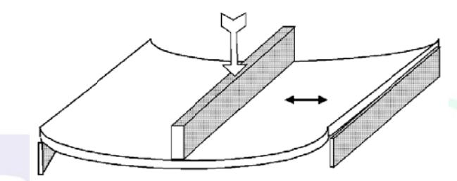

Gambar 9.4.1 Contoh panel struktural terlentur

## C9.4.2 Tarik pada Bidang Panel

Perhatian khusus perlu diberikan untuk menjamin sifat penampang terkait dengan sumbu kuat yang sesuai digunakan untuk menghitung kapasitas tarik panel

## C9.4.3 Tekan pada Bidang Panel

Perhatian khusus perlu diberikan untuk menjamin bahwa sifat penampang terkait dengan sumbu kuat yang sesuai digunakan untuk menghitung kapasitas tekan panel (lihat Gambar C9.4.3).

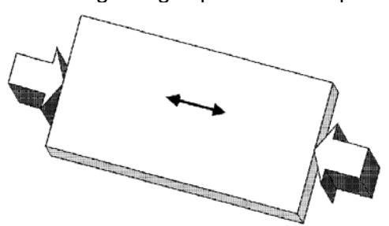

Gambar C9.4.3 Contoh panel struktural dengan beban tekan aksial pada bidang panel

## **C9.4.4 Geser Gelinding**

Perhatian khusus perlu diberikan untuk menjamin bahwa sifat penampang terkait dengan sumbu kuat yang sesuai digunakan untuk menghitung kapasitas geser gelinding (juga disebut geser pada bidang) panel (lihat Gambar C9.4.4).

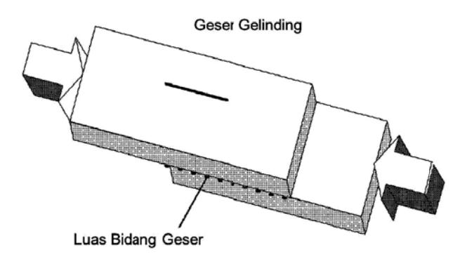

Gambar C9.4.4 Geser gelinding atau geser pada bidang panel kayu struktural

## C9.4.5 Geser pada sisi tebal

Penampang penampang untuk geser pada sisi tebal ada<mark>lah sa</mark>ma untuk sumbu panjang panel dan melintang panel (lihat Gambar C9.4.5).

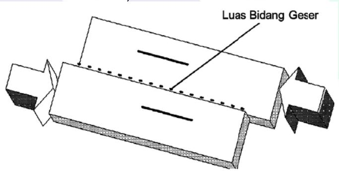

Gambar C9.4.5 Geser pada sisi tebal untuk panel kayu struktural

## **C9.4.6 Tumpu**

Tegangan tumpu desain pada muka panel terpisah dari orientasi sumbu panel.

**C10.1 Umum** 

**C10.1.1 Lingkup** 

**C10.1.1.2** 

lihat C3.1.3, C3.1.4, dan C3.1.5.

C10.1.1.3 Kecukupan dari metode alternatif atau prosedur untuk mendesain dan membuktikan nilai desain acuan sambunganyang berbeda dengan apa yang ada pada Spesifikasi ini adalah tanggung jawab desainer atau otoritas yang menerima dan menyetujui metode alternatif atau prosedur tersebut. Tanggung jawab ini termasuk menyediakan batasan keamanan yang tepat, meyakinkan pemakaian durasi beban, layanan basah, dan faktor koreksi lainnya pada Spesifikasi; dan menetapkan pemakaian hasil tes pada pabrikasi dan kondisi layan (lihat C1.1.1.3).

## **C10.1.2 Tegangan di Komponen Struktur pada Sambungan**

Semua desain sambungan harus dicek untuk kinerja komponen struktur terhadap persyaratan luas penampang neto Spesifikasi.3.4.3 (lihat C3.1.2 dan C3.4.3) dan ketentuan desain geser Spesifikasi 3.4.3 (lihat C3.1.2 dan C3.4.3). Semua sambungan lewatan atau geser tunggal juga harus dicek untuk menentukan kecukupan komponen struktur menahan tegangan tambahan akibat transfer beban eksentris pada sambungan (lihat Spesifikasi 3.1.3). Seringkali hal ini akan melibatkan interaksi lentur dan tekan atau lentur dan tarik dimana momen lentur yang diakibatkan oleh beban eksentris pada sambungan menghasilkan lentur terhadap sumbu lemah komponen struktur.

Apabila pengencang majemuk digunakan, maka kapasitas kelompok pengencang dibatasi oleh kegagalan kayu pada luas penampang neto atau robek garis sekitar pengencang yang disebabkan oleh tegangan lokal. Salah satu metode untuk mengevaluasi kekuatan komponen struktur terhadap tegangan lokal di sekitar kelompok pengencang diuraikan di Standar Apendik E.

## **C10.1.3 Sambungan Eksentris**

Sambungan eksentris yang menimbulkan tegangan tarik tegak lurus serat pada komponen struktur kayu utama di sambungan harus dihindari. Bila pengencang majemuk terjadi dengan eksentrisitas, maka pengencang harus diletakkan,sedapat mungkin, sedemikian hingga kayu diletakkan pada dareah tekan, bukan tarik (lihat Spesifikasi Gambar 10A).

Pada tahun 1984, ketentuan untuk desain geser komponen struktur lentur di sambungan diperkenalkan dalam upaya untuk membatasi tegangan tarik tegak lurus serat pada sambungan eksentris. Pada tahun 1982, ketentuan telah ditambah dengan melarang sambungan eksentris yang mengakibatkan tegngan tarik tegak lurus serat kayu kecuali jika telah ditunjukkan oleh analisis atau tes bahwa sambungan tersebut aman memikul beban yang bekerja. Penentuan jenis dan dan perluasan analisis dan/atau tes diperlukan untuk mendemonstrasikan kecukupan sambungan eksentris yang menimbulkan tegangan tarik tegak lurus serat pada komponen struktur adalah tanggung jawab desainer. Penggunaan pelat atau baut penjepit untuk menahan tegangan tersebut apabila adanya tegangan tidak dapat dihindari adalah praktek biasa.

Perlu ditekankan bahwa nilai desain tarik tegak lurus serat tidak diberikan dalam spesiikasi (lihat C3.8.2).

# **C10.1.4 Sambungan dengan Pengencang Campuran**

Masing-masing alat pengencang pada sambungan secara umum harus sama ukurannya untuk meyakinkan karakteristik kekakuan atau beban-selip yang sebanding. Ekuivalensi tersebut dibutuhkan untuk mendapatkan distribusi beban yang layak di antara pengencang pada sambungan dan merupakan kondisi yang diperlukan untuk menggunakan faktor aksi kelompok, Cg dari Spesifikasi 10.3.6

Disadari bahwa beberapa desainer menggunakan alat pengencang yang berbeda pada sambungan yang sama dimana penambahan satu atau lebih alat pengencang dari tipe yang digunakan terhalangi oleh batasan luas atau dipandang tidak ekonomis. Tipe sambungan campuran tersebut, sebagai contoh penggunaan satu baut 12,7 mm dengan tiga sambungan cincin belah atau penggunaan paku 16d dengan dua baut 12,7 mm, tidak tercakup di dalam ketentuan desain Standar. Karena perbedaan perilaku beban-slip dari masing-masing alat pengencang, beban izin pada sambungan tersebut tidak dapat diasumsikan sebagai penjumlahan beban izin untuk setiap tipe pengencang, bahkan ketika alat pengencang yang berbeda ada pada baris berbeda.

Beban izin untuk sambungan yang memiliki lebih dari satu jenis atau ukuran alat pengencang harus berdasarkan pada analisis yang memperhatikan perbedaan kekakuan sambungan, pada hasil tes atau pengalaman lapangan (lihat C1.1.1.3). Hal ini adalah tanggung jawab desainer untuk meyakinkan bahwa kapasitas beban pada sambungan tersebut mengandung kecukupan batas keamanan dan tercapai pada kondisi lapangan.

#### **C10.1.5 Pabrikasi Sambungan**

Nilai desain untuk sambungan telah diaplikasikan pada sambungan yang memiliki mur lepas maupun kencang. Ketentuan ini didasarkan pada tes sambungan baut asli yang digunakan untuk menetapkan nilai desain dimana mur dengan sengaja tidak dikencangkan dalam rangka mensimulasi susut tambahan yang dapat terjadi selama layanan (146). Harus dicatat bahwa aturan ini hanya berlaku pada mur lepas yang dapat terjadi karena susut dan bukan karena pengaruh kadar air pada kuat tumpu atau retak atau pecah disebabkan pengeringan setelah pabrikasi. Reduksi nilai desain sambungan untuk faktor ini diperlukan ketika sambungan dirakit dengan kayu basah atau setengah kering.

#### **C10.2 Nilai Desain Acuan**

## **C10.2.1 Sambungan Pengencang Tunggal**

Nilai desain lateral acuan untuk tipe pengencang pasak (baut, sekrup kunci , sekrup kayu, paku, dan pantek) didasarkan pada model limit leleh yang secara khusus dihitung untuk beberapa model perilaku sambungan saat dibebani. Perilaku pola atau mode ini (lihat Lampiran I Spesifikasi) adalah tumpu seragam pada kayu yang kontak dengan pengencang, rotasi pengencang pada sambungan tanpa lentur pasak, dan pembentukan satu atau lebih sendi plastis pada pengencang (67, 122). Persamaan telah dikembangkan untuk setiap mode terkait beban sambungan pada tegangan maksimum pada komponen kayu dan alat pengencang (67,121). Kapasitas sambungan pada masing-masing mode leleh dibatasi oleh kuat tumpu kayu

**© BSN 2013 249 dari 312**

yang kontak dengan pengencang dan kuat lentur pengencang, dengan kapasitas terkecil yang dihitung untuk beberapa jenis mode yang diambil sebagai nilai desain sambungan.

Model mode leleh menghasilkan basis yang konsisten di dalam menetapkan efek relatif dari ketebalan dan kuat tumpu komponen strukstur samping atau utama, dan kuat leleh pengencang pada kapasitas-pikul-beban pengencang yang melibatkan tipe pengencang pasak. Karena kekuatan leleh dari sambungan kayu tidak terdefinisi dengan jelas dari kurva beban-deformasi untuk sambungan, maka tegangan batas kayu yang digunakan pada mode leleh didasarkan pada beban dimana kurva beban-deformasi dari tes pembenaman pengencang memotong garis yang merupakan nilai ofset 5% diameter pengencang dari modulus tangen awal (120). Nilai leleh nominal ada di antara batas proporsional dan beban maksimum material dan sambungan. Nilai desain acuan lateral untuk sambungan pada Spesifikasi edisi sebelumnya direpresentasikan dengan nilai batas proporsional nominal. Untuk tujuan transisi dan berdasarkan atas catatan panjang kinerja yang memuaskan yang didapatkan dari nilai desain sebelumnya, nilai desain berdurasi singkat yang didasarkan pada aplikasi langsung dari persamaan batas leleh telah diturunkan ke level desain yang telah dipublikasikan pada edisi sebelumnya untuk sambungan yang dibuat dari spesies dan ukuran komponen struktur ekivalen. Kalibrasi dilakukan dengan dengan menetapkan rasio rerata nilai desain Standar sebelumnya terhadap nilai desain model limit leleh untuk setiap mode leleh dan arah pembebanan (sejajar dan tegak lurus serat). Prosedur konversi yang memudahkan ini mempertahankan tingkat keamanan historis yang menghasilkan beberapa nilai desain untuk setiap tipe pengencang menjadi sedikit lebih tinggi dan ada yang lebih rendah dibanding nilai sebelumnya, yang tergantung atas diameter pengencang dan tebal komponen struktur utama dan samping.

#### **C10.2.2 Sambungan Pengencang Majemuk**

Nilai desain acuan untuk sambungan dengan dua atau lebih pengencang didapat dari penjumlahan nilai desain acuan untuk setiap pengencang. Harus dipahami bahwa aturan ini membutuhkan aplikasi faktor aksi kelompok dari Spesifikasi 10.3.6 untuk nilai desain pengencang tunggal apabila ada satu baris yang terdiri atas dua atau lebih konektor cincin belah, konektor pelat geser, atau tipe pengencang pasak.

Penjumlahan nilai desain acuan masing-masing pengencang untuk mendapatkan nilai desain acuan total sambungan yang mengandung dua atau lebih pengencang dibatasi pada desain yang menggunakan pengencang dengan tipe dan ukuran yang sama (lihat C10.1.4). Pengencang dengan tipe, diameter, dan panjang yang sama yang menghubungkan komponen struktur yang sama dan menahan beban pada bidang geser yang sama boleh diasumsikan memperlihatkan mode leleh yang sama.

#### **C10.2.3 Desain Bagian Metal**

Bagian metal, termasuk pengencang, harus didesain sesuai dengan standar nasional untuk praktik dan standar material tersebut. Tegangan tarik pada pengencang yang merupakan hasil dari beban cabut, geser pada penampang pengencang, tumpu pengencang pada pelat samping metal, tarik dan geser pada pelat, dan tekuk pada pelat dan batang termasuk dalam ketentuan ini.

Praktek desain metal standar tidak boleh digunakan untuk memperhitungkan tegangan lentur yang terjadi pada pengencang tipe pasak pada sambungan kayu yang mengalami beban lateral. Tegangan tersebut diperhitungkan pada Spesifikasi ini di bagian ketentuan tentang jenis pengencang khususyg digunakan. Apabila nilai desain untuk sambungan yang melibatkan

**© BSN 2013 250 dari 312**

pengencang logam dibatasi oleh ketentuan Spesifikasi ini, maka faktor koreksi Spesifikasi 10.3 harus digunakan. Apabila nilai desain sambungan dibatasi oleh kekuatan bagian metal atau pengencang, maka faktor koreksi Spesifikasi 10.3 tidak digunakan.

#### **C10.2.4 Desain Bagian Beton atau Dinding Bata**

Bagian beton atau dinding bata harus didesain sesuai dengan standar nasional praktik dan standar yang berlaku pada material tersebut.

## **C10.3 Koreksi pada Nilai Desain Acuan**

## **C10.3.1 Keberlakuan Faktor Koreksi**

Faktor koreksi yang berlaku untuk sambingan ditetapkan pada Spesifikasi Tabel 10.3.1.

# **C10.3.2 Faktor Durasi Beban, CD (hanya untuk DTI)**

Lihat C2.3.2. Nilai desain acuan untuk sambungan kayu yang diperoleh dari hasil tes berdurasi singkat standar (durasi 5 sampai 10 menit) dan/atau dihitung dari sifat-sifat yang diperoleh dari tes berdurasi singkat termasuk reduksi 1,6 untuk memperhitungkan efek potensial pembebanan berdurasi lama. Apabila sambungan kayu digunakan untuk menahan beban berdurasi singkat, maka nilai desain acuan dapat diperbesar dengan faktor koreksi sebesar-besarnya 1,6 sesuai dengan ketentuan Spesifikasi 2.3.2. Faktor durasi beban yang lebih besar dari 1,6, termasuk faktor durasi beban impak 2,0, tidak boleh dipakai untuk beban desain pada sambungan.

## **C10.3.3 Faktor Layan Basah, CM**

Faktor Layan basah pada Spesifikasi Tabel 10.3.3 untuk baut dan sekrup kunci , konektor cincin belah dan pelat geser, sekrup kayu, dan paku telah direkomendasikan sebagai bagian awal penelitian pada sambungan kayu (184, 181).

Faktor 0,8 untuk konektor pelat logam yang dipasang pada kayu setengah kering atau kayu basah didasarkan atas hasil uji titik hubung segaris tarik dan rangka batang (1, 109, 195).

Faktor 0,4 di Spesifikasi Tabel 10.3.3. untuk pengencang tipe pasak dengan banyak baris yang dipasang pada kayu setengah kering yang digunakan kondisi kering layanan didasarkan atas tes terbatas pada sambungan yang dipabrikasi dengan komponen struktur basah yang disambung pada sudut tegak lurus satu dengan lainnya dan diuji setelah kering (181).

## **C10.3.4 Faktor Tempetatur, Ct**

Faktor koreksi temperatur untuk sambungan pada Spesifikasi Tabel 10.3.4 ekivalen untuk nilai desain lentur, tekan, dan geser pada Spesifikasi 2.3.3 (lihat C2.3.3). Tumpu akibat pengencang logam sangat berkorelasi dengan properti tekan sejajar serat atau tekan tegak lurus serat.

#### **C10.3.5 Perlakuan Penghambat Api**

Lihat C2.3.4.

**© BSN 2013 251 dari 312 C10.3.6 Faktor Aksi Kelompok, Cg** 

Faktor modifikasi untuk dua atau lebih konektor cincin belah, konektor pelat geser, atau pengencang tipe pasak dalam satu baris telah ditambahkan pada Spesifikasi di edisi 1973. Tes awal pada sambungan dengan baut dan konektor pelat geser menunjukkan bahwa kapasitas pikul beban untuk sambungan dengan pengencang majemuk dalam satu baris tidak secara langsung proporsional terhadap jumlah pengencang, dengan pengencang yang berlokasi dekat ujung baris memikul proporsi beban lebih besar dibandingkan dengan pengencang yang berlokasi di interior dari baris tersebut. (35, 39, 40, 66, 72)

Tabel faktor yang tercantum pada edisi 1973 untuk memperhitungkan beban tidak seragam dalam satu baris pengencang didasarkan pada analisis linier dimana tegangan langsung pada komponen struktur utama dan samping pada sambungan diasumsikan terdistribusi seragam di seluruh potongan melintangnya, dan hubungan antara slip pengencang dan beban pengencang diasumsikan linier (77). Prosedur analitis ini menunjukkan tranfer beban dari komponen struktur samping ke utama dan proporsi beban total yang dipikul oleh masing-masing pengencang yang diturunkan dari modulus elastisitas, E, dan luas penampang komponen struktur utama dan samping, jumlah pengencang dalam satu baris, spasi antar pengencang, dan modulus bebanslip sambungan.

Dua tabel faktor modifikasi untuk sambungan yang mengandung dua atau lebih pengencang dalam satu baris diturunkan dari analisis linier, satu untuk sambungan dengan pelat samping kayu dan satu untuk sambungan dengan pelat samping metal. Untuk tujuan penyederhanaan, faktor tersebut ditabelkan hanya dalam jumlah pengencang dalam satu baris dan luas penampang komponen struktur yang disambung. Variabel lain diasumsikan dengan nilai sebagai berikut (156).

Sambungan kayu-kayu:

E komponen struktur samping dan utama : 12400 MPa Modulus beban-slip pengencang : 38500 N/mm Spasi antar pengencang : 165 mm

Sambungan kayu-metal:

E komponen struktur samping dan utama : 9650 MPa Modulus beban-slip pengencang : 57800 N/mm Jarak antar pengencang : 146 mm

Dengan nilai konstanta yang disebutkan di atas, prosedur analitis digunakan untuk menghitung faktor modifikasi untuk tiga sampai delapan pengencang dalam satu baris dan kemudian hasilnya diekstrapolasikan ke atas sampai 12 pengencang dan ke bawah sampai 2 pengencang dalam satu baris (156). Tabel faktor-faktor yang diperoleh, yang berkisar antara 1,00 untuk dua pengencang dalam satu baris sampai sekecil 0,34 dan 0,15 untuk 12 pengencang dalam satu baris pada sambungan dengan masing-masing pelat samping kayu dan logam, tidak pernah berubah hingga edisi 1986. Persamaan faktor aksi kelompok yang diberikan di Spesifikasi 10.3.6 menggunakan prosedur analitis yang digunakan untuk menentukan faktor modifikasi yang ada di edisi sebelumnya (188). Bersamaan dengan pengembangan satu persamaan kompak untuk memperhitungkan aksi kelompok, data beban-slip mutakhir untuk sambungan dengan baut dan konektor cincin belah serta pelat geser telah digunakan untuk menentukan modulus beban-slip representatif dan baru untuk berbagai tipe sambungan (188).

**© BSN 2013 252 dari 312**

Perlu dicatat bahwa variabel A, dalam persamaan aksi kelompok (Spesifikasi Persamaan 10.3- 1) menunjukkan jumlah luas penampang komponen struktur samping. Dengan demikian, persamaan tersebut memperhitungkan sambungan geser tunggal dan geser ganda. Untuk sambungan dengan 4 atau lebih komponen struktur, masing-masing bidang geser dievaluasi sebagai sambungan geser tunggal (lihat Spesifikasi 11.3.8). Apabila sambungan tersebut mengandung dua atau ebih pengencang dalam satu baris, maka faktor aksi kelompok dihitung untuk masing-masing bidang geser dengan menggunakan As yang didasarkan atas komponen struktur paling tipis di dekat bidang yang sedang ditinjau.

Pembebanan Tegak Lurus Serat. Jumlah pengencang dalam satu baris tegak lurus serat secara umum terbatas dengan tujuan mengindari belah yang dapat terjadi sebagai akibat pengeringan (lihat C10.3.3). Jika satu baris pengencang majemuk digunakan tegak lurus serat, adalah praktek standar untuk menggunakan faktor aksi kelompok yang sama dengan faktor aksi kelompok pada pengencang sejajar serat. Praktek ini berdasarkan asumsi bahwa menggunakan kekakuan komponen struktur dan sambungan tegak lurus serat (E┴ dan ┴) dalam persamaan Spesifikasi 10.3.1 akan menghasilkan faktor aksi kelompok yang mirip.

**C11 Pengencang Tipe Pasak** 

**C11.1 Umum** 

**© BSN 2013 253 dari 312**

## **C11.1.2 Baut**

- **C11.1.2.1** ANSI/ASME Spesifikasi B18.2.1 *Square and Hex Bolts and Screws (Inch Series)* adalah standar acuan kualitas untuk baut. Aturan desain baut dan tabulasi nilai desain baut hanya digunakan untuk baut yang memiliki diameter 25,4 mm atau kurang. Batasan ini adalah respon dari laporan masalah yang ada di lapangan dengan sambungan melibatkan baut diameter besar dalam komponen struktur kayu glulam dan hasil penelitian (31, 135). Penggunaan baut diameter besar menunjukkan pengeringan saat layanan, variabel pekerjaan, dan komponen beban tegak lurus serat dapat berinteraksi mempengaruhi kapasitas sambungan yang dibuat dengan baut majemuk diameter besar, relatif baut kaku. Penggunaan prosedur ini untuk menentukan nilai desain acuan untuk baut diameter besar adalah tanggungjawab desainer.
- **C11.1.2.2** Secara umum, diamater baut yang lebih kecil akan menggunakan nilai toleransi lubang yang lebih kecil dan diameter baut besar akan menggunakan toleransi lubang yang besar. Toleransi yang sama harus digunakan untuk semua lubang pada sambungan yang sama. Susunan yang tepat, khususnya dalam kelompok pengencang, dibutuhkan untuk mendistribusikan beban secara tepat ke masing-masing pengencang. Pemasangan pengencang secara paksa dapat merusak permukaan tumpuan kayu dan mengurangi kapasitas sambungan.
- **C11.1.2.3** Menggunakan cincin penutup atau bagian logam ekivalen dengan kepala dan mur mencegah kerusakan desak lokal kayu pada lubang baut.
- **C11.1.2.4** Jarak tepi, jarak ujung, dan spasi pengencang telah dikonsolidasikan untuk jenis pengencang pasak di 11.5.

#### **C11.1.3 Sekrup kunci**

- **C11.1.3.1** ANSI/ASME Standar B18.2.1 *Square and Hex Bolts and Screws (Inch Series)* adalah standar acuan kualitas untuk sekrup kunci. Disediakan dimensi sekrup kunci standar (lihat Lampiran L) tetapi tidak mensyaratkan logam mempunyai sifat kekuatan tertentu. Perancang bertanggungjawab untuk mensyaratkan kekuatan logam sekrup kunci yang akan digunakan. Kuat tumpu leleh sekrup kunci (lihat Lampiran I) adalah input variabel yang dibutuhkan pada persamaan leleh pada 11.3.1. Sebagai tambahan, tegangan tarik aktual pada diameter akar sekrup kunci harus dicek ketika mendesain sambungan sekrup kunci untuk cabut (lihat 10.2.3).
- **C11.1.3.2** lubang penuntun untuk tiga kelas berat jenis didasarkan pada penelitian awal sekrup kunci melibatkan uji *Douglas fir, soutern Pine, white Oak, Redwood, dan Northern white Pine* (100).
- **C11.1.3.3** Aturan yang mengizinkan sekrup kunci dengan diameter 9,5 mm dan lebih kecil dengan beban utamanya cabut dimasukkan tanpa lubang penuntun pada kayu berberat jenis sedang ke rendah telah ditambahkan untuk penggunaan sekrup kunci kecil. Berdasarkan pengalaman lapangan, riset terakhir mengenai sekrup kunci (100), dan informasi tahanan cabut *tapping screw* dimasukkan dengan lubang penuntun dengan ukuran berbeda (163), pengunaan sekrup kunci kecil tanpa lubang penuntun dianggap diterima ketika kondisi sebagai berikut ditemui:
- 1. Sekrup kunci dibebani utama cabut

- 2. Sekrup kunci dimasukkan pada kayu dengan berat jenis, G ≤ 0,5
- 3. Penempatan sekrup kunci menghindari belah berlebihan.

Sekrup kunci menerima kombinasi beban cabut dan lateral boleh dipertimbangkan dengan beban utama cabut ketika sumbu sekrup kunci berada pada sudut 75° atau lebih terhadap serat komponen struktur yang memegang bagian berulir dari sekrup. Persyaratan bahwa belah tak biasa terhindari ketika lubang penuntun tidak digunakan dapat dipertimbangkan persyarat kinerja bahwa (i) berhubungan dengan kemampuan sekrup untuk memegang *cleat* atau komponen struktur sisi terhadap komponen struktur utama ke elemen struktur pondasi dan (ii) dapat diterapkan kedua komponen struktur disambung.

- **C11.1.3.5** Pelumas kadang digunakan untuk memfasilitasi masuknya sekrup kunci bahkan ketika sekrup kunci berdiamater kecil dimasukkan tanpa menggunakan lubang penuntun.
- **C11.1.3.6** Penetrasi minimum yang disyaratkan disajikan untuk memastikan pengencang dapat mencapai nilai desain dari perhitungan menggunakan persamaan leleh pada 11.3.1.
- **C11.1.3.7** Syarat jarak tepi, jarak ujung, dan jarak antar pengencang telah dikonsolidasikan untuk tipe pengencang pasak di 11.5

#### C11.1.4 Sekrup kayu

- C11.1.4.1 ANSI/ASME Standard B18.6.1.adalah standar acuan kualitas untuk sekrup kayu. Menyediakan dimensi standar sekrup kayu (lihat Lampiran L) tetapi tidak menstandarkan logam dengan sifat kekuatan spesifik. Perancang bertanggungjawab untuk menstandar kekuatan logam sekrup kayu yang digunakan. Kekuatan lentur leleh sekrup kayu (lihat Lampiran I) dibutuhkan sebagai input variabel pada persamaan nilai desain lateral batas leleh dari 11.3.1. sebagai tambahan, tegangan tarik sebenarnya pada diameter akar sekrup kayu harus dicek ketika mendesain sambungan sekrup kayu untuk cabut (lihat 10.2.3).
- **C11.1.4.2** Syarat lubang penuntun untuk sekrup kayu didasarkan pada riset awal melibatkan sekrup kayu kepala datar diatas 24 *gage* dan panjang 127 mm pada tujuh jenis kayu, termasuk *southern pine, cypress,* dan *oak* (43)

Peraturan membolehkan masuknya sekrup kayu tanpa lubang penuntun dengan  $G \le 0.5$  ketika sekrup menerima beban cabut paralel yang dibuat untuk sekrup kunci berdiameter 9,5 mm dan lebih kecil (lihat C11.1.3.3).

- **C11.1.4.3** Sekrup kayu yang menahan beban lateral disyaratkan memiliki lubang penuntun pada bagian polos dan ulir lubang berdasarkan pada uji gaya lateral sekrup kayu sebelumnya (184, 181, 70). Lubang penuntun dibutuhkan untuk semua sekrup kayu mendukung beban lateral tanpa memperhatikan berat jenis kayu.
- **C11.1.4.4** Uji sekrup kayu (43, 181, 70) berdasarkan masuknya sekrup dengan pemutaran daripada dibenamkan dengan martil.
- **C11.1.4.5** Pelumas kadang digunakan untuk memudahkan masuknya sekrup dan menghindari kerusakan sekrup. Pengujian telah menunjukkan bahwa pelumas tidak signifikan mempengaruhi nilai desain acuan (43, 184, 70)

**C11.1.4.6** Penetrasi minimum yang disyaratkan disajikan untuk meyakinkan bahwa pengencang dapat mencapai nilai desain acuan yang dihitung menggunakan persamaan leleh pada 11.3.1

**C11.1.4.7** Syarat jarak tepi, jarak ujung, dan spasi pengencang telah dikonsolidasikan untuk semua ukuran diameter untuk berbagai tipe pengencang pasak pada tabel 11.5.1. Untuk diameter kurang dari 6,35 mm, persyaratan khusus tidak disajikan, tetapi Tabel C11.1.4.7 boleh digunakan untuk menetapkan rekomendasi penempatan sekrup kayu. Perancang harus ingat bahwa jenis kayu, kadar air, dan orientasi serat akan mempengaruhi efek spasi antar pengencang dalam satu baris.

| Tabel C11.1.4.7 Spasi Minimum Sekrup Kunci |                             |                             |  |  |
|--------------------------------------------|-----------------------------|-----------------------------|--|--|
|                                            |                             | Komponen struktur sisi kayu |  |  |
|                                            | Tidak Dibor dahulu          | Dibor dahulu                |  |  |
| Jarak Tepi                                 | 2,5d                        | 2,5d                        |  |  |
| Jarak Ujung                                |                             |                             |  |  |
| - Beban tarik paralel serat                | 15d                         | 10d                         |  |  |
| - Beban tekan paralel serat                | 10d                         | 5d                          |  |  |
| Jarak antar pengencang dalam satu          |                             |                             |  |  |
| baris                                      |                             |                             |  |  |
| - paralel serat                            | 15d                         | 10d                         |  |  |
| - tegak lurus serat                        | 10d                         | 5d                          |  |  |
| Jarak antar baris pengencang               |                             |                             |  |  |
| - segaris                                  | 5d                          | 3d                          |  |  |
| - zig-zag                                  | 2,5d                        | 2,5d                        |  |  |
|                                            | Komponen struktur sisi baja |                             |  |  |
|                                            | Tidak Dibor dahulu          | Dibor dahulu                |  |  |
| Jarak Tepi                                 | 2,5d                        | 2,5d                        |  |  |
| Jarak Ujung                                |                             |                             |  |  |
| - Beban tarik paralel serat                | 15d                         | 5d                          |  |  |
| - Beban tekan paralel serat                | 5d                          | 3d                          |  |  |
| Jarak antar pengencang dalam satu baris |                             |                             |  |  |
| - paralel serat                            | 10d                         | 5d                          |  |  |
| - tegak lurus serat                        | 5d                          | 2,5d                        |  |  |
| Jarak antar baris pengencang               |                             |                             |  |  |
| - segaris                                  | 3d                          | 2,5d                        |  |  |
| - zig-zag                                  | 2,5d                        | 2,5d                        |  |  |

#### **C11.1.5 Paku dan Pantek**

**© BSN 2013 256 dari 312 C11.1.5.1** ASTM F 1667 menyajikan dimensi paku dan pantek standar (lihat Lampiran L), tetapi tidak memberikan standar untuk penampang kekuatan logam. Perancang bertanggung jawab untuk menstandar kekuatan logam dari paku dan pantek yang digunakan. Kekuatan leleh lentur

sekrup kayu (lihat Lampiran I) dibutuhkan input variabel persamaan nilai desain batas leleh lateral dari 11.3.1. Sebagai tambahan, tegangan tarik sebenarnya pada sekrup kayu pada diameter akar harus dicek ketika mendesain sambungan sekrup kayu untuk cabut (lihat 10.2.3).

- **C11.1.5.4** Prosedur pemakuan miring terdiri dari miring paku pada sudut 300 dari muka komponen struktur yang berdempetan dengan jarak ujung (jarak antara ujung komponen struktur sisi dengan titik awal masuk) dari 1/3 panjang paku berdasarkan uji lateral dan cabut sambungan paku pada konstruksi dinding rangka (181,118). Faktor paku miring dari 11.5.4.1 dan 11.5.4.2 diperkirakan menggunakan prosedur pemakuan ini dan tidak ada belah berlebihan. Jika belah ini terjadi, pengeboran awal atau paku lebih kecil harus digunakan. Proyeksi panjang vertikal digunakan sebagai panjang tumpu komponen struktur sisi pada persamaan batas leleh ketika menghitung kapasitas lateral pada sambungan paku miring.
- **C11.1.5.5** Penetrasi minimum yang disyaratkan disajikan untuk memastikan alat pengencang dapat mencapai nilai desain yang dihitung dengan persamaan leleh pada Spesifikasi 11.3.1
- **C11.1.5.6** Syarat jarak tepi, jarak ujung, dan jarak antar alat pengencang telah dikonsolidasikan untuk semua diameter alat tipe pasak pada tabel Spesifikasi 11.5.1 diteruskan 11.5.1E. Untuk diameter kurang dari 6,35 mm, persyaratan spesifik tidak disajikan, tetapi Tabel C11.1.5.6 dapat digunakan untuk menetapkan rekomendasi penempatan paku. Perancang harus ingat bahwa tipe jenis kayu, kandungan air, dan orientasi serat akan menyebabkan pengaruh spasi alat sambung dalam dalam satu baris.

**Tabel C11.1.5.6 Spasi Minimum Paku** 

|            | Komponen struktur sisi kayu        |      |
|------------|------------------------------------|------|
|            | Tidak Dibor dahulu Dibor dahulu |      |
| Jarak Tepi | 2,5d                               | 2,5d |

**© BSN 2013 257 dari 312**

| Jarak Ujung                                |                             |              |  |
|--------------------------------------------|-----------------------------|--------------|--|
| - Beban tarik paralel serat                | 15d                         | 10d          |  |
| - Beban tekan paralel serat                | 10d                         | 5d           |  |
| Jarak antar pengencang dalam satu baris |                             |              |  |
| - paralel serat                            | 15d                         | 10d          |  |
| - tegak lurus serat                        | 10d                         | 5d           |  |
| Jarak antar baris pengencang               |                             |              |  |
| - segaris                                  | 5d                          | 3d           |  |
| - zig-zag                                  | 2,5d                        | 2,5d         |  |
|                                            | Komponen struktur sisi besi |              |  |
|                                            |                             |              |  |
|                                            | Tidak Dibor dahulu          | Dibor dahulu |  |
| Jarak Tepi                                 | 2,5d                        | 2,5d         |  |
| Jarak Ujung                                |                             |              |  |
| - Beban tarik paralel serat                | 10d                         | 5d           |  |
| - Beban tekan paralel serat                | 5d                          | 3d           |  |
| Jarak antar pengencang dalam satu baris |                             |              |  |
| - paralel serat                            | 10d                         | 5d           |  |
| - tegak lurus serat                        | 5d                          | 2,5d         |  |
| Jarak antar baris pengencang               |                             |              |  |

## **C11.1.6 Baut Dorong dan Pin Dorong**

**C11.1.6.1** Baut dorong dan Pin dorong adalah besi bulat tidak berulir digunakan untuk menyambung komponen struktur besar dimana permukaan rata tanpa tonjolan bagian logam diinginkan. Perancang bertanggungjawab untuk menstandarkan kekuatan logam dari baut desak dan pin dorong yang digunakan. Tegangan lentur leleh baut dorong atau pin dorong (lihat Lampiran I) adalah input variabel yang diperlukan pada persamaan batas leleh dari nilai desain lateral acuan dari 11.3.1

- zig-zag 2,5d 2,5d

- **C11.1.6.2** Penetrasi tambahan pada komponen struktur diperlukan untuk menahan cabut baut dorong atau pin dorong.
- **C11.1.6.3** Persyaratan jarak tepi, jarak ujung, dan jarak antar alat pengencang telah dikondolidasikan untuk semua diameter alat pengencang tipe pasak pada tabel 11.5.1A sampai 11.5.1E.

## **C11.1.7 Pengencang Tipe-Pasak Lain**

Walaupun instruksi pemasangan spesifik tidak disajikan untuk semua alat pengencang tipe pasak, persamaan generik leleh di Spesifikasi 11.3 dipakai. Perancang bertanggungjawab untuk menentukan syarat pemasangan yang tepat dan untuk menstandarkan kekuatan logam pada alat pengencang ini.

## **C11.2 Nilai Desain Acuan Cabut**

## **C11.2.1 Sekrup kunci**

**C11.2.1.1** Persamaan 11.2-1 digunakan untuk menentukan nilai desain cabut acuan sekrup kunci yang ada pada tabel 11.2A. Persamaan ini diperoleh dari persamaan berikut berdasarkan penelitian (181,100) 3 3

2 4 W K GD w (C11.2.1-1)

dimana :

W : nilai desain cabut acuan per mm penetrasi ulir pada komponen struktur utama, N

Kw : 27,86

G : berat jenis komponen struktur utama berdasarkan berat dan volume kering oven,

dimana 0,31 G 0,73

D : Diameter ulir sekrup kunci (ekivalen terhadap diameter bagian polos untuk seluruh bagian diameter sekrup kunci) dimana 0,25 D 1,25

Nilai Kw mewakili kira-kira 1/4 (1/5 dinaikkan 20%) dari rata-rata konstan (Kw =116) pada kondisi berat dan volume kering diperoleh dari uji beban ultimit sambungan dibuat dengan lima spesies berbeda dan tujuh ukuran sekrup kunci (100), dinaikkan hingga 20% atau

$$K_{w} = 1,2\left(\frac{116}{5}\right)$$
 (C11.2.1-2)

Penambahan 20% telah diperkenalkan sebagai bagian keadaan darurat pada perang dunia II pada nilai desain kayu, dan kemudian berikutnya disusun sebagai 10% untuk perubahan dari pembebanan permanen ke normal dan 10% untuk pengalaman (lihat C2.3.2).

Ketika kapasitas cabut acuan sekrup kunci ditentukan dari perkalian nilai desain acuan dengan panjang penetrasi dari bagian ulir pada serat sisi komponen struktur utama, panjang ujung sekrup yang ditiruskan tidak diperhitungkan. Bagian tirus pada ujung dari sekrup kunci tidak dipertimbangkan sebagai bagian dari kedalaman efektif penetrasi pada uji sambungan orisinil (100). Sebagai tambahan, ketebalan cincin penutup yang digunakan diantara kepala sekrup kunci dan komponen struktur sisi harus diperhitungkan ketika menentukan panjang penetrasi bagian ulir pada komponen struktur utama. Dimensi standar sekrup kunci, termasuk minimum panjang ulir dan panjang bagian yang ditiruskan diberikan pada Lampiran L.

C11.2.1.2 Nilai desain cabut acuan untuk sekrup kunci dikurangi 25% ketika sekrup dimasukkan pada ujung serat (bidang radial-longitudinal) dari komponen struktur utama lebih dari serat sisi (bidang radial-longitudinal atau tangensial-longitudinal) berdasarkan uji sambungan sekrup kunci

(100). Karena besarnya peluang retak/belah ketika mendukung beban lateral, direkomendasikan untuk menghindari penanaman sekrup kunci pada serat ujung.

## C11.2.2 Sekrup Kayu

**C11.2.2.1** Persamaan 11.2-2 digunakan untuk menentukan nilai desain cabut acuan sekrup kayu pada Spesifikasi tabel 11.2B. Persamaan ini didasarkan pada uji potong ulir (*cut thread*) sekrup kayu pada tujuh spesies kayu (43):

$$W = K_w G^2 D$$
 (C11.2.2-1)

dimana:

W : nilai desain cabut acuan per mm penetrasi ulir pada komponen struktur utama, N

Kw : 19,65

G : berat jenis komponen struktur utama berdasarkan berat dan volume kering oven, dimana  $0.31 \le G \le 0.73$ 

D : Diameter ulir sekrup kunci , mm, dimana  $3,5 \le D \le 9,45$ 

Nilai  $K_w$  mewakili kira-kira 1/5 (1/6 dinaikkan 20%) dari rata-rata konstan ( $K_w$  =98,25) pada kondisi berat dan volume kering diperoleh dari uji beban ultimit dari sambungan (43) dibuat dengan tujuh spesies berbeda dan potong ulir (cut-thread) sekrup kayu; atau

$$K_{w} = 1, 2\left(\frac{98, 25}{6}\right)$$
 (C11.2.2-2)

Penambahan 20% telah diperkenalkan sebagai bagian keadaan darurat pada perang dunia II pada nilai desain kayu, dan kemudian berikutnya disusun sebagai 10% untuk perubahan dari pembebahan permanen ke normal dan 10% untuk pengalaman (lihat C2.3.2)

Nilai desain cabut acuan sekrup kayu didasarkan pada uji potong ulir sekrup kayu. Diameter badan atau bagian polos dari potong ulir sekrup sama dengan diameter luar bagian ulir. Diameter badan atau bagian polos dari sekrup ulir yang dicanai sama dengan diameter akar. Untuk nominal diameter sekrup yang sama, kedua tipe sekrup berulir memiliki jumlah ulir yang sama setiap mm, diameter ulir terluar yang sama, dan kedalaman ulir yang sama. Jika kuat tarik sekrup mencukupi dan lubang penuntun dibuat berdasarkan diameter akar, tahanan cabut sekrup ulir yang dicanai dianggap ekivalen dengan sekrup potong ulir (182,163).

Standar ANSI/ASME B18.6.1 menyatakan bahwa panjang ulir adalah sekitar 2/3 dari panjang nominal sekrup.

**C11.2.2.2** Pengujian awal sekrup kayu terhadap cabut dari permukaan serat ujung *oak, southern pine, maple*, dan *cypress* memberikan hasil yang relatif tidak menentu terhadap cabut dari serat tepi (43). Hasil yang tidak regular ini dihubungkan dengan kecenderungan sekrup untuk membelah kayu pada konfigurasi serat ujung. Rasio rata-rata dari tahanan cabut terhadap tahanan cabut serat tepi berkisar antara 52 % hingga 108 % (43). Kerena variabilitas ini, pembebanan struktural sekrup kayu untuk cabut dari serat ujung telah dilarang.

#### C11.2.2.3 Lihat C10.2.3

#### C.11.2.3 Paku dan Pantek

**C.11.2.3.1** Persamaan 11.2-3 yang digunakan untuk menentukan nilai desain cabut acuan paku dan pantek diberikan pada Tabel 11.2C. Persamaan ini berdasarkan pada penelitian (94, 95):

$$W = K_w G^{5/2} D (C11.2.3-1)$$

Dimana:

W : nilai desain cabut paku atau pantek per mm penetrasi pada komponen struktur utama,

Ν

Kw : 9.51

G : berat jenis komponen struktur utama berdasarkan berat dan volume kering oven, dimana  $0.31 \le G \le 0.73$ 

D : diameter bagian polos paku atau pantek, mm, dimana 2,51< D <9,52

Nilai dari  $K_a$  mewakili 1/5 (1/6 dinaikkan 20%) dari konstanta rata-rata ( $K_w$  =47,6) pada berat dan volume kering oven yang diperoleh dari pengujian pembebanan ultimit (184), dinaikkan 20%, atau

$$K_{w} = 1.2 \left( \frac{47.6}{6} \right)$$
 (C11.2.3-2)

Kenaikan 20 % dikenali sebagai bagian dari kenaikan darurat Perang Dunia II pada nilai desain kayu, dan kemudian setelah itu disusun sebagai 10 % untuk perubahan dari pembebanan permanen ke pembebanan tetap dan 10% untuk pengalaman (lihat C2.3.2).

Untuk paku ulir yang dikeraskan 8d, 16d, dan 20d, nilai desain cabut acuan sama seperti paku dari kawat biasa pada kode identifikasi kelas ukuran, walaupun diameter kawat sedikit berbeda (3,05 mm; 3,43 mm; 3,76 mm dan 4,5 mm untuk paku ulir yang dikeraskan dengan 3,33 mm; 3,76 mm; 4,11 mm; 4,88 untuk paku umum, secara berturut-turut). Ukuran paku ulir yang dikeraskan pada 20d, 30d, 40d, 50d, dan 60d memiliki diameter yang sama (4,5 mm) dan, oleh karena itu, menggunakan nilai desain cabut acuan yang sama. Paku ulir yang dikeraskan berukuran 70d, 80d, 90d, semuanya memiliki diameter yang sama (5,26 mm) dan menggunakan nilai desain cabut acuan yang sama seperti paku berukuran 40d.

**Pengelingan.** Tahanan cabut paku diameter bulat bisa dinaikkkan secara signifikan dengan pengelingan (29).

**C11.2.3.2** Pengurangan nilai desain cabut hingga 50% pernah dilaporkan untuk paku yang ditanamkan pada permukaan serat ujung (bidang radial-tangensial) sebagai perbandingan dengan permukaan serat tepi (bidang radial-longitudinal atau bidang tangensial-longitudinal) (184,118). Ketika digabungkan dengan pengaruh pengeringan terhadap pelayanan setelah pabrikasi, pengurangan seperti itu dianggap terlalu besar untuk desain yang dapat dipercaya.

Atas dasar ini, pembebanan struktural cabut paku yang ditanamkan pada dari serat ujung sudah dilarang.

#### **C11.2.4 Baut Desak dan Pin Desak**

**C11.2.4.1** Walaupun ketentuan penentuan nilai desain tarik untuk baut dorong atau pin bulat tidak termasuk dalam Spesifikasi, persamaan berikut telah digunakan dimana gesekan dan pengerjaan dapat dijaga (184, 181):

W 70,86G D2 (C11.2.4-1)

Dimana:

W. nilai desain tarik acuan per mm penetrasi dari baut dorong atau pin dorong, N.

G : berat jenis berdasarkan berat dan volume kering oven dan volume.

D : diameter baut dorong dan pin dorong, mm.

Persamaan C11.2.4-1 mengasumsikan bahwa alat pengencang dimasukkan ke dalam lubang yang sudah dibor memiliki diameter 3,12 mm lebih kecil daripada diameter pengencang (184). Nilai desain tarik acuan yang dihitung dengan Persamaan C11.2.4-1 adalah sekitar 1/5 dari ratarata nilai uji ultimit (184, 181).

# **C11.3 Nilai Desain Lateral Acuan**

Nilai desain lateral acuan untuk alat pengencang tipe pasak (baut, sekrup kunci , sekrup kayu, paku dan pantek) didasarkan pada model batas leleh yang secara spesifik memperhitungkan berbagai cara sambungan berperilaku terhadap pembebanan. Pola atau ragam perilaku ini (lihat Spesifikasi Lampiran I) adalah tumpu merata pada kayu dibawah alat pengencang, rotasi pengencang pada sambungan tanpa lentur, dan pembentukkan satu atau lebih sendi plastis pada alat pengencang (67,122). Persamaan dikembangkan untuk setiap ragam menghubungkan gaya sambungan dengan maksimum tegangan pada komponen struktur kayu dan pengencang (67,121). Kapasitas sambungan pada setiap ragam leleh adalah terkait pada kuat tumpu kayu dibawah alat pengencang dan tahanan lentur alat pengencang, dengan kapasitas terendah yang dihitung untuk berbagai ragam diambil sebagai nilai desain acuan untuk sambungan.

Walaupun model batas leleh menggambarkan perbedaan metodologi secara signifikan daripada penggunaan sebelumnya untuk menentukan nilai desain pengencang, efek relatif berbagai variabel sambungan yang ditunjukkan oleh kedua cara tersebut adalah secara umum sama (85,86,89,121). Nilai desain jangka waktu pendek yang diperoleh dari aplikasi persamaan batas leleh telah direduksi menjadi tingkat nilai desain rata-rata yang ditulis pada edisi sebelumnya tentang Spesifikasi untuk sambungan yang dibuat dengan jenis dan ukuran komponen struktur yang sama.

**Baut:** Nilai desain acuan untuk sambungan baut diindekskan pada batas proporsional yang diperkirakan dari uji sambungan baut (44, 57, 146, 162) pada kondisi acuan (kering udara, durasi pembebanan normal).

**Sekrup kunci:** Nilai desain acuan untuk sambungan sekrup kunci diindekskan pada rata-rata batas proporsional yang diperkirakan dari pengujian waktu pendek (100) dibagi dengan 1,875. Faktor 1,875 didasarkan pada faktor reduksi yang asli yaitu 2,25, kenaikan 20% dikenali sebagai bagian dari kenaikan darurat dalam nilai desain kayu pada Perang Dunia II, dan kemudian

**© BSN 2013 262 dari 312**

setelah itu diatur sebagai 10% untuk perubahan dari pembebanan permanen menjadi pembebanan normal dan 10% untuk pengalaman (lihat C2.3.2).

**Sekrup Kayu**: Nilai desain acuan untuk sambungan sekrup kayu diindekskan menjadi nilai proporsional rerata pengujian ultimit (184,70) dibagi dengan 1,33. Faktor 1,33 didasarkan pada faktor reduksi yang asli yaitu 1,6, kenaikan 20% untuk pembebanan normal dan pengalaman. Kenaikan 20% dikenali sebagai bagian dari kenaikan darurat dalam nilai desain kayu pada Perang Dunia II, dan kemudian setelah itu diatur sebagai 10% untuk perubahan dari pembebanan permanen menjadi pembebanan normal dan 10% untuk pengalaman (lihat C2.3.2). Nilai desain lateral untuk sambungan sekrup kayu pada kondisi acuan (kering udara, durasi pembebanan normal) adalah sekitar 1/5 dari kapasitas uji maksimum (184).

**Paku dan Pantek:** Nilai desain acuan untuk sambungan paku diindekskan menjadi nilai proporsional rerata pengujian ultimit (184,50) dibagi dengan 1,33. Faktor 1,33 didasarkan pada faktor reduksi yang asli yaitu 1,6, kenaikan 20% untuk pembebanan normal dan pengalaman. Kenaikan 20% dikenali sebagai bagian dari kenaikan darurat dalam nilai desain kayu pada Perang Dunia II, dan kemudian setelah itu diatur sebagai 10% untuk perubahan dari pembebanan permanen menjadi pembebanan normal dan 10% untuk pengalaman (lihat C2.3.2). Nilai desain lateral untuk sambungan sekrup kayu pada kondisi acuan (kering udara, durasi pembebanan normal) adalah sekitar 1/5 dari kapasitas uji maksimum untuk kayu berdaun jarum dan 1/9 dari kapasitas uji maksimum untuk kayu berdaun lebar (184,50).

#### **C11.3.1 Persamaan Batas Leleh**

Persamaan batas leleh untuk sambungan geser tunggal (Persamaan 11.3-7 hingga 11.3-10) dikembangkan dari penelitian di Eropa (121,78) dan sudah dikonfirmasi dengan pengujian pada spesies domestik (21,20,88,120,121,122). Ragam batas leleh yang tercakup dalam persamaanpersamaan ini adalah tumpu pada komponen struktur utama atau komponen struktur sisi (Ragam I), rotasi alat pengencang tanpa lentur (Ragam II), pembentukkan sendi plastik pada alat pengencang di komponen struktur utama atau komponen struktur sisi (Ragam IV) (lihat Lampiran I).

Istilah reduksi, *Rd*, dalam Persamaan 11.3-1 sampai 11.3-10, mengurangi nilai hitungan menggunakan persamaan batas leleh untuk memperkirakan nilai desain batas proporsional nominal pada edisi sebelumnya tentang Spesifikasi (157). Untuk pengencang yang dibebani secara tegak lurus serat dengan diameter sama atau lebih besar daripada 6,35 mm, istilah reduksi meningkat 25% (Kθ=1,25) untuk mencocokkan dengan nilai desain sebelumnya untuk sambungan dengan pembebanan tegak lurus serat.

Untuk teknis informasi yang lebih detil tentang persamaan desain lateral, lihat *AF&PA's Technical Report 12: General Dowel Equation for Calculating Lateral Connection Values* (137).

#### **C11.3.2 Kekuatan Tumpu Pasak**

**C11.3.2.1** Batas tegangan kayu digunakan yang pada persamaan batas leleh didasarkan pada beban dimana kurva deformasi-pembebanan dari sebuah pengujian tumpu alat sambung memotong sebuah garis yang menggambarkan kemiringan modulus tangen inisial 5% diameter alat sambung (120). Titik leleh nominal ini ada diantara beban batas proporsional dan maksimum untuk bahan.

Efek dari berat jenis pada kekuatan tumpu pasak ditentukan dari pengujian tumpu pasak 19 mm pada pada *Douglas fir, southern pine, spruce-pine-fir, Sitka spruce, red oak, yellow poplar,* dan *aspen*. Efek diameter dievaluasi dari pengujian pasak 6,35 mm, 12,7 mm, 19 mm, 25,4 mm, dan 38,1 mm pada *southern pine* menggunakan lubang baut 1,6 mm lebih besar daripada diameter pasak. Diameter ditemukan menjadi variabel yang signifikan hanya pada pembebanan yang tegak lurus serat. Benda uji tumpu adalah 12,7 mm atau lebih tebal sedemikian sehingga tebal dan banyaknya lingkaran tahun tidak mempengaruhi hasil (158).

Nilai berat jenis diberikan pada Tabel 11.3.2A untuk setiap jenis atau kelompok digunakan untuk menentukan nilai kekuatan tumpu pasak, *Fe*, ditabelkan pada di Tabel 11.3.2. Nilai berat jenis ini menggambarkan nilai rata-rata dari program pengujian mutu kayu atau didasarkan pada informasi dari ASTM D2555.

Persamaan yang tersedia di catatan kaki 2 pada Spesifikasi Tabel 11.3.2 digunakan untuk menghitung nilai yang ditabelkan dalam Tabel 11.3.2. Persamaan ini didapat dari data uji menggunakan metode yang dideskripsikan dalam ASTM D5764 (158,18).

**C11.3.2.2** Kekuatan tumpu pasak untuk panel kayu struktural pada Tabel 11.3.2B berdasar pada penelitian yang diselenggarakan oleh *APA-The Engineered Wood Association* (25).

**C11.3.2.3** Kekuatan tumpu pasak untuk kayu komposit struktural ditentukan untuk setiap produk yang menggunakan metode kesetaraan yang dideskripsikan dalam ASTM D5456 (16).

# **C11.3.3 Kekuatan Tumpu Pasak pada suatu Sudut terhadap Serat**

Persamaan 11.3-11 (dan Persamaan J-2 di Lampiran J) digunakan untuk menghitung kekuatan tumpu pasak untuk pembebanan pada komponen struktur utama atau komponen struktur sisi pada suatu sudut terhadap serat. Persamaan ini adalah bentuk persamaan sudut tumpu terhadap serat (Persamaan J-1). Persamaan dimasukkan dengan kekuatan tumpu pasak dalam arah sejajar dan tegak lurus untuk komponen struktur sambungan dengan nilai desain baut acuan ditentukan dari persamaan batas leleh menggunakan *FeΘ* sebagai kekuatan tumpu pasak untuk komponen struktur utama atau komponen struktur sisi.

Nilai desain acuan yang diperoleh dari persamaan batas leleh menggunakan kekuatan tumpu pasak pada suatu sudut terhadap serat adalah sama dengan yang ditentukan dari penggunaan nilai Z pada Persamaan J-3 untuk yang sejajar serat dan tegak lurus serat untuk menentukan nilai desain *ZΘ* pada sambungan (157). Penentuan nilai desain *ZΘ* menggunakan pendekatan akhir dapat digunakan sebagai alternatif untuk menghitung *FeΘ* untuk penggunaan pada setiap persamaan batas leleh dan mengizinkan penggunaan nilai Z yang sudah ditabelkan pada Spesifikasi.

## **C11.3.4 Panjang Tumpu Pasak**

Studi kepekaan persamaan batas leleh mengindikasikan bahwa penambahan panjang yang ditiruskan hingga 2 kali diameter pada panjang tumpu pasak tidak berpengaruh secara signifikan terhadap perkiraan kapasitas pengencang ketika penetrasi pengencang melampaui 10 kali diameter (10D). Untuk penetrasi pengencang kurang dari 10D, ujung yang ditiruskan mungkin berpengaruh pada hitungan dan sebaiknya tidak dimasukkan. Untuk sekrup kayu dan paku, panjang yang ditiruskan tidak secara umum distandardkan. Akan tetapi, panjang ujung untuk

**© BSN 2013 264 dari 312**

paku ujung-*diamond*, seperti paku bulat dan persegi, mempunyai rentang dari sekitar 1,3 hingga 2,0 diameter paku.

## **C11.3.5 Kekuatan Lentur Leleh Pasak**

Kekuatan lentur leleh, *Fyb* dari pengencang seperti paku (79), sekrup kayu, sekrup kunci, dan baut diberikan pada Lampiran I. Untuk A36 dan baja yang lebih kuat, *Fyb* sama dengan 310 MPa adalah nilai konservatif dan setara dengan kekuatan baut yang dilaporkan pada penelitian asli uji baut (146).

## **C11.3.6 Diameter Pasak**

Reduksi tahanan momen pada bagian ulir pengencang tipe pasak dapat dihitung dengan menggunakan diameter ujung, *Dr*, pada penghitungan nilai desain lateral acuan. Penggunaan diameter, *D*, diijinkan ketika bagian yang berulir pada pengencang cukup jauh daru sambungan bidang geser. Untuk informasi lebih lengkap, lihat Lampiran I.5.

Nilai desain lateral acuan untuk reduksi diameter badan sekrup kunci , dan sambungan sekrup kayu *rolled thread* berdasar pada diameter ujung, *Dr*, untuk menghitung diameter reduksi pada pengencang. Nilai ini, ketika konservatif, dapat juga digunakan untuk sekrup kunci dengan diameter sama untuk seluruh bagian dan sekrup kayu dengan potongan berulir. Untuk sambungan baut, nilai desain lateral acuan didasarkan pada diameter, *D*.

Salah satu metode alternatif untuk menghitung tahanan momen dan tumpu untuk bagian berulir pada pengencang dan momen bekerja pada seluruh panjang pengencang tersedia di *AF&PA's Technical Report 12: General Dowel Equation for Calculating Lateral Connection Values* (137). Serangkaian persamaan umum diijinkan untuk penggunaannya pada diameter pengencang yang berbeda untuk tahanan tumpu dan tahanan momen pada setiap komponen struktur.

#### **C11.3.7 Sambungan Tiga Komponen struktur yang Tidak Simetrik, Geser Ganda**

Secara konservatif, Spesifikasi membutuhkan penggunaan panjang minimum tumpu pada komponen struktur tepi dan diameter minimum pasak pada penghitungan nilai desain untuk sambungan tiga komponen struktur yang tidak simetrik. Yang tidak bisa dipisahkan dari penghitungan adalah asumsi bahwa beban bagi setiap komponen struktur sisi adalah sama. Ketika pendistribusian beban lainnya muncul, dibutuhkan analisis yang lebih kompleks.

#### **C11.3.8 Sambungan Geser Banyak**

Spesifikasi membutuhkan evaluasi untuk setiap bidang geser tunggal menggunakan persamaan batas leleh dari 11.3.1 dan kemudian menerapkan nilai terendah pada bidang geser lainnya. Komponen struktur dalam harus dicek untuk kombinasi pembebanan dari bidang-bidang yang berdekatan untuk memastikan kapasitas tumpu yang cukup ada (seperti sebuah sambungan geser ganda dibatasi oleh Ragam Im).

#### **C11.3.9 Pembebanan pada Suatu Sudut terhadap Sumbu Pengencang**

**© BSN 2013 265 dari 312** Sambungan dua komponen struktur dimana beban bekerja pada suatu sudut terhadap sumbu pengencang dicek menggunakan komponen beban yang bekerja 90⁰ terhadap sumbu dan ketebalan komponen struktur sama dengan panjang pengencang pada setiap komponen struktur yang diukur pada garis tengah pengencang (lihat Gambar 11E). Nilai desain acuan untuk sambungan dimana beban bekerja pada suatu sudut terhadap sumbu pengencang didasarkan pada persamaan batas leleh 11.3.1. Nilai terendah Z ditentukan menggunakan tm dan ts sama dengan panjang pengencang pada setiap komponen struktur, dibagi dengan nilai

cosinus sudut perpotongan dua komponen struktur adalah nilai desain acuan maksimum untuk sambungan.

Kecukupan luasan tumpu di bawah cincin dan pelat untuk menahan komponen gaya yang bekerja sejajar dengan sumbu pengencang dapat dicek menggunakan nilai desain tekan terkoreksi yang tegak lurus serat, Fcl'.

#### C11.3.10 Baut Desak dan Pin Desak

Nilai desain lateral acuan untuk baut atau pin dorong (181) adalah 75% dari nilai desain acuan untuk baut umum pada diameter yang sama untuk mengimbangi tidak adanya kepala, mur, dan cincin. Jarak akhir, jarak tepi, dan kebutuhan mengatur jarak, dan koreksi aksi kelompok yang dapat diaplikasikan pada baut, dapat diaplikasikan juga pada baut dorong dan pin dorong.

#### C11.4 Kombinasi Pembebanan Lateral dan Cabut

## C11.4.1 Sekrup Kunci dan Sekrup Kayu

Hasil pengujian sekrup kunci mengindikasikan bahwa pembebanan pada suatu sudut terhadap sumbu pengencang menghasilkan komponen lateral dan cabut dan tidak mereduksi kapasitas maksimun sambungan. Akan tetapi, ketika tahanan sambungan dievaluasi pada tingkat pembebanan desain, sebuah interaksi pada komponen pembebanan diamati dengan diameter sekrup lebih besar pada sudut pembebanan kurang dari  $45^{\circ}$  (87). Analisis pada tingkat pembebanan desain dibuat dalam kaitan dengan perbedaan pada tingkat desain hingga rasio kapasitas maksimum untuk lateral dan cabut. Persamaan 11.4.1 juga dapat digunakan untuk menentukan nilai desain acuan sekrup kunci yang dipasang pada suatu sudut terhadap serat pada komponen struktur kayu, dan diberi beban pada arah normal terhadap komponen struktur kayu. Untuk kondisi ini,  $\alpha$ , dapat didefinisikan sebagai sudut yang tegak lurus sumbu pengencang.

#### C11.4.2 Paku dan Pantek

Diasumsikan bahwa koreksi yang berlaku untuk sambungan paku miring menunjukkan efek dari kombinasi pembebanan lateral dan cabut dan tidak membutuhkan modifikasi lebih lanjut. Penelitian pada efek kombinasi pembebanan lateral dan cabut pada sambungan paku (37) termasuk pengujian sambungan geser tunggal *Engelman spruce, Douglas fir,* dan *red-oak* yang dibuat dengan 8d paku biasa. Penetrasi dengan tinggi 6.10, and 14 kali diameter terhadan

dibuat dengan 8d paku biasa. Penetrasi dengan tinggi 6,10, and 14 kali diameter terhadap komponen struktur utama dan sudut pembebanan 0°,90°, dan enam sudut antara diinvestigasi. Dua pengujian dilakukan pada setiap sudut beban. Persamaan interaksi yang ditemukan mendeskripsikan dengan baik hasil pembebanan maksimum sambungan untuk setiap spesies dan ketinggian penetrasi dalam bentuk:

$$P = \frac{\left(1 + K \sin 2\alpha\right) \left(W'pZ'\right)}{\left(W'p\right)\cos \alpha + \left(Z'\right)\sin \alpha}$$
 (C11.4.2-1)

dimana:

P: beban maksimum pada suatu sudut terhadap serat, α

W'p : beban maksimum pada 90° (beban cabut tegak lurus serat per mm penetrasi pada

komponen struktur utama dikali tinggi penetrasi).

© BSN 2013 266 dari 312

Z': beban maksimum pada 0° (beban lateral)

α : sudut antara permukaan kayu dan arah aplikasi beban, dan

K : faktor yang berdasarkan analisis kesalahan terkecil pada data uji untuk setiap kelompok penetrasi-spesies.

Nilai rata-rata dari K untuk enam spesies dan kelompok penetrasi yang dievaluasi adalah 0,535, dan terbentang dari 0,151 hingga 1,406. Rata-rata nilai K berdasarkan spesies adalah 0,432; 0,864; dan 0,309 berturut-turut untuk *Douglas fir, Engelmann spruce,* dan *red oak*. Ketika K secara konservatif diasumsikan sama dengan 0, persamaan C11.4.2-1 tereduksi menjadi Persamaan 11.4-2 atau, dalam format yang lain sebagai berikut:

$$\frac{R_{w}}{W'n} + \frac{R_{z}}{Z'} \le 1,0$$
 (C11.4.2-2)

dimana:

Rw: gaya cabut sambungan, danRz: gaya lateral sambungan

## C11.5 Koreksi terhadap Nilai Desain Acuan

## C11.5.1 Faktor Geometrik, CA

**C11.5.1.1** Untuk alat pengencang dengan diameter kurang dari 6,35 mm, tidak ada reduksi geometrik yang distandarkan.

**C11.5.1.2** Untuk alat pengencang dengan diameter sama atau lebih besar daripada 6,35 mm, faktor geometrik menyediakan reduksi nilai desain acuan yang proporsional untuk yang kurang dari jarak ujung penuh atau yang kurang dari jarak spasi penuh. Faktor geometrik terkecil untuk setiap alat pengencang berlaku untuk semua alat pengencang lain pada sambungan yang sama, tidak hanya alat pengencang pada ujung atau pasangan alat pengencang dalam satu baris. Perlu dicatat bahwa reduksi lebih lanjut mungkin dibutuhkan ketika mengecek tegangan komponen struktur sambungan (lihat 10.1.2).

Persyaratan bahwa nilai desain alat pengencang untuk sambungan bidang geser majemuk atau sambungan tiga komponen struktur tidak simetrik didasarkan pada aplikasi faktor geometrik terkecil untuk setiap bidang geser terhadap semua alat pengencang di sambungan dengan asumsi bahwa kapasitas total sambungan sebanding dengan jumlah bidang geser.

**Jarak Tepi**: Persyaratan pada Tabel 11.5.1A untuk pembebanan sejajar serat pada 1,5D atau yang lebih besar antara 1,5D dengan ½ jarak antar baris untuk ℓ/D lebih besar dari 6, dan untuk tepi yang terbebani tegak lurus serat 4D didasarkan pada penelitian awal (146). Tepi yang tidak dibebani dimana tegak lurus dengan serat minimal 1,5D adalah rekomendasi praktek yang baik. Bagian 11.5.1 tidak menyediakan petunjuk spesifik tentang kebutuhan jarak tepi untuk beban yang bekerja pada sudut selain 0° dan 90°, juga tidak menyediakan faktor geometrik spesifik untuk jarak tepi yang direduksi.

Rasio panjang alat pengencang pada komponen struktur sisi terhadap diameter alat pengencang,  $\ell$ /D, pada Tabel 11.5.1A didasarkan pada ketebalan total kedua komponen struktur sisi ketika melibatkan sambungan tiga atau lebih komponen struktur kayu. Untuk sambungan yang menggunakan logam pada komponen struktur utama atau komponen struktur sisi, hanya © BSN 2013

rasio ℓ/D pada komponen struktur kayu yang dipertimbangkan untuk penentuan kebutuhan jarak tepi pada potongan ini. Bagian logam harus tetap didesain per 10.2.3.

Menghindari beban berat atau sedang yang tergantung dibawah sumbu netral pada balok ditambahkan sebagai hasil dari beberapa laporan permasalahan lapangan termasuk balok kayu glulam struktural dibebani satu garis dari beberapa beban terpusat yang diaplikasikan melewati baut penggantung atau *ledger strip* yang dilekatkan pada wilayah tarik atau pada sisi bawah balok. Beban terpusat kurang dari 450 N dan berspasi lebih dari 609 mm dapat dipertimbangkan sebagai kondisi beban ringan.

Untuk sambungan tegak lurus serat, komponen struktur disyaratkan untuk pengecekan terhadap geser sesuai 3.4.3.3 menggunakan tinggi tereduksi, *de*, ekivalen dengan tinggi balok, *d*, dikurangi jarak antara tepi tidak dibebani dengan pusat alat sambung terdekat.

**Jarak Ujung**: Persyaratan pada 11.5.1.2(a) dan Tabel 11.5.1B untuk pembebanan sejajar serat didasarkan pada rekomendasi sebelumnya (146). Untuk beban tarik (alat pengencang tumpu ke arah ujung komponen struktur), jarak ujung minimal 7D untuk kayu berdaun jarum dan 5D untuk kayu berdaun lebar untuk CΔ= 1,0 telah ditetapkan dengan pengujian. Untuk beban tekan (alat pengencang tumpu jauh dari ujung komponen struktur), jarak ujung minimal 4D untuk CΔ= 1,0 didasarkan pada jarak minimum alat pengencang dalam satu baris untuk CΔ= 1,0 (146). Jarak ujung untuk suatu sudut terhadap pembebanan tarik dapat diinterpolasi secara linier dari nilai desain tegak lurus serat dan nilai desain sejajar serat.

Ketentuan untuk penggunaan jarak ujung tereduksi pada sambungan ketika reduksi proporsional (0,5 < CΔ < 1,0) dibuat dalam nilai desain didukung oleh penelitian sebelumnya (184, 181, 146) yang menunjukkan hubungan linier antara jarak ujung dan kekuatan batas proporsional sambungan. Sebuah studi setelah itu menunjukkan bahwa hanya jarak ujung minimum 5D mencukupi untuk mencapai beban batas proporsional secara penuh dari sambungan *Douglas fir* dengan pelat sisi logam dan dibebani baik tarik sejajar serat (119). Penelitian lain memberikan syarat jarak ujung untuk sambungan yang dibebani baik tekan sejajar serat maupun tarik sejajar serat (102,110). Jarak ujung kurang dari 50% dari yang disyaratkan untuk CΔ= 1,0 tidak diizinkan.

**Luas Geser**: Persyaratan pada 11.5.1.2(b) adalah untuk pembebanan komponen struktur bersudut terhadap sumbu alat pengencang. Persyaratan jarak ujung dinyatakan dalam bentuk luas geser ekivalen. Luas geser untuk sambungan seperti tersebut didefinisikan sebagai luas segitiga dalam bidang ketebalan dari komponen struktur yang termasuk antara ujung komponen struktur dan garis pusat alat pengencang (Gambar 11E). Luas geser ini untuk komponen struktur bersudut dibandingkan terhadap luas geser sambungan dimana kedua komponen struktur dibebani secara tegak lurus terhadap sumbu alat pengencang (komponen struktur sejajar satu sama lain) dan yang memenuhi persyaratan jarak ujung. Luas geser ekivalen untuk sambungan komponen struktur sejajar adalah hasil perkalian dari persyaratan jarak ujung dengan panjang alat pengencang pada komponen struktur.

Demikian halnya dengan persyaratan jarak ujung untuk sambungan komponen struktur sejajar, luas geser tereduksi kurang dari 50% dari yang disyaratkan untuk CΔ= 1,0 tidak diizinkan. Direkomendasikan sebagai praktek yang baik bahwa jarak antara sumbu alat pengencang dan sambungan dalam (*the inside juncture*) dari komponen struktur sisi bersudut dan komponen struktur utama (lihat Gambar 11E) paling sedikit 1,5D.

**Persyaratan Jarak untuk alat Pengencang dalam Satu Baris**: Untuk pengencang dalam satu baris, persyaratan jarak yang terdapat dalam 11.5.1(c) dan Tabel 11.5.1C diasumsikan mencukupi untuk mengakomodasi pengaruh distribusi yang tidak seragam dari tegangan geser melalui ketebalan komponen struktur (terpusat pada tepi) yang terjadi saat alat pengencang terlentur (146). Jarak tereduksi kurang dari 75% dari yang dibutuhkan untuk CΔ = 1,0 tidak diijinkan.

Jika arah pembebanan tegak lurus serat, jarak minimum untuk CΔ = 1,0 didasarkan pada komponen struktur yang dipasang. Jika komponen struktur yang dipasang adalah baja, lalu kontrol jarak untuk baja dari standar baja yang sesuai (125). Jika komponen struktur yang dipasang adalah kayu yang dibebani sejajar serat, lalu spasi sejajar yang menentukan. Jika komponen struktur yang dipasang adalah kayu yang dibebani tegak lurus serat, dengan 4D akan mencukupi. Evaluasi komponen struktur kayu untuk geser sesuai 3.4.3.3 juga disarankan.

**Persyaratan Jarak Antar Baris**: Untuk pembebanan tegak lurus serat, ketentuan Tabel 11.5.1D berdasar pada penelitian sebelumnya (146). Persyaratan-persyaratan ini menghubungan kecenderungan alat pengencang untuk terlentur akibat tegangan tumpu yang tidak seragam dan tahanan kayu antar baris untuk menahan belah. Karena alasan tersebut, letak zig-zag alat sambung yang dibebani tegak lurus serat sangat diperlukan (lihat 11.6.1). Dalam penghitungan rasio l/D untuk menentukan jarak minimum yang cukup antar baris pada pembebanan tegak lurus serat, rasio untuk komponen struktur sisi berdasarkan pada jumlah panjang tumpu pada masing-masing sisi komponen struktur sisi ketika melibatkan sambungan dengan tiga atau lebih komponen struktur kayu.

Untuk pembebanan sejajar serat, Tabel 11.5.1D mengizinkan baris alat pengencang mempunyai spasi 1,5D, akan tetapi tambahan jarak mungkin dibutuhkan ketika pemasangan baut dan sekrup kunci untuk mengakomodasi ukuran kepala dan cincin yang lebih besar serta kebutuhan jarak bersih untuk soket kunci. Perlu dicatat bahwa industri baja merekomendasikan jarak minimal pusat-ke-pusat antara lubang 2,67D, dengan jarak yang disarankan 3D (125).

Untuk pembebanan sejajar atau tegak lurus serat, pembatasan jarak maksimum antara baris terluar alat pengencang pada pelat penyambung yang sama hingga 127 mm digunakan untuk mencegah belah pada komponen struktur sambungan sebagai hasil dari pencegahan susut disebabkan pengeringan pada masa layan.

Pembatasan jarak antar baris berlaku untuk pelat sisi logam dan juga kayu, pada komponen struktur yang dibebani tegak lurus serat dan juga sejajar serat, dan untuk tiga atau lebih sambungan komponen struktur yang terjadi pada titik panel rangka batang

## **C11.5.2 Faktor Serat Ujung, Ceg**

**C11.5.2.1** Reduksi nilai desain cabut acuan untuk sekrup kunci sebanyak 25% ketika sekrup dimasukkan dalam serat ujung (bidang radial-tangensial) pada komponen struktur utama dibandingkan dengan serat sisi (bidang radial-longitudinal atau bidang tangensial-longitudinal) berdasar pada pengujian sambungan sekrup kunci (100).

**© BSN 2013 269 dari 312** Pengujian sebelumnya atas sekrup kayu pada cabut dari permukaan serat ujung *oak, southern pine, maple,* dan *cypress* memberikan hasil yang agak tidak menentu relatif terhadap cabut dari serat sisi (43). Hasil yang tidak reguler ini dihubungkan dengan kecenderungan sekrup untuk membelah kayu pada susunan serat ujung. Rasio rata-rata tahanan serat ujung terhadap tahanan serat sisi berkisar 58% hingga 108%. Karena perbedaan ini, pembebanan cabut struktural dari sekrup kayu dari serat ujung tidak diperbolehkan. Ketika belah dihindarkan,

penggunaan rasio nilai desain cabut dari serat ujung hingga serat sisi sebesar 75% disarankan (184,183).

Reduksi nilai desain cabut hingga 50% dilaporkan untuk paku yang ditanamkan pada permukaan serat ujung (bidang radial-tangensial) sebagai perbandingan terhadap permukaan serat sisi (bidang radial-longitudinal atau bidang tangensial-longitudinal) (184,118). Ketika digabungkan dengan efek kembang-susut setelah pabrikasi, reduksi tersebut dipertimbangkan terlalu berlebihan untuk desain yang dapat dipercaya. Hal ini dipertimbangkan sebagai dasar bahwa pembebanan tarik pada paku dan pantek pada serat ujung tidak diperbolehkan.

**C11.5.2.2** Penggunaan Faktor koreksi sebesar 0,67 pada nilai desain lateral acuan untuk sekrup kunci, sekrup kayu, paku, dan pantek yang ditanamkan pada serat ujung berdasarkan penelitian sebelumnya pada sambungan yang dibuat dari spesies kayu berdaun jarum (181, 184).

## **C11.5.3 Faktor Diafragma, Cdi**

Diafragma adalah unit struktural besar dan datar yang berperilaku seperti sebuah balok atau gelagar yang tinggi dan relatif tipis. Diafragma kayu horisontal terdiri dari lantai atau deck atau atap yang berperilaku seperti badan dan balok kayu, kayu Glulam struktural, SCL, atau balok anak-I yang berperilaku sebagai sayap. Rakitan demikian mendistribusikan gaya horisontal yang bekerja pada sayap ke elemen tahanan vertikal (103). Dinding geser yang terdiri dari bahan pelapis dinding yang dikaitkan ke pelat atas dan bawah komponen struktur rangka vertikal juga merupakan diafragma. Beberapa dinding geser atau diafragma vertikal berperilaku untuk mentransfer beban dari diafragma horisontal turun ke fondasi pendukung. Faktor Diafragma, Cdi, berlaku untuk diafragma horisontal dan vertikal (144,145).

# **C11.5.4 Faktor Paku Miring, Ctn**

**C11.5.4.1** Nilai koreksi 0,67 untuk desain cabut acuan paku miring didasarkan pada hasil perbandingan pengujian sambungan paku yang ditanam miring dengan lurus (184) dan tipikal sambungan kayu ujung dengan kayu miring pada konstruksi dinding rangka (118) dimana komponen struktur yang dipasang tertarik secara langsung menjauhi komponen struktur utama. Ini dapat diaplikasikan pada sambungan yang dipabrikasi pada semua tingkat kembang-susut. Hal ini termasuk sambungan paku banyak yang dipabrikasi pada kayu yang tidak dikeringkan kemudin dibebani setelah dikeringkan (184,183,118). Paku miring dengan miring menyilang dapat menghasilkan sambungan yang lebih kuat daripada sambungan ujung atau muka. Sebagai contoh, sebuah *stad* untuk sambungan pelat terbuat dari empat paku miring dengan 8d dilaporkan lebih kuat daripada sambungan yang sama terbuat dari dua paku ujung 16d (181,118). Ketika sambungan paku miring menahan tarik, kedalaman penetrasi paku pada komponen struktur pemegang ujung dapat diambil sebagai panjang paku yang sebenarnya pada komponen struktur seperti yang ditunjukkan pada Gambar C11.5.4-1.

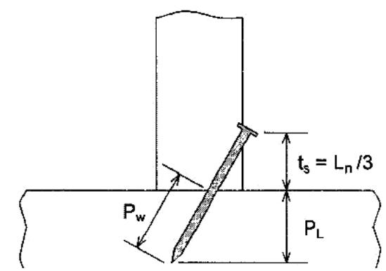

Gambar C11.5.4-1 Penetrasi Efektif dan Ketebalan Komponen Struktur Sisi untuk Sambungan Paku Miring dengan Beban Lateral

C11.5.4.2 Faktor paku miring 0,83 adalah sebuah koreksi yang berdasar pada kondisi antara nilai desain lateral secara penuh untuk sambungan serat tepi dan nilai desain lateral secara penuh untuk kondisi serat ujung dimana  $C_{eg}$ = 0,67. Karena sambungan paku miring menahan beban lateral, panjang tumpu,  $L_m$ , dari paku pada komponen struktur memegang ujung dapat diambil sebagai panjang proyeksi secara vertikal pada komponen struktur (lihat Gambar C11.5-4-1) dihitung sebagai:

$$L_m = L_n \cos 30^{\circ} - L_n/3$$
 (C11.5.4-1)

Dimana:

 $L_n$  = panjang paku, mm.

Untuk tujuan membuat nilai desain lateral acuan geser tunggal yang dapat diaplikasikan untuk sambungan paku miring, panjang tumpu komponen struktur sisi, Ls, pada kayu (lihat Gambar C11.5.4-1). Dapat diambil sebagai:

$$L_s = L_n/3$$
 (C11.5.4-2)

Persamaan C11.5.4-2 hanya diaplikasikan untuk paku yang ditanamkan pada sebuah sudut kira-kira 30° terhadap permukaan komponen struktur yang dipasang dan 1/3 panjang paku dari ujung komponen struktur tersebut.

## C11.6 Pengencang Ganda

# C11.6.1 Pengencang Berseling secara Simetrik

Lihat C11.5.1.2 Syarat Jarak Antar Baris

## C11.6.2 Pengencang yang Dibebani Bersudut terhadap Serat

Ketentuan umum untuk penempatan dan jarak pengencang meliputi seluruh arah pembebanan dan banyaknya komponen struktur dalam satu sambungan adalah di luar cakupan Standar. Untuk alasan ini, sumbu gravitasi untuk semua komponen struktur harus melewati pusat tahanan pengencang untuk menjaga keseragaman tegangan di komponen struktur utama dan

© BSN 2013 271 dari 312

keseragaman distribusi beban untuk semua pengencang. Jika tidak mungkin untuk mencapai perpotongan dari sumbu-sumbu gravitasi komponen struktur dengan pusat tahanan dari kelompok pengencang, perancang memiliki tanggung jawab untuk mengevaluasi secara keseluruhan dan memperhitungkan efek dari resultan beban yang eksentrik, baik pada kapasitas kekuatan komponen struktur maupun sambungan (lihat C10.1.3).

#### **C11.6.3 Tegangan Lokal pada Sambungan**

Lihat C10.1.2.

## **C12 Konektor Cincin Belah dan Pelat Geser**

## **C12.1 Umum**

#### **C12.1.1 Latar belakang**

Konektor cincin belah dan pelat geser bekerja seperti pasak atau kunci dalam mendistribusi beban dari komponen ke komponen struktur lainnya dalam suatu sambungan. Diameter yang besar dari cincin atau pelat, relatif terhadap diameter baut, dan panjang konektor relatif pendek dalam komponen struktur dapat menambah luas tumpu tanpa harus mereduksi luas penampang neto. Sebagai hasilnya, pada konektor ini dapat dikembangkan nilai desain yang lebih besar dibandingkan nilai yang diperoleh dari baut saja.

Konektor cincin belah dipasang pada alur *precut* yang dibuat dengan alat bor tekan listrik dan pemotong khusus. Konektor cincin belah digunakan untuk sambungan kayu-ke-kayu, dengan beban lateral yang besar; seperti misalnya pada *bowstring trusses*, *arches* dan jembatan. Baut atau sekrup kunci yang melalui pusat dari cincin menjaga kontak antara permukaan dari komponen struktur sambungan.

Sama dengan cincin belah, pelat geser dipasang pada alur *precut* tetapi terbenam pada permukaan ketika sudah terpasang. Dua buah pelat geser adalah sama dengan sebuah cincin belah, dengan beban ditransfer dari satu pelat ke pelat lainnya di sambungan melalui geser pada baut atau sekrup kunci. Pelat geser pada umumnya digunakan untuk sambungan kayu-kebaja; seperti sambungan pelat buhul baja atau sambungan kolom-fundasi dengan metal menggantikan salah satu pelat, dan dalam *demountable* sambungan kayu-ke-kayu, seperti *bleachers* stadium.

Ketentuan desain untuk konektor cincin belah dan pelat geser dalam Spesifikasi ini adalah berdasarkan pada penelitian awal (104, 117).

#### **C12.1.1 Istilah**

Sebuah unit konektor digambarkan dengan istilah suatu bagian metal yang diperlukan untuk satu bidang geser. Untuk sebuah sambungan cincin belah, sebuah cincin digunakan untuk masuk ke dalam alur dari komponen struktur yang dekat dengan sebuah permukaan. Untuk sambungan pelat geser, dua pasang pelat geser, sebuah pada alur masing-masing komponen struktur, digunakan untuk sambungan kayu-ke-kayu. Untuk sambungan kayu-ke-metal, baja atau pelat setrip menggantikan satu dari pelat geser. Pada ketiga kasus, baut atau sekrup kunci yang mengikat sambungan bersama dianggap mengalami beban geser tunggal. Jika lebih dari satu unit konektor pada baut yang sama, seperti dalam kasus sambungan tiga buah komponen struktur dengan satu komponen struktur mempunyai konektor pada baut yang sama pada kedua sisi permukaan, nilai desain geser tunggal terkoreksi untuk setiap bidang geser diberikan dalam nilai desain dalam Tabel (lihat Tabel 12.2A dan 12.2B dalam Spesifikasi).

## **C12.1.3 Kualitas Konektor Cincin Belah dan Pelat Geser**

**© BSN 2013 273 dari 312 C12.1.3.1** Cincin belah berbentuk *wedge* (*beveled* pada ujung) disediakan untuk pemasangan dan menjamin kencang pas ketika terpasang. Diameter bagian dalam alur untuk cincin belah adalah 2 persen lebih besar dari diameter dalam cincin, jadi mensyaratkan cincin mengembang sedikit ketika disisipkan. Hal ini untuk mengatasi susut sebagian dari komponen struktur dan untuk keberlanjutan tumpu dari permukaan dalam dari konektor terhadap bagian dalam inti kayu

yang terbentuk karena pengerjaan alur dan tumpu dari permukaan luar dari konektor pada sisi yang berlawanan terhadap dinding luar dari alur (117, 142). Posisi dari sambungan *slot*-lidah pada cincin relatif terhadap arah dari beban tidak penting.

Dua buah lubang kecil pada bagian pusat dari pelat geser baja dengan tekanan berguna untuk membuat lekatan sementara dari konektor pada sambungan komponen struktur ketika di luar pabrikasi dan waktu ereksi dan pelepasan dari struktur sementara di lapangan. Pelubangan tidak mempengaruhi kinerja pelat dalam menahan beban.

**C12.1.3.2** Nilai desain dalam Spesifikasi Tabel 12.2A dan 12.2B masing-masing berhubungan dengan dimensi untuk cincin belah dan pelat geser, dalam Spesifikasi Lampiran K. Sebagai tambahan terhadap diameter konektor, kedalaman dari konektor pada komponen struktur dan ketebalannya mempengaruhi kapasitas sambungan dalam menahan beban. Hanya cincin belah yang mempunyai diameter dalam yang lebih besar atau ekivalen, kedalaman metal, dan tebal metal seperti yang disebutkan dalam Spesifikasi Lampiran K memenuhi syarat untuk nilai desain acuan konektor yang ada dalam Tabel 12.2A dalam Spesifikasi.

Luas terproyeksi yang diberikan dalam Spesifikasi Lampiran K untuk cincin belah dihitung sebagai jumlah dari diameter dalam alur dan dua kali lebar alur dikalikan dengan kedalaman alur. Luas terproyeksi yang diberikan dalam Spesifikasi Lampiran K untuk pelat geser berdasarkan diameter alur dikalikan dengan kedalaman alur untuk ukuran pelat geser nominal yang ditunjukan. Tabel luas terproyeksi untuk konektor cincin belah dan pelat geser yang diberikan dalam Spesifikasi Lampiran K digunakan untuk memeriksa tegangan kayu lokal sehubungan dengan 10.1.2 dan 12.3.7.3.

- **C12.1.3.3** Baut yang digunakan dengan cincin belah atau pelat geser harus memenuhi persyaratan ketentuan kualitas dari Spesifikasi 11.1.2 untuk diameter baut badan penuh agar mencegah penggunaan pengencang yang kurang ukuran sehingga tidak memberikan tumpuan penuh dengan konektor.
- **C12.1.3.4** Sekrup kunci yang digunakan dengan cincin belah atau pelat geser harus memenuhi persyaratan ketentuan kualitas dari Spesifikasi 11.1.3 untuk diameter baut badan penuh agar mencegah penggunaan pengencang yang kurang ukuran sehingga tidak memberikan tumpuan penuh dengan konektor.
- **C12.1.4** Pabrikasi dan Perakitan
- **C12.1.4.1** *Cutterheads* harus didesain khusus untuk ukuran yang diberikan oleh pabrik tertentu pembuat konektor.

# **C12.1.4.2** –

- **C12.1.4.3** *Washer* perlu digunakan pada sambungan pelat geser dengan menggunakan setrip dan pelat baja ketika menggunakan sebuah baut atau sekrup kunci yang lebih panjang untuk menghindari tumpu pada bagian berulir dari baut atau sekrup kunci pada setrip atau pelat.
- **C12.1.4.4** Nilai desain acuan untuk konektor cincin belah dan pelat geser digunakan untuk sambungan dimana terjadi kontak dari komponen-komponen struktur, dipabrikasi ketika kayu mempunyai kadar air 15% atau lebih rendah pada suatu kedalaman sekurang-kurangnya 19 mm dari permukaan, dan akan tetap dalam kondisi layan kering. Efek dari variasi normal untuk kadar air yang dapat terjadi pada kondisi layan kering diperhitungkan dalam nilai acuan.

Apabila konektor dipasang pada saat musim yang tidak sesuai dengan kondisi layan kering, maka nilai desain acuan harus dikoreksi dengan faktor yang ada dalam Spesifikasi 10.3.3. Sambungan harus dikencangkan ketika komponen struktur pada musim kondisi layan dengan berkala memutar turun mur sampai kondisi keseimbangan kadar air tercapai.

Akan baik dalam praktek jika menghindari adanya mata kayu yang terlihat secara visual di permukaan dalam suatu jarak sebesar ½ dari diameter konektor sepanjang serat dari ujung unit konektor (181, 117). Dengan adanya mata kayu yang dapat dilihat secara visual dalam suatu jarak sebesar ½ diameter konektor dari bagian kritis, bagian neto berdasarkan luas terproyeksi dari unit konektor dan baut atau sekrup kunci harus direduksi untuk luas penampangnya termasuk mata kayu (lihat Spesifikasi 3.1.2.3).

#### **C12.2 Nilai Desain Acuan**

## **C12.2.1 Nilai Desain Acuan**

Pengujian konektor dari sambungan pada awalnya menggunakan Douglas fir, southern pine, white oak, dan spesies lainnya menunjukan bahwa kapasitas sambungan dalam menahan beban adalah langsung berhubungan dengan berat jenis dari komponen struktur (184, 181, 104, 117).

Nilai desain acuan dalam Spesifikasi Tabel 12.2A dan 12.2B merupakan nilai beban uji sambungan yang sudah direduksi dengan faktor 3,6 sudah termasuk koreksi untuk variasi dan durasi beban (184, 181, 117). Nilai desain acuan ini berlaku untuk kondisi beban normal, diperhitungkan kurang dari 70 persen dari batas proporsional beban uji (181, 117). Nilai desain acuan hanya berlaku untuk desain sambungan yang memenuhi syarat ketebalan minimum dalam Spesifikasi Tabel 12.2A atau 12.2B dan jarak ujung, jarak tepi dan syarat minimum spasi yang berhubungan dengan CΔ = 1,0 dalam Spesifikasi Tabel 12.3. Syarat ketebalan neto merujuk pada ketebalan aktual dari komponen struktur sebelum dibuat alur.

- **C12.2.1.1** Nilai desain acuan untuk sambungan cincin belah dalam Spesifikasi Tabel 12.2A dan untuk sambungan pelat geser dalam Spesifikasi Tabel 12.2B dinyatakan dalam jumlah permukaan dari sebuah komponen struktur dengan sebuah konektor pada baut yang sama dan pada ketebalan komponen struktur tersebut. Nilai terendah desain acuan untuk dua komponen struktur yang dihubungkan adalah nilai desain acuan untuk bidang geser tersebut.
- **C12.2.1.2** Limit nilai 12,9 kN untuk pelat geser 67 mm adalah acuan maksimum untuk beban tumpu dari pelat baja dengan tekanan tanpa *reinforcing hub* pada sekitar lubang baut. Limit nilai 19,6 kN dan 26,7 kN masing-masing untuk pelat geser 100 mm dengan baut 19 mm dan 22 mm, adalah nilai geser desain acuan untuk baut A307 dengan diameter tersebut. Pelat 100 mm mempunyai *reinforcing hub* integral pada sekitar pusat lubang baut. Nilai batas yang ditentukan dalam catatan kaki 2 Spesifikasi Tabel 12.2B berdasarkan pada kekuatan metal; tetapi, bagian metal ini harus tetap didesain sesuai Spesifikasi 10.2.3. Kekuatan dari bagian metal tidak perlu dikoreksi dengan faktor yang diberikan dalam Spesifikasi 10.3.1 (contoh, DTI, Faktor Durasi Beban, CD).

#### **C12.2.2 Ketebalan dari Komponen Struktur Kayu**

**C12.2.2.1** Ketebalan minimum yang disyaratkan untuk penggunaan nilai untuk masing-masing konektor cincin belah dan pelat geser dalam Spesifikasi Tabel 12.2A dan 12.2B, didapatkan dari pengujian sambungan (117).

**C12.2.2.2** Ketentuan untuk penggunaan interpolasi linier antara ketebalan minimum dan nilai desain acuan maksimum yang disyaratkan berdasarkan pada penelitian konektor asli (117).

## **C12.2.3 Faktor Kedalaman Penetrasi, Cd**

Koreksi untuk reduksi kedalaman penetrasi sekrup kunci diizinkan diinterpolasi untuk Cd = 1,0 dan Cd = 0,75 untuk masing-masing nilai penetrasi yang sesuai, untuk setiap kelompok spesies.

## **C12.2.4 Faktor Pelat Sisi Metal, Cst**

Penambahan pelat sisi metal untuk konektor pelat geser 100 mm adalah berdasarkan penelitian konektor dengan pelat *claw* (117). Nilai tambahan untuk pelat geser 100 mm yang dibebani sejajar serat, tetap dibatasi dalam catatan kaki 2 Spesifikasi Tabel 12.2B.

## **C12.2.5 Beban Bersudut terhadap Serat**

Gunakan persamaan tumpu standar bersudut terhadap serat (Spesifikasi persamaan 12.2-1 dan Lampiran J) untuk menentukan nilai desain acuan konektor cincin belah dan pelat geser yang terletak pada sebuah bidang geser yang dibebani dengan suatu sudut terhadap serat antara 0° dan 90° adalah berdasarkan penelitian konektor dengan pelat *claw* (117). Dalam studi yang sama, uji dari konektor cincin belah menunjukan hubungan antara nilai desain maksimum dan sudut serat dapat digambarkan dengan sebuah hubungan linier tanpa kesalahan yang berarti. Untuk konsistensi dengan ketentuan untuk pengencang yang lain, persamaan tumpu standar bersudut terhadap serat digunakan konservatif dalam Spesifikasi, untuk mengatur baik nilai desain acuan bersudut terhadap serat konektor cincin belah maupun pelat geser.

#### **C12.2.6 Konektor Cincin Belah dan Pelat Geser pada Serat Ujung**

Desain konektor pada permukaan serat ujung sering dijumpai dalam prakteknya, seperti misalnya pada puncak dari rangka A atau lengkung yang sama. Nilai desain acuan untuk konektor cincin belah dan pelat geser pada permukaan serat ujung dikunci untuk menggunakan nilai desain acuan untuk konektor pada irisan persegi dari permukaan ujung sampai dengan 60 persen dari nilai desain acuan untuk konektor pada permukaan sisi serat yang dibebani tegak lurus serat.

Penggunaan 0,60 Q' adalah sebagai nilai desain acuan pada irisan persegi dari permukaan ujung berasal dari pengalaman pada desain konektor dengan kayu *glulam* struktural (140). Data yang dapat diperoleh dari studi yang berkesinambungan dari kapasitas pelat geser pada lereng permukaan serat ujung pada Duoglas fir (80) pada umumnya sesuai untuk penggunaan rasio 0,60. Rasio ini sedikit lebih konservatif daripada nilai 0,67 yang diasumsikan untuk nilai desain permukaan irisan persegi di Kanada.

Untuk konektor cincin belah dan pelat geser yang digunakan pada lereng permukaan serat ujung, ketebalan dari komponen struktur diambil sebagai jarak antara sisi dari konektor dan titik

**© BSN 2013 276 dari 312**

terdekat pada sisi luar dari komponen struktur yang terletak pada sebuah garis sejajar terhadap baut atau sekrup kunci. Dengan permukaan serat ujung teriris persegi, ketebalan komponen struktur dapat diambil sebagai panjang dari sekrup kunci dalam komponen struktur.

#### **C12.3 Penempatan Konektor Cincin Belah dan Pelat Geser**

#### **C12.3.1 Istilah**

Jarak tepi dan jarak ujung dan spasi untuk konektor cincin belah dan pelat geser adalah dengan referensi terhadap pusat dan tidak terhadap tepi dari konektor.

## **C12.3.2 Faktor Geometri, C∆**

Faktor geometri mengkoreksi nilai desain acuan untuk penggunaan jarak tepi, jarak ujung, dan spasi yang kurang dari persyaratan untuk C∆ = 1,0. Faktor geometri terkecil untuk konektor cincin belah dan pelat geser untuk sebuah sambungan harus digunakan untuk semua konektor dalam sambungan tersebut bagaimanapun susunannya relatif satu terhadap yang lain.

## **C12.3.3 Jarak Tepi**

- **C12.3.3.1** Syarat jarak tepi konektor dan faktor geometrinya di dalam Spesifikasi Tabel 12.3 didasarkan atas penelitian konektor asli (117).
- **C12.3.3.2** Jarak tepi pada sisi yang terbebani mempunyai faktor geometri untuk jarak tepi yang harus digunakan.

## **C12.3.4 Jarak Ujung**

- **C12.3.4.1** Syarat jarak ujung konektor di dalam Spesifikasi Tabel 12.3 didasarkan atas penelitian konektor asli (117). Syarat ini bervariasi bergantung apakah komponen struktur dibebani tarik atau tekan, dan apabila dibebani tekan, akan bergantung pada juga apakah bebannya sejajar atau tegak lurus serat.
- **C12.3.4.2** Interpolasi linier antara nilai pada tabel untuk sejajar dan tegak lurus serat diperbolehkan untuk menentukan syarat jarak ujung yang dibebani dengan sudut terhadap serat antara 0° dan 90°.

#### **C12.3.5 Spasi**

- **C12.3.5.1** Syarat jarak tepi konektor dalam Spesifikasi Tabel 12.3 didasarkan atas penelitian konektor asli (117, 142) dengan dua pengecualian sebagai berikut:
- Faktor untuk kasus beban tegak lurus dan spasi diturunkan dari 0,83 menjadi 0,75 untuk keperluan keseragaman.
- Faktor geometri untuk jarak spasi minimum yang diizinkan direduksi dari 0,75 menjadi 0,50 sebagai bagian dari upaya menyederhanakan nilai desain acuan terkoreksi untuk jarak ujung dan spasi longitudinal (181).

**© BSN 2013 277 dari 312** Penelitian konektor asli menunjukan bahwa kapasitas pikul beban dari sebuah sambungan yang terbuat dari dua atau lebih konektor yang disusun sejajar serat dan dibebani tegak lurus serat adalah lebih kecil dari jumlah nilai desain maksimum untuk konektor yang sama bekerja tunggal (181, 117). Penyusunan konektor secara selang-seling sedemikian rupa sehingga tidak bekerja

sepanjang garis yang sama dengan serat dari komponen struktur yang terbebani transversal terbukti mempunyai nilai desain yang agak lebih besar (181). Apabila konektor selang-seling digunakan, maka garis yang menghubungkan pusat dari dua atau lebih konektor yang terletak pada permukaan kontak yang sama, sumbu konektor,  $\phi$  dapat tidak berorientasi sejajar atau tegak lurus serat dari komponen struktur atau terhadap arah beban,  $\theta$ . Spasi menengah dari yang ada dalam Spesifikasi Tabel 12.3 untuk nilai desain acuan tereduksi atau penuh dapat diterapkan untuk kasus tersebut. Karena variabel yang ada tidak mempunyai relasi linier, suatu cara grafis telah dikembangkan untuk menentukan syarat spasi untuk desain pada kasus ini dengan sumbu konektor bersudut terhadap serat komponen struktur (140, 142). Cara grafis ini berdasarkan pada prosedur numerik (lihat C12.3.5.2).

Interpolasi linier untuk menghasilkan faktor geometri untuk spasi diizinkan.

C12.3.5.2 Cara grafis untuk menentukan spasi minimum untuk komponen struktur yang dibebani bersudut terhadap serat (140, 142) didasarkan atas prosedur numerik. Prosedur ini, yang mengkombinasikan variabel sumbu konektor,  $\varphi$  dan variabel sudut arah beban terhadap serat,  $\theta$  diberikan sebagai berikut.

Jarak spasi minimum, R, yang disyaratkan untuk nilai desain acuan penuh untuk sembarang sumbu sudut konektor,  $\varphi$ , antara 0° dan 90° dan untuk sembarang sudut beban terhadap serat,  $\theta$ , diantara 0° dan 90° ditentukan dengan persamaan:

$$R = \frac{A B}{\sqrt{A^2 \sin^2 \phi + B^2 \cos^2 \phi}}$$
 (C12.3-1)

dengan:

A dan B adalah nilai spasi yang dipilih dari Tabel C12.3-1 untuk jenis konektor, ukuran dan sudut beban terhadap serat yang dipakai.

Nilai R yang ditentukan dengan persamaan C12.3-1 adalah spasi yang dibutuhkan untuk  $C_{\Delta}$  = 1,0. Nilai C dari Tabel C12.3-1 adalah spasi minimum yang diizinkan yang berhubungan dengan  $C_{\Delta}$  = 0,50. Untuk sudut beban 0°, harga A dan B adalah spasi dari Spesifikasi Tabel 12.3 untuk kasus spasi tegak lurus-beban tegak lurus.

Untuk sudut beban terhadap serat,  $\theta$ , di tengah yang ditabelkan, nilai A dan B dapat diperoleh dengan interpolasi linier. Untuk spasi aktual, S, antara R dan C, faktor geometri,  $C_{\Delta s}$ , ditentukan dengan interpolasi linier atau:

$$C_{\Delta s} = 0.50 + \frac{(S-C)(1.0-0.50)}{(R-C)}$$
 (C12.3-2)

## C12.3.3 Konektor Cincin Belah dan Pelat Geser pada Serat Ujung

- **C12.3.6.1** Prosedur untuk menghasilkan nilai desain acuan minimum dan penuh untuk spasi dan jarak tepi dan ujung untuk konektor pada permukaan serat ujung mengikuti logika yang sama seperti pekerjaan menghasilkan nilai desain acuan untuk konfigurasi dalam Spesifikasi 12.2.6.
- C12.3.6.2 Kapasitas geser dari komponen struktur yang diberikan oleh konektor pada permukaan serat ujung harus diperiksa dengan menggunakan ketentuan dalam Spesifikasi 3.4.3.3. Jika kemiringan dari irisan permukaan,  $\alpha$ , selain dari 90°, komponen gaya vertikal pada bidang geser konektor yang normal terhadap luar dari sisi tidak terpotong harus diambil sebagai gaya geser, V. Tinggi efektif komponen struktur,  $d_e$ , harus diambil sebagai komponen pada jarak

© BSN 2013

dari sisi terbebani dari komponen struktur terhadap sisi tak terbebani dari konektor yang normal terhadap sisi tak teriris atau luar dari komponen struktur.

| Tabel C12.3-1 Nilai Spasi Konektor              |                               |     |     |                               |  |
|-------------------------------------------------|-------------------------------|-----|-----|-------------------------------|--|
| Jenis dan ukuran konektor                    | Sudut beban terhadap serat | A   | B   | C (min. untuk C∆ = 0,5) |  |
|                                                 | θ                             | mm  | mm  | mm                            |  |
| Cincin Belah 38 mm atau Pelat Geser 67 mm | 0°                            | 171 | 89  | 89                            |  |
|                                                 | 15°                           | 152 | 95  | 89                            |  |
|                                                 | 30°                           | 130 | 98  | 89                            |  |
|                                                 | 45°                           | 108 | 105 | 89                            |  |
|                                                 | 60°-90°                       | 89  | 108 | 89                            |  |
|                                                 | 0°                            | 229 | 127 | 127                           |  |
| Cincin belah 100 mm Pelat Geser 100 mm       | 15°                           | 203 | 133 | 127                           |  |
|                                                 | 30°                           | 178 | 140 | 127                           |  |
|                                                 | 45°                           | 152 | 146 | 127                           |  |
|                                                 | 60°-90°                       | 127 | 152 | 127                           |  |

#### **C12.3.4 Konektor Majemuk Cincin Belah dan Pelat Geser**

- **C12.3.4.1** Faktor aksi kelompk, Cg, digunakan hanya untuk satu baris yang terdiri atas dua atau lebih konektor pada bidang geser yang sama, segaris dengan arah beban, dan pada baut atau sekrup kunci yang terpisah (lihat C10.3.6). Faktor ini tidak perlu diterapkan terhadap sambungan yang terdiri dari dua unit konektor atau lebih pada dua atau lebih bidang kontak konsentris terhadap sumbu baut yang sama.
- **C12.3.4.2** Apabila dua buah ukuran alur cincin belah dipotong konsentris pada permukaan yang sama dan cincin dipasang pada kedua alur, maka beban total pada sambungan dibatasi pada nilai desain acuan untuk cincin terbesar saja.
- **C12.3.4.3** Tegangan kayu lokal harus diperiksa sesuai dengan Spesifikasi 10.1.2.

## **C13 Paku Keling Kayu**

## **C13.1 Umum**

## **C13.1.1 Ruang Lingkup**

Paku keling kayu, dikenal sebagai paku keling glulam, mulanya dikembangkan di Kanada lebih dari 35 tahun yang lalu untuk menghubungkan pelat baja yang telah diberi lubang-lubang bor dengan kayu glulam struktural (41). Penggunaan umum termasuk *splice* tarik, penggantung balok dan *splice* momen. Paku keling mempunyai *shanks* oval-datar dengan kepala tirus, dan ketika didorong terpasak (*wedge*) kencang dalam lubang pelat baja (lihat Spesifikasi Lampiran M). Hasil dari pengencangan kepala paku keling adalah penambahan kekuatan dan kekakuan dari sambungan. Jumlah baris paku keling pada setiap pelat dan jumlah paku keling per barisnya, untuk keduanya dapat mempunyai rentang antara 2 sampai 20 (Lihat Spesifikasi Gambar 13A dan Tabel 13.2.1 dan 13.2.2).

## **C13.1.2 Kualitas Paku Keling dan Pelat Sisi Baja**

Ketentuan dalam Spesifikasi ini diberlakukan untuk paku keling kayu yang di*galvanized* dengan cara rendam panas (*hot-dip)*. Paku keling dibuat dengan penampang *shank* dan ukuran kepala yang tetap (Spesifikasi Lampiran M) dan bervariasi panjangnya. Pelat sisi baja harus memenuhi ketebalan minimum 3,2 mm, jika digunakan pada kondisi layan basah, pelat sisi baja harus di*galvanized* dengan cara *hot-dip*. Reduksi kekuatan digunakan jika pelat sisi baja mempunyai ketebalan kurang dari 6,4 mm (lihat Spesifikasi Tabel 13.2.3). Sehubungan dengan dimensi paku keling dan lubang dan toleransi, fabrikasi dari sambungan dengan pelat lebih besar dari 6,4 mm adalah tidak praktis dan umumnya tidak digunakan. Juga, berkurangnya penetrasi dari paku keling ke dalam kayu dengan penggunaan pelat yang lebih tebal dapat membatasi kapasitas sambungan dengan mereduksi luas dari kayu untuk menahan beban tarik dan geser yang bekerja di sekitar kelompok paku keling.

#### **C13.1.3 Fabrikasi dan Perakitan**

**C13.1.3.1** Paku keling, dengan dimensi *shank* nominal 6,4 mm sampai dengan 3,2 mm, harus didorong dengan dimensi yang lebih besar pada orientasi sejajar serat komponen struktur kayu. Orientasi ini akan memberikan kapasitas maksimum untuk beban baik sejajar maupun tegaklurus serat dan meminimalkan terjadinya belah (41). Selanjutnya paku keling tidak didorong terbenam dalam pelat tetapi hanya sampai pada titik dimana kepala tirus menjadi kencang dalam lubang bor pada pelat. Diasumsikan bahwa kurang lebih 3,2 mm dari kepala paku keling akan menonjol dari permukaan pelat setelah didorong masuk (lihat Spesifikasi Lampiran M).

Untuk meminimalkan belah dalam kelompok paku keling yang lebih dari 2 baris dan lebih dari 2 paku keling per barisnya, paku keling dipasang mulai dari bagian keliling kemudian kearah dalam sampai bagian pusat.

**C13.1.3.2** Batas maksimum penetrasi dari paku keling sebesar 70% dari ketebalan komponen struktur kayu adalah untuk mencegah terjadinya belah pada bagian kayu.

**© BSN 2013 280 dari 312**

**C13.1.3.3** Untuk sambungan dengan pemasangan paku keling dari kedua sisi permukaan komponen struktur kayu yang melebihi titik tengah tebal kayu pada umumnya tidak digunakan. Jika overlap paku keling terjadi, panjang dari bagian overlap dibatasi sebesar 20% dari tebal komponen struktur (lihat Spesifikasi 13.1.2.2). Dan paku keling pada kedua sisi harus berjarak (lihat Spesifikasi 13.3.1) seperti halnya dipasang pada satu sisi. Kapasitas dari sambungan kemudian ditentukan seperti sambungan dengan semua paku keling dipasang dari satu sisi dengan spasi sejajar serat, sp dan tegaklurus serat, sq (lihat Spesifikasi Gambar 13A) ditentukan sebagai jarak antara paku keling yang berdekatan (dari masing-masing sisi diasumsikan satu sisi) pada titik tersebut. Dengan ketentuan ini, persamaan 13.2-1 dan 13.2-2 dalam Spesifikasi dan Tabel 13.2.1A sampai 13.2.1F dan 13.2.2A dan 13.2.2B menggunakan dua kali jumlah baris dan dua kali jumlah paku keling per baris seperti yang nyatanya dipasang pada sisi-sisinya. Juga Spesifikasi Tabel 13.2.1A sampai dengan 13.2.1F menggunakan dimensi komponen struktur sambungan dengan hanya pelat tunggal, sesuai dengan catatan kaki pada tabel, adalah duakali ketebalan dari komponen struktur kayu.

Prosedur untuk menentukan kapasitas dari pelat pada kedua sisi dengan paku keling yang overlap adalah berdasarkan penurunan (*derivation*) metodologi desain dan data pendukung untuk sambungan pelat tunggal.

## **C13.2 Nilai Desain Acuan**

## **C13.2.1 Pembebanan Sejajar Serat**

Persamaan desain untuk paku keling berdasarkan pada penelitian di Kanada (24, 47, 45, 48, 69). Kapasitas beban batas sambungan tersebut dibatasi lentur dari paku keling dan *crushing* lokal dari kayu pada sekeliling kelompok paku keling (45). Ragam kegagalan ini akan terjadi apabila kuat tarik dan geser dari kayu disekeliling kelompok paku keling cukup untuk menahan beban yang bekerja. Bagaimanapun juga, jika keruntuhan geser pada kayu pada sisi dan bawah dari kelompok paku keling terjadi, diikuti dengan keruntuhan tarik pada ujung bagian dalam dari keliling kelompok, blok kayu dimana paku keling terpasang dapat tercabut keluar dari elemen struktur sebelum lentur maksimum paku keling tercapai (45). Jadi beban desain dari paku keling kayu berdasarkan pada harga terendah dari harga maksimum lentur paku keling dan harga maksimum berdasarkan kekuatan kayu.

Konstanta dan eksponen dalam Spesifikasi untuk persamaan 13.2-1 adalah berdasarkan pada uji paku keling tunggal untuk kayu Douglas fir dengan penetrasi 25, 50, dan 76 mm (47). Kapasitas paku keling diperoleh dari persamaan yang mewakili nilai batas rata-rata uji direduksi dengan suatu faktor sebesar 3,36, faktor yang sama digunakan untuk nilai uji yang dibatasi oleh kapasitas balok dan mewakili suatu reduksi sebesar 1,6 untuk ketidak-seragaman dan 2,1 untuk faktor durasi beban dan faktor keselamatan (45). Persamaan 13.2-1 dalam Spesifikasi memasukan koreksi tambahan sebesar 0,88 untuk memperhitungkan penggunaan khusus paku keling dengan kekerasan rendah dan berhubungan dengan tarik batas dan kekuatan leleh dari paku keling yang digunakan pada penelitian awal (48, 41). Perubahan pada standar paku keling harus bebas dari kemungkinan *embrittlement* hidrogen yang terjadi pada kondisi layan dengan temperatur dan kelembaban tinggi (48).

**© BSN 2013 281 dari 312** Karena persamaan sangat kompleks untuk memeriksa kapasitas kayu pada sambungan paku keling kayu yang dibebani sejajar serat, hanya nilai yang ditabelkan untuk rentang penetrasi paku keling, spasi, dan ukuran kelompok paku keling yang diberikan dalam Spesifikasi (Spesifikasi Tabel 13.2.1A sampai dengan 13.2.1F). Beban dalam tabel tersebut adalah yang terkecil dari kapasitas tarik kayu acuan atau kapasitas geser kayu acuan seperti yang ditentukan

dari persamaan yang dikembangkan pada penelitian awal dan dibuktikan dengan uji skala penuh sambungan yang mewakili suatu rentang ukuran paku keling dan spasi pada kayu glulam struktural Douglas fir (45).

Tegangan (tarik) normal maksimum diperiksa dengan asumsi suatu luasan yang sama dengan penetrasi paku keling dikalikan dengan lebar dari kelompok paku keling. Tegangan yang terjadi pada luasan ini dihitung sebagai fungsi dari suatu koefisien yang diturunkan dari persamaan yang melibatkan variabel dari jumlah paku keling per baris, jumlah baris, spasi antar rivet, spasi antar baris, dan ratio antara tebal elemen struktur terhadap penetrasi paku keling (45). Semakin rendah rasio, semakin besar komponen beban ditahan oleh tegangan normal dan semakin rendah komponen beban ditahan oleh tegangan geser. Efek inilah yang harus diperhitungkan dengan memasukan nilai-nilai dalam Tabel 13.2.1A sampai dengan 13.2.1F dengan dimensi komponen struktur untuk sambungan pelat tunggal yang dua kali tebal komponen struktur dari sambungan dengan pelat pada kedua sisi.

Pada penelitian awal yang melibatkan sambungan paku keling dibuat dengan komponen struktur Douglas fir, nilai rata-rata tegangan batas tarik sejajar serat sebesar 38,9 MPa diperoleh untuk sambungan dengan beban batas merupakan hasil dari kegagalan lentur paku keling atau geser kayu (45). Untuk menentukan kapasitas sambungan acuan dibatasi oleh tegangan normal, tegangan tarik batas direduksi sampai 11,1 MPa untuk memperhitungkan ketidakseragaman (1,6) dan faktor durasi beban dan keamanan (kurang lebih 2,1).

Tegangan geser maksimum pada sambungan paku keling diperiksa dengan asumsi suatu luasan yang sama dengan dua kali penetrasi paku keling dikalikan dengan lebar dari kelompok paku keling. Beban yang terjadi pada luasan ini dihitung sebagai fungsi dari suatu koefisien yang diturunkan dari persamaan-persamaan yang berbeda tetapi melibatkan variabel yang sama seperti yang digunakan untuk menentukan tegangan normal ditambah dengan jarak ujung. Persamaan ini memperhitungkan ketahanan geser pada bagian bawah dari kelompok paku keling yang bekerja pada bidang *tips* paku keling seperti halnya geser lateral pada sisi dengan memproporsikan jumlah beban geser yang diterima oleh permukaan bagian bawah dan sisi (45).

Dibandingkan dengan penggunaan tegangan geser berdasarkan benda uji geser blok menurut ASTM D143, tegangan geser acuan yang digunakan dalam pemeriksaan geser untuk sambungan paku keling dikembangkan dengan model *Weibull weakest link* dengan kekuatan adalah invers yang berhubungan dengan volume. Berdasarkan data pengujian, ditentukan bahwa kekuatan geser satu satuan volume dari Douglas fir dibawah geser merata pada probabilitas *survive* 0,5 adalah 17,5 MPa (45). Dengan menggunakan nilai tersebut pada persamaan yang dikembangkan pada penelitian awal untuk tegangan geser lateral maksimum dan dengan mereduksi konstanta persamaan dengan faktor 3,36 (ketidak seragaman 1,6 dan faktor durasi beban dan keselamatan 2,1) menghasilkan nilai tegangan geser acuan untuk mengevaluasi beban geser pada sambungan paku keling 5,17 MPa. Sebagai verifikasi dari persamaan pemeriksaan geser, suatu nilai rasio rata-rata dari estimasi untuk mengobservasi beban batas sebesar 1,03 diperoleh untuk konfigurasi sambungan dengan delapan paku keling pada Douglas fir yang memperlihatkan gagal geser pada kayu. Uji sambungan meliputi konfigurasi dari 25, 50, 100, dan 150 paku keling dan spasi paku keling 12,7 mm, 25,4 mm, dan 38,1 mm (45).

Perlu dicatat bahwa nilai Pr dan Pw yang dihitung dan ditabelkan dalam Spesifikasi Tabel 13.2.1A sampai dengan 13.2.1F diberlakukan untuk sambungan yang terbuat dengan pelat sisi

6,35~mm dan terhadap satu pelat yang berhubungan dengan paku keling. Untuk sambungan dengan pelat sisi yang lebih tipis, faktor koreksi pada Spesifikasi Tabel 13.2.3 diberlakukan. Ketika sambungan menggunakan pelat pada kedua sisi dari komponen struktur kayu, batas  $P_r$  atau nilai  $P_w$  dalam tabel yang dapat digunakan diduakalikan untuk menentukan kapasitas acuan dari sambungan.

Karena hasil uji dari jenis kayu dan nilai properti tertentu yang digunakan untuk mengembangkan persamaan nilai lentur paku keling dan kapasitas kayu, penggunaan nilai desain acuan berdasarkan pada ketentuan Spesifikasi pasal 13.2.2 harus dibatasi pada kayu glulam struktural Douglas fir dan Southern pine.

#### C13.2.2 Pembebanan Tegaklurus Serat

Seperti halnya pada beban sejajar serat, beban desain pada sambungan paku keling kayu dimana beban tegaklurus serat dari komponen struktur kayu adalah berdasarkan pada harga terendah dari harga maksimum lentur paku keling dan beban maksimum berdasarkan kekuatan kayu. Bagaimanapun juga kekuatan tarik tegak lurus serat adalah yang berperan pada properti kayu dibandingkan properti tarik sejajar atau kekuatan geser. Ragam kegagalan dari kayu dalam kasus arah tegaklurus beban adalah terpisah/ belah sepanjang serat sedikit di atas garis pertama dari paku keling yang berdekatan dengan tepi tidak terbebani, bertolak-belakang dengan tercabutnya blok kayu yang berisi kelompok paku keling yang terjadi pada kasus beban sejajar (45).

Persamaan pasal 13.2-2 pada Spesifikasi adalah sama dengan pada kasus beban sejajar serat (Spesifikasi persamaan 13.2-1), kecuali untuk harga konstanta, 160 dibandingkan 280. Rasio dari kedua harga tersebut (0,57) mewakili rasio dari kapasitas ketahanan beban lateral batas dari sambungan paku keling tunggal pada benda uji kayu glulam struktural Douglas fir yang dibebani tegaklurus serat dan sejajar serat (47, 69).

Kapasitas dari sambungan paku keling kayu yang dibebani tegaklurus serat adalah fungsi dari penetrasi, jumlah dan konfigurasi paku keling, spasi paku keling, dan jarak tepi tak terbebani (45). Persamaan pemeriksa mengasumsikan bahwa beban sambungan bekerja pada luasan yang sama dengan lebar dari kelompok paku keling dikalikan dengan penetrasi paku keling. Bagaimanapun juga distribusi tegangan tidak merata sepanjang luasan ini, tetapi maksimum pada permukaan dari komponen struktur dan berkurang secara tajam sepanjang kedalaman penetrasi dan pada sisi lain dari pusat kelompok paku keling (24). Distribusi yang tidak seragam ini diperhitungkan pada persamaan desain dasar.

Pengujian menunjukan kekuatan tarik tegaklurus serat berkurang dengan bertambahnya luas penampang dan/ atau panjang, model *Weibull britle fracture* digunakan untuk membuat suatu tegangan kayu acuan untuk memeriksa kapasitas kayu dalam sambungan paku keling yang dibebani tegaklurus serat. Dengan menggunakan hasil dari uji blok yang dipotong dari balok glulam kayu struktural dan volume berkisar antara 16 sampai dengan 3600 in³, kekuatan tarik tegaklurus serat untuk satuan volume dibawah tegangan merata pada 95 persen probabilitas *survive* didapatkan sebesar 1,85 MPa (24). Dengan mereduksi nilai tersebut dengan suatu faktor 2,1 untuk faktor durasi beban dan keamanan menghasilkan suatu tegangan tegaklurus serat acuan sebesar 0,88 MPa. Nilai satuan tersebut dikoreksi dalam persamaan untuk memeriksa untuk volume melalui pengenalan suatu variabel berdasarkan pada jarak antara ujung tak terbebani dari komponen struktur dengan garis pertama dari paku keling dalam sambungan.

© BSN 2013

Selain memberikan persamaan yang kompleks untuk menentukan kapasitas kayu untuk beban tegaklurus serat, suatu pesamaan sederhana (Spesifikasi persamaan 13.2-3) diberikan dalam Spesifikasi untuk memungkinkan kapasitas tersebut dihitung untuk sembarang penetrasi paku keling dan ketebalan pelat dengan menggunakan beban dan faktor dari Spesifikasi Tabel 13.2.2A dan 13.2.2B yang memperhitungkan efek dari suatu rentang dari konfigurasi paku keling, spasi, dan jarak ujung tak terbebani. Nilai beban satuan diberikan dalam Spesifikasi Tabel 13.2.2A termasuk suatu faktor koreksi untuk memperhitungkan efek distribusi tegangan pada sambungan dengan dua pelat sisi; sehingga nilai beban pada tabel ini akan konservatif jika diterapkan pada pelat tunggal. Harus dicatat bahwa persamaan 13.2-2 dan 13.2-3 dalam Spesifikasi memberikan nilai desain acuan untuk sambungan dengan pelat sisi tunggal. Nilai desain acuan yang diperoleh dari salah satu persamaan tersebut harus diduakalikan untuk sambungan dengan pelat pada kedua sisi.

Karena hasil uji dari jenis kayu dan nilai properti tertentu yang digunakan untuk mengembangkan persamaan nilai lentur paku keling dan kapasitas kayu, penggunaan nilai desain acuan berdasarkan pada ketentuan Spesifikasi pasal 13.2.2 harus dibatasi pada kayu glulam struktural Douglas fir dan Southern pine.

## **C13.2.3 Faktor Pelat Sisi Logam, Cst**

Data pendukung untuk desain paku keling kayu melibatkan sejumlah uji sambungan yang dibuat dengan pelat baja sisi tebal 6,35 mm (45, 69). Penggunaan pelat yang lebih tipis mereduksi jumlah kekencangan dari kepala paku keling dan pada kemudian mereduksi kapasitas lentur paku keling.

Nilai desain acuan dlitentukan menurut Spesifikasi 13.2.1 dan 13.2.2 dengan mengasumsikan tebal pelat samping 6,35 mm. Untuk sambungan yang dibuat dengan pelat 3,18 mm dan 4,76 mm, nilai desain acuan yang didasarkan atas kapasitas paku keling (Pr dan Qr) dikoreksi dengan menggunakan faktor pelat samping 0,9 dan 0,8 yang diberikan dalam Tabel 13.2.3 Spesifikasi ini.

#### **C13.2.4 Beban Bersudut Terhadap Serat**

Persamaan untuk menghitung nilai desain acuan untuk sambungan paku keling kayu yang dibebani dengan sudut terhadap serat selain dari 0º dan 90º adalah sama dengan pada persamaan sudut tumpu terhadap serat (lihat Spesifikasi Lampiran J).

## **C13.2.5 Paku Keling Kayu pada Serat Ujung**

50% reduksi untuk paku keling kayu yang digunakan pada serat ujung adalah berdasarkan pada praktek desain Kanada (41). Hal tersebut dapat dibandingkan dengan faktor koreksi serat ujung sebesar 0,67 untuk paku dan *spikes* (lihat C11.5.2).

## **C13.2.6 Desain Bagian Logam**

Sambungan paku keling kayu relatif dapat menerima beban yang tinggi. Hal tersebut merupakan kewajiban dari desainer untuk memastikan bahwa pelat sisi metal pada sambungan tersebut mempunyai kekuatan yang cukup untuk menerima beban total yang ditransfer.

## **C13.3 Penempatan Paku Keling Kayu**

# **C13.3.1 Spasi Antar Paku Keling**

Lihat C13.3.2

## **C13.3.2 Jarak Ujung dan Tepi**

Efek dari spasi paku keling dan jarak tepi dan jarak ujung telah dievaluasi menggunakan persamaan desain dasar paku keling (45). Untuk beban sejajar serat dan dengan variabel lainnya konstan, spasi paku keling yang lebih lebar berhubungan dengan ragam kegagalan lentur paku keling sedangkan spasi yang lebih dekat menghasilkan kegagalan geser kayu. Sama halnya, jika variabel lainnya konstan, jarak ujung yang lebih panjang menghasilkan lentur paku keling berperan sedangkan jarak ujung yang lebih pendek menyebabkan kapasitas geser kayu berperan.

Syarat spasi, jarak ujung dan jarak tepi minimum diberikan dalam Spesifikasi pasal 13.3 dan Tabel 13.3.2 akan meminimalkan terjadinya kegagalan awal kayu dibandingkan kelelehan paku keling

## **C14 Dinding Geser dan Diafragma**

## **C14.1 Umum**

Dinding geser dan diafragma adalah rakitan yang dirancang untuk mentransfer gaya lateral sebidang. Setiap rakitan berpenutup memberikan ketahanan pada pada level tertentu terhadap gaya sebidang. Dalam aplikasi struktural, rakitan atap, lantai, dan dinding penutup yang didesain dan dilaksanakan dengan benar dapat digunakan untuk menahan beban lateral yang besar yang ditimbulkan kejadian-kejadian seperti badai dan gempa bumi. Desain khusus dari dinding geser dan diafragma tercakup dalam Spesifikasi yang terpisah berjudul; Ketentuan Desain Khusus terhadap Angin dan Seismik (SDPWS) (124).

#### **C15 Kondisi Pembebanan Khusus**

## **C15.1 Umum**

# **C15.1.1 Distribusi Lateral Beban Terpusat untuk Momen**

Distribusi lateral beban terpusat penting untuk memperoleh desain yang efisien komponen struktur lentur pada struktur seperti jembatan dan gudang atau bangunan industri dimana terdapat beban roda berat. Metode yang mudah diterapkan untuk menentukan momen dan geser maksimum pada komponen struktur lentur untuk menanggung beban terpusat roda diberikan dalam Spesifikasi 15.1. Metode ini, yang didasarkan atas ketebalan lantai atau dek (tebal 50 mm sampai 150 mm) dan jarak antar balok atau *gelagar*, telah lama digunakan dalam desain jembatan kayu (129). Metode tersebut telah diverifikasi melalui uji dan terbukti konservatif, terutama ketika sebagian beban tersebut didistribusikan ke komponen struktur yang berdekatan adalah 40 persen atau kurang (42).

Faktor distribusi lateral untuk momen yang tercantum dalam Spesifikasi pada Tabel 15.1.1 adalah panduan untuk kekakuan lantai atau dek melalui penggunaan tebal nominal dan jarak balok. Faktor-faktor ini berdasarkan rekomendasi dari *American Association of State Highway dan Transportation Officials* (129). Untuk kasus di mana faktor tersebut melebihi 1,0 (S/penyebut > 1,0), beban diasumsikan sepenuhnya pada balok. Apabila ada beban terpusat yang bekerja di lantai di antara balok-balok, maka beban tersebut didistribusikan ke balok yang berdekatan dengan asumsi dek tersebut adalah balok bertumpuan sederhana. Untuk kasus di mana faktor tersebut kurang dari atau sama dengan 1,0 dan beban terpusat bekerja di dek di antara balokbalok, maka ketentuan Spesifikasi 15.1.1 dapat digunakan secara konservatif atau metode analisis yang lebih teliti dari dapat digunakan.

Papan lantai setebal 50 mm merujuk pada papan-papan yang terbuat dari satu jenis kayu yang tepi-tepinya bersentuhan satu dengan yang lain dengan muka lebar terletak di atas gelagar atau balok pendukung. Lantai laminasi 100 mm dan 150 mm merujuk pada papan kayu yang terbuat dari satu jenis kayu yang muka lebarnya bersentuhan satu dengan yang lain dengan tepi sempit menumpu pada *gelagar* atau balok penumpu, dengan masing-masing bagian dipaku ke bagian sebelumnya (129). Paku biasanya menembus ke dalam dua bagian yang berdekatan, dipasang berselang-seling, dan berganti-ganti di tepi atas dan bawah (42). Lantai biasanya terpasang pada *gelagar* dengan sambungan paku miring.

Faktor distribusi lateral berlaku untuk jembatan yang didesain untuk satu lajur lalu lintas dan untuk *gelagar* dan balok interior saja. Faktor yang telah dihitung memberikan fraksi dari beban roda (as roda depan dan belakang dari traktor atau trailer di satu sisi) yang diposisikan sedemikian rupa sehingga memberikan momen lentur maksimum pada tengah bentang balok atau gelagar terdekat dengan beban roda (129, 42).

Momen lentur akibat beban hidup untuk gelagar atau balok luar dihitung dengan menggunakan beban yang sama dengan reaksi beban roda dengan mengasumsikan lantai atau dek antara gelagar yang berdekatan berlaku sebagai balok bertumpuan sederhana (129).

Faktor distribusi lateral yang ditentukan sesuai dengan Spesifikasi Tabel 15.1.1 dapat digunakan untuk semua jenis beban terpusat tetap atau bergerak.

**© BSN 2013 287 dari 312** Faktor distribusi lateral yang ditentukan dari tabel tersebut telah diverifikasi dengan tes lapangan pada lima jembatan kayu mulai dari bentang 4,6 m sampai 14,0 m dengan tes

laboratorium pada tiga jembatan ukuran penuh dan gelagar terpasang dengan panjang bentang 4,9 m sampai 8,5 m (42). Seluruh tes tersebut menunjukkan faktor-faktor yang agak konservatif, khususnya pada rasio lebih besar dari 0,60.

Untuk jembatan dengan dua atau lebih lajur lalu lintas, *American Association of State Highway and Transportation Officials* (129) memberikan faktor distribusi lateral lain.

Pada umumnya semua desain yang melibatkan komponen struktur lentur sejajar yang dibebani melalui elemen melintang seperti lantai, decking, atau penutup mampu mendistribusi ke arah lateral beban terpusat pada satu komponen struktur ke komponen struktur lain yang berdekatan dikedua sisinya. Faktor komponen struktur berulang (lihat Spesifikasi 4.3.9, 7.3.6, 8.3.7) memperhitungkan redistribusi beban tersebut.

## **C15.1.2 Distribusi lateral dari beban terpusat untuk geser**

Faktor distribusi lateral untuk geser menghubungkan distribusi lateral dari beban terpusat pada pusat bentang gelagar atau balok sebagaimana ditentukan Spesifikasi 15.1.1, atau dengan cara lain, dengan distribusi beban pada titik-titik seperempat bentang. Titik seperempat dianggap dekat titik geser maksimum pada gelagar untuk desain jembatan kayu.

Nilai-nilai persentase beban terpusat di pusat balok pada titik seperempat bentang dan persentase beban yang sama pada pusat balok pada bentang tengah yang ditabelkan dapat didekati dengan hubungan berikut:

$$P_{1/4} = -1,807 + 1,405 \log (P_m)$$
 (C15.1-1)

dengan:

P1/4 = persentase beban pada titik ¼ bentang balok tengah

Pm = persentasi beban pada tengah bentang balok tengah

= *S/*penyebut dari Spesifikasi Tabel 15.1.1 atau basis lain

Nilai *P1/4* dari Tabel 15.1.2 Spesifikasi digunakan untuk menentukan tegangan geser yang sebenarnya dari roda atau beban terpusat lainnya dipertimbangkan. Pengujian jembatan kayu ukuran penuh dilakukan untuk meverifikasi kesesuaian Tabel 15.1.2 Spesifikasi nilai dan indikasi yang diperoleh konservatif pada rasio S/penyebut di atas 0,50 (42).

#### **C15.2 Kolom berspasi**

# **C15.2.1 Umum**

Kolom berspasi merujuk pada dua atau lebih komponen struktur individual yang yang sumbu longitudinalnya sejajar, dipisahkan di ujung dan di bagian tengah dari panjangnya dengan kelos, dan bergabung di ujungnya dengan konektor cincin belah atau plat geser yang mampu memberikan ketahanan geser yang diperlukan (181). Penjepitan ujung yang diberikan oleh konektor dan kelos ujung meningkatkan ketahanan tekuk komponen struktur individual dalam arah tegak lurus terhadap muka lebar saat dibebani tekan serat (sejajar dengan dimensi *d1* dalam Spesifikasi pada Gambar 15A).

**Cl5.2.1.1** Dalam desain kolom berspasi, tegangan tekan terkoreksi untuk komponen struktur individual ditentukan sesuai dengan ketentuan Spesifikasi 15.2 dan ketentuan lain yang berlaku dari Spesifikasi ini. Tegangan tekan sejajar serat aktual, *fc*, pada komponen-komponen dari kolom berspasi tidak boleh melebihi nilai desain tekan sejajar serat terkoreksi, *Fc'*, untuk komponen-komponen tersebut berdasarkan semua ketentuan Spesifikasi 3.6 dan 3.7 kecuali telah diubah atau diatur kembali pada ketentuan Spesifikasi 15.2. Persyaratan penampang neto pada Spesifikasi 3.6.3 harus diterapkan pada komponen-komponen dari kolom berspasi.

**Cl5.2.1.2** Keuntungan dari kolom berspasi adalah peningkatan di dalam nilai desain tekuk kritis untuk komponen struktur tekan yang diperoleh dari penjepitan parsial pada komponen struktur individual. Peningkatan kapasitas, 2-1/2 atau 3 kali nilai untuk kolom solid dengan rasio kelangsingan sama, hanya berlaku untuk tekuk pada arah tegak lurus muka lebar dari komponen struktur tersebut (tekuk dibatasi oleh rasio ℓ1/d1). Jika tidak ada slip di sambungan ujung dan penjepitan penuh kedua ujung diberikan oleh pengencang kelos ujung, maka tegangan tekuk akan empat kali dari kolom solid karena adanya pengurangan 50 persen pada panjang kolom efektif (141).

Peningkatan tegangan tekuk kritis yang terkait dengan rasio kelangsingan ℓ1/d1 yang diperoleh melalui penggunaan desain kolom berspasi dapat membuat kapasitas pada arah sejajar muka lebar dari komponen struktur (tekuk yang terkait dengan rasio ℓ2/d2) kasus yang membatasi. Nilai desain tekan sejajar serat terkoreksi sejajar serat dalam arah ini tidak dipengaruhi oleh jarak komponen struktur individual sehingga harus diperiksa sesuai dengan Spesifikasi 3.7.

## **C15.2.2 Ketentuan Kelos Ujung dan Kelos Antara**

**C15.2.2.1** Apabila lebih dari satu kelos antara digunakan, maka jarak ℓ3 (lihat Spesifikasi Gambar 15A) adalah jarak dari pusat kelos antara ke pusat berat konektor ke kelos ujung terdekat.

**C15.2.2.2** Kelos antara yang terletak di 1/10 tengah panjang kolom tidak diharuskan untuk disambung ke komponen struktur tekan dengan menggunakan konektor cincin belah atau plat geser. Kelos tersebut harus dikencangkan untuk menjamin komponen struktur tekan tersebut dapat mempertahankan jarak ketika dibebani (181). Batang tegak atau batang diagonal yang disambung dengan konektor ke batang-batang tepi pada rangka batang (kolom berspasi) dapat dianggap sebagai kelos antara.

Apabila tidak dimungkinkan untuk menggunakan satu kelos antara, maka dua atau lebih kelos yang disambung dengan kolom tekan oleh konektor cincin belah atau pelat geser diperlukan untuk memenuhi syarat batas rasio ℓ*3/d1* sebesar 40 (lihat Spesifikasi 15.2.3.2). Konektor yang digunakan pada kelos tersebut harus memenuhi persyaratan yang sama dengan yang diterapkan untuk kelos ujung dan jarak antara dua kelos antara yang berdekatan tidak boleh melebihi 1/2 jarak antara pusat berat konektor pada kelos ujung. Konektor diperlukan untuk kelos antara yang tidak terletak di tengah dari panjang kolom untuk memberikan ketahanan geser yang diperlukan untuk menjamin kedua komponen struktur bekerja sebagai satu kesatuan ketika dibebani.

**C15.2.2.3** Kolom berspasi digunakan sebagai batang tekan pada busur dan rangka batang dengan bentang besar lainnya (141). Dalam hal ini, batang tegak dan diagonal dari rangka batang berfungsi sebagai kelos ujung. Jarak antara titik-titik panel, yang ditumpu dalam arah lateral, diambil sebagai panjang kolom tersebut. Batang tegak dan diagonal yang berupa kolom

berspasi dapat didesain dengan menggunakan prosedur pada Spesifikasi 15.2 jika kedua ujung batang ditumpu dalam arah lateral.

- **C15.2.2.4** Ketebalan kelos ujung dan kelos antara harus sama atau lebih besar dari ketebalan komponen struktur tekan dimana kelos tersebut berada, dan memenuhi persyaratan minimum untuk sambungan cincin belah atau pelat geser dalam Spesifikasi Bab 12 (181). Panjang kelos ujung dan kelos antara yang terletak di selain tengah panjang kolom harus cukup untuk memenuhi persyaratan jarak ujung untuk konektor cincin belah atau pelat geser yang diberikan dalam Spesifikasi Bab 12. Dalam hal ini, beban pada konektor di kelos ujung harus dipandang bekerja pada masing-masing arah sejajar dengan sumbu longitudinal komponen struktur tekan tersebut.
- **C15.2.2.5** Konektor yang digunakan dalam kolom berspasi didesain untuk menahan peralihan diferensial di antara komponen struktur tekan individual. Karena gaya yang menyebabkan gerakan diferensial berkurang akibat berkurangnya ℓ*/d* dari komponen struktur individual, maka persyaratan nilai desain konektor bervariasi terhadap rasio kelangsingan (181).

Persamaan untuk konstanta blok ujung di Spesifikasi 15.2.2.5 didasarkan pada *Ks* sebesar nol untuk ℓ*1/d1* < 11 dan *Ks* sama dengan *¼* dari nilai desain tekan sejajar serat kayu tanpa cacat untuk kelompok spesies terkait untuk ℓ*1/d1* > 60 (181). Persamaan tersebut memberikan nilai *Ks* untuk rasio kelangsingan menengah yang didasarkan atas interpolasi linier antara batas-batas ini.

Batas-batas nilai *Ks* sebesar 468, 399, 330, dan 261 untuk kelompok spesies A, B, C, dan D (didefinisikan di Spesifikasi Tabel 12A), masing-masing, mewakili ¼ beban normal, nilai desain tekan kayu basah sejajar serat tanpa cacat yang berlaku untuk perwakilan spesies di setiap kelompok pada tahun 1955 (181).

Konektor di setiap muka setiap kelos ujung harus mampu memikul beban yang sama dengan luas penampang dari salah satu komponen struktur tekan individual (tanpa pengurangan reduksi pemotongan untuk memasang konektor) dikalikan dengan konstanta kelos ujung, *Ks*.

# **C15.2.3 Faktor Stabilitas Kolom, Cp**

- **C15.2.3.l** Panjang kolom efektif untuk kolom berspasi ditentukan sesuai dengan Gambar 15A Spesifikasi dan dikoreksi dengan koefisien panjang tekuk sesuai, *Ke*, yang nilaianya lebih besar dari satu sebagaimana ditentukan dalam Spesifikasi Lampiran G. Perlu dicatat bahwa ℓ*1* adalah jarak antara titik tumpuan lateral yang menahan gerakan tegak lurus muka lebar dari komponen struktur individual, dan ℓ*2* adalah jarak antara titik perletakan lateral yang menahan gerakan sejajar muka lebar dari komponen struktur individual. Panjang ℓ1 dan ℓ2 tidak harus sama.
- **C15.2.3.2** Batas rasio kelangsingan, ℓ*1/d1*, sebesar 80 untuk komponen struktur individual adalah rekomendasi praktif baik konservatif dengan mengingat bahwa komponen struktur individual menerus di lokasi bresing. Batas 50 pada rasio kelangsingan ℓ*2/d2* adalah batas yang berlaku untuk kolom solid (Lihat Spesifikasi 3.7.1.4). Batas 40 pada rasio ℓ*3/d3* juga merupakan rekomendasi praktik baik konservatif untuk menjamin bahwa panjang antara kelos ujung dan kelos antara pada kolom berspasi bukanlah faktor yang menentukan di dalam desain kolom.
- **C15.2.3.3** Faktor stabilitas kolom untuk komponen struktur individual pada kolom berspasi dihitung dengan menggunakan rasio kelangsingan ℓ*1/d1* dan persamaan yang sama dengan

yang berlaku pada kolom solid (lihat Spesifikasi 3.7.1.5) kecuali bahwa nilai desain tekuk kritis, *Fde* , dimodifikasi dengan koefisien kolom berspasi , *Kx*.

Tegangan tekan sejajar serat, *Fc*, yang sebenarnya dihitung dengan membagi beban total pada kolom berspasi dengan jumlah dari luas penampang dari komponen struktur individual, diperiksa terhadap hasil kali, *Fc'*', faktor stabilitas kolom, *Cp*, nilai desain sejajar serat acuan, *Fc*, dan semua faktor koreksi lain yang berlaku (lihat Spesifikasi 2.3). Jika diperlukan konektor untuk menyambung kelos antara dengan komponen struktur individual, dan kelos tersebut menjadi bagian dari kolom, sehingga berpotensi tekuk, maka *fc* harus dihitung dengan menggunakan luas penampang tereduksi atau luas neto yang tersisa di lokasi konektor (lihat Spesifikasi 3.1.2) ketika membandingkan dengan nilai desain tegangan tekan sejajar serat yang telah dikoreksi dengan *CP*, *Fc'*.

Dalam desain kolom berspasi, tegangan tekan sejajar serat aktual, f*c*. yang didasarkan atas luas penampang neto dari komponen struktur individual pada kelos ujung diperiksa terhadap hasil kali antara nilai desain tekan acuan sejajar serat dan semua faktor koreksi yang berlaku, kecuali faktor stabilitas kolom (lihat 3.6.3 Spesifikasi).

**C15.2.3.4** Penggunaan nilai desain terkecil tekan sejajar serat, *Fc'*, untuk kolom berspasi yang memiliki komponen struktur individual dari mutu atau spesies yang berbeda untuk semua komponen struktur adalah konservatif. Apabila desain melibatkan penggunaan komponen struktur tekan dengan ketebalan yang berbeda, maka nilai *Fc'* untuk komponen struktur tertipis diterapkan sama ke semua batang lainnya.

**C15.2.3.5** Tegangan tekan sejajar serat, *Fc*,aktual di kolom berspasi juga harus diperiksa pada semua kasus terhadap nilai desain tekan sejajar serat, *Fc'*, berdasarkan rasio kelangsingan ℓ*2/d2* dan faktor *Cp* dihitung sesuai dengan ketentuan Spesifikasi 3.7 tanpa menggunakan koefisien kolom berspasi, *Kx*. Penggunaan konektor untuk sambungan dengan komponen struktur tekan individual melalui kelos ujung diasumsikan hanya meningkatkan kapasitas pikul beban kolom berspasi dalam arah tegak lurus muka lebar komponen struktur tersebut. Apabila rasio lebar terhadap ketebalan komponen struktur individual kurang dari akar dari koefisien penjepitan kolom berspasi, *Kx*, maka tegangan tekan sejajar serat terkoreksi, *Fc'*, yang didasarkan atas rasio kelangsingan ℓ*2/d2* dapat ditentukan.

## **C15.2.3.6**

Lihat C3.7.1.6.

**C15.2.3.7** Ketentuan desain untuk balok berspasi yang disambung dengan konektor dan kelos ujung tidak termasuk dalam Spesifikasi. Dengan demikian, Persamaan balok-kolom dari Spesifikasi 3.9 hanya berlaku untuk kolom berspasi yang dibeban pada tepi sempit dari komponen struktur tersebut yang menyebabkan lentur di bidang yang sejajar dengan muka lebarnya.

# **C15.3 Kolom Tersusun**

**© BSN 2013 291 dari 312** Seperti kolom berspasi, kolom tersusun memperoleh efisiensi dengan meningkatkan ketahanan tekuk laminasi individual. Semakin kecil jumlah slip yang terjadi antara laminasi pada saat dibebani tekan, kapasitas relatif kolom tersebut akan semakin besar dibandingkan dengan kolom solid dengan rasio kelangsingan sama dan dibuat dari material dengan mutu

yang sama. Berdasarkan atas tes kolom dari berbagai panjang (114, 116), kapasitas dari dua jenis kolom ekuivalen dapat dinyatakan sebagai persentase dari kekuatan kolom solid yang dibuat dari material dengan dari mutu dan spesies yang sama. Untuk kolom tersusun yang terhubung secara mekanis, efisiensi berkisar antara 82 persen pada rasio ℓ/d = 6, menurun menjadi 65 persen pada ℓ/d = 18, dan kemudian meningkat menjadi 82 persen pada ℓ/d = 26. Ketentuan desain Standar untuk kolom tersusun yang dibuat dari berbagai jenis pengencang mekanik didasarkan atas pemodelan dan pengujian terbaru (82, 83). Model ini dapat digunakan untuk menentukan kekuatan dari setiap kolom tersusun berdasarkan slip antara masing-masing komponen kolom baik di daerah elastis maupun inelastis. Rumus teoritis telah diverifikasi melalui pengujian ekstensif termasuk pengujian 400 kolom dan evaluasi properti beban-slip dari 250 jenis sambungan yang berbeda. Rumus-rumus dimasukkan dengan nilai beban-slip pengencang yang didasarkan atas prinsip dasar balok di atas pondasi elastis (71).

## **C15.3.1 Umum**

Ketentuan Spesifikasi 15,3 hanya berlaku untuk kolom multi-lapis dimana laminasi dengan lebar yang sama dan kontinu di seluruh panjangnya. Pembatasan jumlah lamina didasarkan pada berbagai kolom yang telah diuji (83) dan telah memenuhi persyaratan sambungan Spesifikasi 15.3.3 dan 15.3.4. Persyaratan minimum tebal lamina menjamin penggunaan kayu gergajian yang nilai desain acuannya tersedia dalam Spesifikasi.

# **C15.3.2 Faktor Stabilitas Kolom, Cp**

Ketentuan dalam Spesifikasi 15.3.2 sama dengan yang berlaku untuk kolom solid dalam Spesifikasi 3.7.1 kecuali untuk penambahan koefisien stabilitas kolom *Kf*, dalam persamaan Spesifikasi 15.3-1.

Apabila dipaku sesuai dengan ketentuan Spesifikasi 15.3.3, kapasitas kolom tersusun telah terbukti lebih dari 60 persen dari kolom solid ekuivalen pada seluruh rasio ℓ*/d* (82). Efisiensi lebih tinggi untuk kolom yang lebih pendek (ℓ*/d* <15) dan panjang (ℓ*/d*>30) rasio kelangsingan berkisar untuk kolom di kisaran menengah.

Efisiensi kolom tersusun dengan baut yang sesuai dengan persyaratan sambungan dari Spesifikasi 15.3.4 lebih dari 75 persen untuk semua rasio ℓ*/d* (82). Seperti pada kolom yang dipaku, efisiensi kolom tersusun pendek dan panjang yang menggunakan baut lebih besar daripada efisiensi kolom menengah. Efisiensi tertinggi kolom yang dibaut dibandingkan dengan kolom yang dipaku mencerminkan lebih tingginya modulus beban-slip pada sambungan baut.

Sesuai dengan 3.7.1.3 Spesifikasi, Persamaan Spesifikasi 15.3-1 dimasukkan dengan nilai *FcE* yang didasarkan atas nilai terbesar dari ℓ*e1/d1* atau ℓ*e2/d2*, dengan d2 adalah dimensi komponen struktur tersusun yang melintasi sumbu lemah laminasi individual (jumlah dari ketebalan laminasi individual). Penelitian (82) telah menunjukkan bahwa tekuk terhadap sumbu lemah dari laminasi individual adalah fungsi dari jumlah slip dan transfer beban yang terjadi pada pengencang antara laminasi. Apabila rasio kelangsingan yang menentukan adalah sumbu kuat dari laminasi individual, ℓ*e1/d1*, maka *Kf* = 1,0. Nilai *Cp* yang didasarkan atas ℓ*e/d1* dan *Kf* = 1,0 juga harus dibandingkan dengan *CP* yang didasarkan atas ℓ*e2/d2* dan *Kf* = 0,6 atau 0,75 untuk menentukan nilai desain tekan sejajar serat, Fc'.

**© BSN 2013 292 dari 312**

Karena konservatifnya penggunaan faktor tunggal untuk semua rasio ℓ*e2/d2*, maka nilai *Fc'* untuk laminasi individual yang didesain sebagai kolom solid dapat lebih besar dari pada nilai *Fc'* untuk kolom tersusun pada rasio ℓ*e2/d2* yang relatif kecil. Dalam hal ini, kapasitas kolom tersebut tidak harus dibatasi pada kapasitas kolom tersusun.

# **C15.3.3 Kolom Tersusun dengan Paku**

**Cl5.3.3.1** Persyaratan pemakuan dalam Spesifikasi 15.3.3.1(a), (b), dan (g) serta persyaratan jarak maksimum (d) dan (e) didasarkan pada kondisi dimana koefisien stabilitas kolom, *Kf*, sebesar 60 persen telah ditetapkan (82). Jarak maksimum antara paku dalam baris sebesar enam kali ketebalan laminasi individual tertipis ditujukan untuk meminimalkan potensi tekuk dari laminasi individual di antara titik-titik sambungan. Persyaratan jarak minimum, tepi, dan ujung adalah rekomendasi praktik baik untuk mencegah terbelahnya komponen struktur (32) dan untuk menjamin agar pengencang terdistribusi dengan baik di dalam arah memanjang dan melintang muka laminasi.

Persyaratan untuk paku yang berdekatan yang dipasang dari sisi yang berlawanan dari kolom berlaku untuk paku yang berdekatan yang segaris sepanjang arah serat laminasi dan di seluruh arah lebarnya.

Di dalam persyaratan pemakuan menurut Spesifikasi 15.3.3.1, satu baris paku merujuk pada paku segaris sejajar serat laminasi dan dalam arah panjang kolom. Apabila hanya satu baris longitudinal paku diperlukan, maka paku ini harus dipasang secara selang-seling di sepanjang kedua sisi garis tengah baris tersebut. Paku selang-seling yang berdekatan pada konfigurasi ini harus dipasang dari muka yang berlawanan.

Apabila diperlukan tiga baris paku berdasarkan persyaratan jarak tepi dan spasi, maka paku dalam baris yang berdekatan harus dipasang selang-seling dan dimulai dengan yang pertama di setiap baris dipasang dari sisi yang berlawanan seolah-olah paku sejajar dalam arah melintang muka laminasi.

## **C15.3.4 Kolom Tersusun dengan Baut**

**C.15.3.4.1** Batas spasi maksimum untuk baut dan baris, dan jumlah baris yang masing-masing disyaratan dalam Spesifikasi 15.3.4.1 (d), (e), dan (g), didasarkan pada kondisi faktor efisiensi, *Kf* kolom tersusun dengan baut yang telah ditetapkan (82). Batas maksimum jarak ujung dalam (c) adalah rekomendasi praktik baik (32) untuk memastikan baut ujung ditempatkan dekat dengan ujung kolom dimana gaya geser antar lamina terbesar. Jarak ujung minimum,spasi antara baut yang berdekatan dalam satu baris, spasi antar baris, dan jarak tepi dalam (c), (d), (e),dan (f) sesuai dengan ketentuan yang mengatur sambungan baut di Spesifikasi 11.5.

Seperti pada kolom yang dipaku, baris baut merujuk pada baut-baut yang segarisr sejajar serat laminasi dan dalam arah panjang kolom. Spasi antar baris baut maksimum sebesar enam kali tebal lamina ditujukan untuk meminimalkan potensi tekuk laminasi individual di antara titik sambungan.

**© BSN 2013 293 dari 312**

#### C15.4 Kolom Kayu dengan Beban Samping dan Eksentrisitas

#### C15.4.1 Persamaan umum

analisis teoritis (186). Persamaan di Persamaan untuk kolom kavu didasarkan pada spesifikasi 15.4.1 untuk kombinasi beban lentur dan tekan aksial eksentris merupakan perluasan dari persamaan interaksi yang diberikan dalam Spesifikasi 3.9.2 untuk kasus umum dari kombinasi beban sisi, beban ujung, dan beban ujung eksentris (189). Untuk kasus beban lentur pada muka sempit dan beban aksial eksentris yang menghasilkan momen dengan arah yang sama dengan beban lentur, persamaan interaksi umum pada Spesifikasi 15.4-1 akan susut menjadi

$$\left(\frac{f_c}{F_c}\right)^2 + \frac{f_{b1} + f_c \left(6e_1 / d_1\right) \left[1 + 0.234 \left(f_c / F_{cE1}\right)\right]}{F_{b1}' \left[1 - \left(f_c / F_{cE1}\right)\right]} \le 1.0$$

atau

$$\left(\frac{f_c}{F_c}\right)^2 + \frac{f_{b1} + f_c \left(6e_1 / d_1\right) \left[1,234 - 0,234C_{m1}\right]}{C_{m1}F_{b1}'} \le 1,0$$
 (C15.4-1)

dengan:

e₁ = Eksentrisitas

 $C_{m1}$  = Faktor pembesaran momen = 1-  $f_c/F_{cE1}$ 

## C15.4.2 Kolom dengan Breket Samping

Prosedur untuk menghitung bagian dari beban aksial yang bekerja melalui braket yang diasumsikan sebagai beban sisi pada tengah tinggi kolom didasarkan pada rekomendasi awal (184). Penerapan beban samping,  $P_s$  yang bekerja pada tengah bentang balok dengan tumpuan sederhana diasumsikan untuk menghasilkan momen maksimum ( $P_s l/4$ ) sama dengan 3/4 dari momen yang dihasilkan oleh beban eksentris pada braket, Pa, dikalikan rasio tinggi braket ( $l_D$ ) terhadap panjang kolom (l).

Apabila braket berada di puncak kolom, hasil yang diperoleh dengan memasukkan Spesifikasi 15.4-1 (atau Spesifikasi Persamaan 3.9-3) dengan beban aksial konsentris dan beban sisi terhitung, Ps akan memberikan indeks tegangan gabungan 25 persen lebih rendah dari diperoleh dari rumus beban vang ujung aksial Spesifikasi Persamaan 15.4-2. Perbedaan ini disebabkan persamaan yang terakhir didasarkan asumsi bahwa beban eksentris pada kedua ujung kolom (momen konstan di sepanjang kolom) sedangkan prosedur di Spesifikasi 15.4.2 mengasumsikan momen yang diakibatkan beban braket menurun secara linear dari titik tangkap beban ke nol di dasar kolom.

© BSN 2013 294 dari 312

## **C16 Desain Ketahanan Api Komponen Struktur Kayu**

## **C16.1. Umum**

Ketentuan-ketentuan desain pada Spesifikasi ini dimaksudkan untuk digunakan dalam perhitungan Desain Tegangan Ijin (DTI). Untuk Desain Faktor Beban dan Ketahanan (DFBK), saat ini belum ada beban standar untuk digunakan pada kondisi pembebanan akibat api.

## **Pendahuluan Desain Ketahanan Api**

Model persyaratan konstruksi bangunan di US mencakup hampir seluruh topik yang terkait dengan keselamatan yang berhubungan dengan konstruksi bangunan, dan isu-isu yang terkait dengan api meliputi persyaratan model dengan porsi yang sangat besar. Mendesain keselamatan terhadap api adalah sebuah isu yang meliputi banyak aspek dan sangat kompleks. Informasi berikut ini memberikan gambaran tentang desain ketahanan api.

Untuk memberikan keselamatan terhadap api pada berbagai jenis struktur, banyak pendekatanpendekatan yang dapat dipertimbangkan. Hal ini meliputi kombinasi dari: (1) pencegahan terjadinya api dengan mengurangi terjadinya sumber api potensial, (2) mengontrol perkembangan api, dan (3) menyediakan perlindungan terhadap jiwa dan harta benda. Semua itu memerlukan perhatian yang sistematik supaya dapat menyediakan keselamatan terhadap kebakaran dengan tingkat ekonomis yang tinggi. Ahli desain gedung dapat mengontrol perkembangan api di dalam struktur dengan menghasilkan rencana dengan ciri-ciri meliputi melindungi penghuni, membatasi api di area yang terpisah, dan menggabungkan alat pencegah kebakaran dan pendeteksi asap atau ventilasi panas pada lokasi kritis.

Pengendalian tampilan konstruksi untuk memfasilitasi jalan keluar yang cepat, perlindungan penghuni pada area yang telah tersedia, dan mencegah pertumbuhan atau penyebaran api harus diatur dengan persyaratan sesuai dengan fungsi hunian gedung. Jika ahli desain secara rasional menggabungkan solusi perlindungan dengan potensi penggunaan sistem pencegahan kebakaran (contoh: sprinkler), maka perlindungan kebakaran yang ekonomis dapat tercapai.

Meskipun seluruh teknik perlindungan yang tersedia dapat diberikan pada ahli desain gedung, pembahasan ini terbatas pada ketentuan-ketentuan yang membatasi pertumbuhan dan penyebaran api pada gedung atau ruangan yang bersebelahan.

## **Rakitan Ketahanan Api**

Pada bagian sebelumnya telah dijelaskan bahwa sebagian hunian memerlukan penggunaan rakitan atau komponen ketahanan api untuk mencegah keruntuhan atau penyebaran api dari satu ruangan pada gedung ke ruang lain atau dari satu gedung ke gedung yang lain.

Komponen dan rakitan tersebut dinilai atas tingkat kemampuannya untuk melanjutkan menerima beban selama terpapar api atau untuk mencegah perkembangan api. Penilaian tingkat komponen dan rakitan bisa didapatkan melalui perhitungan atau pengujian. Standar mengenai paparan api dijelaskan dalam ASTM E119. Penilaian tingkat ketahanan api selama 1 jam untuk dinding, lantai, dan rakitan langit-langit lantai (*floor-ceiling*) dengan rangka kayu struktural dengan ukuran nominal 50 mm dapat dicapai melalui penggunaan membran tahan api seperti papan dinding gypsum. Tetapi, pengencangan permukaan bahan-bahan tersebut sangat

**© BSN 2013 295 dari 312**

berpengaruh terhadap kinerja perakitan dan harus ditentukan dengan sangat hati-hati. Untuk sebagian rakitan kayu, penilaian tingkat untuk ketahanan api selama 2-jam telah ditetapkan.

Penilaian eksperimental tersedia untuk beberapa rakitan generik. Penilaian tingkat rakitan untuk paten pada umumnya dilakukan oleh produsen. Rakitan langit-langit lantai (*floor-ceiling)* dinilai secara umum untuk berbagai macam produk disediakan dalam bab produk dari *ASD/LRFD Manual for Engineered Wood Construction*. AF&PA's *DCA N0. 3 – Fire Rated Wood Floor and Wall Assemblies*, tersedia di http://www.awc.org, juga tersedia informasi mengenai persyaratan penilaian tingkat ketahanan api rakitan rangka kayu selama 1- dan 2-jam untuk lantai dan dinding.

#### **Penilaian Secara Analitik**

Sebagai pengganti untuk menilai daya tahan rakitan dan komponen terhadap api secara eksperimental, persyaratan konstruksi bangunan akan menerima perhitungan teknis mengenai perkiraan dari daya tahan terhadap api, berdasarkan prinsip teknis dan sifat bahan. Hal ini berlaku untuk penilaian rakitan dan komponen yang sebelumnya belum diuji, atau dalam kasus dimana diinginkan untuk mengganti satu bahan atau komponen dengan yang lainnya. Meskipun prosedur perhitungan sangat sederhana, prosedur ini memiliki kelebihan dapat menilai secara cepat sebuah rakitan atau komponen dan memungkinkan interpolasi atau extrapolasi dari perkiraan kinerja komponen tersebut. Detail tambahan mengenai pendekatan analitik tersedia di AF&PA's *DCA No. 4 – Component Additive Method (CAM) for Calculating and Demonstrating Assembly Fire Endurance*, tersedia di http://www.awc.org.

# **Balok dan Kolom**

Konstruksi kayu besar secara tradisional telah diakui dapat memberikan bangunan yang tahan api. Hal ini utamanya dikarenakan komponen-komponen berukuran besar, detil sambungan dan kurangnya ruang yang terselubung. Tipe konstruksi ini telah memenuhi syarat perlawanan api pada seluruh persyaratan konstruksi bangunan dengan resep yang sederhana. Meskipun konstruksi kayu besar belum dinilai di US, Kanada telah memberikan penilaian tingkat ketahanan api selama 45-menit.

Menggunakan pehitungan, kolom dan balok kayu laminasi lem struktural dapat didesain untuk penilaian tingkat ketahanan api yang diinginkan. Detail tambahan mengenai pendekatan analitik telah disediakan dalam Standar BAB 16 dan AF&FA's *DCA No. 2 – Design of Fire-Resisitive Exposed Wood Members*, tersedia di http://www.awc.org.

## **Penghalang Api dan Penghenti Aliran Udara**

Pada semua tipe konstruksi, tidak ada perhatian yang lebih besar yang dapat ditempatkan pada kontrol konstruksi untuk mengurangi bahaya perkembangan api selain menempatkan api dan aliran udara berhenti di ruang yang terselubung. Perkembangan api dan asap melalui bukaan yang terselubung di dalam ruangan besar atau diantara ruangan adalah sebuah penyebab utama kehilangan jiwa dan harta benda yang terus menerus. Oleh karena itu, sebagian besar persyaratan konstruksi bangunan memberlakukan pendetailan mengenai penghalang api dan penghenti aliran udara di dalam rencana bangunan. Penghalang api yang dianggap dapat diterima adalah (1) kayu dengan ukuran nominal 51 mm, (2) dua kali ketebalan dari kayu dengan ukuran nominal 25 mm, dan (3) dua kali ketebalan dari kayu lapis 19 mm, dengan sambungan susunan bata (*staggered joints*).

**© BSN 2013 296 dari 312**

Penghenti aliran udara tidak memerlukan ketahanan api dari penghalang api. Maka dari itu, bahan yang digunakan untuk penghenti aliran udara tidak setebal bahan untuk penghalang api. Bahan yang umum digunakan untuk penghenti aliran udara dan ketebalan minimum adalah (1) panel dinding gypsum 12,5 mm dan (2) kayu lapis 9,5 mm. Persyaratan konstruksi bangunan gedung memperhitungkan area yang wajar diantara penghenti aliran udara adalah sebesar 300 m². Ruang yang terselubung terdiri atas komponen rangka lantai dengan jaringan terbuka di dalam rakitan langit-langit lantai yang terlindung adalah lokasi penting untuk penghenti aliran udara yang sejajar dengan komponen. Area yang direkomendasikan adalah area dengan 150 m² yang dihuni oleh satu keluarga dan 300 m² pada bangunan lainnya, dan area diantara ruangan keluarga sangat diperlukan. Lokasi kritis penghenti aliran udara adalah di dalam ruang terselubung pada rakitan lantai langit-langit dan di loteng dari hunian dengan banyak keluarga ketika dinding pemisah tidak sampai pada lapisan atap diatasnya.

Lokasi yang penting lainnya untuk penghalang api pada konstruksi rangka kayu adalah pada ruang terselubung sebagai berikut:

- 1. Dinding stad dan partisi pada langit-langit dan tingkat lantai.
- 2. Pertemuan antara ruang selubung horizontal dan vertical seperti soffits.
- 3. Bagian atas dan bawah tangga diantara balok besar tangga.
- 4. Bukaan disekeliling ventilasi, pipa, saluran, cerobong asap (dan perapian pada langit-langit dan tingkat lantai) dengan penghalang api yang tidak mudah terbakar.

## Penyebaran Api

Peraturan tentang bahan digunakan pada permukaan dalam bangunan (dan kadang-kadang permukaan luar bangunan) dari selain satu dan dua struktur keluarga disediakan untuk meminimalisasi bahaya pernyebaran api. ASTM E84 memberikan metode yang dapat digunakan untuk memperoleh sifat penyebaran api untuk keperluan pengaturan bahan panel. Bahan-bahan diklasifikasikan sebagai bahan yang memiliki penyebaran api lebih atau kurang dari kayu oak merah (red oak) yang telah ditetapkan memiliki penyebaran api sebesar 100. Sebuah papan semen anorganik yang tidak mudah terbakar telah ditetapkan dengan penyebaran api sebesar 0. Daftar tingkat penyebaran api yang telah terakreditasi untuk berbagai jenis kayu komersial dan produk kayu diberikan didalam AF&PA's DCA No. 1 – Flame Spread Performance of Wood Products, tersedia di http://www.awc.org.

#### Perlakuan Penghambat Api

Sangat dimungkinkan untuk membuat kayu memiliki ketahanan terhadap penyebaran api yang tinggi dengan cara impregnasi tekanan menggunakan formula kimia yang telah disetujui. Kayu akan mengalami perubahan menjadi arang jika terpapar api atau temperatur api, meskipun jika kayu tersebut telah diberi perlakuan dengan cairan penghambat api, tetapi tingkat kerusakan dan tingkat penyebaran dari panas dapat dihambat dengan bahan kimia. Akan tetapi, kontribusi yang sangat signifikan dari bahan kimia yaitu menghambat penyebaran api. Kayu yang telah menyerap cairan penghambat api yang cukup tidak akan menyebabkan kebakaran atau berfungsi sebagai bahan bakar dan akan berhenti untuk membakar segera setelah sumber pengapian dihilangkan.

Dua metode umum dalam meningkatkan ketahanan kayu terhadap api yaitu (1) impregnasi dengan bahan kimia yang effektif dan (2) memberi lapisan pada permukaan kayu dengan sebuah lapisan dari cat *intumescent*. Metode pertama adalah metode yang lebih efektif. Untuk bagian interior dan lokasi yang terlindungi dari cuaca, metode dengan impregnasi dapat dianggap permanen dan memiliki nilai yang cukup besar dalam mencegah munculnya api.

© BSN 2013

Aplikasi pada permukaan ini memberikan tujuan utama dalam meningkatkan sifat penghambat api dari struktur eksisting. Akan tetapi, lapisan ini memerlukan pengecatan ulang secara berkala jika tingkat efektifitasnya akan dipertahankan. Di masa lalu, bahan satu-satunya kimia yang efektif adalah bahan kimia larut air, yang membuat perlakuan penghambat api tidak dapat beradaptasi dengan paparan cuaca. Penghambat api impregnasi yang tahan terhadap kondisi kelembaban tinggi dan paparan eksterior mengalami peningkatan ketersedian di pasaran untuk perlakuan pada kayu dan produk kayu lapis. Lihat rekomendasi produk yang spesifik mengenai prosedur yang benar untuk pengawetan dari produk tersebut.

## **C16.2 Prosedur Desain untuk Komponen Kayu Terpapar**

Prosedur desain yang bebasis mekanika pada standar untuk kayu yang terpapar didasari oleh penelitian yang dijelaskan dalam AF&FA's *Technical report 10: Calculating the Fire Resistance of Exposed Wood Members* (136). Prosedur desain menghitung kapasitas dari komponen kayu yang terpapar menggunakan mekanika dasar teknik kayu. Sifat mekanis dan fisis yang aktual kayu digunakan dalam perhitungan dan kapasitas komponen dihitung secara langsung untuk periode waktu yang telah ditentukan. Sifat penampang dihitung dengan asumsi laju efektif pembentukan arang, βeff, pada waktu yang ditentukan, *t*. Pengurangan kekuatan dan kekakuan kayu yang berbatasan langsung dengan lapisan arang ditinjau dengan mempercepat laju pembentukan arang 20%. Sifat kekuatan rata-rata komponen diperkirakan dari prosedur eksisting yang telah diterima digunakan untuk menghitung sifat desain. Akhirnya, komponen kayu didesain menggunakan prosedur teknik yang telah diterima yang ada pada Spesifikasi Desain Tegangan Ijin.

#### **C16.2.1 Laju Pembentukan Arang**

Untuk memperkirakan pengurangan dimensi penampang melintang, lokasi dari dasar arang harus ditentukan sebagai fungsi waktu pada basis dari data tingkat pengarangan empiris. Lapisan arang dapat diasumsikan memiliki kekuatan dan kekakuan 0 (nol). Bentuk fisik dari bagian yang tersisa dan kapasitas beban dukungnya harus disesuaikan untuk memperhitungkan pembulatan pada sudut, dan untuk kehilangan kekuatan dan kekakuan pada daerah yang terkena panas. Dalam desain terdapat berbagai jenis pendekatan yang telah didokumentasikan untuk memperhitungkan hasil-hasil sebagai berikut:

- Pengurangan tambahan pada bagian sisanya;
- Pengurangan seragam dari kekuatan dan kekakuan maksimum; atau
- Analisis yang lebih detail dengan pembagian dari bagian yang tersisa menjadi beberapa daerah dengan temperatur yang berbeda-beda.

Data laju pembentukan arang tersedia luas untuk balok kayu satu dimensi. Data juga tersedia untuk kayu dua dimensi, tetapi sebagian besar data tersebut terbatas untuk penampang melintang yang lebih besar. Evaluasi model linier laju pembentukan arang menggunakan data laju pembentukan arang satu dimensi menunjukkan bahwa pembentukan arang pada kayu sedikit tidak linier, dan perkiraan menggunakan model linier cenderung mengabaikan kedalaman pengarangan untuk periode waktu pendek (< 60 menit) dan terlalu melebihkan kedalaman pengarangan untuk periode waktu yang panjang (> 60 menit). Untuk memperhitungkan tingkat kenon-linear-an pembentukan arang, sebuah nonlinier model Laju pembentukan arang satu dimensi berdasarkan hasil dari 40 pengujian pengarangan balok kayu slab satu dimensi dari berbagai jenis kayu telah dilakukan (154). Model non-linier ini ditujukan untuk pembentukan arang yang dipercepat yang terjadi pada paparan api awal dengan menerapkan faktor pangkat

**© BSN 2013 298 dari 312**

pada kedalaman pengarangan, x  $_{char}$ , untuk menyesuaikan tingkat kenon-linear-an pengarangan:

$$t = m(x_{char})^{1,23}$$
 (C16.2-1)

dengan:

*t* = waktu paparan (menit)

 $m = \text{kemiringan pengarangan (menit/mm.}^{1,23})$ 

 $x_{char}$  = kedalaman pengarangan (mm.)

Akan tetapi, penerapan dari model ini terbatas karena kemiringan pengarangan (menit/mm.1,23), *m*, tergantung dari jenis kayu yang spesifik dan terbatas data yang tersedia untu jenis kayu lain yang sesuai dengan model. Sebagai tambahan, model ini terbatas untuk balok dua dimensi.

Untuk mengembangkan model laju pembentukan arang non-linier dua dimensi, model laju pembentukan arang satu dimensi dimodifikasi untuk memungkinkan nilai faktor kemiringan, m, dapat diperkirakan menggunakan nilai laju pembentukan arang nominal (mm/jam),  $\beta_n$ . Nilai laju pembentukan arang nominal,  $\beta_n$ , dihitung menggunakan kedalaman pengarangan yang diukur pada waktu kurang lebih 1 jam. Substitusi dan penyelesaian untuk kedalaman pengarangan,  $x_{char}$ , dalam fungsi waktu, t:

$$x_{char} = \beta_n t^{0.813} \tag{C16.2-2}$$

Untuk menghitung pembulatan pada sudut dan pengurangan kekuatan dan kekakuan pada daerah yang terkena panas, nilai laju pembentukan arang nomimal,  $\beta_n$ , dinaikan 20% dalam persamaan Spesifikasi 16.2-1.

Properti penampang dapat dihitung menggunakan rumus standar untuk luas, modulus penampang, dan momen inersia menggunakan dimensi penampang yang telah berkurang. Dimensi dirkurangi oleh  $\beta_{\text{eff}}$  t untuk setiap permukaan yang terpapar api. Properti penampang untuk komponen yang terpapar pada seluruh empat sisi yaitu:

Tabel C16.2-1 Sifat penampang melintang untuk paparan 4-sisi

| Sifat Penampang melintang                                | Contoh 4-sisi                                                 |
|----------------------------------------------------------|---------------------------------------------------------------|
| Luas penampang melintang, mm 2                | $A(t) = (B-2 \beta_{eff} t)(D-2 \beta_{eff} t)$               |
| Modulus penampang pada arah sumbu utama, mm 3 | $S(t) = (B-2 \beta_{eff} t)(D-2 \beta_{eff} t)^2/6$           |
| Modulus penampang pada arah sumbu minor, mm 3 | $S(t) = (B-2 \beta_{eff} t)^{2} (D-2 \beta_{eff} t)/6$        |
| Momen inersia pada arah sumbu utama, mm 4     | $I(t) = (D_{min}-2 \beta_{eff} t)(D-2 \beta_{eff} t)^3/6$     |
| Momen inersia pada arah sumbu minor, mm 4     | $I(t) = (D_{min}-2 \beta_{eff} t)^{3} (D-2 \beta_{eff} t) /6$ |

Untuk paparan yang lain dapat dihitung menggunakan metode ini

#### C16.2.2 Kekuatan Komponen

Secara umum, kekuatan rata-rata komponen yang tidak terkena panas dapat diperkirakan dari pengujian atau dengan menggunakan desain tegangan yang didapatkan dari data kekuatan komponen aktual. Untuk memperkirakan kekuatan komponen rata-rata menggunakan nilai desain acuan, nilai desain acuan dapat dikalikan dengan faktor koreksi, K, untuk koreksi dari 5% nilai desain pengecualian yang diijinkan terhadap nilai batas rata-rata. Faktor koreksi, K, memiliki dua komponen, inversi dari faktor koreksi nilai desain yang berlaku, I/k, dan inversi faktor koreksi variabilitas, c. Untuk mengembangkan prosedur umum untuk kayu solid gergajian,

© BSN 2013 299 dari 312

kayu laminasi lem struktural, dan kayu komposit struktural, faktor koreksi desain dan perkiraan COV berikut digunakan untuk mengembangkan secara sederhana desain tegangan ijin terhadap faktor koreksi kekuatan batas rata-rata, *K*.

**Tabel C16.2-2 Desain Tegangan Ijin Terhadap Faktor Koreksi Kekuatan Batas Rata-rata** 

|             | F   | l/k   | c              | Perkiraan COV | K    |
|-------------|-----|-------|----------------|------------------|------|
| Kuat lentur | Fb  | 2,11  | 1 – 1,645 COVb | 0,162            | 2,85 |
| Kuat tarik  | Ft  | 2,11  | 1 – 1,645 COVt | 0,162            | 2,85 |
| Kuat tekan  | Fc  | 1,91  | 1 – 1,645 COVc | 0,162            | 2,58 |
| Kuat tekuk  | E05 | 1,661 | 1 – 1,645 COVE | 0,113            | 2,03 |

1. Diambil dari Tabel 10, ASTM D245 *Standard Practice for Establishing Struktural Grade and Related Allowable Properties for Visually Graded Lumber.*

## **C16.2.3 Desain Komponen**

Tegangan yang muncul tidak boleh melebihi kapasitas rata-rata komponen kayu yang terpapar api untuk jangka waktu tertentu, *t.* Kapasitas rata-rata komponen dapat dihitung menggunakan properti penampang melintang yang telah dikurangi untuk paparan api dan properti kekuatan batas rata-rata yang didapatkan dari nilai kuat acuan.

## **C16.2.4 Ketentuan Khusus untuk Balok Kayu Laminasi Lem Struktural**

Laminasi bagian luar dari komponen lentur kayu laminasi lem struktural pada Table 5A dari Spesifikasi supplement umumnya memiliki kekuatan laminasi yang lebih tinggi. Ketika balok tersebut terpapar api, lapisan laminasi ini adalah yang paling pertama akan berubah menjadi arang. Untuk menjaga kapasitas batas dari balok pada saat laminasi tersebut telah menjadi arang sepenuhnya, maka laminasi inti harus diganti dengan laminasi berkekuatan tinggi didalam lapisan balok. Untuk balok yang tidak seimbang, hanya laminasi inti yang berdekatan dengan sisi laminasi bagian tarik yang harus diganti. Untuk balok seimbang, bagian laminasi yang harus diganti yaitu laminasi inti yang berdekatan dengan bagian luar dari kedua sisi balok tersebut.

## **C16.2.5 Ketentuan untuk Dek Kayu**

Sisi-sisi dari komponen dek kayu tunggal dilindungi dari paparan api secara menyeluruh dengan komponen-komponen kayu yang berdekatan secara kolektif berfungsi sebagai sambungan. Paparan sebagian dapat terjadi jika komponen tersebut menyusut dan sambungan diantara komponen menjadi terbuka. Derajat paparan adalah fungsi dari sudut pandang pancaran panas dan kemampuan udara panas yang mudah menguap untuk melewati sambungan. Ketika sambungan telah terbuka, paparan sebagian akan terjadi pada dek dengan sambungan *buttjointed*, udara panas akan membawa pancaran panas kedalam sambungan sehingga sisi-sisi komponen dek akan menjadi arang. Pembentukan arang ini dapat diperkirakan secara sederhana dengan mengasumsikan pengarangan sisi komponen sepanjang sambungan pada laju pembentukan arang efektif. Ketika sambungan terbuka tetapi terlindung oleh bahan

2. Diambil dari Tabel 4-6, *1999 Wood Handbook.*

3. Diambil dari Spesifikasi Lampiran D dan H

pelapis, seperti dek dengan sambungan *butt-jointed* yang dilapisi oleh panel kayu struktural, jalur lintasan udara panas menjadi terbatas, dan pengujian menunjukkan bahwa pengarangan dapat diperkirakan dengan asumsi laju pembentukan arang paparan sebagian sepanjang sambungan sama dengan 1/3 dari laju pembentukan arang efektif. Untuk sambungan yang tidak terbuka, seperti dek kayu dengan sambungan lidah dan alur, pengujian menunjukkan bahwa pembentukan arang pada sisi komponen tidak perlu diperhatikan dan dapat diabaikan.

## **Bibliografi**

- 1. Alpin, E. N., Factors Affecting the Stiffness and Strength of Metal Plate Connector Joints, Information Report OP-X-57, Ottawa, Ontario, Department of Environment, Canadian Forestry Service, Eastern Forest Products Laboratory, 1973.
- 2. ANSUAITC Standard A190.1-2002, Structural Glued Laminated Timber, American Institute of Timber Construction, Centennial, CO, 2002.
- 3. ASCE Standard 7-02, Minimum Design Loads for Buildings and Other Structures, American Society of Civil Engineers, Reston, VA, 2003.
- 4. ASTM Standard D 2915-03, Standard Practice for Evaluating Allowable Properties for Grades of Structural Lumber, ASTM, West Conshohocken, PA, 2003.
- 5. ASTM Standard D 143-94 (2000), Standard Methods of Testing Small Clear Specimens of Timber, ASTM, West Conshohocken, PA, 2000.
- 6. ASTM Standard D 1760-01, Pressure Treatment of Timber Products, ASTM, West Conshohocken, PA, 2001.
- 7. ASTM Standard D 1990-00e1 (2002), Establishing Allowable Properties for Visually Graded Dimension Lumber from In-Grade Tests of Full-Size Specimens, ASTM, West Conshohocken, PA, 2002.
- 8. ASTM Standard D 245-00e1 (2002), Establishing Structural Grades and Related Allowable Properties for Visually Graded Lumber, ASTM, West Conshohocken, PA, 2002.
- 9. ASTM Standard D 2555-98e1, Establishing Clear Wood Strength Values, ASTM, West Conshohocken, PA, 1998.
- 10. ASTM Standard D 25-91, Round Timber Piles, ASTM, West Conshohocken, PA, 1991.
- 11. ASTM Standard D 2899-95, Establishing Design Stresses for Round Timber Piles, ASTM, West Conshohocken, PA, 1995.
- 12. ASTM Standard D 3200-74 (2000), Establishing Recommended Design Stresses for Round Timber Construction Poles, ASTM, West Conshohocken, PA, 2000.
- 13. ASTM Standard D 3737-03, Establishing Stresses for Structural Glued Laminated Timber (Glulam), ASTM, West Conshohocken, PA, 2003.
- 14. ASTM Standard D 4761-05, Standard Test Methods for Mechanical Properties of Lumber and Wood-Based Structural Material, ASTM, West Conshohocken, PA, 2005.
- 15. ASTM Standard D 5055-04, Establishing and Monitoring Structural Capacities of Prefabricated Wood I-Joists, ASTM, West Conshohocken, PA, 2004.
- 16. ASTM Standard D 5456-03, Evaluation of Structural Composite Lumber Products, ASTM, West Conshohocken, PA, 2003.
- 17. ASTM Standard D 5457-04, Standard Specification for Computing the Reference Resistance of Wood-Based Materials and Structural Connections for Load and Resistance Factor Design, ASTM, West Conshohocken, PA, 2004.
- 18. ASTM Standard D 5764-97a(2002), Standard Test Method for Evaluating Dowel-Bearing Strength of Wood and Wood-Based Products, ASTM, West Conshohocken, PA, 2002.
- 19. ASTM Standard D 6555-03, Standard Guide for Evaluating System Effects in Repetitive-Member Wood Assemblies, ASTM, West Conshohocken, PA, 2003.
- 20. Auune, P. and M. Patton-Mallory, Lateral Load-Bearing Capacity of Nailed Joints Based on the Yield Theory: Experimental Verification, Research Paper FPL 470, Madison, WI, U.S. Department of Agriculture, Forest Service, Forest Products Laboratory, 1986.
- 21. Auune, P. and M. Patton-Mallory, Lateral Load-Bearing Capacity of Nailed Joints Based on the Yield Theory: Theoretical Development, Research Paper FPL 469, Madison, WI, U.S. Department of Agriculture, Forest Service, Forest Products Laboratory, 1986.

**© BSN 2013 302 dari 312**

- 22. AWPA Book of Standards, American Wood-Preservers' Association, Selma, AL, 2003.
- 23. Barrett, J. D., R. O. Foschi, and S. P. Fox, Perpendicular to Grain Strength of Douglas fir, Ottawa, Ontario, Canadian Journal of Civil Engineering, Vol. 2, No. 1: 50-57, 1975.
- 24. Barrett, J. D., Effect of Size on Tension Perpendicular to Grain Strength of Douglas fir, Wood and Fiber, 6(2): 126-143, 1974.
- 25. Bearing Strength of OSB to be used for the EYM Design Method, APA The Engineered Wood Association, Tacoma, WA, 1996.
- 26. Bendsten, B. A. and W. L. Galligan, Mean and Tolerance Limit Stresses and Stress Modeling for Compression Perpendicular to Grain in Hardwood and Softwood Species, Research Paper FPL 337, Madison, WI, U.S. Department ofAgriculture, Forest Service, Forest Products Laboratory, 1979.
- 27. Bendsten, B. A. and W. L. Galligan, Modeling the Stress-Compression Relationships in Wood in Compression Perpendicular to Grain, Madison, WI, Forest Products Research Society (Forest Products Society), Forest Products Journal, Vol. 29, No. 2: 42-48, 1979.
- 28. Bonnicksen, L. W. and S. K. Suddarth, Structural Reliability Analysis of Wood Load-Sharing System, Paper No. 82, Philadelphia, PA, ASTM, Fifth Pacific Area National Meeting, 1965.
- 29. Borkenhagen, E. H. and H. J. Kuelling, Clinching of Nails in Container Construction, Report No. R1777, Madison, WI, U.S. Department ofAgriculture, Forest Service, Forest Products Laboratory, 1948.
- 30. Buchanan, A H., Strength Model and Design Methods for Bending and Axial Load Interaction in Timber Members, Thesis, Vancouver, British Columbia, University of British Columbia, Department of Civil Engineering, 1984.
- 31. Call, R. D. and R. Bjorhawde, Wood Connections with Heavy Bolts and Steel Plates, New York, NY, American Society of Civil Engineers, Journal of Structural Engineering, Vol. 116, No. 11, 1990.
- 32. Canadian Standards Association, Engineering Design in Wood (Working Stress Design), CAN/CSA086-M89, Rexdale, Ontario, Canadian Standards Association, 1989.
- 33. Cline, M. and A. L. Heim, Tests of Structural Timbers, Bulletin 108, Washington, DC, U.S. Department of Agriculture, Forest Service, 1912.
- 34. Clouser, W. S., Creep of Small Wood Beams Under Constant Bending Load, Report No. 2150, Madison, WI, U.S. Department of Agriculture, Forest Service, Forest Products Laboratory, 1959.
- 35. Cramer, C. 0., Load Distribution in Multiple-Bolt Tension Joints, New York, NY, Proceedings of the American Society of Civil Engineers, Journal of the Structural Division, Vol. 94, No. ST5: 1101-1117, 1968.
- 36. Criswell, M. E., New Design Equations for Tapered Columns, Portland, OR, Wood Products Information Center, Wood Design Focus, Components, Vol. 2, No. 3: 4-7, 1991.
- 37. DeBonis, A. L. and J. Bodig, Nailed Wood Joints Under Combined Loading, Springer-Verlag, Wood Science and Technology, Vol. 9: 129-144, 1975.
- 38. Design/Construction Guide Diaphragms and Shear Walls, Form L350, APA The Engineered Wood Association, Tacoma, WA, 2001.
- 39. Doyle, D. V., Performance of Joints with Light Bolts in Laminated Douglas fir, Research Paper FPL 10, Madison, WI, U.S. Department ofAgriculture, Forest Service, Forest Products Laboratory, 1964.
- 40. Doyle, D. V. and J. A. Scholten, Performance of Bolted Joints in Douglas fir, Research Paper FPL 2, Madison, WI, U.S. Department ofAgriculture, Forest Service, Forest Products Laboratory, 1963.
- 41. Engineering Design in Wood (Limit States Design), CAN/CSA-088.1-M89, Rexdale, Ontario, Canadian Standards Association, 1989.
- **© BSN 2013 303 dari 312** 42. Erickson, E. C. O. and K. M. Romstad, Distribution of Wheel Loads on Timber Bridges,

- Research Paper FPL 44, Madison, WI, U.S. Department of Agriculture, Forest Service, Forest Products Laboratory, 1965.
- 43. Fairchild, I. J., Holding Power of Wood Screws, Technologic Papers of the Bureau of Standards No. 319, Washington, DC, Department of Commerce, Bureau of Standards, 1926.
- 44. Forest Products Laboratory, Communication of August 13, 1935 to National Lumber Manufacturers Association, Madison, WI, U.S. Department of Agriculture, Forest Service, Forest Products Laboratory, 1935.
- 45. Foschi, R. O. and J. Longworth, Analysis and Design of Griplam Nailed Connections, New York, NY, American Society of Civil Engineers, Journal of the Structural Division, Vol. 101, No. Stp12: 2536-2555, 1974.
- 46. Foschi, R. O. and S. P. Fox, Radial Stresses in Curved Timber Beams, New York, NY, Proceedings of the American Society of Civil Engineers, Journal of the Structural Division, Vol. 96, No. ST10: 1997-2008, 1970.
- 47. Foschi, R. 0., Load-Slip Characteristics of Nails, Madison, WI, Forest Products Research Society (Forest Products Society), Wood Science, Vol. 9, No. 1: 69-76, 1974.
- 48. Fox, S. P., Connection Capacity of New Griplam Nails, Ottawa, Ontario, Canadian Journal of Civil Engineering, Vol. 6, No. 1: 59-64, 1979.
- 49. Freas, A. D. and M. L. Selbo, Fabrication and Design of Glued Laminated Wood Structural Members, Technical Bulletin No. 1069, Washington, DC, U.S. Department of Agriculture, Forest Service, 1954.
- 50. General Observations on the Nailing of Wood, Technical Note 243, Madison, WI, U.S. Department of Agriculture, Forest Service, Forest Products Laboratory, 1940.
- 51. Gerhards, C. C., Effect of Moisture Content and Temperature on the Mechanical Properties of Wood: An Analysis of Immediate Effects, Madison, WI, Society of Wood Science and Technology, Wood and Fiber, Vol. 14, No. 1: 4-36, 1982.
- 52. Gerhards, C. C., Time-Dependent Bending Deflections of Douglas fir 2 by 4's, Madison, WI, Forest Products Research Society (Forest Products Society), Forest Products Journal, Vol. 35, No. 4: 18-26, 1985.
- 53. Goodman, J. R. and J. Bodig, Contribution of Plywood Sheathing to Buckling Stiffness of Residential Roof Truss Chord Members, Report and Supplemental Report to National Forest Products Association, Fort Collins, CO, Colorado State University, Department of Civil Engineering, 1977.
- 54. Goodman, J. R. and J. Bodig, Orthotropic Strength of Wood in Compression, Madison, WI, Forest Products Research Society (Forest Products Society), Wood Science, Vol. 4, No. 2: 83-94, 1971.
- 55. Goodman, J. R. and M. E. Criswell, Contribution of Plywood Sheathing to Buckling Stiffness of Residential Roof Truss Chord Members, Supplemental Report to National Forest Products Association, Fort Collins, CO, Colorado State University, Department of Civil Engineering, 1980.
- 56. Gopu, V. K. A., J. R. Goodman, M. D. Vanderbilt, E. G. Thompson, and J. Bodig, Behavior and Design of Double-Tapered Pitched and Curved Glulam Beams, Structural Research Report No. 16, Fort Collins, CO, Colorado State University, Civil Engineering Department, 1976.
- 57. Grenoble, H. S., Bearing Strength of Bolts in Wood, Project I-228-7, Madison, WI, U.S. Department of Agriculture, Forest Service, Forest Products Laboratory, 1923.
- 58. Gurfinkel, G., Wood Engineering, New Orleans, LA, Southern Forest Products Association, 1973.
- 59. Hankinson, R. L., Investigation of Crushing Strength of Spruce at Varying Angles of Grain, Material Section Paper No. 130, McCook Field, NE, United States Army Engineering

**© BSN 2013 304 dari 312**

- Division, U.S. Air Service Information Circular, Vol. III, No. 257, 1921.
- 60. Hooley, R. F. and B. Madsen, Lateral Stability of Glued Laminated Beams, New York, NY, Proceedings of the American Society of Civil Engineers, Journal of the Structural Division, Vol. 90, ST3: 201-218, 1964.
- 61. Hooley, R. F. and R. H. Duval, Lateral Buckling of Simply Supported Glued Laminated Beams, Report to Laminated Timber Institute of Canada, Vancouver, British Columbia, University of British Columbia, Department of Civil Engineering, 1972.
- 62. Hoyle, R. J., Jr., M. C. Griffith, and R.Y. Itani, Primary Creep in Douglas fir Beams of Commercial Size and Quality, Madison, WI, Society of Wood Science and Technology, Wood and Fiber Science, Vol. 17, No. 3: 300-314, 1985.
- 63. Hunt, G. M. and G. A. Garratt, Wood Preservation, 2nd ed. New York, NY, McGraw Hill, 1953.
- 64. Hyer, O. C., Study of Temperature in Wood Parts of Homes Throughout the United States, Research Note FPL-012, Madison, WI, U.S. Department of Agriculture, Forest Service, Forest Products Laboratory, 1963.
- 65. In-Grade Testing Program Technical Committee, In-Grade Testing of Structural Lumber, Proceedings 47363, Madison, WI, Forest Products Research Society (Forest Products Society), 1989.
- 66. Isyumov, N., Load Distribution in Multiple Shear-Plate Joints in Timber, Departmental Publication No. 1203, Ottawa, ON Canada, Department of Forestry and Rural Development, Forestry Branch, 1967.
- 67. Johansen, K. W., Theory of Timber Connections, Zurich, Switzerland, Publications of International Association for Bridge and Structural Engineering, Vol. 9: 249-262, 1949.
- 68. Johns, K. C. and A. H. Buchanan, Strength of Timber Members in Combined Bending and Axial Loading, Boras, Sweden, International Union of Forest Research Organizations, Proceedings IUFRO Wood Engineering Group S5.02, 343-368, 1982.
- 69. Karacabeyli, E. and H. Fraser, Short-Term Strength of Glulam Rivet Connections Made with Spruce and Douglas fir Glulam and Douglas fir Solid Timber, Ottawa, Ontario, Canadian Journal of Civil Engineering, Vol. 17, 166-172, 1990.
- 70. Kolberk, A. and M. Birnbaum, Transverse Strength of Screws in Wood, Ithaca, NY, Cornell University, The Cornell Civil Engineer, Vol. 22, No. 2: 31-41, 1913.
- 71. Kuenzi, E. W. Theoretical Design of a Nailed or Bolted Joint, Report No. D1951, Madison, WI, U.S. Department of Agriculture, Forest Service, Forest Products Laboratory, 1955.
- 72. Kunesh, R. H. and J. W. Johnson, Strength of Multiple-Bolt Joints: Influence of Spacing and Other Variables, Report T-24, Corvallis, OR, Oregon State University, School of Forestry, Forest Research Laboratory, 1968.
- 73. Lam, F. and P. I. Morris, Effect of Double-Density Incising on Bending Strength of Lumber, Madison, WI, Forest Products Research Society (Forest Products Society), Forest Products Journal, Vol. 41, No. 9: 43-47, 1991.
- 74. Lam, F. and P. I. Morris, Effect of Double-Density Incising on Bending Strength of Lumber, Madison, WI, Forest Products Research Society (Forest Products Society), Forest Products Journal, Vol. 41, No. 9: 43-47, 1991.
- 75. Laminated Timber Institute of Canada, Timber Design Manual, Ottawa, Ontario, Laminated Timber Institute of Canada, 1980.
- 76. Lane, W. W., A Study of the Effects of Lag Screw Spacing on the Strength of Timber Joints, Building Research Laboratory Report No. BR 4-1, Columbus, OH, Ohio State University, Engineering Experiment Station, 1963.
- 77. Lantos, G., Load Distribution in a Row of Fasteners Subjected to Lateral Load, Madison, WI, Forest Products Research Society (Forest Products Society), Wood Science, Vol. 1, No. 3: 129-136, 1969.
- **© BSN 2013 305 dari 312** 78. Larsen, H. J., The Yield of Bolted and Nailed Joints, South Africa, International Union of

- Forest Research Organizations, Proceedings of Division 5 Conference, 646-654, 1973.
- 79. Loferski, J. R. and T. E. McLain, Static and Impact Flexural Properties of Common Wire Nails, Philadelphia, PA, ASTM, Journal of Testing and Evaluation, Vol. 19, No. 4: 297-304, 1991.
- 80. Longworth, J., Behavior of Shear Plate Connections in Sloping Grain Surfaces, Madison, WI, Forest Products Research Society (Forest Products Society), Forest Products Journal, Vol. 17, No. 7: 49-63, 1967.
- 81. Malhotra, S. K., A Rational Approach to the Design of Solid Timber Columns, Study No. 7, Applications of Solid Mechanics, Waterloo, Ontario, University of Waterloo, 1972.
- 82. Malhotra, S. K. and A. P. Sukumar, A Simplified Procedure for Built-Up Wood Compression Members, St, John's, Newfoundland, Annual Conference, Canadian Society for Civil Engineering, June 1-18, 1989.
- 83. Malhotra, S. K. and D. B. Van Dyer, Rational Approach to the Design of Built-Up Timber Columns, Madison, WI, Forest Products Research Society (Forest Products Society), Wood Science, Vol. 9, No. 4: 174-186, 1977.
- 84. Markwardt, L. J. and T. R. C. Wilson, Strength and Related Properties of Woods Grown in the United States, Technical Bulletin No. 479, Washington, DC, U.S. Department of Agriculture, Forest Service, 1935.
- 85. McLain, T. E., Influence of Metal Side Plates on the Strength of Bolted Wood Joints, Blacksburg, VA, Virginia Polytechnic Institute and State University, Department of Forest Products, 1981.
- 86. McLain, T. E., Strength of Lag Screw Connections, Blacksburg, VA, Virginia Polytechnic Institute and State University, Department of Wood Science and Forest Products, 1991.
- 87. McLain, T. E. and J. D. Carroll, Combined Load Capacity of Threaded Fastener-Wood Connections, New York, NY, American Society of Civil Engineers, Journal of Structural Engineering, Vol. 116, No. 9: 2419-2432, 1990.
- 88. McLain, T. E. and S. Thangjithan, Bolted Wood-Joint Yield Model, New York, NY, American Society of Civil Engineers, Journal of Structural Engineering, Vol. 109, No. 8: 1820-1835, 1983.
- 89. McLain, T. E., P. Pellicane, L. Soltis, T. L. Wilkinson and J. Zahn, Comparison of EYM-Predicted Yield Loads and Current ASD Loads for Nails, Bolts and Screws, Washington, DC, National Forest Products Association, 1990.
- 90. Moody, R. C., R. H. Falk, and T. G. Williamson, Strength of Glulam Beams Volume Effects, Tokyo, Japan, Proceedings of the 1990 International Timber Engineering Conference, Vol. 1: 176-182, 1990.
- 91. Murphy, J. F., Strength and Stiffness Reduction of Large Notched Beams, New York, NY, American Society of Civil Engineers, Journal of Structural Engineering, Vol. 112, No. 9: 1989-1999, 1986.
- 92. Murphy, J. F., Using Fracture Mechanics to Predict Fracture in Notched Wood Beams, Vancouver, British Columbia, Forintek Canada Corporation, Western Forest Products Laboratory, Proceedings of the First International Conference on Wood Fracture, 1978.
- 93. Murphy, J. F., B. R. Ellingwood, and E. M. Hendrickson, Damage Accumulation in Wood Structural Members Under Stochastic Live Loads, Madison, WI, Society of Wood Science and Technology, Wood and Fiber Science, Vol. 19, No. 4: 453-463, 1987.
- 94. Nail Holding Power of American Woods, Technical Note 236, Washington, DC, U.S. Department of Agriculture, Forest Service, Forest Products Laboratory, 1931.
- 95. Nail-Withdrawal Resistance of American Woods, Research Note FPL-093, Madison, WI, U.S. Department of Agriculture, Forest Service, Forest Products Laboratory, 1965.
- 96. National Design Specification for Stress-Grade Lumber and its Fastenings, Washington, DC, National Lumber Manufacturers Association (American Forest & Paper Association),

1944.

- 97. Neubauer, L. W., Full-Size Stud Tests Confirm Superior Strength of Square-End Wood Columns, Annual Meeting Paper No. 70-408, St. Joseph, MI, American Society of Agricultural Engineers, 1970.
- 98. Newlin, J. A. and G. W. Trayer, Form Factors of Beams Subjected to Transverse Loading Only, Report No. 1310, Madison, WI, U.S. Department of Agriculture, Forest Service, Forest Products Laboratory, 1941, (Also Report 181 of the National Advisory Committee for Aeronautics, 1924).
- 99. Newlin, J. A. and G. W. Trayer, Stresses in Wood Members Subjected to Combined Column and Beam Action, National Advisory Committee for Aeronautics Report 188 (Forest Products Laboratory Report No. 1311), Madison, WI, U.S. Department of Agriculture, Forest Service, Forest Products Laboratory, 1924.
- 100. Newlin, J. A. and J. M. Gahagan, Lag-Screw Joints: Their Behavior and Design, Technical Bulletin No. 597, Washington, DC, U.S. Department of Agriculture, Forest Service, Forest Products Laboratory, 1938.
- 101. Parker, J. E., A Study of the Strength of Short and Intermediate Wood Columns by Experimental and Analytical Methods, Research Note FPL-028, Madison, WI, U.S. Department ofAgriculture, Forest Service, Forest Products Laboratory, 1964.
- 102. Patton-Mallory, M., End Distance Effects Comparing Tensile and Compression Loads on Bolted Wood Connections, Seattle, WA, Proceedings of the 1988 International Conference on Timber Engineering, Vol. 2: 313-324, 1988.
- 103. Perkins, N. S., Plywood: Properties, Design and Construction, Tacoma, WA, Douglas fir Plywood Association (APA — The Engineered Wood Association), 1962.
- 104. Perkins, N. S., P. Landsem, and G. W. Trayer, Modern Connectors in Timber Construction, Washington, DC, U.S. Department of Commerce, National Committee on Wood Utilization and U.S. Department of Agriculture, Forest Service, Forest Products Laboratory, 1933.
- 105. Perrin, P. W., Review of Incising and its Effects on Strength and Preservative Treatment ofWood, Madison, WI, Forest Products Research Society (Forest Products Society), Forest Products Journal, Vol. 28, No. 9: 27-33, 1978.
- 106. Plywood Design Specification and Supplements, Form Y510, APA The Engineered Wood Association, Tacoma, WA, 1997.
- 107. Polensek, A. and G. H. Atherton, Compression-Bending Strength and Stiffness ofWalls Made with Utility Grade Studs, Madison, WI, Forest Products Research Society (Forest Products Society), Forest Products Journal, Vol. 26, No. 11: 17-25, 1976.
- 108. Popov, E. P., Mechanics of Materials, Englewood Cliffs, NJ, Prentice-Hall, 1976.
- 109. Radcliffe, B. F. and A. Sliker, Effect of Variables on Performance of Trussed Rafters, Research Report 21, East Lansing, MI, Michigan State University, Agricultural Experiment Station, 1964.
- 110. Rahman, M. V., Y J Chiang, and R. E. Rowlands, Stress and Failure Analysis of Double-Bolted Joints in Douglas- Fir and Sitka Spruce, Madison, WI, Society of Wood Science and Technology, Wood and Fiber Science, Vol. 23, No. 4: 567-589, 1991.
- 111. Rosowsky, D. and B. Ellingwood, Reliability ofWood Systems Subjected to Stochastic Loads, Madison, WI, Society of Wood Science and Technology, Wood and Fiber Science, Vol. 24, No. 1: 47-59, 1992.
- 112. Schniewind, A. and D. E. Lyon, Further Experiments on Creep-Rupture Life Under Cyclic Environmental Conditions, Madison, WI, Society of Wood Science and Technology, Wood and Fiber, Vol. 4, No. 4: 334341, 1973.
- 113. Schniewind, A. P. and D. E. Lyon, A Fracture Mechanics Approach to the Tensile Strength Perpendicular to Grain of Dimension Lumber, New York, NY, Springer-Verlag, Wood Science and Technology, Vol. 7: 45-49, 1973.

**© BSN 2013 307 dari 312**

- 114. Scholten, J. A., Built-Up Wood Columns Conserve Lumber, New York, NY, Engineering News Record, Vol. 107, No. 9, 1931.
- 115. Scholten, J. A., Rounding Notches Makes Stronger Joist, Chicago, IL, Pacific Logging Congress, American Lumberman, Vol. 46, 1935.
- 116. . Scholten, J. A., Tests of Built-Up Wood Columns, Project L-273-1J4, Madison, WI, U.S. Department of Agriculture, Forest Service, Forest Products Laboratory, 1931.
- 117. Scholten, J. A., Timber-Connector Joints, Their Strength and Design, Technical Bulletin No. 865, Washington, DC, U.S. Department of Agriculture, Forest Service, Forest Products Laboratory, 1944.
- 118. Scholten, J. A. and E. G. Molander, Strength of Nailed Joints in Frame Walls, Madison, WI, U.S. Department of Agriculture, Forest Service, Forest Products Laboratory, 1950.
- 119. Snodgrass, J. D. and W. W. Gleaves, Effect of End-Distance on Strength of Single-Bolt Joints, Corvallis, OR, Oregon State University, Oregon Forest Research Center, 1960.
- 120. Soltis, L. A., European Yield Model for Wood Connections, New York, NY, American Society of Civil Engineers, Proceedings of Structures Congress 1991, Indianapolis, Indiana, 60-63, 1991.
- 121. Soltis, L. A. and T. L. Wilkinson, Bolted Connection Design, General Research Report FPL-GRT-54, Madison, WI, U.S. Department ofAgriculture, Forest Service, Forest Products Laboratory, 1987.
- 122. Soltis, L.A. and T. L. Wilkinson, Timber Bolted Connection Design, New York, NY, American Society of Civil Engineers, Proceedings of Structural Congress 1987, Orlando, Florida, 205-220, 1987.
- 123. Soltis, L. A., W. Nelson, and J. L. Hills, Creep of Structural Lumber, New York, NY, American Society of Mechanical Engineers, Proceedings of 3rd Joint ASCE/ASME Mechanics Conference, San Diego, 216-221, 1989.
- 124. Special Design Provisions for Wind and Seismic (SDPWS-05), American Forest & Paper Association, Washington, DC, 2005.
- 125. Specification for Structural Steel Buildings Allowable Stress Design and Plastic Design, American Institute of Steel Construction (AISC), Chicago, IL, 1989.
- 126. Specification for the Design of Cold-Formed Steel Structural Members, American Iron and Steel Institute (AISI), Washington, DC, 1996.
- 127. Stamm, A. J., Wood and cellulose science, New York, NY, Ronald Press, 1964.
- 128. Standard Appearance Grades for Structural Glued Laminated Timber, AITC 110-2001, American Institute of Timber Construction, Centennial, CO, 2001.
- 129. Standard Specifications for Highway Bridges, American Association of State Highway and Transportation Officials (AASHTO), Washington, DC, 1987.
- 130. Standard Specifications for Structural Glued Laminated Timber of Hardwood Species, AITC 119-96, American Institute of Timber Construction, Centennial, CO, 1996.
- 131. Standard Specifications for Structural Glued Laminated Timber of Softwood Species, AITC 117-2004, American Institute of Timber Construction, Centennial, CO, 2004.
- 132. Stieda, C. K. A., Stress Concentrations in Notched Timber Beams, Contribution No. P-49, Vancouver, British Columbia, Department of Forestry of Canada, Vancouver Laboratory, Forest Products Research Branch, 1964.
- 133. Structural Glued Laminated Timber, Commercial Standard CS 253-63, U.S. Department of Commerce, National Bureau of Standards, Washington, DC, 1963.
- 134. Structural Glued Laminated Timber, Voluntary Product Standard PS 56-73, U.S. Department of Commerce, National Bureau of Standards, Washington, DC, 1973.
- 135. Suddarth, S. K., Test Performance of 1-1/2 Inch Bolts in Glulam Row Effects and Effect of Subsequent Drying, Portland, OR, Wood Products Information Center, Wood Design Focus, Components, Vol. 1, No.1, 1990.

- 136. Technical Report 10 Calculating the Fire Resistance of Exposed Wood Members, American Forest & Paper Association, Washington, DC, 2003.
- 137. Technical Report 12 General Dowel Equations for Calculating Lateral Connection Values, American Forest & Paper Association, Washington, DC, 1999.
- 138. Technical Report 14 Designing for Lateral-Torsional Stability in Wood Members, American Forest & Paper Association, Washington DC, 2003.
- 139. Tiemann, H. D., Some Results of Dead Load Bending Tests by Means of a Recording Deflectometer, Philadelphia, PA, Proceedings of the American Society for Testing Materials, Vol. 9: 534-548, 1909.
- 140. Timber Construction Manual, American Institute of Timber Construction, John Wiley & Sons, 2004.
- 141. Timber Engineering Company, Design Manual for TECO Timber-Connector Construction, Washington, DC, National Lumber Manufacturers Association (American Forest & Paper Association), Timber Engineering Company, 1955.
- 142. Timber Engineering Company, Timber Design and Construction Handbook, New York, NY, F.W, Dodge, 1956.
- 143. Tissell, J. R., Horizontal Plywood Diaphragm Tests, Laboratory Report No. 106, Tacoma, WA, American Plywood Association (APA - The Engineered Wood Association), 1967.
- 144. Tissell, J. R., Plywood Diaphragms, Research Report 138, Tacoma, WA, American Plywood Association (APA - The Engineered Wood Association), 1990.
- 145. Tissell, J. R., Structural Panel Shear Walls, Research Report 154, Tacoma, WA, American Plywood Association (APA - The Engineered Wood Association), 1990.
- 146. Trayer, G. W., The Bearing Strength of Wood Under Bolts, Technical Bulletin No. 332, Washington, DC, U.S. Department ofAgriculture, Forest Service, Forest Products Laboratory, 1932.
- 147. Trayer, G. W. and H. W. March, Elastic Instability of Members Having Sections Common in Aircraft Construction, Report No. 382, Washington, DC, National Advisory Committee for Aeronautics, 1931.
- 148. Truss Plate Institute, Commentary and Recommendations for Bracing Wood Trusses, BWT-76, Madison, WI, Truss Plate Institute, 1976.
- 149. Vanderbilt, M. D., J. R. Goodman, and J. Bodig, A Rational Analysis and Design Procedure for Wood Joist Floor Systems, Final Report to the National Science Foundation for Grant GK-30853, Fort Collins, CO, Colorado State University, Department of Civil Engineering, 1974.
- 150. Voluntary Product Standard (PS 1-95), Construction and Industrial Plywood, United States Department of Commerce, National Institute of Standards and Technology, Gaithersburg, MD, 1995.
- 151. Voluntary Product Standard (PS 2-04), Performance Standard for Wood-Based Structural-Use Panels, United States Department of Commerce, National Institute of Standards and Technology, Gaithersburg, MD, 2004.
- 152. Voluntary Product Standard (PS 20-99), American Softwood Lumber Standard, United States Department of Commerce, National Institute of Standards and Technology, Gaithersburg, MD, 1999.
- 153. War Production Board, National Emergency Specifications for the Design, Fabrication and Erection of Stress Grade Lumber and its Fastenings for Buildings, Directive No. 29, Washington, DC, War Production Board, Conservation Division, 1943.
- 154. White, R. H., Charring Rates of Different Wood Species, PhD Thesis, University of Wisconsin, Madison, WI, 1988.
- 155. Wilkinson, T. L., Analyses of Nailed Joints with Dissimilar Members, New York, NY, American Society of Civil Engineers, Journal of the Structural Division, Vol. 98, No. ST9: 2005-2013, 1972.

- 156. Wilkinson, T. L., Assessment of Modification Factors for a Row of Bolts in Timber Connections, Research Paper FPL 376, Madison, WI, U.S. Department of Agriculture, Forest Service, Forest Products Laboratory, 1980.
- 157. Wilkinson, T. L., Bolted Connection Allowable Loads Based on the European Yield Model, Madison, WI, U.S. Department ofAgriculture, Forest Service, Forest Products Laboratory, 1991.
- 158. Wilkinson, T. L., Dowel Bearing Strength, Research Paper FPL-RP-505, Madison, WI, U.S. Department ofAgriculture, Forest Service, Forest Products Laboratory, 1991.
- 159. Wilkinson, T. L., Elastic Bearing Constants for Sheathing Materials, Research Paper FPL 192, Madison, WI, U.S. Department ofAgriculture, Forest Service, Forest Products Laboratory, 1974.
- 160. Wilkinson, T. L., Formulas for Working Stresses for Timber Piles, Madison, WI, U.S. Department of Agriculture, Forest Service, Forest Products Laboratory, 1969.
- 161. Wilkinson, T. L., Strength Evaluation of Round Timber Piles, Research Paper FPL 101, Madison, WI, U.S. Department of Agriculture, Forest Service, Forest Products Laboratory, 1968.
- 162. Wilkinson, T. L., Strength of Bolted Wood Joints with Various Ratios of Member Thickness, Research Paper FPL 314, Madison, WI, U.S. Department of Agriculture, Forest Service, Forest Products Laboratory, 1978.
- 163. Wilkinson, T. L. and T. R. Laatsch, Lateral and Withdrawal Resistance of Tapping Screws in Three Densities of Wood, Madison, WI, Forest Products Research Society (Forest Products Society), Forest Products Journal, Vol. 20, No. 7: 35-41, 1971.
- 164. Williamson, T. G. and B. Hill, Waiver of Metal Hanger Torsional Restraint Requirements, Communication to ICBO Evaluation Service, Vancouver, WA, American Institute of Timber Construction, (November), 1989.
- 165. Williamson, T. G., R. Gregg, and H. Brooks, Wood Design: A Commentary on the Performance of Deep and Narrow Re-Sawn Glulam Purlins, Los Angles, CA, Structural Engineers Association of Southern California, (June), 1990.
- 166. Wilson, T. R. C., Glued Laminated Wooden Arch, Technical Bulletin No. 691, Washington, DC, U.S. Department of Agriculture, Forest Service, 1939.
- 167. Wilson, T. R. C., Guide to the Grading of Structural Timbers and the Determination of Working Stresses, U.S. Department of Agriculture Miscellaneous Publication 185, Washington, DC, U.S. Department of Agriculture, 1934.
- 168. Winandy, J. E., ACA and CCA Preservative Treatment and Redrying Effects on Bending Properties of Douglas fir, Stevensville, MD, American Wood-Preservers' Association Proceedings, Vol. 85: 106-118, 1989.
- 169. Winandy, J. E., CCA Preservative Treatment and Redrying Effects on the Bending Properties of 2 by 4 Southern Pine, Madison, WI, Forest Products Research Society (Forest Products Society), Forest Products Journal, Vol. 39, No. 9: 14-21, 1989.
- 170. Winandy, J. E., Effects of Treatment and Redrying on Mechanical Properties of Wood, Madison, WI, Forest Products Research Society (Forest Products Society), Proceedings 47358 of Conference on Wood Protection Techniques and the Use of Treated Wood in Construction, 54-62, 1988.
- 171. Winandy, J. E. and H. M. Barnes, Influence of Initial Kiln-Drying Temperature on CCA-Treatment Effects on Strength, Stevensville, MD, American Wood-Preservers' Association Proceedings, Vol. 87, 1991.
- 172. Winandy, J. E. and R. S. Boone, The Effects of CCA Preservative Treatment and Redrying on the Bending Properties of 2 x 6 Southern Pine Lumber, Madison, WI, Society of Wood Science and Technology, Wood and Fiber Science, Vol. 20, No. 3: 350-364, 1988.
- 173. Winandy, J. E., Influence of Time-to-Failure on Strength of CCA-Treated Lumber,

- Madison, WI, Forest Products Research Society (Forest Products Society), Forest Products Journal, Vol. 45, No. 2: 82-85, 1995.
- 174. Winandy, J. E., J. J. Morell, and S. T. Lebow, Review of Effects of Incising on Treatability and Strength, Madison, WI, Forest Products Society Conference, Savannah, GA, Wood Preservation: In the '90s and Beyond, 1994.
- 175. Winandy, J. E., R. S. Boone, and B. A. Bendsten, Interaction of CCA Preservative Treatment and Redrying: Effect on the Mechanical Properties of Southern Pine, Madison, WI, Forest Products Research Society (Forest Products Society), Forest Products Journal, Vol. 35, No. 10: 62-68, 1985.
- 176. Wolfe, R. W., Allowable Stresses for the Upside-Down Timber Industry, Madison, WI, U.S. Department of Agriculture, Forest Service, Forest Products Laboratory, 1989.
- 177. Wolfe, R. W., Performance of Light-Frame Redundant Assemblies, Tokyo, Japan, Proceedings of the 1990 International Timber Engineering Conference, Vol. 1: 124-131, 1990.
- 178. Wolfe, R. W., Research Dealing with Effects of Bearing Length on Compression Perpendicular to the Grain, Madison, WI, U.S. Department ofAgriculture, Forest Service, Forest Products Laboratory, 1983.
- 179. Wolfe, R. W. and T. LaBissoniere, Structural Performance of Light-Frame Roof Assemblies, II, Conventional Truss Assemblies, Research Paper FPL-RP-499, Madison, WI, U.S. Department of Agriculture, Forest Service, Forest Products Laboratory, 1991.
- 180. Wood Construction Data 1 (WCD 1) Details for Conventional Wood Frame Construction, Washington, DC, American Forest & Paper Association, 2001.
- 181. Wood Handbook, Agriculture Handbook No. 72, Washington, DC, U.S. Department of Agriculture, Forest Service, Forest Products Laboratory, 1955.
- 182. Wood Handbook, Agriculture Handbook No. 72, Washington, DC, U.S. Department of Agriculture, Forest Service, Forest Products Laboratory, 1974.
- 183. Wood Handbook, Agriculture Handbook No. 72, Washington, DC, U.S. Department of Agriculture, Forest Service, Forest Products Laboratory, 1987.
- 184. Wood Handbook, Washington, DC, U.S. Department ofAgriculture, Forest Service, Forest Products Laboratory, 1935.
- 185. Wood, L. W., Behavior of Wood Under Continued Loading, New York, NY, Engineering News Record, Vol. 139, No. 24: 108-111, 1947.
- 186. Wood, L. W., Formulas for Columns with Side Loads and Eccentricity, Report No. R1782, Madison, WI, U.S. Department ofAgriculture, Forest Service, Forest Products Laboratory, 1950.
- 187. Zahn, J. J., Combined-Load Stability Criterion for Wood Beam-Columns, New York, NY, American Society of Civil Engineers, Journal of Structural Engineering, Vol. 114, No. 11: 2612-2618, 1986.
- 188. Zahn, J. J., Design Equation for Multiple-Fastener Wood Connections, Madison, WI, U.S. Department of Agriculture, Forest Service, Forest Products Laboratory, 1991.
- 189. Zahn, J. J., Design of Wood Members Under Combined Load, New York, NY, American Society of Civil Engineers, Journal of Structural Engineering, Vol. 112, No. 9: 2109-2126, 1986.
- 190. Zahn, J. J., Interaction of Crushing and Buckling in Wood Columns and Beams, Madison, WI, U.S. Department of Agriculture, Forest Service, Forest Products Laboratory, 1990.
- 191. Zahn, J. J., Progress Report to NFPA on Column Research at FPL, Madison, WI, U.S. Department of Agriculture, Forest Service, Forest Products Laboratory, 1989.
- 192. Zahn, J. J., Proposed Design Formula for Wood Beam Columns, Paper No. 87-4002, Baltimore, MD, Proceedings of American Society of Agricultural Engineers, 1987.
- 193. Zahn, J. J., Strength of Lumber Under Combined Bending and Compression, Research Paper FPL 391, Madison, WI, U.S. Department ofAgriculture, Forest Service, Forest

**© BSN 2013 311 dari 312**

- Products Laboratory, 1982.
- 194. Zahn, J. J., Strength of Multiple-Member Structures, Research Paper FPL 139, Madison, WI, U.S. Department of Agriculture, Forest Service, Forest Products Laboratory, 1970.
- 195. Wilkinson, T. L., Moisture Cycling of Trussed Rafter Joints, Research Paper FPL 67, Madison, WI, U.S. Department of Agriculture, Forest Service, Forest Products Laboratory, 1966.

