Alamat: Gedung I BPPT Jl. M.H. Thamrin No.8, Kebon Sirih, Jakarta 10340 Telp/Fax: (021) 3927422 / (021) 3927527 Website: www.bsn.go.id

Nomor

: 2180 /BSN/B2-b2/7/2020

Jakarta 13 Juli 2020

Lampiran: 7 (tujuh) berkas

Hal

: Penyampaian Keputusan

Kepala Badan Standardisasi Nasional

Kepada Yth.

Sekretaris Badan Penelitian dan Pengembangan

Kementerian Pekerjaan Umum dan Perumahan Rakyat

di Jakarta

#### Bersama ini kami sampaikan:

- Keputusan Kepala Badan Standardisasi Nasional Nomor 229/KEP/BSN/7/2020 tentang Penetapan Standar Nasional Indonesia 8369:2020 Praktik baku bangunan gedung dan jembatan baja sebagai revisi dari Standar Nasional Indonesia 8369:2016 Pelaksanaan bangunan gedung dan jembatan baja;
- 2. Keputusan Kepala Badan Standardisasi Nasional Nomor 230/KEP/BSN/7/2020 tentang Penetapan Standar Nasional Indonesia 7972:2020 Sambungan terprakualifikasi untuk rangka momen khusus dan menengah baja pada aplikasi seismik sebagai revisi dari Standar Nasional Indonesia 7972:2013 Sambungan terprakualifikasi untuk rangka momen khusus dan menengah baja pada aplikasi seismik;
- 3. Keputusan Kepala Badan Standardisasi Nasional Nomor 231/KEP/BSN/7/2020 tentang Penetapan Standar Nasional Indonesia 8900:2020 Panduan desain sederhana untuk bangunan beton bertulang;
- 4. Keputusan Kepala Badan Standardisasi Nasional Nomor 232/KEP/BSN/7/2020 tentang Penetapan Standar Nasional Indonesia 1729:2020 Spesifikasi untuk bangunan gedung baja struktural sebagai revisi dari Standar Nasional Indonesia 1729:2015 Spesifikasi untuk bangunan gedung baja struktural;
- Keputusan Kepala Badan Standardisasi Nasional Nomor 233/KEP/BSN/7/2020 tentang Penetapan Standar Nasional Indonesia 7860:2020 Ketentuan seismik untuk bangunan gedung baja struktural sebagai revisi dari Standar Nasional Indonesia 7860:2015 Ketentuan Seismik Untuk Struktur Baja Bangunan Gedung;
- 6. Keputusan Kepala Badan Standardisasi Nasional Nomor 234/KEP/BSN/7/2020 tentang Penetapan Standar Nasional Indonesia 8899:2020 Tata cara pemilihan dan modifikasi gerak tanah permukaan untuk perencanaan gedung tahan gempa; dan

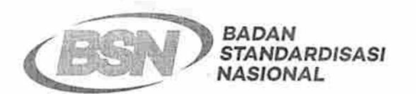

Alamat: Gedung I BPPT Jl. M.H. Thamrin No.8, Kebon Sirih, Jakarta 10340 Telp/Fax: (021) 3927422 / (021) 3927527 Website: www.bsn.go.id

7. Keputusan Kepala Badan Standardisasi Nasional Nomor 235/KEP/BSN/7/2020 tentang Penetapan Standar Nasional Indonesia 1727:2020 Beban desain minimum dan kriteria terkait untuk bangunan gedung dan struktur lain sebagai revisi dari Standar Nasional Indonesia 1727:2013 Beban minimum untuk perancangan bangunan gedung dan struktur lain;

untuk diketahui dan dipergunakan sebagaimana mestinya.

Atas perhatian dan kerja samanya, kami mengucapkan terima kasih.

Kepala Biro Sumber Daya Manusia,

Organisasi, dan Hukum,

#### Tembusan:

- 1. Sekretaris Utama, BSN;
- 2. Deputi Bidang Pengembangan Standar, BSN;
- Direktur Pengembangan Standar Infrastruktur, Penilaian Kesesuaian, Personal dan Ekonomi Kreatif, BSN;
- 4. Direktur Sistem Penerapan Standar dan Penilaian Kesesuaian, BSN:
- 5. Kepala Biro Hubungan Masyarakat, Kerja Sama, dan Layanan Informasi, BSN; dan
- Kepala Pusat Data dan Sistem Informasi, BSN

#### KEPUTUSAN KEPALA BADAN STANDARDISASI NASIONAL NOMOR 232/KEP/BSN/7/2020 TENTANG

# PENETAPAN STANDAR NASIONAL INDONESIA 1729:2020 SPESIFIKASI UNTUK BANGUNAN GEDUNG BAJA STRUKTURAL SEBAGAI REVISI DARI STANDAR NASIONAL INDONESIA 1729:2015 SPESIFIKASI UNTUK BANGUNAN GEDUNG BAJA STRUKTURAL

#### KEPALA BADAN STANDARDISASI NASIONAL,

Menimbang:

- a. bahwa untuk menjaga kesesuaian Standar Nasional Indonesia terhadap kebutuhan pasar, perkembangan ilmu pengetahuan dan teknologi, pemeliharaan dan penilaian kelayakan dan kekinian, perlu dilakukan kaji ulang;
- b. bahwa berdasarkan hasil kaji ulang, perlu dilakukan revisi Standar Nasional Indonesia;
- c. bahwa berdasarkan pertimbangan sebagaimana dimaksud dalam huruf a dan huruf b, perlu menetapkan Keputusan Kepala Badan Standardisasi Nasional tentang Penetapan Standar Nasional Indonesia 1729:2020 Spesifikasi untuk bangunan gedung baja struktural sebagai revisi dari Standar Nasional Indonesia 1729:2015 Spesifikasi untuk bangunan gedung baja struktural;

Mengingat :

 Undang-Undang Nomor 20 Tahun 2014 tentang Standardisasi dan Penilaian Kesesuaian (Lembaran Negara Republik Indonesia Tahun 2014 Nomor 216, Tambahan Lembaran Negara Republik

- Indonesia Nomor 5584);
- Peraturan Pemerintah Nomor 34 Tahun 2018 tentang Sistem Standardisasi dan Penilaian Kesesuaian Nasional (Lembaran Negara Republik Indonesia Tahun 2018 Nomor 110, Tambahan Lembaran Negara Republik Indonesia Nomor 6225);
- Peraturan Presiden Nomor 4 Tahun 2018 tentang Badan Standardisasi Nasional (Lembaran Negara Republik Indonesia Tahun 2018 Nomor 10);
- Peraturan Badan Standardisasi Nasional Nomor 6
   Tahun 2018 tentang Pedoman Kaji Ulang Standar
   Nasional Indonesia (Berita Negara Republik
   Indonesia Tahun 2018 Nomor 601);
- Peraturan Badan Standardisasi Nasional Nomor 12 Tahun 2018 tentang Perubahan Atas Peraturan Badan Standardisasi Nasional Nomor 1 Tahun 2018 tentang Pedoman Tata Cara Penomoran Standar Nasional Indonesia (Berita Negara Republik Indonesia Tahun 2018 Nomor 1762);

Memperhatikan:

Surat Sekretaris Badan Penelitian dan Pengembangan, Kementerian Pekerjaan Umum dan Perumahan Rakyat, Nomor: LB.0207-L5/018 tanggal 27 Desember 2019 Hal Usulan Penetapan 16 (Enam Belas) Rancangan SNI Bidang Perumahan dan Pemukiman;

#### MEMUTUSKAN:

BADAN STANDARDISASI KEPUTUSAN KEPALA Menetapkan

> STANDAR TENTANG PENETAPAN NASIONAL

> 1729:2020 SPESIFIKASI NASIONAL INDONESIA

> UNTUK BANGUNAN GEDUNG BAJA STRUKTURAL

STANDAR NASIONAL REVISI DARI SEBAGAI

SPESIFIKASI

UNTUK

1729:2015 BANGUNAN GEDUNG BAJA STRUKTURAL.

Menetapkan Standar Nasional Indonesia (SNI) KESATU

1729:2020 Spesifikasi untuk bangunan gedung baja

struktural sebagai revisi dari SNI 1729:2015

Spesifikasi untuk bangunan gedung baja struktural.

SNI 1729:2020 Spesifikasi untuk bangunan gedung KEDUA

baja struktural sebagaimana dimaksud dalam

DIKTUM Kesatu merupakan Adopsi Identik dengan

metode terjemahan dari AISC 360-16 Specification for

Structural Steel Building, yang ditetapkan oleh BSN

tahun 2020.

INDONESIA

SNI yang direvisi masih tetap berlaku sepanjang KETIGA

belum dicabut dan dinyatakan tidak berlaku.

Keputusan Kepala Badan ini mulai berlaku pada KEEMPAT

tanggal ditetapkan.

Ditetapkan di Jakarta

pada tanggal 6 Juli 2020

KEPALA BADAN STANDARDISASI NASIONAL,

HMAD

# **Spesifikasi untuk bangunan gedung baja struktural**

**(ANSI/AISC 360-16, IDT)** 

**© AISC 2016 – All rights reserved**

**© BSN 2020 untuk kepentingan adopsi standar © AISC menjadi SNI – Semua hak dilindungi**

**Hak cipta dilindungi undang-undang. Dilarang mengumumkan dan memperbanyak sebagian atau seluruh isi dokumen ini dengan cara dan dalam bentuk apapun serta dilarang mendistribusikan dokumen ini baik secara elektronik maupun tercetak tanpa izin tertulis BSN** 

**BSN**

**Email: [dokinfo@bsn.go.id](mailto:dokinfo@bsn.go.id)**

**[www.bsn.go.id](http://www.bsn.go.id/)**

**Diterbitkan di Jakarta** 

#### Daftar isi

| Daftar isi    |       |                                                                      | i      |
|---------------|-------|----------------------------------------------------------------------|--------|
| Prakata       |       |                                                                      | xiv    |
| Simbol        |       |                                                                      | xvi    |
| Daftar istila | ah    |                                                                      | . xxxi |
| Singkatan.    |       |                                                                      | xlviii |
| BAB A KE      | ΓΕΝΤL | JAN UMUM                                                             | 1      |
| A1.           | RUA   | NNG LINGKUP                                                          | 1      |
|               | 1.    | Aplikasi Seismik                                                     | 2      |
|               | 2.    | Aplikasi Nuklir                                                      | 2      |
| A2.           | SPE   | SIFIKASI, PERATURAN, DAN STANDAR YANG DIACU                          | 2      |
| A3.           | MAT   | FERIAL                                                               | 6      |
|               | 1.    | Material Baja Struktural                                             | 6      |
|               | 1a.   | Acuan ke ASTM                                                        | 6      |
|               | 1b.   | Baja Tidak Teridentifikasi                                           | 6      |
|               | 1c.   | Profil Berat Baja Gilas Panas                                        | 7      |
|               | 1d.   | Profil Berat Tersusun                                                | 7      |
|               | 2.    | Penuangan dan Penempaan Baja                                         | 7      |
|               | 3.    | Baut, Ring, dan Mur                                                  | 7      |
|               | 4.    | Batang Angkur dan Batang Berulir                                     | 8      |
|               | 5.    | Material Habis Pakai untuk Pengelasan                                | 8      |
|               | 6.    | Angkur Baja Stad Berkepala                                           | 9      |
| A4.           | SPE   | SIFIKASI DAN GAMBAR DESAIN STRUKTURAL                                | 9      |
| BAB B PER     | RSYAF | RATAN DESAIN                                                         | 10     |
| B1.           | KET   | ENTUAN UMUM                                                          | 10     |
| B2.           | BEB   | AN DAN KOMBINASI BEBAN                                               | 10     |
| B3.           | DAS   | SAR DESAIN                                                           | 10     |
|               | 1.    | Desain Kekuatan Berdasarkan Desain Faktor Beban dan Ketahanan (DFBT) | 10     |
|               | 2.    | Desain Kekuatan Berdasarkan Desain Kekuatan Izin (DKI)               | 11     |
|               | 3.    | Kekuatan perlu                                                       | 11     |
|               | 4.    | Desain Sambungan dan Tumpuan                                         | 12     |
|               | 4a.   | Sambungan Sederhana                                                  | 12     |
|               | 4b.   | Sambungan Momen                                                      | 12     |
|               | 5.    | Desain Diafragma dan kolektor                                        | 12     |
| © BSN 2020    | )     | i                                                                    |        |

|     | 6.  | Desain Angkur pada Beton13                                             |  |
|-----|-----|------------------------------------------------------------------------|--|
|     | 7.  | Desain untuk Stabilitas13                                              |  |
|     | 8.  | Desain untuk kemampuan layan13                                         |  |
|     | 9.  | Desain untuk Integritas Struktur13                                     |  |
|     | 10. | Desain untuk genangan13                                                |  |
|     | 11. | Desain untuk Fatik13                                                   |  |
|     | 12. | Desain untuk Kondisi Kebakaran14                                       |  |
|     | 13. | Desain untuk Efek Korosi14                                             |  |
| B4. |     | PROPERTI KOMPONEN STRUKTUR14                                           |  |
|     | 1.  | Klasifikasi Penampang untuk Tekuk Lokal14                              |  |
|     | 1a. | Elemen Tidak Diperkaku14                                               |  |
|     | 1b. | Elemen Diperkaku15                                                     |  |
|     | 2.  | Tebal Dinding Desain untuk PSR19                                       |  |
|     | 3.  | Penentuan Luas Neto dan Bruto19                                        |  |
|     | 3a. | Luas Bruto19                                                           |  |
|     | 3b. | Luas Neto19                                                            |  |
| B5. |     | PABRIKASI DAN EREKSI20                                                 |  |
| B6. |     | PENGENDALIAN MUTU DAN PENJAMINAN MUTU20                                |  |
| B7. |     | EVALUASI STRUKTUR YANG SUDAH BERDIRI20                                 |  |
|     |     | BAB C DESAIN UNTUK STABILITAS21                                        |  |
| C1. |     | PERSYARATAN STABILITAS UMUM 21                                      |  |
|     | 1.  | Metode Desain Analisis Langsung21                                      |  |
|     | 2.  | Metode Desain Alternatif21                                             |  |
| C2. |     | PERHITUNGAN KEKUATAN PERLU22                                           |  |
|     | 1.  | Persyaratan Analisis Umum22                                            |  |
|     | 2.  | Peninjauan Ketidaksempurnaan Sistem Awal23                             |  |
|     | 2a. | Pemodelan Langsung Ketidaksempurnaan23                                 |  |
|     | 2b. | Penggunaan Beban Nosional untuk Memperhitungkan Ketidaksempurnaan23 |  |
|     | 3.  | Penyesuaian terhadap Kekakuan24                                        |  |
| C3. |     | PERHITUNGAN KEKUATAN TERSEDIA26                                        |  |
|     |     | BAB D DESAIN KOMPONEN STRUKTUR UNTUK TARIK27                           |  |
| D1. |     | BATASAN KELANGSINGAN27                                                 |  |
| D2. |     | KEKUATAN TARIK27                                                       |  |
| D3. |     | LUAS NETO EFEKTIF28                                                    |  |
| D4. |     | KOMPONEN STRUKTUR TERSUSUN28                                           |  |
| D5. |     | KOMPONEN STRUKTUR TERHUBUNG SENDI28                                    |  |
|     |     |                                                                        |  |

| 2. Persyaratan Dimensi30 D6. EYEBAR31 1. Kekuatan Tarik31 2. Persyaratan Dimensi31 BAB E DESAIN KOMPONEN STRUKTUR UNTUK TEKAN E1. KETENTUAN UMUM32 E2. PANJANG EFEKTIF34 E3. TEKUK LENTUR PADA KOMPONEN STRUKTUR TANPA ELEMEN LANGSING34 E4. TEKUK TORSI DAN TEKUK TORSI LENTUR SIKU TUNGGAL DAN | 32 |
|-----------------------------------------------------------------------------------------------------------------------------------------------------------------------------------------------------------------------------------------------------------------------------------------------------------------------------------------------------|----|
|                                                                                                                                                                                                                                                                                                                                                     |    |
|                                                                                                                                                                                                                                                                                                                                                     |    |
|                                                                                                                                                                                                                                                                                                                                                     |    |
|                                                                                                                                                                                                                                                                                                                                                     |    |
|                                                                                                                                                                                                                                                                                                                                                     |    |
|                                                                                                                                                                                                                                                                                                                                                     |    |
|                                                                                                                                                                                                                                                                                                                                                     |    |
|                                                                                                                                                                                                                                                                                                                                                     |    |
| KOMPONEN STRUKTUR TANPA ELEMEN LANGSING35                                                                                                                                                                                                                                                                                                           |    |
| E5. KOMPONEN STRUKTUR TEKAN SIKU TUNGGAL36                                                                                                                                                                                                                                                                                                       |    |
| E6. KOMPONEN STRUKTUR TERSUSUN38                                                                                                                                                                                                                                                                                                                 |    |
| 1. Kekuatan Tekan38                                                                                                                                                                                                                                                                                                                              |    |
| 2. Persyaratan Dimensional39                                                                                                                                                                                                                                                                                                                     |    |
| E7. KOMPONEN STRUKTUR DENGAN ELEMEN LANGSING41                                                                                                                                                                                                                                                                                                   |    |
| 1. Komponen Struktur Elemen Langsing Tidak Termasuk PSR Bundar41                                                                                                                                                                                                                                                                                 |    |
| 2. PSR Bundar42                                                                                                                                                                                                                                                                                                                                  |    |
| BAB F DESAIN KOMPONEN STRUKTUR UNTUK LENTUR                                                                                                                                                                                                                                                                                                         | 43 |
| F1. KETENTUAN UMUM45                                                                                                                                                                                                                                                                                                                             |    |
| F2. KOMPONEN STRUKTUR PROFIL I KOMPAK SIMETRIS GANDA DAN KANAL YANG MELENTUR TERHADAP SUMBU MAYORNYA46                                                                                                                                                                                                                                        |    |
| 1. Leleh46                                                                                                                                                                                                                                                                                                                                       |    |
| 2. Tekuk Torsi-Lateral46                                                                                                                                                                                                                                                                                                                         |    |
| F3. KOMPONEN STRUKTUR PROFIL I SIMETRIS GANDA DENGAN BADAN KOMPAK DAN NONKOMPAK ATAU SAYAP LANGSING YANG MELENTUR TERHADAP SUMBU MAYORNYA 48                                                                                                                                                                                               |    |
| 1. Tekuk Torsi Lateral48                                                                                                                                                                                                                                                                                                                         |    |
| 2. Tekuk Lokal Sayap Tekan48                                                                                                                                                                                                                                                                                                                     |    |
| F4. KOMPONEN STRUKTUR PROFIL I LAIN DENGAN BADAN KOMPAK ATAU NONKOMPAK YANG MELENTUR TERHADAP SUMBU MAYORNYA48                                                                                                                                                                                                                                |    |
| 1. Leleh Sayap Tekan49                                                                                                                                                                                                                                                                                                                           |    |
| 2. Tekuk Torsi Lateral49                                                                                                                                                                                                                                                                                                                         |    |
| 3. Tekuk Lokal Sayap Tekan51                                                                                                                                                                                                                                                                                                                     |    |
| 4. Leleh Sayap Tarik52                                                                                                                                                                                                                                                                                                                           |    |
| F5. KOMPONEN STRUKTUR PROFIL I SIMETRIS GANDA DAN SIMETRIS TUNGGAL DENGAN BADAN LANGSING YANG MELENTUR TERHADAP                                                                                                                                                                                                                               |    |
| SUMBU MAYORNYA 53                                                                                                                                                                                                                                                                                                                                |    |

|      | 2.   | Tekuk Torsi-Lateral                                                                                   | 53  |
|------|------|-------------------------------------------------------------------------------------------------------|-----|
|      | 3.   | Tekuk Lokal Sayap Tekan                                                                               | 53  |
|      | 4.   | Leleh Sayap Tarik                                                                                     | 54  |
| F6.  | _    | IPONEN STRUKTUR PROFIL I DAN KANAL YANG MELENTUR HADAP SUMBU MINORNYA                              | .54 |
|      | 1.   | Leleh                                                                                                 | 54  |
|      | 2.   | Tekuk Lokal Sayap                                                                                     | 54  |
| F7.  | _    | BUJUR SANGKAR DAN PERSEGI PANJANG DAN PENAMPANG- AMPANGBERBENTUK BOKS                              | .55 |
|      | 1.   | Leleh                                                                                                 | 55  |
|      | 2.   | Tekuk Lokal Sayap                                                                                     | 55  |
|      | 3.   | Tekuk Lokal Badan                                                                                     | 56  |
|      | 4.   | Tekuk Torsi Lateral                                                                                   | 57  |
| F8.  | PSR  | BUNDAR                                                                                                | 57  |
|      | 1.   | Leleh                                                                                                 | 58  |
|      | 2.   | Tekuk Lokal                                                                                           | .58 |
| F9.  | T DA | N SIKU GANDA YANG DIBEBANI DALAM BIDANG SIMETRIS                                                      | 58  |
|      | 1.   | Leleh                                                                                                 | 58  |
|      | 2.   | Tekuk Torsi Lateral                                                                                   | 59  |
|      | 3.   | Tekuk Lokal Sayap Profil T dan Kaki-kaki Profil Siku Ganda                                            | 60  |
|      | 4.   | Tekuk Lokal Badan Profil T dan Kaki-Kaki Badan Profil Siku Ganda yar Mengalami Tekan Akibat Lentur | _   |
| F10. | SIKL | TUNGGAL                                                                                               | 61  |
|      | 1.   | Leleh                                                                                                 | 62  |
|      | 2.   | Tekuk Torsi Lateral                                                                                   | 62  |
|      | 3.   | Tekuk lokal kaki                                                                                      | 63  |
| F11. | BATA | ANG PERSEGI PANJANG DAN BUNDAR                                                                        | 64  |
|      | 1.   | Leleh                                                                                                 | 64  |
|      | 2.   | Tekuk Torsi Lateral                                                                                   | 64  |
| F12. | PRO  | FIL TIDAK SIMETRIS                                                                                    | 65  |
|      | 1.   | Leleh                                                                                                 | 65  |
|      | 2.   | Tekuk Torsi Lateral                                                                                   | 65  |
|      | 3.   | Tekuk lokal                                                                                           | 65  |
| F13. | PRO  | PORSI BALOK DAN GIRDER                                                                                | 65  |
|      | 1.   | Reduksi Kekuatan untuk Komponen Struktur Dengan Lubang-Lubang pada Sayap Tarik                        | .66 |
|      | 2.   | Batas Proporsi untuk Komponen Struktur Profil I                                                       | 66  |
|      | 3.   | Pelat Penutup                                                                                         | 67  |

|            | 4.  | Balok Tersusun67                                                                                                            |    |
|------------|-----|-----------------------------------------------------------------------------------------------------------------------------|----|
|            | 5.  | Panjang Tanpa Berbreis untuk Redistribusi Momen68                                                                           |    |
|            |     | BAB G DESAIN KOMPONEN STRUKTUR UNTUK GESER                                                                                  | 69 |
| G1.        |     | KETENTUAN UMUM69                                                                                                            |    |
| G2.        |     | KOMPONEN STRUKTUR PROFIL I DAN KANAL69                                                                                      |    |
|            | 1.  | Kekuatan Geser Badan tanpa Aksi Medan Tarik69                                                                               |    |
|            | 2.  | Kekuatan Geser Panel Badan Interior dengan ah≤ 3,0 yang Memperhitungkan Aksi Medan Tarik71                               |    |
|            | 3.  | Pengaku Transversal72                                                                                                       |    |
| G3.        |     | SIKU TUNGGAL DAN PROFIL T73                                                                                                 |    |
| G4.        |     | KOMPONEN STRUKTUR PSR PERSEGI PANJANG, PROFIL BERBENTUK BOKS, DAN KOMPONEN STRUKTUR SIMETRIS GANDA DAN TUNGGAL LAIN73 |    |
| G5.        | PSR | BUNDAR74                                                                                                                    |    |
| G6.        |     | GESER SUMBU LEMAH PADA PROFIL SIMETRIS TUNGGAL DAN GANDA74                                                                  |    |
| G7.        |     | BALOK DAN GIRDER DENGAN BUKAAN PADA BADAN75                                                                                 |    |
|            |     | BAB H DESAIN KOMPONEN STRUKTUR UNTUK KOMBINASI GAYA DAN TORSI                                                               | 76 |
| H1.        |     | KOMPONEN STRUKTUR SIMETRIS GANDA DAN TUNGGAL YANG MEMIKUL LENTUR DAN GAYA AKSIAL76                                       |    |
|            | 1.  | Komponen Struktur Simetris Ganda dan Tunggal yang Memikul Lentur dan Tekan76                                             |    |
|            | 2.  | Komponen Struktur Simetris Ganda dan Tunggal yang Memikul Lentur dan Tarik77                                             |    |
|            | 3.  | Komponen Struktur Kompak Gilas Panas Simetris Ganda yang Memikul Gaya Tekan dan Lentur Sumbu Tunggal78                   |    |
| H2.        |     | KOMPONEN STRUKTUR TIDAK SIMETRIS DAN KOMPONEN STRUKTUR LAIN YANG MEMIKUL LENTUR DAN GAYA AKSIAL79                        |    |
| H3.        |     | KOMPONEN STRUKTUR YANG MEMIKUL TORSI DAN KOMBINASI TORSI, LENTUR, GESER DAN/ATAU GAYA AKSIAL80                           |    |
|            | 1.  | PSR Bundar dan Persegi Panjang yang Memikul Torsi80                                                                         |    |
|            | 2.  | PSR yang Memikul Kombinasi Torsi, Geser, Lentur dan Gaya Aksial81                                                           |    |
|            | 3.  | Komponen Struktur Non-PSR yang Memikul Tegangan Kombinasi dan Torsi82                                                    |    |
| H4.        |     | KEGAGALAN PUTUS SAYAP DENGAN LUBANG-LUBANG YANG MEMIKUL TARIK83                                                          |    |
|            |     | BAB I DESAIN KOMPONEN STRUKTUR KOMPOSIT                                                                                     | 84 |
| I1.        |     | KETENTUAN UMUM84                                                                                                            |    |
|            | 1.  | Beton dan Penulangan Baja84                                                                                                 |    |
|            | 2.  | Kekuatan Nominal Penampang Komposit85                                                                                       |    |
|            | 2a. | Metode Distribusi Tegangan Plastis85                                                                                        |    |
|            | 2b. | Metode Kompatibilitas Regangan85                                                                                            |    |
| © BSN 2020 |     | v                                                                                                                           |    |

|     | 2c. | Metode Distribusi Tegangan Elastis85                                        |  |
|-----|-----|-----------------------------------------------------------------------------|--|
|     | 2d. | Metode Regangan-Tegangan Efektif85                                          |  |
|     | 3.  | Batasan Material86                                                          |  |
|     | 4.  | Klasifikasi Penampang Komposit Terisi Beton untuk Tekuk Lokal86             |  |
|     | 5.  | Kekakuan untuk Perhitungan Kekuatan perlu88                                 |  |
| I2. |     | GAYA AKSIAL88                                                               |  |
|     | 1.  | Komponen Struktur Komposit Terbungkus Beton88                               |  |
|     | 1a. | Batasan88                                                                   |  |
|     | 1b. | Kekuatan Tekan89                                                            |  |
|     | 1c. | Kekuatan Tarik90                                                            |  |
|     | 1d. | Transfer Beban90                                                            |  |
|     | 1e. | Persyaratan Pendetailan90                                                   |  |
|     | 2.  | Komponen Struktur Komposit Terisi Beton90                                   |  |
|     | 2a. | Batasan90                                                                   |  |
|     | 2b. | Kekuatan Tekan91                                                            |  |
|     | 2c. | Kekuatan Tarik92                                                            |  |
|     | 2d. | Transfer Beban92                                                            |  |
| I3. |     | LENTUR92                                                                    |  |
|     | 1.  | Umum92                                                                      |  |
|     | 1a. | Lebar Efektif92                                                             |  |
|     | 1b. | Kekuatan Selama Pelaksanaan92                                               |  |
|     | 2.  | Balok Komposit dengan Angkur BajaStad Berkepala atau Angkur Kanal Baja92 |  |
|     | 2a. | Kekuatan Lentur Positif92                                                   |  |
|     | 2b. | Kekuatan Lentur Negatif93                                                   |  |
|     | 2c. | Balok Komposit dengan Dek Baja Bergelombang93                               |  |
|     | 1.  | Umum93                                                                      |  |
|     | 2.  | Rusuk Dek yang Diorientasikan Tegak Lurus Balok Baja94                      |  |
|     | 3.  | Rusuk Dek yang Diorientasikan Paralel Balok Baja94                          |  |
|     | 2d. | Transfer Beban Antara Balok Baja dan Slab Beton94                           |  |
|     | 1.  | Transfer Beban untuk Kekuatan Lentur Positif94                              |  |
|     | 2.  | Transfer Beban untuk Kekuatan Lentur Negatif95                              |  |
|     | 3.  | Komponen Struktur Komposit Terbungkus Beton95                               |  |
|     | 4.  | Komponen Struktur Komposit Terisi Beton95                                   |  |
|     | 4a. | Batasan95                                                                   |  |
|     | 4b. | Kekuatan Lentur96                                                           |  |
| I4. |     | GESER96                                                                     |  |

**© BSN 2020 vi**

|     | 1.  | Komponen Struktur Komposit Terbungkus dan Terisi Beton96                                        |     |
|-----|-----|-------------------------------------------------------------------------------------------------|-----|
|     | 2.  | Balok Komposit dengan Dek Baja Bergelombang97                                                   |     |
| I5. |     | KOMBINASI GAYA AKSIAL DAN LENTUR97                                                              |     |
| I6. |     | TRANSFER BEBAN98                                                                                |     |
|     | 1.  | Persyaratan Umum99                                                                              |     |
|     | 2.  | Alokasi Gaya99                                                                                  |     |
|     | 2a. | Gaya Eksternal yang Bekerja pada Penampang Baja99                                               |     |
|     | 2b. | Gaya Eksternal yang Bekerja pada Beton99                                                        |     |
|     | 2c. | Gaya Eksternal yang Bekerja secara Serentak pada Baja dan Beton100                              |     |
|     | 3.  | Mekanisme Transfer Gaya100                                                                      |     |
|     | 3a. | Tumpu Langsung100                                                                               |     |
|     | 3b. | Sambungan Geser100                                                                              |     |
|     | 3c. | Interaksi Lekatan Langsung 101                                                                  |     |
|     | 4.  | Persyaratan Pendetailan101                                                                      |     |
|     | 4a. | Komponen Struktur Komposit Terbungkus Beton 101                                                 |     |
|     | 4b. | Komponen Struktur Komposit Terisi Beton101                                                      |     |
| I7. |     | DIAFRAGMA KOMPOSIT DAN BALOK KOLEKTOR102                                                        |     |
| I8. |     | ANGKUR BAJA102                                                                                  |     |
|     | 1.  | Umum102                                                                                         |     |
|     | 2.  | Angkur Baja pada Balok Komposit102                                                              |     |
|     | 2a. | Kekuatan Angkur Baja Stad Berkepala102                                                          |     |
|     | 2b. | Kekuatan Angkur Kanal Baja104                                                                   |     |
|     | 2c. | Jumlah Angkur Baja yang Diperlukan104                                                           |     |
|     | 2d. | Persyaratan Pendetailan104                                                                      |     |
|     | 3.  | Angkur Baja pada Komponen Komposit105                                                           |     |
|     | 3a. | Kekuatan Geser Angkur Baja StadBerkepala pada Komponen Komposit 106                          |     |
|     | 3b. | Kekuatan Tarik Angkur Baja Stad Berkepala pada Komponen Komposit                                |     |
|     |     | 107                                                                                             |     |
|     | 3c. | Kekuatan Angkur Baja StadBerkepala untuk Interaksi Geser dan Tarik pada Komponen Komposit107 |     |
|     | 3d. | Kekuatan Geser Angkur Kanal Baja pada Komponen Komposit108                                      |     |
|     | 3e. | Persyaratan Pendetailan pada Komponen Komposit109                                               |     |
|     |     | BAB J DESAIN SAMBUNGAN                                                                          | 110 |
| J1. |     | KETENTUAN UMUM110                                                                               |     |
|     | 1.  | Dasar Desain110                                                                                 |     |
|     | 2.  | Sambungan Sederhana110                                                                          |     |
|     | 3.  | Sambungan Momen110                                                                              |     |
|     |     |                                                                                                 |     |

|     | 4.  | Komponen Struktur Tekan dengan Joint Tumpu111                                      |
|-----|-----|------------------------------------------------------------------------------------|
|     | 5.  | Splaispada Profil Berat111                                                         |
|     | 6.  | Lubang Akses Las111                                                                |
|     | 7.  | Penempatan Las dan Baut112                                                         |
|     | 8.  | Baut dalam Kombinasi dengan Las112                                                 |
|     | 9.  | Perubahan yang dilas ke struktur dengan paku keling atau baut yang telah ada113 |
|     | 10. | Baut Kekuatan Tinggi dalam Kombinasi Dengan Paku Keling113                         |
| J2. |     | LAS113                                                                             |
|     | 1.  | Las gruv114                                                                        |
|     | 1a. | Luas Efektif114                                                                    |
|     | 1b. | Batasan115                                                                         |
|     | 2.  | Las filet116                                                                       |
|     | 2a. | Luas Efektif116                                                                    |
|     | 2b. | Batasan116                                                                         |
|     | 3.  | Las Sumbat dan Las Slot118                                                         |
|     | 3a. | Luas Efektif118                                                                    |
|     | 3b. | Batasan118                                                                         |
|     | 4.  | Kekuatan119                                                                        |
|     | 5.  | Kombinasi Las122                                                                   |
|     | 6.  | Persyaratan Logam Pengisi 122                                                      |
|     | 7.  | Logam Las Campuran122                                                              |
| J3. |     | BAUT DAN BAGIAN-BAGIAN BERULIR123                                                  |
|     | 1.  | Baut Kekuatan Tinggi123                                                            |
|     | 2.  | Ukuran dan Penggunaan Lubang125                                                    |
|     | 3.  | Spasi minimum128                                                                   |
|     | 4.  | Jarak Tepi Minimum129                                                              |
|     | 5.  | Spasi Maksimum dan Jarak Tepi129                                                   |
|     | 6.  | Kekuatan Tarik dan Geser Baut dan Bagian-bagian Berulir129                         |
|     | 7.  | Kombinasi Gaya Tarik dan Geser pada Sambungan Tipe Tumpu131                        |
|     | 8.  | Baut Kekuatan Tinggi pada Sambungan Kritis Selip 132                            |
|     | 9.  | Kombinasi Gaya Tarik dan Geser pada Sambungan Kritis Selip133                      |
|     | 10. | Kekuatan Tumpu dan Sobek pada Lubang Baut133                                       |
|     | 11. | Pengencang Khusus135                                                               |
|     | 12. | Kekuatan Dinding pada Pengencang Tarik135                                          |
| J4. |     | ELEMEN YANG TERPENGARUH PADA KOMPONEN STRUKTUR DAN ELEMEN PENYAMBUNG135         |
|     | 1.  | Kekuatan Elemen yang Mengalami Gaya Tarik135                                       |

|     | 2.  | Kekuatan Elemen yang Mengalami Geser135                               |     |
|-----|-----|-----------------------------------------------------------------------|-----|
|     | 3.  | Kekuatan Geser Blok136                                                |     |
|     | 4.  | Kekuatan Elemen yang Mengalami Tekan136                               |     |
|     | 5.  | Kekuatan Elemen yang Mengalami Lentur136                              |     |
| J5. |     | PENGISI137                                                            |     |
|     | 1.  | Pengisi pada Sambungan Las137                                         |     |
|     | 1a. | Pengisi Tipis137                                                      |     |
|     | 1b. | Pengisi Tebal 137                                                  |     |
|     | 2.  | Pengisi pada Sambungan Tipe Tumpu yang Dibaut137                      |     |
| J6. |     | SPLAIS137                                                             |     |
| J7. |     | KEKUATAN TUMPU138                                                     |     |
| J8. |     | DASAR KOLOM DAN TUMPU PADA BETON138                                   |     |
| J9. |     | BATANG ANGKUR DAN PENANAMAN139                                        |     |
|     |     | J10. SAYAP DAN BADAN DENGAN GAYA-GAYA TERPUSAT139                     |     |
|     | 1.  | Lentur Lokal Sayap140                                                 |     |
|     | 2.  | Leleh Lokal Badan140                                                  |     |
|     | 3.  | Pelipatan Lokal Badan141                                              |     |
|     | 4.  | Tekuk Bergoyang pada Badan142                                         |     |
|     | 5.  | Tekuk Tekan Badan143                                                  |     |
|     | 6.  | Geser Zona Panel Badan143                                             |     |
|     | 7.  | Ujung Tanpa Berangka pada Balok dan Girder144                         |     |
|     | 8.  | Persyaratan Pengaku Tambahan untuk Gaya-Gaya Terpusat145              |     |
|     | 9.  | Persyaratan Pelat Pengganda Tambahan untuk Gaya-Gaya Terpusat 145     |     |
|     | 10. | Gaya Transversal pada Elemen Pelat146                                 |     |
|     |     | BAB K PERSYARATAN TAMBAHAN UNTUK SAMBUNGAN PSR DAN PENAMPANG BOKS  | 147 |
| K1. |     | KETENTUAN UMUM DAN PARAMETER UNTUK SAMBUNGAN PSR147                   |     |
|     | 1.  | Definisi Parameter148                                                 |     |
|     | 2.  | PSR Persegi Panjang148                                                |     |
|     | 2a. | Lebar Efektif untuk Sambungan ke PSR Persegi Panjang148               |     |
| K2. |     | GAYA TERPUSAT PADA PSR148                                             |     |
|     | 1.  | Definisi Parameter148                                                 |     |
|     | 2.  | PSR Bundar148                                                         |     |
|     | 3.  | PSR Persegi Panjang150                                                |     |
| K3. |     | SAMBUNGAN RANGKA BATANG PSR KE PSR150                                 |     |
|     | 1.  | Definisi Parameter150                                                 |     |
|     | 2.  | PSR Bundar151                                                         |     |

|           | 3.     | PSR Persegi Panjang                                 | 151 |
|-----------|--------|-----------------------------------------------------|-----|
| K4.       | SAN    | MBUNGAN MOMEN PSR KE PSR                            | 151 |
|           | 1.     | Definisi Parameter                                  | 155 |
|           | 2.     | PSR Bundar                                          | 156 |
|           | 3.     | PSR Persegi Panjang                                 | 156 |
| K5.       | LAS    | PELAT DAN CABANG KE PSR PERSEGI PANJANG             | 156 |
| BAB L DES | SAIN ( | JNTUK KEMAMPUAN LAYAN                               | 163 |
| L1.       | KET    | FENTUAN UMUM                                        | 163 |
| L2.       | DEF    | FLEKSI                                              | 163 |
| L3.       | DRI    | FT                                                  | 163 |
| L4.       | VIB    | RASI                                                | 163 |
| L5.       | GEF    | RAKAN TERINDUKSI ANGIN                              | 164 |
| L6.       | EKS    | SPANSI DAN KONTRAKSI TERMAL                         | 164 |
| L7.       | SLIF   | P SAMBUNGAN                                         | 164 |
| BAB M PA  | BRIKA  | ASI DAN EREKSI                                      | 165 |
| M1.       | GAN    | MBAR KERJA DAN GAMBAR EREKSI                        | 165 |
| M2.       | PAE    | BRIKASI                                             | 165 |
|           | 1.     | Cambering, Pelengkungan, dan Pelurusan              | 165 |
|           | 2.     | Pemotongan Termal                                   | 165 |
|           | 3.     | Perencanaan Tepi                                    | 166 |
|           | 4.     | Pelaksanaan Las                                     | 166 |
|           | 5.     | Pelaksanaan Baut                                    | 166 |
|           | 6.     | Joint Tekan                                         | 167 |
|           | 7.     | Toleransi Dimensi                                   | 167 |
|           | 8.     | Finish pada Dasar Kolom                             | 167 |
|           | 9.     | Finish pada Dasar Kolom                             | 167 |
|           | 10.    | Lubang Saluran                                      | 167 |
|           | 11.    | Persyaratan untuk Komponen Struktur yang Digalvanis | 168 |
| M3.       | PEN    | NGECATAN DI BENGKEL                                 | 168 |
|           | 1.     | Persyaratan Umum                                    | 168 |
|           | 2.     | Permukaan yang Tidak Dapat Diakses                  | 168 |
|           | 3.     | Permukaan Kontak                                    | 168 |
|           | 4.     | Permukaan Finishing                                 | 168 |
|           | 5.     | Permukaan yang Berdekatan dengan Las Lapangan       | 168 |
| M4.       | ERE    | EKSI                                                | 168 |
|           | 1.     | Pengaturan Dasar Kolom                              | 168 |
|           | 2.     | Stabilitas dan Sambungan                            | 168 |

|     | 3.  | Alinyemen169                                                           |     |
|-----|-----|------------------------------------------------------------------------|-----|
|     | 4.  | Pengepasan pada Joint Tekan Kolom dan Pelat Dasar169                   |     |
|     | 5.  | Pengelasan Lapangan169                                                 |     |
|     | 6.  | Pengecatan Lapangan169                                                 |     |
|     |     | BAB N PENGENDALIAN MUTU DAN PENJAMINAN MUTU                            | 170 |
| N1. |     | KETENTUAN UMUM170                                                      |     |
| N2. |     | PROGRAM PENGENDALIAN MUTU PABRIKATOR DAN EREKTOR170                    |     |
|     | 1.  | Identifikasi Material171                                               |     |
|     | 2.  | Prosedur Pengendalian Mutu Pabrikator171                               |     |
|     | 3.  | Prosedur Pengendalian Mutu Erektor171                                  |     |
| N3. |     | DOKUMEN PABRIKATOR DAN EREKTOR171                                      |     |
|     | 1.  | Penyerahan Dokumen Konstruksi Baja171                                  |     |
|     | 2.  | Dokumen Tersedia untuk Konstruksi Baja171                              |     |
| N4. |     | PEMERIKSAAN DAN PERSONEL PENGUJIAN NONDESTRUKTIF172                    |     |
|     | 1.  | Kualifikasi Inspektur Pengendali Mutu172                               |     |
|     | 2.  | Kualifikasi Inspektur Penjaminan Mutu172                               |     |
|     | 3.  | Kualifikasi Personil UND (Pengujian Nondestruktif)173                  |     |
| N5. |     | PERSYARATAN MINIMUM UNTUK INSPEKSI BANGUNAN GEDUNG BAJA STRUKTUR173 |     |
|     | 1.  | Pengendalian Mutu173                                                   |     |
|     | 2.  | Penjaminan Mutu173                                                     |     |
|     | 3.  | Inspeksi Terkoordinasi174                                              |     |
|     | 4.  | Inspeksi Pengelasan174                                                 |     |
|     | 5.  | Pengujian Nondestruktif (UND) Joint yang Dilas178                      |     |
|     | 5a. | Prosedur178                                                            |     |
|     | 5b. | UND Las gruv PJK178                                                    |     |
|     | 5c. | Joint Dilas yang Memikul Fatik178                                      |     |
|     | 5d. | Laju Penolakan Pengujian Ultrasonik178                                 |     |
|     | 5e. | Reduksi dari Laju Uji Ultrasonik178                                    |     |
|     | 5f. | Peningkatan dalam Laju Uji Ultrasonik179                               |     |
|     | 5g. | Dokumentasi179                                                         |     |
|     | 6.  | Inspeksi Pembautan Kekuatan Tinggi179                                  |     |
|     | 7.  | Inspeksi Komponen Struktur Utama Baja Struktural yang Digalvanis180    |     |
|     | 8.  | Tugas Pemeriksaan Lain180                                              |     |
| N6. |     | PABRIKATOR DAN EREKTOR YANG DISETUJUI182                               |     |
| N7. |     | MATERIAL DAN PENGERJAAN YANG TIDAK SESUAI182                           |     |
|     |     | LAMPIRAN 1 DESAIN DENGAN ANALISIS LANJUT                               | 183 |

|      |     | 1.1. PERSYARATAN UMUM183                                     |     |
|------|-----|--------------------------------------------------------------|-----|
|      |     | 1.2. DESAIN DENGAN ANALISIS ELASTIS183                       |     |
|      | 1.  | Persyaratan Stabilitas Umum183                               |     |
|      | 2.  | Penghitungan Kekuatan Perlu183                               |     |
|      | 2a. | Persyaratan Analisis Umum 183                                |     |
|      | 2b. | Penyesuaian Kekakuan184                                      |     |
|      | 3.  | Perhitungan Kekuatan Tersedia185                             |     |
| 1.3. |     | DESAIN DENGAN ANALISIS INELASTIS185                          |     |
|      | 1.  | Persyaratan Umum185                                          |     |
|      | 2.  | Persyaratan Daktilitas186                                    |     |
|      | 2a. | Material186                                                  |     |
|      | 2b. | Penampang Melintang 186                                   |     |
|      | 2c. | Panjang Tak terbreis187                                      |     |
|      | 2d. | Gaya Aksial188                                               |     |
|      | 3.  | Persyaratan Analisis188                                      |     |
|      | 3a. | Properti Material dan Kriteria Leleh188                      |     |
|      | 3b. | Ketidaksempurnaan Geometris188                               |     |
|      | 3c. | Efek Tegangan Sisa dan Leleh Parsial189                      |     |
|      |     | LAMPIRAN 2 DESAIN UNTUK GENANGAN                             | 190 |
|      |     | 2.1. DESAIN YANG DISEDERHANAKAN UNTUK GENANGAN190            |     |
| 2.2. |     | DESAIN YANG DITINGKATKAN UNTUK GENANGAN191                   |     |
|      |     | LAMPIRAN 3 FATIK                                             | 194 |
|      |     | 3.1. KETENTUAN UMUM194                                       |     |
| 3.2. |     | PERHITUNGAN TEGANGAN MAKSIMUM DAN RENTANG TEGANGAN194        |     |
| 3.3  |     | MATERIAL POLOS DAN JOINT DILAS195                            |     |
|      |     | 3.4. BAUT DAN BAGIAN YANG BERULIR197                         |     |
| 3.5. |     | PERSYARATAN PABRIKASI DAN EREKSI UNTUK FATIK198              |     |
|      |     | 3.6. PERSYARATAN EKSAMINASI NONDESTRUKTIF UNTUK FATIK 198 |     |
|      |     | LAMPIRAN 4 DESAIN STRUKTUR UNTUK KONDISI KEBAKARAN           | 219 |
| 4.1. |     | KETENTUAN UMUM219                                            |     |
|      | 1.  | Tujuan Kinerja219                                            |     |
|      | 2.  | Desain dengan Analisis Rekayasa219                           |     |
|      | 3.  | Desain dengan Pengujian Kualifikasi220                       |     |
|      | 4.  | Kombinasi Beban dan Kekuatan Perlu220                        |     |
| 4.2. |     | DESAIN STRUKTUR UNTUK KONDISI KEBAKARAN DENGAN ANALISIS 220  |     |
|      | 1.  | Kebakaran Berbasis Desain 220                                |     |
|      | 1a. | Kebakaran Dilokalisasi221                                    |     |

|      | 1b. | Kebakaran Kompartemen Pasca Flashover221                     |     |
|------|-----|--------------------------------------------------------------|-----|
|      | 1c. | Kebakaran Eksterior221                                       |     |
|      | 1d. | Sistem Perlindungan Kebakaran Aktif221                       |     |
|      | 2.  | Temperatur dalam Sistem Struktur akibat Kondisi Kebakaran221 |     |
|      | 3.  | Kekuatan Material pada Temperatur Terelevasi221              |     |
|      | 3a. | Elongasi Termal222                                           |     |
|      | 3b. | Properti Mekanis pada Temperatur Terelevasi222               |     |
|      | 4.  | Persyaratan Desain Struktur223                               |     |
|      | 4a. | Integritas Struktur Umum223                                  |     |
|      | 4b. | Persyaratan Kekuatan dan Batas Deformasi223                  |     |
|      | 4c. | Desain dengan Metode Analisis Lanjutan224                    |     |
|      | 4d. | Desain Dengan Metode Analisis Sederhana225                   |     |
| 4.3. |     | DESAIN DENGAN PENGUJIAN KUALIFIKASI228                       |     |
|      | 1.  | Standar Kualifikasi228                                       |     |
|      | 2.  | Konstruksi Terkekang228                                      |     |
|      | 3.  | Konstruksi Tidak Terkekang 229                               |     |
|      |     | LAMPIRAN 5 EVALUASI STRUKTUR YANG SUDAH BERDIRI              | 230 |
|      |     | 5.1. KETENTUAN UMUM230                                       |     |
| 5.2. |     | PROPERTI MATERIAL230                                         |     |
|      | 1.  | Penentuan Pengujian yang Diperlukan230                       |     |
|      | 2.  | Properti Tarik230                                            |     |
|      | 3.  | Komposisi Kimia231                                           |     |
|      | 4.  | Keteguhan Takik Logam Dasar231                               |     |
|      | 5.  | Logam Las231                                                 |     |
|      | 6.  | Baut dan Paku Keling231                                      |     |
| 5.3. |     | EVALUASI DENGAN ANALISIS STRUKTUR231                         |     |
|      | 1.  | Data Dimensi231                                              |     |
|      | 2.  | Evaluasi Kekuatan231                                         |     |
|      | 3.  | Evaluasi Kemampuan Layan232                                  |     |
| 5.4. |     | EVALUASI DENGAN UJI BEBAN 232                                |     |
|      | 1.  | Penentuan Laju Beban dengan Pengujian232                     |     |
|      | 2.  | Evaluasi Kemampuan Layan232                                  |     |
| 5.5. |     | LAPORAN EVALUASI233                                          |     |
|      |     | LAMPIRAN 6 PEMBREISAN STABILITAS KOMPONEN STRUKTUR           | 234 |
|      |     | 6.1. KETENTUAN UMUM234                                       |     |
|      |     | 6.2. PEMBREISAN KOLOM235                                     |     |
|      | 1.  | Breis Panel235                                               |     |

|          | 2.   | Breis Titik                               | 236 |
|----------|------|-------------------------------------------|-----|
| 6.3.     | PEM  | IBREISAN BALOK                            | 236 |
|          | 1.   | Pembreisan Lateral                        | 236 |
|          | 1a.  | Breis Panel                               | 237 |
|          | 1b.  | Breis Titik                               | 237 |
|          | 2.   | Pembreisan Torsi                          | 238 |
|          | 2a.  | Breis Titik                               | 238 |
|          | 2b.  | Pembreisan Menerus                        | 239 |
| 6.4.     | PEM  | IBREISAN BALOK KOLOM                      | 240 |
| LAMPIRAN | 7 ME | TODE ALTERNATIF DESAIN UNTUK STABILITAS   | 241 |
| 7.1.     | PER  | SYARATAN STABILITAS UMUM                  | 241 |
| 7.2.     | MET  | ODE PANJANG EFEKTIF                       | 241 |
|          | 1.   | Batasan                                   | 241 |
|          | 2.   | Kekuatan Perlu                            | 241 |
|          | 3.   | Kekuatan Tersedia                         | 242 |
| 7.3      | MET  | ODE ANALISIS ORDE PERTAMA                 | 242 |
|          | 1.   | Batasan                                   | 242 |
|          | 2.   | Kekuatan Perlu                            | 243 |
|          | 3.   | Kekuatan Tersedia                         | 244 |
| LAMPIRAN | 8 AN | ALISIS ORDE KEDUA PENDEKATAN              | 245 |
| 8.1.     | BAT  | ASAN                                      | 245 |
| 8.2.     | PRO  | SEDUR PERHITUNGAN                         | 245 |
|          | 1.   | Pengali <i>B</i> 1untuk Efek <i>P</i> -δ  | 246 |
|          | 2.   | Pengali <i>B</i> 2 untuk efek <i>P-</i> \ | 246 |

#### **Prakata**

© BSN 2020 xiv

Standar Nasional Indonesia (SNI) 1729:2020 dengan judul "Spesifikasi untuk bangunan gedung baja struktural" adalah revisi dari SNI 1729:2015 Spesifikasi untuk bangunan gedung baja struktura ldan merupakan adopsi identik dengan metode terjemahan dari AISC 360-16, Specification for Structural Steel Buildings yang digunakan untuk memberikan acuan dalam sektor konstruksi dan rekayasa sipil, khususnya terkait dengan gedung baja struktural. Standar ini memberikan persyaratan umum, persyaratan desain, analisis, persyaratan desain komponen struktur dan sambungan, sistem rangka-momen, sistem rangka-terbreis dan dinding-geser, sistem rangka momen komposit, rangka terbreis komposit dan sistem dinding geser, pabrikasi dan ereksi, pengendalian kualitas dan penjaminan kualitas, ketentuan pengujian prakualifikasi dan kualifikasi siklik. Banyak bab (ada 14) dan lampiran (ada 8) tetap sama dengan SNI 1729:2015, namun substansinya ada perubahan.

Standar Nasional Indonesia (SNI) ini dipersiapkan oleh Komite Teknis 91-01 Bahan Konstruksi Bangunan dan Rekayasa Sipil melalui Gugus Kerja Bahan Bangunan pada Subkomite Teknis Bahan, Sains, Struktur dan Konstruksi Bangunan. Tata cara penulisan disusun mengikuti Peraturan Kepala BSN Nomor 4 Tahun 2016 tentang Pedoman Penulisan Standar Nasional Indonesia (SNI), yang telah dibahas dalam forum Rapat Konsensus pada tanggal 13 November 2019 di Pusat Penelitian dan Pengembangan Perumahan dan Permukiman. Forum rapat konsensus ini dihadiri oleh wakil dari produsen, konsumen, asosiasi, lembaga penelitian, perguruan tinggi dan instansi pemerintah terkait.

Apabila pengguna menemukan keraguan dalam standar ini, disarankan untuk melihat standar aslinya yaitu AISC 360-16 dan atau dokumen terkait lain yang menyertainya.

Pada saat standar ini ditetapkan, beberapa acuan normatif di dalam standar ini telah diadopsi menjadi SNI, yaitu:

ANSI/AISC 341 (SNI 7860:2015) ANSI/AISC 358 (SNI 7972:2013) ANSI/AISC 303 (SNI 8369:2016) ACI 318 (SNI 2847:2019) ASCE/SEI 7 (SNI 1727:2013)

Untuk memudahkan pengguna, pada bagian akhir lampiran ditambahkan daftar istilah yang diurutkan berdasarkan abjad dalam Bahasa Indonesia.

Standar ini telah melalui tahap jajak pendapat pada tanggal 11 April 2020 sampai dengan 30 April 2020, dengan hasil akhir disetujui menjadi SNI.

Perlu diperhatikan bahwa kemungkinan beberapa unsur dari dokumen standar ini dapat berupa hak paten. Badan Standardisasi Nasional tidak bertanggung jawab untuk pengidentifikasian salah satu atau seluruh hak paten yang ada.

**© BSN 2020 xv**

#### **Simbol**

Beberapa definisi dalam daftar di bawah ini telah disederhanakan agar ringkas. Dalam semua kasus, definisi diberikan dalam batang tubuh Standar ini. Simbol tanpa definisi teks, atau yang hanya digunakan pada satu lokasi dan didefinisikan di lokasi itu, dihilangkan dalam beberapa kasus. Pasal atau nomor tabel di kolom sebelah kanan mengacu pada Pasal di mana simbol tersebut pertama kali didefinisikan.

| Simbol          | Definisi                                                                                                                        | Pasal          |
|-----------------|---------------------------------------------------------------------------------------------------------------------------------|----------------|
| Α               | Luas penampang siku, in.2 (mm2)                                                                                                 | F10.2          |
| A BM | Luas penampang logam dasar, in.2 (mm2)                                                                                          | J2.4           |
| A b  | Luas nominal tubuh baut yang tidak berulir atau bagian yang berulir, in.2 (mm²)                                                 | J3.6           |
| $A_c$           | Luas beton, in. 2 (mm 2 )                                                                                 | I2.1b          |
| $A_c$           | Luas slab beton di lebar efektif, in.2 (mm²)                                                                                    | I3.2d          |
| A e  | Luas efektif, in. 2 (mm 2 )                                                                               | E7.2           |
| A e  | Luas neto efektif, in. 2 (mm 2 )                                                                          | D2             |
| A e  | Jumlah luas efektif penampang berdasarkan lebar efektif tereduksi, $b_e$ , $d_e$ atau $h_e$ in. 2 (mm 2 ) | E7             |
| $A_{fc}$        | Luas sayap tekan, in. 2 (mm 2 )                                                                           | G2.2           |
| $A_{fg}$        | Luas bruto sayap tarik, in.2 (mm²)                                                                                              | F13.1          |
| A fn | Luas neto sayap tarik, in.2 (mm²)                                                                                               | F13.1          |
| $A_{ft}$        | Luas sayap tarik, in. 2 (mm 2 )                                                                           | G2.2           |
| $A_g$           | Luas penampang bruto komponen struktur, in.2 (mm2)                                                                              | B4.3a          |
| $A_g$           | Luas bruto komponen struktur komposit, in.² (mm²)                                                                               | I2.1           |
| $A_{gv}$        | Luas bruto pemikul geser, in.2 (mm²)                                                                                            | J4.2           |
| $A_n$           | Luas neto komponen struktur, in.2 (mm²)                                                                                         | B4.3b          |
| $A_{nt}$        | Luas neto pemikul tarik, in.2 (mm²)                                                                                             | J4.3           |
| A nv | Luas neto pemikul geser, in.2 (mm²)                                                                                             | J4.2           |
| $A_{pb}$        | Luas tumpu terproyeksi, in. 2 (mm 2 )                                                                     | J7             |
| $A_s$           | Luas penampang profil baja, in.2 (mm²)                                                                                          | I2.1b          |
| A sa | Luas penampang angkur baja stad berkepala, in.2 (mm²)                                                                           | 18.2a          |
| $A_{sf}$        | Luas geser pada jalur runtuh, in.2 (mm²)                                                                                        | D5.1           |
| A sr | Luas dari batang tulangan yang menerus, in.2 (mm²)                                                                              | I2.1a          |
| A sr | Luas baja tulangan longitudinal yang disalurkan secara cukup di lebar efektif <i>slab</i> beton, in.² (mm²)                     | l3.2d.2        |
| $A_t$           | Luas tarik neto, in. 2 (mm 2 )                                                                            | Lamp. 3.4      |
| $A_T$           | Gaya dan deformasi nominal akibat desain-dasar kebakaran yang diuraikan dalam Pasal 4.2.1                                       | Lamp. 4.1.4 |
| $A_w$           | Luas badan, tinggi keseluruhan dikalikan tebal badan, $dt_W$ , in. 2 (mm 2 )                              | G2.1           |
| A we | Luas efektif las, in.2 (mm²)                                                                                                    | J2.4           |
| A 1  | Luas beton yang dibebani, in.2 (mm2)                                                                                            | I6.3a          |
| A 1  | Luas tumpu baja konsentris di atas tumpuan beton, in.2 (mm²)                                                                    | J8             |

© BSN 2020 xvi

| Simbol                | Definisi                                                                                                                                          | Pasal          |
|-----------------------|---------------------------------------------------------------------------------------------------------------------------------------------------|----------------|
| A 2        | Luas maksimum bagian permukaan tumpuan yang secara geometris sama dan konsentris dengan luas yang dibebani, in. 2 (mm 2 )   | J8             |
| В                     | Lebar keseluruhan komponen struktur utama PSR persegi panjang, diukur 90 derajat terhadap bidang sambungan, in. (mm)                              | Tabel D3.1     |
| B b        | Lebar keseluruhan komponen struktur cabang PSR persegi panjang, diukur 90° terhadap bidang sambungan, in. (mm)                                    | K1.1           |
| B e        | Lebar efektif komponen struktur cabang PSR persegi panjang atau pelat, in. (mm)                                                                   | K1.1           |
| <i>B</i> 1 | Pengali untuk memperhitungkan efek $P$ - $\delta$                                                                                                 | Lamp. 8.2      |
| $B_2$                 | Pengali untuk memperhitungkan efek $P$ - $\Delta$                                                                                                 | Lamp. 8.2      |
| С                     | Konstanta torsi PSR                                                                                                                               | H3.1           |
| $C_b$                 | Faktor modifikasi tekuk torsi-lateral untuk diagram momen tidak seragam apabila kedua ujung segmen terbreis                                       | F1             |
| $C_f$                 | Konstanta dari Tabel A-3.1 untuk kategori fatik                                                                                                   | Lamp. 3.3      |
| C m        | Faktor momen seragam ekuivalen dengan mengasumsikan tidak ada translasi relatif pada ujung-ujung komponen struktur                                | Lamp.8.2.1     |
| $C_{v1}$              | Koefisien kekuatan geser badan                                                                                                                    | G2.1           |
| $C_{v2}$              | Koefisien tekuk geser badan                                                                                                                       | G2.2           |
| $C_w$                 | Konstanta pilin, in.6 (mm6)                                                                                                                       | E4             |
| C 1        | Koefisien untuk penghitungan kekakuan efektif pada komponen struktur tekan komposit terbungkus beton                                              | I2.1b          |
| $C_2$                 | Penambahan jarak tepi                                                                                                                             | Tabel J3.5     |
| C 3        | Koefisien untuk penghitungan kekakuan efektif pada komponen struktur tekan komposit terisi                                                        | I2.2b          |
| D                     | Diameter terluar PSR bundar, in. (mm)                                                                                                             | E7.2           |
| D                     | Diameter terluar komponen struktur utama PSR bundar, in. (mm)                                                                                     | K1.1           |
| D                     | Beban mati nominal, kips (N)                                                                                                                      | B3.9           |
| D                     | Laju beban mati nominal                                                                                                                           | Lamp. 5.4.1 |
| $D_b$                 | Diameter terluar komponen struktur cabang PSR bundar, in. (mm)                                                                                    | K1.1           |
| $D_u$                 | Pada sambungan kritis selip, pengali yang mencerminkan rasio pratarik baut rata-rata yang terpasang terhadap pratarik baut minimum terspesifikasi | J3.8           |
| Ε                     | Modulus elastisitas baja = 29.000 ksi (200.000 MPa)                                                                                               | Tabel B4.1     |
| E c        | Modulus elastisitas beton = $w_c^{1,5} \sqrt{f_c}$ , ksi $\left(0.043 w_c^{1,5} \sqrt{f_c}\right)$ , MPa                                          | I2.1b          |
| Es                    | Modulus elastisitas baja = 29.000 ksi (200.000 MPa)                                                                                               | I2.1b          |
| El eff     | Kekakuan efektif penampang komposit, kip-in. 2 (N-mm 2 )                                                                    | I2.1b          |
| F c        | Tegangan tersedia pada komponen struktur utama, ksi (MPa)                                                                                         | K1.1           |
| F ca       | Tegangan aksial tersedia pada titik yang ditinjau, ksi (MPa)                                                                                      | H2             |
| $F_{cbw}, F_{cbz}$    | Tegangan lentur tersedia pada titik yang ditinjau, ksi (MPa)                                                                                      | H2             |
| F cr       | Tegangan tekuk penampang seperti yang ditentukan melalui analisis, ksi (MPa)                                                                      | H3.3           |
| F cr       | Tegangan kritis, ksi (MPa)                                                                                                                        | E3             |
| F cr       | Tegangan tekuk torsi-lateral penampang seperti yang ditentukan melalui analisis, ksi (MPa)                                                        | F12.2          |

© BSN 2020 xvii

| Simbol                           | Definisi                                                                                                                                                                                                                                                                                    | Pasal          |
|----------------------------------|---------------------------------------------------------------------------------------------------------------------------------------------------------------------------------------------------------------------------------------------------------------------------------------------|----------------|
| F cr                  | Tegangan tekuk lokal penampang seperti ditentukan melalui analisis, ksi (MPa)                                                                                                                                                                                                               | F12.3          |
| F e                   | Tegangan tekuk elastis, ksi (MPa)                                                                                                                                                                                                                                                           | E.3            |
| F el                  | Tegangan tekuk lokal elastis, ksi (MPa)                                                                                                                                                                                                                                                     | E7.1           |
| F EXX                 | Kekuatan klasifikasi logam pengisi, ksi (MPa)                                                                                                                                                                                                                                               | J2.4           |
| Fin                              | Tegangan lekatan nominal, ksi (MPa)                                                                                                                                                                                                                                                         | I6.3c          |
| F L                   | Kekuatan tekan nominal, di atas itu berlaku batas tekuk inelastik, ksi (MPa)                                                                                                                                                                                                                | F4.2           |
| F nBM                 | Tegangan nominal logam dasar, ksi (MPa)                                                                                                                                                                                                                                                     | J2.4           |
| F nt                  | Tegangan tarik nominal dari Tabel J3.2, ksi (MPa)                                                                                                                                                                                                                                           | J3.6           |
| F nt                  | Tegangan tarik nominal yang dimodifikasi untuk memperhitungkan efek tegangan geser, ksi (MPa)                                                                                                                                                                                               | J3.7           |
| $F_{nv}$                         | Tegangan geser nominal dari Tabel J3.2, ksi (MPa)                                                                                                                                                                                                                                           | J3.6           |
| F nw                  | Tegangan nominal logam las, ksi (MPa)                                                                                                                                                                                                                                                       | J2.4           |
| F nw                  | Tegangan nominal logam las, (Bab J) tanpa peningkatan kekuatan akibat arah beban untuklas filet                                                                                                                                                                                             | K5             |
| $F_{SR}$                         | Rentang tegangan izin, ksi (MPa)                                                                                                                                                                                                                                                            | Lamp. 3.3      |
| F TH                  | Rentang tegangan izin batas, rentang tegangan maksimum untuk riwayat hidup desain tidak terbatas dari Tabel A-3.1, ksi (MPa)                                                                                                                                                                | Lamp. 3.3      |
| F u F y | Kekuatan tarik minimum terspesifikasi, ksi (MPa)                                                                                                                                                                                                                                            | D2             |
| $F_y$                            | Tegangan leleh minimum terspesifikasi, ksi (MPa). Seperti yang digunakan dalam Standar ini, "tegangan leleh" menunjukkan baik titik leleh minimum terspesifikasi (untuk baja yang mempunyai titik leleh) maupun kekuatan leleh terspesifikasi (untuk baja yang tidak mempunyai titik leleh) | B3.3           |
| F yb                  | Tegangan leleh minimum terspesifikasi pada material pelat atau komponen struktur cabang PSR, ksi (MPa)                                                                                                                                                                                      | K1.1           |
| $F_{yf}$                         | Tegangan leleh minimum terspesifikasi pada sayap, ksi (MPa)                                                                                                                                                                                                                                 | J10.1          |
| F ysr                 | Tegangan leleh minimum terspesifikas ipada batang tulangan, ksi (MPa)                                                                                                                                                                                                                       | l2.1b          |
| F yst                 | Tegangan leleh minimum terspesifikasi pada material pengaku, ksi (MPa)                                                                                                                                                                                                                      | G2.3           |
| F yw                  | Tegangan leleh minimum terspesifikasi pada material badan, ksi (MPa)                                                                                                                                                                                                                        | G2.3           |
| G                                | Modulus elastisitas geser baja = 11.200 ksi (77.200 MPa)                                                                                                                                                                                                                                    | E4             |
| Н                                | Dimensi tranversal maksimum pada komponen struktur baja persegi panjang, in.(mm)                                                                                                                                                                                                            | 16.3c          |
| Н                                | Geser tingkat total, dalam arah translasi yang sedang ditinjau, akibat gaya lateral yang digunakan untuk menghitung $\Delta_H$ , kips (N)                                                                                                                                                   | Lamp. 8.2.2 |
| Н                                | Tinggi keseluruhan komponen struktur PSR persegi panjang, diukur dalam bidang sambungan, in. (mm)                                                                                                                                                                                           | K1.1           |
| H b                   | Tinggi keseluruhan komponen struktur cabang PSR persegi panjang, diukur dalam bidang sambungan, in. (mm)                                                                                                                                                                                    | K1.1           |
| 1                                | Momen inersia dalam bidang lentur, in.4 (mm4)                                                                                                                                                                                                                                               | Lamp.8.2.1     |
| I c                   | Momen inersia penampang beton terhadap sumbu netral elastis penampang komposit, in.4 (mm 4 )                                                                                                                                                                                     | l2.1b          |
| I d                   | Momen inersia dek baja yang bertumpu pada komponen struktur sekunder, in.4 (mm4)                                                                                                                                                                                                            | Lamp. 2.1      |

© BSN 2020 xviii

| Simbol            | Definisi                                                                                                                                                            | Pasal           |
|-------------------|---------------------------------------------------------------------------------------------------------------------------------------------------------------------|-----------------|
| $I_p$             | Momen inersia komponen struktur primer, in.4 (mm4)                                                                                                                  | Lamp. 2.1       |
| Is                | Momen inersia komponen struktur sekunder, in.4 (mm4)                                                                                                                | Lamp. 2.1       |
| Is                | Momen inersia profil baja terhadap sumbu netral elastis penampang komposit, in.4 (mm 4 )                                                                 | l2.1b           |
| I sr   | Momen inersia batang tulangan terhadap sumbu netral elastis penampang komposit, in.4 (mm 4 )                                                             | l2.1b           |
| I st   | Momen inersia pengaku transversal terhadap sumbu pusat badan untuk sepasang pengaku, atau terhadap muka kontak dengan pelat badan untuk pengaku tunggal, in.4 (mm4) | G2.3            |
| I st1  | Momen inersia minimum pengaku transversal yang diperlukan untuk pengembangan ketahanan pascatekuk panel badan yang diperkaku, in.4 (mm4)                            | G2.3            |
| I st2  | Momen inersia minimum pengaku transversal yang diperlukan untuk pengembangan ketahanan tekuk geser badan, in.4 (mm4)                                                | G2.3            |
| $I_x,I_y$         | Momen inersia terhadap sumbu utama, in.4 (mm4)                                                                                                                      | E4              |
| I yeff | Momen inersia efektif keluar bidang, in.4 (mm4)                                                                                                                     | Lamp. 6.3.2a |
| I yc   | Momen inersia sayap tekan terhadap sumbu y, in.4 (mm4)                                                                                                              | F4.2            |
| I yt   | Momen inersia sayap tarik terhadap sumbu y, in.4 (mm4)                                                                                                              | Lamp. 6.3.2a |
| J                 | Konstanta torsi, in.4 (mm4)                                                                                                                                         | E4              |
| K                 | Faktor panjang efektif                                                                                                                                              | E2              |
| K x    | Faktor panjang efektif untuk tekuk lentur terhadap sumbu x                                                                                                          | E4              |
| $K_y$             | Faktor panjang efektif untuk tekuk lentur terhadap sumbu y                                                                                                          | E4              |
| K z    | Faktor panjang efektif untuk tekuk torsi terhadap sumbu longitudinal                                                                                                | E4              |
| L                 | Panjang komponen struktur, in. (mm)                                                                                                                                 | H3.1            |
| L                 | Panjang komponen struktur tak terbreis secara lateral, in. (mm)                                                                                                     | E2              |
| L                 | Panjang bentang, in. (mm)                                                                                                                                           | Lamp. 6.3.2a |
| L                 | Panjang komponen struktur antara titik kerja pada sumbu kord rangka batang, in. (mm)                                                                                | E5              |
| L                 | Beban hidup nominal                                                                                                                                                 | B3.9            |
| L                 | Laju beban hidup nominal                                                                                                                                            | Lamp.5.4.1      |
| L                 | Beban hidup nominal okupansi, kips (N)                                                                                                                              | Lamp.4.1.4      |
| L                 | Tinggi tingkat, in. (mm)                                                                                                                                            | Lamp.7.3.2      |
| L b    | Panjang antara titik-titik yang terbreis untuk mencegah peralihan lateral sayap tekan atau terbreis untuk mencegah puntir penampang melintang, in. (mm)             | F2.2            |
| L b    | Panjang terbesar takterbreis secara lateral sepanjang masing- masing sayap di titik beban, in. (mm)                                                              | J10.4           |
| L br   | Panjang tak terbreis di dalam panel yang sedang ditinjau, in. (mm)                                                                                                  | Lamp.6.2.1      |
| L br   | Panjang tak terbreis yang berdekatan dengan titik breis, in. (mm)                                                                                                   | Lamp.6.2.2      |
| L c    | Panjang efektif komponen struktur, in. (mm)                                                                                                                         | E2              |
| L cx   | Panjang efektif komponen struktur untuk tekuk terhadap sumbu x, in. (mm)                                                                                            | E4              |
| L cy   | Panjang efektif komponen struktur untuk tekuk terhadap sumbu y, in. (mm)                                                                                            | E4              |

© BSN 2020 xix

| Simbol                | Definisi                                                                                                                                                                                                                                                                                    | Pasal      |
|-----------------------|---------------------------------------------------------------------------------------------------------------------------------------------------------------------------------------------------------------------------------------------------------------------------------------------|------------|
| L cz       | Panjang efektif komponen struktur untuk tekuk terhadap sumbu longitudinal, in. (mm)                                                                                                                                                                                                         | E4         |
| L c1       | Panjang efektif pada bidang lentur, yang dihitung berdasarkan asumsi bahwa tidak ada translasi lateral di kedua ujung komponen struktur, yang dianggap sama dengan panjang tak terbreis secara lateral pada komponen struktur kecuali analisis membuktikan nilai yang lebih kecil, in. (mm) | Lamp.8.2.1 |
| L in       | Panjang introduksi beban, in. (mm)                                                                                                                                                                                                                                                          | I6.3c      |
| L p        | Batas panjang tak terbreis secara lateral untuk kondisi batas leleh, in. (mm)                                                                                                                                                                                                               | F2.2       |
| $L_p$                 | Panjang komponen struktur primer, ft (m)                                                                                                                                                                                                                                                    | Lamp. 2.1  |
| $L_r$                 | Batas panjang tak terbreis secara lateral untuk kondisi batas tekuk torsi-lateral inelastis, in. (mm)                                                                                                                                                                                       | F2.2       |
| L r        | Beban hidup nominal atap                                                                                                                                                                                                                                                                    | Lamp.5.4.1 |
| Ls                    | Panjang komponen struktur sekunder, ft (m)                                                                                                                                                                                                                                                  | Lamp. 2.1  |
| $L_{v}$               | Jarak dari gaya geser maksimum ke nol, in. (mm)                                                                                                                                                                                                                                             | G5         |
| $L_{x,} L_{y,} L_{z}$ | Panjang komponen struktur tak terbreis secara lateral untuk setiap sumbu, in. (mm)                                                                                                                                                                                                          | E4         |
| $M_A$                 | Nilai absolut momen pada titik seperempat dari segmen tak terbreis, kip-in. (N-mm)                                                                                                                                                                                                          | F1         |
| M a        | Kekuatan lentur perlu yang menggunakan kombinasi beban DKI, kip-in. (N-mm)                                                                                                                                                                                                                  | J10.4      |
| $M_B$                 | Nilai absolut momen pada titik tengah dari segmen tak terbreis, kip-in. (N-mm)                                                                                                                                                                                                              | F1         |
| M C        | Nilai absolut momen pada titik tiga perempat dari segmen tak terbreis, kip-in. (N-mm)                                                                                                                                                                                                       | F1         |
| M c        | Kekuatan lentur tersedia, kip-in. (N-mm)                                                                                                                                                                                                                                                    | H1.1       |
| M cr       | Momen tekuk torsi lateral elastis, kip-in. (N-mm)                                                                                                                                                                                                                                           | F10.2      |
| $M_{cx,} M_{cy}$      | Kekuatan lentur tersedia yang ditentukan sesuai dengan Bab F, kip-in. (N-mm)                                                                                                                                                                                                                | H1.1       |
| M cx       | Kekuatan torsi-lateral tersedia untuk lentur sumbu mayor yang ditentukan sesuai dengan Bab F dengan menggunakan $C_b = 1,0$ , kip-in. (N-mm)                                                                                                                                                | H1.3       |
| M cx       | Kekuatan lentur tersedia terhadap sumbu <i>x</i> untuk keadaan batas keruntuhan tarik sayap yang ditentukan sesuai dengan Pasal F13.1, kip-in (N-mm)                                                                                                                                        | H4         |
| $M_{lt}$              | Momen orde pertama akibat kombinasi beban DFBT atau DKI yang disebabkan oleh translasi lateral struktur saja, kip-in. (N-mm)                                                                                                                                                                | Lamp.8.2   |
| M max      | Nilai absolut momen maksimum pada segmen tak terbreis, kip-in. (N-mm)                                                                                                                                                                                                                       | F1         |
| M n        | Kekuatan lentur nominal, kip-in. (N-mm)                                                                                                                                                                                                                                                     | F1         |
| M nt       | Momen orde pertama yang menggunakan kombinasi beban DFBT atau DKI, dengan translasi lateral struktur dikekang, kip-in. (N-mm)                                                                                                                                                               | Lamp.8.2   |
| $M_p$                 | Momen lentur plastis, kip-in (N-mm)                                                                                                                                                                                                                                                         | Tabel B4.1 |
| $M_p$                 | Momen sehubungan dengan distribusi tegangan plastis pada penampang komposit, kip-in. (N-mm)                                                                                                                                                                                                 | l3.4b      |
| $M_r$                 | Kekuatan lentur perlu orde ke dua akibat kombinasi beban DFBT atau DKI, kip-in. (N-mm)                                                                                                                                                                                                      | Lamp.8.2   |

© BSN 2020 xx

| Simbol   | Definisi                                                                                                                                                                                                 | Pasal           |
|----------|----------------------------------------------------------------------------------------------------------------------------------------------------------------------------------------------------------|-----------------|
| Mr       | Kekuatan lentur perlu, yang ditentukan sesuai Bab C, dengan menggunakan kombinasi beban DFBT atau DKI, kip-in. (N-mm)                                                                                 | H1.1            |
| Mr       | Kekuatan lentur perlu pada balok dalam panel yang sedang ditinjau dengan menggunakan kombinasi beban DFBT atau DKI, kip-in. (N-mm)                                                                 | Lamp.6.3.1 a |
| Mr       | Kekuatan lentur perlu terbesar pada balok di dalam panjang tak terbreis yang berdekatan dengan titik pembreisan dengan menggunakan kombinasi beban DFBT atau DKI, kip-in. (N-mm)                   | Lamp.6.3.1 b |
| Mbr      | Kekuatan lentur perlu pada breis, kip-in. (N-mm)                                                                                                                                                         | Lamp.6.3.2 a |
| Mro      | Kekuatan lentur perlu pada kord di suatu joint, pada sisi jointdengan tegangan tekan terendah, kip-in. (N-mm)                                                                                         | Tabel K2.1      |
| Mr-ip    | Kekuatan lentur perlu dalam bidang pada cabang dengan menggunakan kombinasi beban DFBT atau DKI, kip-in.(N-mm)                                                                                        | Tabel K4.1      |
| Mr-op    | Kekuatan lentur perlu keluar bidang pada cabang dengan menggunakan kombinasi beban DFBT atau DKI, kip-in. (N-mm)                                                                                      | Tabel K4.1      |
| Mrx, Mry | Kekuatan lentur perlu, kip-in. (N-mm)                                                                                                                                                                    | H1.1            |
| Mrx      | Kekuatan lentur perlu di lokasi lubang-lubang baut,yang ditentukan sesuai dengan Bab C, positif untuk tarik pada sayap yang sedang ditinjau, negatif untuk tekan, kip-in. (N-mm) | H4              |
| Mu       | Kekuatan lentur perlu dengan menggunakan kombinasi beban DFBT, kip-in. (N-mm)                                                                                                                         | J10.4           |
| My       | Momen leleh serat terluar, kip-in. (N-mm)                                                                                                                                                                | Tabel B4.1      |
| My       | Momen leleh sehubungan dengan leleh pada sayap tarik dan leleh pertama pada sayap tekan, kip-in. (N-mm)                                                                                               | I3.4b           |
| My       | Momen leleh terhadap sumbu lentur, kip-in. (N-mm)                                                                                                                                                        | F9.1            |
| Myc      | Momen leleh pada sayap tekan, kip-in. (N-mm)                                                                                                                                                             | F4.1            |
| Myt      | Momen leleh pada sayap tarik, kip-in. (N-mm)                                                                                                                                                             | F4.4            |
| M1 ′  | Momen efektif di ujung panjang tak terbreis yang berlawanan denganM2 , kip-in. (N-mm)                                                                                                                 | Lamp.1.3.2 c |
| M1       | Momen terkecil di ujung panjang tak terbreis, kip-in. (N-mm)                                                                                                                                             | F13.5           |
| M2       | Momen terbesar di ujung panjang tak terbreis, kip-in. (N-mm)                                                                                                                                             | F13.5           |
| Ni       | Beban nosional yang diterapkan pada level i, kips (N)                                                                                                                                                    | C2.2b           |
| Ni       | Beban lateral tambahan, kips (N)                                                                                                                                                                         | Lamp.7.3.2      |
| Ov       | Koefisien sambungan overlap                                                                                                                                                                              | K3.1            |
| Pa       | Kekuatan aksial perlu pada kord dengan menggunakan kombinasi beban DKI, kips (N)                                                                                                    | Tabel K2.1      |
| Pbr      | Kekuatan perlu di titik tengah dan ujung breis dengan menggunakan kombinasi beban DFBT atau DKI, kips (N)                                                                     | Lamp. 6.2.2  |
| Pc       | Kekuatan aksial tersedia, kips (N)                                                                                                                                                                       | H1.1            |
| Pc       | Kekuatan aksial tersedia untuk keadaan batas keruntuhan tarik pada penampang neto di lokasi lubang-lubang baut, kips (N)                                                                              | H4              |
| Pcy      | Kekuatan aksial tekan tersedia keluar bidang lentur, kips (N)                                                                                                                                            | H1.3            |
| Pe       | Beban tekuk kritis elastis yang ditentukan sesuai dengan Bab C atau Lampiran 7, kips (N)                                                                                                              | I2.1b           |
| Pe story | Kekuatan tekuk kritis elastis untuk tingkat pada arah translasi yang sedang ditinjau, kips (N)                                                                                                        | Lamp.8.2.2      |
| Pe1      | kekuatan tekuk kritis elastis komponen struktur pada bidang lentur, kips (N)                                                                                                                          | Lamp.8.2.1      |

**© BSN 2020 xxi**

| Simbol | Definisi                                                                                                                                                                                                                                | Pasal           |
|--------|-----------------------------------------------------------------------------------------------------------------------------------------------------------------------------------------------------------------------------------------|-----------------|
| P𝑙t    | Gaya aksial orde pertama yang menggunakan kombinasi beban DFBT atau DKI, akibat translasi lateral struktur saja, kips (N)                                                                                                            | Lamp.8.2        |
| Pmf    | Beban vertikal total pada kolom di tingkat yang merupakan bagian dari rangka momen, jika ada, dalam arah translasi yang sedang ditinjau, kips (N)                                                                                 | Lamp. 8.2.2  |
| Pn     | Kekuatan aksial nominal, kips (N)                                                                                                                                                                                                       | D2              |
| Pn     | Kekuatan tekan nominal, kips (N)                                                                                                                                                                                                        | E1              |
| Pno    | Kekuatan aksial tekan nominal, simetris ganda, pada komponen struktur komposit dengan panjang nol, yang dibebani secara aksial, kips (N)                                                                                          | I2.1b           |
| Pno    | Kekuatan tekan tersedia pada komponen struktur komposit terisi simetris ganda dibebani secara aksial, kips (N)                                                                                                                       | I2.1b           |
| Pns    | Kekuatan tekan penampang melintang, kips (N)                                                                                                                                                                                            | C2.3            |
| Pnt    | Gaya aksial orde pertama yang menggunakan kombinasi beban DFBT atau DKI, dengan translasi lateral struktur dikekang, kips (N)                                                                                                     | Lamp.8.2        |
| Pp     | Kekuatan tumpu nominal, kips (N)                                                                                                                                                                                                        | J8              |
| Pr     | Kekuatan aksial perlu terbesar pada kolom di dalam panjang tak terbreis yang berdekatan dengan titik breis menggunakan kombinasi beban DFBT atau DKI, kips (N)                                                                    | Lamp.6.2.2      |
| Pr     | Kekuatan aksial tekan perlu dengan menggunakan kombinasi beban DFBT atau DKI, kips (N)                                                                                                                                               | C2.3            |
| Pr     | Kekuatan aksial perlu pada kolom di dalam panel yang sedang ditinjau dengan menggunakan kombinasi beban DFBT atau DKI, kips (N)                                                                                                   | Lamp.6.2.1      |
| Pr     | Kekuatan aksial perlu orde ke dua dengan menggunakan kombinasi beban DFBT atau DKI, kips (N)                                                                                                                                         | Lamp.8.2        |
| Pr     | Kekuatan aksial perlu,ditentukan sesuai Bab C, dengan menggunakan kombinasi beban DFBT atau DKI, kips (N)                                                                                                          | H1.1            |
| Pr     | Kekuatan aksial perlu komponen struktur di lokasi lubang baut; positif untuk tarik, negatif untuk tekan, kips (N)                                                                                                                    | H4              |
| Pr     | Gaya eksternal perlu yang diterapkan pada komponen struktur komposit, kips (N)                                                                                                                                                       | I6.2a           |
| Pro    | Kekuatan aksial perlu pada kord di joint, di sisi joint dengan tegangan tekan terendah, kips (N)                                                                                                                                     | Tabel K2.1      |
| Pstory | Beban vertikal total yang ditumpu oleh tingkat dengan menggunakan kombinasi beban DFBT atau DKI, mana yang sesuai, termasuk beban pada kolom yang bukan bagian dari sistem penahan gaya lateral, kips (N) | Lamp.8.2.2      |
| Pu     | Kekuatan aksial perlu pada kord dengan menggunakan kombinasi beban DFBT, kips (N)                                                                                                                                  | Tabel K2.1      |
| Pu     | Kekuatan aksial tekan perlu dengan menggunakan kombinasi beban DFBT, kips (N)                                                                                                                                                        | Lamp. 1.3.2b |
| Py     | Kekuatan aksial leleh pada kolom, kips (N)                                                                                                                                                                                              | J10.6           |
| Qct    | Kekuatan tarik tersedia, kips (N)                                                                                                                                                                                                       | I8.3c           |
| Qcv    | Kekuatan geser tersedia, kips (N)                                                                                                                                                                                                       | I8.3c           |
| Qf     | Parameter interaksi tegangan kord                                                                                                                                                                                                       | J10.3           |
| Qg     | Parameter joint rangka batang yang bercelah dengan memperhitungkan efek geometri                                                                                                                                   | Tabel K3.1      |
| Qn     | Kekuatan nominal satu angkur baja stad berkepala atau angkur kanal baja, kips (N)                                                                                                                                                    | I3.2d.1         |

**© BSN 2020 xxii**

| Simbol              | Definisi                                                                                                                                               | Pasal           |
|---------------------|--------------------------------------------------------------------------------------------------------------------------------------------------------|-----------------|
| Q nt     | Kekuatan tarik nominal angkur baja stad berkepala, kips (N)                                                                                            | 18.3b           |
| $Q_{nv}$            | Kekuatan geser nominal angkur baja stad berkepala, kips (N)                                                                                            | 18.3a           |
| Q rt     | Kekuatan tarik perlu, kips (N)                                                                                                                         | l8.3b           |
| Q rv     | Kekuatan geser perlu, kips (N)                                                                                                                         | 18.3c           |
| R                   | Radius permukaanjoint, in. (mm)                                                                                                                        | Tabel J2.2      |
| R a      | Kekuatan perlu dengan menggunakan kombinasi beban DKI                                                                                                  | B3.2            |
| $R_{FIL}$           | Faktor reduksi untuk jointdengan menggunakan hanya sepasang las filettransversal saja                                                                  | Lamp. 3.3       |
| $R_g$               | Koefisien untuk memperhitungkanefek grup                                                                                                               | 18.2a           |
| $R_{M}$             | Koefisien untuk memperhitungkan pengaruh $P$ - $\delta$ pada $P$ - $\Delta$                                                                            | Lamp.8.2.2      |
| $R_n$               | Kekuatan nominal, disyaratkan pada Standar ini                                                                                                         | B3.1            |
| $R_n$               | Ketahanan slip nominal, kips (N)                                                                                                                       | J1.8            |
| $R_n$               | Kekuatan nominal pada mekanisme transfer gaya yang berlaku, kips (N)                                                                                   | I6.3            |
| $R_{nwl}$           | Kekuatan nominal total pada las filet yang dibebani longitudinal, yang ditentukan sesuai dengan Tabel J2.5, kips (N)                                   | J2.4            |
| $R_{nwt}$           | Kekuatan nominal total pada las filet yang dibebani transversal, yang ditentukan sesuai dengan Tabel J2.5 tanpa pengganti pada Pasal J2.4(a), kips (N) | J2.4            |
| $R_{p}$             | Faktor efek posisi untuk stad geser                                                                                                                    | 18.2a           |
| R pc     | Faktor plastifikasi badan                                                                                                                              | F4.1            |
| $R_{pg}$            | Faktor reduksi kekuatan lentur                                                                                                                         | F5.2            |
| $R_{PJP}$           | Faktor reduksi untuk las gruv penetrasijointparsial (PJP) transversal dengan atau tanpa penguat                                                        | Lamp. 3.3       |
| $R_{pt}$            | Faktor plastifikasi badan sehubungan dengan kondisi batas leleh sayap tarik                                                                            | F4.4            |
| $R_u$               | Kekuatan perlu dengan menggunakan kombinasi beban DFBT                                                                                                 | B3.1            |
| $\frac{R_u}{S}$     | Modulus penampang elastis terhadap sumbu lentur, in.3 (mm3)                                                                                            | F7.2            |
| S                   | Beban salju nominal, kips (N)                                                                                                                          | Lamp. 4.1.4  |
| S                   | Spasi komponen struktur sekunder, ft (m)                                                                                                               | Lamp. 2.1       |
| $S_c$               | Modulus penampang elastis pada <i>toe</i> tersebut yang mengalami tekan relatif terhadap sumbu lentur, in. 3 (mm 3 )             | F10.3           |
| $\mathcal{S}_{e}$   | Modulus penampang efektif yang ditentukan dengan lebar efektif sayap tekan, in. 3 (mm 3 )                                        | F7.2            |
| $S_{ip}$            | Modulus penampang elastis efektif las untuk lentur di bidang, in. 3 (mm 3 )                                                      | K5              |
| S min    | Modulus penampang elastis minimum relatif terhadap sumbu lentur, in. 3 (mm 3 )                                                   | F12             |
| $S_{op}$            | Modulus penampang elastis efektif las untuk lentur keluar bidang, in.3 (mm3)                                                                           | K5              |
| $S_{xc,} S_{xt}$    | Modulus penampang elastis masing-masing pada sayap tekan dan tarik, in.3 (mm³)                                                                         | Tabel B4.1      |
| $S_x$               | Modulus penampang elastis terhadap sumbu x, in.3 (mm³)                                                                                                 | F2.2            |
| $S_{x}$             | Modulus penampang elastis minimum terhadap sumbu x, in. 3 (mm 3 )                                                                | F13.1           |
| S y T | Modulus penampang elastis terhadap sumbu y, in.3 (mm3)                                                                                                 | F6.1            |
| Ť                   | Kenaikan temperatur baja akibat terekspos panas yang tak diinginkan, °F (°C)                                                                           | Lamp. 4.2.4d |

© BSN 2020 xxiii

| Simbol          | Definisi                                                                                                                              | Pasal      |
|-----------------|---------------------------------------------------------------------------------------------------------------------------------------|------------|
| T a  | Gaya tarik perlu dengan menggunakan kombinasi beban DKI, kips (kN)                                                                    | J3.9       |
| $T_b$           | Gaya tarik pengencang minimum pada Tabel J3.1 atau J3.1M, kips (kN)                                                                   | J3.8       |
| $T_c$           | Kekuatan torsi yang tersedia, kip-in. (N-mm)                                                                                          | H3.2       |
| $T_n$           | Kekuatan torsi nominal, kip-in. (N-mm)                                                                                                | H3.1       |
| T r  | Kekuatan torsi perlu,yang ditentukan sesuai dengan Bab C, dengan menggunakan kombinasi beban DFBT atau DKI, kip-in. (N-mm)      | H3.2       |
| $T_u$           | Gaya tarik perlu dengan menggunakan kombinasi beban DFBT, kips (N)                                                                    | J3.9       |
| U               | Faktor lag geser                                                                                                                      | D3         |
| U               | Rasio utilisasi                                                                                                                       | Tabel K2.1 |
| U bs | Koefisien reduksiyang digunakan pada perhitungan kekuatan runtuh geser blok                                                           | J4.3       |
| $U_p$           | Indeks tegangan untuk komponen struktur primer                                                                                        | Lamp. 2.2  |
| U s  | Indeks tegangan untuk komponen struktur sekunder                                                                                      | Lamp. 2.2  |
| V'              | Gaya geser nominal antara balok baja dan slab beton yang disalurkan melalui angkur baja, kips (N)                                     | l3.2d      |
| $V_{br}$        | Kekuatan geser perlu sistem pembreisan dalam arah tegak lurus sumbu longitudinal kolom, kips (N)                                      | Lamp.6.2.1 |
| $V_c$           | Kekuatan geser tersedia, kips (N)                                                                                                     | H3.2       |
| V c1 | Kekuatan geser tersedia yang dihitung dengan $V_n$ , yang didefinisikan dalam Pasal G2.1 atau Pasal G2.2, mana yang berlaku, kips (N) | G2.3       |
| $V_{c2}$        | Kekuatan geser tekuk yang tersedia, kips (N)                                                                                          | G2.3       |
| $V_n$           | Kekuatan geser nominal, kips (N)                                                                                                      | G1         |
| $V_r$           | Kekuatan geser perlu pada panel yang sedang ditinjau, kips (N)                                                                        | G2.3       |
| V r  | Kekuatan geser perlu yang ditentukan sesuai dengan Bab C, dengan menggunakan kombinasi beban DFBT atau DKI, kips (N)            | H3.2       |
| V' r | Gaya geser longitudinal perlu yang disalurkan ke baja atau beton, kips (N)                                                            | I6.1       |
| Y i  | Beban gravitasi yang diterapkan pada level <i>i</i> dari kombinasi beban DFBT atau kombinasi beban DKI, mana yang sesuai, kips (N)    | C2.2b      |
| Z               | Modulus penampang plastis terhadap sumbu lentur, in. 3 (mm 3 )                                                  | F7.1       |
| $Z_b$           | Modulus penampang plastis pada cabang terhadap sumbu lentur in.3 (mm3)                                                                | K4.1       |
| $Z_{x}$         | Modulus penampang plastis terhadap sumbu $x$ , in. 3 (mm 3 )                                                    | Tabel B4.1 |
| $Z_y$           | Modulus penampang plastis terhadap sumbu y, in.3 (mm3)                                                                                | F6.1       |
| а               | Jarak bersih antara pengaku-pengaku tranversal, in. (mm)                                                                              | F13.2      |
| а               | Jarak antara konektor, in. (mm)                                                                                                       | E6.1       |
| а               | Jarak terpendek dari tepi lubang sendi ke tepi komponen struktur yang diukur sejajar arah gaya, in. (mm)                              | D5.1       |
| а               | Setengah panjang muka akar tanpa las dalam arah tebal pelat yang dibebani-tarik, in. (mm)                                             | Lamp. 3.3  |
| a'              | Panjang las sepanjang kedua tepi dari penghentian pelat penutup pada balok atau girder, in. (mm)                                      | F13.3      |

© BSN 2020 xxiv

| Simbol | Definisi                                                                                                                                      | Pasal           |
|--------|-----------------------------------------------------------------------------------------------------------------------------------------------|-----------------|
| aw     | Rasio antara dua kali luas badan yang mengalami tekan akibat penerapan momen lentur sumbu mayor saja terhadap luas komponen sayap tekan | F4.2            |
| b      | Lebar total kaki yang mengalami tekan, in. (mm)                                                                                               | F10.3           |
| b      | Untuk sayap komponen struktur profil I, setengah lebar sayap total, in. (mm)                                                               | B4.1a           |
| b      | Untuk kaki siku dan untuk sayap kanal dan Z, kaki total atau lebar sayap, in. (mm)                                                         | B4.1a           |
| b      | Untuk pelat, jarak dari tepi bebas ke baris pertama pengencang atau garis las, in. (mm)                                                    | B4.1a           |
| b      | Lebar elemen, in. (mm)                                                                                                                        | E7.1            |
| b      | Lebar elemen tekan yang tidak diperkaku; lebar elemen tekan yang diperkaku, in. (mm)                                                       | B4.1            |
| b      | Lebar kaki yang menahan gaya geser atau tinggi badan profilT, in. (mm)                                                                     | G3              |
| b      | Lebar kaki, in. (mm)                                                                                                                          | F10.2           |
| bcf    | Lebar sayap kolom, in. (mm)                                                                                                                   | J10.6           |
| be     | Lebar efektif tereduksi, in. (mm)                                                                                                             | E7.1            |
| be     | Jarak tepi efektif untuk perhitungan kekuatan runtuh tarik komponen struktur yang disambung dengan sendi, in. (mm)                         | D5.1            |
| bf     | Lebar sayap, in. (mm)                                                                                                                         | B4.1            |
| bfc    | Lebar sayap tekan, in. (mm)                                                                                                                   | F4.2            |
| bft    | Lebar sayap tarik, in. (mm)                                                                                                                   | G2.2            |
| bl     | Panjang kaki siku terpanjang, in. (mm)                                                                                                        | E5              |
| bp     | Dimensi terkecil di antara a dan h, in. (mm)                                                                                                  | G2.3            |
| bs     | Panjang kaki siku terpendek, in. (mm)                                                                                                         | E5              |
| bs     | Lebar pengaku untuk pengaku satu sisi; dua kali lebar pengaku individual untuk pengaku dua sisi, in. (mm)                                  | Lamp. 6.3.2a |
| c      | Jarak dari sumbu netral ke serat tekan terluar, in. (mm)                                                                                      | Lamp. 6.3.2a |
| c1     | Faktor penyesuaian ketidaksempurnaan lebar efektif, ditentukan dari Tabel E7.1                                                             | E7.1            |
| d      | Tinggi penampang yang dipotong menjadi profil T, in. (mm)                                                                                     | Tabel D3.1      |
| d      | Tinggi profil T atau lebar kaki badan yang mengalami tekan, in. (mm)                                                                       | F9.2            |
| d      | Diameter pengencang nominal, in. (mm)                                                                                                         | J3.3            |
| d      | Tinggi nominal total komponen struktur, in. (mm)                                                                                              | B4.1            |
| d      | Tinggi batang berpenampang persegi panjang, in. (mm)                                                                                          | F11.1           |
| d      | Diameter, in. (mm)                                                                                                                            | J7              |
| d      | Diameter sendi, in. (mm)                                                                                                                      | D5.1            |
| db     | Tinggi balok, in. (mm)                                                                                                                        | J10.6           |
| db     | Diameter nominal (diameter tubuh), in. (mm)                                                                                                   | Lamp. 3.4       |
| dc     | Tinggi penampang kolom, in. (mm)                                                                                                              | J10.6           |
| de     | Lebar efektif profil T, in. (mm)                                                                                                              | E7.1            |
| dsa    | Diameter angkur bajastad berkepala, in. (mm)                                                                                                  | I8.1            |
| e      | Eksentrisitas pada sambungan rangka batang, positif apabila menjauhi cabang, in. (mm)                                                      | K3.1            |

**© BSN 2020 xxv**

| Simbol        | Definisi                                                                                                                                                                                                                                                                                                                                                                                                                                                                                             | Pasal      |
|---------------|------------------------------------------------------------------------------------------------------------------------------------------------------------------------------------------------------------------------------------------------------------------------------------------------------------------------------------------------------------------------------------------------------------------------------------------------------------------------------------------------------|------------|
| emid-ht       | Jarak dari tepi tubuh angkur baja stad berkepala ke badan dek baja, in. (mm)                                                                                                                                                                                                                                                                                                                                                                                                                      | I8.2a      |
| f'c           | Kekuatan tekan beton terspesifikasi, ksi (MPa)                                                                                                                                                                                                                                                                                                                                                                                                                                                       | I1.2b      |
| fo            | Tegangan akibat air yang berasal dari beban nominal hujan atau salju (eksklusif dari kontribusi genangan), dan beban-beban lain yang bekerja seperti yang disyaratkan dalam Pasal B2, ksi (MPa)                                                                                                                                                                                                                                                                                                | Lamp.2.2   |
| fra           | Tegangan aksial perlu di titik yang sedang ditinjau,ditentukan sesuai Bab C, dengan menggunakan kombinasi beban DFBT atau DKI, ksi (MPa)                                                                                                                                                                                                                                                                                                                                                       | H2         |
| frbw, frbz | Tegangan lentur perlu di titik yang sedang ditinjau, ditentukan sesuai Bab C, dengan menggunakan kombinasi beban DFBT atau DKI, ksi (MPa)                                                                                                                                                                                                                                                                                                                                                      | H2         |
| frv           | Tegangan geser perlu dengan menggunakan kombinasi beban DFBT atau DKI, ksi (MPa)                                                                                                                                                                                                                                                                                                                                                                                                                  | J3.7       |
| g             | Spasi as ke as tranversal antara baris pengencang, in. (mm)                                                                                                                                                                                                                                                                                                                                                                                                                                          | B4.3       |
| g             | Celah antara ujung komponen struktur cabang pada sambungan tipe K bercelah, dengan mengabaikan las, in. (mm)                                                                                                                                                                                                                                                                                                                                                                                      | K3.1       |
| h             | Untuk badan penampang gilas panas, jarak bersih antara kedua sayap dikurangi las filet; untuk badan penampang canai dingin, jarak bersih antara kedua sayap dikurangi radius pojok di masing-masing sayap; untuk badan penampang tersusun, jarak bersih antara baris pengencang berdekatan atau jarak bersih antara kedua sayap apabila las digunakan; untuk badan PSR persegi panjang, jarak bersih antara kedua sayap dikurangi radius pojok dalam pada setiap sisi, in. (mm) | B4.1b      |
| h             | Lebar penahan gaya geser, diambil sebesar jarak bersih antara kedua sayap dikurangi filet dalam pada setiap sisi untuk PSR atau jarak bersih antara kedua sayap untuk penampang boks, in. (mm)                                                                                                                                                                                                                                                                                              | G4         |
| hc            | Dua kali jarak dari pusat berat ke yang berikut: muka bagian dalam sayap tekan dikurangi filet, untuk profil gilas panas; ke garis terdekat pengencang pada sayap tekan atau muka bagian dalam dari sayap tekan apabila las digunakan, untuk penampang tersusun, in. (mm)                                                                                                                                                                                                                | B4.1       |
| he            | Lebar badan efektif, in. (mm)                                                                                                                                                                                                                                                                                                                                                                                                                                                                        | E7         |
| hf            | Faktor untuk pengisi                                                                                                                                                                                                                                                                                                                                                                                                                                                                                 | J3.8       |
| ho            | Jarak antara titik-titik berat sayap, in. (mm)                                                                                                                                                                                                                                                                                                                                                                                                                                                       | F2.2       |
| hp            | Dua kali jarak dari sumbu netral plastis ke garis pengencang terdekat pada sayap tekan atau muka bagian dalam sayap tekan bila las digunakan, in. (mm)                                                                                                                                                                                                                                                                                                                                         | B4.1b      |
| k             | Jarak dari muka terluar sayap ke ujungfilet yang di badan, in. (mm)                                                                                                                                                                                                                                                                                                                                                                                                                               | J10.2      |
| kc            | Koefisien untuk elemen langsing tak diperkaku                                                                                                                                                                                                                                                                                                                                                                                                                                                        | Tabel B4.1 |
| ksc           | Koefisien kombinasi tarik dan geser slip-kritis                                                                                                                                                                                                                                                                                                                                                                                                                                                      | J3.9       |
| kv            | Koefisien tekuk geser pelat badan                                                                                                                                                                                                                                                                                                                                                                                                                                                                    | G2.1       |
| 𝑙             | Panjang aktual las yang ujungnya dibebani, in. (mm)                                                                                                                                                                                                                                                                                                                                                                                                                                                  | J2.2       |
| 𝑙             | Panjang sambungan, in. (mm)                                                                                                                                                                                                                                                                                                                                                                                                                                                                          | Tabel D3.1 |
| 𝑙a            | Panjang angkur kanal, in. (mm)                                                                                                                                                                                                                                                                                                                                                                                                                                                                       | I8.2b      |

**© BSN 2020 xxvi**

| Simbol | Definisi                                                                                                                                                                                                                                                                                                         | Pasal           |
|--------|------------------------------------------------------------------------------------------------------------------------------------------------------------------------------------------------------------------------------------------------------------------------------------------------------------------|-----------------|
| 𝑙b     | Panjang tumpu beban, diukur paralel terhadap sumbu komponen struktur PSR (atau diukur melintang lebar PSR pada kasus pelat penutup yang dibebani), in. (mm)                                                                                                                                                | K2.1            |
| 𝑙b     | Panjang tumpu, in. (mm)                                                                                                                                                                                                                                                                                          | J7              |
| 𝑙c     | Jarak bersih, dalam arah gaya, antara tepi lubang dan tepi lubang yang berdekatan atau tepi material, in. (mm)                                                                                                                                                                                                | J3.10           |
| 𝑙e     | Panjang efektif total las gruv dan las filet pada PSR persegi panjang untuk perhitungan kekuatan las, in. (mm)                                                                                                                                                                                                | K5              |
| 𝑙end   | Jarak dari sisi terdekat cabang atau pelat penyambung ke ujung kord, in. (mm)                                                                                                                                                                                                                                 | K1.1            |
| 𝑙ov    | Panjang overlap diukur sepanjang muka kord penyambung di bawah dua cabang, in. (mm)                                                                                                                                                                                                                           | K3.1            |
| 𝑙p     | Panjang terproyeksi cabang overlap pada kord, in. (mm)                                                                                                                                                                                                                                                           | K3.1            |
| 𝑙1, 𝑙2 | Panjang las penyambung, in. (mm)                                                                                                                                                                                                                                                                                 | Tabel D3.1      |
| n      | Banyaknya titik-titik yang terbreis di dalam bentang                                                                                                                                                                                                                                                             | Lamp. 6.3.2a |
| n      | Ulir per inch (per mm)                                                                                                                                                                                                                                                                                           | Lamp. 3.4       |
| nb     | Banyaknya baut penahan tarik yang diterapkan                                                                                                                                                                                                                                                                     | J3.9            |
| ns     | Banyaknya bidang slip yang memungkinkan terjadinya slip pada sambungan                                                                                                                                                                                                                                        | J3.8            |
| nSR    | Banyaknya fluktuasi rentang tegangan pada umur desain                                                                                                                                                                                                                                                            | Lamp.3.3        |
| p      | Pitch, in. per ulir (mm per ulir)                                                                                                                                                                                                                                                                                | Lamp.3.4        |
| pb     | Perimeter antar muka lekatan beton-baja di dalam penampang melintang komposit, in. (mm)                                                                                                                                                                                                                       | I6.3c           |
| r      | Radius girasi, in. (mm)                                                                                                                                                                                                                                                                                          | E2              |
| r      | Faktor retensi yang bergantung pada temperatur sayap bagian bawah                                                                                                                                                                                                                                             | Lamp 4.2.4d  |
| ra     | Radius girasi terhadap sumbu geometri yang paralel dengan kaki yang disambung, in. (mm)                                                                                                                                                                                                                       | E5              |
| ri     | Radius girasi minimum dari komponen individual, in. (mm)                                                                                                                                                                                                                                                         | E6.1            |
| r̅o    | Radius girasi polar terhadap pusat geser, in. (mm)                                                                                                                                                                                                                                                               | E4              |
| rt     | Radius girasi efektif untuk tekuk torsi lateral. Untuk profil I dengan penutup kanal atau pelat penutup yang disambungkan ke sayap tekan, radius girasi komponen sayap pada tekan lentur ditambah sepertiga luas badan yang mengalami tekan akibat penerapan momen lentur sumbu mayor saja, in. (mm) | F4.2            |
| rx     | Radius girasi terhadap sumbu x, in. (mm)                                                                                                                                                                                                                                                                         | E4              |
| ry     | Radius girasi terhadap sumbu y, in. (mm)                                                                                                                                                                                                                                                                         | E4              |
| rz     | Radius girasi terhadap sumbu utama minor, in. (mm)                                                                                                                                                                                                                                                               | E5              |
| s      | Spasi as ke as longitudinal (pitch) antara dua lubang berurutan, in. (mm)                                                                                                                                                                                                                                     | B4.3b           |
| t      | Jarak dari sumbu netral ke serat tarik terluar, in. (mm)                                                                                                                                                                                                                                                         | Lamp. 6.3.2a |
| t      | Tebal dinding, in. (mm)                                                                                                                                                                                                                                                                                          | E7.2            |
| t      | Tebal kaki siku, in. (mm)                                                                                                                                                                                                                                                                                        | F10.2           |
| t      | Lebar batang persegi panjang paralel terhadap sumbu lentur, in. (mm)                                                                                                                                                                                                                                          | F11.1           |
| t      | Tebal material yang disambung, in. (mm)                                                                                                                                                                                                                                                                          | J3.10           |
| t      | Tebal pelat, in. (mm)                                                                                                                                                                                                                                                                                            | D5.1            |

**© BSN 2020 xxvii**

| Simbol          | Definisi                                                                                                                                                      | Pasal           |
|-----------------|---------------------------------------------------------------------------------------------------------------------------------------------------------------|-----------------|
| t               | Tebal total pengisi, in. (mm)                                                                                                                                 | J5.2            |
| t               | Tebal dinding desain komponen struktur PSR, in. (mm)                                                                                                          | B4.2            |
| t               | Tebal dinding desain komponen struktur utama PSR, in. (mm)                                                                                                    | K1.1            |
| t               | Tebal kaki siku atau <i>stem</i> T, in. (mm)                                                                                                                  | G3              |
| $t_b$           | Tebal dinding desain komponen struktur cabang PSR atau tebal pelat, in. (mm)                                                                                  | K1.1            |
| t bi | Tebal cabang yang mengoverlap, in. (mm)                                                                                                                       | Tabel K3.2      |
| $t_{bj}$        | Tebal cabang yang dioverlap, in. (mm)                                                                                                                         | Tabel K3.2      |
| t cf | Tebal sayap kolom, in. (mm)                                                                                                                                   | J10.6           |
| $t_f$           | Tebal sayap, in. (mm)                                                                                                                                         | F3.2            |
| $t_f$           | Tebal sayap yang dibebani, in. (mm)                                                                                                                           | J10.1           |
| $t_f$           | Tebal sayap angkur kanal, in. (mm)                                                                                                                            | 18.2b           |
| $t_{fc}$        | Tebal sayap tekan, in. (mm)                                                                                                                                   | F4.2            |
| $t_p$           | Tebal pelat yang dibebani tarik, in. (mm)                                                                                                                     | Lamp. 3.3       |
| t st | Tebal pengaku badan, in. (mm)                                                                                                                                 | Lamp.6.3.2 a |
| $t_w$           | Tebal badan, in. (mm)                                                                                                                                         | F4.2            |
| $t_w$           | Tebal tenggorok las efektif terkecil sekeliling perimeter cabang atau pelat, in. (mm)                                                                         | K5              |
| $t_w$           | Tebal badan angkur kanal, in. (mm)                                                                                                                            | 18.2b           |
| W               | Lebar pelat penutup, in. (mm)                                                                                                                                 | F13.3           |
| W               | Ukuran kaki las, in. (mm)                                                                                                                                     | J2.2b           |
| W               | Subskrip yang berkaitan dengan simbol pada lentur sumbu mayor utama                                                                                           | H2              |
| W               | Lebar pelat, in. (mm)                                                                                                                                         | Tabel D3.1      |
| W               | Ukuran kaki penguat atau las filet yang berkontur, jika ada, dalam arah tebal pelat dibebani tarik, in. (mm)                                                  | Lamp. 3.3       |
| W C  | Berat beton per satuan volume (90 $\leq w_c \leq$ 155 lb/ft 3 atau 1.500 $\leq$ $w_c \leq$ 2.500 kg/m 3 )                               | I2.1b           |
| W r  | Lebar rata-rata rusuk beton atau <i>voute</i> (hauns), in. (mm)                                                                                               | I3.2c           |
| Χ               | Subskripyang berkaitan dengan simbol pada lentur sumbu mayor                                                                                                  | H1.1            |
| $X_{o,} Y_{o}$  | Koordinat pusat geser terhadap pusat berat, in. (mm)                                                                                                          | E4              |
| $\overline{X}$  | Eksentrisitas sambungan, in. (mm)                                                                                                                             | Tabel D3.1      |
| У               | Subskripyang berkaitan dengan simbol pada lentur sumbu minor                                                                                                  | H1.1            |
| Z               | Subskrip yang berkaitan dengan simbol pada lentur sumbu utama minor                                                                                           | H2              |
| α               | Faktor penyesuaian level gaya DFBT/DKI                                                                                                                        | C2.3            |
| β               | Faktor reduksi panjang yang diberikan oleh Persamaan J2-1                                                                                                     | J2.2b           |
| β               | Rasio lebar; rasio dari diameter cabang terhadap diameter kord untuk PSR bundar; rasio lebar cabang keseluruhan terhadap lebar kord untuk PSR persegi panjang | K3.1            |
| βτ              | Kekakuan perlu sistem breis keseluruhan, kip-in./rad (N-mm/rad)                                                                                               | Lamp. 6.3.2a |
| β br | Kekakuan geser perlu sistem breis, kip/in. (N/mm)                                                                                                             | Lamp. 6.2.1  |
| β br | Kekakuan lentur perlu breis, kip/in. (N/mm)                                                                                                                   | Lamp. 6.3.2a |

© BSN 2020 xxviii

| Simbol | Definisi                                                                                                                                                              | Pasal           |
|--------|-----------------------------------------------------------------------------------------------------------------------------------------------------------------------|-----------------|
| βeff   | Rasio lebar efektif; jumlah perimeter dua komponen struktur cabang pada sebuah sambungan-K dibagi dengan delapan kali lebar kord                                | K3.1            |
| βeop   | Parameter efektif pons terluar                                                                                                                                        | Tabel K3.2      |
| βsec   | Kekakuan distorsi badan, termasuk efek pengaku tranversal badan, jika ada, kip-in./rad (N-mm/rad)                                                                  | Lamp. 6.3.2a |
| βw     | Properti penampang untuk siku tunggal terhadap sumbu utama mayor, in. (mm)                                                                                         | F10.2           |
| Δ      | Drift antar tingkat orde pertama akibat kombinasi beban DFBT atau DKI, in. (mm)                                                                                    | Lamp. 7.3.2  |
| ΔH     | Driftantar tingkat orde pertama,dalam arah translasi yang ditinjau, akibat gaya lateral, in. (mm)                                                                  | Lamp. 8.2.2  |
| γ      | Rasio kelangsingan kord; rasio setengah diameter terhadap tebal dinding untuk PSR bundar; rasio setengah lebar terhadap tebal dinding untuk PSR persegi panjang | K3.1            |
| ζ      | Rasio celah; rasio celah antara cabang-cabang suatu sambungan-K bercelah terhadap lebar kord untuk PSR persegi panjang                        | K3.1            |
| η      | Parameter panjang beban, berlaku untuk PSR persegi panjang saja; rasio panjang kontakcabang dengan kord dalam bidang penyambungan terhadap lebar kord           | K3.1            |
| λ      | Rasio lebar terhadap tebal untuk elemen seperti didefinisikan dalam Pasal B4.1                                                                                     | E7.1            |
| λp     | Batas parameter lebar terhadap tebal untuk elemen kompak                                                                                                              | B4.1            |
| λpd    | Batas parameter lebar terhadap tebal untuk desain plastis                                                                                                             | Lamp.1.3.2 b |
| λpf    | Batas parameter lebar terhadap tebal untuk sayap kompak                                                                                                               | F3.2            |
| λpw    | Batas parameter lebar terhadap tebal untuk badan kompak                                                                                                               | F4.2            |
| λr     | Batas parameter lebar terhadap tebal untuk elemen nonkompak                                                                                                           | B4.1            |
| λrf    | Batas parameter lebar terhadap tebal untuk sayap nonkompak                                                                                                            | F3.2            |
| λrw    | Batas parameter lebar terhadap tebal untuk badan nonkompak                                                                                                            | F4.2            |
| μ      | Koefisien slip rata-rata untuk permukaan kelas A atau B, mana yang sesuai, atau seperti ditetapkan oleh pengujian                                                  | J3.8            |
|       | Faktor ketahanan                                                                                                                                                      | B3.1            |
|      | Faktor ketahanan untuk tumpu pada beton                                                                                                                               | I6.3a           |
| b     | Faktor ketahanan untuk lentur                                                                                                                                         | H1.1            |
| c     | Faktor ketahanan untuk tekan                                                                                                                                          | H1.1            |
| c     | Faktor ketahanan untuk kolom komposit yang dibebani secara aksial                                                                                                  | I2.1b           |
| sf    | Faktor ketahanan untuk geser pada alur kegagalan                                                                                                                      | D5.1            |
| T     | Faktor ketahanan untuk torsi                                                                                                                                          | H3.1            |
| t     | Faktor ketahanan untuk tarik                                                                                                                                          | H1.2            |
| t     | Faktor ketahanan untuk keruntuhan tarik                                                                                                                               | H4              |
| t     | Faktor ketahanan untuk angkur baja stad berkepala yang mengalami tarik                                                                                             | I8.3b           |
| v     | Faktor ketahanan untuk geser                                                                                                                                          | G1              |
| v     | Faktor ketahanan untuk angkur baja stad berkepala yang mengalami geser                                                                                             | I8.3a           |
|       | Faktor keamanan                                                                                                                                                       | B3.2            |

**© BSN 2020 xxix**

| Simbol | Definisi                                                                                | Pasal |
|--------|-----------------------------------------------------------------------------------------|-------|
| B     | Faktor keamanan untuk tumpu pada beton                                                  | I6.1a |
| b     | Faktor keamanan untuk lentur                                                            | H1.1  |
| c     | Faktor keamanan untuk tekan                                                             | H1.1  |
| c     | Faktor keamanan untuk kolom komposit yang dibebani secara Aksial                     | I2.1b |
| t     | Faktor keamanan untuk angkur baja stad berkepala yang mengalami tarik                | I8.3b |
| sf    | Faktor keamanan untuk geser pada alur kegagalan                                         | D5.1  |
| T     | Faktor keamanan untuk torsi                                                             | H3.1  |
| t     | Faktor keamanan untuk tarik                                                             | H1.2  |
| t     | Faktor keamanan untuk keruntuhan tarik                                                  | H4    |
| v     | Faktor keamanan untuk geser                                                             | G1    |
| v     | Faktor keamanan untuk angkur baja stad berkepala yang mengalami geser                | I8.3a |
| ρw     | Rasio geser maksimum di dalam panel-panel badan pada setiap sisi pengaku transversal | G2.3  |
| ρsr    | Rasio tulangan minimum untuk penulangan longitudinal                                    | I2.1  |
| θ      | Sudut antara garis aksi gaya yang diperlukan dan sumbu longitudinal las, derajat     | J2.4  |
| θ      | Sudut lancip antara cabang dan kord, derajat                                            | K3.1  |
| τb     | Parameter reduksi kekakuan                                                              | C2.3  |

**© BSN 2020 xxx**

#### Daftar istilah

#### Catatan:

- (1) Istilah yang ditandai dengan tanda † adalah istilah-istilah umum AISI dan AISC yang telah dikoordinasikan antara kedua lembaga.
- (2) Istilah yang ditandai dengan tanda \* biasanya dikualifikasikan dengan tipe efek beban; misalnya, kekuatan tarik nominal, kekuatan tekan tersedia, dan kekuatan lentur desain.
- (3) Istilah yang ditandai dengan tanda \*\* biasanya dikualifikasikan dengan jenis komponen; misalnya, tekuk lokal badan dan lentur lokal sayap.

Active fire protection / Proteksi kebakaran aktif. Material bangunan dan sistem yang diaktifkan oleh kebakaran untuk mengurangi efek merugikan atau untuk memberitahu orang agar mengambil beberapa tindakan untuk mengurangi efek merugikan.

Allowable strength\*† / Kekuatan izin\*†.Kekuatan nominal dibagi dengan faktor keamanan,  $R_n/\Omega$ .

Allowable stress\* / Tegangan izin\*. Kekuatan izin dibagi dengan properti penampang yang sesuai, seperti modulus penampang atau luas penampang melintang.

Applicable building code† / Peraturan bangunan gedung yang berlaku†.Peraturan bangunan gedung yang digunakan untuk mendesain gedung.

ASD (allowable strength design)†/DKI (Desain Kekuatan Izin)†. Metode yang memproporsikan komponen struktur sedemikian rupa sehingga kekuatan izin sama dengan atau melebihi kekuatan perlu komponen akibat aksi kombinasi beban DKI.

ASD load combination† /Kombinasi beban DKI†. Kombinasi beban dalam peraturan bangunan gedung yang berlaku untuk desain kekuatan izin (desaintegangan izin).

Authority having jurisdiction (AHJ) / Pihak yang berwenang (PYW). Organisasi, subdivisi politis, kantor atau individu yang dibebani tanggung jawab melaksanakan dan menegakkan ketentuan peraturan bangunan gedung yang berlaku.

Available strength\*† / Kekuatan tersedia\*†. Kekuatan desain atau kekuatan izin, yang sesuai.

Available stress\* / Tegangan tersedia\*. Tegangan desain atau tegangan izin, yang sesuai.

Average rib width / Lebar rusuk rata-rata. Lebar rata-rata rusuk bergelombang pada dek baja lekuk.

Beam / Balok. Komponen struktur horizontal nominal yang memiliki fungsi utama untuk menahan momen lentur.

Beam-column / Kolom-balok. Komponen struktur yang menahan gaya aksial dan momen lentur.

 $Bearing^{\dagger}$  /  $Tumpu^{\dagger}$ . Pada suatu sambungan, keadaan batas gaya-gaya geser disalurkan melalui pengencang mekanis ke elemen-elemen sambungan.

Bearing (local compressive yielding)† / Tumpu (leleh tekan lokal)†. Keadaan batas berupa leleh tekan lokal akibat aksi tumpu komponen struktur terhadap komponen struktur atau suatu permukaan lain.

© BSN 2020 xxxi

Bearing-type connection / Sambungan tipe tumpu. Sambungan baut dengan gaya-gaya geser disalurkan melalui tumpu baut ke elemen-elemen sambungan.

Block shear rupture† / Kegagalan geser blok†. Pada suatu sambungan, keadaan batas berupa kegagalan akibat putus tarik pada suatu alur dan leleh geser atau putus geser pada alur lain.

Box section/Penampang boks. Komponen struktur simetris ganda persegi panjang atau bujur sangkar yang dibuat dengan empat pelat yang dilas bersama-sama di sudut-sudut sedemikian rupa sehingga berperilaku sebagai komponen struktur tunggal.

*Braced frame*† / *Rangka terbreis*†. Pada dasarnya sistem rangka batang vertikal memberikan ketahanan terhadap gaya lateral dan memberikan kestabilan sistem struktur.

Bracing / Pembreisan. Komponen struktur atau sistem yang memberikan kekakuan dan kekuatan untuk membatasi pergerakan komponen struktur lain di titik breis ke luar bidang.

Branch member / Komponen struktur cabang. Pada sambungan PSR, komponen struktur yang berakhir di komponen struktur kord atau komponen struktur utama.

Buckling† / Tekuk†. Keadaan batas berupa perubahan geometri secara tiba-tiba pada struktur atau elemen-elemennya akibat kondisi beban kritis.

Buckling strength / Kekuatan tekuk. Kekuatan untuk keadaan batas ketidakstabilan.

Built-up member, cross section, section, shape / Komponen struktur tersusun, penampang melintang, profil, bentuk. Komponen struktur, penampang melintang, profil atau bentuk yang dipabrikasi dari elemen-elemen baja struktural yang disatukan menggunakan las atau baut.

Camber / Lawan lendut. Lengkungan yang dipabrikasi pada suatu balok atau rangka batang untuk mengkompensasi lendutan yang disebabkan oleh beban.

Charpy V-notch impact test / Uji impak takik-V Charpy. Pengujian dinamik standar yang mengukur kekerasan takik suatu spesimen.

Chord member / Komponen struktur kord. Pada suatu sambungan PSR, komponen struktur utama yang menerus melampaui sambungan rangka batang.

Cladding / Klading. Penutup luar struktur.

Cold-formed steel structural member†/ komponen struktur baja canai dingin†. Profil yang dipabrikasi baik melalui proses penekanan dari lembaran, potongan koil atau pelat, maupun melalui proses pembentukan dingin, dari koil atau lembaran pelat gilas panas. Kedua proses pembentukan tersebut dilakukan pada temperatur ruang, tanpa pemanasan tambahan sebagaimana dibutuhkan pada pembentukan dengan panas.

Collector / Kolektor. Juga dikenal sebagai drag strut; komponen struktur yang bekerja untuk menyalurkan beban antara diafragma lantai dan komponen struktur sistem penahan gaya lateral.

Column / Kolom. Komponen struktur vertikal nominal yang memiliki fungsi utama menahan gaya aksial tekan.

© BSN 2020 xxxii

Column base / Dasar kolom. Rakitan dari profil struktur, pelat, konektor, baut dan batang pada dasar suatu kolom yang digunakan untuk menyalurkan gaya-gaya antara struktur atas baja dan pondasi.

Compact section / Penampang kompak. Penampang yang mampu mengembangkan distribusi tegangan plastis secara penuh dan memiliki kapasitas rotasi kurang lebih tiga sebelum terjadi tekuk lokal.

Compartmentation / Kompartemen. Penutupan ruangan menggunakan elemen-elemen yang memiliki daya tahan kebakaran secara spesifik.

Complete-joint-penetration (CJP) groove weld / Las gruv penetrasijoint komplet (PJK).Las gruvdengan logam las mencapai seluruh ketebalan joint, kecuali seperti diizinkan pada sambungan PSR.

Composite / Komposit. Kondisi komponen struktur dan elemen beton dan baja bekerja sebagai satu kesatuan dalam distribusi gaya-gaya dalam.

Composite beam / Balok komposit. Balok baja struktural yang bersentuhan langsung dan bekerja secara komposit dengan slab beton bertulang.

Composite component / Komponen komposit. Komponen struktur, elemen penyambung atau rakitan elemen-elemen baja dan beton bekerja sebagai satu kesatuan dalam distribusi gayagaya dalam, dengan pengecualian kasus khusus balok komposit yang terdiri atas angkur baja tertanam dalam slab beton solid atau dalam slab yang dicor di atas dek baja lekuk.

Concrete breakout surface / Permukaan beton pecah. Permukaan yang menandai suatu volume beton di sekeliling sebuah angkur baja stad berkepala yang terpisah dari beton sekitarnya.

Concrete crushing / Kehancuran beton. Keadaan batas kegagalan tekan pada beton yang telah mencapai regangan ultimit.

Concrete haunch / Hauns beton. Pada sistem lantai komposit yang menggunakan dek bajabergelombang, suatu penampang beton solid sebagai akibat dari penghentian dek pada setiap sisi girder.

Concrete-encased beam / Balok terbungkus beton. Balok yang secara keseluruhan terbungkus beton yang dicor menyatu dengan pelat.

Connection†/Sambungan†. Kombinasi elemen-elemen struktur dan joint yang digunakan untuk menyalurkan gaya-gaya antara dua atau lebih komponen struktur.

Construction documents/Dokumen pelaksanaan. Dokumen tertulis, grafik dan gambar yang disiapkan atau disusun untuk menjelaskan desain tersebut (termasuk sistem struktur), lokasi dan karakteristik fisik elemen-elemen suatu bangunan gedung yang dibutuhkan untuk memperoleh Izin Mendirikan Bangunan (IMB) dan mendirikan bangunan gedung.

Cope / Coakan. Pemotongan pada suatu komponen struktur dengan menghilangkan sebuah sayap dan menyesuaikan dengan bentuk komponen struktur yang berpotongan.

Cover plate / Pelat penutup. Pelat yang dilas atau dibaut ke sayap suatu komponen struktur untuk menambah luas penampang profil, modulus penampang atau momen inersia.

© BSN 2020 xxxiii

Cross connection / Sambungan silang. Sambungan PSR dengan gaya-gaya pada komponen struktur cabang atau elemen penyambung yang tegak lurus pada komponen struktur utama yang diimbangi oleh gaya-gaya pada komponen struktur cabang lain atau elemen penyambung pada sisi yang berlawanan dengan komponen struktur utama.

Design/Desain. Proses yang menetapkan propertifisik dan properti lain suatu struktur untuktujuan mencapai kekuatan, kemampuan layan, durabilitas, konstruksi, ekonomi, dan karakteristik-karakteristik lain yang diinginkan. Desain untuk kekuatan, seperti yang digunakan dalam Standarini, mencakup analisis untuk menentukan kekuatan perludan memproporsikan kekuatan tersedia yang memadai.

Design-basis fire / Kebakaran dasardesain. Sekumpulan kondisi yang mendefinisikan perkembangan suatu kebakaran dan penyebaran produk-produk terbakar pada keseluruhan bangunan gedung atau bagiannya.

Design drawings / Gambar desain. Dokumen berupa gambar dan foto yang memperlihatkan desain, lokasi dan dimensi pekerjaan. Dokumen-dokumen ini umumnya meliputi denah, elevasi, potongan, detail, skedul, diagram dan catatan-catatan.

Design load† / Beban desain† . Beban yang diterapkan sesuai dengan kombinasi beban DFBT atau kombinasi beban DKI, yang sesuai.

Design strength**\* †** / Kekuatan desain**\* †** . Faktor ketahanan dikalikan dengan kekuatan nominal, *Rn* .

Design wall thickness / Ketebalan dinding desain. Ketebalan dinding PSR yang diasumsikan pada penentuan properti penampang.

Diagonal stiffener / Pengaku diagonal. Pengaku badan pada zona panel kolom dengan orientasi diagonal terhadap sayap, pada satu atau kedua sisi badan.

Diaphragm† / Diafragma† . Atap, lantai atau membran lain atau sistem pembreisan yang menyalurkan gaya dalam bidang ke sistem penahan gaya lateral.

Diaphragm plate / Pelat diafragma. Pelat yang memiliki kekakuan dan kekuatan geser dalam bidang, yang digunakan untuk menyalurkan gaya ke elemen-elemen pendukung.

Direct bond interaction / Interaksi lekat langsung. Dalam sebuah penampang komposit, mekanisme penyaluran gaya antara baja dan beton melalui tegangan lekat.

Distortional failure / Kegagalan distorsi. Keadaan batas pada suatu sambungan rangka batang PSR berdasarkan distorsi komponen struktur kord PSR dari persegi panjang menjadi jajaran genjang.

Distortional stiffness / Kekakuan distorsi. Kekakuan lentur badan ke luar bidang.

Double curvature / Kelengkungan ganda. Perubahan bentuk balok dengan satu atau lebih titik belok di sepanjang bentangnya.

Double-concentrated forces / Gaya terpusat ganda. Dua gaya yang sama besar dan berlawanan arah yang bekerja tegak lurus pada sayap yang sama, membentuk kopel. Doubler / Pengganda. Pelat yang ditambahkan pada, dan paralel dengan, suatu badan balok atau kolomuntuk meningkatkan kekuatan pada lokasi gaya-gaya terpusat.

**© BSN 2020 xxxiv** 

Drift / Drift. Defleksi lateral struktur.

Effective length factor / Faktor panjang efektif, K. Rasio antara panjang efektif dan panjang takterbreis komponen struktur.

Effective length / Panjang efektif. Panjang komponen struktur tekan identik dengan kekuatan yang sama apabila dianalisis dengan menggunakan kondisi ujung sederhana.

Effective net area / Luas neto efektif. Luas neto yang dimodifikasi untuk memperhitungkan efek lag geser.

Effective section modulus / Modulus penampang efektif. Modulus penampang yang direduksi untuk memperhitungkan tekuk pada elemen-elemen tekan yang langsing.

Effective width / Lebar efektif. Lebar pelat atau slab yang direduksi dengan asumsi distribusi tegangan seragam yang menghasilkan efek yang sama dengan perilaku komponen struktur dengan lebar pelat atau slab aktual yang distribusi tegangannya tidak seragam.

Elastic analysis / Analisis elastis. Analisis struktur berdasarkan asumsi bahwa struktur kembali ke geometri awalnya pada saat beban ditiadakan.

Elevated temperatures / Peningkatan temperatur. Kondisi pemanasan yang dialami oleh elemen-elemen atau struktur bangunan gedung sebagai akibat dari kebakaran yang melampaui kondisi ambien yang diperkirakan.

Encased composite member / Komponen struktur komposit terbungkus. Komponen struktur komposit yang terdiri dari suatu komponen beton struktur dan satu atau lebih profil baja di dalamnya.

End panel / Panel ujung. Panel badan dengan panel yang berdekatan hanya pada satu sisi.

End return / Belokan Ujung. Panjang las filet yang menerus mengelilingi suatu sudut pada bidang yang sama.

Engineer of record / Penanggungjawab perancangan. Profesional yang memiliki izin yang bertanggung jawab untuk mengesahkan gambar desain dan spesifikasi.

Expansion rocker / Tumpuan ayun untuk pemuaian. Tumpuan dengan permukaan lengkung yang ditumpu suatu komponen struktur, yang dapat berayun untuk mengakomodasi pemuaian.

Expansion roller / Tumpuan rol untuk pemuaian. Batang tulangan baja bulat yang ditumpu suatu komponen struktur, yang dapat berguling untuk mengakomodasi pemuaian.

Eyebar. Komponen struktur tarik berujung-sendi dengan tebal seragam, yang ditempa atau dipotong menggunakan api dengan bagian kepala lebih lebar dari batang tubuhnya, diproporsikan agar memberikan kekuatan yang sama pada bagian kepala dan batang tubuh.

Factored load† / Beban terfaktor† . Hasil kali antara faktor beban dan beban nominal.

Fastener / Pengencang. Istilah generik untuk baut, paku keling, atau perangkat penyambung lainnya.

**© BSN 2020 xxxv**

Fatigue† / Fatik† . Keadaan batas berupa terbentuknya retak dan penjalarannya sebagai akibat dari penerapan beban hidup berulang.

Faying surface / Permukaan lekat. Permukaan kontak antara elemen-elemen sambungan yang menyalurkan gaya geser.

Filled composite member / Komponen struktur komposit terisi.Komponen struktur komposit yang terdiri dari suatu PSRatau penampang kotak yang diisibeton struktur.

Filler metal / Logam pengisi. Logam atau campuran logam yang ditambahkan pada pembuatan joint yang dilas.

Filler / Pengisi. Pelat yang digunakan untuk membentuk ketebalan satu komponen.

Filet weld reinforcement / Penguatan las filet.Las filet yang ditambahkan pada las gruv.

Filet weld / Las filet. Las yang umumnya berpenampang segitiga yang dibuat di antara perpotongan permukaan elemen-elemen.

Finished surface / Permukaan jadi. Permukaan yang dipabrikasi dengan nilai tinggi kekasaran diukur menurut ANSI/ASME B46.1 yang sama dengan atau kurang dari 500.

Fire / Kebakaran. Pembakaran yang bersifat merusak, seperti ditunjukkan oleh salah satu atau semua hal berikut: sinar, kobaran api, panas atau asap.

Fire barrier / Perintang kebakaran. Elemen konstruksi yang dibentuk dari material tahan-api dan teruji sesuai dengan standar uji ketahanan api yang disetujui, untuk membuktikan kesesuaiannya dengan peraturan bangunan gedung yang berlaku.

Fire resistance / Ketahanan api. Properti rakitan yang mencegah atau memperlambat rambatan panas yang berlebihan, gas panas, atau kobaran api dalam kondisi penggunaannya dan memungkinkannya untuk terus melakukan fungsi yang ditetapkan.

First-order analysis / Analisis orde pertama. Analisis struktur dengan kondisi keseimbangan diformulasikan pada struktur tak-berdeformasi; efek orde ke dua diabaikan.

Fitted bearing stiffener / Pengaku tumpu yang dipas. Pengaku yang digunakan pada suatu tumpuan atau beban terpusat yang pas dengan kencang terhadap satu atau kedua sayap balok sehingga dapat menyalurkan beban melalui tumpu.

Flare bevel groove weld / Las gruvbevelflare.Las gruv yang terbentuk dari suatu komponen struktur dengan permukaan lengkung yang bersentuhan dengan komponen struktur datar.

Flare V-groove weld / Las gruv-V flare.Las gruv yang terbentuk oleh dua komponen struktur dengan permukaan lengkung.

Flashover. Transisi ke keadaan terbakarnya seluruh permukaan material yang mudah terbakar di dalam suatu ruangan tertutup .

Flat width / Lebar datar. Lebar nominal PSR persegi panjang dikurangi dua kali jari-jari sudut terluar. Bila jari-jari sudut tidak diketahui, lebar datar dapat diambil sebagai lebar penampang total dikurangi tiga kali ketebalan.

**© BSN 2020 xxxvi** 

Flexural buckling† / Tekuk lentur† . Modus tekuk berupa komponen struktur tekan melentur secara lateral tanpa puntir dan tanpa perubahan bentuk penampang.

Flexural-torsional buckling† / Tekuk torsi-lentur† . Modus tekuk berupa komponen struktur tekan melentur dan memuntir secara bersamaan tanpa perubahan bentuk penampang.

Force / Gaya. Resultan dari distribusi tegangan pada luas yang ditetapkan.

Formed steel deck / Dek baja bergelombang. Pada konstruksi komposit, baja yang dibentuk secara dingin menjadi profil dek yang digunakan sebagai cetakan beton permanen.

Fully restrained moment connection / Sambungan momen terkekang penuh. Sambungan yang mampu menyalurkan momen dengan mengabaikan rotasi antara komponen-komponen struktur yang disambung.

Gage. Spasi as ke as tegak lurus pengencang.

Gapped connection / Sambungan bercelah. Sambungan rangka batang PSR dengan suatu celah atau ruang pada muka kord antara perpotongan komponen struktur cabang.

Geometric axis / Sumbu geometri. Sumbu paralel terhadap badan, sayap atau kaki siku.

Girder filler / Pengisi girder. Pada sistem lantai komposit yang menggunakan dek baja bergelombang, potongan tipis dari lembaran baja yang digunakan sebagai pengisi antara lembaran dek dan sayap girder.

Girder/Girder. Lihat Balok.

Gouge. Alur atau lubang dengan permukaan yang relatif halus sebagai hasil dari deformasi plastis atau penghilangan sebagian material.

Gravity load / Beban gravitasi. Beban yang bekerja dengan arah ke bawah, seperti beban mati dan beban hidup.

Grip (of bolt) / Grip (dari baut). Ketebalan material yang ditembus baut.

Groove weld / Las gruv. Las pada alur di antara elemen-elemen penyambung. Lihat juga AWS D1.1./D1.1M.

Gusset plate / Pelat buhul. Elemen pelat yang menyambungkan komponen-komponen struktur rangka batang atau suatu batang tarik atau breis ke suatu balok atau kolom.

Heat flux / Aliran panas. Energi radiasi per satuan luas permukaan.

Heat release rate / Laju pelepasan panas. Laju energi panas yang dihasilkan dari pembakaran material.

Horizontal shear / Geser horizontal. Gaya pada bidang pertemuan antara permukaan baja dan permukaan beton pada suatu balok komposit.

HSS (Hollow Structural Section) / PSR (Penampang Struktur Berongga). Penampang baja struktur berongga berbentuk bujur sangkar, persegi panjang atau bundar yang diproduksi menurut Pasal A3.1a(b).

**© BSN 2020 xxxvii** 

*Inelastic analysis / Analisis inelastis.Analisis struktur* yang memperhitungkan perilaku material inelastis, termasuk analisis plastis.

*In-plane instability*†/ *Ketidakstabilan bidang*†. Keadaan batas yang meliputi tekuk pada bidang rangka atau komponen struktur.

Instability† / Ketidakstabilan†. Keadaan batas yang dicapai pada pembebanan suatu komponen struktur, rangka atau struktur yang apabila mengalami gangguan kecil pada beban atau geometri menghasilkan perpindahan yang besar.

Introduction length / Panjang pendahuluan. Panjang yang dibutuhkan agar gaya geser longitudinal perlu dapat diasumsikan disalurkan ke dalam atau keluar profil baja pada kolom komposit terisi atau terbungkus beton.

Joint†/Joint†. Luas dengan dua atau lebih ujung-ujung, permukaan, atau tepi dihubungkan. Dikategorikan berdasarkan tipe pengencang atau las yang digunakan dan metode penyaluran gaya.

Joint eccentricity / Eksentrisitas joint. Pada sambungan rangka batang PSR, jarak tegak lurus dari pusat berat komponen struktur kord ke perpotongan titik-titik kerja komponen struktur cabang.

k-area / Daerah-k. Bagian badan yang diperluas dari titik singgung badan dan lengkungan pengisi antara sayap dan badan (AISC dimensi k) sebesar  $1^{1}/_{2}$ in. (38 mm) ke dalam badan di luar dimensi k.

K-connection / Sambungan-K. Sambungan PSRdengan gaya-gaya dalam komponen struktur cabang atau elemen-elemen penghubung yang tegak lurus terhadap komponen struktur utama, terutama diseimbangkan dengan gaya-gaya pada komponen struktur cabang lainnya atau elemen-elemen penyambung di sisi yang sama dengan komponen struktur utama.

Lacing / Teralis. Pelat, baja siku atau profil baja lainnya, dalam suatu konfigurasi teralis, yang menghubungkan dua profil baja menjadi satu kesatuan.

Lap joint / Jointtersusun. Joint antara dua elemen-elemen sambungan overlap dalam bidang paralel.

Lateral bracing / Pembreisan lateral. Komponen struktur atau sistem yang didesain untuk mencegah tekuk lateral atau tekuk torsi-lateral pada komponen-komponen struktur.

Lateral force resisting system / Sistem penahan gaya lateral. Sistem struktur yang didesain untuk menahan beban lateral dan memberi stabilitas struktur secara keseluruhan.

Lateral load / Beban lateral. Beban yang bekerja dalam arah lateral, misalnya efek angin atau gempa.

Lateral-torsional buckling† / Tekuk torsilateral†. Pola tekuk komponen struktur lentur yang melibatkan lendutan di luar bidang lentur yang terjadi serentak dengan torsi terhadap pusat geser penampang.

Leaning column / Kolom yang menyandar. Kolom yang didesain untuk menahan hanya beban gravitasi, dengan sambungan-sambungan yang tidak dimaksudkan memberi ketahanan terhadap beban lateral.

© BSN 2020 xxxviii

Length effects / Efek panjang. Perhitungan reduksi kekuatan komponen struktur berdasarkan panjang tak terbreis.

*Lightweight concrete / Beton ringan.* Beton struktur dengan densitas massa 115 lb/ft³ (1.840 kg/m³) atau lebih kecil, seperti ditentukan dalam ASTM C567.

Limit state† / Keadaan batas†. Kondisi pada saat suatu struktur atau komponen menjadi tidak laik dan dinilai tidak lagi berguna sesuai fungsinya (keadaan batas kemampuan layan) atau telah mencapai kapasitas ultimit penahan beban (keadaan batas kekuatan).

Load† / Beban†. Gaya atau aksi lainnya akibat berat material bangunan gedung, penghuni dan barang-barang di dalamnya, efek lingkungan, perbedaan pergerakan atau perubahan dimensi yang terkekang.

Load effect† / Efek beban†. Gaya, tegangan dan deformasi yang dihasilkan di dalam suatu komponen struktur akibat penerapan beban.

Load factor† / Faktor beban†. Faktor yang memperhitungkan deviasi beban nominal dari beban aktual, ketidakpastian dalam analisis yang merubah beban menjadi efek beban dan probabilitas akan terjadinya lebih dari satu beban ekstrim secara bersamaan.

Load transfer region / Daerah transfer beban. Daerah komponen struktur komposit yang secara langsung mengalami gaya, misalnya kedalaman pelat sambungan.

Local bending\*\*† / Lentur lokal\*\*†. Keadaan batas berupa deformasi besar pada sayap akibat gaya transversal terpusat.

Local buckling\*\* / Tekuk lokal\*\*. Keadaan batas berupa tekuk elemen tekan di suatu penampang.

Local vielding\*\*† / Leleh lokal\*\*†. Lelehvang terjadi di daerah lokal sebuah elemen.

LRFD (load and resistance factor design)† / DFBT (Desain Faktor Beban dan Ketahanan)†. Metode yang memproporsikan komponen struktur sedemikian sehingga kekuatan desain sama atau melebihi kekuatan perlu komponen tersebut akibat aksi kombinasi beban DFBT.

LRFD load combination† / Kombinasi beban DFBT†. Kombinasi beban pada peraturan bangunan gedung yang berlaku yang dimaksudkan untuk desain kekuatan (desain faktor beban dan ketahanan).

Main member/Komponen struktur utama. Pada suatu sambungan PSR, komponen struktur kord, kolom atau atau komponen struktur PSR yang mana komponen struktur cabang atau elemen-elemen penyambung lainnya, dipasang.

Member imperfection / Ketidaksempurnaan komponen struktur. Perpindahan awal titik-titik di seluruh panjang komponen struktur individual (antara titik perpotongan komponen struktur) dari lokasi nominalnya, misalnya ketidaklurusan komponen struktur akibat manufakturing dan pabrikasi.

Mill scale. Pelapis permukaan oksida pada baja yang dibentuk dengan proses gilas panas.

Moment connection / Sambungan momen. Sambungan yang menyalurkan momen lentur antara komponen struktur yang disambung.

© BSN 2020 xxxix

Moment frame† / Rangka momen† . Sistem rangka yang memberikan ketahanan terhadap beban lateral dan memberikan stabilitas sistem struktur, terutama melalui geser dan lentur dari komponen-komponen struktur rangka dan sambungan-sambungannya.

Negative flexural strength / Kekuatan lentur negatif. Kekuatan lentur balok komposit di daerah yang permukaan atasnya tertarik akibat lentur.

Net area / Luas neto. Luas bruto yang direduksi untuk memperhitungkan material yang dihilangkan.

Nominal dimension / Dimensi nominal. Dimensi yang tercantum atau teoritis, pada tabel properti penampang.

Nominal load† / Beban nominal† . Besar beban yang ditetapkan dalam peraturan bangunan gedung yang berlaku.

Nominal rib height / Tinggi rib nominal. Tinggi dek baja bergelombang diukur dari titik terendah sisi bawah ke titik tertinggi bagian atas.

Nominal strength\* † / Kekuatan nominal\* † . Kekuatan suatu struktur atau komponen (tanpa faktor ketahanan atau faktor keamanan) untuk menahan efek beban, seperti ditentukan dalam Standarini.

Noncompact section / Penampang nonkompak. Penampang yang dapat mengembangkan tegangan leleh dalam elemen tekannya sebelum tekuk lokal terjadi, tetapi tidak dapat mengembangkan kapasitas rotasi sebesar tiga.

Nondestructive testing / Pengujian nondestruktif. Prosedur pemeriksaan tanpa ada material yang rusak dan integritas material atau komponen tidak terpengaruh.

Notch toughness / Kekerasan takik. Energi yang diserap pada suatu temperatur yang ditetapkan seperti yang diukur pada pengujian impak takik-V Charpy.

Notional load / Beban nosional.Beban virtual yang diterapkan pada suatu analisis strukturuntuk memperhitungkan efek destabilisasi yang tidak diperhitungkan dalam ketentuan-ketentuan desain.

Out-of-plane buckling† / Tekuk ke luar bidang gambar† . Keadaan batas pada balok, kolom atau balok-kolom terkait tekuk lateral atau tekuk torsi lateral.

Overlapped connection / Sambungan overlap. Sambungan rangka batang PSR yang mana komponen struktur cabang yang berpotongan overlap.

Panel brace / Pembreisan panel. Pembreisan yang mengontrol pergerakan relatif dari dua titiktitik breis yang berdekatan di seluruh panjang balok atau kolom atau perpindahan lateral relatif pada dua tingkat dalam suatu rangka (lihat breis titik ).

Panel zone / Zona panel. Daerah badan pada sambungan balok ke kolom yang dibatasi oleh perpanjangan sayap balok dan kolom yang masuk ke dalam sambungan, yang menyalurkan momen melalui panel geser.

Partial-joint-penetration (PJP) groove weld / Las gruv penetrasijointparsial (PJP). Las gruv dengan penetrasi disengaja kurang dari ketebalan total elemen yang disambung.

**© BSN 2020 xl**

Partially restrained moment connection / Sambungan momen terkekang sebagian. Sambunganyang mampu menyalurkan momen dengan adanya rotasi yang tidak dapat diabaikan antara komponen struktur yang disambung.

Percent elongation / Persen perpanjangan. Ukuran daktilitas, ditentukan dalam pengujian tarik sebagai perpanjangan maksimum dari panjang pengukur dibagi dengan panjang pengukur semula yang dinyatakan dalam %.

Pipe / Pipa. Lihat PSR.

Pitch. Spasi longitudinal as ke as pengencang. Spasi as ke as dari ulir baut sepanjang sumbu baut.

Plastic analysis / Analisis plastis. Analisis struktur berdasarkan asumsi perilaku plastis kaku, yaitu, keseimbangan struktur terpenuhi dan tegangan di seluruh struktur terjadi pada atau di bawah tegangan leleh.

Plastic hinge / Sendi plastis. Zona leleh penuh yang terbentuk pada komponen struktur saat momen plastis tercapai.

Plastic moment / Momen plastis. Momen tahanan teoretis pada saat penampang leleh penuh.

Plastic stress distribution method / Metode distribusi tegangan plastis. Pada komponen struktur komposit, metode untuk menentukan tegangan-tegangan dengan asumsi bahwa penampang profil baja dan beton berada pada kondisi plastis penuh.

Plastification / Plastifikasi. Pada sambungan PSR, keadaan batas berdasarkan mekanisme garis leleh lentur ke luar bidang pada kord di suatu sambungan komponen struktur cabang.

Plate girder / Girder pelat. Balok tersusun.

Plug weld / Las sumbat. Las pada lubang bundar di satu elemen suatu joint yang menyatukan elemen ke elemen lainnya.

Point brace / Breis titik. Breis yang mencegah pergerakan lateral atau puntir secara independen pada breis-breis lainnya di titik-titik breis yang berdekatan (lihat breis panel).

Ponding / Genangan. Genangan air akibat lendutan atap datar.

Positive flexural strength / Kekuatan lentur positif. Kekuatan lentur balok komposit di daerah yang permukaan atasnya tertekan akibat lentur.

Pretensioned bolt / Baut pratarik. Baut yang dikencangkan sampai gaya pratarik minimum terspesifikasi.

Pretensioned joint / Joint pratarik. Joint dengan baut kekuatan tinggi yang dikencangkan sampai gaya pratarik minimum terspesifikasi.

Properly developed / Disalurkan dengan baik. Baja tulangan yang didetailkan untuk meleleh secara daktail sebelum terjadinya kehancuran beton. Baja tulangan yang memenuhi ketentuan ACI 318 mengenai panjang penyaluran, spasi, dan selimut betondianggap telah disalurkan dengan baik.

**© BSN 2020 xli**

Prying action / Aksi ungkit. Amplifikasi gaya tarik pada suatu baut yang disebabkan oleh pengungkitan di antara titik pembebanan, baut, dan reaksi dari elemen-elemen yang disambung.

Punching load / Beban pons. Pada sambungan PSR, komponen dari gaya komponen struktur cabang yang tegak lurus terhadap suatu kord.

*P-*effect / Efek *P-*. Efek beban-beban yang bekerja pada komponen struktur yang berdefleksi antar joint atau titik nodal.

*P-*effect / Efek*P-*. Efek beban yang bekerja pada lokasi joint atau titik nodal yang berpindah pada suatu struktur. Pada struktur bangunan gedung bertingkat, ini adalah efek beban-beban yang bekerja pada lokasi lantai dan atap yang berpindah secara lateral.

Quality assurance / Penjaminan mutu. Tugas pemantauan dan pengawasan untuk memastikan bahwa material yang tersedia dan pekerjaan yang dilakukan oleh fabrikator atau erektor memenuhi persyaratan dokumen konstruksi dan standar acuan yang disetujui. Jaminan mutu mencakup tugas-tugas yang dinyatakan sebagai "pemeriksaan khusus" pada peraturan bangunan gedung yang berlaku.

Quality assurance inspector (QAI) / Pengawas penjaminan mutu (PJM). Seseorang yang ditunjuk untuk melakukan pengawasan jaminan mutu pada pekerjaan yang sedang berlangsung.

Quality assurance plan (QAP) / Rencana penjaminan mutu (RJM). Program yang direncanakan oleh suatu badan atau perusahaan yang bertanggungjawab atas jaminan mutu untuk menjaga prosedur detail pemantauan dan pengawasan untuk memastikan kesesuaian pekerjaan dengan dokumen konstruksi dan standar acuan yang telah disetujui.

Quality control / Pengendalian mutu. Pengendalian dan pengawasan yang dilakukan oleh fabrikator atau erektor, mana yang sesuai, untuk memastikan bahwa material yang tersedia dan pekerjaan yang dilakukan memenuhi persyaratan pada dokumen konstruksidan standar acuan yang telah disetujui.

Quality control inspector (QCI) / Pengawas pengendali mutu (PPM). Seseorang yang ditunjuk untuk melakukan tugas pengawasan pengendalian mutu untuk pekerjaan yang sedang berlangsung.

Quality control program (QCP) / Program pengendalian mutu (PPM). Program yang direncanakan oleh fabrikator atau erektor, mana yang sesuai, untuk menjaga prosedur detail pabrikasi atau ereksi dan prosedur pengawasan untuk memastikan kesesuaian pekerjaan dengan gambar desain, spesifikasi, dan standar acuan yang telah disetujui.

Reentrant. Pada coakan atau lubang akses las, pemotongan pada perubahan arah mendadak dengan permukaan terekspos adalah cekung.

Required strength\* † / Kekuatan perlu\* † . Gaya-gaya, tegangan-tegangan, dan deformasideformasi yang bekerja pada komponen struktur, yang ditentukan dari analisis struktur, untuk kombinasi beban DFBT atau DKI, mana yang sesuai, ataupun seperti yang disyaratkan dalam Standar ini.

Resistance factor / Faktor ketahanan **† .** Faktor yang memperhitungkan deviasi kekuatan nominal yang tidak dapat dihindari terhadap kekuatan aktual,ragam kegagalan, dan konsekuensi kegagalan.

Restrained construction / Konstruksi terkekang. Rakitan lantai dan atap dan setiap balok-balok pada bangunan gedung dengan struktur sekeliling atau penyangga mampu menahan pemuaian termal yang besar pada seluruh rentang peningkatan temperatur yang diantisipasi.

Reverse curvature / Kelengkungan berbalik. Lihat kelengkungan ganda.

Root of joint / Akar joint. Bagian suatu joint yang akan dilas pada komponen-komponen struktur yang berdekatan satu terhadap lainnya.

Rotation capacity / Kapasitas rotasi. Peningkatan rotasi sudut yang didefiniskan sebagai rasio antara rotasi inelastis yang terjadi dibagi rotasi elastis ideal pada leleh pertama sebelum peluruhan beban secara signifikan.

Rupture strength† / Kekuatan runtuh†. Kekuatan yang dibatasi oleh retak atau sobek pada komponen struktur atau elemen-elemen penyambung.

Safety Factor,  $\Omega^{\dagger}$  / Faktor keamanan, $\Omega^{\dagger}$ . Faktor yang memperhitungkan deviasi kekuatan aktual terhadap kekuatan nominal, deviasi beban aktual terhadap beban nominal, ketidakpastian dalam analisis yang mengubah beban menjadi efek beban, ragamkegagalan, dan konsekuensi kegagalan.

Second-order effect / Analisis orde ke dua. Efek beban-beban yang bekerja pada konfigurasi struktur terdeformasi; mencakup efek P- $\delta$ dan efek P- $\Delta$ .

Seismic force-resisting system / Sistem penahan gaya seismik. Bagian sistem struktural yang telah diperhitungkan pada desain tersebut untuk memberikan ketahanan yang diperlukan untuk gaya-gaya seismik yang dijelaskan dalam SNI 1726.

Seismic response modification factor / Faktor modifikasi respons seismik. Faktor yang mereduksi efek beban seismik pada level kekuatan.

Service load combination / Kombinasi beban layan. Kombinasi beban pada saat keadaan batas kemampuan layan dievaluasi.

Service load† / Beban lavan†. Bebanpada saat keadaan batas kemampuan lavan dievaluasi.

Serviceability limit state† / Keadaan batas kemampuan layan†. Pembatasan kondisi yang mempengaruhi kemampuan struktur untuk mempertahankan penampilannya, keterpeliharaan, durabilitas, kenyamanan penghuninya atau fungsi mesin, dalam penggunaan normal.

Shear buckling† / Tekuk geser†. Modus tekuk pada elemen pelat, misalnya badan balok, berdeformasi akibat geser murni yang bekerja pada bidang pelat.

Lag geser. Distribusi tegangan tarik nonseragam pada suatu komponen struktur atau elemen penyambung di sekitar sambungan.

Shear wall† / Dinding geser†. Dinding yang memberi ketahanan terhadap beban lateral pada bidang dinding dan memberi stabilitas bagi sistem struktur.

Shear yielding (punching) / Leleh geser (pons). Pada sambungan PSR, keadaan batas berdasarkan kekuatan geser ke luar bidang dinding korddi lokasi komponen-komponen struktur cabang dihubungkan.

© BSN 2020 xliii

Sheet steel / Baja lembaran. Pada sistem lantai komposit, baja yang digunakan untuk pelat penutup atau berbagai potonganlembaran pada dek baja bergelombang.

Shim / Baji. Lapisan tipis material yang digunakan untuk mengisi ruang antara permukaan yang dilekatkan atau permukaan tumpu.

Sidesway buckling (frame) / Tekuk bergoyang (rangka). Keadaan batas stabilitas yang meliputi ketidakstabilan bergoyang lateral pada rangka.

Simple connection / Sambungan sederhana. Sambungan yang menyalurkan momen lentur yang dapat diabaikan antara komponen-komponen struktur yang tersambung.

Single-concentrated force / Gaya terpusat tunggal. Gaya tarik atau tekan yang diterapkan tegak lurus sayap komponen struktur.

Single curvature / Kelengkungan tunggal. Bentuk terdeformasi pada balok yang tidak memiliki titik belok di dalam bentangnya.

Slender-element section / Profil elemen langsing. Penampang melintang yang memiliki komponen-komponen pelat langsing yang memadai sehingga tekuk lokalpada rentang elastis dapat terjadi.

Slip. Pada sambunganbaut, keadaan batas pergerakan relatif bagian-bagian yang tersambung sebelum kekuatan tersedia pada sambungan tercapai.

Slip-critical connection / Sambungan kritisselip. Sambungan baut yang didesain untuk menahan pergerakan melalui friksi pada permukaan lekat sambungan akibat gaya penjepit baut.

Slot weld / Las slot. Las yang dimasukkan pada suatu lubang memanjang yang menyatukan satu elemen ke elemen lainnya.

Snug-tightened joint / Joint kencang pas. Joint dengan lapisan-lapisan yang tersambung secara bersentuhan kencang seperti disyaratkan pada Bab J.

Specifications / Spesifikasi. Dokumen tertulis berisi persyaratan material, standar, dan pelaksanaan perkerjaan.

Specified minimum tensile strength / Kekuatan tarik minimum terspesifikasi. Batas terendah kekuatan tarik yang disyaratkan untuk material seperti didefinisikan dalam ASTM.

Specified minimum yield stress† / Tegangan leleh minimum terspesifikasi† . Batas terendah tegangan lelehyang disyaratkan untuk material seperti didefinisikan dalam ASTM.

Splice / Splais. Sambunganantara dua elemen struktur yang disatukan pada ujung-ujungnya untuk membentuk suatu elemen tunggal yang lebih panjang.

Stability / Stabilitas. Kondisi yang dicapai pada pembebanan suatu komponen struktur, rangka atau struktur yang apabila diberi gangguan kecil pada beban atau geometri tidak menghasilkan perpindahan yang besar.

Steel anchor / Angkur baja.Stadberkepala atau kanal gilas panas dilas pada komponen struktur baja dan menyatu di dalam beton pada komponen struktur komposit untuk

**© BSN 2020 xliv**

menyalurkan geser, tarik, atau kombinasi geser dan tarik pada bidang pemisah kedua material.

Stiffened element / Elemen diperkaku. Elemen tekan datar dengan elemen ke luar bidang yang berdekatan sepanjang kedua tepi paralel dengan arah beban.

Stiffener / Pengaku. Elemen struktur, biasanya suatu siku atau pelat, yang ditempelkan pada suatu komponen struktur untuk mendistribusikan beban, menyalurkan geser, atau mencegah tekuk.

Stiffness / Kekakuan. Ketahanan terhadap deformasi suatu komponen struktur atau struktur, yang diukur dengan rasio antara gaya yang diterapkan (atau momen) terhadap perpindahan (atau rotasi) yang sesuai.

Story drift / Drift tingkat. Defleksi horizontal di bagian atas suatu tingkat terhadap bagian bawah tingkat tersebut.

Story drift ratio / Rasio drift tingkat. Drift tingkat dibagi dengan tinggi tingkat.

Strain compatibility method / Metode kompatibilitas regangan. Metode untuk menentukan tegangan-tegangan dalam komponen struktur komposit dengan memperhitungkan hubungan regangan-tegangan setiap material dan lokasinya terhadap sumbu netral penampang melintang.

Strength limit state / Kondisi batas kekuatan. Kondisi batas berupa kekuatan maksimum suatu struktur atau komponen-komponennya telah tercapai.

Stress / Tegangan. Gaya per satuan luas yang disebabkan oleh gaya aksial, momen, geser, atau torsi.

Stress concentration / Konsentrasi tegangan. Tegangan lokal yang jauh lebih tinggi dari ratarata akibat perubahan geometri yang mendadak atau pembebanan lokal.

Strong axis / Sumbu kuat. Sumbu berat utama mayorsuatu penampang melintang.

Structural analysis† / Analisis struktur† . Penentuan efek beban pada komponen struktur dan sambunganberdasarkan prinsip mekanika struktur.

Structural component† / Komponen struktural† . Komponen struktur, konektor, elemen penyambung, atau rakitan.

Structural Integrity / Integritas struktural. Karakteristik kinerja suatu struktur yang mengindikasikan ketahanan terhadap kegagalan katastropik.

Structural steel / Baja struktural. Elemen baja seperti didefinisikan dalam Pasal 2.1 ANSI/AISC 303 Pelaksanaan Bangunan Gedung dan Jembatan Baja

Structural system / Sistem struktur. Suatu rakitan komponen-komponen penahan beban yang disambung bersama untuk memberikan interaksi atau saling ketergantungan.

System imperfection / Ketidaksempurnaan sistem. Perpindahan awal titik-titik perpotongan struktur dari lokasi nominalnya, misalnya ketidaklurusan kolom akibat toleransi ereksi.

**© BSN 2020 xlv**

T-connection / Sambungan-T. Sambungan PSR pada komponen struktur cabang atau elemen penyambung tegak lurus terhadap komponen struktur utama dan pada gaya-gaya yang tegak lurus terhadap komponen struktur utama diseimbangkan terutama oleh geser pada komponen struktur utama.

Tensile strength (of material)† / Kekuatan tarik (material)† . Tegangan tarik maksimum yang mampu ditahan oleh material seperti didefinisikan dalam ASTM.

Tensile strength (of member) / Kekuatan tarik (komponen struktur). Gaya tarik maksimum yang mampu ditahan komponen struktur.

Tension and shear rupture† / Keruntuhan tarik dan geser† . Pada baut atau pengencang mekanis lain, keadaan batas keruntuhan akibat gaya tarik dan geser yang terjadi secara serentak.

Tension field action / Aksi medan tarik. Perilaku panel akibat geser dengan gaya-gaya tarik diagonal terjadi pada badan dan gaya-gaya tekan terjadi pada pengaku-pengaku tranversal dengan cara yang mirip dengan rangka batang Pratt.

Thermally cut / Pemotongan panas. Pemotongan dengan gas, plasma, atau laser.

Tie plate / Pelat pengikat. Elemen pelat yang digunakan untuk menyatukan dua komponen paralel pada suatu kolom tersusun, girder atau batang tarik yang secara kaku disambungkan ke komponen-komponen paralel tersebut dan didesain untuk menyalurkan geser diantaranya.

Toe of filet / Ujung las filet. Perpotongan muka las filet dengan logam dasar. Titik singgung suatu las filet yang berbentuk bulat.

Torsional bracing / Pembreisantorsi. Breis yang menahan puntir pada balok atau kolom.

Torsional buckling† / Tekuk torsi† . Modus tekuk berupa puntir pada komponen struktur tekan terhadap sumbu pusat gesernya.

Transverse reinforcement / Tulangan transversal. Pada kolom komposit yang terbungkus beton, tulangan baja dalam bentuk sengkang tertutup atau jaring kawat baja las yang memberi pengekangan pada beton yang membungkus profil baja.

Transverse stiffener / Pengaku transversal.Pengaku badan dalam arah tegak lurus sayap, terpasang di badan.

Tubing / Perpipaan. Lihat PSR.

Turn-of-nut method / Metode putar baut. Prosedur dengan pratarik yang disyaratkan pada baut kekuatantinggi dikontrol dengan memutar komponen pengencang dengan suatu nilai yang telah ditentukan sebelumnya sesudah baut tersebut dikencangkan pas.

Unbraced length / Panjang tak terbreis. Jarak antara titik-titik terbreis komponen struktur, yang diukur antara pusat-pusat gravitasi komponen struktur breis.

Uneven load distribution / Distribusi beban tidak seragam. Pada sambungan PSR, kondisi pada saat tegangan tidak didistribusikan secara seragam di penampang melintang pada elemen-elementersambung.

**© BSN 2020 xlvi**

Unframed end / Ujung yang tidak dirangka. Ujung suatu komponen struktur yang tidak dikekang terhadap rotasi dengan pengaku atau elemen sambungan.

Unstiffened element / Elemen tidak diperkaku. Elemen tekan datar dengan elemen ke luar bidang yang berdekatan sepanjang satu tepi paralel dengan arah beban.

*Unrestrained construction / Konstruksi tidak dikekang.* Rakitan lantai dan atap dan setiap balok dalam bangunan gedung yang diasumsikan bebas berputar dan memuai di sepanjang rentang peningkatan temperatur yang diantisipasi.

Weak axis / Sumbu lemah. Sumbu berat utama minor suatu penampang melintang.

Weathering steel / Baja tahan cuaca. Baja kekuatan tinggi dengan sedikit campuran logam lain, dengan pencegahan yang sesuai, dapat digunakan dalam lingkungan atmosfir normal (bukan laut) tanpa proteksi pelapis cat.

Web crippling† / Lipat pada badan†. Keadaan batas kegagalan lokal dari pelat badan di daerah yang sangat dekat dengan beban terpusat atau reaksi.

Web sidesway buckling / Tekuk pada badan akibat goyangan. Keadaan batas tekuk lateral sayap tarik yang berlawanan lokasi dengan suatu gaya tekan terpusat.

Weld metal / Logam las. Bagian dari campuran las yang telah benar-benar mencair selama pengelasan. Logam las memiliki elemen logam pengisi dan logam dasar yang dicairkan dalam siklus termal las.

Weld root / Akar las. Lihat akarjoint.

Y-connection / Sambungan-Y. Sambungan PSR dengan komponen struktur cabang atau elemen penyambung tidak tegak lurus terhadap komponen struktur utama dan pada gaya tegak lurus terhadap komponen struktur utama diseimbangkan terutama oleh geser dalam komponen struktur utama.

Yield moment† / Momen leleh†. Pada komponen struktur yang mengalami lentur, momen pada saat serat terluar ekstrim pertama kali mencapai tegangan leleh.

Yield point† / Titik leleh†. Tegangan pertama pada suatu material pada saat peningkatan dalam regangan terjadi tanpa peningkatan pada tegangan seperti didefinisikan dalam ASTM.

*Yield strength*† / *Kekuatan leleh*†. Tegangan pada saat material memperlihatkan deviasi pembatasan yang disyaratkan terhadap proporsionalitas tegangan terhadap regangan seperti didefinisikan dalam ASTM.

*Yield stress*† / *Tegangan leleh*†. Istilah generik yang menunjukkan titik leleh atau kekuatan leleh, mana yang sesuai, untuk material.

Yielding† / Leleh†. Keadaan batas deformasi inelastis yang terjadi sesudah tegangan lelehtercapai.

*Yielding (plastic momen)*† / *Leleh (momen plastis)*†. Leleh pada seluruh penampang melintang komponen struktur pada saat momen lentur mencapai momen plastis.

Yielding (yield moment)† / Leleh (momen leleh)†. Leleh pada serat terluar penampang melintang komponen struktur pada saat momen lentur mencapai momen leleh.

© BSN 2020 xlvii

#### **Singkatan**

Singkatan berikut muncul dalam Standar ini. Singkatan-singkatan tersebut dipanjangkan pada saat pertama kali muncul dalam suatu Pasal.

ACI (American Concrete Institute)

AHJ (Authority having jurisdiction)

AISC (American Institute of Steel Construction)

AISI (American Iron and Steel Institute)

ANSI (American National Standards Institute)

ASCE (American Society of Civil Engineers)

ASD (allowable strength design)= DKI (Desain Kekuatan Izin)

ASME (American Society of Mechanical Engineers)

ASNT (American Society for Nondestructive Testing)

AWI (associate welding inspector)

AWS (American Welding Society)

CJP (complete joint penetration)= PJK (Penetrasi Joint Komplet)

CVN (Charpy V-notch)

EOR (engineer of record)

ERW (electric resistance welded)

FCAW (flux cored arc welding) = LBIF (Pengelasan Busur Berinti Fluks)

FR (fully restrained)

GMAW (gas metal arc welding) = LBMG (Pengelasan Busur Metal Gas)

HSLA (high-strength low-alloy)

HSS (hollow structural section)= PSR (Penampang Struktural Berongga)

LRFD (load and resistance factor design) = DFBT (Desain Faktor Beban dan Ketahanan)

MT (magnetic particle testing)

NDT (nondestructive testing)

OSHA (Occupational Safety and Health Administration)

PJP (partial joint penetration)= PJP (Penetrasi Joint Parsial)

PQR (procedure qualification record)

PR (partially restrained)

PT (penetrant testing)

QA (quality assurance)

QAI (quality assurance inspector)

QAP (quality assurance plan)

**© BSN 2020 xlviii**

QC (quality control)

QCI (quality control inspector)

QCP (quality control program)

RCSC (Research Council on Structural Connections)

RT (radiographic testing)

SAW (submerged arc welding) = LBR (Pengelasan Busur Terendam)

SEI (Structural Engineering Institute)

SFPE (Society of Fire Protection Engineers)

SMAW (shielded metal arc welding) = LBMS (Pengelasan Busur Metal Terselubung)

SWI (senior welding inspector)

UNC (Unified National Coarse)

UT (ultrasonic testing)

WI (welding inspector)

WPQR (welder performance qualification records)

WPS (welding procedure specification)

**© BSN 2020 xlix**

#### **Spesifikasi untuk bangunan gedung baja struktural**

#### **BAB A KETENTUAN UMUM**

Bab ini menyatakan ruang lingkup Standar ini, mengikhtisarkan spesifikasi, peraturan, dan standar yang diacu, serta memberi persyaratan untuk material dan dokumen desain struktur.

Bab ini disusun sebagai berikut:

- A1. Ruang Lingkup
- A2. Spesifikasi, Peraturan, dan Standar yang Diacu
- A3. Material
- A4. Spesifikasi dan Gambar Desain Struktural

#### **A1. RUANG LINGKUP**

Spesifikasi untuk Bangunan Gedung Baja Struktural (Standar Nasional Indonesia 1729, SNI 1729), selanjutnya disebut sebagai Standar, harus digunakan untuk mendesain, pabrikasi, dan ereksi pada sistem baja struktural atau sistem dengan baja struktural yang bekerja secara komposit dengan beton bertulang, dengan elemen baja didefinisikan pada Pasal 2.1 ANSI/AISC 303, Pelaksanaan Bangunan Gedung dan Jembatan Baja, yang selanjutnya disebut ANSI/AISC 303.

Standar ini mencakup Simbol, Daftar Istilah, Bab A sampai dengan Bab N, dan Lampiran 1 sampai dengan 8. Penjelasan dan Catatan Pengguna yang disisipkan pada semua bagian adalah bukan merupakan bagian dari Standar ini. Frasa "diizinkan" di dalam dokumen ini menunjukkan ketentuan yang memenuhi Standar ini, tetapi tidak wajib.

**Catatan Pengguna:** Catatan Pengguna dimaksudkan untuk memberi ringkasan dan panduan praktis dalam penerapan ketentuan pada Standar ini.

Standar ini memberikan kriteria untuk desain, pabrikasi dan ereksi bangunan gedung baja struktural dan struktur lainnya, yang mana struktur lainnya didefinisikan sebagai struktur yang didesain, dipabrikasi, dan diereksi dengan cara yang sama pada bangunan gedung, dengan bangunan gedung seperti elemen penahan beban vertikal dan elemen penahan beban lateral.

Bilamana Standar ini mengacu pada peraturan bangunan umum yang berlaku dan peraturan tersebut tidak ada,beban, kombinasi beban, pembatasan sistem, dan persyaratan desain umum harus sesuai dengan yang ada dalam SNI 1726 dan ASCE/SEI 7.

Bila kondisi tidak dicakup dalam Standar ini, desain diizinkan berdasarkan pengujian atau analisis, yang bergantung pada persetujuan pihak yang berwenang. Metode alternatif analisis dan desain boleh digunakan, asalkan metode tersebut dapat diterima oleh pihak yang berwenang.

**Catatan Pengguna:** Untuk desain komponen struktur baja canai dingin, disarankan menggunakan ketentuan dalam AISI North American Specification for the Design of Cold-Formed Steel Structural Members (AISI S100), kecuali untuk profil struktur berongga (PSR) canai dingin, yang didesain menggunakan Standar ini.

**© BSN 20XX 1 dari 257** 

#### **1. Aplikasi Seismik**

ANSI/AISC 341 Ketentuan Seismik Untuk Bangunan Gedung Baja Struktural harus diterapkan pada desain sistem penahan gaya seismik baja struktural atau baja struktural yang bekerja secara komposit dengan beton bertulang, kecuali secara khusus diatur berbeda dalam peraturan bangunan gedung yang berlaku.

**Catatan Pengguna**: Tabel 12.2-1Item H, ASCE/SEI 7 secara khusus mengecualikan sistem baja struktural dalam kategori desain seismik B dan C dari persyaratan yang ada diANSI/AISC 341, Ketentuan Seismik Untuk Bangunan Gedung Baja Struktural, jika sistem baja struktural tersebut didesain sesuai dengan Standar ini dan beban seismik dihitung dengan menggunakan suatu faktor modifikasi respons seismik, R, sebesar 3; sistem komposit tidak termasuk dalam pengecualian ini. Ketentuan Seismik Untuk Struktur Bangunan Gedung Baja tersebut tidak berlaku pada kategori desain seismik A.

#### **2. Aplikasi Nuklir**

Desain, pabrikasi, dan ereksi struktur nuklir harus sesuai dengan ketentuan dalam Standar ini sebagaimana dimodifikasi dengan persyaratan Specification for Safety-Related Steel Structures for Nuclear Facilities (ANSI/AISC N690).

#### **A2. SPESIFIKASI, PERATURAN, DAN STANDAR YANG DIACU**

Spesifikasi, peraturan, dan standar yang diacu dalam standar ini adalah:

- (a) American Concrete Institute (ACI)
  - ACI 318-14 Building Code Requirements for Structural Concrete and Commentary
  - ACI 318M-14 Metric Building Code Requirements for Structural Concrete and Commentary
  - ACI 349-13 Code Requirements for Nuclear Safety-Related Concrete Structures and Commentary
  - ACI 349M-13 Code Requirements for Nuclear Safety-Related Concrete Structures and Commentary (Metric)
- (b) American Institute of Steel Construction (AISC)
  - ANSI/AISC 303-16 Code of Standard Practice for Steel Buildings andBridges

ANSI/AISC 341-16 Seismic Provisions for Structural Steel Buildings

ANSI/AISC N690-12 Specification for Safety-Related Steel Structures for Nuclear Facilities

- ANSI/AISC N690s1-15 Specification for Safety-Related Steel Structures for Nuclear Facilities, Supplement No. 1
- (c) American Society of Civil Engineers (ASCE)
  - ASCE/SEI 7-16 Minimum Design Loads and Associated Criteria for Buildings and Other Structures
  - ASCE/SEI/SFPE 29-05 Standard Calculation Methods for Structural Fire Protection
- (d) American Society of Mechanical Engineers (ASME) ASME B18.2.6-10 Fasteners for Use in Structural Applications ASME B46.1-09 Surface Texture, Surface Roughness, Waviness, and Lay

**© BSN 2020 2 dari 254** 

- (e) American Society for Nondestructive Testing (ASNT)
  - ANSI/ASNT CP-189-2011 Standard for Qualification and Certification of Non destructive Testing Personnel
  - Recommended Practice No. SNT-TC-1A-2011 Personnel Qualification and Cer tification in Nondestructive Testing
- (f) ASTM International (ASTM)
  - A6/A6M-14 Standard Specification for General Requirements for Rolled Structural Steel Bars, Plates, Shapes, and Sheet Piling
  - A36/A36M-14 Standard Specification for Carbon Structural Steel
  - A53/A53M-12 Standard Specification for Pipe, Steel, Black and Hot-Dipped, Zinc-Coated, Welded and Seamless
  - A193/A193M-15 Standard Specification for Alloy-Steel and Stainless Steel Bolting Materials for High Temperature or High Pressure Service and Other Special Purpose Applications
  - A194/A194M-15 Standard Specification for Carbon Steel, Alloy Steel, and Stainless Steel Nuts for Bolts for High Pressure or High Temperature Service, or Both
  - A216/A216M-14e1 Standard Specification for Steel Castings, Carbon, Suitable for Fusion Welding, for High-Temperature Service
  - A242/A242M-13 Standard Specification for High-Strength Low-Alloy Structural Steel
  - A283/A283M-13 Standard Specification for Low and Intermediate Tensile Strength Carbon Steel Plates
  - A307-14 Standard Specification for Carbon Steel Bolts, Studs, and Threaded Rod, 60,000 PSI Tensile Strength
    - **Catatan Pengguna:** ASTM A325/A325M sekarang ini dicakup sebagai Grade di dalam ASTM F3125.
  - A354-11 Standard Specification for Quenched and Tempered Alloy Steel Bolts, Studs, and Other Externally Threaded Fasteners
  - A370-15 Standard Test Methods and Definitions for Mechanical Testing of Steel Products
  - A449-14 Standard Specification for Hex Cap Screws, Bolts and Studs, Steel, Heat Treated, 120/105/90 ksi Minimum Tensile Strength, General Use
    - **Catatan Pengguna:** ASTM A490/A490M sekarang ini dicakup sebagai Grade di dalam ASTM F3125.
  - A500/A500M-13 Standard Specification for Cold-Formed Welded and Seamless Carbon Steel Structural Tubing in Rounds and Shapes
  - A501/A501M-14 Standard Specification for Hot-Formed Welded and Seamless Carbon Steel Structural Tubing
  - A502-03 (2015) Standard Specification for Rivets, Steel, Structural
  - A514/A514M-14 Standard Specification for High-Yield-Strength, Quenched and Tempered Alloy Steel Plate, Suitable for Welding
  - A529/A529M-14 Standard Specification for High-Strength Carbon-Manganese Steel of Structural Quality
  - A563-15 Standard Specification for Carbon and Alloy Steel Nuts
  - A563M-07(2013) Standard Specification for Carbon and Alloy Steel Nuts (Metric)
  - A568/A568M-15 Standard Specification for Steel, Sheet, Carbon, Structural, and High-Strength, Low-Alloy, Hot-Rolled and Cold-Rolled, General Requirements for

**© BSN 2020 3 dari 254** 

- A572/A572M-15 Standard Specification for High-Strength Low-Alloy Columbium-Vanadium Structural Steel
- A588/A588M-15 Standard Specification for High-Strength Low-Alloy Structural Steel, up to 50 ksi [345 MPa] Minimum Yield Point, with Atmospheric Corrosion Resistance
- A606/A606M-15 Standard Specification for Steel, Sheet and Strip, High-Strength, Low-Alloy, Hot-Rolled and Cold-Rolled, with Improved Atmos pheric Corrosion Resistance
- A618/A618M-04(2015) Standard Specification for Hot-Formed Welded and Seamless High-Strength Low-Alloy Structural Tubing
- A668/A668M-15 Standard Specification for Steel Forgings, Carbon and Alloy, for General Industrial Use
- A673/A673M-07(2012) Standard Specification for Sampling Procedure for Impact Testing of Structural Steel
- A709/A709M-13a Standard Specification for Structural Steel for Bridges
- A751-14a Standard Test Methods, Practices, and Terminology for Chemical Analysis of Steel Products
- A847/A847M-14 Standard Specification for Cold-Formed Welded and Seamless High-Strength, Low-Alloy Structural Tubing with Improved Atmospheric Corrosion Resistance
- A913/A913M-15 Standard Specification for High-Strength Low-Alloy Steel Shapes of Structural Quality, Produced by Quenching and Self-Tempering Process (QST)
- A992/A992M-11(2015) Standard Specification for Structural Steel Shapes
- A1011/A1011M-14 Standard Specification for Steel, Sheet and Strip, Hot-Rolled, Carbon, Structural, High-Strength Low-Alloy, High-Strength Low-Alloy with Improved Formability, and Ultra-High Strength
- A1043/A1043M-14 Standard Specification for Structural Steel with Low Yield to Tensile Ratio for Use in Buildings
- A1065/A1065M-15 Standard Specification for Cold-Formed Electric-Fusion (Arc) Welded High-Strength Low-Alloy Structural Tubing in Shapes, with 50 ksi [345 MPa] Minimum Yield Point
- A1066/A1066M-11(2015)e1 Standard Specification for High-Strength Low-Alloy Structural Steel Plate Produced by Thermo-Mechanical Controlled Process (TMCP)
- A1085/A1085M-13 Standard Specification for Cold-Formed Welded Carbon Steel Hollow Structural Sections (HSS)
- C567/C567M-14 Standard Test Method for Determining Density of Structural Lightweight Concrete
- E119-15 Standard Test Methods for Fire Tests of Building Construction and Materials
- E165/E165M-12 Standard Practice for Liquid Penetrant Examination for General Industry
- E709-15 Standard Guide for Magnetic Particle Examination
- F436-11 Standard Specification for Hardened Steel Washers
- F436M-11 Standard Specification for Hardened Steel Washers (Metric)
- F606/F606M-14a Standard Test Methods for Determining the Mechanical Properties of Externally and Internally Threaded Fasteners, Washers, Direct Tension Indicators, and Rivets
- F844-07a(2013) Standard Specification for Washers, Steel, Plain (Flat), Unhardened for General Use
- F959-15 Standard Specification for Compressible-Washer-Type Direct Tension Indicators for Use with Structural Fasteners
- F959M-13 Standard Specification for Compressible-Washer-Type Direct Tension Indicators for Use with Structural Fasteners (Metric)

**© BSN 2020 4 dari 254** 

F1554-15 Standard Specification for Anchor Bolts, Steel, 36, 55, and 105-ksi Yield Strength

**Catatan Pengguna:** ASTM F1554 adalah spesifikasi untuk batang angkur yang paling banyak dijadikan acuan. Mutu dan kondisi pengelasan harus disyaratkan.

**Catatan Pengguna:** ASTM F1852 dan F2280 sekarang ini dicakup sebagai Grade di dalam ASTM F3125.

- F3043-14e1 *Standard Specification for "Twist Off" Type Tension Control Structural*  Bolt/Nut/Washer Assemblies, Alloy Steel, Heat Treated, 200 ksi Mini mum Tensile Strength
- F3111-14 Standard Specification for Heavy Hex Structural Bolt/Nut/Washer Assemblies, Alloy Steel, Heat Treated, 200 ksi Minimum Tensile Strength
- F3125/F3125M-15 Standard Specification for High Strength Structural Bolts, Steel and Alloy Steel, Heat Treated, 120 ksi (830 MPa) and 150 ksi (1040 MPa) Minimum Tensile Strength, Inch and Metric Dimensions
- (g) American Welding Society (AWS)
  - AWS A5.1/A5.1M:2012 Specification for Carbon Steel Electrodes for Shielded Metal Arc Welding
  - AWS A5.5/A5.5M:2014 Specification for Low-Alloy Steel Electrodes for Shielded Metal Arc Welding
  - AWS A5.17/A5.17M:1997 (R2007) Specification for Carbon Steel Electrodes and Fluxes for Submerged Arc Welding
  - AWS A5.18/A5.18M:2005 Specification for Carbon Steel Electrodes and Rods for Gas Shielded Arc Welding
  - AWS A5.20/A5.20M:2005 (R2015) Specification for Carbon Steel Electrodes for Flux Cored Arc Welding
  - AWS A5.23/A5.23M:2011 Specification for Low-Alloy Steel Electrodes and Fluxes for Submerged Arc Welding
  - AWS A5.25/A5.25M:1997 (R2009) Specification for Carbon and Low-Alloy Steel Electrodes and Fluxes for Electroslag Welding
  - AWS A5.26/A5.26M:1997 (R2009) Specification for Carbon and Low-Alloy Steel Electrodes for Electrogas Welding
  - AWS A5.28/A5.28M:2005 (R2015) Specification for Low-Alloy Steel Electrodes and Rods for Gas Shielded Arc Welding
  - AWS A5.29/A5.29M:2010 Specification for Low-Alloy Steel Electrodes for Flux Cored Arc Welding
  - AWS A5.32/A5.32M:2011 Welding Consumables*—*Gases and Gas Mixtures for Fusion Welding and Allied Processes
  - AWS A5.36/A5.36M:2012 Specification for Carbon and Low-Alloy Steel Flux Cored Electrodes for Flux Cored Arc Welding and Metal Cored Electrodes for Gas Metal Arc Welding
  - AWS B5.1:2013-AMD1 Specification for the Qualification of Welding Inspectors
  - AWS D1.1/D1.1M:2015 Structural Welding Code*—*Steel
  - AWS D1.3/D1.3M:2008 Structural Welding Code*—*Sheet Steel
- (h) Research Council on Structural Connections (RCSC) Specification for Structural Joints Using High-Strength Bolts, 2014
- (i) Steel Deck Institute (SDI)
  - ANSI/SDI QA/QC-2011 Standard for Quality Control and Quality Assurance for Installation of Steel Deck

**© BSN 2020 5 dari 254** 

#### **A3. MATERIAL**

#### **1. Material Baja Struktural**

Laporan uji material atau laporan uji yang dibuat oleh pabrikator atau laboratorium pengujian harus merupakan bukti yang memadai sesuai dengan salah satu standar ASTM yang tercantum dalam Pasal A3.1a. Untuk profil struktur gilas-panas, pelat, dan batang, pengujian tersebut harus dilakukan sesuai dengan ASTM A6/A6M; untuk lembaran, pengujian tersebut harus dilakukan sesuai dengan ASTM A568/A568M; untuk penampang tabung dan pipa, pengujian tersebut harus dilakukan sesuai dengan persyaratan standar ASTM yang berlaku yang tertera di atas untuk bentuk-bentuk produk tersebut.

#### **1a. Acuan ke ASTM**

Material baja struktural yang sesuai dengan salah satu dari spesifikasi ASTM berikut disetujui untuk digunakan dalam Standar ini:

(a) Profil struktur gilas-panas

 ASTM A36/A36M ASTM A709/A709M ASTM A529/A529M ASTM A913/A913M ASTM A572/A572M ASTM A992/ A992M ASTM A588/A588M ASTM A1043/A1043M

(b) Penampang Struktur Berongga (PSR)

 ASTM A53/A53M Grade B ASTM A847/A847M ASTM A500/A500M ASTM A1065/A1065M ASTM A501/A501M ASTM A1085/A1085M ASTM A618/A618M

(c) Pelat

 ASTM A36/A36M ASTM A572/A572M ASTM A242/A242M ASTM A588/A588M ASTM A283/A283M ASTM A709/A709M ASTM A514/A514M ASTM A1043/A1043M ASTM A529/A529M ASTM A1066/A1066M

(d) Batang

 ASTM A36/A36M ASTM A572/A572M ASTM A529/A529M ASTM A709/A709M

(e) Lembaran

ASTM A606/A606M

ASTM A1011/A1011M SS, HSLAS, AND HSLAS-F

#### **1b. Baja Tidak Teridentifikasi**

Baja yang tidak teridentifikasi, yang bebas dari cacat yang merugikan, hanya boleh digunakan untuk komponen struktur atau detail dengan kerusakan tidak akan mereduksi kekuatan struktur, baik secara setempat atau keseluruhan. Penggunaan tersebut harus disetujui penanggungjawab perancangan.

**Catatan Pengguna:** Baja yang tidak teridentifikasi boleh digunakan untuk detail-detail dengan properti mekanis yang tepat dan kemampuan untuk dilas dapat diabaikan. Hal ini umumnya untuk mengontrol pelat pinggir (curb), ganjal, dan potongan yang serupa lainnya.

**© BSN 2020 6 dari 254** 

#### **1c. Profil Berat Baja GilasPanas**

ASTM A6/A6M profil gilaspanas dengan ketebalan sayap melebihi 2 in. (50 mm) dipertimbangkan sebagai profil berat baja gilas panas. Profil berat baja gilas panas yang digunakan sebagai komponen struktur yang mengalami gaya tarik primer (yang terhitung) akibat tarik atau lentur dan displais atau disambung menggunakan las gruv penetrasi joint lengkap yang menyatu melalui ketebalan sayap atau sayap dan badan, harus disyaratkan sebagai berikut. Dokumen desain struktural harus mensyaratkan bahwa bentuk-bentuk tersebut disuplai dengan uji impak kekerasan takik-V (CVN) dengan hasil uji sesuai dengan ASTM A6/A6M, Supplementary Requirement S30,Charpy V-Notch Impact Test for Structural Shapes *–* Alternate Core Location. Pengujian impak harus memenuhi nilai rata-rata minimum 20 ft-lbs (27 J) energi yang terserap pada temperatur maksimum + 70oF (+ 21oC).

Persyaratan di atas tidak boleh diterapkan pada splais dan sambungan baut. Bila profil berat baja gilas panas dilas ke permukaan profil lain dengan menggunakan las gruv, persyaratan di atas hanya diterapkan pada profil yang memiliki logam las yang melebur di seluruh potongan melintangnya.

**Catatan Pengguna:** Persyaratan tambahan untuk joint pada komponen struktur beratgilaspanas dijelaskan dalam Pasal J1.5, J1.6, J2.6, dan M2.2.

#### **1d. Profil Berat Tersusun**

Penampang melintang tersusun yang terdiri dari pelat dengan ketebalan melebihi 2 in. (50 mm) dianggap sebagai profil berat tersusun. Profil berat tersusun digunakan sebagai komponen struktur penahan gaya tarik primer (yang dihitung) akibat gaya tarik atau lentur dan displais atau disambung ke komponen struktur lain dengan menggunakan las gruv penetrasi joint lengkap yang menyatukan ketebalan pelat, harus disyaratkan sebagai berikut. Dokumen desain struktural harus mensyaratkan bahwa baja disuplai dengan hasil pengujian impak Takik - Charpy V sesuai dengan ASTM A6/A6M, Supplementary Requirement S5, Pengujian Impak Takik-Charpy V. Pengujian impak harus dilakukan sesuai dengan ASTM A673/A673M, Frekuensi P, dan harus memenuhi nilai rata-rata minimum sebesar 20 ft-lb (27 J) energi yang terserap pada temperatur maksimum + 70oF (+ 21oC).

Bila profil berat tersusun yang dilas pada muka komponen struktur lain dengan menggunakan las gruv, persyaratan di atas hanya diterapkan pada profil yang memiliki logam las yang melebur di seluruh potongan melintangnya.

**Catatan Pengguna:** Persyaratan tambahan untuk joint pada komponen struktur tersusun besar yang dijelaskan pada Pasal J1.5, J1.6, J2.6, dan M2.2.

#### **2. Penuangan dan Penempaan Baja**

Pengecoran baja dan penempaan baja harus sesuai dengan standar ASTM yang ditujukan untuk aplikasi struktural dan harus memberikan kekuatan, daktilitas, kemampuan las dan kekerasan yang cukup untuk tujuan tersebut. Laporan pengujian yang dibuat sesuai dengan standar acuan ASTM harus merupakan bukti yang memadai sesuai dengan standar tersebut.

#### **3. Baut, Ring, dan Mur**

**© BSN 2020 7 dari 254** 

Material baut, ring, dan mur yang sesuai dengan salah satu spesifikasi ASTM berikut disetujui untuk penggunaan dalam Standar ini:

**Catatan Pengguna:** ASTM F3125 adalah standar payung yang sesuai dengan Grade A325, A325M, A490, A490M, F1852 and F2280, yang sebelumnya merupakan standar terpisah.

(a) Baut

 ASTM A307 ASTM F3043 ASTM A354 ASTM F3111

ASTM A449 ASTM F3125/F3125M

(b) Mur

ASTM A194/A194M ASTM A563M

ASTM A563

(c) Ring

ASTM F436 ASTM F844

ASTM F436M

(d) Indikator Tarik Langsung Tipe-Ring yang dapat Ditekan

ASTM F959 ASTM F959M

 Sertifikat pabrik harus merupakan bukti yang memadai sesuai dengan standar tersebut.

#### **4. Batang Angkur dan Batang Berulir**

Material batang angkur dan batang berulir yang sesuai dengan salah satu dari spesifikasi ASTM berikut disetujui untuk digunakan dalam Standar ini:

ASTM A36/A36M ASTM A572/A572M ASTM A193/A193M ASTM A588/A588M ASTM A354 ASTM F1554

ASTM A449

**Catatan Pengguna:** ASTM F1554 merupakan spesifikasi material yang lebih dikehendaki untuk batang angkur.

Material ASTM A449 diizinkan untuk batang angkur kekuatan-tinggi dan batang berulir kekuatan tinggi dengan diameter berapapun.

Bagian berulir pada batang angkur dan batang berulir harus sesuai dengan Standard Series pada ASME B18.2.6 dan harus memiliki toleransi Kelas 2A.

Sertifikat pabrik harus merupakan bukti yang memadai sesuai dengan standar tersebut.

#### **5. Material Habis Pakai untuk Pengelasan**

Logam pengisi dan fluks harus sesuai dengan salah satu dari spesifikasi American Welding Society berikut ini:

AWS A5.1/A5.1M AWS A5.25/A5.25M AWS A5.5/A5.5M AWS A5.26/A5.26M

**© BSN 2020 8 dari 254** 

| AWS A5.17/A5.17M | AWS A5.28/A5.28M |
|------------------|------------------|
| AWS A5.18/A5.18M | AWS A5.29/A5.29M |
| AWS A5.20/A5.20M | AWS A5.32/A5.32M |
| AWS A5.23/A5.23M | AWS A5.36/A5.36M |

Sertifikat pabrik harus merupakan bukti yang memadai sesuai dengan standar tersebut.

#### **6. Angkur Baja StadBerkepala**

Angkur baja stad berkepala harus sesuai dengan persyaratan Structural Welding Code*—*Steel (AWS D1.1/D1.1M).

Sertifikat pabrik harus merupakan bukti yang memadai sesuai dengan AWS D1.1/D1.1M.

#### **A4. SPESIFIKASI DAN GAMBAR DESAIN STRUKTURAL**

Spesifikasi dan gambar desain struktural harus memenuhi persyaratan dalam Code of Standard Practice.

**Catatan pengguna:** The Code of Standard Practice menggunakan istilah "dokumen desain" sebagai pengganti "gambar desain" untuk menggeneralisasi istilah dan untuk mencerminkan gambar kertas dan model elektronik. Demikian pula, "dokumen pabrikasi" digunakan sebagai pengganti "gambar kerja," dan "dokumen ereksi" digunakan sebagai pengganti "gambar ereksi." Penggunaan "gambar" dalam Standar ini tidak dimaksudkan untuk menimbulkan konflik.

**Catatan Pengguna:** Ketentuan dalam Standar ini berisi informasi yang harus diperlihatkan dalam gambar desain. Ini meliputi:

- Pasal A3.1c: Profil berat gilas panas yang memerlukan inti alternatif dari kekerasan takik-V Charpy (Takik-VC).
- Pasal A3.1d: Profil berat tersusun yang memerlukan kekerasan takik-VC.
- Pasal J3.1:Lokasi sambungan yang menggunakan baut pratarik.

Informasi lain yang diperlukan oleh pabrikator atau erektor dan harus ditunjukkan dalam gambar desain, termasuk:

- Detail fatik yang mensyaratkan pengujian nondestruktif
- Kategori risiko (Bab N)
- Indikasi las gruvpenetrasijoint komplet (PJK) yang mengalami tarik (Bab N)

**© BSN 2020 9 dari 254** 

#### **BAB B PERSYARATAN DESAIN**

Bab ini membahas persyaratan umum untuk desain struktur baja yang berlaku di dalam semua bab pada Standar ini.

Bab ini disusun sebagai berikut:

- B1. Ketentuan Umum
- B2. Beban dan Kombinasi Beban
- B3. Dasar Desain
- B4. Properti Komponen Struktur
- B5. Pabrikasi dan Ereksi
- B6. Pengendalian Mutu dan Penjaminan Mutu
- B7. Evaluasi Struktur yang Sudah Berdiri

#### **B1. KETENTUAN UMUM**

Desain komponen struktur dan sambungan harus konsisten dengan perilaku yang dikehendaki pada sistem rangka dan asumsi yang digunakandalam analisis struktur.

#### **B2. BEBAN DAN KOMBINASI BEBAN**

Beban, beban nominal, dan kombinasi beban harus sesuai dengan yang ditetapkan dalam peraturan bangunan gedung yang berlaku. Bila peraturan tersebut tidak ada, beban, beban nominal, dan kombinasi beban harus diambil seperti yang ditetapkan dalam ASCE/SEI 7.

**Catatan Pengguna:** Untuk desain berdasarkan DFBT(Pasal B3.1) dapat menggunakan kombinasi beban Pasal 2.3 ASCE/SEI 7, dan untuk desain berdasarkan DKI (Pasal B3.2) dapat menggunakan kombinasi beban Pasal 2.4 ASCE/SEI 7.

#### **B3. DASAR DESAIN**

Desain harus sedemikian rupa sehingga tidak ada kekuatan atau keadaan batas layan yang berlaku yang terlampaui apabila struktur mengalami semua kombinasi beban yang berlaku.

Desain untuk kekuatan harus dilakukan sesuai dengan ketentuan untuk Desain Faktor Beban dan Ketahanan (DFBT) atau dengan ketentuan untuk Desain Kekuatan Izin (DKI).

**Catatan Pengguna:** Istilah "desain", seperti yang digunakan dalam Standar ini, didefinisikan dalam daftar istilah.

#### **1. Desain Kekuatan Berdasarkan Desain Faktor Beban dan Ketahanan (DFBT)**

Desain yang sesuai dengan ketentuan untuk Desain Faktor Beban dan Ketahanan (DFBT) memenuhi persyaratan Standar ini bila kekuatan desain pada setiap komponen struktur sama atau melebihi kekuatan perlu yang ditentukan berdasarkan kombinasi beban DFBT. Semua ketentuan pada Standar ini, kecuali Pasal B3.2, harus digunakan.

Desain harus dilakukan sesuai dengan Persamaan B3-1:

**© BSN 2020 10 dari 254** 

$$R_u \le \phi R_n \tag{B3-1}$$

dengan

Ru = kekuatan perlu menggunakan kombinasi beban DFBT

*Rn* = kekuatan nominal = faktor ketahanan *Rn* = kekuatan desain

Kekuatan nominal, *Rn* , dan faktor ketahanan, , untuk keadaan batas yang berlaku disyaratkan dalam Bab D sampai Bab K.

#### **2. Desain Kekuatan Berdasarkan Desain Kekuatan Izin (DKI)**

Desain yang sesuai dengan ketentuan Desain Kekuatan Izin (DKI) memenuhi persyaratan Standar ini bila kekuatan izin setiap komponen struktur sama atau melebihi kekuatan perlu yang ditentukan berdasarkan kombinasi beban DKI. Semua ketentuan Standar ini, kecuali Pasal B3.1, harus digunakan.

Desain harus dilakukan sesuai dengan Persamaan B3-2:

$$R_a \le R_n/\Omega$$
 (B3-2)

dengan

*Ra* = kekuatan perlu yang menggunakan kombinasi beban DKI

*Rn* = kekuatan nominal = faktor keamanan *Rn*⁄ = kekuatan izin

Kekuatan nominal, *Rn* , dan faktor keamanan, , untuk keadaan batas yang berlaku disyaratkan di dalam Bab D sampai Bab K.

#### **3. Kekuatan perlu**

Kekuatan perlu komponen struktur dan sambungan harus ditentukan dengan analisis struktur untuk kombinasi beban yang berlaku seperti ditetapkan di dalam Bab B2.

Desain dengan analisis elastis atau inelastis diizinkan. Persyaratan-persyaratan untuk analisis ditetapkan di dalam Bab C and Lampiran 1.

Kekuatan lentur perlu pada balok statis tak tentu yang terdiri dari penampang kompak, seperti didefinisikan dalam Pasal B4.1, yang hanya memikul beban gravitasi, dan memenuhi persyaratan panjang tanpa terbreis pada Bab F13.5, diizinkan diambil sebagai sembilan per sepuluh dari momen negatif pada titik-titik tumpuan, yang dihasilkan oleh beban gravitasi dan ditentukan melalui suatu analisis elastis yang memenuhi persyaratan pada Bab C, asalkan momen positif maksimum diperbesar sepersepuluh dari rata-rata momen negatif hasil analisis elastis. Redistribusi momen ini tidak diizinkan untuk momen-momen pada komponen struktur dengan Fymelebihi 65 ksi (450 MPa), untuk momen-momen yang dihasilkan oleh beban pada kantilever, untuk desain yang menggunakan sambungan momen terkekang sebagian (KB), atau untuk desain dengan analisis inelastis dengan menggunakan ketentuan pada Lampiran 1. Redistribusi momen ini diizinkan untuk desain sesuai dengan Pasal B3.1 (DFBT) dan untuk desain sesuai dengan Pasal B3.2 (DKI). Kekuatan aksial perlu tidak boleh melebihi 0,15 *FyAg*untuk DFBT atau 0,15 *FyAg /c*untuk DKI, bila dan

**© BSN 2020 11 dari 254** 

 $\Omega_c$ ditentukan dari Pasal E1,  $A_g$ = luas bruto komponen struktur, in.2 (mm2), dan  $F_y$  = tegangan leleh minimum terspesifikasi, ksi (MPa).

#### 4. Desain Sambungan dan Tumpuan

Elemen sambungan harus dirancang sesuai dengan Bab J dan Bab K. Gaya dan deformasi yang digunakan dalam desain sambungan harus konsisten dengan kinerja yang dikehendaki pada sambungan tersebut dan asumsi yang digunakan dalam desain struktur. Deformasi inelastis terbatas pada sambungan diizinkan. Pada titik-titik tumpuan, balok, girder, dan rangka batang harus dikekang rotasinya terhadap sumbu longitudinal kecuali jika dapat ditunjukkan dengan analisis bahwa pengekang tidak diperlukan.

**Catatan Pengguna:** Pasal 3.1.2 pada ANSI/AISC 303 membahas informasi yang diperlukan untuk desain sambungan.

#### 4a. Sambungan Sederhana

Sambungan sederhana menyalurkan momen yang dapat diabaikan. Pada analisis struktur, sambungan sederhana dianggap memungkinkan terjadinya rotasi relatif tidak terkekang antara elemen-elemen rangka yang disambung. Sambungan sederhana harus memiliki kapasitas rotasi yang cukup untuk mengakomodasi rotasi perlu yang ditentukan dalam analisis struktur.

#### 4b. Sambungan Momen

Dua tipe sambungan momen, Terkekang Penuh (KP) dan Terkekang Sebagian (KS), boleh digunakan, seperti disyaratkan di bawah ini.

#### (a) Sambungan Momen Terkekang Penuh (KP)

Sambungan momen terkekang penuh (KP) menyalurkan momen dengan rotasi yang boleh diabaikan antara komponen-komponen struktur yang tersambung. Pada analisis struktur, sambungan ini diasumsikan tidak memungkinkan terjadinya rotasi relatif. Suatu sambungan KP harus memiliki kekuatan dan kekakuan yang cukup untuk mempertahankan sudut antara komponen struktur yang tersambung pada kondisi batas kekuatan.

#### (b) Sambungan Momen Terkekang Sebagian (KB)

Sambungan momen terkekang sebagian (KB) mampu menyalurkan momen, tetapi rotasi antara komponen-komponen struktur yang tersambung tidak boleh diabaikan. Pada analisis struktur,karakteristik respons gaya-deformasi harus diperhitungkan. Karakteristik respons sambungan KB harus terdokumentasi dalam literatur teknis, atau ditetapkan dengan analisis, atau merupakan hasil rata-rata eksperimental. Elemen komponen sambungan KB harus memiliki kekuatan, kekakuan dan kapasitas deformasi yang cukup pada kondisi batas kekuatan.

#### 5. Desain Diafragma dan kolektor

Diafragma dan kolektor harus didesain terhadap gaya-gaya yang dihasilkan dari beban-beban seperti ditetapkan dalam Pasal B2. Diafragma dan kolektor harus didesain sesuai ketentuan pada Bab C sampai K, mana yang sesuai.

© BSN 2020 12 dari 254

#### **6. Desain Angkur pada Beton**

Angkur antara baja dan beton yang bekerja secara komposit harus didesain sesuai Bab I. Desain dasar kolom dan batang angkur harus sesuai Bab J.

#### **7. Desain untuk Stabilitas**

Stabilitas struktur dan elemen-elemennya harus didesain sesuai Bab C.

#### **8. Desain untuk kemampuan layan**

Keseluruhan struktur, setiap komponen struktur, dan sambungan harus dievaluasi terhadap kondisi batas kemampuan layan sesuai dengan Bab L.

#### **9. Desain untuk Integritas Struktur**

Apabila desain untuk integritas struktur diperlukan dalam peraturan bangunan gedung yang berlaku, persyaratan-persyaratan pada pasal ini harus dipenuhi.

- (a) Splais kolom harus memiliki kekuatan tarik nominal sama dengan atau lebih besar dari D + L untuk luas tributari pada kolom antara splais dan splais atau dasar kolom yang langsung di bawahnya, dengan D = beban mati nominal, kips (N) dan L = beban hidup nominal, kips (N).
- (b) Sambungan-sambungan ujung balok dan girder harus memiliki kekuatan tarik aksial nominal minimum sama dengan (i) dua pertiga kekuatan geser vertikal perlu untuk desain sesuai dengan Pasal B3.1 (DFBT) atau (ii) kekuatan geser vertikal perlu untuk desain sesuai dengan Pasal B3.2 (DKI), tetapi tidak kurang dari 10 kips (44,5 kN) pada kedua kasus.
- (c) Sambungan-sambungan ujung pada komponen struktur kolom breis harus memiliki kekuatan tarik nominal sama dengan atau lebih besar dari (i) 1% dari dua pertiga kekuatan aksial perlu kolom di level desain sesuai dengan Pasal B3.1 (DFBT) atau (ii) 1% dari kekuatan aksial perlu kolom di level desain sesuai dengan Pasal B3.2 (DKI).

Persyaratan kekuatan untuk integritas struktur dalam pasal ini harus dievaluasi secara independendari persyaratan kekuatan lain. Untuk tujuan pemenuhan persyaratanpersyaratan ini, tumpu baut pada sambungan-sambungan dengan lubang-lubang berslotpendek paralel dengan arah gaya tarik dan deformasi inelastis pada sambungan diizinkan.

#### **10. Desain untuk genangan**

Sistem atap harus diperiksa dengan analisis struktur untuk menjamin kekuatan dan stabilitas akibat kondisi-kondisi genangan, kecuali permukaan atap dikonfigurasi untuk mencegah akumulasi air.

Metode evaluasi stabilitas dan kekuatan akibat kondisi genangan air hujan dijelaskan dalam Lampiran 2.

#### **11. Desain untuk Fatik**

Fatik harus diperhitungkan sesuai dengan Lampiran 3, untuk komponen struktur dan sambungannya yang mengalami pembebanan berulang. Fatik tidak perlu diperhitungkan untuk efek seismik atau untuk efek pembebanan angin pada sistem penahan gaya lateral bangunan gedung tipikal dan komponen selubung bangunan gedung.

#### 12. Desain untuk Kondisi Kebakaran

Dua metode desain untuk kondisi kebakaran diberikan dalam Lampiran 4: (a) melalui analisis dan (b) melalui pengujian kualifikasi. Kesesuaian dengan persyaratan pencegahan kebakaran pada peraturan bangunan gedung yang berlaku harus diperhitungkan agar memenuhi persyaratan pada Lampiran 4.

Pasal ini tidak dimaksudkan untuk menimbulkan atau menyiratkan persyaratan kontraktual untuk penanggungjawab perancangan yang bertanggung jawab untuk desain struktur atau untuk anggota lain dalam tim desain.

Catatan Pengguna: Desain dengan pengujian kualifikasi merupakan metode yang bersifat menentukan yang umumnya disyaratkan dalam peraturan bangunan gedung. Secara tradisional, pada sebagian besar proyek dengan arsitek merupakan profesional utama, arsitek tersebut telah menjadi pihak yang bertanggung jawab untuk mensyaratkan dan mengkoordinasikan persyaratan pencegahan kebakaran. Desain dengan analisis merupakan pendekatan rekayasa baru untuk pencegahan kebakaran. Penunjukan pihak yang bertanggung jawab untuk mendesain terhadap kondisi kebakaran tergantung pada kontrak setiap proyek.

#### 13. Desain untuk Efek Korosi

Apabila korosi mengganggu kekuatan atau kemampuan layan struktur, komponen struktural harus didesain agar mampu menghadapi korosi atau harus dilindungi terhadap korosi.

#### **B4. PROPERTI KOMPONEN STRUKTUR**

#### 1. Klasifikasi Penampang untuk Tekuk Lokal

Untuk komponen struktur yang mengalami tekan aksial, penampang diklasifikasikan sebagai penampang dengan elemen nonlangsing atau elemen langsing. Untuk penampang dengan elemen nonlangsing, rasio lebar terhadap tebal elemen tekan tidak boleh melebihi  $\lambda_r$  pada Tabel B4.1a. Jika rasio lebar terhadap tebal satu atau lebih elemen tekan melebihi  $\lambda_r$ , penampang tersebut adalah penampang dengan elemen langsing.

Untuk komponen struktur yang mengalami lentur, penampang diklasifikasikan sebagai penampang dengan elemen kompak, nonkompak atau langsing. Untuk penampang kompak, sayap-sayapnya harus menyatu dengan badan atau badan-badan dan rasio lebar terhadap tebalsetiap elemen tekannya tidak boleh melebihi batasnya,  $\lambda_p$ , dari Tabel B4.1b. Jika rasio lebar terhadap tebal satu atau lebih elemen tekan melebihi  $\lambda_p$ , tetapi tidak boleh melebihi  $\lambda_r$  dari Tabel B4.1b, penampang disebut nonkompak. Jika rasio lebar terhadap tebal satu atau lebih elemen tekan melebihi  $\lambda_r$ , penampang tersebut adalah penampang dengan elemen langsing.

#### 1a. Elemen Tidak Diperkaku

© BSN 2020 14 dari 254

Untuk elemen yang tidak diperkaku yang ditumpu sepanjang hanya satu tepi paralel terhadap arah gaya tekan, lebarnya harus diambil sebagai berikut:

- (a) Untuk sayap komponen struktur bentuk-I dan T, lebar b adalah setengah lebar sayap total, *bf* .
- (b) Untuk kaki profil siku, dan sayap kanal serta Z, lebar b adalah lebar kaki total atau lebar sayap total.
- (c) Untuk pelat, lebar, b, adalah jarak dari tepi bebas ke baris pertama pengencang atau garis las.
- (d) Untuk badan profil T, d adalah tinggi total profil.

**Catatan Pengguna :**Lihat Tabel B4.1 untuk representasi grafik dimensi elemen yang tidak diperkaku.

#### **1b. Elemen Diperkaku**

Untuk elemen diperkaku yang ditumpu sepanjang dua tepi paralel terhadap arah gaya tekan, lebarnya harus diambil sebagai berikut:

- (a) Untuk badan profil gilas panas, h adalah jarak bersih antara sayap dikurangi setiap radius sudut pertemuan sayap dan badan; *hc*adalah dua kali jarak dari pusat berat ke muka bagian dalam sayap tekan dikurangi radius sudut.
- (b) Untuk badan profil tersusun, h adalah jarak antara baris-baris pengencang yang berdekatan atau jarak bersih antara sayap-sayap bila las digunakan, dan *hc*adalah dua kali jarak dari pusat berat ke baris pengencang yang terdekat pada sayap tekan atau muka bagian dalam sayap tekan bila las digunakan; *hp* adalah dua kali jarak dari sumbu netral plastis ke baris pengencang terdekat pada sayap tekan atau muka bagian dalam sayap tekan bila las digunakan.

**© BSN 2020 15 dari 254** 

**Tabel B4.1a Rasio Lebar terhadap Tebal: Elemen Tekan Komponen Struktur yang Mengalami Aksial Tekan** 

|                     | Kasus                                                                                                     | Deskripsi Elemen                                                                                                                                                                                        | Rasio Lebar terhadapT ebal | Batas Rasio Lebar terhadap Tebal𝝀r (nonlangsing /langsing) | Contoh |  |  |
|---------------------|-----------------------------------------------------------------------------------------------------------|---------------------------------------------------------------------------------------------------------------------------------------------------------------------------------------------------------|-------------------------------------|------------------------------------------------------------------------|--------|--|--|
|                     | 1                                                                                                         | Sayap Profil I gilas panas, pelat yang diproyeksikan dari profil I gilas panas, kaki berdiri bebas dari sepasang siku disambung dengan kontak menerus, sayap kanal, dan sayap T | b/t                                 | E 0,56√ Fy                                                       |        |  |  |
| men tidak diperkaku | 2                                                                                                         | Sayap profil I tersusun dan pelat atau kaki siku yang diproyeksikan dari profil I tersusun                                                                                                     | b/t                                 | [a] kcE 0,64√ Fy                                              |        |  |  |
| Ele                 | 3                                                                                                         | Kaki siku tunggal, kaki siku ganda dengan pemisah, dan semua elemen tidak diperkaku lainnya                                                                                                 | b/t                                 | E 0,45√ Fy                                                       |        |  |  |
|                     | 4                                                                                                         | Badan T                                                                                                                                                                                                 | d/t                                 | E 0,75√ Fy                                                       |        |  |  |
|                     | 5                                                                                                         | Badan profil I simetris ganda dan penampang profil I tersusun dan kanal                                                                                                                        | h/tw                                | E 1,49√ Fy                                                       |        |  |  |
|                     | 6                                                                                                         | Dinding PSR persegi panjang                                                                                                                                                                          | b/t                                 | E 1.40√ Fy                                                       |        |  |  |
| men diperkaku       | 7                                                                                                         | Pelat penutup sayap dan pelat diafragma antara baris-baris pengencang atau las                                                                                                                 | b/t                                 | E 1,40√ Fy                                                       |        |  |  |
| Ele                 | 8                                                                                                         | Semua elemen diperkaku lainnya                                                                                                                                                                       | b/t                                 | E 1,49√ Fy                                                       |        |  |  |
|                     | 9                                                                                                         | PSR bulat                                                                                                                                                                                               | D/t                                 | 0,11 E Fy                                                           |        |  |  |
| [a]                 | kc = 4√h t ⁄ w, tetapi tidak boleh diambil kurang dari 0,35 atau lebih besar dari 0,76 dalam perhitungan. |                                                                                                                                                                                                         |                                     |                                                                        |        |  |  |

**© BSN 2020 16 dari 254** 

Tabel B4.1b
Rasio Lebar terhadapTebal: Elemen Tekan
Komponen Struktur yang Mengalami Lentur

|                        | Kasus | Deskripsi                                                                                   | Rasio Lebar    | Batas Rasio Lebar terhadap Tebal |                                            | Orman  |
|------------------------|-------|---------------------------------------------------------------------------------------------|-------------------|----------------------------------------|--------------------------------------------|--------|
|                        | Kas   | Elemen                                                                                      | terhadap Tebal | $\lambda_p$ (kompak/ (nonkompak)       | λ r (nonkompak/ langsing) | Contoh |
|                        | 10    | Sayap profil I gilas panas, kanal, dan T                                              | b/t               | $0.38\sqrt{\frac{E}{F_y}}$             | $1,00\sqrt{\frac{E}{F_y}}$                 |        |
| perkaku                | 11    | Sayap profil tersusun bentuk I simetris ganda dan tunggal                    | b/t               | $0.38\sqrt{\frac{E}{F_y}}$             | [a] [b] $0.95\sqrt{\frac{k_c E}{F_L}}$     |        |
| Elemen tidak diperkaku | 12    | Kaki siku tunggal                                                                        | b/t               | $0,54\sqrt{\frac{E}{F_y}}$             | $0.91\sqrt{\frac{E}{F_y}}$                 |        |
| Eleme                  | 13    | Sayap semua profil I dan kanal yang mengalami lentur terhadap sumbu lemah | b/t               | $0.38\sqrt{\frac{E}{F_y}}$             | $1,00\sqrt{\frac{E}{F_y}}$                 |        |
|                        | 14    | Badan T                                                                                     | d/t               | $0.84\sqrt{\frac{E}{F_y}}$             | $1,52\sqrt{\frac{E}{F_y}}$                 | t — d  |

- (c) Untuk sayap atau pelat diafragma pada profil tersusun, lebar, *b*, adalah jarak antara baris-baris pengencang yang berdekatan atau garis-garis las yang berdekatan.
- (d) Untuk sayap profil struktur berongga (PSR) persegi panjang, lebar, *b*, adalah jarak bersih antara badan-badan dikurangi radius sudut bagian dalam pada setiap sisi. Untuk badan PSR persegi panjang, *h* adalah jarak bersih antara sayap-sayap dikurangi radius sudut bagian dalam pada setiap sisi. Jika radius sudut tidak diketahui, *b* dan *h* harus diambil sebagai dimensi terluar yang sesuai dikurangi tiga kali ketebalan. Ketebalan, *t*, harus diambil sebagai tebal dinding desain, pada Pasal B4.2.
- (e) Untuk sayap atau badan penampang boks dan elemen diperkaku lainnya, lebar, *b*, adalah jarak bersih antara elemen-elemen yang memberikan kekakuan.
- (f) Untuk pelat penutup berlubang, *b* adalah jarak melintang antara baris-baris pengencang yang terdekat, dan luas bersih pelat diambil pada lubang terlebar.

© BSN 2020 17 dari 254

# Tabel B4.1b (lanjutan) Rasio Lebar terhadapTebal: Elemen Tekan Komponen Struktur yang Mengalami Lentur

|                        | Kasus | Deskripsi                                                                       |                   | Lebar Tebal                                                                                         | ır terhadap                                | Contoh                                                                                                                                                                                                                                                                                                                                                                                                                                                                                                                                                                                                                                                                                                                                                                                                                                                                                                                                                                                                                                                                                                                                                                                                                                                                                                                                                                                                                                                                                                                                                                                                                                                                                                                                                                                                                                                                                                                                                                                                                                                                                                                                                                                                                                                                                                                                                                                                                                                                                                                                                                                                                                                                                                                                                                                                                               |
|------------------------|-------|---------------------------------------------------------------------------------|-------------------|-----------------------------------------------------------------------------------------------------|--------------------------------------------|--------------------------------------------------------------------------------------------------------------------------------------------------------------------------------------------------------------------------------------------------------------------------------------------------------------------------------------------------------------------------------------------------------------------------------------------------------------------------------------------------------------------------------------------------------------------------------------------------------------------------------------------------------------------------------------------------------------------------------------------------------------------------------------------------------------------------------------------------------------------------------------------------------------------------------------------------------------------------------------------------------------------------------------------------------------------------------------------------------------------------------------------------------------------------------------------------------------------------------------------------------------------------------------------------------------------------------------------------------------------------------------------------------------------------------------------------------------------------------------------------------------------------------------------------------------------------------------------------------------------------------------------------------------------------------------------------------------------------------------------------------------------------------------------------------------------------------------------------------------------------------------------------------------------------------------------------------------------------------------------------------------------------------------------------------------------------------------------------------------------------------------------------------------------------------------------------------------------------------------------------------------------------------------------------------------------------------------------------------------------------------------------------------------------------------------------------------------------------------------------------------------------------------------------------------------------------------------------------------------------------------------------------------------------------------------------------------------------------------------------------------------------------------------------------------------------------------------|
|                        | Ka    | Elemen                                                                          | terhadap Tebal | λ ρ (kompak/ (nonkompak)                                                                 | λ r (nonkompak/ langsing) |                                                                                                                                                                                                                                                                                                                                                                                                                                                                                                                                                                                                                                                                                                                                                                                                                                                                                                                                                                                                                                                                                                                                                                                                                                                                                                                                                                                                                                                                                                                                                                                                                                                                                                                                                                                                                                                                                                                                                                                                                                                                                                                                                                                                                                                                                                                                                                                                                                                                                                                                                                                                                                                                                                                                                                                                                                      |
|                        | 15    | Badan profil I simetris ganda dan kanal                                | $h_{/t_w}$        | $3,76\sqrt{\frac{E}{F_y}}$                                                                          | $5,70\sqrt{\frac{E}{F_y}}$                 | $-t_w$ $h$ $-t_w$ $h$                                                                                                                                                                                                                                                                                                                                                                                                                                                                                                                                                                                                                                                                                                                                                                                                                                                                                                                                                                                                                                                                                                                                                                                                                                                                                                                                                                                                                                                                                                                                                                                                                                                                                                                                                                                                                                                                                                                                                                                                                                                                                                                                                                                                                                                                                                                                                                                                                                                                                                                                                                                                                                                                                                                                                                                                                |
|                        | 16    | Badan profil I simetris tunggal                                           | $h_c/_{t_w}$      | $\frac{\frac{h_c}{h_p}\sqrt{\frac{E}{F_y}}}{\left(0.54\frac{M_p}{M_y}-0.09\right)^2} \le \lambda_r$ | $5,70\sqrt{\frac{k_c E}{F_L}}$             | $\frac{h_c}{2} + \frac{h_p}{2} = \frac{h_c}{2} + \frac{h_p}{2}$ $\frac{h_c}{2} + \frac{h_p}{2} = \frac{h_c}{2} + \frac{h_p}{2} = \frac{h_p}{2}$ $\frac{h_c}{2} + \frac{h_p}{2} = \frac{h_c}{2} + \frac{h_p}{2} = \frac{h_p}{2} = \frac{h_p}{2} = \frac{h_p}{2} = \frac{h_p}{2} = \frac{h_p}{2} = \frac{h_p}{2} = \frac{h_p}{2} = \frac{h_p}{2} = \frac{h_p}{2} = \frac{h_p}{2} = \frac{h_p}{2} = \frac{h_p}{2} = \frac{h_p}{2} = \frac{h_p}{2} = \frac{h_p}{2} = \frac{h_p}{2} = \frac{h_p}{2} = \frac{h_p}{2} = \frac{h_p}{2} = \frac{h_p}{2} = \frac{h_p}{2} = \frac{h_p}{2} = \frac{h_p}{2} = \frac{h_p}{2} = \frac{h_p}{2} = \frac{h_p}{2} = \frac{h_p}{2} = \frac{h_p}{2} = \frac{h_p}{2} = \frac{h_p}{2} = \frac{h_p}{2} = \frac{h_p}{2} = \frac{h_p}{2} = \frac{h_p}{2} = \frac{h_p}{2} = \frac{h_p}{2} = \frac{h_p}{2} = \frac{h_p}{2} = \frac{h_p}{2} = \frac{h_p}{2} = \frac{h_p}{2} = \frac{h_p}{2} = \frac{h_p}{2} = \frac{h_p}{2} = \frac{h_p}{2} = \frac{h_p}{2} = \frac{h_p}{2} = \frac{h_p}{2} = \frac{h_p}{2} = \frac{h_p}{2} = \frac{h_p}{2} = \frac{h_p}{2} = \frac{h_p}{2} = \frac{h_p}{2} = \frac{h_p}{2} = \frac{h_p}{2} = \frac{h_p}{2} = \frac{h_p}{2} = \frac{h_p}{2} = \frac{h_p}{2} = \frac{h_p}{2} = \frac{h_p}{2} = \frac{h_p}{2} = \frac{h_p}{2} = \frac{h_p}{2} = \frac{h_p}{2} = \frac{h_p}{2} = \frac{h_p}{2} = \frac{h_p}{2} = \frac{h_p}{2} = \frac{h_p}{2} = \frac{h_p}{2} = \frac{h_p}{2} = \frac{h_p}{2} = \frac{h_p}{2} = \frac{h_p}{2} = \frac{h_p}{2} = \frac{h_p}{2} = \frac{h_p}{2} = \frac{h_p}{2} = \frac{h_p}{2} = \frac{h_p}{2} = \frac{h_p}{2} = \frac{h_p}{2} = \frac{h_p}{2} = \frac{h_p}{2} = \frac{h_p}{2} = \frac{h_p}{2} = \frac{h_p}{2} = \frac{h_p}{2} = \frac{h_p}{2} = \frac{h_p}{2} = \frac{h_p}{2} = \frac{h_p}{2} = \frac{h_p}{2} = \frac{h_p}{2} = \frac{h_p}{2} = \frac{h_p}{2} = \frac{h_p}{2} = \frac{h_p}{2} = \frac{h_p}{2} = \frac{h_p}{2} = \frac{h_p}{2} = \frac{h_p}{2} = \frac{h_p}{2} = \frac{h_p}{2} = \frac{h_p}{2} = \frac{h_p}{2} = \frac{h_p}{2} = \frac{h_p}{2} = \frac{h_p}{2} = \frac{h_p}{2} = \frac{h_p}{2} = \frac{h_p}{2} = \frac{h_p}{2} = \frac{h_p}{2} = \frac{h_p}{2} = \frac{h_p}{2} = \frac{h_p}{2} = \frac{h_p}{2} = \frac{h_p}{2} = \frac{h_p}{2} = \frac{h_p}{2} = \frac{h_p}{2} = \frac{h_p}{2} = \frac{h_p}{2} = \frac{h_p}{2} = \frac{h_p}{2} = \frac{h_p}{2} = \frac{h_p}{2} = \frac{h_p}{2} = \frac{h_p}{2} = \frac{h_p}{2} = \frac{h_p}{2} = \frac{h_p}{2} = \frac{h_p}{2} = \frac{h_p}{2} = \frac{h_p}{2} = \frac{h_p}{2} = \frac{h_p}{2} = \frac{h_p}{2} = \frac{h_p}{2} = \frac{h_p}{2} = \frac{h_p}{2} = \frac{h_p}{2} = \frac{h_p}{2} = \frac{h_p}{2} = \frac{h_p}{2} = \frac{h_p}{2} = \frac{h_p}{2} = \frac{h_p}{2} = \frac{h_p}{2} = \frac{h_p}{2} = \frac{h_p}{2} = \frac{h_p}{2} = \frac{h_p}{2} = \frac{h_p}{2} = h_$ |
| Elemen tidak diperkaku | 17    | Sayap PSR persegi panjang                                                 | b/t               | $1,12\sqrt{\frac{E}{F_y}}$                                                                          | $1,40\sqrt{\frac{E}{F_y}}$                 |                                                                                                                                                                                                                                                                                                                                                                                                                                                                                                                                                                                                                                                                                                                                                                                                                                                                                                                                                                                                                                                                                                                                                                                                                                                                                                                                                                                                                                                                                                                                                                                                                                                                                                                                                                                                                                                                                                                                                                                                                                                                                                                                                                                                                                                                                                                                                                                                                                                                                                                                                                                                                                                                                                                                                                                                                                      |
| Elemen tid             | 18    | Pelat penutup sayap dan pelat diafragma antara baris- baris pengencang atau las | b/t               | $1,12\sqrt{\frac{E}{F_y}}$                                                                          | $1,40\sqrt{\frac{E}{F_y}}$                 |                                                                                                                                                                                                                                                                                                                                                                                                                                                                                                                                                                                                                                                                                                                                                                                                                                                                                                                                                                                                                                                                                                                                                                                                                                                                                                                                                                                                                                                                                                                                                                                                                                                                                                                                                                                                                                                                                                                                                                                                                                                                                                                                                                                                                                                                                                                                                                                                                                                                                                                                                                                                                                                                                                                                                                                                                                      |
|                        | 19    | Badan PSR persegi panjang dan boks                                     | h/t               | $2,42\sqrt{\frac{E}{F_y}}$                                                                          | $5,70\sqrt{\frac{E}{F_y}}$                 |                                                                                                                                                                                                                                                                                                                                                                                                                                                                                                                                                                                                                                                                                                                                                                                                                                                                                                                                                                                                                                                                                                                                                                                                                                                                                                                                                                                                                                                                                                                                                                                                                                                                                                                                                                                                                                                                                                                                                                                                                                                                                                                                                                                                                                                                                                                                                                                                                                                                                                                                                                                                                                                                                                                                                                                                                                      |
|                        | 20    | PSR bundar                                                                      | D/t               | $0.07\sqrt{\frac{E}{F_y}}$                                                                          | $0.31 \sqrt{\frac{E}{F_y}}$                |                                                                                                                                                                                                                                                                                                                                                                                                                                                                                                                                                                                                                                                                                                                                                                                                                                                                                                                                                                                                                                                                                                                                                                                                                                                                                                                                                                                                                                                                                                                                                                                                                                                                                                                                                                                                                                                                                                                                                                                                                                                                                                                                                                                                                                                                                                                                                                                                                                                                                                                                                                                                                                                                                                                                                                                                                                      |
|                        | 21    | Sayap penampang boks                                                      | b/t               | $1,12\sqrt{\frac{E}{F_y}}$                                                                          | $1,49\sqrt{\frac{E}{F_y}}$                 |                                                                                                                                                                                                                                                                                                                                                                                                                                                                                                                                                                                                                                                                                                                                                                                                                                                                                                                                                                                                                                                                                                                                                                                                                                                                                                                                                                                                                                                                                                                                                                                                                                                                                                                                                                                                                                                                                                                                                                                                                                                                                                                                                                                                                                                                                                                                                                                                                                                                                                                                                                                                                                                                                                                                                                                                                                      |

[a]  $k_c = 4\sqrt{h/t_w}$  tetapi tidak boleh diambil kurang dari 0,35 maupun lebih besar dari 0,76 dalam perhitungan.

© BSN 2020 18 dari 254

 $F_L$ =0.7 $F_y$ untuk komponen struktur profil I badan langsing dan lentur sumbu mayorpada komponen struktur profil I tersusun dengan badan kompak dan nonkompak dan  $S_{xt}/S_{xc} \ge 0.7$ ;  $F_L$ = $F_yS_{xt}/S_{xc} \ge 0.5F_y$  untuk lentur sumbu mayor pada komponen struktur profil I tersusun dengan badan kompak dan nonkompak dan  $S_{xt}/S_{xc} < 0.7$ ;  $S_{xt}$ = modulus penampang elastis dimaksudkan untuk sayap tarik dan tekan, in.3 (mm³).

[c] *My* = momen pada saat serat terluar leleh.

*Mp* = *FyZx* , momen lentur plastis, kip-in. (N-mm),

dengan

*Zx* = modulus penampang plastis terhadap sumbu x, in.3 (mm3 ).

E = modulus elastisitas baja = 29.000 ksi (200.000 MPa) SNE = sumbu netral

elastis

*Fy* = tegangan leleh minimum terspesifikasi, ksi (MPa) SNP = sumbu netral

plastis

**Catatan Pengguna:** Lihat Tabel B4.1 untuk representasi grafik dimensi elemen diperkaku. Untuk sayap-sayap yang miring pada profil gilas panas, ketebalannya adalah nilai nominal di tengah antara tepi bebas dan permukaan badan.

#### **2. Tebal Dinding Desain untuk PSR**

Ketebalan dinding desain, t, harus digunakan dalam perhitungan yang melibatkan ketebalan dinding profil struktur berongga (PSR). Ketebalan dinding desain, t, harus diambil sama dengan ketebalan nominal untuk profil boks dan PSR yang diproduksi sesuai dengan ASTM A1065/A1065M atau ASTM A1085/A1085M. Untuk PSR yang diproduksi sesuai dengan standar lain yang disetujui untuk digunakan dalam Standar ini, ketebalan dinding desain, t, harus diambil sama dengan 0,93 kali ketebalan dinding nominal.

**Catatan Pengguna:** Sebuah pipa dapat didesain menggunakan ketentuan pada Standar ini untuk profil PSR bundar selama pipa tersebut sesuai dengan ASTM A53/A53M Kelas B dan pembatasan yang sesuai pada Standar ini digunakan.

#### **3. Penentuan Luas Neto dan Bruto**

#### **3a. Luas Bruto**

Luas bruto, *Ag* , komponen struktur adalah luas penampang melintang total.

#### **3b. Luas Neto**

Luas neto, *An* , komponen struktur adalah jumlah hasil kali ketebalan dan lebar neto setiap elemen yang dihitung sebagai berikut:

Dalam penghitungan luas neto untuk tarik dan geser, lebar lubang baut harus diambil sebesar 1 /16 in. (2 mm) lebih besar dari dimensi nominal lubang.

Untuk suatu rangkaian lubang-lubang yang diperluas bersilangan dalam sembarang diagonal atau garis zig-zag, lebar neto bagian tersebut harus diperoleh dengan mengurangi lebar bruto dengan jumlah diameter atau dimensi slot seperti dijelaskan dalam pasal ini, untuk semua lubang-lubang dalam rangkaian tersebut, dan ditambahkan, untuk setiap garis diagonal dalam rangkaian tersebut, sebesar s 2 /4g,

#### dengan

g = spasi as keas transversal (gage) antara baris-baris pengencang, in. (mm)

s = spasi as ke as longitudinal (pitch)antara dua lubang berurutan, in. (mm)

Untuk profil siku, gage antar lubang pada kaki-kaki yang berdekatan dan berlawanan harus merupakan jumlah gage dari belakang siku dikurangi ketebalan.

**© BSN 2020 19 dari 254** 

Untuk PSR terslot yang dilas pada pelat buhul, luas neto, *An* , adalah luas bruto dikurangi hasil kali ketebalan dan lebar total material yang dihilangkan untuk membentuk slot tersebut.

Pada penentuan luas neto pada las sumbat atau las selot, logam las tidak boleh diperhitungkan sebagai penambah luas neto.

Untuk komponen struktur tanpa lubang, luas neto tersebut,*An* , adalah sama dengan luas bruto, *Ag* .

#### **B5. PABRIKASI DAN EREKSI**

Gambar kerja, pabrikasi, pengecatan di pabrik dan ereksi harus memenuhi persyaratan yang ditetapkan pada Bab M.

#### **B6. PENGENDALIAN MUTU DAN PENJAMINAN MUTU**

Aktivitas pengendalian mutu dan penjaminan mutu harus memenuhi persyaratan yang ditetapkan Bab N.

#### **B7. EVALUASI STRUKTUR YANG SUDAH BERDIRI**

Evaluasi struktur yang sudah berdiri harus memenuhi persyaratan yang ditetapkan Lampiran 5.

**© BSN 2020 20 dari 254** 

#### **BAB C DESAIN UNTUK STABILITAS**

Bab ini membahas persyaratan desain struktur untuk stabilitas. Metode analisis langsung disajikan di sini.

Bab ini disusun sebagai berikut:

- C1. Persyaratan Stabilitas Umum
- C2. Perhitungan Kekuatan Perlu
- C3. Perhitungan Kekuatan Tersedia

**Catatan Pengguna:** Metode alternatif untuk desain struktur terhadap stabilitas diberikan dalam Lampiran 1 dan Lampiran 7. Lampiran 1 memberikan alternatif yang memungkinkan untuk memperhitungkan ketidaksempurnaan komponen struktur dan/atau inelastisitas langsung di dalam analisis dan mungkin sangat berguna untuk struktur yang lebih kompleks. Lampiran 7 memberikan metode panjang efektif dan metode elastis orde pertama.

#### **C1. PERSYARATAN STABILITAS UMUM**

Stabilitas harus dipenuhi untuk struktur secara keseluruhan dan untuk setiap elemennya. Efek hal-hal berikut terhadap stabilitas struktur dan elemen-elemennya harus diperhitungkan: (a) deformasi lentur, geser, dan aksial komponen struktur, dan semua deformasi sambungan serta komponen lain yang memberi kontribusi terhadap perpindahan struktur; (b) efek orde ke dua (mencakup efek*P-*Δdan *P-*); (c) ketidaksempurnaan geometri; (d) reduksi kekakuan akibat inelastisitas, mencakup efek leleh parsial pada penampang yang mungkin dipengaruhi adanya tegangan sisa; dan (e) ketidakpastian dalam kekuatan dan kekakuan sistem, komponen struktur, serta sambungan. Semua efek yang bergantung pada beban harus dihitung di level pembebanan sesuai dengan kombinasi beban DFBT atau 1,6 kali kombinasi beban DKI.

Setiap metode rasional dari desain untuk stabilitas yang memperhitungkan semua efek yang disebutkan di atas diizinkan; ini meliputi metode yang dijelaskan dalam Pasal C1.1 dan Pasal C1.2.

**Catatan Pengguna:** Lihat Penjelasan Pasal C1 dan Tabel C-C1.1 untuk penjelasan tentang bagaimana persyaratan (a) sampai (e) Pasal C1 dipenuhi dalam metode desain yang tercantum dalam Pasal C1.1 dan C1.2.

#### **1. Metode Desain Analisis Langsung**

Metode desain analisis langsung diizinkan untuk semua struktur, dan dapat didasarkan pada analisis elastis atau inelastis. Untuk desain dengan analisis elastis, kekuatan perlu harus dihitung sesuai dengan Pasal C2 dan perhitungan kekuatan tersedia harus dihitung sesuai dengan Pasal C3. Untuk desain dengan analisis lanjut, ketentuan Pasal 1.1 dan Pasal 1.2 atau Pasal 1.3 pada Lampiran 1 harus dipenuhi.

#### **2. Metode Desain Alternatif**

Metode panjang efektif dan metode analisis orde pertama, keduanya didefinisikan dalam Lampiran 7, didasarkan pada analisis elastis dan diizinkan sebagai alternatif dari

**© BSN 2020 21 dari 254** 

metode analisis langsung untuk struktur yang memenuhi batasan yang disyaratkan dalam lampiran tersebut.

#### C2. PERHITUNGAN KEKUATAN PERLU

Untuk metode desain analisis langsung,kekuatan perlu komponen-komponen pada struktur harus ditentukan dari analisis elastis sesuai dengan Pasal C2.1. Analisis harus memperhitungkan ketidaksempurnaan awal sesuai dengan Pasal C2.2 dan penyesuaian terhadap kekakuan sesuai dengan Pasal C2.3.

#### 1. Persyaratan Analisis Umum

Analisis struktur harus memenuhi persyaratan berikut:

- (a) Analisis harus memperhitungkan deformasi lentur, geser dan aksial komponen struktur, dan semua deformasi sambungan serta komponen lain yang memberi kontribusi pada perpindahan struktur. Analisis harus memperhitungkan reduksi semua kekakuan yang berkontribusi pada stabilitas struktur, seperti disyaratkan pada Pasal C2.3.
- (b) Analisis harus menggunakan analisis orde kedua yang memperhitungkan efek *P*-Δdan *P*-δ, kecuali boleh mengabaikan efek *P*-δ pada respons struktur bila kondisi berikut terpenuhi: (1) Struktur menahan beban gravitasi melalui kolom, dinding atau rangka vertikal secara nominal; (2) rasio *drift* orde kedua maksimum terhadap *drift* orde pertama maksimum (ditentukan untuk *kombinasi beban* DFBT atau 1,6 kali *kombinasi beban* DKI, dengan kekakuan yang disesuaikan pada Pasal C2.3) di semua tingkat sama dengan atau kurang dari 1,7; dan (3) tidak lebih dari sepertiga beban gravitasi total pada struktur yang diterima oleh kolom yang merupakan bagian dari rangka penahan momen dalam arah translasi yang ditinjau. Untuk semua kasus, efek *P*-δ perlu diperhitungkan dalam evaluasi masing-masing komponen struktur yang mengalami kombinasi tekan dan lentur.

Catatan Pengguna: Analisis orde kedua yang hanya memperhitungkan P- $\Delta$  (analisis yang mengabaikan efek P- $\delta$  pada respons struktur) diizinkan berdasarkan kondisi yang tercantum di atas. Dalam hal ini, persyaratan untuk memperhitungkan efek P- $\delta$  dalam evaluasi setiap komponen struktur dapat dipenuhi dengan menerapkan pengali  $B_1$  yang dijelaskan dalam Lampiran 8 pada kekuatan lentur perlu komponen struktur.

Penggunaan metode pendekatan analisis orde kedua yang diberikan dalam Lampiran 8 diizinkan.

- (c) Analisis harus memperhitungkan semua beban gravitasi dan beban-beban lain yang diterapkan yang dapat mempengaruhi stabilitas struktur.
  - **Catatan Pengguna:** Adalah penting untuk memperhitungkan semua beban gravitasi, termasuk beban pada kolom-kolom yang menyandar dan elemen-elemen lain yang bukan merupakan bagian dari sistem penahan gaya lateral.
- (d) Untuk desain dengan DFBT, analisis ordekedua harus menggunakan kombinasi beban terfaktor DFBT. Untuk desain dengan ASD, analisis orde ke dua harus menggunakan 1,6 kali beban kombinasi DKI, dan hasilnya harus dibagi dengan angka 1.6 untuk memperoleh kekuatan perlu komponen.

© BSN 2020 22 dari 254

#### **2. Peninjauan Ketidaksempurnaan Sistem Awal**

Efek ketidaksempurnaan awal di posisi titik-titik perpotongan komponen struktur terhadap stabilitas struktur harus diperhitungkan baik dengan pemodelan langsung ketidaksempurnaan tersebut dalam analisis sebagaimana disyaratkan dalam Pasal C2.2a atau dengan penerapan beban nosional seperti disyaratan dalam Pasal C2.2b.

**Catatan Pengguna:** Ketidaksempurnaan yang diperhitungkan dalam pasal ini adalah ketidaksempurnaan pada lokasi titik-titik perpotongan komponen struktur (ketidaksempurnaan sistem). Pada struktur bangunan gedung tipikal, ketidaksempurnaan tipe ini adalah kemiringan kolom. Peninjauan ketidaklurusan awal setiapkomponen struktur (ketidaksempurnaan komponen struktur) tidak diperlukan dalam analisis struktural ketika menggunakan ketentuan-ketentuan pasal ini; hal ini diperhitungkan dalam ketentuan desain komponen struktur tekan Bab E dan tidak perlu diperhitungkan secara eksplisit dalam analisis selama persyaratan dalam ANSI/AISC 303 itu dipenuhi. Lampiran 1, Pasal 1.2 memberikan perluasan metode analisis langsung yang mencakup pemodelan ketidaksempurnaankomponen struktur (ketidaklurusan awal) dalam analisis struktural.

#### **2a. Pemodelan Langsung Ketidaksempurnaan**

Pada semua kasus, diizinkan untuk memperhitungkan efek ketidaksempurnaan sistem awal dengan memasukkan ketidaksempurnaan secara langsung dalam analisis. Struktur harus dianalisis dengan titik-titik perpotongan komponen struktur yang telah berpindah dari lokasi-lokasi nominalnya. Besarnya perpindahan awal harus merupakan nilai maksimum yang diperhitungkan dalam desain; pola perpindahan awal harus sedemikian rupa sehingga memberikan efek ketidakstabilan terbesar.

**Catatan Pengguna:** Perpindahan awal yang sama dalam konfigurasi baik untuk perpindahan akibat pembebanan maupun pola tekuk yang diantisipasi harus diperhitungkan dalam pemodelan ketidaksempurnaan. Besar perpindahan awal tersebut harus berdasarkan toleransi konstruksi yang diizinkan, seperti disyaratkan dalam ANSI/AISC 303 atau persyaratan lain, atau ketidaksempurnaan aktual, jika diketahui.

Pada analisis struktur yang menahan beban gravitasi terutama melalui kolom, dinding atau rangka vertikal nominal, dengan rasio drift orde kedua maksimum terhadap drift orde pertama maksimum (ditentukan untuk kombinasi beban DFBT atau 1,6 kali kombinasi beban DKI, dengan kekakuan yang disesuaikan seperti yang disyaratkan dalam Pasal C2.3) pada semua tingkat adalah sama dengan atau kurang dari 1,7, diizinkan untuk memasukkan ketidaksempurnaan sistem awal dalam analisis hanya untuk kombinasi beban gravitasi dan bukan pada analisis untuk kombinasi beban yang meliputi beban lateral.

#### **2b. PenggunaanBeban Nosional untuk Memperhitungkan Ketidaksempurnaan**

Untuk struktur yang menahan beban gravitasi terutama melalui kolom, dinding, atau rangka vertikal nominal, diizinkan menggunakan beban nosional untuk memperhitungkan efek ketidaksempurnaan sistem awal pada posisititik-titik perpotongan komponen struktur sesuai dengan persyaratan pasal ini. Beban nosional harus digunakan pada model struktur berdasarkan geometri nominalnya.

**Catatan Pengguna:** Secara umum, konsep beban nosional berlaku pada semua tipe struktur dan ketidaksempurnaan pada posisi titik-titik perpotongan komponen strukturserta titik-titik sepanjang komponen struktur, tetapi persyaratan spesifik pada Pasal C2.2b(a) sampai C2.2b(d) hanya berlaku untuk kelas struktur tertentu dan tipe ketidaksempurnaan sistem yang diidentifikasi di sini.

**© BSN 2020 23 dari 254** 

(a) Beban nosional harus digunakan sebagai beban lateral pada semua level. Beban nosional harus ditambahkan ke beban lateral lain dan harus digunakan pada semua kombinasi beban, kecuali seperti yang ditunjukkan pada Pasal C2.2b(d). Besarnya beban nosional harus:

$$N_i = 0.002 \alpha Y_i$$
 (C2-1)

dengan

= 1,0 (DFBT); = 1,6 (DKI)

*Ni* = beban nosional yang digunakan pada level i, kips (N)

*Yi* = Beban gravitasi yang diterapkan pada level i dari kombinasi beban DFBT atau kombinasi beban DKI, mana yang sesuai, kips (N)

**Catatan Pengguna:** Penggunaan beban nosional dapat menambah (umumnya kecil) besarnya gaya geser dasar pada struktur. Reaksi horizontal yang benar di fondasi dapat diperoleh dengan menerapkan gaya horizontal tambahan pada dasar struktur, sama dan berlawanan arah dengan jumlah semua beban nosional, yang didistribusikan di antara elemen penahan beban vertikal dalam proporsi yang sama dengan beban gravitasi yang ditumpu oleh elemen-elemen ini. Beban nosional juga dapat memperbesar efek momen guling, yang bukan merupakan besaran fiktif.

(b) Beban nosional di setiap level, *Ni* , harus didistribusikan di atas level itu dengan cara yang sama seperti beban gravitasi di level tersebut. Beban nosional harus digunakan pada arah yang memberi efek destabilisasi terbesar.

> **Catatan Pengguna:** Untuk sebagian besar struktur bangunan gedung, persyaratan dengan memperhatikan arah beban nosional dapat dipenuhi sebagai berikut: Untuk kombinasi beban yang tidak memasukkan beban lateral, dipertimbangkan dua arah ortogonal alternatif dari aplikasi beban nosional, dalam arah positif dan negatif pada masing-masingarah, dan dalam arah yang sama pada semua level; untuk kombinasi beban yang memasukkan beban lateral, terapkan semua beban nosional dalam arah resultan semua beban lateral dalam kombinasi tersebut.

(c) Koefisien beban nosional sebesar 0,002 pada Persamaan C2-1 diperoleh berdasarkan suatu rasio kemiringan tingkat sebesar 1/500; nilai maksimum yang berbeda boleh digunakan untuk menyesuaikan koefisien beban nosional secara proporsional.

> **Catatan Penggunaan**: Kemiringan sebesar 1/500 mewakili toleransi maksimum pada ketidaktegakan kolom yang disyaratkan dalam ANSI/AISC 303. Dalam beberapa kasus, toleransi yang disyaratkan lainnya, misalnya pada lokasi denah kolom akan diatur dan memerlukan suatu toleransi ketidaktegakan lain yang ketat.

(d) Untuk struktur dengan rasio antara drift orde ke dua masimum terhadap drift orde pertama maksimum (keduanya ditentukan untuk kombinasi beban DFBT atau 1,6 kali kombinasi beban DKI, dengan kekakuan yang dikoreksi seperti disyaratkan dalam C2.3) pada semua tingkat adalah sama dengan atau kurang dari 1,7, diizinkan untuk menggunakan beban nosional, *Ni* , hanya dalam kombinasi beban gravitasi saja dan bukan dalam kombinasi yang memasukkan beban-beban lateral lain.

#### **3. Penyesuaian terhadap Kekakuan**

Analisis struktur untuk menentukan kekuatan perlu komponen harus menggunakan kekakuan yang direduksi, sebagai berikut:

**© BSN 2020 24 dari 254** 

(a) Faktor 0,80 harus diterapkan pada semua kekakuan yang dianggap berkontribusi terhadap stabilitas struktur. Diperbolehkan untuk menerapkan faktor reduksi ini untuk semua kekakuan dalam struktur.

Catatan Pengguna: Penggunaan reduksi kekakuan tersebut pada sebagian besar komponen struktur dan bukan untuk yang lainnya, dalam beberapa kasus akan menghasilkan distorsi artifisial struktur akibat beban dan terjadinya kemungkinan redistribusi gaya-gaya yang tidak diinginkan. Ini dapat dihindari dengan menggunakan reduksi pada semua komponen struktur, termasuk yang tidak berkontribusi terhadap stabilitas struktur.

- (b) Suatu faktor tambahan,  $\tau_b$ , harus digunakan pada kekakuan lentur semua komponen struktur yang kekakuan lenturnya berkontribusi terhadap stabilitas struktur. Untuk komponen struktur nonkomposit,  $\tau_b$  harus didefinisikan sebagai berikut (lihat Pasal I1.5 untuk definisi  $\tau_b$  untuk komponen struktur komposit).
  - (1) Apabila  $\alpha P_r/P_{ns} \leq 0.5$

$$\tau_b = 1.0$$
 (C2-2a)

(2) Apabila  $\alpha P_r/P_{ns} > 0.5$ 

$$\tau_b = 4(\alpha P_r / P_{ns})[1 - (\alpha P_r / P_{ns})]$$
 (C2-2b)

dengan

 $\alpha = 1.0 (DFBT); \alpha = 1.6 (DKI)$ 

 $P_r$  = kekuatan tekan aksial-perlu dengan menggunakan kombinasi beban DFBT atau kombinasi beban DKI, kips (N)

 $P_{ns}$ = kekuatan tekan penampang melintang; untuk penampang dengan elemen-nonlangsing,  $P_{ns}$ = $F_yA_g$ , dan untuk penampang dengan elemen-langsing,  $P_{ns}$ = $F_yA_e$ , yang mana  $A_e$ adalah seperti dijelaskan dalam Pasal E7, kips (N)

**Catatan Pengguna:** Pasal (a) dan (b) mensyaratkan penggunaan  $0.8\tau_b$ dikalikan kekakuan lentur elastis nominal dan 0,8 dikalikan kekakuan elastis nominal lain untuk komponen struktur baja struktur dalam analisis tersebut.

- (c) Dalam struktur dimana Pasal C2.2b berlaku, sebagai pengganti dari menggunakan  $\tau_b$ <1,0 dengan  $\alpha$   $P_r/P_{ns}$  > 0,5, boleh menggunakan  $\tau_b$  = 1.0 untuk semua komponen struktur non-komposit jika beban nosional sebesar 0,001  $\alpha$   $Y_i$  [dengan $Y_i$  adalah seperti dijelaskan dalam Pasal C2.2b(a)] diterapkan pada semua level, dalam arah yang disyaratkan Pasal C2.2b(b), dalam semua kombinasi pembebanan. Beban nosional ini harus ditambahkan ke kombinasi tersebut, jika ada, digunakan untuk memperhitungkan efek ketidaksempurnaan awal pada posisi titik-titik perpotongan komponen struktur dan tidak berlaku untuk Pasal C2.2b(d).
- (d) Bila komponen terdiri dari material selain baja struktur dianggap memberi kontribusi untuk stabilitas struktur dan tata cara yang mengatur serta spesifikasi untuk material lain tersebut memerlukan reduksi yang lebih besar pada kekakuan, reduksi kekakuan yang lebih besar harus digunakan untuk komponen tersebut.

© BSN 2020 25 dari 254

#### **C3. PERHITUNGAN KEKUATAN TERSEDIA**

Untuk metode desain analisis langsung, kekuatan tersedia komponen struktur dan sambungan harus dihitung sesuai dengan ketentuan Bab D sampai Bab K, mana yang sesuai, tanpa tinjauan lebih lanjut stabilitas struktur secara keseluruhan. Panjang efektif untuk tekuk lentur semua komponen struktur harus diambil seperti panjang tak terbreis kecuali suatu nilai yang lebih kecil dapat diterima melalui analisis rasional.

Pembreisan yang ditujukan untuk membatasi panjang tak terbreis pada komponen struktur harus memiliki kekakuan dan kekuatan yang cukup untuk mengontrol pergerakan komponen struktur pada titik-titik terbreis.

**Catatan Pengguna**: Metode yang memenuhi persyaratan pembreisan ini diberikan dalam Lampiran 6. Persyaratan Lampiran 6 tersebut tidak berlaku untuk pembreisan yang dicakup dalam desain sistem penahan gaya lateral keseluruhan struktur.

**© BSN 2020 26 dari 254** 

#### BAB D

#### **DESAIN KOMPONEN STRUKTUR UNTUK TARIK**

Bab ini menggunakan komponen struktur menahan tarik aksial.

Bab ini disusun sebagai berikut:

- D1. Batasan Kelangsingan
- D2. Kekuatan Tarik
- D3. Luas Neto Efektif
- D4. Komponen Struktur Tersusun
- D5. Komponen Struktur Terhubung Sendi
- D6. Eyebars

Catatan Pengguna: Untuk kasus-kasus yang tidak dicakup dalam bab ini berlaku pasal-pasal berikut:

- B3.11 Komponen struktur yang menahan fatik
- Bab H Komponen struktur yang menahan kombinasi tarik aksial dan lentur
- J3 Batang berulir
- J4.1 Elemen penyambung yang mengalami tarik
- J4.3 Kekuatan runtuh geser blok pada sambungan ujung komponen struktur tarik

#### D1. BATASAN KELANGSINGAN

Tidak ada batas kelangsingan maksimum untuk komponen struktur yang mengalami tarik.

Catatan: Untuk komponen struktur yang didesain berdasarkan tarik, rasio kelangsingan *L/r* lebih baik tidak melebihi 300. Saran ini tidak berlaku pada batang berpenampang bundar atau gantungan yang mengalami gaya tarik.

#### D2. KEKUATAN TARIK

Kekuatan tarik desain,  $\phi_t P_n$ , dan kekuatan tarik izin,  $P_n/\Omega_t$ , komponen struktur tarik harus merupakan nilai terendah yang diperoleh sesuai dengan keadaan batas leleh tarik pada penampang bruto dan keruntuhan tarik pada penampang neto.

(a) Untuk leleh tarik pada penampang bruto:

$$P_n = F_y A_g$$
 (D2-1)  
 $\phi_t = 0.90$  (DFBT)  $\Omega_t = 1.67$  (DKI)

(b) Untuk keruntuhan tarik pada penampang neto:

$$P_n = F_u A_e$$
 (D2-1) 
$$\phi_t = 0.75 \quad \text{(DFBT)} \qquad \Omega_t = 2.00 \quad \text{(DKI)}$$

dengan

 $A_e$  = luas neto efektif, in.2 (mm2)

 $A_q$  = luas bruto dari komponen struktur, in.2 (mm2)

© BSN 2020 27 dari 254

 *Fy* = tegangan leleh minimum terspesifikasi, ksi (MPa)  *Fu* = kekuatan tarik minimum terspesifikasi, ksi (MPa)

Jika sambungan menggunakan las sumbat, las slot, atau las filet pada lubang-lubang atau slot-slot, luas neto efektif yang melalui lubang-lubang tersebut harus digunakan dalam Persamaan D2-2.

#### **D3. LUAS NETO EFEKTIF**

Luas bruto, *Ag* , dan luas neto, *An* , komponen struktur tarik harus ditentukan sesuai dengan ketentuan Pasal B4.3.

Luas neto efektif komponen struktur tarik harus ditentukan sebagai berikut:

$$A_e = A_n U \tag{D3-1}$$

dengan U, faktor lag geser, ditentukan seperti tertera dalam Tabel D3.1.

Untuk profil melintang terbuka misalnya berbentuk W, M, S, C atau HP, WT, ST, dan siku tunggal serta siku ganda, faktor lag geser, U, tidak perlu lebih kecil dari rasio luas bruto elemen yang disambung terhadap luas bruto komponen struktur tersebut. Ketentuan ini tidak berlaku pada penampang tertutup, misalnya profil PSR, dan untuk pelat.

#### **D4. KOMPONEN STRUKTUR TERSUSUN**

Untuk pembatasan pada spasi longitudinal konektor-konektor antara elemen-elemen dalam kontak menerus yang terdiri dari sebuah pelat dan sebuah profil atau dua pelat, lihat Pasal J3.5.

Teralis, pelat penutup berlubang, atau pelat pengikat tanpa teralis diizinkan digunakan pada sisi-sisi terbuka komponen struktur tarik tersusun. Pelat pengikat harus memiliki panjang tidak kurang dari dua-pertiga jarak antara garis las atau pengencang yang menghubungkannya ke komponen-komponen dari komponen struktur tersebut. Ketebalan pelat-pelat pengikat tersebut tidak boleh kurang dari seperlimapuluh dari jarak antara garis-garis tersebut. Spasi longitudinal las atau pengencang yang berselang-seling pada pelat-pelat pengikat tidak boleh melebihi 6 in.(150 mm).

**Catatan Pengguna:** Spasi longitudinal konektor antara komponen-komponen sebaiknya membatasi rasio kelangsingan pada setiap komponen antara konektor-konektor hingga 300.

#### **D5. KOMPONEN STRUKTUR TERHUBUNG SENDI**

#### **1. Kekuatan Tarik**

Kekuatan tarik desain, *t Pn* , dan kekuatan tarik izin, *Pn*⁄ , komponen struktur terhubung-sendi, harus diambil nilai terendah yang ditentukan sesuai dengan keadaan batas keruntuhan tarik, keruntuhan geser, tumpu, dan leleh.

**© BSN 2020 28 dari 254** 

# TABEL D3.1 Faktor *Lag geser* Untuk Sambungan ke Komponen Struktur Tarik

| Kasus        | Desl                                                                                                                                                                          | kripsi Elemen                                                                                                                                                                                                            | Faktor <i>Lag geser, U</i>                                                                            | Contoh                            |
|--------------|-------------------------------------------------------------------------------------------------------------------------------------------------------------------------------|--------------------------------------------------------------------------------------------------------------------------------------------------------------------------------------------------------------------------|-------------------------------------------------------------------------------------------------------|-----------------------------------|
| 1            | beban tarik disalu setiap dari eleme                                                                                                                                       | n struktur tarik dengan urkan secara langsung ke n profil melintang melalui ı las (kecuali seperti dalam )                                                                                                   | <i>U</i> = 1,0                                                                                        | -                                 |
| 2            | PSR, dengan bel beberapa tetapi t melintang melalu longitudinal dalar transversal. Seca diizinkan untuk p                                                      | n struktur tarik, kecuali pan tarik disalurkan ke idak semua elemen profil i pengencang atau las n kombinasi dengan las ara alternatif, kasus 7 dapat rofil W, M, S dan HP. Kasus 8 diizinkan untuk | $U=1-\frac{\bar{x}}{l}$                                                                               | $\bar{x}$ $\bar{x}$               |
| 3            | beban tarik hanya                                                                                                                                                             | n struktur tarik dengan a disalurkan melalui las berapa tetapi tidak semua intang                                                                                                                               | U = 1,0 dan A n = luas elemen yang disambung langsung                                      | -                                 |
| <b>4</b> [a] | <i>heels, T</i> dan prof elemennya disan                                                                                                                                   | dengan pengelasan pada il W yang elemen- nbung, dengan beban tarik melalui las longitudinal. tuk definisi dari $\bar{x}$                                                                                     | $U = \frac{3 l^2}{3l^2 + w^2} \left( 1 - \frac{\bar{x}}{l} \right)$                                   | W Pelatatauele men yang disambung |
| 5            | PSR Bundar dengan sebuah pelat buhul konsentris tunggal melalui <i>slot</i> pada PSR                                                                                       |                                                                                                                                                                                                                          | $l \ge 1,3D, U = 1,0$ $D \le l < 1,3D, U = 1 - \frac{\overline{x}}{l}$ $\overline{x} = \frac{D}{\pi}$ | D                                 |
| 6            | PSR Persegi panjang                                                                                                                                                        | dengan sebuah pelat buhul konsentris tunggal                                                                                                                                                                          | $l \ge H, \ U = 1 - \frac{\overline{x}}{l}$ $\overline{x} = \frac{B^2 + 2BH}{4 \ (B+H)}$              | H                                 |
|              |                                                                                                                                                                               | dengan dua sisi pelat buhul                                                                                                                                                                                           | $l \ge H, \ U = 1 - \frac{\bar{x}}{l}$ $\bar{x} = \frac{B^2}{4 \ (B+H)}$                              | H   B                             |
| 7            | Profil W, M, S atau HP atau T yang dipotong dari profil-profil ini (Jika <i>U</i> dengan sayap disambungkan dengan tiga atau lebih pengencang per baris dalam arah pembebanan |                                                                                                                                                                                                                          | $b_t \ge \frac{2}{3}d$ , $U = 0.90$ $b_t < \frac{2}{3}d$ , $U = 0.85$                              | -                                 |
|              | dihitung dalam Kasus 2, nilai yang lebih besar diizinkan untuk digunakan).                                                                                     | dengan badan disambungkan dengan empat atau lebih pengencang perbaris dalam arah pembebanan                                                                                                                  | <i>U</i> = 0,70                                                                                       | -                                 |

TABEL D3.1 (lanjutan)
Faktor *Lag geser* Untuk Sambungan
ke Komponen Struktur Tarik

© BSN 2020 29 dari 254

| Kasus | Deskrip                                                                                          | si Elemen                                                                                                                                                                       | Faktor <i>Lag geser, U</i> | Contoh |
|-------|--------------------------------------------------------------------------------------------------|---------------------------------------------------------------------------------------------------------------------------------------------------------------------------------|----------------------------|--------|
| 8     | Siku tunggal dan ganda (Jika <i>U</i> dihitung dalam Kasus 2, nilai yang lebih besar | dengan empat atau lebih pengencang per baris dalam arah pembebanan                                                                                                  | <i>U</i> = 0,80            | -      |
|       | diizinkan untuk digunakan).                                                                   | Dengan tiga pengencang per baris dalam arah pembebanan (Dengan lebih sedikit dari tiga pengencang per baris dalam arah pembebanan, gunakan Kasus 2). | <i>U</i> = 0,60            | -      |

B= lebar keseluruhan komponen struktur PSR persegi panjang, diukur 90° terhadap bidang sambungan, in. (mm); D= diameter luar PSR bundar, in. (mm); H= tinggi keseluruhan komponen struktur PSR persegi panjang, diukur pada bidang sambungan, in. (mm); d= tinggi profil, in. (mm); untuk T, d= tinggi penampangsebelum dipotong menjadi T, in. (mm); l= panjang sambungan, in. (mm); w= lebar pelat, in. (mm); v= eksentrisitas sambungan, in. (mm).

[a]  $l = \frac{l_1 + l_2}{2}$  dengan $l_1$  and  $l_2$  tidak lebih kecil dari 4 kali ukuran las.

(a) Untuk keruntuhan tarik pada luas neto efektif

$$P_n = F_u(2tb_e) \tag{D5-1}$$

$$\phi_t = 0.75 \text{ (DFBT)}$$
  $\Omega_t = 2.00 \text{ (DKI)}$ 

(b) Untuk keruntuhan geser pada luas efektif:

$$P_n = 0.6 F_{\iota\iota} A_{sf} \tag{D5-2}$$

$$\phi_t = 0.75 \text{ (DFBT)}$$
  $\Omega_t = 2.00 \text{ (DKI)}$ 

dengan

 $A_{sf} = 2t (a + d/2)$ 

= luas pada alur kegagalan geser, in.2 (mm2)

 a = jarak terpendek dari tepi lubang sendi ke tepi komponen struktur yang diukur paralel terhadap arah gaya, in. (mm)

 be = 2t + 0,63, in. (= 2t + 16, mm) tetapi tidak lebih dari jarak aktual dari tepi lubang ke tepi bagian yang diukur pada arah tegak lurus terhadap gaya yang bekerja, in. (mm)

d = diameter sendi, in. (mm)

t = ketebalan pelat, in. (mm)

- (c) Untuk tumpu pada daerah terproyeksi sendi, gunakan Pasal J7.
- (d) Untuk leleh pada penampang bruto, gunakan Pasal D2(a).

#### 2. Persyaratan Dimensi

Komponen struktur terhubung-sendi harus memenuhi persyaratan berikut:

© BSN 2020 30 dari 254

- (a) Lubang sendi harus ditempatkan di pertengahan antara tepi-tepi komponen struktur pada arah tegak lurus terhadap gaya yang bekerja.
- (b) Bila sendi diharapkan memberi pergerakan relatif antara bagian-bagian yang terhubung akibat beban total, diameter lubang sendi tidak boleh lebih dari 1 /32 in. (1 mm) lebih besar dari diameter sendi tersebut.
- (c) Lebar pelat lubang sendi tidak boleh lebih kecil dari 2*be*+ d dan perpanjangan minimum, a, di luar ujung tumpu lubang sendi, paralel terhadap sumbu komponen struktur, tidak boleh lebih kecil dari 1,33*be* .
- (d) Sudut di luar lubang sendi diizinkan dipotong pada 45o terhadap sumbu komponen struktur, asalkan luas neto di luar lubang sendi, pada suatu bidang tegak lurus terhadap potongan, tidak kurang dari yang diperlukan di luar lubang sendi paralel terhadap sumbu komponen struktur.

#### **D6. EYEBAR**

#### **1. Kekuatan Tarik**

Kekuatan tarik tersedia pada eyebars harus ditentukan sesuai dengan Pasal D2, dengan *Ag* diambil sebagai luas penampang tubuh.

Untuk tujuan perhitungan, lebar tubuh eyebar tidak boleh melebihi delapan kali ketebalannya.

#### **2. Persyaratan Dimensi**

Eyebars harus memenuhi persyaratan berikut :

- (a) Eyebars harus mempunyai ketebalan seragam, tanpa penguatan di lubanglubang sendi, dan memiliki lingkaran kepala dengan batas luar konsentris dengan lubang sendi tersebut.
- (b) Radius transisi antara lingkaran kepala dan tubuh eyebar tidak boleh kurang dari diameter kepala.
- (c) Diameter sendi tidak boleh kurang dari tujuh per delapan kali lebar tubuh eyebar, dan diameter lubang sendi tidak boleh lebih dari 1 /32 in. (1 mm) lebih besar dari diameter sendi tersebut.
- (d) Untuk baja yang memiliki *Fy* lebih besar dari 70 ksi (485 MPa), diameter lubang tidak boleh melebihi lima kali ketebalan pelat, dan lebar tubuh eyebar harus direduksi sesuai dengan itu.
- (e) Ketebalan yang kurang dari 1 /2 in. (13 mm) hanya diizinkan jika mur eksternal digunakan untuk mengencangkan pelat-pelat sendi dan pelat-pelat pengisi ke dalam kontak yang terlindung.
- (f) Lebar dari tepi lubang ke tepi pelat yang tegak lurus terhadap arah beban yang bekerja harus lebih besar dari dua per tiga dan, untuk tujuan perhitungan, tidak lebih dari tiga per empat kali lebar tubuh eyebar tersebut.

**© BSN 2020 31 dari 254** 

#### **BAB E**

#### **DESAIN KOMPONEN STRUKTUR UNTUK TEKAN**

Bab ini membahas komponen struktur yang memikul tekan aksial.

Bab ini disusun sebagai berikut:

- E1. Ketentuan Umum
- E2. Panjang Efektif
- E3. Tekuk Lentur pada Komponen Struktur tanpa Elemen Langsing
- E4. Tekuk Torsi dan Tekuk Torsi Lentur Siku Tunggal dan Komponen Struktur tanpa Elemen Langsing
- E5. Komponen Struktur Tekan Siku Tunggal
- E6. Komponen Struktur Tersusun
- E7. Komponen Struktur dengan Elemen Langsing

**Catatan Pengguna:** Untuk komponen struktur yang tidak termasuk dalam bab ini, pasal berikut yang digunakan:

- H1 H2 Komponen struktur yang menahan kombinasi lentur dan tekan aksial
- H3 Komponen struktur yang menahan torsi dan tekan aksial
- I2 Komponen Struktur Komposit yang dibebani secara aksial
- J4.4 Kekuatan tekan elemen-elemen penyambung

#### **E1. KETENTUAN UMUM**

Kekuatan tekan desain, *c Pn* , dan kekuatan tekan izin, *Pn*⁄*c* , ditentukan sebagai berikut.

Kekuatan tekan nominal, *Pn* , harus diambil dari nilai terendah yang diperoleh berdasarkan pada keadaan batas tekuk lentur, tekuk torsi, dan tekuk torsi-lentur yang berlaku.

$$\phi_c = 0.90 \text{ (DFBT)}$$
  $\Omega_c = 1.67 \text{ (DKI)}$ 

**© BSN 2020 32 dari 254** 

# CATATAN PENGGUNA TABEL E1.1 Tabel Pemilihan untuk Penerapan Profil Bab E

|                                                                                                              | Tanpa Eleme             | n Langsing       | Dengan Elemen Langsing  |                  |  |
|--------------------------------------------------------------------------------------------------------------|-------------------------|------------------|-------------------------|------------------|--|
| Penampang Melintang                                                                                          | Penampang pada Bab E | Keadaan Batas | Penampang pada Bab E | Keadaan Batas |  |
|                                                                                                              | E3 E4                | FB TB         | E7                      | LB FB TB   |  |
| E T T                                                                                                        | E3 E4                | FB FTB        | E7                      | LB FB FTB  |  |
|                                                                                                              | E3                      | FB               | E7                      | LB FB         |  |
|                                                                                                              | E3                      | FB               | E7                      | LB FB         |  |
| ===                                                                                                          | E3 E4                | FB FTB        | E7                      | LB FB FTB  |  |
| <del></del>                                                                                                  | E6 E3 E4          | FB FTB        | E6 E7                | LB FB FTB  |  |
| <u></u>                                                                                                      | E5                      |                  | E5                      |                  |  |
|                                                                                                              | E3                      | FB               | N/A                     | N/A              |  |
| Bentuk asimetris selain siku tunggal                                                                      | E4                      | FTB              | E7                      | LB FTB        |  |
| FB = tekuk lentur, TB = tekuk torsi, FTB = tekuk torsilentur, LB = tekuk lokal, N/A = tidak dapat diterapkan |                         |                  |                         |                  |  |

© BSN 2020 33 dari 254

#### **E2. PANJANG EFEKTIF**

Panjang efektif,  $L_c$ , untuk perhitungan kelangsingan komponen struktur,  $L_c/r$ , harus ditentukan sesuai dengan Bab C atau Lampiran 7.

dengan

K = faktor panjang efektif

 $L_c = KL = \text{panjang efektif komponen struktur, in. (mm)}$ 

L = panjang tak terbreis lateral pada komponen struktur tersebut, in. (mm)

r = radius girasi, in. (mm)

**Catatan Pengguna:** Untuk komponen struktur yang didesain berdasarkan tekan, rasio kelangsingan efektif,  $L_c/r$ , sebaiknya tidak melebihi 200.

**Catatan Pengguna:** Panjang efektif,  $L_c$ , dapat ditentukan melalui metode-metode selain penggunaan faktor panjang efektif, K.

#### E3. TEKUK LENTUR PADA KOMPONEN STRUKTUR TANPA ELEMEN LANGSING

Pasal ini berlaku untuk komponen struktur tekan dengan elemen nonlangsing, seperti dijelaskan dalam Pasal B4.1, untuk elemen-elemenyang mengalami tekan aksial.

**Catatan Pengguna:** Apabila panjang efektif puntir lebih besar dari panjang efektif lateral, Pasal E4 dapat mengontrol desain sayap lebar dan kolom-kolom berbentuk serupa.

Kekuatan tekan nominal,  $P_n$ , harus ditentukan berdasarkan keadaan batas berupa tekuk lentur.

$$P_n = F_{cr}A_g \tag{E3-1}$$

Tegangan kritis,  $F_{cr}$ , ditentukan sebagai berikut:

(a) Bila 
$$\frac{L_c}{r} \le 4.71 \sqrt{\frac{E}{F_y}}$$
 (atau $\frac{F_y}{F_e} \le 2.25$ )

$$F_{cr} = \left(0.658^{\frac{F_y}{F_e}}\right) F_y \tag{E3-2}$$

(b) Bila 
$$\frac{L_c}{r} > 4.71 \sqrt{\frac{E}{F_v}}$$
 (atau  $\frac{F_y}{F_e} > 2.25$ )

$$F_{cr} = 0.877 F_e$$
 (E3-3)

dengan

 $A_a$  = luas penampang melintang bruto komponen struktur, in.2 (mm2)

E = modulus elastisitas baia = 29.000 ksi (200.000 MPa)

Fe = tegangan tekuk elastis yang ditentukan sesuai dengan Persamaan E3-4, seperti ditetapkan dalam Lampiran 7, Pasal 7.2.3 (b), atau melalui suatu analisis tekuk elastis, sebagaimana berlaku, ksi (MPa)

$$=\frac{\pi^2 E}{\left(\frac{L_c}{L}\right)^2} \tag{E3-4}$$

© BSN 2020

 $F_y$  = tegangan leleh minimum terspesifikasi untuk tipe baja yang digunakan, ksi (MPa)

r = radius girasi, in. (mm)

**Catatan Pengguna:** Dua ketidaksamaan untuk perhitungan batas penerapan Pasal E3(a) dan E3(b), satu berdasarkan pada  $L_c/r$  dan satu berdasarkan pada  $F_y/F_e$ , memberi hasil tekuk lentur yang sama.

# E4. TEKUK TORSI DAN TEKUK TORSILENTUR SIKU TUNGGAL DAN KOMPONEN STRUKTUR TANPA ELEMEN LANGSING

Pasal ini berlaku untuk komponen struktursimetris tunggal dan asimetris, komponen struktur simetris ganda tertentu, seperti komponen struktur silang atau tersusun, dan komponen struktur simetris ganda apabila panjang tak terbreis torsi melebihi panjang tak terbreislateral, semua tanpa elemen-elemen langsing. Ketentuan ini juga berlaku untuk siku tunggal dengan  $b/t > 0.71 \sqrt{E/F_y}$ , dengan b adalah lebar kaki terpanjang dan t adalah ketebalannya.

Kekuatan tekan nominal,  $P_n$ , harus ditentukan berdasarkan pada keadaan batas berupa tekuk torsi dan tekuk torsi lentur :

$$P_n = F_{cr} A_{\alpha} \tag{E4-1}$$

Tegangan kritis,  $F_{cr}$ , harus ditentukan sesuai dengan Persamaan E3-2 atau Persamaan E3-3, dengan menggunakan tegangan tekuk elastis torsi atau torsi lentur,  $F_{e}$ , yang ditentukan sebagai berikut:

(a) Untuk komponen struktur simetris ganda yang mengalami torsi terhadap pusat

$$F_{e} = \left(\frac{\pi^{2} E C_{w}}{L_{cz}^{2}} + G J\right) \frac{1}{I_{x} + I_{y}}$$
 (E4-2)

(b) Untuk komponen struktur simetris tunggal yang mengalami torsi terhadap pusat geserdengan yadalah sumbu simetri

$$F_{e} = \left(\frac{F_{ey} + F_{ez}}{2H}\right) \left[1 - \sqrt{1 - \frac{4F_{ey}F_{ez}H}{(F_{ey} + F_{ez})^{2}}}\right]$$
 (E4-3)

**Catatan Pengguna:** Untuk komponen struktur simetris tunggal dengan sumbu x sebagai sumbu simetri, misalprofil kanal, Persamaan E4-3 berlaku dengan  $F_{\rm ey}$  digantikan dengan $F_{\rm ex}$ .

(c) Untuk komponen struktur asimetris yang mengalami torsi terhadap pusat geser,  $F_{\rm e}$  adalah akar terendah dari persamaan pangkat tiga

$$(F_{e}-F_{ex})(F_{e}-F_{ey})(F_{e}-F_{ez})-F_{e}^{2}(F_{e}-F_{ey})\left(\frac{x_{o}}{\bar{r}_{o}}\right)^{2}-F_{e}^{2}(F_{e}-F_{ex})\left(\frac{y_{o}}{\bar{r}_{o}}\right)^{2}=0$$
 (E4-4)

dengan

 $C_w = \text{konstanta pilin, in.}^6 \text{ (mm}^6)$ 

© BSN 2020 35 dari 254

$$F_{\text{ex}} = \frac{\pi^2 E}{\left(\frac{L_{\text{cx}}}{r_{\text{x}}}\right)^2} \tag{E4-5}$$

$$F_{\text{ey}} = \frac{\pi^2 E}{\left(\frac{L_{cy}}{r_v}\right)^2} \tag{E4-6}$$

$$F_{ez} = \left(\frac{\pi^2 E C_w}{L_{cz}^2} + GJ\right) \frac{1}{A_o \bar{r_o}^2}$$
 (E4-7)

G = Modulus elastisitas geser baja = 11.200 ksi (77.200 MPa)

H = konstanta lentur

$$= 1 - \frac{x_o^2 + y_o^2}{\bar{r}_o^2}$$
 (E4-8)

 $I_x$ ,  $I_y$  = momen inersia terhadap sumbu utama x dan y, in.4 (mm4)

J = konstanta torsi, in.4 (mm4)

 $K_x$  = faktor panjang efektif untuk tekuk lentur terhadap sumbu x $K_y$  = faktor panjang efektif untuk tekuk lentur terhadap sumbu y

 $K_z$  = faktor panjang efektif untuk tekuk lentur terhadap sumbu longitudinal

 $L_{cx} = K_x L_x = \text{panjang efektif komponen struktur untuk tekuk terhadap sumbu } x, \text{ in. (mm)}$ 

 $L_{cy} = K_y L_y$  = panjang efektif komponen struktur untuk tekuk terhadap sumbu v, in. (mm)

 $L_{cz} = K_z L_z$  = panjang efektif komponen struktur untuk tekuk terhadap sumbu longitudinal, in. (mm)

 $L_x, L_y, L_z$  = panjang komponen struktur tak terbreis lateral untuk masingmasing sumbu, in. (mm)

 $\bar{r}_0$  = radius girasi polar terhadap pusat geser, in. (mm)

$$\bar{r}_o^2 = x_o^2 + y_o^2 + \frac{I_x + I_y}{A_a}$$
 (E4-9)

 $r_x$  = radius girasi terhadap sumbu x, in. (mm)  $r_y$  = radius girasi terhadap sumbu y, in. (mm)

 $x_0, y_0$  = koordinat pusat geser yang dinyatakan dalam sumbu berat, in.

(mm)

**Catatan Pengguna:** Untuk profil I simetris ganda,  $C_w$  boleh diambil sebagai  $I_y h_o^2/4$ , dengan  $h_o$  adalah jarak antara titik berat sayap, sebagai pengganti dari analisis yang lebih teliti. Untuk T dan siku ganda, abaikan suku  $C_w$  dalam menghitung  $F_{ez}$  dan ambil  $x_o$  sebesar 0.

(d) Untuk komponen struktur dengan ofset breis lateral dari pusat geser, tegangan tekuk elastis,  $F_e$ , harus ditentukan dengan analisis.

**Catatan Pengguna:** Komponen struktur dengan ofset breis lateral dari pusat geser yang rentan terhadap tekuk torsi sumbu terkekang, dibahas dalam Penjelasan.

#### E5. KOMPONEN STRUKTUR TEKAN SIKU TUNGGAL

Kekuatan tekan nominal, *Pn* , komponen struktur siku tunggal harus merupakan nilai terendah berdasarkan keadaan batas tekuk lentur sesuai dengan Pasal E3 atau Pasal E7, mana yang sesuai, atau tekuk torsi-lentur sesuai dengan Pasal E4. Tekuk torsi lentur tidak perlu diperhitungkan bila*b t* ⁄ ≤0,71√*E F*⁄ *y* .

Efek eksentrisitas pada komponen struktur siku tunggal diizinkan diabaikan bila dievaluasi sebagai komponen struktur yang dibebani secara aksial dengan menggunakan salah satu rasio kelangsingan efektif yang disyaratkan dalam Pasal E5 (a) atau E5 (b), asalkan persyaratan berikut dipenuhi:

- (1) Komponen struktur dibebanitekan di ujung-ujung melalui satu kaki yang sama.
- (2) Komponen struktur disambung dengan las atau dengan minimum dua baut.
- (3) Tidak ada beban transversal di antara kedua ujung batang.
- (4) *Lc /r* sebagaimana ditentukan dalam pasal ini tidak melebihi 200.
- (5) Untuk siku tidak sama kaki, rasio lebar kaki panjang terhadap lebar kaki pendek kurang dari 1,7.

Komponen struktur siku tunggal yang tidak memenuhi persyaratan ini atau persyaratan yang diuraikan dalam Pasal E5 (a) atau (b) harus dievaluasi untuk kombinasi beban aksial dan lentur dengan menggunakan ketentuan Bab H.

- (a) Untuk siku yang merupakan komponen struktur individu atau komponen strukturbadan dari rangka batang bidang dengan komponen strukturbadan yang berdekatan disambungkan pada sisi yang sama dari pelat buhul atau kord
  - (1) Untuk siku sama kaki atau siku tidak sama kaki yang disambungkan melalui kaki yang lebih panjang

(i) Apabila
$$\frac{L}{r_a} \le 80$$

$$\frac{L_c}{r}$$
 =72+0,75  $\frac{L}{r_a}$  (E5-1)

(ii) Apabila
$$\frac{L}{r_a}$$
 >80

$$\frac{L_c}{r} = 32 + 1,25 \frac{L}{r_a}$$
 (E5-2)

- (2) Untuk siku tidak sama kaki yang disambungkan melalui kaki terpendek, *Lc /r* dari Persamaan E5-1 dan Persamaan E5-2 harus ditingkatkan dengan menambahkan 4 [(*bf*⁄*bs* ) 2 -1], tetapi *Lc /r* komponen struktur tidak boleh diambil kurang dari 0,95 *L r* ⁄ *z* .
- (b) Untuk siku yang merupakan komponen struktur badan boks atau rangka batang ruang dengan komponen struktur badan yang berdekatan dipasang pada sisi yang sama pada pelat buhul atau kord.
  - (1) Untuk siku sama kaki atau siku tidak sama kaki yang disambungkan melalui kaki yang lebih panjang

**© BSN 2020 37 dari 254** 

(i) Apabila 
$$\frac{L}{r_a}$$
≤75

$$\frac{L_c}{r} = 60 + 0.8 \frac{L}{r_a}$$
 (E5-3)

(ii) Apabila 
$$\frac{L}{r_a} > 75$$

$$\frac{L_c}{r} = 45 + \frac{L}{r_a} \tag{E5-4}$$

(2) Untuk siku tidak sama kaki dengan rasio panjang kaki kurang dari 1,7 dan disambungkan pada kaki terpendek, *Lc /r* dari Persamaan E5-3 dan Persamaan E5-4 harus ditingkatkan dengan penambahan sebesar 6 [(*b*⁄*bs* ) 2 -1], tetapi *Lc /r*dari komponen struktur tidak boleh diambil kurang dari 0,82 *L r* ⁄ *z*

dengan

L = panjang komponen struktur antara titik-titik kerja sumbu kord rangka batang, in. (mm)

*Lc* = panjang efektif komponen struktur untuk tekuk terhadap sumbu minor, in. (mm)

*bl* = panjang kaki terpanjang profil siku, in. (mm)

*bs* = panjang kaki terpendek profil siku, in. (mm)

*ra* = radius girasi terhadap sumbu geometris paralel dengan kaki yang disambung, in. (mm)

*rz* = radius girasi terhadap sumbu utama minor, in. (mm)

#### **E6. KOMPONEN STRUKTUR TERSUSUN**

#### **1. Kekuatan Tekan**

Pasal ini berlaku untuk komponen struktur tersusun yang terdiri dari dua profil, (a) yang dihubungkan dengan baut atau las atau (b) dengan sedikitnya satu sisi terbuka yang dihubungkan melalui pelat penutup yang dilubangi atau teralis dengan pelat pengikat. Sambungan ujung harus dilas atau disambung dengan menggunakan baut pratarik dengan kekasaran permukaan Kelas A atau Kelas B.

**Catatan Pengguna:** Desain sambungan ujung yang dibaut pada komponen struktur tekan tersusun untuk beban tekan penuh dengan baut yang mengalami tumpu dan desain baut berdasarkan kekuatan geser dapat diterima; namun, baut harus diberi pratarik. Pada komponen struktur tekan tersusun, misalnya strat siku-ganda pada rangka batang, slip yang relatif kecil antara elemen-elemen dapat secara signifikan mereduksi kekuatan tekan strat. Oleh karena itu, sambungan antara elemenelemen di ujung-ujung komponen struktur tersusun harus didesain untuk menahan slip.

Kekuatan tekan nominal komponen struktur tersusun yang terdiri dari dua profil yang dihubungkan dengan baut atau las harus ditentukan sesuai dengan Pasal E3, Pasal E4 atau Pasal E7, sesuai dengan modifikasi berikut. Sebagai pengganti analisis yang lebih akurat, jika modus tekuk melibatkan deformasi relatif yang menghasilkan gaya geser pada konektor antara setiap profil, *Lc /r* diganti dengan(*Lc /r*)*m*, yang ditentukan sebagai berikut:

(a) Untuk konektor menengah/perantara yang dibaut secara kencang penuh

**© BSN 2020 38 dari 254** 

$$\left(\frac{L_c}{r}\right)_m = \sqrt{\left(\frac{L_c}{r}\right)_0^2 + \left(\frac{a}{r_i}\right)^2}$$
 (E6-1)

(b) Untuk konektor antara yang dilas atau disambung dengan baut pratarik dengan kekasaran permukaan Kelas A atau B

(1) Apabila 
$$\frac{a}{r_i} \le 40$$

$$\left(\frac{L_c}{r}\right)_m = \left(\frac{L_c}{r}\right)_0 \tag{E6-2a}$$

(2) Apabila  $\frac{a}{r_i} > 40$ 

$$\left(\frac{L_c}{r}\right)_m = \sqrt{\left(\frac{L_c}{r}\right)_o^2 + \left(\frac{K_i a}{r_i}\right)^2}$$
 (E6-2b)

dengan

 $\left(\frac{L_c}{r}\right)_m$  = rasio kelangsingan termodifikasi komponen struktur tersusun

 $\left(\frac{L_c}{r}\right)_o$  = rasio kelangsingan komponen struktur tersusun yang bekerja sebagai suatu kesatuan dalam arah tekuk yang sedang dihitung

 $L_c$  = paniang efektif komponen struktur tersusun, in. (mm)

 $K_i$  = 0,50 untuk siku-sikuyang berpunggungan

0,75 untuk kanal-kanal yang berpunggungan

= 0,86 untuk semua kasus lain a = jarak antara konektor, in. (mm)

 $r_i$  = radius girasi minimum komponen individual, in. (mm)

#### 2. Persyaratan Dimensional

Komponen struktur tersusun harus memenuhi persyaratan berikut:

- (a) Setiap komponen dari komponen struktur tekan yang terdiri dari dua atau lebih profil harus disambung satu sama lain pada interval,a, sedemikian rupa sehingga rasio kelangsingan,  $a/r_i$ , setiap profil komponen antara pengencang tidak melebihi tiga perempat kali rasio kelangsingan yang ditentukan pada komponen struktur tersusun. Radius girasi terkecil,  $r_i$ , harus digunakan dalam penghitungan rasio kelangsingan setiap bagian komponen.
- (b) Pada ujung-ujung komponen struktur tekan tersusun yang menumpu pada pelat dasar atau permukaan *finished*, semua komponen yang bersentuhan satu sama lain harus disambung dengan las yang memiliki panjang tidak kurang dari lebar maksimum komponen struktur atau dengan baut yang berspasi longitudinal tidak lebih dari empat diameter untuk jarak yang sama dengan 1½ kali lebar maksimum komponen struktur tersebut.

Di seluruh panjang komponen struktur tekan tersusun antara sambungan ujung yang diperlukan sebagaimana diuraikan di atas, spasi longitudinal untuk las atau baut yang berselang-seling harus cukup untuk memberikan kekuatan yang

© BSN 2020 39 dari 254

diperlukan. Untuk pembatasan pada spasi longitudinal pengencang pada elemen-elemen yang kontak secara menerus dan terdiri dari satu pelat dan satu profil, atau dua pelat, lihat Pasal J3.5. Bila salah satu komponen dari suatu komponen struktur tekan tersusun terdiri dari pelat luar, spasi maksimum tidak boleh melebihi ketebalan pelat luar tertipis dikalikan 0,75√*E F*⁄ *y* , atau 12 in. (300 mm), apabila las diberikan berselang-seling di sepanjang tepikomponen atau apabila pengencang diberikan pada semua garis gage di setiap penampang. Apabila pengencang berselang-seling, spasi maksimum pengencang pada setiap garis gage tidak boleh melebihi ketebalan pelat bagian luar yang lebih tipis dikalikan 1,12√*E F*⁄ *y* atau 18 in. (460 mm).

- (c) Sisi-sisi terbuka pada komponen struktur tekan tersusun dari pelat atau profil harus menggunakan pelat penutup menerus berlubang dengan lubang-lubang akses. Lebar pelat-pelat yang tidak ditumpu pada lubang akses, seperti dijelaskan dalam Pasal B4.1, diasumsikan berkontribusi terhadap kekuatan tersedia asalkan memenuhi persyaratan berikut:
  - (1) Rasio lebar terhadap tebal harus sesuai dengan batasan pada Pasal B4.1.

**Catatan Pengguna**: Penggunaan rasio lebar terhadap tebal untuk Kasus 7 pada Tabel B4.1a dengan lebar, b, yang diambil sebagai jarak transversal antara deretan pengencang yang terdekat adalah konservatif. Luas neto pelat tersebut diambil di lubang terlebar. Sebagai pengganti pendekatan ini, batas rasio lebar terhadap tebal tersebut dapat ditentukan melalui analisis.

- (2) Rasio panjang (dalam arah tegangan) terhadap lebar lubang tidak boleh melebihi 2.
- (3) Jarak bersih antara lubang-lubang pada arah tegangan tidak boleh kurang dari jarak transversal antara garis pengencang atau las terdekat.
- (4) Tepi luar lubang-lubang di semua titik harus memiliki radius minimum 11 /2 in. (38 mm).
- (d) Sebagai alternatif pada pelat penutup berlubang, teralis dengan pelat-pelat pengikat diizinkan pada setiap ujung dan pada titik-titik antara jika teralis dihentikan. Pelat-pelat pengikat harus sedekat mungkin dengan ujung-ujung. Pada komponen struktur yang memberi kekuatan tersedia, ujung pelat-pelat pengikat harus memiliki suatu panjang yang tidak kurang dari jarak antara garis pengencang atau las yang menghubungkannya ke komponen-komponen dari komponen struktur tersebut. Pelat-pelat pengikat antara harus memiliki panjang tidak kurang dari setengah dari jarak ini. Ketebalan pelat-pelat pengikat harus tidak lebih kecil dari seperlimapuluh jarak antara garis las atau pengencang yang menghubungkannya ke segmen-segmen komponen-komponen struktur. Pada pelaksanaan las, pengelasan pada setiap garis penyambungan suatu pelat pengikat harus tidak kurang dari sepertiga panjang pelat. Pada pelaksanaan pembautan, spasi dalam arah tegangan pada pelat-pelat pengikat tidak boleh lebih dari enam diameter dan pelat-pelat pengikat harus disambung ke setiap segmen dengan setidaknya tiga pengencang.
- (e) Teralis, termasuk batang berpenampang persegi panjang, siku, kanal atau profil lain yang digunakan sebagai teralis, harus berjarak sedemikian sehingga rasio L/r elemen sayap yang dicakup antara sambungan-sambungan tidak

**© BSN 2020 40 dari 254** 

boleh melebihi tiga perempat kali rasio kelangsingan yang ditentukan untuk komponen struktur secara keseluruhan. Teralis harus diproporsikan untuk memberi suatu kekuatan geser yang tegak lurus sumbu komponen struktur sama dengan 2% dari kekuatan tekan tersedia pada komponen struktur tersebut. Untuk teralis batang yang diatur dalam sistem tunggal, L/r tidak boleh melebihi 140. Untuk teralis ganda, rasio ini tidak boleh melebihi 200. Batang teralis ganda harus dihubungkan pada perpotongan tersebut. Untuk batangbatang teralis yang mengalami tekan, L diizinkan untuk diambil sebagai panjang tidak ditumpu batang teralis antara las-las atau pengencang yang menyambungkannya ke komponen-komponen dari komponen struktur tersusun untuk teralis tunggal, dan 70% dari jarak tersebut untuk teralis ganda.

**Catatan Pengguna:** Kemiringan batang teralis terhadap sumbu komponen struktur sebaiknya tidak kurang dari 60° untuk teralis unggal dan 45° untuk teralis ganda. Bila jarak antara garis las atau pengencang pada sayap lebih dari 15 in. (380 mm), teralis sebaiknya ganda atau dibuat dari profil siku.

Untuk persyaratan spasi tambahan, lihat Pasal J3.5.

#### E7. KOMPONEN STRUKTUR DENGAN ELEMEN LANGSING

Pasal ini berlaku untuk komponen struktur tekande ngan elemen langsing, seperti dijelaskan dalam Pasal B4.1 untuk elemen-elemen yang mengalami tekan aksial.

Kekuatan tekan nominal,  $P_n$ , harus diambil nilai terendah berdasarkan pada keadaan batas yang berlaku berupa tekuk lentur, tekuk torsi, dan tekuk torsi-lentur dalam interaksi dengan tekuk lokal.

$$P_n = F_{cr} A_e \tag{E7-1}$$

dengan

 $A_e$  = penjumlahan luas efektif penampang berdasarkan pada lebar efektif tereduksi,  $b_e$ ,  $d_e$ atau  $h_e$ , atau luas seperti yang diberikan oleh Persamaan E7-6 atau E7-7, in.2 (mm2).

 $F_{cr}$  = tegangan kritis ditentukan sesuai dengan Pasal E3 atau Pasal E4, ksi (MPa). Untuk siku tunggal, tentukan  $F_{cr}$  sesuai dengan Pasal E3 saja.

**Catatan Pengguna:**Luas efektif,  $A_e$ , dapat ditentukan dengan mengurangi luas bruto,  $A_g$ , dengan luas setiap elemen langsingyang ditentukan sebagai  $(b - b_e) t$ .

#### 1. Komponen Struktur Elemen Langsing Tidak Termasuk PSR Bundar

Lebar efektif,  $b_e$ , ( $d_e$ untuk T;  $h_e$ untuk badan) untuk elemen langsing ditentukan sebagai berikut:

(a) Apabila
$$\lambda \le \lambda_r \sqrt{\frac{F_y}{F_{cr}}}$$

$$b_e = b \tag{E7-2}$$

(b) Apabila 
$$\lambda > \lambda_r \sqrt{\frac{F_y}{F_{cr}}}$$

© BSN 2020 41 dari 254

$$b_e = b \left( 1 - c_1 \sqrt{\frac{F_{el}}{F_{cr}}} \right) \sqrt{\frac{F_{el}}{F_{cr}}}$$
 (E7-3)

Tabel E7.1
Faktor Penyesuaian Ketidaksempurnaan
Lebar Efektif c1 dan c2

| Kasus | Elemen Langsing                                                          | <i>c</i> 1 | <b>c</b> 2 |
|-------|--------------------------------------------------------------------------|-----------------------|-----------------------|
| (a)   | Elemen diperkaku kecuali dinding persegi panjang dan bujur sangkarPSR | 0,18                  | 1,31                  |
| (b)   | Dinding persegi panjang dan bujur sangkarPSR                          | 0,20                  | 1,38                  |
| (c)   | Semua elemen-elemen lain                                                 | 0,22                  | 1,49                  |

#### dengan

b = lebar elemen (d untuk T; h untuk badan), in. (mm)

 $c_1$  = faktor penyesuaian ketidaksempurnaan lebar efektif yang ditentukan dari Tabel E7.1

$$c_2 = \frac{1 - \sqrt{1 - 4c_1}}{2c_1} \tag{E7-4}$$

 $\lambda$  = rasio lebar terhadap tebal untuk elemen yang dijelaskan dalam Pasal B4.1

 $\lambda_r$  = batas rasio lebar terhadap tebal yang dijelaskan dalam Tabel B4.1a

$$F_{el} = \left(c_2 \frac{\lambda_f}{\lambda}\right)^2 F_y \tag{E7-5}$$

 tegangan tekuk lokal elastis yang ditentukan sesuai dengan Persamaan E7-5 atau suatu analisis tekuk lokal elastis, ksi (MPa)

#### 2. PSR Bundar

Luas efektif, Ae, ditentukan sebagai berikut:

(a) Apabila 
$$\frac{D}{t} \le 0.11 \frac{E}{F_v}$$

$$A_e = A_g \tag{E7-6}$$

(b) Apabila 
$$0.11 \frac{E}{F_y} < \frac{D}{t} < 0.45 \frac{E}{F_y}$$

$$A_e = \left[ \frac{0,038 \, E}{F_V \, (D/t)} + \frac{2}{3} \right] A_g \tag{E7-7}$$

dengan

D = diameter terluar PSR bundar, in. (mm)

t = tebal dinding, in. (mm)

#### **BAB F**

#### **DESAIN KOMPONEN STRUKTUR UNTUK LENTUR**

Bab ini berlaku untuk komponen struktur yang mengalami lentur sederhana terhadap satu sumbu utama. Untuk lentur sederhana, komponen struktur dibebani di suatu bidang paralel terhadap sumbu utama yang melewati pusat geser atau yang dikekang terhadap puntir pada titik-titik beban dan tumpuan.

Bab ini disusun sebagai berikut:

- F1. Ketentuan Umum
- F2. Komponen Struktur Profil I Kompak Simetris Ganda Dan Kanal yang Melentur Terhadap Sumbu Mayornya
- F3. Komponen Struktur Profil I Simetris Ganda dengan Badan Kompak dan Nonkompak atau Sayap Langsing yang Melentur terhadap Sumbu Mayornya
- F4. Komponen Struktur Profil I Lain Dengan Badan Kompak atau Nonkompak yang Melentur Terhadap Sumbu Mayornya
- F5. Komponen Struktur Profil I Simetris Ganda dan Simetris Tunggal dengan Badan Langsing yang Melentur Terhadap Sumbu Mayornya
- F6. Komponen Struktur Profil I dan Kanal yang Melentur Terhadap Sumbu Minornya
- F7. PSR Bujur Sangkar dan Persegi Panjang dan Penampang-Penampang Berbentuk Boks
- F8. PSR Bundar
- F9. T dan Siku Ganda yang Dibebani dalam Bidang Simetris
- F10. Siku Tunggal
- F11. Batang Persegi Panjang dan Bundar
- F12. Profil Tidak Simetris
- F13. Proporsi Balok dan Girder

**Catatan Pengguna:** Untuk kasus-kasus yang tidak termasuk dalam bab ini digunakan pasal-pasal berikut:

- Bab G. Ketentuan desain untuk geser
- H1-H3. Komponen struktur yang mengalami lentur biaksial atau kombinasi lentur

dan gaya aksial.

- H4. Komponen struktur yang mengalami lentur dan torsi.
- Lampiran 3 Komponen struktur yang mengalami fatik.

Untuk panduan dalam menentukan pasal-pasal yang sesuai di dalam bab ini, Tabel Catatan Pengguna F1.1 dapat digunakan.

**© BSN 2020 43 dari 254** 

**TABEL CATATAN PENGGUNA F1.1 Tabel Pemilihan untuk Penggunaan Pasal-Pasal dalam Bab F** 

| Pasal dalam Bab F | Penampang Melintang                           | Kelangsingan Sayap | Kelangsingan Badan | Keadaan Batas          |
|-------------------------|-----------------------------------------------|-----------------------|-----------------------|---------------------------|
| F2                      |                                               | C                     | C                     | Y, LTB                    |
| F3                      |                                               | NC, S                 | C                     | LTB, FLB                  |
| F4                      |                                               | C, NC, S              | C, NC                 | CFY, LTB, FLB, TFY     |
| F5                      |                                               | C, NC, S              | S                     | CFY, LTB, FLB, TFY     |
| F6                      |                                               | C, NC, S              | N/A                   | Y, FLB                    |
| F7                      |                                               | C, NC, S              | C, NC, S              | Y, FLB, WLB, LTB       |
| F8                      |                                               | N/A                   | N/A                   | Y, LB                     |
| F9                      |                                               | C, NC, S              | N/A                   | Y, LTB, FLB, WLB       |
| F10                     |                                               | N/A                   | N/A                   | Y, LTB, LLB               |
| F11                     |                                               | N/A                   | N/A                   | Y, LTB                    |
| F12                     | Bentuk Tidak-Simetris, selain siku tunggal | N/A                   | N/A                   | Semua keadaan batas |

Y = leleh, CFY = leleh sayap tekan, LTB = tekuk torsi-lateral, FLB = tekuk lokal sayap, WLB = tekuk lokal badan, TFY = leleh sayap tarik, LLB = tekuk lokal kaki, LB = tekuk lokal, C = kompak, NC = nonkompak, S = langsing, N/A = tidak berlaku

**© BSN 2020 44 dari 254** 

#### **F1. KETENTUAN UMUM**

Kekuatan lentur desain,*bMn* , dan kekuatan lentur izin, *Mn*⁄*b* , harus ditentukan sebagai berikut:

(a) Untuk semua ketentuan dalam bab ini

$$\phi_b = 0.90 \text{ (DFBT)}$$
  $\Omega_b = 1.67 \text{ (DKI)}$ 

dan kekuatan lentur nominal, *Mn* , harus ditentukan sesuai dengan Pasal F2 hingga F13.

- (b) Ketentuan dalam bab ini berdasarkan asumsi bahwa rotasi terhadap sumbu longitudinal titik-titik tumpuan balok dan girder dikekang.
- (c) Untuk komponen struktur simetris tunggal dalam lengkungan tunggal dan semua komponen struktur simetris ganda:

Faktor modifikasi tekuk torsi lateral, *Cb* , untuk diagram momen tidak seragam bila kedua ujung-ujung segmen terbreis ditentukan sebagai berikut:

$$C_b = \frac{12,5M_{maks}}{2,5M_{maks} + 3M_A + 4M_B + 3M_C}$$
 (F1-1)

dengan:

*Mmaks* = nilai mutlak momen maksimum dalam segmen tak terbreis, kip-in. (N-mm)

*MA* = nilai mutlak momen pada titik seperempat dari segmen tak terbreis, kip-in. (N-mm)

*MB* = nilai mutlak momen pada titik tengah segmen tak terbreis, kip-in. (N-mm)

*MC* = nilai mutlak momen pada titik tiga perempat segmen tak terbreis, kip-in. (N-mm)

**Catatan Pengguna:** Untuk komponen struktur simetris ganda tanpa beban transversal antara titik-titik breis, Persamaan F1-1 akan menjadi 1,0 untuk kasus momen-momen ujung yang sama besar danberlawanan arah (momen seragam), sebesar 2,27 untuk kasus momen-momen ujung yang sama besar dan arahnya (lentur kelengkungan ganda), dan 1,67 apabila satu momen ujung sama dengan nol. Untuk komponen struktur simetris tunggal, analisis untuk *Cb* lebih didetailkan, dan dijelaskandalam Penjelasan. Penjelasan memberikan persamaan tambahan untuk *Cb*yang memberikan persamaan lebih yang teliti untuk berbagai kondisi batas komponen struktur.

Untuk kantilever dengan pilin dicegah pada tumpuan jepit dan ujung bebas tak terbreis, *Cb* = 1,0.

(d) Pada komponen struktur simetris tunggal yang mengalami lentur dengan kelengkungan ganda, kekuatan tekuk torsi-lateral harus diperiksa untuk kedua sayap. Kekuatan lentur tersedia harus lebih besar dari atau sama dengan momen maksimum yang diperlukan, yang menyebabkan terjadinya gaya tekan di sayap yang sedang ditinjau.

**© BSN 2020 45 dari 254** 

## F2. KOMPONEN STRUKTUR PROFIL I KOMPAK SIMETRIS GANDA DAN KANAL YANG MELENTUR TERHADAP SUMBU MAYORNYA

Pasal ini berlaku untuk komponen struktur profil I simetris ganda dan kanal yang melentur terhadap sumbu mayor, yang memiliki badan kompak dan sayap kompak seperti dijelaskan dalam Pasal B4.1 untuk lentur.

Catatan Pengguna: Semua ASTM A6 profil W, S, M, C dan MC berlaku kecuali W21x48, W14x99, W14x90, W12x65, W10x12, W8x31, W8x10, W6x15, W6x9, W6x8,5, dan M4x6 memiliki sayap kompak untuk  $F_y = 50$  ksi (345 MPa); semua ASTM A6 profil W, S, M, HP, C dan MC memiliki badan kompak pada  $F_y \le 70$  ksi (485 MPa).

Kekuatan lentur nominal,  $M_n$ , harus diperoleh dari nilai terendah keadaan batas leleh (momen plastis) dan tekuk torsi lateral.

#### 1. Leleh

$$M_p = M_p = F_v Z_x \tag{F2-1}$$

dengan

 $F_y$  = tegangan leleh minimum terspesifikasi untuk tipe baja yang digunakan, ksi (MPa)

 $Z_x$  = modulus penampang plastis terhadap sumbu x, in.3 (mm3)

#### 2. Tekuk Torsi-Lateral

- (a) Apabila  $L_b \leq L_p$ , keadaan batas tekuk torsi lateral tidak berlaku.
- (b) Apabila  $L_p < L_b \le L_r$

$$M_n = C_b \left[ M_p - (M_p - 0.7F_y S_x) \left( \frac{L_b - L_p}{L_{r^-} L_p} \right) \right] \le M_p$$
 (F2-2)

(c) Apabila  $L_b > L_r$ 

$$M_n = F_{cr} S_x \le M_0 \tag{F2-3}$$

dengan:

 Lb = panjang antara titik-titik, baik yang terbreis terhadap perpindahan lateral sayap tekan atau terbreis terhadap puntir penampang melintang, in. (mm)

$$F_{cr} = \frac{C_b \pi^2 E}{\left(\frac{L_b}{r_{to}}\right)^2} \sqrt{1 + 0.078 \frac{Jc}{S_x h_o} \left(\frac{L_b}{r_{ts}}\right)^2}$$
 (F2-4)

= tegangan kritis, ksi (MPa)

E = modulus elastisitas baja = 29.000 ksi (200.000 MPa)

 $J = \text{konstanta torsi, in.}^4 \text{ (mm}^4\text{)}$ 

 $S_x = \text{modulus penampang elastis terhadap sumbu } x, \text{ in.}^3 \text{ (mm}^3)$ 

 $h_0$  = jarak antara titik berat sayap, in. (mm)

Catatan Pengguna: rumus di dalam tanda akar pada Persamaan F2-4 dapat secara konservatif diambil sama dengan 1,0.

© BSN 2020 46 dari 254

**Catatan Pengguna:** Persamaan F2-3 dan Persamaan F2-4 memberi solusi identik dengan rumus berikut untuk tekuk torsilateral penampang simetris ganda yang terdapat dalam Standar edisi sebelumnya:

$$M_{cr} = C_b \frac{\pi}{L_b} \sqrt{E I_y G J + \left(\frac{\pi E}{L_b}\right)^2 I_y C_w}$$

Manfaat Persamaan F2-3 dan F2-4 adalah bentuk tersebut sangat serupa dengan pernyataan untuk tekuk torsilateral penampang simetris tunggal yang diberikan dalam Persamaan F4-4 dan F4-5.

*Lp* , batas panjang tak terbreis lateral untuk keadaan batas leleh, in. (mm), adalah:

$$L_p = 1,76 \ r_y \sqrt{\frac{E}{F_y}} \tag{F2-5}$$

*Lr* , batas panjang tak terbreis untuk keadaan batas pada tekuk torsi-lateral inelastik, in. (mm), adalah:

$$L_r = 1.95 r_{ts} \frac{E}{0.7 F_y} \sqrt{\frac{Jc}{S_x h_o}} + \sqrt{\left(\frac{Jc}{S_x h_o}\right)^2 + 6.76 \left(\frac{0.7 F_y}{E}\right)^2}$$
 (F2-6)

dengan

*ry* = radius girasi terhadap sumbu y, in. (mm)

$$r_{ts}^2 = \frac{\sqrt{I_y C_w}}{S_x} \tag{F2-7}$$

dan koefisien c ditentukan sebagai berikut:

(1) Untuk profil I simetris ganda

$$c = 1(F2-8a)$$

(2) Untuk kanal

$$C = \frac{h_o}{2} \sqrt{\frac{l_y}{C_w}}$$
 (F2-8b)

dengan

*Iy* = momen inersia terhadap sumbu y, in.4 (mm4 )

#### **Catatan Pengguna:**

Untuk profil I simetris ganda dengan sayap persegi panjang,*Cw= Iyho* 2 4 , sehingga Persamaan F2-7 menjadi

$$r_{ts}^2 = \frac{I_y h_o}{2S_x}$$

*rts* boleh diperkirakan secara akurat dan konservatif sebagai radius girasi sayap tekan ditambah seperenam badan:

**© BSN 2020 47 dari 254** 

$$r_{ts} = \frac{b_f}{\sqrt{12\left(1 + \frac{1}{6}\frac{ht_w}{b_f t_f}\right)}}$$

#### **F3. KOMPONEN STRUKTUR PROFIL I SIMETRIS GANDA DENGAN BADAN KOMPAK DAN NONKOMPAK ATAU SAYAP LANGSING YANG MELENTUR TERHADAP SUMBU MAYORNYA**

Pasal ini berlaku untuk komponen struktur profil I simetris ganda yang melentur terhadap sumbu mayor dan memiliki badan kompak dan nonkompak atau sayap langsing seperti dijelaskan dalam Pasal B4.1 untuk lentur.

**Catatan Pengguna:** Profil ASTM A6 yang berikut memiliki sayap nonkompak untuk*Fy*= 50 ksi (345 MPa): W21x48, W14x99, W14x90, W12x65, W10x12, W8x31, W8x10, W6x15, W6x9, W6x8,5, dan M4x6. Semua profil W, S, dan M lain dalam ASTM A6 memiliki sayap kompak untuk*Fy*≤ 50 ksi (345 MPa).

Kekuatan lentur nominal, *Mn* , harus nilai terendah yang diperoleh sesuai dengan keadaan batas tekuk torsi lateral dan tekuk lokal sayap tekan.

#### **1. Tekuk Torsi Lateral**

Untuk tekuk torsi lateral, ketentuan Pasal F2.2 harus diterapkan.

#### **2. Tekuk Lokal Sayap Tekan**

(a) Untuk penampang dengan sayap nonkompak

$$M_n = M_p - \left(M_p - 0.7F_y S_x\right) \left(\frac{\lambda - \lambda_{pf}}{\lambda_{rf} - \lambda_{pf}}\right)$$
 (F3-1)

(b) Untuk penampang dengan sayap langsing

$$M_n = \frac{0.9 \ Ek_c S_X}{\lambda^2} \tag{F3-2}$$

dengan

$$k_c = \frac{4}{\sqrt{h/t_w}}$$
 dan tidak boleh diambil lebih kecil dari 0,35 maupun lebih besar dari 0,76 di dalam perhitungan

h = jarak seperti didefinisikan dalam Pasal B4.1b, in. (mm)

$$\lambda = \frac{b_f}{2t_f}$$

*bf* = lebar sayap, in. (mm)

*tf* = tebal sayap, in. (mm)

λ*pf* = λ*p* adalah batas kelangsingan untuk sayap kompak, dijelaskan dalam Tabel B4.1b

λ*rf* = λ*r* adalah batas kelangsingan untuk sayap nonkompak, dijelaskan dalam Tabel B4.1b

#### **F4. KOMPONEN STRUKTUR PROFIL I LAIN DENGAN BADAN KOMPAK ATAU NONKOMPAK YANG MELENTUR TERHADAP SUMBU MAYORNYA**

**© BSN 2020 48 dari 254** 

Pasal ini berlaku untuk komponen struktur profil I simetris ganda yang melentur terhadap sumbu mayornya dengan badan nonkompak dan komponen struktur profil I simetris tunggal dengan badan-badan yang disambungkan ke tengah lebar sayap, yang melentur terhadap sumbu mayornya, dengan badan kompak atau nonkompak, seperti dijelaskan dalam Pasal B4.1 untuk lentur.

**Catatan Pengguna:** Komponen struktur profil I yang berlaku dalam pasal ini, dapat didesainsecara konservatif menggunakanPasal F5.

Kekuatan lentur nominal,  $M_n$ , harus nilai terendah yang diperoleh sesuai dengan keadaan batas leleh sayap tekan, tekuk torsi lateral, tekuk lokal sayap tekan, dan leleh sayap tarik.

#### 1. Leleh Sayap Tekan

$$M_n = R_{pc} M_{vc} \tag{F4-1}$$

dengan

 $M_{yc} = F_y S_{xc}$  momen leleh pada sayap tekan, kip-in. (N-mm)

 $R_{pc}$  = faktor plastifikasi badan, ditentukan sesuai dengan Pasal F4.2(c)(6)

 $S_{xc}$  = modulus penampang elastis untuk sayap tekan, in.3 (mm3)

#### 2. Tekuk Torsi Lateral

- (a) Apabila  $L_b \le L_p$ , keadaan batas tekuk torsi lateral tidak berlaku.
- (b) Apabila  $L_p < L_b \le L_r$

$$M_{n} = C_{b} \left[ R_{pc} M_{yc} - \left( R_{pc} M_{yc} - F_{L} S_{xc} \right) \left( \frac{L_{b} - L_{p}}{L_{r} - L_{p}} \right) \right] \le R_{pc} M_{yc}$$
 (F4-2)

(c) Apabila  $L_b > L_r$ 

$$M_n = F_{cr} S_{xc} \le R_{DC} M_{VC} \tag{F4-3}$$

dengan

(1)  $M_{yc}$ , momen leleh pada sayap tekan, kip-in. (N-mm), adalah:

$$M_{yc} = F_y S_{xc} \tag{F4-4}$$

(2)  $F_{cr}$ , tegangan kritis, ksi (MPa), adalah:

$$F_{cr} = \frac{C_b \pi^2 E}{\left(\frac{L_b}{r_t}\right)^2} \sqrt{1 + 0.078 \frac{J}{S_{xc} h_o} \left(\frac{L_b}{r_t}\right)^2}$$
 (F4-5)

Untuk  $\frac{I_{yc}}{I_v} \le 0,023$ , Jharus diambil sebesar nol

dengan

 $I_{vc}$  = momen inersia sayap tekan terhadap sumbu y, in.4 (mm4)

© BSN 2020 49 dari 254

(3)  $F_L$ , tegangan sayap tekan nominal yang merupakan batas bawah berlakunya keadaan batas tekuk inelastis, yang ditentukan sebagai berikut:

(i) Apabila 
$$\frac{S_{xt}}{S_{xc}} \ge 0.7$$

$$F_L = 0.7F_v$$
 (F4-6a)

(ii) Apabila  $\frac{S_{xt}}{S_{xc}} < 0.7$ 

$$F_L = F_y \frac{S_{xt}}{S_{xc}} \ge 0.5 F_y \tag{F4-6b}$$

dengan

 $S_{xt}$  = modulus penampang elastis sayap tarik, in.3 (mm3)

(4)  $L_p$ , batas panjang tak terbreis secara lateral untuk keadaan batas leleh, in. (mm) adalah:

$$L_{p}=1,1r_{t}\sqrt{\frac{E}{F_{y}}}$$
(F4-7)

(5)  $L_r$ , batas panjang tak terbreis untuk keadaan batas tekuk torsilateral inelastis, in. (mm), adalah

$$L_r = 1,95r_t \frac{E}{F_L} \sqrt{\frac{J}{S_{xc} h_o} + \sqrt{\left(\frac{J}{S_{xc} h_o}\right)^2 + 6,76\left(\frac{F_L}{E}\right)^2}}$$
 (F4-8)

(6)  $R_{pc}$ , faktor plastifikasi badan, ditentukan sebagai berikut:

(i) Apabila  $I_{vc}/I_{v} > 0.23$ 

(a) Apabila 
$$\frac{h_c}{t_w} \le \lambda_{pw}$$

$$R_{pc} = \frac{M_p}{M_{Vc}} \tag{F4-9a}$$

(b) Apabila 
$$\frac{h_c}{t_w} > \lambda_{pw}$$

$$R_{pc} = \left[ \frac{M_p}{M_{yc}} - \left( \frac{M_p}{M_{yc}} - 1 \right) \left( \frac{\lambda - \lambda_{pw}}{\lambda_{rw} - \lambda_{pw}} \right) \right] \le \frac{M_p}{M_{yc}}$$
 (F4-9a)

(ii) Apabila  $I_{vc}/I_v \le 0.23$ 

$$R_{pc}$$
=1,0 (F4-10)

dengan

$$M_p = F_v Z_x \leq 1.6 F_v S_x$$

 $h_c$  = dua kali jarak dari titik berat ke yang berikut: muka bagian dalam sayap tekan dikurangi filet atau radius sudut, untuk profil gilas panas; garis

pengencang terdekat pada sayap tekan atau muka bagian dalam sayap tekan bila las yang digunakan, untuk penampang tersusun, in. (mm)

$$\lambda = \frac{h_c}{t_w}$$

λ*pw* = λ*p* , batas kelangsingan untuk badan kompak, diberikan dalam Tabel B4.1b

λ*rw* = λ*r* , batas kelangsingan untuk badan nonkompak, diberikan dalam Tabel B4.1b

- (7) *rt* , radius girasi efektif untuk tekuk torsilateral, in. (mm), ditentukan sebagai berikut:
  - (i) Untuk profil I dengan sayap tekan persegi panjang:

$$r_{t} = \frac{b_{fc}}{\sqrt{12\left(1 + \frac{1}{6}a_{w}\right)}}$$
 (F4-11)

dengan

$$a_w = \frac{h_c t_w}{b_{fc} t_{fc}} \tag{F4-12}$$

*bfc* = lebar sayap tekan, in. (mm)

t*fc* = tebal sayap tekan, in. (mm)

t *w* = tebal badan, in. (mm)

- (ii) Untuk profil I dengan tutup kanal atau pelat penutup yang disambungkan ke sayap tekan:
  - *rt* = radius girasi komponen sayap yang mengalami tekan akibat lentur ditambah sepertiga luas badan yang mengalami tekan akibat momen lentur sumbu mayor saja, in. (mm)

#### **3. Tekuk Lokal Sayap Tekan**

- (a) Untuk penampang dengan sayap kompak, keadaan batas tekuk lokal tidak berlaku.
- (b) Untuk penampang dengan sayap nonkompak

$$M_n = R_{pc} M_{yc} - \left( R_{pc} M_{yc} - F_L S_{xc} \right) \left( \frac{\lambda - \lambda_{pf}}{\lambda_{rf} - \lambda_{pf}} \right)$$
 (F4-13)

(c) Untuk penampang dengan sayap langsing

$$M_n = \frac{0.9 \ Ek_c S_{xc}}{\lambda^2} \tag{F4-14}$$

dengan

*FL* didefinisikan dalam Persamaan F4-6a danPersamaan F4-6b

*Rpc* faktor plastifikasi badan, ditentukan dari Persamaan F4-9a, Persamaan F4-9b atau Persamaan F4-10

> dan tidak boleh diambil lebih kecil dari 0,35 maupun lebih besar dari 0,76 di dalam perhitungan

$$k_c = \frac{4}{\sqrt{h/t_w}}$$

$$\lambda = \frac{b_{fc}}{2 t_{fc}}$$

λ*pf* = λ*p* batas kelangsingan untuk sayap kompak, dijelaskan dalam Tabel B4.1b

λ*rf* = λ*r* batas kelangsingan untuk sayap nonkompak, dijelaskan dalam Tabel B4.1b

#### **4. Leleh Sayap Tarik**

- (a) Apabila *Sxt* ≥*Sxc*, keadaan batas leleh sayap tarik tidak berlaku.
- (b) Apabila *Sxt* <*Sxc*

$$M_n = R_{pt}M_{yt} \tag{F4-15}$$

dengan

*Myt* = *FySxt* = momen leleh pada sayap tarik, kip-in. (N-mm)

*Rpt*, faktor plastifikasi badan yang sesuai dengan keadaan batas leleh sayap tarik, ditentukan sebagai berikut:

(1) Apabila *Iyc I* ⁄ *y >*0,23

(i) Apabila
$$\frac{h_c}{t_w} \le \lambda_{pw}$$

$$R_{pt} = \frac{M_p}{M_{yt}} \tag{F4-16a}$$

(ii) Apabila 
$$\frac{h_c}{t_w} > \lambda_{pw}$$

$$R_{pt} = \left[ \frac{M_p}{M_{yt}} - \left( \frac{M_p}{M_{yt}} - 1 \right) \left( \frac{\lambda - \lambda_{pw}}{\lambda_{rw} - \lambda_{pw}} \right) \right] \le \frac{M_p}{M_{yt}}$$
 (F4-16b)

(2) Apabila *Iyc I* ⁄ *y* ≤0,23

$$R_{pt}$$
=1,0 (F4-17)

dengan

$$M_p = F_y Z_x \le 1.6 F_y S_x$$

$$\lambda = \frac{h_c}{t_w}$$

λ*pw* = λ*p* , batas kelangsingan untuk badan kompak, diberikan dalam Tabel B4.1b

λ*rw* = λ*r* , batas kelangsingan untuk badan nonkompak, diberikan dalam Tabel B4.1b

# F5. KOMPONEN STRUKTUR PROFIL I SIMETRIS GANDA DAN SIMETRIS TUNGGAL DENGAN BADAN LANGSING YANG MELENTUR TERHADAP SUMBU MAYORNYA

Pasal ini berlaku untuk komponen struktur profil I simetris ganda dan simetris tunggal dengan badan langsing yang disambungkan pada tengahlebar sayap-sayap, yang melentur terhadap sumbu mayornya seperti didefinisikan dalam Pasal B4.1 untuk lentur.

Kekuatan lentur nominal,  $M_n$ , harus nilai terendah yang diperoleh sesuai dengan keaadaan batas leleh sayap tekan, tekuk torsilateral, tekuk lokal sayap tekan, dan leleh sayap tarik.

#### 1. Leleh Sayap Tekan

$$M_n = R_{pq} F_v S_{xc} \tag{F5-1}$$

#### 2. Tekuk Torsi-Lateral

$$M_n = R_{pq} F_{cr} S_{xc} \tag{F5-2}$$

- (a) Apabila  $L_b \leq L_p$ , keadaan batas tekuk torsi lateral tidak berlaku.
- (b) Apabila  $L_p < L_b \le L_r$

$$F_{cr} = C_b \left[ F_y - \left( 0.3 F_y \right) \left( \frac{L_b - L_p}{L_r - L_p} \right) \right] \le F_y \tag{F5-3}$$

(c) Apabila  $L_b > L_r$ 

$$F_{cr} = \frac{C_b \pi^2 E}{\left(\frac{L_b}{r_t}\right)^2} \le F_y \tag{F5-4}$$

dengan

Ln didefinisikan pada Persamaan F4-7

$$L_r = \pi r_t \sqrt{\frac{E}{0.7F_y}} \tag{F5-5}$$

 $r_t$  = radius girasi efektif untuk tekuk torsi lateral seperti didefinisikan dalam Pasal F4, in. (mm)

 $R_{pq}$ , faktor reduksi kekuatan lentur, adalah:

$$R_{pg} = 1 - \frac{a_W}{1.200 + 300 a_W} \left( \frac{h_c}{t_W} - 5.7 \sqrt{\frac{E}{F_y}} \right) \le 1.0$$
 (F5-6)

dar

aw didefinisikan pada Persamaan F4-12, tetapi tidak boleh melebihi 10

#### 3. Tekuk Lokal Sayap Tekan

$$M_n = R_{pq} F_{cr} S_{xc} \tag{F5-7}$$

(a) Untuk penampang dengan sayap kompak, keadaan batas tekuk lokal sayap tekan tidak berlaku.

© BSN 2020 53 dari 254

(b) Untuk penampang dengan sayap nonkompak

$$F_{cr} = \left[ F_{y} - \left( 0.3 F_{y} \right) \left( \frac{\lambda - \lambda_{pf}}{\lambda_{rf} - \lambda_{pf}} \right) \right]$$
 (F5-8)

(c) Untuk penampang dengan sayap langsing

$$F_{cr} = \frac{0.9 \ Ek_c}{\left(\frac{b_f}{2t_r}\right)^2} \tag{F5-9}$$

dengan

$$k_c = \frac{4}{\sqrt{h/t_w}}$$
 dan tidak boleh diambil lebih kecil dari 0,35 maupun lebih besar dari 0,76 di dalam perhitungan

$$\lambda = \frac{b_{fc}}{2t_{fc}}$$

 $\lambda_{pf}=\lambda_{p}$  adalah batas kelangsingan untuk sayap kompak, dijelaskan dalam Tabel B4.1b

 $\lambda_{rf} = \lambda_r$  adalah batas kelangsingan untuk sayap nonkompak, dijelaskan dalam Tabel B4.1b

#### 4. Leleh Sayap Tarik

- (a) Apabila  $S_{xt} \ge S_{xc}$ , keadaan batas leleh sayap tarik tidak berlaku.
- (b) Apabila  $S_{xt} < S_{xc}$

$$M_n = F_v S_{xt} \tag{F5-10}$$

## F6. KOMPONEN STRUKTUR PROFIL I DAN KANAL YANG MELENTUR TERHADAP SUMBU MINORNYA

Pasal ini berlaku untuk komponen struktur profil I dan kanal yang melentur terhadap sumbu minornya.

Kekuatan lentur nominal,  $M_n$ , harus nilai terendah yang diperoleh sesuai dengan keadaan batas leleh (momen plastis) dan tekuk lokal sayap.

#### 1. Leleh

$$M_p = M_p = F_v Z_v \le 1.6 F_v S_v$$
 (F6-1)

dengan

 $S_v = \text{modulus penampang elastis terhadap sumbu } y$ , in.3 (mm3)

 $Z_v = \text{modulus penampang plastis terhadap sumbu } y$ , in.3 (mm3)

#### 2. Tekuk Lokal Sayap

(a) Untuk penampang dengan sayap kompak, keadaan batas tekuk lokal sayap tidak berlaku.

© BSN 2020 54 dari 254

**Catatan Pengguna:** Semua profil W, S, M, C dan MC dalam ASTM A6 yang berlaku, kecuali W21x48, W14x99, W14x90, W12x65, W10x12, W8x31, W8x31, W8x10, W6x15, W6x9, W6x8,5, dan M4x6 memiliki sayap kompak pada*Fy* = 50 ksi (345 MPa).

(b) Untuk penampang dengan sayap nonkompak

$$M_{n} = \left[ M_{p} - \left( M_{p} - 0.7 F_{y} S_{y} \right) \left( \frac{\lambda - \lambda_{pf}}{\lambda_{rf} - \lambda_{pf}} \right) \right]$$
 (F6-2)

(c) Untuk penampang dengan sayap langsing

$$M_n = F_{cr}S_y \tag{F6-3}$$

dengan

$$F_{cr} = \frac{0,69 E}{\left(\frac{b}{t_f}\right)^2} \tag{F6-4}$$

b = untuk sayap komponen struktur profil I, setengah lebar sayap total, *bf* , untuk sayap kanal, dimensi nominal total sayap tersebut, in. (mm)

*t f* = tebal sayap, in. (mm)

$$\lambda = \frac{b}{t_f}$$

λ*pf* = λ*p* batas kelangsingan untuk sayap kompak, dijelaskan dalam Tabel B4.1b λ*rf* = λ*r* batas kelangsingan untuk sayap nonkompak, dijelaskan dalam Tabel B4.1b

#### **F7. PSR BUJUR SANGKAR DAN PERSEGI PANJANG DAN PENAMPANG-PENAMPANGbBERBENTUK BOKS**

Pasal ini berlaku untuk PSR bujur sangkar dan persegi panjang, dan penampangpenampang berbentuk boks yang melentur terhadap salah satu sumbu, yang memiliki badan atau sayap kompak, nonkompak atau langsing, seperti dijelaskan dalam Pasal B4.1 untuk lentur.

Kekuatan lentur nominal, *Mn* , harus nilai terendah yang diperoleh sesuai dengan keadaan batas leleh (momen plastis), tekuk lokal sayap, tekuk lokal badan dan tekuk torsi lateral akibat lentur murni.

#### **1. Leleh**

$$M_n = M_p = F_y Z \tag{F7-1}$$

dengan

Z = modulus penampang plastis terhadap sumbu lentur, in.3 (mm3 )

#### **2. Tekuk Lokal Sayap**

- (a) Untuk penampang kompak, keadaan batas tekuk lokal sayap tidak berlaku.
- (b) Untuk penampang dengan sayap nonkompak

**© BSN 2020 55 dari 254** 

$$M_n = M_p - \left(M_p - F_y S\right) \left(3,57 \frac{b}{t_f} \sqrt{\frac{F_y}{E}} - 4,0\right) \le M_p$$
 (F7-2)

dengan

S = modulus penampang elastis terhadap sumbu lentur, in.3 (mm3 ) b = lebar sayap tekan seperti dijelaskan dalam Pasal B4.1b, in. (mm)

(c) Untuk penampang dengan sayap langsing

$$M_n = F_y S_e \tag{F7-3}$$

dengan

*Se* = modulus penampang efektif yang ditentukan dengan lebar efektif sayap tekan,*be* , yang diambil sebesar:

(1) Untuk PSR

$$b_e = 1.92t_f \sqrt{\frac{E}{F_y}} \left[ 1 - \frac{0.38}{b/t_f} \sqrt{\frac{E}{F_y}} \right] \le b$$
 (F7-4)

(2) Untuk penampang berbentuk boks

$$b_e = 1.92t_f \sqrt{\frac{E}{F_y}} \left[ 1 - \frac{0.34}{b/t_f} \sqrt{\frac{E}{F_y}} \right] \le b$$
 (F7-5)

#### **3. Tekuk Lokal Badan**

- (a) Untuk penampang kompak, keadaan batas tekuk lokal badan tidak berlaku.
- (b) Untuk penampang dengan badan nonkompak

$$M_n = M_p - \left(M_p - F_y S\right) \left(0.305 \frac{h}{t_w} \sqrt{\frac{F_y}{E}} - 0.738\right) \le M_p$$
 (F7-6)

dengan

h = tinggi badan, seperti dijelaskan dalam Pasal B4.1b, in. (mm)

- (c) Untuk penampang dengan badan langsing
  - (1) Leleh sayap tekan

$$M_n = R_{pg} F_y S \tag{F7-7}$$

(2) Tekuk lokal sayap tekan

$$M_n = R_{pg} F_{cr} S_{xc} \tag{F7-8}$$

dan

$$F_{cr} = \frac{0.9Ek_c}{\left(\frac{b}{t_f}\right)^2} \tag{F7-9}$$

dengan

 $R_{pg}$  didefinisikan dalam Persamaan F5-6 dengan  $a_w = 2h t_w/(bt_f)$  $k_c = 4.0$ 

**Catatan Pengguna:** Apabila Persamaan F7-9 menghasilkan tegangan, $F_{cr}$ , yang lebih besar daripada  $F_y$ , kekuatan komponen struktur harus dibatasi dengan salah satu dari keadaan batas lain di dalam Pasal F7.

Catatan Pengguna: Tidak ada PSRdengan badan langsing.

#### 4. Tekuk Torsi Lateral

- (a) Apabila  $L_b \le L_p$ , keadaan batas tekuk torsi lateral tidak berlaku.
- (b) Apabila  $L_p < L_b \le L_r$

$$M_n = C_b \left[ M_p - \left( M_p - 0.7 F_y S_x \right) \left( \frac{L_b - L_p}{L_r - L_p} \right) \right] \le M_p$$
 (F7-10)

(c) Apabila  $L_b > L_r$ 

$$M_n = 2EC_b \frac{\sqrt{JA_g}}{L_b/r_y} \le M_p \tag{F7-11}$$

dengan

 $A_g$  = luas penampang melintang bruto komponen struktur, in.2 (mm2)  $L_p$ , batas panjang tak terbreis secara lateral untuk keadaan batas leleh, in. (mm), adalah:

$$L_p = 0.13 \ Er_y \frac{\sqrt{JA_g}}{M_p}$$
 (F7-12)

 $L_r$ , batas panjang tak terbreis secara lateral untuk keadaan batas tekuk torsi lateral inelastik, in. (mm), adalah:

$$L_r = 2 E r_y \frac{\sqrt{JA_g}}{0.7 F_v S_v} \tag{F7-13}$$

Catatan Pengguna: Tekuk torsi lateral tidak boleh terjadi pada penampang-penampang bujur sangkar atau penampang-penampang yang melentur terhadap sumbu minornya. Pada ukuran-ukuran PSR, defleksi biasanya akan menentukan sebelum ada reduksi yang signifikan dalamkekuatan lentur akibat tekuk torsi lateral. Hal yang sama berlaku untuk penampang-penampang berbentuk boks, dan tekuk torsi lateral yang biasanya hanya akan diperhitungkan untuk penampang-penampang dengan rasio tinggi terhadap lebar yang besar.

#### F8. PSR BUNDAR

Pasal ini berlaku untuk PSR bundar yang memiliki rasio D/t kurang dari  $\frac{0,45E}{F_y}$ .

© BSN 2020 57 dari 254

Kekuatan lentur nominal, *Mn* , harus nilai terendah yang diperoleh sesuai dengan keadaan batas leleh (momen plastis) dan tekuk lokal.

#### **1. Leleh**

$$M_n = M_p = F_y Z \tag{F8-1}$$

#### **2. Tekuk Lokal**

- (a) Untuk penampang kompak, keadaan batas tekuk lokal sayap tidak berlaku.
- (b) Untuk penampang nonkompak

$$M_n = \left(\frac{0,021 E}{\frac{D}{t}} + F_y\right) S \tag{F8-2}$$

(c) Untuk penampang dengan dinding langsing

$$M_n = F_{cr} S \tag{F8-3}$$

dengan

D = diameter luar PSR bundar, in. (mm)

$$F_{cr} = \frac{0.33 E}{\left(\frac{D}{t}\right)}$$
 (F8-4)

t = ketebalan dinding desain komponen struktur PSR, in. (mm)

#### **F9. T DAN SIKU GANDA YANG DIBEBANI DALAM BIDANG SIMETRIS**

Pasal ini berlaku untuk T dan siku ganda yang dibebani dalam bidang simetris.

Kekuatan lentur nominal, *Mn* , harus nilai terendah yang diperoleh sesuai dengan keadaan batas leleh (momen plastis), tekuk torsi lateral, tekuk lokal sayap, dan tekuk lokal badan T dan kaki-kaki badan siku ganda.

#### **1. Leleh**

$$M_n = M_p \tag{F9-1}$$

dengan

(a) Untuk badan profil T dan kaki badan yang mengalami tarik

$$M_p = F_y Z_x \le 1,6M_y \tag{F9-2}$$

dengan

$$M_y = \text{momen leleh terhadap sumbu lentur, kip-in. (N-mm)}$$
  
=  $F_y S_x$  (F9-3)

(b) Untuk badan profil T yang mengalami tekan

$$M_p = M_y \tag{F9-4}$$

**© BSN 2020 58 dari 254** 

(c) Untuk siku ganda dengan kaki badan yang mengalami tekan

$$M_p = 1.5 M_v$$
 (F9-5)

#### 2. Tekuk Torsi Lateral

- (a) Untuk badan profil T dan kaki badan profil siku ganda yang mengalami tarik
  - (1) Apabila  $L_b \le L_p$ , keadaan batas tekuk torsi lateral tidak berlaku.
  - (2) Apabila  $L_p < L_b \le L_r$

$$M_n = M_p - \left(M_p - M_y\right) \left(\frac{L_b - L_p}{L_r - L_p}\right) \tag{F9-6}$$

(3) Apabila  $L_b > L_r$ 

$$M_n = M_{cr}$$
 (F9-7)

dengan

$$L_p = 1,76 \, r_y \sqrt{\frac{E}{F_y}} \tag{F9-8}$$

$$L_r = 1,95 \left(\frac{E}{F_y}\right) \frac{\sqrt{I_y J}}{S_x} \sqrt{2,36 \left(\frac{F_y}{E}\right) \frac{dS_x}{J} + 1}$$
 (F9-9)

$$M_{cr} = \frac{1,95E}{L_b} \sqrt{I_y J} \left(B + \sqrt{1 + B^2}\right)$$
 (F9-10)

$$B = 2.3 \left(\frac{d}{L_b}\right) \sqrt{\frac{I_y}{J}}$$
 (F9-11)

 d = tinggi profil T atau lebar kaki badan profil siku ganda yang mengalami tarik, in. (mm)

(b) Untuk badan profil T dan kaki badan profil siku ganda yang mengalami tekan dimana saja di seluruh panjang tak terbreising,  $M_{cr}$  diberikan oleh Persamaan F9-10 dengan

$$B=-2,3\left(\frac{d}{L_b}\right)\sqrt{\frac{J_y}{J}}$$
 (F9-12)

dengan

 d = tinggi profil T atau lebar kaki badan profil siku ganda yang mengalami tekan, in. (mm)

(1) Untuk badan profil T

$$M_n = M_{cr} \le M_{v} \tag{F9-13}$$

© BSN 2020 59 dari 254

(2) Untuk kaki-kaki badan profil siku ganda,  $M_n$  harus ditentukan dengan menggunakan Persamaan F10-2 dan Persamaan F10-3 dengan  $M_{cr}$  ditentukan menggunakan Persamaan F9-10 dan  $M_y$  ditentukan dengan menggunakan Persamaan F9-3.

#### 3. Tekuk Lokal Sayap Profil T dan Kaki-kaki Profil Siku Ganda

- (a) Untuk sayap profil T
  - (1) Untuk penampang dengan sayap kompak yang mengalami tekan akibat lentur, keadaan batas tekuk lokal sayap tidak berlaku.
  - (2) Untuk penampang dengan sayap nonkompak yang mengalami tekan akibat lentur

$$M_n = M_p - \left(M_p - 0.7F_y S_{xc}\right) \left(\frac{\lambda - \lambda_{pf}}{\lambda_{rf} - \lambda_{pf}}\right) \le 1.6M_y \tag{F9-14}$$

(3) Untuk penampang dengan sayap langsing yang mengalami tekan akibat lentur

$$M_n = \frac{0.7 ES_{xc}}{\left(\frac{b_f}{2t_f}\right)^2} \tag{F9-15}$$

dengan

 $S_{xc}$  = modulus penampang elastis untuk sayap tekan, in.3 (mm3)

 $\lambda = \frac{b_f}{2t_f}$ 

 $\lambda_{pf} = \lambda_p$  batas kelangsingan untuk sayap kompak, dijelaskan dalam Tabel B4.1b

 $\lambda_{rf} = \lambda_r$  batas kelangsingan untuk sayap nonkompak, dijelaskan dalam Tabel B4.1b

(b) Untuk kaki-kaki sayap profil siku ganda

Kekuatan momen nominal,  $M_n$ , untuk siku ganda dengan kaki-kaki sayap mengalami tekan harus ditentukan sesuai dengan Pasal F10.3, dengan $S_c$  yang dimaksudkan untuk sayap tekan.

# 4. Tekuk Lokal Badan Profil T dan Kaki-Kaki Badan Profil Siku Ganda yang Mengalami Tekan Akibat Lentur

(a) Untuk badan profil T

$$M_n = F_{cr} S_{xc} \tag{F9-16}$$

dengan

 $S_c = \text{modulus penampang elastis, in.}^3 \text{ (mm}^3\text{)}$ 

*Fcr*, tegangan kritis, ditentukan sebagai berikut:

(1) Apabila 
$$\frac{d}{t_w} \le 0.84 \sqrt{\frac{E}{F_y}}$$

$$F_{cr}=F_y(F9-17)$$

(2) Apabila 0,84 
$$\sqrt{\frac{E}{F_y}} \le \frac{d}{t_W} \le 1,52 \sqrt{\frac{E}{F_y}}$$

$$F_{cr} = \left(1,43-0,515\frac{d}{t_W}\sqrt{\frac{F_y}{E}}\right)F_y \tag{F9-18}$$

(3) Apabila 
$$\frac{d}{t_w} > 1,52 \sqrt{\frac{E}{F_y}}$$

$$F_{cr} = \frac{1,52 E}{\left(\frac{d}{t_W}\right)^2} \tag{F9-19}$$

(b) Untuk kaki-kaki badan profil siku ganda

Kekuatan momen nominal, *Mn* , untuk profil siku ganda dengan kaki-kaki badan mengalami tekan harus ditentukan sesuai dengan Pasal F10.3, dengan *Sc* diambil sebagai modulus penampang elastis.

#### **F10. SIKU TUNGGAL**

Pasal ini berlaku untuk siku tunggal dengan tanpa pengekang lateral menerus di seluruh panjangnya.

Siku tunggal dengan pengekang torsi lateral menerus di seluruh panjang diizinkan didesain berdasarkan sumbu geometris lentur (x, y). Siku tunggal tanpa pengekang torsi lateral menerus di seluruh panjang harus didesain menggunakan ketentuan untuk sumbu utama lentur kecuali apabila ketentuan untuk lentur terhadap suatu sumbu geometris diizinkan.

Jika resultan momen memiliki komponen di kedua sumbu utama, dengan atau tanpa beban aksial, atau momen tersebut berada di satu sumbu utama dan ada beban aksial,kombinasi rasio tegangan harus ditentukan dengan menggunakan ketentuan Pasal H2.

**Catatan Pengguna:** Untuk desain sumbu geometris, gunakan properti penampang yang dihitung terhadap sumbu x dan yprofil siku, paralel dan tegak lurus terhadap kaki-kaki. Untuk desain sumbu utama, gunakan properti penampang yang dihitung terhadap sumbu utama mayor dan minor profil siku.

Kekuatan lentur nominal, *Mn* , harus nilai terendah yang diperoleh sesuai dengan keadaan batas leleh (momen plastis), tekuk torsi lateral, dan tekuk lokal kaki siku.

**Catatan Pengguna:** Untuk lentur terhadap sumbu utama minor, hanya keadaan batas leleh dan tekuk lokal kaki siku yang berlaku.

**© BSN 2020 61 dari 254** 

#### **1. Leleh**

$$M_n = 1,5M_y \tag{F10-1}$$

#### **2. Tekuk Torsi Lateral**

Untuk siku tunggal tanpa pengekang torsi lateral menerus di seluruh panjang

(a) Apabila 
$$\frac{M_y}{M_{cr}} \le 1.0$$

$$M_n = \left(1,92 - 1,17\sqrt{\frac{M_y}{M_{cr}}}\right) M_y \le 1,5 M_y \tag{F10-2}$$

(b) Apabila 
$$\frac{M_y}{M_{cr}} > 1.0$$

$$M_n = \left(0.92 - \frac{0.17M_{cr}}{M_y}\right)M_{cr} \tag{F10-3}$$

dengan

Mcr, momen tekuk torsi lateral elastis, ditentukan sebagai berikut:

(1) Untuk lentur terhadap sumbu utama mayor profil siku tunggal

$$M_{cr} = \frac{9EAr_z tC_b}{8L_b} \left[ \sqrt{1 + \left( 4, 4 \frac{\beta_w r_z}{L_b t} \right)^2} + 4, 4 \frac{\beta_w r_z}{L_b t} \right]$$
 (F10-4)

dengan

*Cb* dihitung menggunakan Persamaan F1-1 dengan suatu nilai maksimum sebesar 1,5

A = luas penampang melintang siku, in.2 (mm2 )

*Lb* = panjang komponen struktur tak terbreising secara lateral, in. (mm)

*rz* = radius girasi terhadap sumbu utama minor, in. (mm)

t = ketebalan kaki siku, in. (mm)

β*w* = properti penampang untuk siku tunggal terhadap sumbu utama mayor, in. (mm).

β*w* adalah positif apabila kaki-kaki pendek mengalami tekan dan negatif apabila kaki-kaki panjang mengalami tekan untuk siku tidak sama kaki, dan nol untuk siku sama kaki. Jikakaki panjang mengalami tekan dimana sajadi seluruhpanjang tak terbreising pada komponen struktur tersebut, nilai β*w* yang negatif harus digunakan.

**Catatan Pengguna:** Persamaan untuk β*w* dan nilai-nilai untuk ukuran-ukuran siku biasa tercantum dalam Penjelasan.

- (2) Untuk lentur terhadap salah satu sumbu geometris siku sama kaki tanpa tekan aksial
  - (i) Tanpa pengekang torsi lateral:

(a) Dengan tekan maksimum pada toe

$$M_{cr} = \frac{0.58Eb^4tC_b}{L_b^2} \left[ \sqrt{1 + 0.88 \left(\frac{L_b t}{b^2}\right)^2} - 1 \right]$$
 (F10-5a)

(b) Dengan tarik maksimum pada toe

$$M_{cr} = \frac{0.58Eb^4tC_b}{L_b^2} \left[ \sqrt{1 + 0.88 \left(\frac{L_b t}{b^2}\right)^2} + 1 \right]$$
 (F10-5b)

dengan

 $M_y$ harus diambil sebagai 0,80 dikalikan momen leleh yang dihitung dengan menggunakan modulus penampang geometris.

b = lebar kaki, in. (mm)

(ii) Dengan pengekang torsi lateral hanya pada titik momen maksimum:

 $M_{cr}$  harus diambil sebesar 1,25 dikalikan  $M_{cr}$  yang dihitung dengan menggunakan Persamaan F10-5a atau Persamaan F10-5b.  $M_y$  harus diambil sebagai momen leleh yang dihitung menggunakan modulus penampang geometris.

**Catatan Pengguna:**  $M_n$  boleh diambil sebagai  $M_y$  untuk siku tunggal dengan ujung kaki vertikalnya mengalami tekan, dan memiliki rasio bentang terhadap tinggi kurang dari atau

$$\frac{1,64E}{F_v} \sqrt{\left(\frac{t}{b}\right)^2 - 1,4\frac{F_y}{E}}$$

#### 3. Tekuk lokal kaki

sama dengan

Keadaan batas tekuk lokal kaki berlaku apabila bagian ujung kaki mengalami tekan.

- (a) Untuk penampang kompak, keadaan batas tekuk lokal kaki tidak berlaku.
- (b) Untuk penampang dengan kaki nonkompak

$$M_n = F_y S_c \left[ 2,43-1,72 \left( \frac{b}{t} \right) \sqrt{\frac{F_y}{E}} \right]$$
 (F10-6)

(c) Untuk penampang dengan kaki langsing

$$M_n = F_{cr} S_c \tag{F10-7}$$

dengan

$$F_{cr} = \frac{0.71E}{\left(\frac{b}{t}\right)^2} \tag{F10-8}$$

© BSN 2020 63 dari 254

- $S_c$  = modulus penampang elastis pada bagian ujung yang mengalami tekan relatif terhadap sumbu lentur, in.³ (mm³). Untuk lentur terhadap salah satu dari sumbu geometri profil siku sama kaki tanpa pengekang torsi lateral,  $S_c$  harus diambil sebesar 0,80 dari modulus penampang sumbu geometris.
- b = lebar total kaki yang mengalami tekan, in. (mm)

#### F11. BATANG PERSEGI PANJANG DAN BUNDAR

Pasal ini berlaku untuk batang berpenampang persegi panjang yang mengalami lentur terhadap salah satu sumbu geometris dan batang berpenampang bundar.

Kekuatan lentur nominal,  $M_n$ , harus nilai terendah yang diperoleh sesuai dengan keadaan batas leleh (momen plastis) dan tekuk torsi lateral.

#### 1. Leleh

Untuk batang berpenampang persegi panjang dengan  $\frac{L_b d}{t^2} \le \frac{0.08E}{F_y}$  yang melentur terhadap sumbu mayornya, batang berpenampang persegi panjang yang melentur terhadap sumbu minornya dan untuk batang berpenampang bundar:

$$M_p = M_p = F_v Z \le 1,6F_v S_x \tag{F11-1}$$

dengan

d = tinggi batang persegi panjang, in. (mm)

t = lebar batang persegi panjang paralel dengan sumbu lentur, in. (mm)

#### 2. Tekuk Torsi Lateral

- (a) Untuk batang berpenampang persegi panjang dengan  $\frac{L_b d}{t^2} \le \frac{0.08E}{F_y}$  yang melentur terhadap sumbu mayor, keadaan batas tekuk torsi lateral tidak berlaku.
- (b) Untuk batang berpenampang persegi panjang dengan  $\frac{0.08E}{F_y} < \frac{L_b d}{t^2} \le \frac{1.9E}{F_y}$  yang melentur terhadap sumbu mayornya:

$$M_n = C_b \left[ 1,52 - 0,274 \ \left( \frac{L_b d}{t^2} \right) \frac{F_y}{E} \right] M_y \le M_p$$
 (F11-2)

dengan

 Lb = panjang antara titik-titik yang terbreis terhadap perpindahan lateral di daerah tekan atau antara titik-titik yang terbreis untuk mencegah memuntirnya penampang melintang, in. (mm)

(c) Untuk batang berpenampang persegi panjangdengan  $\frac{L_b d}{t^2} \le \frac{1.9E}{F_y}$  yang melentur terhadap sumbu mayornya

$$M_n = F_{cr} S_x \le M_p \tag{F11-3}$$

© BSN 2020 64 dari 254

dengan

$$F_{cr} = \frac{1,9EC_b}{\frac{L_b d}{r^2}} \tag{F11-4}$$

(d) Untuk batang berpenampang bundar dan berpenampang persegi panjang yang melentur terhadap sumbu minornya, keadaan batas tekuk torsi lateral tidak perlu diperhitungkan.

#### F12. PROFIL TIDAK SIMETRIS

Pasal ini berlaku untuk semua profil asimetris, kecuali siku tunggal.

Kekuatan lentur nominal,  $M_n$ , harus nilai terendah yang diperoleh sesuai dengan keadaan batas leleh (momen leleh), tekuk torsi lateral dan tekuk lokal dengan

$$M_n = F_n S_{min}$$
 (F12-1)  
dengan

 $S_{min}$  = modulus penampang elastis minimum relatif terhadap sumbu lentur, in.3 (mm3)

Catatan Pengguna: Ketentuan desain di dalam pasal ini dapat terlalu konservatif untuk profil-profil tertentu, panjang tak terbreising dan diagram momen. Agar lebih ekonomis, ketentuan pada Lampiran 1.3 direkomendasikan sebagai suatu alternatif untuk menentukan kekuatan lentur nominal komponen-komponen struktur profil asimetris.

#### 1. Leleh

$$F_n = F_v \tag{F12-2}$$

#### 2. Tekuk Torsi Lateral

$$F_n = F_{cr} \le F_v \tag{F12-3}$$

dengan

 $F_{cr}$  = tegangan tekuk torsi lateral untuk penampang yang ditentukan dengan analisis, ksi (MPa)

**Catatan Pengguna:** Dalam kasus komponen struktur berbentuk Z, disarankan bahwa  $F_{cr}$  diambil sebesar 0,5  $F_{cr}$  dari suatu kanal dengan properti sayap dan badan yang sama.

#### 3. Tekuk lokal

$$F_n = F_{cr} \le F_v \tag{F12-4}$$

dengan

 $F_{cr}$  = tegangan tekuk lokal untuk penampang yang ditentukan dengan analisis, ksi (MPa)

#### F13. PROPORSI BALOK DAN GIRDER

© BSN 2020 65 dari 254

# 1. Reduksi Kekuatan untuk Komponen Struktur Dengan Lubang-Lubang pada Sayap Tarik

Pasal ini berlaku untuk profil gilas panas atau profil tersusun dan balok berpelat penutup dengan lubang-lubang, yang diproporsikan berdasarkan kekuatan lentur penampang bruto.

Selain keadaan batas yang disyaratkan dalam pasal-pasal lain di dalam bab ini, kekuatan lentur nominal,  $M_n$ , harus dibatasi sesuai dengan keadaan batas keruntuhan tarik pada sayap tarik.

- (a) Apabila  $F_{\nu}A_{fn} \ge Y_t F_{\nu}A_{fa}$ , keadaan batas keruntuhan tarik tidak berlaku.
- (b) Untuk  $F_u A_{fn} < Y_t F_y A_{fg}$ , kekuatan lentur nominal,  $M_n$ , pada lokasi lubang-lubang di sayap tarik tidak boleh diambil lebih besar dari:

$$M_n = \frac{F_u A_{fn}}{A_{fa}} S_x \tag{F13-1}$$

dengan

 $A_{fg}$  = luas bruto sayap tarik, dihitung sesuai dengan ketentuan Pasal B4.3a, in.2 (mm2)

 $A_{fn}$  = luas neto sayap tarik, dihitung sesuai dengan ketentuan Pasal B4.3b, in.2 (mm2)

 $F_u$  = kekuatan tarik minimum, ksi (MPa)

 $S_x$  = modulus penampang elastis minimum terhadap sumbu x, in.3 (mm3)

 $Y_t$  = 1,0 untuk  $F_y/F_u \le 0.8$ = 1.1 dalam keadaan lain

#### 2. Batas Proporsi untuk Komponen Struktur Profil I

Komponen struktur profil I simetris tunggal harus memenuhi batas yang berikut:

$$0,1 \le \frac{I_{yc}}{I_v} \le 0,9 (F13-2)$$

Komponen struktur profil I dengan badan langsing juga harus memenuhi batas yang berikut:

(a) Apabila  $\frac{a}{h} \le 1,5$ 

$$\left(\frac{h}{t_w}\right)_{max} = 12,0\sqrt{\frac{E}{F_y}} \tag{F13-3}$$

(b) Apabila  $\frac{a}{h} > 1,5$ 

$$\left(\frac{h}{t_w}\right)_{max} = \frac{0.40E}{F_y} \tag{F13-4}$$

dengan

a = jarak bersih antara pengaku transversal, in. (mm)

© BSN 2020 66 dari 254

Pada girder tidak diperkaku *h/tw*tidak boleh melebihi 260. Rasio antara luas badan terhadap luas sayap tekan tidak boleh melebihi 10.

#### **3. Pelat Penutup**

Untuk komponen struktur dengan pelat-pelat penutup, ketentuan berikut ini berlaku:

- (a) Tebal atau lebar sayap balok atau girder yang dilas diizinkan bervariasi dengan pensplaisan suatu rangkaian pelat-pelat atau dengan penggunaan pelat-pelat penutup.
- (b) Baut kekuatan tinggi atau las yang menyambungkan sayap ke badan, atau pelat penutup ke sayap, harus diproporsikan untuk menahan geser horizontal total yang dihasilkan dari gaya-gaya akibat lentur pada girder. Distribusi longitudinal baut-baut ini atau las berselang-seling harus proporsional dengan intensitas geser ini.
- (c) Namun, spasi longitudinal tidak boleh melebihi batas maksimum yang disyaratkan untuk komponen struktur tekan atau tarik pada Pasal E6 atau D4. Baut atau las yang menyambungkan sayap ke badan juga harus diproporsikan untuk menyalurkan ke badan setiap bebanyang bekerja secara langsung pada sayap, kecuali apabila ditentukan untuk menyalurkan beban tersebut melalui tumpu langsung.
- (d) Pelat-pelat penutup panjang parsial harus diperpanjang di luar titik potong teoretis dan bagian yang diperpanjang harus disambungkan ke balok atau girder melalui baut kekuatan tinggi dalam sambungan kritis-slip atau las filet. Pengikatan harus cukup, pada kekuatan yang berlaku yang diberikan dalam Pasal J2.2, J3.8 atau B3.11, untuk mengembangkan kekuatan lentur bagian pelat penutup di balok atau girder pada titik potong teoretis.
- (e) Untuk pelat penutup yang dilas, las-las yang menyambungkan penghentian pelat penutup ke balok atau girder harus memiliki las menerus sepanjang kedua tepi dari pelat penutup dengan panjang *a'*, yang dijelaskan berikut ini, dan harus cukup untuk mengembangkan kekuatan tersedia bagian pelat penutup balok atau girder di jarak *a'* ujung pelat penutup.
  - (1) Apabila ada las menerus sama dengan atau lebih besar dari tiga perempat dari ketebalan pelat di ujung pelat

*a '=w* (F13-5)

dengan

w = lebar pelat penutup, in. (mm)

(2) Apabila ada las menerus lebih kecil dari tiga-perempat dari ketebalan pelat di ujung pelat

*a '=*1,5*w* (F13-6)

(3) Apabila tidak ada las di ujung pelat

*a '=*2*w* (F13-7)

#### **4. Balok Tersusun**

**© BSN 2020 67 dari 254** 

Apabila dua atau lebih balok atau kanal digunakan sisi dengan sisi membentuk suatu komponen struktur lentur, balok atau kanal tersebut harus disambungkan satu sama lain sesuai dengan Pasal E6.2. Apabila beban terpusat ditahan satu balok dengan lainnya atau didistribusikan antara balok-balok, diafragma yang memiliki kekakuan yang cukup untuk mendistribusikan beban harus dilas atau dibaut antara balok-balok tersebut.

#### 5. Panjang Tanpa Berbreis untuk Redistribusi Momen

Untuk redistribusi momen dalam balok statis tak tentu sesuai dengan Pasal B3.3, panjang tanpa berbreis lateral,  $L_b$ , dari sayap tekan yang berdekatan dengan lokasi momen ujung teredistribusi tidak boleh melebihi  $L_m$  yang ditentukan sebagai berikut.

(a) Untuk balok profil I simetris tunggal dan simetris ganda dengan sayap tekan sama dengan atau lebih besar dari sayap tarik yang dibebani pada bidang badan:

$$L_m = \left[0,12+0,076\left(\frac{M_1}{M_2}\right)\right] \left(\frac{E}{F_V}\right) r_y \tag{F13-8}$$

(b) Untuk batang persegi panjang pejal dan balok boks simetris yang melentur terhadap sumbu mayornya:

$$L_{m} = \left[0,17 + 0,10\left(\frac{M_{1}}{M_{2}}\right)\right] \left(\frac{E}{F_{y}}\right) r_{y} \ge 0,10 \left(\frac{E}{F_{y}}\right) r_{y}$$
 (F13-9)

dengan

 $F_{v}$  = tegangan leleh minimum terspesifikasi sayap tekan, ksi (MPa)

 $M_1$  = momen terkecil di ujung panjang tak terbreis, kip-in. (N-mm)

 $M_2$  = momen terbesar di ujung panjang tak terbreis, kip-in. (N-mm)

 $r_v$  = radius girasi terhadap sumbu y, in. (mm)

 $(M_1/M_2)$  adalah positif apabila momen-momen menyebabkan kelengkungan ganda dan negatif untuk kelengkungan tunggal.

Tidak ada batas pada  $L_b$  untuk komponen struktur dengan penampang bundar atau bujur sangkar atau untuk setiap balok yang melenturterhadap sumbu minornya.

© BSN 2020 68 dari 254

#### **BAB G**

#### **DESAIN KOMPONEN STRUKTUR UNTUK GESER**

Bab ini membahas badan komponen struktur simetris tunggal atau ganda yang mengalami geser pada bidang badan, siku tunggal dan penampang PSR, dan geser pada arah sumbu lemah profil simetris tunggal atau ganda.

Bab ini disusun sebagai berikut:

- G1. Ketentuan Umum
- G2. Komponen Struktur Profil I dan Kanal
- G3. Siku Tunggal dan Profil T
- G4. Komponen Struktur PSR Persegi Panjang, Profil Berbentuk Boks, dan Komponen Struktur Simetris Ganda dan Tunggal Lain
- G5. PSR Bundar
- G6. Geser Sumbu Lemah pada Profil Simetris Tunggal dan Ganda
- G7. Balok dan Girder dengan Bukaan pada Badan

Catatan Pengguna: Untuk kasus yang tidak termasuk dalam bab ini, berlaku pasal berikut:

- H3.3 Profil asimetris
- J4.2 Kekuatan geser elemen penyambung
- J10.6 Geser pada zona panel badan

#### G1. KETENTUAN UMUM

Kekuatan geser desain,  $\phi_v V_n$ , dan kekuatan geser izin,  $V_n/\Omega_v$ , harus ditentukan sebagai berikut:

(a) Untuk seluruh ketentuan dalam bab ini kecuali Pasal G2.1(a):

$$\phi_{\nu} = 0.90 \text{ (DFBT)}$$
  $\Omega_{\nu} = 1.67 \text{ (DKI)}$ 

(b) Kekuatan geser nominal,  $V_n$ , harus ditentukan sesuai dengan Pasal G2 sampai Pasal G7

#### G2. KOMPONEN STRUKTUR PROFIL I DAN KANAL

#### 1. Kekuatan Geser Badan tanpa Aksi Medan Tarik

Kekuatan geser nominal,  $V_n$ , adalah:

$$V_n = 0.6F_y A_w C_{v1} (G2-1)$$

dengan

 $F_y$  = tegangan leleh minimum terspesifikasi untuk tipe baja yang digunakan, ksi (MPa)

 $A_w$  = luas badan, tebal keseluruhan dikalikan tebal badan,  $dt_w$ , in.2 (mm2)

© BSN 2020 69 dari 254

(a) Untuk badan komponen struktur profil-I gilas panas dengan *h t* ⁄ *w* ≤2,24√*E F*⁄ *y*

$$\phi_V = 1,00 \text{ (DFBT)}$$
  $\Omega_V = 1,50 \text{ (DKI)}$ 

dan

$$C_{v1} = 1.0$$
 (G2-2)

dengan

E = modulus elastisitas baja = 29.000 ksi (200.000 MPa)

h = jarak bersih antara sayap-sayap dikurangi filet pada setiap sayap, in.

(mm)

*tw* = tebal badan, in. (mm)

**Catatan Pengguna:** Seluruh profil ASTM A6 W, S dan HP kecuali W44x230, W40x149, W36x135, W33x118, W30x90, W24x55, W16x26 dan W12x14 memenuhi kriteria yang dinyatakan dalam Pasal G2.1(a) untuk *Fy*=50 ksi (345 MPa).

- (b) Untuk semua komponen struktur profil I lain dan kanal
  - (1) Koefisien kekuatan geser badan, Cv1, ditentukan sebagai berikut:

(i) Apabila 
$$h/t_w \le 1,10 \sqrt{k_v E/F_y}$$

*Cv*1= 1,0 (G2-3)

dengan

h = untuk penampang tersusun yang dilas, jarak bersih antara sayap, in. (mm)

 = untuk penampang tersusun yang dibaut, jarak antara sumbu pengencang, in. (mm)

(ii) Apabila 
$$h/t_w > 1,10\sqrt{k_v E/F_y}$$

$$C_{v1} = \frac{1,10\sqrt{k_v E/F_y}}{h/t_w}$$
 (G2-4)

- (2) Koefisien tekuk geser pelat badan, *kv* , ditentukan sebagai berikut:
  - (i) Untuk badan tanpa pengaku transversal

*kv*= 5,34

(ii) Untuk badan dengan pengaku transversal

$$k_v = 5 + \frac{5}{(a/h)^2}$$
 (G2-5)  
= 5,34 apabila  $a/h > 3,0$ 

dengan

a = jarak bersih antara pengaku transversal, in. (mm)

**Catatan Pengguna:** Untuk seluruh profil ASTM A6 W, S, M dan HP kecuali M12,5x12,4, M12,5x11,6, M12x11,8, M12x10,8, M12x10, M10x8, dan M10x7,5, apabila *Fy*=50 ksi (345 MPa), *Cv*1 = 1,0.

#### **2. Kekuatan Geser Panel Badan Interior dengan** *a h*⁄ **≤ 3,0 yang Memperhitungkan Aksi Medan Tarik**

Kekuatan geser nominal, *Vn* , ditentukan sebagai berikut:

(a) Apabila 
$$h/t_w \le 1,10 \sqrt{k_v E/F_y}$$

$$V_n = 0.6F_y A_w \tag{G2-6}$$

(b) Apabila 
$$h/t_w > 1,10 \sqrt{k_v E/F_y}$$

(1) Apabila 2*Aw* (*Afc*+*Aft* ⁄ ) ≤2,5, *h b*⁄ *fc*≤6,0 dan *h b*⁄ *ft*≤6,0

$$V_n = 0.6F_y A_w \left[ C_{v2} + \frac{1 - C_{v2}}{1,15\sqrt{1 + (a/h)^2}} \right]$$
 (G2-7)

(2) Jika tidak

$$V_n = 0.6F_y A_w \left[ C_{v2} + \frac{1 - C_{v2}}{1.15 \left[ a/h + \sqrt{1 + (a/h)^2} \right]} \right]$$
 (G2-8)

dengan

Koefisien tekuk geser badan, *Cv*2 , ditentukan sebagai berikut:

(i) Apabila 
$$h/t_w \le 1,10 \sqrt{k_v E/F_y}$$

*Cv*2=1,0 (G2-9)

(ii) Apabila1,10
$$\sqrt{k_v E/F_y} < h/t_w \le 1,37\sqrt{k_v E/F_y}$$

$$C_{v2} = \frac{1,10\sqrt{k_v E/F_y}}{h/t_w}$$
 (G2-10)

(iii) Apabila 
$$h/t_w \le 1.37 \sqrt{k_v E/F_y}$$

$$C_{v2} = \frac{1,51k_v E}{(h/t_w)^2 F_y} \tag{G2-11}$$

**© BSN 2020 71 dari 254** 

 $A_{fc}$  = luas sayap tekan, in.2 (mm2)  $A_{ft}$  = luas sayap tarik, in.2 (mm2)  $b_{fc}$  = lebar sayap tekan, in. (mm)  $b_{ft}$  = lebar sayap tarik, in. (mm)  $k_{V}$  dijelaskan dalam Pasal G2.1

Kekuatan geser nominal, diizinkan diambil sebesar yang terbesar dari nilai pada Pasal G2.1 dan Pasal G2.2.

Catatan Pengguna: Pasal G2.1 dapat memprediksi suatu kekuatan yang lebih tinggi untuk komponen struktur yang tidak memenuhi persyaratan Pasal G2.2(b)(1).

#### 3. Pengaku Transversal

Untuk pengaku transversal, ketentuan berikut ini harus diterapkan.

- (a) Pengaku transversal tidak diperlukan bila  $h/t_w \le 2,46 \sqrt{E/F_y}$ , atau bila kekuatan geser tersedia diberikan sesuai dengan Pasal G2.1 untuk $k_v$ =5,34 lebih besar dari kekuatan geser perlu.
- (b) Pengaku transversal diizinkan dihentikan dekat sayap tarik, asalkan tumpu tidak diperlukan untuk menyalurkan suatu beban atau reaksi terpusat. Las yang menghubungkan pengaku transversal dan badan harus dihentikan minimal empat kali dan maksimal enam kali tebal badan dari *toe* terdekat las sayap-kebadan atau filet sayap-ke-badan. Apabila pengaku-pengaku tunggal digunakan, pengaku-pengaku tersebut harus dilekatkan pada sayap tekan jika pengaku terdiri dari pelat persegi panjang, untuk menahan setiap kecenderungan mengangkat akibat torsi pada sayap.
- (c) Baut-baut yang menyambungkan pengaku ke badan girder harus berspasi tidak lebih dari 12 in. (300 mm) dari as ke as. Jika digunakan las filet berselangseling, jarak bersih antara las tidak boleh lebih dari 16 kali tebal badan dan 10 in. (250 mm).

(d) 
$$(b/t)_{st} \le 0.56 \sqrt{\frac{E}{F_{yst}}}$$
 (G2-12)

(e) 
$$I_{st} \ge I_{st2} + (I_{st1} - I_{st2}) \rho_w$$
 (G2-13)

dengan

 $F_{yst}$  = tegangan leleh minimum terspesifikasi pada material pengaku, ksi (MPa)

 $F_{vw}$  = tegangan leleh minimum terspesifikasi pada material badan, ksi (MPa)

 $I_{st}$  = momen inersia pengaku transversal terhadap sumbu pada pusat badan untuk sepasang pengaku, atau di muka yang bersentuhan dengan pelat badan untukpe ngaku-pengaku tunggal, in.4 (mm4)

$$I_{st1} = \frac{h^4 \rho_{st}^{1,3}}{40} \left(\frac{F_{yw}}{E}\right)^{1,5} \tag{G2-14}$$

= momen inersia minimum pengaku transversal yang diperlukan untuk pengembangan ketahanan pasca tekuk geser penuh pada panel-panel badan yang diperkaku,  $V_r = V_{c1}$ , in.4 (mm4)

© BSN 2020 72 dari 254

$$I_{st2} = \left[\frac{2.5}{(a/h)^2} - 2\right] b_p t_w^3 \ge 0.5 b_p t_w^3$$
 (G2-15)

= momen inersia minimum pengaku transversal yang diperlukan untuk pengembangan ketahanan tekuk geser badan,  $V_r = V_{c2}$ , in.4 (mm4)

 $V_{c1}$  = kekuatan geser tersedia yang dihitung dengan  $V_n$  seperti yang didefinisikan dalam Pasal G2.1 atau Pasal G2.2, mana yang berlaku, kips (N)

 $V_{c2}$  = kekuatan geser tersedia, kips (N), yang dihitung dengan $V_n$  = 0,6 $F_vA_wC_{v2}$ 

 $V_r =$  kekuatan geser perlu panel yang sedang ditinjau, kips (N)

 $b_p =$  dimensi terkecil dari *a* dan *h*, in. (mm)

 $(b/t)_{st}$  = rasio lebar terhadap tebal pengaku tersebut

 $\rho_{st}$  = terbesar dari  $F_{yw}/F_{yst}$ dan 1,0

 $\rho_w$  = rasio geser maksimum,  $\left(\frac{V_r - V_{c2}}{V_{c1} - V_{c2}}\right) \ge 0$ , dalam panel-panel badan di setiap sisi pengaku transversal

Catatan Pengguna:  $I_{st}$ boleh diambil secara konservatif sebagai  $I_{st1}$ . Persamaan G2-15 memberi momen inersia pengaku minimum yang diperlukan untuk mencapai ketahanan pasca tekuk geser badan sesuai dengan Pasal G2.1 dan Pasal G2.2, mana yang berlaku. Jika kekuatan geser pasca tekuk yang diperlukan lebih kecil, Persamaan G2-13 memberikan interpolasi linier antara momen inersia minimum yang diperlukan untuk mengembangkan tekuk geser badandan momen inersia yang diperlukan untuk mengembangkan kekuatan pasca tekuk geser badan.

#### G3. SIKU TUNGGAL DAN PROFIL T

Kekuatan geser nominal,  $V_n$ , pada kaki siku tunggal atau pada badan profil T adalah:

$$V_n = 0.6F_{\nu}btC_{\nu 2} \tag{G3-1}$$

dengan

 $C_{v2}$  = koefisien kekuatan tekuk geser badan, seperti didefinisikan dalam Pasal G2.2 dengan  $h/t_w=b/t$ dan  $k_v=1,2$ 

b = lebar kaki yang menahan gaya geser atau tinggi badan profil T, in. (mm)

t = tebal kaki siku atau badan profil T, in. (mm)

# G4. KOMPONEN STRUKTUR PSR PERSEGI PANJANG, PROFIL BERBENTUK BOKS, DAN KOMPONEN STRUKTUR SIMETRIS GANDA DAN TUNGGAL LAIN

Kekuatan geser nominal,  $V_n$ , adalah:

$$V_n = 0.6F_v A_w C_{v2} (G4-1)$$

Untuk PSR persegi panjang dan profil berbentuk boks

 $A_w = 2ht$ , in.2 (mm2)

 $C_{v2}$  = koefisien kekuatan tekuk geser badan, seperti didefinisikan pada Pasal G2.2, dengan  $h/t_w = h/t$ dan  $k_v = 5$ 

h = lebar yang menahan gaya geser, diambil sebagai jarak bersih antara sayap-sayap dikurangi radius sudut dalam pada setiap sisi untuk PSR atau jarak bersih antara sayap-sayap untuk profil berbentuk boks, in. (mm). Jika radius sudut tidak diketahui, h harus diambil sebagai dimensi terluar yang sesuai dikurangi 3 kali tebalnya.

t = tebal dinding desain, seperti didefinisikan dalam Pasal B4.2, in. (mm)

© BSN 2020 73 dari 254

Untuk profil simetris ganda atau tunggal lain

 $A_w$  = luas badan atau badan-badan, diambil sebagai jumlah keseluruhan tinggi dikalikan tebal badan,  $dt_w$ , in.2 (mm2)

 $C_{v2}$  = koefisien kekuatan tekuk geser badan, seperti didefinisikan dalam Pasal G2.2, dengan  $h/t_w = h/t$ dan  $k_v = 5$ 

h = lebar penahan gaya geser, in. (mm)

= untuk penampang tersusun yang dilas, jarak bersih antara sayap, in. (mm)

untuk penampang tersusun yang dibaut, jarak antara baris pengencang, in.
 (mm)

t = tebal badan, seperti didefinisikan Pasal B4.2, in. (mm)

#### G5. PSR BUNDAR

Kekuatan geser nominal,  $V_n$ , PSR bundar, sesuai dengan keadaan batas leleh geser dan tekuk geser, harus ditentukan sebagai:

$$V_p = F_{cr}A_g/2 \tag{G5-1}$$

dengan

Fcrharus yang terbesar di antara

$$F_{cr} = \frac{1,60E}{\sqrt{\frac{L_V}{D}\left(\frac{D}{t}\right)^{\frac{5}{4}}}}$$
 (G5-2a)

dan

$$F_{cr} = \frac{0.78E}{\left(\frac{D}{t}\right)^2} \tag{G5-2b}$$

tetapi tidak boleh melebihi 0,6Fv

 $A_{q}$  = luas penampang bruto komponen struktur, in.2 (mm2)

D = diameter terluar, in. (mm)

 $L_{\nu}$  = jarak dari lokasi gaya geser maksimum ke gaya geser nol, in. (mm)

t = tebal dinding desain, in. (mm)

**Catatan Pengguna:** Persamaan tekuk geser, Persamaan G5-2a dan G5-2b, akan menentukan apabilaD/t di atas 100, baja kekuatan tinggi, dan panjang besar. Untuk profil standar, leleh geser umumnya menentukan dan  $F_{cr} = 0.6F_v$ .

#### G6. GESER SUMBU LEMAH PADA PROFIL SIMETRIS TUNGGAL DAN GANDA

Untuk profil simetris ganda dan tunggal yang dibebani pada sumbu lemah tanpa torsi, kekuatan geser nominal,  $V_n$ , untuk setiap elemen penahan geser

$$V_n = 0.6F_y b_f t_f C_{v2}$$
 (G6-1) dengan

 $C_{v2}$  = koefisien kekuatan tekuk geser badan, seperti didefinisikan dalam Pasal G2.2 dengan  $h/t_w = b_f/2t_f$ untuk profil T dan komponen struktur profil I, atau  $h/t_w = b_f/t_f$ untuk kanal, dan  $k_v = 1,2$ 

 $b_f = \text{lebar sayap, in. (mm)}$ 

 $t_f$  = tebal sayap, in. (mm)

© BSN 2020

**Catatan Pengguna:** Untuk semua ASTM A6 W, S, M dan profil HP, apabila*Fy*≤70 ksi (485 MPa), *Cv*2=1,0.

#### **G7. BALOK DAN GIRDER DENGAN BUKAAN PADA BADAN**

Efek semua bukaan badan terhadap kekuatan geser baja dan balok komposit harus diperhitungkan. Perkuatan yang cukup harus diberikan apabila kekuatan perlu melebihi kekuatan tersedia pada komponen struktur di lokasi bukaan tersebut.

**© BSN 2020 75 dari 254** 

#### **BAB H**

#### **DESAIN KOMPONEN STRUKTUR UNTUK KOMBINASI GAYA DAN TORSI**

Bab ini membahas komponen struktur yang menahan gaya aksial dan lentur terhadap satu atau kedua sumbu, dengan atau tanpa torsi, dan komponen struktur yang menahan torsi saja.

Bab ini disusun sebagai berikut:

- H1. Komponen Struktur Simetris Ganda dan Tunggal yang Memikul Lentur dan Gaya Aksial
- H2. Komponen Struktur Tidak Simetris dan Komponen Struktur Lain yang Memikul Lentur dan Gaya Aksial
- H3. Komponen Struktur yang Memikul Torsi dan Kombinasi Torsi, Lentur, Geser dan/atau Gaya Aksial
- H4. Kegagalan Putus Sayap dengan Lubang-Lubang yang Memikul Tarik

**Catatan Pengguna:** Untuk komponen struktur komposit, lihat Bab I.

#### **H1. KOMPONEN STRUKTUR SIMETRIS GANDA DAN TUNGGAL YANG MEMIKUL LENTUR DAN GAYA AKSIAL**

#### **1. Komponen Struktur Simetris Ganda dan Tunggal yang Memikul Lentur dan Tekan**

Interaksi lentur dan gaya tekan pada komponen struktur simetris ganda dan komponen struktur simetris tunggal yang melentur terhadap sumbu geometris (x dan/atau y) harus dibatasi oleh Persamaan H1-1a dan Persamaan H1-1b.

**Catatan Pengguna:** Pasal H2 diizinkan digunakan sebagai pengganti ketentuan pasal ini.

(a) Apabila 
$$\frac{P_r}{P_c} \ge 0.2$$

$$\frac{P_r}{P_c} + \frac{8}{9} \left( \frac{M_{rx}}{M_{cx}} + \frac{M_{ry}}{M_{cy}} \right) \le 1,0$$
 (H1-1a)

(b) Apabila 
$$\frac{P_r}{P_c} < 0.2$$

$$\frac{P_r}{2P_c} + \left(\frac{M_{rx}}{M_{cx}} + \frac{M_{ry}}{M_{cy}}\right) \le 1,0 \tag{H1-1b}$$

dengan

*Pr* = kekuatan aksial perlu, ditentukan sesuai dengan Bab C, dengan menggunakan kombinasi beban DFBT atau DKI, kips (N)

*Pc* = kekuatan aksial tersedia, ditentukan sesuai dengan Bab E, kips (N)

*Mr* = kekuatan lentur perlu, ditentukan sesuai dengan Bab C, menggunakan kombinasi bebanDFBT atau DKI, kip-in. (N-mm)

*Mc*= kekuatan lentur tersedia, ditentukan sesuai dengan Bab F, kip-in. (N-mm)

x = indeks sehubungan dengan lentur sumbu mayor

y = indeks sehubungan dengan lentur sumbu minor

**© BSN 2020 76 dari 254** 

#### Untuk desain sesuai dengan Pasal B3.1 (DFBT)

- $P_r$  = kekuatan aksial perlu, ditentukan sesuai dengan Bab C, menggunakan kombinasi beban DFBT, kips (N)
- $P_c = \phi_c P_n = \text{kekuatan aksial desain, ditentukan sesuai dengan Bab E, kips (N)}$
- $M_r$  = kekuatan lentur perlu, ditentukan sesuai dengan Bab C, menggunakan kombinasi beban DFBT, kip-in. (N-mm)
- $M_c = \phi_b M_n = \text{kekuatan lentur desain ditentukan sesuai dengan Bab F, kip-in.}$  (N-mm)
- $\phi_c$  = faktor ketahanan untuk tekan = 0,90
- $\phi_{k}$  = faktor ketahanan untuk lentur = 0.90

#### Untuk desain sesuai dengan Pasal B3.2 (DKI)

- $P_r$  = kekuatan aksial perlu, ditentukan sesuai dengan Bab C, dengan menggunakan kombinasi beban DKI, kips (N)
- $P_c = P_n/\Omega_c$  = kekuatan aksial izin, ditentukan sesuai dengan Bab E, kips (N)
- $M_r$  = kekuatan lentur perlu, ditentukan sesuai dengan Bab C, dengan menggunakan kombinasi beban DKI, kip-in. (N-mm)
- $M_c = M_n/\Omega_b = \text{kekuatan lentur izin, ditentukan menurut Bab F, kip-in. (N-mm)}$
- $\Omega_c$  = faktor keamanan untuk tekan = 1,67
- $\Omega_b$  = faktor keamanan untuk lentur = 1,67

#### 2. Komponen Struktur Simetris Ganda dan Tunggal yang Memikul Lentur dan Tarik

Interaksi lentur dan gaya tarik pada komponen struktur simetris ganda dan komponen struktur simetris tunggal yang melentur terhadap sumbu geometris (x dan/atau y) harus dibatasi oleh Persamaan H1-1a dan Persamaan H1-1b,

dengan

#### Untuk desain sesuai dengan Pasal B3.1 (DFBT)

- $P_r$  = kekuatan aksial perlu, ditentukan sesuai dengan Bab C, dengan menggunakan kombinasi beban DFBT, kips (N)
- $P_c = \phi_t P_n$  = kekuatan aksial desain, ditentukan sesuai dengan Pasal D2, kips (N)
- $M_r$  = kekuatan lentur perlu, ditentukan sesuai dengan Bab C, dengan menggunakan kombinasi beban DFBT, kip-in. (N-mm)
- $M_c = \phi_b M_n$  = kekuatan lentur desain, ditentukan sesuai dengan Bab F, kip-in. (N-mm)
- $\phi_t$  = faktor ketahanan untuk tarik (lihat Pasal D2)
- $\phi_h$  = faktor ketahanan untuk lentur = 0,90

#### Untuk desain sesuai dengan Pasal B3.2 (DKI)

- $P_r$  = kekuatan aksial perlu, ditentukan sesuai dengan Bab C, dengan menggunakan kombinasi beban DKI, kips (N)
- $P_c = P_n/\Omega_t$ kekuatan aksial izin, ditentukan menurut Pasal D2, kips (N)
- $M_r$  = kekuatan lentur perlu, ditentukan sesuai dengan Bab C, dengan menggunakan kombinasi beban DKI, kip-in. (N-mm)
- $M_c = M_n/\Omega_b$  = kekuatan lentur izin, ditentukan sesuai dengan Bab F, kip-in. (N-mm)
- $\Omega_t$  = faktor keamanan untuk tarik (lihat Pasal D2)
- $\Omega_b$  = faktor keamanan untuk lentur = 1,67

© BSN 2020 77 dari 254

Untuk komponen struktur simetris ganda,  $C_b$  pada Bab F boleh dikalikan dengan  $\sqrt{1+\frac{\alpha P_r}{P_{ey}}}$  untuk gaya tarik aksial yang bekerja secara bersama-sama dengan momen lentur.

dengan

$$P_{\text{ey}} = \frac{\pi^2 E I_y}{L_b^2} \tag{H1-2}$$

$$\alpha$$
 = 1,0 (DFBT);  $\alpha$  = 1,6(DKI)

dan

E = modulus elasitisitas baja = 29.000 ksi (200.000 MPa)

 $I_v$  = momen inersia terhadap sumbu y, in.4 (mm4)

 $\dot{L}_b$  = panjang antara titik-titik yang terbreis terhadap perpindahan lateral sayap tekan atau terbreis terhadap puntir penampang melintang, in.4 (mm4)

# 3. Komponen Struktur Kompak Gilas Panas Simetris Ganda yang Memikul Gaya Tekan dan Lentur Sumbu Tunggal

Untuk komponen struktur kompak gilas panas simetris ganda, dengan panjang efektif untuk tekuk torsi kurang dari atau sama dengan panjang efektif untuk tekuk lentur sumbu y,  $L_{cz} \le L_{cy}$ , yang menahan gaya tekan dan lentur dengan momen yang terutama terhadap sumbu mayornya, diizinkan untuk memperhitungkan dua keadaan batas independen secara terpisah, yaitu ketidakstabilan dalam bidang dan tekuk keluar bidang atau tekuk torsi lateral, sebagai pengganti pendekatan kombinasi yang diberikan dalam Pasal H1.1.

dengan

 $L_{cv}$  = panjang efektif untuk tekuk terhadap sumbu y, in. (mm)

 $L_{cz}$  = panjang efektif untuk tekuk terhadap sumbu longitudinal, in. (mm)

Untuk komponen struktur dengan  $M_{rv}/M_{cv} \ge 0.05$ , ketentuan Pasal H1.1 harus diikuti.

- (a) Untuk keadaan batas ketidakstabilan dalam bidang, Persamaan H1-1a dan Persamaan H1-1b harus digunakan dengan  $P_c$  diambil sebagai kekuatan tekan tersedia dalam bidang lentur dan  $M_{cx}$  diambil sebagai kekuatan lentur tersedia berdasarkan keadaan batas leleh.
- (b) Untuk keadaan batas tekuk keluar bidang dan tekuk torsi lateral:

$$\frac{P_r}{P_{CV}} \left( 1,5-0,5 \frac{P_r}{P_{CV}} \right) + \left( \frac{M_{rX}}{C_h M_{CX}} \right)^2 \le 1,0 \tag{H1-3}$$

dengan

 $P_{cy}$  = kekuatan tekan tersedia keluar bidang lentur, kips (N)

 $C_b$  = faktor modifikasi tekuk torsi lateral ditentukan dari Pasal F1

 $M_{cx}$  = kekuatan torsi lateral tersedia untuk lentur sumbu mayor yang ditentukan sesuai dengan Bab F menggunakan $C_b$ =1,0, kip-in. (N-mm)

© BSN 2020 78 dari 254

Catatan Pengguna: Pada Persamaan H1-3,  $C_b M_{cx}$ boleh lebih besar dari  $\phi_b M_{px}$  dalam DFBT atau  $M_{px}/\Omega_b$  dalam DKI. Ketahanan leleh balok-kolom ditunjukkan dalam Persamaan H1-1.

## H2. KOMPONEN STRUKTUR TIDAK SIMETRIS DAN KOMPONEN STRUKTUR LAIN YANG MEMIKUL LENTUR DAN GAYA AKSIAL

Pasal ini membahas interaksi tegangan aksial dan lentur untuk profil yang tidak tercakup dalam Pasal H1. Hal ini diizinkan dengan menggunakan ketentuan pada pasal ini untuk setiap profil sebagai pengganti ketentuan Pasal H1.

$$\left| \frac{f_{ra}}{F_{ca}} + \frac{f_{rbw}}{F_{chw}} + \frac{f_{rbz}}{F_{chz}} \right| \le 1,0$$
 (H2-1)

dengan:

 $f_{ra}$  = tegangan aksial perlu di titik yang ditinjau, ditentukan sesuai dengan Bab C, dengan menggunakan kombinasi beban DFBT atau DKI, ksi

(MPa)

 $F_{ca}$  = tegangan aksial tersedia di titik yang ditinjau, ksi (MPa)

 $f_{rbw}$ ,  $f_{rbz}$  = tegangan lentur perlu di titik yang ditinjau, ditentukan sesuai dengan

Bab C, dengan menggunakan kombinasi beban DFBT atau DKI, ksi

(MPa)

 $F_{cbw}$ ,  $F_{cbz}$  = tegangan lentur tersedia di titik yang ditinjau, ksi (MPa) w = indeks sehubungan dengan lentur sumbu utama mayor z = indeks sehubungan dengan lentur sumbu utama minor

**Catatan Pengguna:** Indeks *w* dan *z* mengacu pada sumbu utama penampang melintang asimetris. Untuk penampang melintang simetris ganda, ini bisa diganti oleh indeks *x* dan *y*.

#### Untuk desain sesuai dengan Pasal B3.1 (DFBT)

fra = tegangan aksial perlu di titik yang ditinjau, ditentukan sesuai dengan
 Bab C, dengan menggunakan kombinasi beban DFBT, ksi (MPa)

 $F_{ca}$  =  $\phi_c F_{cr}$  = tegangan aksial desain, ditentukan menurut Bab E untuk gava tekan atau Pasal D2 untuk gava tarik, ksi (MPa)

 $f_{rbw}$ ,  $f_{rbz}$  = tegangan lentur perlu di titik yang ditinjau, ditentukan sesuai dengan Bab C, dengan menggunakan kombinasi beban DFBT atau DKI, ksi (MPa)

 $F_{cbw}$ ,  $F_{cbz} = \frac{\phi_b M_n}{S}$  = tegangan lentur desain ditentukan menurut Bab F, ksi (MPa).

Penggunaan modulus penampang untuk lokasi spesifik di penampang melintang dan meninjau tanda tegangan.

 $\phi_c$  = faktor ketahanan untuk tekan = 0,90  $\phi_t$  = faktor ketahanan untuk tarik (Pasal D2)  $\phi_b$  = faktor ketahanan untuk lentur = 0,90

#### Untuk desain sesuai dengan Pasal B3.2 (DKI)

*f*ra = tegangan aksial perlu di titik yang ditinjau, ditentukan sesuai dengan Bab C. dengan menggunakan kombinasi beban DKI, ksi (MPa)

*Fca* = tegangan aksial izin, ditentukan sesuai dengan Bab E untuk tekan atau Pasal D2 untuk tarik, ksi (MPa)

 $f_{rbw}$ ,  $f_{rbz}$  = tegangan lentur perlu di titik yang ditinjau, ditentukan sesuai dengan Bab C, dengan menggunakan kombinasi beban DKI, ksi (MPa)

© BSN 2020 79 dari 254

 $F_{cbw}$ ,  $F_{cbz} = \frac{M_n}{\Omega_h S}$  = tegangan lentur izin, ditentukan sesuai dengan Bab F, ksi (MPa).

Gunakan modulus penampang, *S*, untuk lokasi spesifik pada penampang melintang dan meninjau tanda tegangan

 $\Omega_c$  = faktor keamanan untuk tekan = 1,67

 $\Omega_t$  = faktor keamanan untuk tarik (lihat Pasal D2)

 $\Omega_b$  = faktor keamanan untuk lentur = 1,67

Persamaan H2-1 harus dievaluasi menggunakan sumbu lentur utama dengan meninjau kondisi tegangan lentur pada titik-titik kritis penampang melintang. Suku lentur baik yang ditambahkan atau dikurangi dari suku aksial yang sesuai. Apabila gaya aksial dalam tekan, efek orde kedua harus diperhitungkan sesuai dengan ketentuan Bab C.

Analisis interaksi tarik dan lentur yang lebih detail diizinkan sebagai pengganti Persamaan H2-1.

# H3. KOMPONEN STRUKTUR YANG MEMIKUL TORSI DAN KOMBINASI TORSI, LENTUR, GESER DAN/ATAU GAYA AKSIAL

#### 1. PSR Bundar dan Persegi Panjang yang Memikul Torsi

Kekuatan torsi desain,  $\phi_T T_n$ , dan kekuatan torsi izin,  $T_n/\Omega_T$ , untuk PSR bundar dan persegi panjang yang sesuai dengan keadaan batas leleh torsi dan tekuk torsi harus ditentukan sebagai berikut:

$$T_n = F_{cr}C$$
 (H3-1)

$$\phi_T = 0.90 \text{ (DFBT)}$$
  $\Omega_T = 1.67 \text{ (DKI)}$ 

dengan

 $C = \text{konstanta torsi PSR, in.}^3 \text{ (mm}^3\text{)}$ 

Tegangan kritis,  $F_{cr}$ , harus ditentukan sebagai berikut:

(a) Untuk PSR bundar,  $F_{cr}$  harus lebih besar dari

(1) 
$$F_{cr} = \frac{1,23E}{\sqrt{\frac{L}{D}}(\frac{D}{t})^{\frac{5}{4}}}$$
 (H3-2a)

dan

(2) 
$$F_{cr} = \frac{0,60E}{3} \frac{(D)^{2}}{(D)^{2}}$$
 (H3-2b)

tetapi tidak boleh melebihi  $0.6F_y$ , dengan

D = diameter terluar, in. (mm)

L = panjang komponen struktur, in. (mm)

t = tebal dinding desain yang didefinisikan dalam Pasal B4.2, in. (mm)

© BSN 2020 80 dari 254

(b) Untuk PSR persegi panjang

(1) Apabila
$$h/t \le 2,45 \sqrt{E/F_y}$$

*Fcr*=0,6*Fy* (H3-3)

(2) Apabila 2,45 
$$\sqrt{E/F_y} < h/t \le 3,07 \sqrt{E/F_y}$$

$$F_{cr} = \frac{0.6F_y \left(2.45\sqrt{E/F_y}\right)}{\left(\frac{h}{t}\right)} \tag{H3-4}$$

(3) Apabila 
$$3.07 \sqrt{E/F_y} < h/t \le 260$$

$$F_{cr} = \frac{0.458 \,\pi^2 E}{\left(\frac{h}{t}\right)^2} \tag{H3-5}$$

dengan

h = lebar datar sisi terpanjang seperti dijelaskan dalam Pasal B4.1b(d), in. (mm)

**Catatan Pengguna:** Konstanta torsi, C, dapat secara konservatif diambil sebagai berikut:

Untuk PSR bundar: *C*= π(*D-t*) 2 *t* 2

Untuk PSR persegi panjang: *C*=2(*B-t*)(*H-t*)*t*-4.5(4-π)*t* 3

#### **2. PSR yang Memikul Kombinasi Torsi, Geser, Lentur dan Gaya Aksial**

Apabila kekuatan torsi perlu, *Tr* , lebih kecil atau sama dengan 20% dari kekuatan torsi tersedia, *Tc* , interaksi torsi, geser, lentur dan/atau gaya aksial untuk PSR dapat ditentukan oleh Pasal H1 dan efek torsi dapat diabaikan. Apabila *Tr* melebihi 20% dari *Tc* , interaksi torsi, geser, lentur dan/atau gaya aksial harus dibatasi, di titik peninjauan, dengan

$$\left(\frac{P_r}{P_c} + \frac{M_r}{M_c}\right) + \left(\frac{V_r}{V_c} + \frac{T_r}{T_c}\right) \le 1.0 \tag{H3-6}$$

dengan

#### **Untuk desain sesuai dengan Pasal B3.1 (DFBT)**

*Pr* = kekuatan aksial perlu, ditentukan sesuai dengan Bab C, dengan menggunakan kombinasi beban DFBT, kips (N)

*Pc* = *Pn* , kekuatan tarik desain atau kekuatan tekan desain, ditentukan sesuai dengan Bab D atau Bab E, kips (N)

*Mr* = kekuatan lentur perlu, ditentukan sesuai dengan Bab C, dengan menggunakan kombinasi beban DFBT, kip-in. (N-mm)

*Mc* = *bMn* = kekuatan lentur desain, ditentukan sesuai dengan Bab F, kip-in. (N-mm)

**© BSN 2020 81 dari 254** 

 $V_r$  = kekuatan geser perlu, ditentukan sesuai dengan Bab C,dengan menggunakan kombinasi beban DFBT, kips (N)

 $V_c = \phi_v V_n$ , kekuatan geser desain, ditentukan sesuai dengan Bab G, kips (N)

Tr = kekuatan torsi perlu, ditentukan sesuai dengan Bab C, dengan menggunakan kombinasi beban DFBT, kip-in. (N-mm)

 $T_c = \phi_T T_n$  = kekuatan torsi desain, ditentukan sesuai dengan Pasal H3.1, kipin. (N-mm)

#### Untuk desain sesuai dengan Pasal B3.2 (DKI)

Pr = kekuatan aksial perlu, ditentukan sesuai dengan Bab C, dengan menggunakan kombinasi beban DKI, kips (N)

 $P_c = P_n/\Omega$  = kekuatan tarik izin atau kekuatan tekan izin, ditentukan sesuai dengan Bab D atau E, kips (N)

 $M_r$  = kekuatan lentur perlu, ditentukan sesuai dengan Bab C,dengan menggunakan kombinasi beban DKI, kip-in. (N-mm)

 $M_c = M_n/\Omega_b = \text{kekuatan lentur izin, ditentukan sesuai dengan Bab F, kip-in. (N-mm)}$ 

 $V_r$  = kekuatan geser perlu, ditentukan sesuai dengan Bab C,dengan menggunakan kombinasi beban DKI, kips (N)

 $V_c = V_p/\Omega_v = \text{kekuatan geser izin, ditentukan sesuai dengan Bab G, kips (N)}$ 

Tr = kekuatan torsi perlu, ditentukan sesuai dengan Bab C, dengan menggunakan kombinasi beban DKI, kip-in. (N-mm)

 $T_c = T_n/\Omega_T =$  kekuatan torsi izin, ditentukan sesuai dengan Pasal H3.1, kip-in. (N-mm)

#### 3. Komponen Struktur Non-PSR yang Memikul Tegangan Kombinasi dan Torsi

Kekuatan torsi tersedia untuk komponen struktur non-PSR harus nilai terendah yang diperoleh dari keadaan batas leleh akibat tegangan normal, leleh geser akibat tegangan geser, atau tekuk, yang ditentukan sebagai berikut:

$$\phi_T = 0.90 \text{ (DFBT)} \Omega_T = 1.67 \text{ (DKI)}$$

(a) Untuk keadaan batas leleh akibat tegangan normal

 $F_n = F_v$  (H3-7)

(b) Untuk keadaan batas leleh geser akibat tegangan geser

 $F_n = 0.6F_v$  (H3-8)

(c) Untuk keadaan batas tekuk

 $F_n = F_{cr}$  (H3-9)

dengan

 $F_{cr}$  = tegangan tekuk untuk penampang yang ditentukan dari analisis, ksi (MPa)

Leleh lokal terbatas diizinkan di daerah yang berdekatan dengan yang masih elastis.

© BSN 2020 82 dari 254

#### **H4. KEGAGALAN PUTUS SAYAP DENGAN LUBANG-LUBANG YANG MEMIKUL TARIK**

Di lokasi lubang baut sayap yang memikul gaya tarik akibat kombinasi gaya aksial dan momen lentur terhadap sumbu mayor, kekuatan putus tarik sayap harus dibatasi dengan Persamaan H4-1. Setiap sayap yang memikul gaya tarik akibat lentur dan gaya aksial harus diperiksa secara terpisah.

$$\frac{P_r}{P_c} + \frac{M_{rx}}{M_{cx}} \le 1,0 \tag{H4-1}$$

dengan

*Pr* = kekuatan aksial perlu komponen struktur di lokasi lubang baut, ditentukan sesuai dengan Bab C, positif untuk tarik dan negatif untuk tekan, kips (N)

*Pc* = kekuatan aksial tersedia untuk keadaan batas dari kegagalan putus penampang neto di lokasi lubang baut, kips (N)

*Mrx* = kekuatan lentur perlu di lokasi lubang baut, ditentukan sesuai dengan Bab C, positif untuk tarik pada sayap yang sedang ditinjau, dan negatif untuk tekan, kip-in. (N-mm)

*Mcx*= kekuatan lentur tersedia terhadap sumbu x untuk keadaan batas putus tarik sayap, ditentukan sesuai dengan Pasal F13.1. Apabila keadaan batas putus tarik akibat lentur tidak diterapkan, gunakan momen lentur plastis, *Mp* , yang ditentukan tanpa memperhitungkan lubang-lubang baut, kip-in. (N-mm)

#### **Untuk desain sesuai dengan Pasal B3.1 (DFBT)**

*Pr* = kekuatan aksial perlu, ditentukan sesuai dengan Bab C, dengan menggunakan kombinasi beban DFBT, kips (N)

*Pc* = *t Pn* = kekuatan aksial desain untuk keadaan batas putus tarik, ditentukan sesuai dengan Pasal D2(b), kips (N)

*Mrx* = kekuatan lentur perlu, ditentukan sesuai dengan Bab C,dengan menggunakan kombinasi beban DFBT, kip-in. (N-mm)

*Mcx* = *bMn* = kekuatan lentur desain ditentukan sesuai dengan Pasal F13.1 atau momen lentur plastis, *Mp* , yang ditentukan tanpa memperhitungkan lubanglubang baut, mana yang sesuai, kip-in. (N-mm)

*t* = faktor ketahananuntuk putus tarik = 0,75

*b* = faktor ketahanan untuk lentur = 0,90

#### **Untuk desain sesuai dengan Pasal B3.2 (DKI)**

*Pr* = kekuatan aksial perlu, ditentukan sesuai dengan Bab C,dengan menggunakan kombinasi beban DKI, kips (N)

*Pc* = *Pn*⁄*t* = kekuatan aksial izin untuk keadaan batas putus tarik, ditentukan sesuai dengan Pasal D2(b), kips (N)

*Mrx* = kekuatan lentur perlu, ditentukan sesuai dengan Bab C, dengan menggunakan kombinasi beban DKI, kip-in. (N-mm)

*Mcx* = *Mn*⁄*b* = kekuatan lentur izin ditentukan sesuai dengan Pasal F13.1, atau momen lentur plastis, *Mp* , yang ditentukan tanpa memperhitungkan lubanglubang baut, mana yang sesuai, kip-in. (N-mm)

*t* = faktor keamanan untuk putus tarik = 2,00

*b* = faktor keamanan untuk lentur = 1,67

**© BSN 2020 83 dari 254** 

#### **BAB I**

#### **DESAIN KOMPONEN STRUKTUR KOMPOSIT**

Bab ini membahas komponen struktur komposit yang terdiri dari profil baja struktural gilas panas atau tersusun atau PSR dan beton struktural yang bekerja bersama-sama, dan balok baja yang mendukung slab beton bertulang sehingga saling berhubungan agar balok dan slab bekerja bersama-sama memikul lentur. Balok-balok komposit menerus dan sederhana dengan angkur-angkur baja stad berkepala, balok-balok terisi dan terbungkus beton, yang dikonstruksikan dengan atau tanpa penyangga sementara, juga termasuk di dalam bab ini.

Bab ini disusun sebagai berikut:

- I1. Ketentuan Umum
- I2. Gaya Aksial
- I3. Lentur
- I4. Geser
- I5. Kombinasi Gaya Aksial dan Lentur
- I6. Transfer Beban
- I7. Diafragma Komposit dan Balok Kolektor
- I8. Angkur Baja

#### **I1. KETENTUAN UMUM**

Dalam menentukan efek beban pada komponen struktur dan sambungan suatu struktur yang meliputi komponen struktur komposit, penampang efektif harus diperhitungkan setiap saat peningkatan beban terjadi.

#### **1. Beton dan Penulangan Baja**

Desain, pendetailan, dan properti material terkait dengan beton dan baja tulangan sebagai bagian dari konstruksi komposit harus memenuhi spesifikasi desain beton bertulang dan baja tulangan yang ditetapkan dalam peraturan bangunan gedung yang berlaku. Selain itu, ketentuan pada ACI 318, selanjutnya disebut dalam Bab I secara kolektif sebagai ACI 318, harus diterapkan dengan batasan dan pengecualian berikut ini:

- (a) Ketentuan ACI 318 yang secara khusus ditujukan untuk kolom komposit harus dikecualikan secara keseluruhan.
- (b) Pembatasan material penulangan baja dan beton harus seperti yang disyaratkan dalam Pasal I1.3.
- (c) Pembatasan tulangan transversal harus seperti yang disyaratkan dalam Pasal I2.1a(b), sebagai tambahan dari yang disyaratkan dalam ACI 318.

Pembatasan penulangan longitudinal minimum harus seperti yang disyaratkan dalam Pasal I2.1a(c) dan I2.2a(c). Komponen-komponen penulangan baja dan beton yang didesain sesuai dengan ACI 318 harus berdasarkan tingkat beban yang sesuai dengan kombinasi beban DFBT.

**Catatan Pengguna:** Tujuan Spesifikasi ini adalah beton dan tulangan baja sebagai bagian dari komponen struktur beton komposit harus didetail dengan menggunakan ketentuan nonkomposit dari ACI 318 yang dimodifikasi dengan Spesifikasi ini. Semua persyaratan spesifik untuk komponen struktur komposit tercakup dalam Spesifikasi ini.

**© BSN 2020 84 dari 254** 

Perhatikan bahwa dasar desain ACI 318 adalah desain kekuatan. Perancang yang menggunakan DKI untuk baja harus sadar akan perbedaan pada faktor-faktor beban.

#### 2. Kekuatan Nominal Penampang Komposit

Kekuatan nominal penampang komposit harus ditentukan sesuai dengan metode distribusi tegangan plastis, metode kompatibilitas regangan, metode distribusi tegangan elastis, atau metode regangan-tegangan efektif, seperti dijelaskan dalam pasal ini.

Kekuatan tarik beton harus diabaikan dalam menentukan kekuatan nominal komponen struktur komposit.

Efek tekuk lokalharus dievaluasi untuk komponen struktur komposit terisi beton seperti dijelaskan dalam Pasal I1.4. Efek tekuk lokal tidak perlu dievaluasi untuk komponen struktur komposit terbungkus beton.

#### 2a. Metode Distribusi Tegangan Plastis

Untuk metode distribusi tegangan plastis, kekuatan nominal harus dihitung dengan asumsi bahwa komponen baja telah mencapai tegangan  $F_y$  baik dalam kondisi tarik atau tekan, dan komponen beton dalam kondisi tekan yang diakibatkan gaya aksial dan/atau lentur telah mencapai tegangan sebesar  $0.85f_c'$ , dengan  $f_c'$  adalah kekuatan tekan beton terspesifikasi, ksi (MPa). Untuk PSR bundar yang terisi beton, tegangan sebesar  $0.95f_c'$  diizinkan digunakan untuk komponen beton dalam kondisi tekan akibat gaya aksial dan/atau lentur untuk memperhitungkan efek-efek pengekangan beton.

#### 2b. Metode Kompatibilitas Regangan

Untuk metode kompatibilitas regangan, distribusi linier regangan pada penampang harus diasumsikan, dengan regangan tekan beton maksimum sama dengan 0,003 in./in. (mm/mm). Hubungan regangan-tegangan untuk baja dan beton harus diperoleh dari pengujian atau dari hasil yang telah dipublikasikan.

Catatan Pengguna: Metode kompatibilitas regangan harus digunakan untuk menentukan kekuatan nominal penampang tak beraturan dan untuk kasus-kasus dengan baja tidak menunjukkan perilaku elasto-plastis. Pedoman umum untuk metode kompatibilitas regangan pada komponen struktur terbungkus beton yang memikul bebanaksial, lentur atau keduanya diberikan dalam AISC Design Guide 6, *Load and Resistance Factor Design of W-Shapes Encased in Concrete*, dan ACI 318.

#### 2c. Metode Distribusi Tegangan Elastis

Untuk metode distribusi tegangan elastis, kekuatan nominal harus ditentukan dari superposisi tegangan-tegangan elastis untuk keadaan batas lelehnya baja atau hancurnya beton.

#### 2d. Metode Regangan-Tegangan Efektif

Untuk metode regangan-tegangan efektif, kekuatan nominal harus dihitung dengan mengasumsikan kompatibilitas regangan, dan hubungan regangan-tegangan efektif untuk komponen beton dan baja yang memperhitungkan efek tekuk lokal, leleh, interaksi dan pengekangan beton.

© BSN 2020 85 dari 254

#### **3. Batasan Material**

Beton, baja struktural, dan batang tulangan baja dalam sistem komposit harus memenuhi pembatasan berikut ini:

(a) Untuk menentukan kekuatan tersedia, beton harus memiliki kekuatan tekan*f*'*c* , minimal3 ksi (21 MPa), maksimal 10 ksi (69 MPa) untuk beton normal dan minimal 3 ksi (21 MPa), maksimal 6 ksi (41 MPa) untuk beton ringan.

> **Catatan Pengguna:** Properti material beton yang berkuatan lebih tinggi dapat digunakan untuk perhitungan kekakuan tetapi tidak dapat diandalkan untuk perhitungan kekuatan kecuali dibuktikan oleh pengujian atau analisis.

- (b) Tegangan leleh minimum terspesifikasi baja struktural yang digunakan dalam penghitungan kekuatan komponen struktur komposit tidak boleh melebihi 75 ksi (525 MPa).
- (c) Tegangan leleh minimum terspesifikasi pada batang tulangan yang digunakan dalam penghitungan kekuatan komponen struktur komposit tidak boleh melebihi 80 ksi (550 MPa).

#### **4. Klasifikasi Penampang Komposit Terisi Beton untuk Tekuk Lokal**

Untuk tekan, penampang komposit terisi beton diklasifikasikan sebagai kompak, nonkompak, atau langsing. Agar penampang memenuhi syarat sebagai kompak, rasio lebar terhadap tebal maksimum elemen baja tekan tidak boleh melebihi batas rasio lebar terhadap tebal, λ*p* , pada Tabel I1.1a. Jika rasio lebar terhadap tebal maksimum dari satu atau lebih elemen tekan baja melebihi λ*p* , tetapi tidak melebihi λ*r* pada Tabel I1.1a, penampang komposit terisi beton disebut nonkompak. Jika rasio lebar terhadap tebal maksimum elemen baja tekan ada yang melebihi λ*r* , penampang disebut langsing. Rasio lebar terhadap tebal maksimum yang diizinkan harus seperti yang disyaratkan dalam tabel tersebut.

Untuk lentur, penampang komposit terisi beton diklasifikasikan sebagai kompak, nonkompak atau langsing. Agar suatu penampang memenuhi syarat sebagai kompak, rasio lebar terhadap tebal maksimum elemen baja tekan tidak boleh melebihi batas rasio lebar terhadap tebal, λ*p* , pada Tabel I1.1b. Jika rasio lebar terhadap tebal maksimum dari satu atau lebih elemen tekan baja melebihi λ*p* , tetapi tidak melebihi λ*r* pada Tabel I1.1b, penampang disebut nonkompak. Jika rasio lebar terhadap tebal dari setiap elemen baja melebihi λ*r* , penampang disebut langsing. Rasio lebar terhadap tebal maksimum yang diizinkan harus seperti yang disyaratkan dalam tabel tersebut.

Lihat Tabel B4.1b untuk definisi lebar, b dan D, dan tebal, t, untuk penampang PSR bundar dan persegi panjang serta penampang berbentuk boks dengan ketebalan seragam.

**© BSN 2020 86 dari 254** 

**TABEL I1.1a Batas Rasio Lebar terhadap Tebal untuk Elemen Baja Tekan dalam Komponen Struktur Komposit yang Memikul Tekan Aksial untuk Penggunaan Pasal I2.2** 

| Deskripsi Elemen                                                                      | Rasio LebarterhadapT ebal | λp Kompak / Nonkompak | λr Nonkompak / Langsing | Maksimum yang diizinkan |
|---------------------------------------------------------------------------------------|---------------------------------|-----------------------------|-------------------------------|----------------------------|
| Dinding dari PSR Persegi Panjang dan Penampang Boks dengan Ketebalan Seragam | b/t                             | E 2,26√ Fy            | E 3,00√ Fy              | E 5,00√ Fy           |
| PSR Bundar                                                                            | D/t                             | 0,15E Fy                 | 0,19E Fy                   | 0,31E Fy                |

**TABEL I1.1b Batas Rasio Lebar terhadap Tebal untuk Elemen Baja Tekan pada Komponen Struktur Komposit yang Memikul Lentur Untuk Penggunaan pada Pasal I3.4** 

| Deskripsi Elemen                                                               | Rasio Lebar terhadap Tebal | λp Kompak / Nonkompak | λr Nonkompak / Langsing | Maksimum yang diizinkan |
|--------------------------------------------------------------------------------|----------------------------------|-----------------------------|-------------------------------|----------------------------|
| Sayap PSR Persegi Panjang dan Penampang Boks dengan Ketebalan Seragam | b/t                              | E 2,26√ Fy            | E 3,00√ Fy              | E 5,00√ Fy           |
| Badan PSR Persegi Panjang dan Penampang Boks dengan Ketebalan Seragam | h/t                              | E 3,00√ Fy            | E 5,70√ Fy              | E 5,70√ Fy           |
| PSR Bundar                                                                     | D/t                              | 0,09E Fy                 | 0,31E Fy                   | 0,31E Fy                |

**Catatan Pengguna:** Semua penampang PSR bujur sangkar ASTM A500 Grade C yang ada saat ini merupakan penampang kompak sesuai dengan batas-batas pada Tabel I1.1a dan Tabel I1.1b, kecuali HSS7x7x1/8, HSS8x8x1/8, HSS10x10x3/16, dan HSS12x12x3/16, yang merupakan penampang nonkompak untuk lentur dan tekan aksial, dan HSS9x9x1/8, yang merupakan penampang langsing untuk lentur dan tekan aksial.

Semua penampang PSR bundar ASTM A500 Grade C yang ada saat ini yang merupakan penampang kompak sesuai dengan batas-batas pada Tabel I1.1a dan Tabel I1.1b untuk lentur dan tekan aksial, dengan perkecualian HSS6,625×0,125, HSS7,000×0,125**,**  HSS10,000×0,188**,** HSS14,000×0,250**,** HSS16,000×0,250, dan HSS20,000×0,375, yang merupakan penampang nonkompak untuk lentur.

**© BSN 2020 87 dari 254** 

#### **5. Kekakuan untuk Perhitungan Kekuatan perlu**

Untuk desain dengan metode analisis langsung, kekuatan perlu komponen struktur komposit terbungkus beton dan komponen struktur komposit terisi beton harus ditentukan dengan menggunakan ketentuan Pasal C2 dan persyaratan berikut ini:

- (1) Kekakuan lentur nominal komponen struktur yang memikul tekan neto harus diambil sebagai kekakuan efektif penampang komposit, *EIeff*, seperti dijelaskan dalam Pasal I2.
- (2) Kekakuan aksial nominal komponen struktur yang memikul tekan neto harus diambil sebagai penjumlahan kekakuan aksial elastis setiap komponen.
- (3) Kekakuan komponen struktur yang memikul tarik neto harus diambil sebagai kekakuan komponen struktur baja telanjang sesuai dengan Bab C.
- (4) Parameter reduksi kekakuan, τ*b* , harus diambil sebesar 0,8.

**Catatan Pengguna**: Diambil bersama-sama, faktor reduksi kekakuan yang mensyaratkan penggunaan 0,64*EIeff* untuk kekakuan lentur dan 0,8 dikalikan kekakuan aksial nominal komponen struktur komposit terbungkus beton dan komponen struktur komposit terisi beton yang menahan tekan neto pada analisis.

Nilai kekakuan yang sesuai untuk perhitungan defleksi dan untuk penggunaan metode panjang efektif dibahas dalam Penjelasan.

#### **I2. GAYA AKSIAL**

Pasal ini berlaku pada komponen struktur komposit terbungkus beton dan komponen struktur terisi beton yang memikul gaya aksial.

#### **1. Komponen Struktur Komposit Terbungkus Beton**

#### **1a. Batasan**

Untuk komponen struktur komposit terbungkus beton, pembatasan yang berikut harus dipenuhi:

- (a) Luas penampang melintang inti baja harus terdiri atas sedikitnya 1% dari penampang melintang komposit total.
- (b) Beton pembungkus inti baja harus ditulangi dengan batang tulangan longitudinal menerus dan sengkang pengikat lateral atau spiral.

Apabila sengkang pengikat lateral digunakan, minimum dari batang tulangan No. 3 (10 mm) berspasi maksimum 12 in. (300 mm) as ke as, atau batang tulangan No. 4 (13 mm) atau lebih besar dengan spasi maksimum 16 in. (400 mm) as ke as harus digunakan. Tulangan kawat ulir atau tulangan kawat yang dilas dengan luas ekivalen diizinkan.

Spasi maksimum sengkang pengikat lateral tidak boleh melebihi 0,5 kali dimensi kolom terkecil.

(c) Rasio tulangan minimum ρ*sr* sebesar 0,004 digunakan untuk penulangan longitudinal menerus. Rasio ρ*sr* adalah:

**© BSN 2020 88 dari 254** 

$$\rho_{sr} = \frac{A_{sr}}{A_g} \qquad (12-1)$$

dengan

 $A_{\alpha}$  = luas bruto komponen struktur komposit, in.2 (mm2)

 $A_{sr}$  = luas batang tulangan menerus, in.2 (mm2)

Catatan Pengguna: Lihat ACI 318 untuk persyaratan tambahan sengkang pengikat dan spiral.

#### 1b. Kekuatan Tekan

Kekuatan tekan desain,  $\phi_c P_n$ , dan kekuatan tekan izin,  $P_n/\Omega_c$ , pada komponen struktur komposit terbungkus beton yang dibebani secara aksial simetris ganda harus ditentukan untuk keadaan batas tekuk lentur yang didasarkan atas kelangsingan komponen struktur sebagai berikut:

$$\phi_c$$
=0,75 (DFBT)  $\Omega_c$ =2,00 (DKI)

(a) Apabila 
$$\frac{P_{no}}{P_e} \le 2,25$$

$$P_n = P_{no} \left[ 0.658 \frac{P_{no}}{Pe} \right] \tag{12-2}$$

(b) Apabila 
$$\frac{P_{no}}{P_{e}} > 2,25$$

$$P_n = 0.877 P_e$$
 (I2-3)

dengan

$$P_{no} = F_{v}A_{s} + F_{vsr}A_{sr} + 0.85f_{c}A_{c}$$
 (12-4)

 $P_{\rm e}$  = beban tekuk kritis elastis ditentukan sesuai dengan Bab C atau Lampiran 7.

$$= \pi^2(El_{eff}) / L_c^2$$
 (12-5)

 $A_c = luas beton, in.^2 (mm^2)$ 

 $A_s$  = luas penampang baja, in.2 (mm2)

 $E_c$  = modulus elastisitas beton =  $w_c^{1,5} \sqrt{f'_c}$ , ksi  $(0.043 w_c^{1,5} \sqrt{f'_c}$ , MPa)

Eleff = kekakuan efektif penampang komposit, kip-in.2 (N-mm²)

$$= E_{s}I_{s} + E_{s}I_{sr} + C_{1}E_{c}I_{c}$$
 (12-6)

 $C_1$  = koefisien untuk perhitungan kekakuan efektif komponen struktur tekan komposit terbungkus beton

$$= 0.25 + 3 \left( \frac{A_s + A_{sr}}{A_g} \right) \le 0.7$$

 $E_s$  = modulus elastisitas baja = 29.000 ksi (200.000 MPa)

 $F_{\nu}$  = tegangan leleh minimum terspesifikasi penampang baja, ksi (MPa)

 $F_{vsr}$  = tegangan leleh minimum terspesifikasi batang tulangan, ksi (MPa)

© BSN 2020 89 dari 254

 $I_c$  = momen inersia penampang beton terhadap sumbu netral elastis penampang komposit, in.4 (mm4)

 $I_s$  = momen inersia profil baja terhadap sumbu netral elastis penampang komposit, in.4 (mm4)

 $I_{sr}$  = momen inersia batang tulangan terhadap sumbu netral elastis penampang komposit, in.4 (mm4)

K = faktor panjang efektif

L = panjang tanpa pembreisan lateral komponen struktur, in. (mm)

 $L_c = KL$ = panjang efektif komponen struktur, in. (mm)

 $f'_c$  = kekuatan tekan beton terspesifikasi, ksi (MPa)

 $w_c$  = berat beton per unit volume (90 $\le w_c \le 155$  lbs/ft3 atau1.500  $\le w_c \le 2.500$  kg/m3)

Kekuatan tekan tersedia tidak perlu lebih kecil dari yang disyaratkan untuk komponen struktur baja telanjang seperti disyaratkan dalam Bab E.

#### 1c. Kekuatan Tarik

Kekuatan tarik tersedia komponen struktur komposit terbungkus beton yang dibebani secara aksial harus ditentukan untuk keadaan batas leleh sebagai berikut:

$$P_n = F_y A_s + F_{ysr} A_{sr}$$

$$\Phi_t = 0.90 \text{ (DFBT)}$$

$$\Omega_t = 1.67 \text{ (DKI)}$$

#### 1d. Transfer Beban

Persyaratan transfer beban untuk komponen struktur komposit terbungkus beton harus ditentukan sesuai dengan Pasal I6.

#### 1e. Persyaratan Pendetailan

Untuk komponen struktur komposit terbungkus beton, persyaratan pendetailan berikut ini harus dipenuhi:

- (a) Spasi bersih antara inti baja dan tulangan longitudinal harus diambil minimum sebesar 1,5 diameter batang tulangan, tetapi tidak lebih kecil dari 1,5 in. (38 mm).
- (b) Jika penampang melintang komposit tersusun dari dua atau lebih profil baja terbungkus beton, profil tersebut harus saling dihubungan dengan teralis, pelat pengikat, atau komponen semacamnya untuk mencegah tekuk setiap profil akibat beban-beban yang diterapkan sebelum pengerasan beton.

#### 2. Komponen Struktur Komposit Terisi Beton

#### 2a. Batasan

Untuk komponen struktur komposit terisi beton:

- (a) Luas penampang profil baja harus terdiri atas sedikitnya 1% dari total penampang komposit.
- (b) Komponen struktur komposit terisi beton harus diklasifikasikan untuk tekuk lokal sesuai dengan Pasal I1.4.

© BSN 2020 90 dari 254

(c) Tulangan longitudinal minimum tidak diperlukan. Jika tulangan longitudinal diberikan, tulangan transversal internal tidak diperlukan untuk kekuatan.

#### **2b. Kekuatan Tekan**

Kekuatan tekan tersedia komponen struktur komposit terisi beton simetris ganda yang dibebani secara aksial harus ditentukan untuk keadaan batas tekuk lentur sesuai dengan Pasal I2.1b dengan modifikasi sebagai berikut:

(a) Untuk penampang kompak

*Pno=Pp* (I2-9a)

dengan

$$P_p = F_y A_s + C_2 f_c' \left( A_c + A_{sr} \frac{E_s}{E_c} \right)$$
 (I2-9b)

*C*2 = 0,85 untuk penampang persegi panjang dan 0,95 untuk penampang bundar

(b) Untuk penampang nonkompak

$$P_{no} = P_{p} - \frac{P_{p} - P_{y}}{\left(\lambda_{r} - \lambda_{p}\right)^{2}} \left(\lambda - \lambda_{p}\right)^{2}$$
 (I2-9c)

dengan

λ*,* λ*p ,* dan λ*r* adalah rasio kelangsingan yang ditentukan dari Tabel I1.1a *Pp* ditentukan dari Persamaan I2-9b

$$P_y = F_y A_s + 0.7 f_c' \left( A_c + A_{sr} \frac{E_s}{E_c} \right)$$
 (I2-9d)

(c) Untuk penampang langsing

$$P_{no} = F_{cr}A_s + 0.7f_c'\left(A_c + A_{sr}\frac{E_s}{E_c}\right)$$
 (I2-9e)

dengan

(1) Untuk penampang persegi panjang terisi beton

$$F_{cr} = \frac{9E_s}{\left(\frac{b}{t}\right)^2} \tag{12-10}$$

(2) Untuk penampang bundar terisi beton

$$F_{cr} = \frac{0.72F_y}{\left[ \left( \frac{D}{t} \right) \frac{F_y}{E_s} \right]^{0.2}}$$
 (I2-11)

Kekakuan efektif penampang komposit, *EIeff*, untuk semua penampang harus:

$$EI_{eff} = E_sI_s + E_sI_{sr} + C_3E_cI_c$$
 (12-12)

dengan

*C*3 = koefisien untuk perhitungan kekakuan efektif komponen struktur tekan komposit terisi beton

**© BSN 2020 91 dari 254** 

$$= 0.45 + 3\left(\frac{A_s + A_{sr}}{A_g}\right) \le 0.9$$
 (I2-13)

Kekuatan tekan tersedia tidak perlu lebih kecil dari yang disyaratkan untuk komponen struktur profil baja telanjang, seperti yang disyaratkan dalam Bab E.

#### **2c. Kekuatan Tarik**

Kekuatan tarik tersedia komponen struktur komposit terisi beton yang dibebani secara aksial harus ditentukan untuk keadaan batas leleh sebagai berikut:

$$P_n = F_y A_s + F_{yst} A_{st}$$

$$\phi_t = 0.90 \text{ (DFBT)}$$

$$\Omega_t = 1.67 \text{ (DKI)}$$

#### **2d. Transfer Beban**

Persyaratan transfer beban untuk komponen struktur komposit terisi beton harus ditentukan sesuai dengan Pasal I6.

#### **I3. LENTUR**

Pasal ini berlaku untuk tiga jenis komponen struktur komposit yang memikul lentur: balok kompositdengan angkur baja yang terdiri dari angkur baja stad berkepala atau angkur kanal baja, komponen struktur komposit terbungkus beton, dan komponen struktur komposit terisi beton.

#### **1. Umum**

#### **1a. Lebar Efektif**

Lebar efektif slab beton harus diambil dari jumlah lebar efektif untuk setiap sisi sumbu balok, masing-masing tidak melebihi:

- (a) seperdelapan bentang balok, as ke as tumpuan;
- (b) setengah jarak ke sumbu balok yang berdekatan; atau
- (c) jarak ke tepislab.

#### **1b. Kekuatan Selama Pelaksanaan**

Apabila penopang sementara tidak digunakan selama pelaksanaan, penampang baja saja harus memiliki kekuatan yang cukup untuk memikul semua beban yang bekerja sebelum beton mencapai 75% dari kekuatan terspesifikasi*f'c* . Kekuatan lentur tersedia pada penampang baja harus ditentukan sesuai dengan Bab F.

#### **2. Balok Komposit dengan Angkur Baja Stad Berkepala atau Angkur Kanal Baja**

#### **2a. Kekuatan Lentur Positif**

**© BSN 2020 92 dari 254** 

Kekuatan lentur positif desain, *bMn* , dan kekuatan lentur positif yang diizinkan, *Mn*⁄*b* , harus ditentukan untuk keadaan batas leleh sebagai berikut:

$$\phi_b = 0.90 \text{ (DFBT)}$$
  $\Omega_b = 1.67 \text{ (DKI)}$ 

(a) Apabila *h t* ⁄ *w ≤* 3,76√*E/Fy*

*Mn*harus ditentukan dari distribusi tegangan plastis pada penampang komposit untuk keadaan batas leleh (momen plastis).

**Catatan Pengguna:** Semua ASTM A6 profil W, S dan HP yang ada memenuhi batas yang diberikan dalam Pasal I3.2a(a) untuk *Fy*≤70ksi (485 MPa).

(b) Apabila *h t* ⁄ *w* > 3,76√*E/Fy*

*Mn* harus ditentukan dari superposisi tegangan elastis, dengan memperhitungkan efek penopangan, untuk keadaan batas leleh (momen leleh).

#### **2b. Kekuatan Lentur Negatif**

Kekuatan lentur negatif tersedia harus ditentukan untuk penampang baja saja, sesuai dengan persyaratan Bab F.

Alternatif, kekuatan lentur negatif tersedia harus ditentukan dari distribusi tegangan plastis pada penampang komposit, untuk keadaan batas leleh (momen plastis), dengan

$$\phi_b = 0.90 \text{ (DFBT)}$$
  $\Omega_b = 1.67 \text{ (DKI)}$ 

asalkan batasan yang berikut dipenuhi :

- (a) Balok baja adalah penampang kompak dan terbreis secara memadai sesuai dengan Bab F.
- (b) Angkur baja stad berkepala atau angkur kanal baja menyambungkan slab ke balok baja pada daerah momen negatif.
- (c) Tulangan slab yang paralel pada balok baja, disalurkan di lebar efektif slab.

#### **2c. Balok Komposit dengan Dek Baja Bergelombang**

#### **1. Umum**

Kekuatan lentur tersedia pada konstruksi komposit yang terdiri dari slab beton di atas dek baja bergelombang yang disambungkan ke balok baja harus ditentukan melalui bagian yang sesuai pada Pasal I3.2a dan I3.2b, dengan persyaratan berikut:

- (a) Tinggi rusuk nominal tidak lebih besar dari 3 in. (75 mm). Lebar rata-rata rusuk atau hauns beton, *wr* , harus tidak kurang dari 2 in. (50 mm), tetapi tidak boleh diambil dalam perhitungan sebagai lebih dari lebar bersih minimum di dekat bagian paling atas dek baja.
- (b) Slab beton harus disambungkan ke balok baja dengan angkur baja stad berkepala yang dilas baik melalui dek tersebut atau langsung ke penampang melintang baja. Angkur baja stad berkepala, setelah instalasi, harus diperpanjang tidak kurang dari 11 /2in. (38 mm) di atas bagian paling atas dek baja dan harus ada paling sedikit 1 /2in. (13 mm) selimut beton terspesifikasi di atas bagian paling atas angkur baja stadberkepala.

**© BSN 2020 93 dari 254** 

- (c) Tebal slab di atas dek baja tidak boleh kurang dari 2 in. (50 mm).
- (d) Dek baja harus diangkur ke semua komponen struktur pendukung pada spasi tidak melebihi 18 in. (460 mm). Angkur yang demikian harus diberikan dengan angkur baja stad berkepala, kombinasi dari angkur baja stad berkepala dan las arc spot (puddle), atau perangkat lain yang terspesifikasi dalam dokumen kontrak.

#### 2. Rusuk Dek yang Diorientasikan Tegak Lurus Balok Baja

Beton di bawah bagian atas dek baja harus diabaikan dalam penentuan properti penampang komposit dan dalam perhitungan  $A_c$  untuk rusuk dek yang diorientasikan tegak lurus balok baja.

#### 3. Rusuk Dek yang Diorientasikan Paralel Balok Baja

Beton di bawah bagian atas dek baja diizinkan untuk dimasukkan dalam penentuan properti penampang komposit dan harus dimasukkan dalam perhitungan  $A_c$ .

Rusuk dek baja yang dicetak di atas balok pendukung diizinkan untuk dibelah secara longitudinal dan dipisahkan untuk membentuk suatu hauns beton.

Apabila tinggi nominal dek baja adalah  $1^{1}/_{2}$  in. (38 mm) atau lebih besar, lebar ratarata,  $w_{r}$ , dari hauns atau rusuk yang tertumpu harus tidak kurang dari 2 in. (50 mm) untuk angkur baja stad berkepala yang pertama dalam baris transversal ditambah empat diameter stad untuk setiap angkur baja stad berkepala tambahan.

#### 2d. Transfer Beban Antara Balok Baja dan Slab Beton

#### 1. Transfer Beban untuk Kekuatan Lentur Positif

Seluruh geser horizontal di antarmuka antara balok baja dan slab beton harus diasumsikan disalurkan melalui baja stad berkepala atau angkur kanal baja, kecuali untuk balok terbungkus beton seperti didefinisikan dalam Pasal I3.3. Untuk aksi komposit dengan beton yang mengalami tekan lentur, gaya geser nominal antara balok baja dan slab beton yang disalurkan melalui angkur baja, V', antara titik dengan momen positif maksimum dan titik dengan momen nol harus ditentukan sebagai nilai terendah sesuai dengan keadaan batas kehancuran beton, leleh tarik penampang baja, atau kekuatan geser angkur baja tersebut:

(a) Kehancuran beton

$$V' = 0.85 f_c A_c$$
 (I3-1a)

(b) Leleh tarik penampang baja

$$V' = F_v A_s$$
 (I3-1b)

(c) Kekuatan geser baja stad berkepala atau angkur kanal baja

$$V' = \sum Q_n \qquad (13-1c)$$

dengan

 $A_c$  = luas slab beton di dalam lebar efektif, in.2 (mm2)  $A_s$  = luas penampang melintang baja, in.2 (mm2)

© BSN 2020 94 dari 254

 $\sum Q_n$  = jumlah kekuatan geser nominal angkur baja stad berkepala atau angkur kanal baja antara titik dengan momen positif maksimum dan titik dengan momen nol, kips (N)

Efek daktilitas (kapasitas slip) sambungan geser pada antarmuka slab beton dan balok baja harus dipertimbangkan.

#### 2. Transfer Beban untuk Kekuatan Lentur Negatif

Pada balok komposit menerus dengan baja tulangan longitudinal di daerah momen negatif diperhitungkan bekerja secara komposit dengan balok baja, geser horizontal total antara titik dengan momen negatif maksimum dan titik dengan momen nol harus ditentukan sebagai nilai terendah sesuai dengan keadaan batas yang berikut:

(a) Untuk keadaan batas leleh tarik tulangan slab

$$V' = F_{ysr}A_{sr} \qquad (13-2a)$$

dengan

 $A_{sr}$  = luas baja tulangan longitudinal yang disalurkan di dalam lebar efektif slab beton, in.2 (mm2)

 $F_{vsr}$  = tegangan leleh minimum terspesifikasi pada baja tulangan, ksi (MPa)

(b) Untuk keadaan batas kekuatan geser angkur baja stad berkepala atau angkur kanal baja

$$V' = \sum Q_n$$
 (I3-2b)

#### 3. Komponen Struktur Komposit Terbungkus Beton

Kekuatan lentur tersedia komponen struktur terbungkus beton harus ditentukan sebagai berikut:

$$\phi_b = 0.90 \text{ (DFBT)}$$
  $\Omega_b = 1.67 \text{ (DKI)}$ 

Kekuatan lentur nominal,  $M_n$ , harus ditentukan dengan menggunakan salah satu dari metode berikut:

- (a) Superposisi tegangan elastis pada penampang komposit, yang memperhitungkan efek penopangan untuk keadaan batas leleh (momen leleh).
- (b) Distribusi tegangan plastis pada penampang baja saja, untuk keadaan batas leleh (momen plastis) pada penampang baja.
- (c) Distribusi tegangan plastis pada penampang komposit atau metode kompatibilitas regangan, untuk keadaan batas leleh (momen plastis) pada penampang komposit. Untuk komponen struktur terbungkus beton, angkur baja harus diberikan

#### 4. Komponen Struktur Komposit Terisi Beton

#### 4a. Batasan

Penampang komposit terisi beton harus diklasifikasikan sebagai tekuk lokal sesuai dengan Pasal I1.4.

© BSN 2020 95 dari 254

#### **4b. Kekuatan Lentur**

Kekuatan lentur tersedia komponen struktur komposit terisi beton harus ditentukan sebagai berikut:

$$\Phi_b = 0.90 \text{ (DFBT)}$$
  $\Omega_b = 1.67 \text{ (DKI)}$ 

Kekuatan lentur nominal, *Mn* , harus ditentukan sebagai berikut:

(a) Untuk penampang kompak

$$M_n = M_p$$
 (I3-3a) dengan

*Mp* = momen sehubungan dengan distribusi tegangan plastis di penampang komposit, kip-in. (N-mm)

(b) Untuk penampang nonkompak

$$M_n = M_p - (M_p - M_y) \left(\frac{\lambda - \lambda_p}{\lambda_r - \lambda_p}\right)$$
 (I3-3b)

dengan

λ*,* λ*p ,* danλ*r* adalah rasio kelangsingan yang ditentukan dari Tabel I1.1b.

*My* = momen leleh sehubungan dengan leleh sayap tarik dan leleh pertama sayap tekan, kip-in. (N-mm). Kapasitas pada saat leleh pertama harus dihitung dengan asumsi distribusi tegangan elastis linier dengan tegangan tekan beton maksimum dibatasi sampai 0,70*f'c* dan tegangan baja maksimum dibatasi sampai *Fy* .

(c) Untuk penampang langsing, *Mn* , harus ditentukan sebagai momen leleh pertama. Tegangan sayap tekan harus dibatasi sampai tegangan tekuk lokal, *Fcr*, yang ditentukan dengan menggunakan Persamaan I2-10 atau Persamaan I2-11. Distribusi tegangan beton harus elastis linier dengan tegangan tekan maksimum yang dibatasi sampai 0,70*f'c* .

#### **I4. GESER**

#### **1. Komponen Struktur Komposit Terbungkus dan Terisi Beton**

Kekuatan geser desain, *v Vn* , dan kekuatan geser izin, *Vn*⁄*v* , harus ditentukan berdasarkan salah satu dari yang berikut:

- (a) Kekuatan geser tersedia pada penampang baja saja seperti disyaratkan dalam Bab G
- (b) Kekuatan geser tersedia bagian beton bertulangnya (beton ditambah tulangan baja) saja seperti dijelaskan oleh ACI 318 dengan

$$\phi_{V}$$
 = 0,75 (DFBT)  $\Omega_{V}$  = 2,00 (DKI)

(c) Kekuatan geser nominal penampang baja, seperti dijelaskan dalam Bab G, ditambah kekuatan nominal baja tulangan, seperti dijelaskan oleh ACI 318, dengan kombinasi faktor ketahanan atau keamanan

$$\phi_{V} = 0.75 \text{ (DFBT)} \qquad \Omega_{V} = 2.00 \text{ (DKI)}$$

**© BSN 2020 96 dari 254** 

#### **2. Balok Komposit dengan Dek Baja Bergelombang**

Kekuatan geser tersedia balok komposit dengan angkur baja stad berkepala atau angkur kanal baja harus ditentukan berdasarkan properti penampang baja saja sesuai dengan Bab G.

#### **I5. KOMBINASI GAYA AKSIAL DAN LENTUR**

Interaksi antara gaya aksial dan lentur pada komponen struktur komposit harus memperhitungkan stabilitas seperti disyaratkan dalam Bab C. Kekuatan tekan tersedia dan kekuatan lentur tersedia harus ditentukan seperti dijelaskan dalam Pasal I2 dan I3. Untuk menghitung pengaruh dari efek panjang pada kekuatan aksial komponen struktur, kekuatan aksial nominal komponen struktur harus ditentukan sesuai dengan Pasal I2.

- (a) Untuk komponen struktur komposit terbungkus beton dan untuk komponen struktur komposit terisi beton dengan penampang kompak, interaksi antara gaya aksial dan lentur harus berdasarkan persamaan interaksi Pasal H1.1 atau salah satu dari metode seperti dijelaskan dalam Pasal I1.2.
- (b) Untuk komponen struktur komposit terisi beton dengan penampang nonkompak atau penampang langsing, interaksi antara gaya aksial dan lentur harus didasarkan atas salah satu dari persamaan interaksi Pasal H1.1, metode yang didefinisikan dalam Pasal I1.2d, atau Persamaan I5-1a dan I5-1b.

(1) Apabila 
$$\frac{P_r}{P_c} \ge c_p$$

$$\frac{P_r}{P_c} + \frac{1 - c_p}{c_m} \left(\frac{M_r}{M_c}\right) \le 1.0 \tag{15-1a}$$

(2) Apabila 
$$\frac{P_r}{P_c} < c_p$$

$$\frac{1-c_m}{c_p} \left(\frac{P_r}{P_c}\right) + \left(\frac{M_r}{M_c}\right) \le 1,0 \tag{15-1b}$$

**© BSN 2020 97 dari 254** 

**TABEL I5.1 Koefisien cp and cm untuk digunakan dengan Persamaan I5-1a dan Persamaan I5-1b**

| Tipe Komponen                     |      | cm               |                  |  |
|-----------------------------------|------|------------------|------------------|--|
| Struktur Komposit Terisi Beton | cp   | apabila csr≥ 0,5 | apabila csr< 0,5 |  |
| Persegi panjang                   | 0,17 | 1,06             | 0,90             |  |
|                                   | cp   | cm               | cm               |  |
|                                   | =    | =                | =                |  |
|                                   | 0,4  | 0,11 ≥ 1,0       | 0,36 ≤1,67       |  |
|                                   | csr  | csr              | csr              |  |
| PSR Bundar                        | 0,27 | 1,10             | 0,95             |  |
|                                   | cp   | cm               | cm               |  |
|                                   | =    | =                | =                |  |
|                                   | 0,4  | 0,08 ≥1,0        | 0,32 ≤1,67       |  |
|                                   | csr  | csr              | csr              |  |

#### dengan

*Mc* = kekuatan lentur tersedia, ditentukan sesuai dengan Pasal I3, kip-in. (N-mm).

*Mr* = kekuatan lentur perlu, ditentukan sesuai dengan Pasal I1.5, menggunakan kombinasi beban DFBT atau DKI, kip-in. (N-mm)

*Pc* = kekuatan aksial tersedia, ditentukan sesuai dengan Pasal I2, kips(N)

*Pr* = kekuatan aksial perlu, ditentukan sesuai dengan Pasal I1.5, menggunakan kombinasi beban DFBT atau DKI, kips (N)

#### **Untuk desain sesuai dengan Pasal B3.1 (DFBT):**

*Mc* = *bMn* = kekuatan lentur desain ditentukan sesuai dengan Pasal I3, kip-in. (N-mm)

*Mr* = kekuatan lentur perlu, ditentukan sesuai dengan Pasal I1.5, menggunakan kombinasi beban DFBT, kip-in. (N-mm)

*Pc* = *c Pn* = kekuatan aksial desain, ditentukan sesuai dengan Pasal I2, kips (N)

*Pr* = kekuatan aksial perlu, ditentukan sesuai dengan Pasal I1.5, menggunakan kombinasi beban DFBT, kips (N)

*c* = faktor ketahanan untuk tekan = 0,75

*b* = faktor ketahanan untuk lentur = 0,90

#### **Untuk desain sesuai dengan Pasal B3.2 (DKI):**

*Mc* = *Mn*⁄*b* = kekuatan lentur izin, ditentukan sesuai dengan Pasal I3, kip-in. (Nmm)

*Mr* = kekuatan lentur perlu, ditentukan sesuai dengan Pasal I1.5, menggunakan kombinasi beban DKI, kip-in. (N-mm)

*Pc* = *Pn*⁄*c* = kekuatan aksial izin, ditentukan sesuai dengan Pasal I2, kips (N)

*Pr* = kekuatan aksial perlu, ditentukan sesuai dengan Pasal I1.5, menggunakan kombinai beban DKI, kips (N)

*c*= faktor keamanan untuk tekan = 2,00

*b*= faktor keamanan untuk lentur = 1,67

*cm*dan *cp*ditentukan dari Tabel I5.1

$$c_{sr} = \frac{A_s F_y + A_{sr} F_{yr}}{A_c f_c} \tag{15-2}$$

#### **I6. TRANSFER BEBAN**

**© BSN 2020 98 dari 254** 

#### 1. Persyaratan Umum

Apabila gaya eksternal bekerja pada komponen struktur komposit terbungkus atau terisi beton yang dibebani secara aksial, pemasukan gaya ke komponen struktur dan penyaluran geser longitudinal di komponen struktur harus dinilai sesuai dengan persyaratan untuk alokasi gaya yang disajikan dalam pasal ini.

Kekuatan desain,  $\phi R_n$ , atau kekuatan izin,  $R_n/\Omega$ , pada mekanisme transfer gaya yang sesuai seperti ditentukan dalam Pasal I6.3 harus sama atau melebihi gaya geser longitudinal perlu yang disalurkan,  $V_r$ , seperti ditentukan sesuai dengan Pasal I6.2. Mekanisme transfer gaya harus ditempatkan di dalam wilayah transfer beban sebagaimana ditentukan dalam Pasal I6.4.

#### 2. Alokasi Gava

Alokasi gaya harus ditentukan berdasarkan distribusi gaya eksternal sesuai dengan persyaratan berikut.

**Catatan Pengguna:** Ketentuan kekuatan tumpu untuk gaya-gaya yang bekerja secara eksternal diberikan dalam Pasal J8. Untuk komponen struktur komposit terisi beton, faktor $\sqrt{A_2/A_1}$  dalam Persamaan J8-2 boleh diambil sama dengan 2,0 akibat efek pengekangan.

#### 2a. Gaya Eksternal yang Bekerja pada Penampang Baja

Apabila seluruh gaya eksternal bekerja secara langsung pada penampang baja, gaya perlu yang disalurkan ke beton,  $V_r$ , harus ditentukan sebagai berikut:

$$V_r' = P_r (1 - F_v A_s / P_{no}) \tag{16-1}$$

dengan

Pno = kekuatan tekan aksial nominal tanpa memperhitungkan efek panjang, ditentukan oleh Persamaan I2.4 untuk komponen struktur komposit terbungkus beton, dan Persamaan I2-9a atau Persamaan I2-9c, mana yang sesuai, untuk komponen struktur komposit terisibeton nonkompak atau kompak, kips (N)

 $P_r$  = gaya eksternal perlu yang diterapkan pada komponen struktur komposit, kips (N)

Catatan Pengguna: Persamaan I6-1 tidak berlaku pada komponen struktur komposit langsing terisi beton dengan gaya eksternal bekerja secara langsung ke isi beton sesuai dengan Pasal I6.2b, atau secara bersamaan ke baja dan beton, sesuai dengan Pasal I6.2c.

#### 2b. Gaya Eksternal yang Bekerjapada Beton

Apabila seluruh gaya eksternal bekerja secara langsung pada selongsong beton atau isi beton, gaya perlu yang disalurkan ke baja,  $V_r$ , harus ditentukan sebagai berikut:

(a) Untuk komponen struktur komposit terbungkus beton atau terisi beton yang kompak dan nonkompak

$$V_r'=P_r(F_vA_s/P_{no}) (16-2a)$$

(b) Untuk komponen struktur komposit langsing terisi beton

© BSN 2020 99 dari 254

$$V'_r = P_r(F_{cr}A_s/P_{ro})$$
 (16-2b)

dengan

 Fcr = tegangan tekuk kritis untuk elemen-elemen baja komponen struktur komposit terisi beton yang ditentukan menggunakan Persamaan I2-10 atau Persamaan I2-11, mana yang sesuai, ksi (MPa)

Pno = kekuatan tekan aksial nominal tanpa memperhitungkan efek panjang, yang ditentukan oleh Persamaan I2-4 untuk komponen struktur komposit terbungkus beton, dan Persamaan I2-9a untuk komponen struktur komposit terisi beton, kips (N)

#### 2c. Gaya Eksternal yang Bekerja secara Serentak pada Baja dan Beton

Apabila gaya eksternal bekerja secara serentak pada penampang baja dan selongsong beton atau isi beton,  $V_r'$  harus ditentukan sebagai gaya yang diperlukan untuk membentuk keseimbangan penampang melintang.

Catatan Pengguna: Penjelasan memberikan suatu metode yang dapat diterima pada penentuan gaya geser longitudinal yang diperlukan untuk membentuk keseimbangan penampang melintang.

#### 3. Mekanisme Transfer Gaya

Kekuatan nominal,  $R_n$ , pada mekanisme transfer gaya interaksi lekatan langsung, sambungan geser, dan tumpu langsung harus ditentukan sesuai dengan pasal ini. Penggunaan mekanisme transfer gaya yang memberi kekuatan nominal terbesar diperbolehkan. Mekanisme transfer gaya tidak boleh digabungkan.

Mekanisme transfer gaya interaksi lekatan langsung tidak boleh digunakan untuk komponen struktur komposit terbungkus beton.

#### 3a. Tumpu Langsung

Bila gaya disalurkan pada suatu komponen struktur komposit terbungkus atau terisi beton melalui tumpu langsung dari mekanisme tumpu internal, kekuatan tumpu tersedia pada beton untuk keadaan batas kehancuran beton harus ditentukan sebagai berikut:

$$R_n = 1.7f'_{c}A_1$$
 (16-3)

$$\phi_B = 0,65 \text{ (DFBT)}$$
  $\Omega_B = 2,31 \text{ (DKI)}$ 

dengan

 $A_i$  = luas beton yang dibebani, in.2 (mm2)

Catatan Pengguna:Contoh transfer gaya melalui mekanisme tumpu internal adalah penggunaan pelat baja internal di suatu komponen struktur komposit terisi beton.

#### 3b. Sambungan Geser

© BSN 2020 100 dari 254

Apabila gaya disalurkan pada suatu komponen struktur komposit terbungkus atau terisi beton melalui sambungan geser, kekuatan geser tersedia pada angkur baja stad berkepala atau angkur kanal baja harus ditentukan sebagai berikut:

$$R_c = \sum Q_{cv} \tag{16-4}$$

dengan

 $\sum Q_{cv}$  = jumlah kekuatan geser tersedia,  $\phi Q_{nv}$  (DFBT) atau  $Q_{nv}/\Omega$  (DKI), mana yang sesuai, pada angkur baja stad berkepala atau angkur kanal baja, ditentukan dalam Pasal I8.3a atau Pasal I8.3d, ditempatkan di dalam panjang pengenalan beban seperti dijelaskan dalam Pasal I6.4, kips (N)

#### 3c. Interaksi Lekatan Langsung

Apabila gaya disalurkan pada komponen struktur komposit terisi beton melalui interaksi lekatan langsung, kekuatan lekatan tersedia antara baja dan beton harus ditentukan sebagai berikut:

$$R_n = \rho_b L_{in} F_{in} \tag{16-5}$$

 $\phi$ =0,50 (DFBT) Ω=3,00 (DKI)

dengan

 $F_{in}$  = tegangan lekat nominal, ksi (MPa)

=  $12 t/H^2 \le 0.1$ , ksi (2.100  $t/H^2 \le 0.7$ , MPa) untuk penampang melintang persegi panjang

=  $30 t/D^2 \le 0.2$ , ksi (5.300  $t/D^2 \le 1.4$ , MPa) untuk penampang melintang bundar

D = diameter terluar PSR bundar, in. (mm)

H = dimensi transversal maksimum komponen struktur baja persegi panjang, in. (mm)

 $L_{in}$  = panjang pengenalan beban, ditentukan dalam Pasal I6.4, in. (mm)

 $R_n$  = kekuatan lekat nominal, kips (N)

pb = perimeter antarmuka lekatan beton baja di penampang melintang komposit,
 in. (mm)

 t = tebal dinding desain komponen struktur PSR seperti didefinisikan dalam Pasal B4.2, in. (mm)

#### 4. Persyaratan Pendetailan

#### 4a. Komponen Struktur Komposit Terbungkus Beton

Mekanisme transfer gaya harus didistribusikan di panjang pengenalan beban, yang tidak melebihi jarak dua kali dimensi transversal minimum komponen struktur komposit terbungkus beton di atas dan di bawah daerah penyaluran beban. Angkur yang dimanfaatkan untuk menyalurkan geser longitudinal harus ditempatkan pada sedikitnya dua muka dari profil baja pada suatu konfigurasi simetris secara umum terhadap sumbu profil baja.

Spasi angkur baja, di dalam dan di luar dari panjang pengenalan beban, harus sesuai dengan Pasal I8.3e.

#### 4b. Komponen Struktur Komposit Terisi Beton

© BSN 2020 101 dari 254

Mekanisme transfer gaya harus didistribusikan di panjang pengenalan beban, yang tidak melebihi jarak dari dua kali dimensi transversal minimum komponen struktur baja persegi panjang atau dua kali diameter komponen struktur baja bundar di atas dan di bawah daerah penyaluran beban. Untuk kasus beban spesifik yang bekerja pada beton, komponen struktur komposit terisi beton yang tidak mengandung tulangan internal, panjang pengenalan beban harus melampaui daerah transfer beban hanya dalam arah gaya yang bekerja. Spasi angkur baja di panjang pengenalan beban harus sesuai dengan Pasal 18.3e.

#### 17. DIAFRAGMA KOMPOSIT DAN BALOK KOLEKTOR

Diafragma slab komposit dan balok kolektor harus didesain dan didetail untuk menyalurkan beban antara diafragma, komponen struktur pembatas diafragmadan elemen kolektor, serta elemen pada sistem penahan gaya lateral.

**Catatan Pengguna:** Panduan desain untuk diafragma komposit dan balok kolektor dapat dilihat dalam Penjelasan.

#### 18. ANGKUR BAJA

#### 1. Umum

Diameter angkur baja stadberkepala,  $d_{sa}$ , harus 3/4 in. (19 mm) atau kurang, kecuali apabila angkur digunakan semata-mata untuk transfer geser pada slab solid yang dalam hal ini, diameter angkur diperbolehkan 7/8 in. (22 mm) dan 1 in. (25 mm). Selain itu,  $d_{sa}$  tidak boleh lebih besar dari 2,5 kali ketebalan logam dasar untuk angkur yang dilas, kecuali apabila dilas ke sayap secara langsung di atas badan.

Pasal I8.2 berlaku pada komponen struktur lentur komposit dengan angkur baja yang ditanam pada slab beton solid atau pada slab yang dicor pada dek baja bergelombang. Pasal I8.3 berlaku pada semua kasus lain.

#### 2. Angkur Baja pada Balok Komposit

Panjang angkur baja stad berkepala tidak boleh lebih kecil dari empat kali diameter stad dari dasar angkur baja stad berkepala pada bagian atas kepala stad sesudah pemasangan.

#### 2a. Kekuatan Angkur Baja Stad Berkepala

Kekuatan geser nominal satu angkur baja stad berkepala yang ditanam pada slab beton solid atau pada slab komposit dengan dek harus ditentukan sebagai berikut:

$$Q_n = 0.5A_{sa} \sqrt{f_c E_c} \le R_g R_p A_{sa} F_u \tag{18-1}$$

dengan

 $A_{sa}$  = luas penampang angkur baja stad berkepala, in.2 (mm2)

Ec = modulus elastistisitas beton

= 
$$w_c^{1,5} \sqrt{f_c}$$
, ksi  $\left(0.043 w_c^{1,5} \sqrt{f_c}\right)$ 

 $F_u$  = kekuatan tarik minimum terspesifikasi angkur baja stad berkepala, ksi (MPa)

 $R_a = 1,0 \text{ untuk}$ :

© BSN 2020 102 dari 254

- (a) Satu angkur baja stad berkepala yang dilas pada suatu rusuk dek baja dengan dek yang diorientasikan tegak lurus terhadap profil baja;
- (b) Sejumlah angkur baja stad berkepala di suatu baris secara langsung terhadap profil baja;
- (c) Sejumlah angkur baja stad berkepala yang dilas pada suatu baris melewati dek baja dengan dek diorientasikan paralel terhadap profil baja dan rasio dari lebar rusuk rata-rata terhadap kedalaman rusuk ≥ 1,5

#### = 0,85 untuk:

- (a) Dua angkur baja stad berkepala yang dilas pada suatu rusuk dek baja dengan dek diorientasikan tegak lurus terhadap profil baja
- (b) Satu angkur baja stad berkepala yang dilas melewati dek baja dengan dek diorientasikan paralel terhadap profil baja dan rasio dari lebar rusuk rata-rata terhadap kedalaman rusuk < 1,5
- = 0,7 untuk tiga atau lebih angkur baja stad berkepala yang dilas pada suatu rusuk dek baja dengan dek yang diorientasikan tegak lurus terhadap profil baja

#### *Rp* = 0,75 untuk:

- (a) Angkur baja stad berkepala yang dilas secara langsung pada profil baja
- (b) Angkur baja stad berkepala yang dilas pada slab komposit dengan dek yang diorientasikan tegak lurus terhadap balok dan *emid-ht* ≥ 2 in. (50 mm);
- (c) Angkur baja stad berkepala yang dilas melewati dek baja, atau lembaran baja yang digunakan sebagai material pengisi girder, dan ditanam pada suatu slab komposit dengan dek tersebut diorientasikan paralel terhadap balok tersebut.
- = 0,6 untuk angkur baja stad berkepala yang dilas pada suatu slab komposit dengan dek diorientasikan tegak lurus terhadap balok dan *emid-ht*< 2 in. (50 mm)
- *emid-ht* = jarak dari tepi kaki angkur baja stad berkepala terhadap badan dek baja, diukur di tengah tinggi rusuk dek, dan pada arah tumpuan beban dari angkur baja stad berkepala (dengan kata lain, pada arah dari momen maksimum untuk suatu balok yang ditumpu sederhana), in. (mm)

**Catatan Pengguna:** Tabel di bawah ini memperlihatkan nilai *Rg* dan *Rp* untuk setiap kasus. Kekuatan tersedia untuk angkur baja stad berkepala dapat ditemukan dalam AISC Steel Construction Manual..

| Kondisi   | Rg  | Rp   |  |
|-----------|-----|------|--|
| Tanpa dek | 1,0 | 0,75 |  |

**© BSN 2020 103 dari 254** 

| Kondisi                                                                                                                                 | Rg          | Rp               |
|-----------------------------------------------------------------------------------------------------------------------------------------|-------------|------------------|
| Dek diorientasikan paralel terhadap profil baja                                                                                      |             |                  |
| wr ≥1,5 hr                                                                                                                        | 1,0         | 0,75             |
| wr <1,5 hr                                                                                                                        | 0,85[a]     | 0,75             |
| Dek diorientaskan tegak lurus terhadap profil baja Jumlah angkur baja stad berkepala yang memiliki rusuk dek yang sama 1 | 1,0         | 0,6[b]           |
| 2 3 atau lebih                                                                                                                       | 0,85 0,7 | 0,6[b] 0,6[b] |

*hr* = tinggi rusuk nominal, in. (mm)

*wr* = lebar rata-rata rusuk atau hauns beton (seperti dijelaskan dalam Pasal I3.2c), in. (mm)

[a] Untuk angkur baja stad berkepala tunggal

[b] Nilai ini dapat ditingkatkan sampai 0,75 apabila *emid-ht*≥2 in. (50 mm)

#### **2b. Kekuatan Angkur Kanal Baja**

Kekuatan geser nominal satu angkur kanal gilas panas yang ditanam pada slab beton solid harus ditentukan sebagai berikut:

$$Q_n = 0.3(t_f + 0.5t_w)I_a \sqrt{\dot{f_c}E_c}$$
 (18-2)

dengan

*a* = panjang angkur kanal, in. (mm) *tf* = tebal sayap angkur kanal, in. (mm)

*tw* = tebal badan angkur kanal, in. (mm)

Kekuatan angkur kanal harus dikembangkan dengan pengelasan kanal ke sayap balokuntuk suatu gaya yang sama dengan *Qn* , dengan memperhitungkan eksentrisitas pada angkur.

#### **2c. Jumlah Angkur Baja yang Diperlukan**

Jumlah angkur yang diperlukan antara penampang dengan momen lentur maksimum, positif atau negatif, dan penampang dengan momen nol terdekat harus sama dengan geser horizontal seperti yang ditentukan pada Pasal I3.2d.1 dan Pasal I3.2d.2 dibagi dengan kekuatan geser nominal satu angkur baja seperti ditentukan dalam Pasal I8.2a atau Pasal I8.2b. Jumlah angkur baja yang diperlukan antara lokasi beban terpusat dan titik terdekat dengan momen nol harus cukup untuk mengembangkan momen maksimum yang diperlukan di titik beban terpusat tersebut.

#### **2d. Persyaratan Pendetailan**

Angkur baja pada balok komposit harus memenuhi persyaratan berikut ini:

**© BSN 2020 104 dari 254** 

- (a) Angkur baja yang diperlukan pada masing-masing sisi titik dengan momen lentur maksimum, positif atau negatif, harus didistribusikan secara merata antara titik tersebut dan titik dengan momen nol terdekat, kecuali disyaratkan lain pada dokumen kontrak.
- (b) Angkur baja harus memiliki selimut beton lateral paling sedikit 1 in. (25 mm) dalam arah tegak lurus terhadap gaya geser, kecuali untuk angkur yang dipasang pada rusuk dari dek baja bergelombang.
- (c) Jarak minimum dari pusat angkur baja ke tepi bebas pada arah gaya geser harus 8 in. (200 mm) jika beton normal yang digunakan dan 10 in. (250 mm) jika beton ringan yang digunakan. Ketentuan Bab 17 ACI 318, diperbolehkan untuk digunakan sebagai pengganti dari nilai-nilai ini.
- (d) Spasi as ke as minimum angkur baja stad berkepala harus empat diameter pada arah manapun. Untuk balok komposit yang tidak mengandung angkur yang terletak di dek baja bergelombang yang diorientasikan tegak lurus terhadap bentang balok, batas spasi minimum tambahan sebesar enam diameter sepanjang sumbu longitudinal balok harus berlaku.
- (e) Spasi as ke as maksimum angkur baja tidak boleh melebihi enam kali tebal slab total atau 36 in. (900 mm).

#### **3. Angkur Baja pada Komponen Komposit**

Pasal ini berlaku pada desain angkur baja stad berkepala dan angkur kanal baja yang dicor di tempat pada komponen-komponen komposit.

Ketentuan pada peraturan bangunan gedung yang berlaku atau Bab 17 ACI 318, diiperbolehkan untuk digunakan sebagai pengganti dari ketentuan-ketentuan dalam pasal ini.

**Catatan Pengguna:** Ketentuan kekuatan angkur baja stad berkepala dalam pasal ini berlaku untuk angkur-angkur yang terletak terutama di daerah (sambungan) penyaluran beban pada kolom komposit dan kolom-balok, balok komposit terbungkus beton dan balok komposit terisi beton, balok kopel komposit, dan dinding komposit, dimana baja dan beton bekerja secara komposit di dalam suatu komponen struktur. Hal ini tidak ditujukan untuk konstruksi hibrid dimana baja dan beton tidak bekerja secara komposit, misalnya dengan pelat-pelat tertanam.

Pasal I8.2 mensyaratkan kekuatan batang angkur baja yang ditanam pada suatu slab beton solid atau pada suatu slab beton dengan dek baja bergelombang dalam suatu balok komposit.

Keadaan batas untuk baja angkur dan untuk beton pecah akibat geser tercakup secara langsung dalam Pasal ini. Selain itu, batasan spasi dan dimensi yang diberikan dalam ketentuan ini menghindari keadaan batas berupa sempalnya beton akibat angkur yang dibebani geser dan pecahnya beton untuk angkur yang dibebani tarik seperti yang dijelaskan dalam Bab 17 ACI 318.

Untuk beton normal: Angkur baja stad berkepala yang hanya memikul geser panjangnya tidak boleh lebih kecil dari lima diameter stad yang diukur dari dasar stad baja berkepala ke bagian atas kepala stad setelah pemasangan. Panjang angkur baja stad berkepala yang memikul tarik atau interaksi geser dan tarik tidak boleh kecil dari delapan diameter stad yang diukur dari dasar stad ke bagian atas kepala stad setelah pemasangan.

Untuk beton ringan: Panjang angkur baja stad berkepala yang hanya memikul geser tidak boleh lebih kecil dari tujuh diameter stad yang diukur dari dasar stad baja berkepala ke bagian atas kepala stad setelah pemasangan. Panjang angkur baja stad berkepala yang memikul tarik tidak boleh kecil dari sepuluh diameter stad yang diukur dari dasar stad ke bagian atas kepala stad setelah pemasangan. Kekuatan nominal angkur bajastad berkepala yang memikul interaksi geser dan tarik untuk beton ringan

**© BSN 2020 105 dari 254** 

harus ditentukan sesuai dengan peraturan bangunan gedung yang berlaku atau Bab 17 ACI 318.

Angkur baja stad berkepala yang memikul tarik atau interaksi geser dan tarik harus memiliki diameter kepala lebih besar dari atau sama dengan 1,6 kali diameter batang.

**Catatan Pengguna:** Nilai-nilai yang disajikan dalam tabel berikut adalah rasio minimum *h/d* angkur baja stad berkepala untuk setiap kondisi yang dicakup dalam Standar ini.

| Kondisi Pembebanan | Beton Normal          | Beton Ringan                 |
|--------------------|-----------------------|------------------------------|
| Geser              | h/d sa ≥ 5 | h/d sa ≥ 7        |
| Tarik              | h/d sa ≥ 8 | <i>h/dsa</i> ≥ 10 |
| Geser dan Tarik    | h/d sa ≥ 8 | N/A [a]           |

 $h/d_{sa}$  = rasio panjang batang angkur baja stad berkepala sampai bagian atas kepala stad, terhadap diameter batang

#### 3a. Kekuatan Geser Angkur Baja StadBerkepala pada Komponen Komposit

Apabila kekuatan pecah beton akibat geser bukan merupakan keadaan batas yang berlaku, kekuatan geser desain, $\phi_{\nu}Q_{n\nu}$ , dan kekuatan geser izin,  $Q_{n\nu}/\Omega_{\nu}$ , satu angkur baja stad berkepala harus ditentukan sebagai berikut:

$$Q_{nv} = F_u A_{sa}$$
 (I8-3) 
$$\Phi_v = 0.65 \text{ (DFBT)}$$

dengan

 $A_{sa}$  = luas penampang angkur baja stad berkepala, in.2 (mm2)

 $F_u$  = kekuatan tarik minimum terspesifikasi pada satu angkur bajastad berkepala, ksi (MPa)

 $Q_{nv}$  = kekuatan geser nominal angkur baja stad berkepala, kips (N)

Apabila kekuatan pecah beton akibat geser merupakan keadaan batas yang berlaku, kekuatan geser tersedia satu angkur baja stad berkepala harus ditentukan dengan salah satu dari yang berikut ini:

- (a) Apabila tulangan angkur diperhitungkan sesuai dengan ACI 318 pada kedua sisi dari permukaan pecah beton untuk angkur baja stad berkepala, yang terkecil di antara kekuatan geser nominal baja dari Persamaan I8-3 dan kekuatan nominaltulangan angkur harus digunakan untuk kekuatan geser nominal,  $Q_{nv}$ , angkur baja stad berkepala.
- (b) Seperti ditetapkan dalam peraturan bangunan gedung yang berlaku atau Bab 17 ACI 318.

Catatan Pengguna: Apabila kekuatan pecah beton akibat geser adalah suatu keadaan batas yang berlaku (sebagai contoh, dimana prisma pecah karena tidak terkekang oleh suatu pelat baja yang berdekatan, sayap atau badan), tulangan angkur yang sesuai yang

© BSN 2020 106 dari 254

[a] Mengacu ke Bab 17 ACI 318 untuk perhitungan efek interaksi pada angkur yang ditanam dalam beton ringan.

diperlukan untuk ketentuan Pasal ini boleh digunakan. Sebagai alternatif, ketentuan dalam peraturan bangunan gedung yang berlaku atau Bab 17 ACI 318 dapat digunakan.

#### **3b. Kekuatan Tarik Angkur Baja Stad Berkepala pada Komponen Komposit**

Apabila jarak dari pusat suatu angkur ke tepi bebas beton dalam arah tegak lurus terhadap tinggi angkur baja stad berkepala lebih besar dari atau sama dengan 1,5 kali tinggi angkur baja stad berkepala yang diukur ke bagian atas kepala stad, dan apabila spasi as ke as angkur baja stad berkepala lebih besar dari atau sama dengan tiga kali tinggi angkur baja stad berkepala yang diukur ke bagian atas dari kepala stad, kekuatan tarik tersedia satu angkur baja stad berkepala harus ditentukan sebagai berikut:

$$Q_{nt} = F_u A_{sa}$$
 (I8-4) 
$$\phi_t = 0.75 \text{ (DFBT)} \qquad \Omega_t = 2.00 \text{ (DKI)}$$

dengan

*Qnt* = kekuatan tarik nominal angkur baja stad berkepala, kips (N)

Apabila jarak dari pusat angkur ke tepi bebas beton dalam arah tegak lurus terhadap tinggi angkur baja stad berkepala kurang dari 1,5 kali tinggi angkur baja stad berkepala yang diukur terhadap bagian atas kepala stad, atau apabila spasi as ke as angkur baja stad berkepala kurang dari tiga kali tinggi angkur baja stad berkepala terhadap bagian atas kepala stad, kekuatan tarik nominal satu angkur baja stad berkepala harus ditentukan oleh salah satu dari yang berikut ini:

- (a) Apabila tulangan angkur diperhitungkan sesuai dengan ACI 318 pada kedua sisi permukaan pecah beton untuk angkur baja stad berkepala, yang terkecil di antara kekuatan tarik nominal baja dari Persamaan I8-4 dan kekuatan nominal tulangan angkur harus digunakan untuk kekuatan tarik nominal, *Qnt*, angkur baja stad berkepala.
- (b) Seperti yang ditetapkan dalam peraturan bangunan gedung yang berlaku atau Bab 17 ACI 318.

**Catatan Pengguna:** Tulangan pengekang tambahan direkomendasikan di sekitar angkur untuk angkur baja stad berkepala yang memikul tarik atau interaksi geser dan tarik untuk menghindari efek tepi atau efek dari angkur berspasi rapat. Lihat Penjelasan dan ACI 318 untuk panduan.

#### **3c. Kekuatan Angkur Baja Stad Berkepala untuk Interaksi Geser dan Tarik pada Komponen Komposit**

Apabila kekuatan pecah beton akibat geser bukan keadaan batas yang menentukan, dan apabila jarak dari pusat angkur ke tepi bebas beton dalam arah tegak lurus terhadap tinggi angkur baja stad berkepala lebih besar atau sama dengan 1,5 kali tinggi angkur baja stad berkepala yang diukur ke bagian atas kepala stad, dan apabila spasi as ke as angkur baja stad berkepala lebih besar atau sama dengan tiga kali tinggi angkur baja stad berkepala yang diukur ke bagian atas kepala stad, kekuatan nominal untuk interaksi geser dan tarik satu angkur baja stad berkepala harus ditentukan sebagai berikut:

$$\left(\frac{Q_{rt}}{Q_{ct}}\right)^{5/3} + \left(\frac{Q_{rv}}{Q_{cv}}\right)^{5/3} \le 1,0 \tag{18-5}$$

**© BSN 2020 107 dari 254** 

dengan

 $Q_{ct}$  = kekuatan tarik tersedia, kips (N)

 $Q_{rt}$  = kekuatan tarik perlu, kips (N)

 $Q_{cv}$  = kekuatan geser tersedia, kips (N)

 $Q_{nv}$  = kekuatan geser perlu, kips (N)

#### Untuk desain sesuai dengan Pasal B3.1 (DFBT):

 $Q_{rt}$  = kekuatan tarik perlu menggunakan kombinasi beban DFBT, kips (N)

 $Q_{ct} = \phi_t Q_{nt}$  = kekuatan tarik desain, ditentukan sesuai dengan Pasal I8.3b, kips (N)

 $Q_{n\ell}$  = kekuatan geser perlu menggunakan kombinasi beban DFBT, kips (N)

 $Q_{cv} = \phi_v Q_{nv}$  = kekuatan geser desain, ditentukan sesuai dengan Pasal I8.3a, kips (N)

 $\phi_t$  = faktor ketahanan untuk tarik = 0,75

 $\phi_{V}$  = faktor ketahanan untuk geser = 0,65

#### Untuk desain sesuai dengan Pasal B3.2 (DKI):

 $Q_{rt}$  = kekuatan tarik perlu menggunakan kombinasi bebanDKI, kips (N)

 $Q_{ct} = Q_{nt}/\Omega_t$  = kekuatan tarik izin, ditentukan sesuai dengan Pasal I8.3b, kips (N)

 $Q_{rv}$  = kekuatan geser perlu menggunakan kombinasi beban DKI, kips (N)

 $Q_{cv} = Q_{nv}/\Omega_v$  = kekuatan geser izin, ditentukan sesuai dengan Pasal I8.3a, kips (N)

 $\Omega_t$  = faktor keamanan untuk tarik = 2,00

 $\Omega_{\rm v}$ = faktor keamanan untuk geser = 2.31

Apabila kekuatan pecah beton akibat geser adalah keadaan batas yang menentukan, atau apabila jarak dari pusat angkur ke tepi bebas beton dalam arah tegak lurus terhadap tinggi angkur baja stad berkepala kurang dari 1,5 kali tinggi angkur baja stad berkepala yang diukur ke bagian atas kepala stad, atau apabila spasi as ke as angkur baja stad berkepala kurang dari tiga kali tinggi angkur bajastad berkepala ke bagian atas kepala stad, kekuatan nominal untuk interaksi geser dan tarik satu angkur baja stad berkepala harus ditentukan dari salah satu yang berikut ini:

- (a) Apabila tulangan angkur diperhitungkan sesuai dengan dari ACI 318 pada kedua sisi permukaan pecah beton untuk angkur baja stad berkepala, yang terkecil di antara kekuatan geser nominal baja dari Persamaan I8-3 dan kekuatan nominal tulangan angkur harus digunakan untuk kekuatan geser nominal,  $Q_{nv}$ , satu angkur baja stad berkepala, dan yang terkecil di antara kekuatan tarik nominal baja dari Persamaan I8-4 dan kekuatan nominal tulangan angkur harus digunakan untuk kekuatan tarik nominal,  $Q_{nt}$ , angkur bajastad berkepala untuk digunakan dalam Persamaan I8-5.
- (b) Seperti ditetapkan dalam peraturan bangunan gedung yang berlaku atau Bab 17 ACI 318.

#### 3d. Kekuatan Geser Angkur Kanal Baja pada Komponen Komposit

Kekuatan geser tersedia angkur kanal baja harus berdasarkan pada ketentuan Pasal 18.2b dengan faktor ketahanan dan faktor keamanan berikut ini:

$$\phi_t = 0.75 \text{ (DFBT)}$$
  $\Omega_t = 2.00 \text{ (DKI)}$ 

© BSN 2020 108 dari 254

#### **3e. Persyaratan Pendetailan pada Komponen Komposit**

Angkur baja pada komponen komposit harus memenuhi persyaratan berikut ini:

- (a) Selimut beton minimum untuk angkur baja harus sesuai dengan ketentuan dalam ACI 318 untuk proteksi beton pada tulangan stad geser berkepala.
- (b) Spasi minimum as ke as angkur baja stad berkepala harus empat diameter dalam setiap arah.
- (c) Spasi maksimum as ke as angkur baja stad berkepala tidak boleh melebihi 32 kali diameter batang.
- (d) Spasi maksimum as ke as angkur kanal baja harus 24 in. (600 mm).

**Catatan Pengguna:** Persyaratan pendetailan yang diberikan dalam pasal ini adalah batas absolut. Lihat Pasal I8.3a, Pasal I8.3b dan Pasal I8.3c untuk pembatasan tambahan yang diperlukan untuk menghindari tinjauan efek grup dan efek tepi.

**© BSN 2020 109 dari 254** 

#### **BAB J**

#### **DESAIN SAMBUNGAN**

Bab ini membahas elemen penyambung, konektor, dan elemen yang terpengaruhpada komponen struktur tersambung yang tidak memikul beban fatik.

Bab ini diatur sebagai berikut:

- J1. Ketentuan Umum
- J2. Las
- J3. Baut dan Bagian-Bagian Berulir
- J4. Elemen yang Terpengaruh pada Komponen Struktur dan Elemen Penyambung
- J5. Pengisi
- J6. Splais
- J7. Kekuatan Tumpu
- J8. Dasar Kolom dan Tumpu pada Beton
- J9. Batang Angkur dan Penanaman
- J10. Sayap dan Badan dengan Gaya-gaya Terpusat

**Catatan Pengguna:** Untuk kasus yang tidak termasuk dalam bab ini, gunakan pasal-pasal berikut:

• Bab K. Persyaratan Tambahan untuk Sambungan PSR dan Sambungan Penampang

Boks

• Lampiran 3 Fatik

#### **J1. KETENTUAN UMUM**

#### **1. Dasar Desain**

Kekuatan desain, *Rn* , dan kekuatan izin, *Rn* /, pada sambungan harus ditentukan sesuai dengan ketentuan bab ini dan ketentuan Bab B.

Kekuatan perlu sambungan harus ditentukan dari analisis struktur untuk beban desain terspesifikasi, konsisten dengan tipe konstruksi terspesifikasi, atau merupakan suatu proporsi kekuatan perlu pada komponen struktur yang disambung apabila disyaratkan di sini.

Apabila sumbu gravitasi pada perpotongan komponen struktur yang dibebani secara aksial tidak berpotongan pada satu titik, efek eksentrisitas harus diperhitungkan.

#### **2. Sambungan Sederhana**

Sambungan sederhana pada balok, girder, dan rangka batang harus didesain sebagai sambungan fleksibel dan diperbolehkan diproporsikan hanya untuk menerima reaksi geser, kecuali dinyatakan lain dalam dokumen desain. Sambungan balok fleksibel harus mengakomodasi rotasi ujung pada balok sederhana. Deformasi inelastis terbatas di sambungan diperbolehkan untuk mengakomodasi rotasi ujung balok sederhana.

#### **3. Sambungan Momen**

Sambungan ujung pada balok, girder, dan rangka batang terkekang harus didesain untuk efek kombinasi gaya-gaya yang dihasilkan dari momen dan geser akibat adanyakekakuan sambungan. Kriteria respons untuk sambungan momen dijelaskan dalam Pasal B3.4b.

**© BSN 2020 110 dari 254** 

Catatan Pengguna: Lihat Bab C dan Lampiran 7 tentang persyaratan analisis untuk menetapkan kekuatan perlu untuk desain sambungan.

#### 4. Komponen Struktur Tekan dengan Joint Tumpu

Komponen struktur tekan yang mengandalkan tumpu untuk menyalurkan beban harus memenuhi persyaratan berikut:

- (a) Apabila kolom menumpu pada pelat tumpu atau sudah menumpu pada splais, harus ada konektor yang cukup untuk memegang semua bagian di tempatnya.
- (b) Apabila komponen struktur tekan selain dari kolom sudah menumpu, material splais dan konektornya harus diatur untuk memegang semua bagian di garisnya dan kekuatan perlunya harus yangterkecil di antara:
  - (1) Gaya tarik aksial sama dengan 50% dari kekuatan tekan perlu komponen struktur tersebut; atau
  - (2) Momen dan geser yang dihasilkan dari suatu beban transversal sama dengan 2% dari kekuatan tekan perlu komponen struktur. Beban transversal harus digunakan di lokasi splais eksklusif dari beban-beban yang bekerja pada komponen struktur. Komponen struktur tersebut harus dianggap sebagai sendi untuk penentuan geser dan momen pada splais.

**Catatan Pengguna:** Semua joint tekan juga harus diproporsikan untuk menahan setiap gaya tarik yang dikembangkan oleh kombinasi beban yang ditetapkan dalam Pasal B2.

#### 5. Splais pada Profil Berat

Apabila gaya tarik akibat tarik atau lentur yang bekerja disalurkan melalui splais di profil berat, seperti dijelaskan dalam Pasal A3.1c dan A3.1d, melalui las gruvpenetrasi joint komplet (PJK), ketentuan yang berikut berlaku: (a) persyaratan kekerasan takik material seperti diberikan dalam Pasal A3.1c dan A3.1d; (b) detail lubang akses las seperti diberikan dalam Pasal J1.6; (c) persyaratan logam pengisi seperti diberikan dalam Pasal J2.6; dan (d) persiapan permukaan pemotongan termal dan persyaratan pemeriksaan seperti diberikan dalam Pasal M2.2. Ketentuan sebelumnya tidak berlaku untuk splais pada elemen profil tersusun yang dilas sebelum perakitan profil.

Catatan Pengguna: Splais pada profil berat yang dilas gruv penetrasi joint komplet (PJK) dapat menunjukkan efek yang merugikan akibat penyusutan las. Komponen struktur yang ukurannya ditentukan untuk tekan yang juga memikul gaya tarik dapat kurang rentan terhadap kerusakan dari susut jika komponen struktur tersebut displais menggunakan las gruv penetrasi joint parsial (PJP) pada sayap dan pelat badan yang dilas filet, atau menggunakan baut untuk beberapa atau semua splais tersebut.

#### 6. Lubang Akses Las

Lubang akses las harus memenuhi persyaratan berikut ini:

- (a) Semua lubang akses las yang diperlukan untuk memfasilitasi pelaksanaan pengelasan harus didetail untuk memberi ruang bagi las pendukung sebagaimana diperlukan.
- (b) Lubang akses harus memiliki panjang dari *toe* pada persiapan las tidak kurang dari 11/2 dikalikan ketebalan material di lubang yang dibuat, juga tidak kurang dari 11/2 in. (38 mm)..

© BSN 2020 111 dari 254

- (c) Lubang akses harus memiliki tinggi tidak kurang dari ketebalan material dengan lubang akses, juga tidak kurang dari 3 /4 in. (19 mm), tapi tidak perlu melebihi 2 in. (50 mm).
- (d) Untuk profil yang digilas atau dilas sebelum pemotongan, tepi badannya harus dimiringkan atau dilengkungkan dari permukaan sayap ke permukaan reentrant pada lubang akses tersebut.
- (e) Pada profil gilas panas, dan profil tersusun dengan las-las gruv PJK yang menghubungkan sayap ke badan, lubang akses las harus bebas dari takik dan pojok tajam reentrant.
- (f) Tidak ada lengkungan lubang akses las memiliki radius lebih dari 3 /8 in. (10 mm).
- (g) Pada profil tersusun dengan las filet atau las gruv penetrasi joint parsial (PJP) yang menghubungkan sayap ke badan, lubang akses las harus bebas dari takik dan pojok tajam reentrant.
- (h) Lubang akses diperbolehkan untuk berhenti tegak lurus sayap, memberikan las yang dihentikan sedikitnya sejarak sama dengan ukuran las di luar lubang akses.
- (i) Untuk profil berat seperti dijelaskan pada Pasal A3.1c dan Pasal A3.1d, permukaan pemotongan secara termal pada lubang akses las harus digerinda menjadi logam bersih.
- (j) Apabila bagian transisi lengkung lubang akses las dibentuk dari lubang yang telah dikerjakan sebelumnya atau digergaji, bagian lubang akses tersebut tidak perlu digerinda.

#### **7. Penempatan Las dan Baut**

Kelompok las atau baut di ujung komponen struktur yang menyalurkan gaya aksial ke komponen struktur tersebut ukurannya harus diatur sedemikian rupa sehingga titik berat kelompok berimpit dengan titik berat komponen struktur, kecuali apabila eksentrisitas ikut diperhitungkan. Ketentuan ini tidak berlaku untuk sambungan ujung siku tunggal, siku ganda dan komponen struktur serupa.

#### **8. Baut dalam Kombinasi dengan Las**

Baut tidak boleh dianggap berbagi beban dalam kombinasi dengan las, kecuali dalam desain sambungan geser pada permukaan faying umum di mana kompatibilitas regangan antara baut dan las diperhitungkan.

Diperbolehkan untuk menentukan kekuatan tersedia, *Rn* dan*Rn* /, mana yang sesuai, pada suatu joint dengan mengkombinasikan kekuatan bautkekuatan tinggi dan las filet longitudinal sebagai jumlah dari (1) ketahanan slip nominal, *Rn* , untuk baut seperti yang didefinisikan dalam Persamaan J3-4 sesuai dengan persyaratan sambungan kritis selip dan (2) kekuatan las nominal, *Rn* , seperti didefinisikan dalam Pasal J2.4, apabila berlaku yang berikut ini:

- (a) = 0,75 (DFBT); = 2,00 (DKI) untuk joint yang dikombinasikan.
- (b) Apabila baut kekuatan tinggi diberi pratarik sesuai dengan persyaratan Tabel J3.1 atau Tabel J3.1M, dengan menggunakan metode turn-of-nut, las filet longitudinal harus memiliki kekuatan tersedia tidak kurang dari 50% kekuatan perlu sambungan.
- (c) Apabila baut kekuatan tinggi diberi pratarik sesuai dengan persyaratan Tabel J3.1 atau Tabel J3.1M, dengan menggunakan metode apapun selain metode turn-ofnut, las filet longitudinal harus memiliki kekuatan tersedia tidak kurang dari 70% kekuatan perlu sambungan.
- (d) Bautkekuatan tinggi harus memiliki kekuatan tersedia tidak kurang dari 33% dari kekuatan perlu sambungan.

**© BSN 2020 112 dari 254** 

Pada joint dengan kombinasi baut dan las longitudinal, kekuatan sambungan tersebut tidak perlu diambil lebih kecil dari kekuatan baut saja atau kekuatan las saja.

#### **9. Perubahan yang dilas ke struktur dengan paku keling atau baut yang telah ada**

Dalam membuat perubahan yang dilas pada struktur, paku keling dan baut kekuatan tinggi yang telah ada dalam lubang standar atau lubang berslot pendek melintang terhadap arah beban dan dikencangkan sesuai persyaratan sambungan kritis selip diperbolehkan digunakan untuk menahan beban yang ada pada waktu perubahan, dan pengelasan hanya perlu memberikan kekuatan perlu tambahan. Kekuatan las tersedia harus memberi kekuatan perlu tambahan, tetapi tidak kurang dari 25% dari kekuatan perlu sambungan tersebut.

**Catatan Pengguna:** Ketentuan pasal ini secara umum direkomendasikan untuk perubahan dalam desain bangunan gedung atau koreksilapangan. Penggunaan kekuatan kombinasi baut dan las pada suatu permukaan faying umum tidak direkomendasikan untuk desain baru.

#### **10. Baut KekuatanTinggi dalam Kombinasi Dengan Paku Keling**

Pada pekerjaan baru dan perubahan, pada sambungan yang didesain sebagai sambungan kritis selip sesuai dengan ketentuan Pasal J3, baut kekuatan tinggi boleh diperhitungkan berbagi beban dengan paku keling yang ada.

#### **J2. LAS**

Semua ketentuan pada Structural Welding Code*—*Steel (AWS D1.1/D1.1M), selanjutnya disebut AWS D1.1/D1.1M, berlaku pada Standar ini, dengan pengecualian bahwa ketentuan dalam Pasal Standar yang didaftar di bawah, digunakan pada Standar ini sebagai pengganti ketentuan AWS yang dikutip sebagai berikut:

- (a) Pasal J1.6 sebagai pengganti Pasal 5.16 AWS D1.1/D1.1M
- (b) Pasal J2.2a sebagai pengganti Pasal 2.4.2.10 dan 2.4.4.4 AWS D1.1/D1.1M
- (c) Tabel J2.2 sebagai pengganti Tabel 2.1 AWS D1.1/D1.1M
- (d) Tabel J2.5 sebagai pengganti Tabel 2.3 AWS D1.1/D1.1M
- (e) Lampiran 3, Tabel A-3.1 sebagai pengganti Tabel 2.5 AWS D1.1/D1.1M
- (f) Pasal B3.11 dan Lampiran 3 sebagai pengganti Pasal 2, Bagian C AWS D1.1/D1.1M
- (g) Pasal M2.2 sebagai pengganti Pasal 5.14 dan 5.15 AWS D1.1/D1.1M

#### **Tenggorok Efektif pada Las Gruv Penetrasi Joint Parsial**

| Proses pengelasan                                                                | Posisi Pengelasan F (datar), H (horizontal), V (vertikal), OH (di atas kepala) | Tipe Las gruv (AWS D1.1, Gambar 3.3) | Tenggorok Efektif               |
|----------------------------------------------------------------------------------|--------------------------------------------------------------------------------------------|--------------------------------------------|---------------------------------|
| Pengelasan Busur Metal Terselubung (LBMS)                                  | Semua                                                                                      | Las gruv J atau U                          |                                 |
| Pengelasan Busur Metal Gas (LBMG) Pengelasan Busur Berinti Fluks (LBIF) |                                                                                            | V 60o                                      | Tinggi las gruv                 |
| Pengelasan Busur Terendam (LBR)                                               | F                                                                                          | Las gruv J atau U Miring 60o atau V  |                                 |
| Pengelasan Busur Metal Gas (LBMG) Pengelasan Busur Berinti Fluks (LBIF) | F, H                                                                                       | Miring 45o                                 | Tinggi las gruv                 |
| Pengelasan Busur Metal Terselubung (LBMS)                                  | Semua                                                                                      |                                            | Tinggi las gruv                 |
| Pengelasan Busur Metal Gas (LBMG) Pengelasan Busur Berinti Fluks (LBIF) | V, OH                                                                                      | Miring 45o                                 | dikurangi 1 /8 in. (3 mm) |

#### **1. Las gruv**

#### **1a. Luas Efektif**

Luas efektif las gruv harus diperhitungkan sebagai panjang las dikalikan tenggorok efektif.

Tenggorok efektif las gruv penetrasi joint komplet (PJK) harus sama dengan ketebalan dari bagian tertipis yang disambung.

Apabila las diisi rata permukaan, tenggorok las efektif untuk suatu las gruv penetrasi joint parsial (PJP) harus seperti yang diberikan dalam Tabel J2.1 dan tenggorok las efektif untuk las gruv flare harus seperti yang diberikan dalam Tabel J2.2.

Tenggorok efektif las gruv PJP atau las gruv flare yang diisi kurang dari rata permukaan harus seperti ditunjukkan dalam Tabel J2.1 atau Tabel J2.2, kurangi dimensi tegak lurus terbesar tersebut diukur dari garis rata permukaan logam dasar ke permukaan las.

**© BSN 2020 114 dari 254** 

**Catatan Pengguna:** Tenggorok efektif las gruv PJP tergantung pada proses yang digunakan dan posisi las tersebut. Gambar desain harus menunjukkan tenggorok efektif yang diperlukan atau kekuatan las perlu, dan pabrikator harus mendetail joint berdasarkan proses las dan posisi yang digunakan untuk mengelas joint.

#### **TABEL J2.2 Tenggorok Las Efektif pada Las gruv Flare**

| Proses Pengelasan | Las gruv Bevel Flare[a] | Las gruv V Flare |
|-------------------|-------------------------|------------------|
| LBMG dan LBIF-G   | 5 /8R                | 3 /4R         |
| LBMS dan LBIF-S   | 5 /16R               | 5 /8R         |
| LBR               | 5 /16R               | 1 /2R         |

[a] Untuk las gruv bevel flare dengan R< 3 /8 in. (10 mm) yang hanya menggunakan las filet perkuatan pada joint rata terisi.

Catatan umum: R = radius permukaan joint (diperbolehkan sebesar 2t untuk PSR), in. (mm)

#### **TABEL J2.3 Tenggorok Efektif Minimum Las gruv Penetrasi Joint Parsial**

| Tebal Material pada Bagian yang lebih Tipis yang Disambung, in. (mm) | Tenggorok Efektif Minimum,[a]in. (mm) |
|-------------------------------------------------------------------------|------------------------------------------|
| Sampai dengan 1 /4 (6)                                               | 1 /8 (3)                              |
| Lebih besar dari 1 /4 (6) sampai dengan 1 /2 (13)                 | 3 /16 (5)                             |
| Lebih besar dari 1 /2 (13) sampai dengan3 /4 (19)                 | 1 /4 (6)                              |
| Lebih besar dari 3 /4 (19) sampai dengan 11 /2 (38)               | 5 /16 (8)                             |
| Lebih besar dari 11 /2 (38) sampai dengan 21 /4 (57)              | 3 /8 (10)                             |
| Lebih besar dari 21 /4 (57) sampai dengan 6 (150)                    | 1 /2 (13)                             |
| Lebih besar dari 6 (150)                                                | 5 /8 (16)                             |
| [a]Lihat Tabel J2.1                                                     |                                          |

Tenggorok efektif yang lebih besar dari pada yang di Tabel J2.2 diperbolehkan untuk Spesifikasi Prosedur Pengelasan (SPL) yang diberikan, asalkan pabrikator menetapkan dengan kualifikasi produksi yang konsisten padatenggorok efektif yang lebih besar tersebut. Kualifikasi harus terdiri dari pemotongan las tersebut dalam arah tegak lurus terhadap sumbunya, pada tengah panjang, dan ujung-ujung terminal. Bagian tersebut harus dibuat pada sejumlah kombinasi ukuran material yang mewakili kisaran yang akan digunakan dalam pabrikasi.

#### **1b. Batasan**

**© BSN 2020 115 dari 254** 

Tenggorok efektif minimum las gruv penetrasi joint parsial tidak boleh lebih kecil dari ukuran yang diperlukan untuk menyalurkan gaya yang dihitung atau ukuran yang tertera dalam Tabel J2.3. Ukuran las minimum ditentukan dari yang tertipis di antara dua bagian yang tersambung.

**TABEL J2.4 Ukuran Minimum Las filet** 

| Tebal Material Bagian yang Lebih Tipis yang              | Ukuran Minimum Las filet,[a]in. |
|----------------------------------------------------------|---------------------------------|
| Disambung, in. (mm)                                      | (mm)                            |
| Sampai dengan 1                                          | 1                               |
| /4 (6)                                                   | /8 (3)                          |
| Lebih besar dari 1 /4 (6) sampai dengan 1 /2 (13)  | 3 /16 (5)                    |
| Lebih besar dari 1 /2 (13) sampai dengan 3 /4 (19) | 1 /4 (6)                     |
| Lebih besar dari 3                                       | 5                               |
| /4 (19)                                                  | /16 (8)                         |

[a] Dimensi kaki las filet. Las lapis tunggal harus digunakan. Catatan: Lihat Pasal J2.2b untuk ukuran maksimum las filet.

#### **2. Las filet**

#### **2a. Luas Efektif**

Luas efektif las filet adalah panjang efektif dikalikan dengan tenggorok efektif. Tenggorok efektif las filet merupakan jarak terpendek dari akar ke muka las diagramatik. Suatu peningkatan pada tenggorok efektif diizinkan jika penetrasi konsisten di luar akar tersebut pada las diagramatik dibuktikan melalui pengujian dengan menggunakan proses produksi dan variabel prosedur.

Untuk las filet dalam lubang dan slot, panjang efektif harus sebesar panjang sumbu las di seluruh pusat bidang yang melalui tenggorok. Pada kasus las filet yang overlap, luas efektif tidak boleh melebihi luas penampang nominal lubang atau slot, pada bidang permukaan faying.

#### **2b. Batasan**

Las filet harus memenuhi batasan berikut ini:

- (a) Ukuran minimum las filet harus tidak kurang dari ukuran yang diperlukan untuk menyalurkan gaya yang dihitung, atau ukuran seperti yang tertera dalam Tabel J2.4. Ketentuan ini tidak berlaku untuk perkuatan las filet pada las gruvPJP atau PJK.
- (b) Ukuran maksimum las filet pada bagian-bagian yang tersambung harus:
  - (1) Sepanjang tepi material dengan tebal kurang dari 1 /4 in. (6 mm); tidak lebih besar dari tebal material.
  - (2) Sepanjang tepi material dengan tebal 1 /4 in. (6 mm) atau lebih; tidak lebih besar dari tebal material dikurangi 1 /16 in. (2 mm), kecuali las yang secara khusus diperlihatkan pada gambar pelaksanaan untuk memperoleh tebal tenggorok penuh. Untuk kondisi las yang sudah jadi, jarak antara tepi logam

**© BSN 2020 116 dari 254** 

dasar dan ujung kaki las boleh kurang dari 1 /16 in. (2 mm), asalkan ukuran las secara jelas dapat diverifikasi.

- (c) Panjang minimum las filet yang didesain berdasarkan kekuatan tidak boleh kurang dari empat kali ukuran las nominal, jika tidak ukuran las harus diperhitungkan tidak melebihi seperempat dari panjangnya. Untuk efek panjang las filet longitudinal pada sambungan ujung di daerah efektif komponen struktur yang disambung, lihat Pasal D3.
- (d) Panjang efektif las filet harus ditentukan sebagai berikut:
  - (1) Untuk las filet yang dibebani di ujung dengan panjang hingga 100 kali ukuran las, diperbolehkan untuk mengambil panjang efektif sama dengan panjang aktual.
  - (2) Apabila panjang las filet yang dibebani di ujung hingga 100 kali ukuran las, panjang efektif harus ditentukan dengan mengalikan panjang aktual dengan faktor reduksi, β, yang ditentukan sebagai berikut:

$$\beta = 1,2 - 0,002 (l/w) \le 1,0$$
 (J2-1)

dengan

= panjang aktual las yang dibebani di ujung, in. (mm)

w = ukuran kaki las, in. (mm)

- (3) Apabila panjang las melebihi 300 kali ukuran kaki, w, panjang efektif harus diambil sebesar 180w.
- (e) Las filetyang terputus-putus diperbolehkan digunakan untuk menyalurkan tegangan terhitung yang melewati suatu joint atau permukaan faying dan untuk menghubungkan komponen-komponen pada komponen struktur tersusun. Panjang setiap segmen las filet yang terputus-putus tidak boleh kurang dari empat kali ukuran las, dengan minimum 11 /2 in. (38 mm).
- (f) Pada joint lewatan, jumlah minimum lewatan harus sebesar lima kali tebal bagian tertipis yang dihubungkan, tetapi tidak kurang dari 1 in. (25 mm). Joint lewatan yang menghubungkan pelat atau batang persegi panjang yang memikul tegangan aksial yang hanya memanfaatkan las filet tranversal harus dilas filet sepanjang ujung kedua bagian yang disambung lewatkan, kecuali apabila defleksi dari bagian yang disambung lewatkan terkekang secara memadai untuk mencegah bukaan joint akibat pembebanan maksimum.
- (g) Penghentian las filet harus didetail dengan cara yang tidak menghasilkan takik pada logam dasar yang memikul beban tarik. Komponen-komponen tidak boleh disambungkan dengan las apabila las tersebut akan mencegah deformasi yang diperlukan untuk memberi kondisi desain yang diasumsikan.

**Catatan Pengguna:** Penghentian las filet harus didetail dengan cara yang tidak menghasilkan takik pada logam dasar transversal untuk beban tarik yang bekerja yang dapat terjadi sebagai hasil dari pabrikasi normal. Praktik yang diterima untuk menghindari takik pada logam dasar adalah menghentikan las filet di dekat tepi logam dasar tersebut dengan panjang kira-kira sama dengan ukuran las. Pada sebagian besar las, efek penghentian pendek dapat diabaikan dalam perhitungan kekuatan.

Las dihentikan pendek dari ujung joint tersebut untuk memungkinkan deformasi relatif antara bagian-bagian yang tersambung pada kondisi:

**© BSN 2020 117 dari 254** 

- Las pada kaki outstanding pada sambungan sudut klip balok dibalikkan pada bagian atas kaki outstanding dan berhenti tidak lebih dari 4 kali ukuran las dan tidak lebih dari setengah lebar kaki dari kaki terluar sudut tersebut.
- Las filet yang menyambungkan pengaku transversal ke badan girder dengan ketebalan3/4in. (19 mm) atau kurang akan berakhir tidak kurang dari empat kali sampai enam kali ketebalan badan dari ujung kaki badan las filet sayap ke badan, kecuali bila ujung pengaku dilas ke sayap.

Detail penghentian las filet dapat ditampilkan pada detail standar bengkel.

- (h) Las filet di lubang atau slot boleh digunakan untuk menyalurkan geser dan menahan beban-beban yang tegak lurus terhadap permukaan faying di joint lewatan atau untuk mencegah tekuk atau pemisahan bagian-bagian yang overlapdan menghubungkan komponen-komponen dari komponen struktur tersusun. Las filet tersebut boleh overlap, asalkan memenuhi ketentuan Pasal J2. Las filet pada lubang atau slot tidak boleh diperhitungkan sebagai las sumbat atau las slot.
- (i) Untuk las filet pada slot, ujung slot tersebut harus berbentuk setengah lingkaran atau pojoknya dibuat berbentuk busur lingkaran dengan radius yang tidak kurang dari tebalbagian yang berisi las tersebut, kecuali ujung yang meluas ke tepi bagian tersebut.

#### 3. Las Sumbat dan Las Slot

#### 3a. Luas Efektif

Luas geser efektif las sumbat dan las slot harus diperhitungkan sebagai luas penampang nominal lubang atau slot pada bidang permukaan faying.

#### 3b. Batasan

Las sumbat atau las slot boleh digunakan untuk menyalurkan geser pada joint lewatan atau untuk mencegah tekuk atau pemisahan bagian-bagian yang disambung lewatkan dan untuk menghubungkan bagian-bagian komponen pada komponen struktur tersusun, asalkan memenuhi batasan berikut ini:

- (a) Diameter lubang untuk las sumbat tidak boleh kurang dari tebal bagian yang berisi las ditambah 5/16 in. (8 mm), dibulatkan ke atas ke bilangan ganjil kali 1/16 in. (bilangan genap dalam mm), dan tidak boleh lebih besar dari diameter minimum ditambah 1/8 in. (3 mm) atau 21/4 kali tebal las.
- (b) Spasi minimum las sumbat as ke as harus empat kali diameter lubang.
- (c) Panjang slot untuk las slot tidak boleh melebihi 10 kali tebal las.
- (d) Lebar slot tidak boleh kurang dari tebal bagian yang berisi las ditambah 5/16 in. (8 mm) dibulatkan ke atas ke bilangan ganjil kali1/16 in. (bilangan genap dalam mm), atau lebih besar dari 21/4 kali tebal las.
- (e) Ujung slot tersebut harus berbentuk setengah lingkaran atau pojoknya dibuat berbentuk busur lingkaran dengan radius yang tidak kurang dari tebal bagian yang berisi las tersebut.
- (f) Spasi minimum garis las slot dalam arah transversal terhadap panjangnya harus empat kali lebar slot tersebut.

© BSN 2020 118 dari 254

- (g) Spasi minimum as ke as dalam arah longitudinal pada setiap garis harus dua kali panjang slot.
- (h) Tebal las sumbat atau las slot pada material dengan tebal 5/8in. (16 mm) atau kurang harus sama dengan tebal material tersebut. Pada material dengan tebal melebihi 5/8 in. (16 mm), tebal las harus paling sedikit setengah dari tebal material, tetapi tidak kurang dari 5/8 in. (16 mm).

#### 4. Kekuatan

(a) Kekuatan desain,  $\phi R_n$  dan kekuatan izin,  $R_n/\Omega$ , pada joint yang dilas harus merupakan nilai terendah dari kekuatan material dasar yang ditentukan sesuai dengan keadaan batas keruntuhan tarik dan keruntuhan geser serta kekuatan logam las yang ditentukan sesuai dengan keadaan batas keruntuhan berikut ini:

Untuk logam dasar

$$R_n = F_{nBM} A_{BM} \tag{J2-2}$$

Untuk logam las

$$R_n = F_{nw} A_{we} (J2-3)$$

dengan

 $A_{BM}$  = luas penampang logam dasar, in.2 (mm2)

 $A_{we}$  = luas las efektif, in.2 (mm2)

 $F_{nBM}$  = tegangan nominal logam dasar, ksi (MPa)  $F_{nw}$  = tegangan nominal logam las, ksi (MPa)

Nilai  $\phi$ ,  $\Omega$ ,  $F_{nBM}$ , dan  $F_{nw}$ , serta batasan di atas, diberikan pada Tabel J2.5.

(b) Untuk las filet, kekuatan tersedia boleh ditentukan dengan memperhitungkan kenaikan kekuatan yang bergantung pada arah las sebesar (1,0 + 0,50 sin1,5θ) jika kompatibilitas regangan berbagai elemen las diperhitungkan,

dengan

 $\phi = 0.75 \text{ (DFBT)}; \Omega = 2.00 \text{ (DKI)}$ 

θ = sudut antara garis aksi gaya perlu dan sumbu longitudinal las, derajat

(1) Untuk kelompok las linier dengan ukuran kaki seragam, dibebani melalui pusat berat

$$R_n = F_{nw} A_{we} (J2-4)$$

dimana

$$F_{nw}$$
, = 0,60 $F_{EXX}$ (1,0+0,50 $\sin^{1.5}\theta$ ) ksi (MPa) (J2-5)

 $F_{EXX}$  = kekuatan klasifikasi logam pengisi, ksi (MPa)

Catatan Pengguna: Kelompok las linier adalah kelompok las dengan semua elemen terletak pada satu garis atau sejajar.

#### Tabel J2.5 Kekuatan Tersedia Joint yang Dilas, ksi (MPa)

© BSN 2020 119 dari 254

| Tipe Beban dan Arah Relatif terhadap Sumbu Las                                                                                                                                                                        | Logam yang Bersang- kutan | $\phi$ dan $\Omega$                                  | Tegangan Nominal (F nBM atau F nw ) ksi (MPa)                                                                                                          | Luas Efektif (A BM atau A we ) in. 2 (mm 2 ) | Tingkat Kekuatan Logam Pengisi Perlu [a][b]                                                                                               |
|--------------------------------------------------------------------------------------------------------------------------------------------------------------------------------------------------------------------------------|------------------------------------|------------------------------------------------------|------------------------------------------------------------------------------------------------------------------------------------------------------------------------------------------|------------------------------------------------------------------------------------------------------|-------------------------------------------------------------------------------------------------------------------------------------------------|
|                                                                                                                                                                                                                                | LAS G                              | RUV PENETF                                           | RASI JOINT KO                                                                                                                                                                            | OMPLET                                                                                               |                                                                                                                                                 |
| Tarik- Tegak lurus sumbu las                                                                                                                                                                                                |                                    | Kekuatan joi oleh loga                            | Logam pengisi yang sesuai harus digunakan. Untuk joint T dan joint sudut dengan pendukung yang ditinggalkan, diperlukan logam pengisi takik keras. Lihat Pasal J2.6 |                                                                                                      |                                                                                                                                                 |
| Tekan- Tegak lurus sumbu las                                                                                                                                                                                                |                                    |                                                      | int ditentukan am dasar                                                                                                                                                               |                                                                                                      | Logam pengisi dengan tingkat kekuatan sama dengan atau satu tingkat kekuatan kurang dari logam pengisi yang sesuai diperbolehkan |
| Tarik atau tekan– Sejajar sumbu las                                                                                                                                                                                         | tidak per                          | kan pada bagiar lu diperhitungka ghubungkan ba | Logam pengisi dengan tingkat kekuatan yang sama atau kurang dari kekuatan logam pengisi yang sesuai diperbolehkan                                                         |                                                                                                      |                                                                                                                                                 |
| Geser                                                                                                                                                                                                                          | Kekua                              | atan joint ditentu                                   | ıkan oleh logam                                                                                                                                                                          | dasar                                                                                                | Logam pengisi yang sesuai harus digunakan. [c]                                                                                 |
| LAS GRU                                                                                                                                                                                                                        |                                    |                                                      | SIAL TERMAS JV BEVEL FLA                                                                                                                                                              |                                                                                                      | V V FLARE                                                                                                                                       |
| Tarik-                                                                                                                                                                                                                         | Dasar                              | $\phi = 0.75$ $\Omega = 2.00$                     | F u                                                                                                                                                                           | Lihat J4                                                                                          |                                                                                                                                                 |
| Tegak lurus sumbu las                                                                                                                                                                                                          | Las                                | $\phi = 0.80$ $\Omega = 1.88$                     | 0,60F EXX                                                                                                                                                                     | Lihat J2.1a                                                                                       |                                                                                                                                                 |
| Tekan- Kolom pada pelat dasar dan splais kolom yang didesain menurut Pasal J1.4(a)                                                                                                                                 |                                    |                                                      | diperhitungkan d n bagian-bagian                                                                                                                                                      |                                                                                                      |                                                                                                                                                 |
| Tekan- Sambungan                                                                                                                                                                                                            | Dasar                              | $\phi = 0.90$ $\Omega = 1.67$                     | F y                                                                                                                                                                           | Lihat J4                                                                                          |                                                                                                                                                 |
| komponen struktur yang didesain untuk memikul selain kolom seperti yang dijelaskan dalam Pasal J1.4(b)                                                                                                          | Las                                | $\phi = 0.80$ $\Omega = 1.88$                        | 0,60F EXX                                                                                                                                                                     | Lihat J2.1a                                                                                       | Logam pengisi dengan tingkat kekuatan yang sama atau kurang dari kekuatan logam pengisi yang sesuai                                 |
| Tekan-                                                                                                                                                                                                                         | Dasar                              | $\phi = 0.90$ $\Omega = 1.67$                        | $F_y$                                                                                                                                                                                    | Lihat J4                                                                                          |                                                                                                                                                 |
| Sambungan tidak menumpu penuh                                                                                                                                                                                               | Las                                | $\phi = 0.80$ $\Omega = 1.88$                     | 0,90F EXX                                                                                                                                                                     | Lihat J2.1a                                                                                       |                                                                                                                                                 |
| Tarik atau tekan pada bagian-bagian yang dihubungkan sejajar sumbu las  Tarik atau tekan pada bagian-bagian yang dihubungkan sejajar las tidak perlu diperhitungkan dalam desain las yang menghubungkan bagian-bagian tersebut |                                    |                                                      |                                                                                                                                                                                          |                                                                                                      |                                                                                                                                                 |
| Casar                                                                                                                                                                                                                          | Dasar                              |                                                      | Diatur dalam J4                                                                                                                                                                          |                                                                                                      |                                                                                                                                                 |
| Geser                                                                                                                                                                                                                          | Las                                | $\phi = 0.75$ $\Omega = 2.00$                     | 0,60 <i>FEXX</i>                                                                                                                                                              | Lihat J2.1a                                                                                       |                                                                                                                                                 |

TABEL J2.5 Kekuatan Tersedia Joint yang Dilas, ksi (MPa) (Lanjutan)

© BSN 2020 120 dari 254

| Logam yang Bersangkut an | $\phi$ dan $\Omega$                                                                    | Tegangan Nominal ( <i>FnBM</i> atau <i>Fnw</i> ) ksi (MPa)                                                                                                                             | Luas Efektif (A BM atau A we ) in. 2 (mm 2 )                                                                                                                                                                                                                                                                                                | Tingkat Kekuatan Logam Pengisi yang Diperlukan [a][b]                                                                                                                                                                                                                                                                                                                                                                                                                                              |
|-----------------------------------|----------------------------------------------------------------------------------------|--------------------------------------------------------------------------------------------------------------------------------------------------------------------------------------------------------------------------|--------------------------------------------------------------------------------------------------------------------------------------------------------------------------------------------------------------------------------------------------------------------------------------------------------------------------------------------------------------------------------------------------|---------------------------------------------------------------------------------------------------------------------------------------------------------------------------------------------------------------------------------------------------------------------------------------------------------------------------------------------------------------------------------------------------------------------------------------------------------------------------------------------------------------------|
| RMASUK FILET                      | PADA LUBANO                                                                            | G DAN SLOT SE                                                                                                                                                                                                            | ERTA JOINT-T                                                                                                                                                                                                                                                                                                                                                                                     | TIDAK SIMETRIS                                                                                                                                                                                                                                                                                                                                                                                                                                                                                                      |
| Dasar                             |                                                                                        | Diatur oleh J4                                                                                                                                                                                                           |                                                                                                                                                                                                                                                                                                                                                                                                  | Logam pengisi dengan                                                                                                                                                                                                                                                                                                                                                                                                                                                                                                |
| Las                               | $\phi = 0.75$ $\Omega = 2.00$                                                          | 0,60F EXX [d]                                                                                                                                                                                      | Lihat J2.2a                                                                                                                                                                                                                                                                                                                                                                                   | tingkat kekuatan yang sama atau kurang dari                                                                                                                                                                                                                                                                                                                                                                                                                                                                      |
| sejajar las tid                   | dak perlu diperh                                                                       | kekuatan logam pengisi yang sesuai diperbolehkan                                                                                                                                                                   |                                                                                                                                                                                                                                                                                                                                                                                                  |                                                                                                                                                                                                                                                                                                                                                                                                                                                                                                                     |
|                                   | LAS SUMBAT                                                                             | DAN LAS SLO                                                                                                                                                                                                              | Т                                                                                                                                                                                                                                                                                                                                                                                                |                                                                                                                                                                                                                                                                                                                                                                                                                                                                                                                     |
| Dasar                             |                                                                                        | Diatur oleh J4                                                                                                                                                                                                           |                                                                                                                                                                                                                                                                                                                                                                                                  | Logam pengisi dengan                                                                                                                                                                                                                                                                                                                                                                                                                                                                                                |
| Las                               | $\phi = 0.75$ $\Omega = 2.00$                                                          | 0,60F EXX                                                                                                                                                                                                     | J2.3a                                                                                                                                                                                                                                                                                                                                                                                            | tingkat kekuatan yang sama atau kurang dari kekuatan logam pengisi yang sesuai diperbolehkan                                                                                                                                                                                                                                                                                                                                                                                                            |
|                                   | yang Bersangkut an  RMASUK FILET  Dasar  Las  Tarik atau te sejajar las tic men  Dasar | yang Bersangkut an $\phi$ dan $\Omega$ RMASUK FILET PADA LUBANG  Dasar  Las $\phi = 0.75$ $\Omega = 2.00$ Tarik atau tekan pada bagia sejajar las tidak perlu diperh menghubungkan bagia LAS SUMBAT  Dasar $\phi = 0.75$ | Logam yang Bersangkut an $\phi$ dan $\Omega$ Nominal ( $F_{nBM}$ atau $F_{nw}$ ) ksi (MPa)RMASUK FILET PADA LUBANG DAN SLOT SEDasarDiatur oleh J4Las $\phi = 0.75$ $\Omega = 2.00$ $0.60F_{EXX}^{[d]}$ Tarik atau tekan pada bagian-bagian yang sejajar las tidak perlu diperhitung dalam des menghubungkan bagian-bagian tersLAS SUMBAT DAN LAS SLOTDasarDiatur oleh J4 | Logam yang Bersangkut an $\phi$ dan $\Omega$ Nominal ( $F_{nBM}$ atau $F_{nW}$ ) ksi (MPa)Luas Erektir ( $A_{BM}$ atau $A_{we}$ ) in.2 (mm²)RMASUK FILET PADA LUBANG DAN SLOT SERTA JOINT-TDasarDiatur oleh J4Las $\phi = 0.75$ $\Omega = 2.00$ $0.60F_{EXX}^{[d]}$ Lihat J2.2aTarik atau tekan pada bagian-bagian yang dihubungkan sejajar las tidak perlu diperhitung dalam desain las yang menghubungkan bagian-bagian tersebutLAS SUMBAT DAN LAS SLOTDasarDiatur oleh J4 |

[a] Untuk logam las vang sesuai, lihat Pasal 3.3 AWS D1.1/D1.1M.

(2) Untuk kelompok las filet yang dibebani konsentris dan terdiri dari elemen dengan ukuran kaki seragam yang berorientasi baik longitudinal dan transversal terhadap arah beban yang bekerja, kekuatan kombinasi,  $R_n$ , kelompok las filet boleh ditentukan dari yang terbesar di antara

$$(i) R_n = R_{nwl} + R_{nwt} (J2-10a)$$

atau

(ii) 
$$R_n = 0.85 R_{nwl} + 1.5 R_{nwt}$$
 (J2-10b)

dengan

Rnwl = kekuatan nominal total las filet yang dibebani longitudinal, seperti ditentukan menurut Tabel J2.5. kips (N)

Rnwt = kekuatan nominal total las filet yang dibebani transversal, seperti ditentukan menurut Tabel J2.5 tanpa alternatif dalam Pasal J2.4(a), kips (N)

**Catatan Pengguna:** Metode pusat sesaat adalah cara yang valid untuk menghitung kekuatan kelompok las yang terdiri dari elemen las dengan berbagai arah berdasarkan kompatibilitas regangan.

© BSN 2020 121 dari 254

[b] Logam pengisi dengan tingkat kekuatan satu tingkat kekuatan yang lebih besar dari yang sesuai adalah diperbolehkan.

logam pengisi dengan tingkat kekuatan kurang dari yang sesuai diperbolehkan untuk digunakan untuk las gruv antara badan dan sayap profil tersusun yang menyalurkan beban geser, atau pada aplikasi dengan pengekangan besar. Pada aplikasi ini, joint las harus didetail dan las tersebut harus didesain dengan menggunakan tebal material sebagai tenggorok efektif, dengan $\phi = 0.80$ ,  $\Omega = 1.88$  dan  $0.60F_{EXX}$  sebagai kekuatan nominal.

[d] Ketentuan pada Pasal J2.4(b) juga berlaku.

#### **5. Kombinasi Las**

Jika dua atau lebih dari tipe las umum (tumpul, sudut, sumbat, slot) dikombinasikan dalam joint tunggal, kekuatan masing-masing las harus secara terpisah dihitung dengan referensi terhadap sumbu kelompok untuk menentukan kekuatan kombinasi tersebut.

#### **6. Persyaratan Logam Pengisi**

Pilihan logam pengisi untuk penggunaan las gruv penetrasi joint komplet yang memikul gaya tarik tegak lurus luas efektif harus sesuai dengan persyaratan logam pengisi yang diberikan dalam AWS D1.1/D1.1M.

**Catatan Pengguna:** Catatan Pengguna berikut merangkum ketentuan Tabel AWS D1.1/D1.1M untuk logam pengisi yang sesuai. Ada pembatasan lain. Untuk daftar lengkap logam dasar dan logam pengisi prakualifikasi yang sesuai, lihat Tabel 3.1 dan Tabel 3.2 AWS D1.1/D1.1M.

| Logam Dasar (ASTM)                                                                   | Logam Pengisi yang Sesuai                                                |  |
|--------------------------------------------------------------------------------------|--------------------------------------------------------------------------|--|
| A36 ≤ tebal 3 /4 in.                                                              | Logam pengisi 60 ksi dan 70 ksi                                          |  |
| A36 >3 /4 in., A588[a], A1011, A572 Gr. 50 dan 55, A913 Gr. 50, A992, A1018 | LBMS: E7015, E7016, E7018, E7028 Proses lainnya: logam pengisi 70 ksi |  |
| A913 Gr. 60 dan 65                                                                   | Logam pengisi 80 ksi                                                     |  |
| A913 Gr. 70                                                                          | Logam pengisi 90 ksi                                                     |  |

[a] Untuk ketahanan korosi dan warna yang serupa pada logam dasar, lihat Pasal 3.7.3 AWS D1.1/D1.1M.

Catatan:

Pada joint dengan logam dasar dari kekuatan berbeda, gunakan salah satu logam pengisi yang sesuai dengan kekuatan logam dasar yang lebih tinggi atau logam pengisi yang sesuai dengan kekuatan yang lebih rendah dan menghasilkan suatu deposit hidrogen rendah.

Logam pengisi dengan keteguhan takik-Charpy V (CVN) minimum yang disyaratkan 20 ft-lb (27J) pada 40oF (4oC) atau lebih rendah harus digunakan dalam joint yang berikut:

- (a) Joint-T dan joint sudut las gruv PJK dengan pendukung baja tetap di tempat, yang memikul gaya tarik tegak lurus luas efektif, kecuali joint didesain dengan menggunakan kekuatan nominal dan faktor ketahanan atau faktor keamanan yang berlaku untuk las gruv PJP
- (b) Splais yang di las gruvPJK memikul gaya tarik tegak lurus luas efektif dalam profil berat, seperti didefinisikan dalam A3.1c dan A3.1d.

Sertifikat kesesuaian pabrik harus cukup bukti kesesuaiannya.

#### **7. Logam Las Campuran**

Apabila keteguhan Takik Charpy V dispesifikasikan, proses material habis pakai untuk semua logam las, las titik, lapis pertama dan lapis-lapis berikutnya yang dideposit pada suatu joint harus kompatibel untuk menjamin logam las komposit teguh takik.

**© BSN 2020 122 dari 254** 

#### **J3. BAUT DAN BAGIAN-BAGIAN BERULIR**

Baut ASTM A307 diperbolehkan kecuali apabila prategang dispesifikasikan.

#### **1. Baut Kekuatan Tinggi**

Penggunaan baut kekuatan tinggi harus sesuai dengan ketentuan Specification for Structural Joints Using High-Strength Bolts, yang selanjutnya disebut dengan RCSC Specification, sebagaimana disetujui oleh Research Council on Structural Connection, kecuali disyaratkan lain dalam Standar ini. Baut kekuatan tinggi dalam Standar ini dikelompokkan sesuai dengan kekuatan material sebagai berikut:

Kelompok A—ASTM F3125/F3125M Grade A325, A325M, F1852 dan ASTM A354Grade BC

Kelompok B—ASTM F3125/F3125M Grade A490, A490M, F2280 dan ASTM A354Grade BD

Kelompok C—ASTM F3043 dan F3111

Penggunaan pada rakitan baut/mur/ring kekuatan tinggi Kelompok C harus sesuai dengan ketentuan yang berlaku pada standar ASTM terkait. Rakitan Grade 1 ASTM F3043 dan ASTM F3111 hanya dapat dipasang untuk kondisi kencang pas (snugtight). Rakitan Grade 2 ASTM F3043 dan ASTM F3111 dapat digunakan dalam kencang pas (snug-tight), sambungan yang diberi pratarik dan sambungan kritis selip, dengan menggunakan prosedur yang diberikan dalam standar ASTM yang berlaku.

**Catatan Pengguna:** Penggunaan rakitan C dibatasi pada lokasi gedung spesifik dan kondisi lingkungan nonkorosif dengan menggunakan standar ASTM yang berlaku.

Apabila dirakit, semua permukaan joint, termasuk yang berdekatan dengan ring, harus bebas dari scale, kecuali tight mill scale.

- (a) Baut boleh dipasang dengan kondisi kencang pas apabila digunakan pada:
  - (1) Sambungan tipe tumpu, kecuali seperti ditetapkan dalam Pasal E6
  - (2) Aplikasi kombinasi gaya tarik dan geser atau gaya tarik, hanya untuk baut Kelompok A, dimana pengenduran atau fatik akibat vibrasi atau fluktuasi beban tidak diperhitungkan dalam desain.
- (b) Baut pada sambungan berikut ini harus diberi pratarik:
  - (1) Sebagaimana disyaratkan oleh RCSC Specification
  - (2) Sambungan yang memikul beban vibrasi di mana pelonggaran baut merupakan tinjauan
  - (3) Sambungan ujung pada komponen struktur tersusun dua profil yang saling tersambung dengan baut, atau dengan setidaknya satu sisi terbuka saling tersambung dengan pelat penutup berlubang atau teralis dengan pelat pengikat, seperti yang disyaratkan dalam Pasal E6.1
- (c) Sambungan berikut ini harus didesain sebagai kritis selip:
  - (1) Sebagaimana disyaratkan oleh RCSC Specification
  - (2) Bagian pelat penutup panjang parsial yang diperpanjang dan dibaut, sebagaimana disyaratkan dalam Pasal F13.3

Kondisi kencang pas didefinisikan dalam RCSC Specification. Selain baut yang akan dikencangkan pas harus diidentifikasi dengan jelas pada gambar desain. (Lihat Tabel J3.1 atau J3.1M untuk pratarik baut minimum untuk sambungan yang dinyatakan sebagai pratarik atau kritis selip.)

**© BSN 2020 123 dari 254** 

Catatan Pengguna: Tidak ada persyaratan gaya tarik minimum atau maksimum spesifik untuk baut kencang pas. Baut-baut yang telah diberi pratarik diperbolehkan pada sambungan kencang pas kecuali secara khusus dilarang pada dokumen desain.

TABEL J3.1 Pratarik Baut Minimum, kips[a]

| Ukuran Baut, in.              | Kelompok A [a] (misal, Baut A325) | Kelompok B [a] (misal, Baut A490) | Kelompok C, Grade 2 [b] (misal, Baut Grade 2 F3043) |
|-------------------------------|-------------------------------------------------|-------------------------------------------------|-------------------------------------------------------------------------|
| 1/2                           | 12                                              | 15                                              | -                                                                       |
| 5 / 8   | 19                                              | 24                                              | -                                                                       |
| 3/4                           | 28                                              | 35                                              | -                                                                       |
| 7 / 8   | 39                                              | 49                                              | -                                                                       |
| 1                             | 51                                              | 64                                              | 90                                                                      |
| 1 1 / 8 | 64                                              | 80                                              | 113                                                                     |
| 1 1 / 4 | 81                                              | 102                                             | 143                                                                     |
| 1 3 / 8 | 97                                              | 121                                             | -                                                                       |
| 11/2                          | 118                                             | 148                                             | -                                                                       |

[a] Sama dengan 0,70 dikalikan kekuatan tarik minimum baut seperti yang dispesifikasikan dalam ASTM F3125/F3125 untuk Grade A325M dan baut Grade A490M dengan ulir UNC, dibulatkan kesatuan kip terdekat.

© BSN 2020 124 dari 254

&lt;sup>[b] Sama dengan 0,70 dikalikan kekuatan tarik minimum baut, dibulatkan ke satuan kip terdekat, untuk Grade 2 ASTM F3043 dan Grade 2 F3111.

| TABEL J3.1M                  |  |
|------------------------------|--|
| Pratarik Baut Minimum, kN[a] |  |

| Ukuran Baut, mm | Kelompok A (misal, Baut A325M) | Kelompok B (misal, Baut A490M) |
|-----------------|-----------------------------------|-----------------------------------|
| M16             | 91                                | 114                               |
| M20             | 142                               | 179                               |
| M22             | 176                               | 221                               |
| M24             | 205                               | 257                               |
| M27             | 267                               | 334                               |
| M30             | 326                               | 408                               |
| M36             | 475                               | 595                               |

[a] Sama dengan 0,70 dikalikan kekuatan tarik minimum baut, dibulatkan ke satuan kN terdekat, seperti dispesifikasikan ASTM F3125/F3125M untuk baut Grade A325M dan baut Grade A490M dengan ulir UNC.

Apabila persyaratan baut tidak dapat disediakan di dalam batasan RCSC Specification karena persyaratan untuk panjang melebihi 12 diameter atau diameter melebihi 11 /2in. (38 mm), baut atau batang berulir yang sesuai dengan material Kelompok A atau Kelompok B boleh digunakan sesuai dengan ketentuan untuk bagian yang berulir dalam Tabel J3.2.

Apabila baut Grade BC ASTM A354, baut Grade BD A354, atau baut A449 dan batangbatang berulir digunakan dalam sambungan pratarik, geometri baut tersebut, termasuk pitch ulir, panjang ulir, kepala dan mur harus sama dengan atau (jika diameternya lebih besar) proporsional terhadap yang disyaratkan oleh RCSC Specification. Instalasi harus sesuai dengan semua persyaratan yang berlaku pada RCSC Specification dengan modifikasi seperti yang dispesifikasikan untuk peningkatan diameter dan/atau panjang untuk memberi pratarik desain.

#### **2. Ukuran dan Penggunaan Lubang**

Persyaratan berikut ini berlaku untuk sambungan yang dibaut:

- (a) Ukuran lubang maksimum untuk baut diberikan dalam Tabel J3.3 atau Tabel J3.3M, kecuali lubang-lubang yang lebih besar, yang diperlukan untuk toleransi pada lokasi batang angkur di fondasi beton, diperbolehkan dalam detail dasar kolom.
- (b) Lubang standar atau lubang slot pendek yang tegak lurus terhadap arah beban harus disediakan sesuai dengan ketentuan Standar ini, kecuali lubang ukuran berlebih, lubang slot pendek yang paralel terhadap beban atau lubang slot panjang yang disetujui oleh penanggungjawab perancangan.
- (c) Ganjal menjari sampai 1 /4 in. (6 mm) diperbolehkan dalam sambungan kritis selip yang didesain berdasarkan lubang standar tanpa mereduksi kekuatan geser nominal pengencang tersebut yang disyaratkan untuk lubang slot.
- (d) Lubang ukuran berlebih diperbolehkan dalam setiap atau semua lapisan dari sambungankritis selip, tetapi lubang ukuran berlebih tidak boleh digunakan pada sambungan tipe tumpu.

**© BSN 2020 125 dari 254** 

- (e) Lubang slot pendek diperbolehkan pada setiap atau semua lapisan kritis selip atau sambungan tipe tumpu. Slot diperbolehkan tanpa memperhatikan arah beban dalam sambungan kritis selip, tetapi panjang tersebut harus tegak lurus terhadap arah beban pada sambungan tipe tumpu.
- (f) Lubang slot panjang diperbolehkan dalam hanya satu dari bagian yang disambung dari suatu sambungan kritis selip atau sambungan tipe tumpu pada suatu permukaan laying individual. Lubang slot panjang diperbolehkan tanpa memperhatikan arah beban dalam sambungan kritis selip, tetapi harus tegak lurus pada arah beban dalam sambungan tipe tumpu.
- (g) Ring harus diberikan sesuai dengan Pasal 6 RCSC Specification, kecuali untuk rakitan Kelompok C, dimana ring harus diberikan sesuai dengan standar ASTM yang berlaku.

**Catatan Pengguna:** Apabila rakitan pengencang heavy-hex Kelompok C digunakan,ring tunggal digunakan di bawah kepala baut dan ring tunggal digunakan di bawah mur. Apabila rakitan baut twist-off Kelompok C digunakan, ring tunggal digunakan dibawah mur. Jenis ring harus sesuai dengan yang dispesifikasikan dalam standar ASTM untuk rakitan tersebut.

**© BSN 2020 126 dari 254** 

#### **TABEL J3.2 Kekuatan Nominal Pengencang dan Bagian Berulir, ksi (MPa)**

| Deskripsi Pengencang                                                                                         | Kekuatan Tarik Nominal, Fnt, ksi (MPa)[a] | Kekuatan Geser Nominal pada Sambungan Tipe Tumpu, Fnv, ksi (MPa)[b] |
|--------------------------------------------------------------------------------------------------------------|-------------------------------------------------|------------------------------------------------------------------------------|
| Baut A307                                                                                                    | 45 (310) [c]                                    | 27 (186) [c][d]                                                              |
| Baut kelompok A (misal, A325), apabila ulir ada di bidang geser                                           | 90 (620)                                        | 54 (372)                                                                     |
| Baut kelompok A (misal, A325), apabila ulir di luar bidang geser                                          | 90 (620)                                        | 68 (469)                                                                     |
| Baut kelompok B (misal, A490), bila ulir ada di bidang geser                                              | 113 (780)                                       | 68 (469)                                                                     |
| Baut kelompok B (misal, A490), apabila ulir di luar bidang geser                                          | 113 (780)                                       | 84 (579)                                                                     |
| Rakitan baut group C (misal, F3043), apabila ulir dan daerah transisi batang bautada di bidang geser   | 150 (1.040)                                     | 90 (620)                                                                     |
| Rakitan baut group C (misal, F3043), apabila ulir dan daerah transisi batang baut di luar bidang geser | 150 (1.040)                                     | 113 (779)                                                                    |
| Bagian berulir yang memenuhi persyaratan Pasal A3.4, apabila ulir ada di bidang geser                  | 0,75 Fu                                         | 0,450 Fu                                                                     |
| Bagian berulir yang memenuhi persyaratan Pasal A3.4, apabila ulir di luar bidang geser                 | 0,75 Fu                                         | 0,563 Fu                                                                     |

[a] Untuk baut kekuatantinggi yang memikul beban fatik tarik, lihat Lampiran 3

**© BSN 2020 127 dari 254** 

[b] Untuk ujung sambungan yang dibebani dengan panjang pola pengencang lebih besar dari 38 in. (950 mm), *Fnv*harus direduksi sampai 83,3% dari nilai pada tabel. Panjang pola pengencang merupakan jarak maksimum sejajar dengan garis gaya antara sumbu baut yang menyambungkan dua bagian dengan satu permukaan faying.

[c] Untuk baut A307, nilai yang ditabulasikan harus direduksi sebesar 1% untuk setiap 1 /16 in. (2 mm) di atas 5 diameter dari panjang pada pegangantersebut.

[d] Ulir diperbolehkan pada bidang geser.

TABEL J3.3 Dimensi Lubang Nominal, in.

|                                                                       |                                                                           | i Lubang                                           |                                                                                                                                                                                                  |                                                                                                                                                                                                 |
|-----------------------------------------------------------------------|---------------------------------------------------------------------------|----------------------------------------------------|--------------------------------------------------------------------------------------------------------------------------------------------------------------------------------------------------|-------------------------------------------------------------------------------------------------------------------------------------------------------------------------------------------------|
| Diameter Baut                                                         | Standar (Diameter)                                                     | Ukuran Berlebih (Diameter)                   | Slot Pendek (Lebar x Panjang)                                                                                                                                                              | Slot Panjang (Lebar x Panjang)                                                                                                                                                            |
| $\frac{1}{2}$ $\frac{5}{8}$ $\frac{3}{4}$ $\frac{7}{8}$ $\frac{1}{2}$ | $9/_{16}$ $11/_{16}$ $13/_{16}$ $15/_{16}$ $1^{1}/_{8}$ $d + \frac{1}{8}$ | 5/8 13/16 15/16 11/16 11/4 d + 5/16 | $^{9}/_{16} \times ^{11}/_{16}$ $^{11}/_{16} \times ^{7}/_{8}$ $^{13}/_{16} \times 1$ $^{15}/_{16} \times 1^{11}/_{8}$ $1^{11}/_{8} \times 1^{5}/_{16}$ $(d + ^{1}/_{8}) \times (d + ^{3}/_{8})$ | $^{9}/_{16} \times 1^{1}/_{4}$ $^{11}/_{16} \times 1^{9}/_{16}$ $^{13}/_{16} \times 1^{7}/_{8}$ $^{15}/_{16} \times 2^{3}/_{16}$ $1^{1}/_{8} \times 2^{1}/_{2}$ $(d + ^{1}/_{8}) \times (2,5d)$ |

Tabel J3.3M Dimensi Lubang Nominal, mm

|               | Dimensi Lubang        |                                  |                       |                                      |
|---------------|-----------------------|----------------------------------|-----------------------|--------------------------------------|
| Diameter Baut | Standar (Diameter) | Ukuran Berlebih (Diameter) | Standar (Diameter) | Slot Panjang (Lebar x Panjang) |
| M16           | 18                    | 20                               | 18 x 22               | 18 x 40                              |
| M20           | 22                    | 24                               | 22 x 26               | 22 x 50                              |
| M22           | 24                    | 28                               | 24 x 30               | 24 x 55                              |
| M24           | 27 [a]     | 30                               | 27 x 32               | 27 x 60                              |
| M27           | 30                    | 35                               | 30 x 37               | 30 x 67                              |
| M30           | 33                    | 38                               | 33 x 40               | 33 x 75                              |
| ≥ M36         | d + 3                 | d + 8                            | (d + 3) x (d + 10)    | $(d+3) \times 2,5d$                  |

[a] Diameter lubang ini memungkinkan penggunaandengan baut diameter 1 in.

#### 3. Spasi minimum

Jarak as ke as antara lubang standar, ukuran berlebih, atau slot tidak boleh kurang dari  $2^2/_3$  kali diameter nominal, d, pengencang. Namun, jarak bersih antara lubang baut atau slot tidak boleh kurang dari d.

**Catatan Pengguna:** Jarak as ke as antara lubang standar, ukuran berlebih, atau slot sebesar 3d lebih disukai.

© BSN 2020 128 dari 254

#### 4. Jarak Tepi Minimum

Jarak dari pusat lubang standar ke tepi bagian yang disambung dalam arah manapun tidak boleh kurang dari nilai yang berlaku dari Tabel J3.4 atau Tabel J3.4M, atau seperti disyaratkan dalam Pasal J3.10. Jarak dari pusat lubang ukuran berlebih atau slot ke tepi dari suatu bagian yang disambung harus tidak kurang dari yang disyaratkan untuk lubang standar ke tepi bagian yang disambung ditambah peningkatan  $C_2$  yang berlaku, dari Tabel J3.5 atau J3.5M.

**Catatan Pengguna:** Jarak tepi pada Tabel J3.4 dan J3.4M adalah jarak tepi minimum berdasarkan praktik pabrikasi standar dan toleransi hasil pekerjaan. Ketentuan yang sesuai pada Pasal J3.10 dan J4 harus dipenuhi.

#### 5. Spasi Maksimum dan Jarak Tepi

Jarak maksimum dari pusat setiap baut ke tepi terdekat pada bagian-bagian yang saling kontak harus 12 kali tebal bagian tersambung yang sedang ditinjau, tetapi tidak boleh melebihi 6 in. (150 mm). Spasi longitudinal pengencang antara elemen-elemen yang terdiri dari satu pelat dan satu profil, atau dua pelat, yang saling kontak secara kontinu harus memenuhi:

- (a) Untuk komponen struktur yang dicat atau komponen struktur yang tidak dicat yang tidak mengalami korosi, spasi tersebut tidak boleh melebihi 24 kali tebal bagian tertipis atau 12 in. (300 mm)
- (b) Untuk komponen struktur yang tidak dicat dari baja yang berhubungan dengan cuaca yang mengalami korosi atmosfer, spasi tersebut tidak boleh melebihi 14 kali tebal bagian tertipis atau 7 in. (180 mm)

**Catatan Pengguna:** Dimensi pada (a) dan (b) tidak berlaku untuk elemen yang terdiri dari dua profil yang saling kontak secara kontinu.

#### 6. Kekuatan Tarik dan Geser Baut dan Bagian-bagian Berulir

Kekuatan tarik atau geser desain,  $\phi R_n$ , dan kekuatan tarik atau geser izin,  $R_n/\Omega$ , pada baut yang dikencangkan pas atau baut kekuatan tinggi pratarik atau bagian berulir harus ditentukan sesuai dengan keadaan batas keruntuhan tarik dan keruntuhan geser sebagai berikut:

$$R_n = F_n A_b$$
 (J3-1)  
 $\Phi = 0.75$  (DFBT)  $\Omega = 2.00$  (DKI)

#### dengan

 $A_b$  = luas tubuh baut tidak berulir nominal atau bagian berulir, in.2 (mm2)  $F_n$  = tegangan tarik nominal,  $F_{nt}$ , atau tegangan geser,  $F_{nv}$  dari Tabel J3.2, ksi (MPa)

Kekuatan tarik perlu harus mencakup gaya tarik akibat aksi ungkit yang dihasilkan oleh deformasi bagian yang disambung.

© BSN 2020 129 dari 254

TABEL J3.4
Jarak Tepi Minimum [a] dari
Pusat Lubang Standar[b] ke Tepi Bagian
yang Disambung, in.

| Diameter Baut (in.) | Jarak Tepi Minimum                     |
|---------------------|----------------------------------------|
| 1/2                 | 3/4                                    |
| 5/8                 | 7/8                                    |
| 3/4                 | 1                                      |
| 7/8                 | 11/8                                   |
| 1                   | 11/4                                   |
| 11/8                | 11/2                                   |
| 11/4                | 1 5 / 8          |
| Di atas 11/4        | 1 1 / 4 <i>d</i> |

[a]Jika diperlukan, jarak tepi terkecil diperbolehkan asalkan ketentuan yang sesuai dari Pasal J3.10 dan J4 dipenuhi, tetapi jarak tepi yang kurang dari satu diameter baut tidak diperbolehkan tanpa persetujuan dari penanggungjawab perancangan.

[b]Untuk lubang ukuran berlebih atau lubang slot, lihat Tabel J3.5.

Tabel J3.4M Jarak Tepi Minimum [a] dari Pusat Lubang Standar[b] ke Tepi Bagian yang Disambung, mm

| Diameter Baut (mm) | Jarak Tepi Minimum |
|--------------------|--------------------|
| 16                 | 22                 |
| 20                 | 26                 |
| 22                 | 28                 |
| 24                 | 30                 |
| 27                 | 34                 |
| 30                 | 38                 |
| 36                 | 46                 |
| Di atas 36         | 1,25 <i>d</i>      |

[a]Jika diperlukan, jarak tepi terkecil diperbolehkan asalkan ketentuan yang sesuai dari Pasal J3.10 dan J4 dipenuhi, tetapi jarak tepi yang kurang dari satu diameter baut tidak diperbolehkan tanpa persetujuan dari penanggungjawab perancangan.

[b]Untuk lubang ukuran berlebih atau lubang slot, lihat Tabel J3.5M.

© BSN 2020 130 dari 254

| Tabel            | J3-5  |      |         |     |
|------------------|-------|------|---------|-----|
| Nilai Penambahan | Jarak | Tepi | $C_2$ , | in. |

|                                   |                              |                              | Lubang Slot                                |                          |  |
|-----------------------------------|------------------------------|------------------------------|--------------------------------------------|--------------------------|--|
| Diameter Nominal Pengencang | Lubang Ukuran Berlebih |                              | Sumbu Panjang Tegak Lurus Terhadap Tepi |                          |  |
|                                   | 3 3                          |                              | Slot Panjang [a]                | Paralel Terhadap Tepi |  |
| ≤ 7 / 8     | 1/16                         | 1/8                          |                                            |                          |  |
| 1                                 | 1/8                          | 1/8                          | 3 /4 <b>d</b>                   | 0                        |  |
| ≥ 1 1 / 8   | 1/8                          | 3 / 16 |                                            |                          |  |

[a] Apabila panjang slot kurang dari maksimum yang diperbolehkan (lihat Tabel J3.3),  $C_2$ boleh direduksi sebesar setengah perbedaan antara panjang slot maksimum dan aktual.

Tabel J3-5M Nilai Penambahan Jarak Tepi *C*2 , mm

|                                        |                              | Lubang Slot                                |                             |                          |  |
|----------------------------------------|------------------------------|--------------------------------------------|-----------------------------|--------------------------|--|
| Diameter Nominal dari Pengencang | Lubang Ukuran Berlebih | Sumbu Panjang Tegak Lurus Terhadap Tepi |                             | Sumbu Panjang         |  |
|                                        |                              |                                            | Slot Panjang [a] | Paralel terhadap Tepi |  |
| ≤ 22                                   | 2                            | 3                                          |                             |                          |  |
| 24                                     | 3                            | 3                                          | 0,75 <i>d</i>               | 0                        |  |
| ≥ 27                                   | 3                            | 5                                          |                             |                          |  |

[a] Apabila panjang slot kurang dari maksimum yang diperbolehkan (lihat Tabel J3.3M), *C*2boleh direduksi sebesar setengah perbedaan antara panjang slot maksimum dan aktual.

Catatan Pengguna: Gaya yang dapat ditahan oleh baut yang dikencangkan pas atau baut kekuatan tinggi pratarik atau bagian berulir dapat dibatasi oleh kekuatan tumpu pada lubang baut per Pasal J3.10. Kekuatan efektif pengencang individual dapat diambil sebesar yang terkecil di antara kekuatan geser pengencang tersebut per Pasal J3.6 dan kekuatan tumpu pada lubang baut per Pasal J3.10. Kekuatan kelompok baut diambil sebagai jumlah dari kekuatan efektif pengencang individual.

#### 7. Kombinasi Gaya Tarik dan Geser pada Sambungan Tipe Tumpu

Kekuatan tarik tersedia baut yang memikul kombinasi gaya tarik dan geser harus ditentukan sesuai dengan keadaan batas tarik dan keruntuhan geser sebagai berikut:

$$R_n = F_{nt}^{'}A_b$$
 (J3-2)  
 $\phi = 0.75$  (DFBT)  $\Omega = 2.00$  (DKI)

© BSN 2020 131 dari 254

dengan

 $\vec{F}_{nt}$  = tegangan tarik nominal yang dimodifikasi untuk memperhitungkan efek tegangan geser, ksi (MPa)

$$= 1.3F_{nt} - \frac{F_{nt}}{\phi F_{nv}} f_{rv} \le F_{nt}$$
 (DFBT) (J3-3a)

$$= 1.3F_{nt} - \frac{\Omega F_{nt}}{F_{nv}} f_{rv} \le F_{nt}$$
 (DKI) (J3-3b)

 $F_{nt}$  = tegangan tarik nominal dari Tabel J3.2, ksi (MPa)

 $F_{nv}$  = tegangan geser dari Tabel J3.2, ksi (MPa)

 $f_{rv}$  = tegangan geser perlu dengan menggunakan kombinasi beban DFBT atau DKI, ksi (MPa)

Tegangan geser tersedia pengencang harus sama dengan atau melebihi tegangan geser perlu, $f_{n_{\ell}}$ .

**Catatan Pengguna:** Perhatikan bahwa apabila tegangan perlu, f, baik geser atau tarik, kurang dari atau sama dengan 30% dari tegangan tersedia yang sesuai, efek kombinasi tegangan tidak perlu diperiksa. Juga perhatikan bahwa Persamaan J3-3a dan Persamaan J3-3b dapat ditulis ulang sehingga memperoleh tegangan geser nominal,  $F'_{nv}$ , sebagai fungsi dari tegangan tarik perlu,  $f_t$ .

#### 8. Baut Kekuatan Tinggi pada Sambungan Kritis Selip

Sambungan kritis selip harus didesain untuk mencegah slip dan untuk keadaan batas sambungan tipe tumpu. Apabila baut kritis selip melewati pengisi,semua permukaan yang memikul slip harus dipersiapkan untuk mencapai ketahanan slip desain.

Ketahanan slip baut tunggal yang tersedia untuk keadaan batas slip harus ditentukan sebagai berikut:

$$R_n = \mu D_u h_f T_b n_s \tag{J3-4}$$

(a) Untuk lubang ukuran standar dan slot pendek yang tegak lurus terhadap arah beban

$$\phi = 1,00 \quad (DFBT) \qquad \Omega = 1,50 \quad (DKI)$$

(b) Untuk lubang ukuran berlebih dan slot pendek yang paralel terhadap arah beban

$$\phi = 0.85 \quad (DFBT) \qquad \Omega = 1.76 \quad (DKI)$$

(c) Untuk lubang slot panjang

$$\phi = 0.70 \quad (DFBT) \qquad \Omega = 2.14 \quad (DKI)$$

dengan

 $D_u$  = 1,13; suatu pengali yang mencerminkan rasio rata-rata pratarik baut terpasang terhadap pratarik baut minimum yang dispesifikasikan. Penggunaan nilai lain diperbolehkan jika disetujui oleh penanggungjawab perancangan.

 $T_b$  = gaya tarik minimum pengencang yang diberikan dalam Tabel J3.1, kips, atau J3.1M, kN

 $h_f$  = faktor untuk pengisi, ditentukan sebagai berikut:

© BSN 2020 132 dari 254

(1) Untuk satu pengisi antara bagian-bagian yang disambung

$$h_f = 1.0$$

(2) Untuk dua atau lebih pengisi antara bagian-bagian yang disambung

$$h_f = 0.85$$

- *ns* = jumlah bidang slip yang diperlukan untuk mengizinkan sambungan mengalami slip
- μ = koefisien slip rata-rata untuk permukaan Kelas A atau Kelas B, mana yang sesuai, dan ditentukan sebagai berikut, atau seperti ditetapkan oleh pengujian:
  - (1) Untuk permukaan Kelas A (permukaan baja mill scale bersih tanpa dicat atau permukaan dengan pelapis Kelas A pada baja blast-cleaned atau digalvanis dicelup panas dan permukaan dikasarkan)

$$\mu = 0.30$$

(2) Untuk permukaan Kelas B (permukaan baja blast-cleaned tanpa dicat atau permukaan dengan pelapis Kelas B pada baja blast-cleaned)

$$\mu = 0,50$$

#### **9. Kombinasi Gaya Tarik dan Geser pada Sambungan Kritis Selip**

Apabila sambungan kritis selip memikul gaya tarik yang bekerja yang mereduksi gaya penjepit neto, ketahanan slip tersedia tiap baut dari Pasal J3.8 harus dikalikan dengan faktor, *ksc* ,, sebagai berikut:

$$k_{sc} = 1 - \frac{T_u}{D_u T_b n_b} \ge 0 \tag{DFBT}$$

$$k_{sc} = 1 - \frac{1.5T_a}{D_u T_b n_b} \ge 0$$
 (DKI)

dengan

*Ta* = gaya tarik perlu dengan menggunakan kombinasi beban DKI, kips (kN)

*Tu* = gaya tarik perlu dengan menggunakan kombinasi beban DFBT, kips (kN)

*nb* = jumlah baut yang memikul gaya tarik yang berlaku

#### **10. Kekuatan Tumpu dan Sobek pada Lubang Baut**

Kekuatan tersedia, ϕ*Rn*dan *Rn*/Ω, pada lubang baut harus ditentukan untuk keadaan batas tumpu dan sobek, sebagai berikut:

$$\phi = 0.75 \text{ (DFBT)}$$
  $\Omega = 2.00 \text{ (DKI)}$ 

Kekuatan nominal material yang disambung, *Rn* , ditentukan sebagai berikut:

**© BSN 2020 133 dari 254** 

- (a) Untuk baut pada sambungan dengan lubang standar, ukuran berlebih dan slot pendek, tidak tergantung dari arah beban, atau lubang slot panjang dengan slot tersebut paralel terhadap arah gaya tumpu:
  - (1) Tumpu
    - (i) Apabila deformasi di lubang baut pada beban layan adalah tinjauan desain

$$R_n = 2,4 dt F_u (J3-6a)$$

(ii) Apabila deformasi di lubang baut pada beban layan adalah bukan merupakan tinjauan desain

$$R_n = 3.0 dt F_u (J3-6b)$$

(2) Sobek

(i) Apabila deformasi di lubang baut pada beban layan adalah tinjauan desain

$$R_n = 1,2l_c t F_u (J3-6c)$$

(ii) Apabila deformasi di lubang baut pada beban layan adalah bukan merupakan tinjauan desain

$$R_n = 1.5l_c t F_u (J3-6d)$$

- (b) Untuk baut pada sambungan dengan lubang slot panjang dengan slot tersebut tegak lurus terhadap arah gaya:
  - (1) Tumpu

$$R_n = 2.0 dt F_u (J3-6e)$$

(2) Sobek

$$R_n = 1.0l_c t F_u (J3-6f)$$

(c) Untuk sambungan yang dibuat dengan menggunakan baut yang melewati komponen struktur boks atau PSR tidak diperkaku, lihat Pasal J7 dan Persamaan J7-1;

dengan

*Fu* = kekuatan tarik minimum terspesifikasi material yang disambung, ksi (MPa)

*d* = diameter baut nominal, in. (mm)

*c* = jarak bersih, dalam arah gaya, antara tepi lubang dan tepi lubang yang berdekatan atau tepi material, in. (mm)

= tebal material yang disambung, in. (mm)

Kekuatan tumpu dan kekuatan sobek harus diperiksa untuk sambungan tipe tumpu dan sambungan kritis selip. Penggunaan lubang ukuran berlebih dan lubang slot pendek serta slot panjang yang paralel terhadap garis gaya dilarang pada sambungan kritis selip per Pasal J3.2.

#### **11. Pengencang Khusus**

Kekuatan nominal pengencang khusus selain dari baut yang tertera dalam Tabel J3.2 harus diverifikasi melalui pengujian.

#### **12. Kekuatan Dinding pada Pengencang Tarik**

Apabila baut atau pengencanglain yang mengalami gaya tarik disambungkan ke suatu dinding boks atau dinding PSR yang tidak diperkaku, kekuatan dinding tersebut harus ditentukan melalui analisis rasional.

#### **J4. ELEMEN YANG TERPENGARUH PADA KOMPONEN STRUKTUR DAN ELEMEN PENYAMBUNG**

Pasal ini berlaku untuk elemen komponen struktur pada sambungan dan elemen penyambung, seperti pelat, buhul, siku, dan braket.

#### **1. Kekuatan Elemen yang Mengalami Gaya Tarik**

Kekuatan desain, *Rn* , dan kekuatan izin, *Rn*/, pada elemen yang dipengaruhi dan elemen penyambung yang dibebani gaya tarik harus sebesar nilai yang terendah dari keadaan batas pelelehan tarik dan keruntuhan tarik.

(a) Untuk leleh tarik pada elemen penyambung

$$R_n = F_y A_g \quad (J4-1)$$
 
$$\phi = 0.90 \quad (DFBT) \qquad \Omega = 1.67 \quad (DKI)$$

(b) Untuk keruntuhan tarik dari elemen penyambung

$$R_n = F_u A_e \quad (J4-2)$$

$$\phi \qquad = 0.75 \quad (DFBT) \qquad \Omega = 2.00 \quad (DKI)$$

dengan

*Ae*= luas neto efektif seperti dijelaskan dalam Pasal D3, in.2 (mm2 )

**Catatan Pengguna:** Luas neto efektif pelat sambungan dapat dibatasi karena distribusi tegangan yang dihitung dengan metode seperti penampang Whitmore.

#### **2. Kekuatan Elemen yang Mengalami Geser**

Kekuatan geser tersedia pada elemen yang dipengaruhi dan elemen penyambung yang mengalami geser harus sebesar nilai terendah dari keadaan batas leleh geser dan keruntuhan geser:

(a) Untuk leleh geser elemen:

$$R_n = 0.60 F_y A_{gv} \qquad (J4-3)$$

$$\phi = 1.00 \quad (DFBT) \qquad \Omega = 1.50 \quad (DKI)$$

**© BSN 2020 135 dari 254** 

dengan
$$A_{gv} =$$
 luas bruto yang memikul geser, in.2 (mm2

(b) Untuk keruntuhan geser elemen:

$$R_n = 0.60 F_u A_{nv}$$
 (J4-4)

)

$$\phi = 0.75 \text{ (DFBT)}$$
  $\Omega = 2.00 \text{ (DKI)}$ 

dengan

*Anv* = luas neto yang memikul geser, in.2 (mm2 )

#### **3. Kekuatan Geser Blok**

Kekuatan tersedia untuk keadaan batas keruntuhan blok geser sepanjang alur kegagalan geser dan alur kegagalan tarik tegak lurus harus diambil sebesar

$$R_n = 0.60F_u A_{nv} + U_{bs} F_u A_{nt} \le 0.60F_y A_{gv} + U_{bs} F_u A_{nt}$$
 (J4-5)

$$\phi = 0.75 \text{ (DFBT)} \qquad \Omega = 2.00 \text{ (DKI)}$$

dengan

*Ant* = luas neto yang memikul gaya tarik, in.2 (mm2 )

Apabila tegangan tarik seragam,*Ubs* =1; apabila tegangan tarik tidak seragam,*Ubs* =0,5.

**Catatan Pengguna:** Kasus tipikal dengan *Ubs* harus diambil sama dengan 0,5 dijelaskan dalam Penjelasan.

#### **4. Kekuatan Elemen yang Mengalami Tekan**

Kekuatan tersedia elemen penyambung yang mengalami tekan untuk keadaan batas leleh dan tekuk harus ditentukan sebagai berikut.

(a) Apabila *Lc* /*r* ≤ 25

$$P_n = F_y A_g \text{ (J4-6)}$$

$$\phi = 0.90 \text{ (DFBT)} \qquad \Omega = 1.67 \text{ (DKI)}$$

(b) Apabila *Lc* /*r*> 25, ketentuan Bab E berlaku.

dengan

*Lc* = KL = panjang efektif, in. (mm)

K = faktor panjang efektif

L = panjang komponen struktur yang tak terbreis secara lateral, in. (mm)

**Catatan Pengguna:** Faktor panjang efektif yang digunakan dalam menghitung kekuatan tekan elemen penyambung adalah khusus untuk pengekang ujung yang disediakan dan mungkin tidak perlu diambil sebesar satu apabila metode analisis langsung digunakan.

#### **5. Kekuatan Elemen yang Mengalami Lentur**

**© BSN 2020 136 dari 254** 

Kekuatan lentur tersedia pada elemen yang terpengaruh harus sebesar nilai terendah dari keadaan batas leleh lentur, tekuk lokal, tekuk torsi lateral, dan keruntuhan lentur.

#### **J5. PENGISI**

#### **1. Pengisi pada Sambungan Las**

Apabila diperlukan menggunakan pengisi pada joint yang disyaratkan untuk menyalurkan gaya yang bekerja, pengisi dan las penyambung harus sesuai dengan persyaratan Pasal J5.1a atau Pasal J5.1b, mana yang sesuai.

#### **1a. Pengisi Tipis**

Pengisi yang tebalnya kurang dari 1 /4 in. (6 mm) tidak boleh digunakan untuk menyalurkan tegangan. Apabila tebal pengisi tersebut kurang dari 1 /4 in. (6 mm), atau apabila tebal pengisi adalah 1 /4 in. (6 mm) atau lebih besar tetapi tidak cukup untuk menyalurkan gaya yang bekerja antara bagian-bagian yang disambung, pengisi harus rata dengan tepi dari bagian yang disambung terluar, dan ukuran las tersebut harus ditambah diatas ukuran yang diperlukan dengan jumlah sama dengan tebal pengisi.

#### **1b. Pengisi Tebal**

Apabila tebal pengisi cukup untuk menyalurkan gaya yang bekerja antara bagianbagian yang disambung, pengisi harus diperpanjang diluar tepi logam dasar tersambung. Las yang menghubungkan logam dasar tersambung terluar tersebut ke pengisi harus cukup untuk menyalurkan gaya ke pengisi dan luas yang memikul gaya yang bekerja pada pengisi harus cukup untuk menghindari tegangan yang berlebih pada pengisi. Las yang menghubungkan pengisi tersebut ke logam dasar tersambung bagian dalam harus cukup untuk menyalurkan gaya yang bekerja.

#### **2. Pengisi pada Sambungan Tipe Tumpu yang Dibaut**

Apabila baut memikul beban melalui pengisi dengan tebal sama dengan atau kurang dari 1 /4 in. (6 mm), kekuatan gesernya harus digunakan tanpa reduksi. Apabila baut memikul beban melalui pengisi dengan tebal lebih besar dari 1 /4 in. (6 mm), salah satu persyaratan yang berikut harus diterapkan:

(a) Kekuatan geser baut harus dikalikan dengan factor

$$1 - 0.4 (t - 0.25)$$
  
 $1 - 0.0154 (t - 6)$  (S.I.)

tetapi tidak kurang dari 0,85, dengant adalah tebal total pengisi;

- (b) Pengisi harus dilas atau diperpanjang diluar joint dan dibaut untuk mendistribusikan secara merata gaya total pada elemen tersambung ke seluruh potongan melintang gabungan elemen tersambung dan pengisi.
- (c) Ukuran joint tersebut harus diperbesar untuk mengakomodasi jumlah baut yang ekivalen dengan jumlah total yang diperlukan dalam (b).

#### **J6. SPLAIS**

**© BSN 2020 137 dari 254** 

Splaislas gruv pada girder pelat dan balok harus mengembangkan kekuatan nominal penampang terkecil yang displais. Tipe splais lain pada persilangan girder pelat dan balok harus mengembangkan kekuatan yang diperlukan melalui gaya-gaya pada titik splaisnya.

#### J7. KEKUATAN TUMPU

Kekuatan tumpu desain,  $\phi R_n$ , dan kekuatan tumpu izin,  $R_n/\Omega$ , pada permukaan yang mengalami kontak harus ditentukan untuk keadaan batas tumpu (pelelehan tekan lokal) sebagai berikut:

$$\phi = 0.75 \text{ (DFBT)} \qquad \Omega = 2.00 \text{ (DKI)}$$

Kekuatan tumpu nominal,  $R_n$ , harus ditentukan sebagai berikut:

(a) Untuk permukaan yang difinishing, pin yang diperlebar, dibor, atau lubang yang dibor, dan ujung-ujung pengaku tumpu yang dipaskan:

$$R_n = 1.8 F_v A_{pb}$$
 (J7-1)

dengan

 $A_{pb}$  = luas terproyeksi yang mengalami tumpu, in.2 (mm2)  $F_{v}$  = tegangan leleh minimum yang terspesifikasi, ksi (MPa)

(b) Untuk expansion rollers dan rockers:

(1) Apabila 
$$d \le 25$$
 in. (630 mm)
$$R_{n} = \frac{1,2(F_{y}-13)l_{b}\sqrt{d}}{20}$$

$$R_{n} = \frac{1,2(F_{y}-90)l_{b}\sqrt{d}}{20}$$
(J7-2M)

(2) Apabila 
$$d > 25$$
 in. (630 mm)
$$R_n = \frac{6.0(F_y - 13)l_b\sqrt{d}}{20}$$
(J7-3)

$$R_{n} = \frac{30,2(F_{y}-90)l_{b}\sqrt{d}}{20}$$
 (J7-3M)

dengan

d = diameter, in. (mm) $l_b = \text{panjang tumpu, in. (mm)}$ 

#### J8. DASAR KOLOM DAN TUMPU PADA BETON

Ketentuan harus dibuat untuk menyalurkan beban kolom dan momen-momen ke fondasi telapak dan fondasi.

Apabila regulasi peraturan tidak ada, kekuatan tumpu desain,  $\phi_c P_p$ , dan kekuatan tumpu izin,  $P_p/\Omega_c$ , untuk keadaan batas kehancuran beton diizinkan diambil sebagai berikut:

© BSN 2020 138 dari 254

$$\phi = 0,65 \text{ (DFBT)} \qquad \Omega = 2,31 \text{ (DKI)}$$

Kekuatan tumpu nominal, *Pp* , ditentukan sebagai berikut:

(a) Pada luas total pada tumpuan beton:

$$P_p = 0.85 \, f_c \, A_1$$
 (J8-1)

(b) Pada luas yang lebih kecil dari luas total tumpuan beton:

$$P_p = 0.85 \, f_c \, A_1 \sqrt{A_2/A_1} \le 1.7 \, f_c \, A_1$$
 (J8-2)

dengan

*A*1 = luas tumpu baja konsentris pada suatu tumpuan beton, in.2 (mm2 )

*A*2 = luas maksimum bagian permukaan yang menumpu secara geometris serupa dengan dan konsentris dengan luas yang dibebani, in.2 (mm2 )

*f'c* = kekuatan tekan beton terspesifikasi, ksi (MPa)

#### **J9. BATANG ANGKUR DAN PENANAMAN**

Batang angkur harus didesain untuk memberi ketahanan yang diperlukan terhadap beban pada struktur utuh di dasar kolom termasuk komponen tarik neto setiap momen lentur yang dihasilkan dari kombinasi beban yang ditetapkan pada Pasal B2. Batang angkur harus didesain sesuai dengan persyaratan untuk bagian-bagian yang berulir pada Tabel J3.2.

Desain batang angkur untuk penyaluran gaya-gaya ke fondasi beton harus memenuhi persyaratan ACI 318 atau ACI 349 (ACI 349M).

**Catatan Pengguna:** Dasar kolom harus didesain dengan memperhitungkan tumpu terhadap elemen beton, termasuk apabila kolom-kolom diperlukan untuk menahan gaya horizontal di pelat dasar. Lihat AISC Design Guide 1, Base Plate and Anchor Rod Design, Second Edition, untuk informasi desain dasar kolom.

Apabila batang angkur digunakan untuk menahan gaya-gaya horizontal, ukuran lubang, toleransi pengaturan batang angkur, dan pergerakan horizontal kolom tersebut harus diperhitungkan dalam desain.

Lubang-lubang ukuran berlebih yang lebih besar dan lubang-lubang slot diizinkan pada pelat-pelat dasar apabila tumpuan yang cukup disediakan untuk mur dengan menggunakan ring atau ring pelat ASTM F844 untuk jembatan lubang.

**Catatan Pengguna:** Ukuran-ukuran lubang yang diizinkan tersebut, sesuai dengan dimensi ring dan mur diberikan dalam the AISC Steel Construction Manual dan ASTM F1554. Batang angkur ASTM F1554 dapat dilengkapi sesuai dengan spesifikasi produk dengan diameter tubuh kurang dari diameter nominal. Efek-efek beban seperti lentur dan elongasi harus dihitung berdasarkan diameter minimum yang diizinkan dalam spesifikasi produk. Lihat ASTM F1554 dan tabel, "Applicable ASTM Specifications for Various Types of Structural Fasteners," in Part 2 of the AISC Steel Construction Manual.

**Catatan Pengguna:** Lihat ACI 318 untuk desain penanaman dan untuk desain friksi geser. Lihat OSHA untuk persyaratan ereksi khusus untuk batang angkur.

#### **J10. SAYAP DAN BADAN DENGAN GAYA-GAYA TERPUSAT**

**© BSN 2020 139 dari 254** 

Pasal ini berlaku untuk gaya terpusat tunggal dan ganda yang diterapkan tegak lurus terhadap sayap penampang sayap lebar dan profil tersusun yang serupa. Gaya terpusat tunggal dapat tarik atau tekan. Gaya terpusat ganda adalah gaya tarik dan gaya tekan dan membentuk suatu kopel pada sisi yang sama pada komponen struktur yang dibebani.

Apabila kekuatan perlu melebihi kekuatan yang tersedia seperti ditentukan untuk keadaan batas yang tertera pada pasal ini, pengaku dan/atau pengganda harus disediakan dan harus memiliki ukuran untuk perbedaan tersebut antara kekuatan perlu dan kekuatan yang tersedia untuk keadaan batas yang dapat diterima. Pengakupengaku juga harus memenuhi persyaratan desain dalam Pasal J10.8. Pengganda juga harus memenuhi persyaratan desain dalam Pasal J10.9.

**Catatan Pengguna:** Lihat Lampiran 6, Pasal 6.3 untuk persyaratan untuk ujung-ujung komponen struktur kantilever.

Pengaku-pengaku yang diperlukan pada ujung-ujung tanpa berangka pada balokbalok sesuai dengan persyaratan Pasal J10.7.

**Catatan Pengguna:** Panduan desain untuk komponen struktur selain profil sayap lebar dan profil tersusun serupa dapat dilihat pada Penjelasan.

#### **1. Lentur Lokal Sayap**

Pasal ini berlaku untuk gaya-gaya terpusat tunggal tarik dan komponen tarik gaya-gaya terpusat ganda.

Kekuatan desain, *Rn* , dan kekuatan izin, *Rn*/, untuk keadaan batas lentur lokal sayap harus ditentukan sebagai berikut:

$$R_n = 6.25 F_{yf} t_f^2$$
 (J10-1)  
 $\phi = 0.9 \text{ (DFBT)}$   $\Omega = 1.67 \text{ (DKI)}$ 

dengan

*Fyf* = tegangan leleh minimum terspesifikasi pada sayap, ksi (MPa)

*tf* = tebal sayap yang dibebani, in. (mm)

Jika panjang pembebanan melalui sayap komponen struktur kurang dari 0,15*bf* , dengan*bf* adalah lebar sayap komponen struktur, Persamaan J10-1 tidak perlu diperiksa.

Apabila gaya terpusat yang ditahan digunakan di suatu jarak dari ujung komponen struktur kurang dari 10*tf* ,*Rn* harus direduksi sebesar 50%.

Apabila diperlukan, sepasang pengaku transversal harus disediakan.

#### **2. Leleh Lokal Badan**

Pasal ini berlaku untuk gaya terpusat tunggal dan kedua komponen gaya terpusat ganda.

Kekuatan tersedia untuk keadaan batas leleh lokal badan harus ditentukan sebagai berikut:

**© BSN 2020 140 dari 254** 

$$\phi$$
 = 1,00 (DFBT)  $\Omega$  = 1,50 (DKI)

Kekuatan nominal, *Rn* , harus ditentukan sebagai berikut:

(a) Apabila gaya terpusat yang ditahan diterapkan pada jarak dari ujung komponen struktur lebih besar dari tinggi komponen struktur, d, maka

$$R_n = F_{yw} t_w (5k + l_b)$$
 (J10-2)

(b) Apabila gaya terpusat yang ditahan diterapkan pada jarak dari ujung komponen struktur kurang dari atau sama dengan tinggi komponen struktur d, maka

$$R_n = F_{yw} t_w (2.5k + l_b)$$
 (J10-3)

dengan

*Fy*w = tegangan leleh minimum terspesifikasi material badan, ksi (MPa)

k = jarak dari muka terluar sayap ke toe badan pada filet, in. (mm)

*b* = panjang tumpu (tidak kurang dari k untuk reaksi balok ujung), in. (mm)

*tw* = tebal badan, in. (mm)

Apabila diperlukan, sepasang pengaku transversal atau pelat pengganda harus disediakan.

#### **3. Pelipatan Lokal Badan**

Pasal ini berlaku untuk gaya terpusat tunggal tekan atau komponen tekan gaya terpusat ganda.

Kekuatan tersedia untuk keadaan batas lipat lokal badan harus ditentukan sebagai berikut:

$$\phi = 0.75 \text{ (DFBT)} \qquad \Omega = 2.00 \text{ (DKI)}$$

Kekuatan nominal, *Rn* , harus ditentukan sebagai berikut:

(a) Apabila gaya tekan terpusat yang ditahan diterapkan pada suatu jarak dari ujung komponen struktur lebih besar dari atau sama dengan *d*/2, maka

$$R_n = 0.80t_w^2 \left[ 1 + 3\left(\frac{l_b}{d}\right) \left(\frac{t_w}{t_f}\right)^{1.5} \right] \sqrt{\frac{EF_{yw}t_f}{t_w}} Q_f$$
 (J10-4)

- (b) Apabila gaya tekan terpusat yang ditahan diterapkan pada suatu jarak dari ujung komponen struktur kurang dari *d*/2,
  - (1) Untuk *b* /*d* ≤ 0,2

$$R_n = 0.40t_w^2 \left[ 1 + 3\left(\frac{l_b}{d}\right) \left(\frac{t_w}{t_f}\right)^{1.5} \right] \sqrt{\frac{EF_{yw}t_f}{t_w}} Q_f$$
 (J10-5a)

(2) Untuk *b* /*d* > 0,2

$$R_n = 0.40 t_w^2 \left[ 1 + \left( \frac{4l_b}{d} - 0.2 \right) \left( \frac{t_w}{t_f} \right)^{1.5} \right] \sqrt{\frac{EF_{yw} t_f}{t_w}} Q_f$$
 (J10-5b)

dengan

d = tinggi nominal total komponen struktur, in. (mm)

 $Q_f = 1,0$  untuk penampang sayap lebar dan untuk PSR (permukaan penyambung) yang mengalami tarik

= seperti yang diberikan dalam Tabel K3.2 untuk semua kondisi PSR lain

Apabila diperlukan, pengaku transversal, sepasang pengaku transversal, atau pelat pengganda yang diperpanjang sedikitnya tiga perempat tinggi badan harus disediakan.

#### 4. Tekuk Bergoyang pada Badan

Pasal ini berlaku hanya untuk gaya terpusat tunggal tekan yang diterapkan untuk komponen struktur di mana gerakan lateral relatif antara sayap tekan yang dibebani dan sayap tarik tidak dikekang pada titik aplikasi gaya terpusat.

Kekuatan tersedia pada badan untuk keadaan batas tekuk bergoyang pada badan harus ditentukan sebagai berikut:

$$\phi = 0.85 \text{ (DFBT)} \qquad \Omega = 1.76 \text{ (DKI)}$$

Kekuatan nominal,  $R_n$ , harus ditentukan sebagai berikut:

- (a) Jika sayap tekan yang dikekang melawan rotasi
  - (1) Apabila  $(h / t_w)/(L_b / b_f) \le 2.3$

$$R_n = \frac{C_r t_w^3 t_f}{h^2} \left[ 1 + 0.4 \left( \frac{h/t_w}{L_b / b_f} \right)^3 \right]$$
 (J10-6)

(2) Apabila  $(h/t_w)/(L_b/b_f) > 2,3$ , keadaan batas tekuk bergoyang pada badan tidak berlaku.

Apabila kekuatan perlu badan melebihi yang tersedia, pembreisan lateral lokal harus disediakan pada sayap tarik, atau sepasang pengaku transversal atau pelat pengganda harus disediakan.

- (b) Jika sayap tekan tidak ditahan melawan rotasi:
  - (1) Apabila  $(h / t_w)/(L_b / b_f) \le 1.7$

$$R_n = \frac{C_r t_W^3 t_f}{h^2} \left[ 0.4 \left( \frac{h/t_W}{L_h/b_f} \right)^3 \right]$$
 (J10-7)

(2) Apabila  $(h/t_w)/(L_b/b_f) > 1,7$ , keadaan batas tekuk bergoyang pada badan tidak berlaku.

Apabila kekuatan perlu badan melebihi yang tersedia, pembreisan lateral lokal harus disediakan pada kedua sayap di titik aplikasi gaya terpusat.

Pada Persamaan J10-6 dan J10-7, digunakan definisi berikut:

© BSN 2020 142 dari 254

 $C_r = 960.000 \text{ ksi } (6.6 \times 10^6 \text{ MPa}), \text{ apabila } M_u < M_y(\text{DFBT}) \text{ atau } 1.5M_a < M_y(\text{DKI})$  pada lokasi gaya tersebut

= 480.000 ksi (3,3 x 106 MPa), apabila  $M_u < M_y$  (DFBT) atau 1,5 $M_a < M_y$  (DKI) pada lokasi gaya tersebut

Lb = panjang tak terbreis secara lateral terbesar sepanjang sayap di titik beban, in.(mm)

 $M_a$  = kekuatan lentur perlu menggunakan kombinasi bebanDKI, kip-in. (N-mm)

 $M_{II}$  = kekuatan lentur perlu menggunakan kombinasi beban DFBT, kip-in. (N-mm)

 $b_f$  = lebar sayap, in. (mm)

= jarak bersih antara sayap dikurangi filet atau radius sudut untuk profil gilas; jarak antara garis pengencang yang berdekatan atau jarak bersih antara sayap-sayap apabila las digunakan untuk profil-profil tersusun, in. (mm)

Catatan Pengguna: Untuk penentuan pengekang yang sesuai, lihat Lampiran 6.

#### 5. Tekuk Tekan Badan

Pasal ini berlaku untuk sepasang gaya terpusat tunggal tekan atau komponen tekan pada sepasang gaya terpusat ganda, yang diterapkan pada kedua sayap komponen struktur di lokasi yang sama.

Kekuatan tersedia untuk keadaan batas tekuk tekan badan harus ditentukan sebagai berikut:

$$R_{n} = \left(\frac{24t_{W}^{3}\sqrt{EF_{yW}}}{h}\right)Q_{f} \tag{J10-8}$$

$$\Phi = 0.90 \text{ (DFBT)} \qquad \Omega = 1.67 \text{ (DKI)}$$

dengan

Qf = 1,0 untuk profil sayap lebar dan untuk PSR (permukaan penyambung) yang mengalami tarik

= seperti diberikan dalam Tabel K3.2 untuk semua kondisi PSR lain

Apabila pasangan gayatekan terpusat yang ditahan diterapkan pada jarak dari ujung komponen struktur kurang dari d/2,  $R_n$  harus direduksi sebesar 50%.

Apabila diperlukan, pengaku transversal tunggal, sepasang pengaku transversal, atau pelat pengganda yang diperpanjang setinggi badan penuh harus disediakan.

#### 6. Geser Zona Panel Badan

Pasal ini berlaku untuk gaya terpusat ganda yang diterapkan untuk satu atau kedua sayap komponen struktur di lokasi yang sama.

Kekuatan tersedia zona panel badan untuk keadaan batas leleh geser harus ditentukan sebagai berikut:

$$\phi = 0.90 \text{ (DFBT)} \qquad \Omega = 1.67 \text{ (DKI)}$$

© BSN 2020 143 dari 254

Kekuatan nominal,  $R_n$ , harus ditentukan sebagai berikut:

(a) Apabila efek deformasi zona panel inelastis pada stabilitas rangka tidak diperhitungkan dalam analisis:

(1) Untuk  $\alpha P_r \leq 0.4 P_v$ 

$$R_n = 0.60 \ F_v d_c t_w$$
 (J10-9)

(2) Untuk  $\alpha P_r > 0.4 P_v$ 

$$R_n = 0.60 \ F_y d_c t_w \left( 1.4 - \frac{\alpha P_r}{P_y} \right)$$
 (J10-10)

- (b) Apabila efek deformasi zona panel inelastis pada stabilitas rangka diperhitungkan dalam analisis:
  - (1) Untuk  $\alpha P_r \leq 0.75 P_v$

$$R_{n} = 0.60 F_{y} d_{c} t_{w} \left( 1 + \frac{3b_{cf} t_{cf}^{2}}{d_{b} d_{c} t_{w}} \right)$$
 (J10-11)

(2) Untuk  $\alpha P_r > 0.75 P_y$ 

$$R_n = 0.60 \ F_y d_c t_w \left( 1 + \frac{3b_{cf} t_{cf}^2}{d_b d_c t_w} \right) \left( 1.9 - \frac{1.2 \ \alpha P_r}{P_y} \right) \tag{J10-12}$$

Pada Persamaan J10-9 sampai J10-12, gunakan definisi berikut:

 $A_g$  = luas penampang bruto komponen struktur, in.2 (mm2)

 $F_{v}$  = tegangan leleh minimum terspesifikasi pada badan kolom, ksi (MPa)

 $P_r$  = kekuatan aksial perlu dengan menggunakan kombinasi beban DFBT atau DKI,kips (N)

 $P_v = F_v A_a$ , kekuatan leleh aksial kolom, kips (N)

 $b_{cf}$  = lebar sayap kolom, in. (mm)

 $d_b = \text{tinggi balok, in. (mm)}$ 

 $d_c$  = tinggi kolom, in. (mm)

 $t_{cf}$  = tebal sayap kolom, in. (mm)

 $t_{w}$  = tebal badan kolom, in. (mm)

 $\alpha = 1.0 (DFBT); = 1.6 (DKI)$ 

Apabila diperlukan, pelat pengganda atau sepasang pengaku diagonal harus disediakan dalam batas-batas sambungan kaku badan yang terletak pada bidang yang sama.

Lihat Pasal J10.9 untuk persyaratan desain pelat pengganda.

#### 7. Ujung Tanpa Berangka pada Balok dan Girder

Pada ujung tanpa berangka pada balok dan girder yang rotasinya dinyatakan tidak terkekang terhadap sumbu longitudinalnya, harus tersedia sepasang pengaku transversal, sampai tinggi penuh badan.

#### **8. Persyaratan Pengaku Tambahan untuk Gaya-Gaya Terpusat**

Pengaku yang diperlukan untuk menahan gaya tarik terpusat harus didesain sesuai dengan persyaratan Pasal J4.1 dan dilas ke sayap dan badan yang dibebani. Las pada sayap harus mempunyai ukuranyang memenuhi perbedaan antara kekuatan perlu dan kekuatan tersedia. Las yang menghubungkan pengaku dengan badan harus mempunyai ukuran yang cukup untuk menyalurkan ke badan perbedaan aljabar gaya tarik di ujung-ujung pengaku.

Pengakuperlu untuk menahan gaya tekan terpusat harus didesain sesuai dengan persyaratan Pasal J4.4 dan menumpu pada atau dilas ke sayap yang dibebani dan dilas ke badan. Las pada sayap harus mempunyai ukuran yang memenuhi perbedaan antara kekuatan perlu dan kekuatan keadaan batas yang berlaku. Las ke badan harus mempunyai ukuran yang cukup untuk menyalurkan ke badan perbedaan aljabar dalam gaya tekan di ujung-ujung dari pengaku. Untuk pengaku tumpu yang dipaskan, lihat Pasal J7.

Pengaku tumpu dengan tinggi penuh transversal untuk gaya tekan yang digunakan untuk suatu balok atau sayap girder pelat harus didesain sebagai komponen struktur (kolom-kolom) tertekan secara aksial sesuai dengan persyaratan Pasal E6.2 dan Pasal J4.4. Properti komponen struktur harus ditentukan menggunakan panjang efektif 0,75h dan penampang yang terdiri dari dua pengaku, dan strip badan yang memiliki lebar 25*tw* di pengaku interior dan 12*tw* di ujung komponen struktur. Las yang menyambungkan pengaku tumpu dengan tinggi penuh ke badan harus mempunyai ukuran yang cukup untuk menyalurkan perbedaan gaya tekan pada masing-masing pengaku ke badan.

Pengaku transversal dan diagonal harus memenuhi persamaan tambahan berikut:

- (a) Lebar setiap pengaku ditambah setengah tebal badan kolom tidak boleh kurang dari sepertiga lebar sayap atau lebar pelat sambungan momen yang menyalurkan gaya terpusat.
- (b) Tebal pengaku tidak boleh kurang dari setengah tebal sayap atau pelat sambungan momen yang menyalurkan beban terpusat, dan tidak boleh kurang dari lebar dibagi 16.
- (c) Pengaku transversal harus diperpanjang minimum setengah tinggi komponen struktur kecuali seperti disyaratkan dalam Pasal J10.3, Pasal J10.5 dan Pasal J10.7.

#### **9. Persyaratan Pelat Pengganda Tambahan untuk Gaya-Gaya Terpusat**

Pelat pengganda yang diperlukan untuk kekuatan tekan harus didesain sesuai dengan persyaratan Bab E.

Pelat pengganda yang diperlukan untuk kekuatan tarik harus didesain sesuai dengan persyaratan Bab D.

Pelat pengganda yang diperlukan untuk kekuatan geser (lihat Pasal J10.6) harus didesain sesuai dengan ketentuan Bab G.

Pelat pengganda harus memenuhi persyaratan tambahan berikut:

**© BSN 2020 145 dari 254** 

- (a) Tebal dan perluasan pelat pengganda harus memenuhi material tambahan yang diperlukan untuk menyamai atau melebihi persyaratan kekuatan.
- (b) Pelat pengganda harus dilas untuk mengembangkan proporsi gaya total yang disalurkan ke pelat pengganda.

#### **10. Gaya Transversal pada Elemen Pelat**

Apabila gaya diterapkan transversal terhadap bidang elemen pelat, kekuatan nominal pelat harus memperhitungkan keadaan batas geser dan lentur sesuai Pasal J4.2 dan J4.5.

**Catatan Pengguna:** Kekuatan lentur dapat diperiksa berdasarkan teori garis leleh dan kekuatan geser dapat ditentukan berdasarkan pada model geser pons. Lihat AISC Steel Construction Manual Part 9 untuk diskusi lebih lanjut.

**© BSN 2020 146 dari 254** 

#### **BABK**

# PERSYARATAN TAMBAHAN UNTUK SAMBUNGAN PSR DAN PENAMPANG BOKS

Bab ini membahas persyaratan tambahan untuk sambungan pada komponen struktur PSR dan penampang boks dengan tebal dinding seragam, di mana las jahit antara elemen penampang boks adalah las gruvpenetrasi joint komplet (PJK) di daerah sambungan tersebut. Persyaratan Bab J juga berlaku.

Bab ini disusun sebagai berikut:

- K1. Ketentuan Umum dan Parameter untuk Sambungan PSR
- K2. Gava Terpusat pada PSR
- K3. Sambungan Rangka Batang PSR ke PSR
- K4. Sambungan Momen PSR ke PSR
- K5. Las Pelat dan Cabang pada PSR Persegi Panjang

#### K1. KETENTUAN UMUM DAN PARAMETER UNTUK SAMBUNGAN PSR

Untuk keperluan bab ini, garis as ke as komponen struktur cabang dan komponen struktur kord harus terletak pada bidang yang sama. Sambungan PSR persegi panjang lebih lanjut dibatasi untuk membuat semua komponen struktur terorientasi dengan dinding paralel dengan bidang tersebut.

Tabel dalam bab ini sering disertai dengan batasan keberlakuan. Sambungan yang memenuhi batas-batas keberlakuan yang terdaftar dapat didesain dengan hanya memperhitungkan keadaan batas yang tersedia untuk setiap konfigurasi joint. Sambungan yang tidak memenuhi batas keberlakuan yang terdaftar tidak dilarang dan harus didesain dengan analisis rasional.

**Catatan Pengguna:** Kekuatan sambungan yang dihitung pada Bab K, termasuk penampang yang berlaku pada Bab J, didasarkan pada keadaan batas kekuatan saja. Lihat Penjelasan jika deformasi sambungan yang berlebihan dapat menyebabkan masalah kemampuan layan atau stabilitas.

Catatan Pengguna: Kekuatan sambungan sering ditentukan oleh ukuran komponen struktur PSR, terutama tebal dinding kord rangka batang, dan hal ini harus diperhitungkan dalam desain awal. Untuk memastikan sambungan yang ekonomis dan yang dapat diandalkan dapat didesain, sambungan tersebut harus diperhitungkan dalam desain komponen struktur. Sudut antara kord dan cabang yang kurang dari 30° dapat membuat pengelasan dan pemeriksaan sulit dan harus dihindari. Batas keberlakuan yang diberikan mencerminkan pembatasan pada pengujian yang dilakukan hingga saat ini, tindakan untuk mengeliminasi keadaan batas yang tidak diinginkan, dan pertimbangan lain. Lihat Pasal J3.10(c) untuk ketentuan baut.

Pasal ini memberikan parameter yang digunakan dalam desain pelat ke PSR dan sambungan PSR ke PSR.

Kekuatan desain,  $\phi R_n$ ,  $\phi M_n$ dan  $\phi P_n$ , dan kekuatan izin,  $R_n/\Omega$ ,  $M_n/\Omega$ , dan  $P_n/\Omega$ , pada sambungan harus ditentukan sesuai dengan ketentuan bab ini dan ketentuan Bab B.

© BSN 2020 147 dari 254

#### 1. Definisi Parameter

 $A_a$  = luas penampang bruto komponen struktur, in.2 (mm2)

B = lebar keseluruhan komponen struktur utama PSR persegi panjang, diukur 90° terhadap bidang sambungan, in. (mm)

 $B_b$  = lebar keseluruhan komponen struktur cabang PSR persegi panjang atau pelat, diukur 90° terhadap bidang sambungan, in. (mm)

Be = lebar efektif komponen struktur cabang PSR persegi panjang atau pelat, in. (mm)

D = diameter terluar komponen struktur utama PSR bundar, in. (mm)

 $D_b$  = diameter terluar komponen struktur cabang PSR bundar, in. (mm)

 $F_c$  = tegangan tersedia pada komponen struktur utama, ksi (MPa)

=  $F_v$ untuk DFBT; 0,60 $F_v$ untuk DKI

 $F_u$  = kekuatan tarik minimum terspesifikasi material komponen struktur PSR, ksi (MPa)

 $F_y$  = tegangan leleh minimum terspesifikasi material komponen struktur utama PSR, ksi (MPa)

 $F_{yb}$  = tegangan leleh minimum terspesifikasi komponen struktur cabang PSR atau material pelat, ksi (MPa)

H = tinggi keseluruhan komponen struktur utama PSR persegi panjang, diukur pada bidang sambungan, in. (mm)

 $H_b$  = tinggi keseluruhan komponen struktur cabang PSR persegi panjang, diukur pada bidang sambungan, in. (mm)

 $l_{end}$  = jarak dari sisi terdekat cabang atau pelat penyambung ke ujung kord, in. (mm)

t = tebal dinding desain komponen struktur utama PSR, in. (mm)

 $t_b$  = tebal dinding desain komponen struktur cabang PSR atau tebal pelat, in. (mm)

#### 2. PSR Persegi Panjang

#### 2a. Lebar Efektif untuk Sambungan ke PSR Persegi Panjang

Lebar efektif elemen (cabang PSR persegi panjang atau pelat) tegak lurus terhadap sumbu longitudinal komponen struktur PSR persegi panjang yang menyalurkan komponen gaya transversal ke permukaan komponen struktur harus diambil sebagai:

$$B_e = \left(\frac{10t}{B}\right) \left(\frac{F_y t}{F_{vb} t_b}\right) B_b \le B_b \tag{K1-1}$$

#### **K2. GAYA TERPUSAT PADA PSR**

#### 1. Definisi Parameter

lb = panjang tumpu beban, diukur paralel terhadap sumbu komponen struktur PSR (atau diukur melintasi lebar PSR dalam hal pelat tutup terbebani), in. (mm)

#### 2. PSR Bundar

Kekuatan tersedia pada sambungan PSR bundar ke pelat, dalam batas pada Tabel K2.1A, harus diambil seperti ditunjukkan dalam Tabel K2.1.

© BSN 2020 148 dari 254

TABEL K2.1 Kekuatan Tersedia pada Sambungan PSR Bundar ke Pelat

| Tipe Sambungan                              | Kekuatan Tersedia Pelat Lentui Sambungan                                                  |                             | Lentur                                                      |  |
|---------------------------------------------|-------------------------------------------------------------------------------------------|-----------------------------|-------------------------------------------------------------|--|
|                                             | Keadaan Batas: Leleh Lokal PSR                                                            |                             |                                                             |  |
| Sambungan Silang dan T Pelat Transversal | Beban Aksial Pelat                                                                        | Dalam Bidang             | Keluar Bidang                                            |  |
| $B_{b}$                                     | $R_n \sin \theta = F_y t^2 \left( \frac{5.5}{1 - 0.81 \frac{B_b}{D}} \right) Q_t$ (K2-1a) | -                           | M n =0,5B b R n (K2-1b) |  |
| <del>- ^-</del>                             | φ = 0,90 (DFBT) <b>Ω</b>                                                                  | 2 = 1,67 (DKI)              | L                                                           |  |
| Sambungan Silang, Y dan T                   | Keadaan Batas: Pl                                                                         | astifikasi PSR              |                                                             |  |
| Pelat Longitudinal                          | Beban Aksial Pelat                                                                        | Dalam Bidang             | Keluar Bidang                                            |  |
|                                             | $R_n \sin \theta = 5.5 F_y t^2 \left( 1 + 0.25 \frac{l_b}{D} \right) Q_t$ (K2-2a)         | $M_n = 0.8 l_b R_n$ (K2-2b) | -                                                           |  |
| <u>-l</u>                                   | $\phi$ = 0,90 (DFBT) $\Omega$ = 1,67 (DKI)                                                |                             |                                                             |  |
| Funasi                                      |                                                                                           |                             |                                                             |  |

#### Fungsi

 $Q_f = 1$  untuk PSR (permukaan penyambung) yang mengalami tarik

= 1,0-0,3 U(1+U) untuk PSR (permukaan penyambung) yang mengalami tekan (K2-3)

$$U = \left| \frac{P_{ro}}{F_c A_G} + \frac{M_{ro}}{F_c S} \right| \tag{K2-4}$$

dengan $P_{ro}$  dan  $M_{ro}$  ditentukan pada sisi joint yang memiliki tegangan tekan terendah.  $P_{ro}$  dan  $M_{ro}$  mengacu pada kekuatan perlu pada PSR:  $P_{ro} = P_u$  untuk DFBT, dan  $P_a$  untuk DKI;  $M_{ro} = M_u$ untuk DFBT,  $M_a$ untuk DKI.

#### TABEL K2.1A Batas Keberlakuan Tabel K2.1

Dinding PSR:  $D/t \le 50$  untuk sambungan T di bawah beban aksial atau lentur pelat cabang Kelangsingan:  $D/t \le 40$  untuk sambungan silang akibat beban aksial atau lentur pelat cabang

 $D/t \le 0.11 E/F_y$  akibat beban geser pelat cabang

D/t ≤0,11 $E/F_y$  untuk sambungan pelat tutup dalam kondisi tekan Rasio lebar: 0,2 <  $B_b/D$ ≤1,0 untuk sambungan pelat cabang transversal

Kekuatan material:  $F_v \le 52$  ksi (360 MPa)

Daktalitas:  $F_v/F_u \le 0.8$  Catatan: ASTM A500 Grade C dapat digunakan.

Jarak ujung:  $l_{end} \ge D\left(1,25-\frac{B_b/D}{2}\right)$  untuk sambungan pelat cabang longitudinal dan

transversal akibat beban aksial

© BSN 2020 149 dari 254

#### 3. PSR Persegi Panjang

Kekuatan tersedia sambungan untuk PSR persegi panjang dengan beban terpusat harus ditentukan berdasarkan keadaan batas yang berlaku dari Bab J.

#### K3. SAMBUNGAN RANGKA BATANG PSR KE PSR

Sambungan rangka batang PSR ke PSR didefinisikan sebagai sambungan yang terdiri dari satu atau lebih komponen struktur cabang yang dilas langsung ke kord menerus melewati sambungan tersebut dan harus diklasifikasikan sebagai berikut:

- (a) Apabila beban pons,  $P_r \sin\theta$ , pada komponen struktur cabang diseimbangkan oleh gaya geser balok pada komponen struktur kord, sambungan tersebut harus diklasifikasikan sebagai sambungan T apabila cabang tersebut tegak lurus terhadap kord tersebut, dan jika tidak diklasifikasikan sebagai sambungan Y.
- (b) Apabila beban pons,  $P_r \sin\theta$ , pada suatu komponen struktur cabang yang pada dasarnya diseimbangkan (dalam 20%) dengan beban komponen struktur cabang lain pada sisi yang sama dari sambungan, sambungan tersebut harus diklasifikasikan sebagai sambungan K. Celah relevan adalah antara komponen struktur cabang utama yang bebannya seimbang. Sambungan N dapat diperhitungkan sebagai tipe sambungan K.

**Catatan Pengguna:** Sambungan K dengan satu cabang tegak lurus terhadap kord tersebut sering disebut sebagai sambungan N.

- (c) Apabila beban pons,  $P_r \sin\theta$ , disalurkan melalui komponen struktur kord dan diseimbangkan dengan komponen struktur cabang pada sisi yang berlawanan, sambungan tersebut harus diklasifikasikan sebagai sambungan silang.
- (d) Apabila suatu sambungan memiliki lebih dari dua komponen struktur cabang utama, atau komponen struktur cabang dalam lebih dari satu bidang, sambungan tersebut harus diklasifikasikan sebagai sambungan biasa atau multibidang.

Apabila komponen struktur cabang menyalurkan bagian dari bebannya sebagai sambungan K dan bagian bebannya sebagai sambungan T, sambungan Y atau sambungan silang, kecukupan sambungan harus ditentukan melalui interpolasi atas proporsi kekuatan yang tersedia masing-masing secara total.

Untuk rangka batang yang dibuat dengan PSR yang disambungkan dengan komponen struktur cabang dengan pengelasan ke komponen struktur kord, eksentrisitas dalam batas penerapan dapat diizinkan tanpa memperhitungkan momen yang dihasilkan untuk desain sambungan tersebut.

#### 1. Definisi Parameter

 $O_V = l_{OV} / l_D \times 100,\%$ 

e = eksentrisitas dalam sambungan rangka batang, positif berada jauh dari cabang, in. (mm)

 g = celah antara toe komponen struktur cabang pada suatu sambungan K, mengabaikan las, in. (mm)

 $l_b = H_b/\sin\theta$ , in. (mm)

 $l_{ov}$  = panjang overlap diukur sepanjang muka yang disambung pada kord di bawah dua cabang, in. (mm)

© BSN 2020 150 dari 254

- $l_p$  = panjang cabang sambungan overlap terproyeksi pada kord, in. (mm)
- β = rasio lebar; rasio diameter cabang terhadap diameter kord =  $D_b/D$  untuk PSR bundar; rasio lebar cabang keseluruhan terhadap lebar kord =  $B_b/B$  untuk PSR persegi panjang
- βeff = rasio lebar efektif; jumlah perimeter dua komponen struktur cabang pada sambungan K dibagi dengan delapan kali lebar kord
- $\gamma$  = rasio kelangsingan kord; rasio antara setengah diameter terhadap tebaldinding = D/2t untuk PSR bundar; rasio antara setengah lebar terhadap tebal dinding = B/2t untuk PSR persegi panjang
- η = parameter panjang beban, hanya berlaku untuk PSR persegi panjang; rasio antara panjang kontak pada cabang tersebut dengan kord pada bidang sambungan terhadap lebar kord =  $l_b/B$
- $\theta$  = sudut lancip antara cabang dan kord (derajat)
- $\zeta$  = rasio celah; rasio celah antara cabang sambungan K bercelah terhadap lebar kord = g/B untuk PSR persegi panjang

#### 2. PSR Bundar

Kekuatan tersedia sambungan rangka batang PSR ke PSR bundar, dalam batas pada Tabel K3.1A, harus diambil sebagai nilai terendah yang diperoleh sesuai dengan keadaan batas yang ditunjukkan dalam Tabel K3.1

#### 3. PSR Persegi Panjang

Kekuatan tersedia,  $\phi P_n$ dan  $P_n/\Omega$ , sambungan rangka batang PSR ke PSR persegi panjang, dalam batas pada Tabel K3.2A, harus diambil sebagai nilai terendah yang diperoleh sesuai dengan keadaan batas yang ditunjukkan dalam Tabel K3.2 dan Bab J.

Catatan Pengguna: Di luar batas pada Table K3.2A, keadaan batas Bab J masih berlaku dan keadaan batas Bab K tidak didefinisikan.

**Catatan Pengguna:** Ukuran celah maksimum pada Tabel K3.2A akan ditentukan oleh batas *e/H*. Jika celahnya lebih besar, perlakukan sebagai dua sambungan Y.

#### K4. SAMBUNGAN MOMEN PSR KE PSR

Sambungan momen PSR ke PSR didefinisikan sebagai sambungan yang terdiri dari satu atau dua komponen struktur cabang yang secara langsung dilas ke suatu kord menerus yang menembus sambungan, dengan cabang atau cabang-cabang dibebani oleh momen lentur. Sambungan harus diklasifikasikan sebagai:

- (a) Suatu sambunganT apabila ada satu cabang dan arahnya tegak lurus terhadap kord dan sebagai suatu sambungan Y apabila ada satu cabang tetapi tidak tegak lurus terhadap kord
- (b) Suatu sambungan silang apabila ada satu cabang pada setiap sisi (berlawanan) kord.

© BSN 2020 151 dari 254

**TABEL K3.1 Kekuatan Tersedia Sambungan Rangka Batang PSR ke PSR Bundar** 

| Tipe Sambungan                                                                                        | Kekuatan Aksial Tersedia dari Sambungan                                                                                                                                         |
|-------------------------------------------------------------------------------------------------------|---------------------------------------------------------------------------------------------------------------------------------------------------------------------------------|
| Pemeriksaan Umum untuk Sambungan T, Y,Silang dan K dengan Celah, apabila Db(tarik/tekan)<(D-2t) | Keadaan batas: Leleh Geser (Pons) 1+sinθ Pn=0,6Fy t𝜋Db ( ) (K3-1) 2sin2 θ =0,95 (DFBT) =1,58 (DKI)                                              |
| Sambungan T dan Sambungan Y                                                                           | Keadaan batas: Plastifikasi Kord 2 2 ) γ 0,2Qf Pnsinθ=Fy t (3,1+15,6β (K3-2) =0,90 (DFBT) =1,67 (DKI)                                              |
| Sambungan Silang                                                                                      | Keadaan batas: Plastifikasi Kord 5.7 2 Pnsinθ=Fy t ) Qf (K3-3) ( 1-0,81β =0,90 (DFBT) =1,67 (DKI)                                               |
| Sambungan K dengan Celah atau Overlap                                                                 | Keadaan Batas: Plastifikasi Kord (2,0+11,33 Db tekan 2 (Pnsinθ)cabang tekan=Fy t ) QgQf D (K3-4) (Pnsinθ)cabang tarik=(Pnsinθ)cabang tekan (K3-5) |
|                                                                                                       | =0,90 (DFBT) =1,67 (DKI)                                                                                                                                                   |

#### **FUNGSI**

*Qf*= 1 untuk kord (permukaan penyambung) dalam kondisi tarik

= 
$$1,0-0,3U(1+U)$$
 untuk PSR (permukaan penyambung) dalam kondisi tekan (K2-3)

$$U = \left| \frac{P_{ro}}{F_c A_g} + \frac{M_{ro}}{F_c S} \right| \tag{K2-4}$$

dengan*Pro* dan *Mro* ditentukan pada sisi joint yang memiliki tegangan tekan terendah. *Pro* dan *Mro* mengacu pada kekuatan perlu pada PSR: *Pro* = *Pu*untuk DFBT, dan *Pa*untuk DKI; *Mro*  =*Mu*untuk DFBT, *Ma* untuk DKI

$$Q_g = \gamma^{0,2} \left[ 1 + \frac{0.024 \gamma^{1,2}}{\exp(\frac{0.5g}{t} - 1.33) + 1} \right]$$
 (K3-6)

Catat bahwa exp(x) adalah sama dengan *e x* , dengan e = 2,71828 adalah dasar dari logaritma natural.

#### TABEL K3.1A Batas Keberlakuan Tabel K3.1

Eksentrisitas joint:  $-0.55 \le e/D \le 0.25$  untuk sambungan K

Kelangsingan dinding kord:  $D/t \leq 50$ untuk sambungan T, Y dan sambungan K

D/t  $\leq$  40 untuk sambungan silang

Kelangsingan dinding cabang:  $D_b/t_b \leq 50$  untuk cabang tarik dan tekan

 $D_b/t_b \le 0.05 E/F_{yb}$ untukcabang tekan

Rasio lebar: 0.2 <  $D_b/D \le 1.0$  untuk sambungan T, Y, silang dan sambungan K

yang dioverlap

0.4 <Db/D≤1.0 untuk sambungan K bercelah

Celah:  $g \ge t_{b \, tekan} + t_{b \, tarik}$ untuk sambungan K bercelah Overlap:  $25\% \le O_{\nu} \le 100\%$ untuk sambungan K yang dioverlap

Ketebalan cabang:  $t_{b \; mengoverlap} \leq t_{b \; dioverlapped}$ untuk cabang pada sambungan K yang

dioverlap

Kekuatan material:  $F_v \text{dan } F_{vb} \leq 52 \text{ ksi } (360 \text{ MPa})$ 

Daktalitas:  $F_y/F_u$ dan  $F_{yb}/F_{ub} \le 0.8$  Catatan: ASTM A500 Grade C dapat digunakan Jarak ujung:  $l_{end} \ge D\left(1,25 - \frac{\beta}{2}\right)$  untuk sambungan T, Y, silang dan K

#### TABEL K3.2 Kekuatan Tersedia Sambungan Rangka Batang PSR ke PSR Persegi Panjang

| Tipe Sambungan                                                      | Kekuatan Aksial Tersedia Sambungan                                                                                                                                                                                                                                                                                                                                                                                                                                                                                                                                                                                                                                                                                                                                                                                                                                                                                                                                       |
|---------------------------------------------------------------------|--------------------------------------------------------------------------------------------------------------------------------------------------------------------------------------------------------------------------------------------------------------------------------------------------------------------------------------------------------------------------------------------------------------------------------------------------------------------------------------------------------------------------------------------------------------------------------------------------------------------------------------------------------------------------------------------------------------------------------------------------------------------------------------------------------------------------------------------------------------------------------------------------------------------------------------------------------------------------|
| Sambungan K Bercelah  Hb  P  Bb  Hb  Hb  Hb  Hb  Hb  Hb  Hb  Hb  Hb | Kekuatan Aksial Tersedia Sambungan  Keadaan batas: Plastifikasi Dinding Kord, untuk semua β  P n sinθ=F y t² [9,8β eff γ 0,5 ] Q f (K3-7)  φ=0,90(DFBT) Ω=1,67(DKI)  Keadaan batas: Leleh Geser (Pons), apabila B b <b 2t="" batas="" bujur="" cabang="" diperiksa="" ini="" keadaan="" p<sub="" perlu="" sangkar="" tidak="" untuk="" –="">nsinθ=0,6FytB(2η+β+βeop) (K3-8)  φ=0,90(DFBT) Ω=1,58 (DKI)  Keadaan batas: Geser dinding sisi Kord pada Daerah Celah  Penentuan Pnsinθ sesuai dengan Pasal G4.  Keadaan batas ini tidak perlu diperiksa untuk kord bujur sangkar  Keadaan batas: Leleh Lokal Cabang karena distribusi beban tidak merata.  Keadaan batas ini tidak perlu diperiksa untuk cabang bujur sangkar atau jika B/t≥15.  Pn = Fybtb (2Hb + Bb + Be – 4tb) (K3-9)</b> |
|                                                                     | $\phi$ =0,95(DFBT) Ω=1,58(DKI)                                                                                                                                                                                                                                                                                                                                                                                                                                                                                                                                                                                                                                                                                                                                                                                                                                                                                                                                           |

© BSN 2020 153 dari 254

#### **TABEL K3.2 (lanjutan) Kekuatan Tersedia Sambungan Rangka Batang PSR ke PSR Persegi Panjang**

#### **Tipe Sambungan Kekuatan Aksial Tersedia Sambungan**

Sambungan K dioverlap

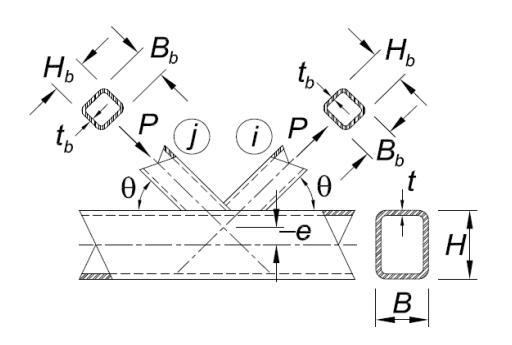

Perhatikan bahwa panah gaya yang ditunjukkan untuk sambungan K yang dioverlap dapat dibalik; i dan j mengontrol identifikasi komponen struktur.

Keadaan Batas: Leleh Lokal dari Cabang/Cabangcabang akibat distribusi beban tidak merata ϕ=0,95(DFBT) Ω=1,58(DKI)

Apabila 25%≤ *Ov*≤50%:

$$P_{n,i} = F_{ybi} t_{bi} \left[ \frac{Q_V}{50} (2H_{bi} - 4t_{bi}) + B_{ei} + B_{ej} \right]$$
 (K3-10)

Apabila 50%≤ *Ov*≤80%:

$$P_{n,i} = F_{ybi}t_{bi}(2H_{bi}-4t_{bi}+B_{ei}+B_{ej})$$
 (K3-11)

Apabila 80% ≤ Ov ≤ 100%:

$$P_{n,i} = F_{ybi}t_{bi}(2H_{bi}-4t_{bi}+B_{bi}+B_{ej})$$
 (K3-12)

Subskripi mengacu ke cabang yang mengoverlap Subskripj mengacu ke cabang yang dioverlap

$$P_{n,j} = P_{n,i} \left( \frac{F_{ybj} A_{bj}}{F_{ybi} A_{bi}} \right) \tag{K3-13}$$

#### **Fungsi**

*Qf* = untuk kord (yang menyambungkan permukaan) dalam kondisi tarik

$$Q_f = 1,3-0,4 \frac{U}{\beta} \le 1$$
 (K3-14)

 untuk kord (yang menyambungkan permukaan) dalam kondisi tekan, untuk sambungan T, Y dan silang

$$Q_f = 1,3-0,4 \frac{U}{\beta_{eff}} \le 1$$
 (K3-15)

untuk kord (yang menyambungkan permukaan) dalam kondisi tekan, untuk sambungan K bercelah

$$U = \left| \frac{P_{ro}}{F_c A_g} + \frac{M_{ro}}{F_c S} \right| \tag{K2-4}$$

dengan*Pro* dan *Mro* ditentukan pada sisi joint yang memiliki tegangan tekan terendah. *Pro* dan *Mro* mengacu pada kekuatan perlu pada PSR. *Pro* = *Pu*untuk DFBT, dan *Pa*untuk DKI; *Mro*  =*Mu*untuk DFBT, *Ma*untuk DKI

$$\beta_{\text{eff}} = \left[ (B_b + H_b)_{\text{cabang tekan}} + (B_b + H_b)_{\text{cabang tarik}} \right] / 4B \tag{K3-16}$$

$$\beta_{eop} = \frac{5\beta}{\gamma} \le \beta \tag{K3-17}$$

**© BSN 2020 154 dari 254** 

#### TABEL K3.2A Batas Keberlakuan Tabel K3.2

Eksentrisitas joint: -0,55 ≤ e/H≤0,25untuk sambungan K

Kelangsingan dinding kord: B/t dan  $H/t \le 35$  untuk sambungan K bercelah dan sambungan T,

Y dan silang

Kelangsingan dinding cabang:  $B/t \leq 30$  untuk sambungan K yang dioverlap

H/t ≤35 untuk sambungan K yang dioverlap

 $B_b/t_b$ dan  $H_b/t_b$   $\leq$  35 untuk cabang tarik

 $\leq$ 1,25  $\sqrt{\frac{E}{F_{yb}}}$ untuk cabang tekan dari sambungan K, T, Y dan silang bercelah

≤35 untuk cabang tekan dari sambungan K, T, Y dansilang bercelah

 $\leq$ 1,1  $\sqrt{\frac{E}{F_{yb}}}$ untuk cabang tekan dari sambungan K yang dioverlap

Rasio lebar:  $B_b/B$ dan  $H_b/B \ge 0.25$  untuk sambungan T, Y, silang dan K yang

dioverlap

Rasio aspek:  $0.5 \le H_b/B_b \le 2.0 \text{ dan } 0.5 \le H/B \le 2.0 \text{ dan } 0.5 \le H/B \le 2.0 \text{ dan } 0.5 \le H/B \le 2.0 \text{ dan } 0.5 \le H/B \le 2.0 \text{ dan } 0.5 \le H/B \le 2.0 \text{ dan } 0.5 \le H/B \le 2.0 \text{ dan } 0.5 \le H/B \le 2.0 \text{ dan } 0.5 \le H/B \le 2.0 \text{ dan } 0.5 \le H/B \le 2.0 \text{ dan } 0.5 \le H/B \le 2.0 \text{ dan } 0.5 \le H/B \le 2.0 \text{ dan } 0.5 \le H/B \le 2.0 \text{ dan } 0.5 \le H/B \le 2.0 \text{ dan } 0.5 \le H/B \le 2.0 \text{ dan } 0.5 \le H/B \le 2.0 \text{ dan } 0.5 \le H/B \le 2.0 \text{ dan } 0.5 \le H/B \le 2.0 \text{ dan } 0.5 \le H/B \le 2.0 \text{ dan } 0.5 \le H/B \le 2.0 \text{ dan } 0.5 \le H/B \le 2.0 \text{ dan } 0.5 \le H/B \le 2.0 \text{ dan } 0.5 \le H/B \le 2.0 \text{ dan } 0.5 \le H/B \le 2.0 \text{ dan } 0.5 \le H/B \le 2.0 \text{ dan } 0.5 \le H/B \le 2.0 \text{ dan } 0.5 \le H/B \le 2.0 \text{ dan } 0.5 \le H/B \le 2.0 \text{ dan } 0.5 \le H/B \le 2.0 \text{ dan } 0.5 \le H/B \le 2.0 \text{ dan } 0.5 \le H/B \le 2.0 \text{ dan } 0.5 \le H/B \le 2.0 \text{ dan } 0.5 \le H/B \le 2.0 \text{ dan } 0.5 \le H/B \le 2.0 \text{ dan } 0.5 \le H/B \le 2.0 \text{ dan } 0.5 \le H/B \le 2.0 \text{ dan } 0.5 \le H/B \le 2.0 \text{ dan } 0.5 \le H/B \le 2.0 \text{ dan } 0.5 \le H/B \le 2.0 \text{ dan } 0.5 \le H/B \le 2.0 \text{ dan } 0.5 \le H/B \le 2.0 \text{ dan } 0.5 \le H/B \le 2.0 \text{ dan } 0.5 \le H/B \le 2.0 \text{ dan } 0.5 \le H/B \le 2.0 \text{ dan } 0.5 \le H/B \le 2.0 \text{ dan } 0.5 \le H/B \le 2.0 \text{ dan } 0.5 \le H/B \le 2.0 \text{ dan } 0.5 \le H/B \le 2.0 \text{ dan } 0.5 \le H/B \le 2.0 \text{ dan } 0.5 \le H/B \le 2.0 \text{ dan } 0.5 \le H/B \le 2.0 \text{ dan } 0.5 \le H/B \le 2.0 \text{ dan } 0.5 \le H/B \le 2.0 \text{ dan } 0.5 \le H/B \le 2.0 \text{ dan } 0.5 \le H/B \le 2.0 \text{ dan } 0.5 \le H/B \le 2.0 \text{ dan } 0.5 \le H/B \le 2.0 \text{ dan } 0.5 \le H/B \le 2.0 \text{ dan } 0.5 \le H/B \le 2.0 \text{ dan } 0.5 \le H/B \le 2.0 \text{ dan } 0.5 \le H/B \le 2.0 \text{ dan } 0.5 \le H/B \le 2.0 \text{ dan } 0.5 \le H/B \le 2.0 \text{ dan } 0.5 \le H/B \le 2.0 \text{ dan } 0.5 \le H/B \le 2.0 \text{ dan } 0.5 \le H/B \le 2.0 \text{ dan } 0.5 \le H/B \le 2.0 \text{ dan } 0.5 \le H/B \le 2.0 \text{ dan } 0.5 \le H/B \le 2.0 \text{ dan } 0.5 \le H/B \le 2.0 \text{ dan } 0.5 \le H/B \le 2.0 \text{ dan } 0.5 \le H/B \le 2.0 \text{ dan } 0.5 \le H/B \le 2.0 \text{ dan } 0.5 \le H/B \le 2.0 \text{ dan } 0.5 \le H/B \le 2.0 \text{ dan } 0.5 \le H/B \le 2.0 \text{ dan } 0.5 \le H/B \le 2.0 \text{ dan } 0.5 \le H/B \le 2.0 \text{ dan } 0.5 \le H/B \le 2.0 \text{ dan } 0.5 \le H/B \le 2.0 \text{ dan } 0.5 \le H/B \le 2.0 \text{ dan } 0.$ 

Overlap:  $25\% \le O_v \le 100\%$  untuk sambungan K yang dioverlap

Rasio lebar cabang:  $B_{bi}/B_{bj} \ge 0.75$  untuk sambungan K yang dioverlap, yang mana

subskripi mengacu ke cabang yang mengoverlap dan

huruf *j* mengacu ke cabang yang dioverlap

Rasio ketebalan cabang:  $t_{bi}/t_{bj} \leq 1,0$  untuk sambungan K yang dioverlap, dimana

subskripi mengacu ke cabang yang mengoverlap dan

huruf *j* mengacu ke cabang dioverlap

Kekuatan material:  $F_{v}$ dan  $F_{vb} \leq 52$  ksi (360 MPa)

Daktilitas:  $F_v/F_u$ dan  $F_{vb}/F_{ub} \leq 0.8$  Catatan: ASTM A500 Grade C dapat digunakan.

Jarak ujung:  $l_{end} \ge B_1 \sqrt{1-\beta}$  untuk sambungan T, Y, silang dan K

#### Batas-batas Tambahan untuk Sambungan K Bercelah

Rasio lebar:  $\frac{B_b}{B} \operatorname{dan} \frac{H_b}{B} \ge 0.1 + \frac{\gamma}{50}$ 

 $\beta_{eff} \geq 0.3$ 

Rasio celah:  $\zeta = g/B \ge 0.5(1-\beta_{eff})$ 

Celah:  $g \ge t_{b \text{ cabang tekan}} + t_{b \text{ cabang tarik}}$ 

Ukuran cabang  $B_b$  terkecil  $\geq 0.63$  ( $B_b$  terbesar), jika kedua cabang adalah bujur

sangkar

#### 1. Definisi Parameter

 $Z_b$  = Modulus penampang plastis cabang terhadap sumbu lentur, in.3 (mm3)

 $\beta$  = rasio lebar

=  $D_b/D$  untuk PSR bundar; rasio diameter cabang terhadap diameter kord

=  $B_b/B$  untuk PSR persegi panjang; rasio lebar cabang keseluruhan terhadap lebar kord

γ = rasio kelangsingan kord

= D/2t untuk PSR bundar; rasio setengah diameter terhadap tebal dinding

= B/2t untuk PSR persegi panjang; rasio setengah lebar terhadap tebaldinding

- η = parameter panjang beban, hanya berlaku untuk PSR persegi panjang
  - =  $l_b/B$ ; rasio panjang kontak cabang dengan kord pada bidang sambungan terhadap lebar kord, dengan $l_b = H_b/\sin\theta$
- $\theta$  = sudut lancip antara cabang dan kord (derajat)

#### 2. PSR Bundar

Kekuatan tersedia sambungan momen PSR ke PSR bundar di dalam batas Tabel K4.1A harus diambil sebagai nilai terendah dari keadaan batas yang berlaku yang ditunjukkan dalam Tabel K4.1.

#### 3. PSR Persegi Panjang

Kekuatan tersedia,  $\phi P_n$ dan  $P_n/\Omega$ , pada sambungan momen PSR ke PSR persegi panjang di dalam batas dalam Tabel K4.2A harus diambil sebagai nilai terendah yang diperoleh sesuai dengan keadaan batas yang ditunjukkan dalam Tabel K4.2 dan Bab J.

**Catatan Pengguna:** Di luar batas dalam Tabel K4.2A, keadaan batas Bab J masih berlaku dan keadaan batas yang berlaku pada Bab K tidak didefinisikan.

#### K5. LAS PELAT DAN CABANG KE PSR PERSEGI PANJANG

Kekuatan tersedia sambungan cabang harus ditentukan dengan memperhitungkan ketidakseragaman transfer beban sepanjang garis las, akibat perbedaan kekakuan relatif dinding PSR pada sambungan PSR ke PSR dan antara elemen-elemen pada sambungan PSR ke pelat tranversal, sebagai berikut:

$$R_n \operatorname{atau} P_n = F_{nw} t_w l_e \tag{K5-1}$$

$$M_{n-ip} = F_{nw} S_{ip} \tag{K5-2}$$

$$M_{n-op} = F_{nw} S_{op} \tag{K5-3}$$

Interaksi harus diperhitungkan.

(a) Untuk las filet

$$\phi = 0.75 \text{ (DFBT)} \qquad \Omega = 2.00 \text{ (DKI)}$$

(b) Untuk las gruvpenetrasi joint parsial

$$\phi = 0.80 \text{ (DFBT)} \qquad \Omega = 1.88 \text{ (DKI)}$$

dengan

 $F_{nw}$  = tegangan nominal logam las (Bab J) dengan tanpa meningkatkan kekuatan akibat arah beban untuk las filet, ksi (MPa)

 $S_{ip}$  = modulus penampang elastis efektif las untuk lentur dalam bidang (Tabel K5.1), in.3 (mm3)

 $S_{op}$  = modulus penampang elastis efektif las untuk lentur keluar bidang (Tabel K5.1), in.3 (mm3)

© BSN 2020 156 dari 254

TABEL K4.1 Kekuatan Tersedia Sambungan Momen PSR ke PSR Bundar

| Kekuatan Lentur Tersedia Sambung                                                           | jan                                                                                                                                                                                                                                                                                                                                                                                                                                                                                                                                                                                                                                                                                                                                                                    |
|--------------------------------------------------------------------------------------------|------------------------------------------------------------------------------------------------------------------------------------------------------------------------------------------------------------------------------------------------------------------------------------------------------------------------------------------------------------------------------------------------------------------------------------------------------------------------------------------------------------------------------------------------------------------------------------------------------------------------------------------------------------------------------------------------------------------------------------------------------------------------|
| Keadaan Batas: Plastisifikasi Kord                                                         |                                                                                                                                                                                                                                                                                                                                                                                                                                                                                                                                                                                                                                                                                                                                                                        |
| $M_{n-ip}\sin\theta=5,39F_yt^2\gamma^{0,5}\beta D_bQ_f$                                    | (K4-1)                                                                                                                                                                                                                                                                                                                                                                                                                                                                                                                                                                                                                                                                                                                                                                 |
| φ=0,90 (DFBT) Ω=1,67 (DKI)                                                                 |                                                                                                                                                                                                                                                                                                                                                                                                                                                                                                                                                                                                                                                                                                                                                                        |
| Keadaan Batas: Leleh Geser (Pons), Bila $D_b < (D-2t)$                                     |                                                                                                                                                                                                                                                                                                                                                                                                                                                                                                                                                                                                                                                                                                                                                                        |
| $M_{n-ip} = 0.6F_y t D_b^2 \left(\frac{1+3\sin\theta}{4\sin^2\theta}\right)$               | (K4-2)                                                                                                                                                                                                                                                                                                                                                                                                                                                                                                                                                                                                                                                                                                                                                                 |
| φ=0,95 (DFBT) Ω=1,58 (DKI)                                                                 |                                                                                                                                                                                                                                                                                                                                                                                                                                                                                                                                                                                                                                                                                                                                                                        |
| Keadaan Batas: Plastisifikasi Kord                                                         |                                                                                                                                                                                                                                                                                                                                                                                                                                                                                                                                                                                                                                                                                                                                                                        |
| $M_{n-op} = \frac{F_y t^2 D_b}{\sin \theta} \left( \frac{3.0}{1 - 0.81 \beta} \right) Q_f$ | (K4-3)                                                                                                                                                                                                                                                                                                                                                                                                                                                                                                                                                                                                                                                                                                                                                                 |
| φ=0,90 (DFBT) Ω=1,67 (DKI)                                                                 |                                                                                                                                                                                                                                                                                                                                                                                                                                                                                                                                                                                                                                                                                                                                                                        |
| Keadaan Batas: Leleh Geser (Pons), apabila $D_b < (D-2t)$                                  |                                                                                                                                                                                                                                                                                                                                                                                                                                                                                                                                                                                                                                                                                                                                                                        |
| $M_{n-op} = 0.6F_y t D_b^2 \left( \frac{3 + \sin \theta}{4 \sin^2 \theta} \right)$         | (K4-4)                                                                                                                                                                                                                                                                                                                                                                                                                                                                                                                                                                                                                                                                                                                                                                 |
| φ=0,95 (DFBT) Ω=1,58 (DKI)                                                                 |                                                                                                                                                                                                                                                                                                                                                                                                                                                                                                                                                                                                                                                                                                                                                                        |
| _                                                                                          | $\begin{split} M_{n\text{-}ip}\sin\theta &= 5,39F_yt^2\gamma^{0,5}\beta D_bQ_f\\ & \varphi = 0,90 \text{ (DFBT)} \qquad \Omega = 1,67 \text{ (DKI)} \end{split}$ Keadaan Batas: Leleh Geser (Pons), Bila $D_b < (D\text{-}2t)$ $M_{n\text{-}ip} &= 0,6F_ytD_b^2\left(\frac{1+3\sin\theta}{4\sin^2\theta}\right)\\ & \varphi = 0,95 \text{ (DFBT)} \qquad \Omega = 1,58 \text{ (DKI)} \end{split}$ Keadaan Batas: Plastisifikasi Kord $M_{n\text{-}op} &= \frac{F_yt^2D_b}{\sin\theta}\left(\frac{3,0}{1\text{-}0,81\beta}\right)Q_f\\ & \varphi = 0,90 \text{ (DFBT)} \qquad \Omega = 1,67 \text{ (DKI)} \end{split}$ Keadaan Batas: Leleh Geser (Pons), apabila $D_b < (D\text{-}2t)$ $M_{n\text{-}op} = 0,6F_ytD_b^2\left(\frac{3+\sin\theta}{4\sin^2\theta}\right)$ |

Untuk sambungan T, Y dan Silang, dengan cabang (cabang-cabang) akibat beban aksial, lentur sebidang dan lentur keluar bidang, atau kombinasi efek beban ini:

DFBT: 
$$[P_u/(\phi P_n)] + [M_{r-ip}/(\phi M_{n-ip})]^2 + [M_{r-op}/(\phi M_{n-op})] \le 1,0$$
 (K4-5)

DKI: 
$$[P_a/(P_n/\Omega)] + [M_{r-ip}/(M_{n-ip}/\Omega)]^2 + [M_{r-op}/(M_{n-op}/\Omega)] \le 1,0$$
 (K4-6)

 $\begin{array}{ll} \Phi P_n &=& \text{kekuatan desain (atau } P_n/\Omega = \text{kekuatan izin) diperoleh dari Tabel K3.1} \\ \Phi M_{n\text{-}ip} &=& \text{kekuatan desain (atau } M_{n\text{-}ip}/\Omega = \text{kekuatan izin) untuk lentur sebidang} \\ \Phi M_{n\text{-}op} &=& \text{kekuatan desain (atau } M_{n\text{-}op}/\Omega = \text{kekuatan izin) untuk lentur keluar bidang} \end{array}$ 

 $M_{r-ip}$  =  $M_{u-ip}$ untuk DFBT;  $M_{a-ip}$ untuk DKI  $M_{r-op}$  =  $M_{u-op}$ untuk DFBT;  $M_{a-op}$ untuk DKI

© BSN 2020 157 dari 254

#### **TABEL K4.1 (lanjutan) Kekuatan Tersedia Sambungan Momen PSR ke PSR Bundar**

#### **Fungsi**

*Qf* = 1 untuk kord (yang menyambungkan permukaan) dalam kondisi tarik

*Qf* = 1,0 - 0,3 *U* (1+*U*) untuk kord (yang menyambungkan permukaan) dalam kondisi tekan (K2-3)

$$U = \left| \frac{P_{ro}}{F_c A_g} + \frac{M_{ro}}{F_c S} \right| \tag{K2-4}$$

dengan *Pro* dan *Mro* ditentukan pada sisi joint yang memiliki tegangan tekan terendah. *Pro* dan *Mro*  mengacu pada kekuatan perlu pada PSR. *Pro* = *Pu*untuk DFBT, dan *Pa*untuk DKI; *Mro* =*Mu*untuk DFBT, *Ma*untuk DKI

#### **TABEL K4.1A Batas Keberlakuan Tabel K4.1**

Kelangsingan dinding kord: *D/t* ≤ 50 untuk sambungan T, dan sambungan Y

*D/t* ≤ 40 untuk sambungan silang

Kelangsingan dinding cabang: *Db* /*tb* ≤ 50

*Db* /*tb* ≤ 0,05*E*/*Fyb*

Rasio lebar: 0,2 < *Db* /*D*≤1,0

Kekuatan material: *Fy*dan *Fyb* ≤ 52 ksi (360 MPa)

Daktilitas: *Fy* /*Fu*dan *Fyb*/*Fub* ≤ 0,80 Catatan: ASTM A500 Grade C dapat digunakan.

*le*= panjang las efektif total pada las gruv dan las filet untuk PSR persegi panjang untuk perhitungan kekuatan, in. (mm)

tw = tenggorok las efektif terkecil sekitar perimeter cabang atau pelat, in. (mm)

Apabila sambungan K yang dioverlap telah didesain sesuai dengan Tabel K3.2, dan gaya komponen struktur cabang tersebut yang tegak lurus terhadap kord diseimbangkan 80% (yaitu gaya komponen struktur cabang tegak lurus terhadap muka kord berbeda tidak lebih dari 20%), las yang tersembunyi di bawah suatu cabang yang mengoverlap dapat dihilangkan jika sisa las ke cabang yang dioverlap dimanapun mengembangkan kapasitas penuh pada dinding-dinding komponen struktur cabang yang dioverlap.

**© BSN 2020 158 dari 254** 

#### TABEL K4.2 Kekuatan Tersedia Sambungan Momen PSR ke PSR Persegi Panjang

| Tipe Sambungan                                                         | Kekuatan Lentur Tersedia Sambungan                                                             |
|------------------------------------------------------------------------|------------------------------------------------------------------------------------------------|
| Cabang akibat Lentur Keluar Bidang Sambungan T dan Sambungan Silang | Keadaan Batas: Kegagalan distorsi kord, untuk sambungan T dan sambungan silang tak seimbang |
| $t_b$ $H_b$                                                            | $M_n = 2F_y t \left[ H_b t + \sqrt{BHt(B+H)} \right] $ (K4-7)                                  |
| M H                                                                    | φ=1,00 (DFBT) Ω=1,50 (DKI)                                                                     |

Untuk sambungan T dan silang, dengan cabang yang mengalami kombinasi beban aksial, lentur sebidang, dan lentur keluar bidang, atau kombinasi masing-masing efek beban ini:

DFBT: 
$$[P_u/(\phi P_n)] + [M_{r-ip}/(\phi M_{n-ip})]^2 + [M_{r-op}/(\phi M_{n-op})] \le 1,0$$
 (K4-8)

DKI: 
$$[P_a/(P_n/\Omega)] + [M_{r-ip}/(M_{n-ip}/\Omega)]^2 + [M_{r-op}/(M_{n-op}/\Omega)] \le 1,0$$
 (K4-9)

 $φP_n$  = kekuatan desain (atau  $P_n/Ω$  = kekuatan izin)

 $\phi M_{n\text{-}ip}$  = kekuatan desain (atau  $M_{n\text{-}ip}/\Omega$  = kekuatan izin) untuk lentur sebidang  $\phi M_{n\text{-}op}$  = kekuatan desain (atau  $M_{n\text{-}op}/\Omega$  = kekuatan izin) untuk lentur keluar bidang

 $M_{r-ip}$  =  $M_{u-ip}$ untuk DFBT;  $M_{a-ip}$ untuk DKI  $M_{r-op}$  =  $M_{u-op}$ untuk DFBT;  $M_{a-op}$ untuk DKI

#### **Fungsi**

 $Q_f = 1$  untuk kord (yang menyambungkan permukaan) dalam kondisi tarik

$$Q_f = 1,3-0,4 \frac{U}{B} \le 1$$
 untuk kord (yang menyambungkan permukaan) dalam kondisi tekan (K3-14)

$$U = \left| \frac{P_{ro}}{F_c A_g} + \frac{M_{ro}}{F_c S} \right| \tag{K2-4}$$

dengan  $P_{ro}$  dan  $M_{ro}$  ditentukan pada sisi joint yang memiliki tegangan tekan terendah.  $P_{ro}$  dan  $M_{ro}$  mengacu pada kekuatan perlu pada PSR.  $P_{ro} = P_u$  untuk DFBT, dan  $P_a$  untuk DKI;  $M_{ro} = M_u$  untuk DFBT.  $M_a$  untuk DKI

© BSN 2020 159 dari 254

#### **TABEL K4.2A Batas Keberlakuan Tabel K4.2**

Sudut cabang: θ ≅90°

Kelangsingan dinding kord: B/t dan *H*/*t* ≤ 35 Kelangsingan dinding cabang: *Bb* /*tb*dan *Hb* /*tb* ≤ 35

≤ 1,25 √ *E Fyb*

Rasio lebar: *Bb* /*B* ≥ 0,25

Rasio aspek: 0,5≤*Hb* /*Bb*≤2,0dan0,5 ≤ *H/B*≤2,0 Kekuatan material: *Fy*dan *Fyb* ≤ 52 ksi (360 MPa)

Daktilitas: *Fy* /*Fu*dan *Fyb*/*Fub* ≤ 0,8 Catatan: ASTM A500 Grade C dapat

digunakan.

Pemeriksaan las pada Tabel K5.1 tidak diperlukan jika las mampu mengembangkan kekuatan penuh dinding komponen struktur cabang di seluruh perimeternya (atau suatu pelat di seluruh panjangnya).

**Catatan Pengguna:** Pendekatan yang digunakan di sini mengizinkan pengecilan ukuran las dengan mengasumsikan suatu ukuran las yang konstan di seluruh perimeter cabang PSR. Perhatian khusus diperlukan untuk sambungan lebar yang sama (atau lebar yang mendekati sama) yang mana kombinasi las gruvpenetrasi joint parsial sepanjang tepi sambungan disesuaikan, dengan las filet yang umumnya bersilangan muka komponen struktur utama.

**© BSN 2020 160 dari 254** 

TABEL K5.1
Properti Las Efektif untuk Sambungan ke PSR Persegi Panjang

| Tipe Sambungan                                                                                                                                                                                                                                                                                                                                                                                                                                                                                                                                                                                                                                                                                                                                                                                                                                                                                                                                                                                                                                                                                                                                                                                                                                                                                                                                                                                                                                                                                                                                                                                                                                                                                                                                                                                                                                                                                                                                                                                                                                                                                                                                                                                                                                                                                                                                                                                                                                                                                                                                                                    | Properti Las                                                                                                                         |
|-----------------------------------------------------------------------------------------------------------------------------------------------------------------------------------------------------------------------------------------------------------------------------------------------------------------------------------------------------------------------------------------------------------------------------------------------------------------------------------------------------------------------------------------------------------------------------------------------------------------------------------------------------------------------------------------------------------------------------------------------------------------------------------------------------------------------------------------------------------------------------------------------------------------------------------------------------------------------------------------------------------------------------------------------------------------------------------------------------------------------------------------------------------------------------------------------------------------------------------------------------------------------------------------------------------------------------------------------------------------------------------------------------------------------------------------------------------------------------------------------------------------------------------------------------------------------------------------------------------------------------------------------------------------------------------------------------------------------------------------------------------------------------------------------------------------------------------------------------------------------------------------------------------------------------------------------------------------------------------------------------------------------------------------------------------------------------------------------------------------------------------------------------------------------------------------------------------------------------------------------------------------------------------------------------------------------------------------------------------------------------------------------------------------------------------------------------------------------------------------------------------------------------------------------------------------------------------|--------------------------------------------------------------------------------------------------------------------------------------|
| Sambungan Silang dan Sambungan T Pelat Transversal akibat Beban Aksial Pelat                                                                                                                                                                                                                                                                                                                                                                                                                                                                                                                                                                                                                                                                                                                                                                                                                                                                                                                                                                                                                                                                                                                                                                                                                                                                                                                                                                                                                                                                                                                                                                                                                                                                                                                                                                                                                                                                                                                                                                                                                                                                                                                                                                                                                                                                                                                                                                                                                                                                                                   | Properti Las Efektif                                                                                                                 |
| $\begin{array}{c c} R & B_b \\ \hline t_p \\ \hline - B & B \\ \hline B & B \\ \hline B & B \\ \hline B & B \\ \hline B & B \\ \hline B & B \\ \hline B & B \\ \hline B & B \\ \hline B & B \\ \hline B & B \\ \hline B & B \\ \hline B & B \\ \hline B & B \\ \hline B & B \\ \hline B & B \\ \hline B & B \\ \hline B & B \\ \hline B & B \\ \hline B & B \\ \hline B & B \\ \hline B & B \\ \hline B & B \\ \hline B & B \\ \hline B & B \\ \hline B & B \\ \hline B & B \\ \hline B & B \\ \hline B & B \\ \hline B & B \\ \hline B & B \\ \hline B & B \\ \hline B & B \\ \hline B & B \\ \hline B & B \\ B & B \\ \hline B & B \\ B & B \\ \hline B & B \\ B & B \\ B & B \\ B & B \\ B & B \\ B & B \\ B & B \\ B & B \\ B & B \\ B & B \\ B & B \\ B & B \\ B & B \\ B & B \\ B & B \\ B & B \\ B & B \\ B & B \\ B & B \\ B & B \\ B & B \\ B & B \\ B & B \\ B & B \\ B & B \\ B & B \\ B & B \\ B & B \\ B & B \\ B & B \\ B & B \\ B & B \\ B & B \\ B & B \\ B & B \\ B & B \\ B & B \\ B & B \\ B & B \\ B & B \\ B & B \\ B & B \\ B & B \\ B & B \\ B & B \\ B & B \\ B & B \\ B & B \\ B & B \\ B & B \\ B & B \\ B & B \\ B & B \\ B & B \\ B & B \\ B & B \\ B & B \\ B & B \\ B & B \\ B & B \\ B & B \\ B & B \\ B & B \\ B & B \\ B & B \\ B & B \\ B & B \\ B & B \\ B & B \\ B & B \\ B & B \\ B & B \\ B & B \\ B & B \\ B & B \\ B & B \\ B & B \\ B & B \\ B & B \\ B & B \\ B & B \\ B & B \\ B & B \\ B & B \\ B & B \\ B & B \\ B & B \\ B & B \\ B & B \\ B & B \\ B & B \\ B & B \\ B & B \\ B & B \\ B & B \\ B & B \\ B & B \\ B & B \\ B & B \\ B & B \\ B & B \\ B & B \\ B & B \\ B & B \\ B & B \\ B & B \\ B & B \\ B & B \\ B & B \\ B & B \\ B & B \\ B & B \\ B & B \\ B & B \\ B & B \\ B & B \\ B & B \\ B & B \\ B & B \\ B & B \\ B & B \\ B & B \\ B & B \\ B & B \\ B & B \\ B & B \\ B & B \\ B & B \\ B & B \\ B & B \\ B & B \\ B & B \\ B & B \\ B & B \\ B & B \\ B & B \\ B & B \\ B & B \\ B & B \\ B & B \\ B & B \\ B & B \\ B & B \\ B & B \\ B & B \\ B & B \\ B & B \\ B & B \\ B & B \\ B & B \\ B & B \\ B & B \\ B & B \\ B & B \\ B & B \\ B & B \\ B & B \\ B & B \\ B & B \\ B & B \\ B & B \\ B & B \\ B & B \\ B & B \\ B & B \\ B & B \\ B & B \\ B & B \\ B & B \\ B & B \\ B & B \\ B & B \\ B & B \\ B & B \\ B & B \\ B & B \\ B & B \\ B & B \\ B & B \\ B & B \\ B & B \\ B & B \\ B & B \\ B & B \\ B & B \\ B & B \\ B & B \\ B & B \\ B & B \\ B & B \\ B & B \\ B & B \\ B & B \\ B & B \\ B & B \\ B & B \\ B & B \\ B & B \\ B & B \\ B & B \\ B & B \\ B & B \\ B & B \\ B & B \\ B & B \\ B &$ | $l_{\rm e}$ =2 $B_{\rm e}$ (K5-4) dengan $l_{\rm e}$ = panjang las efektif total untuk las pada kedua sisi pelat transversal         |
| Sambungan T, Y dan Silang akibat Beban Aksial Cabang atau Lentur                                                                                                                                                                                                                                                                                                                                                                                                                                                                                                                                                                                                                                                                                                                                                                                                                                                                                                                                                                                                                                                                                                                                                                                                                                                                                                                                                                                                                                                                                                                                                                                                                                                                                                                                                                                                                                                                                                                                                                                                                                                                                                                                                                                                                                                                                                                                                                                                                                                                                                               | Properti Las Efektif                                                                                                                 |
| M atau P                                                                                                                                                                                                                                                                                                                                                                                                                                                                                                                                                                                                                                                                                                                                                                                                                                                                                                                                                                                                                                                                                                                                                                                                                                                                                                                                                                                                                                                                                                                                                                                                                                                                                                                                                                                                                                                                                                                                                                                                                                                                                                                                                                                                                                                                                                                                                                                                                                                                                                                                                                          | $l_{\rm e} = \frac{2H_b}{\sin\theta} + 2B_{\rm e} \tag{K5-5}$                                                                        |
| $A \downarrow B_b$ $A \downarrow t$                                                                                                                                                                                                                                                                                                                                                                                                                                                                                                                                                                                                                                                                                                                                                                                                                                                                                                                                                                                                                                                                                                                                                                                                                                                                                                                                                                                                                                                                                                                                                                                                                                                                                                                                                                                                                                                                                                                                                                                                                                                                                                                                                                                                                                                                                                                                                                                                                                                                                                                                               | $S_{ip} = \frac{t_w}{3} \left(\frac{H_b}{\sin \theta}\right)^2 + t_w B_e \left(\frac{H_b}{\sin \theta}\right) \tag{K5-6}$            |
| M atau Pl                                                                                                                                                                                                                                                                                                                                                                                                                                                                                                                                                                                                                                                                                                                                                                                                                                                                                                                                                                                                                                                                                                                                                                                                                                                                                                                                                                                                                                                                                                                                                                                                                                                                                                                                                                                                                                                                                                                                                                                                                                                                                                                                                                                                                                                                                                                                                                                                                                                                                                                                                                         | $S_{op} = t_w \left(\frac{H_b}{\sin \theta}\right) B_b + \frac{t_w}{3} \left(B_b^2\right) - \frac{(t_w/3)(B_b - B_e)^3}{B_b}$ (K5-7) |
| Tidak ada untuk sambungan T dan Y                                                                                                                                                                                                                                                                                                                                                                                                                                                                                                                                                                                                                                                                                                                                                                                                                                                                                                                                                                                                                                                                                                                                                                                                                                                                                                                                                                                                                                                                                                                                                                                                                                                                                                                                                                                                                                                                                                                                                                                                                                                                                                                                                                                                                                                                                                                                                                                                                                                                                                                                              | Bila $\beta$ >0,85atau $\theta$ >50°, $B_e$ /2 tidak boleh melebihi $B_e$ /4.                                                        |
| $ \frac{H_b}{\sin \theta} $ $ \frac{B_e}{2} $ Potongan A-A: Las Efektif                                                                                                                                                                                                                                                                                                                                                                                                                                                                                                                                                                                                                                                                                                                                                                                                                                                                                                                                                                                                                                                                                                                                                                                                                                                                                                                                                                                                                                                                                                                                                                                                                                                                                                                                                                                                                                                                                                                                                                                                                                                                                                                                                                                                                                                                                                                                                                                                                                                                                                           |                                                                                                                                      |
| Sambungan K bercelah akibat Beban Aksial                                                                                                                                                                                                                                                                                                                                                                                                                                                                                                                                                                                                                                                                                                                                                                                                                                                                                                                                                                                                                                                                                                                                                                                                                                                                                                                                                                                                                                                                                                                                                                                                                                                                                                                                                                                                                                                                                                                                                                                                                                                                                                                                                                                                                                                                                                                                                                                                                                                                                                                                          | Propertis Las Efektif                                                                                                                |
| Cabang $H_b \sim B_b$ $t_b \sim H_b$                                                                                                                                                                                                                                                                                                                                                                                                                                                                                                                                                                                                                                                                                                                                                                                                                                                                                                                                                                                                                                                                                                                                                                                                                                                                                                                                                                                                                                                                                                                                                                                                                                                                                                                                                                                                                                                                                                                                                                                                                                                                                                                                                                                                                                                                                                                                                                                                                                                                                                                                              | Propertis Las Elektii Bila θ≤50°:                                                                                                 |
| $\begin{array}{c c} & & & & & & & & & & & & & & & & & & &$                                                                                                                                                                                                                                                                                                                                                                                                                                                                                                                                                                                                                                                                                                                                                                                                                                                                                                                                                                                                                                                                                                                                                                                                                                                                                                                                                                                                                                                                                                                                                                                                                                                                                                                                                                                                                                                                                                                                                                                                                                                                                                                                                                                                                                                                                                                                                                                                                                                                                                                        | $l_e = \frac{2(H_b - 1, 2t_b)}{\sin \theta} + 2(B_b - 1, 2t_b)$ Bila $\theta \ge 60^\circ$ : (K5-8)                                  |
| $\frac{H_b - 1.2t_b}{\sin \theta}$                                                                                                                                                                                                                                                                                                                                                                                                                                                                                                                                                                                                                                                                                                                                                                                                                                                                                                                                                                                                                                                                                                                                                                                                                                                                                                                                                                                                                                                                                                                                                                                                                                                                                                                                                                                                                                                                                                                                                                                                                                                                                                                                                                                                                                                                                                                                                                                                                                                                                                                                                | $l_{e} = \frac{2(H_{b}-1,2t_{b})}{\sin\theta} + B_{b}-1,2t_{b} $ (K5-9)                                                              |
| $B_b - 1.2t_b$ \nefektif sisi ke-4                                                                                                                                                                                                                                                                                                                                                                                                                                                                                                                                                                                                                                                                                                                                                                                                                                                                                                                                                                                                                                                                                                                                                                                                                                                                                                                                                                                                                                                                                                                                                                                                                                                                                                                                                                                                                                                                                                                                                                                                                                                                                                                                                                                                                                                                                                                                                                                                                                                                                                                                                | Bila 50°< $\theta$ <60°, interpolasi linier harus digunakan untuk menentukan $l_{\rm e}$                                             |
| ketika θ ≤ 50° Potongan A-A: Las Efektif untuk θ ≥ 60°                                                                                                                                                                                                                                                                                                                                                                                                                                                                                                                                                                                                                                                                                                                                                                                                                                                                                                                                                                                                                                                                                                                                                                                                                                                                                                                                                                                                                                                                                                                                                                                                                                                                                                                                                                                                                                                                                                                                                                                                                                                                                                                                                                                                                                                                                                                                                                                                                                                                                                                         |                                                                                                                                      |

© BSN 2020 161 dari 254

# TABEL K5.1 (lanjutan) Properti Las Efektif untuk Sambungan ke PSR Persegi Panjang

#### **Tipe Sambungan**

Sambungan K yang Dioverlap Akibat Beban Aksial Cabang

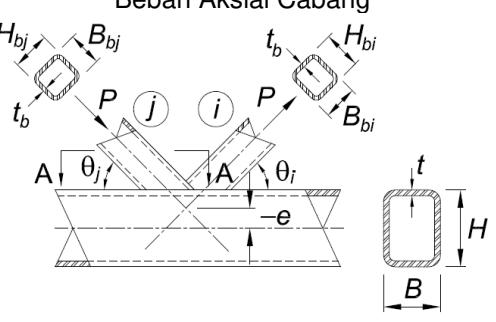

Catatbahwa panah gaya memperlihatkan sambungan K yang dioverlap dapat terbalik; identifikasi komponen struktur pengontrol *i* dan *j* 

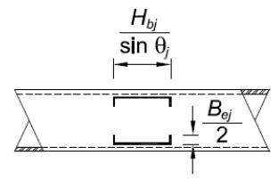

PotonganA-A: Las efektif apabila  $\frac{B_{bj}}{B} \le 0.85$  dan  $\theta_j \le 50^\circ$ 

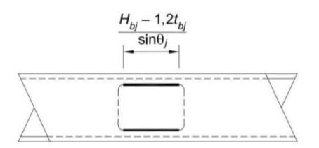

Potongan A-A: Las efektif apabila  $\frac{B_{bj}}{B}$  >0,85 dan  $\theta_j$  >50°

#### **Properti Las**

Properti Las Efektif Komponen Struktur yang Mengoverlap (semua dimensi adalah untuk cabang yang mengoverlap, *i*)

Apabila 25%≤ Ov<50%:

$$l_{e,i} = \frac{2O_{v}}{50} \left[ \left( 1 - \frac{O_{v}}{100} \right) \left( \frac{H_{bi}}{\sin \theta_{i}} \right) + \frac{O_{v}}{100} \left( \frac{H_{bi}}{\sin (\theta_{i} + \theta_{j})} \right) \right] + B_{ei} + B_{ej}$$
(K5-10)

Apabila 50%≤ Ov<80%:

$$l_{e,i} = 2 \left[ \left( 1 - \frac{O_V}{100} \right) \left( \frac{H_{bi}}{\sin \theta_i} \right) + \frac{O_V}{100} \left( \frac{H_{bi}}{\sin (\theta_i + \theta_j)} \right) \right] + B_{ei} + B_{ej}$$
 (K5-11)

Apabila 80%≤ Ov≤100%:

$$l_{e,i} = 2 \left[ \left( 1 - \frac{O_V}{100} \right) \left( \frac{H_{bi}}{\sin \theta_i} \right) + \frac{O_V}{100} \left( \frac{H_{bi}}{\sin (\theta_i + \theta_j)} \right) \right] + B_{bi} + B_{ej}$$
 (K5-12)

Apabila  $B_{bi}/B$ >0,85 atau $\theta_i$ >50°,  $B_{ei}/2$ tidak boleh melebihi  $B_{bi}/4$  dan apabila  $B_{bi}/B$ >0,85 atau(180 -  $\theta_i$ - $\theta_i$ )>50°,  $B_{ei}/2$  tidak boleh melebihi  $B_{bi}/4$ .

Subskrip i mengacu ke cabang yang mengoverlap Subskrip j mengacu ke cabang yang dioverlap

Properti Las Efektif Komponen Struktur yang Dioverlap (semua dimensi adalah untuk cabang yang dioverlap, j)

$$l_{e,j} = \frac{2H_{bj}}{\sin\theta_j} + 2B_{ej}$$
 (K5-13)

Apabila 
$$\frac{B_{bj}}{B}$$
 > 0,85 atau $\theta_j$  > 50°

$$l_{e,j} = 2(H_{bj}-1,2t_{bj})/\sin\theta_j$$
 (K5-14)

#### **BAB L**

#### **DESAIN UNTUK KEMAMPUAN LAYAN**

Bab ini membahas evaluasi struktur dan semua komponennya untuk keadaan batas kemampuan layan defleksi, drift, vibrasi, gerakan yang terinduksi angin, distorsi termal, dan slip sambungan.

Bab ini disusun sebagai berikut:

- L1. Ketentuan Umum
- L2. Defleksi
- L3. Drift
- L4. Vibrasi
- L5. Gerakan TerinduksiAngin
- L6. Ekspansi dan Kontraksi Termal
- L7. Slip Sambungan

#### **L1. KETENTUAN UMUM**

Kemampuan layan merupakan suatu keadaan yang mana fungsi suatu bangunan gedung, penampilan, pemeliharaan, durabilitas dan kenyamanan penghuninya dilindungi untuk pemakaian tipikal. Nilai batas perilaku struktural untuk kemampuan layan (misalnya defleksi dan percepatan maksimum) harus dipilih berkenaan dengan fungsi yang dimaksud pada struktur tersebut. Kemampuan layan harus dievaluasi menggunakan kombinasi beban yang berlaku.

**Catatan Pengguna:** Keadaan batas kemampuan layan, beban layan, dan kombinasi beban yang sesuai untuk persyaratan kemampuan layan dapat dilihat pada Lampiran C dan Penjelasan ASCE/SEI 7. Persyaratan kinerja untuk kemampuan layan pada bab ini konsisten dengan Lampiran C ASCE/SEI 7. Beban layan merupakan beban yang bekerja pada struktur tersebut di sembarang titik waktu dan umumnya diambil bukan beban nominal.

Nilai kekakuan tereduksi yang digunakan dalam metode analisis langsung, dijelaskan dalam Bab C, tidak dimaksudkan untuk digunakan dengan ketentuan bab ini.

#### **L2. DEFLEKSI**

Defleksi pada komponen strukturdan sistem struktur harus dibatasi agar tidak mengganggu kemampuan layan struktur tersebut.

#### **L3. DRIFT**

Drift harus dibatasi agar tidak mengganggu kemampuan layan struktur tersebut.

#### **L4. VIBRASI**

Efek vibrasi terhadap kenyamanan penghuni dan fungsi struktur harus diperhitungkan. Sumber vibrasi yang diperhitungkan harus meliputi beban penghuni, vibrasi mesin dan hal-hal lain yang teridentifikasi pada struktur.

**© BSN 2020 163 dari 254** 

#### **L5. GERAKAN TERINDUKSI ANGIN**

Efek gerakan terinduksi angin terhadap kenyamanan penghuni bangunan gedung harus diperhitungkan.

#### **L6. EKSPANSI DAN KONTRAKSI TERMAL**

Efek ekspansi dan kontraksi termal bangunan gedung harus diperhitungkan.

#### **L7. SLIP SAMBUNGAN**

Efek slip sambungan harus diperhitungkan dalam desain apabila slip pada sambungan baut dapat menyebabkan deformasi yang melemahkan kemampuan layan struktur. Apabila diperlukan, sambungan harus didesain untuk mencegah slip.

**Catatan Pengguna:** Untuk desain sambungan kritis selip, lihat Pasal J3.8 dan Pasal J3.9. Untuk informasi tambahan terhadap slip sambungan, lihat RCSC Specification for Structural Joints Using High-Strength Bolts.

**© BSN 2020 164 dari 254** 

#### **BAB M PABRIKASI DAN EREKSI**

Bab ini membahas persyaratan untuk gambar kerja, pabrikasi, bengkel pengecatan, dan ereksi.

Bab ini disusun sebagai berikut:

- M1. Gambar Kerja dan Gambar Ereksi
- M2. Pabrikasi
- M3. Pengecatan di Bengkel
- M4. Ereksi

#### **M1. GAMBAR KERJA DAN GAMBAR EREKSI**

Gambar kerja dan gambar ereksi boleh dipersiapkan secara bertahap. Gambar kerja harus dipersiapkan sebelum pabrikasi dan harus memberi informasi lengkap yang diperlukan untuk pabrikasi bagian-bagian komponen struktur tersebut, termasuk lokasi, tipe,serta ukuran las dan baut. Gambar ereksi harus dipersiapkan sebelum pelaksanaan ereksi dan harus memberi informasi yang diperlukan untuk ereksi struktur tersebut. Gambar kerja dan gambar ereksi harus secara jelas membedakan antara las dan baut di bengkel dan di lapangan serta harus mengidentifikasi secara jelas sambungan baut kekuatan tinggi yang diberi pratarik dan sambungan baut kekuatan tinggi kritis selip. Gambar kerja dan gambar ereksi harus dibuat agar pabrikasi dan ereksi cepat dan ekonomis.

#### **M2. PABRIKASI**

#### **1. Pengkamberan, Pelengkungan, dan Pelurusan**

Aplikasi pemanasan lokal atau mekanikal diizinkan digunakan untuk membuat atau mengoreksi kamber, kelengkungan, dan kelurusan. Temperatur daerah yang dipanaskan tidak boleh melebihi 1.100 oF (590 oC) untuk baja ASTM A514/A514M dan ASTM A852/A852M maupun 1.200 oF (650 oC) untuk baja lain.

#### **2. Pemotongan Termal**

Tepi yang dipotong secara termal harus memenuhi persyaratan Pasal 5.14.5.2, 5.14.8.3 dan Pasal 5.14.8.4 Structural Welding Code*—*Steel (AWS D1.1/D1.1M), selanjutnya disebut AWS D1.1M/D1.1M, dengan pengecualian bahwa tepi bebas yang dipotong secara termal yang tidak memikul fatik harus bebas dari round-bottom gouges yang dalamnya melebihi 3 /16 in. (5 mm) dan takik tajam bentuk V. Gouges yang dalamnya melebihi 3 /16 in. (5 mm) dan takik harus dihilangkan dengan penggerindaan atau diperbaiki dengan pengelasan.

Pojok reentrant harus dibentuk dengan transisi lengkung. Radiusnya tidak perlu melebihi yang diperlukan untuk mengepas sambungan tersebut. Pojok yang tidak menerus diperbolehkan bila material tersebut pada kedua sisi pojokreentrant tidak menerus disambungkan ke suatu mating piece untuk mencegah deformasi dan konsentrasi tegangan di pojok tersebut.

**Catatan Pengguna:** Pojok reentrant dengan radius 1 /2 in. sampai 3 /8 in. (13 mm sampai 10 mm) dapat diterima untuk pekerjaan yang dibebani secara statis. Apabila potongan-

**© BSN 2020 165 dari 254** 

potonganperlu diikat bersama-sama secara rapat, pojok *reentrant* yang tidak menerus dapat diterima jika potongan-potongan tersebut disambungkan sedekat mungkin ke pojok tersebut pada kedua sisi pojok yang tidak menerus. Slot pada PSR untuk buhul dapat dibuat dengan ujung semilingkaran atau pojok yang dilengkungkan. Ujung persegi dapat diterima asalkan tepi buhul dilas ke PSR.

Lubang akses las harus memenuhi persyaratan geometris Pasal J1.6. Coakan balok dan lubang akses las yang akan digalvanisasi harus digerinda menjadi logam bersih. Untuk profil dengan tebal sayap tidak melebihi 2 in. (50 mm), kekasaran permukaan coakan yang dipotong secara termal harus tidak lebih besar dari nilai kekasaran permukaan sebesar 2.000 μin. (50 μm) seperti didefinisikan dalam *Surface Texture, Surface Roughness, Waviness, and Lay* (ASME B46.1), selanjutnya disebut sebagai ASTM B46.1. Untuk coakan balok dan lubang akses las dengan bagian lubang las lengkung yang dipotong secara termal padaprofil gilas panas ASTM A6/A6M dengan tebal sayap melebihi 2 in. (50 mm) dan profil tersusun yang dilas dengan tebal material lebih besar dari 2 in. (50 mm), temperatur prapemanasan yang tidak boleh kurang dari 150 °F (66 °C) harus digunakan sebelum pemotongan secara termal. Permukaan yang dipotong secara termal pada lubang akses pada profil gilas panas ASTM A6/A6M dengan tebal sayap melebihi 2 in. (50 mm) dan profil tersusun dengan tebal material lebih besar dari 2 in. (50 mm) harus digerinda.

**Catatan Pengguna:**Sampel 2 pada AWS *Surface Roughness Guide for Oxygen Cutting* (AWS C4.1-77) dapat digunakan sebagai suatu panduan untuk mengevaluasi kekasaran permukaan coakan pada profil dengan sayap yang tebalnya tidak melebihi 2 in. (50 mm).

#### 3. Perencanaan Tepi

Perencanaan atau *finishing* semua tepi pelat atau profil yang digesek (*sheared*) atau yang dipotong secara termal tidak diperlukan kecuali secara khusus disebut dalam dokumen pelaksanaan atau termasuk dalam persiapan tepi yang ditetapkan untuk pengelasan.

#### 4. Pelaksanaan Las

Pengelasan harus dilakukan sesuai dengan AWS D1.1/D1.1M, kecuali seperti dimodifikasi dalam Pasal J2.

**Catatan Pengguna**: Pengujian kualifikasi pengelas pelat yang didefinisikan dalam Pasal 4 AWS D1.1/D1.1M adalah pengujian las penyambung pelat, profil atau PSR ke pelat, profil atau PSR persegi panjang lain. Kualifikasi pengelas tabung 6GR tersebut diperlukan untuk las gruv penetrasi joint komplet tanpa pelat pendukung pada sambungan T, Y dan K untuk PSR.

#### 5. Pelaksanaan Baut

Bagian komponen struktur yang dibaut harus dipin atau diberi baut dan disatukan secara kaku selama perakitan. Penggunaan pin dorong pada lubang baut selama perakitan tidak boleh merubah bentuk logam atau memperluas lubang. Penyesuaian lubang yang kurang baik harus ditolak.

Lubang baut harus memenuhi ketentuan Pasal 3.3 RCSC *Specification for Structural Joints Using High-Strength Bolts*, selanjutnya disebut sebagai RCSC *Specification*, kecuali bahwa lubang yang dipotong secara termal diperbolehkan memiliki profil kekasaran permukaan tidak melebihi 1.000  $\mu$ in. (25  $\mu$ m) seperti didefinisikan dalam ASME B46.1. Kedalaman *gouges* tidak boleh melebihi  $^{1}/_{16}$  in. (2 mm). Lubang yang dipotong dengan semburan air juga diperbolehkan.

© BSN 2020 166 dari 254

**Catatan Pengguna:**Sampel 3 pada AWS Surface Roughness Guide for Oxygen Cutting (AWS C4.1-77) boleh digunakan sebagai panduan untuk mengevaluasi kekasaran permukaan dari lubang yang dipotong secara termal.

Ganjal menjariyang disisipkan secara penuh, dengan tebal total tidak lebih dari 1 /4 in. (6 mm) pada suatu joint, diperbolehkan tanpa merubah kekuatan (berdasarkan tipe lubang) untuk desain sambungan. Orientasi ganjal tersebut independen terhadap arah aplikasi beban.

Penggunaan baut kekuatan tinggi harus sesuai dengan persyaratan RCSC Specification, kecuali seperti dimodifikasi dalam Pasal J3.

#### **6. Joint Tekan**

Joint tekan yang tergantung pada tumpu kontak sebagai bagian kekuatan splais harus memiliki permukaan tumpu pada potongan individu yang dipabrikasi yang dipersiapkan dengan penggilingan, pergergajian, atau cara ekivalen lainnya.

#### **7. Toleransi Dimensi**

Toleransi dimensi harus sesuai dengan Pasal 6 ANSI/AISC 303.

#### **8. Finish pada Dasar Kolom**

Dasar kolom dan pelat dasar harus difinish sesuai dengan persyaratan berikut:

- (a) Pelat tumpu baja dengan tebal 2 in. (50 mm) atau lebih tipis diperbolehkan tanpa penggilingan asalkan diperoleh permukaan tumpu kontak bebas takik dan halus. Tebal pelat tumpu baja yang lebih dari 2 in. (50 mm) tetapi tidak lebih dari 4 in. (100 mm) boleh diluruskan dengan penekanan atau, jika penekanan tidak tersedia, boleh menggunakan penggilingan untuk permukaan tumpu, kecuali seperti ditetapkan dalam butir (b) dan (c) pada pasal ini, untuk memperoleh permukaan tumpu kontak bebas takik dan halus. Tebal pelat tumpu baja yang melebihi 4 in. (100 mm) harus digiling untuk permukaan tumpu, kecuali seperti ditetapkan dalam butir (b) dan (c) pada pasal ini.
- (b) Permukaan bawah pelat tumpu dan dasar kolom yang digraut untuk memastikan kontak tumpu penuh pada pondasi tidak perlu digiling.
- (c) Permukaan bagian atas pelat tumpu tidak perlu digiling apabila las gruvpenetrasi joint komplet diberikan antara kolom dan pelat tumpu tersebut.

#### **9. Finish pada Dasar Kolom**

Lubang untuk batang angkur boleh dipotong secara termal sesuai dengan ketentuan Pasal M2.2.

#### **10. Lubang Saluran**

Apabila air dapat tertampung di dalam komponen struktur PSR atau boks, baik selama pelaksanaan atau selama masa layan, komponen strutur tersebut harus disegel, dilengkapi dengan lubang saluran di dasar, atau dilindungi dari infiltrasi air.

**© BSN 2020 167 dari 254** 

#### **11. Persyaratan untuk Komponen Struktur yang Digalvanis**

Komponen struktur dan bagian yang digalvanis harus didesain, didetail dan dipabrikasi dengan menyediakan aliran dan drainase cairan pengawet dan cairan seng serta mencegah penumpukan tekanan di bagian yang tertutup.

**Catatan Pengguna:** Lihat The Design of Products to be Hot-Dip Galvanized After Fabrication, American Galvanizer's Association, dan ASTM A123, ASTM F2329, ASTM A384 dan ASTM A780 untuk informasi yang bermanfaat pada desain dan pendetailan komponen struktur yang digalvanis. Lihat Pasal M2.2 untuk persyaratan komponen struktur yang digalvanis.

#### **M3. PENGECATAN DI BENGKEL**

#### **1. Persyaratan Umum**

Pengecatan di bengkel dan persiapan permukaan harus sesuai dengan ketentuan Pasal 6 ANSI/AISC 303.

Pengecatan di bengkel tidak diperlukan kecuali disyaratkan dalam dokumen kontrak.

#### **2. Permukaan yang Tidak Dapat Diakses**

Kecuali untuk permukaan kontak, permukaan yang tidak dapat diakses setelah perakitan harus dibersihkan dan dicat sebelum dirakit, jika diperlukan dalam dokumen pelaksanaan.

#### **3. Permukaan Kontak**

Pengecatan diperbolehkan pada sambungan tipe tumpu. Untuk sambungan kritis selip, persyaratan permukaan faying harus sesuai dengan Pasal 3.2.2 RCSC Specification.

#### **4. Permukaan Finishing**

Permukaan yang difinish dengan mesin harus dilindungi terhadap korosi dengan pelapisan tahan karat yang dapat dihilangkan sebelum ereksi, atau pelapisan yang memiliki karakteristik yang tidak memerlukan penghapusan sebelum ereksi.

#### **5. Permukaan yang Berdekatan dengan Las Lapangan**

Kecuali disyaratkan lain dalam dokumen desain, permukaan dalam jarak 2 in. (50 mm) dari lokasi las lapangan harus bebas dari material yang akan mencegah kualitas las dari pemenuhan persyaratan kualitas Standar ini, atau menghasilkan asap yang tidak aman selama pengelasan.

#### **M4. EREKSI**

#### **1. Pengaturan Dasar Kolom**

Dasar kolom harus dibuat level dan untuk mengoreksi elevasi dengan tumpu penuh pada beton atau pasangan bata seperti didefinisikan dalam Bab 7 ANSI/AISC 303.

#### **2. Stabilitas dan Sambungan**

**© BSN 2020 168 dari 254** 

Rangka bangunan gedung baja struktural harus dilakukan sampai benar dan tegak lurus dalam batasan yang ditentukan dalam Bab 7 ANSI/AISC 303. Ketika progres ereksi, struktur harus aman untuk memikul beban mati, beban ereksi, dan beban lain yang terjadi selama periode ereksi. Pembreisan sementara harus disediakan, sesuai persyaratan ANSI/AISC 303, di mana pembreisan tersebut diperlukan untuk memikul beban yang diterima struktur, termasuk peralatan dan operasi yang sama. Pembreisan tersebut harus tinggal di tempat selama diperlukan untuk keselamatan.

#### 3. Alinyemen

Tidak ada pembautan atau pengelasan permanen yang harus dilakukan sampai bagian struktur yang terkena dampak telah diluruskan seperti yang disyaratkan oleh dokumen pelaksanaan.

#### 4. Pengepasan pada Joint Tekan Kolom dan Pelat Dasar

Ketidakcukupan tumpu kontak yang tidak melebihi celah  $^{1}/_{16}$  in. (2 mm), terlepas dari tipe splais yang digunakan (las gruv atau baut penetrasi joint parsial), diizinkan. Jika celah melebihi  $^{1}/_{16}$  in. (2 mm), tetapi sama dengan atau kurang dari  $^{1}/_{4}$  in. (6 mm), dan jika penyelidikan teknik menunjukkan bahwa daerah kontak yang cukup tidak ada, celah harus dikemas dengan ganjal baja yang tidak meruncing. Ganjal tidak perlu selain dari baja lunak, terlepas dari mutu material utama.

#### 5. Pengelasan Lapangan

Permukaan dalam yang berdekatan dengan joint yang akan dilas lapangan harus disiapkan seperti yang diperlukan untuk menjamin kualitas pengelasan. Persiapan ini meliputi persiapan permukaan yang diperlukan untuk mengoreksi kerusakan atau kontaminasi yang terjadi setelah pabrikasi.

#### 6. Pengecatan Lapangan

Tanggung jawab untuk pemulihan pengecatan, pembersihan, dan pengecatan lapangan harus dialokasikan sesuai dengan kebiasaan setempat yang berlaku, dan pengalokasian ini diatur secara eksplisit dalam dokumen kontrak.

© BSN 2020 169 dari 254

#### **BAB N**

#### **PENGENDALIAN MUTU DAN PENJAMINAN MUTU**

Bab ini membahas persyaratan minimum untuk pengendalian mutu, penjaminan mutu, dan pengujian nondestruktif untuk sistem baja struktur dan elemen baja pada komponen struktur komposit untuk bangunan gedung dan struktur lain.

**Catatan Pengguna:** Bab ini tidak membahas pengendalian mutu atau penjaminan mutu untuk hal-hal berikut ini:

- (a) Girder dan joist baja (badan terbuka)
- (b) Tangki atau bejana tekan
- (c) Kabel, produk baja canai dingin, atau material gage
- (d) Batang penulangan beton, material beton, atau pengecoran beton untuk komponen struktur komposit
- (e) Persiapan atau lapisan permukaan

Bab ini disusun sebagai berikut:

- N1. Ketentuan Umum
- N2. Program Pengendalian Mutu Pabrikator dan Erektor
- N3. Dokumen Pabrikator dan Erektor
- N4. Pemeriksaan dan Personel Pengujian Nondestruktif
- N5. Persyaratan Minimum untuk Inspeksi Bangunan Gedung Baja Struktur
- N6. Pabrikator dan Erektor yang Disetujui
- N7. Material dan Pengerjaan yang Tidak Sesuai

#### **N1. KETENTUAN UMUM**

 Pengendalian Mutu(KM) seperti disyaratkan dalam bab ini harus disediakan oleh pabrikator dan erektor. Penjaminan Mutu (JM) seperti disyaratkan dalam bab ini harus disediakan melalui pihak lain apabila diperlukan oleh pihak yang berwenang, peraturan bangunan gedung yang berlaku, pembeli, pemilik, atau penanggungjawab perancangan (TR). Pengujian Nondestruktif (UND) harus dilakukan oleh instansi atau lembaga yang bertanggung jawab untuk penjaminan mutu, kecuali sebagaimana diizinkan sesuai dengan Pasal N6.

**Catatan Pengguna:** Persyaratan KM/JM dalam Bab N dianggap memadai dan efektif untuk struktur baja pada umumnya dan sangat dianjurkan tanpa modifikasi. Apabila peraturan bangunan yang berlaku dan pihak yang berwenang (PYW) mensyaratkan penggunaan perencanaan JM, bab ini menguraikan persyaratan minimum yang dianggap efektif untuk memberikan hasil yang memuaskan dalam konstruksi bangunan gedung baja. Mungkin ada kasus yang mana pemeriksaan tambahan dianjurkan. Sebagai tambahan, bila kontraktor program KM telah menunjukkan kemampuan untuk melakukan beberapa tugas rencana ini telah ditugaskan untuk JM, modifikasi rencana dapat dipertimbangkan.

**Catatan Pengguna:** Produsen material yang diproduksi sesuai dengan spesifikasi standar yang direferensikan dalam Pasal A3 dan pabrik dek baja tidak dianggap sebagai pabrikator atau erektor.

#### **N2. PROGRAM PENGENDALIAN MUTU PABRIKATOR DAN EREKTOR**

**© BSN 2020 170 dari 254** 

Pabrikator dan erektor harus menetapkan, mempertahankan dan mengimplementasikan prosedur KM untuk memastikan bahwa pekerjaannya dilakukan sesuai dengan Standar ini dan dokumen pelaksanaan.

#### **1. Identifikasi Material**

Prosedur identifikasi material harus memenuhi persyaratan Pasal 6.1 ANSI/AISC 303, dan harus dimonitor oleh inspektur pengendalian mutu (IKM) pabrikator.

#### **2. Prosedur Pengendalian Mutu Pabrikator**

Prosedur KM pabrikator harus meliputi pemeriksaan yang berikut ini sebagai persyaratan minimum, mana yang berlaku:

- (a) Pengelasan di bengkel, pemasangan baut kekuatan tinggi, dan detail sesuai dengan Pasal N5
- (b) Pemotongan di bengkel dan permukaan yang difinishing sesuai dengan Pasal M2
- (c) Pemanasan di bengkel untuk pelurusan, kamber dan pembengkokkan sesuai dengan Pasal M2.1
- (d) Toleransi untuk pabrikasi di bengkel sesuai dengan Pasal 6.4 ANSI/AISC 303.

#### **3. Prosedur Pengendalian Mutu Erektor**

Prosedur pengendalian mutu erektor harus meliputi pemeriksaan yang berikut ini sebagai persyaratan minimum, mana yang berlaku:

- (a) Pengelasan lapangan, pemasangan baut kekuatan tinggi, dan detail sesuai dengan Pasal N5
- (b) Dek baja sesuai dengan SDI Standard for Quality Control and Quality Assurance for Installation of Steel Deck
- (c) Pengecoran angkur baja stad berkepala dan pengikatan sesuai dengan Pasal N5.4
- (d) Permukaan pemotongan di lapangan sesuai dengan Pasal M2.2
- (e) Pemanasan di lapangan untuk pelurusan sesuai dengan Pasal M2.1
- (f) Toleransi untuk ereksi di lapangan sesuai dengan Pasal 7.13 ANSI/AISC 303.

#### **N3. DOKUMEN PABRIKATOR DAN EREKTOR**

#### **1. Penyerahan Dokumen Konstruksi Baja**

Pabrikator atau erektor harus menyerahkan dokumen yang berikut untuk diperiksa oleh penanggungjawab perancangan (TR) yang ditunjuk, sesuai dengan Pasal 4.4 ANSI/AISC 303, sebelum pabrikasi atau ereksi, mana yang berlaku:

- (a) Gambar kerja, kecuali gambar kerja yang telah dilengkapi oleh pihak lain
  - (b) Gambar ereksi, kecuali gambar ereksi yang telah dilengkapi oleh pihak lain

#### **2. Dokumen Tersedia untuk Konstruksi Baja**

Dokumen yang berikut harus tersedia dalam bentuk elektronik atau dicetak untuk diperiksa olehTR yang ditunjuk sebelum pabrikasi atau ereksi, mana yang berlaku, kecuali disyaratkan lain dalam dokumen pelaksana yang akan disampaikan:

**© BSN 2020 171 dari 254** 

- (a) Untuk elemen baja struktur utama, salinan laporan uji material sesuai dengan Pasal A3.1.
- (b) Untuk pengecoran dan penempaan baja, salinan laporan uji material sesuai dengan Pasal A3.2.
- (c) Untuk pengencang, salinan sertifikasi pabrik sesuai dengan Pasal A3.3.
- (d) Untuk batang angkur dan batang berulir, salinan laporan uji material sesuai dengan Pasal A3.4.
- (e) Untuk pengelasan material las habis pakai, salinan sertifikat pabrik sesuai dengan Pasal A3.5.
- (f) Untuk angkur baja stad berkepala, salinan sertifikasi pabrik sesauai dengan Pasal A3.6.
- (g) Lembaran data produk pabrik atau data katalog untuk pengelasan logam pengisi dan fluks boleh digunakan. Lembaran data harus menjelaskan produk tersebut, pembatasan penggunaan, parameter pengelasan tipikal atau yang direkomendasikan, dan gudang serta persyaratan eksposur, termasuk pembakaran, jika berlaku.
- (h) Spesifikasi prosedur pengelasan (SPL).
- (i) Catatan kualifikasi prosedur (CKP) untuk spesifikasi prosedur pengelasan (SPL) yang bukan prakualifikasi sesuai dengan Structural Welding Code*—*Steel (AWS D1.1/D1.1M), yang selanjutnya disebut AWS D1.1/D1.1M, atau Structural Welding Code*—*Sheet Steel (AWS D1.3/D1.3M), yang berlaku.
- (j) Catatan kualifikasi kinerja pengelas (CKKL) dan catatan kontinuitas
- (k) Pabrikator atau erektor, mana yang berlaku, manual pengendalian mutu yang tertulis harus minimum meliputi:
  - (1) Prosedur kontrol material
  - (2) Prosedur pemeriksaan
  - (3) Prosedur ketidaksesuaian
- (l) Pabrikator atau erektor, mana yang sesuai, kualifikasi inspektur pengendalian mutu (IKM).
- (m) Pabrikator kualifikasi personel pengujian NDT, jika pengujian NDT dilakukan oleh pabrikator tersebut.

#### **N4. PEMERIKSAAN DAN PERSONEL PENGUJIAN NONDESTRUKTIF**

#### **1. Kualifikasi Inspektur Pengendali Mutu**

Personel inspeksi pengelasan KM harus memenuhi kepuasan program KM pabrikator atau program KM erektor, mana yang berlaku, dan sesuai dengan salah satu dari yang berikut:

- (a) Inspektur pengelasan rekanan (ILR) atau lebih tinggi seperti didefinisikan dalam Standard for the Qualification of Welding Inspectors (AWS B5.1), atau
- (b) Memenuhi syarat berdasarkan ketentuan Pasal 6.1.4 AWS D1.1/D1.1M.

Personel inspeksi pemasangan baut KM harus memenuhi syarat berdasarkan pelatihan yang didokumentasikan dan memiliki pengalaman dalam inspeksi pemasangan baut struktur.

#### **2. Kualifikasi Inspektur Penjaminan Mutu**

Inspektur pengelasan penjaminan mutu(JM) harus memenuhi kualifikasi terhadap kepuasan praktik tertulis lembaga JM, dan sesuai dengan salah satu dari yang berikut:

(a) Inspektur pengelasan (IL) atau inspektur pengelasan senior (ILS), seperti didefinisikan dalam Standard for the Qualification of Welding Inspectors (AWS B5.1), kecuali ILR diperbolehkan untuk digunakan di bawah pengawasan

**© BSN 2020 172 dari 254** 

langsung IL, yang berada di tempat dan tersedia apabila inspeksi las sedang dilakukan, atau

(b) Memenuhi syarat berdasarkan ketentuan Pasal 6.1.4 AWS D1.1/D1.1M

Personel inspeksi pemasangan baut JM harus memenuhi syarat berdasarkan pelatihan yang terdokumentasi dan memiliki pengalaman dalam inspeksi pemasangan baut struktur.

#### **3. Kualifikasi Personil UND (Pengujian Nondestruktif)**

Personil UND, untuk UND selain visual, harus memenuhi syarat sesuai praktik yang ditulis pemiliknya, harus memenuhi atau melebihi kriteria Pasal 6.14.6 AWS D1.1/D1.1M, dan, (a) Personnel Qualification and Certification Nondestructive Testing (ASNT SNTTC-1A), atau (b) Standard for the Qualification and Certification of Nondestructive Testing Personnel (ANSI/ASNT CP-189).

#### **N5. PERSYARATAN MINIMUM UNTUK INSPEKSI BANGUNAN GEDUNG BAJA STRUKTUR**

#### **1. Pengendalian Mutu**

Tugas inspeksi KM harus dilakukan oleh IKM pabrikator atau erektor, mana yang sesuai, sesuai dengan Pasal N5.4, Pasal N5.6, dan Pasal N5.7.

Tugas dalam Tabel N5.4-1 sampai Tabel N5.4-3 dan Tabel N5.6-1 sampai Tabel N5.6- 3 yang tercantum untuk KM adalah inspeksi yang dilakukan oleh IKM untuk memastikan bahwa pekerjaan yang dilakukan sesuai dengan dokumen pelaksanaan.

Untuk inspeksi KM, dokumen pelaksanaan yang berlaku adalah gambar kerja dan gambar ereksi, dan spesifikasi, peraturan dan standar yang diacu yang berlaku.

**Catatan Pengguna:** IKM tidak perlu mengacu gambar desaindan spesifikasi proyek. Pasal 4.2.1(a) ANSI/AISC 303 mensyaratkan transfer informasi dari dokumen kontrak (gambar desain dan spesifikasi proyek) kepada ketelitian dan gambar kerja dan gambar ereksi yang lengkap dan akurat, memungkinkan pemeriksaan PM harus berdasarkan pada bengkel dan gambar ereksi saja.

#### **2. Penjaminan Mutu**

IJM harus mengkaji ulang laporan pengujian material dan sertifikasi sebagaimana tercantum dalam Pasal N3.2 untuk kesesuaian dengan dokumen pelaksanaan.

Tugas inspeksi JM harus dilakukan oleh IJM, sesuai dengan Pasal N5.4, N5.6 dan N5.7.

Tugas dalam Tabel N5.4-1 sampai Tabel N5.4-3 dan Tabel N5.6-1 sampai Tabel N5.6- 3 didaftar untuk JM yang pemeriksaannya dilakukan oleh IJM untuk memastikan bahwa pekerjaan yang dilakukan sesuai dengan dokumen pelaksanaan.

Bersamaan dengan pengajuan laporan tersebut kepada pihak yang berwenang (PYW), TRatau pemilik, badan JM harus menyerahkan ke pabrikator dan erektor:

- (a) Laporan inspeksi
- (b) Laporan pengujian nondestruktif (UND)

**© BSN 2020 173 dari 254** 

#### **3. Inspeksi Terkoordinasi**

Apabila tugas yang tercatat dilakukan oleh KM dan JM, diperbolehkan mengkoordinasikan fungsi inspeksi antara IKM dan IJM sehingga fungsi inspeksi dilakukan hanya oleh satu pihak. Apabila JM bergantung pada fungsi inspeksi yang dilakukan oleh KM, persetujuan TR dan PYW yang diperlukan.

#### **4. Inspeksi Pengelasan**

Observasi pelaksanaan pengelasan dan inspeksi visual las yangdalam proses dan yang sudah komplet harus merupakan metode utama untuk mengkonfirmasi bahwa material, prosedur, dan pengerjaan tersebut sesuai dengan dokumen pelaksanaan.

**Catatan Pengguna:** Teknik, pengerjaan, penampilan, dan kualitas konstruksi yang dilas dibahas dalam Pasal M2.4.

Tugas inspeksi pengelasan minimum harus sesuai dengan Tabel N5.4-1, Tabel N5.4- 2 dan Tabel N5.4-3. Pada tabel-tabel ini, tugas-tugas inspeksi sebagai berikut:

- (a) Amati (A): Inspektur harus mengamati hal-hal ini secara acak. Pelaksanaan tidak perlu ditunda sambil menunggu inspeksi ini.
- (b) Lakukan (L): Tugas-tugas ini harus dilakukan untuk setiap joint atau komponen struktur yang dilas.

**© BSN 2020 174 dari 254** 

#### **TABEL N5.4-1 Tugas Inspeksi Sebelum ke Pengelasan**

| Tugas Inspeksi Sebelum ke Pengelasan                                                                                                                                                                                                                                                          | KM | JM |
|-----------------------------------------------------------------------------------------------------------------------------------------------------------------------------------------------------------------------------------------------------------------------------------------------|----|----|
| Catatan kualifikasi pengelas dan catatan kontinuitas                                                                                                                                                                                                                                          | L  | A  |
| Spesifikasi prosedur pengelasan (SPL) tersedia                                                                                                                                                                                                                                                | L  | L  |
| Sertifikasi pabrik untuk material las habis pakai tersedia                                                                                                                                                                                                                                    | L  | L  |
| Identifikasi material (tipe/mutu)                                                                                                                                                                                                                                                             | A  | A  |
| Sistem identifikasi pengelas[a]                                                                                                                                                                                                                                                               | A  | A  |
| Fit-uplas gruv (termasuk geometri joint) • Persiapan joint • Dimensi (pelurusan, bukaan akar, muka akar, bevel) • Kebersihan (kondisi permukaan baja) • Mengelas titik (kualitas dan lokasi las titik) • Tipe pendukung dan penyesuaian (jika dapat diterapkan) | A  | A  |
| Fit-uplas gruv PJK pada joint T, joint Y, dan joint K PSR tanpa pendukung (termasuk geometri joint) • Persiapan joint • Dimensi (pelurusan, bukaan akar, muka akar, bevel) • Kebersihan (kondisi permukaan baja) • Mengelas titik (kualitas dan lokasi las titik)  | L  | A  |
| Konfigurasi dan finish dari lubang akses                                                                                                                                                                                                                                                      | A  | A  |
| Fit-up dari las filet • Dimensi (pelurusan, celah pada akar) • Kebersihan (kondisi permukaan baja) • Mengelas titik (kualitas dan lokasi las titik)                                                                                                                         | A  | A  |
| Memeriksa peralatan las                                                                                                                                                                                                                                                                       | A  | -  |

[a] Fabrikator atau erektor, yang sesuai, harus mempertahankan suatu sistem yang mana seorang pengelas yang telah mengelas joint atau komponen struktur dapat diidentifikasi. Cap, jika digunakan, harus tipe tegangan rendah.

**© BSN 2020 175 dari 254** 

**TABEL N5.4-2 Tugas-tugas Inspeksi Selama Pengelasan** 

| Tugas Inspeksi Selama Pengelasan                                                                                                                                                                                                                                                                                    | KM | JM |
|---------------------------------------------------------------------------------------------------------------------------------------------------------------------------------------------------------------------------------------------------------------------------------------------------------------------|----|----|
| Penggunaan tukang las yang dikualifikasi                                                                                                                                                                                                                                                                            | A  | A  |
| Pengontrolan dan penanganan material habis pakai pengelasan • Pengepakan • Pengontrol eksposur                                                                                                                                                                                                          | A  | A  |
| Tanpa pengelasan di atas las titik yang retak                                                                                                                                                                                                                                                                       | A  | A  |
| Kondisi lingkungan • Kecepatan angin di dalam batas • Pengendapan dan temperatur                                                                                                                                                                                                                        | A  | A  |
| SPL diikuti • Pengaturan pada peralatan pengelasan • Kecepatan travel • Material las yang dipilih • Tipe gas pelindung/laju alir • Prapemanasan yang dilakukan • Temperatur antarlaluan (interpass) dipertahankan (minimum/maksimum) • Posisi yang tepat (F, V, H, OH) | A  | A  |
| Teknik pengelasan • Antarlaluan dan pembersihan akhir • Setiap laluan (pass) dalam batasan profil • Setiap laluan memenuhi persyaratan kualitas                                                                                                                                                   | A  | A  |
| Penempatan dan instalasi angkur baja stad berkepala                                                                                                                                                                                                                                                                 | L  | L  |

**© BSN 2020 176 dari 254** 

#### **TABEL N5.4-3 Tugas Inspeksi Setelah Pengelasan**

| Tugas Inspeksi Setelah Pengelasan                                                                                                                                                                              | KM | JM |
|----------------------------------------------------------------------------------------------------------------------------------------------------------------------------------------------------------------|----|----|
| Las dibersihkan                                                                                                                                                                                                | A  | A  |
| Ukuran, panjang, dan lokasi las                                                                                                                                                                                | L  | L  |
| Las memenuhi kriteria penerimaan secara visual • Larangan retak • Fusi logam dasar las • Penampang melintang crater • Profil las • Ukuran las • Undercut • Porositas | L  | L  |
| Arc strikes                                                                                                                                                                                                    | L  | L  |
| [a] Daerah k                                                                                                                                                                                                | L  | L  |
| Lubang akses las pada profil berat gilas panas dan profil berat tersusun[b]                                                                                                                                    | L  | L  |
| Pendukung dihilangkan dan las tab dihilangkan (jika diperlukan)                                                                                                                                                | L  | L  |
| Aktivitas perbaikan                                                                                                                                                                                            | L  | L  |
| Dokumen penerimaan dan dokumen penolakan komponen struktur atau joint yang dilas                                                                                                                            | L  | L  |
| Penambahan las hanya boleh dilakukan dengan persetujuan TR                                                                                                                                                     | A  | A  |

[a] Apabila pengelasan pelat pengganda, pelat menerus atau pengaku telah dilakukan dalam daerah k, periksa secara visual daerah k badan untuk retak di dalam 3 in. (75 mm) las tersebut. [b] Setelah profil berat gilas panas (lihat Pasal A3.1c) dan profil berat tersusun (lihat Pasal A3.1d) dilas, periksa secara visual lubang akses las untuk retak.

**© BSN 2020 177 dari 254** 

#### **5. Pengujian Nondestruktif (UND) Joint yang Dilas**

#### **5a. Prosedur**

Pengujian ultrasonik (UU), pengujian partikel magnetik (UPM), pengujian penetran (UP), dan pengujian radiografik (UR), bila diperlukan, harus dilakukan oleh JM sesuai dengan AWS D1.1/D1.1M.

**Catatan Pengguna:** Teknik, pengerjaan, penampilan, dan kualitas konstruksi yang dilas dibahas dalam Pasal M2.4.

#### **5b. UND Las gruv PJK**

Untuk struktur pada kategori risiko III atau IV, UU harus dilakukan oleh JM (Penjaminan Mutu) pada semua las gruv penetrasi joint komplet (PJK) yang memikul secara transversal beban tarik yang diterapkan pada butt, joint T, dan joint sudut, pada tebal material 5/16 in. (8 mm) atau lebih besar. Untuk struktur dalam kategori risiko II, UU harus dilakukan dengan JM pada 10% dari las gruv PJK pada butt, joint, T dan joint sudut yang memikul secara transversal beban tarik yang diterapkan, pada tebal material 5/16 in. (8 mm) atau lebih besar.

**Catatan Pengguna:** Untuk struktur dalam kategori risiko I, UND pada las gruv PJK tidak diperlukan. Untuk semua struktur dalam semua kategori risiko, UND pada las gruv PJK pada material dengan tebal kurang dari 5/16 in. (8 mm) tidak diperlukan.

#### **5c. Joint Dilas yang Memikul Fatik**

Apabila diperlukan oleh Lampiran 3, Tabel A-3.1, joint yang dilas mensyaratkan kekuatan las yang ditetapkan dengan inspeksi radiografik atau ultrasonik harus diuji oleh JM seperti yang dijelaskan. Reduksi pada laju UU dilarang.

#### **5d. Laju Penolakan Pengujian Ultrasonik**

Laju penolakan pengujian ultrasonik harus ditentukan sebagai jumlah las yang mengandung cacat dibagi dengan jumlah las yang diselesaikan. Las yang mengandung diskontinuitas yang dapat diterima tidak harus diperhitungkan memiliki cacat apabila laju penolakan ditentukan. Untuk mengevaluasi laju penolakan las kontinu dengan panjang lebih dari 3 ft (1 m) dengan tenggorok efektif adalah 1 in. (25 mm) atau kurang, setiap kenaikan 12 in. (300 mm), atau fraksinya, harus diperhitungkan sebagai satu las. Untuk mengevaluasi laju penolakan pada las kontinu dengan panjang lebih dari 3 ft (1 m) dengan tenggorok efektif lebih besar dari 1 in. (25 mm), setiap panjang 6 in. (150 mm), atau fraksinya, harus diperhitungkan sebagai satu las.

#### **5e. Reduksi dari Laju Uji Ultrasonik**

Untuk proyek yang mengandung 40 atau lebih sedikit lasan, tidak boleh ada reduksi dalam laju pengujian ultrasonik. Laju UU diperbolehkan untuk direduksi jika disetujui oleh TR dan PYW. Apabila laju awal UU sebesar 100%, laju UND untuk pengelas individual atau operator pengelasan diperbolehkan direduksi sampai 25%, asalkan laju penolakan, jumlah las yang mengandung cacat yang tidak dapat diterima dibagi dengan jumlah lasyang telah diselesaikan, dibuktikan sebesar 5% atau kurang dari las yang diuji untuk pengelas atau operator pengelasan. Pengambilan sampel paling sedikit 40 las komplet harus dilakukan untuk mengevaluasi reduksi pada setiap proyek.

**© BSN 2020 178 dari 254** 

#### **5f. Peningkatan dalam Laju Uji Ultrasonik**

Untuk struktur dalam kategori risiko II dan lebih tinggi (bila laju awal untuk UU adalah 10%), laju UND untuk pengelas atau operator pengelasan individual harus ditingkatkan sampai 100% jika laju penolakan (jumlah las yang mengandung cacat yang tidak dapat diterima dibagi dengan jumlah las komplet) melebihi 5% dari las yang diuji untuk setiap pengelas atau operator pengelasan. Pengambilan sampel paling sedikit 20 las komplet pada setiap proyek harus dilakukan sebelum mengimplementasikan peningkatan tersebut. Apabila laju penolakan untuk pengelas atau operator pengelasan turun sampai 5% atau kurang berdasarkan setidaknya 40 pengelasan yang sudah selesai, laju UU dapat diturunkan sampai 10%.

#### **5g. Dokumentasi**

Semua UND yang dilakukan harus didokumentasikan. Untuk pabrikasi di bengkel, laporan UND harus mengidentifikasikan las yang diuji dengan tanda potongan uji dan lokasi dalam potongan uji tersebut. Untuk pekerjaan di lapangan, laporan UND harus mengidentifikasikan las yang diuji dengan lokasi pada struktur, tanda potongan uji, dan lokasi dalam potongan uji tersebut.

Apabila suatu las ditolak berdasarkan UND, rekaman UND harus menunjukkan lokasi cacat dan dasar penolakan.

#### **6. Inspeksi Pembautan Kekuatan Tinggi**

Observasi pengerjaan pembautan harus merupakan metode utama yang digunakan untuk menginformasikan bahwa material, prosedur, dan pengerjaan yang tergabung dalam pelaksanaan sesuai dengan dokumen pelaksanaan dan ketentuan RCSC Specification.

- (a) Untuk joint kencang pas (snug-tight), uji verifikasi prainstalasi seperti disyaratkan dalam Tabel N5.6-1 dan pemantauan prosedur instalasi seperti disyaratkan dalam Tabel N5.6-2 tidak berlaku. IKM dan IJM tidak perlu ada selama instalasi pengencang pada joint kencang pas.
- (b) Untuk joint pratarik dan joint kritis selip, apabila penginstal menggunakan metode turn-of-nut dengan teknik matchmarking, metode indikator tarik langsung, atau metode baut pengendali tarik twist-off-type, pemantauan prosedur pratarik baut harus seperti disyaratkan dalam Tabel N5.6-2. IKM dan IJM tidak perlu ada selama instalasi pengencang apabila metode-metode ini digunakan oleh penginstal.
- (c) Untuk joint pratarik dan joint kritis selip, apabila penginstal menggunakan metode kunci pengencang terkalibrasi atau metode turn-of-nut tanpa matchmarking, pemantauan prosedur pratarik baut harus seperti disyaratkan dalam Tabel N5.6.2. IKM dan IJM harus terlibat dalam tugas inspeksi yang ditugaskan kepada mereka selama instalasi pengencang apabila metodemetode ini digunakan oleh penginstal.

Tugas inspeksi pembautan minimum harus sesuai dengan Tabel N5.6-1, Tabel N5.6- 2 dan Tabel N5.6-3. Dalam tabel ini, tugas inspeksi sebagai berikut:

(a) Amati (A): Inspektor harus mengamati hal-hal ini secara acak. Operasi tidak perlu ditunda sambil menunggu inspeksi ini.

**© BSN 2020 179 dari 254** 

(b) Lakukan (L): Tugas-tugas ini harus dilakukan untuk setiap sambungan yang dibaut.

#### **7. Inspeksi Komponen Struktur Utama Baja Struktural yang Digalvanis**

Permukaan potong yang terekspos pada komponen struktur utama baja struktural yang digalvanis dan sudut yang terekpos pada PSR persegi panjang harus diinspeksi secara visual untuk retak setelah galvanisasi. Retak harus diperbaiki atau komponen struktur harus ditolak.

**Catatan Pengguna:** Hal ini merupakan praktik normal untuk baja yang dipabrikasi yang mensyaratkan galvanisasi celup panas untuk dikirim ke galvanizer dan kemudian dikirim ke lokasi kerja. Dengan demikian, inspeksi di lokasi adalah hal biasa.

#### **8. Tugas Pemeriksaan Lain**

Pabrikator IKM harus menginspeksi baja yang dipabrikasi untuk verifikasi kesesuaian dengan detail yang terlihat dalam gambar kerja.

**Catatan Pengguna:** Ini meliputi hal-hal seperti aplikasi yang tepat detail joint di bengkel pada setiap sambungan.

IJM erektor harus menginspeksi rangka baja yang diereksi untuk meverifikasi kesesuaian dengan detail yang diinstal di lapangan yang ditunjukkan pada gambar ereksi.

**Catatan Pengguna:** Ini meliputi hal-hal seperti breis, pengaku, lokasi komponen struktur, dan aplikasi yang tepat detail joint di lapangan di setiap sambungan.

IJM harus berada di lokasi untuk inspeksi selama penempatan batang angkur dan penanaman lain yang mendukung baja struktural untuk kesesuaian dengan dokumen pelaksanaan. Sebagai syarat minimum, diameter, mutu, tipe, dan panjang batang angkur atau bagian yang ditanam, dan tingkat atau kedalaman penanaman ke dalam beton, harus diverifikasi dan didokumentasikan sebelum pengecoran beton.

IJM harus menginspeksi baja yang dipabrikasi atau rangka baja yang diereksi, mana sesuai, untuk verifikasi kesesuaian dengan detail yang ditunjukkan pada dokumen pelaksanaan.

**Catatan Pengguna:** Ini meliputi hal-hal seperti breis, pengaku, lokasi komponen struktur, dan aplikasi yang tepat detail joint di setiap sambungan.

Penerimaan atau penolakan detail joint dan aplikasi yang tepat detail joint harus didokumentasikan.

**© BSN 2020 180 dari 254** 

#### **TABEL N5.6-1 Tugas Inspeksi Sebelum ke Pembautan**

| Tugas Inspeksi Sebelum Pembautan                                                                                                                 | KM | JM |
|--------------------------------------------------------------------------------------------------------------------------------------------------|----|----|
| Sertifikasi pabrik untuk material pengencang tersedia                                                                                            | A  | L  |
| Pengencang ditandai sesuai dengan persyaratan ASTM                                                                                               | A  | A  |
| Pengencang yang tepat yang dipilih untuk detail joint (mutu, tipe, panjang baut jika berulir harus dikeluarkan dari bidang geser)             | A  | A  |
| Prosedur pembautan yang tepat dipilih untuk detail joint                                                                                         | A  | A  |
| Elemen penyambung, termasuk kondisi permukaan faying yang sesuai dan persiapan lubang, jika disyaratkan, memenuhi persyaratan yang berlaku | A  | A  |
| Pengujian verifikasi prainstalasi oleh personel instalasi diamati dan didokumentasi untuk merakit pengencang dan metode yang digunakan     | L  | A  |
| Gudang yang terlindung disediakan untuk baut, mur, ring, dan komponen pengencang lain                                                         | A  | A  |

#### **TABEL N5.6-2 Tugas Inspeksi Selama Pembautan**

| Tugas Inspeksi Selama Pembautan                                                                                                         | KM | JM |
|-----------------------------------------------------------------------------------------------------------------------------------------|----|----|
| Merakit pengencang yang ditempatkan pada semua lubang dan ring serta mur diposisikan jika disyaratkan                                | A  | A  |
| Joint dibawa ke kondisi kencang pas sebelum ke pelaksanaan pratarik                                                                     | A  | A  |
| Komponen pengencang yang tidak berubah oleh kunci pas dicegah dari rotasi                                                            | A  | A  |
| Pengencang dipratarik sesuai dengan RCSC Specification, dengan memprogres secara sistematis dari titik paling kaku menuju tepi bebas | A  | A  |

#### **TABEL N5.6-3 Tugas Inspeksi Setelah Pembautan**

| Tugas Inspeksi Setelah Pembautan                       | KM | JM |
|--------------------------------------------------------|----|----|
| Dokumen penerimaan dan penolakan sambungan yang dibaut | L  | L  |

**© BSN 2020 181 dari 254** 

#### **N6. PABRIKATOR DAN EREKTOR YANG DISETUJUI**

Inspeksi JM diizinkan untuk diabaikan apabila pekerjaan dilakukan di bengkel pabrikasi atau oleh seorang erektor yang disetujui oleh PYW untuk melakukan pekerjaan tersebut tanpa JM.

UND las yang diselesaikan dalam bengkel pabrikator yang disetujui boleh dilakukan oleh pabrikator apabila disetujui oleh PYW. Apabila pabrikator melakukan UND, badan JM harus mengkaji ulang laporan UND pabrikator.

Pada penyempurnaan pabrikasi, pabrikator yang disetujui harus menyerahkan sertifikat kepatuhan terhadap PYW yang menyatakan bahwa material yang dipasok dan pekerjaan yang dilakukan oleh pabrikator sesuai dengan dokumen pelaksanaan. Pada penyelesaian ereksi, erektor yang disetujui harus menyerahkan sertifikat kepatuhan kepada PYW yang menyatakan bahwa material yang dipasok dan pekerjaan yang dilakukan oleh erektor sesuai dengan dokumen pelaksanaan.

#### **N7. MATERIAL DAN PENGERJAAN YANG TIDAK SESUAI**

Identifikasi dan penolakan material atau pengerjaan yang tidak sesuai dengan dokumen pelaksanaan diizinkan pada setiap saat selama progres pengerjaan. Namun, ketentuan ini tidak membebaskan pemilik atau inspektor dari kewajiban untuk inspeksi berurutan yang tepat waktu. Material dan pengerjaan yang tidak sesuai harus diperhatikan sesegera mungkin oleh pabrikator atau erektor, sebagaimana berlaku.

Material atau pengerjaan yang tidak sesuai harus disesuaikan, atau dibuat cocok untuk tujuan yang telah ditentukan oleh TR.

Bersamaan dengan penyerahan laporan tersebut ke PYW, TR atau pemilik, badan JM harus menyerahkan ke pabrikator dan erektor:

- (a) Laporan ketidaksesuaian
- (b) Laporan perbaikan, pengecoran kembali, atau penerimaan hal-hal yang tidak sesuai

**© BSN 2020 182 dari 254** 

#### **LAMPIRAN 1 DESAIN DENGAN ANALISIS LANJUT**

Lampiran ini memungkinkan penggunaan metode analisis struktur yang lebih maju untuk secara langsung memodelkan ketidaksempurnaan sistem dan komponen struktur dan/atau memungkinkan redistribusi momen dan gaya sambungan serta komponen struktur sebagai akibat leleh lokal.

Lampiran 1 disusun sebagai berikut:

- 1.1. Persyaratan Umum
- 1.2. Desain dengan Analisis Elastis
- 1.3. Desain dengan Analisis Inelastis

#### **1.1. PERSYARATAN UMUM**

Metode analisis yang diizinkan dalam Lampiran ini harus memastikan bahwa keseimbangan dan kompatibilitas terpenuhi pada struktur padakondisi terdeformasi, termasuk semua deformasi lentur, geser, aksial, dan torsi, serta semua deformasi komponen dan sambungan lain yang berkontribusi pada perpindahan struktur tersebut.

Desain dengan metode pada Lampiran ini harus dilakukan sesuai dengan Pasal B3.1, dengan menggunakan desain faktor beban dan ketahanan (DFBT).

#### **1.2. DESAIN DENGAN ANALISIS ELASTIS**

#### **1. Persyaratan Stabilitas Umum**

Desain dengan analisis elastis orde kedua yang meliputi sistem pemodelan langsung dan ketidaksempurnaan komponen struktur diperbolehkan untuk semua struktur yang memenuhi batasan yang didefinisikan dalam pasal ini. Semua persyaratan Pasal C1 berlaku, dengan persyaratan dan pengecualian tambahan seperti yang disebutkan di bawah ini. Semua efek yang bergantung pada beban harus dihitung pada tingkat pembebanan yang sesuai dengan kombinasi beban DFBT.

Pengaruh torsi harus diperhitungkan, termasuk dampaknya terhadap deformasi komponen struktur dan efek orde kedua.

Ketentuan metode ini hanya berlaku untuk komponen struktur simetris ganda, termasuk profilI, PSR, dan penampang boks, kecuali apabila ada bukti bahwametode ini berlaku untuk tipe komponen struktur lain.

#### **2. Penghitungan Kekuatan Perlu**

Untuk desain yang menggunakan analisis elastis orde kedua yang meliputi pemodelan langsung sistem dan ketidaksempurnaan komponen struktur, kekuatan perlu komponen pada struktur harus ditentukan dari analisis yang sesuai dengan Pasal C2, dengan persyaratan tambahan dan pengecualian seperti yang disebutkan berikut ini.

#### **2a. Persyaratan Analisis Umum**

**© BSN 2020 183 dari 254** 

Analisis struktur juga harus memenuhi persyaratan berikut:

- (a) Deformasi torsi komponen struktur harus diperhitungkan dalam analisis.
- (b) Analisis harus memperhitungkan nonlinier geometris, termasuk *P*-Δ, *P*-δ, dan efek puntir yang berlaku untuk struktur tersebut. Penggunaan prosedur perkiraan yang terdapat dalam Lampiran 8 tidak diperbolehkan.

Catatan Pengguna: Analisis struktur orde kedua yang ketat adalah persyaratan penting untuk metode desain ini. Banyak rutinitas analisis yang umum di kantor desain didasarkan pada pendekatan analisis orde kedua yang lebih tradisional yang hanya meliputi efek P- $\Delta$  danP- $\delta$ , tanpa perhitungan efek orde kedua tambahan yang terkait dengan puntir komponen struktur, yang dapat menjadi signifikan bagi beberapa komponen struktur dengan panjang tak terbreis dekat atau melebihi  $L_r$ . Tipe analisis orde kedua yang didefinisikan di sini juga meliputi efek menguntungkan kekuatan dan kekakuan torsi komponen struktur tambahan akibat pengekangan pilin, yang secara konservatif dapat diabaikan. Lihat Penjelasan untuk informasi dan panduan tambahan.

(c) Dalam semua kasus, analisis tersebut harus secara langsung memodelkan efek ketidaksempurnaan awal akibat kedua titik persimpangan komponen struktur yang dipindahkan dari lokasi nominalnya (ketidaksempurnaan sistem), dan ketidaklurusan awal atau ofset komponen struktur di seluruh panjangnya (ketidaksempurnaan komponen struktur). Besarnya perpindahan awal harus merupakan jumlah maksimum yang diperhitungkan dalam desain tersebut; pola perpindahan awal harus sedemikian rupa sehingga memberikan efek destabilisasi terbesar untuk kombinasi beban yang diperhitungkan. Penggunaan beban nosional untuk mewakili kedua tipe ketidaksempurnaan tidak diperbolehkan.

Catatan Pengguna: Perpindahan awal yang serupa pada konfigurasi untuk kedua perpindahan akibat pembebanan dan ragam tekuk yang diantisipasi harus diperhitungkan dalam pemodelan ketidaksempurnaan. Besarnya titik awal persimpangan komponen struktur yang dipindahkan dari lokasi nominalnya (ketidaksempurnaan sistem) harus didasarkan pada toleransi pelaksanaan yang diizinkan, sebagaimana disyaratkan dalam ANSI/AISC 303 atau persyaratan peraturan lain, atau pada ketidaksempurnaan aktual, jika diketahui. Apabila perpindahan ini disebabkan oleh toleransi ereksi, 1/500 sering diperhitungkan, berdasarkan toleransi rasio ketidaktegakan yang disyaratkan dalam ANSI/AISC 303. Untuk ketidaklurusan komponen struktur (ketidaksempurnaan komponen struktur), rasio ketidaklurusan sebesar 1/1.000 sering diperhitungkan. Lihat Penjelasan untuk panduan tambahan.

#### 2b. Penyesuaian Kekakuan

Analisis struktur untuk menentukan kekuatan perlu komponen harus menggunakan kekakuan tereduksi sebagaimana didefinisikan dalam Pasal C2.3. Reduksi kekakuan tersebut, termasuk faktor 0,8 dan  $\tau_b$ , harus diterapkan pada semua kekakuan yang dianggap berkontribusi terhadap stabilitas struktur tersebut. Penggunaan beban nosional untuk mewakili  $\tau_b$  tidak diperbolehkan.

Catatan Pengguna: Reduksi kekakuan harus diterapkan pada semua properti komponen struktur termasuk properti torsional (GJ dan  $EC_w$ ) yang mempengaruhi puntir penampang melintang komponen struktur. Salah satu metode praktis untuk memasukkan reduksi kekakuan adalah dengan mereduksi E dan Gsebesar  $0.8\tau_b$ , sehingga semua nilai nominal properti geometri penampang tetap dapat digunakan.

Penerapan reduksi kekakuan ini pada beberapa komponen struktur dan tidak pada yang lain dapat, dalam beberapa kasus, menghasilkan distorsi artifisial struktur akibat beban dan

© BSN 2020 184 dari 254

dengan demikian mengarah pada redistribusi gaya yang tidak diinginkan. Ini dapat dihindari dengan menerapkan reduksi pada semua komponen struktur, termasuk yang tidak berkontribusi terhadap stabilitas struktur tersebut.

#### **3. Perhitungan Kekuatan Tersedia**

Untuk desain yang menggunakan analisis elastis orde kedua yang meliputi sistem pemodelan langsung dan ketidaksempurnaan komponen struktur, kekuatan tersedia komponen struktur dan sambungan harus dihitung sesuai dengan ketentuan Bab D sampai Bab K, mana yang berlaku, kecuali sebagaimana didefinisikan di bawah, dengan tidak ada perhitungan lebih lanjut tentang stabilitas struktur secara keseluruhan.

Kekuatan tekan nominal komponen struktur, *Pn* , dapat diambil sebagai kekuatan tekan penampang, *FyAg* , atau sebagai *FyAe* untuk komponen struktur dengan elemen langsing, dengan*Ae* didefinisikan dalam Pasal E7.

#### **1.3. DESAIN DENGAN ANALISIS INELASTIS**

**Catatan Pengguna:** Desain dengan ketentuan pasal ini tidak tergantung pada persyaratan Pasal 1.2.

#### **1. Persyaratan Umum**

Desain kekuatan sistem struktural dan komponen struktur dan sambungan harus sama atau melebihi kekuatan perlunya seperti ditentukan dalam analisis inelastis. Ketentuan Pasal 1.3 tidak berlaku untuk desain seismik.

Analisis inelastis harus memperhitungkan: (a) deformasi torsional aksial, geser dan lentur komponen struktur, dan semua deformasi sambungan serta komponen lain yang berkontribusi pada perpindahan struktur tersebut; (b)efek orde ke dua (termasuk efek *P-*, *P-*, dan puntir);(c) ketidaksempurnaan geometrik; (d)reduksi kekakuan akibat inelastisitas, termasuk leleh parsial pada penampang yang diperparah dengan adanya tegangan sisa; dan (e)ketidakpastian dalam sistem, komponen struktur, dan kekuatan serta kekakuan sambungan.

Keadaan batas kekuatan yang terdeteksi dalam analisis inelastis yang menggabungkan semua persyaratan sebelumnya dalam paragraf sebelum ini tidak berlaku pada ketentuan terkait pada Standar ini apabila tingkat keandalan yang sebanding atau lebih tinggi dibuktikan dengan analisis. Keadaan batas kekuatan yang tidak terdeteksi dalam analisis inelastis harus dievaluasi menggunakan ketentuanterkait pada Bab D sampai Bab K.

Sambungan harus memenuhi persyaratan Pasal B3.4.

Komponen struktur dan sambungan yang memikul deformasi inelastis harus memiliki daktilitas yang konsisten dengan perilaku yang dimaksud pada sistem struktur. Redistribusi gaya yang mengakibatkan keruntuhan komponen struktur atau sambungan tidak diperbolehkan

Metode apapun yang menggunakan analisis inelastis untuk proporsi komponen struktur dan sambungan yang memenuhi persyaratan umum ini diizinkan. Metode desain berdasarkan analisis inelastis yang memenuhi persyaratan kekuatan di atas, persyaratan daktalitas Pasal 1.3.2, dan persyaratan analisis Pasal 1.3.3 memenuhi persyaratan umum ini.

**© BSN 2020 185 dari 254** 

#### **2. Persyaratan Daktilitas**

Komponen struktur dan sambungan dengan elemen yang mengalami leleh harus diproporsikan sedemikian sehingga semua kebutuhan deformasi inelastis kurang dari atau sama dengan kapasitas deformasi inelastisnya. Sebagai pengganti darijaminan secara eksplisit bahwa kebutuhan deformasi inelastis kurang dari atau sama dengan kapasitas deformasi inelastisnya, persyaratan yang berikut ini harus dipenuhi untuk komponen struktur baja yang mengalami sendi plastis.

#### **2a. Material**

Tegangan leleh minimum terspesifikasi, *Fy* , komponen struktur yang mengalami sendi plastis tidak boleh melebihi 65 ksi (450 MPa).

#### **2b. Penampang Melintang**

Penampang melintang komponen struktur pada lokasi sendi plastis harus simetris ganda dengan rasio lebar terhadap tebal pada elemen tekannya tidak melebihi λ*pd*, denganλ*pd* sama dengan λ*p* dari Tabel B4.1b, kecuali seperti dimodifikasi di bawah ini:

(a) Untuk rasio lebar terhadap tebal, h/*tw*, pada badan komponen struktur profil I, PSR persegi panjang, dan penampang boks yang memikul kombinasi lentur dan tekan

(1) Apabila 
$$P_u/\phi_c P_y \le 0.125$$

$$\lambda_{pd} = 3.76 \sqrt{\frac{E}{F_y}} \left( 1 - \frac{2.75P_u}{\phi_c P_y} \right) \tag{A-1-1}$$

(2) Apabila *Pu*/*c Py*> 0,125

$$\lambda_{pd} = 1,12 \sqrt{\frac{E}{F_y}} \left( 2,33 - \frac{P_u}{\phi_c P_y} \right) \ge 1,49 \sqrt{\frac{E}{F_y}}$$
(A-1-2)

dengan

*Pu* = kekuatan aksial tekan perlu, dengan menggunakan kombinasi beban DFBT, kips (N)

*Py* = *FyAg* = kekuatan leleh aksial, kips (N)

h = seperti didefinisikan dalam Pasal B4.1, in. (mm)

*tw* = tebal badan, in. (mm)

*c* = faktor ketahanan untuk tekan = 0,90

(b) Untuk rasio lebar terhadap tebal, b/t, sayap PSR persegi panjang dan penampang boks, dan untuk sayap pelat penutup, dan pelat diafragma antara garis pengencang atau las

$$\lambda_{pd} = 0.94 \sqrt{\frac{E}{F_y}} \tag{A-1-3}$$

dengan

b = seperti didefinisikan dalam Pasal B4.1, in. (mm)

**© BSN 2020 186 dari 254** 

t = seperti didefinisikan dalam Pasal B4.1, in. (mm)

(c) Untuk rasio diameter terhadap tebal, D/t, PSR bundar yang mengalami lentur

$$\lambda_{pd} = 0.045 \, E/F_y$$
 (A-1-4)

dengan

D = diameter terluar PSR bundar, in. (mm)

#### **2c. Panjang Tak terbreis**

Pada segmen komponen struktur prismatis yang mengandung sendi plastis, panjang tak terbreis secara lateral, *Lb* , tidak boleh melebihi *Lpd*, yang ditentukan sebagai berikut. Untuk komponen struktur yang hanya memikul lentur, atau lentur dan aksial tarik, *Lb* harus diambil sebagai panjang antara titik-titik yang terbreis terhadap perpindahan lateral sayap tekan, atau antara titik-titik yang terbreis untuk mencegah puntir penampang melintang. Untuk komponen struktur yang memikul lentur dan tekan aksial, *Lb* , harus diambil sebagai panjang antara titik-titik yang terbreis terhadap kedua perpindahan lateral dalam arah sumbu minor dan puntir penampang melintang.

(a) Untuk komponen struktur profil I yang melentur terhadap sumbu mayornya:

$$L_{pd} = \left(0.12 - 0.076 \frac{M'_1}{M_2}\right) \frac{E}{F_y} r_y \tag{A-1-5}$$

dengan

*ry* = radius girasi terhadap sumbu minor, in. (mm)

(1) Apabila besar momen lentur pada lokasi di dalam panjang tak terbreis melebihi *M*2

$$M'_1/M_2 = +1$$
 (A-1-6a)

Sebaliknya:

(2) Apabila *Mmid*≤(*M*1*+ M*2 )/2

$$M'_1 = M_1$$
 (A-1-6b)

(3) Apabila *Mmid*>(*M*1*+ M*2 )/2

$$M'_1 = (2M_{mid} - M_2) < M_2$$
 (A-1-6c)

dengan

*M*1 = momen terkecil pada ujung panjang tak terbreis, kip-in. (N-mm)

*M*2 = momen terbesar pada ujung panjang tak terbreis, kip-in. (N-mm)

(harus diambil sebagai positif untuk semua kasus)

*Mmid* = momen pada tengah panjang tak terbreis, kip-in. (N-mm) *M'*1 = momen efektif pada ujung panjang tak terbreisyang berlawanan

arah dengan *M*2 , kip-in. (N-mm)

Momen *M*1 dan *Mmid* secara individual diambil bertanda positif apabila mereka menyebabkan gaya tekan pada sayap yang sama sebagai momen, *M*2 , dan sebaliknya negatif.

**© BSN 2020 187 dari 254** 

(b) Untuk batang persegi panjang solid dan PSR persegi panjang serta penampang berbentuk boks yang melentur terhadap sumbu mayornya

$$L_{pd} = \left(0,17-0,10\frac{M_1'}{M_2}\right) \frac{E}{F_y} r_y \ge 0,10 \frac{E}{F_y} r_y \tag{A-1-7}$$

Untuk semua tipe komponen struktur yang memikul tekan aksial dan mengandung sendi plastis, panjang tak terbreis secara lateral terhadap sumbu mayor dan minor penampang tidak boleh melebihi 4,71 *rx*√*E F*⁄ *y* dan 4,71 *ry*√*E F*⁄ *y*

Tidak ada batas *Lpd*untuk segmen komponen struktur yang mengandung sendi plastis dalam kasus-kasus yang berikut:

- (a) Komponen struktur dengan penampang bundar atau bujur sangkar yang hanya memikul lentur atau kombinasi lentur dan tarik
- (b) Komponen struktur yang hanya memikul lentur terhadap sumbu minornya atau kombinasi tarik dan lentur terhadap sumbu minornya
- (c) Komponen struktur yang hanya memikul tarik saja.

#### **2d. Gaya Aksial**

Untuk memastikan daktilitas yang cukup pada komponen struktur tekan dengan sendi plastis, kekuatantekan desain tidak boleh melebihi 0,75 *FyAg* .

#### **3. Persyaratan Analisis**

Analisis struktur harus memenuhi persyaratan umum Pasal 1.3.1. Persyaratan ini diizinkan untuk dipenuhi dalam analisis inelastis orde kedua yang memenuhi persyaratan Pasal ini.

Pengecualian: Untuk balok menerus yang tidak memikul gaya aksial tekan, analisis plastis atau inelastis orde pertama diizinkan dan persyaratan Pasal 1.3.3b dan 1.3.3c diabaikan.

**Catatan Pengguna:** Lihat Penjelasan untuk panduan dalam melakukan desain dan analisis plastis tradisional sesuai dengan ketentuan-ketentuan ini.

#### **3a. Properti Material dan Kriteria Leleh**

Tegangan leleh minimum terspesifikasi, *Fy* , dan kekakuan semua komponen struktur baja dan sambungan untuk analisis harus direduksi dengan faktor 0,90, kecuali seperti ditetapkan dalam Pasal 1.3.3c.

Pengaruh gaya aksial, momen lentur sumbu mayor, dan momen lentur sumbu minor harus dimasukkan dalam perhitungan respons inelastis.

Kekuatan plastis penampang komponen struktur harus direpresentasikan dalam analisis tersebut baik dengan kriteria leleh elastis plastis-sempurna yang dinyatakan sebagai gaya aksial, momen lentur pada sumbu mayor, dan momen lentur pada sumbu minor, atau dengan pemodelan eksplisit respons regangan-tegangan sebagai elastis plastis-sempurna.

#### **3b. Ketidaksempurnaan Geometris**

**© BSN 2020 188 dari 254** 

Dalam semua kasus, analisis harus secara langsung memodelkan efek ketidaksempurnaan awal yang diakibatkan kedua titik persimpangan komponen struktur dipindahkan dari lokasi nominalnya (ketidaksempurnaan sistem), dan ketidaklurusan awal atau ofset komponen struktur di seluruh panjangnya (ketidaksempurnaan komponen struktur). Besarnya perpindahan awal harus menjadi jumlah maksimum yang diperhitungkan dalam desain; pola perpindahan awal harus sedemikian rupa sehingga memberikan efek destabilitas terbesar.

#### **3c. Efek Tegangan Sisa dan Leleh Parsial**

Analisis harus mencakup pengaruh tegangan sisa dan leleh parsial. Ini harus dilakukan dengan pemodelan eksplisit efek tersebut dalam analisis atau dengan mereduksi kekakuan semua komponen struktur seperti disyaratkan dalam Pasal C2.3.

Apabila ketentuan Pasal C2.3 digunakan, maka:

- (a) Faktor reduksi kekakuan 0,9 yang disyaratkan dalam Pasal 1.3.3a harus diganti dengan reduksi modulus elastis, E, dengan 0,8 seperti disyaratkan dalam Pasal C2.3, dan
- (b) Kriteria leleh plastis-sempurna-elastis, yang dinyatakan dalam gaya aksial, momen lentur sumbu mayor, dan momen lentur sumbu minor, harus memenuhi batas kekuatan penampang melintang yang didefinisikan dalam Persamaan H1- 1a dan Persamaan H1-1b dengan menggunakan *Pc*=0,9*Py* , *Mcx*=0,9*Mpx* dan *Mcy*=0,9*Mpy*.

**© BSN 2020 189 dari 254** 

#### **LAMPIRAN 2**

#### **DESAIN UNTUK GENANGAN**

Lampiran ini menyediakan metode untuk menentukan apakah sistem atap memiliki kekuatan dan kekakuan yang memadai untuk menahan genangan. Metode ini berlaku untuk atap datar dengan denah persegi panjang dengan balok berjarak seragam dan girder dianggap berbeban seragam.

Lampiran ini disusun sebagai berikut:

- 2.1. Desain yang Disederhanakan untuk Genangan
- 2.2. Desain yang Ditingkatkan untuk Genangan

Komponen struktur suatu sistem atap harus diperhitungkan memiliki kekuatan dan kekakuan yang memadai untuk memikul genangan dengan memenuhi persyaratan Pasal 2.1 atau 2.2.

#### 2.1. DESAIN YANG DISEDERHANAKAN UNTUK GENANGAN

Sistem atap harus dianggap stabil untuk genangan dan tidak ada investigasi lebih lanjut yang diperlukan jika kedua kondisi yang berikut dipenuhi:

$$C_p + 0.9 C_s \le 0.25$$
 (A-2-1)

$$I_d \ge 25(S^4)10^{-6}$$
 (A-2-2)

$$I_d \ge 3.940(S^4)$$
 (A-2-2M)

dengan

$$C_p = \frac{32 L_s L_p^4}{10^7 I_p} \tag{A-2-3}$$

$$C_p = \frac{504 L_s L_p^4}{I_p}$$
 (A-2-3M)

$$C_{s} = \frac{32 \ SL_{s}^{4}}{10^{7} I_{s}} \tag{A-2-4}$$

$$C_s = \frac{504 \text{ SL}_s^4}{I_s}$$
 (A-2-4M)

 $I_d$  = momen inersia dek baja yang dipikul oleh komponen struktur sekunder, in.4 per ft (mm4 per m)

 $I_p$  = momen inersia komponen struktur primer, in.4 (mm4)

 $I_s$  = momen inersia komponen struktur sekunder, in.4 (mm4)

 $L_p =$  panjang komponen struktur primer, ft (m)

 $L_s =$  panjang komponen struktur sekunder, ft (m)

S = spasi komponen struktur sekunder, ft (m)

© BSN 2020 190 dari 254

Untuk rangka batang dan joist baja, perhitungan momen inersia, *Ip* dan *Is* , harus mencakup efek regangan komponen struktur badan apabila digunakan dalam persamaan diatas.

**Catatan Pengguna:** Apabila momen inersia dihitung hanya menggunakan rangka batang atau daerah kord joist, reduksi pada momen inersia akibat regangan komponen struktur badan dapat diambil secara tipikal sebesar 15%.

Dek baja harus dianggap sebagai komponen struktur sekunder apabila ditumpu langsung oleh komponen struktur primer.

#### **2.2. DESAIN YANG DITINGKATKAN UNTUK GENANGAN**

Ketentuan dalam pasal ini diizinkan untuk digunakan apabila evaluasi kekakuan rangka yang lebih akurat daripada Persamaan A-2-1 dan A-2-2 diperlukan.

Definisikan indeks tegangan

$$U_p = \left(\frac{0.8F_y - f_o}{f_o}\right)_p \text{untuk komponen struktur primer}$$
 (A-2-5)

$$U_{s} = \left(\frac{0.8F_{y} - f_{o}}{f_{o}}\right)_{s} \text{untuk komponen struktur sekunder}$$
 (A-2-6)

dengan

Fy= tegangan leleh minimum terspesifikasi, ksi (MPa)

fo = tegangan akibat air yang tergenang akibat beban hujan nominal atau beban salju (eksklusif kontribusi genangan), dan beban lain yang bekerja secara bersamaan seperti yang disyaratkan dalam Pasal B2, ksi (MPa)

Untuk rangka atap yang terdiri dari komponen struktur primer dan sekunder, evaluasi kombinasi kekakuan sebagai berikut. Gunakan Gambar A-2.1 pada level indeks tegangan terhitung, *Up* , yang ditentukan untuk balok primer; bergeraklah secara horizontal ke nilai *Cs* yang telah dihitung untuk balok sekunder dan kemudian tarik ke bawah untuk mendapatkan nilai *Cp* . Kombinasi kekakuan rangka primer dan sekunder adalah cukup untuk mencegah genangan jika koefisien fleksibilitas*Cp* tersebut lebih dari nilai *Cp*yang dihitung untuk komponen struktur primer yang diberikan; jika tidak, pengaku primer atau balok sekunder, atau kombinasi dari keduanya, diperlukan.

Prosedur yang serupa harus diikuti menggunakan Gambar A-2.2.

Untuk rangka atap yang terdiri dari rangkaian balok penumpu dinding yang berjarak sama, evaluasilah kekakuan sebagai berikut. Balok dianggap sebagai komponen struktur sekunder yang menumpu pada komponen struktur primer kaku tak hingga. Untuk kasus ini, gunakan Gambar A-2.2 dengan indeks tegangan terhitung, *Us* . Nilai batas *Cs* ditentukan oleh pemotongan garis horizontal yang mewakili nilai *Us*dan kurva untuk *Cp*= 0.

Evaluasilah stabilitas terhadap genangan pada atap yang terdiri dari dek atap metal dari rasio tinggi terhadap bentang langsing relatif, yang membentang antara balokbalok ditumpu langsung pada kolom, sebagai berikut. Gunakan Gambar A-2.1 atau A-2.2, dengan menggunakan koefisien fleksibilitas *Cs*untuk lebar dek atap satu foot (satu meter) [S = 1,0].

**© BSN 2020 191 dari 254** 

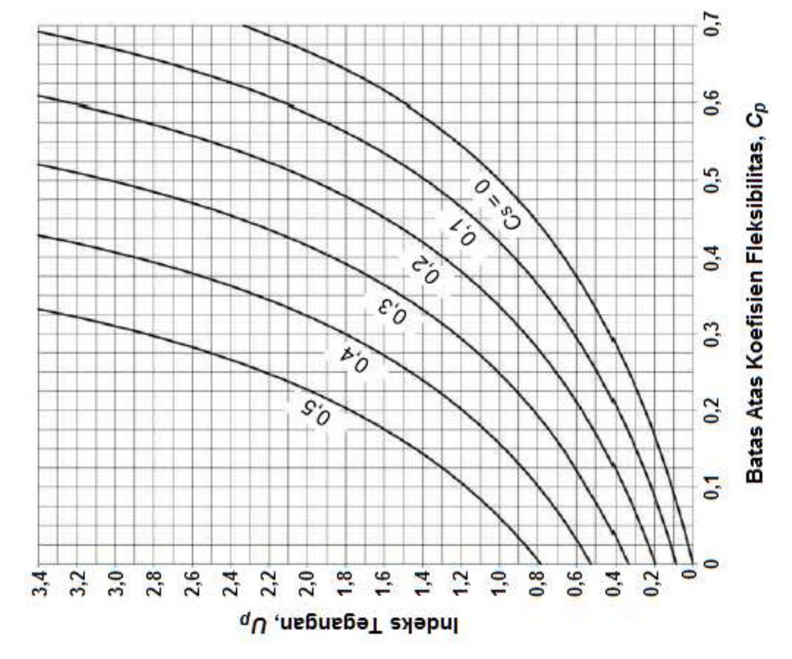

Gambar A-2.1 Pembatas Koefisien Fleksibilitas untuk Sistem Primer

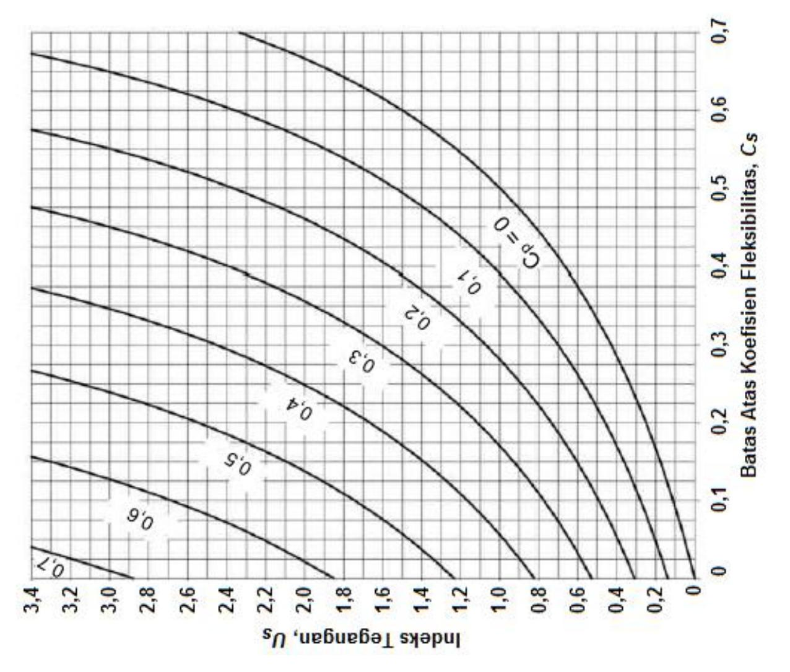

Gambar A-2.2 Pembatasan Koefisien Fleksibilitas untuk Sistem Sekunder

#### **LAMPIRAN 3 FATIK**

Lampiran ini berlaku untuk komponen struktur dan sambungan yang memikul pembebanan siklus tinggi di dalam rentang elastis tegangan pada frekuensi dan besaran yang cukup untuk inisiasi retak dan kegagalan progresif.

**Catatan Pengguna:** Lihat ANSI/AISC 341untuk struktur yang memikul beban seismik.

Lampiran ini disusun sebagai berikut:

- 3.1. Ketentuan Umum
- 3.2. Perhitungan Tegangan Maksimum dan Rentang Tegangan
- 3.3. Material Polos dan Joint Dilas
- 3.4. Baut dan Bagian yang Berulir
- 3.5. Persyaratan Pabrikasi dan Ereksi untuk Fatik
  - 3.6. Persyaratan Eksaminasi Nondestruktif untuk Fatik

#### **3.1. KETENTUAN UMUM**

Ketahanan fatik komponen struktur yang terdiri dari profil atau pelat harus ditentukan apabila jumlah siklus penerapan beban hidup melebihi 20.000. Evaluasi ketahanan fatik komponen struktur yang terdiri dari PSR pada stuktur tipe bangunan gedung yang memikul beban angin yang ditentukan dari peraturan tidak diperlukan. Apabila rentang tegangan siklus yang diterapkan kurang dari rentang tegangan izin ambang, *FTH*, evaluasi lebih lanjut ketahanan fatik tidak diperlukan. Lihat Tabel A-3.1.

Penanggungjawab perancangan harus memberi detail lengkap yang mencakup ukuran las atau harus mensyaratkan umur siklus terencana dan rentang momen, geser, dan reaksi maksimum untuk sambungan.

Ketentuan Lampiran ini harus berlaku pada tegangan-tegangan yang dihitung atas dasar spektrum beban siklus yang diterapkan. Tegangan izin maksimum akibat beban siklus puncak harus 0,66 *Fy* . Pada kasus tegangan bolak-balik, rentang tegangan harus dihitung sebagai jumlah numerik tegangan tekan dan tarik berulang maksimum atau jumlah numerik tegangan geser maksimum arah berlawanan pada titik inisiasi retak yang mungkin.

Ketahanan beban siklus yang ditentukan dari ketentuan Lampiran ini berlaku untuk struktur dengan perlindungan korosi yang memadai atau hanya mengalami atmosfir korosi menengah, misalnya kondisi atmosfir normal.

Ketahanan beban siklus yang ditentukan dengan ketentuan Lampiran ini hanya berlaku untuk struktur yang memikul temperatur tidak melebihi 300°F (150°C).

#### **3.2. PERHITUNGAN TEGANGAN MAKSIMUM DAN RENTANG TEGANGAN**

Tegangan yang dihitung harus berdasarkan analisis elastis. Tegangan tidak boleh diperbesar dengan faktor konsentrasi tegangan untuk diskontinu geometris.

**© BSN 2020 194 dari 254** 

Untuk baut dan batang berulir yang memikul tarik aksial, tegangan terhitung harus mencakup efek aksi ungkit, jika ada. Dalam kasus kombinasi tegangan aksial dan lentur, tegangan maksimum setiap jenis harus ditentukan untuk pengaturan bersamaan beban yang diterapkan.

Untuk komponen struktur yang memiliki penampang melintang simetris, pengencang dan las harus diatur secara simetris terhadap sumbu komponen struktur tersebut, atau tegangan total termasuk akibat eksentrisitas harus dicakup dalam perhitungan rentang tegangan.

Untuk komponen struktur siku yang dibebani secara aksial dengan pusat gravitasi las penghubung berada di antara garis pusat gravitasi penampang melintang siku dan pusat kaki yang disambung, efek eksentrisitas harus diabaikan. Jika pusat gravitasi las penyambung berada di luar zona ini, tegangan total, yang mencakup akibat eksentrisitas joint, harus tercakup dalam perhitungan rentang tegangan.

#### **3.3 MATERIAL POLOS DAN JOINT DILAS**

Pada material polos dan joint dilas, rentang tegangan akibat beban siklik yang diterapkan tidak boleh melebihi rentang tegangan izin yang dihitung sebagai berikut.

(a) Untuk kategori teganganA, B, B', C, D, E, dan E', rentang tegangan izin, *FSR*, harus ditentukan dengan Persamaan A-3-1 atau A-3-1M, sebagai berikut:

$$F_{SR} = 1.000 \left(\frac{C_f}{n_{SR}}\right)^{0.333} \ge F_{TH}$$
 (A-3-1)

$$F_{SR}$$
=6.900  $\left(\frac{C_f}{n_{SR}}\right)^{0.333} \ge F_{TH}$  (A-3-1M)

dengan

*Cf* = konstanta dari Tabel A-3.1 untuk kategori fatik

*Fsr* = rentang tegangan izin, ksi (MPa)

*FTH* = rentang tegangan izin ambang, rentang tegangan maksimum untuk

umur desain tak terhinggadari Tabel A-3.1, ksi (MPa)

*nsr* = jumlah fluktuasi rentang tegangan pada umur desain

(b) Untuk kategori tegangan F, rentang tegangan izin, *FSR*, harus ditentukan dengan Persamaan A-3-2 atau A-3-2M sebagai berikut:

$$F_{SR} = 100 \left(\frac{1.5}{n_{SR}}\right)^{0.167} \ge 8 \text{ ksi}$$
 (A-3-2)

$$F_{SR}$$
=690  $\left(\frac{1.5}{n_{SR}}\right)^{0.167} \ge 55 \text{ MPa}$  (A-3-2M)

(c) Untuk elemen pelat yang dibebani tarik yang disambungkan pada ujungnya dengan profil silang, T atau detail pojok dengan las gruv penetrasi joint parsial (PJP) transversal terhadap arah tegangan, dengan atau tanpa las filet penguat atau berkontur, jika dihubungkan dengan las filet, rentang tegangan izin pada penampang melintang elemen pelat yang dibebani tarik harus ditentukan sebagai terkecil dari yang berikut ini:

**© BSN 2020 195 dari 254** 

- (1) Berdasarkan inisiasi retak dari *toe* las tersebut pada elemen pelat yang dibebani tarik (yaitu, apabila  $R_{PJP}$ = 1,0), rentang tegangan izin,  $F_{SR}$ , harus ditentukan dengan Persamaan A-3-1 atau Persamaan A-3-1M untuk kategori tegangan C.
- (2) Berdasarkan inisiasi retak dari akar las tersebut, rentang tegangan izin,  $F_{SR}$ , pada elemen pelat yang dibebani tarik menggunakan las gruv penetrasi joint parsial (PJP) transversal, dengan atau tanpa las filet penguat atau berkontur, rentang tegangan izin pada penampang melintang pada akar las tersebut harus ditentukan dengan Persamaan A-3-3 atau Persamaan A-3-3M, untuk kategori tegangan C' sebagai berikut:

$$F_{SR}$$
=1.000  $R_{PJP} \left(\frac{4.4}{n_{SR}}\right)^{0.333}$  (A-3-3)

$$F_{SR}$$
=6.900  $R_{PJP} \left(\frac{4,4}{n_{SR}}\right)^{0,333}$  (A-3-3M)

dengan

*R*PJP, faktor reduksi untuk las gruv PJP transversal yang diperkuat atau tanpa diperkuat, ditentukan sebagai berikut:

$$R_{PJP} = \frac{0.65 - 0.59 \left(\frac{2a}{t_p}\right) + 0.72 \left(\frac{w}{t_p}\right)}{t_p^{0.167}} \le 1.0$$
 (A-3-4)

$$R_{PJP} = \frac{1,12-1,01\left(\frac{2a}{t_p}\right) + 1,24\left(\frac{w}{t_p}\right)}{t_p^{0,167}} \le 1,0 \tag{A-3-4M}$$

2a = panjang muka akar nondilas dalam arah tebal pelat yang dibebani tarik, in. (mm)

 $t_p$  = tebal pelat yang dibebani tarik, in. (mm)

 w = ukuran kaki las filet penguat atau berkontur, jika ada, dalam arah tebal pelat yang dibebani tarik, in. (mm)

Jika  $R_{PJP}$ =1,0, rentang tegangan akan dibatasi oleh *toe* las tersebut dan kategori C akan mengontrolnya.

(3) Berdasarkan inisiasi retak dari akar tersebut pada sepasang las filet transversal pada sisi berlawanan elemen pelat yang dibebani tarik, rentang tegangan izin,  $F_{SR}$ , pada penampang melintang di akar las tersebut harus ditentukan dengan Persamaan A-3-5 atau Persamaan A-3-5M, untuk kategori tegangan C" sebagai berikut:

$$F_{SR}$$
=1.000  $R_{FIL} \left(\frac{4,4}{n_{SR}}\right)^{0,333}$  (A-3-5)

$$F_{SR}$$
=6.900  $R_{FIL} \left(\frac{4,4}{n_{SR}}\right)^{0,333}$  (A-3-5M)

dengan

*RFIL* = faktor reduksi untuk joint yang menggunakan hanya sepasang las filet transversal

$$= \frac{0.06 + 0.72 \left(w / t_p\right)}{t_p^{0.167}} \le 1.0$$
 (A-3-6)

$$= \frac{0,103 + 1,24 (w/t_p)}{t_p^{0,167}} \le 1,0$$
 (A-3-6M)

Jika *RFIL*= 1,0, rentang tegangan akan dibatasi oleh toe las tersebut dan kategori C akan mengontrolnya.

**Catatan Pengguna:** Kategori tegangan C′ dan C′′ adalah kasus-kasus yang mana retak fatik berawal di akar las. Kasus-kasus ini tidak memiliki ambang fatik dan tidak dapat didesain untuk umur yang tak terhingga. Umur tak terhingga dapat diperkirakan dengan menggunakan umur siklus yang sangat tinggi seperti 2 × 108 . Sebagai alternatif, jika ukuran las ditingkatkan sehingga *RFIL*atau*RPJP* sama dengan 1,0, logam dasar akan mengontrol, dan menghasilkan kategori tegangan C, yang mana ada ambang fatik dan retak berawal pada toe las tersebut.

#### **3.4. BAUT DAN BAGIAN YANG BERULIR**

Pada baut dan bagian yang berulir, rentang tegangan pada beban siklus yang diterapkan tidak boleh melebihi rentang tegangan izin yang dihitung sebagai berikut.

- (a) Untuk sambungan yang dikencangkan secara mekanisyang dibebani geser, rentang maksimum tegangan pada material tersambung tersebut pada beban siklus yang diterapkan tidak boleh melebihi rentang tegangan izin yang dihitung menggunakan Persamaan A-3-1 atau Persamaan A-3-1M, dengan*Cf* dan *FTH* diambil dari Bagian 2 di dalam Tabel A-3.1.
- (b) Untuk baut kekuatan tinggi, baut biasa, batang angkur berulir, dan batang penggantung dengan ulir yang dipotong, digerinda, atau digilas, rentang maksimum tegangan tarik pada area tarik neto dari beban aksial dan momen yang diterapkan ditambah beban akibat aksi ungkit tidak boleh melebihi rentang tegangan izin yang dihitung menggunakan Persamaan A-3-1 atau Persamaan A-3-1M, dengan*Cf*and FTH diambil dari Kasus 8.5 (kategori tegangan G). Luas tarik neto, *At* , diberikan dalam Persamaan A-3-7 atau Persamaan A-3-7M.

$$A_t = \frac{\pi}{4} \left( d_b - \frac{0.9743}{n} \right)^2 \tag{A-3-7}$$

$$A_t = \frac{\pi}{4} (d_b - 0.9382 \text{ p})^2$$
 (A-3-7M)

dengan

*db* = diameter nominal (diameter badan atau diameter tanpa ulir), in. (mm)

n = ulir per in. (ulir per mm)

p = pitch, in. per ulir (mm per ulir)

Untuk joint dengan material di dalam pegangan tidak dibatasi untuk baja atau joint yang tidak mengalami tarik pada persyaratan Tabel J3.1 atau Tabel J3.1M, semua beban aksial dan momen yang diterapkan pada joint ditambah efek aksi ungkit harus diasumsikan hanya dipikul oleh baut atau batang.

Untuk joint yang material di dalam pegangan dibatasi untuk baja dan diberi pratarik sesuai persyaratan Tabel J3.1 atau Tabel J3.1M, analisis kekakuan relatif pada bagian

**© BSN 2020 197 dari 254** 

yang disambung dan baut boleh digunakan untuk menentukan rentang tegangan tarik pada baut pratarik akibat momen dan beban siklus total yang diterapkan, ditambah efek aksi ungkit. Sebagai alternatif, rentang tegangan pada baut tersebut harus diasumsikan sama dengan tegangan pada area tarik neto akibat 20% dari nilai mutlak momen dan beban aksial siklus yang diterapkan dari beban mati, beban hidup, dan beban lain.

#### **3.5. PERSYARATAN PABRIKASI DAN EREKSI UNTUK FATIK**

Pendukung baja longitudinal, jika digunakan, harus menerus. Jika pensplaisan pendukung baja diperlukan untuk joint panjang, splais harus dibuat dengan las gruv penetrasi joint komplet (PJK), gerinda rata agar memungkinkan rapat pas. Jika las filet digunakan untuk memasang pendukung longitudinal ditinggalkan di tempat, las filet tersebut harus menerus.

Pada joint sudut dan joint T yang dilas gruv PJK secara tranversal, las filet penguat, yang ukurannya tidak boleh kurang dari 1 /4 in. (6 mm), harus ditambahkan pada pojok reentrant.

Kekasaran permukaan tepi pemotongan termal yang memikul rentang tegangan siklik, termasuk gaya tarik, tidak boleh melebihi 1.000μin (25μm), denganSurface Texture, Surface Roughness, Waviness, and Lay (ASME B46.1) merupakan standar acuan.

**Catatan Pengguna:** Sampel 3 AWS C4.1 dapat digunakan untuk mengevaluasi kesesuaian dengan persyaratan ini.

Pojokreentrant pada pemotongan, lubang akses las, dan copes harus membentuk radius yang tidak kurang dari radius yang dijelaskan pada Tabel A-3.1 dengan prapemboran atau subpons dan pembesaran lubang, atau dengan pemotongan termal untuk membentuk radius pemotongan tersebut.

Untuk jointbutt transversal dalam daerah tegangan tarik, tablas harus digunakan untuk memberi penghentian las yang berjenjang tersebut di luar joint sudah terhenti. End dam tidak boleh digunakan. Las tab harus dibongkar dan ujung las rata dengan tepi pada komponen struktur tersebut.

Las filet yang memikul beban siklik tegak lurus kaki outstanding profil siku atau di tepi terluar pelat ujung harus memiliki belokan ujung di pojok tersebut untuk sepanjang tidak kurang dari dua kali ukuran las tersebut; panjang belokan ujung tersebut tidak boleh melebihi empat kali ukuran las tersebut.

#### **3.6. PERSYARATAN EKSAMINASI NONDESTRUKTIF UNTUK FATIK**

Pada kasus las gruv PJK, rentang tegangan izin maksimum yang dihitung dengan Persamaan A-3-1 atau Persamaan A-3-1M hanya berlaku untuk las yang telah diuji secara ultrasonik atau radiografik dan memenuhi persyaratan penerimaan pada ayat 6.12.2 atau ayat 6.13.2 Structural Welding Code*—*Steel (AWS D1.1/D1.1M).

**© BSN 2020 198 dari 254** 

**TABEL A-3.1 Parameter Desain Fatik** 

| Deskripsi                                                                                                                                                                                                                                                                                                   | Kategori Tegangan | Konstanta Cf | Ambang FTH, ksi (MPa) | Titik Inisiasi Retak Potensial                       |  |  |
|-------------------------------------------------------------------------------------------------------------------------------------------------------------------------------------------------------------------------------------------------------------------------------------------------------------|----------------------|-----------------|--------------------------------|---------------------------------------------------------|--|--|
| BAGIAN 1 – MATERIAL DASAR JAUH DARI PENGELASAN                                                                                                                                                                                                                                                              |                      |                 |                                |                                                         |  |  |
| 1.1 Logam dasar, kecuali baja yang mengalami pelapukan tanpa pelapis, dengan permukaan gilas atau permukaan yang dibersihkan; Tepi pemotongan api (flame-cut) dengan nilai kekasaran permukaan sebesar 1.000 μin. (25 μm) atau kurang, tetapi tanpa pojok reentrant. | A                    | 25              | 24 (165)                    | Jauh dari semua las atau sambungan struktural     |  |  |
| 1.2 Logam dasar baja yang mengalami pelapukan tanpa pelapis dengan permukaan gilas atau permukaan dibersihkan; Tepi pemotongan api dengan nilai kekasaran permukaan sebesar 1.000 μin. (25 μm) atau kurang, tetapi tanpa pojok reentrant.             | B                    | 12              | 16 (110)                    | Jauh dari semua las atau sambungan struktural     |  |  |
| 1.3 Komponen struktur dengan pojok reentrant pada copes, potongan, block outs, atau diskontinu geometrikal lain, kecuali lubang akses las.                                                                                                                                                         |                      |                 |                                | Pada tepi eksternal atau pada perimeter lubang    |  |  |
| R ≥ 1 in. (25 mm), dengan radius, R, yang dibentuk dengan prapemboran, subpons dan dengan pelebaran atau pemotongan termal dan digerinda menjadi logam bersih                                                                                                                          | C                    | 4,4             | 10 (69)                     |                                                         |  |  |
| R ≥ 3 /8 in. (10 mm) dan radius, R,tidak perlu digerinda menjadi logam bersih                                                                                                                                                                                                                         | E'                   | 0,39            | 2,6 (18)                    |                                                         |  |  |
| 1.4 Penampang melintang gilas dengan lubang akses las yang dibuat sesuai persyaratan Pasal J1.6                                                                                                                                                                                                 |                      |                 |                                | Pada pojok reentrant lubang akses las                |  |  |
| Lubang akses R ≥ 1 in. (25 mm) dengan radius, R, yang dibentuk dengan prapemboran, subpons, dan pelebaran atau pemotongan secara termal dan digerinda menjadi logam bersih                                                                                                          | C                    | 4,4             | 10 (69)                     |                                                         |  |  |
| Lubang akses R ≥ 3 /8 in. (10 mm) dan radius, R, tidak perlu dan digerinda menjadi logam bersih                                                                                                                                                                                                    | E'                   | 0,39            | 2,6 (18)                    |                                                         |  |  |
| 1.5 Komponen struktur dengan lubang dibor atau dibesarkan                                                                                                                                                                                                                                                |                      |                 |                                | Pada penampang neto yang bermula pada sisi lubang |  |  |
| Lubang yang terdiri dari baut pratarik                                                                                                                                                                                                                                                                      | C                    | 4,4             | 10 (69)                     |                                                         |  |  |
| Lubang-lubang terbuka tanpa baut                                                                                                                                                                                                                                                                            | D                    | 2,2             | 7 (48)                      |                                                         |  |  |

**© BSN 2020 199 dari 254** 

**TABEL A-3.1 (lanjutan) Parameter Desain Fatik** 

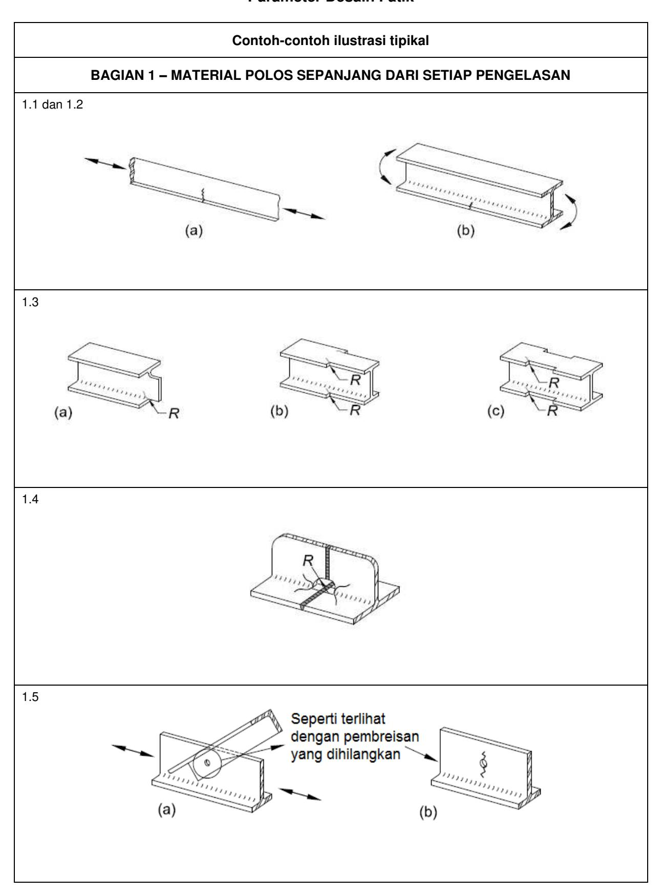

**© BSN 2020 200 dari 254** 

#### **TABEL A-3.1 (lanjutan) Parameter Desain Fatik**

| Deskripsi                                                                                                                                                                                                                | Kategori Tegangan | Konstanta Cf | Ambang FTH, ksi (MPa) | Titik Inisiasi Retak Potensial                       |
|--------------------------------------------------------------------------------------------------------------------------------------------------------------------------------------------------------------------------|----------------------|-----------------|--------------------------------|---------------------------------------------------------|
| BAGIAN 2 – MATERIAL YANG DISAMBUNG PADA JOINT YANG DIKENCANGKAN                                                                                                                                                          | SECARA MEKANIKAL     |                 |                                |                                                         |
| 2.1 Luas bruto logam dasar pada joint lewatan disambung dengan baut kekuatan tinggi pada joint yang memenuhi semua persyaratan untuk sambungan kritis selip.                                                 | B                    | 12              | 16 (110)                    | Melalui penampang bruto dekat lubang                 |
| 2.2 Logam dasar penampang neto joint dengan baut kekuatantinggi, yang didesain berdasarkan ketahanan tumpu, tetapi dipabrikasi dan diinstal sesuai dengan semua persyaratan untuk sambungan kritis selip. | B                    | 12              | 16 (110)                    | Pada penampang neto yang bermula pada sisi lubang |
| 2.3 Logam dasar pada penampang neto joint yang berkeling.                                                                                                                                                             | C                    | 4,4             | 10 (69)                     | Pada penampang neto yang bermula pada sisi lubang |
| 2.4 Logam dasar pada penampang neto kepala eyebar atau pelat pin.                                                                                                                                                     | E                    | 1,1             | 4,5 (31)                    | Pada penampang neto yang bermula pada sisi lubang |

**© BSN 2020 201 dari 254** 

#### **TABEL A-3.1 (lanjutan) Parameter Desain Fatik**

#### **Contoh-contoh ilustrasi tipikal**

#### **BAGIAN 2 – MATERIAL TERSAMBUNG DALAM JOINT FASTENED MEKANIKAL**

2.1

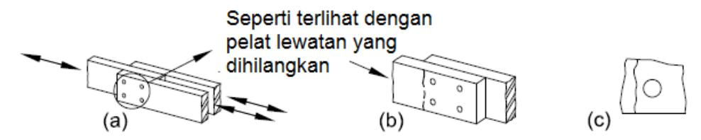

(Catatan : Gambar adalah untuk sambungan dibaut kritis selip)

2.2

(Catatan : Gambar adalah untuk sambungan dibaut yang didesain untuk memikul, memenuhi persyaratan kritis selip)

2.3

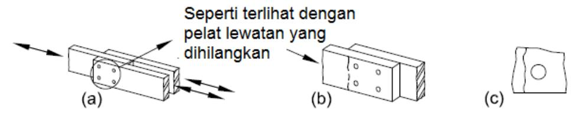

(Catatan : Gambar adalah untuk baut snug-tightened, paku keling, atau sarana penyambung mekanikal lainnya)

2.4

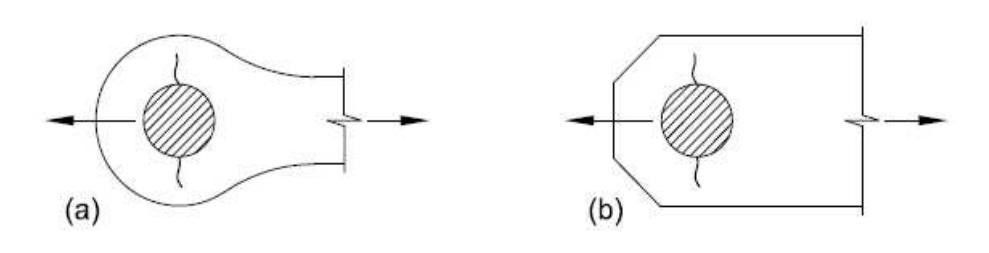

**© BSN 2020 202 dari 254** 

#### **TABLE A-3.1 (lanjutan) Parameter Desain Fatik**

| Deskripsi                                                                                                                                                                                                                                                               | Kategori Tegangan | Konstanta Cf | Ambang FTH, ksi (MPa) | Titik Inisiasi Retak Potensial                                                                     |  |  |
|-------------------------------------------------------------------------------------------------------------------------------------------------------------------------------------------------------------------------------------------------------------------------|----------------------|-----------------|--------------------------------|-------------------------------------------------------------------------------------------------------|--|--|
| BAGIAN 3 – JOINT DILAS YANG MENGHUBUNGKAN KOMPONEN PADA KOMPONEN STRUKTUR TERSUSUN                                                                                                                                                                                   |                      |                 |                                |                                                                                                       |  |  |
| 3.1 Logam dasar dan logam las pada komponen struktur pelat atau profil tersusun tanpa elemen tambahan, tersambung dengan las gruv PJK longitudinal menerus, dicungkil, dan dilas kembali dari kedua sisi, atau dengan las filet menerus.              | B                    | 12              | 16 (110)                    | Dari permukaan atau diskontinuitas internal dalam las                                           |  |  |
| 3.2 Logam dasar dan logam las pada komponen struktur pelat atau profil tersusun tanpa elemen tambahan, tersambung dengan las gruv PJK longitudinal menerus dengan pendukung baja menerus ditinggalkan di tempat, atau dengan las gruv PJP menerus. | B'                   | 6,1             | 12 (83)                     | Dari permukaan atau diskontinuitas internal dalam las                                           |  |  |
| 3.3 Logam dasar di ujung las longitudinal yang berakhir di lubang akses las pada komponen struktur tersusun yang disambung, serta toe las pada las filet yang membungkus ujung lubang akses las.                                                         |                      |                 |                                | Dari penghentian las ke badan atau sayap                                                           |  |  |
| Lubang akses R ≥ 1 in. (25 mm) dengan radius, R, dibentuk dengan prapemboran, subpons dan dibesarkan, atau pemotongan secara termal dan digerinda menjadi logam bersih.                                                                                     | D                    | 2,2             | 7 (48)                      |                                                                                                       |  |  |
| Lubang akses R ≥ 3 /8 in. (10 mm) dan radius, R, tidak perlu digerinda menjadi logam bersih.                                                                                                                                                                   | E'                   | 0,39            | 2,6 (18)                    |                                                                                                       |  |  |
| 3.4 Logam dasar pada ujung dari segmen las filet berselang-seling longitudinal.                                                                                                                                                                                   | E                    | 1,1             | 4,5 (31)                    | Pada material yang disambung di lokasi mulai dan stop pada las apapun                        |  |  |
| 3.5 Logam dasar pada ujung panjang parsial pelat penutup berlas lebih sempit dari sayap yang memiliki ujung berbentuk kubus atau meruncing, dengan atau tanpa las melewati ujung.                                                                           |                      |                 |                                | Pada sayap di toe ujung las (apabila ada) atau pada sayap di penghentian las longitudinal |  |  |
| tf≤ 0,8 in. (20 mm)                                                                                                                                                                                                                                                     | E                    | 1,1             | 4,5 (31)                    |                                                                                                       |  |  |
| tf> 0,8 in. (20 mm) dengan                                                                                                                                                                                                                                           | E'                   | 0,39            | 2,6 (18)                    |                                                                                                       |  |  |
| = tebal sayap komponen struktur, tf in. (mm)tf                                                                                                                                                                                                                    |                      |                 |                                |                                                                                                       |  |  |

**© BSN 2020 203 dari 254** 

**TABEL A-3.1 (lanjutan) Parameter Desain Fatik** 

# **Contoh-contoh ilustrasi tipikal BAGIAN 3 – JOINT DILAS YANG MENGHUBUNGKAN KOMPONEN PADA KOMPONEN STRUKTUR TERSUSUN** 3.1 3.2 3.3 3.4 3.5

**© BSN 2020 204 dari 254** 

#### **TABLE A-3.1 (lanjutan) Parameter Desain Fatik**

|                                                                                                                                                                                                                                    |                      |                 | Ambang               |                                                                                                   |
|------------------------------------------------------------------------------------------------------------------------------------------------------------------------------------------------------------------------------------|----------------------|-----------------|----------------------|---------------------------------------------------------------------------------------------------|
| Deskripsi                                                                                                                                                                                                                          | Kategori Tegangan | Konstanta Cf | FTH, ksi (MPa) | Titik Inisiasi Retak Potensial                                                                 |
| BAGIAN 3 – JOINT DILAS YANG MENGHUBUNGKAN KOMPONEN PADA KOMPONEN                                                                                                                                                                   | STRUKTUR TERSUSUN    |                 |                      |                                                                                                   |
| 3.6 Logam dasar pada ujung panjang parsial pelat penutup atau elemen tambahan dilas yang lebih lebar dari sayap tersebut dengan las melewati ujung.                                                        |                      |                 |                      | Pada sayap di toe pada las ujung atau pada sayap di penghentian las longitudinal atau |
| tf≤ 0,8 in. (20 mm)                                                                                                                                                                                                                | E                    | 1,1             | 4,5 (31)          | pada tepi sayap                                                                                   |
| tf>0,8 in. (20 mm)                                                                                                                                                                                                                 | E'                   | 0,39            | 2,6 (18)          |                                                                                                   |
| 3.7 Logam dasar pada ujung panjang parsial pelat penutup yang lebih lebar dari sayap tersebut tanpa las melalui ujung                                                                                                     |                      |                 |                      | Pada tepi sayap di ujung las pelat penutup                                                  |
| tf≤ 0,8 in. (20 mm)                                                                                                                                                                                                                | E'                   | 0,39            | 2,6 (18)          |                                                                                                   |
| tf>0,8 in. (20 mm) tidak diizinkan                                                                                                                                                                                                 | Tidak ada            | -               | -                    |                                                                                                   |
| BAGIAN 4 – SAMBUNGAN UJUNG BERLAS FILET LONGITUDINAL                                                                                                                                                                               |                      |                 |                      |                                                                                                   |
| 4.1 Logam dasar pada pertemuan komponen struktur yang dibebani secara aksial dengan sambungan ujung berlas longitudinal; Las ada di setiap sisi sumbu komponen struktur tersebut untuk menyeimbangkan tegangan las. |                      |                 |                      | Mulai dari ujung penghentian las memanjang ke logam dasar                                |
| tf≤ 0,5 in. (13 mm)                                                                                                                                                                                                                | E                    | 1,1             | 4,5 (31)          |                                                                                                   |
| tf>0,5 in. (13 mm) dengan tf = tebal komponen struktur yang disambung, seperti ditunjukkan dalam gambar kasus 4.1, in. (mm)                                                                                      | E'                   | 0,39            | 2,6 (18)          |                                                                                                   |

**© BSN 2020 205 dari 254** 

**TABEL A-3.1 (lanjutan) Parameter Desain Fatik** 

# **Contoh-contoh ilustrasi tipikal BAGIAN 3 – JOINT DILAS YANG MENGHUBUNGKAN KOMPONEN PADA KOMPONEN STRUKTUR TERSUSUN (lanjutan)** 3.6 3.7 **BAGIAN 4 –SAMBUNGAN UJUNG BERLAS FILET LONGITUDINAL** 4.1

**© BSN 2020 206 dari 254** 

#### **TABLE A-3.1 (lanjutan) Parameter Desain Fatik**

| Deskripsi                                                                                                                                                                                                                                                                                                                                                                               | Kategori Tegangan | Konstanta Cf | Ambang FTH, ksi (MPa) | Titik Inisiasi Retak Potensial                                                                                                    |
|-----------------------------------------------------------------------------------------------------------------------------------------------------------------------------------------------------------------------------------------------------------------------------------------------------------------------------------------------------------------------------------------|----------------------|-----------------|--------------------------------|--------------------------------------------------------------------------------------------------------------------------------------|
| PASAL 5 – JOINT LAS TRANSVERSAL TERHADAP ARAH TEGANGAN                                                                                                                                                                                                                                                                                                                                  |                      |                 |                                |                                                                                                                                      |
| 5.1 Logam las dan logam dasar pada atau yang bersebelahan dengan splais berlas gruv PJK pada pelat, profil gilas, atau penampang melintang tersusun tanpa perubahan penampang melintang dengan las yang digerinda yang pada dasarnya paralel dengan arah tegangan dan diinspeksi sesuai dengan Bagian 3.6                                                       | B                    | 12              | 16 (110)                    | Dari diskontinuitas internal pada logam las atau sepanjang batas fusi                                                       |
| 5.2 Logam las dan logam dasar pada atau yang bersebelahan dengan splais berlas gruv PJK dengan las yang digerinda yang pada dasarnya paralel terhadap arah tegangan pada transisi dalam tebal atau lebar yang dibuat pada kemiringan tidak lebih besar dari 1:21 /2 dan diinspeksi sesuai dengan Bagian 3.6                                                  |                      |                 |                                | Dari diskontinuitas internal pada logam atau sepanjang batas fusi atau di awal transisi apabila Fy ≥ 90 ksi (620 MPa) |
| Fy< 90 ksi (620 MPa)                                                                                                                                                                                                                                                                                                                                                                    | B                    | 12              | 16 (110)                    |                                                                                                                                      |
| Fy≥ 90 ksi (620 MPa)                                                                                                                                                                                                                                                                                                                                                                    | B'                   | 6,1             | 12 (83)                     |                                                                                                                                      |
| 5.3 Logam dasar dan logam las pada atau yang bersebelahan dengan splais berlas gruv PJK dengan las yang digerinda yang pada dasarnya paralel terhadap arah tegangan pada transisi dalam lebar yang dibuat pada radius, R, tidak boleh kurang dari 24 in. (600 mm) dengan titik singgung pada ujung las gruv tersebut dan diinspeksi sesuai dengan Bagian 3.6 | B                    | 12              | 16 (110)                    | Dari diskontinuitas internal pada logam las atau sepanjang batas fusi                                                       |
| 5.4 Logam las dan logam dasar pada atau yang bersebelahan dengan las gruv PJK pada joint T atau joint pojok atau splais, tanpa transisi pada tebal atau dengan transisi pada tebal yang memiliki kemiringan tidak lebih besar dari 1:21 /2, apabila penguat las tidak dibongkar, dan diinspeksi sesuai dengan Bagian 3.6                                        | C                    | 4,4             | 10 (69)                     | Dari las yang memanjang ke logam dasar atau ke logam las                                                                    |

**© BSN 2020 207 dari 254** 

**TABEL A-3.1 (lanjutan) Parameter Desain Fatik** 

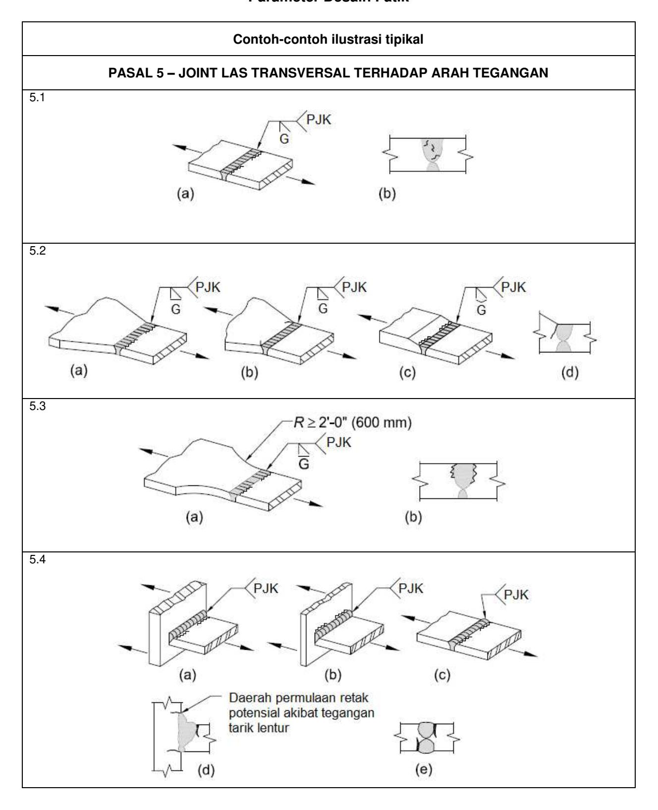

**© BSN 2020 208 dari 254** 

#### **TABLE A-3.1 (lanjutan) Parameter Desain Fatik**

|                                                                                                                                                                                                                                                                                                                             |                      |                                                         | Ambang               |                                                                                        |
|-----------------------------------------------------------------------------------------------------------------------------------------------------------------------------------------------------------------------------------------------------------------------------------------------------------------------------|----------------------|---------------------------------------------------------|----------------------|----------------------------------------------------------------------------------------|
| Deskripsi                                                                                                                                                                                                                                                                                                                   | Kategori Tegangan | Konstanta Cf                                         | FTH, ksi (MPa) | Titik Inisiasi Retak Potensial                                                      |
| PASAL 5 – JOINT LAS TRANSVERSAL TERHADAP ARAH TEGANGAN                                                                                                                                                                                                                                                                      |                      |                                                         |                      |                                                                                        |
| 5.5 Logam dasar dan logam las pada atau bersebelahan dengan splais butt berlas gruv PJK transversal dengan pendukung yang ditinggal di tempat                                                                                                                                                                      |                      |                                                         |                      | Dari toe las gruv atau toe las tersebut yang melampirkan pendukung apabila    |
| Las titik di dalam las gruv                                                                                                                                                                                                                                                                                                 | D                    | 2,2                                                     | 7 (48)            | dapat digunakan                                                                        |
| Las titik di luar las gruv dan tidak lebih dekat dari 1 /2 in. (13 mm) ke tepi logam dasar                                                                                                                                                                                                                         | E                    | 1,1                                                     | 4,5 (31)          |                                                                                        |
| 5.6 Logam dasar dan logam las pada sambungan ujung transversal elemen pelat yang dibebani gaya tarik yang menggunakan las gruv PJP pada butt atau joint T atau joint pojok, dengan las filet penguat atau berkontur; FSR harus terkecil dari retak toe tersebut atau rentang tegangan izin retak akar. |                      |                                                         |                      |                                                                                        |
| Retak yang berawal dari toe las:                                                                                                                                                                                                                                                                                            | C                    | 4,4                                                     | 10 (69)           | Mulai dari toe las memanjang ke logam dasar                                      |
| Retak yang berawal dari akar las:                                                                                                                                                                                                                                                                                           | C'                   | Lihat Persamaan A-3-3 atau Persamaan A-3-3M | Tidak ada            | Mulai di akar las memanjang ke dan melalui las                                   |
| 5.7 Logam dasar dan logam las pada sambungan ujung transversal elemen pelat yang dibebani gaya tarik menggunakan sepasang las filet pada sisi berlawanan pelat tersebut. FSR harus terkecil dari retak toe atau rentang tegangan izin retak akar.                                             |                      |                                                         |                      |                                                                                        |
| Retak yang berawal dari toe las:                                                                                                                                                                                                                                                                                            | C                    | 4,4                                                     | 10 (69)           | Mulai dari toe las memanjang ke logam dasar                                      |
| Retak yang berawal dari akar las:                                                                                                                                                                                                                                                                                           | C'                   | Lihat Persamaan A-3-5 atau Persamaan A-3-5M | Tidak ada            | Mulai di akar las memanjang ke dan melalui las                                   |
| 5.8 Logam dasar elemen pelat yang dibebani tarik, dan pada profil tersusun dan badan atau sayap balok gilas di toe las filet transversal yang bersebelahan dengan pengaku transversal berlas                                                                                                                 | C                    | 4,4                                                     | 10 (69)           | Dari diskontinuitas geometrikal pada toelas filet memanjang ke logam dasar |

**© BSN 2020 209 dari 254** 

**TABEL A-3.1 (lanjutan) Parameter Desain Fatik** 

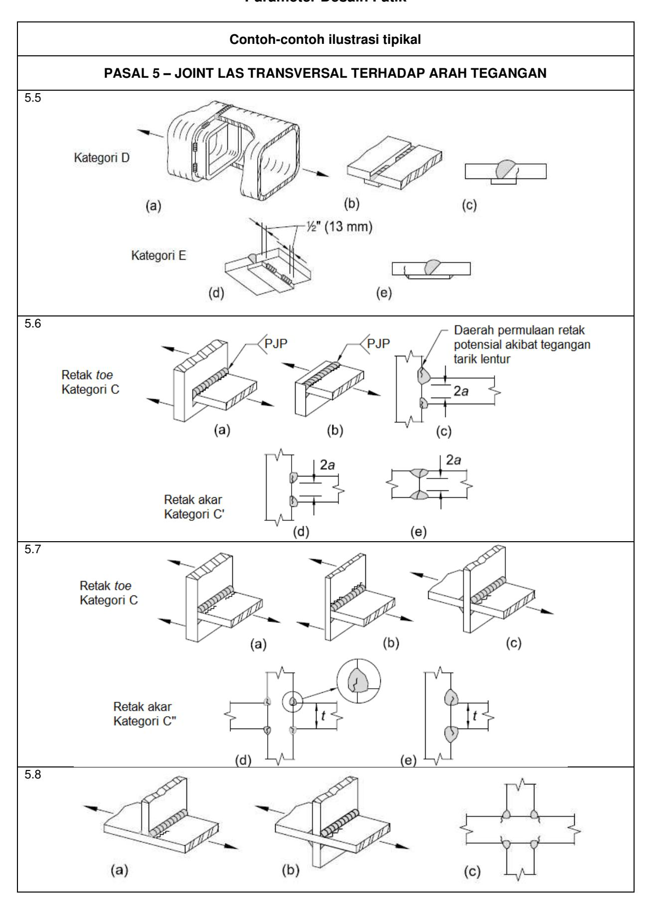

**© BSN 2020 210 dari 254** 

TABEL A-3.1 (lanjutan) Parameter Desain Fatik

| Deskripsi                                                                                                                                                                                                                                                                              | Kategori Tegangan | Konstanta C f | Ambang F TH , ksi (MPa) | Titik Inisiasi Retak Potensial                                |  |  |
|----------------------------------------------------------------------------------------------------------------------------------------------------------------------------------------------------------------------------------------------------------------------------------------|----------------------|-----------------------------|---------------------------------------------|------------------------------------------------------------------|--|--|
| PASAL 6 – LOGAM DASAR PADA SAMBUNGAN KOMPONEN STRUKTUR TRANSVERSAL BERLAS                                                                                                                                                                                                           |                      |                             |                                             |                                                                  |  |  |
| 6.1 Logam dasar pada ketebalan yang sama atau tidak sama pada detail-detail diikatkan dengan las-las gruv PJK yang hanya memikul beban longitudinal apabila detail berwujud radius transisi, <i>R</i> , dengan penghentian las gerinda halus dan diinspeksi sesuai dengan Pasal 3.6    |                      |                             |                                             | Titik singgung dekat radius di tepi komponen struktur      |  |  |
| R ≥ 24 in. (600 mm)                                                                                                                                                                                                                                                                    | В                    | 12                          | 16 (110)                                 |                                                                  |  |  |
| 6 in.≤ <i>R</i> <24 in. (150 mm ≤ <i>R</i> < 600 mm)                                                                                                                                                                                                                                | С                    | 4,4                         | 10 (69)                                  |                                                                  |  |  |
| 2 in. ≤ <i>R</i> <6 in. (50 mm ≤ <i>R</i> <150 mm)                                                                                                                                                                                                                                  | D                    | 2,2                         | 7 (48)                                   |                                                                  |  |  |
| R< 2 in. (50 mm)                                                                                                                                                                                                                                                                       | E                    | 1,1                         | 4,5 (31)                                 |                                                                  |  |  |
| 6.2 Logam dasar pada detail-detail ketebalan yang sama diikatkan dengan las gruv PJK, memikul beban transversal, dengan atau tanpa beban longitudinal, apabila detail berwujud radius transisi, <i>R</i> , dengan penghentian las gerinda halus dan diinspeksi sesuai dengan Pasal 3.6 |                      |                             |                                             |                                                                  |  |  |
| (a) Apabila perkuatan las dihilangkan                                                                                                                                                                                                                                                  |                      |                             |                                             | Titik singgung dekat                                             |  |  |
| <i>R</i> ≥ 24 in. (600 mm)                                                                                                                                                                                                                                                             | В                    | 12                          | 16 (110)                                 | radius atau pada las tersebut atau pada pembatas fusi atau |  |  |
| 6 in. ≤ <i>R</i> < 24 in. (150 mm ≤ <i>R</i> < 600 mm)                                                                                                                                                                                                                              | С                    | 4,4                         | 10 (69)                                  | komponen struktur atau attachment                             |  |  |
| 2 in. ≤ <i>R</i> < 6 in. (50 mm ≤ <i>R</i> < 150 mm)                                                                                                                                                                                                                                | D                    | 2,2                         | 7 (48)                                   |                                                                  |  |  |
| R< 2 in. (50 mm)                                                                                                                                                                                                                                                                       | E                    | 1,1                         | 4,5 (31)                                 |                                                                  |  |  |
| (b) Apabila perkuatan las tidak dihilangkan                                                                                                                                                                                                                                         |                      |                             |                                             | Pada toe las baik di sepanjang tepi                           |  |  |
| R≥6 in. (150 mm)                                                                                                                                                                                                                                                                       | С                    | 4,4                         | 10 (69)                                  | komponen struktur atau <i>attachment</i>                      |  |  |
| 2 in. ≤ <i>R</i> < 6 in. (50 mm ≤ <i>R</i> <150 mm)                                                                                                                                                                                                                                 | D                    | 2,2                         | 7 (48)                                   |                                                                  |  |  |
| <i>R</i> < 2 in. (50 mm)                                                                                                                                                                                                                                                               | E                    | 1,1                         | 4,5 (31)                                 |                                                                  |  |  |

© BSN 2020 211 dari 254

#### **TABEL A-3.1 (lanjutan) Parameter Desain Fatik**

#### **Contoh-contoh ilustrasi tipikal**

#### **PASAL 6 – LOGAM DASAR PADA SAMBUNGAN KOMPONEN STRUKTUR TRANSVERSAL BERLAS**

6.1

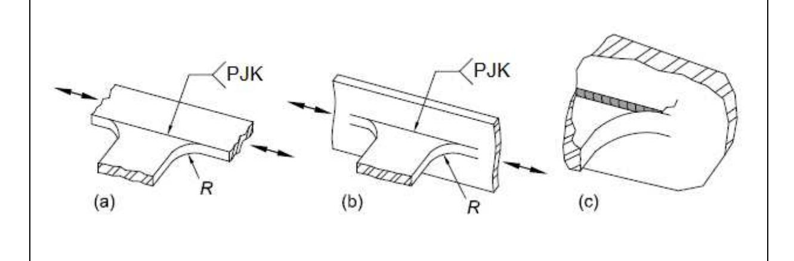

6.2

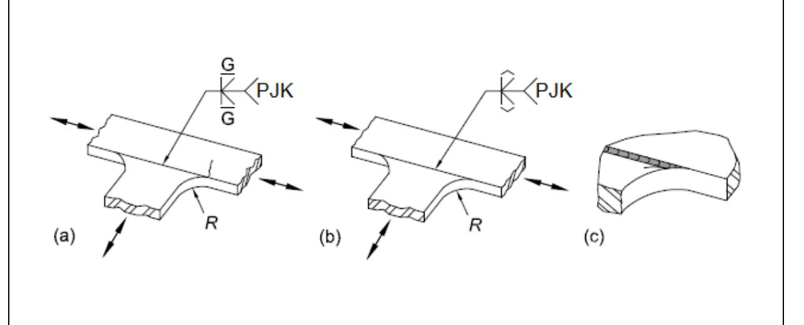

**© BSN 2020 212 dari 254** 

#### **TABLE A-3.1 (lanjutan) Parameter Desain Fatik**

| Deskripsi                                                                                                                                                                                                                                                                                                                                                                            | Kategori Tegangan | Konstanta Cf | Ambang FTH, ksi (MPa) | Titik Inisiasi Retak Potensial                                                                   |  |  |
|--------------------------------------------------------------------------------------------------------------------------------------------------------------------------------------------------------------------------------------------------------------------------------------------------------------------------------------------------------------------------------------|----------------------|-----------------|--------------------------------|-----------------------------------------------------------------------------------------------------|--|--|
| PASAL 6 – LOGAM DASAR PADA SAMBUNGAN KOMPONEN STRUKTUR TRANSVERSAL BERLAS                                                                                                                                                                                                                                                                                                         |                      |                 |                                |                                                                                                     |  |  |
| 6.3 Logam dasar pada detail dari ketebalan yang tidak sama diikatkan melalui las gruv PJK, memikul beban transversal, dengan atau tanpa beban longitudinal, apabila detail berwujud suatu radius transisi, R, dengan penghentian las gerinda halus dan sesuai dengan Pasal 3.6                                                          |                      |                 |                                |                                                                                                     |  |  |
| (a) Apabila perkuatan las dibongkar                                                                                                                                                                                                                                                                                                                                                  |                      |                 |                                |                                                                                                     |  |  |
| R> 2 in. (50 mm)                                                                                                                                                                                                                                                                                                                                                                     | D                    | 2,2             | 7 (48)                      | Pada toe las di sepanjang tepi dari material paling tipis                            |  |  |
| R≤ 2 in. (50 mm)                                                                                                                                                                                                                                                                                                                                                                     | E                    | 1,1             | 4,5 (31)                    | Pada penghentian las dalam radius kecil                                                          |  |  |
| (b) Apabila perkuatan tidak dibongkar                                                                                                                                                                                                                                                                                                                                                |                      |                 |                                |                                                                                                     |  |  |
| Radius apapun                                                                                                                                                                                                                                                                                                                                                                        | E                    | 1,1             | 4,5 (31)                    | Pada toe las di sepanjang tepi material paling tipis                                          |  |  |
| 6.4 Logam dasar yang ketebalannya sama atau tidak sama, memikul tegangan longitudinal pada komponen struktur transversal, dengan atau tanpa tegangan transversal, terpasang dengan las filet atau las gruv PJP paralel terhadap arah tegangan apabila detail tersebut berwujud suatu radius transisi, R, dengan penghentian las gerinda halus |                      |                 |                                | Dimulai pada logam dasar di penghentian las atau di toe las diperpanjang ke logam dasar |  |  |
| R > 2 in. (50 mm)                                                                                                                                                                                                                                                                                                                                                                    | D                    | 2,2             | 7 (48)                      |                                                                                                     |  |  |
| R≤ 2 in. (50 mm)                                                                                                                                                                                                                                                                                                                                                                     | E                    | 1,1             | 4,5 (31)                    |                                                                                                     |  |  |

**© BSN 2020 213 dari 254** 

**TABEL A-3.1 (lanjutan) Parameter Desain Fatik** 

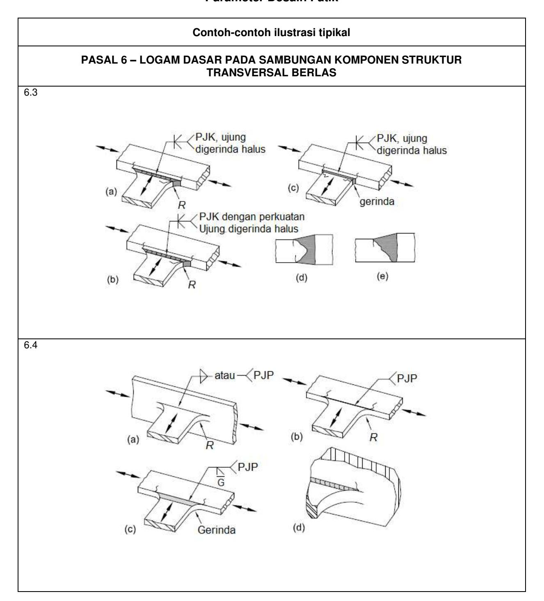

**© BSN 2020 214 dari 254** 

#### **TABEL A-3.1 (lanjutan) Parameter Desain Fatik**

| Deskripsi                                                                                                                                                                                                                                                                                                                     | Kategori Tegangan | Konstanta Cf | Ambang FTH, ksi (MPa) | Titik Inisiasi Retak Potensial                                                                     |
|-------------------------------------------------------------------------------------------------------------------------------------------------------------------------------------------------------------------------------------------------------------------------------------------------------------------------------|----------------------|-----------------|--------------------------------|-------------------------------------------------------------------------------------------------------|
| PASAL 7 – LOGAM DASAR PADA PENGIKATAN PENDEK[a]                                                                                                                                                                                                                                                                               |                      |                 |                                |                                                                                                       |
| 7.1 Logam dasar yang memikul beban longitudinal pada detail-detail dengan las-las paralel atau transversal terhadap arah tegangan, dengan atau tanpa beban transversal pada detail tersebut, dengan detail tidak berwujud radius transisi, R, dan dengan panjang detail, a, dan ketebalan pengikatan, b: |                      |                 |                                | Dimulai pada logam dasar di penghentian las atau pada toe las diperpanjang ke logam dasar |
| a<2 in. (50 mm) untuk tebal, b                                                                                                                                                                                                                                                                                                | C                    | 4,4             | 10 (69)                     |                                                                                                       |
| 2 in. (50 mm) ≤a ≤ nilai terkecil 12b atau 4 in. (100 mm)                                                                                                                                                                                                                                                                  | D                    | 2,2             | 7 (48)                      |                                                                                                       |
| a> terkecil dari 12b atau 4 in. (100 mm) apabila b ≤ 0,8 in. (20 mm)                                                                                                                                                                                                                                                       | E                    | 1,1             | 4,5 (31)                    |                                                                                                       |
| a> 4 in. (100 mm) apabila b> 0,8 in. (20 mm)                                                                                                                                                                                                                                                                               | E'                   | 0,39            | 2,6 (18)                    |                                                                                                       |
| 7.2 Logam dasar yang memikul tegangan longitudinal pada detail-detail yang diikatkan dengan las filet atau las gruv PJP, dengan atau tanpa beban transversal pada detail, apabila detail berwujud radius transisi, R, dengan penghentian las gerinda halus                                         |                      |                 |                                | Dimulai pada logam dasar di penghentian las, diperpanjang ke logam dasar                     |
| R>2 in. (50 mm)                                                                                                                                                                                                                                                                                                               | D                    | 2,2             | 7 (48)                      |                                                                                                       |
| R  2 in. (50 mm)                                                                                                                                                                                                                                                                                                          | E                    | 1,1             | 4,5 (31)                    |                                                                                                       |

[a] "Attachment" seperti digunakan di sini, didefinisikan sebagai detail baja apapun yang dilas ke suatu komponen struktur yang menyebabkan deviasi pada aliran tegangan pada komponen struktur tersebut dan, mereduksi ketahanan fatik. Reduksi ini akibat adanya attachment, bukan akibat pembebanan pada attachment.

**© BSN 2020 215 dari 254** 

**TABEL A-3.1 (lanjutan) Parameter Desain Fatik** 

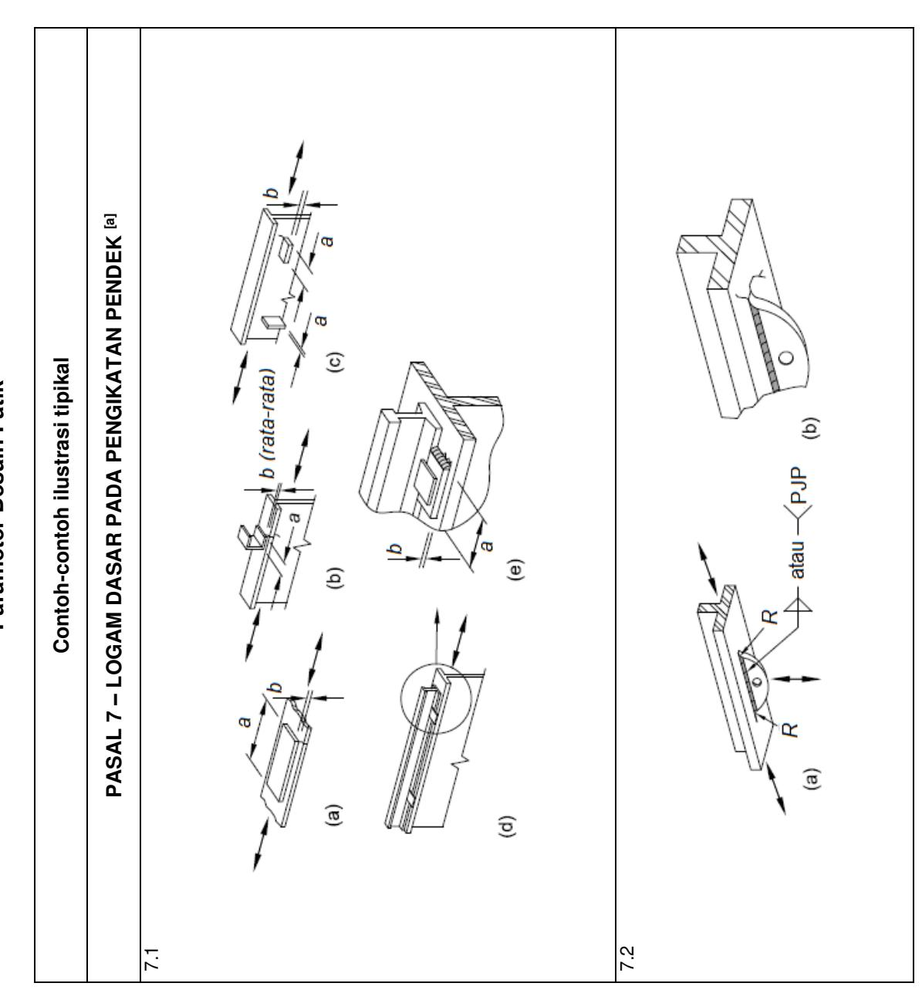

#### **TABEL A-3.1 (lanjutan) Parameter Desain Fatik**

| Deskripsi                                                                                                                                                                                                                                                                                                                                                                 | Kategori Tegangan | Konstanta Cf                            | Ambang FTH, ksi                      | Titik Inisiasi Retak Potensial                                                               |
|---------------------------------------------------------------------------------------------------------------------------------------------------------------------------------------------------------------------------------------------------------------------------------------------------------------------------------------------------------------------------|----------------------|--------------------------------------------|--------------------------------------------|-------------------------------------------------------------------------------------------------|
|                                                                                                                                                                                                                                                                                                                                                                           | PASAL 8 – LAIN-LAIN  |                                            | (MPa)                                      |                                                                                                 |
| 8.1 Logam dasar pada angkur baja stad berkepala diikatkan dengan las filet atau las stad otomatik                                                                                                                                                                                                                                                                   | C                    | 4,4                                        | 10 (69)                                 | Pada toe las pada logam dasar                                                                |
| 8.2 Geser pada tenggorok las filet menerus atau berselang seling, longitudinal atau transversal                                                                                                                                                                                                                                                            | F                    | Lihat Persamaan A-3-2 atau A-3-2M | Lihat Persamaan A-3-2 atau A-3-2M | Dimulai pada akar las filet, kemudian menjalar masuk ke dalam las                   |
| 8.3 Logam dasar pada las sumbat atau las slot                                                                                                                                                                                                                                                                                                                          | E                    | 1,1                                        | 4,5 (31)                                | Dimulai pada logam dasar di ujung las sumbat atau las slot, menjalar ke logam dasar |
| 8.4 Geser untuk las sumbat atau las slot                                                                                                                                                                                                                                                                                                                                  | F                    | Lihat Persamaan A-3-2 atau A-3-2M | Lihat Persamaan A-3-2 atau A-3-2M | Dimulai pada las di permukaan faying, kemudian menjalar masuk ke dalam las             |
| 8.5 Baut kekuatan tinggi, baut biasa, batang angkur berulir, dan batang gantungan, apakah dipratarik sesuai dengan Tabel J3.1 atau J3.1M, atau dikencangkan pas dengan potongan, gerinda, atau ulir gilas; rentang tegangan pada area tegangan tarik akibat diterapkan beban siklik ditambah aksi ungkit, apabila berlaku | G                    | 0,39                                       | 7 (48)                                  | Dimulai pada akar ulir tersebut, menjalar ke pengencang                                   |

**© BSN 2020 217 dari 254** 

**TABEL A-3.1 (lanjutan) Parameter Desain Fatik** 

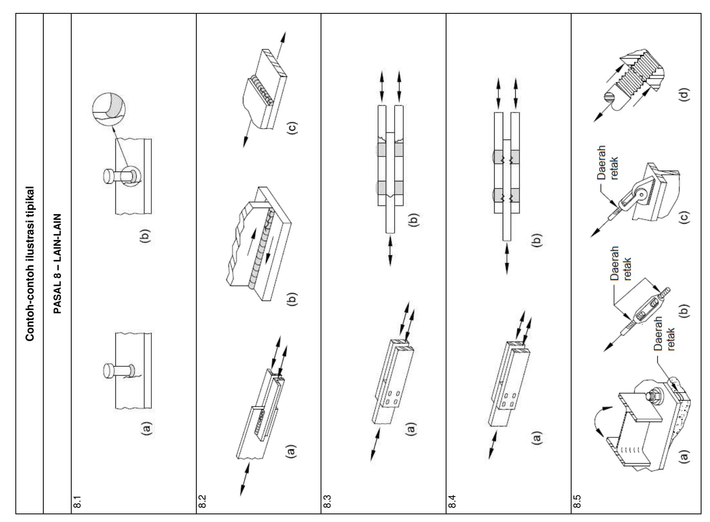

**© BSN 2020 218 dari 254** 

#### **LAMPIRAN 4 DESAIN STRUKTUR UNTUK KONDISI KEBAKARAN**

Lampiran ini membahas kriteria untuk desain dan evaluasi komponen baja struktur, sistem dan rangka untuk kondisi kebakaran. Kriteria ini memberikan penentuan head input, ekspansi termal dan degradasi dalam properti mekanikal material pada temperatur terelevasi yang menyebabkan penurunan progresif pada kekuatan dan kekakuan komponen struktural dan sistem pada temperatur terelevasi..

**Catatan Pengguna:** Seluruh bab ini, istilah "temperatur terelevasi" mengacu pada temperatur akibat eksposur kebakaran yang tidak diinginkan saja.

Lampiran ini disusun sebagai berikut:

- 4.1. Ketentuan Umum
- 4.2. Desain Struktur untuk Kondisi Kebakaran dengan Analisis
- 4.3. Desain dengan Pengujian Kualifikasi

#### **4.1. KETENTUAN UMUM**

Metode yang terkandung dalam lampiran ini memberikan bukti regulator kesesuaian sesuai dengan aplikasi desain yang diuraikan dalam pasal ini.

#### **1. Tujuan Kinerja**

Komponen struktur, dan sistem rangka bangunan gedung harus didesain sedemikian rupa untuk mempertahankan fungsi daya pikul bebannya selama kebakaran berbasis desain dan memenuhi persyaratan kinerja lain yang disyaratkan untuk penghuni bangunan gedung.

Kriteria deformasi harus diterapkan apabila cara menyediakan ketahanan api pada struktur, atau kriteria desain untuk pembatas api, memerlukan evaluasi deformasi struktur pemikul beban.

Di dalam kompartemen asal mula kebakaran, gaya-gaya dan deformasi-deformasi kebakaran dasar desain tidak menyebabkan penerobosan kompartemensasi horizontal atau vertikal.

#### **2. Desain dengan Analisis Rekayasa**

Metode analisis pada Pasal 4.2 boleh digunakan untuk mendokumentasikan kinerja rangka baja yang diantisipasi apabila mengalami skenario kebakaran berbasis desain. Metode dalam Pasal 4.2 memberikan bukti kesesuaian dengan tujuan kinerja yang ditetapkan dalam Pasal 4.1.1.

Metode analisis dalam Pasal 4.2 boleh digunakan untuk menunjukkan kesetaraan material atau metode alternatif, sebagaimana diizinkan oleh peraturan bangunan gedung yang berlaku (ABGL).

Desain struktur untuk kondisi kebakaran yang menggunakan Lampiran 4.2 harus dilakukan dengan menggunakan metode desain faktor beban dan ketahanan sesuai dengan ketentuan Pasal B3.1 (DFBT).

**© BSN 2020 219 dari 254** 

#### **3. Desain dengan Pengujian Kualifikasi**

Metode pengujian kualifikasi pada Pasal 4.3 boleh digunakan untuk mendokumentasikan ketahanan api rangka baja yang memikul protokol pengujian kebakaran terstandar yang disyaratkan oleh ABGL.

#### **4. Kombinasi Beban dan Kekuatan Perlu**

Apabila ketentuan ABGL untuk desain akibat eksposur kebakaran tidak ada,kekuatan perlu struktur dan elemen-elemennya harus ditentukan dari kombinasi beban gravitasi sebagai berikut:

$$[0.9 \text{ atau } 1.2]D + A_{7} + 0.5L + 0.2S$$
 (A-4-1)

dengan

*AT* = gaya dan deformasi nominal akibat dasar desain kebakaran yang didefinisikan Pasal 4.2.1

D = beban mati nominal

L = beban hidup penghunian nominal

S = beban salju nominal

**Catatan Pengguna:** Pasal 2.5ASCE/SEI 7berisi kombinasi beban untuk peristiwa luar biasa, yang mencakup kebakaran.

Beban nosional, *Ni*= 0,002*Yi* , sebagaimana didefinisikan dalam Pasal C2.2b, dengan*Ni* = beban nosional yang diterapkan pada level rangkai dan *Yi*= beban gravitasi dari Persamaan A-4-1 yang bekerja pada level rangkai, harus diterapkan dalam kombinasi dengan beban yang ditetapkan dalam Persamaan A-4-1. Kecuali ditetapkan lain oleh peraturan bangunan gedung yang berlaku, D, L dan S adalah beban nominal yang disyaratkan dalam ASCE/SEI 7.

**Catatan Pengguna:** Efek ketidaksempurnaan awal dapat diperhitungkan dengan pemodelan langsung ketidaksempurnaan dalam analisis tersebut. Pada struktur bangunan gedung tipikal, apabila mengevaluasi stabilitas rangka, ketidaksempurnaan yang penting adalah ketidaktegakan kolom.

#### **4.2. DESAIN STRUKTUR UNTUK KONDISI KEBAKARAN DENGAN ANALISIS**

Diizinkan untuk mendesain komponen struktur, komponen, dan rangka bangunan gedung untuk temperatur terelevasi sesuai dengan persyaratan pasal ini.

#### **1. Kebakaran Berbasis Desain**

Kebakaran berbasis desain harus diidentifikasi untuk menggambarkan kondisi pemanasan untuk struktur. Kondisi pemanasan ini harus menghubungkan komoditas bahan bakar dan karakteristik kompartemen yang ada dalam area kebakaran yang diasumsikan. Densitas beban bahan bakar berdasarkan penghunian ruang tersebut harus diperhitungkan apabila beban bahan bakar total ditentukan. Kondisi pemanasan harus disyaratkan salah satu dalam fluks panas atau temperatur lapisan gas teratas yang ditimbulkan kebakaran tersebut. Variasi kondisi pemanasan terhadap waktu harus ditentukan untuk durasi kebakaran tersebut.

Metode analisis dalam Pasal 4.2 harus digunakan sesuai dengan ketentuan untuk material, desain dan metode alternatif yang diizinkan oleh ABGL. Apabila metode analisis dalam Pasal 4.2 digunakan untuk membuktikan ekuivalensi dengan laju per

**© BSN 2020 220 dari 254** 

jam berdasarkan pengujian kualifikasi pada Pasal 4.3, dasar desain kebakaran harus diizinkan untuk ditentukan sesuai dengan ASTM E119.

#### **1a. Kebakaran Dilokalisasi**

 Jika laju pelepasan panas dari kebakaran tidak cukup untuk menyebabkan flashover, eksposur api lokal harus diasumsikan. Dalam kasus seperti itu, komposisi bahan bakar, pengaturan susunan bahan bakar, dan luas lantai yang ditempati oleh bahan bakar harus digunakan untuk menentukan fluks panas radiasi dari nyala api dan asap ke struktur.

#### **1b. Kebakaran Kompartemen Pasca Flashover**

Jika laju pelepasan panas dari api cukup untuk menyebabkan flashover, api kompartemen pasca flashover harus diasumsikan. Penentuan temperatur versus profil waktu yang dihasilkan dari kebakaran harus mencakup beban bahan bakar, karakteristik ventilasi ruang tersebut (alami dan mekanis), dimensi kompartemen, dan karakteristik termal batas kompartemen.

Durasi api di area tertentu harus ditentukan dari massa total yang mudah terbakar, atau beban bahan bakar di dalam ruang tersebut. Dalam hal kebakaran lokal atau kebakaran kompartemen pasca flashover, durasi api harus ditentukan sebagai total massa yang mudah terbakar dibagi dengan laju kehilangan massa.

#### **1c. Kebakaran Eksterior**

Efek eksposurpada struktur luar terhadap nyala api yang diproyeksikan dari jendela atau bukaan dinding lain sebagai akibat api kompartemen pasca flashover harus diatasi bersamaan dengan radiasi dari api interior melalui bukaan. Bentuk dan panjang proyeksi nyala api harus digunakan bersama dengan jarak antara nyala dan bagian luar baja untuk menentukan fluks panas ke baja. Metode yang diidentifikasi dalam Pasal 4.2.1b harus digunakan untuk menggambarkan karakteristik api kompartemen interior.

#### **1d. Sistem Perlindungan Kebakaran Aktif**

Efek sistem perlindungan kebakaran aktif harus diatasi ketika menguraikan kebakaran berbasis desain.

Jika ventilasi asap dan panas otomatis diinstal di ruang nonsprinkler, temperatur asap yang dihasilkan harus ditentukan dari perhitungan.

#### **2. Temperatur dalam Sistem Struktur akibat Kondisi Kebakaran**

Temperatur dalam komponen struktur, komponen dan rangka akibat kondisi pemanasan yang ditimbulkan oleh kebakaran berbasis desain harus ditentukan dengan analisis penyaluran panas.

#### **3. Kekuatan Material pada Temperatur Terelevasi**

Properti material pada temperatur terelevasi harus ditentukan dari data uji. Apabila data tersebut tidak ada, diizinkan untuk menggunakan properti material yang ditetapkan dalam pasal ini. Hubungan ini tidak berlaku untuk baja dengan kekuatan leleh lebih dari 65 ksi (450 MPa) atau beton dengan kekuatan tekan terspesifikasi melebihi 8.000 psi (55 MPa).

**© BSN 2020 221 dari 254** 

#### **3a. Elongasi Termal**

Koefisien ekspansi harus diambil sebagai berikut:

- (a) Untuk baja struktural dan baja penguat: Untuk perhitungan pada temperatur di atas 150° F (66° C), koefisien ekspansi termal harus 7,8 × 10−6/°F (1,4 × 10−5/°C).
- (b) Untuk beton normal: Untuk perhitungan pada temperatur di atas 150° F (66° C), koefisien ekspansi termal harus 1,0 × 10−5/°F (1,8 × 10−5/°C).
- (c) Untuk beton ringan: Untuk perhitungan pada temperatur di atas 150° F (66° C), koefisien ekspansi termal harus 4,4 × 10−6/°F (7,9 × 10−6/°C).

#### **3b. Properti Mekanis pada Temperatur Terelevasi**

Penurunan kekuatan dan kekakuan komponen struktur, komponen dan sistem harus diperhitungkan dalam analisis struktur rangka.

- (a) Untuk baja, nilai *Fy* (T), *Fp* (T), *Fu* (T), E(T) dan G(T) pada temperatur terelevasi yang digunakan dalam analisis struktur, dinyatakan sebagai rasio sehubungan dengan properti di lingkungan sekitar, yang diasumsikan 68°F (20°C), harus didefinisikan seperti pada Tabel A-4.2.1. *Fp* (T) adalah batas proporsional pada temperatur terelevasi, yang dihitung sebagai rasio terhadap kekuatan leleh sebagaimana disyaratkan dalam Tabel A-4.2.1. Diizinkan untuk menginterpolasi antara nilai-nilai ini.
- (b) Untuk beton, nilai-nilai *f'c* (T), *Ec* (T) dan ε*cu*(T) pada temperatur terelevasi yang digunakan dalam analisis struktur, dinyatakan sebagai rasio sehubungan dengan properti di lingkungan sekitar, yang diasumsikan 68°F (20°C), harus didefinisikan seperti pada Tabel A-4.2.2. Diizinkan untuk menginterpolasi antara nilai-nilai ini. Untuk beton ringan, nilai εcu harus diperoleh dari pengujian.
- (c) Untuk baut, nilai *Fnt*(T) dan *Fnv*(T) pada temperatur terelevasi yang digunakan dalam analisis struktur, dinyatakan sebagai rasio sehubungan dengan properti di lingkungan sekitar, yang diasumsikan 68°F (20°C), harus didefinisikan seperti pada Tabel A-4.2.3. Diizinkan untuk menginterpolasi antara nilai-nilai ini.

**© BSN 2020 222 dari 254** 

**TABEL A-4.2.1 Properti Baja pada Temperatur Terelevasi** 

| Temperatur Baja oF (oC)         | kE= E (T)/E = G(T)/G | kp= Fp (T)/Fy | ky= Fy (T)/Fy | ku= Fu(T)/Fy |
|---------------------------------------|-------------------------|---------------|------------------|--------------|
| 68 (20)                               | 1,00                    | 1,00          | *                | *            |
| 200 (93)                              | 1,00                    | 1,00          | *                | *            |
| 400 (200)                             | 0,90                    | 0,80          | *                | *            |
| 600 (320)                             | 0,78                    | 0,58          | *                | *            |
| 750 (400)                             | 0,70                    | 0,42          | 1,00             | 1,00         |
| 800 (430)                             | 0,67                    | 0,40          | 0,94             | 0,94         |
| 1.000 (540)                           | 0,49                    | 0,29          | 0,66             | 0,66         |
| 1.200 (650)                           | 0,22                    | 0,13          | 0,35             | 0,35         |
| 1.400 (760)                           | 0,11                    | 0,06          | 0,16             | 0,16         |
| 1.600 (870)                           | 0,07                    | 0,04          | 0,07             | 0,07         |
| 1.800 (980)                           | 0,05                    | 0,03          | 0,04             | 0,04         |
| 2.000 (1.100)                         | 0,02                    | 0,01          | 0,02             | 0,02         |
| 2.200 (1.200)                         | 0,00                    | 0,00          | 0,00             | 0,00         |
| * Gunakan properti lingkungan sekitar |                         |               |                  |              |

**4. Persyaratan Desain Struktur** 

#### **4a. Integritas Struktur Umum**

Rangka dan fondasi struktur harus mampu memberikan kekuatan dan kapasitas deformasi untuk menahan, sebagai suatu sistem, aksi struktur yang diperhitungkan selama kebakaran dalam batas deformasi yang ditentukan. Sistem struktur harus didesain untuk menahan kerusakan lokal dengan sistem struktur sebagai keseluruhan sisa yang stabil. Stabilitas rangka dan kekuatan perlu harus ditentukan sesuai dengan persyaratan Pasal C1.

Jalur beban menerus harus disediakan untuk menyalurkan semua gaya dari daerah terekspos ke titik finalketahanan.

#### **4b. Persyaratan Kekuatan dan Batas Deformasi**

Kesesuaian sistem struktur dengan persyaratan ini harus ditunjukkan dengan membangun model matematika struktur berdasarkan prinsip-prinsip mekanika struktur dan mengevaluasi model ini untuk gaya dan deformasi internal pada komponen struktur tersebut pada struktur yang diperhitungkan dengan temperatur dari kebakaran berbasis desain.

**© BSN 2020 223 dari 254** 

**TABEL A-4.2.2 Properti Beton pada Temperatur Terelevasi**

| Temperatur       | kc=f'c (T)/f'c |              |           | 𝛆cu (T),%    |
|------------------|-------------------|--------------|-----------|--------------|
| beton oF (oC) | Beton normal      | Beton ringan | Ec (T)/Ec | Beton normal |
| 68 (20)          | 1,00              | 1,00         | 1,00      | 0,25         |
| 200 (93)         | 0,95              | 1,00         | 0,93      | 0,34         |
| 400 (200)        | 0,90              | 1,00         | 0,75      | 0,46         |
| 550 (290)        | 0,86              | 1,00         | 0,61      | 0,58         |
| 600 (320)        | 0,83              | 0,98         | 0,57      | 0,62         |
| 800 (430)        | 0,71              | 0,85         | 0,38      | 0,80         |
| 1.000 (540)      | 0,54              | 0,71         | 0,20      | 1,06         |
| 1.200 (650)      | 0,38              | 0,58         | 0,092     | 1,32         |
| 1.400 (760)      | 0,21              | 0,45         | 0,073     | 1,43         |
| 1.600 (870)      | 0,10              | 0,31         | 0,055     | 1,49         |
| 1.800 (980)      | 0,05              | 0,18         | 0,036     | 1,50         |
| 2.000 (1.100)    | 0,01              | 0,05         | 0,018     | 1,50         |
| 2.200 (1.200)    | 0,00              | 0,00         | 0,000     | 0,00         |

Komponen struktur individual harus memiliki kekuatan desain yang diperlukan untuk menahan geser, gaya aksial, dan momen yang ditentukan sesuai dengan ketentuan ini.

Sambungan harus mengembangkan kekuatan komponen strukturtersambung atau gaya tersambung. Apabila sarana untuk memberikan ketahanan terhadap api memerlukan evaluasi kriteria deformasi, deformasi sistem struktur tersebut, atau komponen strukturnya, akibat kebakaran berbasis desain tidak boleh melebihi batas yang ditetapkan.

Diizinkan untuk memasukkan aksi membran pada slab lantai komposit untuk ketahanan terhadap api jika desain tersebut memberikan efek peningkatan gaya tarik sambungan dan memungkinkan terjadinya redistribusi beban gravitasi ke rangka yang bersebelahan.

#### **4c. Desain dengan Metode Analisis Lanjutan**

Desain dengan metode analisis lanjutan diizinkan untuk desain pada semua struktur bangunan gedung baja untuk kondisi kebakaran. Eksposur api berbasis desain harus ditentukan sesuai dengan Pasal 4.2.1. Analisis tersebut harus mencakup respons termal dan respons mekanis terhadap api berbasis desain.

Respons termal harus menghasilkan medan temperatur di setiap elemen struktur sebagai akibat dari kebakaran berbasis desain dan harus menggabungkan properti termal yang tergantung temperatur pada elemen struktur dan material tahan api, sesuai dengan Pasal 4.2.2.

**© BSN 2020 224 dari 254** 

**TABEL A-4.2.3 Properti Baut Kekuatan Tinggi Grup A dan Grup B pada Temperatur Terelevasi**

| Temperatur Baut, °F (°C) | Fnt (T)/FntatauFnv(T)/Fnv |
|-----------------------------|---------------------------|
| 68 (20)                  | 1,00                      |
| 200 (93)                    | 0,97                      |
| 300 (150)                   | 0,95                      |
| 400 (200)                   | 0,93                      |
| 600 (320)                   | 0,88                      |
| 800 (430)                   | 0,71                      |
| 900 (480)                   | 0,59                      |
| 1.000 (540)              | 0,42                      |
| 1.200 (650)              | 0,16                      |
| 1.400 (760)              | 0,08                      |
| 1.600 (870)              | 0,04                      |
| 1.800 (980)              | 0,01                      |
| 2.000 (1.100)               | 0,00                      |

Respons mekanismenghasilkan gaya dan deformasi pada sistem struktur yang memikul respons termal yang dihitung dari kebakaran berbasis desain. Respons mekanis harus memperhitungkan secara eksplisit penurunan kekuatan dan kekakuan dengan meningkatnya temperatur, efek ekspansi termal, perilaku inelastis dan redistribusi beban, deformasi besar, efek tergantung waktu seperti rangkak, dan ketidakpastian yang dihasilkan dari variabilitas properti material pada temperatur terelevasi. Kondisi batas dan kekakuan sambungan harus mewakili desain struktur yang diusulkan. Properti material harus didefinisikan sesuai Pasal 4.2.3.

Analisis yang dihasilkan harus mengatasi semua keadaan batas yang relevan, seperti defleksi yang berlebihan, keruntuhan sambungan, dan tekuk keseluruhan atau tekuk lokal.

#### **4d. Desain Dengan Metode Analisis Sederhana**

Metode analisis pada pasal ini boleh digunakan untuk mengevaluasi kinerja masingmasing komponen struktur pada temperatur terelevasi selama eksposur api.

Kondisi tumpuan dan kekangan (gaya, momen, dan kondisi batas) yang berlaku pada temperatur normal boleh diasumsikan tetap tidak berubah selama eksposur api.

Diperbolehkan untuk memodelkan respons termal baja dan komponen struktur komposit dengan menggunakan persamaan penyaluran panas satu dimensi dengan input panas sebagaimana ditentukan dari kebakaran berbasis desain yang didefinisikan dalam Pasal 4.2.1, dengan menggunakan temperatur yang sama dengan temperatur baja maksimum. Untuk komponen struktur lentur, temperatur baja maksimum harus ditetapkan pada sayap bawah.

**© BSN 2020 225 dari 254** 

Untuk temperatur baja kurang dari atau sama dengan 400°F (200°C), kekuatan desain sambungan dan komponen struktur tersebut harus ditentukan tanpa mempertimbangkan efek temperatur.

Kekuatan desain harus ditentukan seperti pada Pasal B3.1. Kekuatan nominal, *Rn* , harus dihitung dengan menggunakan properti material, sebagaimana diberikan dalam Pasal 4.2.3b, pada temperatur yang diperhitungkan dengan kebakaran berbasis desain dan sebagaimana yang ditetapkan dalam Pasal 4.2.4d(a) sampai Pasal 4.2.4d(f).

**Catatan Pengguna:** Pada temperatur di bawah 400°F (200°C), reduksi properti baja tidak perlu diperhitungkan dalam menghitung kekuatan komponen struktur untuk metode analisis sederhana; Namun, gaya dan deformasi yang disebabkan oleh temperaturterelevasi harus diperhitungkan.

#### (a) Desain untuk Tarik

Kekuatan nominal untuk tarik harus ditentukan dengan menggunakan ketentuan Bab D, dengan properti baja sebagaimana ditetapkan dalam Pasal 4.2.3b dan dengan mengasumsikan temperatur yang seragam di seluruh penampang melintang dengan menggunakan temperatur yang sama dengan temperatur baja maksimum.

#### (b) Desain untuk Tekan

Kekuatan nominal untuk tekan harus ditentukan dengan menggunakan ketentuan Bab E dengan properti baja sebagaimana ditetapkan dalam Pasal 4.2.3b dan Persamaan A-4-2 yang digunakan sebagai pengganti Persamaan E3-2 dan Persamaan E3-3 untuk menghitung kekuatan tekan nominal untuk tekuk lentur:

$$F_{cr}(T) = \left[0.42^{\sqrt{\frac{F_y(T)}{F_e(T)}}}\right] F_y(T)$$
 (A-4-2)

dengan*Fy* (T) adalah tegangan leleh pada temperatur terelevasi dan *Fe* (T) adalah tegangan tekuk elastis kritis yang dihitung dari Persamaan E3-4 dengan modulus elastisitas, E(T), pada temperatur terelevasi. *Fy* (T) dan E(T) diperoleh dengan menggunakan koefisien dari Tabel A-4.2.1.

**Catatan Pengguna:** Untuk sebagian besar kondisi kebakaran, pemanasan dan temperatur yang seragam menentukan desain untuk tekan. Metode untuk memperhitungkan efek pemanasan tidak seragam dan gradien termal yang dihasilkan pada kekuatan desain komponen struktur tekan dirujuk dalam Penjelasan. Kekuatan kolom yang tidak memikul beban lateral (kolom gravitasi) dapat meningkat dengan kekangan rotasi kolom yang lebih dingin di tingkat atas dan bawah tingkat yang tereksposur api. Metode untuk menjelaskan pengaruh yang menguntungkan dari kekangan rotasi dibahas dalam Penjelasan.

#### (c) Desain untuk Lentur

Untuk balok baja, diizinkan mengasumsikan temperatur sayap bawah yang dihitung adalah konstan di seluruh tinggi komponen struktur tersebut.

Kekuatan lentur nominal harus ditentukan dengan menggunakan ketentuan Bab F dengan properti baja sebagaimana ditetapkan dalam Pasal 4.2.3b dan Persamaan A-4-3 sampai A-4-10 yang digunakan sebagai pengganti Persamaan

**© BSN 2020 226 dari 254** 

F2-2 sampai F2-6 untuk menghitung kekuatan lentur nominal untuk tekuk torsi lateral komponen struktur simetris ganda yang tak terbreis secara lateral:

(1) Apabila  $L_b \leq L_r(T)$ 

$$M_n(T) = C_b \left\{ M_r(T) + \left[ M_p(T) - M_r(T) \right] \left[ 1 - \frac{L_b}{L_r(T)} \right]^{C_x} \right\} \le M_p(T)$$
 (A-4-3)

(2) Apabila $L_b > L_r(T)$ 

$$M_p(T) = F_{cr}(T)S_x \le M_p(T) \tag{A-4-4}$$

dengan

$$F_{cr}(T) = \frac{C_b \pi^2 E(T)}{\left(\frac{L_b}{r_{ts}}\right)^2} \sqrt{1 + 0.078 \frac{Jc}{S_\chi h_o} \left(\frac{L_b}{r_{ts}}\right)^2}$$
(A-4-5)

$$L_r(T) = 1.95 \ r_{ts} \frac{E(T)}{F_L(T)} \sqrt{\frac{Jc}{S_x h_o} \sqrt{\left(\frac{Jc}{S_x h_o}\right)^2 + 6.76 \left[\frac{F_L(T)}{E(T)}\right]^2}}$$
 (A-4-6)

$$M_r(T) = F_L(T)S_{\chi} (A-4-7)$$

$$F_L(T) = F_y(k_p - 0.3k_y)$$
 (A-4-8)

$$M_p(T) = F_y(T)Z_x (A-4-9)$$

$$c_x = 0.53 + \frac{T}{450} \le 3.0$$
 dengan  $T$  adalah dalam °F (A-4-10)

$$c_x = 0.6 + \frac{T}{250} \le 3.0$$
 dengan T adalah dalam °C (A-4-10M)

dan

T = temperatur baja terelevasi akibateksposur api yang tidak diinginkan, °F (°C)

Properti material pada temperatur terelevasi, E(T) dan  $F_y(T)$ , dan koefisien  $k_p$ dan  $k_y$  dihitung sesuai dengan Tabel A-4.2.1, dan simbol lain sebagaimana didefinisikan dalam Bab F.

#### (d) Desain untuk Lentur pada Balok Komposit

Untuk balok komposit, temperatur sayap bawah yang dihitung harus diambil sebagai konstanta antara sayap bawah dan ketinggian tengah badan dan menurun secara linear tidak lebih dari 25% dari ketinggian tengah badan ke sayapbagian atas balok tersebut.

Kekuatan nominal komponen struktur lentur komposit harus ditentukan dengan menggunakan ketentuan Bab I, dengan tegangan leleh tereduksi pada baja tersebut konsisten dengan variasi temperatur yang dijelaskan akibat respons termal.

Sebagai alternatif, kekuatan lentur nominal balok komposit,  $M_n(T)$ , boleh dihitung menggunakan temperatursayap bawah, T, sebagai berikut:

© BSN 2020 227 dari 254

$$M_n(T) = r(T)M_n \tag{A-4-11}$$

dengan

*Mn* = kekuatan lentur nominal pada temperatur lingkungan sekitar yang dihitung sesuai dengan ketentuan Bab I, kip-in. (N-mm)

r(T) = faktor retensi yang tergantung pada temperatur sayap bawah, T, seperti diberikan pada Tabel A-4.2.4

#### (e) Desain untuk Geser

Kekuatan nominal untuk geser harus ditentukan sesuai dengan ketentuan Bab G, dengan properti baja seperti ditetapkan dalam Pasal 4.2.3b dan dengan mengasumsikan temperatur yang seragam di seluruh penampang melintang.

#### (f) Desain untuk Kombinasi Gaya dan Torsi

Kekuatan nominal untuk kombinasi gaya aksial dan lentur terhadap satu atau kedua sumbu, dengan atau tanpa torsi, harus sesuai dengan ketentuan Bab H dengan desain kekuatan aksial dan lentur sebagaimana ditetapkan dalam Pasal 4.2.4d (a) sampai (d). Kekuatan nominal untuk torsi harus ditentukan sesuai dengan ketentuan Bab H, dengan properti baja sebagaimana ditetapkan dalam Pasal 4.2.3b, dengan mengasumsikan temperatur yang seragam di seluruh penampang melintang.

#### **4.3. DESAIN DENGAN PENGUJIAN KUALIFIKASI**

#### **1. Standar Kualifikasi**

Komponen struktur pada bangunan gedung baja harus memenuhi syarat untuk periode penilaian sesuai dengan ASTM E119. Pembuktian kesesuaian dengan persyaratan ini menggunakan prosedur yang disyaratkan untuk konstruksi baja padaPasal 5 dari Standard Calculation Methods for Structural Fire Protection (ASCE/SEI/SFPE 29) diizinkan.

#### **2. Konstruksi Terkekang**

Untuk lantai dan atap yang dirakit dan balok individual pada bangunan gedung, adakondisi terkekang apabila sekeliling atau struktur pendukung mampu menahan gaya dan mengakomodasi deformasi yang disebabkan oleh ekspansi termal di seluruh rentang temperatur terelevasi yang diantisipasi.

Balok baja, girder, dan rangka yang mendukung slab beton yang dilas atau dibaut untuk perangkaan integral komponen struktur harus diperhitungkan sebagai konstruksi terkekang.

**© BSN 2020 228 dari 254** 

**TABEL A-4.2.4 Faktor Retensi untuk Komponen Struktur Lentur Komposit** 

| Temperatur Sayap Bawah °F (°C) | R(T) |
|-----------------------------------|------|
| 68 (20)                        | 1.00 |
| 300 (150)                         | 0,98 |
| 600 (320)                         | 0,95 |
| 800 (430)                         | 0,89 |
| 1.000 (540)                    | 0,71 |
| 1.200 (650)                    | 0,49 |
| 1.400 (760)                    | 0,26 |
| 1.600 (870)                    | 0,12 |
| 1.800 (980)                    | 0,05 |
| 2.000 (1.100)                     | 0,00 |

#### **3. Konstruksi Tidak Terkekang**

Balok baja, girder dan rangka yang tidak mendukung slab beton harus diperhitungkan tidak terkekang kecuali komponen struktur tersebut dibaut atau dilas pada konstruksi di sekitarnya yang telah secara spesifik didesain dan didetail untuk menahan efek temperatur terelevasi.

Tumpuan komponen struktur baja pada suatu dinding di bentang tunggal atau di bentang ujung dari bentang banyak harus diperhitungkan tidak terkekang kecuali dinding tersebut telah didesain dan didetail untuk menahan efek ekspansi termal.

**© BSN 2020 229 dari 254** 

#### **LAMPIRAN 5 EVALUASI STRUKTUR YANG SUDAH BERDIRI**

Lampiran ini berlaku untuk evaluasi kekuatan dan kekakuan akibat beban statis pada struktur yang sudah berdiri dengan analisis struktur, melalui uji beban, atau dengan kombinasi analisis struktur dan uji beban apabila disyaratkan oleh penanggungjawab perancangan (TR)atau dalam dokumen kontrak. Untuk evaluasi ini, mutu baja tidak dibatasi terhadap daftar yang terdapat dalam Pasal A3.1. Lampiran ini tidak membahas uji beban untuk efek-efek beban seismik atau beban bergerak (vibrasi). Pasal 5.4 hanya berlaku untuk beban gravitasi vertikal statis yang diterapkan pada atap atau lantai yang ada.

Lampiran ini disusun sebagai berikut:

- 5.1. Ketentuan Umum
- 5.2. Properti Material
- 5.3. Evaluasi dengan Analisis Struktur
- 5.4. Evaluasi dengan Uji Beban
- 5.5. Laporan Evaluasi

#### **5.1. KETENTUAN UMUM**

Ketentuan-ketentuan ini harus bisa diterima apabila evaluasi struktur baja yang telah berdiri disyaratkan untuk (a) verifikasi set spesifik beban desain atau (b) penentuan kekuatan tersedia komponen struktur penahan beban atau sistem. Evaluasi harus dilakukan dengan analisis struktur (Pasal 5.3), melalui uji beban (Pasal 5.4), atau melalui kombinasi analisis struktur dan uji beban, apabila disyaratkan dalam dokumen kontrak oleh penanggungjawab perancangan (TR). Bila uji beban digunakan, TR harus terlebih dahulu melakukan analisis struktur, mempersiapkan rencana pengujian, dan mengembangkan prosedur tertulis untuk pengujian. Rencana tersebut harus memperhitungkan keruntuhan katastropik dan/atau tingkat deformasi permanen yang berlebihan, sebagaimana didefinisikan oleh TR, dan harus mencakup prosedur untuk mencegah terjadinya salah satu hal tersebut selama pengujian.

#### **5.2. PROPERTI MATERIAL**

#### **1. Penentuan Pengujian yang Diperlukan**

TR harus menentukan uji spesifik yang diperlukan dari Pasal 5.2.2 sampai 5.2.6 dan menetapkan lokasi dimana mereka diperlukan. Apabila tersedia, penggunaan catatan proyek yang berlaku diizinkan untuk mereduksi atau mengeliminasi keharusan pengujian.

#### **2. Properti Tarik**

Properti tarik komponen struktur harus diperhitungkan dalam evaluasi melalui analisis struktur (Pasal 5.3) atau uji beban (Pasal 5.4). Properti tersebut harus mencakup tegangan leleh, kekuatan tarik dan persen elongasi. Bila tersedia, laporan uji material bersertifikat atau laporan pengujian bersertifikat yang dibuat oleh pabrikator atau labotorium pengujian sesuai dengan ASTM A6/A6M atau A568/A568M, mana yang sesuai, harus diizinkan untuk tujuan ini. Apabila tidak, uji tarik harus dilakukan sesuai dengan ASTM A370 dari pemotongan sampel komponen struktur.

**© BSN 2020 230 dari 254** 

#### **3. Komposisi Kimia**

Apabila pengelasan diantisipasi untuk perbaikan atau modifikasi struktur yang sudah berdiri, komposisi kimia baja harus ditentukan untuk penggunaan dalam persiapan spesifikasi prosedur pengelasan. Apabila tersedia, hasil laporan uji material bersertifikat atau laporan pengujian bersertifikat yang dibuat oleh pabrikator atau laboratorium pengujian sesuai dengan prosedur ASTM harus diizinkan untuk tujuan ini. Apabila tidak, analisis harus dilakukan sesuai dengan ASTM A751 dari sampel yang digunakan untuk menentukan properti tarik, atau dari sampel yang diambil dari lokasi yang sama.

#### **4. Keteguhan Takik Logam Dasar**

Apabila splais tarik dilas dalam pelat dan profil berat seperti didefinisikan dalam Pasal A3.1d yang kritis terhadap kinerja struktur, keteguhan takik Charpy V harus ditentukan sesuai dengan ketentuan Pasal A3.1d. Jika keteguhan takik yang ditentukan tidak memenuhi ketentuan Pasal A3.1d, TR harus menentukannya jika aksi remedial diperlukan.

#### **5. Logam Las**

Apabila kinerja struktur tergantung pada sambungan berlas yang ada, sampel yang mewakili logam las harus diperoleh. Analisis kimia dan uji mekanis harus dilakukan untuk mendapatkan karakteristik logam las. Besaran dan konsekuensi ketidaksempurnaan harus ditentukan. Jika persyaratan Structural Welding Code*—* Steel,AWS D1.1/D1.1M, tidak dipenuhi, TR harus menentukannya jika aksi remedial diperlukan.

#### **6. Baut dan Paku Keling**

Sampel baut yang representatif harus diinspeksi untuk menentukan penandaan dan klasifikasi. Jika baut tidak dapat diidentifikasi dengan tepat secara visual, sampel yang representatif harus diambil dan diuji untuk menentukan kekuatan tarik sesuai dengan ASTM F606 atau ASTM F606M dan oleh sebab itu baut diklasifikasikan. Sebagai alternatif, asumsi bahwa baut adalah ASTM A307 diizinkan. Paku keling harus diasumsikan Grade 1 ASTM A502 kecuali mutu yang lebih tinggi ditetapkan melalui dokumentasi atau pengujian.

#### **5.3. EVALUASI DENGAN ANALISIS STRUKTUR**

#### **1. Data Dimensi**

Semua dimensi yang digunakan dalam evaluasi, misal bentang, tinggi kolom, spasi komponen struktur, lokasi breis, dimensi penampang melintang, tebal, dan detail sambungan, harus ditentukan dari survei lapangan. Sebagai alternatif, apabila tersedia, diizinkan untuk menentukan dimensi dari desain proyek atau gambar kerja yang berlaku dengan verifikasi lapangan terhadap nilai-nilai kritis.

#### **2. Evaluasi Kekuatan**

Gaya (efek beban) pada komponen struktur dan sambungan harus ditentukan dari analisis struktur yang berlaku untuk tipe struktur yang dievaluasi. Efek beban tersebut harus ditentukan untuk kombinasi beban terfaktor dan bebanyang ditetapkan dalam Pasal B2.

**© BSN 2020 231 dari 254** 

Kekuatan tersedia komponen struktur dan sambungan harus ditentukan dari ketentuan Bab B sampai Bab K dari Standar ini.

#### **3. Evaluasi Kemampuan Layan**

Jika diperlukan, deformasi pada beban layan harus dihitung dan dilaporkan.

#### **5.4. EVALUASI DENGAN UJI BEBAN**

#### **1. Penentuan Laju Beban dengan Pengujian**

Untuk menentukan laju beban pada struktur lantai atau atap yang ada melalui pengujian, beban uji harus diterapkan secara bertahap sesuai dengan rencana TR. Struktur harus diinspeksi secara visual untuk tanda-tanda dan keadaan bahaya atau kegagalan yang akan terjadi pada setiap level beban. Langkah yang sesuai harus dilakukan jika hal tersebut atau kondisi tidak biasa lain dijumpai.

Kekuatan struktur yang diuji harus diambil sebagai beban uji maksimum yang diterapkan ditambah beban mati in-situ. Laju beban hidup pada struktur lantai harus ditentukan melalui pengaturan kekuatan yang diuji sama dengan 1,2D + 1,6L, denganD adalah laju beban mati nominal dan L adalah laju beban hidup nominal untuk struktur tersebut. Untuk struktur atap, *Lr* , S atau R harus disubsitusikan untuk L,

#### dengan

*Lr* = beban hidup atap nominal

R = beban nominal akibat air hujan atau salju, eksklusif kontribusi genangan

S = beban salju nominal

Kombinasi beban yang lebih parah harus digunakan apabila diperlukan oleh peraturan bangunan gedung yang berlaku

Penghilangan beban berkala harus diperhitungkan apabila level beban layan telah dicapai dan sesudah permulaan perilaku struktur inelastis teridentifikasi yang menunjukkan besarnya set permanen dan deformasi inelastis. Deformasi struktur tersebut, misalnya defleksi komponen struktur, harus dimonitor pada lokasi kritis selama pengujian, direferensikan ke posisi awal sebelum pembebanan. Harus dibuktikan, dengan tetap mempertahankan beban uji maksimum selama satu jam, bahwa deformasi struktur tidak meningkat lebih dari 10% di atas deformasi pada awal periode penahanan beban. Diizinkan untuk mengulangi urutan tersebut jika diperlukan untuk membuktikan kesesuaian.

Deformasi struktur juga harus dicatat 24 jam setelah beban uji dihilangkan untuk menentukan jumlah set permanen. Karena jumlah deformasi permanen yang berlaku tergantung pada struktur spesifik, tidak ada batas deformasi permanen yang disyaratkan pada pembebanan maksimum. Apabila pegujian beban pada keseluruhan struktur tidak dapat dikerjakan, segmen atau zona yang tidak kurang dari satu bentang penuh yang representatif untuk kondisi kritis harus dipilih.

#### **2. Evaluasi Kemampuan Layan**

Apabila uji beban ditentukan, struktur harus dibebani secara bertahap ke level beban layan. Beban uji layan harus ditahan selama periode satu jam, dan deformasi harus dicatat di awal dan di akhir periode penahanan bebanselama satu jam.

**© BSN 2020 232 dari 254** 

#### **5.5. LAPORAN EVALUASI**

Setelah evaluasi struktur yang sudah berdiri lengkap, TR harus mempersiapkan dokumen laporan evaluasi. Laporan tersebut harus menunjukkan apakah evaluasi telah dilakukan melalui analisis struktur, dengan uji beban, atau dengan kombinasi analisis struktur dan uji beban. Selain itu, apabila pengujian dilakukan, laporan harus mencakup beban dan kombinasi beban yang digunakan dan deformasi beban dan hubungan antara waktu deformasi yang diamati. Semua informasi relevan yang diperoleh dari gambar desain, laporan uji material, dan uji material yang bersifat tambahan juga harus dilaporkan. Akhirnya, laporan harus menunjukkan apakah struktur, termasuk semua komponen struktur dan sambungan, adalah cukup untuk menahan efek beban.

**© BSN 2020 233 dari 254** 

#### **LAMPIRAN 6 PEMBREISAN STABILITAS KOMPONEN STRUKTUR**

Lampiran ini membahas kekuatan dan kekakuan minimum yang diperlukan untuk memberi titik terbreis pada kolom, balok, atau balok-kolom.

Lampiran disusun sebagai berikut:

- 6.1. Ketentuan Umum
- 6.2. Pembreisan kolom
- 6.3. Pembreisan Balok
- 6.4. Pembreisan BalokKolom

**Catatan Pengguna:** Persyaratan stabilitas untuk sistem penahan gaya lateral diberikan pada Bab C. Ketentuan dalam lampiran ini berlaku untuk pembreisan yang umumnya tidak termasuk dalam model analisis struktur keseluruhan, tetapi diberikan untuk menstabilkan masing-masing kolom, balok, dan balok-kolom. Panduan untuk menerapkan ketentuan ini untuk menstabilkan rangka batangyang diberikan dalam Penjelasan.

#### **6.1. KETENTUAN UMUM**

Sistem pembreisan harus memiliki kekuatan dan kekakuan yang disyaratkan dalam Lampiran ini, sebagaimana berlaku. Apabila sistem tersebut membreis lebih dari satu komponen struktur, kekuatan dan kekakuan breis harus didasarkan pada jumlah kekuatan yang diperlukan pada semua komponen struktur yang terbreis. Evaluasi kekakuan yang diberikan oleh breis tersebut harus meliputi efek detail pengangkuran dan sambungan.

**Catatan Pengguna:** Analisis yang lebih detail untuk kekuatan dan kekakuan breis disajikan dalam Penjelasan.

Suatu breis panel (sebelumnya disebut sebagai breis relatif) mengendalikan deviasi sudut pada segmen komponen struktur yang terbreis antara titik-titik terbreis (yaitu, perpindahan lateral satu ujung segmen relatif terhadap ujung lainnya). Breis titik (sebelumnya disebut sebagai breis nodal) mengendalikan pergerakan pada titik breis tanpa interaksi langsung dengan titik terbreis yang bersebelahan. Sistem pembreisan kontinu terdiri dari breis yang terpasang di sepanjang keseluruhankomponen struktur.

Kekuatan dan kekakuan tersedia pada sambungan dan komponen struktur pembreis harus sama atau melebihi kekuatan dan kekakuan yang diperlukan, kecuali jika analisis menunjukkan bahwa nilai yang lebih kecil dibenarkan.

Kolom, balok, dan balok-kolom dengan titik-titik terbreis di tengah dan di ujung yang didesain memenuhi persyaratan dalam Pasal 6.2, Pasal 6.3, dan Pasal 6.4, sebagaimana berlaku, diizinkan untuk didesain berdasarkan panjang *Lc* dan *Lb* , seperti didefinisikan dalam Bab E dan Bab F, yang diambil sama dengan jarak antara titik-titik terbreis.

Sebagai pengganti persyaratan Pasal 6.2, Pasal 6.3, dan Pasal 6.4,

(a) Kekuatan dan kekakuan breis yang diperlukan dapat diperoleh dengan menggunakan analisis orde kedua yang memenuhi ketentuan Bab C atau Lampiran 1, mana yang sesuai, dan mencakup titik breis yang dipindahkan dari lokasi nominalnya dalam suatu pola yang membutuhkan pembreisan terbesar.

**© BSN 2020 234 dari 254** 

- (b) Kekakuan breis yang diperlukan dapat diperoleh sebesar 2/ (DFBT) atau 2 (DKI) dikalikan kekakuan breis ideal yang ditentukan dari analisis tekuk. Kekuatan breis yang diperlukan dapat ditentukan dengan menggunakan ketentuan Pasal 6.2, Pasal 6.3, dan Pasal 6.4, mana yang berlaku.
- (c) Untuk metode analisis manapun yang di atas, komponen struktur dengan titik terbreis di tengah atau di ujung yang memenuhi persyaratan ini dapat didesain berdasarkan panjang efektif, *Lc* dan *Lb* , diambil kurang dari jarak antara titik terbreis.

**Catatan Pengguna:** Persyaratan pembreisan stabilitas padaPasal 6.2, Pasal 6.3, dan Pasal 6.4 didasarkan pada model analisis tekuk yang melibatkan idealisasi kondisi pembreisan yang umum. Metode analisis komputasional dapat digunakan untuk generalisasi, akurasi, dan efisiensi yang lebih besar untuk kondisi pembreisan yang lebih kompleks. Penjelasan untuk Pasal 6.1 memberikan panduan tentang tinjauan hal-hal tersebut.

#### **6.2. PEMBREISAN KOLOM**

Diizinkan untuk membreis secara lateral kolom individual pada titik tengah atau ujungdi seluruh panjangnya dengan menggunakan breis titik ataubreis panel.

**Catatan Pengguna:** Pasal ini hanya memberikan persyaratan untuk pembreisan lateral. Pembreisan lateral kolom diasumsikan berada di pusat geser kolom. Apabila pembreisan lateral tidak mencegah puntir, kolom rentan terhadap tekuk torsi, sebagaimana dibahas dalam Pasal E4. Apabila pembreisan lateral tidak melalui pusat geser, kolom rentan terhadap tekuk torsi sumbu terkonstrain, yang dibahas dalam Penjelasan pada PasalE4.

#### **1. Breis Panel**

Sistem breis panel harus memiliki kekuatan dan kekakuan yang disyaratkan dalam pasal ini. Sambungan sistem pembreisan ke kolom harus memiliki kekuatan yang disyaratkan dalam Pasal 6.2.2 untuk breis titik di lokasi tersebut.

**Catatan Pengguna:** Jika kekakuan sambungan ke sistem breis panel sebanding dengan kekakuan sistem breis panel itu sendiri, sistem breis panel dan sambungannya ke kolom berfungsi sebagai sistem breis panel dan titik yang tersusun secara seri. Kasus seperti itu dapat dievaluasi menggunakan metode analisis alternatif yang tercantum dalam Pasal 6.1.

Dalam arah yang tegak lurus terhadap sumbu longitudinal kolom, kekuatan geser perlu sistem breis ini adalah:

$$V_{br} = 0.005P_r$$
 (A-6-1)

dan, kekakuan geser perlu sistem breis ini adalah:

$$\beta_{br} = \frac{1}{\phi} \left( \frac{2 P_r}{L_{br}} \right) (\text{DFBT}) \tag{A-6-2a}$$

$$\beta_{br} = \Omega \left(\frac{2P_r}{L_{br}}\right) (DKI)$$

$$\phi = 0.75 (DFBT) \qquad \Omega = 2.00 (DKI)$$

dengan

*Lbr* = panjang tak terbreis dalam panel yangsedang ditinjau, in. (mm)

**© BSN 2020 235 dari 254** 

 $P_r$  = kekuatan aksial perlu kolom dalam panel yang sedang ditinjau, menggunakan kombinasi beban DFBT atau DKI, kips (N)

#### 2. Breis Titik

Dalam arah yang tegak lurus terhadap sumbu longitudinal kolom, kekuatan perlubreis titik tengah dan ujung adalah

$$P_{br} = 0.01 P_r$$
 (A-6-3)

dan, kekakuan perlu breis adalah

$$\beta_{br} = \frac{1}{\phi} \left( \frac{8 P_r}{L_{br}} \right) (DFBT) \tag{A-6-4a}$$

$$\beta_{br} = \Omega\left(\frac{8 P_r}{L_{br}}\right) (DKI)$$
 (A-6-4b)

$$\phi = 0.75 \text{ (DFBT)}$$
  $\Omega = 2.00 \text{ (DKI)}$ 

dengan

 $L_{br}$  = panjang tak terbreis yang bersebelahan dengan breis titik, in. (mm)

Pr = terbesar di antara kekuatan aksial perlu kolom di dalam panjang tak terbreis yang bersebelahan dengan breis titik menggunakan kombinasi beban DFBT atau DKI, kips (N)

Apabila panjang tak terbreis yang bersebelahan dengan breis titik memiliki nilai  $P_r / L_{br}$  yang berbeda, nilai yang lebih besar harus digunakan untuk menentukan kekakuan breis yang diperlukan.

Untuk breis titik tengah kolom individual,  $L_{br}$  pada Persamaan A-6-4a atau Persamaan A-6-4b tidak perlu diambil kurang dari panjang efektif maksimum,  $L_c$ , yang diizinkan untuk kolom berdasarkan kekuatan aksial perlu,  $P_r$ .

#### 6.3. PEMBREISAN BALOK

Balok harus dikekang terhadap rotasi terhadap sumbu longitudinalnya pada titik-titik tumpuan. Apabila titik terbreis diasumsikan dalam desain antara titik-titik tumpuan, pembreisan lateral, pembreisan torsional, atau kombinasi keduanyaharus diberikan untuk mencegah perpindahan relatif sayap atas dan bawah (yaitu, untuk mencegah puntir). Pada komponen struktur yang mengalami lentur kurva tur ganda, titik belok tidak boleh dianggap sebagai titik terbreis kecuali jika pembreisan diberikan di lokasi tersebut.

Persyaratan pasal ini harus berlaku untuk pembreisan komponen struktur berprofil I simetris tunggal dan ganda yang mengalami lentur di dalam bidang simetri dan gaya aksial neto nol.

#### 1. Pembreisan Lateral

Pembreisan lateral harus dipasang pada atau dekat sayap tekan balok, kecuali sebagai berikut:

© BSN 2020 236 dari 254

- (a) Pada ujung bebas balok kantilever, pembreisan lateral harus dipasang pada atau dekat sayap atas (tarik).
- (b) Untuk balok terbreis yang memikul lentur kurvatur ganda, breis harus dipasang pada atau dekat kedua sayap pada titik terbreis terdekat dengan titik belok.

Diperbolehkan menggunakan breistitik atau panel untuk memberikan pembreisan lateral pada balok.

#### **1a. Breis Panel**

Sistem breis panel harus memiliki kekuatan dan kekakuan yang disyaratkan dalam pasal ini. Sambungan sistem pembreisan kekomponen struktur harus memiliki kekuatan yang disyaratkan dalam Pasal 6.3.1b untuk breis titik di lokasi tersebut.

**Catatan Pengguna:** Kontribusi kekakuan sambungan ke sistem breis panel harus dihitung seperti yang diberikan dalam Catatan Pengguna padaPasal 6.2.1.

Kekuatan geser perlu sistem pembreisan ini adalah

$$V_{br} = 0.01 \left(\frac{M_r C_d}{h_o}\right) \tag{A-6-5}$$

dan, kekakuan geser perlu sistem pembreisan ini adalah

$$\beta_{br} = \frac{1}{\phi} \left( \frac{4M_r C_d}{L_{br} h_o} \right) (\text{DFBT}) \tag{A-6-6a}$$

$$\beta_{br} = \Omega\left(\frac{4M_rC_d}{L_{br}h_o}\right) (DKI)$$
 (A-6-6b)

$$\phi = 0.75 \text{ (DFBT)} \qquad \Omega = 2.00 \text{ (DKI)}$$

dengan

*Cd* = 1,0, kecuali dalam kasus berikut ini:

 = 2,0 untuk breis yang terdekat dengan titik belok pada balok yang memikul lentur kurvatur ganda

*Lbr* = panjang tak terbreis dalam panel yang sedang ditinjau, in. (mm)

*Mr* = kekuatan lentur perlu balok dalam panel yang sedang ditinjau, menggunakan kombinasi beban DFBTatau DKI, kip-in. (N-mm)

*ho* = jarak antara titik berak sayap, in. (mm)

#### **1b. Breis Titik**

Pada arah tegak lurus sumbu longitudinal balok, kekuatan perlu breis titik tengah dan ujung adalah

$$P_{br} = 0.02 \left(\frac{M_r C_d}{h_o}\right) \tag{A-6-7}$$

dan, kekakuan perlu breis tersebut adalah

$$\beta_{br} = \frac{1}{\phi} \left( \frac{10M_r C_d}{L_{br} h_o} \right) (\text{DFBT}) \tag{A-6-8a}$$

**© BSN 2020 237 dari 254** 

$$\beta_{br} = \Omega\left(\frac{10M_rC_d}{L_{br}h_o}\right) (DKI)$$
 (A-6-8b)

$$\phi = 0.75 \text{ (DFBT)}$$
  $\Omega = 2.00 \text{ (DKI)}$ 

dengan

*Lbr* = panjang tak terbreis yang bersebelahan dengan breis titik, in. (mm)

*Mr* = terbesar dari kekuatan lentur perlu balok dalam panjang tak terbreis yang bersebelahan dengan breis titik dengan menggunakan kombinasi beban DFBT atau DKI, kip-in. (N-mm)

Apabila panjang tak terbreis yang bersebelahan dengan breis titik memiliki nilai *Mr* / *Lbr* yang berbeda, nilai terbesar harus digunakan untuk menentukan kekakuan breis perlu.

Untuk breis titik tengah balok individual, *Lbr* pada Persamaan A-6-8a atau Persamaan A-6-8b tidak perlu diambil lebih kecil dari panjang efektif maksimum, *Lb* , yang diizinkan untuk balok berdasarkan pada kekuatan lentur perlu, *Mr* .

#### **2. Pembreisan Torsi**

Diperbolehkan untuk memasang pembreisan torsi pada lokasi penampang melintang manapun, dan tidak perlu di dekat sayap tekan.

**Catatan Pengguna:** Pembreisian torsi dapat diberikan sebagai breis titik, seperti rangka silang, elemen diafragma vertikal atau balok tersambung momen, atau seperti pembreisian menerus, seperti slab atau dek.

#### **2a. Breis Titik**

Terhadap sumbu longitudinal balok, kekuatan lentur perlu breis adalah:

$$M_{br} = 0.02 M_r$$
 (A-6-9)

dan, kekakuan lentur perlu breis adalah:

$$\beta_{br} = \frac{\beta_T}{\left(1 - \frac{\beta_T}{\beta_{sec}}\right)} \tag{A-6-10}$$

dengan

$$\beta_T = \frac{1}{\phi} \frac{2.4 L}{n El_{yeff}} \left(\frac{M_r}{C_b}\right)^2$$
 (DFBT)

$$\beta_T = \Omega \frac{2.4 L}{n El_{yeff}} \left(\frac{M_r}{C_b}\right)^2$$
 (DKI)

$$\beta_{\text{sec}} = \frac{3.3 E}{h_0} \left( \frac{1.5 h_0 t_w^3}{12} + \frac{t_{\text{st}} b_s^3}{12} \right)$$
 (A-6-12)

dan

$$\phi = 0.75 \text{ (DFBT)}; \Omega = 3.00 \text{ (DKI)}$$

Catatan Pengguna:  $\Omega = 1.5^2/\phi = 3.00$  pada Persamaan A-6-11a atau Persamaan A-6-11b, sebab momen pada persamaan tersebut dikuadratkan.

 $\beta_{sec}$  dapat dianggap sama dengan tak terhingga, dan  $\beta_{br}=\beta_T$ , apabila rangka silang dipasang di dekat kedua sayap atau elemen diafragma vertikal yang digunakan kira-kira sama kedalamannya dengan balok yang terbreis.

E = modulus elastisitas baja = 29.000 ksi (200.000 MPa)

 $I_{veff}$  = momen inersia efektif keluar bidang, in.4 (mm4)

 $= I_{VC} + (t/c)I_{Vt}$ 

 $I_{yc}$  = momen inersia sayap tekan terhadap sumbu y, in.4 (mm4)  $I_{yt}$  = momen inersia sayap tarik terhadap sumbuy, in.4 (mm4)

L = paniang bentang, in. (mm)

 Mr = terbesar dari kekuatan lentur perlu pada balok di dalam panjang tak terbreis bersebelahan dengan breis titik, menggunakan kombinasi beban DFBTatauDKI, kip-in. (N-mm)

mr = nilai maksimum kekuatan lentur perlu pada balok dibagi dengan faktor gradien momen, di panjang tak terbreis yang bersebelahan dengan breis titik, dengan menggunakan kombinasi beban DFBT atau DKI, kip-in. (N-mm)

 $b_s$  = lebar pengaku untuk pengaku bersisi satu, in. (mm)

dua kali lebar pengaku individual untuk sepasang pengaku, in. (mm)

c = jarak dari sumbu netral ke serat tekan terluar, in. (mm)

n = jumlah titik-titik terbreis di dalam bentangnya

t = jarak dari sumbu netral ke serat tarik terluar, in. (mm)

 $t_w$  = tebal badan balok, in. (mm)  $t_{st}$  = tebal pengaku badan, in. (mm)

 $\beta_T$  = kekakuan perlu sistem breis keseluruhan, kip-in./rad (N-mm/rad)

 $\beta_{sec}$  = pengaku badan distorsional, termasuk efek pengaku transversal badan, jika ada, kip-in./rad (N-mm/rad)

Catatan Pengguna: Jika $\beta_{sec}$ < $\beta_T$ , Persamaan A-6-10 adalah negatif, yang menunjukkan bahwa pembreisan torsi pada balok tidak akan efektif karena kekakuan distorsi badan yang tidak memadai.

**Catatan Pengguna:** Untuk komponen struktur simetris ganda, c = t dan  $I_{yeff}$  momen inersia keluar bidang,  $I_y$ , in.4 (mm4).

Apabila diperlukan, pengaku badan harus diperluas sampai tinggi penuh komponen struktur terbreisnya dan harus dipasang pada sayapnya jika breis torsi juga terpasang pada sayap. Sebagai alternatif, diperbolehkan untuk menghentikan pengaku pendek dengan jarak yang sama dengan  $4t_w$  dari sayap balok yang tidak secara langsung terpasang pada breis torsi.

#### 2b. Pembreisan Menerus

Untuk breis torsi menerus:

(a) Persyaratan kekuatan breis per satuan panjang di sepanjang balok harus diambil sebagai Persamaan A-6-9 dibagi dengan panjang maksimum tak terbreis yang diizinkan untuk balok berdasarkan kekuatan lentur perlu,  $M_r$ . Kekuatan lentur perlu,  $M_r$ , harus diambil sebagai nilai maksimum sepanjang bentang balok tersebut.

© BSN 2020 239 dari 254

- (b) Persyaratan kekakuan breis per satuan panjang harus diberikan oleh Persamaan A-6-10 dan Persamaan A-6-11 dengan L/n = 1,0.
- (c) Kekakuan distorsi badan harus diambil sebagai:

$$\beta_{sec} = \frac{3.3 E t_w^3}{12h_o}$$
 (A-6-13)

#### **6.4. PEMBREISAN BALOK KOLOM**

Untuk pembreisanbalok kolom, kekuatan dan kekakuan perlu untuk gaya aksial harus ditentukan sebagaimana disyaratkan pada Pasal 6.2, dan kekuatan dan kekakuan perlu untuk lentur harus ditentukan sebagaimana disyaratkan pada Pasal 6.3. Nilai yang ditentukan harus dikombinasikan sebagai berikut:

- (a) Apabila breis panel digunakan, kekuatan perlu harus diambil sebagai jumlah nilai yang ditentukan dengan menggunakan Persamaan A-6-1 dan Persamaan A-6-5, dan kekakuan perlu harus diambil sebagai jumlah dari nilai yang ditentukan menggunakan Persamaan A-6-2 dan Persamaan A-6-6.
- (b) Apabilabreis titik digunakan, kekuatan perlu harus diambil sebagai jumlah dari nilai yang ditentukan menggunakan Persamaan A-6-3 dan Persamaan A-6-7, dan kekakuan perlu harus diambil sebagai jumlah dari nilai yang ditentukan menggunakan Persamaan A -6-4 dan Persamaan A-6-8. Pada Persamaan A-6-4 dan Persamaan A-6-8, *Lbr* untuk balok kolom harus diambil sebagai panjang aktual tak terbreis; ketentuan pada Pasal 6.2.2 dan Pasal 6.3.1b, bahwa *Lbr* tidak perlu diambil kurang dari panjang efektif maksimum yang diizinkan berdasarkan *Pr*dan *Mr* , tidak boleh diterapkan.
- (c) Apabila breis torsi diberikan untuk lentur pada kombinasi dengan breis titik atau panel untuk gaya aksial, kekuatan dan kekakuan perlu harus dikombinasikan atau didistribusikan dengan cara yang konsisten dengan ketahanan yang tersedia dari elemen detail pembreisan aktual.
- (d) Apabila efek tegangan kombinasi dari gaya aksial dan lentur menghasilkan tekan di kedua sayap, breis lateral harus ditambahkan pada kedua sayap atau kedua sayap harus dikekang secara lateral dengan kombinasi breis torsi dan lateral.

**Catatan Pengguna:** Untuk kasus (d), pedoman tambahan diberikan dalam Penjelasan.

**© BSN 2020 240 dari 254** 

#### **LAMPIRAN 7 METODE ALTERNATIF DESAIN UNTUK STABILITAS**

Lampiran ini menyajikan alternatif terhadap metode analisis langsung pada desain untuk stabilitas yang didefinisikan dalam Bab C. Kedua metode alternatif yang dicakup di lampiran ini adalah metode panjang efektif dan metode analisis orde pertama.

Lampiran diatur sebagai berikut:

- 7.1 Persyaratan Stabilitas Umum
- 7.2 Metode Panjang Efektif
- 7.3 Metode Analisis Orde Pertama

#### **7.1. PERSYARATAN STABILITAS UMUM**

Persyaratan umum Pasal C1 harus diterapkan. Sebagai alternatif untuk metode analisis langsung (didefinisikan dalam Pasal C1 dan Pasal C2), diizinkan mendesain struktur untuk stabilitas sesuai dengan metode panjang efektif, yang disyaratkan dalam Pasal 7.2, atau metode analisis orde pertama, yang disyaratkan dalam Pasal 7.3, asalkan memenuhi batasan yang dijelaskan dalam pasal ini.

#### **7.2. METODE PANJANG EFEKTIF**

#### **1. Batasan**

Penggunaan metode panjang efektif harus dibatasi dengan kondisi berikut ini:

- (a) Struktur terutama memikul beban gravitasi melalui kolom vertikal nominal, dinding atau rangka.
- (b) Rasio drift orde kedua maksimum terhadap drift orde pertama (keduanya ditentukan untuk kombinasi beban desain faktor beban dan ketahanan (DFBT) atau 1,6 kali kombinasi beban desain kekuatan izin (DKI), dengan kekakuan yang tidak dikoreksi sebagaimana ditentukan dalam C2.3)pada semua tingkat adalah sama dengan atau kurang dari 1,5.

**Catatan Pengguna:** Rasio drift orde kedua terhadap drift orde pertama pada suatu tingkat dapat diambil sebagai pengali *B*2 , yang dihitung seperti dalam Lampiran 8.

#### **2. Kekuatan Perlu**

Kekuatan perlu komponen harus ditentukan dari analisis elastis sesuai dengan persyaratan Pasal C2.1, kecuali bahwa reduksi kekakuan yang dijelaskan dalam Pasal C2.1(a) tidak diterapkan; kekakuan nominal semua komponen baja struktural harus digunakan. Beban nosional harus diterapkan dalam analisis tersebut sesuai Pasal C2.2b.

**Catatan Pengguna:** Karena kondisi yang disyaratkan dalam Pasal C2.2b(d) akan dipenuhi dalam semua kasus di mana metode panjang efektif berlaku, beban nosional hanya perlu diterapkan dalam kasus beban gravitasi saja.

**© BSN 2020 241 dari 254** 

#### **3. Kekuatan Tersedia**

Kekuatan tersediakomponen struktur dan sambungan harus dihitung sesuai dengan ketentuan Bab D sampai Bab K, mana yang berlaku.

Untuk tekuk lentur, panjang efektif, *Lc* , pada komponen struktur yang memikul tekan harus diambil sebagai KL, dengan K adalah seperti yang disyaratkan dalam (a) atau (b), di bawah ini, mana yang sesuai, dan L adalah panjang komponen struktur tak terbreis secara lateral.

- (a) Pada sistem rangka terbreis, sistem dinding geser, dan sistem struktur lain dimana stabilitas lateral dan ketahanan terhadap beban lateral tidak bergantung pada kekakuan lentur kolom, faktor panjang efektif, K, pada komponen struktur yang memikul tekan harus diambil sebesar 1,0, kecuali nilai yang lebih rendah dibuktikan dengan analisis rasional.
- (b) Pada sistem rangka momen dan sistem struktur lain dimana kekakuan lentur kolom diperhitungkan berkontribusi terhadap stabilitas lateral dan ketahanan terhadap beban lateral, faktor panjang efektif, K, atau tegangan tekuk kritis elastis, *Fe* , pada kolom yang kekakuan lenturnya diperhitungkan berkontribusi pada stabilitas lateral dan ketahanan terhadap beban lateral harus ditentukan dari analisis tekuk bergoyang pada struktur tersebut; K harus diambil sebesar 1,0 untuk kolom yang kekakuan lenturnya tidak diperhitungkan berkontribusi terhadap stabilitas lateral dan ketahanan terhadap beban lateral.

Pengecualian: Diizinkan menggunakan K = 1,0 pada desain semua kolom jika rasio drift orde ke dua maksimum terhadap drift orde pertama maksimum (keduanya ditentukan untuk kombinasi beban DFBT atau 1,6 kali kombinasi beban DKI) pada semua tingkat adalah sama dengan atau kurang dari 1,1.

**Catatan Pengguna:** Metode untuk menghitung faktor panjang efektif, K, dijelaskan dalam Penjelasan.

Pembreisan yang dimaksudkan untuk menentukan panjang komponen struktur tak terbreis harus memiliki kekakuan dan kekuatan yang cukup untuk mengendalikan pergerakan komponen struktur pada titik-titik terbreis.

**Catatan Pengguna:** Metode untuk memenuhi persyaratan pembreisan diberikan pada Lampiran 6. Persyaratan Lampiran 6 tidak berlaku pada pembreisan yang tercakup dalam desain sistem penahan gaya lateral pada struktur keseluruhan.

#### **7.3 METODE ANALISIS ORDE PERTAMA**

#### **1. Batasan**

Penggunaan metode analisis orde pertama harus dibatasi dengan kondisi berikut ini:

- (a) Struktur terutama memikul beban gravitasi melalui kolom vertikal nominal, dinding atau rangka.
- (b) Rasio drift orde ke dua maksimum terhadap drift orde pertama maksimum (keduanya ditentukan untuk kombinasi beban DFBT atau 1,6 kali kombinasi beban DKI, dengan kekakuan yang tidak disesuaikan seperti yang disyaratkan dalam Pasal C2.3) dalam semua tingkat adalah sama dengan atau kurang dari 1,5.

**© BSN 2020 242 dari 254** 

**Catatan Pengguna:** Rasio drift orde kedua terhadap drift orde pertama dalam suatu tingkat dapat diambil sebagai pengali  $B_2$ , yang dihitung seperti disyaratkan dalam Lampiran 8.

(c) Kekuatan tekan aksial perlu semua komponen struktur yang kekakuan lenturnya diperhitungkan berkontribusi pada stabilitas lateral pada struktur memenuhi batasan yang berikut:

$$\alpha P_r \leq 0.5 P_{ns} \tag{A-7-1}$$

dengan

 $\alpha = 1.0 (DFBT); \alpha = 1.6 (DKI)$ 

 $P_r$  = kekuatan tekan aksial perlu akibat kombinasi beban DFBT atau DKI, kips (N)

 $P_{ns}$  = kekuatan tekan penampang; untuk penampang elemen nonlangsing,  $P_{ns}$ =  $F_yA_g$ , dan untuk penampang elemen langsing,  $P_{ns}$ =  $F_yA_e$ , dengan  $A_e$ adalah seperti didefinisikan dalam Pasal E7, kips (N)

#### 2. Kekuatan Perlu

Kekuatan perlu komponen harus ditentukan dari analisis orde pertama,dengan persyaratan tambahan (a) dan (b) yang diberikan berikut ini. Analisis harus memperhitungkan deformasi lentur, geser, dan aksial komponen struktur, dan semua deformasi lain yang berkontribusi pada perpindahan struktur tersebut.

(a) Semua kombinasi beban harus meliputi beban lateral tambahan, *Ni*, yang diterapkan bersama beban-beban lain pada setiap level struktur tersebut:

$$N_i = 2.1\alpha(\Delta/L)Y_i \ge 0.0042Y_i$$
 (A-7-2)

dengan

 $\alpha = 1.0 (DFBT); \alpha = 1.6 (DKI)$ 

Yi = beban gravitasi yang diterapkan pada level *i* dari kombinasi beban
 DFBT atau kombinasi beban DKI, mana yang sesuai, kips (N)

 $\Delta/L$  = rasio maksimum  $\Delta$  terhadap L untuk semua tingkat pada struktur tersebut

 $\Delta$  = drift antar tingkat orde pertama akibat kombinasi beban DFBT atau kombinasi beban DKI, mana yang berlaku, in. (mm). Apabila  $\Delta$  bervariasi pada area perencanaan struktur,  $\Delta$  harus drift rata-rata tertimbang/ dalam proporsi terhadap beban vertikal atau, sebagai alternatif, drift maksimum.

L = tinggi tingkat, in. (mm)

Beban lateral tambahan pada level manapun,  $N_i$ , harus didistribusikan pada level tersebut dengan cara yang sama dengan beban gravitasi pada level tersebut. Beban lateral tambahan tersebut harus diterapkan pada arah yang memberi efek destabilitas terbesar.

**Catatan Pengguna:** Untuk kebanyakan struktur bangunan gedung, persyaratan arah  $N_i$  dapat dipenuhi sebagai berikut: (a) Untuk kombinasi beban yang tidak mencakup beban lateral, tinjau dua arah alternatif ortogonal untuk beban lateral tambahan dalam arah positif dan negatif pada setiap dari dua arah, arah yang sama pada semua level; (b) untuk kombinasi beban yang mencakup beban lateral,

© BSN 2020 243 dari 254

terapkan semua beban lateral tambahan dalam arah resultan dari semua beban lateral dalam kombinasi tersebut.

(b) Amplifikasi momen balok kolom tak bergoyang (nonsway) harus diperhitungkan dengan menerapkan pengali *B1* dari Lampiran 8 pada momen total komponen struktur tersebut.

**Catatan Pengguna:** Karena tidak ada analisis orde ke dua yang terlibat dalam metode analisis orde pertama untuk desain dengan DKI, tidak perlu memperbesar kombinasi beban DKI dengan 1,6 sebelum analisis tersebut dilakukan, seperti diperlukan dalam metode analisis langsung dan metode panjang efektif.

#### **3. Kekuatan Tersedia**

Kekuatan tersedia pada komponen struktur dan sambungan harus dihitung sesuai dengan ketentuan Bab D sampai Bab K, mana yang sesuai.

Panjang efektif untuk tekuk lentur pada semua komponen struktur harus diambil sebagai panjang tak terbreis kecuali kalau nilai yang lebih kecil dibenarkan dengan analisis rasional.

Pembreisan yang dimaksudkan untuk menetapkan panjang tak terbreis pada komponen struktur harus memiliki kekakuan dan kekuatan yang cukup untuk mengendalikan pergerakan komponen struktur pada titik-titik terbreis.

**Catatan Pengguna:** Metode yang memenuhi persyaratan ini diberikan dalam Lampiran 6. Persyaratan Lampiran 6 tidak berlaku untuk pembreisan yang tercakup dalam analisis keseluruhan struktur sebagai bagian dari keseluruhan sistem penahan gaya.

**© BSN 2020 244 dari 254** 

# LAMPIRAN 8 ANALISIS ORDE KEDUA PENDEKATAN

Lampiran ini memberikan prosedur pendekatan untuk memperhitungkan efek orde ke dua pada struktur dengan memperbesar kekuatan perlu yang ditunjukkan dari dua analisis elastis orde pertama.

Lampiran ini disusun sebagai berikut:

- 8.1. Batasan
- 8.2. Prosedur Perhitungan

#### 8.1. BATASAN

Penggunaan prosedur ini terbatas pada struktur yang memikul beban gravitasi terutama melalui rangka, dinding, atau kolom vertikal nominal, kecuali bahwa diperbolehkan untuk menggunakan prosedur yang disyaratkan untuk menentukan efek *P*-δ untuk komponen struktur tekan individual.

#### 8.2. PROSEDUR PERHITUNGAN

Kekuatan lentur,  $M_r$ , dan kekuatan aksial,  $P_r$ , perlu orde ke dua pada semua komponen struktur harus ditentukan sebagai:

$$M_r = B_1 M_{nt} + B_2 M_{lt}$$
 (A-8-1)

$$P_r = P_{nt} + B_2 P_{lt}$$
 (A-8-2)

dengan

- B1 = pengali untuk memperhitungkan efek *P*-δ, yang ditentukan untuk setiap komponen struktur yang memikul tekan dan lentur, dan setiap arah lentur komponen struktur tersebut sesuai dengan Pasal 8.2.1. B1 harus diambil sebesar 1,0 untuk komponen struktur yang tidak mengalami tekan.
- $B_2$  = pengali untuk memperhitungkan efek P- $\Delta$ ., yang ditentukan untuk setiap tingkat struktur dan setiap arah translasi lateral tingkat sesuai dengan Pasal 8.2.2
- $M_{lt}$  = momen orde pertama dengan menggunakan kombinasi beban DFBT atau DKI, akibat translasi lateral struktur saja, kip-in. (N-mm)
- $M_{nt}$  = momen orde pertama dengan menggunakan kombinasi beban DFBT atau DKI, dengan struktur terkekang terhadap translasi lateral, kip-in. (N-mm)
- $M_r$  = kekuatan lentur perlu orde ke dua dengan menggunakan kombinasi beban DFBT atau DKI, kip-in. (N-mm)
- Plt = gaya aksial orde pertama dengan menggunakan kombinasi beban DFBT atau DKI, akibat translasi lateral struktur saja, kips (N)
- Pnt = gaya aksial orde pertama dengan menggunakan kombinasi beban DFBT atau DKI, dengan struktur terkekang terhadap translasi lateral, kips (N)
- $P_r$  = kekuatan aksial perlu orde ke dua dengan menggunakan kombinasi beban DFBT atau DKI, kips (N)

Catatan Pengguna: Persamaan A-8-1 dan A-8-2 berlaku untuk semua komponen struktur pada semua struktur. Perhatikan, bagaimanapun, bahwa nilai  $B_1$  yang tidak sama dengan satu hanya berlaku untuk momen pada balok kolom;  $B_2$  berlaku untuk momen dan gaya

© BSN 2020 245 dari 254

aksial pada komponen sistem penahan gaya lateral (termasuk kolom, balok, breis, dan dinding geser). Lihat Penjelasan untuk penerapan lebih lanjut Persamaan A-8-1 dan A-8-2.

#### 1. Pengali B1untuk Efek P-δ

Pengali  $B_1$  untuk setiap komponen struktur yang memikul gaya tekan dan setiap arah lentur komponen struktur tersebut dihitung sebagai:

$$B_1 = \frac{C_m}{1 - \alpha P_r / P_{e,1}} \ge 1 \tag{A-8-3}$$

dengan

 $\alpha$  = 1,0 (DFBT);  $\alpha$  = 1,6 (DKI)

*Cm* = faktor momen seragam yang ekuivalen, dengan asumsi tidak ada translasi relatif ujung-ujung komponen struktur, yang ditentukan sebagai berikut:

(a) Untuk balok kolom yang tidak memikul beban transversal antara tumpuan di bidang lentur

$$C_m = 0.6 - 0.4 \ (M_1/M_2)$$
 (A-8-4)

dengan  $M_1$  dan  $M_2$ , yang dihitung dari analisis orde pertama, adalah momen terkecil dan terbesar, masing-masing, pada ujung bagian komponen struktur tak terbreis pada bidang lentur yang sedang ditinjau.  $M_1/M_2$  adalah positif apabila komponen struktur tersebut melentur pada kurvatur terbalik dan negatif apabila melentur pada kurvatur tunggal.

(b) Untuk balok-kolom yang memikul beban transversal antara tumpuan, nilai  $C_m$  harus ditentukan dengan analisis atau diambil secara konservatif sebesar 1,0 untuk semua kasus.

Pe1 = kekuatan tekuk kritis elastis pada komponen struktur pada bidang lentur, dihitung berdasarkan asumsi tidak ada translasi lateral pada kedua ujung komponen struktur, kips (N)

$$=\frac{\pi^2 E I^*}{(L_{c1})^2} \tag{A-8-5}$$

dengan

 $EI^*$  = rigiditas lentur yang diperlukan untuk digunakan dalam analisis (= 0,8 $\tau_b EI$ ) apabila digunakan dalam metode analisis langsung, dengan  $\tau_b$  adalah seperti didefinisikan dalam Bab C; = EI untuk metode panjang efektif dan metode analisis orde pertama)

E = modulus of elastisitas baja = 29.000 ksi (200.000 MPa)

I = moment inersia di bidang lentur, in.4 (mm4)

 $L_{c1}$  = panjang efektif di bidang lentur, yang dihitung berdasarkan asumsi tidak ada translasi lateral pada ujung-ujung komponen struktur, yang diambil sama dengan panjang komponen struktur tak terbreis secara lateral kecuali analisis membenarkan nilai yang lebih kecil, in. (mm)

Diizinkan untuk menggunakan pendekatan orde pertama  $P_r$  (yaitu,  $P_r = P_{nt} + P_{lt}$  pada Persamaan A-8-3.

#### 2. Pengali $B_2$ untuk efek $P-\Delta$

Pengali *B*2untuk setiap tingkat dan setiap arah translasi lateral dihitung sebagai berikut:

$$B_2 = \frac{1}{1 - \frac{\alpha P_{story}}{P_{e \ story}}} \ge 1 \tag{A-8-6}$$

dengan

α = 1,0 (DFBT); α = 1,6 (DKI)

*Pstory* = beban vertikal total yang dipikul oleh tingkat tersebut dengan menggunakan kombinasi beban DFBT atau DKI, mana yang berlaku, termasuk beban pada kolom yang bukan bagian dari sistem penahan gaya lateral, kips (N)

*Pe story* = kekuatan tekuk kritis elastis untuk tingkat tersebut dalam arah translasi yang sedang ditinjau, kips (N), yang ditentukan dari analisis tekuk bergoyang atau dihitung dengan:

= *RM HL* Δ*H* (A-8-7)

dan

H = geser tingkat total, dalam arah translasi yang sedang ditinjau, akibat gaya lateral yang digunakan untuk menghitung H, kips (N)

L = tinggi tingkat, in. (mm)

*RM* = 1 – 0,15 (*Pmf*/*Pstory*) (A-8-8)

*Pmf* = beban vertikal total kolom-kolom di tingkat tersebut yang merupakan bagian rangka momen, jika ada, dalam arah translasi yang sedang ditinjau (= 0 untuk sistem rangka terbreis), kips (N)

H = drift antar tingkat orde pertama, dalam arah translasi yang sedang ditinjau, akibat gaya lateral, in. (mm), yang dihitung dengan menggunakan kekakuan yang harus digunakan dalam analisis. (Apabila metode analisis langsung digunakan, kekakuan harus direduksi sesuai dengan Pasal C2.3.) Bila H bervariasi pada area rencana struktur tersebut, H harus diambil sebesar drift rata-rata tertimbang yang proporsional dengan beban vertikal atau, sebagai alternatif, drift maksimumnya.

**Catatan Pengguna:** *RM* dapat diambil sebesar 0,85 sebagai nilai batas bawah untuk tingkat yang mencakup rangka momen, dan *RM* = 1 jika tidak ada rangka momen dalam tingkat tersebut. H dan H pada Persamaan A-8-7 dapat didasarkan pada pembebanan lateral yang memberikan nilai representatif untuk kekakuan lateral tingkat, H/H.

#### **Informasi pendukung Daftar Istilah Sesuai Abjad dalam Bahasa Indonesia**

Akar joint / Root of joint

Akar las/ Weld root

Aksi medan tarik/ Tension field action

Aksi ungkit/ Prying action

Aliran panas/ Heat flux

Analisis elastis/ Elastic analysis

Analisis inelastis/ Inelastic analysis

Analisis orde ke dua/ Second-order effect

Analisis orde pertama/ First-order analysis

Analisis plastis/ Plastic analysis

Analisis struktur/ Structural analysis†

Angkur baja/ Steel anchor

Baja lembaran/ Sheet steel

Baja struktural/ Structural steel

Baja tahan cuaca/ Weathering steel

Baji/ Shim

Balok/ Beam

Balok komposit/ Composite beam

Balok terbungkus beton/ Concrete-encased beam

Baut pratarik/ Pretensioned bolt

Beban/ Load

Beban desain/ Design load

Beban gravitasi/ Gravity load

Beban lateral/ Lateral load

Beban layan/ Service load

Beban nominal/ Nominal load

Beban nosional/ Notional load

Beban pons/ Punching load

Beban terfaktor/ Factored load

Belokan ujung / End return

Beton ringan/ Lightweight concrete

Breis titik / Point brace

Coakan/ Cope

Daerah transfer beban / Load transfer region

Daerah-k/ k-area

Dasar kolom/ Column base

Dek baja bergelombang/ Formed steel deck

Desain / Design

DFBT (Desain Faktor Beban dan Ketahanan) / LRFD (load and resistance factor design)

Diafragma/ Diaphragm

Dimensi nominal/ Nominal dimension

Dinding geser/ Shear wall

Disalurkan dengan baik/ Properly developed

Distribusi beban tidak seragam/ Uneven load distribution /

DKI (Desain Kekuatan Izin) / ASD (allowable strength design)

Dokumen pelaksanaan / Construction documents

Drift / Drift

Drift tingkat/ Story drift

Efek beban/ Load effect

Efek *P-* /*P-*effect

Efek *P-* / *P-*effect

Efek panjang/ Length effects

Eksentrisitas joint/ Joint eccentricity

Elemen diperkaku/ Stiffened element

Elemen tidak diperkaku/ Unstiffened element

Eyebar / Eyebar

Faktor beban/ Load factor

Faktor keamanan**/** Safety Factor,

Faktor ketahanan**/** Resistance factor

Faktor modifikasi respons seismik/ Seismic response modification factor

Faktor panjang efektif/ Effective length factor

Fatik/ Fatigue

Flashover / Flashover

Gage / Gage

Gambar desain/ Design drawings

Gaya/ Force

Gaya terpusat ganda/ Double-concentrated forces

Gaya terpusat tunggal/ Single-concentrated force

Genangan/ Ponding

Geser horizontal/ Horizontal shear

Girder/Girder

Girder pelat/ Plate girder

Gouge / Gouge

Grip (pada baut / Grip (of bolt)

Hauns beton/ Concrete haunch

Integritas struktural / Structural Integrity

Interaksi lekat langsung/ Direct bond interaction

Joint / Joint

Joint kencang pas/ Snug-tightened joint

Joint pratarik/ Pretensioned joint

Joint tersusun/ Lap joint

Kamber/ Camber

Kapasitas rotasi/ Rotation capacity

Keadaan batas/ Limit state†

Keadaan batas kemampuan layan/ Serviceability limit state

Kebakaran/ Fire

Kebakaran dasar desain/ Design-basis fire

Kegagalan distorsi/ Distortional failure

Kegagalan geser blok/ Block shear rupture

Kehancuran beton/ Concrete crushing

Kekakuan/ Stiffness

Kekakuan distorsi/ Distortional stiffness

Kekerasan takik/ Notch toughness

Kekuatan desain/ Design strength

Kekuatan izin/ Allowable strength

Kekuatan leleh/ Yield strength

Kekuatan lentur negatif/ Negative flexural strength

Kekuatan lentur positif/ Positive flexural strength

Kekuatan nominal/ Nominal strength

Kekuatan perlu/ Required strength

Kekuatan runtuh/ Rupture strength

Kekuatan tarik (komponen struktur) / Tensile strength (of member)

Kekuatan tarik (material)/ Tensile strength (of material)

Kekuatan tarik minimum terspesifikasi/ Specified minimum tensile strength

Kekuatan tekuk/ Buckling strength

Kekuatan tersedia/ Available strength

Kelengkungan berbalik/ Reverse curvature

**© BSN 2020 249 dari 254** 

Kelengkungan ganda/ Double curvature

Kelengkungan tunggal/ Single curvature

Keruntuhan tarik dan geser/ Tension and shear rupture

Ketahanan api/ Fire resistance

Ketebalan dinding desain/ Design wall thickness

Ketidaksempurnaan komponen struktur / Member imperfection

Ketidaksempurnaan sistem/ System imperfection

Ketidakstabilan/ Instability

Ketidakstabilan bidang/ In-plane instability

Klading / Cladding

Kolektor/ Collector

Kolom/ Column

Kolom yang menyandar/ Leaning column

Kolom-balok/ Beam-column

Kombinasi beban DFBT/ LRFD load combination

Kombinasi beban DKI/ ASD load combination

Kombinasi beban layan/ Service load combination

Kompartemen/ Compartmentation

Komponen komposit/ Composite component

Komponen struktur baja canai dingin/ Cold-formed steel structural member

Komponen struktur cabang/ Branch member

Komponen struktur komposit terbungkus/ Encased composite member

Komponen struktur komposit terisi/ Filled composite member

Komponen struktur kord/ Chord member

Komponen struktur tersusun, penampang melintang, profil, bentuk / Built-up member, cross section, section, shape

Komponen struktur utama / Main member

Komponen struktural/ Structural component

Komposit/ Composite

Kondisi batas kekuatan/ Strength limit state

Konsentrasi tegangan/ Stress concentration

Konstruksi terkekang/ Restrained construction

Konstruksi tidak dikekang/ Unrestrained construction

Lag geser./ Shear lag

Laju pelepasan panas/ Heat release rate

Las filet/ Filet weld

Las gruv/ Groove weld

Las gruv bevel flare/ Flare bevel groove weld

Las gruv penetrasi joint komplet (PJK)/ Complete-joint-penetration (CJP) groove weld

Las gruv penetrasi joint parsial (PJP) / Partial-joint-penetration (PJP) groove weld

Las gruv-V flare/ Flare V-groove weld

Las slot/ Slot weld

Las sumbat/ Plug weld

Lebar datar/ Flat width

Lebar efektif/ Effective width

Lebar rusuk rata-rata/ Average rib width

Leleh (momen leleh)/ Yielding (yield moment)

Leleh (momen plastis) / Yielding (plastic momen)

Leleh/ Yielding

Leleh geser (pons) / Shear yielding (punching)

Leleh lokal/ Local yielding

Lentur lokal/ Local bending

Lipat pada badan/ Web crippling

Logam las/ Weld metal

Logam pengisi/ Filler metal

Luas neto/ Net area

Luas neto efektif/ Effective net area

Metode distribusi tegangan plastis/ Plastic stress distribution method

Metode kompatibilitas regangan/ Strain compatibility method

Metode putar baut/ Turn-of-nut method

Mill scale / Mill scale

Modulus penampang efektif/ Effective section modulus

Momen leleh/ Yield moment

Momen plastis/ Plastic moment

Panel ujung/ End panel

Panjang efektif/ Effective length

Panjang pendahuluan / Introduction length

Panjang tak terbreis/ Unbraced length

Pelat buhul/ Gusset plate

Pelat diafragma/ Diaphragm plate

Pelat pengikat/ Tie plate

Pelat penutup/ Cover plate

Pembreisan/ Bracing

Pembreisan lateral/ Lateral bracing

Pembreisan panel / Panel brace

Pembreisan torsi/ Torsional bracing

Pemotongan panas/ Thermally cut

Penampang boks / Box section

Penampang kompak/ Compact section

Penampang nonkompak/ Noncompact section

Penanggungjawab perancangan / Engineer of record

Pengaku/ Stiffener

Pengaku diagonal/ Diagonal stiffener

Pengaku transversal/ Transverse stiffener

Pengaku tumpu yang dipas/ Fitted bearing stiffener /

Pengawas pengendali mutu (PPM)/ Quality control inspector (QCI)

Pengawas penjaminan mutu (PJM)/ Quality assurance inspector (QAI)

Pengencang/ Fastener

Pengendalian mutu/ Quality control

Pengisi/ Filler

Pengisi girder/ Girder filler

Penguatan las filet/ Filet weld reinforcement

Pengujian nondestruktif/ Nondestructive testing

Peningkatan temperatur/ Elevated temperatures

Penjaminan mutu/ Quality assurance

Peraturan bangunan gedung yang berlaku/ Applicable building code

Perintang kebakaran/ Fire barrier

Permukaan beton pecah/ Concrete breakout surface

Permukaan jadi/ Finished surface

Permukaan lekat/ Faying surface

Perpipaan/ Tubing

Persen perpanjangan/ Percent elongation

Pihak yang berwenang (PYW) / Authority having jurisdiction (AHJ)

Pipa/ Pipe

Pitch / Pitch

Plastifikasi/ Plastification

Profil elemen langsing/ Slender-element section /

Program pengendalian mutu (PPM)/ Quality control program (QCP)

Proteksi kebakaran aktif Active fire protection

PSR (Penampang Struktur Berongga)/ HSS (Hollow Structural Section)

**© BSN 2020 251 dari 254** 

Rangka momen/ Moment frame

Rangka terbreis/ Braced frame

Rasio drift tingkat / Story drift ratio

Reentrant / Reentrant

Rencana jaminan mutu (RJM)/ Quality assurance plan (QAP)

Sambungan/ Connection

Sambungan bercelah/ Gapped connection

Sambungan kritis selip/ Slip-critical connection

Sambungan momen/ Moment connection

Sambungan momen terkekang penuh/ Fully restrained moment connection

Sambungan momen terkekang sebagian/ Partially restrained moment connection

Sambungan overlap/ Overlapped connection

Sambungan sederhana/ Simple connection

Sambungan silang/ Cross connection

Sambungan tipe tumpu / Bearing-type connection

Sambungan-K/ K-connection

Sambungan-T/ T-connection

Sambungan-Y/ Y-connection

Sendi plastis/ Plastic hinge

Sistem penahan gaya lateral/ Lateral force resisting system

Sistem penahan gaya seismik / Seismic force-resisting system

Sistem struktur/ Structural system

Slip / Slip

Spesifikasi/ Specifications

Splais / Splice

Stabilitas/ Stability

Sumbu geometri/ Geometric axis

Sumbu kuat./ Strong axis

Sumbu lemah/ Weak axis

Tegangan/ Stress

Tegangan izin/ Allowable stress

Tegangan leleh/ Yield stress

Tegangan leleh minimum terspesifikasi/ Specified minimum yield stress

Tegangan tersedia/ Available stress

Tekuk/ Buckling

Tekuk bergoyang (rangka)/ Sidesway buckling (frame)

Tekuk geser/ Shear buckling

Tekuk ke luar bidang gambar/ Out-of-plane buckling

Tekuk lentur/ Flexural buckling

Tekuk lokal/ Local buckling

Tekuk pada badan akibat goyangan/ Web sidesway buckling

Tekuk torsi/ Torsional buckling

Tekuk torsi lateral/ Lateral-torsional buckling†

Tekuk torsi-lentur/ Flexural-torsional buckling

Teralis/ Lacing

Tinggi rib nominal./ Nominal rib height

Titik leleh/ Yield point

Tulangan transversal/ Transverse reinforcement

Tumpu (leleh tekan lokal) / Bearing (local compressive yielding)

Tumpu/ Bearing

Tumpuan ayun untuk pemuaian/ Expansion rocker

Tumpuan rol untuk pemuaian/ Expansion roller

**© BSN 2020 252 dari 254** 

Uji impak takik-V Charpy/ Charpy V-notch impact test Ujung las filet/ Toe of filet Ujung yang tidak dirangka/ Unframed end Zona panel/ Panel zone

**© BSN 2020 253 dari 254** 

#### **Informasi pendukung terkait perumus standar**

#### **[1] Komite Teknis/Subkomite Teknis perumus SNI**

Subkomite Teknis 91-01-S4 Bahan, Sains, Struktur dan Konstruksi Bangunan.

#### **[2] Susunan keanggotaan Komite Teknis/Subkomite Teknis perumus SNI**

Ketua : Prof. Dr. Ir. Arief Sabaruddin, CES

Wakil Ketua :Ir. Lutfi Faizal

Sekretaris : Dany Cahyadi, ST, MT

Anggota : 1. Ir. RG Eko Djuli Sasongko, MM

 2. Prof. Dr. Ir. Suprapto, M.Sc, FPE, IPM 3. Dr.Ir. Johannes Adhijoso Tjondro, M.Eng

 4. Ir. Asriwiyanti Desiani, MT 5. Ir. Felisia Simarmata 6. Ir. Suradjin Sutjipto, MS 7. Dr. Ir. Hari Nugraha Nurjaman 8. Prof. Bambang Suryoatmono, Ph.D

#### **[3] Konseptor rancangan SNI**

| NO.       | NAMA                               | INSTANSI                                                                                      |
|-----------|------------------------------------|-----------------------------------------------------------------------------------------------|
|           | Koordinator Tim                    |                                                                                               |
| 1         | Ir. Lutfi Faizal                   | Puslitbang Perumahan dan Permukiman, Kementerian PUPR                                      |
| Ketua Tim |                                    |                                                                                               |
| 2         | Dr. Ir. Djoni Simanta, MT          | Prodi Teknik Sipil - Fakultas Teknik, Universitas Katolik Parahyangan                      |
|           | Ketua Subtim                       |                                                                                               |
| 3         | Prof. Bambang Suryoatmono, Ph.D | Prodi Teknik Sipil - Fakultas Teknik, Universitas Katolik Parahyangan                      |
|           | Anggota Tim                        |                                                                                               |
| 4         | Ir. Felisia Simarmata              | PT. Utomo Ladju                                                                               |
| 5         | Ir. Grace Indriani Sandika MT      | PT. Cigading Habeam Centre                                                                    |
| 6         | Ir. Wahyu Wuryanti, M.Sc           | Puslitbang Perumahan dan Permukiman, Kementerian PUPR                                      |
| 7         | Naomi Pratiwi B.Eng, M.Sc          | Prodi Teknik Sipil - Fakultas Teknik, Universitas Katolik Parahyangan                      |
| 8         | Sisi Nova Rizkiani, ST, MT         | Prodi Teknik Sipil - Fakultas Teknik, Universitas Katolik Parahyangan                      |
| 9         | Wivia Octarena Nugroho, ST, MT     | Prodi Teknik Sipil - Fakultas Teknik, Universitas Katolik Parahyangan                      |
| 10        | Helmy Hermawan Tjahjanto, Ph.D  | Prodi Teknik Sipil - Fakultas Teknik, Universitas Katolik Parahyangan                      |
| 11        | Ir. Suradjin Sutjipto, MS.         | Fakultas Teknik Sipil dan Perencanaan - Universitas Trisakti/ Suradjin Sutjipto Inc. (SSI) |
| 12        | Ir. Indrawati Sumeru, MM.          | Fakultas Teknik Sipil dan Perencanaan - Universitas Trisakti/ Suradjin Sutjipto Inc. (SSI) |
| 13        | Prof. Tavio, ST, MT, Ph.D          | Fakultas Teknik Sipili dan Perencanaan - Institut teknologi Sepuluh Nopember (ITS)         |
| 14        | Dr. Ir. Nathan Madutujuh, M.Sc     | Ketua HAKI Komda Jabar                                                                        |
|           |                                    |                                                                                               |

| NO. | NAMA                                   | INSTANSI                                                             |
|-----|----------------------------------------|----------------------------------------------------------------------|
| 15  | Dr. Ir. Hanafiah , MS                  | Program Studi Teknik Sipil, Fakultas Teknik Universitas Sriwijaya |
| 16  | Ferri Eka Putra, ST, Dipl.E.Eng.MDM | Puslitbang Perumahan dan Permukiman, Kementerian PUPR             |
| 17  | Ir. Sutadji Yuwasdiki, Dipl. E. Eng    | Puslitbang Perumahan dan Permukiman, Kementerian PUPR             |
| 18  | Ajun Hariono, ST, M.Sc., Eng           | Puslitbang Perumahan dan Permukiman, Kementerian PUPR             |
| 19  | Adhi Yudha Mulia, ST, MDM              | Puslitbang Perumahan dan Permukiman, Kementerian PUPR             |
| 20  | Azhar Pangarso Laksono, M.Eng.Sc    | Puslitbang Perumahan dan Permukiman, Kementerian PUPR             |

#### **[4] Sekretariat pengelola Komite Teknis/Subkomite Teknis perumus SNI**

Pusat Penelitian dan Pengembangan Perumahan dan Permukiman, Badan Penelitian dan Pengembangan, Kementerian Pekerjaan Umum dan Perumahan Rakyat.