**RSNI2 1727:2018**


# **Beban desain minimum dan kriteria terkait untuk bangunan gedung dan struktur lain**

**ICS 19.040; 17.120.20**


#### Daftar isi

<span id="page-1-0"></span>

| Daftar isi                                                               | i      |
|--------------------------------------------------------------------------|--------|
| Daftar gambar                                                            | xviii  |
| Daftar tabel                                                             | xxiii  |
| Prakata                                                                  | xxv    |
| 1 Umum                                                                   | 1      |
| 1.1 Ruang lingkup                                                        | 1      |
| 1.2 Definisi dan simbol                                                  | 1      |
| 1.2.1 Definisi                                                           | 1      |
| 1.2.2 Simbol                                                             | 3      |
| 1.3 Persyaratan dasar                                                    | 3      |
| 1.3.1 Kekuatan dan kekakuan                                              | 3      |
| 1.3.1.1 Prosedur kekuatan                                                | 4      |
| 1.3.1.2 Prosedur tegangan izin                                           | 4      |
| 1.3.1.3 Prosedur berbasis kinerja                                        | 4      |
| 1.3.1.3.1 Analisis                                                       | 5      |
| 1.3.1.3.2 Pengujian                                                      | 5      |
| 1.3.1.3.3 Dokumentasi                                                    | 6      |
| 1.3.1.3.4 Tinjauan                                                       | 6      |
| 1.3.2 Kemampuan layan                                                    | 6      |
| 1.3.3 Fungsi                                                             | 6      |
| 1.3.4 Gaya dan efek regangan sendiri                                     | 6      |
| 1.3.5 Analisis                                                           | 7      |
| 1.3.6 Aksi struktur yang berlawanan                                      | 7      |
| 1.3.7 Ketahanan api                                                      | 7      |
| 1.4 Integritas struktural umum                                           | 7      |
| 1.4.1 Sambungan jalur beban                                              | 7      |
| 1.4.2 Gaya lateral                                                       | 7      |
| 1.4.3 Sambungan pada tumpuan                                             | 8      |
| 1.4.4 Angkur dari dinding struktural                                     | 8      |
| 1.4.5 Beban dan kejadian luar biasa                                      | 8      |
| 1.5 Klasifikasi bangunan gedung dan struktur lainnya                     | 8      |
| 1.5.1 Kategorisasi risiko                                                | 8      |
| 1.5.2 Kategori risiko majemuk                                            | 10     |
| 1.5.3 Zat beracun dan zat yang sangat beracun, dan bahan yang bisa melec | dak 10 |

| 1.6     | Penambahan dan perombakan pada struktur yang sudah dibangun    | 11 |
|---------|----------------------------------------------------------------|----|
| 1.7     | Uji beban                                                      | 11 |
| 1.8     | Standar konsensus dan dokumen acuan lainnya<br>                | 11 |
| 2       | Kombinasi beban<br>                                            | 12 |
| 2.1     | Umum                                                           | 12 |
| 2.2     | Simbol                                                         | 12 |
| 2.3     | Kombinasi beban untuk desain kekuatan                          | 12 |
| 2.3.1   | Kombinasi dasar<br>                                            | 12 |
| 2.3.2   | Kombinasi-kombinasi beban yang mencakup beban banjir           | 13 |
| 2.3.3   | Kombinasi beban termasuk beban es atmosfir                     | 13 |
| 2.3.4   | Kombinasi beban<br>termasuk gaya dan efek regangan sendiri<br> | 14 |
| 2.3.5   | Kombinasi beban<br>untuk<br>beban nonspesifik<br>              | 14 |
| 2.3.6   | Kombinasi dasar dengan efek beban seismik<br>                  | 14 |
| 2.4     | Kombinasi beban untuk desain tegangan izin<br>                 | 15 |
| 2.4.1   | Kombinasi dasar<br>                                            | 15 |
| 2.4.2   | Kombinasi beban yang mencakup beban banjir                     | 16 |
| 2.4.3   | Kombinasi beban termasuk beban es atmosfer                     | 16 |
| 2.4.4   | Kombinasi beban termasuk gaya dan efek regangan sendiri<br>    | 16 |
| 2.4.5   | Kombinasi dasar dengan efek beban seismik<br>                  | 16 |
| 2.5     | Kombinasi beban untuk kejadian luar biasa<br>                  | 17 |
| 2.5.1   | Penerapan<br>                                                  | 17 |
| 2.5.2   | Kombinasi beban<br>                                            | 18 |
| 2.5.2.1 | Kapasitas<br>                                                  | 18 |
| 2.5.2.2 | Kapasitas<br>sisa                                              | 18 |
| 2.5.3   | Persyaratan stabilitas                                         | 18 |
| 2.6     | Kombinasi beban untuk beban integritas struktural umum<br>     | 18 |
| 2.6.1   | Kombinasi beban nosional untuk desain kekuatan                 | 18 |
| 2.6.2   | Kombinasi beban nosional untuk desain tegangan izin<br>        | 18 |
| 3       | Beban mati, beban tanah dan tekanan hidrostatik<br>            | 19 |
| 3.1     | Beban mati                                                     | 19 |
| 3.1.1   | Definisi                                                       | 19 |
| 3.1.2   | Berat bahan dan konstruksi<br>                                 | 19 |
| 3.1.3   | Berat peralatan layanan tetap<br>                              | 19 |
| 3.1.4   | Atap tanaman dan lansekap                                      | 19 |
| 3.1.5   | Panel surya                                                    | 19 |
| 3.2     | Beban tanah dan tekanan hidrostatik<br>                        | 20 |

| 3.2.1   | Tekanan lateral                                                                                          | 20 |
|---------|----------------------------------------------------------------------------------------------------------|----|
| 3.2.2   | Beban angkat pada lantai dan fondasi                                                                     | 22 |
| 4 Be    | ban hidup                                                                                                | 22 |
| 4.1 C   | Definisi                                                                                                 | 22 |
| 4.2 E   | Beban yang tidak disyaratkan                                                                             | 23 |
| 4.3.1   | Beban hidup yang diperlukan                                                                              | 23 |
| 4.3.2   | Ketentuan untuk partisi                                                                                  | 27 |
| 4.3.3   | Beban parsial                                                                                            | 27 |
| 4.4 E   | Beban hidup terpusat                                                                                     | 28 |
|         | eban pada pegangan tangga, pagar pengaman, batang pegangan dan sistem lalang kendaraan, dan tangga tetap | 28 |
| 4.5.1   | Pegangan tangga dan sistem pagar pengaman                                                                | 28 |
| 4.5.1.  | 1 Beban merata                                                                                           | 28 |
| 4.5.1.2 | 2 Beban komponen sistem pagar pengaman                                                                   | 28 |
| 4.5.2   | Sistem batang pegangan                                                                                   | 28 |
| 4.5.3   | Beban pada sistem penghalang kendaraan                                                                   | 28 |
| 4.5.4   | Tangga tetap                                                                                             | 29 |
| 4.6 E   | Beban impak                                                                                              | 29 |
| 4.6.1   | Umum                                                                                                     | 29 |
| 4.6.2   | Tangga berjalan                                                                                          | 29 |
| 4.6.3   | Mesin                                                                                                    | 29 |
|         | Elemen penumpu kerek untuk akses fasade dan peralatan pemeliharaan inan gedung                           | 29 |
| 4.6.5   | Angkur penahan jatuh dan angkur tali pengaman                                                            | 30 |
| 4.7 F   | Reduksi beban hidup merata                                                                               | 30 |
| 4.7.1   | Umum                                                                                                     | 30 |
| 4.7.2   | Reduksi beban hidup merata                                                                               | 30 |
| 4.7.3   | Beban hidup berat                                                                                        | 31 |
| 4.7.4   | Garasi mobil penumpang                                                                                   | 31 |
| 4.7.5   | Tempat pertemuan                                                                                         | 31 |
| 4.7.6   | Batasan untuk slab satu arah                                                                             | 31 |
| 4.8 F   | Reduksi pada beban hidup atap                                                                            | 31 |
| 4.8.1   | Umum                                                                                                     | 31 |
| 4.8.2   | Atap biasa, awning, dan kanopi                                                                           | 32 |
| 4.8.3   | Atap yang bisa ditempati                                                                                 | 32 |
| 4.9 F   | Beban derek ( <i>crane loads</i> )                                                                       | 33 |

| 4.9.1 Umum                                                                    | 33 |
|-------------------------------------------------------------------------------|----|
| 4.9.2 Beban roda maksimum                                                     | 33 |
| 4.9.3 Gaya impak vertikal                                                     | 33 |
| 4.9.4 Gaya lateral                                                            | 33 |
| 4.9.5 Gaya longitudinal                                                       | 33 |
| 4.10 Beban tempat parkir/garasi                                               | 33 |
| 4.10.1 Tempat parkir/garasi kendaraan penumpang                               | 33 |
| 4.10.2 Tempat parkir/garasi truk dan bus                                      | 34 |
| 4.11 Beban <i>helipad</i>                                                     | 34 |
| 4.11.1 Umum                                                                   | 34 |
| 4.11.2 Beban helikopter terpusat                                              | 34 |
| 4.12 Loteng tidak dihuni                                                      | 34 |
| 4.12.1 Loteng tidak dihuni tanpa tempat penyimpanan                           | 34 |
| 4.12.2 Loteng tidak dihuni dengan tempat penyimpanan                          | 34 |
| 4.13 Ruang rak perpustakaan                                                   | 35 |
| 4.14 Tempat duduk untuk berkumpul                                             | 35 |
| 4.15 Jalan trotoar, jalan kendaraan bermotor, dan halaman untuk dilewati truk | 35 |
| 4.15.1 Beban merata                                                           | 35 |
| 4.15.2 Beban terpusat                                                         | 35 |
| 4.16 Pijakan anak tangga                                                      | 35 |
| 4.17 Beban panel surya                                                        | 36 |
| 4.17.1 Beban atap panel surya                                                 | 36 |
| 4.17.2 Kombinasi beban                                                        | 36 |
| 4.17.3 Struktur atap grid terbuka pendukung panel surya                       | 36 |
| 4.18 Standar konsensus dan dokumen acuan lainnya                              | 36 |
| 5 Beban banjir rob                                                            | 37 |
| 5.1 Umum                                                                      | 37 |
| 5.2 Definisi                                                                  | 37 |
| 5.3 Persyaratan desain                                                        | 38 |
| 5.3.1 Beban desain                                                            | 38 |
| 5.3.2 Erosi dan gerusan                                                       | 38 |
| 5.3.3 Beban pada dinding pelepas                                              | 38 |
| 5.4 Beban selama banjir                                                       | 38 |
| 5.4.1 Basis penentuan beban                                                   | 38 |
| 5.4.2 Beban hidrostatik                                                       | 38 |
| 5.4.3 Beban hidrodinamis                                                      | 39 |

| 5.4.4<br>Beban gelombang                                                                                                      | 39 |
|-------------------------------------------------------------------------------------------------------------------------------|----|
| 5.4.4.1<br>Beban gelombang pecah pada tiang pancang vertikal dan kolom vertikal                                               | 40 |
| 5.4.4.2<br>Beban akibat gelombang pecah pada dinding vertikal                                                                 | 40 |
| 5.4.4.3<br>Beban gelombang pecah pada dinding nonvertikal<br>                                                                 | 43 |
| 5.4.4.4<br>Beban gelombang pecah yang bersudut miring terhadap gelombang datang                                               | 43 |
| 5.4.5<br>Beban impak                                                                                                          | 43 |
| 5.5<br>Standar konsensus dan kriteria terkait lainnya<br>                                                                     | 43 |
| 6<br>Beban dan pengaruh tsunami<br>                                                                                           | 44 |
| 6.1<br>Persyaratan umum                                                                                                       | 44 |
| 6.1.1<br>Ruang lingkup                                                                                                        | 44 |
| 6.2<br>Definisi                                                                                                               | 45 |
| 6.3<br>Simbol dan notasi<br>                                                                                                  | 50 |
| 6.4<br>Kategori risiko tsunami                                                                                                | 54 |
| 6.5<br>Analisis desain kedalaman rendaman dan kecepatan aliran<br>                                                            | 54 |
| 6.5.1<br>Bangunan dan struktur lainnya Kategori Risiko Tsunami II dan III                                                     | 54 |
| 6.5.1.1<br>Evaluasi runup<br>untuk wilayah dimana nilai peta tidak ada                                                        | 54 |
| 6.5.2<br>Bangunan dan struktur lainnya Kategori Risiko Tsunami IV                                                             | 56 |
| 6.5.3<br>Perubahan paras<br>laut                                                                                              | 56 |
| 6.6<br>Kedalaman rendaman dan kecepatan aliran berdasarkan runup<br>                                                          | 56 |
| 6.6.1<br>Kedalaman rendaman<br>maksimum dan kecepatan aliran berdasarkan runup<br>                                            | 56 |
| 6.6.2<br>Analisis garis tingkat energi dari kedalaman rendaman<br>maksimum dan                                                |    |
| kecepatan aliran<br>                                                                                                          | 56 |
| 6.6.3<br>Kekasaran terrain                                                                                                    | 58 |
| 6.6.4<br>Bore<br>tsunami                                                                                                      | 59 |
| 6.6.5<br>Kecepatan aliran teramplifikasi<br>                                                                                  | 59 |
| 6.7 Kedalaman rendaman dan kecepatan aliran berdasarkan analisis probabilistik<br>bahaya tsunami sesuai kekhususan lokasi<br> | 59 |
| 6.7.1<br>Bentuk<br>gelombang tsunami                                                                                          | 59 |
| 6.7.2<br>Sumber tsunamigenik<br>                                                                                              | 60 |
| 6.7.3<br>Fungsi tsunami bersumber pada unit rupture<br>gempa untuk amplitudo tsunami<br>lepas pantai<br>                      | 61 |
| 6.7.4<br>Perlakuan pemodelan dan ketidakpastian alami<br>                                                                     | 62 |
| 6.7.5<br>Amplitudo tsunami lepas pantai<br>                                                                                   | 62 |
| 6.7.5.1<br>Amplitudo tsunami lepas pantai untuk sumber-sumber seismik jauh                                                    | 62 |
| 6.7.5.2<br>Perhitungan langsung dari probabilistik rendaman dan runup                                                         | 63 |
| 6.7.6<br>Prosedur untuk menentukan rendaman dan runup<br>tsunami<br>                                                          | 63 |

| 6.7.6.1<br>Parameter rendaman desain representatif<br>                                   | 63 |
|------------------------------------------------------------------------------------------|----|
| 6.7.6.2<br>Subsiden seismik sebelum kedatangan tsunami                                   | 63 |
| 6.7.6.3<br>Parameter kekasaran makro model<br>                                           | 63 |
| 6.7.6.4<br>Pemodelan rendaman nonlinier<br>                                              | 64 |
| 6.7.6.5<br>Resolusi spasial model<br>                                                    | 64 |
| 6.7.6.6<br>Lingkungan terbangun<br>                                                      | 64 |
| 6.7.6.7<br>Validasi model rendaman                                                       | 64 |
| 6.7.6.7.1<br>Data Historis atau rendaman paleotsunami                                    | 64 |
| 6.7.6.7.2<br>Validasi model dengan uji tolok ukur<br>                                    | 64 |
| 6.7.6.7.3<br>Formasi bore<br>tsunami atau fisi soliton<br>                               | 64 |
| 6.7.6.8<br>Menentukan parameter aliran rendaman sesuai kekhususan lokasi                 | 65 |
| 6.7.6.9<br>Parameter desain tsunami untuk aliran di atas tanah                           | 65 |
| 6.8<br>Prosedur desain struktural untuk pengaruh tsunami<br>                             | 65 |
| 6.8.1<br>Kinerja bangunan gedung dan struktur lainnya kategori risiko tsunami II dan III | 65 |
| 6.8.2<br>Kinerja fasilitas kritis Kategori Risiko Tsunami III dan bangunan gedung dan    |    |
| struktur lainnya<br>Kategori Risiko Tsunami IV                                           | 66 |
| 6.8.3<br>Evaluasi kinerja struktural<br>                                                 | 66 |
| 6.8.3.1<br>Kasus beban                                                                   | 66 |
| 6.8.3.2<br>Faktor penting tsunami                                                        | 66 |
| 6.8.3.3<br>Kombinasi beban<br>                                                           | 67 |
| 6.8.3.4<br>Kriteria penerimaan sistem tahanan gaya lateral                               | 68 |
| 6.8.3.5<br>Kriteria penerimaan komponen struktural                                       | 68 |
| 6.8.3.5.1<br>Kriteria penerimaan oleh kekuatan desain komponen                           | 68 |
| 6.8.3.5.2<br>Kriteria bebasis kinerja alternatif<br>                                     | 68 |
| 6.8.3.5.2.1<br>Prosedur analisis alternatif<br>                                          | 68 |
| 6.8.3.5.2.2<br>Kriteria penerimaan komponen struktural alternatif<br>                    | 69 |
| 6.8.4<br>Densitas fluida minimum untuk beban tsunami<br>                                 | 70 |
| 6.8.5<br>Amplifikasi kecepatan aliran                                                    | 70 |
| 6.8.5.1<br>Struktur penghalang<br>hulu<br>                                               | 70 |
| 6.8.5.2<br>Amplifikasi kecepatan aliran dengan<br>pemodelan fisik atau numerik<br>       | 70 |
| 6.8.6<br>Keterarahan aliran<br>                                                          | 71 |
| 6.8.6.1<br>Arah aliran<br>                                                               | 71 |
| 6.8.6.2<br>Arah<br>sesuai kekhususan lokasi<br>                                          | 71 |
| 6.8.7<br>Rasio ketertutupan minimum untuk penentuan beban                                | 71 |
| 6.8.8<br>Jumlah minimum siklus aliran tsunami<br>                                        | 71 |

| 6.8.9 Pengaruh seismik pada fondasi mendahului tsunami yang dipertimbangkan<br>maksimum di zona subduksi lokal | 71 |
|----------------------------------------------------------------------------------------------------------------|----|
| 6.8.10<br>Pemodelan fisik aliran, beban, dan efek tsunami<br>                                                  | 72 |
| 6.9<br>Beban hidrostatik<br>                                                                                   | 73 |
| 6.9.1<br>Gaya<br>apung<br>                                                                                     | 73 |
| 6.9.2<br>Gaya hidrostatik lateral tak seimbang<br>                                                             | 73 |
| 6.9.3<br>Beban tambahan air residual pada<br>lantai dan dinding                                                | 73 |
| 6.9.4<br>Tekanan tambahan hidrostatik pada fondasi                                                             | 74 |
| 6.10<br>Beban hidrodinamik<br>                                                                                 | 74 |
| 6.10.1<br>Tekanan statis lateral seragam setara yang disederhanakan                                            | 74 |
| 6.10.2<br>Gaya lateral hidrodinamik detil                                                                      | 74 |
| 6.10.2.1<br>Gaya drag<br>keseluruhan pada bangunan dan struktur lainnya                                        | 74 |
| 6.10.2.2<br>Gaya drag<br>pada komponen                                                                         | 75 |
| F<br>6.10.2.3<br>Beban tsunami pada komponen struktural vertikal,<br>w                                         | 76 |
| F<br>6.10.2.4<br>Beban hidrodinamik pada dinding berlubang-lubang,<br><br>pw                                   | 76 |
| 6.10.2.5<br>Dinding menyudut terhadap<br>aliran                                                                | 77 |
| 6.10.3<br>Tekanan hidrodinamik yang berhubungan dengan<br>slab<br>                                             | 77 |
| 6.10.3.1<br>Tekanan arus stagnan<br>                                                                           | 77 |
| 6.10.3.2<br>Hidrodinamik gaya angkat surge pada slab horizontal<br>                                            | 77 |
| 6.10.3.2.1 Slab<br>terendam selama aliran masuk tsunami                                                        | 77 |
| 6.10.3.2.2 Slab di atas<br>kemiringan tapak<br>                                                                | 77 |
| 6.10.3.3<br>Aliran bore tsunami yang terperangkap di celah dinding pelat struktural<br>                        | 78 |
| 6.10.3.3.1<br>Beban tekanan di celah dinding slab struktural<br>                                               | 78 |
| 6.10.3.3.2<br>Reduksi beban<br>dengan kedalaman rendaman<br>                                                   | 78 |
| 6.10.3.3.3<br>Reduksi beban untuk bukaan<br>dinding                                                            | 78 |
| 6.10.3.3.4<br>Reduksi beban untuk bukaan slab<br>                                                              | 78 |
| 6.10.3.3.5 Reduksi beban untuk dinding pelepas tsunami<br>                                                     | 79 |
| 6.11<br>Beban<br>impak puing<br>                                                                               | 79 |
| 6.11.1<br>Beban statis impak puing alternatif yang disederhanakan                                              | 80 |
| 6.11.2<br>Kayu gelondongan dan tiang                                                                           | 80 |
| 6.11.3<br>Impak oleh kendaraan                                                                                 | 81 |
| 6.11.4<br>Impak oleh batuan besar menggelinding dan puing beton yang terendam                                  | 81 |
| 6.11.5<br>Asesmen<br>bahaya lokasi untuk peti kemas, kapal, dan tongkang                                       | 81 |
| 6.11.6<br>Peti kemas<br>                                                                                       | 83 |
| 6.11.7<br>Impak<br>puing<br>luar biasa                                                                         | 84 |

| 6.11.8<br>Metode alternatif dari analisis respons<br>                                  | 84 |
|----------------------------------------------------------------------------------------|----|
| 6.12<br>Desain fondasi<br>                                                             | 84 |
| 6.12.1<br>Faktor ketahanan untuk analisis stabilitas fondasi                           | 84 |
| 6.12.2<br>Karakterisasi<br>beban dan pengaruhnya                                       | 85 |
| 6.12.2.1<br>Gaya angkat<br>dan gaya aliran dalam tanah<br>                             | 85 |
| 6.12.2.2<br>Kehilangan kekuatan                                                        | 85 |
| 6.12.2.3<br>Erosi umum                                                                 | 85 |
| 6.12.2.4<br>Gerusan                                                                    | 86 |
| 6.12.2.4.1<br>Gerusan oleh aliran berkelanjutan                                        | 86 |
| 6.12.2.4.2<br>Gerusan plunging                                                         | 86 |
| 6.12.2.5<br>Beban tanah horizontal<br>                                                 | 88 |
| 6.12.2.6<br>Perpindahan                                                                | 88 |
| 6.12.3<br>Kriteria desain berbasis kinerja<br>fondasi<br>alternatif<br>                | 88 |
| 6.12.4<br>Penanggulangan fondasi<br>                                                   | 88 |
| 6.12.4.1<br>Timbunan                                                                   | 88 |
| 6.12.4.2<br>Pelindung<br>slab pada tapak<br>                                           | 88 |
| 6.12.4.3<br>Geotekstil dan penguatan sistem tanah<br>                                  | 89 |
| hadapan (facing systems)<br>6.12.4.4<br>Sistem<br>                                     | 89 |
| 6.12.4.5<br>Perbaikan<br>tanah                                                         | 90 |
| 6.13.1<br>Struktur terbuka<br>                                                         | 90 |
| 6.13.2<br>Penghalang<br>tsunami<br>                                                    | 90 |
| 6.13.2.1 Informasi tentang bangunan eksisting<br>dan struktur lain yang dilindungi<br> | 90 |
| 6.13.2.2<br>Tata letak lokasi<br>                                                      | 90 |
| 6.14.1<br>Kedalaman dan elevasi rendaman<br>minimum                                    | 91 |
| 6.14.2<br>Beban hidup pengungsi<br>                                                    | 91 |
| 6.14.3<br>Impak guling (laydown)<br>                                                   | 91 |
| 6.14.4<br>Informasi tentang dokumen konstruksi                                         | 91 |
| 6.14.5<br>Kajian sejawat                                                               | 91 |
| 6.15<br>Komponen dan sistem yang ditetapkan nonstruktural<br>                          | 92 |
| 6.15.1<br>Persyaratan kinerja<br>                                                      | 92 |
| 6.16<br>Struktur nonbangunan Kategori Risiko Tsunami III dan IV<br>                    | 92 |
| 6.16.1<br>Persyaratan untuk struktur nonbangunan Kategori Risiko Tsunami III<br>       | 92 |
| 6.16.2<br>Persyaratan untuk struktur nonbangunan Kategori Risiko Tsunami IV<br>        | 92 |
| 6.17<br>Standar konsensus dan dokumen rujukan lainnya<br>                              | 93 |
| 7 Beban salju                                                                          | 93 |
| 8<br>Beban air hujan                                                                   | 93 |

| 3.1 Definisi dan simbol                                                                                                                            | 93  |
|----------------------------------------------------------------------------------------------------------------------------------------------------|-----|
| 3.1.1 Definisi                                                                                                                                     | 93  |
| 3.1.2 Simbol                                                                                                                                       | 94  |
| 3.2 Drainase atap                                                                                                                                  | 94  |
| 3.3 Beban hujan desain                                                                                                                             | 94  |
| 8.4 Ketidakstabilan akibat genangan dan beban genangan air                                                                                         | 95  |
| 8.5 Drainase terkontrol                                                                                                                            | 95  |
| 3.6 Standar konsensus dan dokumen Referensi lainnya                                                                                                | 95  |
| Disediakan untuk ketentuan di masa depan                                                                                                           | 95  |
| 10 Beban es                                                                                                                                        | 95  |
| PASAL 11 SAMPAI DENGAN PASAL 25 MENGENAI PEMBEBANAN GEMPA DI<br>NDONESIA, MASUK DALAM RUANG LINGKUP SNI 1726                                       | 96  |
| 26 Beban angin: persyaratan umum                                                                                                                   | 96  |
| 26.1 Prosedur                                                                                                                                      | 96  |
| 26.1.1 Ruang lingkup                                                                                                                               | 96  |
| 26.1.2 Prosedur yang diizinkan                                                                                                                     | 96  |
| Garis besar tambahan dan catatan tersedia pada awal setiap pasal untuk prosedur angkah demi langkah yang lebih detail dalam menentukan beban angin | 97  |
| 26.1.2.1 Sistem Penahan Gaya Angin Utama (SPGAU)                                                                                                   | 98  |
| 26.1.2.2 Komponen dan Klading (K&K)                                                                                                                | 98  |
| 26.2 Definisi                                                                                                                                      | 98  |
| 26.3 Simbol                                                                                                                                        | 102 |
| 26.4 Umum                                                                                                                                          | 106 |
| 26.4.1 Perjanjian tanda                                                                                                                            | 106 |
| 26.4.2 Kondisi beban kritis                                                                                                                        | 106 |
| 26.4.3 Tekanan angin yang bekerja pada muka berlawanan dari setiap permukaan                                                                       | 106 |
| pangunan gedung26.5 Peta bahaya angin                                                                                                              |     |
| 26.5.1 Kecepatan angin dasar                                                                                                                       |     |
| 26.5.2 Wilayah angin khusus                                                                                                                        |     |
| 26.5.3 Perkiraan kecepatan angin dasar dari data iklim regional                                                                                    |     |
| 26.6 Arah angin                                                                                                                                    |     |
| 26.7 Eksposur                                                                                                                                      |     |
| 26.7.1 Arah dan sektor angin                                                                                                                       |     |
| 26.7.2 Kategori kekasaran permukaan                                                                                                                |     |
| 26.7.3 Kategori eksposur                                                                                                                           |     |
|                                                                                                                                                    |     |

| 26.7.4<br>Persyaratan eksposur<br>                                                                     | 109 |
|--------------------------------------------------------------------------------------------------------|-----|
| 26.7.4.1<br>Prosedur terarah (Pasal 27)                                                                | 109 |
| 26.7.4.2<br>Prosedur amplop (Pasal 28)                                                                 | 110 |
| 26.7.4.3<br>Prosedur terarah untuk perlengkapan bangunan gedung dan struktur lainnya<br>(Pasal 29)<br> | 110 |
| 26.7.4.4<br>Komponen dan Klading (Pasal 30)                                                            | 110 |
| 26.8<br>Efek topografi                                                                                 | 110 |
| 26.8.1<br>Peningkatan kecepatan angin di atas bukit, bukit memanjang, dan tebing curam<br>             | 110 |
| 26.8.2<br>Faktor topografi                                                                             | 112 |
| 26.9<br>Faktor elevasi permukaan tanah<br>                                                             | 112 |
| 26.10<br>Tekanan kecepatan<br>                                                                         | 112 |
| 26.10.1<br>Koefisien eksposur tekanan kecepatan                                                        | 112 |
| 26.10.2<br>Tekanan kecepatan                                                                           | 113 |
| 26.11<br>Efek hembusan angin<br>                                                                       | 114 |
| 26.11.1<br>Faktor efek hembusan angin                                                                  | 114 |
| 26.11.2<br>Penentuan frekuensi<br>                                                                     | 114 |
| 26.11.2.1<br>Pembatasan untuk estimasi frekuensi alami                                                 | 114 |
| 26.11.3<br>Frekuensi alami perkiraan                                                                   | 115 |
| 26.11.4<br>Bangunan kaku atau struktur lainnya<br>                                                     | 115 |
| 26.11.5<br>Bangunan sensitif fleksibel atau bangunan sensitif dinamis atau struktur lain               |     |
|                                                                                                        | 117 |
| 26.11.6<br>Analisis rasional<br>                                                                       | 118 |
| 26.11.7<br>Pembatasan                                                                                  | 118 |
| 26.12<br>Klasifikasi ketertutupan<br>                                                                  | 118 |
| 26.12.1<br>Umum<br>                                                                                    | 118 |
| 26.12.2<br>Bukaan                                                                                      | 118 |
| 26.12.3<br>Proteksi bukaan yang dipasang kaca                                                          | 118 |
| 26.12.3.1 Wilayah puing terbawa angin<br>                                                              | 118 |
| 26.12.3.2<br>Persyaratan perlindungan bukaan berkaca<br>                                               | 119 |
| 26.12.4<br>Beberapa klasifikasi<br>                                                                    | 119 |
| 26.13<br>Koefisien tekanan internal                                                                    | 120 |
| 26.13.1<br>Faktor reduksi untuk bangunan gedung berukuran besar, Ri<br>                                | 120 |
| 26.14<br>Pembatasan tornado                                                                            | 120 |
| 26.15<br>Standar konsensus dan dokumen referensi lainnya<br>                                           | 120 |
| 27<br>Beban angin pada bangunan gedung: Sistem Penahan Gaya Angin Utama<br>(prosedur terarah)          | 121 |

| 27.1 F | Ruang lingkup                                                          | . 121 |
|--------|------------------------------------------------------------------------|-------|
| 27.1.1 | Tipe bangunan gedung                                                   | . 121 |
| 27.1.2 | Kondisi                                                                | . 121 |
| 27.1.3 | Pembatasan                                                             | . 121 |
| 27.1.4 | Pelindung                                                              | . 122 |
| 27.1.5 | Beban angin desain minimum                                             | . 122 |
| 27.2 F | Persyaratan umum                                                       | . 122 |
| 27.2.1 | Parameter beban angin yang disyaratkan dalam Pasal 26                  | . 123 |
| 27.3 E | Beban angin: Sistem Penahan Gaya Angin Utama                           | . 123 |
| 27.3.1 | Bangunan gedung tertutup, kaku tertutup sebagian dan fleksibel         | . 123 |
|        | Bangunan gedung terbuka dengan atap bebas miring sepihak, berbubung, a |       |
| 27.3.3 | Konsol dari atap                                                       | . 125 |
| 27.3.4 | Parapet                                                                | . 125 |
| 27.3.5 | Kasus beban angin desain                                               | . 125 |
| 27.4 F | Persyaratan umum                                                       | . 135 |
| 27.4.1 | Prosedur desain                                                        | . 135 |
| 27.4.2 | Kondisi                                                                | . 135 |
| 27.4.3 | Parameter beban angin yang ditetapkan dalam Pasal 26                   | . 135 |
| 27.4.4 | Efek topografi                                                         | . 136 |
| 27.4.5 | Fleksibilitas diafragma                                                | . 136 |
| 27.5 E | Beban angin: Sistem Penahan Gaya Angin Utama                           | . 136 |
| 27.5.1 | Permukaan dinding dan atap: bangunan gedung Kelas 1 dan Kelas 2        | . 136 |
| 27.5.2 | Parapet                                                                | . 137 |
| 27.5.3 | Konsol dari atap                                                       | . 137 |
| 27.6   | Standar konsensus dan dokumen lain yang diReferensikan                 | . 137 |
| 28 Be  | eban angin pada bangunan gedung: SPGAU (prosedur amplop)               | . 164 |
| 28.1 F | Ruang lingkup                                                          | . 164 |
| 28.1.1 | Tipe bangunan gedung                                                   | . 164 |
| 28.1.2 | Kondisi                                                                | . 164 |
| 28.1.3 | Batasan                                                                | . 164 |
| 28.1.4 | Pelindung                                                              | . 164 |
| 28.2 F | Persyaratan umum                                                       | . 165 |
| 28.2.1 | Parameter beban angin yang ditetapkan dalam Pasal 26                   | . 165 |
| 28.3 E | Beban angin: Sistem Penahan Gaya Angin Utama                           | . 165 |
| 28.3.1 | Tekanan angin desain untuk bangunan gedung bertingkat rendah           | . 165 |

| 28.3.1.1<br>Koefisien tekanan eksternal (GCpf)                                                                                                                      | 169 |
|---------------------------------------------------------------------------------------------------------------------------------------------------------------------|-----|
| 28.3.2<br>Parapet<br>                                                                                                                                               | 169 |
| 28.3.3<br>Atap konsol<br>                                                                                                                                           | 170 |
| 28.3.4<br>Beban angin desain minimum                                                                                                                                | 170 |
| 28.3.5 Beban angin horizontal pada bangunan gedung terbuka atau tertutup sebagian<br>dengan rangka melintang dan atap pelana<br>                                    | 170 |
| 28.4<br>Persyaratan umum                                                                                                                                            | 171 |
| 28.4.1<br>Parameter beban angin yang ditetapkan dalam Pasal 26<br>                                                                                                  | 171 |
| 28.5<br>Beban angin: Sistem Penahan Gaya Angin Utama<br>                                                                                                            | 171 |
| 28.5.1<br>Ruang lingkup                                                                                                                                             | 171 |
| 28.5.2<br>Kondisi                                                                                                                                                   | 171 |
| 28.5.3<br>Beban angin desain<br>                                                                                                                                    | 172 |
| 28.5.4<br>Beban angin desain minimum<br>                                                                                                                            | 172 |
| 28.6<br>Standar konsensus dan dokumen Referensi lain<br>                                                                                                            | 172 |
| 29<br>Beban angin pada struktur lain dan perlengkapan bangunan gedung: Sistem<br>Penahan Gaya Angin Utama<br>                                                       | 177 |
| 29.1<br>Ruang lingkup                                                                                                                                               | 177 |
| 29.1.1<br>Tipe struktur                                                                                                                                             | 177 |
| 29.1.2<br>Kondisi                                                                                                                                                   | 178 |
| 29.1.3<br>Batasan                                                                                                                                                   | 179 |
| 29.1.4<br>Pelindung                                                                                                                                                 | 179 |
| 29.2<br>Persyaratan umum                                                                                                                                            | 179 |
| 29.2.1<br>Parameter beban angin yang ditetapkan dalam Pasal 26<br>                                                                                                  | 179 |
| 29.3<br>Beban angin desain: Dinding solid berdiri bebas dan panel petunjuk solid                                                                                    | 180 |
| 29.3.1<br>Dinding solid berdiri bebas dan panel petunjuk solid berdiri bebas                                                                                        | 180 |
| 29.3.2<br>Panel petunjuk solid yang terikat                                                                                                                         | 180 |
| 29.4<br>Beban angin desain: struktur lain<br>                                                                                                                       | 180 |
| 29.4.1<br>Struktur atap dan perlengkapan untuk bangunan gedung<br>                                                                                                  | 181 |
| 29.4.2.1<br>Dinding eksternal dari wadah (bin), silo, dan tangki berpenampang bundar<br>terisolasi<br>182                                                           |     |
| 29.4.2.2<br>Atap wadah (bin), silo dan tangki berpenampang bundar terisolasi                                                                                        | 187 |
| 29.4.2.3<br>Sisi bawah dari wadah (bin), silo dan tangki berpenampang bundar terelevasi<br>terisolasi<br>                                                           | 188 |
| 29.4.2.4<br>Atap dan dinding dari wadah (bin), silo dan tangki berpenampang bundar<br>yang berkelompok<br>                                                          | 188 |
| 29.4.3<br>Panel surya atap untuk bangunan gedung dari semua ketinggian dengan atap<br>datar atau atap pelana atau atap perisai dengan kemiringan kurang dari 7°<br> | 188 |

| 29.4.4 Panel surya bagian atap paralel dengan permukaan atap pada bangunan gedung seluruh ketinggian dan kemiringan atap | 189   |
|--------------------------------------------------------------------------------------------------------------------------|-------|
| 29.5 Parapet                                                                                                             |       |
| 29.6 Konsol atap                                                                                                         |       |
| 29.7 Pembebanan angin desain minimum                                                                                     |       |
| 29.8 Standar Konsensus dan dokumen yang di referensikan lainnya                                                          |       |
| 30 Beban angin: Komponen dan Klading (K&K)                                                                               |       |
| 30.1 Ruang lingkup                                                                                                       |       |
| 30.1.1 Tipe bangunan                                                                                                     | . 194 |
| 30.1.2 Kondisi                                                                                                           | . 195 |
| 30.1.3 Pembatasan                                                                                                        | . 195 |
| 30.1.4 Pelindung                                                                                                         | . 195 |
| 30.1.5 Klading permeabel udara                                                                                           | . 196 |
| 30.2 Persyaratan umum                                                                                                    | . 196 |
| 30.2.1 Parameter beban angin yang ditetapkan dalam Pasal 26                                                              | . 196 |
| 30.2.2 Tekanan angin desain minimum                                                                                      | . 196 |
| 30.2.3 Luas tributari lebih besar dari 700 ft² (65 m²)                                                                   | . 196 |
| 30.2.4 Koefisien tekanan eksternal                                                                                       | . 196 |
| 30.3 Tipe bangunan                                                                                                       | . 196 |
| 30.3.1 Kondisi                                                                                                           | . 197 |
| 30.3.2 Tekanan angin desain                                                                                              | . 197 |
| 30.4 Tipe bangunan gedung                                                                                                | . 197 |
| 30.4.1 Kondisi                                                                                                           | . 198 |
| 30.4.2 Tekanan angin desain                                                                                              | . 198 |
| 30.5 Tipe bangunan gedung                                                                                                | . 214 |
| 30.5.1 Kondisi                                                                                                           | . 215 |
| 30.5.2 Tekanan angin desain                                                                                              | . 215 |
| 30.6 Tipe bangunan gedung                                                                                                | . 230 |
| 30.6.1 Beban angin: Komponen dan Klading                                                                                 | . 230 |
| 30.6.1.1 Permukaan dinding dan atap                                                                                      | . 230 |
| 30.6.1.2 Parapet                                                                                                         | . 231 |
| 30.6.1.3 Atap konsol                                                                                                     | . 231 |
| 30.7 Tipe bangunan gedung                                                                                                |       |
| 30.7.1 Kondisi                                                                                                           | . 243 |
| 30.7.2 Tekanan angin desain                                                                                              | . 243 |
| 30.8 Parapet                                                                                                             | . 244 |

| 30.9<br>Konsol atap                                                                                                                                                   | 250           |
|-----------------------------------------------------------------------------------------------------------------------------------------------------------------------|---------------|
| 30.10<br>Struktur dan peralatan atap bangunan gedung<br>                                                                                                              | 251           |
| 30.11<br>Kanopi terhubung<br>pada<br>bangunan gedung dengan h<br>≤ 60 ft (h<br>≤ 18,3 m)                                                                              | 251           |
| 30.12 Wadah (bin), silo, dan tangki berpenampang bundar<br>dengan h<br>≤ 120 ft (h<br>m)                                                                              | ≤ 36,6<br>253 |
| 30.12.1<br>Tekanan angin desain                                                                                                                                       | 254           |
| 30.12.2<br>Dinding eksternal dari wadah (bin), silo, dan tangki berpenampang bundar<br>terisolasi<br>                                                                 | 254           |
| 30.12.3<br>Permukaan internal dinding eksterior<br>dari wadah (bin), silo, dan tangki<br>berpenampang bundar atas terbuka terisolasi<br>                              | 254           |
| 30.12.4<br>Atap dari wadah (bin), silo, dan tangki berpenampang bundar terisolasi                                                                                     | 257           |
| 30.12.5<br>Sisi bawah dari wadah (bin), silo, dan tangki berpenampang bundar terelevasi<br>terisolasi<br>                                                             | 257           |
| 30.12.6<br>Atap dan dinding dari wadah (bin), silo dan tangki berpenampang bundar<br>berkelompok<br>                                                                  | 257           |
| 30.13<br>Panel surya di atap untuk bangunan gedung pada semua ketinggian dengan<br>atap datar atau atap pelana atau atap perisai dengan kemiringan kurang dari 7°<br> | 258           |
| 30.14<br>Standar konsensus dan dokumen referensi lain                                                                                                                 | 258           |
| 31<br>Prosedur terowongan angin<br>                                                                                                                                   | 260           |
| 31.1<br>Ruang lingkup                                                                                                                                                 | 260           |
| 31.2<br>Kondisi Pengujian<br>                                                                                                                                         | 260           |
| 31.3<br>Respon dinamis<br>                                                                                                                                            | 260           |
| 31.4<br>Efek-efek beban                                                                                                                                               | 260           |
| 31.4.1<br>Interval pengulangan rata-rata dari efek beban                                                                                                              | 260           |
| 31.4.2<br>Pembatasan kecepatan angin                                                                                                                                  | 260           |
| 31.4.3<br>Arah angin<br>                                                                                                                                              | 260           |
| 31.4.4<br>Batasan pada beban                                                                                                                                          | 261           |
| 31.5<br>Puing terbawa angin<br>                                                                                                                                       | 261           |
| 31.6<br>Kolektor surya yang dipasang di atap untuk kemiringan atap kurang dari 7°                                                                                     | 261           |
| 31.6.1<br>Persyaratan uji terowongan angin                                                                                                                            | 262           |
| 31.6.1.1<br>Batasan beban angin untuk kolektor surya di atap<br>                                                                                                      | 262           |
| 31.6.1.2<br>Persyaratan pengkaji ulang (peer review) untuk uji terowongan angin pada<br>kolektor surya yang dipasang di atap                                          | 262           |
| 31.7<br>Standar konsensus dan dokumen yang direferensikan lainnya<br>                                                                                                 | 263           |
| LAMPIRAN C Pertimbangan kemampuan layan                                                                                                                               | 264           |
| C.1<br>Pertimbangan kemampuan layan<br>                                                                                                                               | 264           |
| C.2<br>Defleksi, drift<br>dan vibrasi<br>                                                                                                                             | 264           |

| C.2.1 Defleksi vertikal                             | 264 |
|-----------------------------------------------------|-----|
| C.2.2 Drift dinding dan rangka                      | 264 |
| C.2.3 Vibrasi2                                      | 264 |
| C.3 Desain untuk defleksi jangka panjang2           | 264 |
| C.4 Lawan lendut2                                   | 264 |
| C.5 Ekspansi dan kontraksi2                         | 265 |
| C.6 Durabilitas                                     | 265 |
| LAMPIRAN CC Pertimbangan kemampuan layan2           | 266 |
| CC.1 Pertimbangan kemampuan layan2                  | 266 |
| CC.2 Defleksi, vibrasi, dan simpangan2              | 267 |
| CC.2.1 Defleksi vertikal2                           | 267 |
| CC.2.2 Drift dari dinding dan rangka2               | 268 |
| CC.2.3 Vibrasi2                                     | 269 |
| CC.3 Desain untuk lendutan jangka panjang2          | 270 |
| CC.4 Lawan lendut                                   | 270 |
| CC.5 Ekspansi dan kontraksi2                        | 270 |
| CC.6 Durabilitas2                                   | 271 |
| C3 Beban mati, beban tanah dan tekanan hidrostatik2 | 273 |
| C3.1 Beban mati2                                    | 273 |
| C4 Beban hidup2                                     | 277 |
| C4.3 Beban hidup terdistribusi merata2              | 277 |
| C4.3.1 Beban hidup yang disyaratkan2                | 277 |
| C4.7 Reduksi pada beban hidup merata2               | 280 |
| C4.7.1 Umum                                         | 280 |
| C4.7.3 Beban hidup tinggi2                          | 282 |
| C4.7.4 Garasi kendaraan penumpang2                  | 283 |
| C4.7.6 Pembatasan pada slab satu arah               | 283 |
| C4.8 Reduksi pada beban hidup atap2                 | 284 |
| C4.8.2 Atap biasa, awning, dan kanopi2              | 284 |
| C4.8.3 Atap yang dihuni2                            | 284 |
| C4.9 Beban derek2                                   | 284 |
| C4.11 Beban di landasan helikopter2                 | 284 |
| C4.11.1 Umum2                                       | 284 |
| C4.11.2 Beban helikopter terpusat2                  | 285 |
| C4.13 Ruangan lemari susun perpustakaan2            | 285 |
| C4.14 Dudukan untuk penggunaan perakitan            | 285 |

| C4.17<br>Beban panel surya<br>                                                                                                                             | 285 |
|------------------------------------------------------------------------------------------------------------------------------------------------------------|-----|
| C4.17.1<br>Beban atap pada panel surya                                                                                                                     | 285 |
| C4.17.3<br>Struktur atap grid terbuka penumpu panel surya<br>                                                                                              | 285 |
| LAMPIRAN D<br>Bangunan gedung dikecualikan dari kasus beban puntir angin<br>                                                                               | 288 |
| D.1<br>Ruang lingkup<br>                                                                                                                                   | 288 |
| D.2<br>Bangunan gedung satu dan dua<br>lantai<br>yang memenuhi<br>persyaratan berikut                                                                      | 288 |
| D.3<br>Bangunan gedung yang dikendalikan oleh beban seismik<br>                                                                                            | 288 |
| D.3.1<br>Bangunan dengan diafragma yang tidak fleksibel di setiap tingkat<br>                                                                              | 288 |
| D.3.2<br>Bangunan gedung dengan diafragma fleksibel di setiap tingkat                                                                                      | 288 |
| D.4<br>Bangunan gedung diklasifikasi sebagai teratur terhadap puntir akibat beban<br>angin<br>                                                             | 288 |
| D.5<br>Bangunan dengan diafragma fleksibel dan dirancang untuk beban angin yang<br>diperbesar                                                              | 289 |
| D.6 Bangunan diafragma<br>sederhana Kelas 1 dan Kelas 2<br>dengan<br>h<br>≤ 160 ft (48.8 m)<br>memenuhi<br>persyaratan berikut (lihat Pasal<br>27.5.2)<br> | 289 |
| D.6.1<br>Kasus A —<br>Bangunan gedung kelas 1 dan kelas 2<br>                                                                                              | 289 |
| D.6.2<br>Kasus B —<br>Bangunan gedung kelas 1 dan kelas 2                                                                                                  | 289 |
| D.6.3<br>Kasus C<br>—<br>Bangungan gedung kelas 1 dan kelas 2<br>                                                                                          | 289 |
| D.6.4<br>Kasus D —<br>Bangunan gedung kelas 1 dan kelas 2<br>                                                                                              | 290 |
| D.6.5<br>Kasus E —<br>bangunan gedung kelas 1 dan kelas 2                                                                                                  | 290 |
| D.6.6<br>Kasus F —<br>Bangunan gedung kelas 1                                                                                                              | 290 |
| Lampiran E<br>Prosedur desain<br>berbasis<br>kinerja<br>untuk efek<br>kebakaran pada struktur                                                              | 292 |
| E.1<br>Ruang lingkup<br>                                                                                                                                   | 292 |
| E.2<br>Definisi<br>                                                                                                                                        | 292 |
| E.3<br>Persyaratan umum<br>                                                                                                                                | 293 |
| E.4<br>Rencana kinerja                                                                                                                                     | 293 |
| E.4.1<br>Integritas struktur                                                                                                                               | 293 |
| E.4.2<br>Rencana kinerja khusus proyek                                                                                                                     | 293 |
| E.5<br>Analisis termal dari efek kebakaran<br>                                                                                                             | 294 |
| E.5.1<br>Beban bahan<br>bakar<br>                                                                                                                          | 294 |
| E.5.2<br>Kebakaran untuk desain struktur<br>                                                                                                               | 294 |
| E.5.3<br>Analisis transfer panas<br>                                                                                                                       | 294 |
| E.6<br>Analisis struktur efek kebakaran<br>                                                                                                                | 294 |
| E.6.1<br>Riwayat temperatur untuk komponen dan sambungan struktur<br>                                                                                      | 294 |
| E.6.2<br>Properti yang bergantung temperatur<br>                                                                                                           | 294 |
| E.6.3<br>Kombinasi beban                                                                                                                                   | 294 |

| ilioiliasi peliuukulig leikail pelullus slaliual | n | formasi i | pendukung | terkait | perumus standar |  | )6 |
|--------------------------------------------------|---|-----------|-----------|---------|-----------------|--|----|
|--------------------------------------------------|---|-----------|-----------|---------|-----------------|--|----|

#### **Daftar gambar**

<span id="page-18-0"></span>

| Gambar 5.4-1 -<br>Tekanan gelombang pecah yang datang tegak lurus pada dinding<br>vertikal<br>(ruang<br>di<br>belakang<br>dinding<br>vertikal<br>kering)<br><br>42                                                                              |
|-------------------------------------------------------------------------------------------------------------------------------------------------------------------------------------------------------------------------------------------------|
| Gambar 5.4-2 -<br>Tekanan gelombang pecah yang datang tegak lurus pada dinding<br>vertikal<br>(level<br>air<br>sesaat<br>di<br>kedua<br>sisi<br>dinding<br>sama)<br><br>42                                                                      |
| Gambar 6.2-1 -<br>Ilustrasi dari definisi kunci di sepanjang transek aliran di zona desain<br>tsunami<br>45                                                                                                                                     |
| Gambar 6.5-1 -<br>Rasio runup<br>R/HT, sebagai fungsi kemiringan rata-rata dari parameter<br>kemiripan surf,<br>100 <br>, di mana batas rendaman peta tidak ada<br>55                                                                          |
| Gambar 6.6-1 -<br>Metode energi untuk kedalaman rendaman tsunami dan kecepatan di<br>atas daratan<br>58                                                                                                                                         |
| Gambar 6.7-2 -<br>Ilustrasi parameter bentuk gelombang datang tsunami lepas pantai<br>pada kedalaman 328 ft (100 m)<br><br>61                                                                                                                   |
| Gambar<br>6.8-1 -<br>Beban rendaman kasus<br>beban<br>2 dan 3<br>67                                                                                                                                                                             |
| Gambar<br>6.11-1 -<br>Ilustrasi dari penentuan wilayah bahaya oleh impak puing mengapung<br>[1 ft = 0,3048 m]<br>82                                                                                                                             |
| Gambar 6.12-1 - Kedalaman gerusan yang diakibatkan oleh aliran berkelanjutan<br>dan<br>pelunakan<br>tekanan pori<br>[1 ft = 0,305 m]<br>86                                                                                                      |
| Gambar<br>6.12-2<br>-<br>Parameter gerusan<br>plunging<br>87                                                                                                                                                                                    |
| Gambar 6.14-1 - Elevasi level pungungsian minimum [1 ft=0.305 m]<br>92                                                                                                                                                                          |
| Gambar 26.1-1 -<br>Garis besar<br>proses untuk menentukan beban angin<br><br>97                                                                                                                                                                 |
| Gambar 26.8-1<br>-<br>Faktor topografi, Kzt<br>111                                                                                                                                                                                              |
| Gambar 27.3-1 -<br>Sistem Penahan Gaya Angin Utama,<br>Bagian 1 (seluruh ketinggian):<br>koefisien tekanan eksternal, Cp<br>, untuk bangunan tertutup dan bangunan tertutup<br>sebagian dinding dan atap<br>126                                 |
| Gambar 27.3-2 -<br>Sistem Penahan Gaya Angin Utama, Bagian 1 (semua ketinggian):<br>koefisien tekanan eksternal, Cp , untuk bangunan gedung dan struktur tertutup dan<br>tertutup sebagian<br>128                                               |
| atap kubah dengan dasar lingkaran<br>128                                                                                                                                                                                                        |
| Gambar 27.3-3 -<br>Sistem Penahan Gaya Angin Utama dan Komponen dan Klading,<br>Bagian 1 (semua ketinggian): koefisien tekanan eksternal, Cp<br>, untuk bangunan gedung<br>dan struktur tertutup dan tertutup sebagian atap lengkung<br><br>129 |
| Gambar 27.3-4 -<br>Sistem Penahan Gaya Angin Utama, Bagian 1 (0,25 ≤ h/L<br>≤ 1,0):<br>koefisien tekanan neto, CN, untuk bangunan gedung terbuka dengan atap miring<br>o<br>sepihak tanpa dinding, θ ≤ 45°,<br>  0<br>, 180°)<br>130          |

| Gambar 27.3-5 -<br>Sistem Penahan Gaya Angin Utama, Bagian 1 (0,25 ≤ h/L<br>≤ 1,0):<br>koefisien tekanan neto, CN<br>, untuk bangunan gedung terbuka dengan atap pelana biasa<br>o<br>tanpa dinding, θ ≤ 45°,<br>  0<br>, 180°<br><br>131                                  |
|------------------------------------------------------------------------------------------------------------------------------------------------------------------------------------------------------------------------------------------------------------------------------|
| Gambar 27.3-6 -<br>Sistem Penahan Gaya Angin Utama, Bagian 1 (0,25 ≤ h/L<br>≤ 1,0):<br>koefisien tekanan neto, CN<br>, untuk bangunan gedung terbuka dengan atap pelana<br>o<br>terbalik tanpa dinding, θ ≤ 45°,<br>  0<br>, 180°<br>132                                   |
| Gambar 27.3-7 -<br>Sistem Penahan Gaya Angin Utama, Bagian 1 (0,25 ≤ h/L<br>≤ 1,0):<br>koefisien tekanan neto, CN<br>, untuk bangunan gedung terbuka dengan atap tanpa<br>o<br>dinding, θ ≤ 45°,<br>  90<br>, 270°<br>133                                                  |
| Gambar 27.3-8 -<br>Sistem Penahan Gaya Angin Utama, Bagian 1 (seluruh ketinggian):<br>kasus beban angin desain<br><br>134                                                                                                                                                    |
| Gambar 27.4-1 -<br>Sistem Penahan Gaya Angin Utama, Bagian 2 [h<br>≤ 160 ft<br>(h<br>≤<br>48,8<br>m)]:<br><br>138                                                                                                                                                            |
| kelas bangunan gedung untuk bangunan gedung diafragma sederhana tertutup<br>(persyaratan geometri bangunan gedung)<br><br>138                                                                                                                                                |
| Gambar 27.5-1 -<br>Sistem Penahan Gaya Angin Utama, Bagian 2 [h<br>≤ 160 ft (h<br>≤ 48.8<br>m)]: bangunan gedung diafragma sederhana tertutup, tekanan angin, dinding dan atap<br><br>139                                                                                    |
| Gambar 27.5-2 -<br>Sistem Penahan Gaya Angin Utama, Bagian 2 [h<br>≤ 160 ft (h ≤ 48.8<br>m)]: bangunan gedung diafragma sederhana tertutup, beban angin parapet<br><br>139                                                                                                   |
| Gambar 27.5-3 -<br>Sistem Penahan Gaya Angin Utama, Bagian 2: bangunan gedung<br>diafragma sederhana tertutup, beban angin atap konsol<br>140                                                                                                                                |
| Gambar 28.3-1 -<br>Sistem Penahan Gaya Angin Utama, Bagian 1<br>[h<br>≤ 60 ft. (h ≤ 18,3m)]:<br>koefisien tekanan eksternal, (GCpf), bangunan gedung tertutup dan tertutup sebagian<br>dinding dan atap bertingkat rendah<br>167                                             |
| Gambar 28.3-2 -<br>Beban angin horizontal pada bangunan gedung terbuka atau tertutup<br>sebagian dengan rangka melintang dan atap pelana: definisi<br>terminologi<br>geometrik<br><br>169                                                                                    |
| Gambar 28.5-1 -<br>Sistem Penahan Gaya Angin Utama, Bagian 2 [h<br>≤ 60 ft (h<br>≤ 18,3 m)]:<br>tekanan angin desain untuk bangunan gedung tertutup dinding dan atap<br>173                                                                                                  |
| Beban angin desain (seluruh ketinggian): koefisien gaya, Cf<br>Gambar 29.3-1 -<br>, untuk<br>struktur ̶ lain dinding solid berdiri bebas dan panel petunjuk berdiri bebas<br>183                                                                                             |
| Gambar 29.4-1 -<br>Struktur lain (seluruh ketinggian): koefisien gaya, Cf<br>, untuk cerobong<br>asap, tangki, dan struktur yang serupa<br><br>185                                                                                                                           |
| Gambar 29.4-2 -<br>Struktur lain (seluruh ketinggian): koefisien gaya, Cf<br>, untuk panel<br>petunjuk terbuka dan rangka terbuka bidang tunggal<br>185                                                                                                                      |
| Gambar 29.4-3 -<br>Struktur lain (seluruh ketinggian): koefisien gaya, Cf<br>, untuk struktur<br>terbuka ̶ menara rangka batang<br><br>186                                                                                                                                   |
| Gambar 29.4-4 -<br>Struktur lain, beban angin desain untuk sistem penahan gaya angin<br>utama [h<br>< 120 ft (h<br>< 36,6 m)]: wadah (bin), silo, dan tangki berpenampang bundar<br>pada permukaan tanah atau ditumpu oleh kolom, dengan D<br>≤ 120 ft (D<br>≤ 36,6 m), 0,25 |

| ≤ H/D<br>< 4,0<br>Interpolasi<br>                                                                                                          | linier                             | harus                          | diizinkan.<br>190                                                                                                                                                                                                      |
|--------------------------------------------------------------------------------------------------------------------------------------------|------------------------------------|--------------------------------|------------------------------------------------------------------------------------------------------------------------------------------------------------------------------------------------------------------------|
| Gambar 29.4-5 -<br>Utama [h<br>< 120 ft (h<br>dari wadah (bin), silo, dan tangki berpenampang bundar, dengan D<br>m), 0,25 ≤≤ H/D<br>< 4,0 |                                    |                                | Struktur lain, beban angin desain untuk Sistem Penahan Gaya Angin<br>< 36,6 m)]: koefisien tekanan eksternal, Cp, untuk atap terisolasi<br>≤ 120 ft (D<br>≤ 36,6<br>190                                                |
| Gambar 29.4-6 -<br>< 120 ft (h < 36, 6 m)]: koefisien gaya drag,<br>tanah atau didukung oleh kolom, dengan<br>jarak pusat ke pusat ≤ 1,25  | D                                  | ≤120 ft (D≤36,6 m), 0,25 ≤ H/D | Struktur lain, beban desain untuk sistem penahan gaya angin utama [h<br>Cf, dan koefisien tekanan atap, Cp, untuk<br>wadah (bin), silo, dan tangki berpenampang bundar berkelompok pada permukaan<br>< 4,0, dan<br>191 |
| Gambar 29.4-7 -<br>bangunan gedung tertutup dan tertutup sebagian, atap θ ≤ 7°                                                             |                                    |                                | Beban angin desain (seluruh ketinggian): panel surya di atap untuk<br>192                                                                                                                                              |
| Gambar 29.4-8 -<br>gedung tertutup dan tertutup sebagian dari seluruh ketinggian                                                           |                                    |                                | Faktor penyetaraan tekanan deretan panel surya, γa , untuk bangunan<br>193                                                                                                                                             |
| Gambar 30.3-1 -<br>eksternal, (GCp ), untuk bangunan gedung tertutup dan tertutup sebagian ̶ dinding                                       | Komponen dan Klading [h            | ≤ 60 ft (h                     | ≤ 18,3 m)]: koefisien tekanan<br><br>199                                                                                                                                                                               |
| Gambar 30.3-2A -<br>≤ 7°                                                                                                                   | Komponen dan Klading [h            | ≤ 60 ft (h<br>                 | ≤18,3 m)]: koefisien tekanan<br>eksternal, (GCp), untuk bangunan gedung tertutup dan tertutup sebagian atap pelana, θ<br>200                                                                                           |
| Gambar 30.3-2B -<br>7° < θ ≤ 20°                                                                                                           | Komponen dan Klading [h            | ≤ 60 ft (h                     | ≤ 18,3 m)]: koefisien tekanan<br>eksternal, (GCp), untuk bangunan gedung tertutup dan tertutup sebagian—atap pelana,<br>201                                                                                            |
| Gambar 30.3-2C -<br>20° < θ ≤ 27°                                                                                                          | Komponen dan Klading [h            |                                | ≤ 60 ft (h ≤ 18,3 m)]: koefisien tekanan<br>eksternal, (GCp), untuk bangunan gedung tertutup dan tertutup sebagian atap pelana,<br>202                                                                                 |
| Gambar 30.3-2D -<br>27° < θ                                                                                                                | Komponen dan Klading [h            | ≤ 60 ft (h<br>≤ 45°            | ≤18,3 m)]: koefisien tekanan<br>eksternal, (GCp), untuk bangunan gedung tertutup dan tertutup sebagian atap pelana,<br>203                                                                                             |
| Gambar 30.3-2E -<br>20° (atap)                                                                                                             | Komponen dan Klading [h            | ≤ 60 ft (h                     | ≤ 18,3 m)]: koefisien tekanan<br>eksternal, (GCp), untuk bangunan tertutup dan tertutup sebagian ̶ atap perisai, 7° < θ ≤<br>204                                                                                       |
| Gambar 30.3-2F -<br>20° (konsol)                                                                                                           | Komponen dan Klading [h            | ≤ 60 ft (h<br>                 | ≤ 18,3 m)]: koefisien tekanan<br>eksternal, (GCp), untuk bangunan tertutup dan tertutup sebagian atap perisai, 7° < θ<br>≤<br>205                                                                                      |
| Gambar 30.3-2G -<br>≤ 27° (atap dan konsol)                                                                                                | Komponen dan Klading [h ≤ 60 ft (h |                                | ≤ 18,3 m)]: koefisien tekanan<br>eksternal, (GCp), untuk bangunan tertutup dan tertutup sebagian ̶ atap perisai, 20° < θ<br>206                                                                                        |
| Gambar 30.3-2H -                                                                                                                           | Komponen dan Klading [h            | ≤ 60 ft (h<br>≤ 45° (atap)     | ≤ 18,3 m)]: koefisien tekanan<br>eksternal, (GCp), untuk bangunan tertutup dan tertutup sebagian ̶ atap perisai, 27° < θ<br>207                                                                                        |

| Gambar 30.3-2I -<br>Komponen dan Klading [h<br>≤ 60 ft (h<br>≤ 18,3 m)]: koefisien tekanan<br>eksternal, (GCp), untuk bangunan tertutup dan tertutup sebagian atap perisai, 27° < θ<br>≤<br>45° (konsol)<br><br>208 |
|---------------------------------------------------------------------------------------------------------------------------------------------------------------------------------------------------------------------|
| Gambar 30.3-3 -<br>Komponen dan Klading [h<br>≤ 60 ft (h<br>≤ 18,3 m)]: koefisien tekanan<br>eksternal, (GCp), untuk bangunan gedung tertutup dan tertutup sebagian ̶ atap<br>bertingkat<br>209                     |
| Gambar 30.3-4 -<br>Komponen dan Klading [h<br>≤ 60 ft (h<br>≤ 18,3 m)]: koefisien tekanan<br>eksternal, (GCp), untuk bangunan gedung tertutup dan tertutup sebagian ̶ atap pelana<br>bentang banyak<br><br>210      |
| Gambar 30.3-5A -<br>Komponen dan Klading [h<br>≤ 60 ft (h<br>≤ 18,3 m)]: koefisien tekanan<br>eksternal, (GCp), untuk bangunan gedung tertutup dan tertutup sebagian ̶ atap miring<br>sepihak, 3° < θ ≤ 10°<br>211  |
| Gambar 30.3-5B -<br>Komponen dan Klading [h<br>≤ 60 ft (h<br>≤ 18,3 m)]: koefisien tekanan<br>eksternal, (GCp), untuk bangunan gedung tertutup dan tertutup sebagian ̶ atap miring<br>sepihak, 10° < θ ≤ 30°<br>212 |
| Gambar 30.3-6 -<br>Komponen dan Klading [h<br>≤ 60 ft (h<br>≤ 18,3 m)]: koefisien tekanan<br>eksternal, (GCp), untuk bangunan gedung tertutup dan tertutup sebagian ̶ atap gergaji<br><br>213                       |
| Gambar 30.3-7 -<br>Komponen dan Klading (semua ketinggian) : koefisien tekanan<br>eksternal, (GCp), untuk bangunan gedung tertutup dan tertutup sebagian ̶ atap kubah<br><br>214                                    |
| Gambar 30.4-1 -<br>Komponen dan Klading, Bagian 2 [h<br>≤ 60 ft (h<br>≤ 18,3 m)]:<br>tekanan<br>angin desain untuk bangunan gedung tertutup—dinding<br>dan atap<br>216                                              |
| Gambar 30.5-1 -<br>Komponen dan Klading, Bagian 3 [h<br>>60 ft (h<br>>18,3 m)]: koefisien<br>tekanan eksternal, (GCp), untuk bangunan tertutup dan tertutup sebagian ̶ dinding dan<br>atap<br><br>229               |
| Gambar 30.6-1 -<br>Komponen dan Klading, Bagian 4 [h<br>≤ 160 ft (h<br>≤ 18,3 m)]: beban<br>angin parapet untuk bangunan gedung diaphragma sederhana tertutup ̶ penerapan<br>beban angin parapet<br>242             |
| Gambar 30.6-2 -<br>Komponen dan Klading, Bagian 4 [h<br>≤ 160 ft (h<br>≤ 18,3 m)]: beban<br>angin konsol atap untuk bangunan gedung diaphragma sederhana tertutup ̶ penerapan<br>beban angin konsol atap<br>242     |
| Gambar 30.7-1 -<br>Komponen dan Klading (0,25 ≤ h∕L<br>≤ 1,0): koefisien tekanan neto, CN<br>,<br>untuk bangunan gedung terbuka ̶ atap bebas miring sepihak, θ ≤ 45°<br><br>246                                     |
| Komponen dan Klading (0,25 ≤ h ∕ L<br>≤ 1,0): koefisien tekanan neto, CN<br>Gambar 30.7-2 -<br>, untuk bangunan gedung terbuka ̶ atap bebas berbubung, θ ≤45°<br><br>247                                            |
| Komponen dan Klading (0,25 ≤ h ∕ L<br>≤ 1,0): koefisien tekanan neto, CN<br>Gambar 30.7-3 -<br>, untuk bangunan gedung terbuka ̶ atap bebas cekung, θ ≤ 45°<br>248                                                  |
| Gambar 30.8-1 -<br>Komponen dan Klading, Bagian 6 (semua ketinggian bangunan<br>gedung): beban angin parapet<br>, semua tipe bangunan gedung ̶ beban angin parapet<br>249                                           |

| Gambar 30.9-1 -<br>Komponen dan Klading (semua ketinggian bangunan gedung): beban<br>angin konsol atap<br>untuk semua tipe bangunan gedung ̶ beban angin K&K pada konsol<br>atap<br><br>249                                                                                                                                 |
|-----------------------------------------------------------------------------------------------------------------------------------------------------------------------------------------------------------------------------------------------------------------------------------------------------------------------------|
| Gambar 30.11-1A -<br>Koefisien tekanan pada permukaan terpisah dari kanopi terhubung<br><br>252                                                                                                                                                                                                                             |
| Gambar<br>30.11-1B<br>-<br>Koefisien<br>tekanan<br>neto<br>pada<br>kanopi<br>terhubung<br>dengan<br>mempertimbangkan kontribusi simultan dari permukaan teratas dan terbawah<br><br>252                                                                                                                                     |
| Gambar 30.12-1 -<br>Komponen dan Klading [h<br>≤ 120 ft (h<br>≤ 36,6 m)]: koefisien tekan<br>eksternal, (GCp), untuk dinding wadah (bin), silo, dan tangki berpenampang bundar<br>terisolasi dengan D<br>< 120 ft (36,6 m) dan 0,25 < H∕D<br>< 4,0 ̶ struktur lain<br>255                                                   |
| Gambar 30.12-2 -<br>Komponen dan Klading [h<br>≤ 120 ft (h<br>≤ 36,6 m)]: koefisien tekan<br>eksternal, (GCp<br>), untuk atap wadah (bin), silo, dan tangki berpenampang bundar i<br>terisolasi dengan D<br>< 120 ft (36,6 m) dan 0,25 < H∕D<br>< 4,0 ̶ struktur lain<br>256                                                |
| Gambar 30.12-3 -<br>Komponen dan Klading [h ≤ 120 ft (h ≤ 36,6 m)]: koefisien tekan<br>eksternal, (GCp), untuk atap wadah (bin), silo, dan tangki berpenampang bundar<br>berkelompok dengan D < 120 ft (D < 36,6 m) dan 0,25 < H/D < 4,0 (jarak pusat ke pusat<br>< 1,25D) ̶ struktur lain<br><br>258                       |
| Gambar 30.12-4 -<br>Komponen dan Klading [h<br>≤ 120 ft (h<br>≤ 36,6 m)]: koefisien tekan<br>eksternal, (GCp), untuk dinding dari wadah (bin), silo dan tangki berpenampang bundar<br>berkelompok dengan D<br>< 120 ft (D<br>< 36,6 m) dan 0,25 < H∕D<br>< 4,0 (jarak pusat ke pusat<br>< 1,25D) ̶ struktur lain<br><br>259 |
| Gambar C4.7-1 -<br>Luas pengaruh dan luas tributari tipikal<br><br>282                                                                                                                                                                                                                                                      |

#### **Daftar tabel**

<span id="page-23-0"></span>

| Tabel 1.3-1 -<br>Keandalan target (probabilitas kegagalan tahunan, PF) dan indeks<br>keandalan terkait (β)1<br>untuk kondisi beban yang tidak termasuk gempa, tsunami, atau<br>kejadian luar biasa2<br><br>4 |
|--------------------------------------------------------------------------------------------------------------------------------------------------------------------------------------------------------------|
| Tabel 1.3-2<br>-<br>Keandalan target<br>(probabilitas kegagalan bersyarat)<br>untuk stabilitas<br>struktural akibat<br>gempa<br>5                                                                            |
| Tabel 1.3-3 -<br>Keandalan target (probabilitas kegagalan bersyarat) untuk<br>komponen<br>struktural nonkritis biasa akibat gempa<br><br>5                                                                   |
| Tabel 1.5-1 -<br>Kategori risiko bangunan dan struktur lainnya untuk<br>beban<br>banjir,<br>angin,<br>salju, gempa*, dan es<br><br>9                                                                         |
| Tabel 1.5-2 -<br>Faktor kepentingan berdasarkan kategori risiko bangunan gedung dan<br>struktur lainnya untuk beban salju, es, dan gempa<br><br>10                                                           |
| Tabel 3.2-1 -<br>Beban tanah lateral rencana<br>21                                                                                                                                                           |
| Tabel 4.3-1 -<br>Beban hidup terdistribusi merata minimum, Lo<br>dan beban hidup terpusat<br>minimum<br>24                                                                                                   |
| Tabel 4.7-1 -<br>Faktor elemen beban hidup, KLL<br>31                                                                                                                                                        |
| Tabel 5.4-1 - Nilai koefisien tekanan dinamis, Cp<br><br>41                                                                                                                                                  |
| Tabel 6.6-1 -<br>Kekasaran Manning,<br>, untuk analisis garis tingkat energi<br><br>58<br>n                                                                                                                  |
| Tabel 6.8-1 -<br>Faktor penting tsunami untuk hidrodinamika dan beban impak<br>67                                                                                                                            |
| Tabel 6.8-2 -<br>Faktor skala minimum untuk pemodelan fisik<br>72                                                                                                                                            |
| Tabel<br>6.10-1 -<br>Koefisien<br>drag<br>untuk struktur<br>persegi<br>75                                                                                                                                    |
| Tabel 6.10-2 -<br>Koefisien drag untuk komponen struktural<br><br>76                                                                                                                                         |
| Tabel 6.11-1 -<br>Rasio respons dinamis untuk beban impuls, R<br><br>81<br>max                                                                                                                               |
| Tabel<br>6.12-1<br>-<br>Kedalaman<br>gerusan<br>desain<br>yang<br>disebabkan<br>oleh<br>aliran<br>berkelanjutan dan<br>pelunakan<br>tekanan pori<br>86                                                       |
| Tabel 26.6-1 - Faktor arah angin, Kd<br><br>108                                                                                                                                                              |
| Tabel 26.9-1 -<br>Faktor elevasi permukaan tanah, Ke<br><br>112                                                                                                                                              |
| Tabel 26.10-1 -<br>Koefisien eksposur tekanan kecepatan, Kh<br>dan Kz<br><br>113                                                                                                                             |
| Tabel 26.11-1<br>-<br>Konstanta eksposur dataran<br><br>116                                                                                                                                                  |
| Tabel 26.13-1 -<br>Sistem penahan gaya angin utama dan komponen dan klading (semua<br><br><br>ketinggian): koefisien tekanan internal,<br>, untuk bangunan tertutup, tertutup<br>GCpi                      |
| sebagian, terbuka sebagian, dan bangunan terbuka (dinding dan atap)<br><br>119                                                                                                                               |
| Tabel 27.2-1 -<br>Langkah-langkah untuk menentukan<br>beban angin SPGAU untuk<br>bangunan gedung tertutup, tertutup sebagian, dan terbuka dari semua ketinggian<br>123                                       |
| Tabel 27.4-1 -<br>Langkah-langkah untuk menentukan gaya angin SPGAU bangunan<br>gedung diafragma sederhana, tertutup, h ≤ 160 ft. (48,8 m)<br>136                                                            |

| Tabel 27.5-1 -<br>Sistem Penahan Gaya Angin Utama, Bagian 2 [h<br>≤ 160 ft (h<br>≤ 48.8m)]:<br>bangunan<br>gedung<br>diafragma<br>sederhana<br>tertutup<br>tekanan<br>angin<br>dinding<br><br>140 |
|---------------------------------------------------------------------------------------------------------------------------------------------------------------------------------------------------|
| Tabel 27.5-2 -<br>Sistem Penahan Gaya Angin Utama, Bagian 2 [h<br>≤ 160 ft (h<br>≤ 48.8m)]:<br>bangunan gedung diafragma sederhana tertutup tekanan angin atap<br>144                             |
| Tabel 28.2-1 -<br>Langkah-langkah menentukan beban angin pada SPGAU bangunan<br>gedung bertingkat rendah<br><br>165                                                                               |
| Tabel 28.4-1 -<br>Langkah-langkah menentukan beban angin pada SPGAU bangunan<br>gedung bertingkat rendah berdiafragma sederhana<br>171                                                            |
| Tabel 29.1-1 -<br>Langkah-langkah untuk menentukan beban angin pada struktur lain dan<br>peralatan bagian atap SPGAU<br>178                                                                       |
| Langkah-langkah untuk menentukan beban angin pada wadah (bin), silo,<br>Tabel 29.1-2 -<br>berpenampang bundar SPGAU<br><br>179                                                                    |
| Tabel 30.3-1 -<br>Langkah-langkah untuk menentukan beban angin K&K bangunan<br>gedung bertingkat rendah tertutup dan tertutup sebagian<br><br>198                                                 |
| Tabel 30.4-1 -<br>Langkah-langkah untuk menentukan beban angin K&K untuk<br>bangunan<br>bertingkat rendah tertutup (metode sederhana)<br><br>214                                                  |
| Tabel 30.5-1 -<br>Langkah-langkah untuk menentukan beban angin K&K untuk bangunan<br>gedung tertutup atau tertutup sebagian dengan h > 60 ft (h > 18,3 m)<br>228                                  |
| Tabel 30.6-1 -<br>Langkah-langkah untuk menentukan beban angin K&K untuk bangunan<br>gedung tertutup dengan 60 ft < h<br>≤ 160 ft (18,3 m < h ≤ 48.8 m)<br><br>230                                |
| Tabel 30.6-2 -<br>Komponen dan Klading, Bagian 4 [h<br>≤ 160 ft (h<br>≤ 48,8 m)]: Zona K&K<br>untuk bangunan gedung tertutup—tekanan atap dan dinding K&K<br>233                                  |
| Tabel 30.7-1 Langkah-langkah untuk menentukan beban angin K&K<br>untuk<br>bangunan<br>gedung terbuka<br>244                                                                                       |
| Tabel 30.8-1 -<br>Langkah-langkah untuk menentukan beban angin K&K untuk parapet250                                                                                                               |
| Tabel 30.9-1 -<br>Langkah-langkah untuk menentukan beban angin konsol atap K&K<br>251                                                                                                             |
| Tabel 30.11-1 -<br>Langkah-langkah untuk menentukan beban angin K&K pada kanopi<br>terhubung<br><br>253                                                                                           |
| Tabel 30.12-1 -<br>Langkah-langkah untuk menentukan beban angin K&K untuk wadah<br>(bin), silo, dan tangki berpenampang bundar<br>253                                                             |
| 2<br>a<br>Tabel C3.1-1 -<br>Beban mati desain minimum (kN∕m<br>)<br><br>273                                                                                                                       |
| Tabel C3.1-2 -<br>Densitas minimum untuk beban desain dari material<br>275                                                                                                                        |
| Tabel C4.3-1 -<br>Beban hidup minimum terdistribusi merata<br>280                                                                                                                                 |

#### **Prakata**

<span id="page-25-0"></span>Standar Nasional Indonesia (SNI) 1727:201X dengan judul "Beban desain minimum dan kriteria terkait untuk bangunan gedung dan struktur lain" adalah revisi SNI 1727:2013, *Beban minimum untuk perancangan bangunan gedung dan struktur lain* dan mengacu kepada ASCE 7-16, *Minimum Designs Loads and Associated Criteria for Buildings and Other Structures*. Terjemahan yang dilakukan sesuai dengan yang diperlukan untuk kondisi pembebanan bangunan gedung dan struktur lain di Indonesia. Beban salju dan beban es belum diakomodir dalam standar ini, sedangkan beban gempa diatur dalam SNI 1726.

Standar Nasional Indonesia (SNI) ini dipersiapkan oleh Komite Teknis Bahan Konstruksi Bangunan dan Rekayasa Sipil melalui Gugus Kerja Bahan Bangunan pada Subkomite Teknis Bahan, Sains, Struktur dan Konstruksi Bangunan. Tata cara penulisan disusun mengikuti Peraturan Kepala BSN Nomor 4 Tahun 2016 tentang Pedoman Penulisan Standar Nasional Indonesia (SNI), yang telah dibahas dalam forum Rapat Konsensus pada tanggal 24 September 2018 di Pusat Penelitian dan Pengembangan Perumahan dan Permukiman. Forum rapat konsensus ini dihadiri oleh wakil dari produsen, konsumen, asosiasi, lembaga penelitian, perguruan tinggi dan instansi pemerintah terkait.

Apabila pengguna menemukan keraguan dalam standar ini maka disarankan untuk melihat standar aslinya yaitu ASCE 7-16 dan atau dokumen terkait hal lain yang menyertainya.

Perlu diperhatikan bahwa kemungkinan beberapa unsur dari dokumen standar ini dapat berupa hak paten. Badan Standardisasi Nasional tidak bertanggung jawab untuk pengidentifikasian salah satu atau seluruh hak paten yang ada.

#### **Beban desain minimum dan kriteria terkait untuk bangunan gedung dan struktur lain**

#### <span id="page-26-0"></span>**1 Umum**

#### <span id="page-26-1"></span>**1.1 Ruang lingkup**

Standar ini memuat beban minimum, tingkat bahaya, kriteria yang terkait, dan sasaran kinerja yang diharapkan untuk bangunan gedung, struktur lain dan komponen nonstrukturalnya yang memenuhi persyaratan peraturan bangunan. Beban, kombinasi pembebanan dan kriteria terkait yang diberikan dalam standar ini harus digunakan untuk perancangan dengan metode kekuatan atau perancangan dengan metode tegangan izin yang terdapat dalam spesifikasi desain untuk material struktural konvensional. Kombinasi pembebanan dan kekuatan desain dianggap mampu memberikan tingkat kinerja yang diharapkan dalam ketentuan standar ini. Prosedur penerapan dengan cara alternatif untuk menunjukkan kinerja yang dapat diterima juga dijelaskan dalam standar ini.

#### <span id="page-26-2"></span>**1.2 Definisi dan simbol**

#### <span id="page-26-3"></span>**1.2.1 Definisi**

Istilah dan definisi berikut ini berlaku untuk seluruh ketentuan dalam standar.

**Perancangan tegangan izin:** Metode perencanaan komponen struktur di mana tegangan elastis yang dihitung akibat beban nominal tidak melebihi tegangan izin yang ditentukan (disebut juga perancangan tegangan kerja).

**Pihak yang berwenang:** Instansi, badan atau perorangan yang bertanggung jawab untuk mengatur dan menegakkan ketentuan-ketentuan dari standar ini.

**Bangunan gedung:** Struktur yang tertutup oleh dinding dan atap, dibangun untuk melindungi penghuninya.

**Kekuatan desain:** Hasil kali kekuatan nominal dengan faktor ketahanan.

**Sistem nonstruktural tertuju:** Komponen atau sistem nonstruktural yang penting sesuai dengan fungsi yang diharapkan dari struktur pada Kategori Risiko IV atau yang penting untuk keselamatan jiwa pada struktur-struktur yang termasuk dalam kategori risiko lainnya.

**Fasilitas penting:** Bangunan gedung dan struktur lain yang direncanakan agar tetap dapat berfungsi dalam kondisi beban lingkungan yang ekstrim seperti akibat rob, angin, salju atau gempa.

**Beban terfaktor:** Hasil kali beban nominal dengan faktor beban.

**Zat yang sangat beracun:** Seperti yang ditetapkan dalam Peraturan atau Keputusan Menteri yang menangani urusan lingkungan hidup.

**Faktor keutamaan**: Faktor yang menyumbangkan tingkat risiko bagi kehidupan manusia, kesehatan dan kesejahteraan yang terkait dengan kerusakan properti atau kehilangan kegunaan atau fungsi.

**Kondisi batas:** Kondisi di mana suatu struktur atau komponen struktur tidak lagi layak untuk melayani dan diputuskan tidak digunakan lagi sesuai fungsi yang dimaksud (kondisi batas kemampuan layan) atau kondisi tidak aman (kondisi batas kekuatan).

**Efek beban:** Gaya dan deformasi yang dihasilkan dalam komponen struktur akibat beban yang bekerja.

**Faktor beban:** Faktor yang memperhitungkan penyimpangan beban aktual dari beban nominal, yaitu ketidakpastian dalam analisis yang mengubah beban menjadi efek beban, dan untuk memperhitungkan kemungkinan terjadinya lebih dari satu beban ekstrim secara bersamaan.

**Beban:** Gaya atau aksi lainnya akibat berat seluruh bahan bangunan, penghuni dan barang-barang yang dimilikinya, efek lingkungan, perbedaan pergerakan, dan gaya kekangan akibat perubahan dimensi. Beban permanen adalah beban yang variasinya terhadap waktu sangat jarang atau kecil. Semua beban lainnya adalah beban variabel (lihat juga "beban nominal").

**Beban nominal:** Besar beban yang disyaratkan dalam standar ini untuk beban mati, hidup, tanah, angin, salju, hujan, banjir dan gempa.

**Kekuatan nominal:** Kemampuan suatu struktur atau komponen struktur untuk menahan efek beban, yang dihitung dengan menggunakan kekuatan bahan yang disyaratkan serta dimensi dan rumus yang diturunkan dari prinsip mekanika rekayasa yang diakui atau melalui hasil uji lapangan ataupun hasil uji laboratorium dari model yang diskalakan, yang memperhitungkan perbedaan antara kondisi laboratorium dan lapangan.

**Fungsi hunian:** Tujuan pemakaian bangunan gedung atau struktur lain, atau bagianbagiannya, yang digunakan atau direncanakan untuk digunakan.

**Struktur lain:** Struktur, selain bangunan gedung, di mana bebannya ditetapkan dalam standar ini.

**Efek P-Delta:** Efek orde kedua pada gaya geser dan momen dari komponen struktur rangka yang ditimbulkan akibat beban aksial pada struktur rangka yang mengalami peralihan lateral.

**Prosedur berbasis kinerja:** Alternatif dari prosedur preskriptif yang ditetapkan dalam standar ini yang tingkat kinerjanya ditunjukkan melalui analisis rekayasa proyek spesifik, secara opsional dilengkapi dengan pengujian terbatas, untuk menentukan keandalan bangunan gedung atau struktur individual.

**Faktor ketahanan:** Faktor yang memperhitungkan penyimpangan kekuatan sebenarnya dari kekuatan nominal (disebut juga faktor reduksi kekuatan).

**Kategori risiko**: Kategorisasi bangunan dan struktur lainnya untuk penentuan beban banjir, angin, salju, es dan gempa berdasarkan risiko yang terkait dengan kinerja yang tidak dapat diterima. Lihat Tabel 1.5-1.

**Beban layan:** Beban yang bekerja pada bangunan gedung atau struktur lain akibat (1) berat sendiri dan beban mati tambahan, (2) beban hidup yang diasumsikan ada selama hunian normal atau penggunaan bangunan atau struktur lainnya, (3) beban lingkungan yang diperkirakan terjadi selama umur layan yang didefinisikan untuk bangunan gedung atau struktur lainnya, dan (4) gaya dan efek regangan sendiri. Beban hidup layan dan beban lingkungan untuk kondisi batas tertentu diizinkan kurang dari beban-beban desain yang disyaratkan dalam standar. Beban layan harus diidentifikasi untuk setiap kondisi kemampuan layan yang sedang diinvestigasi.

**Perancangan dengan metode kekuatan:** Suatu metode yang memproporsikan komponen struktur sedemikian sehingga gaya dalam hasil perhitungan akibat beban terfaktor tidak melebihi kekuatan rencana (disebut juga perancangan dengan faktor beban dan faktor ketahanan).

**Fasilitas sementara:** Bangunan gedung atau struktur lain yang biasa digunakan dalam waktu yang terbatas dan yang memiliki periode eksposur terbatas terhadap beban lingkungan.

**Zat beracun:** Seperti yang ditetapkan dalam Permen/Kepmen Kementrian Lingkungan Hidup.

#### <span id="page-28-0"></span>**1.2.2 Simbol**

D = Beban mati.

F<sup>x</sup> = Gaya lateral desain minimum diterapkan pada level x dari struktur dan digunakan untuk tujuan mengevaluasi integritas struktural menurut Pasal 1.4.2.

L = Beban hidup.

L<sup>r</sup> = Beban hidup atap.

N = Beban nosional untuk integritas struktural.

R = Beban air hujan.

S = Beban salju.

W <sup>x</sup> = Bagian dari beban mati total struktur, D , yang terletak atau dikenakan di tingkat <sup>x</sup> .

#### <span id="page-28-1"></span>**1.3 Persyaratan dasar**

#### <span id="page-28-2"></span>**1.3.1 Kekuatan dan kekakuan**

Bangunan dan struktur lain dan semua bagiannya, harus dirancang dan dibangun dengan kekuatan dan kekakuan yang cukup untuk memberikan stabilitas struktural, melindungi komponen nonstruktural dan sistem, dan memenuhi persyaratan kemampuan layan Pasal 1.3.2.

Kekuatan yang dapat diterima harus ditunjukkan menggunakan satu atau lebih prosedur berikut:

Prosedur kekuatan Pasal 1.3.1.1,

Prosedur tegangan yang diizinkan Pasal 1.3.1.2, atau

Memenuhi persetujuan dari pihak yang berwenang untuk proyek individual, prosedur berbasis kinerja Pasal 1.3.1.3.

Diizinkan untuk menggunakan prosedur alternatif untuk bagian yang berbeda dari suatu struktur dan untuk kombinasi beban yang berbeda, memenuhi batasan Pasal 2. Bila

ketahanan terhadap peristiwa luar biasa diperhitungkan, prosedur dari Pasal 2.5 harus digunakan.

#### <span id="page-29-0"></span>1.3.1.1 Prosedur kekuatan

Komponen struktural dan nonstruktural dan sambungan-sambungannya harus memiliki kekuatan yang memadai untuk menahan kombinasi beban yang berlaku Pasal 2.3 dari standar ini tanpa melebihi kondisi batas kekuatan yang berlaku untuk material konstruksi.

#### <span id="page-29-1"></span>1.3.1.2 Prosedur tegangan izin

Komponen struktural dan nonstruktural dan sambungan-sambungannya harus memiliki kekuatan yang memadai untuk menahan kombinasi beban yang berlaku Pasal 2.4 dari standar ini tanpa melebihi tegangan yang diizinkan yang berlaku untuk material konstruksi.

#### <span id="page-29-2"></span>1.3.1.3 Prosedur berbasis kinerja

Komponen struktural dan nonstruktural serta sambungan-sambungannya dirancang dengan prosedur berbasis kinerja harus ditunjukkan dengan analisis sesuai dengan Pasal 2.3.6 atau dengan prosedur analisis yang dilengkapi dengan pengujian untuk memberikan keandalan yang umumnya sesuai dengan keandalan target yang ditetapkan dalam Pasal ini. Komponen struktural dan nonstruktural yang memikul beban mati, hidup, lingkungan, dan lainnya kecuali gempa, tsunami, banjir, dan beban-beban dari kejadian luar biasa harus didasarkan pada keandalan target dalam Tabel 1.3-1. Sistem struktural yang memikul gempa harus didasarkan pada keandalan target dalam Tabel 1.3-2 dan Tabel 1.3-3. Prosedur analisis yang digunakan harus memperhitungkan ketidakpastian dalam pembebanan dan ketahanan.

<span id="page-29-3"></span>Tabel 1.3-1 - Keandalan target (probabilitas kegagalan tahunan,  $P_F$ ) dan indeks keandalan terkait ( $\beta$ )<sup>1</sup> untuk kondisi beban yang tidak termasuk gempa, tsunami, atau kejadian luar biasa<sup>2</sup>

| Basis                                                                                               |                                                        | Katego                                                  | ori Risiko                                              |                                                       |
|-----------------------------------------------------------------------------------------------------|--------------------------------------------------------|---------------------------------------------------------|---------------------------------------------------------|-------------------------------------------------------|
| Dasis                                                                                               |                                                        | II                                                      | III                                                     | IV                                                    |
| Kegagalan yang tidak<br>mendadak dan tidak<br>mengarah pada<br>kerusakan progresif<br>yang menyebar | $P_F = 1,25 \times 10^{-4} / \text{thn}$ $\beta = 2,5$ | $P_F = 3.0 \times 10^{-5} / \text{thn}$ $\beta = 3.0$   | $P_F = 1,25 \times 10^{-5} / \text{thn}$ $\beta = 3,25$ | $P_F = 5.0 \times 10^{-6} / \text{thn}$ $\beta = 3.5$ |
| Kegagalan yang<br>mendadak atau<br>mengarah pada<br>kerusakan progresif<br>yang menyebar            | $P_F = 3.0 \times 10^{-5} / \text{thn}$ $\beta = 3.0$  | $P_F = 5.0 \text{x} 10^{-6} / \text{thn}$ $\beta = 3.5$ | $P_F = 2.0 \text{x} 10^{-6} \text{/thn}$ $\beta = 3.75$ | $P_F = 7.0 \times 10^{-7} / \text{thn}$ $\beta = 4.0$ |
| Kegagalan yang<br>mendadak dan<br>mengakibatkan<br>kerusakan progresif<br>yang menyebar             | $P_F = 5.0 \times 10^{-6} / \text{thn}$ $\beta = 3.5$  | $P_F = 7.0 \times 10^{-7} / \text{thn}$ $\beta = 4.0$   | $P_F = 2.5 \times 10^{-7} / \text{thn}$ $\beta = 4.25$  | $P_F = 1.0 \times 10^{-7} / \text{thn}$ $\beta = 4.5$ |

Indeks keandalan target diberikan untuk periode Referensi 50 tahun, dan probabilitas kegagalan tahunan. Persamaan yang disajikan pada Pasal 2.3.6 didasarkan pada indeks keandalan selama 50 tahun karena persyaratan kombinasi beban pada Pasal 2.3.2 didasarkan pada beban maksimum untuk periode Referensi 50 tahun.

<sup>&</sup>lt;sup>2</sup>Penjelasan untuk Pasal 2.5 mencakup Referensi untuk publikasi yang menggambarkan riwayat perkembangan keandalan target ini.

<span id="page-30-2"></span>**Tabel 1.3-2 - Keandalan target (probabilitas kegagalan bersyarat) untuk stabilitas struktural akibat gempa**

|                 | Probabilitas kegagalan bersyarat akibat bahaya goncangan MCER |
|-----------------|---------------------------------------------------------------|
| Kategori risiko | (%)                                                           |
| I & II          | 10                                                            |
| III             | 5                                                             |
| IV              | 2,5                                                           |

**Tabel 1.3-3 - Keandalan target (probabilitas kegagalan bersyarat) untuk komponen struktural nonkritis biasa akibat gempa**

<span id="page-30-4"></span><span id="page-30-3"></span>

| Kategori risiko | Probabilitas kegagalan bersyarat komponen atau angkur akibat<br>bahaya goncangan MCER<br>(%) |
|-----------------|----------------------------------------------------------------------------------------------|
| I & II          | 25                                                                                           |
| III             | 15                                                                                           |
| IV              | 9                                                                                            |

Metode pengujian pada Pasal 1.3.1.3.2 hanya berlaku untuk proyek individu dan tidak boleh diterapkan pada pengembangan nilai-nilai ketahanan material untuk penggunaan umum dalam sistem struktur.

Struktur dan komponen nonstruktural harus memenuhi persyaratan kemampuan layan dan fungsi pada Pasal 1.3.2 dan Pasal 1.3.3.

Ketentuan desain berbasis kinerja untuk struktur yang mengalami tsunami harus memenuhi persyaratan Pasal 6.

#### <span id="page-30-0"></span>**1.3.1.3.1 Analisis**

Analisis akan menggunakan metode rasional berdasarkan prinsip-prinsip mekanika teknik yang lazim dan akan mempertimbangkan semua sumber yang signifikan dari deformasi dan ketahanan. Asumsi kekakuan, kekuatan, redaman, dan properti lainnya dari komponen dan sambunganyang dimasukkan dalam analisis harus berdasarkan data uji yang disetujui atau Standar yang dirujuk.

#### <span id="page-30-1"></span>**1.3.1.3.2 Pengujian**

Pengujian digunakan untuk mendukung kemampuan kinerja komponen struktural dan nonstruktural dan sambungan-sambungannya akibat beban harus secara akurat mewakili material, konfigurasi, konstruksi, intensitas pembebanan, dan kondisi batas yang diantisipasi dalam struktur. Bila suatu standar industri disetujui atau praktik yang mengatur pengujian komponen yang sama tersedia, program pengujian dan penentuan nilai desain dari program uji harus sesuai dengan standar-standar dan praktik industri. Bila standar-standar tersebut atau praktik tidak ada, spesimen harus dibangun untuk skala yang sama dengan aplikasi yang dimaksud kecuali dapat menunjukkan bahwa efek skala tidak signifikan terhadap kinerja yang ditunjukkan. Evaluasi hasil uji harus dibuat berdasarkan nilai-nilai yang diperoleh dari tidak kurang dari 3 pengujian, asalkan deviasi dari setiap nilai yang diperoleh dari setiap pengujian tunggal tidak berbeda dari nilai rata-rata untuk semua pengujian dengan lebih dari 15 %. Jika deviasi dari nilai rata-rata untuk pengujian apa pun melebihi 15 %, pengujian tambahan harus dilakukan sampai deviasi dari pengujianapa pun dari nilai rata-rata tidak melebihi 15 % atau minimal 6 pengujian telah dilakukan. Pengujian tidak akan dieliminasi kecuali alasan untuk Pengecualian diberikan. Laporan pengujian harus mendokumentasikan lokasi, waktu dan tanggal pengujian, karakteristik dari spesimen yang diuji, fasilitas laboratorium, konfigurasi pengujian, pembebanan yang diterapkan dan deformasi akibat

beban, dan terjadinya kerusakan yang ditunjukkan oleh spesimen, bersama-sama dengan pembebanan dan deformasi di mana kerusakan tersebut terjadi.

#### <span id="page-31-0"></span>**1.3.1.3.3 Dokumentasi**

Prosedur yang digunakan untuk membuktikan kepatuhan terhadap Pasal ini dan hasil analisis dan pengujian harus didokumentasikan dalam satu atau lebih laporan yang disampaikan kepada Pihak Yang Berwenang dan ke peninjau independen.

#### <span id="page-31-1"></span>**1.3.1.3.4 Tinjauan**

Prosedur dan hasil analisis, pengujian, dan perhitungan yang digunakan untuk menunjukkan pemenuhan persyaratan dari Pasal ini harus dikaji secara independen yang disetujui oleh pihak yang berwenang. Pengkajian meliputi satu atau lebih orang yang memiliki keahlian dan pengetahuan yang diperlukan untuk mengevaluasi kepatuhan, termasuk pengetahuan dari kinerja yang diharapkan, perilaku struktural dan komponen, beban tertentu yang diperhitungkan, analisis struktur tipe yang dilakukan, material konstruksi, dan laboratorium penguji elemen dan komponen untuk menentukan ketahanan struktural dan karakteristik kinerja. Tinjauan tersebut harus mencakup asumsi, kriteria, prosedur, perhitungan, model analisis, setup pengujian, data uji, gambar final dan laporan. Setelah selesai dengan memuaskan, pengkaji harus mengajukan surat kepada pihak yang berwenang yang menunjukkan lingkup kajian dan penemuannya.

#### <span id="page-31-2"></span>**1.3.2 Kemampuan layan**

Sistem struktur, dan komponennya, harus didesain agar memiliki kekakuan yang cukup untuk membatasi defleksi, drif lateral, getaran, atau deformasi lain akibat beban layan yang mempengaruhi penggunaan dan kinerja bangunan dan struktur lainnya berdasarkan pada persyaratan yang ditetapkan dalam peraturan dan standar yang berlaku, atau sebagaimana disyaratkan dalam kriteria desain proyek.

#### <span id="page-31-3"></span>**1.3.3 Fungsi**

Sistem struktural dan komponen struktur serta sambungannya pada Kategori Risiko IV harus didesain dengan probabilitas yang wajar untuk memiliki kekuatan struktural dan kekakuan yang cukup untuk membatasi defleksi, drif lateral, atau deformasi lain sehingga perilakunya tidak akan mencegah segera berfungsinya fasilitas setelah salah satu tingkat bahaya lingkungan desain yang ditentukan dalam standar ini. Sistem nonstruktural yang ditunjuk dan keterikatannya pada struktur harus didesain dengan kekuatan dan kekakuan yang cukup sehingga perilakunya tidak akan mencegah segera berfungsinya fasilitas setelah salah satu tingkat bahaya lingkungan desain yang ditentukan dalam standar ini. Komponen sistem nonstruktural yang ditunjuk harus didesain, memenuhi syarat, atau dilindungi sedemikian rupa sehingga harus ditunjukkan mampu melakukan fungsi kritisnya setelah fasilitas memikul bahaya lingkungan tingkat desain yang disyaratkan dalam standar ini.

Ketentuan dalam Pasal 1.3.1.1 dan Pasal 1.3.1.2 dalam standar ini dianggap memenuhi persyaratan Pasal ini.

#### <span id="page-31-4"></span>**1.3.4 Gaya dan efek regangan sendiri**

Ketentuan harus dibuat untuk mengantisipasi gaya regangan sendiri dan efeknya yang timbul akibat perbedaan penurunan fondasi yang terjadi dan perubahan dimensi akibat temperatur, kadar air, susut, rangkak, dan efek sejenis lainnya.

#### <span id="page-32-0"></span>**1.3.5 Analisis**

Efek beban pada setiap komponen struktur harus ditentukan dengan metode analisis struktur yang memperhitungkan keseimbangan, stabilitas, kompatibilitas geometrik, sifat bahan jangka pendek ataupun jangka panjang. Komponen struktur yang cenderung mengalami deformasi secara kumulatif pada beban kerja yang berulang harus memperhitungkan eksentrisitas yang terjadi selama umur layan bangunan gedung.

#### <span id="page-32-1"></span>**1.3.6 Aksi struktur yang berlawanan**

Seluruh komponen struktur dan sistem struktur, serta seluruh sistem struktur pada komponen dan klading gedung dan struktur lain, harus dirancang untuk menahan gaya akibat gempa dan angin, dengan mempertimbangkan efek guling, gelincir, dan gaya angkat, serta alur beban menerus harus disediakan untuk menyalurkan beban–beban tersebut ke fondasi. Ketika kuat geser digunakan untuk mengisolasi elemen-elemen, efek gesekan antara elemen harus diperhitungkan sebagai suatu gaya. Bila seluruh atau sebagian dari gaya penahan ini diperoleh akibat beban mati, beban mati tersebut harus diambil sebagai beban mati minimum. Lendutan vertikal dan horizontal akibat gaya tersebut harus diperhitungkan**.**

#### <span id="page-32-2"></span>**1.3.7 Ketahanan api**

Ketahanan api struktural harus disediakan sesuai dengan persyaratan yang ditentukan dalam peraturan bangunan yang berlaku. Sebagai alternatif, prosedur desain berbasis kinerja pada Lampiran E diizinkan, bila disetujui.

#### <span id="page-32-3"></span>**1.4 Integritas struktural umum**

Semua struktur harus dilengkapi dengan alur beban menerus sesuai dengan persyaratan Pasal 1.4.1 dan harus memiliki sistem penahan gaya lateral lengkap dengan kekuatan yang memadai untuk menahan gaya-gaya yang ditunjukkan dalam Pasal 1.4.2. Semua komponen struktur dari sistem struktural harus disambungkan ke komponen struktur sesuai dengan Pasal 1.4.3. Dinding struktural harus diangkurkan ke diafragma dan elemen pendukung sesuai dengan Pasal 1.4.4. Efek pada struktur dan komponen-komponen akibat gaya-gaya yang ditetapkan dalam Pasal ini harus diambil sebagai beban nosional, *N*, dan dikombinasikan dengan efek dari beban lainnya sesuai dengan kombinasi pembebanan Pasal 2.6. Bila ketahanan material tergantung pada durasi beban, beban nosional diizinkan sebagai beban yang memiliki durasi 10 menit. Struktur dirancang sesuai dengan persyaratan standar ini untuk Kategori Desain Seismik B, C, D, E, atau F harus dianggap memenuhi persyaratan Pasal 1.4.2, Pasal 1.4.3, dan Pasal 1.4.4.

#### <span id="page-32-4"></span>**1.4.1 Sambungan jalur beban**

Semua bagian dari struktur antara joint pemisah harus saling berhubungan untuk membentuk jalur menerus ke sistem penahan gaya lateral, dan sambungan harus mampu menyalurkan gaya lateral yang disebabkan oleh bagian-bagian yang terhubung. Bagian terkecil apa pun dari struktur harus terikat ke sisa struktur dengan elemen yang memiliki kekuatan untuk menahan gaya tidak kurang dari 5 % dari berat bagian itu.

#### <span id="page-32-5"></span>**1.4.2 Gaya lateral**

Setiap struktur harus dianalisis untuk efek gaya lateral statis yang diterapkan secara mandiri di setiap dua arah ortogonal. Pada setiap arah, gaya lateral statis pada semua level harus diterapkan secara bersamaan. Untuk tujuan analisis, gaya pada setiap level harus ditentukan dengan menggunakan Persamaan 1.4 -1 sebagai berikut:

$$F_{x} = 0.01 \ W_{x} \tag{1.4-1}$$

dengan

 $F_x$  = gaya lateral desain yang diterapkan pada tingkat x dan

 $W_x$  = bagian dari beban mati total struktur, D, yang terletak atau dikenakan di tingkat x.

Struktur yang secara eksplisit dirancang untuk stabilitas, dengan memperhitungkan efek orde kedua, harus dianggap memenuhi persyaratan dari Pasal ini.

#### <span id="page-33-0"></span>1.4.3 Sambungan pada tumpuan

Suatu sambungan positif yang menahan suatu gaya horizontal yang bekerja sejajar dengan komponen struktur harus disediakan pada setiap balok, gelagar, atau rangka batang baik secara langsung dengan elemen-elemen pendukungnya atau untuk slab yang dirancang bekerja sebagai diafragma. Bila sambungan melalui suatu diafragma, komponen struktur yang mendukung elemen juga harus dihubungkan ke diafragma tersebut. Sambungan harus memiliki kekuatan untuk menahan gaya sebesar 5 persen dari beban mati tak terfaktor ditambah reaksi beban hidup yang dikenakan oleh komponen struktur pendukung pada komponen struktur yang mendukung.

#### <span id="page-33-1"></span>1.4.4 Angkur dari dinding struktural

Dinding yang merupakan tumpuan beban vertikal atau ketahanan geser lateral untuk bagian dari struktur tersebut harus diangkurkan ke atap dan semua lantai dan komponen struktur yang memberikan dukungan lateral untuk dinding atau yang didukung oleh dinding. Angkur harus memberikansambungan langsung antara konstruksi dinding dan atap atau konstruksi lantai. Sambungan harus mampu menahan suatu level kekuatan gaya horizontal tegak lurus terhadap bidang dinding sama dengan 0,2 kali berat tributari dinding untuk sambungan, tetapi tidak kurang dari 5 psf (0,24 kN/m²).

#### <span id="page-33-2"></span>1.4.5 Beban dan kejadian luar biasa

Bila diperhitungkan, desain untuk ketahanan terhadap beban dan kejadian luar biasa harus sesuai dengan prosedur Pasal 2.5.

#### <span id="page-33-3"></span>1.5 Klasifikasi bangunan gedung dan struktur lainnya

#### <span id="page-33-4"></span>1.5.1 Kategorisasi risiko

Bangunan dan struktur lainnya harus diklasifikasikan, berdasarkan risiko bagi kehidupan manusia, kesehatan, dan kesejahteraan yang terkait dengan kerusakan atau kegagalan mereka dengan sifat hunian atau penggunaan, menurut Tabel 1.5-1 untuk tujuan penerapan ketentuan banjir, angin, salju, gempa, dan es. Setiap bangunan atau struktur lainnya harus ditetapkan untuk kategori risiko yang berlaku lebih tinggi atau kategori-kategori lebih tinggi. Beban desain minimum untuk struktur-struktur harus memasukkan faktor penting yang berlaku pada Tabel 1.5-2, seperti yang diperlukan oleh Pasal-pasal lain dari Standar ini. Diizinkan menerapkan suatu bangunan gedung atau struktur lain untuk beberapa kategori risiko berdasarkan tipe kondisi beban yang sedang dievaluasi (misalnya salju atau seismik).

Bila peraturan bangunan gedung atau standar yang direferensikan lainnya mensyaratkan suatu kategori hunian, kategori risiko tidak dapat diambil lebih rendah dari kategori hunian yang disyaratkan di dalamnya.

<span id="page-34-1"></span><span id="page-34-0"></span>**Tabel 1.5-1 - Kategori risiko bangunan dan struktur lainnya untuk beban banjir, angin, salju, gempa\*, dan es**

| Penggunaan atau pemanfaatan fungsi<br>bangunan gedung dan struktur                                                                                                                                                                                                                                                                                                                                                                                                                                                                                              | Kategori<br>risiko |
|-----------------------------------------------------------------------------------------------------------------------------------------------------------------------------------------------------------------------------------------------------------------------------------------------------------------------------------------------------------------------------------------------------------------------------------------------------------------------------------------------------------------------------------------------------------------|--------------------|
| Bangunan gedung dan struktur lain yang merupakan risiko rendah untuk<br>kehidupan manusia dalam kejadian kegagalan                                                                                                                                                                                                                                                                                                                                                                                                                                              | I                  |
| Semua bangunan gedung dan struktur lain kecuali mereka terdaftar dalam<br>kategori risiko I, III, dan IV                                                                                                                                                                                                                                                                                                                                                                                                                                                        | II                 |
| Bangunan gedung dan struktur lain, kegagalan yang dapat menimbulkan risiko<br>besar bagi kehidupan manusia.                                                                                                                                                                                                                                                                                                                                                                                                                                                     | III                |
| Bangunan gedung dan struktur lain, tidak termasuk dalam kategori risiko IV,<br>dengan potensi untuk menyebabkan dampak ekonomi substansial<br>dan/atau<br>gangguan massa dari hari ke hari kehidupan sipil pada saat terjadi kegagalan.                                                                                                                                                                                                                                                                                                                         |                    |
| Bangunan gedung dan struktur lain tidak termasuk dalam risiko kategori IV<br>(termasuk, namun tidak terbatas pada, fasilitas yang<br>manufaktur, proses,<br>menangani, menyimpan, menggunakan, atau membuang zat-zat seperti bahan<br>bakar berbahaya,<br>bahan kimia<br>berbahaya, limbah berbahaya, atau bahan<br>peledak) yang mengandung zat beracun atau mudah meledak di mana kuantitas<br>material<br>melebihi jumlah ambang batas yang ditetapkan oleh pihak yang<br>berwenang dan cukup untuk menimbulkan suatu ancaman kepada publik jika<br>dirilisa |                    |
| Bangunan gedung dan struktur lain yang dianggap sebagai fasilitas penting.                                                                                                                                                                                                                                                                                                                                                                                                                                                                                      | IV                 |
| Bangunan gedung dan struktur lain, kegagalan yang dapat menimbulkan<br>bahaya besar bagi masyarakat.                                                                                                                                                                                                                                                                                                                                                                                                                                                            |                    |
| Bangunan gedung dan struktur lain (termasuk, namun tidak terbatas pada,<br>fasilitas<br>yang<br>memproduksi,<br>memproses,<br>menangani,<br>menyimpan,<br>menggunakan, atau membuang zat-zat berbahaya seperti bahan bakar, bahan<br>kimia berbahaya, atau limbah berbahaya) yang berisi jumlah yang cukup dari<br>zat yang sangat beracun di mana kuantitas melebihi jumlah ambang batas yang<br>ditetapkan oleh pihak yang berwenang dan cukup menimbulkan ancaman bagi<br>masyarakat jika dirilisa                                                           |                    |
| Bangunan gedung dan struktur lain yang diperlukan untuk mempertahankan                                                                                                                                                                                                                                                                                                                                                                                                                                                                                          |                    |

Bangunan gedung dan struktur lain yang mengandung racun, zat yang sangat beracun, atau bahan peledak harus memenuhi syarat untuk klasifikasi terhadap kategori risiko lebih rendah jika memuaskan pihak yang berwenang dengan suatu penilaian bahaya seperti dijelaskan dalam Pasal 1.5.3 bahwa pelepasan zat sepadan dengan risiko yang terkait dengan kategori risiko.

fungsi dari kategori risiko IV struktur lainnya.

<span id="page-35-2"></span>**Tabel 1.5-2 - Faktor kepentingan berdasarkan kategori risiko bangunan gedung dan struktur lainnya untuk beban salju, es, dan gempa**

| Kategori<br>risiko<br>dari<br>Tabel 1.5-1 | Faktor<br>keutamaan salju,<br>is | Faktor<br>keutamaan es ̶<br>ketebalan,<br>ii | Faktor<br>keutamaan es ̶<br>angin,<br>iw | Faktor<br>keutamaan<br>seismik,<br>ie |
|-------------------------------------------|----------------------------------|----------------------------------------------|------------------------------------------|---------------------------------------|
| I                                         | 0,80                             | 0,80                                         | 1,00                                     | 1,00                                  |
| II                                        | 1,00                             | 1,00                                         | 1,00                                     | 1,00                                  |
| III                                       | 1,10                             | 1,15                                         | 1,00                                     | 1,25                                  |
| IV                                        | 1,20                             | 1,25                                         | 1,00                                     | 1,50                                  |

**CATATAN** Faktor keutamaan komponen, *Ip*, berlaku untuk beban gempa, tidak termasuk dalam tabel ini karena tergantung pada kepentingan dari komponen individual daripada bangunan secara keseluruhan, atau huniannya. Lihat ke Pasal 1.3.1.3.

#### <span id="page-35-0"></span>**1.5.2 Kategori risiko majemuk**

Bila bangunan gedung atau struktur lainnya dibagi sesuai bagiannya dengan sistem struktur independen, klasifikasi untuk setiap bagian diizinkan untuk ditentukan secara independen. Bila sistem bangunan gedung, seperti jalan keluar yang diperlukan, HVAC (*Heating, Ventilation, and Air Conditioning*), atau tenaga listrik, untuk suatu bagian dengan kategori risiko yang lebih tinggi melewati atau tergantung pada bagian-bagian lainnya dari bangunan gedung atau struktur lain yang memiliki kategori risiko lebih rendah, bagian-bagian ini harus ditetapkan ke kategori risiko lebih tinggi.

#### <span id="page-35-1"></span>**1.5.3 Zat beracun dan zat yang sangat beracun, dan bahan yang bisa meledak**

Bangunan gedung dan struktur lain yang berisi zat beracun, sangat beracun, atau bahan yang bisa meledak diklasifikasi sebagai Struktur Kategori II apabila zat beracun, sangat beracun, atau bahan yang bisa meledak tersebut dapat dibuktikan oleh pihak yang berwenang memenuhi syarat tidak mengancam kesehatan masyarakat.

Untuk menjamin kualitas dari klasifikasi ini, pemilik atau operator bangunan gedung atau struktur lain yang memiliki zat beracun, sangat beracun, atau bahan yang bisa meledak ini harus memiliki rencana manajemen risiko yang menetapkan tiga hal minimum yaitu penanggulangan bahaya, program pencegahan dan rencana tanggap darurat.

Penanggulangan bahaya harus termasuk persiapan dan pelaporan dari skenario terburuk untuk setiap struktur yang sedang ditinjau, dengan memperlihatkan setiap efek potensial kepada masyarakat. Sebagai suatu kondisi minimum, kasus terburuk harus memasukkan kegagalanyang menyeluruh dari suatu *vessel*, sistem perpipaan, atau struktur penyimpanan lainnya. Di dalam penilaian ini, evaluasi dari efektivitas pengukuran untuk pencegahan bencana harus berdasarkan anggapan bahwa keruntuhan total dari struktur penyimpanan utama telah terjadi. Dampak sekitar bangunan gedung harus ditentukan dalam bentuk jumlah populasi daerah yang dipengaruhi secara signifikan. Untuk menjamin kualitas klasifikasi, penilaian bahaya harus menunjukkan bahwa pemberitahuan dari bahan bangunan berbahaya akibat kejadian kasus terburuk ini tidak membahayakan kesehatan masyarakat yang ada di luar batas struktur yang ditinjau.

Program pencegahan harus terdiri dari elemen yang menyeluruh dari proses manajemen keselamatan, yang didasarkan kepada pencegahan kecelakaan melalui penerapan kendali manajemen pada lokasi dari perencanaan, pelaksanaan, operasi, dan perawatan. Pencegahan sekunder dari zat beracun, sangat beracun, atau bahan yang bisa meledak (termasuk dan tidak terbatas pada, tangki berdinding ganda, parit dengan dimensi yang cukup untuk menampung tumpahan zat beracun, sangat beracun, atau bahan yang bisa meledak di dalam batas kepemilikan dan mencegah terlepasnya bahan pencemar yang berbahaya ke udara, tanah, air tanah, atau permukaan air) boleh digunakan untuk mencegah risiko terlepasnya zat-zat berbahaya tersebut. Bila pencegahan tersedia, harus dirancang untuk seluruh beban lingkungan dan tidak memenuhi syarat untuk klasifikasi yang telah diturunkan ini. Di daerah rawan badai, pedoman dan prosedur wajib yang mengurangi secara efektif efek angin pada elemen struktur yang kritis atau yang secara alternatif memberikan perlindungan pada saat dan setelah badai dapat digunakan untuk mengurangi risiko kerusakan.

Sebagai kondisi umum, rencana tanggap darurat harus diumumkan pada masyarakat, perawatan medis darurat, dan prosedur-prosedur tanggap darurat untuk mengumumkan konsekuensi yang terjadi di luar batas properti dari fasilitas. Rencana tanggap darurat harus ditujukan ke sumber-sumber potensial sehingga dapat dilakukan tindakan terhadap kejadian yang menyebabkan kondisi darurat tersebut.

#### <span id="page-36-0"></span>**1.6 Penambahan dan perombakan pada struktur yang sudah dibangun**

Bila bangunan gedung dan struktur lain yang sudah dibangun akan diperbesar, atau dirombak komponen-komponen struktur yang terpengaruh jika perlu harus diperkuat, sehingga beban terfaktor yang ditentukan dalam peraturan ini bisa diterima tanpa melampaui kuat rencana bahan konstruksinya. Bila menggunakan perancangan tegangan izin, perkuatan diperlukan bila tegangan akibat beban nominal melebihi tegangan izin bahan konstruksi.

#### <span id="page-36-1"></span>**1.7 Uji beban**

Uji beban dari setiap konstruksi harus dilakukan apabila diminta oleh otoritas yang berwenang kalau ada alasan untuk mempertanyakan keamanan struktur tersebut terhadap fungsinya.

#### <span id="page-36-2"></span>**1.8 Standar konsensus dan dokumen acuan lainnya**

Pasal ini berisi daftar standar konsensus dan dokumen lainnya yang diadopsi oleh referensi dalam Pasal ini.

OSHA Standards for General Industry, 29 CFR (Code of Federal Regulations) Part 1910.1200. Appendix A, with Amendments as of February 1, 2000, United States Department of Labor, Occupational Safety and Health Administration, 2005. *Cited in*: Section 2.3.5

#### <span id="page-37-0"></span>**2 Kombinasi beban**

#### <span id="page-37-1"></span>2.1 Umum

Bangunan gedung dan struktur lainnya harus dirancang menggunakan ketentuan Pasal 2.3 atau Pasal 2.4. Bila elemen struktur dirancang berdasarkan standar material atau spesifikasi tertentu, harus dirancang secara khusus menurut Pasal 2.3 atau Pasal 2.4.

#### <span id="page-37-2"></span>**2.2 Simbol**

A<sup>k</sup> = beban atau efek beban yang timbul dari kejadian luar biasa *A* 

D = beban mati

D<sup>i</sup> = berat es

E = beban gempa

F = beban akibat fluida dengan tekanan yang ditentukan dengan jelas dan tinggi maksimum

F<sup>a</sup> = beban banjir

H = beban akibat tekanan tanah lateral, tekanan air tanah,atau tekanan dari material dalam jumlah besar

L = beban hidup

L<sup>r</sup> = beban hidup atap

N = beban nosional untuk integritas struktural, Pasal 1.4

R = beban hujan

S = beban salju

T = efek kumulatif dari gaya regangan sendiri dan efeknya yang timbul dari kontraksi atau ekspansi akibat perubahan temperatur lingkungan atau operasional, penyusutan, perubahan kelembaban, rangkak pada material komponen, pergerakan yang disebabkan oleh perbedaan penurunan, atau kombinasinya

W = beban angin

W<sup>i</sup> = angin pada es yang ditentukan menurut Pasal 10

#### <span id="page-37-3"></span>**2.3 Kombinasi beban untuk desain kekuatan**

#### <span id="page-37-4"></span>**2.3.1 Kombinasi dasar**

Struktur, komponen, dan fondasi harus didesain sedemikian rupa sehingga kekuatan desainnya sama atau melebihi efek beban-beban terfaktor dalam kombinasi berikut. Efek dari satu atau lebih beban yang tidak bekerja harus dipertimbangkan. Efek beban seismik harus beban-beban yang kombinasikan sesuai dengan Pasal 2.3.6. Beban angin dan seismik tidak perlu dianggap bekerja secara simultan.

Lihat Pasal 1.4, Pasal 2.3.6, dan Pasal 7.4 dan Pasal 7.4.3 di SNI 1726 (Pasal 12.4 dan Pasal 12.14.3 ASCE 7-16) untuk definisi spesifik dari efek beban gempa *E*. Setiap kondisi batas kekuatan yang relevan harus diselidiki.

- 1. 1,4D
- 2. <sup>D</sup> <sup>L</sup> <sup>L</sup> <sup>S</sup> <sup>R</sup> 1,2 1,6 0,5 <sup>r</sup> atau atau
- 3. <sup>D</sup> <sup>L</sup> <sup>S</sup> <sup>R</sup> L W 1,2 1,6 <sup>r</sup> atau atau atau 0,5
- 4. <sup>D</sup> <sup>W</sup> <sup>L</sup> <sup>L</sup> <sup>S</sup> <sup>R</sup> 1,2 1,0 0,5 <sup>r</sup> atau atau
- 5. 0,9D 1,0W

#### **PENGECUALIAN:**

Faktor beban untuk L dalam kombinasi 3 dan 4 diizinkan sebesar 0,5 untuk semua tingkat hunian bila Lo pada Pasal 4, Tabel 4.3-1 kurang dari atau sama dengan 100 psf (4,78 kN/m<sup>2</sup> ), dengan Pengecualian daerah garasi/tempat parkir atau daerah yang ditempati merupakan tempat pertemuan umum.

Dalam kombinasi 2 dan 4, beban pendamping S harus diambil sebagai salah satu beban salju atap datar ( p<sup>f</sup> ) atau beban salju atap miring ( p<sup>s</sup> ).

Bila ada beban fluida F , kombinasi harus menyertakan faktor beban yang sama seperti beban mati *D* pada kombinasi (1) sampai kombinasi (4).

Bila ada beban *H*, kombinasi harus memperhitungkan:

- 1. Bila efek H menambah efek beban utama, perhitungkan H dengan faktor beban sebesar 1,6;
- 2. Bila efek H menahan efek beban utama, perhitungkan H dengan faktor beban sebesar 0,9 di mana beban adalah permanen atau faktor beban sebesar 0 untuk kondisi lainnya.

Efek dari satu atau lebih beban yang belum diperhitungkan harus diselidiki. Efek yang paling tidak menguntungkan dari beban-beban angin harus diselidiki, sesuai kondisinya, tapi tidak perlu diperhitungkan bekerja secara bersamaan dengan beban-beban seismik.

Setiap kondisi batas kekuatan yang relevan harus diselidiki.

#### <span id="page-38-0"></span>**2.3.2 Kombinasi-kombinasi beban yang mencakup beban banjir**

Apabila suatu struktur berada pada lokasi zona banjir (Pasal 5.3.1), kombinasi beban berikut ini harus diperhitungkan selain kombinasi dasar pada Pasal 2.3.1:

Pada daerah zona V atau pantai zona A, untuk kombinasi beban (4) dan (5) yang bernilai 1,0W harus diganti menjadi 1,0W 2,0F<sup>a</sup> .

Pada daerah nonpantai zona A, untuk kombinasi beban (4) dan (5) yang bernilai 1,0W harus diganti menjadi 0,5W 1,0F<sup>a</sup> .

#### <span id="page-38-1"></span>**2.3.3 Kombinasi beban termasuk beban es atmosfir**

Ketika struktur mengalami beban es atmosfir dan beban es berangin, kombinasi beban berikut harus diperhitungkan:

- 1. <sup>L</sup> <sup>S</sup> <sup>R</sup> 0,5 <sup>r</sup> atau atau pada kombinasi beban (2) harus diganti dengan 0,2D<sup>i</sup> 0,5S .
- 2. <sup>W</sup> <sup>L</sup> <sup>S</sup> <sup>R</sup> 1,0 0,5 <sup>r</sup> atau atau pada kombinasi beban (4) harus diganti dengan D<sup>i</sup> W<sup>i</sup> 0,5S .
- 3. 1,0W pada kombinasi (5) harus diganti dengan D<sup>i</sup> W<sup>i</sup> .
- 4. <sup>W</sup> <sup>L</sup> <sup>L</sup> <sup>S</sup> <sup>R</sup> 1,0 0,5 <sup>r</sup> atau atau pada kombinasi (4) harus diganti dengan Di .

#### <span id="page-39-0"></span>**2.3.4 Kombinasi beban termasuk gaya dan efek regangan sendiri**

Bila efek struktural T yang diperkirakan merugikan keselamatan atau kinerja struktural, T harus diperhitungkan dalam kombinasi dengan beban lainnya. Faktor beban pada T harus ditetapkan dengan mempertimbangkan ketidakpastian terkait dengan kemungkinan besarnya gaya dan efek struktural, probabilitas dari efek maksimum T yang akan terjadi secara bersamaan dengan beban lainnya, dan potensi konsekuensi yang merugikan jika efek T lebih besar dari yang diasumsikan. Faktor beban pada T tidak boleh bernilai kurang dari 1.0.

#### <span id="page-39-1"></span>**2.3.5 Kombinasi beban untuk beban nonspesifik**

Bila disetujui oleh pihak yang berwenang, perencana profesional yang bertanggung jawab, diizinkan untuk menentukan efek beban kombinasi untuk desain kekuatan menggunakan metode yang konsisten dengan metode pada persyaratan kombinasi beban berdasarkan Pasal 2.3.1. Metode tersebut harus berbasis probabilitas dan harus disertai dengan dokumentasi mengenai analisis dan pengumpulan data pendukung yang dapat diterima oleh pihak yang berwenang.

#### <span id="page-39-2"></span>**2.3.6 Kombinasi dasar dengan efek beban seismik**

Bila struktur mengalami efek beban seismik, kombinasi beban berikut harus diperhitungkan sebagai tambahan pada kombinasi dasar dalam Pasal 2.3.1. Efek yang paling tidak menguntungkan dari beban seismik harus diselidiki, jika sesuai, tetapi tidak perlu diperhitungkan bekerja secara bersamaan dengan beban angin.

Bila efek beban seismik yang ditetapkan, <sup>v</sup> <sup>E</sup> <sup>h</sup> <sup>E</sup> <sup>f</sup> <sup>E</sup> , (didefinisikan dalam Pasal 7.4.2 dan Pasal 7.4.3.1 di SNI 1726 [Pasal 12.4.2 atau Pasal 12.14.3.1 ASCE 7-16]) dikombinasikan dengan efek beban lainnya, kombinasi beban seismik berikut harus digunakan:

6. 
$$1.2D + E_v + E_h + L + 0.2S$$

7. 
$$0.9D - E_v + E_h$$

Bila efek beban seismik dengan kekuatan lebih, <sup>m</sup> <sup>v</sup> <sup>E</sup> mh <sup>E</sup> <sup>f</sup> <sup>E</sup> , , yang ditetapkan dalam Pasal 7.4.3 SNI 1726 (Lihat Pasal 12.4.3 ASCE 7-16), dikombinasikan dengan efek beban lainnya, kombinasi beban seismik berikut untuk struktur harus digunakan:

6. 
$$1,2D + E_v + E_{mh} + L + 0,2S$$

7. 
$$0.9D - E_v + E_{mh}$$

#### **PENGECUALIAN:**

- 1. Faktor beban pada L dalam kombinasi (6) diizinkan untuk sama dengan 0,5 untuk semua hunian dengan Lo pada Pasal 4, Tabel 4.3-1, kurang dari atau sama dengan 100 psf (4,78 kN/m<sup>2</sup> ), kecuali untuk garasi/tempat parkir atau daerah yang ditempati merupakan tempat pertemuan umum.
- 2. Dalam kombinasi (6), beban pendamping S harus diambil sebagai salah satu, beban salju atap datar <sup>p</sup><sup>f</sup> atau beban salju atap miring <sup>p</sup><sup>s</sup> .

Bila ada beban fluida F , kombinasi harus menyertakan faktor beban yang sama seperti beban mati *D* pada kombinasi (6) sampai (7).

Bila ada beban *H*, kombinasi harus memperhitungkan:

- 1. Bila efek *H* menambah efek beban variabel utama, perhitungkan *H* dengan faktor beban sebesar 1.6:
- 2. Bila efek H menahan efek beban variabel utama, perhitungkan H dengan faktor beban sebesar 0,9 dimana beban adalah permanen atau faktor beban sebesar 0 untuk kondisi lainnya.

#### <span id="page-40-0"></span>2.4 Kombinasi beban untuk desain tegangan izin

#### <span id="page-40-1"></span>2.4.1 Kombinasi dasar

Beban yang tercantum dalam standar ini harus diperhitungkan bekerja dalam kombinasi berikut; yang mana menghasilkan efek paling tidak menguntungkan pada bangunan gedung, fondasi, atau komponen struktural harus diperhitungkan. Efek dari satu atau lebih beban yang belum diperhitungkan harus dipertimbangkan. Efek beban seismik harus dikombinasikan dengan beban-beban lainnya sesuai dengan Pasal 2.4.5. Beban angin dan seismik tidak perlu dianggap bekerja secara bersamaan. Lihat Pasal 1.4, Pasal 2.4.5, dan Pasal 7.4 dan Pasal 7.4.3 di SNI 1726 (Pasal 12.4 dan Pasal 12.14.3 ASCE 7-16) untuk definisi spesifik dari efek beban gempa  $\it E$ .

Peningkatan tegangan izin tidak boleh digunakan dengan beban atau kombinasi beban yang diberikan dalam standar ini kecuali jika dapat dibuktikan bahwa peningkatan tersebut dibuktikan dengan perilaku struktural akibat laju atau durasi beban.

- 1. *D*
- 2. D+L
- 3.  $D + (L_r \text{ atau } S \text{ atau } R)$
- 4.  $D + 0.75L + 0.75(L_r \text{ atau } S \text{ atau } R)$
- 5. D + (0.6W)
- 6.  $D+0.75L+0.75(0.6W)+0.75(L_c$  atau S atau R)
- 7. 0.6D + 0.6W

#### PENGECUALIAN:

Pada kombinasi (4) dan kombinasi (6), beban pendamping S harus diambil salah satu dari beban salju atap datar  $(p_f)$  atau beban salju atap miring  $(p_c)$ .

Untuk struktur nonbangunan gedung, dimana beban angin ditentukan dari koefisien gaya,  $C_f$ , ditunjukkan dalam Gambar 29.4-1, 29.4-2 dan 29.4-3 dan daerah terproyeksi yang memberikan kontribusi gaya angin untuk elemen fondasi melebihi 1.000 ft² (93 m²) pada salah satu bidang vertikal atau horizontal, diizinkan untuk mengganti W dengan 0,9W dalam kombinasi (7) untuk desain fondasi, tidak termasuk angkur struktur ke fondasi.

Bila ada beban fluida F, kombinasi harus menyertakan faktor beban yang sama seperti beban mati D pada kombinasi (1) sampai (6).

Bila ada beban *H*, kombinasi harus memperhitungkan:

- 1. Bila efek *H* menambah efek beban utama, perhitungkan *H* dengan faktor beban sebesar 1,0;
- 2. Bila efek H menahan efek beban utama, perhitungkan H dengan faktor beban sebesar 0,6 dimana beban adalah permanen atau faktor beban sebesar 0 untuk kondisi lainnya.

Efek yang paling tidak menguntungkan dari beban angin dan gempa harus diperhitungkan, jika sesuai, tetapi tidak perlu diasumsikan untuk bekerja secara

bersamaan. Lihat Pasal 1.4, Pasal 2.4.5, dan Pasal 7.4 dan Pasal 12.4 SNI 1726 (Lihat Pasal 12.4 dan Pasal 12.14.3 ASCE 7-16)untuk definisi spesifik dari efek beban gempa E .

Peningkatan tegangan izin tidak boleh digunakan dengan beban atau kombinasi beban yang diberikan dalam standar ini kecuali dapat menunjukkan bahwa peningkatan semacam itu adalah dibenarkan oleh perilaku struktural yang disebabkan oleh laju atau durasi beban.

#### <span id="page-41-0"></span>**2.4.2 Kombinasi beban yang mencakup beban banjir**

Apabila suatu struktur berada pada lokasi zona banjir, kombinasi beban berikut harus diperhitungkan selain kombinasi dasar pada Pasal 2.4.1:

- 1. Pada daerah zona V atau pada daerah pantai zona A (Pasal 5.3.1), 1,5F<sup>a</sup> harus ditambahkan pada kombinasi beban-beban lainnya dalam (5), (6), dan (7), serta beban gempa E harus diambil sama dengan nol pada kombinasi beban (5) dan (6).
- 2. Pada daerah nonpantai zona A, nilai sebesar 0,75F<sup>a</sup> harus ditambahkan pada kombinasi (5), (6), dan (7), serta beban gempa E harus diambil sama dengan nol pada kombinasi beban (5) dan (6).

#### <span id="page-41-1"></span>**2.4.3 Kombinasi beban termasuk beban es atmosfer**

Apabila suatu struktur memikul beban es atmosfer dan beban angin ber es, kombinasi beban berikut harus dipertimbangkan:

- 1. 0,7D<sup>i</sup> harus ditambahkan pada kombinasi 2.
- 2. <sup>L</sup> <sup>S</sup> <sup>R</sup> <sup>r</sup> atau atau pada kombinasi 3 harus diganti dengan 0,7D<sup>i</sup> 0,7W<sup>i</sup> S .
- 3. 0,6W pada kombinasi 7 harus diganti dengan 0,7D<sup>i</sup> 0,7W<sup>i</sup> .
- 4. 4. 0,7D<sup>i</sup> harus ditambahkan pada kombinasi 1.

#### <span id="page-41-2"></span>**2.4.4 Kombinasi beban termasuk gaya dan efek regangan sendiri**

Bila efek struktural T yang diperkirakan merugikan keselamatan atau kinerja struktural, T harus diperhitungkan dalam kombinasi dengan beban lainnya. Bila efek maksimum dari beban T tidak diperkirakan terjadi secara bersamaan dengan efek maksimum dari beban variabel lainnya, maka diizinkan untuk mereduksi besarnya T yang diperhitungkan dalam kombinasi dengan beban lainnya. Fraksi T diperhitungkan dalam kombinasi dengan beban lainnya tidak boleh kurang dari 0,75.

#### <span id="page-41-3"></span>**2.4.5 Kombinasi dasar dengan efek beban seismik**

Apabila suatu struktur memikul efek beban seismik, kombinasi beban berikut harus diperhitungkan selain kombinasi dasar dan Pengecualian yang terkait dalam Pasal 2.4.1.

Bila ditetapkan efek beban seismik, <sup>v</sup> <sup>E</sup> <sup>h</sup> <sup>E</sup> <sup>f</sup> <sup>E</sup> , (tertera dalam Pasal 7.4.2 SNI 1726 [Lihat Pasal 12.4.2 ASCE 7-16]) dikombinasikan dengan efek-efek beban lain, kombinasi beban seismik berikut harus digunakan:

8. 
$$1,0D+0,7E_{\nu}+0,7E_{h}$$

9. 
$$1,0D + 0,525E_{\nu} + 0,525E_{h} + 0,75L + 0,75S$$
  
10.  $0,6D - 0,7E_{\nu} + 0,7E_{h}$ 

Bila efek beban seismik dengan kekuatan lebih, <sup>m</sup> <sup>v</sup> <sup>E</sup> mh <sup>E</sup> <sup>f</sup> <sup>E</sup> , , ditetapkan dalam Pasal 7.4.3 SNI 1726 (Lihat Pasal 12.4.3 ASCE 7-16), dikombinasikan dengan efekefek beban lain, kombinasi beban seismik berikut untuk struktur-struktur yang tidak memikul beban banjir atau beban es atmosfir harus digunakan:

8. 
$$1,0D + 0,7E_{\nu} + 0,7E_{mh}$$
  
9.  $1,0D + 0,525E_{\nu} + 0,525E_{mh} + 0,75L + 0,75S$   
10.  $0,6D - 0,7E_{\nu} + 0,7E_{mh}$ 

Apabila metodologi desain tegangan izin digunakan dengan efek beban seismik yang ditetapkan dalam Pasal 7.4.3 SNI 1726 (Lihat Pasal 12.4.3 ASCE 7-16) dan diterapkan dalam kombinasi (8), kombinasi (9), atau kombinasi (10), tegangan izin diperbolehkan ditetapkan dengan menggunakan suatu faktor peningkatan tegangan izin dari 1.2. Peningkatan ini tidak boleh dikombinasikan dengan peningkatan-peningkatan dalam tegangan izin atau reduksi kombinasi beban lainnya yang diizinkan oleh standar ini atau dokumen referensi material kecuali untuk peningkatan yang disebabkan dengan faktorfaktor penyesuaian sesuai dengan AWC NDS.

#### **PENGECUALIAN:**

- 1. Pada kombinasi 9, beban pendamping S harus diambil sebagai beban salju atap datar <sup>p</sup><sup>f</sup> atau beban salju atap miring <sup>p</sup><sup>s</sup> .
- 2. Diizinkan mengganti 0,6D dengan 0,9D pada kombinasi (10) untuk desain dinding geser *masonry* bertulang khusus di mana dinding memenuhi persyaratan Pasal 14.4.2 ASCE 7- 16.

Bila ada beban fluida F , kombinasi harus menyertakan faktor beban yang sama seperti beban mati *D* pada kombinasi (8), (9), dan (10).

Bila ada beban *H*, kombinasi harus memperhitungkan:

- 1. Bila efek H menambah efek beban variabel utama, perhitungkan H dengan faktor beban sebesar 1,0;
- 2. Bila efek H menahan efek beban variabel utama, perhitungkan H dengan faktor beban sebesar 0,6 di mana beban adalah permanen atau faktor beban sebesar 0 untuk kondisi lainnya.

#### <span id="page-42-0"></span>**2.5 Kombinasi beban untuk kejadian luar biasa**

#### <span id="page-42-1"></span>**2.5.1 Penerapan**

Apabila disyaratkan oleh pemberi tugas atau standar yang berlaku, kekuatan dan stabilitas harus diperiksa untuk menjamin bahwa struktur mampu menahan efek kejadian luar biasa (yaitu probabilitas rendah) seperti kebakaran, ledakan, dan impak dari kendaraan tanpa menimbulkan keruntuhan yang tidak umum.

#### <span id="page-43-0"></span>**2.5.2 Kombinasi beban**

#### <span id="page-43-1"></span>**2.5.2.1 Kapasitas**

Untuk memeriksa kapasitas suatu struktur atau elemen struktural untuk menahan efek dari suatu kejadian luar biasa, kombinasi beban gravitasi berikut harus diperhitungkan:

$$(0.9 \text{ atau } 1.2)D + A_k + 0.5L + 0.2S$$
 (2.5-1)

dengan:

A<sup>k</sup> = beban atau efek beban yang dihasilkan dari kejadian luar biasa A .

#### <span id="page-43-2"></span>**2.5.2.2 Kapasitas sisa**

Untuk memeriksa kapasitas pemikul-beban yang sisa dari struktur atau elemen struktural setelah terjadinya peristiwa merusak, dipilih elemen pendukung-beban yang diidentifikasi oleh Perencana Profesional yang Bertanggung Jawab harus seolah-olah dihilangkan, dan kapasitas struktur yang rusak harus dievaluasi dengan menggunakan kombinasi beban gravitasi berikut:

$$(0.9 \text{ atau } 1.2)D + 0.5L + 0.2(L_r \text{ atau } S \text{ atau } R)$$
 (2.5-2)

#### <span id="page-43-3"></span>**2.5.3 Persyaratan stabilitas**

Stabilitas harus disediakan untuk struktur secara keseluruhan dan untuk setiap elemennya. Setiap metode yang mempertimbangkan pengaruh dari efek orde-kedua diperbolehkan.

#### <span id="page-43-4"></span>**2.6 Kombinasi beban untuk beban integritas struktural umum**

Beban nosional,N , yang disyaratkan dalam Pasal 1.4 untuk integritas struktural harus dikombinasikan dengan beban lainnya sesuai dengan Pasal 2.6.1 untuk desain kekuatan dan Pasal 2.6.2 untuk desain tegangan izin.

#### <span id="page-43-5"></span>**2.6.1 Kombinasi beban nosional untuk desain kekuatan**

- 1. 1,2D 1,0N L 0,2S
- 2. 0,9D 1,0N

#### <span id="page-43-6"></span>**2.6.2 Kombinasi beban nosional untuk desain tegangan izin**

- 1. <sup>D</sup> 0,7<sup>N</sup>
- 2. <sup>D</sup> <sup>N</sup> <sup>L</sup> <sup>L</sup> <sup>S</sup> tau <sup>R</sup> 0,75 0,7 0,75 0,75 <sup>r</sup> atau <sup>a</sup>
- 3. 0,6D 0,7N

#### **2.7 Dokumen referensi lain dan standar konsensus**

Daftar standar konsensus dan dokumen-dokumen lain Pasal ini yang harus dipertimbangkan merupakan bagian dari standar ini yang referensinya diperluas dalam Pasal ini.

**ANSI/AISC 300,** Specification for Structural Steel Buildings, American Institute of Steel Construction, 2016.

Cited in: Section 2.3.5

**AWC NDS 12,** National Design Specification for Wood Construction, Including Supplements, AmericanWood Council, 2012.

Cited in: Section 2.4.5

 **AWC NDS 15,** National Design Specification for Wood Construction, Including Supplements, AmericanWood Council, 2014.

Cited in: Section 2.4.5.

#### <span id="page-44-0"></span>**3 Beban mati, beban tanah dan tekanan hidrostatik**

#### <span id="page-44-1"></span>**3.1 Beban mati**

#### <span id="page-44-2"></span>**3.1.1 Definisi**

Beban mati adalah berat seluruh bahan konstruksi bangunan gedung yang terpasang, termasuk dinding, lantai, atap, plafon, tangga, dinding partisi tetap, *finishing*, klading gedung dan komponen arsitektural dan struktural lainnya serta peralatan layan terpasang lain termasuk berat derek dan sistem pengangkut material.

#### <span id="page-44-3"></span>**3.1.2 Berat bahan dan konstruksi**

Dalam menentukan beban mati untuk perancangan, harus digunakan berat bahan dan konstruksi yang sebenarnya, dengan ketentuan bahwa jika tidak ada informasi yang jelas, nilai yang harus digunakan adalah nilai yang disetujui oleh pihak yang berwenang.

#### <span id="page-44-4"></span>**3.1.3 Berat peralatan layanan tetap**

Dalam menentukan beban mati desain, harus diperhitungkan berat peralatan layanan tetap, termasuk berat maksimum pengisi peralatan layanan tetap. Komponen peralatan layanan tetap yang bervariasi, seperti kandungan cairan dan wadah yang dapat dipindahkan, tidak boleh digunakan untuk menahan gaya yang menyebabkan kondisi terguling, tergelincir, dan terangkat sesuai dengan Pasal 1.3.6.

#### **PENGECUALIAN:**

- 1. Apabila efek gaya merupakan hasil dari adanya komponen variabel, maka komponen tersebut diizinkan untuk digunakan untuk mengimbangi efek beban tersebut. Dalam kasus tersebut, struktur harus dirancang untuk efek gaya dengan komponen variabel yang ada dan tanpa komponen tersebut.
- 2. Untuk perhitungan efek gaya seismik, komponen peralatan layanan tetap yang bervariasi, seperti kandungan cairan dan wadah yang dapat dipindahkan, tidak perlu melebihi yang diharapkan selama pelaksanaan normal.

#### <span id="page-44-5"></span>**3.1.4 Atap tanaman dan lansekap**

Berat semua material dan perlengkapan lansekap harus diperhitungkan sebagai beban mati. Berat harus dihitung dengan mempertimbangkan material tanah jenuh sempurna dan material lapisan drainase serta material tanah kering sempurna dan material lapisan drainase untuk menentukan efek beban paling besar pada struktur.

#### <span id="page-44-6"></span>**3.1.5 Panel surya**

Berat panel surya, sistem pendukung dan *ballast*-nya harus diperhitungkan sebagai beban mati.

#### <span id="page-45-0"></span>**3.2 Beban tanah dan tekanan hidrostatik**

#### <span id="page-45-1"></span>**3.2.1 Tekanan lateral**

Struktur di bawah tanah harus dirancang untuk menahan beban tanah lateral dari tanah disampingnya. Jika beban tanah lateral tidak diberikan dalam laporan geoteknik yang disetujui oleh Pihak Yang Berwenang, maka beban tanah lateral yang disyaratkan dalam Tabel 3.2-1 harus digunakan sebagai beban tanah lateral desain minimum. Apabila berlaku, tekanan lateral dari beban tetap atau beban tambahan bergerak harus ditambahkan ke beban tanah lateral. Bila sebagian atau seluruh tanah yang bersebelahan berada di bawah permukaan air bebas, perhitungan harus berdasarkan pada berat tanah yang berkurang oleh gaya apung, ditambah tekanan hidrostatik penuh.

Tekanan lateral tanah harus ditambah jika tanah tersebut memiliki potensi mengembang seperti yang ditentukan dalam penyelidikan tanah.

**Tabel 3.2-1 - Beban tanah lateral rencana**

<span id="page-46-0"></span>

| No. | Uraian material timbunan                                                           | Klasifikasi jenis<br>tanah | Beban tanah lateral desain a<br>psf per foot kedalaman<br>(kN/m2<br>per meter kedalaman) |
|-----|------------------------------------------------------------------------------------|----------------------------|------------------------------------------------------------------------------------------|
| 1   | Bergradasi baik, kerikil bersih,<br>campuran pasir dan kerikil                     | GW                         | 35 (5,50)b                                                                               |
| 2   | Kerikil bersih bergradasi buruk,<br>campuran pasir-kerikil                         | GP                         | 35 (5,50)b                                                                               |
| 3   | Kerikil mengandung lanau,<br>campuran pasir-kerikil<br>bergradasi buruk            | GM                         | 35(5,50)b                                                                                |
| 4   | Kerikil mengandung lempung,<br>campuran lempung dengan<br>kerikil bergradasi buruk | GC                         | 45(7,07)b                                                                                |
| 5   | Bergradasi baik, pasir bersih;<br>campuran pasir kerikil                           | SW                         | 35(5,50)b                                                                                |
| 6   | Pasir bersih bergradasi buruk;<br>campuran kerikil pasir                           | SP                         | 35(5,50)b                                                                                |
| 7   | Pasir berlanau, campuran<br>lanau-pasir bergradasi buruk                           | SM                         | 45(7,07)b                                                                                |
| 8   | Campuran lempung lanau-pasir<br>dengan plastik halus                               | SM-SC                      | 85(13,35)c                                                                               |
| 9   | Pasir berlempung, campuran<br>lempung-pasir bergradasi buruk                       | SC                         | 85(13,35)c                                                                               |
| 10  | Lanau inorganik dan lanau<br>lempung                                               | ML                         | 85(13,35)c                                                                               |
| 11  | Campuran lanau inorganik dan<br>lempung                                            | ML-CL                      | 85(13,35)c                                                                               |
| 12  | Lempung inorganik dari<br>plastisitas sedang-rendah                                | CL                         | 100(15,71)                                                                               |
| 13  | Lanau organik dan lanau<br>lempung, plastisitas rendah                             | OL                         | d                                                                                        |
| 14  | Lanau lempung inorganik, lanau<br>elastik                                          | MH                         | d                                                                                        |
| 15  | Lempung inorganik plastisitas<br>tinggi                                            | CH                         | d                                                                                        |
| 16  | Lempung organik dan lempung<br>lanau                                               | OH                         | d                                                                                        |

*a* Beban tanah lateral untuk tanah yang ditentukan diberikan untuk kondisi lembap pada kepadatan optimum. Kondisi aktual lapangan yang menentukan. Tekanan tanah yang terendam air atau yang jenuh harus menggunakan berat tanah yang berkurang karena gaya apung ditambah beban hidrostatik.

*<sup>b</sup>* Untuk dinding yang relatif kaku, karena menyatu dengan lantai, beban tanah lateral rencana untuk tanah tipe kerikil dan pasir harus ditambah menjadi 60 psf (9,43 kN/m<sup>2</sup> ) per foot (meter) kedalaman. Dinding basemen dengan kedalaman tidak lebih dari 8 ft (2,44 m) di bawah muka tanah dan memikul sistem lantai ringan tidak dianggap sebagai dinding relatif kaku.

*<sup>c</sup>* Untuk dinding yang relatif kaku, karena menyatu dengan lantai, beban tanah lateral rencana untuk tanah lumpur dan lempung harus ditambah menjadi 100 psf (15,71 kN/m<sup>2</sup> ) per foot (meter) kedalaman. Dinding basemen dengan kedalaman tidak lebih dari 8 ft (2,44 m) di bawah muka tanah dan memikul sistem lantai ringan tidak dianggap sebagai dinding relatif kaku.

*d* Tidak cocok sebagai material timbunan.

#### <span id="page-47-0"></span>**3.2.2 Beban angkat pada lantai dan fondasi**

Lantai besmen, *slab* di atas tanah, fondasi, dan elemen-elemen yang hampir horizontal sejenis lainnya yang berada di bawah permukaan tanah harus dirancang untuk menahan beban angkat yang bekerja. Tekanan air ke atas harus diperhitungkan sebesar tekanan hidrostatik penuh yang bekerja di seluruh luasan. Beban hidrostatik harus diukur dari sisi bawah konstruksi.

Fondasi, *slab* di atas tanah, dan komponen lainnya yang ditempatkan pada tanah ekspansif harus dirancang untuk mengakomodasi pergerakan atau menahan beban ke atas yang disebabkan oleh tanah ekspansif, atau tanah ekspansif harus dibuang atau distabilisasi di sekitar dan di bawah struktur.

#### **3.3 Standar konsensus dan dokumen referensi lain**

Pasal ini tidak merujuk konsensus standar atau dokumen lain manapun yang dianggap sebagai bagian dari standar ini.

#### <span id="page-47-1"></span>**4 Beban hidup**

#### <span id="page-47-2"></span>**4.1 Definisi**

Definisi berikut berlaku untuk ketentuan Pasal ini.

**Tangga tetap:** Tangga yang secara permanen melekat pada struktur, bangunan gedung, atau peralatan.

**Sistem batang pegangan:** Batang, termasuk angkur dan pengikatnya pada sistem struktural, untuk mendukung berat badan yang disediakan di toilet, kamar mandi, dan sekitar bak mandi.

**Sistem pagar pengaman:** Sistem dari komponen, termasuk angkur dan pengikatnya pada sistem struktural, dekat sisi terbuka yang permukaannya lebih tinggi untuk meminimalkan kemungkinan terjatuhnya orang, peralatan, atau material.

**Sistem pegangan tangga**: Batang rel yang dapat dipegang sebagai pemandu dan tumpuan dan terhubung dengan angkur dan pengikatnya pada sistem struktural.

**Landasan helikopter:** Suatu permukaan struktural yang digunakan untuk pendaratan, lepas landas, *taxiing* dan parkir helikopter.

**Beban hidup:** Beban yang diakibatkan oleh pengguna dan penghuni bangunan gedung atau struktur lain yang tidak termasuk beban konstruksi dan beban lingkungan, seperti beban angin, beban hujan, beban gempa, beban banjir, atau beban mati.

**Beban hidup atap:** Beban pada atap yang diakibatkan (1) selama pemeliharaan oleh pekerja, peralatan, dan material, dan (2) selama masa layan struktur akibat benda bergerak, seperti tanaman pot atau perlengkapan dekoratif kecil serupa lainnya yang bukan terkait hunian. Beban hidup terkait hunian pada atap seperti area berkumpul di atap, atap dek dan atap vegetatif atau atap lansekap pada area yang bisa dipakai, diperhitungkan sebagai beban hidup pada atap daripada beban hidup atap.

**Tabir Penutup:** Gedung atau bagian dari gedung, berdiri sendiri secara keseluruhan atau sebagian, berupa dinding atau suatu atap yang penahan serangga atau sinar matahari yang menggunakan *fiberglass*, alumunium, plastik, atau bahan ringan yang serupa, yang menutup hunian atau digunakan sebagai penutup kolam renang di ruang terbuka, teras belakang atau dek, dan fasilitas produksi holtikulura dan pertanian.

**Sistem penghalang kendaraan:** Sistem komponen bangunan gedung, termasuk angkur dan pengikatnya pada sistem struktural, dekat sisi bukaan atau dinding lantai garasi atau *ramp*, yang bekerja menahan kendaraan.

#### <span id="page-48-0"></span>**4.2 Beban yang tidak disyaratkan**

Untuk hunian atau penggunaan yang tidak disyaratkan dalam Pasal ini, besar beban hidup harus ditentukan sesuai dengan metode yang disetujui oleh pihak yang berwenang.

#### **4.3 Beban hidup terdistribusi merata**

#### <span id="page-48-1"></span>**4.3.1 Beban hidup yang diperlukan**

Beban hidup yang digunakan dalam perancangan bangunan gedung dan struktur lain harus merupakan beban maksimum yang diharapkan terjadi akibat penghunian dan penggunaan bangunan gedung, akan tetapi tidak boleh kurang dari beban merata minimum yang ditetapkan dalam Tabel 4.3-1.

<span id="page-49-1"></span><span id="page-49-0"></span>Tabel 4.3-1 - Beban hidup terdistribusi merata minimum,  $L_o$  dan beban hidup terpusat minimum

| Hunian atau penggunaan                                                               | Merata, <i>L<sub>o</sub></i><br>psf (kN/m²)                                                                  | Reduksi<br>beban hidup<br>diizinkan?<br>(No. Pasal) | Reduksi<br>beban<br>hidup<br>berlantai<br>banyak<br>diizinkan?<br>(No. Pasal) | Terpusat<br>Ib (kN) | Juga Lihat<br>Pasal |
|--------------------------------------------------------------------------------------|--------------------------------------------------------------------------------------------------------------|-----------------------------------------------------|-------------------------------------------------------------------------------|---------------------|---------------------|
| Apartemen (lihat rumah tinggal)                                                      |                                                                                                              |                                                     |                                                                               |                     |                     |
| Sistem lantai akses                                                                  |                                                                                                              |                                                     |                                                                               |                     |                     |
| Ruang kantor                                                                         | 50 (2,4)                                                                                                     | Ya (4.7.2)                                          | Ya (4.7.2)                                                                    | 2.000 (8,9)         |                     |
| Ruang komputer                                                                       | 100 (4,79)                                                                                                   | Ya (4.7.2)                                          | Ya (4.7.2)                                                                    | 2.000 (8,9)         |                     |
| Gudang persenjataan dan ruang latihan                                                | 150 (7,18)                                                                                                   | Tidak (4.7.5)                                       | Tidak (4.7.5)                                                                 |                     |                     |
| Ruang pertemuan                                                                      |                                                                                                              |                                                     |                                                                               |                     |                     |
| Kursi tetap (terikat di lantai)                                                      | 60 (2,87)                                                                                                    | Tidak (4.7.5)                                       | Tidak (4.7.5)                                                                 |                     |                     |
| Lobi                                                                                 | 100 (4,79)                                                                                                   | Tidak (4.7.5)                                       | Tidak (4.7.5)                                                                 |                     |                     |
| Kursi dapat dipindahkan                                                              | 100 (4,79)                                                                                                   | Tidak (4.7.5)                                       | Tidak (4.7.5)                                                                 |                     |                     |
| Panggung pertemuan                                                                   | 100 (4,79)                                                                                                   | Tidak (4.7.5)                                       | Tidak (4.7.5)                                                                 |                     |                     |
| Lantai podium                                                                        | 150 (7,18)                                                                                                   | Tidak (4.7.5)                                       | Tidak (4.7.5)                                                                 |                     |                     |
|                                                                                      | 100 (4,79)                                                                                                   | Tidak (4.7.5)                                       | Tidak (4.7.5)                                                                 |                     | 4.14                |
| Tribun penonton Stadion dan arena dengan kursi tetap (terikat di lantai)             | 60 (2.87)                                                                                                    | Tidak (4.7.5)                                       | Tidak (4.7.5)                                                                 |                     | 4.14                |
| Ruang pertemuan lainnya                                                              | 100 (4.79)                                                                                                   | Tidak (4.7.5)                                       | Tidak (4.7.5)                                                                 |                     |                     |
| Balkon dan dek                                                                       | 1,5 kali beban<br>hidup untuk<br>daerah yang<br>dilayani. Tidak<br>perlu melebihi<br>100 psf<br>(4,79 kN/m²) | Ya (4.7.2)                                          | Ya (4.7.2)                                                                    |                     |                     |
| Jalur untuk akses pemeliharaan                                                       | 40 (1,92)                                                                                                    | Ya (4.7.2)                                          | Ya (4.7.2)                                                                    | 300 (1,33)          |                     |
| Koridor                                                                              |                                                                                                              |                                                     |                                                                               |                     |                     |
| Lantai pertama                                                                       | 100 (4,79)                                                                                                   | Ya (4.7.2)                                          | Ya (4.7.2)                                                                    |                     |                     |
| Lantai lain                                                                          | Sama seperti<br>pelayanan<br>hunian kecuali<br>disebutkan lain                                               |                                                     |                                                                               |                     |                     |
| Ruang makan dan restoran                                                             | 100 (4,79)                                                                                                   | Tidak (4.7.5)                                       | Tidak (4.7.5)                                                                 |                     |                     |
| Hunian (lihat rumah tinggal)                                                         |                                                                                                              |                                                     |                                                                               |                     |                     |
| Dudukan mesin elevator                                                               |                                                                                                              | _                                                   | -                                                                             | 300 (1,33)          |                     |
| (pada area 2 in.x 2 in. [50 mm x 50 mm])                                             |                                                                                                              |                                                     |                                                                               | ( . , )             |                     |
| Konstruksi pelat lantai finishing ringan<br>(pada area 1 in.x 1 in. [25 mm x 25 mm]) |                                                                                                              | -                                                   | -                                                                             | 200 (0,89)          |                     |

<span id="page-50-0"></span>Tabel 4.3-1 (Lanjutan) - Beban hidup terdistribusi merata minimum,  $L_o$  dan beban hidup terpusat minimum

| Hunian atau penggunaan                                                                                                      | Merata, <i>L</i> <sub>o</sub><br>psf (kN/m²) | Reduksi<br>beban hidup<br>diizinkan?<br>(No. Pasal) | Reduksi<br>beban<br>hidup<br>berlantai<br>banyak<br>diizinkan?<br>(No. Pasal) | Terpusat<br>Ib (kN)                          | Juga Lihat<br>Pasal |
|-----------------------------------------------------------------------------------------------------------------------------|----------------------------------------------|-----------------------------------------------------|-------------------------------------------------------------------------------|----------------------------------------------|---------------------|
| Jalur penyelamatan saat kebakaran<br>Hunian satu keluarga saja                                                              | 100 (4,79)<br>40 (1,92)                      | Ya (4.7.2)<br>Ya (4.7.2)                            | Ya (4.7.2)<br>Ya (4.7.2)                                                      |                                              |                     |
| Tangga permanen                                                                                                             |                                              | -                                                   | -                                                                             | Lihat Pasal<br>4.5.4                         |                     |
| Garasi/Parkir (Lihat Pasal 4.10)<br>Mobil penumpang saja                                                                    | 40 (1,92)                                    | Tidak (4.7.4)                                       | Ya (4.7.4)                                                                    | Lihat Pasal<br>4.10.1                        |                     |
| Truk dan bus                                                                                                                | Lihat Pasal<br>4.10.2                        | -                                                   | -                                                                             | Lihat Pasal<br>4.10.2                        |                     |
| Pegangan tangga dan pagar pengaman<br>Batang pegangan                                                                       | Lihat 4.5.1                                  | -                                                   | -                                                                             | Lihat 4.5.1<br>Lihat 4.5.2                   |                     |
| Helipad (Lihat Pasal 4.11) Helikopter dengan berat lepas landas sebesar 3.000 lb (13,35 kN) atau kurang                     | 40 (1,92)                                    | Tidak (4.11.1)                                      | -                                                                             | Lihat Pasal<br>4.11.2                        |                     |
| Helikopter dengan berat lepas landas<br>Lebih dari 3.000 lb (13,35 kN)                                                      | 60 (2,87)                                    | Tidak (4.11.1)                                      | -                                                                             | Lihat Pasal<br>4.11.2                        |                     |
| Rumah sakit Ruang operasi, laboratorium Ruang pasien Koridor diatas lantai pertama                                          | 60 (2,87)<br>40 (1,92)<br>80 (3,83)          | Ya (4.7.2)<br>Ya (4.7.2)<br>Ya (4.7.2)              | Ya (4.7.2)<br>Ya (4.7.2)<br>Ya (4.7.2)                                        | 1.000 (4,45)<br>1.000 (4,45)<br>1.000 (4,45) |                     |
| Hotel (lihat rumah tinggal)                                                                                                 |                                              |                                                     |                                                                               |                                              |                     |
| Perpustakaan<br>Ruang baca<br>Ruang penyimpanan<br>Koridor di atas lantai pertama                                           | 60 (2,87)<br>150 (7,18)<br>80 (3,83)         | Ya (4.7.2)<br>Tidak (4.7.3)<br>Ya (4.7.2)           | Ya (4.7.2)<br>Ya (4.7.3)<br>Ya (4.7.2)                                        | 1.000 (4,45)<br>1.000 (4,45)<br>1.000 (4,45) | 4.13                |
| Pabrik<br>Ringan<br>Berat                                                                                                   | 125 (6,00)<br>250 (11,97)                    | Tidak (4.7.3)<br>Tidak (4.7.3)                      | Ya (4.7.3)<br>Ya (4.7.3)                                                      | 2.000 (8,90)<br>3.000 (13,35)                |                     |
| Gedung perkantoran  Ruang arsip dan komputer harus dirancang untuk beban yang lebih berat berdasarkan pada perkiraan hunian |                                              |                                                     |                                                                               |                                              |                     |
| Lobi dan koridor lantai pertama<br>Kantor<br>Koridor di atas lantai pertama                                                 | 100 (4,79)<br>50 (2,40)<br>80 (3,83)         | Ya (4.7.2)<br>Ya (4.7.2)<br>Ya (4.7.2)              | Ya (4.7.2)<br>Ya (4.7.2)<br>Ya (4.7.2)                                        | 2.000 (8,90)<br>2.000 (8,90)<br>2.000 (8,90) |                     |
| Lembaga hukum                                                                                                               |                                              |                                                     |                                                                               |                                              |                     |
| Blok sel<br>Koridor                                                                                                         | 40 (1,92)<br>100 (4,79)                      | Ya (4.7.2)<br>Ya (4.7.2)                            | Ya (4.7.2)<br>Ya (4.7.2)                                                      |                                              |                     |
| Tempat rekreasi<br>Tempat bowling, billiard, dan<br>penggunaan sejenis                                                      | 75 (3,59)                                    | Tidak (4.7.5)                                       | Tidak (4.7.5)                                                                 |                                              |                     |
| Ruang dansa dan <i>ballroom</i><br>Gimnasium                                                                                | 100 (4,79)<br>100 (4,79)                     | Tidak (4.7.5)<br>Tidak (4.7.5)                      | Tidak (4.7.5)<br>Tidak (4.7.5)                                                |                                              |                     |

Tabel 4.3-1 (Lanjutan) - Beban hidup terdistribusi merata minimum,  $L_o$  dan beban hidup terpusat minimum

| Hunian atau penggunaan                                                                                                                                                                                  | Merata, <i>L<sub>g</sub></i><br>psf (kN/m²)                                               | Reduksi<br>beban hidup<br>diizinkan?<br>(No. Pasal) | Reduksi<br>beban<br>hidup<br>berlantai<br>banyak<br>diizinkan?<br>(No. Pasal) | Terpusat<br>Ib (kN) | Juga Lihat<br>Pasal |
|---------------------------------------------------------------------------------------------------------------------------------------------------------------------------------------------------------|-------------------------------------------------------------------------------------------|-----------------------------------------------------|-------------------------------------------------------------------------------|---------------------|---------------------|
| Rumah tinggal                                                                                                                                                                                           |                                                                                           |                                                     | ()                                                                            |                     |                     |
| Hunian satu dan dua keluarga<br>Loteng yang tidak dapat dihuni<br>tanpa gudang                                                                                                                          | 10 (0,48)                                                                                 | Ya (4.7.2)                                          | Ya (4.7.2)                                                                    |                     | 4.12.1              |
| Loteng yang tidak dapat dihuni<br>dengan gudang                                                                                                                                                         | 20 (0,96)                                                                                 | Ya (4.7.2)                                          | Ya (4.7.2)                                                                    |                     | 4.12.2              |
| Loteng yang dapat dihuni dan ruang tidur                                                                                                                                                                | 30 (1,44)                                                                                 | Ya (4.7.2)                                          | Ya (4.7.2)                                                                    |                     |                     |
| Semua ruang kecuali tangga                                                                                                                                                                              | 40 (1,92)                                                                                 | Ya (4.7.2)                                          | Ya (4.7.2)                                                                    |                     |                     |
| Semua hunian rumah tinggal lainnya<br>Ruang pribadi dan koridornya<br>Ruang publik<br>Koridor ruang publik                                                                                              | 40 (1,92)<br>100 (4,79)<br>100 (4,79)                                                     | Ya (4.7.2)<br>Tidak (4.7.5)<br>Ya (4.7.2)           | Ya (4.7.2)<br>Tidak (4.7.5)<br>Ya (4.7.2)                                     |                     |                     |
| Atap                                                                                                                                                                                                    | ( , ,                                                                                     | ,                                                   | ,                                                                             |                     |                     |
| Atap datar, berbubung, dan lengkung<br>Atap yang digunakan penghuni                                                                                                                                     | 20 (0,96)<br>Sama dengan<br>penggunaan                                                    | Ya (4.8.2)<br>Ya (4.8.3)                            | -                                                                             |                     | 4.8.1               |
| Atap untuk tempat berkumpul<br>Atap vegetatif dan atap lansekap                                                                                                                                         | yang dilayani<br>100 (4,70)                                                               | Ya (4.8.3)                                          | -                                                                             |                     |                     |
| Atap bukan untuk hunian                                                                                                                                                                                 | 20 (0,96)                                                                                 | Ya (4.8.2)                                          | _                                                                             |                     |                     |
| Atap untuk tempat berkumpul<br>Atap untuk penggunaan lainnya                                                                                                                                            | 100 (4,79)<br>Sama dengan<br>penggunaan<br>yang dilayani                                  | Ya (4.8.3)<br>Ya (4.8.3)                            | -                                                                             |                     |                     |
| <i>Awning</i> dan kanopi<br>Atap konstruksi <i>fabric</i> yang<br>didukung oleh struktur rangka<br>kaku ringan                                                                                          | 5 (0,24)                                                                                  | Tidak (4.8.2)                                       | -                                                                             |                     |                     |
| Rangka penumpu layar penutup                                                                                                                                                                            | 5 (0,24) berdasarkan area tributari dari atap yang didukung oleh komponen struktur rangka | Tidak (4.8.2)                                       | -                                                                             | 200 (0,89)          |                     |
| Semua konstruksi lainnya<br>Komponen struktur atap utama, yang<br>terhubung langsung dengan<br>pekerjaan lantai tempat bekerja                                                                          | 20 (0,96)                                                                                 | Ya (4.8.2)                                          |                                                                               |                     | 4.8.1               |
| Titik panel tunggal dari kord<br>bawah rangka batang atap<br>atau suatu titik sepanjang<br>komponen struktur utama<br>pendukung atap diatas pabrik,<br>gudang penyimpanan dan<br>pekerjanya, dan garasi |                                                                                           |                                                     |                                                                               | 2000 (8,90)         |                     |
| bengkel                                                                                                                                                                                                 |                                                                                           | -                                                   | -                                                                             | 300 (1,33)          |                     |
| Semua komponen struktur atap<br>utama lainnya                                                                                                                                                           |                                                                                           | -                                                   | -                                                                             | 300 (1,33)          |                     |
| Semua permukaan atap dengan beban pekerja pemeliharaan                                                                                                                                                  |                                                                                           |                                                     |                                                                               |                     |                     |

Tabel 4.3-1 (Lanjutan) - Beban hidup terdistribusi merata minimum, *L*<sub>o</sub> dan beban hidup terpusat minimum

| Hunian atau penggunaan                                                                             | Merata, <i>L</i> <sub>o</sub><br>psf (kN/m²) | Reduksi<br>beban hidup<br>diizinkan?<br>(No. Pasal) | Reduksi<br>beban<br>hidup<br>berlantai<br>banyak<br>diizinkan?<br>(No. Pasal) | Terpusat<br>Ib (kN)                          | Juga Lihat<br>Pasal |
|----------------------------------------------------------------------------------------------------|----------------------------------------------|-----------------------------------------------------|-------------------------------------------------------------------------------|----------------------------------------------|---------------------|
| Sekolah<br>Ruang kelas<br>Koridor di atas lantai pertama<br>Koridor lantai pertama                 | 40 (1,92)<br>80 (3,83)<br>100 (4,79)         | Ya (4.7.2)<br>Ya (4.7.2)<br>Ya (4.7.2)              | Ya (4.7.2)<br>Ya (4.7.2)<br>Ya (4.7.2)                                        | 1.000 (4,45)<br>1.000 (4,45)<br>1.000 (4,45) |                     |
| Scuttles, rusuk untuk atap kaca dan langit-langit yang dapat diakses                               |                                              |                                                     |                                                                               | 200 (0,89)                                   |                     |
| Jalan di pinggir untuk pejalan kaki, jalan<br>lintas kendaraan, dan lahan/jalan<br>untuk truk-truk | 250 (11,97)                                  | Tidak (4.7.3)                                       | Ya (4.7.3)                                                                    | 8.000 (35,60)                                | 4.15                |
| <b>Tangga dan jalan keluar</b><br>Rumah tinggal untuk satu dan dua<br>keluarga saja                | 100 (4,79)<br>40 (1,92)                      | Ya (4.7.2)<br>Ya (4.7.2)                            | Ya (4.7.2)<br>Ya (4.7.2)                                                      | 300 (1,33)<br>300 (1,33)                     | 4.16<br>4.16        |
| Gudang diatas langit-langit                                                                        | 20 (0,96)                                    | Ya (4.7.2)                                          | Ya (4.7.2)                                                                    |                                              |                     |
| Gudang penyimpanan dan pekerja<br>(harus dirancang untuk beban lebih berat<br>jika diperlukan)     |                                              |                                                     |                                                                               |                                              |                     |
| Ringan<br>Berat                                                                                    | 125 (6,00)<br>250 (11,97)                    | Tidak (4.7.3)<br>Tidak (4.7.3)                      | Ya (4.7.3)<br>Ya (4.7.3)                                                      |                                              |                     |
| <b>Toko</b><br>Eceran<br>Lantai pertama                                                            | 100 (4,79)<br>75 (3,59)                      | Ya (4.7.2)<br>Ya (4.7.2)                            | Ya (4.7.2)<br>Ya (4.7.2)                                                      | 1.000 (4,45)<br>1.000 (4,45)                 |                     |
| Lantai diatasnya<br>Grosir, di semua lantai                                                        | 125 (6,00)                                   | Tidak (4.7.3)                                       | Ys (4.7.3)                                                                    | 1.000 (4,45)                                 |                     |
| Penghalang kendaraan                                                                               |                                              |                                                     |                                                                               | Lihat Pasal<br>4.5.3                         |                     |
| Susuran jalan dan panggung yang ditinggikan (selain jalan keluar)                                  | 60 (2,87)                                    | Ya (4.7.2)                                          | Ya (4.7.2)                                                                    | 4.0.0                                        |                     |
| Pekarangan dan teras, jalur pejalan<br>kaki                                                        | 100 (4,79)                                   | Tidak (4.7.5)                                       | Tidak (4.7.5)                                                                 |                                              |                     |

#### <span id="page-52-0"></span>4.3.2 Ketentuan untuk partisi

Pada bangunan gedung perkantoran dan bangunan lainnya dimana lokasi partisi dapat berubah tempatnya, ketentuan berat partisi harus ditetapkan, terlepas dari ada tidaknya partisi tersebut dalam denah rencana. Beban partisi tidak boleh kurang dari 15 psf (0,72 kN/m²).

**PENGECUALIAN** Beban hidup partisi tidak diperlukan apabila beban hidup minimum yang ditetapkan diambil sebesar 80 psf (3,83 kN/m²) atau lebih besar.

#### <span id="page-52-1"></span>4.3.3 Beban parsial

Intensitas penuh dari beban hidup yang direduksi secara tepat diterapkan hanya untuk sebagian dari struktur atau komponen struktur harus diperhitungkan untuk jika menghasilkan suatu efek beban yang lebih menguntungkan daripada intensitas yang sama diterapkan atas struktur atau komponen struktur penuh. Beban hidup atap harus didistribusikan seperti disyaratkan dalam Tabel 4.3-1.

#### <span id="page-53-0"></span>**4.4 Beban hidup terpusat**

Lantai, atap, dan permukaan sejenisnya harus dirancang untuk mendukung dengan aman beban hidup terdistribusi merata yang ditentukan dalam Pasal 4.3 atau beban terpusat, dalam pound (lb) atau kilonewton (kN) yang tercantum dalam Tabel 4.3-1, dipilih yang menghasilkan efek beban terbesar. Kecuali disyaratkan lain, beban terpusat yang ditunjukkan harus diasumsikan bekerja merata pada daerah seluas 2,5 ft (762 mm) x 2,5 ft (762 mm) dan harus di tempatkan sedemikian rupa sehingga menghasilkan efek beban maksimum dalam komponen struktur.

#### <span id="page-53-1"></span>**4.5 Beban pada pegangan tangga, pagar pengaman, batang pegangan dan sistem penghalang kendaraan, dan tangga tetap**

#### <span id="page-53-2"></span>**4.5.1 Pegangan tangga dan sistem pagar pengaman**

Pengangan tangga dan sistem pagar pengaman harus dirancang untuk memikul beban terpusat tunggal sebesar 200 lb (0,89 kN) yang diterapkan pada suatu arah di suatu titik pada pegangan tangga atau rel atas untuk menghasilkan efek beban maksimum pada elemen yang diperhitungkan dan menyalurkan beban ini ke tumpuan struktur.

#### <span id="page-53-3"></span>**4.5.1.1 Beban merata**

Pegangan tangga dan sistem pagar pengaman juga harus dirancang untuk menahan beban 50 lb/ft (0,73 kN/m) yang diterapkan ke suatu arah sepanjang pegangan dan pagar atas tangga dan menyalurkan beban ini ke tumpuan struktur. Beban ini tidak perlu diasumsikan bekerja bersamaan dengan beban terpusat yang disyaratkan dalam Pasal 4.5.1.

**PENGECUALIAN** Beban merata ini tidak perlu diperhitungkan untuk hunian berikut:

- 1. Tempat kediaman satu dan dua keluarga.
- 2. Pabrik, industri, dan gudang penyimpanan di daerah yang tidak dapat diakses oleh publik dan yang melayani penghuni tidak lebih dari 50 orang.

#### <span id="page-53-4"></span>**4.5.1.2 Beban komponen sistem pagar pengaman**

Pilar pendek, pengisi panel, dan komponen pengisi pagar pengaman, termasuk semua pegangan kecuali pegangan tangga dan pegangan bagian atas, harus dirancang untuk menahan beban normal horizontal yang diterapkan sebesar 50 lb (0,22 kN) pada luasan yang tidak melebihi 12 in. x 12 in. (305 mm x 305 mm), termasuk bukaan dan ruang antar rel dan ditempatkan untuk menghasilkan efek beban maksimum. Reaksi akibat beban ini tidak perlu dijumlahkan dengan beban-beban yang disyaratkan dalam Pasal 4.5.1 dan Pasal 4.5.1.1.

#### <span id="page-53-5"></span>**4.5.2 Sistem batang pegangan**

Sistem batang pegangan harus dirancang untuk menahan beban terpusat tunggal sebesar 250 lb (1,11 kN) yang diterapkan pada suatu arah pada suatu titik pada batang pegangan untuk menghasilkan efek beban maksimum.

#### <span id="page-53-6"></span>**4.5.3 Beban pada sistem penghalang kendaraan**

Sistem penghalang kendaraan untuk mobil penumpang harus dirancang untuk menahan beban tunggal sebesar 6.000 lb (26,70 kN) diterapkan dalam arah horizontal ke sembarang arah pada sistem penghalang, dan harus ada pengangkuran yang mampu menyalurkan beban ini ke struktur. Untuk perancangan dari sistem ini, beban diasumsikan bekerja pada ketinggian minimum 1 ft 6 in. (460 mm) dan 2 ft 3 in. (686 mm) di atas lantai atau permukaan *ramp*, di tempatkan untuk menghasilkan efek-efek beban maksimum. Beban harus dipasang pada luasan yang tidak melebihi 12 in. x 12 in. (305 mm x 305 mm). Beban ini tidak perlu bekerja bersamaan dengan pegangan tangga atau beban palang pengaman yang ditetapkan dalam Pasal 4.5.1. Garasi untuk truk dan bus harus dirancang sesuai AASTHO LRFD *Bridge Design Specifications*.

#### <span id="page-54-0"></span>**4.5.4 Tangga tetap**

Tangga tetap dengan anak tangga harus dirancang untuk menahan beban terpusat tunggal sebesar 300 lb (1,33 kN) yang diterapkan pada suatu titik untuk menghasilkan efek beban maksimum pada elemen yang sedang diperhitungkan. Jumlah dan posisi unit beban hidup terpusat tambahan minimal 1 unit sebesar 300 lb (1,33 kN) untuk setiap 10 ft (3,05 m) ketinggian tangga.

Bila pegangan tangga tetap diperpanjang di atas lantai atau balkon pada bagian atas tangga, setiap perpanjangan pegangan tangga harus dirancang untuk menahan beban hidup terpusat tunggal sebesar 100 lb (0,445 kN) diterapkan pada suatu arah pada suatu ketinggian sampai ke bagian atas dari perpanjangan pegangan tangga. Tangga kapal (*ships ladders*) dengan injakan yang bukan anak tangga harus dirancang untuk menahan beban tangga yang tertera pada Tabel 4.3-1.

Bila pegangan tangga tetap diperpanjang di atas lantai atau balkon pada bagian atas tangga, setiap perpanjangan pegangan tangga harus dirancang untuk menahan beban hidup terpusat tunggal sebesar 100 lb (0,445 kN) diterapkan pada suatu arah pada suatu ketinggian sampai ke bagian atas dari perpanjangan pegangan tangga. Tangga kapal (*ships ladders*) dengan injakan yang bukan anak tangga harus dirancang untuk menahan beban tangga yang tertera pada Tabel 4.3-1.

#### <span id="page-54-1"></span>4.6 Beban impak

#### <span id="page-54-2"></span>**4.6.1 Umum**

Beban hidup yang ditetapkan dalam Pasal 4.3 sampai Pasal 4.5 harus diasumsikan sudah memperhitungkan kondisi impak biasa. Dalam perancangan struktur dengan beban getaran yang tidak biasa dan ada gaya impak perlu pengaturan yang tersendiri.

#### <span id="page-54-3"></span>**4.6.2 Tangga berjalan**

Semua elemen yang memikul beban dinamis dari tangga berjalan harus dirancang untuk beban impak dan batas defleksi ditetapkan oleh ASME A17.1.

#### <span id="page-54-4"></span>**4.6.3 Mesin**

Untuk tujuan desain, berat mesin dan beban bergerak harus meningkat sebagai berikut untuk memungkinkan impak: (1) mesin ringan, poros atau bermotor mesin, 20 %; dan (2) unit mesin yang bergerak maju mundur atau unit tenaga-*driven*, 50 %. Semua persentase harus meningkat bila disyaratkan oleh produsen.

#### <span id="page-54-5"></span>**4.6.4 Elemen penumpu kerek untuk akses fasade dan peralatan pemeliharaan bangunan gedung**

Elemen struktural yang menumpu kerekan untuk fasade dan peralatan pemeliharaan bangunan gedung harus dirancang untuk beban hidup 2,5 kali rekomendasi beban kerekan dari pembuat atau beban maksimum kerekan, pilih yang lebih besar.

#### <span id="page-55-0"></span>4.6.5 Angkur penahan jatuh dan angkur tali pengaman

Angkur penahan jatuh dan angkur tali pengaman dan elemen-elemen struktural yang mendukung angkur-angkur ini harus dirancang untuk beban hidup sebesar 3.100 lb (13,8 kN) untuk setiap tali pengaman terlampir di segala arah sehingga beban penahan jatuh dapat diterapkan.

#### <span id="page-55-1"></span>4.7 Reduksi beban hidup merata

#### <span id="page-55-2"></span>4.7.1 Umum

Kecuali untuk beban hidup merata pada atap, semua beban hidup terdistribusi merata minimum lainnya,  $L_o$  dalam Tabel 4.3-1, dapat dikurangi sesuai dengan ketentuan Pasal 4.7.2 sampai Pasal 4.7.6.

#### <span id="page-55-3"></span>4.7.2 Reduksi beban hidup merata

Mengikuti pembatasan dari Pasal 4.7.3 sampai dengan Pasal 4.7.6, komponen struktur yang memiliki nilai  $K_{LL}A_T$  adalah 400 ft² (37,16 m²) atau lebih diizinkan untuk dirancang dengan beban hidup tereduksi sesuai dengan rumus berikut:

$$L = L_o \left( 0.25 + \frac{15}{\sqrt{K_{LL}A_T}} \right) \tag{4.7-1}$$

Dalam SI:

$$L = L_o \left( 0,25 + \frac{4,57}{\sqrt{K_{LL}A_T}} \right)$$
 (4.7-1si)

dengan

L = beban hidup desain tereduksi per  $ft^2$  (m<sup>2</sup>) dari luasan yang didukung oleh komponen struktur

 $L_o$  = beban hidup desain tanpa reduksi per ft<sup>2</sup> (m<sup>2</sup>) dari luasan yang didukung oleh komponen struktur (lihat Tabel 4.3-1)

 $K_{LL}$  = faktor elemen beban hidup (lihat Tabel 4.7-1)

 $A_T$  = luas tributari dalam ft<sup>2</sup> (m<sup>2</sup>)

L tidak boleh kurang dari  $0,50\,L_o$  untuk komponen struktur yang mendukung satu lantai dan L tidak boleh kurang dari  $0,40\,L_o$  untuk komponen struktur yang mendukung dua lantai atau lebih dari dua lantai.

**Tabel 4.7-1 - Faktor elemen beban hidup,** *KLL*

<span id="page-56-6"></span>

| Elemen                                                       | a<br>KLL |
|--------------------------------------------------------------|----------|
| Kolom interior                                               | 4        |
| Kolom eksterior tanpa slab kantilever                        | 4        |
| Kolom tepi dengan slab kantilever                            | 3        |
| Kolom sudut dengan slab kantilever                           | 2        |
| Balok tepi tanpa slab kantilever                             | 2        |
| Balok interior                                               | 2        |
| Semua komponen struktur yang tidak disebut diatas:           |          |
| Balok tepi dengan slab kantilever                            |          |
| Balok kantilever                                             |          |
| Slab satu arah                                               | 1        |
| Slab dua arah                                                |          |
| Komponen struktur tanpa ketentuan-ketentuan untuk penyaluran |          |
| geser menerus tegak lurus terhadap bentangnya                |          |

*a* Selain nilai di atas, *KLL* diizinkan dihitung tersendiri.

#### <span id="page-56-0"></span>**4.7.3 Beban hidup berat**

Beban hidup yang melebihi 100 lb/ft<sup>2</sup> (4,79 kN/m<sup>2</sup> ) tidak boleh direduksi.

**PENGECUALIAN** Beban hidup untuk komponen struktur yang mendukung dua atau lebih lantai diizinkan direduksi sebesar maksimum 20 %, tetapi beban hidup tereduksi tidak boleh kurang dari L seperti yang diperhitungkan dalam Pasal 4.7.2.

#### <span id="page-56-1"></span>**4.7.4 Garasi mobil penumpang**

Beban hidup untuk garasi mobil penumpang tidak boleh direduksi.

**PENGECUALIAN** Beban hidup untuk komponen struktur yang mendukung dua atau lebih lantai diizinkan direduksi sebesar maksimum 20 %, tetapi beban hidup tereduksi tidak boleh kurang dari L seperti yang diperhitungkan dalam Pasal 4.7.2.

#### <span id="page-56-2"></span>**4.7.5 Tempat pertemuan**

Beban hidup tidak boleh direduksi di tempat pertemuan.

#### <span id="page-56-3"></span>**4.7.6 Batasan untuk** *slab* **satu arah**

Luas tributari *AT*, untuk *slab* satu arah tidak boleh melebihi luas yang ditentukan oleh bentang *slab* dikalikan lebar tegak lurus bentang sebesar 1,5 kali bentang *slab* tersebut.

#### <span id="page-56-4"></span>**4.8 Reduksi pada beban hidup atap**

#### <span id="page-56-5"></span>**4.8.1 Umum**

Beban hidup atap minimum yang didistribusi secara merata, *L<sup>o</sup>* pada Tabel 4.3-1, diizinkan untuk direduksi sesuai dengan persyaratan Pasal 4.8.2 dan Pasal 4.8.3.

Bila beban hidup merata atap direduksi sampai kurang dari 20 lb/ft<sup>2</sup> (0,96 kN/m 2 ) sesuai dengan Pasal 4.8.2 dan diterapkan pada desain komponen struktur yang diatur sedemikian rupa sehingga terjadi kontinuitas, beban hidup atap tereduksi harus diterapkan pada bentang bersebelahan atau pada bentang berseling, pilih yang menghasilkan efek beban paling merugikan.

#### <span id="page-57-0"></span>4.8.2 Atap biasa, awning, dan kanopi

Atap datar biasa, berbubung, atap lengkung, awning dan kanopi, selain dari atap konstruksi *fabric* yang ditumpu oleh suatu struktur rangka, diizinkan untuk dirancang dengan beban hidup atap yang direduksi, sebagaimana ditentukan dalam Persamaan 4.8-1 atau kombinasi beban lain yang menentukan, seperti dijelaskan dalam Pasal 2, dipilih yang menghasilkan beban terbesar. Dalam struktur seperti rumah kaca, dimana perancah khusus digunakan sebagai permukaan untuk pekerja dan material selama pemeliharaan dan pelaksanaan perbaikan, tidak boleh digunakan beban atap yang lebih rendah dari yang ditentukan dalam Persamaan 4.8-1 kecuali disetujui oleh pihak yang berwenang. Pada struktur semacam ini, beban hidup atap minimum harus diambil sebesar 12 psf (0,58 kN/m²).

$$L = L_0 R_1 R_2$$
 dengan  $12 \le L_1 \le 20$  (4.8-1)

$$L_{r} = L_{o}R_{1}R_{2}$$
 dengan  $0.58 \le L_{r} \le 0.96$  (4.8-1si)

dengan

 $L_r$  = beban hidup atap tereduksi per ft<sup>2</sup> (m<sup>2</sup>) dari proyeksi horizontal yang ditumpu oleh komponen struktur dan

 $L_o$  = beban hidup atap desain tanpa reduksi per ft<sup>2</sup> (m<sup>2</sup>) dari proyeksi horizontal yang ditumpu oleh komponen struktur (lihat Tabel 4.3-1).

Faktor reduksi  $R_1$  dan  $R_2$  harus ditentukan sebagai berikut:

1 untuk 
$$A_T \le 200 \text{ ft}^2$$
  
 $R_1 = 1,2 - 0,001 A_T$  untuk 200 ft<sup>2</sup> <  $A_T < 600 \text{ ft}^2$   
0,6 untuk  $A_T \ge 600 \text{ ft}^2$ 

Dalam SI:

1 untuk 
$$A_T \le 18,58 \text{ m}^2$$
  
 $R_1 = 1,2 - 0,011 A_T$  untuk 18,58 m<sup>2</sup> <  $A_T < 55,74 \text{ m}^2$   
0.6 untuk  $A_T \ge 55,74 \text{ m}^2$ 

dengan

 $A_T = luas$  tributari dalam ft<sup>2</sup> (m<sup>2</sup>) yang didukung oleh setiap komponen struktural dan

1 untuk 
$$F \le 4$$
  
 $R_2 = 1,2 - 0,05F$  untuk  $4 < F < 12$   
0,6 untuk  $F \ge 12$ 

dimana, untuk atap berbubung, F = jumlah peninggian dalam in. per foot (dalam SI: F = 0,12 x kemiringan (*slope*), dengan kemiringan dinyatakan dalam persentase), dan untuk atap lengkung atau kubah, F = rasio tinggi terhadap bentang dikalikan dengan 32.

#### <span id="page-57-1"></span>4.8.3 Atap yang bisa ditempati

Atap yang memiliki fungsi hunian, seperti untuk taman atap atau keperluan khusus lainnya, diizinkan memiliki beban hidup tereduksi merata sesuai dengan persyaratan Pasal 4.7.

Atap yang digunakan untuk tujuan khusus lainnya harus dirancang untuk beban yang sesuai seperti yang disetujui oleh pihak yang berwenang.

#### <span id="page-58-0"></span>**4.9 Beban derek (***crane loads***)**

#### <span id="page-58-1"></span>**4.9.1 Umum**

Beban hidup derek harus menjadi nilai kapasitas dari derek. Beban desain untuk balok landasan pacu, termasuk sambungan dan tumpuan konsol pendek, dari derek jembatan yang bergerak dan derek rel tunggal harus memasukkan beban roda maksimum dari derek dan gaya impak vertikal, lateral, dan longitudinal yang diakibatkan oleh derek yang bergerak.

#### <span id="page-58-2"></span>**4.9.2 Beban roda maksimum**

Beban roda maksimum harus diambil sebesar beban roda yang dihasilkan oleh berat jembatan, seperti yang digunakan, ditambah jumlah kapasitas dan berat troli dimana troli di tempatkan pada lokasi yang efek bebannya maksimum.

#### <span id="page-58-3"></span>**4.9.3 Gaya impak vertikal**

Beban roda maksimum derek yang ditentukan sesuai dengan Pasal 4.9.2 harus ditingkatkan dengan persentase yang ditunjukkan pada teks berikut untuk memperhitungkan efek impak vertikal atau getaran:

| Derek<br>rel tunggal (dengan tenaga)                                                | 25 |
|-------------------------------------------------------------------------------------|----|
| Kabin dengan operator atau derek<br>jembatan dioperasikan secara remote             |    |
| (dengan tenaga)                                                                     | 25 |
| Derek<br>jembatan dioperasikan dengan gantungan (dengan tenaga)                     | 10 |
| Derek<br>jembatan atau derek<br>rel tunggal dengan jembatan gigi berkendali tangan, |    |
| troli, dan alat pengangkat                                                          | 0  |

#### <span id="page-58-4"></span>**4.9.4 Gaya lateral**

Gaya lateral pada derek balok landasan pacu dengan troli bertenaga listrik harus dihitung sebagai 20 persen dari jumlah yang dinilai dari kapasitas derek dan berat dari alat angkat dan troli. Gaya lateral harus diasumsikan bekerja horizontal pada permukaan traksi dari balok landasan pacu, baik dalam arah tegak lurus balok, dan harus didistribusikan sesuai dengan kekakuan lateral dari balok landasan pacu dan struktur pendukung.

#### <span id="page-58-5"></span>**4.9.5 Gaya longitudinal**

Gaya longitudinal dari derek balok landasan pacu, kecuali untuk derek jembatan dengan jembatan gigi berkendali tangan, harus dihitung sebagai 10 persen dari beban roda maksimum dari derek. Gaya longitudinal harus diasumsikan bekerja secara horizontal pada permukaan traksi balok landasan pacu dalam arah sejajar balok.

#### <span id="page-58-6"></span>**4.10 Beban tempat parkir/garasi**

#### <span id="page-58-7"></span>**4.10.1 Tempat parkir/garasi kendaraan penumpang**

Lantai di tempat parkir/garasi atau bagian dari bangunan gedung yang digunakan untuk penyimpanan kendaraan bermotor harus dirancang untuk beban hidup yang terdistribusi secara merata pada Tabel 4.3-1 atau beban terpusat berikut: (1) untuk tempat parkir/garasi dibatasi untuk kendaraan penumpang yang menampung tidak lebih dari sembilan penumpang, 3.000 lb (13,35 kN) bekerja pada area 4,5 in. x 4,5 in. (114 mm x 114 mm); dan (2) untuk struktur parkir mekanik tanpa *slab* atau dek yang digunakan hanya untuk menyimpan kendaraan penumpang, 2.250 lb (10 kN) per roda.

#### <span id="page-59-0"></span>**4.10.2 Tempat parkir/garasi truk dan bus**

Beban hidup di tempat parkir/garasi atau bagian dari bangunan gedung yang digunakan untuk penyimpanan truk dan bus harus sesuai dengan *AASHTO LRFD Bridge Design Specifications*; Namun, ketentuan untuk beban fatik dan dinamik didalamnya tidak perlu diterapkan.

#### <span id="page-59-1"></span>**4.11 Beban** *helipad*

#### <span id="page-59-2"></span>**4.11.1 Umum**

Beban hidup tidak boleh direduksi. Penetapan kapasitas helikopter harus sesuai dengan yang disyaratkan oleh pihak yang berwenang.

#### <span id="page-59-3"></span>**4.11.2 Beban helikopter terpusat**

Dua beban terpusat tunggal, berjarak 8 ft (2,44 m), harus diterapkan pada area pendaratan (yang mewakili dua *gear* pendaratan utama helikopter, baik tipe seluncur atau roda), masing-masing memiliki nilai sebesar 0,75 kali berat lepas landas maksimum helikopter dan ditempatkan untuk menghasilkan efek maksimum pada elemen struktur yang diperhitungkan. Beban terpusat harus diterapkan pada area 8 in. x 8 in. (200 mm x 200 mm) dan tidak disyaratkan bekerja bersamaan dengan beban hidup merata atau beban hidup terpusat lainnya.

Beban terpusat tunggal sebesar 3.000 lb (13,35 kN) harus diterapkan pada area 4,5 in. x 4,5 in. (114 mm x 114 mm), ditempatkan untuk menghasilkan efek maksimum pada elemen struktur yang diperhitungkan. Beban terpusat tidak disyaratkan bekerja bersamaan dengan beban hidup merata atau beban hidup terpusat lainnya.

#### <span id="page-59-4"></span>**4.12 Loteng tidak dihuni**

#### <span id="page-59-5"></span>**4.12.1 Loteng tidak dihuni tanpa tempat penyimpanan**

Pada hunian perumahan, area loteng tidak dihuni tanpa tempat penyimpanan adalah tempat dimana tinggi bersih maksimum antara jois dan kaso kurang dari 42 in. (1.067 mm) atau dimana tidak ada dua atau lebih rangka batang yang bersebelahan dengan konfigurasi web yang mampu mengakomodasi empat persegi panjang yang diasumsikan tingginya 42 in. (1.067 mm) dengan lebar 24 in. (610 mm), atau lebih besar, di dalam bidang rangka batang. Beban hidup pada Tabel 4.3-1 tidak perlu diasumsikan bekerja bersamaan dengan persyaratan beban hidup lainnya.

#### <span id="page-59-6"></span>**4.12.2 Loteng tidak dihuni dengan tempat penyimpanan**

Pada hunian perumahan, area loteng tidak dihuni dengan tempat penyimpanan adalah tempat di mana tinggi bersih maksimum antara jois dan kaso adalah 42 inci (1.067 mm) atau lebih besar atau di mana terdapat dua atau lebih rangka batang yang bersebelahan dengan konfigurasi web yang mampu mengakomodasi empat persegi panjang yang diasumsikan tingginya 42 in. (1.067 mm) dengan lebar 24 inci (610 mm), atau lebih besar, di dalam bidang rangka batang. Untuk loteng dengan konstruksi rangka batang, beban hidup pada Tabel 4.3-1 hanya perlu diterapkan pada elemen kord bawah dengan kedua kondisi berikut terpenuhi:

- i. Area loteng dapat diakses dari bukaan dengan lebar tidak kurang dari 20 inci (508 mm) dan panjang 30 inci (762 mm) dengan tinggi bersih loteng minimum 30 inci (762 mm); dan
- ii. Kemiringan elemen kord bawah rangka batang tidak lebih besar dari 2 satuan vertikal terhadap 12 satuan horizontal (kemiringan 9,5 %).

Bagian lainnya dari elemen kord bawah harus dirancang untuk beban hidup terdistribusi merata yang terjadi bersamaan dan tidak kurang dari 10 lb/ft² (0,48 kN/m²).

#### <span id="page-60-0"></span>4.13 Ruang rak perpustakaan

Beban hidup untuk ruang rak perpustakaan yang diberikan pada Tabel 4.3-1 berlaku untuk lantai ruang rak yang mendukung rak tetap dua sisi buku perpustakaan dengan batasan sebagai berikut:

- 1. Tinggi nominal rak buku tidak boleh melebihi 90 inci (2.290 mm);
- 2. Kedalaman nominal rak tidak boleh melebihi 12 inci (305 mm) untuk setiap sisi;
- 3. Baris paralel rak buku dua sisi harus dipisahkan dengan lorong yang lebarnya tidak kurang dari 36 inci (914 mm).

#### <span id="page-60-1"></span>4.14 Tempat duduk untuk berkumpul

Selain beban hidup vertikal yang diberikan pada Tabel 4.3-1 untuk tribun penonton, stadion dan arena dengan tempat duduk tetap yang diikat ke lantai, desainnya harus memperhitungkan gaya goyang horizontal yang diterapkan pada setiap baris kursi sebagai berikut:

- 1. 24 lb per linier ft (0,35 kN/m) dari kursi diterapkan dalam arah sejajar pada setiap baris kursi dan
- 2. 10 lb per linier ft (0,15 kN/m) dari kursi diterapkan dalam arah tegak lurus pada setiap baris kursi.

Gaya goyang horizontal sejajar dan tegak lurus tidak perlu diterapkan bersamaan.

#### <span id="page-60-2"></span>4.15 Jalan trotoar, jalan kendaraan bermotor, dan halaman untuk dilewati truk

#### <span id="page-60-3"></span>4.15.1 Beban merata

Beban merata, selain yang diberikan pada Tabel 4.3-1, juga harus diperhitungkan jika ada, sesuai dengan metode yang disetujui yang berisi ketentuan untuk beban truk.

#### <span id="page-60-4"></span>4.15.2 Beban terpusat

Beban terpusat roda yang tertera dalam Tabel 4.3-1 harus diterapkan pada area 4,5 in. x 4,5 in. (114 mm x 114 mm).

#### <span id="page-60-5"></span>4.16 Pijakan anak tangga

Beban terpusat pada pijakan anak tangga yang diberikan pada Tabel 4.3-1 untuk tangga dan jalan keluar, dan untuk tangga pada hunian satu dan dua keluarga, harus diterapkan pada area 2 in. x 2 in. (50 mm x 50 mm) dan diterapkan tidak bersamaan dengan beban merata.

#### <span id="page-61-0"></span>4.17 Beban panel surya

#### <span id="page-61-1"></span>4.17.1 Beban atap panel surya

Struktur atap yang mendukung sistem panel surya harus dirancang untuk menahan setiap kondisi berikut:

Beban hidup atap merata dan terpusat yang disyaratkan dalam Tabel 4.3-1 bersamaan dengan beban mati sistem panel surya.

**PENGECUALIAN** Beban hidup atap tidak perlu diterapkan pada area yang tertutup panel surya dimana ruang bebas antara panel dan permukaan atap 24 in. (610 mm) atau kurang.

Beban hidup atap merata dan terpusat yang disyaratkan pada Tabel 4.3-1 tanpa ada sistem panel surya.

#### <span id="page-61-2"></span>4.17.2 Kombinasi beban

Sistem atap yang memberikan dukungan untuk sistem panel surya harus dirancang untuk kombinasi beban yang disyaratkan pada Pasal 2.

#### <span id="page-61-3"></span>4.17.3 Struktur atap grid terbuka pendukung panel surya

Struktur dengan rangka grid terbuka dan tanpa dek atap atau selubung yang mendukung sistem panel surya harus dirancang untuk mendukung beban hidup merata dan terpusat atap disyaratkan dalam Tabel 4.3-1, kecuali beban hidup merata atap diizinkan direduksi menjadi 12 psf (0,57 kN/m²).

#### <span id="page-61-4"></span>4.18 Standar konsensus dan dokumen acuan lainnya

Pasal ini mencantumkan standar konsensus dan dokumen lain yang harus dianggap bagian dari standar ini sejauh dirujuk dalam Pasal ini:

AASHTO LRFD Bridge Design Specifications, 7th Ed., American Association of State Highway and Transportation Officials, 2014, with 2015 interim revisions Cited in: Section 4.5.3, Section 4.10.2

ASME A17, American National Standard Safety Code for Elevators and Escalators, American Society of Mechanical Engineers, 2013

Cited in: Section 4.6.2

#### <span id="page-62-0"></span>**5 Beban banjir rob**

#### <span id="page-62-1"></span>**5.1 Umum**

Ketentuan-ketentuan Pasal ini digunakan untuk bangunan gedung dan struktur lainnya di lokasi dalam daerah rawan banjir sesuai yang didefinisikan pada peta risiko banjir.

#### <span id="page-62-2"></span>**5.2 Definisi**

Definisi berikut ini digunakan dalam ketentuan-ketentuan Pasal ini:

**Disetujui:** Dapat diterima oleh pihak yang berwenang.

**Banjir dasar:** Banjir yang mempunyai peluang 1 % untuk tersamai atau terlampaui dalam satu tahun.

**Elevasi banjir dasar (***Base Flood Elevation***/BFE):** Elevasi banjir, termasuk tinggi gelombang, yang mempunyai mempunyai peluang 1 % untuk tersamai atau terlampaui dalam satu tahun.

**Dinding pelepas (***Breakaway***):** Setiap tipe dinding yang menahan banjir yang bukan sebagai struktur penyangga bangunan gedung atau struktur lainnya, dan yang dirancang dan dibangun sedemikian rupa sehingga pada saat banjir dasar atau banjir yang lebih kecil, dinding tersebut akan runtuh sedemikian rupa hingga: (1) dapat melewatkan air banjir, dan (2) tidak merusak struktur atau sistem fondasi penyanggah.

**Daerah pantai zona A:** Suatu daerah di dalam daerah risiko banjir khusus, mengarah ke darat dari Zona V atau mengarah ke darat dari suatu pantai terbuka tanpa peta Zona V. Untuk dapat diklasifikasikan sebagai kawasan pantai Zona A, sumber banjir utama harus terjadi akibat pasang surut astronomikal, gelombang badai, *seiches*, atau tsunami, bukan akibat banjir sungai dan potensi ketinggian gelombang pecah lebih besar atau sama dengan 1,5 ft (0,46 m) harus ada selama banjir dasar.

**Daerah bahaya tinggi di sepanjang pantai (Zona V):** Suatu daerah dalam daerah rawan banjir khusus, dari daerah pantai sampai batas daratan dari muka bukit pasir utama sepanjang suatu pantai terbuka, dan setiap daerah lainnya yang menahan kecepatan gelombang yang tinggi akibat angin topan atau sumber gempa.

**Banjir desain:** Banjir di suatu daerah yang oleh masyarakat setempat dinyatakan sebagai Daerah Risiko Banjir atau dinyatakan sah menurut hukum.

**Elevasi banjir desain (***Design Flood Elevation***/DFE):** Elevasi dari banjir desain, termasuk tinggi gelombang, relatif terhadap datum yang disyaratkan pada suatu kelompok/bagian peta bahaya banjir.

**Daerah bahaya banjir:** Daerah yang terkena banjir selama terjadinya banjir desain.

**Peta bahaya banjir:** Peta yang menggambarkan daerah bahaya banjir yang diadopsi oleh pihak yang berwenang.

**Daerah bahaya banjir khusus:** Daratan dalam daerah banjir yang mempunyai peluang 1 % untuk tersamai atau terlampaui dalam satu tahun. Daerah ini ditetapkan oleh pihak yang berwenang.

#### <span id="page-63-0"></span>5.3 Persyaratan desain

#### <span id="page-63-1"></span>5.3.1 Beban desain

Sistem struktur bangunan gedung atau struktur lainnya harus dirancang, dibangun, dihubungkan dan diangkur untuk menahan kemungkinan terapung, runtuh, dan perpindahan lateral permanen akibat beban banjir yang sesuai dengan beban banjir desain (lihat Pasal 5.3.3) dan beban lainnya sesuai dengan kombinasi beban dari Pasal 2.

#### <span id="page-63-2"></span>5.3.2 Erosi dan gerusan

Pengaruh erosi dan gerusan harus diperhatikan dalam perhitungan beban pada bangunan gedung dan struktur lainnya di daerah risiko banjir.

#### <span id="page-63-3"></span>5.3.3 Beban pada dinding pelepas

Dinding dan partisi yang disyaratkan oleh ASCE/SEI 24 untuk terlepas, termasuk sambungannya ke struktur, harus dirancang untuk beban terbesar berikut ini yang bekerja tegak lurus terhadap bidang dinding:

- 1. Beban angin yang ditetapkan pada Pasal 26
- 2. Beban gempa yang ditetapkan dalam Pasal 7 SNI 1726 (Lihat Pasal 12 ASCE 7-16), dan
- 3. 10 psf (0,48 kN/m<sup>2</sup>).

Pembebanan pada dinding pelepas yang direncanakan runtuh tidak boleh melebihi 20 psf (0,96 kN/m²) kecuali jika desain tersebut memenuhi kondisi berikut:

- 1. Keruntuhan dinding pelepas dirancang sebagai akibat dari beban banjir yang lebih kecil dari yang terjadi selama banjir dasar; dan
- 2. Sistem fondasi dan struktur atas bangunan gedung harus dirancang agar tidak mengalami keruntuhan, perpindahan lateral permanen, dan kerusakan struktur lainnya akibat pengaruh kombinasi beban banjir dan beban lainnya seperti disyaratkan dalam Pasal 2.

#### <span id="page-63-4"></span>5.4 Beban selama banjir

#### <span id="page-63-5"></span>5.4.1 Basis penentuan beban

Di daerah rawan banjir, desain struktur harus didasarkan pada banjir desain.

#### <span id="page-63-6"></span>5.4.2 Beban hidrostatik

Beban hidrostatik setinggi kedalaman air pada level Elevasi Banjir Desain harus diperhitungkan pada seluruh permukaan yang bersangkutan, baik di atas ataupun di bawah tanah, kecuali untuk permukaan yang kedua sisinya terendam air, dengan kedalaman desain harus ditambah 1 ft (0,30 m).

Gaya angkat tereduksi dan beban-beban lateral pada permukaan ruang tertutup di bawah elevasi banjir desain hanya dapat digunakan jika air banjir dapat masuk dan keluar dengan bebas.

#### <span id="page-64-0"></span>5.4.3 Beban hidrodinamis

Pengaruh dinamis dari pergerakan air harus ditentukan oleh analisis terinci dengan menggunakan konsep dasar mekanika fluida.

**PENGECUALIAN** Bila kecepatan air tidak melampaui 10 ft/s (3,05 m/s), pengaruh-pengaruh dinamis pergerakan air diperbolehkan dirubah menjadi beban hidrostatik ekuivalen dengan pertambahan DFE untuk tujuan rancangan dengan suatu pertambahan kedalaman  $\boldsymbol{d}_h$  ekuivalen, hanya pada bagian permukaan daerah hulu dan di atas level tanah, sama dengan

$$d_h = \frac{a \cdot V^2}{2q} \tag{5.4-1}$$

dengan

V = kecepatan air rata-rata, dinyatakan dalam ft/s (m/s)

g = percepatan gravitasi, diambil sebesar 32,2 ft/s<sup>2</sup> (9,81 m/s<sup>2</sup>)

a = koefisien *drag* atau faktor bentuk (tidak kurang dari 1,25)

Kedalaman tambahan ekuivalen harus ditambahkan pada kedalaman desain dari elevasi banjir desain dan resultan tekanan hidrostatik diterapkan, dan terdistribusi seragam sepanjang luasan terproyeksi vertikal dari bangunan atau struktur yang tegak lurus terhadap aliran. Permukaan yang paralel terhadap aliran atau permukaan yang basah akibat ekor air (*tailwater*) harus memperhitungkan tekanan hidrostatik untuk kedalaman sampai elevasi banjir desain saja.

#### <span id="page-64-1"></span>5.4.4 Beban gelombang

Beban gelombang harus ditentukan dengan salah satu dari tiga metode berikut: (1) dengan menggunakan prosedur analitis yang tertera dalam Pasal ini, (2) dengan prosedur model numerik yang canggih, atau (3) dengan prosedur uji laboratorium (model fisik).

Beban gelombang adalah beban yang disebabkan dari penjalaran gelombang laut di atas permukaan air dan menghantam suatu gedung atau struktur lainnya. Desain dan konstruksi bangunan gedung dan struktur lainnya yang diakibatkan oleh beban gelombang seharusnya diperhitungkan untuk beban berikut: gelombang pecah pada bagian bangunan gedung atau struktur; gaya angkat (*uplift*) yang diakibatkan oleh gelombang perairan dangkal di bawah suatu bangunan gedung atau struktur, atau bagiannya; gelombang *runup* yang menghantam bagian bangunan gedung atau struktur; seret yang disebabkan oleh gelombang dan gaya inersia; dan gerusan yang disebabkan oleh gelombang pada dasar suatu bangunan atau struktur, atau fondasinya. Beban gelombang harus dimasukkan pada Zona V dan Zona A. Pada Zona V, gelombang berketinggian 3 ft (0,91 m), atau lebih; dataran banjir pesisir ke arah daratan dari Zona V, gelombang berketinggian lebih kecil dari 3 ft (0,91 m).

Beban gelombang yang tidak pecah dan gelombang pecah harus dihitung sesuai dengan prosedur yang ditetapkan dalam Pasal 5.4.2 dan Pasal 5.4.3 yang memperlihatkan bagaimana menghitung beban hidrostatik dan beban hidrodinamik.

Beban-beban akibat gelombang pecah harus dihitung menggunakan prosedur yang ditetapkan dalam Pasal 5.4.4.1 sampai Pasal 5.4.4.4. Tinggi gelombang air pecah sesuai dengan prosedur dalam Pasal 5.4.4.1 sampai Pasal 5.4.4.4 harus dihitung untuk Zona V dan Zona A pesisir menggunakan Persamaan (5.4-2) dan Persamaan (5.4-3).

$$H_b = 0.78d_s$$
 (5.4-2)

dengan

 $H_b$  = tinggi gelombang pecah dalam ft (m)

 $d_s$  = kedalaman lokal dari tinggi air sesaat dalam ft (m)

Kedalaman lokal dari tinggi air sesaat harus dihitung menggunakan Persamaan (5.4-3), kecuali jika prosedur yang lebih canggih atau uji laboratorium yang ditetapkan dalam pasal ini digunakan.

$$d_s = 0.65(BFE - G)$$
 (5.4-3)

dengan

BFE = Elevasi Banjir Dasar (Base Flood Elevation) dalam ft (m)

G = ketinggian daratan dalam ft (m)

#### <span id="page-65-0"></span>5.4.4.1 Beban gelombang pecah pada tiang pancang vertikal dan kolom vertikal

Gaya neto yang diperoleh dari gelombang pecah yang bekerja pada tiang pancang atau kolom vertikal kaku harus diasumsikan bekerja pada ketinggian air sesaat dan harus dihitung dengan menggunakan Persamaan (5-4) berikut ini.

$$F_D = 0.5 \cdot \gamma_w C_D D H_D^2$$
 (5.4-4)

dengan

 $F_D$  = gaya gelombang neto, dalam lb (kN)

 $\gamma_W$  = berat jenis air = 62,4 pcf (9,80 kN/m³) untuk air tawar dan = 64,0 pcf (10,05 kN/m³) untuk

 $C_D$  = koefisien *drag* untuk gelombang pecah = 1,75 untuk tiang pancang bulat atau kolom bulat, dan = 2,25 untuk tiang pancang persegi panjang atau kolom persegi panjang

 = diameter tiang pancang atau diameter kolom, dinyatakan dalam ft (m) untuk penampang bundar, atau untuk tiang pancang persegi empat atau kolom persegi empat, 1,4 kali lebar tiang pancang atau 1,4 kali lebar kolom, dinyatakan dalam ft (m)

 $H_b$  = tinggi gelombang pecah, dinyatakan dalam ft (m)

#### <span id="page-65-1"></span>5.4.4.2 Beban akibat gelombang pecah pada dinding vertikal

Tekanan maksimum dan gaya neto dihasilkan dari gelombang pecah dengan arah datang tegak lurus (kedalaman terbatas, sebesar  $H_b = 0.78d_s$ ) yang bekerja pada suatu dinding vertikal kaku, harus dihitung sesuai Persamaan (5.4-5) dan Persamaan (5.4-6) berikut ini.

$$P_{max} = C_p \gamma_w d_s + 1.2 \gamma_w d_s \tag{5.4-5}$$

dan

$$F_t = 1.1C_p \gamma_w d_s^2 + 2.4 \gamma_w d_s^2$$
 (5.4-6)

dengan

- $P_{max}$  = tekanan gelombang maksimum, kombinasi dinamik diambil sebesar  $(C_p \gamma_w d_s)$  dan statis diambil sebesar  $(1,2 \gamma_w d_s)$ , juga dianggap untuk tekanan tiba-tiba dalam lb/ft² (kN/m²)
- $F_t$  = gaya neto gelombang pecah per satuan panjang struktur, juga dianggap untuk gaya tiba-tiba, impuls, atau gaya impak gelombang dalam kN/m (lb/ft), bekerja dekat elevasi air sesaat
- $C_p$  = koefisien tekanan dinamis  $(1,6 < C_p < 3,5)$  (lihat Tabel 5.4-1)
- $\gamma_W$  = berat jenis air, dalam lb per ft<sup>3</sup> (kN/m<sup>3</sup>) = 62,4 pcf (9,80 kN/m<sup>3</sup>) untuk air tawar, dan 64,0 pcf (10,05 kN/m<sup>3</sup>) untuk air laut
- $d_s$  = kedalaman air sesaat dalam ft (m) di dasar gedung atau struktur lain di mana gelombang pecah

Prosedur ini mengasumsikan bahwa dinding vertikal mengakibatkan suatu pantulan atau gelombang berdiri terhadap dinding pada sisi menghadap air dengan puncak gelombang 1,2  $d_s$  di atas level air sesaat. Distribusi tekanan dinamis statis dan distribusi tekanan total pada dinding sesuai dengan Gambar 5.4-1.

Prosedur ini juga mengasumsikan bahwa ruangan di belakang dinding vertikal adalah kering, tanpa ada fluida yang menyeimbangkan komponen statis dari gaya gelombang pada dinding bagian luar. Apabila air bebas berada di belakang dinding, bagian dari komponen hidrostatik pada tekanan gelombang dan gaya gelombang menghilang (lihat Gambar 5.4-2) dan gaya neto harus dihitung dengan Persamaan 5.4-7 (kombinasi tekanan gelombang yang maksimum masih tetap dihitung dengan menggunakan Persamaan 5.4-5).

$$F_{t} = 1,1C_{p}\gamma_{w}d_{s}^{2} + 1,9\gamma_{w}d_{s}^{2}$$
 (5.4-7)

dengan

 $F_t$  = gaya gelombang pecah neto per satuan panjang struktur, juga disebut gaya kejut, impuls, atau gaya impak gelombang yang bekerja di dekat elevasi air sesaat dalam lb/ft (kN/m)

 $C_p$  = koefisien tekanan dinamis  $(1,6 < C_p < 3,5)$  (lihat Tabel 5.4-1)

 $\gamma_W$  = berat jenis air, dalam lb per ft<sup>3</sup> (kN/m<sup>3</sup>), untuk air tawar = 62,4 pcf (9,80 kN/m<sup>3</sup>) dan untuk air laut 64,0 pcf (10,05 kN/m<sup>3</sup>)

 $d_s$  = kedalaman air sesaat dalam ft (m) pada dasar bangunan gedung atau struktur lain di tempat gelombang pecah

Tabel 5.4-1 - Nilai koefisien tekanan dinamis,  $C_p$ 

<span id="page-66-0"></span>

| Kategori risiko bangunan <sup>a</sup> | C <sub>p</sub> |
|---------------------------------------|----------------|
|                                       | 1,6            |
| II                                    | 2,8            |
| III                                   | 3,2            |
| IV                                    | 3,5            |

<sup>&</sup>lt;sup>a</sup> Untuk kategori risiko bangunan, lihat Tabel 1.5-1.

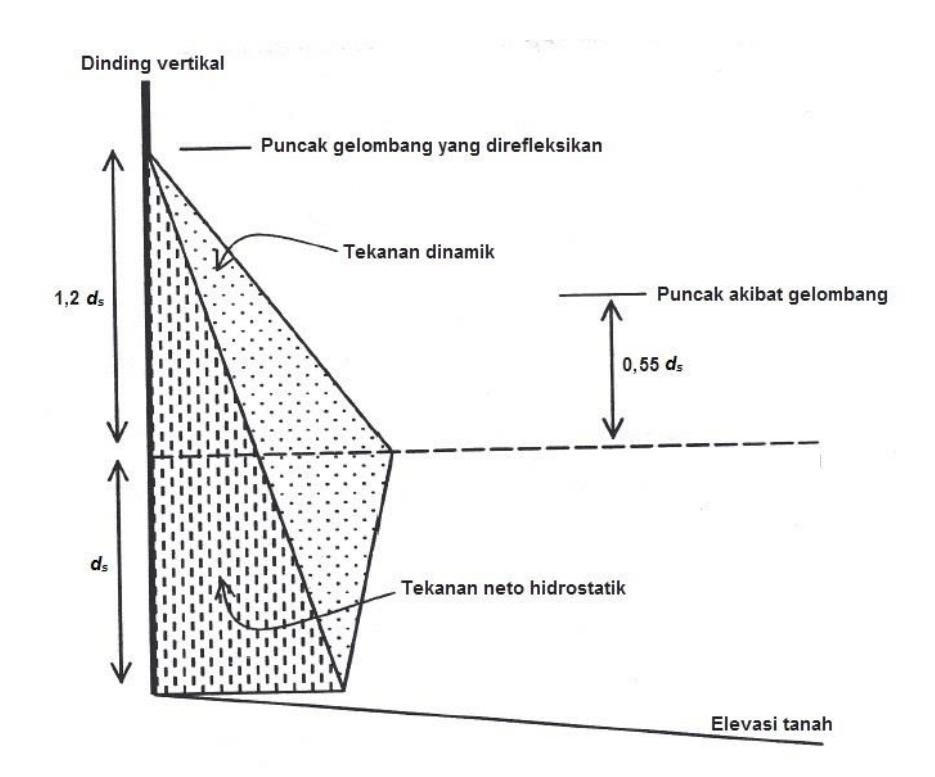

<span id="page-67-0"></span>**Gambar 5.4-1 - Tekanan gelombang pecah yang datang tegak lurus pada dinding vertikal (ruang di belakang dinding vertikal kering)**

<span id="page-67-1"></span>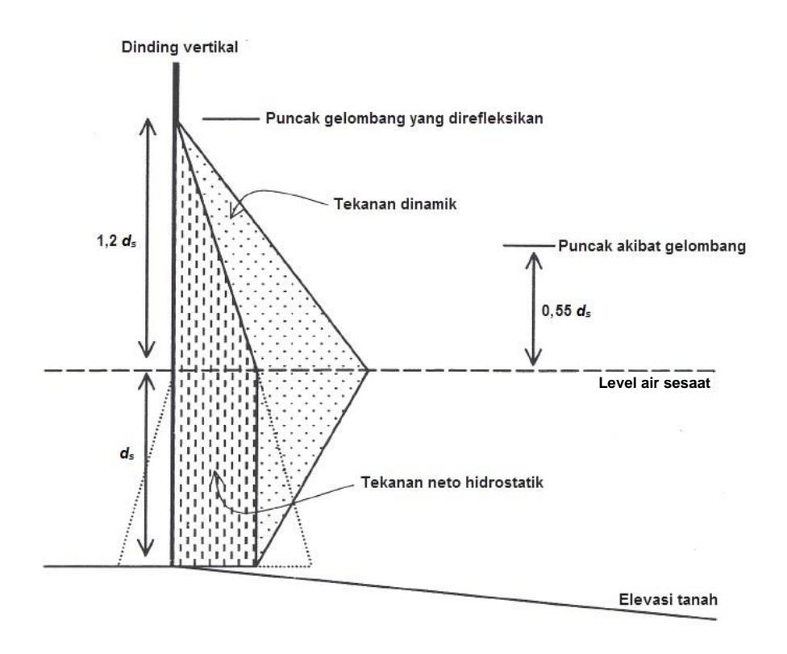

<span id="page-67-3"></span><span id="page-67-2"></span>**Gambar 5.4-2 - Tekanan gelombang pecah yang datang tegak lurus pada dinding vertikal (level air sesaat di kedua sisi dinding sama)**

#### <span id="page-68-0"></span>5.4.4.3 Beban gelombang pecah pada dinding nonvertikal

Gaya gelombang pecah yang ditetapkan dalam Persamaan 5.4-6 dan Persamaan 5.4-7 harus dimodifikasi pada keadaan di mana dinding atau permukaan tempat gelombang pecah nonvertikal. Komponen horizontal dari gaya gelombang pecah harus dihitung sesuai Persamaan 5.4-8.

$$F_{no} = F_s \sin^2 \alpha \tag{5.4-8}$$

dengan

 $F_{nv}$  = komponen horizontal gaya gelombang pecah, dalam lb/ft (kN/m)

 $F_t$  = gaya gelombang pecah neto yang bekerja pada permukaan vertikal, dalam lb/ft (kN/m)

 $\alpha$  = sudut vertikal antara permukaan nonvertikal dan horizontal

# <span id="page-68-1"></span>5.4.4.4 Beban gelombang pecah yang bersudut miring terhadap gelombang datang

Gaya gelombang pecah yang ditetapkan dalam Persamaan 5.4-6 dan Persamaan 5.4-7 harus dimodifikasi untuk gelombang yang bersudut miring terhadap gelombang datang. Gaya gelombang pecah yang bersudut miring harus dihitung sesuai Persamaan 5.4-9.

$$F_{oi} = F_t \sin^2 \alpha \tag{5.4-9}$$

dengan

 $F_{oi}$  = komponen horizontal dari gaya gelombang pecah yang bersudut miring dalam lb/ft (kN/m)

 $F_t$  = gaya gelombang pecah neto (gelombang pecah tegak lurus) yang bekerja pada permukaan vertikal dalam lb/ft (kN/m)

 $\alpha$  = sudut horizontal antara arah gelombang datang dan permukaan vertikal

#### <span id="page-68-2"></span>5.4.5 Beban impak

Beban impak adalah beban yang diakibatkan dari puing, es dan benda apa pun yang dibawa oleh banjir dan menghantam bangunan gedung dan struktur, atau bagiannya. Beban impak harus ditetapkan menggunakan tindakan yang rasional karena beban yang terpusat yang bekerja secara horizontal di lokasi yang paling kritis yang terletak pada atau di bawah elevasi banjir desain.

#### <span id="page-68-3"></span>5.5 Standar konsensus dan kriteria terkait lainnya

Pasal ini berisi daftar standar konsensus dan kriteria terkait lainnya yang harus dianggap sebagai bagian dari Standar ini sejauh dirujuk dalam Pasal ini.

**ASCE/SEI 24** Flood resistant design and construction, ASCE, 2014. Cited in: Section 5.3.3

#### <span id="page-69-0"></span>**6 Beban dan pengaruh tsunami**

#### <span id="page-69-1"></span>**6.1 Persyaratan umum**

#### <span id="page-69-2"></span>**6.1.1 Ruang lingkup**

Bangunan gedung dan struktur lainnya yang berada di dalam zona desain tsunami harus dirancang untuk menghadapi pengaruh tsunami yang dipertimbangkan maksimum, termasuk gaya-gaya hidrostatik dan hidrodinamik, akumulasi beban puing yang terbawa oleh air dan pengaruh-pengaruh beban impak, penurunan muka tanah, dan penggerusan sesuai dengan Pasal ini:

- a. Kategori Risiko Tsunami IV untuk bangunan gedung dan struktur;
- b. Kategori Risiko Tsunami III untuk bangunan gedung dan struktur dengan kedalaman rendaman lebih dari 3 ft (0,914 m) di lokasi manapun di dalam tapak struktur yang terdampak, dan
- c. Jika disyaratkan oleh pemerintah pusat atau pemerintah daerah untuk mengadopsi peraturan bangunan untuk memperhitungkan pengaruh tsunami dalam desain, Kategori Risiko Tsunami II untuk bangunan gedung dengan ketinggian rata-rata di atas bidang tapak (*grade plane*) sebagai acuan, lebih besar dari ketinggian yang ditetapkan dalam peraturan bangunan serta memiliki kedalaman rendaman lebih dari 3 ft (0,914 m) pada setiap lokasi dalam tapak struktur yang direncanakan.

**PENGECUALIAN** Kategori Risiko Tsunami II, bangunan berlantai satu dengan ketinggian berapa pun tanpa mezanin atau level atap yang dapat ditempati dan tidak terdapat peralatan atau fasilitas penting, sehingga tidak perlu dirancang terhadap beban dan pengaruh tsunami yang ditentukan dalam Pasal ini.

Untuk tujuan Pasal ini, kategori risiko tsunami harus ditentukan sesuai dengan Pasal 6.4.

Zona Desain Tsunami akan ditentukan dengan menggunakan *Geodatabase* Desain Tsunami Indonesia. *Geodatabase* Desain Tsunami Indonesia mengacu pada titik-titik *runup* yang berasosiasi dengan batas-batas rendaman dari zona desain tsunami yang tersedia di Buku Peta Tsunami Indonesia.

**PENGECUALIAN** Untuk wilayah pesisir yang berpotensi terendam tsunami namun tidak tercakup dalam Buku Peta Tsunami Indonesia, zona desain tsunami, batas rendaman, dan elevasi *runup* harus ditentukan dengan menggunakan prosedur dengan mempertimbangkan kekhususan lokasi (*site-specific*) pada Pasal 6.7, atau untuk struktur Kategori Risiko Tsunami II atau III, ditentukan sesuai dengan prosedur pada Pasal 6.5.1.1 menurut referensi Buku Peta Tsunami Indonesia.

Komponen-komponen dan sistem nonstruktural dirancang khusus terkait dengan fasilitas-fasilitas kritis Kategori Risiko Tsunami III dan struktur Kategori Risiko Tsunami IV yang diatur dalam Pasal ini harus ditempatkan di atas, terlindungi dari, atau bilamana tidak, harus dirancang untuk tahan terhadap rendaman sesuai dengan Pasal 6.15 sehingga struktur tersebut dapat berfungsi segera setelah kejadian tsunami yang dipertimbangkan maksimum.

**CATATAN** *Geodatabase* Desain Tsunami Indonesia dari titik Referensi *geocode runup* dan Batas rendaman dari Zona Desain Tsunami, tersedia di Buku Peta Tsunami Indonesia. Kenaikan muka laut belum dimasukkan ke dalam peta Zona Desain Tsunami, dan efek tambahan lainnya pada rendaman di lokasi harus dievaluasi secara eksplisit.

#### <span id="page-70-0"></span>**6.2 Definisi**

Definisi berikut hanya berlaku untuk persyaratan tsunami pada Pasal ini. Juga lihat Gambar 6.2-1 untuk menggambarkan beberapa istilah kunci.

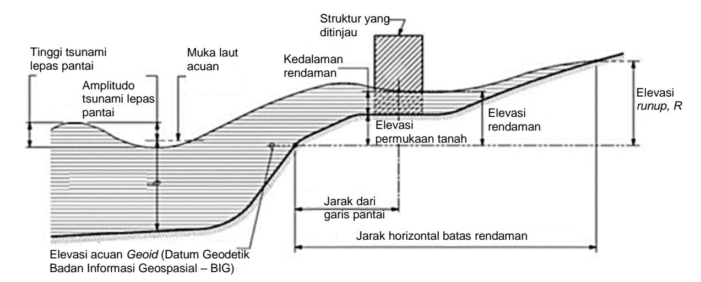

**Gambar 6.2-1 - Ilustrasi dari definisi kunci di sepanjang transek aliran di zona desain tsunami** 

<span id="page-70-1"></span>**Geodatabase desain tsunami Indonesia**: Basis data Indonesia dari *geocoded* dengan titik acuan di lepas pantai pada kedalaman 328 ft (100 m), Amplitudo tsunami, *HT*, dan perioda dominan *TTSU* dari tsunami yang dipertimbangkan maksimum, gambaran kontribusi sumber bahaya secara terpisah, *subsidence* probabilistik, elevasi *runup* dan titik referensi *geocode* yang terendam, dan Peta Zona Desain Tsunami.

**Profil batimetri**: Penampang melintang yang menunjukkan kedalaman laut yang diplot sebagai fungsi jarak horizontal dari suatu titik referensi (seperti garis pantai).

**Gerusan berbentuk kanal**: Gerusan yang dihasilkan oleh aliran yang membelok dan berfokus ke suatu daerah seperti aliran balik di dalam suatu saluran yang sudah ada sebelumnya atau di sepanjang sisi tembok laut.

**Rasio pembendungan (terhadap luas bidang proyeksi vertikal rendaman**): Rasio luas bidang yang membendung, tidak termasuk jendela kaca dan bukaan, yang terendam terhadap total luas bidang proyeksi vertikal yang permukaannya terpapar terhadap tekanan aliran.

**Tingkat kinerja struktural pencegah keruntuhan**: Kondisi kerusakan setelah kejadian di mana suatu struktur telah mengalami kerusakan komponen dan masih memikul beban gravitasi tetapi menahan sedikit atau tidak ada keamanan terhadap keruntuhan.

**Peralatan kritis atau sistem kritis**: Komponen nonstruktural yang dianggap penting fungsinya dari fasilitas kritis atau fasilitas penting atau yang diperlukan untuk mengamankan tempat penampungan material berbahaya.

**Fasilitas kritis**: Bangunan gedung dan struktur yang menyediakan layanan yang ditentukan oleh pemerintah pusat, daerah, atau masyarakat setempat menjadi dasar dalam pelaksanaan rencana pengelolaan tanggap darurat dan pemulihan atau untuk keberlangsungan fungsi suatu komunitas, seperti fasilitas listrik, bahan bakar, air, komunikasi, kesehatan masyarakat, infrastruktur utama transportasi, dan fasilitas dasar dalam menjalankan pemerintahan. Fasilitas kritis terdiri dari semua fasilitas publik dan swasta yang dianggap penting oleh masyarakat untuk layanan vital, tempat perlindungan khusus oleh penduduk, dan penyediaan layanan lain yang penting bagi masyarakat tersebut.

**Tonase bobot mati** (*Dead Weight Tonnage*/DWT): Tonase bobot mati adalah Tonase Perpindahan Kapal (*Displacement Tonnage/*DT) dikurangi dengan Bobot Aktual Kapal (*Lightship Weight/*LWT). DWT adalah klasifikasi yang digunakan terhadap daya dukung kapal yang sama dengan jumlah berat kargo, bahan bakar, air tawar, air balas (pemberat), perbekalan, penumpang, dan awak kapal; tidak termasuk berat kapal itu sendiri. Tonase Perpindahan (DT) adalah berat total kapal yang terisi penuh. Berat Aktual Kapal (LWT) adalah berat kapal tanpa kargo, bahan bakar, air tawar, air balas, perbekalan, penumpang, atau awak kapal.

**Kekuatan desain**: Kekuatan nominal dikalikan dengan faktor ketahanan, .

**Parameter desain tsunami**: Parameter tsunami yang digunakan untuk desain, terdiri dari kedalaman rendaman dan kecepatan aliran pada tahap aliran masuk dan aliran keluar yang paling kritis terhadap struktur dan fluks momentum.

**Sistem dan komponen nonstruktural yang ditetapkan**: komponen dan sistem nonstruktural yang diberi suatu faktor keutamaan komponen, p I , sama dengan 1,5 berdasarkan Pasal 9.1.1 SNI 1726 (Lihat Pasal 13.1.3 ASCE 7-16).

**Aksi terkendali daktilitas**: Setiap aksi pada komponen struktural yang ditandai dengan gaya pasca elastis versus kurva deformasi yang memiliki (1) daktilitas yang memadai dan (2) dihasilkan dari gaya impulsif (perioda pendek) yang tidak kontinu.

**Aksi gaya berkelanjutan**: Setiap aksi pada komponen struktural yang ditandai oleh suatu gaya berkelanjutan atau gaya pasca elastis versus kurva deformasi yang tidak dipengaruhi daktilitas akibat kurangnya daktilitas yang memadai.

**Bilangan Froude**, F<sup>r</sup> : Bilangan tak berdimensi yang didefinisikan sebagai u/ gh , dengan u adalah kecepatan rata-rata aliran di atas penampang melintang tegak lurus terhadap aliran, yang digunakan untuk mengukur kecepatan aliran tsunami yang dinormalisasi sebagai fungsi kedalaman air.

**Erosi umum**: gerusan dan erosi permukaan tanah wilayah rendaman yang signifikan, tidak termasuk aksi gerusan lokal.

**Bidang tapak (***grade plane***):** Sebuah bidang referensi horizontal di lokasi yang mewakili elevasi rata-rata tingkat permukaan tanah matang yang berdampingan dengan struktur di semua dinding eksterior. Apabila permukaan tanah matang miring dari dinding eksterior, bidang tapak dibentuk oleh titik terendah di dalam area antara struktur dan garis properti atau di mana garis batas properti lebih dari 6 ft (1,83 m) dari struktur, antara struktur dan titik 6 ft (1,83 m) dari struktur.

**Skenario bahaya-konsisten tsunami**: Satu atau lebih skenario tsunami pengganti yang dihasilkan dari daerah sumber gempa utama terpilah yang meniru karakteristik bentuk gelombang tsunami lepas pantai untuk lokasi yang ditinjau (Buku Peta Tsunami Indonesia), dengan mempertimbangkan efek bersih dari perlakuan probabilistik yang tidak pasti ke dalam skenario-skenario amplitudo gelombang lepas pantai.

**Beban hidrodinamik**: Beban-beban yang bekerja pada suatu obyek yang melawan aliran air dan disekitarnya.

**Beban hidrostatik**: Beban-beban yang bekerja pada suatu obyek oleh massa air diam.

**Tingkat kinerja struktural hunian segera**: Kondisi kerusakan pasca kejadian dimana struktur tetap aman untuk dihuni.

**Beban impak**: Beban yang berasal dari puing-puing atau benda lain yang terbawa oleh tsunami desain yang menghantam struktur atau bagiannya.

**Kedalaman rendaman**: Kedalaman paras air tsunami desain, termasuk perubahan permukaan laut relatif, dan terhadap bidang tapak pada struktur.

**Elevasi rendaman**: Elevasi permukaan air tsunami desain, termasuk perubahan permukaan laut relatif, dan terhadap datum vertikal di Datum Vertikal Indonesia (Datum BIG)

**Batas rendaman**: Perluasan banjir ke daratan horizontal maksimum untuk tsunami yang dipertimbangkan maksimum, di mana kedalaman rendaman di atas permukaan tanah menjadi nol; jarak horizontal yang terendam, relatif terhadap garis pantai yang didefinisikan dimana ketinggian Datum Vertikal Indonesia (Datum BIG) adalah nol.

**Tingkat kinerja struktural keselamatan**: Keadaan kerusakan pasca kejadian dimana komponen-komponen struktural telah rusak namun masih mempunyai keamanan untuk mencegah keruntuhan parsial atau total.

**Gerusan likuifaksi**: Kasus pembatasan pelunakan tekanan pori terkait dengan aliran hidrodinamik, dimana tegangan efektif turun menjadi nol. Dalam tanah nonkohesif, tegangan geser yang diperlukan untuk memulai transportasi sedimen juga turun menjadi nol selama penggerusan likuifaksi.

**Tsunami ko-seismik lokal**: Tsunami yang didahului oleh gempa dengan efek merusak yang dirasakan di daerah yang terendam.

**Gerusan lokal**: Pemindahan material dari bagian permukaan tanah yang terlokalisir, yang dihasilkan dari aliran di sekitar, di atas, atau di bawah struktur atau elemen struktural.

**Tsunami yang dipertimbangkan maksimum**: Suatu tsunami probabilistik dengan probabilitas terlampaui 2 % dalam periode 50 tahun atau interval rata-rata kejadian ulang 2.475 tahun.

**Fluks momentum**: Kuantitas *ρ*s*hu*<sup>2</sup> untuk lebar satuan berdasarkan kecepatan aliran rata-rata kedalaman *u*, di atas kedalaman rendaman *h*, untuk densitas fluida ρ*<sup>s</sup>* yang ekuivalen, memiliki satuan gaya per satuan lebar.

**Profil dekat pantai:** Profil batimetri penampang dari garis pantai ke kedalaman air 328 ft (100 m).

**Amplitudo tsunami dekat pantai**: Amplitudo tsunami yang dipertimbangkan maksimum yang berada dekat garis pantai yaitu pada kedalaman laut 33 ft (10 m).

**Struktur fasilitas kritis bangunan nongedung:** Struktur bangunan nongedung yang kategori risiko tsunaminya ditetapkan sebagai III atau IV.

**Struktur bangunan nongedung**: Struktur selain bangunan gedung.

**Amplitudo tsunami lepas pantai**: Amplitudo tsunami yang dipertimbangkan maksimum relatif terhadap paras laut referensi, diukur pada kedalaman air tidak terganggu sebesar 328 ft (100 m).

**Tinggi tsunami lepas pantai**: Dimensi vertikal gelombang dari tsunami yang dipertimbangkan maksimum dari lembah ke puncak yang berurutan, diukur pada kedalaman air yang tidak terganggu sebesar 328 ft (100 m), setelah menghilangkan variasi pasang surut.

**Struktur terbuka**: Suatu struktur dimana bagian dalam kedalaman rendaman tidak memiliki rasio pembendungan lebih dari 20 %, dan di mana pembendungan tidak termasuk dinding pelepas tsunami, dan tidak memiliki partisi interior atau bahan yang mencegah tsunami melewati dan keluar dari struktur sebagai puing yang terbawa air.

**Gerusan tiang**: Kasus khusus gerusan lokal yang bertambah dan terjadi pada tiang, *pier* jembatan, atau struktur langsing yang serupa.

**Gerusan** *plunging***:** Suatu kasus khusus gerusan lokal yang bertambah dan terjadi ketika aliran melewati penghalang penuh atau hampir penuh, seperti dinding penghalang dan jatuh secara tajam ke permukaan tanah dibawahnya dan membentuk cekungan.

**Pelunakan tekanan pori**: Mekanisme yang meningkatkan gerusan melalui peningkatan tekanan air dalam pori yang dihasilkan di dalam tanah selama pembebanan tsunami yang cepat dan pelepasan tekanan saat tsunami surut.

**Komponen struktural utama**: Komponen struktural yang diperlukan untuk menahan gaya dan aksi tsunami, dan komponen struktural yang terendam dari sistem pemikul beban gravitasi.

**Literatur yang diakui**: Temuan hasil penelitian yang dipublikasikan dan makalah teknis yang disetujui oleh pihak yang berwenang.

**Paras laut referensi**: Datum paras laut yang digunakan dalam pemodelan rendaman untuk lokasi spesifik, biasanya diambil *Mean High Water Level (*MHWL*).*

**Perubahan paras laut relatif**: Perubahan lokal pada paras laut relatif terhadap tanah, yang mungkin disebabkan oleh kenaikan paras laut dan/atau penurunan muka tanah.

**Elevasi** *runup***:** Elevasi tanah di batas rendaman maksimum tsunami, termasuk perubahan paras laut relatif, terhadap datum referensi yaitu Datum Vertikal Indonesia.

**Komponen struktural sekunder**: Komponen struktural yang bukan utama.

**Pendangkalan**: Peningkatan tinggi gelombang dan kecuraman gelombang yang disebabkan oleh berkurangnya kedalaman perairan saat gelombang bergerak menuju perairan yang lebih dangkal.

**Fisi** *soliton*: Gelombang periode pendek yang dihasilkan di tepi muka gelombang tsunami dalam kondisi pendangkalan pada lereng dasar laut yang panjang dan agak miring atau memiliki diskontinuitas dasar laut yang mendadak, seperti terumbu karang dekat pantai.

**Komponen struktural**: Suatu komponen dari suatu bangunan yang memberikan ketahanan pemikul beban gravitasi atau gaya lateral sebagai bagian dari jalur beban menerus yang disalurkan ke fondasi, termasuk balok, kolom, pelat, breising, dinding, *pier* dinding, balok kopling, dan sambungan.

**Dinding struktural**: Dinding yang memberikan daya dukung pemikul beban gravitasi atau yang dirancang untuk memberikan ketahanan gaya lateral.

*Surge*: Tingkat muka air yang naik secara cepat menghasilkan aliran horizontal ke daratan.

**Gerusan aliran berkelanjutan**: Peningkatan gerusan lokal yang dihasilkan dari percepatan aliran di sekitar struktur. Percepatan aliran dan vortisitas yang terkait meningkatkan tegangan geser di dasar dan menggerus keluar cekungan lokal.

**Gerusan kaki**: Kasus khusus dari peningkatan penggerusan lokal yang terjadi di dasar tembok laut atau struktur serupa di sisi yang secara langsung terkena aliran. Gerusan kaki dapat terjadi baik struktur dilimpasi atau tidak.

**Potongan melintang topografis**: Profil data elevasi vertikal versus jarak horizontal sepanjang penampang melintang, di mana orientasi penampang tegak lurus atau pada beberapa sudut orientasi tertentu terhadap garis pantai.

**Tsunami**: Serangkaian gelombang dengan periode panjang yang bervariasi, yang secara tipikal dihasilkan dari gaya angkat atau subsiden dasar laut akibat gempa.

**Amplitudo tsunami**: Nilai absolut dari perbedaan antara satu puncak atau lembah tertentu dari tsunami dan permukaan laut yang tidak terganggu pada suatu saat.

*Bore* **tsunami**: Muka gelombang pecah yang curam dan turbulen yang dihasilkan di tepi depan dari bentuk gelombang tsunami periode panjang ketika terjadi pendangkalan sepanjang dasar laut yang landai atau diskontinuitas dasar laut yang mendadak seperti terumbu karang dekat pantai, atau di muara sungai, menurut Pasal 6.6.4. Fisi *soliton* di profil dekat pantai dapat sering mengakibatkan terjadinya *bore* tsunami.

**Tinggi** *bore* **tsunami**: Ketinggian gelombang pecah tsunami melanda di atas permukaan air di depan *bore* atau elevasi tanah jika *bore* tiba di lahan kering secara nominal.

**Dinding pelepas tsunami**: Semua tipe dinding yang terkena banjir yang tidak diharuskan untuk menyediakan daya dukung struktural terhadap bangunan atau struktur lainnya dan yang dirancang dan dibangun sedemikian rupa sehingga, sebelum pengembangan kondisi aliran desain dari Kasus Beban Rendaman 1, sebagaimana didefinisikan dalam Pasal 6.8.3.1, dinding tersebut akan runtuh atau terlepas sedemikian rupa sehingga (1) dinding tersebut memungkinkan pelaluan secara benarbenar bebas dari air banjir dan puing-puing yang berasal dari air yang berasal dari luar atau dalam, termasuk isi bangunan yang tidak terikat dan (2) dinding tersebut tidak merusak struktur atau sistem fondasi pendukungnya.

**Zona desain tsunami**: Sebuah kawasan yang diidentifikasi pada peta zona desain tsunami antara garis pantai dan batas rendaman, di mana struktur dianalisis dan dirancang untuk rendaman oleh tsunami yang dipertimbangkan maksimum.

**Peta zona desain tsunami**: Peta yang diberikan dalam Gambar 6.1-1 menunjukkan batas rendaman horizontal potensial dari tsunami yang dipertimbangkan maksimum, atau peta probabilistik yurisdiksi negara atau lokal yang diproduksi sesuai dengan Pasal 6.7 dari Pasal ini.

**Peta evakuasi tsunami**: Peta evakuasi berdasarkan peta rendaman tsunami berdasarkan skenario yang diasumsikan yang dikembangkan dan diberikan kepada masyarakat baik oleh lembaga negara yang berwenang di bawah Program Mitigasi Bahaya Tsunami Nasional. Peta rendaman tsunami untuk evakuasi mungkin sangat berbeda dibandingkan dengan zona desain tsunami probabilistik, dan peta evakuasi tsunami tidak diperuntukkan untuk desain atau tata ruang.

**Daerah rawan tsunami**: Wilayah pesisir Indonesia yang dibahas oleh Pasal ini dengan probabilitas kuantitatif dalam literatur yang diakui sebagai bahaya rendaman tsunami dengan *runup* lebih besar dari 3 ft (0,914 m) yang disebabkan oleh gempa yang membangkitkan tsunami sesuai dengan metode analisis bahaya tsunami probabilistik diberikan dalam Pasal ini.

**Kategori risiko tsunami**: Kategori risiko dari Pasal 1.5, sebagaimana dimodifikasi untuk pemakaian khusus yang berkaitan dengan Pasal ini menurut Pasal 6.4.

**Struktur pengungsian evakuasi vertikal tsunami**: Struktur yang ditetapkan dan dirancang untuk berfungsi sebagai suatu titik pengungsian di mana sebagian populasi masyarakat dapat melakukan evakuasi di atas tsunami bilamana tanah yang tinggi tidak tersedia.

#### <span id="page-75-0"></span>**6.3 Simbol dan notasi**

Abeam = luas proyeksi vertikal elemen balok individual

Acol = luas proyeksi vertikal elemen kolom individual

A<sup>d</sup> = luas proyeksi vertikal puing-puing yang menyumbat dan terkumpul pada struktur

Awall = bidang proyeksi vertikal elemen dinding individual

<sup>a</sup><sup>1</sup> = amplitudo gelombang awal (negatif untuk lembah tsunami pertama)

<sup>a</sup> <sup>2</sup> = amplitudo gelombang berikutnya, atau yang kedua

b = lebar yang terkena gaya

B = lebar bangunan keseluruhan

Cbs = koefisien gaya dengan slab pelepas

Ccx = proporsi koefisien penutupan

C<sup>d</sup> = koefisien *drag* berdasarkan gaya kuasi-tetap (*quasi-steady*)

C dis = koefisien debit limpasan

 $C_{o}$  = koefisien orientasi (dari puing-puing)

 $c_{2V}$  = koefisien gerusan *plunging* 

D = beban mati

 $D_a$  = diameter batuan pelindung pantai (*rock armor*)

 $d_d$  = penurunan tambahan pada tanah sampai dasar dinding di sisi tembok laut atau dinding penahan berdiri bebas yang terkena gerusan *plunging* 

 $D_s$  = kedalaman gerusan

DT = perpindahan tonase

DWT = beban mati tonase kapal

E = beban gempa

 $E_g$  = kepala hidraulik (*hydraulic head*) dalam analisis garis tingkat energi (*Energy Grade Line Analysis*)

E<sub>mh</sub> = Efek beban seismik horizontal, termasuk faktor kekuatan lebih, yang didefinisikan dalam Pasal 7.4.3.1 SNI 1726 (Lihat Pasal 12.4.3.1 ASCE 7-16)

 $F_d$  = gaya *drag* pada elemen atau komponen

 $F_{dx}$  = gaya *drag* pada bangunan gedung atau struktur pada setiap tingkat

 $F_h$  = gaya lateral hidrostatik tidak seimbang

 $F_i$  = gaya desain impak puing

 $F_{ni}$  = gaya impak puing seketika maksimum nominal

 $F_{DW}$  = gaya hidrodinamik pada suatu dinding berlubang-lubang

 $F_r$  = bilangan froude =  $u/\sqrt{(gh)}$ 

 $F_{\tau s u}$  = beban atau efek tsunami

 $f_{uw}$  = gaya lateral seragam ekivalen per satuan lebar

 $F_{\nu}$  = gaya apung

 $F_{w}$  = beban pada dinding atau *pier* 

 $F_{W\theta}$  = gaya pada dinding yang berorientasi pada sudut  $\theta$  terhadap arah aliran

g = percepatan akibat gravitasi

h = kedalaman rendaman tsunami di atas bidang tapak pada struktur

 $H_B$  = tinggi penahan tanggul, tembok laut, atau dinding penahan berdiri bebas

 $h_{e}$  = ketinggian rendaman dari elemen individual

 $h_i$  = kedalaman rendaman pada titik i

 $h_{max}$  = kedalaman rendaman maksimum di atas bidang tapak pada struktur

 $h_a$  = kedalaman air lepas pantai

 $H_0$  = kedalaman di mana penghalang melampaui di atas ketinggian penghalang

 $h_r$  = tinggi air residual dalam gedung

 $h_s$  = tinggi slab lantai struktural di atas bidang tapak pada struktur

 $h_{ss}$  = ketinggian bagian dasar *slab* lantai struktural, diambil di atas bidang tapak pada struktur

 $h_{sx}$  = ketinggian lantai tingkat x

 $H_T$  = amplitudo tsunami lepas pantai

*H*<sub>TSU</sub> = beban yang disebabkan oleh tekanan tanah lateral yang diakibatkan tsunami dalam kondisi terendam

I<sub>tsu</sub> = faktor keutamaan untuk gaya tsunami untuk memperhitungkan ketidakpastian tambahan dalam parameter yang diestimasi

 k = kekakuan efektif dari puing yang memberi impak atau kekakuan lateral dari elemen struktur yang terdampak

 $k_s$  = faktor densitas fluida untuk memperhitungkan suspensi tanah dan bendabenda lain yang lebih kecil yang terbawa aliran yang tidak dipertimbangkan dalam Pasal 6.11

L = beban hidup

 $L_{refuge}$  = beban hidup di area berkumpul publik pada luasan lantai pengungsian tsunami

 $l_w$  = panjang dinding struktural

LWT = berat aktual kapal

m = faktor modifikasi kebutuhan komponen yang memperhitungkan daktilitas yang diharapkan, diterapkan pada kekuatan yang diharapkan dari aksi elemen yang dikendalikan daktilitas, untuk mendapatkan kapasitas komponen struktural yang dapat diterima pada tingkat kinerja tertentu ketika menggunakan prosedur analisis statis linear

 $m_{\text{contents}}$  = massa isi dalam peti kemas

MCT = tsunami yang dipertimbangkan maksimum

 $m_d$  = massa objek puing n = koefisien Manning

 $P_{\mu}$  = tekanan angkat pada *slab* atau elemen horizontal bangunan

 $P_{vr}$  = tekanan angkat tereduksi untuk slab dengan bukaan

q = debit per satuan lebar di atas suatu struktur yang terlimpasi

 $Q_{\!\scriptscriptstyle C\!E}$  = kekuatan yang diharapkan pada elemen struktural

 $Q_{CS}$  = kekuatan yang ditetapkan dari elemen struktural

 $Q_{UD}$  = gaya yang dikendalikan daktilitas yang disebabkan oleh pembebanan gravitasi dan tsunami

 $Q_{UF}$  = gaya maksimum yang dihasilkan dalam elemen yang disebabkan oleh pembebanan gravitasi dan tsunami

R = elevasi *runup* tsunami terpetakan

 $R_{max}$  = rasio respons dinamik

 $R_{\rm s}$  = ketahanan ke arah atas neto dari elemen fondasi

s = kemiringan friksi pada garis tingkat energi

S = beban salju

t = waktu

 $t_d$  = durasi dari impak puing

TDZ = tsunami design zone (zona desain tsunami)

*t<sub>o</sub>* = waktu *offset* dari deretan gelombang

 $T_{TSU}$  = periode gelombang pra-dominan, atau waktu dari awal gelombang (*pulse*) pertama hingga akhir gelombang (*pulse*) kedua

*u* = kecepatan aliran tsunami

U = kecepatan aliran cepat dari aliran plunging

 $u_{\text{max}}$  = kecepatan aliran maksimum tsunami pada struktur

 $u_{\nu}$  = komponen vertikal kecepatan aliran tsunami

 $V_{w}$  = volume air yang dipindakan

 $w_{\alpha}$  = lebar dari bukaan celah di slab

 $W_{\circ}$  = berat struktur

x = jarak horizontal ke arah daratan dari garis pantai BIG

 $x_R$  = jarak batas rendaman terpetakan ke arah daratan dari garis pantai BIG

z = elevasi tanah di atas Datum Vertikal Indonesia (Datum BIG)

 $\alpha$  = koefisien bilangan Froude dalam analisis garis tingkat energi

 $\beta$  = sudut bangun efektif di bagian hilir dari struktur penghalang ke struktur yang ditinjau

 $\gamma_s$  = densitas berat fluida minimum untuk beban hidrostatik desain

 $\gamma_{sw}$  = densitas berat efektif air laut

 $\Delta x_i$  = jarak inkremental yang digunakan dalam analisis garis tingkat energi

 $\xi_{100}$  = parameter kemiripan *surf* menggunakankarakteristik gelombang dekat pantai 328 ft (100 m)

 $\eta$  = elevasi permukaan bebas sebagai fungsi waktu, t, digunakan untuk membuat kondisi batas lepas pantai pada kontur kedalaman 328 ft (100m)

 $\theta$  = sudut antara sumbu longitudinal dari suatu dinding dan arah aliran

 $\phi$  = faktor ketahanan struktural

 $\rho_{\rm s}$  = densitas massa fluida minimum untuk beban hidrodinamik desain

 $\rho_{sw}$  = densitas massa efektif dari air laut

 $\varphi$  = kemiringan rata-rata dari tanah pada struktur

 $\varphi_i$  = kemiringan rata-rata tanah pada titik i

 $\Phi$  = kemiringan sudut rata-rata profil dekat pantai

 $\psi$  = sudut antara aliran cepat *plunging* di lubang gerusan dan bagian yang horizontal

 $\Omega$  = frekuensi sudut dari bentuk gelombang, sama dengan,  $2\pi T$  dengan T adalah periode gelombang

 $\Omega_{\mathcal{O}}$  = faktor kekuatan lebih untuk sistem penahan gaya lateral yang diberikan dalam Tabel 12 SNI 1726 (Lihat Tabel 12.2-1 ASCE 7-16).

#### <span id="page-79-0"></span>**6.4 Kategori risiko tsunami**

Untuk keperluan Pasal ini, kategori risiko tsunami untuk bangunan dan struktur lainnya adalah kategori risiko yang diberikan dalam Pasal 1.5 dengan modifikasi berikut:

- 1. Pemerintah Pusat, Provinsi, dan Kabupaten/Kota, diizinkan untuk memasukkan fasilitas kritis dalam Kategori Risiko Tsunami III, seperti stasiun pembangkit listrik, fasilitas pengolahan air minum, fasilitas pengolahan air limbah, dan fasilitas umum lainnya tidak termasuk dalam Kategori Risiko IV.
- 2. Struktur berikut tidak perlu dimasukkan dalam Kategori Risiko Tsunami IV, dan pemerintah Propinsi, Kabupaten/Kota, diizinkan untuk menetapkannya sebagai Kategori Risiko Tsunami II atau III:
  - a. stasiun pemadam kebakaran, fasilitas ambulan, dan garasi kendaraan darurat;
  - b. tempat berlindung (*shelter*) gempa bumi atau badai;
  - c. hanggar pesawat darurat; dan
  - d. kantor polisi yang tidak memiliki sel tahanan dan yang tidak diperlukan secara khusus untuk tanggap darurat pasca bencana sebagai fasilitas kritis.
- 3. Struktur pengungsian evakuasi vertikal tsunami harus dimasukkan dalam Kategori Risiko Tsunami IV.

#### <span id="page-79-1"></span>**6.5 Analisis desain kedalaman rendaman dan kecepatan aliran**

#### <span id="page-79-2"></span>**6.5.1 Bangunan dan struktur lainnya Kategori Risiko Tsunami II dan III**

Ketinggian rendaman tsunami yang dipertimbangkan maksimum dan karakteristik kecepatan aliran tsunami pada bangunan Kategori Risiko Tsunami II atau III atau struktur lainnya harus ditentukan dengan menggunakan analisis garis tingkat energi Pasal 6.6 menggunakan batas rendaman dan ketinggian *runup* tsunami yang dipertimbangkan maksimum seperti yang diberikan dalam Gambar 6.1-1.

Analisis bahaya probabilistik tsunami spesifik lokasi (PTHA) dalam Pasal 6.7 harus diizinkan sebagai alternatif analisis garis tingkat energi. Kecepatan dengan kekhususan lokasi yang ditentukan oleh PTHA harus memenuhi batasan yang tercantum dalam Pasal 6.7.6.8.

**PENGECUALIAN** Untuk daerah rawan tsunami yang tidak tercakup dalam Gambar 6.1-1, prosedur Pasal 6.5.1.1 berlaku untuk bangunan dan struktur lainnya Kategori Risiko Tsunami II dan III.

#### <span id="page-79-3"></span>**6.5.1.1 Evaluasi** *runup* **untuk wilayah dimana nilai peta tidak ada**

Untuk bangunan dan struktur lainnya Kategori Risiko Tsunami II dan III dimana batas rendaman peta tidak ada ditunjukkan pada Gambar 6.1-1, rasio ketinggian *runup*  tsunami di atas Muka Air Rata-rata Tertinggi (MHWL) terhadap amplitudo tsunami lepas pantai, *R/HT*, diizinkan untuk ditentukan menggunakan parameter kemiripan *surf,* <sup>100</sup> , menurut Persamaan (6.5-2a, b, c, d, atau e) dan Gambar. 6.5-1.

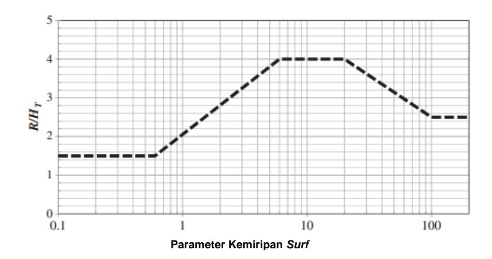

<span id="page-80-0"></span>**Gambar 6.5-1 - Rasio** *runup R/HT***, sebagai fungsi kemiringan rata-rata dari parameter kemiripan** *surf,*  <sup>100</sup> **, di mana batas rendaman peta tidak ada**

Parameter kemiripan *surf,* <sup>100</sup> , untuk aplikasi rekayasa tsunami ditentukan sesuai dengan Persamaan (6.5-1).

$$\xi_{100} = \frac{T_{\text{TSU}}}{\cot \Phi} \sqrt{\frac{g}{2\pi H_T}}$$
 (6.5-1)

dengan Φ adalah sudut kemiringan rata-rata dari profil dekat pantai diambil dari kedalaman air 328 ft (100 m) terhadap ketinggian Muka Air Rata-rata Tertinggi (*MHWL*) sepanjang sumbu potongan melintang topografi untuk tapak tersebut. H<sup>T</sup> adalah amplitudo tsunami lepas pantai, dan TTSU adalah periode gelombang tsunami pada kedalaman 328 ft (100-m). H<sup>T</sup> dan TTSU ditunjukkan pada Buku Peta Tsunami Indonesia.

Untuk 
$$\xi_{100} \le 0.6$$
  $R/H_T = 1.5$  (6.5-2a)

Untuk 
$$\xi_{100} > 0.6 \,\mathrm{d}$$
 dan  $\xi_{100} \le 6$   
 $R/H_T = 2.5[\log_{10}(\xi_{100})] + 2.05$  (6.5-2b)

Untuk 
$$\xi_{100} > 6 \,\text{dan} \,\, \xi_{100} \le 20 \,\, R/H_T = 4.0$$
 (6.5-2c)

Untuk 
$$\xi_{100} > 20 \operatorname{dan} \xi_{100} \le 100$$
, (6.5-2d)

$$R/H_T = -2.15[\log_{10}(\xi_{100})] + 6.80$$

Untuk 
$$\xi_{100} > 100$$
,  $R/H_T = 2.5$  (6.5-2e)

**PENGECUALIAN** Persamaan ini tidak digunakan jika ada perkiraan konvergensi gelombang seperti di tanjung, di teluk berbentuk V, atau di mana medan aliran di darat diperkirakan akan bervariasi secara signifikan dalam arah yang sejajar dengan garis pantai karena variabilitas topografi sepanjang pantai.

#### <span id="page-81-0"></span>**6.5.2 Bangunan dan struktur lainnya Kategori Risiko Tsunami IV**

Analisis garis tingkat energi pada Pasal 6.6 harus dilakukan untuk bangunan dan struktur lainnya Kategori Risiko Tsunami IV, dan Analisis Probabilistik Bahaya Tsunami (*Probabilistic Tsunami Hazard Analysis/*PTHA) dengan kekhususan lokasi dalam Pasal 6.7 juga harus dilakukan. Kecepatan sesuai kekhususan lokasi yang ditentukan oleh *PTHA* sesuai kekhususan lokasi ditentukan lebih kecil dari analisis garis tingkat energi yang memenuhi batasan dalam Pasal 6.7.6.8. Kecepatan sesuai kekhususan lokasi ditentukan lebih besar dari analisis garis tingkat energi yang digunakan.

**PENGECUALIAN** Untuk struktur selain dari struktur pengungsian evakuasi vertikal tsunami, analisis probabilistik bahaya tsunami sesuai kekhususan lokasi tidak perlu dilakukan apabila kedalaman rendaman yang dihasilkan dari analisis garis tingkat energi ditentukan kurang dari 12 ft (3,66 m) di titik mana pun. dalam lokasi struktur Kategori Risiko Tsunami IV.

#### <span id="page-81-1"></span>**6.5.3 Perubahan paras laut**

Pengaruh fisik langsung dari perubahan paras laut relatif potensial harus dipertimbangkan dalam menentukan kedalaman rendaman maksimum selama siklus umur layan proyek. Siklus umur layan proyek tidak kurang dari 50 tahun harus digunakan. Tingkat minimum perubahan paras laut relatif potensial adalah tingkat perubahan paras laut yang tercatat secara riwayat untuk lokasi tersebut. Perubahan paras laut relatif potensial selama siklus umur layan proyek harus ditambahkan pada Muka Laut Acuan dan pada elevasi *runup* tsunami.

#### <span id="page-81-2"></span>**6.6 Kedalaman rendaman dan kecepatan aliran berdasarkan** *runup*

#### <span id="page-81-3"></span>**6.6.1 Kedalaman rendaman maksimum dan kecepatan aliran berdasarkan** *runup*

Kedalaman maksimum rendaman dan kecepatan aliran yang terkait dengan tahapan banjir tsunami harus ditentukan sesuai dengan Pasal 6.6.2. Kecepatan aliran yang dihitung tidak boleh diambil kurang dari 10 ft/s (3,0 m/s) dan tidak perlu diambil lebih besar dari yang lebih kecil antara 1,5 1/2 gh max dan 50 ft/s (15,2 m/s).

Bila elevasi topografi maksimum sepanjang potongan melintang topografis antara garis pantai dan batas rendaman lebih besar daripada elevasi *runup*, salah satu metode berikut harus digunakan:

Prosedur sesuai kekhususan lokasi dari Pasal 6.7.6 harus digunakan untuk menentukan kedalaman rendaman dan kecepatan aliran di lokasi, sesuai dengan rentang kecepatan terhitung yang disebutkan di atas.

Untuk penentuan kedalaman rendaman dan kecepatan aliran di lokasi, prosedur Pasal 6.6.2, analisis garis tingkat energi harus digunakan, dengan asumsi elevasi *runup* dan batas rendaman horizontal yang mempunyai paling sedikit 100 % dari elevasi topografis maksimum sepanjang potongan melintang topografis.

#### <span id="page-81-4"></span>**6.6.2 Analisis garis tingkat energi dari kedalaman rendaman maksimum dan kecepatan aliran**

Kecepatan maksimum dan kedalaman rendaman maksimum sepanjang profil elevasi tanah hingga batas rendaman harus ditentukan dengan menggunakan analisis garis tingkat energi. Orientasi profil potongan melintang topografis yang digunakan harus ditentukan dengan mempertimbangkan persyaratan Pasal 6.8.6.1. Elevasi tanah sepanjang potongan melintang, <sup>z</sup> <sup>i</sup> , harus direpresentasikan sebagai rangkaian segmen miring linier masing-masing dengan koefisien Manning konsisten dengan gesekan kekasaran makro muka tanah (*terrain)* setara dengan dengan segmen *terrain* tersebut. Analisis garis tingkat energi harus dilakukan secara bertahap sesuai dengan Persamaan (6.6-1) melintasi potongan melintang topografis dalam prosedur bertahap. Persamaan (6.6-1) harus diterapkan di seluruh potongan melintang topografis dari runup di mana kepala hidraulik pada batas rendaman,  $x_R$ , adalah nol, dan elevasi air sama dengan runup, R, dengan menghitung perubahan kepala hidraulik pada setiap kenaikan segmen terrain menuju garis pantai sampai mencapai lokasi yang diinginkan, seperti ditunjukkan pada Gambar 6.6-1.

$$\boldsymbol{E}_{q,i} = \boldsymbol{E}_{q,i-1} + (\varphi_i + \boldsymbol{s}_i) \Delta \boldsymbol{x}_i \tag{6.6-1}$$

dengan

 $E_{g,i}$  = kepala hidraulik di titik  $i = h_i + u_i^2 / 2g = h_i (1 + 0.5F_{ri}^2)$ ;

 $h_i$  = kedalaman rendaman di titik i:

 $u_i$  = kecepatan aliran maksimum di titik i;

 $\varphi_i$  = kemiringan daratan rata-rata antara titik *i* dan *i* - 1;

 $F_{ri}$  = bilangan Froude =  $u/(gh)^{1/2}$  di titik i;

 $\Delta X_i = X_{i-1} - X_i$ , tahap kenaikan dari jarak horizontal, yang tidak lebih kasar dari spasi 100 ft (30,5 m);

 $X_i$  = jarak horizontal ke arah daratan dari garis pantai BIG di titik i; dan

 $s_i$  = kemiringan friksi garis tingkat energi antara titik i dan i - 1, dihitung menggunakan Persamaan (6.6-2).

$$s_{i} = (u_{i})^{2} / [(1,49/n)^{2} h_{i}^{4/3}] = gF_{n}^{2} / [(1,49/n)^{2} h_{i}^{1/3}]$$
(6.6-2)

$$s_{i} = (u_{i})^{2} / [(1,00/n)^{2} h_{i}^{4/3}] = gF_{i}^{2} / [(1,00/n)^{2} h_{i}^{1/3}]$$
(6.6-2.si)

dengan

n = koefisien Manning dari segmen *terrain* yang dianalisis, menurut Tabel 6.6-1, dan

 $E_R$  = kepala hidraulik dari nol di titik *runup* 

Kecepatan akan ditentukan sebagai fungsi kedalaman rendaman, sesuai dengan nilai yang ditentukan dari bilangan Froude yang dihitung menurut Persamaan (6.6-3).

$$F_r = \alpha \left( 1 - \frac{X}{X_R} \right)^{0.5} \tag{6.6-3}$$

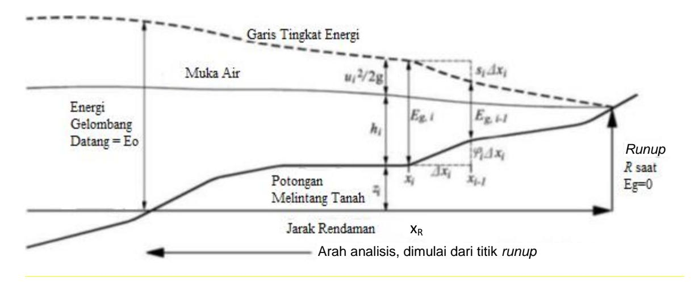

#### CATATAN:

R = elevasi *runup* tsunami desain di atas datum BIG;

 $x_R$  = jarak rendaman desain ke arah daratan dari garis pantai BIG; dan

 $z_i$  = elevasi tanah di atas Datum BIG di titik i.

<span id="page-83-1"></span>Gambar 6.6-1 - Metode energi untuk kedalaman rendaman tsunami dan kecepatan di atas daratan

Tabel 6.6-1 - Kekasaran Manning, n, untuk analisis garis tingkat energi

<span id="page-83-2"></span>

| Deskripsi permukaan gesekan                   | п                        |
|-----------------------------------------------|--------------------------|
| Gesekan dasar di perairan dekat pantai        | 0,025 sampai dengan 0,03 |
| Lahan atau bidang terbuka                     | 0,025                    |
| Semua kasus lainnya                           | 0,03                     |
| Bangunan dengan paling sedikit kepadatan kota | 0,04                     |

dengan nilai koefisien bilangan Froude,  $\alpha$ , sebesar 1,0 harus digunakan. Bila *bore* tsunami perlu dipertimbangkan menurut Pasal 6.6.4, kondisi *bore* tsunami yang ditentukan dalam Pasal 6.10.2.3 dan Pasal 6.10.3.3 harus diterapkan dengan menggunakan nilai  $h_e$  dan  $(h_e u^2)_{\text{bore}}$  dievaluasi dengan  $\alpha = 1,3$ .

#### <span id="page-83-0"></span>6.6.3 Kekasaran terrain

Diizinkan untuk melakukan analisis rendaman dengan asumsi kondisi tanah kosong dengan kekasaran makro yang setara. Kekasaran dasar harus ditentukan menggunakan koefisien Manning, *n*. Diizinkan untuk menggunakan nilai-nilai yang tercantum dalam Tabel 6.6-1 atau nilai lain berdasarkan analisis *terrain* dalam literatur yang diakui atau secara khusus divalidasi untuk model rendaman yang digunakan.

#### <span id="page-84-0"></span>6.6.4 Bore tsunami

Bore tsunami harus dipertimbangkan jika salah satu kondisi berikut ini terjadi:

- 1. Kemiringan batimetrik dekat pantai adalah 1/100 atau lebih landai,
- 2. Terumbu karang dekat pantai yang dangkal atau diskontinuitas mirip tangga lainnya yang terjadi pada kemiringan batimetri dekat pantai
- 3. Bilamana secara riwayat terdokumentasi,
- 4. Seperti yang dijelaskan dalam literatur yang diakui, atau
- 5. Sebagaimana ditentukan dari analisis rendaman sesuai kekhususan lokasi.

Jika *bore* tsunami dianggap terjadi, maka kondisi *bore* tsunami yang ditentukan dalam Pasal 6.10.2.3 dan Pasal 6.10.3.3 harus diterapkan.

#### <span id="page-84-1"></span>6.6.5 Kecepatan aliran teramplifikasi

Kecepatan aliran yang ditentukan dalam Pasal ini harus disesuaikan untuk amplifikasi aliran sesuai dengan Pasal 6.8.5 bilamana sesuai. Nilai yang disesuaikan tidak perlu melebihi batas maksimum yang ditentukan dalam Pasal 6.6.1.

# <span id="page-84-2"></span>6.7 Kedalaman rendaman dan kecepatan aliran berdasarkan analisis probabilistik bahaya tsunami sesuai kekhususan lokasi

Bila disyaratkan oleh Pasal 6.5, kedalaman rendaman dan kecepatan aliran harus ditentukan oleh studi rendaman sesuai kekhususan lokasi yang memenuhi persyaratan Pasal ini. Analisis sesuai kekhususan lokasi harus menggunakan *Geodatabase Design* Tsunami Indonesia dari titik-titik acuan *geocode* dari amplitudo tsunami lepas pantai dan periode dominan bentuk gelombang (*waveform*) ditunjukkan pada Buku Peta Tsunami Indonesia sebagai input pada model numerik rendaman atau harus menggunakan model pembangkitan, penjalaran, dan perendaman terpadu yang mereplikasi amplitudo dan periode gelombang tsunami lepas pantai yang diberikan dari sumber seismik yang tersedia di Buku Peta Tsunami Indonesia.

#### <span id="page-84-3"></span>6.7.1 Bentuk gelombang tsunami

Bentuk Gelombang tsunami yang digunakan sepanjang batas lepas pantai pada kedalaman batimetri 328 ft (100 m) harus dibuat sesuai dengan Persamaan (6.7-1), seperti digambarkan pada Gambar 6.7-2.

$$\eta = a_1 e^{-[\omega(t-t_o)]^2} + a_2 e^{-\left[\omega\left(t-\frac{T_{TSU}}{2}-t_o\right)\right]^2}$$
(6.7-1)

dengan tinggi gelombang total dari bentuk gelombang adalah = abs <sup>a</sup><sup>1</sup> abs <sup>a</sup> <sup>2</sup> , dan

- = elevasi permukaan bebas (dalam ft atau m) sebagai fungsi waktu, *t* , digunakan untuk menentukan kondisi batas lepas pantai pada kontur kedalaman 328 ft (100 m);
- <sup>a</sup>1 = amplitudo gelombang awal (dalam ft atau m); harus negatif untuk tsunami yang diawali bentuk lembah;
- <sup>a</sup> <sup>2</sup> = amplitudo gelombang berikut, atau kedua, (dalam ft atau m);
- TTSU = periode gelombang, atau waktu mulai dari awal gelombang (*pulse*) pertama hingga akhir gelombang (*pulse*) kedua
- = frekuensi sudut dari bentuk gelombang, sama dengan TSU 2 /T ; dan
- t = waktu ofset dari deretan gelombang, umumnya ditetapkan sama dengan TTSU

Kemungkinan amplitudo awal negatif dan positif dari tsunami harus dipertimbangkan, dengan bentuk gelombang yang diberikan oleh Persamaan (6.7-1) menggunakan nilai parameter yang diberikan oleh *Geodatabase Design* Tsunami Indonesia dari titik-titik acuan *geocode* yang ditunjukkan pada Buku Peta Tsunami Indonesia. Untuk model numerik rendaman, nilai-nilai yang diberikan pada Buku Peta Tsunami Indonesia juga harus digunakan untuk menentukan setidaknya dua bentuk gelombang yang mungkin menggunakan nilai yang ditetapkan minimum dan maksimum sebesar <sup>a</sup> <sup>2</sup> . Suatu model pembangkitan, penjalaran, dan perendaman terpadu yang mereplikasi amplitudo gelombang tsunami lepas pantai yang diberikan dan periode dari sumber-sumber seismik tidak perlu menggunakan nilai yang diberikan pada Buku Peta Tsunami Indonesia.

#### <span id="page-85-0"></span>**6.7.2 Sumber tsunamigenik**

Sumber-sumber tsunami harus mempertimbangkan hal-hal berikut sampai pada suatu tingkat dimana probabilistik bahaya didokumentasikan dalam literatur yang diakui:

- 1. Sumber zona subduksi lokal dan jauh: Diizinkan untuk menggunakan sistem zona subduksi yang digambarkan dan didiskritisasi di cekungan Samudera Hindia dan Pasifik serta di perairan Indonesia yang terdiri dari sistem sub-patahan persegi panjang dan parameter tektonik yang terkait.
  - a. Sumber utama seismik harus mencakup tetapi tidak terbatas pada patahanpatahan bawah laut di dekat Indonesia dan juga patahan-patahan yang berada di tempat jauh,
  - b. Nilai momen maksimum yang dipertimbangkan dalam distribusi probabilitas seismisitas harus mencakup nilai yang diberikan pada Buku Peta Tsunami Indonesia.
- 2. Lokal, sumber patahan seismik zona nonsubduksi lokal yang mampu menghasilkan nilai momen sebesar 7 atau lebih, termasuk sumber patahan lepas pantai dan/atau bawah laut yang bersifat tsunamigenik.
- 3. Sumber longsoran pantai dan bawah laut lokal yang terdokumentasikan dalam literatur yang diakui sebagai tsunamigenik yang memiliki kemiripan *runup*, sebagaimana ditentukan oleh bukti sejarah atau memiliki probabilitas yang diperkirakan dalam tingkat nilai sumber-sumber utama patahan seismik.

#### <span id="page-86-0"></span>**6.7.3 Fungsi tsunami bersumber pada unit** *rupture* **gempa untuk amplitudo tsunami lepas pantai**

Algoritma pemodelan tsunami harus didasarkan pada distribusi slip *rupture* gempa untuk peristiwa tsunami, yang diizinkan untuk direpresentasikan oleh kombinasi linier fungsi-fungsi sumber unit menggunakan basis data yang dihitung terlebih dahulu dari fungsi green sebagai sumber tsunami.

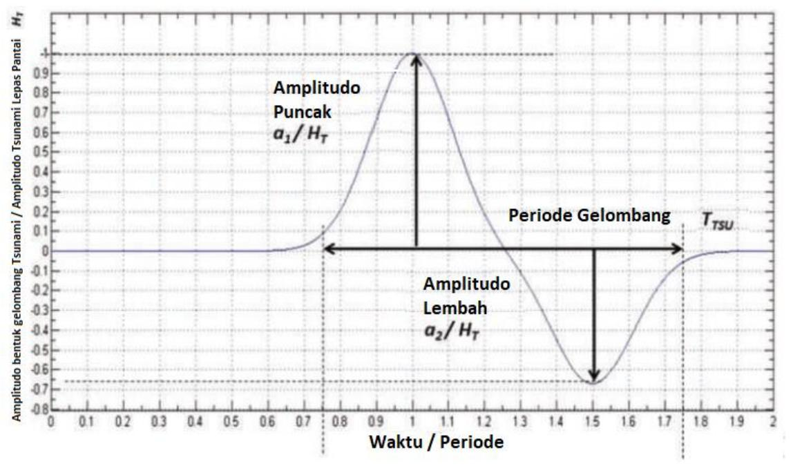

<span id="page-86-1"></span>**Gambar 6.7-2 - Ilustrasi parameter bentuk gelombang datang tsunami lepas pantai pada kedalaman 328 ft (100 m)**

- 1. Pembangkitan bentuk gelombang tsunami diizinkan untuk dimodelkan dengan mendekonstruksi sebuah tsunami yang dibangkitkan oleh gempa menjadi jumlah bentuk gelombang tsunami individual yang tersusun dari serangkaian sub-patahan bersumber unit terskala yang menggambarkan *rupture* gempa dalam hal lokasi, orientasi, dan arah serta urutan *rupture*.
- 2. Bentuk gelombang yang menentukan deret waktu dari ketinggian dan kecepatan gelombang dari slip unit pada setiap sub-patahan harus dibobot oleh distribusi slip atau *rupture* aktual untuk kejadian dan kemudian dijumlah secara linier.
- 3. Algoritma harus memperhitungkan perpindahan vertikal ko-seismik.

#### <span id="page-87-0"></span>**6.7.4 Perlakuan pemodelan dan ketidakpastian alami**

Pendekatan *logic tree* yang terbobot secara statistik harus digunakan untuk memperhitungkan ketidakpastian epistemik dalam parameter model dan harus memberikan sampel gempa tsunamigenic dan probabilitas kejadian dari data tektonik, geodetik, historis, dan paleotsunami, serta perkiraan laju konvergensi lempeng, sebagai berikut:

- 1. Membagi lagi probabilitas kejadian secara sistematis untuk memperhitungkan variasi parameter magnitudo, kedalaman patahan, geometri, lokasi, distribusi slip, dan luas *rupture* kejadian yang konsisten dengan magnitudo maksimum, dan variasi pasang surut mempertimbangkan setidaknya muka laut acuan.
- 2. Untuk memperluas pemakaiannya secara praktis dan agar dapat dikuantifikasi, ikuti pendekatan *logic tree* yang serupa untuk menentukan sampel sumber tsunami seperti gempa zona non-subduksi, tanah longsor, dan letusan gunung berapi.

Ketidakpastian yang tidak disengaja, seperti variabilitas alami dalam proses sumber, ketidakpastian pemodelan, dan variasi pasang surut karena berkaitan dengan proses dekat pantai dan gelombang *runup*, harus dimasukkan dalam analisis probabilistik. Ketika menghitung durasi gelombang panjang dengan beberapa maxima dalam deret waktu tsunami, diizinkan untuk mempertimbangkan variabilitas pasang surut dengan memilih elevasi pasang surut rasional secara independen dari distribusi probabilistik tahap pasang surut untuk setiap gelombang maksimum. Pemotongan distribusi ketidaksengajaan harus dipilih pada tingkat yang sesuai untuk periode ulang tetapi tidak boleh kurang dari satu standar deviasi berdasarkan analisis regresi dari hasil komputasi versus data pangamatan pada Pasal 6.7.6.7.2.

#### <span id="page-87-1"></span>**6.7.5 Amplitudo tsunami lepas pantai**

Analisis probabilistik harus dilakukan baik dengan perhitungan langsung sesuai dengan Pasal 6.7.5.2 atau dengan melakukan analisis probabilistik bahaya tsunami untuk suatu daerah ditinjau untuk menghasilkan peta bahaya amplitudo tsunami lepas pantai sesuai kekhususan lokasi dan perioda gelombang pradominan pada kedalaman 328 ft (100 m) sesuai dengan berikut ini:

- 1. Model Elevasi Digital (DEM) dari kumpulan data global, regional, dan pesisir harus digunakan untuk mencakup domain komputasi dari sumber tsunami ke lokasi yang ditinjau. Grid batimetri untuk samudera harus memiliki resolusi DEM lebih halus dari 4,35 mi (7000 m), dan rezim model lepas pantai dengan kedalaman lebih dari 656 ft (200 m) harus memiliki resolusi DEM lebih halus dari 3281 ft (1000 m).
- 2. Deformasi permukaan bumi harus ditentukan dari parameter sumber seismik menggunakan model patahan planar dengan menperghitung perubahan vertikal terhadap dasar laut.

#### <span id="page-87-2"></span>**6.7.5.1 Amplitudo tsunami lepas pantai untuk sumber-sumber seismik jauh**

Amplitudo tsunami lepas pantai harus ditentukan secara probabilistik sesuai dengan hal-hal berikut:

1. Kombinasi terbobot bentuk gelombang tsunami yang ditentukan untuk setiap unit segmen patahan sesuai dengan distribusi slip harus digunakan untuk penjalaran tsunami di laut dalam menggunakan persamaan gelombang panjang linear, juga disebut persamaan gelombang perairan dangkal, di mana kedalaman air jauh lebih kecil dari panjang gelombang, untuk memperhitungkan variasi spasial pada kedalaman dasar laut.

- 2. Distribusi amplitudo gelombang lepas pantai dan terkait dengan parameter gelombang termasuk periode, harus ditentukan untuk tingkat terlampaui desain (*design exceedance rate*) sebesar Tsunami yang Dipertimbangkan Maksimum 2.475 tahun dengan mempertimbangkan ketidakpastian menurut Pasal 6.7.4
- 3. Analisis harus mencakup pemilahan sumber seismik dan kaitannya dengan nilai momen yang bersama-sama berkontribusi paling tidak 90 % terhadap bahaya neto tsunami lepas pantai di lokasi yang ditinjau.
- 4. Nilai amplitudo gelombang tsunami lepas pantai tidak boleh kurang dari 80 % dari nilai yang diberikan oleh Buku Peta Tsunami Indonesia untuk amplitudo lepas pantai di luar Tsunami yang Dipertimbangkan Maksimum.

#### <span id="page-88-0"></span>**6.7.5.2 Perhitungan langsung dari probabilistik rendaman dan** *runup*

Diizinkan untuk menghitung probabilistik rendaman dan *runup* secara langsung dari probabilistik sekumpulan sumber, karakterisasi sumber, dan ketidakpastian yang konsisten dengan Pasal 6.7.2, Pasal 6.7.4, dan kondisi perhitungan yang ditentukan dalam Pasal 6.7.6. Amplitudo gelombang lepas pantai yang dihitung tidak boleh lebih rendah dari 80 % dari amplitudo gelombang yang diberikan pada Buku Peta Tsunami Indonesia.

#### <span id="page-88-1"></span>**6.7.6 Prosedur untuk menentukan rendaman dan** *runup* **tsunami**

#### <span id="page-88-2"></span>**6.7.6.1 Parameter rendaman desain representatif**

Setiap peristiwa tsunami terpilah harus dianalisis untuk menentukan parameter desain representatif yang terdiri dari *runup* maksima, kedalaman rendaman, kecepatan aliran, dan fluks momentum.

#### <span id="page-88-3"></span>**6.7.6.2 Subsiden seismik sebelum kedatangan tsunami**

Jika sumber seismik adalah kejadian subduksi lokal, rendaman Tsunami yang Dipertimbangkan Maksimum harus ditentukan untuk keseluruhan nilai elevasi subsiden harus langsung dihitung untuk mekanisme sumber seismik.

#### <span id="page-88-4"></span>**6.7.6.3 Parameter kekasaran makro model**

Diizinkan untuk melakukan pemetaan rendaman di bawah kondisi permukaan tanah kosong dengan kekasaran makro. Kekasaran dasar diizinkan untuk ditetapkan menggunakan koefisien Manning, *n*. Kecuali, jika ditentukan lain untuk suatu lokasi, nilai yang ditetapkan awal sebesar 0,025 atau 0,030 harus digunakan untuk dasar laut dan di darat. Penggunaan nilai-nilai lain berdasarkan analisis *terrain* harus berdasarkan literatur yang diakui atau secara khusus model rendaman harus divalidasi dengan mengacu pada nilai acuan lapangan historis tsunami. Jika nilai yang digunakan selain yang ditetapkan awal, efek degradasi kekasaran karena merusak karakteristik aliran harus dipertimbangkan dalam pemilihan koefisien Manning.

#### <span id="page-89-0"></span>**6.7.6.4 Pemodelan rendaman nonlinier**

Persamaan gelombang perairan dangkal nonlinier atau teknik pemodelan yang sepadan, harus digunakan untuk mentransformasi amplitudo gelombang lepas pantai dari kedalaman 328 ft (100 m) ke arah pantai, ke amplitudo tsunami dekat pantai dan rendaman maksimum. Efek berikut harus dimasukkan sebagaimana berlaku untuk batimetri:

- 1. *Shoaling*, refraksi, dan difraksi untuk menentukan amplitudo tsunami dekat pantai;
- 2. Efek dispersi dalam kasus sumber gelombang pendek, seperti tanah longsor dan sumber vulkanik;
- 3. Gelombang yang dipantulkan;
- 4. Kanalisasi di teluk;
- 5. Gelombang tepi, dan resonansi di paparan dan teluk;
- 6. Formasi *bore* dan penjalaran; dan
- 7. Pelabuhan, pemecah gelombang dan tanggul.

#### <span id="page-89-1"></span>**6.7.6.5 Resolusi spasial model**

Model Elevasi Digital (DEM) untuk kedalaman batimetri dekat pantai kurang dari 656 ft (200 m) harus memiliki resolusi tidak lebih kasar dari 295 ft (90 m). Pada kedalaman batimetri kurang dari 32,8 ft (10 m) dan di darat, DEM harus memiliki resolusi yang tidak lebih kasar daripada resolusi tertinggi yang tersedia dari elevasi digital model elevasi tsunami. Jika pendekatan grid bersarang digunakan, pengurangan spasi grid antara grid berurutan tidak boleh lebih dari faktor 5. Jika model tersebut tidak tersedia, penggunaan data Model Elevasi Digital Terpadu Indonesia yang tersedia terbaik harus diizinkan setelah disetujui oleh pihak yang berwenang.

#### <span id="page-89-2"></span>**6.7.6.6 Lingkungan terbangun**

Jika bangunan dan struktur lain disertakan untuk keperluan analisis aliran yang lebih rinci, resolusi Model Elevasi Digital (DEM) harus memiliki resolusi minimum 10 ft (3,0 m) untuk menangkap perlambatan dan percepatan aliran di sekitar bangunan.

#### <span id="page-89-3"></span>**6.7.6.7 Validasi model rendaman**

#### <span id="page-89-4"></span>**6.7.6.7.1 Data Historis atau rendaman paleotsunami**

Hasil skenario model harus divalidasi dengan catatan sejarah dan/atau paleotsunami yang tersedia.

#### <span id="page-89-5"></span>**6.7.6.7.2 Validasi model dengan uji tolok ukur**

Model rendaman harus divalidasi dengan menggunakan kriteria sertifikasi dari pihak yang berwenang dengan memberikan kinerja yang memuaskan dalam serangkaian uji tolok ukur dalam 10 % dari set data yang dikenal yang ditentukan oleh kelompok penasehat validasi model tsunami, standar, kriteria, dan prosedur untuk evaluasi model numerik tsunami, yang dimodifikasi oleh pihak yang berwenang.

#### <span id="page-89-6"></span>**6.7.6.7.3 Formasi** *bore* **tsunami atau fisi** *soliton*

Di daerah di mana formasi *bore* dapat terjadi, model harus divalidasi dengan skenario independen menggunakan literatur yang diakui, dan penerimaannya harus ditentukan menggunakan model *runup*.

#### <span id="page-90-0"></span>**6.7.6.8 Menentukan parameter aliran rendaman sesuai kekhususan lokasi**

Parameter rendaman untuk skenario dari masing-masing wilayah sumber terpilah akan ditentukan. Parameter aliran probabilistik harus dikembangkan untuk lokasi dari sampel tsunami yang dihitung dan probabilitas kejadiannya. Setiap kejadian tsunami harus dianalisis untuk menentukan parameter yang representatif seperti *runup* maksimum, kedalaman rendaman, kecepatan aliran, dan/atau fluks momentum spesifik dengan salah satu teknik berikut:

- 1. Mengambil pembobotan rata-rata dari skenario dijalankan yang mengelompokkan amplitudo gelombang lepas pantai untuk periode ulang untuk menentukan skenario bahaya-konsisten tsunami. Batas rendaman harus ditentukan melalui wilayah yang direndami oleh gelombang skenario bahaya-konsisten tsunami dari zona sumber utama seismik yang terpilahkan yang mempengaruhi lokasi tersebut sesuai dengan periode ulang tsunami maksimum.
- 2. Menentukan distribusi parameter probabilistik aliran dari sampel tsunami yang dihitung dan probabilitas kemunculannya, serta merekonstruksi distribusi parameter statistik aliran seperti kedalaman rendaman, kecepatan, dan fluks momentum khusus di lokasi dari skenario yang dihitung untuk setidaknya tiga kasus beban, sebagaimana ditunjukkan dalam Pasal 6.8.10.

Di lingkungan perkotaan, hasil dari kecepatan aliran pada lokasi struktur tertentu tidak boleh direduksi dari 90 % dari yang ditentukan sesuai dengan Pasal 6.6 sebelum penyesuaian kecepatan berapapun yang disebabkan oleh amplifikasi aliran. Untuk kondisi kekasaran *terrain* lainnya, kecepatan aliran yang dihasilkan pada lokasi struktur tertentu tidak boleh diambil kurang dari 75 % dari yang ditentukan sesuai dengan Pasal 6.6 sebelum penyesuaian kecepatan berapapun yang disebabkan oleh amplifikasi aliran.

#### <span id="page-90-1"></span>**6.7.6.9 Parameter desain tsunami untuk aliran di atas tanah**

Parameter aliran dari kedalaman rendaman, kecepatan aliran, dan/atau fluks momentum spesifik tertentu pada lokasi yang ditinjau harus diambil dari analisis rendaman riwayat waktunya. Kedalaman rendaman dan kecepatan tsunami harus dievaluasi untuk lokasi pada tahap rendaman yang didefinisikan oleh Kasus Beban pada Pasal 6.8.3.1. Jika fluks momentum maksimum yang didapatkan terjadi pada kedalaman rendaman berbeda dari Kasus Beban 2, kondisi aliran yang sesuai dengan fluks momentum maksimum harus diperhitungkan sebagai tambahan pada Kasus Beban yang didefinisikan pada Pasal 6.8.3.1.

#### <span id="page-90-2"></span>**6.8 Prosedur desain struktural untuk pengaruh tsunami**

Struktur, komponen, dan pondasi harus sesuai dengan persyaratan Pasal ini bila memikul beban dan efek dari tsunami yang diperhitungkan maksimum.

#### <span id="page-90-3"></span>**6.8.1 Kinerja bangunan gedung dan struktur lainnya kategori risiko tsunami II dan III**

Komponen struktural, sambungan, dan fondasi dari Bangunan Kategori Risiko II dan bangunan gedung dan struktur lainnya Kategori Risiko III harus dirancang untuk memenuhi kriteria kinerja struktural pencegah keruntuhan atau lebih baik.

#### <span id="page-91-0"></span>**6.8.2 Kinerja fasilitas kritis Kategori Risiko Tsunami III dan bangunan gedung dan struktur lainnya Kategori Risiko Tsunami IV**

Fasilitas Kritis Kategori Risiko Tsunami III dan bangunan lainnya Kategori Risiko IV Tsunami yang berada di dalam Zona Desain Tsunami harus dirancang sesuai dengan persyaratan berikut.

- 1. Komponen nonstruktural operasional dan peralatan bangunan gedung yang diperlukan untuk fungsi penting dan elevasi dasar dari komponen struktural horizontal terendah di level pendukung seperti komponen dan peralatan akan berada di atas elevasi rendaman tsunami yang dipertimbangkan maksimum
- 2. Komponen struktural dan sambungan pada level yang dapat ditempati dan fondasi harus dirancang sesuai dengan kriteria Kinerja Struktural Hunian Segera. Level yang dapat ditempati diperbolehkan bila elevasi sama dengan atau melebihi elevasi rendaman tsunami yang dipertimbangkan maksimum.
- 3. Struktur pengungsian evakuasi vertikal tsunami harus memenuhi Pasal 6.14.

#### <span id="page-91-1"></span>**6.8.3 Evaluasi kinerja struktural**

Kekuatan dan stabilitas harus dievaluasi untuk menentukan bahwa perancangan struktur mampu menahan tsunami pada Kasus Beban yang didefinisikan pada Pasal 6.8.3.1. Kriteria penerimaan struktural untuk evaluasi ini harus sesuai dengan Pasal 6.8.3.4 atau Pasal 6.8.3.5.

#### <span id="page-91-2"></span>**6.8.3.1 Kasus beban**

Nilai minimum, tiga Kasus Beban Rendaman berikut harus dievaluasi:

- 1. Kasus Beban 1: Pada kedalaman genangan eksterior yang tidak melebihi kedalaman genangan maksimum atau kurang dari satu lantai atau tinggi puncak jendela tingkat pertama, kondisi minimum dari gabungan gaya hidrodinamika dengan gaya apung harus dievaluasi sehubungan dengan kedalaman air di interior. Kedalaman air interior harus dievaluasi sesuai dengan Pasal 6.9.1.
  - **PENGECUALIAN** Kasus Beban 1 tidak perlu diterapkan pada struktur terbuka atau struktur dimana properti/sifat tanah atau fondasi dan desain struktur mencegah tekanan hidrostatik yang merugikan pada bagian bawah fondasi dan slab struktural terendah.
- 2. Kasus Beban 2: Kedalaman pada dua pertiga dari kedalaman rendaman maksimum apabila kecepatan maksimum dan fluks momentum spesifik maksimum harus diasumsikan terjadi baik arah pasang (masuk) ataupun surut (keluar).
- 3. Kasus Beban 3: Kedalaman rendaman maksimum ketika kecepatan diasumsikan sebesar sepertiga dari kecepatan maksimum baik dalam arah pasang ataupun surut.

Kedalaman dan kecepatan rendaman yang didefinisikan untuk Kasus Beban 2 dan 3 harus ditentukan oleh Gambar 6.8-1, kecuali jika ada analisis tsunami kekhususan lokasi dilakukan sesuai dengan Pasal 6.7.

#### <span id="page-91-3"></span>**6.8.3.2 Faktor penting tsunami**

Faktor-faktor Penting Tsunami, TSU I yang diberikan pada Tabel 6.8-1 harus diterapkan pada beban hidrodinamika tsunami dan beban impak pada masing-masing Pasal 6.10 dan Pasal 6.11.

#### <span id="page-92-0"></span>**6.8.3.3 Kombinasi beban**

Gaya dan efek tsunami utama harus dikombinasikan dengan beban tertentu lainnya sesuai dengan kombinasi beban Persamaan. (6.8-1):

$$0.9D + F_{TSU} + H_{TSU} \tag{6.8-1a}$$

$$1,2D + F_{TSU} + 0,5L + 0,2S + H_{TSU}$$
 (6.8-1b)

#### Dengan

FTSU = efek beban tsunami untuk arah aliran masuk dan keluar, dan

*H*TSU = beban yang disebabkan oleh tekanan fondasi lateral yang diinduksi tsunami yang timbul/berkembang di bawah kondisi terendam. Dimana efek netto dari H TSU melawan efek beban utama, faktor beban untuk H TSU adalah 0,9

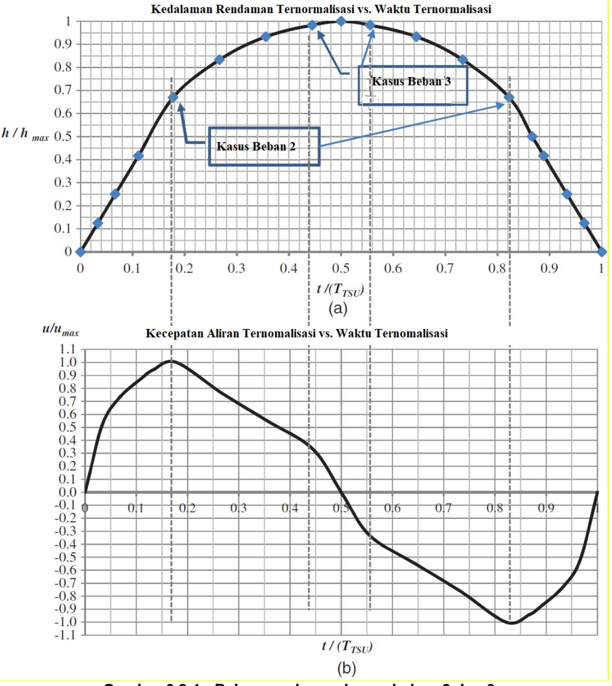

<span id="page-92-2"></span><span id="page-92-1"></span>**Gambar 6.8-1 - Beban rendaman kasus beban 2 dan 3 Tabel 6.8-1 - Faktor penting tsunami untuk hidrodinamika dan beban impak**

| Kategori risiko<br>tsunami                                    | TSU I |
|---------------------------------------------------------------|-------|
| Kategori Risiko Tsunami II                                    | 1,0   |
| Kategori Risiko Tsunami III                                   | 1,25  |
| Pengungsian Evakuasi Vertikal Kategori Risiko Tsunami IV, dan | 1,25  |
| Fasilitas Kritis Kategori Risiko Tsunami III                  |       |

#### <span id="page-93-0"></span>**6.8.3.4 Kriteria penerimaan sistem tahanan gaya lateral**

Untuk mengevaluasi kemampuan sistem struktural pada tingkat kinerja struktural keselamatan hidup untuk menahan efek gaya lateral dari kejadian tsunami desain untuk Kategori Desain Seismik D, E, atau F, diizinkan untuk menggunakan nilai 0,75 kali dari efek beban seismik horizontal yang diperlukan, *Emh*, yang mencakup faktor kekuatan lebih sistem, Ωo, sebagaimana didefinisikan pada Pasal 7 SNI 1726 (Lihat Pasal 12 ASCE 7-16) dalam standar ini. Untuk tujuan kinerja struktural hunian Segera, sistem tahanan gaya lateral harus dianalisis secara eksplisit dan dievaluasi.

#### <span id="page-93-1"></span>**6.8.3.5 Kriteria penerimaan komponen struktural**

Komponen struktural harus dirancang untuk gaya-gaya yang dihasilkan dari keseluruhan gaya tsunami pada sistem struktural dikombinasi dengan aksi resultan yang disebabkan oleh tekanan tsunami yang bekerja secara lokal pada komponen struktural individual untuk arah aliran tersebut. Kriteria penerimaan komponen struktural harus sesuai dengan Pasal 6.8.3.5.1, atau sesuai dengan prosedur alternatif Pasal 6.8.3.5.2 atau Pasal 6.8.3.5.3, sebagaimana berlaku.

#### <span id="page-93-2"></span>**6.8.3.5.1 Kriteria penerimaan oleh kekuatan desain komponen**

Gaya internal dan pemindahan sistem harus ditentukan menggunakan analisis linear elastis dan statis. Kriteria kinerja struktural yang diperlukan pada Pasal 6.8.1, Pasal 6.8.2, dan Pasal 6.8.3, sebagaimana berlaku, harus dianggap memenuhi jika berdasarkan kekuatan desain komponen dan sambungan struktural ditunjukkan lebih besar daripada beban Tsunami yang Dipertimbangkan Maksimum dan pengaruhnya dihitung sesuai dengan kombinasi beban pada Pasal 6.8.3.3. Faktor-faktor ketahanan material, ϕ, harus digunakan sebagaimana ditentukan dalam standar khusus material untuk komponen dan perilaku yang sedang ditinjau.

#### <span id="page-93-3"></span>**6.8.3.5.2 Kriteria bebasis kinerja alternatif**

#### <span id="page-93-4"></span>**6.8.3.5.2.1 Prosedur analisis alternatif**

Diizinkan untuk menggunakan baik prosedur analisis statis linier atau nonlinier. Pada prosedur analisis statis linier, bangunan dan struktur harus dimodelkan menggunakan ekuivalen kekakuan efektif yang konsisten dengan nilai secant atau dekat titik hasil. Untuk prosedur analisis statis nonlinier, model matematis secara langsung digabungkan dengan karakteristik beban deformasi nonlinier dari komponen individual struktur yang harus dikenakan penambahan beban monotonik hingga gaya tsunami yang diperlukan dan penerapan aksi tercapai. Untuk prosedur analisis statis nonlinier, kapasitas deformasi yang diharapkan harus lebih besar atau sama dengan deformasi maksimum yang dihitung dari gaya tsunami yang dibutuhkan dan tindakan yang diterapkan. Untuk Impak puing, dapat menggunakan prosedur analisis dinamis nonlinier. Untuk bangunan dan struktur Kategori Risiko Tsunami IV, kajian independen oleh rekan sejawat harus dilakukan sebagai bagian dari tinjauan terhadap rancangan berbasis kinerja oleh pihak yang berwenang.

#### <span id="page-94-0"></span>**6.8.3.5.2.2 Kriteria penerimaan komponen struktural alternatif**

Semua tindakan harus diklasifikasi baik sebagai aksi yang dikendalikan-daktilitas atau aksi yang menahan gaya secara berkelanjutan berdasarkan perilaku inelastis komponen dan durasi pengaruh beban, sebagai berikut:

- 1. Gaya fluida dalam komponen struktural primer dan sekunder yang didetail sesuai dengan persyaratan dari Kategori Desain Seismik D, E, atau F harus dievaluasi sebagai aksi yang menahan gaya secara berkelanjutan
- 2. Impak puing dan efek penurunan fondasi pada komponen struktural primer dan sekunder harus dievaluasi sebagai aksi yang dikendalikan daktilitas
- 3. Impak puing dan efek penurunan fondasi pada komponen struktural primer dan sekunder yang tidak didetail sesuai dengan Kategori Desain Seismik D, E, atau F harus dievaluasi sebagai aksi yang menahan gaya secara berkelanjutan.

Untuk aksi yang menahan gaya secara berkelanjutan, komponen struktural harus memiliki kekuatan desain spesifik yang ditentukan lebih besar dari atau sama dengan gaya desain maksimum. Aksi yang menahan gaya secara berkelanjuan harus diizinkan untuk memenuhi Persamaan (6.8-2):

$$Q_{CS} \ge Q_{UF} \tag{6.8-2}$$

dengan

QCS = Kekuatan elemen struktural yang ditetapkan, dan

QUF = gaya maksimum yang dihasilkan dalam elemen akibat beban gravitasi dan tsunami.

Properti material yang diharapkan seperti didefinisikan dalam ASCE 41 (2014) diizinkan untuk digunakan untuk aksi yang dikendalikan daktilitas. Hasil dari prosedur analisis linier tidak boleh melebihi kriteria penerimaan komponen untuk prosedur linier ASCE 41 (2014), Pasal 9 hingga 11, untuk kriteria kinerja struktural yang berlaku yang diperlukan untuk bangunan atau struktur Kategori Risiko tsunami. Aksi yang dikendalikan daktilitas diizinkan untuk memenuhi Persamaan (6.8-3):

$$mQ_{CE} \ge Q_{UD} \tag{6.8-3}$$

dengan:

<sup>m</sup> = Nilai faktor modifikasi kebutuhan komponen didefinisikan dalam ASCE 41 (2014) untuk memperhitungkan daktilitas yang diharapkan pada tingkat kinerja struktural yang diperlukan;

QCE = Kekuatan yang diharapkan dari elemen struktural ditentukan sesuai dengan ASCE 41 (2014); dan

QUD = Gaya yang dikendalikan daktilitas disebabkan oleh pembebanan tsunami

#### **6.8.3.5.3 Penerimaan Alternatif dengan pencegahan keruntuhan progresif**

Jika beban tsunami atau pengaruhnya melebihi kriteria penerimaan untuk elemen struktural atau jika diperlukan untuk mengakomodasi beban impak yang luar biasa, maka diizinkan untuk diperiksa kapasitas pemikul beban residual dari struktur, dengan asumsi bahwa elemen telah gagal, sesuai dengan Pasal 2.5.2.2 dan jalur beban alternatif melalui prosedur keruntuhan progresif dalam literatur yang diakui.

#### <span id="page-95-0"></span>**6.8.4 Densitas fluida minimum untuk beban tsunami**

Densitas berat jenis spesifik air laut sw harus diambil sebesar 64,0 lb/ft<sup>3</sup> (10 kN/m<sup>3</sup> ). Densitas massa jenis air laut sw harus diambil sebesar 2,0 sl/ft<sup>3</sup> (1,025 kg/m<sup>3</sup> ). Densitas berat jenis fluida minimum s untuk menentukan beban hidrostatik tsunami memperhitungkan padatan tersuspensi dan aliran puing yang ditempeli objek yang lebih kecil adalah

$$\gamma_s = k_s \gamma_{sw} \tag{6.8-4}$$

Densitas massa fluida minimum, <sup>s</sup> , untuk menentukan beban hidrodinamik tsunami yang menghitung padatan tersuspensi dan aliran puing yang ditempeli objek yang lebih kecil harus

$$\rho_s = k_s \rho_{sw} \tag{6.8-5}$$

dengan k s , faktor densitas fluida, harus diambil sebesar 1,1.

#### <span id="page-95-1"></span>**6.8.5 Amplifikasi kecepatan aliran**

Pengaruh bangunan dan struktur penghalang di hulu diizinkan untuk dipertimbangkan di suatu lokasi yang terpapar terhadap kondisi aliran difraksi yang diberikan dalam Pasal 6.8.5.1 oleh salah satu dari yang berikut:

- 1. Analisis rendaman sesuai kekhususan lokasi yang mencakup pemodelan lingkungan bangunan sesuai dengan Pasal 6.7.6.6, atau
- 2. Lingkungan bangunan dipertimbangkan dalam pemilihan kekasaran Manning pada Tabel 6.6-1 sesuai dengan Analisis Garis Tingkat Energi Pasal 6.6.2, atau
- 3. Pemodelan fisik atau numerik sesuai kekhususan lokasi sesuai dengan Pasal 6.8.5.2 atau sebagaimana berlaku pada Pasal 6.8.10.

#### <span id="page-95-2"></span>**6.8.5.1 Struktur penghalang hulu**

Efek penghalang hulu pada aliran harus dipertimbangkan ketika penghalangnya adalah struktur tertutup dari beton, pasangan bata atau konstruksi struktural baja yang terletak dalam 500 ft (152 m) dari lokasi, dan kedua hal berikut ini berlaku:

- 1. Struktur memiliki rencana lebar lebih besar dari 100 ft (30,5 m) atau 50 % dari lebar struktur hilir, diambil yang lebih besar.
- 2. Struktur berada dalam sektor antara 10 dan 55 derajat ke salah satu sisi dari vektor aliran selaras dengan pusat dari sepertiga lebar struktur hilir.

#### <span id="page-95-3"></span>**6.8.5.2 Amplifikasi kecepatan aliran dengan pemodelan fisik atau numerik**

Pengaruh struktur hulu pada kecepatan aliran di lokasi hilir diizinkan untuk dievaluasi menggunakan pemodelan numerik atau fisik sesuai kekhususan lokasi, sebagaimana dijelaskan dalam Pasal 6.7.6.6 atau Pasal 6.8.10. Kecepatan yang ditentukan untuk rendaman permukaan tanah kosong (*bare-earth*) harus diperbesar untuk kondisi Pasal 6.8.5.1. Analisis ini tidak diizinkan untuk mengurangi kecepatan aliran kecuali untuk struktur penanggulangan tsunami yang dirancang sesuai dengan Pasal 6.13.

#### <span id="page-96-0"></span>**6.8.6 Keterarahan aliran**

#### <span id="page-96-1"></span>**6.8.6.1 Arah aliran**

Desain struktur untuk beban dan efek tsunami harus mempertimbangkan kondisi arus masuk dan keluar. Arah aliran utama harus diasumsikan bervariasi ± 22,5 derajat dari potongan melintang tegak lurus dengan orientasi garis pantai rata-rata lebih dari 500 ft (152 m) ke kedua sisi lokasi. Pusat rotasi variasi potongan melintang harus ditempatkan di pusat geometrik struktur dalam rencana pada bidang tapak.

#### <span id="page-96-2"></span>**6.8.6.2 Arah sesuai kekhususan lokasi**

Analisis rendaman sesuai kekhususan lokasi yang dilakukan sesuai dengan Pasal 6.7.6 diizinkan digunakan untuk menentukan arah aliran, asalkan arah yang ditentukan dianggap bervariasi paling sedikit ± 10 derajat.

#### <span id="page-96-3"></span>**6.8.7 Rasio ketertutupan minimum untuk penentuan beban**

Beban pada bangunan harus dihitung dengan asumsi rasio ketertutupan minimum 70 % dari area proyeksi yang terendam sepanjang perimeter struktur, kecuali pada struktur terbuka sebagaimana didefinisikan dalam Pasal 6.2. Efek beban menghadapi akumulasi puing atau di dalam struktur terbuka harus dipertimbangkan dengan menggunakan rasio ketertutupan minimum 50 % dari area proyeksi yang terendam di sepanjang perimeter struktur terbuka. Struktur Terbuka tidak perlu memenuhi Kasus Beban 1 dari Pasal 6.8.3.1.

#### <span id="page-96-4"></span>**6.8.8 Jumlah minimum siklus aliran tsunami**

Desain harus mempertimbangkan minimum dua siklus aliran masuk dan keluar tsunami, yang pertama harus didasarkan pada kedalaman rendaman 80 % dari tsunami yang dipertimbangkan maksimum (MCT) dan yang kedua diasumsikan terjadi dengan kedalaman rendaman tsunami yang dipertimbangkan maksimum di lokasi.

Efek gerusan lokal yang ditentukan sesuai dengan Pasal 6.12, yang disebabkan oleh siklus pertama, harus diasumsikan terjadi pada 80 % dari kedalaman rendaman MCT di lokasi dan dianggap sebagai kondisi awal dari siklus kedua.

#### <span id="page-96-5"></span>**6.8.9 Pengaruh seismik pada fondasi mendahului tsunami yang dipertimbangkan maksimum di zona subduksi lokal**

Di lokasi subjek yang berada di zona tsunami subduksi lokal dari gempa subduksi lepas pantai, strukturn harus dirancang terhadap efek ko-seismik yang mendahului. Fondasi struktur harus dirancang untuk menahan gerakan tanah gempa yang mendahului dan efek yang terkait seperti dalam Pasal 6 SNI 1726 (Lihat juga Pasal 11 ASCE 7-16) dengan menggunakan rata-rata geometri gempa yang dipertimbangkan maksimum percepatan tanah puncak pada Gambar di SNI 1726.

Desain fondasi bangunan harus memasukkan perubahan permukaan lokasi dan sifat tanah setempat yang dihasilkan dari peristiwa seismik desain sebagai kondisi awal untuk kejadian tsunami desain berikutnya. Laporan investigasi geoteknik harus mencakup evaluasi efek fondasi yang mengacu pada efek seismik sebelum tsunami, dengan mempertimbangkan ketidakstabilan lereng, likuifaksi, penurunan deferensial dan total, perpindahan permukaan disebabkan oleh patahan, dan penyebaran lateral yang disebabkan oleh seismik atau aliran lateral. Persyaratan tambahan dari Pasal 6.12 juga harus dievaluasi.

#### <span id="page-97-0"></span>**6.8.10 Pemodelan fisik aliran, beban, dan efek tsunami**

Pemodelan fisik beban dan efek tsunami harus diizinkan sebagai alternatif untuk prosedur preskriptif dalam Pasal 6.8.5 (amplifikas kecepatan aliran *i*), Pasal 6.10 (beban hidrodinamik), Pasal 6.11 (beban impak puing), dan Pasal 6.12 (desain fondasi), asalkan memenuhi semua kriteria berikut:

- 1. Fasilitas yang digunakan untuk pemodelan fisik harus mampu menghasilkan skala aliran dan kedalaman rendaman yang tepat sebagaimana ditentukan untuk Kasus Beban di Pasal 6.8.3.1.
- 2. Fasilitas pengujian harus dikonfigurasikan sehingga refleksi dan efek tepi tidak akan mempengaruhi bagian pengujian selama durasi percobaan.
- 3. Faktor skala yang digunakan dalam pemodelan fisik tidak boleh kurang dari yang ditunjukkan pada Tabel 6.8-2. Uji model skala yang tidak secara langsung dibahas dalam Tabel 6.8-2 harus mencakup kebenaran penerapan model dan prosedur penskalaan.
- 4. Impak puing dari komponen penuh atau parsial harus diuji pada skala penuh kecuali didampingi oleh kebenaran kesesuaian pengujian skala dalam hal mekanika hidrodinamika dan struktural, juga properti material.
- 5. Laporan hasil pengujian harus mencakup diskusi tentang akurasi penentuan kondisi beban dan efek skala yang disebabkan oleh pertimbangan dinamis dan kinematis, termasuk respons dinamik dari struktur dan material yang diuji.
- 6. Hasil uji harus disesuaikan untuk memperhitungkan densitas efektif, sebagaimana dihitung dalam Pasal 6.8.4.
- 7. Hasil pengujian harus disesuaikan dengan Faktor Keutamaan dari Pasal 6.8.3.2.
- 8. Hasil pengujian harus mencakup efek arah aliran sesuai dengan Pasal 6.8.6. Ketercakupan ini dapat dilaksanakan baik dengan pengujian langsung dari aliran pada berbagai sudut datang atau dengan kombinasi pemodelan numerik dan fisik yang memperhitungkan keterarahan aliran.

**Tabel 6.8-2 - Faktor skala minimum untuk pemodelan fisik**

<span id="page-97-1"></span>

| Elemen model                                        | Faktor skala minimum |
|-----------------------------------------------------|----------------------|
| Bangunan gedung individual                          | 1:25                 |
| Model aliran untuk kelompok bangunan                | 1:200                |
| Komponen struktural (spt., dinding, kolom, dermaga) | 1:10                 |
| Investigasi geoteknik                               | 1:5                  |

#### <span id="page-98-0"></span>6.9 Beban hidrostatik

#### <span id="page-98-1"></span>6.9.1 Gaya apung

Penurunan berat neto yang disebabkan oleh gaya apung harus dievaluasi untuk seluruh elemen struktural dan nonstruktural bangunan yang terendam sesuai dengan Persamaan (6.9-1). Pengangkatan yang disebabkan oleh gaya apung harus mencakup ruang tertutup tanpa dinding pelepas tsunami yang memiliki area bukaan kurang dari 25 % dari area dinding eksterior yang terendam. Gaya apung juga akan termasuk efek udara yang terperangkap di bawah lantai, termasuk slab struktural integral, dan di ruang tertutup di mana dinding tidak dirancang untuk melepaskan diri (*break away*). Seluruh jendela, kecuali yang dirancang tahan terhadap impak puing proyektil besar yang terbawa angin atau beban ledakan, diizinkan untuk dianggap sebagai bukaan ketika kedalaman rendaman mencapai bagian atas jendela atau kekuatan kaca yang diperkirakan, ambil yang lebih kecil. Perpindahan volumetrik elemen fondasi, tidak termasuk fondasi dalam, harus dimasukkan dalam perhitungan pengangkatan ini.

$$F_{v} = \gamma_{s} V_{w} \tag{6.9-1}$$

#### <span id="page-98-2"></span>6.9.2 Gaya hidrostatik lateral tak seimbang

Dinding struktural terendam dengan bukaan kurang daripada 10 % dari luas dinding dan atau lebih panjang dari 30 ft (9,14 m) tanpa dinding pelepas tsunami yang bersebelahan atau memiliki konfigurasi dinding perimeter dua atau tiga sisi berapapun panjangnya harus dirancang untuk menahan gaya hidrostatik lateral tidak seimbang yang diberikan oleh Persamaan (6.9-2), terjadi selama Kasus Beban 1 dan kasus Beban 2 aliran masuk yang didefinisikan dalam Pasal 6.8.3.1. Dalam kondisi di mana aliran melampaui dinding,  $h_{max}$  dalam Persamaan (6.9-2) harus diganti dengan ketinggian dinding.

$$F_h = \frac{1}{2} \gamma_s b h_{max}^2 \tag{6.9-2}$$

#### <span id="page-98-3"></span>6.9.3 Beban tambahan air residual pada lantai dan dinding

Semua lantai horizontal di bawah kedalaman rendaman maksimum harus dirancang sebagai beban mati ditambah tekanan tambahan air residual,  $\mathcal{P}_{r_j}$  yang diberikan oleh Persamaan (6.9-3). Dinding struktural yang memiliki potensi untuk menahan air selama penarikan air surut juga harus dirancang untuk tekanan hidrostatik air residual.

$$\rho_r = \gamma_s h_r \ h_r = h_{max} - h_s \tag{6.9-3}$$

dengan  $h_s$  = puncak elevasi lantai slab. Namun,  $h_r$  tidak perlu melebihi ketinggian bagian menerus dari setiap elemen struktur perimeter di lantai.

#### <span id="page-99-0"></span>6.9.4 Tekanan tambahan hidrostatik pada fondasi

Tekanan tambahan hidrostatik yang disebabkan oleh rendaman tsunami harus dihitung sebagai

$$\rho_s = \gamma_s h_{max} \tag{6.9-4}$$

#### <span id="page-99-1"></span>6.10 Beban hidrodinamik

Beban hidrodinamik harus ditentukan sesuai dengan Pasal ini. Struktur dengan sistem tahanan gaya lateral dan seluruh komponen struktur di bawah elevasi rendaman di lokasi harus dirancang untuk beban hidrodinamik yang tercantum baik pada Pasal 6.10.1 atau Pasal 6.10.2. Semua komponen dinding dan slab juga harus dirancang untuk semua beban yang diterapkan seperti tercantum pada Pasal 6.10.3.

#### <span id="page-99-2"></span>6.10.1 Tekanan statis lateral seragam setara yang disederhanakan

Diizinkan untuk memperhitungkan kombinasi beban hidrostatik dan hidrodinamik lateral yang tidak seimbang dengan menerapkan tekanan seragam maksimum ekivalen,  $p_{uw}$ , yang ditentukan sesuai dengan Persamaan (6.10-1), diterapkan lebih dari 1,3 kali kedalaman rendaman maksimum yang dihitung  $h_{max}$  di lokasi, di setiap arah aliran.

$$\rho_{uw} = 1,25 I_{TSU} \gamma_s h_{max}$$
 (6.10-1)

#### <span id="page-99-3"></span>6.10.2 Gaya lateral hidrodinamik detil

#### <span id="page-99-4"></span>6.10.2.1 Gaya drag keseluruhan pada bangunan dan struktur lainnya

Sistem Penahan-gaya-lateral harus dirancang untuk menahan gaya *drag* keseluruhan pada setiap level yang disebabkan oleh aliran masuk atau keluar pada Kasus Beban 2 yang diberikan oleh Persamaan (6.10-2) dan Persamaan (6.10-3).

$$F_{dx} = \frac{1}{2} \rho_s I_{TSU} C_d C_{cx} B(hu^2)$$
 (6.10-2)

dengan  $C_d$  adalah koefisien drag untuk bangunan seperti yang diberikan pada Tabel 6.10-1 dan  $C_{cx}$  ditentukan sebagai

$$C_{cx} = \frac{\sum (A_{col} + A_{wall}) + 1,5A_{beam}}{Bh_{sx}}$$
 (6.10-3)

 $A_{\rm col}$  dan  $A_{\rm wall}$  merupakan area proyeksi vertikal dari semua elemen kolom dan dinding individual.  $A_{\rm beam}$  adalah gabungan area proyeksi vertikal dari tepi slab yang menghadap aliran dan balok terdalam yang secara lateral terkena aliran. Penjumlahan area kolom, dinding, dan balok dibagi dengan keseluruhan luas dinding bangunan dengan lebar B kali rata-rata ketinggian tingkat,  $h_{\rm sx}$ , di atas dan di bawah setiap tingkat untuk setiap tingkat di bawah tinggi rendaman tsunami untuk masing-masing dari tiga Kasus Beban yang ditentukan dalam Pasal 6.8.3.1. Dinding struktural atau nonstruktural yang bukan merupakan dinding pelepas tsunami harus dimasukkan dalam  $A_{\rm wall}$ ,  $C_{\rm cx}$  tidak boleh

diambil kurang dari nilai rasio ketertutupan yang diberikan dalam Pasal 6.8.7, tetapi tidak perlu diambil lebih besar dari 1,0.

Tabel 6.10-1 - Koefisien drag untuk struktur persegi

<span id="page-100-1"></span>

| Rasio antara lebar dengan kedalaman<br>rendaman <sup>a</sup> <i>B/H<sub>sx</sub></i> | Koefisien <i>drag</i><br>C <sub>d</sub> |
|--------------------------------------------------------------------------------------|-----------------------------------------|
| < 12                                                                                 | 1,25                                    |
| 16                                                                                   | 1,3                                     |
| 26                                                                                   | 1,4                                     |
| 36                                                                                   | 1,5                                     |
| 60                                                                                   | 1,75                                    |
| 100                                                                                  | 1,8                                     |
| ≥ 120                                                                                | 2,0                                     |

 $<sup>^{</sup>a}$ Kedalaman rendaman untuk masing-masing dari tiga Kasus Beban dari rendaman yang ditetapkan dalam Pasal 6.8.3.1. Interpolasi harus digunakan untuk nilai antara dari rasio lebar terhadap kedalaman rendaman  $B/h_{sx}$ .

#### <span id="page-100-0"></span>6.10.2.2 Gaya drag pada komponen

Beban hidrodinamik lateral yang diberikan oleh Persamaan (6.10-4) harus diterapkan sebagai sebuah resultan tekanan pada ketinggian rendaman terproyeksi,  $h_e$ , dari seluruh komponen struktural dan rakitan dinding eksterior di bawah kedalaman rendaman.

$$F_d = \frac{1}{2} \rho_s I_{\text{TSU}} C_d b \left( h_e u^2 \right) \tag{6.10-4}$$

dengan untuk komponen interior nilai  $C_d$  yang diberikan pada Tabel 6.10-2 harus digunakan, dan b adalah lebar komponen yang tegak lurus terhadap aliran. Untuk komponen eksterior, harus digunakan nilai  $C_d$  sebesar 2,0, dan dimensi lebar b harus diambil sebagai lebar tributari dikalikan dengan nilai rasio ketertutupan yang tercantum dalam Pasal 6.8.7.

Gaya *drag* pada elemen komponen tidak boleh ditambahkan pada gaya *drag* keseluruhan yang dihitung dalam Pasal 6.10.2.1.

Tabel 6.10-2 - Koefisien drag untuk komponen struktural

<span id="page-101-2"></span>

| Penampang elemen struktural                                                                                                | Koefisien drag $\mathcal{C}_{\scriptscriptstyle d}$ |
|----------------------------------------------------------------------------------------------------------------------------|-----------------------------------------------------|
| Kolom bulat atau poligon bersisi sama dengan enam sisi atau lebih                                                          | 1,2                                                 |
| Kolom persegi panjang dengan aspek rasio paling sedikit 2:1 dengan sisi lebih panjang terorientasi paralel terhadap aliran | 1,6                                                 |
| Kolom segitiga yang mengarah pada aliran                                                                                   | 1,6                                                 |
| Dinding berdiri bebas terendam dalam aliran                                                                                | 1,6                                                 |
| Kolom bujur sangkar atau persegi panjang dengan sisi lebih panjang terorientasi tegak lurus terhadap aliran                | 2,0                                                 |
| Kolom segitiga yang membelakangi aliran                                                                                    | 2,0                                                 |
| Dinding atau pelat datar, tegak lurus terhadap aliran                                                                      | 2,0                                                 |
| Kolom berbentuk diamon, mengarah pada aliran (berdasarkan lebar muka, bukan lebar terproyeksi).                            | 2,5                                                 |
| Balok persegi panjang, tegak lurus terhadap aliran                                                                         | 2,0                                                 |
| Bentuk I, L, dan kanal                                                                                                     | 2,0                                                 |

#### <span id="page-101-0"></span>6.10.2.3 Beban tsunami pada komponen struktural vertikal, $F_{w}$

Gaya  $F_{\scriptscriptstyle w}$  pada komponen struktural vertikal harus ditentukan sebagai gaya drag hidrodinamik sesuai dengan Persamaan (6.10-5a). Apabila aliran dari bore tsunami terjadi dengan bilangan Froude di suatu lokasi yang lebih besar dari 1,0 dan di mana dinding individual, pier dinding, atau komponen kolom memiliki rasio lebar terhadap kedalaman rendaman sebesar 3 atau lebih, harus ditentukan oleh Persamaan (6.10-5b). Gaya  $F_{\scriptscriptstyle w}$  diterapkan pada semua komponen struktural vertikal yang lebih lebar dari 3 kali kedalaman rendaman yang terkait dengan Kasus Beban 2 selama aliran masuk seperti didefinisikan dalam Pasal 6.8.3.

$$F_{w} = \frac{1}{2} \rho_{s} I_{tsu} C_{d} b \left( h_{e} u^{2} \right)$$
 (6.10-5a)

$$F_{w} = \frac{3}{4} \rho_{s} I_{tsu} C_{d} b \left( h_{e} u^{2} \right)_{bore}$$
 (6.10-5b)

#### <span id="page-101-1"></span>6.10.2.4 Beban hidrodinamik pada dinding berlubang-lubang, $F_{\scriptscriptstyle\rho\scriptscriptstyle W}$

Untuk dinding dengan bukaan yang memungkinkan aliran lewat di antara pier dinding, gaya pada elemen dinding berlubang-lubang,  $F_{\rho w}$ , diizinkan untuk ditentukan dengan menggunakan Persamaan (6.10-6), tetapi tidak boleh kurang dari  $F_{\rho w}$  pada Persamaan (6.10-4):

$$F_{DW} = (0.4C_{CX} + 0.6)F_{W}$$
 (6.10-6)

#### <span id="page-102-0"></span>6.10.2.5 Dinding menyudut terhadap aliran

Untuk dinding yang berorientasi pada sudut kurang dari 90° terhadap arah aliran yang dipertimbangkan dalam Pasal 6.8.3, beban lateral sementara per satuan lebar,  $F_{w\theta}$ , harus ditentukan sesuai dengan Persamaan (6.10-7).

$$F_{W\theta} = F_{W} \sin^2 \theta \tag{6.10-7}$$

dengan  $\theta$  adalah sudut yang dibentuk antara dinding dan arah aliran.

#### <span id="page-102-1"></span>6.10.3 Tekanan hidrodinamik yang berhubungan dengan slab

#### <span id="page-102-2"></span>6.10.3.1 Tekanan arus stagnan

Dinding dan slab dari ruang dalam bangunan yang mengalami tekanan aliran stagnan harus dirancang untuk menahan tekanan yang ditentukan sesuai dengan Persamaan (6.10-8).

$$P_{p} = \frac{1}{2} \rho_{s} I_{tsu} u^{2}$$
 (6.10-8)

dengan u adalah kecepatan aliran bebas maksimum di lokasi itu dan Kasus Beban.

#### <span id="page-102-3"></span>6.10.3.2 Hidrodinamik gaya angkat surge pada slab horizontal

Slab dan komponen horizontal lainnya harus dirancang untuk menahan tekanan angkat yang berlaku diberikan dalam Pasal ini.

#### <span id="page-102-4"></span>6.10.3.2.1 Slab terendam selama aliran masuk tsunami

Slab horizontal yang terendam selama aliran masuk rendaman tsunami harus dirancang untuk tekanan hidrodinamik minimum dengan tekanan angkat 20 psf (0,958 kPa) yang diterapkan pada sisi bawah slab. Pengangkatan ini merupakan Kasus Beban tambahan untuk setiap efek apung hidrostatik yang disyaratkan oleh Pasal 6.9.1.

#### <span id="page-102-5"></span>6.10.3.2.2 Slab di atas kemiringan tapak

Slab horizontal yang terletak di atas kemiringan tapak  $, \phi$ , lebih besar dari 10 derajat harus dirancang untuk mengarahkan ulang tekanan angkat yang digunakan untuk sisi bawah slab, diberikan oleh Persamaan (6.10-9), tetapi tidak lebih kecil dari 20 psf (0.958 kPa).

$$P_{u} = 1,2I_{tsu}\rho_{s}u_{v}^{2} \tag{6.10-9}$$

dengan

 $u_{\nu} = u \tan \varphi$ .

u = Kecepatan aliran horizontal sesuai dengan kedalaman air sama atau lebih besar dari  $h_{ss}$  elevasi sisi bawah dari sistem lantai, dan

 $\varphi$  = Kemiringan rata-rata bidang tapak di bawah slab.

#### <span id="page-103-0"></span>6.10.3.3 Aliran bore tsunami yang terperangkap di celah dinding pelat struktural

Beban hidrodinamik untuk aliran *bore* yang terperangkap di celah dinding pelat struktural harus ditentukan sesuai dengan Pasal ini.

Reduksi beban yang diberikan dalam Pasal 6.10.3.3.2 sampai Pasal 6.10.3.3.5 dapat digabungkan secara perkalian, tetapi reduksi beban neto tidak boleh melebihi reduksi individual maksimum masing-masing yang diberikan oleh salah satu dari Pasal ini.

#### <span id="page-103-1"></span>6.10.3.3.1 Beban tekanan di celah dinding slab struktural

Jika aliran *bore* tsunami di bawah slab berelevasi dicegah oleh dinding struktural yang terletak di hilir dari tepi hulu slab, dinding dan slab di dalam  $h_s$  dinding harus dirancang untuk tekanan kearah luar,  $P_u$ , sebesar 350 psf (16,76 kPa). Lebih dari  $h_s$  tetapi dalam jarak  $h_s+l_w$  dari dinding, slab harus dirancang untuk tekanan ke arah atas sebesar setengah dari  $P_u$  [yaitu, 175 psf (8,38 kPa)]. Slab di luar jarak  $h_s+l_w$  dari dinding harus dirancang untuk tekanan ke arah atas sebesar 30 psf (1.436 kPa).

#### <span id="page-103-2"></span>6.10.3.3.2 Reduksi beban dengan kedalaman rendaman

Jika kedalaman rendaman kurang dari dua pertiga dari ketinggian lantai bebas, tekanan angkat yang ditentukan dalam Pasal 6.10.3.3.1 diizinkan untuk direduksi sesuai dengan Persamaan (6.10-10) tetapi tidak boleh diambil kurang dari 30 psf (1.436 kPa).

$$P_u = I_{tsu} \left( 590 - 160 \frac{h_s}{h} \right) [psf]$$
 (6.10-10)

$$P_u = I_{tsu} \left( 28,25 - 7,66 \frac{h_s}{h} \right) [kPa]$$
 (6.10-10si)

dengan  $h_s/h$  adalah rasio ketinggian slab terhadap kedalaman rendaman.

#### <span id="page-103-3"></span>6.10.3.3.3 Reduksi beban untuk bukaan dinding

Jika dinding yang menghalangi *bore* di bawah slab memiliki bukaan di mana aliran dapat lewat, tekanan yang tereduksi pada dinding dan pelat harus ditentukan sesuai dengan Persamaan (6.10-11).

$$P_{ur} = C_{cx} P_{u} \tag{6.10-11}$$

dengan  $C_{cx}$  adalah rasio area dinding solid terhadap total area terendam dari bidang vertikal dari bagian dinding yang terendam pada tingkat itu.

#### <span id="page-103-4"></span>6.10.3.3.4 Reduksi beban untuk bukaan slab

Jika slab memiliki celah bukaan atau panel pelepas yang dirancang untuk menciptakan celah lebar,  $\mathbf{w}_g$ , berdekatan dengan dinding, maka tekanan pengangkatan pada bagian slab yang tersisa harus ditentukan sesuai dengan Persamaan (6.10-12).

$$P_{ur} = C_{hs} P_{u} {(6.10-12)}$$

dengan untuk 
$$W_g < 0.5h_s$$
,  $C_{bs} = 1 - \frac{W_g}{h_s}$  (6.10-13)

dan untuk 
$$W_g \ge 0.5 h_s$$
,  $C_{bs} = 0.56 - 0.12 \frac{W_g}{h_s}$  (6.10-14)

Nilai  $C_{bs}$  tidak boleh kurang dari nol.

#### <span id="page-104-0"></span>6.10.3.3.5 Reduksi beban untuk dinding pelepas tsunami

Jika dinding yang membatasi aliran dirancang sebagai dinding pelepas gelombang tsunami, maka pengangkatan pada slab diizinkan untuk ditentukan sesuai dengan Pasal 6.10.3.1, tetapi tidak perlu melebihi tekanan yang setara dengan total nominal gaya geser yang diperlukan untuk menyebabkan pelepasan dari dinding pelepas dari slab.

#### <span id="page-104-1"></span>6.11 Beban impak puing

Beban Impak puing harus ditentukan sesuai dengan Pasal ini. Beban ini tidak perlu digabungkan dengan beban terkait tsunami lainnya sebagaimana ditentukan di sub-Pasal lain dari Pasal ini. Jika kedalaman rendaman minimum adalah 3 ft (0,914 m) atau lebih besar, desain harus memasukkan efek gaya impak puing. Efek beban impak yang paling parah dalam kedalaman rendaman harus diterapkan pada perimeter komponen struktural pemikul beban gravitasi yang terletak pada sumbu struktural utama yang tegak lurus terhadap rentang arah aliran masuk atau aliran keluar yang ditentukan dalam Pasal 6.8.7.

**PENGECUALIAN** Kecuali yang ditetapkan di bawah ini, beban harus diterapkan pada titik-titik kritis untuk lentur dan geser pada semua komponen struktur tersebut dalam kedalaman rendaman yang sedang dievaluasi. Kedalaman rendaman dan kecepatan yang sesuai dengan Beban Kasus 1, 2, dan 3 yang ditetapkan dalam Pasal 6.8.3.1 harus digunakan. Beban impak tidak perlu diterapkan secara bersamaan untuk semua komponen struktural yang terpengaruh.

Semua bangunan gedung dan struktur lainnya yang memenuhi persyaratan di atas harus dirancang untuk impak oleh tiang kayu, kayu gelondongan, dan kendaraan yang mengapung, dan untuk batuan besar yang menggelinding dan puing beton, sesuai Pasal 6.11.2 sampai Pasal 6.11.4. Jika sebuah lokasi berdekatan dengan pelabuhan atau lapangan peti kemas, berpotensi terkena benturan dari peti kemas dan kapal serta tongkang harus ditentukan oleh prosedur dalam Pasal 6.11.5. Bangunan dan struktur lain yang ditentukan oleh prosedur untuk berada di zona bahaya yang terkena benturan peti kemas harus dirancang untuk beban impak sesuai dengan Pasal 6.11.6. Sebagai pengganti Pasal 6.11.2 sampai Pasal 6.11.6, diizinkan untuk secara alternatif mengevaluasi impak oleh tiang, batang kayu, kendaraan, batu berguling, puing-puing beton, dan peti kemas dengan menerapkan beban statis alternatif yang disederhanakan dari Pasal 6.11.1.

Fasilitas Kritis Risiko Tsunami Kategori III dan Bangunan dan struktur Risiko Tsunami Kategori IV yang ditetapkan berada di zona bahaya (hazard) untuk mengalami benturan oleh kapal dan tongkang dengan Beban Mati (DWT) melebihi 38.000 lb (39.916 kg), sebagaimana ditentukan oleh prosedur Pasal 6.11.5, harus dirancang untuk impak oleh kapal-kapal ini sesuai dengan Pasal 6.11.7.

#### <span id="page-105-0"></span>6.11.1 Beban statis impak puing alternatif yang disederhanakan

Diizinkan untuk memperhitungkan impak puing dengan menerapkan gaya yang diberikan oleh Persamaan (6.11-1) sebagai beban statis maksimum, sebagai pengganti beban yang didefinisikan dalam Pasal 6.11.2 sampai Pasal 6.11.6. Gaya ini harus diterapkan pada titik-titik kritis untuk lentur dan geser pada semua komponen struktur tersebut dalam kedalaman rendaman sesuai dengan Beban Kasus 3 yang ditentukan dalam Pasal 6.8.3.1.

$$F_i = 330 C_o I_{\text{su}} \text{[kips]}$$
 (6.11-1)

$$F_i = 1,470 C_o I_{tsu}$$
 [kN] (6.11-1.si)

dengan  $C_a$  adalah koefisien orientasi, sama dengan 0,65.

Jika ditentukan oleh prosedur penilaian bahaya lokasi pada Pasal 6.11.5 bahwa lokasi tersebut tidak berada dalam zona impak untuk peti kemas, kapal, dan tongkang, maka diizinkan untuk mereduksi gaya impak puing yang disederhanakan menjadi 50 % dari nilai yang diberikan oleh Persamaan (6.11-1).

#### <span id="page-105-1"></span>6.11.2 Kayu gelondongan dan tiang

Nilai nominal maksimum gaya impak puing seketika,  $F_{ni}$ , harus ditentukan sesuai dengan Persamaan (6.11-2).

$$F_{ni} = u_{\text{max}} \sqrt{k m_{\sigma}} \tag{6.11-2}$$

Desain gaya impak puing seketika,  $F_i$  untuk batang kayu gelondongan dan tiang harus ditentukan sesuai dengan Persamaan (6.11-3).

$$F_i = I_{tsu} C_o F_{ni} \tag{6.11-3}$$

dengan

 $I_{tsu}$  = Faktor keutamaan (diberikan pada Tabel 6.8-1);

 $C_o$  = Koefisien orientasi, sama dengan 0,65 untuk kayu gelondongan dan tiang;

 $U_{\text{max}}$  = Kecepatan aliran maksimum di lokasi pada kedalaman yang cukup untuk mengapungkan puing-puing;

 Kekakuan efektif dari impak puing atau kekakuan lateral dari elemen struktural yang terkena impak, yang terdeformasi oleh impak, diambil yang lebih kecil; dan

 $m_d$  = Massa puing  $W_d/g$ 

Kayu gelondongan dan tiang diasumsikan menabrak secara longitudinal untuk perhitungan kekakuan puing pada Persamaan (6.11-2). Kekakuan kayu gelondongan atau tiang harus dihitung sebagai, k = EA/L dengan E adalah modulus elastisitas longitudinal kayu gelondongan, A adalah luas penampang melintang, dan E adalah panjangnya. Berat minimum sebesar 1000 lb (454 kg) dan kekakuan kayu gelondongan minimum sebesar 350 kip/in. (61.300 kN/m) harus diasumsikan.

Durasi impuls (durasi sesaat) untuk impak elastis harus dihitung dari Persamaan (6.11-4):

$$t_d = \frac{2m_d u_{\text{max}}}{F_{oi}} \tag{6.11-4}$$

Untuk analisis statis elastis ekuivalen, gaya impak harus dikalikan dengan faktor respons dinamis  $R_{\rm max}$  yang ditentukan dalam Tabel 6.11-1. Untuk mendapatkan nilai antara,  $R_{\rm ma}$ , interpolasi linier *harus* digunakan. Untuk dinding, impak harus diasumsikan bekerja sepanjang pusat horizontal dinding, dan periode alami diizinkan untuk ditentukan berdasarkan periode fundamental dari kolom ekuivalen dengan lebar sama dengan setengah dari bentang vertikal dinding. Diperbolehkan untuk menggunakan metode analisis alternatif menurut Pasal 6.11.8.

Tabel 6.11-1 - Rasio respons dinamis untuk beban impuls,  $R_{\max}$ 

<span id="page-106-3"></span>

| Rasio durasi Impak terhadap perioda alami dari elemen struktural yang terkena impak | $R_{\text{max}}$ (rasio respons) |  |  |  |
|-------------------------------------------------------------------------------------|----------------------------------|--|--|--|
| 0,0                                                                                 | 0,0                              |  |  |  |
| 0,1                                                                                 | 0,4                              |  |  |  |
| 0,2                                                                                 | 0,8                              |  |  |  |
| 0,3                                                                                 | 1,1                              |  |  |  |
| 0,4                                                                                 | 1,4                              |  |  |  |
| 0,5                                                                                 | 1,5                              |  |  |  |
| 0,6                                                                                 | 1,7                              |  |  |  |
| 0,7                                                                                 | 1,8                              |  |  |  |
| 0,9                                                                                 | 1,8                              |  |  |  |
| 1,0                                                                                 | 1,7                              |  |  |  |
| 1,1                                                                                 | 1,7                              |  |  |  |
| 1,2                                                                                 | 1,6                              |  |  |  |
| 1,3                                                                                 | 1,6                              |  |  |  |
| ≥ 1,4                                                                               | 1,5                              |  |  |  |

#### <span id="page-106-0"></span>6.11.3 Impak oleh kendaraan

Impak kendaraan terapung harus diterapkan pada elemen struktural vertikal pada setiap titik lebih dari 3 ft (0,914 m) di atas tapak hingga kedalaman maksimum. Gaya impak harus diambil sebesar 30 kip (130 kN) dikalikan dengan  $I_{\rm tsu}$ .

#### <span id="page-106-1"></span>6.11.4 Impak oleh batuan besar menggelinding dan puing beton yang terendam

Jika kedalaman rendaman maksimum melebihi 6 ft (1,83 m), gaya Impak 8.000 lb (36 kN) dikalikan dengan  $I_{tsu}$  harus diterapkan pada elemen struktural vertikal 2 ft (0,61 m) di atas tapak.

#### <span id="page-106-2"></span>6.11.5 Asesmen bahaya lokasi untuk peti kemas, kapal, dan tongkang

Peti kemas dan kapal atau tongkang yang diangkut dari lapangan peti kemas, dan pelabuhan, harus dievaluasi sebagai objek potensial impak puing. Dalam kasus seperti itu, kemungkinan wilayah penyebaran harus diidentifikasi untuk setiap sumber untuk

menentukan apakah struktur terletak di dalam wilayah bahaya impak puing sebagaimana didefinisikan oleh prosedur dalam Pasal ini. Jika struktur berada di wilayah bahaya impak puing, maka impak oleh peti kemas dan/atau kapal dan tongkang, sebagaimana mestinya, harus dievaluasi berdasarkan Pasal 6.11.6 dan Pasal 6.11.7. Luas rencana total yang diperkirakan dari benda-benda puing di sumber harus ditentukan. Untuk peti kemas, disini adalah jumlah rata-rata peti kemas di lokasi dikalikan dengan area rencananya. Untuk tongkang, area nominal dari tongkang desain AASHTO (2009) adalah [195 ft × 35 ft, atau 6,825 ft² (59,5 m × 10,67 m, atau 635 m²)] dikalikan dengan jumlah rata-rata tongkang di sumbernya. Untuk kapal, rata-rata area rencana dek kapal di lokasi harus digunakan.

Pusat geografis dari sumber harus diidentifikasi, bersama dengan arah aliran utama, sebagaimana didefinisikan dalam Pasal 6.8.6.1. Garis ± 22,5° dari garis tengah ini harus diproyeksikan ke arah aliran masuk tsunami, seperti ditunjukkan pada Gambar 6.11-1. Jika topografi (seperti bukit) akan menahan air dari sektor 45° ini, arah sektor harus dirotasi untuk mengakomodasi garis bukit atau tepian harus dipersempit di mana dibatasi pada dua sisi atau lebih.

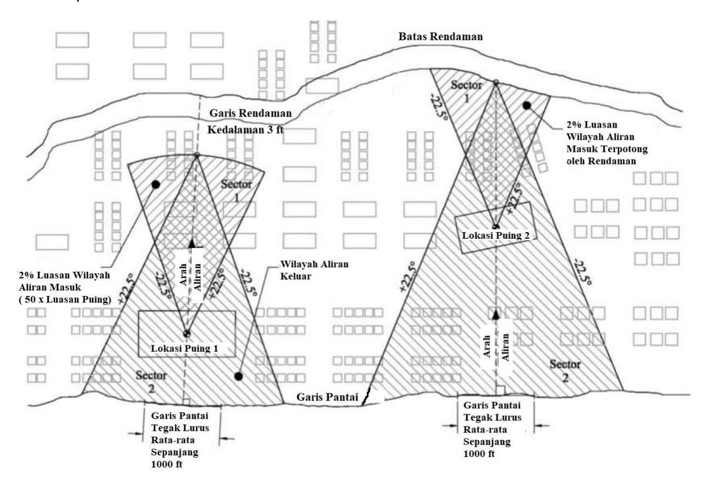

<span id="page-107-0"></span>Gambar 6.11-1 - Ilustrasi dari penentuan wilayah bahaya oleh impak puing mengapung [1 ft = 0,3048 m]

Pertama, busur dari wilayah bahaya impak puing untuk aliran masuk harus digambarkan sebagai berikut: satu busur dan dua garis batas radial dari sektor 45° mendefinisikan suatu wilayah sektor melingkar dengan daerah yang 50 kali luas total daerah puing dari sumber, mewakili konsentrasi 2 % dari puing. Namun demikian, busur dari rendaman yang mengarah ke daratan diizinkan untuk dibatasi sesuai dengan batasan berikut:

Luas sektor diizinkan untuk dibatasi di mana kedalaman rendaman maksimum kurang dari 3 ft (0,914 m), atau dalam kasus kapal di mana kedalaman rendaman kurang dari draft balas ditambah 2 ft (0,61 m).

Struktur baja dan/atau struktur beton diizinkan untuk dianggap bekerja sebagai batas kedalaman landasan efektif dari sektor jika tingginya setidaknya sama dengan (1) untuk peti kemas dan tongkang, kedalaman rendaman dikurangi 2 ft (0,61 m), atau (2) untuk kapal, kedalaman rendaman dikurangi jumlah dari draft balas dan 2 ft (0,61 m).

Kedua, wilayah bahaya impak puing untuk aliran masuk dan keluar harus ditentukan dengan memutar segmen melingkar dengan 180° dan menempatkan pusat di perpotongan garis tengah dan busur yang mendefinisikan tingkat konsentrasi 2 % atau batas alternatif yang disetujui, sebagaimana didefinisikan di atas. Bangunan dan struktur lain yang hanya terdapat di sektor pertama harus dirancang untuk diterjang oleh peti kemas dan/atau kapal lain yang dibawa oleh arus masuk. Bangunan dan struktur lain yang hanya terdapat di sektor kedua harus dirancang untuk diterjang oleh peti kemas dan/atau kapal lain yang dibawa oleh arus keluar. Bangunan dan struktur lain yang terdapat di kedua sektor harus dirancang untuk diterjang oleh peti kemas dan/atau kapal lain yang bergerak ke arah manapun.

#### <span id="page-108-0"></span>6.11.6 Peti kemas

Gaya impak dari peti kemas harus dihitung dari Persamaan (6.11-2) dan Persamaan (6.11-3). Massa  $m_d$  adalah massa dari peti kemas kosong. Hal ini harus diasumsikan bahwa kontak terjangan berasal dari satu pojok bawah depan (atau belakang) peti kemas. Kekakuan kontainer adalah, k = EA/L dengan E adalah modulus elastisitas rel bawah peti kemas, A adalah luas penampang dari rel bawah, dan L adalah panjang rel bawah peti kemas. Nilai minimum diberikan pada Tabel 6.11-2.  $\textbf{\textit{C}}_{o}$ , faktor orientasi, harus dianggap sama dengan 0,65 untuk peti kemas. Gaya Impak desain nominal,  $F_{ni}$ , dari Persamaan (6.11-2) untuk peti kemas tidak perlu diambil lebih dari 220 kips (980 kN).

Untuk peti kemas kosong, durasi impuls untuk Impak elastis harus dihitung dari Persamaan (6.11-4). Untuk peti kemas bermuatan, durasi impuls ditentukan dari Persamaan (6.11-5):

$$t_d = \frac{\left(m_d + m_{\rm isi}\right)u_{\rm max}}{F_{ni}} \tag{6.11-5}$$

dengan  $m_{\rm isi}$  harus diambil sebesar 50 % dari kapasitas isi yang diperbolehkan maksimum dari peti kemas. Nilai minimum  $(m_{\rm d}+m_{\rm isi})$  diberikan pada Tabel 6.11-2 untuk kontainer peti kemas bermuatan. Desain harus mempertimbangkan baik peti kemas kosong maupun bermuatan.

Untuk analisis statis ekuivalen, gaya impak harus dikalikan dengan faktor respons dinamis  $R_{\rm max}$  yang disyaratkan pada Tabel 6.11-1. Untuk mendapatkan nilai antara dari  $R_{\rm max}$ , dapat digunakan interpolasi linier. Untuk dinding, Impak harus diasumsikan bekerja sepanjang pusat horizontal dinding, dan periode alami diizinkan ditentukan berdasarkan periode dari kolom ekivalen dengan lebar yang sama dengan setengah dari bentang vertikal dinding. Diizinkan juga untuk menggunakan metode analisis alternatif menurut Pasal 6.11.8.

#### <span id="page-109-0"></span>**6.11.7 Impak puing luar biasa**

Jika kedalaman rendaman maksimum melebihi 12 ft (3,66 m), impak puing luar biasa dari kapal tonase bobot mati terbesar dengan draf ballast kurang dari kedalaman rendaman di dalam daerah bahaya impak dari pier dan dermaga yang didefinisikan dalam Pasal 6.11.5 harus diasumsikan mengimpak perimeter dari Fasilitas Kritis Kategori Risiko Tsunami III dan bangunan gedung dan struktur Kategori Risiko Tsunami IV di mana saja dari dasar struktur hingga 1,3 kali kedalaman rendaman ditambah ketinggian ke dek kapal. Beban harus dihitung dari Persamaan (6.11-3), berdasarkan kekakuan elemen struktur yang terkena impak dan bobot yang sama dengan Bobot Aktual (*Lightship Weight*, LWT) ditambah 30 % dari Tonase Bobot Mati (*Deadweight Tonnage* DWT). Analisis alternatif Pasal 6.11.8 diizinkan. Baik sebagai pendekatan utama, atau di mana beban impak melebihi kriteria penerimaan untuk setiap elemen struktural yang terkena impak, diizinkan untuk mengakomodasi impak melalui ketentuan keruntuhan progresif jalur beban alternatif dari Pasal 6.8.3.5.3, diterapkan untuk semua level rangka dari dasar hingga level lantai di atas 1,3 kali kedalaman rendaman ditambah tinggi ke dek kapal yang diukur dari garis air.

#### <span id="page-109-1"></span>**6.11.8 Metode alternatif dari analisis respons**

Analisis dinamik diizinkan untuk digunakan dalam menentukan respons struktur terhadap gaya yang diterapkan sebagai impuls persegi panjang dari durasi waktu d t dengan nilai yang dihitung sesuai dengan Persamaan (6.11-3). Jika impaknya cukup besar menyebabkan perilaku inelastik dalam struktur, maka diizinkan untuk menggunakan sistem-pegas massa dengan derajat kebebasan tunggal ekuivalen dengan kekakuan nonlinier yang mempertimbangkan daktalitas struktur yang terkena impak untuk analisis dinamik. Sebagai alternatif, impak inelastis, respons struktur diizinkan untuk dihitung berdasarkan metode energi-kerja dengan kekakuan nonlinier yang menggabungkan daktalitas struktur yang terkena impak. Kecepatan yang diterapkan dalam metode analisis energi kerja harus sebesar *umax* dikalikan dengan produk dari Faktor Keutamaan, tsu I , dan faktor orientasi, C<sup>o</sup> .

#### <span id="page-109-2"></span>**6.12 Desain fondasi**

Desain fondasi struktur dan penghalang tsunami harus memberikan ketahanan terhadap beban dan efek Pasal 6.12.2, harus menyediakan kapasitas untuk mendukung kombinasi beban struktural yang didefinisikan dalam Pasal 6.8.3.1, dan harus mengakomodasi perpindahan yang ditentukan sesuai dengan Pasal 6.12.2.6. Kedalaman penanaman fondasi dan kapasitas tiang yang terekspos untuk menahan beban struktural, termasuk beban balok *sloof*, harus ditentukan dengan mempertimbangkan efek kumulatif erosi umum dan gerusan lokal. Sebagai alternatif, diizinkan untuk menggunakan kriteria berbasis kinerja dari Pasal 6.12.3. Karakterisasi lokasi harus mencakup informasi yang relevan yang ditentukan dalam Pasal 6.7 SNI 1726 (Lihat Pasal 11.8 ASCE 7-16), Laporan Investigasi Geoteknik dipersyaratkan untuk Kondisi Tanah Bawah Permukaan.

#### <span id="page-109-3"></span>**6.12.1 Faktor ketahanan untuk analisis stabilitas fondasi**

Faktor ketahanan harus diberi nilai 0,67 yang diterapkan pada kapasitas ketahanan untuk penggunaan dengan analisis stabilitas dan untuk potensi kegagalan yang terkait dengan daya dukung tanah, tekanan lateral, stabilitas internal geotekstil dan sistem penguatan tanah, serta stabilitas lereng, termasuk kondisi penarikan turun. Faktor ketahanan 0,67 juga harus ditentukan untuk kapasitas ketahanan dari elemen pengangkuran penahan gaya angkat.

#### <span id="page-110-0"></span>**6.12.2 Karakterisasi beban dan pengaruhnya**

Fondasi dan dinding penghalang tsunami harus dirancang untuk mengakomodasi efek tekanan lateral tanah sesuai dengan Pasal 3.2, gaya hidrostatik dihitung sesuai dengan Pasal 6.9, beban hidrodinamik dihitung sesuai dengan Pasal 6.10, dan gaya angkat dan gaya aliran dalam tanah dihitung sesuai dengan Pasal 6.12.2.1. Fondasi harus menyediakan kapasitas untuk menahan agar tetap berdiri dari gaya angkat dan guling akibat hidrostatik, hidrodinamik tsunami, dan beban puing yang menerjang struktur atas bangunan. Selain itu, efek kehilangan kekuatan tanah, erosi umum, dan gerusan harus dipertimbangkan sesuai dengan persyaratan Pasal ini. Minimal dua siklus gelombang harus dipertimbangkan untuk efek semacam itu.

#### <span id="page-110-1"></span>**6.12.2.1 Gaya angkat dan gaya aliran dalam tanah**

Gaya angkat tsunami dan gaya aliran dalam tanah harus dievaluasi seperti yang dijelaskan pada Pasal ini.

- 1. Gaya angkat dan gaya aliran dalam tanah akan mencakup tiga Kasus Beban rendaman yang didefinisikan dalam Pasal 6.8.3.1.
- 2. Kehilangan kekuatan yang disebabkan oleh gerusan dan efek tanah lainnya seperti likuifaksi dan pelunakan tekanan pori harus dipertimbangkan. Selain itu, gaya angkat dan gaya aliran dalam tanah pada fondasi harus ditentukan untuk kasus di mana
  - a. Tanah diperkirakan akan jenuh sebelum tsunami, atau
  - b. Kejenuhan tanah diantisipasi terjadi selama rangkaian gelombang tsunami yang masuk, atau
  - c. Area yang menjadi perhatian diperkirakan akan tetap terendam setelah tsunami.
- 3. Efek beban hidup dan beban salju tidak akan digunakan untuk ketahanan angkat.

#### <span id="page-110-2"></span>**6.12.2.2 Kehilangan kekuatan**

Hilangnya kekuatan geser karena pelunakan tekanan pori yang diakibatkan tsunami harus diperhitungkan hingga kedalaman 1,2 kali kedalaman rendaman maksimum, sesuai dengan Pasal 6.12.2.5. Pelunakan tekanan pori yang diakibatkan tsunami tidak perlu dipertimbangkan di lokasi di mana Bilangan Froude maksimum kurang dari 0,5.

#### <span id="page-110-3"></span>**6.12.2.3 Erosi umum**

Erosi umum selama kondisi rendaman tsunami *runup* dan kondisi penarikan turun harus dipertimbangkan. Analisis erosi umum harus memperhitungkan amplifikasi aliran seperti yang dijelaskan dalam Pasal 6.8.5; dan juga harus memperhitungkan peningkatan yang disebabkan oleh pelunakan tekanan air pori yang diakibatkan tsunami.

**PENGECUALIAN** Analisis erosi umum tidak diperlukan untuk batuan atau lapisan tak dapat tererosi lainnya yang mampu mencegah gerusan dari aliran tsunami sebesar 30 ft/s (9,14 m/s). Erosi umum selama kondisi penarikan turun harus mempertimbangkan konsentrasi aliran di saluran, termasuk saluran-saluran yang baru terbentuk selama rendaman tsunami dan penarikan turun (gerusan yang membentuk kanal). Analisis terhadap gerusan yang membentuk kanal tidak perlu mencakup peningkatan yang diakibatkan oleh pelunakan tekanan pori.

#### <span id="page-111-0"></span>**6.12.2.4 Gerusan**

Kedalaman dan luas gerusan harus dievaluasi menggunakan metode Pasal 6.12.2.4.1 dan Pasal 6.12.2.4.2.

**PENGECUALIAN** Evaluasi gerusan tidak diperlukan untuk batuan atau lapisan yang tidak dapat tererosi yang mencegah gerusan dari aliran tsunami sebesar 30 ft/s (9,14 m/s) atau untuk Struktur Terbuka.

#### <span id="page-111-1"></span>**6.12.2.4.1 Gerusan oleh aliran berkelanjutan**

Gerusan, termasuk efek dari aliran berkelanjutan di sekitar struktur dan termasuk tiangtiang pojok bangunan gedung, harus dipertimbangkan. Kedalaman dan luas desain gerusan aliran berkelanjutan harus ditentukan dengan pemodelan fisik dan pemodelan numerik dinamis atau metode empiris dari literatur yang diakui. Diizinkan untuk menentukan gerusan aliran berkelanjutan dan berkaitan dengan pelunakan tekanan pori sesuai dengan Tabel 6.12-1 dan Gambar 6.12-1. Kedalaman gerusan lokal yang disebabkan oleh aliran berkelanjutan yang diberikan oleh Tabel 6.12-1 dan Gambar 6.12-1 diizinkan untuk direduksi oleh faktor penyesuaian di daerah di mana aliran maksimum bilangan Froude kurang dari 0,5. Faktor penyesuaian harus diambil sebagai bervariasi secara linier dari 0 pada batas rendaman horizontal ke 1,0 pada titik di mana bilangan Froude adalah 0,5. Batas area yang diasumsikan harus dipertimbangkan mencakup perimeter bangunan yang terekspos dan memanjang ke sisi manapun dari perimeter fondasi sejarak sama dengan kedalaman gerusan untuk tanah terkonsolidasi atau kohesif dan sejarak sama dengan tiga kali kedalaman gerusan untuk tanah yang tidak terkonsolidasi atau non-kohesif.

**Tabel 6.12-1 - Kedalaman gerusan desain yang disebabkan oleh aliran berkelanjutan dan pelunakan tekanan pori**

<span id="page-111-4"></span>

| Kedalaman rendaman<br>h | a<br>Kedalaman gerusan<br>D |
|-------------------------|-----------------------------|
| < 10 ft (3,05 m)        | 1,2 h                       |
| ≥ 10 ft (3,05 m)        | 12 ft (3,66 m)              |

a Tidak berlaku untuk gerusan di lokasi dengan lapisan batuan utuh

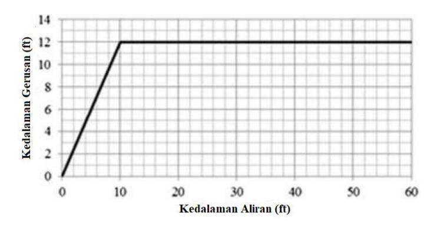

<span id="page-111-3"></span>**Gambar 6.12-1 - Kedalaman gerusan yang diakibatkan oleh aliran berkelanjutan dan pelunakan tekanan pori [1 ft = 0,305 m]**

#### <span id="page-111-2"></span>**6.12.2.4.2 Gerusan** *plunging*

Luas horizontal gerusan *plunging* dan kedalamannya harus ditentukan oleh pemodelan numerik atau fisik dinamis atau dengan metode empiris. Dengan tidak adanya pemodelan dinamis dan analisis yang sesuai kekhususan lokasi, kedalaman gerusan plunging  $D_s$  harus ditentukan oleh Persamaan (6.12-1).

$$D_s = c_{2V} \sqrt{\frac{qU \sin \psi}{g}}$$
 [U.S. standard or SI unit] (6.12-1)

dengan

 $C_{2V}$  = Koefisien gerusan tak-berdimensi, diizinkan diambil sama dengan 2,8;

 Sudut antara aliran cepat pada lubang gerusan dan horizontal, diambil sebagai nilai yang lebih rendah dari 75° dan kemiringan sisi struktur yang terlampaui pada sisi yang tergerus, tanpa adanya informasi lain;

q = Percepatan yang disebabkan oleh gravitasi;

 q = Debit per satuan lebar di atas kelampauan struktur, seperti yang diilustrasikan dalam Gambar 6.12-2 dan dihitung sesuai dengan Persamaan (6.12-2); dan

U = Kecepatan aliran cepat mendekati lubang gerusan, diperoleh sesuai dengan Persamaan (6.12-4).

$$q = C_{\text{dis}} \frac{2}{3} \sqrt{2gH_O^{3/2}}$$
 (6.12-2)

dengan  $C_{\rm dis}$  adalah koefisien debit tak-dimensi diperoleh sesuai dengan Persamaan (6.12-3):

$$C_{\text{dis}} = 0.611 + 0.08 \frac{H_O}{H_B}$$
 (6.12-3)

 $\bm{U}$  adalah kecepatan aliran cepat mendekati lubang gerusan, yang dihasilkan dari jatuhnya antara ketinggian  $\bm{h}$  dari permukaan air hulu, ditambah perbedaan elevasi tambahan  $\bm{d}_d$  pada sisi tergerus, sesuai dengan Persamaan (6.12-4):

$$U = \sqrt{2g(h + d_d)} \tag{6.12-4}$$

dengan  $d_d$  adalah perbedaan elevasi tambahan antara sisi hulu dan sisi yang tergerus dari struktur, seperti yang diilustrasikan pada Gambar 6.12-2.

<span id="page-112-0"></span>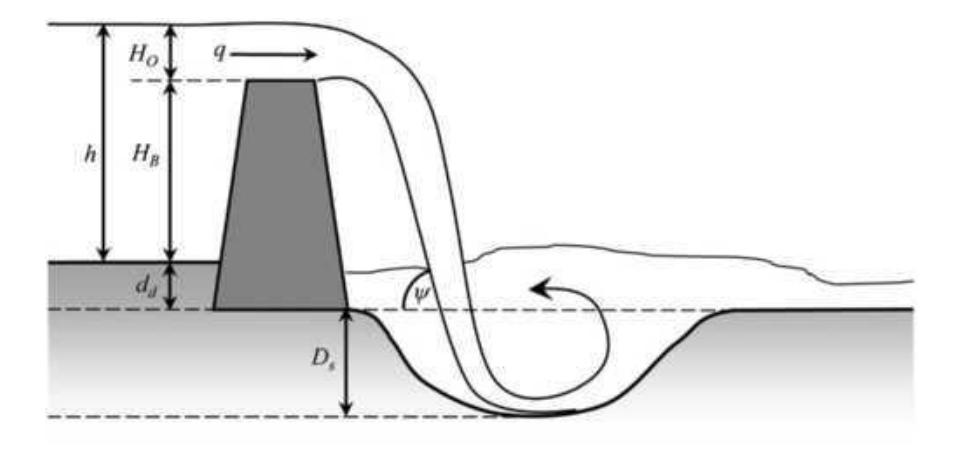

Gambar 6.12-2 - Parameter gerusan plunging

#### <span id="page-113-0"></span>**6.12.2.5 Beban tanah horizontal**

Beban tanah horizontal yang disebabkan oleh gerusan yang tidak seimbang harus dimasukkan dalam desain elemen fondasi.

#### <span id="page-113-1"></span>**6.12.2.6 Perpindahan**

Perpindahan vertikal dan horizontal dari elemen fondasi dan perpindahan lereng harus ditentukan menggunakan metode empiris atau analitik elastoplastis atau numerik dalam literatur yang diakui dengan menerapkan beban tsunami yang ditentukan dalam Pasal **6.12.2** Bersama dengan beban geoteknik dan fondasi lainnya yang berlaku yang disyaratkan oleh standar ini.

#### <span id="page-113-2"></span>**6.12.3 Kriteria desain berbasis kinerja fondasi alternatif**

Tegangan tanah in situ dari beban tsunami dan efek harus dimasukkan dalam perhitungan tekanan fondasi. Untuk bahaya tsunami koseismik lokal yang terjadi sebagai akibat dari gempa lokal, kondisi tanah di tempat dan permukaan lokasi pada permulaan beban tsunami haruslah yang terdapat pada akhir goncangan gempa, termasuk likuifaksi, sebaran lateral, dan efek *rupture* patahan.

Fondasi bangunan gedung harus menyediakan kapasitas dan stabilitas yang cukup untuk menahan beban struktural dan efek erosi umum dan gerusan sesuai dengan literatur yang diakui. Untuk bangunan dan struktur Kategori Risiko Tsunami IV, diizinkan untuk mengevaluasi kinerja keseluruhan dari sistem fondasi untuk potensi pelunakan tekanan pori dengan melakukan analisis pemodelan numerik dua atau tiga dimensi interaksi struktur-tanah-tsunami. Hasilnya harus dievaluasi untuk menunjukkan konsistensi dengan kriteria penerimaan kinerja struktural dalam Pasal 6.8. Untuk bangunan dan struktur Kategori Risiko Tsunami IV, peninjauan sejawat independen harus dilakukan sebagai bagian dari tinjauan terhadap rancangan berbasis kinerja oleh pihak yang berwenang.

#### <span id="page-113-3"></span>**6.12.4 Penanggulangan fondasi**

Timbunan, pelindung slab pada tapak, geotekstil dan sistem penguatan tanah, sistem hadapan (*facing systems*), dan perbaikkan tanah diizinkan untuk mereduksi efek tsunami.

#### <span id="page-113-4"></span>**6.12.4.1 Timbunan**

Timbunan yang digunakan untuk dukungan dan perlindungan struktural harus ditempatkan sesuai dengan ASCE 24 (2005), Pasal 1.5.4 dan Pasal 2.4.1. Timbunan struktural harus dirancang agar stabil selama rendaman dan untuk menahan beban dan efek yang disyaratkan dalam Pasal 6.12.2.

#### <span id="page-113-5"></span>**6.12.4.2 Pelindung slab pada tapak**

Slab eksterior pada tapak harus diasumsikan terangkat dan berpindah selama Tsunami yang Dipertimbangkan Maksimum kecuali ditentukan lain oleh analisis desain sesuai kekhususan lokasi berdasarkan literatur yang diakui. Slab pelindung pada tapak yang digunakan sebagai penanggulangan harus memiliki kekuatan minimum yang diperlukan untuk menahan beban berikut:

1. Gaya geser dari aliran berkelanjutan pada kecepatan aliran tsunami maksimum, *umax*, di atas slab tapak;

- 2. Tekanan angkat dari percepatan aliran di tepi slab hulu dan hilir baik untuk aliran masuk maupun arus balik;
- 3. Gradien aliran rembesan di bawah slab jika terdapat potensi untuk kejenuhan tanah selama gelombang tsunami berturut-turut;
- 4. Fluktuasi tekanan di atas penampang slab dan pada joint;
- 5. Tekanan pori meningkat dari likuifaksi dan dari perjalanan beberapa gelombang tsunami; dan
- 6. Erosi substrat di hulu, hilir, dan aliran paralel tepi slab, serta antara penampang slab.

#### <span id="page-114-0"></span>**6.12.4.3 Geotekstil dan penguatan sistem tanah**

Geotekstil harus dirancang dan dipasang sesuai dengan persyaratan pemasangan produsen dan seperti yang direkomendasikan dalam literatur yang diakui. Faktor-faktor ketahanan yang diperlukan dalam Pasal 6.12.1 harus disediakan untuk daya dukung, pengangkatan, tekanan lateral, stabilitas internal, dan stabilitas lereng.

Sistem penguatan tanah berikut ini diizinkan untuk digunakan:

- 1. Tabung geotekstil yang terbuat dari anyaman berkekuatan tinggi yang mampu mencapai kuat tarik penuh tanpa terbatas oleh deformasi ketika memikul beban dan efek tsunami desain;
- 2. Sistem geogrid dan sistem penguatan lereng yang mencakup perlindungan yang memadai terhadap erosi umum dan gerusan, dan ketebalan angkat maksimum 1 ft (0,3 m) dan perlindungan muka; dan
- 3. Desain sistem proteksi erosi penguatan lereng dan *geocell* bumi (geocell earth), termasuk analisis untuk menentukan kinerja yang diantisipasi terhadap erosi umum dan gerusan jika tidak ada muka yang digunakan.

#### <span id="page-114-1"></span>**6.12.4.4 Sistem hadapan (***facing systems***)**

Sistem muka dan jangkarannya harus cukup kuat untuk menahan pengangkatan dan perpindahan selama beban desain rendaman. Metode muka berikut untuk sistem penguatan tanah diizinkan untuk digunakan:

- 1. Vegetasi untuk menghadapi erosi umum dan ketahanan gerusan di mana kecepatan aliran tsunami kurang dari 12,5 ft/s (3,81 m/s). Desain harus sesuai dengan metode dan persyaratan dalam literatur yang diakui.
- 2. Lapisan filter geotekstil, termasuk perlindungan filter primer penanggulangan menggunakan grid komposit dengan asumsi tegangan kontak yang tinggi dan kriteria desain aksi gelombang energi tinggi dalam AASHTO M288-06, termasuk retensi tanah, permeabilitas, ketahanan penyumbatan, dan ketahanan hidup.
- 3. Matras menyediakan fleksibilitas yang memadai dan termasuk karakteristik disipasi energi. Tepi harus ditanamkan untuk menjaga stabilitas tepi di bawah aliran rendaman desain.
- 4. Beton untuk menghadapi tsunami yang disediakan sesuai dengan pelindung slab pada penanggulangan tapak pada Pasal 6.12.4.2 dan berisi angkur yang memadai ke sistem penguatan tanah di bawah aliran desain rendaman.
- 5. *Armor* dan *riprap* batu yang disediakan untuk menahan tsunami harus dirancang sebagai berikut: Diameter batu tidak boleh kurang dari ukuran yang ditentukan sesuai dengan kriteria desain berdasarkan kedalaman rendaman tsunami dan arus menggunakan kriteria desain dalam literatur yang diakui. Jika bilangan Froude maksimum, *F<sup>r</sup>* , adalah 0,5 atau lebih besar, arus turbulensi berkecepatan tinggi yang terkait dengan tsunami harus dipertimbangkan secara khusus, menggunakan metode dalam literatur yang diakui.

Bilamana dilakukan tinjauan independen, sistem hadapan diizinkan untuk mendasarkan desainnya pada pemodelan fisik atau numerik

#### <span id="page-115-0"></span>**6.12.4.5 Perbaikan tanah**

Penanggulangan perbaikan tanah harus dirancang dengan menggunakan campuran tanah-semen untuk memberikan perlindungan gerusan yang tidak dapat tererosi sesuai dengan Pasal 6.12.2.4 dan minimal memberikan penguatan kekuatan massa tanah semen sebesar 100 psi (0,69 MPa) kekuatan tekan tidak terkekang rata-rata

#### **6.13 Penangulangan struktural untuk pembebanan tsunami**

Penanggulangan berikut diizinkan untuk mereduksi efek struktural dari tsunami.

#### <span id="page-115-1"></span>**6.13.1 Struktur terbuka**

Struktur Terbuka tidak boleh mengalami Kasus Beban 1 dari Pasal 6.8.3.1. Efek beban akumulasi puing terhadap atau di dalam Struktur Terbuka harus dievaluasi dengan mengasumsikan rasio ketertutupan minimum 50 % dari daerah proyeksi rendaman di sepanjang (perimeter) Struktur Terbuka.

#### <span id="page-115-2"></span>**6.13.2 Penghalang tsunami**

Penghalang tsunami yang digunakan sebagai penanggulangan struktural perimeter eksternal harus dirancang konsisten dengan tujuan kinerja struktur yang dilindungi untuk bersama-sama mencapai kriteria kinerja. Kriteria ini termasuk kekuatan penghalang, stabilitas, perlindungan erosi lereng, gerusan kaki, dan persyaratan stabilitas geoteknik serta tinggi penghalang dan tapak pembatas untuk sepenuhnya mencegah rendaman selama Tsunami yang Dipertimbangkan Maksimum. Jika penghalang dirancang untuk dilampaui oleh kejadian desain atau dimaksudkan untuk memberikan hanya sebagian hambatan dari kejadian desain, struktur yang dilindungi dan fondasinya harus dirancang untuk rendaman sisa yang dihasilkan dari kejadian desain. Persyaratan perawatan sistem fondasi dalam Pasal 6.12 dari Pasal ini juga harus diterapkan.

#### <span id="page-115-3"></span>**6.13.2.1 Informasi tentang bangunan eksisting dan struktur lain yang dilindungi**

Informasi seperti terbangun (*As-built)* pada konfigurasi bangunan, komponen bangunan, lokasi, dan fondasi diizinkan untuk dievaluasi sesuai dengan ASCE 41 (2014), Bab 9 hingga 11.

#### <span id="page-115-4"></span>**6.13.2.2 Tata letak lokasi**

Batas spasial dari tata ruang penghalang tsunami harus mencakup hal-hal berikut:

- 1. Penghalang tsunami harus diatur kembali atau ditarik mundur (set back) dari struktur yang dilindungi untuk perlindungan perimeter. Setiap perubahan jalur bangunan (*alignment*) harus memiliki jari-jari kelengkungan minimal sama dengan setidaknya setengah kedalaman rendaman maksimum.
- 2. Untuk hambatan limpasan atas atau parsial terhadap rendaman, minimal batas penghalang harus melindungi struktur dari aliran rendaman berdasarkan pada sudut datang ± 22,5 derajat dari garis pantai. Sudut datang aliran harus dievaluasi sesuai dengan Pasal 6.8.6.1 dan Pasal 6.8.6.2.

#### **6.14 Struktur pengungsian evakuasi vertikal tsunami**

Struktur pengungsian evakuasi vertikal tsunami yang ditunjuk sebagai sarana evakuasi alternatif oleh pihak yang berwenang harus dirancang sesuai dengan persyaratan tambahan dari Pasal ini.

#### <span id="page-116-0"></span>**6.14.1 Kedalaman dan elevasi rendaman minimum**

Lantai pengungsian tsunami harus berlokasi tidak kurang dari 10 ft (3,05 m) atau satu tingkat ketinggian di atas 1,3 kali elevasi rendaman tsunami yang dipertimbangkan maksimum di lokasi sebagaimana ditentukan oleh analisis rendaman sesuai kekhususan lokasi, seperti ditunjukkan pada Gambar 6.14-1. Elevasi rendaman sesuai kekhususan lokasi tsunami yang dipertimbangkan maksimum yang sama ini diberi faktor 1,3, juga harus digunakan untuk desain Struktur Pengungsian Evakuasi Vertikal Tsunami sesuai dengan Pasal 6.8 sampai Pasal 6.12.

#### <span id="page-116-1"></span>**6.14.2 Beban hidup pengungsi**

Beban hidup gabungan, <sup>L</sup>refuge sebesar 100 psf (4,8 kPa) harus digunakan di setiap area lantai evakuasi yang direncanakan di dalam lantai dasar pengungsian tsunami.

#### <span id="page-116-2"></span>**6.14.3 Impak guling (***laydown***)**

Jika kedalaman rendaman maksimum melebihi 6 ft (1,83 m), Impak guling (*laydown*) dari struktur tiang yang berdekatan runtuh mengenai bagian bangunan yang ditempati harus dipertimbangkan

#### <span id="page-116-3"></span>**6.14.4 Informasi tentang dokumen konstruksi**

Dokumen konstruksi harus mencakup kriteria desain tsunami dan kapasitas hunian area pengungsian tsunami. Denah lantai harus menunjukkan semua area pengungsian daripada fasilitas dan rute keluar dari masing-masing area. Koordinat garis lintang dan bujur dari bangunan harus dicatat pada dokumen konstruksi.

#### <span id="page-116-4"></span>**6.14.5 Kajian sejawat**

Desain harus tunduk pada kajian sejawat independen oleh profesional desain berlisensi yang tepat yang harus menyajikan laporan tertulis kepada Pihak Yang Berwenang untuk kesesuaian desain dengan persyaratan standar ini.

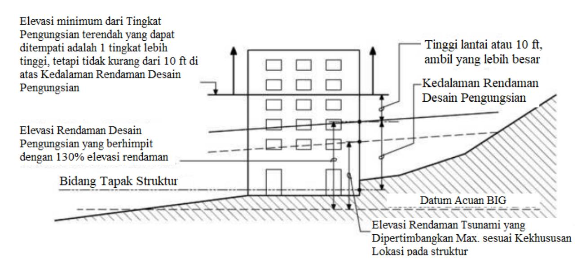

**Gambar 6.14-1 - Elevasi level pungungsian minimum [1 ft=0.305 m]**

#### <span id="page-117-5"></span><span id="page-117-0"></span>**6.15 Komponen dan sistem yang ditetapkan nonstruktural**

#### <span id="page-117-1"></span>**6.15.1 Persyaratan kinerja**

Komponen dan sistem yang ditetapkan nonstruktural dalam struktur yang terletak di zona desain tsunami harus dilindungi baik dari pengaruh rendaman tsunami atau diposisikan dalam struktur di atas ketinggian rendaman dari tsunami yang dipertimbangkan maksimum, sehingga komponen dan sistem yang ditetapakan nonstruktural akan mampu melakukan fungsi kritis selama dan setelah tsunami yang dipertimbangkan maksimum. Penghalang tsunami digunakan sebagai perlindungan rendaman harus memiliki elevasi tepi atas dinding yang tidak kurang dari 1,3 kali ketinggian rendaman maksimum di penghalang. Penghalang tsunami juga harus memenuhi persyaratan Pasal 6.13. Sebagai alternatif diizinkan untuk mendesain komponen dan sistem yang ditetapkan nonstruktural secara langsung untuk efek-efek tsunami, asalkan perendaman tidak akan menghalanginya dari melakukan fungsi penting selama dan setelah tsunami yang dipertimbangkan maksimum.

#### <span id="page-117-2"></span>**6.16 Struktur nonbangunan Kategori Risiko Tsunami III dan IV**

#### <span id="page-117-3"></span>**6.16.1 Persyaratan untuk struktur nonbangunan Kategori Risiko Tsunami III**

Struktur nonbangunan Kategori Risiko Tsunami III yang terletak di zona desain tsunami harus dilindungi dari efek rendaman tsunami atau dirancang untuk menahan dampak beban tsunami sesuai dengan Pasal 6.8 dari Pasal ini dan sesuai dengan persyaratan kinerja spesifik dari Pasal 6.8.3. Penghalang tsunami yang digunakan sebagai perlindungan rendaman harus memiliki elevasi tepi atas dinding tidak kurang dari 1,3 kali elevasi rendaman maksimum di penghalang. Penghalang tsunami juga harus memenuhi persyaratan Pasal 6.13.

#### <span id="page-117-4"></span>**6.16.2 Persyaratan untuk struktur nonbangunan Kategori Risiko Tsunami IV**

Kategori Risiko Tsunami IV yang ditujukan untuk sistem nonstruktural dalam struktur nonbangunan yang terletak di zona desain tsunami harus (1) terlindung dari efek rendaman tsunami, (2) diposisikan di atas 1,3 kali elevasi rendaman dari Tsunami yang dipertimbangkan Maksimum sedemikian rupa sehingga struktur nonbangunan Kategori Risiko Tsunami Struktur IV akan mampu melakukan fungsi kritis selama dan setelah tsunami yang dipertimbangkan maksimum, atau (3) dirancang untuk menahan dampak beban tsunami sesuai dengan Pasal 6.8 dan persyaratan kinerja spesifik dari Pasal 6.8.3. Penghalang tsunami yang digunakan sebagai pelindung terhadap rendaman harus memiliki elevasi tepi atas dinding yang tidak kurang dari 1,3 kali elevasi rendaman maksimum di penghalang. Penghalang tsunami juga harus memenuhi persyaratan Pasal 6.13.

#### <span id="page-118-0"></span>**6.17 Standar konsensus dan dokumen rujukan lainnya**

Bagian ini berisi daftar standar konsensus dan dokumen Referensi lain yang harus dipertimbangkan sebagai bagian dari standar ini sejauh yang dirujuk dalam Pasal ini. Dokumen-dokumen yang dirujuk yang diidentifikasi oleh tanda bintang (\*) bukanlah standar konsensus; Sebaliknya, dokumen-dokumen tersebut adalah dokumen yang dikembangkan dalam industri dan mewakili prosedur yang dapat diterima untuk desain dan konstruksi sejauh yang dimaksud Pasal yang ditetapkan.

AASHTO *Guide Specifications and Commentary for Vessel Collision Design of Highway Bridges, 2nd Ed*., *American Association of State Highway and Transportation Officials*, 2009, with 2010 Interim Revisions.

*Cited in*: Section 6.11.5

**AASHTO M288-06**, *Standard Specification for Geotextile Specification for Highway Applications*, American Association of State Highway and Transportation Officials, 2006. *Cited in*: Section 6.12.4.4

**ASCE/SEI 24-05**, *Flood Resistant Design and Construction*, American Society of Civil Engineers, 2005.

*Cited in*: Section 6.12.4.1

**ASCE/SEI 41-13**, *Seismic Evaluation and Retrofit of Existing Buildings*, American Society of Civil Engineers, 2014.

*Cited in*: Sections 6.8.3.5.2.2 and 6.13.2.1

**\*NOAA Technical Memorandum OAR PMEL-135**, *Standards, Criteria, and Procedures for NOAA Evaluation of Tsunami Numerical Models*, National Oceanic and Atmospheric Administration, Pacific Marine Environmental Laboratory, 2007. *Cited in*: Section 6.7.6.7.

#### <span id="page-118-1"></span>**7 Beban salju**

Pasal ini tidak relevan untuk Indonesia.

#### <span id="page-118-2"></span>**8 Beban air hujan**

#### <span id="page-118-3"></span>**8.1 Definisi dan simbol**

#### <span id="page-118-4"></span>**8.1.1 Definisi**

**Drainase terkontrol**: Sistem yang dengan sengaja dirancang untuk mengatur laju aliran melalui saluran utama.

**Genangan**: Akumulasi air yang disebabkan oleh lendutan struktur atap, yang menghasilkan penambahan beban.

**Ketidakstabilan akibat penggenangan air**: Ketidakstabilan komponen yang disebabkan oleh lendutan progresif akibat penggenangan pada atap.

**Sistem drainase primer**: Sistem drainase atap yang biasanya digunakan untuk mengalirkan air keluar dari atap.

**Komponen primer**: Dalam kaitan untuk menentukan bentang yang rawan, komponen struktural yang memiliki sambungan langsung ke kolom, termasuk balok-balok dan rangka batang.

**Lubang talang (***scupper***):** Bukaan di sisi bangunan gedung (biasanya melalui dinding parapet) untuk tujuan mengalirkan air keluar dari atap.

**Sistem drainase sekunder**: Sistem drainase atap pada elevasi yang lebih tinggi dari sistem drainase primer, tempat air mengalir keluar dari atap saat sistem primer terhambat atau tidak bekerja.

**Komponen sekunder**: Dalam kaitan untuk menentukan bentang yang rawan, komponen struktural yang tidak memiliki sambungan langsung ke kolom.

**Bentang yang rawan**: Bentang struktural yang rentan terhadap beban lebih dari akumulasi air.

#### <span id="page-119-0"></span>**8.1.2 Simbol**

- d <sup>h</sup> = tambahan kedalaman air pada atap yang tidak melendut di atas lubang masuk sistem drainase sekunder pada aliran desainnya (yakni, kepala hidraulik), dalam in. (mm)
- d <sup>s</sup> = kedalaman air pada atap yang tidak melendut meningkat ke lubang masuk sistem drainase sekunder apabila sistem drainase primer tertutup (yakni, tinggi statis), dalam in. (mm)
- <sup>R</sup> = beban air hujan pada atap yang tidak melendut, dalam lb/ft<sup>2</sup> (kN/m<sup>2</sup> ). Apabila istilah "atap yang tidak melendut" digunakan, lendutan dari beban (termasuk beban mati) tidak perlu diperhitungkan ketika menentukan jumlah air hujan pada atap.

#### <span id="page-119-1"></span>**8.2 Drainase atap**

Sistem drainase atap harus didesain sesuai dengan ketentuan peraturan yang berlaku. Laju aliran desain saluran sekunder sebagai saluran pelimpah (termasuk saluran atap dan pipa talang) atau lubang talang (*scupper*), dan kepala hidraulik (*dh*) yang dihitung harus didasarkan pada intensitas curah hujan berdurasi 15 menit dengan periode ulang sama dengan 100 tahun atau lebih panjang dari itu. Sistem drainase primer harus dirancang untuk intensitas curah hujan berdurasi 60 menit dengan periode ulang (frekuensi) 100 tahun atau lebih.

#### <span id="page-119-2"></span>**8.3 Beban hujan desain**

Setiap bagian dari atap harus dirancang untuk mampu menahan beban dari air hujan yang terakumulasi apabila sistem drainase primer pada bagian tersebut terhambat ditambah beban merata akibat kenaikan air di atas lubang masuk sistem drainase sekunder pada aliran desainnya.

$$R = 5.2 (d_s + d_h) (8.3-1)$$

$$R = 0,0098 (d_s + d_h) (8.3-1si)$$

Apabila sistem drainase sekunder terdiri dari beberapa saluran, saluran-saluran tersebut dan titik pembuangannya harus dipisahkan dari saluran primer. Beban air hujan harus didasarkan pada tinggi total (yakni, tinggi statis [ds] ditambah kepala hidraulik [dh]) yang terkait dengan laju aliran desain untuk sistem drainase dan saluran sekunder yang ditetapkan. Tinggi total yang sesuai dengan laju aliran desain untuk saluran yang ditetapkan harus berdasarkan pada data uji hidraulik.

#### <span id="page-120-0"></span>**8.4 Ketidakstabilan akibat genangan dan beban genangan air**

Bentang-bentang yang rawan harus diinvestigasi dengan analisis struktur untuk memastikan bahwa bentang tersebut memiliki kekakuan yang memadai untuk mencegah lendutan progresif (yakni, ketidakstabilan) dan kekuatan yang memadai untuk menahan beban genangan air tambahan. Kondisi berikut harus dianggap sebagai bentang yang rawan: (1) bentang dengan kemiringan atap kurang dari 1/4 in. (6,25 mm) per foot (1,19°) apabila komponen sekunder tegak lurus terhadap tepi bebas saluran, (2) bentang dengan kemiringan atap kurang dari 1 in. (25 mm) per foot (4,76°) apabila komponen sekunder sejajar dengan tepi bebas saluran, (3) bentang dengan kemiringan atap 1 in. (25 mm) per foot (4,76°) dan rasio bentang terhadap jarak untuk komponen sekunder lebih besar dari 16 apabila komponen sekunder sejajar dengan tepi bebas saluran, atau (4) bentang yang menampung akumulasi air (keseluruhan atau sebagian) apabila sistem saluran utama terhambat tetapi sistem saluran sekunder berfungsi. Nilai yang lebih besar antara beban salju atau beban air hujan yang sama dengan kondisi desain untuk sistem saluran utama yang terhambat harus digunakan dalam analisis ini.

#### <span id="page-120-1"></span>**8.5 Drainase terkontrol**

Atap yang dilengkapi dengan perangkat keras pada sistem drainase primer yang dirancang untuk dengan sengaja mengatur laju drainase harus dilengkapi dengan sistem drainase sekunder pada elevasi yang lebih tinggi. Saluran atap yang alirannya terkontrol tidak boleh digunakan pada sistem drainase sekunder.

#### <span id="page-120-2"></span>**8.6 Standar konsensus dan dokumen Referensi lainnya**

Pasal ini tidak merujuk konsensus standar atau dokumen lain manapun yang dianggap sebagai bagian dari standar ini.

#### <span id="page-120-3"></span>**9 Disediakan untuk ketentuan di masa depan**

#### <span id="page-120-4"></span>**10 Beban es**

Pasal ini tidak relevan untuk Indonesia.

#### <span id="page-121-0"></span>**PASAL 11 sampai dengan pasal 25 mengenai Pembebanan gempa di indonesia, masuk dalam ruang lingkup SNI 1726**

**CATATAN** Struktur Standar ini termasuk metode penomoran Pasal mengikuti SEI/ASCE 7-10 sebagai standar acuan dalam SNI ini. Hal ini dimaksudkan menjamin ketelusuran terhadap standar acuan tersebut sehingga dapat memudahkan dalam menyatukan persepsi penerapan substansi standar ini.

#### <span id="page-121-1"></span>**26 Beban angin: persyaratan umum**

#### <span id="page-121-2"></span>**26.1 Prosedur**

#### <span id="page-121-3"></span>**26.1.1 Ruang lingkup**

Bangunan gedung dan struktur lain, termasuk Sistem Penahan Gaya Angin Utama (SPGAU) dan seluruh Komponen dan Klading (K&K) gedung, harus dirancang dan dilaksanakan untuk menahan beban angin seperti yang ditetapkan menurut Pasal 26 sampai Pasal 31. Ketentuan dalam Pasal ini mendefinisikan parameter angin dasar untuk digunakan dengan ketentuan lainnya yang terdapat dalam standar ini.

#### <span id="page-121-4"></span>**26.1.2 Prosedur yang diizinkan**

Beban angin desain untuk bangunan dan struktur lain, termasuk SPGAU serta elemen K&K bangunan gedung, harus ditentukan dengan menggunakan salah satu prosedur seperti disyaratkan dalam Pasal ini. Garis besar dari keseluruhan proses untuk penentuan beban angin, termasuk referensi pasal, diberikan pada Gambar 26.1-1.

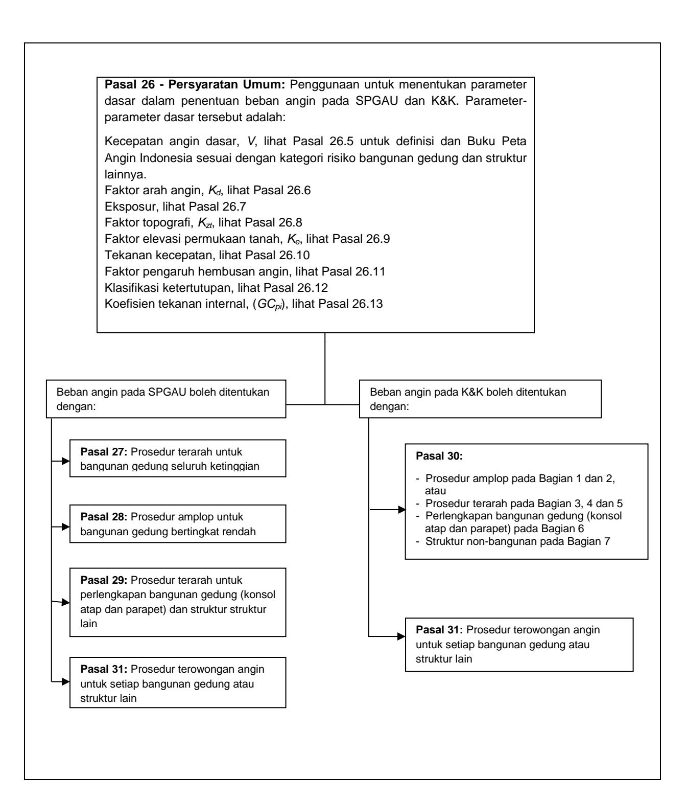

**Gambar 26.1-1 - Garis besar proses untuk menentukan beban angin**

<span id="page-122-1"></span><span id="page-122-0"></span>Garis besar tambahan dan catatan tersedia pada awal setiap pasal untuk prosedur langkah demi langkah yang lebih detail dalam menentukan beban angin.

#### <span id="page-123-0"></span>26.1.2.1 Sistem Penahan Gaya Angin Utama (SPGAU)

Beban angin untuk SPGAU harus ditentukan dengan menggunakan salah satu prosedur berikut:

- 1. Prosedur terarah untuk bangunan dari semua ketinggian seperti disyaratkan dalam Pasal 27 untuk bangunan memenuhi persyaratan yang disyaratkan di dalamnya;
- 2. Prosedur amplop untuk bangunan bertingkat rendah seperti disyaratkan dalam Pasal 28 untuk bangunan memenuhi persyaratan yang disyaratkan di dalamnya;
- 3. Prosedur terarah untuk perlengkapan bangunan (struktur dan peralatan bagian atap) dan struktur lainnya (seperti dinding solid berdiri bebas dan panel penunjuk solid berdiri bebas, cerobong asap, tangki, panel penunjuk terbuka, rangka terbuka bidang tunggal, dan menara rangka batang) sebagaimana disyaratkan dalam Pasal 29: atau
- 4. Prosedur terowongan angin untuk semua bangunan gedung dan struktur lain seperti disyaratkan dalam Pasal 31.

#### <span id="page-123-1"></span>26.1.2.2 Komponen dan Klading (K&K)

Beban angin pada Komponen dan Klading pada semua bangunan dan struktur lainnya harus dirancang menggunakan salah satu prosedur berikut:

- 1. Prosedur analitis tersedia pada Bagian 1 sampai Bagian 6, yang sesuai, dari Pasal 30: atau
- 2. Prosedur terowongan angin seperti disyaratkan dalam Pasal 31.

#### <span id="page-123-2"></span>26.2 Definisi

Definisi berikut berlaku untuk ketentuan Pasal 26 sampai Pasal 31:

Disetujui: Diterima oleh pihak yang berwenang.

**Kanopi yang menempel**: Penutup teras horizontal (kemiringan maksimum 2 %) yang menempel pada dinding bangunan pada suatu ketinggian; berbeda dengan konsol yang merupakan perluasan dari permukaan atap.

**Kecepatan angin dasar, V:** Kecepatan hembusan angin 3 detik pada ketinggian 33 ft (10 m) di atas tanah pada Eksposur C (lihat Pasal 26.7.3) yang ditentukan sesuai dengan Pasal 26.5.1.

**Bangunan gedung, tertutup**: Bangunan gedung yang memiliki luas total bukaan pada setiap dinding, yang menerima tekanan eksternal positif, kurang dari atau sama dengan 4 ft² (0,37 m²) atau 1 % dari luas dinding, dipilih yang lebih kecil. Kondisi ini dinyatakan untuk setiap dinding dengan persamaan berikut:

 $A_0 < 0.01 A_0$ ; atau 4 ft<sup>2</sup> (0.37 m<sup>2</sup>); dipilih yang lebih kecil,

dengan  $A_o$  dan  $A_a$  adalah seperti yang ditetapkan untuk bangunan gedung terbuka

**Bangunan gedung, bertingkat rendah:** Bangunan gedung tertutup atau tertutup sebagian yang memenuhi kondisi berikut:

- 1. Tinggi atap rata-rata h sama dengan atau kurang dari 60 ft (18 m).
- 2. Tinggi atap rata-rata *h* tidak melebihi dimensi horizontal yang terkecil.

**Bangunan gedung, terbuka:** Bangunan gedung yang memiliki dinding setidaknya 80 % terbuka. Kondisi ini dinyatakan untuk setiap dinding oleh persamaan  $A_o \ge 0.8A_g$ , dengan

 $A_o$  = luas total bukaan di dinding yang menerima tekanan eksternal positif, dalam ft<sup>2</sup>(m<sup>2</sup>); dan

 $A_a$  = luas bruto dinding untuk  $A_a$  yang diidentifikasikan, dalam ft<sup>2</sup> (m<sup>2</sup>)

**Bangunan gedung, tertutup sebagian:** Sebuah bangunan gedung yang memenuhi kedua kondisi berikut:

- Luas total bukaan di dinding yang menerima tekanan eksternal positif melebihi jumlah dari luas bukaan di keseimbangan amplop bangunan gedung (dinding dan atap) dengan lebih dari 10 %.
- 2. Luas total bukaan di dinding yang menerima tekanan eksternal positif melebihi 4 ft<sup>2</sup> (0,37 m<sup>2</sup>) atau 1 % dari luas dinding, mana yang lebih kecil, dan persentase bukaan di keseimbangan amplop bangunan gedung tidak melebihi 20 %.

Kondisi ini dinyatakan dengan persamaan berikut:

$$A_0 > 1,10A_{0i}$$

 $A_o > 4$  ft<sup>2</sup>(0,37 m<sup>2</sup>) atau > 0,01 $A_o$ , ambil yang terkecil, dan  $A_o / A_{oi} \le 0,20$ 

dengan  $A_o$ ,  $A_g$  adalah seperti ditetapkan untuk bangunan gedung terbuka;

 $A_{oi}$  = jumlah dari luas bukaan pada amplop bangunan gedung (dinding dan atap) tidak termasuk  $A_{oi}$  dalam ft<sup>2</sup> (m<sup>2</sup>); dan

 $A_{gi}$  = jumlah dari luas permukaan bruto amplop bangunan gedung (dinding dan atap) tidak termasuk  $A_{\sigma}$ , dalam ft<sup>2</sup> (m<sup>2</sup>).

**Bangunan gedung, terbuka sebagian:** Bangunan yang tidak memenuhi persyaratan sebagai bangunan gedung terbuka, tertutup sebagian, atau tertutup.

Bangunan gedung, diafragma sederhana: Suatu bangunan gedung di mana beban angin yang berada di sisi angin datang (*windward*) dan di sisi angin pergi (*leeward*), keduanya disalurkan oleh atap dan rakitan dinding bentang vertikal, melalui lantai menerus dan diafragma atap, ke SPGAU.

Bangunan gedung, torsional beraturan terhadap beban angin: Suatu bangunan gedung dengan SPGAU terhadap setiap sumbu utama diproporsikan sehingga perpindahan maksimum di setiap tingkat pada Kasus 2, kasus beban angin torsional, dari Gambar 27.3-8, tidak melebihi perpindahan maksimum di lokasi yang sama pada Kasus 1 dari Gambar 27.3-8, kasus beban angin dasar.

**Amplop bangunan gedung:** Klading gedung, atap, dinding luar, kaca, rakitan pintu, rakitan jendela, kaca atap, dan komponen lainnya yang menutupi bangunan gedung.

**Bangunan dan struktur lain, fleksibel:** Bangunan gedung dan struktur lain yang langsing dengan frekuensi alami fundamental kurang dari 1 Hz.

Bangunan gedung atau struktur lain, berbentuk teratur: Suatu bangunan gedung atau struktur lain tidak memiliki penyimpangan geometri yang tidak biasa dalam bentuk spasial.

**Bangunan gedung atau struktur lain, kaku:** Suatu bangunan gedung atau struktur lain yang frekuensi fundamentalnya lebih besar atau sama dengan 1 Hz.

**Komponen dan Klading (K&K):** Elemen dari amplop bangunan atau elemen dari perlengkapan bangunan gedung dan struktur dan peralatan bagian atap yang tidak memenuhi persyaratan sebagai bagian dari SPGAU.

**Gaya desain,** F **:** Gaya statis ekuivalen yang digunakan dalam penentuan beban angin untuk struktur lain.

**Tekanan desain,** p **:** Tekanan statis ekuivalen yang digunakan dalam penentuan beban angin untuk bangunan gedung.

**Diafragma:** Atap, lantai, atau membran lain atau sistem breising yang bekerja untuk menyalurkan gaya lateral ke sistem penahan gaya angin utama vertikal. Untuk analisis akibat beban angin, diafragma dek baja tanpa lapis atas, dek baja berisi beton, dan *slab* beton, masing-masing memiliki rasio bentang terhadap tinggi penampang sebesar 2 atau kurang, boleh diidealisasikan sebagai diafragma kaku. Diafragma yang dibuat dari panel kayu struktural boleh diidealisasikan sebagai diafragma fleksibel.

**Prosedur terarah:** Prosedur untuk menentukan beban angin pada bangunan gedung dan struktur lain untuk arah-arah angin tertentu, di mana koefisien tekanan eksternal yang digunakan diperoleh dari pengujian terowongan angin model bangunan gedung prototipikal yang sebelumnya untuk arah angin yang sesuai.

**Tinggi bagian terbawah atap,** h<sup>e</sup> : Jarak dari permukaan tanah di samping bangunan gedung terhadap garis bagian terbawah atap dari bagian dinding tertentu. Apabila ketinggian bagian terbawah atap ini bervariasi sepanjang dinding, gunakan ketinggian rata-rata.

**Luas angin efektif,** A : Luas yang digunakan untuk menentukan koefisien tekanan eksternal, (*GCp*) and (*GCrn*). Untuk elemen-elemen komponen dan klading, luas angin efektif pada Gambar 30.3-1 sampai Gambar 30.3-7, Gambar 30.4-1, Gambar 30.5-1, dan Gambar 30.7-1 sampai Gambar 30.7-3 adalah panjang bentang dikalikan dengan lebar efektif yang tidak boleh kecil dari sepertiga panjang bentang. Untuk atap panel surya, luas angin efektif pada Gambar 29.4-7 sama dengan luas tributari untuk elemen struktural yang diperhitungkan, kecuali lebar dari luas angin efektif tidak boleh kurang dari sepertiga panjangnya. Untuk pengencang klading, luas angin efektif tidak boleh lebih besar dari luas tributari pada masing-masing pengencang.

**Prosedur amplop**: Prosedur untuk menentukan kasus beban angin pada bangunan gedung, di mana koefisien tekanan eksternal tiruan diperoleh dari pengujian terowongan angin model bangunan gedung prototipikal sebelumnya yang diputar bertahap sampai 360°, seperti kasus tekanan tiruan yang menghasilkan aksi struktural utama (angkat, geser horizontal, momen lentur, dan lain-lain) yang merupakan amplop dari nilai-nilai maksimum di antara semua kemungkinan arah angin.

**Tebing curam:** Juga dikenal sebagai lereng curam, sehubungan dengan efek topografi dalam Pasal 26.8, suatu tebing atau lereng curam yang umumnya memisahkan dua tingkat atau daerah landai tertentu (lihat Gambar 26.8-1).

**Atap bebas:** Atap dengan konfigurasi yang umumnya sesuai dengan yang ditampilkan pada Gambar 27.3-4 sampai Gambar 27.3-6 (miring sepihak, berbubung, atau cekung) dalam sebuah bangunan gedung terbuka tanpa dinding melampirkan bawah permukaan atap.

**Perkacaan:** Kaca atau lembaran transparan atau lembaran plastik tembus cahaya yang digunakan pada jendela, pintu, atap kaca, atau *curtain wall*.

**Perkacaan, penahan impak:** Kaca yang telah teruji melalui pengujian untuk menahan impak proyektil. Lihat Pasal 26.12.3.2.

**Bukit:** Dengan memperhatikan pengaruh topografi pada Pasal 26.8, adalah suatu permukaan tanah dengan karakteristik relief tajam pada setiap arah horizontal (lihat Gambar 26.8-1).

**Wilayah rawan topan:** Daerah-daerah yang rawan terhadap serangan angin topan (kecepatan angin dasar untuk Kategori Risiko II bangunan lebih besar dari 115 mil/jam).

**Sistem proteksi impak:** Konstruksi yang telah ditunjukkan oleh pengujian untuk menahan impak proyektil dan yang diterapkan, dilekatkan, atau terkunci pada perkacaan eksterior. Lihat Pasal 26.12.3.2.

**Sistem Penahan Gaya Angin Utama (SPGAU):** Suatu rangkaian dari elemen-elemen struktur yang berfungsi untuk menahan dan memberikan stabilitas keseluruhan struktur. Sistem tersebut umumnya menerima beban angin lebih dari satu permukaan.

**Tinggi atap rata-rata,** *h***:** Rata-rata tinggi bagian terbawah atap dan tinggi titik tertinggi pada permukaan atap, kecuali untuk sudut atap yang kurang atau sama dengan 10°, tinggi atap rata-rata adalah tinggi bagian terbawah atap.

**Bukaan:** Celah atau lubang di amplop bangunan yang memungkinkan udara mengalir melalui amplop bangunan gedung dan yang dirancang untuk "terbuka" selama angin desain berlangsung seperti didefinisikan oleh ketentuan-ketentuan ini.

**Literatur yang diakui**: Penemuan penelitian yang diterbitkan dan makalah teknis yang disetujui.

**Bukit:** Dengan memperhatikan pengaruh topografi pada Pasal 26.8, adalah suatu permukaan tanah dengan karakteristik relief tajam pada kedua arah horizontal (lihat Gambar 26.8-1).

**Panel surya atap**: Perangkat untuk menerima radiasi surya dan mengubahnya menjadi listrik atau energi panas. Biasanya ini adalah modul fotovoltaik atau panel panas surya.

**Deretan panel surya**: Sekelompok panel surya yang berdekatan di atap.

**Wilayah puing terbawa angin:** Daerah-daerah didalam wilayah rawan badai di mana perlindungan impak diperlukan untuk bukaan berkaca; lihat Pasal 26.12.3.

**Prosedur terowongan angin:** Prosedur untuk menentukan beban angin pada bangunan gedung dan struktur lain, di mana tekanan dan/atau gaya dan momen ditentukan untuk setiap arah angin yang diperhitungkan, dari model bangunan gedung atau struktur lain dan sekitarnya, sesuai dengan Pasal 31.

#### <span id="page-127-0"></span>26.3 Simbol

Simbol berikut hanya berlaku untuk ketentuan Pasal 26 sampai dengan Pasal 31:

- $A = luas angin efektif, dalam <math>ft^2 (m^2)$
- $A_f$  = luas bangunan gedung terbuka dan struktur lainnya baik yang tegak lurus terhadap arah angin ataupun diproyeksikan pada bidang yang tegak lurus terhadap arah angin, dalam ft<sup>2</sup> (m<sup>2</sup>)
- $A_a$  = luas bruto dinding di mana  $A_a$  berada, dalam ft<sup>2</sup> (m<sup>2</sup>)
- $A_{gi}$  = jumlah luas permukaan bruto dari amplop bangunan gedung (dinding dan atap) tidak termasuk  $A_{gi}$ , dalam ft<sup>2</sup> (m<sup>2</sup>)
- $A_n$  = luas angin yang dinormalisasi untuk panel atap surya pada Gambar 29.4-7
- $A_o$  = luas total bukaan pada suatu dinding yang menerima tekanan eksternal positif, dalam ft<sup>2</sup> (m<sup>2</sup>)
- $A_{oq}$  = luas total bukaan pada amplop bangunan gedung, dalam ft<sup>2</sup> (m<sup>2</sup>)
- $A_{oi}$  = jumlah luas bukaan pada amplop bangunan gedung (dinding dan atap) tidak termasuk  $A_{oi}$ , dalam ft<sup>2</sup> (m<sup>2</sup>)
- $A_s$  = luas bruto dinding solid yang berdiri bebas atau panel petunjuk, in ft<sup>2</sup> (m<sup>2</sup>)
- a = lebar zona koefisien tekanan, dalam ft (m)
- B = dimensi horizontal bangunan gedung diukur tegak lurus terhadap arah angin, dalam ft (m)
- $\bar{b}$  = faktor kecepatan angin rata-rata per jam dalam Persamaan 26.11-16 dari Tabel 26.11-1
- $\stackrel{\circ}{b}$  = faktor kecepatan hembusan angin dalam 3 detik dari Tabel 26.11-1
- c = faktor intensitas turbulensi dalam Persamaan 26.11-7 dari Tabel 26.11-1
- $C_f$  = koefisien gaya yang digunakan pada penentuan beban angin untuk strukturstruktur lain
- $C_N$  = koefisien tekanan neto yang digunakan pada penentuan beban angin untuk bangunan gedung terbuka
- $C_p$  = koefisien tekanan eksternal yang digunakan dalam penentuan beban angin untuk bangunan gedung
- D = diameter struktur bundar atau komponen struktur, dalam ft (m)
- D' = tinggi elemen yang menonjol seperti rusuk dan sirip, dalam ft (m)
- d<sub>1</sub> = untuk deretan panel surya atap, jarak horizontal ortogonal ke tepi panel terhadap panel yang berdekatan atau tepi bangunan gedung, dengan mengabaikan peralatan atap pada Gambar 29.4-7, dalam ft (m)
- $d_2$  = untuk deretan atap panel surya, jarak horizontal dari tepi satu panel ke tepi terdekat pada deretan panel berikutnya pada Gambar 29.4-7, dalam ft (m)

- *F* = gaya angin desain untuk struktur-struktur lain, dalam lb (N) *G* = faktor efek hembusan angin
- *Gf*= faktor efek hembusan angin untuk SPGAU dari bangunan gedung fleksibel dan struktur-struktur lain
- (*GCp*) = perkalian koefisien tekanan eksternal dan faktor efek hembusan angin yang digunakan dalam menentukan beban angin untuk bangunan gedung
- (*GCpf*) = perkalian koefisien tekanan eksternal ekuivalen dan faktor efek hembusan angin yang digunakan dalam menentukan beban angin untuk SPGAU dari bangunan gedung bertingkat rendah
- (*GCpi*) = perkalian koefisien tekanan internal danfaktor efek hembusan angin yang digunakan dalam menentukan beban angin untuk bangunan gedung
- (*GCpn*) = koefisien tekanan neto (bersih) terkombinasi untuk parapet
- (*GCr*) = perkalian koefisien tekanan eksternal dan faktor efek hembusan angin yang digunakan dalam menentukan beban angin untuk struktur bagian atap
- GC rn = koefisien tekanan neto untuk panel surya atap, dalam Persamaan (29.4- 4) dan Persamaan (29.4-5)
- GCrn nom = koefisien tekanan neto nominal untuk panel surya atap yang ditentukan dari Gambar 29.4-7
- *g<sup>Q</sup>* = faktor puncak untuk respons latar belakang dalam Persamaan 26.11-6 dan 26.11-10
- *gR*= faktor puncak untuk respons resonansi dalam Persamaan 26.11-10
- *g<sup>v</sup>* = faktor puncak untuk respons angin dalam Persamaan 26.11-6 dan 26.11- 10
- *H* = tinggi bukit atau tebing dalam Gambar 26.8-1, dalam ft (m)
- *h* = tinggi rata-rata atap bangunan gedung atau tinggi struktur-struktur lain, kecuali tinggi bagian terbawah atap yang digunakan untuk sudut atap *θ* yang kurang dari atau sama dengan 10°, dalam ft (m)
- *h*<sup>1</sup> = tinggi panel surya di atas atap pada tepi terbawah dari panel, dalam ft (m)
- *h*<sup>2</sup> = tinggi panel surya di atas atap pada tepi teratas dari panel, dalam ft (m)
- *h<sup>e</sup>* = tinggi bagian terbawah atap pada suatu dinding tertentu, atau tinggi ratarata jika bagian terbawah atap bervariasi sepanjang dinding
- *h<sup>p</sup> =* tinggi terhadap bagian atas dari parapet pada Gambar 27.5-2 dan 30.6-1
- *hpt* = tinggi parapet rata-rata di atas permukaan atap yang bersebelahan untuk digunakan dengan Persamaan (29.4-5), dalam ft (m)
- z I = intensitas turbulensi dari Persamaan 26.11-7
- *K*1, *K*2, *K*<sup>3</sup> = pengali dalam Gambar 26.8-1 untuk memperoleh *Kzt*

 $K_d$  = faktor arah angin dalam Tabel 26.6-1

 $K_{\rm e}$  = faktor elevasi permukaan tanah

 $K_h$  = koefisien eksposur tekanan velositas pada ketinggian z = h

 $K_z$  = koefisien eksposur tekanan velositas pada ketinggian z

 $K_{zt}$  = faktor topografi seperti didefinisikan dalam Pasal 26.8

 dimensi horizontal dari suatu bangunan gedung yang diukur paralel terhadap arah angin, dalam ft (m)

L<sub>b</sub> = panjang bangunan yang dinormalisasikan, untuk digunakan pada Gambar 29.4-7, dalam ft (m)

L<sub>h</sub> = jarak horizontal pada sisi angin datang dari puncak bukit atau tebing sampai setengah tinggi bukit atau tebing pada Gambar 26.8-1, dalam ft (m)

 $L_p$  = panjang kord panel untuk digunakan pada panel surya atap dalam Gambar 29.4-7, dalam ft (m)

L<sub>r</sub> = dimensi horizontal dari tekukan dinding solid yang berdiri bebas atau panel petunjuk pada Gambar 29.3-1, dalam ft (m)

 $L_z$  = skala panjang integral turbulensi, dalam ft (m)

 $\ell$  = faktor skala panjang integral dari Tabel 26.11-1, ft (m)

 $N_1$  = frekuensi tereduksi dalam Persamaan (26.11-14)

 $n_1$  = frekuensi alami fundamental, Hz

 $n_a$  = frekuensi alami batas perkiraan lebih rendah (Hz) dari Pasal 26.11.2

p = tekanan desain yang digunakan dalam penentuan beban angin untuk bangunan gedung, dalam lb/ft² (N/m²)

 $P_L$  = tekanan angin yang bekerja pada muka di sisi angin pergi dalam Gambar 27.3-8, dalam  $lb/ft^2$  (N/m<sup>2</sup>)

 $p_{\text{net}}$  = tekanan angin desain neto dari Persamaan 30.4-1, in lb/ft<sup>2</sup> (N/m<sup>2</sup>)

 $p_{\text{net30}}$  = tekanan angin desain neto untuk Eksposur B pada h = 30 ft (9,1 m) dan I = 1,0 dari Gambar 30.4-1, dalam lb/ft<sup>2</sup> (N/m<sup>2</sup>)

 $p_p$  = kombinasi tekanan neto pada parapet dalam Persamaan 27.3-4, dalam lb/ft<sup>2</sup> (N/m<sup>2</sup>)

 $p_s$  = tekanan angin desain neto dalam Persamaan 28.5-1, in lb/ft<sup>2</sup> (N/m<sup>2</sup>)

 $p_{s30}$  = tekanan angin desain yang disederhanakan untuk Eksposur B pada h = 30 ft (9,1 m) dan I = 1,0 dari Gambar 28.5-1, dalam lb/ft<sup>2</sup> (N/m<sup>2</sup>)

 $P_W$  = tekanan angin yang bekerja pada muka di sisi angin datang pada Gambar 27.3-8, dalam lb/ft<sup>2</sup> (N/m<sup>2</sup>)

Q = faktor respons latar belakang dalam Persamaan 26.11-8

*q<sup>h</sup>* = tekanan velositas pada ketinggian *z* = *h*, dalam lb/ft<sup>2</sup> (N/m<sup>2</sup> ) *qi*= tekanan velositas untuk menentukan tekanan internal, dalam lb/ft<sup>2</sup> (N/m<sup>2</sup> ) *q<sup>p</sup>* = tekanan velositas pada bagian atas parapet, in lb/ft<sup>2</sup> (N/m<sup>2</sup> ) *q<sup>z</sup>* = tekanan velositas pada tinggi *z* di atas tanah, dalam lb/ft<sup>2</sup> (N/m<sup>2</sup> ) *R* = faktor respons resonansi dalam Persamaan 26.11-12 *r* = rasio ketinggian-terhadap-bentang untuk atap melengkung *RB*, *Rh*, *R<sup>L</sup>* = nilai-nilai dari Persamaan 26.11-15a dan Persamaan (26.11-15b) *Ri*= faktor reduksi dari Persamaan 26.13-1 *R<sup>n</sup>* = nilai dari Persamaan 26.11-13 *s* = dimensi vertikal dari dinding solid yang berdiri bebas atau panel petunjuk dari Gambar 29.3-1, dalam ft (m) *V* = kecepatan angin dasar yang diperoleh dari Buku Peta Angin Indonesia, dalam mi/h (m/s). Kecepatan angin dasar sesuai dengan kecepatan hembusan angin dalam 3 detik pada ketinggian 33 ft (10 m) di atas tanah pada Kategori Paparan C *Vi*= volume internal ruang tanpa sekat, ft<sup>3</sup> (m<sup>3</sup> ) V<sup>z</sup> = kecepatan angin rata-rata per jam pada ketinggian z , ft/s (m/s) *W* = lebar bangunan gedung dalam Gambar 30.3-3 dan 30.3-5A dan 30.3-5B dan lebar bentang dalam Gambar 30.3-4 dan 30.3-6, dalam ft (m) *W<sup>L</sup>* = lebar bangunan gedung pada sisi terpanjang dalam Gambar 29.4-7, dalam ft (m) *W<sup>S</sup>* = lebar bangunan gedung pada sisi terpendek dalam Gambar 29.4-7, dalam ft (m) *x* = jarak pada sisi angin datang atau pada sisi angin pergi dari puncak dalam Gambar 26.8-1, dalam ft (m) *z* = tinggi di atas elevasi tanah, dalam ft (m) <sup>z</sup> = tinggi struktur ekuivalen, dalam ft (m) *z<sup>g</sup>* = tinggi nominal lapisan batas atmosfir yang digunakan dalam Standar ini (Nilai-nilai dapat dilihat dalam Tabel 26.11-1) *z*min = konstan eksposur dari Tabel 26.11-1 = eksponen pangkat kecepatan-hembusan angin 3 detik dari Tabel 26.11-1 = resiprokal dari pada Tabel 26.11-1 = eksponen pangkat untuk kecepatan angin rata-rata per jam dalam Persamaan 26.11-16 dari Tabel 26.11-1 = rasio redaman, persen kritis untuk bangunan gedung atau strukturstruktur lain

(N/m<sup>2</sup> )

*q* = tekanan velositas, dalam lb/ft<sup>2</sup>

- c = faktor kord panel untuk digunakan bersama dengan panel surya atap pada Persamaan (29.4-5)
- E = faktor deretan tepi untuk digunakan bersama dengan panel surya atap pada Gambar 29.4-7 dan Persamaan (29.4-4) dan (29.4-5)
- p = faktor ketinggian parapet untuk digunakan dengan panel surya atap dalam Persamaan (29.4-5)
- = rasio luas solid terhadap luas bruto untuk dinding solid yang berdiri bebas, panel petunjuk solid, panel petunjuk terbuka, permukaan rangka batang menara, atau struktur jeruji
- = eksponen pangkat untuk skala panjang integral dalam Persamaan 26.11-9 dari Tabel 26.11-1
- = nilai yang digunakan dalam Persamaan (26.11-15a) dan Persamaan (26.11- 15b) (lihat Pasal 26.11.4)
- *θ* = sudut bidang atap terhadap horizontal, dalam derajat
- = faktor penyesuaian untuk tinggi bangunan gedung dan eksposur dari Gambar 28.5-1 dan 30.4-1
- = rasio tinggi terhadap lebar untuk panel petunjuk solid
- = sudut antara panel surya terhadap permukaan atap pada Gambar 29.4-7, dalam derajat

#### <span id="page-131-0"></span>**26.4 Umum**

#### <span id="page-131-1"></span>**26.4.1 Perjanjian tanda**

Tekanan positif yang bekerja menuju permukaan dan tekanan negatif yang bekerja menjauhi permukaan.

#### <span id="page-131-2"></span>**26.4.2 Kondisi beban kritis**

Nilai dari tekanan eksternal dan internal harus dikombinasikan secara aljabar untuk menentukan beban yang paling kritis.

#### <span id="page-131-3"></span>**26.4.3 Tekanan angin yang bekerja pada muka berlawanan dari setiap permukaan bangunan gedung**

Dalam perhitungan beban angin desain untuk SPGAU dan untuk komponen dan klading dari bangunan gedung, jumlah aljabar dari tekanan yang bekerja pada muka berlawanan dari setiap permukaan bangunan gedung harus diperhitungkan.

#### <span id="page-131-4"></span>**26.5 Peta bahaya angin**

#### <span id="page-131-5"></span>**26.5.1 Kecepatan angin dasar**

Kecepatan angin dasar, *V*, yang digunakan dalam menentukan beban angin desain pada bangunan gedung dan struktur lain harus ditentukan dari Buku Peta Angin Indonesia kecuali seperti yang ditentukan dalam Pasal 26.5.2 dan 26.5.3:

Lihat Buku Peta Angin Indonesia untuk bangunan gedung dan struktur sesuai dengan Kategori Risiko I sampai dengan Kategori Risiko IV.

Angin harus diasumsikan datang dari segala arah horizontal. Kecepatan angin dasar harus diperbesar jika catatan atau pengalaman menunjukkan bahwa kecepatan angin lebih tinggi daripada yang tercantum dalam Buku Peta Angin Indonesia.

#### <span id="page-132-0"></span>**26.5.2 Wilayah angin khusus**

Daerah pegunungan, lembah dan wilayah angin khusus seperti terlihat pada Buku Peta Angin Indonesia harus diperiksa untuk kondisi angin yang tidak biasa. Pihak yang berwenang harus, jika perlu, menyesuaikan nilai yang diberikan pada Buku Peta Angin Indonesia untuk memperhitungkan kecepatan angin setempat yang lebih tinggi. Penyesuaian harus didasarkan pada informasi meteorologi dan perkiraan kecepatan angin dasar yang diperoleh.

#### <span id="page-132-1"></span>**26.5.3 Perkiraan kecepatan angin dasar dari data iklim regional**

Di luar wilayah rawan badai, data iklim regional hanya dapat digunakan sebagai pengganti dari kecepatan angin dasar yang diberikan pada Buku Peta Angin Indonesia bila (1) prosedur analisis statistik nilai ekstrem yang teruji digunakan dalam mereduksi data, dan (2) panjang rekaman, kesalahan pengambilan sampel, waktu perata-rataan, tinggi anemometer, kualitas data, dan topografi sekeliling dari anemometer telah diperhitungkan. Dalam hal itu, reduksi kecepatan angin dasar dari yang tercantum pada Buku Peta Angin Indonesia diperbolehkan apabila diperlukan.

Dalam wilayah rawan badai, kecepatan angin yang didapatkan dari hasil simulasi hanya dapat digunakan sebagai pengganti dari kecepatan angin dasar pada Buku Peta Angin Indonesia bila prosedur simulasi dan analisis statistik nilai ekstrem yang teruji digunakan.

Apabila kecepatan angin dasar diperkirakan dari data iklim regional atau simulasi, hasil estimasinya harus dapat disesuaikan dengan interval ulang rata-rata dan disetarakan dengan kecepatan hembusan angin 3 detik pada 33 ft (10 m) di atas tanah pada Eksposur C.

Tabel 26.6-1 - Faktor arah angin,  $K_d$ 

<span id="page-133-4"></span>

| Tipe struktur                                                                                                                     | Faktor arah angin <i>K</i> <sub>d</sub> |
|-----------------------------------------------------------------------------------------------------------------------------------|-----------------------------------------|
| Bangunan gedung                                                                                                                   | 0.05                                    |
| Sistem Penahan Gaya Angin Utama (SPGAU) Komponen dan Klading (K&K)                                                                | 0,85<br>0,85                            |
| Atap lengkung                                                                                                                     | 0,85                                    |
| Kubah berbentuk bundar                                                                                                            | 1,0 <sup>a</sup>                        |
| Cerobong, tangki, dan struktur serupa                                                                                             | 0,90                                    |
| Persegi                                                                                                                           | 0,95                                    |
| Segi enam                                                                                                                         | 1,0 <sup>a</sup>                        |
| Segi delapan<br>Bundar                                                                                                            | 1,0 <sup>a</sup>                        |
| Dinding solid yang berdiri bebas, peralatan bagian atap, dan panel petunjuk solid yang berdiri bebas serta panel petunjuk terikat | 0,85                                    |
| Panel petunjuk terbuka dan rangka terbuka bidang tunggal                                                                          | 0,85                                    |
| Rangka batang menara                                                                                                              |                                         |
| Segitiga, persegi, atau persegi panjang                                                                                           | 0,85                                    |
| Semua penampang lainnya                                                                                                           | 0,95                                    |

<sup>&</sup>lt;sup>a</sup>Faktor arah angin  $K_d = 0.95$  diizinkan untuk struktur bundar atau struktur segi delapan dengan sistem struktur non-asimetris.

#### <span id="page-133-0"></span>26.6 Arah angin

Faktor arah angin,  $K_d$ , harus ditentukan dari Tabel 26.6-1 dan harus dicakup dalam beban angin yang dihitung dalam Pasal 27 sampai Pasal 30. Efek arah angin dalam menentukan beban angin sesuai dengan Pasal 31 harus didasarkan pada analisis rasional dari kecepatan angin yang sesuai dengan persyaratan Pasal 26.5.3 dan Pasal 31.4.3.

#### <span id="page-133-1"></span>26.7 Eksposur

Untuk setiap arah angin yang diperhitungkan, eksposur arah melawan angin didasarkan pada kekasaran permukaan tanah yang ditentukan dari topografi alam, vegetasi, dan fasilitas yang telah dibangun.

#### <span id="page-133-2"></span>26.7.1 Arah dan sektor angin

Untuk setiap arah angin yang dipilih untuk menentukan beban angin, eksposur dari bangunan gedung atau struktur harus ditentukan untuk dua sektor arah melawan angin yang diperluas 45° di setiap sisi arah angin yang dipilih. Eksposur dalam dua sektor ini harus ditentukan sesuai dengan Pasal 26.7.2 dan 26.7.3, dan eksposur yang penggunaannya akan menghasilkan beban angin tertinggi harus digunakan untuk mewakili angin dari arah tersebut.

#### <span id="page-133-3"></span>26.7.2 Kategori kekasaran permukaan

Kekasaran permukaan tanah dalam setiap sektor 45° harus ditentukan untuk suatu jarak lawan angin dari situs sebagaimana ditentukan dalam Pasal 26.7.3 dari kategori yang didefinisikan dalam teks berikut, untuk tujuan menetapkan suatu kategori eksposur seperti yang didefinisikan dalam Pasal 26.7. 3.

**Kekasaran Permukaan B:** Daerah perkotaan dan pinggiran kota, daerah berhutan, atau daerah lain dengan penghalang berjarak dekat seukuran tempat tinggal keluargatunggal atau lebih besar dalam jumlah banyak.

**Kekasaran Permukaan C:** Dataran terbuka dengan penghalang tersebar yang memiliki tinggi umumnya kurang dari 30 ft (9,1m). Kategori ini mencakup daerah terbuka datar dan padang rumput.

**Kekasaran Permukaan D:** Permukaan datar, area tanpa halangan dan permukaan air. Kategori ini termasuk hamparan lumpur halus.

#### <span id="page-134-0"></span>**26.7.3 Kategori eksposur**

**Eksposur B:** Untuk bangunan gedung atau struktur lain dengan tinggi atap rata-rata kurang dari atau sama dengan 30 ft (9,1m), Eksposur B berlaku bilamana kekasaran permukaan tanah, sebagaimana ditentukan oleh Kekasaran Permukaan B, berlaku di arah melawan angin untuk jarak yang lebih besar dari 1.500 ft (457m). Untuk bangunan gedung atau struktur lain dengan tinggi atap rata-rata lebih besar dari 30 ft (9,1m), Eksposur B berlaku bilamana Kekasaran Permukaan B berada dalam arah melawan angin untuk jarak lebih besar dari 2.600 ft (792 m) atau 20 kali tinggi bangunan atau struktur, pilih yang terbesar.

**Eksposur C:** Eksposur C berlaku untuk semua kasus di mana Eksposur B atau Eksposur D tidak berlaku.

**Eksposur D:** Eksposur D berlaku bilamana kekasaran permukaan tanah, sebagaimana ditentukan oleh Kekasaran Permukaan D, berlaku di arah melawan angin untuk jarak yang lebih besar dari 5.000 ft (1.524m) atau 20 kali tinggi bangunan gedung atau tinggi struktur, pilih yang terbesar. Eksposur D juga berlaku bilamana kekasaran permukaan tanah dekat dari situs dalam arah melawan angin adalah B atau C, dan situs yang berada dalam jarak 600 ft (183 m) atau 20 kali tinggi bangunan gedung atau tinggi struktur, pilih yang terbesar, dari kondisi Eksposur D sebagaimana ditentukan dalam kalimat sebelumnya.

Untuk situs yang terletak di zona transisi antara kategori eksposur, kategori dengan gaya angin terbesar harus digunakan.

**PENGECUALIAN** Eksposur menengah di antara kategori-kategori sebelumnya boleh digunakan di zona transisi, asalkan itu ditentukan oleh metode analisis rasional yang dijelaskan dalam literatur yang diakui.

#### <span id="page-134-1"></span>**26.7.4 Persyaratan eksposur**

#### <span id="page-134-2"></span>**26.7.4.1 Prosedur terarah (Pasal 27)**

Untuk setiap arah angin yang diperhitungkan, beban angin untuk desain SPGAU bangunan tertutup dan bangunan tertutup sebagian dengan menggunakan Prosedur Terarah dari Pasal 27 harus didasarkan pada eksposur sebagaimana dijelaskan dalam Pasal 26.7.3. Beban angin untuk desain bangunan terbuka dengan atap bebas miring sepihak, pelana, atau cekung harus berdasarkan pada eksposur, sebagaimana dijelaskan dalam Pasal 26.7.3, menghasilkan beban angin tertinggi untuk setiap arah angin di lokasi.

#### <span id="page-135-0"></span>**26.7.4.2 Prosedur amplop (Pasal 28)**

Beban angin untuk desain SPGAU untuk semua bangunan bertingkat rendah yang dirancang menggunakan Prosedur Amplop dalam Pasal 28 harus berdasarkan pada kategori eksposur yang mengakibatkan beban angin tertinggi untuk setiap arah angin di lokasi.

#### <span id="page-135-1"></span>**26.7.4.3 Prosedur terarah untuk perlengkapan bangunan gedung dan struktur lainnya (Pasal 29)**

Beban angin untuk desain perlengkapan bangunan gedung (seperti struktur bagian atap dan peralatan) dan struktur lainnya (seperti dinding solid yang berdiri bebas dan panel petunjuk yang berdiri bebas, cerobong, tangki, panel petunjuk terbuka, rangka terbuka bidang tunggal, dan menara dengan rangka batang) sebagaimana disyaratkan dalam Pasal 29 harus berdasarkan pada eksposur yang sesuai untuk setiap arah angin yang diperhitungkan.

#### <span id="page-135-2"></span>**26.7.4.4****Komponen dan Klading (Pasal 30)**

Tekanan angin desain untuk K&K harus berdasarkan pada kategori eksposur yang mengakibatkan beban angin tertinggi untuk setiap arah angin di situs.

#### <span id="page-135-3"></span>**26.8 Efek topografi**

#### <span id="page-135-4"></span>**26.8.1 Peningkatan kecepatan angin di atas bukit, bukit memanjang, dan tebing curam**

Efek peningkatan kecepatan angin pada bukit, bukit memanjang, dan tebing curam terisolasi yang secara umum menimbulkan perubahan mendadak pada topografi, dalam setiap kategori eksposur, harus dimasukkan dalam perhitungan beban angin apabila keadaan dan lokasi situs bangunan gedung dan struktur lainnya memenuhi semua kondisi berikut:

- 1. Bukit, bukit memanjang, atau tebing curam terisolasi dan tidak terhalang oleh topografi serupa dalam arah melawan angin dengan ketinggian yang setara untuk jarak 100 kali tinggi fitur topografi (100*H*) atau 2 mil (3,22 km), dipilih yang terkecil. Jarak ini harus diukur horizontal terhadap titik di mana tinggi *H* dari bukit, punggung bukit, atau tebing yang ditentukan.
- 2. Bukit, bukit memanjang, atau tebing curam menonjol ke atas dengan faktor dua kali atau lebih terhadap ketinggian fitur dataran pada arah melawan angin dalam radius 2-mil (3,22 km) untuk setiap kuadran.
- 3. Bangunan atau struktur lain yang berlokasi seperti terlihat pada Gambar 26.8-1 pada setengah bagian ke atas dari bukit atau punggung bukit atau dekat puncak tebing.
- 4. H/L<sup>h</sup> 0,2

.

5. H adalah lebih besar dari atau sama dengan 15 ft (4,5 m) untuk Eksposur C dan D dan 60 ft (18 m) untuk Eksposur B.

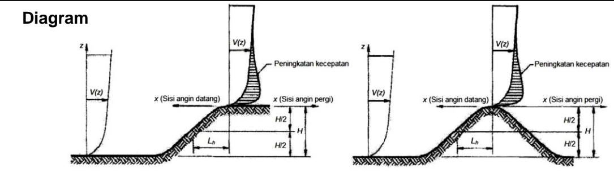

Tebina Bukit Memanjang 2-D atau Bukit Simetris 3-D

#### Pengali topografi untuk eksposur Ca,b,c

|                  |              | Pengali K₁    |              |                  | Pengali <i>K</i> ₂ |                             |                  |              | Pengali K₃    |              |
|------------------|--------------|---------------|--------------|------------------|--------------------|-----------------------------|------------------|--------------|---------------|--------------|
| H/L <sub>h</sub> | Bukit<br>2-D | Tebing<br>2-D | Bukit<br>3-D | x/L <sub>h</sub> | Tebing<br>2-D      | Seluruh<br>kasus<br>lainnya | x/L <sub>h</sub> | Bukit<br>2-D | Tebing<br>2-D | Bukit<br>3-D |
| 0,20             | 0,29         | 0,17          | 0,21         | 0,00             | 1,00               | 1,00                        | 0,00             | 1,00         | 1,00          | 1,00         |
| 0,25             | 0,36         | 0,21          | 0,26         | 0,50             | 0,88               | 0,67                        | 0,10             | 0,74         | 0,78          | 0,67         |
| 0,30             | 0,43         | 0,26          | 0,32         | 1,00             | 0,75               | 0,33                        | 0,20             | 0,55         | 0,61          | 0,45         |
| 0,35             | 0,51         | 0,30          | 0,37         | 1,50             | 0,63               | 0,00                        | 0,30             | 0,41         | 0,47          | 0,30         |
| 0,40             | 0,58         | 0,34          | 0,42         | 2,00             | 0,50               | 0,00                        | 0,40             | 0,30         | 0,37          | 0,20         |
| 0,45             | 0,65         | 0,38          | 0,47         | 2,50             | 0,38               | 0,00                        | 0,50             | 0,22         | 0,29          | 0,14         |
| 0,50             | 0,72         | 0,43          | 0,53         | 3,00             | 0,25               | 0,00                        | 0,60             | 0,17         | 0,22          | 0,09         |
|                  |              |               |              | 3,50             | 0,13               | 0,00                        | 0,70             | 0,12         | 0,17          | 0,06         |
|                  |              |               |              | 4,00             | 0,00               | 0,00                        | 0,80             | 0,09         | 0,14          | 0,04         |
|                  |              |               |              |                  |                    |                             | 0,90             | 0,07         | 0,11          | 0,03         |
|                  |              |               |              |                  |                    |                             | 1,00             | 0,05         | 0,08          | 0,02         |
|                  |              |               |              |                  |                    |                             | 1,50             | 0,01         | 0,02          | 0,00         |
|                  |              |               |              |                  |                    |                             | 2,00             | 0,00         | 0,00          | 0,00         |

<sup>&</sup>lt;sup>a</sup>Untuk nilai-nilai H/L<sub>h</sub>, x/L<sub>h</sub> dan z/L<sub>h</sub> selain dari yang diperlihatkan, diperkenankan interpolasi linear.

H : Tinggi bukit atau tebing relatif terhadap elevasi kawasan di sisi angin datang (*upwind*), dalam feet (meter).
 K<sub>1</sub> : Faktor untuk memperhitungkan bentuk fitur topografis dan pengaruh peningkatan kecepatan maksimum.

**K**<sub>2</sub> : Faktor untuk memperhitungkan reduksi dalam peningkatan kecepatan sehubungan dengan jarak ke sisi angin datang atau ke sisi angin pergi dari puncak.

K<sub>3</sub>: Faktor untuk memperhitungkan reduksi dalam peningkatan kecepatan sehubungan dengan ketinggian di atas elevasi kawasan setempat.

Jarak horizontal pada sisi angin datang (upwind), dari puncak bukit atau tebing sampai setengah tinggi bukit atau tebing, dalam feet (meter)

Jarak (di sisi angin datang atau sisi angin pergi) dari puncak ke lokasi gedung atau struktur lain, dalam feet (meter).

Ketinggian di atas permukaan tanah pada lokasi bangunan gedung atau struktur lain, dalam feet (meter).

 $\gamma$ : Faktor atenuasi ketinggian.

#### Persamaan:

$$K_{zt} = (1 + K_1 K_2 K_3)^2$$

K₁ ditentukan dari tabel di bawah ini

$$K_2 = \left(1 - \frac{|X|}{\mu L_h}\right)$$

$$K_3 = e^{-\gamma z/L_h}$$

#### Parameter untuk peningkatan kecepatan di atas bukit dan tebing

<span id="page-136-0"></span>

|                                                                                                                                        |      | $K_1/(H/L_h)$ |      |     | $\mu$                 |                                    |  |
|----------------------------------------------------------------------------------------------------------------------------------------|------|---------------|------|-----|-----------------------|------------------------------------|--|
| Bentuk bukit                                                                                                                           |      | Eksposur      |      | - ν | Sisi angin            | Sisi angin<br>pergi dari<br>puncak |  |
| Delituk bukit                                                                                                                          | В    | С             | D    | _ , | datang dari<br>puncak |                                    |  |
| Bukit memanjang 2-dimensi<br>(atau lembah dengan negatif<br><i>H</i> dalam <i>K</i> <sub>1</sub> /( <i>H</i> / <i>L</i> <sub>t</sub> ) | 1,30 | 1,5           | 1,55 | 3   | 1,5                   | 1,5                                |  |
| Tebing 2-dimensi                                                                                                                       | 0,75 | 0,85          | 0,95 | 2,5 | 1,5                   | 4                                  |  |
| Bukit simetris 3-dimensi                                                                                                               | 0,95 | 1,05          | 1,15 | 4   | 1,5                   | 1,5                                |  |

Gambar 26.8-1 - Faktor topografi, Kzt

<sup>&</sup>lt;sup>b</sup>Untuk  $H/L_h > 0.5$ , asumsikan  $H/L_h = 0.5$  untuk menghitung  $K_1$  dan gantikan  $L_h$  dengan 2H untuk menghitung  $K_2$  dan  $K_3$ .

Pengali didasarkan pada asumsi bahwa angin menuju bukit atau tebing sepanjang arah kelandaian maksimum.

#### <span id="page-137-0"></span>26.8.2 Faktor topografi

Efek peningkatan kecepatan angin harus dimasukkan dalam perhitungan beban angin desain dengan menggunakan faktor  $K_{7}$ :

$$K_{zt} = (1 + K_1 K_2 K_3)^2$$
 (26.8-1)

dengan  $K_1$ ,  $K_2$ , dan  $K_3$  diberikan dalam Gambar 26.8-1.

Jika kondisi situs dan lokasi bangunan gedung dan struktur lain tidak memenuhi semua kondisi yang disyaratkan dalam Pasal 26.8.1, maka  $K_{zt}$  = 1,0.

#### <span id="page-137-1"></span>26.9 Faktor elevasi permukaan tanah

Faktor elevasi permukaan tanah untuk menyesuaikan densitas udara,  $K_e$ , harus ditentukan sesuai dengan Tabel 26.9-1. Untuk semua elevasi, boleh diambil nilai  $K_e = 1$ .

#### <span id="page-137-2"></span>26.10 Tekanan kecepatan

#### <span id="page-137-3"></span>26.10.1 Koefisien eksposur tekanan kecepatan

Berdasarkan kategori eksposur yang ditentukan dalam Pasal 26.7.3, koefisien eksposur tekanan kecepatan,  $K_z$  atau  $K_h$ , sebagaimana berlaku, harus ditentukan dari Tabel 26.10-1. Untuk lokasi yang berada di zona transisi antara kategori-kategori eksposur yang mendekati perubahan kekasaran permukaan tanah, boleh diambil nilai menengah dari  $K_z$  atau  $K_h$  yang ada dalam Tabel 26.10-1, asalkan ditentukan dengan metode analisis rasional yang didefinisikan dalam literatur yang diakui.

<span id="page-137-4"></span>

| •                       | , -                                                      |
|-------------------------|----------------------------------------------------------|
| nukaan laut (Sea Level) | Faktor elevasi permukaan                                 |
| m                       | tanah                                                    |
|                         | $K_{\rm e}$                                              |
| < 0                     | Lihat catatan 2                                          |
| 0                       | 1,00                                                     |
| 305                     | 0,96                                                     |
| 610                     | 0,93                                                     |
| 914                     | 0,90                                                     |
| 1.219                   | 0,86                                                     |
| 1.524                   | 0,83                                                     |
| 1.829                   | 0,80                                                     |
| >1.829                  | Lihat catatan 2                                          |
|                         | < 0<br>0<br>305<br>610<br>914<br>1.219<br>1.524<br>1.829 |

Tabel 26.9-1 - Faktor elevasi permukaan tanah, K.

#### **CATATAN**

- 1. Perkiraan konservatif, boleh diambil  $K_e = 1,00$  dalam semua kasus.
- 2. Faktor  $\textit{\textbf{K}}_{e}$  harus ditentukan dari tabel di atas dengan menggunakan interpolasi atau dari rumus berikut untuk semua elevasi:

$$K_e = e^{-0.0000362 z_g}$$
 ( $z_g$  = elevasi tanah di atas permukaan laut dalam ft).

$$K_e = e^{-0.000119 \, z_g} \,$$
 ( $z_g$  = elevasi tanah di atas permukaan laut dalam m).

3. Dalam semua kasus K<sub>e</sub> boleh diambil sebesar 1,00.

Tabel 26.10-1 - Koefisien eksposur tekanan kecepatan,  $K_h$  dan  $K_z$ 

<span id="page-138-1"></span>

|        | atas permukaan |                          | Eksposur |          |  |  |  |  |
|--------|----------------|--------------------------|----------|----------|--|--|--|--|
|        | nah            |                          | <u>-</u> | <u> </u> |  |  |  |  |
| ft     | m              | В                        | С        | D        |  |  |  |  |
| 0 – 15 | 0 – 4,6        | 0,57 (0,70) <sup>a</sup> | 0,85     | 1,03     |  |  |  |  |
| 20     | 6,1            | 0,62 (0,70) <sup>a</sup> | 0,90     | 1,08     |  |  |  |  |
| 25     | 7,6            | $0,66(0,70)^{a}$         | 0.94     | 1,12     |  |  |  |  |
| 30     | 9,1            | 0,70                     | 0.98     | 1.16     |  |  |  |  |
| 40     | 12,2           | 0,76                     | 1,04     | 1,12     |  |  |  |  |
| 50     | 15,2           | 0,81                     | 1,09     | 1,27     |  |  |  |  |
| 60     | 18,0           | 0,85                     | 1,13     | 1,31     |  |  |  |  |
| 70     | 21,3           | 0,89                     | 1,17     | 1,34     |  |  |  |  |
| 80     | 24,4           | 0,93                     | 1,21     | 1,38     |  |  |  |  |
| 90     | 27,4           | 0,96                     | 1,24     | 1,40     |  |  |  |  |
| 100    | 30,5           | 0,99                     | 1,26     | 1,43     |  |  |  |  |
| 120    | 36,6           | 1,04                     | 1,31     | 1,48     |  |  |  |  |
| 140    | 42,7           | 1,09                     | 1,36     | 1,52     |  |  |  |  |
| 160    | 48,8           | 1,13                     | 1,39     | 1,55     |  |  |  |  |
| 180    | 54,9           | 1,17                     | 1,43     | 1,58     |  |  |  |  |
| 200    | 61,0           | 1,20                     | 1,46     | 1,61     |  |  |  |  |
| 250    | 76,2           | 1,28                     | 1,53     | 1,68     |  |  |  |  |
| 300    | 91,4           | 1,35                     | 1,59     | 1,73     |  |  |  |  |
| 350    | 106,7          | 1,41                     | 1,64     | 1,78     |  |  |  |  |
| 400    | 121,9          | 1,47                     | 1,69     | 1,82     |  |  |  |  |
| 450    | 137,2          | 1,52                     | 1,73     | 1,86     |  |  |  |  |
| 500    | 152,4          | 1,56                     | 1,77     | 1,89     |  |  |  |  |

<sup>&</sup>lt;sup>a</sup>Gunakan 0,70 pada Pasal 28, Eksposur B, apabila z < 30 ft (9,1 m).

1. Koefisien eksposur tekanan kecepatan  $K_z$  dapat ditentukan dari rumus berikut:

Untuk 15 ft (4,6 m) 
$$\leq z \leq z_g$$
  $K_z = 2.01 (z/z_g)^{2/\alpha}$   
Untuk  $z < 15$  ft (4,6 m)  $K_z = 2.01 (15/z_g)^{2/\alpha}$ 

- 2.  $\alpha$  dan  $\mathbf{Z}_{\alpha}$  ditabulasi dalam Tabel 26.11-1.
- 3. Interpolasi linier untuk nilai menengah dari tinggi z boleh dilakukan.
- 4. Kategori eksposur didefinisikan pada Pasal 26.7.

#### <span id="page-138-0"></span>26.10.2 Tekanan kecepatan

Tekanan kecepatan,  $q_z$ , yang dievaluasi pada ketinggian z di atas tanah harus dihitung dengan persamaan berikut:

$$q_z = 0.00256K_zK_{zt}K_dK_eV^2$$
 (lb/ft²);  $V$  dalam mi/h (26.10-1)

$$q_z = 0.613K_zK_{zt}K_dK_eV^2$$
 (N/m2); V dalam m/s (26.10-1.si)

#### dengan

 $K_z$  = koefisien eksposur tekanan kecepatan, lihat Pasal 26.10.1.

 $K_{zt}$  = faktor topografi, lihat Pasal 26.8.2.

 $K_d$  = faktor arah angin, lihat Pasal 26.6.

 $K_a$  = faktor elevasi permukaan tanah, lihat Pasal 26.9.

V = kecepatan angin dasar, lihat Pasal 26.5.

 $q_z$  = tekanan kecepatan pada keinggian z.

Tekanan kecepatan pada tinggi atap rata-rata dihitung sebagai *q<sup>h</sup>* =*q<sup>z</sup>* yang dievaluasi dari Persamaan (26.10-1) menggunakan K <sup>z</sup> pada ketinggian atap rata-rata h .

Pengambilan nilai kecepatan angin dasar, V , yang digunakan dalam menentukan beban angin desain pada struktur dan peralatan bagian atap, serta perlengkapan bangunan gedung lainnya harus memperhitungkan Kategori Risiko yang terbesar di antara:

- 1. Kategori risiko untuk bangunan gedung di mana peralatan atau perlengkapan ditempatkan, atau
- 2. Kategori risiko untuk fasilitas apapun yang diberi layanan yang diperlukan oleh peralatan atau perlengkapannya.

#### <span id="page-139-0"></span>**26.11 Efek hembusan angin**

#### <span id="page-139-1"></span>**26.11.1 Faktor efek hembusan angin**

Faktor efek hembusan angin untuk suatu bangunan gedung dan struktur lain yang kaku boleh diambil sebesar 0,85.

#### <span id="page-139-2"></span>**26.11.2 Penentuan frekuensi**

Untuk menentukan apakah suatu bangunan gedung atau struktur lain adalah kaku atau fleksibel sebagaimana didefinisikan dalam Pasal 26.2, frekuensi alami fundamental, *n*1, harus ditetapkan menggunakan sifat struktural dan karakteristik deformasi elemen penahan dalam analisis yang dibuktikan secara benar. Bangunan bertingkat rendah, sebagaimana didefinisikan dalam 26.2, boleh dianggap kaku.

#### <span id="page-139-3"></span>**26.11.2.1 Pembatasan untuk estimasi frekuensi alami**

Sebagai alternatif untuk melakukan suatu analisis untuk menentukan *n*1, frekuensi alami perkiraan dari bangunan, *na*, boleh dihitung sesuai dengan Pasal 26.11.3 untuk bangunan baja struktural, beton, atau bangunan dinding bata yang memenuhi persyaratan berikut:

- 1. Tinggi bangunan kurang dari atau sama dengan 300 ft (91 m), dan
- 2. Tinggi bangunan kurang dari 4 kali panjang efektifnya, *L*eff.

Panjang efektif, *Leff*, dalam arah perhitungan harus ditentukan dari persamaan berikut:

$$L_{eff} = \frac{\sum_{i=1}^{n} h_{i} L_{i}}{\sum_{i=1}^{n} h_{i}}$$
 (26.11-1)

Penjumlahan sepanjang ketinggian bangunan gedung dengan

- *h<sup>i</sup>* adalah tinggi di atas kelas level *I*; dan
- *L<sup>i</sup>* adalah panjang bangunan gedung di level *i* sejajar dengan arah angin

#### <span id="page-140-0"></span>26.11.3 Frekuensi alami perkiraan

Frekuensi alami perkiraan batas-lebih rendah ( $n_a$ ), dalam Hertz, bangunan beton atau bangunan baja struktural yang memenuhi kondisi Pasal 26.11.2.1, boleh ditentukan dari salah satu persamaan berikut:

Untuk baja struktural bangunan rangka penahan momen:

$$n_a = 22.2 / h^{0.8}$$
 (26.11-2)

Untuk beton bangunan rangka penahan momen:

$$n_a = 43.5 / h^{0.9} \tag{26.11-3}$$

Untuk bangunan baja struktural dan bangunan beton dengan sistem penahan gaya lateral lainnya:

$$n_a = 75 / h$$
 (26.11-4)

Untuk bangunan dinding geser beton atau dinding masonri, juga boleh menggunakan

$$n_a = 385 (C_w)^{0.5} / h$$
 (26.11-5)

dengan

$$C_{w} = \frac{100}{A_{B}} \sum_{i=1}^{n} \left( \frac{h}{h_{i}} \right)^{2} \frac{A_{i}}{\left[ 1 + 0.83 \left( \frac{h_{i}}{D_{i}} \right)^{2} \right]}$$

#### Keterangan:

h = tinggi atap rata-rata (ft) (m)

n = jumlah dinding geser dalam bangunan gedung efektif pada penahan gaya lateral di arah yang diperhitungkan

 $A_B$  = luas dasar struktur (ft<sup>2</sup>) (m<sup>2</sup>)

 $A_i$  = luas penampang melintang horizontal dari dinding geser "i" (ft<sup>2</sup>) (m<sup>2</sup>)

 $D_i$  = panjang dinding geser "I" (ft) (m)

<span id="page-140-1"></span> $h_i = \text{tinggi dinding geser "}i'' (ft) (m)$ 

#### 26.11.4 Bangunan kaku atau struktur lainnya

Untuk bangunan kaku atau struktur lainnya seperti dijelaskan dalam Pasal 26.2, faktor efek hembusan angin harus diambil sebesar 0,85 atau dihitung dengan formula:

$$G = 0.925 \left( \frac{1 + 0.7 g_Q I_{\bar{z}} Q}{1 + 0.7 g_V I_{\bar{z}}} \right)$$
 (26.11-6)

$$I_{\bar{z}} = c \left(\frac{33}{\bar{z}}\right)^{1/6} \tag{26.11-7}$$

$$I_{\bar{z}} = c \left(\frac{10}{\bar{z}}\right)^{1/6}$$
 (26.11-7.si)

dengan  $I_{\bar{z}}$  adalah intensitas turbulensi pada ketinggian  $\bar{z}$  dimana  $\bar{z}$  adalah tinggi ekuivalen dari bangunan gedung atau struktur ditentukan sebesar 0,6h, tetapi tidak kurang dari  $z_{\min}$  untuk semua ketinggian bangunan atau struktur h.  $z_{\min}$  dan c adalah terdaftar untuk setiap eksposur dalam Tabel 26.11-1;  $g_{Q}$  dan  $g_{V}$  harus diambil sebesar 3,4. Respons latar belakang Q adalah

$$Q = \sqrt{\frac{1}{1 + 0.63 \left(\frac{B + h}{L_{\bar{z}}}\right)^{0.63}}}$$
 (26.11-8)

dengan B dan h dijelaskan dalam Pasal 26.3 dan  $L_{\bar{z}}$  adalah skala panjang integral dari turbulensi pada tinggi ekuivalen adalah

$$L_{\bar{z}} = \boldsymbol{\ell}(\frac{\bar{z}}{33})^{\bar{\epsilon}} \tag{26.11-9}$$

$$L_{\bar{z}} = \boldsymbol{\ell}(\frac{\bar{z}}{10})^{\bar{\epsilon}} \tag{26.11-9.si}$$

dengan  $\boldsymbol{e}$  dan  $\bar{\varepsilon}$  adalah konstanta yang tercantum dalam Tabel 26.11-1.

Tabel 26.11-1 - Konstanta eksposur dataran

<span id="page-141-0"></span>

| Eksposur | α    | Z <sub>g</sub> (ft) | â      | $\hat{\bm{b}}$ | $\overline{\alpha}$ | $\overline{b}$ | С    | ℓ (ft) | Ē     | Z <sub>min</sub> (ft) <sup>a</sup> |
|----------|------|---------------------|--------|----------------|---------------------|----------------|------|--------|-------|------------------------------------|
| В        | 7,0  | 1.200               | 1/70   | 0,84           | 1/4,0               | 0,45           | 0,30 | 320    | 1/3,0 | 30                                 |
| С        | 9,5  | 900                 | 1/9,5  | 1,00           | 1/6,5               | 0,65           | 0,20 | 500    | 1/5,0 | 15                                 |
| D        | 11,5 | 700                 | 1/11,5 | 1,07           | 1/9,0               | 0,80           | 0,15 | 650    | 1/8,0 | 7                                  |

 $<sup>{}^</sup>aZ_{\min}$  = tinggi minimum yang dapat menjamin tinggi ekuivalen  $\overline{z}$  yang lebih besar dari 0,6h atau  $Z_{\min}$ . Untuk bangunan gedung atau struktur lain dengan  $h \leq Z_{\min}$ ,  $\overline{z}$  harus diambil sebesar  $Z_{\min}$ .

#### Dalam metrik

| Eksposur | α    | Z <sub>g</sub> (m) | à      | $\hat{\bm{b}}$ | $\overline{\alpha}$ | $\overline{b}$ | O    | ℓ (m)  | ĮΨ    | Z <sub>min</sub> (m) <sup>a</sup> |
|----------|------|--------------------|--------|----------------|---------------------|----------------|------|--------|-------|-----------------------------------|
| В        | 7,0  | 365,76             | 1/7    | 0,84           | 1/4,0               | 0,45           | 0,30 | 97,54  | 1/3,0 | 9,14                              |
| С        | 9,5  | 274,32             | 1/9,5  | 1,00           | 1/6,5               | 0,65           | 0,20 | 152,4  | 1/5,0 | 4,57                              |
| D        | 11,5 | 213,36             | 1/11,5 | 1,07           | 1/9,0               | 0,80           | 0,15 | 198,12 | 1/8,0 | 2,13                              |

 $<sup>^</sup>aZ_{min}$  = tinggi minimum yang dapat menjamin tinggi ekuivalen  $\overline{z}$  yang lebih besar dari 0,6h atau  $Z_{min}$ . Untuk bangunan gedung atau struktur lain dengan  $h \leq Z_{min}$ ,  $\overline{z}$  harus diambil sebesar  $Z_{min}$ .

### <span id="page-142-0"></span>26.11.5 Bangunan sensitif fleksibel atau bangunan sensitif dinamis atau struktur lain

Untuk bangunan sensitif fleksibel atau bangunan sensitif dinamis atau struktur lain seperti dijelaskan dalam Pasal 26.2, faktor efek hembusan angin harus dihitung dengan

$$G_f = 0.925 \left( \frac{1 + 1.7 I_{\bar{z}} \sqrt{g_Q^2 Q^2 + g_R^2 R^2}}{1 + 1.7 g_V I_{\bar{z}}} \right)$$
(26.11-10)

 $g_{\scriptscriptstyle O}$  dan  $g_{\scriptscriptstyle V}$  harus diambil sebesar 3,4 dan  $g_{\scriptscriptstyle R}$  adalah

$$g_R = \sqrt{2 \ln(3.600n_1)} + \frac{0.577}{\sqrt{2 \ln(3.600n_1)}}$$
 (26.11-11)

R, faktor respons resonan, adalah

$$R = \sqrt{\frac{1}{\beta} R_n R_h R_B (0.53 + 0.47 R_L)}$$
 (26.11-12)

$$R_n = \frac{7,47 N_1}{\left(1 + 10,3 N_1\right)^{5/3}} \tag{26.11-13}$$

$$N_{1} = \frac{n_{1}L_{\bar{z}}}{\bar{V}_{\bar{z}}}$$
 (26.11-14)

$$R_{\ell} = \frac{1}{\eta} - \frac{1}{2\eta^2} (1 - e^{-2\eta}) \text{ untuk } \eta > 0$$
 (26.11-15a)

$$R_i = 1$$
 untuk  $\eta = 0$  (26.11-15b)

dengan subskrip  $\ell$  dalam Persamaan (26.11-15a) dan Persamaan (26.11-15b) harus diambil sebagai h, B, dan L, dimana penjelasan h, B, dan L dapat dilihat dalam Pasal 26.3, dan

 $n_1$  = frekuensi alami fundamental

 $R_{\ell} = R_{h} \text{ atur } \eta = 4.6 n_{1} h / \overline{V_{z}}$ 

 $R_{\ell} = R_{B} \text{ atur } \eta = 4.6 n_{1} B / \overline{V_{\bar{z}}}$ 

 $R_{\ell} = R_{L} \text{ atur } \eta = 15.4 n_{1} L / \overline{V}_{\overline{z}}$ 

 $\beta$  = rasio redaman, persen dari redaman kritis (yaitu untuk 2 % gunakan 0,02 dalam persamaan)

 $\overline{V_z}$  = kecepatan angin rata-rata per jam (ft/s) (m/s) pada ketinggian  $\overline{z}$  ditentukan dari Persamaan 26.11-16:

$$\overline{V}_{\overline{z}} = \overline{b} \left( \frac{\overline{z}}{33} \right)^{\overline{a}} \left( \frac{88}{60} \right) V$$

$$\overline{V}_{\overline{z}} = \overline{b} \left( \frac{\overline{z}}{10} \right)^{\overline{a}} V$$
(26.11-16)

Dalam SI:

dengan b dan adalah konstanta yang tercantum dalam Tabel 26.9-1 dan *V* adalah kecepatan angin dasar dalam mil/h (m/s).

#### <span id="page-143-0"></span>**26.11.6 Analisis rasional**

Sebagai pengganti prosedur yang ditentukan dalam Pasal 26.11.4 dan Pasal 26.11.5, penentuan faktor efek hembusan angin diizinkan menurut analisis rasional yang ditentukan sesuai literatur yang diakui.

#### <span id="page-143-1"></span>**26.11.7 Pembatasan**

Bila kombinasi faktor efek hembusan angin dan koefisien tekanan (*GCp*), (*GCpi*), dan (*GCpf*) diberikan dalam gambar dan tabel, faktor efek hembusan angin tidak boleh ditentukan secara terpisah.

#### <span id="page-143-2"></span>**26.12 Klasifikasi ketertutupan**

#### <span id="page-143-3"></span>**26.12.1 Umum**

Untuk menentukan koefisien tekanan internal, semua bangunan gedung harus diklasifikasikan sebagai bangunan tertutup, tertutup sebagian, terbuka sebagian, atau terbuka seperti dijelaskan dalam Pasal 26.2.

#### <span id="page-143-4"></span>**26.12.2 Bukaan**

Penentuan banyaknya bukaan pada amplop bangunan harus dibuat untuk menentukan klasifikasi ketertutupan. Untuk membuat penentuan ini, setiap dinding bangunan harus diasumsikan sebagai dinding arah angin datang untuk mempertimbangkan jumlah bukaan yang ada sehubungan dengan amplop bangunan yang tersisa.

#### <span id="page-143-5"></span>**26.12.3 Proteksi bukaan yang dipasang kaca**

Bukaan yang dipasang kaca dalam bangunan Kategori Risiko II, III atau IV yang berada pada wilayah rawan angin kencang harus diproteksi seperti disyaratkan dalam Pasal ini.

#### <span id="page-143-6"></span>**26.12.3.1 Wilayah puing terbawa angin**

Bukaan yang dipasang kaca harus dilindungi sesuai dengan Pasal 26.12.3.2 dalam lokasi berikut:

- 1. Dalam 1 mil (1,6 km) dari garis pantai tinggi air rata-rata di mana kecepatan angin dasar sama dengan atau lebih besar dari 130 mi/h (58 m/s), atau
- 2. Dalam daerah di mana kecepatan angin dasar adalah sama dengan atau lebih besar dari 140 mi/h (63 m/s).

Untuk bangunan gedung dan struktur lain dengan Kategori Risiko II dan bangunan gedung dan struktur lain Kategori Risiko III, kecuali fasilitas perawatan kesehatan, daerah puing terbawa angin harus berdasarkan pada Buku Peta Angin Indonesia untuk Kategori Risiko II. Untuk fasilitas perawatan kesehatan kategori Risiko III, daerah puing terbawa angin harus berdasarkan pada Buku Peta Angin Indonesia untuk Kategori Risiko III. Untuk bangunan gedung dan struktur Kategori Risiko IV, daerah puing terbawa angin harus berdasarkan pada Buku Peta Angin Indonesia untuk Kategori Risiko IV. Kategori Risiko harus ditentukan sesuai dengan Pasal 1.5.

**PENGECUALIAN** Kaca yang berada di atas 60 ft (18,3 m) di atas tanah dan di atas 30 ft (9,2 m) di atas atap berpermukaan agregat, termasuk atap dengan kerikil atau batu pemberat, yang berada di 1.500 ft (458 m) dari bangunan harus diizinkan tanpa dilindungi.

#### <span id="page-144-0"></span>26.12.3.2 Persyaratan perlindungan bukaan berkaca

Kaca pada bangunan yang membutuhkan perlindungan harus dilindungi dengan sistem perlindungan impak atau kaca tahan benturan.

Sistem perlindungan dan kaca tahan benturan harus diuji coba uji misil dan uji beda tekanan siklik sesuai dengan ASTM E1996 yang berlaku. Pengujian untuk membuktikan kepatuhan terhadap ASTM E1996 harus sesuai dengan ASTM E1886. Sistem kaca tahan benturan dan perlindungan impak harus sesuai dengan kriteria lulus/gagal dari Pasal 7, dari ASTM E1996 berdasarkan misil yang disyaratkan oleh Tabel 3 atau Tabel 4 ASTM E1996. Kaca pada pintu garasi panel dan *rolling door* harus menjalani uji misil dan uji beda tekanan siklik sesuai dengan ANSI/DASMA 115 yang sesuai.

<span id="page-144-2"></span>Tabel 26.13-1 - Sistem penahan gaya angin utama dan komponen dan klading (semua ketinggian): koefisien tekanan internal,  $(GC_{pi})$ , untuk bangunan tertutup, tertutup sebagian, terbuka sebagian, dan bangunan terbuka (dinding dan atap)

| Klasifikasi<br>ketertutupan  | Kriteria untuk klasifikasi<br>ketertutupan                                                                                           | Tekanan<br>internal | Koefisien tekanan internal, $\left(\mathcal{GC}_{\!\scriptscriptstyle\rho\!\scriptscriptstyle i}\right)$ |
|------------------------------|--------------------------------------------------------------------------------------------------------------------------------------|---------------------|----------------------------------------------------------------------------------------------------------|
| Bangunan tertutup            | $A_o$ kurang dari terkecil $0.01A_g$<br>atau 4 ft <sup>2</sup> (0.37 m <sup>2</sup> ) dan $A_{oi}/A_{gi} \le 0.2$                    | Sedang              | - 0,18<br>- 0,18                                                                                         |
| Bangunan tertutup sebagian   | $A_o > 1.1 A_{oi}$ dan $A_o >$ terkecil dari $0.01 A_g$<br>atau 4 ft <sup>2</sup> (0.37 m <sup>2</sup> ) dan $A_{oi}/A_{gi} \le 0.2$ | Tinggi              | - 0,55<br>- 0,55                                                                                         |
| Bangunan terbuka<br>sebagian | Bangunan yang tidak sesuai dengan<br>Klasifikasi tertutup, tertutup sebagian,<br>atau klasifikasi terbuka                            | Sedang              | - 0,18<br>- 0,18                                                                                         |
| Bangunan terbuka             | Setiap dinding minimal terbuka 80 %                                                                                                  | Diabaikan           | 0,00                                                                                                     |

#### CATATAN

- 1. Tanda plus dan minus menandakan tekanan yang bekerja ke arah dan menjauh dari permukaan dalam, masing-masing.
- 2. Nilai ( $GC_p$ ) harus digunakan dengan  $q_z$  atau  $q_h$  seperti yang disyaratkan.
- 3. Dua kasus harus diperhitungkan untuk menentukan persyaratan beban kritis untuk kondisi yang sesuai:
  - a. Nilai positif ( $GC_{oi}$ ) diterapkan pada semua permukaan dalam, atau
  - b. Nilai negatif ( $GC_{pi}$ ) diterapkan pada semua permukaan dalam.

**PENGECUALIAN** Metode pengujian lainnya dan/atau kriteria kinerja diizinkan digunakan bila disetujui.

Kaca dan sistem proteksi impak dalam bangunan dan struktur lain yang diklasifikasikan sebagai Kategori Risiko IV sesuai dengan Pasal 1.5 harus memenuhi persyaratan "peningkatan perlindungan" dari Tabel 3 ASTM E1996. Kaca dan sistem perlindungan-impak pada semua struktur lainnya harus memenuhi persyaratan "proteksi dasar" dari Tabel 3 ASTM E1996.

#### <span id="page-144-1"></span>26.12.4 Beberapa klasifikasi

Jika sebuah bangunan memenuhi definisi bangunan "terbuka" dan "tertutup sebagian", maka bangunan tersebut harus diklasifikasikan sebagai bangunan "terbuka".

#### <span id="page-145-0"></span>26.13 Koefisien tekanan internal

Koefisien tekanan internal, ( $GC_{pi}$ ), harus ditentukan dari Tabel 26.13-1 berdasarkan pada klasifikasi ketertutupan bangunan gedung ditentukan dari Pasal 26.12.

#### <span id="page-145-1"></span>26.13.1 Faktor reduksi untuk bangunan gedung berukuran besar, R<sub>i</sub>

Untuk bangunan tertutup sebagian yang memiliki sebuah ruangan besar tanpa sekat, koefisien tekanan internal,  $(GC_{pi})$ , harus dikalikan dengan faktor reduksi,  $R_i$  berikut ini:

$$R_i = 1.0$$
 atau

$$R_{i} = 0.5 \left( 1 + \frac{1}{\sqrt{1 + \frac{V_{i}}{22,800A_{og}}}} \right) < 1.0$$
 (26.13-1)

di mana

 $A_{og}$  = luas total bukaan pada amplop bangunan gedung (dinding-dinding dan atap, dalam ft<sup>2</sup>);

 $V_i$  = volume internal ruang tanpa partisi, dalam ft<sup>3</sup>

#### <span id="page-145-2"></span>26.14 Pembatasan tornado

Tornado belum dipertimbangkan dalam ketentuan beban angin.

#### <span id="page-145-3"></span>26.15 Standar konsensus dan dokumen referensi lainnya

Pasal ini mencantumkan standar konsensus dan dokumen lainnya yang harus dianggap bagian dari standar ini sejauh yang dirujuk dalam Pasal ini.

AAMA 512, Voluntary Specifications for Tornado Hazard Mitigating Fenestration Products, American Architectural Manufacturers Association, 2011. Cited in: C26.14.4

ANSI A58.1, *Minimum Design Loads for Buildings and Other Structures*, American National Standards Institute, 1982.

Cited in: Section C26.5.2

ASTM E1886, Standard test method for performance of exterior windows, curtain walls, doors, and impact protective systems impacted by missile(s) and exposed to cyclic pressure differentials, ASTM International, 2013.

Cited in: Section 26.12.3.2, C26.12, C26.14.4.

ASTM E1996, Standard specification for performance of exterior windows, curtain walls, doors, and impact protective systems impacted by windborne debris in hurricanes, ASTM International, 2014.

Cited in: Section 26.12.3.2. C26.12. C26.14.4.

ANSI/DASMA 115, *Standard Method for Testing Sectional Garage Doors: Determination of Structural Performance under Missile Impact and Cyclic Wind Pressure*, Door and Access Systems Manufacturers Association International, 2005. *Cited in:* Section 26.12.3.2, C26.12.

ASTM E330, *Standard Test Method for Structural Performance of Exterior Windows, Doors, Skylights, and Curtain Walls by Uniform Static Air Pressure Difference*, ASTM International, 2014.

*Cited in:* Section C26.5.1

CAN/CSA A123.21, *Standard test method for the dynamic wind uplift resistance of membrane-roofing systems*, CSA Group, 2014.

*Cited in:* Section C26.5.1

ICC 500, ICC/NSSA *Standard for the Design and Construction of Storm Shelters*, International Code Council and National Storm Shelter Association, 2014. *Cited in:* Section C26.14.1, C26.14.3, C26.14.

#### <span id="page-146-0"></span>**27 Beban angin pada bangunan gedung: Sistem Penahan Gaya Angin Utama (prosedur terarah)**

#### <span id="page-146-1"></span>**27.1 Ruang lingkup**

#### <span id="page-146-2"></span>**27.1.1 Tipe bangunan gedung**

Pasal ini digunakan untuk menentukan beban angin SPGAU pada bangunan gedung tertutup, tertutup sebagian, dan terbuka dari semua ketinggian yang menggunakan prosedur terarah.

Bagian 1 diterapkan untuk bangunan gedung dari semua ketinggian di mana perlu untuk memisahkan beban angin yang diterapkan ke dinding di sisi angin datang, di sisi angin pergi, dan sisi bangunan gedung untuk memperhitungkan gaya-gaya internal dalam komponen struktur SPGAU.

Bagian 2 diterapkan pada kelas bangunan khusus yang dikategorikan sebagai bangunan gedung berdiafragma sederhana tertutup, sebagaimana didefinisikan dalam Pasal 26.2, dengan *h* ≤ 160 ft (48,8 m).

#### <span id="page-146-3"></span>**27.1.2 Kondisi**

Bangunan gedung yang beban angin desainnya ditentukan menurut Pasal ini harus memenuhi semua kondisi berikut:

- 1. Bangunan gedung yang dimaksud adalah bangunan gedung yang berbentuk teratur seperti didefinisikan dalam Pasal 26.2, dan
- 2. Bangunan gedung tidak memiliki karakteristik respons yang membuatnya mengalami pembebanan angin dengan arah melintang, peluruhan pusaran angin, ketidakstabilan akibat derapan atau kibaran yang cepat; atau tidak terletak pada lokasi dimana efek-efek lorong atau hempasan berulang sebagai akibat adanya halangan di sisi angin datang yang membutuhkan pertimbangan khusus.

#### <span id="page-146-4"></span>**27.1.3 Pembatasan**

Ketentuan-ketentuan Pasal ini telah mempertimbangkan efek pembesaran beban yang disebabkan oleh hembusan angin yang beresonansi dengan getaran searah angin dari

bangunan gedung fleksibel. Bangunan gedung yang tidak memenuhi persyaratan Pasal 27.1.2, atau memiliki bentuk atau karakteristik respons yang tidak biasa, harus dirancang menggunakan literatur yang diakui yang membahas efek beban angin tersebut atau harus menggunakan prosedur terowongan angin yang disyaratkan dalam Pasal 31

#### <span id="page-147-0"></span>27.1.4 Pelindung

Tidak boleh ada reduksi terhadap tekanan kecepatan akibat pemasangan pelindung pada bangunan gedung dan struktur lain atau oleh fitur medan permukaan.

#### <span id="page-147-1"></span>27.1.5 Beban angin desain minimum

Beban angin yang digunakan dalam desain SPGAU untuk bangunan gedung tertutup atau tertutup sebagian tidak boleh kecil dari 16 lb/ft² (0,77 kN/m²) dikalikan dengan luas dinding bangunan gedung dan 8 lb/ft² (0,38 kN/m²) dikalikan dengan luas atap bangunan gedung yang terproyeksi pada bidang vertikal tegak lurus terhadap arah angin yang diasumsikan. Beban dinding dan atap harus diterapkan secara simultan. Gaya angin desain untuk bangunan gedung terbuka harus tidak kurang dari 16 lb/ft² (0,77 kN/m²) dikalikan dengan luas  $A_f$ .

# Bagian 1: Bangunan gedung tertutup, tertutup sebagian, dan terbuka dari semua ketinggian

**CATATAN** Gunakan Bagian 1 dari Pasal 27 untuk menentukan tekanan angin pada SPGAU bangunan gedung tertutup, tertutup sebagian, atau terbuka dengan bentuk perencanaan umum, tinggi bangunan atau geometri atap yang sesuai dengan gambar yang disediakan. Ketentuan ini menggunakan metode "semua ketinggian" tradisional (prosedur terarah) dengan menghitung tekanan angin menggunakan *persamaan tekanan angin spesifik* yang berlaku untuk setiap permukaan bangunan gedung.

#### <span id="page-147-2"></span>27.2 Persyaratan umum

Langkah-langkah untuk menentukan beban angin pada SPGAU untuk bangunan gedung tertutup, tertutup sebagian, dan terbuka dari semua ketinggian tersedia dalam Tabel 27 2-1

# <span id="page-148-3"></span>Tabel 27.2-1 - Langkah-langkah untuk menentukan beban angin SPGAU untuk bangunan gedung tertutup, tertutup sebagian, dan terbuka dari semua ketinggian

Langkah 1: Tentukan Kategori Risiko bangunan gedung; lihat Tabel 1.5-1

**Langkah 2:** Tentukan kecepatan angin dasar, *V*, untuk kategori risiko yang sesuai yang berlaku; lihat Buku Peta Angin Indonesia.

Langkah 3: Tentukan parameter beban angin:

- Faktor arah angin, K<sub>d</sub>; lihat Pasal 26.6 dan Tabel 26.6-1.
- Kategori eksposur; lihat Pasal 26.7.
- Faktor topografi,  $K_{zi}$ , lihat Pasal 26.8 dan Tabel 26.8-1.
- Faktor elevasi permukaan tanah, Ke; Lihat Pasal 26.9
- Faktor efek hembusan angin, G, atau G<sub>i</sub>; lihat Pasal 26.11
- Klasifikasi ketertutupan; lihat Pasal 26.12
- Koefisien tekanan internal, (GC<sub>pi</sub>); lihat Pasal 26.13 dan Tabel 26.13-1

**Langkah 4:** Tentukan koefisien eksposur tekanan velositas,  $K_z$  atau  $K_h$ ; lihat Tabel 26.10.1

**Langkah 5:** Tentukan tekanan velositas  $q_z$ , atau  $q_h$  Persamaan (26.10-1)

**Langkah 6:** Tentukan koefisien tekanan eksternal,  $C_0$  atau  $C_N$ 

- Gambar 27.3.1 untuk dinding dan atap rata, pelana, perisai, miring sepihak atau *mansard*
- Gambar 27.3-2 untuk atap kubah
- Gambar 27.3-3 untuk atap lengkung
- Gambar 27.3.4 untuk atap miring sepihak, bangunan gedung terbuka
- Gambar 27.3-5 untuk atap berbubung, bangunan gedung terbuka
- Gambar 27.3.6 untuk atap cekung, bangunan gedung terbuka
- Gambar 27.3-7 untuk beban angin sepanjang bubungan kasus untuk atap miring sepihak, berbubung, atau cekung, bangunan gedung terbuka

Langkah 7: Hitung tekanan angin, p, pada setiap permukaan bangunan gedung

- Persamaan (27.3-1) untuk bangunan gedung kaku dan fleksibel
- Persamaan (27.3-2) untuk bangunan gedung terbuka

#### <span id="page-148-0"></span>27.2.1 Parameter beban angin yang disyaratkan dalam Pasal 26

Parameter beban angin yang berikut harus ditentukan menurut Pasal 26:

- Kecepatan angin dasar. V (Pasal 26.5)
- Faktor arah angin, K<sub>d</sub> (Pasal 26.6)
- Kategori eksposur (Pasal 26.7)
- Faktor topografi,  $K_{zt}$  (Pasal 26.8)
- Faktor elevasi permukaan tanah, Ka; lihat Pasal 26.9
- Faktor efek hembusan angin (Pasal 26.11)
- Klasifikasi ketertutupan (Pasal 26.12)
- Koefisien tekanan internal, (GC<sub>pi</sub>) (Pasal 26.13).

#### <span id="page-148-1"></span>27.3 Beban angin: Sistem Penahan Gaya Angin Utama

#### <span id="page-148-2"></span>27.3.1 Bangunan gedung tertutup, kaku tertutup sebagian dan fleksibel

Tekanan angin desain untuk SPGAU bangunan gedung pada semua ketinggian dalam lb/ft² (N/m²) harus ditentukan oleh persamaan berikut:

$$p = qGC_n - q_i(GC_{ni}) \tag{27.3-1}$$

dengan

 $q = q_z$  untuk dinding di sisi angin datang yang diukur pada ketinggian z di atas permukaan tanah

- *q = qh*untuk dinding di sisi angin pergi, dinding samping, dan atap yang diukur pada ketinggian *h*
- *qi*= *qh*untuk dinding di sisi angin datang, dinding samping, dinding di sisi angin pergi, dan atap bagunan gedung tertutup, dan untuk mengevaluasi tekanan internal negatif pada bangunan gedung tertutup sebagian.
- *q<sup>i</sup>* = *qz*untuk mengevaluasi tekanan internal positif pada bangunan gedung tertutup sebagian bila tinggi *z* ditentukan sebagai level dari bukaan tertinggi pada bangunan gedung yang dapat mempengaruhi tekanan internal positif. Untuk bangunan gedung yang terletak di wilayah puing terbawa angin, kaca yang tidak tahan impak atau dilindungi dengan penutup tahan impak,harus diperlakukan sebagai bukaan sesuai dengan Pasal 26.12.3. Untuk menghitung tekanan internal positif, *qi*secara konservatif boleh dihitung pada ketinggian *h* (*qi*= *qh*)
- *G =* faktor efek-hembusan angin, lihat Pasal 26.11. Untuk bangunan gedung fleksibel, *G<sup>f</sup>* yang ditentukan menurut Pasal 26.11.5 harus menggantikan *G*.
- *C<sup>p</sup>* = koefisien tekanan eksternal dari Gambar 27.3-1, 27.3-2 dan 27.3-3

(*GCpi*)= koefisien tekanan internal dari Tabel 26.13-1

*q* dan *qi*harus dihitung dengan menggunakan eksposur yang ditetapkan dalam Pasal 26.7.3. Tekanan harus diterapkan secara bersamaan pada dinding di sisi angin datang dan disisi angin pergi pada permukaan atap seperti ditetapkan dalam Gambar 27.3-1, Gambar 27.3-2 dan Gambar 27.3-3.

#### <span id="page-149-0"></span>**27.3.2 Bangunan gedung terbuka dengan atap bebas miring sepihak, berbubung, atau cekung**

Tekanan desain neto untuk SPGAU dari bangunan gedung terbuka dengan atap miring sepihak, berbubung, atau cekung harus ditentukan oleh persamaan berikut:

$$p = q_h GC_N \tag{27.3-2}$$

#### dengan

- *qh*= tekanan velositas dievaluasi pada tinggi atap rata-rata *h* menggunakan eksposur seperti didefinisikan dalam Pasal 26.7.3 yang mengakibatkan beban angin tertinggi untuk setiap arah angin di lokasi
- *G* = faktor efek-hembusan angin dari Pasal 26.11

*CN*= koefisien tekanan neto ditentukan dari Gambar 27.3-4 sampai Gambar 27.3-7

Koefisien tekanan neto, *CN*, memasukkan kontribusi dari permukaan atas dan bawah. Semua kasus beban yang ada pada setiap sudut kemiringan atap harus diinvestigasi. Tanda positif dan negatif masing-masing menandakan tekanan yang bekerja menuju dan menjauh dari permukaan atas atap.

Untuk atap bebas dengan sudut bidang atap *θ* terhadap garis horizontal kurang dari atau sama dengan 5° dan berisi panel fasia, panel fasia harus diperhitungkan sebagai sebuah parapet terbalik. Kontribusi beban-beban pada fasia terhadap beban SPGAU harus ditentukan menggunakan Pasal 27.3.5 dengan *qp*sama dengan *qh*. Untuk bangunan terbuka atau sebagian tertutup dengan rangka melintang dan atap dengan kemiringan θ ≤ 45°, gaya horizontal tambahan pada arah longitudinal (paralel terhadap bubungan) yang bekerja pada kombinasi dengan beban atap dihitung dalam Pasal 27.3.3 harus ditentukan sesuai dengan Pasal 28.3.5.

#### <span id="page-150-0"></span>27.3.3 Konsol dari atap

Tekanan eksternal positif yang menuju ke permukaan bawah dari konsol atap harus ditentukan menggunakan  $C_p$ = 0,8 dan dikombinasikan dengan tekanan permukaan atas yang ditentukan dari Gambar 27.3-1.

#### <span id="page-150-1"></span>**27.3.4** Parapet

Tekanan angin desain untuk efek parapet pada SPGAU bangunan gedung kaku atau fleksibel dengan atap rata, pelana, atau perisai dalam lb/ft² (N/m²), harus ditentukan oleh persamaan berikut:

$$p_{o} = q_{o}(GC_{on}) (27.3-3)$$

dengan

 pp
 kombinasi tekanan neto pada parapet akibat kombinasi tekanan neto dari permukaan parapet depan dan belakang. Tanda positif (dan negatif) menunjukkan tekanan neto bekerja menuju (dan menjauhi) sisi depan (eksterior) parapet

 $q_p$  = tekanan velositas dievaluasi pada bagian atas parapet

 $(GC_{nn})$  = kombinasi koefisien tekanan neto

= +1,5 untuk parapet dari arah sisi angin datang

= -1,0 untuk parapet dari arah sisi angin pergi

#### <span id="page-150-2"></span>27.3.5 Kasus beban angin desain

SPGAU bangunan gedung dari semua ketinggian, yang beban anginnya telah ditentukan berdasarkan ketentuan Pasal ini, harus didesain untuk kasus beban angin seperti ditetapkan dalam Gambar 27.3-8.

**PENGECUALIAN** Bangunan gedung yang memenuhi persyaratan Pasal D1 pada Lampiran D hanya perlu didesain untuk Kasus 1 dan Kasus 3 Gambar 27.3.8.

Eksentrisitas e untuk bangunan gedung kaku harus diukur dari pusat geometrik muka bangunan gedung dan harus diperhitungkan untuk setiap sumbu utama ( $e_X$ ,  $e_Y$ ). Eksentrisitas e untuk bangunan gedung fleksibel harus ditentukan dari persamaan berikut dan harus diperhitungkan untuk setiap sumbu utama ( $e_X$ ,  $e_Y$ ):

$$e = \frac{e_Q + 1.7I_{\bar{z}}\sqrt{(g_Q Q e_Q)^2 + (g_R R e_R)^2}}{1 + 1.7I_{\bar{z}}\sqrt{(g_Q Q)^2 + (g_R R)^2}}$$
(27.3-4)

dengan

e<sub>Q</sub> = eksentrisitas e sebagaimana ditentukan untuk bangunan gedung kaku dalam Gambar 27.3-8.

 $e_R$  = jarak antara pusat geser elastis dan pusat massa setiap lantai.

 $I_{\bar{z}}$ ,  $g_{Q}$ , Q,  $g_{R}$ , dan R harus seperti didefinisikan dalam Pasal 26.11.

Tanda eksentrisitas e harus positif atau negatif, pilih yang menyebabkan efek beban paling berbahaya.

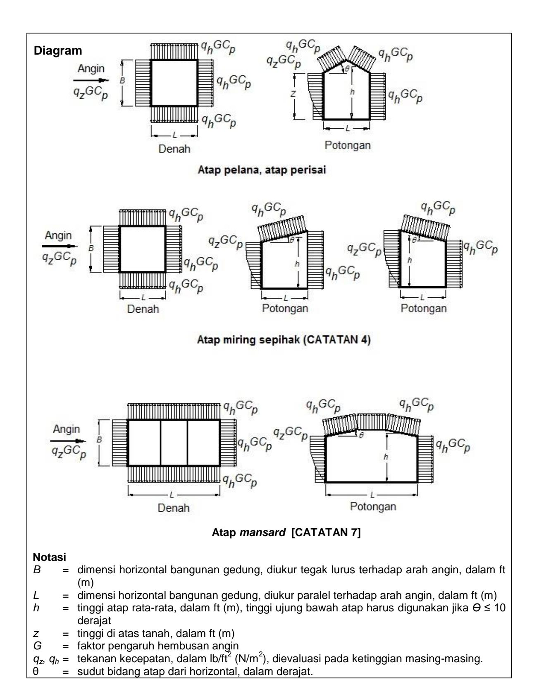

<span id="page-151-0"></span>Gambar 27.3-1 - Sistem Penahan Gaya Angin Utama, Bagian 1 (seluruh ketinggian): koefisien tekanan eksternal,  $C_p$ , untuk bangunan tertutup dan bangunan tertutup sebagian dinding dan atap

| Permukaan                    | ЦB            | $C_p$ | Digunakan dengan       |
|------------------------------|---------------|-------|------------------------|
| Dinding di sisi angin datang | Seluruh nilai | 0,8   | qz                     |
|                              | 0 – 1         | - 0,5 | $q_h$                  |
| Dinding di sisi angin pergi  | 2             | - 0,3 | $q_h$                  |
| 5 7 5                        | $\geq$ 4      | - 0,2 | $\overset{\cdot}{q_h}$ |
| Dinding tepi                 | Seluruh nilai | - 0,7 | $q_h$                  |

Koefisien tekanan atap,  $C_p$ , untuk digunakan dengan  $q_h$ 

|                                        | алар,  | Di sisi angin datang       |                          |                          |                          |                                     |                         |                         |       | Di sis             | Di sisi angin pergi |       |  |
|----------------------------------------|--------|----------------------------|--------------------------|--------------------------|--------------------------|-------------------------------------|-------------------------|-------------------------|-------|--------------------|---------------------|-------|--|
|                                        |        | Sudut, θ (derajat)         |                          |                          |                          |                                     |                         |                         |       | Sudut, θ (derajat) |                     |       |  |
| Arah Angin                             | h/L    | 10                         | 15                       | 20                       | 25                       | 30                                  | 35                      | 45                      | ≥ 60° | 10                 | 15                  | ≥ 20  |  |
| Tegak lurus<br>terhadap                | ≤ 0,25 | -0,7<br>-0,18              | -0,5<br>0,0 <sup>a</sup> | -0,3<br>0,2              | -0,2<br>0,3              | -0,2<br>0,3                         | 0,0 <sup>a</sup><br>0,4 | 0,4                     | 0,01θ | - 0,3              | - 0,5               | - 0,6 |  |
| bubungan<br>untuk                      | 0,5    | -0,9<br>-0,18              | -0,7<br>-0,18            | -0,4<br>0,0 <sup>a</sup> | -0,3<br>0,2              | -0,2<br>0,2                         | -0,2<br>0,3             | 0,0 <sup>a</sup><br>0,4 | 0,01θ | - 0,5              | - 0,5               | - 0,6 |  |
| $\theta \ge 10^{0}$                    | ≥1,0   | -1,3 <sup>b</sup><br>-0,18 | -1,0<br>-0,18            | -0,7<br>-0,18            | -0,5<br>0,0 <sup>a</sup> | -0,3<br>0,2                         | -0,2<br>0,2             | 0,0 <sup>a</sup><br>0,4 | 0,01θ | - 0,7              | - 0,6               | - 0,6 |  |
| Arah Angin                             | h/L    |                            | horizont<br>si angin     |                          |                          | <b>C</b> <sub>p</sub>               |                         |                         |       |                    |                     |       |  |
| Tegak lurus                            |        |                            | oai denga                |                          |                          | ,9, -0,18                           |                         |                         |       |                    |                     |       |  |
| terhadap<br>bubungan                   | ≤ 0,5  |                            | npai denç<br>pai denga   | ,                        | -0                       | ,9, -0,18<br>,5, -0,18<br>,3, -0,18 |                         |                         |       |                    |                     |       |  |
| untuk<br>θ< 10 <sup>0</sup><br>sejajar |        |                            | oai denga                | n <i>h</i> /2            |                          | 3 <sup>b</sup> , -0,18              |                         |                         |       |                    |                     |       |  |

-0,7, -0,18

≥1.0

<sup>°</sup>Untuk kemiringan atap lebih besar dari 80°, gunakan  $C_p = 0.8$ 

| Luas (ft²) | Luas (m²) | Faktor Reduksi |
|------------|-----------|----------------|
| ≤ 100      | ≤ 9,3     | 1,0            |
| 250        | 23,2      | 0,9            |
| ≥ 1000     | ≥ 92,9    | 0,8            |

#### Catatan:

bubungan

untuk semua

- 1. Tanda positif dan negatif menandakan tekanan yang bekerja menuju dan menjauhi permukaan.
- Diperkenankan interpolasi linier untuk nilai L/B, h/L dan θ selain dari yang diperlihatkan. Interpolasi hanya boleh dilakukan di antara nilai-nilai dengan tanda yang sama. Apabila nilai tidak memiliki tanda yang sama, asumsikan 0.0 untuk kegunaan interpolasi.
- 3. Apabila tercantum dua nilai  $C_p$ , ini menunjukkan bahwa kemiringan atap di sisi angin datang mengalami salah satu
- 3. tekanan angin positif atau negatif dan struktur atap harus didesain untuk kedua kondisi tersebut. Interpolasi untuk rasio h/L di dalam hal ini hanya boleh dilakukan di antara nilai-nilai  $C_p$  dari tanda yang sama.
- 4. Untuk atap miring sepihak, seluruh permukaan atap merupakan permukaan di sisi angin datang atau di sisi angin perai.
- 5. Rujuk ke Gambar 27.3-2 untuk atap kubah dan Gambar 27.3-3 untuk atap lengkung.
- 6. Untuk atap mansard, permukaan horizontal dan permukaan miring di sisi angin pergi harus diberlakukan sebagai
- permukaan di sisi angin pergi dari tabel. Kecuali untuk SPGAU pada atap yang terdiri dari rangka penahan momen, total gaya geser horizontal tidak boleh kurang dari yang ditentukan dengan mengabaikan gaya angin pada permukaan atap.

Gambar 27.3-1 (Lanjutan) - Sistem Penahan Gaya Angin Utama, Bagian 1 (seluruh ketinggian): koefisien tekanan eksternal,  $C_p$ , untuk bangunan tertutup dan bangunan tertutup sebagian dinding dan atap

<sup>&</sup>lt;sup>a</sup>Nilai disediakan untuk keperluan interpolasi.

<sup>&</sup>lt;sup>b</sup>Nilai dapat direduksi secara linier dengan luas yang sesuai berikut ini:

#### Diagram

#### Koefisien tekanan eksternal untuk kubah dengan dasar lingkaran

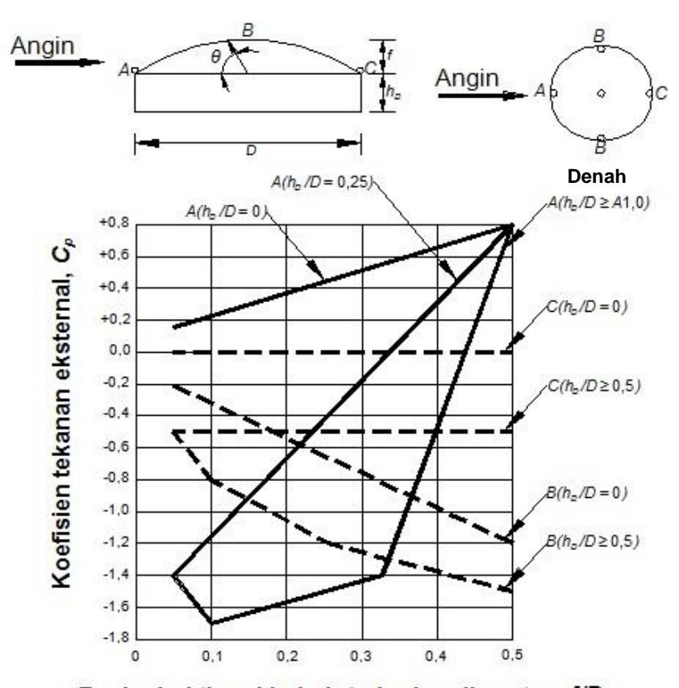

Rasio dari tinggi kubah terhadap diameter, f/D

#### Notasi

f = Tinggi kubah, dalam ft (m)

 $h_D$  = Ketinggian sampai dasar kubah, dalam ft (m)

D = Diameter, dalam ft (m)

θ = Sudut bidang atap dari garis horizontal, dalam derajat

#### Catatan:

- Dua kasus beban harus ditinjau:
  - Kasus A: Nilai  $C_p$  di antara Á dan B dan di antara B dan C harus ditentukan oleh interpolasi linier sepanjang lengkungan pada kubah yang sejajar dengan arah angin;
  - Kasus B. Nilai Cp harus nilai konstan dari A untuk θ ≤ 25°, dan harus ditentukan oleh interpolasi linier dari sudut 25° ke B dan dari B ke C.
- 2. Nilai-nilai  $C_p$  digunakan dengan  $Q_{(h_D+f)}$  di mana  $h_D+f$  adalah tinggi bagian puncak dari kubah.
- 3. Tanda positif dan negatif menandakan tekanan yang bekerja menuju dan menjauhi permukaan.
- 4. **C**<sub>p</sub> adalah konstan pada permukaan kubah untuk lengkungan lingkaran yang tegak lurus terhadap arah angin; sebagai contoh, lengkungan yang melalui B-B-B dan semua lengkungan sejajar terhadap B-B-B.
- 5. Untuk nilai  $h_D/D$  yang berada di antara kurva grafik tercantum, interpolasi linier diperkenankan.
- 6.  $\theta$  = 0 derajat pada dasar kubah,  $\theta$  = 90° pada titik pusat puncak kubah. f diukur dari dasar ke puncak kubah.
- 7. Total gaya geser horizontal tidak boleh kurang dari yang ditentukan dengan mengabaikan gaya angin pada permukaan atap.
- 8. Untuk nilai f/D yang kurang dari 0,05, gunakan Gambar 27.3-1.

<span id="page-153-1"></span><span id="page-153-0"></span>Gambar 27.3-2 - Sistem Penahan Gaya Angin Utama, Bagian 1 (semua ketinggian): koefisien tekanan eksternal, Cp, untuk bangunan gedung dan struktur tertutup dan tertutup sebagian atap kubah dengan dasar lingkaran

#### **Koefisien tekanan eksternal,** *C<sup>p</sup>*

|                                        |                                                                           | Cp                                    |                   |                                   |  |  |  |
|----------------------------------------|---------------------------------------------------------------------------|---------------------------------------|-------------------|-----------------------------------|--|--|--|
| Kondisi                                | Rasio tinggi<br>terhadap bentang,<br>r                                    | Di seperempat<br>sisi angin<br>datang | Pusat<br>setengah | Di seperempat<br>sisi angin pergi |  |  |  |
|                                        | 0 <r< 0,2<="" td=""><td>- 0,9</td><td>- 0,7 – r</td><td>- 0,5</td></r<>   | - 0,9                                 | - 0,7 – r         | - 0,5                             |  |  |  |
| Atap pada struktur terelevasi          | 0,2 ≤ r< 0,3*                                                             | 1,5r – 0,3                            | - 0,7 – r         | - 0,5                             |  |  |  |
|                                        | 0,3 ≤ r ≤ 0,6                                                             | 2,75r – 0,7                           | - 0,7 - r         | - 0,5                             |  |  |  |
| Atap yang berada di permukaan<br>tanah | 0 <r 0,6<="" td="" ≤=""><td>1,4r</td><td>- 0,7 - r</td><td>- 0,5</td></r> | 1,4r                                  | - 0,7 - r         | - 0,5                             |  |  |  |

<sup>\*</sup> Apabila rasio tinggi-terhadap-bentang adalah 0,2 ≤ r ≤ 0,3, koefisien alternatif sebesar (6*r* – 2,1) harus digunakan untuk di seperempat sisi angin datang.

#### **Catatan:**

- 1. Nilai yang tercantum adalah untuk menentukan beban rata-rata pada sistem penahan gaya angin utama.
- 2. Tanda positif dan negatif menandakan tekanan yang bekerja menuju dan menjauhi permukaan.
- 3. Untuk arah angin paralel terhadap sumbu kelengkungan atap, gunakan koefisien tekanan dari Gambar 27.3-1 dengan arah angin paralel terhadap puncak.
- 4. Untuk komponen dan klading gedung: (1) Pada perimeter atap, gunakan koefisien tekanan eksternal dalam Gambar 30.3-2A, B dan C dengan θ berdasarkan kemiringan garis dasar dan (2) untuk luas atap sisanya, gunakan koefisien tekanan eksternal dari tabel ini dikalikan dengan 1,2.

<span id="page-154-0"></span>**Gambar 27.3-3 - Sistem Penahan Gaya Angin Utama dan Komponen dan Klading, Bagian 1 (semua ketinggian): koefisien tekanan eksternal,** *C<sup>p</sup>* **, untuk bangunan gedung dan struktur tertutup dan tertutup sebagian atap lengkung**

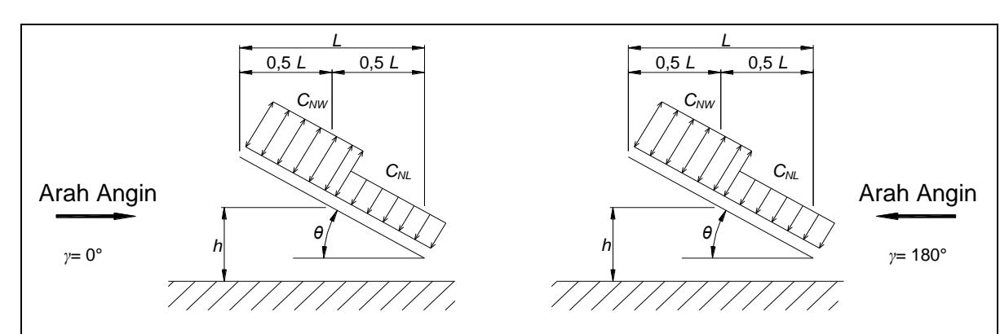

*L* **:** dimensi atap dalam arah horizontal, diukur sepanjang arah angin, ft. (m)

*h* : tinggi atap rata-rata, ft. (m) : arah angin, dalam derajat

*θ* : sudut atap terhadap bidang horizontal, dalam derajat

#### **Koefisien Tekanan Neto,** *C<sup>N</sup>*

|                    |                |           | Arah angin,        | = 00<br> |                           |           | Arah angin,        | = 1800<br> |              |
|--------------------|----------------|-----------|--------------------|-----------|---------------------------|-----------|--------------------|-------------|--------------|
| Sudut<br>Atap<br>θ | Kasus<br>beban | terhalang | Aliran angin tidak |           | Aliran angin<br>terhalang | terhalang | Aliran angin tidak | terhalang   | Aliran angin |
|                    |                | CNW       | CNL                | CNW       | CNL                       | CNW       | CNL                | CNW         | CNL          |
| 0                  | A              | 1,2       | 0,3                | -0,5      | -1,2                      | 1,2       | 0,3                | -0,5        | -1,2         |
| 0                  | B              | -1,1      | -0,1               | -1,1      | -0,6                      | -1,1      | -0,1               | -1,1        | -0,6         |
| 7,50               | A              | -0,6      | -1                 | -1        | -1,5                      | 0,9       | 1,5                | -0,2        | -1,2         |
|                    | B              | -1,4      | 0                  | -1,7      | -0,8                      | 1,6       | 0,3                | 0,8         | -0,3         |
| 150                | A              | -0,9      | -1,3               | -1,1      | -1,5                      | 1,3       | 1,6                | 0,4         | -1,1         |
|                    | B              | -1,9      | 0                  | -2,1      | -0,6                      | 1,8       | 0,6                | 1,2         | -0,3         |
| 22,50              | A              | -1,5      | -1,6               | -1,5      | -1,7                      | 1,7       | 1,8                | 0,5         | -1           |
|                    | B              | -2,4      | -0,3               | -2,3      | -0,9                      | 2,2       | 0,7                | 1,3         | 0            |
| 300                | A              | -1,8      | -1,8               | -1,5      | -1,8                      | 2,1       | 2,1                | 0,6         | -1           |
|                    | B              | -2,5      | -0,5               | -2,3      | -1,1                      | 2,6       | 1                  | 1,6         | 0,1          |
| 37,50              | A              | -1,8      | -1,8               | -1,5      | -1,8                      | 2,1       | 2,2                | 0,7         | -0,9         |
|                    | B              | -2,4      | -0,6               | -2,2      | -1,1                      | 2,7       | 1,1                | 1,9         | 0,3          |
|                    | A              | -1,6      | -1,8               | -1,3      | -1,8                      | 2,2       | 2,5                | 0,8         | -0,9         |
| 450                | B              | -2,3      | -0,7               | -1,9      | -1,2                      | 2,6       | 1,4                | 2,1         | 0,4          |

- 1. *CNW* dan *CNL* menunjukkan tekanan neto (kontribusi dari permukaan atas dan bawah) setengah dari permukaan atap untuk sisi angin datang dan sisi angin pergi.
- 2. Aliran angin tidak terhalang menunjukkan aliran angin tidak terhalang relatif dengan hambatan kurang dari atau sama dengan 50 %. Aliran angin terhalang menunjukkan objek di bawah atap yang menghambat aliran angin(hambatan > 50 %).
- 3. Untuk nilai *θ* di antara 7,5° dan 45°, interpolasi linier diperkenankan. Untuk nilai *θ*< 7,5° dipergunakan koefisien beban untuk 0°.
- 4. Tanda positif dan negatif menandakan tekanan yang bekerja menuju dan menjauhi permukaan.
- 5. Seluruh kasus pembebanan untuk setiap sudut atap harus diperiksa.

<span id="page-155-0"></span>**Gambar 27.3-4 - Sistem Penahan Gaya Angin Utama, Bagian 1 (0,25** ≤ *h***/***L* ≤ **1,0): koefisien tekanan neto,** *CN***, untuk bangunan gedung terbuka dengan atap miring sepihak tanpa dinding, θ** ≤ **45°,**  0 **, 180°)**

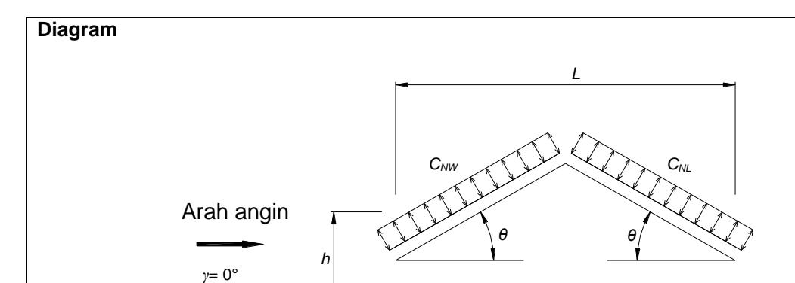

*L* **:** dimensi atap dalam arah horizontal, diukur sepanjang arah angin, ft. (m)

*h* : tinggi atap rata-rata, ft. (m) : arah angin, dalam derajat

*θ* : sudut atap terhadap bidang horizontal, dalam derajat

|                 |             |      | Arah angin,                  | = 00<br>, 1800<br>    |      |
|-----------------|-------------|------|------------------------------|------------------------|------|
| Sudut atap<br>Θ | Kasus beban |      | Aliran angin tidak terhalang | Aliran angin terhalang |      |
|                 |             | CNW  | CNL                          | CNW                    | CNL  |
| 7,50            | A           | 1,1  | -0,3                         | -1,6                   | -1   |
|                 | B           | 0,2  | -1,2                         | -0,9                   | -1,7 |
| 150             | A           | 1,1  | -0,4                         | -1,2                   | -1   |
|                 | B           | 0,1  | -1,1                         | -0,6                   | -1,6 |
| 22,50           | A           | 1,1  | 0,1                          | -1,2                   | -1,2 |
|                 | B           | -0,1 | -0,8                         | -0,8                   | -1,7 |
| 300             | A           | 1,3  | 0,3                          | -0,7                   | -0,7 |
|                 | B           | -0,1 | -0,9                         | -0,2                   | -1,1 |
| 37,50           | A           | 1,3  | 0,6                          | -0,6                   | -0,6 |
|                 | B           | -0,2 | -0,6                         | -0,3                   | -0,9 |
| 450             | A           | 1,1  | 0,9                          | -0,5                   | -0,5 |
|                 | B           | -0,3 | -0,5                         | -0,3                   | -0,7 |

- 1. *CNW* dan *CNL* menunjukkan tekanan neto (kontribusi dari permukaan atas dan bawah) setengah dari permukaan atap untuk sisi angin datang dan sisi angin pergi.
- 2. Aliran angin tidak terhalang ditunjukkan secara relatif halangan arah angin yang tidak terhalang ≤ 50 %. Aliran angin tidak terhalang ditunjukkan oleh benda di bawah atap yang menghambat arah angin (> 50 % halangan).
- 3. Untuk nilai *θ* di antara 7,5<sup>0</sup> dan 45<sup>0</sup> , interpolasi linier diperkenankan. Untuk nilai *θ*< 7,5<sup>0</sup> dipergunakan koefisien beban atap miring sepihak.
- 4. Tanda positif dan negatif menandakan tekanan yang bekerja menuju dan menjauhi permukaan atap bagian atas.
- 5. Seluruh kasus pembebanan untuk setiap sudut atap harus diperiksa.

<span id="page-156-0"></span>**Gambar 27.3-5 - Sistem Penahan Gaya Angin Utama, Bagian 1 (0,25** ≤ *h***/***L* ≤ **1,0): koefisien tekanan neto,** *C<sup>N</sup>* **, untuk bangunan gedung terbuka dengan atap pelana biasa tanpa dinding, θ** ≤ **45°,**  0 **, 180°**


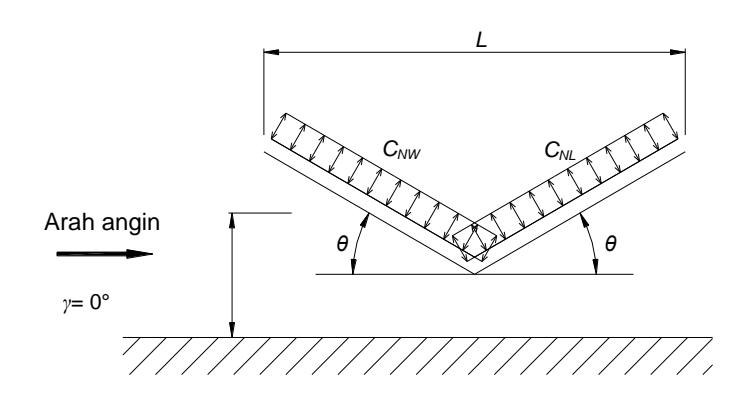

*L* **:** dimensi atap dalam arah horizontal, diukur sepanjang arah angin, ft. (m)

*h* : tinggi atap rata-rata, ft. (m) : arah angin, dalam derajat

*θ* : sudut atap terhadap bidang horizontal, dalam derajat

**Koefisien Tekanan Neto,** *C<sup>N</sup>*

|                 |             |      | Arah angin,                  | = 00<br>, 1800<br>    |      |
|-----------------|-------------|------|------------------------------|------------------------|------|
| Sudut atap<br>Θ | Kasus beban |      | Aliran angin tidak terhalang | Aliran angin terhalang |      |
|                 |             | CNW  | CNL                          | CNW                    | CNL  |
| 7,50            | A           | -1,1 | 0,3                          | -1,6                   | -0,5 |
|                 | B           | -0,2 | 1,2                          | -0,9                   | -0,8 |
| 150             | A           | -1,1 | 0,4                          | -1,2                   | -0,5 |
|                 | B           | 0,1  | 1,1                          | -0,6                   | -0,8 |
| 22,50           | A           | -1,1 | -0,1                         | -1,2                   | -0,6 |
|                 | B           | -0,1 | 0,8                          | -0,8                   | -0,8 |
| 300             | A           | -1,3 | -0,3                         | -1,4                   | -0,4 |
|                 | B           | -0,1 | 0,9                          | -0,2                   | -0,5 |
| 37,50           | A           | -1,3 | -0,6                         | -1,4                   | -0,3 |
|                 | B           | 0,2  | 0,6                          | -0,3                   | -0,4 |
| 450             | A           | -1,1 | -0,9                         | -1,2                   | -0,3 |
|                 | B           | 0,3  | 0,5                          | -0,3                   | -0,4 |

#### **Catatan**

- 1. *CNW* dan *CNL* menunjukkan tekanan neto (kontribusi dari permukaan atas dan bawah) setengah dari permukaan atap untuk sisi angin datang dan sisi angin pergi.
- 2. Aliran angin tidak terhalang ditunjukkan secara relatif halangan arah angin yang tidak terhalang ≤ 50 %. Aliran angin tidak terhalang ditunjukkan oleh benda di bawah atap yang menghambat aliran angin (> 50 % hambatan).
- 3. Untuk nilai *θ* di antara 7,5° dan 45°, interpolasi linier diperkenankan. Untuk nilai *θ*< 7,5° dipergunakan koefisien beban atap miring sepihak.
- 4. Tanda positif dan negatif menandakan tekanan yang bekerja menuju dan menjauhi permukaan atap bagian atas.
- 5. Seluruh kasus pembebanan untuk setiap sudut atap harus diperiksa.

<span id="page-157-0"></span>**Gambar 27.3-6 - Sistem Penahan Gaya Angin Utama, Bagian 1 (0,25** ≤ *h/L* ≤ **1,0): koefisien tekanan neto,** *C<sup>N</sup>* **, untuk bangunan gedung terbuka dengan atap pelana terbalik tanpa dinding, θ** ≤ **45°,**  0 **, 180°**

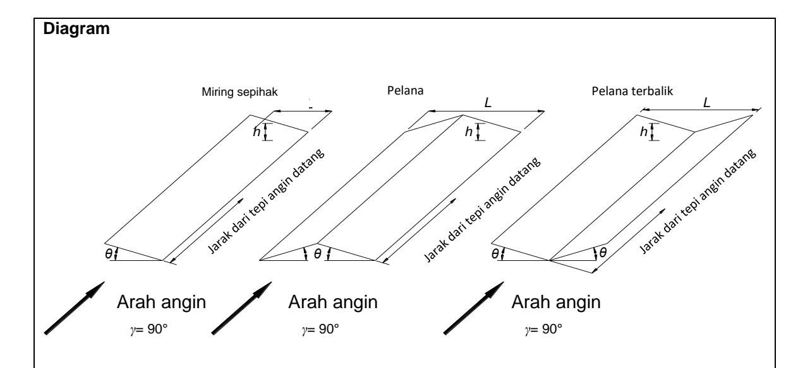

- L = dimensi atap dalam arah horizontaldiukur sepanjang arah angin, ft. (m)
- h = tinggi atap rata-rata, ft. (m). Lihat Gambar 27.3-4, 27.3-5 atau 27.3-6 untuk gambaran grafis dari dimensi ini.
- $\gamma$  = arah angin, dalam derajat
- $\theta$  = sudut atap terhadap bidang horizontal, dalam derajat

Koefisien Tekanan Neto, C<sub>N</sub>

| Jarak horizontal<br>dari tepi di sisi | Sudut atap θ             | Kasus beban | Aliran angin tidak terhalang | Aliran angin<br>terhalang |
|---------------------------------------|--------------------------|-------------|------------------------------|---------------------------|
| angin datang                          |                          |             | $C_N$                        | $C_N$                     |
| - b                                   | Semua bentuk             | Α           | -0,8                         | -1,2                      |
| < h                                   | $\theta \leq 45^{\circ}$ | В           | 0,8                          | 0,5                       |
| >h, < 2h                              | Semua bentuk             | Α           | -0,6                         | -0,9                      |
| >11, < 211                            | $\theta \le 45^{\circ}$  | В           | 0,5                          | 0,5                       |
| > 2h                                  | Semua bentuk             | Α           | -0,3                         | -0,6                      |
| > 211                                 | $\theta \le 45^{\circ}$  | В           | 0,3                          | 0,3                       |

- 1.  $C_N$ menunjukkan tekanan neto (kontribusi dari permukaan atas dan bawah).
- 2. Aliran angin tidak terhalang ditunjukkan secara relatif halangan arah angin yang tidak terhalang ≤ 50 %. Aliran angin tidak terhalang ditunjukkan oleh benda di bawah atap yang menghambat aliran angin (> 50 % halangan).
- 3. Tanda positif dan negatif menandakan tekanan yang bekerja menuju dan menjauhi permukaan atap bagian atas.
- 4. Seluruh kasus pembebanan untuk setiap sudut atap harus diperiksa. 5. Untuk atap miring sepihak dengan  $\theta < 5^0$ , nilai  $C_N$  dipergunakan pada kasus dengan  $\gamma = 0^0$  dan 0,05 kurang dari atau sama dengan h/L kurang dari atau sama dengan 0,25. Lihat Gambar 27.3-4 untuk nilai h/L lainnya.

<span id="page-158-0"></span>Gambar 27.3-7 - Sistem Penahan Gaya Angin Utama, Bagian 1 (0,25  $\leq h/L \leq$  1,0): koefisien tekanan neto,  $C_N$ , untuk bangunan gedung terbuka dengan atap tanpa dinding,  $\theta \le 45^{\circ}$ ,  $\gamma = 90^{\circ}$ , 270°

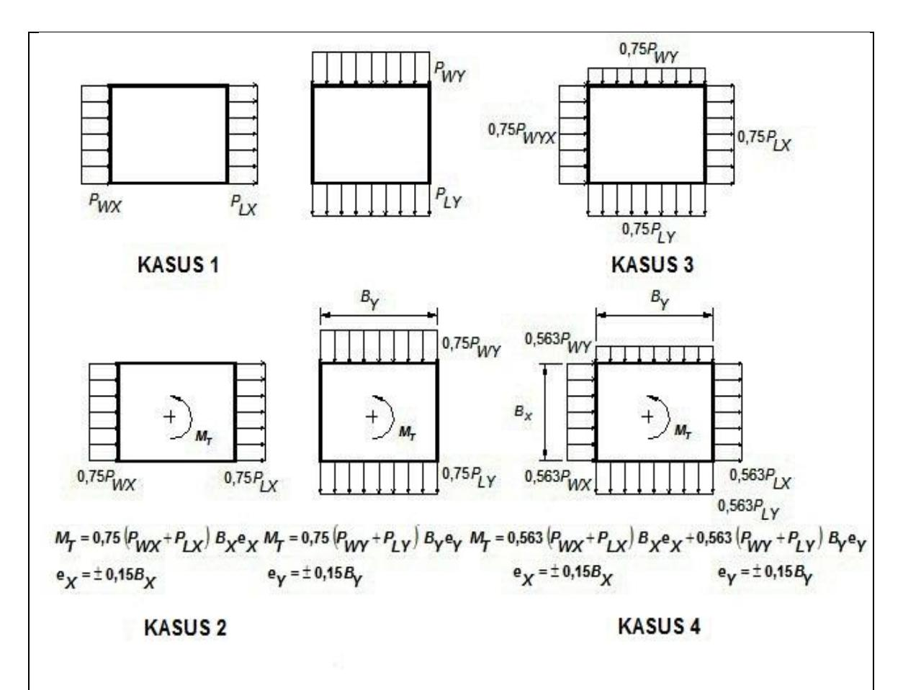

*PWX*, *PWY* = tekanan desain di muka sisi angin datang yang bekerja pada sumbu utama *x* dan *y*. *PLX*, *PLY* = tekanan desain di muka sisi angin pergi yang bekerja pada sumbu utama *x* dan *y*.

*e* (*ex*, *ey*) = eksentrisitas untuk sumbu utama *x*, *y* dari struktur.

*MT* = momen torsi per satuan tinggi yang bekerja pada suatu sumbu vertikal dari bangunan gedung.

- Kasus 1 Tekanan penuh dari angin desain yang bekerja pada luasan terproyeksi tegak lurus terhadap setiap sumbu utama struktur, ditinjau secara terpisah di setiap sumbu utama.
- Kasus 2 Tiga per empat dari tekanan angin desain yang bekerja pada luasan terproyeksi tegak lurus terhadap setiap sumbu utama struktur yang bersamaan dengan momen torsi seperti yang diperlihatkan, ditinjau secara terpisah untuk setiap sumbu utama.
- Kasus 3 Pembebanan angin seperti yang didefinisikan dalam Kasus 1, tetapi ditinjau bekerja bersama sama pada 75% dari nilai yang ditetapkan.
- Kasus 4 Pembebanan angin seperti yang didefinisikan dalam Kasus 2, tetapi ditinjau bekerja bersama sama pada 75% dari nilai yang ditetapkan.

- 1. Tekanan angin desain untuk di muka sisi angin datang dan di muka sisi angin pergi harus ditentukan sesuai dengan ketentuan Pasal 27.3.1 dan 27.3.2 dapat digunakan untuk semua ketinggian bangunan gedung.
- <span id="page-159-0"></span>2. Diagram yang menunjukkan denah bangunan gedung.

**Gambar 27.3-8 - Sistem Penahan Gaya Angin Utama, Bagian 1 (seluruh ketinggian): kasus beban angin desain** 

#### **Bagian 2: Bangunan gedung diafragma sederhana tertutup dengan** *h* **≤ 160 ft (48,8 m)**

**Catatan:** Bagian 2 Pasal 27 adalah metode yang disederhanakan untuk menentukan tekanan angin untuk SPGAU bangunan gedung tertutup, bangunan gedung diafragma sederhana dengan ketinggian *h* adalah ≤ 160 ft (48,8 m). Tekanan angin diperoleh *langsung dari tabel.*  Bangunan gedung dapat dari setiap bentuk denah dan geometri atap yang cocok dengan gambar yang ditetapkan. Metode ini adalah penyederhanaan dari metode "semua ketinggian" tradisional (prosedur pengarah) yang terdapat dalam Bagian 1 dari Pasal 27.

#### <span id="page-160-0"></span>**27.4 Persyaratan umum**

#### <span id="page-160-1"></span>**27.4.1 Prosedur desain**

Prosedur yang disyaratkan di sini diterapkan untuk menentukan beban angin SPGAU bangunan gedung diafragma sederhana tertutup, seperti didefinisikan dalam Pasal 26.2, dengan suatu ketinggian atap rata-rata *h* ≤ 160 ft (48,8 m). Langkah-langkah yang diperlukan untuk penentuan beban angin SPGAU pada bangunan gedung diafragma sederhana tertutup ditunjukkan dalam Tabel 27.4-1.

#### <span id="page-160-2"></span>**27.4.2 Kondisi**

Selain persyaratan pada Pasal 27.1.2, bangunan gedung yang beban angin desainnya ditentukan menurut Pasal ini harus memenuhi semua kondisi berikut untuk Bangunan Gedung Kelas 1 atau Kelas 2 (lihat Gambar 27.4-1):

#### **Bangunan gedung kelas 1:**

- 1. Bangunan gedung harus bangunan gedung diafragma sederhana tertutup seperti didefinisikan dalam Pasal 26.2.
- 2. Bangunan gedung harus memiliki tinggi atap rata-rata *h* ≤ 60 ft (18,3 m).
- 3. Rasio *L*/*B* tidak boleh kurang dari 0,2 ataupun lebih dari 5,0 (0,2 ≤ *L*/*B* ≤ 5,0).

#### **Bangunan gedung kelas 2:**

- 1. Bangunan gedung harus bangunan gedung diafragma sederhana tertutup seperti didefinisikan dalam Pasal 26.2.
- 2. Bangunan gedung harus memiliki tinggi atap rata-rata 60 ft <*h* ≤ 160 ft (18,3 m < h ≤ 48,8 m).
- 3. Rasio *L*/*B* tidak boleh kurang dari 0,5 ataupun lebih dari 2,0 (0,5 ≤ *L*/*B* ≤ 2,0).
- 4. Frekuensi alami fundamental (Hertz) bangunan gedung tidak boleh kurang dari 75/*h*  (246,06/*h*), dengan *h* dalam ft (m).

#### <span id="page-160-3"></span>**27.4.3 Parameter beban angin yang ditetapkan dalam Pasal 26**

Lihat Pasal 26 untuk penentuan Kecepatan Angin Dasar *V* (Pasal 26.5), kategori eksposur (Pasal 26.7) dan faktor topografi *Kzt* (Pasal 26.10).

#### <span id="page-161-0"></span>**27.4.4 Efek topografi**

Tekanan angin yang ditentukan dari Pasal ini harus dikalikan dengan *Kzt* sebagaimana ditentukan dari Pasal 26.10 menggunakan satu nilai *Kzt* untuk bangunan gedung yang dihitung pada 0,33*h*. Sebagai alternatif, diizinkan memasukkan Tabel 27.5-1 dan Tabel 27.5-2 dengan kecepatan angin sama dengan V K zt dengan K zt ditentukan pada ketinggian 0,33*h*.

#### <span id="page-161-1"></span>**27.4.5 Fleksibilitas diafragma**

Prosedur desain yang ditetapkan di sini berlaku untuk bangunan gedung yang memiliki diafragma kaku atau fleksibel. Analisis struktur harus memperhitungkan kekakuan relatif dari diafragma dan elemen-elemen vertikal dari SPGAU.

Diafragma yang terbuat dari panel kayu dapat diidealisasikan sebagai fleksibel. Diafragma yang terbuat dari dek metal tanpa pelapis atas, dek metal berisi beton dan slab beton, setiap memiliki rasio bentang-terhadap-kedalaman 2 atau kurang, diizinkan untuk diidealisasikan sebagai kaku untuk perhitungan beban angin.

<span id="page-161-4"></span>**Tabel 27.4-1 - Langkah-langkah untuk menentukan gaya angin SPGAU bangunan gedung diafragma sederhana, tertutup,** *h* **≤ 160 ft. (48,8 m)**

- **Langkah 1:** Tentukan kategori risiko bangunan gedung; lihat Tabel 1.5-1
- **Langkah 2:** Tentukan kecepatan angin dasar, *V,* untuk kategori risiko yang sesuai; lihat Buku Peta Angin Indonesia.
- **Langkah 3:** Tentukan parameter beban angin:
- Kategori eksposur B, C atau D; lihat Pasal 26.7.
- Fator topografi, *Kzt*; lihat Pasal 26.8 dan Gambar 26.8-1
- Klasifikasi ketertutupan; lihat Pasal 26.12
- **Langkah 4:** Masuk ke Tabel 27.5-1 untuk menentukan tekanan neto pada dinding di atas dan dasar bangunan gedung, *p<sup>h</sup>* , *p*0.
- **Langkah 5:** Masuk ke Tabel 27.5-2 untuk menentukan tekanan atap neto, *pz*.
- **Langkah 6:** Tentukan faktor topografi, *Kzt*, dan gunakan faktor untuk tekanan dinding dan atap (jika sesuai), lihat Pasal 26.8
- **Langkah 7:** Terapkan beban untuk dinding dan atap secara bersamaan.

#### <span id="page-161-2"></span>**27.5 Beban angin: Sistem Penahan Gaya Angin Utama**

#### <span id="page-161-3"></span>**27.5.1 Permukaan dinding dan atap: bangunan gedung Kelas 1 dan Kelas 2**

Tekanan angin neto untuk permukaan dinding dan atap harus ditentukan dari Tabel 27.5-1 dan 27.5-2, masing-masing, untuk kategori eksposur yang sesuai sebagaimana ditentukan dengan Pasal 26.7.

Untuk bangunan gedung Kelas 1 dengan nilai *L*/*B* kurang dari 0,5, gunakan tekanan angin tertabulasi untuk *L*/*B* = 0,5. Untuk bangunan gedung Kelas 1 dengan nilai *L*/*B*  lebih besar dari 2,0, gunakan tekanan angin tertabulasi untuk *L*/*B* = 2,0.

Tekanan dinding neto harus diterapkan ke area terproyeksi dinding bangunan gedung pada arah angin, dan tekanan dinding sisi eksterior harus diterapkan terhadap area terproyeksi dari dinding bangunan gedung tegak lurus terhadap arah angin yang bekerja keluar sesuai dengan Bagian 3 Catatan Tabel 27.5-1, bersamaan dengan tekanan atap dari Tabel 27.5-2 seperti ditunjukkan pada Gambar 27.5-1.

Bila dua kasus beban yang ditunjukkan pada tabel tekanan atap, efek dari setiap kasus beban harus diselidiki secara terpisah. SPGAU pada setiap arah harus dirancang untuk kasus beban angin seperti ditetapkan pada Gambar 27.3-8.

**PENGECUALIAN** Kasus beban torsional pada Gambar 27.3-8 (Kasus 2 dan Kasus 4) tidak perlu diperhitungkan untuk bangunan gedung yang memenuhi persyaratan Lampiran D.

#### <span id="page-162-0"></span>**27.5.2 Parapet**

Pengaruh gaya angin horizontal diterapkan pada semua permukaan vertikal parapet atap untuk desain SPGAU harus didasarkan pada penerapan tekanan angin horizontal neto tambahan yang diterapkan ke area terproyeksi dari permukaan parapet sama dengan 2,25 kali tekanan dinding tertabulasi pada Tabel 27.5-1 untuk *L*/*B* = 1,0. Tekanan neto yang ditetapkan untuk menghitung pembebanan parapet di sisi angin datang dan di sisi angin pergi pada permukaan bangunan gedung di sisi angin datang dan angin pergi. Tekanan parapet harus diterapkan bersamaan dengan tekanan dinding dan atap yang disyaratkan yang ditunjukkan dalam tabel pada Gambar 27.5-2. Ketinggian *h* yang digunakan dalam Tabel 27.5-1 untuk menentukan tekanan parapet harus tinggi terhadap puncak parapet seperti yang ditunjukkan dalam Gambar 27.5-2 (gunakan *h* = *hp*).

#### <span id="page-162-1"></span>**27.5.3 Konsol dari atap**

Pengaruh beban angin vertikal pada setiap konsol atap harus berdasarkan pada penerapan tekanan angin positif pada bagian bawah konsol angin datang yang sama dengan 75 % dari tekanan tepi atap dari Tabel 27.5-2 untuk Zona 1 atau Zona 3 yang sesuai. Tekanan ini harus diterapkan hanya untuk konsol atap angin datang dan harus diterapkan secara bersamaan dengan tekanan dinding dan atap tertabulasi lainnya seperti diperlihatkan pada Gambar 27.5-3.

#### <span id="page-162-2"></span>**27.6 Standar konsensus dan dokumen lain yang diReferensikan**

Pasal ini tidak merujuk konsensus standar atau dokumen lain manapun yang dianggap sebagai bagian dari Standar ini.

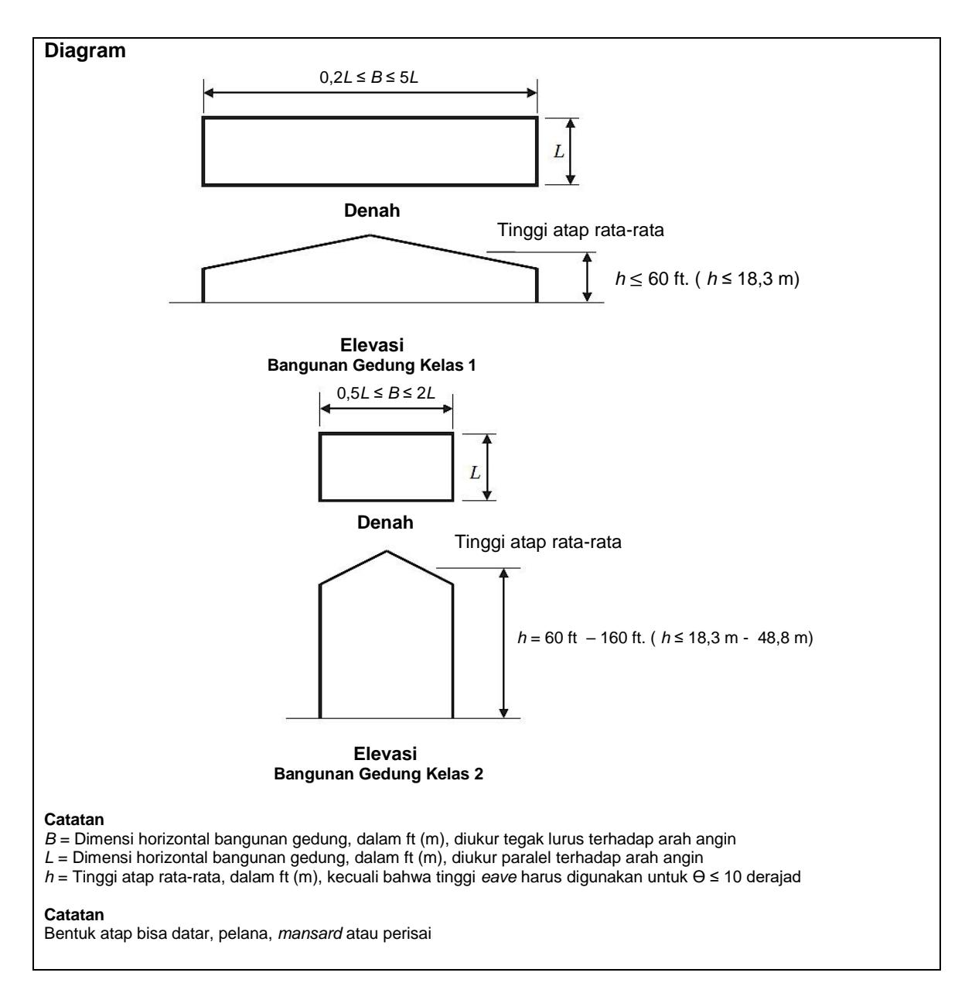

<span id="page-163-1"></span><span id="page-163-0"></span>**Gambar 27.4-1 - Sistem Penahan Gaya Angin Utama, Bagian 2 [***h* **≤ 160 ft (***h* **≤ 48,8 m)]: kelas bangunan gedung untuk bangunan gedung diafragma sederhana tertutup (persyaratan geometri bangunan gedung)**

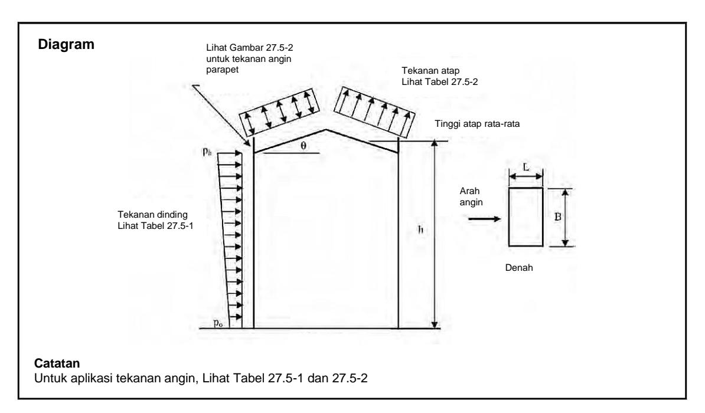

**Gambar 27.5-1 - Sistem Penahan Gaya Angin Utama, Bagian 2 [***h* ≤ **160 ft (***h* ≤ **48,8 m)]: bangunan gedung diafragma sederhana tertutup, tekanan angin, dinding dan atap**

<span id="page-164-1"></span><span id="page-164-0"></span>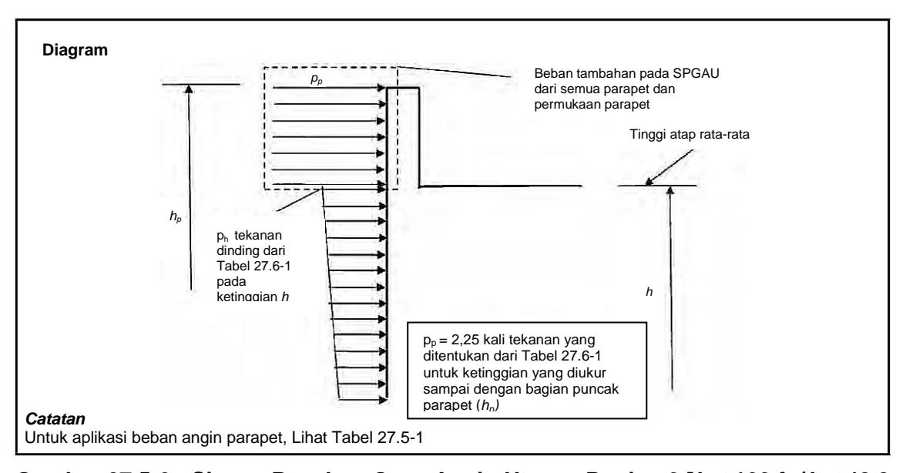

**Gambar 27.5-2 - Sistem Penahan Gaya Angin Utama, Bagian 2 [***h* ≤ **160 ft (***h* ≤ **48,8 m)]: bangunan gedung diafragma sederhana tertutup, beban angin parapet** 

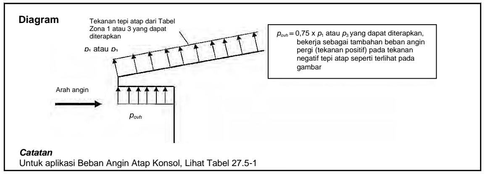

<span id="page-165-0"></span>Gambar 27.5-3 - Sistem Penahan Gaya Angin Utama, Bagian 2: bangunan gedung diafragma sederhana tertutup, beban angin atap konsol

<span id="page-165-2"></span><span id="page-165-1"></span>Tabel 27.5-1 - Sistem Penahan Gaya Angin Utama, Bagian 2 [h ≤ 160 ft (h ≤ 48.8m)]: bangunan gedung diafragma sederhana tertutup tekanan angin dinding

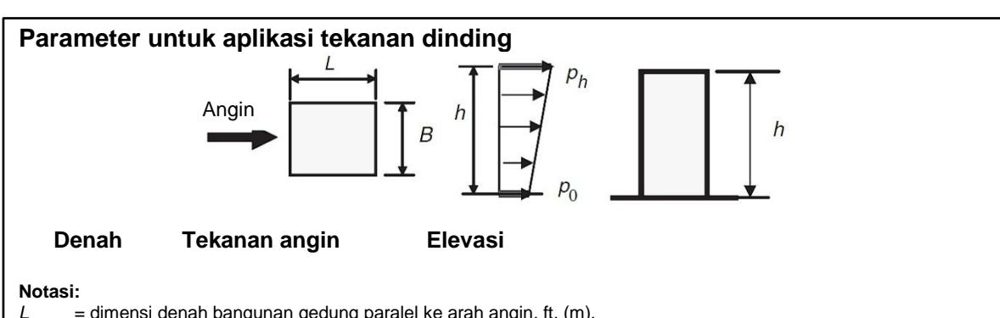

= dimensi denah bangunan gedung paralel ke arah angin, ft. (m).

B = dimensi denah bangunan gedung tegak lurus kearah angin, ft. (m).

h = tinggi atap rata-rata, ft.(m).

 $p_h$ ,  $p_0$  = tekanan dinding neto selama angin bertiup di atas dan di dasar bangunan gedung, psf (kN/m<sup>2</sup>)

#### Catatan untuk Tabel Tekanan Angin:

- Dari tabel untuk setiap Eksposur (B, C atau D) V, L/B dan h, tentukan  $p_h$  (angka atas) dan  $P_0$  (angka bawah) tekanan dinding neto angin horizontal.
- Tekanan eksternal dinding sisi harus merata sepanjang permukaan dinding yang bekerja ke arah luar dan diambil sebesar 54% dari tekanan  $p_h$  yang tertabulasi untuk  $0.2 \le L/B \le 1.0$  dan 64% dari tekanan  $p_h$  tertabulasi untuk  $2.0 \le L/B \le 1.0$ L/B ≤ 5.0. Interpolasi linier boleh digunakan untuk 1.0 < L/B < 2.0. Tekanan eksternal dinding sisi tidak termasuk efek
- Terapkan tekanan dinding neto angin seperti yang tergambar di atas ke luasan terproyeksi dari dinding bangunan gedung dalam arah angin dan terapkan tekanan dinding sisi eksternal ke luasan terproyeksi dari dinding bangunan gedung tegak lurus terhadap arah angin, bersamaan dengan tekanan atap dari Tabel 27.5-2
- Distribusi tekanan dinding neto tertabulasi antara muka dinding di sisi angin datang dan di sisi angin pergi harus berdasarkan distribusi linier dari tekanan neto total dengan tinggi bangunan gedung seperti gambar di atas dan tekanan dinding eksternal di sisi angin pergi dianggap terdistribusi merata sepanjang permukaan dinding di sisi angin pergi yang bekerja ke arah luar pada 38% dari  $p_h$  untuk  $0.2 \le L/B \le 1.0$  dan 27% dari  $p_h$  untuk  $2.0 \le L/B \le 5.0$ . Interpolasi linier boleh digunakan untuk 1,0 < L/B< 2,0. Tekanan neto yang tersisa harus diterapkan pada dinding di sisi angin datang sebagai tekanan dinding eksternal yang bekerja ke arah permukaan dinding. Tekanan dinding di sisi angin datang dan di sisi angin pergi tanpa memperhitungkan efek dari tekanan internal.
- Diperbolehkan interpolasi di antara nilai-nilai dari V, h dan L/B.
- 1.0 ft = 0.3048 m;  $1.0 \text{ lb/ft}^2 = 0.0479 \text{ kN/m}^2$ .

**Tabel 27.5-1 (Lanjutan) - Sistem Penahan Gaya Angin Utama, Bagian 2 [***h* **≤ 160 ft (***h* **≤ 48,8 m)]: bangunan gedung diafragma sederhana tertutup tekanan angin dinding**

|  |  |  |  |  |  | Eksposur B |  |  |  |  |  |  |  |
|--|--|--|--|--|--|------------|--|--|--|--|--|--|--|
|  |  |  |  |  |  |            |  |  |  |  |  |  |  |
|  |  |  |  |  |  |            |  |  |  |  |  |  |  |
|  |  |  |  |  |  |            |  |  |  |  |  |  |  |
|  |  |  |  |  |  |            |  |  |  |  |  |  |  |
|  |  |  |  |  |  |            |  |  |  |  |  |  |  |
|  |  |  |  |  |  |            |  |  |  |  |  |  |  |
|  |  |  |  |  |  |            |  |  |  |  |  |  |  |
|  |  |  |  |  |  |            |  |  |  |  |  |  |  |
|  |  |  |  |  |  |            |  |  |  |  |  |  |  |
|  |  |  |  |  |  |            |  |  |  |  |  |  |  |
|  |  |  |  |  |  |            |  |  |  |  |  |  |  |
|  |  |  |  |  |  |            |  |  |  |  |  |  |  |
|  |  |  |  |  |  |            |  |  |  |  |  |  |  |
|  |  |  |  |  |  |            |  |  |  |  |  |  |  |
|  |  |  |  |  |  |            |  |  |  |  |  |  |  |
|  |  |  |  |  |  |            |  |  |  |  |  |  |  |
|  |  |  |  |  |  |            |  |  |  |  |  |  |  |
|  |  |  |  |  |  |            |  |  |  |  |  |  |  |
|  |  |  |  |  |  |            |  |  |  |  |  |  |  |
|  |  |  |  |  |  |            |  |  |  |  |  |  |  |
|  |  |  |  |  |  |            |  |  |  |  |  |  |  |
|  |  |  |  |  |  |            |  |  |  |  |  |  |  |
|  |  |  |  |  |  |            |  |  |  |  |  |  |  |
|  |  |  |  |  |  |            |  |  |  |  |  |  |  |
|  |  |  |  |  |  |            |  |  |  |  |  |  |  |
|  |  |  |  |  |  |            |  |  |  |  |  |  |  |
|  |  |  |  |  |  |            |  |  |  |  |  |  |  |
|  |  |  |  |  |  |            |  |  |  |  |  |  |  |
|  |  |  |  |  |  |            |  |  |  |  |  |  |  |
|  |  |  |  |  |  |            |  |  |  |  |  |  |  |
|  |  |  |  |  |  |            |  |  |  |  |  |  |  |
|  |  |  |  |  |  |            |  |  |  |  |  |  |  |
|  |  |  |  |  |  |            |  |  |  |  |  |  |  |
|  |  |  |  |  |  |            |  |  |  |  |  |  |  |

**Tabel 27.5-1 (Lanjutan) - Sistem Penahan Gaya Angin Utama, Bagian 2 [***h* **≤ 160 ft (***h* **≤ 48,8 m)]: bangunan gedung diafragma sederhana tertutup tekanan angin dinding**

|  |  |  |  |  |  | Eksposur C |  |  |  |  |  |  |  |
|--|--|--|--|--|--|------------|--|--|--|--|--|--|--|
|  |  |  |  |  |  |            |  |  |  |  |  |  |  |
|  |  |  |  |  |  |            |  |  |  |  |  |  |  |
|  |  |  |  |  |  |            |  |  |  |  |  |  |  |
|  |  |  |  |  |  |            |  |  |  |  |  |  |  |
|  |  |  |  |  |  |            |  |  |  |  |  |  |  |
|  |  |  |  |  |  |            |  |  |  |  |  |  |  |
|  |  |  |  |  |  |            |  |  |  |  |  |  |  |
|  |  |  |  |  |  |            |  |  |  |  |  |  |  |
|  |  |  |  |  |  |            |  |  |  |  |  |  |  |
|  |  |  |  |  |  |            |  |  |  |  |  |  |  |
|  |  |  |  |  |  |            |  |  |  |  |  |  |  |
|  |  |  |  |  |  |            |  |  |  |  |  |  |  |
|  |  |  |  |  |  |            |  |  |  |  |  |  |  |
|  |  |  |  |  |  |            |  |  |  |  |  |  |  |
|  |  |  |  |  |  |            |  |  |  |  |  |  |  |
|  |  |  |  |  |  |            |  |  |  |  |  |  |  |
|  |  |  |  |  |  |            |  |  |  |  |  |  |  |
|  |  |  |  |  |  |            |  |  |  |  |  |  |  |
|  |  |  |  |  |  |            |  |  |  |  |  |  |  |
|  |  |  |  |  |  |            |  |  |  |  |  |  |  |
|  |  |  |  |  |  |            |  |  |  |  |  |  |  |
|  |  |  |  |  |  |            |  |  |  |  |  |  |  |
|  |  |  |  |  |  |            |  |  |  |  |  |  |  |
|  |  |  |  |  |  |            |  |  |  |  |  |  |  |
|  |  |  |  |  |  |            |  |  |  |  |  |  |  |
|  |  |  |  |  |  |            |  |  |  |  |  |  |  |
|  |  |  |  |  |  |            |  |  |  |  |  |  |  |
|  |  |  |  |  |  |            |  |  |  |  |  |  |  |
|  |  |  |  |  |  |            |  |  |  |  |  |  |  |
|  |  |  |  |  |  |            |  |  |  |  |  |  |  |
|  |  |  |  |  |  |            |  |  |  |  |  |  |  |
|  |  |  |  |  |  |            |  |  |  |  |  |  |  |
|  |  |  |  |  |  |            |  |  |  |  |  |  |  |
|  |  |  |  |  |  |            |  |  |  |  |  |  |  |
|  |  |  |  |  |  |            |  |  |  |  |  |  |  |

**Tabel 27.5-1 (Lanjutan) - Sistem Penahan Gaya Angin Utama, Bagian 2 [***h* **≤ 160 ft (***h* **≤ 48,8 m)]: bangunan gedung diafragma sederhana tertutup tekanan angin dinding**

# **Eksposur D**

|        |                |      |      |      |      |      |      |      |      |      |      |      |       | V (mi/h) |             |        |         |       |       |       |       |       |       |       |       |
|--------|----------------|------|------|------|------|------|------|------|------|------|------|------|-------|----------|-------------|--------|---------|-------|-------|-------|-------|-------|-------|-------|-------|
|        | Along-         | Ш    | 110  | П    |      | 115  | П    |      | 120  | П    | 63   | 130  | Н     |          | 140         | H      |         | 160   | П     |       | 180   |       |       | 200   |       |
|        | wind Net       |      | 1/8  | 6    |      | I/B  |      |      | F/B  |      |      | 1/8  | 6     |          | <b>E//B</b> | \$ 60  |         | 1/8   | 3 2   |       | 1/8   |       |       | 1/8   |       |
| h (ft) | Pressure       | 0.5  | •    | 2    | 0.5  | -    | 2    | 0.5  | -    | 2    | 0.5  | _    | 2     | 0.5      | -           | 2      | 0.5     | -     | 2     | 0.5   | -     | 2     | 0.5   | -     | 2     |
| 160    | "d             | 55.7 | 55.1 | 49.1 | 61.6 | 8.09 | 54.3 | 6.79 | 0.79 | 26.7 | 81.5 | 80.3 | 7.1.7 | 296.7    | 95.0 8      | 85.0   | 131.9   | 129.2 | 115.6 | 173.9 | 169.9 | 152.0 | 223.0 | 217.5 | 194.4 |
|        | В              | 42.9 | 42.4 | 35.7 | 47.4 | 46.8 | 39.5 | 52.2 | 51.5 | 43.5 | 62.7 | 61.7 | 52.2  | 74.4     | 73.1 6      | 61.9   | 4.101   | 99.4  | 84.2  | 133.7 | 130.7 | 110.7 | 171.5 | 167.2 | 141.6 |
| 150    | hd.            | 54.5 | 53.9 | 48.0 | 60.2 | 59.5 | 53.0 | 66.3 | 65.4 | 58.4 | 79.5 | 78.4 | 70.0  | 94.3     | -           | 83.0   | 128.5   | 126.0 | 112.8 | 169.3 | 165.6 | 148.3 | 217.0 | 211.8 | 189.6 |
|        | po             | 42.2 | 41.8 | 35.3 | 46.7 | 46.1 | 39.0 | 51.4 | 50.7 | 43.0 | 61.6 | 80.8 | 51.5  | 73.1     | 71.9 6      | 61.0   | 9.66    | 7.78  | 83.0  | 131.2 | 128.3 | 109.1 | 168.2 | 164.2 | 139.4 |
| 140    | hh.            | 53.2 | 52.7 | 46.9 | 58.7 | 58.1 | 51.8 | 64.6 | 63.9 | 0.73 | 77.5 | 76.5 | 68.3  | 8.16     | 90.4        | 1 6.08 | 124.9   | 122.7 | 109.9 | 164.5 | 161.1 | 144.4 | 210.7 | 205.9 | 184.5 |
|        | В              | 41.6 | 41.2 | 34.8 | 45.9 | 45.4 | 38.5 | 50.5 | 49.9 | 45.4 | 9.09 | 59.8 | 50.8  | 71.7     | 70.7        | 60.1   | 7.76    | 95.9  | 81.7  | 128.6 | 125.9 | 107.3 | 164.7 | 160.9 | 137.2 |
| 130    | "d             | 51.8 | 51.4 | 45.7 | 57.2 | 26.7 | 50.5 | 65.9 | 62.3 | 55.5 | 75.4 | 74.5 | 66.5  | 89.2     | 88.0 7      | 78.7   | 121.2   | 119.2 | 106.9 | 159.5 | 156.4 | 140.3 | 204.2 | 199.7 | 179.2 |
|        | p <sub>0</sub> | 40.9 | 40.5 | 34.4 | 45.1 | 44.7 | 38.0 | 49.7 | 49.1 | 41.8 | 59.5 | 58.8 | 50.0  | 70.4     | 69.4 5      | 59.2   | 95.7    | 94.1  | 80.4  | 125.8 | 123.4 | 105.5 | 161.1 | 157.6 | 134.7 |
| 120    | ď,             | 50.4 | 50.1 | 44.5 | 55.7 | 55.2 | 49.1 | 61.2 | 9.09 | 54.0 | 73.2 | 72.4 | 64.7  | 86.5     | 85.5 7      |        | 117.4   | 115.6 | 103.7 | 154.2 | 151.5 | 136.1 | 197.3 | 193.3 | 173.7 |
|        | Do             | 40.2 | 39.9 | 33.9 | 44.4 | 44.0 | 37.4 | 48.8 | 48.3 | 41.1 | 58.3 | 57.7 | 49.2  | 69.0     | 68.1 5      | 58.2   | 93.6    | 92.2  | 78.9  | 122.9 | 120.7 | 103.5 | 157.3 | 154.0 | 132.2 |
| 110    | "d             | 49.0 | 48.7 | 43.2 | 54.0 | 53.6 | 47.7 | 59.4 | 58.9 | 52.4 | 6.07 | 70.2 | 62.7  | 83.8     | 82.8 7      | 74.1   | 113.4   | 111.9 | 100.4 | 148.8 | 146.3 | 131.6 | 190.2 | 186.5 | 167.9 |
|        | Po             | 39.5 | 39.2 | 33.3 | 43.5 | 43.2 | 36.8 | 47.8 | 47.5 | 40.4 | 57.2 | 56.6 | 48.4  | 67.5     | 66.8 5      | 57.2   | 91.4    | 90.2  | 77.4  | 119.9 | 117.9 | 101.5 | 153.2 | 150.3 | 129.5 |
| 100    | 'nď            | 47.5 | 47.3 | 41.9 | 52.4 | 52.0 | 46.2 | 57.5 | 57.1 | 50.8 | 68.6 | 0.89 | 60.7  | 80.9     | 80.1        | 71.6   | . 6.601 | 108.0 | 6.96  | 143.1 | 141.0 | 126.8 | 182.7 | 179.5 | 161.7 |
|        | Po             | 38.8 | 38.6 | 32.8 | 42.7 | 42.5 | 36.2 | 46.9 | 46.6 | 39.7 | 55.9 | 55.5 | 47.5  | 66.0     | 65.4 5      | 56.1   | 89.2    | 88.1  | 75.9  | 116.8 | 115.0 | 99.3  | 149.0 | 146.4 | 126.6 |
| 8      | ph             | 46.0 | 45.8 | 40.5 | 50.6 | 50.4 | 44.6 | 55.5 | 55.2 | 49.0 | 66.2 | 65.7 | 58.5  | 6.77     | 77.3 6      | 1 0.69 | 105.0   | 103.9 | 93.2  | 137.2 | 135.4 | 121.8 | 174.8 | 172.1 | 155.2 |
|        | Po             | 38.0 | 37.9 | 32.2 | 41.9 | 41.7 | 35.5 | 45.9 | 45.7 | 39.0 | 54.7 | 54.3 | 46.6  | 64.4     | 63.9        | 54.9   | 86.8    | 85.9  | 74.2  | 113.5 | 112.0 | 97.0  | 144.6 | 142.3 | 123.5 |
| 80     | 'n             | 44.4 | 44.2 | 39.0 | 48.8 | 48.6 | 43.0 | 53.5 | 53.3 | 47.2 | 63.6 | 63.3 | 56.2  | 74.8     | 74.3 6      | 66.2   | 9.001   | 7.66  | 89.3  | 131.0 | 129.6 | 116.5 | 166.6 | 164.4 | 148.2 |
|        | Po             | 37.3 | 37.1 | 31.6 | 41.0 | 40.8 | 34.8 | 44.9 | 44.7 | 38.2 | 53.4 | 53.1 | 45.6  | 62.8     | 62.4 5      | 53.7   | 84.4    | 83.7  | 72.4  | 110.0 | 108.8 | 94.5  | 139.9 | 138.0 | 120.2 |
| 20     | ''d            | 42.7 | 45.6 | 37.4 | 46.9 | 46.8 | 41.2 | 4.13 | 51.2 | 45.2 | 61.0 | 2.09 | 53.8  | 71.6     | 71.2 6      | 63.3   | 95.9    | 95.2  | 85.1  | 124.6 | 123.5 | 110.9 | 158.0 | 156.3 | 140.8 |
|        | В              | 36.5 | 36.4 | 31.0 | 40.1 | 40.0 | 34.1 | 43.9 | 43.8 | 37.4 | 52.1 | 51.9 | 44.5  | 61.2     | 60.9        | 52.4   | 81.9    | 81.4  | 70.5  | 106.5 | 105.5 | 91.8  | 135.0 | 133.5 | 116.6 |
| 09     | ďď             | 40.9 | 40.9 | 35.8 | 44.9 | 44.8 | 39.3 | 49.2 | 49.0 | 43.1 | 58.2 | 58.1 | 57.2  | 68.2     | 68.0 6      | 60.1   | 91.0    | 90.6  | 90.8  | 117.9 | 117.1 | 104.8 | 149.0 | 147.7 | 132.8 |
|        | Do             | 35.7 | 35.6 | 30.3 | 39.2 | 39.1 | 33.4 | 42.9 | 42.8 | 36.6 | 50.8 | 50.6 | 43.4  | 59.5     | 59.3        | 51.0   | 79.4    | 79.0  | 68.4  | 102.8 | 102.1 | 88.9  | 129.9 | 128.8 | 112.7 |
| 20     | , D            | 39.0 | 39.0 | 34.0 | 45.8 | 42.7 | 37.3 | 46.8 | 46.7 | 40.8 | 55.3 | 55.2 | 48.4  | 64.7     | 64.5 5      | 56.8   | 85.9    | 85.6  | 75.9  | 110.8 | 110.3 | 98.3  | 139.5 | 138.7 | 124.2 |
|        | В              | 34.9 | 34.8 | 29.7 | 38.2 | 38.2 | 32.6 | 41.8 | 41.7 | 35.7 | 49.4 | 49.3 | 42.3  | 57.7     | 57.6 4      | 49.6   | 7.97    | 76.5  | 66.2  | 0.66  | 98.5  | 85.8  | 124.6 | 123.8 | 108.5 |
| 40     | ď              | 37.0 | 36.9 | 32.0 | 40.5 | 40.5 | 35.1 | 4.2  | 44.2 | 38.4 | 52.2 | 52.1 | 45.4  | 6.09     | 60.8        | 53.1   | 80.5    | 80.4  | 70.7  | 103.4 | 103.1 | 91.2  | 129.6 | 129.1 | 114.9 |
|        | p <sub>0</sub> | 34.0 | 33.9 | 28.9 | 37.2 | 37.2 | 31.7 | 40.6 | 40.6 | 34.7 | 47.9 | 6.74 | 41.1  | 55.9     | 55.8 4      | 48.0   | 74.0    | 73.8  | 63.9  | 95.0  | 94.7  | 82.5  | 119.1 | 118.7 | 103.9 |
| 30     | hd.            | 34.7 | 34.6 | 29.9 | 37.9 | 37.9 | 32.7 | 4.14 | 4.14 | 35.7 | 48.7 | 48.7 | 42.2  | 26.7     | 56.7        | 49.2   | 74.8    | 74.7  | 65.2  | 95.5  | 95.4  | 83.7  | 119.2 | 119.0 | 104.9 |
|        | B              | 33.0 | 33.0 | 28.2 | 36.1 | 36.1 | 30.9 | 39.4 | 39.4 | 33.7 | 46.4 | 46.3 | 39.8  | 54.0     | 54.0 4      | 46.4   | 71.1    | 71.1  | 61.4  | 6.06  | 8.06  | 78.9  | 113.5 | 113.2 | 98.9  |
| 20     | "d             | 32.2 | 32.1 | 27.6 | 35.2 | 35.2 | 30.3 | 38.3 | 38.3 | 33.0 | 45.1 | 45.1 | 38.8  | 52.4     | 52.4        | 45.2   | 68.7    | 68.7  | 59.5  | 87.5  | 87.4  | 76.0  | 108.6 | 108.5 | 94.7  |
|        | po             | 31.8 | 31.8 | 27.3 | 34.8 | 34.8 | 29.9 | 37.9 | 37.9 | 32.6 | 44.6 | 44.6 | 38.3  | 51.8     | 51.8        | 9.44   | 0.89    | 68.0  | 58.8  | 86.5  | 86.5  | 75.0  | 107.5 | 107.4 | 93.5  |
| 15     | ď              | 31.1 | 31.1 | 26.8 | 34.0 | 34.0 | 29.3 | 37.0 | 37.0 | 31.9 | 43.5 | 43.5 | 37.5  | 50.5     | 50.5        | 43.6   | 66.2    | 66.1  | 57.3  | 84.0  | 84.0  | 73.0  | 104.1 | 104.1 | 2.06  |
|        | Po             | 31.1 | 31.1 | 26.8 | 34.0 | 34.0 | 29.3 | 37.0 | 37.0 | 31.9 | 43.5 | 43.5 | 37.5  | 50.5     | 50.5        | 43.6   | 66.2    | 1.99  | 57.3  | 84.0  | 84.0  | 73.0  | 104.1 | 104.1 | 90.7  |

# <span id="page-169-0"></span>Tabel 27.5-2 - Sistem Penahan Gaya Angin Utama, Bagian 2 [ $h \le 160$ ft ( $h \le 48.8$ m)]: bangunan gedung diafragma sederhana tertutup tekanan angin atap

#### Catatan untuk tabel tekanan atap:

- 1. Dari tabel untuk Eksposur C, *V*, *h* dan kemiringan atap, menentukan tekanan atap *p<sub>h</sub>* untuk setiap zona atap yang ditampilkan dalam gambar untuk bentuk atap yang berlaku. Untuk eksposur lainnya B atau D,kalikan tekanan dari tabel dengan faktor penyesuaian eksposur yang sesuai sebagaimana ditentukan dari gambar di bawah.
- 2. Bila dua kasus beban ditampilkan, kedua kasus beban harus diselidiki. Kasus beban 2 diperlukan untuk memeriksa momen guling maksimum pada bangunan gedung dari tekanan atap yang ditampilkan.
- 3. Terapkan tekanan dinding neto angin sepanjang daerah proyeksi dari dinding bangunan gedung ke arah angindan tekanan dinding sisi eksterior diterapkan ke daerah terproyeksi dinding bangunan gedung tegak lurus terhadap arahangin yang bekerja ke arah luar, bersamaan dengan tekanan atap dari Tabel 27.6-2.
- 4. Nilai nol yang terlihat pada tabel adalah untuk kasus atap datar, tersedia untuk tujuan interpolasi.
- 5. Diizinkan interpolasi antara *V*, *h* dan kemiringan atap.
- 6. 1.0 ft = 0.3048 m;  $1.0 \text{ lb/ft}^2 = 0.0479 \text{ kN/m}^2$ .

#### Faktor penyesuaian eksposur, eksposur B dan D

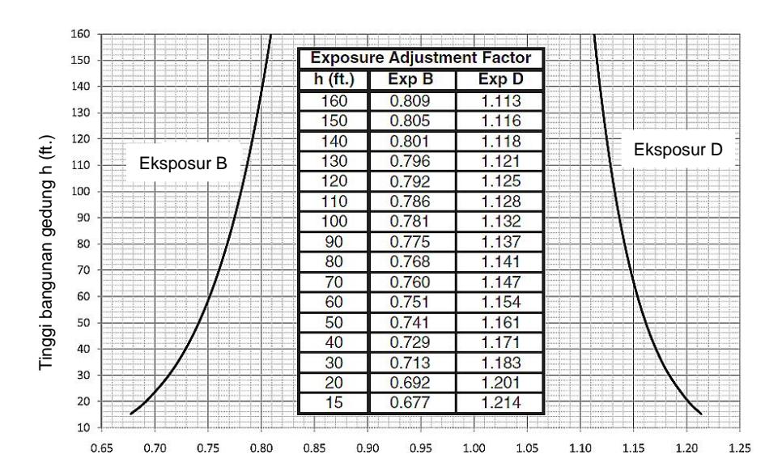

Faktor penyesuaian eksposur

**Tabel 27.5-2 (Lanjutan) - Sistem Penahan Gaya Angin Utama, Bagian 2 [***h* **≤ 160 ft (***h* **≤ 48.8m)]: bangunan gedung diafragma sederhana tertutup tekanan angin atap**

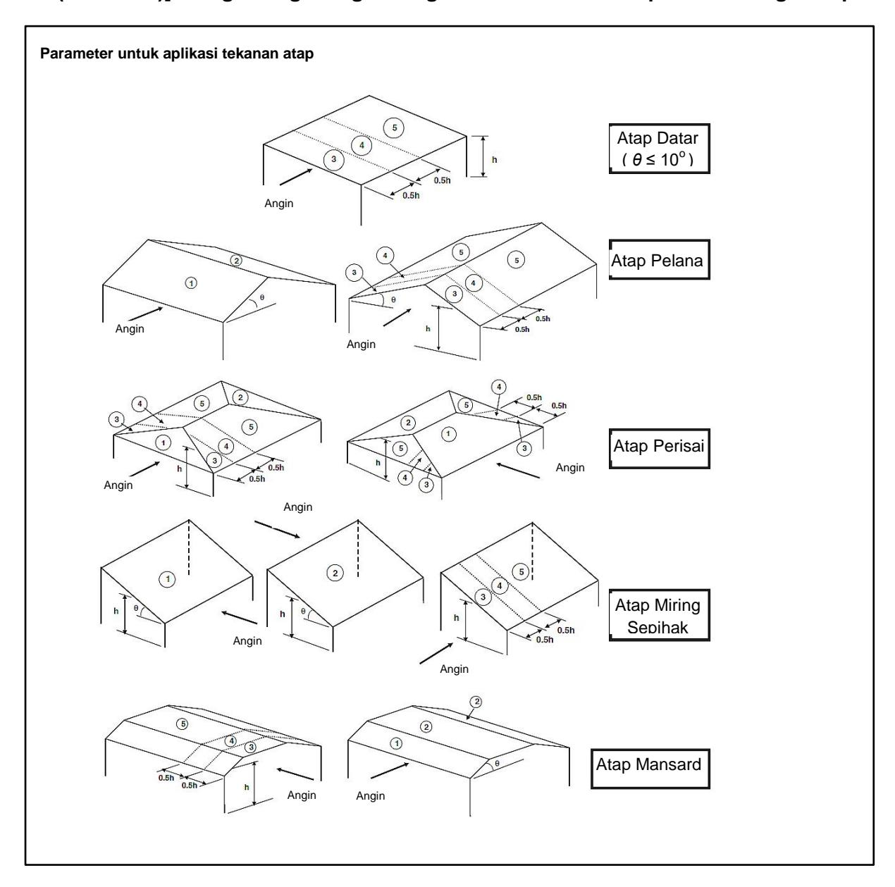

Tabel 27.5-2 (Lanjutan) - Sistem Penahan Gaya Angin Utama, Bagian 2 [ $h \le 160$  ft ( $h \le 48,8$  m)]: bangunan gedung diafragma sederhana tertutup tekanan angin atap Eksposur C : h = 140 - 160 ft, V = 110-120 mi/h

|        |                     |      |       |       | ,     |       | Ī     |       |       | V (mi/h) |       |       |       |       |       |       |       |
|--------|---------------------|------|-------|-------|-------|-------|-------|-------|-------|----------|-------|-------|-------|-------|-------|-------|-------|
|        |                     |      |       |       | 110   |       | 1     |       |       | 115      |       |       |       |       | 120   |       |       |
|        | Poof Slope          | Load |       |       | Zone  |       |       |       |       | Zone     |       |       |       |       | Zone  |       |       |
| h (ft) | adoic joon          | Case | 1     | 2     | 3     | 4     | 2     | 1     | 2     | 3        | 4     | 2     | 1     | 2     | 3     | 4     | 10    |
| 160    | Flat < 2:12 (9.46°) | 1    | NA    | NA    | -39.0 | -34.8 | -28.5 | NA    | NA    | -42.6    | -38.0 | -31.2 | NA    | NA    | -46.4 | -41.4 | -33.9 |
|        |                     | 2    | NA    | NA    | 0.0   | 0.0   | 0.0   | NA    | NA    | 0.0      | 0.0   | 0.0   | NA    | NA    | 0.0   | 0.0   | 0.0   |
|        | 3:12 (14.0°)        | 1    | -38.3 | -26.0 | -39.0 | -34.8 | -28.5 | -41.8 | -30.1 | -42.6    | -38.0 | -31.2 | -45.5 | -31.0 | -46.4 | -41.4 | -33.9 |
|        |                     | 2    | 5.5   | -7.8  | 0.0   | 0.0   | 0.0   | 0.9   | -8.5  | 0.0      | 0.0   | 0.0   | 9.9   | -9.2  | 0.0   | 0.0   | 0.0   |
|        | 4:12 (18.4°)        | 1    | -31.5 | -25.4 | -39.0 | -34.8 | -28.5 | -34.4 | -27.7 | -42.6    | -38.0 | -31.2 | -37.4 | -30.2 | -46.4 | -41.4 | -33.9 |
|        |                     | 2    | 10.9  | -11.1 | 0.0   | 0.0   | 0.0   | 11.9  | -12.2 | 0.0      | 0.0   | 0.0   | 13.0  | -13.3 | 0.0   | 0.0   | 0.0   |
|        | 5:12 (22.6°)        | 1    | -25.2 | -25.4 | -39.0 | -34.8 | -28.5 | -27.6 | -27.7 | -42.6    | -38.0 | -31.2 | -30.0 | -30.2 | 46.4  | -41.4 | -33.9 |
|        |                     | 2    | 14.5  | -12.1 | 0.0   | 0.0   | 0.0   | 15.8  | -13.3 | 0.0      | 0.0   | 0.0   | 17.3  | -14.4 | 0.0   | 0.0   | 0.0   |
|        | 6:12 (26.6°)        | 1    | -20.3 | -25.4 | -39.0 | -34.8 | -28.5 | -22.2 | -27.7 | -42.6    | -38.0 | -31.2 | -24.1 | -30.2 | -46.4 | -41.4 | -33.9 |
|        |                     | 2    | 16.0  | -12.1 | 0.0   | 0.0   | 0.0   | 17.5  | -13.3 | 0.0      | 0.0   | 0.0   | 19.0  | -14.4 | 0.0   | 0.0   | 0.0   |
|        | 9:12 (36.9°)        | 1    | -11.7 | -25.4 | -39.0 | -34.8 | -28.5 | -12.8 | -27.7 | -42.6    | -38.0 | -31.2 | -14.0 | -30.2 | -46.4 | -41.4 | -33.9 |
|        |                     | 2    | 19.1  | -12.1 | 0.0   | 0.0   | 0.0   | 20.9  | -13.3 | 0.0      | 0.0   | 0.0   | 22.8  | -14.4 | 0.0   | 0.0   | 0.0   |
|        | 12:12 (45.0°)       | -    | 9.9-  | -25.4 | -39.0 | -34.8 | -28.5 | -7.2  | -27.7 | -42.6    | -38.0 | -31.2 | 6.7-  | -30.2 | -46.4 | -41.4 | -33.9 |
|        |                     | 2    | 19.1  | -12.1 | 0.0   | 0.0   | 0.0   | 20.9  | -13.3 | 0.0      | 0.0   | 0.0   | 22.8  | -14.4 | 0.0   | 0.0   | 0.0   |
| 150    | Flat < 2:12 (9.46°) | 1    | NA    | NA    | -38.5 | -34.3 | -28.1 | NA    | NA    | -42.0    | -37.5 | -30.7 | NA    | NA    | -45.8 | -40.8 | -33.5 |
|        |                     | 2    | NA    | NA    | 0.0   | 0.0   | 0.0   | NA    | NA    | 0.0      | 0.0   | 0.0   | NA    | NA    | 0.0   | 0.0   | 0.0   |
|        | 3:12 (14.0°)        | 1    | -37.7 | -25.7 | -38.5 | -34.3 | -28.1 | -41.3 | -29.7 | -42.0    | -37.5 | -30.7 | -44.9 | -30.5 | -45.8 | -40.8 | -33.5 |
|        |                     | 2    | 5.4   | 7.7-  | 0.0   | 0.0   | 0.0   | 0.9   | -8.4  | 0.0      | 0.0   | 0.0   | 6.5   | -9.1  | 0.0   | 0.0   | 0.0   |
|        | 4:12 (18.4°)        | 1    | -31.0 | -25.0 | -38.5 | -34.3 | -28.1 | -33.9 | -27.4 | -42.0    | -37.5 | -30.7 | -36.9 | -29.8 | -45.8 | -40.8 | -33.5 |
|        |                     | 2    | 10.7  | -11.0 | 0.0   | 0.0   | 0.0   | 11.7  | -12.0 | 0.0      | 0.0   | 0.0   | 12.8  | -13.1 | 0.0   | 0.0   | 0.0   |
|        | 5:12 (22.6°)        | 1    | -24.9 | -25.0 | -38.5 | -34.3 | -28.1 | -27.2 | -27.4 | -45.0    | -37.5 | -30.7 | -29.6 | -29.8 | 45.8  | -40.8 | -33.5 |
|        |                     | 2    | 14.3  | -12.0 | 0.0   | 0.0   | 0.0   | 15.6  | -13.1 | 0.0      | 0.0   | 0.0   | 17.0  | -14.3 | 0.0   | 0.0   | 0.0   |
|        | 6:12 (26.6°)        | 1    | -20.0 | -25.0 | -38.5 | -34.3 | -28.1 | -21.9 | -27.4 | -42.0    | -37.5 | -30.7 | -23.8 | -29.8 | -45.8 | -40.8 | -33.5 |
|        |                     | 2    | 15.8  | -12.0 | 0.0   | 0.0   | 0.0   | 17.3  | -13.1 | 0.0      | 0.0   | 0.0   | 18.8  | -14.3 | 0.0   | 0.0   | 0.0   |
|        | 9:12 (36.9°)        | 1    | -11.6 | -25.0 | -38.5 | -34.3 | -28.1 | -12.7 | -27.4 | -42.0    | -37.5 | -30.7 | -13.8 | -29.8 | -45.8 | -40.8 | -33.5 |
|        |                     | 2    | 18.9  | -12.0 | 0.0   | 0.0   | 0.0   | 20.6  | -13.1 | 0.0      | 0.0   | 0.0   | 22.5  | -14.3 | 0.0   | 0.0   | 0.0   |
|        | 12:12 (45.0°)       | 1    | -6.5  | -25.0 | -38.5 | -34.3 | -28.1 | -7.1  | -27.4 | -42.0    | -37.5 | -30.7 | -7.8  | -29.8 | -45.8 | -40.8 | -33.5 |
|        |                     | 2    | 18.9  | -12.0 | 0.0   | 0.0   | 0.0   | 20.6  | -13.1 | 0.0      | 0.0   | 0.0   | 22.5  | -14.3 | 0.0   | 0.0   | 0.0   |
| 140    | Flat < 2:12 (9.46°) | 1    | NA    | NA    | -37.9 | -33.8 | 7.72- | NA    | NA    | -41.4    | -36.9 | -30.3 | NA    | NA    | -45.1 | -40.2 | -33.0 |
|        |                     | 2    | NA    | NA    | 0.0   | 0.0   | 0.0   | NA    | NA    | 0.0      | 0.0   | 0.0   | NA    | NA    | 0.0   | 0.0   | 0.0   |
|        | 3:12 (14.0°)        | 1    | -37.2 | -25.3 | -37.9 | -33.8 | -27.7 | -40.7 | -29.3 | -41.4    | -36.9 | -30.3 | -44.3 | -30.1 | -45.1 | -40.2 | -33.0 |
|        |                     | 2    | 5.4   | -7.5  | 0.0   | 0.0   | 0.0   | 5.9   | -8.2  | 0.0      | 0.0   | 0.0   | 6.4   | 0.6-  | 0.0   | 0.0   | 0.0   |
|        | 4:12 (18.4°)        | 1    | -30.6 | -24.7 | -37.9 | -33.8 | -27.7 | -33.4 | -27.0 | -41.4    | -36.9 | -30.3 | -36.4 | -29.4 | -45.1 | -40.2 | -33.0 |
|        |                     | 2    | 9.01  | -10.8 | 0.0   | 0.0   | 0.0   | 11.6  | -11.8 | 0.0      | 0.0   | 0.0   | 12.6  | -12.9 | 0.0   | 0.0   | 0.0   |
|        | 5:12 (22.6°)        | 1    | -24.5 | -24.7 | -37.9 | -33.8 | -27.7 | -26.8 | -27.0 | -41.4    | -36.9 | -30.3 | -29.2 | -29.4 | -45.1 | -40.2 | -33.0 |
|        |                     | 2    | 14.1  | -11.8 | 0.0   | 0.0   | 0.0   | 15.4  | -12.9 | 0.0      | 0.0   | 0.0   | 16.8  | -14.0 | 0.0   | 0.0   | 0.0   |
|        | 6:12 (26.6°)        | 1    | -19.7 | -24.7 | -37.9 | -33.8 | -27.7 | -21.5 | -27.0 | -41.4    | -36.9 | -30.3 | -23.5 | -29.4 | -45.1 | -40.2 | -33.0 |
|        |                     | 2    | 15.6  | -11.8 | 0.0   | 0.0   | 0.0   | 17.0  | -12.9 | 0.0      | 0.0   | 0.0   | 18.5  | -14.0 | 0.0   | 0.0   | 0.0   |
|        | 9:12 (36.9°)        | 1    | -11.4 | -24.7 | -37.9 | -33.8 | -27.7 | -12.5 | -27.0 | -41.4    | -36.9 | -30.3 | -13.6 | -29.4 | -45.1 | -40.2 | -33.0 |
|        |                     | 2    | 18.6  | -11.8 | 0.0   | 0.0   | 0.0   | 20.3  | -12.9 | 0.0      | 0.0   | 0.0   | 22.1  | -14.0 | 0.0   | 0.0   | 0.0   |
|        | 12:12 (45.0°)       | 1    | -6.4  | -24.7 | -37.9 | -33.8 | 7.72- | -7.0  | -27.0 | 41.4     | -36.9 | -30.3 | 7.7-  | -29.4 | -45.1 | -40.2 | -33.0 |
|        |                     | 2    | 18.6  | -11.8 | 0.0   | 0.0   | 0.0   | 20.3  | -12.9 | 0.0      | 0.0   | 0.0   | 22.1  | -14.0 | 0.0   | 0.0   | 0.0   |

Tabel 27.5-2 (Lanjutan) - Sistem Penahan Gaya Angin Utama, Bagian 2 [ $h \le 160$  ft ( $h \le 48,8$  m)]: bangunan gedung diafragma sederhana tertutup tekanan angin atap Eksposur C : h = 140 - 160 ft, V = 130-150 mi/h

| 4         5         1         2           -56.3         -46.2         NA         NA           -0.0         0.0         NA         NA           -0.0         0.0         NA         NA           -56.3         -46.2         -71.1         -48.4           -56.3         -46.2         -71.1         -48.4           -56.3         -46.2         -73.2         -47.2           -0.0         0.0         10.3         -14.4           -56.3         -46.2         -46.9         -47.2           -0.0         0.0         27.0         -22.6           -6.3         -46.2         -37.7         -47.2           -0.0         0.0         27.0         -22.6           -6.3         -46.2         -37.7         -47.2           -0.0         0.0         29.8         -22.6           -0.0         0.0         11.4         -22.6           -0.0         0.0         11.3         -42.2           -0.0         0.0         11.3         -22.6           -0.0         0.0         11.3         -22.3           -0.0         0.0         11.3         -22.3                                                                                                                                                                                                                                                                                                                                                                                                                                                                                                       |        |                     |      |       |       |       |       |       |       |       | V (mi/h) |       |       |       |       |       |       |       |
|-------------------------------------------------------------------------------------------------------------------------------------------------------------------------------------------------------------------------------------------------------------------------------------------------------------------------------------------------------------------------------------------------------------------------------------------------------------------------------------------------------------------------------------------------------------------------------------------------------------------------------------------------------------------------------------------------------------------------------------------------------------------------------------------------------------------------------------------------------------------------------------------------------------------------------------------------------------------------------------------------------------------------------------------------------------------------------------------------------------------------------------------------------------------------------------------------------------------------------------------------------------------------------------------------------------------------------------------------------------------------------------------------------------------------------------------------------------------------------------------------------------------------------------------------------------|--------|---------------------|------|-------|-------|-------|-------|-------|-------|-------|----------|-------|-------|-------|-------|-------|-------|-------|
| Roof Slope         Load         S one         A one         S one         A one         S one         A one         A one         A one         A one         A one         A one         A one         A one         A one         A one         A one         A one         A one         A one         A one         A one         A one         A one         A one         A one         A one         A one         A one         A one         A one         A one         A one         A one         A one         A one         A one         A one         A one         A one         A one         A one         A one         A one         A one         A one         A one         A one         A one         A one         A one         A one         A one         A one         A one         A one         A one         A one         A one         A one         A one         A one         A one         A one         A one         A one         A one         A one         A one         A one         A one         A one         A one         A one         A one         A one         A one         A one         A one         A one         A one         A one         A one         A one         A one         A one         A one                                                                                                                                                                                                                                                                                 |        |                     |      |       |       | 130   |       |       |       | 6     | 140      |       |       |       |       | 150   |       |       |
| Most Sospet         Case         Case         1         2         3         4         5         1         2         3         4         5         1         2         3         4         5         1         2         3         4         3         4         3         4         3         4         3         4         3         4         3         4         3         4         3         4         3         4         3         4         3         4         3         4         3         4         3         4         3         4         3         4         3         4         3         4         3         4         3         4         3         4         3         4         3         4         3         4         3         4         3         4         3         4         4         3         4         3         4         3         4         3         4         3         4         3         4         3         4         3         4         3         4         3         4         3         4         3         4         3         4         3         4         3                                                                                                                                                                                                                                                                                                                                                                                                                                                 |        | D - C               | Load |       |       | Zone  |       |       |       |       | Zone     |       |       |       |       | Zone  |       |       |
| Part C 2112 (9.46°)         1         NA         NA         ANA         AGS         -56.3         -46.3         AGS         ANA         NA         NA         NA         NA         NA         NA         NA         NA         NA         NA         NA         NA         NA         NA         NA         NA         NA         NA         NA         NA         NA         NA         NA         NA         NA         NA         NA         NA         NA         NA         NA         NA         NA         NA         NA         NA         NA         NA         NA         NA         NA         NA         NA         NA         NA         NA         NA         NA         NA         NA         NA         NA         NA         NA         NA         NA         NA         NA         NA         NA         NA         NA         NA         NA         NA         NA         NA         NA         NA         NA         NA         NA         NA         NA         NA         NA         NA         NA         NA         NA         NA         NA         NA         NA         NA         NA         NA         NA         NA         NA         <                                                                                                                                                                                                                                                                                                                                                                                     | h (ft) | Koot Slope          | Case | 1     | 2     | 3     | 4     | 2     | 1     | 2     | 3        | 4     | 2     | 1     | 2     | 3     | 4     | 21    |
| National Color   Nat National Color   Nat Nat Nat Nat Nat Nat Nat Nat Nat Nat                                                                                                                                                                                                                                                                                                                                                                                                                                                                                                                                                                                                                                                                                                                                                                                                                                                                                                                                                                                                                                                                                                                                                                                                                                                                                                                                                                                                                                                                               | 160    | Flat < 2:12 (9.46°) | 1    | NA    | NA    | -54.5 | -48.6 | -39.8 | NA    | NA    | -63.2    | -56.3 | -46.2 | NA    | NA    | -72.5 | -64.6 | -53.0 |
| 3412 (444)         1         534 - 4843         -545         -486         -398         620         -421         -553         -563         -615         -711         4484           412 (1847)         1         -534 - 4843         -546         -998         -510         -411         630         -600         00         00         00         00         10         13         -144           412 (1344)         1         -439         -535         -486         -998         -100         -600         00         00         00         00         00         00         00         00         00         00         00         00         00         00         00         00         00         00         00         00         00         00         00         00         00         00         00         00         00         00         00         00         00         00         00         00         00         00         00         00         00         00         00         00         00         00         00         00         00         00         00         00         00         00         00         00         00         00         00<                                                                                                                                                                                                                                                                                                                                                                              |        |                     | 2    | NA    | NA    | 0.0   | 0.0   | 0.0   | NA    | NA    | 0.0      | 0.0   | 0.0   | NA    | NA    | 0.0   | 0.0   | 0.0   |
| Head                                                                                                                                                                                                                                                                                                                                                                                                                                                                                                                                                                                                                                                                                                                                                                                                                                                                                                                                                                                                                                                                                                                                                                                                                                                                                                                                                                                                                                                                                                                                                        |        | 3:12 (14.0°)        | 1    | -53.4 | -36.3 | -54.5 | -48.6 | -39.8 | -62.0 | -42.1 | -63.2    | -56.3 | -46.2 | -71.1 | -48.4 | -72.5 | -64.6 | -53.0 |
| 412 (18.4°)         1         45.9         -58.5         -48.6         -98.5         51.0         -41.1         -53.2         -56.5         -48.5         -58.5         -40.0         17.0         -61.1         -62.2         -56.3         -46.2         -58.5         -40.0         -40.0         -40.0         -60.0         00.0         00.0         00.0         00.0         00.0         00.0         00.0         00.0         00.0         00.0         00.0         00.0         00.0         00.0         00.0         00.0         00.0         00.0         00.0         00.0         00.0         00.0         00.0         00.0         00.0         00.0         00.0         00.0         00.0         00.0         00.0         00.0         00.0         00.0         00.0         00.0         00.0         00.0         00.0         00.0         00.0         00.0         00.0         00.0         00.0         00.0         00.0         00.0         00.0         00.0         00.0         00.0         00.0         00.0         00.0         00.0         00.0         00.0         00.0         00.0         00.0         00.0         00.0         00.0         00.0         00.0         00.0         00.0 <th< th=""><th></th><th></th><th>2</th><th>7.7</th><th>-10.8</th><th>0.0</th><th>0.0</th><th>0.0</th><th>8.9</th><th>-12.6</th><th>0.0</th><th>0.0</th><th>0.0</th><th>10.3</th><th>-14.4</th><th>0.0</th><th>0.0</th><th>0.0</th></th<>                                                                       |        |                     | 2    | 7.7   | -10.8 | 0.0   | 0.0   | 0.0   | 8.9   | -12.6 | 0.0      | 0.0   | 0.0   | 10.3  | -14.4 | 0.0   | 0.0   | 0.0   |
| $ \begin{array}{c c c c c c c c c c c c c c c c c c c $                                                                                                                                                                                                                                                                                                                                                                                                                                                                                                                                                                                                                                                                                                                                                                                                                                                                                                                                                                                                                                                                                                                                                                                                                                                                                                                                                                                                                                                                                                     |        | 4:12 (18.4°)        | 1    | -43.9 | -35.5 | -54.5 | -48.6 | -39.8 | -51.0 | -41.1 | -63.2    | -56.3 | -46.2 | -58.5 | 47.2  | -72.5 | -64.6 | -53.0 |
| 5:12 (2.2.¢°)         1         -35.2         -34.5         -34.6         -38.6         -38.9         -40.9         -41.1         -65.2         -66.2         -46.9         -41.2         -61.2         -66.2         -46.9         -41.1         -62.2         -66.2         -45.5         -44.2         -48.6         -39.8         -19.7         -00         00         23.5         -19.7         00         00         20.9         -22.8         -41.1         -62.2         -66.2         -46.2         -37.7         -42.2         -46.2         -47.7         -40.0         20.0         20.0         00         00         00         00         00         00         00         00         00         00         00         00         00         00         00         00         00         00         00         00         00         00         00         00         00         00         00         00         00         00         00         00         00         00         00         00         00         00         00         00         00         00         00         00         00         00         00         00         00         00         00         00         00 </th <th></th> <th></th> <th>7</th> <th>15.2</th> <th>-15.6</th> <th>0.0</th> <th>0.0</th> <th>0.0</th> <th>17.6</th> <th>-18.1</th> <th>0.0</th> <th>0.0</th> <th>0.0</th> <th>20.2</th> <th>-20.7</th> <th>0.0</th> <th>0.0</th> <th>0.0</th>                                                                                               |        |                     | 7    | 15.2  | -15.6 | 0.0   | 0.0   | 0.0   | 17.6  | -18.1 | 0.0      | 0.0   | 0.0   | 20.2  | -20.7 | 0.0   | 0.0   | 0.0   |
| $ \begin{array}{c ccccccccccccccccccccccccccccccccccc$                                                                                                                                                                                                                                                                                                                                                                                                                                                                                                                                                                                                                                                                                                                                                                                                                                                                                                                                                                                                                                                                                                                                                                                                                                                                                                                                                                                                                                                                                                      |        | 5:12 (22.6°)        | 1    | -35.2 | -35.5 | -54.5 | -48.6 | -39.8 | 6.04  | -41.1 | -63.2    | -56.3 | -46.2 | -46.9 | 47.2  | -72.5 | -64.6 | -53.0 |
| 6:12 (3.6.6°)         1         2.8.3         -5.4.5         -4.8.6         -9.9.8         -4.9.1         6.3.2         -6.7.1         4.0.2         -5.6.3         -4.0.2         -5.7.3         -4.0.1         6.3.2         -6.7.1         -6.7.2         -6.7.1         -6.7.2         -6.7.1         -6.7.2         -6.7.1         -6.7.2         -6.7.1         -6.7.2         -6.7.2         -6.7.2         -6.7.2         -6.7.2         -6.7.2         -6.7.2         -6.7.2         -6.7.2         -6.7.2         -6.7.2         -6.7.2         -6.7.2         -6.7.2         -6.7.2         -6.7.2         -6.7.2         -6.7.2         -6.7.2         -6.7.2         -6.7.2         -6.7.2         -6.7.2         -6.7.2         -6.7.2         -6.7.2         -6.7.2         -6.7.2         -6.7.2         -6.7.2         -6.7.2         -6.7.2         -6.7.2         -6.7.2         -6.7.2         -6.7.2         -6.7.2         -6.7.2         -6.7.2         -6.7.2         -6.7.2         -6.7.2         -6.7.2         -6.7.2         -6.7.2         -6.7.2         -6.7.2         -6.7.2         -6.7.2         -6.7.2         -6.7.2         -6.7.2         -6.7.2         -6.7.2         -6.7.2         -6.7.2         -6.7.2         -6.7.2         -6.7.2         -6.7.2         -6.7.2 <th></th> <th></th> <th>2</th> <th>20.2</th> <th>-17.0</th> <th>0.0</th> <th>0.0</th> <th>0.0</th> <th>23.5</th> <th>-19.7</th> <th>0.0</th> <th>0.0</th> <th>0.0</th> <th>27.0</th> <th>-22.6</th> <th>0.0</th> <th>0.0</th> <th>0.0</th> |        |                     | 2    | 20.2  | -17.0 | 0.0   | 0.0   | 0.0   | 23.5  | -19.7 | 0.0      | 0.0   | 0.0   | 27.0  | -22.6 | 0.0   | 0.0   | 0.0   |
| $ \begin{array}{c ccccccccccccccccccccccccccccccccccc$                                                                                                                                                                                                                                                                                                                                                                                                                                                                                                                                                                                                                                                                                                                                                                                                                                                                                                                                                                                                                                                                                                                                                                                                                                                                                                                                                                                                                                                                                                      |        | 6:12 (26.6°)        | 1    | -28.3 | -35.5 | -54.5 | -48.6 | -39.8 | -32.8 | -41.1 | -63.2    | -56.3 | -46.2 | -37.7 | 47.2  | -72.5 | -64.6 | -53.0 |
| 9:12 (%6.9)         1         -164         -355         -545         -486         -998         -190         -411         -653         -462         -212         -412           13:12 (45.0°)         1         -164         -355         -345         -348         -398         -107         -107         -00         -00         310         -197         -00         -00         00         00         00         00         00         00         00         00         00         00         00         00         00         00         00         00         00         00         00         00         00         00         00         00         00         00         00         00         00         00         00         00         00         00         00         00         00         00         00         00         00         00         00         00         00         00         00         00         00         00         00         00         00         00         00         00         00         00         00         00         00         00         00         00         00         00         00         00         00         00                                                                                                                                                                                                                                                                                                                                                                                |        |                     | 7    | 22.4  | -17.0 | 0.0   | 0.0   | 0.0   | 25.9  | -19.7 | 0.0      | 0.0   | 0.0   | 29.8  | -22.6 | 0.0   | 0.0   | 0.0   |
|                                                                                                                                                                                                                                                                                                                                                                                                                                                                                                                                                                                                                                                                                                                                                                                                                                                                                                                                                                                                                                                                                                                                                                                                                                                                                                                                                                                                                                                                                                                                                             |        | 9:12 (36.9°)        | 1    | -16.4 | -35.5 | -54.5 | -48.6 | -39.8 | -19.0 | -41.1 | -63.2    | -56.3 | -46.2 | -21.8 | -47.2 | -72.5 | -64.6 | -53.0 |
|                                                                                                                                                                                                                                                                                                                                                                                                                                                                                                                                                                                                                                                                                                                                                                                                                                                                                                                                                                                                                                                                                                                                                                                                                                                                                                                                                                                                                                                                                                                                                             |        |                     | 2    | 26.7  | -17.0 | 0.0   | 0.0   | 0.0   | 31.0  | -19.7 | 0.0      | 0.0   | 0.0   | 11.4  | -22.6 | 0.0   | 0.0   | 0.0   |
| $ \begin{array}{c ccccccccccccccccccccccccccccccccccc$                                                                                                                                                                                                                                                                                                                                                                                                                                                                                                                                                                                                                                                                                                                                                                                                                                                                                                                                                                                                                                                                                                                                                                                                                                                                                                                                                                                                                                                                                                      |        | 12:12 (45.0°)       | 1    | -9.2  | -35.5 | -54.5 | -48.6 | -39.8 | -10.7 | -41.1 | -63.2    | -56.3 | -46.2 | -12.3 | -47.2 | -72.5 | -64.6 | -53.0 |
| Flat < $2.12$ (9.46°)         1         NA         NA         -53.7         -47.9         -39.3         NA         NA         -62.3         -55.6         -45.6         -45.6         NA         NA           3.12 (14.0°)         1         NA         -70.         -70.         -00         0.0         0.0         0.0         0.0         0.0         0.0         0.0         0.0         0.0         0.0         0.0         0.0         0.0         0.0         0.0         0.0         0.0         0.0         0.0         0.0         0.0         0.0         0.0         0.0         0.0         0.0         0.0         0.0         0.0         0.0         0.0         0.0         0.0         0.0         0.0         0.0         0.0         0.0         0.0         0.0         0.0         0.0         0.0         0.0         0.0         0.0         0.0         0.0         0.0         0.0         0.0         0.0         0.0         0.0         0.0         0.0         0.0         0.0         0.0         0.0         0.0         0.0         0.0         0.0         0.0         0.0         0.0         0.0         0.0         0.0         0.0         0.0         0.0         <                                                                                                                                                                                                                                                                                                                                                 |        |                     | 2    | 26.7  | -17.0 | 0.0   | 0.0   | 0.0   | 31.0  | -19.7 | 0.0      | 0.0   | 0.0   | 35.6  | -22.6 | 0.0   | 0.0   | 0.0   |
| 3.12 (14.0°)         1 $-22.7$ $-35.8$ $-37.7$ $-47.9$ $-90.9$ $-60.0$ $-60.0$ $-60.0$ $-60.0$ $-60.0$ $-60.0$ $-60.0$ $-60.0$ $-60.0$ $-60.0$ $-60.0$ $-60.0$ $-60.0$ $-60.0$ $-60.0$ $-60.0$ $-60.0$ $-60.0$ $-60.0$ $-60.0$ $-60.0$ $-60.0$ $-60.0$ $-60.0$ $-60.0$ $-60.0$ $-60.0$ $-60.0$ $-60.0$ $-60.0$ $-60.0$ $-60.0$ $-60.0$ $-60.0$ $-60.0$ $-60.0$ $-60.0$ $-60.0$ $-60.0$ $-60.0$ $-60.0$ $-60.0$ $-60.0$ $-60.0$ $-60.0$ $-60.0$ $-60.0$ $-60.0$ $-60.0$ $-60.0$ $-60.0$ $-60.0$ $-60.0$ $-60.0$ $-60.0$ $-60.0$ $-60.0$ $-60.0$ $-60.0$ $-60.0$ $-60.0$ $-60.0$ $-60.0$ $-60.0$ $-60.0$ $-60.0$ $-60.0$ $-60.0$ $-60.0$ $-60.0$ $-60.0$ $-60.0$ $-60.0$ $-60.0$ <t< th=""><th>150</th><th>Flat &lt; 2:12 (9.46°)</th><th>1</th><th>NA</th><th>NA</th><th>-53.7</th><th>6.74</th><th>-39.3</th><th>NA</th><th>NA</th><th>-62.3</th><th>-55.6</th><th>-45.6</th><th>NA</th><th>NA</th><th>-71.5</th><th>-63.8</th><th>-52.3</th></t<>                                                                                                                                                                                                                                                                                                                                                                                                                                                                                                                                                                                                          | 150    | Flat < 2:12 (9.46°) | 1    | NA    | NA    | -53.7 | 6.74  | -39.3 | NA    | NA    | -62.3    | -55.6 | -45.6 | NA    | NA    | -71.5 | -63.8 | -52.3 |
| 3:12 (14.0°)         1 $-52.7$ $-53.8$ $-47.9$ $-93.3$ $-61.1$ $-41.6$ $-62.3$ $-55.6$ $-45.6$ $-45.6$ $-47.6$ $-47.9$ $-47.9$ $-47.9$ $-47.9$ $-47.9$ $-47.9$ $-47.9$ $-47.9$ $-47.9$ $-47.9$ $-47.9$ $-47.9$ $-47.9$ $-47.9$ $-47.9$ $-47.9$ $-47.9$ $-47.9$ $-47.9$ $-47.9$ $-47.9$ $-47.9$ $-47.9$ $-47.9$ $-47.9$ $-47.9$ $-47.9$ $-47.9$ $-47.9$ $-47.9$ $-47.9$ $-47.9$ $-47.9$ $-47.9$ $-47.9$ $-47.9$ $-47.9$ $-47.9$ $-47.9$ $-47.9$ $-47.9$ $-47.9$ $-47.9$ $-47.9$ $-47.9$ $-47.9$ $-47.9$ $-47.9$ $-47.9$ $-47.9$ $-47.9$ $-47.9$ $-47.9$ $-47.9$ $-47.9$ $-47.9$ $-47.9$ $-47.9$ $-47.9$ $-47.9$ $-47.9$ $-47.9$ $-47.9$ $-47.9$ $-47.9$ $-47.9$ $-47.9$ $-47.9$ <t< th=""><th></th><th></th><th>2</th><th>NA</th><th>NA</th><th>0.0</th><th>0.0</th><th>0.0</th><th>NA</th><th>NA</th><th>0.0</th><th>0.0</th><th>0.0</th><th>NA</th><th>NA</th><th>0.0</th><th>0.0</th><th>0.0</th></t<>                                                                                                                                                                                                                                                                                                                                                                                                                                                                                                                                                                                                                                                    |        |                     | 2    | NA    | NA    | 0.0   | 0.0   | 0.0   | NA    | NA    | 0.0      | 0.0   | 0.0   | NA    | NA    | 0.0   | 0.0   | 0.0   |
| 4:12 (18.4°)         1 $-1.0.7$ $0.0$ $0.0$ $0.0$ $0.0$ $0.0$ $0.0$ $0.0$ $0.0$ $0.0$ $0.0$ $0.0$ $0.0$ $0.0$ $0.0$ $0.0$ $0.0$ $0.0$ $0.0$ $0.0$ $0.0$ $0.0$ $0.0$ $0.0$ $0.0$ $0.0$ $0.0$ $0.0$ $0.0$ $0.0$ $0.0$ $0.0$ $0.0$ $0.0$ $0.0$ $0.0$ $0.0$ $0.0$ $0.0$ $0.0$ $0.0$ $0.0$ $0.0$ $0.0$ $0.0$ $0.0$ $0.0$ $0.0$ $0.0$ $0.0$ $0.0$ $0.0$ $0.0$ $0.0$ $0.0$ $0.0$ $0.0$ $0.0$ $0.0$ $0.0$ $0.0$ $0.0$ $0.0$ $0.0$ $0.0$ $0.0$ $0.0$ $0.0$ $0.0$ $0.0$ $0.0$ $0.0$ $0.0$ $0.0$ $0.0$ $0.0$ $0.0$ $0.0$ $0.0$ $0.0$ $0.0$ $0.0$ $0.0$ $0.0$ $0.0$ $0.0$                                                                                                                                                                                                                                                                                                                                                                                                                                                                                                                                                                                                                                                                                                                                                                                                                                                                                                                                                                                               |        | 3:12 (14.0°)        | 1    | -52.7 | -35.8 | -53.7 | -47.9 | -39.3 | -61.1 | -41.6 | -62.3    | -55.6 | -45.6 | -70.2 | -47.7 | -71.5 | -63.8 | -52.3 |
| 4:12 (18.4°)         1 $43.3$ $-35.0$ $-37.7$ $-47.9$ $-39.3$ $-30.3$ $-40.6$ $-62.3$ $-55.6$ $-45.6$ $-45.6$ $-45.6$ $-45.6$ $-45.6$ $-45.6$ $-45.6$ $-45.6$ $-45.6$ $-45.6$ $-45.6$ $-45.6$ $-45.6$ $-45.6$ $-45.6$ $-45.6$ $-45.6$ $-45.6$ $-45.6$ $-45.6$ $-45.6$ $-45.6$ $-45.6$ $-45.6$ $-45.6$ $-45.6$ $-45.6$ $-45.6$ $-45.6$ $-45.6$ $-45.6$ $-45.6$ $-45.6$ $-45.6$ $-45.6$ $-45.6$ $-45.6$ $-45.6$ $-45.6$ $-45.6$ $-45.6$ $-45.6$ $-45.6$ $-45.6$ $-45.6$ $-45.6$ $-45.6$ $-45.6$ $-45.6$ $-45.6$ $-45.6$ $-45.6$ $-45.6$ $-45.6$ $-45.6$ $-45.6$ $-45.6$ $-45.6$ $-45.6$ $-45.6$ $-45.6$ $-45.6$ $-45.6$ $-45.6$ $-45.6$ $-45.6$ $-45.6$ $-45.6$ $-45.6$ $-45.6$ <th< th=""><th></th><th></th><th>2</th><th>7.6</th><th>-10.7</th><th>0.0</th><th>0.0</th><th>0.0</th><th>8.8</th><th>-12.4</th><th>0.0</th><th>0.0</th><th>0.0</th><th>10.1</th><th>-14.2</th><th>0.0</th><th>0.0</th><th>0.0</th></th<>                                                                                                                                                                                                                                                                                                                                                                                                                                                                                                                                                                                                                                      |        |                     | 2    | 7.6   | -10.7 | 0.0   | 0.0   | 0.0   | 8.8   | -12.4 | 0.0      | 0.0   | 0.0   | 10.1  | -14.2 | 0.0   | 0.0   | 0.0   |
| 5:12(22.6°)         1 $-15.4$ $0.0$ $0.0$ $0.0$ $0.0$ $0.0$ $0.0$ $0.0$ $0.0$ $0.0$ $0.0$ $0.0$ $0.0$ $0.0$ $0.0$ $0.0$ $0.0$ $0.0$ $0.0$ $0.0$ $0.0$ $0.0$ $0.0$ $0.0$ $0.0$ $0.0$ $0.0$ $0.0$ $0.0$ $0.0$ $0.0$ $0.0$ $0.0$ $0.0$ $0.0$ $0.0$ $0.0$ $0.0$ $0.0$ $0.0$ $0.0$ $0.0$ $0.0$ $0.0$ $0.0$ $0.0$ $0.0$ $0.0$ $0.0$ $0.0$ $0.0$ $0.0$ $0.0$ $0.0$ $0.0$ $0.0$ $0.0$ $0.0$ $0.0$ $0.0$ $0.0$ $0.0$ $0.0$ $0.0$ $0.0$ $0.0$ $0.0$ $0.0$ $0.0$ $0.0$ $0.0$ $0.0$ $0.0$ $0.0$ $0.0$ $0.0$ $0.0$ $0.0$ $0.0$ $0.0$ $0.0$ $0.0$ $0.0$ $0.0$ $0.0$ $0.0$                                                                                                                                                                                                                                                                                                                                                                                                                                                                                                                                                                                                                                                                                                                                                                                                                                                                                                                                                                                                 |        | 4:12 (18.4°)        | 1    | -43.3 | -35.0 | -53.7 | 6.74  | -39.3 | -50.3 | -40.6 | -62.3    | -55.6 | -45.6 | -57.7 | -46.6 | -71.5 | -63.8 | -52.3 |
| 5:12 (2.2.6°)         1 $-34.8$ $-35.0$ $-35.7$ $-47.9$ $-39.3$ $-40.0$ $-60.2$ $-55.6$ $-45.6$ $-46.5$ $-46.5$ $-46.5$ $-46.5$ $-46.5$ $-46.5$ $-46.5$ $-46.5$ $-46.5$ $-46.5$ $-46.5$ $-46.5$ $-46.5$ $-46.5$ $-46.5$ $-46.5$ $-46.5$ $-46.5$ $-46.5$ $-46.5$ $-46.5$ $-46.5$ $-46.5$ $-46.5$ $-46.5$ $-46.5$ $-46.5$ $-46.5$ $-46.5$ $-46.5$ $-46.5$ $-46.5$ $-46.5$ $-46.5$ $-46.5$ $-46.5$ $-46.5$ $-46.5$ $-46.5$ $-46.5$ $-46.5$ $-46.5$ $-46.5$ $-46.5$ $-46.5$ $-46.5$ $-46.5$ $-46.5$ $-46.5$ $-46.5$ $-46.5$ $-46.5$ $-46.5$ $-46.5$ $-46.5$ $-46.5$ $-46.5$ $-46.5$ $-46.5$ $-46.5$ $-46.5$ $-46.5$ $-46.5$ $-46.5$ $-46.5$ $-46.5$ $-46.5$ $-46.5$ $-46.5$ $-46.5$ <                                                                                                                                                                                                                                                                                                                                                                                                                                                                                                                                                                                                                                                                                                                                                                                                                                                                           |        |                     | 2    | 15.0  | -15.4 | 0.0   | 0.0   | 0.0   | 17.4  | -17.8 | 0.0      | 0.0   | 0.0   | 20.0  | -20.4 | 0.0   | 0.0   | 0.0   |
| 6:12 (36.6°)         1 $-16.7$ $0.0$ $0.0$ $0.0$ $0.0$ $0.0$ $0.0$ $0.0$ $0.0$ $0.0$ $0.0$ $0.0$ $0.0$ $0.0$ $0.0$ $0.0$ $0.0$ $0.0$ $0.0$ $0.0$ $0.0$ $0.0$ $0.0$ $0.0$ $0.0$ $0.0$ $0.0$ $0.0$ $0.0$ $0.0$ $0.0$ $0.0$ $0.0$ $0.0$ $0.0$ $0.0$ $0.0$ $0.0$ $0.0$ $0.0$ $0.0$ $0.0$ $0.0$ $0.0$ $0.0$ $0.0$ $0.0$ $0.0$ $0.0$ $0.0$ $0.0$ $0.0$ $0.0$ $0.0$ $0.0$ $0.0$ $0.0$ $0.0$ $0.0$ $0.0$ $0.0$ $0.0$ $0.0$ $0.0$ $0.0$ $0.0$ $0.0$ $0.0$ $0.0$ $0.0$ $0.0$ $0.0$ $0.0$ $0.0$ $0.0$ $0.0$ $0.0$ $0.0$ $0.0$ $0.0$ $0.0$ $0.0$ $0.0$ $0.0$ $0.0$ $0.0$                                                                                                                                                                                                                                                                                                                                                                                                                                                                                                                                                                                                                                                                                                                                                                                                                                                                                                                                                                                                |        | 5:12 (22.6°)        | 1    | -34.8 | -35.0 | -53.7 | 6.74  | -39.3 | -40.3 | -40.6 | -62.3    | -55.6 | -45.6 | -46.3 | -46.6 | -71.5 | -63.8 | -52.3 |
| 6:12 (36.6°)         1 $-27.9$ $-35.0$ $-35.7$ $-47.9$ $-39.3$ $-32.4$ $-40.6$ $-62.3$ $-55.6$ $-45.6$ $-45.6$ $-45.6$ $-45.6$ $-45.6$ $-45.6$ $-45.6$ $-45.6$ $-45.6$ $-45.6$ $-45.6$ $-45.6$ $-45.6$ $-45.6$ $-45.6$ $-45.6$ $-45.6$ $-45.6$ $-45.6$ $-45.6$ $-45.6$ $-45.6$ $-45.6$ $-45.6$ $-45.6$ $-45.6$ $-45.6$ $-45.6$ $-45.6$ $-45.6$ $-45.6$ $-45.6$ $-45.6$ $-45.6$ $-45.6$ $-45.6$ $-45.6$ $-45.6$ $-45.6$ $-45.6$ $-45.6$ $-45.6$ $-45.6$ $-45.6$ $-45.6$ $-45.6$ $-45.6$ $-45.6$ $-45.6$ $-45.6$ $-45.6$ $-45.6$ $-45.6$ $-45.6$ $-45.6$ $-45.6$ $-45.6$ $-45.6$ $-45.6$ $-45.6$ $-45.6$ $-45.6$ $-45.6$ $-45.6$ $-45.6$ $-45.6$ $-45.6$ $-45.6$ $-45.6$ $-45.6$ <t< th=""><th></th><th></th><th>2</th><th>20.0</th><th>-16.7</th><th>0.0</th><th>0.0</th><th>0.0</th><th>23.2</th><th>-19.4</th><th>0.0</th><th>0.0</th><th>0.0</th><th>26.6</th><th>-22.3</th><th>0.0</th><th>0.0</th><th>0.0</th></t<>                                                                                                                                                                                                                                                                                                                                                                                                                                                                                                                                                                                                                                     |        |                     | 2    | 20.0  | -16.7 | 0.0   | 0.0   | 0.0   | 23.2  | -19.4 | 0.0      | 0.0   | 0.0   | 26.6  | -22.3 | 0.0   | 0.0   | 0.0   |
| 9:12 (36.9°)         1 $-16.7$ 0.0         0.0 $25.6$ $-19.4$ 0.0         0.0 $0.0$ $0.0$ $0.0$ $0.0$ $0.0$ $0.0$ $0.0$ $0.0$ $0.0$ $0.0$ $0.0$ $0.0$ $0.0$ $0.0$ $0.0$ $0.0$ $0.0$ $0.0$ $0.0$ $0.0$ $0.0$ $0.0$ $0.0$ $0.0$ $0.0$ $0.0$ $0.0$ $0.0$ $0.0$ $0.0$ $0.0$ $0.0$ $0.0$ $0.0$ $0.0$ $0.0$ $0.0$ $0.0$ $0.0$ $0.0$ $0.0$ $0.0$ $0.0$ $0.0$ $0.0$ $0.0$ $0.0$ $0.0$ $0.0$ $0.0$ $0.0$ $0.0$ $0.0$ $0.0$ $0.0$ $0.0$ $0.0$ $0.0$ $0.0$ $0.0$ $0.0$ $0.0$ $0.0$ $0.0$ $0.0$ $0.0$ $0.0$ $0.0$ $0.0$ $0.0$ $0.0$ $0.0$ $0.0$ $0.0$ $0.0$ $0.0$ $0.0$ $0.0$ $0.0$ <t< th=""><th></th><th>6:12 (26.6°)</th><th>1</th><th>-27.9</th><th>-35.0</th><th>-53.7</th><th>6.74-</th><th>-39.3</th><th>-32.4</th><th>-40.6</th><th>-62.3</th><th>-55.6</th><th>-45.6</th><th>-37.2</th><th>-46.6</th><th>-71.5</th><th>-63.8</th><th>-52.3</th></t<>                                                                                                                                                                                                                                                                                                                                                                                                                                                                                                                                                                                                                                                                                                           |        | 6:12 (26.6°)        | 1    | -27.9 | -35.0 | -53.7 | 6.74- | -39.3 | -32.4 | -40.6 | -62.3    | -55.6 | -45.6 | -37.2 | -46.6 | -71.5 | -63.8 | -52.3 |
| 9:12 (36.9°)         1 $-16.2$ $-35.0$ $-35.7$ $-47.9$ $-39.3$ $-18.8$ $-40.6$ $-62.3$ $-55.6$ $-45.6$ $-21.5$ $-21.5$ $-21.5$ $-21.5$ $-21.5$ $-21.5$ $-21.5$ $-21.5$ $-21.5$ $-21.5$ $-21.5$ $-21.5$ $-21.5$ $-21.5$ $-21.5$ $-21.5$ $-21.5$ $-21.5$ $-21.5$ $-21.5$ $-21.5$ $-21.5$ $-21.5$ $-21.5$ $-21.5$ $-21.5$ $-21.5$ $-21.5$ $-21.5$ $-21.5$ $-21.5$ $-21.5$ $-21.5$ $-21.5$ $-21.5$ $-21.5$ $-21.5$ $-21.5$ $-21.5$ $-21.5$ $-21.5$ $-21.5$ $-21.5$ $-21.5$ $-21.5$ $-21.5$ $-21.5$ $-21.5$ $-21.5$ $-21.5$ $-21.5$ $-21.5$ $-21.5$ $-21.5$ $-21.5$ $-21.5$ $-21.5$ $-21.5$ $-21.5$ $-21.5$ $-21.5$ $-21.5$ $-21.5$ $-21.5$ $-21.5$ $-21.5$ $-21.5$ $-21.5$ $-21.5$ <t< th=""><th></th><th></th><th>2</th><th>22.1</th><th>-16.7</th><th>0.0</th><th>0.0</th><th>0.0</th><th>25.6</th><th>-19.4</th><th>0.0</th><th>0.0</th><th>0.0</th><th>29.4</th><th>-22.3</th><th>0.0</th><th>0.0</th><th>0.0</th></t<>                                                                                                                                                                                                                                                                                                                                                                                                                                                                                                                                                                                                                                     |        |                     | 2    | 22.1  | -16.7 | 0.0   | 0.0   | 0.0   | 25.6  | -19.4 | 0.0      | 0.0   | 0.0   | 29.4  | -22.3 | 0.0   | 0.0   | 0.0   |
|                                                                                                                                                                                                                                                                                                                                                                                                                                                                                                                                                                                                                                                                                                                                                                                                                                                                                                                                                                                                                                                                                                                                                                                                                                                                                                                                                                                                                                                                                                                                                             |        | 9:12 (36.9°)        | 1    | -16.2 | -35.0 | -53.7 | 6.74  | -39.3 | -18.8 | -40.6 | -62.3    | -55.6 | -45.6 | -21.5 | 9.94  | -71.5 | -63.8 | -52.3 |
| $ \begin{array}{c ccccccccccccccccccccccccccccccccccc$                                                                                                                                                                                                                                                                                                                                                                                                                                                                                                                                                                                                                                                                                                                                                                                                                                                                                                                                                                                                                                                                                                                                                                                                                                                                                                                                                                                                                                                                                                      |        |                     | 2    | 26.4  | -16.7 | 0.0   | 0.0   | 0.0   | 30.6  | -19.4 | 0.0      | 0.0   | 0.0   | 11.3  | -22.3 | 0.0   | 0.0   | 0.0   |
| Flat < 2:12 (9.46°)                                                                                                                                                                                                                                                                                                                                                                                                                                                                                                                                                                                                                                                                                                                                                                                                                                                                                                                                                                                                                                                                                                                                                                                                                                                                                                                                                                                                                                                                                                                                         |        | 12:12 (45.0°)       | 1    | -9.1  | -35.0 | -53.7 | 6.74  | -39.3 | -10.6 | -40.6 | -62.3    | -55.6 | -45.6 | -12.1 | 46.6  | -71.5 | -63.8 | -52.3 |
| Fig1 < 2:12 (9.46°)   1 NA NA   -53.0   -47.2   -38.7 NA   NA   -61.4   -54.8   -44.9 NA   NA   NA   NA   NA   NA   NA   NA                                                                                                                                                                                                                                                                                                                                                                                                                                                                                                                                                                                                                                                                                                                                                                                                                                                                                                                                                                                                                                                                                                                                                                                                                                                                                                                                                                                                                                 |        |                     | 2    | 26.4  | -16.7 | 0.0   | 0.0   | 0.0   | 30.6  | -19.4 | 0.0      | 0.0   | 0.0   | 35.1  | -22.3 | 0.0   | 0.0   | 0.0   |
| 2         NA         NA         0.0         0.0         NA         NA         0.0         NA         NA         NA         NA         NA         NA         NA         NA         NA         NA         NA         NA         NA         NA         NA         NA         NA         NA         NA         NA         NA         NA         NA         NA         NA         NA         NA         NA         NA         NA         NA         NA         NA         NA         NA         NA         NA         NA         NA         NA         NA         NA         NA         NA         NA         NA         NA         NA         NA         NA         NA         NA         NA         NA         NA         NA         NA         NA         NA         NA         NA         NA         NA         NA         NA         NA         NA         NA         NA         NA         NA         NA         NA         NA         NA         NA         NA         NA         NA         NA         NA         NA         NA         NA         NA         NA         NA         NA         NA         NA         NA         NA         NA         N                                                                                                                                                                                                                                                                                                                                                                                                  | 140    | Flat < 2:12 (9.46°) | 1    | NA    | NA    | -53.0 | 47.2  | -38.7 | NA.   | NA    | -61.4    | -54.8 | 44.9  | NA    | NA    | -70.5 | -62.9 | -51.5 |
| 1         -52.0         -35.3         -47.2         -38.7         -60.3         -41.0         -61.4         -54.8         -44.9         -69.2         -47.0           2         7.5         -10.5         0.0         0.0         0.0         0.0         0.0         0.0         10.0         -14.0           1         -42.7         -34.5         -53.0         -47.2         -38.7         -40.0         6.0         0.0         0.0         10.0         -14.9         -58.9         -44.9         -56.9         -45.0           1         -24.7         -34.5         -53.0         -47.2         -38.7         -40.0         6.0         0.0         0.0         10.0         10.0         10.0         10.0         10.0         10.0         10.0         10.0         10.0         10.0         10.0         10.0         10.0         10.0         10.0         10.0         10.0         10.0         10.0         10.0         10.0         10.0         10.0         10.0         10.0         10.0         10.0         10.0         10.0         10.0         10.0         10.0         10.0         10.0         10.0         10.0         10.0         10.0         10.0         10.0         10.                                                                                                                                                                                                                                                                                                                                         |        |                     | 2    | NA    | NA    | 0.0   | 0.0   | 0.0   | NA    | NA    | 0.0      | 0.0   | 0.0   | NA    | NA    | 0.0   | 0.0   | 0.0   |
| 2         7.5         -10.5         0.0         0.0         0.0         8.7         -12.2         0.0         0.0         0.0         10.0         -14.0         -14.0         -14.0         -14.0         -14.0         -14.0         -14.0         -14.0         -14.0         -14.0         -14.0         -14.0         -14.0         -14.0         -14.0         -14.0         -14.0         -14.0         -14.0         -14.0         -14.0         -14.0         -14.0         -14.0         -14.0         -14.0         -14.0         -14.0         -14.0         -14.0         -14.0         -14.0         -14.0         -14.0         -14.0         -14.0         -14.0         -14.0         -14.0         -14.0         -14.0         -14.0         -14.0         -14.0         -14.0         -14.0         -14.0         -14.0         -14.0         -14.0         -14.0         -14.0         -14.0         -14.0         -14.0         -14.0         -14.0         -14.0         -14.0         -14.0         -14.0         -14.0         -14.0         -14.0         -14.0         -14.0         -14.0         -14.0         -14.0         -14.0         -14.0         -14.0         -14.0         -14.0         -14.0         -14.0         -14.0         <                                                                                                                                                                                                                                                                                  |        | 3:12 (14.0°)        | 1    | -52.0 | -35.3 | -53.0 | 47.2  | -38.7 | -60.3 | 41.0  | -61.4    | -54.8 | -44.9 | -69.2 | 47.0  | -70.5 | -62.9 | -51.5 |
| 1         -42.7         -34.5         -36.7         -47.2         -38.7         -49.5         -40.0         -61.4         -54.8         -44.9         -56.9         -45.9           2         14.8         -15.1         0.0         0.0         0.0         17.2         -17.6         0.0         0.0         0.0         17.2         -17.6         0.0         0.0         0.0         0.0         0.0         0.0         0.0         0.0         0.0         0.0         0.0         0.0         0.0         0.0         0.0         0.0         0.0         0.0         0.0         0.0         0.0         0.0         0.0         0.0         0.0         0.0         0.0         0.0         0.0         0.0         0.0         0.0         0.0         0.0         0.0         0.0         0.0         0.0         0.0         0.0         0.0         0.0         0.0         0.0         0.0         0.0         0.0         0.0         0.0         0.0         0.0         0.0         0.0         0.0         0.0         0.0         0.0         0.0         0.0         0.0         0.0         0.0         0.0         0.0         0.0         0.0         0.0         0.0         0                                                                                                                                                                                                                                                                                                                                                    |        |                     | 7    | 7.5   | -10.5 | 0.0   | 0.0   | 0.0   | 8.7   | -12.2 | 0.0      | 0.0   | 0.0   | 10.0  | -14.0 | 0.0   | 0.0   | 0.0   |
| 2         148         -15.1         0.0         0.0         17.2         -17.6         0.0         0.0         0.0         19.7         -20.2           1         -34.3         -34.5         -53.0         -47.2         -38.7         -40.0         -61.4         -54.8         -44.9         -45.6         -45.6           2         19.7         -16.5         0.0         0.0         22.8         -19.1         0.0         0.0         26.2         -21.9           1         -27.5         -34.5         -53.0         -47.2         -38.7         -19.1         0.0         0.0         26.2         -21.9           1         -15.9         -34.5         -53.0         -47.2         -38.7         -19.1         0.0         0.0         20.2         22.19           1         -15.9         -34.5         -53.0         -47.2         -38.7         -19.1         0.0         0.0         20.0         28.9         -21.9           2         26.0         -16.5         0.0         0.0         30.1         -19.1         0.0         0.0         11.1         -21.9           3         26.0         -16.5         0.0         0.0         30.1         -1                                                                                                                                                                                                                                                                                                                                                                                  |        | 4:12 (18.4°)        | -    | 42.7  | -34.5 | -53.0 | -47.2 | -38.7 | -49.5 | -40.0 | -61.4    | -54.8 | 44.9  | -56.9 | 45.9  | -70.5 | -62.9 | -51.5 |
| 1         -34.3         -34.5         -53.0         -47.2         -38.7         -39.7         -40.0         -61.4         -54.8         -44.9         -45.6         -45.9           2         19.7         -16.5         0.0         0.0         22.8         -19.1         0.0         0.0         26.2         -21.9           2         21.7         -16.5         0.0         0.0         25.2         -19.1         0.0         0.0         28.9         -21.9           1         -15.9         -34.5         -53.0         -47.2         -38.7         -19.1         0.0         0.0         28.9         -21.9           2         26.0         -16.5         0.0         0.0         25.2         -40.0         -61.4         -54.8         -44.9         -21.9           2         26.0         -16.5         0.0         0.0         30.1         -19.1         0.0         0.0         0.0         11.1         -21.9           1         -26.0         -16.5         0.0         0.0         30.1         -19.1         0.0         0.0         0.0         11.1         -21.9           2         26.0         -16.5         0.0         0.0         30.1 <th></th> <th></th> <th>2</th> <th>14.8</th> <th>-15.1</th> <th>0.0</th> <th>0.0</th> <th>0.0</th> <th>17.2</th> <th>-17.6</th> <th>0.0</th> <th>0.0</th> <th>0.0</th> <th>19.7</th> <th>-20.2</th> <th>0.0</th> <th>0.0</th> <th>0.0</th>                                                                                                                                          |        |                     | 2    | 14.8  | -15.1 | 0.0   | 0.0   | 0.0   | 17.2  | -17.6 | 0.0      | 0.0   | 0.0   | 19.7  | -20.2 | 0.0   | 0.0   | 0.0   |
| 2         19.7         -16.5         0.0         0.0         22.8         -19.1         0.0         0.0         26.2         -21.9           1         -27.5         -34.5         -33.0         -47.2         -38.7         -31.9         -40.0         -61.4         -54.8         -44.9         -36.6         -21.9           1         -27.5         -34.5         -53.0         -47.2         -38.7         -18.5         -40.0         -61.4         -54.8         -44.9         -36.6         -45.9           2         26.0         -16.5         0.0         0.0         30.1         -19.1         0.0         0.0         0.0         11.1         -21.9           1         -20.         -34.5         -37.0         -47.2         -38.7         -10.4         -0.0         0.0         0.0         11.1         -21.9           1         -9.0         -34.5         -37.0         -47.2         -38.7         -10.4         -61.4         -54.8         -44.9         -12.0         -45.9           2         26.0         -16.5         0.0         0.0         30.1         -19.1         0.0         0.0         30.9         -37.9         -45.8         -49.9         -1                                                                                                                                                                                                                                                                                                                                                                 |        | 5:12 (22.6°)        | 1    | -34.3 | -34.5 | -53.0 | -47.2 | -38.7 | -39.7 | -40.0 | -61.4    | -54.8 | -44.9 | -45.6 | 45.9  | -70.5 | -62.9 | -51.5 |
| 1         -27.5         -34.5         -35.0         -47.2         -38.7         -31.9         -40.0         -61.4         -54.8         -44.9         -36.6         -45.9           2         21.7         -16.5         0.0         0.0         0.0         25.2         -19.1         0.0         0.0         28.9         -21.9           1         -15.9         -34.5         -53.0         -47.2         -38.7         -18.5         -40.0         -61.4         -54.8         -44.9         -21.2         -45.9           2         26.0         -16.5         0.0         0.0         30.1         -40.0         -61.4         -54.8         -44.9         -21.2         -45.9           1         -20.0         -38.5         -47.2         -38.7         -10.4         -40.0         -61.4         -54.8         -44.9         -12.0         -45.9           2         26.0         -16.5         0.0         0.0         30.1         -19.1         0.0         0.0         -45.9         -40.0         -61.4         -54.8         -44.9         -12.0         -45.9           2         26.0         -16.5         0.0         0.0         30.1         -19.1         0.0                                                                                                                                                                                                                                                                                                                                                                      |        |                     | 7    | 19.7  | -16.5 | 0.0   | 0.0   | 0.0   | 22.8  | -19.1 | 0.0      | 0.0   | 0.0   | 26.2  | -21.9 | 0.0   | 0.0   | 0.0   |
| 2         21.7         -16.5         0.0         0.0         0.52         -19.1         0.0         0.0         0.0         28.9         -21.9           1         -15.9         -34.5         -53.0         -47.2         -38.7         -18.5         -40.0         -61.4         -54.8         -44.9         -21.2         -45.9           2         26.0         -16.5         0.0         0.0         30.1         -19.1         0.0         0.0         11.1         -21.2         -45.9           1         -9.0         -34.5         -53.0         -47.2         -38.7         -10.4         -40.0         -61.4         -54.8         -44.9         -12.0         -45.9           2         26.0         -16.5         0.0         0.0         30.1         -19.1         0.0         0.0         34.6         -21.0                                                                                                                                                                                                                                                                                                                                                                                                                                                                                                                                                                                                                                                                                                                               |        | 6:12 (26.6°)        | 1    | -27.5 | -34.5 | -53.0 | -47.2 | -38.7 | -31.9 | -40.0 | -61.4    | -54.8 | -44.9 | -36.6 | -45.9 | -70.5 | -62.9 | -51.5 |
| 1         -15.9         -34.5         -53.0         -47.2         -38.7         -18.5         -40.0         -61.4         -54.8         -44.9         -21.2         -45.9           2         26.0         -16.5         0.0         0.0         30.1         -19.1         0.0         0.0         11.1         -21.2         -45.9           1         -9.0         -34.5         -53.0         -47.2         -38.7         -10.4         -40.0         -61.4         -54.8         -44.9         -12.0         -45.9           2         26.0         -16.5         0.0         0.0         30.1         -19.1         0.0         0.0         34.6         -21.0         -45.9                                                                                                                                                                                                                                                                                                                                                                                                                                                                                                                                                                                                                                                                                                                                                                                                                                                                          |        |                     | 7    | 21.7  | -16.5 | 0.0   | 0.0   | 0.0   | 25.2  | -19.1 | 0.0      | 0.0   | 0.0   | 28.9  | -21.9 | 0.0   | 0.0   | 0.0   |
| 2         26.0         -16.5         0.0         0.0         30.1         -19.1         0.0         0.0         0.0         11.1         -21.9           1         -9.0         -34.5         -53.0         -47.2         -38.7         -10.4         -40.0         -61.4         -54.8         -44.9         -12.0         -45.9           2         26.0         -16.5         0.0         0.0         30.1         -19.1         0.0         0.0         34.6         -21.9                                                                                                                                                                                                                                                                                                                                                                                                                                                                                                                                                                                                                                                                                                                                                                                                                                                                                                                                                                                                                                                                              |        | 9:12 (36.9°)        | 1    | -15.9 | -34.5 | -53.0 | -47.2 | -38.7 | -18.5 | -40.0 | -61.4    | -54.8 | -44.9 | -21.2 | -45.9 | -70.5 | -62.9 | -51.5 |
| 1         -9.0         -34.5         -53.0         -47.2         -38.7         -10.4         -40.0         -61.4         -54.8         -44.9         -12.0         -45.9           2         26.0         -16.5         0.0         0.0         30.1         -19.1         0.0         0.0         34.6         -21.9                                                                                                                                                                                                                                                                                                                                                                                                                                                                                                                                                                                                                                                                                                                                                                                                                                                                                                                                                                                                                                                                                                                                                                                                                                       |        |                     | 7    | 26.0  | -16.5 | 0.0   | 0.0   | 0.0   | 30.1  | -19.1 | 0.0      | 0.0   | 0.0   | 11.1  | -21.9 | 0.0   | 0.0   | 0.0   |
| -16.5   0.0   0.0   0.0   30.1   -19.1   0.0   0.0   0.0   34.6   -21.9                                                                                                                                                                                                                                                                                                                                                                                                                                                                                                                                                                                                                                                                                                                                                                                                                                                                                                                                                                                                                                                                                                                                                                                                                                                                                                                                                                                                                                                                                     |        | 12:12 (45.0°)       | Т    | 0.6-  | -34.5 | -53.0 | -47.2 | -38.7 | -10.4 | -40.0 | -61.4    | -54.8 | -44.9 | -12.0 | 45.9  | -70.5 | -62.9 | -51.5 |
|                                                                                                                                                                                                                                                                                                                                                                                                                                                                                                                                                                                                                                                                                                                                                                                                                                                                                                                                                                                                                                                                                                                                                                                                                                                                                                                                                                                                                                                                                                                                                             |        |                     | 2    | 26.0  | -16.5 | 0.0   | 0.0   | 0.0   | 30.1  | -19.1 | 0.0      | 0.0   | 0.0   | 34.6  | -21.9 | 0.0   | 0.0   | 0.0   |

Tabel 27.5-2 (Lanjutan) - Sistem Penahan Gaya Angin Utama, Bagian 2 [ $h \le 160$  ft ( $h \le 48,8$  m)]: bangunan gedung diafragma sederhana tertutup tekanan angin atap Eksposur C : h = 140 - 160 ft, V = 160-200 mi/h

|      |                     |      |       |       |       |       |       |        |       | V (mi/h) | 500   |       |        |       |        |        |       |
|------|---------------------|------|-------|-------|-------|-------|-------|--------|-------|----------|-------|-------|--------|-------|--------|--------|-------|
|      |                     |      |       |       | 160   |       |       |        |       | 180      |       |       |        |       | 200    |        |       |
| n    | Don't Clane         | Load |       |       | Zone  |       |       |        |       | Zone     |       |       |        |       | Zone   |        |       |
| (ff. | Koot Slope          | Case | 1     | 2     | 3     | 4     | S     | 1      | 2     | 3        | 4     | 5     | 1      | 2     | 3      | 4      | w     |
| 160  | Flat < 2:12 (9.46°) | 1    | NA    | NA    | -82.5 | -73.6 | -60.3 | NA     | NA    | -104.4   | -93.1 | -76.3 | NA     | NA    | -128.9 | -114.9 | -94.3 |
|      |                     | 2    | NA    | NA    | 0.0   | 0.0   | 0.0   | NA     | NA    | 0.0      | 0.0   | 0.0   | NA     | NA    | 0.0    | 0.0    | 0.0   |
|      | 3:12 (14.0°)        | 1    | 6.08- | -583  | -82.5 | -73.6 | -603  | -102.5 | 9.69- | -104.4   | -93.1 | -763  | -126.5 | 0.98- | -128.9 | -114.9 | -94.3 |
|      |                     | 2    | 11.7  | -16.4 | 0.0   | 0.0   | 0.0   | 14.8   | -20.8 | 0.0      | 0.0   | 0.0   | 18.2   | -25.7 | 0.0    | 0.0    | 0.0   |
|      | 4:12 (18.4°)        | 1    | -66.5 | -53.7 | -82.5 | -73.6 | -60.3 | -84.2  | 0.89- | -104.4   | -93.1 | -76.3 | -104.0 | -83.9 | -128.9 | -114.9 | -94.3 |
|      |                     | 2    | 23.0  | -23.6 | 0.0   | 0.0   | 0.0   | 29.2   | -29.8 | 0.0      | 0.0   | 0.0   | 36.0   | -36.8 | 0.0    | 0.0    | 0.0   |
|      | 5:12 (22.6°)        | 1    | -53.4 | -53.7 | -82.5 | -73.6 | -60.3 | 9.79-  | 0.89- | -104.4   | -93.1 | -76.3 | -83.4  | -83.9 | -128.9 | -114.9 | -94.3 |
|      |                     | 2    | 2.08  | -25.7 | 0.0   | 0.0   | 0.0   | 38.8   | -32.5 | 0.0      | 0.0   | 0.0   | 6.74   | -40.1 | 0.0    | 0.0    | 0.0   |
|      | 6:12 (26.6°)        | 1    | 42.9  | -53.7 | -82.5 | -73.6 | -60.3 | -543   | 0.89- | -104.4   | -93.1 | -763  | 0.79-  | -83.9 | -128.9 | -114.9 | -94.3 |
|      |                     | 2    | 33.9  | -25.7 | 0.0   | 0.0   | 0.0   | 42.9   | -32.5 | 0.0      | 0.0   | 0.0   | 52.9   | -40.1 | 0.0    | 0.0    | 0.0   |
|      | 9:12 (36.9°)        | 1    | -24.8 | -53.7 | -82.5 | -73.6 | -60.3 | -31.4  | 0.89- | -104.4   | -93.1 | -76.3 | -38.8  | -83.9 | -128.9 | -114.9 | -94.3 |
|      |                     | 7    | 40.5  | -25.7 | 0.0   | 0.0   | 0.0   | 51.2   | -32.5 | 0.0      | 0.0   | 0.0   | 63.2   | -40.1 | 0.0    | 0.0    | 0.0   |
|      | 12:12 (45.0°)       | 1    | -14.0 | -53.7 | -82.5 | -73.6 | -60.3 | -17.7  | 0.89- | -104.4   | -93.1 | -763  | -21.9  | -83.9 | -128.9 | -114.9 | -94.3 |
|      |                     | 2    | 40.5  | -25.7 | 0.0   | 0.0   | 0.0   | 51.2   | -32.5 | 0.0      | 0.0   | 0.0   | 63.2   | -40.1 | 0.0    | 0.0    | 0.0   |
| 150  | Flat < 2:12 (9.46°) | 1    | NA    | NA    | -81.4 | -72.6 | -59.5 | NA     | NA    | -103.0   | -91.8 | -75.3 | NA     | NA    | -127.2 | -113.4 | -93.0 |
|      |                     | 2    | NA    | NA    | 0.0   | 0.0   | 0.0   | NA     | NA    | 0.0      | 0.0   | 0.0   | NA     | NA    | 0.0    | 0.0    | 0.0   |
|      | 3:12 (14.0°)        | 1    | 6.64- | -57.5 | -81.4 | -72.6 | -59.5 | -101.1 | -68.7 | -103.0   | -91.8 | -75.3 | -124.8 | -84.8 | -127.2 | -113.4 | -93.0 |
|      |                     | 2    | 11.5  | -16.2 | 0.0   | 0.0   | 0.0   | 14.6   | -20.5 | 0.0      | 0.0   | 0.0   | 18.0   | -25.3 | 0.0    | 0.0    | 0.0   |
|      | 4:12 (18.4°)        | 1    | -65.7 | -53.0 | -81.4 | -72.6 | -59.5 | -83.1  | -67.1 | -103.0   | -91.8 | -75.3 | -102.6 | -82.8 | -127.2 | -113.4 | -93.0 |
|      |                     | 2    | 22.7  | -23.3 | 0.0   | 0.0   | 0.0   | 28.8   | -29.4 | 0.0      | 0.0   | 0.0   | 35.5   | -36.4 | 0.0    | 0.0    | 0.0   |
|      | 5:12 (22.6°)        | 1    | -52.7 | -53.0 | -81.4 | -72.6 | -59.5 | -66.7  | -67.1 | -103.0   | -91.8 | -75.3 | -82.3  | -82.8 | -127.2 | -113.4 | -93.0 |
|      |                     | 7    | 30.3  | -25.3 | 0.0   | 0.0   | 0.0   | 38.3   | -32.1 | 0.0      | 0.0   | 0.0   | 47.3   | -39.6 | 0.0    | 0.0    | 0.0   |
|      | 6:12 (26.6°)        | 1    | -42.3 | -53.0 | -81.4 | -72.6 | -59.5 | -53.5  | -67.1 | -103.0   | -91.8 | -75.3 | -66.1  | -82.8 | -127.2 | -113.4 | -93.0 |
|      |                     | 2    | 33.4  | -25.3 | 0.0   | 0.0   | 0.0   | 42.3   | -32.1 | 0.0      | 0.0   | 0.0   | 52.2   | -39.6 | 0.0    | 0.0    | 0.0   |
|      | 9:12 (36.9°)        | 1    | -24.5 | -53.0 | -81.4 | -72.6 | -59.5 | -31.0  | -67.1 | -103.0   | -91.8 | -75.3 | -38.3  | -82.8 | -127.2 | -113.4 | -93.0 |
|      |                     | 2    | 6.68  | -25.3 | 0.0   | 0.0   | 0.0   | 50.5   | -32.1 | 0.0      | 0.0   | 0.0   | 62.4   | -39.6 | 0.0    | 0.0    | 0.0   |
|      | 12:12 (45.0°)       | 1    | -13.8 | -53.0 | -81.4 | -72.6 | -59.5 | -17.5  | -67.1 | -103.0   | -91.8 | -75.3 | -21.6  | -82.8 | -127.2 | -113.4 | -93.0 |
|      |                     | 2    | 39.9  | -25.3 | 0.0   | 0.0   | 0.0   | 50.5   | -32.1 | 0.0      | 0.0   | 0.0   | 62.4   | -39.6 | 0.0    | 0.0    | 0.0   |
| 140  | Flat < 2:12 (9.46°) | 1    | NA    | NA    | -80.2 | -71.5 | -58.6 | NA     | NA    | -101.5   | -90.5 | -74.2 | NA     | NA    | -125.3 | -111.7 | -91.6 |
|      |                     | 2    | NA    | NA    | 0.0   | 0.0   | 0:0   | NA     | NA    | 0.0      | 0.0   | 0.0   | NA     | NA    | 0.0    | 0.0    | 0.0   |
|      | 3:12 (14.0°)        | -    | -78.7 | -56.7 | -80.2 | -71.5 | -58.6 | 9.66-  | 1.79  | -101.5   | -90.5 | -74.2 | -123.0 | -83.6 | -125.3 | -111.7 | -91.6 |
|      |                     | 2    | 11.4  | -16.0 | 0.0   | 0.0   | 0.0   | 14.4   | -20.2 | 0.0      | 0.0   | 0.0   | 17.7   | -24.9 | 0.0    | 0.0    | 0.0   |
|      | 4:12 (18.4°)        | 1    | -64.7 | -52.2 | -80.2 | -71.5 | -58.6 | -81.9  | -66.1 | -101.5   | -90.5 | -74.2 | -101.1 | -81.6 | -125.3 | -111.7 | -91.6 |
|      |                     | 2    | 22.4  | -22.9 | 0.0   | 0.0   | 0.0   | 28.4   | -29.0 | 0.0      | 0.0   | 0.0   | 35.0   | -35.8 | 0.0    | 0.0    | 0.0   |
|      | 5:12 (22.6°)        | 1    | -51.9 | -52.2 | -80.2 | -71.5 | -58.6 | -65.7  | -66.1 | -101.5   | -90.5 | -74.2 | -81.1  | -81.6 | -125.3 | -111.7 | -91.6 |
|      |                     | 2    | 29.8  | -25.0 | 0.0   | 0.0   | 0.0   | 37.7   | -31.6 | 0.0      | 0.0   | 0.0   | 46.6   | -39.0 | 0.0    | 0.0    | 0.0   |
|      | 6:12 (26.6°)        | 1    | -41.7 | -52.2 | -80.2 | -71.5 | -58.6 | -52.8  | -66.1 | -101.5   | -90.5 | -74.2 | -65.2  | -81.6 | -125.3 | -111.7 | -91.6 |
|      |                     | 2    | 32.9  | -25.0 | 0.0   | 0.0   | 0.0   | 41.7   | -31.6 | 0.0      | 0.0   | 0.0   | 51.4   | -39.0 | 0.0    | 0.0    | 0.0   |
|      | 9:12 (36.9°)        | 1    | -24.1 | -52.2 | -80.2 | -71.5 | -58.6 | -30.6  | -66.1 | -101.5   | -90.5 | -74.2 | -37.7  | -81.6 | -125.3 | -111.7 | -91.6 |
|      |                     | 7    | 39.4  | -25.0 | 0.0   | 0.0   | 0.0   | 49.8   | -31.6 | 0.0      | 0.0   | 0.0   | 61.5   | -39.0 | 0.0    | 0.0    | 0.0   |
|      | 12:12 (45.0°)       | 1    | -13.6 | -52.2 | -80.2 | -71.5 | -58.6 | -17.2  | -66.1 | -101.5   | -90.5 | -74.2 | -21.3  | -81.6 | -125.3 | -111.7 | -91.6 |
|      |                     | 2    | 39.4  | -25.0 | 0.0   | 0.0   | 0.0   | 49.8   | -31.6 | 0.0      | 0.0   | 0.0   | 61.5   | -39.0 | 0.0    | 0.0    | 0.0   |

Tabel 27.5-2 (Lanjutan) - Sistem Penahan Gaya Angin Utama, Bagian 2 [ $h \le 160$  ft ( $h \le 48,8$  m)]: bangunan gedung diafragma sederhana tertutup tekanan angin atap Eksposur C : h = 110 - 130 ft, V = 110-120 mi/h

|        |                     |      |       |           |       |       |       |             |           | V (mi/h) |       |       |       |             |       |       |       |
|--------|---------------------|------|-------|-----------|-------|-------|-------|-------------|-----------|----------|-------|-------|-------|-------------|-------|-------|-------|
|        |                     |      |       |           | 110   |       |       |             |           | 115      |       |       |       |             | 120   |       |       |
|        | Roof Slone          | Load |       |           | Zone  |       |       |             |           | Zone     |       |       |       |             | Zone  |       |       |
| h (ft) |                     | Case | 1     | 2         | 3     | 4     | S     | 1           | 2         | 3        | 4     | 5     | 1     | 2           | 3     | 4     | 5     |
| 130    | Flat < 2:12 (9.46°) | 1    | NA    | NA        | -37.3 | -33.3 | -27.3 | NA          | NA        | -40.8    | -36.4 | -29.8 | NA    | NA          | 44.4  | -39.6 | -32.5 |
|        |                     | 2    | NA    | NA        | 0.0   | 0.0   | 0.0   | NA          | NA        | 0.0      | 0.0   | 0.0   | NA    | NA          | 0.0   | 0.0   | 0.0   |
|        | 3:12 (14.0°)        | 1    | -36.6 | -24.9     | -37.3 | -33.3 | -27.3 | -40.0       | -28.8     | -40.8    | -36.4 | -29.8 | -43.6 | -29.6       | -44.4 | -39.6 | -32.5 |
|        |                     | 2    | 5.3   | -7.4      | 0.0   | 0.0   | 0.0   | 5.8         | -8.1      | 0.0      | 0.0   | 0.0   | 6.3   | 8.8         | 0.0   | 0.0   | 0.0   |
|        | 4:12 (18.4°)        | 1    | -30.1 | -24.3     | -37.3 | -33.3 | -27.3 | -32.9       | -26.6     | -40.8    | -36.4 | -29.8 | -35.8 | -28.9       | 44.4  | -39.6 | -32.5 |
|        |                     | 2    | 10.4  | -10.7     | 0.0   | 0.0   | 0.0   | 11.4        | -11.7     | 0.0      | 0.0   | 0.0   | 12.4  | -12.7       | 0.0   | 0.0   | 0.0   |
|        | 5:12 (22.6°)        | 1    | -24.2 | -24.3     | -37.3 | -33.3 | -27.3 | -26.4       | -26.6     | -40.8    | -36.4 | -29.8 | -28.7 | -28.9       | -44.4 | -39.6 | -32.5 |
|        |                     | 2    | 13.9  | -11.6     | 0.0   | 0.0   | 0.0   | 15.2        | -12.7     | 0.0      | 0.0   | 0.0   | 16.5  | -13.8       | 0.0   | 0.0   | 0.0   |
|        | 6:12 (26.6°)        | 1    | -19.4 | -24.3     | -37.3 | -33.3 | -27.3 | -21.2       | -26.6     | -40.8    | -36.4 | -29.8 | -23.1 | -28.9       | -44.4 | -39.6 | -32.5 |
|        |                     | 2    | 15.3  | -11.6     | 0.0   | 0.0   | 0.0   | 16.7        | -12.7     | 0.0      | 0.0   | 0.0   | 18.2  | -13.8       | 0.0   | 0.0   | 0.0   |
|        | 9:12 (36.9°)        | 1    | -11.2 | -24.3     | -37.3 | -33.3 | -27.3 | -12.3       | -26.6     | 40.8     | -36.4 | -29.8 | -13.4 | -28.9       | 44.4  | -39.6 | -32.5 |
|        |                     | 2    | 18.3  | -11.6     | 0.0   | 0.0   | 0.0   | 20.0        | -12.7     | 0.0      | 0.0   | 0.0   | 21.8  | -13.8       | 0.0   | 0.0   | 0.0   |
|        | 12:12 (45.0°)       | 1    | -6.3  | -24.3     | -37.3 | -33.3 | -27.3 | 6.9-        | -26.6     | -40.8    | -36.4 | -29.8 | -7.5  | -28.9       | -44.4 | -39.6 | -32.5 |
|        |                     | 2    | 18.3  | -11.6     | 0.0   | 0.0   | 0.0   | 20.0        | -12.7     | 0.0      | 0.0   | 0.0   | 21.8  | -13.8       | 0.0   | 0.0   | 0.0   |
| 120    | Flat < 2:12 (9.46°) | 1    | NA    | NA        | -36.7 | -32.7 | -26.8 | NA          | NA        | -40.1    | -35.8 | -29.3 | NA    | NA          | -43.7 | -38.9 | -31.9 |
|        |                     | 2    | NA    | NA        | 0.0   | 0.0   | 0.0   | NA          | NA        | 0.0      | 0.0   | 0.0   | NA    | NA          | 0.0   | 0.0   | 0.0   |
|        | 3:12 (14.0°)        | 1    | -36.0 | -24.5     | -36.7 | -32.7 | -26.8 | -39.4       | -28.3     | -40.1    | -35.8 | -29.3 | -42.9 | -29.1       | -43.7 | -38.9 | -31.9 |
|        |                     | 2    | 5.2   | -7.3      | 0.0   | 0.0   | 0.0   | 5.7         | -8.0      | 0.0      | 0.0   | 0.0   | 6.2   | -8.7        | 0.0   | 0.0   | 0.0   |
|        | 4:12 (18.4°)        | 1    | -29.6 | -23.9     | -36.7 | -32.7 | -26.8 | -32.4       | -26.1     | -40.1    | -35.8 | -29.3 | -35.2 | -28.4       | -43.7 | -38.9 | -31.9 |
|        |                     | 2    | 10.2  | -10.5     | 0.0   | 0.0   | 0.0   | 11.2        | -11.5     | 0.0      | 0.0   | 0.0   | 12.2  | -12.5       | 0.0   | 0.0   | 0.0   |
|        | 5:12 (22.6°)        | 1    | -23.8 | -23.9     | -36.7 | -32.7 | -26.8 | -26.0       | -26.1     | -40.1    | -35.8 | -29.3 | -28.3 | -28.4       | -43.7 | -38.9 | -31.9 |
|        |                     | 2    | 13.6  | -11.4     | 0.0   | 0.0   | 0.0   | 14.9        | -12.5     | 0.0      | 0.0   | 0.0   | 16.2  | -13.6       | 0.0   | 0.0   | 0.0   |
|        | 6:12 (26.6°)        | 1    | -19.1 | -23.9     | -36.7 | -32.7 | -26.8 | -20.9       | -26.1     | -40.1    | 1     | -29.3 | -22.7 | -28.4       | -43.7 | T     | -31.9 |
|        |                     | 2    | 15.1  | -11.4     | 0.0   | 0.0   | 0.0   | 16.5        | -12.5     | 0.0      | 0.0   | 0.0   | 17.9  | -13.6       | 0.0   | 0.0   | 0.0   |
|        | 9:12 (36.9°)        | 1    | -11.0 | -23.9     | -36.7 | -32.7 | -26.8 | -12.1       | -26.1     | -40.1    | T     | -29.3 | -13.1 | -28.4       | -43.7 | T     | -31.9 |
|        |                     | 2    | 18.0  | -11.4     | 0.0   | 0.0   | 0.0   | 19.7        | -12.5     | 0.0      | 0.0   | 0.0   | 21.4  | -13.6       | 0.0   | 0.0   | 0:0   |
|        | 12:12 (45.0°)       | 1    | -6.2  | -23.9     | -36.7 | -32.7 | -26.8 | -6.8        | -26.1     | 40.1     | -35.8 | -29.3 | -7.4  | -28.4       | 43.7  | -38.9 | -31.9 |
| 9,     | 100 m               | 7    | 18.0  | -11.4     | 0.0   | 0.0   | 0.0   | 19.7        | -12.5     | 0.0      | 0.0   | 0.0   | 21.4  | -13.6       | 0.0   | 0.0   | 0.0   |
| 110    | Flat < 2:12 (9.46°) | 1    | AN    | NA        | -36.0 | -32.1 | -26.3 | AN.         | AN.       | -39.4    | -35.1 | -28.8 | NA    | YN,         | -42.9 | -38.2 | -31.4 |
|        | 3.12 (14 00)        | 7    | 35.4  | NA<br>OAC | 36.0  | 32.1  | 0.0   | NA<br>30 6  | NA<br>976 | 30.4     | 35.1  | 0.0   | AN 1  | NA<br>A A C | 42.0  | 36.7  | 31.4  |
|        | ( 0:1.1) 27:0       | 2    | 5.1   | -7.2      | 0.0   | 0.0   | 0.0   | 5.6         | 27.0      | 0.0      | 0.0   | 0.0   | 6.1   | 20.07       | 0.0   | 0.0   | 0.0   |
|        | 4:12 (18.4°)        | 1    | -29.1 | -23.5     | -36.0 | -32.1 | -26.3 | -31.8       | -25.6     | -39.4    | -35.1 | -28.8 | -34.6 | -27.9       | -42.9 | -38.2 | -31.4 |
|        |                     | 2    | 10.1  | -10.3     | 0.0   | 0.0   | 0.0   | 11.0        | -11.3     | 0.0      | 0.0   | 0.0   | 12.0  | -12.3       | 0.0   | 0.0   | 0.0   |
|        | 5:12 (22.6°)        | 1    | -23.3 | -23.5     | -36.0 | -32.1 | -26.3 | -25.5       | -25.6     | -39.4    | -35.1 | -28.8 | -27.8 | -27.9       | -42.9 | -38.2 | -31.4 |
|        |                     | 2    | 13.4  | -11.2     | 0.0   | 0.0   | 0.0   | 14.6        | -12.3     | 0.0      | 0.0   | 0.0   | 15.9  | -13.4       | 0.0   | 0.0   | 0.0   |
|        | 6:12 (26.6°)        | 1    | -18.7 | -23.5     | -36.0 | -32.1 | -26.3 | -20.5       | -25.6     | -39.4    | -35.1 | -28.8 | -22.3 | -27.9       | -42.9 | -38.2 | -31.4 |
|        |                     | 2    | 14.8  | -11.2     | 0.0   | 0.0   | 0.0   | 16.2        | -12.3     | 0.0      | 0.0   | 0.0   | 17.6  | -13.4       | 0.0   | 0.0   | 0.0   |
|        | 9:12 (36.9°)        | 1    | -10.8 | -23.5     | -36.0 | -32.1 | -26.3 | -11.9       | -25.6     | -39.4    | -35.1 | -28.8 | -12.9 | -27.9       | -42.9 | -38.2 | -31.4 |
|        |                     | 2    | 17.7  | -11.2     | 0.0   | 0.0   | 0.0   | 19.3        | -12.3     | 0.0      | 0.0   | 0.0   | 21.0  | -13.4       | 0.0   | 0.0   | 0.0   |
|        | 12:12 (45.0°)       | 1    | -6.1  | -23.5     | -36.0 | -32.1 | -26.3 | <b>-6.7</b> | -25.6     | -39.4    | -35.1 | -28.8 | -7.3  | -27.9       | -42.9 | -38.2 | -31.4 |
|        |                     | 2    | 17.7  | -11.2     | 0.0   | 0.0   | 0.0   | 19.3        | -12.3     | 0.0      | 0.0   | 0.0   | 21.0  | -13.4       | 0.0   | 0.0   | 0.0   |

Tabel 27.5-2 (Lanjutan) - Sistem Penahan Gaya Angin Utama, Bagian 2  $[h \le 160]$  ft  $(h \le 48, 8]$ :

bangunan gedung diafragma sederhana tertutup tekanan angin atap Eksposur C : h = 110 - 130 ft, V = 130-150 mi/h

|        |                     |      |       |       |       |        |       |       |       | V (mi/h) |       |       |       |       |                  |       |       |
|--------|---------------------|------|-------|-------|-------|--------|-------|-------|-------|----------|-------|-------|-------|-------|------------------|-------|-------|
|        |                     |      |       |       | 130   |        |       |       |       | 140      |       |       |       |       | 150              |       |       |
|        | D . F. Cl           | Load |       |       | Zопе  |        |       |       |       | Zone     |       |       |       |       | Zone             |       |       |
| h (ft) | Root Slope          | Case | 1     | 2     | 3     | 4      | 2     | 1     | 2     | 3        | 4     | 2     | 1     | 2     | 3                | 4     | 5     |
| 130    | Flat < 2:12 (9.46°) | 1    | NA    | NA    | -52.1 | -46.5  | -38.1 | NA    | NA    | -60.5    | -53.9 | -44.2 | NA    | NA    | -69.4            | -61.9 | -50.7 |
|        |                     | 2    | NA    | NA    | 0.0   | 0.0    | 0.0   | NA    | NA    | 0.0      | 0.0   | 0.0   | NA    | NA    | 0.0              | 0.0   | 0.0   |
|        | 3:12 (14.0°)        | 1    | -51.2 | -34.8 | -52.1 | -46.5  | -38.1 | -59.3 | -40.3 | -60.5    | -53.9 | -44.2 | -68.1 | -46.3 | -69.4            | -61.9 | -50.7 |
|        |                     | 2    | 7.4   | -10.4 | 0.0   | 0:0    | 0.0   | 9.8   | -12.0 | 0.0      | 0.0   | 0.0   | 8.6   | -13.8 | 0.0              | 0.0   | 0.0   |
|        | 4:12 (18.4°)        | 1    | -42.1 | -33.9 | -52.1 | -46.5  | -38.1 | -48.8 | -39.4 | -60.5    | -53.9 | -44.2 | -56.0 | -45.2 | -69.4            | -61.9 | -50.7 |
|        |                     | 2    | 14.6  | -14.9 | 0.0   | 0.0    | 0.0   | 16.9  | -17.3 | 0.0      | 0.0   | 0.0   | 19.4  | -19.8 | 0.0              | 0.0   | 0.0   |
|        | 5:12 (22.6°)        | 1    | -33.7 | -33.9 | -52.1 | -46.5  | -38.1 | -39.1 | -39.4 | -60.5    | -53.9 | -44.2 | -44.9 | -45.2 | -69.4            | -61.9 | -50.7 |
|        |                     | 2    | 19.4  | -16.2 | 0.0   | 0.0    | 0.0   | 22.5  | -18.8 | 0.0      | 0.0   | 0.0   | 25.8  | -21.6 | 0.0              | 0.0   | 0.0   |
|        | 6:12 (26.6°)        | 1    | -27.1 | -33.9 | -52.1 | -46.5  | -38.1 | -31.4 | -39.4 | -60.5    | -53.9 | -44.2 | -36.1 | -45.2 | -69.4            | -61.9 | -50.7 |
|        |                     | 2    | 21.4  | -16.2 | 0.0   | 0.0    | 0.0   | 24.8  | -18.8 | 0.0      | 0.0   | 0.0   | 28.5  | -21.6 | 0.0              | 0.0   | 0.0   |
|        | 9:12 (36.9°)        | 1    | -15.7 | -33.9 | -52.1 | -46.5  | -38.1 | -18.2 | -39.4 | -60.5    | -53.9 | -44.2 | -20.9 | -45.2 | <del>-69.4</del> | -61.9 | -50.7 |
|        |                     | 2    | 25.6  | -16.2 | 0.0   | 0.0    | 0.0   | 29.7  | -18.8 | 0.0      | 0.0   | 0.0   | 10.9  | -21.6 | 0.0              | 0.0   | 0.0   |
|        | 12:12 (45.0°)       | 1    | -8.9  | -33.9 | -52.1 | -46.5  | -38.1 | -10.3 | -39.4 | -60.5    | -53.9 | -44.2 | -11.8 | -45.2 | -69.4            | -61.9 | -50.7 |
|        |                     | 2    | 15.0  | -9.5  | 0.0   | 0.0    | 0.0   | 16.4  | -10.4 | 0.0      | 0.0   | 0.0   | 34.1  | -21.6 | 0.0              | 0.0   | 0.0   |
| 120    | Flat < 2:12 (9.46°) | 1    | NA    | NA    | -51.3 | -45.7  | -37.5 | NA    | NA    | -59.5    | -53.0 | 43.5  | NA    | NA    | -59.5            | -53.0 | 43.5  |
|        |                     | 2    | NA    | NA    | 0.0   | 0.0    | 0.0   | NA    | NA    | 0.0      | 0.0   | 0.0   | NA    | NA    | 0.0              | 0.0   | 0.0   |
|        | 3:12 (14.0°)        | 1    | -50.3 | -34.2 | -51.3 | -45.7  | -37.5 | -58.3 | -39.7 | -59.5    | -53.0 | -43.5 | 6.99- | -45.6 | -68.3            | 8.09- | 6.64  |
|        |                     | 2    | 7.3   | -10.2 | 0.0   | 0.0    | 0.0   | 8.4   | -11.8 | 0.0      | 0.0   | 0.0   | 9.6   | -13.5 | 0.0              | 0.0   | 0.0   |
|        | 4:12 (18.4°)        | 1    | -41.4 | -33.4 | -51.3 | -45.7  | -37.5 | -48.0 | -38.7 | -59.5    | -53.0 | -43.5 | -55.1 | -44.4 | -68.3            | 8.09- | 6.64  |
|        |                     | 2    | 14.3  | -14.7 | 0.0   | 0.0    | 0.0   | 16.6  | -17.0 | 0.0      | 0.0   | 0.0   | 19.1  | -19.5 | 0.0              | 0.0   | 0.0   |
|        | 5:12 (22.6°)        | 1    | -33.2 | -33.4 | -51.3 | -45.7  | -37.5 | -38.5 | -38.7 | -59.5    | -53.0 | -43.5 | -44.2 | -44.4 | -68.3            | 8.09- | 49.9  |
|        |                     | 2    | 19.1  | -16.0 | 0.0   | 0.0    | 0.0   | 22.1  | -18.5 | 0.0      | 0.0   | 0.0   | 25.4  | -21.2 | 0.0              | 0.0   | 0.0   |
|        | 6:12 (26.6°)        | 1    | -26.6 | -33.4 | -51.3 | -45.7  | -37.5 | -30.9 | -38.7 | -59.5    | -53.0 | -43.5 | -35.5 | -44.4 | -68.3            | 8.09- | 6.65  |
|        |                     | 2    | 21.0  | -16.0 | 0.0   | 0.0    | 0.0   | 24.4  | -18.5 | 0.0      | 0.0   | 0.0   | 28.0  | -21.2 | 0.0              | 0.0   | 0.0   |
|        | 9:12 (36.9°)        | 1    | -15.4 | -33.4 | -51.3 | -45.7  | -37.5 | -17.9 | -38.7 | -59.5    | -53.0 | -43.5 | -20.5 | -44.4 | -68.3            | 8.09- | 49.9  |
|        |                     | 2    | 25.1  | -16.0 | 0.0   | 0.0    | 0.0   | 29.2  | -18.5 | 0.0      | 0.0   | 0.0   | 33.5  | -21.2 | 0.0              | 0.0   | 0.0   |
|        | 12:12 (45.0°)       | 1    | -8.7  | -33.4 | -51.3 | -45.7  | -37.5 | -10.1 | -38.7 | -59.5    | -53.0 | -43.5 | -11.6 | -44.4 | -68.3            | 8.09- | -49.9 |
|        |                     | 2    | 25.1  | -16.0 | 0.0   | 0.0    | 0.0   | 29.2  | -18.5 | 0.0      | 0.0   | 0.0   | 33.5  | -21.2 | 0.0              | 0.0   | 0.0   |
| 110    | Flat < 2:12 (9.46°) | 1    | NA    | NA    | -50.3 | 6.44-  | -36.8 | NA    | NA    | -58.4    | -52.0 | -42.7 | NA    | NA    | -67.0            | -59.7 | 49.0  |
|        |                     | 2    | NA    | NA    | 0.0   | 0.0    | 0.0   | NA    | NA    | 0.0      | 0.0   | 0.0   | NA    | AN    | 0.0              | 0.0   | 0.0   |
|        | 3:12 (14.0°)        | -    | 49.4  | -33.6 | -50.3 | -44.9  | -36.8 | -57.3 | -38.9 | -58.4    | -52.0 | 42.7  | -65.8 | -44.7 | -67.0            | -59.7 | 49.0  |
|        |                     | 7    | 7.1   | -10.0 | 0.0   | 0.0    | 0.0   | ×.3   | -11.6 | 0.0      | 0.0   | 0.0   | 9.5   | -13.3 | 0.0              | 0.0   | 0.0   |
|        | 4:12 (18.4°)        | 1    | 9.04  | -32.8 | -50.3 | -44.9  | -36.8 | 47.1  | -38.0 | -58.4    | -52.0 | 42.7  | -54.1 | -43.6 | -67.0            | -59.7 | 49.0  |
|        |                     | 2    | 14.1  | -14.4 | 0.0   | 0.0    | 0.0   | 16.3  | -16.7 | 0.0      | 0.0   | 0.0   | 18.7  | -19.2 | 0.0              | 0.0   | 0.0   |
|        | 5:12 (22.6°)        | 1    | -32.6 | -32.8 | -50.3 | -44.9  | -36.8 | -37.8 | -38.0 | -58.4    | -52.0 | 42.7  | -43.4 | -43.6 | -67.0            | -59.7 | 49.0  |
|        |                     | 2    | 18.7  | -15.7 | 0.0   | 0.0    | 0.0   | 21.7  | -18.2 | 0.0      | 0.0   | 0.0   | 24.9  | -20.9 | 0.0              | 0.0   | 0.0   |
|        | 6:12 (26.6°)        | 1    | -26.2 | -32.8 | -50.3 | 6.44-9 | -36.8 | -30.3 | -38.0 | -58.4    | -52.0 | -42.7 | -34.8 | -43.6 | 0.79-            | -59.7 | 49.0  |
|        |                     | 2    | 20.7  | -15.7 | 0.0   | 0.0    | 0.0   | 24.0  | -18.2 | 0.0      | 0.0   | 0.0   | 27.6  | -20.9 | 0.0              | 0.0   | 0.0   |
|        | 9:12 (36.9°)        | 1    | -15.1 | -32.8 | -50.3 | -44.9  | -36.8 | -17.6 | -38.0 | -58.4    | -52.0 | -42.7 | -20.2 | -43.6 | -67.0            | -59.7 | 49.0  |
|        |                     | 2    | 24.7  | -15.7 | 0.0   | 0.0    | 0.0   | 28.6  | -18.2 | 0.0      | 0.0   | 0.0   | 32.8  | -20.9 | 0.0              | 0.0   | 0.0   |
|        | 12:12 (45.0°)       | -    | -8.5  | -32.8 | -50.3 | -44.9  | -36.8 | 6.6-  | -38.0 | -58.4    | -52.0 | -42.7 | -11.4 | -43.6 | -67.0            | -59.7 | 49.0  |
|        |                     | 2    | 24.7  | -15.7 | 0.0   | 0.0    | 0.0   | 28.6  | -18.2 | 0.0      | 0.0   | 0.0   | 32.8  | -20.9 | 0.0              | 0.0   | 0.0   |
|        |                     |      |       |       |       |        |       |       |       |          |       |       |       |       |                  |       |       |

**Tabel 27.5-2 (Lanjutan) - Sistem Penahan Gaya Angin Utama, Bagian 2 [***h* **≤ 160 ft (***h* **≤** 

**48,8 m)]: bangunan gedung diafragma sederhana tertutup tekanan angin atap Eksposur C :** *h* **= 110 – 130 ft,** *V* **= 160-200 mi/h**

|                              |      |       |       | 160    |       |        |        |       | 180    |       |       |        |       | 200    |        |       |
|------------------------------|------|-------|-------|--------|-------|--------|--------|-------|--------|-------|-------|--------|-------|--------|--------|-------|
| Poof Slope                   | Load |       |       | Zone   |       |        |        |       | Zone   |       |       |        |       | Zone   |        |       |
| adore                        | Case | 1     | 2     | 3      | 4     | S      | 1      | 2     | 3      | 4     | 2     | 1      | 2     | 3      | 4      | S     |
| Flat < 2:12 (9.46°)          | 1    | NA    | NA    | 0.67-  | -70.4 | 7.7.7  | NA     | NA    | -100.0 | -89.1 | -73.1 | NA     | NA    | -123.4 | -110.0 | -90.2 |
|                              | 7    | NA    | AA    | 0.0    | 0.0   | 0.0    | NA     | NA    | 0.0    | 0.0   | 0.0   | NA     | NA    | 0.0    | 0.0    | 0.0   |
| 3:12 (14.0°)                 | 1    | 11.2  | -55.8 | -79.0  | -70.4 | 0.0    | 141    | 10.0  | -100.0 | -89.1 | -73.1 | -121.1 | -82.3 | -123.4 | -110.0 | -902  |
| 4:12 (18.4°)                 | ı -  | 7.17  | -514  | 0.07-  | 407-  | L-57.7 | -806   | _65.1 | -100 0 | -80 1 | -73.1 | 2 00-  | -803  | -123.4 | -1100  | -007  |
|                              | 2    | 22.1  | -22.6 | 0.0    | 0.0   | 0.0    | 27.9   | -28.6 | 0.0    | 0.0   | 0.0   | 34.5   | -35.3 | 0.0    | 0.0    | 0.0   |
| 5:12 (22.6°)                 | 1    | -51.1 | -51.4 | 0.62-  | -70.4 | -57.7  | -64.7  | -65.1 | -100.0 | -89.1 | -73.1 | 6.61-  | -80.3 | -123.4 | -110.0 | -90.2 |
|                              | 2    | 29.4  | -24.6 | 0.0    | 0.0   | 0.0    | 37.2   | -31.1 | 0.0    | 0.0   | 0.0   | 45.9   | -38.4 | 0.0    | 0.0    | 0.0   |
| 6:12 (26.6°)                 | 1    | -41.1 | -51.4 | 0.67-  | -70.4 | -57.7  | -52.0  | -65.1 | -100.0 | -89.1 | -73.1 | -64.1  | -80.3 | -123.4 | -110.0 | -90.2 |
|                              | 2    | 32.4  | -24.6 | 0.0    | 0.0   | 0.0    | 41.0   | -31.1 | 0.0    | 0.0   | 0.0   | 50.6   | -38.4 | 0.0    | 0.0    | 0.0   |
| 9:12 (36.9°)                 | -    | -23.8 | -51.4 | -79.0  | -70.4 | -57.7  | -30.1  | -65.1 | -100.0 | -89.1 | -73.1 | -37.1  | -80.3 | -123.4 | -110.0 | -90.2 |
|                              | 2    | 38.7  | -24.6 | 0.0    | 0.0   | 0.0    | 49.0   | -31.1 | 0.0    | 0.0   | 0.0   | 60.5   | -38.4 | 0.0    | 0.0    | 0.0   |
| 12:12 (45.0°)                | 1    | -13.4 | -51.4 | -79.0  | -70.4 | -57.7  | -17.0  | -65.1 | -100.0 | -89.1 | -73.1 | -21.0  | -80.3 | -123.4 | -110.0 | -90.2 |
|                              | 2    | 38.7  | -24.6 | 0.0    | 0.0   | 0.0    | 49.0   | -31.1 | 0.0    | 0.0   | 0.0   | 60.5   | -38.4 | 0.0    | 0.0    | 0.0   |
| Flat $< 2:12 (9.46^{\circ})$ | -    | NA    | NA    | 1.77-  | -69.2 | -56.8  | NA     | NA    | -98.3  | -87.6 | -71.9 | NA     | NA    | -121.3 | -108.2 | -88.7 |
| (0.0)                        | 7    | NA    | NA    | 0.0    | 0.0   | 0.0    | NA     | NA.   | 0.0    | 0.0   | 0.0   | NA     | NA    | 0.0    | 0.0    | 0.0   |
| 3:12 (14.0°)                 | 1    | -76.2 | -54.8 | 7.7.7  | -69.2 | -56.8  | 4.96.4 | -65.6 | -98.3  | -87.6 | -71.9 | -119.0 | 6.08- | -121.3 | -108.2 | -88.7 |
| 4.12 (18 40)                 | 7 -  | 0.11  | 505   | 0.0    | 0.0   | 0.0    | 13.9   | 64.0  | 0.0    | 0.0   | 0.0   | 07.0   | 70.0  | 191.3  | 100 2  | 0.0   |
| 0.4                          | ,    | 21.7  | 2000  | 1./-   | 7.60  | 0.00   | 27.4   | 0.40  | 0.00   | 0./0- | 0.0   | 23.0   | 247   | 0.0    | 7.001- | 100.  |
| 5:12 (22.6°)                 | 7 -  | -50.3 | -50.5 | L.T.T. | -69.2 | -56.8  | -63.6  | -64.0 | -98.3  | -87.6 | -71.9 | -78.5  | -79.0 | -121.3 | -108.2 | -88.7 |
|                              | 2    | 28.9  | -24.2 | 0.0    | 0.0   | 0.0    | 36.5   | -30.6 | 0.0    | 0.0   | 0.0   | 45.1   | -37.8 | 0.0    | 0.0    | 0.0   |
| 6:12 (26.6°)                 | 1    | 40.4  | -50.5 | L.L.L  | -69.2 | -56.8  | -51.1  | -64.0 | -98.3  | 9.78- | -71.9 | -63.1  | 0.62- | -121.3 | -108.2 | -88.7 |
| 8                            | 2    | 31.9  | -24.2 | 0.0    | 0.0   | -      | 40.3   | -30.6 | 0.0    | 0.0   | 0.0   | 49.8   | -37.8 | 0.0    | 0.0    | 0.0   |
| 9:12 (36.9°)                 | 1    | -23.4 | -50.5 | L'LL   | -69.2 | -      | -29.6  | -64.0 | -98.3  | 9.78- | -71.9 | -36.5  | 0.67- | -121.3 | -108.2 | -88.7 |
|                              | 2    | 38.1  | -24.2 | 0.0    | 0.0   | 0.0    | 48.2   | 9.08- | 0.0    | 0.0   | 0.0   | 59.5   | -37.8 | 0.0    | 0.0    | 0.0   |
| 12:12 (45.0°)                | 1    | -13.2 | -50.5 | L'LL-  | -69.2 | -56.8  | -16.7  | -64.0 | -98.3  | 9.78- | -71.9 | -20.6  | 0.64- | -121.3 | -108.2 | -88.7 |
|                              | 2    | 38.1  | -24.2 | 0.0    | 0.0   | 0.0    | 48.2   | -30.6 | 0.0    | 0.0   | 0.0   | 59.5   | -37.8 | 0.0    | 0.0    | 0.0   |
| Flat < 2:12 (9.46°)          | 1    | NA    | NA    | -76.2  | -68.0 | -55.7  | NA     | NA    | -96.5  | 0.98- | 9.07- | NA     | NA    | -119.1 | -106.2 | -87.1 |
|                              | 7    | NA    | NA    | 0.0    | 0.0   | 0.0    | NA     | NA    | 0.0    | 0.0   | 0.0   | NA     | NA    | 0.0    | 0.0    | 0.0   |
| 3:12 (14.0°)                 | _    | -74.8 | -53.8 | -76.2  | 0.89- | -55.7  | -94.7  | -64.4 | -96.5  | 0.98- | 9.07- | -116.9 | -79.5 | -119.1 | -106.2 | -87.1 |
|                              | 2    | 10.8  | -15.2 | 0.0    | 0.0   | 0.0    | 13.7   | -19.2 | 0.0    | 0.0   | 0.0   | 16.9   | -23.7 | 0.0    | 0.0    | 0.0   |
| 4:12 (18.4°)                 | 1    | -61.5 | -49.6 | -76.2  | 0.89- | -55.7  | -77.8  | -62.8 | -96.5  | 0.98- | 9.07- | -96.1  | 9.77- | -119.1 | -106.2 | -87.1 |
|                              | 2    | 21.3  | -21.8 | 0.0    | 0.0   | 0.0    | 26.9   | -27.6 | 0.0    | 0.0   | 0.0   | 33.3   | -34.1 | 0.0    | 0.0    | 0.0   |
| 5:12 (22.6°)                 | 1    | -49.3 | -49.6 | -76.2  | 0.89- | -55.7  | -62.5  | -62.8 | -96.5  | -86.0 | 9.07- | -77.1  | 9.77- | -119.1 | -106.2 | -87.1 |
|                              | 2    | 28.3  | -23.7 | 0.0    | 0.0   | 0.0    | 35.9   | -30.0 | 0.0    | 0.0   | 0.0   | 44.3   | -37.1 | 0.0    | 0.0    | 0.0   |
| 6:12 (26.6°)                 | 1    | -39.6 | -49.6 | -76.2  | -68.0 | -55.7  | -50.2  | -62.8 | -96.5  | -86.0 | -70.6 | -61.9  | 9.77- | -119.1 | -106.2 | -87.1 |
|                              | 2    | 31.3  | -23.7 | 0.0    | 0.0   | 0.0    | 39.6   | -30.0 | 0.0    | 0.0   | 0.0   | 48.9   | -37.1 | 0.0    | 0.0    | 0.0   |
| 9:12 (36.9°)                 | 1    | -22.9 | -49.6 | -76.2  | 0.89- | -      | -29.0  | -62.8 | -96.5  | -86.0 | 9.07- | -35.9  | 9.77  | -119.1 | -106.2 | -87.1 |
|                              | 2    | 37.4  | -23.7 | 0.0    | 0.0   | 0.0    | 47.3   | -30.0 | 0.0    | 0.0   | 0.0   | 58.4   | -37.1 | 0.0    | 0.0    | 0.0   |
| 12:12 (45.0°)                | 1    | -12.9 | -49.6 | -76.2  | 0.89- | -55.7  | -16.4  | -62.8 | -96.5  | -86.0 | 9.02- | -200   | 9 11  | _1101  | 1062   | 071   |
|                              |      |       |       |        |       |        | ı      | ı     |        |       |       | 7.07   | 0.77  | ***    | 7.001- | 1.10  |

Tabel 27.5-2 (Lanjutan) - Sistem Penahan Gaya Angin Utama, Bagian 2 [ $h \le 160$  ft ( $h \le 48.8$  m)]: bangunan gedung diafragma sederhana tertutup tekanan angin atap Eksposur C : h = 80 - 100 ft, V = 110-120 mi/h

Tabel 27.5-2 (Lanjutan) - Sistem Penahan Gaya Angin Utama, Bagian 2  $[h \le 160$  ft  $(h \le 48, 8 \text{ m})]$ : bangunan gedung diafragma sederhana tertutup tekanan angin atap Eksposur C : h = 80 - 100 ft, V = 130-150 mi/h

|     |                        |      |       |       |       |       |       |       |       | V (mi/h) |       |       |       |       |       |       |       |
|-----|------------------------|------|-------|-------|-------|-------|-------|-------|-------|----------|-------|-------|-------|-------|-------|-------|-------|
|     |                        |      |       |       | 130   |       |       |       |       | 140      |       |       |       |       | 150   |       |       |
| h   | Poof Clone             | Load |       |       | Zone  |       |       |       |       | Zone     |       |       |       |       | Zone  |       |       |
| (#) | adore roov             | Case | 1     | 2     | 3     | 4     | 2     | 1     | 2     | 3        | 4     | 2     | 1     | 2     | 3     | 4     | 5     |
| 100 | Flat < 2:12 (9.46°)    | 1    | NA    | NA    | -49.3 | -44.0 | -36.1 | NA    | NA    | -57.2    | -51.0 | -41.8 | NA    | NA    | -65.7 | -58.5 | -48.0 |
|     |                        | 2    | NA    | NA    | 0.0   | 0.0   | 0.0   | NA    | NA    | 0.0      | 0.0   | 0.0   | NA    | NA    | 0.0   | 0.0   | 0.0   |
|     | 3:12(14.0°)            | 1    | -48.4 | -32.9 | -49.3 | 44.0  | -36.1 | -56.1 | -38.2 | -57.2    | -51.0 | -41.8 | -64.4 | 43.9  | -65.7 | -58.5 | 48.0  |
|     |                        | 2    | 7.0   | 8.6-  | 0.0   | 0.0   | 0.0   | 8.1   | -11.4 | 0.0      | 0.0   | 0.0   | 9.3   | -13.1 | 0.0   | 0.0   | 0.0   |
|     | 4:12 (18.4°)           | 1    | -39.8 | -32.1 | -49.3 | -44.0 | -36.1 | -46.2 | -37.2 | -57.2    | -51.0 | -41.8 | -53.0 | 42.7  | -65.7 | -58.5 | 48.0  |
|     |                        | 2    | 13.8  | -14.1 | 0.0   | 0.0   | 0.0   | 16.0  | -16.4 | 0.0      | 0.0   | 0.0   | 18.4  | -18.8 | 0.0   | 0.0   | 0.0   |
|     | 5:12 (22.6°)           | 1    | -31.9 | -32.1 | -49.3 | -44.0 | -36.1 | -37.0 | -37.2 | -57.2    | -51.0 | -41.8 | -42.5 | 42.7  | -65.7 | -58.5 | -48.0 |
|     |                        | 2    | 18.3  | -15.4 | 0.0   | 0.0   | 0.0   | 21.3  | -17.8 | 0.0      | 0.0   | 0.0   | 24.5  | -20.4 | 0.0   | 0.0   | 0.0   |
|     | 6:12 (26.6°)           | 1    | -25.6 | -32.1 | -49.3 | -44.0 | -36.1 | -29.7 | -37.2 | -57.2    | -51.0 | -41.8 | -34.1 | -42.7 | -65.7 | -58.5 | 48.0  |
|     |                        | 2    | 20.2  | -15.4 | 0.0   | 0.0   | 0.0   | 23.5  | -17.8 | 0.0      | 0.0   | 0.0   | 27.0  | -20.4 | 0.0   | 0.0   | 0.0   |
|     | 9:12 (36.9°)           | 1    | -14.8 | -32.1 | -49.3 | -44.0 | -36.1 | -17.2 | -37.2 | -57.2    | -51.0 | -41.8 | -19.7 | -42.7 | -65.7 | -58.5 | -48.0 |
|     |                        | 2    | 24.2  | -15.4 | 0.0   | 0.0   | 0.0   | 28.1  | -17.8 | 0.0      | 0.0   | 0.0   | 32.3  | -20.4 | 0.0   | 0.0   | 0.0   |
|     | $12:12 (45.0^{\circ})$ | 1    | -8.4  | -32.1 | -49.3 | -44.0 | -36.1 | 7.6-  | -37.2 | -57.2    | -51.0 | -41.8 | -11.1 | -42.7 | -65.7 | -58.5 | -48.0 |
|     |                        | 7    | 24.2  | -15.4 | 0.0   | 0.0   | 0.0   | 28.1  | -17.8 | 0.0      | 0.0   | 0.0   | 32.3  | -20.4 | 0.0   | 0.0   | 0.0   |
| 96  | Flat < 2:12 (9.46°)    | 1    | NA    | NA    | -48.3 | -43.0 | -35.3 | NA    | NA    | -56.0    | -49.9 | -40.9 | NA    | NA    | -64.3 | -57.3 | 47.0  |
|     |                        | 2    | NA    | NA    | 0.0   | 0.0   | 0.0   | NA    | NA    | 0.0      | 0.0   | 0.0   | NA    | NA    | 0.0   | 0.0   | 0.0   |
|     | 3:12 (14.0°)           | 1    | -47.3 | -32.2 | -48.3 | -43.0 | -35.3 | -54.9 | -37.3 | -56.0    | -49.9 | -40.9 | -63.0 | 42.8  | -64.3 | -57.3 | 47.0  |
|     |                        | 2    | 8.9   | 9.6-  | 0.0   | 0.0   | 0.0   | 7.9   | -11.1 | 0.0      | 0.0   | 0.0   | 9.1   | -12.7 | 0.0   | 0.0   | 0.0   |
|     | 4:12 (18.4°)           | 1    | -38.9 | -31.4 | -48.3 | -43.0 | -35.3 | -45.1 | -36.4 | -56.0    | 6.64- | -40.9 | -51.8 | -41.8 | -64.3 | -57.3 | -47.0 |
|     |                        | 2    | 13.5  | -13.8 | 0.0   | 0.0   | 0.0   | 15.6  | -16.0 | 0.0      | 0.0   | 0.0   | 17.9  | -18.4 | 0.0   | 0.0   | 0.0   |
|     | 5:12 (22.6°)           | 1    | -31.2 | -31.4 | -48.3 | -43.0 | -35.3 | -36.2 | -36.4 | -56.0    | 6.64- | -40.9 | -41.6 | -41.8 | -64.3 | -57.3 | -47.0 |
|     |                        | 2    | 17.9  | -15.0 | 0.0   | 0.0   | 0.0   | 20.8  | -17.4 | 0.0      | 0.0   | 0.0   | 23.9  | -20.0 | 0.0   | 0.0   | 0.0   |
|     | 6:12 (26.6°)           | 1    | -25.1 | -31.4 | -48.3 | -43.0 | -35.3 | -29.1 | -36.4 | -56.0    | -49.9 | -40.9 | -33.4 | -41.8 | -64.3 | -57.3 | -47.0 |
|     |                        | 2    | 19.8  | -15.0 | 0.0   | 0.0   | 0.0   | 23.0  | -17.4 | 0.0      | 0.0   | 0.0   | 26.4  | -20.0 | 0.0   | 0.0   | 0.0   |
|     | 9:12 (36.9°)           | 1    | -14.5 | -31.4 | -48.3 | -43.0 | -35.3 | -16.8 | -36.4 | -56.0    | 6.64- | 6.04  | -19.3 | -41.8 | -64.3 | -57.3 | -47.0 |
|     |                        | 2    | 23.7  | -15.0 | 0.0   | 0.0   | 0.0   | 27.5  | -17.4 | 0.0      | 0.0   | 0.0   | 31.6  | -20.0 | 0.0   | 0.0   | 0.0   |
|     | 12:12 (45.0°)          | 1    | -8.2  | -31.4 | -48.3 | -43.0 | -35.3 | -9.5  | -36.4 | -56.0    | -49.9 | -40.9 | -10.9 | 41.8  | -64.3 | -57.3 | -47.0 |
|     |                        | 2    | 23.7  | -15.0 | 0.0   | 0.0   | 0.0   | 27.5  | -17.4 | 0.0      | 0.0   | 0.0   | 31.6  | -20.0 | 0.0   | 0.0   | 0.0   |
| 98  | Flat < 2:12 (9.46°)    | 1    | NA    | NA    | -47.1 | -45.0 | -34.4 | NA    | NA    | -54.6    | -48.7 | -39.9 | NA    | NA    | -62.7 | -55.9 | -45.8 |
|     |                        | 2    | NA    | NA    | 0.0   | 0.0   | 0.0   | NA    | NA    | 0.0      | 0.0   | 0.0   | NA    | NA    | 0.0   | 0.0   | 0.0   |
|     | 3:12 (14.0°)           | 1    | -46.2 | -31.4 | -47.1 | -45.0 | -34.4 | -53.6 | -36.4 | -54.6    | -48.7 | -39.9 | -61.5 | -41.8 | -62.7 | -55.9 | -45.8 |
|     |                        | 2    | 6.7   | 4.6-  | 0.0   | 0.0   | 0.0   | 7.7   | -10.9 | 0.0      | 0.0   | 0.0   | 8.9   | -12.5 | 0.0   | 0.0   | 0.0   |
|     | 4:12 (18.4°)           | 1    | -38.0 | -30.6 | -47.1 | -42.0 | -34.4 | -44.0 | -35.5 | -54.6    | -48.7 | -39.9 | -50.5 | -40.8 | -62.7 | -55.9 | -45.8 |
|     |                        | 2    | 13.1  | -13.5 | 0.0   | 0.0   | 0.0   | 15.2  | -15.6 | 0.0      | 0.0   | 0.0   | 17.5  | -17.9 | 0.0   | 0.0   | 0.0   |
|     | 5:12 (22.6°)           | 1    | -30.5 | -30.6 | -47.1 | -42.0 | -34.4 | -35.3 | -35.5 | -54.6    | -48.7 | -39.9 | -40.6 | -40.8 | -62.7 | -55.9 | -45.8 |
|     |                        | 2    | 17.5  | -14.7 | 0.0   | 0.0   | 0.0   | 20.3  | -17.0 | 0.0      | 0.0   | 0.0   | 23.3  | -19.5 | 0.0   | 0.0   | 0.0   |
|     | 6:12 (26.6°)           | 1    | -24.5 | -30.6 | -47.1 | -42.0 | -34.4 | -28.4 | -35.5 | -54.6    | -48.7 | -39.9 | -32.6 | -40.8 | -62.7 | -55.9 | -45.8 |
|     |                        | 2    | 19.3  | -14.7 | 0.0   | 0.0   | 0.0   | 22.4  | -17.0 | 0.0      | 0.0   | 0.0   | 25.7  | -19.5 | 0.0   | 0.0   | 0.0   |
|     | 9:12 (36.9°)           | 1    | -14.2 | -30.6 | -47.1 | -42.0 | -34.4 | -16.4 | -35.5 | -54.6    | -48.7 | -39.9 | -18.9 | -40.8 | -62.7 | -55.9 | -45.8 |
|     |                        | 2    | 23.1  | -14.7 | 0.0   | 0.0   | 0.0   | 26.8  | -17.0 | 0.0      | 0.0   | 0.0   | 6.6   | -19.5 | 0.0   | 0.0   | 0.0   |
|     | 12:12 (45.0°)          | 1    | -8.0  | -30.6 | -47.1 | -45.0 | -34.4 | -9.3  | -35.5 | -54.6    | -48.7 | -39.9 | -10.6 | -40.8 | -62.7 | -55.9 | -45.8 |
|     |                        | 2    | 23.1  | -14.7 | 0.0   | 0.0   | 0.0   | 26.8  | -17.0 | 0.0      | 0.0   | 0.0   | 30.7  | -19.5 | 0.0   | 0.0   | 0.0   |

Tabel 27.5-2 (Lanjutan) - Sistem Penahan Gaya Angin Utama, Bagian 2  $[h \le 160$  ft  $(h \le 48, 8 \text{ m})]$ :

# bangunan gedung diafragma sederhana tertutup tekanan angin atap Eksposur C : h = 80 - 100 ft, V = 160-200 mi/h

|      |                     |      |       |       |       |       |       |       |       | V (mi/h) | _     |       |              |       |        |        |       |
|------|---------------------|------|-------|-------|-------|-------|-------|-------|-------|----------|-------|-------|--------------|-------|--------|--------|-------|
|      |                     |      |       |       | 160   |       | -     |       |       | 180      |       |       |              |       | 200    |        |       |
| h    | Doof Close          | Load |       |       | Zone  |       |       |       |       | Zone     |       |       |              |       | Zone   |        |       |
| (ft) | Koot Slope          | Case | 1     | 2     | 3     | 4     | 5     | 1     | 2     | 3        | 4     | 5     | 1            | 2     | 3      | 4      | જ     |
| 100  | Flat < 2:12 (9.46°) | 1    | NA    | NA    | -74.7 | 9.99- | -54.6 | NA    | NA    | -94.6    | -84.3 | -69.2 | NA           | NA    | -116.8 | -104.1 | -85.4 |
|      |                     | 2    | NA    | NA    | 0.0   | 0.0   | 0.0   | NA    | NA    | 0.0      | 0.0   | 0.0   | NA           | NA    | 0.0    | 0.0    | 0.0   |
|      | 3:12(14.0°)         | 1    | -73.3 | -52.8 | -74.7 | 9.99- | -54.6 | -92.8 | -63.1 | -94.6    | -84.3 | -69.2 | -114.6       | 6.77- | -116.8 | -104.1 | -85.4 |
|      |                     | 2    | 10.6  | -14.9 | 0.0   | 0.0   | 0.0   | 13.4  | -18.8 | 0.0      | 0.0   | 0.0   | 16.5         | -23.2 | 0.0    | 0.0    | 0.0   |
|      | 4:12 (18.4°)        | -    | -60.3 | -48.6 | -74.7 | 9.99- | -54.6 | -76.3 | -61.6 | -94.6    | -84.3 | -69.2 | -94.2        | -76.0 | -116.8 | -104.1 | -85.4 |
|      |                     | 2    | 20.9  | -21.4 | 0.0   | 0.0   | 0.0   | 26.4  | -27.0 | 0.0      | 0.0   | 0.0   | 32.6         | -33.4 | 0.0    | 0.0    | 0.0   |
|      | 5:12 (22.6°)        | 1    | -48.4 | -48.6 | -74.7 | 9.99- | -54.6 | -61.2 | -61.6 | -94.6    | -84.3 | -69.2 | -75.6        | 0.97- | -116.8 | -104.1 | -85.4 |
|      |                     | 2    | 27.8  | -23.3 | 0.0   | 0.0   | 0.0   | 35.2  | -29.4 | 0.0      | 0.0   | 0.0   | 43.4         | -36.4 | 0.0    | 0.0    | 0.0   |
|      | 6:12 (26.6°)        | 1    | -38.8 | -48.6 | -74.7 | 9.99- | -54.6 | -49.2 | -61.6 | -94.6    | -84.3 | -69.2 | <b>L</b> 09- | 0.97- | -116.8 | -104.1 | -85.4 |
|      |                     | 2    | 30.7  | -23.3 | 0.0   | 0.0   | 0.0   | 38.8  | -29.4 | 0.0      | 0.0   | 0.0   | 47.9         | -36.4 | 0.0    | 0.0    | 0.0   |
|      | 9:12 (36.9°)        | 1    | -22.5 | -48.6 | -74.7 | 9.99- | -54.6 | -28.5 | -61.6 | -94.6    | -84.3 | -69.2 | -35.1        | 0.97- | -116.8 | -104.1 | -85.4 |
|      |                     | 2    | 36.7  | -23.3 | 0.0   | 0.0   | 0.0   | 46.4  | -29.4 | 0.0      | 0.0   | 0.0   | 57.3         | -36.4 | 0.0    | 0.0    | 0.0   |
|      | 12:12 (45.0°)       | 1    | -12.7 | -48.6 | -74.7 | 9.99- | -54.6 | -16.1 | -61.6 | -94.6    | -84.3 | -69.2 | -19.8        | -76.0 | -116.8 | -104.1 | -85.4 |
|      |                     | 2    | 36.7  | -23.3 | 0.0   | 0.0   | 0.0   | 46.4  | -29.4 | 0.0      | 0.0   | 0.0   | 57.3         | -36.4 | 0.0    | 0.0    | 0.0   |
| 96   | Flat < 2:12 (9.46°) | 1    | NA    | NA    | -73.1 | -65.2 | -53.4 | NA    | NA    | -92.5    | -82.5 | 9.79- | NA           | NA    | -114.2 | -101.8 | -83.5 |
|      |                     | 2    | NA    | NA    | 0.0   | 0.0   | 0.0   | NA    | NA    | 0.0      | 0.0   | 0.0   | NA           | NA    | 0.0    | 0.0    | 0.0   |
|      | 3:12 (14.0°)        | 1    | -71.7 | -51.6 | -73.1 | -65.2 | -53.4 | 8.06- | -61.7 | -92.5    | -82.5 | 9.79- | -112.1       | -76.2 | -114.2 | -101.8 | -83.5 |
|      |                     | 2    | 10.3  | -14.5 | 0.0   | 0.0   | 0.0   | 13.1  | -18.4 | 0.0      | 0.0   | 0.0   | 16.2         | -22.7 | 0.0    | 0.0    | 0.0   |
|      | 4:12 (18.4°)        | 1    | -59.0 | -47.6 | -73.1 | -65.2 | -53.4 | -74.6 | -60.2 | -92.5    | -82.5 | 9.79- | -92.1        | -74.3 | -114.2 | -101.8 | -83.5 |
|      |                     | 2    | 20.4  | -20.9 | 0.0   | 0.0   | 0.0   | 25.8  | -26.4 | 0.0      | 0.0   | 0.0   | 31.9         | -32.6 | 0.0    | 0.0    | 0.0   |
|      | 5:12 (22.6°)        | 1    | -47.3 | -47.6 | -73.1 | -65.2 | -53.4 | -59.9 | -60.2 | -92.5    | -82.5 | 9.79- | -73.9        | -74.3 | -114.2 | -101.8 | -83.5 |
|      |                     | 2    | 27.2  | -22.8 | 0.0   | 0.0   | 0.0   | 34.4  | -28.8 | 0.0      | 0.0   | 0.0   | 42.5         | -35.6 | 0.0    | 0.0    | 0.0   |
|      | 6:12 (26.6°)        | 1    | -38.0 | -47.6 | -73.1 | -65.2 | -53.4 | -48.1 | -60.2 | -92.5    | -82.5 | 9.79- | -59.4        | -74.3 | -114.2 | -101.8 | -83.5 |
|      |                     | 2    | 30.0  | -22.8 | 0.0   | 0.0   | 0.0   | 38.0  | -28.8 | 0.0      | 0.0   | 0.0   | 46.9         | -35.6 | 0.0    | 0.0    | 0.0   |
|      | 9:12 (36.9°)        | 1    | -22.0 | -47.6 | -73.1 | -65.2 | -53.4 | -27.8 | -60.2 | -92.5    | -82.5 | 9.79- | -34.4        | -74.3 | -114.2 | -101.8 | -83.5 |
|      |                     | 2    | 35.9  | -22.8 | 0.0   | 0.0   | 0.0   | 45.4  | -28.8 | 0.0      | 0.0   | 0.0   | 56.0         | -35.6 | 0.0    | 0.0    | 0.0   |
|      | 12:12 (45.0°)       | 1    | -12.4 | -47.6 | -73.1 | -65.2 | -53.4 | -15.7 | -60.2 | -92.5    | -82.5 | 9.79- | -19.4        | -74.3 | -114.2 | -101.8 | -83.5 |
|      |                     | 2    | 35.9  | -22.8 | 0.0   | 0.0   | 0.0   | 45.4  | -28.8 | 0.0      | 0.0   | 0.0   | 56.0         | -35.6 | 0.0    | 0.0    | 0.0   |
| 80   | Flat < 2:12 (9.46°) | 1    | NA    | NA    | -71.3 | -63.6 | -52.1 | NA    | NA    | -90.2    | -80.5 | 0.99- | NA           | NA    | -111.4 | -99.3  | -81.5 |
|      |                     | 7    | NA    | NA    | 0.0   | 0.0   | 0.0   | NA    | NA    | 0.0      | 0.0   | 0.0   | NA           | NA    | 0.0    | 0.0    | 0.0   |
|      | 3:12(14.0°)         | 1    | -70.0 | -50.4 | -71.3 | -63.6 | -52.1 | -88.5 | -60.2 | -90.2    | -80.5 | 0.99- | -109.3       | -74.3 | -111.4 | -99.3  | -81.5 |
|      |                     | 2    | 10.1  | -14.2 | 0.0   | 0.0   | 0.0   | 12.8  | -18.0 | 0.0      | 0.0   | 0.0   | 15.8         | -22.2 | 0.0    | 0.0    | 0.0   |
|      | 4:12 (18.4°)        | 1    | -57.5 | -46.4 | -71.3 | 9.69- | -52.1 | -72.8 | -58.7 | -90.2    | -80.5 | 0.99- | 6.68-        | -72.5 | -111.4 | -99.3  | -81.5 |
|      |                     | 2    | 19.9  | -20.4 | 0.0   | 0.0   | 0.0   | 25.2  | -25.8 | 0.0      | 0.0   | 0.0   | 31.1         | -31.8 | 0.0    | 0.0    | 0.0   |
|      | 5:12 (22.6°)        | 1    | 46.1  | 46.4  | -71.3 | -63.6 | -52.1 | -58.4 | -58.7 | -90.2    | -80.5 | 0.99- | -72.1        | -72.5 | -111.4 | -99.3  | -81.5 |
|      |                     | 2    | 26.5  | -22.2 | 0.0   | 0.0   | 0.0   | 33.5  | -28.1 | 0.0      | 0.0   | 0.0   | 41.4         | -34.7 | 0.0    | 0.0    | 0.0   |
|      | 6:12 (26.6°)        | 1    | -37.1 | -46.4 | -71.3 | -63.6 | -52.1 | -46.9 | -58.7 | -90.2    | -80.5 | 0.99- | -57.9        | -72.5 | -111.4 | -99.3  | -81.5 |
|      |                     | 2    | 29.3  | -22.2 | 0.0   | 0.0   | 0.0   | 37.0  | -28.1 | 0.0      | 0.0   | 0.0   | 45.7         | -34.7 | 0.0    | 0.0    | 0.0   |
|      | 9:12 (36.9°)        | 1    | -21.5 | -46.4 | -71.3 | -63.6 | -52.1 | -272  | -58.7 | -90.2    | -80.5 | 0.99- | -33.5        | -72.5 | -111.4 | -99.3  | -81.5 |
|      |                     | 2    | 35.0  | -22.2 | 0.0   | 0.0   | 0.0   | 44.3  | -28.1 | 0.0      | 0.0   | 0.0   | 54.7         | -34.7 | 0.0    | 0.0    | 0.0   |
|      | 12:12 (45.0°)       | 1    | -12.1 | -46.4 | -71.3 | -63.6 | -52.1 | -15.3 | -58.7 | -90.2    | -80.5 | 0.99- | -18.9        | -72.5 | -111.4 | -99.3  | -81.5 |
|      |                     | 2    | 35.0  | -22.2 | 0.0   | 0.0   | 0.0   | 44.3  | 1 80- | 0.0      | 0.0   | 0.0   | 54.7         | _34 T | 0.0    | 00     | 00    |

Tabel 27.5-2 (Lanjutan) - Sistem Penahan Gaya Angin Utama, Bagian 2  $[h \le 160]$  ft  $(h \le 48, 8 \text{ m})$ ]: bangunan gedung diafragma sederhana tertutup tekanan angin atap Eksposur C : h = 50 - 70 ft, V = 110-120 mi/h

-28.5 -34.8 -32.4-26.2 -30.9T.66-0.0 -30.9V (mi/h) 115 -35.8 -29.2 110 10.1 Load Flat < 2:12 (9.46°) Flat < 2:12 (9.46° Flat < 2:12 (9.46° Roof Slope 12:12 (45.0°) 12:12 (45.0°) 12:12 (45.0°) 6:12 (26.6°) 6:12 (26.6°) 4:12 (18.4°) 5:12 (22.6°) 9:12 (36.9°) 4:12 (18.4°) 5:12 (22.6°) 3:12 (14.0°)  $3:12 (14.0^{\circ})$ 4:12 (18.4°) 3:12 (14.0°) 9:12 (36.9°) 5:12 (22.6°) 6:12 (26.6°) 9:12 (36.9°) h (ft) 09 20

Tabel 27.5-2 (Lanjutan) - Sistem Penahan Gaya Angin Utama, Bagian 2  $[h \le 160$  ft  $(h \le 48, 8 \text{ m})]$ :

bangunan gedung diafragma sederhana tertutup tekanan angin atap Eksposur C: h = 50 - 70 ft, V = 130-150 mi/h

|      |                     |      |       |       |       |       |       |       | _     | V (mi/h) |       |       |       |       |       | l     |       |
|------|---------------------|------|-------|-------|-------|-------|-------|-------|-------|----------|-------|-------|-------|-------|-------|-------|-------|
|      | V (mi/h)            |      |       |       | 130   |       |       |       |       | 140      |       |       |       |       | 150   |       |       |
| h    | Doof Clone          | Load |       |       | Zone  |       |       |       |       | Zone     |       |       |       |       | Zone  |       |       |
| (ft) | Root Stope          | Case | 1     | 2     | 3     | 4     | 5     | 1     | 2     | 3        | 4     | S     | 1     | 2     | 3     | 4     | 5     |
| 70   | Flat < 2:12 (9.46°) | 1    | NA    | NA    | 45.8  | -40.8 | -33.5 | NA    | NA    | -53.1    | -47.3 | -38.8 | NA    | NA    | 6.09- | -54.3 | -44.5 |
|      |                     | 2    | NA    | NA    | 0.0   | 0.0   | 0.0   | NA    | NA    | 0.0      | 0.0   | 0.0   | NA    | NA    | 0.0   | 0.0   | 0.0   |
|      | 3:12 (14.0°)        | 1    | -44.9 | -30.5 | -45.8 | -40.8 | -33.5 | -52.1 | -35.4 | -53.1    | -47.3 | -38.8 | -59.8 | -40.6 | 6.09- | -54.3 | -44.5 |
|      |                     | 2    | 6.5   | -9.1  | 0.0   | 0.0   | 0.0   | 7.5   | -10.6 | 0.0      | 0.0   | 0.0   | 9.8   | -12.1 | 0.0   | 0.0   | 0.0   |
|      | 4:12 (18.4°)        |      | -36.9 | -29.8 | 45.8  | 40.8  | -33.5 | -42.8 | -34.6 | -53.1    | 47.3  | -38.8 | 49.1  | -39.7 | 6.09  | -54.3 | -44.5 |
|      |                     | 2    | 12.8  | -13.1 | 0.0   | 0.0   | 0.0   | 14.8  | -15.2 | 0.0      | 0.0   | 0.0   | 17.0  | -17.4 | 0.0   | 0.0   | 0.0   |
|      | 5:12 (22.6°)        | 1    | -29.6 | -29.8 | 45.8  | -40.8 | -33.5 | -34.4 | -34.6 | -53.1    | -47.3 | -38.8 | -39.4 | -39.7 | 6.09- | -54.3 | -44.5 |
|      |                     | 2    | 17.0  | -14.2 | 0.0   | 0.0   | 0.0   | 19.7  | -16.5 | 0.0      | 0.0   | 0.0   | 22.6  | -19.0 | 0.0   | 0.0   | 0.0   |
|      | 6:12 (26.6°)        | 1    | -23.8 | -29.8 | -45.8 | -40.8 | -33.5 | -27.6 | -34.6 | -53.1    | -47.3 | -38.8 | -31.7 | -39.7 | 6.09- | -54.3 | -44.5 |
|      | 9                   | 2    | 18.8  | -14.2 | 0.0   | 0.0   | 0.0   | 21.8  | -16.5 | 0.0      | 0.0   | 0.0   | 25.0  | -19.0 | 0.0   | 0.0   | 0.0   |
|      | 9:12 (36.9°)        | 1    | -13.8 | -29.8 | -45.8 | -40.8 | -33.5 | -16.0 | -34.6 | -53.1    | -47.3 | -38.8 | -18.3 | -39.7 | 6.09- | -54.3 | -44.5 |
|      |                     | 2    | 22.5  | -14.2 | 0.0   | 0.0   | 0.0   | 26.0  | -16.5 | 0.0      | 0.0   | 0.0   | 9.6   | -19.0 | 0.0   | 0.0   | 0.0   |
|      | 12:12 (45.0°)       | 1    | 8.7-  | -29.8 | -45.8 | -40.8 | -33.5 | 0.6-  | -34.6 | -53.1    | -47.3 | -38.8 | -10.3 | -39.7 | 6.09- | -54.3 | -44.5 |
|      |                     | 2    | 22.5  | -14.2 | 0.0   | 0.0   | 0.0   | 26.0  | -16.5 | 0.0      | 0.0   | 0.0   | 56.6  | -19.0 | 0.0   | 0.0   | 0.0   |
| 99   | Flat < 2:12 (9.46°) | 1    | NA    | NA    | -44.3 | -39.5 | -32.4 | NA    | NA    | -51.4    | -45.8 | -37.6 | NA    | NA    | -59.0 | -52.6 | -43.1 |
|      |                     | 2    | NA    | NA    | 0.0   | 0.0   | 0.0   | NA    | NA    | 0.0      | 0.0   | 0.0   | NA    | NA    | 0.0   | 0.0   | 0.0   |
|      | 3:12 (14.0°)        | 1    | -43.5 | -29.6 | -44.3 | -39.5 | -32.4 | -50.4 | -34.3 | -51.4    | -45.8 | -37.6 | 6.75- | -39.3 | -59.0 | -52.6 | -43.1 |
|      |                     | 2    | 6.3   | -8.8  | 0.0   | 0.0   | 0.0   | 7.3   | -10.2 | 0.0      | 0.0   | 0.0   | 8.3   | -11.7 | 0.0   | 0.0   | 0.0   |
|      | 4:12 (18.4°)        | 1    | -35.7 | -28.8 | -44.3 | -39.5 | -32.4 | -41.4 | -33.4 | -51.4    | -45.8 | -37.6 | -47.6 | -38.4 | -59.0 | -52.6 | -43.1 |
|      |                     | 2    | 12.4  | -12.7 | 0.0   | 0.0   | 0.0   | 14.3  | -14.7 | 0.0      | 0.0   | 0.0   | 16.5  | -16.9 | 0.0   | 0.0   | 0.0   |
|      | 5:12 (22.6°)        | 1    | -28.7 | -28.8 | -44.3 | -39.5 | -32.4 | -33.3 | -33.4 | -51.4    | -45.8 | -37.6 | -38.2 | -38.4 | -59.0 | -52.6 | -43.1 |
|      |                     | 2    | 16.5  | -13.8 | 0.0   | 0.0   | 0.0   | 19.1  | -16.0 | 0.0      | 0.0   | 0.0   | 21.9  | -18.4 | 0.0   | 0.0   | 0.0   |
|      | 6:12 (26.6°)        | 1    | -23.0 | -28.8 | -44.3 | -39.5 | -32.4 | -26.7 | -33.4 | -51.4    | -45.8 | -37.6 | -30.7 | -38.4 | -59.0 | -52.6 | -43.1 |
|      |                     | 2    | 18.2  | -13.8 | 0.0   | 0.0   | 0.0   | 21.1  | -16.0 | 0.0      | 0.0   | 0.0   | 24.2  | -18.4 | 0.0   | 0.0   | 0.0   |
|      | 9:12 (36.9°)        | 1    | -13.3 | -28.8 | -44.3 | -39.5 | -32.4 | -15.5 | -33.4 | -51.4    | -45.8 | -37.6 | -17.8 | -38.4 | -59.0 | -52.6 | -43.1 |
|      |                     | 2    | 21.7  | -13.8 | 0.0   | 0.0   | 0.0   | 25.2  | -16.0 | 0.0      | 0.0   | 0.0   | 9.3   | -18.4 | 0.0   | 0.0   | 0.0   |
|      | 12:12 (45.0°)       | 1    | -7.5  | -28.8 | -44.3 | -39.5 | -32.4 | -8.7  | -33.4 | -51.4    | -45.8 | -37.6 | -10.0 | -38.4 | -59.0 | -52.6 | -43.1 |
|      |                     | 2    | 21.7  | -13.8 | 0.0   | 0.0   | 0.0   | 25.2  | -16.0 | 0.0      | 0.0   | 0.0   | 28.9  | -18.4 | 0.0   | 0.0   | 0.0   |
| 20   | Flat < 2:12 (9.46°) | _    | NA    | NA    | -42.6 | -38.0 | -31.2 | NA    | NA    | 4.64     | -44.1 | -36.2 | NA    | NA    | -56.8 | -50.6 | -41.5 |
|      |                     | 2    | NA    | NA    | 0.0   | 0.0   | 0.0   | NA    | NA    | 0.0      | 0.0   | 0.0   | NA    | NA    | 0.0   | 0.0   | 0.0   |
|      | 3:12 (14.0°)        | 1    | -41.8 | -28.4 | -42.6 | -38.0 | -31.2 | -48.5 | -33.0 | 4.64     | -44.1 | -36.2 | -55.7 | -37.9 | -56.8 | -50.6 | -41.5 |
|      |                     | 2    | 0.9   | -8.5  | 0.0   | 0.0   | 0.0   | 7.0   | 8.6-  | 0.0      | 0.0   | 0.0   | 8.0   | -11.3 | 0.0   | 0.0   | 0.0   |
|      | 4:12 (18.4°)        | 1    | -34.4 | -27.8 | -42.6 | -38.0 | -31.2 | -39.9 | -32.2 | 49.4     | -44.1 | -36.2 | -45.8 | -37.0 | -56.8 | -50.6 | -41.5 |
|      |                     | 2    | 11.9  | -12.2 | 0.0   | 0.0   | 0.0   | 13.8  | -14.1 | 0.0      | 0.0   | 0.0   | 15.9  | -16.2 | 0.0   | 0.0   | 0.0   |
|      | 5:12 (22.6°)        | 1    | -27.6 | -27.8 | -42.6 | -38.0 | -31.2 | -32.0 | -32.2 | 49.4     | -44.1 | -36.2 | -36.7 | -37.0 | 8.95- | -50.6 | -41.5 |
|      |                     | 2    | 15.8  | -13.3 | 0.0   | 0.0   | 0.0   | 18.4  | -15.4 | 0.0      | 0.0   | 0.0   | 21.1  | -17.7 | 0.0   | 0.0   | 0.0   |
|      | 6:12 (26.6°)        | 1    | -22.2 | -27.8 | -42.6 | -38.0 | -31.2 | -25.7 | -32.2 | 4.64-    | -44.1 | -36.2 | -29.5 | -37.0 | -56.8 | -50.6 | -41.5 |
|      |                     | 2    | 17.5  | -13.3 | 0.0   | 0.0   | 0.0   | 20.3  | -15.4 | 0.0      | 0.0   | 0.0   | 23.3  | -17.7 | 0.0   | 0.0   | 0.0   |
|      | 9:12 (36.9°)        | 1    | -12.8 | -27.8 | -42.6 | -38.0 | -31.2 | -14.9 | -32.2 | 49.4     | -44.1 | -36.2 | -17.1 | -37.0 | -56.8 | -50.6 | -41.5 |
|      |                     | 2    | 20.9  | -13.3 | 0.0   | 0.0   | 0.0   | 24.3  | -15.4 | 0.0      | 0.0   | 0.0   | 6.8   | -17.7 | 0.0   | 0.0   | 0.0   |
|      | 12:12 (45.0°)       | 1    | -7.2  | -27.8 | -42.6 | -38.0 | -31.2 | -8.4  | -32.2 | 49.4     | -44.1 | -36.2 | 9.6-  | -37.0 | -56.8 | -50.6 | -41.5 |
|      |                     | 2    | 20.9  | -13.3 | 0.0   | 0.0   | 0.0   | 24.3  | -15.4 | 0.0      | 0.0   | 0.0   | 27.8  | -17.7 | 0.0   | 0.0   | 0.0   |

Tabel 27.5-2 (Lanjutan) - Sistem Penahan Gaya Angin Utama, Bagian 2 [ $h \le 160$  ft ( $h \le 48,8$  m)]: bangunan gedung diafragma sederhana tertutup tekanan angin atap Eksposur C : h = 50 - 70 ft, V = 160-200 mi/h

|        |                      |      |       |       | 1     |       |       |       |       | V (mi/h)      |       |       |        |       |        |       |              |
|--------|----------------------|------|-------|-------|-------|-------|-------|-------|-------|---------------|-------|-------|--------|-------|--------|-------|--------------|
|        |                      |      |       |       | 160   |       |       |       |       | 180           |       |       |        |       | 200    |       |              |
|        | Poof Slone           | Load |       |       | Zone  |       |       |       |       | Zone          |       |       |        |       | Zone   |       |              |
| h (ft) | adore roon           | Case | 1     | 2     | 3     | 4     | 5     | 1     | 2     | 3             | 4     | 5     | 1      | 2     | 3      | 4     | 5            |
| 10     | Flat < 2:12 (9.46°)  | 1    | NA    | NA    | -69.3 | -61.8 | -50.7 | NA    | NA    | -87.7         | -78.2 | -64.2 | NA     | NA    | -108.3 | 9.96- | -79.2        |
|        |                      | 2    | NA    | NA    | 0.0   | 0.0   | 0.0   | NA    | NA    | 0.0           | 0.0   | 0.0   | NA     | NA    | 0.0    | 0.0   | 0.0          |
|        | $3:12(14.0^{\circ})$ | 1    | 0.89- | -49.0 | -69.3 | -61.8 | -50.7 | -86.1 | -58.5 | -87.7         | -78.2 | -64.2 | -106.3 | -72.2 | -108.3 | 9.96- | -79.2        |
|        |                      | 2    | 8.6   | -13.8 | 0.0   | 0.0   | 0.0   | 12.4  | -17.5 | 0.0           | 0.0   | 0.0   | 15.3   | -21.6 | 0.0    | 0.0   | 0.0          |
|        | 4:12 (18.4°)         | 1    | -55.9 | -45.1 | -69.3 | -61.8 | -50.7 | 8.07- | -57.1 | <b>L.87.7</b> | -78.2 | -64.2 | -87.4  | -70.5 | -108.3 | 9.96- | -79.2        |
|        |                      | 2    | 19.4  | -19.8 | 0.0   | 0.0   | 0.0   | 24.5  | -25.1 | 0.0           | 0.0   | 0.0   | 30.2   | -31.0 | 0.0    | 0.0   | 0.0          |
|        | 5:12 (22.6°)         | 1    | -44.9 | -45.1 | -69.3 | -61.8 | -50.7 | -56.8 | -57.1 | 7.78-         | -78.2 | -64.2 | -70.1  | -70.5 | -108.3 | 9.96- | -79.2        |
|        |                      | 2    | 25.8  | -21.6 | 0.0   | 0.0   | 0.0   | 32.6  | -27.3 | 0.0           | 0.0   | 0.0   | 40.3   | -33.7 | 0.0    | 0.0   | 0.0          |
|        | 6:12 (26.6°)         | I    | -36.0 | -45.1 | -69.3 | -61.8 | -50.7 | -45.6 | -57.1 | 7.78-         | -78.2 | -64.2 | -56.3  | -70.5 | -108.3 | 9.96- | -79.2        |
|        |                      | 2    | 28.4  | -21.6 | 0.0   | 0.0   | 0.0   | 36.0  | -27.3 | 0.0           | 0.0   | 0.0   | 44.5   | -33.7 | 0.0    | 0.0   | 0.0          |
|        | 9:12 (36.9°)         | 1    | -20.9 | -45.1 | -69.3 | -61.8 | -50.7 | -26.4 | -57.1 | 1.78-         | -78.2 | -64.2 | -32.6  | -70.5 | -108.3 | 9.96- | -79.2        |
|        |                      | 2    | 34.0  | -21.6 | 0.0   | 0.0   | 0.0   | 43.0  | -27.3 | 0.0           | 0.0   | 0.0   | 53.1   | -33.7 | 0.0    | 0.0   | 0.0          |
|        | 12:12 (45.0°)        | 1    | -11.8 | -45.1 | -69.3 | -61.8 | 7.05- | -14.9 | -57.1 | -87.7         | -78.2 | -64.2 | -18.4  | -70.5 | -108.3 | 9.96- | -79.2        |
|        |                      | 2    | 34.0  | -21.6 | 0.0   | 0.0   | 0.0   | 43.0  | -27.3 | 0.0           | 0.0   | 0.0   | 53.1   | -33.7 | 0.0    | 0.0   | 0.0          |
| 09     | Flat < 2:12 (9.46°)  | 1    | NA    | NA    | -67.1 | -59.8 | -49.1 | NA    | NA    | -84.9         | -75.7 | -62.1 | NA     | NA    | -104.9 | -93.5 | -76.7        |
|        |                      | 2    | NA    | NA    | 0.0   | 0.0   | 0.0   | NA    | NA    | 0.0           | 0.0   | 0.0   | NA     | NA    | 0.0    | 0.0   | 0.0          |
|        | $3:12(14.0^{\circ})$ | 1.   | -65.8 | 47.4  | -67.1 | -59.8 | -49.1 | -83.3 | -56.7 | -84.9         | -75.7 | -62.1 | -102.9 | 6.69- | -104.9 | -93.5 | -76.7        |
|        |                      | 2    | 9.5   | -13.4 | 0.0   | 0.0   | 0.0   | 12.0  | -16.9 | 0.0           | 0.0   | 0.0   | 14.8   | -20.9 | 0.0    | 0.0   | 0.0          |
|        | 4:12 (18.4°)         | 1    | -54.1 | -43.7 | -67.1 | -59.8 | -49.1 | -68.5 | -55.3 | -84.9         | -75.7 | -62.1 | -84.6  | -68.3 | -104.9 | -93.5 | <b>L.9</b> 2 |
|        |                      | 2    | 18.7  | -19.2 | 0.0   | 0.0   | 0.0   | 23.7  | -24.3 | 0.0           | 0.0   | 0.0   | 29.3   | -30.0 | 0.0    | 0.0   | 0.0          |
|        | 5:12 (22.6°)         | 1    | -43.4 | -43.7 | -67.1 | -59.8 | -49.1 | -55.0 | -55.3 | -84.9         | -75.7 | -62.1 | 6.79-  | -68.3 | -104.9 | -93.5 | <b>L.9</b> 2 |
|        |                      | 2    | 24.9  | -20.9 | 0.0   | 0.0   | 0.0   | 31.6  | -26.4 | 0.0           | 0.0   | 0.0   | 39.0   | -32.6 | 0.0    | 0.0   | 0.0          |
|        | 6:12 (26.6°)         | 1    | -34.9 | -43.7 | -67.1 | -59.8 | -49.1 | -44.2 | -55.3 | -84.9         | -75.7 | -62.1 | -54.5  | -68.3 | -104.9 | -93.5 | 7.97-        |
|        |                      | 2    | 27.5  | -20.9 | 0.0   | 0.0   | 0.0   | 34.9  | -26.4 | 0.0           | 0.0   | 0.0   | 43.0   | -32.6 | 0.0    | 0.0   | 0.0          |
|        | 9:12 (36.9°)         | 1    | -20.2 | -43.7 | -67.1 | -59.8 | -49.1 | -25.6 | -55.3 | -84.9         | -75.7 | -62.1 | -31.6  | -68.3 | -104.9 | -93.5 | 7.97-        |
|        |                      | 7    | 32.9  | -20.9 | 0.0   | 0.0   | 0.0   | 41.7  | -26.4 | 0.0           | 0.0   | 0.0   | 51.4   | -32.6 | 0.0    | 0.0   | 0.0          |
|        | 12:12 (45.0°)        | 1    | -11.4 | -43.7 | -67.1 | -59.8 | 49.1  | -14.4 | -55.3 | -84.9         | -75.7 | -62.1 | -17.8  | -68.3 | -104.9 | -93.5 | -76.7        |
|        |                      | 7    | 32.9  | -20.9 | 0.0   | 0.0   | 0.0   | 41.7  | -26.4 | 0.0           | 0.0   | 0.0   | 51.4   | -32.6 | 0.0    | 0.0   | 0.0          |
| 20     | Flat < 2:12 (9.46°)  | 1    | NA    | NA    | -64.6 | -57.6 | -47.2 | NA    | NA    | -81.7         | -72.9 | -59.8 | NA     | NA    | -100.9 | 0.06- | -73.8        |
|        |                      | 7    | NA    | NA    | 0.0   | 0.0   | 0.0   | NA    | NA    | 0.0           | 0.0   | 0.0   | NA     | NA    | 0.0    | 0.0   | 0.0          |
|        | 3:12(14.0°)          | 1    | -63.4 | -45.6 | -64.6 | -57.6 | -47.2 | -80.2 | -54.5 | -81.7         | -72.9 | -59.8 | -99.0  | -67.3 | -100.9 | 0.06- | -73.8        |
|        |                      | 2    | 9.1   | -12.9 | 0.0   | 0.0   | 0.0   | 11.6  | -16.3 | 0.0           | 0.0   | 0.0   | 14.3   | -20.1 | 0.0    | 0.0   | 0.0          |
|        | 4:12 (18.4°)         | 1    | -52.1 | -42.0 | -64.6 | -57.6 | -47.2 | -65.9 | -53.2 | -81.7         | -72.9 | -59.8 | -81.4  | -65.7 | -100.9 | 0.06- | -73.8        |
|        |                      | 2    | 18.0  | -18.5 | 0.0   | 0.0   | 0.0   | 22.8  | -23.4 | 0.0           | 0.0   | 0.0   | 28.2   | -28.8 | 0.0    | 0.0   | 0.0          |
|        | 5:12 (22.6°)         | T    | 41.8  | -42.0 | -64.6 | -57.6 | -47.2 | -52.9 | -53.2 | -81.7         | -72.9 | -59.8 | -65.3  | -65.7 | -100.9 | 0.06- | -73.8        |
|        |                      | 2    | 24.0  | -20.1 | 0.0   | 0.0   | 0.0   | 30.4  | -25.4 | 0.0           | 0.0   | 0.0   | 37.5   | -31.4 | 0.0    | 0.0   | 0.0          |
|        | 6:12 (26.6°)         | 1    | -33.6 | -42.0 | -64.6 | -57.6 | -47.2 | -42.5 | -53.2 | -81.7         | -72.9 | -59.8 | -52.5  | -65.7 | -100.9 | 0.06- | -73.8        |
|        |                      | 2    | 26.5  | -20.1 | 0.0   | 0.0   | 0.0   | 33.5  | -25.4 | 0.0           | 0.0   | 0.0   | 41.4   | -31.4 | 0.0    | 0.0   | 0.0          |
|        | 9:12 (36.9°)         | 1    | -19.4 | -42.0 | -64.6 | -57.6 | -47.2 | -24.6 | -53.2 | -81.7         | -72.9 | -59.8 | -30.4  | -65.7 | -100.9 | 0.06- | -73.8        |
|        |                      | 7    | 31.7  | -20.1 | 0.0   | 0.0   | 0.0   | 40.1  | -25.4 | 0.0           | 0.0   | 0.0   | 49.5   | -31.4 | 0.0    | 0.0   | 0.0          |
|        | 12:12 (45.0°)        | 1    | -11.0 | -42.0 | -64.6 | -57.6 | -47.2 | -13.9 | -53.2 | -81.7         | -72.9 | -59.8 | -17.1  | -65.7 | -100.9 | 0.06- | -73.8        |
|        |                      | 2    | 31.7  | -20.1 | 0.0   | 0.0   | 0.0   | 40.1  | -25.4 | 0.0           | 0.0   | 0.0   | 49.5   | -31.4 | 0.0    | 0.0   | 0.0          |

Tabel 27.5-2 (Lanjutan) - Sistem Penahan Gaya Angin Utama, Bagian 2 [ $h \le 160$  ft ( $h \le 48,8$  m)]: bangunan gedung diafragma sederhana tertutup tekanan angin atap Eksposur C : h = 20 - 40 ft, V = 110-120 mi/h

| # (ft)  Roof Slope 40  Riat < 2:12 (9.46°)  3:12 (14.0°)  4:12 (18.4°)  5:12 (22.6°)  6:12 (36.9°)  12:12 (45.0°)  3:12 (14.0°)  4:12 (18.4°)  5:12 (22.6°)  6:12 (26.6°)  6:12 (26.6°)  12:12 (45.0°)  12:12 (45.0°)  12:12 (45.0°)  20  Riat < 2:12 (36.9°)  12:12 (46.0°)  212 (36.9°)  12:12 (46.0°)  3:12 (46.0°)  3:12 (46.0°)  3:12 (46.0°) | 9.46°) | Load<br>Case<br>1 |       |       | 110<br>Zone |       |       |       |       | 115   |       |       |       |       | 120<br>Zone |               |       |
|----------------------------------------------------------------------------------------------------------------------------------------------------------------------------------------------------------------------------------------------------------------------------------------------------------------------------------------------------|--------|-------------------|-------|-------|-------------|-------|-------|-------|-------|-------|-------|-------|-------|-------|-------------|---------------|-------|
|                                                                                                                                                                                                                                                                                                                                                    | 9.46°) | Load<br>Case<br>1 |       |       | Zone        |       |       |       |       |       |       |       |       |       | Tono        |               |       |
|                                                                                                                                                                                                                                                                                                                                                    | 9.46°) | Case 1            | ,     |       |             |       | 0     |       |       | Zone. |       |       |       |       | ZOIIC       |               |       |
|                                                                                                                                                                                                                                                                                                                                                    | 9,46°) | 1 2               | 1     | 2     | 3           | 4     | w     | 1     | 2     | 3     | 4     | 2     | 1     | 2     | 3           | 4             | 5     |
|                                                                                                                                                                                                                                                                                                                                                    | 9.460  | 2                 | NA    | NA    | -29.1       | -26.0 | -21.3 | NA    | NA    | -31.8 | -28.4 | -23.3 | NA    | NA    | -34.7       | -30.9         | -25.3 |
|                                                                                                                                                                                                                                                                                                                                                    | 9.46°) |                   | NA    | NA    | 0.0         | 0.0   | 0.0   | NA    | NA    | 0.0   | 0.0   | 0.0   | NA    | NA    | 0.0         | _             | 0.0   |
|                                                                                                                                                                                                                                                                                                                                                    | 9.46°) | 1                 | -28.6 | -19.4 | -29.1       | -26.0 | -21.3 | -31.2 | -22.5 | -31.8 | -28.4 | -23.3 | -34.0 | -23.1 | -34.7       | -             | -25.3 |
|                                                                                                                                                                                                                                                                                                                                                    | 9.46°) | 2                 | 4.1   | -5.8  | 0.0         | 0.0   | 0.0   | 4.5   | -6.3  | 0.0   | 0.0   | 0.0   | 4.9   | 6.9   | 0.0         | 0.0           | 0.0   |
|                                                                                                                                                                                                                                                                                                                                                    | 9.46°) | _                 | -23.5 | -19.0 | -29.1       | -26.0 | -21.3 | -25.7 | -20.7 | -31.8 | -28.4 | -23.3 | -28.0 | -22.6 | -34.7       | -30.9         | -25.3 |
|                                                                                                                                                                                                                                                                                                                                                    | )      | 2                 | 8.1   | -8.3  | 0.0         | 0.0   | 0.0   | 8.9   | -9.1  | 0.0   | 0.0   | 0.0   | 6.7   | 6.6-  | 0.0         | 0.0           | 0.0   |
|                                                                                                                                                                                                                                                                                                                                                    | )      | 1                 | -18.8 | -19.0 | -29.1       | -26.0 | -21.3 | -20.6 | -20.7 | -31.8 | -28.4 | -23.3 | -22.4 | -22.6 | -34.7       | -30.9         | -25.3 |
|                                                                                                                                                                                                                                                                                                                                                    | 9.46°) | 2                 | 10.8  | -9.1  | 0.0         | 0.0   | 0.0   | 11.8  | 6.6-  | 0.0   | 0.0   | 0.0   | 12.9  | -10.8 | 0.0         | 0.0           | 0.0   |
|                                                                                                                                                                                                                                                                                                                                                    | 9.46°) | 1                 | -15.1 | -19.0 | -29.1       | -26.0 | -21.3 | -16.5 | -20.7 | -31.8 | -28.4 | -23.3 | -18.0 | -22.6 | -34.7       | -30.9         | -25.3 |
|                                                                                                                                                                                                                                                                                                                                                    | 9.46°) | 2                 | 12.0  | -9.1  | 0.0         | 0.0   | 0.0   | 13.1  | 6.6-  | 0.0   | 0.0   | 0.0   | 14.2  | -10.8 | 0.0         | 0.0           | 0.0   |
|                                                                                                                                                                                                                                                                                                                                                    | 9.46°) | 1                 | -8.8  | -19.0 | -29.1       | -26.0 | -21.3 | 9.6-  | -20.7 | -31.8 | -28.4 | -23.3 | -10.4 | -22.6 | -34.7       | -30.9         | -25.3 |
|                                                                                                                                                                                                                                                                                                                                                    | 9.46°) | 2                 | 14.3  | -9.1  | 0.0         | 0.0   | 0.0   | 15.6  | 6.6-  | 0.0   | 0.0   | 0.0   | 17.0  | -10.8 | 0.0         | 0.0           | 0.0   |
|                                                                                                                                                                                                                                                                                                                                                    | 9.46°) | 1                 | 6.4-  | -19.0 | -29.1       | -26.0 | -21.3 | -5.4  | -20.7 | -31.8 | -28.4 | -23.3 | -5.9  | -22.6 | -34.7       | -30.9         | -25.3 |
|                                                                                                                                                                                                                                                                                                                                                    | 9.46°) | 2                 | 14.3  | -9.1  | 0.0         | 0.0   | 0.0   | 15.6  | 6.6-  | 0.0   | 0.0   | 0.0   | 17.0  | -10.8 | 0.0         | 0.0           | 0.0   |
|                                                                                                                                                                                                                                                                                                                                                    |        | 1                 | NA    | NA    | -27.4       | -24.4 | -20.0 | NA    | NA    | -30.0 | -26.7 | -21.9 | NA    | NA    | -32.6       | -29.1         | -23.9 |
|                                                                                                                                                                                                                                                                                                                                                    | 1      | 2                 | NA    | NA    | 0.0         | 0.0   | 0.0   | NA    | NA    | 0.0   | 0.0   | 0.0   | NA    | NA    | 0.0         | $\dashv$      | 0.0   |
|                                                                                                                                                                                                                                                                                                                                                    |        | 1                 | -26.9 | -18.3 | -27.4       | -24.4 | -20.0 | -29.4 | -21.2 | -30.0 | -26.7 | -21.9 | -32.0 | -21.8 | -32.6       | -             | -23.9 |
|                                                                                                                                                                                                                                                                                                                                                    |        | 7                 | 3.9   | -5.5  | 0.0         | 0.0   | 0.0   | 4.2   | 0.9   | 0.0   | 0.0   | 0.0   | 4.6   | -6.5  | 0.0         | -             | 0.0   |
|                                                                                                                                                                                                                                                                                                                                                    |        | ī                 | -22.1 | -17.8 | -27.4       | -24.4 | -20.0 | -24.2 | -19.5 | -30.0 | -26.7 | -21.9 | -26.3 | -21.2 | -32.6       | -             | -23.9 |
|                                                                                                                                                                                                                                                                                                                                                    | 1      | 2                 | 7.7   | -7.8  | 0.0         | 0.0   | 0.0   | 8.4   | 9.8-  | 0.0   | 0.0   | 0.0   | 9.1   | -9.3  | 0.0         | 0.0           | 0.0   |
|                                                                                                                                                                                                                                                                                                                                                    |        | 1                 | -17.7 | -17.8 | -27.4       | -24.4 | -20.0 | -19.4 | -19.5 | -30.0 | -26.7 | -21.9 | -21.1 | -21.2 | -32.6       | -29.1         | -23.9 |
|                                                                                                                                                                                                                                                                                                                                                    |        | 2                 | 10.2  | -8.5  | 0.0         | 0.0   | 0.0   | 11.1  | -9.3  | 0.0   | 0.0   | 0.0   | 12.1  | -10.2 | 0.0         | -             | 0.0   |
|                                                                                                                                                                                                                                                                                                                                                    |        | 1                 | -14.3 | -17.8 | -27.4       | -24.4 | -20.0 | -15.6 | -19.5 | -30.0 | -26.7 | -21.9 | -17.0 | -21.2 | -32.6       | $\dashv$      | -23.9 |
|                                                                                                                                                                                                                                                                                                                                                    |        | 2                 | 11.3  | -8.5  | 0.0         | 0.0   | 0.0   | 12.3  | -9.3  | 0.0   | 0.0   | 0.0   | 13.4  | -10.2 | 0.0         | $\rightarrow$ | 0.0   |
|                                                                                                                                                                                                                                                                                                                                                    |        | 1                 | -8.3  | -17.8 | -27.4       | -24.4 | -20.0 | 0.6-  | -19.5 | -30.0 | -26.7 | -21.9 | 8.6-  | -21.2 | -32.6       | $\dashv$      | -23.9 |
|                                                                                                                                                                                                                                                                                                                                                    |        | 2                 | 13.4  | -8.5  | 0.0         | 0.0   | 0.0   | 14.7  | -9.3  | 0.0   | 0.0   | 0.0   | 16.0  | -10.2 | 0.0         | 0.0           | 0.0   |
|                                                                                                                                                                                                                                                                                                                                                    |        | ī                 | 4.7   | -17.8 | -27.4       | -24.4 | -20.0 | -5.1  | -19.5 | -30.0 | -26.7 | -21.9 | -5.5  | -21.2 | -32.6       | -29.1         | -23.9 |
|                                                                                                                                                                                                                                                                                                                                                    |        | 2                 | 13.4  | -8.5  | 0.0         | 0.0   | 0.0   | 14.7  | -9.3  | 0.0   | 0.0   | 0.0   | 16.0  | -10.2 | 0.0         | -             | 0.0   |
| 3:12 (14.0°)                                                                                                                                                                                                                                                                                                                                       | 9.46°) | 1                 | NA    | AA    | -25.2       | -22.4 | -18.4 | NA    | NA    | -27.5 | -24.5 | -20.1 | NA    | NA    | -30.0       | $\dashv$      | -21.9 |
| 3:12 (14.0°)                                                                                                                                                                                                                                                                                                                                       |        | 2                 | NA    | NA    | 0.0         | 0.0   | 0.0   | NA    | NA    | 0.0   | 0.0   | 0.0   | NA    | NA    | 0.0         | -             | 0.0   |
|                                                                                                                                                                                                                                                                                                                                                    |        | 1                 | -24.7 | -16.8 | -25.2       | -22.4 | -18.4 | -27.0 | -19.4 | -27.5 | -24.5 | -20.1 | -29.4 | -20.0 | -30.0       | -             | -21.9 |
|                                                                                                                                                                                                                                                                                                                                                    |        | 2                 | 3.6   | -5.0  | 0.0         | 0.0   | 0.0   | 3.9   | -5.5  | 0.0   | 0.0   | 0.0   | 4.2   | 0.9   | 0.0         | -             | 0.0   |
| 4:12 (18.4°)                                                                                                                                                                                                                                                                                                                                       |        | 1                 | -20.3 | -16.4 | -25.2       | -22.4 | -18.4 | -22.2 | -17.9 | -27.5 | -24.5 | -20.1 | -24.2 | -19.5 | -30.0       | -             | -21.9 |
| S 3                                                                                                                                                                                                                                                                                                                                                |        | 2                 | 7.0   | -7.2  | 0.0         | 0.0   | 0.0   | 7.7   | 6.7-  | 0.0   | 0.0   | 0.0   | 8.4   | 9.8-  | 0.0         | 0.0           | 0.0   |
| 5:12 (22.6°)                                                                                                                                                                                                                                                                                                                                       |        | 1                 | -16.3 | -16.4 | -25.2       | -22.4 | -18.4 | -17.8 | -17.9 | -27.5 | -24.5 | -20.1 | -19.4 | -19.5 | -30.0       | -26.7         | -21.9 |
|                                                                                                                                                                                                                                                                                                                                                    |        | 2                 | 9.4   | 8.7-  | 0.0         | 0.0   | 0.0   | 10.2  | 9.8-  | 0.0   | 0.0   | 0.0   | 11.1  | -6.3  | 0.0         | 0.0           | 0.0   |
| 6:12 (26.6°)                                                                                                                                                                                                                                                                                                                                       |        | 1                 | -13.1 | -16.4 | -25.2       | -22.4 | -18.4 | -14.3 | -17.9 | -27.5 | -24.5 | -20.1 | -15.6 | -19.5 | -30.0       | _             | -21.9 |
|                                                                                                                                                                                                                                                                                                                                                    |        | 2                 | 10.3  | 8.7-  | 0.0         | 0.0   | 0.0   | 11.3  | 9.8-  | 0.0   | 0.0   | 0.0   | 12.3  | -6.3  | 0.0         | 0.0           | 0.0   |
| 9:12 (36.9°)                                                                                                                                                                                                                                                                                                                                       |        | 1                 | 9.7-  | -16.4 | -25.2       | -22.4 | -18.4 | -8.3  | -17.9 | -27.5 | -24.5 | -20.1 | 0.6-  | -19.5 | -30.0       | -26.7         | -21.9 |
|                                                                                                                                                                                                                                                                                                                                                    |        | 2                 | 12.3  | -7.8  | 0.0         | 0.0   | 0.0   | 13.5  | 9.8-  | 0.0   | 0.0   | 0.0   | 14.7  | -9.3  | 0.0         | $\rightarrow$ | 0.0   |
| 12:12 (45.0°)                                                                                                                                                                                                                                                                                                                                      |        | 1                 | -4.3  | -16.4 | -25.2       | -22.4 | -18.4 | -4.7  | -17.9 | -27.5 | -24.5 | -20.1 | -5.1  | -19.5 | -30.0       | -             | -21.9 |
|                                                                                                                                                                                                                                                                                                                                                    |        | 2                 | 12.3  | -7.8  | 0.0         | 0.0   | 0.0   | 13.5  | 9.8-  | 0.0   | 0.0   | 0.0   | 14.7  | -63   | 0.0         | 0.0           | 0.0   |

Tabel 27.5-2 (Lanjutan) - Sistem Penahan Gaya Angin Utama, Bagian 2 [ $h \le 160$  ft ( $h \le 48,8$  m)]: bangunan gedung diafragma sederhana tertutup tekanan angin atap Eksposur C : h = 20 - 40 ft, V = 130-150 mi/h

|        |                        |      |          |        |       |       |       |       |        | V (mi/h) |       |       |           |          |       |       |       |
|--------|------------------------|------|----------|--------|-------|-------|-------|-------|--------|----------|-------|-------|-----------|----------|-------|-------|-------|
|        |                        |      |          |        | 130   |       |       |       |        | 140      |       |       |           |          | 150   |       |       |
| h (ft) | Poof Slone             | Load |          |        | Zone  |       |       |       |        | Zone     |       |       |           |          | Zone  |       |       |
|        | adore now              | Case | 1        | 2      | 3     | 4     | 2     | 1     | 2      | 3        | 4     | 5     | 1         | 2        | 3     | 4     | 5     |
| 40     | Flat < 2:12 (9.46°)    | 1    | NA       | NA     | -40.7 | -36.3 | -29.7 | NA    | NA     | -47.2    | -42.1 | -34.5 | NA        | NA       | -54.2 | -48.3 | -39.6 |
|        |                        | 2    | NA       | NA     | 0.0   | 0.0   | 0.0   | NA    | NA     | 0.0      | 0.0   | 0.0   | NA        | NA       | 0.0   | 0.0   | 0.0   |
|        | 3:12 (14.0°)           | 1    | -39.9    | -27.1  | -40.7 | -36.3 | -29.7 | -46.3 | -31.5  | -47.2    | -42.1 | -34.5 | -53.1     | -36.1    | -54.2 | -48.3 | -39.6 |
|        |                        | 2    | 5.8      | -8.1   | 0.0   | 0.0   | 0.0   | 6.7   | -9.4   | 0.0      | 0.0   | 0.0   | 7.7       | -10.8    | 0.0   | 0.0   | 0.0   |
|        | 4:12 (18.4°)           | 1    | -32.8    | -26.5  | -40.7 | -36.3 | -29.7 | -38.1 | -30.7  | -47.2    | -42.1 | -34.5 | -43.7     | -35.3    | -54.2 | -48.3 | -39.6 |
|        |                        | 2    | 11.4     | -11.6  | 0.0   | 0.0   | 0.0   | 13.2  | -13.5  | 0.0      | 0.0   | 0.0   | 15.1      | -15.5    | 0.0   | 0.0   | 0.0   |
|        | 5:12 (22.6°)           | Т    | -26.3    | -26.5  | -40.7 | -36.3 | -29.7 | -30.5 | -30.7  | -47.2    | -42.1 | -34.5 | -35.1     | -35.3    | -54.2 | -48.3 | -39.6 |
|        |                        | 2    | 15.1     | -12.7  | 0.0   | 0.0   | 0.0   | 17.5  | -14.7  | 0.0      | 0.0   | 0.0   | 20.1      | -16.9    | 0.0   | 0.0   | 0.0   |
|        | 6:12 (26.6°)           | 1    | -21.1    | -26.5  | -40.7 | -36.3 | -29.7 | -24.5 | -30.7  | -47.2    | -42.1 | -34.5 | -28.2     | -35.3    | -54.2 | -48.3 | -39.6 |
|        |                        | 2    | 16.7     | -12.7  | 0.0   | 0.0   | 0.0   | 19.4  | -14.7  | 0.0      | 0.0   | 0.0   | 22.2      | -16.9    | 0.0   | 0.0   | 0.0   |
|        | 9:12 (36.9°)           | 1    | -12.2    | -26.5  | -40.7 | -36.3 | -29.7 | -14.2 | -30.7  | -47.2    | -42.1 | -34.5 | -16.3     | -35.3    | -54.2 | -48.3 | -39.6 |
|        |                        | 2    | 20.0     | -12.7  | 0.0   | 0.0   | 0.0   | 23.1  | -14.7  | 0.0      | 0.0   | 0.0   | 8.5       | -16.9    | 0.0   | 0.0   | 0.0   |
|        | 12:12 (45.0°)          | 1    | 6.9-     | -26.5  | -40.7 | -36.3 | -29.7 | -8.0  | -30.7  | -47.2    | -42.1 | -34.5 | -9.2      | -35.3    | -54.2 | -48.3 | -39.6 |
|        |                        | 2    | 20.0     | -12.7  | 0.0   | 0.0   | 0.0   | 23.1  | -14.7  | 0.0      | 0.0   | 0.0   | 26.6      | -16.9    | 0.0   | 0.0   | 0.0   |
| 30     | Flat < 2:12 (9.46°)    | 1    | NA       | NA     | -38.3 | -34.1 | -28.0 | NA    | NA     | -44.4    | -39.6 | -32.5 | NA        | NA       | -51.0 | -45.4 | -37.3 |
|        | 000 1000               | 7 ,  | NA       | NA     | 0.0   | 0.0   | 0.0   | AN    | NA     | 0.0      | 0.0   | 0.0   | NA        | NA<br>S  | 0.0   | 0.0   | 0.0   |
|        | 3:12 (14.0°)           | 1    | -37.6    | -25.5  | -383  | -34.1 | -28.0 | -43.6 | -29.6  | -44.4    | -39.6 | -32.5 | -50.0     | -34.0    | -51.0 | -45.4 | -37.3 |
|        | 4.13 (10 40)           | 7 -  | 4.0      | 0.7.0  | 0.0   | 0.0   | 0.0   | 6.3   | 8.00   | 0.0      | 0.0   | 0.0   | 1.7       | -10.1    | 0.0   | 0.0   | 0.0   |
|        | ( 1:01) 71:1           | 2    | 10.7     | -10 0  | 0.00  | 0.0   | 0.07  | 12.0  | -127   | 0.0      | 0.00  | 0.0   | 14.7      | -146     | 0.10  | 1.00  | 0.0   |
|        | 5:12 (22.6°)           | 1    | -24.8    | -24.9  | -38.3 | -34.1 | -28.0 | -28.7 | -28.9  | 44.4     | -39.6 | -32.5 | -33.0     | -33.2    | -51.0 | -45.4 | -37.3 |
|        |                        | 2    | 14.2     | -11.9  | 0.0   | 0.0   | 0.0   | 16.5  | -13.8  | 0.0      | 0.0   | 0.0   | 18.9      | -15.9    | 0.0   | 0.0   | 0.0   |
|        | 6:12 (26.6°)           | 1    | -19.9    | -24.9  | -38.3 | -34.1 | -28.0 | -23.1 | -28.9  | -44.4    | -39.6 | -32.5 | -26.5     | -33.2    | -51.0 | -45.4 | -37.3 |
|        |                        | 2    | 15.7     | -11.9  | 0.0   | 0.0   | 0.0   | 18.2  | -13.8  | 0.0      | 0.0   | 0.0   | 20.9      | -15.9    | 0.0   | 0.0   | 0.0   |
|        | 9:12 (36.9°)           | 1    | -11.5    | -24.9  | -38.3 | -34.1 | -28.0 | -13.4 | -28.9  | -44.4    | -39.6 | -32.5 | -15.3     | -33.2    | -51.0 | -45.4 | -37.3 |
|        |                        | 2    | 18.8     | -11.9  | 0.0   | 0.0   | 0.0   | 21.8  | -13.8  | 0.0      | 0.0   | 0.0   | 8.0       | -15.9    | 0.0   | 0.0   | 0.0   |
|        | 12:12 (45.0°)          | 1    | -6.5     | -24.9  | -38.3 | -34.1 | -28.0 | -7.5  | -28.9  | -44.4    | -39.6 | -32.5 | -8.7      | -33.2    | -51.0 | -45.4 | -37.3 |
| 1 3    |                        | 2    | 18.8     | -11.9  | 0.0   | 0.0   | 0.0   | 21.8  | -13.8  | 0.0      | 0.0   | 0.0   | 25.0      | -15.9    | 0.0   | 0.0   | 0.0   |
| 20     | Flat < 2:12 (9.46°)    | т,   | NA.      | NA     | -35.2 | -31.3 | -25.7 | NA.   | NA.    | 40.8     | -36.3 | -29.8 | NA        | NA       | 46.8  | 41.7  | -34.2 |
|        | 3.12 (14 00)           | 7    | NA -34 5 | AN LOS | 0.0   | 31 3  | 0.0   | WA O  | AN CLC | 0.0      | 0.0   | 0.0   | NA<br>ASO | NA -31 2 | 0.0   | 0.0   | 0.0   |
|        | ( 0.1.1) -1.0          | 2    | 5.0      | 1.70   | 0.0   | 0.0   | 0.0   | 0.00  | 18.1   | 0.0      | 0.0   | 0.0   | 6.6       | 7.10     | 0.0   | 0.0   | 0.0   |
|        | 4:12 (18.4°)           | -    | -28.4    | -22.9  | -352  | -31.3 | -257  | -32.9 | -26.5  | -40.8    | -36.3 | -29.8 | -37.8     | -30.5    | 46.8  | 41.7  | -34.2 |
|        |                        | 2    | 8.6      | -10.0  | 0.0   | 0.0   | 0.0   | 11.4  | -11.7  | 0.0      | 0.0   | 0.0   | 13.1      | -13.4    | 0.0   | 0.0   | 0.0   |
|        | 5:12 (22.6°)           | 1    | -22.8    | -22.9  | -35.2 | -31.3 | -25.7 | -26.4 | -26.5  | 40.8     | -36.3 | -29.8 | -30.3     | -30.5    | -46.8 | -41.7 | -34.2 |
|        |                        | 2    | 13.1     | -10.9  | 0.0   | 0.0   | 0.0   | 15.2  | -12.7  | 0.0      | 0.0   | 0.0   | 17.4      | -14.6    | 0.0   | 0.0   | 0.0   |
|        | 6:12 (26.6°)           | 1    | -18.3    | -22.9  | -35.2 | -31.3 | -25.7 | -21.2 | -26.5  | -40.8    | -36.3 | -29.8 | -24.3     | -30.5    | -46.8 | -41.7 | -34.2 |
|        |                        | 2    | 14.4     | -10.9  | 0.0   | 0.0   | 0.0   | 16.7  | -12.7  | 0.0      | 0.0   | 0.0   | 19.2      | -14.6    | 0.0   | 0.0   | 0.0   |
|        | 9:12 (36.9°)           | 1    | -10.6    | -22.9  | -35.2 | -31.3 | -25.7 | -12.3 | -26.5  | -40.8    | -36.3 | -29.8 | -14.1     | -30.5    | -46.8 | -41.7 | -34.2 |
|        |                        | 7    | 17.2     | -10.9  | 0.0   | 0.0   | 0.0   | 20.0  | -12.7  | 0:0      | 0.0   | 0.0   | 7.4       | -14.6    | 0.0   | 0.0   | 0.0   |
|        | $12:12 (45.0^{\circ})$ | 1    | 0.9-     | -22.9  | -35.2 | -31.3 | -25.7 | 6.9-  | -26.5  | -40.8    | -36.3 | -29.8 | 6.7-      | -30.5    | -46.8 | -41.7 | -34.2 |
|        |                        | 2    | 17.2     | -10.9  | 0.0   | 0.0   | 0.0   | 20.0  | -12.7  | 0.0      | 0.0   | 0.0   | 23.0      | -14.6    | 0.0   | 0.0   | 0.0   |

Tabel 27.5-2 (Lanjutan) - Sistem Penahan Gaya Angin Utama, Bagian 2 [ $h \le 160$  ft ( $h \le 48,8$  m)]: bangunan gedung diafragma sederhana tertutup tekanan angin atap eksposur c : h = 20 - 40 ft, v = 160-200 mi/h

| h (ft) |                     |      |       |       |       |        |       |       |       |       |       |       |       |       |       |       |                                                                                       |
|--------|---------------------|------|-------|-------|-------|--------|-------|-------|-------|-------|-------|-------|-------|-------|-------|-------|---------------------------------------------------------------------------------------|
| h (ft) |                     |      |       |       | 160   |        | S-6.  | D 6   |       | 180   |       |       |       |       | 200   |       |                                                                                       |
|        | Poof Clone          | Load |       |       | Zone  |        |       |       |       | Zone  |       |       | 0.2   |       | Zone  |       |                                                                                       |
|        | adoic roov          | Case | 1     | 2     | 3     | 4      | 5     | 1     | 2     | 3     | 4     | 5     | 1     | 2     | 3     | 4     | ટ                                                                                     |
| 40     | Flat < 2:12 (9.46°) | 1    | NA    | NA    | -61.6 | -54.9  | -45.1 | NA    | NA    | -78.0 | -69.5 | -57.0 | NA    | NA    | -96.3 | -85.8 | -70.4                                                                                 |
|        |                     | 2    | NA    | NA    | 0.0   | 0.0    | 0.0   | NA    | NA    | 0.0   | 0.0   | 0.0   | NA    | NA    | 0.0   | 0.0   | 0.0                                                                                   |
|        | 3:12 (14.0°)        | 1    | -60.5 | -43.5 | -61.6 | -54.9  | -45.1 | -76.5 | -52.0 | -78.0 | -69.5 | -57.0 | -94.5 | -64.2 | -96.3 | -85.8 | -70.4                                                                                 |
|        |                     | 2    | 8.7   | -12.3 | 0.0   | 0.0    | 0.0   | 11.0  | -15.5 | 0.0   | 0.0   | 0.0   | 13.6  | -19.2 | 0.0   | 0.0   | 0.0                                                                                   |
|        | 4:12 (18.4°)        | 1    | -49.7 | -40.1 | -61.6 | -54.9  | -45.1 | -62.9 | -50.8 | -78.0 | -69.5 | -57.0 | T.TT- | -62.7 | -96.3 | -85.8 | -70.4                                                                                 |
|        |                     | 2    | 17.2  | -17.6 | 0.0   | 0.0    | 0.0   | 21.8  | -22.3 | 0.0   | 0.0   | 0.0   | 26.9  | -27.5 | 0.0   | 0.0   | 0.0                                                                                   |
|        | 5:12 (22.6°)        | 1    | -39.9 | -40.1 | -61.6 | -54.9  | -45.1 | -50.5 | -50.8 | -78.0 | -69.5 | -57.0 | -62.3 | -62.7 | -96.3 | -85.8 | -70.4                                                                                 |
|        |                     | 2    | 22.9  | -19.2 | 0.0   | 0.0    | 0.0   | 29.0  | -24.3 | 0.0   | 0.0   | 0.0   | 35.8  | -30.0 | 0.0   | 0.0   | 0.0                                                                                   |
|        | 6:12 (26.6°)        | 1    | -32.0 | -40.1 | -61.6 | -54.9  | -45.1 | -40.5 | -50.8 | -78.0 | -69.5 | -57.0 | -50.0 | -62.7 | -96.3 | -85.8 | -70.4                                                                                 |
|        |                     | 2    | 25.3  | -19.2 | 0.0   | 0.0    | 0.0   | 32.0  | -24.3 | 0.0   | 0.0   | 0.0   | 39.5  | -30.0 | 0.0   | 0.0   | 0.0                                                                                   |
|        | 9:12 (36.9°)        | 1    | -18.5 | -40.1 | -61.6 | -54.9  | -45.1 | -23.5 | -50.8 | -78.0 | -69.5 | -57.0 | -29.0 | -62.7 | -96.3 | -85.8 | -70.4                                                                                 |
|        |                     | 2    | 30.2  | -19.2 | 0.0   | 0.0    | 0.0   | 38.3  | -24.3 | 0.0   | 0.0   | 0.0   | 47.2  | -30.0 | 0.0   | 0.0   | 0.0                                                                                   |
|        | 12:12 (45.0°)       | 1    | -10.5 | -40.1 | -61.6 | -54.9  | -45.1 | -13.2 | -50.8 | -78.0 | -69.5 | -57.0 | -16.3 | -62.7 | -96.3 | -85.8 | -70.4                                                                                 |
|        |                     | 2    | 30.2  | -19.2 | 0.0   | 0.0    | 0.0   | 38.3  | -24.3 | 0.0   | 0.0   | _     | 47.2  | -30.0 | 0.0   | 0.0   | 0.0                                                                                   |
| 30     | Flat < 2:12 (9.46°) | 1    | NA    | NA    | -58.0 | -51.7  | -42.4 | NA    | NA    | -73.4 | -65.4 | Ĭ,    | NA    | NA    | 9.06- | 8.08- | -66.3                                                                                 |
|        |                     | 2    | NA    | NA    | 0.0   | 0.0    | 0.0   | NA    | NA    | 0.0   | 0.0   | 0.0   | NA    | NA    | 0.0   | 0.0   | 0.0                                                                                   |
|        | 3:12 (14.0°)        | 1    | -56.9 | -41.0 | -58.0 | -51.7  | -42.4 | -72.0 | -49.0 | -73.4 | -65.4 | -53.7 | -88.9 | -60.4 | 9.06- | 80.8  | -66.3                                                                                 |
|        |                     | 2    | 8.2   | -11.5 | 0.0   | 0.0    | 0.0   | 10.4  | -14.6 | 0.0   | 0.0   | 0.0   | 12.8  | -18.0 | 0.0   | 0.0   | 0.0                                                                                   |
|        | 4:12 (18.4°)        | 1    | -46.8 | -37.8 | -58.0 | -51.7  | -42.4 | -59.2 | -47.8 | -73.4 | -65.4 | -53.7 | -73.1 | -59.0 | 9.06- | 80.8  | -66.3                                                                                 |
|        |                     | 2    | 16.2  | -16.6 | 0.0   | 0.0    | 0.0   | 20.5  | -21.0 | 0.0   | 0.0   | 0.0   | 25.3  | -25.9 | 0.0   | 0.0   | 0.0                                                                                   |
|        | 5:12 (22.6°)        | 1    | -37.5 | -37.8 | -58.0 | -51.7  | -42.4 | -47.5 | -47.8 | -73.4 | -65.4 | -53.7 | -58.6 | -59.0 | 9.06- | 80.8  | -66.3                                                                                 |
|        |                     | 2    | 21.6  | -18.1 | 0.0   | 0.0    | 0.0   | 27.3  | -22.9 | 0.0   | 0.0   | 0.0   | 33.7  | -28.2 | 0.0   | 0.0   | 0.0                                                                                   |
|        | 6:12 (26.6°)        | 1    | -30.1 | -37.8 | -58.0 | -51.7  | -42.4 | -38.2 | -47.8 | -73.4 | -65.4 | -53.7 | -47.1 | -59.0 | 9.06- | 8.08- | -66.3                                                                                 |
|        |                     | 2    | 23.8  | -18.1 | 0.0   | 0.0    | 0.0   | 30.1  | -22.9 | 0.0   | 0.0   | 0.0   | 37.2  | -28.2 | 0.0   | 0.0   | 0.0                                                                                   |
|        | 9:12(36.9°)         | -    | -17.5 | -37.8 | -58.0 | -51.7  | -42.4 | -22.1 | 47.8  | -73.4 | -65.4 | -53.7 | -27.3 | -59.0 | 9.06- | 80.8  | -66.3                                                                                 |
|        |                     | 2    | 28.5  | -18.1 | 0.0   | 0.0    | 0.0   | 36.0  | -22.9 | 0.0   | 0.0   | 0.0   | 44.5  | -28.2 | 0.0   | 0.0   | 0.0                                                                                   |
|        | 12:12 (45.0°)       | 1    | 8.6-  | -37.8 | -58.0 | -51.7  | -42.4 | -12.5 | -47.8 | -73.4 | -65.4 | -53.7 | -15.4 | -59.0 | 9.06- | 80.8  | -66.3                                                                                 |
|        |                     | 2    | 28.5  | -18.1 | 0.0   | 0.0    | 0.0   | 36.0  | -22.9 | 0.0   | 0.0   | 0.0   | 44.5  | -28.2 | 0.0   | 0.0   | 0.0                                                                                   |
| 20     | Flat < 2:12 (9.46°) | 1    | NA    | NA.   | -53.3 | -47.5  | -38.9 | NA    | NA    | -67.4 | -60.1 | -49.3 | NA    | Y.    | -83.2 | -74.2 | 8.09-                                                                                 |
|        | 100 1 17 0 1 0      | 7    | AN    | NA    | 0.0   | 0.0    | 0.0   | NA    | NA S  | 0.0   | 0.0   | 0.0   | NA    | AN    | 0.0   | 0.0   | 0.0                                                                                   |
|        | 3:12 (14.0°)        | 7    | 77.7  | -37.0 | -53.3 | C. 74- | -38.9 | 1.00- | 0.54- | 4.70- | 1.00- | -49.3 | 0.18- | -55.5 | -83.2 | -/4.2 | -00.8                                                                                 |
|        | 4.12 (18 40)        | 7 -  | 6.7   | 0.01- | 0.0   | 0.0    | 0.00  | 6.7   | 42.0  | 0.0   | 0.0   | 0.0   | 11.8  | -10.0 | 0.0   | 0.0   | 0.0                                                                                   |
|        | 4:17 (10:4 )        | ٠, ١ | 140   | 1.4.7 | 000   | 2.7    | 6.00  | 1001  | 10.0  | 4.0   | 1.00  | 0.64  | 73.7  | 7.4.5 | 7.50  | 1.4.0 | 0.00                                                                                  |
|        | 5:12 (22.6°)        | 4 -  | 14.7  | -347  | -53 3 | 47.5   | -38.9 | 10.0  | 43.0  | -674  | -60.1 | 40.3  | 23.57 | -542  | -832  | -742  | 2.0<br>8.0<br>8.0<br>9.0<br>9.0<br>9.0<br>9.0<br>9.0<br>9.0<br>9.0<br>9.0<br>9.0<br>9 |
|        | ( ) ( ) ( )         | 2    | 10.8  | -166  | 00    | 0.0    | 00    | 25.1  | -210  | 0.0   | 0.0   | 0.0   | 30.0  | 0 50  | 00    | 00    | 0.0                                                                                   |
|        | 6:12 (26.6°)        | 1    | -27.7 | -34.7 | -53.3 | -47.5  | -38.9 | -35.0 | 43.9  | -67.4 | -60.1 | -49.3 | 43.3  | -542  | -83.2 | -74.2 | -60.8                                                                                 |
|        |                     | 2    | 21.9  | -16.6 | 0.0   | 0.0    | 0.0   | 27.7  | -21.0 | 0.0   | 0.0   | 0.0   | 34.1  | -25.9 | 0.0   | 0.0   | 0.0                                                                                   |
|        | 9:12 (36.9°)        | 1    | -16.0 | -34.7 | -53.3 | -47.5  | -38.9 | -20.3 | -43.9 | 4.79- | -60.1 | -49.3 | -25.0 | -54.2 | -83.2 | -74.2 | 8.09-                                                                                 |
|        |                     | 7    | 26.1  | -16.6 | 0.0   | 0.0    | 0.0   | 33.1  | -21.0 | 0.0   | 0.0   | 0.0   | 40.8  | -25.9 | 0.0   | 0.0   | 0.0                                                                                   |
|        | 12:12 (45.0°)       | 1    | 0.6-  | -34.7 | -53.3 | -47.5  | -38.9 | -11.4 | -43.9 | 4.79- | -60.1 | -49.3 | -14.1 | -54.2 | -83.2 | -74.2 | 8.09-                                                                                 |
|        |                     | 2    | 26.1  | -16.6 | 0.0   | 0.0    | 0.0   | 33.1  | -21.0 | 0.0   | 0.0   | 0.0   | 40.8  | -25.9 | 0.0   | 0.0   | 0.0                                                                                   |

Tabel 27.5-2 (Lanjutan) - Sistem Penahan Gaya Angin Utama, Bagian 2 [ $h \le 160$  ft ( $h \le 48,8$  m)]: bangunan gedung diafragma sederhana tertutup tekanan angin atap Eksposur C : h = 15 ft, V = 110-120 mi/h

| 20, 20 |                              |      | 3 4   |              |       |       | 888   | 32    |       | V (mi/h) |       | 2000  | 38    |       |       |       | 3 4   |
|--------|------------------------------|------|-------|--------------|-------|-------|-------|-------|-------|----------|-------|-------|-------|-------|-------|-------|-------|
|        |                              |      |       |              | 110   |       |       |       |       | 115      |       |       |       |       | 120   |       |       |
| L (ft) | Doof Close                   | Load |       |              | Zone  |       |       |       |       | Zone     |       |       |       |       | Zone  |       |       |
| (ar) u | adore room                   | Case | 1     | 2            | 3     | 4     | 5     | 1     | 2     | 3        | 4     | 5     | 1     | 2     | 3     | 4     | 5     |
| 15     | Flat $< 2:12 (9.46^{\circ})$ | 1    | NA    | NA           | -23.7 | -21.1 | -17.3 | NA    | NA    | -25.9    | -23.1 | -18.9 | NA    | NA    | -28.2 | -25.1 | -20.6 |
|        |                              | 2    | NA    | NA           | 0.0   | 0.0   | 0.0   | NA    | NA    | 0.0      | 0.0   | 0.0   | NA    | NA    | 0.0   | 0.0   | 0.0   |
|        | $3:12 (14.0^{\circ})$        | 1    | -23.2 | -15.8        | -23.7 | -21.1 | -17.3 | -25.4 | -18.3 | -25.9    | -23.1 | -18.9 | -27.7 | -18.8 | -28.2 | -25.1 | -20.6 |
|        |                              | 2    | 3.4   | 7.4-         | 0.0   | 0.0   | 0.0   | 3.7   | -5.2  | 0.0      | 0.0   | 0.0   | 4.0   | 9.5-  | 0.0   | 0.0   | 0.0   |
|        | 4:12 (18.4°)                 | 1    | -19.1 | -15.4        | -23.7 | -21.1 | -17.3 | -20.9 | -16.9 | -25.9    | -23.1 | -18.9 | -22.7 | -18.4 | -28.2 | -25.1 | -20.6 |
|        |                              | 2    | 9.9   | 8.9-         | 0.0   | 0.0   | 0.0   | 7.2   | 4.7-  | 0.0      | 0.0   | 0.0   | 6.7   | -8.1  | 0.0   | 0.0   | 0.0   |
|        | 5:12 (22.6°)                 | 1    | -15.3 | -15.4        | -23.7 | -21.1 | -17.3 | -16.8 | -16.9 | -25.9    | -23.1 | -18.9 | -18.2 | -18.4 | -28.2 | -25.1 | -20.6 |
|        |                              | 2    | 8.8   | <b>4.7</b> – | 0.0   | 0.0   | 0.0   | 9.6   | -8.1  | 0.0      | 0.0   | 0.0   | 10.5  | 8.8-  | 0.0   | 0.0   | 0.0   |
|        | 6:12 (26.6°)                 | 1    | -12.3 | -15.4        | -23.7 | -21.1 | -17.3 | -13.5 | -16.9 | -25.9    | -23.1 | -18.9 | -14.7 | -18.4 | -28.2 | -25.1 | -20.6 |
|        |                              | 2    | 1.6   | 4.7-         | 0.0   | 0.0   | 0.0   | 10.6  | -8.1  | 0.0      | 0.0   | 0.0   | 11.6  | 8.8-  | 0.0   | 0.0   | 0.0   |
|        | 9:12 (36.9°)                 | 1    | -7.1  | -15.4        | -23.7 | -21.1 | -17.3 | -7.8  | -16.9 | -25.9    | -23.1 | -18.9 | -8.5  | -18.4 | -28.2 | -25.1 | -20.6 |
|        |                              | 2    | 11.6  | P.L-         | 0.0   | 0.0   | 0.0   | 12.7  | -8.1  | 0.0      | 0.0   | 0.0   | 13.8  | 8.8-  | 0.0   | 0.0   | 0.0   |
|        | $12:12 (45.0^{\circ})$       | 1    | -4.0  | -15.4        | -23.7 | -21.1 | -17.3 | 4.4   | -16.9 | -25.9    | -23.1 | -18.9 | -4.8  | -18.4 | -28.2 | -25.1 | -20.6 |
|        |                              | 2    | 11.6  | P.L-         | 0.0   | 0.0   | 0.0   | 12.7  | -8.1  | 0.0      | 0.0   | 0.0   | 13.8  | 8.8   | 0.0   | 0.0   | 0.0   |

**Tabel 27.5-2 (Lanjutan) - Sistem Penahan Gaya Angin Utama, Bagian 2 [***h* **≤ 160 ft (***h* **≤ 48,8 m)]: bangunan gedung diafragma sederhana tertutup tekanan angin atap**

**Eksposur C :** *h* **= 15 ft,** *V* **= 130-150 mi/h**

|     |                     |      |       |       |       |       |       |        |       | V (mi/h) |       |       |       |       |       |       |       |
|-----|---------------------|------|-------|-------|-------|-------|-------|--------|-------|----------|-------|-------|-------|-------|-------|-------|-------|
|     |                     |      |       |       | 130   |       |       | 2      |       | 140      |       |       |       |       | 150   |       |       |
| h   | IS 3 U              | Load | 8. 2  |       | Zone  |       |       |        |       | Zone     |       |       |       |       | Zone  |       |       |
| (£) | edore room          | Case | 1     | 2     | 3     | 4     | S     | 1      | 2     | 3        | 4     | S     | 1     | 2     | 3     | 4     | 5     |
| 15  | Flat < 2:12 (9.46°) | 1    | NA    | NA    | -33.1 | -29.5 | -24.2 | NA     | NA    | -38.4    | -34.2 | -28.1 | NA    | NA    | -44.1 | -39.3 | -32.2 |
|     |                     | 2    | NA    | NA    | 0.0   | 0.0   | 0.0   | NA     | NA    | 0.0      | 0.0   | 0.0   | NA    | NA    | 0.0   | 0.0   | 0.0   |
|     | 3:12 (14.0°)        | 1    | -32.5 | -22.1 | -33.1 | -29.5 | -24.2 | L-37.7 | -25.6 | -38.4    | -34.2 | -28.1 | -43.2 | -29.4 | -44.1 | -39.3 | -32.2 |
|     |                     | 2    | 4.7   | 9.9-  | 0.0   | 0.0   | 0.0   | 5.4    | 9.7-  | 0.0      | 0.0   | 0.0   | 6.2   | 8.8   | 0.0   | 0.0   | 0.0   |
|     | 4:12 (18.4°)        | 1    | -26.7 | -21.5 | -33.1 | -29.5 | -24.2 | -31.0  | -25.0 | -38.4    | -34.2 | -28.1 | -35.5 | -28.7 | -44.1 | -39.3 | -32.2 |
|     |                     | 2    | 9.2   | -9.5  | 0.0   | 0.0   | 0.0   | 10.7   | -11.0 | 0.0      | 0.0   | 0.0   | 12.3  | -12.6 | 0.0   | 0.0   | 0.0   |
|     | 5:12 (22.6°)        | 1    | -21.4 | -21.5 | -33.1 | -29.5 | -24.2 | -24.8  | -25.0 | -38.4    | -34.2 | -28.1 | -28.5 | -28.7 | -44.1 | -39.3 | -32.2 |
|     |                     | 2    | 12.3  | -10.3 | 0.0   | 0.0   | 0.0   | 14.3   | -11.9 | 0.0      | 0.0   | 0.0   | 16.4  | -13.7 | 0.0   | 0.0   | 0.0   |
|     | 6:12 (26.6°)        | 1    | -17.2 | -21.5 | -33.1 | -29.5 | -24.2 | 6.61-  | -25.0 | -38.4    | -34.2 | -28.1 | -22.9 | -28.7 | -44.1 | -39.3 | -32.2 |
|     |                     | 2    | 13.6  | -10.3 | 0.0   | 0.0   | 0.0   | 15.7   | -11.9 | 0.0      | 0.0   | 0.0   | 18.1  | -13.7 | 0.0   | 0.0   | 0.0   |
|     | 9:12 (36.9°)        | 1    | -10.0 | -21.5 | -33.1 | -29.5 | -24.2 | -11.5  | -25.0 | -38.4    | -34.2 | -28.1 | -13.3 | -28.7 | -44.1 | -39.3 | -32.2 |
|     |                     | 2    | 16.2  | -10.3 | 0.0   | 0.0   | 0.0   | 18.8   | -11.9 | 0.0      | 0.0   | 0.0   | 6.9   | -13.7 | 0.0   | 0.0   | 0.0   |
|     | 12:12 (45.0°)       | 1    | 9.5-  | -21.5 | -33.1 | -29.5 | -24.2 | -6.5   | -25.0 | -38.4    | -34.2 | -28.1 | -7.5  | -28.7 | -44.1 | -39.3 | -32.2 |
|     |                     | 2    | 16.2  | -103  | 0.0   | 0.0   | 0.0   | 18.8   | -119  | 0.0      | 0.0   | 0.0   | 216   | -13.7 | 0.0   | 0.0   | 0.0   |

Tabel 27.5-2 (Lanjutan) - Sistem Penahan Gaya Angin Utama, Bagian 2  $[h \le 160 \text{ ft } (h \le 48,8 \text{ m})]$ : bangunan gedung diafragma sederhana tertutup tekanan angin atap Eksposur C: h = 15 ft, V = 160-200 mi/h

|        |                       |      |       |       |       |        |       |       |       | V (mi/h) |       |       |       |       |                | 1     |       |
|--------|-----------------------|------|-------|-------|-------|--------|-------|-------|-------|----------|-------|-------|-------|-------|----------------|-------|-------|
|        |                       |      |       |       | 160   |        |       |       |       | 180      |       |       |       |       | 200            |       |       |
| h (ft) | Roof Slope            | Load |       |       | Zone  |        |       |       |       | Zone     |       |       |       |       | Zone           |       |       |
|        |                       | Case | 1     | 7     | 3     | 4      | S     | 1     | 2     | 3        | 4     | S     | 1     | 2     | 3              | 4     | S.    |
| 15     | Flat < 2:12 (9.46°)   | 1    | NA    | NA    | -50.1 | 7.44.7 | -36.6 | NA    | NA    | -63.4    | -56.6 | -46.4 | NA    | NA    | -78.3          | 8.69- | -57.3 |
|        |                       | 2    | NA    | NA    | 0.0   | 0.0    | 0.0   | NA    | NA    | 0.0      | 0.0   | 0.0   | NA    | NA    | 0.0            | 0.0   | 0.0   |
|        | $3:12 (14.0^{\circ})$ | 1    | -49.2 | -35.4 | -50.1 | -44.7  | -36.6 | -62.2 | -42.3 | -63.4    | 9.95- | -46.4 | 8-94- | -52.2 | -78.3          | 8.69- | -57.3 |
|        |                       | 2    | 7.1   | -10.0 | 0.0   | 0.0    | 0.0   | 0.6   | -12.6 | 0.0      | 0.0   | 0.0   | 11.1  | -15.6 | 0.0            | 0.0   | 0.0   |
|        | 4:12 (18.4°)          | 1    | 40.4  | -32.6 | -50.1 | 7.447  | -36.6 | -51.2 | -41.3 | -63.4    | -56.6 | -46.4 | -63.2 | -51.0 | -78.3          | 8.69- | -57.3 |
|        |                       | 2    | 14.0  | -14.3 | 0.0   | 0.0    | 0.0   | 17.7  | -18.1 | 0.0      | 0.0   | 0.0   | 21.9  | -22.4 | 0.0            | 0.0   | 0.0   |
|        | 5:12 (22.6°)          | 1    | -32.4 | -32.6 | -50.1 | -44.7  | -36.6 | -41.1 | -41.3 | -63.4    | 9.95- | -46.4 | -50.7 | -51.0 | -78.3          | 8.69- | -57.3 |
|        |                       | 2    | 18.6  | -15.6 | 0.0   | 0.0    | 0.0   | 23.6  | -19.7 | 0.0      | 0.0   | 0.0   | 29.1  | -24.4 | 0.0            | 0.0   | 0.0   |
|        | 6:12 (26.6°)          | 1    | -26.1 | -32.6 | -50.1 | -44.7  | -36.6 | -33.0 | -41.3 | -63.4    | 9.95- | -46.4 | -40.7 | -51.0 | -78.3          | 8.69- | -57.3 |
|        |                       | 2    | 20.6  | -15.6 | 0.0   | 0.0    | 0.0   | 26.0  | -19.7 | 0.0      | 0.0   | 0.0   | 32.1  | -24.4 | 0.0            | 0.0   | 0.0   |
|        | 9:12 (36.9°)          | 1    | -15.1 | -32.6 | -50.1 | -44.7  | -36.6 | -19.1 | -41.3 | -63.4    | 9.95- | -46.4 | -23.6 | -51.0 | £'8 <i>L</i> - | 8.69- | -57.3 |
|        | 3                     | 2    | 24.6  | -15.6 | 0.0   | 0.0    | 0.0   | 31.1  | -19.7 | 0.0      | 0.0   | 0.0   | 38.4  | -24.4 | 0.0            | 0.0   | 0.0   |
|        | 12:12 (45.0°)         | 1    | -8.5  | -32.6 | -50.1 | -44.7  | -36.6 | -10.8 | -41.3 | -63.4    | 9.95- | -46.4 | -13.3 | -51.0 | -78.3          | 8.69- | -57.3 |
|        |                       | 2    | 24.6  | -15.6 | 0.0   | 0.0    | 0.0   | 31.1  | -19.7 | 0.0      | 0.0   | 0.0   | 38.4  | -24.4 | 0.0            | 0.0   | 0.0   |

#### <span id="page-189-0"></span>**28 Beban angin pada bangunan gedung: SPGAU (prosedur amplop)**

#### <span id="page-189-1"></span>**28.1 Ruang lingkup**

#### <span id="page-189-2"></span>**28.1.1 Tipe bangunan gedung**

Pasal ini digunakan untuk menentukan beban angin SPGAU pada bangunan gedung bertingkat rendah dengan menggunakan Prosedur Amplop.

Bagian 1 diterapkan pada semua bangunan gedung bertingkat rendah, beban angin yang bekerja pada dinding perlu dipisahkan sebagai angin datang, angin pergi, dan sisi dinding bangunan gedung memperoleh besarnya gaya internal yang sesuai untuk komponen struktur SPGAU.

Bagian 2 diterapkan pada kelas khusus bangunan bertingkat rendah yang didesain sebagai bangunan gedung diafragma sederhana tertutup seperti ditetapkan dalam Pasal 26.2.

#### <span id="page-189-3"></span>**28.1.2 Kondisi**

Beban angin desain berdasarkan Pasal ini harus diterapkan pada bangunan yang memenuhi semua kondisi berikut:

- 1. Bangunan gedung adalah suatu bangunan gedung berbentuk teratur seperti didefinisikan dalam Pasal 26.2.
- 2. Bangunan gedung yang tidak memiliki karakteristik respons sehingga mengalami beban angin melintang, pusaran angin, ketidakstabilan akibat getaran atau gerakan yang tidak teratur, atau tidak terletak pada lokasi di mana efek kanal atau hempasan berulang sebagai akibat adanya halangan di sisi angin pergi yang membutuhkan pertimbangan khusus.

#### <span id="page-189-4"></span>**28.1.3 Batasan**

Ketentuan Pasal ini mempertimbangkan efek pembesaran beban yang disebabkan oleh hembusan angin yang beresonansi dengan vibrasi angin sepanjang bangunan gedung fleksibel. Bangunan gedung yang tidak memenuhi persyaratan Pasal 28.1.2, atau memiliki bentuk atau karakteristik respons yang tidak biasa harus didesain menggunakan literatur yang diakui dan mempunyai data seperti efek beban angin, atau harus menggunakan Prosedur Terowongan Angin yang disyaratkan dalam Pasal 31.

#### <span id="page-189-5"></span>**28.1.4 Pelindung**

Tidak perlu ada reduksi tekanan velositas akibat pelindung nyata yang diberikan oleh bangunan dan struktur lain atau fitur medan.

#### **Bagian 1: Bangunan gedung bertingkat-rendah tertutup dan tertutup sebagian**

**CATATAN** Gunakan Bagian 1 dari Pasal 28 untuk menentukan tekanan angin pada SPGAU dari *bangunan gedung bertingkat rendah* tertutup, tertutup sebagian atau terbuka yang memiliki atap datar, pelana, atau perisai. Ketentuan ini memanfaatkan prosedur amplop dengan menghitung tekanan angin dari *persamaan spesifik* yang berlaku untuk setiap permukaan bangunan gedung. Untuk bentuk dan ketinggian bangunan gedung di mana ketentuan-ketentuan ini berlaku, metode ini umumnya menghasilkan tekanan angin terendah dari semua metode analisis yang ditetapkan dalam standar ini.

#### <span id="page-190-0"></span>28.2 Persyaratan umum

Langkah-langkah yang diperlukan untuk menentukan beban angin SPGAU pada bangunan gedung bertingkat-rendah yang ditunjukkan dalam Tabel 28.2-1.

# <span id="page-190-4"></span>Tabel 28.2-1 - Langkah-langkah menentukan beban angin pada SPGAU bangunan gedung bertingkat rendah

Langkah 1: Tentukan kategori risiko bangunan gedung, lihat Tabel 1.5-1.

**Langkah 2:** Tentukan kecepatan angin dasar, *V*, untuk kategori risiko yang sesuai; lihat Buku Peta Angin Indonesia.

Langkah 3: Tentukan parameter beban angin:

- Faktor arah angin, K<sub>d</sub>, lihat Pasal 26.6 dan Tabel 26.6-1.
- Kategori eksposur B, C atau D; lihat Pasal 26.7.
- Faktor topografi, K<sub>zt</sub>, lihat Pasal 26.8 dan Gambar 26.8-1.
- Faktor elevasi permukaan tanah, K<sub>e</sub>; lihat Pasal 26.9 dan Tabel 26.9-1.
- Klasifikasi ketertutupan, lihat Pasal 26.12.
- Koefisien tekanan internal, (GC<sub>ni</sub>); lihat Pasal 26.13 dan Tabel 26.13-1.

**Langkah 4:** Tentukan koefisien eksposur tekanan velositas,  $K_z$  atau  $K_h$ , lihat Tabel 26.10-1.

**Langkah 5:** Tentukan tekanan velositas,  $q_z$  atau  $q_h$ , Persamaan 26.10-1.

**Langkah 6:** Tentukan koefisien tekanan eksternal,  $(GC_p)$ , dengan menggunakan Gambar 28.3-1 untuk atap datar dan pelana.

Catatan: Lihat Penjelasan Gambar C28.3-2 untuk panduan pada atap perisai.

**Langkah 7:** Hitung tekanan angin, p, dari Persamaan 28.3-1

#### <span id="page-190-1"></span>28.2.1 Parameter beban angin yang ditetapkan dalam Pasal 26

Parameter beban angin yang berikut harus ditentukan menurut Pasal 26:

- Kecepatan angin dasar V (Pasal 26.5).
- Faktor arah angin  $K_d$  (Pasal 26.6).
- Kategori eksposur (Pasal 26.7).
- Faktor topografi  $K_{zt}$  (Pasal 26.8).
- Faktor elevasi permukaan tanah,  $K_e$  (Pasal 26.9).
- Koefisien eksposur tekanan velositas,  $K_z$  atau  $K_h$  (Pasal 26.10).
- Klasifikasi ketertutupan (Pasal 26.12).
- Koefisien tekanan internal (GCpi) (Pasal 26.13).

#### <span id="page-190-2"></span>28.3 Beban angin: Sistem Penahan Gaya Angin Utama

#### <span id="page-190-3"></span>28.3.1 Tekanan angin desain untuk bangunan gedung bertingkat rendah

Tekanan angin desain untuk SPGAU bangunan bertingkat rendah harus ditentukan oleh persamaan berikut:

$$p = q_b[(GC_{pf}) - (GC_{pi})] \text{ (lb/ft}^2)$$
 (28.3-1)

$$p = q_b[(GC_{nf}) - (GC_{ni})] (N/m^2)$$
 (28.3-1.si)

#### dengan

*q<sup>h</sup>* = tekanan velositas diukur pada tinggi atap rata-rata *h* seperti ditentukan dalam Pasal 26.3

(*GCpf*) = koefisien tekanan eksternal dari Gambar 28.3-1;dan

(*GCpi*) = koefisien tekanan internal dari Tabel 26.13-1.

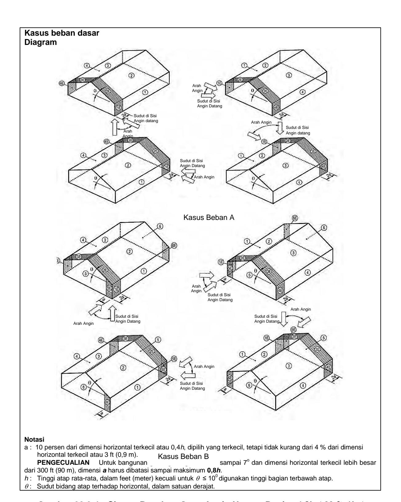

<span id="page-192-0"></span>**Gambar 28.3-1 - Sistem Penahan Gaya Angin Utama, Bagian 1 [***h* **≤ 60 ft. (***h* **≤ 18,3m)]: koefisien tekanan eksternal, (***GCpf***), bangunan gedung tertutup dan tertutup sebagian dinding dan atap bertingkat rendah**

| KASUS BEBAN A                 |      |       |       |          |          |       |       |       |
|-------------------------------|------|-------|-------|----------|----------|-------|-------|-------|
|                               |      |       | Permu | kaan Ban | gunan Ge | dung  |       |       |
| Sudut atap $\theta$ (derajat) | 1    | 2     | 3     | 4        | 1E       | 2E    | 3E    | 4E    |
| 0-5                           | 0,40 | -0,69 | -0,37 | -0,29    | 0,61     | -1,07 | -0,53 | -0,43 |
| 20                            | 0,53 | -0,69 | -0,48 | -0,43    | 0,80     | -1,07 | -0,69 | -0,64 |
| 30-45                         | 0,56 | 0,21  | -0,43 | -0,37    | 0,69     | 0,27  | -0,53 | -0,48 |
| 90                            | 0,56 | 0,56  | -0,37 | -0,37    | 0,69     | 0,69  | -0,48 | -0,48 |

#### **KASUS BEBAN B**

|                               |       |       |       |       | Permul | kaan Bar | ngunan ( | edung |       |       |      |       |
|-------------------------------|-------|-------|-------|-------|--------|----------|----------|-------|-------|-------|------|-------|
| Sudut Atap $\theta$ (derajat) | 1     | 2     | 3     | 4     | 5      | 6        | 1E       | 2E    | 3E    | 4E    | 5E   | 6E    |
| 0-90                          | -0,45 | -0,69 | -0,37 | -0,45 | 0,40   | -0,29    | -0,48    | -1,07 | -0,53 | -0,48 | 0,61 | -0,43 |

#### Catatan:

- 1. Tanda positif dan negatif menandakan tekanan yang bekerja menuju dan menjauhi permukaan.
- 2. Untuk nilai-nilai  $\theta$  selain yang diperlihatkan, diperkenankan menggunakan interpolasi linier.
- 3. Bangunan gedung harus didesain untuk semua arah angin dengan menggunakan 8 pola pembebanan yang diperlihatkan. Pola pembebanan tersebut diterapkan pada setiap sudut bangunan gedung sebagai Sudut Acuan.
- 4. Kombinasi tekanan eksternal dan internal (lihat Tabel 26.11-1) harus dievaluasi ketika diperlukan untuk memperoleh beban yang memberi dampak paling parah.
- 5. Untuk kasus beban torsional yang diperlihatkan di bawah ini, tekanan pada zona-zona ditandai dengan "T" (1T, 2T, 3T, 4T, 5T, 6T) harus 25 % dari tekanan penuh angin desain (zona 1, 2, 3, 4, 5, 6).

**PENGECUALIAN:** Bangunan gedung satu tingkat dengan *h* kurang dari atau sama dengan 30 ft (9,1 m), bangunan gedung dua tingkat atau kurang terdiri dari konstruksi rangka ringan, dan bangunan gedung dua tingkat atau kurang didesain dengan diafragma fleksibel tidak perlu didesain untuk kasus beban torsi.

Beban torsi harus diterapkan untuk semua delapan pola beban dasar dengan menggunakan gambar di bawah ini yang diterapkan pada setiap Sudut Acuan (Sudut Di Sisi Angin Datang).

6. Untuk tujuan desain bangunan gedung SPGAU, gaya geser horizontal total tidak boleh kurang dari yang ditentukan dengan mengabaikan beban angin pada atap.

**PENGECUALIAN:** Ketentuan ini tidak berlaku untuk bangunan gedung yang menggunakan rangka momen untuk SPGAU.

- 7. Untuk atap datar, gunakan  $\theta = 0^0$  dan lokasi elemen pembatas zona 2/3 dan zona 2E/3E pada tengah-lebar dari bangunan gedung.
- 8. Koefisien tekanan atap (GC<sub>pf</sub>), bila negatif pada Zona 2 dan 2E, harus diterapkan pada Zona 2/2E untuk jarak dari tepi atap sama dengan 0,5 kali dimensi horizontal bangunan gedung paralel terhadap arah SPGAU yang sedang didesain atau 2,5 kali tinggi bagian terbawah atap pada dinding di sisi angin datang, pilih yang terkecil; sisanya dari Zona 2/2E sampai ke garis bubungan harus menggunakan koefisien (GC<sub>pf</sub>) untuk Zona 3/3E.

#### Kasus beban torsional

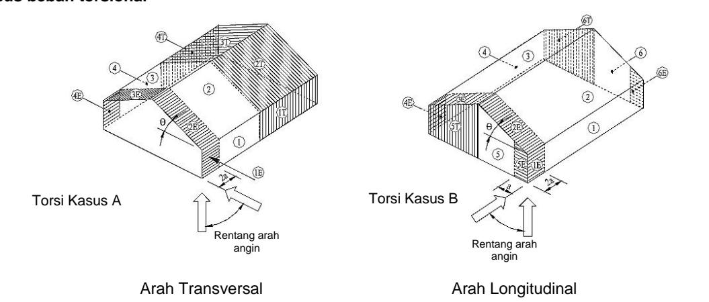

Gambar 28.3-1 (Lanjutan) - Sistem Penahan Gaya Angin Utama, Bagian 1 [ $h \le 60$  ft ( $h \le 18,3$  m)]: koefisien tekanan eksternal, ( $GC_{pf}$ ), untuk bangunan gedung tertutup dan tertutup sebagian dinding dan atap bertingkat rendah

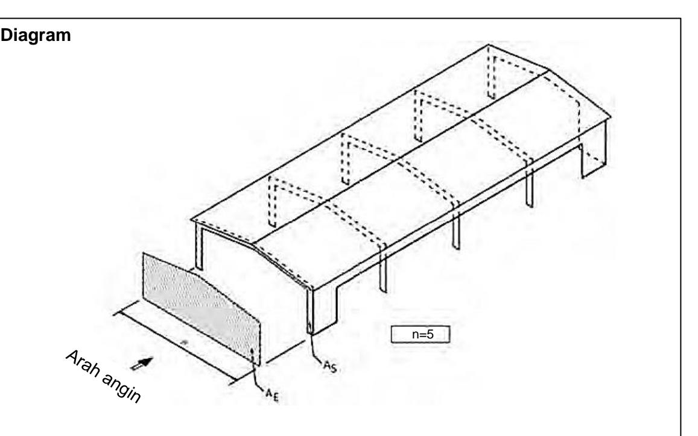

*B* = Lebar bangunan gedung tegak lurus bubungan, dalam ft (m)

*A<sup>s</sup>* = Luas solid efektif dinding ujung, yaitu luas terproyeksi setiap bagian dinding ujung yang terekspos terhadap angin.

*A<sup>E</sup>* = Luas total dinding ujung untuk bangunan gedung tertutup ekuivalen.

*n* = Jumlah rangka tetapi tidak boleh diambil kurang dari *n* = 3

<span id="page-194-2"></span>**Gambar 28.3-2 - Beban angin horizontal pada bangunan gedung terbuka atau tertutup sebagian dengan rangka melintang dan atap pelana: definisi terminologi geometrik**

#### <span id="page-194-3"></span><span id="page-194-0"></span>**28.3.1.1 Koefisien tekanan eksternal (***GCpf***)**

Kombinasi faktor efek hembusan angin dan koefisien tekanan eksternal untuk bangunan bertingkat rendah, (*GCpf)*, tidak boleh dipisahkan.

#### <span id="page-194-1"></span>**28.3.2 Parapet**

Tekanan angin desain untuk efek parapet pada SPGAU bangunan bertingkat rendah dengan atap datar, pelana, atau perisai harus ditentukan oleh persamaan berikut:

$$p_p = q_p(GC_{pn}) \text{ (lb/ft}^2)$$
 (28.3-2)

$$p_p = q_p(GC_{pn}) \text{ (N/m}^2)$$
 (28.3-2.si)

dengan

*p<sup>p</sup>* = tekanan neto kombinasi pada parapet akibat kombinasi dari tekanan neto dari permukaan parapet depan dan belakang. Tanda positif (dan negatif) menandakan tekanan neto bekerja menuju (dan menjauh dari) sisi depan (eksterior) parapet.

*q<sup>p</sup>* = tekanan velositas dievaluasi pada bagian atas parapet; dan

(*GCpn*) = koefisien tekanan neto kombinasi

= +1,5 untuk parapet di sisi angin datang

= –1,0 untuk parapet di sisi angin pergi

#### <span id="page-195-0"></span>28.3.3 Atap konsol

Tekanan eksternal positif pada permukaan bawah atap konsol di sisi angin datang harus ditentukan menggunakan  $GC_p = 0.7$  pada kombinasi dengan tekanan permukaan bagian atas yang ditentukan menggunakan Gambar 28.3-1.

#### <span id="page-195-1"></span>28.3.4 Beban angin desain minimum

Beban angin yang digunakan pada desain SPGAU untuk bangunan gedung tertutup atau tertutup sebagian tidak boleh lebih kecil dari 16 lb/ft² (0,77 kN/m²) dikalikan dengan luas dinding bangunan gedung dan 8 lb/ft² (0,38 kN/m²) dikalikan dengan luas atap bangunan gedung terproyeksi ke bidang vertikal tegak lurus terhadap arah angin yang diasumsikan.

# <span id="page-195-2"></span>28.3.5 Beban angin horizontal pada bangunan gedung terbuka atau tertutup sebagian dengan rangka melintang dan atap pelana

Tekanan horizontal dalam arah memanjang (sejajar dengan bubungan) yang bekerja dalam kombinasi dengan beban atap yang dihitung dalam Pasal 27.4.3 untuk bangunan gedung terbuka atau sebagian tertutup dengan rangka melintang dan atap pelana ( $\theta < 45^{\circ}$ ) harus ditentukan dengan persamaan berikut:

$$p = q_h[(GC_{pf})_{\text{angin datang}} - (GC_{pf})_{\text{angin pergi}}]K_BK_S$$
 (28.3-3)

dengan

 $q_h$  = tekanan velositas diukur pada ketinggian atap rata-rata h menggunakan eksposur sebagaimana didefinisikan dalam Pasal 26.7.3.

 $(GC_{pf})$  = koefisien tekanan eksternal yang diberikan pada Gambar 28.3-1 untuk Kasus Beban B dengan permukaan bangunan gedung 5 dan 5E harus digunakan untuk menghitung tekanan dinding ujung angin datang rata-rata dan permukaan bangunan gedung 6 dan 6E harus digunakan untuk menghitung tekanan dinding ujung angin pergi rata-rata.

 $K_B$  = faktor lebar rangka = 1,8 - 0,01B, B < 100 ft (B < 30,5 m) atau 0,8, B ≥ 100 ft (B ≥ 30,5 m).

 $K_s$  = faktor pelindung = 0.60 + 0.073(n - 3) + (1.25  $\phi^{1,8}$ )

 $\phi$  = rasio soliditas =  $A_S/A_E$ .

B = lebar bangunan gedung tegak lurus terhadap bubungan, dalam ft (m).

n = jumlah rangka tetapi tidak boleh diambil kurang dari n = 3.

A<sub>S</sub> = luas solid efektif dinding ujung, yaitu, luas yang diproyeksikan dari setiap bagian dari dinding ujung yang terekspos angin (Gambar 28.3-2).

 $A_E$  = luas total dinding ujung untuk bangunan gedung tertutup ekuivalen (Gambar 28.3-2).

Gaya total longitudinal **F** yang harus ditahan oleh SPGAU ditentukan oleh persamaan berikut:

$$F = pA_F \tag{28.3-4}$$

Persamaan (28.3-3) berlaku untuk bangunan gedung dengan dinding ujung terbuka dan dengan dinding ujung penuh atau tertutup sebagian dengan klading. Untuk semua kasus,  $A_E$  adalah luas yang ekuivalen dengan dinding ujung penuh tertutup. Gaya longitudinal, F, yang diberikan oleh Persamaan (28.3-4), mewakili gaya total yang harus dirancang dengan breising longitudinal SPGAU. Distribusi ke setiap dinding samping harus didasarkan pada gaya F yang diterapkan pada titik berat dari area dinding ujung  $A_E$ . Beban fasia tidak perlu diperhitungkan secara terpisah jika luas fasia termasuk dalam perhitungan  $A_S$ .

#### **Bagian 2: Bangunan gedung bertingkat rendah berdiafragma sederhana tertutup**

**Catatan:** Bagian 2 Pasal 28 adalah metode sederhana untuk menentukan tekanan angin pada SPGAU bangunan gedung bertingkat rendah berdiafragma sederhana tertutup yang memiliki atap datar, pelana atau perisai. Tekanan angin yang langsung diperoleh dari tabel dan diterapkan pada permukaan bangunan gedung terproyeksi horizontal dan vertikal. Metode ini adalah penyederhanaan Prosedur Amplop yang terdapat dalam Bagian 1 Pasal 28.

#### <span id="page-196-0"></span>**28.4 Persyaratan umum**

Langkah-langkah yang diperlukan untuk penentuan beban angin SPGAU pada bangunan gedung berdiafragma sederhana tertutup diperlihatkan dalam Tabel 28.4-1.

#### <span id="page-196-1"></span>**28.4.1 Parameter beban angin yang ditetapkan dalam Pasal 26**

Parameter beban angin yang berikut ditetapkan dalam Pasal 26:

- Kecepatan angin dasar, *V* (Pasal 26.5);
- Kategori eksposur (Pasal 26.7);
- Faktor topografi, *Kzt* (Pasal 26.8);
- Klasifikasi ketertutupan (Pasal 26.12).

#### <span id="page-196-5"></span>**Tabel 28.4-1 - Langkah-langkah menentukan beban angin pada SPGAU bangunan gedung bertingkat rendah berdiafragma sederhana**

- **Langkah 1:** Tentukan kategori risiko bangunan gedung; lihat Tabel 1.5-1
- **Langkah 2:** Tentukan kecepatan angin dasar, *V*, untuk kategori risiko yang sesuai; lihat Buku Peta Angin Indonesia.
- **Langkah 3:** Tentukan parameter beban angin:
- Kategori eksposur B, C atau D; lihat Pasal 26.7
- Faktor topografi, *Kzt*, lihat Pasal 26.8 dan Gambar 26.8-1
- **Langkah 4:** Masukkan angka untuk menentukan tekanan angin untuk *h* = 30 ft (9,1 m), *p<sup>s</sup>*30;lihat Gambar 28.5-1
- **Langkah 5:** Masukkan angka untuk menentukan penyesuaian untuk ketinggian dan eksposur bangunan gedung, ; lihat Gambar 28.5-1
- **Langkah 6:** Tentukan tekanan angin yang disesuaikan, *ps*; lihat Persamaan (28.5-1)

#### <span id="page-196-2"></span>**28.5 Beban angin: Sistem Penahan Gaya Angin Utama**

#### <span id="page-196-3"></span>**28.5.1 Ruang lingkup**

Suatu bangunan, dengan beban angin desain yang ditentukan menurut Pasal ini harus memenuhi semua kondisi dari Pasal 28.5.2. Jika bangunan gedung tidak memenuhi semua kondisi dari Pasal 28.5.2, beban angin SPGAU nya harus ditentukan dari Bagian 1 Pasal ini, dengan prosedur pengarah Pasal 27, atau dengan prosedur terowongan angin Pasal 31.

#### <span id="page-196-4"></span>**28.5.2 Kondisi**

Untuk desain SPGAU, bangunan gedung harus memenuhi semua kondisi berikut:

- 1. Bangunan gedung adalah suatu gedung berdiafragma sederhana seperti didefinisikan dalam Pasal 26.2.
- 2. Bangunan gedung adalah bangunan gedung bertingkat rendah seperti didefinisikan dalam Pasal 26.2.

- 3. Bangunan gedung adalah tertutup seperti didefinisikan dalam Pasal 26.2 dan memenuhi ketentuan-ketentuan puing terbawa angin dari Pasal 26.12.3.
- 4. Bangunan gedung adalah bangunan gedung berbentuk teratur seperti didefinisikan dalam Pasal 26.2.
- 5. Bangunan gedung yang tidak diklasifikasikan sebagai bangunan gedung fleksibel seperti didefinisikan dalam Pasal 26.2.
- 6. Bangunan gedung yang tidak memiliki karakteristik respons sehingga mengalami beban angin melintang, pusaran angin, ketidakstabilan akibat getaran atau gerakan yang tidak teratur; dan tidak terletak pada lokasi di mana efek kanal atau hempasan berulang sebagai akibat adanya halangan di sisi angin datang yang membutuhkan pertimbangan khusus.
- 7. Bangunan gedung memiliki penampang hampir simetris pada setiap arah untuk atap datar atau atap pelana atau atap perisai dengan  $\theta \le 45^{\circ}$ .
- 8. Bangunan gedung yang bebas dari kasus beban torsi seperti yang dimaksudkan dalam Bagian 5 pada Catatan dalam Gambar 28.3-1, atau kasus beban torsi seperti yang didefinisikan dalam Bagian 5 pada Catatan tersebut tidak mengontrol desain dari setiap SPGAU bangunan gedung.

#### <span id="page-197-0"></span>28.5.3 Beban angin desain

Tekanan angin desain yang disederhanakan,  $p_s$ , untuk SPGAU dari bangunan gedung berdiafragma sederhana bertingkat rendah merupakan tekanan neto (jumlah internal dan eksternal) yang dikerjakan pada proyeksi horizontal dan vertikal dari permukaan-permukaan bangunan gedung seperti yang diperlihatkan dalam Gambar 28.5-1. Untuk tekanan horizontal (Zona A, B, C, D),  $p_s$  adalah kombinasi tekanan neto di sisi angin datang dan di sisi angin pergi.  $p_s$  harus ditentukan dengan persamaan berikut:

$$\rho_{\rm s} = \lambda \, K_{\rm zt} \, \rho_{\rm S30} \tag{28.5-1}$$

dengan

 $\lambda$  = faktor penyesuaian untuk eksposur dan ketinggian bangunan gedung Gambar 28.5-1

 $K_{zt}$  = faktor topografi seperti didefinisikan dalam Pasal 26.8 dievaluasi pada ketinggian atap rata-rata, 0,33h

 $p_{S30}$  = tekanan angin desain yang disederhanakan untuk Eksposur B, pada h = 30 ft (h = 9,1 m) dari Gambar 28.5-1

#### <span id="page-197-1"></span>28.5.4 Beban angin desain minimum

Pengaruh beban pada tekanan angin desain dari Pasal 28.5.3 tidak boleh kurang dari beban minimum yang didefinisikan dengan mengasumsikan tekanan,  $p_s$ , untuk zona A dan C sama dengan +16 lb/ft<sup>2</sup> (0,77 N/m<sup>2</sup>), Zona B dan D sama dengan +8 lb/ft<sup>2</sup> (0,38 N/m<sup>2</sup>), dan asumsi  $p_s$  untuk Zona E, F, G dan H adalah sama dengan 0 lb/ft<sup>2</sup> (0 N/m<sup>2</sup>).

#### <span id="page-197-2"></span>28.6 Standar konsensus dan dokumen Referensi lain

Pasal ini tidak merujuk konsensus standar atau dokumen lain manapun yang dianggap sebagai bagian dari standar ini.

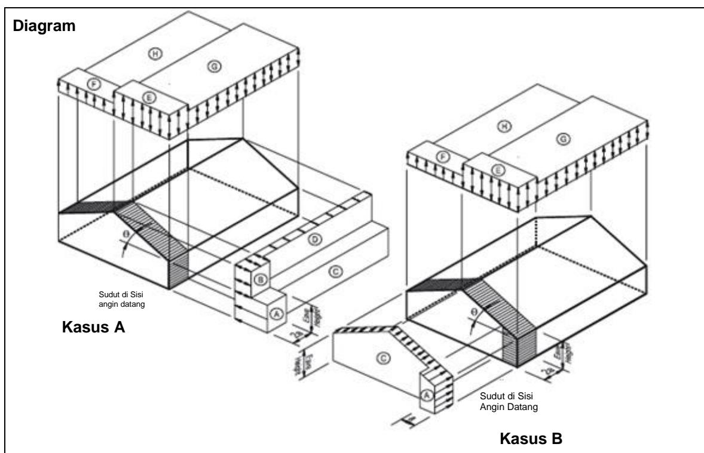

*a* : 10 % dari dimensi horizontal terkecil atau 0,4*h*, dipilih yang terkecil, tetapi tidak kurang dari 4 % dari dimensi horizontal terkecil atau 3 ft (0,9 m).

**PENGECUALIAN** Untuk bangunan gedung dengan = 0<sup>o</sup> sampai 7<sup>o</sup> dan dimensi horizontal terkecil lebih besar dari 300 ft (90 m), dimensi *a* harus dibatasi sampai maksimum 0,8*h.*

- *h* : Tinggi atap rata-rata, dalam feet (meter), kecuali untuk sudut atap < 10<sup>o</sup> digunakan tinggi bagian terbawah atap.
- **:** Sudut bidang atap terhadap horizontal, dalam satuan derajat.

#### **Catatan**

- 1. Tekanan yang diperlihatkan diterapkan pada proyeksi horizontal dan vertikal, untuk Eksposur B, pada *h* = 30 ft (9,1 m). Sesuaikan dengan eksposur lain dan ketinggian dengan faktor penyesuai .
- 2. Pola beban yang diperlihatkan harus diterapkan pada setiap sudut bangunan gedung sebagai sudut Referensi. (Lihat Gambar 28.3-1).
- 3. Untuk Kasus B gunakan = 0°.
- 4. Kasus beban 1 dan 2 harus diperiksa untuk 25° < ≤ 45°. Kasus beban 2 pada sudut 25° diberikan hanya untuk interpolasi diantara 25° dan 30°.
- 5. Tanda positif dan negatif menandakan tekanan yang bekerja menuju dan menjauhi permukaan yang diproyeksikan.
- 6. Untuk kemiringan atap selain yang diperlihatkan, diperkenankan interpolasi linier.
- 7. Beban horizontal total tidak boleh kurang dari yang ditentukan dengan asumsi *p<sup>s</sup>* = 0 pada Zona B dan Zona D.
- 8. Bila Zona E atau Zona G berada pada kantilever/*overhang* atap pada sisi angin datang dari bangunan gedung, gunakan *EOH* dan *GOH* untuk tekanan pada proyeksi horizontal dari kantilever tersebut. Kantilever pada angin hisap dan pada bagian tepi-tepi harus dikerjakan tekanan zona dasar.
- 9. Konversi satuan untuk tabel:

#### **Faktor penyesuaian untuk Eksposur dan Tinggi Bangunan Gedung, .**

|                            |      | Eksposur |      |
|----------------------------|------|----------|------|
| Tinggi atap rata-rata (ft) | B    | C        | D    |
| 15                         | 1,00 | 1,21     | 1,47 |
| 20                         | 1,00 | 1,29     | 1,55 |
| 25                         | 1,00 | 1,35     | 1,61 |
| 30                         | 1,00 | 1,40     | 1,66 |
| 35                         | 1,05 | 1,45     | 1,70 |
| 40                         | 1,09 | 1,49     | 1,74 |
| 45                         | 1,12 | 1,53     | 1,78 |
| 50                         | 1,16 | 1,56     | 1,81 |
| 55                         | 1,19 | 1,59     | 1,84 |
| 60                         | 1,22 | 1,62     | 1,87 |

 **Catatan:** Konversi satuan untuk tabel: 1,0 ft = 0,3048 m; 1,0 lb/ft<sup>2</sup> = 0,0479 kN/m<sup>2</sup> ; 1 mph = 1,6 km/h = 0,447 m/detik

<span id="page-198-0"></span>**Gambar 28.5-1 - Sistem Penahan Gaya Angin Utama, Bagian 2 [***h* ≤ **60 ft (***h* ≤ **18,3 m)]: tekanan angin desain untuk bangunan gedung tertutup dinding dan atap**

| Kecepatan      |               |                |                    |  | Zona |                  |  |        |  |
|----------------|---------------|----------------|--------------------|--|------|------------------|--|--------|--|
| angin<br>dasar | Sudut<br>atap | Kasus<br>beban | Tekanan horizontal |  |      | Tekanan vertikal |  | Konsol |  |
| (mph)          | (derajat)     |                |                    |  |      |                  |  |        |  |
|                |               |                |                    |  |      |                  |  |        |  |
|                |               |                |                    |  |      |                  |  |        |  |
|                |               |                |                    |  |      |                  |  |        |  |
|                |               |                |                    |  |      |                  |  |        |  |
|                |               |                |                    |  |      |                  |  |        |  |
|                |               |                |                    |  |      |                  |  |        |  |
|                |               |                |                    |  |      |                  |  |        |  |
|                |               |                |                    |  |      |                  |  |        |  |
|                |               |                |                    |  |      |                  |  |        |  |
|                |               |                |                    |  |      |                  |  |        |  |
|                |               |                |                    |  |      |                  |  |        |  |
|                |               |                |                    |  |      |                  |  |        |  |
|                |               |                |                    |  |      |                  |  |        |  |
|                |               |                |                    |  |      |                  |  |        |  |
|                |               |                |                    |  |      |                  |  |        |  |
|                |               |                |                    |  |      |                  |  |        |  |
|                |               |                |                    |  |      |                  |  |        |  |
|                |               |                |                    |  |      |                  |  |        |  |
|                |               |                |                    |  |      |                  |  |        |  |
|                |               |                |                    |  |      |                  |  |        |  |
|                |               |                |                    |  |      |                  |  |        |  |
|                |               |                |                    |  |      |                  |  |        |  |
|                |               |                |                    |  |      |                  |  |        |  |
|                |               |                |                    |  |      |                  |  |        |  |
|                |               |                |                    |  |      |                  |  |        |  |
|                |               |                |                    |  |      |                  |  |        |  |
|                |               |                |                    |  |      |                  |  |        |  |
|                |               |                |                    |  |      |                  |  |        |  |
|                |               |                |                    |  |      |                  |  |        |  |
|                |               |                |                    |  |      |                  |  |        |  |
|                |               |                |                    |  |      |                  |  |        |  |
|                |               |                |                    |  |      |                  |  |        |  |

**Gambar 28.5-1 (lanjutan) - Sistem Penahan Gaya Angin Utama, Bagian 2 [***h* **≤ 60 ft (***h* **≤ 18,3 m)]: tekanan angin desain untuk bangunan gedung tertutup ̶dinding dan atap**

| Kecepatan      |               |                |                    |  | Zona |                  |  |        |  |
|----------------|---------------|----------------|--------------------|--|------|------------------|--|--------|--|
| angin<br>dasar | Sudut<br>atap | Kasus<br>beban | Tekanan horizontal |  |      | Tekanan vertikal |  | Konsol |  |
| (mph)          | (derajat)     |                |                    |  |      |                  |  |        |  |
|                |               |                |                    |  |      |                  |  |        |  |
|                |               |                |                    |  |      |                  |  |        |  |
|                |               |                |                    |  |      |                  |  |        |  |
|                |               |                |                    |  |      |                  |  |        |  |
|                |               |                |                    |  |      |                  |  |        |  |
|                |               |                |                    |  |      |                  |  |        |  |
|                |               |                |                    |  |      |                  |  |        |  |
|                |               |                |                    |  |      |                  |  |        |  |
|                |               |                |                    |  |      |                  |  |        |  |
|                |               |                |                    |  |      |                  |  |        |  |
|                |               |                |                    |  |      |                  |  |        |  |
|                |               |                |                    |  |      |                  |  |        |  |
|                |               |                |                    |  |      |                  |  |        |  |
|                |               |                |                    |  |      |                  |  |        |  |
|                |               |                |                    |  |      |                  |  |        |  |
|                |               |                |                    |  |      |                  |  |        |  |
|                |               |                |                    |  |      |                  |  |        |  |
|                |               |                |                    |  |      |                  |  |        |  |
|                |               |                |                    |  |      |                  |  |        |  |
|                |               |                |                    |  |      |                  |  |        |  |
|                |               |                |                    |  |      |                  |  |        |  |
|                |               |                |                    |  |      |                  |  |        |  |
|                |               |                |                    |  |      |                  |  |        |  |
|                |               |                |                    |  |      |                  |  |        |  |
|                |               |                |                    |  |      |                  |  |        |  |
|                |               |                |                    |  |      |                  |  |        |  |
|                |               |                |                    |  |      |                  |  |        |  |
|                |               |                |                    |  |      |                  |  |        |  |
|                |               |                |                    |  |      |                  |  |        |  |
|                |               |                |                    |  |      |                  |  |        |  |
|                |               |                |                    |  |      |                  |  |        |  |
|                |               |                |                    |  |      |                  |  |        |  |
|                |               |                |                    |  |      |                  |  |        |  |
|                |               |                |                    |  |      |                  |  |        |  |
|                |               |                |                    |  |      |                  |  |        |  |
|                |               |                |                    |  |      |                  |  |        |  |
|                |               |                |                    |  |      |                  |  |        |  |
|                |               |                |                    |  |      |                  |  |        |  |
|                |               |                |                    |  |      |                  |  |        |  |
|                |               |                |                    |  |      |                  |  |        |  |

**Gambar 28.5-1 (Lanjutan) - Sistem Penahan Gaya Angin Utama, Bagian 2 [***h* **≤ 60 ft (***h* **≤ 18.3 m)]: tekanan angin desain untuk bangunan gedung tertutup ̶dinding dan atap**

| Kecepatan      |               |                |                    |  | Zona |                  |  |        |  |
|----------------|---------------|----------------|--------------------|--|------|------------------|--|--------|--|
| angin<br>dasar | Sudut<br>atap | Kasus<br>beban | Tekanan horizontal |  |      | Tekanan vertikal |  | Konsol |  |
| (mph)          | (derajat)     |                |                    |  |      |                  |  |        |  |
|                |               |                |                    |  |      |                  |  |        |  |
|                |               |                |                    |  |      |                  |  |        |  |
|                |               |                |                    |  |      |                  |  |        |  |
|                |               |                |                    |  |      |                  |  |        |  |
|                |               |                |                    |  |      |                  |  |        |  |
|                |               |                |                    |  |      |                  |  |        |  |
|                |               |                |                    |  |      |                  |  |        |  |
|                |               |                |                    |  |      |                  |  |        |  |
|                |               |                |                    |  |      |                  |  |        |  |
|                |               |                |                    |  |      |                  |  |        |  |
|                |               |                |                    |  |      |                  |  |        |  |
|                |               |                |                    |  |      |                  |  |        |  |
|                |               |                |                    |  |      |                  |  |        |  |
|                |               |                |                    |  |      |                  |  |        |  |
|                |               |                |                    |  |      |                  |  |        |  |
|                |               |                |                    |  |      |                  |  |        |  |
|                |               |                |                    |  |      |                  |  |        |  |
|                |               |                |                    |  |      |                  |  |        |  |
|                |               |                |                    |  |      |                  |  |        |  |
|                |               |                |                    |  |      |                  |  |        |  |
|                |               |                |                    |  |      |                  |  |        |  |
|                |               |                |                    |  |      |                  |  |        |  |
|                |               |                |                    |  |      |                  |  |        |  |
|                |               |                |                    |  |      |                  |  |        |  |
|                |               |                |                    |  |      |                  |  |        |  |
|                |               |                |                    |  |      |                  |  |        |  |
|                |               |                |                    |  |      |                  |  |        |  |
|                |               |                |                    |  |      |                  |  |        |  |
|                |               |                |                    |  |      |                  |  |        |  |
|                |               |                |                    |  |      |                  |  |        |  |
|                |               |                |                    |  |      |                  |  |        |  |
|                |               |                |                    |  |      |                  |  |        |  |
|                |               |                |                    |  |      |                  |  |        |  |
|                |               |                |                    |  |      |                  |  |        |  |
|                |               |                |                    |  |      |                  |  |        |  |
|                |               |                |                    |  |      |                  |  |        |  |
|                |               |                |                    |  |      |                  |  |        |  |
|                |               |                |                    |  |      |                  |  |        |  |
|                |               |                |                    |  |      |                  |  |        |  |
|                |               |                |                    |  |      |                  |  |        |  |

**Gambar 28.5-1 (Lanjutan) - Sistem Penahan Gaya Angin Utama, Bagian 2 [***h* **≤ 60 ft (***h* **≤18.3 m)]: tekanan angin desain untuk bangunan gedung tertutup ̶dinding dan atap**

|                             |               |                |                    |  | Zona |                  |  |        |  |
|-----------------------------|---------------|----------------|--------------------|--|------|------------------|--|--------|--|
| Kecepatan<br>angin<br>dasar | Sudut<br>atap | Kasus<br>beban | Tekanan horizontal |  |      | Tekanan vertikal |  | Konsol |  |
| (mph)                       | (derajat)     |                |                    |  |      |                  |  |        |  |
|                             |               |                |                    |  |      |                  |  |        |  |
|                             |               |                |                    |  |      |                  |  |        |  |
|                             |               |                |                    |  |      |                  |  |        |  |
|                             |               |                |                    |  |      |                  |  |        |  |
|                             |               |                |                    |  |      |                  |  |        |  |
|                             |               |                |                    |  |      |                  |  |        |  |
|                             |               |                |                    |  |      |                  |  |        |  |
|                             |               |                |                    |  |      |                  |  |        |  |
|                             |               |                |                    |  |      |                  |  |        |  |
|                             |               |                |                    |  |      |                  |  |        |  |
|                             |               |                |                    |  |      |                  |  |        |  |
|                             |               |                |                    |  |      |                  |  |        |  |
|                             |               |                |                    |  |      |                  |  |        |  |
|                             |               |                |                    |  |      |                  |  |        |  |
|                             |               |                |                    |  |      |                  |  |        |  |
|                             |               |                |                    |  |      |                  |  |        |  |
|                             |               |                |                    |  |      |                  |  |        |  |
|                             |               |                |                    |  |      |                  |  |        |  |
|                             |               |                |                    |  |      |                  |  |        |  |
|                             |               |                |                    |  |      |                  |  |        |  |
|                             |               |                |                    |  |      |                  |  |        |  |
|                             |               |                |                    |  |      |                  |  |        |  |
|                             |               |                |                    |  |      |                  |  |        |  |
|                             |               |                |                    |  |      |                  |  |        |  |

\* Lihat Catatan 4.

**Gambar 28.5-1 (Lanjutan) - Sistem Penahan Gaya Angin Utama, Bagian 2 [***h* **≤ 60 ft (***h* **≤ 18.3 m)]: tekanan angin desain untuk bangunan gedung tertutup dinding dan atap**

#### <span id="page-202-0"></span>**29 Beban angin pada struktur lain dan perlengkapan bangunan gedung: Sistem Penahan Gaya Angin Utama**

#### <span id="page-202-1"></span>**29.1 Ruang lingkup**

#### <span id="page-202-2"></span>**29.1.1 Tipe struktur**

Pasal ini digunakan untuk menentukan besar beban angin pada perlengkapan bangunan gedung (seperti struktur dan perlengkapan atas atap) dan struktur lain dari semua ketinggian (seperti dinding solid yang berdiri bebas dan panel petunjuk solid berdiri bebas, cerobong asap, tangki, panel petunjuk terbuka, rangka terbuka bidang tunggal, dan menara rangka batang) dengan menggunakan prosedur pengarah.

Langkah-langkah yang diperlukan untuk menentukan beban angin pada perlengkapan bangunan gedung dan struktur lain yang dijelaskan dalam Tabel 29.1-1. Langkahlangkah yang diperlukan untuk menentukan beban angin pada sistem penahan gaya angin utama (SPGAU) pada wadah (*bin*), silo dan tangki berpenampang bundar ada pada Tabel 29.1-2.

**CATATAN** Gunakan Pasal 29 untuk menentukan tekanan angin pada SPGAU dari dinding solid yang berdiri bebas, panel petunjuk solid berdiri bebas, cerobong asap, tangki, panel petunjuk terbuka, rangka terbuka bidang tunggal dan menara rangka batang. Beban angin pada struktur atap-atas dan perlengkapan dapat ditentukan dari ketentuan-ketentuan Pasal ini. Tekanan angin yang dihitung menggunakan persamaan spesifik berdasarkan prosedur pengarah.

#### <span id="page-203-1"></span>**Tabel 29.1-1 - Langkah-langkah untuk menentukan beban angin pada struktur lain dan peralatan bagian atap SPGAU**

- **Langkah 1:** Tentukan Kategori Risiko bangunan gedung dan struktur lain; lihat Tabel 1.5-1
- **Langkah 2:** Tentukan kecepatan angin dasar, *V*, untuk Kategori Risiko yang sesuai; lihat Buku Peta Angin Indonesia.

**Langkah 3:** Tentukan parameter beban angin:

- Faktor arah angin, *Kd*; lihat Pasal 26.6 dan Tabel 26.6-1.
- Kategori eksposur B, C atau D; lihat Pasal 26.7.
- Faktor topografi, *Kzt*; lihat Pasal 26.8 dan Gambar 26.8-1.
- Faktor elevasi permukaan tanah, *Ke*; lihat Pasal 26.9 dan Tabel 26.9-1.
- Faktor efek hembusan angin, *G*; lihat Pasal 26.11, kecuali untuk peralatan bagian atas atap.
- Kombinasi faktor (*GCr*) untuk peralatan bagian atap; lihat Pasal 29.4.1.
- **Langkah 4:** Tentukan koefisien eksposur tekanan velositas, *K<sup>z</sup>* atau *Kh*, lihat Tabel 26.10-1
- **Langkah 5:** Tentukan tekanan velositas *q<sup>z</sup>* atau *qh*; lihat Persamaan (26.10-1).
- **Langkah 6:** Tentukan koefisien gaya, *C<sup>f</sup>* , kecuali untuk peralatan bagian atap:
  - Panel petunjuk solid berdiri bebas atau dinding solid berdiri bebas, Gambar 29.3-1
  - Cerobong asap, tangki, Gambar 29.4-1
  - Panel petunjuk terbuka, rangka terbuka bidang tunggal, Gambar 29.4-2
  - Menara rangka batang Gambar 29.4-3
  - Peralatan bagian atap, menggunakan kombinasi faktor (*GCr*) yang tercantum
  - pada Pasal 29.4.1.
  - Panel surya bagian atap, Gambar 29.4-7 dan Persamaan (29.4-6), atau Gambar 29.4-8.

**Langkah 7:** Hitung gaya angin, *F*, atau tekanan, *p*:

- Persamaan 29.3-1 untuk panel petunjuk dan dinding.
- Persamaan 29.4-2 dan Persamaan 29.4-3 untuk struktur atap dan perlengkapannya.
- Persamaan 29.4-1 untuk struktur lain.
- Persamaan (29.4-5) atau Persamaan (29.4-7) untuk panel surya bagian atap.

#### <span id="page-203-0"></span>**29.1.2 Kondisi**

Suatu perlengkapan atau struktur dengan beban angin desain yang ditentukan menurut Pasal ini harus memenuhi semua kondisi berikut:

- 1. Struktur adalah yang berbentuk teratur seperti ditetapkan dalam Pasal 26.2; dan
- 2. Struktur tidak memiliki karakteristik respons sehingga mengalami beban angin melintang, pusaran angin, atau ketidakstabilan akibat getaran atau gerakan yang tidak teratur, atau tidak terletak pada lokasi di mana efek kanal atau hempasan berulang sebagai akibat adanya halangan di sisi angin datang yang membutuhkan pertimbangan khusus.

#### <span id="page-204-0"></span>**29.1.3 Batasan**

Ketentuan Pasal ini memperhitungkan efek pembesaran beban yang disebabkan oleh hembusan angin yang beresonansi dengan getaran searah angin dari struktur fleksibel. Struktur yang tidak memenuhi persyaratan Pasal 29.1.2 atau yang memiliki bentuk tidak biasa atau karakteristik respons harus dirancang menggunakan literatur yang diakui yang membahas efek beban angin tersebut atau harus menggunakan prosedur terowongan angin yang ditetapkan dalam Pasal 31.

#### <span id="page-204-1"></span>**29.1.4 Pelindung**

Tidak boleh ada reduksi tekanan velositas akibat pelindung nyata yang diberikan oleh bangunan gedung dan struktur lain atau fitur medan.

<span id="page-204-4"></span>**Tabel 29.1-2 - Langkah-langkah untuk menentukan beban angin pada wadah (***bin***), silo, berpenampang bundar SPGAU**

- **Langkah 1:** Tentukan Kategori Risiko dari struktur; lihat Tabel 1.5-1.
- **Langkah 2:** Tentukan kecepatan angin dasar, *V*, untuk Kategori Risiko yang sesuai; lihat Buku Peta Angin Indonesia.
- **Langkah 3:** Tentukan parameter beban angin:
  - Faktor arah angin, *Kd*; lihat Pasal 26.6 dan Tabel 26.6-1
  - Kategori eksposur B, C atau D; lihat Pasal 26.7
  - Faktor topografi, *Kzt*; lihat Pasal 26.8 dan Gambar 26.8-1.
  - Faktor elevasi permukaan tanah, *Ke*; lihat Pasal 26.9 dan Tabel 26.9-1
  - Klasifikasi ketertutupan, lihat Pasal 26.12.
  - Koefisien tekanan internal, (*GCpi*), lihat Tabel 26.13-1.
  - Faktor efek hembusan angin, *G*; lihat Pasal 26.11.
  - Kombinasi faktor (*GCr*) untuk peralatan bagian atap; lihat Pasal 29.4.1.
- **Langkah 4:** Tentukan koefisien eksposur tekanan velositas, *K<sup>z</sup>* atau *Kh*, lihat Tabel 26.10-1
- **Langkah 5:** Tentukan tekanan velositas *qh*; lihat Persamaan (26.10-1).
- **Langkah 6:** Tentukan koefisien gaya untuk dinding, lihat Pasal 29.4.2.1 dan Pasal 29.4.2.4.
- **Langkah 7:** Tentukan koefisien tekanan eksternal (*GCp*) untuk atap dan sisi-sisi bawah jika terelevasi, lihat Pasal 29.4.2.2 dan Pasal 29.4.2.3.
- **Langkah 8:** Hitung gaya angin, *F*, atau tekanan, *p*:
  - Persamaan (29.4-1) untuk dinding.
  - Persamaan (29.4-4) untuk atap.

#### <span id="page-204-2"></span>**29.2 Persyaratan umum**

#### <span id="page-204-3"></span>**29.2.1 Parameter beban angin yang ditetapkan dalam Pasal 26**

Parameter beban angin yang berikut harus ditentukan menurut Pasal 26:

- Kecepatan Angin Dasar, *V* (Pasal 26.5);
- Faktor arah angin, *K<sup>d</sup>* (Pasal 26.6);
- Kategori eksposur (Pasal 26.7);
- Faktor topografi, *Kzt* (Pasal 26.8);
- Faktor elevasi permukaan tanah, *K<sup>e</sup>* (Pasal 26.9); dan
- Klasifikasi ketertutupan (Pasal 26.12)

#### <span id="page-205-0"></span>29.3 Beban angin desain: Dinding solid berdiri bebas dan panel petunjuk solid

#### <span id="page-205-1"></span>29.3.1 Dinding solid berdiri bebas dan panel petunjuk solid berdiri bebas

Gaya angin desain untuk dinding solid berdiri bebas dan panel petunjuk solid berdiri bebas harus ditentukan dengan formula berikut:

$$F = q_h GC_f A_s \text{ (lb)} \tag{29.3-1}$$

$$F = q_h G C_f A_s(N)$$
 (29.3-1.si)

dengan

 $q_h$  = tekanan velositas dievaluasi pada ketinggian h (ditetapkan dalam Gambar 29.3-1) seperti ditentukan menurut Pasal 26.10.

G = faktor efek hembusan angin dari Pasal 26.11.

 $C_f$  = koefisien gaya neto dari Gambar 29.3-1.

 $A_s$  = luas bruto dinding solid berdiri bebas atau panel petunjuk solid berdiri bebas, dalam  $ft^2$  (m<sup>2</sup>)

#### <span id="page-205-2"></span>29.3.2 Panel petunjuk solid yang terikat

Tekanan angin desain pada panel petunjuk solid yang terikat pada dinding sebuah bangunan gedung, di mana bidang dari panel petunjuk yang paralel terhadap dan dalam kontak dengan bidang dinding, dan panel petunjuk tidak melewati sisi atau tepi atas dinding, harus ditentukan dengan menggunakan prosedur untuk tekanan angin pada dinding sesuai dengan Pasal 30, dan atur koefisien tekanan internal ( $GC_{pi}$ ) sama dengan 0.

Prosedur ini juga berlaku terhadap panel petunjuk solid yang terikat tetapi tidak bersentuhan langsung dengan dinding, asalkan celah antara panel petunjuk dan dinding tidak lebih dari 3 ft (0,9 m) dan tepi dari panel petunjuk setidaknya 3 ft (0,9 m) di tepi bebas dari dinding, yaitu, sisi dan tepi atas dan tepi bawah dari dinding terelevasi.

#### <span id="page-205-3"></span>29.4 Beban angin desain: struktur lain

Gaya angin desain untuk struktur lain (cerobong asap, tangki, panel petunjuk terbuka, rangka terbuka bidang tunggal, dan menara rangka batang), baik di atas permukaan tanah maupun di puncak atap harus ditentukan dengan persamaan berikut:

$$F = q_z G C_f A_f \text{ (lb)} \tag{29.4-1}$$

$$F = q_z G C_f A_f (N)$$
 (29.4-1.si)

dengan

 $q_z$  = tekanan velositas yang dievaluasi pada ketinggian z seperti dijelaskan dalam Pasal 26.10, dari titik berat  $A_f$ 

G = faktor efek hembusan angin dari Pasal 26.11

 $C_f$  = koefisien gaya dari Gambar 29.4-1 sampai Gambar 29.4-4

 $A_f$  = luas terproyeksi tegak lurus terhadap angin kecuali dengan  $C_f$  ditetapkan untuk luas permukaan aktual, dalam ft<sup>2</sup> (m<sup>2</sup>)

Panduan untuk menentukan G,  $C_f$ , dan  $A_f$  untuk struktur yang ditemukan di petrokimia dan fasilitas industri lainnya yang tidak dibahas dalam ASCE 7 dapat ditemukan dalam Beban Angin untuk Petrokimia dan Fasilitas Industri Lainnya (2011), yang diterbitkan oleh ASCE. Reston. VA.

#### <span id="page-206-0"></span>29.4.1 Struktur atap dan perlengkapan untuk bangunan gedung

Gaya lateral,  $F_h$ , dan gaya vertikal,  $F_v$ , untuk struktur dan perlatan bagian atap, kecuali disyaratkan lain untuk panel surya yang dipasang pada atap (Pasal 29.4.3 dan Pasal 29.4.4) dan struktur yang teridentifikasi dalam Pasal 29.4, harus ditentukan seperti yang disyaratkan berikut ini.

Gaya resultan lateral  $F_h$ , harus ditentukan dari Persamaan (29.4-2) dan diterapkan pada ketinggian di atas permukaan atap sama dengan atau lebih besar dari titik berat dari area terproyeksi,  $A_f$ .

$$F_h = q_h(GC_t)A_t$$
 (lb) (29.4-2)

$$F_h = q_h(GC_r)A_f$$
 (N) (29.4-2.si)

dengan

 $(GC_r)$  = 1,9 untuk perlengkapan dan struktur atas-atap dengn  $A_f$  kurang dari (0,1Bh).  $(GC_r)$  boleh direduksi secara linier dari 1,9 sampai 1,0 ketika nilai  $A_f$  meningkat dari (0,1Bh) ke (Bh)

 $q_h$  = tekanan velositas yang dievaluasi pada ketinggian rata-rata atap bangunan gedung.

 $A_f$  = luas terproyeksi vertikal dari struktur atas-atap atau perlengkapan pada suatu bidang tegak lurus terhadap arah angin, dalam ft<sup>2</sup> (m<sup>2</sup>)

Gaya angkat vertikal,  $F_{\nu}$ , pada struktur dan peralatan atap harus ditentukan dari Persamaan (29.4-3):

$$F_{v}=q_{h}(GC_{r})A_{r}(lb) \tag{29.5-3}$$

$$F_{v} = a_{h}(GC_{r})A_{r}(N)$$
 (29.5-3.si)

dengan

 $(GC_r) = 1,5$  untuk struktur dan peralatan atap dengan  $A_r$  kurang dari (0,1BL).  $(GC_r)$  boleh direduksi secara linear dari 1,5 sampai 1,0 ketika nilai  $A_r$  meningkat dari (0,1BL) ke (BL)

 $q_h$  = tekanan velositas dievaluasi pada ketinggian rata-rata atap bangunan gedung

 $A_r$  = luas terproyeksi horizontal dari struktur atas-atap atau perlengkapan, dalam  $ft^2$  (m<sup>2</sup>)

# 29.4.2 Desain beban angin: wadah (*bin*), silo dan tangki berpenampang bundar dengan $h \le 120$ ft ( $h \le 36,5$ m), $D \le 120$ ft ( $D \le 36,5$ m), dan $0,25 \le H/D \le 4$

Pengelompokan wadah (bin), silo dan tangki berpenampang bundar ukuran yang sama dengan jarak pusat ke pusat yang lebih besar dari dua diameter harus diperlakukan sebagai struktur terisolasi. Untuk jarak kurang dari 1,25 diameter, struktur harus diperlakukan sebagai dikelompokkan dan tekanan angin harus ditentukan dari Pasal 29.4.2.4. Untuk jarak menengah, interpolasi linier dari nilai  $C_p$  (atau  $C_f$ ) harus digunakan.

#### <span id="page-207-0"></span>**29.4.2.1 Dinding eksternal dari wadah (***bin***), silo, dan tangki berpenampang bundar terisolasi**

Untuk menentukan *drag* total pada wadah (*bin*), silo dan tangki berpenampang bundar dengan menggunakan Persamaan (29.4-1), koefisien *drag* (*Cf*) 0,63 berdasarkan dinding yang terproyeksi (*DH*) diizinkan untuk digunakan, dengan *H/D* berada dalam rentang 0,25 sampai 4,0 dan silinder (diameter *D*) berdiri di atas permukaan tanah atau didukung oleh kolom. Tinggi bersih (*C*) harus kurang dari atau sama dengan tinggi silinder solid (*H*) seperti ditunjukkan pada Gambar 29.4-4.

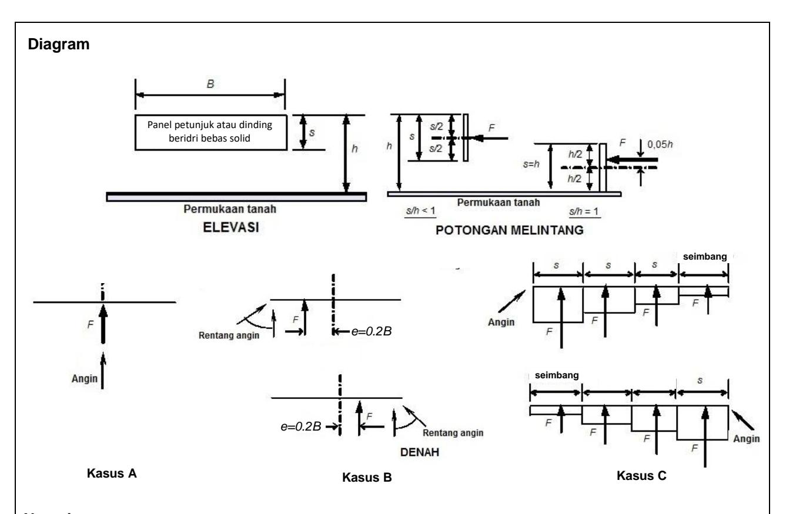

*B* = Dimensi horizontal dari panel petunjuk, dalam ft (m).

*e* = Eksentrisitas gaya, dalam ft. (m).

*F* = Gaya angin desain untuk struktur lain, dalam lb (N).

*h* = Tinggi dari panel petunjuk, dalam ft (m).

*Lr* = Dimensi horizontal dari sudut balik, dalam ft (m)

*Rmin* = *t/* min (B dan *s*)

*Rmaks*= *t/* maks (B dan *s*)

*s* = Dimensi vertikal dari panel petunjuk, dalam ft (m).

*t =* Tebal panel petunjuk dalam ft (m).

ε = Rasio dari luas solid terhadap luas kotor

#### *Koefisien Gaya, Cf*, **untuk Kasus A dan Kasus B**

| Rasio         | Rasio aspek , B/s |      |      |      |      |      |      |      |      |      |      |         |  |  |
|---------------|-------------------|------|------|------|------|------|------|------|------|------|------|---------|--|--|
| jarak,<br>s/h | ≤ 0,05            | 0,1  | 0,2  | 0,5  | 1    | 2    | 4    | 5    | 10   | 20   | 30   | <br>45 |  |  |
| 1             | 1,80              | 1,70 | 1,65 | 1,55 | 1,45 | 1,40 | 1,35 | 1,35 | 1,30 | 1,30 | 1,30 | 1,30    |  |  |
| 0,9           | 1,85              | 1,75 | 1,70 | 1,60 | 1,55 | 1,50 | 1,45 | 1,45 | 1,40 | 1,40 | 1,40 | 1,40    |  |  |
| 0,7           | 1,90              | 1,85 | 1,75 | 1,70 | 1,65 | 1,60 | 1,60 | 1,55 | 1,55 | 1,55 | 1,55 | 1,55    |  |  |
| 0,5           | 1,95              | 1,80 | 1,80 | 1,75 | 1,75 | 1,70 | 1,70 | 1,70 | 1,70 | 1,70 | 1,70 | 1,75    |  |  |
| 0,3           | 1,95              | 1,90 | 1,85 | 1,80 | 1,80 | 1,80 | 1,80 | 1,80 | 1,80 | 1,85 | 1,85 | 1,85    |  |  |
| 0,2           | 1,95              | 1,90 | 1,85 | 1,80 | 1,80 | 1,80 | 1,80 | 1,80 | 1,85 | 1,90 | 1,90 | 1,95    |  |  |
| ≤ 0,16        | 1,95              | 1,90 | 1,85 | 1,85 | 1,80 | 1,80 | 1,85 | 1,85 | 1,85 | 1,90 | 1,90 | 1,95    |  |  |

<span id="page-208-0"></span>**Gambar 29.3-1 - Beban angin desain (seluruh ketinggian): koefisien gaya,** *C<sup>f</sup>* **, untuk struktur ̶lain dinding solid berdiri bebas dan panel petunjuk berdiri bebas**

#### **Koefisien gaya,** *Cf,* **untuk kasus C Rasio Aspek,** *B/s* **Daerah (jarak horizontal dari tepi angin datang) 2 3 4 5 6 7 8 9 10 13 ≥ 45** 0 s.d. *s* 2,25 2,60 2,90 3,10\* 3,30\* 3,40\* 3,55\* 3,65\* 3,75\* 4,00\* 4,30\* *s* s.d. 2*s* 1,50 1,70 1,90 2,00 2,15 2,25 2,30 2,35 2,45 2,60 2,55 2s s.d. 3*s* 1,15 1,30 1,45 1,55 1,65 1,70 1,75 1,85 2,60 1,95 3*s* s.d. 10*s* 1,10 1,05 1,05 1,05 1,05 1,00 0,95 3s s.d. 4*s* 1,50 1,85 4s s.d. 5*s* 1,35 1,85 5*s* s.d. 10*s* 0,90 1,10 *>* 10*s* 0,55 0,55

<sup>\*</sup> Nilai harus dikalikan dengan faktor reduksi berikut apabila ada sudut balik:

| Lr /S | Faktor reduksi | Denah dari dinding atau panel |
|-------|----------------|-------------------------------|
| 0,3   | 0,90           | petunjuk dengan sudut balik   |
| 1,0   | 0,75           |                               |
| ≥ 2   | 0,60           |                               |

#### **Catatan**

- 1. Istilah dari "panel petunjuk" pada catatan ini juga berlaku untuk dinding berdiri bebas.
- 2. Panel petunjuk dengan bukaan kurang dari 30 % dari luas kotor harus dihitung sebagai panel petunjuk solid. Koefisien gaya untuk panel petunjuk solid dengan bukaan diizinkan dikali dengan faktor reduksi (1 – (1 – ε)1,5).
- 3. Untuk memperkenankan arah angin yang miring atau tegak lurus, harus memperhitungkan dua kasus berikut: Untuk kasus *s/h* **< 1**:
- Kasus A: Gaya resultan bekerja tegak lurus terhadap muka dari panel petunjuk pada garis vertikal yang memotong pusat geometris.
- Kasus B: Gaya resultan bekerja tegak lurus terhadap muka dari panel petunjuk pada pada jarak dari garis vertikal yang melalui pusat geometris sama dengan 0,2 kali lebar rata-rata dari panel petunjuk tersebut.

 Untuk panel petunjuk bermuka ganda dengan semua sisi tertutup dan *Rmaks ≤* 0,4, diizinkan menggunakan gaya eksentris, *e = (*0,2 – 0,25 *Rmaks*) *B*.

Untuk panel petunjuk bermuka ganda dengan semua sisi tertutup dan *Rmin ≤* 0,75, diizinkan mengalikan nilai *C<sup>f</sup>* di dalam tabel pada KASUS A dan B dengan faktor reduksi, (1-0,133 *Rmin).*

Untuk *B/s* **≥ 2**, KASUS C juga harus diperhitungkan :

 Kasus C: Gaya resultan bekerja tegak lurus terhadap muka dari panel petunjuk sampai ke pusat geometris setiap daerah

#### Untuk *s/h* **= 1**:

 Sama dengan kasus diatas kecuali gaya resultan yang bekerja tegak lurus berkerja diatas pusat geometris sama dengan 0,05 kali tinggi rata-rata dari panel petunjuk.

- 4. Untuk KASUS C dengan *s/h* **> 0,8**, koefisien gaya harus dikali dengan faktor reduksi (**1,8 –** *s/h***).** Reduksi ini diizinkan berlaku dengan yang disyaratkan dalam Catatan 3.
- 5. Interpolasi linear diperkenankan untuk harga-harga *s/h*, *B/s* dan *Lr/s* yang tidak tercantum diatas.

**Gambar 29.3-1 (Lanjutan) - Beban angin desain (seluruh ketinggian): koefisien gaya,** *C<sup>f</sup>* **, untuk struktur lain ̶dinding solid berdiri bebas dan panel petunjuk solid berdiri bebas**

| Koefisien gaya, <i>C<sub>f</sub></i>        |                            |     | h/D |     |
|---------------------------------------------|----------------------------|-----|-----|-----|
| Penampang-melintang                         | Tipe permukaan             | 1   | 7   | 25  |
| Persegi empat (angin tegak lurus permukaan) | Seluruh                    | 1,3 | 1,4 | 2,0 |
| Persegi empat (angin sepanjang diagonal)    | Seluruh                    | 1,0 | 1,1 | 1,5 |
| Segi enam atau segi delapan                 | Seluruh                    | 1,0 | 1,2 | 1,4 |
| Bundar $\left(D\sqrt{q_z} > 2.5\right)$     | Halus sedang               | 0,5 | 0,6 | 0,7 |
| , ,                                         | Kasar ( <i>D'/D</i> =0,02) | 0,7 | 0,8 | 0,9 |
| $D\sqrt{q_z} > 5.3$ (dalam S.I.)            | Sangat kasar D'/D=0,08)    | 0,8 | 1,0 | 1,2 |
| Bundar $\left(D\sqrt{q_z} \le 2.5\right)$   | Seluruh                    | 0,7 | 0.8 | 1.2 |
| $D\sqrt{q_z} > 5.3$ (dalam S.I.)            | Coldian                    | 0,7 | 0,0 | ٠,٧ |

- D = Diameter penampang bundar dan dimensi horizontal terkecil dari penampang persegi, segi enam atau segi delapan pada elevasi yang diperhitungkan, dalam feet (meter);
- D' = Tinggi/depth dari elemen yang menonjol seperti rusuk dan spoiler, dalam feet (meter);
- h = Tinggi struktur, dalam feet (meter);
- $q_z$  = Tekanan velositas dievaluasi pada ketinggian z di atas permukaan tanah, dalam lb/ft<sup>2</sup> (N/m<sup>2</sup>).

#### Catatan

- 1. Gaya angin desain harus dihitung berdasarkan luas struktur terproyeksi pada suatu bidang vertikal tegak lurus arah angin.
- 2. Gaya harus diasumsikan bekerja paralel terhadap arah angin.
- 3. Diizinkan Interpolasi linier untuk nilai h/D selain yang ditampilkan.

<span id="page-210-0"></span>Gambar 29.4-1 - Struktur lain (seluruh ketinggian): koefisien gaya,  $C_f$ , untuk cerobong asap, tangki, dan struktur yang serupa

| Koefisien gaya, C <sub>f</sub> |                                 |                                                                                        |                                                                   |
|--------------------------------|---------------------------------|----------------------------------------------------------------------------------------|-------------------------------------------------------------------|
|                                |                                 | Komponen strukt                                                                        | ur yang dibundarkan                                               |
| ε                              | Komponen struktur<br>sisi-datar | $ \frac{D\sqrt{q_z}}{D\sqrt{q_z}} \le 2.5 $ $ \left(D\sqrt{q_z} \le 5.3\right)_{s.i} $ | $D\sqrt{q_z} > 2.5$ $\left(D\sqrt{q_z} > 5.3\right)_{\text{S.i}}$ |
| < 0,1                          | 2,0                             | 1,2                                                                                    | 0,8                                                               |
| 0,1 s.d. 0,29                  | 1,8                             | 1,3                                                                                    | 0,9                                                               |
| 0,3 s.d. 0,7                   | 1,6                             | 1,5                                                                                    | 1,1                                                               |

#### Notasi

- $\varepsilon$  = rasio luas solid terhadap luas bruto
- D = diameter dari komponen struktur bundar tipikal, dalam feet (meter)
- $q_z$  = tekanan velositas dievaluasi pada ketinggian z di atas permukaan tanah, dalam lb/ft<sup>2</sup> (N/m<sup>2</sup>).

- 1. Panel petunjuk dengan bukaan yang terdiri 30 % atau lebih dari luas bruto diklasifikasikan sebagai panel petunjuk terbuka.
- 2. Perhitungan gaya angin desain harus berdasarkan luas seluruh komponen struktur dan elemen terekspos terproyeksi pada bidang yang tegak lurus terhadap arah angin. Gaya-gaya harus dianggap bekerja paralel terhadap arah angin.
- 3. Luas  $A_f$  konsisten dengan koefisien gaya ini yaitu luas solid terproyeksi tegak lurus terhadap arah angin.

<span id="page-210-1"></span>Gambar 29.4-2 - Struktur lain (seluruh ketinggian): koefisien gaya,  $C_f$ , untuk panel petunjuk terbuka dan rangka terbuka bidang tunggal

#### **Koefisien gaya,** *C<sup>f</sup>*

| Penampang menara | Cf                        |
|------------------|---------------------------|
| Persegi          | 2<br>4,0ε<br>– 5,9ε + 4,0 |
| Segi tiga        | 2<br>3,4ε<br>- 4,7ε + 3,4 |

#### **Notasi**

ε = rasio luas solid terhadap luas bruto dari satu muka menara untuk segmen yang ditinjau.

#### **Catatan**

- 1. Untuk seluruh arah angin yang ditinjau, luas *A<sup>f</sup>* konsisten dengan koefisien gaya yang disyaratkan yaitu luas solid dari muka menara terproyeksi pada bidang muka segmen menara yang ditinjau.
- 2. Koefisien gaya yang disyaratkan adalah untuk menara dengan besi siku struktural atau komponen struktur dengan sisi-datar yang serupa.
- 3. Untuk menara yang terdiri dari komponen stuktur yang dibundarkan, dapat diterima yaitu dengan mengalikan koefisien gaya yang disyaratkan dengan faktor berikut ketika menentukan gaya angin untuk komponen struktur:

$$0.51\epsilon^{2} + 0.57$$
, tetapi tidak > 1.0

4. Gaya angin harus digunakan pada arah yang menghasilkan gaya dan reaksi komponen struktur maksimum. Untuk menara dengan penampang persegi, gaya angin harus dikalikan dengan faktor berikut apabila angin mengarah sepanjang diagonal menara:

$$1 + 0.75\varepsilon$$
, tetapi tidak > 1,2

- 5. Gaya-gaya angin pada perlengkapan menara seperti tangga, saluran, penerangan, dan elevator, harus dihitung dengan menggunakan koefisien gaya yang sesuai untuk elemenelemen ini.
- 6. Harus diperhitungkan beban akibat pertambahan es seperti dijelaskan dalam Pasal 10.

<span id="page-211-0"></span>**Gambar 29.4-3 - Struktur lain (seluruh ketinggian): koefisien gaya,** *C<sup>f</sup>* **, untuk struktur terbuka ̶menara rangka batang**

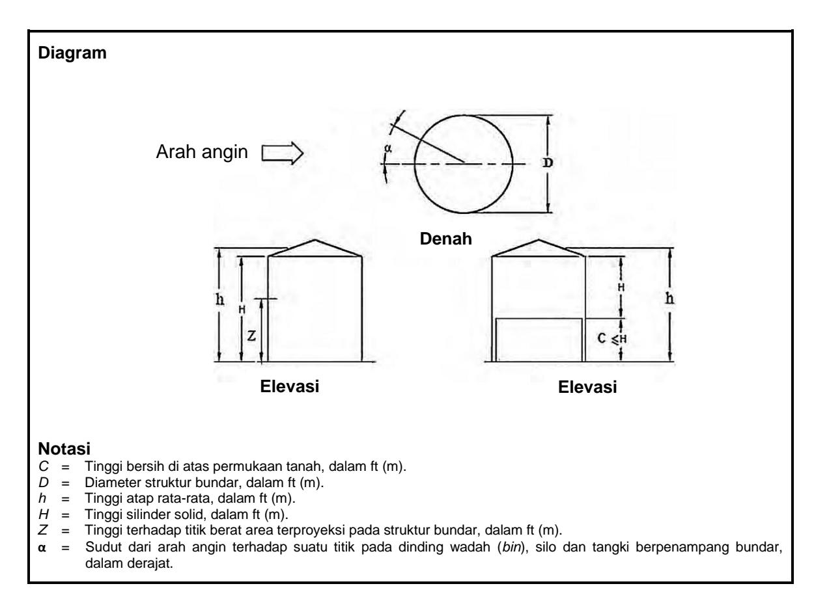

<span id="page-212-1"></span>**Gambar 29.4-4 - Struktur lain, beban angin desain untuk sistem penahan gaya angin utama [***h* **< 120 ft (***h* **< 36,6 m)]: wadah (***bin***), silo, dan tangki berpenampang bundar pada permukaan tanah atau ditumpu oleh kolom, dengan** *D* **≤ 120 ft (***D* **≤ 36,6 m), 0,25 ≤** *H***/***D* **< 4,0**

#### <span id="page-212-0"></span>**29.4.2.2 Atap wadah (***bin***), silo dan tangki berpenampang bundar terisolasi**

Tekanan desain neto pada atap wadah (*bin*), silo dan tangki berpenampang bundar harus ditentukan dari Persamaan (29.4-4):

$$\rho = q_h [GC_p - (GC_{pi})] \text{ (lb//tt}^2)$$
 (29.4-4)

$$p = q_h [GC_p - (GC_{pi})] (N/m^2)$$
 (29.4-4.si)

dengan

*q<sup>h</sup>* = tekanan velositas untuk semua permukaan terevaluasi pada tinggi atap ratarata *h*

*C<sup>p</sup>* = koefisien tekanan eksternal dari Gambar 29.4-5 untuk atap

(*GCpi*) = koefisien tekanan internal untuk struktur atap dari Pasal 26.13, dan

G = faktor efek hembusan angin dari Pasal 26.11

Tekanan eksternal pada atap kerucut, datar, atau kubah (sudut atap kurang dari 10°) dari wadah (*bin*), silo dan tangki berpenampang bundar harus sama dengan koefisien tekanan eksternal, *Cp*, diberikan pada Gambar 29.4-5 untuk Zona 1 dan Zona 2. Tekanan eksternal untuk atap kubah (sudut atap lebih dari 10°) harus ditentukan dari Gambar 27.3-2.

#### <span id="page-213-0"></span>**29.4.2.3 Sisi bawah dari wadah (***bin***), silo dan tangki berpenampang bundar terelevasi terisolasi**

Koefisien tekanan eksternal *C<sup>p</sup>* untuk bagian bawah dari wadah (*bin*), silo dan tangki berpenampang bundar dengan ketinggian bersih, *C*, di atas permukaan tanah kurang dari atau sama dengan tinggi silinder solid, *H*, harus diambil sebesar 0,8 dan −0,6. Untuk struktur dengan ketinggian bersih di atas permukaan tanah kurang dari atau sama dengan sepertiga dari ketinggian silinder, gunakan interpolasi linier antara nilainilai ini dan *C<sup>p</sup>* = 0,0 sesuai dengan rasio *C/h*, di mana *C* dan *h* didefinisikan seperti ditunjukkan pada Gambar 29.4-4.

#### <span id="page-213-1"></span>**29.4.2.4 Atap dan dinding dari wadah (***bin***), silo dan tangki berpenampang bundar yang berkelompok**

Untuk kelompok berjarak dekat dari tiga atau lebih wadah (*bin*), silo dan tangki berpenampang bundar dengan jarak pusat ke pusat kurang dari **1,25***D*, koefisien tekanan atap, *Cp*, dan koefisien gaya drag, *C<sup>f</sup>* , pada dinding yang diproyeksikan harus dihitung menggunakan Gambar 29.4-6. Tekanan desain neto pada atap harus ditentukan dari Persamaan (29.4-4). *Drag* keseluruhan harus dihitung berdasarkan Persamaan (29.4-1).

#### <span id="page-213-2"></span>**29.4.3 Panel surya atap untuk bangunan gedung dari semua ketinggian dengan atap datar atau atap pelana atau atap perisai dengan kemiringan kurang dari 7°**

Seperti yang diilustrasikan pada Gambar 29.4-7, tekanan angin desain untuk panel surya bagian atap diterapkan untuk yang terletak pada bangunan gedung tertutup atau tertutup sebagian dari semua ketinggian dengan atap datar, atau dengan atap pelana atau atap perisai dengan kemiringan *θ* ≤ 7°, dengan panel yang sesuai untuk:

 *L<sup>p</sup>* ≤ 6,7 ft (2,04 m), ω ≤ 35°,  *h*<sup>1</sup> ≤ 2 ft (0,61 m),  *h*2≤ 4 ft (1,22 m),

dengan celah minimum 0,25 in. (6,4 mm) yang disediakan di antara semua panel, dan jarak celah antar panel tidak melebihi 6,7 ft (2,04 m). Selain itu, jarak bersih horizontal minimum antara panel dan tepi atap harus lebih besar dari 2(*h*<sup>2</sup> – *hpt*) dan 4 ft (1,2 m) untuk tekanan desain pada Pasal ini untuk diterapkan. Tekanan angin desain untuk panel surya atap ditentukan oleh Persamaan (29.4-5) dan Persamaan (29.4-6):

$$p = q_h(GC_m) \text{ (lb/ft}^2)$$
 (29.4-5)

$$p = q_h(GC_{rn}) (N/m^2)$$
 (29.4-5.si)

dengan

$$(GC_m) = (\gamma_p)(\gamma_c)(\gamma_E)(GC_m)_{\text{nom}}$$
(29.4-6)

#### **keterangan**

- γ*<sup>p</sup>* = minimum (1,2; 0,9 + *hpt*/*h*);
- γ*<sup>c</sup>* = maksimum (0,6 + 0,06*Lp*; 0,8); dan
- γ*<sup>E</sup>* = 1,5 untuk beban angkat pada panel yang terekspos dan dalam jarak 1,5(*Lp*) dari ujung baris pada tepi yang terekspos dari deretan; γ*<sup>E</sup>* = 1,0 ditempat lain untuk beban angkat dan untuk semua beban ke bawah, seperti yang diilustrasikan pada Gambar 29.4-7. Panel didefinisikan sebagai terekspos jika *d*<sup>1</sup> ke tepi atap > 0,5*h* dan salah satu dari yang berikut ini diterapkan:
  - 1. *d*<sup>1</sup> ke deretan yang bersebelahan > maksimum (4*h*2, 4 ft (1,2m) atau
  - 2. *d*<sup>2</sup> ke panel yang bersebelahan berikutnya > maksimum (4*h*2; 4 ft (1,2m).

(*GCrn*)nom = koefisien tekanan neto nominal untuk panel surya bagian atap seperti ditentukan dari Gambar 29.4-7.

Apabila, ω ≤ 2°, *h***<sup>2</sup>** ≤ 0,83 ft (0,25 m), dan celah minimum sebesar 0,25 in. (6,4 mm) diberikan antara semua panel, dan jarak celah antar panel tidak melebihi 6,7 ft (2,04 m), prosedur Pasal 29.4.4 harus diizinkan.

Atap harus dirancang untuk kedua kondisi berikut:

- 1. Kasus di mana kolektor surya ada. Beban angin yang bekerja pada kolektor surya sesuai dengan Pasal ini harus diterapkan secara bersamaan dengan beban angin atap yang disyaratkan pada Pasal lain yang bekerja pada area atap yang tidak tercakup oleh bidang proyeksi kolektor surya. Untuk kasus ini, beban angin atap yang disyaratkan dalam Pasal lain tidak perlu diterapkan pada area atap yang dicakup oleh bidang proyeksi kolektor surya.
- 2. Kasus-kasus dimana deretan panel surya telah dihilangkan.

#### <span id="page-214-0"></span>**29.4.4 Panel surya bagian atap paralel dengan permukaan atap pada bangunan gedung seluruh ketinggian dan kemiringan atap**

Tekanan angin desain untuk panel surya bagian atap yang terletak pada bangunan gedung tertutup atau tertutup sebagian dari semua ketinggian, dengan panel-panel paralel dengan permukaan atap, dengan toleransi sebesar 2° dan dengan ketinggian maksimum di atas permukaan atap, *h***2**, tidak melebihi 10 in. (0,25 m) harus ditentukan sesuai dengan Pasal ini. Celah minimum 0,25 in. (6,4 mm) harus diberikan antara semua panel, dengan celah antara panel tidak melebihi 6,7 ft (2,04 m). Selain itu, deretan panel surya harus ditempatkan setidaknya 2*h***<sup>2</sup>** dari tepi atap, bubungan atap pelana atau bubungan atap perisai. Tekanan angin desain untuk kolektor surya bagian atas atap harus ditentukan oleh Persamaan (29.4-7):

$$p = q_h (GC_p)(\gamma_E)(\gamma_a) (lb/ft^2)$$
(29.4-7)

$$p = q_h (GC_p)(\gamma_E)(\gamma_a) (N/m^2)$$
 (29.4-7.si)

dengan

- (*GCp*) = koefisien tekanan eksternal untuk K&K atap dengan zonasi atap masing-masing, ditentukan dari Gambar. 30.3-2A-I hingga Gambar 30.3-7 atau Gambar 30.5-1 ;
- γ*<sup>E</sup>* = faktor deretan tepi = 1,5 untuk beban angkat pada panel yang terekspos dan dalam jarak 1,5(*Lp*) dari ujung baris pada tepi yang terekspos dari deretan;γ*<sup>E</sup>* = 1,0 di tempat lain untuk beban angkat dan untuk semua beban ke bawah, seperti yang diilustrasikan pada Gambar 29.4-7. Panel didefinisikan sebagai terekspos jika *d*<sup>1</sup> ke tepi atap> 0,5*h* dan salah satu dari yang berikut ini berlaku:
  - 1. *d*<sup>1</sup> ke deretan yang berdekatan > 4 ft (1,2 m) atau
    - 2. *d*<sup>2</sup> ke panel berdekatan berikutnya> 4 ft. (1,2 m);
- γ*<sup>a</sup>* = faktor penyetaraan tekanan panel surya, yang didefinisikan pada Gambar 29.4-8.

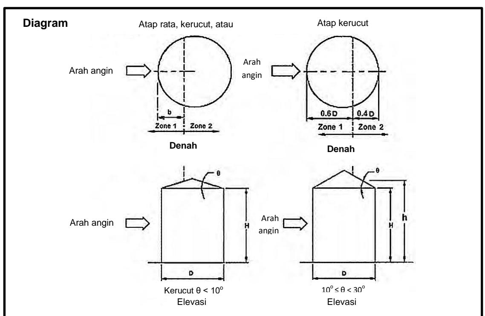

- *b* = Ditentukan di bawah, dalam ft (m), tergantung pada *H*/*D* untuk atap dengan θ rata-rata kurang dari 10 derajat.
- *h* = Tinggi atap rata-rata, dalam ft (m).
- *H* = Tinggi silinder solid, dalam ft (m).
- *D* = Diameter struktur bundar, dalam ft (m).
- θ = Sudut bidang atap dari horizontal, dalam derajat.

#### **Koefisien tekanan eksternal,** *C<sup>p</sup>*

| Zona 1 | -0,8 |
|--------|------|
| Zona 2 | -0,5 |

#### **Catatan**

Untuk atap dengan θ rata-rata kurang dari 10 derajat, dimensi, *b,* harus ditentukan sebagai berikut:

| H/D  | b         |
|------|-----------|
| 0,25 | 0,2D      |
| 0,5  | 0,5D      |
| ≥1,0 | 0,1h+0,6D |

<span id="page-215-0"></span>Interpolasi linier harus diizinkan.

<span id="page-215-2"></span><span id="page-215-1"></span>**Gambar 29.4-5 - Struktur lain, beban angin desain untuk Sistem Penahan Gaya Angin Utama [***h* **< 120 ft (***h* **< 36,6 m)]: koefisien tekanan eksternal,** *Cp***, untuk atap terisolasi dari wadah (bin), silo, dan tangki berpenampang bundar, dengan** *D* **≤ 120 ft (***D* **≤ 36,6 m), 0,25 ≤** *H***/***D* **< 4,0**

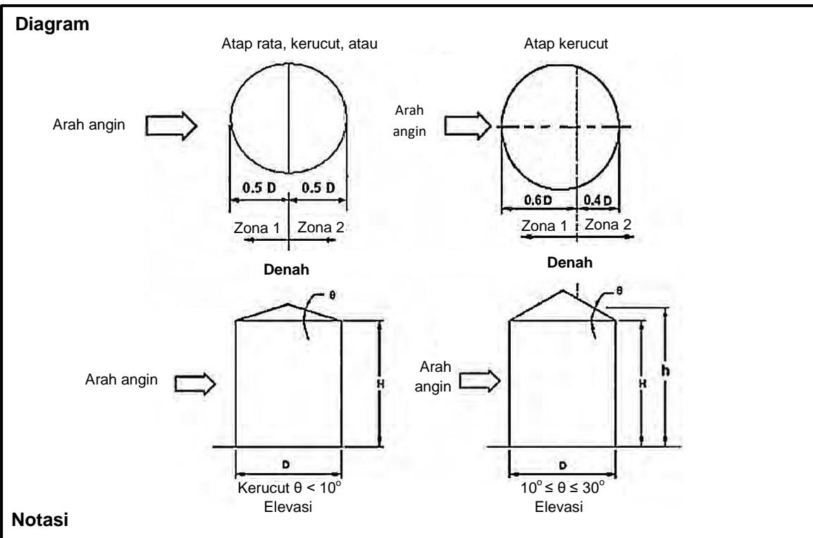

*D =* Diameter struktur bundar, dalam ft. (m).

*h =* Tinggi atap rata-rata, dalam ft. (m).

*H* = Tinggi silinder solid, dalam ft. (m).

θ = Sudut bidang atap dari horizontal, dalam derajat.

#### **Koefisien gaya** *drag* **(***C<sup>f</sup> )* **pada dinding terproyeksi**

| H/D | Cf  | Digunakan dengan |
|-----|-----|------------------|
| <1  | 1,3 | qh               |
| 2   | 1,1 | qh               |
| 4   | 1,0 | qh               |

#### **Koefisien Tekanan Atap,** *Cp***, untuk digunakan dengan** *q<sup>h</sup>*

|                  | H/D   |      | Zona 1 | Zona 2 |
|------------------|-------|------|--------|--------|
| θ < 10           | ≤ 0,5 | -0,9 |        | -0,5   |
|                  | ≥ 1,0 | -1,3 |        | -0,7   |
| 10o<br>< θ < 30o | ≤ 4   | -1,0 |        | -0,6   |

<span id="page-216-2"></span><span id="page-216-1"></span><span id="page-216-0"></span>**Gambar 29.4-6 - Struktur lain, beban desain untuk sistem penahan gaya angin utama [***h* **< 120 ft (***h* **< 36, 6 m)]: koefisien gaya drag,** *C<sup>f</sup>* **, dan koefisien tekanan atap,** *Cp***, untuk wadah (bin), silo, dan tangki berpenampang bundar berkelompok pada permukaan tanah atau didukung oleh kolom, dengan** *D* **≤ 120 ft (***D* **≤ 36,6 m), 0,25 ≤** *H***/***D* **< 4,0, dan jarak pusat ke pusat ≤ 1,25**

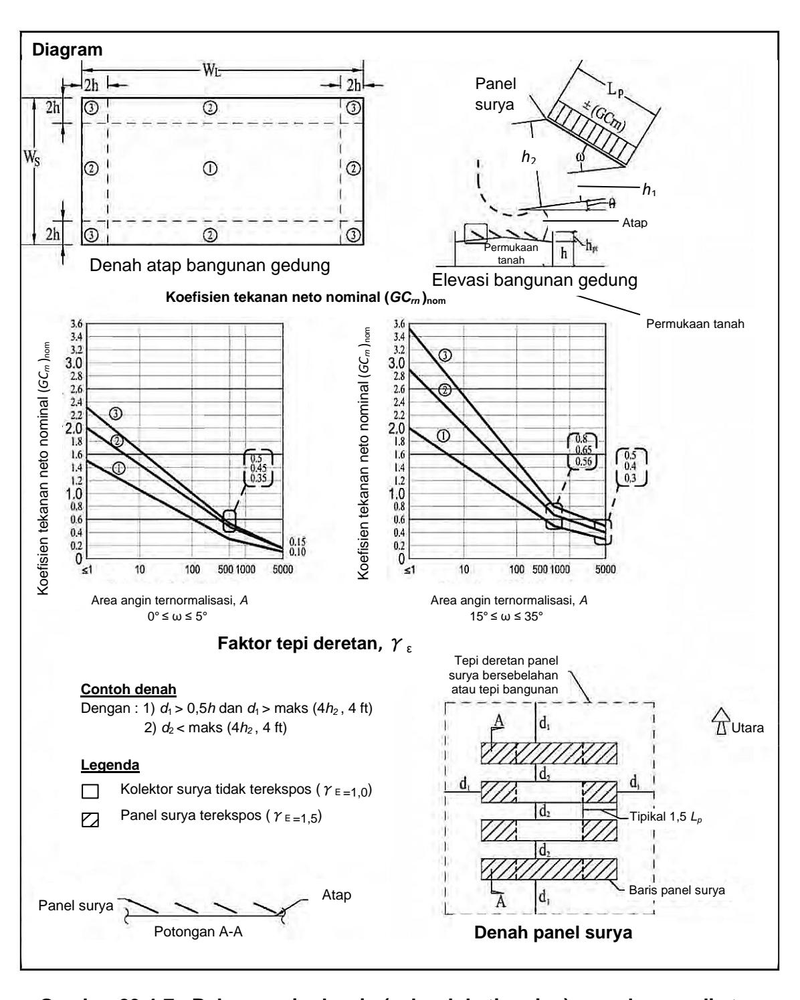

<span id="page-217-0"></span>**Gambar 29.4-7 - Beban angin desain (seluruh ketinggian): panel surya di atap untuk bangunan gedung tertutup dan tertutup sebagian, atap θ** ≤ **7°**

*A =* Area angin efektif, dalam ft<sup>2</sup>(m<sup>2</sup> )

*An*= Area angin yang dinormalisasi, tanpa dimensi

*d*<sup>1</sup> = Untuk deretan panel surya di atap, jarak horizontal tegak lurus terhadap tepi panel ke panel yang bersebelahan atau tepi bangunan gedung, abaikan peralatan atap dalam Gambar 29.4-7, dalam ft (m)

*d*<sup>2</sup> = Untuk deretan panel surya di atap, jarak horizontal dari tepi satu panel ke tepi terdekat dalam baris berikutnya pada Gambar 29.4-7, dalam ft (m)

*h =* Tinggi atap rata-rata dari bangunan gedung kecuali tinggi *eave* harus digunakan untuk sudut atap θ kurang dari atau sama dengan 10°, dalam ft (m)

*h*<sup>1</sup> = Tinggi celah antara panel dan permukaan atap, dalam ft. (m)

*h*2= Tinggi panel surya di atas atap pada tepi teratas panel, dalam ft. (m)

*hpt* = Tinggi parapet rata-rata di atas permukaan atap bersebelahan untuk digunakan dengan Persamaan 29.4-5, dalam ft. (m)

*Lp=* Panjang kord panel

*WL=* Lebar bangunan gedung pada sisi terpanjang pada Gambar 29.4-7, dalam ft. (m)

*WS=* Lebar bangunan gedung pada sisi terpendek pada Gambar 29.4-7, dalam ft. (m)

γ*E*= Faktor tepi deretan seperti ditentukan dalam Pasal 29.4-4 θ = Sudut bidang atap dari bidang horizontal, dalam derajat

*ω* = Sudut panel surya dengan permukaan atap pada Gambar 29.4-7, dalam derajat

- 1. (*GCrn* ) bekerja menuju (+) dan menjauh (-) dari permukaan atas panel.
- 2. Interpolasi linier diperbolehkan untuk *ω* antara 5° dan 15°.
- 3. *An*= (1.000/[max(*Lb*, 15)<sup>2</sup> ]*A,* dengan *A* adalah area angin efektif dari elemen struktural pada panel surya yang ditinjau, dan *Lb*adalah minimum dari 0,4(*h WL)* 0,5 , atau *h* atau *W<sup>S</sup>* dalam ft (m).

**Gambar 29.4-7 (Lanjutan) - Beban angin desain (seluruh ketinggian): panel surya di atap untuk bangunan gedung tertutup dan tertutup sebagian, atap θ ≤ 7°**

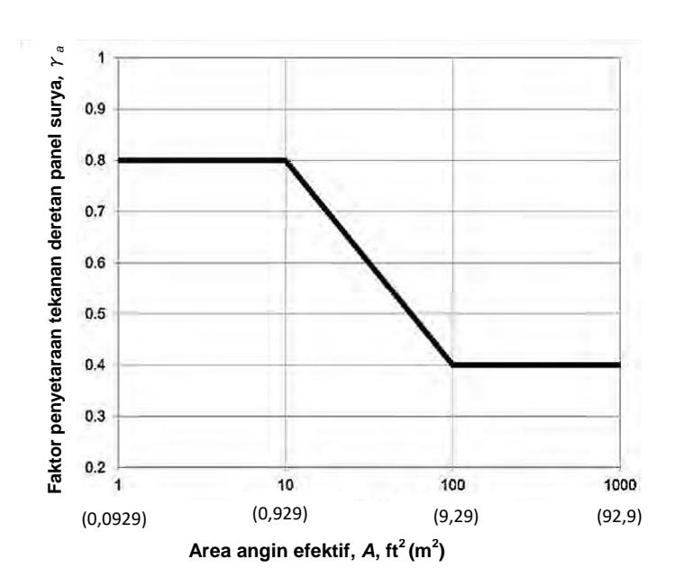

<span id="page-218-0"></span>**Gambar 29.4-8 - Faktor penyetaraan tekanan deretan panel surya,** γ**<sup>a</sup> , untuk bangunan gedung tertutup dan tertutup sebagian dari seluruh ketinggian**

Atap harus didesain untuk kedua ketentuan berikut ini:

- 1. Kasus di mana panel surya ada. Beban angin yang bekerja pada kolektor surya sesuai dengan Pasal ini harus diterapkan secara bersamaan dengan beban angin atap yang disyaratkan pada Pasal-pasal lain yang bekerja pada area atap yang tidak dicakup oleh bidang proyeksi kolektor surya. Untuk kasus ini, beban angin atap yang disyaratkan pada Pasal-pasal lain tidak perlu diterapkan pada area atap yang tercakup oleh bidang proyeksi kolektor surya.
- 2. Kasus di mana panel surya telah dihilangkan.

#### <span id="page-219-0"></span>**29.5 Parapet**

Beban angin pada parapet yang disyaratkan dalam Pasal 27.3.5 untuk bangunan gedung dari seluruh ketinggian dirancang menggunakan prosedur pengarah dan pada Pasal 28.3.2 untuk bangunan gedung bertingkat rendah dirancang menggunakan prosedur amplop.

#### <span id="page-219-1"></span>**29.6 Konsol atap**

Beban angin pada konsol atap yang disyaratkan dalam Pasal 27.3.4 untuk bangunan gedung dari semua ketinggian didesain menggunakan prosedur pengarah dan dalam Pasal 28.3.3 untuk bangunan gedung bertingkat rendah didesain menggunakan prosedur amplop.

#### <span id="page-219-2"></span>**29.7 Pembebanan angin desain minimum**

Gaya angin desain untuk struktur lain tidak boleh kurang dari 16 lb/ft<sup>2</sup> (0,77 kN/m<sup>2</sup> ) dikalikan dengan luas *A<sup>f</sup>* .

#### <span id="page-219-3"></span>**29.8 Standar Konsensus dan dokumen yang di referensikan lainnya**

Pasal ini tidak merujuk konsensus standar atau dokumen lain manapun yang dianggap sebagai bagian dari standar ini.

#### <span id="page-219-4"></span>**30 Beban angin: Komponen dan Klading (K&K)**

#### <span id="page-219-5"></span>**30.1 Ruang lingkup**

#### <span id="page-219-6"></span>**30.1.1 Tipe bangunan**

Pasal ini digunakan untuk menentukan tekanan angin pada Komponen dan Klading (K&K) pada bangunan gedung.

- 1. Bagian 1 berlaku untuk bangunan gedung tertutup atau tertutup sebagian
  - Bangunan gedung bertingkat rendah (lihat definisi pada Pasal 26.2); atau
  - Bangunan gedung dengan *h* ≤ 60 ft (18,3 m).

Bangunan gedung memiliki atap datar, atap pelana, atap pelana bentang banyak, atap perisai, atap miring sepihak, atap berjenjang, atau atap gergaji dan tekanan angin dihitung dari persamaan tekanan angin.

- 2. Bagian 2 adalah pendekatan yang disederhanakan dan berlaku untuk bangunan tertutup
  - Bangunan gedung bertingkat rendah (lihat definisi dalam Pasal 26.2); atau

- Bangunan gedung dengan *h* ≤ 60 ft (18,3 m). Bangunan gedung yang memiliki atap datar, atap pelana, atau atap perisai dan tekanan angin yang ditentukan langsung dari suatu tabel.
- 3. Bagian 3 berlaku untuk bangunan gedung tertutup atau tertutup sebagian
  - Bangunan gedung dengan *h* > 60 ft (18,3 m). Bangunan yang memiliki atap rata, atap berbubung, atap pelana, atap perisai, atap mansard, atap melengkung, atau atap kubah dan tekanan angin dihitung dari
- persamaan tekanan angin. 4. Bagian 4 adalah pendekatan yang disederhanakan dan berlaku pada bangunan gedung tertutup
  - Bangunan gedung dengan 60 ft < *h* ≤ 160 ft (18,3 m < *h* ≤ 48,8 m).
  - Bangunan yang memiliki atap datar, atap pelana, atap perisai, atap miring sepihak, atau atap mansard dantekanan angin ditentukan langsung dari tabel.
- 5. Bagian 5 berlaku untuk bangunan gedung terbuka dari semua ketinggian yang memiliki atap bebas berbubung, atap bebas miring sepihak, atau atap bebas cekung.
- 6. Bagian 6 berlaku untuk perlengkapan bangunan gedung seperti konsol atap, parapet dan peralatan bagian atas atap.
- 7. Bagian 7 berlaku untuk struktur nongedung–wadah (*bin*), silo dan tangki berpenampang bundar; dan panel surya di atap
  - Wadah (*bin*), silo dan tangki berpenampang bundar: *h* ≤ 120 ft (38,6 m).
  - Panel surya di atap: Bangunan gedung dari semua ketinggian dengan atap datar atau atap pelana atau atap perisai dengan kemiringan atap kurang dari atau sama dengan 7°.

#### <span id="page-220-0"></span>**30.1.2 Kondisi**

Suatu bangunan gedung dengan beban angin desain yang ditentukan menurut Pasal ini harus memenuhi semua kondisi berikut:

- 1. Bangunan gedung berbentuk teratur seperti ditetapkan dalam Pasal 26.2; dan
- 2. Bangunan gedung tidak memiliki karakteristik respons sehingga mengalami beban angin melintang, pusaran angin, ketidakstabilan akibat getaran atau gerakan yang tidak teratur, atau tidak terletak pada lokasi di mana efek kanal atau hempasan berulang sebagai akibat adanya halangan di sisi angin datang yang membutuhkan pertimbangan khusus.

#### <span id="page-220-1"></span>**30.1.3 Pembatasan**

Ketentuan-ketentuan Pasal ini memperhitungkan efek pembesaran beban yang disebabkan oleh hembusan angin beresonansi dengan vibrasi bersama angin dari bangunan gedung fleksibel. Beban pada bangunan gedung yang tidak memenuhi persyaratan Pasal 30.1.2, atau yang memiliki bentuk atau karakteristik respons yang tidak biasa, harus ditentukan dengan menggunakan literatur yang diakui dengan mendokumentasikan efek beban angin atau harus menggunakan prosedur terowongan angin yang ditetapkan dalam Pasal 31.

#### <span id="page-220-2"></span>**30.1.4 Pelindung**

Tidak ada reduksi tekanan velositas akibat pelindung nyata yang diberikan oleh bangunan gedung dan struktur lain atau fitur medan.

#### <span id="page-221-0"></span>30.1.5 Klading permeabel udara

Beban angin desain yang ditentukan dari Pasal 30 harus digunakan untuk klading permeabel udara, termasuk rakitan atap vegetatif modular, kecuali data uji disetujui atau literatur yang diakui membuktikan beban yang lebih rendah untuk tipe klading permeabel udara yang sedang diperhitungkan.

#### <span id="page-221-1"></span>30.2 Persyaratan umum

#### <span id="page-221-2"></span>30.2.1 Parameter beban angin yang ditetapkan dalam Pasal 26

Parameter beban angin berikut yang disyaratkan dalam Pasal 26:

- Kecepatan Angin Dasar, V (Pasal 26.5).
- Faktor pengarah angin,  $K_d$  (Pasal 26.6).
- · Kategori eksposur (Pasal 26.7).
- Faktor topografi  $K_{zt}$  (Pasal 26.8).
- Faktor elevasi permukaan tanah, K<sub>e</sub> (Pasal 26.9)
- Koefisien eksposur tekanan velositas,  $K_z$  atau  $K_h$  (Pasal 26.10.1); Tekanan velositas,  $q_z$  (Pasal 26.10.2)
- Faktor efek hembusan angin (Pasal 26.11).
- · Klasifikasi ketertutupan (Pasal 26.12).
- Koefisien tekanan internal (*GC*<sub>pi</sub>) (Pasal 26.13).

#### <span id="page-221-3"></span>30.2.2 Tekanan angin desain minimum

Tekanan angin desain untuk komponen dan klading pada bangunan gedung tidak boleh kurang dari suatu tekanan neto 16 lb/ft² (0,77 kN/m²) yang bekerja dalam arah tegak lurus terhadap permukaan.

#### <span id="page-221-4"></span>30.2.3 Luas tributari lebih besar dari 700 ft<sup>2</sup> (65 m<sup>2</sup>)

Luas elemen Komponen dan Klading yang lebih besar dari 700 ft<sup>2</sup> (65 m<sup>2</sup>) harus didesain menggunakan ketentuan Sistem Penahan Gaya Angin Utama (SPGAU).

#### <span id="page-221-5"></span>30.2.4 Koefisien tekanan eksternal

Faktor efek hembusan angin dan koefisien tekanan eksternal terkombinasi untuk Komponen dan Klading, ( $GC_p$ ), yang diberikan dalam gambar yang berkaitan dengan Pasal ini. Nilai koefisien tekanan dan faktor efek hembusan angin tidak boleh terpisah.

#### Bagian 1: Bangunan Gedung Bertingkat Rendah

**CATATAN** Gunakan Bagian 1 dari Pasal 30 untuk menentukan tekanan angin pada K&K bangunan gedung bertingkat rendah tertutup dan tertutup sebagian yang memiliki bentuk atap sebagaimana disyaratkan dalam gambar yang berlaku. Ketentuan dalam Bagian 1 didasarkan pada prosedur amplop, dengan *tekanan angin dihitung menggunakan persamaan yang ditetapkan* sebagaimana berlaku untuk setiap permukaan bangunan gedung. Untuk bangunan gedung yang ketentuan-ketentuan ini berlaku, umumnya metode ini menghasilkan tekanan angin terendah dari semua metode analisis yang ada dalam standar ini.

#### <span id="page-221-6"></span>30.3 Tipe bangunan

Ketentuan Pasal 30.3 berlaku untuk bangunan gedung tertutup dan tertutup sebagian:

- Bangunan gedung bertingkat rendah (lihat definisi dalam Pasal 26.2); atau
- Bangunan gedung dengan *h* ≤ 60 ft (18,3 m).

Bangunan gedung yang memiliki atap datar, atap pelana, atap pelana bentang banyak, atap perisai, atap miring sepihak, atap bertingkat, atau atap gergaji. Langkah-langkah yang diperlukan untuk penentuan beban angin pada komponen dan klading untuk tipe bangunan gedung ini ditunjukkan dalam Tabel 30.3-1.

#### <span id="page-222-0"></span>**30.3.1 Kondisi**

Untuk menentukan tekanan angin desain pada komponen dan klading yang menggunakan ketentuan Pasal 30.3.2, kondisi yang ditunjukkan pada gambar yang dipilih harus gambar yang sesuai dengan bangunan gedung yang sedang diperhitungkan.

#### <span id="page-222-1"></span>**30.3.2 Tekanan angin desain**

Tekanan angin desain pada elemen komponen dan klading dari bangunan bertingkat rendah dan bangunan gedung dengan *h* ≤ 60 ft (18,3 m) harus ditentukan dari persamaan berikut:

$$p = q_h[(GC_p) - (GC_{pi})] \text{ (lb/ft}^2)$$
(30.3-1)

$$p = q_h[(GC_p) - (GC_{pi})] \text{ (N/m}^2)$$
(30.3-1.si)

dengan

*q<sup>h</sup>* = tekanan velositas dievaluasi pada ketinggian atap rata-rata *h* seperti ditetapkan dalam Pasal 26.10;

(*GCp*) = koefisien tekanan eksternal diberikan dalam:

- Gambar 30.3-1 (dinding),
- Gambar 30.3-2A–I (atap datar, atap pelana, dan atap perisai),
- Gambar 30.3-3 (atap bertingkat),
- Gambar 30.3-4 (atap pelana bentang banyak),
- Gambar 30.3-5A–B (atap miring sepihak),
- Gambar 30.3-6 ((atap gergaji),
- Gambar 30.3-7 (atap kubah),
- Gambar 27.3-3, Catatan 4 (atap lengkung);

(*GCpi*) = koefisien tekanan internal diberikan dalam Tabel 26.13-1.

#### **Bagian 2: Bangunan gedung bertingkat rendah (disederhanakan)**

**CATATAN** Bagian 2 dari Pasal 30 adalah metode sederhana untuk menentukan tekanan angin pada K&K pada *bangunan gedung bertingkat rendah tertutup* yang memiliki bentuk atap datar, atap pelana, atau atap perisai. Ketentuan Bagian 2 didasarkan pada prosedur amplop Bagian 1 dengan *tekanan angin ditentukan dari tabel* dan disesuaikan seperlunya.

#### <span id="page-222-2"></span>**30.4 Tipe bangunan gedung**

Ketentuan Pasal 30.4 berlaku untuk bangunan tertutup:

- Bangunan bertingkat rendah (lihat definisi dalam Pasal 26.2); atau
- Bangunan gedung dengan *h* ≤ 60 ft (18,3 m).

#### <span id="page-223-2"></span>**Tabel 30.3-1 - Langkah-langkah untuk menentukan beban angin K&K bangunan gedung bertingkat rendah tertutup dan tertutup sebagian**

**Langkah 1:** Tentukan kategori risiko, lihat Tabel 1.5-1.

**Langkah 2:** Tentukan kecepatan angin dasar, *V*, untuk kategori risiko yang sesuai; lihat Buku Peta Angin Indonesia.

**Langkah 3:** Tentukan parameter beban angin:

- Faktor pengarah angin, *Kd*, lihat Pasal 26.6 dan Tabel 26.6-1.
- Kategori eksposur B, C atau D, lihat Pasal 26.7.
- Faktor topografi, *Kzt*, lihat Pasal 26.8 dan Gambar 26.8-1.
- Faktor elevasi permukaan tanah, *Ke*; Pasal 26.9 dan Tabel 26.9-1.
- Klasifikasi ketertutupan, lihat Pasal 26.12.
- Koefisien tekanan internal, (*GCpi*), lihat Pasal 26.13 dan Tabel 26.13-1.
- **Langkah 4:** Tentukan koefisien eksposur tekanan velositas, *Kh*, lihat Tabel 26.10-1.
- **Langkah 5:** Tentukan tekanan velositas, *qh*, Persamaan (26.10-1).
- **Langkah 6:** Tentukan koefisien tekanan eksternal, (*GCp*):
- Dinding, lihat Gambar 30.3-1.
- Atap datar, atap pelana, atap perisai; lihat Gambar 30.3-2.
- Atap bertingkat; lihat Gambar 30.3-3.
- Atap pelana bentang banyak, lihat Gambar 30.3-4.
- Atap miring sepihak; lihat Gambar 30.3-5.
- Atap gergaji, lihat Gambar 30.3-6.
- Atap kubah, lihat Gambar 30.3-7.
- Atap lengkung, lihat Gambar 27.3-3, Catatan 4.

**Langkah 7:** Hitung tekanan angin, *p*; Persamaan 30.3-1.

Bangunan gedung memiliki atap datar, atap pelana, atau atap perisai. Langkah-langkah yang diperlukan untuk menentukan beban angin pada Komponen dan Klading untuk tipe-tipe bangunan gedung yang ditunjukkan dalam Tabel 30.4-1.

#### <span id="page-223-0"></span>**30.4.1 Kondisi**

Untuk desain Komponen dan Klading, bangunan gedung harus memenuhi semua kondisi berikut:

- 1. Ketinggian atap rata-rata *h* harus kecil dari atau sama dengan 60 ft (18,3 m) [h ≤ 60 ft (18,3 m)].
- 2. Bangunan gedung adalah tertutup seperti ditetapkan dalam Pasal 26.2 dan sesuai dengan ketentuan puing terbawa angin dari Pasal 26.12.3.
- 3. Bangunan gedung adalah bangunan gedung berbentuk teratur seperti ditetapkan dalam Pasal 26.2.
- 4. Bangunan gedung yang tidak memiliki karakteristik respons sehingga mengalami beban angin melintang, pusaran angin, atau ketidakstabilan akibat getaran atau gerakan yang tidak teratur; atau tidak terletak pada lokasi di mana efek kanal atau hempasan berulang sebagai akibat adanya halangan di sisi angin datang yang membutuhkan pertimbangan khusus.
- 5. Bangunan gedung yang memiliki baik atap datar, atap pelana dengan *θ* ≤ 45º, atau atap perisai dengan *θ* ≤ 27º.

#### <span id="page-223-1"></span>**30.4.2 Tekanan angin desain**

Tekanan angin desain neto, *pnet*, untuk komponen dan klading dari bangunan gedung yang didesain menggunakan prosedur yang disyaratkan di sini mewakili tekanan neto (jumlah dari internal dan eksternal) yang harus diterapkan tegak lurus pada setiap permukaan bangunan gedung seperti ditunjukkan dalam Gambar 30.4-1. *pnet* harus ditentukan oleh persamaan berikut:

#### dengan

- = faktor penyesuaian untuk ketinggian dan eksposur bangunan gedung dari Gambar 30.4-1;
- *kzt* = faktor topografi seperti ditetapkan dalam Pasal 26.8, dievaluasi pada 0,33 ketinggian atap rata-rata, 0,33*h*; dan

*pnet*30= tekanan angin desain neto untuk Eksposur B, pada *h =* 30 ft (9,1 m), dari Gambar 30.4-1.

#### **Diagram**

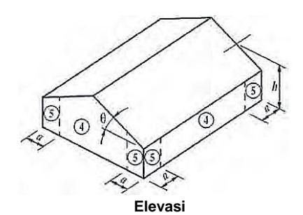

#### **Notasi**

*a =* 10 % dimensi horizontal terkecil atau 0,4*h,* pilih yang terkecil, tetapi tidak boleh kurang 4 % dimensi horizontal terkecil atau 3 ft. (0,9 m).

**PENGECUALIAN** Untuk bangunan gedung dengan θ = 0° sampai 7° dan dimensi horizontal terkecil lebih besar dari 300 ft (90 m), dimensi *a* harus dibatasi sampai maksimum 0,8*h.*

*h =* Ketinggian atap rata-rata, dalam ft (m), kecuali ketinggian *eave* harus digunakan untuk θ ≤ 10°.

θ = Sudut bidang atap dari horizontal, dalam derajat.

#### **Koefisien tekanan eksternal, (***GCp***) - Dinding**

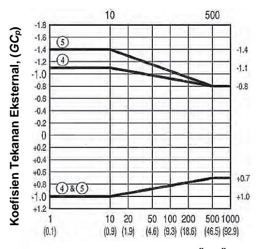

**Area Angin Efektif, ft<sup>2</sup> (m<sup>2</sup> )**

- 1. Skala vertikal dinyatakan dalam (*GCp)* untuk digunakan dengan *qh.*
- 2. Skala horizontal dinyatakan dalam area angin efektif, dalam ft<sup>2</sup> (m<sup>2</sup> ).
- 3. Tanda positif dan negatif menyatakan tekanan bekerja menuju dan menjauh dari permukaan.
- 4. Setiap komponen harus didesain untuk tekanan maksimum positif dan negatif.
- 5. Nilai dari (*GCp)* untuk dinding harus direduksi sebesar 10 % bila θ ≤ 10°.

<span id="page-224-0"></span>**Gambar 30.3-1 - Komponen dan Klading [***h* **≤ 60 ft (***h* **≤ 18,3 m)]: koefisien tekanan eksternal, (***GCp* **), untuk bangunan gedung tertutup dan tertutup sebagian ̶ dinding**

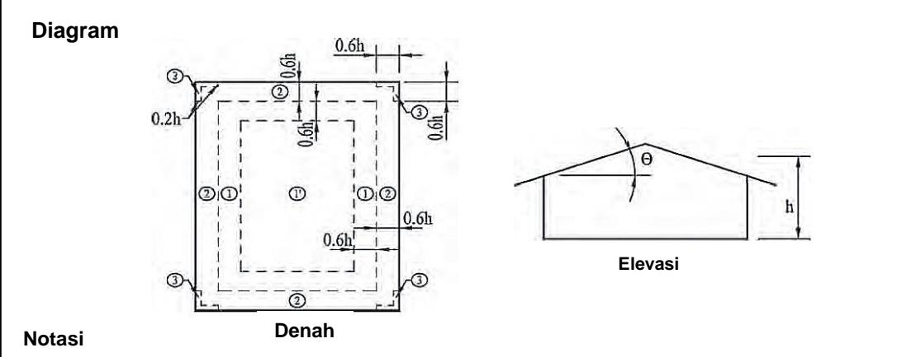

B = dimensi horizontal dari bangunan gedung yang diukur tegak lurus arah angin, dalam ft (m).

 $h = \text{Ketinggian } eave \text{ harus digunakan untuk } \theta = 10^{\circ}.$ 

 $\theta$  = sudut bidang atap dari horisontal, dalam derajat.

#### Koefisien tekanan eksternal

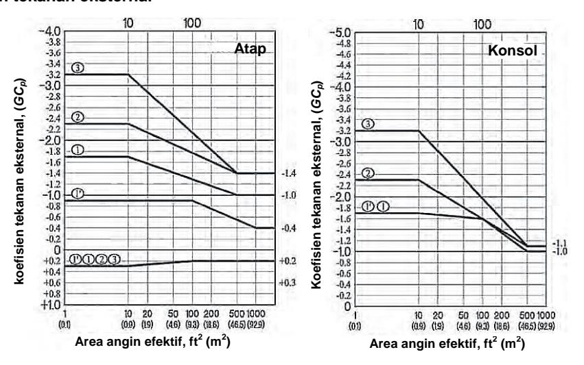

- 1. Skala vertikal dinyatakan dalam ( $GC_p$ ) untuk digunakan dengan  $q_h$
- Skala horizontal dinyatakan dalam area angin efektif, dalam ft² (m²).
- 3. Tanda positif dan negatif menyatakan tekanan bekerja menuju dan menjauh dari permukaan.
- 4. Setiap komponen harus didesain untuk tekanan maksimum positif dan negatif.
- 5. Jika parapet sama dengan atau lebih tinggi dari 3 ft (0,9 m) yang ada di sekeliling perimeter dari atap dengan  $\theta \le 7^{\circ}$ , nilai negatif dari ( $GC_p$ ) pada Zona 3 harus sama dengan Zona 2, dan nilai positif ( $GC_p$ ) pada Zona 2 dan Zona 3 harus diatur sama dengan untuk dinding Zona 4 dan Zona 5, dalam Gambar 30.3-1.
- 6. Nilai (GCp) untuk konsol atap mencakup kontribusi tekanan dari permukaan teratas dan terbawah.
- 7. Jika ada konsol, dimensi horisontal terkecil dari bangunan gedung tidak boleh mencakup dimensi konsol, tetapi jarak tepi, *a*, harus diukur dari tepi luar konsol.

<span id="page-225-0"></span>Gambar 30.3-2A - Komponen dan Klading [ $h \le 60$  ft ( $h \le 18,3$  m)]: koefisien tekanan eksternal, (GCp), untuk bangunan gedung tertutup dan tertutup sebagian atap pelana,  $\theta \le 7^{\circ}$ 

#### **Diagram**

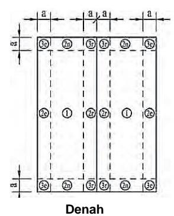

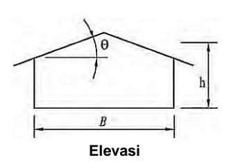

#### **Notasi**

- *a =* 10 % dimensi horizontal terkecil atau 0,4*h,* pilih yang terkecil, tetapi tidak boleh kurang dari 4 % dimensi horizontal terkecil atau 3 ft. (0,9 m). Jika ada konsol, jarak tepi harus diukur dari tepi luar konsol. Dimensi horizontal yang digunakan untuk menghitung jarak tepi tidak boleh mencakup jarak konsol.
- *B* = Dimensi horizontal dari bangunan gedung yang diukur tegak lurus arah angin, dalam ft (m).
- *h* = Ketinggian atap rata-rata, dalam ft (m), kecuali ketinggian *eave* harus digunakan untuk θ ≤ 10°.
- θ = sudut bidang atap dari horisontal, dalam derajat.

#### **Koefisien tekanan eksternal**

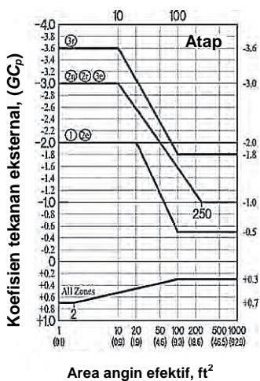

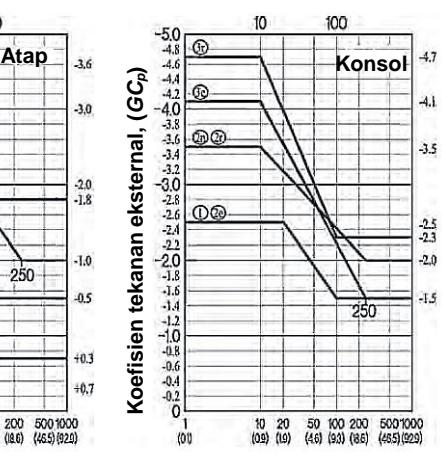

**Area angin efektif, ft<sup>2</sup>**

- 1. Skala vertikal dinyatakan dalam (*GCp)* untuk digunakan dengan *qh.*
- 2. Skala horizontal dinyatakan dalam area angin efektif, dalam ft<sup>2</sup> (m<sup>2</sup> ).
- 3. Tanda positif dan negatif menyatakan tekanan bekerja menuju dan menjauh dari permukaan.
- 4. Setiap komponen harus didesain untuk tekanan maksimum positif dan negatif.
- 5. Nilai (*GCp)* untuk konsol atap mencakup kontribusi tekanan dari permukaan teratas dan terbawah.
- 6. Jika ada konsol, dimensi horisontal terkecil dari bangunan gedung tidak boleh mencakup dimensi konsol, tetapi jarak tepi, *a,* harus diukur dari tepi luar konsol.

<span id="page-226-0"></span>**Gambar 30.3-2B - Komponen dan Klading [***h* **≤ 60 ft (***h* **≤ 18,3 m)]: koefisien tekanan eksternal, (***GCp***), untuk bangunan gedung tertutup dan tertutup sebagian—atap pelana, 7° < θ ≤ 20°**

#### Diagram

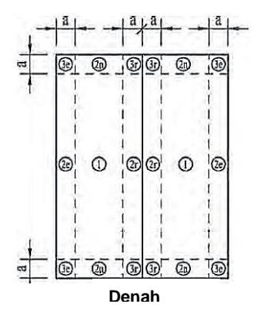

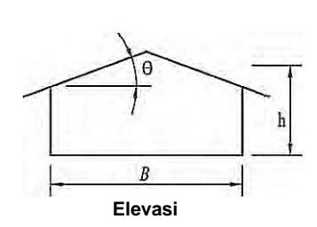

#### Notasi

- a=10 % dimensi horisontal terkecil atau 0,4h, pilih yang terkecil, tetapi tidak boleh kurang dari 4 % dimensi horizontal terkecil atau 3 ft. (0,9 m). Jika ada konsol, jarak tepi harus diukur dari tepi luar konsol. Dimensi horizontal yang digunakan untuk menghitung jarak tepi tidak boleh mencakup jarak konsol.
- B = Dimensi horizontal dari bangunan gedung yang diukur tegak lurus arah angin, dalam ft (m).
- h = Ketinggian atap rata-rata, dalam ft (m).
- $\theta$  = Sudut bidang atap dari horisontal, dalam derajat.

#### Koefisien tekanan eksternal

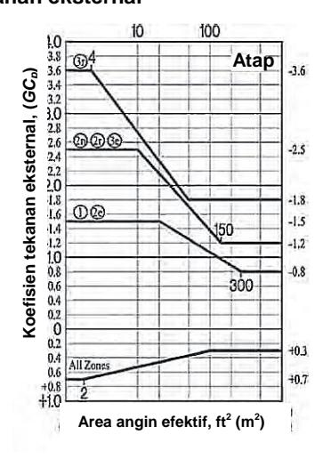

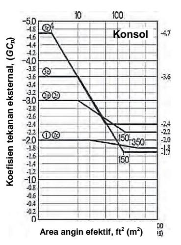

#### Catatan

- 1. Skala vertikal dinyatakan dalam ( $GC_p$ ) untuk digunakan dengan  $q_h$
- 2. Skala horizontal dinyatakan dalam area angin efektif, dalam ft² (m²).
- 3. Tanda positif dan negatif menyatakan tekanan bekerja menuju dan menjauh dari permukaan.
- 4. Setiap komponen harus didesain untuk tekanan maksimum positif dan negatif.
- 5. Nilai  $(GC_p)$  untuk konsol atap mencakup kontribusi tekanan dari permukaan teratas dan terbawah.
- 6. Jika ada konsol, dimensi horizontal terkecil dari bangunan gedung tidak boleh mencakup dimensi konsol, tetapi jarak tepi, *a*, harus diukur dari tepi luar konsol.

<span id="page-227-0"></span>Gambar 30.3-2C - Komponen dan Klading [ $h \le 60$  ft ( $h \le 18,3$  m)]: koefisien tekanan eksternal, (GCp), untuk bangunan gedung tertutup dan tertutup sebagian atap pelana,  $20^{\circ} < \theta \le 27^{\circ}$ 

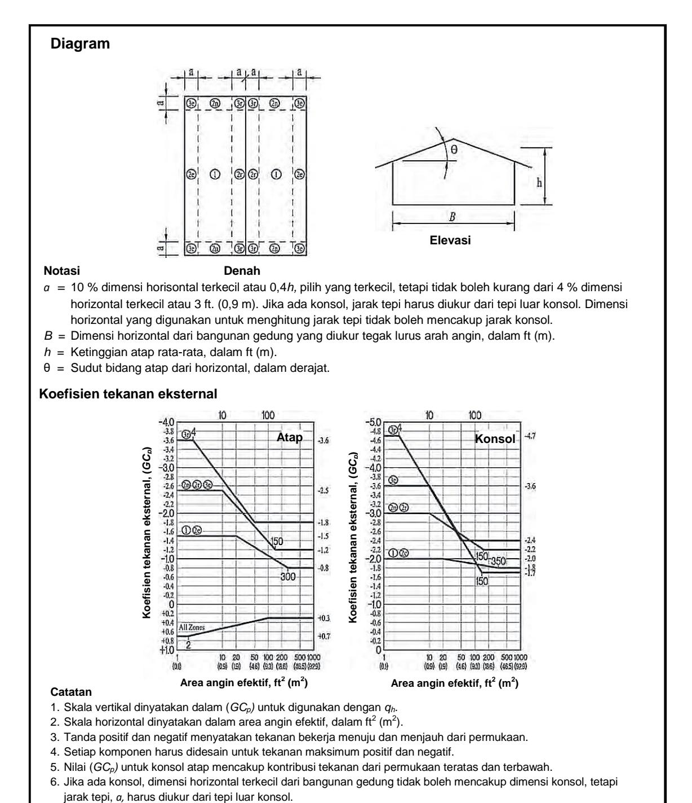

<span id="page-228-0"></span>Gambar 30.3-2D - Komponen dan Klading [ $h \le 60$  ft ( $h \le 18,3$  m)]: koefisien tekanan eksternal, (GCp), untuk bangunan gedung tertutup dan tertutup sebagian atap pelana,  $27^{\circ} < \theta \le 45^{\circ}$ 

# Diagram B B Flevasi

#### Notasi

- a = 10 % dimensi horizontal terkecil atau 0,4h, pilih yang terkecil, tetapi tidak boleh kurang dari 4 % dimensi horizontal terkecil atau 3 ft. (0,9 m). Jika ada konsol, jarak tepi harus diukur dari tepi luar konsol. Dimensi horizontal yang digunakan untuk menghitung jarak tepi tidak boleh mencakup jarak konsol.
- h = Ketinggian atap rata-rata, dalam ft (m), kecuali ketinggian eave harus digunakan untuk  $\theta \le 10^\circ$ .
- B = Dimensi horizontal dari bangunan gedung yang diukur tegak lurus arah angin, dalam ft (m).
- $\theta$  = Sudut bidang atap dari horizontal, dalam derajat.

#### Koefisien tekanan eksternal

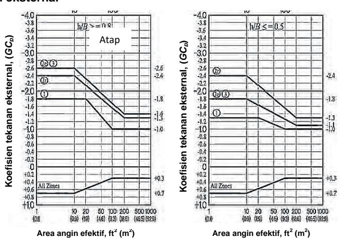

#### Catatan

- 1. Skala vertikal dinyatakan dalam ( $GC_p$ ) untuk digunakan dengan  $q_h$
- 2. Skala horizontal dinyatakan dalam area angin efektif, dalam ft<sup>2</sup> (m<sup>2</sup>).
- 3. Tanda positif dan negatif menyatakan tekanan bekerja menuju dan menjauh dari permukaan.
- 4. Setiap komponen harus didesain untuk tekanan maksimum positif dan negatif.
- Jika ada konsol, dimensi horizontal terkecil dari bangunan gedung tidak boleh mencakup dimensi konsol, tetapi jarak tepi, a, harus diukur dari tepi luar konsol.
- 6. Interpolasi ( $GC_p$ ) antara dua nilai h/B yang berbeda diperlukan untuk 0.5 < h/B < 0.8.
- 7. B untuk Zona 3 adalah dimensi horizontal terkecil. B untuk Zona 1 dan 2e adalah tegak lurus lebar bangunan gedung dan tegak lurus eave yang ditentukan Zona 2e.

<span id="page-229-0"></span>Gambar 30.3-2E - Komponen dan Klading [ $h \le 60$  ft ( $h \le 18,3$  m)]: koefisien tekanan eksternal, (GCp), untuk bangunan tertutup dan tertutup sebagian—atap perisai,  $7^{\circ} < \theta \le 20^{\circ}$  (atap)

#### Diagram

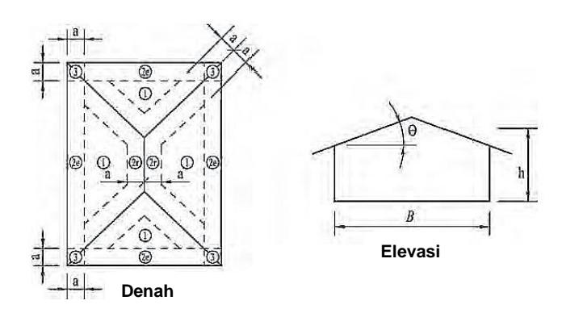

#### Notasi

- a = 10 % dimensi horizontal terkecil atau 0,4h, pilih yang terkecil, tetapi tidak boleh kurang dari 4 % dimensi horizontal terkecil atau 3 ft. (0,9 m). Jika ada konsol, jarak tepi harus diukur dari tepi luar konsol. Dimensi horizontal yang digunakan untuk menghitung jarak tepi tidak boleh mencakup jarak konsol.
- h = Ketinggian atap rata-rata, dalam ft (m), kecuali ketinggian eave harus digunakan untuk  $\theta \le 10^{\circ}$ .
- B = Dimensi horizontal dari bangunan gedung yang diukur tegak lurus arah angin, dalam ft (m).
- $\theta$  = Sudut bidang atap dari horisontal, dalam derajat.

#### коefisien tekanan eksternal

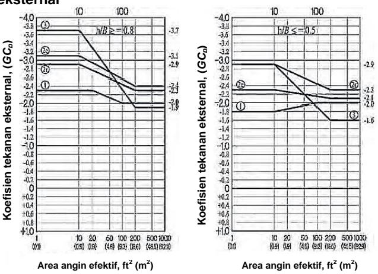

#### Catatan

- 1. Skala vertikal dinyatakan dalam ( $GC_p$ ) untuk digunakan dengan  $q_h$ .
- 2. Skala horisontal dinyatakan dalam area angin efektif, dalam ft² (m²).
- 3. Tanda positif dan negatif menyatakan tekanan bekerja menuju dan menjauh dari permukaan.
- 4. Setiap komponen harus didesain untuk tekanan maksimum positif dan negatif.
- 5. Nilai  $(GC_p)$  untuk konsol atap mencakup kontribusi tekanan dari permukaan teratas dan terbawah.
- 6. Jika ada konsol, dimensi horisontal terkecil dari bangunan gedung tidak boleh mencakup dimensi konsol, tetapi jarak tepi, *a,* harus diukur dari tepi luar konsol.
- 7. Interpolasi ( $GC_0$ ) antara dua nilai h/B yang berbeda diperlukan untuk 0.5 < h/B < 0.8.
- 8. *B* untuk Zona 3 adalah dimensi horizontal terkecil. *B* untuk Zona 1 dan 2e adalah tegak lurus lebar bangunan dedung dan tegak lurus eave yang ditentukan Zona 2e.

<span id="page-230-0"></span>Gambar 30.3-2F - Komponen dan Klading [ $h \le 60$  ft ( $h \le 18,3$  m)]: koefisien tekanan eksternal, (GCp), untuk bangunan tertutup dan tertutup sebagian atap perisai,  $7^{\circ} < \theta \le 20^{\circ}$  (konsol)

# Diagram B

#### Notasi

- a = 10 % dimensi horizontal terkecil atau 0,4h, pilih yang terkecil, tetapi tidak boleh kurang dari 4 % dimensi horizontal terkecil atau 3 ft. (0,9 m). Jika ada konsol, jarak tepi harus diukur dari tepi luar konsol. Dimensi horizontal yang digunakan untuk menghitung jarak tepi tidak boleh mencakup jarak konsol.
- B = Dimensi horizontal dari bangunan gedung yang diukur tegak lurus arah angin, dalam ft (m).

Denah

- h = Ketinggian atap rata-rata, dalam ft (m)
- $\theta$  = Sudut bidang atap dari horisontal, dalam derajat.

Koefisien tekanan eksternal -4.0 -3.6 -3.2 -3.0 -2.8 -2.2 -2.0 -2.0 -1.6 -1.4 -1.0 -0.4 -0.2 -0.4 -0.4 -0.4 -0.4 -0.4 -0.4 -0.4 -0.4 Atap Koefisien tekanan eksternal, (GC<sub>p</sub>) @@:3 +0.3 10.7

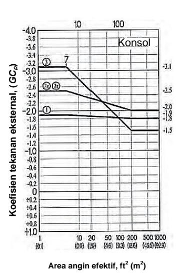

Elevasi

#### Catatan

- Skala vertikal dinyatakan dalam ( $GC_p$ ) untuk digunakan dengan  $q_b$ -
- Skala horizontal dinyatakan dalam area angin efektif, dalam ft<sup>2</sup> (m<sup>2</sup>).
- 3. Tanda positif dan negatif menyatakan tekanan bekerja menuju dan menjauh dari permukaan.
- Setiap komponen harus didesain untuk tekanan maksimum positif dan negatif.

Area angin efektif, ft2 (m2)

- Nilai  $(GC_n)$  untuk konsol atap mencakup kontribusi tekanan dari permukaan teratas dan terbawah.
- Jika ada konsol, dimensi horizontal terkecil dari bangunan gedung tidak boleh mencakup dimensi konsol, tetapi jarak tepi, a, harus diukur dari tepi luar konsol.

<span id="page-231-0"></span>Gambar 30.3-2G - Komponen dan Klading [ $h \le 60$  ft ( $h \le 18,3$  m)]: koefisien tekanan eksternal, (GCp), untuk bangunan tertutup dan tertutup sebagian-atap perisai,  $20^{\circ} < \theta \le 27^{\circ}$  (atap dan konsol)

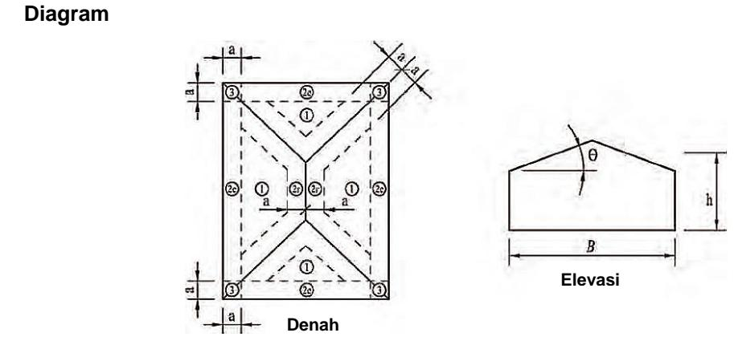

- a = 10 % dimensi horizontal terkecil atau 0,4h, pilih yang terkecil, tetapi tidak boleh kurang dari 4 % dimensi horizontal terkecil atau 3 ft. (0,9 m). Jika ada konsol, jarak tepi harus diukur dari tepi luar konsol. Dimensi horizontal yang digunakan untuk menghitung jarak tepi tidak boleh mencakup jarak konsol.
- B = Dimensi horizontal dari bangunan gedung yang diukur tegak lurus arah angin, dalam ft (m).
- h = Ketinggian atap rata-rata, dalam ft (m)
- $\theta$  = Sudut bidang atap dari horisontal, dalam derajat.


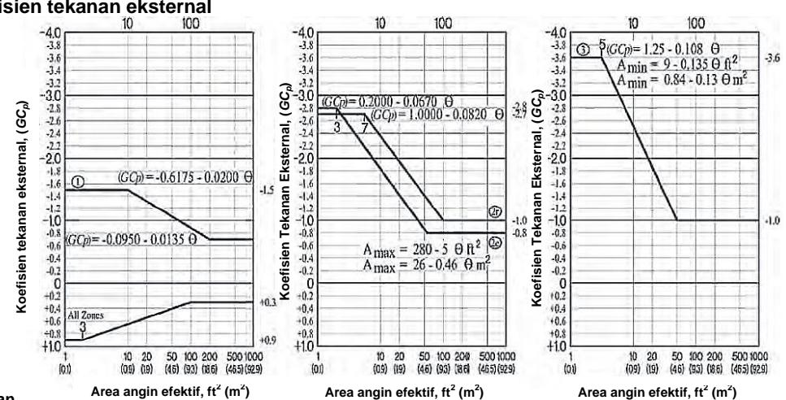

#### Catatan

- 1. Skala vertikal dinyatakan dalam ( $GC_p$ ) untuk digunakan dengan  $q_h$
- Skala horizontal dinyatakan dalam area angin efektif, dalam ft<sup>2</sup> (m<sup>2</sup>)
- Tanda positif dan negatif menyatakan tekanan bekerja menuju dan menjauh dari permukaan.
- Setiap komponen harus didesain untuk tekanan maksimum positif dan negatif.
- Jika ada konsol, dimensi horizontal terkecil dari bangunan gedung tidak boleh mencakup dimensi konsol, tetapi jarak tepi, a, harus diukur dari tepi luar konsol.
- $A_{min}$  = luas tributari minimum (untuk luas kurang dari  $A_{min}$ , gunakan nilai ( $GC_p$ ) untuk  $A_{min}$ ).
- $A_{maks}$  = luas tributari maksimum (untuk luas lebih dari  $A_{maks}$ , gunakan nilai ( $GC_p$ ) untuk  $A_{maks}$ ).
- Nilai ( $GC_p$ ) diberikan untuk kemiringan atap,  $\theta = 45^\circ$ ; untuk kemiringan lain, gunakan persamaan.

<span id="page-232-0"></span>Gambar 30.3-2H - Komponen dan Klading [ $h \le 60$  ft ( $h \le 18,3$  m)]: koefisien tekanan eksternal, (GCp), untuk bangunan tertutup dan tertutup sebagian-atap perisai,  $27^{\circ} < \theta \le 45^{\circ}$  (atap)

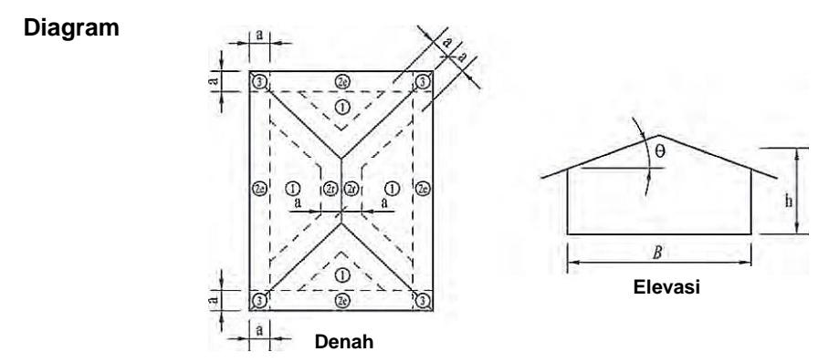

- a = 10 % dimensi horizontal terkecil atau 0,4h, pilih yang terkecil, tetapi tidak boleh kurang dari 4 % dimensi horizontal terkecil atau 3 ft. (0,9 m). Jika ada konsol, jarak tepi harus diukur dari tepi luar konsol. Dimensi horizontal yang digunakan untuk menghitung jarak tepi tidak boleh mencakup jarak konsol.
- B = Dimensi horizontal dari bangunan gedung yang diukur tegak lurus arah angin, dalam ft (m).
- h = Ketinggian atap rata-rata, dalam ft (m)
- $\theta$  = Sudut bidang atap dari horisontal, dalam derajat.

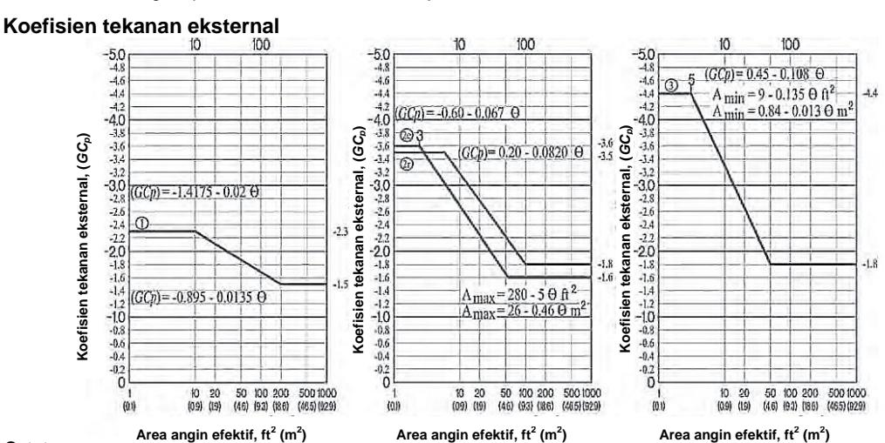

#### Catatan

- 1. Skala vertikal dinyatakan dalam ( $GC_p$ ) untuk digunakan dengan  $q_b$ .
- 2. Skala horizontal dinyatakan dalam area angin efektif, dalam ft<sup>2</sup> (m<sup>2</sup>).
- 3. Tanda positif dan negatif menyatakan tekanan bekerja menuju dan menjauh dari permukaan.
- 4. Setiap komponen harus didesain untuk tekanan maksimum positif dan negatif.
- 5. Nilai  $(GC_p)$  untuk konsol atap mencakup kontribusi tekanan dari permukaan teratas dan terbawah.
- 6. Jika ada konsol, dimensi horizontal terkecil dari bangunan gedung tidak boleh mencakup dimensi konsol, tetapi jarak tepi, *a,* harus diukur dari tepi luar konsol.
- 7.  $A_{min}$  = luas tributari minimum (untuk luas kurang dari  $A_{min}$ , gunakan nilai ( $GC_p$ ) untuk  $A_{min}$ .
- 8.  $A_{maks}$  = luas tributari maksimum (untuk luas lebih dari  $A_{maks}$ , gunakan nilai ( $GC_p$ ) untuk  $A_{maks}$ .
- 9. Nilai ( $GC_0$ ) diberikan untuk kemiringan atap,  $\theta = 45^{\circ}$ ; untuk kemiringan lain, gunakan persamaan.

<span id="page-233-0"></span>Gambar 30.3-2I - Komponen dan Klading [ $h \le 60$  ft ( $h \le 18,3$  m)]: koefisien tekanan eksternal, ( $GC_p$ ), untuk bangunan tertutup dan tertutup sebagian atap perisai, 27°  $< \theta \le 45$ ° (konsol)

#### **Diagram**

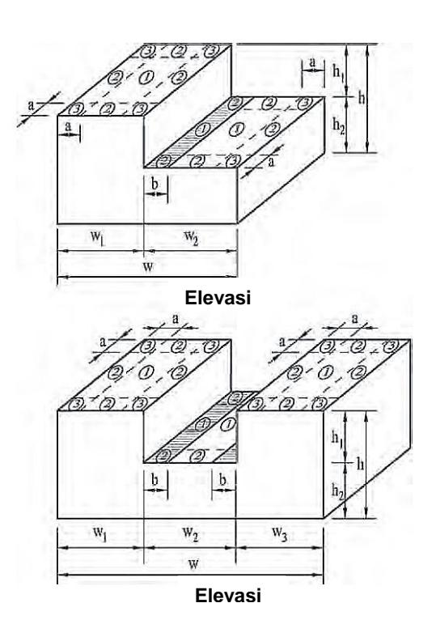

#### **Notasi**

- *a =* 10 % dari dimensi horizontal terkecil atau 0,4*h,* pilih yang terkecil, tetapi tidak boleh kurang dari 4 % dari dimensi horizontal terkecil atau 3 ft. (0,9 m).
- *b* = 1,5*h*1, tetapi tidak lebih besar dari 100 ft (30,5 m).
- *h* = Ketinggian atap rata-rata, dalam ft (m).
- *h<sup>i</sup>* = *h*<sup>1</sup> atau *h*2; *h* = *h*<sup>1</sup> + *h*2; *h*<sup>1</sup> ≥ 10 ft (3,1 m); *hi*/*h* = 0,3 sampai 0,7.
- *W* = Lebar bangunan gedung
- *W<sup>i</sup>* = *W*<sup>1</sup> atau *W*<sup>2</sup> atau *W*<sup>3</sup> dalam Gambar 30.3-1. *W* = *W*<sup>1</sup> + *W*<sup>2</sup> atau *W*<sup>1</sup> + *W*<sup>2</sup> + *W*3; *Wi*/*W* = 0,25 sampai 0,75.
- θ = Sudut bidang atap dari horisontal, dalam derajat.

#### **Catatan**

Pada level terendah atap datar, atap bertingkat yang ditunjukkan disini, penunjukkan zona dan koefisien tekanan yang ditunjukkan dalam Gambar 30.3-2A harus diterapkan, kecuali bahwa pada perpotongan atap dinding teratas, Zona 3 harus diperlakukan seperti Zona 2 dan Zona 2 harus diperlakukan seperti Zona 1. Nilai positif (*GCp)* sama dengan untuk dinding dalam Gambar 30.3-1 harus diterapkan pada area yang diarsir silang yang ditunjukkan di sini.

<span id="page-234-0"></span>**Gambar 30.3-3 - Komponen dan Klading [***h* **≤ 60 ft (***h* **≤ 18,3 m)]: koefisien tekanan eksternal, (***GCp***), untuk bangunan gedung tertutup dan tertutup sebagian ̶atap bertingkat**

# **Diagram Elevasi bangunan gedung**

**(2 bentang atau lebih)**

#### **Denah dan elevasi pada modul bentang tunggal**

#### **Notasi**

- *a =* 10 % dimensi horisontal terkecil dari modul bentang tunggal atau 0,4*h,* pilih yang terkecil, tetapi tidak boleh kurang dari 4 % dimensi horisontal terkecil dari modul bentang tunggal atau 3 ft. (0,9 m).
- *h* = Ketinggian atap rata-rata dalam ft (m), kecuali ketinggian eave harus digunakan untuk θ ≤ 10°.
- *W* = Lebar modul bangunan gedung, dalam ft (m).
- θ = Sudut bidang atap dari horizontal, dalam derajat.

#### **Koefisien tekanan eksternal**

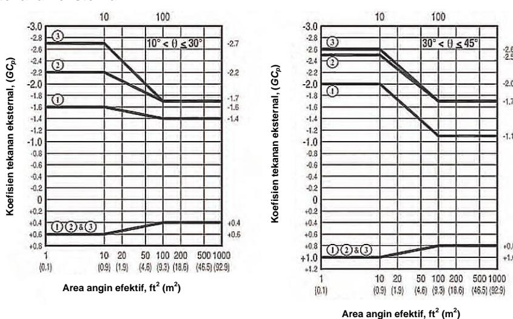

#### **Catatan**

- 1. Skala vertikal dinyatakan dalam (*GCp)* untuk digunakan dengan *qh.*
- 2. Skala horizontal dinyatakan dalam area angin efektif, dalam ft<sup>2</sup> (m<sup>2</sup> ).
- 3. Tanda positif dan negatif menyatakan tekanan bekerja menuju dan menjauh dari permukaan.
- 4. Setiap komponen harus didesain untuk tekanan maksimum positif dan negatif.
- 5. Untuk θ ≤ 10°, harus digunakan nilai (*GCp)* dari Gambar 30.3-2A.

<span id="page-235-0"></span>**Gambar 30.3-4 - Komponen dan Klading [***h* **≤ 60 ft (***h* **≤ 18,3 m)]: koefisien tekanan eksternal, (***GCp***), untuk bangunan gedung tertutup dan tertutup sebagian ̶atap pelana bentang banyak**

#### **Diagram**

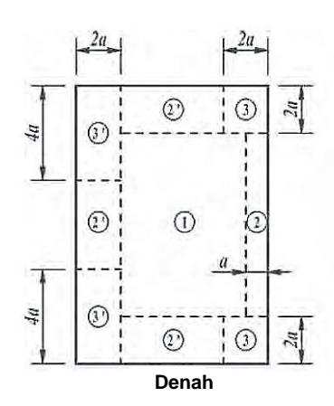

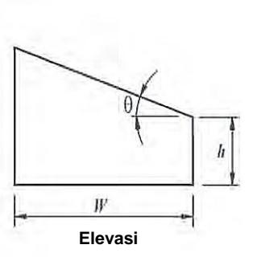

#### **Notasi**

- *a =* 10 % dimensi horizontal terkecil atau 0,4*h,* pilih yang terkecil, tetapi tidak boleh kurang dari 4 % dimensi horizontal terkecil atau 3 ft. (0,9 m).
- *h* = Tinggi *eave* harus digunakan untuk θ ≤ 10°.
- *W* = Lebar bangunan gedung, dalam ft (m).
- θ = Sudut bidang atap dari horizontal, dalam derajat.

#### **Koefisien Tekanan Eksternal**

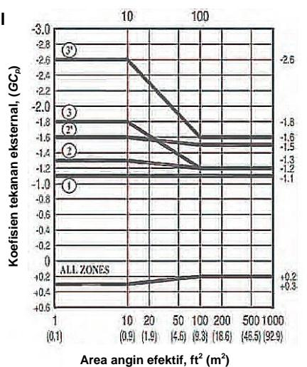

- 1. Skala vertikal dinyatakan dalam (*GCp)* untuk digunakan dengan *qh.*
- 2. Skala horizontal dinyatakan dalam area angin efektif, dalam ft<sup>2</sup> (m<sup>2</sup> ).
- 3. Tanda positif dan negatif menyatakan tekanan bekerja menuju dan menjauh dari permukaan.
- 4. Setiap komponen harus didesain untuk tekanan maksimum positif dan negatif.
- 5. Untuk θ ≤ 3°, harus digunakan nilai (*GCp)* dari Gambar 30.3-2A.

<span id="page-236-0"></span>**Gambar 30.3-5A - Komponen dan Klading [***h* **≤ 60 ft (***h* **≤ 18,3 m)]: koefisien tekanan eksternal, (***GCp***), untuk bangunan gedung tertutup dan tertutup sebagian ̶atap miring sepihak, 3° < θ ≤ 10°**

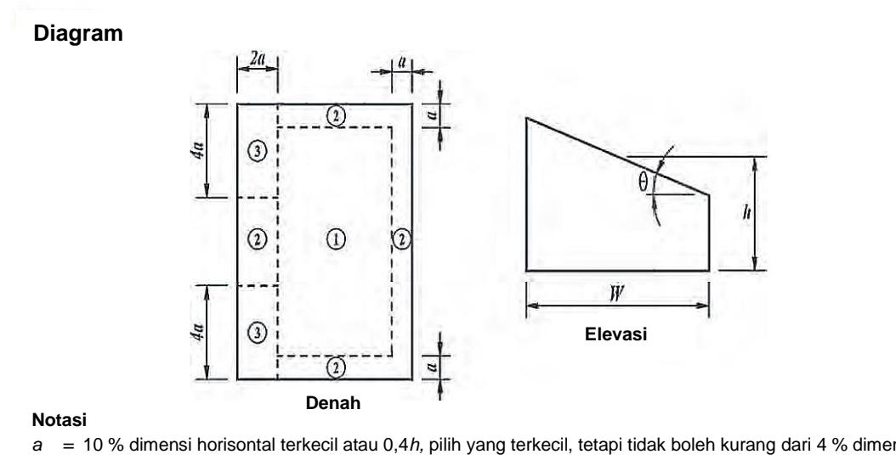

- *a =* 10 % dimensi horisontal terkecil atau 0,4*h,* pilih yang terkecil, tetapi tidak boleh kurang dari 4 % dimensi horizontal terkecil atau 3 ft. (0,9 m).
- *h* = Ketinggian atap rata-rata dalam ft (m).
- *W* = Lebar bangunan gedung, dalam ft (m).
- θ = Sudut bidang atap dari horizontal, dalam derajat.

#### **Koefisien Tekanan Eksternal**

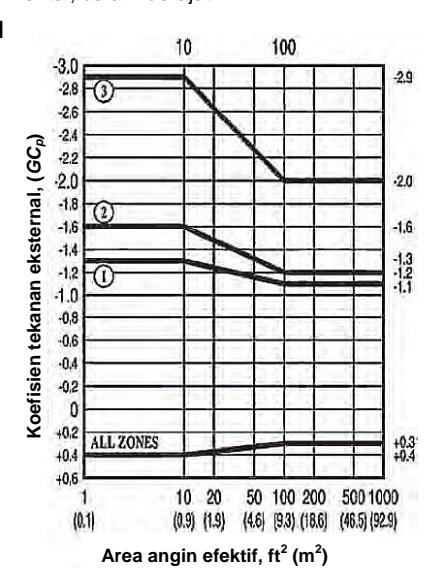

#### **Catatan**

- 1. Skala vertikal dinyatakan dalam (*GCp)* untuk digunakan dengan *qh.*
- 2. Skala horizontal dinyatakan dalam area angin efektif *A*, dalam ft<sup>2</sup> (m<sup>2</sup> ).
- 3. Tanda positif dan negatif menyatakan tekanan bekerja menuju dan menjauh dari permukaan.
- 4. Setiap komponen harus didesain untuk tekanan maksimum positif dan negatif.

<span id="page-237-0"></span>**Gambar 30.3-5B - Komponen dan Klading [***h* ≤ **60 ft (***h* ≤ **18,3 m)]: koefisien tekanan eksternal, (***GCp***), untuk bangunan gedung tertutup dan tertutup sebagian ̶ atap miring sepihak, 10° < θ** ≤ **30°**

#### **Diagram**

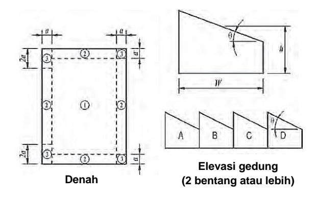

#### **Notasi**

- *a =* 10 % dari dimensi horizontal terkecil atau 0,4*h,* pilih yang terkecil, tetapi tidak boleh kurang dari 4 % dimensi horizontal terkecil atau 3 ft. (0,9 m).
- *h* = Ketinggian atap rata-rata dalam ft (m), kecuali tinggi *eave* harus digunakan untuk ϴ ≤ 10<sup>0</sup> .
- *W* = Lebar modul bangunan gedung, dalam ft (m).
- θ = Sudut bidang atap dari horizontal, dalam derajat.

#### **Koefisien Tekanan Eksternal**

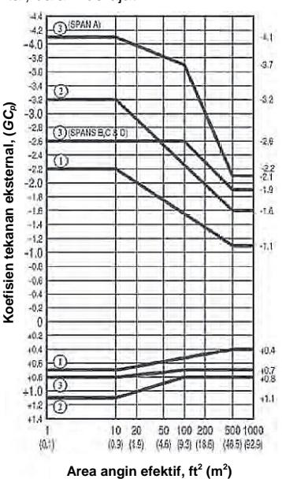

- 1. Skala vertikal dinyatakan dalam (*GCp)* untuk digunakan dengan *qh.*
- 2. Skala horisontal dinyatakan dalam area angin efektif *A*, dalam ft<sup>2</sup> (m<sup>2</sup> ).
- 3. Tanda positif dan negatif menyatakan tekanan bekerja menuju dan menjauh dari permukaan.
- 4. Setiap komponen harus didesain untuk tekanan maksimum positif dan negatif.
- 5. Untuk θ ≤ 10°, harus digunakan nilai (*GCp)* dari Gambar 30.3-2A.

<span id="page-238-0"></span>**Gambar 30.3-6 - Komponen dan Klading [***h* **≤ 60 ft (***h* **≤ 18,3 m)]: koefisien tekanan eksternal, (***GCp***), untuk bangunan gedung tertutup dan tertutup sebagian ̶atap gergaji**

#### **Diagram Denah** Arah Angin Arah Angin **Notasi Elevasi**

*f* = Tinggi kubah, dalam ft (m).

*D* = Diameter struktur bundar atau komponen struktur, dalam ft (m).

*hD*= Tinggi sampai dasar kubah, dalam ft (m).

θ = sudut bidang atap dari horizontal, dalam derajat

#### **Koefisien untuk kubah dengan dasar bundar**

| Tekanan<br>eksternal | Tekanan<br>negatif | Tekanan<br>positif | Tekanan<br>positif |
|----------------------|--------------------|--------------------|--------------------|
| θ, derajat           | 0-90               | 0-60               | 61-90              |
| (GCp)                | -0,9               | +0,9               | +0,5               |

#### **Catatan**

- 1. Nilai yang dinyatakan dalam (*GCp*) digunakan dengan *q(hD+f)* dengan (*hD+f*) adalah tinggi pada puncak kubah.
- *2.* Tanda positif dan negatif menyatakan tekanan bekerja menuju dan menjauh dari permukaan.
- 3. Setiap komponen harus didesain untuk tekanan maksimum positif dan negatif.
- 4. Nilai yang berlaku untuk 0 ≤ *hD/D* ≤ 0,5, 0,2 ≤ *f/D* ≤ 0,5.
- 5. θ = 0 derajat pada tali busur, θ = 90 derajat pada titik puncak kubah, *f* diukur dari tali busur ke puncak kubah.

#### <span id="page-239-1"></span>**Gambar 30.3-7 - Komponen dan Klading (semua ketinggian) : koefisien tekanan eksternal, (***GCp***), untuk bangunan gedung tertutup dan tertutup sebagian ̶atap kubah**

<span id="page-239-3"></span><span id="page-239-2"></span>**Tabel 30.4-1 - Langkah-langkah untuk menentukan beban angin K&K untuk bangunan bertingkat rendah tertutup (metode sederhana)**

**Langkah 1:** Tentukan kategori risiko, lihat Tabel 1.5-1

**Langkah 2:** Tentukan kecepatan angin dasar, *V*, untuk kategori risiko yang sesuai; lihat Buku Peta Angin Indonesia.

**Langkah 3:** Tentukan parameter beban angin:

- Kategori eksposur B, C atau D; lihat Pasal 26.7
- Faktor topografi, *Kzt*; lihat Pasal 26.8 dan Gambar 26.8-1

**Langkah 4:** Masukkan gambar untuk menentukan tekanan angin pada *h* = 30 ft., *pnet*30; lihat Gambar 30.4-1

**Langkah 5:** Masukkan gambar untuk menentukan penyesuaian untuk tinggi dan eksposur bangunan gedung, ; lihat Gambar 30.4-1

**Langkah 6:** Tentukan tekanan angin yang disesuaikan, *pnet*; lihat Persamaan 30.4-1.

#### **Bagian 3: Bangunan gedung dengan** *h* **> 60 ft (***h* **> 18,3 m)**

**CATATAN** Gunakan Bagian 3 Pasal 30 untuk menentukan tekanan angin untuk K&K dari *bangunan tertutup dan tertutup sebagian dengan h >* 60 ft. (18,3 m) yang memiliki bentuk atap seperti ditetapkan dalam gambar yang sesuai. Ketentuan ini adalah berdasarkan pada Prosedur Pengarah dengan *tekanan angin yang dihitung dari persamaan yang ditetapkan yang berlaku untuk setiap permukaan bangunan gedung*.

#### <span id="page-239-0"></span>**30.5 Tipe bangunan gedung**

Ketentuan Pasal 30.5 berlaku untuk bangunan gedung tertutup atau tertutup sebagian dengan ketinggian atap rata-rata *h* > 60 ft. ( *h* < 18,3 m) dengan atap datar, atap berbubung, atap pelana, atap perisai, atap mansard, atap lengkung, atau atap kubah. Langkah-langkah yang diperlukan untuk menentukan beban angin pada komponen dan klading untuk tipe-tipe bangunan gedung ditunjukkan dalam Tabel 30.5-1.

#### <span id="page-240-0"></span>**30.5.1 Kondisi**

Untuk menentukan tekanan angin desain pada K&K dengan menggunakan ketentuan Pasal 30.5.2, kondisi yang ditunjukkan pada gambar yang dipilih harus berlaku untuk bangunan gedung yang ditinjau.

#### <span id="page-240-1"></span>**30.5.2 Tekanan angin desain**

Tekanan angin desain pada K&K untuk seluruh bangunan gedung dengan *h* > 60 ft (*h* < 18,3 m) harus ditentukan dari persamaan berikut:

$$p = q(GC_p) - q_i(GC_{pi}) \text{ (lb/ft}^2)$$
(30.5-1)

$$p = q(GC_p) - q_i(GC_{pi}) \text{ (N/m}^2)$$
(30.5-1.si)

dengan

- *q* = *qz*untuk dinding di sisi angin datang dihitung pada ketinggian *z* di atas permukaan tanah;
- *q* = *q<sup>h</sup>* untuk dinding di sisi angin pergi, dinding sisi, dan atap dievaluasi pada ketinggian *h*;
- *q<sup>i</sup>* = *q<sup>h</sup>* untuk dinding di sisi angin datang, dinding sisi, dinding di sisi angin pergi, dan atap dari bangunan gedung tertutup dan untuk evaluasi tekanan internal negatif pada bangunan gedung tertutup sebagian.
- *q<sup>i</sup>* = *q<sup>z</sup>* untuk evaluasi tekanan internal positif pada bangunan gedung tertutup sebagian di mana ketinggian *z* yang didefinisikan sebagai level dari bukaan tertinggi dalam bangunan gedung yang dapat mempengaruhi tekanan internal positif. Untuk evaluasi tekanan internal positif, *q<sup>i</sup>* boleh secara konservatif dievaluasi pada ketinggian *h* (*qi*= *qh*);

(*GCp*) = koefisien tekanan eksternal diberikan dalam:

- Gambar 30.5-1 untuk dinding dan atap datar,
- Gambar 27.3-3, catatan 4, untuk atap lengkung,
- Gambar 30.3-7 untuk atap kubah,
- Catatan 6 dari Gambar 30.5-1 untuk sudut atap dan geometri lain;

(*GCpi*) =koefisien tekanan internal yang diberikan dalam Tabel 26.13-1.

*q* dan *qi*harus dievaluasi dengan menggunakan eksposur yang ditetapkan dalam Pasal 26.7.3.

**PENGECUALIAN** Pada bangunan gedung dengan ketinggian atap rata-rata *h* lebih besar dari 60 ft (18.3 m) dan kurang dari 90 ft (27,4 m), nilai (*GCp*) dari Gambar 30.3-1 sampai Gambar 30.3-6 diizinkan digunakan jika rasio tinggi terhadap lebar adalah satu atau kurang.

# **Diagram** Atap datar/perisai/pelana (0° ≤ θ ≤ 7°) Atap perisai (7° ≤ θ ≤ 45°)

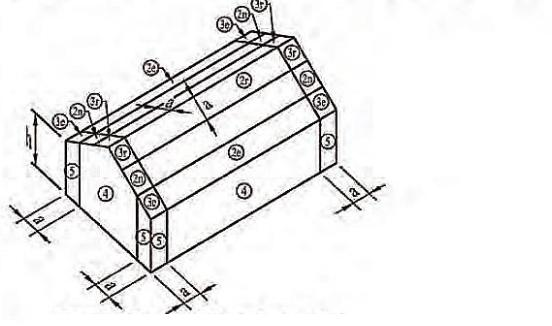

Atap pelana (7° < θ ≤ 45°)

#### **Notasi**

*a* = 10 % dimensi horizontal terkecil atau 0,4*h,* pilih yang terkecil, tetapi tidak boleh kurang dari 4 % dimensi horizontal terkecil atau 3 ft. (0,9 m).

**PENGECUALIAN** Untuk gedung dengan θ = 0° sampai dengan 7° dan dimensi horizontal terkecil lebih besar dari 300 ft (90m), dimensi *a* harus dibatasi sampai nilai maksimum sebesar 0,8 *h.*

*h* = Tinggi atap rata-rata, dalam ft (m), kecuali ketinggian *eave* harus digunakan untuk sudut atap < 10°.

θ = sudut bidang atap dari horizontal, dalam derajat.

#### **Catatan**

- 1. Tekanan yang ditunjukkan diterapkan tegak lurus permukaan, untuk Eksposur B, pada *h* = 30 ft (9,1 m). Sesuaikan untuk kondisi lain dengan menggunakan Persamaan (30.4-1).
- 2. Tanda positif dan negatif menyatakan tekanan bekerja menuju dan menjauh dari permukaan.
- 3. Untuk atap perisai dengan θ ≤ 25°, Zona 3 harus diperlakukan seperti Zona 2e dan 2r.
- 4. Untuk area angin efektif antara yang diberikan di sini, nilai-nilai dapat diinterpolasi; gunakan nilai yang disesuaikan dengan area angin efektif yang lebih rendah lainnya.
- 5. Jika ada konsol, dimensi horizontal terkecil dari bangunan gedung tidak boleh mencakup dimensi konsol, tetapi jarak tepi, *a*, harus diukur dari tepi terluar konsol.

<span id="page-241-1"></span><span id="page-241-0"></span>**Gambar 30.4-1 - Komponen dan Klading, Bagian 2 [***h* ≤ **60 ft (***h* ≤ **18,3 m)]: tekanan angin desain untuk bangunan gedung tertutup—dinding dan atap** 

Tekanan angin desain neto,  $p_{\text{net30}}$ , dalam lb/ft<sup>2</sup>, untuk Eksposur B pada h = 30 ft, V = 95-130 mph

|                             | 7    | Effective                       |      |                |            |                |            | Basi           | e Wind     | Speed (n       | nph)       |                |      |                  |      |                |
|-----------------------------|------|---------------------------------|------|----------------|------------|----------------|------------|----------------|------------|----------------|------------|----------------|------|------------------|------|----------------|
|                             | Zone | Wind Area<br>(ft <sup>2</sup> ) |      | 5              | 10         |                |            | )5             | 11         | 10             | 1          | 15             |      | 20               |      | 30             |
|                             | 4    | 10                              | 16.2 | -17.6          | 18.0       | -19.5          | 19.8       | -21.5          | 21.8       | -23.6          | 23.8       | -25.8          | 25.9 | -28.1            | 30.4 | -33.0          |
|                             | 4    | 20                              | 15.5 | -16.9          | 17.2       | -18.7          | 18.9       | -20.6          | 20.8       | -22.6          | 22.7       | -24.7          | 24.7 | -26.9            | 29.0 | -31.6          |
|                             | 4    | 50                              | 14.5 | -15.9          | 16.1       | -17.6          | 17.8       | -19.4          | 19.5       | -21.3          | 21.3       | -23.3          | 23.2 | -25.4            | 27.2 | -29.8          |
| l _                         | 4    | 100                             | 13.8 | -15.2          | 15.3       | -16.8          | 16.9       | -18.5          | 18.5       | -20.4          | 20.2       | -22.2          | 22.0 | -24.2            | 25.9 | -28.4          |
| Dinding                     | 5    | 10                              | 16.2 | -21.7          | 18.0       | -24.1          | 19.8       | -26.6          | 21.8       | -29.1          | 23.8       | -31.9          | 25.9 | -34.7            | 30.4 | -40.7          |
| P                           | 5    | 20                              | 15.5 | -20.3          | 17.2       | -22.5          | 18.9       | -24.8          | 20.8       | -27.2          | 22.7       | -29.7          | 24.7 | -32.4            | 29.0 | -38.0          |
| ן ֿ                         | 5    | 50                              | 14.5 | -18.3          | 16.1       | -20.3          | 17.8       | -22.4          | 19.5       | -24.6          | 21.3       | -26.9          | 23.2 | -29.3            | 27.2 | -34.3          |
| $ldsymbol{ldsymbol{\beta}}$ | 5    | 100                             | 13.8 | -16.9          | 15.3       | -18.7          | 16.9       | -20.6          | 18.5       | -22.6          | 20.2       | -24.7          | 22.0 | -26.9            | 25.9 | -31.6          |
|                             | 1    | 10                              | 6.6  | -25.9          | 7.3        | -28.7          | 8.1        | -31.6          | 8.9        | -34.7          | 9.7        | -37.9          | 10.5 | -41.3            | 12.4 | -48.4          |
|                             | 1    | 20                              | 6.2  | -24.2          | 6.9        | -26.8          | 7.6        | -29.5          | 8.3        | -32.4          | 9.1        | -35.4          | 9.9  | -38.5            | 11.6 | -45.2          |
| ١. ا                        | 1    | 50                              | 5.6  | -21.9          | 6.3        | -24.3          | 6.9        | -26.8          | 7.6        | -29.4          | 8.3        | -32.1          | 9.0  | -34.9            | 10.6 | -41.0          |
| ٦                           | 1    | 100                             | 5.2  | -20.2          | 5.8        | -22.4          | 6.4        | -24.7          | 7.0        | -27.1          | 7.7        | -29.6          | 8.3  | -32.2            | 9.8  | -37.8          |
| 0 s.d.                      | 1'   | 10                              | 6.6  | -14.9          | 7.3        | -16.5          | 8.1        | -18.2          | 8.9        | -19.9          | 9.7        | -21.8          | 10.5 | -23.7            | 12.4 | -27.8          |
| ြိ                          | 1'   | 20                              | 6.2  | -14.9          | 6.9        | -16.5          | 7.6        | -18.2          | 8.3        | -19.9          | 9.1        | -21.8          | 9.9  | -23.7            | 11.6 | -27.8          |
| l a                         | 1'   | 50                              | 5.6  | -14.9          | 6.3        | -16.5          | 6.9        | -18.2          | 7.6        | -19.9          | 8.3        | -21.8          | 9.0  | -23.7            | 10.6 | -27.8          |
| Atap Datar/Perisai/Pelana   | 1'   | 100                             | 5.2  | -14.9          | 5.8        | -16.5          | 6.4        | -18.2          | 7.0        | -19.9          | 7.7        | -21.8          | 8.3  | -23.7            | 9.8  | -27.8          |
| اقِ                         | 2    | 10                              | 6.6  | -34.1          | 7.3        | -37.8          | 8.1        | -41.7          | 8.9        | -45.7          | 9.7        | -50.0          | 10.5 | -54.4            | 12.4 | -63.9          |
| sa                          | 2    | 20                              | 6.2  | -31.9          | 6.9        | -35.4          | 7.6        | -39.0          | 8.3        | -42.8          | 9.1        | -46.8          | 9.9  | -50.9            | 11.6 | -59.8          |
| e i                         | 2    | 50                              | 5.6  | -29.0          | 6.3        | -32.2          | 6.9        | -35.5          | 7.6        | -38.9          | 8.3        | -42.5          | 9.0  | -46.3            | 10.6 | -54.4          |
| ₺                           | 3    | 100                             | 5.2  | -26.8<br>-46.5 | 5.8<br>7.3 | -29.7<br>-51.5 | 6.4<br>8.1 | -32.8<br>-56.8 | 7.0<br>8.9 | -36.0<br>-62.3 | 7.7<br>9.7 | -39.3<br>-68.1 | 8.3  | -42.8<br>-74.2   | 9.8  | -50.2<br>-87.1 |
| ata                         | 3    | 20                              | 6.2  | -46.3<br>-42.1 | 6.9        | -31.3<br>-46.7 | 7.6        | -50.8<br>-51.4 | 8.3        | -56.5          | 9.7        | -68.1<br>-61.7 | 9.9  | -67.2            | 11.6 | -87.1<br>-78.9 |
| ۵                           | 3    | 50                              | 5.6  | -36.3          | 6.3        | -40.7<br>-40.2 | 6.9        | -31.4<br>-44.4 | 7.6        | -30.3<br>-48.7 | 8.3        | -53.2          | 9.9  | -57.9            | 10.6 | -/8.9<br>-68.0 |
| <u>a</u>                    | 3    | 100                             | 5.2  | -31.9          | 5.8        | -40.2<br>-35.4 | 6.4        | -39.0          | 7.0        | -42.8          | 7.7        | -33.2<br>-46.8 | 8.3  | -50.9            | 9.8  | -59.8          |
| ₹ ⋅                         | 1    | 100                             | 9.8  | -30.0          | 10.9       | -33.4          | 12.0       | -36.6          | 13.2       | -40.2          | 14.4       | -44.0          | 15.7 | <del>-47.9</del> | 18.4 | -56.2          |
|                             | 1    | 20                              | 8.9  | -30.0          | 9.8        | -33.2          | 10.8       | -36.6          | 11.9       | -40.2          | 13.0       | -44.0          | 14.1 | <del>-47.9</del> | 16.6 | -56.2          |
|                             | 1    | 50                              | 7.6  | -18.2          | 8.4        | -20.2          | 9.3        | -22.3          | 10.2       | -24.5          | 11.1       | -26.7          | 12.1 | -29.1            | 14.2 | -34.2          |
|                             | 1    | 100                             | 6.6  | -9.4           | 7.3        | -10.4          | 8.1        | -11.4          | 8.9        | -12.5          | 9.7        | -13.7          | 10.5 | -14.9            | 12.4 | -17.5          |
|                             | 2e   | 10                              | 9.8  | -30.0          | 10.9       | -33.2          | 12.0       | -36.6          | 13.2       | -40.2          | 14.4       | -44.0          | 15.7 | -47.9            | 18.4 | -56.2          |
|                             | 2e   | 20                              | 8.9  | -30.0          | 9.8        | -33.2          | 10.8       | -36.6          | 11.9       | -40.2          | 13.0       | -44.0          | 14.1 | <del>-47.9</del> | 16.6 | -56.2          |
|                             | 2e   | 50                              | 7.6  | -18.2          | 8.4        | -20.2          | 9.3        | -22.3          | 10.2       | -24.5          | 11.1       | -26.7          | 12.1 | -29.1            | 14.2 | -34.2          |
|                             | 2e   | 100                             | 6.6  | -9.4           | 7.3        | -10.4          | 8.1        | -11.4          | 8.9        | -12.5          | 9.7        | -13.7          | 10.5 | -14.9            | 12.4 | -17.5          |
|                             | 2n   | 10                              | 9.8  | -43.8          | 10.9       | -48.5          | 12.0       | -53.4          | 13.2       | -58.7          | 14.4       | -64.1          | 15.7 | -69.8            | 18.4 | -81.9          |
| 20°                         | 2n   | 20                              | 8.9  | -37.8          | 9.8        | -41.9          | 10.8       | -46.2          | 11.9       | -50.7          | 13.0       | -55.4          | 14.1 | -60.4            | 16.6 | -70.8          |
| ٠ <u>;</u>                  | 2n   | 50                              | 7.6  | -30.0          | 8.4        | -33.2          | 9.3        | -36.6          | 10.2       | -40.2          | 11.1       | -44.0          | 12.1 | -47.9            | 14.2 | -56.2          |
| vi                          | 2n   | 100                             | 6.6  | -24.1          | 7.3        | -26.7          | 8.1        | -29.4          | 8.9        | -32.3          | 9.7        | -35.3          | 10.5 | -38.4            | 12.4 | -45.1          |
| ^                           | 2r   | 10                              | 9.8  | -43.8          | 10.9       | -48.5          | 12.0       | -53.4          | 13.2       | -58.7          | 14.4       | -64.1          | 15.7 | -69.8            | 18.4 | -81.9          |
| l a                         | 2r   | 20                              | 8.9  | -37.8          | 9.8        | -41.9          | 10.8       | -46.2          | 11.9       | -50.7          | 13.0       | -55.4          | 14.1 | -60.4            | 16.6 | -70.8          |
| <u>a</u>                    | 2r   | 50                              | 7.6  | -30.0          | 8.4        | -33.2          | 9.3        | -36.6          | 10.2       | -40.2          | 11.1       | -44.0          | 12.1 | <del>-47.9</del> | 14.2 | -56.2          |
| ۳                           | 2r   | 100                             | 6.6  | -24.1          | 7.3        | -26.7          | 8.1        | -29.4          | 8.9        | -32.3          | 9.7        | -35.3          | 10.5 | -38.4            | 12.4 | -45.1          |
| Atap Pelana                 | 3e   | 10                              | 9.8  | -43.8          | 10.9       | -48.5          | 12.0       | -53.4          | 13.2       | -58.7          | 14.4       | -64.1          | 15.7 | -69.8            | 18.4 | -81.9          |
| ₹                           | 3e   | 20                              | 8.9  | -37.8          | 9.8        | -41.9          | 10.8       | -46.2          | 11.9       | -50.7          | 13.0       | -55.4          | 14.1 | -60.4            | 16.6 | -70.8          |
|                             | 3e   | 50                              | 7.6  | -30.0          | 8.4        | -33.2          | 9.3        | -36.6          | 10.2       | -40.2          | 11.1       | -44.0          | 12.1 | <del>-47.9</del> | 14.2 | -56.2          |
|                             | 3e   | 100                             | 6.6  | -24.1          | 7.3        | -26.7          | 8.1        | -29.4          | 8.9        | -32.3          | 9.7        | -35.3          | 10.5 | -38.4            | 12.4 | -45.1          |
|                             | 3r   | 10                              | 9.8  | -52.0          | 10.9       | -57.6          | 12.0       | -63.5          | 13.2       | -69.7          | 14.4       | -76.2          | 15.7 | -83.0            | 18.4 | -97.4          |
|                             | 3r   | 20                              | 8.9  | -44.6          | 9.8        | -49.4          | 10.8       | -54.4          | 11.9       | -59.7          | 13.0       | -65.3          | 14.1 | -71.1            | 16.6 | -83.4          |
|                             | 3r   | 50                              | 7.6  | -34.7          | 8.4        | -38.4          | 9.3        | -42.4          | 10.2       | -46.5          | 11.1       | -50.8          | 12.1 | -55.4            | 14.2 | -65.0          |
| l                           | 3r   | 100                             | 6.6  | -27.2          | 7.3        | -30.2          | 8.1        | -33.3          | 8.9        | -36.5          | 9.7        | -39.9          | 10.5 | -43.5            | 12.4 | -51.0          |
|                             | oton | 100                             | 0.0  | -41.4          | 1.5        | -50.2          | 0.1        | -33.3          | 0.)        | -50.5          | 7.1        | -37.7          | 10.5 | 40.0             | 12.4 | -51.0          |

Tanda positif dan negatif menunjukkan tekanan angin yang bekerja mendekati dan menjauhi dari permukaan. Untuk area angin efektif antara yang diberikan di atas, beban boleh diinterpolasi; jika tidak, gunakan beban yang terkait dengan area efektif yang lebih rendah. Nilai yang diarsir abu-abu menunjukkan nilai final, termasuk semua reduksi yang diizinkan, yang digunakan dalam desain tidak boleh lebih kecil dari yang disyaratkan oleh Pasal 30.2.2. Konversi metrik: 1,0 ft = 0,3048 m; 1,0 ft² = 0,0929 m²; 1,0 lb/ft² = 0,0479 kN/m²; 1 mph = 0,447 m/detik

Gambar 30.4-1 (Lanjutan) - Komponen dan Klading, Bagian 2 [ $h \le 60$  ft ( $h \le 18,3$  m)]: tekanan angin desain untuk bangunan gedung tertutup—dinding dan atap

Tekanan angin desain neto,  $p_{net30}$ , dalam lb/ft<sup>2</sup>, untuk Eksposur B pada h = 30 ft, V = 140-200 mph

|                             |          | Effective             |                                         |                  |              |                  |              | Basic                                                                                                                                                                                                                                                                                                                                                                                                                                                                                                                                                                                                                                                                                                                                                                                                                                                                                                                                                                                                                                                                                                                                                                                                                                                                                                                                                                                                                                                                                                                                                                                                                                                                                                                                                                                                                                                                                                                                                                                                                                                                                                                          | Wind         | Speed (n            | nph) |                 |              |                   |              |                    |
|-----------------------------|----------|-----------------------|-----------------------------------------|------------------|--------------|------------------|--------------|--------------------------------------------------------------------------------------------------------------------------------------------------------------------------------------------------------------------------------------------------------------------------------------------------------------------------------------------------------------------------------------------------------------------------------------------------------------------------------------------------------------------------------------------------------------------------------------------------------------------------------------------------------------------------------------------------------------------------------------------------------------------------------------------------------------------------------------------------------------------------------------------------------------------------------------------------------------------------------------------------------------------------------------------------------------------------------------------------------------------------------------------------------------------------------------------------------------------------------------------------------------------------------------------------------------------------------------------------------------------------------------------------------------------------------------------------------------------------------------------------------------------------------------------------------------------------------------------------------------------------------------------------------------------------------------------------------------------------------------------------------------------------------------------------------------------------------------------------------------------------------------------------------------------------------------------------------------------------------------------------------------------------------------------------------------------------------------------------------------------------------|--------------|---------------------|------|-----------------|--------------|-------------------|--------------|--------------------|
|                             | Zone     | Wind<br>Area<br>(ft²) | 1                                       | 40               | 1            | 50               | 1            | 60                                                                                                                                                                                                                                                                                                                                                                                                                                                                                                                                                                                                                                                                                                                                                                                                                                                                                                                                                                                                                                                                                                                                                                                                                                                                                                                                                                                                                                                                                                                                                                                                                                                                                                                                                                                                                                                                                                                                                                                                                                                                                                                             | 1            | 70                  | 1    | 80              | 1            | 90                | 2            | 00                 |
|                             | 4        | 10                    | 35.3                                    | -38.2            | 40.5         | -38.2            | 46.1         | -50.0                                                                                                                                                                                                                                                                                                                                                                                                                                                                                                                                                                                                                                                                                                                                                                                                                                                                                                                                                                                                                                                                                                                                                                                                                                                                                                                                                                                                                                                                                                                                                                                                                                                                                                                                                                                                                                                                                                                                                                                                                                                                                                                          | 52.0         | -56.4               | 58.3 | -63.2           | 64.9         | -70.4             | 72.0         | -78.1              |
| 1 1                         | 4        | 20                    | 33.7                                    | -36.7            | 38.7         | -36.7            | 44.0         | -47.9                                                                                                                                                                                                                                                                                                                                                                                                                                                                                                                                                                                                                                                                                                                                                                                                                                                                                                                                                                                                                                                                                                                                                                                                                                                                                                                                                                                                                                                                                                                                                                                                                                                                                                                                                                                                                                                                                                                                                                                                                                                                                                                          | 49.6         | -54.1               | 55.7 | -60.6           | 62.0         | -67.5             | 68.7         | -74.8              |
| ا ۾ ا                       | 4        | 50                    | 31.6                                    | -34.6            | 36.2         | -34.6            | 41.2         | -45.1                                                                                                                                                                                                                                                                                                                                                                                                                                                                                                                                                                                                                                                                                                                                                                                                                                                                                                                                                                                                                                                                                                                                                                                                                                                                                                                                                                                                                                                                                                                                                                                                                                                                                                                                                                                                                                                                                                                                                                                                                                                                                                                          | 46.6         | -51.0               | 52.2 | -57.1           | 58.1         | -63.7             | 64.4         | -70.5              |
| ايجا                        | 4        | 100                   | 30.0                                    | -33.0            | 34.4         | -33.0            | 39.2         | -43.1                                                                                                                                                                                                                                                                                                                                                                                                                                                                                                                                                                                                                                                                                                                                                                                                                                                                                                                                                                                                                                                                                                                                                                                                                                                                                                                                                                                                                                                                                                                                                                                                                                                                                                                                                                                                                                                                                                                                                                                                                                                                                                                          | 44.2         | -48.6               | 49.6 | -54.5           | 55.2         | -60.7             | 61.2         | -67.3              |
| Dinding                     | 5        | 10                    | 35.3                                    | -47.2            | 40.5         | -47.2            | 46.1         | -61.7                                                                                                                                                                                                                                                                                                                                                                                                                                                                                                                                                                                                                                                                                                                                                                                                                                                                                                                                                                                                                                                                                                                                                                                                                                                                                                                                                                                                                                                                                                                                                                                                                                                                                                                                                                                                                                                                                                                                                                                                                                                                                                                          | 52.0         | -69.6               | 58.3 | -78.0           | 64.9         | -87.0             | 72.0         | -96.3              |
| -                           | 5        | 20                    | 33.7                                    | -44.0            | 38.7         | -44.0            | 44.0         | -57.5                                                                                                                                                                                                                                                                                                                                                                                                                                                                                                                                                                                                                                                                                                                                                                                                                                                                                                                                                                                                                                                                                                                                                                                                                                                                                                                                                                                                                                                                                                                                                                                                                                                                                                                                                                                                                                                                                                                                                                                                                                                                                                                          | 49.6         | -64.9               | 55.7 | -72.8           | 62.0         | -81.1             | 68.7         | -89.9              |
|                             | 5        | 50                    | 31.6                                    | -39.8            | 36.2         | -39.8            | 41.2         | -52.0                                                                                                                                                                                                                                                                                                                                                                                                                                                                                                                                                                                                                                                                                                                                                                                                                                                                                                                                                                                                                                                                                                                                                                                                                                                                                                                                                                                                                                                                                                                                                                                                                                                                                                                                                                                                                                                                                                                                                                                                                                                                                                                          | 46.6         | -58.7               | 52.2 | -65.8           | 58.1         | -73.4             | 64.4         | -81.3              |
|                             | 5        | 100                   | 30.0                                    | -36.7            | 34.4         | -36.7            | 39.2         | -47.9                                                                                                                                                                                                                                                                                                                                                                                                                                                                                                                                                                                                                                                                                                                                                                                                                                                                                                                                                                                                                                                                                                                                                                                                                                                                                                                                                                                                                                                                                                                                                                                                                                                                                                                                                                                                                                                                                                                                                                                                                                                                                                                          | 44.2         | -54.1               | 49.6 | -60.6           | 55.2         | -67.5             | 61.2         | -74.8              |
| $\Box$                      | 1        | 10                    | 14.3                                    | -56.2            | 16.5         | -56.2            | 18.7         | -73.4                                                                                                                                                                                                                                                                                                                                                                                                                                                                                                                                                                                                                                                                                                                                                                                                                                                                                                                                                                                                                                                                                                                                                                                                                                                                                                                                                                                                                                                                                                                                                                                                                                                                                                                                                                                                                                                                                                                                                                                                                                                                                                                          | 21.1         | -82.8               | 23.7 | -92.9           | 26.4         | -103.5            | 29.3         | -114.6             |
| ۰۲                          | 1        | 20                    | 13.4                                    | -52.5            | 15.4         | -52.5            | 17.6         | -68.5                                                                                                                                                                                                                                                                                                                                                                                                                                                                                                                                                                                                                                                                                                                                                                                                                                                                                                                                                                                                                                                                                                                                                                                                                                                                                                                                                                                                                                                                                                                                                                                                                                                                                                                                                                                                                                                                                                                                                                                                                                                                                                                          | 19.8         | -77.4               | 22.2 | -86.7           | 24.8         | -96.6             | 27.4         | -107.1             |
|                             | 1        | 50                    | 12.3                                    | <del>-47.6</del> | 14.1         | <del>-47.6</del> | 16.0         | -62.1                                                                                                                                                                                                                                                                                                                                                                                                                                                                                                                                                                                                                                                                                                                                                                                                                                                                                                                                                                                                                                                                                                                                                                                                                                                                                                                                                                                                                                                                                                                                                                                                                                                                                                                                                                                                                                                                                                                                                                                                                                                                                                                          | 18.1         | -70.1               | 20.3 | -78.6           | 22.6         | -87.6             | 25.0         | -97.1              |
| s.d.                        | 1        | 100                   | 11.4                                    | -43.9            | 13.0         | -43.9            | 14.8         | -57.3                                                                                                                                                                                                                                                                                                                                                                                                                                                                                                                                                                                                                                                                                                                                                                                                                                                                                                                                                                                                                                                                                                                                                                                                                                                                                                                                                                                                                                                                                                                                                                                                                                                                                                                                                                                                                                                                                                                                                                                                                                                                                                                          | 16.7         | -64.7               | 18.8 | -72.5           | 20.9         | -80.8             | 23.2         | -89.5              |
| 0 8                         | 1'       | 10                    | 14.3                                    | -32.3            | 16.5         | -32.3            | 18.7         | -42.1                                                                                                                                                                                                                                                                                                                                                                                                                                                                                                                                                                                                                                                                                                                                                                                                                                                                                                                                                                                                                                                                                                                                                                                                                                                                                                                                                                                                                                                                                                                                                                                                                                                                                                                                                                                                                                                                                                                                                                                                                                                                                                                          | 21.1         | <del>-47.6</del>    | 23.7 | -53.3           | 26.4         | -59.4             | 29.3         | -65.9              |
| l ä                         | 1'       | 20                    | 13.4                                    | -32.3            | 15.4         | -32.3            | 17.6         | -42.1                                                                                                                                                                                                                                                                                                                                                                                                                                                                                                                                                                                                                                                                                                                                                                                                                                                                                                                                                                                                                                                                                                                                                                                                                                                                                                                                                                                                                                                                                                                                                                                                                                                                                                                                                                                                                                                                                                                                                                                                                                                                                                                          | 19.8         | -47.6               | 22.2 | -53.3           | 24.8         | -59.4             | 27.4         | -65.9              |
| ᡖ                           | 1'       | 50                    | 12.3                                    | -32.3            | 14.1         | -32.3            | 16.0         | -42.1                                                                                                                                                                                                                                                                                                                                                                                                                                                                                                                                                                                                                                                                                                                                                                                                                                                                                                                                                                                                                                                                                                                                                                                                                                                                                                                                                                                                                                                                                                                                                                                                                                                                                                                                                                                                                                                                                                                                                                                                                                                                                                                          | 18.1         | <del>-47.6</del>    | 20.3 | -53.3           | 22.6         | -59.4             | 25.0         | -65.9              |
| aj                          | 1'       | 100                   | 11.4                                    | -32.3            | 13.0         | -32.3            | 14.8         | -42.1                                                                                                                                                                                                                                                                                                                                                                                                                                                                                                                                                                                                                                                                                                                                                                                                                                                                                                                                                                                                                                                                                                                                                                                                                                                                                                                                                                                                                                                                                                                                                                                                                                                                                                                                                                                                                                                                                                                                                                                                                                                                                                                          | 16.7         | <del>-47.6</del>    | 18.8 | -53.3           | 20.9         | -59.4             | 23.2         | -65.9              |
| i S                         | 2        | 10                    | 14.3                                    | -74.1            | 16.5         | -74.1            | 18.7         | -96.8                                                                                                                                                                                                                                                                                                                                                                                                                                                                                                                                                                                                                                                                                                                                                                                                                                                                                                                                                                                                                                                                                                                                                                                                                                                                                                                                                                                                                                                                                                                                                                                                                                                                                                                                                                                                                                                                                                                                                                                                                                                                                                                          | 21.1         | -109.3              | 23.7 | -122.5          | 26.4         | -136.5            | 29.3         | -151.2             |
| اقا                         | 2        | 20                    | 13.4                                    | -69.3            | 15.4         | -69.3            | 17.6         | -90.6                                                                                                                                                                                                                                                                                                                                                                                                                                                                                                                                                                                                                                                                                                                                                                                                                                                                                                                                                                                                                                                                                                                                                                                                                                                                                                                                                                                                                                                                                                                                                                                                                                                                                                                                                                                                                                                                                                                                                                                                                                                                                                                          | 19.8         | -102.2              | 22.2 | -114.6          | 24.8         | -127.7            | 27.4         | -141.5             |
| ta                          | 2        | 50                    | 12.3                                    | -63.0            | 14.1         | -63.0            | 16.0         | -82.3                                                                                                                                                                                                                                                                                                                                                                                                                                                                                                                                                                                                                                                                                                                                                                                                                                                                                                                                                                                                                                                                                                                                                                                                                                                                                                                                                                                                                                                                                                                                                                                                                                                                                                                                                                                                                                                                                                                                                                                                                                                                                                                          | 18.1         | -92.9               | 20.3 | -104.2          | 22.6         | -116.1            | 25.0         | -128.7             |
| Atap Datar/Perisai/Pelana 0 | 2        | 100                   | 11.4                                    | -58.3            | 13.0         | -58.3            | 14.8         | -76.1                                                                                                                                                                                                                                                                                                                                                                                                                                                                                                                                                                                                                                                                                                                                                                                                                                                                                                                                                                                                                                                                                                                                                                                                                                                                                                                                                                                                                                                                                                                                                                                                                                                                                                                                                                                                                                                                                                                                                                                                                                                                                                                          | 16.7         | -85.9               | 18.8 | -96.3           | 20.9         | -107.3            | 23.2         | -118.9             |
| ap                          | 3        | 10                    | 14.3                                    | -101.0           | 16.5         | -101.0           | 18.7         | -131.9                                                                                                                                                                                                                                                                                                                                                                                                                                                                                                                                                                                                                                                                                                                                                                                                                                                                                                                                                                                                                                                                                                                                                                                                                                                                                                                                                                                                                                                                                                                                                                                                                                                                                                                                                                                                                                                                                                                                                                                                                                                                                                                         | 21.1         | -148.9              | 23.7 | -166.9          | 26.4         | -186.0            | 29.3         | -206.1             |
| \$                          | 3        | 20                    | 13.4                                    | -91.5            | 15.4         | -91.5            | 17.6         | -119.5                                                                                                                                                                                                                                                                                                                                                                                                                                                                                                                                                                                                                                                                                                                                                                                                                                                                                                                                                                                                                                                                                                                                                                                                                                                                                                                                                                                                                                                                                                                                                                                                                                                                                                                                                                                                                                                                                                                                                                                                                                                                                                                         | 19.8         | -134.9              | 22.2 | -151.2          | 24.8         | -168.5            |              | -186.7             |
|                             | 3        | 50                    | 12.3                                    | -78.9            | 14.1         | -78.9            | 16.0         | -103.0                                                                                                                                                                                                                                                                                                                                                                                                                                                                                                                                                                                                                                                                                                                                                                                                                                                                                                                                                                                                                                                                                                                                                                                                                                                                                                                                                                                                                                                                                                                                                                                                                                                                                                                                                                                                                                                                                                                                                                                                                                                                                                                         | 18.1         | -116.3              | 20.3 | -130.4          | 22.6         | -145.3            | 25.0         | -161.0             |
| $\vdash$                    | 3        | 100                   | 11.4                                    | -69.3            | 13.0         | -69.3            | 14.8         | -90.6                                                                                                                                                                                                                                                                                                                                                                                                                                                                                                                                                                                                                                                                                                                                                                                                                                                                                                                                                                                                                                                                                                                                                                                                                                                                                                                                                                                                                                                                                                                                                                                                                                                                                                                                                                                                                                                                                                                                                                                                                                                                                                                          | 16.7         | -102.2              | 18.8 | -114.6          | 20.9         | -127.7            | 23.2         | -141.5             |
|                             | 1        | 10                    | 21.4                                    | -65.1            | 24.5         | -65.1            | 27.9         | -85.1                                                                                                                                                                                                                                                                                                                                                                                                                                                                                                                                                                                                                                                                                                                                                                                                                                                                                                                                                                                                                                                                                                                                                                                                                                                                                                                                                                                                                                                                                                                                                                                                                                                                                                                                                                                                                                                                                                                                                                                                                                                                                                                          | 31.5         | -96.0               | 35.3 | -107.7          | 39.4         | -120.0            | 43.6         | -132.9             |
|                             | 1        | 20                    | 19.3                                    | -65.1            | 22.1         | -65.1            | 25.2         | -85.1                                                                                                                                                                                                                                                                                                                                                                                                                                                                                                                                                                                                                                                                                                                                                                                                                                                                                                                                                                                                                                                                                                                                                                                                                                                                                                                                                                                                                                                                                                                                                                                                                                                                                                                                                                                                                                                                                                                                                                                                                                                                                                                          | 28.4         | -96.0               | 31.8 | -107.7          | 35.5         | -120.0            | 39.3         | -132.9             |
|                             | 1        | 50                    | 16.5                                    | -39.6            | 18.9         | -39.6            | 21.5         | -51.8                                                                                                                                                                                                                                                                                                                                                                                                                                                                                                                                                                                                                                                                                                                                                                                                                                                                                                                                                                                                                                                                                                                                                                                                                                                                                                                                                                                                                                                                                                                                                                                                                                                                                                                                                                                                                                                                                                                                                                                                                                                                                                                          | 24.3         | -58.4               | 27.2 | -65.5           | 30.3         | -73.0             | 33.6         | -80.9              |
|                             | 1        | 100                   | 14.3                                    | -20.3            | 16.5         | -20.3            | 18.7         | -26.5                                                                                                                                                                                                                                                                                                                                                                                                                                                                                                                                                                                                                                                                                                                                                                                                                                                                                                                                                                                                                                                                                                                                                                                                                                                                                                                                                                                                                                                                                                                                                                                                                                                                                                                                                                                                                                                                                                                                                                                                                                                                                                                          | 21.1         | -30.0               | 23.7 | -33.6           | 26.4         | -37.4             | 29.3         | -41.5              |
|                             | 2e       | 10                    | 21.4                                    | -65.1            | 24.5         | -65.1            | 27.9         | -85.1                                                                                                                                                                                                                                                                                                                                                                                                                                                                                                                                                                                                                                                                                                                                                                                                                                                                                                                                                                                                                                                                                                                                                                                                                                                                                                                                                                                                                                                                                                                                                                                                                                                                                                                                                                                                                                                                                                                                                                                                                                                                                                                          | 31.5         | -96.0               | 35.3 | -107.7          | 39.4         | -120.0            | 43.6         | -132.9             |
|                             | 2e       | 20                    | 19.3                                    | -65.1            | 22.1         | -65.1            | 25.2         | -85.1                                                                                                                                                                                                                                                                                                                                                                                                                                                                                                                                                                                                                                                                                                                                                                                                                                                                                                                                                                                                                                                                                                                                                                                                                                                                                                                                                                                                                                                                                                                                                                                                                                                                                                                                                                                                                                                                                                                                                                                                                                                                                                                          | 28.4         | -96.0               | 31.8 | -107.7          | 35.5         | -120.0            | 39.3         | -132.9             |
|                             | 2e       | 50                    | 16.5                                    | -39.6            | 18.9         | -39.6            | 21.5         | -51.8                                                                                                                                                                                                                                                                                                                                                                                                                                                                                                                                                                                                                                                                                                                                                                                                                                                                                                                                                                                                                                                                                                                                                                                                                                                                                                                                                                                                                                                                                                                                                                                                                                                                                                                                                                                                                                                                                                                                                                                                                                                                                                                          | 24.3         | -58.4               | 27.2 | -65.5           | 30.3         | -73.0             | 33.6         | -80.9              |
| 1                           | 2e       | 100                   | 14.3                                    | -20.3            | 16.5         | -20.3            | 18.7         | -26.5                                                                                                                                                                                                                                                                                                                                                                                                                                                                                                                                                                                                                                                                                                                                                                                                                                                                                                                                                                                                                                                                                                                                                                                                                                                                                                                                                                                                                                                                                                                                                                                                                                                                                                                                                                                                                                                                                                                                                                                                                                                                                                                          | 21.1         | -30.0               | 23.7 | -33.6           | 26.4         | -37.4             | 29.3         | -41.5              |
| 20°                         | 2n       | 10                    | 21.4                                    | -95.0            | 24.5         | -95.0            | 27.9         | -124.1                                                                                                                                                                                                                                                                                                                                                                                                                                                                                                                                                                                                                                                                                                                                                                                                                                                                                                                                                                                                                                                                                                                                                                                                                                                                                                                                                                                                                                                                                                                                                                                                                                                                                                                                                                                                                                                                                                                                                                                                                                                                                                                         | 31.5         | -140.1              | 35.3 | -157.1          | 39.4         | -175.0            | 43.6         | -193.9             |
| . 2                         | 2n       | 20                    | 19.3                                    | -82.1            | 22.1         | -82.1            | 25.2         | -107.3                                                                                                                                                                                                                                                                                                                                                                                                                                                                                                                                                                                                                                                                                                                                                                                                                                                                                                                                                                                                                                                                                                                                                                                                                                                                                                                                                                                                                                                                                                                                                                                                                                                                                                                                                                                                                                                                                                                                                                                                                                                                                                                         | 28.4         | -121.1              | 31.8 | -135.8          | 35.5         | -151.3            | 39.3         | -167.7             |
| 7 s.d.                      | 2n       | 50                    | 16.5                                    | -65.1            | 18.9         | -65.1            | 21.5         | -85.1                                                                                                                                                                                                                                                                                                                                                                                                                                                                                                                                                                                                                                                                                                                                                                                                                                                                                                                                                                                                                                                                                                                                                                                                                                                                                                                                                                                                                                                                                                                                                                                                                                                                                                                                                                                                                                                                                                                                                                                                                                                                                                                          | 24.3         | -96.0               | 27.2 | -107.7          | 30.3         | -120.0            | 33.6         | -132.9             |
| <b> </b>                    | 2n       | 100                   | 14.3                                    | -52.3            | 16.5         | -52.3            | 18.7         | -68.3                                                                                                                                                                                                                                                                                                                                                                                                                                                                                                                                                                                                                                                                                                                                                                                                                                                                                                                                                                                                                                                                                                                                                                                                                                                                                                                                                                                                                                                                                                                                                                                                                                                                                                                                                                                                                                                                                                                                                                                                                                                                                                                          | 21.1         | -77.1               | 23.7 | -86.4           | 26.4         | -96.3             | 29.3         | -106.7             |
| <u>ه</u>                    | 2r       | 10                    | 21.4                                    | -95.0            | 24.5         | -95.0            | 27.9         | -124.1                                                                                                                                                                                                                                                                                                                                                                                                                                                                                                                                                                                                                                                                                                                                                                                                                                                                                                                                                                                                                                                                                                                                                                                                                                                                                                                                                                                                                                                                                                                                                                                                                                                                                                                                                                                                                                                                                                                                                                                                                                                                                                                         | 31.5         | -140.1              | 35.3 | -157.1          | 39.4         | -175.0            | 43.6         | -193.9             |
| Pelana                      | 2r       | 20                    | 19.3                                    | -82.1            | 22.1         | -82.1            | 25.2         | -107.3<br>-85.1                                                                                                                                                                                                                                                                                                                                                                                                                                                                                                                                                                                                                                                                                                                                                                                                                                                                                                                                                                                                                                                                                                                                                                                                                                                                                                                                                                                                                                                                                                                                                                                                                                                                                                                                                                                                                                                                                                                                                                                                                                                                                                                | 28.4         | -121.1              | 31.8 | -135.8          | 35.5         | -151.3            | 39.3         | -167.7             |
| a                           | 2r<br>2r | 50<br>100             | 16.5<br>14.3                            | -65.1<br>-52.3   | 18.9<br>16.5 | -65.1<br>-52.3   | 21.5<br>18.7 | -68.3                                                                                                                                                                                                                                                                                                                                                                                                                                                                                                                                                                                                                                                                                                                                                                                                                                                                                                                                                                                                                                                                                                                                                                                                                                                                                                                                                                                                                                                                                                                                                                                                                                                                                                                                                                                                                                                                                                                                                                                                                                                                                                                          | 24.3<br>21.1 | -96.0<br>-77.1      | 27.2 | -107.7 $-86.4$  | 30.3<br>26.4 | -120.0<br>-96.3   | 33.6<br>29.3 | -132.9 $-106.7$    |
| Atap                        | 3e       | 100                   | 21.4                                    | -95.0            | 24.5         | -95.0            | 27.9         | -08.3                                                                                                                                                                                                                                                                                                                                                                                                                                                                                                                                                                                                                                                                                                                                                                                                                                                                                                                                                                                                                                                                                                                                                                                                                                                                                                                                                                                                                                                                                                                                                                                                                                                                                                                                                                                                                                                                                                                                                                                                                                                                                                                          | 31.5         | -17.1               | 35.3 | -80.4           | 39.4         | -96.3<br>-175.0   | 43.6         | -100.7             |
| ₹                           | 3e       | 20                    | 19.3                                    | -93.0<br>-82.1   | 24.5         | -93.0<br>-82.1   | 25.2         | -124.1                                                                                                                                                                                                                                                                                                                                                                                                                                                                                                                                                                                                                                                                                                                                                                                                                                                                                                                                                                                                                                                                                                                                                                                                                                                                                                                                                                                                                                                                                                                                                                                                                                                                                                                                                                                                                                                                                                                                                                                                                                                                                                                         | 28.4         | -140.1 $-121.1$     | 31.8 | -137.1 $-135.8$ | 35.5         | -175.0<br>-151.3  | 39.3         | -193.9<br>-167.7   |
|                             | 3e       | 50                    | 16.5                                    | -82.1<br>-65.1   | 18.9         | -65.1            | 21.5         | -85.1                                                                                                                                                                                                                                                                                                                                                                                                                                                                                                                                                                                                                                                                                                                                                                                                                                                                                                                                                                                                                                                                                                                                                                                                                                                                                                                                                                                                                                                                                                                                                                                                                                                                                                                                                                                                                                                                                                                                                                                                                                                                                                                          | 24.3         | -121.1<br>-96.0     | 27.2 | -133.8 $-107.7$ | 30.3         | -131.3 $-120.0$   | 33.6         | -132.9             |
|                             | 3e       | 100                   | 14.3                                    | -52.3            | 16.5         | -52.3            | 18.7         | -68.3                                                                                                                                                                                                                                                                                                                                                                                                                                                                                                                                                                                                                                                                                                                                                                                                                                                                                                                                                                                                                                                                                                                                                                                                                                                                                                                                                                                                                                                                                                                                                                                                                                                                                                                                                                                                                                                                                                                                                                                                                                                                                                                          | 24.3         | -96.0<br>-77.1      | 23.7 | -107.7<br>-86.4 | 26.4         | -96.3             | 29.3         | -132.9 $-106.7$    |
|                             | 3r       | 100                   | 21.4                                    | -32.3<br>-112.9  | 24.5         | -32.3<br>-112.9  | 27.9         | -08.3<br>-147.5                                                                                                                                                                                                                                                                                                                                                                                                                                                                                                                                                                                                                                                                                                                                                                                                                                                                                                                                                                                                                                                                                                                                                                                                                                                                                                                                                                                                                                                                                                                                                                                                                                                                                                                                                                                                                                                                                                                                                                                                                                                                                                                | 31.5         | -//.1<br>-166.5     | 35.3 | -86.4 $-186.7$  | 39.4         | -96.3<br>-208.0   | 43.6         | -230.5             |
|                             | 3r<br>3r | 20                    | 19.3                                    | -112.9<br>-96.8  | 24.5         | -96.8            | 25.2         | -147.5 $-126.4$                                                                                                                                                                                                                                                                                                                                                                                                                                                                                                                                                                                                                                                                                                                                                                                                                                                                                                                                                                                                                                                                                                                                                                                                                                                                                                                                                                                                                                                                                                                                                                                                                                                                                                                                                                                                                                                                                                                                                                                                                                                                                                                | 28.4         | -166.5 $-142.7$     | 31.8 | -186.7 $-159.9$ | 35.5         | -208.0<br>-178.2  | 39.3         | -230.5 $-197.5$    |
|                             | 3r       | 50                    | 16.5                                    | -96.8  <br>-75.4 | 18.9         | -90.8  <br>-75.4 | 21.5         | -126.4<br>-98.4                                                                                                                                                                                                                                                                                                                                                                                                                                                                                                                                                                                                                                                                                                                                                                                                                                                                                                                                                                                                                                                                                                                                                                                                                                                                                                                                                                                                                                                                                                                                                                                                                                                                                                                                                                                                                                                                                                                                                                                                                                                                                                                | 24.3         | -142.7<br>-111.1    | 27.2 | -139.9 $-124.6$ | 30.3         | -178.2 $-138.8$   | 33.6         | -197.5<br>-153.8   |
|                             | 77770001 | 100                   | 100000000000000000000000000000000000000 | -                | 16.5         | -/3.4  <br>-59.2 | 18.7         | and the same of the same of the same of the same of the same of the same of the same of the same of the same of the same of the same of the same of the same of the same of the same of the same of the same of the same of the same of the same of the same of the same of the same of the same of the same of the same of the same of the same of the same of the same of the same of the same of the same of the same of the same of the same of the same of the same of the same of the same of the same of the same of the same of the same of the same of the same of the same of the same of the same of the same of the same of the same of the same of the same of the same of the same of the same of the same of the same of the same of the same of the same of the same of the same of the same of the same of the same of the same of the same of the same of the same of the same of the same of the same of the same of the same of the same of the same of the same of the same of the same of the same of the same of the same of the same of the same of the same of the same of the same of the same of the same of the same of the same of the same of the same of the same of the same of the same of the same of the same of the same of the same of the same of the same of the same of the same of the same of the same of the same of the same of the same of the same of the same of the same of the same of the same of the same of the same of the same of the same of the same of the same of the same of the same of the same of the same of the same of the same of the same of the same of the same of the same of the same of the same of the same of the same of the same of the same of the same of the same of the same of the same of the same of the same of the same of the same of the same of the same of the same of the same of the same of the same of the same of the same of the same of the same of the same of the same of the same of the same of the same of the same of the same of the same of the same of the same of the same of the same of the same of the same of th |              | and the same of the | 23.7 | -124.6 $-97.8$  |              | 1-00-4 (000-4-01) | 29.3         | A Charles Commerce |
| $\boxdot$                   | 3r       | 100                   | 14.3                                    | -59.2            | 10.5         | -39.2            | 18./         | -77.3                                                                                                                                                                                                                                                                                                                                                                                                                                                                                                                                                                                                                                                                                                                                                                                                                                                                                                                                                                                                                                                                                                                                                                                                                                                                                                                                                                                                                                                                                                                                                                                                                                                                                                                                                                                                                                                                                                                                                                                                                                                                                                                          | 21.1         | -87.2               | 23.1 | -97.8           | 26.4         | -109.0            | 29.3         | -120.7             |

Tanda positif dan negatif menunjukkan tekanan angin yang bekerja mendekati dan menjauhi dari permukaan. Untuk area angin efektif antara yang diberikan di atas, beban boleh diinterpolasi; jika tidak, gunakan beban yang terkait dengan area efektif yang lebih rendah. Nilai yang diarsir abu-abu menunjukkan nilai final, termasuk semua reduksi yang diizinkan, yang digunakan dalam desain tidak boleh lebih kecil dari yang disyaratkan oleh Pasal 30.2.2. Konversi metrik:  $1,0 \text{ ft} = 0,3048 \text{ m}; 1,0 \text{ ft}^2 = 0,0929 \text{ m}^2; 1,0 \text{ lb/ft}^2 = 0,0479 \text{ kN/m}^2; 1 \text{ mph} = 0,447 \text{ m/detik}$ 

Gambar 30.4-1 (Lanjutan) - Komponen dan Klading, Bagian 2 [h ≤ 60 ft (h ≤ 18.3 m)]: tekanan angin desain untuk bangunan gedung tertutup — dinding dan atap

|             |          | Effective                       |              |                |              |                  |              | Basic            | Wind S       | Speed (n         | nph)         |                  |              |                                      |              |                  |
|-------------|----------|---------------------------------|--------------|----------------|--------------|------------------|--------------|------------------|--------------|------------------|--------------|------------------|--------------|--------------------------------------|--------------|------------------|
|             | Zone     | Wind Area<br>(ft <sup>2</sup> ) | 9:           | 5              | 10           | 0                | 10           | 5                | 11           | 0                | 11           | 15               | 12           | 20                                   | 13           | 30               |
|             | 1        | 10                              | 9.8          | -23.1          | 10.9         | -25.6            | 12.0         | -28.2            | 13.2         | -31.0            | 14.4         | -33.9            | 15.7         | -36.9                                | 18.4         | -43.3            |
|             | 1        | 20                              | 8.9          | -23.1          | 9.8          | -25.6            | 10.8         | -28.2            | 11.9         | -31.0            | 13.0         | -33.9            | 14.1         | -36.9                                | 16.6         | -43.3            |
|             | 1        | 50                              | 7.6          | -19.6          | 8.4          | -21.7            | 9.3          | -24.0            | 10.2         | -26.3            | 11.1         | -28.8            | 12.1         | -31.3                                | 14.2         | -36.7            |
|             | 1        | 100                             | 6.6          | -17.0          | 7.3          | -18.8            | 8.1          | -20.7            | 8.9          | -22.8            | 9.7          | -24.9            | 10.5         | -27.1                                | 12.4         | -31.8            |
|             | 2e       | 10                              | 9.8          | -23.1          | 10.9         | -25.6            | 12.0         | -28.2            | 13.2         | -31.0            | 14.4         | -33.9            | 15.7         | -36.9                                | 18.4         | -43.3            |
|             | 2e       | 20                              | 8.9          | -23.1          | 9.8          | -25.6            | 10.8         | -28.2            | 11.9         | -31.0            | 13.0         | -33.9            | 14.1         | -36.9                                | 16.6         | -43.3            |
|             | 2e       | 50                              | 7.6          | -19.6          | 8.4          | -21.7            | 9.3          | -24.0            | 10.2         | -26.3            | 11.1         | -28.8            | 12.1         | -31.3                                | 14.2         | -36.7            |
| 270         | 2e       | 100                             | 6.6          | -17.0          | 7.3          | -18.8            | 8.1          | -20.7            | 8.9          | -22.8            | 9.7          | -24.9            | 10.5         | -27.1                                | 12.4         | -31.8            |
| s.d.        | 2n       | 10                              | 9.8          | -36.9          | 10.9         | <del>-40.9</del> | 12.0         | <del>-45.0</del> | 13.2         | <del>-49.4</del> | 14.4         | -54.0            | 15.7         | -58.8                                | 18.4         | -69.0            |
| s.          | 2n       | 20                              | 8.9          | -32.3          | 9.8          | -35.8            | 10.8         | -39.5            | 11.9         | <del>-43.3</del> | 13.0         | <del>-47.3</del> | 14.1         | -51.5                                | 16.6         | -60.5            |
| > 20        | 2n       | 50                              | 7.6          | -26.2          | 8.4          | -29.1            | 9.3          | -32.1            | 10.2         | -35.2            | 11.1         | -38.5            | 12.1         | -41.9                                | 14.2         | <del>-49.1</del> |
| a l         | 2n       | 100                             | 6.6          | -21.7          | 7.3          | -24.0            | 8.1          | -26.5            | 8.9          | -29.0            | 9.7          | -31.7            | 10.5         | -34.6                                | 12.4         | -40.6            |
| Pelana      | 2r       | 10                              | 9.8          | -36.9          | 10.9         | -40.9            | 12.0         | <del>-45.0</del> | 13.2         | <del>-49.4</del> | 14.4         | -54.0            | 15.7         | -58.8                                | 18.4         | -69.0            |
| 2           | 2r       | 20                              | 8.9          | -32.3          | 9.8          | -35.8            | 10.8         | -39.5            | 11.9         | -43.3            | 13.0         | -47.3            | 14.1         | -51.5                                | 16.6         | -60.5            |
| Atap        | 2r       | 50                              | 7.6          | -26.2          | 8.4          | -29.1            | 9.3          | -32.1            | 10.2         | -35.2            | 11.1         | -38.5            | 12.1         | -41.9                                | 14.2         | <del>-49.1</del> |
| ₹           | 2r       | 100                             | 6.6          | -21.7          | 7.3          | -24.0            | 8.1          | -26.5            | 8.9          | -29.0            | 9.7          | -31.7            | 10.5         | -34.6                                | 12.4         | <del>-40.6</del> |
|             | 3e       | 10                              | 9.8          | -36.9          | 10.9         | <del>-40.9</del> | 12.0         | <del>-45.0</del> | 13.2         | 49.4             | 14.4         | -54.0            | 15.7         | -58.8                                | 18.4         | -69.0            |
|             | 3e       | 20                              | 8.9          | -32.3          | 9.8          | -35.8            | 10.8         | -39.5            | 11.9         | -43.3            | 13.0         | <del>-47.3</del> | 14.1         | -51.5                                | 16.6         | -60.5            |
|             | 3e       | 50                              | 7.6          | -26.2          | 8.4          | -29.1            | 9.3          | -32.1            | 10.2         | -35.2            | 11.1         | -38.5            | 12.1         | -41.9                                | 14.2         | -49.1            |
|             | 3e       | 100                             | 6.6          | -21.7          | 7.3          | -24.0            | 8.1          | -26.5            | 8.9          | -29.0            | 9.7          | -31.7            | 10.5         | -34.6                                | 12.4         | -40.6            |
|             | 3r       | 10                              | 9.8          | -47.5          | 10.9         | -52.6            | 12.0         | -58.0            | 13.2         | -63.7            | 14.4         | -69.6            | 15.7         | -75.8                                | 18.4         | -89.0            |
|             | 3r       | 20                              | 8.9          | -38.8          | 9.8          | -43.0            | 10.8         | <del>-47.4</del> | 11.9         | -52.0            | 13.0         | -56.8            | 14.1         | -61.9                                | 16.6         | -72.6            |
|             | 3r       | 50                              | 7.6          | -27.2          | 8.4          | -30.2            | 9.3          | -33.3            | 10.2         | -36.5            | 11.1         | -39.9            | 12.1         | -43.5                                | 14.2         | -51.0            |
| $\vdash$    | 3r       | 100                             | 6.6          | -27.2          | 7.3          | -30.2            | 8.1          | -33.3            | 8.9          | -36.5            | 9.7          | -39.9            | 10.5         | -43.5                                | 12.4         | -51.0            |
| 8           | 1        | 10                              | 14.9         | -27.2          | 16.5         | -30.2            | 18.2         | -33.3            | 19.9         | -36.5            | 21.8         | -39.9            | 23.7         | -43.5                                | 27.8         | -51.0            |
|             | 1        | 20                              | 13.2         | -23.1          | 14.6         | -25.6            | 16.1         | -28.2            | 17.7         | -31.0            | 19.3         | -33.9            | 21.1         | -36.9                                | 24.7         | -43.3            |
|             | 1        | 50                              | 11.0         | -17.6          | 12.2         | -19.5            | 13.5         | -21.5            | 14.8         | -23.6            | 16.1         | -25.8            | 17.6         | -28.1                                | 20.6         | -33.0            |
|             | 1        | 100                             | 9.4          | -13.5          | 10.4         | -14.9            | 11.4         | -16.5            | 12.5         | -18.1            | 13.7         | -19.8            | 14.9         | -21.5                                | 17.5         | -25.2            |
| 3           | 2e       | 10                              | 14.9         | -27.2          | 16.5         | -30.2            | 18.2         | -33.3            | 19.9         | -36.5            | 21.8         | -39.9            | 23.7         | -43.5<br>26.0                        | 27.8         | -51.0            |
|             | 2e<br>2e | 20<br>50                        | 13.2<br>11.0 | -23.1<br>-17.6 | 14.6<br>12.2 | -25.6<br>-19.5   | 16.1<br>13.5 | -28.2<br>-21.5   | 17.7<br>14.8 | -31.0<br>-23.6   | 19.3<br>16.1 | -33.9<br>-25.8   | 21.1<br>17.6 | -36.9<br>-28.1                       | 24.7<br>20.6 | -43.3<br>-33.0   |
|             | 2e       | 100                             | 9.4          | -13.5          | 10.4         | -19.5            | 11.4         | -21.5            | 12.5         | -23.0 $-18.1$    | 13.7         | -19.8            | 14.9         | -20.1                                | 17.5         | -25.2            |
| 45°         | 2n       | 100                             | 14.9         | -30.0          | 16.5         | -33.2            | 18.2         | -36.6            | 19.9         | <del>-40.2</del> | 21.8         | -44.0            | 23.7         | <del>-21.3</del><br><del>-47.9</del> | 27.8         | -25.2            |
| 4.          | 2n       | 20                              | 13.2         | -26.8          | 14.6         | -29.7            | 16.1         | -30.0            | 17.7         | -35.9            | 19.3         | -39.3            | 21.1         | <del>-42.8</del>                     | 24.7         | -50.2            |
| s.d.        | 2n       | 50                              | 11.0         | -20.8 $-22.6$  | 12.2         | -25.0            | 13.5         | -32.8 $-27.6$    | 14.8         | -30.3<br>-30.3   | 16.1         | -39.3<br>-33.1   | 17.6         | -36.1                                | 20.6         | -30.2<br>-42.3   |
| > 27        | 2n       | 100                             | 9.4          | -22.0 $-19.4$  | 10.4         | -23.0            | 11.4         | -27.0            | 12.5         | -30.3<br>-26.0   | 13.7         | -33.1<br>-28.5   | 14.9         | -30.1                                | 17.5         | -36.4            |
| la<br>i     | 2r       | 100                             | 14.9         | -27.2          | 16.5         | -30.2            | 18.2         | -33.3            | 19.9         | -36.5            | 21.8         | -39.9            | 23.7         | <del>-31.0</del><br><del>-43.5</del> | 27.8         | -51.0            |
| Atap Pelana | 2r       | 20                              | 13.2         | -27.2          | 14.6         | -25.6            | 16.1         | -28.2            | 17.7         | -31.0            | 19.3         | -33.9            | 21.1         | -36.9                                | 24.7         | -43.3            |
| 🔓           | 2r       | 50                              | 11.0         | -23.1 $-17.6$  | 12.2         | -25.0 $-19.5$    | 13.5         | -26.2 $-21.5$    | 14.8         | -23.6            | 16.1         | -25.8            | 17.6         | -28.1                                | 20.6         | -33.0            |
| ¥a          | 2r       | 100                             | 9.4          | -13.5          | 10.4         | -19.5            | 11.4         | -21.5            | 12.5         | -23.0 $-18.1$    | 13.7         | -23.8 $-19.8$    | 14.9         | -26.1                                | 17.5         | -25.2            |
| 8           | 3e       | 100                             | 14.9         | -36.8          | 16.5         | -40.8            | 18.2         | -44.9            | 19.9         | 49.3             | 21.8         | -53.9            | 23.7         | -58.7                                | 27.8         | -68.9            |
| -           | 3e       | 20                              | 13.2         | -32.6          | 14.6         | -36.1            | 16.1         | -39.8            | 17.7         | 43.7             | 19.3         | -33.9<br>-47.8   | 21.1         | -52.0                                | 24.7         | -61.0            |
|             | 3e       | 50                              | 11.0         | -32.0 $-27.1$  | 12.2         | -30.1            | 13.5         | -33.1            | 14.8         | -36.3            | 16.1         | -39.7            | 17.6         | -43.2                                | 20.6         | -50.7            |
|             | 3e       | 100                             | 9.4          | -27.1          | 10.4         | -25.3            | 11.4         | -27.9            | 12.5         | -30.7            | 13.7         | -33.5            | 14.9         | -36.5                                | 17.5         | -42.8            |
|             | 3r       | 100                             | 14.9         | -30.0          | 16.5         | -33.2            | 18.2         | -36.6            | 19.9         | -40.2            | 21.8         | <del>-44.0</del> | 23.7         | <del>-47.9</del>                     | 27.8         | -56.2            |
|             | 3r       | 20                              | 13.2         | -26.8          | 14.6         | -29.7            | 16.1         | -32.8            | 17.7         | <del>-35.9</del> | 19.3         | -39.3            | 21.1         | -42.8                                | 24.7         | -50.2            |
|             | 3r       | 50                              | 11.0         | -22.6          | 12.2         | -25.0            | 13.5         | -27.6            | 14.8         | -30.3            | 16.1         | -33.1            | 17.6         | -36.1                                | 20.6         | -42.3            |
|             | 3r       | 100                             | 9.4          | -22.0 $-19.4$  | 10.4         | -23.0 $-21.5$    | 11.4         | -27.0 $-23.7$    | 12.5         | -30.3<br>-26.0   | 13.7         | -33.1<br>-28.5   | 14.9         | -30.1<br>-31.0                       | 17.5         | -42.3<br>-36.4   |
| ш           | 31       | 100                             | 9.4          | -19.4          | 10.4         | -21.3            | 11.4         | -23.7            | 12.3         | -20.0            | 13./         | -20.3            | 14.9         | -31.0                                | 17.3         | -30.4            |

Tanda positif dan negatif menunjukkan tekanan angin yang bekerja mendekati dan menjauhi dari permukaan. Untuk area angin efektif antara yang diberikan di atas, beban boleh diinterpolasi; jika tidak, gunakan beban yang terkait dengan area efektif yang lebih rendah. Nilai yang diarsir abu-abu menunjukkan nilai final, termasuk semua reduksi yang diizinkan, yang digunakan dalam desain tidak boleh lebih kecil dari yang disyaratkan oleh Pasal 30.2.2. Konversi metrik: 1,0 ft = 0,3048 m; 1,0 ft² = 0,0929 m²; 1,0 lb/ft² = 0,0479 kN/m²; 1 mph = 0,447 m/detik

Gambar 30.4-1 (Lanjutan) - Komponen dan Klading, Bagian 2 [ $h \le 60$  ft ( $h \le 18.3$  m)]: tekanan angin desain untuk bangunan gedung tertutup—dinding dan atap

Tekanan angin desain neto,  $p_{\text{net30}}$ , dalam lb/ft<sup>2</sup>, untuk Eksposur B pada h = 30 ft, V = 140-200 mph

|                |         | Effective                       |              |                   |              |                  |              | Basic            | Wind         | Speed (n         | nph) |                  |              |                 |              |                   |
|----------------|---------|---------------------------------|--------------|-------------------|--------------|------------------|--------------|------------------|--------------|------------------|------|------------------|--------------|-----------------|--------------|-------------------|
|                | Zone    | Wind Area<br>(ft <sup>2</sup> ) | 14           | 10                | 14           | 50               | 1            | 60               | 1            | 70               | 1    | 80               | 1            | 90              | 2            | 200               |
|                | 1       | 10                              | 21.4         | -50.2             | 24.5         | -57.6            | 27.9         | -65.6            | 31.5         | -74.0            | 35.3 | -83.0            | 39.4         | -92.5           | 43.6         | -102.4            |
|                | 1       | 20                              | 19.3         | -50.2             | 22.1         | -57.6            | 25.2         | -65.6            | 28.4         | -74.0            | 31.8 | -83.0            | 35.5         | -92.5           | 39.3         | -102.4            |
|                | 1       | 50                              | 16.5         | -42.6             | 18.9         | -48.9            | 21.5         | -55.7            | 24.3         | -62.8            | 27.2 | -70.4            | 30.3         | -78.5           | 33.6         | -87.0             |
|                | 1       | 100                             | 14.3         | -36.9             | 16.5         | -42.3            | 18.7         | -48.2            | 21.1         | -54.4            | 23.7 | -60.9            | 26.4         | -67.9           | 29.3         | -75.2             |
|                | 2e      | 10                              | 21.4         | -50.2             | 24.5         | -57.6            | 27.9         | -65.6            | 31.5         | -74.0            | 35.3 | -83.0            | 39.4         | -92.5           | 43.6         | -102.4            |
|                | 2e      | 20                              | 19.3         | -50.2             | 22.1         | -57.6            | 25.2         | -65.6            | 28.4         | -74.0            | 31.8 | -83.0            | 35.5         | -92.5           | 39.3         | -102.4            |
|                | 2e      | 50                              | 16.5         | 42.6              | 18.9         | -48.9            | 21.5         | -55.7            | 24.3         | -62.8            | 27.2 | -70.4            | 30.3         | -78.5           | 33.6         | -87.0             |
| 270            | 2e      | 100                             | 14.3         | -36.9             | 16.5         | -42.3            | 18.7         | -48.2            | 21.1         | -54.4            | 23.7 | -60.9            | 26.4         | -67.9           | 29.3         | -75.2             |
|                | 2n      | 10                              | 21.4         | -80.1             | 24.5         | -91.9            | 27.9         | -104.6           | 31.5         | -118.1           | 35.3 | -132.4           | 39.4         | -147.5          | 43.6         | -163.4            |
| s.d.           | 2n      | 20                              | 19.3         | -70.1             | 22.1         | -80.5            | 25.2         | -91.6            | 28.4         | -103.4           | 31.8 | -115.9           | 35.5         | -129.2          | 39.3         | -143.1            |
| 2              | 2n      | 50                              | 16.5         | -57.0             | 18.9         | -65.4            | 21.5         | -74.4            | 24.3         | -84.0            | 27.2 | -94.2            | 30.3         | -105.0          | 33.6         | -116.3            |
| 1 4            | 2n      | 100                             | 14.3         | <del>-47.1</del>  | 16.5         | -54.0            | 18.7         | -61.5            | 21.1         | -69.4            | 23.7 | -77.8            | 26.4         | -86.7           | 29.3         | -96.0             |
| اڠا            | 2r      | 10                              | 21.4         | -80.1             | 24.5         | -91.9            | 27.9         | -104.6           | 31.5         | -118.1           | 35.3 | -132.4           | 39.4         | -147.5          | 43.6         | -163.4            |
| <u>8</u>       | 2r      | 20                              | 19.3         | -70.1             | 22.1         | -80.5            | 25.2         | -91.6            | 28.4         | -103.4           | 31.8 | -115.9           | 35.5         | -129.2          | 39.3         | -143.1            |
| Atap Pelana >  | 2r      | 50                              | 16.5         | -57.0             | 18.9         | -65.4            | 21.5         | -74.4            | 24.3         | -84.0            | 27.2 | -94.2            | 30.3         | -105.0          | 33.6         | -116.3            |
| A ta           | 2r      | 100                             | 14.3         | <del>-4</del> 7.1 | 16.5         | -54.0            | 18.7         | -61.5            | 21.1         | -69.4            | 23.7 | <del>-77.8</del> | 26.4         | -86.7           | 29.3         | -96.0             |
| `              | 3e      | 10                              | 21.4         | -80.1             | 24.5         | -91.9            | 27.9         | -104.6           | 31.5         | -118.1           | 35.3 | -132.4           | 39.4         | -147.5          | 43.6         | -163.4            |
|                | 3e      | 20                              | 19.3         | -70.1             | 22.1         | -80.5            | 25.2         | -91.6            | 28.4         | -103.4           | 31.8 | -115.9           | 35.5         | -129.2          | 39.3         | -143.1            |
|                | 3e      | 50                              | 16.5         | -57.0             | 18.9         | -65.4            | 21.5         | -74.4            | 24.3         | -84.0            | 27.2 | -94.2            | 30.3         | -105.0          | 33.6         | -116.3            |
|                | 3e      | 100                             | 14.3         | <del>-47.1</del>  | 16.5         | -54.0            | 18.7         | -61.5            | 21.1         | -69.4            | 23.7 | -77.8            | 26.4         | -86.7           | 29.3         | -96.0             |
|                | 3r      | 10                              | 21.4         | -103.2            | 24.5         | -118.5           | 27.9         | -134.8           | 31.5         | -152.2           | 35.3 | -170.6           | 39.4         | -190.1          | 43.6         | -210.6            |
|                | 3r      | 20                              | 19.3         | -84.2             | 22.1         | -96.7            | 25.2         | -110.0           | 28.4         | -124.2           | 31.8 | -139.2           | 35.5         | -155.1          | 39.3         | -171.9            |
|                | 3r      | 50                              | 16.5         | -59.2             | 18.9         | -67.9            | 21.5         | -77.3            | 24.3         | -87.2            | 27.2 | -97.8            |              | -109.0          | 33.6         | -120.7            |
| $\vdash$       | 3r<br>1 | 100                             | 14.3<br>32.3 | -59.2<br>-59.2    | 16.5<br>37.0 | -67.9<br>-67.9   | 18.7<br>42.1 | -77.3<br>-77.3   | 21.1<br>47.6 | -87.2<br>-87.2   | 53.3 | -97.8<br>-97.8   | 26.4<br>59.4 | -109.0 $-109.0$ | 29.3<br>65.9 | -120.7 $-120.7$   |
|                | 1       | 20                              | 28.7         | -50.2             | 32.9         | -57.6            | 37.4         | -65.5            | 42.3         | -74.0            | 47.4 | -82.9            | 52.8         | -92.4           | 58.5         | -120.7            |
|                | 1       | 50                              | 23.9         | -38.3             | 27.5         | -37.0  <br>-43.9 | 31.2         | -50.0            | 35.3         | -56.4            | 39.5 | -63.3            | 44.0         | -92.4<br>-70.5  | 48.8         | -78.1             |
|                | 1       | 100                             | 20.3         | -29.3             | 23.3         | -33.6            | 26.5         | -38.2            | 30.0         | -43.2            | 33.6 | -48.4            | 37.4         | -53.9           | 41.5         | -59.8             |
|                | 2e      | 10                              | 32.3         | -59.2             | 37.0         | -67.9            | 42.1         | -77.3            | 47.6         | -87.2            | 53.3 | -97.8            | 59.4         | -109.0          | 65.9         | -120.7            |
| 1 8            | 2e      | 20                              | 28.7         | -50.2             | 32.9         | -57.6            | 37.4         | -65.5            | 42.3         | -74.0            | 47.4 | -82.9            | 52.8         | -92.4           | 58.5         | -102.4            |
|                | 2e      | 50                              | 23.9         | -38.3             | 27.5         | -43.9            | 31.2         | -50.0            | 35.3         | -56.4            | 39.5 | -63.3            | 44.0         | -70.5           | 48.8         | -78.1             |
|                | 2e      | 100                             | 20.3         | -29.3             | 23.3         | -33.6            | 26.5         | -38.2            | 30.0         | -43.2            | 33.6 | -48.4            | 37.4         | -53.9           | 41.5         | -59.8             |
| ا <sub>ج</sub> | 2n      | 10                              | 32.3         | -65.1             | 37.0         | -74.8            | 42.1         | -85.1            | 47.6         | -96.0            | 53.3 | -107.7           | 59.4         | -120.0          | 65.9         | -132.9            |
| . 45           | 2n      | 20                              | 28.7         | -58.2             | 32.9         | -66.8            | 37.4         | -76.0            | 42.3         | -85.9            | 47.4 | -96.2            | 52.8         | -107.2          | 58.5         | -118.8            |
| s.d.           | 2n      | 50                              | 23.9         | <del>-4</del> 9.1 | 27.5         | -56.3            | 31.2         | -64.1            | 35.3         | <del>-72.4</del> | 39.5 | -81.1            | 44.0         | -90.4           | 48.8         | -100.2            |
| 27 8           | 2n      | 100                             | 20.3         | -42.2             | 23.3         | -48.4            | 26.5         | -55.1            | 30.0         | -62.2            | 33.6 | -69.7            | 37.4         | -77.7           | 41.5         | -86.1             |
| <b> </b> ^     | 2r      | 10                              | 32.3         | -59.2             | 37.0         | -67.9            | 42.1         | -77.3            | 47.6         | -87.2            | 53.3 | -97.8            | 59.4         | -109.0          | 65.9         | -120.7            |
| Pelana         | 2r      | 20                              | 28.7         | -50.2             | 32.9         | -57.6            | 37.4         | -65.5            | 42.3         | -74.0            | 47.4 | -82.9            | 52.8         | -92.4           | 58.5         | -102.4            |
| e              | 2r      | 50                              | 23.9         | -38.3             | 27.5         | -43.9            | 31.2         | -50.0            | 35.3         | -56.4            | 39.5 | -63.3            | 44.0         | -70.5           | 48.8         | -78.1             |
|                | 2r      | 100                             | 20.3         | -29.3             | 23.3         | -33.6            | 26.5         | -38.2            | 30.0         | -43.2            | 33.6 | -48.4            | 37.4         | -53.9           | 41.5         | <del>-5</del> 9.8 |
| Atap F         | 3e      | 10                              | 32.3         | -79.9             | 37.0         | -91.7            | 42.1         | -104.3           | 47.6         | -117.8           | 53.3 | -132.0           | 59.4         | -147.1          | 65.9         | -163.0            |
|                | 3e      | 20                              | 28.7         | -70.8             | 32.9         | -81.3            | 37.4         | -92.5            | 42.3         | -104.4           | 47.4 | -117.0           | 52.8         | -130.4          | 58.5         | -144.5            |
|                | 3e      | 50                              | 23.9         | -58.8             | 27.5         | -67.5            | 31.2         | <del>-76.8</del> | 35.3         | -86.6            | 39.5 | -97.1            | 44.0         | -108.2          | 48.8         | -119.9            |
|                | 3e      | 100                             | 20.3         | <del>-4</del> 9.7 | 23.3         | -57.0            | 26.5         | -64.9            | 30.0         | -73.2            | 33.6 | -82.1            | 37.4         | -91.5           | 41.5         | -101.4            |
|                | 3r      | 10                              | 32.3         | -65.1             | 37.0         | <del>-74.8</del> | 42.1         | -85.1            | 47.6         | -96.0            | 53.3 | -107.7           | 59.4         | -120.0          | 65.9         | -132.9            |
|                | 3r      | 20                              | 28.7         | -58.2             | 32.9         | -66.8            | 37.4         | -76.0            | 42.3         | -85.9            | 47.4 | -96.2            | 52.8         | -107.2          | 58.5         | -118.8            |
|                | 3r      | 50                              | 23.9         | <del>-49.1</del>  | 27.5         | -56.3            | 31.2         | -64.1            | 35.3         | -72.4            | 39.5 | -81.1            | 44.0         | -90.4           | 48.8         | -100.2            |
| ш              | 3r      | 100                             | 20.3         | <del>-4</del> 2.2 | 23.3         | <del>-48.4</del> | 26.5         | -55.1            | 30.0         | -62.2            | 33.6 | <del>-69.7</del> | 37.4         | _77.7           | 41.5         | -86.1             |

Tanda positif dan negatif menunjukkan tekanan angin yang bekerja mendekati dan menjauhi dari permukaan. Untuk area angin efektif antara yang diberikan di atas, beban boleh diinterpolasi; jika tidak, gunakan beban yang terkait dengan area efektif yang lebih rendah. Nilai yang diarsir abu-abu menunjukkan nilai final, termasuk semua reduksi yang diizinkan, yang digunakan dalam desain tidak boleh lebih kecil dari yang disyaratkan oleh Pasal 30.2.2. Konversi metrik: 1,0 ft = 0,3048 m; 1,0 ft² = 0,0929 m²; 1,0 lb/ft² = 0,0479 kN/m²; 1 mph = 0,447 m/detik

Gambar 30.4-1 (Lanjutan) - Komponen dan Klading, Bagian 2 [ $h \le 60$  ft ( $h \le 18,3$  m)]: tekanan angin desain untuk bangunan gedung tertutup—dinding dan atap

Tekanan angin desain neto,  $p_{\text{net30}}$ , dalam lb/ft<sup>2</sup>, untuk Eksposur B pada h = 30 ft, V = 95-130 mph

|                   | ſ        |          | Effective                       |            |               |            |                |      | Basic          | Wind S | Speed (n       | nph)        | -              |              | ***                                  |              |                |
|-------------------|----------|----------|---------------------------------|------------|---------------|------------|----------------|------|----------------|--------|----------------|-------------|----------------|--------------|--------------------------------------|--------------|----------------|
|                   |          | Zone     | Wind Area<br>(ft <sup>2</sup> ) | 9:         | 5             | 10         | 00             | 10   | )5             | 11     | 0              | 11          | 5              | 12           | 0                                    | 13           | 0              |
|                   |          | 1        | 10                              | 12.1       | -20.4         | 13.4       | -22.6          | 14.8 | -24.9          | 16.2   | -27.3          | 17.7        | -29.8          | 19.3         | -32.5                                | 22.7         | -38.1          |
|                   |          | 1        | 20                              | 10.5       | -20.4         | 11.6       | -22.6          | 12.8 | -24.9          | 14.0   | -27.3          | 15.3        | -29.8          | 16.7         | -32.5                                | 19.6         | -38.1          |
|                   |          | 1        | 50                              | 8.3        | -18.0         | 9.2        | -20.0          | 10.1 | -22.0          | 11.1   | -24.1          | 12.1        | -26.4          | 13.2         | -28.7                                | 15.5         | -33.7          |
|                   |          | 1        | 100                             | 6.6        | -16.2         | 7.3        | -18.0          | 8.1  | -19.8          | 8.9    | -21.8          | 9.7         | -23.8          | 10.5         | -25.9                                | 12.4         | -30.4          |
|                   |          | 2e       | 10                              | 12.1       | -27.2         | 13.4       | -30.2          | 14.8 | -33.3          | 16.2   | -36.5          | 17.7        | -39.9          | 19.3         | -43.5                                | 22.7         | -51.0          |
|                   |          | 2e       | 20                              | 10.5       | -25.0         | 11.6       | -27.7          | 12.8 | -30.6          | 14.0   | -33.5          | 15.3        | -36.7          | 16.7         | -39.9                                | 19.6         | -46.8          |
|                   |          | 2e       | 50                              | 8.3        | -22.1         | 9.2        | -24.5          | 10.1 | -27.0          | 11.1   | -29.6          | 12.1        | -32.3          | 13.2         | -35.2                                | 15.5         | -41.3          |
|                   | ≤0.5     | 2e       | 100                             | 6.6        | -19.8         | 7.3        | -22.0          | 8.1  | -24.2          | 8.9    | -26.6          | 9.7         | -29.1          | 10.5         | -31.7                                | 12.4         | -37.2          |
|                   | VI O     | 2r       | 10                              | 12.1       | -35.5         | 13.4       | -39.3          | 14.8 | -43.4          | 16.2   | -47.6          | 17.7        | -52.0          | 19.3         | -56.6                                | 22.7         | -66.5          |
|                   | $Q/\eta$ | 2r       | 20                              | 10.5       | -32.0         | 11.6       | -35.5          | 12.8 | -39.1          | 14.0   | -42.9          | 15.3        | -46.9          | 16.7         | -51.1                                | 19.6         | -59.9          |
|                   |          | 2r       | 50                              | 8.3        | -27.4         | 9.2        | -30.3          | 10.1 | -33.4          | 11.1   | -36.7          | 12.1        | -40.1          | 13.2         | -43.7                                | 15.5         | -51.2          |
|                   |          | 2r       | 100                             | 6.6        | -23.9         | 7.3        | -26.4          | 8.1  | -29.2          | 8.9    | -32.0          | 9.7         | -35.0          | 10.5         | -38.1                                | 12.4         | -44.7          |
| l.                |          | 3        | 10                              | 12.1       | -27.2         | 13.4       | -30.2          | 14.8 | -33.3          | 16.2   | -36.5          | 17.7        | -39.9          | 19.3         | -43.5                                | 22.7         | -51.0          |
| 20°               |          | 3        | 20                              | 10.5       | -25.0         | 11.6       | -27.7          | 12.8 | -30.6          | 14.0   | -33.5          | 15.3        | -36.7          | 16.7         | -39.9                                | 19.6         | -46.8          |
| s.d.              |          | 3        | 50                              | 8.3        | -22.1         | 9.2        | -24.5          | 10.1 | -27.0          | 11.1   | -29.6          | 12.1        | -32.3          | 13.2         | -35.2                                | 15.5         | -41.3          |
| 7 s               |          | 3        | 100                             | 6.6        | -19.8         | 7.3        | -22.0          | 8.1  | -24.2          | 8.9    | -26.6          | 9.7         | -29.1          | 10.5         | -31.7                                | 12.4         | -37.2          |
| ΙΛ                |          | 1        | 10                              | 12.1       | -27.2         | 13.4       | -30.2          | 14.8 | -33.3          | 16.2   | -36.5          | 17.7        | -39.9          | 19.3         | -43.5                                | 22.7         | -51.0          |
| sai               |          | 1        | 20                              | 10.5       | -27.2         | 11.6       | -30.2          | 12.8 | -33.3          | 14.0   | -36.5          | 15.3        | -39.9          | 16.7         | -43.5                                | 19.6         | -51.0          |
| eri               |          | 1        | 50                              | 8.3        | -21.0         | 9.2        | -23.2          | 10.1 | -25.6          | 11.1   | -28.1          | 12.1        | -30.7          | 13.2         | -33.5                                | 15.5         | -39.3          |
| Atap Perisai      |          | 1        | 100                             | 6.6        | -16.2         | 7.3        | -18.0          | 8.1  | -19.8          | 8.9    | -21.8          | 9.7         | -23.8          | 10.5         | -25.9                                | 12.4         | -30.4          |
| ta                |          | 2e       | 10                              | 12.1       | -38.2         | 13.4       | -42.4          | 14.8 | -46.7          | 16.2   | -51.3          | 17.7        | -56.0          | 19.3         | -61.0                                | 22.7         | -71.6          |
| ⋖                 |          | 2e       | 20                              | 10.5       | -34.4         | 11.6       | -38.1          | 12.8 | -42.1          | 14.0   | -46.2          | 15.3        | -50.5          | 16.7         | -54.9                                | 19.6         | -64.5          |
|                   | 90       | 2e       | 50                              | 8.3        | -29.4         | 9.2        | -32.6          | 10.1 | -35.9          | 11.1   | -39.4          | 12.1        | -43.1          | 13.2         | -46.9                                | 15.5         | -55.0          |
|                   | ≥ 0.8    | 2e       | 100                             | 6.6        | -25.6         | 7.3        | -28.3          | 8.1  | -31.2          | 8.9    | -34.3          | 9.7         | -37.5          | 10.5         | -40.8                                | 12.4         | -47.9          |
|                   | 20       | 2r       | 10                              | 12.1       | -35.5         | 13.4       | -39.3          | 14.8 | -43.4          | 16.2   | -47.6          | 17.7        | -52.0          | 19.3         | -56.6                                | 22.7         | -66.5          |
|                   | $Q/\eta$ | 2r       | 20                              | 10.5       | -32.0         | 11.6       | -35.5          | 12.8 | -39.1          | 14.0   | -42.9          | 15.3        | -46.9          | 16.7         | -51.1                                | 19.6         | -59.9          |
|                   |          | 2r       | 50                              | 8.3        | -27.4         | 9.2        | -30.3          | 10.1 | -33.4          | 11.1   | -36.7          | 12.1        | -40.1          | 13.2         | -43.7                                | 15.5         | -51.2          |
|                   |          | 2r       | 100                             | 6.6        | -23.9         | 7.3        | -26.4          | 8.1  | -29.2          | 8.9    | -32.0          | 9.7         | -35.0          | 10.5         | -38.1                                | 12.4         | -44.7          |
|                   |          | 3        | 10                              | 12.1       | -38.2         | 13.4       | -42.4          | 14.8 | -46.7          | 16.2   | -51.3          | 17.7        | -56.0          | 19.3         | -61.0                                | 22.7         | -71.6          |
|                   |          | 3        | 20                              | 10.5       | -34.4         | 11.6       | -38.1          | 12.8 | -42.1          | 14.0   | -46.2          | 15.3        | -50.5          | 16.7         | -54.9                                | 19.6         | -64.5          |
|                   |          | 3        | 50                              | 8.3        | -29.4         | 9.2        | -32.6          | 10.1 | -35.9          | 11.1   | -39.4          | 12.1        | -43.1          | 13.2         | -46.9                                | 15.5         | -55.0          |
|                   |          | 3        | 100                             | 6.6        | -25.6         | 7.3        | -28.3          | 8.1  | -31.2          | 8.9    | -34.3          | 9.7         | -37.5          | 10.5         | -40.8                                | 12.4         | -47.9          |
|                   |          | 1        | 10                              | 12.1       | -21.7         | 13.4       | -24.1          | 14.8 | -26.6          | 16.2   | -29.1          | 17.7        | -31.9          | 19.3         | -34.7                                | 22.7         | -40.7          |
|                   |          | 1        | 20                              | 10.5       | -19.3         | 11.6       | -21.3          | 12.8 | -23.5          | 14.0   | -25.8          | 15.3        | -28.2          | 16.7         | -30.7                                | 19.6         | -36.1          |
| 270               |          | 1        | 50                              | 8.3        | -16.0         | 9.2        | -17.7          | 10.1 | -19.5          | 11.1   | -21.4          | 12.1        | -23.4          | 13.2         | -25.5                                | 15.5         | -29.9          |
| ~                 |          | 1        | 100                             | 6.6        | -13.5         | 7.3        | -14.9          | 8.1  | -16.5          | 8.9    | -18.1          | 9.7         | -19.8          | 10.5         | -21.5                                | 12.4         | -25.2          |
| s.d.              |          | 2e       | 10                              | 12.1       | -30.0         | 13.4       | -33.2          | 14.8 | -36.6          | 16.2   | -40.2          | 17.7        | -44.0          | 19.3         | <del>-47.9</del>                     | 22.7         | -56.2          |
| ۱ä                |          | 2e       | 20                              | 10.5       | -26.8         | 11.6       | -29.7          | 12.8 | -32.8          | 14.0   | -35.9          | 15.3        | -39.3          | 16.7         | <del>-42.8</del>                     | 19.6         | -50.2          |
| ```               |          | 2e<br>2e | 50<br>100                       | 8.3<br>6.6 | -22.6 $-19.4$ | 9.2<br>7.3 | -25.0<br>-21.5 | 10.1 | -27.6<br>-23.7 | 11.1   | -30.3          | 12.1<br>9.7 | -33.1<br>-28.5 | 13.2<br>10.5 | -36.1<br>-31.0                       | 15.5         | -42.3<br>-36.4 |
| Sai               |          | 2r       | 100                             | 12.1       | -30.0         | 13.4       | -21.3 $-33.2$  | 14.8 | -36.6          | 16.2   | -26.0<br>-40.2 | 17.7        | -28.3          | 19.3         | <del>-31.0</del><br><del>-47.9</del> | 12.4<br>22.7 | -56.2          |
| Atap Perisai > 20 |          | 2r<br>2r | 20                              | 10.5       | -30.0 $-26.8$ | 11.6       | -33.2 $-29.7$  | 12.8 | -30.0 $-32.8$  | 14.0   | -35.9          | 15.3        | -39.3          | 16.7         | -47.9<br>-42.8                       | 19.6         | -50.2          |
| ١٩                |          | 2r       | 50                              | 8.3        | -20.6         | 9.2        | -25.0          | 10.1 | -32.6          | 11.1   | -30.3          | 12.1        | -39.3 $-33.1$  | 13.2         | -36.1                                | 15.5         | -42.3          |
| g                 |          | 2r       | 100                             | 6.6        | -19.4         | 7.3        | -23.0 $-21.5$  | 8.1  | -27.0          | 8.9    | -26.0          | 9.7         | -28.5          | 10.5         | -31.0                                | 12.4         | -36.4          |
| ⋖                 |          | 3        | 10                              | 12.1       | -30.0         | 13.4       | -33.2          | 14.8 | -36.6          | 16.2   | -40.2          | 17.7        | -44.0          | 19.3         | -47.9                                | 22.7         | -56.2          |
| 1                 |          | 3        | 20                              | 10.5       | -26.8         | 11.6       | -29.7          | 12.8 | -32.8          | 14.0   | -35.9          | 15.3        | -39.3          | 16.7         | -42.8                                | 19.6         | -50.2          |
| 1                 |          | 3        | 50                              | 8.3        | -22.6         | 9.2        | -25.0          | 10.1 | -27.6          | 11.1   | -30.3          | 12.1        | -33.1          | 13.2         | -36.1                                | 15.5         | -42.3          |
| 1                 |          | 3        | 100                             | 6.6        | -19.4         | 7.3        | -21.5          | 8.1  | -23.7          | 8.9    | -26.0          | 9.7         | -28.5          | 10.5         | -31.0                                | 12.4         | -36.4          |
| Cat               | atar     | ·        |                                 |            |               |            |                |      |                |        |                |             |                |              |                                      |              |                |

Tanda positif dan negatif menunjukkan tekanan angin yang bekerja mendekati dan menjauhi dari permukaan. Untuk area angin efektif antara yang diberikan di atas, beban boleh diinterpolasi; jika tidak, gunakan beban yang terkait dengan area efektif yang lebih rendah. Nilai yang diarsir abu-abu menunjukkan nilai final, termasuk semua reduksi yang diizinkan, yang digunakan dalam desain tidak boleh lebih kecil dari yang disyaratkan oleh Pasal 30.2.2. Konversi metrik: 1,0 ft = 0,3048 m; 1,0 ft² = 0,0929 m²; 1,0 lb/ft² = 0,0479 kN/m²; 1 mph = 0,447 m/detik

Gambar 30.4-1 (Lanjutan) - Komponen dan Klading, Bagian 2 [ $h \le 60$  ft ( $h \le 18.3$  m)]: tekanan angin desain untuk bangunan gedung tertutup—dinding dan atap

Tekanan angin desain neto,  $p_{net30}$ , dalam lb/ft<sup>2</sup>, untuk Eksposur B pada h = 30 ft, V = 140-200 mph

|              | 1        |          | Effective                       | 3            |                |              |                  |              | Basic         | Wind | Speed (r       | nph)         |                 |      |                  |              | - 1              |
|--------------|----------|----------|---------------------------------|--------------|----------------|--------------|------------------|--------------|---------------|------|----------------|--------------|-----------------|------|------------------|--------------|------------------|
|              |          | Zone     | Wind Area<br>(ft <sup>2</sup> ) | 14           | 10             | 15           | 50               | 10           | 60            | 1    | 70             | 1            | 80              | 1    | 90               | 2            | 00               |
|              |          | 1        | 10                              | 26.3         | -44.2          | 30.2         | -50.8            | 34.3         | -57.8         | 38.8 | -65.2          | 43.5         | -73.1           | 48.4 | -81.5            | 53.7         | -90.2            |
| l            |          | 1        | 20                              | 22.7         | -44.2          | 26.1         | -50.8            | 29.6         | -57.8         | 33.5 | -65.2          | 37.5         | -73.1           | 41.8 | -81.5            | 46.3         | -90.2            |
| l            |          | 1        | 50                              | 17.9         | -39.1          | 20.6         | -44.9            | 23.4         | -51.1         | 26.5 | -57.7          | 29.7         | -64.7           | 33.0 | -72.1            | 36.6         | -79.8            |
| l            |          | 1        | 100                             | 14.3         | -35.3          | 16.5         | -40.5            | 18.7         | -46.1         | 21.1 | -52.0          | 23.7         | -58.3           | 26.4 | -64.9            | 29.3         | -72.0            |
| l            |          | 2e       | 10                              | 26.3         | -59.2          | 30.2         | -67.9            | 34.3         | -77.3         | 38.8 | -87.2          | 43.5         | -97.8           | 48.4 | -109.0           | 53.7         | -120.7           |
| l            |          | 2e       | 20                              | 22.7         | -54.3          | 26.1         | -62.4            | 29.6         | -71.0         | 33.5 | -80.1          | 37.5         | -89.8           | 41.8 | -100.1           | 46.3         | -110.9           |
| L            | 10       | 2e       | 50                              | 17.9         | -47.9          | 20.6         | -55.0            | 23.4         | -62.6         | 26.5 | -70.7          | 29.7         | -79.2           | 33.0 | -88.3            | 36.6         | -97.8            |
| ı            | ≤ 0.5    | 2e       | 100                             | 14.3         | -43.1          | 16.5         | -49.5            | 18.7         | -56.3         | 21.1 | -63.5          | 23.7         | -71.2           | 26.4 | -79.4            | 29.3         | -87.9            |
| l            |          | 2r       | 10                              | 26.3         | -77.1          | 30.2         | -88.5            | 34.3         | -100.7        | 38.8 | -113.7         | 43.5         | -127.4          | 48.4 | -142.0           | 53.7         | -157.3           |
| ı            | n/D      | 2r       | 20                              | 22.7         | -69.5          | 26.1         | -79.8            | 29.6         | -90.8         | 33.5 | -102.5         | 37.5         | -114.9          | 41.8 | -128.0           | 46.3         | -141.8           |
| ı            |          | 2r       | 50                              | 17.9         | -59.4          | 20.6         | -68.2            | 23.4         | -77.6         | 26.5 | -87.6          | 29.7         | -98.2           | 33.0 | -109.5           | 36.6         | -121.3           |
| ı            |          | 2r       | 100                             | 14.3         | -51.8          | 16.5         | -59.5            | 18.7         | -67.7         | 21.1 | -76.4          | 23.7         | -85.7           | 26.4 | -95.5            | 29.3         | -105.8           |
| اي           |          | 3e       | 10                              | 26.3         | -59.2          | 30.2         | -67.9            | 34.3         | -77.3         | 38.8 | -87.2          | 43.5         | -97.8           | 48.4 | -109.0           | 53.7         | -120.7           |
| 200          |          | 3e       | 20                              | 22.7         | -54.3          | 26.1         | -62.4            | 29.6         | -71.0         | 33.5 | -80.1          | 37.5         | -89.8           | 41.8 | -100.1           | 46.3         | -110.9           |
| s.d.         |          | 3e       | 50                              | 17.9         | -47.9          | 20.6         | -55.0            | 23.4         | -62.6         | 26.5 | -70.7          | 29.7         | -79.2           | 33.0 | -88.3            | 36.6         | -97.8            |
| ~            |          | 3e       | 100                             | 14.3         | -43.1          | 16.5         | -49.5            | 18.7         | -56.3         | 21.1 | -63.5          | 23.7         | -71.2           | 26.4 | -79.4            | 29.3         | -87.9            |
| .≙           |          | 1        | 10                              | 26.3         | -59.2          | 30.2         | -67.9            | 34.3         | -77.3         | 38.8 | -87.2          | 43.5         | -97.8           | 48.4 | -109.0           | 53.7         | -120.7           |
| is           |          | 1        | 20                              | 22.7         | -59.2          | 26.1         | -67.9            | 29.6         | -77.3         | 33.5 | -87.2          | 37.5         | -97.8           | 41.8 | -109.0           | 46.3         | -120.7           |
| ۱۶           |          | 1        | 50                              | 17.9         | -45.6          | 20.6         | -52.3            | 23.4         | -59.5         | 26.5 | -67.2          | 29.7         | -75.3           | 33.0 | -83.9            | 36.6         | -93.0            |
| Atap Perisai |          | 1        | 100                             | 14.3         | -35.3          | 16.5         | -40.5            | 18.7         | -46.1         | 21.1 | -52.0          | 23.7         | -58.3           | 26.4 | -64.9            | 29.3         | -72.0            |
| ₽            |          | 2e       | 10                              | 26.3         | -83.1          | 30.2         | -95.4            | 34.3         | -108.5        | 38.8 | -122.5         | 43.5         | -137.3          | 48.4 | -153.0           | 53.7         | -169.5           |
| `            |          | 2e       | 20                              | 22.7         | -74.8          | 26.1         | -85.8            | 29.6         | -97.7         | 33.5 | -110.2         | 37.5         | -123.6          | 41.8 | -137.7           | 46.3         | -152.6           |
| ı            | 80       | 2e       | 50                              | 17.9         | -63.8          | 20.6         | -73.2            | 23.4         | -83.3         | 26.5 | -94.1          | 29.7         | -105.5          | 33.0 | -117.5           | 36.6         | -130.2           |
| ı            | ≥ 0.8    | 2e       | 100                             | 14.3         | -55.5          | 16.5         | -63.7            | 18.7         | -72.5         | 21.1 | -81.8          | 23.7         | -91.8           | 26.4 | -102.2           | 29.3         | -113.3           |
| ı            |          | 2r       | 10                              | 26.3         | -77.1          | 30.2         | -88.5            | 34.3         | -100.7        | 38.8 | -113.7         | 43.5         | -127.4          | 48.4 | -142.0           | 53.7         | -157.3           |
| ı            | $Q/\eta$ | 2r       | 20                              | 22.7         | -69.5          | 26.1         | -79.8            | 29.6         | -90.8         | 33.5 | -102.5         | 37.5         | -114.9          | 41.8 | -128.0           | 46.3         | -141.8           |
| ı            |          | 2r       | 50                              | 17.9         | -59.4          | 20.6         | -68.2            | 23.4         | -77.6         | 26.5 | -87.6          | 29.7         | -98.2           | 33.0 | -109.5           | 36.6         | -121.3           |
| ı            |          | 2r       | 100                             | 14.3         | -51.8          | 16.5         | -59.5            | 18.7         | -67.7         | 21.1 | -76.4          | 23.7         | -85.7           | 26.4 | -95.5            | 29.3         | -105.8           |
| ı            |          | 3e       | 10                              | 26.3         | -83.1          | 30.2         | -95.4            | 34.3         | -108.5        | 38.8 | -122.5         | 43.5         | -137.3          | 48.4 | -153.0           | 53.7         | -169.5           |
| ı            |          | 3e       | 20                              | 22.7         | -74.8          | 26.1         | -85.8            | 29.6         | -97.7         | 33.5 | -110.2         | 37.5         | -123.6          | 41.8 | -137.7           | 46.3         | -152.6           |
| ı            |          | 3e       | 50                              | 17.9         | -63.8          | 20.6         | -73.2            | 23.4         | -83.3         | 26.5 | -94.1          | 29.7         | -105.5          | 33.0 | -117.5           | 36.6         | -130.2           |
| 8 8          |          | 3e       | 100                             | 14.3         | -55.5          | 16.5         | -63.7            | 18.7         | -72.5         | 21.1 | -81.8          | 23.7         | -91.8           | 26.4 | -102.2           | 29.3         | -113.3           |
|              |          | 1        | 10                              | 26.3         | -47.2          | 30.2         | -54.2            | 34.3         | -61.7         | 38.8 | -69.6          | 43.5         | -78.0           | 48.4 | -87.0            | 53.7         | -96.3            |
|              |          | 1        | 20                              | 22.7         | -41.8          | 26.1         | -48.0            | 29.6         | -54.6         | 33.5 | -61.7          | 37.5         | -69.1           | 41.8 | <del>-77.0</del> | 46.3         | -85.3            |
| ا ا          |          | 1        | 50                              | 17.9         | -34.7          | 20.6         | -39.8            | 23.4         | -45.3         | 26.5 | -51.1          | 29.7         | -57.3           | 33.0 | -63.9            | 36.6         | -70.8            |
| 270          |          | 1        | 100                             | 14.3         | -29.3          | 16.5         | -33.6            | 18.7         | -38.2         | 21.1 | -43.2          | 23.7         | -48.4           | 26.4 | -53.9            | 29.3         | -59.8            |
| s.d.         |          | 2e       | 10                              | 26.3         | -65.1          | 30.2         | -74.8            | 34.3         | -85.1         | 38.8 | -96.0          | 43.5         | -107.7          | 48.4 | -120.0           | 53.7         | -132.9           |
| l °          |          | 2e       | 20                              | 22.7         | -58.2          | 26.1         | -66.8            | 29.6         | -76.0         | 33.5 | -85.9          | 37.5         | -96.2           | 41.8 | -107.2           | 46.3         | -118.8           |
| ۱ ڏ          |          | 2e       | 50                              | 17.9         | -49.1          | 20.6         | -56.3            | 23.4         | -64.1         | 26.5 | -72.4          | 29.7         | -81.1           | 33.0 | -90.4            | 36.6         | -100.2           |
| <u>,</u>     |          | 2e       | 100                             | 14.3         | -42.2          | 16.5         | <del>-48.4</del> | 18.7         | -55.1         | 21.1 | -62.2          | 23.7         | -69.7           | 26.4 | _77.7            | 29.3         | -86.1            |
| Perisai > 20 |          | 2r<br>2r | 10<br>20                        | 26.3<br>22.7 | -65.1<br>-58.2 | 30.2<br>26.1 | -74.8<br>-66.8   | 34.3<br>29.6 | -85.1 $-76.0$ | 38.8 | -96.0<br>-85.9 | 43.5<br>37.5 | -107.7<br>-96.2 | 48.4 | -120.0 $-107.2$  | 53.7<br>46.3 | -132.9<br>-118.8 |
| a            |          | 2r<br>2r | 50                              | 17.9         | -38.2<br>-49.1 | 20.6         | -56.3            | 23.4         | -64.1         | 26.5 | -83.9 $-72.4$  | 29.7         | -96.2<br>-81.1  | 33.0 | -107.2<br>-90.4  | 36.6         | -118.8 $-100.2$  |
| Atap I       |          | 2r<br>2r | 100                             | 14.3         | -49.1<br>-42.2 | 16.5         | -30.3<br>-48.4   | 18.7         | -55.1         | 21.1 | -62.2          | 23.7         | -81.1<br>-69.7  | 26.4 | -90.4<br>-77.7   | 29.3         | -86.1            |
| ₹            |          | 3e       | 100                             | 26.3         | -65.1          | 30.2         | -74.8            | 34.3         | -85.1         | 38.8 | -96.0          | 43.5         | -107.7          | 48.4 | -120.0           | 53.7         | -132.9           |
|              |          | 3e       | 20                              | 22.7         | -58.2          | 26.1         | -66.8            | 29.6         | -76.0         | 33.5 | -85.9          | 37.5         | -96.2           | 41.8 | -107.2           | 46.3         | -132.9 $-118.8$  |
|              |          | 3e       | 50                              | 17.9         | -49.1          | 20.6         | -56.3            | 23.4         | -64.1         | 26.5 | -72.4          | 29.7         | -81.1           | 33.0 | -90.4            | 36.6         | -100.2           |
|              |          | 3e       | 100                             | 14.3         | -42.2          | 16.5         | -48.4            | 18.7         | -55.1         | 21.1 | -62.2          | 23.7         | -69.7           | 26.4 | -77.7            | 29.3         | -86.1            |
| <u></u>      |          |          | 250                             | 2,110        |                | 2010         | .0.1             | 2017         | 2011          |      | Just           | 20.7         | 37.1            |      |                  |              | 50.1             |

Tanda positif dan negatif menunjukkan tekanan angin yang bekerja mendekati dan menjauhi dari permukaan. Untuk area angin efektif antara yang diberikan di atas, beban boleh diinterpolasi; jika tidak, gunakan beban yang terkait dengan area efektif yang lebih rendah. Nilai yang diarsir abu-abu menunjukkan nilai final, termasuk semua reduksi yang diizinkan, yang digunakan dalam desain tidak boleh lebih kecil dari yang disyaratkan oleh Pasal 30.2.2. Konversi metrik: 1,0 ft = 0,3048 m; 1,0 ft² = 0,0929 m²; 1,0 lb/ft² = 0,0479 kN/m²; 1 mph = 0,447 m/detik

Gambar 30.4-1 (Lanjutan) - Komponen dan Klading, Bagian 2 [ $h \le 60$  ft ( $h \le 18.3$  m)]: tekanan angin desain untuk bangunan gedung tertutup—dinding dan atap

Tekanan angin desain neto,  $p_{\text{net30}}$ , dalam lb/ft<sup>2</sup>, untuk Eksposur B pada h = 30 ft, V = 95-200 mph

|              | acr U | Effective                       |      |       |      |       |      | Basic | Wind | Speed (n | nph) |       |      |                   |      |       |
|--------------|-------|---------------------------------|------|-------|------|-------|------|-------|------|----------|------|-------|------|-------------------|------|-------|
| y <u>e</u>   | Zone  | Wind Area<br>(ft <sup>2</sup> ) | 9    | 5     | 10   | 00    | 10   | )5    | 1    | 10       | 1    | 15    | 12   | 20                | 1.   | 30    |
|              | 1     | 10                              | 11.5 | -23.1 | 12.7 | -25.6 | 14.0 | -28.2 | 15.4 | -31.0    | 16.8 | -33.9 | 18.3 | -36.9             | 21.5 | -43.3 |
|              | 1     | 20                              | 10.0 | -20.6 | 11.1 | -22.8 | 12.2 | -25.1 | 13.4 | -27.6    | 14.7 | -30.1 | 16.0 | -32.8             | 18.7 | -38.5 |
|              | 1     | 50                              | 8.1  | -17.2 | 8.9  | -19.1 | 9.9  | -21.0 | 10.8 | -23.1    | 11.8 | -25.2 | 12.9 | -27.4             | 15.1 | -32.2 |
| 45°          | 1     | 100                             | 6.6  | -14.7 | 7.3  | -16.2 | 8.1  | -17.9 | 8.9  | -19.6    | 9.7  | -21.5 | 10.5 | -23.4             | 12.4 | -27.4 |
| 1 4          | 2e    | 10                              | 11.5 | -27.6 | 12.7 | -30.6 | 14.0 | -33.8 | 15.4 | -37.1    | 16.8 | 40.5  | 18.3 | <del>-44</del> .1 | 21.5 | -51.8 |
| s.d.         | 2e    | 20                              | 10.0 | -21.9 | 11.1 | -24.2 | 12.2 | -26.7 | 13.4 | -29.3    | 14.7 | -32.1 | 16.0 | -34.9             | 18.7 | -41.0 |
| 27           | 2e    | 50                              | 8.1  | -14.3 | 8.9  | -15.8 | 9.9  | -17.4 | 10.8 | -19.1    | 11.8 | -20.9 | 12.9 | -22.8             | 15.1 | -26.7 |
| 1.2          | 2e    | 100                             | 6.6  | -13.5 | 7.3  | -14.9 | 8.1  | -16.5 | 8.9  | -18.1    | 9.7  | -19.8 | 10.5 | -21.5             | 12.4 | -25.2 |
| Atap Perisai | 2r    | 10                              | 11.5 | -37.6 | 12.7 | -41.6 | 14.0 | -45.9 | 15.4 | -50.4    | 16.8 | -55.0 | 18.3 | -59.9             | 21.5 | -70.3 |
| l è          | 2r    | 20                              | 10.0 | -31.1 | 11.1 | -34.5 | 12.2 | -38.0 | 13.4 | -41.7    | 14.7 | 45.6  | 16.0 | -49.7             | 18.7 | -58.3 |
| <u> </u>     | 2r    | 50                              | 8.1  | -22.7 | 8.9  | -25.1 | 9.9  | -27.7 | 10.8 | -30.4    | 11.8 | -33.2 | 12.9 | -36.1             | 15.1 | 42.4  |
| ₹            | 2r    | 100                             | 6.6  | -16.2 | 7.3  | -18.0 | 8.1  | -19.8 | 8.9  | -21.8    | 9.7  | -23.8 | 10.5 | -25.9             | 12.4 | -30.4 |
|              | 3     | 10                              | 11.5 | -36.7 | 12.7 | -40.7 | 14.0 | -44.8 | 15.4 | -49.2    | 16.8 | -53.8 | 18.3 | -58.6             | 21.5 | -68.7 |
|              | 3     | 20                              | 10.0 | -27.9 | 11.1 | -30.9 | 12.2 | -34.1 | 13.4 | -37.4    | 14.7 | -40.9 | 16.0 | -44.5             | 18.7 | -52.2 |
|              | 3     | 50                              | 8.1  | -16.2 | 8.9  | -18.0 | 9.9  | -19.8 | 10.8 | -21.8    | 11.8 | -23.8 | 12.9 | -25.9             | 15.1 | -30.4 |
|              | 3     | 100                             | 6.6  | -16.2 | 7.3  | -18.0 | 8.1  | -19.8 | 8.9  | -21.8    | 9.7  | -23.8 | 10.5 | -25.9             | 12.4 | -30.4 |

|         |      | Effective                       |      | -                 |      | 277   |      | Basic             | Wind | Speed (n | nph) |        | in the |        |      |        |
|---------|------|---------------------------------|------|-------------------|------|-------|------|-------------------|------|----------|------|--------|--------|--------|------|--------|
|         | Zone | wind Area<br>(ft <sup>2</sup> ) | 14   | 10                | 15   | 50    | 1    | 60                | 1    | 70       | 1    | 80     | 1      | 90     | 2    | 00     |
|         | 1    | 10                              | 24.9 | -50.2             | 28.6 | -57.6 | 32.5 | -65.6             | 36.7 | -74.0    | 41.2 | -83.0  | 45.9   | -92.5  | 50.8 | -102.4 |
|         | 1    | 20                              | 21.7 | <del>-44</del> .7 | 24.9 | -51.3 | 28.4 | -58.3             | 32.0 | -65.9    | 35.9 | -73.8  | 40.0   | -82.3  | 44.3 | -91.2  |
|         | 1    | 50                              | 17.5 | -37.4             | 20.1 | -42.9 | 22.9 | -48.8             | 25.8 | -55.1    | 29.0 | -61.8  | 32.3   | -68.8  | 35.8 | -76.2  |
| 45°     | 1    | 100                             | 14.3 | -31.8             | 16.5 | -36.5 | 18.7 | -41.6             | 21.1 | -46.9    | 23.7 | -52.6  | 26.4   | -58.6  | 29.3 | -64.9  |
| ō.      | 2e   | 10                              | 24.9 | -60.0             | 28.6 | -68.9 | 32.5 | -78.4             | 36.7 | -88.5    | 41.2 | -99.2  | 45.9   | -110.5 | 50.8 | -122.5 |
| l o     | 2e   | 20                              | 21.7 | <del>-4</del> 7.5 | 24.9 | -54.6 | 28.4 | -62.1             | 32.0 | -70.1    | 35.9 | -78.6  | 40.0   | -87.5  | 44.3 | -97.0  |
| 27      | 2e   | 50                              | 17.5 | -31.0             | 20.1 | -35.6 | 22.9 | -40.5             | 25.8 | -45.7    | 29.0 | -51.2  | 32.3   | -57.1  | 35.8 | -63.3  |
| 1.2     | 2e   | 100                             | 14.3 | -29.3             | 16.5 | -33.6 | 18.7 | -38.2             | 21.1 | -43.2    | 23.7 | -48.4  | 26.4   | -53.9  | 29.3 | -59.8  |
| Perisai | 2r   | 10                              | 24.9 | -81.6             | 28.6 | -93.6 | 32.5 | -106.5            | 36.7 | -120.3   | 41.2 | -134.8 | 45.9   | -150.2 | 50.8 | -166.5 |
| Pe      | 2г   | 20                              | 21.7 | -67.6             | 24.9 | -77.6 | 28.4 | -88.3             | 32.0 | -99.7    | 35.9 | -111.8 | 40.0   | -124.6 | 44.3 | -138.0 |
| Atap    | 2r   | 50                              | 17.5 | -49.2             | 20.1 | -56.5 | 22.9 | -64.3             | 25.8 | -72.5    | 29.0 | -81.3  | 32.3   | -90.6  | 35.8 | -100.4 |
| ₹       | 2r   | 100                             | 14.3 | -35.3             | 16.5 | -40.5 | 18.7 | <del>-4</del> 6.1 | 21.1 | -52.0    | 23.7 | -58.3  | 26.4   | -64.9  | 29.3 | -72.0  |
|         | 3e   | 10                              | 24.9 | -79.7             | 28.6 | -91.5 | 32.5 | -104.1            | 36.7 | -117.5   | 41.2 | -131.7 | 45.9   | -146.8 | 50.8 | -162.7 |
|         | 3e   | 20                              | 21.7 | -60.6             | 24.9 | -69.5 | 28.4 | -79.1             | 32.0 | -89.3    | 35.9 | -100.1 | 40.0   | -111.5 | 44.3 | -123.6 |
|         | 3e   | 50                              | 17.5 | -35.3             | 20.1 | -40.5 | 22.9 | <del>-4</del> 6.1 | 25.8 | -52.0    | 29.0 | -58.3  | 32.3   | -64.9  | 35.8 | -72.0  |
|         | 3e   | 100                             | 14.3 | -35.3             | 16.5 | -40.5 | 18.7 | -46.1             | 21.1 | -52.0    | 23.7 | -58.3  | 26.4   | -64.9  | 29.3 | -72.0  |

Tanda positif dan negatif menunjukkan tekanan angin yang bekerja mendekati dan menjauhi dari permukaan. Untuk area angin efektif antara yang diberikan di atas, beban boleh diinterpolasi; jika tidak, gunakan beban yang terkait dengan area efektif yang lebih rendah. Nilai yang diarsir abu-abu menunjukkan nilai final, termasuk semua reduksi yang diizinkan, yang digunakan dalam desain tidak boleh lebih kecil dari yang disyaratkan oleh Pasal 30.2.2. Konversi metrik: 1,0 ft = 0,3048 m; 1,0 ft² = 0,0929 m²; 1,0 lb/ft² = 0,0479 kN/m²; 1 mph = 0,447 m/detik

Gambar 30.4-1 (Lanjutan) - Komponen dan Klading, Bagian 2 [ $h \le 60$  ft ( $h \le 18,3$  m)]: tekanan angin desain untuk bangunan gedung tertutup—dinding dan atap

Tekanan angin desain neto untuk atap konsol,  $p_{net30}$ , dalam lb/ft<sup>2</sup>, untuk Eksposur B pada h = 30 ft, V = 95-200 mph

|              |          | Effective                       |                |                  |                |                  | 9                  | V                                    | Vind Spe         | eed (mpl          | 1)               | · · · · ·        |                 |                                                                                                                                                                                                                                                                                                                                                                                                                                                                                                                                                                                                                                                                                                                                                                                                                                                                                                                                                                                                                                                                                                                                                                                                                                                                                                                                                                                                                                                                                                                                                                                                                                                                                                                                                                                                                                                                                                                                                                                                                                                                                                                                |                            |                                           |
|--------------|----------|---------------------------------|----------------|------------------|----------------|------------------|--------------------|--------------------------------------|------------------|-------------------|------------------|------------------|-----------------|--------------------------------------------------------------------------------------------------------------------------------------------------------------------------------------------------------------------------------------------------------------------------------------------------------------------------------------------------------------------------------------------------------------------------------------------------------------------------------------------------------------------------------------------------------------------------------------------------------------------------------------------------------------------------------------------------------------------------------------------------------------------------------------------------------------------------------------------------------------------------------------------------------------------------------------------------------------------------------------------------------------------------------------------------------------------------------------------------------------------------------------------------------------------------------------------------------------------------------------------------------------------------------------------------------------------------------------------------------------------------------------------------------------------------------------------------------------------------------------------------------------------------------------------------------------------------------------------------------------------------------------------------------------------------------------------------------------------------------------------------------------------------------------------------------------------------------------------------------------------------------------------------------------------------------------------------------------------------------------------------------------------------------------------------------------------------------------------------------------------------------|----------------------------|-------------------------------------------|
|              | Zone     | Wind Area<br>(ft <sup>2</sup> ) | 95             | 100              | 105            | 110              | 115                | 120                                  | 130              | 140               | 150              | 160              | 170             | 180                                                                                                                                                                                                                                                                                                                                                                                                                                                                                                                                                                                                                                                                                                                                                                                                                                                                                                                                                                                                                                                                                                                                                                                                                                                                                                                                                                                                                                                                                                                                                                                                                                                                                                                                                                                                                                                                                                                                                                                                                                                                                                                            | 190                        | 200                                       |
|              | 1 & 1'   | 10                              | -23.4          | -25.9            | -28.6          | -31.4            | -34.3              | -37.3                                | -43.8            | -50.8             | -58.3            | -66.3            | -74.9           | -84.0                                                                                                                                                                                                                                                                                                                                                                                                                                                                                                                                                                                                                                                                                                                                                                                                                                                                                                                                                                                                                                                                                                                                                                                                                                                                                                                                                                                                                                                                                                                                                                                                                                                                                                                                                                                                                                                                                                                                                                                                                                                                                                                          | -93.6                      | -103.7                                    |
|              | 1 & 1'   | 20                              | -23.0          | -25.5            | -28.1          | -30.8            | -33.7              | -36.7                                | -43.0            | <del>-4</del> 9.9 | -57.3            | -65.2            | -73.6           | -82.5                                                                                                                                                                                                                                                                                                                                                                                                                                                                                                                                                                                                                                                                                                                                                                                                                                                                                                                                                                                                                                                                                                                                                                                                                                                                                                                                                                                                                                                                                                                                                                                                                                                                                                                                                                                                                                                                                                                                                                                                                                                                                                                          | -91.9                      | -101.8                                    |
|              | 1 & 1'   | 50                              | -22.4          | -24.9            | -27.4          | -30.1            | -32.9              | -35.8                                | -42.0            | <del>-4</del> 8.7 | -55.9            | -63.6            | -71.8           | -80.5                                                                                                                                                                                                                                                                                                                                                                                                                                                                                                                                                                                                                                                                                                                                                                                                                                                                                                                                                                                                                                                                                                                                                                                                                                                                                                                                                                                                                                                                                                                                                                                                                                                                                                                                                                                                                                                                                                                                                                                                                                                                                                                          | -89.7                      | -99.4                                     |
|              | 1 & 1'   | 100                             | -22.0          | -24.4            | -26.9          | -29.5            | -32.3              | -35.1                                | -41.2            | <del>-4</del> 7.8 | -54.9            | -62.4            | -70.5           | -79.0                                                                                                                                                                                                                                                                                                                                                                                                                                                                                                                                                                                                                                                                                                                                                                                                                                                                                                                                                                                                                                                                                                                                                                                                                                                                                                                                                                                                                                                                                                                                                                                                                                                                                                                                                                                                                                                                                                                                                                                                                                                                                                                          | -88.1                      | -97.6                                     |
| ۴.           | 2        | 10                              | -31.6          | -35.1            | -38.7          | 42.4             | -46.4              | -50.5                                | -59.3            | -68.7             | -78.9            | -89.8            | -101.3          | -113.6                                                                                                                                                                                                                                                                                                                                                                                                                                                                                                                                                                                                                                                                                                                                                                                                                                                                                                                                                                                                                                                                                                                                                                                                                                                                                                                                                                                                                                                                                                                                                                                                                                                                                                                                                                                                                                                                                                                                                                                                                                                                                                                         | -126.6                     | -140.3                                    |
| s.d.         | 2        | 20                              | -28.7          | -31.8            | -35.1          | -38.5            | -42.1              | -45.8                                | -53.8            | -62.4             | -71.6            | -81.5            | -92.0           | -103.1                                                                                                                                                                                                                                                                                                                                                                                                                                                                                                                                                                                                                                                                                                                                                                                                                                                                                                                                                                                                                                                                                                                                                                                                                                                                                                                                                                                                                                                                                                                                                                                                                                                                                                                                                                                                                                                                                                                                                                                                                                                                                                                         | -114.9                     | -127.3                                    |
| ő            | 2        | 50                              | -24.9          | -27.5            | -30.4          | -33.3            | -36.4              | -39.7                                | -46.5            | -54.0             | -62.0            | -70.5            | -79.6           | -89.2                                                                                                                                                                                                                                                                                                                                                                                                                                                                                                                                                                                                                                                                                                                                                                                                                                                                                                                                                                                                                                                                                                                                                                                                                                                                                                                                                                                                                                                                                                                                                                                                                                                                                                                                                                                                                                                                                                                                                                                                                                                                                                                          | -99.4                      | -110.1                                    |
| Atap 0       | 2        | 100                             | -21.9          | -24.3            | -26.8          | -29.4            | -32.1              | -35.0                                | <del>41.1</del>  | <del>-4</del> 7.6 | -54.7            | -62.2            | -70.2           | -78.7                                                                                                                                                                                                                                                                                                                                                                                                                                                                                                                                                                                                                                                                                                                                                                                                                                                                                                                                                                                                                                                                                                                                                                                                                                                                                                                                                                                                                                                                                                                                                                                                                                                                                                                                                                                                                                                                                                                                                                                                                                                                                                                          | -87.7                      | -97.2                                     |
| ₹            | 3        | 10                              | -44.0          | -48.8            | -53.8          | -59.0            | -64.5              | -70.2                                | -82.4            | -95.6             | -109.8           | -124.9           | -141.0          | -158.1                                                                                                                                                                                                                                                                                                                                                                                                                                                                                                                                                                                                                                                                                                                                                                                                                                                                                                                                                                                                                                                                                                                                                                                                                                                                                                                                                                                                                                                                                                                                                                                                                                                                                                                                                                                                                                                                                                                                                                                                                                                                                                                         | -176.1                     | -195.1                                    |
|              | 3        | 20                              | -38.9          | -43.1            | -47.5          | -52.2            | -57.0              | -62.1                                | -72.9            | -84.5             | -97.0            | -110.4           | -124.6          | -139.7                                                                                                                                                                                                                                                                                                                                                                                                                                                                                                                                                                                                                                                                                                                                                                                                                                                                                                                                                                                                                                                                                                                                                                                                                                                                                                                                                                                                                                                                                                                                                                                                                                                                                                                                                                                                                                                                                                                                                                                                                                                                                                                         | -155.6                     | -172.4                                    |
|              | 3        | 50                              | -32.1          | -35.6            | -39.3          | -43.1            | -47.1              | -51.3                                | -60.2            | -69.8             | -80.1            | -91.2            | -102.9          | -115.4                                                                                                                                                                                                                                                                                                                                                                                                                                                                                                                                                                                                                                                                                                                                                                                                                                                                                                                                                                                                                                                                                                                                                                                                                                                                                                                                                                                                                                                                                                                                                                                                                                                                                                                                                                                                                                                                                                                                                                                                                                                                                                                         | -128.6                     | -142.5                                    |
| Ш            | 3        | 100                             | -27.0          | -29.9            | -33.0          | -36.2            | -39.6              | <del>-4</del> 3.1                    | -50.6            | -58.7             | -67.4            | -76.6            | -86.5           | -97.0                                                                                                                                                                                                                                                                                                                                                                                                                                                                                                                                                                                                                                                                                                                                                                                                                                                                                                                                                                                                                                                                                                                                                                                                                                                                                                                                                                                                                                                                                                                                                                                                                                                                                                                                                                                                                                                                                                                                                                                                                                                                                                                          | -108.1                     | -119.8                                    |
|              | 1        | 10                              | -34.4          | -38.1            | -42.0          | -46.1            | -50.4              | -54.9                                | -64.4            | -74.7             | -85.8            | -97.6            | -110.1          | -123.5                                                                                                                                                                                                                                                                                                                                                                                                                                                                                                                                                                                                                                                                                                                                                                                                                                                                                                                                                                                                                                                                                                                                                                                                                                                                                                                                                                                                                                                                                                                                                                                                                                                                                                                                                                                                                                                                                                                                                                                                                                                                                                                         | -137.6                     | -152.4                                    |
|              | 1        | 20                              | -34.4          | -38.1            | -42.0          | <del>-46.1</del> | -50.4              | -54.9                                | -64.4            | -74.7             | -85.8            | -97.6            | -110.1          |                                                                                                                                                                                                                                                                                                                                                                                                                                                                                                                                                                                                                                                                                                                                                                                                                                                                                                                                                                                                                                                                                                                                                                                                                                                                                                                                                                                                                                                                                                                                                                                                                                                                                                                                                                                                                                                                                                                                                                                                                                                                                                                                | -137.6                     | -152.4                                    |
|              | 1        | 50                              | -29.7          | -33.0            | -36.3          | -39.9            | -43.6              | <del>-4</del> 7.5                    | -55.7            | -64.6             | -74.1            | -84.4            | -95.2           |                                                                                                                                                                                                                                                                                                                                                                                                                                                                                                                                                                                                                                                                                                                                                                                                                                                                                                                                                                                                                                                                                                                                                                                                                                                                                                                                                                                                                                                                                                                                                                                                                                                                                                                                                                                                                                                                                                                                                                                                                                                                                                                                | -119.0                     |                                           |
|              | 1        | 100                             | -26.2          | -29.1            | -32.0          | -35.2            | -38.4              | <del>-4</del> 1.8                    | -49.1            | -56.9             | -65.4            | -74.4            | -84.0           | <del>-94</del> .1                                                                                                                                                                                                                                                                                                                                                                                                                                                                                                                                                                                                                                                                                                                                                                                                                                                                                                                                                                                                                                                                                                                                                                                                                                                                                                                                                                                                                                                                                                                                                                                                                                                                                                                                                                                                                                                                                                                                                                                                                                                                                                              | -104.9                     |                                           |
|              | 2e       | 10                              | -34.4          | -38.1            | -42.0          | -46.1            | -50.4              | -54.9                                | -64.4            | -74.7             | -85.8            | -97.6            | -110.1          | -123.5                                                                                                                                                                                                                                                                                                                                                                                                                                                                                                                                                                                                                                                                                                                                                                                                                                                                                                                                                                                                                                                                                                                                                                                                                                                                                                                                                                                                                                                                                                                                                                                                                                                                                                                                                                                                                                                                                                                                                                                                                                                                                                                         | -137.6                     | 0.000                                     |
|              | 2e       | 20                              | -34.4          | -38.1            | -42.0          | <del>-46.1</del> | -50.4              | -54.9                                | -64.4            | -74.7             | -85.8            | -97.6            | -110.1          |                                                                                                                                                                                                                                                                                                                                                                                                                                                                                                                                                                                                                                                                                                                                                                                                                                                                                                                                                                                                                                                                                                                                                                                                                                                                                                                                                                                                                                                                                                                                                                                                                                                                                                                                                                                                                                                                                                                                                                                                                                                                                                                                | The Control of the Control | St. 50.5000000000000000000000000000000000 |
|              | 2e       | 50                              | -29.7          | -33.0            | -36.3          | -39.9            | -43.6              | <del>-4</del> 7.5                    | -55.7            | -64.6             |                  | -84.4            | -95.2           |                                                                                                                                                                                                                                                                                                                                                                                                                                                                                                                                                                                                                                                                                                                                                                                                                                                                                                                                                                                                                                                                                                                                                                                                                                                                                                                                                                                                                                                                                                                                                                                                                                                                                                                                                                                                                                                                                                                                                                                                                                                                                                                                |                            |                                           |
|              | 2e       | 100                             | -26.2          | -29.1            | -32.0          | -35.2            | -38.4              | <del>-41.8</del>                     | <del>-49.1</del> | -56.9             | -65.4            | <del>-74.4</del> | -84.0           | -94.1                                                                                                                                                                                                                                                                                                                                                                                                                                                                                                                                                                                                                                                                                                                                                                                                                                                                                                                                                                                                                                                                                                                                                                                                                                                                                                                                                                                                                                                                                                                                                                                                                                                                                                                                                                                                                                                                                                                                                                                                                                                                                                                          |                            |                                           |
| 20°          | 2n       | 10                              | -48.2          | -53.4            | -58.8          | -64.6            | -70.6              | <del>-76.8</del>                     | -90.2            | -104.6            | -120.1           | -136.6           | -154.2          | -172.9                                                                                                                                                                                                                                                                                                                                                                                                                                                                                                                                                                                                                                                                                                                                                                                                                                                                                                                                                                                                                                                                                                                                                                                                                                                                                                                                                                                                                                                                                                                                                                                                                                                                                                                                                                                                                                                                                                                                                                                                                                                                                                                         | -192.6                     | -213.4                                    |
| s.d.         | 2n       | 20                              | -41.9          | -46.5            | -51.2          | -56.2            | -61.5              | -66.9                                | -78.5            | -91.1             | -104.6           | -119.0           | -134.3          |                                                                                                                                                                                                                                                                                                                                                                                                                                                                                                                                                                                                                                                                                                                                                                                                                                                                                                                                                                                                                                                                                                                                                                                                                                                                                                                                                                                                                                                                                                                                                                                                                                                                                                                                                                                                                                                                                                                                                                                                                                                                                                                                |                            |                                           |
|              | 2n       | 50                              | -33.7          | -37.4            | -41.2          | 45.2             | 49.4               | -53.8                                | -63.2            | -73.3             | -84.1            | -95.7            | -108.0          |                                                                                                                                                                                                                                                                                                                                                                                                                                                                                                                                                                                                                                                                                                                                                                                                                                                                                                                                                                                                                                                                                                                                                                                                                                                                                                                                                                                                                                                                                                                                                                                                                                                                                                                                                                                                                                                                                                                                                                                                                                                                                                                                | -134.9                     |                                           |
| ^            | 2n       | 100                             | -27.5          | -30.5            | -33.6          | -36.9            | -40.3              | <del>-43.9</del>                     | -51.5            | -59.8             | -68.6            | -78.1            | -88.1           | -98.8                                                                                                                                                                                                                                                                                                                                                                                                                                                                                                                                                                                                                                                                                                                                                                                                                                                                                                                                                                                                                                                                                                                                                                                                                                                                                                                                                                                                                                                                                                                                                                                                                                                                                                                                                                                                                                                                                                                                                                                                                                                                                                                          | -110.1                     | -122.0                                    |
| na           | 2r       | 10                              | -48.2          | -53.4            | -58.8          | -64.6            | -70.6              | -76.8                                | -90.2            | -104.6            | -120.1           | -136.6           | -154.2          | -172.9                                                                                                                                                                                                                                                                                                                                                                                                                                                                                                                                                                                                                                                                                                                                                                                                                                                                                                                                                                                                                                                                                                                                                                                                                                                                                                                                                                                                                                                                                                                                                                                                                                                                                                                                                                                                                                                                                                                                                                                                                                                                                                                         | -192.6                     | -213.4                                    |
| <del> </del> | 2r       | 20                              | 41.9           | <del>-46.5</del> | -51.2          | -56.2            | -61.5              | -66.9                                | -78.5            | :                 | -104.6           | -119.0           | -134.3          |                                                                                                                                                                                                                                                                                                                                                                                                                                                                                                                                                                                                                                                                                                                                                                                                                                                                                                                                                                                                                                                                                                                                                                                                                                                                                                                                                                                                                                                                                                                                                                                                                                                                                                                                                                                                                                                                                                                                                                                                                                                                                                                                | 10                         |                                           |
| <u>~</u>     | 2r<br>2r | 50                              | -33.7          | -37.4            | -41.2<br>-33.6 | -45.2<br>-36.9   | -49.4<br>-40.3     | -53.8<br>-43.9                       | -63.2<br>-51.5   | -73.3             | -84.1            | -95.7<br>-78.1   | -108.0<br>-88.1 | -121.1                                                                                                                                                                                                                                                                                                                                                                                                                                                                                                                                                                                                                                                                                                                                                                                                                                                                                                                                                                                                                                                                                                                                                                                                                                                                                                                                                                                                                                                                                                                                                                                                                                                                                                                                                                                                                                                                                                                                                                                                                                                                                                                         | -134.9                     |                                           |
| Atap Pelana  | 3e       | 100<br>10                       | -27.5<br>-56.4 | -30.5<br>-62.5   | -68.9          | -36.9<br>-75.6   | - <del>4</del> 0.3 | <del>-43.9</del><br><del>-90.0</del> | -105.6           | -59.8<br>-122.5   | -68.6<br>-140.6  | -160.0           | -88.1           | -98.8<br>-202.5                                                                                                                                                                                                                                                                                                                                                                                                                                                                                                                                                                                                                                                                                                                                                                                                                                                                                                                                                                                                                                                                                                                                                                                                                                                                                                                                                                                                                                                                                                                                                                                                                                                                                                                                                                                                                                                                                                                                                                                                                                                                                                                | -110.1<br>-225.6           | -122.0<br>-250.0                          |
| ⋖            | 3e       | 20                              | -36.4<br>-48.7 | -54.0            | -59.5          | -65.3            | -02.7<br>-71.4     | -77.7                                | -91.2            | OF THE PARTY OF   | -121.4           | -138.2           | -156.0          | THE RESERVE THE PARTY OF THE PARTY OF THE PARTY OF THE PARTY OF THE PARTY OF THE PARTY OF THE PARTY OF THE PARTY OF THE PARTY OF THE PARTY OF THE PARTY OF THE PARTY OF THE PARTY OF THE PARTY OF THE PARTY OF THE PARTY OF THE PARTY OF THE PARTY OF THE PARTY OF THE PARTY OF THE PARTY OF THE PARTY OF THE PARTY OF THE PARTY OF THE PARTY OF THE PARTY OF THE PARTY OF THE PARTY OF THE PARTY OF THE PARTY OF THE PARTY OF THE PARTY OF THE PARTY OF THE PARTY OF THE PARTY OF THE PARTY OF THE PARTY OF THE PARTY OF THE PARTY OF THE PARTY OF THE PARTY OF THE PARTY OF THE PARTY OF THE PARTY OF THE PARTY OF THE PARTY OF THE PARTY OF THE PARTY OF THE PARTY OF THE PARTY OF THE PARTY OF THE PARTY OF THE PARTY OF THE PARTY OF THE PARTY OF THE PARTY OF THE PARTY OF THE PARTY OF THE PARTY OF THE PARTY OF THE PARTY OF THE PARTY OF THE PARTY OF THE PARTY OF THE PARTY OF THE PARTY OF THE PARTY OF THE PARTY OF THE PARTY OF THE PARTY OF THE PARTY OF THE PARTY OF THE PARTY OF THE PARTY OF THE PARTY OF THE PARTY OF THE PARTY OF THE PARTY OF THE PARTY OF THE PARTY OF THE PARTY OF THE PARTY OF THE PARTY OF THE PARTY OF THE PARTY OF THE PARTY OF THE PARTY OF THE PARTY OF THE PARTY OF THE PARTY OF THE PARTY OF THE PARTY OF THE PARTY OF THE PARTY OF THE PARTY OF THE PARTY OF THE PARTY OF THE PARTY OF THE PARTY OF THE PARTY OF THE PARTY OF THE PARTY OF THE PARTY OF THE PARTY OF THE PARTY OF THE PARTY OF THE PARTY OF THE PARTY OF THE PARTY OF THE PARTY OF THE PARTY OF THE PARTY OF THE PARTY OF THE PARTY OF THE PARTY OF THE PARTY OF THE PARTY OF THE PARTY OF THE PARTY OF THE PARTY OF THE PARTY OF THE PARTY OF THE PARTY OF THE PARTY OF THE PARTY OF THE PARTY OF THE PARTY OF THE PARTY OF THE PARTY OF THE PARTY OF THE PARTY OF THE PARTY OF THE PARTY OF THE PARTY OF THE PARTY OF THE PARTY OF THE PARTY OF THE PARTY OF THE PARTY OF THE PARTY OF THE PARTY OF THE PARTY OF THE PARTY OF THE PARTY OF THE PARTY OF THE PARTY OF THE PARTY OF THE PARTY OF THE PARTY OF THE PARTY OF THE PARTY OF THE PARTY OF THE PARTY OF THE PARTY OF THE PARTY OF THE PARTY OF THE PA | -194.8                     | 2010/12/2017                              |
|              | 3e       | 50                              | -38.5          | -34.0<br>-42.7   | -39.3<br>-47.1 | -51.6            | -56.5              | -61.5                                | <del>-72.1</del> | -83.7             | -96.0            | -109.3           | -123.4          | -138.3                                                                                                                                                                                                                                                                                                                                                                                                                                                                                                                                                                                                                                                                                                                                                                                                                                                                                                                                                                                                                                                                                                                                                                                                                                                                                                                                                                                                                                                                                                                                                                                                                                                                                                                                                                                                                                                                                                                                                                                                                                                                                                                         | -154.1                     | X 20 0 0 0 0 0 0                          |
|              | 3e       | 100                             | -30.8          | -34.2            | -37.7          | -31.0<br>-41.3   | -36.3<br>-45.2     | <del>-49.2</del>                     | -57.7            | -66.9             | <del>-76.8</del> | -87.4            | -98.7           | -110.6                                                                                                                                                                                                                                                                                                                                                                                                                                                                                                                                                                                                                                                                                                                                                                                                                                                                                                                                                                                                                                                                                                                                                                                                                                                                                                                                                                                                                                                                                                                                                                                                                                                                                                                                                                                                                                                                                                                                                                                                                                                                                                                         | • 6                        |                                           |
|              | 3r       | 100                             | -66.0          | -73.2            | -80.7          | -88.5            | <del>-96.8</del>   | -105.4                               | -123.7           | -143.4            | -164.6           | -187.3           | -211.5          | -237.1                                                                                                                                                                                                                                                                                                                                                                                                                                                                                                                                                                                                                                                                                                                                                                                                                                                                                                                                                                                                                                                                                                                                                                                                                                                                                                                                                                                                                                                                                                                                                                                                                                                                                                                                                                                                                                                                                                                                                                                                                                                                                                                         | -264.2                     | -292.7                                    |
| 1            | 3r       | 20                              | -55.7          | -61.7            | -68.0          | -74.7            | -81.6              | -88.9                                |                  |                   | -138.8           |                  |                 | -199.9                                                                                                                                                                                                                                                                                                                                                                                                                                                                                                                                                                                                                                                                                                                                                                                                                                                                                                                                                                                                                                                                                                                                                                                                                                                                                                                                                                                                                                                                                                                                                                                                                                                                                                                                                                                                                                                                                                                                                                                                                                                                                                                         |                            |                                           |
| 1            | 3r       | 50                              | -42.0          | -46.5            | -51.3          | -56.3            | -61.5              | -67.0                                |                  |                   |                  |                  |                 | -150.8                                                                                                                                                                                                                                                                                                                                                                                                                                                                                                                                                                                                                                                                                                                                                                                                                                                                                                                                                                                                                                                                                                                                                                                                                                                                                                                                                                                                                                                                                                                                                                                                                                                                                                                                                                                                                                                                                                                                                                                                                                                                                                                         |                            |                                           |
|              | 3r       | 100                             | -31.6          | -35.1            | -38.7          | -30.3<br>-42.4   | -61.5<br>-46.4     | -50.5                                | -59.3            |                   |                  | -89.8            |                 | -113.6                                                                                                                                                                                                                                                                                                                                                                                                                                                                                                                                                                                                                                                                                                                                                                                                                                                                                                                                                                                                                                                                                                                                                                                                                                                                                                                                                                                                                                                                                                                                                                                                                                                                                                                                                                                                                                                                                                                                                                                                                                                                                                                         |                            | -140.3                                    |
| Щ            | 31       | 100                             | -51.0          | -33.1            | -30.7          | -42.4            | -40.4              | -30.3                                | -37.3            | -00.7             | -10.9            | -07.0            | -101.3          | -113.0                                                                                                                                                                                                                                                                                                                                                                                                                                                                                                                                                                                                                                                                                                                                                                                                                                                                                                                                                                                                                                                                                                                                                                                                                                                                                                                                                                                                                                                                                                                                                                                                                                                                                                                                                                                                                                                                                                                                                                                                                                                                                                                         | -120.0                     | -140.3                                    |

Tanda positif dan negatif menunjukkan tekanan angin yang bekerja mendekati dan menjauhi dari permukaan. Konversi metrik: 1,0 ft = 0,3048 m; 1,0 ft $^2$  = 0,0929 m $^2$ ; 1,0 lb/ft $^2$  = 0,0479 kN/m $^2$ ; 1 mph = 0,447 m/detik

Gambar 30.4-1 (Lanjutan) - Komponen dan Klading, Bagian 2 [ $h \le 60$  ft ( $h \le 18,3$  m)]: tekanan angin desain untuk bangunan gedung tertutup-dinding dan atap

Tekanan angin desain neto untuk atap konsol,  $p_{\text{net30}}$ , dalam lb/ft<sup>2</sup>, untuk Eksposur B pada h = 30 ft, V = 95-200 mph

|             |      | Effective          |       |       |       |       |       | V                                       | Vind Spe | eed (mpl | 1)     |        |        |                                          |                                                                                                                                                                                                                                                                                                                                                                                                                                                                                                                                                                                                                                                                                                                                                                                                                                                                                                                                                                                                                                                                                                                                                                                                                                                                                                                                                                                                                                                                                                                                                                                                                                                                                                                                                                                                                                                                                                                                                                                                                                                                                                                                |        |
|-------------|------|--------------------|-------|-------|-------|-------|-------|-----------------------------------------|----------|----------|--------|--------|--------|------------------------------------------|--------------------------------------------------------------------------------------------------------------------------------------------------------------------------------------------------------------------------------------------------------------------------------------------------------------------------------------------------------------------------------------------------------------------------------------------------------------------------------------------------------------------------------------------------------------------------------------------------------------------------------------------------------------------------------------------------------------------------------------------------------------------------------------------------------------------------------------------------------------------------------------------------------------------------------------------------------------------------------------------------------------------------------------------------------------------------------------------------------------------------------------------------------------------------------------------------------------------------------------------------------------------------------------------------------------------------------------------------------------------------------------------------------------------------------------------------------------------------------------------------------------------------------------------------------------------------------------------------------------------------------------------------------------------------------------------------------------------------------------------------------------------------------------------------------------------------------------------------------------------------------------------------------------------------------------------------------------------------------------------------------------------------------------------------------------------------------------------------------------------------------|--------|
|             | Zone | Wind Area<br>(ft²) | 95    | 100   | 105   | 110   | 115   | 120                                     | 130      | 140      | 150    | 160    | 170    | 180                                      | 190                                                                                                                                                                                                                                                                                                                                                                                                                                                                                                                                                                                                                                                                                                                                                                                                                                                                                                                                                                                                                                                                                                                                                                                                                                                                                                                                                                                                                                                                                                                                                                                                                                                                                                                                                                                                                                                                                                                                                                                                                                                                                                                            | 200    |
|             | 1    | 10                 | -27.5 | -30.5 | -33.6 | -36.9 | -40.3 | -43.9                                   | -51.5    | -59.8    | -68.6  | -78.1  | -88.1  | -98.8                                    | -110.1                                                                                                                                                                                                                                                                                                                                                                                                                                                                                                                                                                                                                                                                                                                                                                                                                                                                                                                                                                                                                                                                                                                                                                                                                                                                                                                                                                                                                                                                                                                                                                                                                                                                                                                                                                                                                                                                                                                                                                                                                                                                                                                         | -122.0 |
| 1           | 1    | 20                 | -27.5 |       | -33.6 | -36.9 | -40.3 |                                         | -51.5    |          |        | -78.1  | -88.1  | -98.8                                    | -110.1                                                                                                                                                                                                                                                                                                                                                                                                                                                                                                                                                                                                                                                                                                                                                                                                                                                                                                                                                                                                                                                                                                                                                                                                                                                                                                                                                                                                                                                                                                                                                                                                                                                                                                                                                                                                                                                                                                                                                                                                                                                                                                                         | -122.0 |
| ı           | 1    | 50                 | -26.6 | -29.5 | -32.5 | -35.6 | -39.0 | 100000000000000000000000000000000000000 | -49.8    |          |        | -75.4  | -85.1  | -95.4                                    | 100000000000000000000000000000000000000                                                                                                                                                                                                                                                                                                                                                                                                                                                                                                                                                                                                                                                                                                                                                                                                                                                                                                                                                                                                                                                                                                                                                                                                                                                                                                                                                                                                                                                                                                                                                                                                                                                                                                                                                                                                                                                                                                                                                                                                                                                                                        | -117.8 |
| ı           | 1    | 100                | -25.9 | -28.7 | -31.6 | -34.7 | -37.9 | -41.3                                   | -48.5    | -56.2    | -64.5  | -73.4  | -82.9  | -92.9                                    | -103.5                                                                                                                                                                                                                                                                                                                                                                                                                                                                                                                                                                                                                                                                                                                                                                                                                                                                                                                                                                                                                                                                                                                                                                                                                                                                                                                                                                                                                                                                                                                                                                                                                                                                                                                                                                                                                                                                                                                                                                                                                                                                                                                         | -114.7 |
| 1           | 2e   | 10                 | -27.5 | -30.5 | -33.6 | -36.9 | -40.3 | -43.9                                   | -51.5    | -59.8    | -68.6  | -78.1  | -88.1  | -98.8                                    | -110.1                                                                                                                                                                                                                                                                                                                                                                                                                                                                                                                                                                                                                                                                                                                                                                                                                                                                                                                                                                                                                                                                                                                                                                                                                                                                                                                                                                                                                                                                                                                                                                                                                                                                                                                                                                                                                                                                                                                                                                                                                                                                                                                         | -122.0 |
| 1           | 2e   | 20                 | -27.5 | -30.5 | -33.6 | -36.9 | -40.3 | -43.9                                   | -51.5    | -59.8    | -68.6  | -78.1  | -88.1  | -98.8                                    | -110.1                                                                                                                                                                                                                                                                                                                                                                                                                                                                                                                                                                                                                                                                                                                                                                                                                                                                                                                                                                                                                                                                                                                                                                                                                                                                                                                                                                                                                                                                                                                                                                                                                                                                                                                                                                                                                                                                                                                                                                                                                                                                                                                         | -122.0 |
| 1           | 2e   | 50                 | -26.5 | -29.3 | -32.3 | -35.5 | -38.8 | -42.2                                   | -49.6    | -57.5    | -66.0  | -75.1  | -84.7  | -95.0                                    | -105.9                                                                                                                                                                                                                                                                                                                                                                                                                                                                                                                                                                                                                                                                                                                                                                                                                                                                                                                                                                                                                                                                                                                                                                                                                                                                                                                                                                                                                                                                                                                                                                                                                                                                                                                                                                                                                                                                                                                                                                                                                                                                                                                         | -117.3 |
|             | 2e   | 100                | -25.7 | -28.4 | -31.4 | -34.4 | -37.6 | -41.0                                   | -48.1    | -55.7    | -64.0  | -72.8  | -82.2  | -92.2                                    | -102.7                                                                                                                                                                                                                                                                                                                                                                                                                                                                                                                                                                                                                                                                                                                                                                                                                                                                                                                                                                                                                                                                                                                                                                                                                                                                                                                                                                                                                                                                                                                                                                                                                                                                                                                                                                                                                                                                                                                                                                                                                                                                                                                         | -113.8 |
| 270         | 2n   | 10                 | -41.3 | -45.7 | -50.4 | -55.3 | -60.5 | -65.9                                   | -77.3    | -89.6    | -102.9 | -117.1 | -132.2 | -148.2                                   | -165.1                                                                                                                                                                                                                                                                                                                                                                                                                                                                                                                                                                                                                                                                                                                                                                                                                                                                                                                                                                                                                                                                                                                                                                                                                                                                                                                                                                                                                                                                                                                                                                                                                                                                                                                                                                                                                                                                                                                                                                                                                                                                                                                         | -182.9 |
| s.d.        | 2n   | 20                 | -38.5 | -42.6 | -47.0 | -51.6 | -56.4 | -61.4                                   | -72.0    | -83.5    | -95.9  | -109.1 | -123.2 | -138.1                                   | -153.8                                                                                                                                                                                                                                                                                                                                                                                                                                                                                                                                                                                                                                                                                                                                                                                                                                                                                                                                                                                                                                                                                                                                                                                                                                                                                                                                                                                                                                                                                                                                                                                                                                                                                                                                                                                                                                                                                                                                                                                                                                                                                                                         | -170.5 |
| l°          | 2n   | 50                 | -34.7 | -38.5 | -42.4 | -46.6 | -50.9 | -55.4                                   | -65.0    | -75.4    | -86.6  | -98.5  | -111.2 | -124.7                                   | -138.9                                                                                                                                                                                                                                                                                                                                                                                                                                                                                                                                                                                                                                                                                                                                                                                                                                                                                                                                                                                                                                                                                                                                                                                                                                                                                                                                                                                                                                                                                                                                                                                                                                                                                                                                                                                                                                                                                                                                                                                                                                                                                                                         | -153.9 |
| 8           | 2n   | 100                | -31.9 | -35.4 | -39.0 | -42.8 | -46.8 | -50.9                                   | -59.8    | -69.3    | -79.6  | -90.5  | -102.2 | -114.6                                   | -127.7                                                                                                                                                                                                                                                                                                                                                                                                                                                                                                                                                                                                                                                                                                                                                                                                                                                                                                                                                                                                                                                                                                                                                                                                                                                                                                                                                                                                                                                                                                                                                                                                                                                                                                                                                                                                                                                                                                                                                                                                                                                                                                                         | -141.5 |
| Pelana >    | 2r   | 10                 | -41.3 | -45.7 | -50.4 | -55.3 | -60.5 | -65.9                                   | -77.3    | -89.6    | -102.9 | -117.1 | -132.2 | -148.2                                   | -165.1                                                                                                                                                                                                                                                                                                                                                                                                                                                                                                                                                                                                                                                                                                                                                                                                                                                                                                                                                                                                                                                                                                                                                                                                                                                                                                                                                                                                                                                                                                                                                                                                                                                                                                                                                                                                                                                                                                                                                                                                                                                                                                                         | -182.9 |
| <u>ā</u>    | 2r   | 20                 | -38.5 | -42.6 | -47.0 | -51.6 | -56.4 | -61.4                                   | -72.0    | -83.5    | -95.9  | -109.1 | -123.2 | -138.1                                   | -153.8                                                                                                                                                                                                                                                                                                                                                                                                                                                                                                                                                                                                                                                                                                                                                                                                                                                                                                                                                                                                                                                                                                                                                                                                                                                                                                                                                                                                                                                                                                                                                                                                                                                                                                                                                                                                                                                                                                                                                                                                                                                                                                                         | -170.5 |
| a           | 2r   | 50                 | -34.7 | -38.5 | -42.4 | -46.6 | -50.9 | -55.4                                   | -65.0    | -75.4    | -86.6  | -98.5  | -111.2 | -124.7                                   | -138.9                                                                                                                                                                                                                                                                                                                                                                                                                                                                                                                                                                                                                                                                                                                                                                                                                                                                                                                                                                                                                                                                                                                                                                                                                                                                                                                                                                                                                                                                                                                                                                                                                                                                                                                                                                                                                                                                                                                                                                                                                                                                                                                         | -153.9 |
| Atap        | 2r   | 100                | -31.9 | -35.4 | -39.0 | -42.8 | -46.8 | -50.9                                   | -59.8    | -69.3    | -79.6  | -90.5  | -102.2 | -114.6                                   | -127.7                                                                                                                                                                                                                                                                                                                                                                                                                                                                                                                                                                                                                                                                                                                                                                                                                                                                                                                                                                                                                                                                                                                                                                                                                                                                                                                                                                                                                                                                                                                                                                                                                                                                                                                                                                                                                                                                                                                                                                                                                                                                                                                         | -141.5 |
| ₹           | Зе   | 10                 | -49.5 | -54.9 | -60.5 | -66.4 | -72.6 | -79.0                                   | -92.7    | -107.6   | -123.5 | -140.5 | -158.6 | -177.8                                   | -198.1                                                                                                                                                                                                                                                                                                                                                                                                                                                                                                                                                                                                                                                                                                                                                                                                                                                                                                                                                                                                                                                                                                                                                                                                                                                                                                                                                                                                                                                                                                                                                                                                                                                                                                                                                                                                                                                                                                                                                                                                                                                                                                                         | -219.5 |
| ı           | 3e   | 20                 | -41.7 | -46.2 | -50.9 | -55.9 | -61.0 | -66.5                                   | -78.0    | -90.5    | -103.9 | -118.2 | -133.4 | -149.6                                   | -166.6                                                                                                                                                                                                                                                                                                                                                                                                                                                                                                                                                                                                                                                                                                                                                                                                                                                                                                                                                                                                                                                                                                                                                                                                                                                                                                                                                                                                                                                                                                                                                                                                                                                                                                                                                                                                                                                                                                                                                                                                                                                                                                                         | -184.6 |
| 1           | Зе   | 50                 | -31.3 | -34.6 | -38.2 | -41.9 | -45.8 | -49.9                                   | -58.5    | -67.9    | -77.9  | -88.7  | -100.1 | -112.2                                   | -125.0                                                                                                                                                                                                                                                                                                                                                                                                                                                                                                                                                                                                                                                                                                                                                                                                                                                                                                                                                                                                                                                                                                                                                                                                                                                                                                                                                                                                                                                                                                                                                                                                                                                                                                                                                                                                                                                                                                                                                                                                                                                                                                                         | -138.5 |
| 1           | 3e   | 100                | -23.4 | -25.9 | -28.6 | -31.4 | -34.3 | -37.3                                   | -43.8    | -50.8    | -58.3  | -66.3  | -74.9  | -84.0                                    | -93.6                                                                                                                                                                                                                                                                                                                                                                                                                                                                                                                                                                                                                                                                                                                                                                                                                                                                                                                                                                                                                                                                                                                                                                                                                                                                                                                                                                                                                                                                                                                                                                                                                                                                                                                                                                                                                                                                                                                                                                                                                                                                                                                          | -103.7 |
| 1           | 3r   | 10                 | -57.4 | -63.6 | -70.1 | -76.9 | -84.1 | -91.5                                   | -107.4   | -124.6   | -143.0 | -162.7 | -183.7 | -206.0                                   | -229.5                                                                                                                                                                                                                                                                                                                                                                                                                                                                                                                                                                                                                                                                                                                                                                                                                                                                                                                                                                                                                                                                                                                                                                                                                                                                                                                                                                                                                                                                                                                                                                                                                                                                                                                                                                                                                                                                                                                                                                                                                                                                                                                         | -254.3 |
| 1           | 3r   | 20                 | -47.5 | -52.6 | -58.0 | -63.7 | -69.6 | -75.8                                   | -88.9    | -103.1   | -118.4 | -134.7 | -152.0 | -170.4                                   | -189.9                                                                                                                                                                                                                                                                                                                                                                                                                                                                                                                                                                                                                                                                                                                                                                                                                                                                                                                                                                                                                                                                                                                                                                                                                                                                                                                                                                                                                                                                                                                                                                                                                                                                                                                                                                                                                                                                                                                                                                                                                                                                                                                         | -210.4 |
| 1           | 3r   | 50                 | -34.4 | -38.1 | -42.0 | -46.1 | -50.4 | -54.9                                   | -64.4    | -74.7    | -85.8  | -97.6  | -110.1 | -123.5                                   | -137.6                                                                                                                                                                                                                                                                                                                                                                                                                                                                                                                                                                                                                                                                                                                                                                                                                                                                                                                                                                                                                                                                                                                                                                                                                                                                                                                                                                                                                                                                                                                                                                                                                                                                                                                                                                                                                                                                                                                                                                                                                                                                                                                         | -152.4 |
|             | 3r   | 100                | -34.4 | -38.1 | -42.0 | -46.1 | -50.4 | -54.9                                   | -64.4    | -74.7    | -85.8  | -97.6  | -110.1 | -123.5                                   | -137.6                                                                                                                                                                                                                                                                                                                                                                                                                                                                                                                                                                                                                                                                                                                                                                                                                                                                                                                                                                                                                                                                                                                                                                                                                                                                                                                                                                                                                                                                                                                                                                                                                                                                                                                                                                                                                                                                                                                                                                                                                                                                                                                         | -152.4 |
| Г           | 1    | 10                 | -30.3 | -33.5 | -37.0 | -40.6 | -44.4 | -48.3                                   | -56.7    | -65.7    | -75.5  | -85.9  | -96.9  | -108.7                                   | -121.1                                                                                                                                                                                                                                                                                                                                                                                                                                                                                                                                                                                                                                                                                                                                                                                                                                                                                                                                                                                                                                                                                                                                                                                                                                                                                                                                                                                                                                                                                                                                                                                                                                                                                                                                                                                                                                                                                                                                                                                                                                                                                                                         | -134.2 |
| 1           | 1    | 20                 | -28.2 | -31.2 | -34.4 | -37.8 | -41.3 | -45.0                                   | -52.8    | -61.2    | -70.3  | -80.0  | -90.3  | -101.2                                   | -112.8                                                                                                                                                                                                                                                                                                                                                                                                                                                                                                                                                                                                                                                                                                                                                                                                                                                                                                                                                                                                                                                                                                                                                                                                                                                                                                                                                                                                                                                                                                                                                                                                                                                                                                                                                                                                                                                                                                                                                                                                                                                                                                                         | -125.0 |
| ı           | 1    | 50                 | -25.5 | -28.2 | -31.1 | -34.1 | -37.3 | -40.6                                   | -47.7    | -55.3    | -63.5  | -72.2  | -81.5  | -91.4                                    | -101.8                                                                                                                                                                                                                                                                                                                                                                                                                                                                                                                                                                                                                                                                                                                                                                                                                                                                                                                                                                                                                                                                                                                                                                                                                                                                                                                                                                                                                                                                                                                                                                                                                                                                                                                                                                                                                                                                                                                                                                                                                                                                                                                         | -112.8 |
| 1           | 1    | 100                | -23.4 | -25.9 | -28.6 | -31.4 | -34.3 | -37.3                                   | -43.8    | -50.8    | -58.3  | -66.3  | -74.9  | -84.0                                    | -93.6                                                                                                                                                                                                                                                                                                                                                                                                                                                                                                                                                                                                                                                                                                                                                                                                                                                                                                                                                                                                                                                                                                                                                                                                                                                                                                                                                                                                                                                                                                                                                                                                                                                                                                                                                                                                                                                                                                                                                                                                                                                                                                                          | -103.7 |
| 1           | 2e   | 10                 | -30.3 | -33.5 | -37.0 | -40.6 | -44.4 | -48.3                                   | -56.7    | -65.7    | -75.5  | -85.9  | -96.9  | -108.7                                   | -121.1                                                                                                                                                                                                                                                                                                                                                                                                                                                                                                                                                                                                                                                                                                                                                                                                                                                                                                                                                                                                                                                                                                                                                                                                                                                                                                                                                                                                                                                                                                                                                                                                                                                                                                                                                                                                                                                                                                                                                                                                                                                                                                                         | -134.2 |
| 1           | 2e   | 20                 | -28.2 | -31.2 | -34.4 | -37.8 | -41.3 | -45.0                                   | -52.8    | -61.2    | -70.3  | -80.0  | -90.3  | 277-263                                  | -112.8                                                                                                                                                                                                                                                                                                                                                                                                                                                                                                                                                                                                                                                                                                                                                                                                                                                                                                                                                                                                                                                                                                                                                                                                                                                                                                                                                                                                                                                                                                                                                                                                                                                                                                                                                                                                                                                                                                                                                                                                                                                                                                                         | -125.0 |
| 1           | 2e   | 50                 | -25.5 | -28.2 | -31.1 | -34.1 | -37.3 | -40.6                                   | -47.7    | -55.3    | -63.5  | -72.2  | -81.5  | -91.4                                    | -101.8                                                                                                                                                                                                                                                                                                                                                                                                                                                                                                                                                                                                                                                                                                                                                                                                                                                                                                                                                                                                                                                                                                                                                                                                                                                                                                                                                                                                                                                                                                                                                                                                                                                                                                                                                                                                                                                                                                                                                                                                                                                                                                                         | -112.8 |
| ı           | 2e   | 100                | -23.4 | -25.9 | -28.6 | -31.4 | -34.3 | -37.3                                   | -43.8    | -50.8    | -58.3  | -66.3  | -74.9  | -84.0                                    | -93.6                                                                                                                                                                                                                                                                                                                                                                                                                                                                                                                                                                                                                                                                                                                                                                                                                                                                                                                                                                                                                                                                                                                                                                                                                                                                                                                                                                                                                                                                                                                                                                                                                                                                                                                                                                                                                                                                                                                                                                                                                                                                                                                          | -103.7 |
| 45°         | 2n   | 10                 | -38.5 | -42.7 | -47.1 | -51.6 | -56.5 | -61.5                                   | -72.1    | -83.7    | -96.0  | -109.3 | -123.4 | -138.3                                   | -154.1                                                                                                                                                                                                                                                                                                                                                                                                                                                                                                                                                                                                                                                                                                                                                                                                                                                                                                                                                                                                                                                                                                                                                                                                                                                                                                                                                                                                                                                                                                                                                                                                                                                                                                                                                                                                                                                                                                                                                                                                                                                                                                                         | -170.7 |
| 1 %         | 2n   | 20                 | -35.3 | -39.2 | -43.2 | -47.4 | -51.8 | -56.4                                   | -66.2    | -76.8    | -88.1  | -100.2 | -113.2 |                                          | -141.4                                                                                                                                                                                                                                                                                                                                                                                                                                                                                                                                                                                                                                                                                                                                                                                                                                                                                                                                                                                                                                                                                                                                                                                                                                                                                                                                                                                                                                                                                                                                                                                                                                                                                                                                                                                                                                                                                                                                                                                                                                                                                                                         | -156.6 |
| s.d.        | 2n   | 50                 | -31.1 | -34.5 | -38.0 | -41.7 | -45.6 | -49.7                                   | -58.3    | -67.6    | -77.6  | -88.3  | -99.7  | -111.8                                   | -124.5                                                                                                                                                                                                                                                                                                                                                                                                                                                                                                                                                                                                                                                                                                                                                                                                                                                                                                                                                                                                                                                                                                                                                                                                                                                                                                                                                                                                                                                                                                                                                                                                                                                                                                                                                                                                                                                                                                                                                                                                                                                                                                                         | -138.0 |
| 2           | 2n   | 100                | -27.9 | -31.0 | -34.1 | -37.5 | -41.0 | -44.6                                   | -52.3    | -60.7    | -69.7  | -79.3  | -89.5  | -100.3                                   | -111.8                                                                                                                                                                                                                                                                                                                                                                                                                                                                                                                                                                                                                                                                                                                                                                                                                                                                                                                                                                                                                                                                                                                                                                                                                                                                                                                                                                                                                                                                                                                                                                                                                                                                                                                                                                                                                                                                                                                                                                                                                                                                                                                         | -123.9 |
| 1 4         | 2r   | 10                 | -30.3 | -33.5 | -37.0 | -40.6 | -44.4 | -48.3                                   | -56.7    | -65.7    | -75.5  | -85.9  | -96.9  | -108.7                                   | -121.1                                                                                                                                                                                                                                                                                                                                                                                                                                                                                                                                                                                                                                                                                                                                                                                                                                                                                                                                                                                                                                                                                                                                                                                                                                                                                                                                                                                                                                                                                                                                                                                                                                                                                                                                                                                                                                                                                                                                                                                                                                                                                                                         | -134.2 |
| Atap Pelana | 2r   | 20                 | -28.2 | -31.2 | -34.4 | -37.8 | -41.3 | -45.0                                   | -52.8    | -61.2    | -70.3  | -80.0  | -90.3  | -101.2                                   | -112.8                                                                                                                                                                                                                                                                                                                                                                                                                                                                                                                                                                                                                                                                                                                                                                                                                                                                                                                                                                                                                                                                                                                                                                                                                                                                                                                                                                                                                                                                                                                                                                                                                                                                                                                                                                                                                                                                                                                                                                                                                                                                                                                         | -125.0 |
| <u>ه</u> ا  | 2r   | 50                 | -25.5 | -28.2 | -31.1 | -34.1 | -37.3 | -40.6                                   | -47.7    | -55.3    | -63.5  | -72.2  | -81.5  |                                          | ACCUMULATION OF THE PARTY OF THE PARTY OF THE PARTY OF THE PARTY OF THE PARTY OF THE PARTY OF THE PARTY OF THE PARTY OF THE PARTY OF THE PARTY OF THE PARTY OF THE PARTY OF THE PARTY OF THE PARTY OF THE PARTY OF THE PARTY OF THE PARTY OF THE PARTY OF THE PARTY OF THE PARTY OF THE PARTY OF THE PARTY OF THE PARTY OF THE PARTY OF THE PARTY OF THE PARTY OF THE PARTY OF THE PARTY OF THE PARTY OF THE PARTY OF THE PARTY OF THE PARTY OF THE PARTY OF THE PARTY OF THE PARTY OF THE PARTY OF THE PARTY OF THE PARTY OF THE PARTY OF THE PARTY OF THE PARTY OF THE PARTY OF THE PARTY OF THE PARTY OF THE PARTY OF THE PARTY OF THE PARTY OF THE PARTY OF THE PARTY OF THE PARTY OF THE PARTY OF THE PARTY OF THE PARTY OF THE PARTY OF THE PARTY OF THE PARTY OF THE PARTY OF THE PARTY OF THE PARTY OF THE PARTY OF THE PARTY OF THE PARTY OF THE PARTY OF THE PARTY OF THE PARTY OF THE PARTY OF THE PARTY OF THE PARTY OF THE PARTY OF THE PARTY OF THE PARTY OF THE PARTY OF THE PARTY OF THE PARTY OF THE PARTY OF THE PARTY OF THE PARTY OF THE PARTY OF THE PARTY OF THE PARTY OF THE PARTY OF THE PARTY OF THE PARTY OF THE PARTY OF THE PARTY OF THE PARTY OF THE PARTY OF THE PARTY OF THE PARTY OF THE PARTY OF THE PARTY OF THE PARTY OF THE PARTY OF THE PARTY OF THE PARTY OF THE PARTY OF THE PARTY OF THE PARTY OF THE PARTY OF THE PARTY OF THE PARTY OF THE PARTY OF THE PARTY OF THE PARTY OF THE PARTY OF THE PARTY OF THE PARTY OF THE PARTY OF THE PARTY OF THE PARTY OF THE PARTY OF THE PARTY OF THE PARTY OF THE PARTY OF THE PARTY OF THE PARTY OF THE PARTY OF THE PARTY OF THE PARTY OF THE PARTY OF THE PARTY OF THE PARTY OF THE PARTY OF THE PARTY OF THE PARTY OF THE PARTY OF THE PARTY OF THE PARTY OF THE PARTY OF THE PARTY OF THE PARTY OF THE PARTY OF THE PARTY OF THE PARTY OF THE PARTY OF THE PARTY OF THE PARTY OF THE PARTY OF THE PARTY OF THE PARTY OF THE PARTY OF THE PARTY OF THE PARTY OF THE PARTY OF THE PARTY OF THE PARTY OF THE PARTY OF THE PARTY OF THE PARTY OF THE PARTY OF THE PARTY OF THE PARTY OF THE PARTY OF THE PARTY OF THE PARTY OF THE PARTY OF TH | -112.8 |
| ٩١          | 2r   | 100                | -23.4 | -25.9 | -28.6 | -31.4 | -34.3 | -37.3                                   | -43.8    | -50.8    | -58.3  | -66.3  | -74.9  | -84.0                                    | -93.6                                                                                                                                                                                                                                                                                                                                                                                                                                                                                                                                                                                                                                                                                                                                                                                                                                                                                                                                                                                                                                                                                                                                                                                                                                                                                                                                                                                                                                                                                                                                                                                                                                                                                                                                                                                                                                                                                                                                                                                                                                                                                                                          | -103.7 |
| 1₽          | 3e   | 10                 | -45.3 | -50.2 | -55.4 | -60.8 | -66.4 | -72.3                                   | -84.8    | -98.4    | -113.0 | -128.5 | -145.1 | -162.7                                   | -181.2                                                                                                                                                                                                                                                                                                                                                                                                                                                                                                                                                                                                                                                                                                                                                                                                                                                                                                                                                                                                                                                                                                                                                                                                                                                                                                                                                                                                                                                                                                                                                                                                                                                                                                                                                                                                                                                                                                                                                                                                                                                                                                                         | -200.8 |
| 1           | 3e   | 20                 | -41.1 | -45.6 | -50.2 | -55.1 | -60.3 | -65.6                                   | -77.0    | -89.3    | -102.5 | -116.7 | -131.7 | -147.6                                   | -164.5                                                                                                                                                                                                                                                                                                                                                                                                                                                                                                                                                                                                                                                                                                                                                                                                                                                                                                                                                                                                                                                                                                                                                                                                                                                                                                                                                                                                                                                                                                                                                                                                                                                                                                                                                                                                                                                                                                                                                                                                                                                                                                                         | -182.3 |
| ı           | 3e   | 50                 | -35.6 | -39.4 | -43.5 | -47.7 | -52.2 | -56.8                                   | -66.6    | -77.3    | -88.7  | -101.0 | -114.0 | -127.8                                   | -142.4                                                                                                                                                                                                                                                                                                                                                                                                                                                                                                                                                                                                                                                                                                                                                                                                                                                                                                                                                                                                                                                                                                                                                                                                                                                                                                                                                                                                                                                                                                                                                                                                                                                                                                                                                                                                                                                                                                                                                                                                                                                                                                                         | -157.7 |
| 1           | Зе   | 100                | -31.4 | -34.8 | -38.4 | -42.1 | -46.0 | -50.1                                   | -58.8    | -68.2    | -78.3  | -89.1  | -100.6 |                                          | -125.6                                                                                                                                                                                                                                                                                                                                                                                                                                                                                                                                                                                                                                                                                                                                                                                                                                                                                                                                                                                                                                                                                                                                                                                                                                                                                                                                                                                                                                                                                                                                                                                                                                                                                                                                                                                                                                                                                                                                                                                                                                                                                                                         | -139.2 |
| ı           | 3r   | 10                 | -38.5 | -42.7 | -47.1 | -51.6 | -56.5 | -61.5                                   | -72.1    | -83.7    | -96.0  | -109.3 | -123.4 | -138.3                                   | -154.1                                                                                                                                                                                                                                                                                                                                                                                                                                                                                                                                                                                                                                                                                                                                                                                                                                                                                                                                                                                                                                                                                                                                                                                                                                                                                                                                                                                                                                                                                                                                                                                                                                                                                                                                                                                                                                                                                                                                                                                                                                                                                                                         | -170.7 |
| 1           | 3r   | 20                 | -35.3 | -39.2 | -43.2 | -47.4 | -51.8 | -56.4                                   | -66.2    | -76.8    | -88.1  | -100.2 | -113.2 | -126.9                                   | -141.4                                                                                                                                                                                                                                                                                                                                                                                                                                                                                                                                                                                                                                                                                                                                                                                                                                                                                                                                                                                                                                                                                                                                                                                                                                                                                                                                                                                                                                                                                                                                                                                                                                                                                                                                                                                                                                                                                                                                                                                                                                                                                                                         | -156.6 |
| 1           | 3r   | 50                 | -31.1 | -34.5 | -38.0 | -41.7 | -45.6 | -49.7                                   | -58.3    | -67.6    | -77.6  | -88.3  | -99.7  | E 10 10 10 10 10 10 10 10 10 10 10 10 10 | -124.5                                                                                                                                                                                                                                                                                                                                                                                                                                                                                                                                                                                                                                                                                                                                                                                                                                                                                                                                                                                                                                                                                                                                                                                                                                                                                                                                                                                                                                                                                                                                                                                                                                                                                                                                                                                                                                                                                                                                                                                                                                                                                                                         | -138.0 |
| Щ           | 3r   | 100                | -27.9 | -31.0 | -34.1 | -37.5 | -41.0 | -44.6                                   | -52.3    | -60.7    | -69.7  | -79.3  | -89.5  | -100.3                                   | -111.8                                                                                                                                                                                                                                                                                                                                                                                                                                                                                                                                                                                                                                                                                                                                                                                                                                                                                                                                                                                                                                                                                                                                                                                                                                                                                                                                                                                                                                                                                                                                                                                                                                                                                                                                                                                                                                                                                                                                                                                                                                                                                                                         | -123.9 |

Tanda positif dan negatif menunjukkan tekanan angin yang bekerja mendekati dan menjauhi dari permukaan. Konversi metrik: 1.0 ft = 0,3048 m;  $1.0 \text{ ft}^2 = 0,0929 \text{ m}^2$ ;  $1.0 \text{ lb/ft}^2 = 0,0479 \text{ kN/m}^2$ ; 1 mph = 0,447 m/detik

Gambar 30.4-1 (Lanjutan) - Komponen dan Klading, Bagian 2 [ $h \le 60$  ft ( $h \le 18,3$  m)]: tekanan angin desain untuk bangunan gedung tertutup-dinding dan atap

**Tekanan angin desain neto untuk atap konsol,** *p***net30, dalam lb/ft<sup>2</sup> , untuk Eksposur B pada** *h* **= 30 ft,** *V =* **95-200 mph**

| 0                         |  |  |  |  |  |  |  |  |  |
|---------------------------|--|--|--|--|--|--|--|--|--|
|                           |  |  |  |  |  |  |  |  |  |
|                           |  |  |  |  |  |  |  |  |  |
| Atap Perisai > 7 s.d. 20  |  |  |  |  |  |  |  |  |  |
|                           |  |  |  |  |  |  |  |  |  |
|                           |  |  |  |  |  |  |  |  |  |
|                           |  |  |  |  |  |  |  |  |  |
|                           |  |  |  |  |  |  |  |  |  |
|                           |  |  |  |  |  |  |  |  |  |
|                           |  |  |  |  |  |  |  |  |  |
|                           |  |  |  |  |  |  |  |  |  |
|                           |  |  |  |  |  |  |  |  |  |
|                           |  |  |  |  |  |  |  |  |  |
|                           |  |  |  |  |  |  |  |  |  |
|                           |  |  |  |  |  |  |  |  |  |
|                           |  |  |  |  |  |  |  |  |  |
|                           |  |  |  |  |  |  |  |  |  |
|                           |  |  |  |  |  |  |  |  |  |
|                           |  |  |  |  |  |  |  |  |  |
|                           |  |  |  |  |  |  |  |  |  |
|                           |  |  |  |  |  |  |  |  |  |
|                           |  |  |  |  |  |  |  |  |  |
|                           |  |  |  |  |  |  |  |  |  |
|                           |  |  |  |  |  |  |  |  |  |
| 0                         |  |  |  |  |  |  |  |  |  |
|                           |  |  |  |  |  |  |  |  |  |
|                           |  |  |  |  |  |  |  |  |  |
|                           |  |  |  |  |  |  |  |  |  |
|                           |  |  |  |  |  |  |  |  |  |
| Atap Perisai > 20 s.d. 27 |  |  |  |  |  |  |  |  |  |
|                           |  |  |  |  |  |  |  |  |  |
|                           |  |  |  |  |  |  |  |  |  |
|                           |  |  |  |  |  |  |  |  |  |
|                           |  |  |  |  |  |  |  |  |  |
|                           |  |  |  |  |  |  |  |  |  |
|                           |  |  |  |  |  |  |  |  |  |
|                           |  |  |  |  |  |  |  |  |  |

Tanda positif dan negatif menunjukkan tekanan angin yang bekerja mendekati dan menjauhi dari permukaan.

Konversi metrik: 1.0 ft = 0.3048 m; 1.0 ft<sup>2</sup> = 0.0929 m<sup>2</sup> ; 1,0 lb/ft<sup>2</sup> = 0,0479 kN/m<sup>2</sup> ; 1 mph = 0,447 m/detik

**Gambar 30.4-1 (Lanjutan) - Komponen dan Klading, Bagian 2 [***h* **≤ 60 ft (***h* **≤ 18,3 m)]: tekanan angin desain untuk bangunan gedung tertutup ̶dinding dan atap** 

Tekanan Angin Desain Neto untuk Atap Konsol,  $p_{\text{het30}}$ , dalam lb/ft<sup>2</sup>, untuk Eksposur B pada h = 30 ft, V = 95-200 mph

|                |      | Effective                       |       |       |       |       |       | V     | Vind Spe | ed (mph | 1)     |        |        |        |        |        |
|----------------|------|---------------------------------|-------|-------|-------|-------|-------|-------|----------|---------|--------|--------|--------|--------|--------|--------|
|                | Zone | Wind Area<br>(ft <sup>2</sup> ) | 95    | 100   | 105   | 110   | 115   | 120   | 130      | 140     | 150    | 160    | 170    | 180    | 190    | 200    |
|                | 1    | 10                              | -31.6 | -35.1 | -38.7 | -42.4 | -46.4 | -50.5 | -59.3    | -68.7   | -78.9  | -89.8  | -101.3 | -113.6 | -126.6 | -140.3 |
|                | 1    | 20                              | -29.1 | -32.2 | -35.5 | -39.0 | -42.6 | -46.4 | -54.5    | -63.2   | -72.5  | -82.5  | -93.2  | -104.5 | -116.4 | -129.0 |
|                | 1    | 50                              | -25.7 | -28.5 | -31.4 | -34.5 | -37.7 | -41.1 | -48.2    | -55.9   | -64.1  | -73.0  | -82.4  | -92.4  | -102.9 | -114.0 |
|                | 1    | 100                             | -23.2 | -25.7 | -28.3 | -31.1 | -34.0 | -37.0 | -43.4    | -50.4   | -57.8  | -65.8  | -74.2  | -83.2  | -92.7  | -102.8 |
| <sub>0</sub> 2 | 2e   | 10                              | -38.1 | -42.3 | -46.6 | -51.1 | -55.9 | -60.9 | -71.4    | -82.8   | -95.1  | -108.2 | -122.1 | -136.9 | -152.6 | -169.0 |
|                | 2e   | 20                              | -31.6 | -35.0 | -38.6 | -42.3 | -46.3 | -50.4 | -59.1    | -68.6   | -78.7  | -89.6  | -101.1 | -113.4 | -126.3 | -140.0 |
| s.d            | 2e   | 50                              | -22.9 | -25.4 | -28.0 | -30.7 | -33.6 | -36.6 | -42.9    | -49.8   | -57.1  | -65.0  | -73.4  | -82.3  | -91.7  | -101.6 |
| 27             | 2e   | 100                             | -22.0 | -24.4 | -26.9 | -29.5 | -32.3 | -35.1 | -41.2    | -47.8   | -54.9  | -62.4  | -70.5  | -79.0  | -88.1  | -97.6  |
| 7              | 2r   | 10                              | -46.1 | -51.1 | -56.3 | -61.8 | -67.5 | -73.5 | -86.3    | -100.1  | -114.9 | -130.7 | -147.6 | -165.5 | -184.4 | -204.3 |
| <u>.</u> ë     | 2r   | 20                              | -39.7 | -44.0 | -48.5 | -53.2 | -58.1 | -63.3 | -74.3    | -86.2   | -98.9  | -112.5 | -127.0 | -142.4 | -158.7 | -175.8 |
| Perisai        | 2r   | 50                              | -31.2 | -34.6 | -38.1 | -41.8 | -45.7 | -49.8 | -58.4    | -67.7   | -77.7  | -88.5  | -99.9  | -112.0 | -124.7 | -138.2 |
|                | 2r   | 100                             | -24.8 | -27.4 | -30.3 | -33.2 | -36.3 | -39.5 | -46.4    | -53.8   | -61.7  | -70.2  | -79.3  | -88.9  | -99.1  | -109.8 |
| Atap           | 3    | 10                              | -45.2 | -50.1 | -55.3 | -60.6 | -66.3 | -72.2 | -84.7    | -98.2   | -112.8 | -128.3 | -144.8 | -162.4 | -180.9 | -200.5 |
| ₹              | 3    | 20                              | -36.4 | -40.3 | -44.5 | -48.8 | -53.4 | -58.1 | -68.2    | -79.1   | -90.8  | -103.3 | -116.6 | -130.7 | -145.7 | -161.4 |
|                | 3    | 50                              | -24.8 | -27.4 | -30.3 | -33.2 | -36.3 | -39.5 | -46.4    | -53.8   | -61.7  | -70.2  | -79.3  | -88.9  | -99.1  | -109.8 |
|                | 3    | 100                             | -24.8 | -27.4 | -30.3 | -33.2 | -36.3 | -39.5 | -46.4    | -53.8   | -61.7  | -70.2  | -79.3  | -88.9  | -99.1  | -109.8 |

#### Catatan:

Tanda positif dan negatif menunjukkan tekanan angin yang bekerja mendekati dan menjauhi dari permukaan. Konversi metrik : 1,0 ft = 0,3048 m; 1,0 ft<sup>2</sup> = 0.0929 m<sup>2</sup>; 1,0 lb/ft<sup>2</sup> = 0,0479 kN/m<sup>2</sup>; 1 mph=0,447 m/detik

| Tinggi atap    |      | Eksposur |      |
|----------------|------|----------|------|
| rata-rata (ft) | В    | С        | D    |
| 15             | 0,82 | 1,21     | 1,47 |
| 20             | 0,89 | 1,29     | 1,55 |
| 30             | 1,00 | 1,40     | 1,66 |
| 35             | 1,05 | 1,45     | 1,70 |
| 40             | 1,09 | 1,49     | 1,74 |
| 45             | 1,12 | 1,53     | 1,78 |
| 50             | 1,16 | 1,56     | 1,81 |
| 55             | 1,19 | 1,59     | 1,84 |
| 60             | 1,22 | 1,62     | 1,87 |

#### Catatan:

Konversi metrik : 1.0 ft = 0.3048 m: 1.0 ft<sup>2</sup> = 0.0929 m<sup>2</sup>: 1.0 lb/ft<sup>2</sup> = 0.0479 kN/m<sup>2</sup>: 1 mph=0.447 m/detik

Gambar 30.4-1 (Lanjutan) - Komponen dan Klading, Bagian 2 [ $h \le 60$  ft ( $h \le 18,3$  m)]: tekanan angin desain untuk bangunan gedung tertutup—dinding dan atap

#### <span id="page-253-0"></span>**Tabel 30.5-1 - Langkah-langkah untuk menentukan beban angin K&K untuk bangunan gedung tertutup atau tertutup sebagian dengan** *h* **> 60 ft (***h* **> 18,3 m)**

**Langkah 1 :** Tentukan kategori risiko, lihat Tabel 1.5-1

**Langkah 2 :** Tentukan kecepatan angin dasar, *V*, untuk kategori risiko yang sesuai; lihat Gambar 26.5-1 dan Gambar 26.5-2.

**Langkah 3 :** Tentukan parameter beban angin:

- Faktor pengarah angin, *Kd*; lihat Pasal 26.6 dan Tabel 26.6-1
- Kategori eksposur B, C atau D; lihat Pasal 26.7.
- Faktor topografi, *Kzt*; lihat Pasal 26.8 dan Gambar 26.8-1
- Faktor elevasi permukaan tanah, *Ke*; lihat Pasal 26.9 dan Tabel 26.9-1
- Klasifikasi ketertutupan, lihat Pasal 26.12
- Koefisien tekanan internal, (*GCpi*), lihat Pasal 26.13 dan Tabel 26.13-1

**Langkah 4 :** Tentukan koefisien eksposur tekanan velositas, *Kz*atau *Kh*; lihat Tabel 26.10-1

**Langkah 5 :** Tentukan tekanan velositas, *qh*, Persamaan (26.10-1)

**Langkah 6 :** Tentukan koefisien tekanan eksternal, (*GCp*):

- Dinding dan atap datar (θ < 10°), lihat Gambar 30.5-1
- Atap pelana dan atap perisai, lihat Gambar 30.3-2 per Catatan 6 dari Gambar 30.5-1
- Atap lengkung, lihat Gambar 27.3-3, Catatan 4
- Atap kubah, lihat Gambar 30.3-7

**Langkah 7 :** Hitung tekanan angin, *p*, Persamaan (30.5-1)

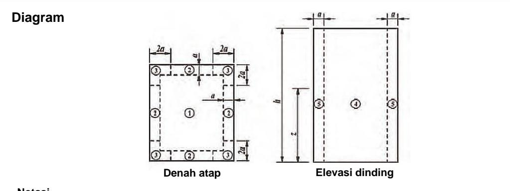

- a = 10 % dari dimensi horizontal terkecil, tetapi tidak boleh kurang dari 3 ft. (0.9 m).
- h = Tinggi atap rata-rata, dalam ft (m), kecuali tinggi bagian terbawah atap harus digunakan untuk  $\theta \le 10^{\circ}$ .
- z = tinggi di atas tanah, dalam ft (m).
- $\theta$  = Sudut bidang atap dari horizontal, dalam derajat.

#### Koefisien tekanan eksternal

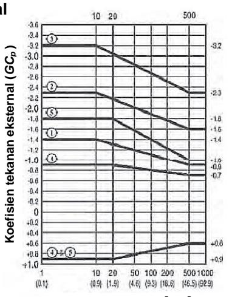

- Area angin efektif, ft2 (m2)
- Skala vertikal menunjukkan  $GC_p$  digunakan dengan  $q_z$ atau  $q_h$  yang sesuai. Skala horizontal menunjukkan luas angin efektifA, dalam  $\mathrm{ft}^2$  ( $\mathrm{m}^2$ ).
- Tanda positif dan negatif menandakan tekanan yang bekerja menuju dan menjauh dari permukaan. Gunakan  $q_z$  dengan nilai positif ( $GC_p$ ) dan  $q_h$  dengan nilai negatif ( $GC_p$ ).
- Setiap komponen didesain untuk tekanan positif dan negatif maksimum.
- Koefisien di sini untuk atap dengan sudut  $\theta \leq 7^{\circ}$ . Untuk sudut dan geometri atap lain, gunakan nilai  $(GC_p)$  dari Gambar 30.3-2A-2I dan Gambar 30.3-5A, 5B dan terjadinya  $q_n$  berdasarkan eksposur yang didefinisikan dalam
- Jika suatu parapet sama dengan atau lebih tinggi dari 3 ft (0,9 m) dipasang sekeliling atap dengan θ ≤ 10°, Zona 3 harus diperlakukan sebagai Zona 2.

<span id="page-254-0"></span>Gambar 30.5-1 - Komponen dan Klading, Bagian 3 [h > 60 ft (h > 18,3 m)]: koefisien tekanan eksternal,  $(GC_p)$ , untuk bangunan tertutup dan tertutup sebagian-dinding dan atap

#### <span id="page-255-3"></span>**Tabel 30.6-1 - Langkah-langkah untuk menentukan beban angin K&K untuk bangunan gedung tertutup dengan 60 ft <** *h* ≤ **160 ft (18,3 m < h** ≤ **48.8 m)**

**Langkah 1 :** Tentukan kategori risiko, lihat Tabel 1.5-1.

**Langkah 2 :** Tentukan kecepatan angin dasar, *V*, untuk kategori risiko yang sesuai; lihat Buku Peta Angin Indonesia.

**Langkah 3 :** Tentukan parameter beban angin:

Kategori Eksposur B, C atau D; lihat Pasal 26.7

**Langkah 4 :** Untuk atap rata, pelana, perisai, miring sepihak dan atap mansard dengan *h* ≤ 60 ft (*h* ≤ 18,3 m), lihat gambar dalam Tabel 30.6-2 dan tentukan tekanan atap dan dinding langsung dari Gambar 30.4-1.

**Langkah 5 :** Untuk atap rata dan atap miring sepihak dengan *h* > 60 ft (*h* > 18,3 m), lihat Tabel 30.6-2 untuk menentukan tekanan pada dinding dan atap, *ph*, *pz*.

Untuk atap rata, perisai, pelana, atap miring sepihak, dan atap *mansrad* dengan *h* > 60 ft (*h* > 18,3 m) dan kemiringan atap *θ* ≤ 7 derajat, gunakan tekanan atap seperti yang ditunjukkan dalam Tabel 30.6-2.

Untuk atap perisai dan atap pelana dengan *h* > 60 ft (*h* > 18,3 m), dan kemiringan atap *θ* > 7 derajat, gunakan Gambar 30.4-1 dengan tekanan velositas yang sesuai *qh*.

**Langkah 6:** Tentukan faktor topografi, *Kzt*, dan gunakan faktor untuk tekanan yang ditentukan dari tabel (jika sesuai); lihat Pasal 26.8.

#### **Bagian 4: Bangunan gedung dengan 60 ft <** *h* ≤ **160 ft (18,3 m <** *h* ≤ **48,8 m) (disederhanakan)**

**CATATAN** Bagian 4 dari Pasal 30 adalah metode sederhana untuk menentukan tekanan angin untuk K&K pada bangunan gedung tertutup dengan 60 ft < *h* ≤ 160 ft (18,3 m < *h* ≤ 48,8 m) yang memiliki bentuk atap sebagaimana ditetapkan dalam gambar yang berlaku. Ketentuan ini didasarkan pada Prosedur Pengarah dari Bagian 3 dengan tekanan angin yang dipilih langsung dari tabel dan disesuaikan seperlunya. Gambar 30.4-1 dalam Bagian 2 dirujuk untuk bangunan gedung dengan *h* ≤ 60 ft (*h* ≤ 18,3 m) untuk semua bentuk atap dan untuk bentuk atap yang disyaratkan bila *h* > 60 ft (*h* > 18,3 m).

#### <span id="page-255-0"></span>**30.6 Tipe bangunan gedung**

Ketentuan Pasal 30.6 berlaku untuk bangunan tertutup yang memiliki ketinggian atap rata-rata 60 ft < *h* ≤ 160 ft (18,3 m < *h* ≤ 48,8 m) dengan atap datar, atap pelana, atap perisai, atap miring sepihak, atau atap *mansard*. Langkah-langkah yang diperlukan untuk penentuan beban angin pada K&K untuk tipe bangunan gedung ini ditunjukkan dalam Tabel 30.6-1.

#### <span id="page-255-1"></span>**30.6.1 Beban angin: Komponen dan Klading**

#### <span id="page-255-2"></span>**30.6.1.1 Permukaan dinding dan atap**

Tekanan angin desain pada zona permukaan dinding dan atap yang direncanakan harus ditentukan dari Tabel 30.6-2 berdasarkan kecepatan angin dasar yang berlaku *V*, tinggi atap rata-rata *h*, dan kemiringan atap *θ*. Bangunan gedung dengan ketinggian atap rata-rata lebih dari 60 ft (18,3 m) tetapi kurang dari 70 ft (21,3 m) harus menggunakan tekanan angin desain 70 ft (21,3 m). Tekanan dalam tabel harus dikalikan dengan Faktor Penyesuaian Eksposur (FPE) yang ditunjukkan dalam tabel jika eksposur berbeda dari Eksposur C. Tekanan pada Tabel 30.6-2 didasarkan pada luas angin efektif 10 ft<sup>2</sup> (0,93 m<sup>2</sup> ). Reduksi pada tekanan angin untuk area angin efektif yang lebih besar dapat diambil berdasarkan Faktor Reduksi (FR) yang ditunjukkan dalam tabel. Tekanan harus diterapkan di seluruh zona yang ditunjuk dalam gambar. Tekanan angin desain final harus ditentukan dari persamaan berikut:

$$p = p_{tabel}(FPE)(FR)K_{zt}$$
 (30.6-1)

dengan:

FR = Faktor Reduksi luas efektif dari Tabel 30.6-2

FPE = Faktor Penyesuaian Eksposur dari Tabel 30.6-2; dan *Kzt* = Faktor topografi seperti ditetapkan dalam Pasal 26.8

Untuk atap datar, atap perisai, atap pelana, atap miring sepihak, dan atap *mansard* dengan semua kemiringan atap *θ* dan *h* ≤ 60 ft (*h* ≤ 18,3 m), tekanan atap harus diperoleh dari Bagian 2 dan Gambar 30.4-1.

Untuk atap datar, atap perisai, atap pelana, atap miring sepihak, dan atap *mansard*  dengan *h* > 60 ft (*h* > 18,3 m) dan kemiringan atap *θ* ≤ 7 derajat, tekanan atap dan dinding harus diterapkan seperti ditunjukkan pada Tabel 30.6-2. Untuk atap perisai dan atap pelana dengan *h* > 60 ft (*h* > 18,3 m) dan semua kemiringan atap *θ* > 7 derajat, Gambar 30.4-1 harus diterapkan dengan tekanan kecepatan yang sesuai *qh*. Untuk atap miring sepihak dan atap *mansard* dengan *h* > 60 ft (*h* > 18,3 m) dan semua kemiringan atap *θ* > 7 derajat, lihat gambar pada Tabel 30.6-2 untuk penetapan zona atap. Tekanan atap harus diterapkan dari Gambar 30.4-1 dengan tekanan velositas yang sesuai *qh*. Bila Gambar 30.4-1 digunakan, faktor penyesuaian λ harus diterapkan pada tekanan atap dan dinding yang ditunjukkan dalam gambar untuk kondisi eksposur dan ketinggian lainnya.

#### <span id="page-256-0"></span>**30.6.1.2 Parapet**

Tekanan angin desain pada permukaan parapet harus berdasarkan pada tekanan angin untuk zona tepi dan zona sudut yang sesuai di mana parapet berada, seperti ditunjukkan dalam Tabel 30.6-2, dimodifikasi berdasarkan pada dua kasus beban berikut:

Kasus Beban A terdiri dari penerapan tekanan dinding positif yang sesuai dari tabel untuk permukaan depan parapet sambil menerapkan tekanan atap tepi negatif atau tekanan atap zona sudut yang sesuai dari tabel pada permukaan belakang parapet. Kasus Beban B terdiri dari penerapan tekanan dinding positif yang sesuai dari tabel untuk bagian belakang permukaan parapet dan terapkan tekanan dinding negatif yang sesuai dari tabel pada permukaan depan parapet.

Tekanan pada Tabel 30.6-2 yang didasarkan pada luas angin efektif 10 ft<sup>2</sup> (0,93 m<sup>2</sup> ). Reduksi pada tekanan angin untuk luas angin efektif yang lebih besar dapat diambil berdasarkan faktor reduksi yang ditunjukkan dalam tabel.

Tekanan harus diterapkan pada parapet menurut Gambar 30.6-1. Tinggi *h* yang digunakan dengan Gambar 30.6-1 untuk menentukan tekanan harus merupakan ketinggian sampai bagian atas parapet. Tentukan tekanan final dari Persamaan (30.6- 1).

#### <span id="page-256-1"></span>**30.6.1.3 Atap konsol**

Tekanan angin desain pada atap konsol untuk atap datar, atap perisai, atap pelana, *mansard*, dan atap miring sepihak dengan *h* ≤ 60 ft (*h* ≤ 18,3 m) harus didasarkan pada zona atap seperti yang ditunjukkan pada gambar pada Tabel 30.6-2 dan tekanan dalam tabel ditunjukkan pada Gambar 30.4-1. Tekanan angin desain pada atap konsol dengan *h* > 60 ft (*h* > 18,3 m) seperti yang ditunjukkan pada gambar dalam Tabel 30.6- 2 harus didasarkan pada tekanan angin yang ditunjukkan untuk zona yang berlaku pada Tabel 30.6-2 dimodifikasi seperti dijelaskan dalam Pasal ini. Untuk Zona 1 dan Zona 2, digunakan faktor pengali sebesar 1,0 pada tekanan yang ditunjukkan dalam Tabel 30.6-2. Untuk Zona 3, digunakan faktor pengali sebesar 1,15 pada tekanan yang ditunjukkan dalam Tabel 30.6-2. Untuk atap memiliki bentuk lain seperti diperlihatkan dalam gambar pada Tabel 30.6-2 dan *h* > 60 ft (*h* > 18,3 m), tekanan angin desain pada atap konsol harus didasarkan pada zona-zona atap yang ditunjuk dan tekanan-tekanan atap sebagaimana diperlihatkan dalam Gambar 30.4-1 dengan menggunakan tekanan velositas yang sesuai *q<sup>h</sup>* untuk tinggi bangunan gedung.

Tekanan pada Tabel 30.6-2 didasarkan pada luas angin efektif 10 ft<sup>2</sup> (0,93 m 2 ). Reduksi pada tekanan angin untuk luas angin efektif yang lebih besar dapat diambil berdasarkan pengali reduksi yang ditunjukkan dalam Tabel 30.6-2. Tekanan pada konsol atap termasuk tekanan dari permukaan atas dan bawah dari konsol. Tekanan pada sisi bawah konsol sama dengan tekanan dinding yang berdekatan. Lihat gambar konsol yang ditunjukkan dalam Gambar 30.6-2. Tentukan tekanan final dari Persamaan (30.6- 1).

<span id="page-258-0"></span>**Tabel 30.6-2 - Komponen dan Klading, Bagian 4 [***h* ≤ **160 ft (***h* ≤ **48,8 m)]: Zona K&K untuk bangunan gedung tertutup—tekanan atap dan dinding K&K**

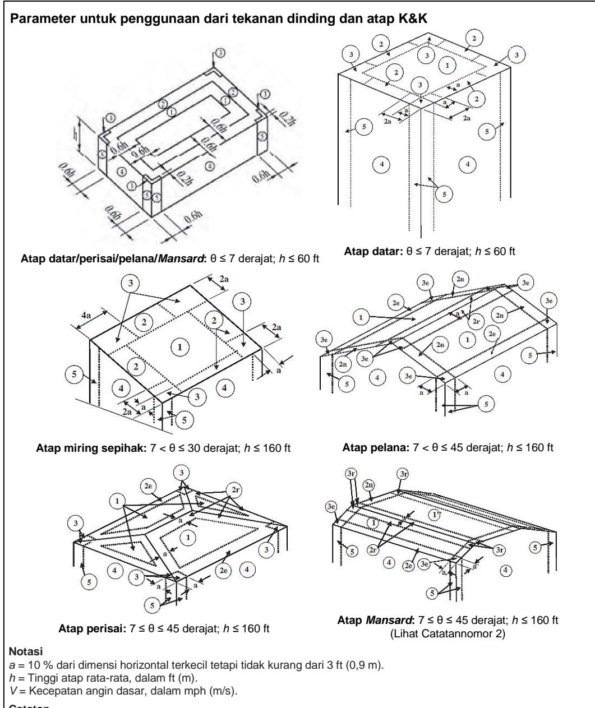

- 1. Lihat Pasal 30.6.1.1 untuk tekanan dinding dan atap tercantum dalam Tabel 30.6-2 dan Gambar 30.4-1, seperti yang berlaku.
- 2. Untuk atap *mansard*, terapkan tekanan atap pada permukaan miring seperti dalam tabel untuk permukaan miring atap pelana; terapkan tekanan atap pada permukaan datar (*θ* < 7°) seperti dalam tabel untuk atap datar.

# Tabel 30.6-2 (Lanjutan) - Komponen dan Klading, Bagian 4 [ $h \le 160$ ft ( $h \le 48,8$ m)]: Zona K&K untuk bangunan gedung tertutup—tekanan atap dan dinding K&K

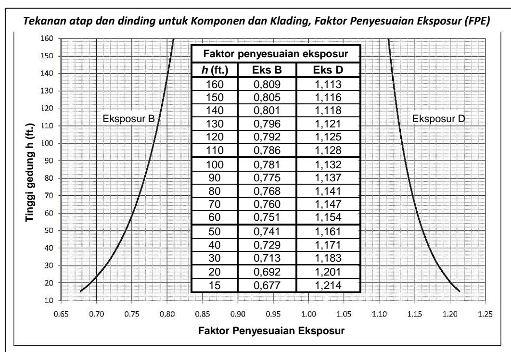

#### Catatan untuk tabel tekanan dinding dan atap K&K

- 1. Untuk masing-masing bentuk atap, Eksposur C, V, dan h menentukan tekanan atap dan klading dinding untuk zona yang sesuai. Untuk eksposur selain B atau D,kalikan tekanan dari tabel dengan faktor penyesuaian eksposur yang sesuai sebagaimana ditentukan dari gambar di atas.
- Interpolasi antara nilai h diizinkan. Untuk tekanan pada nilai V lainnya dari yang ditunjukkan Tabel Tekanan Atap dan Dinding K&K, kalikan nilai pada tabel untuk V' yang diberikan dengan menggunakan persamaan berikut ini:

Tekanan pada V yang ditinjau = tekanan dari tabel saat V'x [V yang ditinjau/V'] $^2$ .

- 3. Bila dua kasus beban ditampilkan, kedua tekanan positif dan negatif harus diperhitungkan.
- 4. Tekanan ditunjukkan untuk area angin efektif sama dengan 10 ft² (0,93 m²). Untuk area angin efektif yang lebih besar, tekanan yang ditunjukkan dapat direduksi dengan koefisien reduksi yang berlaku untuk masing-masing Zona, seperti yang ditunjukkan dalam tabel dan gambar Faktor Reduksi Area Angin Efektif.
- 5. Konversi metrik: 1,0 ft = 0,3048 m.

**Tabel 30.6-2 (Lanjutan) - Komponen dan Klading, Bagian 4 [***h* ≤ **160 ft (***h* ≤ **48,8 m)]: Zona K&K untuk bangunan gedung tertutup—tekanan atap dan dinding K&K**


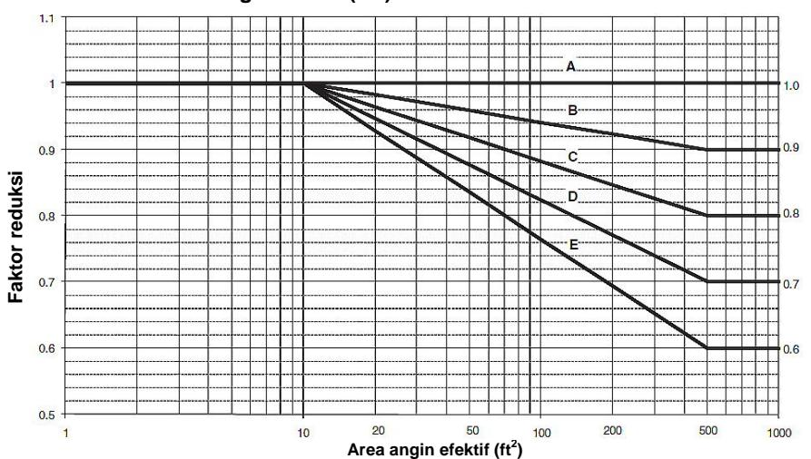

**Faktor reduksi untuk tekanan yang ditunjukkan dalam tabel tekanan dinding dan atap** 

| K&K<br>Bentuk atap | Tanda<br>tekanan |  |  |  |
|--------------------|------------------|--|--|--|
|                    |                  |  |  |  |
|                    |                  |  |  |  |
|                    |                  |  |  |  |
|                    |                  |  |  |  |
|                    |                  |  |  |  |

#### **Faktor penyesuaian,** λ **, berdasarkan ketinggian gedung dan eksposur dari bentuk atap dan atap dengan** *h* **≤ 160 ft (***h* **≤ 48,8 m)**

| Tinggi atap   |       | Eksposur |       |
|---------------|-------|----------|-------|
| rata-rata, ft | B     | C        | D     |
| 160           | 1,613 | 1,994    | 2,22  |
| 150           | 1,584 | 1,967    | 2,195 |
| 140           | 1,553 | 1,939    | 2,169 |
| 130           | 1,520 | 1,909    | 2,141 |
| 120           | 1,486 | 1,877    | 2,111 |
| 110           | 1,450 | 1,843    | 2,079 |
| 100           | 1,411 | 1,807    | 2,045 |
| 90            | 1,369 | 1,767    | 2,008 |
| 80            | 1,323 | 1,724    | 1,967 |
| 70            | 1,274 | 1,676    | 1,922 |
| 60            | 1,219 | 1,622    | 1,871 |
| 50            | 1,157 | 1,561    | 1,813 |
| 40            | 1,086 | 1,490    | 1,744 |
| 30            | 1,000 | 1,402    | 1,659 |
| 20            | 0,891 | 1,287    | 1,546 |
| 15            | 0,820 | 1,212    | 1,471 |

- 1. Untuk atap datar, pelana, perisai, miring sepihak, dan *mansard* dengan *h* ≤ 60 ft (*h* ≤ 18,3 m) dan semua sudut kemiringan atap θ, terapkan persyaratan Bagian 2 dan Gambar 30.4-1.
- 2. Untuk atap datar, pelana, perisai, miring sepihak, dan *mansard* dengan *h* > 60 ft (*h* > 18,3 m) dan sudut kemiringan atap θ ≤ 7°, terapkan tekanan atap seperti diperlihatkan dalam Tabel Tekanan Dinding dan Atap K&K.
- 3. Untuk atap perisai dan pelana dengan *h* > 60 ft (*h* > 18,3 m) dan semua sudut kemiringan atap θ > 7° , terapkan Gambar 30.4-1 dan tekanan velositas *q<sup>h</sup>* yang sesuai. Lihat Catatan 6 pada Gambar 30.5-1.
- 4. Untuk atap miring sepihak dan *mansard* dengan *h*  > 60 ft (*h* > 18,3 m) dan semua sudut kemiringan atap θ > 7°, lihat gambar pada "Parameter untuk Penggunaan" sesuai dengan zona atap yang sesuai dan terapkan tekanan atap dari Gambar 30,4-1 dengan tekanan velositas *qh*yang sesuai. Lihat Catatan 6 dalam Gambar 30.5-1.
- 5.Bila Gambar 30.4-1 berlaku, terapkan faktor penyesuaian λ pada tekanan atap seperti yang tercantum pada tabel untuk kondisi ketinggian dan eksposur lainnya.
- 6.Konversi metrik: 1,0 ft = 0,3038 m; 1,0 ft<sup>2</sup> =0,0929 m 2 ; 1,0 lb/ft<sup>2</sup> = 0,0479 kN/m<sup>2</sup> .

**Tabel 30.6-2 (Lanjutan) - Komponen dan Klading, Bagian 4 [***h* **≤ 160 ft (***h* **≤ 48,8 m)]: Zona K&K untuk bangunan gedung tertutup ̶ tekanan atap dan dinding K&K**

|           |                     |       |       |       |        |       |       |       |       | V<br>(mi/h) |       |       |       |        |        |       |       |
|-----------|---------------------|-------|-------|-------|--------|-------|-------|-------|-------|-------------|-------|-------|-------|--------|--------|-------|-------|
|           |                     |       |       |       | 110    |       |       |       |       | 115         |       |       |       |        | 120    |       |       |
|           |                     | Kasus |       |       | Zona   |       |       |       |       | Zona        |       |       |       |        | Zona   |       |       |
| h<br>(ft) | Bentuk atap         | beban | 1     | 2     | 3      | 4     | 5     | 1     | 2     | 3           | 4     | 5     | 1     | 2      | 3      | 4     | 5     |
|           |                     | 1     | -58,1 | -91,2 | -124,3 | -47,1 | -72,8 | -63,5 | -99,7 | -135,9      | -51,5 | -79,6 | -69,2 | -108,6 | -148,0 | -56,0 | -86,7 |
|           | Atap datar          | 2     | 17,7  | 17,7  | 17,7   | 43,4  | 43,4  | 19,3  | 19,3  | 19,3        | 47,4  | 47,4  | 21,0  | 21,0   | 21,0   | 51,7  | 51,7  |
| 160       |                     | 1     | -54,4 | -65,5 | -113,3 | -47,1 | -72,8 | -59,5 | -71,6 | -123,8      | -51,5 | -79,6 | -64,8 | -77,9  | -134,8 | -56,0 | -86,7 |
|           | Atap miring sepihak | 2     | 21,3  | 21,3  | 21,3   | 43,4  | 43,4  | 23,3  | 23,3  | 23,3        | 47,4  | 47,4  | 25,4  | 25,4   | 25,4   | 51,7  | 51,7  |
|           |                     | 1     | -57,3 | -90,0 | -122,7 | -46,5 | -71,9 | -62,7 | -98,4 | -134,1      | -50,8 | -78,5 | -68,2 | -107,1 | -146,0 | -55,3 | -85,5 |
|           | Atap datar          | 2     | 17,4  | 17,4  | 17,4   | 42,8  | 42,8  | 19,0  | 19,0  | 19,0        | 46,8  | 46,8  | 20,7  | 20,7   | 20,7   | 51,0  | 51,0  |
| 150       |                     | 1     | -53,7 | -64,6 | -111,8 | -46,5 | -71,9 | -58,7 | -70,6 | -122,2      | -50,8 | -78,5 | -63,9 | -76,9  | -133,0 | -55,3 | -85,5 |
|           | Atap miring sepihak | 2     | 21,0  | 21,0  | 21,0   | 42,8  | 42,8  | 23,0  | 23,0  | 23,0        | 46,8  | 46,8  | 25,1  | 25,1   | 25,1   | 51,0  | 51,0  |
|           |                     | 1     | -56,5 | -88,7 | -120,9 | -45,8 | -70,8 | -61,8 | -97,0 | -132,1      | -50,0 | -77,4 | -67,3 | -105,6 | -143,9 | -54,5 | -84,3 |
|           | Atap datar          | 2     | 17,2  | 17,2  | 17,2   | 42,2  | 42,2  | 18,8  | 18,8  | 18,8        | 46,1  | 46,1  | 20,4  | 20,4   | 20,4   | 50,2  | 50,2  |
| 140       |                     | 1     | -52,9 | -63,7 | -110,2 | -45,8 | -70,8 | -57,9 | -69,6 | -120,4      | -50,0 | -77,4 | -63,0 | -75,8  | -131,1 | -54,5 | -84,3 |
|           | Atap miring sepihak | 2     | 20,7  | 20,7  | 20,7   | 42,2  | 42,2  | 22,7  | 22,7  | 22,7        | 46,1  | 46,1  | 24,7  | 24,7   | 24,7   | 50,2  | 50,2  |
|           |                     | 1     | -55,6 | -87,3 | -119,0 | -45,1 | -69,7 | -60,8 | -95,5 | -130,1      | -49,3 | -76,2 | -66,2 | -103,9 | -141,7 | -53,6 | -83,0 |
|           | Atap<br>datar       | 2     | 16,9  | 16,9  | 16,9   | 41,6  | 41,6  | 18,5  | 18,5  | 18,5        | 45,4  | 45,4  | 20,1  | 20,1   | 20,1   | 49,5  | 49,5  |
| 130       |                     | 1     | -52,1 | -62,7 | -108,5 | -45,1 | -69,7 | -57,0 | -68,5 | -118,5      | -49,3 | -76,2 | -62,0 | -74,6  | -129,1 | -53,6 | -83,0 |
|           | Atap miring sepihak | 2     | 20,4  | 20,4  | 20,4   | 41,6  | 41,6  | 22,3  | 22,3  | 22,3        | 45,4  | 45,4  | 24,3  | 24,3   | 24,3   | 49,5  | 49,5  |
|           |                     | 1     | -54,7 | -85,9 | -117,0 | -44,3 | -68,6 | -59,8 | -93,9 | -127,9      | -48,4 | -74,9 | -65,1 | -102,2 | -139,3 | -52,7 | -81,6 |
|           | Atap datar          | 2     | 16,6  | 16,6  | 16,6   | 40,9  | 40,9  | 18,2  | 18,2  | 18,2        | 44,7  | 44,7  | 19,8  | 19,8   | 19,8   | 48,6  | 48,6  |
| 120       |                     | 1     | -51,2 | -61,6 | -106,7 | -44,3 | -68,6 | -56,0 | -67,4 | -116,6      | -48,4 | -74,9 | -61,0 | -73,4  | -126,9 | -52,7 | -81,6 |
|           | Atap miring sepihak | 2     | 20,1  | 20,1  | 20,1   | 40,9  | 40,9  | 22,0  | 22,0  | 22,0        | 44,7  | 44,7  | 23,9  | 23,9   | 23,9   | 48,6  | 48,6  |
|           |                     | 1     | -53,7 | -84,3 | -114,9 | -43,5 | -67,3 | -58,7 | -92,2 | -125,6      | -47,6 | -73,6 | -63,9 | -100,3 | -136,8 | -51,8 | -80,1 |
|           | Atap datar          | 2     | 16,3  | 16,3  | 16,3   | 40,1  | 40,1  | 17,8  | 17,8  | 17,8        | 43,8  | 43,8  | 19,4  | 19,4   | 19,4   | 47,7  | 47,7  |
| 110       |                     | 1     | -50,3 | -60,5 | -104,7 | -43,5 | -67,3 | -55,0 | -66,1 | -114,5      | -47,6 | -73,6 | -59,9 | -72,0  | -124,6 | -51,8 | -80,1 |
|           | Atap miring sepihak | 2     | 19,7  | 19,7  | 19,7   | 40,1  | 40,1  | 21,6  | 21,6  | 21,6        | 43,8  | 43,8  | 23,5  | 23,5   | 23,5   | 47,7  | 47,7  |
|           |                     | 1     | -52,7 | -82,6 | -112,6 | -42,7 | -66,0 | -57,5 | -90,3 | -123,1      | -46,6 | -72,1 | -62,7 | -98,4  | -134,0 | -50,8 | -78,5 |
|           | Atap datar          | 2     | 16,0  | 16,0  | 16,0   | 39,3  | 39,3  | 17,5  | 17,5  | 17,5        | 43,0  | 43,0  | 19,0  | 19,0   | 19,0   | 46,8  | 46,8  |
| 100       |                     | 1     | -49,3 | -59,3 | -102,6 | -42,7 | 66,0  | -53,9 | -64,8 | -112,2      | -46,6 | -72,1 | -58,7 | -70,6  | -122,1 | -50,8 | -78,5 |
|           | Atap miring sepihak | 2     | 19,3  | 19,3  | 19,3   | 39,3  | 39,3  | 21,1  | 21,1  | 21,1        | 43,0  | 43,0  | 23,0  | 23,0   | 23,0   | 46,8  | 46,8  |

**Tabel 30.6-2 (Lanjutan) - Komponen dan Klading, Bagian 4 [***h* ≤ **160 ft (***h* ≤ **48,8 m)]: Zona K&K untuk bangunan gedung tertutup ̶ tekanan atap dan dinding K&K**

|            |                     |       |       |       |        |       |       |       |       | V<br>(mi/h)         |       |       |       |       |        |       |       |
|------------|---------------------|-------|-------|-------|--------|-------|-------|-------|-------|---------------------|-------|-------|-------|-------|--------|-------|-------|
|            |                     |       |       |       | 110    |       |       |       |       | 115                 |       |       |       |       | 120    |       |       |
|            |                     | Kasus |       |       | Zona   |       |       |       |       | Zona                |       |       |       |       | Zona   |       |       |
| h<br>(ft)  | Bentuk atap         | beban | 1     | 2     | 3      | 4     | 5     | 1     | 2     | 3                   | 4     | 5     | 1     | 2     | 3      | 4     | 5     |
|            | Atap datar          | 1     | -51,5 | -80,8 | -110,2 | -41,7 | -64,5 | -56,3 | -88,3 | -120,4              | -45,6 | -70,5 | -61,3 | -96,2 | -131,1 | -49,6 | -76,8 |
|            |                     | 2     | 16,0  | 16,0  | 16,0   | 38,5  | 38,5  | 17,1  | 17,1  | 17,1                | 42,0  | 42,0  | 18,6  | 18,6  | 18,6   | 45,8  | 45,8  |
| 90         | Atap miring sepihak | 1     | -48,2 | -58,0 | -100,4 | -41,7 | -64,5 | -52,7 | -63,4 | -109,7              | -45,6 | -70,5 | -57,4 | -69,0 | -119,5 | -49,6 | -76,8 |
|            |                     | 2     | 18,9  | 18,9  | 18,9   | 38,5  | 38,5  | 20,7  | 20,7  | 20,7                | 42,0  | 42,0  | 22,5  | 22,5  | 22,5   | 45,8  | 45,8  |
|            | Atap datar          | 1     | -50,2 | -78,8 | -107,5 | -40,7 | -63,0 | -54,9 | -86,2 | -                   | -44,5 | -68,8 | -59,8 | -93,8 | -127,9 | -48,4 | -74,9 |
|            |                     | 2     | 16,0  | 16,0  | 16,0   | 37,5  | 37,5  | 16,7  | 16,7  | 117,tyyy<br>gtfr5   | 41,0  | 41,0  | 18,2  | 18,2  | 18,2   | 44,6  | 44,6  |
| 80         | Atap miring sepihak | 1     | -47,1 | -56,6 | -97,9  | -40,7 | -63,0 | -51,4 | -61,9 | 16,7<br>-107,0      | -44,5 | -68,8 | -56,0 | -67,4 | -116,5 | -48,4 | -74,9 |
|            |                     | 2     | 18,4  | 18,4  | 18,4   | 37,5  | 37,5  | 20,2  | 20,2  | 20,2                | 41,0  | 41,0  | 21,9  | 21,9  | 21,9   | 44,6  | 44,6  |
|            | Atap datar          | 1     | -48,8 | -76,7 | -104,5 | -39,6 | -61,2 | -53,4 | -83,8 | -114,2              | -43,2 | -66,9 | -58,1 | -91,2 | -124,3 | -47,1 | -72,8 |
|            |                     | 2     | 16,0  | 16,0  | 16,0   | 36,5  | 36,5  | 16,2  | 16,2  | 16,2                | 39,9  | 39,9  | 17,7  | 17,7  | 17,7   | 43,4  | 43,4  |
| 70         | Atap miring sepihak | 1     | -45,8 | -55,0 | -95,2  | -39,6 | -61,2 | -50,0 | -60,1 | -104,1              | -43,2 | -66,9 | -54,4 | -65,5 | -113,3 | -47,1 | -72,8 |
|            |                     | 2     | 17,9  | 17,9  | 17,9   | 36,5  | 36,5  | 19,6  | 19,6  | 19,6                | 39,9  | 39,9  | 21,3  | 21,3  | 21,3   | 43,4  | 43,4  |
|            |                     | 1     |       |       |        |       |       |       |       |                     |       |       |       |       |        |       |       |
| 60 dan     | Atap datar          | 2     |       |       |        |       |       |       |       |                     |       |       |       |       |        |       |       |
| dibawahnya |                     |       |       |       |        |       |       |       |       | Lihat Gambar 30.4-1 |       |       |       |       |        |       |       |
|            | Atap miring sepihak |       |       |       |        |       |       |       |       |                     |       |       |       |       |        |       |       |

**Tabel 30.6-2 (Lanjutan) - Komponen dan Klading, Bagian 4 [***h* ≤ **160 ft (***h* ≤ **48,8 m)]: Zona K&K untuk bangunan gedung tertutup ̶ tekanan atap dan dinding K&K**

|           |                     |        |               |                |                |               |                |               |                | V<br>(mi/h)    |               |                |                |                |                |               |                |
|-----------|---------------------|--------|---------------|----------------|----------------|---------------|----------------|---------------|----------------|----------------|---------------|----------------|----------------|----------------|----------------|---------------|----------------|
|           |                     |        |               |                | 130            |               |                |               |                | 140            |               |                |                |                | 150            |               |                |
|           |                     | Kasus  |               |                | Zona           |               |                |               |                | Zona           |               |                |                |                | Zona           |               |                |
| h<br>(ft) | Bentuk atap         | beban  | 1             | 2              | 3              | 4             | 5              | 1             | 2              | 3              | 4             | 5              | 1              | 2              | 3              | 4             | 5              |
|           | Atap datar          | 1      | -81,2         | -127,4         | -173,7         | -65,8         | -101,7         | -94,2         | -147,8         | -201,4         | -76,3         | -118,0         | -108,1         | -169,7         | -231,2         | -87,6         | -135,5         |
| 160       |                     | 2      | 24,7          | 24,7           | 24,7           | 60,6          | 60,6           | 28,6          | 28,6           | 28,6           | 70,3          | 70,3           | 32,8           | 32,8           | 32,8           | 80,7          | 80,7           |
|           | Atap miring sepihak | 1      | -76,0         | -91,5          | -158,3         | -65,8         | -101,7         | -88,2         | -106,1         | -183,5         | -76,3         | -118,0         | -101,2         | -121,8         | -210,7         | -87,6         | -135,5         |
|           |                     | 2      | 29,8          | 29,8           | 29,8           | 60,6          | 60,6           | 34,6          | 34,6           | 34,6           | 70,3          | 70,3           | 39,7           | 39,7           | 39,7           | 80,7          | 80,7           |
|           | Atap datar          | 1      | -80,1         | -125,7         | -171,3         | -64,9         | -100,4         | -92,9         | -145,8         | -198,7         | -75,2         | -116,4         | -106,6         | -167,4         | -228,1         | -86,4         | -133,6         |
| 150       |                     | 2      | 24,3          | 24,3           | 24,3           | 59,8          | 59,8           | 28,2          | 28,2           | 28,2           | 69,4          | 69,4           | 32,4           | 32,4           | 32,4           | 79,6          | 79,6           |
|           | Atap miring sepihak | 1<br>2 | -75,0<br>29,4 | -90,2<br>29,4  | -156,1<br>29,4 | -64,9<br>59,8 | -100,4<br>59,8 | -87,0<br>34,1 | -104,6<br>34,1 | -181,1<br>34,1 | -75,2<br>69,4 | -116,4<br>69,4 | -99,9<br>39,1  | -120,1<br>39,1 | -207,9<br>39,1 | -86,4<br>79,6 | -133,6<br>79,6 |
|           |                     |        |               |                |                |               |                |               |                |                |               |                |                |                |                |               |                |
|           | Atap datar          | 1<br>2 | -78,9<br>24,0 | -123,9<br>24,0 | -168,9<br>24,0 | -63,9<br>59,0 | -98,9<br>59,0  | -88,6<br>26,9 | -139,1<br>26,9 | -189,6<br>26,9 | -71,8<br>66,2 | -111,1<br>66,2 | -105,1<br>31,9 | -165,0<br>31,9 | -224,8<br>31,9 | -85,1<br>78,5 | -131,7<br>78,5 |
| 140       | Atap miring sepihak | 1      | -73,9         | -88,9          | -153,9         | -63,9         | -98,9          | -83,0         | -99,8          | -172,8         | -71,8         | -111,1         | -98,4          | -118,4         | -204,9         | -85,1         | -131,7         |
|           |                     | 2      | 29,0          | 29,0           | 29,0           | 59,0          | 59,0           | 32,5          | 32,5           | 32,5           | 66,2          | 66,2           | 38,6           | 38,6           | 38,6           | 78,5          | 78,5           |
|           | Atap datar          | 1      | -77,7         | -122,0         | -166,2         | -63,0         | -97,4          | -90,1         | -141,5         | -192,8         | -73,0         | -112,9         | -103,5         | -162,4         | -221,3         | -83,8         | -129,7         |
| 130       |                     | 2      | 23,6          | 23,6           | 23,6           | 58,0          | 58,0           | 27,4          | 27,4           | 27,4           | 67,3          | 67,3           | 31,4           | 31,4           | 31,4           | 77,3          | 77,3           |
|           | Atap miring sepihak | 1      | -72,8         | -87,6          | -151,5         | -63,0         | -97,4          | -84,4         | -101,5         | -175,7         | -73,0         | -112,9         | -96,9          | -116,6         | -201,7         | -83,8         | -129,7         |
|           |                     | 2      | 28,5          | 28,5           | 28,5           | 58,0          | 58,0           | 33,1          | 33,1           | 33,1           | 67,3          | 67,3           | 38,0           | 38,0           | 38,0           | 77,3          | 77,3           |
|           | Atap datar          | 1<br>2 | -76,4<br>23,2 | -119,9<br>23,2 | -163,5<br>23,2 | -61,9<br>57,1 | -95,8<br>57,1  | -88,6<br>26,9 | -139,1<br>26,9 | -189,6<br>26,9 | -60,6<br>60,6 | -111,1<br>60,6 | -101,7<br>30,9 | -159,7<br>30,9 | -217,6<br>30,9 | -82,4<br>76,0 | -127,5<br>76,0 |
| 120       | Atap miring sepihak | 1      | -71,6         | -86,1          | -149,0         | -61,9         | -95,8          | -77,4         | -99,8          | -172,8         | -71,8         | -111,1         | -95,3          | -114,6         | -198,3         | -82,4         | -127,5         |
|           |                     | 2      | 28,1          | 28,1           | 28,1           | 57,1          | 57,1           | 32,5          | 32,5           | 32,5           | 66,2          | 66,2           | 37,3           | 37,3           | 37,3           | 76,0          | 76,0           |
|           | Atap datar          | 1      | -75,0         | -117,8         | -160,5         | -60,8         | -94,0          | -87,0         | -136,6         | -186,1         | -70,5         | -109,0         | -99,9          | -156,8         | -213,7         | -80,9         | -125,2         |
| 110       |                     | 2      | 22,8          | 22,8           | 22,8           | 56,0          | 56,0           | 26,4          | 26,4           | 26,4           | 65,0          | 65,0           | 30,3           | 30,3           | 30,3           | 74,6          | 74,6           |
|           | Atap miring sepihak | 1      | -70,3         | -84,5          | -146,3         | -60,8         | -94,0          | -81,5         | -98,0          | -169,6         | -70,5         | -109,0         | -93,6          | -112,5         | -194,7         | -80,9         | -125,2         |
|           |                     | 2      | 27,5          | 27,5           | 27,5           | 56,0          | 56,0           | 31,9          | 31,9           | 31,9           | 65,0          | 65,0           | 36,7           | 36,7           | 36,7           | 74,6          | 74,6           |
|           | Atap datar          | 1<br>2 | -73,5<br>22,3 | -115,4<br>22,3 | -157,3<br>22,3 | -59,6<br>54,9 | -92,2<br>54,9  | -85,3<br>25,9 | -133,9<br>25,9 | -182,4<br>25,9 | -69,1<br>63,7 | -106,9<br>63,7 | -97,9<br>29,7  | -153,7<br>29,7 | -209,4<br>29,7 | -79,3<br>73,1 | -122,7<br>73,1 |
| 100       | Atap miring sepihak | 1      | -68,9         | -82,8          | -143,4         | -59,6         | -92,2          | -79,9         | -96,1          | -166,3         | -69,1         | -106,9         | -91,7          | -110,3         | -190,9         | -79,3         | -122,7         |
|           |                     | 2      | 27,0          | 27,0           | 27,0           | 54,9          | 54,9           | 31,3          | 31,3           | 31,3           | 63,7          | 63,7           | 35,9           | 35,9           | 35,9           | 73,1          | 73,1           |

**238 dari 297**

**Tabel 30.6-2 (Lanjutan) - Komponen dan Klading, Bagian 4 [***h* **≤ 160 ft (***h* **≤ 48,8 m)]: Zona K&K untuk bangunan gedung tertutup ̶tekanan atap dan dinding K&K**

|            |                     |       |       |        |        |       |       |       |        | V<br>(mi/h)         |       |        |       |        |        |       |        |
|------------|---------------------|-------|-------|--------|--------|-------|-------|-------|--------|---------------------|-------|--------|-------|--------|--------|-------|--------|
|            |                     |       |       |        | 130    |       |       |       |        | 140                 |       |        |       |        | 150    |       |        |
|            |                     | Kasus |       |        | Zona   |       |       |       |        | Zona                |       |        |       |        | Zona   |       |        |
| h<br>(ft)  | Bentuk atap         | beban | 1     | 2      | 3      | 4     | 5     | 1     | 2      | 3                   | 4     | 5      | 1     | 2      | 3      | 4     | 5      |
|            | Atap datar          | 1     | -71,9 | -112,9 | -153,9 | -58,3 | -90,1 | -83,4 | -130,9 | -178,4              | -67,6 | -104,5 | -95,8 | -150,3 | -204,8 | -77,6 | -120,0 |
| 90         |                     | 2     | 21,9  | 21,9   | 21,9   | 53,7  | 53,7  | 25,3  | 25,3   | 25,3                | 62,3  | 62,3   | 29,1  | 29,1   | 29,1   | 71,5  | 71,5   |
|            | Atap miring sepihak | 1     | -67,4 | -81,0  | -140,2 | -58,3 | -90,1 | -78,1 | -94,0  | -162,6              | -67,6 | -104,5 | -89,7 | -107,9 | -186,7 | -77,6 | -120,0 |
|            |                     | 2     | 26,4  | 26,4   | 26,4   | 53,7  | 53,7  | 30,6  | 30,6   | 30,6                | 62,3  | 62,3   | 35,2  | 35,2   | 35,2   | 71,5  | 71,5   |
|            | Atap datar          | 1     | -70,2 | -110,1 | -150,1 | -56,8 | -87,9 | -81,4 | -127,7 | -174,1              | -65,9 | -102,0 | -93,4 | -146,6 | -199,8 | -75,7 | -117,1 |
| 80         |                     | 2     | 21,3  | 21,3   | 21,3   | 52,4  | 52,4  | 24,7  | 24,7   | 24,7                | 60,8  | 60,8   | 28,4  | 28,4   | 28,4   | 69,8  | 69,8   |
|            | Atap miring sepihak | 1     | -65,7 | -79,0  | -136,8 | -56,8 | -87,9 | -76,2 | -91,7  | -158,6              | -65,9 | -102,0 | -87,5 | -105,2 | -182,1 | -75,7 | -117,1 |
|            |                     | 2     | 25,8  | 25,8   | 25,8   | 52,4  | 52,4  | 29,9  | 29,9   | 29,9                | 60,8  | 60,8   | 34,3  | 34,3   | 34,3   | 69,8  | 69,8   |
|            |                     | 1     | -68,2 | -107,1 | -145,9 | -55,3 | -85,5 | -79,1 | -124,2 | -169,2              | -64,1 | -99,1  | -90,8 | -142,6 | -194,3 | -73,6 | -113,8 |
| 70         | Atap datar          | 2     | 20,7  | 20,7   | 20,7   | 50,9  | 50,9  | 24,0  | 24,0   | 24,0                | 59,1  | 59,1   | 27,6  | 27,6   | 27,6   | 67,8  | 67,8   |
|            |                     | 1     | -63,9 | -76,9  | -133,0 | -55,3 | -85,5 | -74,1 | -89,1  | -154,2              | -64,1 | -99,1  | -85,1 | -102,3 | -177,0 | -73,6 | -113,8 |
|            | Atap miring sepihak | 2     | 25,0  | 25,0   | 25,0   | 50,9  | 50,9  | 29,0  | 29,0   | 29,0                | 59,1  | 59,1   | 33,3  | 33,3   | 33,3   | 67,8  | 67,8   |
|            | Atap datar          | 1     |       |        |        |       |       |       |        |                     |       |        |       |        |        |       |        |
| 60 dan     |                     | 2     |       |        |        |       |       |       |        | Lihat Gambar 30.4-1 |       |        |       |        |        |       |        |
| dibawahnya | Atap miring sepihak | 1     |       |        |        |       |       |       |        |                     |       |        |       |        |        |       |        |
|            |                     | 2     |       |        |        |       |       |       |        |                     |       |        |       |        |        |       |        |

**Tabel 30.6-2 (Lanjutan) - Komponen dan Klading, Bagian 4 [***h* ≤ **160 ft (***h* ≤ **48,8 m)]: zona K&K untuk bangunan gedung tertutup ̶ tekanan atap dan dinding K&K**

|           |                     |       |        |        |        |       |        |        |        | V (mi/h) |        |        |        |        |        |        |        |
|-----------|---------------------|-------|--------|--------|--------|-------|--------|--------|--------|----------|--------|--------|--------|--------|--------|--------|--------|
|           |                     |       |        |        | 160    |       |        |        |        | 180      |        |        |        |        | 200    |        |        |
|           |                     | Kasus |        |        | Zona   |       |        |        |        | Zona     |        |        |        |        | Zona   |        |        |
| h<br>(ft) | Bentuk atap         | beban | 1      | 2      | 3      | 4     | 5      | 1      | 2      | 3        | 4      | 5      | 1      | 2      | 3      | 4      | 5      |
|           |                     | 1     | -123,0 | -193,0 | -263,1 | -99,6 | -154,1 | -155,6 | -244,3 | -333,0   | -126,1 | -195,0 | -192,2 | -301,6 | -411,1 | -155,7 | -240,8 |
|           | Atap datar          | 2     | 37,4   | 37,4   | 37,4   | 91,8  | 91,8   | 47,3   | 47,3   | 47,3     | 116,2  | 116,2  | 58,4   | 58,4   | 58,4   | 143,5  | 143,5  |
| 160       |                     | 1     | -115,2 | -138,5 | -239,7 | -99,6 | -154,1 | -145,8 | -175,3 | -303,4   | -126,1 | -195,0 | -180,0 | -216,5 | -374,6 | -155,7 | -240,8 |
|           | Atap miring sepihak | 2     | 45,1   | 45,1   | 45,1   | 91,8  | 91,8   | 57,1   | 57,1   | 57,1     | 116,2  | 116,2  | 70,5   | 70,5   | 70,5   | 143,5  | 143,5  |
|           |                     | 1     | -121,3 | -190,4 | -259,5 | -98,3 | -152,0 | -153,5 | -241,0 | -328,5   | -124,4 | -192,4 | -189,6 | -297,5 | -405,5 | -153,6 | -237,6 |
|           | Atap datar          | 2     | 36,9   | 36,9   | 36,9   | 90,6  | 90,6   | 46,6   | 46,6   | 46,6     | 114,7  | 114,7  | 57,6   | 57,6   | 57,6   | 141,6  | 141,6  |
| 150       |                     | 1     | -113,6 | -136,7 | -236,5 | -98,3 | -152,0 | -143,8 | -173,0 | -299,3   | -124,4 | -192,4 | -177,6 | -213,6 | -369,5 | -153,6 | -237,6 |
|           | Atap miring sepihak | 2     | 44,5   | 44,5   | 44,5   | 90,6  | 90,6   | 56,4   | 56,4   | 56,4     | 114,7  | 114,7  | 69,6   | 69,6   | 69,6   | 141,6  | 141,6  |
|           |                     | 1     | -119,6 | -187,7 | -255,8 | -96,9 | -149,8 | -151,3 | -237,5 | -323,7   | -122,6 | -189,6 | -186,8 | -293,2 | -399,7 | -151,4 | -234,1 |
|           | Atap datar          | 2     | 36,3   | 36,3   | 36,3   | 89,3  | 89,3   | 46.0   | 46.0   | 46.0     | 113.0  | 113.0  | 56,8   | 56,8   | 56,8   | 139,5  | 139,5  |
| 140       |                     | 1     | -112,0 | -134,7 | -233,1 | -96,9 | -149,8 | -141,8 | -170,5 | -295,0   | -122,6 | -189,6 | -175,0 | -210,5 | -364,2 | -151,4 | -234,1 |
|           | Atap miring sepihak | 2     | 43,9   | 43,9   | 43,9   | 89,3  | 89,3   | 55,6   | 55,6   | 55,6     | 113,0  | 113,0  | 68,6   | 68,6   | 68,6   | 139,5  | 139,5  |
|           |                     | 1     | -117,7 | -184,8 | -251,8 | -95,4 | -147,5 | -149,0 | -233,9 | -318,7   | -120,7 | -186,7 | -183,9 | -288,7 | -393,5 | -149,0 | -230,5 |
|           | Atap datar          | 2     | 35,8   | 35,8   | 35,8   | 87,9  | 87,9   | 45,3   | 45,3   | 45,3     | 111,3  | 111,3  | 55,9   | 55,9   | 55,9   | 137,4  | 137,4  |
| 130       |                     | 1     | -110,3 | -132,6 | -229,5 | -95,4 | -147,5 | -139,6 | -167,8 | -290,4   | -120,7 | -186,7 | -172,3 | -207,2 | -358,6 | -149,0 | -230,5 |
|           | Atap miring sepihak | 2     | 43,2   | 43,2   | 43,2   | 87,9  | 87,9   | 54,7   | 54,7   | 54,7     | 111,3  | 111,3  | 67,5   | 67,5   | 67,5   | 137,4  | 137,4  |
|           |                     | 1     | -115,8 | -181,7 | -247,6 | -93,8 | -145,1 | -146,5 | -229,9 | -313,4   | -118,7 | -183,6 | -180,9 | -283,9 | -386,9 | -146,5 | -226,7 |
|           | Atap datar          | 2     | 35,2   | 35,2   | 35,2   | 86,4  | 86,4   | 44,5   | 44,5   | 44,5     | 109,4  | 109,4  | 54,9   | 54,9   | 54,9   | 135,1  | 135,1  |
| 120       |                     | 1     | -108,4 | -130,4 | -225,6 | -93,8 | -145,1 | -137,2 | -165,0 | -285,6   | -118,7 | -183,6 | -169,4 | -203,8 | -352,6 | -146,5 | -226,7 |
|           | Atap miring sepihak | 2     | 42,5   | 42,5   | 42,5   | 86,4  | 86,4   | 53,8   | 53,8   | 53,8     | 109,4  | 109,4  | 66,4   | 66,4   | 66,4   | 135,1  | 135,1  |
|           |                     | 1     | -113,7 | -178,4 | -243,1 | -92,1 | -142,4 | -143,8 | -225,8 | -307,7   | -116,5 | -180,3 | -177,6 | -278,7 | -379,9 | -143,9 | -222,5 |
|           | Atap datar          | 2     | 34,5   | 34,5   | 34,5   | 84,9  | 84,9   | 43,7   | 43,7   | 43,7     | 107,4  | 107,4  | 53,9   | 53,9   | 53,9   | 132,6  | 132,6  |
| 110       |                     | 1     | -106,5 | -128,0 | -221,5 | -92,1 | -142,4 | -134,7 | -162,0 | -280,4   | -116,5 | -180,3 | -166,3 | -200,1 | -346,2 | -143,9 | -222,5 |
|           | Atap miring sepihak | 2     | 41,7   | 41,7   | 41,7   | 84,9  | 84,9   | 52,8   | 52,8   | 52,8     | 107,4  | 107,4  | 65,2   | 65,2   | 65,2   | 132,6  | 132,6  |
|           |                     | 1     | -111,4 | -174,8 | -238,3 | -90,2 | -139,6 | -141,0 | -221,3 | -301,6   | -114,2 | -176,7 | -174,1 | -273,2 | -372,3 | -141,0 | -218,1 |
|           | Atap datar          | 2     | 33,8   | 33,8   | 33,8   | 83,2  | 83,2   | 42,8   | 42,8   | 42,8     | 105,3  | 105,3  | 52,9   | 52,9   | 52,9   | 130,0  | 130,0  |
| 100       |                     | 1     | -104,3 | -125,5 | -217,1 | -90,2 | -139,6 | -132,1 | -158,8 | -274,8   | -114,2 | -176,7 | -163,0 | -196,1 | -339,3 | -141,0 | -218,1 |
|           | Atap miring sepihak | 2     | 40,9   | 40,9   | 40,9   | 83,2  | 83,2   | 51,8   | 51,8   | 51,8     | 105,3  | 105,3  | 63,9   | 63,9   | 63,9   | 130,0  | 130,0  |

**Tabel 30.6-2 (Lanjutan) - Komponen dan Klading, Bagian 4 [***h* ≤ **160 ft (***h* ≤ **48,8 m)]: zona K&K untuk bangunan gedung tertutup ̶ tekanan atap dan dinding K&K**

|            |                                             |        |                |                |                |               |                |                |                | V (mi/h)       |                 |                 |                |                |                |                 |                 |
|------------|---------------------------------------------|--------|----------------|----------------|----------------|---------------|----------------|----------------|----------------|----------------|-----------------|-----------------|----------------|----------------|----------------|-----------------|-----------------|
|            |                                             |        |                |                | 160            |               |                |                |                | 180            |                 |                 |                |                | 200            |                 |                 |
| h<br>(ft)  | Bentuk atap                                 | Kasus  |                |                | Zona           |               |                |                |                | Zona           |                 |                 |                |                | Zona           |                 |                 |
|            |                                             | beban  | 1              | 2              | 3              | 4             | 5              | 1              | 2              | 3              | 4               | 5               | 1              | 2              | 3              | 4               | 5               |
|            | Atap datar                                  | 1<br>2 | -108,9<br>33,1 | -171,0<br>33,1 | -233,1<br>33,1 | -88,3<br>81,4 | -136,5<br>81,4 | -137,9<br>41,9 | -216,4<br>41,9 | -295,0<br>41,9 | -111,7<br>103,0 | -172,8<br>103,0 | -170,2<br>51,7 | -267,2<br>51,7 | -364,2<br>51,7 | -137,9<br>127,1 | -213,3<br>127,1 |
| 90         | Atap miring sepihak                         | 1<br>2 | -102,1<br>40,0 | -122,7<br>40,0 | -212,4<br>40,0 | -88,3<br>81,4 | -136,5<br>81,4 | -129,2<br>50,6 | -155,3<br>50,6 | -268,8<br>50,6 | -111,7<br>103,0 | -172,8<br>103,0 | -159,5<br>62,5 | -191,8<br>62,5 | -331,8<br>62,5 | -137,9<br>127,1 | -213,3<br>127,1 |
|            | Atap datar                                  | 1<br>2 | -106,3<br>32,3 | -166,8<br>32,3 | -227,4<br>32,3 | -86,1<br>79,4 | -133,2<br>79,4 | -134,5<br>40,9 | -211,1<br>40,9 | -287,8<br>40,9 | -109,0<br>100,5 | -168,6<br>100,5 | -166,1<br>50,4 | -260,7<br>50,4 | -355,3<br>50,4 | -134,5<br>124,0 | -208,1<br>124,0 |
| 80         | Atap miring sepihak                         | 1<br>2 | -99,6<br>39,0  | -119,7<br>39,0 | -207,2<br>39,0 | -86,1<br>79,4 | -133,2<br>79,4 | -126,0<br>49,4 | -151,5<br>49,4 | -262,2<br>49,4 | -109,0<br>100,5 | -168,6<br>100,5 | -155,6<br>61,0 | -187,1<br>61,0 | -323,7<br>61,0 | -134,5<br>124,0 | -208,1<br>124,0 |
|            | Atap datar                                  | 1<br>2 | -103,3<br>31,4 | -162,2<br>31,4 | -221,1<br>31,4 | -83,7<br>77,2 | -129,5<br>77,2 | -130,8<br>39,7 | -205,3<br>39,7 | -279,8<br>39,7 | -106,0<br>97,7  | -163,9<br>97,7  | -161,5<br>49,1 | -253,4<br>49,1 | -345,4<br>49,1 | -130,8<br>120,6 | -202,3<br>120,6 |
| 70         | Atap miring sepihak                         | 1<br>2 | -96,8<br>37,9  | -116,4<br>37,9 | -201,4<br>37,9 | -83,7<br>77,2 | -129,5<br>77,2 | -122,5<br>48,0 | -147,3<br>48,0 | -254,9<br>48,0 | -106,0<br>97,7  | -163,9<br>97,7  | -151,2<br>59,3 | -181,9<br>59,3 | -314,7<br>59,3 | -130,8<br>120,6 | -202,3<br>120,6 |
| 60 dan     | 1<br>Atap datar<br>2<br>Lihat Gambar 30.4-1 |        |                |                |                |               |                |                |                |                |                 |                 |                |                |                |                 |                 |
| dibawahnya | Atap miring sepihak                         | 1<br>2 |                |                |                |               |                |                |                |                |                 |                 |                |                |                |                 |                 |

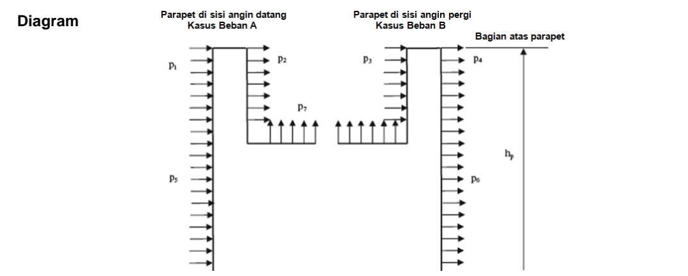

#### **Parapet di sisi angin datang: Kasus Beban A**

1. Tekanan parapet di sisi angin tekan (*p*1) yang ditentukan menggunakan tekanan dinding positif (*p*5) Zona 4 atau Zona 5 dari Tabel 30.6-2. Tekanan parapet di sisi angin pergi (*p*2) ditentukan menggunakan tekanan atap negatif (*p*7) Zona 2 atau Zona 3 dari Tabel 30.6-2.

#### **Parapet di sisi angin pergi: Kasus Beban B**

- 1. Tekanan parapet di sisi angin tekan (*p*3) ditentukan menggunakan tekanan dinding positif (*p*5) Zona 4 atau Zona 5 dari Tabel 30.6-2.
- 2. Tekanan parapet di sisi angin pergi (*p*4) ditentukan menggunakan tekanan dinding negatif (*p*6) Zona 4 atau 5 dari Tabel 30.6-2.

**CATATAN** Lihat Catatan 5 pada Gambar 30.3-2A dan Catatan 7 pada Gambar 30.5-1 untuk reduksi tekanan atap pada komponen dan klading bila terdapat parapet setinggi 3 ft (0,9m) atau lebih.

#### <span id="page-267-0"></span>**Gambar 30.6-1 - Komponen dan Klading, Bagian 4 [***h* ≤ **160 ft (***h* ≤ **18,3 m)]: beban angin parapet untuk bangunan gedung diaphragma sederhana tertutup ̶ penerapan beban angin parapet**

<span id="page-267-1"></span>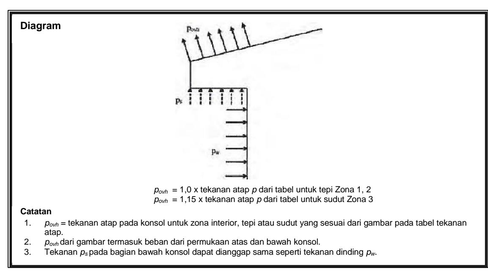

Ga**mbar 30.6-2 -** Komponen dan Klading, Bagian 4 [*h* ≤ 160 ft (*h* ≤ 18,3 m)]: **beban angin konsol atap untuk bangunan gedung diaphragma sederhana tertutup ̶ penerapan beban angin konsol atap**

#### **Bagian 5: Bangunan gedung terbuka**

**CATATAN** Gunakan Bagian 5 Pasal 30 untuk menentukan tekanan angin untuk K&K pada *bangunan gedung terbuka* yang memiliki atap berbubung, miring sepihak atau atap cekung. Ketentuan ini berdasarkan pada Prosedur Pengarah dengan *tekanan angin dihitung dari persamaan yang ditetapkan* berlaku untuk setiap permukaan atap.

#### <span id="page-268-0"></span>**30.7 Tipe bangunan gedung**

Ketentuan Pasal 30.7 berlaku untuk bangunan gedung terbuka pada semua ketinggian yang memiliki atap bebas berbubung, atap bebas miring sepihak, atau atap bebas cekung. Langkah-langkah yang diperlukan untuk menentukan beban angin pada K&K untuk tipe bangunan gedung seperti ditunjukkan dalam Tabel 30.7-1.

#### <span id="page-268-1"></span>**30.7.1 Kondisi**

Untuk menentukan tekanan angin desain pada K&K dengan menggunakan ketentuan Pasal 30.7.2, kondisi yang ditunjukkan pada gambar yang dipilih harus sesuai dengan bangunan gedung yang sedang ditinjau.

#### <span id="page-268-2"></span>**30.7.2 Tekanan angin desain**

Tekanan angin desain neto untuk elemen komponen dan klading pada bangunan gedung terbuka dari seluruh ketinggian dengan atap miring sepihak, atap berbubung, dan atap cekung harus ditentukan dengan persamaan berikut:

$$p = q_h GC_N \tag{30.7-1}$$

dengan

- *q<sup>h</sup>* = tekanan velositas yang dievaluasi pada ketinggian atap rata-rata *h* menggunakan eksposur seperti dijelaskan dalam Pasal 26.7.3 yang mengakibatkan beban angin tertinggi untuk setiap arah angin di lokasi;
- *G* = faktor efek hembusan angin dari Pasal 26.11; dan
- *C<sup>N</sup>* = koefisien tekanan neto diberikan dalam:
  - Gambar 30.7-1 untuk atap miring sepihak
  - Gambar 30.7-2 untuk atap berbubung
  - Gambar 30.7-3 untuk atap cekung

Koefisien tekanan neto *C<sup>N</sup>* mencakup kontribusi dari permukaan atas dan bawah. Seluruh kasus beban yang ditampilkan untuk setiap sudut atap harus diperiksa. Tanda positif dan negatif menandakan tekanan bekerja menuju dan menjauh dari permukaan atas atap.

#### <span id="page-269-2"></span><span id="page-269-1"></span>**Tabel 30.7-1 - Langkah-langkah untuk menentukan beban angin K&K untuk bangunan gedung terbuka**

**Langkah 1:** Tentukan kategori risiko; lihat Tabel 1.5-1

**Langkah 2:** Tentukan kecepatan angin dasar, *V*, untuk kategori risiko yang sesuai; lihat Buku Peta Angin Indonesia

**Langkah 3:** Tentukan parameter beban angin:

- Faktor arah angin, *Kd*, lihat Pasal 26.6 dan Tabel 26.6-1

- Kategori eksposur B, C atau D; lihat Pasal 26.7

- Faktor topografi, *Kzt*; lihat Pasal 26.8 dan Gambar 26.8-1

- Faktor elevasi permukaan tanah, *Ke*; lihat Pasal 26.9 dan Tabel 26.9-1

- Faktor efek hembusan angin, *G*; lihat Pasal 26.11

**Langkah 4:** Tentukan koefisien eksposur tekanan velositas, *K<sup>z</sup>* atau *Kh*; lihat

Tabel 26.10-1

**Langkah 5:** Tentukan tekanan velositas, *qh*, Persamaan (26.10-1)

**Langkah 6:** Tentukan koefisien tekanan neto, *C<sup>N</sup>*

- Atap miring sepihak, lihat Gambar 30.7-1

- Atap berbubung, lihat Gambar 30.7-2

- Atap cekung, lihat Gambar 30.7-3

**Langkah 7:** Hitung tekanan angin, *p*, Persamaan (30.7-1)

#### **Bagian 6: Perlengkapan bangunan gedung dan struktur atas atap dan peralatan**

**CATATAN** Gunakan Bagian 6 Pasal 30 untuk menentukan tekanan angin pada K&K konsol atap dan parapet bangunan gedung. Ketentuan ini didasarkan pada Prosedur Pengarah dengan *tekanan angin yang dihitung dari persamaan yang ditetapkan* berlaku untuk setiap konsol atap atau permukaan parapet.

#### <span id="page-269-0"></span>**30.8 Parapet**

Tekanan angin desain untuk elemen komponen dan klading pada parapet untuk seluruh tipe dan ketinggian bangunan gedung, kecuali bangunan gedung tertutup dengan *h* ≤ 160 ft (*h* ≤ 48,8 m) dimana ketentuan Bagian 4 digunakan, harus ditentukan dari persamaan berikut:

$$p = q_p((GC_p) - (GC_{pi}))$$
 (30.8-1)

dengan

*q<sup>p</sup>* = tekanan velositas yang dievaluasi pada bagian atas dari parapet;

(*GCp*) = koefisien tekanan eksternal yang diberikan dalam

- Gambar 30.3-1 untuk dinding dengan *h* ≤ 60 ft (18,8 m)
- Gambar 30.3-2A sampai 30.3-2C untuk atap datar, atap pelana, dan atapperisai; dan
- Gambar 30.3-3 untuk atap bertingkat;
- Gambar 30.3-4 untuk atap pelana bentang banyak;
- Gambar 30.3-5A dan 30.3-5B untuk atap miring sepihak
- Gambar 30.3-6 untuk atap gergaji;
- Gambar 30.3-7 untuk atap kubah dari semua ketinggian;
- Gambar 30.5-1 untuk dinding dan atap datar dengan *h* > 60 ft (18,3 m);
- Gambar 27.3-3, Catatan 4, untuk atap lengkung;
- (*GCpi*) *=* koefisien tekanan internal dari Tabel 26.13-1, berdasarkan pada porositas dari ketertutupan parapet

Dua kasus beban, lihat Gambar 30.8-1, harus dipertimbangkan:

- Kasus Beban A: Parapet di sisi angin datang harus terdiri dari penerapan tekanan dinding positif yang sesuai dari Gambar 30.3-1 [*h* ≤ 60 ft (*h* ≤ 18,3 m)] atau Gambar 30.5-1 [*h* > 60 ft (*h* > 18,3 m)] untuk permukaan di sisi angin datang pada parapet bersamaan dengan tekanan atap tepi negatif atau tekanan atap zona sudut yang sesuai dari Gambar 30.3-2A, B atau C, 30.3-3, 30.3-4, 30.3-5A atau B), 30.3-6, 30.3-7, Gambar 27.3-3 Catatan 4, atau Gambar 30.5-1 [*h* > 60 ft (*h* > 18,3 m)] sebagaimana berlaku untuk permukaan di sisi angin pergi pada parapet.
- Kasus Beban B: Parapet di sisi angin pergi harus terdiri dari penerapan tekanan dinding positif yang sesuai dari Gambar 30.3-1 [*h* ≤ 60 ft (*h* ≤ 18,3 m)] atau Gambar 30.5-1 [*h* > 60 ft (*h* > 18,3 m)] untuk permukaan di sisi angin datang pada parapet, dan penerapan tekanan dinding negatif yang sesuai dari Gambar 30.3-1 [*h* ≤ 60 ft (*h*  ≤ 18,3 m)] atau Gambar 30.5-1 [*h* > 60 ft (*h* > 18,3 m)] sebagaimana berlaku untuk permukaan di sisi angin pergi. Zona tepi dan zona sudut harus diatur seperti diperlihatkan dalam gambar yang sesuai. (*GCp*) harus ditentukan untuk sudut atap dan luas angin efektif yang sesuai dari gambar-gambar yang berlaku.

Jika ada tekanan internal, kedua kasus beban harus dievaluasi akibat tekanan internal positif dan negatif.

Langkah-langkah yang diperlukan untuk menentukan beban angin pada komponen dan klading dari parapet ditunjukkan dalam Tabel 30.8-1.

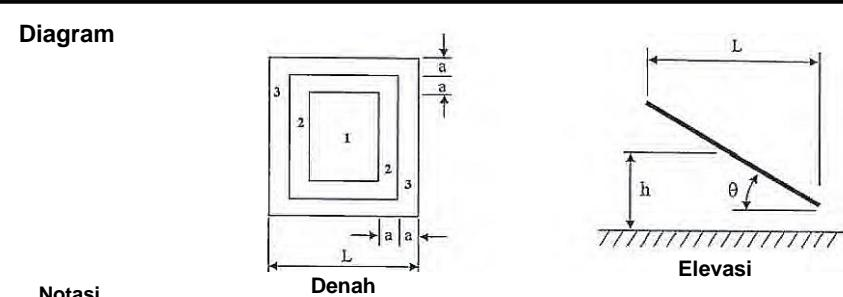

- *a* = 10 % dari dimensi horizontal terkecil atau 0,4*h*, pilih yang terkecil tetapi tidak boleh kurang dari 4 % dari dimensi horizontal terkecil atau 3 ft. (0,9 m).
- *h* = Tinggi atap rata-rata, dalam ft (m).
- *L* = Dimensi horizontal bangunan gedung, diukur sepanjang arah angin, dalam ft. (m).
- = Sudut bidang atap dari horizontal, dalam derajat.

#### **Koefisien tekanan neto,** *C<sup>N</sup>*

| Roof     | Effective Wind -    |     |      | Clear W    | ind Flow  |     |      |
|----------|---------------------|-----|------|------------|-----------|-----|------|
| Angle, θ | Area                | Zo  | ne 3 | Zo         | ne 2      | Zo  | ne 1 |
| 0°       | $\leq a^2$          | 2.4 | -3.3 | 1.8        | -1.7      | 1.2 | -1.1 |
|          | $> a^2, \le 4.0a^2$ | 1.8 | -1.7 | 1.8        | -1.7      | 1.2 | -1.1 |
|          | $> 4.0a^2$          | 1.2 | -1.1 | 1.2        | -1.1      | 1.2 | -1.1 |
| 7.5°     | $\leq a^2$          | 3.2 | -4.2 | 2.4        | -2.1      | 1.6 | -1.4 |
|          | $> a^2, \le 4.0a^2$ | 2.4 | -2.1 | 2.4        | -2.1      | 1.6 | -1.4 |
|          | $>4.0a^2$           | 1.6 | -1.4 | 1.6        | -1.4      | 1.6 | -1.4 |
| 15°      | $\leq a^2$          | 3.6 | -3.8 | 2.7        | -2.9      | 1.8 | -1.9 |
|          | $> a^2, \le 4.0a^2$ | 2.7 | -2.9 | 2.7        | -2.9      | 1.8 | -1.9 |
|          | $>4.0a^{2}$         | 1.8 | -1.9 | 1.8        | -1.9      | 1.8 | -1.9 |
| 30°      | $\leq a^2$          | 5.2 | -5   | 3.9        | -3.8      | 2.6 | -2.5 |
|          | $> a^2, \le 4.0a^2$ | 3.9 | -3.8 | 3.9        | -3.8      | 2.6 | -2.5 |
|          | $> 4.0a^2$          | 2.6 | -2.5 | 2.6        | -2.5      | 2.6 | -2.5 |
| 45°      | $\leq a^2$          | 5.2 | -4.6 | 3.9        | -3.5      | 2.6 | -2.3 |
|          | $> a^2, \le 4.0a^2$ | 3.9 | -3.5 | 3.9        | -3.5      | 2.6 | -2.3 |
|          | $> 4.0a^2$          | 2.6 | -2.3 | 2.6        | -2.3      | 2.6 | -2.3 |
|          |                     |     |      | Obstructed | Wind Flow |     |      |
|          |                     | Zo  | ne 3 |            | ne 2      |     | ne 1 |
| 0°       | $\leq a^2$          | 1   | -3.6 | 0.8        | -1.8      | 0.5 | -1.2 |
|          | $> a^2, \le 4.0a^2$ | 0.8 | -1.8 | 0.8        | -1.8      | 0.5 | -1.2 |
|          | $> 4.0a^2$          | 0.5 | -1.2 | 0.5        | -1.2      | 0.5 | -1.2 |
| 7.5°     | $\leq a^2$          | 1.6 | -5.1 | 1.2        | -2.6      | 0.8 | -1.7 |
|          | $> a^2, \le 4.0a^2$ | 1.2 | -2.6 | 1.2        | -2.6      | 0.8 | -1.7 |
|          | $> 4.0a^2$          | 0.8 | -1.7 | 0.8        | -1.7      | 0.8 | -1.7 |
| 15°      | $\leq a^2$          | 2.4 | -4.2 | 1.8        | -3.2      | 1.2 | -2.1 |
|          | $> a^2, \le 4.0a^2$ | 1.8 | -3.2 | 1.8        | -3.2      | 1.2 | -2.1 |
|          | $> 4.0a^2$          | 1.2 | -2.1 | 1.2        | -2.1      | 1.2 | -2.1 |
| 30°      | $\leq a^2$          | 3.2 | -4.6 | 2.4        | -3.5      | 1.6 | -2.3 |
|          | $> a^2, \le 4.0a^2$ | 2.4 | -3.5 | 2.4        | -3.5      | 1.6 | -2.3 |
|          | $> 4.0a^2$          | 1.6 | -2.3 | 1.6        | -2.3      | 1.6 | -2.3 |
| 45°      | $\leq a^2$          | 4.2 | -3.8 | 3.2        | -2.9      | 2.1 | -1.9 |
|          | $> a^2, \le 4.0a^2$ | 3.2 | -2.9 | 3.2        | -2.9      | 2.1 | -1.9 |
|          | 10-2                | 0.1 | 1.0  | 0.1        | 1.0       | 2.1 | 1.0  |

#### **Catatan**

- 1. *C<sup>N</sup>* menunjukkan tekanan neto (konstribusi dari permukaan atas dan bawah).
- 2. Aliran angin yang sebenarnya secara relatif aliran angin yang tidak terhalang kurang dari atau sama dengan 50 %. Aliran angin yang terhalang menunjukkan objek di bawah atap menghambat aliran angin (> 50 % penghalang).
- 3. Untuk nilai θ selain yang ditunjukkan, interpolasi linier diperbolehkan.
- 4. Tanda positif dan negatif menunjukkan tekanan menuju dan menjauh permukaan atas atap.
- 5. Elemen K&K harus di desain untuk koefisien tekanan positif dan negatif tercantum.

<span id="page-271-0"></span>**Gambar 30.7-1 - Komponen dan Klading (0,**25 ≤ *h*∕*L* ≤ **1,**0): **koefisien tekanan neto**, *C<sup>N</sup>* , untuk **bangunan gedung terbuka ̶atap bebas miring sepihak**, θ ≤ 45°

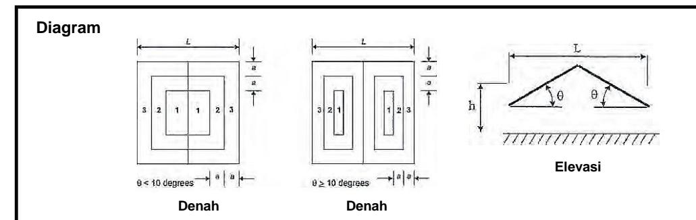

- *a* = 10 % dari dimensi horizontal terkecil atau 0,4*h*, pilih yang terkecil tetapi tidak boleh kurang dari 4 % dari dimensi horizontal terkecil atau 3 ft. (0,9 m). Dimensi *a*, seperti diperlihatkan dalam Gambar 30.7-1.
- *h* = Tinggi atap rata-rata, dalam ft (m).
- *L* = dimensi horizontal bangunan gedung, diukur sepanjang arah angin, dalam ft. (m).
- = Sudut bidang atap dari horizontal, dalam derajat.

#### **Koefisien Tekanan Neto,** *C<sup>N</sup>*

| Roof     | 9° <u>-</u>         |     |      | Clear W    | ind Flow  |     |      |
|----------|---------------------|-----|------|------------|-----------|-----|------|
| Angle, θ | Effective Wind Area | Zo  | ne 3 | Zo         | ne 2      | Zo  | ne 1 |
| 0°       | $\leq a^2$          | 2.4 | -3.3 | 1.8        | -1.7      | 1.2 | -1.1 |
|          | $> a^2, \le 4.0a^2$ | 1.8 | -1.7 | 1.8        | -1.7      | 1.2 | -1.1 |
|          | $>4.0a^2$           | 1.2 | -1.1 | 1.2        | -1.1      | 1.2 | -1.1 |
| 7.5°     | $\leq a^2$          | 2.2 | -3.6 | 1.7        | -1.8      | 1.1 | -1.2 |
|          | $> a^2, \le 4.0a^2$ | 1.7 | -1.8 | 1.7        | -1.8      | 1.1 | -1.2 |
|          | $>4.0a^2$           | 1.1 | -1.2 | 1.1        | -1.2      | 1.1 | -1.2 |
| 15°      | $\leq a^2$          | 2.2 | -2.2 | 1.7        | -1.7      | 1.1 | -1.1 |
|          | $> a^2, \le 4.0a^2$ | 1.7 | -1.7 | 1.7        | -1.7      | 1.1 | -1.1 |
|          | $>4.0a^2$           | 1.1 | -1.1 | 1.1        | -1.1      | 1.1 | -1.1 |
| 30°      | $\leq a^2$          | 2.6 | -1.8 | 2          | -1.4      | 1.3 | -0.9 |
|          | $> a^2, \le 4.0a^2$ | 2   | -1.4 | 2          | -1.4      | 1.3 | -0.9 |
|          | $>4.0a^2$           | 1.3 | -0.9 | 1.3        | -0.9      | 1.3 | -0.9 |
| 45°      | $\leq a^2$          | 2.2 | -1.6 | 1.7        | -1.2      | 1.1 | -0.8 |
|          | $> a^2, \le 4.0a^2$ | 1.7 | -1.2 | 1.7        | -1.2      | 1.1 | -0.8 |
|          | $>4.0a^2$           | 1.1 | -0.8 | 1.1        | -0.8      | 1.1 | -0.8 |
|          | 81-                 |     |      | Obstructed | Wind Flow |     |      |
|          |                     | Zo  | ne 3 | Zo         | ne 2      | Zo  | ne 1 |
| 0°       | $\leq a^2$          | 1   | -3.6 | 0.8        | -1.8      | 0.5 | -1.2 |
|          | $> a^2, \le 4.0a^2$ | 0.8 | -1.8 | 0.8        | -1.8      | 0.5 | -1.2 |
|          | $>4.0a^2$           | 0.5 | -1.2 | 0.5        | -1.2      | 0.5 | -1.2 |
| 7.5°     | $\leq a^2$          | 1   | -5.1 | 0.8        | -2.6      | 0.5 | -1.7 |
|          | $> a^2, \le 4.0a^2$ | 0.8 | -2.6 | 0.8        | -2.6      | 0.5 | -1.7 |
|          | $>4.0a^2$           | 0.5 | -1.7 | 0.5        | -1.7      | 0.5 | -1.7 |
| 15°      | $\leq a^2$          | 1   | -3.2 | 0.8        | -2.4      | 0.5 | -1.6 |
|          | $> a^2, \le 4.0a^2$ | 0.8 | -2.4 | 0.8        | -2.4      | 0.5 | -1.6 |
|          | $>4.0a^2$           | 0.5 | -1.6 | 0.5        | -1.6      | 0.5 | -1.6 |
| 30°      | $\leq a^2$          | 1   | -2.4 | 0.8        | -1.8      | 0.5 | -1.2 |
|          | $> a^2 \le 4.0a^2$  | 0.8 | -1.8 | 0.8        | -1.8      | 0.5 | -1.2 |

#### **Catatan**

- 1. *C<sup>N</sup>* menunjukkan tekanan neto (konstribusi dari permukaan atas dan bawah).
- 2. Aliran angin yang sebenarnya secara relatif aliran angin yang tidak terhalang kurang dari atau sama dengan 50 %. Aliran angin yang terhalang menunjukkan objek di bawah atap menghambat aliran angin (> 50 % penghalang).
- 3. Untuk nilai θ selain yang ditunjukkan, interpolasi linier diperbolehkan.
- 4. Tanda positif dan negatif menunjukkan tekanan menuju dan menjauh permukaan atas atap.
- 5. Elemen K&K harus di desain untuk koefisien tekanan positif dan negatif tercantum.

<span id="page-272-0"></span>**Gambar 30.7-2 - Komponen dan Klading (0,25** ≤ *h* ∕ *L* ≤ **1,0): koefisien tekanan neto,** *CN***, untuk bangunan gedung terbuka ̶atap bebas berbubung, θ** ≤**45°**

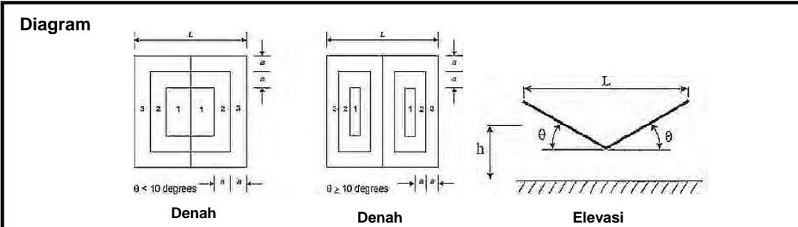

- *a* = 10% dari dimensi horizontal terkecil atau 0,4*h*, pilih yang terkecil tetapi tidak boleh kurang dari 4% dari dimensi horizontal terkecil atau 3 ft. (0,9 m). Dimensi *a*: seperti diperlihatkan dalam Gambar 30.7-1.
- *h* = Tinggi atap rata-rata, dalam ft (m).
- *L* = dimensi horizontal bangunan gedung, diukur sepanjang arah angin, dalam ft. (m).
- = Sudut bidang atap dari horizontal, dalam derajat.

#### **Koefisien tekanan neto,** *C<sup>N</sup>*

| Roof     | Effective Wind      |     |      | Clear W    | ind Flow  |     |      |
|----------|---------------------|-----|------|------------|-----------|-----|------|
| Angle, θ | Area                | Zo  | ne 3 | Zo         | ne 2      | Zo  | ne 1 |
| 0°       | $\leq a^2$          | 2.4 | -3.3 | 1.8        | -1.7      | 1.2 | -1.1 |
|          | $> a^2, \le 4.0a^2$ | 1.8 | -1.7 | 1.8        | -1.7      | 1.2 | -1.1 |
|          | $>4.0a^2$           | 1.2 | -1.1 | 1.2        | -1.1      | 1.2 | -1.1 |
| 7.5°     | $\leq a^2$          | 2.4 | -3.3 | 1.8        | -1.7      | 1.2 | -1.1 |
|          | $> a^2, \le 4.0a^2$ | 1.8 | -1.7 | 1.8        | -1.7      | 1.2 | -1.1 |
|          | $> 4.0a^2$          | 1.2 | -1.1 | 1.2        | -1.1      | 1.2 | -1.1 |
| 15°      | $\leq a^2$          | 2.2 | -2.2 | 1.7        | -1.7      | 1.1 | -1.1 |
|          | $> a^2, \le 4.0a^2$ | 1.7 | -1.7 | 1.7        | -1.7      | 1.1 | -1.1 |
|          | $> 4.0a^2$          | 1.1 | -1.1 | 1.1        | -1.1      | 1.1 | -1.1 |
| 30°      | $\leq a^2$          | 1.8 | -2.6 | 1.4        | -2        | 0.9 | -1.3 |
|          | $> a^2, \le 4.0a^2$ | 1.4 | -2   | 1.4        | -2        | 0.9 | -1.3 |
|          | $>4.0a^{2}$         | 0.9 | -1.3 | 0.9        | -1.3      | 0.9 | -1.3 |
| 45°      | $\leq a^2$          | 1.6 | -2.2 | 1.2        | -1.7      | 0.8 | -1.1 |
|          | $> a^2, \le 4.0a^2$ | 1.2 | -1.7 | 1.2        | -1.7      | 0.8 | -1.1 |
|          | $> 4.0a^2$          | 0.8 | -1.1 | 0.8        | -1.1      | 0.8 | -1.1 |
|          |                     |     |      | Obstructed | Wind Flow |     |      |
|          |                     | Zo  | ne 3 | Zo         | ne 2      | Zo  | ne 1 |
| 0°       | $\leq a^2$          | 1   | -3.6 | 0.8        | -1.8      | 0.5 | -1.2 |
|          | $> a^2, \le 4.0a^2$ | 0.8 | -1.8 | 0.8        | -1.8      | 0.5 | -1.2 |
|          | $>4.0a^2$           | 0.5 | -1.2 | 0.5        | -1.2      | 0.5 | -1.2 |
| 7.5°     | $\leq a^2$          | 1   | -4.8 | 0.8        | -2.4      | 0.5 | -1.6 |

|      |                     |     |      | Obstructed | I Wind Flow |     |      |
|------|---------------------|-----|------|------------|-------------|-----|------|
|      |                     | Zo  | ne 3 | Zo         | ne 2        | Zo  | ne 1 |
| 0°   | $\leq a^2$          | 1   | -3.6 | 0.8        | -1.8        | 0.5 | -1.2 |
|      | $> a^2, \le 4.0a^2$ | 0.8 | -1.8 | 0.8        | -1.8        | 0.5 | -1.2 |
|      | $>4.0a^{2}$         | 0.5 | -1.2 | 0.5        | -1.2        | 0.5 | -1.2 |
| 7.5° | $\leq a^2$          | 1   | -4.8 | 0.8        | -2.4        | 0.5 | -1.6 |
|      | $> a^2, \le 4.0a^2$ | 0.8 | -2.4 | 0.8        | -2.4        | 0.5 | -1.6 |
|      | $> 4.0a^2$          | 0.5 | -1.6 | 0.5        | -1.6        | 0.5 | -1.6 |
| 15°  | $\leq a^2$          | 1   | -2.4 | 0.8        | -1.8        | 0.5 | -1.2 |
|      | $> a^2, \le 4.0a^2$ | 0.8 | -1.8 | 0.8        | -1.8        | 0.5 | -1.2 |
|      | $> 4.0a^2$          | 0.5 | -1.2 | 0.5        | -1.2        | 0.5 | -1.2 |
| 30°  | $\leq a^2$          | 1   | -2.8 | 0.8        | -2.1        | 0.5 | -1.4 |
|      | $> a^2, \le 4.0a^2$ | 0.8 | -2.1 | 0.8        | -2.1        | 0.5 | -1.4 |
|      | $> 4.0a^2$          | 0.5 | -1.4 | 0.5        | -1.4        | 0.5 | -1.4 |
| 45°  | $\leq a^2$          | 1   | -2.4 | 0.8        | -1.8        | 0.5 | -1.2 |
|      | $> a^2, \le 4.0a^2$ | 0.8 | -1.8 | 0.8        | -1.8        | 0.5 | -1.2 |
|      | $> 4.0a^2$          | 0.5 | -1.2 | 0.5        | -1.2        | 0.5 | -1.2 |
|      |                     |     |      |            |             |     |      |

#### **Catatan**

- 1. *CN*menunjukkan tekanan neto (konstribusi dari permukaan atas dan bawah).
- 2. Aliran angin yang sebenarnya secara relatif aliran angin yang tidak terhalang kurang dari atau sama dengan 50 %. Aliran angin yang terhalang menunjukkan objek di bawah atap menghambat aliran angin (>50% penghalang).
- 3. Untuk nilai θ selain yang ditunjukkan, interpolasi linier diperbolehkan.
- 4. Tanda positif dan negatif menunjukkan tekanan menuju dan menjauh permukaan atas atap.
- 5. Elemen K&K harus di desain untuk koefisien tekanan positif dan negatif tercantum.

<span id="page-273-0"></span>**Gambar 30.7-3 - Komponen dan Klading (0,25** ≤ *h* ∕ *L* ≤ **1,0): koefisien tekanan neto,** *CN***, untuk bangunan gedung terbuka ̶atap bebas cekung, θ** ≤ **45°**

# **Diagram**

#### **Catatan**

Parapet di sisi angin datang: Kasus Beban A

- 1. Tekanan parapet di sisi angin datang(p1) yang ditentukan menggunakan tekanan dinding positif (p5) zona 4 atau Zona 5 dari gambar terkait.
- 2. Tekanan parapet di sisi angin pergi (p2) ditentukan menggunakan tekanan atap negatif (p7) zona 2 atau Zona 3 dari gambar terkait

Parapet di sisi angin pergi: Kasus Beban B

- 1. Tekanan parapet di sisi angin datang(p3) ditentukan menggunakan tekanan dinding positif (p5) zona 4 atau Zona 5 dari gambar terkait.
- 2. Tekanan parapet di sisi angin pergi (p4) ditentukan menggunakan tekanan dinding negatif (p6) zona 4 atau Zona 5 dari gambar terkait.

**CATATAN:** Lihat Catatan 5 dalam Gambar 30.3-2A dan Catatan 7 dalam Gambar 30.5-1 untuk reduksi pada Komponen dan Klading – tekanan atap bila terdapat parapet dengan tinggi 3 ft (0,9 m) atau lebih.

<span id="page-274-0"></span>**Gambar 30.8-1 - Komponen dan Klading, Bagian 6 (semua ketinggian bangunan gedung): beban angin parapet , semua tipe bangunan gedung ̶beban angin parapet**

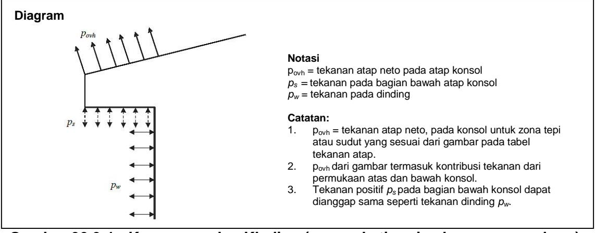

<span id="page-274-1"></span>**Gambar 30.9-1 - Komponen dan Klading (semua ketinggian bangunan gedung): beban angin konsol atap untuk semua tipe bangunan gedung ̶beban angin K&K pada konsol atap**

#### <span id="page-275-1"></span>**Tabel 30.8-1 - Langkah-langkah untuk menentukan beban angin K&K untuk parapet**

**Langkah 1 :** Tentukan kategori risiko bangunan gedung; lihat Tabel 1.5-1

**Langkah 2 :** Tentukan kecepatan angin dasar, *V*, untuk kategori risiko yang berlaku; lihat Buku Peta Angin Indonesia.

**Langkah 3 :** Tentukan parameter beban angin:

- Faktor arah angin, *Kd*; lihat Pasal 26.6 dan Tabel 26.6-1.

- Kategori eksposur B, C atau D; lihat Pasal 26.7.

- Faktor topografi, *Kzt*; lihat Pasal 26.8 dan Gambar 26.8-1.

- Faktor elevasi permukaan tanah, *Ke*; lihat Pasal 26.9 dan Tabel 26.9-1

- Klasifikasi ketertutupan, lihat Pasal 26.12.

- Koefisien tekanan internal, (*GCpi*); lihat Pasal 26.13 dan Tabel 26.13-1

**Langkah 4 :** Tentukan koefisien eksposur tekanan velositas, *Kh*, pada bagian atas parapet; lihat Tabel 26.10-1

**Langkah 5 :** Tentukan tekanan velositas, *qp*, pada bagian atas dari parapet dengan menggunakan Persamaan (26.10-1)

**Langkah 6 :** Tentukan koefisien tekanan eksternal untuk permukaan dinding dan atap yang berdekatan dengan parapet, (*GCp*)

- Dinding dengan *h* ≤ 60 ft. (18,3 m), lihat Gambar 30.3-1

- Atap datar, pelana dan perisai, lihat Gambar 30.3-2 A-I

- Atap bertingkat, lihat Gambar 30.3-3

- Atap pelana bentang banyak, lihat Gambar 30.3-4

- Atap miring sepihak, lihat Gambar 30.3-5A dan 30.3-5B

- Atap gergaji, lihat Gambar 30.3-6

- Atap kubah dari seluruh ketinggian, lihat Gambar 30.3-7

- Dinding dan atap datar dengan *h* > 60 ft. (18,3 m), lihat Gambar 30.5-1

- Atap lengkung, lihat Gambar 27.3-3, Catatan 4

**Langkah 7 :** Hitung tekanan angin, *p*, menggunakan Persamaan 30.8-1 pada permukaan parapet di sisi angin datang dan di sisi angin pergi, dengan mempertimbangkan dua kasus beban (Kasus A dan Kasus B) seperti diperlihatkan dalam Gambar 30.8-1.

#### <span id="page-275-0"></span>**30.9 Konsol atap**

Tekanan angin desain untuk konsol atap bangunan gedung tertutup dan tertutup sebagian untuk semua ketinggian, kecuali bangunan gedung tertutup dengan *h* ≤ 160 ft (48,8 m) untuk ketentuan Bagian 4 yang digunakan, harus ditentukan dari persamaan berikut:

$$p = q_h[(GC_p) - (GC_{pi})] \text{ (lb/ft}^2)$$
(30.9-1)

$$p = q_h[(GC_p) - (GC_{pi})] (N/m^2)$$
 (30.10-1.si)

dengan

*q<sup>h</sup>* = tekanan velositas dari Pasal 26.10 dievaluasi pada ketinggian atap rata-rata *h*  menggunakan eksposur yang dijelaskan dalam Pasal 26.7.3;

(*GCp*) = koefisien tekanan eksternal untuk konsol diberikan dalam Gambar 30.3-2A sampai 30.3-2C (atap datar, atap pelana, dan atap perisai), termasuk kontribusi dari permukaan atas dan bawah dari konsol. Koefisien tekanan eksternal untuk penutup di bagian bawah konsol atap adalah sama dengan koefisien tekanan eksternal pada permukaan dinding yang berdekatan, disesuaikan dengan luas angin efektif, ditentukan dari Gambar 30.3-1 atau Gambar 30.5-1 yang berlaku;

(*GCpi*) = koefisien tekanan internal diberikan dalam Tabel 26.13-1

Langkah-langkah yang diperlukan untuk menentukan beban angin pada K&K dari konsol atap ditunjukkan dalam Tabel 30.9-1.

#### <span id="page-276-2"></span>**Tabel 30.9-1 - Langkah-langkah untuk menentukan beban angin konsol atap K&K**

- **Langkah 1:** Tentukan kategori risiko bangunan gedung, lihat Tabel 1.5-1.
- **Langkah 2:** Tentukan kecepatan dasar, *V*, untuk kategori risiko yang berlaku; lihat Buku Peta Angin Indonesia.
- **Langkah 3:** Tentukan parameter beban angin:
- Faktor arah angin, *Kd*; lihat Pasal 26.6 dan Tabel 26.6-1.
- Kategori eksposur B, C atau D; lihat Pasal 26.7.
- Faktor topografi, *Kzt*; lihat Pasal 26.8 dan Gambar 26.8-1.
- Faktor elevasi permukaan tanah, *Ke*, lihat Pasal 26.9 dan Tabel 26.9-1
- Klasifikasi ketertutupan, lihat Pasal 26.12
- Koefisien tekanan internal, (*GCpi*); lihat Pasal 26.13 dan Tabel 26.13-1
- **Langkah 4:** Tentukan koefisien eksposur tekanan velositas, *Kh*, lihat Tabel 26.10-1.
- **Langkah 5:** Tentukan tekanan velositas, *qh*, pada ketinggian atap rata-rata *h* dengan menggunakan Persamaan (26.10-1).
- **Langkah 6:** Tentukan koefisien tekanan eksternal, (*GCp*), dengan menggunakan Gambar 30.3-2A-D, F, G dan I untuk atap datar, atap pelana dan atap perisai, seperti diagram gambar.
- **Langkah 7:** Hitung tekanan angin, *p*, dengan menggunakan Persamaan 30.9-1; mengacu pada Gambar 30.9-1.

#### <span id="page-276-0"></span>**30.10 Struktur dan peralatan atap bangunan gedung**

Tekanan pada K&K di setiap dinding dari struktur atap harus sama dengan gaya lateral yang ditentukan menurut Pasal 29.4.1 dibagi dengan luas permukaan dinding yang berhubungan dengan struktur atap dan harus dipertimbangkan bekerja ke arah dalam dan ke arah luar. Tekanan K&K pada atap harus sama dengan gaya angkat vertikal yang ditentukan menurut Pasal 29.4.1 dibagi dengan luas terproyeksi horizontal atap dari struktur atap dan harus dipertimbangkan bekerja ke arah atas.

#### <span id="page-276-1"></span>**30.11 Kanopi terhubung pada bangunan gedung dengan** *h* **≤ 60 ft (***h* **≤ 18,3 m)**

Tekanan angin desain untuk kanopi terhubung pada dinding bangunan gedung bertingkat rendah dengan *h* ≤ 60 ft (*h* ≤ 18,3 m) harus ditentukan dari persamaan berikut:

$$p = q_h(GC_p) \text{ (lb/ft}^2)$$
 (30.11 - 1)

$$p = q_h(GC_p) \text{ (lb/ft}^2) \text{ (N/m}^2)$$
 (30.11-1.si)

dengan

- *q<sup>h</sup>* = tekanan velositas dari Pasal 26.10 dihitung pada ketinggian atap rata-rata *h* menggunakan eksposur yang didefinisikan dalam Pasal 26.7.3; dan
- (*GCp*) = koefisien tekanan neto untuk kanopi terhubung yang diberikan pada Gambar 30.11-1A-B untuk kontribusi dari kedua permukaan teratas dan terbawah individual dan efek kombinasi (neto) nya pada kanopi terhubung.

Langkah-langkah yang diperlukan untuk penentuan beban-beban angin pada kanopi terhubung ditunjukkan dalam Tabel 30.11-1.

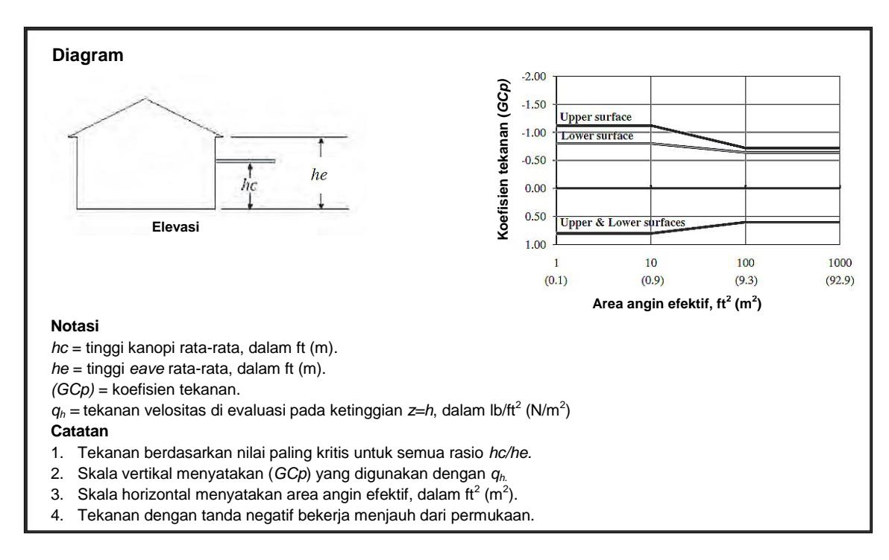

#### <span id="page-277-0"></span>**Gambar 30.11-1A - Koefisien tekanan pada permukaan terpisah dari kanopi terhubung**

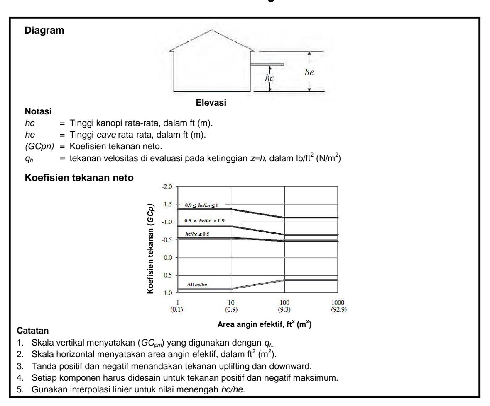

<span id="page-277-1"></span>**Gambar 30.11-1B - Koefisien tekanan neto pada kanopi terhubung dengan mempertimbangkan kontribusi simultan dari permukaan teratas dan terbawah**

#### <span id="page-278-1"></span>**Tabel 30.11-1 - Langkah-langkah untuk menentukan beban angin K&K pada kanopi terhubung**

- **Langkah 1** : Tentukan kategori risiko bangunan gedung; lihat Tabel 1.5-1.
- **Langkah 2** : Tentukan kecepatan angin dasar, *V*, untuk kategori risiko yang sesuai; lihat Buku Peta Angin Indonesia.
- **Langkah 3** : Tentukan parameter beban angin:
  - Faktor arah angin, *Kd*; lihat Pasal 26.6 dan Tabel 26.6-1.
  - Kategori eksposur B, C, atau D; lihat Pasal 26.7.
  - Faktor topografi, *K<sup>v</sup>* ; lihat Pasal 26.8 dan Gambar 26.8-1.
  - Faktor elevasi permukaan tanah, *Ke*; lihat Pasal 26.9 dan Tabel 26.9-1.
- **Langkah 4** : Tentukan koefisien eksposur tekanan velositas, *Kh*; lihat Tabel 26.10-1.
- **Langkah 5** : Tentukan tekanan velositas, *qh*, pada ketinggian atap rata-rata *h* dengan menggunakan Persamaan (26.10-1).
- **Langkah 6** : Tentukan permukaan atau koefisien tekanan neto, (*GCp*) atau (*GCpn*) dengan menggunakan Gambar 30.11-1A atau B.
- **Langkah 7** : Hitung tekanan angin, *p*, menggunakan Persamaan (30.11-1).

#### **Bagian 7: Struktur nongedung**

#### <span id="page-278-0"></span>**30.12 Wadah (***bin***), silo, dan tangki berpenampang bundar dengan** *h* **≤ 120 ft (***h* **≤ 36,6 m)**

Tekanan angin pada permukaan wadah, silo, dan tangki berpenampang bundar yang terisolasi harus dihitung berdasarkan Pasal 30.12.1 sampai dengan Pasal 30.12.5.

Wadah, silo, dan tangki berpenampang bundar berkelompok yang berukuran sama dengan jarak pusat ke pusat lebih besar dari 2 diameter harus diperlakukan sebagai struktur terisolasi. Untuk jarak kurang dari 1,25 diameter, struktur harus diperlakukan sebagai berkelompok dan tekanan angin harus ditentukan dari Pasal 30.12.6. Untuk jarak di antaranya, harus digunakan interpolasi linier dari nilai *C<sup>p</sup>* (atau *Cf*).

Langkah-langkah yang diperlukan untuk menentukan beban angin pada wadah (*bin*), silo, dan tangki berpenampang bundar tertera pada Tabel 30.12-1.

<span id="page-278-2"></span>**Tabel 30.12-1 - Langkah-langkah untuk menentukan beban angin K&K untuk wadah (***bin***), silo, dan tangki berpenampang bundar**

| Langkah 1:               | Tentukan kategori risiko; lihat Tabel 1.5-1.                                                                                                                                                                                                                                                                                                                                                                                         |
|--------------------------|--------------------------------------------------------------------------------------------------------------------------------------------------------------------------------------------------------------------------------------------------------------------------------------------------------------------------------------------------------------------------------------------------------------------------------------|
| Langkah 2:               | Tentukan kecepatan angin dasar, V, untuk kategori risiko yang sesuai; lihat<br>Buku Peta Angin Indonesia.                                                                                                                                                                                                                                                                                                                            |
| Langkah 3:               | Tentukan parameter beban angin:<br>• Faktor arah angin, Kd; lihat Pasal 26.6 dan Tabel 26.6-1.<br>• Kategori eksposur B, C, atau D; lihat Pasal 26.7.<br>• Faktor topografi, Kzt<br>; lihat Pasal 26.8 dan Gambar 26.8-1.<br>• Faktor elevasi permukaan tanah, Ke; lihat Pasal 26.9 dan Tabel 26.9-1<br>• Klasifikasi ketertutupan; lihat Pasal 26.12.<br>• Koefisien tekanan internal; (GCpi); lihat Pasal 26.13 dan Pasal 30.12.3. |
| Langkah 4:               | Tentukan koefisien eksposur tekanan velositas, Kz<br>atau Kh; lihat Tabel<br>26.10-1.                                                                                                                                                                                                                                                                                                                                                |
| Langkah 5:<br>Langkah 6: | Tentukan tekanan velositas, qh, Persamaan (26.10-1).<br>Tentukan koefisien tekanan eksternal, (GCp).<br>• Dinding; lihat Pasal 30.12.2 dan Pasal 30.12.6.                                                                                                                                                                                                                                                                            |
| Langkah 7:               | • Atap; lihat Pasal 30.12.4 dan Pasal 30.12.6.<br>Hitung tekanan angin, p, menggunakan Persamaan (30.12-1).                                                                                                                                                                                                                                                                                                                          |

#### <span id="page-279-0"></span>30.12.1 Tekanan angin desain

Tekanan angin yang didesain pada K&K untuk wadah (*bin*), silo, dan tangki berpenampang bundar terisolasi dalam (lb/ft²) (N/m²) harus ditentukan dari persamaan berikut:

$$p = q_b((GC_b) - (GC_{bi})) \tag{30.12-1}$$

dengan

q<sub>h</sub> = tekanan velositas untuk semua permukaan yang dihitung pada ketinggian atap rata-rata h

 $(GC_n)$  = koefisien tekanan eksternal yang diberikan dalam

- Pasal 30.12.2 untuk dinding
- Pasal 30.12.5 untuk sisi-sisi bagian bawah
- Pasal 30.12.4 untuk atap

 $(GC_{pi})$  = koefisien tekanan internal yang diberikan pada Tabel 26.13-1 dan Pasal 30.12.3.

## <span id="page-279-1"></span>30.12.2 Dinding eksternal dari wadah (bin), silo, dan tangki berpenampang bundar terisolasi

Tekanan eksternal pada dinding wadah (bin), silo, dan tangki berpenampang bundar harus ditentukan dari koefisien tekanan eksternal ( $GC_p$ ) sebagai fungsi dari sudut  $\alpha$ , diberikan sebagai berikut untuk rentang bentuk yang ditunjukkan:

$$(GC_{p(\alpha)}) = k_b C_{(\alpha)} \tag{30.12-2}$$

bila silinder (diameter D) berdiri di permukaan tanah atau didukung oleh kolom dengan ketinggian bersih (C) kurang dari ketinggian silinder (H), seperti ditunjukkan dalam Gambar 30.12-1.

H/D berada dalam rentang 0,25 sampai dengan 4,0 inklusif.  $\alpha$  = sudut dari arah angin ke suatu titik pada dinding wadah (*bin*), silo, dan tangki berpenampang bundar, dalam derajat.

$$k_b$$
 = 1,0 untuk  $C_{(\alpha)} \ge -0.15$ , atau  
= 1,0-0,55( $C_{(\alpha)} + 0.15$ )log<sub>10</sub>( $H/D$ ), untuk  $C_{(\alpha)} < -0.15$  (30.12-3)

$$C_{(\alpha)} = -0.5 + 0.4 \cos \alpha + 0.8 \cos 2\alpha + 0.3 \cos 3\alpha$$
 (30.12-4)  
1 - 0.1 \cos 4\alpha - 0.05 \cos 5\alpha

Gambar 30.12-1 mencantumkan koefisien tekanan eksternal untuk dinding, termasuk distribusi grafis tekanan eksternal ( $GC_{p(\alpha)}$ ) di perimeter dinding.

# <span id="page-279-2"></span>30.12.3 Permukaan internal dinding eksterior dari wadah (*bin*), silo, dan tangki berpenampang bundar atas terbuka terisolasi

Tekanan pada permukaan internal dari dinding eksterior wadah (*bin*), silo, dan tangki berpenampang bundar atas terbuka harus ditentukan dari Persamaan (30.12-5):

$$(GC_{pi}) = -0.9 - 0.35\log_{10}(H/D)$$
 (30.12-5)

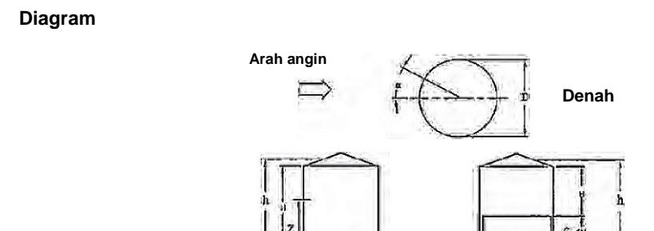

**Elevasi Elevasi Wadah (***bin***), silo, dan tangki berpenampang bundar di atas tanah atau didukung kolom**

- *h* = Tinggi atap rata-rata, dalam ft (m).
- *H* = Tinggi silinder solid, dalam ft (m).
- Z = Tinggi terhadap titik berat area terproyeksi pada struktur bundar, dalam ft (m).
- *α* = Sudut dari arah angin terhadap suatu titik pada dinding wadah (bin), silo dan tangki berpenampang bundar, dalam derajat.
- *D* = Diameter struktur bundar, dalam ft (m).
- *C* = Tinggi bersih di atas permukaan tanah, dalam ft (m).

**Koefisien tekan eksternal***, (GCp (α) ),* **untuk dinding wadah** *(bin),* **silo dan tangki berpenampang bundar**

| Sudut, α  |       |       |       | Rasio aspek, H/D<br>Rasio aspek, H/D |       |       |
|-----------|-------|-------|-------|--------------------------------------|-------|-------|
| (derajat) | 0,25  | 0,50  | 1     | 2                                    | 3     | 4     |
| 0°        | 1,00  | 1,00  | 1,00  | 1,00                                 | 1,00  | 1,00  |
| 15°       | 0,70  | 0,70  | 0,70  | 0,70                                 | 0,70  | 0,70  |
| 30°       | 0,30  | 0,30  | 0,30  | 0,30                                 | 0,30  | 0,30  |
| 45°       | -0,30 | -0,30 | -0,30 | -0,30                                | -0,30 | -0,30 |
| 60°       | -0,70 | -0,80 | -1,00 | -1,10                                | -1,20 | -1,20 |
| 75°       | -0,80 | -1,10 | -1,40 | -1,70                                | -1,90 | -2,00 |
| 90°       | -0,80 | -1,10 | -1,40 | -1,70                                | -1,90 | -2,00 |
| 105°      | -0,70 | -0,90 | -1,10 | -1,30                                | -1,40 | -1,40 |
| 120°      | -0,60 | -0,70 | -0,70 | -0,80                                | -0,80 | -0,90 |
| 135°      | -0,40 | -0,50 | -0,50 | -0,50                                | -0,60 | -0,60 |
| 150°      | -0,40 | -0,40 | -0,40 | -0,50                                | -0,50 | -0,50 |
| 165°      | -0,40 | -0,40 | -0,40 | -0,50                                | -0,50 | -0,50 |
| 180°      | -0,40 | -0,40 | -0,40 | -0,50                                | -0,50 | -0,50 |

*Distribusi tekanan eksternal, (GCp (α) ), di sekitar perimeter dinding*

<span id="page-280-0"></span>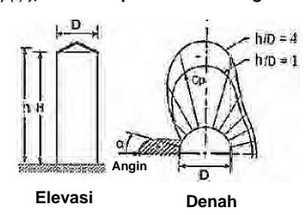

**Gambar 30.12-1 - Komponen dan Klading [***h* ≤ **120 ft (***h* ≤ **36,6 m)]: koefisien tekan eksternal, (***GCp***), untuk dinding wadah (***bin***), silo, dan tangki berpenampang bundar terisolasi dengan** *D* **< 120 ft (36,6 m) dan 0,25 <** *H*∕*D* **< 4,0 ̶struktur lain**

**Sudut,** α **(derajad)**

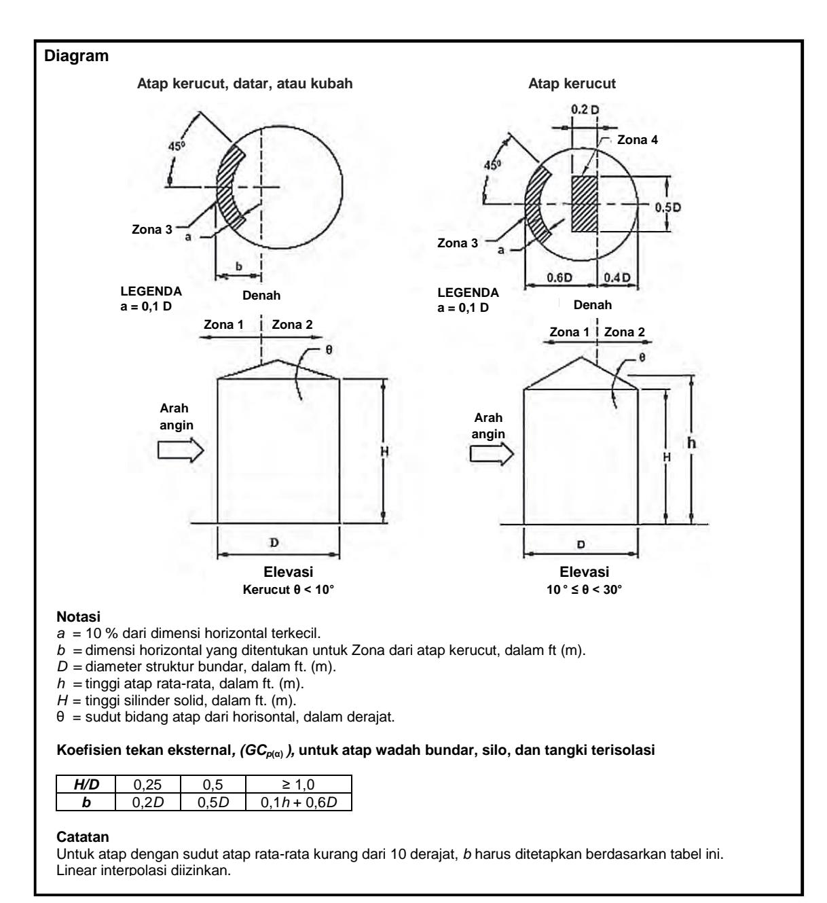

<span id="page-281-0"></span>Gambar 30.12-2 - Komponen dan Klading [ $h \le 120$  ft ( $h \le 36,6$  m)]: koefisien tekan eksternal, ( $GC_p$ ), untuk atap wadah (bin), silo, dan tangki berpenampang bundar i terisolasi dengan D < 120 ft (36,6 m) dan 0,25 < H/D < 4,0—struktur lain

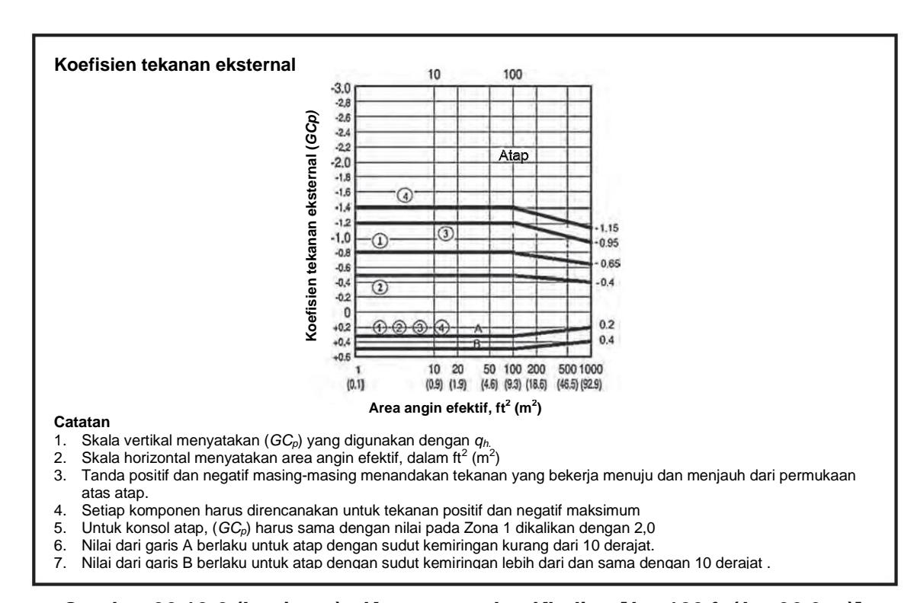

Gambar 30.12-2 (Lanjutan) - Komponen dan Klading [ $h \le 120$  ft ( $h \le 36,6$  m)]: koefisien tekan eksternal, ( $GC_p$ ), untuk atap wadah (bin), silo, dan tangki berpenampang bundar terisolasi dengan D < 120 ft (36,6 m) dan 0,25 < HD < 4,0—struktur lain

#### <span id="page-282-0"></span>30.12.4 Atap dari wadah (bin), silo, dan tangki berpenampang bundar terisolasi

Tekanan eksternal pada atap atau tutup wadah (bin), silo, dan tangki berpenampang bundar harus sama dengan koefisien tekanan eksternal ( $GC_p$ ) yang diberikan pada Gambar 30.12-2 untuk Zona 1, Zona 2, Zona 3, dan Zona 4.

Zona 3 dapat diterapkan pada tepi atap arah angin datang dengan kemiringan kurang dari atau sama dengan 30°, dan Zona 4 berlaku untuk wilayah dekat puncak kerucut untuk atap dengan kemiringan lebih dari 15°. Area yang berlaku ditunjukkan pada Gambar 30.12-2.

## <span id="page-282-1"></span>30.12.5 Sisi bawah dari wadah (*bin*), silo, dan tangki berpenampang bundar terelevasi terisolasi

Nilai  $(GC_p)$  untuk bagian bawah dari wadah bundar, silo, dan tangki yang terelevasi harus diambil sebagai 1,2 dan -0,9 untuk Zona 3 dan 0,8 dan -0,6 untuk Zona 1 dan Zona 2, seperti ditunjukkan pada Gambar 30.12-2.

# <span id="page-282-2"></span>30.12.6 Atap dan dinding dari wadah (*bin*), silo dan tangki berpenampang bundar berkelompok

Kelompok berjarak dekat dengan jarak pusat-ke-pusat kurang dari 1,25D, tekanan eksternal dari wadah (bin), silo dan tangki berpenampang bundar yang dikelompokkan, harus sama dengan koefisien tekanan eksternal ( $GC_p$ ) yang diberikan pada Gambar 30.12-3 untuk Zona 1, Zona 2, Zona 3a, Zona 3b, dan Zona 4 untuk atap dan Gambar 30.12-4 untuk Zona 5a, Zona 5b, Zona 8, dan Zona 9 untuk dinding.

#### <span id="page-283-0"></span>**30.13 Panel surya di atap untuk bangunan gedung pada semua ketinggian dengan atap datar atau atap pelana atau atap perisai dengan kemiringan kurang dari 7°**

Tekanan angin desain untuk modul dan panel surya di atap harus ditentukan sesuai dengan Pasal 29.4.3 untuk deretan panel surya di atap sesuai dengan persyaratan geometrik yang disyaratkan dalam Pasal 29.4.3.

#### <span id="page-283-1"></span>**30.14 Standar konsensus dan dokumen referensi lain**

Pasal ini tidak merujuk konsensus standar atau dokumen lain manapun yang dianggap sebagai bagian dari standar ini.

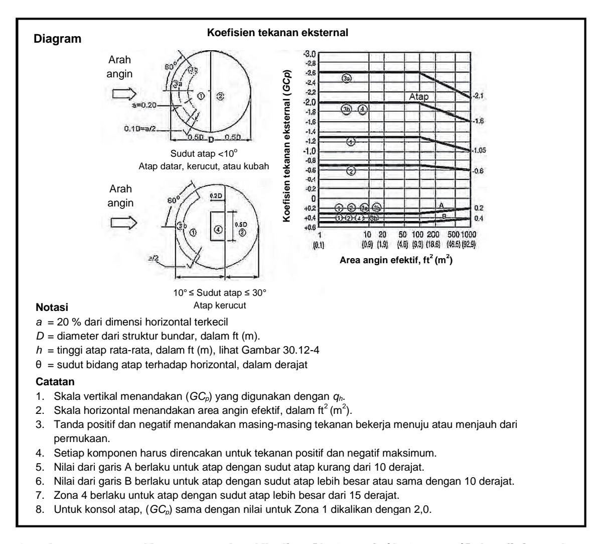

<span id="page-283-3"></span><span id="page-283-2"></span>**Gambar 30.12-3 - Komponen dan Klading [***h* **≤ 120 ft (***h* **≤ 36,6 m)]: koefisien tekan eksternal, (***GCp***), untuk atap wadah (bin), silo, dan tangki berpenampang bundar berkelompok dengan** *D* **< 120 ft (***D* **< 36,6 m) dan 0,25 <** *H***/***D* **< 4,0 (jarak pusat ke pusat < 1,25***D***) ̶struktur lain**

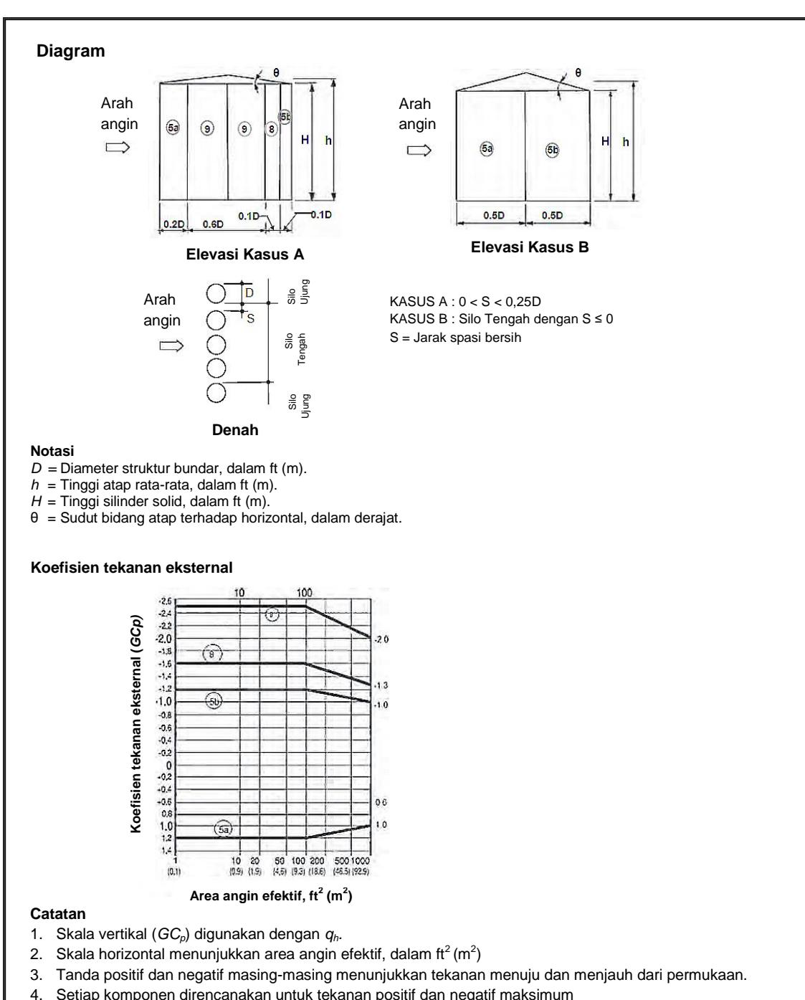

4. Setiap komponen direncanakan untuk tekanan positif dan negatif maksimum

kurang dari 0.

- 5. Zona 9 adalah daerah dengan jarak terpendek antara silo bersebelahan dan pojok luar dari kelompok.
- 6. Kasus A berlaku untuk silo dengan jarak bersih lebih besar dari 0 dan kurang dari 0,25*D*. Kasus B berlaku untuk silo tengah dari deret silo yang terhubung, kecuali silo ujung, dengan jarak bersih sama dengan atau

<span id="page-284-0"></span>**Gambar 30.12-4 - Komponen dan Klading [***h* ≤ **120 ft (***h* ≤ **36,6 m)]: koefisien tekan eksternal, (***GCp***), untuk dinding dari wadah (***bin***), silo, dan tangki berpenampang bundar berkelompok dengan** *D* **< 120 ft (***D* **< 36,6 m) dan 0,25 <** *H***/***D* **< 4,0 (jarak pusat ke pusat < 1,25***D***) ̶struktur lain**

#### <span id="page-285-0"></span>**31 Prosedur terowongan angin**

#### <span id="page-285-1"></span>**31.1 Ruang lingkup**

Prosedur terowongan angin harus digunakan bila diperlukan oleh Pasal 27.1.3, Pasal 28.1.3 dan Pasal 29.1.3. Prosedur terowongan angin boleh digunakan untuk setiap bangunan gedung atau struktur lain sebagai pengganti prosedur desain yang ditetapkan dalam Pasal 27 (SPGAU untuk bangunan gedung dari semua ketinggian dan bangunan diafragma sederhana dengan *h* ≤ 160 ft (48,8 m), Pasal 28 (SPGAU bangunan bertingkat rendah dan bangunan bertingkat rendah diafragma sederhana), Pasal 29 (SPGAU untuk semua struktur lain), dan Pasal 30 (komponen dan klading untuk semua tipe bangunan gedung dan struktur lain).

**CATATAN** Pasal 31 boleh selalu digunakan untuk menentukan tekanan angin untuk SPGAU dan/atau untuk K&K dari bangunan gedung atau struktur lain. Metode ini dianggap menghasilkan tekanan angin paling akurat dari setiap metode yang ditetapkan dalam Standar ini.

#### <span id="page-285-2"></span>**31.2 Kondisi Pengujian**

Pengujian terowongan angin, atau pengujian serupa yang menggunakan fluida selain udara, digunakan untuk menentukan beban angin desain untuk setiap bangunan gedung atau struktur lainnya, harus dilakukan sesuai dengan Pasal ini. Pengujian untuk penentuan rata-rata dan gaya-gaya yang berfluktuasi serta tekanan-tekanan harus memenuhi persyaratan ASCE 49.

#### <span id="page-285-3"></span>**31.3 Respon dinamis**

Pengujian untuk tujuan menentukan respons dinamis dari bangunan gedung atau struktur lain harus sesuai dengan Pasal 31.2. Model struktural dan analisis terkait harus memperhitungkan distribusi massa, kekakuan dan redaman.

#### <span id="page-285-4"></span>**31.4 Efek-efek beban**

#### <span id="page-285-5"></span>**31.4.1 Interval pengulangan rata-rata dari efek beban**

Efek beban yang diperlukan untuk desain kekuatan harus ditentukan untuk interval pengulangan rata-rata yang sama seperti untuk metode analitik, yang menggunakan metode analisis rasional, yang didefinisikan dalam literatur yang dikenal, untuk mengkombinasi data terowongan angin pengarah dengan data meteorologi pengarah atau berdasarkan model probabilistik. Efek beban yang diperlukan untuk desain tegangan izin harus sama dengan efek beban yang diperlukan untuk desain kekuatan dibagi dengan 1,6. Untuk bangunan gedung struktur lain yang sensitif terhadap kemungkinan variasi dalam nilai parameter dinamis, diperlukan studi sensitifitas untuk memberikan dasar yang rasional terhadap rekomendasi desain.

#### <span id="page-285-6"></span>**31.4.2 Pembatasan kecepatan angin**

Kecepatan angin ataupun estimasi probabilistik harus memenuhi pembatasan yang diberikan dalam Pasal 26.5.3.

#### <span id="page-285-7"></span>**31.4.3 Arah angin**

Arah iklim angin yang didasarkan pada data arah kecepatan angin yang direkam atau disimulasikan harus dipertimbangkan dalam menentukan beban angin, dan data harus disajikan sebagai bagian dari laporan terowongan angin yang diserahkan kepada pihak yang berwenang. Metode untuk mengkombinasikan data model terowongan angin dengan informasi tentang kecepatan dan arah angin di lokasi proyek juga harus dinyatakan dengan jelas dalam laporan terowongan angin. Variasi arah angin, berdasarkan ketidakpastian dalam data iklim angin, harus dipertimbangkan ketika menentukan beban angin, dan beban angin desain harus didasarkan pada nilai terbesar yang dihasilkan dari ketidakpastian ini. Pertimbangan ketidakpastian dalam arah angin tidak diperlukan dalam penentuan kemampuan layan terkait efek angin.

#### <span id="page-286-0"></span>**31.4.4 Batasan pada beban**

Beban untuk SPGAU yang ditentukan oleh pengujian terowongan angin harus dibatasi sehingga beban utama total dalam arah *x* dan *y* tidak kurang dari 80 % dari yang akan diperoleh dari Bagian 1 Pasal 27 atau Bagian 1 Pasal 28 untuk bangunan gedung atau Pasal 29 untuk struktur lain. Beban utama total untuk bangunan gedung harus didasarkan pada momen guling untuk bangunan gedung fleksibel dan gaya geser dasar untuk bangunan gedung lain. Beban utama keseluruhan untuk struktur lain harus didasarkan pada momen guling untuk struktur fleksibel dan gaya geser dasar untuk struktur lain.

Tekanan untuk Komponen dan Klading yang ditentukan dengan pengujian terowongan angin harus dibatasi tidak kurang dari 80 % untuk yang dihitung pada Zona 4 untuk dinding dan Zona 1 untuk atap dengan menggunakan prosedur Pasal 30. Zona ini merujuk kepada Gambar 30.3-1, Gambar 30.3-2A, Gambar 30.3-2B, Gambar 30.3-2C, Gambar 30.3-3, Gambar 30.3-4, Gambar 30.3-5A, Gambar 30.3-5B, Gambar 30.3-6, Gambar 30.3-7, dan Gambar 30.5-1.

Nilai-nilai pembatas dari 80 % dapat direduksi sampai 50 % untuk SPGAU dan 65 % untuk K&K jika salah satu dari kondisi berikut ini berlaku:

- 1. Tidak ada bangunan gedung atau objek yang berpengaruh khusus dalam model terdekat yang terdetail.
- 2. Beban dan tekanan dari pengujian tambahan untuk semua arah angin yang signifikan di mana bangunan gedung atau objek berpengaruh spesifik digantikan oleh kekasaran yang mewakili kondisi kekasaran yang berdekatan, tetapi tidak lebih kasar dari Eksposur B, termasuk dalam hasil pengujian.

#### <span id="page-286-1"></span>**31.5 Puing terbawa angin**

Perkacaan pada bangunan gedung di wilayah puing terbawa angin harus dilindungi sesuai dengan Pasal 26.12.3.

#### <span id="page-286-2"></span>**31.6 Kolektor surya yang dipasang di atap untuk kemiringan atap kurang dari 7°**

Beban angin pada kolektor surya yang dipasang di atap dengan kemiringan atap kurang dari 7 derajat, diizinkan untuk ditentukan oleh uji terowongan angin sebagai beban umum yang berlaku untuk berbagai macam bangunan gedung, dengan menentukan koefisien beban untuk digunakan dalam persamaan analisis dari Prosedur Arah dalam Pasal 27 dan Pasal 29 untuk SPGAU dan Bagian 5 dari Pasal 30 untuk K&K. Sebagai alternatif, beban umum diizinkan untuk ditetapkan dengan metode analisis yang ditentukan dalam laporan uji terowongan angin. Tidak perlu menyertakan bangunan gedung terdekat yang spesifik dalam pengujian apabila hasilnya akan digunakan untuk beberapa situs.

Pengujian terowongan angin harus memenuhi ASCE 49, harus memenuhi persyaratan khusus untuk kolektor surya yang dipasang di atap, dan harus memenuhi persyaratan tambahan khusus untuk kolektor surya yang dipasang di atap, termasuk variabel berikut. Persyaratan ini termasuk model kolektor surya yang terskala akurat, termasuk sudut kemiringan kolektor, spasi baris ke baris, lorong atau celah antara baris kolektor dibandingkan dengan sumbu utama bangunan gedung, bentuk deflektor, dan geometri struktur pendukung kolektor. Pengujian harus mencakup setidaknya delapan baris kolektor, di mana lebih dari delapan baris dapat diterapkan, dipasang di atap bangunan gedung umum yang mewakili. Model bangunan gedung generik harus cukup besar di area denah untuk menangkap lingkungan aliran angin di atas zona atap yang berbeda. Matriks uji harus mencakup rentang dimensi rencana bangunan gedung, tinggi *eave*, tinggi parapet, kemiringan atap, dan bangunan gedung terbuka atau tertutup.

Analisis data harus mempertimbangkan beban angin dari semua arah angin. Koefisien beban umum harus dihitung untuk konsisten dengan koefisien dalam Pasal 27, Pasal 29 dan Pasal 30 atau harus ditetapkan untuk diterapkan pada prosedur analisis yang disyaratkan dalam laporan pengujian.

Laporan pengujian harus mencakup metode pengumpulan data, analisis data, pemodelan lapisan pembatas, kolektor dan pemodelan bangunan gedung, beban angin yang diukur dan hubungannya dengan luas angin efektif, konversi data menjadi koefisien umum, dan kondisi penerapan hasil ke tipe-tipe bangunan gedung dan geometri kolektor yang berbeda. Hasil terowongan angin tidak boleh diekstrapolasikan ke konfigurasi geometrik yang tidak diantisipasi oleh studi terowongan angin. Interpolasi antara dua atau lebih pengujian harus diizinkan. Keterbatasan studi terowongan angin, seperti rentang parameter kolektor dan geometri bangunan gedung yang diuji, harus dilaporkan dengan jelas.

#### <span id="page-287-0"></span>31.6.1 Persyaratan uji terowongan angin

#### <span id="page-287-1"></span>31.6.1.1 Batasan beban angin untuk kolektor surya di atap

Untuk sistem kolektor surya fotovoltaik yang memenuhi pembatasan dan persyaratan geometri pada Gambar 29.4-7, beban angin desain minimum berdasarkan studi terowongan angin tidak boleh kurang dari 65 % dari nilai yang dihasilkan dari 29.4-7 yang mengalami kondisi seperti pada Pasal 31.4.3. Gaya angin desain minimum berdasarkan studi terowongan angin untuk sistem kolektor surya yang dipasang di atap tidak harus sesuai dengan tekanan neto minimum 16 lb/ft² (0,77 kN/m²) pada Pasal 30.2.2

# <span id="page-287-2"></span>31.6.1.2 Persyaratan pengkaji ulang (peer review) untuk uji terowongan angin pada kolektor surya yang dipasang di atap

Nilai-nilai beban angin yang lebih rendah daripada yang terindikasi dalam Pasal 31.6.1.1 harus diizinkan bila pengkaji ulang independen terhadap uji terowongan angin dilakukan sesuai dengan Pasal ini. Pengkaji ulang independen harus objektif; teknisi yang mengkaji dengan pengkajian berpengetahuan luas yang berpengalaman dalam melakukan studi terowongan angin pada bangunan gedung dan sistem serupa, dan dengan baik menyimulasikan lapisan pembatas atmosfer. Kualifikasi minimum untuk pengkaji ulang adalah sebagai berikut:

- Pengkaji ulang harus independen dari laboratorium terowongan angin yang melakukan pengujian dan melaporkan serta tidak boleh menimbulkan konflik kepentingan.
- Pengkaji ulang harus memiliki keahlian teknis dalam penerapan studi terowongan angin pada bangunan gedung yang serupa dengan yang sedang ditinjau.

• Pengkaji ulang harus memiliki pengalaman dalam melakukan atau mengevaluasi studi terowongan angin lapisan pembatas dan harus terbiasa dengan masalah teknis dan peraturan yang mengatur prosedur terowongan angin di ASCE 49 seperti yang diterapkan pada sistem yang mirip dengan kolektor surya fotovoltaik yang menggunakan data terowongan angin umum untuk desain.

Pengkaji ulang harus mengkaji laporan terowongan angin, termasuk tetapi tidak terbatas pada metode pengumpulan data, analisis data, pemodelan lapis pembatas, kolektor dan pemodelan bangunan gedung, menghasilkan beban angin dan hubungannya dengan area angin efektif, konversi data menjadi nilai *GCrn*, dan kondisi penerapan hasil ke tipe bangunan gedung, geometri kolektor, dan isu relevan berbeda lainnya yang diidentifikasi oleh pengkaji (*reviewer*).

Pengkaji ulang harus menyerahkan laporan tertulis kepada pihak yang berwenang dan klien. Laporan harus mencakup, minimal, pernyataan mengenai hal berikut: ruang lingkup kaji ulang dengan batasan yang ditentukan; status studi terowongan angin pada saat kaji ulang; kesesuaian studi terowongan angin dengan persyaratan ASCE 49 dan Pasal 31.6.1; kesimpulan dari pengkaji yang mengidentifikasi area yang perlu dikaji lebih lanjut, investigasi, dan/atau klarifikasi; rekomendasi; dan apakah, sesuai pendapat pengkaji, beban angin yang berasal dari studi terowongan angin sesuai dengan ASCE 7-16 untuk penggunaan yang dimaksudkan.

#### <span id="page-288-0"></span>**31.7 Standar konsensus dan dokumen yang direferensikan lainnya**

Pasal ini mencantumkan standar konsensus dan dokumen lainnya yang harus dianggap bagian dari standar ini sejauh yang dirujuk dalam Pasal ini.

**ASCE 49**, *Wind Tunnel Testing for Buildings and Other Structures*, American Society of Civil Engineers, 2012.

*Cited in*: Sections 31.2, 31.6, 31.6.1.2, C31, C31.4.2, C31.6.1

#### **LAMPIRAN C Pertimbangan kemampuan layan**

#### <span id="page-289-2"></span><span id="page-289-1"></span><span id="page-289-0"></span>**C.1 Pertimbangan kemampuan layan**

Lampiran ini bukan merupakan bagian wajib dari standar ini tetapi memberikan panduan desain kemampuan layan untuk mempertahankan fungsi bangunan gedung dan kenyamanan penghuninya selama penggunaan normal. Batas kemampuan layan (misalnya, deformasi atau percepatan statis maksimum) harus dipilih dengan memperhatikan fungsi struktur yang diinginkan.

Kemampuan layan harus diperiksa menggunakan beban yang sesuai untuk kondisi batas yang dipertimbangkan.

#### <span id="page-289-3"></span>**C.2 Defleksi,** *drift* **dan vibrasi**

#### <span id="page-289-4"></span>**C.2.1 Defleksi vertikal**

Deformasi lantai dan komponen atap dan sistem yang disebabkan oleh beban layan tidak boleh mengganggu kemampuan layan struktur.

#### <span id="page-289-5"></span>**C.2.2** *Drift* **dinding dan rangka**

Defleksi lateral atau *drift* struktur dan deformasi diafragma horizontal dan sistem breising yang disebabkan oleh efek angin tidak boleh mengurangi kemampuan layan struktur.

#### <span id="page-289-6"></span>**C.2.3 Vibrasi**

Sistem lantai yang mendukung area terbuka luas yang bebas partisi atau sumber redaman lainnya, di mana vibrasi karena lalu lintas pejalan kaki yang mungkin tidak nyaman, harus dirancang dengan memperhatikan vibrasi tersebut.

Peralatan mekanis yang dapat menimbulkan vibrasi yang tidak nyaman dalam setiap bagian dari struktur yang dihuni harus diisolasi untuk meminimalkan transmisi vibrasi tersebut ke struktur.

Sistem struktural bangunan gedung harus dirancang sehingga vibrasi yang disebabkan oleh angin tidak mengakibatkan ketidaknyamanan penghuni atau kerusakan pada bangunan gedung, peralatannya, atau isinya.

#### <span id="page-289-7"></span>**C.3 Desain untuk defleksi jangka panjang**

Apabila disyaratkan untuk kinerja bangunan gedung yang dapat diterima, komponen struktur dan sistem harus dirancang untuk mengakomodasi defleksi jangka panjang yang permanen akibat beban berkelanjutan.

#### <span id="page-289-8"></span>**C.4 Lawan lendut**

Persyaratan lawan lendut khusus dari suatu komponen struktur yang dibebani dan terkait dengan pekerjaan komponen lainnya harus ditetapkan dalam dokumen desain.

Balok tanpa lawan lendut yang ditetapkan harus diposisikan sehingga selama ereksi setiap lawan lendut kecil adalah ke atas. Jika lawan lendut melibatkan ereksi komponen struktur akibat pra-beban, maka harus disebutkan dalam dokumen desain.

#### <span id="page-290-0"></span>**C.5 Ekspansi dan kontraksi**

Perubahan dimensi dalam struktur dan elemen-elemennya yang disebabkan oleh variasi temperatur, kelembaban relatif, atau efek lainnya tidak boleh mengurangi kemampuan layan struktur.

Ketentuan harus dibuat untuk mengontrol lebar retak atau membatasi retakan dengan menyediakan siar sambungan.

#### <span id="page-290-1"></span>**C.6 Durabilitas**

Bangunan gedung dan struktur lainnya harus dirancang untuk menoleransi efek lingkungan jangka panjang atau harus dilindungi terhadap efek tersebut.

#### **LAMPIRAN CC Pertimbangan kemampuan layan**

#### <span id="page-291-2"></span><span id="page-291-1"></span><span id="page-291-0"></span>**CC.1 Pertimbangan kemampuan layan**

Kondisi batas kemampuan layan adalah kondisi ketika fungsi bangunan gedung atau struktur lain berkurang karena kerusakan lokal, pelapukan, atau deformasi komponen bangunan gedung, atau karena ketidaknyamanan penghuni. Meskipun keamanan umumnya bukan berhubungan dengan kondisi batas kemampuan layan (salah satu Pengecualian untuk klading yang jatuh dari bangunan gedung yang disebabkan oleh simpangan antar tingkat yang berlebihan akibat beban angin), hal tersebut mungkin memiliki konsekuensi ekonomi yang besar. Meningkatnya penggunaan komputer sebagai alat desain, penggunaan material konstruksi yang lebih kuat (bukan kaku), penggunaan elemen arsitektural yang lebih ringan, dan tanpa ketergantungan antara elemen nonstruktural dengan rangka struktural dapat mengakibatkan sistem bangunan gedung yang relatif fleksibel dan sedikit teredam. Desain kondisi batas menekankan bahwa kriteria kemampuan layan (sebagaimana yang selalu terjadi) sangat penting menjamin kinerja fungsional dan ekonomi desain untuk sistem struktural bangunan gedung tersebut.

Secara umum, kemampuan layan berkurang karena:

- 1. Defleksi atau rotasi yang berlebihan dapat mempengaruhi tampak, penggunaan fungsional, atau drainase struktur atau dapat menimbulkan transfer beban yang merusak elemen pendukung dan kelengkapannya yang tidak dimaksudkan untuk menahan beban;
- 2. Vibrasi berlebihan dari aktivitas penghuni bangunan gedung, peralatan mekanis, atau angin, yang dapat menyebabkan ketidaknyamanan penghuni atau kegagalan fungsi peralatan layan; dan
- 3. Pelapukan, termasuk akibat pengaruh cuaca, korosi, pembusukan, dan perubahan warna.

Dalam pemeriksaan kemampuan layan, perancang disarankan untuk mempertimbangkan beban layan yang sesuai, respons dari struktur, dan reaksi dari penghuni bangunan. Beban layan yang memerlukan pertimbangan termasuk beban statis dari penghuni dan harta benda mereka, air hujan di atap, fluktuasi temperatur, dan beban dinamis dari aktivitas manusia, efek yang disebabkan oleh angin, atau pengoperasian peralatan layan bangunan gedung. Beban layan adalah beban yang bekerja pada struktur pada suatu waktu tertentu. (Sebaliknya, beban nominal memiliki probabilitas yang kecil untuk terlampaui pada setiap tahun; beban terfaktor memiliki kemungkinan kecil untuk terlampaui dalam 50 tahun). Beban layan yang sesuai untuk pemeriksaan kondisi batas kemampuan layan mungkin hanya sebagian kecil dari beban nominal.

Respons dari struktur terhadap beban layan umumnya dapat dianalisis dengan asumsi perilaku elastis linier. Namun demikian, komponen struktur dengan deformasi sisa yang terakumulasi akibat beban layan mungkin memerlukan pemeriksaan perilaku jangka panjang. Beban layan untuk menganalisis rangkak atau efek jangka panjang mungkin tidak sama dengan yang digunakan untuk menganalisis defleksi elastis atau perilaku struktural jangka pendek atau perilaku struktural reversibel.

Batas kemampuan layan tergantung pada fungsi bangunan gedung dan persepsi para penghuninya. Berbeda dengan kondisi batas ultimit, sulit untuk menetapkan batas kemampuan layan umum yang berlaku untuk semua struktur bangunan gedung. Batas kemampuan layan yang disajikan dalam Pasal CC.2.1, Pasal CC.2.2, dan Pasal CC.2.3 memberikan panduan umum yang mengacu pada kinerja yang dapat diterima di masa lalu.

Meskipun demikian, batas kemampuan layan untuk bangunan yang spesifik harus ditentukan setelah analisis yang cermat oleh insinyur dan arsitek semua persyaratan fungsional dan ekonomi serta kendala yang berhubungan dengan pemilik bangunan gedung. Harus diakui bahwa penghuni bangunan gedung dapat melihat defleksi struktural, gerakan, retakan, dan tanda-tanda lain dari tekanan yang mungkin terjadi pada taraf yang jauh lebih rendah daripada yang ditunjukkan pada saat kegagalan struktural terjadi. Tanda-tanda tersebut dapat dianggap salah sebagai indikasi bahwa bangunan gedung tersebut tidak aman dan dapat mengurangi nilai komersialnya.

#### <span id="page-292-0"></span>**CC.2 Defleksi, vibrasi, dan simpangan**

#### <span id="page-292-1"></span>**CC.2.1 Defleksi vertikal**

Defleksi vertikal yang berlebihan dan penyimpangan (*misalignment*) yang muncul terutama dari tiga sumber: (1) beban gravitasi, seperti beban mati dan beban hidup; (2) efek temperatur, rangkak, dan perbedaan penurunan; dan (3) toleransi dan kesalahan konstruksi. Deformasi semacam itu mungkin secara visual tidak dapat diterima; dapat menyebabkan pemisahan, keretakan, atau kebocoran klading luar, pintu, jendela, dan pengisi celah (*seal)*; dan dapat menyebabkan kerusakan pada komponen interior dan finishing.

Nilai deformasi izin tergantung pada tipe struktur, pendetailan, dan maksud penggunaan (Galambos dan Ellingwood 1986). Secara historis, batas defleksi izin untuk komponen struktur horizontal adalah 1/360 dari bentang untuk lantai yang memikul beban hidup nominal penuh dan 1/240 dari bentang untuk komponen atap. Defleksi sebesar 1/300 dari bentang (untuk kantilever, 1/150 dari panjang) dapat terlihat dan menyebabkan kerusakan arsitektur secara umum atau kebocoran pada klading. Defleksi yang lebih besar dari 1/200 dari bentang dapat merusak cara kerja komponen bergerak seperti pintu, jendela, dan partisi geser.

Pada sistem lantai bentang panjang tertentu, mungkin perlu menempatkan suatu batas (tidak bergantung dari bentang) pada defleksi maksimum untuk meminimalkan kemungkinan kerusakan elemen nonstruktural yang berdekatan (ISO 1977). Sebagai contoh, kerusakan pada partisi yang tidak memikul beban dapat terjadi jika defleksi vertikal yang lebih dari 10 mm (3/8 in.) kecuali ketentuan khusus dibuat untuk pergerakan diferensial (Cooney dan King 1988); Namun, beberapa komponen dapat dan memang menerima deformasi yang lebih besar.

Kombinasi beban untuk memeriksa defleksi statis dapat dikembangkan dengan menggunakan analisis keandalan orde pertama (Galambos dan Ellingwood 1986). Panduan defleksi statis saat ini untuk sistem lantai dan atap cukup memadai untuk membatasi kerusakan permukaan di sebagian besar bangunan gedung.

Beban terkombinasi dengan probabilitas tahunan terlampaui sebesar 0,05 sudah cukup mencakup banyak kondisi beban. Untuk kondisi batas kemampuan layan yang berhubungan dengan deformasi visual yang tidak dapat diterima, retak yang dapat diperbaiki atau kerusakan lain pada *finishing* interior, dan efek jangka pendek lainnya, kombinasi beban yang disarankan adalah

$$D + L (CC.2-1)$$

Untuk kondisi batas kemampuan layan yang berhubungan dengan rangkak, penurunan, atau efek jangka panjang atau efek permanen serupa, kombinasi beban yang disarankan adalah

$$D + 0.5L$$
 (CC.2-2)

Efek beban mati, *D*, yang digunakan dalam Persamaan (CC.2-1) dan Persamaan (CC.2-2) mungkin bagian dari beban mati yang terjadi setelah pemasangan elemen nonstruktural. Beban hidup, *L*, didefinisikan dalam Pasal 4. Sebagai contoh, dalam konstruksi komposit, efek beban mati seringkali diambil seperti yang ditentukan setelah beton dirawat; pada langit-langit, efek beban mati boleh hanya mencakup beban yang bekerja setelah struktur langit-langit terpasang.

#### <span id="page-293-0"></span>**CC.2.2** *Drift* **dari dinding dan rangka**

*Drift* (defleksi lateral) yang menjadi perhatian dalam pemeriksaan kemampuan layan terutama yang timbul dari efek angin. Batas drift untuk desain bangunan gedung berada pada rentang 1/600 sampai 1/400 dari tinggi gedung atau tinggi tingkat (ASCE Task Committee pada Drift Control of Steel Building Structures 1988; Griffis 1993). Batasan ini umumnya cukup untuk meminimalkan kerusakan pada klading dan dinding nonstruktural dan partisi nonstruktural. Batas *drift* yang lebih kecil harus digunakan jika kladingnya getas. West and Fisher (2003) memberikan rekomendasi untuk batas *drift* yang lebih tinggi dan telah berhasil digunakan pada bangunan gedung bertingkat rendah dengan berbagai variasi tipe klading. Hal ini berisi rekomendasi untuk bangunan gedung yang mempunyai alat kran (*crane*). Batasan absolut pada simpangan antar tingkat juga perlu dibuktikan bahwa kerusakan pada partisi nonstruktural, klading, dan perkacaan dapat terjadi jika simpangan antar tingkat melebihi 10 mm (3/8 in.) kecuali pada pelaksanaan dibuat pendetailan khusus untuk mengakomodasi toleransi pergerakan (Freeman 1977; Cooney dan King 1988). Beberapa komponen dapat menerima deformasi yang jauh lebih besar.

Penggunaan beban angin nominal (periode ulang rata-rata/*Mean Recurrence Interval*/MRI 700 tahun atau MRI 1.700 tahun) dalam memeriksa kemampuan layan adalah terlalu konservatif. Kombinasi beban berikut, diturunkan mirip dengan Persamaan (CC.2-1), dapat digunakan untuk memeriksa efek jangka pendek:

$$D + 0.5L + W_a$$
 (CC.2-3)

dengan *W<sup>a</sup>* adalah beban angin berdasarkan kecepatan angin kondisi layan pada Gambar CC.2-1 sampai Gambar CC.2-4. Beberapa perancang telah menggunakan MRI 10 tahun (probabilitas tahunan 0,1) untuk memeriksa *drift* akibat beban angin untuk bangunan gedung tipikal (Griffis 1993), sedangkan yang lain telah menggunakan MRI 50 tahun (probabilitas tahunan 0,02) atau MRI 100 tahun (probabilitas tahunan 0,01) untuk bangunan gedung yang sensitif terhadap simpangan yang besar. Pemilihan MRI untuk evaluasi kemampuan layan adalah masalah penilaian teknik yang harus dilakukan dalam konsultasi dengan klien bangunan gedung.

Buku Peta Angin Indonesia yang digunakan adalah peta untuk fungsi batas kemampuan layan dan tidak boleh digunakan untuk kondisi batas kekuatan. Karena sifatnya yang sementara, beban angin tidak perlu dipertimbangkan dalam menganalisis efek dari rangkak atau aksi jangka panjang lainnya.

Batas deformasi berlaku untuk rakitan struktural keseluruhan. Efek kekakuan dari dinding dan partisi nonstruktural dapat diperhitungkan dalam analisis simpangan jika informasi pembuktian mengenai efeknya tersedia. Apabila beban siklik terjadi, perlu dipertimbangkan peningkatan deformasi sisa dapat menyebabkan keruntuhan struktur tambahan.

#### <span id="page-294-0"></span>**CC.2.3 Vibrasi**

Pergerakan struktur lantai atau bangunan gedung secara keseluruhan dapat menyebabkan ketidaknyamanan penghuni bangunan gedung. Dalam beberapa tahun terakhir, jumlah keluhan tentang vibrasi bangunan gedung telah meningkat. Peningkatan jumlah keluhan ini sebagian terkait dengan struktur yang lebih fleksibel yang dihasilkan dari pelaksanaan konstruksi modern.

Pemeriksaan defleksi statis tradisional tidak cukup untuk menjamin bahwa vibrasi sistem lantai bangunan gedung atau bangunan gedung secara keseluruhan yang mengganggu tidak terjadi (Ad Hoc Committee on Serviceability Research 1986). Sedangkan kontrol kekakuan adalah salah satu aspek dari kemampuan layan, distribusi massa dan redaman yang juga penting dalam mengendalikan vibrasi.

Penggunaan material baru dan sistem bangunan gedung mungkin memerlukan respons dinamis dari sistem yang dipertimbangkan secara eksplisit. Model dinamis sederhana seringkali cukup untuk menentukan apakah ada masalah potensial dan menghasilkan saran pengukuran remedial yang memungkinkan (Bachmann dan Ammann 1987; Ellingwood 1989).

Pergerakan struktural yang berlebihan dimitigasi dengan tindakan yang membatasi percepatan bangunan gedung atau lantai ke level yang tidak mengganggu kenyamanan penghuni atau tidak merusak peralatan layan. Persepsi dan toleransi individu terhadap vibrasi bergantung pada ekspetasi terhadap kinerja bangunan gedung (terkait dengan tingkat hunian bangunan gedung) dan ke level aktivitas pada waktu terjadi vibrasi (ANSI 1983). Individu menemukan getaran yang menerus lebih tidak menyenangkan daripada getaran sementara. Vibrasi menerus (selama beberapa menit) pada percepatan 0,005 *g* sampai 0,01 *g* mengganggu bagi sebagian besar orang yang terlibat dalam aktivitas yang memerlukan ketenangan, sedangkan bagi yang terlibat dalam aktivitas fisik atau yang sedang menyaksikan suatu tontonan dapat mentolerir percepatan *steady-state* dari 0,02 *g* sampai 0,05 *g*. Ambang gangguan untuk getaran sesaat (berakhir dalam beberapa detik) jauh lebih tinggi dan tergantung besar redaman struktural (Murray 1991). Untuk lantai yang difinising biasanya dengan redaman 5 % atau lebih, percepatan sesaat puncak 0,05 *g* sampai 0,1 *g* dapat ditoleransi.

Beberapa aktivitas umum dari manusia akan memberi gaya dinamis ke lantai pada frekuensi (atau harmonik) dengan rentang 2 Hz sampai 6 Hz (Allen dan Rainer 1976; Allen et al. 1985; Allen 1990a, b). Jika frekuensi fundamental dari vibrasi sistem lantai masuk dalam rentang ini dan jika aktivitas bersifat ritmis (misalnya, menari, latihan aerobik, atau bersorak-sorai di acara penonton), amplifikasi resonansi dapat terjadi. Untuk mencegah resonansi dari aktivitas ritmis, sistem lantai harus disetel sehingga frekuensi alami harmonik bisa dihilangkan dari frekuensi eksitasi. Sebagai aturan umum, frekuensi alami elemen struktur dan rakitannya harus lebih besar dari 2,0 kali frekuensi eksitasi *steady-state* yang terekspos kecuali isolasi vibrasi diberikan. Redaman juga merupakan cara yang efektif untuk mengendalikan vibrasi yang mengganggu dari peristiwa sesaat karena penelitian telah menunjukkan bahwa individu lebih toleran terhadap getaran yang cepat hilang dibandingkan yang berlangsung lama (Murray 1991).

Beberapa penelitian menunjukkan bahwa cara yang sederhana dan relatif efektif untuk meminimalkan vibrasi yang tidak nyaman untuk berjalan dan aktifitas umum dari manusia adalah dengan mengontrol kekakuan lantai, yang ditentukan dari lendutan maksimum independen dari bentang. Pembenaran untuk membatasi lendutan ke nilai absolut daripada ke fraksi dari bentang dapat diperoleh dengan mempertimbangkan karakteristik dinamik dari sistem lantai yang dimodelkan sebagai bentang sederhana yang dibebani secara merata. Frekuensi mendasar dari vibrasi, *f***o**, dari sistem ini diberikan oleh

$$f_o = \frac{\pi}{2l^2} \sqrt{\frac{EI}{\rho}} \tag{CC.2-4}$$

dengan *EI* = kekakuan lentur lantai, *ℓ* = bentang, dan *ρ* **=** *w***/***g* = massa per satuan panjang; *g* = percepatan gravitasi 32,17 ft/s 2 (9,81 m/s 2 ), dan *w* = beban mati ditambah beban hidup yang berpartisipasi. Lendutan maksimum akibat *w* adalah

$$\delta = (5/384) (wl^4/El)$$
 (CC.2-5)

Subtitusi EI dari persamaan ini ke dalam Persamaan (CC.2-3), diperoleh

$$f_0 \approx 18/\sqrt{\delta}$$
 (CC.2-6)

Frekuensi ini dapat dibandingkan dengan frekuensi natural minimum untuk mitigasi vibrasi yang berjalan dalam berbagai hunian (Allen dan Murray 1993). Misalnya, Persamaan (CC.2-6) menunjukkan bahwa defleksi statis yang disebabkan oleh beban merata, *w*, harus dibatasi hingga sekitar 0,2 in. (5 mm), tidak tergantung bentang, jika frekuensi dasar vibrasi dari sistem lantai harus dijaga di atas sekitar 8 Hz. Beberapa lantai yang tidak memenuhi panduan ini sangat bisa diservis; Namun, panduan ini memberikan cara sederhana untuk mengidentifikasi situasi yang berpotensi merepotkan di mana pertimbangan tambahan dalam desain dapat dibenarkan.

#### <span id="page-295-0"></span>**CC.3 Desain untuk lendutan jangka panjang**

Akibat beban yang tetap bekerja (*sustained*), komponen struktur dapat menunjukkan deformasi tambahan tergantung waktu yang disebabkan oleh rangkak, yang biasanya terjadi pada laju yang lambat tetapi terus-menerus dalam jangka waktu yang lama. Dalam aplikasi tertentu, mungkin perlu untuk membatasi lendutan di bawah pembebanan jangka panjang ke level yang disyaratkan. Pembatasan ini dapat dilakukan dengan mengalikan lendutan langsung dengan faktor rangkak, seperti yang diberikan dalam standar material, yang rentangnya dari sekitar 1,5 sampai 2,0. Kondisi batas ini harus diperiksa dengan menggunakan kombinasi beban dalam Persamaan (CC.2-2).

#### <span id="page-295-1"></span>**CC.4 Lawan lendut**

Jika disyaratkan, lawan lendut harus dikerjakan pada komponen struktural horizontal untuk memberikan penampilan yang tepat dan pada drainase untuk melawan lendutan yang diantisipasi dari pembebanan dan genangan yang potensial.

#### <span id="page-295-2"></span>**CC.5 Ekspansi dan kontraksi**

Ketentuan harus dibuat dalam desain sehingga jika terjadi perubahan dimensi yang signifikan, struktur akan bergerak secara keseluruhan dan pergerakan diferensial dari bagian-bagian yang serupa dan komponen struktur yang bertemu di join akan minimal. Desain join ekspansi untuk mengantisipasi perubahan dimensi dalam bagian-bagian

dari struktur yang terpisah oleh join tersebut harus memperhitungkan perpindahan yang bisa kembali ke posisi awal dan perpindahan yang tidak bisa balik ke posisi awal. Kondisi *distress* dari struktur dalam bentuk retakan lebar yang disebabkan oleh pengekangan thermal, penyusutan, dan deformasi prategang. Perancang disarankan untuk menata efek tersebut melalui *joint relief* atau dengan mengendalikan lebar retak.

#### <span id="page-296-0"></span>**CC.6 Durabilitas**

Bangunan gedung dan struktur lainnya dapat memburuk di lingkungan layanan tertentu. Kerusakan ini dapat terlihat setelah diperiksa (misalnya, pelapukan, korosi, dan pewarnaan) atau dapat menyebabkan perubahan yang tidak terdeteksi pada material. Perancang harus memberikan tingkat toleransi kerusakan tertentu dalam desain atau harus menetapkan sistem perlindungan yang memadai dan/atau pemeliharaan yang direncanakan untuk meminimalkan kemungkinan bahwa masalah tersebut akan terjadi. Infiltrasi air melalui konstruksi atau pemeliharaan dinding atau klading atap yang buruk tidak dipertimbangkan di luar bidang perancangan untuk toleransi kerusakan. Desain tahan air berada di luar ruang lingkup standar ini. Untuk bagian bangunan gedung dan struktur lain yang terekspos cuaca, desain harus mengeleminasi kantong-kantong yang dapat mengakumulasi uap air.

#### **Referensi**

Ad Hoc Committee on Serviceability Research. (1986). "Structural serviceability:

A critical appraisal and research needs." J. Struct. Engrg., 112(12), 2646–2664.

Allen, D. E. (1990a). "Floor vibrations from aerobics." Can. J. Civ. Engrg., 19(4), 771– 779.

Allen, D. E. (1990b). "Building vibrations from human activities." Concrete Int., 12(6), 66–73.

Allen, D. E., and Murray, T. M. (1993). "Design criterion for vibrations due to walking." Eng. J., 30(4), 117–129.

Allen, D. E., and Rainer, J. H. (1976). "Vibration criteria for long-span floors." Can. J. Civ. Engrg., 3(2), 165–173.

Allen, D. E., Rainer, J. H., and Pernica, G. (1985). "Vibration criteria for assembly occupancies." Can. J. Civ. Engrg., 12(3), 617–623.

American National Standards Institute (ANSI). (1983). Guide to the evaluation of human exposure to vibration in buildings, ANSI S3.29-1983, ANSI, New York.

ASCE Task Committee on Drift Control of Steel Building Structures. (1988). "Wind drift design of steel-framed buildings: State-of-the-art report." J. Struct. Engrg., 114(9), 2085–2108.

Bachmann, H., and Ammann, W. (1987). "Vibrations in structures." 3rd Ed. Struct. Eng. Doc., International Association for Bridge and Structural Engineering, Zurich, Switzerland.

Cooney, R. C., and King, A. B. (1988). "Serviceability criteria for buildings." BRANZ Report SR14, Building Research Association of New Zealand, Porirua, New Zealand.

Ellingwood, B. (1989). "Serviceability guidelines for steel structures." Eng. J., 26(1), 1–8.

Freeman, S. A. (1977). "Racking tests of high-rise building partitions." J. Struct. Div., 103(8), 1673–1685.

Galambos, T. U., and Ellingwood, B. (1986). "Serviceability limit states: Deflection." J. Struct. Engrg. 112(1), 67–84.

Griffis, L. G. (1993). "Serviceability limit states under wind load." Eng. J., 30(1), 1–16. International Organization for Standardization (ISO). (1977). "Bases for the design of structures—Deformations of buildings at the serviceability limit states." ISO 4356. International Organization for Standardization.

Murray, T. (1991). "Building floor vibrations." Eng. J., 28(3), 102–109.

National Building Code of Canada. (1990). Commentary A, serviceability criteria for deflections and vibrations, National Research Council, Ottawa.

West, M., and Fisher, J. (2003). Serviceability design considerations for steel buildings, 2nd Ed., Steel Design Guide No. 3, American Institute of Steel Construction, Chicago.

#### **Referensi lain (tidak dikutip)**

Ellingwood, B., and Tallin, A. (1984). "Structural serviceability: Floor vibrations." J. Struct. Engrg., 110(2), 401–418.

Ohlsson, S. (1988). "Ten years of floor vibration research—A review of aspects and some results." Proc., Symposium on Serviceability of Buildings, National Research Council of Canada, Ottawa, 435–450.

Tallin, A. G., and Ellingwood, B. (1984). "Serviceability limit states: Wind induced vibrations." J. Struct. Engrg., 110(10), 2424–2437.

#### <span id="page-298-0"></span>**C3 Beban mati, beban tanah dan tekanan hidrostatik**

#### <span id="page-298-1"></span>**C3.1 Beban mati**

**Tabel C3.1-1 - Beban mati desain minimum (kN**∕**m 2 ) a**

<span id="page-298-2"></span>

| Komponen                                           | 2<br>Beban (kN∕m<br>) |
|----------------------------------------------------|-----------------------|
| CEILINGS                                           |                       |
| Acoustical fiberboard                              | 0,05                  |
| Gypsum board (per mm thickness)                    | 0,008                 |
| Mechanical duct allowance                          | 0,19                  |
| Plaster on tile or concrete                        | 0,24                  |
| Plaster on wood lath                               | 0,38                  |
| Suspended steel channel system                     | 0,10                  |
| Suspended metal lath and cement plaster            | 0,72                  |
| Suspended metal lath and gypsum plaster            | 0,48                  |
| Wood furring suspension system                     | 0,12                  |
| COVERINGS, ROOF, AND WALL                          |                       |
| Asbestos-cement shingles                           | 0,19                  |
| Asphalt shingles                                   | 0,10                  |
| Cement tile                                        | 0,77                  |
| Clay tile (for mortar add 0.48 kN∕m2)              |                       |
|                                                    | 0,57                  |
| Book tile, 51 mm                                   | 0,96                  |
| Book tile, 76 mm                                   | 0,48                  |
| Ludowici                                           | 0,57                  |
| Roman                                              | 0,91                  |
| Spanish                                            |                       |
| Composition:                                       | 0,05                  |
| Three-ply ready roofing                            | 0,26                  |
| Four-ply felt and gravel                           | 0,29                  |
| Five-ply felt and gravel                           | 0,05                  |
| Copper or tin                                      | 0,19                  |
| Corrugated asbestos-cement roofing                 | 0,12                  |
| Deck, metal, 20 gauge                              | 0,14                  |
| Deck, metal, 18 gauge                              | 0,24                  |
| Decking, 51-mm wood (Douglas fir)                  | 0,38                  |
| Decking, 76-mm wood (Douglas fir)                  | 0,04                  |
| Fiberboard, 13 mm                                  | 0,10                  |
| Gypsum sheathing, 13 mm                            |                       |
| Insulation, roof boards (per mm thickness)         | 0,0013                |
| Cellular glass                                     | 0,0021                |
| Fibrous glass                                      | 0,0028                |
| Fiberboard                                         | 0,0015                |
| Perlite                                            | 0,0004                |
| Polystyrene foam                                   | 0,0009                |
| Urethane foam with skin                            | 0,006                 |
| Plywood (per mm thickness)                         | 0,04                  |
| Rigid insulation, 13 mm                            | 0,38                  |
| Skylight, metal frame, 10-mm wire glass            | 0,34                  |
| Slate, 5 mm                                        | 0,48                  |
| Slate, 6 mm                                        |                       |
| Waterproofing membranes:                           | 0,26                  |
| Bituminous, gravel-covered                         | 0,07                  |
| Bituminous, smooth surface                         |                       |
| Liquid applied                                     | 0,05                  |
| Single-ply, sheet                                  | 0,03                  |
| Wood sheathing (per mm thickness)                  |                       |
| Plywood                                            | 0,0057                |
| Oriented strand board                              | 0,0062                |
| Wood shingles                                      | 0,14                  |
| FLOOR FILL                                         |                       |
| Cinder concrete, per mm                            | 0,017                 |
| Lightweight concrete, per mm                       | 0,015                 |
| Sand, per mm                                       | 0,015                 |
| Stone concrete, per mm                             | 0,023                 |
| FLOORS AND FLOOR FINISHES                          |                       |
| Asphalt block (51 mm), 13-mm mortar                | 1,44                  |
| Cement finish (25 mm) on stone–concrete fill       | 1,53                  |
| Ceramic or quarry tile (19 mm) on 13-mm mortar bed | 0,77                  |
| Ceramic or quarry tile (19 mm) on 25-mm mortar bed | 1,10                  |

**Tabel C3.1-1 (Lanjutan) Tabel C3.1-1 - Beban mati desain minimum (kN∕m 2 ) a**

| Komponen                                                     |                |                |                |              | 2<br>Beban (kN∕m<br>) |
|--------------------------------------------------------------|----------------|----------------|----------------|--------------|-----------------------|
| Concrete fill finish (per mm thickness) 0,023                |                |                |                |              | 0,023                 |
| Hardwood flooring, 22 mm 0,19                                |                |                |                |              | 0,19                  |
| Linoleum or asphalt tile, 6 mm 0,05                          |                |                |                |              | 0,05                  |
| Marble and mortar on stone–concrete fill 1,58                |                |                |                |              | 1,58                  |
| Slate (per mm thickness) 0,028                               |                |                |                |              | 0,028                 |
| Solid flat tile on 25-mm mortar base 1,10                    |                |                |                |              | 1,10                  |
| Subflooring, 19 mm 0,14                                      |                |                |                |              | 0,14                  |
| Terrazzo (38 mm) directly on slab 0,91                       |                |                |                |              | 0,91                  |
| Terrazzo (25 mm) on stone–concrete fill 1,53                 |                |                |                |              | 1,53                  |
| Terrazzo (25 mm), 51-mm stone concrete 1,53                  |                |                |                |              | 1,53                  |
| Wood block (76 mm) on mastic, no fill 0,48                   |                |                |                |              | 0,48                  |
| Wood block (76 mm) on 13-mm mortar base 0,77                 |                |                |                |              | 0,77                  |
| FLOORS, WOOD-JOIST (NO PLASTER)                              |                |                |                |              |                       |
| DOUBLE WOOD FLOOR                                            |                |                |                |              |                       |
| Joint sizes (mm):                                            | 305-mm spacing | 406-mm spacing | 610-mm spacing |              |                       |
|                                                              | (kN∕m2)        | (kN∕m2)        | (kN∕m2)        |              |                       |
| 51 × 152                                                     | 0,29           | 0,24           | 0,24           |              |                       |
| 51 × 203                                                     | 0,29           | 0,29           | 0,24           |              |                       |
| 51 × 254                                                     | 0,34           | 0,29           | 0,29           |              |                       |
| 51 × 305                                                     | 0,38           | 0,34           | 0,29           |              |                       |
| FRAME PARTITIONS                                             |                |                |                |              |                       |
| Movable steel partitions                                     |                |                |                |              | 0,19                  |
| Wood or steel studs, 13-mm gypsum board each side            |                |                |                |              | 0,38                  |
| Wood studs, 51 × 102, unplastered                            |                |                |                |              | 0,19                  |
| Wood studs, 51 × 102, plastered one side                     |                |                |                |              | 0,57                  |
| Wood studs, 51 × 102, plastered two sides                    |                |                |                |              | 0,96                  |
| FRAME WALLS                                                  |                |                |                |              |                       |
| Exterior stud walls:                                         |                |                |                |              |                       |
| 51 mm × 102 mm@406 mm, 16-mm gypsum, insulated, 10-mm siding |                |                |                |              | 0,53                  |
| 51 mm × 152 mm@406 mm, 16-mm gypsum, insulated, 10-mm siding |                |                |                |              | 0,57                  |
| Exterior stud walls with brick veneer                        |                |                |                |              | 2,30                  |
| Windows, glass, frame, and sash                              |                |                |                |              | 0,38                  |
| Clay brick wythes:                                           |                |                |                |              |                       |
| 102 mm                                                       |                |                |                |              | 1,87                  |
| 203 mm                                                       |                |                |                |              | 3,78                  |
| 305 mm                                                       |                |                |                |              | 5,51                  |
| 406 mm                                                       |                |                |                |              | 7,42                  |
| Hollow concrete masonry unit wythes:                         |                |                |                |              |                       |
| Wythe thickness (in mm)                                      | 102            | 152            | 203            | 254          | 305                   |
| Density of unit (16,49 kN∕m3) with grout spacing as follows: |                |                |                |              |                       |
| No grout                                                     | 1,05           | 1,29           | 1,68           | 2,01         | 2,35                  |
| 1.219 mm                                                     |                | 1,48           | 1,92           | 2,35         | 2,78                  |
| 1.016 mm                                                     |                | 1,58           | 2,06           | 2,54         | 3,02                  |
| 813 mm                                                       |                | 1,63           | 2,15           | 2,68         | 3,16                  |
| 610 mm                                                       |                | 1,77           | 2,35           | 2,92         | 3,45                  |
| 406 mm                                                       |                | 2,01           | 2,68           | 3,35         | 4,02                  |
| Full grout                                                   |                | 2,73           | 3,69           | 4,69         | 5,70                  |
| Density of unit (19,64 kN∕m3) with grout spacing as follows: |                |                |                |              |                       |
|                                                              |                |                |                |              |                       |
| No grout                                                     | 1,25           | 1,34           | 1,72           | 2,11         | 2,39                  |
| 1.219 mm                                                     |                | 1,58           | 2,11           | 2,59         | 2,97                  |
| 1.016 mm                                                     |                | 1,63           | 2,15           | 2,68         | 3,11                  |
| 813 mm                                                       |                | 1,72           | 2,25           | 2,78         | 3,26                  |
| 610 mm                                                       |                | 1,87           | 2,44           | 3,02         | 3,59                  |
|                                                              |                | 2,11           | 2,78           | 3,50         | 4,17                  |
| 406 mm                                                       |                | 2,82           | 3,88           | 4,88         | 5,89                  |
| Full grout                                                   |                |                |                |              |                       |
| Density of unit (21,21 kN∕m3) with grout spacing as follows: |                |                |                |              |                       |
|                                                              |                |                |                |              | 3,02                  |
| No grout                                                     | 1,39           | 1,68           | 2,15           | 2,59         | 3,45                  |
| 1.219 mm                                                     |                | 1,70           | 2,39           | 2,92         | 3,69                  |
| 1.016 mm                                                     |                | 1,72           | 2,54           | 3,11         |                       |
| 813 mm                                                       |                | 1,82           | 2,63           | 3,26         | 3,83                  |
| 610 mm                                                       |                | 1,96           | 2,82           | 3,50         | 4,12                  |
| 406 mm<br>Full grout                                         |                | 2,25<br>3,06   | 3,16<br>4,17   | 3,93<br>5,27 | 4,69<br>6,37          |

Tabel C3.1-1 (Lanjutan) - Beban mati desain minimum (kN/m²)<sup>a</sup>

| Komponen                                               |      |      |      |      | Beban (kN∕m²) |
|--------------------------------------------------------|------|------|------|------|---------------|
| Solid concrete masonry unit<br>Wythe thickness (in mm) | 102  | 152  | 203  | 254  | 305           |
| Density of unit (16,49 kN/m³)                          | 1,53 | 2,35 | 3,21 | 4,02 | 4,88          |
| Density of unit (19,64 kN/m³)                          | 1,82 | 2,82 | 3,78 | 4,79 | 5,79          |
| Density of unit (21,21 kN/m³)                          | 1,96 | 3,02 | 4,12 | 5,17 | 6,27          |

<sup>&</sup>lt;sup>a</sup>Berat *mansonry* termasuk mortar tetapi bukan plesteran. Untuk plesteran, tambahkan 0,24 kN/m³ untuk setiap permukaan yang diplester. Nilai yang diberikan mewakili rata-rata. Dalam beberapa kasus, ada rentang berat yang cukup untuk konstruksi yang sama.

Tabel C3.1-2 - Densitas minimum untuk beban desain dari material

<span id="page-300-0"></span>

| Material                                           | Densitas (lb/ft³) | Densitas (kN/m³) |
|----------------------------------------------------|-------------------|------------------|
| Aluminum                                           | 170               | 27               |
| Bituminous products                                |                   |                  |
| Asphaltum                                          | 81                | 12,7             |
| Graphite                                           | 135               | 21,2             |
| Paraffin                                           | 56                | 8,8              |
| Petroleum, crude                                   | 55                | 8,6              |
| Petroleum, refined                                 | 50                | 7,9              |
| Petroleum, benzine                                 | 46                | 7,2              |
| Petroleum, gasoline                                | 42                | 6,6              |
| Pitch                                              | 69                | 10,8             |
| Tar                                                | 75                | 11,8             |
| Brass                                              | 526               | 82,6             |
| Bronze                                             | 552               | 86,7             |
| Cast-stone masonry (cement, stone, sand)           | 144               | 22,6             |
| Cement, Portland, loose                            | 90                | 14,1             |
| Ceramic tile                                       | 150               | 23,6             |
| Charcoal                                           | 12                | 1,9              |
| Cinder fill                                        | 57                | 9,0              |
| Cinders, dry, in bulk                              | 45                | 7,1              |
| Coal                                               |                   |                  |
| Anthracite, piled                                  | 52                | 8,2              |
| Bituminous, piled                                  | 47                | 7,4              |
| Lignite, piled                                     | 47                | 7,4              |
| Peat, dry, piled                                   | 23                | 3,6              |
| Concrete, plain                                    |                   |                  |
| Cinder                                             | 108               | 17,0             |
| Expanded-slag aggregate                            | 100               | 15,7             |
| Haydite (burned-clay aggregate)                    | 90                | 14,1             |
| Slag                                               | 132               | 20,7             |
| Stone (including gravel)                           | 144               | 22,6             |
| Vermiculite and perlite aggregate, nonload-bearing | 25–50             | 3,9–7,9          |
| Other light aggregate, load-bearing                | 70–105            | 11,0–16,5        |
| Concrete, reinforced                               |                   |                  |
| Cinder                                             | 111               | 17,4             |
| Slag                                               | 138               | 21,7             |
| Stone (including gravel)                           | 150               | 23,6             |
| Copper                                             | 556               | 87,3             |
| Cork, compressed                                   | 14                | 2,2              |
| Earth (not submerged)                              |                   |                  |
| Clay, dry                                          | 63                | 9,9              |
| Clay, damp                                         | 110               | 17,3             |
| Clay and gravel, dry                               | 100               | 15,7             |
| Silt, moist, loose                                 | 78                | 12,3             |

**Tabel C3.1-2 (Lanjutan) - Densitas minimum untuk beban desain dari material**

| Material                     | Densitas (lb∕ft3<br>) | 3<br>Densitas (kN∕m<br>) |
|------------------------------|-----------------------|--------------------------|
| Silt, moist, packed          | 96                    | 15,1                     |
| Silt, flowing                | 108                   | 17,0                     |
| Sand and gravel, dry, loose  | 100                   | 15,7                     |
| Sand and gravel, dry, packed | 110                   | 17,3                     |
| Sand and gravel, wet         | 120                   | 18,9                     |
| Earth (submerged)            |                       |                          |
| Clay                         | 80                    | 12,6                     |
| Soil                         | 70                    | 11,0                     |
| River mud                    | 90                    | 14,1                     |
| Sand or gravel               | 60                    | 9,4                      |
| Sand or gravel and clay      | 65                    | 10,2                     |
| Glass                        | 160                   | 25,1                     |
| Gravel, dry                  | 104                   | 16,3                     |
| Gypsum, loose                | 70                    | 11,0                     |
| Gypsum, wallboard            | 50                    | 7,9                      |
| Ice                          | 57                    | 9,0                      |
| Iron                         |                       |                          |
| Cast                         | 450                   | 70,7                     |
| Wrought                      | 480                   | 75,4                     |
| Lead                         | 710                   | 111,5                    |
| Lime                         |                       |                          |
| Hydrated, loose              | 32                    | 5,0                      |
| Hydrated, compacted          | 45                    | 7,1                      |
| Masonry, ashlar stone        |                       |                          |
| Granite                      | 165                   | 25,9                     |
| Limestone, crystalline       | 165                   | 25,9                     |
| Limestone, oolitic           | 135                   | 21,2                     |
| Marble                       | 173                   | 27,2                     |
| Sandstone                    | 144                   | 22,6                     |
| Masonry, brick               |                       |                          |
| Hard (low absorption)        | 130                   | 20,4                     |
| Medium (medium absorption)   | 115                   | 18,1                     |
| Soft (high absorption)       | 100                   | 15,7                     |
| Masonry, concretea           |                       |                          |
| Lightweight units            | 105                   | 16,5                     |
| Medium weight units          | 125                   | 19,6                     |
| Normal weight units          | 135                   | 21,2                     |
| Masonry grout                | 140                   | 22,0                     |
| Masonry, rubble stone        |                       |                          |
| Granite                      | 153                   | 24,0                     |
| Limestone, crystalline       | 147                   | 23,1                     |
| Limestone, oolitic           | 138                   | 21,7                     |
| Marble                       | 156                   | 24,5                     |
| Sandstone                    | 137                   | 21,5                     |

**Tabel C3.1-2 (Lanjutan) - Densitas minimum untuk beban desain dari material**

| Material                        | Densitas (lb∕ft3<br>) | 3<br>Densitas (kN∕m<br>) |
|---------------------------------|-----------------------|--------------------------|
| Mortar, cement or lime          | 130                   | 20,4                     |
| Particleboard                   | 45                    | 7,1                      |
| Plywood                         | 36                    | 5,7                      |
| Riprap (not submerged)          |                       |                          |
| Limestone                       | 83                    | 13,0                     |
| Sandstone                       | 90                    | 14,1                     |
| Sand                            |                       |                          |
| Clean and dry                   | 90                    | 14,1                     |
| River, dry                      | 106                   | 16,7                     |
| Slag                            |                       |                          |
| Bank                            | 70                    | 11,0                     |
| Bank screenings                 | 108                   | 17,0                     |
| Machine                         | 96                    | 15,1                     |
| Sand                            | 52                    | 8,2                      |
| Slate                           | 172                   | 27,0                     |
| Steel, cold-drawn               | 492                   | 77,3                     |
| Stone, quarried, piled          |                       |                          |
| Basalt, granite, gneiss         | 96                    | 15,1                     |
| Limestone, marble, quartz       | 95                    | 14,9                     |
| Sandstone                       | 82                    | 12,9                     |
| Shale                           | 92                    | 14,5                     |
| Greenstone, hornblende          | 107                   | 16,8                     |
| Terra cotta, architectural      |                       |                          |
| Voids filled                    | 120                   | 18,9                     |
| Voids unfilled                  | 72                    | 11,3                     |
| Tin                             | 459                   | 72,1                     |
| Water                           |                       |                          |
| Fresh                           | 62                    | 9,7                      |
| Sea                             | 64                    | 10,1                     |
| Wood, seasoned                  |                       |                          |
| Ash, commercial white           | 41                    | 6,4                      |
| Cypress, southern               | 34                    | 5,3                      |
| Fir, Douglas, coast region      | 34                    | 5,3                      |
| Hem fir                         | 28                    | 4,4                      |
| Oak, commercial reds and whites | 47                    | 7,4                      |
| Pine, southern yellow           | 37                    | 5,8                      |
| Redwood                         | 28                    | 4,4                      |
| Spruce, red, white, and Sitka   | 29                    | 4,5                      |
| Western hemlock                 | 32                    | 5,0                      |
| Zinc, rolled sheet              | 449                   | 70,5                     |

<sup>a</sup>Nilai-nilai yang di tabelkan berlaku untuk *solid masonry* dan untuk bagian solid dari masonry berlubang.

#### <span id="page-302-0"></span>**C4 Beban hidup**

#### <span id="page-302-1"></span>**C4.3 Beban hidup terdistribusi merata**

#### <span id="page-302-2"></span>**C4.3.1 Beban hidup yang disyaratkan**

Daftar beban yang dipilih untuk penghunian dan penggunaan yang lebih umum diberikan dalam Pasal 4.3.1, dan diperlukan persetujuan pihak yang berwenang untuk hunian yang tidak tercantum dalam tabel. Tabel C4.3-1 dan Tabel C4.3-2 disediakan sebagai panduan untuk pihak yang berwenang.

Dalam memilih hunian dan penggunaan untuk desain bangunan gedung atau suatu struktur, pemilik bangunan gedung harus mempertimbangkan kemungkinan terjadinya perubahan hunian yang melibatkan beban lebih berat dari yang semestinya. Pembebanan lebih ringan yang sesuai untuk hunian pertama tidak harus dipilih. Sebelum diizinkan dan disetujui oleh pihak yang berwenang, pemilik bangunan gedung harus menjamin bahwa beban hidup yang lebih besar dari lantai atau atap tidak boleh dipasang, atau ditempatkan, di setiap lantai atau atap bangunan atau struktur lainnya.

Telah diketahui bahwa beban lantai yang diukur dalam survei, besar beban hidup biasanya jauh di bawah nilai desain sekarang (Peir dan Cornell 1973; McGuire dan Cornell 1974; Sentler 1975; Ellingwood dan Culver 1977). Namun, bangunan gedung harus dirancang untuk menahan beban maksimum yang kemungkinan akan dipikul selama beberapa periode Referensi T, yang sering diambil sebesar 50 tahun. Tabel C4.3-2 meringkas secara singkat bagaimana data survei beban dikombinasikan dengan analisis teori dari proses beban untuk beberapa tipe hunian umum dan mengilustrasikan bagaimana beban desain dapat dipilih untuk hunian yang tidak ditetapkan dalam Tabel 4.3-1 (Kapur dan Corotis). 1980). Beban lantai biasanya mewakili fungsi tertentu dari hunian dan disebut sebagai beban tetap ada selama umur gedung. Beban ini dimodelkan sebagai beban yang besarnya konstan sampai terjadi perubahan pemilik atau perubahan hunian. Survei beban hidup menghasikan besaran statistik pada beban yang tetap ada (sustained). Tabel C4.3-2 memperlihatkan nilai rata-rata,  $m_s$ , dan standar deviasi,  $\sigma_s$ , untuk area Referensi tertentu. Selain beban yang tetap ada (sustained), suatu bangunan gedung kemungkinan akan mengalami sejumlah kejadian pembebanan yang relatif singkat, intensitas tinggi, luar biasa, atau kejadian beban sesaat (yang disebabkan oleh kerumunan orang dalam keadaan khusus atau darurat, beban terpusat selama renovasi, dan sejenisnya). Informasi survei terbatas dan pertimbangan teoretis yang terbatas mengarah pada rata-rata,  $m_t$ , dan deviasi standar,  $\sigma_t$ , dari beban sesaat tunggal yang diperlihatkan pada Tabel C4.3-2.

Kombinasi beban berkelanjutan dan proses beban sesaat, dengan memperhatikan probabilitas kejadian, mengarah ke statistik dari total beban maksimum selama periode Referensi yang disyaratkan T. Statistik dari total beban maksimum tergantung pada durasi rata-rata penyewa individu, T, laju rata-rata terjadinya beban sesaat,  $V_e$ , dan periode Referensi, T. Nilai rata-rata diberikan pada Tabel C4.3-2. Rata-rata dari beban maksimum serupa, dalam banyak kasus, untuk nilai Tabel 4.3-1 dari beban hidup terdistribusi merata dan, umumnya, adalah nilai desain yang sesuai.

Pembebanan lantai 150 psf (7,18 kN/m²) juga berlaku untuk pemasangan lemari arsip, asalkan lebar lorong minimum 36 in. (0,92 m) dipertahankan. Lemari arsip konvensional atau lemari lima laci, bahkan dengan dua tingkat rak buku yang ditumpuk diatasnya, tidak mungkin melebihi pembebanan lantai rata-rata 150 psf (7,18 kN/m²) kecuali semua laci dan rak terisi penuh dengan kertas densitas maksimum. Kondisi seperti itu pada dasarnya adalah batas atas dengan faktor beban normal dan faktor keamanan yang diterapkan pada kriteria 150 psf (7,18 kN/m²) harus tetap memberikan desain yang aman.

Jika pemasangan rak perpustakaan tidak termasuk dalam batas parameter yang disyaratkan dalam Pasal 4.13, maka desain harus memperhitungkan kondisi sebenarnya. Misalnya, pembebanan lantai untuk penyimpanan film X-ray medis dapat dengan mudah melebihi 200 psf (9,58 kN/m²), terutama karena peningkatan tebal/lebar rak. Rak perpustakaan *mobile* yang meluncur di rel juga harus dirancang untuk memenuhi persyaratan sebenarnya dari pemasangan spesifik, yang dapat dengan mudah melebihi 300 psf (14,4 kN/m²). Lokasi pendukung rel dan batas defleksi harus dipertimbangkan dalam desain, dan insinyur harus bekerja sama dengan produsen sistem untuk menyediakan struktur yang sesuai dengan lokasi pemasangan.

Untuk SNI 1727:2013, ketentuan dalam tabel beban hidup untuk beban "*Marquees*" dengan persyaratan beban yang didistribusikannya sebesar 75 psf (3,59 kN/m²) telah dihilangkan, bersamaan juga dengan beban "*promenade*" yang besarnya 60 psf (2,87 kN/m²). Baik beban "*marquee*" dan beban "*promenade*" dianggap sebagai istilah kuno yang tidak digunakan di tempat lain, dengan Pengecualian pada daftar dalam tabel beban hidup. "Tujuan Promenade" pada dasarnya adalah penggunaan rakitan dan lebih jelas diidentifikasi seperti itu.

"Marquee" belum didefinisikan dalam standar ini tetapi telah didefinisikan dalam peraturan bangunan gedung sebagai struktur beratap yang memproyeksikan ke dalam hak publik jalan. Namun, hubungan antara struktur dan hak jalan tidak mengontrol beban yang diterapkan pada struktur. Oleh karena itu, marquee harus dirancang dengan semua beban yang sesuai untuk struktur beratap. Jika susunan struktur sedemikian rupa sehingga harus diberi pembebanan hunian tambahan (misalnya, ada akses jendela yang mungkin memberi pembebanan untuk penonton parade), pembebanan balkon harus dipertimbangkan untuk desain.

Balkon dan dek diakui sering memiliki pola pembebanan berbeda dari kebanyakan ruang interior. Mereka sering memikul beban hidup terpusat dari orang-orang yang berkumpul di sepanjang tepi struktur (misalnya, selama melihat tempat-tempat strategis). Kondisi pembebanan ini diakui pada Tabel 4.3-1 sebagai peningkatan beban hidup untuk area yang dilayani, sampai pada titik pemenuhan persyaratan pemuatan untuk sebagian besar pekerjaan perakitan. Seperti biasa, perancang harus menyadari potensi pola pemuatan yang tidak biasa dalam struktur yang tidak tercakup oleh standar minimum ini.

Beban hidup minimum yang digunakan untuk atap dengan area vegetatif dan lanskap tergantung pada penggunaan area atap. Beban hidup sebesar 20 psf (0,96 kN/m²) untuk area yang tidak dihuni adalah beban yang sama seperti area atap pada umumnya dan dimaksudkan untuk mewakili beban yang disebabkan oleh aktifitas pemeliharaan dan perlengkapan dekoratif kecil. Beban hidup 100 psf (4,79 kN/m²) untuk area rakitan atap adalah sama seperti yang dijelaskan untuk area bangunan interior karena potensi untuk pengelompokan hunian yang padat adalah serupa. Hunian lain di dalam area atap hijau harus memiliki beban hidup yang sama seperti dalam Tabel 4.3-1 untuk hunian tersebut. Tanah dan tempat jalan kaki, pagar, dinding dan fitur *hardscaping* lainnya dipertimbangkan sebagai beban mati sesuai dengan Pasal 3.1.4.

Tabel C4.3-1 - Beban hidup minimum terdistribusi merata

<span id="page-305-2"></span>

| Occupancy or Use E                                              | Beban Hidup Ib∕ft² (kN∕m²)                | Occupancy or Use                              | Beban Hidup lb/ft² (kN/m²)     |
|-----------------------------------------------------------------|-------------------------------------------|-----------------------------------------------|--------------------------------|
| Air conditioning (machine space) Amusement park structure       | 200a (9,58)<br>100a (4,79)                | Laboratories, scientific Laundries            | 100 (4,79)<br>150a (7,18)      |
| Attic, nonresidential Manufacturing, i<br>Nonstorage<br>Storage | ce 300 (14,36)<br>25 (1,20)<br>80a (3,83) | Morgue<br>Printing plants                     | 125 (6,00)                     |
| Bakery<br>Boathouse, floors                                     | 150 (7,18)<br>100a (4,79)                 | Composing rooms Linotype rooms                | 100 (4,79)<br>100 (4,79)       |
| Boiler room, framed<br>Broadcasting studio                      | 300a (14,36)<br>100 (4,79)                | Paper storage<br>Press rooms                  | e<br>150a (7,18)               |
| Ceiling, accessible furred Cold storage Ramps                   | 10b (0,48)                                | Railroad tracks                               | f                              |
| No overhead system Overhead system Restrooms                    | 250c (11,97)<br>60 (2,87)                 | Seaplane (see Hangars                         | s)                             |
| Lantai/Floor<br>Atap/Roof                                       | 150 (7,18)<br>250 (11,97)                 | Rinks<br>Ice skating                          | 250 (11,97)                    |
| Computer equipment Courtrooms Dormitories Theaters              | 150a (7,18)<br>50–100 (2,40–4,79          | Roller skating ) Storage, hay or grain        | 100 (4,79)<br>300a (14,36)     |
| Nonpartitioned Partitioned                                      | 80 (3,83)<br>40 (1,92)                    | Dressing rooms<br>Gridiron floor or fly galle | 40 (1,92)                      |
| Elevator machine room                                           | 150a (7,18)                               | Grating                                       | 60 (2,87)                      |
| Fan room                                                        | 150a (7,18)                               | Well beams                                    | 250 lb/ft (3,65 kN/m) per pair |
| Foundries                                                       | 600a (28,73)                              | Header beams                                  | 1.000 lb/ft (14,60 kN/m)       |
| Fuel rooms, framed                                              | 400 (19,15)                               | Pin rail                                      | 250 lb/ft (3,65 kN/m)          |
| Greenhouses<br>Hangars                                          | 150 (7,18)<br>150d (7,18)                 | Projection room Toilet rooms                  | 100 (4,79)<br>60 (2,87)        |
| Incinerator charging floor Kitchens, other than domestic        | 100 (4,79)<br>150a (7,18)                 | Transformer rooms<br>Vaults, in offices       | 200a (9,58)<br>250a (11,97)    |

<sup>&</sup>lt;sup>a</sup>Gunakan berat peralatan aktual atau material yang tersimpan bila lebih besar. Perhatikan bahwa peralatan layanan tetap diperlakukan sebagai beban mati, bukan beban hidup. <sup>b</sup>Langit-langit yang dapat diakses biasanya tidak dirancang untuk mendukung orang. Nilai dalam tabel ini dimaksudkan untuk memperhitungkan penyimpanan ringan atau gantungan barang. Harus disediakan jika diperlukan untuk mendukung berat personil pemelihara.

#### <span id="page-305-0"></span>C4.7 Reduksi pada beban hidup merata

#### <span id="page-305-1"></span>C4.7.1 Umum

Konsep, dan metode untuk, menentukan reduksi beban hidup komponen struktur sebagai fungsi dari area pengaruh komponen struktur yang dibebani,  $A_l$ , pertama kali diperkenalkan pada tahun 1982 dan merupakan perubahan pertama sejak konsep dari reduksi beban hidup diperkenalkan lebih dari 40 tahun yang lalu. Formula yang direvisi adalah hasil dari data survei dan analisis teoritis yang lebih luas (Harris et al. 1981). Perubahan dalam format terhadap pengali reduksi menghasilkan formula yang sederhana dan lebih nyaman untuk digunakan. Penggunaan area pengaruh, sekarang didefinisikan sebagai fungsi dari area tributari,  $A_T$ , dalam satu persamaan tunggal telah terbukti memberikan keandalan yang lebih konsisten untuk berbagai efek struktural. Area pengaruh didefinisikan sebagai luas lantai di mana pengaruh permukaan untuk efek struktural sangat berbeda dari nol.

<sup>&</sup>lt;sup>c</sup>Ditambah 150 lb/ft<sup>2</sup> (7,18 kN/m<sup>2</sup>) untuk truk.

<sup>&</sup>lt;sup>d</sup>Gunakan beban sesuai American Association of State Highway and Transportation Officials. Juga memikul tidak kurang dari 100 % beban as maksimum.

<sup>&</sup>lt;sup>e</sup>Gudang kertas 50 lb/ft<sup>2</sup> per foot (2,395 kN/m<sup>2</sup> per meter) dari tinggi tingkat bersih. <sup>f</sup>Seperti disyaratkan oleh perusahaan kereta api.

Faktor *KLL* adalah rasio luas pengaruh (*AI*) dari komponen struktur terhadap luas tributarinya (*AT*), yaitu, *KLL* **=** *A<sup>I</sup>* **/** *AT*, dan digunakan untuk lebih mendefinisikan area pengaruh komponen struktur sebagai fungsi dari luas tributarinya. Gambar C4.7-1 mengilustrasikan area pengaruh tipikal dan area tributari untuk suatu struktur dengan jarak bentang yang teratur. Tabel 4.7-1 telah menetapkan nilai *KLL* (berasal dari nilai *KLL* yang dihitung) untuk digunakan dalam Persamaan (4.7-1) untuk berbagai komponen struktur dan konfigurasi struktural. Nilai *KLL* dihitung bervariasi untuk komponen kolom dan komponen balok yang memiliki konstruksi kantilever yang bersebelahan, seperti yang ditunjukkan pada Gambar C4.7-1, dan nilai Tabel 4.7-1 yang telah ditetapkan untuk kasus-kasus ini untuk menghasilkan reduksi beban hidup yang sedikit konservatif. Untuk bentuk yang tidak biasa, konsep efek pengaruh yang signifikan harus diterapkan.

Suatu contoh dari komponen struktur tanpa ketentuan untuk transfer geser menerus tegak lurus terhadap bentangnya mungkin harus balok-T atau balok-T ganda pracetak yang memiliki join ekspansi sepanjang satu atau kedua *flens* atau yang hanya memiliki las *tab* berseling sepanjang tepi *flens*. Komponen struktur tersebut tidak memiliki kemampuan untuk membagi beban yang terletak di dalam area tributari nya dengan komponen yang bersebelahan, sehingga menghasilkan *KLL* = 1 untuk tipe komponen struktur ini. Reduksi diperbolehkan untuk slab dua arah dan untuk balok, tetapi harus hati-hati dalam menentukan area pengaruh yang sesuai. Untuk beberapa lantai, area untuk komponen struktur yang mendukung lebih dari satu lantai harus dijumlahkan.

Formulanya memberikan transisi menerus dari beban yang tidak direduksi ke beban direduksi. Nilai terkecil yang diizinkan dari pengali reduksi adalah 0,4 (memberikan reduksi maksimum 60 %), tetapi yang minimum sebesar 0,5 (memberikan reduksi 50 %) untuk komponen struktur dengan beban kontribusi dari hanya satu lantai.

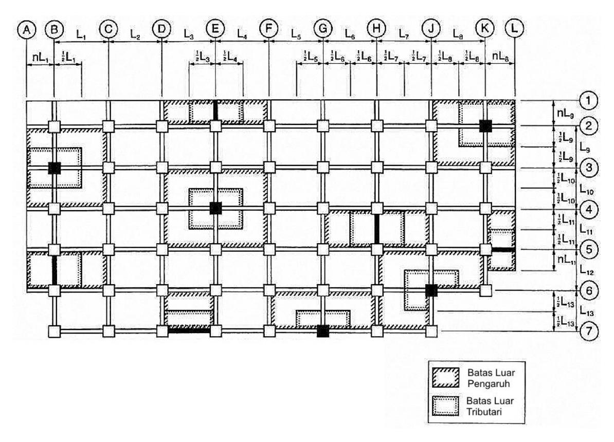

| Elemen                                  | K <sub>LL</sub> aktual Komponen Komponen Struktur Struktur denganKantilever |       | Κ.               | Contoh<br>komponen |                                     |                    |
|-----------------------------------------|-----------------------------------------------------------------------------|-------|------------------|--------------------|-------------------------------------|--------------------|
|                                         | tanpa<br>Kantilever                                                         | n = 0 | n = 0,5          | n = 1,0            | <i>K<sub>LL</sub></i> (Tabel 4.7.1) | (Gambar<br>C4.7-1) |
| Kolom interior                          | 4                                                                           | -     | -                | -                  | 4                                   | E4                 |
| Kolom eksterior tanpa kantilever        | 4                                                                           | -     | -                | -                  | 4                                   | G7, J6             |
| Kolom tepi dengan kantilever            | -                                                                           | 4     | 3                | 2,67               | 3                                   | B3                 |
| Kolom sudut dengan kantilever           | -                                                                           | 4     | 2,25             | 1,78               | 2                                   | K2                 |
| Balok tepi tanpa slab kantilever        | 2                                                                           | -     | -                | -                  | 2                                   | D7 – E7            |
| Balok interior                          | 2                                                                           | -     | -                | -                  | 2                                   | H4 – H5            |
| Balok tepi dengan slab kantilever       | -                                                                           | 2     | 1,5              | 1,33               | 1                                   | B5 – B6            |
| Balok kantilever tanpa slab kantilever  | 2                                                                           | -     | -                | -                  | 1                                   | E1 – E2            |
| Balok kantilever dengan slab kantilever | -                                                                           | 2*    | 1,5 <sup>*</sup> | 1,33               | 1                                   | K5 – L5            |

Gambar C4.7-1 - Luas pengaruh dan luas tributari tipikal

#### <span id="page-307-1"></span><span id="page-307-0"></span>C4.7.3 Beban hidup tinggi

Dalam kasus hunian yang melibatkan beban hidup dasar yang relatif tinggi, misalnya bangunan gudang, beberapa panel lantai yang bersebelahan mungkin mendapat beban penuh. Namun, data yang diperoleh pada bangunan aktual menunjukan bahwa jarang ada suatu lantai yang dibebani sampai lebih dari 80 % dari beban hidup rata-rata yang dihitung. Tampaknya beban hidup dasar seharusnya tidak direduksi untuk desain balok dan lantai, tetapi boleh direduksi sampai 20 % untuk desain komponen yang memikul lebih dari satu lantai. Berdasarkan itu, prinsip ini telah dimasukan dalam persyaratan yang direkomendasikan.

#### <span id="page-308-0"></span>C4.7.4 Garasi kendaraan penumpang

Tidak seperti beban hidup di kantor dan bangunan rumah tinggal, yang biasanya menempati ruang secara acak, beban garasi parkir disebabkan oleh kendaraan yang diparkir dengan pola beraturan, dan garasi tersebut seringkali penuh. Dengan demikian, alasan/dasar untuk mereduksi beban hidup di area lain tidak berlaku. Survei berat kendaraan dilakukan di 9 garasi parkir komersial di 4 kota dengan ukuran berbeda (Wen dan Yeo 2001). Analisis statistik dari efek beban maksimum terhadap balok dan kolom yang disebabkan oleh beban kendaraan selama masa pakai garasi dilakukan menggunakan hasil survei. Efek dinamik terhadap dek yang disebabkan oleh pergerakan kendaraan dan pada ram akibat impak telah diselidiki. Beban terdistribusi merata ekuivalen (EUDL) yang menghasilkan gaya aksial kolom maksimum yang selalu ada dan momen lentur balok tengah bentang ditaksir sebesar 34,8 psf (1,67 kN/m²). Beban terdistribusi merata ekuivalen tidak sensitif terhadap ukuran bentang. Dari kacamata impak beban kendaraan yang sangat tinggi di kemudian hari seperti kendaraan untuk olah raga, direkomendasikan sebesar beban desain 40 psf (1,95 k/n/m²) tanpa reduksi yang tergantung luasaan bentang.

Dibandingkan dengan beban hidup desain 50 psf (2,39 kN/m²) pada SNI 1727:2013, beban desain yang terdapat di sini mewakili suatu reduksi sebesar 20 %, tetapi masih 33 % lebih tinggi dari 30 psf (1,44 kN/m²) yang diperoleh adalah reduksi berbasis area untuk diterapkan ke nilai 50 psf (2,39 kN/m²) untuk rentang besar seperti yang diizinkan dalam kebanyakan standar. Juga ditemukan variabilitasnya yang kecil dari efek beban maksimum garasi, dengan koefisien variasi kurang dari 5 % dibandingkan dengan 20 % sampai 30 % seperti sebagian besar beban hidup lainnya. Implikasinya adalah bahwa ketika faktor beban hidup 1,6 digunakan dalam desain, konservatisme tambahan terdapat didalamnya sehingga nilai yang direkomendasikan juga akan cukup konservatif untuk parkir tujuan khusus (misalnya, parkir valet) di mana kendaraan dapat diparkir lebih padat, yang menyebabkan efek beban yang lebih tinggi. Oleh karena itu, nilai desain 50 psf (2,39 kN/m²) terlalu konservatif, dan dapat direduksi sampai 40 psf (1,95 kN/m²) tanpa mengorbankan integritas struktural.

Mengingat efek beban besar yang dihasilkan oleh kendaraan berat tunggal (sampai 10.000 lb (44,48 kN)), beban terpusat sebesar 2.000 lb (8,90 kN) harus ditingkatkan menjadi 3.000 lb (13,34 kN) yang bekerja pada area 4,5 in. x 4,5 in. (0,11 m x 0,11 m), yang mewakili beban yang disebabkan oleh dongkrak pada saat mengganti ban.

#### <span id="page-308-1"></span>C4.7.6 Pembatasan pada slab satu arah

Slab satu arah berperilaku mirip dengan slab dua arah tetapi tidak mendapat manfaat dari redundansi yang lebih tinggi yang dimiliki akibat dari perilaku dua arah. Untuk alasan ini, diizinkan mereduksi beban hidup pada slab satu arah tetapi batasi luasan area tributari,  $A_T$ , ke suatu area yang merupakan perkalian dari bentang slab dikalikan lebar tegak lurus terhadap bentang tidak lebih besar dari 1,5 kali bentang (sehingga menghasilkan area dengan rasio 1,5). Untuk slab satu arah dengan rasio lebih besar dari 1,5, efeknya adalah memberikan beban hidup yang agak lebih tinggi (bila reduksi diizinkan) daripada untuk slab dua arah dengan rasio yang sama.

Komponen struktur, seperti slab inti berongga, yang memiliki kunci geser menerus sepanjang tepi dan bentang hanya dalam satu arah, dianggap sebagai slab satu arah untuk reduksi beban hidup, meskipun slab tersebut memiliki transfer geser menerus tegak lurus terhadap bentangnya.

#### <span id="page-309-0"></span>**C4.8 Reduksi pada beban hidup atap**

#### <span id="page-309-1"></span>**C4.8.2 Atap biasa, awning, dan kanopi**

Nilai-nilai yang ditetapkan dalam Persamaan (4.8-1) yang bekerja vertikal pada area proyeksi yang dipilih sebagai beban hidup atap minimum, bahkan di tempat beban salju terjadi sedikit atau tidak terjadi. Ini karena perlu untuk memperhitungkan beban pekerja dan peralatan selama perbaikan atap.

#### <span id="page-309-2"></span>**C4.8.3 Atap yang dihuni**

Perancang harus memperhitungkan beban mati tambahan yang terjadi akibat material lansekap jenuh di samping beban hidup yang disyaratkan dalam Tabel 4.3-1. Beban yang berhubungan dengan hunian di atap adalah beban hidup (*L*) yang biasanya terkait dengan desain lantai daripada beban hidup atap (*Lr*) dan dapat direduksi sesuai ketentuan beban hidup pada Pasal 4.7.

#### <span id="page-309-3"></span>**C4.9 Beban derek**

Semua komponen pendukung derek jembatan yang bergerak dan derek monorel, termasuk balok landasan pacu, braket, breising, dan sambungan, harus dirancang untuk mendukung beban roda maksimum dari derek dan impak vertikal, lateral, dan gaya longitudinal yang disebabkan oleh derek yang bergerak. Juga, landasan pacu balok harus dirancang terhadap gaya penghenti derek. Metode untuk menghitung beban ini bervariasi tergantung pada tipe sistem dan tumpuan derek. MHI (2009, 2010a, b) dan MBMA (2012) menjelaskan tipe derek jembatan dan derek monorel. Derek yang dijelaskan dalam Referensi ini termasuk derek jembatan yang beroperasi di atas dengan troli yang bekerja di atas, derek jembatan dan derek monorel yang bekerja menggantung ke bawah. AIST (2003) memberikan persyaratan yang lebih ketat untuk desain derek landasan pacu yang lebih sesuai untuk sistem derek dengan kapasitas dan kecepatan yang lebih tinggi.

#### <span id="page-309-4"></span>**C4.11 Beban di landasan helikopter**

#### <span id="page-309-5"></span>**C4.11.1 Umum**

Ketentuan untuk landasan helikopter ditambahkan pada SNI 1727:2013. Untuk SNI 1727, istilah "landasan helikopter" digunakan untuk merujuk secara khusus ke permukaan struktur. Untuk SNI bangunan gedung dan SNI yang lainnya, terminologi yang berbeda dapat digunakan saat mendeskripsikan landasan helikopter, misalnya bandara heli, stasiun heli, tetapi perbedaannya ini tidak relevan dengan masalah pembebanan struktur yang dibahas dalam SNI 1727.

Meskipun struktur-struktur ini dijauhkan secara khusus dari beban penumpang nonhelikopter dan taksi, persyaratan beban merata minimum digunakan untuk memastikan tingkat keamanan konstruksi untuk menahan efek dari kejadian yang tidak biasa.

Informasi tambahan tentang desain landasan helikopter dapat ditemukan dalam Annex 14 to the Convention on International Civil Aviation, Aerodromes, Volume II (ICAO 2013).

#### <span id="page-310-0"></span>C4.11.2 Beban helikopter terpusat

Beban terpusat yang diterapkan secara terpisah dari beban terdistribusi dimaksudkan mencakup beban primer helikopter. Sebagai dasar untuk menentukan beban desain, perancang harus selalu mempertimbangkan geometri dari helikopter. Faktor 1,5 digunakan untuk memperhitungkan beban impak (dua beban terpusat tunggal sebesar 0,75 kali berat lepas landas maksimum) untuk memperhitungkan pendaratan keras dengan berbagai tipe roda pendaratan. Perancang harus mempertimbangkan bahwa beberapa konfigurasi helikopter, terutama yang memiliki roda pendaratan yang kaku, dapat menghasilkan faktor impak yang jauh lebih tinggi.

Beban terpusat sebesar 3.000 lb (13.35 kN) dimaksudkan untuk mencakup aktivitas pemeliharaan, serupa dengan beban dongkrak pada garasi parkir.

#### <span id="page-310-1"></span>C4.13 Ruangan lemari susun perpustakaan

Apabila pemasangan rak perpustakaan tidak memenuhi batas parameter yang ditetapkan pada Pasal 4.13 dan Tabel 4.3-1, desain harus memperhitungkan kondisi yang sebenarnya. Misalnya, pembebanan lantai untuk penyimpanan film X-ray medis dapat dengan mudah melebihi 200 psf (9,58 kN/m²), terutama karena peningkatan kedalaman rak. Rak perpustakaan yang bergerak di rel juga harus dirancang untuk memenuhi persyaratan sebenarnya dari instalasi tertentu, yang dapat dengan mudah melebihi 300 psf (14,4 kN/m²). Lokasi tumpuan rel dan batas lendutan harus dipertimbangkan dalam desain, dan insinyur harus bekerja sama dengan produsen sistem untuk menyediakan struktur yang memenuhi persyaratan.

#### <span id="page-310-2"></span>C4.14 Dudukan untuk penggunaan perakitan

Beban lateral berlaku untuk "stadion dan arena" dan untuk "tribun dan bangku penonton". Namun, itu tidak berlaku untuk "lantai utama gym dan balkon." Pertimbangan harus diberikan untuk menangani balkon gimnasium yang memiliki lantai bertangga untuk tempat duduk penonton di arena dan harus memperhitungkan gaya goyang yang tepat.

#### <span id="page-310-3"></span>C4.17 Beban panel surva

#### <span id="page-310-4"></span>C4.17.1 Beban atap pada panel surva

Ketentuan ini ditambahkan pada SNI 1727 ini untuk mengatasi pemasangan panel surya di atas atap yang konsisten dengan praktik saat ini (Blaney dan LaPlante 2013). Ketentuan ini memungkinkan ofset beban hidup atap bila ruang di bawah panel surya dianggap tidak dapat diakses. Ukuran 24 inci (610 mm) dipilih sebagai jarak vertikal bersih karena konsisten dengan persyaratan yang dipublikasikan untuk sistem panel surya dan juga tinggi minimum tipikal yang diizinkan untuk akses ke dalam atau keluar dari ruang.

#### <span id="page-310-5"></span>C4.17.3 Struktur atap grid terbuka penumpu panel surya

Pasal ini mereduksi beban hidup atap merata untuk struktur bangunan gedung seperti *carport* dan struktur tempat teduh, tidak termasuk dek atap atau penutup atap tipis (*sheathing*), dengan nilai beban hidup merata atap minimum yang diizinkan di Pasal 4.8.2. Persyaratan beban hidup atap terpusat pada Tabel 4.3-1 tidak dimodifikasi oleh Pasal ini.

#### **Referensi**

American Association of State Highway and Transportation Officials (AASHTO). *LRFD bridge design specifications*, 7th Ed., 2014, with 2015 interim revisions, AASHTO, Washington, DC.

American Society of Mechanical Engineers (ASME). (2013). *American national standard safety code for elevators and escalators*. ASME, New York, A17.

Association of Iron and Steel Technology (AIST). (2003). "Guide for the design and construction of mill buildings." *Tech. Report No*. 13, AISE, Warrendale, PA.

Blaney, C., and LaPlante, R. (2013). "Recommended design live loads for rooftop solar arrays." Proc., *SEAOC Convention*, 264–278.

Chalk, P. L., and Corotis, R. B. (1980). "Probability model for design live loads." *J. Struct. Div.*, 106(10), 2017–2033.

Corotis, R. B., Harris, J. C., and Fox, R. R. (1981). "Delphi methods: Theory and design load application." *J. Struct. Div.*, 107(6), 1095–1105.

Ellingwood, B. R., and Culver, C. G. (1977). "Analysis of live loads in office buildings." *J. Struct. Div.*, 103(8), 1551–1560.

Harris, M. E., Bova, C. J., and Corotis, R. B. (1981). "Area-dependent processes for structural live loads." *J. Struct. Div.*, 107(5), 857–872.

International Civil Aviation Organization (ICAO). (2013). *Annex 14 to the convention on international civil aviation, aerodromes, Vol. II: Heliports*.

ICC/ANSI. (2009). "Accessible and Usable Buildings and Facilities." *A117.1.* International Code Council, Washington, D.C.

McGuire, R. K., and Cornell, C. A. (1974). "Live load effects in office buildings." *J. Struct. Div.*, 100(7), 1351–1366.

Metal Building Manufacturers Association (MBMA). (2012). *Metal building systems manual*, MBMA, Cleveland, OH.

MHI. (2010a). "Specifications for top running bridge and gantry type multiple girder electric overhead traveling cranes." *No. 70-2010*, MHI, Charlotte, NC.

MHI (2010b). "Specifications for top running and under running single girder electric overhead traveling cranes utilizing under running trolley hoist." *No. 74-2010*. MHI, Charlotte, NC.

MHI. (2009). "Specifications for patented track underhung cranes and monorail systems." *No. MH 27.1-2009*, MHI, Charlotte, NC.

Occupational Safety and Health Administration (OSHA). (2014a). "Code of federal regulations, Section 1910.27." *OSHA Standards*, Washington, DC.

OSHA. (2014b). "Powered platforms for building maintenance." Code of federal regulations, Section 1910.66. *OSHA Standards*, Washington, DC.

OSHA. (2014c). "Safety standards for scaffolds used in the construction industry." Code of federal regulations, Section 1926.451. *OSHA Standards*, Washington, DC.

Peir, J. C., and Cornell, C. A. (1973). "Spatial and temporal variability of live loads." *J. Struct. Div.*, 99(5), 903–922.

Sentler, L. (1975). "A stochastic model for live loads on floors in buildings." *Report No. 60*, Lund Institute of Technology, Division of Building Technology, Lund, Sweden.

Wen, Y. K., and Yeo, G. L. (2001). "Design live loads for passenger cars parking garages." *J. Struct. Eng.*, 127(3), 280–289.

#### **LAMPIRAN D**

#### <span id="page-313-0"></span>**Bangunan gedung dikecualikan dari kasus beban puntir angin**

#### <span id="page-313-2"></span><span id="page-313-1"></span>**D.1 Ruang lingkup**

Kasus beban puntir pada Gambar 27.3-8 (Kasus 2 dan Kasus 4) tidak perlu dipertimbangkan untuk bangunan gedung yang memenuhi kondisi Pasal D.2, D.3, D.4, D.5, atau D.6 atau , jika dapat ditunjukkan dengan cara lain bahwa kasus beban puntir Gambar 27.3-8 tidak mengontrol desain.

#### <span id="page-313-3"></span>**D.2 Bangunan gedung satu dan dua lantai yang memenuhi persyaratan berikut**

Bangunan gedung satu lantai dengan *h* kurang dari atau sama dengan 30 ft (9,2 m), bangunan gedung dua lantai atau kurang dengan konstruksi rangka ringan, dan bangunan gedung dua lantai atau kurang yang dirancang dengan diafragma fleksibel dikecualikan.

#### <span id="page-313-4"></span>**D.3 Bangunan gedung yang dikendalikan oleh beban seismik**

#### <span id="page-313-5"></span>**D.3.1 Bangunan dengan diafragma yang tidak fleksibel di setiap tingkat**

Struktur bangunan gedung yang dikecualikan dan berperilaku teratur terhadap beban seismik (sebagaimana didefinisikan dalam Pasal 12.3.2) dan sesuai dengan ketentuan berikut:

- 1. Eksentrisitas antara pusat massa dan pusat geometris bangunan pada tingkat tersebut tidak melebihi 15 % dari keseluruhan lebar bangunan di sepanjang masingmasing sumbu utama pada setiap tingkat, dan
- 2. Gaya geser tingkat desain akibat beban gempa seperti yang disyaratkan dalam Pasal 12 pada setiap tingkat lantai harus setidaknya 1,5 kali gaya geser tingkat desain akibat beban angin seperti yang disyaratkan di sini.

Kasus beban angin dan gempa desain yang diperhitungkan saat mengevaluasi pengecualian ini adalah kasus beban tanpa puntir.

#### <span id="page-313-6"></span>**D**.3.2 Bangunan gedung dengan diafragma fleksibel di setiap tingkat

Struktur bangunan gedung yang dikecualikan dan berperilaku teratur terhadap beban seismik (sebagaimana didefinisikan dalam Pasal 12.3.2) dan sesuai dengan ketentuan berikut:

1. Gaya geser gempa desain yang diperhitungkan terhadap elemen vertikal dari sistem pemikul beban lateral paling sedikit 1,5 kali gaya geser angin desain yang sesuai ditahan oleh elemen-elemen itu.

Kasus beban angin dan gempa desain yang diperhitungkan saat mengevaluasi pengecualian ini adalah kasus beban tanpa puntir.

#### <span id="page-313-7"></span>**D.4 Bangunan gedung diklasifikasi sebagai teratur terhadap puntir akibat beban angin**

Bangunan yang memenuhi definisi bangunan gedung teratur terhadap puntir akibat beban angin pada Pasal 26.2 dikecualikan.

**PENGECUALIAN:** Jika sebuah bangunan gedung tidak memenuhi syarat sebagai teratur terhadap puntir akibat beban angin, dalam desain diizinkan menggunakan beban angin dasar kasus 1 yang secara proporsional ditingkatkan sehingga perpindahan maksimum pada setiap tingkat tidak kurang dari perpindahan maksimum untuk beban puntir kasus 2.

#### <span id="page-314-0"></span>**D.5 Bangunan dengan diafragma fleksibel dan dirancang untuk beban angin yang diperbesar**

Kasus beban angin puntir tidak perlu diperhitungkan jika tekanan angin desain pada Kasus 1 dan Kasus 3 Gambar. 27.3-8 diperbesar dengan faktor 1,5.

#### <span id="page-314-1"></span>**D.6 Bangunan diafragma sederhana Kelas 1 dan Kelas 2 dengan** *h* **≤ 160 ft (48.8 m) memenuhi persyaratan berikut (lihat Pasal 27.5.2)**

#### <span id="page-314-2"></span>**D.6.1 Kasus A — Bangunan gedung kelas 1 dan kelas 2**

Bangunan gedung persegi dengan *L***/***B* = 1,0 dikecualikan, ketika semua kondisi berikut terpenuhi:

- 1. Kekakuan gabungan dari SPGAU di setiap arah sumbu utama harus sama, dan
- 2. Kekakuan individu setiap SPGAU di setiap arah sumbu utama harus sama dan ditempatkan secara simetris terhadap pusat kerja beban angin sepanjang sumbu utama yang sedang diperhitungkan, dan
- 3. Kekakuan gabungan dari dua garis yang paling terpisah dari SPGAU di setiap arah sumbu utama harus 100 % dari kekakuan total di setiap arah sumbu utama, dan
- 4. Jarak antara dua garis yang paling terpisah dari SPGAU di setiap arah sumbu utama paling sedikit 45 % dari lebar bangunan efektif yang tegak lurus terhadap sumbu yang sedang diperhitungkan.

#### <span id="page-314-3"></span>**D.6.2 Kasus B — Bangunan gedung kelas 1 dan kelas 2.**

Bangunan gedung persegi dengan *L***/***B* = 1,0 dikecualikan, ketika semua kondisi berikut terpenuhi:

- 1. Kekakuan gabungan dari SPGAU di setiap arah sumbu utama harus sama, dan
- 2. Kekakuan individu dari dua garis yang paling terpisah dari SPGAU di setiap arah sumbu utama harus sama dengan semua garis SPGAU yang secara simetris ditempatkan terhadap pusat kerja beban angin sepanjang sumbu utama yang sedang diperhitungkan, dan
- 3. Kekakuan gabungan dari dua garis yang paling terpisah dari SPGAU di setiap arah sumbu utama paling sedikit 66 % dari kekakuan total di setiap arah sumbu utama, dan
- 4. Jarak antara dua garis yang paling terpisah dari SPGAU di setiap arah sumbu utama paling sedikit 66 % dari lebar bangunan efektif yang tegak lurus terhadap sumbu yang sedang diperhitungkan.

#### <span id="page-314-4"></span>**D.6.3 Kasus C — Bangungan gedung kelas 1 dan kelas 2**

Bangunan segi empat dengan *L*/*B* sama dengan 0,5 atau 2,0 (*L*/*B* = 0,5, *L*/*B* = 2,0) dikecualikan, ketika semua kondisi berikut terpenuhi:

- 1. Kekakuan gabungan dari SPGAU di setiap arah sumbu utama harus proporsional dengan lebar sisi tegak lurus terhadap sumbu yang sedang diperhitungkan,
- 2. Kekakuan individu masing-masing SPGAU di setiap arah sumbu utama harus sama dan simetris ditempatkan terhadap pusat kerja beban angin sepanjang sumbu utama yang sedang diperhitungkan, dan
- 3. Kekakuan gabungan dari dua garis yang paling terpisah dari SPGAU di setiap arah sumbu utama harus 100 % dari kekakuan total di setiap arah sumbu utama, dan

4. Jarak antara dua garis yang paling terpisah dari SPGAU di setiap arah sumbu utama paling sedikit 80 % dari lebar bangunan efektif yang tegak lurus terhadap sumbu yang sedang diperhitungkan.

#### <span id="page-315-0"></span>**D.6.4 Kasus D — Bangunan gedung kelas 1 dan kelas 2**

Bangunan segi empat dengan *L*/*B* sama dengan 0,5 atau 2,0 (*L*/*B* = 0,5, *L*/*B* = 2,0) dikecualikan, ketika semua kondisi berikut terpenuhi:

- 1. Kekakuan gabungan dari SPGAU di setiap arah sumbu utama harus proporsional dengan lebar sisi tegak lurus terhadap sumbu yang sedang diperhitungkan, dan
- 2. Kekakuan individu dari garis yang paling terpisah dari SPGAU di setiap arah sumbu utama harus sama dengan semua garis SPGAU yang ditempatkan secara simetris terhadap pusat kerja beban angin sepanjang sumbu utama yang sedang diperhitungkan,
- 3. Kekakuan gabungan dari dua garis yang paling terpisah dari SPGAU di setiap arah sumbu utama paling sedikit 80 % dari kekakuan total di setiap arah sumbu utama, dan
- 4. Jarak antara dua garis yang paling terpisah dari SPGAU di setiap arah sumbu utama harus 100 % dari lebar bangunan efektif tegak lurus terhadap sumbu yang sedang diperhitungkan.

#### <span id="page-315-1"></span>**D.6.5 Kasus E — Bangunan gedung kelas 1 dan kelas 2**

Bangunan gedung persegi panjang yang memiliki *L*/*B* antara 0,5 dan 1,0 (0,5 < *L*/*B* <1,0) atau antara 1,0 dan 2,0 (1,0 < *L*/*B* < 2,0), persyaratan kekakuan dan jarak pemisah antara dua garis paling terpisah dari SPGAU di setiap arah harus diinterpolasi antara masing-masing kasus A dan kasus C dan antara masing-masing kasus B dan kasus D. (Lihat Gambar D.6-1).

#### <span id="page-315-2"></span>**D.6.6 Kasus F — Bangunan gedung kelas 1**

Bangunan persegi panjang yang memiliki *L*/*B* antara 0,5 dan 0,2 (0,2 ≤ *L*/*B* < 0,5) atau antara 2,0 dan 5,0 (2,0 < *L*/*B* ≤ 5,0) dikecualikan, lihat Gambar D.6-2, dengan semua kondisi berikut terpenuhi:

- 1. Harus ada paling sedikit dua garis ketahanan di setiap arah sumbu utama, dan
- 2. Semua garis SPGAU harus ditempatkan simetris terhadap pusat kerja beban angin sepanjang sumbu utama yang sedang dipertimbangkan, dan
- 3. Jarak antara setiap garis resistansi SPGAU dalam arah sumbu utama tidak boleh melebihi 2 kali lebar efektif bangunan gedung dalam arah sumbu utama, dan
- 4. Kekakuan individu dari garis yang paling terpisah dari SPGAU di setiap arah sumbu utama harus sama dan tidak kurang dari (25 + 50/*n*) persen dari kekakuan total dengan n adalah jumlah garis ketahanan yang diperlukan dalam arah sumbu utama seperti yang disyaratkan oleh ketentuan 1 dan 3 pada bagian ini. Nilai *n* harus 2, 3, atau 4.

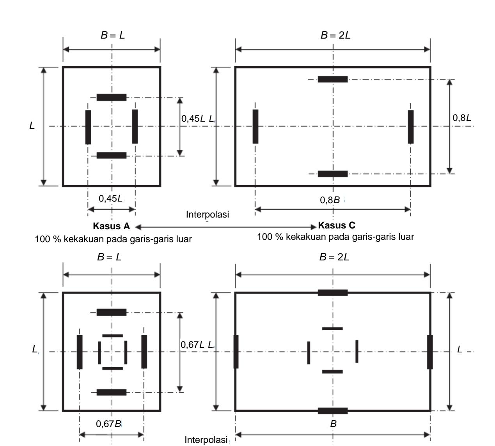

67 % kekakuan pada garis-garis luar 80 % kekakuan pada garis-garis luar

**Gambar D.6-1 - Sistem Penahan Gaya Angin Utama, Lampiran D (h ≤ 160 kaki) (48,8 m): Persyaratan SPGAU untuk Kasus E untuk Bangunan Diafragma Sederhana Tertutup. Untuk Pengecualian Puntir Akibat Beban Angin, lihat Gambar 27.3-8** 

**Kasus B Kasus D**

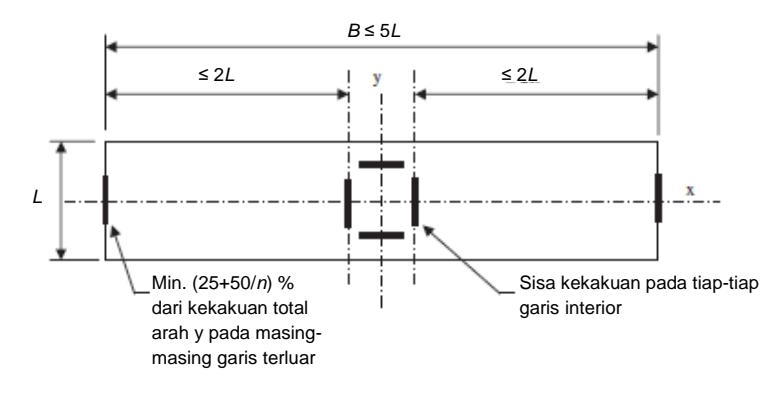

#### **Catatan**

*n* = jumlah garis ketahanan yang dibutuhkan dalam setiap arah sumbu utama (2 ≤ *n* ≤ 4)

**Gambar D.6-2 - Sistem Penahan Gaya Angin Utama, Lampiran D (h ≤ 160 kaki) (48,8 m): Persyaratan SPGAU dari Kasus F untuk Bangunan Diafragma Sederhana Tertutup. Untuk Pengecualian Puntir Akibat Beban Angin, lihat Gambar 27.3-8.**

#### **Lampiran E**

#### <span id="page-317-1"></span><span id="page-317-0"></span>**Prosedur desain berbasis kinerja untuk efek kebakaran pada struktur**

#### <span id="page-317-2"></span>**E.1 Ruang lingkup**

Lampiran ini bukan merupakan bagian yang wajib dari standar ini. Lampiran ini memberikan prosedur desain berbasis kinerja dan evaluasi struktur untuk kondisi terbakar akibat efek yang ditimbulkan api pada komponen dan sambungan struktur. Penggunaan prosedur desain ketahanan api berbasis kinerja merupakan metodologi alternatif untuk memenuhi persyaratan desain proyek, sebagaimana diizinkan oleh Pasal 1.3.7 dan material-material alternatif, desain, dan metode ketentuan konstruksi dalam peraturan bangunan gedung. Lampiran ini tidak memberikan desain ketahanan api standar dengan metode preskriptif, juga tidak membahas ledakan.

#### <span id="page-317-3"></span>**E.2 Definisi**

Definisi berikut berlaku untuk informasi dalam Lampiran ini.

**Kebakaran:** Proses oksidasi yang dihasilkan dari terbakarnya material yang mudah terbakar dan menghasilkan panas.

**Efek kebakaran:** Respon termal dan struktural yang disebabkan oleh eksposur api dan pendinginan setelahnya.

**Eksposur kebakaran:** Pengaruh sejauh mana material, produk, atau rakitan terkena kondisi yang disebabkan oleh api.

**Ketahanan api:** Kemampuan suatu material, produk, atau rakitan untuk menahan api atau memberikan proteksi pada suatu rentang waktu.

**Beban bahan bakar:** Kuantitas total isi material mudah terbakar di dalam bangunan gedung, ruang, atau area yang dinyatakan sebagai energi atau massa ekuivalen total.

**Transfer panas:** Pertukaran energi termal yang disebabkan oleh perbedaan temperatur.

**Desain struktur tahan api berbasis kinerja:** Desain eksplisit dari komponen dan sambungan struktural yang memenuhi rencana kinerja untuk desain struktur tahan api.

**Desain ketahanan api standar:** Pemilihan sistem penahan api yang memenuhi persyaratan peraturan untuk struktur tahan api (juga dikenal sebagai desain preskriptif). Peringkat sistem ketahanan api didasarkan pada kinerjanya dalam pengujian kebakaran standar.

**Kebakaran untuk desain struktur:** Suatu kebakaran yang memiliki potensi mempengaruhi integritas dan stabilitas suatu struktur yang digunakan untuk desain dan evaluasi struktur.

**Kondisi batas termal:** Temperatur dan/atau fluks panas di mana suatu sistem atau struktur terkena selama atau setelah eksposur api berdasarkan pemanasan radiasi dan konveksi dan/atau kondisi pendinginan pada permukaan yang terekspos.

**Insulasi termal:** Suatu material atau media yang mereduksi transfer panas antara objek-objek dalam kontak termal atau dalam rentang pengaruh radiasi atau konveksi.

**Respon termal:** Distribusi temperatur komponen struktur dan sambungan saat terekspos pada kondisi batas termal.

**Pengekang termal:** Sebuah kondisi di mana ekspansi atau kontraksi termal komponen struktural ditahan oleh gaya eksternal terhadap komponen struktur. Tingkat pengekangan bergantung pada detail rangka dan detail sambungan yang berdekatan.

#### <span id="page-318-0"></span>**E.3 Persyaratan umum**

Desain struktur tahan api berbasis kinerja dan prosedur evaluasi harus memenuhi persyaratan Pasal 1.3.1.3.

Desain dan evaluasi struktur untuk efek kebakaran harus mencakup langkah-langkah berikut: mengidentifikasi rencana kinerja, mengukur beban bahan bakar, mengidentifikasi dan mengevaluasi kebakaran untuk desain struktur, menentukan riwayat temperatur komponen dan sambungan struktural, dan menentukan respon struktur. Langkah-langkah ini harus mencakup evaluasi pemanasan dan pendinginan berikutnya pada struktur akibat paparan api, sesuai kondisinya.

Respon struktur harus dievaluasi terhadap kondisi batas berdasarkan pada rencana kinerja. Analisis harus memperhitungkan properti material yang bergantung pada temperatur, kondisi batas, dan ragam kegagalan akibat induksi termal dan stabilitas struktur, kekuatan, deformasi, dan kontinuitas jalur beban harus dievaluasi.

#### <span id="page-318-1"></span>**E.4 Rencana kinerja**

Rencana kinerja harus dinyatakan sebagai metrik kuantitatif untuk desain dan evaluasi respon struktur terhadap kebakaran untuk desain struktur. Rencana kinerja untuk integritas struktur, mencakup kekuatan, kekakuan, dan stabilitas, harus memenuhi kriteria minimum yang disyaratkan dalam Pasal E.4.1. Rencana kinerja tambahan spesifik proyek harus memenuhi persyaratan dalam Pasal E.4.2.

#### <span id="page-318-2"></span>**E.4.1 Integritas struktur**

Integritas struktur harus disediakan untuk bangunan gedung dan struktur lain yang memikul kebakaran untuk desain struktur sehingga sistem struktur tetap stabil dengan jalur beban berkelanjutan sejauh yang diperlukan untuk menjamin keselamatan hidup penghuni.

Kinerja sistem struktur akibat kebakaran untuk desain struktur harus memungkinkan penghuni bangunan gedung untuk bergerak dengan aman ke daerah perlindungan di dalam bangunan gedung atau keluar dari gedung ke jalan umum. Dukungan struktur untuk membangun jalur keluar harus dipertahankan selama jangka waktu yang diperlukan untuk memastikan evakuasi yang aman dan lengkap bagi penghuni gedung. Pendukung struktur bangunan area pengungsian harus dipertahankan selama pemanasan dan pendinginan struktur.

#### <span id="page-318-3"></span>**E.4.2 Rencana kinerja khusus proyek**

Bangunan gedung dan struktur lainnya harus dirancang untuk memenuhi rencana kinerja spesifik proyek yang disyaratkan oleh pemilik, pihak yang berwenang, atau peraturan bangunan gedung yang berlaku selain yang ada di Pasal E.4.1.

#### <span id="page-319-0"></span>**E.5 Analisis termal dari efek kebakaran**

Respon termal komponen dan sambungan struktur selama dan setelah kebakaran untuk desain struktur harus ditentukan untuk input analisis struktur terhadap efek kebakaran.

#### <span id="page-319-1"></span>**E.5.1 Beban bahan bakar**

Beban bahan bakar harus dihitung dalam mengevaluasi kebakaran untuk desain struktur.

#### <span id="page-319-2"></span>**E.5.2 Kebakaran untuk desain struktur**

Kebakaran untuk desain struktur harus diidentifikasi dan digunakan untuk mengembangkan kondisi batas termal terhadap waktu yang digunakan dalam analisis transfer panas.

#### <span id="page-319-3"></span>**E.5.3 Analisis transfer panas**

Riwayat temperatur pada komponen dan sambungan struktur harus ditentukan dengan menggunakan metode analisis transfer panas berdasarkan kondisi batas termal terhadap waktu selama kebakaran untuk desain struktur.

Properti termal tergantung temperatur pada material yang terdiri dari sistem struktur dan insulasi termal harus digunakan dalam analisis transfer panas untuk menentukan respon termal. Diizinkan untuk menggunakan nilai properti termal konstan jika diperoleh hasil yang konservatif.

#### <span id="page-319-4"></span>**E.6 Analisis struktur efek kebakaran**

Analisis struktur harus mencakup bagian-bagian dari sistem struktur yang terkena efek api dari kebakaran untuk desain struktur sebagaimana ditentukan dalam Pasal E.5, dengan pertimbangan bagian-bagian dari sistem struktur yang tidak terkena panas memberikan pengekangan termal. Diizinkan dalam analisis untuk mempertimbangkan jalur beban alternatif yang mampu bertahan setelah kerusakan struktur atau degradasi akibat efek kebakaran.

#### <span id="page-319-5"></span>**E.6.1 Riwayat temperatur untuk komponen dan sambungan struktur**

Riwayat temperatur untuk komponen dan sambungan struktur harus ditentukan dari analisis termal kebakaran desain struktur dan harus digunakan untuk menganalisis efek kebakaran pada kinerja struktur.

#### <span id="page-319-6"></span>**E.6.2 Properti yang bergantung temperatur**

Properti yang bergantung temperatur pada material struktur harus digunakan untuk menentukan kinerja komponen struktur dan sambungan yang mengalami kebakaran untuk desain struktur.

#### <span id="page-319-7"></span>**E.6.3 Kombinasi beban**

Kombinasi beban dalam Pasal 2.5 untuk kejadian luar biasa harus digunakan untuk analisis efek kebakaran dan harus mencakup efek yang bergantung waktu dan urutan. Untuk memeriksa kapasitas sisa pada struktur yang rusak akibat kebakaran untuk desain struktur, pendekatan yang diidentifikasi dalam Pasal 2.5.2.2 harus digunakan.

#### **Informasi pendukung terkait perumus standar**

#### <span id="page-321-0"></span>**[1] Komite Teknis/Subkomite Teknis perumus SNI**

Subkomite Teknis 91-01-S4 Bahan, Sains, Struktur dan Konstruksi Bangunan.

#### **[2] Susunan keanggotaan Komite Teknis/Subkomite Teknis perumus SNI**

Ketua : Prof. Dr. Ir. Arief Sabaruddin, CES

Wakil Ketua : Ir. Lutfi Faizal

Sekretaris : Dany Cahyadi, ST, MT

Anggota : 1. Ir. RG Eko Djuli Sasongko, MM

2. Prof. Dr. Ir. Suprapto, M.Sc, FPE, IPM 3. Dr.Ir. Johannes Adhijoso Tjondro, M.Eng

4. Ir. Asriwiyanti Desiani, MT

5. Ir. Felisia Simarmata

6. Ir. Suradjin Sutjipto, MS

7. Dr. Ir. Hari Nugraha Nurjaman

8. Prof. Bambang Suryoatmono

#### **[3] Konseptor rancangan SNI**

| No. | Nama                                        | Lembaga                                                                                 |
|-----|---------------------------------------------|-----------------------------------------------------------------------------------------|
| 1   | Dr. Ir. Djoni Simanta, MT                   | Prodi Teknik Sipil - Fakultas Teknik, Universitas<br>Katolik Parahyangan                |
| 2   | Ir. Suradjin Sutjipto, MS                   | Fakultas Teknik Sipil dan Perencanaan - Universitas<br>Trisakti/ Suradjin Sutjipto, Inc |
| 3   | Prof. Tavio, ST, MT, Ph.D                   | Fakultas Teknik Sipil dan Perencanaan – Institut<br>Teknologi Sepuluh Nopember (ITS)    |
| 4   | Dr. Ir. Johannes Adhijoso<br>Tjondro, M.Eng | Prodi Teknik Sipil - Fakultas Teknik, Universitas<br>Katolik Parahyangan                |
| 5   | Dr. Hamzah Latief, M.Si                     | Fakultas Ilmu dan Teknologi Kebumian, Instutut<br>Teknologi Bandung (ITB)               |
| 6   | Dr. Tri Wahyu Hadi M.Sc.                    | Fakultas Ilmu dan Teknologi Kebumian, Instutut<br>Teknologi Bandung (ITB)               |
| 7   | Ir. Felisia Simarmata                       | PT. DIRGA MULYA YASA                                                                    |
| 8   | Naomi Pratiwi, B.Eng, M.Sc                  | Prodi Teknik Sipil - Fakultas Teknik, Universitas<br>Katolik Parahyangan                |
| 9   | Ir. Lutfi Faizal                            | Puslitbang Perumahan dan Permukiman, Kem.PUPR                                           |
| 10  | Sutadji Yuwasdiki, Dipl. E.Eng              | Puslitbang Perumahan dan Permukiman, Kem.PUPR                                           |
| 11  | Ferri Eka Putra, ST, MDM                    | Puslitbang Perumahan dan Permukiman, Kem.PUPR                                           |
| 12  | Ir. Wahyu Wuryanti, M.Sc                    | Puslitbang Perumahan dan Permukiman, Kem.PUPR                                           |
| 13  | Ajun Hariono, ST, M.Sc., Eng                | Puslitbang Perumahan dan Permukiman, Kem.PUPR                                           |
| 14  | Muhammad Rusli, ST, MDM                     | Puslitbang Perumahan dan Permukiman, Kem.PUPR                                           |

#### **[4] Sekretariat pengelola Komite Teknis/Subkomite Teknis perumus SNI**

Pusat Penelitian dan Pengembangan Perumahan dan Permukiman, Badan Penelitian dan Pengembangan Kementerian Pekerjaan Umum dan Perumahan Rakyat.