# **Pembebanan untuk jembatan**

#### **© BSN 2016**

**Hak cipta dilindungi undang-undang. Dilarang mengumumkan dan memperbanyak sebagian atau seluruh isi dokumen ini dengan cara dan dalam bentuk apapun serta dilarang mendistribusikan dokumen ini baik secara elektronik maupun tercetak tanpa izin tertulis dari BSN** 

**BSN** 

**Email: dokinfo@bsn.go.id** 

**www.bsn.go.id** 

**Diterbitkan di Jakarta**

# **Daftar isi**

|    | Daftar isi i                                                                                                                                                                                                                   |
|----|--------------------------------------------------------------------------------------------------------------------------------------------------------------------------------------------------------------------------------|
|    | Prakata iv                                                                                                                                                                                                                     |
|    | Pendahuluan v                                                                                                                                                                                                                  |
| 1  | Ruang lingkup 1                                                                                                                                                                                                                |
| 2  | Acuan normatif 1                                                                                                                                                                                                               |
| 3  | Istilah dan definisi 1                                                                                                                                                                                                         |
| 4  | Ketentuan umum 4                                                                                                                                                                                                               |
| 5  | Filosofi perencanaan 5                                                                                                                                                                                                         |
| 6  | Faktor beban dan kombinasi pembebanan 7                                                                                                                                                                                        |
| 7  | Beban permanen 13                                                                                                                                                                                                              |
| 9  | Aksi lingkungan 48                                                                                                                                                                                                             |
| 10 | Aksi-aksi lainnya 59                                                                                                                                                                                                           |
| 11 | Pembebanan rencana railing 61                                                                                                                                                                                                  |
| 12 | Fender 62                                                                                                                                                                                                                      |
|    | Lampiran A 64                                                                                                                                                                                                                  |
|    | Deviasi teknis 66                                                                                                                                                                                                              |
|    | Bibliografi 67                                                                                                                                                                                                                 |
|    |                                                                                                                                                                                                                                |
|    | Gambar 1 - Notasi untuk perhitungan tekanan tanah aktif Coulomb 17                                                                                                                                                             |
|    | Gambar 2 – Prosedur perhitungan tekanan tanah pasif untuk dinding vertikal dengan urukan horizontal 19                                                                                                                      |
|    | Gambar 3 – Prosedur perhitungan tekanan tanah pasif untuk dinding vertikal dengan urukan membentuk sudut 20                                                                                                                 |
|    | Gambar 4 – Distribusi tekanan tanah penyederhanaan tidak terfaktor untuk dinding kantilever permanen nongravitasi dengan elemen dinding vertikal diskrit tertanam pada tanah berbutir 22                                 |
|    | Gambar 5 – Distribusi tekanan tanah penyederhanaan tidak terfaktor untuk dinding kantilever permanen nongravitasi dengan elemen dinding vertikal diskrit tertanam pada batuan 22                                            |
|    | Gambar 6 – Distribusi tekanan tanah penyederhanaan tidak terfaktor untuk dinding kantilever permanen nongravitasi dengan elemen dinding vertikal menerus tertanam pada tanah berbutir modifikasi (setelah Teng, 1962) 23 |
|    | Gambar 7 - Distribusi tekanan tanah penyederhanaan tidak terfaktor untuk dinding kantilever sementara nongravitasi dengan elemen dinding vertikal diskrit tertanam pada tanah kohesif dan menahan tanah berbutir 23      |
|    | Gambar 8 – Distribusi tekanan tanah penyederhanaan tidak terfaktor untuk dinding kantilever sementara nongravitasi dengan elemen dinding vertikal diskrit tertanam pada tanah kohesif dan menahan tanah kohesif 24       |

| Gambar 9 – Distribusi tekanan tanah penyederhanaan tidak terfaktor untuk dinding kantilever sementara nongravitasi dengan elemen dinding vertikal menerus tertanam pada tanah kohesif dan menahan tanah berbutir modifikasi (setelah Teng, 1962) 24 |  |
|-----------------------------------------------------------------------------------------------------------------------------------------------------------------------------------------------------------------------------------------------------------|--|
| Gambar 10 – Distribusi tekanan tanah penyederhanaan tidak terfaktor untuk dinding kantilever sementara nongravitasi dengan elemen dinding vertikal menerus tertanam pada tanah kohesif dan menahan tanah kohesif modifikasi (setelah Teng, 1962) 25 |  |
| Gambar 11 – Distribusi tekanan tanah untuk dinding terangkur yang dibuat dari atas ke bawah pada tanah nonkohesif 26                                                                                                                                   |  |
| Gambar 12 - Distribusi tekanan tanah untuk dinding angkur yang dibuat dari atas ke bawah dari lunak ke agak kaku pada tanah kohesif 27                                                                                                                 |  |
| Gambar 13 - Distribusi tekanan tanah untuk dinding MSE dengan ketinggian sama dengan permukaan timbunan 28                                                                                                                                             |  |
| Gambar 14 - Distribusi tekanan tanah untuk dinding MSE pada timbunan dengan kemiringan                                                                                                                                                                    |  |
| 28                                                                                                                                                                                                                                                        |  |
| Gambar 15 Distribusi tekanan tanah untuk dinding MSE dengan timbunan miring di atas dinding dan rata di belakang dinding 29                                                                                                                            |  |
| Gambar 16 Distribusi tekanan tanah untuk dinding modular fabrikasi dengan tekanan permukaan menerus 29                                                                                                                                                 |  |
| Gambar 17 Distribusi tekanan tanah untuk dinding modular fabrikasi dengan tekanan permukaan tidak beraturan 30                                                                                                                                         |  |
| Gambar 18 –Tekanan horizontal pada dinding akibat beban strip merata 31                                                                                                                                                                                   |  |
| Gambar 19 –Tekanan horizontal pada dinding akibat beban titik 32                                                                                                                                                                                          |  |
| Gambar 20 –Tekanan horizontal pada dinding akibat beban garis tak berhingga yang bekerja paralel terhadap dinding 32                                                                                                                                   |  |
| Gambar 21 –Tekanan horizontal pada dinding akibat beban garis berhingga yang tegak lurus terhadap dinding 33                                                                                                                                           |  |
| Gambar 22 - Distribusi tegangan akibat beban vertikal terpusat untuk perhitungan stabilitas internal dan eksternal 34                                                                                                                                  |  |
| Gambar 23 - Distribusi tegangan akibat beban horizontal terpusat 35                                                                                                                                                                                       |  |
| Gambar 24 - Beban lajur "D" 39                                                                                                                                                                                                                            |  |
| Gambar 25 - Alternatif penempatan beban "D" dalam arah memanjang 40                                                                                                                                                                                       |  |
| Gambar 26 - Pembebanan truk "T" (500 kN) 41                                                                                                                                                                                                               |  |
| Gambar 27 – Penempatan beban truk untuk kondisi momen negatif maksimum 43                                                                                                                                                                                 |  |
| Gambar 28 - Faktor beban dinamis untuk beban T untuk pembebanan lajur "D" 45                                                                                                                                                                              |  |
| Gambar 29 – Gradien temperatur vertikal pada bangunan atas beton dan baja 51                                                                                                                                                                              |  |
| Gambar 30 - Luas proyeksi pilar untuk gaya akibat aliran air 53                                                                                                                                                                                           |  |
| Gambar 31 - Lendutan akibat getaran jembatan 60                                                                                                                                                                                                           |  |
| Gambar A.1 - Perencanaan beban jembatan 64                                                                                                                                                                                                                |  |

| Tabel 1 – Kombinasi beban dan faktor beban 11                                                                       |  |
|---------------------------------------------------------------------------------------------------------------------|--|
| Tabel 2 - Berat isi untuk beban mati 13                                                                             |  |
| Tabel 3 - Faktor beban untuk berat sendiri 14                                                                       |  |
| Tabel 4 - Faktor beban untuk beban mati tambahan 14                                                                 |  |
| Tabel 5 - Faktor beban akibat tekanan tanah 15                                                                      |  |
| Tabel 6 - Sudut geser berbagai material* (US Department of the Navy, 1982a) 18                                      |  |
| Tabel 7 – Tipikal nilai berat satuan fluida ekivalen untuk tanah 21                                                 |  |
| Tabel 8 – Tinggi ekivalen tanah untuk beban kendaraan pada kepala 36                                                |  |
| jembatan tegak lurus terhadap lalu lintas 36                                                                        |  |
| Tabel 9 – Tinggi ekivalen tanah untuk beban kendaraan pada dinding penahan tanah paralel terhadap lalu lintas 36 |  |
| Tabel 10 - Faktor beban akibat pengaruh pelaksanaan 37                                                              |  |
| Tabel 11 - Jumlah lajur lalu lintas rencana 38                                                                      |  |
| Tabel 12 - Faktor beban untuk beban lajur "D" 39                                                                    |  |
| Tabel 13 41                                                                                                         |  |
| Faktor beban untuk beban "T" 41                                                                                     |  |
| Tabel 15 – Fraksi lalu lintas truk dalam satu lajur (p) 47                                                          |  |
| Tabel 16 – LHR berdasarkan klasifikasi jalan 48                                                                     |  |
| Tabel 18 - Temperatur jembatan rata-rata nominal 49                                                                 |  |
| Tabel 19 - Sifat bahan rata-rata akibat pengaruh temperatur 50                                                      |  |
| Tabel 20 - Parameter T1 dan T2 50                                                                                   |  |
| Tabel 21 - Faktor beban akibat susut dan rangkak 51                                                                 |  |
| Tabel 22 - Faktor beban akibat pengaruh prategang 51                                                                |  |
| Tabel 23 - Koefisien seret (CD) dan angkat (CL) untuk berbagai bentuk pilar 52                                      |  |
| Tabel 24 - Faktor beban akibat aliran air, benda hanyutan dan tumbukan dengan batang kayu 52                     |  |
| Tabel 25 – Periode ulang banjir untuk kecepatan rencana air 53                                                      |  |
| Tabel 26 - Lendutan ekuivalen untuk tumbukan batang kayu 54                                                         |  |
| Tabel 27 - Faktor beban akibat tekanan hidrostatis dan gaya apung 54                                                |  |
| Tabel 28 - Nilai V0 dan Z0 untuk berbagai variasi kondisi permukaan hulu 56                                         |  |
| Tabel 29 – Tekanan angin dasar 56                                                                                   |  |
| Tabel 30 – Tekanan angin dasar (PB) untuk berbagai sudut serang 57                                                  |  |
| Tabel 31 – Komponen beban angin yang bekerja pada kendaraan 57                                                      |  |
| Tabel 32 - Faktor beban akibat gesekan pada perletakan 59                                                           |  |
| Tabel 33 – Kriteria kinerja railing dan kinerja terhadap tumbukan 62                                                |  |

# **Prakata**

Standar Nasional Indonesia (SNI) tentang "Pembebanan untuk jembatan" adalah revisi dari SNI 03-1725-1989, Pembebanan jembatan jalan raya, Pedoman perencanaan. Adapun beberapa ketentuan teknis yang direvisi antara lain distribusi beban D dalam arah melintang, faktor distribusi beban T, kombinasi beban, beban gempa, beban angin, dan beban fatik.

Standar ini dimaksudkan sebagai pegangan dan petunjuk bagi para perencana dalam melakukan perencanaan teknis jembatan khususnya aspek pembebanan. Dalam standar pembebanan untuk jembatan ini disampaikan perhitungan beban rencana yang akan digunakan dalam perencanaan jembatan, termasuk jembatan pejalan kaki dan bangunan sekunder yang terkait dengan jembatan tersebut.

Standar ini dipersiapkan oleh Komite Teknis 91-01 Bahan Konstruksi Bangunan dan Rekayasa Sipil pada Sub Komite Teknis Rekayasa Jalan dan Jembatan 91-01-S2 melalui Gugus Kerja Jembatan dan Bangunan Pelengkap Jalan. Tata cara penulisan disusun mengikuti Pedoman Standardisasi Nasional (PSN) 08:2007 dan dibahas dalam forum rapat konsensus yang diselenggarakan pada tanggal 24 Oktober 2013 di Bandung oleh Sub Komite Teknis, yang melibatkan para narasumber, pakar, dan lembaga terkait serta telah melalui jajak pendapat dari 1 Februari 2016 sampai 30 Maret 2016.

# **Pendahuluan**

Pada tahun 1970 Direktorat Jenderal Bina Marga menetapkan Peraturan Muatan untuk Jembatan Jalan Raya No. 12/1970. Peraturan ini kemudian diangkat menjadi Tata Cara Perencanaan Pembebanan Jembatan Jalan Raya SNI 03-1725-1989. Peraturan-peraturan ini kembali dibahas oleh Tim *Bridge Management System* (BMS) yang menghasilkan modifikasi dalam kaidah-kaidah perencanaan keadaan batas layan (KBL) dan keadaan batas ultimit (KBU). Acuan yang banyak digunakan standar ini bersumber pada *Austroads* dan menghasilkan Peraturan "Beban Jembatan", Peraturan Perencanaan Jembatan, Bagian 2, BMS-1992.

Standar "Pembebanan untuk Jembatan" yang dipersiapkan pada tahun 1989 dikaji ulang dan disesuaikan dengan Peraturan "Beban Jembatan" BMS-1992 sehingga memungkinkan jembatan untuk mengakomodasikan pertumbuhan dan perilaku lalu lintas kendaraan berat yang ada sehingga muncul RSNI 2005 tentang standar pembebanan pada jembatan. Seiring dengan waktu, standar tersebut perlu diperbarui sesuai dengan kondisi terkini. Adapun beberapa ketentuan teknis yang disesuaikan antara lain distribusi beban D dalam arah melintang, faktor distribusi beban T, kombinasi beban, beban gempa, beban angin, dan beban fatik.

Standar ini dimaksudkan sebagai pegangan dan petunjuk bagi para perencana dalam melakukan perencanaan teknis jembatan khususnya aspek pembebanan.

**© BSN 2016 v** 

# **Pembebanan untuk jembatan**

#### **1 Ruang lingkup**

Standar ini menetapkan persyaratan minimum untuk pembebanan beserta batasan penggunaan setiap beban, faktor beban dan kombinasi pembebanan yang digunakan untuk perencanaan jembatan jalan raya, termasuk jembatan pejalan kaki serta bangunan sekunder yang terkait dengan jembatan tersebut. Ketentuan mengenai pembebanan juga dapat digunakan untuk penilaian/evaluasi struktur jembatan yang sudah beroperasi.

Jika jembatan diharapkan untuk memenuhi beberapa tingkat kinerja, pemilik jembatan bertanggung jawab untuk menentukan tingkat kinerja yang diinginkan.

Standar ini juga memberikan faktor beban minimum yang diperlukan untuk menentukan besarnya beban-beban rencana selama masa konstruksi. Persyaratan tambahan untuk pembangunan jembatan beton segmental ditentukan dalam tata cara perencanaan jembatan beton. Dalam hal khusus, beban-beban dan aksi-aksi serta metode penerapannya boleh dimodifikasi dengan seizin pemilik pekerjaan.

#### **2 Acuan normatif**

Dokumen referensi di bawah ini harus digunakan dan tidak dapat ditinggalkan untuk melaksanakan standar ini.

SNI 2833:2008 *Standar perencanaan ketahanan gempa untuk jembatan* 

#### **3 Istilah dan definisi**

Untuk tujuan penggunaan standar ini, istilah dan definisi berikut digunakan.

# **3.1**

#### **aksi lingkungan**

pengaruh yang timbul akibat temperatur, angin, aliran air, gempa, dan penyebab-penyebab alamiah lainnya

#### **3.2**

#### **balok eksterior**

balok yang berada di lokasi paling tepi pada jembatan

## **3.3**

#### **balok interior**

balok yang berada di bagian dalam terhadap balok eksterior pada jembatan

#### **3.5**

#### **beban hidup**

semua beban yang berasal dari berat kendaraan-kendaraan bergerak/lalu lintas dan/atau pejalan kaki yang dianggap bekerja pada jembatan

#### **3.6**

#### **beban khusus**

beban yang merupakan beban-beban khusus untuk perhitungan tegangan pada perencanaan jembatan

**© BSN 2016 1 dari 67**

# **3.7**

#### **beban lalu lintas**

seluruh beban hidup, arah vertikal dan horizontal, akibat aksi kendaraan pada jembatan termasuk hubungannya dengan pengaruh dinamis, tetapi tidak termasuk akibat tumbukan

#### **3.8**

#### **beban mati**

semua beban tetap yang berasal dari berat sendiri jembatan atau bagian jembatan yang ditinjau, termasuk segala unsur tambahan yang dianggap merupakan satu kesatuan tetap dengannya

#### **3.9**

#### **beban mati primer**

berat sendiri pelat dan sistem lainnya yang dipikul langsung oleh tiap-tiap gelagar jembatan

# **3.10**

#### **beban mati sekunder**

berat kerb, trotoar, tiang sandaran dan lain-lain yang dipasang setelah pelat dicor. Beban tersebut dianggap terbagi rata di seluruh gelagar

#### **3.11**

#### **beban pelaksanaan**

beban sementara yang dapat bekerja pada bangunan secara menyeluruh atau sebagian selama pelaksanaan

## **3.12**

#### **beban primer**

beban yang merupakan beban utama dalam perhitungan tegangan pada setiap perencanaan jembatan

#### **3.13**

#### **beban sekunder**

beban yang merupakan beban sementara yang selalu diperhitungkan dalam perhitungan tegangan pada setiap perencanaan jembatan

# **3.14**

#### **beban tetap**

beban dengan besaran yang diasumsikan konstan selama konstruksi atau bervariasi dalam jangka waktu yang panjang

# **3.15**

## **berat**

gaya gravitasi yang bekerja pada massa benda tersebut

#### **3.16**

#### *downdrag*

fenomena penurunan tanah relatif terhadap tiang pancang sehingga menyebabkan tanah yang terdeformasi di sekitar tiang pancang cenderung menarik tiang pancang ke bawah sehingga mengurangi daya dukung tiang

#### **3.17**

#### **faktor beban**

pengali numerik yang digunakan pada aksi nominal untuk menghitung aksi rencana

**© BSN 2016 2 dari 67** 

#### **3.18**

#### **faktor beban biasa**

faktor beban yang digunakan apabila pengaruh dari aksi rencana akan mengurangi keamanan

#### **3.19**

## **faktor beban terkurangi**

faktor beban yang digunakan apabila pengaruh dari aksi rencana akan menambah keamanan

#### **3.20**

#### **jangka waktu aksi**

perkiraan lamanya aksi bekerja terhadap umur rencana jembatan

## **3.21**

#### **lajur lalu lintas**

bagian dari lantai kendaraan yang digunakan oleh suatu rangkaian kendaraan

## **3.22**

## **lajur lalu lintas rencana**

lajur lalu lintas dengan lebar 2,75 m dari jalur yang digunakan tempat pembebanan lalu lintas rencana bekerja

# **3.23**

## **lantai kendaraan**

seluruh lebar bagian jembatan yang digunakan untuk menerima beban dari lalu lintas kendaraan

## **3.24**

#### **lebar jalan**

lebar keseluruhan dari jembatan yang dapat digunakan oleh kendaraan, termasuk lajur lalu lintas, bahu yang diperkeras, marka median dan marka yang berupa strip

# **3.25**

# *lever rule*

metode analisis yang menggunakan distribusi statika beban dengan asumsi tiap panel lantai merupakan perletakan sederhana sepanjang gelagar kecuali pada gelagar eksterior

# **3.26**

#### *mechanically stabilized earth* (**MSE)**

konstruksi tanah yang dibuat dengan perkuatan artifisial

#### **3.27**

#### **profil ruang bebas jembatan**

ukuran ruang dengan syarat tertentu yang meliputi tinggi bebas minimum jembatan tertutup, lebar bebas jembatan, dan tinggi bebas minimum terhadap banjir

**© BSN 2016 3 dari 67** 

# **4 Ketentuan umum**

Peraturan ini berisi ketentuan teknis untuk menghitung aksi nominal, definisi tipe aksi, serta faktor beban yang digunakan untuk menghitung besarnya aksi rencana. Secara ringkas pengaruh beban dan kombinasinya bisa dilihat pada Tabel 1. Aksi rencana digabungkan satu dengan yang lainnya sesuai dengan kombinasi perencanaan yang disyaratkan dalam perencanaan jembatan. Bangunan sekunder yang merupakan bagian jembatan mempunyai persyaratan khusus dalam perencanaannya. Pembebanan yang harus digunakan dalam perencanaan bangunan sekunder tercantum dalam Pasal 12 tentang pembebanan rencana *railing* dan Pasal 13 tentang pembebanan *fender*.

Perencana harus menentukan semua aksi yang dapat terjadi selama umur rencana jembatan. Setiap aksi yang tidak umum yang tidak dijelaskan dalam tata cara ini harus dievaluasi dengan memperhitungkan besarnya faktor beban serta lamanya aksi tersebut bekerja. Apabila semua aksi telah diketahui, seluruh kombinasi yang ada harus dihitung sesuai dengan Pasal 6. Suatu kombinasi berlaku untuk bagian dari jembatan saja, dan beberapa aksi dapat terjadi secara bersamaan. Hal semacam ini harus bisa ditentukan oleh perencana.

Aksi rencana diperoleh dengan cara mengalikan aksi nominal dengan faktor beban yang sesuai. Dalam hal aksi yang merupakan beban terbagi merata seperti lapis permukaan aspal beton pada jembatan bentang menerus, dimana hanya sebagian aksi adalah mengurangi, maka perencana harus menggunakan hanya satu nilai faktor beban untuk seluruh aksi tersebut. Perencana harus menentukan faktor beban yang menyebabkan pengaruh paling besar.

Perencana harus menentukan aksi-aksi yang bersifat normal atau yang mengurangi. Sebagai contoh, perlu digunakan faktor beban terkurangi untuk berat sendiri jembatan pada waktu menghitung gaya angkat jembatan atau stabilitas bangunan bawah. Dalam semua hal, faktor beban yang dipilih adalah yang menghasilkan pengaruh total terbesar.

Aksi-aksi rencana digabungkan untuk memperoleh kombinasi pembebanan yang telah ditentukan untuk dapat membedakan secara langsung beberapa kombinasi dan menguranginya dengan kombinasi yang memberikan pengaruh paling kecil pada jembatan. Kombinasi selebihnya adalah yang harus digunakan dalam perencanaan jembatan.

Penjelasan yang terperinci dari beban-beban rencana yang digunakan harus dicantumkan dalam gambar perencanaan jembatan sebagai berikut :

- a. Judul dan edisi tata cara yang digunakan;
- b. Perbedaan penting terhadap persyaratan dalam tata cara ini;
- c. Pengurangan yang diizinkan dari 100% beban lalu lintas rencana;
- d. Zona gempa
- e. Aksi-aksi rencana yang penting, seperti :
  - kecepatan angin
  - penurunan/perbedaan penurunan
  - kecepatan arus/beban hanyutan
- f. Beban untuk perencanaan fondasi
- g. Temperatur rencana untuk pemasangan perletakan dan siar muai

Apabila diperlukan dalam persyaratan perencanaan, pelaksanaan dan urutan-urutan pemasangan, atau batasan khusus lainnya harus dicantumkan dalam gambar rencana jembatan. Beberapa aksi dapat mengurangi pengaruh dari aksi-aksi lainnya. Dalam hal ini, perencana harus menggunakan faktor beban yang lebih kecil untuk aksi-aksi tersebut.

**© BSN 2016 4 dari 67** 

#### 5 Filosofi perencanaan

Jembatan harus direncanakan sesuai dengan keadaan batas yang disyaratkan untuk mencapai target pembangunan, keamanan, dan aspek layan, dengan memperhatikan kemudahan inspeksi, faktor ekonomi, dan estetika.

Dalam perencanaan, Persamaan 1 harus dipenuhi untuk semua pengaruh gaya yang bekerja beserta kombinasinya, tidak tergantung dari jenis analisis yang digunakan. Setiap komponen dan sambungan harus memenuhi Persamaan 1 untuk setiap keadaan batas. Untuk keadaan batas layan dan ekstrem, faktor tahanan harus diambil sebesar 1, kecuali untuk baut yang ditentukan dalam perencanaan jembatan baja, serta kolom-kolom beton pada zona gempa 2, 3, dan 4 yang ditentukan dalam perencanaan jembatan beton. Seluruh keadaan batas harus dianggap memiliki tingkat kepentingan yang sama besar.

$$\sum \eta_i \gamma_i Q_i \le \phi R_n = R_r \tag{1}$$

Dengan memperhatikan hal-hal sebagai berikut :

Untuk beban-beban dengan nilai maksimum  $\eta$  lebih sesuai maka :

$$\eta_i = \eta_D \eta_R \eta_I \ge 0,95 \tag{2}$$

Untuk beban-beban dengan nilai minimum  $\eta$  lebih sesuai maka :

$$\eta_i = \frac{1}{\eta_D \eta_R \eta_I} \le 1 \tag{3}$$

#### Keterangan:

- $\gamma_i$  adalah faktor beban ke-i
- $\eta_{\!\scriptscriptstyle j}$  adalah faktor pengubah respons berkaitan dengan daktilitas, redundansi, dan klasifikasi operasional
- $\eta_D$  adalah faktor pengubah respons berkaitan dengan daktilitas
- $\eta_R$  adalah faktor pengubah respons berkaitan dengan redundansi
- $\eta_{\scriptscriptstyle I}$  adalah faktor pengubah respons berkaitan dengan klasifikasi operasional
- $\phi$  adalah faktor tahanan
- Q adalah pengaruh gaya
- $R_n$  adalah tahanan nominal
- R adalah tahanan terfaktor

# 5.1 Keadaan batas daya layan

Keadaan batas daya layan disyaratkan dalam perencanaan dengan melakukan pembatasan pada tegangan, deformasi, dan lebar retak pada kondisi pembebanan layan agar jembatan mempunyai kinerja yang baik selama umur rencana.

#### 5.2 Keadaan batas fatik dan fraktur

Keadaan batas fatik disyaratkan agar jembatan tidak mengalami kegagalan akibat fatik selama umur rencana. Untuk tujuan ini, perencana harus membatasi rentang tegangan akibat satu beban truk rencana pada jumlah siklus pembebanan yang dianggap dapat terjadi

© BSN 2016 5 dari 67

selama umur rencana jembatan. Keadaan batas fraktur disyaratkan dalam perencanaan dengan menggunakan persyaratan kekuatan material sesuai spesifikasi.

Keadaan batas fatik dan fraktur dimaksudkan untuk membatasi penjalaran retak akibat beban siklik yang pada akhirnya akan menyebabkan terjadinya kegagalan fraktur selama umur desain jembatan.

# **5.3 Keadaan batas kekuatan**

Keadaan batas kekuatan disyaratkan dalam perencanaan untuk memastikan adanya kekuatan dan kestabilan jembatan yang memadai, baik yang sifatnya lokal maupun global, untuk memikul kombinasi pembebanan yang secara statistik mempunyai kemungkinan cukup besar untuk terjadi selama masa layan jembatan. Pada keadaan batas ini, dapat terjadi kelebihan tegangan ataupun kerusakan struktural, tetapi integritas struktur secara keseluruhan masih terjaga.

#### **5.4 Keadaan batas ekstrem**

Keadaan batas ekstrem diperhitungkan untuk memastikan struktur jembatan dapat bertahan akibat gempa besar. Keadaan batas ekstrem merupakan kejadian dengan frekuensi kemunculan yang unik dengan periode ulang yang lebih besar secara signifikan dibandingkan dengan umur rencana jembatan.

#### **5.5 Daktilitas**

Sistem struktur jembatan harus diproporsi dan didetailkan agar diperoleh perilaku deformasi inelastik pada keadaan batas ultimit dan ekstrem sebelum mengalami kegagalan. Perangkat disipasi energi gempa dapat digunakan untuk menggantikan sistem pemikul beban gempa konvensional beserta metodologi perencanaan tahan gempa yang dimuat dalam Peraturan Perencanaan Gempa untuk Jembatan.

Untuk keadaan batas ultimit maka :

1,05 D untuk komponen tidak daktail dan sambungan

 1,00 D untuk perencanaan konvensional serta pendetailan yang mengikuti peraturan ini

 0,95 D untuk komponen-komponen dan sambungan yang telah dilakukan tindakan tambahan untuk meningkatkan daktilitas lebih dari yang dipersyaratkan oleh peraturan ini.

Untuk keadaan batas lain termasuk keadaan batas ekstrem (gempa) maka : 1 D

# **5.6 Redundansi**

Alur gaya majemuk dan struktur menerus harus digunakan kecuali terdapat alasan kuat yang mengharuskan untuk tidak menggunakan struktur tersebut.

Untuk keadaan batas ultimit maka :

1,05 R untuk komponen non redundan

1,00 R untuk komponen dengan redundansi konvensional

 0,95 R untuk komponen dengan redundansi melampaui kontinuitas girder dan penampang torsi tertutup

Untuk keadaan batas lain termasuk keadaan batas ekstrem (gempa) maka : 1 R

#### **5.7 Kepentingan operasional**

Pemilik pekerjaan dapat menetapkan suatu jembatan atau elemen struktur dan sambungannya sebagai prioritas operasional. Pengklasifikasian harus dilakukan oleh otoritas yang berwenang terhadap jaringan transportasi dan mengetahui kebutuhan operasional. Untuk keadaan batas ultimit maka :

1,05 I untuk jembatan penting atau sangat penting

**© BSN 2016 6 dari 67** 

1,00 I untuk jembatan tipikal

0,95 I untuk jembatan kurang penting

Untuk keadaan batas lain termasuk keadaan batas ekstrem (gempa) maka : 1 I

# **5.8 Kelompok pembebanan dan simbol untuk beban**

Beban permanen dan transien sebagai berikut harus dipehitungkan dalam perencanaan jembatan :

#### *Beban Permanen*

*MS* = beban mati komponen struktural dan non struktural jembatan

*MA* = beban mati perkerasan dan utilitas *TA* = gaya horizontal akibat tekanan tanah

*PL* = gaya-gaya yang terjadi pada struktur jembatan yang disebabkan oleh proses pelaksanaan, termasuk semua gaya yang terjadi akibat perubahan statika yang terjadi pada konstruksi segmental

*PR* = prategang

#### *Beban Transien*

*SH* = gaya akibat susut/rangkak

*TB* = gaya akibat rem *TR* = gaya sentrifugal

*TC* = gaya akibat tumbukan kendaraan *TV* = gaya akibat tumbukan kapal

*EQ* = gaya gempa *BF* = gaya friksi *TD* = beban lajur "D" *TT* = beban truk "T" *TP* = beban pejalan kaki *SE* = beban akibat penurunan

*ET* = gaya akibat temperatur gradien *EUn* = gaya akibat temperatur seragam

*EF* = gaya apung

*EWs* = beban angin pada struktur *EWL* = beban angin pada kendaraan *EU* = beban arus dan hanyutan

# **6 Faktor beban dan kombinasi pembebanan**

#### **6.1 Faktor beban dan kombinasi pembebanan**

Gaya total terfaktor yang digunakan dalam perencanaan harus dihitung dengan menggunakan persamaan sebagai berikut :

$$Q = \sum \eta_i \gamma_i Q_i \tag{4}$$

#### **Keterangan :**

i adalah faktor pengubah respons sesuai Persamaan 2 atau 3

i adalah faktor beban

Qi adalah gaya atau beban yang bekerja pada jembatan

**© BSN 2016 7 dari 67** 

Komponen dan sambungan pada jembatan harus memenuhi Persamaan 1 untuk kombinasi beban-beban ekstrem seperti yang ditentukan pada setiap keadaan batas sebagai berikut :

Kuat I : Kombinasi pembebanan yang memperhitungkan gaya-gaya yang timbul

pada jembatan dalam keadaan normal tanpa memperhitungkan beban angin. Pada keadaan batas ini, semua gaya nominal yang terjadi dikalikan

dengan faktor beban yang sesuai.

Kuat II : Kombinasi pembebanan yang berkaitan dengan penggunaan jembatan

untuk memikul beban kendaraan khusus yang ditentukan pemilik tanpa

memperhitungkan beban angin.

Kuat III : Kombinasi pembebanan dengan jembatan dikenai beban angin

berkecepatan 90 km/jam hingga 126 km/jam.

Kuat IV : Kombinasi pembebanan untuk memperhitungkan kemungkinan adanya

rasio beban mati dengan beban hidup yang besar.

Kuat V : Kombinasi pembebanan berkaitan dengan operasional normal jembatan

dengan memperhitungkan beban angin berkecepatan 90 km/jam hingga 126

km/jam.

Ekstrem I : Kombinasi pembebanan gempa. Faktor beban hidup EQ yang

mempertimbangkan bekerjanya beban hidup pada saat gempa berlangsung

harus ditentukan berdasarkan kepentingan jembatan.

Ekstrem II : Kombinasi pembebanan yang meninjau kombinasi antara beban hidup

terkurangi dengan beban yang timbul akibat tumbukan kapal, tumbukan kendaraan, banjir atau beban hidrolika lainnya, kecuali untuk kasus pembebanan akibat tumbukan kendaraan (*TC*). Kasus pembebanan akibat banjir tidak boleh dikombinasikan dengan beban akibat tumbukan

kendaraan dan tumbukan kapal

Layan I : Kombinasi pembebanan yang berkaitan dengan operasional jembatan

dengan semua beban mempunyai nilai nominal serta memperhitungkan adanya beban angin berkecepatan 90 km/jam hingga 126 km/jam. Kombinasi ini juga digunakan untuk mengontrol lendutan pada goronggorong baja, pelat pelapis terowongan, pipa termoplastik serta untuk mengontrol lebar retak struktur beton bertulang; dan juga untuk analisis tegangan tarik pada penampang melintang jembatan beton segmental.

Kombinasi pembebanan ini juga harus digunakan untuk investigasi stabilitas

lereng.

Layan II : Kombinasi pembebanan yang ditujukan untuk mencegah terjadinya

pelelehan pada struktur baja dan selip pada sambungan akibat beban

kendaraan.

Layan III : Kombinasi pembebanan untuk menghitung tegangan tarik pada arah

memanjang jembatan beton pratekan dengan tujuan untuk mengontrol besarnya retak dan tegangan utama tarik pada bagian badan dari jembatan

beton segmental.

Layan IV : Kombinasi pembebanan untuk menghitung tegangan tarik pada kolom beton

pratekan dengan tujuan untuk mengontrol besarnya retak.

**© BSN 2016 8 dari 67** 

Fatik : Kombinasi beban fatik dan fraktur sehubungan dengan umur fatik akibat

induksi beban yang waktunya tak terbatas.

Faktor beban untuk setiap beban untuk setiap kombinasi pembebanan harus diambil seperti yang ditentukan dalam Tabel 1. Perencana harus menyelidiki bagian parsial dari kombinasi pembebanan yang dapat terjadi harus diinvestigasi dimana setiap beban yang diindikasikan untuk diperhitungkan dalam kombinasi pembebanan harus dikalikan dengan faktor beban yang sesuai. Hasil perkalian harus dijumlahkan sebagaimana ditentukan dalam Persamaan 1 dan dikalikan dengan faktor pengubah seperti yang ditentukan dalam Pasal 5.

Faktor beban harus dipilih sedemikian rupa untuk menghasilkan kondisi ekstrem akibat beban yang bekerja. Untuk setiap kombinasi pembebanan harus diselidiki kondisi ekstrem maksimum dan minimum. Dalam kombinasi pembebanan dimana efek salah satu gaya mengurangi efek gaya yang lain, maka harus digunakan faktor beban terkurangi untuk gaya yang mengurangi tersebut. Untuk beban permanen, harus dipilih faktor beban yang menghasilkan kombinasi pembebanan kritis. Jika pengaruh beban permanen adalah meningkatkan stabilitas atau kekuatan komponen jembatan, maka perencana harus memperhitungkan pengaruh faktor beban terkurangi (minimum).

Untuk beban akibat temperatur seragam (*EUn*), terdapat dua faktor beban. Dalam hal ini nilai terbesar digunakan untuk menghitung deformasi sedangkan nilai terkecil digunakan untuk menghitung semua efek lainnya. Perencana dapat menggunakan n EU = 0,50 untuk keadaan batas kekuatan asalkan perhitungan dilakukan dengan memakai momen inersia bruto untuk menghitung kekakuan kolom atau pilar. Jika perencana melakukan analisis yang lebih rinci dimana perhitungan dilakukan dengan memakai momen inersia penampang retak yang diperoleh dari hasil analisis untuk menghitung kekakuan kolom atau pilar, maka perencana harus menggunakan n EU = 1,00 untuk keadaan batas kekuatan. Sama halnya seperti sebelumnya, untuk keadaan batas kekuatan perencana dapat menggunakan faktor beban = 0,50 untuk PR dan SH saat menghitung pengaruh masing-masing gaya pada jembatan non-segmental jika perencana menggunakan momen inersia bruto pada waktu menghitung kekakuan kolom atau pilar yang menggunakan struktur beton. Jika kolom atau pilar menggunakan struktur baja, maka harus digunakan faktor beban= 1,00 untuk n EU , PR dan

 SH . Evaluasi stabilitas global timbunan, serta lereng dengan atau tanpa fondasi dangkal atau fondasi dalam harus diselidiki pada Kondisi Layan I dengan menggunakan faktor tahanan yang berlaku.

Untuk jembatan boks girder baja yang memenuhi ketentuan pada Peraturan Perencanaan Jembatan Baja, faktor beban untuk beban kendaraan *TT* dan *TD* harus diambil sebesar 2,0.

Faktor beban untuk beban gradien temperatur (TG ) ditentukan berdasarkan kondisi pekerjaan. Jika tidak ada hal yang bisa menyebabkan perubahan nilai, maka TG dapat diambil sebagai berikut :

0,00 : untuk keadaan batas kekuatan dan keadaan batas ekstrim,

1,00 : untuk keadaan batas daya layan dimana beban hidup tidak ada, dan

0,50 : pada keadaan batas daya layan dimana beban hidup bekerja.

Faktor beban untuk beban akibat penurunan ( SE ) ditentukan berdasarkan kondisi proyek.

**© BSN 2016 9 dari 67** 

Jika tidak ada hal yang bisa menyebabkan perubahan nilai, maka SE dapat diambil sebesar 1,0. Kombinasi pembebanan yang memperhitungkan penurunan fondasi juga harus memperhitungkan kondisi bila penurunan tidak terjadi. Untuk jembatan yang dibangun secara segmental, maka kombinasi pembebanan sebagai berikut harus diselidiki pada keadaan batas daya layan yaitu kombinasi antara beban mati (*MS*), beban mati tambahan (*MA*), tekanan tanah (*TA*), beban arus dan hanyutan (*EU*), susut (*SH*), gaya akibat pelaksanaan (*PL*), dan prategang (*PR*).

**© BSN 2016 10 dari 67** 

Tabel 1 – Kombinasi beban dan faktor beban

|                   | MS MA             | TT                   |      |      |          |      |           |               |                   | Gun      | akan s satu | salah    |
|-------------------|----------------------|----------------------|------|------|----------|------|-----------|---------------|-------------------|----------|----------------|----------|
| Keadaan Batas  | TA PR PL SH | TD TB TR TP | EU   | EWs  | $EW_{L}$ | BF   | EUn       | TG            | ES                | EQ       | TC             | TV       |
| Kuat I            | $\gamma_p$           | 1,8                  | 1,00 | -    | -        | 1,00 | 0,50/1,20 | $\gamma_{TG}$ | $\gamma_{ES}$     | -        | -              | -        |
| Kuat II           | $\gamma_p$           | 1,4                  | 1,00 | -    | -        | 1,00 | 0,50/1,20 | $\gamma_{TG}$ | $\gamma_{\it ES}$ | -        | -              | -        |
| Kuat III          | $\gamma_p$           | -                    | 1,00 | 1,40 | -        | 1,00 | 0,50/1,20 | $\gamma_{TG}$ | $\gamma_{\it ES}$ | -        | -              | -        |
| Kuat IV           | $\gamma_p$           | -                    | 1,00 | -    | -        | 1,00 | 0,50/1,20 | -             | -                 | -        | -              | -        |
| Kuat V            | $\gamma_{p}$         | -                    | 1,00 | 0,40 | 1,00     | 1,00 | 0,50/1,20 | $\gamma_{TG}$ | $\gamma_{ES}$     | -        | -              | -        |
| Ekstrem I         | $\gamma_p$           | $\gamma_{EQ}$        | 1,00 | -    | -        | 1,00 | -         | -             | -                 | 1,0 0 | -              | -        |
| Ekstrem II        | $\gamma_{p}$         | 0,50                 | 1,00 | -    | -        | 1,00 | -         | -             | -                 | -        | 1,0 0       | 1,0 0 |
| Daya layan I   | 1,00                 | 1,00                 | 1,00 | 0,30 | 1,00     | 1,00 | 1,00/1,20 | $\gamma_{TG}$ | $\gamma_{\it ES}$ | -        | -              | -        |
| Daya lavan II  | 1,00                 | 1,30                 | 1,00 | -    | -        | 1,00 | 1,00/1,20 | -             | -                 | -        | -              | -        |
| Daya layan III | 1,00                 | 0,80                 | 1,00 | -    | -        | 1,00 | 1,00/1,20 | $\gamma_{TG}$ | $\gamma_{\it ES}$ | -        | -              | -        |
| Daya Iavan IV  | 1,00                 | -                    | 1,00 | 0,70 | -        | 1,00 | 1,00/1,20 | -             | 1,00              | -        | -              | -        |
| Fatik (TD dan TR) | -                    | 0,75                 | -    | -    | -        | -    | -         | -             | -                 | -        | -              | -        |

 ${\sf Catatan:} \qquad {\sf -}\gamma_{\rho} {\sf dapat \ berupa} \ \ \gamma_{{\it N\!E}}, \gamma_{{\it N\!A}}, \gamma_{{\it T\!A}}, \gamma_{{\it P\!R}}, \gamma_{{\it P\!A}}, \gamma_{{\it S\!H}} \ {\sf tergantung \ beban \ yang \ ditinjau}$ 

© BSN 2016 11 dari 67

-  $\gamma_{E\!O}$  adalah faktor beban hidup kondisi gempa

Jika komponen pracetak dan prategang digunakan dan dikombinasikan dengan balok baja, pengaruh dari hal-hal berikut harus diperhitungkan sebagai beban konstruksi (*PL*) :

- Friksi antara dek pracetak dan balok baja jika penarikan *strand* longitudinal pada pelat pracetak dilakukan sebelum pelat disatukan dengan balok menjadi penampang komposit.
- Gaya induksi pada balok baja dan *shear connector* jika penarikan tendon/strand longitudinal pada pelat pracetak dilakukan setelah dek disatukan dengan balok menjadi penampang komposit.
- Pengaruh adanya rangkak dan susut yang berbeda pada balok baja dan pelat beton.
- Pengaruh efek *Poisson* yang berbeda pada balok baja dan pelat beton.

Faktor beban *γEQ* untuk beban hidup pada keadaan batas ekstrem I harus ditentukan berdasarkan kondisi spesifik jembatan. Sebagai pedoman dapat digunakan faktor *γEQ* sebagai berikut :

*EQ* = 0,5 (jembatan sangat penting)

*EQ* = 0,3 (jembatan penting)

*EQ* = 0 (jembatan standar)

# **6.2 Faktor beban pada masa konstruksi**

## **6.2.1 Evaluasi pada keadaan batas kekuatan**

Perencana harus menyelidiki semua kombinasi pembebanan pada keadaan batas kekuatan yang diatur pada Tabel 1 yang dimodifikasi pada pasal ini. Faktor beban untuk berat sendiri struktur dan kelengkapannya *MS* dan *MA*, tidak boleh diambil kurang dari 1,25 pada waktu melakukan pemeriksaan keadaan batas kekuatan kombinasi I, III, dan V selama masa konstruksi. Kecuali ditentukan lain oleh pemilik pekerjaan, faktor beban untuk beban pelaksanaan dan setiap efek dinamis yang terkait harus diambil tidak kurang dari 1,5 untuk keadaan batas kekuatan kombinasi I. Faktor beban untuk beban angin pada Keadaan Batas Kekuatan Kombinasi III tidak boleh kurang dari 1,25.

#### **6.2.2 Evaluasi lendutan pada keadaan batas layan**

Jika di dalam kontrak disebutkan bahwa harus dilakukan evaluasi lendutan selama masa pembangunan, maka harus digunakan keadaan batas daya layan kombinasi I untuk menghitung besarnya lendutan yang terjadi, kecuali ada ketentuan khusus yang merubah ketentuan ini.

Beban mati akibat peralatan konstruksi harus dianggap sebagai bagian dari beban permanen dan beban hidup yang terjadi selama pelaksanaan harus dianggap sebagai bagian dari beban hidup. Besarnya lendutan yang diizinkan selama masa pembangunan harus dicantumkan di dalam dokumen kontrak.

## **6.3 Faktor beban untuk pendongkrakan dan gaya paska tarik**

#### **6.3.1 Gaya dongkrak**

Kecuali ditentukan lain oleh pemilik pekerjaan, besarnya gaya rencana minimum untuk pendongkrakan adalah 1,3 kali besarnya reaksi akibat beban permanen pada perletakan, diberlakukan pada posisi dengan dongkrak dipasang.

Jika jembatan tidak ditutup untuk lalu lintas selama proses pengangkatan, maka gaya pendongkrakan harus memperhitungkan reaksi yang timbul akibat beban hidup tersebut, konsisten dengan pengaturan lalu lintas selama masa pengangkatan, dikalikan dengan faktor beban untuk beban hidup.

**© BSN 2016 12 dari 67**

#### 6.3.2 Gaya untuk perencanaan zona angkur tendon paska tarik

Gaya rencana minimum yang digunakan dalam perencanaan zona angkur tendon paska tarik adalah 1,2 kali gaya pendongkrakan maksimum.

#### 7 Beban permanen

#### **7.1 Umum**

Massa setiap bagian bangunan harus dihitung berdasarkan dimensi yang tertera dalam gambar dan berat jenis bahan yang digunakan. Berat dari bagian-bagian bangunan tersebut adalah massa dikalikan dengan percepatan gravitasi (g). Percepatan gravitasi yang digunakan dalam standar ini adalah 9,81 m/detik². Besarnya kerapatan massa dan berat isi untuk berbagai macam bahan diberikan dalam Tabel 2.

Tabel 2 - Berat isi untuk beban mati

| No. | Bahan                                                          | Berat isi (kN/m³) | Kerapatan massa (kg/m³) |
|-----|----------------------------------------------------------------|----------------------|----------------------------|
| 1   | Lapisan permukaan beraspal (bituminous wearing surfaces)       | 22,0                 | 2245                       |
| 2   | Besi tuang ( <i>cast iron</i> )                                | 71,0                 | 7240                       |
| 3   | Timbunan tanah dipadatkan (compacted sand, silt or clay)       | 17,2                 | 1755                       |
| 4   | Kerikil dipadatkan ( <i>rolled gravel,</i> macadam or ballast) | 18,8-22,7            | 1920-2315                  |
| 5   | Beton aspal (asphalt concrete)                                 | 22,0                 | 2245                       |
| 6   | Beton ringan ( <i>low density</i> )                            | 12,25-19,6           | 1250-2000                  |
| 7   | Beton $f'_c < 35 \text{ MPa}$                                  | 22,0-25,0            | 2320                       |
| 7   | 35 < f′ c <105 MPa                                  | 22 + 0,022 f'c       | 2240 + 2,29 f'c            |
| 8   | Baja ( <i>steel</i> )                                          | 78,5                 | 7850                       |
| 9   | Kayu (ringan)                                                  | 7,8                  | 800                        |
| 10  | Kayu keras ( <i>hard wood</i> )                                | 11,0                 | 1125                       |

Pengambilan kerapatan massa yang besar, aman untuk suatu keadaan batas akan tetapi tidak untuk keadaan yang lainnya. Untuk mengatasi hal tersebut dapat digunakan faktor beban terkurangi. Akan tetapi, apabila kerapatan massa diambil dari suatu jajaran nilai, dan nilai yang sebenarnya tidak bisa ditentukan dengan tepat, perencana harus memilih di antara nilai tersebut yang memberikan keadaan yang paling kritis.

Beban mati jembatan merupakan kumpulan berat setiap komponen struktural dan nonstruktural. Setiap komponen ini harus dianggap sebagai suatu kesatuan aksi yang tidak terpisahkan pada waktu menerapkan faktor beban normal dan faktor beban terkurangi. Perencana jembatan harus menggunakan keahliannya di dalam menentukan komponenkomponen tersebut.

#### 7.2 Berat sendiri (MS)

Berat sendiri adalah berat bagian tersebut dan elemen-elemen struktural lain yang dipikulnya, termasuk dalam hal ini adalah berat bahan dan bagian jembatan yang merupakan elemen struktural, ditambah dengan elemen nonstruktural yang dianggap tetap. Adapun faktor beban yang digunakan untuk berat sendiri dapat dilihat pada Tabel 3.

© BSN 2016 13 dari 67

| T-1-10    | F-1-4  | 11    | 4 1 .   | 1     | 12 2    |
|-----------|--------|-------|---------|-------|---------|
| Tabel 3 - | Faktor | nenan | IINTIIK | nerat | Senairi |

| Tipe beban | Faktor beban ( $\gamma_{M\!S}$ ) |                                             |       |            |  |  |
|---------------|----------------------------------|---------------------------------------------|-------|------------|--|--|
|               | Keadaan Batas Layar              | Keadaan Batas Ultimit ( $\gamma_{MS}^{U}$ ) |       |            |  |  |
|               | Bahan                            |                                             | Biasa | Terkurangi |  |  |
|               | Baja                             | 1,00                                        | 1,10  | 0,90       |  |  |
|               | Aluminium                        | 1,00                                        | 1,10  | 0,90       |  |  |
| Tetap         | Beton pracetak                   | 1,00                                        | 1,20  | 0,85       |  |  |
|               | Beton dicor di tempat            | 1,00                                        | 1,30  | 0,75       |  |  |
|               | Kayu                             | 1,00                                        | 1,40  | 0,70       |  |  |

#### 7.3 Beban mati tambahan/utilitas (MA)

Beban mati tambahan adalah berat seluruh bahan yang membentuk suatu beban pada jembatan yang merupakan elemen nonstruktural, dan besarnya dapat berubah selama umur jembatan. Dalam hal tertentu, nilai faktor beban mati tambahan yang berbeda dengan ketentuan pada Tabel 4 boleh digunakan dengan persetujuan instansi yang berwenang. Hal ini bisa dilakukan apabila instansi tersebut melakukan pengawasan terhadap beban mati tambahan pada jembatan, sehingga tidak dilampaui selama umur jembatan.

Tabel 4 - Faktor beban untuk beban mati tambahan

| Tino          | Faktor beban ( $\gamma_{\it MA}$ )                                         |                        |                                               |            |  |
|---------------|----------------------------------------------------------------------------|------------------------|-----------------------------------------------|------------|--|
| Tipe beban | Keadaan Batas Laya                                                         | an $(\gamma_{MA}^S)$   | Keadaan Batas Ultimit ( $\gamma_{M\!A}^{U}$ ) |            |  |
|               | Keadaan                                                                    |                        | Biasa                                         | Terkurangi |  |
| Tetap         | Umum                                                                       | 1,00 (1)    | 2,00                                          | 0,70       |  |
| текар         | Khusus (terawasi)                                                          | rawasi) 1,00 1,40 0,80 |                                               |            |  |
| Catatan (1)   | Catatan (1): Faktor beban layan sebesar 1,3 digunakan untuk berat utilitas |                        |                                               |            |  |

#### 7.3.1 Ketebalan yang diizinkan untuk pelapisan kembali permukaan

Semua jembatan harus direncanakan untuk bisa memikul beban tambahan yang berupa aspal beton setebal 50 mm untuk pelapisan kembali di kemudian hari kecuali ditentukan lain oleh instansi yang berwenang. Lapisan ini harus ditambahkan pada lapisan permukaan yang tercantum dalam gambar rencana.

#### 7.3.2 Sarana lain di jembatan

Pengaruh dari alat pelengkap dan sarana umum yang ditempatkan pada jembatan harus dihitung seakurat mungkin. Berat pipa untuk saluran air bersih, saluran air kotor dan lainlainnya harus ditinjau pada keadaan kosong dan penuh sehingga keadaan yang paling membahayakan dapat diperhitungkan.

## 7.4 Beban akibat tekanan tanah (*TA*)

Koefisien tekanan tanah nominal harus dihitung berdasarkan sifat-sifat tanah. Sifat-sifat tanah (kepadatan, kadar kelembaban, kohesi sudut geser dalam dan lain sebagainya) harus diperoleh berdasarkan hasil pengukuran dan pengujian tanah baik di lapangan ataupun laboratorium. Bila tidak diperoleh data yang cukup maka karakteristik tanah dapat ditentukan sesuai dengan ketentuan pada pasal ini. Tekanan tanah lateral mempunyai hubungan yang tidak linier dengan sifat-sifat bahan tanah. Tekanan tanah lateral pada keadaan batas daya layan dihitung berdasarkan nilai nominal dari  $\gamma_s$ , c dan  $\phi_f$ .

Tekanan tanah lateral pada keadaan batas kekuatan dihitung dengan menggunakan nilai nominal dari  $\gamma_s$  dan nilai rencana dari c serta  $\phi_f$ . Nilai-nilai rencana dari c serta  $\phi_f$  diperoleh dari nilai nominal dengan menggunakan faktor reduksi kekuatan. Kemudian

© BSN 2016 14 dari 67

tekanan tanah lateral yang diperoleh masih berupa nilai nominal dan selanjutnya harus dikalikan dengan faktor beban yang sesuai seperti yang tercantum pada Tabel 3.

Tabel 5 - Faktor beban akibat tekanan tanah

| Tipe beban | Faktor beban ( $\gamma_{T\!A}$ ) |                                             |       |            |  |  |
|---------------|----------------------------------|---------------------------------------------|-------|------------|--|--|
|               | Kondisi Batas Layan              | Kondisi Batas Ultimit ( $\gamma_{TA}^{U}$ ) |       |            |  |  |
|               | Tekanan tanah                    |                                             | Biasa | Terkurangi |  |  |
|               | Tekanan tanah vertikal           | 1,00                                        | 1,25  | 0,80       |  |  |
|               | Tekanan tanah lateral            |                                             |       |            |  |  |
| Tetap         | - Aktif                          | 1,00                                        | 1,25  | 0,80       |  |  |
|               | - Pasif                          | 1,00                                        | 1,40  | 0,70       |  |  |
|               | - Diam                           | 1,00                                        | (     | (1)        |  |  |
| <b>-</b>      |                                  |                                             |       |            |  |  |

Catatan (1): Tekanan tanah lateral dalam keadaan diam biasanya tidak diperhitungkan pada keadaan batas ultimit.

Tanah di belakang dinding penahan biasanya mendapatkan beban tambahan yang bekerja apabila beban lalu lintas bekerja pada bagian daerah keruntuhan aktif teoritis. Besarnya beban tambahan ini adalah setara dengan tanah setebal 0,7 m yang bekerja secara merata pada bagian tanah yang dilewati oleh beban lalu lintas tersebut. Beban tambahan ini hanya diterapkan untuk menghitung tekanan tanah dalam arah lateral saja, dan faktor beban yang digunakan harus sama seperti yang telah ditentukan dalam menghitung tekanan tanah arah lateral. Faktor pengaruh pengurangan dari beban tambahan ini tidak perlu diperhitungkan.

Tekanan tanah lateral dalam keadaan diam umumnya tidak diperhitungkan pada keadaan batas kekuatan. Apabila keadaan demikian timbul, maka faktor beban untuk keadaan batas kekuatan yang digunakan untuk menghitung nilai rencana dari tekanan tanah dalam keadaan diam harus sama seperti untuk tekanan tanah dalam keadaan aktif. Faktor beban pada keadaan batas daya layan untuk tekanan tanah dalam keadaan diam adalah 1,0, tetapi harus hati-hati dalam pemilihan nilai nominal yang memadai pada waktu menghitung tekanan tanah.

#### 7.4.1 Pemadatan

Jlka digunakan peralatan pemadatan mekanik pada jarak setengah tinggi dinding penahan tanah, diambil sebagai perbedaan elevasi diantara titik level perkerasan yang berpotongan dengan bagian belakang dinding dan dasar dinding, maka pengaruh tekanan tanah tambahan akibat pemadatan harus diperhitungkan.

#### 7.4.2 Keberadaan air

Jika air tidak diperbolehkan keluar dari dinding penahan tanah, maka pengaruh tekanan air hidrostatik harus ditambahkan terhadap tekanan tanah. Jika air dapat tergenang di belakang dinding penahan tanah, maka dinding harus direncanakan untuk memikul gaya hidrostatik akibat tekanan air ditambah dengan tekanan tanah.

Berat jenis terendam tanah harus digunakan untuk perhitungan tekanan tanah yang berada dibawah muka air.

Jika level muka air berbeda antara muka dinding, maka pengaruh rembesan terhadap kestabilan dinding dan potensi *piping* harus diperhitungkan. Tekanan air pori harus ditambahkan terhadap tekanan tanah efektif dalam penentuan tekanan tanah lateral total.

#### 7.4.3 Pengaruh gempa

Pengaruh inersia dinding dan kemungkinan amplifikasi tekanan tanah aktif dan atau mobilisasi massa tanah pasif akibat gaya gempa harus diperhitungkan.

© BSN 2016 15 dari 67

#### 7.4.4 Jenis-jenis tekanan tanah

#### 7.4.4.5 Tekanan tanah lateral

Tekanan tanah lateral harus diasumsikan linier sebanding dengan kedalaman tanah sebagai berikut :

$$\boldsymbol{\rho} = \boldsymbol{k} \gamma_s \mathbf{Z} \tag{5}$$

#### Keterangan:

p adalah tekanan tanah lateral (kPa)

k adalah koefisien tekanan tanah lateral

bisa berupa  $k_0$  (koefisien tekanan tanah kondisi diam) atau :

ka (koefisien tekanan tanah kondisi aktif) atau;

 $k_p$  (koefisien tekanan tanah kondisi pasif)

 $\gamma_s$  adalah berat jenis tanah (kN/m3)

z adalah kedalaman diukur dari permukaan tanah (m)

Resultan beban tanah lateral akibat timbunan diasumsikan bekerja pada ketinggian H/3 dari dasar dinding, di mana H adalah ketinggian dinding diukur dari permukaan tanah di belakang dinding bagian bawah fondasi atau puncak pada telapak.

#### 7.4.4.6 Koefisien tekanan tanah dalam kondisi diam $k_0$

Untuk tanah terkonsolidasi normal, dinding vertikal, dan permukaan tanah, koefisien tekanan tanah lateral dalam kondisi diam dapat diambil sebagai :

$$k_o = 1 - \sin \phi_f$$
 (6)

## Keterangan:

 $\phi_{\epsilon}$  adalah sudut geser efektif tanah

 $k_o$  adalah koefisien tekanan tanah lateral kondisi diam

Untuk tanah overkonsolidasi, koefisien tekanan tanah lateral kondisi diam dapat diasumsikan bervariasi sebagai fungsi rasio overkonsolidasi atau riwayat tegangan, dan dapat diambil sebagai :

$$k_o = \left(1 - \sin \phi_f^{'}\right) \left(OCR\right)^{\sin \phi_f^{'}} \tag{7}$$

#### Keterangan:

OCR rasio overkonsolidasi

Tanah lanau dan lempung tidak boleh digunakan untuk urukan kecuali mengikuti prosedur desain yang sesuai dan langkah-langkah pengendalian konstruksi dimasukkan dalam dokumen konstruksi memperhitungkan penggunaan tanah tersebut. Perlu diperhitungkan juga peningkatan tekanan air pori dalam massa tanah. Ketentuan drainase yang sesuai harus disediakan untuk mencegah gaya hidrostatik dan rembesan dari belakang dinding fondasi. Dalam keadaan apapun, tanah lempung plastis tidak boleh digunakan untuk urukan.

© BSN 2016 16 dari 67

#### 7.4.4.7 Koefisien tekanan tanah aktif ( $k_a$ )

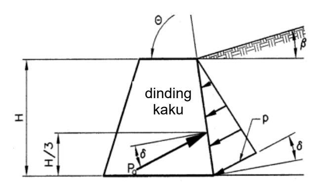

Gambar 1 - Notasi untuk perhitungan tekanan tanah aktif Coulomb

Nilai-nilai untuk koefisien tekanan tanah lateral aktif dapat diambil sebagai berikut:

$$k_{a} = \frac{\sin^{2}\left(\theta + \phi_{f}^{'}\right)}{\Gamma\left[\sin^{2}\theta\sin\left(\theta - \delta\right)\right]}$$
(8)

Dengan,

$$\Gamma = \left[ 1 + \sqrt{\frac{\sin(\phi_f' + \delta)\sin(\phi_f' - \beta)}{\sin(\theta - \delta)\sin(\theta + \beta)}} \right]^2$$
(9)

#### Keterangan:

- $\delta$  adalah sudut geser antara urukan dan dinding (°), nilai  $\delta$  diambil melalui pengujian laboratorium atau bila tidak memiliki data yang akurat dapat mengacu pada Tabel 6.
- $\beta$  adalah sudut pada urukan terhadap garis horizontal (°)
- $\theta$  adalah sudut pada dinding belakang terhadap garis horizontal (°)
- $\phi_{f}$  adalah adalah sudut geser efektif tanah (°)

Untuk kondisi yang tidak sesuai dengan yang dijelaskan dalam Gambar 1, tekanan aktif dapat dihitung dengan menggunakan prosedur yang didasarkan pada teori irisan dengan menggunakan Metode *Culmann*.

**Tabel 6 - Sudut geser berbagai material\* (US Department of the Navy, 1982a)** 

| Material                                                                      | Sudut geser δ (˚) |
|-------------------------------------------------------------------------------|----------------------|
| Beton pada material fondasi sebagai berikut :                                 |                      |
|  Batuan                                                                   | 35                   |
|  Kerikil, campuran kerikil – pasir, pasir kasar                           | 29 – 31              |
|  Pasir halus hingga medium, pasir kelanauan medium hingga kasar,          | 24 – 29              |
| kerikil kelanauan atau berlempung                                             |                      |
|  Pasir halus, pasir kelanauan atau berlempung halus hingga medium         | 19 – 24              |
|  Lanau kepasiran halus, lanau non plastis                                 | 17 – 19              |
|  Lempung prakonsolidasi atau residual yang sangat teguh dan keras         | 22 – 26              |
|                                                                               | 17 – 19              |
|  Lempung agak teguh hingga lempung teguh, dan lempung kelanauan           |                      |
| Pasangan bata pada material fondasi memiliki faktor geser yang sama           |                      |
| Turap baja terhadap tanah berikut :                                           |                      |
|  Kerikil, campuran kerikil – pasir, batuan bergradasi baik yang diisi     | 22                   |
| pecahan                                                                       |                      |
|  Pasir, campuran pasir – kerikil berlanau, batuan keras berukuran tunggal | 17                   |
|  Pasir berlanau, kerikil atau pasir bercampur lanau atau lempung          | 14                   |
|  Lanau kepasiran halus, lanau non plastis                                 | 11                   |
| Beton pracetak atau turap beton terhadap tanah berikut :                      |                      |
|  Kerikil, campuran kerikil – pasir, batuan bergradasi baik yang diisi     | 22 – 26              |
| pecahan                                                                       |                      |
|  Pasir, campuranpasir – kerikil berlanau, batuan keras berukuran tunggal  | 17 – 22              |
|  Pasir berlanau, kerikil atau pasir bercampur lanau atau lempung          | 17                   |
|  Lanau kepasiran halus, lanau non plastis                                 | 14                   |
|                                                                               |                      |
| Berbagai material struktural:                                                 |                      |
|  Batu bata pada batu bata, batuan beku dan metamorf:                      |                      |
| - Batuan lunak pada batuan lunak                                           | 35                   |
| - Batuan keras pada batuan lunak                                           | 33                   |
| - Batuan keras pada batuan keras                                           | 29                   |
|  Batu bata pada kayu dengan arah kembang kayu menyilang                   | 26                   |
|  Baja pada baja pada hubungan turap                                       | 17                   |

\* : Sudut geser pada Tabel 6 hanya dapat digunakan bila tidak diperoleh data karakteristik tanah untuk mendukung analisis geoteknik

#### **7.4.4.8 Koefisien tekanan tanah pasif (***kp*)

Untuk tanah nonkohesif, nilai koefisien tekanan tanah lateral pasif dapat diambil dari Gambar 2 untuk kasus dinding miring atau vertikal dengan timbunan yang rata dan Gambar 3 untuk kasus dinding vertikal dan timbunan miring. Untuk kondisi lain yang berbeda dari yang dijelaskan dalam Gambar 2 dan Gambar 3, tekanan pasif dapat dihitung dengan menggunakan prosedur berdasarkan teori irisan. Ketika teori irisan yang digunakan, nilai batas sudut geser dinding tidak boleh diambil lebih besar dari satu setengah sudut geser *f* . Untuk tanah kohesif, tekanan pasif dapat dihitung dengan

$$\rho_p = k_p \gamma_s z + 2c \sqrt{k_p} \tag{10}$$

#### **Keterangan :**

*p* adalah tekanan tanah lateral pasif (kPa)

*s* adalah berat jenis tanah (kN/m3)

*z* adalah kedalaman diukur dari permukaan tanah (m)

*c* adalah kohesi tanah (kPa)

*kp* adalah koefisien tekanan tanah lateral pasif

**© BSN 2016 18 dari 67** 

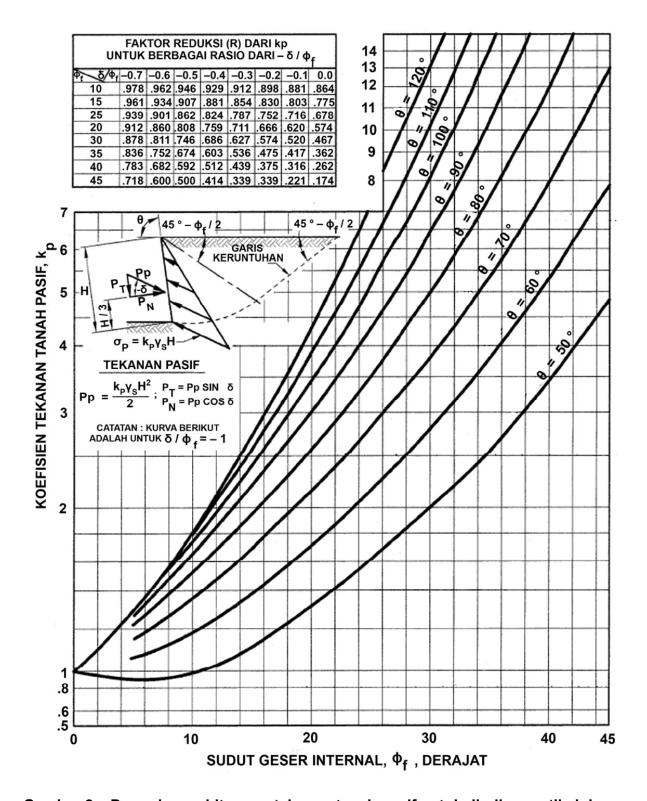

**Gambar 2 – Prosedur perhitungan tekanan tanah pasif untuk dinding vertikal dengan urukan horizontal** 

**© BSN 2016 19 dari 67** 

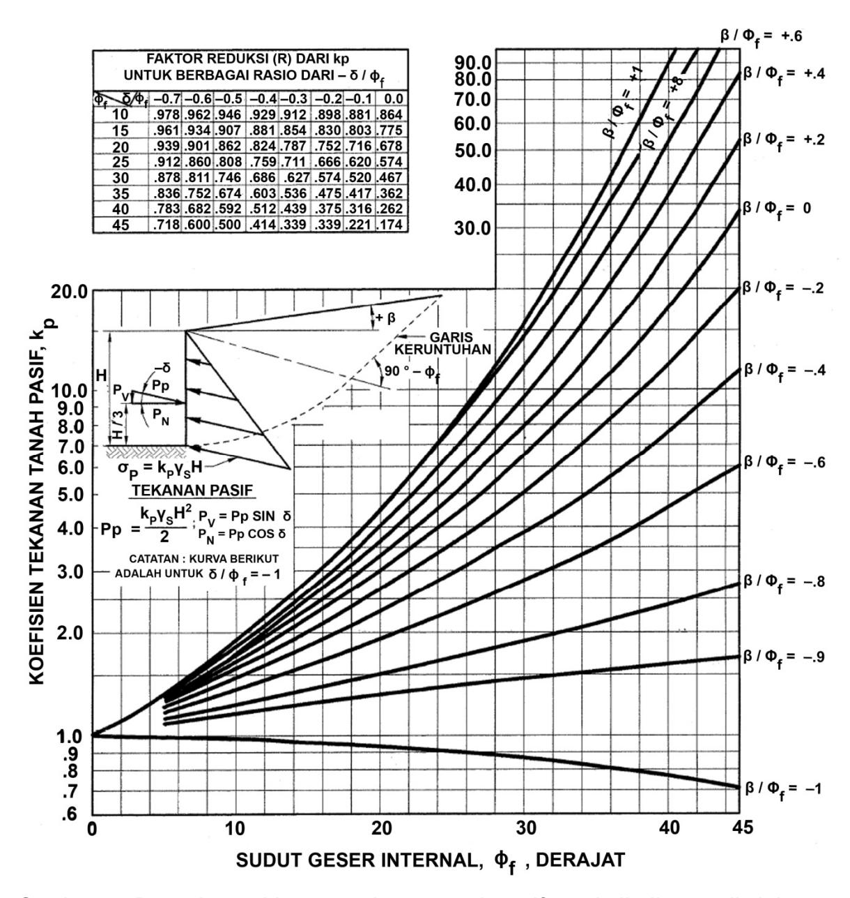

**Gambar 3 – Prosedur perhitungan tekanan tanah pasif untuk dinding vertikal dengan urukan membentuk sudut** 

## **7.4.4.9 Metode fluida ekivalen untuk perhitungan tekanan lateral** *Rankine*

Metode fluida ekivalen dapat digunakan bila teori tekanan tanah *Rankine* berlaku. Metode fluida ekivalen hanya boleh digunakan jika tanah timbunan bersifat "*free draining*". Jika kriteria ini tidak dipenuhi, ketentuan Pasal 7.4.2 dan Pasal 7.4.4 harus digunakan untuk menentukan tekanan tanah horizontal. Jika metode fluida ekivalen digunakan, tekanan tanah dasar *p*(kPa), dapat diambil sebagai :

$$p = \gamma_{eq} z \tag{11}$$

## **Keterangan :**

- *eq* adalah berat jenis tanah fluida ekivalen dan *eq* tidak kurang dari 4,8 kN/m3
- *z* adalah kedalaman diukur dari permukaan tanah (m)

**© BSN 2016 20 dari 67** 

Resultan beban tanah lateral akibat beban urukan harus diasumsikan pada ketinggian *H*/3 diukur dari dasar dinding, di mana *H* adalah ketinggian dinding, diukur dari permukaan tanah ke bagian bawah fondasi. Nilai berat satuan fluida ekivalen untuk desain dinding dengan ketinggian tidak melebihi 6 m dapat diambil dari Tabel 7dengan:

- *Δ* adalah perpindahan puncak dinding yang diperlukan untuk mencapai tekanan aktif minimum atau tekanan pasif maksimum dengan *tilting* atau translasi lateral (m)
- *H* adalah tinggi dinding (m)
- *Β* adalah sudut timbunan terhadap garis horizontal (°)

Besarnya komponen tekanan tanah vertikal yang dihasilkan untuk kasus timbunan miring dapat ditetapkan sebagai :

$$\rho_p = \rho_h \tan \beta \tag{12}$$

dengan,

$$p_h = \frac{1}{2}\gamma_{eq}H^2 \tag{13}$$

**Tabel 7 – Tipikal nilai berat satuan fluida ekivalen untuk tanah** 

|                                    |                         | Timbunan                             | Timbunan dengan  =25° |                                      |  |
|------------------------------------|-------------------------|--------------------------------------|---------------------------|--------------------------------------|--|
| Tipe tanah                         | Diam eq  (kN/m3) | Aktif Δ/H = 1/240 eq  (kN/m3) | Diam eq  (kN/m3)      | Aktif Δ/H = 1/240 eq  (kN/m3) |  |
| Pasir atau kerikil lepas/gembur | 8,8                     | 6,40                                 | 10,40                     | 8,00                                 |  |
| Pasir atau kerikil padat medium | 8,00                    | 5,68                                 | 9,60                      | 7,20                                 |  |
| Pasir atau kerikil padat        | 7,20                    | 4,80                                 | 8,80                      | 6,40                                 |  |

#### **7.4.4.10 Tekanan tanah lateral untuk dinding kantilever nongravitasi**

Untuk dinding permanen, distribusi tekanan tanah lateral penyederhanaan yang ditunjukkan pada Gambar 4 hingga Gambar 6 dapat digunakan. Jika dinding mendukung atau didukung oleh tanah kohesif untuk penggunaan sementara, dinding dapat dirancang berdasarkan metode analisis tegangan total dan parameter kuat geser *undrained*. Untuk itu, distribusi tekanan tanah penyederhanaan seperti yang ditunjukkan pada Gambar 7 hingga Gambar 8 dapat digunakan dengan batasan sebagai berikut :

- Rasio tekanan *overburden* total untuk kuat geser *undrained*, *Ns* harus kurang dari 3 di dasar dinding
- Tekanan tanah aktif tidak boleh kurang dari 0,25 kali tekanan *overburden* efektif pada setiap kedalaman, atau 5,5 kPa/m ketinggian dinding, diambil yang terbesar.

Untuk dinding sementara dengan elemen vertikal diskrit tertanam dalam tanah butiran atau batuan, Gambar 4 dan Gambar 5 dapat digunakan untuk menentukan tahan pasif, kemudian Gambar 7 dan Gambar 8 dapat digunakan untuk menentukan tekanan tanah aktif.

Bila elemen dinding vertikal diskrit digunakan untuk perletakan, maka lebar *b* dari setiap elemen vertikal harus diasumsikan sama dengan lebar sayap atau diameter elemen untuk penampang yang didorong dan diameter lubang untuk penampang yang akan diisi beton. Besarnya beban tambahan di atas dinding untuk penentuan *Pa2* pada Gambar 7 harus berdasarkan irisan tanah di atas dinding pada area tekanan aktif. Pada Gambar 8, sebagian

**© BSN 2016 21 dari 67** 

pembebanan negatif pada atas dinding karena kohesi diabaikan dan tekanan hidrostatik dalam retak tarik harus diperhitungkan, namun tidak ditampilkan pada gambar.

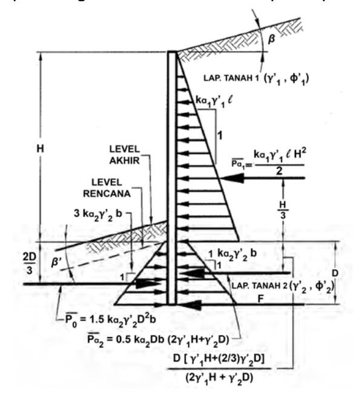

**Gambar 4 – Distribusi tekanan tanah penyederhanaan tidak terfaktor untuk dinding kantilever permanen nongravitasi dengan elemen dinding vertikal diskrit tertanam pada tanah berbutir** 

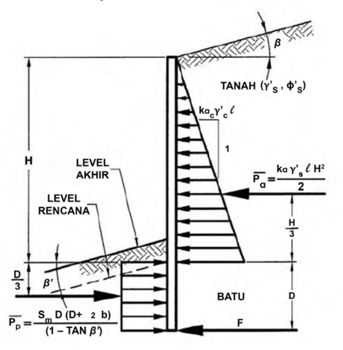

**Gambar 5 – Distribusi tekanan tanah penyederhanaan tidak terfaktor untuk dinding kantilever permanen nongravitasi dengan elemen dinding vertikal diskrit tertanam pada batuan** 

**© BSN 2016 22 dari 67** 

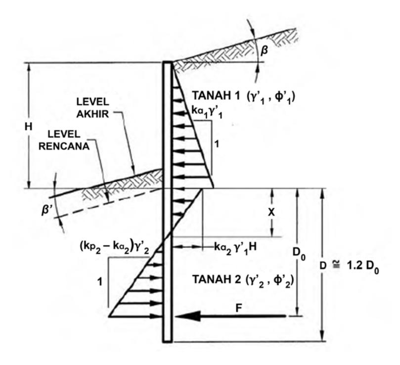

**Gambar 6 – Distribusi tekanan tanah penyederhanaan tidak terfaktor untuk dinding kantilever permanen nongravitasi dengan elemen dinding vertikal menerus tertanam pada tanah berbutir modifikasi (setelah Teng, 1962)** 

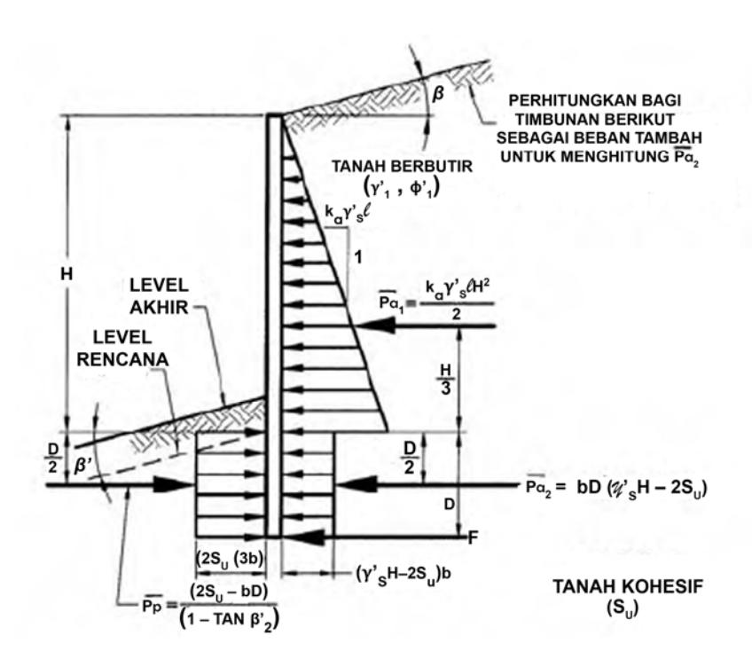

**Gambar 7 - Distribusi tekanan tanah penyederhanaan tidak terfaktor untuk dinding kantilever sementara nongravitasi dengan elemen dinding vertikal diskrit tertanam pada tanah kohesif dan menahan tanah berbutir** 

**© BSN 2016 23 dari 67** 

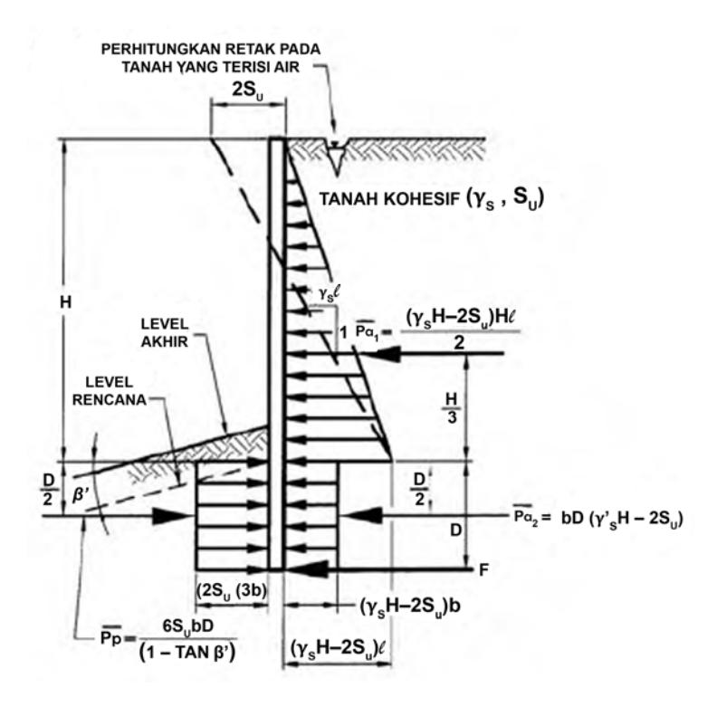

**Gambar 8 – Distribusi tekanan tanah penyederhanaan tidak terfaktor untuk dinding kantilever sementara nongravitasi dengan elemen dinding vertikal diskrit tertanam pada tanah kohesif dan menahan tanah kohesif** 

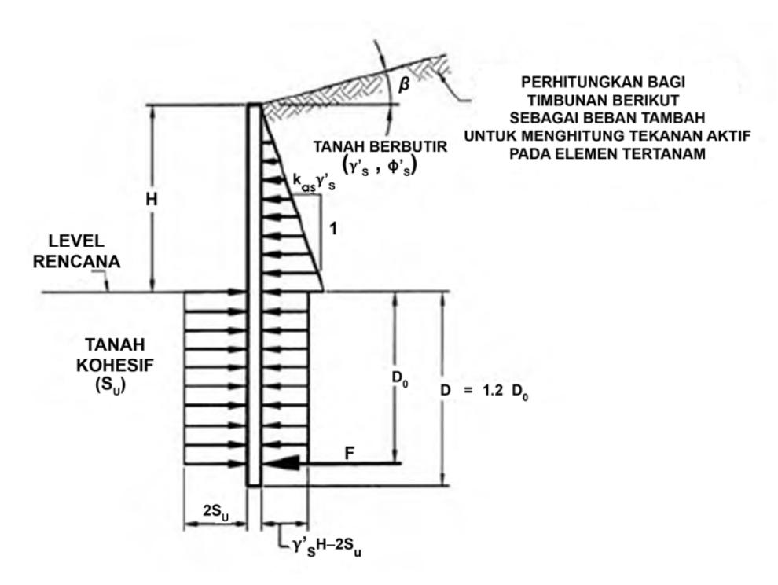

**Gambar 9 – Distribusi tekanan tanah penyederhanaan tidak terfaktor untuk dinding kantilever sementara nongravitasi dengan elemen dinding vertikal menerus tertanam pada tanah kohesif dan menahan tanah berbutir modifikasi (setelah Teng, 1962)** 

**© BSN 2016 24 dari 67** 

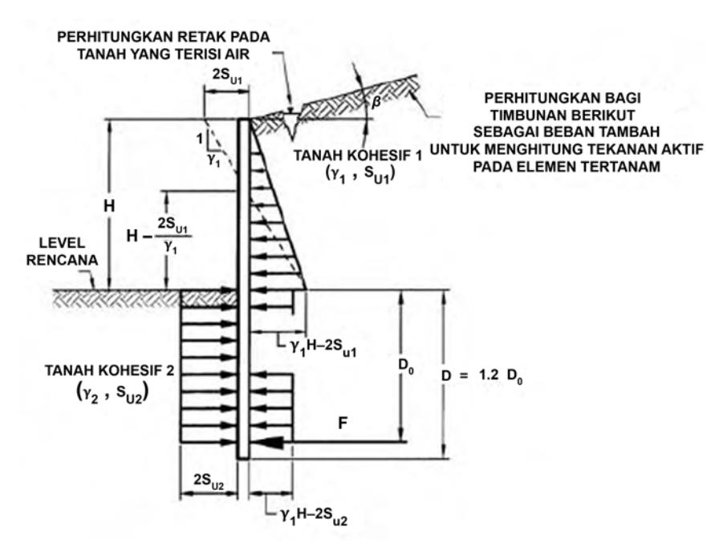

Gambar 10 – Distribusi tekanan tanah penyederhanaan tidak terfaktor untuk dinding kantilever sementara nongravitasi dengan elemen dinding vertikal menerus tertanam pada tanah kohesif dan menahan tanah kohesif modifikasi (setelah Teng, 1962)

#### 7.4.4.11 Tekanan tanah pada dinding terangkur

Untuk dinding angkur yang dibuat dari atas ke bawah, tekanan tanah diestimasi sesuai Pasal 7.4.4.11.1 dan 7.4.4.11.2. Dalam perencanaan tekanan untuk dinding terangkur, perlu diperhitungkan perpindahan dinding yang dapat mempengaruhi struktur yang berdekatan dan/atau utilitas bawah tanah.

### 7.4.4.11.1 Tanah non kohesif

Tekanan tanah pada dinding angkur sementara maupun permanen yang dibuat pada tanah non kohesif dapat ditentukan sesuai Gambar 11, dengan ordinat maksimum ( $\rho_a$ ) dari diagram tegangan yang dihitung sebagai berikut :

Untuk dinding dengan satu level angkur:

$$\rho_a = k_a \gamma_s H \tag{14}$$

Untuk dinding dengan level angkur maiemuk:

$$\rho_a = \frac{k_a \gamma_s' H^2}{1,5H - 0,5H_I - 0,5H_{n+1}}$$
(15)

#### Keterangan:

 $\rho_{\rm a}$  adalah ordinat maksimum dari diagram tegangan (kN/m²)

ka adalah koefisien tekanan tanah aktif

 $\gamma_s$  adalah berat efektif tanah (kN/m3)

H adalah tinggi galian (m)

 $H_1$  adalah jarak dari permukaan tanah ke angkur paling atas (m)

 $H_{n+1}$  adalah jarak dari permukaan tanah ke angkur paling bawah (m)

© BSN 2016

 $T_{hi}$  adalah gaya horizontal pada angkur ke i (kN/m)

Rs adalah gaya reaksi yang ditahan oleh tanah dasar (kN/m)

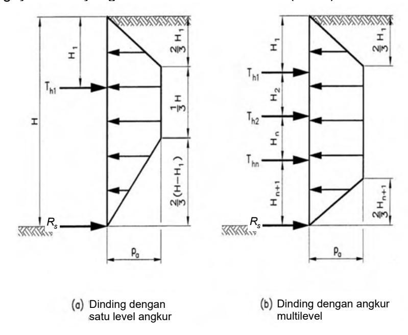

Gambar 11 – Distribusi tekanan tanah untuk dinding terangkur yang dibuat dari atas ke bawah pada tanah nonkohesif

#### 7.4.4.11.2 Tanah kohesif

Distribusi tekanan tanah untuk tanah kohesif berkaitan dengan angka stabilitas ( $N_s$ ) yang didefinisikan sebagai :

$$N_{s} = \frac{\gamma_{s}H}{S_{u}} \tag{16}$$

#### Keterangan:

 $\gamma_s$  adalah berat jenis tanah (kN/m³)

H adalah kedalaman total penggalian (m)

 $S_u$  adalah kuat geser undrained tanah rata-rata (kPa)

#### 7.4.4.11.2a Tanah kohesif kaku hingga keras

Untuk dinding terangkur sementara pada tanah kohesif kaku hingga keras ( $N_s \le 4$ ), tekanan tanah dapat ditentukan dengan menggunakan Gambar 11, dengan ordinat maksimum diagram tekanan tanah ( $p_a$ ) sebagai :

$$p_a = 0,2\gamma_s H$$
 hingga  $0,4\gamma_s H$  (17)

#### Keterangan:

 $p_a$  adalah ordinat maksimum dari diagram tegangan (kN/m2)

 $\gamma_s$  adalah berat jenis tanah (kN/m³)

H adalah kedalaman total penggalian (m)

© BSN 2016 26 dari 67

Untuk dinding terangkur permanen pada tanah kohesif kaku hingga keras, distribusi tekanan tanah sesuai Pasal 7.4.4.11.1 dapat digunakan dengan  $k_a$  berdasarkan sudut geser terdrainase pada tanah kohesif.

#### 7.4.4.11.2b Tanah kohesif lunak hingga kaku

Untuk dinding terangkur sementara atau permanen pada tanah kohesif lunak hingga keras  $(N_s \ge 6)$ , tekanan tanah dapat ditentukan dengan menggunakan Gambar 12, dengan ordinat maksimum diagram tekanan tanah  $(p_a)$  sebagai :

$$p_{a} = k_{a} \gamma_{s} H \tag{18}$$

# Keterangan:

 $p_a$  adalah ordinat maksimum dari diagram tegangan (kN/m²)

 $k_a$  adalah koefisien tekanan tanah aktif

 $\gamma_s$  adalah berat jenis tanah (kN/m3)

H adalah kedalaman total penggalian (m)

Dengan nilai ka ditentukan dengan persamaan berikut :

$$k_{a} = 1 - \frac{4S_{u}}{\gamma_{s}H} + 2\sqrt{2}\frac{d_{r}}{H} \left\{ \frac{1 - 5,14S_{ub}}{\gamma_{s}H} \right\} \ge 0,22$$
(19)

# Keterangan:

Su adalah kuat geser tidak terdrainase penahan tanah (kPa)

 $S_{ub}$  adalah kuat geser tidak terdrainase pada dasar galian (kPa)

 $\gamma_s$  adalah berat jenis tanah (kN/m³)

 $d_r$  kedalaman muka runtuh tanah di bawah galian dasar (m)

nilai  $d_r$  adalah ketebalan tanah dari bagian yang lunak ke tanah kaku kohesif di dasar galian sampai suatu nilai maksimum  $B_e/\sqrt{2}$  di mana  $B_e$  adalah lebar galian.

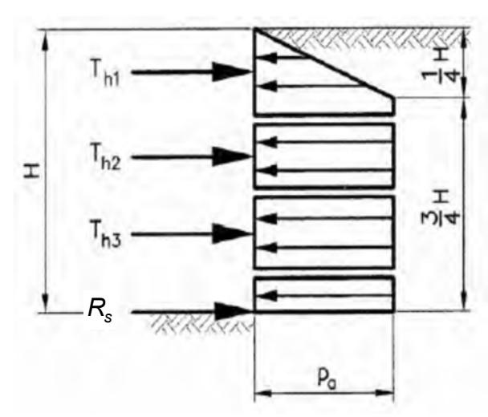

Gambar 12 - Distribusi tekanan tanah untuk dinding angkur yang dibuat dari atas ke bawah dari lunak ke agak kaku pada tanah kohesif

© BSN 2016 27 dari 67

## **7.4.4.12 Tekanan tanah lateral untuk dinding terstabilisasi mekanik (MSE)**

Gaya resultan per satuan lebar dinding *MSE* ditunjukkan dalam Gambar 13, Gambar 14, dan Gambar 15 yang bekerja pada ketinggian *h*/3 di atas dasar dinding dihitung dengan menggunakan rumus sebagai berikut :

$$P_a = 0.5k_a\gamma_s h^2 \tag{20}$$

# **Keterangan :**

- *Pa* adalah resultan gaya per satuan lebar (kN/m)
- *s* adalah berat jenis tanah (kN/m3)
- *h* adalah tinggi diagram tekanan tanah arah horizontal yang ditunjukkan dalam Gambar 13, Gambar 14 dan Gambar 15 (m)
- *ka* adalah koefisien tekanan tanah aktif sesuai Pasal 7.4.4.7 dengan sudut kemiringan timbunan seperti ditunjukkan dalamGambar 14, *B* yang ditunjukkan dalam Gambar 15, dan  *=*  dan, *B* dalam Gambar 14 danGambar 15.

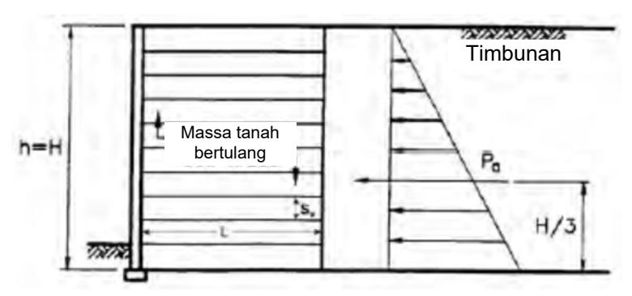

**Gambar 13 - Distribusi tekanan tanah untuk dinding MSE dengan ketinggian sama dengan permukaan timbunan** 

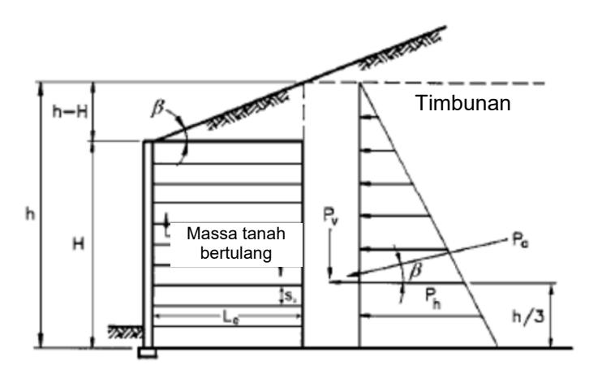

**Gambar 14 - Distribusi tekanan tanah untuk dinding MSE pada timbunan dengan kemiringan** 

Faktor beban *p* yang digunakan untuk beban maksimum yang dipikul tulangan *Tmax* untuk kekuatan tulangan, kekuatan sambungan, dan perhitungan cabut sebesar tekanan vertikal akibat beban mati, untuk tekanan tanah vertikal. Untuk dinding terstabilisasi mekanik, nilai *I* harus diambil sebesar 1.

**© BSN 2016 28 dari 67** 

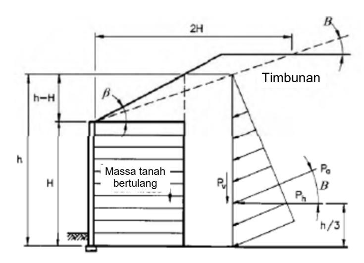

**Gambar 15 Distribusi tekanan tanah untuk dinding MSE dengan timbunan miring di atas dinding dan rata di belakang dinding** 

# **7.4.4.13 Tekanan tanah lateral untuk dinding modular pracetak**

Besar dan letak gaya resultan dan gaya tahanan dari dinding modular pracetak ditentukan dengan menggunakan distribusi tekanan tanah yang ditunjukkan dalam Gambar 16 dan Gambar 17. Bilamana bentuk modular pracetak tidak beraturan, terdapat peralihan lebar, tekanan tanah harus dihitung dari modul paling atas hingga modul bawah berdasarkan teori Coulomb.

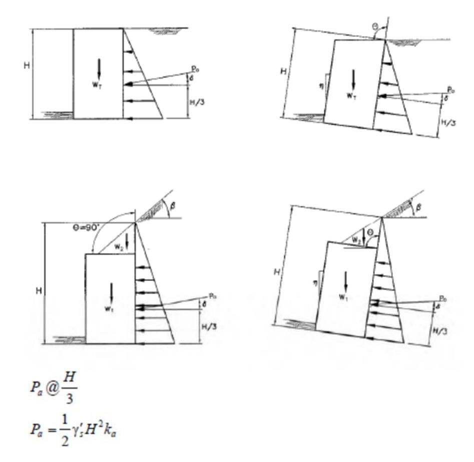

**Gambar 16 Distribusi tekanan tanah untuk dinding modular fabrikasi dengan tekanan permukaan menerus** 

**© BSN 2016 29 dari 67** 

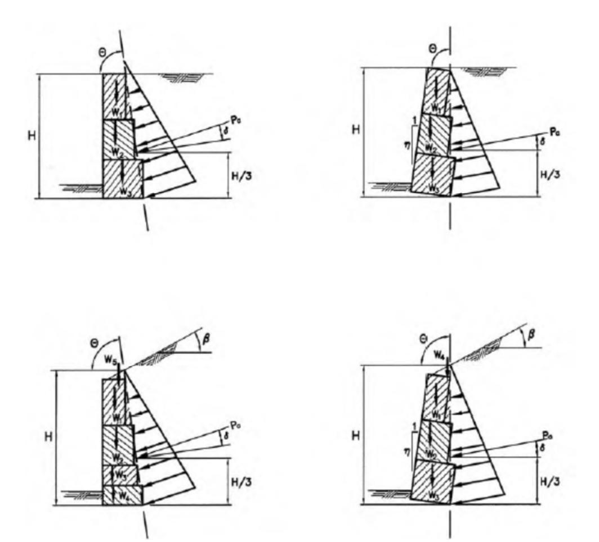

**Gambar 17 Distribusi tekanan tanah untuk dinding modular fabrikasi dengan tekanan permukaan tidak beraturan** 

# **7.4.5 Beban timbunan**

Peningkatan tegangan tanah terfaktor di belakang dinding oleh karena beban timbunan harus lebih besar dari beban timbunan tidak terfaktor atau tegangan yang dikalikan dengan faktor beban atau beban terfaktor yang bekerja pada elemen struktur yang menyebabkan beban timbunan dengan faktor beban sebesar 1. Beban yang bekerja pada dinding karena adanya elemen struktur di atas dinding tidak boleh diberi faktor dua kali.

# **7.4.5.1 Beban timbunan merata**

Bila beban timbunan yang bekerja berupa beban merata, maka tekanan tanah dasar harus dikalikan dengan tekanan tanah horizontal dengan nilai dirumuskan sebagai berikut :

$$\Delta_{p} = k_{s}q_{s} \tag{21}$$

#### **Keterangan :**

*p* adalah tekanan tanah horizontal karena timbunan merata (kPa)

*s k* adalah koefisien tekanan tanah karena timbunan

*qs* adalah timbunan merata pada permukaan bagian tekanan tanah aktif (kPa)

#### **7.4.5.2 Beban titik, beban garis, dan beban : dinding ditahan dari pergerakan**

Tekanan horizontal (*ph* ) yang bekerja pada dinding akibat beban strip merata dapat diambil sebagai :

**© BSN 2016 30 dari 67** 

$$\Delta_{ph} = \frac{2p}{\pi} \left[ \delta - \sin \delta \cos(\delta + 2\alpha) \right]$$
(22)

# Keterangan:

p adalah intensitas beban merata yang bekerja pada dinding (kPa)

 $\alpha$  adalah sudut sesuai dengan Gambar 18 (rad)

 $\delta$  adalah sudut sesuai dengan Gambar 18 (rad)

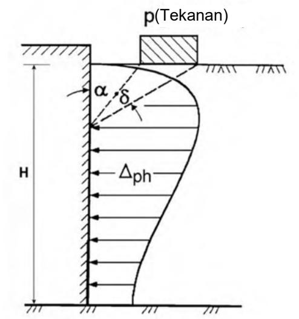

Gambar 18 -Tekanan horizontal pada dinding akibat beban strip merata

Selanjutnya, tekanan horizontal ( $\Delta_{ph}$ ) yang bekerja pada dinding akibat beban titik dapat diambil sebagai :

$$\Delta_{ph} = \frac{P}{\pi R^2} \left[ \frac{3ZX^2}{R^3} - \frac{R(1 - 2\nu)}{R + Z} \right]$$
 (23)

#### Keterangan:

- P adalah beban titik (kN)
- R adalah jarak antara beban titik terhadap titik yang ditinjau pada dinding sesuai dengan Gambar 19 dimana  $R = \sqrt{x^2 + y^2 + z^2}$  (m)
- X adalah jarak horizontal diukur dari belakang dinding terhadap beban titik (m)
- Y adalah jarak horizontal diukur dari titik pada dinding dengan posisi tegak lurus dinding dan diukur hingga titik dimana beban bekerja (m)
- Z adalah kedalaman diukur dari permukaan tanah hingga titik pada dinding yang ditinjau(m)
- v adalah rasio Poisson

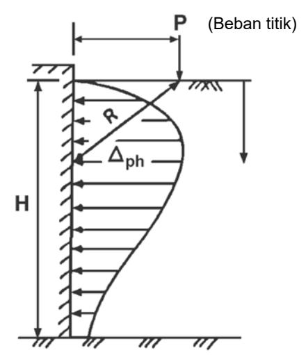

Gambar 19 -Tekanan horizontal pada dinding akibat beban titik

Tekanan horizontal ( $\Delta_{ph}$ ) yang bekerja pada dinding akibat beban garis tak berhingga (Gambar 20) yang paralel terhadap dinding dapat diambil sebagai :

$$\Delta_{ph} = \frac{4Q}{\pi} \frac{X^2 Z}{R^4} \tag{24}$$

#### Keterangan:

- Q adalah intensitas beban (kN/m)
- X adalah jarak horizontal diukur dari belakang dinding terhadap beban garis (m)
- Y adalah jarak horizontal diukur dari titik pada dinding dengan posisi tegak lurus dinding dan diukur hingga titik dimana beban bekerja (m)
- Z adalah kedalaman diukur dari permukaan tanah hingga titik pada dinding yang ditinjau(m)
- v adalah rasio Poisson

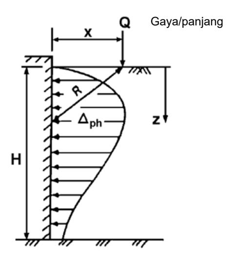

Gambar 20 –Tekanan horizontal pada dinding akibat beban garis tak berhingga yang bekerja paralel terhadap dinding

© BSN 2016 32 dari 67

Tekanan horizontal ( $\Delta_{ph}$ ) yang bekerja pada dinding akibat beban garis berhingga (Gambar 21) yang tegak lurus terhadap dinding dapat diambil sebagai :

$$\Delta_{ph} = \frac{Q}{\pi Z} \left( \frac{1}{A^3} - \frac{1 - 2\nu}{A + \frac{Z}{X^2}} - \frac{1}{B^3} + \frac{1 - 2\nu}{B + \frac{Z}{X_1}} \right)$$
 (25)

Dengan,

$$A = \sqrt{1 + \left(\frac{Z}{X_2}\right)^2}$$

$$B = \sqrt{1 + \left(\frac{Z}{X_1}\right)^2}$$

# Keterangan:

 $X_1$  adalah jarak diukur dari belakang dinding hingga awal beban garis sesuai (kN)

 $X_2$  adalah panjang beban garis (m)

- Z adalah kedalaman diukur dari permukaan tanah hingga titik pada dinding yang ditinjau(m)
- ν adalah rasio *Poisson*
- Q adalah intensitas beban (kN/m)

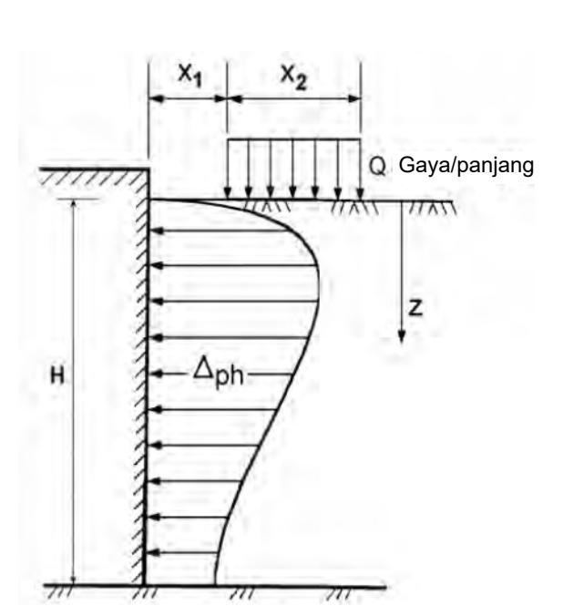

Gambar 21 –Tekanan horizontal pada dinding akibat beban garis berhingga yang tegak lurus terhadap dinding

#### 7.4.5.3 Beban strip: dinding fleksibel

Beban mati terpusat harus diperhitungkan pada perencanaan stabilitas internal dan eksternal dengan menggunakan distribusi vertikal merata 2 vertikal terhadap 1 horizontal untuk menentukan komponen vertikal tegangan terhadap kedalaman pada tanah bertulang sesuai

© BSN 2016 33 dari 67

dengan Gambar 22. Beban horizontal terpusat pada puncak dinding harus didistribusikan pada tanah bertulang sesuai dengan Gambar 23.

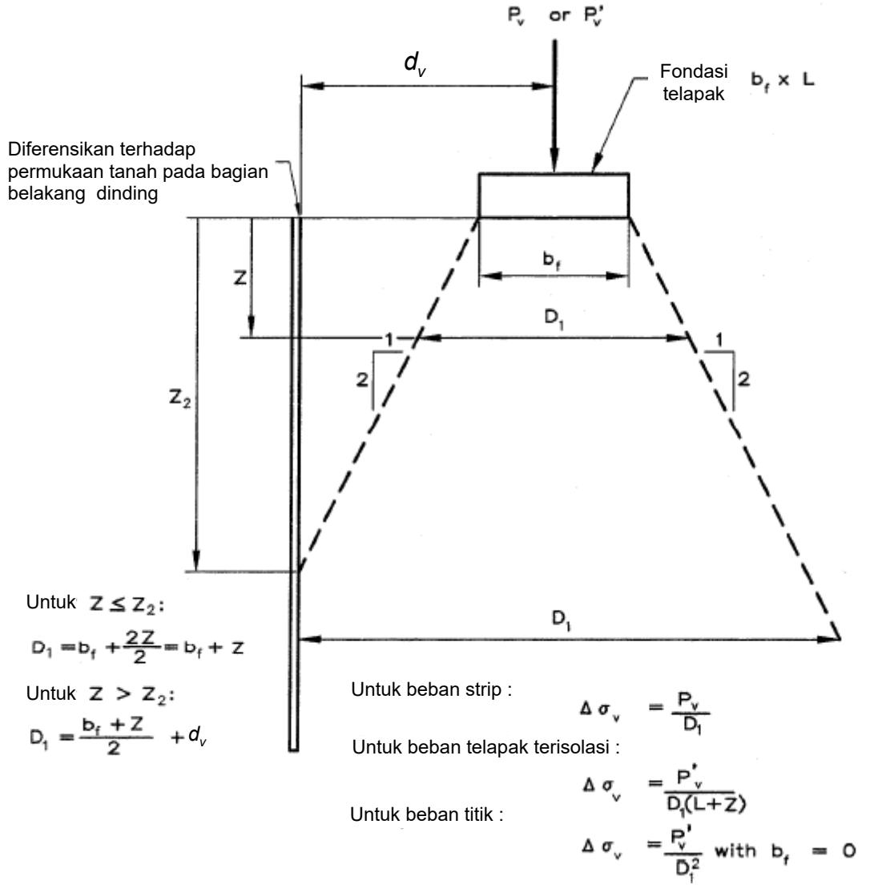

- *D*1 adalah lebar efektif beban pada kedalaman tertentu (m)
- *bf* adalah lebar beban (m). Untuk telapak dengan beban eksentris (misalnya pada telapak pada kepala jembatan).
- *L* adalah panjang telapak (m)
- *Pv* adalah beban per meter panjang telapak (kN/m)
- *PV* adalah beban pada telapak persegi atau beban titik (m)
- *Z*2 adalah kedalaman dimana lebar efektif memotong muka dinding = *2dv-bf* (m)
- *dv* adalah jarak antara beban vertikal terpusat dan bagian belakang dinding (m)

**Gambar 22 - Distribusi tegangan akibat beban vertikal terpusat untuk perhitungan stabilitas internal dan eksternal** 

**© BSN 2016 34 dari 67** 

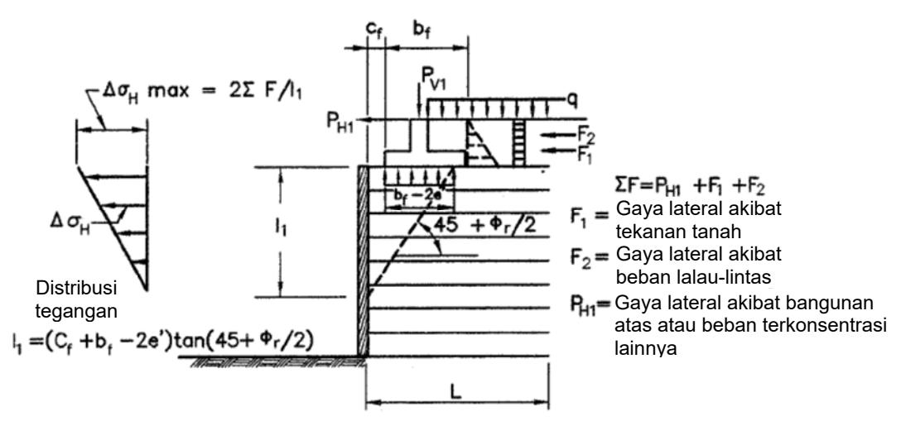

**a. Distribusi tegangan untuk perhitungan stabilitas internal**

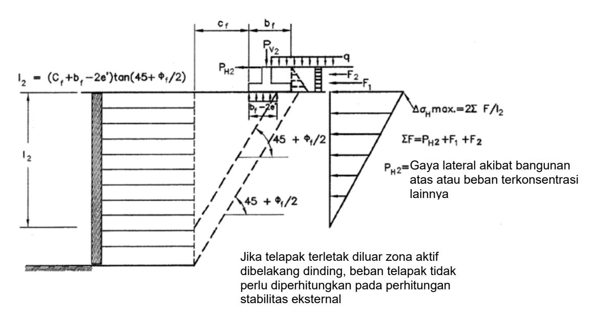

**b. Distribusi tegangan untuk perhitungan stabilitas eksternal** 

**Gambar 23 - Distribusi tegangan akibat beban horizontal terpusat** 

Bila beban mati terpusat terletak dibelakang tanah bertulang, beban tersebut harus didistribusi dengan cara yang sama seperti pada tanah bertulang. Tegangan vertikal yang didistribusi dibelakang daerah penulangan harus dikalikan dengan *ka* saat menentukan pengaruh beban timbunan terhadap stabilitas eksternal. Tegangan horizontal yang didistribusi di belakang dinding sesuai dengan Gambar 23 tidak boleh dikalikan dengan *ka.*

#### **7.4.5.4 Tambahan beban akibat beban hidup**

Beban tambahan akibat beban hidup harus diperhitungkan jika beban kendaraan diperkirakan akan melewati timbunan dengan jarak setengah tinggi dinding diukur dari muka belakang dinding. Bila beban tambahan adalah untuk jalan raya, intensitas beban harus konsisten dengan ketentuan beban hidup. Jika beban tambahan bukan untuk jalan raya, maka pemilik pekerjaan harus menentukan beban tambahan tersebut. Peningkatan tekanan horizontal akibat beban hidup dapat diestimasi dengan rumus sebagai berikut :

**© BSN 2016 35 dari 67** 

$$\Delta_{p} = k \gamma_{s} h_{eq} \tag{26}$$

## **Keterangan :**

*p* adalah tekanan tanah horizontal akibat tambahan beban hidup (kPa)

*s* adalah berat jenis tanah (kN/m3)

*k* adalah koefisien tekanan tanah

*heq* adalah tinggi tanah ekivalen untuk beban kendaraan (m)

Tinggi tanah ekivalen ( *heq* ) untuk pembebanan jalan raya pada kepala jembatan dan dinding penahan tanah dapat diambil sesuai dengan Tabel 8 dan Tabel 9. Interpolasi linier dapat dilakukan untuk tinggi dinding lainnya. Tinggi dinding diambil sebagai jarak diukur dari permukaan timbunan dan dasar telapak sepanjang permukaan tekanan yang ditinjau.

**Tabel 8 – Tinggi ekivalen tanah untuk beban kendaraan pada kepala jembatan tegak lurus terhadap lalu lintas** 

| Tinggi kepala jembatan (m) | heq (m) |
|----------------------------|------------|
| 1,5 m                      | 1,2        |
| 3 m                        | 0,9        |
| ≥ 6 m                      | 0,6        |

**Tabel 9 – Tinggi ekivalen tanah untuk beban kendaraan pada dinding penahan tanah paralel terhadap lalu lintas** 

| Tinggi dinding penahan tanah (m) | heq (m) jarak dari muka belakang |                  |  |  |
|-------------------------------------|-------------------------------------|------------------|--|--|
|                                     | dinding ke tepi lalu lintas         |                  |  |  |
|                                     | 0 m                                 | 0,3 m atau lebih |  |  |
| 1,5 m                               | 1,5                                 | 0,6              |  |  |
| 3 m                                 | 1,2                                 | 0,6              |  |  |
| ≥ 6 m                               | 0,6                                 | 0,6              |  |  |

## **7.4.5.5 Reduksi beban tambahan**

Jika beban kendaraan ditransfer pada pelat lantai yang juga didukung oleh struktur selain tanah, maka diizinkan untuk reduksi beban tambahan.

# **7.4.6 Reduksi karena tekanan tanah**

Untuk gorong-gorong dan jembatan serta komponennya dimana tekanan tanah dapat mengurangi efek beban lain, maka reduksi harus dibatasi pada tekanan tanah yang permanen akan muncul. Sebagai alternatif, reduksi sebesar 50% dapat digunakan tetapi tidak perlu dikombinasikan dengan faktor beban terkurangi.

#### **7.4.7** *Downdrag*

Kemungkinan peningkatan *downdrag* pada tiang pancang atau fondasi pipa harus dievaluasi jika :

- Tanah berupa material kompresibel seperti lempung, lanau, atau tanah organik,
- Timbunan akan terletak dekat dengan tiang pancang atau fondasi pipa, seperti pada timbunan pada timbunan oprit.
- Muka air tanah rendah
- Likuifaksi dapat terjadi

Jika potensi downdrag pada tiang pancang atau pipa ada akibat penurunan tanah relatif terhadap tiang pancang, kemudian potensi downdrag tidak dihilangkan dengan preloading tanah untuk mengurangi penurunan tanah atau mitigasi lainnya, maka tiang pancang harus direncanakan untuk menahan downdrag.

Perlu diperhitungkan potensi beban akibat *downdrag* dengan menggunakan beban timbunan, teknik perbaikan tanah, dan atau drainase vertikal dan pengukuran untuk memonitor penurunan.

Untuk keadaan batas kuat I, downdrag akibat penurunan likuifaksi harus dikerjakan pada tiang pancang atau pipa dikombinasi dengan beban lain pada grup beban. Downdrag akibat likuifaksi tidak boleh dikombinasikan dengan downdrag akibat penurunan konsolidasi. Untuk beban downdrag yang bekerja pada kelompok tiang maka pengaruh kelompok tiang harus diperhitungkan.

Jika beban transien bekerja untuk mengurangi besarnya *downdrag* dan reduksi ini diperhitungkan dalam perencanaan tiang pancang atau pipa, reduksi tersebut tidak melebihi porsi beban transien sama dengan pengaruh gaya downdrag. Gaya akibat downdrag pada tiang pancang dan tiang bor dapat ditentukan sebagai berikut:

Langkah pertama yaitu tetapkan profil tanah dan properti tanah untuk perhitungan penurunan, langkah selanjutnya yaitu lakukan perhitungan penurunan tanah sepanjang tiang pancang, kemudian tentukan panjang tiang yang akan terkena downdrag. Jika penurunan tanah sebesar 1 cm atau lebih besar relatif terhadap tiang pancang, maka *downdrag* disumsikan dapat terjadi.

# 7.5 Pengaruh tetap pelaksanaan

Pengaruh tetap pelaksanaan adalah beban yang disebabkan oleh metode dan urutan pelaksanaan pekerjaan jembatan. Beban ini biasanya mempunyai kaitan dengan aksi-aksi lainnya, seperti pra-penegangan dan berat sendiri. Dalam hal ini, pengaruh faktor ini tetap harus dikombinasikan dengan aksi-aksi tersebut dengan faktor beban yang sesuai.

Bila pengaruh tetap yang terjadi tidak begitu terkait dengan aksi rencana lainnya, maka pengaruh tersebut harus dimaksudkan dalam batas daya layan dan batas ultimit menggunakan faktor beban sesuai dengan Tabel 10.

Tabel 10 - Faktor beban akibat pengaruh pelaksanaan

| Tino          | Faktor beban ( $\gamma_{PL}$ )         |                                             |            |  |  |
|---------------|----------------------------------------|---------------------------------------------|------------|--|--|
| Tipe beban | Keadaan Batas Layan $(\gamma_{p_l}^S)$ | Keadaan Batas Ultimit ( $\gamma_{PL}^{U}$ ) |            |  |  |
|               | rteadair Batae Eayari (7 pL)           | Biasa                                       | Terkurangi |  |  |
| Tetap         | 1,00                                   | 1,00                                        | 1,00       |  |  |

#### 8 Beban lalu lintas

## 8.1 **Umum**

Beban lalu lintas untuk perencanaan jembatan terdiri atas beban lajur "D" dan beban truk "T". Beban lajur "D" bekerja pada seluruh lebar jalur kendaraan dan menimbulkan pengaruh pada jembatan yang ekuivalen dengan suatu iring-iringan kendaraan yang sebenarnya. Jumlah total beban lajur "D" yang bekerja tergantung pada lebar jalur kendaraan itu sendiri.

Beban truk "T" adalah satu kendaraan berat dengan 3 gandar yang ditempatkan pada beberapa posisi dalam lajur lalu lintas rencana. Tiap gandar terdiri atas dua bidang kontak

© BSN 2016 37 dari 67

pembebanan yang dimaksud sebagai simulasi pengaruh roda kendaraan berat. Hanya satu truk "T" diterapkan per lajur lalu lintas rencana.

Secara umum, beban "D" akan menjadi beban penentu dalam perhitungan jembatan yang mempunyai bentang sedang sampai panjang, sedangkan beban "T" digunakan untuk bentang pendek dan lantai kendaraan. Dalam keadaan tertentu beban "D" yang nilainya telah diturunkan atau dinaikkan dapat digunakan (lihat Pasal 8.5).

## **8.2 Lajur lalu lintas rencana**

Secara umum, Jumlah lajur lalu lintas rencana ditentukan dengan mengambil bagian *integer* dari hasil pembagian lebar bersih jembatan (*w*) dalam mm dengan lebar lajur rencana sebesar 2750 mm. Perencana harus memperhitungkan kemungkinan berubahnya lebar bersih jembatan dimasa depan sehubungan dengan perubahan fungsi dari bagian jembatan. Jumlah maksimum lajur lalu lintas yang digunakan untuk berbagai lebar jembatan bisa dilihat dalam Tabel 11. Lajur lalu lintas rencana harus disusun sejajar dengan sumbu memanjang jembatan.

**Tabel 11 - Jumlah lajur lalu lintas rencana** 

| Tipe Jembatan (1)          | Lebar Bersih Jembatan (2) (mm) | Jumlah Lajur Lalu Lintas Rencana (n) |
|----------------------------|-----------------------------------|-----------------------------------------|
| Satu Lajur                 | 3000 ≤ w < 5250                   | 1                                       |
|                            | 5250 ≤ w < 7500                   | 2                                       |
|                            | 7500 ≤ w < 10,000                 | 3                                       |
| Dua Arah, tanpa Median     | 10,000 ≤ w < 12,500               | 4                                       |
|                            | 12,500 ≤ w < 15,250               | 5                                       |
|                            | w ≥ 15,250                        | 6                                       |
|                            | 5500 ≤ w ≤ 8000                   | 2                                       |
|                            | 8250 ≤ w ≤ 10,750                 | 3                                       |
| Dua Arah, dengan Median | 11,000 ≤ w ≤ 13,500               | 4                                       |
|                            | 13,750 ≤ w ≤ 16,250               | 5                                       |
|                            | w ≥ 16,500                        | 6                                       |

Catatan (1) : Untuk jembatan tipe lain, jumlah lajur lalu lintas rencana harus ditentukan oleh instansi yang berwenang.

Catatan (2) : Lebar jalur kendaraan adalah jarak minimum antara kerb atau rintangan untuk satu arah atau jarak antara kerb/rintangan/median dan median untuk banyak arah.

Berdasarkan Tabel 11, bila lebar bersih jembatan berkisar antara 3000 mm sampai 5000 mm, maka jumlah jalur rencana harus diambil satu lajur lalu lintas rencana dan lebar jalur rencana harus diambil sebagai lebar jalur lalu lintas. Jika jembatan mempunyai lebar bersih antara 5250 mm dan 7500 mm, maka jembatan harus direncanakan memiliki dua lajur rencana, masing-masing selebar lebar bersih jembatan dibagi dua. Jika jembatan mempunyai lebar bersih antara 7750 mm dan 10000 mm, maka jembatan harus direncanakan memiliki tiga lajur rencana, masing-masing selebar lebar bersih jembatan dibagi tiga.

## **8.3 Beban lajur "D" (***TD***)**

Beban lajur "D" terdiri atas beban terbagi rata (BTR) yang digabung dengan beban garis (BGT) seperti terlihat dalam Gambar 24. Adapun faktor beban yang digunakan untuk beban lajur "D" seperti pada Tabel 12.

**© BSN 2016 38 dari 67** 

| Tabel 12 - Fa | ktor beban | untuk beban | lajur "D" |
|---------------|------------|-------------|-----------|
|---------------|------------|-------------|-----------|

| Tipe     | Jembatan            | Faktor beban ( $\gamma_{\mathcal{D}}$ )     |                                                                |
|----------|---------------------|---------------------------------------------|----------------------------------------------------------------|
| beban    | Jembalan            | Keadaan Batas Layan ( $\gamma_{T\!D}^{S}$ ) | Keadaan Batas Ultimit ( $\gamma_{\mathcal{D}}^{\mathcal{U}}$ ) |
|          | Beton               | 1,00                                        | 1,80                                                           |
| Transien | Boks Girder Baja | 1,00                                        | 2,00                                                           |

#### 8.3.1 Intensitas beban "D"

Beban terbagi rata (BTR) mempunyai intensitas q kP $_a$  dengan besaran q tergantung pada panjang total yang dibebani L yaitu seperti berikut :

Jika 
$$L \le 30 \text{ m}$$
 :  $q = 9.0 \text{ kPa}$  (27)

Jika 
$$L > 30$$
m :  $q = 9.0 \left( 0.5 + \frac{15}{L} \right) kPa$  (28)

# Keterangan:

q adalah intensitas beban terbagi rata (BTR) dalam arah memanjang jembatan (kPa)
 L adalah panjang total jembatan yang dibebani (meter)

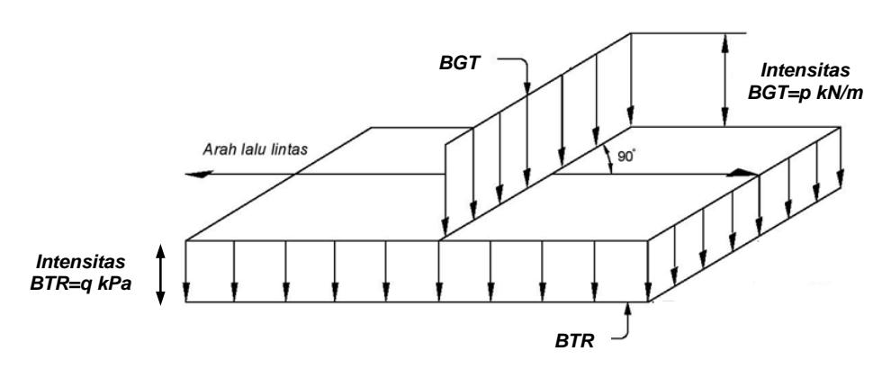

Gambar 24 - Beban lajur "D"

Beban garis terpusat (BGT) dengan intensitas *p* kN/m harus ditempatkan tegak lurus terhadap arah lalu lintas pada jembatan. Besarnya intensitas *p* adalah 49,0 kN/m. Untuk mendapatkan momen lentur negatif maksimum pada jembatan menerus, BGT kedua yang identik harus ditempatkan pada posisi dalam arah melintang jembatan pada bentang lainnya.

#### 8.3.2 Distribusi beban "D"

Beban "D" harus disusun pada arah melintang sedemikian rupa sehingga menimbulkan momen maksimum. Penyusunan komponen-komponen BTR dan BGT dari beban "D" secara umum dapat dilihat pada Gambar 24. Kemudian untuk alternatif penempatan dalam arah memanjang dapat dilihat pada Gambar 25.

© BSN 2016 39 dari 67

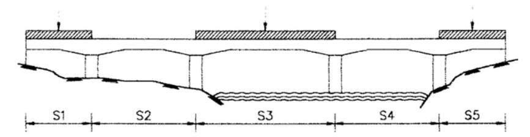

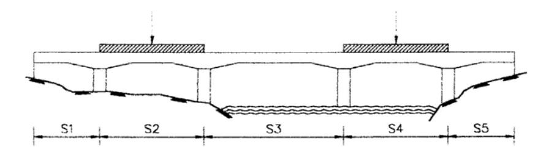

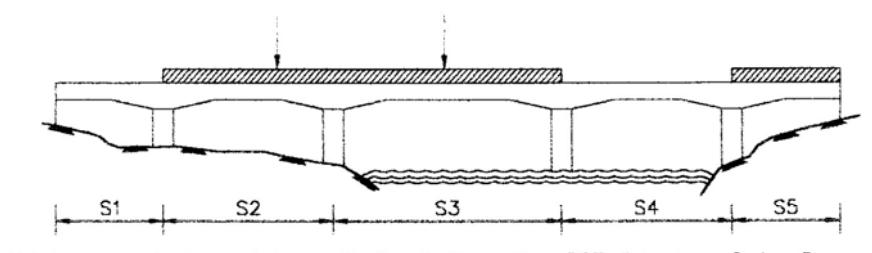

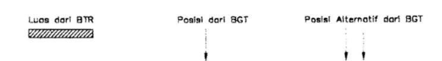

**Gambar 25 - Alternatif penempatan beban "D" dalam arah memanjang** 

#### **8.3.3 Respons terhadap beban lajur "D"**

Distribusi beban hidup dalam arah melintang digunakan untuk memperoleh momen dan geser dalam arah longitudinal pada gelagar jembatan. Hal itu dilakukan dengan mempertimbangkan beban lajur "D" tersebar pada seluruh lebar balok (tidak termasuk parapet, kerb dan trotoar) dengan intensitas 100% untuk panjang terbebani yang sesuai.

#### **8.4 Beban truk "T" (***TT***)**

Selain beban "D", terdapat beban lalu lintas lainnya yaitu beban truk "T". Beban truk "T" tidak dapat digunakan bersamaan dengan beban "D". Beban truk dapat digunakan untuk perhitungan struktur lantai. Adapun faktor beban untuk beban "T" seperti terlihat pada Tabel 13.

**© BSN 2016 40 dari 67** 

|          | rabel 13 - Laktor bebair untuk bebair T |                                           |                                             |  |
|----------|-----------------------------------------|-------------------------------------------|---------------------------------------------|--|
| Tipe     |                                         | Faktor beban                              |                                             |  |
| beban    | Jembatan                                | Keadaan Batas Layan ( $\gamma_{TT}^{S}$ ) | Keadaan Batas Ultimit ( $\gamma_{TT}^{U}$ ) |  |
|          | Beton                                   | 1,00                                      | 1,80                                        |  |
| Transien | Boks Girder Baja                     | 1,00                                      | 2,00                                        |  |

Tabel 13 - Faktor beban untuk beban "T"

# 8.4.1 Besarnya pembebanan truk "T"

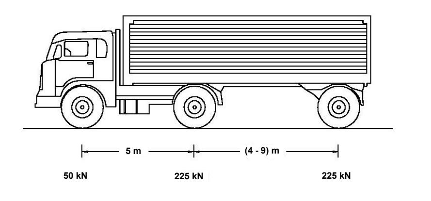

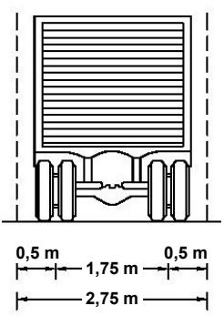

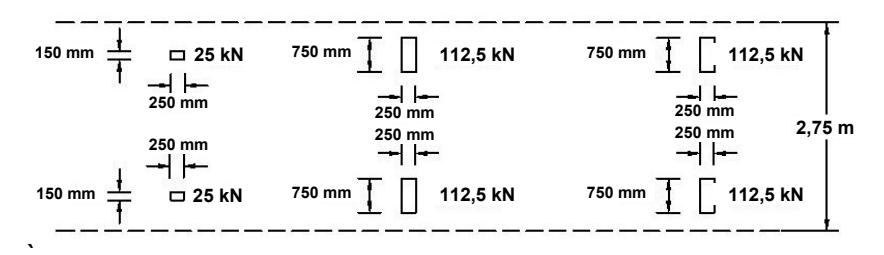

Gambar 26 - Pembebanan truk "T" (500 kN)

Pembebanan truk "T" terdiri atas kendaraan truk *semi-trailer* yang mempunyai susunan dan berat gandar seperti terlihat dalam Gambar 26. Berat dari tiap-tiap gandar disebarkan menjadi 2 beban merata sama besar yang merupakan bidang kontak antara roda dengan permukaan lantai. Jarak antara 2 gandar tersebut bisa diubah-ubah dari 4,0 m sampai dengan 9,0 m untuk mendapatkan pengaruh terbesar pada arah memanjang jembatan.

#### 8.4.2 Posisi dan penyebaran pembebanan truk "T" dalam arah melintang

Terlepas dari panjang jembatan atau susunan bentang, umumnya hanya ada satu kendaraan truk "T" yang bisa ditempatkan pada satu lajur lalu lintas rencana. Untuk jembatan sangat panjang dapat ditempatkan lebih dari satu truk pada satu lajur lalu lintas rencana.

Kendaraan truk "T" ini harus ditempatkan di tengah-tengah lajur lalu lintas rencana seperti terlihat dalam Gambar 26. Jumlah maksimum lajur lalu lintas rencana dapat dilihat dalam Tabel 11, tetapi jumlah lebih kecil bisa digunakan dalam perencanaan apabila menghasilkan pengaruh yang lebih besar. Hanya jumlah lajur lalu lintas rencana dalam nilai bulat harus digunakan. Lajur lalu lintas rencana bisa ditempatkan di mana saja pada lajur jembatan.

## 8.4.3 Kondisi faktor kepadatan lajur

Ketentuan pasal ini tidak boleh digunakan untuk perencanaan keadaan batas fatik dan fraktur, dimana hanya satu jalur rencana yang diperhitungkan dan tidak tergantung dari jumlah total lajur rencana. Jika perencana menggunakan faktor distribusi beban kendaraan untuk satu lajur, maka pengaruh beban truk harus direduksi dengan faktor 1,20. Tetapi jika

© BSN 2016 41 dari 67

perencana menggunakan *lever rule* atau metode statika lainnya untuk mendapatkan faktor distribusi beban kendaraan, maka pengaruh beban truk tidak perlu direduksi.

Kecuali ditentukan lain pada pasal ini, pengaruh beban hidup harus ditentukan dengan mempertimbangkan setiap kemungkinan kombinasi jumlah jalur yang terisi dikalikan dengan faktor kepadatan lajur yang sesuai untuk memperhitungkan kemungkinan terisinya jalur rencana oleh beban hidup. Jika perencana tidak mempunyai data yang diperlukan maka nilai-nilai pada Tabel 14.

- dapat digunakan saat meneliti jika hanya satu jalur terisi,
- boleh digunakan saat meneliti pengaruh beban hidup jika ada tiga atau lebih lajur terisi.

**Tabel 14 – Faktor kepadatan lajur (m)** 

| Jumlah lajur yang | faktor kepadatan |
|-------------------|------------------|
| dibebani          | lajur            |
| 1                 | 1,2              |
| ≥ 2               | 1                |

Untuk tujuan menentukan jumlah lajur ketika kombinasi pembebanan mencakup beban pejalan kaki seperti yang ditentukan dalam Pasal 8.9 dengan satu atau lebih lajur kendaraan, maka perencana harus menentukan bahwa beban pejalan kaki akan mengisi salah satu lajur kendaraan.

Faktor-faktor yang ditentukan dalam Tabel 14 tidak boleh digunakan untuk menentukan faktor distribusi beban kendaraan. Dalam hal ini perencana harus menggunakan *lever rule* untuk menentukan beban yang bekerja pada balok eksterior.

#### **8.4.4 Bidang kontak roda kendaraan**

Bidang kontak roda kendaraan yang terdiri atas satu atau dua roda diasumsikan mempunyai bentuk persegi panjang dengan panjang 750 mm dan lebar 250 mm. Tekanan ban harus diasumsikan terdistribusi secara merata pada permukaan bidang kontak.

#### **8.4.5 Distribusi beban roda pada timbunan**

Beban roda harus didistribusikan pada pelat atap gorong-gorong jika tebal timbunan kurang dari 600 mm. Jika tebal timbunan lebih dari 600 mm atau perencana menggunakan cara perhitungan pendekatan yang diizinkan, atau melakukan analisis yang lebih rinci, maka beban roda diasumsikan terbagi rata seluas bidang kontak, yang bertambah besar sesuai kedalaman dengan kemiringan sebesar 1,15 kali kedalaman timbunan, dengan memperhatikan kondisi kepadatan lajur.

Untuk area dimana kontribusi beberapa roda mengalami tumpang tindih, maka besarnya beban terdistribusi ditentukan berdasarkan beban total dibagi dengan luas area.

Untuk gorong-gorong bentang tunggal, pengaruh dari beban hidup dapat diabaikan jika tebal timbunan lebih tebal dari 2400 mm dan lebih besar dari panjang bentang; sedangkan untuk gorong-gorong dengan bentang menerus, pengaruh beban hidup dapat diabaikan jika tebal timbunan lebih besar dibandingkan jarak bersih antara dinding terluar.

Jika momen akibat beban hidup beserta impak pada pelat beton berdasarkan distribusi beban roda melalui timbunan lebih besar dibandingkan dengan akibat beban hidup dan impak jika dihitung berdasarkan lebar strip ekivalen gorong-gorong, maka harus digunakan momen yang terbesar.

**© BSN 2016 42 dari 67** 

#### **8.4.6 Penerapan beban hidup kendaraan**

Kecuali ditentukan lain, pengaruh beban hidup pada waktu menentukan momen positif harus diambil nilai yang terbesar dari :

- pengaruh beban truk dikalikan dengan faktor beban dinamis (FBD), atau
- pengaruh beban terdistribusi "D" dan beban garis KEL dikalikan FBD

Untuk momen negatif, beban truk dikerjakan pada dua bentang yang berdampingan dengan jarak gandar tengah truk terhadap gandar depan truk dibelakangnya adalah 15 m (Gambar 27), dengan jarak antara gandar tengah dan gandar belakang adalah 4 m.

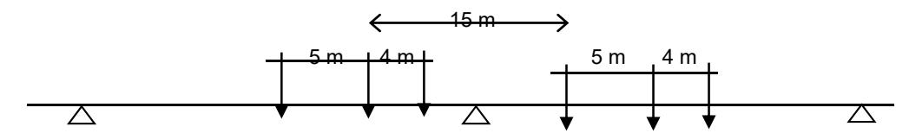

**Gambar 27 – Penempatan beban truk untuk kondisi momen negatif maksimum** 

Gandar yang tidak memberikan kontribusi pada gaya total harus diabaikan dalam perencanaan. Beban kendaraan dimuat pada masing-masing jalur masing-masing dan harus diposisikan untuk mendapatkan pengaruh yang terbesar dalam perencanaan. Beban truk harus diposisikan pada lebar jembatan sehingga sumbu roda mempunyai jarak sebagai berikut:

- a. Untuk perencanaan pelat kantilever : 250 mm dari tepi parapet atau *railing*, dan
- b. Untuk perencanaan komponen lainnya : 1000 mm dari masing-masing sumbu terluar roda truk. Kecuali ditentukan lain, panjang lajur rencana atau sebagian dari panjang lajur rencana harus dibebani dengan beban terdistribusi "D".

# **8.4.6.1 Beban hidup untuk evaluasi lendutan**

Jika pemilik pekerjaan menginginkan agar jembatan memenuhi kriteria lendutan akibat beban hidup, maka lendutan harus diambil sebagai nilai yang terbesar dari :

- lendutan akibat akibat beban satu truk, atau
- lendutan akibat BTR

# **8.4.6.2 Beban rencana untuk pelat lantai kendaraan, sistem lantai kendaraan serta pelat atas gorong-gorong**

Ketentuan pada pasal ini tidak berlaku jika pelat direncanakan berdasarkan perencanaan empiris. Jika perencana menggunakan metode strip untuk menganalisis pelat lantai kendaraan dan pelat atap gorong-gorong, maka gaya-gaya rencana harus dihitung dengan ketentuan sebagai berikut:

- Jika pelat membentang dalam arah melintang tegak lurus terhadap arus lalulintas, maka hanya satu gandar dari beban truk yang digunakan untuk menghitung gaya geser atau momen lentur rencana.
- Jika pelat membentang dalam arah memanjang searah dengan arus lalu lintas, maka:
  - a. Untuk pelat atap gorong-gorong dan/atau jembatan beton tipe pelat dengan bentang kurang dari 4500 mm, hanya satu gandar beban truk yang harus digunakan dalam perencanaan.
  - b. Untuk kasus lainnya, termasuk jembatan beton tipe pelat (tidak termasuk pelat atas gorong-gorong) dengan bentang lebih besar dari 4500 mm, semua beban yang disebut dalam Pasal 8 harus ditinjau dalam perencanaan.

**© BSN 2016 43 dari 67** 

Jika perencana menggunakan metode yang lebih rinci untuk menganalisis pelat lantai kendaraan, gaya rencana harus ditentukan dengan ketentuan sebagai berikut:

- Jika pelat membentang dalam arah melintang, maka hanya satu gandar dari beban truk yang harus digunakan pada perhitungan.
- Jika pelat membentang dalam arah memanjang (termasuk jembatan beton tipe pelat), maka semua beban yang disebut dalam Pasal 8 harus digunakan dalam perhitungan.

Beban roda harus diasumsikan sama besarnya pada setiap gandar, dan amplifikasi beban gandar akibat gaya sentrifugal dan pengereman tidak perlu dipertimbangkan untuk perencanaan pelat lantai kendaraan.

#### **8.4.6.3 Beban pelat kantilever**

Untuk perencanaan pelat kantilever dengan bentang kurang dari 1800 mm dari sumbu gelagar eksterior terhadap tepi dalam parapet, maka beban roda dapat diganti menjadi beban garis dalam arah memanjang jembatan dengan intensitas 17 kN/m berjarak 250 mm dari tepi dalam parapet. Beban horizontal pada pelat kantilever akibat tumbukan kendaraan dengan parapet harus sesuai dengan ketentuan pada Pasal 11.

# **8.5 Klasifikasi pembebanan lalu lintas**

#### **8.5.1 Pembebanan lalu lintas yang dikurangi**

Dalam keadaan khusus, dengan persetujuan instansi yang berwenang, pembebanan "D" setelah dikurangi menjadi 70 % bisa digunakan. Pembebanan lalu lintas yang dikurangi hanya berlaku untuk jembatan darurat atau semipermanen.

Faktor sebesar 70 % ini diterapkan untuk BTR dan BGT yang tercantum dalam Pasal 8.3 dan gaya sentrifugal yang dihitung dari BTR dan BGT seperti pada Pasal 8.8.

Faktor pengurangan sebesar 70 % tidak boleh digunakan untuk pembebanan truk "T" atau gaya rem pada arah memanjang jembatan seperti tercantum dalam Pasal 8.7.

#### **8.5.2 Pembebanan lalu lintas yang berlebih (***overload***)**

Dengan persetujuan instansi yang berwenang, pembebanan "D" dapat diperbesar di atas 100 % untuk jaringan jalan yang dilewati kendaraan berat. Faktor pembesaran di atas 100 % ini diterapkan untuk BTR dan BGT yang tercantum dalam Pasal 8.3 dan gaya sentrifugal yang dihitung dari BTR dan BGT seperti pada Pasal 8.8. Faktor pembesaran di atas 100 % tidak boleh digunakan untuk pembebanan truk "T" atau gaya rem pada arah memanjang jembatan seperti tercantum dalam Pasal 8.7.

# **8.6 Faktor beban dinamis**

Kecuali jika diperbolehkan dalam Pasal 8.6.1, beban statis truk rencana harus diperbesar sesuai dengan FBD berdasarkan Gambar 28. Gaya sentrifugal dan gaya rem tidak perlu diperbesar. Faktor beban dinamis tidak perlu diterapkan pada beban pejalan kaki atau beban terbagi rata BTR. Komponen jembatan yang ada didalam tanah yang tercakup dalam Pasal 12, maka dapat digunakan faktor beban dinamis seperti yang ditentukan dalam Pasal 8.6.1**.** 

Faktor beban dinamis tidak perlu diterapkan untuk:

- Dinding penahan yang tidak memikul reaksi vertikal dari struktur atas jembatan, dan
- komponen fondasi yang seluruhnya berada dibawah permukaan tanah.

Faktor Beban Dinamis (FBD) merupakan hasil interaksi antara kendaraan yang bergerak dan jembatan. Besarnya FBD tergantung pada frekuensi dasar dari suspensi kendaraan,

**© BSN 2016 44 dari 67** 

biasanya antara 2 Hz sampai 5 Hz untuk kendaraan berat, dan frekuensi dari getaran lentur jembatan. Untuk perencanaan, FBD dinyatakan sebagai beban statis ekuivalen.

Besarnya BGT dari pembebanan lajur "D" dan beban roda dari Pembebanan Truk "T" harus cukup untuk memberikan terjadinya interaksi antara kendaraan yang bergerak dengan jembatan dengan dikali FBD. Besarnya nilai tambah dinyatakan dalam fraksi dari beban statis. FBD ini diterapkan pada keadaan batas daya layan dan batas ultimit. BTR dari pembebanan lajur "D" tidak dikali dengan FBD. Untuk pembebanan "D": FBD merupakan fungsi panjang bentang ekuivalen seperti tercantum dalam Gambar 28 . Untuk bentang tunggal panjang bentang ekuivalen diambil sama dengan panjang bentang sebenarnya. Untuk bentang menerus panjang bentang ekuivalen *LE* diberikan dengan rumus:

$$L_E = \sqrt{L_{av}L_{max}} \tag{29}$$

# **Keterangan :**

*Lav* adalah panjang bentang rata-rata dari kelompok bentang yang disambungkan secara menerus

*Lmax* adalah panjang bentang maksimum dalam kelompok bentang yang disambungkan secara menerus

Untuk pembebanan truk "T", FBD diambil 30%. Nilai FBD yang dihitung digunakan pada seluruh bagian bangunan yang berada di atas permukaan tanah. Untuk bagian bangunan bawah dan fondasi yang berada di bawah garis permukaan, nilai FBD harus diambil sebagai peralihan linier dari nilai pada garis permukaan tanah sampai nol pada kedalaman 2 m. Untuk bangunan yang terkubur, seperti halnya gorong-gorong dan struktur baja-tanah, nilai FBD jangan diambil kurang dari 40% untuk kedalaman nol dan jangan kurang dari 10% untuk kedalaman 2 m. Untuk kedalaman antara bisa diinterpolasi linier. Nilai FBD yang digunakan untuk kedalaman yang dipilih harus diterapkan untuk bangunan seutuhnya.

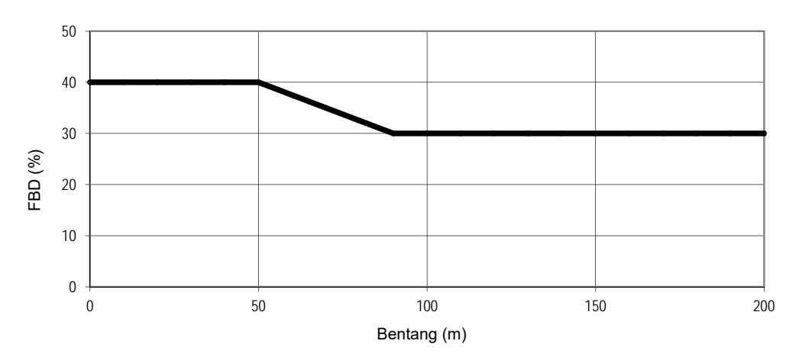

**Gambar 28 - Faktor beban dinamis untuk beban T untuk pembebanan lajur "D"** 

#### **8.6.1 Komponen yang terkubur**

Faktor beban dinamis dalam persen untuk gorong-gorong dan struktur yang terkubur lainnya harus diambil sebagai berikut:

$$FBD = 33 \times (300 - 0.125 D_E) \ge 0\%$$
30)

#### Keterangan :

*DE* = kedalaman timbunan minimum di atas struktur (mm)

**© BSN 2016 45 dari 67** 

# 8.7 Gaya rem (*TB*)

Gaya rem harus diambil yang terbesar dari :

- 25% dari berat gandar truk desain atau,
- 5% dari berat truk rencana ditambah beban lajur terbagi rata BTR

Gaya rem tersebut harus ditempatkan di semua lajur rencana yang dimuati sesuai dengan Pasal 8.2 dan yang berisi lalu lintas dengan arah yang sama. Gaya ini harus diasumsikan untuk bekerja secara horizontal pada jarak 1800 mm diatas permukaan jalan pada masing-masing arah longitudinal dan dipilih yang paling menentukan. Untuk jembatan yang dimasa depan akan dirubah menjadi satu arah, maka semua lajur rencana harus dibebani secara simultan pada saat menghitung besarnya gaya rem. Faktor kepadatan lajur yang ditentukan pada Pasal 8.4.3 berlaku untuk menghitung gaya rem.

#### 8.8 Gaya sentrifugal (TR)

Untuk tujuan menghitung gaya radial atau efek guling dari beban roda, pengaruh gaya sentrifugal pada beban hidup harus diambil sebagai hasil kali dari berat gandar truk rencana dengan faktor *C* sebagai berikut :

$$C = f \frac{v^2}{gR_i} \tag{31}$$

#### Keterangan:

- v adalah kecepatan rencana jalan raya (m/detik)
- f adalah faktor dengan nilai 4/3 untuk kombinasi beban selain keadaan batas fatik dan 1,0 untuk keadaan batas fatik
- g adalah percepatan gravitasi: 9.8 (m/detik²)
- Rı adalah jari-jari kelengkungan lajur lalu lintas (m)

Kecepatan rencana jalan raya harus diambil tidak kurang dari nilai yang ditentukan dalam Perencanaan Geometrik Jalan Bina Marga. Faktor kepadatan lajur ditentukan dalam Pasal 8.4.3 berlaku pada waktu menghitung gaya sentrifugal. Gaya sentrifugal harus diberlakukan secara horizontal pada jarak ketinggian 1800 mm diatas permukaan jalan. Dalam hal ini, perencana harus menyediakan mekanisme untuk meneruskan gaya sentrifugal dari permukaan jembatan menuju struktur bawah jembatan. Pengaruh superelevasi yang mengurangi momen guling akibat gaya sentrifugal akibat beban roda dapat dipertimbangkan dalam perencanaan.

#### 8.9 Pembebanan untuk pejalan kaki (*TP*)

Semua komponen trotoar yang lebih lebar dari 600 mm harus direncanakan untuk memikul beban pejalan kaki dengan intensitas 5 kPa dan dianggap bekerja secara bersamaan dengan beban kendaraanpada masing-masing lajur kendaraan. Jika trotoar dapat dinaiki maka beban pejalan kaki tidak perlu dianggap bekerja secara bersamaan dengan beban kendaraan. Jika ada kemungkinan trotoar berubah fungsi di masa depan menjadi lajur kendaraan, maka beban hidup kendaraan harus diterapkan pada jarak 250 mm dari tepi dalam parapet untuk perencanaan komponen jembatan lainnya. Dalam hal ini, faktor beban dinamis tidak perlu dipertimbangkan.

#### 8.10 Beban akibat tumbukan kendaraan (TC)

#### 8.10.1 Pelindung struktur

Ketentuan pada Pasal 8.10.2 tidak perlu ditinjau jika struktur jembatan sudah dilindungi dengan salah satu pelindung sebagai berikut :

- Tanggul;
- Palang independen setinggi 1370 mm yang tahan tumbukan dipasang pada permukaan tanah dalam jarak 3000 mm dari bagian jembatan yang ingin dilindungi; atau

© BSN 2016 46 dari 67

 Parapet dengan tinggi 1070 mm dipasang minimal 3000 mm dari bagian jembatan yang ingin dilindungi.

Struktur maupun bentuk palang atau penghalang tersebut diatas harus direncanakan agar mampu menahan beban tumbukan setara Uji Level 5, sebagaimana ditentukan dalam Pasal 11.

#### **8.10.2 Tumbukan kendaraan dengan jembatan**

Kecuali jembatan dilindungi dengan pelindung jembatan, semua kepala jembatan dan pilar dengan dalam jarak 9000 mm dari tepi jalan, atau dalam jarak 15000 mm dari sumbu rel harus direncanakan untuk mampu memikul beban statik ekivalen sebesar 1800 kN, yang diasumsikan mempunyai arah sembarang dalam bidang horizontal, bekerja pada ketinggian1200 mm diatas permukaan tanah.

#### **8.10.3 Tumbukan kendaraan dengan parapet**

Ketentuan Pasal 11 berlaku.

#### **8.11 Beban fatik**

## **8.11.1 Besaran dan konfigurasi**

Beban fatik merupakan satu beban truk dengan tiga gandar seperti yang ditentukan pada Pasal 8.4, dimana jarak gandar tengah dan gandar belakang merupakan jarak yang konstan sebesar 5000 mm. Faktor beban dinamis seperti yang ditentukan dalam Pasal 8.6 harus digunakan dalam menghitung beban fatik.

#### **8.11.2 Frekuensi**

Frekuensi beban fatik harus diambil sebesar Lalu Lintas Harian (LHR) untuk satu lajur lalu lintas rencana. Frekuensi ini harus digunakan untuk semua komponen jembatan, juga untuk komponen jembatan yang memikul jumlah truk yang lebih sedikit. Jika tidak ada informasi yang lebih lengkap dan akurat, maka perencana dapat menentukan jumlah truk harian ratarata untuk satu jalur sebesar :

$$LHR_{SL} = p_t \times LHR \tag{32}$$

#### **Keterangan :**

*LHR* adalah jumlah truk rata-rata per hari dalam satu arah selama umur rencana *LHRSL* adalah jumlah truk rata-rata per hari dalam satu lajur selama umur rencana *pt* adalah fraksi truk dalam satu lajur sesuai Tabel 23.

**Tabel 15 – Fraksi lalu lintas truk dalam satu lajur (***p***)**

| Jumlah lajur truk | pt   |
|-------------------|------|
| 1                 | 1,00 |
| 2                 | 0,85 |
| 3 atau lebih      | 0,80 |

Bila tidak terdapat informasi yang akurat mengenai lalu lintas harian rata-rata, maka dapat digunakan LHR berdasarkan klasifikasi jalan sesuai dengan Tabel 16.

**© BSN 2016 47 dari 67** 

Tabel 16 – LHR berdasarkan klasifikasi jalan

|                  |          | Kelas rencana  |                   |       |
|------------------|----------|----------------|-------------------|-------|
| Kelas fungsional |          | Tipe I : kelas | Tipe II           |       |
|                  |          |                | LHR               | kelas |
|                  | Arteri   |                | Semua lalu lintas | I     |
| Primer           | Kolektor | II             | ≥ 10.000          | _     |
|                  | Kolektol |                | < 10.000          |       |
|                  | Arteri   | II             | ≥ 20.000          | _     |
|                  | Arten    |                | < 20.000          | =     |
| Sekunder         | Kolektor | NA             | ≥ 6.000           | =     |
| Sekulidei        | Kolektol |                | < 6.000           | III   |
|                  | Lokal    | NA             | ≥ 500             | III   |
|                  | Lokal    |                | < 500             | IV    |

#### 8.11.3 Distribusi beban untuk fatik

#### 8.11.3.1 Metode rinci

Jika jembatan dianalisis dengan menggunakan metode yang rinci, sebuah truk rencana harus diposisikan dalam arah melintang dan arah longitudinal jembatan agar diperoleh rentang tegangan maksimal pada bagian jembatan yang ditinjau, tidak tergantung pada posisi lalu lintas atau lajur rencana pada lantai kendaraan jembatan.

## 8.11.3.2 Metode pendekatan

Jika jembatan dianalisis dengan menggunakan metode pendekatan, maka harus digunakan faktor distribusi untuk satu lajur lalu lintas rencana.

#### 9 Aksi lingkungan

#### **9.1 Umum**

Aksi lingkungan memasukkan pengaruh temperatur, angin, banjir, gempa dan penyebab-penyebab alamiah lainnya.

Besarnya beban rencana yang diberikan dalam standar ini dihitung berdasarkan analisis statistik dari kejadian-kejadian umum yang tercatat tanpa memperhitungkan hal khusus yang mungkin akan memperbesar pengaruh setempat. Perencana mempunyai tanggung jawab untuk mengidentifikasi kejadian-kejadian khusus setempat dan harus memperhitungkannya dalam perencanaan.

#### 9.2 Penurunan (*ES*)

Tabel 17 - Faktor beban akibat penurunan

| Tipe beban  | Faktor beban ( $\gamma_{\it ES}$ )                                                  |     |
|-------------|-------------------------------------------------------------------------------------|-----|
| Tipe bebail | Keadaan Batas Layan ( $\gamma_{ES}^{S}$ ) Keadaan Batas Ultimit ( $\gamma_{ES}^{U}$ |     |
| Permanen    | 1,0                                                                                 | N/A |

Jembatan harus direncanakan untuk bisa menahan terjadinya penurunan yang diperkirakan, termasuk perbedaan penurunan, sebagai aksi daya layan. Pengaruh penurunan dapat dikurangi dengan adanya rangkak dan interaksi pada struktur tanah. Faktor beban untuk penurunan dapat digunakan sesuai dengan Tabel 17.

Penurunan dapat diperkirakan dari pengujian yang dilakukan terhadap lapisan tanah. Apabila perencana memutuskan untuk tidak melakukan pengujian, tetapi besarnya penurunan diambil sebagai suatu anggapan, maka nilai anggapan tersebut merupakan batas

© BSN 2016 48 dari 67

atas dari penurunan yang bakal terjadi. Apabila nilai penurunan ini besar, perencanaan bangunan bawah dan bangunan atas jembatan harus memuat ketentuan khusus untuk mengatasi penurunan tersebut.

# **9.3 Gaya akibat deformasi**

Gaya dalam yang terjadi karena deformasi akibat rangkak dan susut harus diperhitungkan dalam perencanaan. Selain itu pengaruh temperatur gradien harus dihitung jika diperlukan. Gaya-gaya yang terjadi akibat adanya pengekangan deformasi komponen maupun tumpuan serta deformasi pada lokasi dimana beban bekerja harus diperhitungkan dalam perencanaan.

## **9.3.1 Temperatur merata (***EUn***)**

Deformasi akibat perubahan temperatur yang merata dapat dihitung dengan menggunakan prosedur seperti yang dijelaskan pada pasal ini. Prosedur ini dapat digunakan untuk perencanaan jembatan yang menggunakan gelagar terbuat dari beton atau baja. Rentang temperatur harus seperti yang ditentukan dalam Tabel 18. Perbedaan antara temperatur minimum atau temperatur maksimum dengan temperatur nominal yang diasumsikan dalam perencanaan harus digunakan untuk menghitung pengaruh akibat deformasi yang terjadi akibat perbedaan suhu tersebut. Temperatur minimum dan maksimum yang ditentukan dalam Tabel 18 harus digunakan sebagai *Tmindesign* dan *Tmaxdesign* pada Persamaan 33.

## **9.3.1.1 Simpangan Akibat Beban Temperatur**

Besaran rentang simpangan akibat beban temperatur ( *T* ) harus berdasarkan temperatur maksimum dan minimum yang didefinisikan dalam desain sebagai berikut :

$$\Delta_{T} = \alpha L \left( T_{\text{max} \, \text{design}} - T_{\text{min} \, \text{design}} \right) \tag{33}$$

## **Keterangan :**

- *L* adalah panjang komponen jembatan (mm)
- *α* adalah koefisien muai temperatur (mm/mm/ºC)

**Tabel 18 - Temperatur jembatan rata-rata nominal** 

| Tipe bangunan atas                                           | Temperatur jembatan rata-rata minimum (1) | Temperatur jembatan rata-rata maksimum |
|--------------------------------------------------------------|-------------------------------------------------|----------------------------------------------|
| Lantai beton di atas gelagar atau boks beton.             | 15C                                            | 40C                                         |
| Lantai beton di atas gelagar, boks atau rangka baja.      | 15C                                            | 40C                                         |
| Lantai pelat baja di atas gelagar, boks atau rangka baja. | 15C                                            | 45C                                         |

CATATAN (1) Temperatur jembatan rata-rata minimum bisa dikurangi 5°C untuk lokasi yang terletak pada ketinggian lebih besar dari 500 m diatas permukaan laut.

**© BSN 2016 49 dari 67** 

**Tabel 19 - Sifat bahan rata-rata akibat pengaruh temperatur** 

| Bahan                                              | Koefisien perpanjangan akibat suhu (α) | Modulus Elastisitas (MPa) |
|----------------------------------------------------|-------------------------------------------|---------------------------------|
| Baja                                               | 12 x 10-6 per C                          | 200.000                         |
| Beton: Kuat tekan <30 MPa Kuat tekan >30 MPa | 10 x 10-6 per C 11 x 10-6 per C      | 4700√fc' 4700√fc'            |

# Pengaruh temperatur dibagi menjadi:

- 1) Variasi temperatur jembatan rata-rata digunakan dalam menghitung pergerakan pada temperatur dan sambungan pelat lantai, dan untuk menghitung beban akibat terjadinya pengekangan dari pergerakan tersebut (*EUn*);
- Variasi temperatur rata-rata berbagai tipe bangunan jembatan diberikan dalam Error! Reference source not found. 18. Besarnya nilai koefisien perpanjangan dan modulus elastisitas yang digunakan untuk menghitung besarnya pergerakan dan gaya yang terjadi diberikan dalam Tabel 19.
- Perencana harus menentukan besarnya temperatur jembatan rata-rata yang diperlukan untuk memasang sambungan siar muai, perletakan dan lain sebagainya, dan harus memastikan bahwa temperatur tersebut tercantum dalam gambar rencana.
- 2) Variasi temperature (*EG*) di dalam bangunan atas jembatan atau perbedaan temperatur disebabkan oleh pemanasan langsung dari sinar matahari di waktu siang pada bagian atas permukaan lantai dan pelepasan kembali radiasi dari seluruh permukaan jembatan di waktu malam. Gradien temperatur nominal arah vertikal untuk bangunan atas beton dan baja diberikan dalam Gambar 29. Parameter yang digunakan mencakup *T1, T2*, dan *T3* dengan nilai sesuai pada Tabel 20. Untuk tipe jembatan yang lebar diperlukan perhitungan untuk meninjau gradien perbedaan temperatur dalam arah melintang. Nilai A dapat diambil sebagai berikut :
  - Untuk bangunan atas terbuat dari beton dengan tinggi gelagar sebesar 400 mm atau lebih nilai A sama dengan 200 mm
  - Untuk bangunan atas terbuat dari beton dengan tinggi gelagar lebih rendah dari 400 mm nilai A diambil lebih kecil 100 mm dari tinggi actual
  - Untuk bangunan atas terbuat dari baja, nilai A diambil sebesar 200 mm dan jarak t diambil sebagai ketebalan pelat lantai.

**Tabel 20 - Parameter** *T1* **dan** *T2*

| Lokasi jembatan                | T1 (°C) | T2 (°C) | T3 (°C) |
|--------------------------------|------------|------------|------------|
| < 500 m di atas permukaan laut | 12         | 8          |            |
| > 500 m di atas permukaan laut | 17         | 11         | 0 ≤ T3 < 5 |

Nilai *T3* dapat diambil sebesar 0 kecuali bila dilakukan kajian spesifik situs, tetapi nilai *T3*  diambil tidak melebihi 5°C.

**© BSN 2016 50 dari 67** 

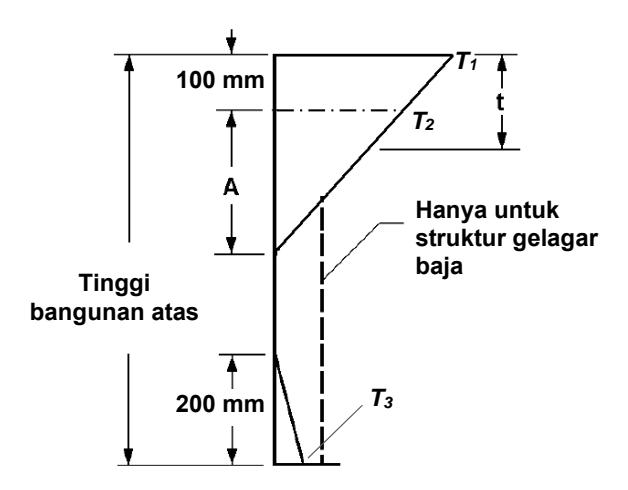

Gambar 29 – Gradien temperatur vertikal pada bangunan atas beton dan baja

# 9.3.2 Pengaruh susut dan rangkak (SH)

Pengaruh rangkak dan penyusutan harus diperhitungkan dalam perencanaan jembatan beton. Pengaruh ini dihitung menggunakan beban mati jembatan. Apabila rangkak dan penyusutan bisa mengurangi pengaruh muatan lainnya, maka nilai dari rangkak dan penyusutan tersebut harus diambil minimum (misalnya pada waktu transfer dari beton prategang).

Tabel 21 - Faktor beban akibat susut dan rangkak

|                                                                                                                            | Tabol 21 Taktor boban annout odout dan fangkak  |                                           |  |
|----------------------------------------------------------------------------------------------------------------------------|-------------------------------------------------|-------------------------------------------|--|
|                                                                                                                            | Faktor be                                       | eban ( $\gamma_{\it SH}$ )                |  |
| Tipe beban                                                                                                                 | Keadaan Batas Layan ( $\gamma_{\it SH}^{\it S}$ | Keadaan Batas Ultimit $(\gamma_{S\!H}^U)$ |  |
| Tetap                                                                                                                      | 1,0                                             | 0,5                                       |  |
| Catatan : Walaupun susut dan rangkak bertambah lambat menurut waktu, tetapi pada akhirnya akan mencapai nilai yang konstan |                                                 |                                           |  |

#### 9.3.3 Pengaruh prategang (*PR*)

Prategang akan menyebabkan pengaruh sekunder pada komponen-komponen yang terkekang pada bangunan statis tidak tentu. Pengaruh sekunder tersebut harus diperhitungkan baik pada batas daya layan ataupun batas ultimit (Tabel 22).

Prategang harus diperhitungkan sebelum (selama pelaksanaan) dan sesudah kehilangan tegangan dalam kombinasinya dengan beban-beban lainnya.

Tabel 22 - Faktor beban akibat pengaruh prategang

| Tina haban | Faktor beban ( $\gamma_{_{P\!R}}$ )                                               |     |
|------------|-----------------------------------------------------------------------------------|-----|
| Tipe beban | Keadaan Batas Layan $(\gamma_{PR}^{S})$ Keadaan Batas Ultimit $(\gamma_{PR}^{U})$ |     |
| Tetap      | 1,0                                                                               | 1,0 |

Pengaruh utama prategang adalah sebagai berikut:

- a) pada keadaan batas daya layan, gaya prategang dapat dianggap bekerja sebagai suatu sistem beban pada unsur. Nilai rencana dari beban prategang tersebut harus dihitung menggunakan faktor beban daya layan sebesar 1,0.
- b) pada keadaan batas ultimit, pengaruh sekunder akibat gaya prategang harus dianggap sebagai beban yang bekerja.

© BSN 2016 51 dari 67

# 9.4 Aliran air, benda hanyutan dan tumbukan dengan batang kayu (EF)

Gaya seret nominal ultimit dan daya layan pada pilar akibat aliran air tergantung pada kecepatan air rata-rata sesuai dengan Persamaan 34. Faktor beban untuk perhitungan gaya akibat aliran air dapat digunakan sesuai dengan Tabel 24.

$$T_{FF} = 0.5C_D V_s^2 A_d \tag{34}$$

# Keterangan:

 $T_{EF}$  adalah gaya seret (kN)

Vs adalah kecepatan air rata-rata berdasarkan pengukuran di lapangan (m/s)

 $C_D$  adalah koefisien seret (lihat table 23)

Ad adalah luas proyeksi pilar tegak lurus arah aliran dengan tinggi sama dengan kedalaman aliran (lihat Gambar 30) (m2)

Tabel 23 - Koefisien seret ( $C_D$ ) dan angkat ( $C_L$ ) untuk berbagai bentuk pilar

| Bentuk pilar                               | Koefisien seret $(C_D)$         | Koefisien angkat (C L )                                                                                                       |
|--------------------------------------------|---------------------------------|---------------------------------------------------------------------------------------------------------------------------------------------|
| $\theta < 90^{\circ}$ arah aliran $\theta$ | 0,8 1,4 0,7 <b>0.7</b> | <ul> <li>θ CL</li> <li>0° 0</li> <li>5° 0.5</li> <li>10° 0.9</li> <li>20° 0.9</li> <li>≥30° 1.0</li> </ul> Tidak dapat digunakan |
|                                            | 0.7                             | Tidak bisa dipakai                                                                                                                          |

Tabel 24 - Faktor beban akibat aliran air, benda hanyutan dan tumbukan dengan batang kayu

| Tipe beban | Faktor bebar                                      | Faktor beban ( $\gamma_{EF}$ )                 |  |  |
|------------|---------------------------------------------------|------------------------------------------------|--|--|
|            | Keadaan Batas Layan ( $\gamma_{\it EF}^{\it S}$ ) | Keadaan Batas Ultimit ( $\gamma$ $_{EF}^{U}$ ) |  |  |
| Transien   | 1,0                                               | Lihat Tabel 25                                 |  |  |

© BSN 2016 52 dari 67

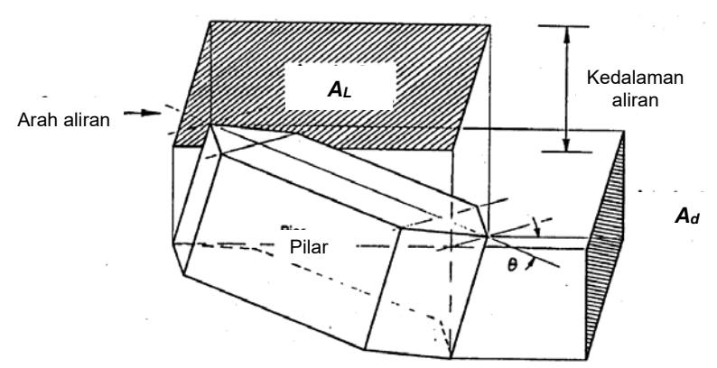

**Gambar 30 - Luas proyeksi pilar untuk gaya akibat aliran air** 

Bila pilar tipe dinding membuat sudut dengan arah aliran, gaya angkat melintang akan semakin meningkat. Nilai nominal dari gaya angkat dalam arah tegak lurus gaya seret, adalah :

$$T_{EF} = 0,5C_{L}V_{s}^{2}A_{L}$$
 (35)

# **Keterangan:**

*VS* adalah kecepatan air (m/s)

*CL* adalah koefisien angkat (lihat table 23)

*AL* adalah luas proyeksi pilar sejajar arah aliran dengan tinggi sama dengan kedalaman aliran (lihat Gambar 30) (m2)

**Tabel 25 – Periode ulang banjir untuk kecepatan rencana air.** 

| Kondisi                                                     | Periode ulang banjir          | Faktor beban   |
|-------------------------------------------------------------|----------------------------------|-------------------|
| Daya layan - untuk semua jembatan                           | 20 tahun                         | 1.0               |
| Ultimit: Jembatan besar dan penting (1)      | 100 tahun                        | 2,0               |
| Jembatan permanen Gorong-gorong(2) Jembatan sementara | 50 tahun 50 tahun 20 tahun | 1,5 1,0 1,0 |

Catatan (1) : Jembatan besar dan penting harus ditentukan oleh Instansi yang berwenang

Catatan (2) : Gorong-gorong tidak mencakup bangunan drainase

Apabila bangunan atas jembatan terendam, koefisien seret (*CD*) yang bekerja di sekeliling bangunan atas, yang diproyeksikan tegak lurus arah aliran bisa diambil sebesar 2,2 kecuali apabila data yang lebih tepat tersedia, untuk jembatan yang terendam, gaya angkat akan meningkat dengan cara yang sama seperti pada pilar tipe dinding. Perhitungan untuk gayagaya angkat tersebut adalah sama, kecuali bila besarnya *AL* diambil sebagai luas dari daerah lantai jembatan.

Gaya akibat benda hanyutan dihitung menggunakan Persamaan 36 dengan: *CD* = 1,04

Jika tidak ada data yang lebih tepat, luas proyeksi benda hanyutan bisa dihitung seperti berikut:

a) untuk jembatan yang permukaan airnya terletak di bawah bangunan atas, luas benda hanyutan yang bekerja pada pilar dihitung dengan menganggap bahwa kedalaman

**© BSN 2016 53 dari 67** 

- minimum dari benda hanyutan adalah 1,2 m dibawah muka air banjir. Panjang hamparan dari benda hanyutan diambil setengahnya dari jumlah bentang yang berdekatan atau 20 m, diambil yang terkecil dari kedua nilai ini.
- b) untuk jembatan dimana bangunan atas terendam, kedalaman benda hanyutan diambil sama dengan kedalaman bangunan atas termasuk sandaran atau penghalang lalu lintas ditambah minimal 1,2 m. Kedalaman maksimum benda hanyutan boleh diambil 3 m kecuali apabila menurut pengalaman setempat menunjukkan bahwa hamparan dari benda hanyutan dapat terakumulasi. Panjang hamparan benda hanyutan yang bekerja pada pilar diambil setengah dari jumlah bentang yang berdekatan.

Gaya akibat tumbukan dengan batang kayu dihitung dengan menganggap bahwa batang dengan massa minimum sebesar 2 ton hanyut pada kecepatan aliran rencana harus bisa ditahan dengan gaya maksimum berdasarkan lendutan elastis ekuivalen dari pilar dengan rumus sebagai berikut :

$$T_{EF} = \frac{M(V_a)^2}{d} \tag{36}$$

#### Keterangan:

M adalah massa batang kayu sebesar ± 2 ton

 $V_a$  adalah kecepatan air permukaan (m/dt) pada keadaan batas yang ditinjau. Dalam hal tidak adanya penyelidikan yang terperinci mengenai bentuk diagram kecepatan di lokasi jembatan,  $V_a$  bisa diambil 1,4 kali kecepatan rata-rata  $V_s$ 

dev adalah lendutan elastis ekuivalen (m) (lihat Tabel 26)

Tabel 26 - Lendutan ekuivalen untuk tumbukan batang kayu

| Tipe pilar           | d e√ (m) |
|----------------------|---------------------|
| Pilar beton massif   | 0,075               |
| Tiang beton perancah | 0,150               |
| Tiang kayu perancah  | 0,300               |

Gaya akibat tumbukan kayu dan benda hanyutan lainnya jangan diambil secara bersamaan. Tumbukan batang kayu harus ditinjau secara bersamaan dengan gaya angkat dan gaya seret. Untuk kombinasi pembebanan, tumbukan batang kayu harus ditinjau sebagai aksi transien

#### 9.5 Tekanan hidrostatis dan gaya apung (*EU*)

Permukaan air rendah dan tinggi harus ditentukan selama umur bangunan dan digunakan untuk menghitung tekanan hidrostatis dan gaya apung. Dalam menghitung pengaruh tekanan hidrostatis, kemungkinan adanya gradien hidrolis yang melintang bangunan harus diperhitungkan.

Tabel 27 - Faktor beban akibat tekanan hidrostatis dan gaya apung

| Tipe beban  | Faktor be                                                                         | ban ( $\gamma_{\it EU}$ )                   |              |  |
|-------------|-----------------------------------------------------------------------------------|---------------------------------------------|--------------|--|
|             | Keadaan Batas Layan ( $\gamma_{\scriptscriptstyle E\!U}^{\scriptscriptstyle S}$ ) | Keadaan Batas Ultimit ( $\gamma_{EU}^{U}$ ) |              |  |
|             |                                                                                   | Biasa                                       | Terkurangi   |  |
| Transien    | 1,00                                                                              | 1,0 (1,1) (1)                    | 1,0 (0,9)(1) |  |
| CATATAN (1) | : Angka yang ditunjukkan dalam tanda kurung digunakan untuk                       |                                             |              |  |

CATATAN (1) : Angka yang ditunjukkan dalam tanda kurung digunakan untuk bangunan penahan air atau bangunan lainnya dengan gaya apung dan hidrostatis sangat dominan

Bangunan penahan tanah harus direncanakan mampu menahan pengaruh total air tanah kecuali jika timbunan bisa mengalirkan air. Sistem drainase demikian bisa merupakan irisan dari timbunan yang mudah mengalirkan air di belakang dinding, dengan bagian belakang dari irisan naik dari dasar dinding pada sudut maksimum 60° arah horizontal.

© BSN 2016 54 dari 67

Pengaruh daya apung harus ditinjau terhadap bangunan atas yang mempunyai rongga atau lobang yang memungkinkan udara terjebak, kecuali apabila ventilasi udara dipasang. Daya apung harus ditinjau bersamaan dengan gaya akibat aliran. Dalam memperkirakan pengaruh daya apung, harus ditinjau beberapa ketentuan sebagai berikut:

- a) pengaruh daya apung pada bangunan bawah (termasuk tiang) dan beban mati bangunan atas;
- b) syarat-syarat sistem ikatan dari bangunan atas;
- c) syarat-syarat drainase dengan adanya rongga-rongga pada bagian dalam supaya air bisa keluar pada waktu surut.

# 9.6 Beban angin

#### 9.6.1 Tekanan angin horizontal

Tekanan angin yang ditentukan pada pasal ini diasumsikan disebabkan oleh angin rencana dengan kecepatan dasar ( $V_B$ ) sebesar 90 hingga 126 km/jam.

Beban angin harus diasumsikan terdistribusi secara merata pada permukaan yang terekspos oleh angin. Luas area yang diperhitungkan adalah luas area dari semua komponen, termasuk sistem lantai dan *railing* yang diambil tegak lurus terhadap arah angin. Arah ini harus divariasikan untuk mendapatkan pengaruh yang paling berbahaya terhadap struktur jembatan atau komponen-komponennya. Luasan yang tidak memberikan kontribusi dapat diabaikan dalam perencanaan.

Untuk jembatan atau bagian jembatan dengan elevasi lebih tinggi dari 10000 mm diatas permukaan tanah atau permukaan air, kecepatan angin rencana,  $V_{DZ}$ , harus dihitung dengan persamaan sebagai berikut:

$$V_{DZ} = 2.5 V_o \left(\frac{V_{10}}{V_B}\right) \ln \left(\frac{Z}{Z_o}\right)$$
 (37)

#### Keterangan:

 $V_{DZ}$  adalah kecepatan angin rencana pada elevasi rencana, Z (km/jam)

 $V_{10}$  adalah kecepatan angin pada elevasi 10000 mm di atas permukaan tanah atau di atas permukaan air rencana (km/iam)

- VB adalah kecepatan angin rencana yaitu 90 hingga 126 km/jam pada elevasi 1000 mm, yang akan menghasilkan tekanan seperti yang disebutkan dalam 9.6.1.1 dan Pasal 9.6.2.
- adalah elevasi struktur diukur dari permukaan tanah atau dari permukaan air dimana beban angin dihitung (Z > 10000 mm)
- Vo adalah kecepatan gesekan angin, yang merupakan karakteristik meteorologi, sebagaimana ditentukan dalam Tabel 28, untuk berbagai macam tipe permukaan di hulu jembatan (km/jam)
- Zo adalah panjang gesekan di hulu jembatan, yang merupakan karakteristik meteorologi, ditentukan pada Tabel 28 (mm)

#### $V_{10}$ dapat diperoleh dari:

- grafik kecepatan angin dasar untuk berbagai periode ulang,
- survei angin pada lokasi jembatan, dan.
- jika tidak ada data yang lebih baik, perencana dapat mengasumsikan bahwa  $V_{10} = V_B$  = 90 s/d 126 km/jam.

© BSN 2016 55 dari 67

Tabel 28 - Nilai  $V_0$  dan  $Z_0$  untuk berbagai variasi kondisi permukaan hulu

| Kondisi                    | Lahan Terbuka | Sub Urban | Kota |
|----------------------------|---------------|-----------|------|
| V₀ (km/jam)                | 13,2          | 17,6      | 19,3 |
| <i>Z</i> 0 (mm) | 70            | 1000      | 2500 |

#### 9.6.1.1 Beban angin pada struktur (EWs)

Jika dibenarkan oleh kondisi setempat, perencana dapat menggunakan kecepatan angin rencana dasar yang berbeda untuk kombinasi pembebanan yang tidak melibatkan kondisi beban angin yang bekerja pada kendaraan. Arah angin rencana harus diasumsikan horizontal, kecuali ditentukan lain dalam Pasal 9.6.3. Dengan tidak adanya data yang lebih tepat, tekanan angin rencana dalam MPa dapat ditetapkan dengan menggunakan persamaan sebagai berikut:

$$P_D = P_B \left(\frac{V_{DZ}}{V_B}\right)^2 \tag{38}$$

#### Keterangan:

*P*B adalah tekanan angin dasar seperti yang ditentukan dalam Tabel 29 (MPa)

Tabel 29 - Tekanan angin dasar

| Komponen                         | Angin tekan | Angin hisap |  |
|----------------------------------|-------------|-------------|--|
| bangunan atas                    | (MPa)       | (MPa)       |  |
| Rangka, kolom, dan pelengkung | 0,0024      | 0,0012      |  |
| Balok                            | 0,0024      | N/A         |  |
| Permukaan datar               | 0,0019      | N/A         |  |

Gaya total beban angin tidak boleh diambil kurang dari 4,4 kN/mm pada bidang tekan dan 2,2 kN/mm pada bidang hisap pada struktur rangka dan pelengkung, serta tidak kurang dari 4,4 kN/mm pada balok atau gelagar.

#### 9.6.1.1a Beban dari struktur atas

Kecuali jika ditentukan di dalam pasal ini, jika angin yang bekerja tidak tegak lurus struktur, maka tekanan angin dasar  $P_{\rm B}$  untuk berbagai sudut serang dapat diambil seperti yang ditentukan dalam Tabel 30dan harus dikerjakan pada titik berat dari area yang terkena beban angin. Arah sudut serang ditentukan tegak lurus terhadap arah longitudinal. Arah angin untuk perencanaan harus yang menghasilkan pengaruh yang terburuk pada komponen jembatan yang ditinjau. Tekanan angin melintang dan memanjang harus diterapkan secara bersamaan dalam perencanaan.

© BSN 2016 56 dari 67

|  | Tabel 30 – Tekanan angin dasar (PB) untuk berbagai sudut serang |
|--|-----------------------------------------------------------------|
|--|-----------------------------------------------------------------|

| Sudut   | Rangka, kolom, dan |              | Gelagar |              |  |
|---------|--------------------|--------------|---------|--------------|--|
| serang  | pelengkung         |              |         |              |  |
|         | Beban              | Beban        | Beban   | Beban        |  |
| Derajat | lateral            | longitudinal | lateral | longitudinal |  |
|         | MPa                | MPa          | MPa     | MPa          |  |
| 0       | 0,0036             | 0,0000       | 0,0024  | 0,0000       |  |
| 15      | 0,0034             | 0,0006       | 0,0021  | 0,0003       |  |
| 30      | 0,0031             | 0,0013       | 0,0020  | 0,0006       |  |
| 45      | 0,0023             | 0,0020       | 0,0016  | 0,0008       |  |
| 60      | 0,0011             | 0,0024       | 0,0008  | 0,0009       |  |

#### **9.6.1.1b Gaya angin yang langsung bekerja pada struktur bawah**

Gaya melintang dan longitudinal yang harus dikerjakan secara langsung pada bangunan bawah harus dihitung berdasarkan tekanan tekanan angin dasar sebesar 0,0019 MPa. Untuk angin dengan sudut serang tidak tegak lurus terhadap bangunan bawah, gaya ini harus diuraikan menjadi komponen yang bekerja tegak lurus terhadap bidang tepi dan bidang muka dari bangunan bawah. Komponen-komponen ini bekerja tegak lurus terhadap pada masing-masing permukaan yang mengalami tekanan dan perencana harus menerapkan gaya-gaya tersenut bersamaan dengan beban angin yang bekerja pada struktur atas.

#### **9.6.1.2 Gaya angin pada kendaraan (***EWl***)**

Tekanan angin rencana harus dikerjakan baik pada struktur jembatan maupun pada kendaraan yang melintasi jembatan. Jembatan harus direncanakan memikul gaya akibat tekanan angin pada kendaraan, dimana tekanan tersebut harus diasumsikan sebagai tekanan menerus sebesar 1,46 N/mm, tegak lurus dan bekerja 1800 mm diatas permukaan jalan. Kecuali jika ditentukan didalam pasal ini, jika angin yang bekerja tidak tegak lurus struktur, maka komponen yang bekerja tegak lurus maupun paralel terhadap kendaraan untuk berbagai sudut serang dapat diambil seperti yang ditentukan dalam Tabel 31 dimana arah sudut serang ditentukan tegak lurus terhadap arah permukaan kendaraan.

**Tabel 31 – Komponen beban angin yang bekerja pada kendaraan** 

| Sudut   | Komponen    | Komponen |  |  |
|---------|-------------|----------|--|--|
|         | tegak lurus | sejajar  |  |  |
| derajat | N/mm        | N/mm     |  |  |
| 0       | 1,46        | 0,00     |  |  |
| 15      | 1,28        | 0,18     |  |  |
| 30      | 1,20        | 0,35     |  |  |
| 45      | 0,96        | 0,47     |  |  |
| 60      | 0,50        | 0,55     |  |  |

#### **9.6.2 Tekanan angin vertikal**

Kecuali ditentukan lain dalam Pasal 9.6.3, jembatan harus mampu memikul beban garis memanjang jembatan yang merepresentasikan gaya angin vertikal ke atas sebesar 9.6×10-4 MPa dikalikan lebar jembatan, termasuk parapet dan trotoar. Gaya ini harus ditinjau hanya untuk Keadaan Batas Kuat III dan Layan IV yang tidak melibatkan angin pada kendaraan, dan hanya ditinjau untuk kasus pembebanan dimana arah angin dianggap bekerja tegak lurus terhadap sumbu memanjang jembatan. Gaya memanjang tersebut mempunyai titik tangkap pada seperempat lebar jembatan dan bekerja secara bersamaan dengan beban angin horizontal yang ditentukan dalam Pasal 9.6.1.

# **9.6.3 Instabilitas aeroelastik**

Pengaruh gaya aeroelastik harus diperhitungkan dalam perencanaan jembatan dan komponen-komponennya yang rentan terhadap beban angin. Untuk tujuan pasal ini, semua

**© BSN 2016 57 dari 67** 

jembatan dengan rasio panjang bentang terhadap lebar jembatan lebih besar dari 30 dianggap sebagai jembatan yang rentan terhadap pengaruh aeroelastik angin. Pada kasus ini, perencana juga harus meninjau kasus getaran kabel karena adanya induksi kabel dengan angin dan/atau hujan.

#### 9.6.3.1 Fenomena aeroelastik

Fenomena aeroelastik yang perlu ditinjau dalam perencanaan berupa *vortex, galloping, flutter,* dan divergensi.

#### 9.6.3.2 Pengendalian respons dinamik

Jembatan beserta komponen strukturalnya, termasuk kabel, harus direncanakan terhadap kegagalan fatik akibat osilasi induksi *vortex* dan *galloping*. Jembatan harus direncanakan terhadap kegagalan akibat *divergence* dan *flutter* sampai 1,2 kali kecepatan angin rencana yang bekerja pada ketinggian lantai jembatan.

## 9.6.3.3 Uji terowongan angin

Uji Terowongan Angin yang representatif dapat digunakan untuk memenuhi persyaratan Pasal 9.6.3.1 dan Pasal 9.6.3.2.

#### 9.7 Pengaruh gempa

Jembatan harus direncanakan agar memiliki kemungkinan kecil untuk runtuh namun dapat mengalami kerusakan yang signifikan dan gangguan terhadap pelayanan akibat gempa. Penggantian secara parsial atau lengkap pada struktur diperlukan untuk beberapa kasus. Kinerja yang lebih tinggi seperti kinerja operasional dapat ditetapkan oleh pihak yang berwenang.

Beban gempa diambil sebagai gaya horizontal yang ditentukan berdasarkan perkalian antara koefisien respons elastik ( $C_{sm}$ ) dengan berat struktur ekivalen yang kemudian dimodifikasi dengan faktor modifikasi respons ( $R_d$ ) dengan formulasi sebagai berikut :

$$E_{Q} = \frac{C_{sm}}{R_{d}} \times W_{t} \tag{39}$$

#### Keterangan:

 $E_Q$  adalah gaya gempa horizontal statis (kN)  $C_{sm}$  adalah koefisien respons gempa elastis

*R*d adalah faktor modifikasi respons

 $W_t$  adalah berat total struktur terdiri dari beban mati dan beban hidup yang sesuai (kN)

Koefisien respons elastik  $C_{sm}$  diperoleh dari peta percepatan batuan dasar dan spektra percepatan sesuai dengan daerah gempa dan periode ulang gempa rencana. Koefisien percepatan yang diperoleh berdasarkan peta gempa dikalikan dengan suatu faktor amplifikasi sesuai dengan keadaan tanah sampai kedalaman 30 m di bawah struktur jembatan.

Ketentuan pada standar ini berlaku untuk jembatan konvensional. Pemilik pekerjaan harus menentukan dan menyetujui ketentuan yang sesuai untuk jembatan nonkonvensional. Ketentuan ini tidak perlu digunakan untuk struktur bawah tanah, kecuali ditentukan lain oleh pemilik pekerjaan. Pengaruh gempa terhadap gorong-gorong persegi dan bangunan bawah tanah tidak perlu diperhitungkan kecuali struktur tersebut melewati patahan aktif. Pengaruh ketidakstabilan keadaan tanah (misalnya: likuifaksi, longsor, dan perpindahan patahan) terhadap fungsi jembatan harus diperhitungkan. Perhitungan pengaruh gempa terhadap jembatan termasuk beban gempa, cara analisis, peta gempa, dan detail struktur mengacu pada SNI 2833:2008 Standar perencanaan ketahanan gempa untuk jembatan.

© BSN 2016 58 dari 67

## **10 Aksi-aksi lainnya**

#### **10.1 Gesekan pada perletakan (***BF***)**

Gesekan pada perletakan termasuk pengaruh kekakuan geser dari perletakan elastomer. Gaya akibat gesekan pada perletakan dihitung menggunakan hanya beban tetap, dan nilai rata-rata dari koefisien gesekan (atau kekakuan geser apabila menggunakan perletakan elastomer).

**Tabel 32 - Faktor beban akibat gesekan pada perletakan** 

| Jangka waktu |      | Faktor beban |            |
|--------------|------|--------------|------------|
|              | S    | U BF     |            |
|              | BF  | Biasa        | Terkurangi |
| Transien     | 1,0  | 1,3          | 0,8        |

CATATAN (1) Gaya akibat gesekan pada perletakan terjadi selama adanya pergerakan pada bangunan atas, tetapi gaya sisa mungkin terjadi setelah pergerakan berhenti. Dalam hal ini gesekan pada perletakan harus memperhitungkan adanya pengaruh tetap yang cukup besar.

# **10.2 Pengaruh getaran**

## **10.2.1 Umum**

Getaran yang diakibatkan oleh adanya kendaraan yang lewat di atas jembatan dan akibat pejalan kaki pada jembatan penyeberangan merupakan keadaan batas daya layan apabila tingkat getaran menimbulkan bahaya dan ketidaknyamanan seperti halnya keamanan bangunan.

#### **10.2.2 Jembatan standar tanpa trotoar**

Getaran pada jembatan harus diselidiki untuk keadaan batas daya layan terhadap getaran. Satu lajur lalu lintas rencana dengan pembebanan "beban lajur D", dengan faktor beban 1,0 harus ditempatkan sepanjang bentang agar diperoleh lendutan statis maksimum pada jembatan. Lendutan ini tidak boleh melampaui apa yang diberikan dalam Gambar 30 untuk mendapatkan tingkat kegunaan pada pejalan kaki.

Walaupun pasal ini mengizinkan terjadinya lendutan statis yang relatif besar akibat beban hidup, perencana harus menjamin bahwa syarat-syarat untuk kelelahan bahan dipenuhi.

## **10.2.3 Jembatan standar dengan trotoar dan jembatan penyeberangan orang**

Getaran pada bangunan atas untuk jembatan penyeberangan harus diselidiki pada keadaan batas daya layan.

Perilaku dinamis dari jembatan penyeberangan harus diselidiki secara khusus. Penyelidikan yang khusus ini tidak diperlukan untuk jembatan penyeberangan apabila memenuhi batasanbatasan sebagai berikut:

**© BSN 2016 59 dari 67** 

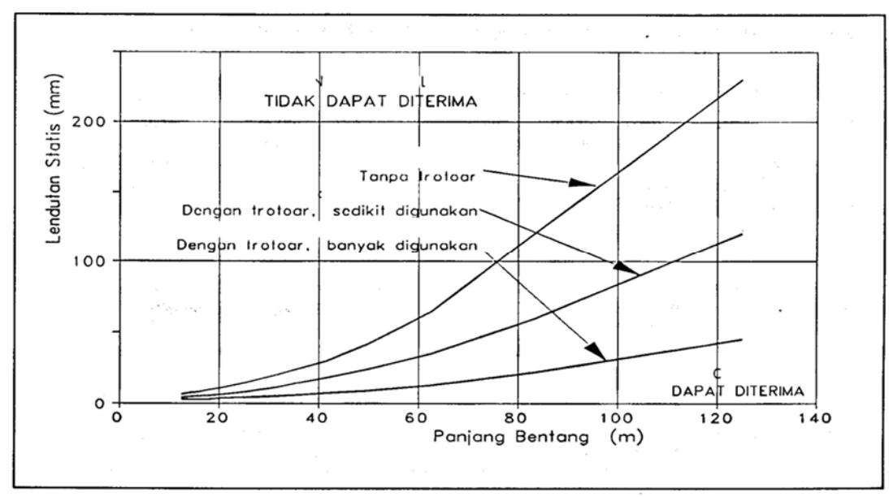

**Gambar 31 - Lendutan akibat getaran jembatan** 

- a) perbandingan antara bentang dengan ketebalan dari bangunan atas kurang dari 30. Untuk jembatan menerus, bentang harus diukur sebagai jarak antara titik-titik lawan lendut untuk beban mati.
- b) frekuensi dasar yang dihitung untuk getaran pada bangunan atas jembatan yang terlentur harus lebih besar dari 3 Hz. Apabila frekuensi yang lebih rendah tidak bisa dihindari, ketentuan dari butir c berikut bisa digunakan.
- c) apabila getaran jembatan terlentur mempunyai frekuensi dasar yang dihitung kurang dari 3 Hz, lendutan statis maksimum jembatan dengan beban 1,0 kN harus kurang dari 2 mm.

**10.2.4 Masalah getaran untuk jembatan bentang panjang atau bangunan fleksibel**  Perilaku dinamis jembatan dengan bentang lebih besar dari 100 m, jembatan gantung dan struktur kabel (*cable stayed*) akibat kendaraan, angin atau beban lainnya harus memperoleh penyelidikan yang khusus.

# **10.3 Beban pelaksanaan**

Beban pelaksanaan terdiri atas:

- a) beban yang disebabkan oleh aktivitas pelaksanaan itu sendiri dan;
- b) aksi lingkungan yang mungkin timbul selama waktu pelaksanaan.

Perencana harus membuat toleransi untuk berat perancah atau yang mungkin akan dipikul oleh bangunan sebagai hasil dari metode atau urutan pelaksanaan. Perencana harus memperhitungkan adanya gaya yang timbul selama pelaksanaan dan stabilitas serta daya tahan dari bagian-bagian komponen. Apabila rencana tergantung pada metode pelaksanaan, struktur harus mampu menahan semua beban pelaksanaan secara aman. Perencana harus menjamin bahwa tercantum cukup detail ikatan dalam gambar untuk menjamin stabilitas struktur pada semua tahap pelaksanaan. Cara dan urutan pelaksanaan, dan tiap tahanan yang terdapat dalam rencana, harus diperinci dengan jelas dalam gambar dan spesifikasi. Selama waktu pelaksanaan jembatan, tiap aksi lingkungan dapat terjadi bersamaan dengan beban pelaksanaan. Perencana harus menentukan tingkat kemungkinan kejadian demikian dan menggunakan faktor beban sesuai untuk aksi lingkungan yang bersangkutan. Tidak perlu untuk mempertimbangkan pengaruh gempa selama pelaksanaan konstruksi.

**© BSN 2016 60 dari 67** 

## **11 Pembebanan rencana** *railing*

Fungsi utama *railing* yaitu untuk memberikan keamanan kepada pengguna jalan. Seluruh sistem pengaman lalu lintas, *railing*, dan *railing* kombinasi secara struktur dan geometrik harus tahan terhadap benturan kendaraan. Beberapa hal yang perlu diperhitungkan antara lain :

- Perlindungan terhadap penumpang kendaraan saat berbenturan dengan *railing*.
- Perlindungan terhadap kendaraan lain yang berada dekat dengan lokasi benturan.
- Perlindungan terhadap manusia dan properti jalan dan area lain dibawah struktur jembatan.
- Kemungkinan peningkatan kinerja *railing*.
- Efektivitas biaya.
- Tampak dan kebebasan pandang terhadap kendaraan yang lewat.

# **11.1 Kriteria pemilihan kinerja**

Salah satu dari kinerja berikut harus ditentukan untuk perencanaan pengaman lalu lintas yaitu sebagai berikut :

- Kinerja 1 : Digunakan pada jalan dengan kecepatan rencana rendah dan volume kendaraan yang sangat rendah, jalan lokal dengan kecepatan rencana rendah;
- Kinerja 2 : Digunakan pada jalan lokal dan kolektor dengan kondisi baik seperti jumlah kendaraan berat yang sedikit dan rambu kecepatan sedikit;
- Kinerja 3 : Digunakan pada jalan arteri dengan kecepatan rencana tinggi dengan campuran kendaraan berat yang sangat rendah dan kondisi jalan yang baik;
- Kinerja 4 : Digunakan pada jalan arteri dengan kecepatan rencana tinggi, jalan bebas hambatan, jalan ekspress, dan jalan antar kota dengan campuran truk dan kendaraan berat;
- Kinerja 5 : Digunakan sesuai dengan kriteria kinerja 4 dan jika kendaraan berat memiliki porsi besar terhadap lalu lintas harian atau saat kondisi jalan mengharuskan kriteria kinerja *railing* yang tinggi;
- Kinerja 6 : Digunakan pada jalan yang dapat dilalui truk tipe tanker atau kendaraan dengan beban gravitasi yang cukup besar.

Pihak yang berwenang memiliki tanggung jawab untuk menentukan kriteria kinerja yang paling tepat untuk jembatan. Kriteria kinerja yang dipilih harus sesuai dengan berat kendaraan dan kecepatan serta sudut tumbuk sesuai Tabel 33.

#### **11.2 Perancangan** *railing*

*Railing* kendaraan harus memiliki muka rel yang menerus di sisi-sisi lalu lintas. Rambu dengan elemen rel harus berada di sisi luar *railing*. Kontinuitas struktur pada elemen *railing* dan angkur ujung harus diperhitungkan. Sistem *railing* dan sambungannya terhadap lantai dapat digunakan setelah melalui pengujian tumbukan yang sesuai dengan kriteria kinerja yang diharapkan.

**© BSN 2016 61 dari 67** 

Tabel 33 – Kriteria kinerja railing dan kinerja terhadap tumbukan

| Karakteristik kendaraan | Mobil Truk Satu unit Truk trailer tipe pickup truk van van |      |       | Truk trailer tipe traktor- tanker |        |        |        |
|----------------------------|------------------------------------------------------------|------|-------|--------------------------------------------|--------|--------|--------|
| W (N)                      | 7000                                                       | 8000 | 20000 | 80000                                      | 220000 | 355000 | 355000 |
| B(mm)                      | 1700                                                       | 1700 | 2000  | 2300                                       | 2450   | 2450   | 2450   |
| G (mm)                     | 550                                                        | 550  | 700   | 1250                                       | 1630   | 1850   | 2050   |
| Sudut tumbuk (θ)           | 20°                                                        | 20°  | 25°   | 15°                                        | 15°    | 15°    | 15°    |
| Kriteria kinerja           |                                                            |      |       | Kecepatan (kr                              | n/jam) | •      |        |
| KK-1                       | 50                                                         | 50   | 50    | N/A                                        | N/A    | N/A    | N/A    |
| KK-2                       | 70                                                         | 70   | 70    | N/A                                        | N/A    | N/A    | N/A    |
| KK-3                       | 100                                                        | 100  | 100   | N/A                                        | N/A    | N/A    | N/A    |
| KK-4                       | 100                                                        | 100  | 100   | 80                                         | N/A    | N/A    | N/A    |
| KK-5                       | 100                                                        | 100  | 100   | N/A                                        | N/A    | 80     | N/A    |
| KK-6                       | 100                                                        | 100  | 100   | N/A                                        | N/A    | N/A    | 80     |

#### 12 Fender

12

# 12.1 Prinsip perencanaan fender

Perencanaan fender berdasarkan dua prinsip mendasar berikut :

struktur *fender* sebagai peredam energi tumbukan kapal sampai ke tingkat kekuatan izinpilar jembatan;

**b2** struktur *fender* sebagai pelindung pilar jembatan terhadap energi tumbukan kapal.

**£2**ergi tumbukan kapal dihitung berdasarkan perumusan gaya-akselerasi (F = ma) sebagai **b2**rikut :

12

$$\mathcal{H}_{E} = \int F(x) dx \tag{40}$$

$$K_{E} = \frac{C_{H} 0.5W(V)^{2}}{g} \tag{41}$$

#### Keterangan:

 $K_E$  adalah energi kinetik dari kapal desain (tm)

 $F_{(x)}$  adalah gaya pelindung struktur F(t) sebagai fungsi lendutan x (m)

adalah koefisien hidrodinamis masa air yang bergerak bersama kapal, yang merupakan interpolasi antara :

- -1,05 untuk jarak bebas dasar kapal ke dasar perairan ≥ 0,5 x DL
- -1,25 untuk jarak bebas dasar kapal ke dasar perairan ≤ 0,1 x DL

DL adalah draft kedalaman kapal pada beban penuh (m)

W adalah tonase perpindahan kapal (t) atau berat total kapal pada beban penuh (Ton)

V adalah kecepatan tumbukan kapal (m/s)

g adalah gravitasi (= 9,8 m/s2)

Tumbukan kapal diperhitungkan ekuivalen dengan gaya tumbukan statis pada obyek yang kaku dengan rumus berikut :

$$P_{\rm S} = (DWT)^{1/2}(12,5V)$$
 (42)

© BSN 2016 62 dari 67

#### **Keterangan:**

*PS* adalah gaya tumbukan kapal sebagai gaya statis ekuivalen (t)

*DWT* adalah tonase berat mati muatan kapal (t) = berat kargo, bahan bakar, air dan persediaan

*V* adalah kecepatan tumbukan kapal (m/s)

Dalam keadaan khusus diperlukan analisis dinamis untuk menentukan energi dan gaya tumbukan kapal.

#### **12.2 Data lalu lintas kapal**

Data yang diperlukan dalam perencanaan gaya tumbukan mencakup:

- a. lalu lintas kapal: tipe, jumlah, konstruksi, tonase, panjang, lebar, frekuensi pelintasan, draft, daya kuda, kebebasan vertikal, cara pengoperasian, tipe pelayanan, barang bawaan utama, dan tempat pelayanan setempat;
- b. kecepatan kapal: transit, tumbukan;
- c. keadaan lingkungan: cuaca, angin dan arus, geometri jalan air, kedalaman air, ketinggian pasang surut, keadaan pelayaran, kepadatan lalu lintas kapal.

# **12.3 Klasifikasi kapal desain**

Sehubungan dengan faktor risiko dalam penentuan kapal desain untuk perencanaan beban tumbukan pada pilar jembatan, terdapat klasifikasi jembatan sebagai berikut :

- a. jembatan kritis: berat kapal desain terlampaui oleh 5% jumlah lintasan kapal dalam satu tahun atau maksimum 50 lintasan kapal per tahun (pilih yang terkecil) ;
- b. jembatan biasa: berat kapal desain terlampaui oleh 10% jumlah lintasan kapal dalam satu tahun atau maksimum 200 lintasan kapal per tahun (pilih yang terkecil).

**© BSN 2016 63 dari 67** 

# **Lampiran A (informatif) Tahapan perencanaan beban jembatan**

Langkah perencanaan beban untuk jembatan ditunjukkan dalam Gambar A.1 berikut :

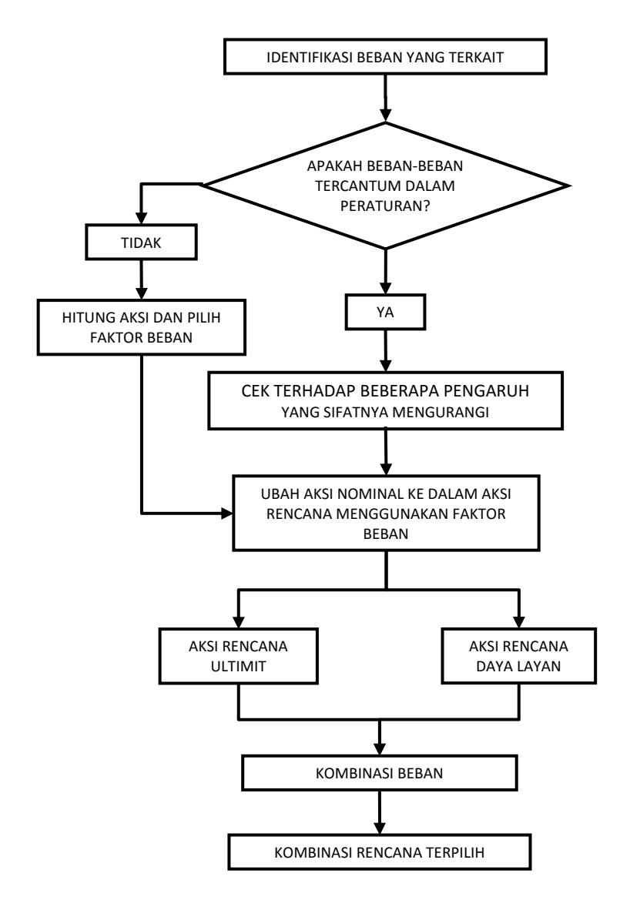

**Gambar A.1 - Perencanaan beban jembatan** 

Diagram alir menyesuaikan dengan urutan di dalam batang tubuh.

Penjelasan Gambar A1 adalah sebagai berikut:

1) Aksi-aksi (beban, perpindahan dan pengaruh lainnya) dikelompokkan kedalam beberapa kelompok, yaitu aksi tetap, beban lalu lintas, aksi lingkungan, dan aksi-aksi lainnya. Aksi juga diklasifikasikan berdasarkan kepada lamanya aksi tersebut bekerja, yaitu aksi tetap dan aksi transien. Klasifikasi ini digunakan apabila aksi-aksi rencana digabung satu sama lainnya mendapatkan kombinasi pembebanan yang akan digunakan dalam perencanaan jembatan;

**© BSN 2016 64 dari 67** 

- 2) Semua aksi yang mungkin akan mempengaruhi jembatan selama umur rencana terlebih dahulu harus diketahui. Setiap aksi yang tidak umum yang tidak dijelaskan dalam standar ini harus dievaluasi dengan memperhitungkan besarnya faktor beban dan lamanya aksi tersebut bekerja;
- 3) Beberapa aksi dapat mengurangi pengaruh dari aksi-aksi lainnya. Dalam keadaan ini maka faktor beban yang lebih rendah bisa digunakan sebagai aksi pengurang. Dalam hal aksi terbagi rata, seperti lapis permukaan aspal beton pada jembatan bentang menerus, dimana sebagian aksi berfungsi sebagai pengurang maka hanya digunakan satu nilai faktor beban ultimit yang digunakan untuk seluruh aksi tersebut. Perencana harus menentukan salah satu faktor beban, (dapat beban normal atau terkurangi), yang menyebabkan pengaruh paling buruk;
- 4) Dalam menentukan faktor beban yang menyebabkan pengaruh paling buruk, perencana harus mengambil keputusan dalam menentukan aksi-aksi mana yang bersifat normal atau mengurangi. Sebagai contoh, perencana perlu menerapkan faktor beban terkurangi untuk berat sendiri jembatan bila menghitung gaya angkat tiang atau stabilitas bangunan bawah. Dalam semua hal, bagaimanapun, faktor beban yang dipilih adalah faktor yang menghasilkan pengaruh total terburuk;
- 5) Aksi rencana harus digabungkan bersama untuk memperoleh berbagai kombinasi beban yang telah ditentukan sebelumnya. Hal ini dilakukan untuk bisa membandingkan secara langsung beberapa kombinasi dan mengabaikan kombinasi yang memberikan pengaruh paling kecil pada jembatan. Kombinasi yang lolos adalah kombinasi yang harus digunakan dalam perencanaan jembatan.

**© BSN 2016 65 dari 67** 

# **Deviasi teknis**

"Pembebanan untuk jembatan" memuat beberapa penyesuaian berikut:

- 1. Gaya rem dan gaya sentrifugal yang semula mengikuti *Austroads*, disesuaikan dengan *AASHTO*;
- 2. Faktor beban ultimit dari "Beban Jembatan" BMS-1992 direduksi dari nilai 2 ke 1,8 untuk beban hidup yang sesuai *AASHTO*; untuk boks baja faktor beban hidup menjadi 2,0.
- 3. Kapasitas beban hidup keadaan batas ultimit (KBU) dipertahankan sama sehingga dengan faktor beban 1,8 menimbulkan kenaikan kapasitas beban hidup pada keadaan batas layan (KBL) sebesar 11,1 %;
- 4. Kenaikan beban hidup layan atau nominal (KBL) meliputi :
  - "Beban T" truk desain dari 45 ton menjadi 50 ton ;
  - Beban roda desain dari 10 ton menjadi 11,25 ton ;
  - "Beban D" terbagi rata (BTR) dari q = 8 kPa menjadi 9 kPa ;
  - "Beban D" garis terpusat (BGT) dari p = 44 kN/m menjadi 49 kN/m
- 5. Beban mati ultimit (KBU) diambil pada tingkat nominal (faktor beban = 1) dalam pengecekan stabilitas geser dan guling dari fondasi jembatan;
- 6. Pembebanan gempa menggunakan peta gempa dengan probabilitas terlampaui 7% dalam 75 tahun (gempa 1000 tahun);
- 7. Perhitungan tekanan tanah, lajur lalu lintas rencana, luas permukaan bidang kontak beban truk yang semula mengikuti BMS, disesuaikan dengan AASHTO yaitu sebesar 750 mm x 250 mm;
- 8. Pembebanan rencana *railing* dibuat sesuai dengan AASHTO dengan 6 kriteria kinerja.

**© BSN 2016 66 dari 67** 

# **Bibliografi**

*AASHTO LRFD Bridge Design Specification, 2012* 

RSNI 2005, Standar Pembebanan untuk Jembatan

Peraturan Muatan untuk Djembatan Djalan Raya, No. 12 / 1970, Direktorat Djenderal Bina Marga

*Guide Specification and Commentary for Vessel Collision Design of Highway Bridges, Volume I, Final Report, February 1991* 

Sistem Manajemen Jembatan - BMS - Peraturan Perencanaan Jembatan : Bagian 2 Beban Jembatan 1992

Sistem Manajemen Jembatan - BMS - Bagian : Persyaratan umum Perencanaan

Pedoman perencanaan pelindung jembatan (*fender*)

*Singapore National Annex to Eurocode 1 :Action on structures Part 1-4 General Action – Wind Action, NA to SS EN 1991-1-4 :2009* 

**© BSN 2016 67 dari 67**