**Perencanaan jembatan terhadap beban gempa** 


#### **© BSN 2016**

**Hak cipta dilindungi undang-undang. Dilarang mengumumkan dan memperbanyak sebagian atau seluruh isi dokumen ini dengan cara dan dalam bentuk apapun serta dilarang mendistribusikan dokumen ini baik secara elektronik maupun tercetak tanpa izin tertulis dari BSN** 

#### **BSN**

**Email: dokinfo@bsn.go.id** 

**www.bsn.go.id** 

**Diterbitkan di Jakarta**

# Daftar isi

| Dafta | ar isi                                                       | i  |
|-------|--------------------------------------------------------------|----|
| Praka | ata                                                          | iv |
| Pend  | lahuluan                                                     | V  |
| 1     | Ruang lingkup                                                | 1  |
| 2     | Acuan normatif                                               | 1  |
| 3     | Istilah dan definisi                                         | 1  |
| 4     | Filosofi perencanaan                                         | 7  |
| 4.1   | Umum                                                         | 7  |
| 4.2   | Keadaan batas ekstrim                                        | 8  |
| 4.3   | Daktilitas                                                   | 8  |
| 4.4   | Redundansi                                                   | 8  |
| 4.5   | Kepentingan operasional                                      | 9  |
| 5     | Pengaruh gempa                                               | 9  |
| 5.1   | Umum                                                         | 9  |
| 5.2   | Spesifik Bahaya gempa                                        | 10 |
| 5.3   | Pengaruh situs                                               | 14 |
| 5.4   | Karakterisasi bahaya gempa                                   | 16 |
| 5.5   | Klasifikasi operasional                                      |    |
| 5.6   | Kategori kinerja seismik                                     | 18 |
| 5.7   | Faktor modifikasi respon                                     | 19 |
| 5.8   | Kombinasi pengaruh gaya gempa                                | 19 |
| 5.9   | Perhitungan gaya gempa rencana                               | 20 |
| 5.10  | Penahan longitudinal                                         | 23 |
| 5.11  | Hold down devices                                            | 23 |
| 5.12  | Persyaratan untuk jembatan sementara dan konstruksi bertahap | 24 |
| 6     | Analisis terhadap beban gempa                                | 24 |
| 6.1   | Umum                                                         | 24 |
| 6.2   | Jembatan bentang tunggal                                     | 24 |
| 6.3   | Jembatan bentang majemuk                                     | 24 |
| 6.4   | Persyaratan panjang perletakan minimum                       | 27 |
| 6.5   | Persyaratan <i>P-</i> Δ                                      | 28 |
| 7     | Struktur beton bertulang                                     | 28 |
| 7.1   | Umum                                                         | 28 |
| 7.2   | Zona gempa 1                                                 | 29 |
| 7.3   | Zona gempa 2                                                 | 29 |

| 7.4 |               | Zona gempa 3 dan 4 29                                                                                          |  |
|-----|---------------|----------------------------------------------------------------------------------------------------------------|--|
| 7.5 |               | Kait gempa 34                                                                                                  |  |
| 8   |               | Struktur baja 34                                                                                               |  |
| 8.1 |               | Umum 34                                                                                                        |  |
| 8.2 |               | Kriteria kinerja 35                                                                                            |  |
| 8.3 |               | Material 37                                                                                                    |  |
| 8.4 |               | Persyaratan elemen pada zona gempa 3 dan 4 37                                                                  |  |
| 8.5 |               | Sistem rangka pemikul momen daktail dan struktur kolom tunggal pada<br>zona gempa 3 dan 4 41                   |  |
| 8.6 |               | Pipa baja berisi beton untuk zona gempa 2 dan 3 43                                                             |  |
| 8.7 |               | Sambungan untuk zona gempa 2 dan 3 45                                                                          |  |
| 8.8 |               | Perletakan tetap dan ekspansi 48                                                                               |  |
| 9   |               | Bangunan bawah 48                                                                                              |  |
| 9.1 |               | Pilar 48                                                                                                       |  |
| 9.2 |               | Kepala jembatan 48                                                                                             |  |
| 9.3 |               | Dinding kantilever nongravitasi 49                                                                             |  |
| 9.4 |               | Dinding terangkur 49                                                                                           |  |
| 9.5 |               | Dinding penahan terstabilisasi mekanik 49                                                                      |  |
| 9.6 |               | Tekanan Lateral akibat gempa 53                                                                                |  |
| 10  |               | Fondasi 55                                                                                                     |  |
|     |               | 10.1 Fondasi telapak 55                                                                                        |  |
|     |               | 10.2 Fondasi tiang pancang 55                                                                                  |  |
|     |               | 10.3 Analisis gempa dan perencanaan fondasi 55                                                                 |  |
|     |               | Lampiran A (normatif) Bagan alir perancangan jembatan terhadap beban gempa 57                                  |  |
|     |               | Lampiran B (normatif) Penggunaan metode spektra moda tunggal dan metode beban                                  |  |
|     |               | merata 58                                                                                                      |  |
|     |               | Bibliografi 60                                                                                                 |  |
|     |               |                                                                                                                |  |
|     | Gambar 1<br>- | Peta percepatan puncak di batuan dasar (PGA) untuk probabilitas<br>terlampaui 7% dalam 75 tahun 11             |  |
|     | Gambar 2<br>- | Peta respon spektra percepatan 0.2 detik di batuan dasar untuk probabilitas<br>terlampaui 7% dalam 75 tahun 12 |  |
|     | Gambar 3<br>- | Peta respon spektra percepatan 1 detik di batuan dasar untuk<br>probabilitas terlampaui 7% dalam 75 tahun 13   |  |
|     | Gambar 4<br>- | Bentuk tipikal respon spektra di permukaan tanah 17                                                            |  |
|     | Gambar 5<br>- | Panjang perletakan 27                                                                                          |  |
|     | Gambar 6<br>- | Tulangan spiral 31                                                                                             |  |
|     | Gambar 7<br>- | Detail tulangan pengekang kolom persegi 31                                                                     |  |

| Gambar 8    |   | -<br>Detail tulangan interlocking dan tulangan geser31                                 |  |
|-------------|---|----------------------------------------------------------------------------------------|--|
| Gambar 9    |   | -<br>Detail tulangan pengekang kolom persegi panjang32                                 |  |
| Gambar 10 - |   | Alur gaya akibat gempa dan komponen yang berpengaruh35                                 |  |
| Gambar 11 - |   | Mekanisme sendi plastis pada portal multitier43                                        |  |
| Gambar 12 - |   | Lebar efektif Whitmore45                                                               |  |
| Gambar 13 - |   | Stabilitas eksternal dinding penahan terstabilisasi mekanik untuk<br>timbunan datar50  |  |
| Gambar 14 - |   | Stabilitas eksternal dinding penahan terstabilisasi mekanik untuk<br>timbunan miring51 |  |
| Gambar 15 - |   | Stabilitas internal gempa dinding penahan terstabilisasi mekanik53                     |  |
| Gambar 16 - |   | Diagram keseimbangan gaya pada dinding penahan54                                       |  |
| Gambar 17 - |   | Diagram rasio modulus geser vs regangan geser pasir56                                  |  |
| Gambar 18 - |   | Bagan alir perencanaan ketahanan gempa untuk jembatan57                                |  |
| Gambar 19 - |   | Tampak atas, pembebanan melintang58                                                    |  |
| Gambar 20 - |   | Tampak memanjang, pembebanan longitudinal58                                            |  |
|             |   |                                                                                        |  |
|             |   |                                                                                        |  |
| Tabel 1     | - | Penjelasan peta gempa10                                                                |  |
| Tabel 2     | - | Kelas situs15                                                                          |  |
| Tabel 3     | - | Faktor amplifikasi untuk PGA dan 0,2 detik (FPGA/Fa)16                                 |  |
| Tabel 4     | - | Besarnya nilai faktor amplifikasi untuk periode 1 detik (Fv)16                         |  |
| Tabel 5     | - | Zona gempa18                                                                           |  |
| Tabel 6     | - | Faktor modifikasi respon (R) untuk bangunan bawah19                                    |  |
| Tabel 7     | - | Faktor modifikasi respon (R) untuk hubungan antar elemen struktur19                    |  |
| Tabel 8     | - | Persyaratan analisis minimum untuk pengaruh gempa25                                    |  |
| Tabel 9     | - | Persyaratan jembatan beraturan25                                                       |  |
| Tabel 10 -  |   | Persentase N berdasarkan zona dan koefisien percepatan (As)28                          |  |
| Tabel 11 -  |   | Batas parameter kelangsingan37                                                         |  |
| Tabel 12 -  |   | Batas rasio lebar/tebal elemen38                                                       |  |

# **Prakata**

Standar Nasional Indonesia (SNI) 2833:2016 dengan judul "Perencanaan jembatan terhadap beban gempa" merupakan revisi dari SNI 2833:2008 Standar perencanaan ketahanan gempa untuk jembatan, dan mengacu pada *AASHTO LRFD Bridge Design Specification, 5th Edition, 2012.* 

Revisi mencakup pengkinian peta gempa yang digunakan, pembagian kategori kinerja seismik, perencanaan beban gempa, beserta pendetailan elemen struktur.

Standar ini dimaksudkan sebagai pegangan dan petunjuk bagi para perencana dalam melakukan perancangan ketahanan gempa pada jembatan.

Standar ini dipersiapkan oleh Komite Teknis 91-01 Bahan Konstruksi Bangunan dan Rekayasa Sipil pada Sub Komite Teknis Rekayasa Jalan dan Jembatan 91-01-S2 melalui Gugus Kerja Jembatan dan Bangunan Pelengkap Jalan. Tata cara penulisan disusun dengan mengikuti Peraturan Kepala BSN nomor 4 tahun 2016 tentang Pedoman Penulisan Standar Nasional Indonesia dan dibahas dalam forum rapat konsensus yang diselenggarakan pada tanggal 25 Maret 2013 di Bandung, dengan melibatkan para narasumber, pakar dan lembaga terkait serta melalui Jajak Pendapat tanggal 1 April 2016 – 1 Juni 2016.

Perlu diperhatikan bahwa kemungkinan beberapa unsur dari dokumen standar ini dapat berupa hak paten. Badan Standardisasi Nasional tidak bertanggung jawab untuk pengidentifikasian salah satu atau seluruh hak paten yang ada.

Untuk menghindari kesalahan dalam penggunaan dokumen dimaksud, disarankan bagi pengguna standar untuk menggunakan dokumen SNI yang dicetak dengan tinta berwarna.

# **Pendahuluan**

Perencanaan jembatan terhadap beban gempa merupakan bagian yang penting dalam rangka perencanaan konstruksi jembatan. Seiring dengan perjalanan waktu diperlukan pengkinian perancangan jembatan terhadap beban gempa.

Peta gempa pada standar ini mengacu pada Peta Gempa Indonesia yang telah disusun sebelumnya oleh Tim Revisi Peta Gempa Indonesia yang terdiri atas Kementerian PU, ITB, BMKG, dan LIPI. Diharapkan peta tersebut dapat mewakili keadaan seismisitas di Indonesia yang terkini. Peta gempa dalam standar ini meliputi peta percepatan puncak batuan dasar (PGA), respons spektra percepatan 0.2 detik dan 1.0 detik di batuan dasar yang mewakili level *hazard* (potensi bahaya) gempa 1000 tahun dengan kemungkinan terlampaui 7% dalam 75 tahun.

Zonasi gempa didasarkan pada spektra percepatan permukaan periode 1 detik (*SD1*). Zonasi tersebut menggambarkan variasi resiko seismik dan digunakan untuk penentuan metode analisis, panjang tumpuan minimum, detail perencanaan. Kemudian untuk penentuan gaya gempa rencana digunakan faktor reduksi (*R*) yang menggambarkan daktilitas sesuai dengan tipe strukturnya.

Standar ini dimaksudkan sebagai pegangan dan petunjuk bagi para perencana dalam melakukan perancangan ketahanan gempa pada jembatan.


# **Perencanaan jembatan terhadap beban gempa**

# **1 Ruang lingkup**

Standar ini digunakan dalam perancangan struktur jembatan tahan gempa dimana digunakan beberapa prinsip sebagai berikut :

- Struktur berperilaku dalam batas elastis akibat gempa skala kecil dan sedang tanpa terjadi kerusakan yang signifikan.
- Intensitas gerakan tanah dan gaya gempa yang realistis dalam prosedur perencanaan.
- Terhadap pengaruh gempa skala besar, jembatan tidak mengalami keruntuhan secara keseluruhan. Bila memungkinkan, kerusakan dapat dideteksi lebih mudah untuk kemudian dapat dilakukan inspeksi dan perbaikan.

Standar ini harus digunakan dalam perencanaan dan pembangunan jembatan konvensional tahan gempa. Untuk jembatan nonkonvensional, ketentuan pada standar ini dapat digunakan dengan penambahan kriteria desain yang harus disetujui oleh pemilik pekerjaan. Secara umum bagan alir perancangan ketahanan gempa untuk jembatan dapat dilihat pada **Lampiran A.**

# **2 Acuan normatif**

*AASHTO LRFD Bridge Design Specification, 5th Edition, 2012.*

# **3 Istilah dan definisi**

Untuk tujuan penggunaan standar ini, istilah, definisi, dan notasi berikut digunakan.

# **3.1**

# **analisis gaya dorong statik**

cara analisis statik 2 dimensi atau 3 dimensi linier dan nonlinier dengan beban gempa dianggap bekerja pada pusat massa struktur dan diberikan secara bertahap hingga terjadi mekanisme keruntuhan

# **3.2**

# **analisis ragam spektra respons**

cara analisis dengan respons dinamik total struktur jembatan didapat sebagai superposisi dari respons dinamik maksimum masing-masing ragamnya yang didapat melalui spektra respons gempa rencana

# **3.3**

# **batuan dasar**

lapisan batuan di bawah muka tanah yang memiliki kecepatan rambat gelombang geser (*Vs*) yang mencapai 750 m/detik dan tidak ada lapisan batuan lain di bawahnya yang memiliki nilai kecepatan rambat gelombang geser yang kurang dari itu

# **3.4**

# **cara analisis dinamis**

cara perencanaan gempa melalui analisis perilaku dinamis struktur selama terjadi gempa

**3.5** 

# **cara koefisien gempa**

cara perencanaan gempa dengan beban gempa dikerjakan secara statis pada struktur, mempertimbangkan karakteristik getaran dari keadaan batas elastis dan plastis struktur

# **3.6**

# **cara perencanaan daktail**

cara perencanaan gempa dengan beban gempa dikerjakan secara statis pada struktur, mempertimbangkan daktilitas dan kekuatan dinamis dari keadaan batas plastis struktur

# **3.7**

# **daktilitas**

perbandingan antara simpangan plastis maksimum dari suatu komponen (atau struktur) dengan simpangan pada pelelehan pertama

# **3.8**

# **elemen pemikul beban gempa**

komponen struktur jembatan seperti kolom, sambungan, perletakan, fondasi, dan kepala jembatan, yang berperan dalam sistem pemikul beban gempa

# **3.9**

# **efek P-delta**

efek sekunder yang terjadi pada komponen struktur akibat beban vertikal karena adanya perpindahan horizontal struktur

# **3.10**

# **faktor kuat lebih (***overstrength***)**

perbandingan antara kekuatan lentur maksimum yang mungkin terjadi dari suatu komponen dengan kekuatan lentur nominalnya

# **3.11**

# **faktor modifikasi respons (***R***)**

faktor yang digunakan untuk menghitung kuat butuh atau kuat rencana elemen struktur berdasarkan analisis elastis akibat perilaku daktail

# **3.12**

# **fondasi tiang**

jenis fondasi dalam termasuk didalamnya fondasi tiang bor, tiang pancang, tiang tekan

# **3.13**

# **jembatan konvensional**

jembatan dengan bangunan atas berupa sistem pelat, balok, gelagar boks, dan rangka, kemudian memiliki bangunan bawah berupa pilar dan menumpu pada fondasi dangkal atau fondasi tiang

# **3.14**

# **jembatan nonkonvensional**

jembatan khusus seperti jembatan kabel, jembatan gantung, jembatan dengan menara rangka atau pilar berongga, dan jembatan pelengkung

# **3.15**

# **jembatan sangat penting (***critical bridges***)**

jembatan yang harus dapat dilalui oleh semua jenis kendaraan (lalu-lintas normal) dan dapat dilalui oleh kendaraan darurat dan untuk kepentingan keamanan/pertahanan segera setelah mengalami gempa dengan periode ulang 1000 tahun

# **3.16**

# **jembatan penting (***essential bridges***)**

jembatan yang harus dapat dilalui oleh kendaraan darurat dan untuk kepentingan keamanan/pertahanan beberapa hari setelah mengalami gempa rencana dengan periode ulang 1000 tahun

# **3.17**

# **jembatan lainnya (***other bridges***)**

jembatan yang masih dapat dilalui kendaraan darurat dengan lalu-lintas yang terbatas setelah mengalami gempa rencana dengan periode ulang 1000 tahun

# **3.18**

# **kuat lentur rencana**

kuat lentur nominal komponen dikalikan dengan faktor reduksi kekuatan

# **3.19**

# **kuat lentur nominal**

kuat lentur ultimit komponen

# **3.20**

# **kuat lebih**

kuat lentur nominal dikalikan faktor kuat lebih

# **3.21**

# **kelas situs**

klasifikasi situs yang dilakukan berdasarkan kondisi tanah di lapangan

# **3.22**

# **kombinasi kuadrat lengkap**

formulasi statistik untuk mengkombinasikan respons modal pada struktur akibat gempa pada satu arah tertentu

# **3.23**

# **likuifaksi**

kondisi dimana tanah kehilangan kuat geser akibat gempa sehingga daya dukung turun secara mendadak

# **3.24**

# **ortogonal**

tinjauan dalam dua arah saling tegak lurus (keduanya membentuk sudut 90°)

# **3.25**

# **patahan aktif**

patahan yang dinyatakan aktif oleh pihak yang berwenang berdasarkan data yang memadai

# **3.26**

# **persyaratan daktilitas**

daktilitas yang diperlukan oleh suatu struktur untuk menahan kombinasi pembebanan gempa rencana

# **3.27**

# **sistem pemikul beban gempa**

sistem yang memiliki alur gaya yang handal dan tidak terganggu untuk mentransfer gaya gempa ke tanah dan memiliki sistem disipasi energi yang cukup untuk mengontrol perpindahan struktur

# **3.28**

# **sendi plastis**

daerah pada komponen struktur, biasanya pada kolom atau pilar yang mengalami leleh lentur dan rotasi plastis namun tetap memiliki kekuatan lentur yang cukup

# **3.29**

# **notasi**

- *A* = luas penampang elemen dalam mm2 sesuai **Persamaan 37**;
- *Ac* = luas inti penampang beton diukur hingga tulangan spiral dalam mm2 sesuai **Persamaan 41 dan 51**;
- *Ag* = luas brutto pelat buhul dalam mm2 sesuai **Persamaan 58**;
- *Am* = koefisien percepatan maksimum pada titik pusat dinding (*g*) ;
- *An* = luas netto penampang sepanjang bidang yang menahan tarik dalam mm2 sesuai **Persamaan 53;**
- *As* = koefisien percepatan puncak muka tanah (*g*) ;
- *Atg* = luas brutto penampang sepanjang bidang yang menahan tarik pada moda kegagalan geser blok (mm2);
- *Atn* = luas brutto penampang sepanjang bidang yang menahan tarik pada moda kegagalan geser blok (mm2);
- *Avg* = luas brutto penampang sepanjang bidang yang menahan geser pada moda kegagalan geser blok (mm2);
- *Avn* = luas netto penampang sepanjang bidang yang menahan geser pada moda kegagalan geser blok (mm2);
- *Avf* = luas total tulangan termasuk tulangan lentur (mm2) sesuai **Persamaan 31**;
- *b* = lebar elemen yang tidak diperkaku (mm)( **Persamaan 34, 35**) ;
- *bv* = lebar efektif penampang (mm) (**Persamaan 20**)
- *C* = faktor geometri luas permukaan tulangan keseluruhan sesuai **Persamaan 74**;
- *Csm* = koefisien respons elastik sesuai **Persamaan 4** ;
- *D* = diameter pipa baja (mm) ;
- *DL* = beban mati yang bekerja (kN) ;
- *dv* = kedalaman geser efektif (mm) ;
- *d* = tinggi penampang (mm) ;
- *E* = modulus elastisitas baja (MPa) ;
- *EQx* = beban gempa yang bekerja pada arah *x* (kN) ;
- *EQy* = beban gempa yang bekerja pada arah *y* (kN) ;
- *EQ* = gaya gempa horizontal statis (kN) ;
- *fy* = tegangan leleh baja (MPa) ;
- *FPGA* = faktor amplifikasi terkait percepatan yang mewakili getaran periode 0 detik
- *Fa =* faktor amplifikasi terkait percepatan yang mewakili getaran periode 0,2 detik;
- *Fu* = kuat tarik baja (MPa) ;
- *Fv =* faktor amplifikasi terkait percepatan yang mewakili getaran periode 1,0 detik;
- *fye* = tegangan leleh elemen (MPa) ;
- *F\** = faktor friksi cabut sesuai **Persamaan 74;**
- *f'c* = kuat tekan beton (MPa) ;
- *H* = rata-rata tinggi kolom yang mendukung lantai jembatan pada tiap bentang jembatan untuk kepala jembatan (m) sesuai **Persamaan 15** ;
- *Hd* = tinggi dinding (m) (**Persamaan 63 dan 64**) ;
- *Ht* = tinggi muka tanah (m) (**Persamaan 75 dan 77**) ;
- *h* = tinggi badan (*web*) profil baja (mm) ;
- *hc* = dimensi inti kolom pada arah yang ditinjau (mm) ;

```
Is = momen inersia pengaku longitudinal individual sejajar sumbu sayap dan diambil 
          pada dasar pengaku (mm4) ; 
i = sudut kemiringan tanah timbunan (o) ; 
K = faktor panjang efektif batang (Persamaan 32) ; 
KDED = kekakuan dari ujung diafragma daktail (kN/m) ; 
KSUB = kekakuan bangunan bawah (kN/m) ; 
k = koefisien tekuk pelat untuk tegangan normal merata sebagaimana didefinisikan 
          pada Persamaan 34 dan Persamaan 35) ; 
kh = koefisien akselerasi horizontal (g) ; 
kv = koefisien akselerasi vertikal (g); 
L = panjang lantai jembatan diukur dari siar muainya (m); 
Lu = panjang elemen yang tidak tertumpu (mm) ; 
LL = beban hidup yang bekerja (kN) ; 
Le = panjang tulangan dalam zona tahanan (m) ; 
Lei = panjang perkuatan dalam daerah penahan dari lapisan ke-i (m) ; 
Lg = panjang tidak tertumpu pelat buhul (mm) ; 
Mg = momen yang bekerja pada pelat buhul (kN.m) ; 
Mn = kuat lentur nominal kolom atau pilar (kN.m) ; 
Mns = kekuatan lentur nominal elemen (kN.m) sesuai Tabel 11 ; 
Mnx = tahanan lentur kolom (kN.m) 
Mpx = kapasitas momen plastis batang kolom didasarkan pada sifat material rencana 
          (kN.m); 
Mrc = kapasitas momen nominal terfaktor elemen (kN.m) ;
Mrg = kapasitas momen leleh nominal terfaktor (Mng ) pelat buhul (kN.m) 
Mrpg = faktor kapasitas momen plastis nominal terfaktor (Mpg ) (kN.m) ; 
Mu = momen ultimit terfaktor yang bekerja pada elemen (kN.m) ; 
m = jumlah lapisan tanah yang ada di atas batuan dasar; 
N = panjang perletakan minimum diukur normal terhadap centerline tumpuan (m) 
          sesuai Persamaan 15;
N = Nilai rata-rata berbobot uji penetrasi standar ; 
Ni = nilai hasil uji penetrasi standar lapisan tanah ke-i, ; 
n = jumlah pengaku sayap tekan longitudinal (buah) ; 
ns = jumlah penampang inti spiral/sengkang melingkar interlocking ; 
PGA = percepatan puncak batuan dasar mengacu pada Peta Gempa Indonesia dengan 
          probabilitas terlampaui 7% dalam 75 tahun (Gambar 1) ; 
Pg = gaya aksial yang bekerja pada pelat buhul (kN) (Persamaan 59, 60) ; 
Pn = kuat tekan aksial nominal elemen (kN) (tabel 11) ; 
Pi = gaya inersia internal akibat berat timbunan dalam zona aktif (kN/m) (Persamaan
          69) ; 
Pir = gaya inersia disebabkan percepatan timbunan bertulang (kN/m) ; 
Pis = gaya inersia disebabkan percepatan tambahan tanah miring di atas timbunan 
          bertulang (kN/m); 
Pr = kapasitas aksial nominal terfaktor elemen (kN) ; 
Prg = faktor kapasitas leleh aksial nominal terfaktor (Png ) pelat buhul sesuai Pasal 
          9.7.6 (kN) ; 
Pro = kapasitas aksial nominal terfaktor elemen (kN); 
Pu = beban aksial terfaktor (kN); 
Py = kuat leleh aksial nominal elemen (kN) seperti pada Tabel 12 ; 
Qi = pengaruh gaya (besaran gaya) ; 
R = faktor modifikasi respons seperti didefinisikan pada Tabel 6 dan Tabel 7 ; 
Rc = rasio cakupan tulangan ; 
RF = kombinasi faktor reduksi kekuatan untuk menghitung potensi degradasi jangka
```

panjang akibat kerusakan instalasi, rangkak, dan penuaan kimiawi

```
RFID = faktor reduksi kekuatan untuk perhitungan kerusakan saat instalasi terhadap 
          tulangan (Persamaan 72) ; 
Rc = rasio cakupan tulangan dijelaskan (Persamaan 74) ; 
Rn = tahanan nominal (Persamaan 1) ; 
Rr = tahanan terfaktor (Persamaan 1) ; 
r = jari-jari girasi (mm) (Persamaan 32) ; 
ry = jari-jari girasi sekitar sumbu minor (mm) (Persamaan 33) ; 
S = kemiringan perletakan diukur dari garis normal terhadap bentangnya (mm) ; 
SS = lokasi yang memerlukan investigasi geoteknik dan analisis respons dinamik 
          spesifik (sesuai Tabel 3 dan 4) ; 
S1 = parameter respons spektra percepatan gempa untuk periode 1.0 detik mengacu 
          pada Peta Gempa Indonesia 2010 dengan probabilitas terlampaui 7% dalam 75 
          tahun (Gambar 3) ; 
SD1 = nilai spektra permukaan tanah pada periode 1,0 detik (Persamaan 10) ; 
SDS = nilai spektra permukaan tanah pada periode 0,2 detik) (Persamaan 9) ; 
Sg = modulus penampang pelat buhul pada sumbu kuat (mm3) (Persamaan 56) ; 
Srs = tahanan tarik tulangan ultimit yang dibutuhkan untuk menahan komponen beban 
          statik (kN/m) (Persamaan 71) ; 
Srt = tahanan tarik tulangan ultimit yang dibutuhkan untuk menahan komponen beban 
          dinamik (kN/m) (Persamaan 72) ; 
Ss = parameter respons spektra percepatan gempa untuk periode pendek (T=0.2 
          detik) mengacu pada Peta Gempa Indonesia dengan probabilitas terlampaui 7% 
          dalam 75 tahun (Gambar 2) ; 
Sui = kuat geser tak terdrainase lapisan tanah ke-i, (kPa) ; 
S u = rerata berbobot kuat geser tak terdrainase (kPa) ; 
s = spasi sengkang (mm) ; 
t = tebal elemen yang tidak diperkaku, tebal plat, atau tebal pipa baja (mm); 
Tf = periode fundamental jembatan (detik) ; 
Tmax = beban statik terfaktor diaplikasikan kepada penulangan (Persamaan 70) ; 
Tmd = penambahan terfaktor gaya inersia dinamik pada lapisan i (kN/m) (Persamaan
          69) ; 
Ttotal = tegangan tulangan terfaktor maksimum (kN/m) (Persamaan 70) ; 
tus = tebal elemen yang tidak diperkaku, tebal plat, atau tebal dinding pipa baja (mm) ; 
tb = tebal pelat buhul (mm) ; 
ti = tebal lapisan tanah ke-i (m) ; 
tw = tebal pelat badan (mm) ; 
Wt = berat total struktur terdiri dari beban mati dan beban hidup yang sesuai (kN) 
          (Persamaan 4) ; 
Vc = kapasitas geser kontribusi dari beton (kN) ; 
Vg = gaya geser yang bekerja pada pelat buhul (kN) ; 
Vn = tahanan geser nominal (kN) ; 
Vr = tahanan geser terfaktor pada pilar (kN) ; 
Vrg = kapasitas geser nominal terfaktor (Vng ) pelat buhul (kN) ; 
vsi = kecepatan rambat gelombang geser melalui lapisan tanah ke-i (m/s); 
V s = rerata berbobot cepat rambat gelombang geser (m/s); 
Z = modulus plastis pipa baja (mm3) 
Zg = modulus plastis penampang pelat buhul pada sumbu kuat (mm3) ; 
D
      = faktor daktilitas ; 
R
      = faktor redundansi ; 
I
      = faktor klasifikasi operasional ;
```

- = sudut geser tanah (o) sesuai **Persamaan 76** dan **78**;
- *eq* = faktor tahanan untuk kombinasi beban statik/gempa;
- *pull* = faktor tahanan untuk cabut tulangan;
- *<sup>b</sup>* = faktor tahanan untuk lentur pada beton ;
- *b s* = faktor tahanan mekanisme kegagalan geser blok ;
- *<sup>c</sup>* = faktor tahanan beton pada kondisi tekan ;
- *<sup>f</sup>* = faktor tahanan baja struktural terhadap lentur ;
- *<sup>u</sup>* = faktor tahanan untuk fraktur pada penampang netto ;
- *y* = faktor tahanan untuk pelelehan pada penampang brutto ;
- *EQ* = faktor beban hidup kondisi gempa;
- *<sup>s</sup>* = berat jenis tanah (kN/m3) ;
- <sup>i</sup>= faktor beban ke-*i*;
- *<sup>s</sup>* = berat jenis tanah (kN/m3) ;
- *Δ* = perpindahan titik kolom atau pilar relatif terhadap dasar fondasi (m) ;
- *Δe* = perpindahan berdasarkan analisis gempa elastis (m) ;
- *d* = faktor yang menunjukkan kemampuan beton dengan retak diagonal untuk mentransfer tarik dan geser ;
- = kemiringan timbunan (derajat) (sesuai **Persamaan 65**) ;
- *cp* = batasan parameter kelangsingan untuk elemen yang dominan mengalami beban tekan aksial;
- *bp* = batasan parameter kelangsingan untuk elemen yang dominan mengalami momen lentur;
- = daktilitas perpindahan ujung diafragma (sesuai **Persamaan 36**) ;
- = faktor koreksi pengaruh skala;
- *v* = tegangan vertikal tidak terfaktor pada level tulangan dalam zona tahanan (kN/m2);
- = arc tan (*kh*/(1-*kv*)) (o) (sesuai **Persamaan 76** dan **78**) ;
- = sudut geser antara tanah dan kepala jembatan (o) (sesuai **Persamaan 76** dan **78**).

# **4 Filosofi perencanaan**

# **4.1 Umum**

Setiap komponen dan hubungan struktur harus memenuhi **Persamaan 1** untuk setiap kondisi batas. Untuk kondisi batas layan dan ekstrim, faktor tahanan dapat diambil sebesar 1, kecuali untuk baut. Untuk kolom beton pada zona seismik 2, 3, dan 4 maka harus memenuhi ketentuan sesuai **Pasal 7.3 dan Pasal 7.4.1.2.** Seluruh kondisi batas harus dianggap memiliki tingkat kepentingan yang sama.

$$\sum \eta_i \gamma_i Q_i \le \phi R_n = R_r \tag{1}$$

# Dimana :

Untuk beban dimana nilai maksimum *I*lebih sesuai maka :

$$\eta_i = \eta_D \eta_B \eta_T \ge 0.95 \tag{2}$$

Untuk beban dimana nilai minimum  $\eta$  lebih sesuai maka :

$$\eta_i = \frac{1}{\eta_D \eta_R \eta_I} \le 1 \tag{3}$$

# Keterangan:

 $\gamma_i$  adalah faktor beban

 $\eta_D$  adalah faktor berkaitan dengan daktilitas

 $\eta_{\rho}$  adalah faktor berkaitan dengan redundansi

 $\eta_{\scriptscriptstyle I}$  adalah faktor berkaitan dengan klasifikasi operasional

 $\phi$  adalah faktor tahanan

 $Q_{\!\scriptscriptstyle i}$  adalah pengaruh gaya

 $R_n$  adalah tahanan nominal

R adalah tahanan terfaktor

#### 4.2 Keadaan batas ekstrim

Keadaan batas ekstrim diperhitungkan untuk memastikan struktur jembatan dapat bertahan akibat gempa besar. Keadaan batas ekstrim merupakan kejadian dengan frekuensi kemunculan yang unik dengan periode ulang yang lebih besar secara signifikan dibandingkan dengan umur rencana jembatan.

#### 4.3 Daktilitas

Sistem struktur jembatan harus diproporsi dan didetailkan agar diperoleh perilaku deformasi inelastik pada kondisi batas ultimit dan ekstrim sebelum mengalami kegagalan. Perangkat disipasi energi dapat digantikan untuk sistem pemikul gempai daktail konvensional dan metode lain yang sesuai.

 $\eta_D = 1,05$  untuk komponen tidak daktail

 $\eta_{D}$  = 1,00 untuk perencanaan konvensional

 $\eta_D = 0,95$  untuk komponen dengan tambahan daktilitas

Untuk kondisi batas lain termasuk kondisi batas ekstrim (gempa) maka :  $\eta_D = 1$ 

#### 4.4 Redundansi

Alur gaya majemuk dan struktur menerus harus digunakan kecuali terdapat alasan yang mengharuskan untuk tidak menggunakan struktur tersebut.

Untuk kondisi batas ultimit maka:

 $\eta_{p} = 1,05$  untuk komponen nonredundan

 $\eta_R = 1,00$  untuk komponen dengan redundansi konvensional

 $\eta_R = 0,95$  untuk komponen dengan redundansi melampaui kontinuitas girder dan penampang torsi tertutup

Untuk kondisi batas lain termasuk kondisi batas ekstrim (gempa) maka :  $\eta_R$  = 1

# 4.5 Kepentingan operasional

Pemilik pekerjaan dapat menetapkan suatu jembatan atau elemen struktur dan sambungannya sebagai prioritas operasional. Pengklasifikasian harus dilakukan oleh otoritas yang berwenang terhadap jaringan transportasi dan mengetahui kebutuhan operasional. Untuk kondisi batas ultimit maka :

 $\eta_r = 1,05$  untuk jembatan penting atau sangat penting

 $\eta_I = 1,00$  untuk jembatan tipikal  $\eta_I = 0,95$  untuk kurang penting

Untuk kondisi batas lain termasuk kondisi batas ekstrim (gempa) maka :  $\eta_{\tau} = 1$ 

#### 5 Pengaruh gempa

#### **5.1 Umum**

Jembatan harus direncanakan agar memiliki kemungkinan kecil untuk runtuh namun dapat mengalami kerusakan yang signifikan dan gangguan terhadap pelayanan akibat gempa dengan kemungkinan terlampaui 7% dalam 75 tahun. Penggantian secara parsial atau lengkap pada struktur diperlukan untuk beberapa kasus. Kinerja yang lebih tinggi seperti kinerja operasional dapat ditetapkan oleh pihak yang berwenang.

Beban gempa diambil sebagai gaya horizontal yang ditentukan berdasarkan perkalian antara koefisien respon elastik ( $C_{sm}$ ) dengan berat struktur ekivalen yang kemudian dimodifikasi dengan faktor modifikasi respon (R) dengan formulasi sebagai berikut :

$$E_{Q} = \frac{C_{sm}}{R} \times W_{t}$$
 (4)

#### Keterangan:

E<sub>Q</sub> adalah gaya gempa horizontal statis (kN)

C<sub>sm</sub> adalah koefisien respons elastik R adalah faktor modifikasi respons

 $W_t$  adalah berat total struktur terdiri dari beban mati dan beban hidup yang sesuai (kN)

Koefisien respon elastik  $C_{sm}$  diperoleh dari peta percepatan batuan dasar dan spektra percepatan (**Gambar 1** hingga **Gambar 3**) sesuai dengan daerah gempa dan periode ulang gempa rencana. Koefisien percepatan yang diperoleh berdasarkan peta gempa dikalikan dengan suatu faktor amplifikasi sesuai dengan kondisi tanah sampai kedalaman 30 m di bawah struktur jembatan.

Ketentuan pada standar ini berlaku untuk jembatan konvensional. Pemilik pekerjaan harus menentukan dan menyetujui ketentuan yang sesuai untuk jembatan non konvensional. Ketentuan ini tidak dapat digunakan untuk struktur bawah tanah, kecuali ditentukan lain oleh pemilik pekerjaan.

Pengaruh gempa terhadap gorong-gorong persegi dan bangunan bawah tanah tidak perlu diperhitungkan kecuali struktur tersebut melewati patahan aktif. Pengaruh ketidakstabilan kondisi tanah (misalnya: likuifaksi, longsor, dan perpindahan patahan) terhadap fungsi iembatan harus diperhitungkan.

# 5.2 Bahaya gempa

Bahaya gempa pada jembatan harus dikarakterisasi dengan menggunakan respon spektra percepatan dan faktor situs untuk kelas situs yang sesuai.

Respon spektra percepatan dapat ditentukan baik dengan prosedur umum (Pasal 5.2.1) atau berdasarkan prosedur spesifik-situs (Pasal 5.2.2). Prosedur spesifik-situs dilakukan jika terdapat kondisi sebagai berikut:

- Jembatan berada dalam jarak 10 km dari patahan aktif
- Situs termasuk dalam kategori situs kelas F sesuai Tabel 2.

Bila riwayat percepatan digunakan untuk karakterisasi bahaya gempa pada situs tertentu, maka riwayat percepatan tersebut harus sesuai dengan **Pasal 6.3.4.1.** 

#### 5.2.1 Prosedur umum

Peta gempa dalam ketentuan ini meliputi peta percepatan puncak batuan dasar (*PGA*) dan respons spektra percepatan 0,2 detik dan 1 detik di batuan dasar yang mewakili *level hazard* (potensi bahaya) gempa 1000 tahun dengan kemungkinan terlampaui 7% dalam 75 tahun.

Penjelasan untuk masing-masing peta dapat dilihat pada Tabel 1.

Tabel 1- Penjelasan peta gempa

| No | No Gambar | Level Gempa                   | Keterangan                                                                  |
|----|-----------|-------------------------------|-----------------------------------------------------------------------------|
| 1  | Gambar 1  | 7% dalam 75                   | Peta percepatan puncak di<br>batuan dasar (PGA)                             |
| 2  | Gambar 2  | tahun (gempa ≈<br>1000 tahun) | Peta respons spektra percepatan 0.2 detik di batuan dasar ( $S_s$ )         |
| 3  | Gambar 3  | 1000 tanun)                   | Peta respons spektra percepatan 1.0 detik di batuan dasar (S <sub>1</sub> ) |

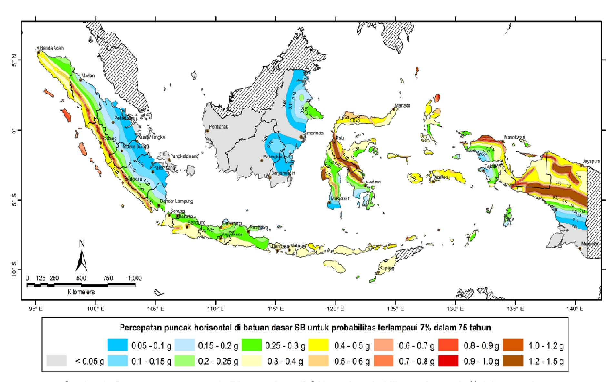

**Gambar 1 - Peta percepatan puncak di batuan dasar (PGA) untuk probabilitas terlampaui 7% dalam 75 tahun** 

# SNI 2833:2016

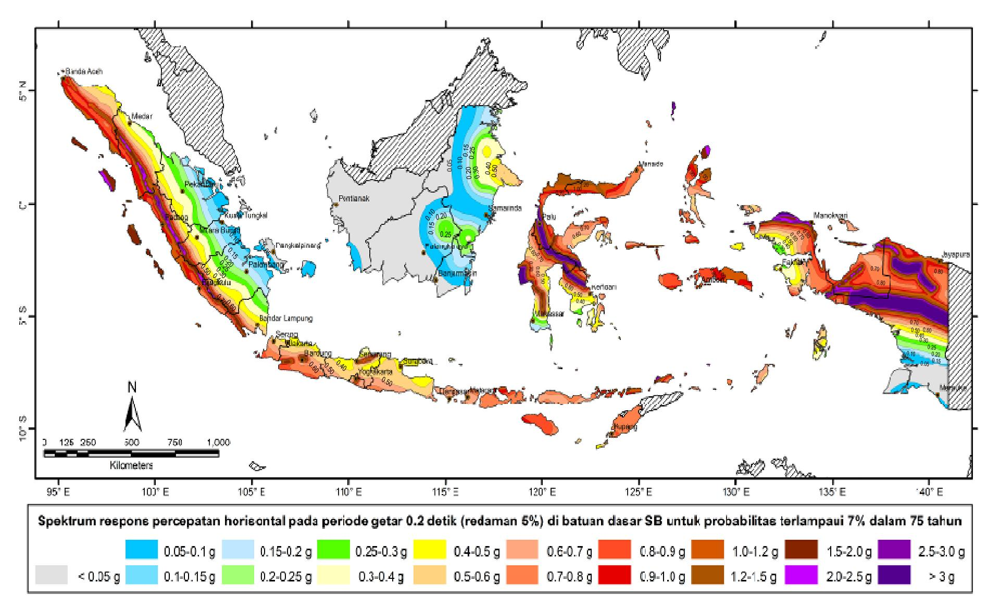

Gambar 2 - Peta respon spektra percepatan 0.2 detik di batuan dasar untuk probabilitas terlampaui 7% dalam 75 tahun

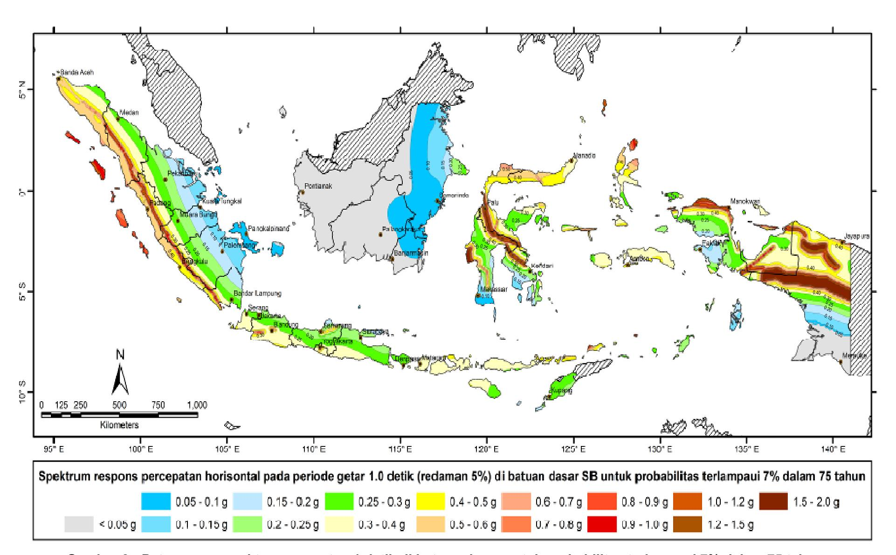

**Gambar 3 - Peta respon spektra percepatan 1 detik di batuan dasar untuk probabilitas terlampaui 7% dalam 75 tahun**

# **5.2.2 Prosedur spesifik situs**

Prosedur spesifik-situs dapat dilakukan untuk pembuatan respon spektra rencana dan dapat dilakukan di lokasi manapun sesuai dengan persetujuan pemilik pekerjaan. Tujuan dari analisis probabilitas gerak tanah situs spesifik adalah untuk menghasilkan respon spektra percepatan yang memperhitungkan kemungkinan terlampaui 7% dalam 75 tahun pada nilai spektra dalam rentang periode yang ditentukan. Pada analisis ini harus ditetapkan hal-hal sebagai berikut :

- Sumber gempa yang berkontribusi di sekitar situs yang ditinjau,
- Batas atas magnitudo gempa untuk tiap sumber gempa,
- Median dari hubungan atenuasi untuk nilai spektra respon percepatan dan deviasi standar yang terkait,
- Hubungan magnitudo dan pengulangan yang terjadi untuk tiap sumber gempa, dan
- Hubungan panjang runtuh patahan untuk tiap patahan yang berkontribusi.

Ketidakpastian dalam pemodelan sumber gempa dan parameter harus diperhitungkan dalam analisis. Dokumen analisis bahaya gempa harus ditelaah oleh tenaga ahli yang terkait.

Bila analisis untuk menentukan pengaruh situs diperlukan sesuai **Pasal 5.3** untuk kelas situs F, pengaruh kondisi tanah lokal harus ditentukan berdasarkan penyelidikan geoteknik dan analisis respons dinamik situs.

Untuk situs yang terletak dalam jarak 10 km dari patahan aktif atau patahan dangkal, maka pengaruh dari patahan terhadap gerak tanah harus diperhitungkan karena dapat berpengaruh signifikan terhadap jembatan.

Spektra deterministik dapat digunakan pada daerah yang telah diketahui patahan aktif bila spektra deterministik tidak lebih kecil dari duapertiga respons spektra probabilistik pada periode 0,5*Tf* hingga 2*Tf*, dengan *Tf* adalah periode fundamental jembatan. Bilamana penggunaan spektra deterministik lebih sesuai, maka spektra tersebut harus :

- Merupakan nilai terluar (*envelope*) dari nilai median spektra yang dihitung untuk magnitudo gempa maksimum karakteristik pada patahan aktif yang diketahui, atau
- Spektra deterministik dapat ditentukan untuk tiap patahan dan tanpa adanya spektra kontrol, maka tiap spektra harus digunakan.

Bila respons spektra ditentukan berdasarkan kajian spesifik situs, maka spektra tersebut tidak boleh lebih kecil dari dua pertiga dari respons spektra yang diperoleh berdasarkan prosedur umum pada periode 0,5*Tf* hingga 2*Tf* pada spektra, dengan *Tf* adalah periode fundamental jembatan.

# **5.3 Pengaruh situs**

# **5.3.1 Definisi kelas situs**

Klasifikasi situs pada pasal ini ditentukan untuk lapisan setebal 30 m sesuai dengan yang didasarkan pada korelasi dengan hasil penyelidikan tanah lapangan dan laboratorium sesuai **Tabel 2**.

Tabel 2 - Kelas situs

| Kelas Situs                                                                                           | $\overline{V}_s$ (m/s)                                                                                                                                                                                                                                             | N                  | S̄ <sub>u</sub> (kPa)                          |  |
|-------------------------------------------------------------------------------------------------------|--------------------------------------------------------------------------------------------------------------------------------------------------------------------------------------------------------------------------------------------------------------------|--------------------|------------------------------------------------|--|
| A. Batuan Keras                                                                                       | <i>V</i> <sub>s</sub> ≥ 1500                                                                                                                                                                                                                                       | N/A                | N/A                                            |  |
| B. Batuan                                                                                             | $750 < \overline{V}_s \le 1500$                                                                                                                                                                                                                                    | N/A                | N/A                                            |  |
| C. Tanah Sangat Padat dan Batuan Lunak                                                                | 350 < <i>V̄</i> <sub>s</sub> ≤ 750                                                                                                                                                                                                                                 | <u>N</u> >50       | <b>S</b> <sub>u</sub> ≥ 100                    |  |
| D. Tanah Sedang                                                                                       | $175 < \overline{V}_s \le 350$                                                                                                                                                                                                                                     | 15 <u>≤ N</u> ≤ 50 | 50 <u>≤</u> <b>S</b> <sub>u</sub> <u>≤</u> 100 |  |
| E. Tanah Lunak                                                                                        | <i>V̄</i> <sub>s</sub> < 175                                                                                                                                                                                                                                       | <u>N</u> <15       | <b>S</b> <sub>u</sub> < 50                     |  |
|                                                                                                       | <ul> <li>Atau setiap profil lapisan tanah dengan ketebalan lebih dari 3 m dengan karakteristik sebagai berikut :</li> <li>1. Indeks plastisitas, PI &gt; 20,</li> <li>2. Kadar air (w) ≥ 40%, dan</li> <li>3. Kuat geser tak terdrainase 5, &lt; 25 kPa</li> </ul> |                    |                                                |  |
| F. Lokasi yang<br>membutuhkan<br>penyelidikan<br>geoteknik dan analisis<br>respon dinamik<br>spesifik | Setiap profil lapisan tanah yang memiliki salah satu atau lebih dari karakteristik seperti : - Rentan dan berpotensi gagal terhadap beban                                                                                                                          |                    |                                                |  |

Catatan: N/A = tidak dapat digunakan

Disarankan menggunakan sedikitnya 2 (dua) jenis penyelidikan tanah yang berbeda dalam pengklasifikasian jenis tanah ini. Pada **Tabel 2**  $\overline{V}_s$ ,  $\overline{N}$ , dan  $\overline{S}_u$  adalah nilai rata-rata berbobot cepat rambat gelombang geser, hasil uji penetrasi standar, dan kuat geser tak terdrainase dengan tebal lapisan tanah sebagai besaran pembobotnya dan harus dihitung menurut persamaan-persamaan sebagai berikut :

$$\overline{V}s = \frac{\sum_{i=1}^{m} t_i}{\sum_{i=1}^{m} \left(\frac{t_i}{v_{si}}\right)}$$
 (5)

$$\overline{N} = \frac{\sum_{i=1}^{m} t_i}{\sum_{i=1}^{m} \left(\frac{t_i}{N}\right)}$$
 (6)

$$\overline{S}_{u} = \sum_{i=1}^{m} t_{i} \frac{t_{i}}{\left(\frac{t_{i}}{S_{ui}}\right)}$$
(7)

# Keterangan:

 $t_i$  adalah tebal lapisan tanah ke-i,

- $V_{si}$  adalah kecepatan rambat gelombang geser melalui lapisan tanah ke-i,
- N<sub>i</sub> adalah nilai hasil uji penetrasi standar lapisan tanah ke-i,
- $S_{ui}$  adalah kuat geser tak terdrainase lapisan tanah ke-i,
- m adalah jumlah lapisan tanah yang ada di atas batuan dasar.
- $\sum_{i=1}^{m} t_{i} = 30 \text{ m}.$

#### 5.3.2 Faktor situs

Untuk penentuan respon spektra di permukaan tanah, diperlukan suatu faktor amplifikasi untuk PGA, periode pendek (T=0,2 detik) dan periode 1 detik. Faktor amplifikasi meliputi faktor amplifikasi getaran terkait percepatan pada batuan dasar ( $F_{PGA}$ ), faktor amplifikasi periode pendek ( $F_a$ ) dan faktor amplifikasi terkait percepatan yang mewakili getaran periode 1 detik ( $F_v$ ). **Tabel 3** dan **Tabel 4** memberikan nilai-nilai  $F_{PGA}$ ,  $F_a$ , dan  $F_v$  untuk berbagai klasifikasi jenis tanah.

Tabel 3 - Faktor amplifikasi untuk PGA dan 0,2 detik  $(F_{PGA}/F_a)$ 

| Kelas situs       | PGA ≤ 0,1<br>S <sub>s</sub> ≤ 0.25 | PGA = 0,2<br>S <sub>s</sub> = 0.5 | PGA = 0,3<br>S <sub>s</sub> = 0.75 | PGA = 0,4<br>S <sub>s</sub> = 1.0 | PGA > 0,5<br>S <sub>s</sub> ≥ 1.25 |
|-------------------|------------------------------------|-----------------------------------|------------------------------------|-----------------------------------|------------------------------------|
| Batuan Keras (SA) | 0.8                                | 0.8                               | 0.8                                | 0.8                               | 0.8                                |
| Batuan (SB)       | 1.0                                | 1.0                               | 1.0                                | 1.0                               | 1.0                                |
| Tanah Keras (SC)  | 1.2                                | 1.2                               | 1.1                                | 1.0                               | 1.0                                |
| Tanah Sedang (SD) | 1.6                                | 1.4                               | 1.2                                | 1.1                               | 1.0                                |
| Tanah Lunak (SE)  | 2.5                                | 1.7                               | 1.2                                | 0.9                               | 0.9                                |
| Tanah Khusus (SF) | SS                                 | SS                                | SS                                 | SS                                | SS                                 |

Catatan: Untuk nilai-nilai antara dapat dilakukan interpolasi linier

#### Keterangan:

- PGA adalah percepatan puncak batuan dasar sesuai peta percepatan puncak di batuan dasar (PGA) untuk probabilitas terlampaui 7% dalam 75 tahun (Gambar 1).
- S<sub>s</sub> adalah parameter respons spektra percepatan gempa untuk periode pendek (*T*=0,2 detik) dengan probabilitas terlampaui 7% dalam 75 tahun sesuai dengan Gambar 2.
- SS adalah lokasi yang memerlukan investigasi geoteknik dan analisis respons dinamik spesifik.

Tabel 4 - Besarnya nilai faktor amplifikasi untuk periode 1 detik (F<sub>v</sub>)

| Kelas situs       | S₁ ≤ 0.1 | $S_1 = 0.2$ | $S_1 = 0.3$ | S <sub>1</sub> =0.4 | S <sub>1</sub> ≥ 0.5 |
|-------------------|----------|-------------|-------------|---------------------|----------------------|
| Batuan Keras (SA) | 0.8      | 0.8         | 0.8         | 0.8                 | 0.8                  |
| Batuan (SB)       | 1.0      | 1.0         | 1.0         | 1.0                 | 1.0                  |
| Tanah Keras (SC)  | 1.7      | 1.6         | 1.5         | 1.4                 | 1.3                  |
| Tanah Sedang (SD) | 2.4      | 2.0         | 1.8         | 1.6                 | 1.5                  |
| Tanah Lunak (SE)  | 3.5      | 3.2         | 2.8         | 2.4                 | 2.4                  |
| Tanah Khusus (SF) | SS       | SS          | SS          | SS                  | SS                   |

Catatan: Untuk nilai-nilai antara dapat dilakukan interpolasi linier

#### Keterangan:

- S<sub>1</sub> adalah parameter respons spektra percepatan gempa untuk periode 1 detik dengan probabilitas terlampaui 7% dalam 75 tahun sesuai dengan Gambar 3.
- SS adalah lokasi yang memerlukan investigasi geoteknik dan analisis respons dinamik spesifik

# 5.4 Karakterisasi bahaya gempa

#### 5.4.1 Respon spektra rencana

Respon spektra adalah nilai yang menggambarkan respon maksimum sistem berderajat-kebebasan-tunggal pada berbagai frekuensi alami (periode alami) teredam akibat suatu goyangan tanah. Untuk kebutuhan praktis, maka respon spektra dibuat dalam bentuk respon spektra yang sudah disederhanakan (**Gambar 4**).

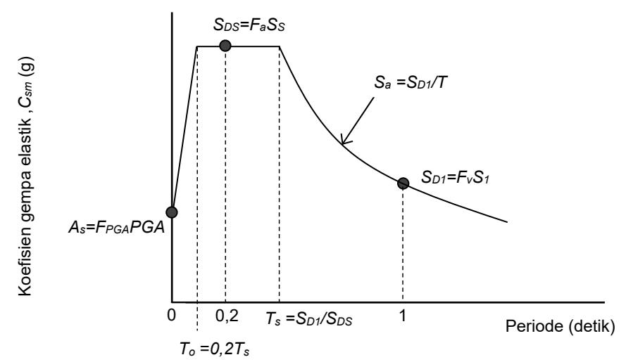

Gambar 4 - Bentuk tipikal respon spektra di permukaan tanah

Respon spektra di permukaan tanah ditentukan dari 3 (tiga) nilai percepatan puncak yang mengacu pada peta gempa Indonesia dengan probabilitas terlampaui 7% dalam 75 tahun (PGA,  $S_S$  dan  $S_1$ ), serta nilai faktor amplifikasi  $F_{PGA}$ ,  $F_a$ , dan  $F_v$ . Perumusan respon spektra adalah sebagai berikut :

$$A_S = F_{PGA} \times PGA$$
 (8)  
 $S_{DS} = F_a \times S_s$  (9)  
 $S_{D1} = F_v \times S_1$  (10)

# 5.4.2 Koefisien respon gempa elastic

1. Untuk periode lebih kecil dari  $T_0$ , koefisien respons gempa elastik ( $C_{sm}$ ) didapatkan dari persamaan berikut :

$$C_{sm} = \left(S_{DS} - A_s\right) \frac{T}{T_0} + A_s \tag{11}$$

- 2. Untuk periode lebih besar atau sama dengan  $T_0$ , dan lebih kecil atau sama dengan  $T_S$ , respons spektra percepatan,  $C_{sm}$  adalah sama dengan  $S_{DS}$ .
- 3. Untuk periode lebih besar dari  $T_S$ , koefisien respons gempa elastik ( $C_{sm}$ ) didapatkan dari persamaan berikut :

$$C_{sm} = \frac{S_{D1}}{T} \tag{12}$$

#### Keterangan:

 $S_{DS}$  adalah nilai spektra permukaan tanah pada periode pendek (T=0,2 detik).

S<sub>D1</sub> adalah nilai spektra permukaan tanah pada periode 1,0 detik

$$T_0 = 0.2 T_s$$

$$T_s = \frac{S_{D1}}{S_{DS}}$$

Penggunaan masing-masing persamaan dapat membentuk respons spektra di permukaan seperti diperlihatkan pada **Gambar 4.** 

# 5.5 Klasifikasi operasional

Pemilik pekerjaan atau pihak yang berwenang harus dapat mengklasifikasikan jembatan ke dalam satu dari tiga kategori sebagai berikut :

Jembatan sangat penting (critical bridges),

- Jembatan penting (*essential bridges*), atau
- Jembatan lainnya (*other bridges*)

Jembatan penting harus dapat dilalui oleh kendaraan darurat dan untuk kepentingan keamanan/pertahanan beberapa hari setelah mengalami gempa rencana dengan periode ulang 1000 tahun). Untuk jembatan sangat penting, maka jembatan harus dapat dilalui oleh semua jenis kendaraan (lalu-lintas normal) dan dapat dilalui oleh kendaraan darurat dan untuk kepentingan keamanan/pertahanan segera setelah mengalami gempa dengan periode ulang 1000 tahun. Jembatan lainnya adalah jembatan yang masih dapat dilalui kendaraan darurat dengan lalu-lintas yang terbatas setelah mengalami gempa rencana dengan periode ulang 1000 tahun.

# **5.6 Kategori kinerja seismik**

Setiap jembatan harus ditetapkan dalam salah satu empat zona gempa berdasarkan spektra percepatan periode 1 detik (*SD1*) sesuai

**Tabel** 5. Kategori tersebut menggambarkan variasi risiko seismik dan digunakan untuk penentuan metode analisis, panjang tumpuan minimum, detail perencanaan kolom, serta prosedur desain fondasi dan kepala jembatan.

**Tabel 5 - Zona gempa** 

| Koefisien percepatan (SD1) | Zona gempa |
|----------------------------|------------|
| SD1 ≤ 0,15                 | 1          |
| 0,15 < SD1 ≤ 0,30          | 2          |
| 0,30 < SD1 ≤ 0,50          | 3          |
| SD1 > 0,50                 | 4          |

**Catatan** *: SD1 = Fv x S1* 

*SD1* adalah nilai spektra permukaan tanah pada periode 1,0 detik

*Fv* adalah nilai faktor amplifikasi untuk periode 1 detik (*Fv*)

*S1* adalah parameter respons spektra percepatan gempa untuk periode 1,0 detik mengacu pada Peta Gempa Indonesia dengan probabilitas terlampaui 7% dalam 75 tahun (**Gambar 3**).

# **5.7 Faktor modifikasi respon**

# **5.7.1 Umum**

Untuk penggunaan faktor modifikasi respon pada pasal ini maka detailing struktur harus sesuai dengan ketentuan pada **Pasal 7** dan **Pasal 7.5.** 

Gaya gempa rencana pada bangunan bawah dan hubungan antara elemen struktur ditentukan dengan cara membagi gaya gempa elastis dengan faktor modifikasi respon (*R*) sesuai dengan **Tabel 6** dan **Tabel 7**. Sebagai alternatif penggunaan faktor *R* pada **Tabel 7** untuk hubungan struktur, sambungan monolit antara elemen struktur atau struktur, seperti hubungan kolom ke fondasi telapak dapat direncanakan untuk menerima gaya maksimum akibat plastifikasi kolom atau kolom majemuk yang berhubungan.

Apabila digunakan analisis dinamik riwayat waktu, maka faktor modifikasi respon (*R*) diambil sebesar 1 untuk seluruh jenis bangunan bawah dan hubungan antar elemen struktur.

**Tabel 6 - Faktor modifikasi respon (***R***) untuk bangunan bawah** 

|                             | Kategori kepentingan |         |         |  |  |
|-----------------------------|----------------------|---------|---------|--|--|
| Bangunan bawah              | Sangat penting       | Penting | Lainnya |  |  |
| Pilar tipe dinding          | 1,5                  | 1,5     | 2,0     |  |  |
| Tiang/kolom beton bertulang |                      |         |         |  |  |
| Tiang vertikal              | 1,5                  | 2,0     | 3,0     |  |  |
| Tiang miring                | 1,5                  | 1,5     | 2,0     |  |  |
| Kolom tunggal               | 1,5                  | 2,0     | 3,0     |  |  |
| Tiang baja dan komposit     |                      |         |         |  |  |
| Tiang vertikal              | 1,5                  | 3,5     | 5,0     |  |  |
| Tiang miring                | 1,5                  | 2,0     | 3,0     |  |  |
| Kolom majemuk               | 1,5                  | 3,5     | 5,0     |  |  |

# **Catatan:**

Pilar tipe dinding dapat direncanakan sebagai kolom tunggal dalam arah sumbu lemah pilar

**Tabel 7 - Faktor modifikasi respon (***R***) untuk hubungan antar elemen struktur** 

| Hubungan elemen struktur                      | Semua kategori<br>kepentingan |
|-----------------------------------------------|-------------------------------|
| Bangunan atas dengan kepala jembatan          | 0,8                           |
| Sambungan muai (dilatasi) pada bangunan atas  | 0,8                           |
| Kolom, pilar, atau tiang dengan bangunan atas | 1,0                           |
| Kolom atau pilar dengan fondasi               | 1,0                           |

# **5.7.2 Penggunaan**

Gaya gempa harus diasumsikan untuk dapat bekerja dari semua arah lateral. Faktor modifikasi respon (*R*) yang sesuai harus digunakan di kedua arah sumbu ortogonal bangunan bawah. Pilar tipe dinding dapat dianalisis sebagai kolom tunggal dalam arah sumbu lemah.

# **5.8 Kombinasi pengaruh gaya gempa**

Gaya gempa elastis yang bekerja pada struktur jembatan harus dikombinasi sehingga memiliki 2 tinjauan pembebanan sebagai berikut :

- 100% gaya gempa pada arah x dikombinasikan dengan 30% gaya gempa pada arah y.
- 100% gaya gempa pada arah y dikombinasikan dengan 30% gaya gempa pada arah x.

Sehingga apabila diaplikasikan dengan memperhitungkan variasi arah maka kombinasi gaya gempa menjadi sebagai berikut :

1. 
$$DL + {}_{EQ}LL \pm EQ_x \pm 0,3 EQ_y$$
 (13)  
2.  $DL + {}_{EQ}LL \pm EQ_y \pm 0,3 EQ_x$  (14)

# **Keterangan :**

*DL* adalah beban mati yang bekerja (kN)

*EQ* adalah faktor beban hidup kondisi gempa

*EQ* = 0,5 (jembatan sangat penting)

*EQ* = 0,3 (jembatan penting)

*EQ* = 0 (jembatan lainnya)

*LL* adalah beban hidup yang bekerja (kN)

*EQx* adalah beban gempa yang bekerja pada arah *x*

*EQy* adalah beban gempa yang bekerja pada arah *y*

Jika gaya pada fondasi dan atau hubungan kolom ditentukan oleh mekanisme sendi plastis kolom (**Pasal 5.9.3.3**), maka gaya yang dihasilkan ditentukan tanpa menggunakan kombinasi beban pada pasal ini. Sehingga "gaya hubungan kolom" diambil sebagai gaya geser dan momen yang dihitung dengan basis mekanisme sendi plastis. Gaya aksial diambil sebagai hasil dari kombinasi beban aksial dan yang berkaitan dengan mekanisme sendi plastis sebagai *EQ*. Bila pilar direncanakan sebagai kolom, pengecualian dilakukan pada sumbu lemah pilar dimana pengaruh gaya akibat sendi plastis digunakan kemudian kombinasi beban harus digunakan pada sumbu kuat pilar.

# **5.9 Perhitungan gaya gempa rencana**

Jembatan dengan bentang tunggal di semua zona gempa, gaya gempa rencana minimum pada hubungan bangunan atas dan bangunan bawah harus tidak lebih kecil dari perkalian *As* (**Persamaan 8**) dengan beban permanen struktur yang sesuai.

Panjang perletakan minimum pada jembatan dengan bentang lebih dari satu harus sesuai dengan **Pasal 6.4,** atau *Shock Transmission Unit* (STU), dan peredam harus disediakan.

# **5.9.1 Zona gempa 1**

Untuk jembatan yang berada pada zona gempa 1 dimana koefisien percepatan puncak muka tanah (*As*) kurang dari 0,05, gaya horizontal rencana pada hubungan struktur pada arah yang terkekang diambil tidak kurang dari 0,15 kali reaksi vertikal akibat beban permanen dan beban hidup yang diasumsikan bekerja saat terjadi gempa.

Untuk kondisi tanah selain tanah keras pada zona gempa 1, maka gaya horizontal rencana pada hubungan struktur pada arah yang terkekang diambil tidak kurang dari 0,25 kali reaksi vertikal akibat beban permanen dan beban hidup.

Pada tiap segmen bangunan atas, beban permanen yang bekerja pada sebaris perletakan yang digunakan untuk penentuan gaya lateral rencana pada hubungan struktur adalah sebesar beban permanen total pada segmen tersebut.

Bila tiap perletakan yang mendukung segmen bangunan atas atau perletakan sederhana dikekang dalam arah transversal, maka beban permanen yang digunakan untuk perhitungan gaya lateral rencana pada hubungan struktur adalah sebesar reaksi yang dipikul tiap perletakan.

Tiap perletakan dan hubungannya ke pelat landasan harus direncanakan untuk menahan gaya gempa rencana yang ditransfer menuju perletakan. Untuk semua jembatan yang berada di zona gempa 1 dan jembatan bentang tunggal, gaya gempa tidak boleh kurang dari gaya pada hubungan struktur.

# **5.9.2 Zona gempa 2**

Struktur jembatan yang berada pada zona 2 harus dianalisis sesuai dengan persyaratan minimum **Pasal 6.3.** 

Kecuali untuk fondasi, maka gaya gempa rencana untuk seluruh komponen jembatan termasuk pilar dan dinding penahan tanah, ditentukan dengan membagi gaya gempa elastis dengan faktor modifikasi respon (*R*) sesuai dengan **Tabel 6**.

Gaya gempa rencana untuk fondasi selain fondasi tiang pancang dan dinding penahan tanah ditentukan dengan membagi gaya gempa elastis dengan setengah dari nilai faktor modifikasi respon (*R/2*) sesuai dengan **Tabel 6**, untuk komponen bangunan bawah dimana fondasi tersebut terhubung. Nilai *R/2* tidak boleh kurang dari 1.0.

Bila kombinasi beban selain kombinasi gempa menentukan terhadap perencanaan kolom, kemungkinan gaya gempa yang ditransfer ke fondasi dapat lebih besar dibandingkan dengan perhitungan di atas karena kemungkinan kuat lebih kolom harus diperhitungkan.

# **5.9.3 Zona gempa 3 dan 4**

# **5.9.3.1 Umum**

Struktur jembatan yang berada pada zona 3 dan 4 harus dianalisis sesuai dengan persyaratan minimum pada **Pasal 6.3.** Gaya rencana untuk tiap komponen diambil sebagai nilai terkecil dari ketentuan pada **Pasal 5.9.3.2** dan **Pasal 5.9.3.3.** 

# **5.9.3.2 Gaya gempa modifikasi**

Gaya gempa yang dimodifikasi ditentukan sesuai dengan **Pasal 5.9.2**, kecuali untuk fondasi nilai *R* diambil sama dengan 1.0. Kolom boleh mengalami kerusakan hingga batas yang dapat diterima dengan membentuk sendi plastis. Tetapi untuk fondasi, harus tetap dalam kondisi batas elastis sehingga nilai *R* diambil sama dengan 1.

# **5.9.3.3 Gaya sendi inelastic**

Apabila pembentukan sendi inelastis digunakan sebagai basis perencanaan gempa, maka gaya dalam yang terjadi pada sendi plastis pada bagian atas atau bawah kolom harus dihitung setelah perencanaan awal kolom dilakukan sesuai dengan **Pasal 5.9.3.2**. Gaya yang terjadi akibat proses sendi plastis harus digunakan untuk penentuan gaya rencana.

Sendi plastis harus dipastikan dapat terbentuk sebelum komponen lain mengalami kegagalan karena tegangan berlebih atau ketidakstabilan struktur pada fondasi. Sendi plastis hanya boleh terjadi pada lokasi kolom dimana dapat dilakukan inspeksi atau perbaikan.

Bangunan atas dan bangunan bawah berikut dengan hubungannya dengan kolom harus direncanakan terhadap gaya geser lateral yang ditentukan tahanan lentur inelastis terfaktor dengan menggunakan faktor tahanan yang ditentukan berikut ini. Gaya geser yang dihitung berdasarkan mekanisme sendi inelastis dapat diambil sebagai gaya gempa maksimum yang dapat dipikul jembatan.

# **5.9.3.3a Kolom tunggal dan pilar**

Pengaruh gaya gempa pada kolom tunggal dan pilar dihitung dengan cara sebagai berikut :

# Langkah 1 :

Tentukan faktor kuat lebih momen tahanan. Gunakan faktor tahanan 1,3 untuk kolom beton bertulang dan 1,25 untuk kolom baja. Untuk kedua jenis kolom tersebut, gaya aksial pada kolom harus ditentukan berdasarkan kombinasi beban gempa, dengan gaya aksial elastis akibat gempa diambil sebesar *EQ*.

# Langkah 2 :

Dengan menggunakan faktor kuat lebih momen tahanan, hitung gaya geser pada kolom. Bila fondasi kolom cukup dalam, maka perlu dipertimbangkan kemungkinan terjadinya sendi plastis di atas fondasi. Bila ini dapat terjadi, maka panjang kolom diantara sendi plastis digunakan untuk perhitungan gaya geser kolom.

# **5.9.3.3b Pilar dengan dua buah kolom atau lebih**

Pengaruh gaya gempa pada pilar dengan dua kolom atau lebih harus dihitung dalam dua arah tinjauan yaitu pada bidang pilar maupun tegak lurus bidang pilar. Untuk perhitungan gaya yang tegak lurus bidang pilar maka dapat ditentukan sesuai dengan kolom tunggal seperti pada **Pasal 5.9.3.3a**. Gaya yang bekeja pada bidang pilar dapat ditentukan dengan langkah-langkah sebagai berikut :

# Langkah 1 :

Tentukan faktor kuat lebih momen tahanan. Gunakan faktor tahanan 1,3 untuk kolom beton bertulang dan 1,25 untuk kolom baja. Untuk kedua material, gaya aksial inisial pada kolom harus ditentukan berdasarkan (Kombinasi beban gempa), dengan *EQ* sebesar 0.

# Langkah 2 :

Dengan menggunakan faktor kuat lebih momen tahanan, hitung gaya geser pada kolom. Jumlahkan gaya geser pada bidang pilar untuk penentuan gaya geser maksimum pilar. Bila terdapat dinding diantara kolom, maka tinggi kolom efektif ditentukan dari dinding atas. Bila fondasi kolom cukup dalam, maka perlu dipertimbangkan kemungkinan terjadinya sendi plastis di atas fondasi. Bila ini dapat terjadi, maka panjang kolom di antara sendi plastis digunakan untuk perhitungan gaya geser kolom.

# Langkah 3 :

Berikan gaya geser pada pusat massa bangunan atas dan tentukan gaya aksial pada kolom karena momen saat kuat lebih kolom terbentuk.

# Langkah 4 :

Dengan menggunakan gaya aksial kolom sebagai gaya gempa pada (Kombinasi beban gempa)**,** tentukan momen tahanan lebih kolom yang terkoreksi. Dengan menggunakan momen tahanan lebih, hitung gaya geser kolom dan gaya geser maksimum.

# **5.9.4.3c Gaya rencana untuk kolom dan portal**

Gaya rencana untuk kolom dan tiang pancang miring diambil nilai terkecil dari yang ditentukan pada **Pasal 5.9.3.1** yaitu sebagai berikut:

Gaya aksial : Gaya rencana maksimum dan minimum ditentukan berdasarkan kombinasi

beban gempa baik dengan cara desain elastis atau sendi plastis pada kolom.

Momen : Momen rencana modifikasi berdasarkan kombinasi beban gempa.

Geser : Nilai terkecil berdasarkan desain elastis dengan kombinasi beban gempa dan menggunakan faktor *R* sama dengan 1 untuk kolom atau nilai berdasarkan analisis sendi plastis.

# **5.9.4.3d Gaya rencana untuk pilar**

Gaya rencana ditentukan berdasarkan kombinasi beban gempa, kecuali bila pilar direncanakan sebagai kolom dalam arah sumbu lemah. Bila pilar direncanakan sebagai kolom, maka gaya rencana pada arah sumbu lemah harus sesuai dengan **Pasal 5.9.4.3c** dan semua persyaratan perencanaan untuk kolom harus diperhitungkan. Bila gaya akibat sendi plastis digunakan dalam arah sumbu lemah, maka kombinasi gaya harus digunakan untuk menentukan momen elastis yang kemudian dikurangi dengan faktor-*R*.

# **5.9.4.3e Gaya rencana untuk fondasi**

Gaya rencana untuk fondasi termasuk telapak, kepala tiang, dan tiang pancang dapat ditentukan sebagai gaya berdasarkan kombinasi beban gempa dengan gaya gempa yang dikombinasi atau gaya pada dasar kolom yang mengalami sendi plastis.

Bila kolom pada suatu portal memiliki telapak, distribusi gaya akhir pada dasar kolom pada langkah 4 pada **Pasal 5.9.3.3b** dapat digunakan untuk perencanaan fondasi telapak pada bidang portal. Distribusi gaya ini menghasilkan gaya geser dan momen yang lebih rendah pada telapak karena kolom eksterior mengalami tarik dan tekan di sisi lain karena momen lentur akibat gempa. Hal ini mengakibatkan peningkatan momen dan geser pada satu kolom dan mengurangi gaya pada kolom di sisi lainnya.

# **5.10 Penahan longitudinal**

Mekanisme friksi tidak diperhitungkan sebagai penahan yang efektif. Penahan harus direncanakan dengan gaya rencana sebesar koefisien percepatan (*As*) yang dikalikan dengan beban permanen yang lebih ringan diantara dua bentang struktur.

Bila penahan berada di lokasi dimana simpangan relatif penampang bangunan atas direncanakan muncul saat terjadi gempa, kelonggaran yang cukup diperlukan pada penahan sehingga penahan tidak langsung bekerja hingga simpangan rencana terlampaui.

Bila penahan diperlukan pada kolom atau pilar, maka penahan pada tiap bentang diletakkan pada kolom atau pilar dibanding pada bentang yang berhubungan.

Sebagai pengganti penahan, *Shock Transmission Unit* (STU) dapat digunakan dan direncanakan dengan gaya elastik atau dengan gaya maksimum berdasarkan mekanisme sendi plastis pada bangunan bawah.

# **5.11** *Hold down devices*

Jembatan yang berlokasi di zona gempa 2, 3, dan 4, *hold down devices* harus disediakan pada perletakan dan pada lokasi sendi untuk struktur menerus dimana gaya gempa vertikal akibat gaya gempa longitudinal melebihi 50% dan kurang dari 100% reaksi vertikal akibat beban permanen. Dalam hal ini, gaya angkat efektif untuk perencanaan *hold down devices* diambil 10% dari reaksi akibat beban permanen bila bentang jembatan berupa bentang sederhana.

Jika gaya gempa vertikal menghasilkan gaya angkat efektif, maka *hold down devices* harus direncanakan untuk menahan nilai terbesar dari :

 120% dari perbedaan antara gaya gempa vertikal dan reaksi akibat beban permanen, atau

10% reaksi akibat beban permanen.

# **5.12 Persyaratan untuk jembatan sementara dan konstruksi bertahap**

Jembatan atau jembatan yang sedang dalam masa konstruksi yang direncanakan bersifat sementara dalam kurun waktu lebih dari 5 tahun harus direncanakan dengan menggunakan persyaratan untuk struktur permanen dan tidak berlaku untuk digunakan dalam pasal ini.

Persyaratan bahwa gempa tidak mengakibatkan keruntuhan pada seluruh bagian jembatan juga berlaku untuk jembatan sementara. Persyaratan tersebut juga berlaku pada jembatan yang dibangun secara bertahap dan memikul beban kendaraan dan atau melintas di atas jalan raya. Respons spektra rencana sesuai dengan **Pasal 5.4.2** dapat direduksi dengan faktor *R* tidak lebih dari 2 untuk menghitung gaya elastik komponen dan simpangan. Respons dan koefisien percepatan untuk lokasi konstruksi yang dekat dengan patahan aktif harus dilakukan suatu studi khusus. Ketentuan panjang perletakan minimum pada **Pasal 6.4** berlaku untuk jembatan sementara dan konstruksi bertahap.

# **6 Analisis terhadap beban gempa**

# **6.1 Umum**

Persyaratan analisis minimum terhadap pengaruh gempa harus sesuai dengan **Tabel 8.**  Untuk analisis modal seperti pada **Pasal 6.3.2** dan **Pasal 6.3.3**, dapat digunakan respon spektra desain sesuai dengan **Gambar 4.**

Jembatan pada zona gempa 1 tidak diperlukan analisis gempa rinci tanpa melihat klasifikasi operasional dan geometri. Namun demikian, harus memenuhi persyaratan minimum sesuai **Pasal 6.4** dan **Pasal 5.9.**

# **6.2 Jembatan bentang tunggal**

Analisis gempa tidak diperlukan untuk jembatan bentang tunggal di semua zona gempa. Namun demikian, hubungan struktur atas jembatan dan kepala jembatan harus direncanakan dengan gaya rencana sesuai dengan **Pasal 5.9.** 

Persyaratan minimum lebar dudukan harus dipenuhi pada tiap kepala jembatan sesuai dengan **Pasal 6.4**.

# **6.3 Jembatan bentang majemuk**

# **6.3.1 Pemilihan metode analisis**

Untuk jembatan dengan bentang lebih dari satu, maka perlu dilakukan analisis gempa sesuai dengan klasifikasi **Tabel 8.** 

Tabel 8 - Persyaratan analisis minimum untuk pengaruh gempa

|       | Jembatan   | Jembatan dengan bentang > 1 |                  |                  |                  |                         |                  |
|-------|------------|-----------------------------|------------------|------------------|------------------|-------------------------|------------------|
| Zona  | bentang    | Jembatan lainnya            |                  | Jembatan penting |                  | Jembatan sangat penting |                  |
| Gempa | tunggal    | beraturan                   | Tdk<br>beraturan | beraturan        | Tdk<br>beraturan | beraturan               | Tdk<br>beraturan |
| 1     | Tidak      | *                           | *                | *                | *                | *                       | *                |
| 2     | dibutuhkan | SM/UL                       | SM               | SM/UL            | MM               | MM                      | MM               |
| 3     | analisis   | SM/UL                       | MM               | MM               | MM               | MM                      | TH               |
| 4     | gempa      | SM/UL                       | MM               | MM               | MM               | TH                      | TH               |

#### Keterangan:

\* : Tidak diperlukan analisis dinamik
UL : Metode beban elastis (*Uniform Load*)

SM : Metode spektra moda tunggal (Single Mode Elastic)
MM : Metode spektra multimoda (Multimode Mode Elastic)

TH: Metode riwayat waktu (*Time History*)

Keberaturan jembatan tergantung pada jumlah bentang dan distribusi berat serta kekakuan. Jembatan beraturan memiliki bentang kurang dari tujuh bentang, tidak ada perubahan yang besar dalam hal berat, kekakuan, dan geometri pada tiap bentangnya. Jembatan yang memenuhi ketentuan pada **Tabel 9** dapat dikatakan sebagai jembatan beraturan. Jembatan yang tidak memenuhi ketentuan pada **Tabel 9** dapat dikatakan sebagai jembatan tidak beraturan.

Tabel 9 - Persyaratan jembatan beraturan

| Parameter                                                                                      |     |     | Nilai |     |     |
|------------------------------------------------------------------------------------------------|-----|-----|-------|-----|-----|
| Jumlah bentang                                                                                 | 2   | 3   | 4     | 5   | 6   |
| Maksimum sudut pada <i>curved</i> bridge*                                                      | 90° | 90° | 90°   | 90° | 90° |
| Rasio bentang maksimum dari bentang ke bentang                                                 | 3   | 2   | 2     | 1,5 | 1,5 |
| Rasio maksimum kekakuan<br>pilar dari bentang ke bentang,<br>tidak termasuk kepala<br>jembatan | -   | 4   | 4     | 3   | 2   |

Catatan : - semua nilai rasio direferensikan terhadap nilai terkecil

\* sudut pada titik pusat jari-jari jembatan dengan besar sudut yang menghubungkan kedua ujung jembatan bentang tunggal.

Curved bridges yang terdiri dari beberapa bentang sederhana (multi span) dapat dikatakan jembatan tidak beraturan bila sudut yang dibentuk pada denahnya lebih besar 20°. Jembatan tersebut dapat dianalisis dengan menggunakan metode multimoda elastis atau dengan menggunakan metode riwayat waktu.

Curved bridges dapat dianalisis sebagai jembatan yang lurus bila dipenuhi ketentuan-ketentuan sebagai berikut :

- Jembatan termasuk dalam jembatan beraturan sesuai dengan **Tabel 9**, kecuali jembatan dua bentang rasio bentang ke bentang tidak boleh melebihi 2,
- Sudut yang dibentuk pada jembatan dalam denah tidak melebihi 90°, dan
- Panjang bentang jembatan lurus ekivalen adalah sama dengan panjang lengkung pada curved bridge.

Bila ketentuan tersebut tidak terpenuhi, maka *curved bridge* harus dianalisis sesuai dengan geometri yang melengkung.

# **6.3.2 Metode analisis moda tunggal**

# **6.3.2.1 Metode spektra moda tunggal**

Metode analisis ini harus berdasarkan pada ragam getar fundamental baik dalam arah memanjang atau melintang jembatan. Ragam getar ini dapat diperoleh dengan memberikan gaya horizontal merata pada struktur sehingga didapatkan perubahan bentuk struktur. Periode alami dapat dihitung dengan menggunakan persamaan energi potensial dan energi kinetik pada ragam getar fundamental. Amplitudo dari perubahan bentuk dapat ditentukan dengan menggunakan koefisien respon gempa elastis sesuai dengan **Pasal 5.4.2** dan perpindahan spektra yang sesuai. Amplitudo ini dapat digunakan untuk penentuan gaya dalam. Contoh aplikasi penggunaan metode analisis moda tunggal dapat dilihat pada **Lampiran B**.

# **6.3.2.2 Metode beban merata**

Metode analisis ini harus berdasarkan pada ragam getar fundamental baik dalam arah memanjang atau melintang jembatan. Periode pada ragam getar diambil berdasarkan model massa-pegas ekivalen. Kekakuan pegas ditentukan berdasarkan perpindahan maksimum yang timbul saat beban lateral merata bekerja pada jembatan. Koefisien respon gempa elastis dapat digunakan untuk menghitung beban gempa merata ekivalen.

# **6.3.3 Metode spektra multimoda**

Metode analisis ini digunakan pada jembatan yang memiliki *coupling* lebih dari satu dari tiga arah koordinat pada tiap pola getar. Minimum digunakan analisis dinamik linier dengan model tiga dimensi untuk pemodelan strukturnya.

Jumlah ragam getar yang diperhitungkan dalam analisis paling sedikit tiga kali jumlah bentang pada model jembatan. Koefisien respon gempa elastis dapat digunakan pada tiap ragam getar.

Gaya dalam dan perpindahan komponen dapat dihitung dengan mengkombinasikan respon masing-masing ragam getar dengan menggunakan metode *Complete Quadratic Combination* (CQC).

# **6.3.4 Metode riwayat waktu**

Metode riwayat waktu yang digunakan baik dengan menggunakan analisis elastis dan inelastis harus memenuhi ketentuan analisis dinamik.

Sensitivitas metode numerik terhadap banyaknya langkah yang digunakan dalam analisis harus ditentukan. Studi sensitivitas juga harus dilakukan untuk mengetahui pengaruh variasi properti histeresis material.

Riwayat masukan percepatan yang digunakan untuk analisis gempa dapat ditentukan sesuai dengan **Pasal 6.3.4.1.** 

# **6.3.4.1 Riwayat waktu percepatan**

Riwayat waktu percepatan harus memiliki karakteristik yang mewakili kondisi kegempaan situs dan kondisi lokal situs. Respons spektra yang kompatibel dengan riwayat waktu harus digunakan berdasarkan rekaman gempa yang mewakili. Teknik yang digunakan untuk menyesuaikan spektra harus dilakukan agar tercapai riwayat waktu yang secara seismologi menyerupai riwayat waktu inisial yang dipilih untuk penyesuaian spektra.

Bila digunakan rekaman riwayat waktu, maka data tersebut diskalakan dengan level perkiraan dari respons spektra rencana pada rentang periode yang signifikan. Masingmasing riwayat waktu harus dimodifikasi agar menghasilkan respons spektra kompatibel menggunakan prosedur domain waktu.

Setidaknya tiga buah respons spektra yang kompatibel dengan riwayat waktu harus digunakan untuk tiap komponen gempa yang mewakili gempa rencana. Tiga komponen ortogonal (*x, y*, dan *z*) gempa rencana harus dimasukkan secara bersamaan saat melakukan analisis nonlinier riwayat-waktu. Perencanaan didasarkan pada pengaruh respons maksimum dari tiga gempa masukan pada tiap arah utama. Bila terdapat 7 rekaman percepatan maka perencanaan didasarkan pada respons rata-ratanya.

Untuk situs yang berjarak kurang dari 10 km dari patahan aktif, maka komponen horizontal gerakan tanah yang diambil harus mewakili kondisi dan harus diubah menjadi komponen utama sebelum kompatibel dengan respons spektra. Komponen utama digunakan untuk mewakili gerak tanah dalam arah normal terhadap patahan dan Komponen minor digunakan untuk mewakili gerak tanah dalam arah sejajar terhadap patahan.

# **6.4 Persyaratan panjang perletakan minimum**

Panjang perletakan pada tumpuan tanpa penahan (**Gambar 5**), *STU*, atau peredam harus dapat mengakomodasi simpangan maksimum yang telah diperhitungkan sesuai ketentuan **Pasal 6.3**, kecuali jembatan pada zona 1, atau persentase panjang perletakan empiris (*N*) sesuai **Persamaan 15**. Jika tidak, maka diperlukan penahan lateral sesuai **Pasal 5.10**. Perletakan yang dikekang dalam arah longitudinal harus direncanakan sesuai dengan **Pasal 5.9**. Persentase (*N*) yang dapat digunakan untuk tiap zona gempa dapat diperlihatkan pada **Tabel 10.**

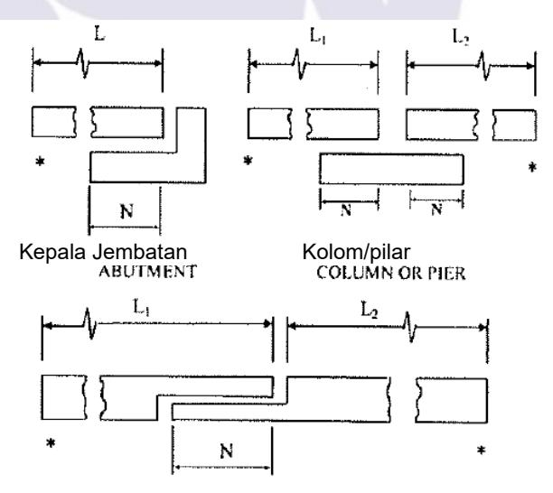

\*siar muai atau ujung lantai jembatan

# **Gambar 5 - Panjang perletakan**

$$N = (-0,782 + 0,02L + 0,08H)(1 + 0,000125S^{2})$$
(15)

# **Keterangan :**

- *N* adalah panjang perletakan minimum diukur normal terhadap *centerline* tumpuan (m)
- *L* adalah panjang lantai jembatan diukur dari siar muainya. Apabila terdapat sambungan pada suatu bentang, maka *L* merupakan penjumlahan antara bentang sebelum dan setelah sambungan. Untuk jembatan bentang tunggal, *L* sama dengan panjang lantai jembatan (m).

H adalah rata-rata tinggi kolom yang mendukung lantai jembatan pada tiap bentang jembatan untuk kepala jembatan (m).

Untuk kolom, tinggi kolom atau pilar jembatan (m).

Untuk sambungan pada bentang, rata-rata tinggi dua kolom atau pilar terdekat (m). *H*=0 untuk jembatan bentang tunggal (m).

S adalah kemiringan perletakan diukur dari garis normal terhadap bentangnya (mm)

Tabel 10 - Persentase N berdasarkan zona dan koefisien percepatan (As)

| Zona gempa | Koefisien percepatan (As) | Persentase N |
|------------|---------------------------|--------------|
| 1          | < 0,05                    | ≥ 75         |
| 1          | ≥ 0,05                    | 100          |
| 2          | Semua nilai               | 150          |
| 3          | Semua nilai               | 150          |
| 4          | Semua nilai               | 150          |

# 6.5 Persyaratan P-∆

Perpindahan lateral kolom atau pilar baik dalam arah longitudinal atau melintang harus memenuhi persyaratan sebagai berikut :

$$\Delta P_u < 0.25 \phi M_n \tag{16}$$

Dimana,

$$\Delta = R_d \Delta_e \tag{17}$$

Bila  $T < 1,25T_s$ , maka:

$$R_d = \left(1 - \frac{1}{R}\right) \frac{1,25T_s}{T} + \frac{1}{R}$$
 (18)

Bila  $T \ge 1,25T_s$ , maka:

$$R_d = 1 \tag{19}$$

#### Keterangan:

Δ adalah perpindahan titik kolom atau pilar relatif terhadap dasar fondasi (m)

 $\Delta_e$  adalah perpindahan berdasarkan analisis gempa elastis (m)

T adalah periode moda getar fundamental (detik)

$$T_s = \frac{S_{D1}}{S_{DS}}$$
 (detik)

R adalah faktor modifikasi respons sesuai Tabel 6

 $P_{\mu}$  adalah beban aksial terfaktor pada kolom atau pilar (kN)

 $\phi$  adalah faktor reduksi lentur pada kolom

*M<sub>n</sub>* adalah kuat lentur nominal kolom atau pilar (kN.m)

# 7 Struktur beton bertulang

#### **7.1 Umum**

Ketentuan pada pasal ini hanya berlaku pada kondisi batas ekstrim. Persyaratan tulangan harus memenuhi ketentuan ketahanan gempa pada pasal ini. Persyaratan simpangan pada **Pasal 6.4** atau penahan longitudinal seperti pada **Pasal 5.10** harus dipenuhi. Jembatan yang terletak di zona gempa 2 harus memenuhi persyaratan **Pasal 7.3**, kemudian jembatan yang terletak di zona gempa 3 dan 4 harus memenuhi persyaratan **Pasal 7.4**.

# **7.2 Zona gempa 1**

Jembatan yang terletak di zona gempa 1 dengan nilai *SD1* kurang dari 0,1, maka perencanaan komponen struktur tidak perlu memperhitungkan pengaruh gempa, kecuali perencanaan hubungan bangunan atas ke bangunan bawah harus sesuai dengan **Pasal 5.9.1.**

Jembatan yang terletak di zona gempa 1 dengan nilai *SD1* lebih besar atau sama dengan 0,1 tetapi kurang dari atau sama dengan 0,15, maka perencanaan komponen struktur tidak perlu memperhitungkan pengaruh gempa, kecuali :

- Perencanaan hubungan bangunan atas ke bangunan bawah harus sesuai dengan **Pasal 5.9.1.**
- Persyaratan tulangan transversal pada bagian atas dan bawah kolom harus sesuai dengan ketentuan **Pasal 7.4.1.5** dan **Pasal 7.4.1.6.**

# **7.3 Zona gempa 2**

Ketentuan pada **Pasal 7.4** berlaku pada jembatan yang berada di zona gempa 2 kecuali luas tulangan longitudinal tidak boleh kurang dari 0,01 dan lebih dari 0,06 luas penampang kotor (*Ag*).

# **7.4 Zona gempa 3 dan 4**

# **7.4.1 Persyaratan kolom**

Pendukung vertikal harus dianggap sebagai kolom jika rasio tinggi bersih terhadap dimensi maksimum penampangnya lebih besar dari 2,5. Untuk kolom dengan pembesaran, dimensi rencana maksimum diambil pada bagian minimum dari penampangnya. Untuk pendukung dengan rasio kurang dari 2,5 maka ketentuan untuk pilar dinding **Pasal 7.4.2** dapat digunakan.

Pilar dapat direncanakan sebagai elemen pilar pada arah sumbu kuat dan sebagai kolom pada sumbu lemahnya.

# **7.4.1.1 Tulangan longitudinal**

Luas tulangan longitudinal tidak kurang dari 0,01 *Ag* dan lebih besar dari 0,04 *Ag* dimana *Ag*  adalah luas kotor penampang beton.

# **7.4.1.2 Tahanan lentur**

Kekuatan biaksial kolom tidak boleh kurang dari kuat lentur sesuai **Pasal 5.9.3**. Kolom harus diperiksa pada kondisi beban ekstrim. Faktor tahanan lentur kolom dengan penulangan spiral atau sengkang diambil sebesar 0,9.

# **7.4.1.3 Geser kolom dan tulangan transversal**

Gaya geser terfaktor (*Vu*) pada tiap sumbu utama kolom dan portal diambil sesuai dengan **Pasal 5.9.3.** Jumlah tulangan transversal tidak boleh kurang dari ketentuan minimum tulangan geser untuk beton bertulang.

Ketentuan berikut berlaku untuk daerah ujung pada bagian atas dan bawah kolom dan portal:

Pada daerah ujung, *Vc* dapat diambil sesuai dengan rumus berikut :

$$V_c = 0.083 \beta_d \sqrt{f_c} b_v d_v$$
 (20)

# Keterangan:

 $f_c$  adalah kuat tekan beton pada umur 28 hari, kecuali kalau umur lain ditentukan (MPa)

 $\beta_{\rm d}$  adalah faktor yang menunjukkan kemampuan beton dengan retak diagonal untuk mentransfer tarik dan geser

- b, adalah lebar efektif penampang (mm)
- d, adalah kedalaman geser efektif (mm)

**Persamaan 20** berlaku untuk gaya aksial tekan terfaktor melebihi 0,1  $A_g f'_c$ . Untuk gaya tekan kurang dari 0,1  $A_g f'_c$ ,  $V_c$  diambil nilai yang turun secara linier dari nilai pada **Persamaan 20** hingga nol pada gaya tekan sama dengan nol.

- Daerah ujung diasumsikan diawali pada soffit gelagar atau balok kepala pada bagian atas kolom atau dari bagian atas fondasi pada dasar kolom dengan jarak diambil nilai terbesar dari:
  - Dimensi terbesar penampang kolom,
  - 1/6 tinggi netto kolom atau,
  - 450 mm
- Daerah ujung pada bagian atas portal diambil seperti diatur pada kolom. Pada bagian bawah portal, daerah ujung diambil sebesar tiga kali diameter tiang dibawah titik momen maksimum hingga diameter tiang pancang tetapi tidak boleh kurang dari 450 mm di atas mud line.

# 7.4.1.4 Kapasitas tulangan geser

Untuk elemen yang diberi penulangan sengkang melingkar, spiral, atau sengkang melingkar atau spiral yang saling terkait, kuat geser nominal tulangan,  $V_s$  diambil sebagai :

$$V_{s} = \frac{\pi}{2} \left( \frac{nA_{sp}f_{yh}D'}{s} \right)$$
 (21)

# Keterangan:

 $n_s$  adalah jumlah penampang inti spiral/sengkang melingkar *interlocking* 

A<sub>sp</sub> adalah luas baja tulangan spiral/sengkang melingkar (mm<sup>2</sup>)

 $f_{yh}$  adalah tegangan leleh tulangan spiral/sengkang melingkar (MPa)

D' adalah diameter inti kolom yang diukur dari pusat spiral/sengkang melingkar (mm)

s adalah jarak tulangan spiral/sengkang melingkar (mm)

Untuk elemen yang diberi penulangan dengan sengkang persegi, termasuk dinding pilar dalam sumbu lemah, kuat geser nominal tulangan  $V_s$  diambil sebagai :

$$V_s = \frac{A_v f_{yh} d}{s}$$
 (22)

#### Keterangan:

 $A_{\nu}$  adalah luas penampang tulangan geser dalam arah pembebanan (mm<sup>2</sup>)

 adalah tinggi efektif penampang dalam arah pembebanan diukur dari permukaan tekan elemen ke pusat berat dari tulangan tarik (mm)

f<sub>vh</sub> adalah tegangan leleh sengkang (MPa)

s adalah spasi sengkang (mm)

Contoh penulangan transversal elemen kolom ditunjukkan pada **Gambar 6** sampai dengan **Gambar 9**.

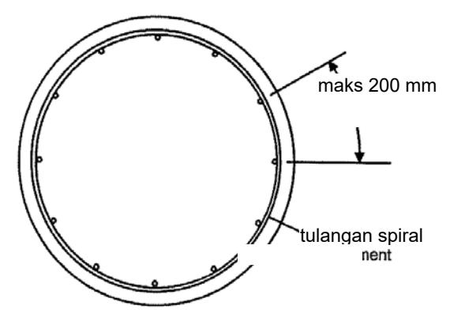

**Gambar 6 - Tulangan spiral** 

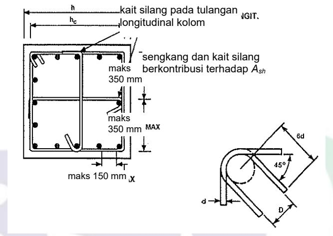

**Gambar 7 - Detail tulangan pengekang kolom persegi** 

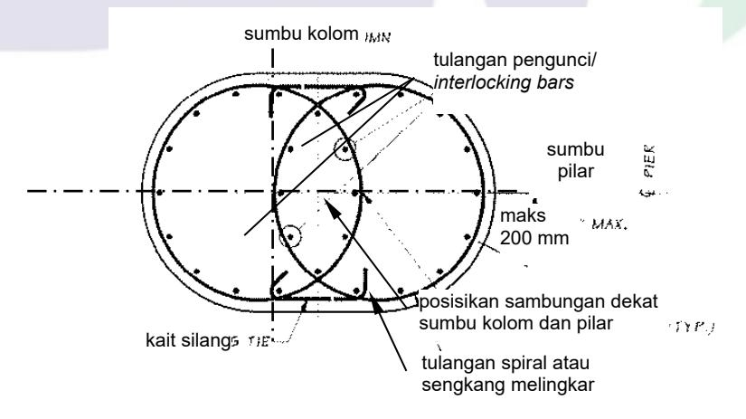

**Gambar 8 - Detail tulangan** *interlocking* **dan tulangan geser** 

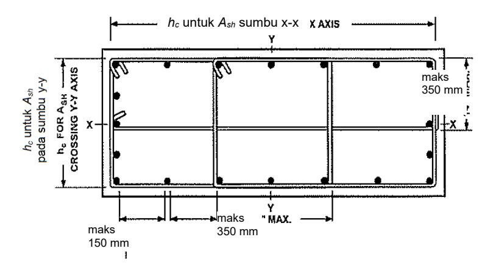

Gambar 9 - Detail tulangan pengekang kolom persegi panjang

# 7.4.1.5 Tulangan geser maksimum dan minimum

# a. Tulangan geser maksimum

Kuat geser yang diberikan baja tulangan  $V_s$  diambil tidak lebih besar dari :

$$V_s \le 0.67\sqrt{f_c}A_e \tag{23}$$

dengan

$$A_{\rm e} = 0.8A_{\rm q} \tag{24}$$

# Keterangan:

A<sub>e</sub> adalah luas efektif penampang untuk perhitungan tahanan geser (mm²)

 $A_g$  adalah luas brutto penampang beton (mm<sup>2</sup>)

 $f_c'$  adalah kuat tekan beton (MPa)

#### b. Tulangan geser minimum

Luas tulangan geser kolom harus diambil lebih besar dari nilai minimum sesuai dengan **Persamaan 25**. Luas tulangan geser untuk tiap inti kolom individual yang dikekang dengan tulangan spiral atau sengkang harus lebih besar dari nilai yang diberikan pada **Persamaan 25**.

$$A_{v} \ge 0.17 \frac{D's}{f_{yh}}$$
 (25)

# Keterangan:

 $A_{\nu}$  adalah luas tulangan geser (mm<sup>2</sup>)

D' adalah diameter inti kolom yang diukur dari pusat spiral/sengkang melingkar (mm)

s adalah jarak tulangan spiral/sengkang melingkar (mm)

 $f_{vh}$  adalah tegangan leleh tulangan spiral/sengkang melingkar (MPa)

Tulangan transversal yang memenuhi persyaratan berikut harus diperhitungkan sebagai kait silang:

- Batang menerus yang memiliki kait tidak kurang dari 135° dengan perpanjangan tidak kurang dari enam kali diameter tetapi tidak kurang dari 75 mm pada ujung satu dan kait tidak kurang dari 90° dengan perpanjangan tidak kurang dari enam kali diameter pada ujung lainnya.
- Kait harus berada mengelilingi tulangan utama.
- Kait 90° pada dua kait silang berurutan di lokasi tulangan longitudinal yang sama harus dibuat selang-seling.

Tulangan transversal yang memenuhi persyaratan berikut harus diperhitungkan sebagai kait:

- Tulangan harus berupa *closed tie* atau *continuously wound tie*
- *closed tie* dapat dibuat dari beberapa elemen tulangan dengan tekukan 135° yang memiliki 6 kali diameter tulangan tetapi tidak kurang dari 75 mm perpanjangan pada tiap ujungnya.
- *Continuously wound tie* memiliki tekukan 135° pada tiap ujung dengan 6 kali diameter tetapi tidak kurang dari 75 mm perpanjangan yang melibatkan tulangan longitudinal.

# **7.4.1.6 Spasi tulangan transversal untuk pengekangan**

Tulangan transversal untuk pengekangan harus :

- Terpasang pada bagian atas dan bawah kolom sepanjang tidak kurang dari nilai terbesar dari dimensi penampang kolom, seperenam tinggi kolom, atau 450 mm;
- Diperpanjang ke bagian atas dan bawah sambungan;
- Terpasang pada bagian atas tiang pancang pada portal dengan panjang yang sama seperti pada kolom;
- Terpasang pada tiang pancang pada portal sepanjang tiga kali dimensi penampang terbesar dibawah titik jepit momen ke jarak tidak kurang dari dimensi penampang maksimum atau 450 mm di atas *mudline*; dan
- Memiliki spasi tidak melampaui seperempat dimensi penampang atau 100 mm pusat ke pusat.

# **7.4.1.7 Sambungan lewatan**

Sambungan lewatan pada tulangan longitudinal tidak diizinkan untuk digunakan. Spasi tulangan transversal sepanjang sambungan tidak boleh melebihi 100 mm atau seperempat dimensi penampang terkecil.

# **7.4.2 Persyaratan pilar tipe dinding**

Ketentuan berikut berlaku untuk perencanaan pilar dalam arah sumbu kuat. Untuk sumbu lemah pilar dapat direncanakan sebagai kolom dengan faktor modifikasi respons kolom digunakan untuk penentuan gaya gempa rencana. Bila pilar tidak direncanakan sebagai kolom dalam arah sumbu lemah, batasan tahanan geser terfaktor berikut dapat digunakan. Rasio tulangan minimum, baik dalam arah horizontal ( *<sup>h</sup>* ) maupun vertikal ( *<sup>v</sup>* ), pada pilar tidak boleh kurang dari 0,0025. Rasio penulangan vertikal tidak boleh lebih kecil daripada rasio penulangan horizontal. Spasi penulangan horizontal dan vertikal tidak boleh melebihi 450 mm.

Tahanan geser terfaktor (*Vr*) pada pilar diambil nilai terkecil dari

$$V_r = 0.665 \sqrt{f_c^i} b d$$
 , dan (26)

$$V_r = \phi V_n \tag{27}$$

dengan:

$$V_n = \left(0,165\sqrt{f_c} + \rho_h f_y\right)bd \tag{28}$$

Penulangan horizontal dan vertikal harus diberikan pada tiap muka pilar. Sambungan lewatan pada penulangan horizontal pilar harus disokong, dan sambungan lewatan dua lapis tidak boleh terletak di lokasi yang sama.

# **7.4.3 Sambungan kolom**

Gaya rencana untuk hubungan antara kolom dan balok kepala, kepala tiang, atau pondasi telapak dihitung sesuai dengan **Pasal 5.9.3.3**. Panjang penyaluran untuk semua tulangan longitudinal sebesar 1,25 kali yang dibutuhkan untuk membuat kuat leleh tulangan. Penulangan transversal kolom harus menerus untuk jarak tidak kurang dari satu setengah dimensi kolom maksimum atau 375 mm diukur dari muka kolom ke elemen yang berhubungan. Tahanan geser nominal (*Vn*) beton pada sambungan portal dalam arah yang ditinjau harus memenuhi ketentuan berikut.

Untuk beton normal

$$V_n = \sqrt{f_c'} b d$$
, dan (29)

Untuk beton agregat ringan

$$V_n = 0.75 \sqrt{f_c} b d$$
 (30)

# **7.4.4 Sambungan konstruksi pada pilar dan kolom**

Bila gaya geser ditahan pada sambungan konstruksi oleh aksi dowel dan friksi pada beton dengan permukaan kasar, maka tahanan geser nominal pada sambungan (*Vn*) diambil sebagai :

$$V_n = A_{vf} f_y + 0.75 P_u {(31)}$$

# **Keterangan :**

*Pu* adalah gaya aksial terfaktor minimum pada kolom dan pilar (kN)

*Avf* adalah luas total tulangan termasuk tulangan lentur (mm2)

# **7.5 Kait gempa**

Kait gempa berupa tekukan 135° ditambah perpanjangan tidak kurang dari nilai terbesar 6*db* atau 75 mm. Kait gempa harus digunakan untuk penulangan transversal di daerah sendi plastis yang direncanakan. Kait tersebut dan lokasinya harus didetailkan pada dokumen kontrak.

# **8 Struktur baja**

# **8.1 Umum**

Perencana harus dapat merencanakan bahwa struktur memiliki alur gaya yang berawal dari bangunan atas yang kemudian bergerak melalui perletakan atau sambungan ke bangunan bawah yang kemudian berakhir di fondasi (**Gambar 10**). Semua komponen dan sambungan harus mampu menahan pengaruh beban gempa yang ditetapkan sesuai dengan alur gaya yang direncanakan.

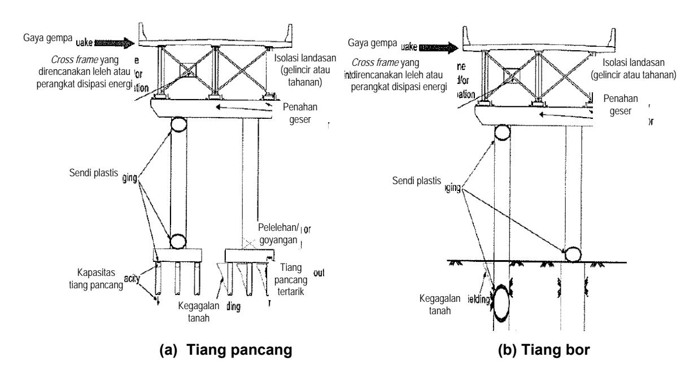

Gambar 10 - Alur gaya akibat gempa dan komponen yang berpengaruh

Catatan: Komponen pada gambar di atas berlaku untuk struktur tipe 1, 2, dan 3 dan menggambarkan komponen tertentu yang diizinkan untuk menyatu dengan struktur tipe 1, 2, atau 3 ditentukan dalam Pasal 8.2

Aliran gaya pada suatu jalur beban yang ditetapkan harus dapat melalui semua komponen yang berpengaruh termasuk sambungan komponen, namun tidak terbatas pada, bagian sayap dan badan dari balok utama atau *girder*, *cross-frame*, sambungan baja, hubungan permukaan baja dengan lantai, dan semua komponen perletakan mulai dari permukaan sayap bawah ke sistem angkur atau perangkat sejenis pada bangunan bawah. Struktur bawah juga harus dirancang untuk mentransfer pengaruh gaya rencana ke dalam tanah di bawah fondasi.

Analisis dan perencanaan diafragma ujung dan *cross frame* harus meliputi gaya horizontal dengan jumlah perletakan yang sesuai, sesuai dengan **Pasal 8.8.** 

Persyaratan berikut berlaku untuk jembatan:

- Sebuah lantai beton yang dapat memberikan aksi diafragma horizontal, atau
- Sebuah sistem bresing horizontal dalam bidang pada sayap atas, yang pada dasarnya menyediakan aksi diafragma.

Sebuah tumpuan beban (lihat **Gambar 10**) harus ditetapkan untuk mentransfer beban inersia ke fondasi sebagai dasar dari karakteristik kekakuan deck, diafragma, rangka-diagonal, dan lateral bresing. Kecuali jika analisis yang lebih disempurnakan dibuat, sebuah perkiraan tumpuan keras harus diasumsikan sebagai berikut:

- Beban inersia gempa pada lantai harus diasumsikan akan ditransfer langsung ke perletakan melalui ujung diafragma atau rangka-diagonal, dan
- Analisis alur beban melalui lantai atau melalui lateral bresing atas, jika digunakan, harus menggunakan aksi struktural yang diasumsikan setara dengan jika digunakan untuk analisis beban angin.

# 8.2 Kriteria kinerja

Bagian ini berlaku untuk perencanaan komponen baja. Komponen tersebut harus diklasifikasikan ke dalam dua kategori yaitu daktail dan elastik. Berdasarkan karakteristik

struktur jembatan, perencana dapat menggunakan salah satu dari tiga opsi untuk strategi perencanaan gempa yaitu:

- Tipe 1 : desain bangunan bawah daktail dengan bangunan atas elastis.
- Tipe 2 : desain bangunan bawah elastis dengan bangunan atas daktail.
- Tipe 3 : desain bangunan atas elastis dan bangunan bawah dengan mekanisme fusi pada permukaan antara bangunan atas dan bangunan bawah.

Ketentuan pada bab ini digunakan berkaitan dengan perencanaan gempa berdasarkan gaya (*force based approach*). Istilah komponen elastis digunakan bila perbandingan gaya luar terhadap kapasitas nominal dari setiap elemen dalam bangunan atas kurang dari 1,5.

Gaya gempa desain untuk member/batang individu dan sambungan jembatan diidentifikasi sebagai Tipe 2 harus ditentukan dengan membagi gaya elastis tidak tereduksi oleh faktor modifikasi respon yang tepat (*R*), sebagaimana ditentukan dalam **Pasal 8.2.2**. Faktor-faktor ini harus digunakan hanya ketika semua persyaratan desain bagian ini dipenuhi. Kombinasi gaya gempa ortogonal setara dengan kombinasi perpindahan gempa ortogonal ditentukan dalam **Pasal 5.8** harus digunakan untuk memperoleh gaya elastis tidak tereduksi.

Kapasitas nominal sebuah elemen, sambungan, atau struktur harus didasarkan pada kekuatan leleh yang direncanakan (*Fye*), dan dimensi nominal serta detail akhir penampang, dihitung dengan semua faktor ketahanan material (*ϕ*), diambil 1.0.

# **8.2.1 Tipe 1**

Untuk struktur Tipe I, perencana harus mengacu pada **Pasal 8.5** dan **Pasal 8.6**, sebagaimana ditentukan untuk perancangan bangunan bawah yang daktail pada zona gempa 3 dan 4.

# **8.2.2 Tipe 2**

Untuk struktur Tipe 2, desain bangunan atas harus dilakukan dengan menggunakan pendekatan berbasis gaya dengan faktor reduksi yang sesuai dengan daktilitas. Faktorfaktor tersebut akan digunakan untuk perencanaan semua elemen daktail yang memikul beban gempa. Untuk zona 2, 3, atau 4, faktor reduksi (*R*), sama dengan 3 digunakan untuk bresing biasa yang merupakan bagian dari sistem pemikul gempa yang tidak memiliki diafragma daktail sebagaimana dimaksud dalam **Pasal 8.4.6**. Faktor reduksi (*R*), dapat ditingkatkan hingga 4 untuk zona 4 seperti ditunjukkan dalam **Pasal 8.4.6.** 

Untuk bentang sederhana didukung dengan diafragma daktail**,** letak diafragma minimum ditempatkan di masing-masing ujung bentang.

Untuk bentang menerus dimana diafragma daktail digunakan, lokasi diafragma minimum ditempatkan di atas setiap *bent* dan satu pada celah *cross frame* yang terdekat dari muka *bent*. Penggunaan diafragma khusus pada permukaan yang berlawanan sendi harus diperiksa untuk memastikan kapasitas beban vertikal yang memadai di daerah sendi ketika mengalami deformasi dalam rentang inelastis.

# **8.2.3 Tipe 3**

Pada tipe struktur 3, perencana harus menilai kapasitas lebih untuk mekanisme fusing pada *interface* termasuk kait geser dan perletakan, dan selanjutnya untuk bangunan atas dan bangunan bawah direncanakan elastis. Perencanaan gaya lateral minimum harus dihitung dengan menggunakan percepatan *0,4g* atau beban gempa elastis, diambil yang lebih kecil. Jika digunakan perangkat isolasi, maka bangunan atas harus dirancang elastis.

#### 8.3 Material

Untuk zona gempa 3 dan 4, maka elemen bangunan bawah daktail dan diafragma ujung daktail sebagaimana dimaksud dalam **Pasal 8.4.6** dan **Pasal 8.5**, harus dibuat dari baja yang memenuhi persyaratan pada standar perencanaan baja untuk jembatan yang berlaku di Indonesia.

# 8.4 Persyaratan elemen pada zona gempa 3 dan 4

#### 8.4.1 Batasan rasio kelangsingan

Tabel 11 - Batas parameter kelangsingan

|                                      | Klasifikasi elemen                                                  | Batas parameter kelangsingan $\lambda_{cp}$ atau $\lambda_{bp}$ |                                         |  |
|--------------------------------------|---------------------------------------------------------------------|-----------------------------------------------------------------|-----------------------------------------|--|
| Elemen<br>daktail                    | Dominan beban aksial tekan $\frac{P_u}{P_n} \ge \frac{M_u}{M_{ns}}$ | $\lambda_{cp}$                                                  | 0,75                                    |  |
|                                      | Dominan momen lentur $\frac{P_u}{P_n} < \frac{M_u}{M_{ns}}$         | $\lambda_{bp}$                                                  | 0,086 <i>E</i><br><i>F</i> <sub>y</sub> |  |
| Elastik/<br>Kapasitas<br>terproteksi | Dominan beban aksial tekan $\frac{P_u}{P_n} \ge \frac{M_u}{M_{ns}}$ | $\lambda_{cp}$                                                  | 1,50                                    |  |
|                                      | Dominan momen lentur $\frac{P_u}{P_n} < \frac{M_u}{M_{ns}}$         | λιρ                                                             | $4,40\sqrt{\frac{E}{F_y}}$              |  |

Elemen bresing harus memiliki rasio kelangsingan (KL/r) kurang dari 120. Panjang batang harus diambil antara titik-titik perpotongan batang. Faktor panjang efektif (K) 0,85 untuk batang tekan dalam struktur pengaku harus digunakan kecuali jika nilai yang lebih rendah dapat dibuktikan dengan analisis yang tepat. Parameter kelangsingan  $\lambda_c$  untuk beban tekan aksial dominan dan  $\lambda_b$  untuk batang lentur dominan harus tidak melebihi nilai batas,  $\lambda_p$  dan  $\lambda_p$ , sebagaimana ditentukan dalam **Tabel 11**.

#### Keterangan:

Parameter kelangsingan elemen dengan dominan beban aksial tekan :

$$\lambda_{c} = \left(\frac{KL}{r\pi}\right) \sqrt{\frac{F_{y}}{E}}$$
 (32)

Parameter kelangsingan elemen dengan dominan momen lentur :

$$\lambda_b = \frac{L}{r_V} \tag{33}$$

# Keterangan:

 $M_u$  adalah momen terfaktor yang bekerja pada elemen tersebut (kN.m)

 $M_{ns}$  adalah kekuatan lentur nominal elemen (kN.m)

 $P_u$  adalah beban tekan aksial terfaktor yang bekerja pada elemen (kN)

 $P_n$  adalah kuat tekan aksial nominal elemen (kN)

 $\lambda_{\mathcal{P}}$  adalah batasan parameter kelangsingan untuk elemen dengan dominan mengalami beban tekan aksial

 $\lambda_{p}$  adalah batasan parameter kelangsingan untuk elemen dengan dominan mengalami momen lentur

K adalah faktor panjang efektif batang

*L*<sub>u</sub> adalah panjang elemen yang tidak tertumpu (mm)

r adalah jari-jari girasi (mm)

 $r_y$  adalah jari-jari girasi sekitar sumbu minor (mm)  $F_y$  adalah kekuatan leleh minimum baja (MPa)

E adalah modulus elastisitas baja (MPa)

#### 8.4.2 Batasan rasio lebar/tebal

Untuk komponen yang bersifat elastik, perbandingan lebar terhadap tebal penampang tidak melebihi batas rasio ( $\lambda_r$ ) sebagaimana ditentukan dalam **Tabel 12**. Untuk komponen daktail, perbandingan lebar terhadap tebal penampang tidak melebihi batas rasio ( $\lambda_p$ ) sebagaimana ditentukan dalam **Tabel 12**.

Tabel 12 - Batas rasio lebar/tebal elemen

| Tabel 12 - Batas rasio lebar/tebal elemen |                               |                                |                                      |  |  |
|-------------------------------------------|-------------------------------|--------------------------------|--------------------------------------|--|--|
| Deskripsi                                 | Rasio                         | Komponen elastik               | Komponen daktail                     |  |  |
| elemen                                    | lebar/tebal                   | ( \( \lambda r \)              | $(\lambda_{P})$                      |  |  |
| Elemen yang tidak diberi pengaku          |                               |                                |                                      |  |  |
| Penampang baja                            |                               |                                |                                      |  |  |
| I yang mengalami                          | b                             | 0.50 E                         | 0 00 E                               |  |  |
| lentur dan tekan                          | $\frac{b}{t}$                 | $0,56\sqrt{\frac{E}{F_{\nu}}}$ | $0,30\sqrt{\frac{E}{F_{\nu}}}$       |  |  |
| merata pada                               | ľ                             | \                              | \                                    |  |  |
| sayap<br>Penampang tiang                  |                               |                                |                                      |  |  |
| H yang                                    | b                             | $0.56\sqrt{\frac{E}{F_{v}}}$   | $0.45\sqrt{\frac{E}{F_{\nu}}}$       |  |  |
| mengalami tekan                           | $\frac{b}{t}$                 | 0,56,                          | 0,45,                                |  |  |
| pada sayap                                | 1                             | \                              | \                                    |  |  |
| Tekan pada kaki                           |                               |                                |                                      |  |  |
| profil siku, kaki                         | h                             | E                              | E                                    |  |  |
| pada siku ganda                           | $\frac{b}{t}$                 | $0,45\sqrt{\frac{E}{F_{\nu}}}$ | $0.30\sqrt{\frac{E}{F_{\nu}}}$       |  |  |
| dengan pemisah                            | t                             | $\sqrt{F_y}$                   | $\bigvee F_{\nu}$                    |  |  |
| atau sayap profil<br>T                    |                               | , .                            | ' '                                  |  |  |
| Tekan pada                                |                               |                                | TE TE                                |  |  |
| stems profil T                            | $\frac{d}{t}$                 | $0,75\sqrt{\frac{E}{F_{\nu}}}$ | $0.30\sqrt{\frac{E}{F_{\nu}}}$       |  |  |
|                                           | t                             | $\sqrt{F_{\nu}}$               | $\sqrt{F_{\nu}}$                     |  |  |
| Elemen yang diberi pengaku                |                               |                                |                                      |  |  |
| Profil pipa baja                          | · .                           |                                |                                      |  |  |
| yang mengalami                            | <del></del>                   | F                              | F                                    |  |  |
| tekan aksial dan                          | l<br>h                        | $1,4\sqrt{\frac{E}{F}}$        | $0,64\sqrt{\frac{E}{F_{c}}}$ (tube)  |  |  |
| atau tekan lentur                         | $\frac{b}{t} \ \frac{h}{t_w}$ | $\bigvee \Gamma_y$             | V ry                                 |  |  |
|                                           | T <sub>w</sub>                |                                |                                      |  |  |
| Coverplate                                | b                             | $1,86\sqrt{\frac{E}{F_{\nu}}}$ | $0.88\sqrt{\frac{E}{F_{\nu}}}$       |  |  |
| berlubang yang<br>tidak disokong          | $\frac{b}{t}$                 | 1,86                           | 0,88, <del>-</del>                   |  |  |
|                                           | ι                             | <b>∀</b> ′ <i>y</i>            | V ′ y                                |  |  |
| Elemen                                    | b                             |                                | 0 64 E (1999d)                       |  |  |
| berpengaku yang<br>mengalami tekan        | $\overline{t}$                | <u>E</u>                       | $0,64\sqrt{\frac{E}{F_{v}}}$ (laced) |  |  |
| yang disokong                             | h                             | $1,49\sqrt{\frac{E}{F_{y}}}$   | \ \frac{\forall y}{\sigma}           |  |  |
| sepanjang                                 | $\frac{b}{t}$ $\frac{h}{t_w}$ | $\bigvee \Gamma_y$             | $0.88 \sqrt{\frac{E}{E}}$ (lainnya)  |  |  |
| tepinya                                   | $t_{w}$                       |                                | $V_y = V_y = V_y$                    |  |  |
|                                           |                               |                                | <u>'</u>                             |  |  |

| Deskripsi<br>elemen                                                                 | Rasio<br>lebar/tebal | Komponen elastik $(\lambda_r)$                                     | Komponen daktail $(\lambda_P)$                                                                                                                                                                                                                |
|-------------------------------------------------------------------------------------|----------------------|--------------------------------------------------------------------|-----------------------------------------------------------------------------------------------------------------------------------------------------------------------------------------------------------------------------------------------|
| Pelat badan yang<br>mengalami tekan<br>lentur atau<br>kombinasi lentur<br>dan tekan | $\frac{h}{t_{w}}$    | $5.7\sqrt{\frac{E}{F_y}}\left(1-\frac{0.74P_u}{\phi_b P_y}\right)$ | Bila $P_u \le 0,125\phi_b P_y$ , maka $3,14\sqrt{\frac{E}{F_y}}\left(1-\frac{1,54P_u}{\phi_b P_y}\right)$ Bila $P_u > 0,125\phi_b P_y$ , maka $1,12\sqrt{\frac{E}{F_y}}\left(2,33-\frac{P_u}{\phi_b P_y}\right) \ge 1,49\sqrt{\frac{E}{F_y}}$ |
| Pelat berpengaku<br>longitudinal yang<br>mengalami tekan                            | $\frac{b}{t}$        | $0,66\sqrt{\frac{kE}{F_y}}$                                        | $0.44\sqrt{\frac{kE}{F_{y}}}$                                                                                                                                                                                                                 |
| Profil pipa baja<br>melingkar yang<br>mengalami tekan<br>atau lentur                | $\frac{D}{t}$        | $0,09\sqrt{\frac{E}{F_y}}$                                         | $0.04\sqrt{\frac{E}{F_y}}$                                                                                                                                                                                                                    |

# Keterangan:

jika n = 1, maka :

$$k = \left(\frac{l_s}{bt^3}\right)^{1/3} \le 4 \tag{34}$$

jika n = 2, 3, 4, or 5, maka:

$$k = \left(\frac{14.3I_s}{bt^3n^4}\right)^{1/3} \le 4 \tag{35}$$

#### Keterangan:

- k adalah koefisien tekuk pelat untuk tegangan normal merata
- n adalah jumlah pengaku sayap tekan longitudinal
- I<sub>s</sub> adalah momen inersia dari pengaku longitudinal individual sejajar sumbu sayap dan diambil pada dasar pengaku (mm<sup>4</sup>)
- $\phi_b$  adalah 0,9 faktor tahanan untuk lentur
- $F_{v}$  adalah spesifikasi kekuatan leleh minimum baja (MPa)
- *É* adalah modulus elastis baja (MPa)
- b adalah lebar elemen yang tidak diperkaku (mm)
- d adalah tinggi penampang (mm)
- D adalah diameter pipa baja (mm)
- t adalah tebal elemen yang tidak diperkaku, tebal plat, atau tebal pipa baja (mm)
- h adalah kedalaman web (mm)
- $P_u$  adalah beban aksial terfaktor yang bekerja pada batang (kN)
- $P_v$  adalah kuat leleh aksial nominal elemen (kN)
- $t_w$  adalah tebal dari pelat badan (mm)

#### 8.4.3 Daktilitas lentur untuk elemen dengan kombinasi lentur dan aksial

Kecuali pada kolom daktail momen tahanan rangka/batang, daktilitas lentur dapat digunakan jika beban aksial kurang dari 60 persen dari kuat leleh nominal elemen. Rasio kebutuhan terhadap kapasitas atau daktilitas simpangan harus kurang dari 1 jika beban aksial berimpit dengan momen lentur lebih besar dari 60% kuat leleh nominal elemen.

#### 8.4.4 Kombinasi aksial dan lentur

Elemen dengan kombinasi aksial dan lentur harus diperiksa dengan menggunakan persamaan interaksi.

# 8.4.5 Lokasi pengelasan

Titik las yang terletak di daerah inelastis pada komponen daktail harus dibuat las penetrasi penuh. Las penetrasi sebagian tidak diperbolehkan di daerah sendi plastis. Sambungan tidak diperbolehkan di daerah inelastis pada komponen daktail. Pada zona gempa 4, profil siku ganda dengan *stitch welds* dapat digunakan sebagai elemen diafragma daktail.

# 8.4.6 Diafragma ujung daktail di lantai pada jembatan gelagar

Diafragma ujung daktail pada jembatan gelagar pelat dapat dirancang untuk menjadi elemen disipasi energi untuk beban gempa dalam arah transversal pada jembatan lurus dengan :

- Diafragma yang didetail khusus yang mampu mendisipasi energi secara stabil tanpa terjadi degradasi kekuatan dapat digunakan. Perilaku diafragma harus diverifikasi dengan pengujian siklik.
- Hanya sistem disipasi energi daktail dengan kinerja seismik yang memadai yang telah terbukti melalui pengujian inelastis siklik dapat digunakan.
- Desain mempertimbangkan kombinasi kekakuan relatif dan kekuatan ujung diafragma dan girder (termasuk pengaku perletakan) dalam membangun kekuatan diafragma dan desain gaya mempertimbangkan untuk kapasitas yang dilindungi elemen.
- Faktor modifikasi respons yang harus diperhitungkan dalam perencanaan diafragma daktail adalah sebagai berikut :

$$R = \left[\frac{\mu + \frac{K_{DED}}{K_{SUB}}}{1 + \frac{K_{DED}}{K_{SUB}}}\right] \le 4$$
(36)

# Keterangan:

<sub>μ</sub> adalah daktilitas perpindahan dari ujung diafragma (tidak melebihi 4)

K<sub>DED</sub> adalah kekakuan dari ujung diafragma daktail (kN/m)

 $K_{SUB}$  adalah kekakuan bangunan bawah (kN/m)

- Semua detail / sambungan ujung diafragma daktail yang dilas.
- Jembatan tidak memiliki bresing angin horizontal yang menghubungkan bagian sayap bawah dari girder, kecuali panel bresing angin yang terakhir sebelum support masingmasing direncanakan sebagai panel daktail ekuivalen dan secara paralel untuk ujung diafragma vertikal yang berdekatan.
- Mekanisme yang efektif ada untuk memastikan perpindahan inersia-induktif yang disebabkan gaya gempa horizontal transversal dari lempengan pada diafragma.

Ketentuan perencanaan khusus untuk rangka bresing konsentris atau rangka bresing eksentris dapat mengacu pada standar perencanaan baja yang berlaku di Indonesia. Faktor kuat lebih yang akan digunakan untuk merencanakan kapasitas dilindungi elemen tergantung pada jenis diafragma daktail yang digunakan.

Untuk zona gempa 2,3, dan 4, bresing sudut tunggal dapat digunakan untuk batang diagonal ujung *cross-frame*.

# **8.4.7 Kait geser (***shear connector***)**

Kait geser harus diberikan pada sayap girder, *cross frame* ujung, atau diafragma untuk mentransfer beban gempa dari lantai beton ke kepala jembatan atau pilar pada zona gempa 2 dan harus diberikan pada zona gempa 3 dan 4.

Untuk beban gempa transversal, sambungan geser yang efektif harus diambil seperti yang terletak di sayap girder, *cross frame* ujung, atau diafragma yang tidak jauh dari 9*tw* di setiap sisi elemen terluar pada kelompok pengaku perletakan.

Untuk beban gempa longitudinal, kait geser efektif terletak pada sayap gelagar di dalam panjang bentang daerah perletakan. Beban gempa yang bekerja pada kolom /pilar diambil sebagai nilai terkecil dari:

- Geser lebih kolom /pilar, atau
- 1,3 kali kapasitas sistem bresing jika dianggap sebagai sistem pemikul gempa daktail.

Beban gempa yang bekerja pada kepala jembatan diambil sebagai nilai terkecil dari:

- Kapasitas geser lebih kait geser, atau
- 1,3 kali kapasitas sistem bresing jika dianggap sebagai sistem pemikul gempa daktail.

# **8.5 Sistem rangka pemikul momen daktail dan struktur kolom tunggal pada zona gempa 3 dan 4**

Pasal ini berlaku untuk portal pemikul momen daktail dan *bent* yang dibuat dengan balok baja bentuk I dan kolom yang dihubungkan dengan bagian badan balok. Untuk zona gempa 3 dan 4 yang sesuai dengan perencanaan tipe 1, maka kolom harus dirancang sebagai elemen struktur daktail menggunakan faktor reduksi gaya *R* tidak lebih besar dari 4. Balok, zona panel di perpotongan kolom-balok, dan sambungannya harus didesain sebagai elemen elastis.

# **8.5.1 Kolom**

Rasio lebar - tebal elemen tekan kolom harus sesuai dengan **Tabel 12**. Las penetrasi penuh pada sayap dan badan harus dilakukan pada hubungan kolom-balok atau balok-kolom.

Tahanan kolom terhadap kombinasi beban aksial dan lentur harus ditentukan sesuai dengan *AASHTO Guide Specification for LRFD Seismic Bridge Design*. Beban aksial tekan terfaktor akibat beban gempa dan berat sendiri tidak boleh melebihi *0,20AgFy*.

Tahanan geser bagian pelat badan pada kolom harus ditentukan sesuai dengan ketentuan pada *AASHTO Guide Specification for LRFD Seismic Bridge Design.*

Kecuali ditentukan pada pasal ini, maka daerah sendi plastis yang dekat dengan bagian atas dan bawah kolom, harus dikekang dalam arah lateral dan pada bagian yang tidak terkekang (jarak antara sendi plastis) dari lokasi ini tidak boleh melebihi nilai pada **Tabel 11**.

Pengekang lateral harus diberikan baik secara langsung ke bagian sayap atau tidak langsung melalui pengaku badan kolom atau pelat menerus, kecuali ditentukan di bawah ini.

Setiap pengekang lateral sayap kolom harus dapat menahan gaya tidak kurang dari dua persen dari kekuatan nominal sayap kolom (*0,02bftfFy*) di lokasi perletakan. Kemungkinan pembebanan berulang harus diperhitungkan dan potensi sendi plastis di kedua sumbu utama kolom harus diperhitungkan. Persyaratan pengekang lateral tidak dapat digunakan untuk tiang yang berpotensi mengalami sendi plastis dalam tanah.

Apabila pengekang lateral tidak dapat disediakan, maka kelangsingan maksimum kolom *KL/r* tidak boleh melebihi 60 dan momen tranversal yang dihasilkan oleh gaya ditahan oleh bresing lateral (termasuk momen orde kedua akibat simpangan kolom yang dihasilkan) harus dimasukkan pada kombinasi beban gempa.

Sambungan lewatan yang menggunakan las penetrasi sebagian harus diberikan pada daerah sendi plastis dengan jarak minimum diambil nilai terbesar dari :

- Seperempat tinggi netto kolom
- Dua kali dimensi penampang terbesar kolom
- 1 m

#### 8.5.2 Balok

Faktor tahanan balok ditentukan sesuai AASHTO Guide Specification for LRFD Seismic Bridge Design. Pada sambungan antara balok dan kolom, faktor tahanan balok tidak boleh lebih kecil jumlah tahanan kolom yang terhubung ke sambungan. Kecuali dapat ditunjukkan dengan analisa rasional, tahanan lentur kolom,  $(M_{nx})$  diambil sebagai perkalian antara faktor kuat lebih dengan momen nominal kolom yaitu sebagai berikut :

$$M_{nx} = 1,18M_{px} \left(1 - \frac{P_u}{AF_{ye}}\right) \le M_{px}$$
 (37)

# Keterangan:

 $M_{px}$  adalah kapasitas momen plastis dari batang kolom didasarkan pada sifat material rencana (kN.m)

A adalah luas penampang elemen (mm²)

F<sub>ye</sub> adalah tegangan leleh elemen (MPa)

P<sub>u</sub> adalah beban aksial terfaktor (kN)

#### 8.5.3 Zona panel dan sambungan

Zona panel pada kolom-balok, sambungan penahan momen, dan sambungan pada dasar kolom harus dirancang sebagai elemen yang elastis. Hubungan balok kolom harus memiliki tahanan tidak kurang dari tahanan balok. Pelat menerus harus diberikan pada kedua sisi zona panel badan dan harus dengan total lebar setidaknya 0,8 kali lebar sayap dari sayap profil yang berlawanan. Pelat menerus harus proporsional untuk memenuhi persyaratan pengaku dan harus tersambung ke kedua sayap dan badan. Sayap dan sambungan pelat pada sambungan baut harus didesain sesuai dengan ketentuan perencanaan baja untuk jembatan di Indonesia.

#### 8.5.4 Portal multitier

Untuk *multitier frame bents*, prinsip-prinsip desain kapasitas, serta persyaratan **Pasal 8.5.1**, **8.5.2**, **dan 8.5.3** dapat dimodifikasi oleh perencana agar sendi plastis kolom hanya terjadi pada bagian atas kolom. Sendi plastis kolom di dasar struktur dimana dibutuhkan kekangan pada fondasi harus dilakukan pemeriksaan. Dengan menggunakan prinsip desain kapasitas, penggunaan **Pasal 8.5.1** dan **Pasal 8.5.2** dapat dimodifikasi oleh perencana untuk menghasilkan sendi plastis hanya pada bagian puncak atas dan bawah kolom serta pada ujung-ujung balok intermediet (**Gambar 11**).

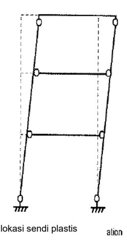

Gambar 11 - Mekanisme sendi plastis pada portal multitier

# Pipa baja berisi beton untuk zona gempa 2 dan 3

Pipa baja berisi beton yang digunakan sebagai kolom, pilar, atau tiang yang direncanakan sebagai sendi plastis pada bagian komposit sebagai akibat dari respons terhadap gempa harus didesain sesuai dengan ketentuan pada Pasal 8.6.1, 8.6.2, dan 8.6.3.

#### 8.6.1 Kombinasi aksial tekan dan lentur

Elemen pipa baja berisi beton yang diperlukan untuk menahan gaya aksial tekan dan lentur dan direncanakan menjadi elemen bangunan bawah daktail harus diproporsi sedemikian sehingga:

$$\frac{P_u}{P_r} + \frac{BM_u}{M_{rc}} \le 1,0 \tag{38}$$

dan:

$$\frac{M_u}{M_{rc}} \le 1,0 \tag{39}$$

dimana:

dimana :
$$B = 1 - \frac{P_{rc}}{P_{ro}}$$
(40)

$$P_{rc} = \phi_c A_c f_c^{'} \tag{41}$$

#### Keterangan:

adalah beban aksial terfaktor yang bekerja pada elemen (kN)

 $P_r$ adalah kapasitas aksial nominal terfaktor elemen (kN)

 $M_{rc}$ adalah kapasitas momen nominal terfaktor elemen sesuai dengan Pasal 8.6.2 (kN.m)

adalah momen ultimit terfaktor yang bekerja pada elemen, termasuk gempa elastik yang dibagi dengan faktor reduksi kekuatan (R) (kN.m)

 $P_{ro}$ adalah kapasitas aksial nominal terfaktor elemen (kN)

adalah faktor tahanan untuk beton pada kondisi tekan (=0,75) Ø

 $A_{c}$ adalah luas beton inti (mm²)

f'c adalah kuat tekan beton (MPa)

#### 8.6.2 Kuat lentur

Momen tahahan terfaktor pada pipa baja berisi beton ( $M_{rc}$ ) dapat dihitung dengan menggunakan pendekatan kompatibilitas regangan dengan menggunakan model konstitutif material yang tepat.

Sebagai alternatif pendekatan regangan kompatibilitas, momen tahanan terfaktor pipa baja berisi beton dapat dihitung dengan menggunakan salah satu dari dua metode berikut :

#### Metode 1 - Geometri eksak :

$$M_{rc} = \varphi_f(C_r \mathbf{e} + C_r^{\dagger} \mathbf{e}^{\dagger}) \tag{42}$$

dimana:

$$C_r = F_y \beta \frac{D_t}{2} \tag{43}$$

$$C_r' = f_c' \left\lceil \frac{\beta D^2}{8} - \frac{b_c}{2} \left( \frac{D}{2} - a \right) \right\rceil \tag{44}$$

$$e = b_c \left[ \frac{1}{(2\pi - \beta)} + \frac{1}{\beta} \right] \tag{45}$$

$$e' = b_c \left[ \frac{1}{2\pi - \beta} + \frac{b_c^2}{1,5\beta D^2 - 6b_c(0,5D - a)} \right]$$
 (46)

$$a = \frac{b_c}{2} \tan \left\lceil \frac{\beta}{4} \right\rceil \tag{47}$$

$$b_c = D \sin \left[ \frac{\beta}{2} \right] \tag{48}$$

β adalah sudut pusat yang terbentuk diantara sumbu netral dan titik pusat pipa dan didapat dari persamaan rekursif sebagai berikut (rad)

$$\beta = \frac{A_s F_y + 0.25 D^2 f_c^{'} \left[ \sin\left(\frac{\beta}{2}\right) - \sin^2\left(\frac{\beta}{2}\right) \tan\left(\frac{\beta}{4}\right) \right]}{0.125 D^2 f_c^{'} + Dt F_y}$$
(49)

#### Keterangan:

D adalah diameter luar pipa baja (mm)

t adalah tebal pipa baja (mm)

 $F_{\nu}$  adalah tegangan leleh pipa baja (MPa)

f'c adalah kuat tekan beton (MPa)

#### Metode - 2 Geometri aproksimasi :

Nilai konservatif  $M_{rc}$  diberikan oleh :

$$M_{rc} = \varphi_r \left[ \left( Z - 2th_n^2 \right) Fy + \left[ \frac{2}{3} (0.5D - t)^3 - (0.5D - t)h_n^2 \right] f_c^{\cdot} \right]$$
 (50)

dimana:

$$h_n = \frac{A_c f_c'}{2Df_c' + 4t(2F_y - f_c')}$$
 (51)

#### keterangan:

 $\phi_{\epsilon}$  adalah faktor tahanan baja struktural terhadap lentur

 $A_c$  adalah luas beton inti (mm<sup>2</sup>)

D adalah diameter luar pipa baja (mm)

- *t* adalah tebal pipa baja (mm)
- *Z* adalah modulus plastis pipa baja (mm3)
- *Fy* adalah tegangan leleh pipa baja (MPa)
- *f'c* adalah kuat tekan beton (MPa)

Untuk kebutuhan desain kapasitas, momen yang dihitung dengan metode pendekatan ini harus ditingkatkan sesuai dengan **Pasal 8.3.** 

# **8.6.3 Balok dan sambungan**

Elemen dengan kapasitas terproteksi harus didesain menahan gaya yang dihasilkan proses plastifikasi pada pipa baja berisi beton dan dihitung sesuai dengan **Pasal 8.6.2.** 

# **8.7 Sambungan untuk zona gempa 2 dan 3**

# **8.7.1 Kekuatan minimum sambungan elemen daktail**

Hubungan dan sambungan antara atau pada elemen yang memiliki daktilitas lebih besar dari 1 harus didesain memiliki kapasitas nominal setidaknya sepuluh persen lebih besar dari kapasitas nominal elemen yang terlemah.

# **8.7.2 Kegagalan penampang untuk sambungan pada elemen daktail**

Kegagalan penampang sambungan harus diperiksa (lihat **Pasal 8.7.6**). Fraktur pada penampang netto dan kegagalan geser harus dihindari.

# **8.7.3 Sambungan las**

Sambungan dengan las penetrasi sebagian atau las fillet di daerah elemen yang mengalami deformasi inelastik tidak boleh digunakan. Di luar daerah inelastis, sambungan dengan las penetrasi sebagian harus memiliki setidaknya 150% lebih dari kekuatan berdasarkan perhitungan dan tidak kurang dari 75% dari kekuatan elemen yang terhubung pada sambungan.

# **8.7.4 Kekuatan pelat buhul**

Pelat buhul harus didesain untuk menahan gaya geser, lentur, dan gaya aksial yang disebabkan oleh kapasitas *overstrength* elemen daktail yang terhubung dan kebutuhan gaya pada elemen elastik yang terhubung. Kekuatan desain harus didasarkan pada lebar efektif sesuai dengan metode Whitmore. Lebar efektif Whitmore yaitu panjang yang merupakan penjumlahan jarak baris baut terluar dengan garis yang diukur 30° dari baris baut terluar ke arah luar. Lebar efektif Whitmore dapat dilihat pada **Gambar 12**.

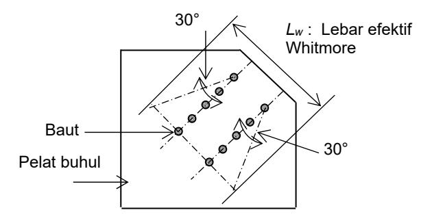

**Gambar 12 - Lebar efektif Whitmore**

(54)

#### 8.7.5 Batasan panjang tidak tertumpu terhadap rasio tebal pada pelat buhul

Batasan panjang tidak tertumpu terhadap rasio tebal pada pelat buhul harus memenuhi persamaan berikut :

$$\frac{L_g}{t} \le 2.06 \sqrt{\frac{E}{F_y}} \tag{52}$$

# Keterangan:

*L<sub>g</sub>* adalah panjang tidak tertumpu pelat buhul (mm)

t adalah tebal plat buhul (mm)

E adalah modulus elastisitas baja (MPa)

F<sub>y</sub> adalah tegangan leleh pipa baja (MPa)

# 8.7.6 Kuat tarik pelat buhul

Perilaku kegagalan yang diharapkan pada pelat buhul adalah pelelehan pada penampang brutto yang akan menimbulkan perilaku kegagalan daktail. Kuat tarik terfaktor pelat buhul  $\phi P_n$  diambil sebagai :

$$\phi P_{ng} = \phi_y A_g F_y \le \begin{cases} \phi_u A_n F_u \\ \phi_{bs} P_{bs} \end{cases}$$
 (53)

Dimana:

jika 
$$A_{tn} \geq 0.58 A_{vn}$$
, maka
$$P_{bs} = 0.58 F_{v} A_{va} + F_{u} A_{tn}$$

jika 
$$A_{tn} < 0.58A_{vn}$$
, maka (55)

$$P_{bs} = 0.58 F_u A_{vn} + F_y A_{tg}$$

# Keterangan:

- $A_{vg}$  adalah luas brutto penampang sepanjang bidang yang menahan geser pada moda kegagalan geser blok (mm²)
- $A_{vn}$  adalah luas netto penampang sepanjang bidang yang menahan geser pada moda kegagalan geser blok (mm<sup>2</sup>)
- $A_{tg}$  adalah luas brutto penampang sepanjang bidang yang menahan tarik pada moda kegagalan geser blok (mm<sup>2</sup>)
- $A_{tn}$  adalah luas netto penampang sepanjang bidang yang menahan tarik pada moda kegagalan geser blok (mm²)
- $A_g$  adalah luas brutto penampang sepanjang bidang yang menahan tarik (mm<sup>2</sup>)
- $A_n$  adalah luas netto penampang sepanjang bidang yang menahan tarik (mm<sup>2</sup>)
- $F_{v}$  adalah tegangan leleh baja (MPa)
- $F_u$  adalah kuat tarik baja (MPa)
- $\phi_{bs}$  adalah faktor tahanan untuk mekanisme kegagalan geser blok
- $\phi_{u}$  adalah faktor tahanan untuk fraktur pada penampang netto
- $\phi_{\nu}$  adalah faktor tahanan untuk pelelehan pada penampang brutto

#### 8.7.7 Kuat tekan pelat buhul

Kekuatan tekan nominal pelat buhul ( $P_{ng}$ ) dihitung sesuai dengan peraturan perencanaan baja yang berlaku di Indonesia.

# 8.7.8 Momen bidang (sumbu kuat)

Kekuatan momen leleh nominal ( $M_{ng}$ ) pelat buhul dihitung dengan rumus berikut :

$$M_{ng} = S_g F_y \tag{56}$$

# Keterangan:

 $S_g$  adalah modulus penampang pelat buhul pada sumbu kuat (mm<sup>3</sup>)

*F<sub>y</sub>* adalah tegangan leleh plat buhul (MPa)

Kekuatan momen plastis nominal  $(M_{pg})$  pelat buhul dihitung dengan rumus berikut :

$$M_{pg} = Z_g F_y \tag{57}$$

# Keterangan:

 $Z_g$  adalah modulus plastis penampang pelat buhul pada sumbu kuat (mm<sup>3</sup>)

# 8.7.9 Kuat geser bidang

Kuat geser nominal dari pelat buhul ( $V_{ng}$ ) dihitung dengan:

$$V_{na} = 0.58A_aF_v \tag{58}$$

Keterangan:

A<sub>gg</sub> adalah luas brutto pelat buhul (mm²) F<sub>y</sub> adalah tegangan leleh plat buhul (MPa)

# 8.7.10 Kombinasi momen, geser dan gaya aksial

Kuat leleh inisial pelat buhul yang mengalami kombinasi momen bidang, geser, dan gaya aksial ditentukan dengan persamaan berikut :

$$\frac{P_g}{P_{rg}} + \frac{M_g}{M_{rg}} \le 1,0 \tag{59}$$

dan

$$\frac{P_g}{P_m} + \left[\frac{V_g}{V_{rg}}\right]^2 \le 1,0 \tag{60}$$

# Keterangan:

 $V_g$  adalah gaya geser yang bekerja pada pelat buhul (kN)

 $A_q$  adalah momen yang bekerja pada pelat buhul (kN.m)

 $P_g$  adalah gaya aksial yang bekerja pada pelat buhul (kN)

 $M_{rg}$  adalah kapasitas momen leleh nominal terfaktor ( $\phi M_{ng}$ ) pelat buhul sesuai **Pasal 8.7.8** (kN.m)

 $V_{rg}$  adalah kapasitas geser nominal terfaktor ( $\phi V_{ng}$ ) pelat buhul

 $P_{rg}$  adalah faktor kapasitas leleh aksial nominal terfaktor ( $\phi P_{ng}$ ) pelat buhul sesuai **Pasal** 8.7.6 (kN)

Pelelehan akibat interaksi geser-momen-aksial pada pelat harus memenuhi ketentuan berikut :

$$\frac{M_g}{M_{pg}} + \left(\frac{P_g}{P_{rg}}\right) + \frac{\left(\frac{V_g}{V_{rg}}\right)^4}{\left[1 - \left(\frac{P_g}{P_{rg}}\right)^2\right]} \le 1,0$$
(61)

# **Keterangan :**

*Mrpg* adalah faktor kapasitas momen plastis nominal terfaktor (*Mpg* ) sesuai dengan **pasal 8.7.8** (kN.m)

# **8.8 Perletakan tetap dan ekspansi**

# **8.8.1 Penggunaan**

Ketentuan ini berlaku pada perletakan pin, perletakan *roller, rocker bearing*, perletakan tipe gelincir, perletakan karet, *spherical bearing*, *pot bearing*, dan *disc bearing* pada jembatan pelat yang menumpu pada gelagar baja. Perletakan pada *curved bridges*, *bearing* dengan sistem isolasi, dan bearing dengan mekanisme fusi, tidak tercakup pada ketentuan ini.

# **8.8.2 Kriteria Desain**

Penentuan kriteria desain seismik perletakan harus dikaitkan dengan kekuatan dan karakteristik kekakuan baik bangunan atas dan bangunan bawah.

Desain perletakan harus konsisten dengan strategi desain seismik yang diinginkan dan respons sistem jembatan secara keseluruhan.

Perletakan kaku diasumsikan tidak bergerak ke arah yang tertahan, sehingga gaya seismik dari bangunan atas diasumsikan ditransfer melalui diafragma atau *cross frame* dan sambungannya ke perletakan kemudian menuju bangunan bawah tanpa reduksi karena aksi inelastik sepanjang alur gaya.

Perletakan yang dapat berdeformasi yang tidak sepenuhnya kaku pada arah tahanan, tetapi tidak secara khusus didesain sebagai isolasi landasan telah menunjukkan reduksi transmisi gaya dapat digunakan dalam aplikasi seismik. Reduksi gaya yang ditransfer melalui perletakan tidak boleh kurang dari 0,4 kali reaksi perletakan akibat beban mati.

# **9 Bangunan bawah**

# **9.1 Pilar**

Pilar harus direncanakan untuk meneruskan beban pada struktur atas, dan berat sendiri pilar menuju fondasi. Perencanaan pilar harus sesuai dengan **Bab 7** untuk pilar beton bertulang dan **Bab 8** untuk pilar tipe baja.

# **9.2 Kepala jembatan**

Pengaruh beban gempa terhadap jembatan bentang majemuk dapat dihitung dengan menggunakan keadaan batas ekstrim dengan faktor tahanan sama dengan 1. Untuk fondasi pada tanah dan batuan, lokasi resultan gaya reaksi harus berada pada dua pertiga dari dasar untuk *EQ* = 0,0 dan pada delapan persepuluh dari dasar untuk *EQ* = 1,0. Untuk nilai

*EQ* antara 0,0 dan 1,0, pembatasan lokasi resultan gaya harus diperoleh dengan interpolasi linier dari nilai yang diberikan pada pasal ini.

Bila semua kondisi berikut ditemui, beban lateral gempa dapat direduksi sebagai hasil pergerakan dinding lateral akibat geser, dari nilai yang ditentukan menggunakan metode Mononobe-Okabe.

- Sistem dinding dan tiap struktur yang didukung oleh dinding dapat menoleransi pergerakan lateral yang dihasilkan dari pergeseran struktur.
- Dasar dinding selain friksi tanah di sepanjang dasar dan tahanan pasif tanah bebas terhadap geser.
- Jika dinding berfungsi sebagai kepala jembatan, puncak dinding juga harus bebas, misalnya struktur atas didukung oleh tumpuan gelincir.

Untuk stabilitas keseluruhan dinding penahan ketika beban gempa diperhitungkan, faktor tahanan sebesar 0,9 dapat digunakan.

# **9.3 Dinding kantilever nongravitasi**

Pengaruh beban gempa harus diperiksa menggunakan keadaan batas ekstrim dengan faktor tahanan =1,0 dan faktor beban *<sup>P</sup>* =1,0 dengan metode yang tepat.

# **9.4 Dinding terangkur**

Elemen dinding vertikal harus direncanakan untuk menahan semua tekanan tanah horizontal, beban tambahan, tekanan air, angkur, dan beban gempa, sebagaimana komponen vertikal dari beban angkur dan tiap beban vertikal lainnya. Dukungan horizontal dapat diasumsikan ada pada setiap lokasi angkur dan pada dasar galian jika elemen vertikal tertanam dengan cukup di bawah dasar galian.

# **9.5 Dinding penahan terstabilisasi mekanik**

# **9.5.1 Stabilitas eksternal**

Penentuan stabilitas dapat dilakukan dengan menerapkan penjumlahan gaya statik, gaya inersia horizontal (*PIR*) dan 50 persen dorongan horizontal dinamik (*PAE*) terhadap dinding. Lokasi *PAE* dan *PIR* dapat diambil sebagaimana diilustrasikan

**Gambar 13** dan **Gambar 14**. Gaya ini dikombinasikan dengan gaya statik kemudian diberi faktor beban. Dorongan horizontal dinamik, *PAE* dapat dievaluasi menggunakan metode Mononabe-Okabe pseudostatik dan harus digunakan pada bagian belakang timbunan bertulang pada ketinggian 0,6*H* dari dasar dan gaya inersia horizontal harus diletakkan pada bagian tengah massa dinamik struktur. Koefisien percepatan maksimum pada titik pusat dinding (*Am*) dapat ditentukan sebagai :

$$A_m = (1,45 - A_s) As$$
 (62)

# **Keterangan :**

*As* adalah koefisien percepatan tanah gempa puncak yang dimodifikasi oleh faktor situs periode pendek.

Nilai *PAE* dan *PIR* untuk struktur dengan timbunan dapat ditentukan menggunakan persamaan simplifikasi berikut:

$$P_{AE} = 0.375 \gamma_{EQ} A_m \gamma_s H_d^2 \tag{63}$$

$$P_{IR} = 0.5 \gamma_{EQ} A_m \gamma_s H_d^2 \tag{64}$$

# **Keterangan :**

*EQ* adalah faktor beban untuk kondisi gempa

*Am* adalah koefisien percepatan dinding maksimum pada titik pusat massa dinding

*<sup>s</sup>* adalah berat jenis tanah (kN/m3)

*Hd* adalah tinggi dinding (m)

Untuk struktur dengan timbunan miring, gaya inersia ( $P_{IR}$ ) berdasarkan massa efektif harus mempunyai tinggi  $H_2$  dan lebar dasar sama dengan 0,5  $H_2$  yang ditentukan sebagai berikut :

$$H_2 = H + \frac{0.5H \tan(\beta)}{[1 - 0.5 \tan(\beta)]}$$
 (65)

# Keterangan:

 $\beta$  adalah kemiringan timbunan (derajat)

PIR untuk timbunan miring dapat ditentukan sebagai :

$$P_{IR} = P_{ir} + P_{is}$$
 (66)

dengan:

$$P_{ir} = 0.5 \gamma_{EQ} A_m \gamma_s H_2 H \tag{67}$$

$$P_{is} = 0.125 \gamma_{EQ} A_m \gamma_s (H_2)^2 \tan(\beta)$$
 (68)

# Keterangan:

*P<sub>ir</sub>* adalah gaya inersia disebabkan percepatan timbunan bertulang (kN/m)

 $P_{is}$  adalah gaya inersia disebabkan percepatan tambahan tanah miring di atas timbunan bertulang (kN/m)

Lebar massa yang berkontribusi terhadap  $P_{IR}$  harus sama dengan 0,5 $H_2$ .  $P_{IR}$  harus bekerja pada kombinasi titik pusat  $P_{ir}$ dan  $P_{is}$ .

Lapis perkuatan Massa penyumbang inersia

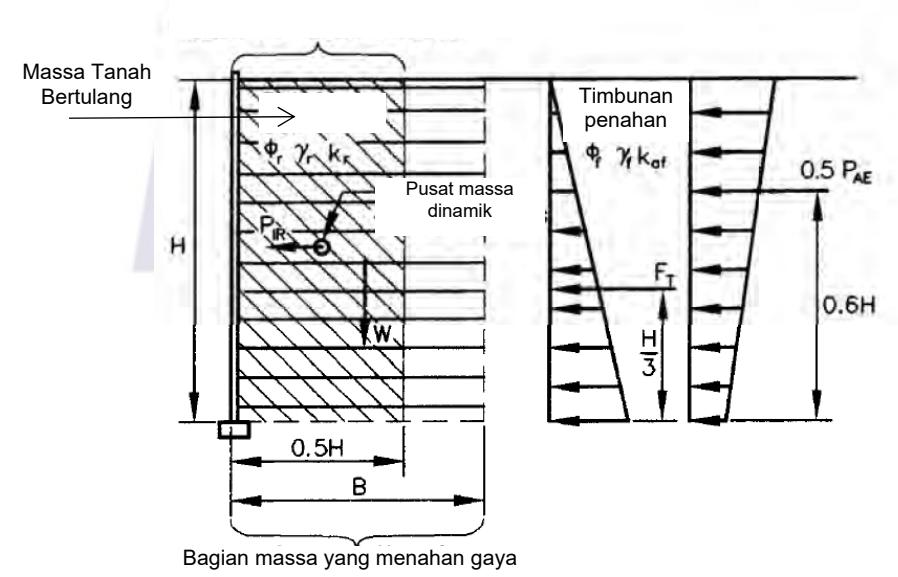

Gambar 13 - Stabilitas eksternal dinding penahan terstabilisasi mekanik untuk timbunan datar

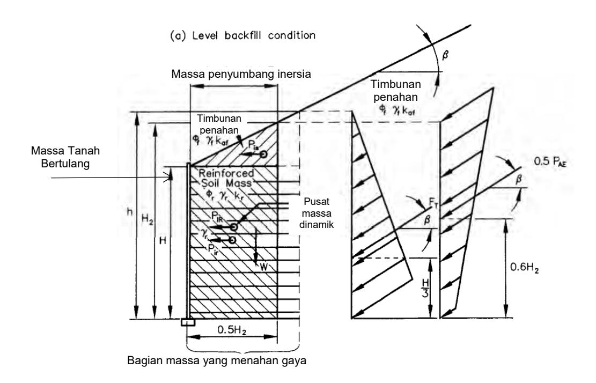

Gambar 14 - Stabilitas eksternal dinding penahan terstabilisasi mekanik untuk timbunan miring

#### 9.5.2 Stabilitas Internal

Penulangan harus direncanakan untuk menahan gaya horizontal yang dihasilkan oleh gaya inersia internal ( $P_i$ ) dan gaya statik. Gaya inersia total ( $P_i$ ) per satuan panjang struktur dapat diperhitungkan sama dengan massa zona aktif dikalikan dengan koefisien percepatan maksimum ( $A_m$ ). Gaya inersia ini harus didistribusikan ke penulangan secara proporsional terhadap daerah tahanannya untuk beban per satuan lebar dasar dinding sebagai berikut:

$$T_{md} = \gamma P_i \frac{L_{ei}}{\sum_{i=1}^{m} (L_{ei})}$$
(69)

# Keterangan:

 $T_{md}$  adalah penambahan terfaktor gaya inersia dinamik pada lapisan ke i (kN/m)

γ adalah faktor beban untuk kondisi gempa

P, adalah gaya inersia internal akibat berat timbunan dalam zona aktif (kN/m)

 $L_{si}$  adalah panjang penulangan efektif untuk lapisan ke i (m)

Beban terfaktor total yang bekerja pada tulangan untuk beban per satuan lebar dasar dinding sebagaimana ditampilkan dalam **Gambar 15** ditentukan sebagai berikut:

$$T_{total} = T_{max} + T_{md} \tag{70}$$

#### Keterangan:

 $T_{total}$  adalah beban terfaktor total yang bekerja pada tulangan persatuan lebar dasar dinding (kN/m)

 $T_{\text{max}}$  adalah beban statik terfaktor diaplikasikan kepada penulangan (kN)

 $T_{md}$  adalah penambahan terfaktor gaya inersia dinamik pada lapisan ke i (kN/m)

Untuk putusnya penulangan geosintetik, penulangan harus direncanakan untuk menahan komponen beban statik dan dinamik yang ditentukan sebagai:

Untuk komponen statik:

$$S_{rs} \ge \frac{T_{max}R_{F}}{\phi R_{c}}$$
 (71)

Untuk komponen dinamik:

$$S_{rt} \ge \frac{T_{md}(RF_{ID})(RF_{D})}{\phi R_{c}}$$
 (72)

# Keterangan:

φ adalah faktor tahanan untuk kombinasi beban statik/gempa

 $S_{rs}$  adalah tahanan tarik tulangan ultimit yang dibutuhkan untuk menahan komponen beban statik (kN/m)

 $S_{rt}$  adalah tahanan tarik tulangan ultimit yang dibutuhkan untuk menahan komponen beban dinamik (kN/m)

R<sub>c</sub> adalah rasio cakupan tulangan

R<sub>F</sub> adalah kombinasi faktor reduksi kekuatan untuk menghitung potensi degradasi jangka panjang akibat kerusakan saat instalasi, rangkak<mark>, dan</mark> penuaan kimiawi

RF<sub>ID</sub> adalah faktor reduksi kekuatan untuk menghitung keru<mark>sakan</mark> saat instalasi terhadap tulangan (ditentukan berdasarkan pengujian produk spesifik).

RF<sub>D</sub> adalah faktor reduksi kekuatan untuk mencegah putusnya tulangan akibat degradasi kimia dan biologis (ditentukan berdasarkan pengujian produk spesifik).

Baik nilai *RF<sub>ID</sub> maupun RF<sub>D</sub>* tidak boleh kurang dari 1,1.

Tahanan tarik ultimit yang dibutuhkan tulangan geosintetik dapat ditentukan sebagai:

$$T_{utt} = S_{rs} + S_{rt}$$
 (73)

Untuk cabut tulangan baja atau geosintetik:

$$L_{e} \ge \frac{T_{total}}{\phi(0.8F^{*}\alpha\sigma_{v}CR_{c})}$$
 (74)

#### Keterangan:

L adalah panjang tulangan dalam zona tahanan (m)

 $T_{total}$  adalah tegangan tulangan terfaktor maksimum (**Persamaan 70**) (kN/m)

 $\phi$  adalah faktor tahanan untuk cabut tulangan

*F*<sup>\*</sup> adalah faktor friksi-cabut

α adalah faktor koreksi pengaruh skala

 $\sigma_{\nu}$  adalah tegangan vertikal tidak terfaktor pada level tulangan dalam zona tahanan (kN/m²)

C adalah faktor geometri luas permukaan tulangan keseluruhan

R adalah rasio cakupan tulangan

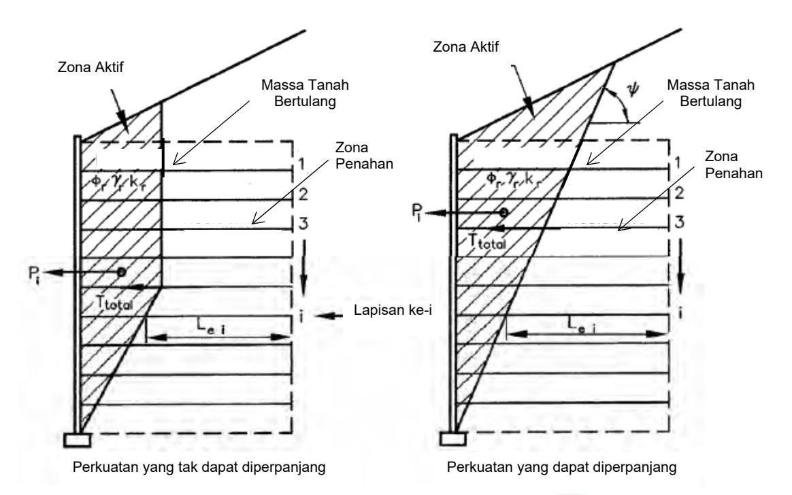

# Keterangan:

*P<sub>i</sub>* adalah gaya inersia internal akibat berat *backfill* di dalam zona aktif *L<sub>ei</sub>* adalah panjang perkuatan dalam daerah penahan dari lapisan ke-i

 $T_{max}$  adalah beban terfaktor per satuan lebar dinding yang diberikan ke setiap lapis

perkuatan akibat gaya statik

T<sub>md</sub> adalah beban terfaktor per satuan lebar dinding yang diberikan ke setiap lapis

perkuatan akibat gaya dinamik

Gambar 15 - Stabilitas internal gempa dinding penahan terstabilisasi mekanik

Untuk kondisi beban gempa, nilai  $F^*$ , faktor tahanan terhadap cabut, harus direduksi hingga 80 persen dari nilai yang digunakan untuk perencanaan statik, kecuali bila pengujian cabut dilakukan untuk secara langsung menentukan nilai  $F^*$ .

# 9.6 Tekanan Lateral akibat gempa

Tekanan tanah lateral akibat pengaruh gempa dapat dihitung dengan menggunakan pendekatan pseudostatis yang dikembangkan oleh Mononobe dan Okabe. Adapun asumsi dasar yang digunakan yaitu sebagai berikut:

- Kepala jembatan bebas berdeformasi sedemikian sehingga memberikan kondisi tekanan aktif untuk timbul. Bila kepala jembatan kaku terkekang dan tidak dapat bergerak, maka tekanan tanah yang diperoleh akan lebih besar dibandingkan dengan hasil analisis Mononobe-Okabe.
- $\bullet$  Timbunan dibelakang kepala jembatan bersifat nonkohesif dengan sudut friksi  $\phi$
- Timbunan tidak jenuh sehingga tidak ada pengaruh likuifaksi.

Kondisi kesetimbangan gaya di belakang kepala jembatan dapat dilihat pada **Gambar 16**. Formula gaya tekan tanah akibat pengaruh gempa ( $E_{AE}$ ) yaitu sebagai berikut :

$$E_{AE} = \frac{1}{2} \gamma H_t^2 (1 - k_v) K_{AE}$$
 (75)

dengan nilai koefisien tekanan aktif seismik ( $K_{AE}$ ) adalah

$$K_{AE} = \frac{\cos^2(\phi - \theta - \beta_a)}{\cos\theta \cos^2\beta_a \cos(\delta + \theta + \beta_a)} \times \left(1 + \sqrt{\frac{\sin(\delta + \phi)\sin(\phi - \theta - i)}{\cos(\delta + \theta + \beta_a)\cos(i - \beta_a)}}\right)^{-2}$$
 (76)

Selanjutnya untuk komponen tekanan tanah pasif yang cenderung mendorong tanah timbunan yaitu sebagai berikut :

$$E_{PE} = \frac{1}{2} \gamma H_t^2 (1 - k_v) K_{PE}$$
 (77)

dengan nilai koefisien tekanan pasif seismik ( $K_{PE}$ ) adalah

$$K_{PE} = \frac{\cos^2(\phi - \theta + \beta_a)}{\cos\theta\cos^2\beta_a\cos(\delta + \theta - \beta_a)} \times \left(1 + \sqrt{\frac{\sin(\delta + \phi)\sin(\phi - \theta + i)}{\cos(\delta + \theta - \beta_a)\cos(i - \beta_a)}}\right)^{-2}$$
 (78)

# Keterangan:

 $\gamma$  adalah berat jenis tanah (kN/m³)

 $H_t$  adalah tinggi tanah (m)

 $\phi$  adalah sudut geser internal tanah (°)

 $\theta = \arctan(k_h/(1-k_v))$  (°)

 $\delta$  adalah sudut geser diantara tanah dan kepala jembatan (°)

K<sub>h</sub> adalah koefisien percepatan horizontal

 $K_{\nu}$  adalah koefisien percepatan vertical (umunya diambil 0)

i adalah sudut kemiringan timbunan (°)

 $\beta_{\rm \it a}$  adalah kemiringan dinding kepala jembatan terhadap bidang vertikal (°)

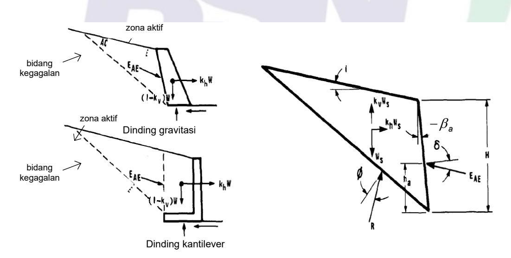

Gambar 16 - Diagram keseimbangan gaya pada dinding penahan tanah/kepala jembatan

Koefisien percepatan horizontal diambil dengan formulasi sebagai berikut:

$$k_{h} = 0.5 \times A_{s} \tag{79}$$

Dengan  $A_s$  adalah percepatan puncak di permukaan yang diperoleh dengan menggunakan percepatan puncak batuan dasar/PGA (**Gambar 1**) yang dikalikan dengan suatu faktor amplifikasi ( $F_{PGA}$ ). Pengaruh percepatan tanah arah vertikal dapat diabaikan.

# **10 Fondasi**

# **10.1 Fondasi telapak**

Perencanaan keadaan batas ekstrim untuk fondasi telapak harus mencakup:

- Daya dukung
- Pembatasan beban eksentris (guling)
- Geser
- Stabilitas secara keseluruhan

Untuk fondasi telapak pada tanah maupun batuan, eksentrisitas beban untuk keadaan batas ekstrim tidak melebihi batas yang diberikan. Bila beban hidup bekerja untuk mengurangi eksentrisitas keadaan batas ekstrim, *EQ* dapat diambil sebesar 0.

Perencanaan struktural fondasi telapak harus memenuhi persyaratan umum perencanaan fondasi. Untuk perencanaan struktural pada fondasi dengan beban eksentris, distribusi tegangan kontak segitiga atau trapesium berdasarkan beban terfaktor dapat digunakan untuk daya dukung fondasi telapak pada semua kondisi tanah dan batuan.

# **10.2 Fondasi tiang pancang**

Pada keadaan batas ekstrim, fondasi tiang pancang harus direncanakan untuk memiliki tahanan aksial dan lateral terfaktor yang cukup. Untuk perencanaan gempa, bila tanahnya dapat terlikuifaksi, seluruh tanah di dalam dan di atas zona likuifaksi, jika tanah terlikuifaksi, tidak boleh diperhitungkan memiliki kontribusi tahanan tekan aksial. *Downdrag* yang dihasilkan akibat likuifaksi harus diperhitungkan dan dimasukkan sebagai beban yang bekerja pada fondasi. Beban *downdrag* statik tidak boleh dikombinasikan dengan beban *downdrag* gempa akibat likuifaksi.

Fondasi tiang pancang dapat direncanakan untuk menahan gaya horizontal yang dihasilkan akibat penjalaran lateral, atau tanah yang dapat terlikuifaksi harus diperbaiki untuk mencegah likuifaksi dan penjalaran lateral. Untuk tahanan lateral fondasi tiang, parameter kurva *p-y* harus dikurangi untuk perhitungan likuifaksi. Untuk menentukan kuantitas reduksi, durasi goncangan kuat, dan kemampuan tanah untuk menghasilkan kondisi likuifaksi selama waktu goncangan kuat harus diperhitungkan.

# **10.3 Analisis gempa dan perencanaan fondasi**

# **10.4.1 Penyelidikan**

Ketidakstabilan lereng, likuifaksi, penurunan timbunan, dan peningkatan tekanan tanah lateral seringkali menjadi faktor utama yang mempengaruhi kerusakan jembatan saat gempa. Bahaya gempa ini dapat menjadi faktor perencanaan penting untuk percepatan gempa puncak melebihi 0,1*g* dan harus menjadi bagian dari investigasi situs spesifik bila kondisi situs dan level percepatan dan konsep perencanaan menganjurkan bahwa bahaya tersebut kemungkinan sangat penting untuk diperhitungkan.

# **10.4.2 Perencanaan Fondasi**

Pada umumnya, perencanaan gempa pada fondasi menggunakan pendekatan pseudostatik, dimana beban fondasi akibat gempa ditentukan dari gaya reaksi dan momen yang diperlukan untuk kesetimbangan struktur. Walaupun pendekatan perencanaan kapasitas dukung tradisional juga digunakan, dengan faktor reduksi kapasitas yang sesuai bila diinginkan batas keamanan terhadap keruntuhan, beberapa faktor yang terkait dengan sifat dasar dinamik beban gempa harus diperhitungkan. Terhadap beban siklik pada frekuensi gempa, kekuatan yang dapat dimobilisasi oleh tanah lebih besar dibandingkan kekuatan statik. Untuk tanah non kohesif tidak jenuh, peningkatan bisa sekitar sepuluh persen, sedangkan untuk tanah kohesif peningkatan 50 persen dapat terjadi. Namun, untuk lempung lunak jenuh air dan pasir jenuh, potensi untuk degradasi kekuatan dan kekakuan dibawah beban siklik berulang juga harus diketahui. Untuk jembatan yang berada di zona gempa 2, penggunaan kekuatan tanah statik untuk mengevaluasi kapasitas fondasi ultimit memberikan angka keamanan yang kecil, dan dalam kebanyakan kasus degradasi kekuatan dan kekakuan akibat beban berulang tidak akan menjadi masalah karena magnitudo gempa yang lebih kecil. Namun, untuk jembatan pada zona 3 dan 4, beberapa perhatian harus diberikan terhadap potensi degradasi kekakuan dan kekuatan pada tanah ketika mengevaluasi kapasitas ultimit fondasi untuk perencanaan gempa.

Beban gempa pada dasarnya bersifat sementara, kegagalan tanah untuk jangka pendek selama beban siklik dapat diabaikan. Yang perlu diperhatikan adalah besaran simpangan siklik fondasi atau rotasi yang berkaitan dengan kegagalan tanah, karena ini dapat berpengaruh dalam pergeseran struktur atau momen lentur dan distribusi geser pada kolom dan bagian lain. Karena pengaruh kesesuaian fondasi distribusi gaya atau momen pada struktur dan pengaruh perhitungan dari periode alami, faktor kekakuan ekuivalen untuk sistem fondasi sangat dibutuhkan. Umumnya, penggunaan berbagai solusi analitis yang ada untuk telapak atau tiang dimana diasumsikan bahwa tanah berperilaku elastik sedang. Dalam menggunakan formula ini, harus diketahui bahwa modulus elastik ekuivalen tanah merupakan fungsi amplitudo regangan, dan untuk beban gempa nilai modulus dapat secara signifikan kurang dari yang seharusnya untuk beban gempa tingkat rendah. Variasi modulus geser dengan amplitudo regangan geser dalam pasir ditunjukkan dalam **Gambar 17**.

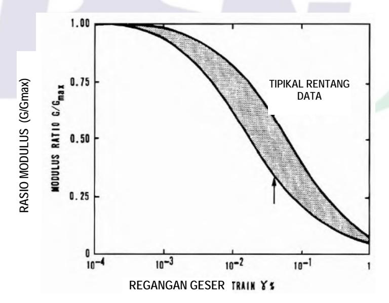

**Gambar 17 - Diagram rasio modulus geser vs regangan geser pasir**

# **Lampiran A (normatif) Bagan alir perancangan jembatan terhadap beban gempa**

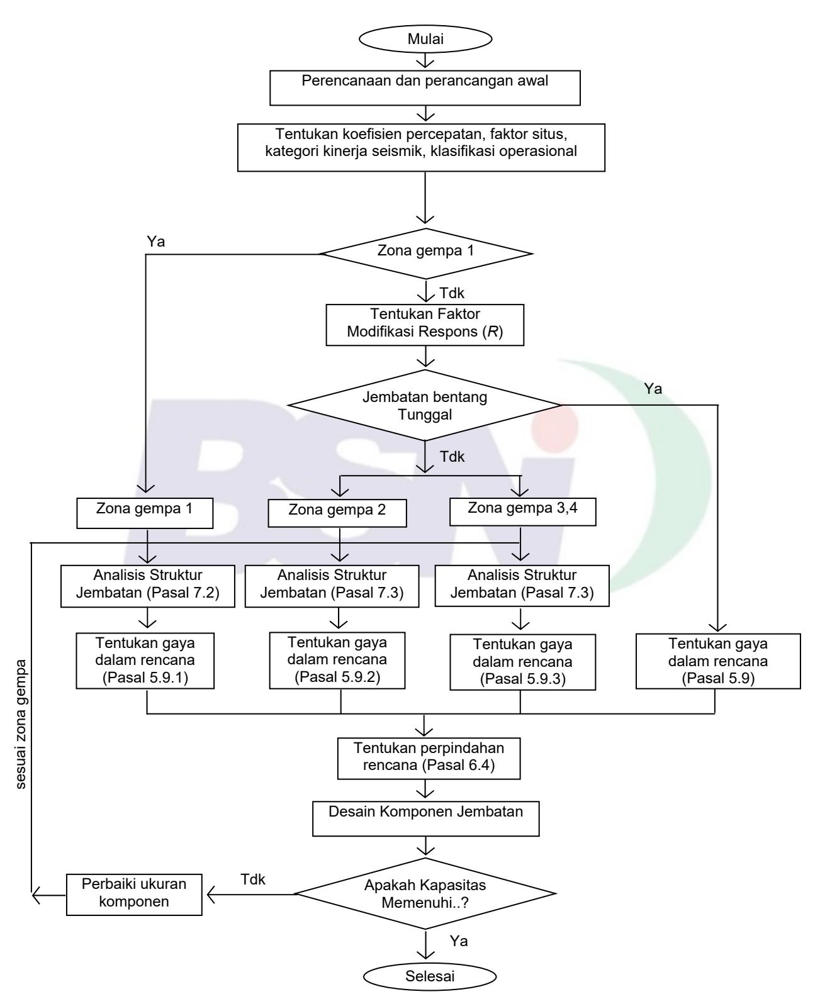

**Gambar 18 - Bagan alir perancangan jembatan terhadap beban gempa** 

**© BSN 2016 57 dari 60**

# Lampiran B (normatif)

# Penggunaan metode spektra moda tunggal dan metode beban merata

- a. Metode spektra moda tunggal (Single Mode Spectral Method)
- 1. Hitung perpindahan statik  $V_s(x)$  akibat beban merata  $p_o$  seperti pada dan .

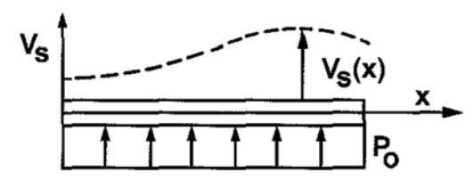

Gambar 19 - Tampak atas, pembebanan melintang

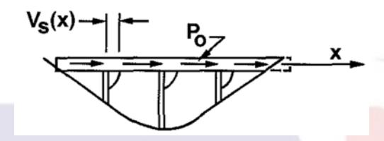

Gambar 20 - Tampak memanjang, pembebanan longitudinal

2. Hitung faktor  $\alpha$ ,  $\beta$ , dan  $\gamma$  dengan menggunakan formula

$$\alpha = \int v_s(x) dx \tag{80}$$

$$\beta = \int W(x)v_s(x)dx \tag{81}$$

$$\gamma = \int W(x) V_s^2(x) dx \tag{82}$$

#### Keterangan:

 $p_0$  adalah beban merata sama dengan 1 (kN/mm)

 $v_s(x)$  adalah deformasi akibat  $p_0$  (mm)

w(x) adalah beban mati tidak terfaktor pada bangunan atas dan bangunan bawah (kN/mm)

 $\alpha$ ,  $\beta$ , dan  $\gamma$  hasil perhitungan memiliki unit (m<sup>2</sup>), (kN.mm), dan (kN.mm<sup>2</sup>).

3. Hitung periode alami jembatan sebagai

$$T_f = 2\pi \sqrt{\frac{\gamma}{\rho_o g \alpha}} \tag{83}$$

#### Keterangan:

g adalah gravitasi (m/dtk2)

- 4. Dengan menggunakan periode alami jembatan ( $T_f$ ) dan spectrum yang sesuai tentukan koefisien respons gempa elastis.
- 5. Hitung gaya gempa statik ekuivalen  $p_e(x)$  sebagai :

$$\rho_e(x) = \frac{\beta C}{\gamma} w(x) v_s(x)$$
 (84)

# Keterangan:

 $p_e(x)$  adalah gaya gempa statik ekuivalen yang mewakili ragam getar C adalah koefisien respons gempa elastis

- 6. Masukkan beban gempa statik ekuivalen  $p_e(x)$  dan hitung gaya-gaya yang terjadi.
- b. Metode beban merata (Uniform Load Method)
- 1. Hitung perpindahan statik  $V_s(x)$  akibat beban merata  $p_o$  seperti pada dan .
- 2. Hitung kekakuan lateral jembatan (K) dan total berat (W) dengan menggunakan formula sebagai berikut:

$$K = \frac{\rho_o L}{v_s \max}$$
 (85)

$$W = \int w(x)dx \tag{86}$$

# Keterangan:

L adalah panjang total jembatan (m)

 $V_s$ , max adalah nilai maksimum  $V_s$  (m)

 w(x) adalah beban mati tidak terfaktor pada bangunan atas dan bangunan bawah (N/mm)

3. Hitung periode alami dengan menggunakan ekspresi:

$$T_f = 2\pi \sqrt{\frac{W}{qK}} \tag{87}$$

# Keterangan:

a : gravitasi (m/dtk²)

4. Hitung gaya gempa statik ekuivalen p<sub>e</sub> sebagai :

$$P_e = \frac{CW}{I}$$
 (88)

#### Keterangan:

p<sub>e</sub> adalah gaya gempa statik ekuivalen yang mewakili ragam getar (N/mm)

C adalah koefisien respons gempa elastis

# **Bibliografi**

- 1. *AASHTO Guide Specification for LRFD Seismic Bridge Design, 2nd Edition, 2011*
- 2. *CALTRANS 2010, Seismic Design Criteria Version 1.6*
- 3. Peta Gempa Indonesia 2010 sebagai acuan dasar perencanaan dan perancangan infrastruktur tahan gempa, Kementerian PU, 2010
- 4. SNI-03-2833-2008, Tata Cara Perencanaan Ketahanan Gempa untuk Jembatan
- 5. *Overseas Coastal Development Institute* (OCDI), 2002
- 6. SNI 1725:2016, Pembebanan untuk jembatan


# **Informasi Pendukung Terkait Perumusan Standar**

# **[1] Komtek/SubKomtek perumus SNI**

Sub Komite Teknis 91-01-S2, *Rekayasa Jalan dan Jembatan*

# **[2] Susunan keanggotaan Komtek perumus SNI**

Ketua : Ir. Herry Vaza, M.Eng.Sc

Sekretaris : Dr. Ir. Nyoman Suaryana, M.Sc

Anggota : 1. Prof. Dr.Ir. M. Sjahdanulirwan, M.Sc

2. Ir. Abinhot Sihotang, MT

3. Prof. Dr. Ir. Raden Anwar Yamin, MT, ME

4. Ir. Theresia Widia Liestiani

5. Dr. Hindra Mulya

6. Ir. Samun Haris, MT

7. Dr. Imam Aschury

# **CATATAN:**

Susunan keanggotaan Sub Komtek 91-01-S2 diatas adalah pada saat Standar ini ditetapkan. Anggota Komtek yang juga turut menyusun sebelum perubahan keanggotaan, adalah:

- 1. Ir. Nandang Syamsudin, MT (Sekretaris)
- 2. Prof. Ir. Wimpy Santosa, Ph.D
- 3. Ir. Gompul Dairi, BRE, M.Sc

# **[3] Konseptor rancangan SNI**

| Nama                            | Lembaga                          |
|---------------------------------|----------------------------------|
| Winarputro Adi Riyono, ST., MT. | Pusat Litbang Jalan dan Jembatan |
| Fahmi Aldiamar, ST., MT.        | Pusat Litbang Jalan dan Jembatan |
| Almuhitsyah, ST., MT.           | Pusat Litbang Jalan dan Jembatan |

# **[4] Sekretariat pengelola Komtek perumus SNI**

Pusat Penelitian dan Pengembangan Jalan dan Jembatan, Badan Penelitian dan Pengembangan Kementerian Pekerjaan Umum dan Perumahan Rakyat.


# **Badan Standardisasi Nasional**

Gedung I BPPT – Jl. M.H. Thamrin 8 - Kebon sirih Jakarta Pusat